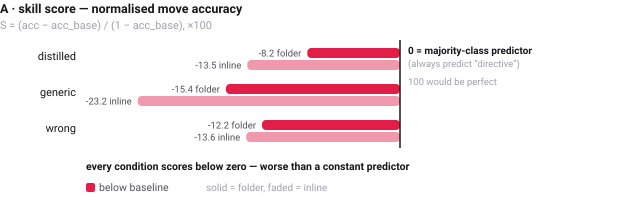
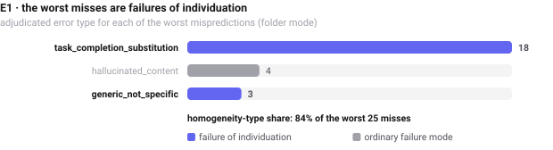
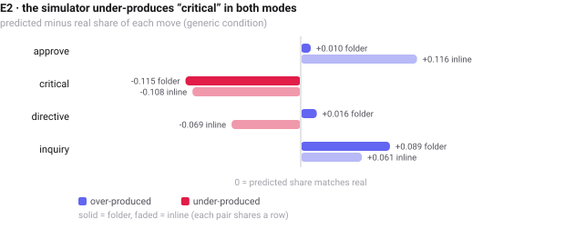
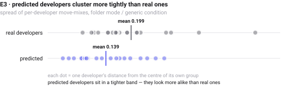
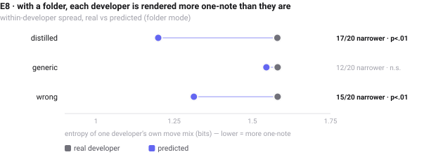
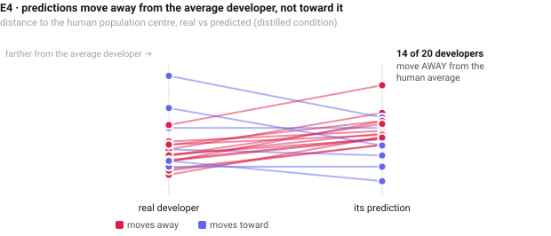
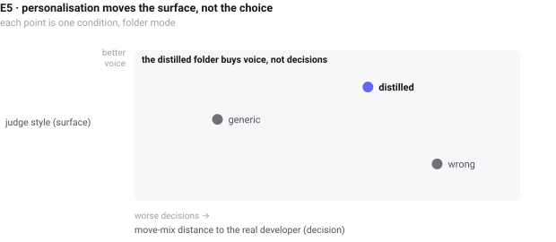

<!--
EDITABLE SOURCE. This file is written by hand, not regenerated by the pipeline — your edits to
structure and wording are safe. It is a sibling of the generated outputs, not their source:

  analysis/misprediction.html          generated by scripts/misprediction_report_html.py
  web/app/misprediction/page.tsx       the deployed site page
  analysis/misprediction-report.md     <- this file, for editing structure and content

Numbers below are from the run of 2026-07-19 (20 developers). If you re-run the pipeline, they
need updating here by hand — or ask me to wire this file in as the prose source so there is one
source of truth. Figures are the same SVGs the HTML/site use, exported to analysis/figs/.
-->

# Diagnosing Misprediction Patterns

**Hypothesis.** LLMs are trained to complete tasks, not to imitate humans. So they are
systematically homogeneous, defaulting to task-driving behaviour instead of deciding from an
individual developer's differences. The consequence is that the prediction of LLMs would be
very similar for different users, and even for one developer the prediction will not as spreaded
out as the real one.

**Data.** 20 developers · 1.5k move-labelled held-out points,
drawn from the in-repo `tasks/` cohort.

**Folder mode**  where the agent reads `users/<slug>/` itself
**inline mode** pastes the folder into the prompt

---

## Metrics

Every experiment is expressed in one of three families. Naming them makes it explicit what each
claim measures — and they can disagree.

- **A · individual-level accuracy** — per held-out point, does the predicted *move* equal the real
  move? Reported as a **skill score** `S = (acc − acc_base) / (1 − acc_base) × 100`, normalised
  against the majority-class predictor: **0** = no better than always guessing the most common move,
  **100** = perfect, **negative** = worse than that constant predictor. (Same construction as
  Cohen's kappa and the Murphy/Brier skill score, with the majority-class rate as the reference
  instead of chance agreement.) Raw accuracy is *not* comparable across cohorts with different class
  balance; skill is.
- **B · population-level distribution** — total-variation distance (TVD) between two move
  *distributions*: between two developers, between one developer and their own prediction, or
  between the whole real population and the whole predicted population. Says nothing about any
  individual turn.
- **C · LLM-as-a-judge** — a judge scores each predicted message against the real one for *style*
  (surface voice) and *content* (intent/substance), plus realism.

### Metric A, measured

Baseline = always predict `directive` (.506 folder / .512 inline).

| condition | folder skill | folder acc | inline skill | inline acc |
|---|---:|---:|---:|---:|
| distilled | **−8.2** | 0.465 | **−13.5** | 0.446 |
| generic | **−15.4** | 0.430 | **−23.2** | 0.399 |
| wrong | **−12.2** | 0.445 | **−13.6** | 0.446 |

Every condition scores below zero: the simulator predicts the next move *worse than a constant
predictor*. Skill also exposes a gap raw accuracy hid — folder-distilled (.465) and inline-wrong
(.446) look close on accuracy but are −8.2 vs −13.6 on skill.



---

## Scoreboard — which claims survived?

| claim | family | prediction if the hypothesis is TRUE | folder | inline | verdict |
|---|---|---|---|---|---|
| **E1** | A+C | worst misses are task-completion / generic substitution | 84% | 80% | **supported** |
| **H1 · E2** | B | approve% pred > real and critical% pred < real | approve +0.010, critical −0.115 | approve +0.116, critical −0.108 | **mixed** |
| **H2 · E3** | B | between-user spread(pred) < spread(real) | 0.200 vs 0.280 (p=.012) | 0.259 vs 0.283 (p=.41) | **supported** |
| **H4 · E8** | B | within a developer, spread(pred) < spread(real) | −0.381 bits, 17/20 (p=.0002) | −0.139 bits, 13/20 (p=.099) | **supported** |
| **H3 · E4** | B | dist(pred, median) < dist(real, median) | Δ +0.054 (p=.039) | Δ +0.088 (p=.003) | **refuted** |
| **E5** | B+C | folder changes the voice but not the decision | surface_only | flat | **supported** |
| **E6** | A+B | claims survive the underdetermined-point control | — | — | *not run* |
| **E7** | B | low-prompt / move-conditioned arms restore variance | — | — | *not run* |

**What it adds up to.** The simulator really is homogeneous — it compresses distinct developers into
a narrow band of behaviour (H2) and its worst errors are task-completion substitutions (E1). But the
mechanism is *not* the one H3 proposed: predictions do not shrink toward the average human, they
cluster around the **model's own attractor**, which sits **0.106 TVD** (folder) / **0.151** (inline)
away from the real developer average. The collapse also happens *within* each developer (E8): given
any folder, right or wrong, a developer is rendered as a narrower version of themselves.
Personalisation moves the voice, not the decision (E5).

---

## Method

Each held-out point carries the real next message plus a simulated one under three conditions:
**distilled** (the user's own folder), **generic** (no folder) and **wrong** (a different user's
folder). Every message is labelled with a conversational **move**, folded to four categories:
`approve` (accept) · `critical` (assert something is wrong) · `directive` (say what to do next) ·
`inquiry` (ask for an answer).

The hypothesis has two separable consequences, tested separately:

- **H2 — between-developer collapse** (E3). Predicted move-mixes are more alike across developers
  than real ones.
- **H4 — within-developer collapse** (E8). For a single developer, the predicted behaviour is less
  varied than their real behaviour.

Two secondary claims come along with it:

- **H1 — central attractor** (E2). Predictions over-produce approve/directive and under-produce
  critical/inquiry. Prompt-sensitive: folder mode is explicitly told not to default to approving, so
  this is only cleanly testable on a low-prompt arm.
- **H3 — regression to the median** (E4). Each developer's predicted mix sits closer to the
  population average than their real mix does.

---

## E1 · worst mispredictions  <sup>metric A+C</sup>

Misses are ranked by move mismatch (A) weighted by low judge-realism (C), then an adjudicator labels
each with one error type. The two marked **homogeneity** indicate a failure of *individuation* — the
prediction is reasonable for *some* developer, just not this one.

- **task_completion_substitution** `homogeneity` — predicted a keep-going / approve / new-task move
  where the real developer pushed back, interrupted, or redirected
- **generic_not_specific** `homogeneity` — the right *kind* of move, but not how *this* developer
  would have made it
- **hallucinated_content** — invents facts or requests not grounded in the session
- **underdetermined** — both messages equally plausible; the real one was genuinely unpredictable
- **other** — anything else

| error type | folder | inline |
|---|---:|---:|
| task_completion_substitution | 18 | 20 |
| hallucinated_content | 4 | 5 |
| generic_not_specific | 3 | — |
| **homogeneity share** | **84%** | **80%** |



Representative misses (folder):

| developer | real message | predicted |
|---|---|---|
| KeKs0r | *"actually we have not yet released anything. I am tempted to manually wipe the db…"* (inquiry) | *"commit, push and create a PR, merge when passed"* (directive) |
| 135yshr | *"create pr"* (directive) | *"わかりました"* (approve) |
| hutusi | *"A few more issues I'm noticing: Profile ownership is ambiguous in the UI…"* (critical) | *"ok"* (approve) |

---

## E2 · marginal skew  <sup>metric B</sup>

Whole real population's move distribution vs the whole predicted one (generic condition). Predicted
minus real share:

| move | folder | inline |
|---|---:|---:|
| approve | +0.010 | **+0.116** |
| critical | **−0.115** | **−0.108** |
| directive | +0.016 | −0.069 |
| inquiry | +0.089 | +0.061 |

Under-producing `critical` — the move where a developer asserts something is wrong — is the
consistent signature in both modes. The clean approve-collapse H1 predicted appears only on
**inline**, the low-prompt arm; folder mode is told not to default to approving, so that mass
diverts to `inquiry` instead.



---

## E3 · between-developer collapse  <sup>metric B — primary</sup>

Mean pairwise TVD between *developers'* move distributions, predicted vs real. The hypothesis
predicts a **narrower** predicted spread.

| condition | users | spread real | spread pred | Δ | perm p | collapse? |
|---|---:|---:|---:|---:|---:|---|
| distilled | 20 | 0.279 | 0.244 | −0.036 | .354 | ✓ |
| generic | 20 | 0.280 | 0.200 | **−0.081** | **.012** | ✓ |
| wrong | 20 | 0.279 | 0.255 | −0.024 | .502 | ✓ |

All three conditions collapse; generic — no individuation at all — is significant. Inline masks the
effect: pasting the folder in makes the model echo signature catchphrases verbatim, which inflates
apparent between-developer distinctiveness.



---

## E8 · within-developer collapse  <sup>metric B — primary</sup>

Entropy of each developer's own move mix (bits, max 2.0 over four categories), real vs predicted.
Lower entropy = more one-note. This is the second half of the hypothesis: not just that developers
resemble each other, but that each one is rendered flatter than they actually are.

| condition | users | entropy real | entropy pred | Δ | narrower for | wilcoxon p |
|---|---:|---:|---:|---:|---:|---:|
| distilled | 20 | 1.580 | **1.199** | **−0.381** | **17/20** | **.0002** |
| generic | 20 | 1.581 | 1.545 | −0.036 | 12/20 | .396 |
| wrong | 20 | 1.581 | 1.313 | −0.267 | 15/20 | **.004** |

**Confirmed, and it is the folder that causes it.** Without a folder (generic) the predicted spread
is essentially the real one. Give the simulator *any* folder — the right one or the wrong one — and
each developer collapses to a narrower repertoire. Personalisation does not make the simulation more
faithful; it makes it more of a caricature.



---

## E4 · regression to the median  <sup>metric B</sup>

TVD from each developer's distribution to the population-average distribution, real vs predicted.

| condition | users | dist→median real | dist→median pred | Δ | wilcoxon p | shrinks? |
|---|---:|---:|---:|---:|---:|---|
| distilled | 20 | 0.197 | 0.251 | **+0.054** | **.039** | ✗ |
| generic | 20 | 0.199 | 0.186 | −0.013 | .627 | ✓ (n.s.) |
| wrong | 20 | 0.198 | 0.253 | **+0.054** | **.036** | ✗ |

**Refuted, significantly in the opposite direction.** With a folder, predictions sit *farther* from
the real population average than the developers themselves do — 14 of 20 move away. The collapse is
not toward the human mean; it is toward the model's own attractor, which sits **0.106 TVD** (folder)
/ **0.151** (inline) away from that mean.



---

## E5 · decision vs. surface  <sup>metric B+C</sup>

Per-developer TVD (own distribution vs own prediction) set against the judge's style/content scores.

| condition | move dist→real | judge style | judge realism | judge content |
|---|---:|---:|---:|---:|
| distilled | 0.251 | **38.4** | 34.3 | 31.0 |
| generic | **0.215** | 36.6 | 38.7 | 31.8 |
| wrong | 0.268 | 34.2 | 31.3 | 29.1 |

Verdict: **surface_only** (folder) / **flat** (inline). The distilled folder *raises* judge-style
(38.4 vs 36.6) while its move-mix distance to the real developer gets **worse** than the no-folder
baseline (0.251 vs 0.215). It buys voice, not decisions.



---

## Folder vs inline

| mode | E3 spread (pred vs real) | perm p | E8 Δ entropy | E5 verdict | E1 homogeneity |
|---|---:|---:|---:|---|---:|
| folder | 0.200 vs 0.280 | **.012** | **−0.381** | surface_only | 84% |
| inline | 0.259 vs 0.283 | .415 | −0.139 | flat | 80% |

The two modes disagree on E3 and agree everywhere else. Inline reproduces signature catchphrases
verbatim, which inflates apparent between-developer distinctiveness and masks the collapse — yet E4
shows that distinctiveness points *away* from the real developer, and its worst misses are just as
homogeneity-driven.

---

## Still to run

- **E6 — underdetermination control** *(A+B)*. Resample the generic simulator k× per point, drop
  high-entropy (genuinely unpredictable) points, re-run the distribution tests. They should survive
  on the determined subset — that separates homogeneity from a low prediction ceiling.
- **E7 — causal probe** *(B)*. Compare (i) default, (ii) an explicit "imitate THIS human, do not
  optimise the task" instruction, and (iii) move-conditioned sampling from the user's real prior
  (`validate.py --move-conditioned`). If (ii)/(iii) restore critical% and between-developer
  variance, the homogeneity is a prompt/objective artifact, not a capability ceiling.

## Limitations

- **20 developers.** The cohort is the intersection of the in-repo `tasks/` held-out set (68 devs)
  and the distilled folders in `users/` (99). E3/E4/E8 significance rests on n=20.
- **Move labels are LLM-assigned** (`taxonomy.classify`, Haiku), not human-adjudicated; the four-way
  taxonomy is itself a modelling choice.
- **E1 adjudication is n=25 per mode** — indicative of the error *mix*, not a precise rate.
- **Judge scores are Haiku**; a stronger judge would sharpen the C-family numbers.
- **E8 entropy is computed over ~25 labelled points per developer**, so per-developer estimates are
  noisy; the paired test across 20 developers is the reliable part.

## Reproduce

```bash
python3 scripts/validate_tasks.py --folder-devs-only --mode folder   # generate + score
python3 scripts/misprediction.py --results results/validation_tasks_folder.json --adjudicate
python3 scripts/misprediction_report_html.py                          # -> analysis/misprediction.html
```
