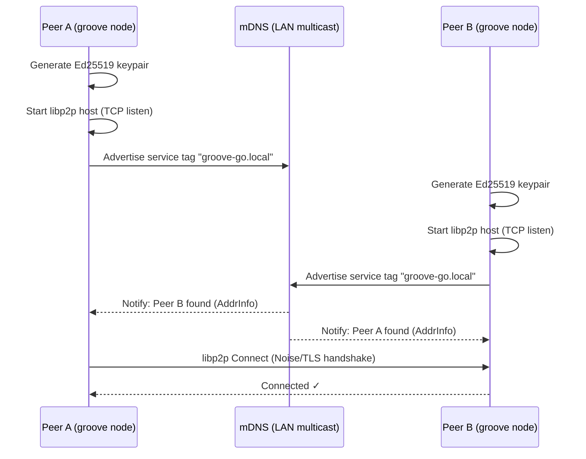

> DEVELOPER

Can you make a plan for modifying adding extra features for AnyType Selfhosting to give it the functionaly from GrooveGo? Please add the AnyTpe folder at home/rob/Documents/Safecast/AnyType-VPS and the AnyType repo to the data to be used. 

What Anytype Still Lacks Compared to Groove
1- Deep trust graph (peer/org/federated)
2- True shared workspace semantics
3- Programmable collaborative tools layer
4- Integrated communication primitives
5- Explicit peer consensus model

> AGENT

I'll create a plan for adding GrooveGo-like features to AnyType Self-hosting. Let me first explore both the AnyType-VPS folder and refresh my understanding of GrooveGo.

> TOOL

tool_use Bash
id: toolu_0184EFXDjg7f4rXXCk4yBdfo
```json
{
  "command": "ls -la /home/rob/Documents/Safecast/AnyType-VPS/ 2>/dev/null && echo \"---\" && ls /home/rob/Documents/Safecast/GrooveGO/ 2>/dev/null",
  "description": "Check AnyType-VPS and GrooveGO directories"
}
```

> TOOL

tool_result
id: toolu_0184EFXDjg7f4rXXCk4yBdfo
```
total 48
drwxrwxr-x  3 rob rob  4096 Feb 20 08:26 .
drwxrwxr-x 47 rob rob  4096 Mar 30 07:08 ..
-rw-rw-r--  1 rob rob  1773 Feb 19 19:27 Anytype + Claude MCP Setup (Self-Hosted).md
-rw-rw-r--  1 rob rob  6966 Feb 19 19:27 anytype-selfhosting-guide.md
-rw-rw-r--  1 rob rob 14532 Feb 19 21:30 anytype-setup-complete.md
drwxrwxr-x  9 rob rob  4096 Feb 19 22:19 .git
-rw-rw-r--  1 rob rob  6680 Feb 19 21:31 README.md
---
ARCHITECTURE.md
diagrams
groove-go
GrooveGO.code-workspace
GrooveGO V2.md
GrooveGO V2.pdf
README.md
```

> TOOL

tool_use Read
id: toolu_01VqcpY5qb2P2oqTFL7MvnUM
```json
{
  "file_path": "/home/rob/.claude/projects/-home-rob-Documents-Safecast-GrooveGO/memory/project_groovego.md"
}
```

> TOOL

tool_result
id: toolu_01VqcpY5qb2P2oqTFL7MvnUM
```
<system-reminder>This memory is 27 days old. Memories are point-in-time observations, not live state — claims about code behavior or file:line citations may be outdated. Verify against current code before asserting as fact.</system-reminder>
1	---
2	name: GrooveGO Project Plan
3	description: Architecture and incremental build plan for GrooveGO — a P2P collaboration platform in Go inspired by Microsoft Groove
4	type: project
5	---
6	
7	GrooveGO lives at `/home/rob/Documents/Safecast/GrooveGO/groove-go/` (module: `github.com/safecast/groove-go`).
8	
9	## Vision
10	Decentralized P2P groupware (shared workspaces, real-time sync, offline capability, presence, E2E encryption) — no central server for core functionality. Inspired by Microsoft Groove. Built in Go using libp2p.
11	
12	## Incremental Build Phases
13	
14	| Phase | Status | What |
15	|-------|--------|------|
16	| 1 | ✅ Done | Boot libp2p node + mDNS LAN discovery (`internal/node`) |
17	| 2 | pending | GossipSub pubsub — text messages between peers in a workspace topic |
18	| 3 | pending | Persistence — Badger/SQLite local store, replay on reconnect |
19	| 4 | pending | CRDT documents — shared editable state (Automerge-go) |
20	| 5 | pending | Workspace concept — membership, invitations, […]

> TOOL

tool_use Read
id: toolu_013QcEG1ovnzwkTnqys4ESt3
```json
{
  "file_path": "/home/rob/Documents/Safecast/AnyType-VPS/README.md"
}
```

> TOOL

tool_result
id: toolu_013QcEG1ovnzwkTnqys4ESt3
```
1	# Anytype Self-Hosted Server
2	
3	A complete guide to setting up a self-hosted Anytype sync server on a VPS using [any-sync-bundle](https://github.com/grishy/any-sync-bundle).
4	
5	---
6	
7	## 🎯 What This Is
8	
9	This repository contains documentation and configuration for running a **self-hosted Anytype sync server** - a local-first, privacy-focused alternative to Notion with your own data storage.
10	
11	### Benefits of Self-Hosting
12	
13	- ✅ **Full control** over your data
14	- ✅ **Privacy** - your data stays on your server
15	- ✅ **No vendor lock-in**
16	- ✅ **Low resource usage** (~250-300MB RAM)
17	- ✅ **Single binary** deployment with any-sync-bundle
18	
19	---
20	
21	## 📋 Prerequisites
22	
23	- **VPS**: Ubuntu 24.04+ (minimum 1GB RAM recommended)
24	- **Domain**: A domain name pointing to your VPS (optional but recommended)
25	- **SSH access**: Root or sudo access to your VPS
26	- **Open ports**: TCP 33010, UDP 33020
27	
28	---
29	
30	## 🚀 Quick Start
31	
32	### 1. Clone and Review Documentation
33	
34	```bash
35	git clone <your-repo-url>
36	cd AnyType-VPS
37	cat anytype-setup-complete.md
38	```
39	
40	### 2. Set Up […]

> TOOL

tool_use Read
id: toolu_01M36UfRPLmYqWn5W1yJXBRV
```json
{
  "file_path": "/home/rob/Documents/Safecast/AnyType-VPS/anytype-selfhosting-guide.md"
}
```

> TOOL

tool_result
id: toolu_01M36UfRPLmYqWn5W1yJXBRV
```
1	# Anytype Self-Hosting Guide (No Docker)
2	
3	A step-by-step plan for setting up an Anytype self-hosted sync server on a VPS using the `any-sync-bundle` binary, without Docker.
4	
5	---
6	
7	## Prerequisites
8	
9	- A VPS running Ubuntu 22.04 or Debian 12 (minimum 1GB RAM recommended)
10	- A public IP address or domain name pointing to the VPS
11	- Root or sudo access
12	- Ports available: `33010/tcp`, `33020/udp`, `33030/tcp`, `33060/tcp`, `33080/tcp`
13	
14	---
15	
16	## Step 1 — Update the System
17	
18	```bash
19	sudo apt update && sudo apt upgrade -y
20	```
21	
22	---
23	
24	## Step 2 — Install MongoDB
25	
26	Anytype uses MongoDB as its primary data store.
27	
28	```bash
29	curl -fsSL https://www.mongodb.org/static/pgp/server-7.0.asc | \
30	  sudo gpg --dearmor -o /usr/share/keyrings/mongodb-server-7.0.gpg
31	
32	echo "deb [ arch=amd64,arm64 signed-by=/usr/share/keyrings/mongodb-server-7.0.gpg ] \
33	  https://repo.mongodb.org/apt/ubuntu jammy/mongodb-org/7.0 multiverse" | \
34	  sudo tee /etc/apt/sources.list.d/mongodb-org-7.0.list
35	
36	sudo apt update
37	sudo apt install -y mongodb-org
38	sudo systemctl enable --now mongod
39	```
40	
41	Verify it is running:
42	
43	```bash
44	sudo systemctl status mongod
45	```
46 […]

> TOOL

tool_use Read
id: toolu_017kjWqiXbnGXE7GSwVMRsjm
```json
{
  "file_path": "/home/rob/Documents/Safecast/AnyType-VPS/anytype-setup-complete.md"
}
```

> TOOL

tool_result
id: toolu_017kjWqiXbnGXE7GSwVMRsjm
```
1	# Anytype Self-Hosted Server Setup - Complete
2	
3	**Server:** simplemap.safecast.org (65.108.24.131)  
4	**Date:** February 19, 2026  
5	**Status:** ✅ **COMPLETE AND WORKING**
6	
7	---
8	
9	## Summary
10	
11	Successfully set up an Anytype self-hosted sync server on Ubuntu 24.04 VPS using:
12	- **any-sync-bundle** v1.3.1-2026-02-16
13	- **MongoDB** 7.0 (with replica set)
14	- **RedisStack** 7.4 (with Bloom filter module)
15	
16	---
17	
18	## Prerequisites
19	
20	- VPS: Ubuntu 24.04.4 LTS (x86_64)
21	- SSH access: `ssh root@simplemap.safecast.org`
22	- Domain: simplemap.safecast.org → 65.108.24.131
23	
24	---
25	
26	## Step-by-Step Commands Executed
27	
28	### Step 1: System Update
29	
30	```bash
31	ssh root@simplemap.safecast.org "sudo apt update && sudo apt upgrade -y"
32	```
33	
34	---
35	
36	### Step 2: Install MongoDB
37	
38	```bash
39	# Add MongoDB GPG key
40	ssh root@simplemap.safecast.org "curl -fsSL https://www.mongodb.org/static/pgp/server-7.0.asc | sudo gpg --dearmor -o /usr/share/keyrings/mongodb-server-7.0.gpg"
41	
42	# Add MongoDB repository
43	ssh root@simplemap.safecast.org "echo 'deb [ arch=amd64 signed-by=/usr/share/keyrings/mongodb-server-7.0.gpg ] https://repo.mongodb.org/apt/ubuntu jammy/mongodb-org/7.0 multiverse' | sudo tee /etc/apt/sources.list.d/mongodb-org-7.0.list"
44	
45	# Install MongoDB
46	ssh root@simplemap.safecast.org "sudo apt update && sudo apt install -y mongodb-org"
47	
48 […]

> TOOL

tool_use Read
id: toolu_01QMcSTZM6zBbnXnqZeTsugb
```json
{
  "file_path": "/home/rob/Documents/Safecast/AnyType-VPS/Anytype + Claude MCP Setup (Self-Hosted).md"
}
```

> TOOL

tool_result
id: toolu_01QMcSTZM6zBbnXnqZeTsugb
```
1	# Anytype + Claude MCP Setup (Self-Hosted)
2	
3	This guide covers integrating a self-hosted Anytype instance (running on a VPS) with Claude Desktop via the Model Context Protocol (MCP).
4	
5	## Prerequisites
6	
7	- **Anytype Desktop** (v0.46.0 or later) installed locally.
8	- **Node.js** installed locally (to run `npx`).
9	- **Claude Desktop** app installed.
10	- Access to your VPS `client-config.yml`.
11	
12	---
13	
14	## Step 1: Connect Local Anytype to VPS
15	
16	Anytype's API currently runs through the desktop client. You must point your local app to your self-hosted node.
17	
18	1. **Log Out** of Anytype on your computer.
19	2. On the onboarding screen, click the **Gear Icon** (top right).
20	3. Set the **Network** field to **Self-hosted**.
21	4. Upload your VPS `client-config.yml` file and click **Save**.
22	5. Log back into your identity.
23	
24	## Step 2: Generate API Key
25	
26	1. In Anytype, go to **App Settings > API Keys**.
27	2. Click **Create new**.
28	3. **Copy the Bearer Token** immediately; it will not be shown again.
29	
30	## Step 3: Configure Claude Desktop
31	
32	1. Open […]

> TOOL

tool_use Bash
id: toolu_01N51wyoaxugMfb3YFJwgBiW
```json
{
  "command": "ls /home/rob/Documents/Safecast/GrooveGO/groove-go/ 2>/dev/null && echo \"---ARCH---\" && head -100 /home/rob/Documents/Safecast/GrooveGO/ARCHITECTURE.md 2>/dev/null",
  "description": "List groove-go contents and view architecture"
}
```

> TOOL

tool_result
id: toolu_01N51wyoaxugMfb3YFJwgBiW
```
cmd
dist
go.mod
go.sum
internal
Makefile
pkg
---ARCH---
# GrooveGO — Architecture & Flow

## Phase 1 — Node Boot & LAN Discovery



## Full System — Component Interaction (All Phases)

```mermaid
flowchart TD
    subgraph Node["node (Phase 1)"]
        ID["Ed25519 Identity\n(Peer ID = pubkey hash)"]
        HOST["libp2p Host\n(TCP / QUIC / WebRTC)"]
        MDNS["mDNS Discovery\n(LAN)"]
        DHT["Kademlia DHT\n(WAN)"]
        RELAY["AutoRelay / Hole Punch\n(NAT Traversal)"]
        ID --> HOST
        HOST --> MDNS
        HOST --> DHT
        HOST --> RELAY
    end

    subgraph Transport["transport (Phase 2)"]
        PS["GossipSub PubSub"]
        DM["Direct Stream Messages"]
    end

    subgraph Store["store (Phase 3)"]
        DB["Badger / SQLite\n(local persistence)"]
        VCL["Vector Clocks\n(sync state)"]
    end

    subgraph Sync["sync (Phase 4)"]
        CRDT["Automerge CRDT\nDocuments"]
        MERGE["Conflict-Free Merge\non Reconnect"]
        CRDT --> MERGE
    end

    subgraph Workspace["workspace (Phase 5)"]
        WS["Workspace Manager\n(create / join)"]
        MEM["Membership List\n(signed invitations)"]
        SYMKEY["Symmetric Key\n(per workspace)"]
        WS --> […]