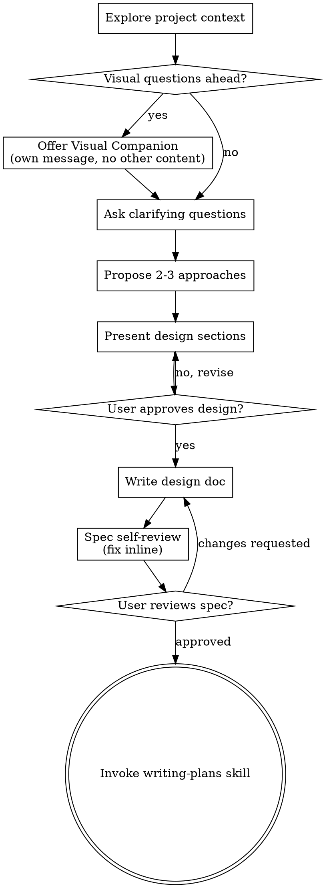

> DEVELOPER

我希望调查并且实现nvfp4-kvcache量化 fp8已经取得稳定收益 我希望更进一步

> TOOL

tool_use Skill
```json
{
  "skill": "superpowers:brainstorming"
}
```

> TOOL

tool_result Skill
```
Launching skill: superpowers:brainstorming
```

> SYSTEM

Base directory for this skill: /user_4813494d/.claude/plugins/cache/claude-plugins-official/superpowers/5.0.7/skills/brainstorming

# Brainstorming Ideas Into Designs

Help turn ideas into fully formed designs and specs through natural collaborative dialogue.

Start by understanding the current project context, then ask questions one at a time to refine the idea. Once you understand what you're building, present the design and get user approval.

<HARD-GATE>
Do NOT invoke any implementation skill, write any code, scaffold any project, or take any implementation action until you have presented a design and the user has approved it. This applies to EVERY project regardless of perceived simplicity.
</HARD-GATE>

## Anti-Pattern: "This Is Too Simple To Need A Design"

Every project goes through this process. A todo list, a single-function utility, a config change — all of them. "Simple" projects are where unexamined assumptions cause the most wasted work. The design can be short (a few sentences for truly simple projects), but you MUST present it and get approval.

## Checklist

You MUST create a task for each of these items and complete them in order:

1. **Explore project context** — check files, docs, recent commits
2. **Offer visual companion** (if topic will involve visual questions) — this is its own message, not combined with a clarifying question. See the Visual Companion section below.
3. **Ask clarifying questions** — one at a time, understand purpose/constraints/success criteria
4. **Propose 2-3 approaches** — with trade-offs and your recommendation
5. **Present design** — in sections scaled to their complexity, get user approval after each section
6. **Write design doc** — save to `docs/superpowers/specs/YYYY-MM-DD-<topic>-design.md` and commit
7. **Spec self-review** — quick inline check for placeholders, contradictions, ambiguity, scope (see below)
8. **User reviews written spec** — ask user to review the spec file before proceeding
9. **Transition to implementation** — invoke writing-plans skill to create implementation plan

## Process Flow



**The terminal state is invoking writing-plans.** Do NOT invoke frontend-design, mcp-builder, or any other implementation skill. The ONLY skill you invoke after brainstorming is writing-plans.

## The Process

**Understanding the idea:**

- Check out the current project state first (files, docs, recent commits)
- Before asking detailed questions, assess scope: if the request describes multiple independent subsystems (e.g., "build a platform with chat, file storage, billing, and analytics"), flag this immediately. Don't spend questions refining details of a project that needs to be decomposed first.
- If the project is too large for a single spec, help the user decompose into sub-projects: what are the independent pieces, how do they relate, what order should they be built? Then brainstorm the first sub-project through the normal design flow. Each sub-project gets its own spec → plan → implementation cycle.
- For appropriately-scoped projects, ask questions one at a time to refine the idea
- Prefer multiple choice questions when possible, but open-ended is fine too
- Only one question per message - if a topic needs more exploration, break it into multiple questions
- Focus on understanding: purpose, constraints, success criteria

**Exploring approaches:**

- Propose 2-3 different approaches with trade-offs
- Present options conversationally with your recommendation and reasoning
- Lead with your recommended option and explain why

**Presenting the design:**

- Once you believe you understand what you're building, present the design
- Scale each section to its complexity: a few sentences if straightforward, up to 200-300 words if nuanced
- Ask after each section whether it looks right so far
- Cover: architecture, components, data flow, error handling, testing
- Be ready to go back and clarify if something doesn't make sense

**Design for isolation and clarity:**

- Break the system into smaller units that each have one clear purpose, communicate through well-defined interfaces, and can be understood and tested independently
- For each unit, you should be able to answer: what does it do, how do you use it, and what does it depend on?
- Can someone understand what a unit does without reading its internals? Can you change the internals without breaking consumers? If not, the boundaries need work.
- Smaller, well-bounded units are also easier for you to work with - you reason better about code you can hold in context at once, and your edits are more reliable when files are focused. When a file grows large, that's often a signal that it's doing too much.

**Working in existing codebases:**

- Explore the current structure before proposing changes. Follow existing patterns.
- Where existing code has problems that affect the work (e.g., a file that's grown too large, unclear boundaries, tangled responsibilities), include targeted improvements as part of the design - the way a good developer improves code they're working in.
- Don't propose unrelated refactoring. Stay focused on what serves the current goal.

## After the Design

**Documentation:**

- Write the validated design (spec) to `docs/superpowers/specs/YYYY-MM-DD-<topic>-design.md`
  - (User preferences for spec location override this default)
- Use elements-of-style:writing-clearly-and-concisely skill if available
- Commit the design document to git

**Spec Self-Review:**
After writing the spec document, look at it with fresh eyes:

1. **Placeholder scan:** Any "TBD", "TODO", incomplete sections, or vague requirements? Fix them.
2. **Internal consistency:** Do any sections contradict each other? Does the architecture match the feature descriptions?
3. **Scope check:** Is this focused enough for a single implementation plan, or does it need decomposition?
4. **Ambiguity check:** Could any requirement be interpreted two different ways? If so, pick one and make it explicit.

Fix any issues inline. No need to re-review — just fix and move on.

**User Review Gate:**
After the spec review loop passes, ask the user to review the written spec before proceeding:

> "Spec written and committed to `<path>`. Please review it and let me know if you want to make any changes before we start writing out the implementation plan."

Wait for the user's response. If they request changes, make them and re-run the spec review loop. Only proceed once the user approves.

**Implementation:**

- Invoke the writing-plans skill to create a detailed implementation plan
- Do NOT invoke any other skill. writing-plans is the next step.

## Key Principles

- **One question at a time** - Don't overwhelm with multiple questions
- **Multiple choice preferred** - Easier to answer than open-ended when possible
- **YAGNI ruthlessly** - Remove unnecessary features from all designs
- **Explore alternatives** - Always propose 2-3 approaches before settling
- **Incremental validation** - Present design, get approval before moving on
- **Be flexible** - Go back and clarify when something doesn't make sense

## Visual Companion

A browser-based companion for showing mockups, diagrams, and visual options during brainstorming. Available as a tool — not a mode. Accepting the companion means it's available for questions that benefit from visual treatment; it does NOT mean every question goes through the browser.

**Offering the companion:** When you anticipate that upcoming questions will involve visual content (mockups, layouts, diagrams), offer it once for consent:
> "Some of what we're working on might be easier to explain if I can show it to you in a web browser. I can put together mockups, diagrams, comparisons, and other visuals as we go. This feature is still new and can be token-intensive. Want to try it? (Requires opening a local URL)"

**This offer MUST be its own message.** Do not combine it with clarifying questions, context summaries, or any other content. The message should contain ONLY the offer above and nothing else. Wait for the user's response before continuing. If they decline, proceed with text-only brainstorming.

**Per-question decision:** Even after the user accepts, decide FOR EACH QUESTION whether to use the browser or the terminal. The test: **would the user understand this better by seeing it than reading it?**

- **Use the browser** for content that IS visual — mockups, wireframes, layout comparisons, architecture diagrams, side-by-side visual designs
- **Use the terminal** for content that is text — requirements questions, conceptual choices, tradeoff lists, A/B/C/D text options, scope decisions

A question about a UI topic is not automatically a visual question. "What does personality mean in this context?" is a conceptual question — use the terminal. "Which wizard layout works better?" is a visual question — use the browser.

If they agree to the companion, read the detailed guide before proceeding:
`skills/brainstorming/visual-companion.md`

> TOOL

tool_use Read
```json
{
  "file_path": "/user_4813494d/openbmb/eval/start_eagle.sh"
}
```

> TOOL

tool_result Read
```
1	#!/usr/bin/env bash
2	set -euo pipefail
3	
4	cd /user_4813494d/openbmb
5	
6	# EAGLE-3 speculative decoding server (current production config)
7	# - spec_steps=2, topk=1, dtn=3  (chain verify, break-even accept_len ~1.15)
8	# - target: NVFP4 (GPTQ + FourOverSix), hybrid Marlin/CUTLASS decode @ threshold=48
9	# - draft:  v2 FP4_QAT, pure Marlin W4A16
10	#
11	# Env overrides:
12	#   EAGLE_SPEC_STEPS, EAGLE_TOPK, EAGLE_TARGET_MODEL, EAGLE_DRAFT_MODEL
13	#   SGLANG_MINICPM_PLAN_CACHE=0 to disable long-prompt prefill plan reuse
14	
15	SPEC_STEPS="${EAGLE_SPEC_STEPS:-2}"
16	TOPK="${EAGLE_TOPK:-2}"
17	# dtn = 1 + topk * spec_steps (tree nodes)
18	DTN=$((1 + TOPK * SPEC_STEPS))
19	TARGET_MODEL="${EAGLE_TARGET_MODEL:-/user_4813494d/models/openbmb/MiniCPM-SALA-gptq46-calib90-90k-NVFP4}"
20	DRAFT_MODEL="${EAGLE_DRAFT_MODEL:-/user_4813494d/openbmb/eagle/sglang_model}"
21	
22	EAGLE_FORCE_NO_ACCEPT="${EAGLE_FORCE_NO_ACCEPT:-0}" \
23	EAGLE_TRACE_FILE="${EAGLE_TRACE_FILE:-}" \
24	SGLANG_MARLIN_DECODE_THRESHOLD=48 \
25	SGLANG_MINICPM_PLAN_CACHE="${SGLANG_MINICPM_PLAN_CACHE:-1}" \
26	python3 -m sglang.launch_server \
27	    --model-path "${TARGET_MODEL}" \
28	    --trust-remote-code --port 30000 \
29	    --mem-fraction-static 0.75 \
30	    --max-running-requests 64 \
31	    --attention-backend minicpm_flashinfer \
32	    --chunked-prefill-size 8192 --disable-radix-cache \
33	    --skip-server-warmup \
34	    --dense-as-sparse \
35	    --quantization modelopt_fp4 \
36	    --speculative-algorithm EAGLE3 \
37	    --speculative-num-steps "${SPEC_STEPS}" \
38	    --speculative-eagle-topk "${TOPK}" \
39	    --speculative-num-draft-tokens "${DTN}" \
40	    --speculative-draft-attention-backend flashinfer \
41	    --kv-cache-dtype fp8_e5m2 \
42	    --speculative-draft-model-path "${DRAFT_MODEL}"
43
```

> TOOL

tool_use Read
```json
{
  "file_path": "/user_4813494d/openbmb/docs/README.md"
}
```

> TOOL

tool_result Read
```
1	# 文档索引
2	
3	SOAR MiniCPM-SALA 推理优化工作区的技术文档。本 README 是导航入口，项目总览与框架介绍见仓库根 [`CLAUDE.md`](../CLAUDE.md)。
4	
5	## 顶层文档
6	
7	| 文件 | 内容 |
8	|---|---|
9	| [cuda13-upgrade.md](cuda13-upgrade.md) | cu12 → cu13 升级的完整执行记录、兼容性矩阵、二进制重编路径、probe-sala 平台提交包设计 |
10	| [quantization.md](quantization.md) | NVFP4 方案、FourOverSix 算法、Hybrid Marlin/CUTLASS dispatch、Marlin 调优负结果、KV cache 量化调研 |
11	| [prefill.md](prefill.md) | 128K prompt prefill 分层热点图、周期性 2× 慢 chunk 定位、layer/chunk 间 plan 复用优化 |
12	| [runtime.md](runtime.md) | decode 期算子优化（已落地与负结果合集）、TARGET_VERIFY 终结归因、空响应问题 |
13	| [kernels-sm120.md](kernels-sm120.md) | sm_120 NVFP4 GEMM 硬件上限调研、各 GEMM 库对比、tile 空间硬件约束、b12x 后线 backend |
14	
15	## EAGLE-3 子目录
16	
17	| 文件 | 内容 |
18	|---|---|
19	| [eagle/README.md](eagle/README.md) | EAGLE-3 架构、SGLang 适配、Fused GLA、scale loader fix、tree verify 演进 |
20	| [eagle/training-v2.md](eagle/training-v2.md) | v2 训练改进（数据分布重构、AsyncPrefetcher、eval_ood 修正、vocab 覆盖） |
21	| [eagle/dflash.md](eagle/dflash.md) | 下一代 block diffusion draft 候选（调研 + 移植障碍 + MVP 路线） |
22	
23	## 惯例
24	
25	- 速度结论（e2e bench 秒级数字）不写进文档，随时可过期。需要数据时直接跑 `bench/mini_bench.sh`。
26	- 文档记录**可复现的方法**和**已验证的决策**，不记录瞬时测速结果。
27	- 负结果必须保留，防止重踩。
28
```

> TOOL

tool_use Bash
```json
{
  "command": "grep -n -i \"kv\" /user_4813494d/openbmb/docs/quantization.md | head -50",
  "description": "Find KV cache sections in quantization.md"
}
```

> TOOL

tool_result Bash
```
66:| pipe_stages 4→6 | gate_up +5-8%，其余 0%，e2e <0.5% | down 撞 HBM roofline；qkv/o L2 驻留变 compute-bound |
86:## 5. KV Cache 量化调研
88:- **FP8 KV**：S1/S8 无收益。KV pool 峰值占用仅 0.04，attention KV 带宽非瓶颈。
89:- **NVFP4 KV**：不可行。SGLang MHA 路径 `trtllm_batch_decode_with_kv_cache` 未传 `kv_block_scales`，源码 4 处 TODO；唯一实现在 trtllm_mla（DeepSeek 专属）。
```

> TOOL

tool_use Read
```json
{
  "file_path": "/user_4813494d/openbmb/docs/quantization.md",
  "offset": 60,
  "limit": 80
}
```

> TOOL

tool_result Read
```
60	实现：`_detect_draft_model_quantization()` 检测到 FP4 draft 时设 threshold=9999。
61	
62	## 4. Marlin 调优负结果（勿重复踩坑）
63	
64	| 方向 | 结论 | 原因 |
65	|---|---|---|
66	| pipe_stages 4→6 | gate_up +5-8%，其余 0%，e2e <0.5% | down 撞 HBM roofline；qkv/o L2 驻留变 compute-bound |
67	| `use_fp32_reduce=False` | M=4-8 退化 9-17% | dispatcher 走不同 tile |
68	| native FP4 MMA (mma.kind=nvf4) | 不可行 | PTX 要求 A+B 都必须 FP4，无 W4A16 路径 |
69	| tile/warp sweep | 无意义 | HMMA:HFMA2 = 1:11，换 tile 不改 HFMA2 数量 |
70	| gn-kernels dequant 手优化 | 无货可抄 | gn-kernels 用 native MMA，没有 dequant 代码 |
71	| QuTLASS MXFP4 | 未测 | sm_120a 原生 Blackwell FP4 MMA，环境匹配未 build |
72	
73	**Pareto 判定**：Marlin 在 sm_120 W4A16 M=1-8 decode 已近最优。继续压 kernel ROI < 2%。
74	
75	### SASS 分析（gate_up M=1）
76	
77	```
78	HMMA (tensor core):                48 条
79	HFMA2+HADD2+HMUL2 (CUDA core FP):  532 条
80	LOP3+SHF+PRMT (FP4→BF16 dequant):  454 条
81	地址计算:                           536 条
82	```
83	
84	HMMA:HFMA2 = 1:11，张量核严重空转。瓶颈是 CUDA core dequant，不是 HBM 或 tensor core。
85	
86	## 5. KV Cache 量化调研
87	
88	- **FP8 KV**：S1/S8 无收益。KV pool 峰值占用仅 0.04，attention KV 带宽非瓶颈。
89	- **NVFP4 KV**：不可行。SGLang MHA 路径 `trtllm_batch_decode_with_kv_cache` 未传 `kv_block_scales`，源码 4 处 TODO；唯一实现在 trtllm_mla（DeepSeek 专属）。
90	- **stock flashinfer**：完全可用。
91	
92	## 6. Health check 注意
93	
94	NVFP4 量化后模型在 mcq 强格式约束下会退化为重复 pattern，但 eval regex 仍命中 → `ori_accuracy` 看似正常实则生成垃圾。**健康检查必须用 chat 长样本，不用 mcq。**
95
```

> TOOL

tool_use Bash
```json
{
  "command": "git log --oneline -20",
  "description": "Recent commits"
}
```

> TOOL

tool_result Bash
```
e24775f probe-sala: torchao+xgrammar wheels + exit 1 also on all-pass path
307f637 eval: restore live_dashboard.py — tail-f incremental predictions viewer
6c61f3c eagle(v2): data pipeline + training rewrite (BS=8, fresh init, 1500 warmup)
f883d9d bench: cu13/sm120 kernel microbenches + b12x CuTe-DSL backend exploration
29afdd1 feat(probe-sala): full cu12→cu13 upgrade pipeline + BOS wheels offline install
6f26a0c docs: rewrite CLAUDE.md + trim AGENTS.md + align start_eagle.sh
27ec73a docs: restructure — rename, merge, split, update
a4aa765 chore: purge obsolete — PLAN.md, v1 draft, superpowers/, debug archives
e99478e perf(prefill): cross-chunk plan_info reuse + smax64 bench
259b82d perf(prefill): reuse flashinfer plan across 8 standard layers
81ea339 feat: include eagle v2 draft weights
1836957 feat: package eagle v2 demo-sala defaults
1a16b26 fix: add tree-aware eagle dtn5 verify
be8c4be fix: stabilize eagle dtn2 replay path
68524dd docs: EAGLE-3 数据采集 v2 设计 spec
ab4050e eval_ood: step-0 only, full-length (no SEQ_LEN truncation)
4235cca feat: intermediate_ssm direct-write + fused sparse metadata + profiling framework
3b942e3 feat(gla): Plan A scaffolding — per-branch tree verify buffers
617d6e5 feat: record triton eagle path and pin current draft model
f7faed5 fix: EAGLE-3 fused NVFP4 auxiliary scale loader — broadcast scalar to all shards
```

> TOOL

tool_use Bash
```json
{
  "command": "git log --oneline --all | xargs -I {} git log -1 --format=\"%h %s\" {} 2>/dev/null | grep -i \"kv\\|fp8\" | head -10",
  "description": "Look for KV-related commits"
}
```

> TOOL

tool_result Bash
```
(Bash completed with no output)
```

> TOOL

tool_use Bash
```json
{
  "command": "git log --all --oneline | head -50 | grep -iE \"kv|fp8|cache\"",
  "description": "Grep for kv/fp8 in recent commits"
}
```

> TOOL

tool_result Bash
```
(Bash completed with no output)
```

> TOOL

tool_use Bash
```json
{
  "command": "git log --all --oneline --grep -iE \"kv|fp8|cache\" | head -20; echo \"---\"; git log --all --oneline --since=\"2 months ago\" | grep -iE \"kv|fp8|cache\" | head",
  "description": "Search git log for kv/fp8"
}
```

> TOOL

tool_result Bash
```
fatal: ambiguous argument 'kv|fp8|cache': unknown revision or path not in the working tree.
Use '--' to separate paths from revisions, like this:
'git <command> [<revision>...] -- [<file>...]'
---
159be40 fix: keep q in compute dtype (bf16) for fp8 kv-cache attention
```

> TOOL

tool_use Bash
```json
{
  "command": "git log --all --oneline | grep -iE \"kv|fp8|cache\" | head -30",
  "description": "Grep git log history"
}
```

> TOOL

tool_result Bash
```
159be40 fix: keep q in compute dtype (bf16) for fp8 kv-cache attention
```

> TOOL

tool_use ToolSearch
```json
{
  "query": "select:TaskCreate,TaskUpdate",
  "max_results": 2
}
```

> TOOL

tool_result ToolSearch
```
null
```

> TOOL

tool_use TaskCreate
```json
{
  "subject": "探索项目上下文",
  "description": "读取相关 docs、当前 KV 路径、FP8 现状"
}
```

> TOOL

tool_result TaskCreate
```
Task #1 created successfully: 探索项目上下文
```

> TOOL

tool_use TaskCreate
```json
{
  "subject": "澄清需求（问题单轮）",
  "description": "理解 FP8 收益数字、NVFP4 KV 目标"
}
```

> TOOL

tool_result TaskCreate
```
Task #2 created successfully: 澄清需求（问题单轮）
```

> TOOL

tool_use TaskCreate
```json
{
  "subject": "提出 2-3 方案对比",
  "description": "NVFP4 KV 几种落地路径 + trade-off"
}
```

> TOOL

tool_result TaskCreate
```
Task #3 created successfully: 提出 2-3 方案对比
```

> TOOL

tool_use TaskCreate
```json
{
  "subject": "展示设计并获批",
  "description": "分节呈现架构、组件、数据流、测试"
}
```

> TOOL

tool_result TaskCreate
```
Task #4 created successfully: 展示设计并获批
```

> TOOL

tool_use TaskCreate
```json
{
  "subject": "写 spec 并提交",
  "description": "保存到 docs/superpowers/specs/"
}
```

> TOOL

tool_result TaskCreate
```
Task #5 created successfully: 写 spec 并提交
```

> TOOL

tool_use TaskCreate
```json
{
  "subject": "spec 自审 + 用户审阅",
  "description": "占位符/一致性/范围/歧义检查"
}
```

> TOOL

tool_result TaskCreate
```
Task #6 created successfully: spec 自审 + 用户审阅
```

> TOOL

tool_use TaskCreate
```json
{
  "subject": "交接 writing-plans",
  "description": "进入实现计划阶段"
}
```

> TOOL

tool_result TaskCreate
```
Task #7 created successfully: 交接 writing-plans
```

> TOOL

tool_use TaskUpdate
```json
{
  "taskId": "1",
  "status": "in_progress"
}
```

> TOOL

tool_result TaskUpdate
```
Updated task #1 status
```

> TOOL

tool_use Bash
```json
{
  "command": "find /user_4813494d/openbmb/demo-sala/sglang -name \"minicpm_backend*\" -o -name \"*minicpm*flashinfer*\" 2>/dev/null | head",
  "description": "Locate minicpm backend"
}
```

> TOOL

tool_result Bash
```
/user_4813494d/openbmb/demo-sala/sglang/python/sglang/srt/layers/attention/__pycache__/minicpm_backend.cpython-310.pyc
/user_4813494d/openbmb/demo-sala/sglang/python/sglang/srt/layers/attention/minicpm_backend.py
```

> TOOL

tool_use Bash
```json
{
  "command": "wc -l /user_4813494d/openbmb/demo-sala/sglang/python/sglang/srt/layers/attention/minicpm_backend.py",
  "description": "Check size"
}
```

> TOOL

tool_result Bash
```
2441 /user_4813494d/openbmb/demo-sala/sglang/python/sglang/srt/layers/attention/minicpm_backend.py
```

> TOOL

tool_use Bash
```json
{
  "command": "grep -n -iE \"fp8|kv.*dtype|kv_cache_dtype|e5m2|nvfp4|fp4\" /user_4813494d/openbmb/demo-sala/sglang/python/sglang/srt/layers/attention/minicpm_backend.py | head -40",
  "description": "find fp8/fp4 in backend"
}
```

> TOOL

tool_result Bash
```
276:        self.kv_cache_dtype = model_runner.kv_cache_dtype
277:        self.kv_cache_dtype_str = model_runner.server_args.kv_cache_dtype
1049:        # only use kv scaling if: 1) fp8 kv is explicitly enabled, 2) RadixAttention
1052:        # 4) fa_impl_ver != 4 since fa4 does not currently support fp8 queries and keys.
1053:        # NOTE: q stays in compute dtype (bf16); only KV cache is stored in fp8.
1055:            self.kv_cache_dtype_str != "auto"
1354:        # only use kv scaling if: 1) fp8 kv is explicitly enabled, 2) RadixAttention
1357:        # NOTE: q stays in compute dtype (bf16); only KV cache is stored in fp8.
1358:        if self.kv_cache_dtype_str != "auto" and layer.head_dim <= 256:
2290:            kv_indptr_cpu = torch.zeros(bs + 1, dtype=torch.int32)
```

> TOOL

tool_use Read
```json
{
  "file_path": "/user_4813494d/openbmb/demo-sala/sglang/python/sglang/srt/layers/attention/minicpm_backend.py",
  "offset": 1030,
  "limit": 120
}
```

> TOOL

tool_result Read
```
1030	        if k is not None:
1031	            assert v is not None
1032	            if save_kv_cache:
1033	                cache_loc = forward_batch.out_cache_loc
1034	                forward_batch.token_to_kv_pool.set_kv_buffer(
1035	                    layer, cache_loc, k, v, layer.k_scale, layer.v_scale
1036	                )
1037	
1038	        # Use precomputed metadata across all layers
1039	        metadata = self.forward_metadata
1040	
1041	        # Calculate window size (can be moved to metadata if layer properties don't change)
1042	        # we don't do layer.sliding_window_size - 1 since in model.get_attention_sliding_window_size() we already - 1
1043	        # here is two side inclusive
1044	        is_swa_layer = (
1045	            layer.sliding_window_size is not None and layer.sliding_window_size > -1
1046	        )
1047	        window_size = (layer.sliding_window_size, 0) if is_swa_layer else (-1, -1)
1048	        k_descale, v_descale = None, None
1049	        # only use kv scaling if: 1) fp8 kv is explicitly enabled, 2) RadixAttention
1050	        # has corresponding quantization method so that layer.k_scale is not None,
1051	        # 3) layer.head_dim <= 256 since fa3 kernel require fp16 and bf16 data type in this case,
1052	        # 4) fa_impl_ver != 4 since fa4 does not currently support fp8 queries and keys.
1053	        # NOTE: q stays in compute dtype (bf16); only KV cache is stored in fp8.
1054	        if (
1055	            self.kv_cache_dtype_str != "auto"
1056	            and layer.head_dim <= 256
1057	            and self.fa_impl_ver != 4
1058	        ):
1059	            if layer.k_scale is not None:
1060	                descale_shape = (forward_batch.batch_size, layer.tp_k_head_num)
1061	                k_descale = layer.k_scale.expand(descale_shape)
1062	                v_descale = layer.v_scale.expand(descale_shape)
1063	        # MiniCPM backend does not support cross attention or encoder-only attention
1064	        causal = True
1065	
1066	        # For fa3 interface version compatibility, we put new fields into conditional keyword args
1067	        kwargs = {}
1068	        if self.fa_impl_ver != 3:
1069	            kwargs["ver"] = self.fa_impl_ver
1070	        if sinks is not None:
1071	            kwargs["sinks"] = sinks
1072	
1073	        # Get the appropriate page table (without local attention or SWA support)
1074	        page_table = metadata.page_table
1075	        cache_seqlens = metadata.cache_seqlens_int32
1076	        cu_seqlens_k = metadata.cu_seqlens_k
1077	
1078	        # TARGET_VERIFY: use FlashInfer prefill wrapper (CUDA graph compatible)
1079	        if forward_batch.forward_mode.is_target_verify():
1080	            key_cache, value_cache = forward_batch.token_to_kv_pool.get_kv_buffer(
1081	                layer.layer_id
1082	            )
1083	            key_cache = key_cache.view(-1, self.page_size, layer.tp_k_head_num, layer.head_dim)
1084	            value_cache = value_cache.view(-1, self.page_size, layer.tp_v_head_num, layer.head_dim)
1085	            q_reshaped = q.contiguous().view(-1, layer.tp_q_head_num, layer.head_dim)
1086	
1087	            # Use pre-planned wrapper if available (CUDA graph mode)
1088	            verify_wrapper = getattr(metadata, "verify_prefill_wrapper", None)
1089	            if verify_wrapper is not None:
1090	                result = verify_wrapper.forward(
1091	                    q_reshaped,
1092	                    (key_cache, value_cache),
1093	                    causal=True,
1094	                    sm_scale=layer.scaling,
1095	                    window_left=(window_size[0] if window_size[0] != -1 else -1),
1096	                    logits_soft_cap=layer.logit_cap if layer.logit_cap > 0 else None,
1097	                )
1098	            else:
1099	                # Non-CUDA-graph fallback
1100	                attn_params = AttentionParams(
1101	                    q=q_reshaped,
1102	                    k_cache=key_cache,
1103	                    v_cache=value_cache,
1104	                    page_table=page_table,
1105	                    cache_seqlens=cache_seqlens,
1106	                    cu_seqlens_q=metadata.cu_seqlens_q,
1107	                    cu_seqlens_k_new=cu_seqlens_k,
1108	                    max_seqlen_q=metadata.max_seq_len_q,
1109	                    softmax_scale=layer.scaling,
1110	                    causal=causal,
1111	                    window_size=window_size,
1112	                    softcap=layer.logit_cap,
1113	                    k_descale=k_descale,
1114	                    v_descale=v_descale,
1115	                    num_splits=self.num_splits_decode,
1116	                    fa_impl_ver=self.fa_impl_ver,
1117	                )
1118	                result = self.attention_kernel.forward(attn_params, layer)
1119	            return result.view(-1, layer.tp_q_head_num * layer.head_dim)
1120	
1121	        bs = forward_batch.batch_size
1122	        if max(forward_batch.seq_lens_cpu) >= self.dense_len:
1123	            q_reshaped = q.contiguous().view(
1124	                -1, layer.tp_q_head_num, layer.head_dim
1125	            )
1126	            topk_idx = self.get_topk_for_sparse(
1127	                q_reshaped, k, v, q.shape[0], layer, forward_batch
1128	            )
1129	
1130	            sparse_page_table_sparse_bs = sparse_kernel_extension.get_block_table_v2(
1131	                topk_idx,
1132	                page_table,
1133	                metadata.token_to_bs,
1134	                metadata.token_pos_in_bs,
1135	                metadata.seqlen_k_sparse_bs_tensor,
1136	                self.sparse_topk
1137	            ).reshape(-1, self.num_sparse_topk_tokens)
1138	
1139	            # copy page table for sparse bs
1140	            metadata.sparse_page_table[forward_batch.sparse_idx, :self.num_sparse_topk_tokens] = sparse_page_table_sparse_bs
1141	        else:
1142	            total_k1 = self.forward_metadata.k1.cu_total_compress_token_nums[-1].item()
1143	            total_k2 = self.forward_metadata.k2.cu_total_compress_token_nums[-1].item()
1144	
1145	            full_compressed_k1_ext, full_compressed_k2_ext = allocate_and_compress_keys(
1146	                layer=layer,
1147	                forward_batch=forward_batch,
1148	                metadata=self.forward_metadata,
1149	                k1_token_nums=total_k1,
```

> TOOL

tool_use Read
```json
{
  "file_path": "/user_4813494d/openbmb/demo-sala/sglang/python/sglang/srt/layers/attention/minicpm_backend.py",
  "offset": 1340,
  "limit": 80
}
```

> TOOL

tool_result Read
```
1340	        )
1341	        window_size = (layer.sliding_window_size, 0) if is_swa_layer else (-1, -1)
1342	
1343	        # MiniCPM backend does not support cross attention or encoder-only attention
1344	        causal = True
1345	
1346	        # For fa3 interface version compatibility, we put new fields into conditional keyword args
1347	        kwargs = {}
1348	        if self.fa_impl_ver != 3:
1349	            kwargs["ver"] = self.fa_impl_ver
1350	        if sinks is not None:
1351	            kwargs["sinks"] = sinks
1352	
1353	        k_descale, v_descale = None, None
1354	        # only use kv scaling if: 1) fp8 kv is explicitly enabled, 2) RadixAttention
1355	        # has corresponding quantization method so that layer.k_scale is not None,
1356	        # 3) layer.head_dim <= 256 since fa3 kernel require fp16 and bf16 data type in this case.
1357	        # NOTE: q stays in compute dtype (bf16); only KV cache is stored in fp8.
1358	        if self.kv_cache_dtype_str != "auto" and layer.head_dim <= 256:
1359	            if layer.k_scale is not None:
1360	                descale_shape = (forward_batch.batch_size, layer.tp_k_head_num)
1361	                k_descale = layer.k_scale.expand(descale_shape)
1362	                v_descale = layer.v_scale.expand(descale_shape)
1363	        # Do multi-head attention (without cross-attention or local attention support)
1364	
1365	        key_cache, value_cache = forward_batch.token_to_kv_pool.get_kv_buffer(
1366	            layer.layer_id
1367	        )
1368	        key_cache = key_cache.view(
1369	            -1, self.page_size, layer.tp_k_head_num, layer.head_dim
1370	        )
1371	        value_cache = value_cache.view(
1372	            -1, self.page_size, layer.tp_v_head_num, layer.v_head_dim
1373	        )
1374	
1375	        page_table = metadata.page_table
1376	        cache_seqlens = metadata.cache_seqlens_int32
1377	        max_seqlen_q = metadata.max_seq_len_q
1378	        q_reshaped = q.contiguous().view(-1, layer.tp_q_head_num, layer.head_dim)
1379	
1380	        start = _profile_begin()
1381	        topk_idx = self.get_topk_for_sparse(
1382	            q_reshaped.unsqueeze(0),
1383	            k.unsqueeze(0),
1384	            v.unsqueeze(0),
1385	            1,
1386	            layer,
1387	            forward_batch,
1388	            False,
1389	        )
1390	        _profile_end(start, "decode_topk_ms")
1391	
1392	        start = _profile_begin()
1393	        sparse_page_table = sparse_kernel_extension.get_block_table_v3(
1394	            topk_idx,
1395	            page_table,
1396	            metadata.token_to_bs,
1397	            cache_seqlens,
1398	            cache_seqlens,
1399	            self.sparse_topk
1400	        ).reshape(-1, self.num_sparse_topk_tokens)
1401	        _profile_end(start, "decode_block_table_ms")
1402	
1403	        metadata.sparse_page_table[: 2 * bs, : self.num_sparse_topk_tokens] = (
1404	            sparse_page_table[:, : self.num_sparse_topk_tokens]
1405	        )
1406	
1407	        q_reshaped_by_head_group = q_reshaped.reshape(
1408	            -1, layer.tp_q_head_num // 2, layer.head_dim
1409	        )
1410	        assert self.page_size == 1
1411	        key_cache_by_head_group = key_cache.reshape(
1412	            -1, self.page_size, layer.tp_k_head_num // 2, layer.head_dim
1413	        )
1414	        value_cache_by_head_group = value_cache.reshape(
1415	            -1, self.page_size, layer.tp_v_head_num // 2, layer.head_dim
1416	        )
1417	
1418	        # prepare seqlen_k and it's presum
1419	        sparse_cache_seqlens = metadata.sparse_cache_seqlens_int32
```

> TOOL

tool_use Bash
```json
{
  "command": "grep -n -E \"flashinfer|trtllm|mla|kv_block_scales\" /user_4813494d/openbmb/demo-sala/sglang/python/sglang/srt/layers/attention/minicpm_backend.py | head -40",
  "description": "Which flashinfer calls"
}
```

> TOOL

tool_result Bash
```
19:from sglang.srt.utils import is_flashinfer_available
22:from flashinfer import BatchDecodeWithPagedKVCacheWrapper, BatchPrefillWithPagedKVCacheWrapper
167:    flashinfer_kv_indptr: torch.Tensor = None
168:    flashinfer_kv_indices: torch.Tensor = None
169:    flashinfer_kv_last_page_len: torch.Tensor = None
281:        self.use_mla = False
415:        elif attention_backend == "minicpm_flashinfer":
416:            attention_kernel = "flashinfer"
420:                f"Expected 'minicpm_flashattn' or 'minicpm_flashinfer'."
424:        if attention_kernel == "flashinfer" and not is_flashinfer_available():
426:                "FlashInfer kernel requested but flashinfer is not available. "
427:                "Please install flashinfer or use attention_backend='minicpm' or 'minicpm_flashattn'"
1427:            flashinfer_kv_indptr = None
1428:            flashinfer_kv_indices = None
1429:            flashinfer_kv_last_page_len = None
1431:            flashinfer_kv_indptr = metadata.flashinfer_kv_indptr
1432:            flashinfer_kv_indices = metadata.flashinfer_kv_indices
1433:            flashinfer_kv_last_page_len = metadata.flashinfer_kv_last_page_len
1454:            flashinfer_kv_indptr=flashinfer_kv_indptr,
1455:            flashinfer_kv_indices=flashinfer_kv_indices,
1456:            flashinfer_kv_last_page_len=flashinfer_kv_last_page_len,
1631:                    "flashinfer_kv_indptr": precomputed_kv_indptr,
1632:                    "flashinfer_kv_indices": torch.zeros(
1637:                    "flashinfer_kv_last_page_len": torch.ones(
1845:            # For flashinfer with CUDA graph:
1848:            if self.attention_kernel_type == "flashinfer":
1853:                    "flashinfer_kv_indptr"
1856:                    "flashinfer_kv_indices"
1859:                    "flashinfer_kv_last_page_len"
1865:                flashinfer_wrapper = BatchDecodeWithPagedKVCacheWrapper(
1876:                flashinfer_wrapper.begin_forward(
1892:                metadata.decode_wrapper = flashinfer_wrapper
1893:                metadata.flashinfer_kv_indptr = kv_indptr_view
1894:                metadata.flashinfer_kv_indices = kv_indices_view
1895:                metadata.flashinfer_kv_last_page_len = kv_last_page_len_view
2058:            # Update flashinfer metadata for CUDA graph replay
2060:            if self.attention_kernel_type == "flashinfer":
2066:                # overwrites this buffer via flashinfer internal operations
2068:                    "flashinfer_kv_indptr"
2073:                    "flashinfer_kv_indices"
```

> TOOL

tool_use Read
```json
{
  "file_path": "/user_4813494d/openbmb/demo-sala/sglang/python/sglang/srt/layers/attention/minicpm_backend.py",
  "offset": 1840,
  "limit": 60
}
```

> TOOL

tool_result Read
```
1840	                "cache_seqlens_int32_stage1"
1841	            ][:batch_size]
1842	            # For decode mode, adjusted max_seqlen_q is fixed to heads_per_group
1843	            metadata.max_seqlen_q_adjusted = metadata.max_seq_len_q * self.heads_per_group
1844	
1845	            # For flashinfer with CUDA graph:
1846	            # During capture, we need to set up the wrapper with slice views.
1847	            # The actual data will be updated during replay (outside graph).
1848	            if self.attention_kernel_type == "flashinfer":
1849	                sparse_bs = bs * 2
1850	
1851	                # Get batch-sized SLICE VIEWS of pre-allocated buffers
1852	                kv_indptr_view = self.decode_cuda_graph_metadata[
1853	                    "flashinfer_kv_indptr"
1854	                ][: sparse_bs + 1]
1855	                kv_indices_view = self.decode_cuda_graph_metadata[
1856	                    "flashinfer_kv_indices"
1857	                ][: sparse_bs * self.num_sparse_topk_tokens]
1858	                kv_last_page_len_view = self.decode_cuda_graph_metadata[
1859	                    "flashinfer_kv_last_page_len"
1860	                ][:sparse_bs]
1861	
1862	                # Create FlashInfer wrapper with SLICE VIEWS
1863	                # FlashInfer captures the ADDRESSES of these slice views
1864	                # NOTE: use_tensor_cores=True is required for num_kv_heads=1 to avoid plan_info=None bug
1865	                flashinfer_wrapper = BatchDecodeWithPagedKVCacheWrapper(
1866	                    self.attention_kernel.decode_workspace,
1867	                    "NHD",
1868	                    use_cuda_graph=True,
1869	                    use_tensor_cores=True,
1870	                    paged_kv_indptr_buffer=kv_indptr_view,  # Slice address captured
1871	                    paged_kv_indices_buffer=kv_indices_view,  # Slice address captured
1872	                    paged_kv_last_page_len_buffer=kv_last_page_len_view,  # Slice address
1873	                )
1874	
1875	                # Call begin_forward to initialize wrapper during capture
1876	                flashinfer_wrapper.begin_forward(
1877	                    kv_indptr_view,
1878	                    kv_indices_view,
1879	                    kv_last_page_len_view,
1880	                    self.attention_kernel.num_qo_heads
1881	                    // 2,  # Query heads (for each head group)
1882	                    self.attention_kernel.num_kv_heads
1883	                    // 2,  # KV heads (for each head group)
1884	                    self.head_dim,
1885	                    self.page_size,
1886	                    q_data_type=self.attention_kernel.q_data_type,
1887	                    kv_data_type=self.attention_kernel.data_type,
1888	                    non_blocking=True,
1889	                )
1890	
1891	                # Store wrapper for replay and forward pass
1892	                metadata.decode_wrapper = flashinfer_wrapper
1893	                metadata.flashinfer_kv_indptr = kv_indptr_view
1894	                metadata.flashinfer_kv_indices = kv_indices_view
1895	                metadata.flashinfer_kv_last_page_len = kv_last_page_len_view
1896	
1897	            # Medusa dual-mode: if TARGET_VERIFY metadata already stored at key `bs`,
1898	            # store DECODE metadata at "decode_{bs}" to avoid overwrite
1899	            metadata_key = f"decode_{bs}" if bs in self.decode_cuda_graph_metadata else bs
```

> TOOL

tool_use Bash
```json
{
  "command": "grep -rn -E \"nvfp4|fp4.*kv|kv.*fp4|kv_block_scales\" /user_4813494d/openbmb/demo-sala/sglang/python/sglang/srt/layers/attention/ 2>/dev/null | head",
  "description": "Find fp4 kv"
}
```

> TOOL

tool_result Bash
```
/user_4813494d/openbmb/demo-sala/sglang/python/sglang/srt/layers/attention/trtllm_mha_backend.py:637:            # TODO: add attention_sink operation or nvfp4 scale factor if needed
/user_4813494d/openbmb/demo-sala/sglang/python/sglang/srt/layers/attention/trtllm_mha_backend.py:712:                # TODO: add attention_sink operation or nvfp4 scale factor if needed
/user_4813494d/openbmb/demo-sala/sglang/python/sglang/srt/layers/attention/trtllm_mha_backend.py:733:                # TODO: add attention_sink operation or nvfp4 scale factor if needed
```

> TOOL

tool_use Bash
```json
{
  "command": "python3 -c \"import flashinfer; print(flashinfer.__version__); import inspect; fns=[n for n in dir(flashinfer) if 'fp4' in n.lower() or 'nvfp4' in n.lower()]; print(fns)\"",
  "description": "Check flashinfer FP4 symbols"
}
```

> TOOL

tool_result Bash
```
0.6.8.post1
['add_rmsnorm_fp4quant', 'cute_dsl_fused_moe_nvfp4', 'fp4_quantize', 'get_fp4_quantization_module', 'mm_fp4', 'mxfp4_dequantize', 'mxfp4_dequantize_host', 'mxfp4_quantize', 'nvfp4_batched_quantize', 'nvfp4_block_scale_interleave', 'nvfp4_kv_dequantize', 'nvfp4_kv_quantize', 'nvfp4_quantize', 'nvfp4_quantize_paged_kv_cache', 'rmsnorm_fp4quant', 'scaled_fp4_grouped_quantize', 'silu_and_mul_scaled_nvfp4_experts_quantize', 'trtllm_fp4_block_scale_moe', 'trtllm_fp4_block_scale_routed_moe']
```

> TOOL

tool_use Bash
```json
{
  "command": "python3 -c \"\nimport flashinfer\nimport inspect\nfor fn in ['nvfp4_kv_quantize','nvfp4_kv_dequantize','nvfp4_quantize_paged_kv_cache']:\n    f = getattr(flashinfer, fn)\n    try:\n        print('===', fn)\n        print(inspect.signature(f))\n        print((inspect.getdoc(f) or '')[:500])\n    except Exception as e:\n        print(e)\n\"",
  "description": "Inspect fp4 kv funcs"
}
```

> TOOL

tool_result Bash
```
=== nvfp4_kv_quantize
(input: torch.Tensor, global_scale: torch.Tensor) -> Tuple[torch.Tensor, torch.Tensor]
GPU quantization to NVFP4 KV cache format with linear block scale layout.

Requires SM100+ (Blackwell) for the cvt.rn.satfinite.e2m1x2.f32 PTX instruction.

Args:
    input (torch.Tensor): Input tensor of shape [M, K] with dtype bf16 or fp16.
        K must be divisible by 16.
    global_scale (torch.Tensor): Global scale factor of shape ``[1]`` with dtype float32,
        on the same CUDA device as input.

Returns:
    Tuple[torch.Tensor, torch.Tensor]:
        - fp4_output: Packed FP4 data of 
=== nvfp4_kv_dequantize
(fp4_data: torch.Tensor, block_scales: torch.Tensor, global_scale: torch.Tensor, output_dtype: torch.dtype = torch.bfloat16) -> torch.Tensor
GPU dequantization of NVFP4 KV cache data with linear block scale layout.

Requires SM80+.

Args:
    fp4_data (torch.Tensor): Packed FP4 data of shape ``[M, K/2]`` with dtype uint8.
    block_scales (torch.Tensor): Per-block FP8 E4M3 scales of shape ``[M, K/16]``
        with dtype uint8.
    global_scale (torch.Tensor): Global scale factor of shape ``[1]`` with dtype float32,
        on the same CUDA device as fp4_data.
    output_dtype (torch.dtype): Output dtype, either ``torch.bfloat16`` or
=== nvfp4_quantize_paged_kv_cache
(k_cache: torch.Tensor, v_cache: torch.Tensor, kv_layout: str = 'HND', k_global_sf: Optional[torch.Tensor] = None, v_global_sf: Optional[torch.Tensor] = None) -> Tuple[Tuple[torch.Tensor, torch.Tensor], Tuple[torch.Tensor, torch.Tensor], float, float]
Quantize paged KV cache to NVFP4 format for trtllm-gen MHA.

Quantizes BF16/FP16 K/V caches to NVFP4 with two-level scaling
(global FP32 + per-block FP8), and swizzles scale factors
for the SM100 trtllm-gen MHA kernel layout.

Args:
    k_cache: Key cache tensor.
        HND layout: [num_pages, num_kv_heads, page_size, head_dim].
        NHD layout: [num_pages, page_size, num_kv_heads, head_dim].
    v_cache: Value cache tensor (same layout as k_cache).
    kv_layout: Layout of the input KV cach
```

> TOOL

tool_use Bash
```json
{
  "command": "python3 -c \"\nimport flashinfer\nimport inspect\nf = flashinfer.nvfp4_quantize_paged_kv_cache\nprint(inspect.getdoc(f))\n\"",
  "description": "Full doc paged kv"
}
```

> TOOL

tool_result Bash
```
Quantize paged KV cache to NVFP4 format for trtllm-gen MHA.

Quantizes BF16/FP16 K/V caches to NVFP4 with two-level scaling
(global FP32 + per-block FP8), and swizzles scale factors
for the SM100 trtllm-gen MHA kernel layout.

Args:
    k_cache: Key cache tensor.
        HND layout: [num_pages, num_kv_heads, page_size, head_dim].
        NHD layout: [num_pages, page_size, num_kv_heads, head_dim].
    v_cache: Value cache tensor (same layout as k_cache).
    kv_layout: Layout of the input KV cache, either ``"HND"`` or ``"NHD"``.
    k_global_sf: Optional global scale factor for K (float32 scalar tensor).
        If None, auto-computed as ``FLOAT8_E4M3_MAX / k_amax``.
    v_global_sf: Optional global scale factor for V (float32 scalar tensor).
        If None, auto-computed as ``FLOAT8_E4M3_MAX / v_amax``.

Returns:
    kv_cache_fp4: Tuple of (k_fp4, v_fp4) in the same layout as input,
        with head_dim replaced by head_dim//2, dtype=uint8.
    kv_cache_sf: Tuple of (k_scales, v_scales). `k_scales` keeps the linear
        input layout, while `v_scales` uses TRT-LLM's 4-token interleaved
        layout. Both tensors replace `head_dim` with `head_dim//16` and use
        dtype=float8_e4m3fn.
    k_global_scale: Global scale for K (float), equal to ``1 / k_global_sf``.
    v_global_scale: Global scale for V (float), equal to ``1 / v_global_sf``.
```

> TOOL

tool_use Bash
```json
{
  "command": "python3 -c \"\nimport flashinfer\nimport inspect\nmod = flashinfer.get_fp4_quantization_module\nprint(mod.__doc__ if mod.__doc__ else 'no doc')\n# search trtllm batch decode\nfor n in dir(flashinfer):\n    if 'trtllm' in n.lower() and ('decode' in n.lower() or 'mha' in n.lower()):\n        print(n)\n\"",
  "description": "trtllm mha/decode names"
}
```

> TOOL

tool_result Bash
```
no doc
trtllm_fmha_v2_prefill
```

> TOOL

tool_use Bash
```json
{
  "command": "python3 -c \"\nimport flashinfer\nfor n in dir(flashinfer):\n    if 'trtllm' in n.lower():\n        print(n)\n\"",
  "description": "All trtllm symbols"
}
```

> TOOL

tool_result Bash
```
trtllm_bf16_moe
trtllm_bf16_routed_moe
trtllm_fmha_v2_prefill
trtllm_fp4_block_scale_moe
trtllm_fp4_block_scale_routed_moe
trtllm_fp8_block_scale_moe
trtllm_fp8_block_scale_routed_moe
trtllm_fp8_per_tensor_scale_moe
trtllm_low_latency_gemm
```

> TOOL

tool_use Bash
```json
{
  "command": "python3 -c \"\nimport flashinfer\nfor n in dir(flashinfer):\n    if 'batch' in n.lower() and 'decode' in n.lower():\n        print(n)\n    if 'paged' in n.lower():\n        print(n)\n\"",
  "description": "Batch decode names"
}
```

> TOOL

tool_result Bash
```
BatchDecodeMlaWithPagedKVCacheWrapper
BatchDecodeMlaWithPagedKVCacheWrapper
BatchDecodeWithPagedKVCacheWrapper
BatchDecodeWithPagedKVCacheWrapper
BatchDecodeWithSharedPrefixPagedKVCacheWrapper
BatchDecodeWithSharedPrefixPagedKVCacheWrapper
BatchMLAPagedAttentionWrapper
BatchPODWithPagedKVCacheWrapper
BatchPrefillWithPagedKVCacheWrapper
BatchPrefillWithSharedPrefixPagedKVCacheWrapper
CUDAGraphBatchDecodeWithPagedKVCacheWrapper
CUDAGraphBatchDecodeWithPagedKVCacheWrapper
PODWithPagedKVCacheWrapper
append_paged_kv_cache
append_paged_mla_kv_cache
cudnn_batch_decode_with_kv_cache
nvfp4_quantize_paged_kv_cache
```

> TOOL

tool_use Bash
```json
{
  "command": "python3 -c \"\nimport flashinfer, inspect\nw = flashinfer.BatchDecodeWithPagedKVCacheWrapper\nsrc = inspect.getsource(w.plan)\n# search for nvfp4 in source\nfor i,l in enumerate(src.splitlines()):\n    if 'fp4' in l.lower() or 'scale' in l.lower():\n        print(i, l)\n\" 2>&1 | head -30",
  "description": "Check if plan has fp4 kv path"
}
```

> TOOL

tool_result Bash
```
17         sm_scale: Optional[float] = None,
18         rope_scale: Optional[float] = None,
314         self._sm_scale = sm_scale
315         self._rope_scale = rope_scale
```

> TOOL

tool_use Bash
```json
{
  "command": "python3 -c \"\nimport flashinfer, inspect\n# where does nvfp4_quantize_paged_kv_cache live? is there a decode kernel that consumes it?\nsrc = inspect.getsourcefile(flashinfer.nvfp4_quantize_paged_kv_cache)\nprint(src)\n\"",
  "description": "Locate source"
}
```

> TOOL

tool_result Bash
```
/opt/SGLang-MiniCPM-SALA/sglang_minicpm_sala_env/lib/python3.10/site-packages/flashinfer/quantization/fp4_quantization.py
```

> TOOL

tool_use Bash
```json
{
  "command": "grep -rn \"nvfp4_quantize_paged_kv_cache\\|trtllm.*fp4.*kv\\|kv.*fp4.*decode\" /opt/SGLang-MiniCPM-SALA/sglang_minicpm_sala_env/lib/python3.10/site-packages/flashinfer/ 2>/dev/null | head -30",
  "description": "find consumers"
}
```

> TOOL

tool_result Bash
```
/opt/SGLang-MiniCPM-SALA/sglang_minicpm_sala_env/lib/python3.10/site-packages/flashinfer/__init__.py:71:    nvfp4_quantize_paged_kv_cache,
/opt/SGLang-MiniCPM-SALA/sglang_minicpm_sala_env/lib/python3.10/site-packages/flashinfer/fp4_quantization.py:22:    nvfp4_quantize_paged_kv_cache,
/opt/SGLang-MiniCPM-SALA/sglang_minicpm_sala_env/lib/python3.10/site-packages/flashinfer/fp4_quantization.py:52:    "nvfp4_quantize_paged_kv_cache",
/opt/SGLang-MiniCPM-SALA/sglang_minicpm_sala_env/lib/python3.10/site-packages/flashinfer/prefill.py:2200:            :func:`flashinfer.fp4_quantization.nvfp4_quantize_paged_kv_cache` to produce
/opt/SGLang-MiniCPM-SALA/sglang_minicpm_sala_env/lib/python3.10/site-packages/flashinfer/prefill.py:3941:        :func:`flashinfer.fp4_quantization.nvfp4_quantize_paged_kv_cache` to produce
/opt/SGLang-MiniCPM-SALA/sglang_minicpm_sala_env/lib/python3.10/site-packages/flashinfer/quantization/fp4_quantization.py:1156:def nvfp4_quantize_paged_kv_cache(
```

> TOOL

tool_use Read
```json
{
  "file_path": "/opt/SGLang-MiniCPM-SALA/sglang_minicpm_sala_env/lib/python3.10/site-packages/flashinfer/prefill.py",
  "offset": 2170,
  "limit": 90
}
```

> TOOL

tool_result Read
```
2170	              :attr:`kv_layout` is ``HND``. Where ``paged_kv_cache[:, 0]`` is the key-cache and
2171	              ``paged_kv_cache[:, 1]`` is the value-cache.
2172	
2173	        *args
2174	            Additional arguments for custom kernels.
2175	        q_scale : Optional[Union[float, torch.Tensor]]
2176	            The calibration scale of query for fp8 input, if not provided, will be set to ``1.0``.
2177	        k_scale : Optional[Union[float, torch.Tensor]]
2178	            The calibration scale of key for fp8 input, if not provided, will be set to ``1.0``.
2179	        v_scale : Optional[Union[float, torch.Tensor]]
2180	            The calibration scale of value for fp8 input, if not provided, will be set to ``1.0``.
2181	        out : Optional[torch.Tensor]
2182	            The output tensor, if not provided, will be allocated internally.
2183	        lse : Optional[torch.Tensor]
2184	            The log-sum-exp of attention logits, if not provided, will be allocated internally.
2185	        return_lse : bool
2186	            Whether to return the logsumexp of attention output
2187	        enable_pdl : bool
2188	            Whether to enable Programmatic Dependent Launch (PDL). See https://docs.nvidia.com/cuda/cuda-c-programming-guide/#programmatic-dependent-launch-and-synchronization
2189	            Only supported for >= sm90, and currently only for FA2 and CUDA core decode.
2190	        kv_cache_sf : Optional[Tuple[torch.Tensor, torch.Tensor]]
2191	            Per-block scale factors for NVFP4 KV cache, as a tuple of ``(k_scales, v_scales)``.
2192	            Scale tensors must follow the same :attr:`kv_layout` as the KV cache:
2193	
2194	            * **HND**: ``[num_pages, num_kv_heads, page_size, head_dim // 16]``
2195	            * **NHD**: ``[num_pages, page_size, num_kv_heads, head_dim // 16]``
2196	
2197	            Both tensors have dtype ``torch.float8_e4m3fn``. ``k_scales`` uses a linear
2198	            (row-major) layout, while ``v_scales`` must use TRT-LLM's 4-token interleaved
2199	            layout within each ``[page_size, head_dim // 16]`` tile. Use
2200	            :func:`flashinfer.fp4_quantization.nvfp4_quantize_paged_kv_cache` to produce
2201	            correctly formatted scale factors.
2202	
2203	            For the trtllm-gen backend with ``NHD`` layout, scale tensors are transposed
2204	            to HND internally (incurring a copy). Use ``HND`` for better performance.
2205	        Returns
2206	        -------
2207	        Union[torch.Tensor, Tuple[torch.Tensor, torch.Tensor]]
2208	            If :attr:`return_lse` is ``False``, the attention output, shape: ``[qo_indptr[-1], num_qo_heads, head_dim]``.
2209	            If :attr:`return_lse` is ``True``, a tuple of two tensors:
2210	
2211	            * The attention output, shape: ``[qo_indptr[-1], num_qo_heads, head_dim]``.
2212	            * The logsumexp of attention output, shape: ``[qo_indptr[-1], num_qo_heads]``.
2213	        """
2214	        if enable_pdl is None:
2215	            enable_pdl = device_support_pdl(q.device)
2216	        k_cache, v_cache = _unpack_paged_kv_cache(paged_kv_cache, self._kv_layout)
2217	        _check_cached_qkv_data_type(
2218	            q, k_cache, self._cached_q_data_type, self._cached_kv_data_type
2219	        )
2220	        # Validate q shape matches qo_indptr (using value cached in plan() to avoid GPU sync)
2221	        if self._backend == "cudnn":
2222	            if q.numel() != self._qo_indptr_last:
2223	                raise ValueError(
2224	                    f"q.numel() ({q.numel()}) does not match qo_indptr[-1] ({self._qo_indptr_last}). "
2225	                    f"For cudnn paged prefill, qo_indptr uses element offsets "
2226	                    f"(total_tokens * num_heads * head_dim)."
2227	                )
2228	        else:
2229	            if q.size(0) != self._qo_indptr_last:
2230	                raise ValueError(
2231	                    f"q.shape[0] ({q.size(0)}) does not match qo_indptr[-1] ({self._qo_indptr_last}). "
2232	                    f"For paged prefill, q must have shape [total_tokens, num_heads, head_dim] "
2233	                    f"where total_tokens = qo_indptr[-1]."
2234	                )
2235	
2236	        if (
2237	            k_cache.dtype == torch.uint8 or v_cache.dtype == torch.uint8
2238	        ) and kv_cache_sf is None:
2239	            raise ValueError("kv_cache_sf must be provided for NVFP4 KV cache.")
2240	        key_block_scales = None
2241	        value_block_scales = None
2242	        if kv_cache_sf is not None:
2243	            if (
2244	                not isinstance(kv_cache_sf, (tuple, list))
2245	                or len(kv_cache_sf) != 2
2246	                or not all(torch.is_tensor(x) for x in kv_cache_sf)
2247	            ):
2248	                raise TypeError(
2249	                    "kv_cache_sf must be a tuple/list of two tensors: (k_scales, v_scales)."
2250	                )
2251	            key_block_scales, value_block_scales = kv_cache_sf
2252	
2253	        o_dtype = self._cached_o_data_type
2254	        if out is not None and out.dtype != o_dtype:
2255	            raise ValueError(
2256	                f"The dtype of out {out.dtype} does not match the o_data_type {o_dtype} specified in plan function."
2257	            )
2258	
2259	        if self._kv_layout == "NHD":
```

> TOOL

tool_use Read
```json
{
  "file_path": "/opt/SGLang-MiniCPM-SALA/sglang_minicpm_sala_env/lib/python3.10/site-packages/flashinfer/prefill.py",
  "offset": 3910,
  "limit": 80
}
```

> TOOL

tool_result Read
```
3910	        The left (inclusive) window size for the attention window, when set to ``-1``, the window
3911	        size will be set to the full length of the sequence. Defaults to ``-1``.
3912	    out : Optional[Union[torch.Tensor, FP4Tensor]] = None
3913	        output tensor, if not provided, will be allocated with ``out_dtype``, if ``out_dtype`` is not provided, will use the type of ``query``.
3914	    out_dtype : Optional[Union[torch.dtype, str]] = None
3915	        output dtype, if not provided, will use the type of ``out``. For nvfp4, use string ``nvfp4``.
3916	    o_sf_scale : Optional[float] = None
3917	        scale for nvfp4 output tensor scale factor.
3918	    o_sf_vec_size : Optional[int] = None
3919	        vector size for nvfp4 output tensor scale factor.
3920	    enable_pdl : Optional[bool] = None
3921	        Whether to enable Programmatic Dependent Launch (PDL). See https://docs.nvidia.com/cuda/cuda-c-programming-guide/#programmatic-dependent-launch-and-synchronization
3922	        Defaults to ``None``, which means it will be enabled if the device supports PDL.
3923	    kv_layout : str = "HND"
3924	        Layout of kv-cache, can be "HND" or "NHD", default is "HND".
3925	        For the trtllm-gen backend with NVFP4 KV cache, using ``NHD`` will trigger an
3926	        automatic transpose and ``.contiguous()`` copy of both the KV data and block scale
3927	        tensors to convert them to HND layout. This incurs extra memory allocation and
3928	        data copy overhead. Use ``HND`` for better performance.
3929	    sinks : Optional[List[torch.Tensor]] = None
3930	        additional value per head in the denominator of the softmax.
3931	    kv_cache_sf : Optional[Tuple[torch.Tensor, torch.Tensor]] = None
3932	        Per-block scale factors for NVFP4 KV cache, as a tuple of ``(k_scales, v_scales)``.
3933	        Scale tensors must follow the same :attr:`kv_layout` as the KV cache:
3934	
3935	        * **HND**: ``[num_pages, num_kv_heads, page_size, head_dim // 16]``
3936	        * **NHD**: ``[num_pages, page_size, num_kv_heads, head_dim // 16]``
3937	
3938	        Both tensors have dtype ``torch.float8_e4m3fn``. ``k_scales`` uses a linear
3939	        (row-major) layout, while ``v_scales`` must use TRT-LLM's 4-token interleaved
3940	        layout within each ``[page_size, head_dim // 16]`` tile. Use
3941	        :func:`flashinfer.fp4_quantization.nvfp4_quantize_paged_kv_cache` to produce
3942	        correctly formatted scale factors.
3943	
3944	        When :attr:`kv_layout` is ``NHD``, scale tensors are transposed to HND internally
3945	        (incurring a ``.contiguous()`` copy). Use ``HND`` for better performance.
3946	
3947	        **Contiguity requirements (trtllm-gen backend):**
3948	
3949	        - The last two dims (``page_size``, ``head_dim // 16``) **must** be contiguous
3950	          (i.e., ``stride[-1] == 1`` and ``stride[-2] == head_dim // 16``). This is because
3951	          the kernel reshapes them into ``(16, page_size * head_dim / 16 / 16)`` to satisfy
3952	          TMA's 16-byte box width minimum.
3953	        - The head and batch/page dims can have arbitrary strides.
3954	    skip_softmax_threshold_scale_factor: Optional[float] = None
3955	        threshold scale factor for skipping softmax operations.
3956	        Providing a value for this parameter enables skip-softmax sparsity as described in: https://arxiv.org/abs/2512.12087
3957	        If no value is provided, then standard attention is used.
3958	        Setting the threshold to a higher value generally increases kernel performance at the cost of accuracy degradation.
3959	        The actual threshold value equals the provided threshold_scale_factor divided by the context length.
3960	    uses_shared_paged_kv_idx : bool = True
3961	        Whether the K and V page indices are shared as a unified index.
3962	        True (default) uses vLLM/FlashInfer layout with a 2D page table.
3963	        False uses TRT-LLM layout with a 3D page table ``[batch_size, 2, max_num_pages_per_seq]``.
3964	    Returns
3965	    -------
3966	    out: Union[torch.Tensor, FP4Tensor]
3967	        output torch.Tensor or FP4Tensor.
3968	    """
3969	
3970	    if enable_pdl is None:
3971	        enable_pdl = device_support_pdl(query.device)
3972	
3973	    if isinstance(kv_cache, tuple):
3974	        k_cache, v_cache = kv_cache
3975	    else:
3976	        if kv_cache.shape[1] == 1:
3977	            k_cache, v_cache = kv_cache, kv_cache
3978	        else:
3979	            assert kv_cache.shape[1] == 2, (
3980	                "When kv_cache is a single tensor, the second dimension must be 1 or 2"
3981	            )
3982	            # NOTE(Zihao): unbind transforms [num_pages, 2, ...] to ([num_pages, ...], [num_pages, ...])
3983	            # it doesn't change underlying storage
3984	            k_cache, v_cache = kv_cache.unbind(dim=1)
3985	
3986	    if (
3987	        k_cache.dtype == torch.uint8 or v_cache.dtype == torch.uint8
3988	    ) and kv_cache_sf is None:
3989	        raise ValueError("kv_cache_sf must be provided for NVFP4 KV cache.")
```

> TOOL

tool_use Bash
```json
{
  "command": "grep -n \"def trtllm_\" /opt/SGLang-MiniCPM-SALA/sglang_minicpm_sala_env/lib/python3.10/site-packages/flashinfer/prefill.py | head -20; echo \"---\"; grep -n \"def trtllm_\" /opt/SGLang-MiniCPM-SALA/sglang_minicpm_sala_env/lib/python3.10/site-packages/flashinfer/decode.py | head -20",
  "description": "find trtllm decode/prefill defs"
}
```

> TOOL

tool_result Bash
```
3673:def trtllm_ragged_attention_deepseek(
3843:def trtllm_batch_context_with_kv_cache(
4232:def trtllm_fmha_v2_prefill(
---
2236:def trtllm_batch_decode_with_kv_cache(
```

> TOOL

tool_use Read
```json
{
  "file_path": "/opt/SGLang-MiniCPM-SALA/sglang_minicpm_sala_env/lib/python3.10/site-packages/flashinfer/decode.py",
  "offset": 2236,
  "limit": 120
}
```

> TOOL

tool_result Read
```
2236	def trtllm_batch_decode_with_kv_cache(
2237	    query: torch.Tensor,
2238	    kv_cache: Union[torch.Tensor, Tuple[torch.Tensor, torch.Tensor]],
2239	    workspace_buffer: torch.Tensor,
2240	    block_tables: torch.Tensor,
2241	    seq_lens: torch.Tensor,
2242	    max_seq_len: int,
2243	    bmm1_scale: Union[float, torch.Tensor] = 1.0,
2244	    bmm2_scale: Union[float, torch.Tensor] = 1.0,
2245	    window_left: int = -1,
2246	    out: Optional[Union[torch.Tensor, FP4Tensor]] = None,
2247	    out_dtype: Optional[Union[torch.dtype, str]] = None,
2248	    o_sf_scale: Optional[float] = None,
2249	    o_sf_vec_size: Optional[int] = None,
2250	    sinks: Optional[List[torch.Tensor]] = None,
2251	    kv_layout: str = "HND",
2252	    enable_pdl: Optional[bool] = None,
2253	    backend: str = "auto",
2254	    q_len_per_req: Optional[int] = 1,
2255	    o_scale: Optional[float] = 1.0,
2256	    mask: Optional[torch.Tensor] = None,
2257	    max_q_len: Optional[int] = None,
2258	    cum_seq_lens_q: Optional[torch.Tensor] = None,
2259	    skip_softmax_threshold_scale_factor: Optional[float] = None,
2260	    kv_cache_sf: Optional[Tuple[torch.Tensor, torch.Tensor]] = None,
2261	    uses_shared_paged_kv_idx: bool = True,
2262	) -> Union[torch.Tensor, FP4Tensor]:
2263	    """
2264	    Parameters
2265	    ----------
2266	    query : torch.Tensor
2267	        query tensor with shape [num_tokens, num_heads, head_dim], num_tokens = total query tokens in the batch.
2268	
2269	    kv_cache : Union[torch.Tensor, Tuple[torch.Tensor, torch.Tensor]]
2270	        If kv_cache is a single tensor, it should be a tensor with shape [num_pages, 1 or 2, num_kv_heads, page_size, head_dim] if :attr:`kv_layout` is ``HND``,
2271	        or [num_pages, 1 or 2, page_size, num_kv_heads, head_dim] if :attr:`kv_layout` is ``NHD``.
2272	        If kv_cache is a tuple of two tensors, it should be a tuple of two tensors with shape [num_pages, num_kv_heads, page_size, head_dim] if :attr:`kv_layout` is ``HND``,
2273	        or [num_pages, page_size, num_kv_heads, head_dim] if :attr:`kv_layout` is ``NHD``.
2274	        The first tensor is the key cache, and the second tensor is the value cache.
2275	
2276	        **Contiguity requirements (trtllm-gen backend):**
2277	
2278	        - The ``head_dim`` (last dim) **must** have stride 1. This is a TMA hardware constraint
2279	        - The head and batch/page dims can have arbitrary strides.
2280	
2281	    workspace_buffer : torch.Tensor. Must be initialized to 0 for its first use.
2282	        workspace
2283	
2284	    block_tables : torch.Tensor
2285	        Page table of kv cache.
2286	        When ``uses_shared_paged_kv_idx`` is True (default): shape ``[batch_size, max_num_pages_per_seq]``.
2287	        When ``uses_shared_paged_kv_idx`` is False: shape ``[batch_size, 2, max_num_pages_per_seq]``
2288	        where dim 1 distinguishes K (0) and V (1) page indices.
2289	
2290	    seq_lens : torch.Tensor
2291	        A uint32 1D tensor indicating the kv sequence length of each prompt. shape: ``[batch_size]``
2292	
2293	    max_seq_len : int
2294	        max sequence length for kv_cache
2295	
2296	    bmm1_scale : Union[float, torch.Tensor]
2297	        fused scale for bmm1 input.
2298	        when using trtllm-gen backend, it can be a torch.Tensor with dtype torch.float32.
2299	
2300	    bmm2_scale : Union[float, torch.Tensor]
2301	        fused scale for bmm2 input.
2302	        when using trtllm-gen backend, it can be a torch.Tensor with dtype torch.float32.
2303	
2304	    window_left : int = -1
2305	        The left (inclusive) window size for the attention window, when set to ``-1``, the window
2306	        size will be set to the full length of the sequence. Defaults to ``-1``.
2307	
2308	    out :  Optional[Union[torch.Tensor, FP4Tensor]] = None
2309	        output tensor, if not provided, will be allocated with ``out_dtype``, if ``out_dtype`` is not provided, will use the type of ``query``.
2310	
2311	    out_dtype : Optional[Union[torch.dtype, str]] = None
2312	        output dtype, if not provided, will use the type of ``out``. For nvfp4, use string ``nvfp4``.
2313	
2314	    o_sf_scale : Optional[float] = None
2315	        scale for nvfp4 output tensor scale factor.
2316	
2317	    o_sf_vec_size : Optional[int] = None
2318	        vector size for nvfp4 output tensor scale factor.
2319	
2320	    sinks : Optional[List[torch.Tensor]] = None
2321	        additional value per head in the denominator of the softmax.
2322	
2323	    kv_layout : str = "HND"
2324	        The layout of the input k/v tensors, could be either ``NHD`` or ``HND``.
2325	        Defaults to ``HND``.
2326	        For the trtllm-gen backend with NVFP4 KV cache, using ``NHD`` will trigger an
2327	        automatic transpose and ``.contiguous()`` copy of both the KV data and block scale
2328	        tensors to convert them to HND layout. This incurs extra memory allocation and
2329	        data copy overhead. Use ``HND`` for better performance.
2330	
2331	    enable_pdl : Optional[bool] = None
2332	        Whether to enable Programmatic Dependent Launch (PDL). See https://docs.nvidia.com/cuda/cuda-c-programming-guide/#programmatic-dependent-launch-and-synchronization
2333	        When set to ``None``, the backend will be chosen based on the device architecture and kernel availability.
2334	
2335	    backend : str = "auto"
2336	        The implementation backend, could be ``auto``/``xqa`` or ``trtllm-gen``. Defaults to ``auto``.
2337	        When set to ``auto``, the backend will be chosen based on the device architecture and kernel availability.
2338	        For sm_100 and sm_103 (blackwell architecture), ``auto`` will choose ``trtllm-gen`` backend.
2339	        For sm_90 (hopper architecture) and sm_120/sm_121 (blackwell architecture), ``auto`` will choose ``xqa`` backend.
2340	
2341	    o_scale : Optional[float] = 1.0
2342	        output scale factor for xqa fp8 output.
2343	
2344	    mask : Optional[torch.Tensor] = None
2345	        causal attention mask for xqa speculative decoding.
2346	
2347	    max_q_len: Optional[int] = None
2348	        The maximum query sequence length across all requests when using variable-length queries.
2349	        Only supported by trtllm-gen backend. Must be provided together with ``cum_seq_lens_q``.
2350	        When None, all requests use uniform query length specified by ``q_len_per_req``.
2351	
2352	    cum_seq_lens_q : Optional[torch.Tensor] = None
2353	        Cumulative query sequence lengths for variable-length query support, shape: ``[batch_size + 1]``, dtype: ``torch.int32``.
2354	        Only supported by trtllm-gen backend. Must be provided together with ``max_q_len``.
2355	        When None, all requests use uniform query length specified by ``q_len_per_req``.
```

> TOOL

tool_use Read
```json
{
  "file_path": "/opt/SGLang-MiniCPM-SALA/sglang_minicpm_sala_env/lib/python3.10/site-packages/flashinfer/decode.py",
  "offset": 2356,
  "limit": 250
}
```

> TOOL

tool_result Read
```
2356	
2357	    skip_softmax_threshold_scale_factor: Optional[float] = None
2358	        threshold scale factor for skipping softmax operations.
2359	        Providing a value for this parameter enables skip-softmax sparsity as described in: https://arxiv.org/abs/2512.12087
2360	        If no value is provided, then standard attention is used.
2361	        Setting the threshold to a higher value generally increases kernel performance at the cost of accuracy degradation.
2362	        The actual threshold value equals the provided threshold_scale_factor divided by the context length.
2363	
2364	    kv_cache_sf : Optional[Tuple[torch.Tensor, torch.Tensor]] = None
2365	        Per-block scale factors for NVFP4 KV cache, as a tuple of ``(k_scales, v_scales)``.
2366	        Each scale tensor has shape ``[num_pages, num_kv_heads, page_size, head_dim // 16]``
2367	        in HND layout, with dtype ``torch.float8_e4m3fn``.
2368	
2369	        **Contiguity requirements (trtllm-gen backend):**
2370	
2371	        - The last two dims (``page_size``, ``head_dim // 16``) **must** be contiguous
2372	          (i.e., ``stride[-1] == 1`` and ``stride[-2] == head_dim // 16``). This is because
2373	          the kernel reshapes them into ``(16, page_size * head_dim / 16 / 16)`` to satisfy
2374	          TMA's 16-byte box width minimum.
2375	        - The head and batch/page dims can have arbitrary strides.
2376	
2377	    uses_shared_paged_kv_idx : bool = True
2378	        Whether the K and V page indices are shared as a unified index.
2379	        True (default) uses vLLM/FlashInfer layout with a 2D page table.
2380	        False uses TRT-LLM layout with a 3D page table ``[batch_size, 2, max_num_pages_per_seq]``.
2381	
2382	    Returns
2383	    -------
2384	    out : Union[torch.Tensor, FP4Tensor]
2385	        output torch.Tensor or FP4Tensor.
2386	    """
2387	    enable_pdl = device_support_pdl(query.device) if enable_pdl is None else enable_pdl
2388	
2389	    if isinstance(kv_cache, tuple):
2390	        k_cache, v_cache = kv_cache
2391	    else:
2392	        if kv_cache.shape[1] == 1:
2393	            k_cache, v_cache = kv_cache, kv_cache
2394	        else:
2395	            assert kv_cache.shape[1] == 2, (
2396	                "When kv_cache is a single tensor, the second dimension must be 1 or 2"
2397	            )
2398	            # NOTE(Zihao): unbind transforms [num_pages, 2, ...] to ([num_pages, ...], [num_pages, ...])
2399	            # it doesn't change underlying storage
2400	            k_cache, v_cache = kv_cache.unbind(dim=1)
2401	
2402	    if (
2403	        k_cache.dtype == torch.uint8 or v_cache.dtype == torch.uint8
2404	    ) and kv_cache_sf is None:
2405	        raise ValueError("kv_cache_sf must be provided for NVFP4 KV cache.")
2406	    is_nvfp4_kvcache = (
2407	        k_cache.dtype == torch.uint8
2408	        and v_cache.dtype == torch.uint8
2409	        and kv_cache_sf is not None
2410	    )
2411	
2412	    k_block_scales = None
2413	    v_block_scales = None
2414	    if is_nvfp4_kvcache:
2415	        if (
2416	            not isinstance(kv_cache_sf, (tuple, list))
2417	            or len(kv_cache_sf) != 2
2418	            or not all(torch.is_tensor(x) for x in kv_cache_sf)
2419	        ):
2420	            raise TypeError(
2421	                "kv_cache_sf must be a tuple/list of two tensors: (k_scales, v_scales)."
2422	            )
2423	        k_block_scales, v_block_scales = kv_cache_sf
2424	        assert (
2425	            k_block_scales.dtype == torch.float8_e4m3fn
2426	            and v_block_scales.dtype == torch.float8_e4m3fn
2427	        ), "kv_cache_sf tensors should be float8 dtype."
2428	
2429	    if backend == "auto":
2430	        backend = (
2431	            "trtllm-gen" if get_compute_capability(query.device)[0] == 10 else "xqa"
2432	        )
2433	
2434	    if backend == "xqa":
2435	        # xqa backend doesn't support nvfp4 output
2436	        if out_dtype == "nvfp4" or (out_dtype is None and isinstance(out, FP4Tensor)):
2437	            raise ValueError("xqa backend does not support nvfp4 output")
2438	        if o_sf_scale is not None or o_sf_vec_size is not None:
2439	            raise ValueError("xqa backend does not support o_sf_scale or o_sf_vec_size")
2440	        if max_q_len is not None or cum_seq_lens_q is not None:
2441	            raise ValueError("xqa backend does not support cum_seq_lens_q")
2442	        if not uses_shared_paged_kv_idx:
2443	            raise ValueError(
2444	                "xqa backend does not support uses_shared_paged_kv_idx=False"
2445	            )
2446	
2447	        # Handle out and out_dtype
2448	        if out_dtype is None:
2449	            out_dtype = out.dtype if out is not None else query.dtype
2450	        if out is None:
2451	            out = torch.empty_like(query, dtype=out_dtype)
2452	
2453	        # Call xqa_batch_decode_with_kv_cache
2454	        return xqa_batch_decode_with_kv_cache(
2455	            query=query,
2456	            kv_cache=(k_cache, v_cache),
2457	            kv_cache_sf=kv_cache_sf,
2458	            workspace_buffer=workspace_buffer,
2459	            block_tables=block_tables,
2460	            seq_lens=seq_lens,
2461	            max_seq_len=max_seq_len,
2462	            bmm1_scale=bmm1_scale,
2463	            bmm2_scale=bmm2_scale,
2464	            window_left=window_left,
2465	            out=out,
2466	            sinks=sinks,
2467	            kv_layout=kv_layout,
2468	            enable_pdl=enable_pdl,
2469	            q_len_per_req=q_len_per_req,
2470	            o_scale=o_scale,
2471	            mask=mask,
2472	        )
2473	    elif backend == "trtllm-gen":
2474	        # Convert NHD layout to HND if necessary
2475	        if kv_layout == "NHD":
2476	            k_cache = k_cache.transpose(-3, -2)
2477	            v_cache = v_cache.transpose(-3, -2)
2478	            if is_nvfp4_kvcache:
2479	                print(
2480	                    "[WARNING] NVFP4 KV cache with NHD layout will be converted to HND, "
2481	                    "incurring extra transpose and contiguous copy overhead. "
2482	                    "Use kv_layout='HND' for better performance."
2483	                )
2484	                k_cache = k_cache.contiguous()
2485	                v_cache = v_cache.contiguous()
2486	                k_block_scales = k_block_scales.transpose(-3, -2).contiguous()
2487	                v_block_scales = v_block_scales.transpose(-3, -2).contiguous()
2488	
2489	        run_func = get_trtllm_gen_fmha_module().trtllm_paged_attention_decode
2490	        sm_count = get_device_sm_count(query.device)
2491	
2492	        if out_dtype == "nvfp4" or (out_dtype is None and isinstance(out, FP4Tensor)):
2493	            assert query.dtype == torch.float8_e4m3fn, (
2494	                "query must be fp8 when out_dtype is nvfp4."
2495	            )
2496	            assert o_sf_scale is not None
2497	            assert o_sf_vec_size in [None, 16], "only o_sf_vec_size = 16 is supported"
2498	            o_sf_vec_size = o_sf_vec_size or 16
2499	
2500	            fp4_out_shape = query.shape[:-1] + (ceil_div(query.shape[-1], 2),)
2501	
2502	            if isinstance(out, FP4Tensor):
2503	                fp4_out_scale_shape = (
2504	                    out.scale.shape[0],
2505	                    round_up(query.shape[1] * query.shape[2] // o_sf_vec_size, 4),
2506	                )
2507	                out_scale_factor = out.scale
2508	                o_sf_start_index = out.scale_start_index
2509	                out = out.data
2510	                # out_dtype may be None
2511	                out_dtype = out_dtype or "nvfp4"
2512	            elif out is None:
2513	                fp4_out_scale_shape = (
2514	                    round_up(query.shape[0], 128),
2515	                    round_up(query.shape[1] * query.shape[2] // o_sf_vec_size, 4),
2516	                )
2517	                out_scale_factor = torch.empty(
2518	                    fp4_out_scale_shape, dtype=torch.float8_e4m3fn, device=query.device
2519	                )
2520	                o_sf_start_index = 0
2521	                out = torch.empty(fp4_out_shape, dtype=torch.uint8, device=query.device)
2522	            else:
2523	                raise ValueError(f"Invalid out: {out}")
2524	
2525	            assert out_dtype == "nvfp4"
2526	            assert isinstance(out, torch.Tensor)
2527	
2528	            # Use uint8 as the container dtype to compliant with next fp4 gemm.
2529	            check_shape_dtype_device(
2530	                out, fp4_out_shape, torch.uint8, query.device, "out"
2531	            )
2532	
2533	            check_shape_dtype_device(
2534	                out_scale_factor,
2535	                fp4_out_scale_shape,
2536	                torch.float8_e4m3fn,
2537	                query.device,
2538	                "out_scale_factor",
2539	            )
2540	
2541	            # Check o_sf_start_index is valid
2542	            if (
2543	                o_sf_start_index < 0
2544	                or o_sf_start_index + out.shape[0] > out_scale_factor.shape[0]
2545	            ):
2546	                raise ValueError(
2547	                    f"o_sf_start_index is out of the valid range of out_scale_factor. "
2548	                    f"o_sf_start_index={o_sf_start_index}, out.shape[0]={out.shape[0]}, "
2549	                    f"out_scale_factor.shape[0]={out_scale_factor.shape[0]}"
2550	                )
2551	
2552	        elif isinstance(out_dtype, torch.dtype) or out_dtype is None:
2553	            assert o_sf_scale is None
2554	            assert o_sf_vec_size is None
2555	            out_scale_factor = None
2556	            o_sf_start_index = 0
2557	            if out_dtype is None:
2558	                out_dtype = out.dtype if out is not None else query.dtype
2559	            out = out if out is not None else torch.empty_like(query, dtype=out_dtype)
2560	            if out_dtype not in (query.dtype, torch.float16, torch.bfloat16):
2561	                raise ValueError(f"Unsupported out_dtype: {out_dtype}")
2562	            check_shape_dtype_device(out, query.shape, out_dtype, query.device, "out")
2563	        else:
2564	            raise ValueError(f"Invalid out_dtype: {out_dtype}")
2565	
2566	        if isinstance(bmm1_scale, torch.Tensor):
2567	            assert bmm1_scale.dtype == torch.float32
2568	            bmm1_scale = bmm1_scale * log2e
2569	        if isinstance(bmm2_scale, torch.Tensor):
2570	            assert bmm2_scale.dtype == torch.float32
2571	
2572	        if q_len_per_req is not None:
2573	            max_q_len = q_len_per_req
2574	            batch_size = query.size(0) // q_len_per_req
2575	        else:
2576	            assert max_q_len is not None
2577	            batch_size = cum_seq_lens_q.size(0) - 1
2578	
2579	        _check_block_tables_shape(block_tables, uses_shared_paged_kv_idx)
2580	
2581	        run_func(
2582	            out,
2583	            out_scale_factor,
2584	            query,
2585	            k_cache,
2586	            v_cache,
2587	            workspace_buffer,
2588	            block_tables,
2589	            seq_lens,
2590	            max_q_len,
2591	            max_seq_len,
2592	            bmm1_scale,
2593	            bmm2_scale,
2594	            o_sf_scale or -1.0,
2595	            o_sf_vec_size or -1,
2596	            o_sf_start_index,
2597	            batch_size,
2598	            window_left,
2599	            0,  # sparse_mla_top_k
2600	            sm_count,
2601	            enable_pdl,
2602	            workspace_buffer.numel() * workspace_buffer.element_size(),
2603	            sinks,
2604	            cum_seq_lens_q,
2605	            k_block_scales,
```

> TOOL

tool_use Bash
```json
{
  "command": "grep -n \"def xqa_batch_decode_with_kv_cache\\|kv_cache_sf\\|nvfp4\" /opt/SGLang-MiniCPM-SALA/sglang_minicpm_sala_env/lib/python3.10/site-packages/flashinfer/xqa.py 2>/dev/null | head -30",
  "description": "xqa nvfp4 support"
}
```

> TOOL

tool_result Bash
```
(Bash completed with no output)
```

> TOOL

tool_use Bash
```json
{
  "command": "find /opt/SGLang-MiniCPM-SALA/sglang_minicpm_sala_env/lib/python3.10/site-packages/flashinfer -name \"*.py\" | xargs grep -l \"xqa_batch_decode_with_kv_cache\" 2>/dev/null | head",
  "description": "find xqa source"
}
```

> TOOL

tool_result Bash
```
/opt/SGLang-MiniCPM-SALA/sglang_minicpm_sala_env/lib/python3.10/site-packages/flashinfer/decode.py
/opt/SGLang-MiniCPM-SALA/sglang_minicpm_sala_env/lib/python3.10/site-packages/flashinfer/mla/_core.py
```

> TOOL

tool_use Bash
```json
{
  "command": "grep -n \"def xqa_batch_decode_with_kv_cache\\|is_nvfp4\\|kv_cache_sf\" /opt/SGLang-MiniCPM-SALA/sglang_minicpm_sala_env/lib/python3.10/site-packages/flashinfer/decode.py | head -30",
  "description": "xqa signature"
}
```

> TOOL

tool_result Bash
```
1195:        kv_cache_sf: Optional[Tuple[torch.Tensor, torch.Tensor]] = None,
1215:        kv_cache_sf: Optional[Tuple[torch.Tensor, torch.Tensor]] = None,
1235:        kv_cache_sf: Optional[Tuple[torch.Tensor, torch.Tensor]] = None,
1296:        ) and kv_cache_sf is None:
1297:            raise ValueError("kv_cache_sf must be provided for NVFP4 KV cache.")
1300:        if kv_cache_sf is not None:
1302:                not isinstance(kv_cache_sf, (tuple, list))
1303:                or len(kv_cache_sf) != 2
1304:                or not all(torch.is_tensor(x) for x in kv_cache_sf)
1307:                    "kv_cache_sf must be a tuple/list of two tensors: (k_scales, v_scales)."
1309:            key_block_scales, value_block_scales = kv_cache_sf
1381:            out_head_dim = q.shape[-1] if kv_cache_sf is not None else v_cache.shape[-1]
2260:    kv_cache_sf: Optional[Tuple[torch.Tensor, torch.Tensor]] = None,
2364:    kv_cache_sf : Optional[Tuple[torch.Tensor, torch.Tensor]] = None
2404:    ) and kv_cache_sf is None:
2405:        raise ValueError("kv_cache_sf must be provided for NVFP4 KV cache.")
2406:    is_nvfp4_kvcache = (
2409:        and kv_cache_sf is not None
2414:    if is_nvfp4_kvcache:
2416:            not isinstance(kv_cache_sf, (tuple, list))
2417:            or len(kv_cache_sf) != 2
2418:            or not all(torch.is_tensor(x) for x in kv_cache_sf)
2421:                "kv_cache_sf must be a tuple/list of two tensors: (k_scales, v_scales)."
2423:        k_block_scales, v_block_scales = kv_cache_sf
2427:        ), "kv_cache_sf tensors should be float8 dtype."
2457:            kv_cache_sf=kv_cache_sf,
2478:            if is_nvfp4_kvcache:
2622:def xqa_batch_decode_with_kv_cache(
2639:    kv_cache_sf: Union[
2696:    kv_cache_sf : Optional[torch.Tensor] = None
```

> TOOL

tool_use Read
```json
{
  "file_path": "/opt/SGLang-MiniCPM-SALA/sglang_minicpm_sala_env/lib/python3.10/site-packages/flashinfer/decode.py",
  "offset": 2622,
  "limit": 140
}
```

> TOOL

tool_result Read
```
2622	def xqa_batch_decode_with_kv_cache(
2623	    query: torch.Tensor,
2624	    kv_cache: Union[torch.Tensor, Tuple[torch.Tensor, torch.Tensor]],
2625	    workspace_buffer: torch.Tensor,
2626	    block_tables: torch.Tensor,
2627	    seq_lens: torch.Tensor,
2628	    max_seq_len: int,
2629	    bmm1_scale: Union[float, torch.Tensor] = 1.0,
2630	    bmm2_scale: Union[float, torch.Tensor] = 1.0,
2631	    window_left: int = -1,
2632	    out: Optional[torch.Tensor] = None,
2633	    sinks: Optional[torch.Tensor] = None,
2634	    kv_layout: str = "NHD",
2635	    enable_pdl: bool = None,
2636	    q_len_per_req: Optional[int] = 1,
2637	    o_scale: Optional[float] = 1.0,
2638	    mask: Optional[torch.Tensor] = None,
2639	    kv_cache_sf: Union[
2640	        torch.Tensor, Optional[Tuple[torch.Tensor, torch.Tensor]]
2641	    ] = None,
2642	) -> torch.Tensor:
2643	    """
2644	    Parameters
2645	    ----------
2646	    query : torch.Tensor
2647	        query tensor with shape [num_tokens, num_heads, head_dim], num_tokens = batch_size * q_len_per_request
2648	
2649	    kv_cache : Union[torch.Tensor, Tuple[torch.Tensor, torch.Tensor]]
2650	        If kv_cache is a single tensor, it should be a tensor with shape [num_pages, 1 or 2, page_size, num_kv_heads, head_dim] if :attr:`kv_layout` is ``NHD``,
2651	        or [num_pages, 1 or 2, num_kv_heads, page_size, head_dim] if :attr:`kv_layout` is ``HND``.
2652	        If kv_cache is a tuple of two tensors, it should be a tuple of two tensors with shape [num_pages, page_size, num_kv_heads, head_dim] if :attr:`kv_layout` is ``NHD``,
2653	        or [num_pages, num_kv_heads, page_size, head_dim] if :attr:`kv_layout` is ``HND``.
2654	
2655	    workspace_buffer : torch.Tensor. Must be initialized to 0 for its first use.
2656	        workspace
2657	
2658	    block_tables : torch.Tensor
2659	        page_table of kv cache, [batch_size, num_pages]
2660	
2661	    seq_lens : torch.Tensor
2662	        A uint32 1D tensor indicating the kv sequence length of each prompt. shape: ``[batch_size]``
2663	
2664	    max_seq_len : int
2665	        max sequence length for kv_cache
2666	
2667	    bmm1_scale : Union[float, torch.Tensor]
2668	        fused scale for bmm1 input.
2669	
2670	    bmm2_scale : Union[float, torch.Tensor]
2671	        fused scale for bmm2 input.
2672	
2673	    window_left : int = -1
2674	        The left (inclusive) window size for the attention window, when set to ``-1``, the window
2675	        size will be set to the full length of the sequence. Defaults to ``-1``.
2676	
2677	    out :  Optional[torch.Tensor] = None
2678	        output tensor, if not provided, will be allocated with ``query.dtype``.
2679	
2680	    sinks : Optional[torch.Tensor] = None
2681	        additional value per head in the denominator of the softmax.
2682	
2683	    kv_layout : str
2684	        The layout of the kv cache. Can be either ``NHD`` or ``HND``. Defaults to ``NHD``.
2685	
2686	    enable_pdl : bool
2687	        Whether to enable Programmatic Dependent Launch (PDL). See https://docs.nvidia.com/cuda/cuda-c-programming-guide/#programmatic-dependent-launch-and-synchronization
2688	        Only supported for >= sm90, and currently only for FA2, CUDA core, and trtllm-gen decode.
2689	
2690	    o_scale : Optional[float] = 1.0
2691	        output scale factor for fp8 output.
2692	
2693	    mask : Optional[torch.Tensor] = None
2694	        causal attention mask for xqa speculative decoding.
2695	
2696	    kv_cache_sf : Optional[torch.Tensor] = None
2697	        KV cache scaling factors. Must provide when NVFP4 KV cache is used.
2698	
2699	    Returns
2700	    -------
2701	    out : torch.Tensor
2702	        output torch.Tensor.
2703	    """
2704	    enable_pdl = device_support_pdl(query.device) if enable_pdl is None else enable_pdl
2705	
2706	    if isinstance(kv_cache, tuple):
2707	        k_cache, v_cache = kv_cache
2708	    else:
2709	        if kv_cache.shape[1] == 1:
2710	            k_cache, v_cache = kv_cache, kv_cache
2711	        else:
2712	            assert kv_cache.shape[1] == 2, (
2713	                "When kv_cache is a single tensor, the second dimension must be 1 or 2"
2714	            )
2715	            # NOTE(Zihao): unbind transforms [num_pages, 2, ...] to ([num_pages, ...], [num_pages, ...])
2716	            # it doesn't change underlying storage
2717	            k_cache, v_cache = kv_cache.unbind(dim=1)
2718	
2719	    k_cache_sf = None
2720	    v_cache_sf = None
2721	    if kv_cache_sf is not None:
2722	        if isinstance(kv_cache_sf, tuple):
2723	            k_cache_sf, v_cache_sf = kv_cache_sf
2724	        else:
2725	            assert kv_cache_sf.shape[1] == 2, (
2726	                "When kv_cache is a single tensor, the second dimension must be 1 or 2"
2727	            )
2728	            # NOTE(Zihao): unbind transforms [num_pages, 2, ...] to ([num_pages, ...], [num_pages, ...])
2729	            # it doesn't change underlying storage
2730	            k_cache_sf, v_cache_sf = kv_cache_sf.unbind(dim=1)
2731	
2732	    sm_count = get_device_sm_count(query.device)
2733	
2734	    # Extract shape parameters based on layout
2735	    if kv_layout == "NHD":
2736	        # NHD: [num_pages, page_size, num_kv_heads, head_dim]
2737	        page_size = k_cache.shape[1]
2738	        num_kv_heads = k_cache.shape[2]
2739	        head_dim = k_cache.shape[3]
2740	    else:  # HND
2741	        # HND: [num_pages, num_kv_heads, page_size, head_dim]
2742	        num_kv_heads = k_cache.shape[1]
2743	        page_size = k_cache.shape[2]
2744	        head_dim = k_cache.shape[3]
2745	
2746	    workspace_u8 = workspace_buffer.view(torch.uint8)
2747	    semaphore = workspace_u8[: 8 * 1024 * 1024]  # reserve 8MB for semaphore
2748	    scratch = workspace_u8[8 * 1024 * 1024 :]
2749	    kv_scale_value = bmm2_scale * o_scale
2750	    q_scale_value = bmm1_scale / kv_scale_value * (head_dim**0.5)
2751	
2752	    if q_len_per_req > 1:
2753	        batch_size = query.shape[0] // q_len_per_req
2754	        query = query.view(batch_size, q_len_per_req, query.shape[1], query.shape[2])
2755	    query_new = query.unsqueeze(1)
2756	    seq_lens_new = seq_lens.unsqueeze(1)
2757	    sinks_new = sinks.reshape(num_kv_heads, -1) if sinks is not None else None
2758	
2759	    # Ensure 4D output for xqa
2760	    if out is None:
2761	        out = torch.empty_like(query)
```

> TOOL

tool_use Bash
```json
{
  "command": "grep -n \"kv_cache_sf\\|nvfp4\\|fp4_data\\|BatchDecodeWithPagedKV\\|q_data_type\" /opt/SGLang-MiniCPM-SALA/sglang_minicpm_sala_env/lib/python3.10/site-packages/flashinfer/decode.py | head -40",
  "description": "Check BatchDecode support"
}
```

> TOOL

tool_result Bash
```
600:class BatchDecodeWithPagedKVCacheWrapper:
618:    >>> decode_wrapper = flashinfer.BatchDecodeWithPagedKVCacheWrapper(
679:        r"""Constructor of :class:`BatchDecodeWithPagedKVCacheWrapper`.
846:        q_data_type: Optional[Union[str, torch.dtype]] = "float16",
891:        q_data_type : Optional[Union[str, torch.dtype]]
895:            ``q_data_type``. Defaults to ``None``.
897:            The data type of the output tensor. If None, will be set to :attr:`q_data_type`.
901:            data_type is deprecated, please use q_data_type and kv_data_type instead.
975:            if q_data_type is None:
976:                q_data_type = data_type
980:        q_data_type = canonicalize_torch_dtype(q_data_type)
982:            kv_data_type = q_data_type
985:            o_data_type = q_data_type
995:        self._cached_q_data_type = q_data_type
1040:                q_data_type,
1061:                    } & {q_data_type, kv_data_type}:
1067:                            q_data_type,
1074:                    q_data_type,
1116:                    q_data_type,
1140:                torch.empty(0, dtype=q_data_type),
1195:        kv_cache_sf: Optional[Tuple[torch.Tensor, torch.Tensor]] = None,
1215:        kv_cache_sf: Optional[Tuple[torch.Tensor, torch.Tensor]] = None,
1235:        kv_cache_sf: Optional[Tuple[torch.Tensor, torch.Tensor]] = None,
1296:        ) and kv_cache_sf is None:
1297:            raise ValueError("kv_cache_sf must be provided for NVFP4 KV cache.")
1300:        if kv_cache_sf is not None:
1302:                not isinstance(kv_cache_sf, (tuple, list))
1303:                or len(kv_cache_sf) != 2
1304:                or not all(torch.is_tensor(x) for x in kv_cache_sf)
1307:                    "kv_cache_sf must be a tuple/list of two tensors: (k_scales, v_scales)."
1309:            key_block_scales, value_block_scales = kv_cache_sf
1316:            q, k_cache, self._cached_q_data_type, self._cached_kv_data_type
1381:            out_head_dim = q.shape[-1] if kv_cache_sf is not None else v_cache.shape[-1]
1561:class CUDAGraphBatchDecodeWithPagedKVCacheWrapper(BatchDecodeWithPagedKVCacheWrapper):
1565:    Note that this wrapper may not be as efficient as :class:`BatchDecodeWithPagedKVCacheWrapper`
1577:    :class:`BatchDecodeWithPagedKVCacheWrapper`
1589:        r"""Constructor of :class:`BatchDecodeWithPagedKVCacheWrapper`.
1647:        r"""Constructor of :class:`BatchDecodeWithPagedKVCacheWrapper`.
1765:        q_data_type: Optional[Union[str, torch.dtype]] = None,
1799:        q_data_type : Optional[Union[str, torch.dtype]]
```

> TOOL

tool_use Read
```json
{
  "file_path": "/opt/SGLang-MiniCPM-SALA/sglang_minicpm_sala_env/lib/python3.10/site-packages/flashinfer/decode.py",
  "offset": 1280,
  "limit": 120
}
```

> TOOL

tool_result Read
```
1280	            The actual threshold value equals the provided threshold_scale_factor divided by the context length.
1281	        Returns
1282	        -------
1283	        Union[torch.Tensor, Tuple[torch.Tensor, torch.Tensor]]
1284	            If :attr:`return_lse` is ``False``, the attention output, shape: ``[batch_size, num_qo_heads, head_dim]``.
1285	            If :attr:`return_lse` is ``True``, a tuple of two tensors:
1286	
1287	            * attention output, shape: ``[batch_size, num_qo_heads, head_dim]``
1288	            * logsumexp of attention scores, shape: ``[batch_size, num_qo_heads]``.
1289	        """
1290	        if enable_pdl is None:
1291	            enable_pdl = device_support_pdl(q.device)
1292	        k_cache, v_cache = _unpack_paged_kv_cache(paged_kv_cache, self._kv_layout)
1293	
1294	        if (
1295	            k_cache.dtype == torch.uint8 or v_cache.dtype == torch.uint8
1296	        ) and kv_cache_sf is None:
1297	            raise ValueError("kv_cache_sf must be provided for NVFP4 KV cache.")
1298	        key_block_scales = None
1299	        value_block_scales = None
1300	        if kv_cache_sf is not None:
1301	            if (
1302	                not isinstance(kv_cache_sf, (tuple, list))
1303	                or len(kv_cache_sf) != 2
1304	                or not all(torch.is_tensor(x) for x in kv_cache_sf)
1305	            ):
1306	                raise TypeError(
1307	                    "kv_cache_sf must be a tuple/list of two tensors: (k_scales, v_scales)."
1308	                )
1309	            key_block_scales, value_block_scales = kv_cache_sf
1310	
1311	        if self._kv_layout == "NHD":
1312	            page_size = k_cache.shape[1]
1313	        else:
1314	            page_size = k_cache.shape[2]
1315	        _check_cached_qkv_data_type(
1316	            q, k_cache, self._cached_q_data_type, self._cached_kv_data_type
1317	        )
1318	        actual_batch_size = self._paged_kv_last_page_len_buf.size(0)
1319	        expected_q_len = actual_batch_size * q_len_per_req
1320	        if q.size(0) != expected_q_len:
1321	            raise ValueError(
1322	                f"q.shape[0] ({q.size(0)}) does not match batch_size * q_len_per_req "
1323	                f"({actual_batch_size} * {q_len_per_req} = {expected_q_len}). "
1324	                f"For batch decode, q must have shape [batch_size * q_len_per_req, num_heads, head_dim]."
1325	            )
1326	
1327	        # Convert NHD layout to HND for trtllm-gen backend
1328	        if self._backend == "trtllm-gen" and self._kv_layout == "NHD":
1329	            k_cache = k_cache.transpose(-3, -2)
1330	            v_cache = v_cache.transpose(-3, -2)
1331	            if key_block_scales is not None:
1332	                print(
1333	                    "[WARNING] NVFP4 KV cache with NHD layout will be converted to HND, "
1334	                    "incurring extra transpose and contiguous copy overhead. "
1335	                    "Use kv_layout='HND' for better performance."
1336	                )
1337	                k_cache = k_cache.contiguous()
1338	                v_cache = v_cache.contiguous()
1339	                key_block_scales = key_block_scales.transpose(-3, -2).contiguous()
1340	                value_block_scales = value_block_scales.transpose(-3, -2).contiguous()
1341	
1342	        pos_encoding_mode = self._pos_encoding_mode
1343	        window_left = self._window_left if window_left is None else window_left
1344	        if self._backend != "trtllm-gen":
1345	            # NOTE(Siyuan): since window_left is appeared in the plan function, we need to make sure it is the same as the one in the plan function.
1346	            # Remove this check if the backend supports dynamic window_left.
1347	            assert window_left == self._window_left
1348	        logits_soft_cap = self._logits_soft_cap
1349	        sm_scale = self._sm_scale
1350	        rope_scale = self._rope_scale
1351	        rope_theta = self._rope_theta
1352	        _check_pos_encoding_mode(pos_encoding_mode)
1353	        if logits_soft_cap is None:
1354	            logits_soft_cap = 0.0
1355	        if sm_scale is None:
1356	            head_dim = q.shape[-1]
1357	            sm_scale = 1.0 / math.sqrt(head_dim)
1358	        if q_scale is not None:
1359	            sm_scale *= q_scale
1360	        if k_scale is not None:
1361	            sm_scale *= k_scale
1362	        if rope_scale is None:
1363	            rope_scale = 1.0
1364	        if rope_theta is None:
1365	            rope_theta = 1e4
1366	
1367	        if return_lse:
1368	            if lse is None:
1369	                lse = torch.empty(
1370	                    (q.size(0), q.size(1)), dtype=torch.float32, device=q.device
1371	                )
1372	            else:
1373	                check_shape_dtype_device(
1374	                    lse, (q.size(0), q.size(1)), torch.float32, q.device, "lse"
1375	                )
1376	
1377	        if out is None:
1378	            out_dtype = getattr(self, "_cached_o_data_type", None) or q.dtype
1379	            # For NVFP4 KV (uint8 packed), v_cache last dim is head_dim//2;
1380	            # use q's head_dim for output instead
1381	            out_head_dim = q.shape[-1] if kv_cache_sf is not None else v_cache.shape[-1]
1382	            out = torch.empty(
1383	                q.shape[:-1] + (out_head_dim,), dtype=out_dtype, device=q.device
1384	            )
1385	        else:
1386	            out_dtype = getattr(self, "_cached_o_data_type", None) or q.dtype
1387	            check_shape_dtype_device(out, q.shape, out_dtype, q.device, "out")
1388	
1389	        if self._backend == "trtllm-gen":
1390	            q = q.view(q.size(0) // q_len_per_req, q_len_per_req, q.size(1), q.size(2))
1391	
1392	        if self.use_tensor_cores:
1393	            run_args = [
1394	                self._float_workspace_buffer,
1395	                self._int_workspace_buffer,
1396	                self._plan_info,
1397	                q,
1398	                k_cache,
1399	                v_cache,
```

> TOOL

tool_use Read
```json
{
  "file_path": "/opt/SGLang-MiniCPM-SALA/sglang_minicpm_sala_env/lib/python3.10/site-packages/flashinfer/decode.py",
  "offset": 1400,
  "limit": 160
}
```

> TOOL

tool_result Read
```
1400	                self._qo_indptr_buf,
1401	                self._paged_kv_indptr_buf,
1402	                self._paged_kv_indices_buf,
1403	                self._paged_kv_last_page_len_buf,
1404	                out,
1405	                lse,
1406	                MaskMode.NON_CAUSAL.value,
1407	                TensorLayout[self._kv_layout].value,
1408	                window_left,
1409	                enable_pdl,
1410	            ]
1411	
1412	            if self._jit_module is not None:
1413	                run_args.extend(
1414	                    prepare_jit_additional_args(
1415	                        self._jit_additional_tensor_names,
1416	                        {
1417	                            "maybe_custom_mask": None,
1418	                            "maybe_mask_indptr": None,
1419	                            "maybe_alibi_slopes": lambda: _get_cache_alibi_slopes_buf(
1420	                                q.shape[1], q.device
1421	                            ),
1422	                        },
1423	                        args,
1424	                    )
1425	                )
1426	            else:
1427	                # Extract FP8 scale tensors from *args if q is FP8
1428	                fp8_scale_q = None
1429	                fp8_scale_k = None
1430	                fp8_scale_v = None
1431	                if is_float8(q) and len(args) >= 3:
1432	                    fp8_scale_q = args[0]
1433	                    fp8_scale_k = args[1]
1434	                    fp8_scale_v = args[2]
1435	                run_args += [
1436	                    None,  # packed_custom_mask
1437	                    None,  # mask_indptr_buf
1438	                    _get_cache_alibi_slopes_buf(q.shape[1], q.device),
1439	                    None,  # maybe_prefix_len_ptr
1440	                    None,  # maybe_token_pos_in_items_ptr
1441	                    None,  # maybe_max_item_len_ptr
1442	                    logits_soft_cap,
1443	                    sm_scale,
1444	                    fp8_scale_q,
1445	                    fp8_scale_k,
1446	                    fp8_scale_v,
1447	                    rope_scale,
1448	                    rope_theta,
1449	                    0,  # token_pos_in_items_len
1450	                    self._workspace_size,
1451	                    paged_kv_cache,
1452	                    self._num_qo_heads,
1453	                    self._num_kv_heads,
1454	                    self._block_tables,
1455	                    self._kv_lens_buffer,
1456	                    page_size,
1457	                    self._max_kv_len,
1458	                    sinks,
1459	                    key_block_scales,
1460	                    value_block_scales,
1461	                    skip_softmax_threshold_scale_factor,
1462	                    True,  # uses_shared_paged_kv_idx
1463	                ]
1464	
1465	            self._cached_module.paged_run(*run_args)
1466	        else:
1467	            # trtllm-gen does not need plan info
1468	            if self._backend == "trtllm-gen" and self._plan_info is None:
1469	                plan_info: List[int] = []
1470	            else:
1471	                plan_info = self._plan_info
1472	            assert plan_info is not None, "plan info is not initialized"
1473	
1474	            run_args = [
1475	                self._float_workspace_buffer,
1476	                self._int_workspace_buffer,
1477	                self._plan_info,
1478	                q,
1479	                k_cache,
1480	                v_cache,
1481	                self._paged_kv_indptr_buf,
1482	                self._paged_kv_indices_buf,
1483	                self._paged_kv_last_page_len_buf,
1484	                out,
1485	                lse,
1486	                TensorLayout[self._kv_layout].value,
1487	                window_left,
1488	                enable_pdl,
1489	            ]
1490	
1491	            if self._jit_module is not None:
1492	                run_args.extend(
1493	                    prepare_jit_additional_args(
1494	                        self._jit_additional_tensor_names,
1495	                        {
1496	                            "maybe_alibi_slopes": lambda: _get_cache_alibi_slopes_buf(
1497	                                q.shape[1], q.device
1498	                            ),
1499	                        },
1500	                        args,
1501	                    )
1502	                )
1503	            else:
1504	                run_args += [
1505	                    _get_cache_alibi_slopes_buf(q.shape[1], q.device),
1506	                    logits_soft_cap,
1507	                    sm_scale,
1508	                    rope_scale,
1509	                    rope_theta,
1510	                ]
1511	
1512	            self._cached_module.run(*run_args)
1513	
1514	        is_float_one = isinstance(v_scale, float) and v_scale == 1.0
1515	        if v_scale is not None and not is_float_one:
1516	            # TODO(Zihao): fused into kernel
1517	            if is_float8(out):
1518	                out = (out.to(torch.float32) * v_scale).to(out.dtype)
1519	            else:
1520	                out *= v_scale
1521	
1522	        return (out, lse) if return_lse else out
1523	
1524	    def forward_return_lse(
1525	        self,
1526	        q: torch.Tensor,
1527	        paged_kv_cache: torch.Tensor,
1528	        pos_encoding_mode: str = "NONE",
1529	        q_scale: Optional[float] = None,
1530	        k_scale: Optional[float] = None,
1531	        v_scale: Optional[float] = None,
1532	        window_left: int = -1,
1533	        logits_soft_cap: Optional[float] = None,
1534	        sm_scale: Optional[float] = None,
1535	        rope_scale: Optional[float] = None,
1536	        rope_theta: Optional[float] = None,
1537	    ) -> Tuple[torch.Tensor, torch.Tensor]:
1538	        r"""Warning: this function is deprecated, please use :meth:`run_return_lse` instead."""
1539	        self._pos_encoding_mode = pos_encoding_mode
1540	        self._window_left = window_left
1541	        self._logits_soft_cap = logits_soft_cap
1542	        self._sm_scale = sm_scale
1543	        self._rope_scale = rope_scale
1544	        self._rope_theta = rope_theta
1545	        return self.run(
1546	            q,
1547	            paged_kv_cache,
1548	            q_scale=q_scale,
1549	            k_scale=k_scale,
1550	            v_scale=v_scale,
1551	            return_lse=True,
1552	        )
1553	
1554	    run_return_lse = functools.partialmethod(run, return_lse=True)
1555	
1556	    def end_forward(self) -> None:
1557	        r"""Warning: this function is deprecated and has no effect."""
1558	        pass
1559
```

> TOOL

tool_use Bash
```json
{
  "command": "grep -rn \"sparse_flashattn\\|sparse_kernel_extension\\|sparse_mha\" /user_4813494d/openbmb/demo-sala/sglang/python/sglang/srt/layers/attention/minicpm_backend.py | head -20",
  "description": "sparse FA callers"
}
```

> TOOL

tool_result Bash
```
28:import sparse_kernel_extension
1130:            sparse_page_table_sparse_bs = sparse_kernel_extension.get_block_table_v2(
1393:        sparse_page_table = sparse_kernel_extension.get_block_table_v3(
```

> TOOL

tool_use Bash
```json
{
  "command": "grep -rn \"fp4\\|nvfp4\\|uint8\" /user_4813494d/openbmb/kernels/ 2>/dev/null | head -10; grep -n \"def forward\\|get_kv_buffer\\|flashinfer\" /user_4813494d/openbmb/demo-sala/sglang/python/sglang/srt/layers/attention/minicpm_backend.py | head -20",
  "description": "Check kernels + flashinfer usage"
}
```

> TOOL

tool_result Bash
```
/user_4813494d/openbmb/kernels/infllmv2_cuda_impl/csrc/flash_attn/flash_api.cpp:127:    params.p_dropout_in_uint8_t = uint8_t(std::floor(params.p_dropout * 255.0));
/user_4813494d/openbmb/kernels/infllmv2_cuda_impl/csrc/flash_attn/src/dropout.h:15:    const uint8_t p_dropout_in_uint8_t;
/user_4813494d/openbmb/kernels/infllmv2_cuda_impl/csrc/flash_attn/src/dropout.h:18:                              const uint8_t p_dropout_in_uint8_t,
/user_4813494d/openbmb/kernels/infllmv2_cuda_impl/csrc/flash_attn/src/dropout.h:22:            , p_dropout_in_uint8_t(p_dropout_in_uint8_t) {
/user_4813494d/openbmb/kernels/infllmv2_cuda_impl/csrc/flash_attn/src/dropout.h:35:        const uint16_t p_dropout_8bit_in_uint16_t = uint16_t(p_dropout_in_uint8_t);
/user_4813494d/openbmb/kernels/infllmv2_cuda_impl/csrc/flash_attn/src/dropout.h:46:                uint8_t (&rnd_8)[16] = reinterpret_cast<uint8_t (&)[16]>(random_uint4);
/user_4813494d/openbmb/kernels/infllmv2_cuda_impl/csrc/flash_attn/src/dropout.h:79:                            tensor(i, m, n * 2 + j) = encode_dropout(rnd_8[j * 8 + i] <= p_dropout_in_uint8_t, tensor(i, m, n * 2 + j));
/user_4813494d/openbmb/kernels/infllmv2_cuda_impl/csrc/flash_attn/src/flash.h:112:    uint8_t p_dropout_in_uint8_t;
/user_4813494d/openbmb/kernels/infllmv2_cuda_impl/csrc/flash_attn/src/flash_bwd_kernel.h:480:    flash::Dropout dropout(params.rng_state[0], params.rng_state[1], params.p_dropout_in_uint8_t,
/user_4813494d/openbmb/kernels/infllmv2_cuda_impl/csrc/flash_attn/src/flash_fwd_kernel.h:156:    flash::Dropout dropout(std::get<0>(seed_offset), std::get<1>(seed_offset), params.p_dropout_in_uint8_t,
19:from sglang.srt.utils import is_flashinfer_available
22:from flashinfer import BatchDecodeWithPagedKVCacheWrapper, BatchPrefillWithPagedKVCacheWrapper
167:    flashinfer_kv_indptr: torch.Tensor = None
168:    flashinfer_kv_indices: torch.Tensor = None
169:    flashinfer_kv_last_page_len: torch.Tensor = None
415:        elif attention_backend == "minicpm_flashinfer":
416:            attention_kernel = "flashinfer"
420:                f"Expected 'minicpm_flashattn' or 'minicpm_flashinfer'."
424:        if attention_kernel == "flashinfer" and not is_flashinfer_available():
426:                "FlashInfer kernel requested but flashinfer is not available. "
427:                "Please install flashinfer or use attention_backend='minicpm' or 'minicpm_flashattn'"
1008:    def forward_extend(
1080:            key_cache, value_cache = forward_batch.token_to_kv_pool.get_kv_buffer(
1200:        key_cache, value_cache = forward_batch.token_to_kv_pool.get_kv_buffer(
1301:    def forward_decode(
1365:        key_cache, value_cache = forward_batch.token_to_kv_pool.get_kv_buffer(
1427:            flashinfer_kv_indptr = None
1428:            flashinfer_kv_indices = None
1429:            flashinfer_kv_last_page_len = None
1431:            flashinfer_kv_indptr = metadata.flashinfer_kv_indptr
```

> TOOL

tool_use Read
```json
{
  "file_path": "/user_4813494d/openbmb/demo-sala/sglang/python/sglang/srt/layers/attention/minicpm_backend.py",
  "offset": 1195,
  "limit": 120
}
```

> TOOL

tool_result Read
```
1195	        )
1196	
1197	        # this seem not necessary to update perlayer
1198	        metadata.sparse_cu_seqlens_k = F.pad(torch.cumsum(metadata.sparse_cache_seqlens_int32, dim=0, dtype=cu_seqlens_k.dtype), (1, 0))
1199	
1200	        key_cache, value_cache = forward_batch.token_to_kv_pool.get_kv_buffer(
1201	            layer.layer_id
1202	        )
1203	
1204	        key_cache = key_cache.view(
1205	            -1, self.page_size, layer.tp_k_head_num // 2, layer.head_dim
1206	        )
1207	        value_cache = value_cache.view(
1208	            -1, self.page_size, layer.tp_v_head_num // 2, layer.head_dim
1209	        )
1210	
1211	        # Prepare attention parameters
1212	        attn_params = AttentionParams(
1213	            q=q.contiguous().view(-1, layer.tp_q_head_num // 2, layer.head_dim),
1214	            k_cache=key_cache,
1215	            v_cache=value_cache,
1216	            page_table=metadata.sparse_page_table,
1217	            cache_seqlens=metadata.sparse_cache_seqlens_int32,
1218	            cu_seqlens_q=metadata.sparse_cu_seqlens_q,
1219	            cu_seqlens_k_new=metadata.sparse_cu_seqlens_k,
1220	            max_seqlen_q=metadata.sparse_max_seq_len_q,
1221	            softmax_scale=layer.scaling,
1222	            causal=causal,
1223	            window_size=window_size,
1224	            softcap=layer.logit_cap,
1225	            k_descale=k_descale,
1226	            v_descale=v_descale,
1227	            num_splits=self.num_splits_decode,
1228	            fa_impl_ver=self.fa_impl_ver,
1229	        )
1230	
1231	        # Use the attention kernel abstraction
1232	        if _MINICPM_PROFILE:
1233	            _conv_snap0 = _MINICPM_PROFILE_TOTALS.get("fi_convert_ms", 0.0)
1234	            _begin_snap0 = _MINICPM_PROFILE_TOTALS.get("fi_begin_forward_ms", 0.0)
1235	            _fwd_snap0 = _MINICPM_PROFILE_TOTALS.get("fi_decode_fwd_ms", 0.0)
1236	        if _MINICPM_NVTX:
1237	            torch.cuda.nvtx.range_push(
1238	                f"std_attn_L{layer.layer_id}_chunk_tokens{int(q.shape[0])}"
1239	            )
1240	        _extend_fa_start = _profile_begin()
1241	        result = self.attention_kernel.forward(attn_params, layer)
1242	        _profile_end(_extend_fa_start, "extend_sparse_fa_ms")
1243	        if _MINICPM_NVTX:
1244	            torch.cuda.nvtx.range_pop()
1245	        if _MINICPM_PROFILE:
1246	            global _CHUNK_FA_LOG
1247	            try:
1248	                _CHUNK_FA_LOG
1249	            except NameError:
1250	                _CHUNK_FA_LOG = []
1251	            # per-layer timing for prefill (max_seqlen_q > 1 or chunked prefill with long KV)
1252	            if _profile_can_sync():
1253	                torch.cuda.synchronize()
1254	                _ms_this = (time.perf_counter() - _extend_fa_start) * 1000.0
1255	                _conv_d = _MINICPM_PROFILE_TOTALS.get("fi_convert_ms", 0.0) - _conv_snap0
1256	                _begin_d = _MINICPM_PROFILE_TOTALS.get("fi_begin_forward_ms", 0.0) - _begin_snap0
1257	                _fwd_d = _MINICPM_PROFILE_TOTALS.get("fi_decode_fwd_ms", 0.0) - _fwd_snap0
1258	                _CHUNK_FA_LOG.append((
1259	                    layer.layer_id,
1260	                    int(attn_params.max_seqlen_q),
1261	                    int(attn_params.q.shape[0]),
1262	                    int(attn_params.page_table.shape[1]) if attn_params.page_table is not None else -1,
1263	                    int(metadata.sparse_page_table.shape[1]) if metadata.sparse_page_table is not None else -1,
1264	                    int(forward_batch.batch_size),
1265	                    int(forward_batch.sparse_batch_size),
1266	                    int(metadata.sparse_max_seq_len_q),
1267	                    _ms_this,
1268	                    _conv_d,
1269	                    _begin_d,
1270	                    _fwd_d,
1271	                ))
1272	
1273	        if forward_batch.sparse_batch_size < bs:
1274	            metadata.sparse_page_table.shape[1]
1275	            dense_bs_list = [i for i in range(bs) if i not in metadata.sparse_bs_list]
1276	            for dense_bs in dense_bs_list:
1277	                sparse_page_table_idx_start = metadata.old_bs_to_new_bs_range[dense_bs]
1278	                sparse_page_table_idx_end = metadata.old_bs_to_new_bs_range[
1279	                    dense_bs + 1
1280	                ]
1281	                assert (
1282	                    sparse_page_table_idx_end - sparse_page_table_idx_start == 2
1283	                ), "dense bs should have 2 head_group"
1284	
1285	                ps = metadata.sparse_cu_seqlens_q_cpu[sparse_page_table_idx_start]
1286	                len_ = (
1287	                    metadata.sparse_cu_seqlens_q_cpu[sparse_page_table_idx_start + 1]
1288	                    - ps
1289	                )
1290	                assert (
1291	                    len_ == forward_batch.extend_seq_lens_cpu[dense_bs]
1292	                ), "dense bs seqlen mismatch {} vs {}".format(
1293	                    len_, forward_batch.extend_seq_lens_cpu[dense_bs]
1294	                )
1295	                t = result[ps : ps + 2 * len_, :, :].clone()
1296	                result[ps : ps + 2 * len_ : 2, :, :] = t[0:len_, :, :]
1297	                result[ps + 1 : ps + 2 * len_ : 2, :, :] = t[len_ : 2 * len_, :, :]
1298	
1299	        return result.view(-1, layer.tp_q_head_num * layer.head_dim)
1300	
1301	    def forward_decode(
1302	        self,
1303	        q: torch.Tensor,
1304	        k: torch.Tensor,
1305	        v: torch.Tensor,
1306	        layer: RadixAttention,
1307	        forward_batch: ForwardBatch,
1308	        save_kv_cache=True,
1309	        # For multi-head latent attention
1310	        q_rope: Optional[torch.Tensor] = None,
1311	        k_rope: Optional[torch.Tensor] = None,
1312	        sinks: Optional[torch.Tensor] = None,
1313	    ) -> torch.Tensor:
1314	        assert self.fa_impl_ver in [3], "Only FA3 support decoding"
```

> TOOL

tool_use Bash
```json
{
  "command": "grep -n \"compress_k\\|compress_v\\|block_score\\|topk_for_sparse\\|stage1\\|stage2\" /user_4813494d/openbmb/demo-sala/sglang/python/sglang/srt/layers/attention/minicpm_backend.py | head -30",
  "description": "Sparse stages"
}
```

> TOOL

tool_result Bash
```
39:    allocate_and_compress_keys,
41:    get_compress_k_v2,
42:    get_compress_k_v2_padded,
71:# (stage2_fa_prefill_ms, stage1_score_prefill_ms, ...) land in one pool.
174:    cache_seqlens_int32_stage1: torch.Tensor = None
342:        self.split_stage1 = model_runner.server_args.split_stage1
529:            metadata.cache_seqlens_int32_stage1 = metadata.cache_seqlens_int32 - 1
559:            metadata.cache_seqlens_int32_stage1 = metadata.cache_seqlens_int32 - 1
674:    def get_topk_for_sparse(
709:                get_compress_k_v2(
717:                _profile_end(_ck_start, "compress_k_prefill_ms")
740:                        "compress_k_prefill_ms",
742:                        "stage1_score_prefill_ms",
746:                        "stage2_fa_prefill_ms",
759:                compress_k1_kernel_size=self.k1_kernel_size,
760:                compress_k1_kernel_stride=self.k1_kernel_stride,
761:                compress_k2_kernel_size=self.k2_kernel_size,
762:                compress_k2_kernel_stride=self.k2_kernel_stride,
772:            full_compressed_k1, full_compressed_k2 = allocate_and_compress_keys(
781:                split_stage1=self.split_stage1,
851:                if self.split_stage1:
852:                    get_compress_k_v2_padded(
856:                        full_compressed_k1=self.decode_cuda_graph_metadata["compress_k1"][:forward_batch.batch_size * self.max_context_len // self.k1_kernel_stride, :, :],
857:                        full_compressed_k2=self.decode_cuda_graph_metadata["compress_k2"][:forward_batch.batch_size * self.max_context_len // self.k2_kernel_stride, :, :],
861:                    get_compress_k_v2(
865:                        full_compressed_k1=self.decode_cuda_graph_metadata["compress_k1"][:forward_batch.batch_size * self.max_context_len // self.k1_kernel_stride, :, :],
866:                        full_compressed_k2=self.decode_cuda_graph_metadata["compress_k2"][:forward_batch.batch_size * self.max_context_len // self.k2_kernel_stride, :, :],
870:                compressed_k, compressed_k2 = allocate_and_compress_keys(
883:                    split_stage1=self.split_stage1,
906:                    compressed_k=self.decode_cuda_graph_metadata["compress_k1"][:forward_batch.batch_size * self.max_context_len // self.k1_kernel_stride, :, :],
```

> TOOL

tool_use Read
```json
{
  "file_path": "/user_4813494d/openbmb/demo-sala/sglang/python/sglang/srt/layers/attention/minicpm_backend.py",
  "offset": 674,
  "limit": 100
}
```

> TOOL

tool_result Read
```
674	    def get_topk_for_sparse(
675	        self,
676	        query_states,
677	        key_states,
678	        value_states,
679	        query_length,
680	        layer,
681	        forward_batch,
682	        is_prefill=True,
683	        dropout=0.0,
684	        softmax_scale=None,
685	        no_rope_param=None,
686	        past_key_value=None,
687	        decode_batch_id=0,
688	    ):
689	        if is_prefill:
690	
691	            all_sparse = forward_batch.sparse_batch_size == forward_batch.batch_size
692	            if all_sparse:
693	                # all batch is sparse
694	                metadata = self.forward_metadata
695	                compressed_k = torch.full(
696	                    (forward_batch.batch_size * self.max_context_len // self.k1_kernel_stride, self.head_group_num, self.head_dim),
697	                    dtype=self.params_dtype,
698	                    device=self.device,
699	                    fill_value=float('-inf')
700	                )
701	                compressed_k2 = torch.full(
702	                    (forward_batch.batch_size * self.max_context_len // self.k2_kernel_stride, self.head_group_num, self.head_dim),
703	                    dtype=self.params_dtype,
704	                    device=self.device,
705	                    fill_value=float('-inf')
706	                )
707	
708	                _ck_start = _profile_begin()
709	                get_compress_k_v2(
710	                    layer=layer,
711	                    forward_batch=forward_batch,
712	                    metadata=metadata,
713	                    full_compressed_k1=compressed_k, # output
714	                    full_compressed_k2=compressed_k2, # output
715	                    max_context_length=self.max_context_len,
716	                )
717	                _profile_end(_ck_start, "compress_k_prefill_ms")
718	
719	                cu_seqlens_k = metadata.cu_seqlens_k
720	                max_seqlen_in_batch_k = metadata.max_seq_len_k
721	                cu_seqlens_q = metadata.cu_seqlens_q
722	                max_seqlen_in_batch_q = metadata.max_seq_len_q
723	
724	                _topk_start = _profile_begin()
725	                ret = self.sparse_get_topk_impl(
726	                            query_states,
727	                            cu_seqlens_q,
728	                            cu_seqlens_k,
729	                            max_seqlen_in_batch_q,
730	                            max_seqlen_in_batch_k,
731	                            no_rope_param=no_rope_param,
732	                            compressed_k=compressed_k, compressed_cu_seqlens=metadata.k1.cu_seqlens,
733	                            compressed_k2=compressed_k2, compressed_cu_seqlens2=metadata.k2.cu_seqlens,
734	                            fused_kernel=self.prefill_fused_kernels[forward_batch.batch_size] if self.fuse_topk else None
735	                )
736	                _profile_end(_topk_start, "sparse_topk_prefill_ms")
737	                _profile_step(
738	                    "prefill_sparse_calls",
739	                    (
740	                        "compress_k_prefill_ms",
741	                        "sparse_topk_prefill_ms",
742	                        "stage1_score_prefill_ms",
743	                        "max_pool_prefill_ms",
744	                        "topk_select_prefill_ms",
745	                        "extend_sparse_fa_ms",
746	                        "stage2_fa_prefill_ms",
747	                    ),
748	                    "minicpm-prefill-sparse",
749	                )
750	                return ret
751	
752	            topk_metadata = self.sparse_metadata_builder.build_prefill_topk_metadata(
753	                forward_batch=forward_batch,
754	                base_metadata=self.forward_metadata,
755	                key_states=key_states,
756	                query_states=query_states,
757	                tp_q_head_num=layer.tp_q_head_num,
758	                head_dim=layer.head_dim,
759	                compress_k1_kernel_size=self.k1_kernel_size,
760	                compress_k1_kernel_stride=self.k1_kernel_stride,
761	                compress_k2_kernel_size=self.k2_kernel_size,
762	                compress_k2_kernel_stride=self.k2_kernel_stride,
763	                dense_len=self.dense_len,
764	            )
765	
766	            sparse_bs = topk_metadata["sparse_bs"]
767	            topk_metadata["seqlens_q_sparse_bs"]
768	            topk_metadata["seqlens_k_sparse_bs"]
769	            k1_lens = topk_metadata["k1_lens"]
770	            k2_lens = topk_metadata["k2_lens"]
771	
772	            full_compressed_k1, full_compressed_k2 = allocate_and_compress_keys(
773	                layer=layer,
```

> TOOL

[Request interrupted by user]

> TOOL

<local-command-caveat>Caveat: The messages below were generated by the user while running local commands. DO NOT respond to these messages or otherwise consider them in your response unless the user explicitly asks you to.</local-command-caveat>

> TOOL

<command-name>/plugin</command-name>
            <command-message>plugin</command-message>
            <command-args></command-args>

> TOOL

<local-command-stdout>✓ Disabled codex in .claude/settings.local.json. Run /reload-plugins to apply.</local-command-stdout>

> TOOL

<local-command-caveat>Caveat: The messages below were generated by the user while running local commands. DO NOT respond to these messages or otherwise consider them in your response unless the user explicitly asks you to.</local-command-caveat>

> TOOL

<command-name>/plugin</command-name>
            <command-message>plugin</command-message>
            <command-args></command-args>

> TOOL

<local-command-stdout>✓ Enabled superpowers. Run /reload-plugins to apply.</local-command-stdout>

> DEVELOPER

我希望调查并且实现nvfp4-kvcache量化 fp8已经取得稳定收益 我希望更进一步

> AGENT

我来调查 NVFP4 KV cache 量化的可行性和实现路径。先探测现状：FP8 KV cache 如何启用、sglang/flashinfer 是否已有 NVFP4 KV 路径、MiniCPM-SALA 的混合 attention 架构下哪些层能吃到收益。

> TOOL

tool_use Bash
```json
{
  "command": "cat /user_4813494d/openbmb/eval/start_eagle.sh",
  "description": "View current server launch config"
}
```

> TOOL

tool_result Bash
```
#!/usr/bin/env bash
set -euo pipefail

cd /user_4813494d/openbmb

# EAGLE-3 speculative decoding server (current production config)
# - spec_steps=2, topk=1, dtn=3  (chain verify, break-even accept_len ~1.15)
# - target: NVFP4 (GPTQ + FourOverSix), hybrid Marlin/CUTLASS decode @ threshold=48
# - draft:  v2 FP4_QAT, pure Marlin W4A16
#
# Env overrides:
#   EAGLE_SPEC_STEPS, EAGLE_TOPK, EAGLE_TARGET_MODEL, EAGLE_DRAFT_MODEL
#   SGLANG_MINICPM_PLAN_CACHE=0 to disable long-prompt prefill plan reuse

SPEC_STEPS="${EAGLE_SPEC_STEPS:-2}"
TOPK="${EAGLE_TOPK:-2}"
# dtn = 1 + topk * spec_steps (tree nodes)
DTN=$((1 + TOPK * SPEC_STEPS))
TARGET_MODEL="${EAGLE_TARGET_MODEL:-/user_4813494d/models/openbmb/MiniCPM-SALA-gptq46-calib90-90k-NVFP4}"
DRAFT_MODEL="${EAGLE_DRAFT_MODEL:-/user_4813494d/openbmb/eagle/sglang_model}"

EAGLE_FORCE_NO_ACCEPT="${EAGLE_FORCE_NO_ACCEPT:-0}" \
EAGLE_TRACE_FILE="${EAGLE_TRACE_FILE:-}" \
SGLANG_MARLIN_DECODE_THRESHOLD=48 \
SGLANG_MINICPM_PLAN_CACHE="${SGLANG_MINICPM_PLAN_CACHE:-1}" \
python3 -m sglang.launch_server \
    --model-path "${TARGET_MODEL}" \
    --trust-remote-code --port 30000 \
    --mem-fraction-static 0.75 \
    --max-running-requests 64 \
    --attention-backend minicpm_flashinfer \
    --chunked-prefill-size 8192 --disable-radix-cache \
    --skip-server-warmup \
    --dense-as-sparse \
    --quantization modelopt_fp4 \
    --speculative-algorithm EAGLE3 \
    --speculative-num-steps "${SPEC_STEPS}" \
    --speculative-eagle-topk "${TOPK}" \
    --speculative-num-draft-tokens "${DTN}" \
    --speculative-draft-attention-backend flashinfer \
    --kv-cache-dtype fp8_e5m2 \
    --speculative-draft-model-path "${DRAFT_MODEL}"
```

> TOOL

tool_use Grep
```json
{
  "pattern": "kv.*cache.*dtype|kv_cache_dtype|KVCache.*fp8|fp8.*kv|nvfp4.*kv|kv.*nvfp4|kv.*fp4|fp4.*kv",
  "path": "/user_4813494d/openbmb",
  "output_mode": "files_with_matches",
  "-i": true,
  "head_limit": 40
}
```

> TOOL

tool_result Grep
```
Found 40 files limit: 40
eval/start_eagle.sh
eagle/train.py
demo-sala/preprocess_model.py
demo-sala/sglang/python/sglang/srt/model_executor/model_runner.py
docs/README.md
docs/cuda13-upgrade.md
docs/runtime.md
docs/quantization.md
demo-sala/sglang/python/sglang/srt/layers/attention/minicpm_backend.py
demo-sala/sglang/python/sglang/srt/layers/attention/minicpm_attention_kernels.py
eagle/convert_to_sglang.py
demo-sala/sglang/python/sglang/srt/layers/parameter.py
demo-sala/sglang/python/sglang/srt/layers/quantization/modelopt_quant.py
demo-sala/sglang/python/sglang/srt/server_args.py
demo-sala/sglang/python/sglang/srt/layers/attention/flashinfer_backend.py
probe-sala/preprocess_model.py
kernels/experiments/profile_low_latency_gemm.py
demo-sala/sglang/python/sglang/srt/layers/quantization/fp8.py
kernels/infllmv2_cuda_impl/tests/test_flash_attn.py
kernels/infllmv2_cuda_impl/tests/test_kvcache_simple.py
toolkit/README_EN.md
toolkit/README.md
demo-sala/sglang/python/sglang/jit_kernel/csrc/hicache.cuh
demo-sala/sglang/python/sglang/multimodal_gen/runtime/pipelines_core/stages/causal_denoising.py
demo-sala/sglang/python/sglang/srt/layers/attention/aiter_backend.py
demo-sala/sglang/python/sglang/srt/layers/attention/cutlass_mla_backend.py
demo-sala/sglang/python/sglang/srt/layers/attention/dual_chunk_flashattention_backend.py
demo-sala/sglang/python/sglang/srt/layers/attention/flashattention_backend.py
demo-sala/sglang/python/sglang/srt/layers/attention/flashmla_backend.py
demo-sala/sglang/python/sglang/srt/layers/attention/hybrid_attn_backend.py
demo-sala/sglang/python/sglang/srt/layers/attention/nsa_backend.py
demo-sala/sglang/python/sglang/srt/layers/attention/nsa/nsa_indexer.py
demo-sala/sglang/python/sglang/srt/layers/attention/triton_ops/trtllm_fp8_kv_kernel.py
demo-sala/sglang/python/sglang/srt/layers/attention/trtllm_mha_backend.py
demo-sala/sglang/python/sglang/srt/layers/attention/trtllm_mla_backend.py
demo-sala/sglang/python/sglang/srt/layers/attention/xpu_backend.py
demo-sala/sglang/python/sglang/srt/layers/quantization/kv_cache.py
demo-sala/sglang/python/sglang/srt/layers/quantization/kvfp4_tensor.py
demo-sala/sglang/python/sglang/srt/layers/quantization/quark/quark.py
demo-sala/sglang/python/sglang/srt/mem_cache/memory_pool.py
```

> TOOL

tool_use Bash
```json
{
  "command": "ls /user_4813494d/openbmb/docs/ 2>&1 | head -30; echo ---; ls /user_4813494d/openbmb/demo-sala/ 2>&1 | head -20",
  "description": "List docs and demo-sala contents"
}
```

> TOOL

tool_result Bash
```
README.md
cuda13-upgrade.md
eagle
kernels-sm120.md
prefill.md
quantization.md
runtime.md
---
README.md
common_ops.abi3.so
data
patches
prepare_env.sh
prepare_model.sh
preprocess_model.py
prewarm_flashinfer_fp4.py
probe_email.py
python
self_eval.py
sglang
```

> TOOL

tool_use Read
```json
{
  "file_path": "/user_4813494d/openbmb/demo-sala/sglang/python/sglang/srt/layers/quantization/kvfp4_tensor.py"
}
```

> TOOL

tool_result Read
```
1	# Copyright 2025 SGLang Team
2	# Licensed under the Apache License, Version 2.0 (the "License");
3	# you may not use this file except in compliance with the License.
4	# You may obtain a copy of the License at
5	#
6	#     http://www.apache.org/licenses/LICENSE-2.0
7	#
8	# Unless required by applicable law or agreed to in writing, software
9	# distributed under the License is distributed on an "AS IS" BASIS,
10	# WITHOUT WARRANTIES OR CONDITIONS OF ANY KIND, either express or implied.
11	# See the License for the specific language governing permissions and
12	# limitations under the License.
13	# ==============================================================================
14	
15	import torch
16	
17	E2M1_MAX = 6.0
18	# Put constants directly on CUDA if available
19	_device = "cuda" if torch.cuda.is_available() else "cpu"
20	E2M1_VALUES = torch.tensor(
21	    [0, 0.5, 1, 1.5, 2, 3, 4, 6], dtype=torch.float32, device=_device
22	)
23	E2M1_BOUNDS = torch.tensor(
24	    [0.25, 0.75, 1.25, 1.75, 2.5, 3.5, 5], dtype=torch.float32, device=_device
25	)
26	
27	
28	class KVFP4QuantizeUtil:
29	    """Utility class for MXFP4 quantization and dequantization operations."""
30	
31	    @staticmethod
32	    @torch.compile
33	    def batched_quantize(tensor: torch.Tensor) -> tuple[torch.Tensor, torch.Tensor]:
34	        """
35	        Quantize tensor to KVFP4 format
36	        Args:
37	            tensor: Input tensor of shape [B, M, N]
38	
39	        Returns:
40	            quant_tensor: Quantized tensor of shape [B, M, N/2]
41	            scale_factors: Scale factors of shape [B, M*N/16]
42	        """
43	        b, m, n = tensor.shape
44	
45	        # Reshape to [B, M*N/16, 16] for block-wise quantization
46	        reshaped = tensor.view(b, m * n // 16, 16)
47	
48	        # Compute scale factors per block
49	        block_max = reshaped.abs().max(dim=-1, keepdim=True).values
50	        scale_exp = torch.ceil(torch.log2(torch.clamp(block_max / E2M1_MAX, min=1e-10)))
51	        scale_factors = (scale_exp + 127).squeeze(-1).to(torch.uint8)
52	
53	        # Apply scaling
54	        scaled = reshaped / torch.exp2(scale_exp)
55	
56	        # Quantize to FP4
57	        sign_bits = (scaled < 0).to(torch.uint8) << 3
58	        abs_vals = scaled.abs()
59	
60	        # Pure tensor version (CUDA Graph safe)
61	        magnitude_bits = torch.sum(abs_vals.unsqueeze(-1) >= E2M1_BOUNDS, dim=-1)
62	
63	        # Combine sign and magnitude
64	        fp4_vals = sign_bits + magnitude_bits.to(torch.uint8)
65	
66	        # Pack two FP4 values into one uint8
67	        fp4_reshaped = fp4_vals.view(b, m, n)
68	        packed = (fp4_reshaped[..., 1::2] << 4) + fp4_reshaped[..., 0::2]
69	
70	        return packed, scale_factors
71	
72	    @staticmethod
73	    @torch.compile
74	    def batched_dequantize(
75	        quant_tensor: torch.Tensor,
76	        scale_factors: torch.Tensor,
77	        dtype: torch.dtype = torch.bfloat16,
78	    ) -> torch.Tensor:
79	        """
80	        Dequantize KVFP4 tensor
81	        Args:
82	            quant_tensor: Quantized tensor of shape [B, M, N/2]
83	            scale_factors: Scale factors of shape [B, M*N/16]
84	            dtype: Target dtype for output
85	
86	        Returns:
87	            Dequantized tensor of shape [B, M, N]
88	        """
89	        b, m, n_half = quant_tensor.shape
90	        n = n_half * 2
91	
92	        # More efficient unpacking using bit operations
93	        fp4_vals = torch.empty(b, m, n, dtype=torch.uint8, device=quant_tensor.device)
94	        fp4_vals[..., 0::2] = quant_tensor & 0x0F
95	        fp4_vals[..., 1::2] = (quant_tensor >> 4) & 0x0F
96	
97	        # Extract sign and magnitude
98	        sign_mask = (fp4_vals & 0x08) != 0
99	        magnitude_idx = fp4_vals & 0x07
100	
101	        # Convert to float values
102	        float_vals = E2M1_VALUES[magnitude_idx.long()]
103	        float_vals = torch.where(sign_mask, -float_vals, float_vals)
104	
105	        # Reshape for block-wise scaling
106	        reshaped = float_vals.view(b, m * n // 16, 16)
107	
108	        # Apply scale factors
109	        scale_exp = scale_factors.float() - 127
110	        scaled = reshaped * torch.exp2(scale_exp.unsqueeze(-1))
111	
112	        return scaled.view(b, m, n).to(dtype)
113
```

> TOOL

tool_use Read
```json
{
  "file_path": "/user_4813494d/openbmb/demo-sala/sglang/python/sglang/srt/layers/quantization/kv_cache.py"
}
```

> TOOL

tool_result Read
```
1	# Adapted from https://github.com/vllm-project/vllm/blob/main/vllm/model_executor/layers/quantization/kv_cache.py
2	
3	import logging
4	
5	import torch
6	
7	from sglang.srt.layers.quantization.base_config import (
8	    QuantizationConfig,
9	    QuantizeMethodBase,
10	)
11	from sglang.srt.layers.quantization.fp8_kernel import is_fp8_fnuz
12	
13	logger = logging.getLogger(__name__)
14	
15	
16	class BaseKVCacheMethod(QuantizeMethodBase):
17	    """
18	    Quant method that adds `k_scale` and `v_scale` attributes to the
19	    Attention layer to support loading those scaling factors from checkpoints.
20	    The k/v_scale will be used to:
21	        - quantize k/v_cache entries before saving them to the cache
22	        - dequantize k/v_cache entries before fetching them from the cache
23	
24	    :param quant_config: the appropriate QuantizationConfig
25	    """
26	
27	    def __init__(self, quant_config: QuantizationConfig):
28	        self.quant_config = quant_config
29	
30	    def create_weights(self, layer: torch.nn.Module):
31	        """
32	        Create "weight" (aka k_scale and v_scale) for an attention layer.
33	        """
34	        # Initialize the KV cache scales to -1.0, which is an invalid value.
35	        # If the k/v_scale appears in the checkpoint, it will be
36	        # overwritten when loading weights.
37	        layer.k_scale = torch.nn.Parameter(
38	            torch.tensor(-1.0, dtype=torch.float32), requires_grad=False
39	        )
40	        layer.v_scale = torch.nn.Parameter(
41	            torch.tensor(-1.0, dtype=torch.float32), requires_grad=False
42	        )
43	
44	    def apply(self, layer: torch.nn.Module) -> torch.Tensor:
45	        raise RuntimeError(f"{self.__class__.__name__}.apply should not be called.")
46	
47	    def process_weights_after_loading(self, layer) -> None:
48	        if layer.k_scale > 0.0 and layer.v_scale > 0.0:
49	            # We prefer to use separate k_scale and v_scale if present
50	            k_scale = layer.k_scale.to("cpu").tolist()
51	            v_scale = layer.v_scale.to("cpu").tolist()
52	            if is_fp8_fnuz():
53	                k_scale *= 2
54	                v_scale *= 2
55	        elif layer.k_scale < 0.0 and layer.v_scale < 0.0:
56	            # If no scales were loaded (both scales are invalid negative
57	            # values), use the default value of 1.0
58	            k_scale = 1.0
59	            v_scale = 1.0
60	        else:
61	            # If we find a single kv_scale in the checkpoint, we remap
62	            # kv_scale to k_scale during weight loading, and duplicate
63	            # k_scale to v_scale here
64	            assert layer.k_scale > 0.0
65	            scale_to_duplicate = max(layer.k_scale, layer.v_scale)
66	            k_scale = scale_to_duplicate.to("cpu").tolist()
67	            v_scale = scale_to_duplicate.to("cpu").tolist()
68	            if is_fp8_fnuz():
69	                k_scale *= 2
70	                v_scale *= 2
71	
72	        if not isinstance(k_scale, float) or not isinstance(v_scale, float):
73	            raise ValueError(
74	                "Only support per-tensor scaling factor " "for fp8 KV cache"
75	            )
76	
77	        # These are used in the final Attention.forward()
78	        layer.k_scale.copy_(k_scale)
79	        layer.v_scale.copy_(v_scale)
80	        layer.k_scale_float = k_scale
81	        layer.v_scale_float = v_scale
82
```

> TOOL

tool_use Grep
```json
{
  "pattern": "KVFP4|kvfp4|kv_fp4",
  "path": "/user_4813494d/openbmb/demo-sala/sglang",
  "output_mode": "content",
  "-n": true,
  "head_limit": 60
}
```

> TOOL

tool_result Grep
```
demo-sala/sglang/python/sglang/test/test_kvfp4_quant_dequant.py:9:from sglang.srt.layers.quantization.kvfp4_tensor import KVFP4QuantizeUtil
demo-sala/sglang/python/sglang/test/test_kvfp4_quant_dequant.py:32:    """Run FP8 vs KVFP4 quantization benchmark and return metrics."""
demo-sala/sglang/python/sglang/test/test_kvfp4_quant_dequant.py:54:    # --- KVFP4 ---
demo-sala/sglang/python/sglang/test/test_kvfp4_quant_dequant.py:55:    tensor_fp4, scale_factors = KVFP4QuantizeUtil.batched_quantize(tensor_bf16)
demo-sala/sglang/python/sglang/test/test_kvfp4_quant_dequant.py:56:    _ = KVFP4QuantizeUtil.batched_dequantize(tensor_fp4, scale_factors)
demo-sala/sglang/python/sglang/test/test_kvfp4_quant_dequant.py:60:        tensor_fp4, scale_factors = KVFP4QuantizeUtil.batched_quantize(tensor_bf16)
demo-sala/sglang/python/sglang/test/test_kvfp4_quant_dequant.py:66:        tensor_fp4_dequant = KVFP4QuantizeUtil.batched_dequantize(
demo-sala/sglang/python/sglang/test/test_kvfp4_quant_dequant.py:106:def test_kvfp4_quant_dequant(m, n, k):
demo-sala/sglang/python/sglang/test/test_kvfp4_quant_dequant.py:107:    """Benchmark FP8 vs KVFP4 for predefined tensor shapes."""
demo-sala/sglang/python/sglang/srt/layers/quantization/kvfp4_tensor.py:28:class KVFP4QuantizeUtil:
demo-sala/sglang/python/sglang/srt/layers/quantization/kvfp4_tensor.py:35:        Quantize tensor to KVFP4 format
demo-sala/sglang/python/sglang/srt/layers/quantization/kvfp4_tensor.py:80:        Dequantize KVFP4 tensor
demo-sala/sglang/python/sglang/srt/mem_cache/memory_pool.py:1150:            from sglang.srt.layers.quantization.kvfp4_tensor import KVFP4QuantizeUtil
demo-sala/sglang/python/sglang/srt/mem_cache/memory_pool.py:1152:            cache_k_nope_fp4_dequant = KVFP4QuantizeUtil.batched_dequantize(
demo-sala/sglang/python/sglang/srt/mem_cache/memory_pool.py:1166:            from sglang.srt.layers.quantization.kvfp4_tensor import KVFP4QuantizeUtil
demo-sala/sglang/python/sglang/srt/mem_cache/memory_pool.py:1168:            cache_v_nope_fp4_dequant = KVFP4QuantizeUtil.batched_dequantize(
demo-sala/sglang/python/sglang/srt/mem_cache/memory_pool.py:1196:            from sglang.srt.layers.quantization.kvfp4_tensor import KVFP4QuantizeUtil
demo-sala/sglang/python/sglang/srt/mem_cache/memory_pool.py:1198:            cache_k, cache_k_fp4_sf = KVFP4QuantizeUtil.batched_quantize(cache_k)
demo-sala/sglang/python/sglang/srt/mem_cache/memory_pool.py:1199:            cache_v, cache_v_fp4_sf = KVFP4QuantizeUtil.batched_quantize(cache_v)
demo-sala/sglang/python/sglang/srt/mem_cache/memory_pool.py:1688:            from sglang.srt.layers.quantization.kvfp4_tensor import KVFP4QuantizeUtil
demo-sala/sglang/python/sglang/srt/mem_cache/memory_pool.py:1690:            cache_k_nope_fp4_dequant = KVFP4QuantizeUtil.batched_dequantize(
demo-sala/sglang/python/sglang/srt/mem_cache/memory_pool.py:1707:            from sglang.srt.layers.quantization.kvfp4_tensor import KVFP4QuantizeUtil
demo-sala/sglang/python/sglang/srt/mem_cache/memory_pool.py:1709:            cache_k_fp4, cache_k_fp4_sf = KVFP4QuantizeUtil.batched_quantize(cache_k)
demo-sala/sglang/python/sglang/srt/mem_cache/memory_pool.py:1739:                from sglang.srt.layers.quantization.kvfp4_tensor import (
demo-sala/sglang/python/sglang/srt/mem_cache/memory_pool.py:1740:                    KVFP4QuantizeUtil,
demo-sala/sglang/python/sglang/srt/mem_cache/memory_pool.py:1744:                    KVFP4QuantizeUtil.batched_quantize(cache_k_nope)
demo-sala/sglang/python/sglang/srt/mem_cache/memory_pool.py:1747:                    KVFP4QuantizeUtil.batched_quantize(cache_k_rope)
```

> TOOL

tool_use Grep
```json
{
  "pattern": "kv_cache_dtype|k_scale|v_scale|store_kv|save_kv",
  "path": "/user_4813494d/openbmb/demo-sala/sglang/python/sglang/srt/layers/attention/minicpm_backend.py",
  "output_mode": "content",
  "-n": true,
  "head_limit": 80
}
```

> TOOL

tool_result Grep
```
276:        self.kv_cache_dtype = model_runner.kv_cache_dtype
277:        self.kv_cache_dtype_str = model_runner.server_args.kv_cache_dtype
1015:        save_kv_cache=True,
1032:            if save_kv_cache:
1035:                    layer, cache_loc, k, v, layer.k_scale, layer.v_scale
1050:        # has corresponding quantization method so that layer.k_scale is not None,
1055:            self.kv_cache_dtype_str != "auto"
1059:            if layer.k_scale is not None:
1061:                k_descale = layer.k_scale.expand(descale_shape)
1062:                v_descale = layer.v_scale.expand(descale_shape)
1308:        save_kv_cache=True,
1326:            if save_kv_cache:
1329:                    layer, cache_loc, k, v, layer.k_scale, layer.v_scale
1355:        # has corresponding quantization method so that layer.k_scale is not None,
1358:        if self.kv_cache_dtype_str != "auto" and layer.head_dim <= 256:
1359:            if layer.k_scale is not None:
1361:                k_descale = layer.k_scale.expand(descale_shape)
1362:                v_descale = layer.v_scale.expand(descale_shape)
```

> TOOL

tool_use Bash
```json
{
  "command": "wc -l /user_4813494d/openbmb/demo-sala/sglang/python/sglang/srt/layers/attention/minicpm_backend.py /user_4813494d/openbmb/demo-sala/sglang/python/sglang/srt/mem_cache/memory_pool.py /user_4813494d/openbmb/demo-sala/sglang/python/sglang/srt/layers/attention/minicpm_attention_kernels.py 2>&1",
  "description": "Check file sizes"
}
```

> TOOL

tool_result Bash
```
2441 /user_4813494d/openbmb/demo-sala/sglang/python/sglang/srt/layers/attention/minicpm_backend.py
  2067 /user_4813494d/openbmb/demo-sala/sglang/python/sglang/srt/mem_cache/memory_pool.py
   690 /user_4813494d/openbmb/demo-sala/sglang/python/sglang/srt/layers/attention/minicpm_attention_kernels.py
  5198 total
```

> TOOL

tool_use Grep
```json
{
  "pattern": "kv_cache_dtype|store_dtype|dtype.*kv|fp4|fp8_e4m3|fp8_e5m2",
  "path": "/user_4813494d/openbmb/demo-sala/sglang/python/sglang/srt/mem_cache/memory_pool.py",
  "output_mode": "content",
  "-n": true,
  "head_limit": 120
}
```

> TOOL

tool_result Grep
```
668:            self.store_dtype = torch.uint8
670:            self.store_dtype = dtype
857:                        dtype=self.store_dtype,
865:                        dtype=self.store_dtype,
969:        if self.store_dtype != self.dtype:
983:        if self.store_dtype != self.dtype:
1019:        if self.store_dtype != self.dtype:
1020:            cache_k = cache_k.view(self.store_dtype)
1021:            cache_v = cache_v.view(self.store_dtype)
1101:                self.store_dtype = torch.uint8
1105:                        dtype=self.store_dtype,
1113:                        dtype=self.store_dtype,
1122:                        dtype=self.store_dtype,
1130:                        dtype=self.store_dtype,
1144:        if self.store_dtype != self.dtype:
1145:            cache_k_nope_fp4 = self.k_buffer[layer_id - self.start_layer].view(
1148:            cache_k_nope_fp4_sf = self.k_scale_buffer[layer_id - self.start_layer]
1150:            from sglang.srt.layers.quantization.kvfp4_tensor import KVFP4QuantizeUtil
1152:            cache_k_nope_fp4_dequant = KVFP4QuantizeUtil.batched_dequantize(
1153:                cache_k_nope_fp4, cache_k_nope_fp4_sf
1155:            return cache_k_nope_fp4_dequant
1160:        if self.store_dtype != self.dtype:
1161:            cache_v_nope_fp4 = self.v_buffer[layer_id - self.start_layer].view(
1164:            cache_v_nope_fp4_sf = self.v_scale_buffer[layer_id - self.start_layer]
1166:            from sglang.srt.layers.quantization.kvfp4_tensor import KVFP4QuantizeUtil
1168:            cache_v_nope_fp4_dequant = KVFP4QuantizeUtil.batched_dequantize(
1169:                cache_v_nope_fp4, cache_v_nope_fp4_sf
1171:            return cache_v_nope_fp4_dequant
1196:            from sglang.srt.layers.quantization.kvfp4_tensor import KVFP4QuantizeUtil
1198:            cache_k, cache_k_fp4_sf = KVFP4QuantizeUtil.batched_quantize(cache_k)
1199:            cache_v, cache_v_fp4_sf = KVFP4QuantizeUtil.batched_quantize(cache_v)
1201:        if self.store_dtype != self.dtype:
1202:            cache_k = cache_k.view(self.store_dtype)
1203:            cache_v = cache_v.view(self.store_dtype)
1205:            cache_k_fp4_sf = cache_k_fp4_sf.view(self.store_dtype)
1206:            cache_v_fp4_sf = cache_v_fp4_sf.view(self.store_dtype)
1214:            self.k_scale_buffer[layer_id - self.start_layer][loc] = cache_k_fp4_sf
1218:                self.v_scale_buffer[layer_id - self.start_layer][loc] = cache_v_fp4_sf
1224:            self.k_scale_buffer[layer_id - self.start_layer][loc] = cache_k_fp4_sf
1225:            self.v_scale_buffer[layer_id - self.start_layer][loc] = cache_v_fp4_sf
1480:                        dtype=self.store_dtype,
1510:        if self.store_dtype != self.dtype:
1519:        if self.store_dtype != self.dtype:
1540:        if self.store_dtype != self.dtype:
1542:                self.store_dtype
1577:            if self.store_dtype != self.dtype:
1578:                cache_k_nope = cache_k_nope.view(self.store_dtype)
1579:                cache_k_rope = cache_k_rope.view(self.store_dtype)
1654:                self.store_dtype = torch.uint8
1659:                        dtype=self.store_dtype,
1668:                        dtype=self.store_dtype,
1682:        if self.store_dtype != self.dtype:
1683:            cache_k_nope_fp4 = self.kv_buffer[layer_id - self.start_layer].view(
1686:            cache_k_nope_fp4_sf = self.kv_scale_buffer[layer_id - self.start_layer]
1688:            from sglang.srt.layers.quantization.kvfp4_tensor import KVFP4QuantizeUtil
1690:            cache_k_nope_fp4_dequant = KVFP4QuantizeUtil.batched_dequantize(
1691:                cache_k_nope_fp4, cache_k_nope_fp4_sf
1693:            return cache_k_nope_fp4_dequant
1707:            from sglang.srt.layers.quantization.kvfp4_tensor import KVFP4QuantizeUtil
1709:            cache_k_fp4, cache_k_fp4_sf = KVFP4QuantizeUtil.batched_quantize(cache_k)
1711:        if self.store_dtype != self.dtype:
1712:            self.kv_buffer[layer_id - self.start_layer][loc] = cache_k_fp4.view(
1713:                self.store_dtype
1716:                cache_k_fp4_sf.view(self.store_dtype)
1735:            cache_k = cache_k.view(self.store_dtype)
1739:                from sglang.srt.layers.quantization.kvfp4_tensor import (
1743:                cache_k_nope_fp4, cache_k_nope_fp4_sf = (
1746:                cache_k_rope_fp4, cache_k_rope_fp4_sf = (
1750:            if self.store_dtype != self.dtype:
1751:                cache_k_nope = cache_k_nope.view(self.store_dtype)
1752:                cache_k_rope = cache_k_rope.view(self.store_dtype)
1757:                cache_k_nope_fp4,
1758:                cache_k_rope_fp4,
1763:                cache_k_nope_fp4_sf,
1764:                cache_k_rope_fp4_sf,
```

> TOOL

tool_use Bash
```json
{
  "command": "grep -n \"class.*KVCache\\|class.*KVPool\\|class.*TokenToKV\" /user_4813494d/openbmb/demo-sala/sglang/python/sglang/srt/mem_cache/memory_pool.py",
  "description": "Find KV pool class boundaries"
}
```

> TOOL

tool_result Bash
```
649:class KVCache(abc.ABC):
745:class MHATokenToKVPool(KVCache):
1085:class MHATokenToKVPoolFP4(MHATokenToKVPool):
1228:class HybridLinearKVPool(KVCache):
1418:class MLATokenToKVPool(KVCache):
1639:class MLATokenToKVPoolFP4(MLATokenToKVPool):
1768:class NSATokenToKVPool(MLATokenToKVPool):
1928:class DoubleSparseTokenToKVPool(KVCache):
```

> TOOL

tool_use Read
```json
{
  "file_path": "/user_4813494d/openbmb/demo-sala/sglang/python/sglang/srt/mem_cache/memory_pool.py",
  "offset": 1085,
  "limit": 230
}
```

> TOOL

tool_result Read
```
1085	class MHATokenToKVPoolFP4(MHATokenToKVPool):
1086	
1087	    def _create_buffers(self):
1088	        with self.memory_saver_adapter.region(GPU_MEMORY_TYPE_KV_CACHE):
1089	            with (
1090	                torch.cuda.use_mem_pool(self.custom_mem_pool)
1091	                if self.enable_custom_mem_pool
1092	                else nullcontext()
1093	            ):
1094	                # [size, head_num, head_dim] for each layer
1095	                # The padded slot 0 is used for writing dummy outputs from padded tokens.
1096	                m = self.size + self.page_size
1097	                n = self.head_num
1098	                k = self.head_dim
1099	
1100	                scale_block_size = 16
1101	                self.store_dtype = torch.uint8
1102	                self.k_buffer = [
1103	                    torch.zeros(
1104	                        (m, n, k // 2),
1105	                        dtype=self.store_dtype,
1106	                        device=self.device,
1107	                    )
1108	                    for _ in range(self.layer_num)
1109	                ]
1110	                self.v_buffer = [
1111	                    torch.zeros(
1112	                        (m, n, k // 2),
1113	                        dtype=self.store_dtype,
1114	                        device=self.device,
1115	                    )
1116	                    for _ in range(self.layer_num)
1117	                ]
1118	
1119	                self.k_scale_buffer = [
1120	                    torch.zeros(
1121	                        (m, (n * k) // scale_block_size),
1122	                        dtype=self.store_dtype,
1123	                        device=self.device,
1124	                    )
1125	                    for _ in range(self.layer_num)
1126	                ]
1127	                self.v_scale_buffer = [
1128	                    torch.zeros(
1129	                        (m, (n * k) // scale_block_size),
1130	                        dtype=self.store_dtype,
1131	                        device=self.device,
1132	                    )
1133	                    for _ in range(self.layer_num)
1134	                ]
1135	
1136	    def _clear_buffers(self):
1137	        del self.k_buffer
1138	        del self.v_buffer
1139	        del self.k_scale_buffer
1140	        del self.v_scale_buffer
1141	
1142	    def _get_key_buffer(self, layer_id: int):
1143	        # for internal use of referencing
1144	        if self.store_dtype != self.dtype:
1145	            cache_k_nope_fp4 = self.k_buffer[layer_id - self.start_layer].view(
1146	                torch.uint8
1147	            )
1148	            cache_k_nope_fp4_sf = self.k_scale_buffer[layer_id - self.start_layer]
1149	
1150	            from sglang.srt.layers.quantization.kvfp4_tensor import KVFP4QuantizeUtil
1151	
1152	            cache_k_nope_fp4_dequant = KVFP4QuantizeUtil.batched_dequantize(
1153	                cache_k_nope_fp4, cache_k_nope_fp4_sf
1154	            )
1155	            return cache_k_nope_fp4_dequant
1156	        return self.k_buffer[layer_id - self.start_layer]
1157	
1158	    def _get_value_buffer(self, layer_id: int):
1159	        # for internal use of referencing
1160	        if self.store_dtype != self.dtype:
1161	            cache_v_nope_fp4 = self.v_buffer[layer_id - self.start_layer].view(
1162	                torch.uint8
1163	            )
1164	            cache_v_nope_fp4_sf = self.v_scale_buffer[layer_id - self.start_layer]
1165	
1166	            from sglang.srt.layers.quantization.kvfp4_tensor import KVFP4QuantizeUtil
1167	
1168	            cache_v_nope_fp4_dequant = KVFP4QuantizeUtil.batched_dequantize(
1169	                cache_v_nope_fp4, cache_v_nope_fp4_sf
1170	            )
1171	            return cache_v_nope_fp4_dequant
1172	        return self.v_buffer[layer_id - self.start_layer]
1173	
1174	    def set_kv_buffer(
1175	        self,
1176	        layer: RadixAttention,
1177	        loc: torch.Tensor,
1178	        cache_k: torch.Tensor,
1179	        cache_v: torch.Tensor,
1180	        k_scale: Optional[float] = None,
1181	        v_scale: Optional[float] = None,
1182	        layer_id_override: Optional[int] = None,
1183	    ):
1184	        from sglang.srt.model_executor.cuda_graph_runner import get_is_capture_mode
1185	
1186	        if layer_id_override is not None:
1187	            layer_id = layer_id_override
1188	        else:
1189	            layer_id = layer.layer_id
1190	        if cache_k.dtype != self.dtype:
1191	            if k_scale is not None:
1192	                cache_k.div_(k_scale)
1193	            if v_scale is not None:
1194	                cache_v.div_(v_scale)
1195	
1196	            from sglang.srt.layers.quantization.kvfp4_tensor import KVFP4QuantizeUtil
1197	
1198	            cache_k, cache_k_fp4_sf = KVFP4QuantizeUtil.batched_quantize(cache_k)
1199	            cache_v, cache_v_fp4_sf = KVFP4QuantizeUtil.batched_quantize(cache_v)
1200	
1201	        if self.store_dtype != self.dtype:
1202	            cache_k = cache_k.view(self.store_dtype)
1203	            cache_v = cache_v.view(self.store_dtype)
1204	
1205	            cache_k_fp4_sf = cache_k_fp4_sf.view(self.store_dtype)
1206	            cache_v_fp4_sf = cache_v_fp4_sf.view(self.store_dtype)
1207	
1208	        if get_is_capture_mode() and self.alt_stream is not None:
1209	            # Overlap the copy of K and V cache for small batch size
1210	            current_stream = self.device_module.current_stream()
1211	            self.alt_stream.wait_stream(current_stream)
1212	            self.k_buffer[layer_id - self.start_layer][loc] = cache_k
1213	
1214	            self.k_scale_buffer[layer_id - self.start_layer][loc] = cache_k_fp4_sf
1215	            with self.device_module.stream(self.alt_stream):
1216	                self.v_buffer[layer_id - self.start_layer][loc] = cache_v
1217	
1218	                self.v_scale_buffer[layer_id - self.start_layer][loc] = cache_v_fp4_sf
1219	            current_stream.wait_stream(self.alt_stream)
1220	        else:
1221	            self.k_buffer[layer_id - self.start_layer][loc] = cache_k
1222	            self.v_buffer[layer_id - self.start_layer][loc] = cache_v
1223	
1224	            self.k_scale_buffer[layer_id - self.start_layer][loc] = cache_k_fp4_sf
1225	            self.v_scale_buffer[layer_id - self.start_layer][loc] = cache_v_fp4_sf
1226	
1227	
1228	class HybridLinearKVPool(KVCache):
1229	    """KV cache with separate pools for full and linear attention layers."""
1230	
1231	    def __init__(
1232	        self,
1233	        size: int,
1234	        dtype: torch.dtype,
1235	        page_size: int,
1236	        head_num: int,
1237	        head_dim: int,
1238	        full_attention_layer_ids: List[int],
1239	        enable_kvcache_transpose: bool,
1240	        device: str,
1241	        mamba_pool: MambaPool,
1242	        enable_memory_saver: bool = False,
1243	        # TODO: refactor mla related args
1244	        use_mla: bool = False,
1245	        kv_lora_rank: int = None,
1246	        qk_rope_head_dim: int = None,
1247	    ):
1248	        self.size = size
1249	        self.dtype = dtype
1250	        self.device = device
1251	        self.full_layer_nums = len(full_attention_layer_ids)
1252	        self.page_size = page_size
1253	        # TODO support pp?
1254	        self.start_layer = 0
1255	        self.head_num = head_num
1256	        self.head_dim = head_dim
1257	        self.mamba_pool = mamba_pool
1258	        # TODO MHATransposedTokenToKVPool if enable_kvcache_transpose is True
1259	        assert not enable_kvcache_transpose
1260	        self.use_mla = use_mla
1261	        if not use_mla:
1262	
1263	            TokenToKVPoolClass = MHATokenToKVPool
1264	
1265	            if _is_npu:
1266	                from sglang.srt.hardware_backend.npu.memory_pool_npu import (
1267	                    NPUMHATokenToKVPool,
1268	                )
1269	
1270	                TokenToKVPoolClass = NPUMHATokenToKVPool
1271	
1272	            self.full_kv_pool = TokenToKVPoolClass(
1273	                size=size,
1274	                page_size=self.page_size,
1275	                dtype=dtype,
1276	                head_num=head_num,
1277	                head_dim=head_dim,
1278	                layer_num=self.full_layer_nums,
1279	                device=device,
1280	                enable_memory_saver=enable_memory_saver,
1281	            )
1282	        else:
1283	
1284	            TokenToKVPoolClass = MLATokenToKVPool
1285	
1286	            if _is_npu:
1287	                from sglang.srt.hardware_backend.npu.memory_pool_npu import (
1288	                    NPUMLATokenToKVPool,
1289	                )
1290	
1291	                TokenToKVPoolClass = NPUMLATokenToKVPool
1292	
1293	            self.full_kv_pool = TokenToKVPoolClass(
1294	                size=size,
1295	                page_size=self.page_size,
1296	                dtype=dtype,
1297	                layer_num=self.full_layer_nums,
1298	                device=device,
1299	                kv_lora_rank=kv_lora_rank,
1300	                qk_rope_head_dim=qk_rope_head_dim,
1301	                enable_memory_saver=enable_memory_saver,
1302	            )
1303	        self.full_attention_layer_id_mapping = {
1304	            id: i for i, id in enumerate(full_attention_layer_ids)
1305	        }
1306	        if use_mla:
1307	            self.mem_usage = self.get_kv_size_bytes() / GB
1308	        else:
1309	            k_size, v_size = self.get_kv_size_bytes()
1310	            self.mem_usage = (k_size + v_size) / GB
1311	
1312	    def get_kv_size_bytes(self):
1313	        return self.full_kv_pool.get_kv_size_bytes()
1314
```

> TOOL

tool_use Read
```json
{
  "file_path": "/user_4813494d/openbmb/demo-sala/sglang/python/sglang/srt/layers/attention/minicpm_backend.py",
  "offset": 1,
  "limit": 80
}
```

> TOOL

tool_result Read
```
1	from __future__ import annotations
2	
3	from dataclasses import dataclass
4	import json
5	import os
6	import threading
7	import time
8	from typing import TYPE_CHECKING, Optional
9	
10	import torch
11	import torch.nn.functional as F
12	
13	from sglang.srt.distributed import get_tensor_model_parallel_world_size
14	from sglang.srt.layers.attention.base_attn_backend import AttentionBackend
15	from sglang.srt.mem_cache.swa_memory_pool import SWAKVPool
16	from sglang.srt.model_executor.forward_batch_info import ForwardBatch, ForwardMode
17	from sglang.srt.server_args import get_global_server_args
18	from sglang.srt.speculative.spec_info import SpecInput
19	from sglang.srt.utils import is_flashinfer_available
20	
21	# FlashInfer wrapper imports for CUDA graph support
22	from flashinfer import BatchDecodeWithPagedKVCacheWrapper, BatchPrefillWithPagedKVCacheWrapper
23	
24	if TYPE_CHECKING:
25	    from sglang.srt.layers.radix_attention import RadixAttention
26	    from sglang.srt.model_executor.model_runner import ModelRunner
27	
28	import sparse_kernel_extension
29	
30	from sglang.srt.layers.attention.minicpm_attention_kernels import (
31	    AttentionParams,
32	    create_attention_kernel,
33	)
34	from sglang.srt.layers.attention.minicpm_sparse_utils import (
35	    CompressionLevelMetadata,
36	    SparseBatchAnalyzer,
37	    SparseConfig,
38	    SparseMetadataBuilder,
39	    allocate_and_compress_keys,
40	    compressed_attention,
41	    get_compress_k_v2,
42	    get_compress_k_v2_padded,
43	    compressed_attention_tilelang,
44	)
45	
46	
47	from sglang.srt.layers.attention.minicpm_fuse_kernel import fused_attn_pooling_online_topk_prefill, fused_attn_pooling_online_topk_decode, _bucket_size
48	import tilelang
49	import tilelang.language as T
50	import tilelang.math
51	import math
52	
53	
54	_MINICPM_PROFILE = os.getenv("SGLANG_MINICPM_PROFILE", "0") == "1"
55	_MINICPM_PROFILE_INTERVAL = max(
56	    1, int(os.getenv("SGLANG_MINICPM_PROFILE_INTERVAL", "64"))
57	)
58	_MINICPM_NVTX = os.getenv("SGLANG_MINICPM_NVTX", "0") == "1"
59	# When SGLANG_MINICPM_CUDA_PROFILER=1, start CUDA profiler on the first long
60	# prefill chunk and stop after a fixed number of chunks; captures exactly
61	# the 128K sparse prefill window under nsys.
62	_MINICPM_CUDA_PROFILER = os.getenv("SGLANG_MINICPM_CUDA_PROFILER", "0") == "1"
63	_MINICPM_CUDA_PROFILER_CHUNKS = int(
64	    os.getenv("SGLANG_MINICPM_CUDA_PROFILER_CHUNKS", "3")
65	)
66	_MINICPM_CUDA_PROFILER_STATE = {"started": False, "remaining": 0}
67	_MINICPM_DISABLE_FUSED_META_COPY = (
68	    os.getenv("SGLANG_MINICPM_DISABLE_FUSED_META_COPY", "0") == "1"
69	)
70	# Share profile dicts with minicpm_attention_kernels so cross-module buckets
71	# (stage2_fa_prefill_ms, stage1_score_prefill_ms, ...) land in one pool.
72	from sglang.srt.layers.attention import minicpm_attention_kernels as _mak
73	_MINICPM_PROFILE_TOTALS = _mak._MINICPM_PROFILE_TOTALS
74	_MINICPM_PROFILE_COUNTS = _mak._MINICPM_PROFILE_COUNTS
75	_MINICPM_VERIFY_TRACE_PATH = os.getenv("SGLANG_MINICPM_VERIFY_TRACE_FILE")
76	_MINICPM_VERIFY_TRACE_LIMIT = int(os.getenv("SGLANG_MINICPM_VERIFY_TRACE_LIMIT", "0"))
77	_MINICPM_VERIFY_TRACE_COUNT = 0
78	_MINICPM_VERIFY_TRACE_FD = None
79	_MINICPM_VERIFY_TRACE_LOCK = threading.Lock()
80
```

> TOOL

tool_use Read
```json
{
  "file_path": "/user_4813494d/openbmb/demo-sala/sglang/python/sglang/srt/mem_cache/memory_pool.py",
  "offset": 1315,
  "limit": 100
}
```

> TOOL

tool_result Read
```
1315	    def get_contiguous_buf_infos(self):
1316	        return self.full_kv_pool.get_contiguous_buf_infos()
1317	
1318	    def get_state_buf_infos(self):
1319	        mamba_data_ptrs, mamba_data_lens, mamba_item_lens = (
1320	            self.mamba_pool.get_contiguous_buf_infos()
1321	        )
1322	        return mamba_data_ptrs, mamba_data_lens, mamba_item_lens
1323	
1324	    def maybe_get_custom_mem_pool(self):
1325	        return self.full_kv_pool.maybe_get_custom_mem_pool()
1326	
1327	    def _transfer_full_attention_id(self, layer_id: int):
1328	        if layer_id not in self.full_attention_layer_id_mapping:
1329	            raise ValueError(
1330	                f"{layer_id=} not in full attention layers: {self.full_attention_layer_id_mapping.keys()}"
1331	            )
1332	        return self.full_attention_layer_id_mapping[layer_id]
1333	
1334	    def get_key_buffer(self, layer_id: int):
1335	        layer_id = self._transfer_full_attention_id(layer_id)
1336	        return self.full_kv_pool.get_key_buffer(layer_id)
1337	
1338	    def get_value_buffer(self, layer_id: int):
1339	        layer_id = self._transfer_full_attention_id(layer_id)
1340	        return self.full_kv_pool.get_value_buffer(layer_id)
1341	
1342	    def get_kv_buffer(self, layer_id: int):
1343	        layer_id = self._transfer_full_attention_id(layer_id)
1344	        return self.full_kv_pool.get_kv_buffer(layer_id)
1345	
1346	    @contextmanager
1347	    def _transfer_id_context(self, layer: RadixAttention):
1348	
1349	        @contextmanager
1350	        def _patch_layer_id(layer):
1351	            original_layer_id = layer.layer_id
1352	            layer.layer_id = self._transfer_full_attention_id(layer.layer_id)
1353	            try:
1354	                yield
1355	            finally:
1356	                layer.layer_id = original_layer_id
1357	
1358	        with _patch_layer_id(layer):
1359	            yield
1360	
1361	    def set_kv_buffer(
1362	        self,
1363	        layer: RadixAttention,
1364	        loc: torch.Tensor,
1365	        cache_k: torch.Tensor,
1366	        cache_v: torch.Tensor,
1367	        k_scale: float = 1.0,
1368	        v_scale: float = 1.0,
1369	    ):
1370	        layer_id = self._transfer_full_attention_id(layer.layer_id)
1371	        if not self.use_mla:
1372	            self.full_kv_pool.set_kv_buffer(
1373	                None,
1374	                loc,
1375	                cache_k,
1376	                cache_v,
1377	                k_scale,
1378	                v_scale,
1379	                layer_id_override=layer_id,
1380	            )
1381	        else:
1382	            with self._transfer_id_context(layer):
1383	                self.full_kv_pool.set_kv_buffer(
1384	                    layer,
1385	                    loc,
1386	                    cache_k,
1387	                    cache_v,
1388	                )
1389	
1390	    def move_kv_cache(self, tgt_loc: torch.Tensor, src_loc: torch.Tensor):
1391	        self.full_kv_pool.move_kv_cache(tgt_loc, src_loc)
1392	
1393	    def get_v_head_dim(self):
1394	        return self.full_kv_pool.get_value_buffer(0).shape[-1]
1395	
1396	    def set_mla_kv_buffer(
1397	        self,
1398	        layer: RadixAttention,
1399	        loc: torch.Tensor,
1400	        cache_k_nope: torch.Tensor,
1401	        cache_k_rope: torch.Tensor,
1402	    ):
1403	        assert self.use_mla, "set_mla_kv_buffer called when use_mla is False"
1404	        with self._transfer_id_context(layer):
1405	            self.full_kv_pool.set_mla_kv_buffer(layer, loc, cache_k_nope, cache_k_rope)
1406	
1407	    def get_mla_kv_buffer(
1408	        self,
1409	        layer: RadixAttention,
1410	        loc: torch.Tensor,
1411	        dst_dtype: Optional[torch.dtype] = None,
1412	    ):
1413	        assert self.use_mla, "get_mla_kv_buffer called when use_mla is False"
1414	        with self._transfer_id_context(layer):
```

> TOOL

tool_use Read
```json
{
  "file_path": "/user_4813494d/openbmb/demo-sala/sglang/python/sglang/srt/layers/attention/minicpm_backend.py",
  "offset": 260,
  "limit": 200
}
```

> TOOL

tool_result Read
```
260	        skip_prefill: bool = False,
261	        fa_impl_ver=3,
262	    ):
263	
264	        self.forward_metadata: MiniCPMBackendMetadata = None
265	        self.max_context_len = model_runner.model_config.context_len
266	        self.device = model_runner.device
267	        self.enable_cuda_graph = not get_global_server_args().disable_cuda_graph
268	        self.decode_cuda_graph_metadata = {}
269	        self.[REDACTED]
270	        self.req_to_sparse_k1_token = (
271	            model_runner.req_to_token_pool.req_to_sparse_k1_token
272	        )
273	        self.req_to_sparse_k2_token = (
274	            model_runner.req_to_token_pool.req_to_sparse_k2_token
275	        )
276	        self.kv_cache_dtype = model_runner.kv_cache_dtype
277	        self.kv_cache_dtype_str = model_runner.server_args.kv_cache_dtype
278	        self.params_dtype = model_runner.dtype
279	        self.page_size = model_runner.page_size
280	        # MiniCPM does not support local attention
281	        self.use_mla = False
282	        self.attention_chunk_size = None
283	        self.is_encoder_decoder = False
284	        self.skip_prefill = skip_prefill
285	        tp_size = get_tensor_model_parallel_world_size()
286	        self.num_kv_heads = model_runner.model_config.num_key_value_heads // tp_size
287	
288	        self.fa_impl_ver = fa_impl_ver
289	
290	        # For each layer, the sliding_window_size can be different. This is only used for preparing SWA metadata.
291	        # We use `layer.sliding_window_size` to decide whether to use SWA for each layer.
292	        self.sliding_window_size = model_runner.sliding_window_size
293	        self.has_swa = (
294	            self.sliding_window_size is not None and self.sliding_window_size > -1
295	        )
296	
297	        # If num_splits == 0, we use a heuristic to automatically determine the number of splits.
298	        # We set nums splits to 1 if deterministic inference is enabled.
299	        # See https://thinkingmachines.ai/blog/defeating-nondeterminism-in-llm-inference/ for more details.
300	        self.num_splits_prefill = 0   # prefill keeps auto-split for perf
301	        self.num_splits_decode = 1    # decode+verify deterministic
302	
303	        # Sparse attention configuration (required for MiniCPM)
304	        hf_config = getattr(model_runner.model_config, "hf_config", None)
305	        self.has_sparse_attention = hf_config is not None and getattr(
306	            hf_config, "has_sparse_attention", False
307	        )
308	
309	        # MiniCPM must have sparse attention enabled
310	        if not self.has_sparse_attention:
311	            raise ValueError(
312	                "MiniCPM model must have sparse attention enabled. "
313	                "Please ensure the model config has 'has_sparse_attention=True'."
314	            )
315	
316	        self.kernel_size = hf_config.sparse_kernel_size
317	        self.kernel_stride = hf_config.sparse_kernel_stride
318	        self.init_blocks = hf_config.sparse_init_blocks
319	        self.block_size = hf_config.sparse_block_size
320	        self.window_size = hf_config.sparse_window_size
321	        self.dense_as_sparse = model_runner.server_args.dense_as_sparse
322	        self.dense_len = 0 if self.dense_as_sparse else hf_config.sparse_dense_len
323	        self.config_dense_len = hf_config.sparse_dense_len
324	        topk = hf_config.sparse_topk
325	        self.use_nope = hf_config.sparse_use_nope
326	        self.local_blocks = self.window_size // self.block_size  # local_blocks
327	        self.sparse_topk = topk + (self.window_size // self.block_size)
328	        self.num_sparse_topk_tokens = self.block_size * self.sparse_topk
329	
330	        # Head group number derived from model configuration
331	        self.head_dim = model_runner.model_config.head_dim
332	        self.head_group_num = model_runner.model_config.num_key_value_heads
333	        self.heads_per_group = (
334	            model_runner.model_config.num_attention_heads // self.head_group_num
335	        )
336	        self.k1_kernel_size = self.kernel_size
337	        self.k1_kernel_stride = self.kernel_stride
338	        self.k2_kernel_size = self.kernel_size * 4
339	        self.k2_kernel_stride = self.kernel_stride * 4
340	
341	        self.fuse_topk = model_runner.server_args.fuse_topk
342	        self.split_stage1 = model_runner.server_args.split_stage1
343	
344	
345	        max_cache_len = self.max_context_len
346	        pooled_k_len = (max_cache_len + self.block_size - 1) // self.block_size
347	
348	        output_topk = min(self.sparse_topk, pooled_k_len)
349	
350	        # For the kernel, we need power of 2 topk
351	        topk_power2 = tilelang.math.next_power_of_2(output_topk)
352	        kernel_topk = min(topk_power2, pooled_k_len)
353	        # Make sure it's still power of 2
354	        if kernel_topk != tilelang.math.next_power_of_2(kernel_topk):
355	            kernel_topk = tilelang.math.next_power_of_2(kernel_topk) // 2
356	        kernel_topk = max(8, kernel_topk)
357	        dtype_str = "float16" if self.params_dtype == torch.float16 else "bfloat16"
358	        self.decode_fused_kernels = {}
359	        self.prefill_fused_kernels = {}
360	        bucketed_pooled_k_len = _bucket_size(pooled_k_len)
361	
362	        pooling_block_stride = self.block_size // self.kernel_stride  # = 64 // 16 = 4
363	        pooling_pad_len = self.kernel_size // self.kernel_stride - 1  # = 32 // 16 - 1 = 1
364	        pooling_num_offs = self.kernel_size // self.kernel_stride + self.block_size // self.kernel_stride - 1
365	
366	        if model_runner.server_args.fuse_topk:
367	            print("jit start...")
368	            for bs in range(1, model_runner.server_args.max_running_requests + 1):
369	                decode_kernel = fused_attn_pooling_online_topk_decode(
370	                    batch_size=bs,
371	                    groups=self.heads_per_group,
372	                    heads=model_runner.model_config.num_attention_heads,
373	                    dim=self.head_dim,
374	                    topk=kernel_topk,
375	                    pooled_k_len=bucketed_pooled_k_len,
376	                    m_block_dim=16,
377	                    block_stride=pooling_block_stride,
378	                    pad_len=pooling_pad_len,
379	                    num_offs=pooling_num_offs,
380	                    block_size=self.block_size,
381	                    init_blocks=self.init_blocks,
382	                    local_blocks=self.local_blocks,
383	                    dtype_str=dtype_str
384	                )
385	                self.decode_fused_kernels[bs] = decode_kernel
386	                prefill_kernel = fused_attn_pooling_online_topk_prefill(
387	                    batch_size=bs,
388	                    groups=self.heads_per_group,
389	                    heads=model_runner.model_config.num_attention_heads,
390	                    dim=self.head_dim,
391	                    topk=kernel_topk,
392	                    max_seqlen_q_grid=model_runner.server_args.chunked_prefill_size,  # Bucketed for grid
393	                    pooled_k_len=bucketed_pooled_k_len,
394	                    actual_max_seqlen_q=model_runner.server_args.chunked_prefill_size,
395	                    actual_max_seqlen_k=max_cache_len,
396	                    m_block_dim=16,
397	                    block_stride=pooling_block_stride,
398	                    pad_len=pooling_pad_len,
399	                    num_offs=pooling_num_offs,
400	                    block_size=self.block_size,
401	                    init_blocks=self.init_blocks,
402	                    local_blocks=self.local_blocks,
403	                    dtype_str=dtype_str
404	                )
405	                self.prefill_fused_kernels[bs] = prefill_kernel
406	            print("jit end...")
407	
408	        # Initialize attention kernel
409	        # Parse kernel type from attention_backend
410	        attention_backend = model_runner.server_args.attention_backend
411	
412	        # Validate and map attention_backend to kernel type
413	        if attention_backend == "minicpm_flashattn":
414	            attention_kernel = "flash_attn"
415	        elif attention_backend == "minicpm_flashinfer":
416	            attention_kernel = "flashinfer"
417	        else:
418	            raise ValueError(
419	                f"Invalid attention_backend '{attention_backend}' for MiniCPM model. "
420	                f"Expected 'minicpm_flashattn' or 'minicpm_flashinfer'."
421	            )
422	
423	        # Validate kernel type
424	        if attention_kernel == "flashinfer" and not is_flashinfer_available():
425	            raise ValueError(
426	                "FlashInfer kernel requested but flashinfer is not available. "
427	                "Please install flashinfer or use attention_backend='minicpm' or 'minicpm_flashattn'"
428	            )
429	        self.attention_kernel = create_attention_kernel(attention_kernel, model_runner)
430	        self.attention_kernel_type = attention_kernel
431	
432	        # Initialize sparse attention helpers (required for MiniCPM)
433	        sparse_config = SparseConfig.from_model_config(
434	            hf_config, model_runner.model_config
435	        )
436	        self.sparse_batch_analyzer = SparseBatchAnalyzer(sparse_config)
437	        self.sparse_metadata_builder = SparseMetadataBuilder(
438	            sparse_config,
439	            num_kv_heads=self.num_kv_heads,
440	            max_context_len=self.max_context_len,
441	        )
442	
443	    def update_batch_for_sparse(
444	        self, forward_batch: ForwardBatch, metadata: MiniCPMBackendMetadata
445	    ):
446	        cu_seqlens_q = metadata.cu_seqlens_q
447	
448	        compression_metadata = (
449	            self.sparse_metadata_builder.build_k1_k2_compression_metadata(
450	                forward_batch=forward_batch,
451	                base_metadata=metadata,
452	                [REDACTED],
453	                [REDACTED],
454	                k1_kernel_size=self.k1_kernel_size,
455	                k1_kernel_stride=self.k1_kernel_stride,
456	                k2_kernel_size=self.k2_kernel_size,
457	                k2_kernel_stride=self.k2_kernel_stride,
458	                cu_seqlens_q=cu_seqlens_q,
459	            )
```

> TOOL

tool_use Grep
```json
{
  "pattern": "fp8_e5m2|fp8_e4m3|kv_cache_dtype|k_cache|v_cache|get_kv_buffer|get_key_buffer|save_kv|set_kv_buffer|flashinfer.*decode|paged_kv|append_paged_kv",
  "path": "/user_4813494d/openbmb/demo-sala/sglang/python/sglang/srt/layers/attention/minicpm_attention_kernels.py",
  "output_mode": "content",
  "-n": true,
  "head_limit": 60
}
```

> TOOL

tool_result Grep
```
91:    k_cache: torch.Tensor
92:    v_cache: torch.Tensor
191:            k_cache=params.k_cache,
192:            v_cache=params.v_cache,
229:        self.kv_cache_dtype = model_runner.kv_cache_dtype
230:        self.data_type = self.kv_cache_dtype
239:        # only KV cache storage uses the quantized dtype (e.g. fp8_e5m2).
415:                kv_indptr_shape = wrapper._paged_kv_indptr_buf.shape
416:                kv_indices_shape = wrapper._paged_kv_indices_buf.shape
417:                kv_last_page_len_shape = wrapper._paged_kv_last_page_len_buf.shape
426:                    kv_indptr = wrapper._paged_kv_indptr_buf
427:                    kv_indices = wrapper._paged_kv_indices_buf
428:                    kv_last_page_len = wrapper._paged_kv_last_page_len_buf
539:                        int(params.k_cache.shape[2]),
573:                        # _paged_kv_indptr_buf / _paged_kv_last_page_len_buf stay
575:                        wrapper._paged_kv_indices_buf = kv_indices
583:                            params.k_cache.shape[2],
608:        k_data = (params.k_cache, params.v_cache)
648:                    "flashinfer-graph-decode",
```

> TOOL

tool_use Bash
```json
{
  "command": "python3 -c \"import flashinfer; print(flashinfer.__version__); print(flashinfer.__file__)\"",
  "description": "Check flashinfer version"
}
```

> TOOL

tool_result Bash
```
0.6.8.post1
/opt/SGLang-MiniCPM-SALA/sglang_minicpm_sala_env/lib/python3.10/site-packages/flashinfer/__init__.py
```

> TOOL

tool_use Read
```json
{
  "file_path": "/user_4813494d/openbmb/demo-sala/sglang/python/sglang/srt/layers/attention/minicpm_attention_kernels.py",
  "offset": 220,
  "limit": 150
}
```

> TOOL

tool_result Read
```
220	
221	    This class wraps the flashinfer attention wrappers.
222	    """
223	
224	    def __init__(self, model_runner):
225	        self.device = model_runner.device
226	        self.page_size = model_runner.page_size
227	
228	        # KV cache attributes
229	        self.kv_cache_dtype = model_runner.kv_cache_dtype
230	        self.data_type = self.kv_cache_dtype
231	
232	        # Model config attributes
233	        self.num_qo_heads = model_runner.model_config.num_attention_heads
234	        self.num_kv_heads = model_runner.model_config.get_num_kv_heads(
235	            get_tensor_model_parallel_world_size()
236	        )
237	        self.head_dim = model_runner.model_config.head_dim
238	        # Query/output data type must stay in compute precision (bf16/fp16);
239	        # only KV cache storage uses the quantized dtype (e.g. fp8_e5m2).
240	        # FlashInfer infers output dtype from q_data_type, and FP8 output
241	        # is not supported in FA2/FA3 backends.
242	        self.q_data_type = model_runner.dtype
243	
244	        # Create workspace buffers for flashinfer
245	        workspace_size = envs.SGLANG_FLASHINFER_WORKSPACE_SIZE.get()
246	        self.decode_workspace = torch.empty(
247	            workspace_size,
248	            dtype=torch.uint8,
249	            device=self.device,
250	        )
251	        self.prefill_workspace = torch.empty(
252	            workspace_size,
253	            dtype=torch.uint8,
254	            device=self.device,
255	        )
256	
257	        # Data format for flashinfer (Num heads, Head dim, Seq length)
258	        self.kv_layout = "NHD"
259	
260	        # Wrappers will be created lazily
261	        self.decode_wrapper: Optional[BatchDecodeWithPagedKVCacheWrapper] = None
262	        self.prefill_wrapper: Optional[BatchPrefillWithPagedKVCacheWrapper] = None
263	
264	        # Track if wrappers have been pre-planned for CUDA graph
265	        self.decode_wrapper_planned = False
266	        self.prefill_wrapper_planned = False
267	
268	        # Plan cache: skip wrapper.begin_forward when the decode wrapper's plan
269	        # inputs (bs, num_q/kv_heads, max_sparse_tokens, dtypes) are unchanged
270	        # across the 8 standard-attention layers of a single forward pass.
271	        # Why: flashinfer plan() takes ~23ms of CPU time per call independent
272	        # of GPU state; MiniCPM calls it 8×/chunk → 2.9s/128K prefill baseline.
273	        # kv_indptr/kv_last_page_len are structurally identical across layers
274	        # (fixed topk, page_size=1). Only kv_indices *content* changes per layer.
275	        self._plan_cache_key = None
276	        self._plan_last_layer_id = None
277	        self._plan_cached_indptr_bytes = None
278	        self._plan_cached_lpl_bytes = None
279	        self._plan_hit_count = 0
280	        self._plan_miss_count = 0
281	        self._plan_cross_hit_count = 0
282	        self._plan_cache_disable = os.getenv(
283	            "SGLANG_MINICPM_PLAN_CACHE", "1"
284	        ) == "0"
285	
286	    def _get_or_create_decode_wrapper(
287	        self,
288	    ) -> "BatchDecodeWithPagedKVCacheWrapper":
289	        """Get or create the decode wrapper."""
290	        if self.decode_wrapper is None:
291	            from flashinfer import BatchDecodeWithPagedKVCacheWrapper
292	
293	            # NOTE: use_tensor_cores=True is required for num_kv_heads=1 to avoid plan_info=None bug
294	            self.decode_wrapper = BatchDecodeWithPagedKVCacheWrapper(
295	                self.decode_workspace,
296	                self.kv_layout,
297	                use_tensor_cores=True,
298	            )
299	        return self.decode_wrapper
300	
301	    def _get_or_create_prefill_wrapper(
302	        self,
303	    ) -> "BatchPrefillWithPagedKVCacheWrapper":
304	        """Get or create the prefill wrapper."""
305	        if self.prefill_wrapper is None:
306	            from flashinfer import BatchPrefillWithPagedKVCacheWrapper
307	
308	            self.prefill_wrapper = BatchPrefillWithPagedKVCacheWrapper(
309	                self.prefill_workspace,
310	                self.kv_layout,
311	                backend="fa2",
312	            )
313	        return self.prefill_wrapper
314	
315	    def plan_decode_wrapper(
316	        self,
317	        kv_indptr: torch.Tensor,
318	        kv_indices: torch.Tensor,
319	        kv_last_page_len: torch.Tensor,
320	    ) -> None:
321	        """Pre-plan the decode wrapper for CUDA graph compatibility.
322	
323	        This method calls begin_forward with the given metadata to set up
324	        the flashinfer plan without calling forward. This must be called
325	        before CUDA graph capture.
326	
327	        Args:
328	            kv_indptr: Indptr array for the sparse indices
329	            kv_indices: Flattened page indices
330	            kv_last_page_len: Last page length for each sequence
331	        """
332	        self.decode_wrapper_planned = False
333	        self._get_or_create_decode_wrapper()
334	        self.decode_wrapper.begin_forward(
335	            kv_indptr,
336	            kv_indices,
337	            kv_last_page_len,
338	            self.num_qo_heads,
339	            self.num_kv_heads,
340	            self.head_dim,
341	            self.page_size,
342	            q_data_type=self.q_data_type,
343	            kv_data_type=self.data_type,
344	            non_blocking=True,
345	        )
346	        self.decode_wrapper_planned = True
347	
348	    def plan_prefill_wrapper(
349	        self,
350	        qo_indptr: torch.Tensor,
351	        kv_indptr: torch.Tensor,
352	        kv_indices: torch.Tensor,
353	        kv_last_page_len: torch.Tensor,
354	        causal: bool,
355	    ) -> None:
356	        """Pre-plan the prefill wrapper for CUDA graph compatibility.
357	
358	        This method calls begin_forward with the given metadata to set up
359	        the flashinfer plan without calling forward. This must be called
360	        before CUDA graph capture.
361	
362	        Args:
363	            qo_indptr: Query indptr
364	            kv_indptr: Indptr array for the sparse indices
365	            kv_indices: Flattened page indices
366	            kv_last_page_len: Last page length for each sequence
367	            causal: Whether to apply causal masking
368	        """
369	        self.prefill_wrapper_planned = False
```

> TOOL

tool_use Bash
```json
{
  "command": "python3 -c \"\nimport flashinfer\nimport os\nd = os.path.dirname(flashinfer.__file__)\nprint('dir:', d)\n\" 2>&1\nls /opt/SGLang-MiniCPM-SALA/sglang_minicpm_sala_env/lib/python3.10/site-packages/flashinfer/ | head -50",
  "description": "Inspect flashinfer package layout"
}
```

> TOOL

tool_result Bash
```
dir: /opt/SGLang-MiniCPM-SALA/sglang_minicpm_sala_env/lib/python3.10/site-packages/flashinfer
__init__.py
__main__.py
__pycache__
_build_meta.py
activation.py
aot.py
api_logging.py
artifacts.py
attention.py
autotuner.py
cascade.py
comm
compilation_context.py
concat_ops.py
cuda_utils.py
cudnn
cute_dsl
data
decode.py
deep_gemm.py
dsv3_ops
fp4_quantization.py
fp8_quantization.py
fused_moe
gdn_decode.py
gdn_kernels
gdn_prefill.py
gemm
green_ctx.py
jit
logits_processor
mamba
mla
norm
page.py
pod.py
prefill.py
profiler
py.typed
quantization
rope.py
sampling.py
sparse.py
testing
tllm_enums.py
tllm_utils.py
topk.py
triton
trtllm_low_latency_gemm.py
tuning_configs
```

> TOOL

tool_use Grep
```json
{
  "pattern": "fp4|nvfp4|e2m1|mxfp4|trtllm.*fp4",
  "path": "/opt/SGLang-MiniCPM-SALA/sglang_minicpm_sala_env/lib/python3.10/site-packages/flashinfer",
  "output_mode": "files_with_matches",
  "-i": true,
  "head_limit": 30
}
```

> TOOL

tool_result Grep
```
Found 30 files limit: 30
/opt/SGLang-MiniCPM-SALA/sglang_minicpm_sala_env/lib/python3.10/site-packages/flashinfer/fused_moe/__init__.py
/opt/SGLang-MiniCPM-SALA/sglang_minicpm_sala_env/lib/python3.10/site-packages/flashinfer/fused_moe/core.py
/opt/SGLang-MiniCPM-SALA/sglang_minicpm_sala_env/lib/python3.10/site-packages/flashinfer/fused_moe/cute_dsl/__init__.py
/opt/SGLang-MiniCPM-SALA/sglang_minicpm_sala_env/lib/python3.10/site-packages/flashinfer/fused_moe/cute_dsl/blackwell/blockscaled_contiguous_gather_grouped_gemm_swiglu_fusion.py
/opt/SGLang-MiniCPM-SALA/sglang_minicpm_sala_env/lib/python3.10/site-packages/flashinfer/fused_moe/cute_dsl/blackwell/blockscaled_contiguous_grouped_gemm_finalize_fusion.py
/opt/SGLang-MiniCPM-SALA/sglang_minicpm_sala_env/lib/python3.10/site-packages/flashinfer/fused_moe/cute_dsl/blockscaled_contiguous_gather_grouped_gemm_swiglu_fusion.py
/opt/SGLang-MiniCPM-SALA/sglang_minicpm_sala_env/lib/python3.10/site-packages/flashinfer/fused_moe/cute_dsl/blockscaled_contiguous_grouped_gemm_finalize_fusion.py
/opt/SGLang-MiniCPM-SALA/sglang_minicpm_sala_env/lib/python3.10/site-packages/flashinfer/fused_moe/cute_dsl/fused_moe.py
/opt/SGLang-MiniCPM-SALA/sglang_minicpm_sala_env/lib/python3.10/site-packages/flashinfer/fused_moe/cute_dsl/moe_utils.py
/opt/SGLang-MiniCPM-SALA/sglang_minicpm_sala_env/lib/python3.10/site-packages/flashinfer/fused_moe/cute_dsl/tuner.py
/opt/SGLang-MiniCPM-SALA/sglang_minicpm_sala_env/lib/python3.10/site-packages/flashinfer/fused_moe/utils.py
/opt/SGLang-MiniCPM-SALA/sglang_minicpm_sala_env/lib/python3.10/site-packages/flashinfer/gemm/__init__.py
/opt/SGLang-MiniCPM-SALA/sglang_minicpm_sala_env/lib/python3.10/site-packages/flashinfer/gemm/gemm_base.py
/opt/SGLang-MiniCPM-SALA/sglang_minicpm_sala_env/lib/python3.10/site-packages/flashinfer/gemm/kernels/dense_blockscaled_gemm_sm100.py
/opt/SGLang-MiniCPM-SALA/sglang_minicpm_sala_env/lib/python3.10/site-packages/flashinfer/gemm/kernels/dense_blockscaled_gemm_sm103.py
/opt/SGLang-MiniCPM-SALA/sglang_minicpm_sala_env/lib/python3.10/site-packages/flashinfer/gemm/kernels/grouped_gemm_masked_blackwell.py
/opt/SGLang-MiniCPM-SALA/sglang_minicpm_sala_env/lib/python3.10/site-packages/flashinfer/jit/__init__.py
/opt/SGLang-MiniCPM-SALA/sglang_minicpm_sala_env/lib/python3.10/site-packages/flashinfer/jit/core.py
/opt/SGLang-MiniCPM-SALA/sglang_minicpm_sala_env/lib/python3.10/site-packages/flashinfer/jit/fp4_kv_dequantization.py
/opt/SGLang-MiniCPM-SALA/sglang_minicpm_sala_env/lib/python3.10/site-packages/flashinfer/jit/fp4_kv_quantization.py
/opt/SGLang-MiniCPM-SALA/sglang_minicpm_sala_env/lib/python3.10/site-packages/flashinfer/jit/fp4_quantization.py
/opt/SGLang-MiniCPM-SALA/sglang_minicpm_sala_env/lib/python3.10/site-packages/flashinfer/jit/fp8_quantization.py
/opt/SGLang-MiniCPM-SALA/sglang_minicpm_sala_env/lib/python3.10/site-packages/flashinfer/jit/fused_moe.py
/opt/SGLang-MiniCPM-SALA/sglang_minicpm_sala_env/lib/python3.10/site-packages/flashinfer/jit/gemm/__init__.py
/opt/SGLang-MiniCPM-SALA/sglang_minicpm_sala_env/lib/python3.10/site-packages/flashinfer/jit/gemm/core.py
/opt/SGLang-MiniCPM-SALA/sglang_minicpm_sala_env/lib/python3.10/site-packages/flashinfer/jit/gemm/cutlass/cutlass_library.py
/opt/SGLang-MiniCPM-SALA/sglang_minicpm_sala_env/lib/python3.10/site-packages/flashinfer/jit/gemm/cutlass/generate_kernels.py
/opt/SGLang-MiniCPM-SALA/sglang_minicpm_sala_env/lib/python3.10/site-packages/flashinfer/jit/moe_utils.py
/opt/SGLang-MiniCPM-SALA/sglang_minicpm_sala_env/lib/python3.10/site-packages/flashinfer/jit/rmsnorm_silu.py
/opt/SGLang-MiniCPM-SALA/sglang_minicpm_sala_env/lib/python3.10/site-packages/flashinfer/mla/_core.py
```

> TOOL

tool_use Bash
```json
{
  "command": "ls /opt/SGLang-MiniCPM-SALA/sglang_minicpm_sala_env/lib/python3.10/site-packages/flashinfer/jit/ | head -40\necho ---\ngrep -l \"fp4.*kv\\|fp4_kv\\|KVFP4\\|kv_fp4\\|NVFP4.*kv\" /opt/SGLang-MiniCPM-SALA/sglang_minicpm_sala_env/lib/python3.10/site-packages/flashinfer/*.py 2>/dev/null",
  "description": "List flashinfer jit and top-level fp4 kv hits"
}
```

> TOOL

tool_result Bash
```
__init__.py
__pycache__
activation.py
attention
cascade.py
comm.py
core.py
cpp_ext.py
cubin_loader.py
dsv3_optimizations.py
env.py
fp4_kv_dequantization.py
fp4_kv_quantization.py
fp4_quantization.py
fp8_quantization.py
fused_moe.py
gdn.py
gemm
mamba
mla.py
moe_utils.py
norm.py
page.py
quantization.py
rmsnorm_silu.py
rope.py
sampling.py
spdlog.py
tinygemm2.py
tllm_utils.py
topk.py
utils.py
xqa.py
---
/opt/SGLang-MiniCPM-SALA/sglang_minicpm_sala_env/lib/python3.10/site-packages/flashinfer/__init__.py
/opt/SGLang-MiniCPM-SALA/sglang_minicpm_sala_env/lib/python3.10/site-packages/flashinfer/aot.py
/opt/SGLang-MiniCPM-SALA/sglang_minicpm_sala_env/lib/python3.10/site-packages/flashinfer/decode.py
/opt/SGLang-MiniCPM-SALA/sglang_minicpm_sala_env/lib/python3.10/site-packages/flashinfer/fp4_quantization.py
/opt/SGLang-MiniCPM-SALA/sglang_minicpm_sala_env/lib/python3.10/site-packages/flashinfer/prefill.py
/opt/SGLang-MiniCPM-SALA/sglang_minicpm_sala_env/lib/python3.10/site-packages/flashinfer/xqa.py
```

> TOOL

tool_use Read
```json
{
  "file_path": "/opt/SGLang-MiniCPM-SALA/sglang_minicpm_sala_env/lib/python3.10/site-packages/flashinfer/jit/fp4_kv_quantization.py"
}
```

> TOOL

tool_result Read
```
1	"""
2	Copyright (c) 2025 by FlashInfer team.
3	
4	Licensed under the Apache License, Version 2.0 (the "License");
5	you may not use this file except in compliance with the License.
6	You may obtain a copy of the License at
7	
8	  http://www.apache.org/licenses/LICENSE-2.0
9	
10	Unless required by applicable law or agreed to in writing, software
11	distributed under the License is distributed on an "AS IS" BASIS,
12	WITHOUT WARRANTIES OR CONDITIONS OF ANY KIND, either express or implied.
13	See the License for the specific language governing permissions and
14	limitations under the License.
15	"""
16	
17	from . import env as jit_env
18	from .core import JitSpec, current_compilation_context, gen_jit_spec
19	
20	
21	def gen_fp4_kv_quantization_module() -> JitSpec:
22	    nvcc_flags = current_compilation_context.get_nvcc_flags_list(
23	        supported_major_versions=[10, 11, 12]
24	    )
25	    return gen_jit_spec(
26	        "fp4_kv_quant",
27	        [jit_env.FLASHINFER_CSRC_DIR / "fp4_kv_quantization.cu"],
28	        extra_cuda_cflags=nvcc_flags
29	        + [
30	            "-DFLASHINFER_ENABLE_BF16",
31	            "-DFLASHINFER_ENABLE_F16",
32	            "--expt-relaxed-constexpr",
33	        ],
34	    )
35
```

> TOOL

tool_use Grep
```json
{
  "pattern": "fp4|e2m1|uint8.*kv|FP4|NVFP4",
  "path": "/opt/SGLang-MiniCPM-SALA/sglang_minicpm_sala_env/lib/python3.10/site-packages/flashinfer/xqa.py",
  "output_mode": "content",
  "-n": true,
  "head_limit": 40
}
```

> TOOL

tool_result Grep
```
191:        Should be the same data type as v_cache. When using NVFP4 KV, the data type is torch.uint8, and the last dimension should be `head_dim / 2`.
196:        Should be the same data type as k_cache. When using NVFP4 KV, the data type is torch.uint8, and the last dimension should be `head_dim / 2`.
198:        Optional scale factor cache tensor for the K cache. Use when NVFP4 KV is used. Expected shape is ``[num_pages, page_size, num_kv_heads, head_dim / 16]`` if :attr:`kv_layout` is ``NHD``,
201:        Optional scale factor cache tensor for the V cache. Use when NVFP4 KV is used. Expected shape is ``[num_pages, page_size, num_kv_heads, head_dim / 16]`` if :attr:`kv_layout` is ``NHD``,
311:            "XQA NVFP4 KV is only supported on SM120 GPUs"
313:        assert k_sf_cache is not None, "K SF cache is required when NVFP4 KV is used"
314:        assert v_sf_cache is not None, "V SF cache is required when NVFP4 KV is used"
```

> TOOL

tool_use Grep
```json
{
  "pattern": "fp4_kv|kv.*fp4|FP4.*KV|nvfp4_kv|Float4_e2m1|uint8.*cache",
  "path": "/opt/SGLang-MiniCPM-SALA/sglang_minicpm_sala_env/lib/python3.10/site-packages/flashinfer/decode.py",
  "output_mode": "content",
  "-n": true,
  "head_limit": 30
}
```

> TOOL

tool_result Grep
```
1295:            k_cache.dtype == torch.uint8 or v_cache.dtype == torch.uint8
1297:            raise ValueError("kv_cache_sf must be provided for NVFP4 KV cache.")
1333:                    "[WARNING] NVFP4 KV cache with NHD layout will be converted to HND, "
1379:            # For NVFP4 KV (uint8 packed), v_cache last dim is head_dim//2;
2326:        For the trtllm-gen backend with NVFP4 KV cache, using ``NHD`` will trigger an
2365:        Per-block scale factors for NVFP4 KV cache, as a tuple of ``(k_scales, v_scales)``.
2403:        k_cache.dtype == torch.uint8 or v_cache.dtype == torch.uint8
2405:        raise ValueError("kv_cache_sf must be provided for NVFP4 KV cache.")
2406:    is_nvfp4_kvcache = (
2414:    if is_nvfp4_kvcache:
2478:            if is_nvfp4_kvcache:
2480:                    "[WARNING] NVFP4 KV cache with NHD layout will be converted to HND, "
2697:        KV cache scaling factors. Must provide when NVFP4 KV cache is used.
```

> TOOL

tool_use Grep
```json
{
  "pattern": "fp4_kv_quant|fp4_kv_dequant|kv_cache_fp4|nvfp4_block_scale",
  "path": "/opt/SGLang-MiniCPM-SALA/sglang_minicpm_sala_env/lib/python3.10/site-packages/flashinfer",
  "output_mode": "content",
  "-n": true,
  "head_limit": 40
}
```

> TOOL

tool_result Grep
```
/opt/SGLang-MiniCPM-SALA/sglang_minicpm_sala_env/lib/python3.10/site-packages/flashinfer/aot.py:59:from .jit.fp4_kv_dequantization import gen_fp4_kv_dequantization_module
/opt/SGLang-MiniCPM-SALA/sglang_minicpm_sala_env/lib/python3.10/site-packages/flashinfer/aot.py:60:from .jit.fp4_kv_quantization import gen_fp4_kv_quantization_module
/opt/SGLang-MiniCPM-SALA/sglang_minicpm_sala_env/lib/python3.10/site-packages/flashinfer/aot.py:675:        jit_specs.append(gen_fp4_kv_dequantization_module())
/opt/SGLang-MiniCPM-SALA/sglang_minicpm_sala_env/lib/python3.10/site-packages/flashinfer/aot.py:677:            jit_specs.append(gen_fp4_kv_quantization_module())
/opt/SGLang-MiniCPM-SALA/sglang_minicpm_sala_env/lib/python3.10/site-packages/flashinfer/__init__.py:64:    nvfp4_block_scale_interleave,
/opt/SGLang-MiniCPM-SALA/sglang_minicpm_sala_env/lib/python3.10/site-packages/flashinfer/__init__.py:77:    nvfp4_kv_dequantize,
/opt/SGLang-MiniCPM-SALA/sglang_minicpm_sala_env/lib/python3.10/site-packages/flashinfer/__init__.py:78:    nvfp4_kv_quantize,
/opt/SGLang-MiniCPM-SALA/sglang_minicpm_sala_env/lib/python3.10/site-packages/flashinfer/fp4_quantization.py:14:    nvfp4_block_scale_interleave,
/opt/SGLang-MiniCPM-SALA/sglang_minicpm_sala_env/lib/python3.10/site-packages/flashinfer/fp4_quantization.py:35:    nvfp4_kv_dequantize,
/opt/SGLang-MiniCPM-SALA/sglang_minicpm_sala_env/lib/python3.10/site-packages/flashinfer/fp4_quantization.py:36:    nvfp4_kv_quantize,
/opt/SGLang-MiniCPM-SALA/sglang_minicpm_sala_env/lib/python3.10/site-packages/flashinfer/fp4_quantization.py:44:    "nvfp4_block_scale_interleave",
/opt/SGLang-MiniCPM-SALA/sglang_minicpm_sala_env/lib/python3.10/site-packages/flashinfer/fp4_quantization.py:65:    "nvfp4_kv_dequantize",
/opt/SGLang-MiniCPM-SALA/sglang_minicpm_sala_env/lib/python3.10/site-packages/flashinfer/fp4_quantization.py:66:    "nvfp4_kv_quantize",
/opt/SGLang-MiniCPM-SALA/sglang_minicpm_sala_env/lib/python3.10/site-packages/flashinfer/quantization/fp4_quantization.py:845:nvfp4_block_scale_interleave = block_scale_interleave
/opt/SGLang-MiniCPM-SALA/sglang_minicpm_sala_env/lib/python3.10/site-packages/flashinfer/quantization/fp4_quantization.py:1186:        kv_cache_fp4: Tuple of (k_fp4, v_fp4) in the same layout as input,
/opt/SGLang-MiniCPM-SALA/sglang_minicpm_sala_env/lib/python3.10/site-packages/flashinfer/quantization/fp4_quantization.py:1245:    kv_cache_fp4 = (
/opt/SGLang-MiniCPM-SALA/sglang_minicpm_sala_env/lib/python3.10/site-packages/flashinfer/quantization/fp4_quantization.py:1299:    return kv_cache_fp4, kv_cache_sf, k_gs_ret, v_gs_ret
/opt/SGLang-MiniCPM-SALA/sglang_minicpm_sala_env/lib/python3.10/site-packages/flashinfer/quantization/fp4_quantization.py:1337:def get_fp4_kv_dequantization_module():
/opt/SGLang-MiniCPM-SALA/sglang_minicpm_sala_env/lib/python3.10/site-packages/flashinfer/quantization/fp4_quantization.py:1338:    from ..jit.fp4_kv_dequantization import gen_fp4_kv_dequantization_module
/opt/SGLang-MiniCPM-SALA/sglang_minicpm_sala_env/lib/python3.10/site-packages/flashinfer/quantization/fp4_quantization.py:1340:    module = gen_fp4_kv_dequantization_module().build_and_load()
/opt/SGLang-MiniCPM-SALA/sglang_minicpm_sala_env/lib/python3.10/site-packages/flashinfer/quantization/fp4_quantization.py:1343:        "flashinfer::nvfp4_kv_dequant",
/opt/SGLang-MiniCPM-SALA/sglang_minicpm_sala_env/lib/python3.10/site-packages/flashinfer/quantization/fp4_quantization.py:1346:    def nvfp4_kv_dequant(
/opt/SGLang-MiniCPM-SALA/sglang_minicpm_sala_env/lib/python3.10/site-packages/flashinfer/quantization/fp4_quantization.py:1352:        module.nvfp4_kv_dequant(fp4_data, block_scales, global_scale, output)
/opt/SGLang-MiniCPM-SALA/sglang_minicpm_sala_env/lib/python3.10/site-packages/flashinfer/quantization/fp4_quantization.py:1354:    @register_fake_op("flashinfer::nvfp4_kv_dequant")
/opt/SGLang-MiniCPM-SALA/sglang_minicpm_sala_env/lib/python3.10/site-packages/flashinfer/quantization/fp4_quantization.py:1355:    def _fake_nvfp4_kv_dequant(
/opt/SGLang-MiniCPM-SALA/sglang_minicpm_sala_env/lib/python3.10/site-packages/flashinfer/quantization/fp4_quantization.py:1363:    return SimpleNamespace(nvfp4_kv_dequant=nvfp4_kv_dequant)
/opt/SGLang-MiniCPM-SALA/sglang_minicpm_sala_env/lib/python3.10/site-packages/flashinfer/quantization/fp4_quantization.py:1367:def get_fp4_kv_quantization_module():
/opt/SGLang-MiniCPM-SALA/sglang_minicpm_sala_env/lib/python3.10/site-packages/flashinfer/quantization/fp4_quantization.py:1368:    from ..jit.fp4_kv_quantization import gen_fp4_kv_quantization_module
/opt/SGLang-MiniCPM-SALA/sglang_minicpm_sala_env/lib/python3.10/site-packages/flashinfer/quantization/fp4_quantization.py:1370:    module = gen_fp4_kv_quantization_module().build_and_load()
/opt/SGLang-MiniCPM-SALA/sglang_minicpm_sala_env/lib/python3.10/site-packages/flashinfer/quantization/fp4_quantization.py:1373:        "flashinfer::nvfp4_kv_quant",
/opt/SGLang-MiniCPM-SALA/sglang_minicpm_sala_env/lib/python3.10/site-packages/flashinfer/quantization/fp4_quantization.py:1376:    def nvfp4_kv_quant(
/opt/SGLang-MiniCPM-SALA/sglang_minicpm_sala_env/lib/python3.10/site-packages/flashinfer/quantization/fp4_quantization.py:1382:        module.nvfp4_kv_quant(input, global_scale, fp4_output, block_scales)
/opt/SGLang-MiniCPM-SALA/sglang_minicpm_sala_env/lib/python3.10/site-packages/flashinfer/quantization/fp4_quantization.py:1384:    @register_fake_op("flashinfer::nvfp4_kv_quant")
/opt/SGLang-MiniCPM-SALA/sglang_minicpm_sala_env/lib/python3.10/site-packages/flashinfer/quantization/fp4_quantization.py:1385:    def _fake_nvfp4_kv_quant(
/opt/SGLang-MiniCPM-SALA/sglang_minicpm_sala_env/lib/python3.10/site-packages/flashinfer/quantization/fp4_quantization.py:1393:    return SimpleNamespace(nvfp4_kv_quant=nvfp4_kv_quant)
/opt/SGLang-MiniCPM-SALA/sglang_minicpm_sala_env/lib/python3.10/site-packages/flashinfer/quantization/fp4_quantization.py:1400:def _nvfp4_kv_dequant_check(fp4_data, block_scales, global_scale, output_dtype=None):
/opt/SGLang-MiniCPM-SALA/sglang_minicpm_sala_env/lib/python3.10/site-packages/flashinfer/quantization/fp4_quantization.py:1404:@backend_requirement({}, common_check=_nvfp4_kv_dequant_check)
/opt/SGLang-MiniCPM-SALA/sglang_minicpm_sala_env/lib/python3.10/site-packages/flashinfer/quantization/fp4_quantization.py:1406:def nvfp4_kv_dequantize(
/opt/SGLang-MiniCPM-SALA/sglang_minicpm_sala_env/lib/python3.10/site-packages/flashinfer/quantization/fp4_quantization.py:1432:    get_fp4_kv_dequantization_module().nvfp4_kv_dequant(
/opt/SGLang-MiniCPM-SALA/sglang_minicpm_sala_env/lib/python3.10/site-packages/flashinfer/quantization/fp4_quantization.py:1439:def _nvfp4_kv_quant_check(input, global_scale):

[Showing results with pagination = limit: 40]
```

> TOOL

tool_use Read
```json
{
  "file_path": "/opt/SGLang-MiniCPM-SALA/sglang_minicpm_sala_env/lib/python3.10/site-packages/flashinfer/xqa.py",
  "offset": 150,
  "limit": 250
}
```

> TOOL

tool_result Read
```
150	    )
151	
152	
153	@flashinfer_api
154	def xqa(
155	    q: torch.Tensor,
156	    k_cache: torch.Tensor,
157	    v_cache: torch.Tensor,
158	    page_table: torch.Tensor,
159	    seq_lens: torch.Tensor,
160	    output: torch.Tensor,
161	    workspace_buffer: torch.Tensor,
162	    semaphores: torch.Tensor,
163	    num_kv_heads: int,
164	    page_size: int,
165	    sinks: Optional[torch.Tensor] = None,
166	    q_scale: Union[float, torch.Tensor] = 1.0,
167	    kv_scale: Union[float, torch.Tensor] = 1.0,
168	    sliding_win_size: int = 0,
169	    kv_layout: str = "NHD",
170	    sm_count: Optional[int] = None,
171	    enable_pdl: Optional[bool] = None,
172	    rcp_out_scale: float = 1.0,
173	    q_seq_len: int = 1,
174	    mask: Optional[torch.Tensor] = None,
175	    *,
176	    k_sf_cache: Optional[torch.Tensor] = None,
177	    v_sf_cache: Optional[torch.Tensor] = None,
178	) -> None:
179	    r"""Apply attention with paged KV cache using XQA kernel.
180	    Parameters
181	    ----------
182	    q : torch.Tensor
183	        Query tensor with shape ``[batch_size, beam_width, num_q_heads, head_dim]`` if not using speculative decoding,
184	        or ``[batch_size, beam_width, q_seq_len, num_q_heads, head_dim]`` if using speculative decoding. ``q_seq_len`` is the number of speculative decoding tokens.
185	        Data type should be torch.float16 or torch.bfloat16.
186	        Now only beam_width 1 is supported.
187	    k_cache: torch.Tensor
188	        Paged K cache tensor with shape ``[num_pages, page_size, num_kv_heads, head_dim]`` if :attr:`kv_layout` is ``NHD``,
189	        or ``[num_pages, num_kv_heads, page_size, head_dim]`` if :attr:`kv_layout` is ``HND``.
190	        Data type should match query tensor or be torch.float8_e4m3fn, in which case xqa will run fp8 calculation.
191	        Should be the same data type as v_cache. When using NVFP4 KV, the data type is torch.uint8, and the last dimension should be `head_dim / 2`.
192	    v_cache: torch.Tensor
193	        Paged V cache tensor with shape ``[num_pages, page_size, num_kv_heads, head_dim]`` if :attr:`kv_layout` is ``NHD``,
194	        or ``[num_pages, num_kv_heads, page_size, head_dim]`` if :attr:`kv_layout` is ``HND``.
195	        Data type should match query tensor or be torch.float8_e4m3fn, in which case xqa will run fp8 calculation.
196	        Should be the same data type as k_cache. When using NVFP4 KV, the data type is torch.uint8, and the last dimension should be `head_dim / 2`.
197	    k_sf_cache: Optional[torch.Tensor]
198	        Optional scale factor cache tensor for the K cache. Use when NVFP4 KV is used. Expected shape is ``[num_pages, page_size, num_kv_heads, head_dim / 16]`` if :attr:`kv_layout` is ``NHD``,
199	        or ``[num_pages, num_kv_heads, page_size, head_dim / 16]`` if :attr:`kv_layout` is ``HND``. Should be the same data type as v_sf_cache. Data type should be torch.uint8.
200	    v_sf_cache: Optional[torch.Tensor]
201	        Optional scale factor cache tensor for the V cache. Use when NVFP4 KV is used. Expected shape is ``[num_pages, page_size, num_kv_heads, head_dim / 16]`` if :attr:`kv_layout` is ``NHD``,
202	        or ``[num_pages, num_kv_heads, page_size, head_dim / 16]`` if :attr:`kv_layout` is ``HND``. Should be the same data type as k_sf_cache. Data type should be torch.uint8.
203	    page_table : torch.Tensor
204	        Page table tensor with shape ``batch_size, nb_pages_per_seq``.
205	        Data type should be torch.int32.
206	        K and V share the same table.
207	    seq_lens : torch.Tensor
208	        Sequence lengths tensor with shape ``[batch_size, beam_width]``.
209	        Data type should be torch.uint32.
210	    output : torch.Tensor
211	        Output tensor with shape that matches the query tensor.
212	        Data type should match query tensor or kv tensor. This tensor will be modified in-place.
213	    workspace_buffer : torch.Tensor
214	        Workspace buffer for temporary computations.
215	        Data type should be torch.uint8.
216	    semaphores : torch.Tensor
217	        Semaphore buffer for synchronization.
218	        Data type should be torch.uint32.
219	    num_kv_heads : int
220	        Number of key-value heads in the attention mechanism.
221	    page_size : int
222	        Size of each page in the paged KV cache. Must be one of [16, 32, 64, 128].
223	    sinks : Optional[torch.Tensor], default=None
224	        Attention sink values with shape ``[num_kv_heads, head_group_ratio]``.
225	        Data type should be torch.float32.
226	        If None, no attention sinks are used.
227	    q_scale : Union[float, torch.Tensor], default=1.0
228	        Scale factor for query tensor.
229	    kv_scale : Union[float, torch.Tensor], default=1.0
230	        Scale factor for KV cache.
231	    sliding_win_size : int, default=0
232	        Sliding window size for attention. If 0, no sliding window is used.
233	    kv_layout : str, default="NHD"
234	        The layout of the KV cache. Can be either ``NHD`` or ``HND``.
235	    sm_count : Optional[int], default=None
236	        Number of streaming multiprocessors to use.
237	        If None, will be inferred from the device.
238	    enable_pdl : Optional[bool], default=None
239	        Whether to enable PDL (Persistent Data Loader) optimization.
240	        If None, will be set to True if hardware supports it.
241	    rcp_out_scale : float, default=1.0
242	        Reciprocal of output scale factor.
243	    q_seq_len : int, default=1
244	        Query sequence length. When > 1, enables speculative decoding mode.
245	    mask : Optional[torch.Tensor], default=None
246	        Causal attention mask for speculative decoding mode (when ``q_seq_len > 1``).
247	        Shape: ``[batch_size, q_seq_len, mask_size_per_row]`` where
248	        ``mask_size_per_row = ((q_seq_len + 31) // 32) * 2``.
249	        Data type should be torch.uint16 (bit-packed format, aligned to 32 bits).
250	
251	    Note
252	    ----
253	    The function automatically infers several parameters from tensor shapes:
254	    - batch_size from q.shape[0]
255	    - num_q_heads from q.shape[-2]
256	    - head_dim from q.shape[-1]
257	    - input_dtype from q.dtype
258	    - kv_cache_dtype from k.dtype
259	    - head_group_ratio from num_q_heads // num_kv_heads
260	    - max_seq_len from page_table.shape[-1] * page_size
261	    """
262	    # Handle optional parameters
263	    if sm_count is None:
264	        sm_count = get_device_sm_count(q.device)
265	
266	    enable_pdl = enable_pdl if enable_pdl is not None else device_support_pdl(q.device)
267	
268	    # Infer parameters from tensors
269	    batch_size = q.shape[0]
270	    num_q_heads = q.shape[-2]
271	    head_dim = q.shape[-1]
272	
273	    # Calculate head_group_ratio
274	    head_group_ratio = num_q_heads // num_kv_heads
275	
276	    # Calculate max_seq_len from page_table and page_size
277	    num_pages_per_seq = page_table.shape[-1]
278	    max_seq_len = num_pages_per_seq * page_size
279	
280	    # Determine if sliding window is used
281	    use_sliding_window = sliding_win_size > 0
282	
283	    assert k_cache.dtype == v_cache.dtype, "K and V cache must have the same dtype"
284	
285	    if output.dtype == torch.float8_e4m3fn:
286	        assert k_cache.dtype == torch.float8_e4m3fn, (
287	            "KV cache must be fp8 when output is fp8"
288	        )
289	    else:
290	        assert output.dtype == q.dtype, "Output and query must have the same dtype"
291	
292	    # Convert HND layout to NHD if necessary (transpose only changes stride, not data)
293	    if kv_layout == "HND":
294	        # For HND: [..., H, N, D] -> NHD: [..., N, H, D]
295	        k_cache = k_cache.transpose(-3, -2)
296	        v_cache = v_cache.transpose(-3, -2)
297	        if k_sf_cache is not None:
298	            k_sf_cache = k_sf_cache.transpose(-3, -2)
299	        if v_sf_cache is not None:
300	            v_sf_cache = v_sf_cache.transpose(-3, -2)
301	    if (
302	        k_cache.dtype == torch.float8_e4m3fn
303	        and get_compute_capability(torch.device(device="cuda"))[0] == 9
304	    ):
305	        run_sm90_fp8_mha = True
306	    else:
307	        run_sm90_fp8_mha = False
308	
309	    if k_cache.dtype == torch.uint8:
310	        assert get_compute_capability(torch.device(device="cuda"))[0] in [12], (
311	            "XQA NVFP4 KV is only supported on SM120 GPUs"
312	        )
313	        assert k_sf_cache is not None, "K SF cache is required when NVFP4 KV is used"
314	        assert v_sf_cache is not None, "V SF cache is required when NVFP4 KV is used"
315	
316	    if get_compute_capability(torch.device(device="cuda"))[0] not in [9, 10, 12]:
317	        raise RuntimeError("XQA is only supported on SM90, SM100, SM120/SM121 GPUs")
318	
319	    xqa_module = get_xqa_module(
320	        q.dtype,
321	        k_cache.dtype,
322	        page_size,
323	        head_dim,
324	        head_group_ratio,
325	        use_sliding_window,
326	        output.dtype,
327	        q_seq_len,
328	    )
329	
330	    if q_seq_len > 1:
331	        assert mask is not None, "Mask is required for speculative decoding"
332	        if sinks is not None:
333	            run_sm90_fp8_mha = False  # TODO: mha_sm90.cu has precision issue if sinks and speculative decoding are used simultaneously
334	
335	    xqa_module.xqa(
336	        run_sm90_fp8_mha,
337	        sm_count,
338	        num_kv_heads,
339	        sliding_win_size if use_sliding_window else 0,
340	        q_scale,
341	        output,
342	        rcp_out_scale,
343	        q,
344	        sinks,
345	        k_cache,
346	        v_cache,
347	        k_sf_cache,
348	        v_sf_cache,
349	        page_table,
350	        max_seq_len,
351	        seq_lens,
352	        batch_size,
353	        kv_scale,
354	        semaphores,
355	        workspace_buffer,
356	        enable_pdl,
357	        q_seq_len,
358	        mask,
359	    )
360	
361	
362	@functools.cache
363	def get_xqa_module_mla(
364	    input_dtype: torch.dtype,
365	    kv_cache_dtype: torch.dtype,
366	    page_size: int,
367	    head_dim: int,
368	    head_group_ratio: int,
369	    use_sliding_window: bool = False,
370	):
371	    module = gen_xqa_module_mla(
372	        input_dtype,
373	        kv_cache_dtype,
374	        page_size,
375	        head_dim,
376	        head_group_ratio,
377	        use_sliding_window,
378	    ).build_and_load()
379	
380	    @register_custom_op(
381	        f"flashinfer::xqa_mla_input_{filename_safe_dtype_map[input_dtype]}_kv_cache_{filename_safe_dtype_map[kv_cache_dtype]}_page_size_{page_size}_head_dim_{head_dim}_head_group_ratio_{head_group_ratio}_use_sliding_window_{use_sliding_window}",
382	        mutates_args=("output", "workspace_buffer"),
383	    )
384	    def xqa_mla(
385	        sm_count: int,
386	        q_scale: Union[float, torch.Tensor],
387	        output: torch.Tensor,
388	        q: torch.Tensor,
389	        k_cache: torch.Tensor,
390	        v_cache: torch.Tensor,
391	        page_table: torch.Tensor,
392	        max_seq_len: int,
393	        seq_lens: torch.Tensor,
394	        batch_size: int,
395	        kv_scale: Union[float, torch.Tensor],
396	        semaphores: torch.Tensor,
397	        workspace_buffer: torch.Tensor,
398	        enable_pdl: bool,
399	    ) -> None:
```

> TOOL

[Request interrupted by user]
