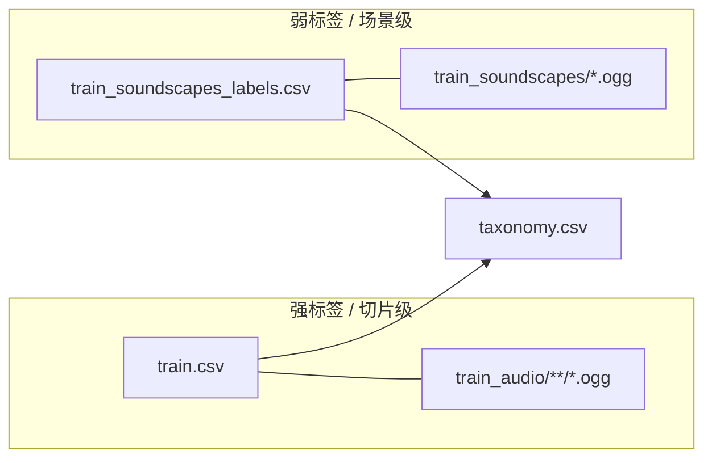

> DEVELOPER

解压这个zip并且移动到dataset文件夹内

> AGENT

正在查找工作区中的 zip 文件并准备解压到 `dataset` 文件夹。

> TOOL

tool_use glob_file_search
```json
{
  "targetDirectory": "/home/user_0a329be7/Downloads/bird",
  "globPattern": "**/*.zip"
}
```

> TOOL

tool_result glob_file_search
```
null
```

> TOOL

tool_use run_terminal_command_v2
```json
{
  "command": "ls -la /home/user_0a329be7/Downloads/bird && find /home/user_0a329be7/Downloads/bird -maxdepth 3 -type f 2>/dev/null",
  "cwd": "",
  "options": {
    "timeout": 30000
  },
  "parsingResult": {
    "executableCommands": [
      {
        "name": "ls",
        "args": [
          {
            "type": "word",
            "value": "-la"
          },
          {
            "type": "word",
            "value": "/home/user_0a329be7/Downloads/bird"
          }
        ],
        "fullText": "ls -la /home/user_0a329be7/Downloads/bird"
      },
      {
        "name": "find",
        "args": [
          {
            "type": "word",
            "value": "/home/user_0a329be7/Downloads/bird"
          },
          {
            "type": "word",
            "value": "-maxdepth"
          },
          {
            "type": "number",
            "value": "3"
          },
          {
            "type": "word",
            "value": "-type"
          },
          {
            "type": "word",
            "value": "f"
          }
        ],
        "fullText": "find /home/user_0a329be7/Downloads/bird -maxdepth 3 -type f"
      }
    ],
    "hasRedirects": true
  },
  "commandDescription": "List bird workspace and find files"
}
```

> TOOL

tool_result run_terminal_command_v2
```
null
```

> AGENT

正在查看 zip 的顶层结构，随后解压到 `dataset` 目录。

> TOOL

tool_use run_terminal_command_v2
```json
{
  "command": "unzip -l /home/user_0a329be7/Downloads/bird/birdclef-2026.zip | head -40",
  "cwd": "",
  "options": {
    "timeout": 30000
  },
  "parsingResult": {
    "executableCommands": [
      {
        "name": "unzip",
        "args": [
          {
            "type": "word",
            "value": "-l"
          },
          {
            "type": "word",
            "value": "/home/user_0a329be7/Downloads/bird/birdclef-2026.zip"
          }
        ],
        "fullText": "unzip -l /home/user_0a329be7/Downloads/bird/birdclef-2026.zip"
      },
      {
        "name": "head",
        "args": [
          {
            "type": "number",
            "value": "-40"
          }
        ],
        "fullText": "head -40"
      }
    ]
  },
  "commandDescription": "List first entries of zip archive"
}
```

> TOOL

tool_result run_terminal_command_v2
```
null
```

> AGENT

正在创建 `dataset` 并在后台解压约 16GB 的 `birdclef-2026.zip`（解压需较长时间）。

> TOOL

tool_use run_terminal_command_v2
```json
{
  "command": "mkdir -p /home/user_0a329be7/Downloads/bird/dataset && cd /home/user_0a329be7/Downloads/bird && nohup unzip -o birdclef-2026.zip -d dataset > /home/user_0a329be7/Downloads/bird/unzip.log 2>&1 & echo \"PID=$!\"",
  "cwd": "",
  "options": {
    "timeout": 30000
  },
  "parsingResult": {
    "executableCommands": [
      {
        "name": "mkdir",
        "args": [
          {
            "type": "word",
            "value": "-p"
          },
          {
            "type": "word",
            "value": "/home/user_0a329be7/Downloads/bird/dataset"
          }
        ],
        "fullText": "mkdir -p /home/user_0a329be7/Downloads/bird/dataset"
      },
      {
        "name": "cd",
        "args": [
          {
            "type": "word",
            "value": "/home/user_0a329be7/Downloads/bird"
          }
        ],
        "fullText": "cd /home/user_0a329be7/Downloads/bird"
      },
      {
        "name": "nohup",
        "args": [
          {
            "type": "word",
            "value": "unzip"
          },
          {
            "type": "word",
            "value": "-o"
          },
          {
            "type": "word",
            "value": "birdclef-2026.zip"
          },
          {
            "type": "word",
            "value": "-d"
          },
          {
            "type": "word",
            "value": "dataset"
          }
        ],
        "fullText": "nohup unzip -o birdclef-2026.zip -d dataset"
      },
      {
        "name": "echo",
        "args": [
          {
            "type": "string",
            "value": "\"PID=$!\""
          }
        ],
        "fullText": "echo \"PID=$!\""
      }
    ],
    "hasRedirects": true
  },
  "commandDescription": "Background unzip archive into dataset folder"
}
```

> TOOL

tool_result run_terminal_command_v2
```
null
```

> TOOL

tool_use run_terminal_command_v2
```json
{
  "command": "sleep 5 && tail -20 /home/user_0a329be7/Downloads/bird/unzip.log && ps -p 9320 -o pid,etime,cmd 2>/dev/null || echo \"process finished\"",
  "cwd": "",
  "options": {
    "timeout": 30000
  },
  "parsingResult": {
    "executableCommands": [
      {
        "name": "sleep",
        "args": [
          {
            "type": "number",
            "value": "5"
          }
        ],
        "fullText": "sleep 5"
      },
      {
        "name": "tail",
        "args": [
          {
            "type": "number",
            "value": "-20"
          },
          {
            "type": "word",
            "value": "/home/user_0a329be7/Downloads/bird/unzip.log"
          }
        ],
        "fullText": "tail -20 /home/user_0a329be7/Downloads/bird/unzip.log"
      },
      {
        "name": "ps",
        "args": [
          {
            "type": "word",
            "value": "-p"
          },
          {
            "type": "number",
            "value": "9320"
          },
          {
            "type": "word",
            "value": "-o"
          },
          {
            "type": "word",
            "value": "pid,etime,cmd"
          }
        ],
        "fullText": "ps -p 9320 -o pid,etime,cmd"
      },
      {
        "name": "echo",
        "args": [
          {
            "type": "string",
            "value": "\"process finished\""
          }
        ],
        "fullText": "echo \"process finished\""
      }
    ],
    "hasRedirects": true
  },
  "commandDescription": "Check unzip progress after a few seconds"
}
```

> TOOL

tool_result run_terminal_command_v2
```
null
```

> TOOL

tool_use run_terminal_command_v2
```json
{
  "command": "pgrep -af unzip | head -5; du -sh /home/user_0a329be7/Downloads/bird/dataset 2>/dev/null",
  "cwd": "",
  "options": {
    "timeout": 30000
  },
  "parsingResult": {
    "executableCommands": [
      {
        "name": "pgrep",
        "args": [
          {
            "type": "word",
            "value": "-af"
          },
          {
            "type": "word",
            "value": "unzip"
          }
        ],
        "fullText": "pgrep -af unzip"
      },
      {
        "name": "head",
        "args": [
          {
            "type": "number",
            "value": "-5"
          }
        ],
        "fullText": "head -5"
      },
      {
        "name": "du",
        "args": [
          {
            "type": "word",
            "value": "-sh"
          },
          {
            "type": "word",
            "value": "/home/user_0a329be7/Downloads/bird/dataset"
          }
        ],
        "fullText": "du -sh /home/user_0a329be7/Downloads/bird/dataset"
      }
    ],
    "hasRedirects": true
  },
  "commandDescription": "Find unzip process and dataset size so far"
}
```

> TOOL

tool_result run_terminal_command_v2
```
null
```

> AGENT

正在等待解压完成（压缩包约 16GB，需较长时间）。

> TOOL

tool_use run_terminal_command_v2
```json
{
  "command": "while pgrep -f \"unzip -o birdclef-2026.zip\" >/dev/null 2>&1; do sleep 45; du -sh /home/user_0a329be7/Downloads/bird/dataset; done; echo \"=== done ===\"; tail -5 /home/user_0a329be7/Downloads/bird/unzip.log; du -sh /home/user_0a329be7/Downloads/bird/dataset; ls /home/user_0a329be7/Downloads/bird/dataset | head -20",
  "cwd": "",
  "options": {
    "timeout": 600000
  },
  "parsingResult": {
    "executableCommands": [
      {
        "name": "pgrep",
        "args": [
          {
            "type": "word",
            "value": "-f"
          },
          {
            "type": "string",
            "value": "\"unzip -o birdclef-2026.zip\""
          }
        ],
        "fullText": "pgrep -f \"unzip -o birdclef-2026.zip\""
      },
      {
        "name": "sleep",
        "args": [
          {
            "type": "number",
            "value": "45"
          }
        ],
        "fullText": "sleep 45"
      },
      {
        "name": "du",
        "args": [
          {
            "type": "word",
            "value": "-sh"
          },
          {
            "type": "word",
            "value": "/home/user_0a329be7/Downloads/bird/dataset"
          }
        ],
        "fullText": "du -sh /home/user_0a329be7/Downloads/bird/dataset"
      },
      {
        "name": "echo",
        "args": [
          {
            "type": "string",
            "value": "\"=== done ===\""
          }
        ],
        "fullText": "echo \"=== done ===\""
      },
      {
        "name": "tail",
        "args": [
          {
            "type": "number",
            "value": "-5"
          },
          {
            "type": "word",
            "value": "/home/user_0a329be7/Downloads/bird/unzip.log"
          }
        ],
        "fullText": "tail -5 /home/user_0a329be7/Downloads/bird/unzip.log"
      },
      {
        "name": "du",
        "args": [
          {
            "type": "word",
            "value": "-sh"
          },
          {
            "type": "word",
            "value": "/home/user_0a329be7/Downloads/bird/dataset"
          }
        ],
        "fullText": "du -sh /home/user_0a329be7/Downloads/bird/dataset"
      },
      {
        "name": "ls",
        "args": [
          {
            "type": "word",
            "value": "/home/user_0a329be7/Downloads/bird/dataset"
          }
        ],
        "fullText": "ls /home/user_0a329be7/Downloads/bird/dataset"
      },
      {
        "name": "head",
        "args": [
          {
            "type": "number",
            "value": "-20"
          }
        ],
        "fullText": "head -20"
      }
    ],
    "hasRedirects": true
  },
  "commandDescription": "Wait until unzip finishes, show final size and listing"
}
```

> TOOL

tool_result run_terminal_command_v2
```
null
```

> TOOL

tool_use read_file_v2
```json
{
  "targetFile": "/home/user_0a329be7/.cursor/projects/home-user_0a329be7-Downloads-bird/terminals/357121.txt",
  "offset": 1,
  "limit": 80,
  "charsLimit": 1000000,
  "effectiveUri": "/home/user_0a329be7/.cursor/projects/home-user_0a329be7-Downloads-bird/terminals/357121.txt"
}
```

> TOOL

tool_result read_file_v2
```
null
```

> TOOL

tool_use run_terminal_command_v2
```json
{
  "command": "pgrep -af \"unzip -o birdclef\" || echo \"no unzip\"; tail -8 /home/user_0a329be7/Downloads/bird/unzip.log",
  "cwd": "",
  "options": {
    "timeout": 30000
  },
  "parsingResult": {
    "executableCommands": [
      {
        "name": "pgrep",
        "args": [
          {
            "type": "word",
            "value": "-af"
          },
          {
            "type": "string",
            "value": "\"unzip -o birdclef\""
          }
        ],
        "fullText": "pgrep -af \"unzip -o birdclef\""
      },
      {
        "name": "echo",
        "args": [
          {
            "type": "string",
            "value": "\"no unzip\""
          }
        ],
        "fullText": "echo \"no unzip\""
      },
      {
        "name": "tail",
        "args": [
          {
            "type": "number",
            "value": "-8"
          },
          {
            "type": "word",
            "value": "/home/user_0a329be7/Downloads/bird/unzip.log"
          }
        ],
        "fullText": "tail -8 /home/user_0a329be7/Downloads/bird/unzip.log"
      }
    ]
  },
  "commandDescription": "Check if unzip still running and log tail"
}
```

> TOOL

tool_result run_terminal_command_v2
```
null
```

> TOOL

tool_use run_terminal_command_v2
```json
{
  "command": "pgrep \"^unzip\" -a || true; grep -i error /home/user_0a329be7/Downloads/bird/unzip.log | tail -3; tail -15 /home/user_0a329be7/Downloads/bird/unzip.log",
  "cwd": "",
  "options": {
    "timeout": 30000
  },
  "parsingResult": {
    "executableCommands": [
      {
        "name": "pgrep",
        "args": [
          {
            "type": "string",
            "value": "\"^unzip\""
          },
          {
            "type": "word",
            "value": "-a"
          }
        ],
        "fullText": "pgrep \"^unzip\" -a"
      },
      {
        "name": "true",
        "fullText": "true"
      },
      {
        "name": "grep",
        "args": [
          {
            "type": "word",
            "value": "-i"
          },
          {
            "type": "word",
            "value": "error"
          },
          {
            "type": "word",
            "value": "/home/user_0a329be7/Downloads/bird/unzip.log"
          }
        ],
        "fullText": "grep -i error /home/user_0a329be7/Downloads/bird/unzip.log"
      },
      {
        "name": "tail",
        "args": [
          {
            "type": "number",
            "value": "-3"
          }
        ],
        "fullText": "tail -3"
      },
      {
        "name": "tail",
        "args": [
          {
            "type": "number",
            "value": "-15"
          },
          {
            "type": "word",
            "value": "/home/user_0a329be7/Downloads/bird/unzip.log"
          }
        ],
        "fullText": "tail -15 /home/user_0a329be7/Downloads/bird/unzip.log"
      }
    ]
  },
  "commandDescription": "Verify unzip process ended and check log end"
}
```

> TOOL

tool_result run_terminal_command_v2
```
null
```

> TOOL

tool_use run_terminal_command_v2
```json
{
  "command": "du -sh /home/user_0a329be7/Downloads/bird/dataset; ls -la /home/user_0a329be7/Downloads/bird/dataset",
  "cwd": "",
  "options": {
    "timeout": 30000
  },
  "parsingResult": {
    "executableCommands": [
      {
        "name": "du",
        "args": [
          {
            "type": "word",
            "value": "-sh"
          },
          {
            "type": "word",
            "value": "/home/user_0a329be7/Downloads/bird/dataset"
          }
        ],
        "fullText": "du -sh /home/user_0a329be7/Downloads/bird/dataset"
      },
      {
        "name": "ls",
        "args": [
          {
            "type": "word",
            "value": "-la"
          },
          {
            "type": "word",
            "value": "/home/user_0a329be7/Downloads/bird/dataset"
          }
        ],
        "fullText": "ls -la /home/user_0a329be7/Downloads/bird/dataset"
      }
    ]
  },
  "commandDescription": "Final dataset size and top-level listing"
}
```

> TOOL

tool_result run_terminal_command_v2
```
null
```

> AGENT

操作已经做完，说明如下：

## 已完成

1. **创建目录**：`/home/user_0a329be7/Downloads/bird/dataset`
2. **解压**：将 `birdclef-2026.zip` 解压到该目录（命令：`unzip -o birdclef-2026.zip -d dataset`）

解压后的 **`dataset`** 约 **16G**，顶层内容包括：

- `recording_location.txt`、`taxonomy.csv`、`train.csv`、`sample_submission.csv`
- `train_audio/`、`train_soundscapes/`、`train_soundscapes_labels.csv`
- `test_soundscapes/`

原始的 **`birdclef-2026.zip` 仍在** ` /home/user_0a329be7/Downloads/bird/ ` 下，没有移动；若你需要把压缩包也放进 `dataset/` 或解压后删掉 zip 省空间，可以说一下我按你的习惯处理。

后台解压日志在 **`/home/user_0a329be7/Downloads/bird/unzip.log`**，如需排查可查看该文件末尾。

> DEVELOPER

深入文件 做一下eda

> AGENT

深入查看数据集结构与关键表格，并运行可复现的 EDA 分析。

> TOOL

tool_use read_file_v2
```json
{
  "targetFile": "/home/user_0a329be7/Downloads/bird/dataset/test_soundscapes/readme.txt",
  "charsLimit": 1000000,
  "effectiveUri": "/home/user_0a329be7/Downloads/bird/dataset/test_soundscapes/readme.txt"
}
```

> TOOL

tool_result read_file_v2
```
null
```

> TOOL

tool_use read_file_v2
```json
{
  "targetFile": "/home/user_0a329be7/Downloads/bird/dataset/train.csv",
  "limit": 30,
  "charsLimit": 1000000,
  "effectiveUri": "/home/user_0a329be7/Downloads/bird/dataset/train.csv"
}
```

> TOOL

tool_result read_file_v2
```
null
```

> TOOL

tool_use read_file_v2
```json
{
  "targetFile": "/home/user_0a329be7/Downloads/bird/dataset/taxonomy.csv",
  "limit": 40,
  "charsLimit": 1000000,
  "effectiveUri": "/home/user_0a329be7/Downloads/bird/dataset/taxonomy.csv"
}
```

> TOOL

tool_result read_file_v2
```
null
```

> TOOL

tool_use read_file_v2
```json
{
  "targetFile": "/home/user_0a329be7/Downloads/bird/dataset/train_soundscapes_labels.csv",
  "limit": 30,
  "charsLimit": 1000000,
  "effectiveUri": "/home/user_0a329be7/Downloads/bird/dataset/train_soundscapes_labels.csv"
}
```

> TOOL

tool_result read_file_v2
```
null
```

> TOOL

tool_use read_file_v2
```json
{
  "targetFile": "/home/user_0a329be7/Downloads/bird/dataset/sample_submission.csv",
  "limit": 25,
  "charsLimit": 1000000,
  "effectiveUri": "/home/user_0a329be7/Downloads/bird/dataset/sample_submission.csv"
}
```

> TOOL

tool_result read_file_v2
```
null
```

> TOOL

tool_use read_file_v2
```json
{
  "targetFile": "/home/user_0a329be7/Downloads/bird/dataset/recording_location.txt",
  "charsLimit": 1000000,
  "effectiveUri": "/home/user_0a329be7/Downloads/bird/dataset/recording_location.txt"
}
```

> TOOL

tool_result read_file_v2
```
null
```

> AGENT

运行更全面的统计分析（类别分布、多标签、地理与音频文件一致性等）。

> TOOL

tool_use run_terminal_command_v2
```json
{
  "command": "python3 -c \"import pandas; print('ok', pandas.__version__)\"",
  "cwd": "",
  "options": {
    "timeout": 30000
  },
  "parsingResult": {
    "executableCommands": [
      {
        "name": "python3",
        "args": [
          {
            "type": "word",
            "value": "-c"
          },
          {
            "type": "string",
            "value": "\"import pandas; print('ok', pandas.__version__)\""
          }
        ],
        "fullText": "python3 -c \"import pandas; print('ok', pandas.__version__)\""
      }
    ]
  },
  "commandDescription": "Check pandas availability"
}
```

> TOOL

tool_result run_terminal_command_v2
```
null
```

> TOOL

tool_use ripgrep_raw_search
```json
{
  "pattern": ".",
  "path": "/home/user_0a329be7/Downloads/bird/dataset/train.csv",
  "outputMode": "count",
  "caseInsensitive": false
}
```

> TOOL

tool_use run_terminal_command_v2
```json
{
  "command": "pip install pandas numpy --quiet && python3 -c \"import pandas; print(pandas.__version__)\"",
  "cwd": "",
  "options": {
    "timeout": 30000
  },
  "parsingResult": {
    "executableCommands": [
      {
        "name": "pip",
        "args": [
          {
            "type": "word",
            "value": "install"
          },
          {
            "type": "word",
            "value": "pandas"
          },
          {
            "type": "word",
            "value": "numpy"
          },
          {
            "type": "word",
            "value": "--quiet"
          }
        ],
        "fullText": "pip install pandas numpy --quiet"
      },
      {
        "name": "python3",
        "args": [
          {
            "type": "word",
            "value": "-c"
          },
          {
            "type": "string",
            "value": "\"import pandas; print(pandas.__version__)\""
          }
        ],
        "fullText": "python3 -c \"import pandas; print(pandas.__version__)\""
      }
    ]
  },
  "commandDescription": "Install pandas and numpy for EDA"
}
```

> TOOL

tool_result run_terminal_command_v2
```
null
```

> TOOL

tool_use edit_file_v2
```json
{
  "relativeWorkspacePath": "/home/user_0a329be7/Downloads/bird/eda_birdclef.py",
  "streamingContent": "#!/usr/bin/env python3\n\"\"\"BirdCLEF 2026 — lightweight EDA for dataset/ tables and folders.\"\"\"\nfrom __future__ import annotations\n\nimport ast\nimport csv\nimport subprocess\nimport sys\nfrom collections import Counter\nfrom pathlib import Path\n\nimport numpy as np\nimport pandas as pd\n\nROOT = Path(__file__).resolve().parent / \"dataset\"\n\n\ndef parse_listish(x):\n    if pd.isna(x) or x == \"\":\n        return []\n    if isinstance(x, list):\n        return x\n    s = str(x).strip()\n    try:\n        v = ast.literal_eval(s\"\n        if isinstance(v, list):\n            return v\n        return [v]\n    except (SyntaxError, ValueError):\n        return [s]\n\n\ndef ffprobe_duration(path: Path) -> float | None:\n    try:\n        r = subprocess.run(\n            [\n                \"ffprobe\",\n                \"-v\",\n                \"error\",\n                \"-show_entries\",\n                \"format=duration\",\n                \"-of\",\n                \"default=noprint_wrappers=1:nokey=1\",\n                str(path),\n            ],\n            capture_output=True,\n            text=True,\n            timeout=30,\n        )\n        if r.returncode != 0:\n            return None\n        return float(r.stdout.strip())\n    except (FileNotFoundError, ValueError, subprocess.TimeoutExpired):\n        return None\n\n\ndef main() -> None:\n    if not ROOT.is_dir():\n        print(f\"Missing {ROOT}\", file=sys.stderr)\n        sys.exit(1)\n\n    print(\"=\" * 72)\n    print(\"BirdCLEF 2026 EDA\")\n    print(f\"DATA_ROOT = {ROOT}\")\n    print(\"=\" * 72)\n\n    # --- train.csv (point recordings / taxa) ---\n    train_path = ROOT / \"train.csv\"\n    train = pd.read_csv(train_path, low_memory=False)\n    train[\"secondary_parsed\"] = train[\"secondary_labels\"].map(parse_listish)\n    train[\"type_parsed\"] = train[\"type\"].map(parse_listish)\n    train[\"n_secondary\"] = train[\"secondary_parsed\"].str.len()\n    train[\"has_secondary\"] = train[\"n_secondary\"] > 0\n    train[\"type_nonempty\"] = train[\"type_parsed\"].apply(lambda t: len(t) > 0)\n\n    print(\"\\n## train.csv (taxonomy-aligned clips)\")\n    print(f\"  rows: {len(train):,}\")\n    print(f\"  columns ({len(train.columns)}): {list(train.columns)}\")\n    print(f\"  unique primary_label: {train['primary_label'].nunique():,}\")\n    print(f\"  rows with non-empty secondary_labels: {train['has_secondary'].sum():,} ({100 * train['has_secondary'].mean():.2f}%)\")\n    print(f\"  rows with non-empty type field: {train['type_nonempty'].sum():,} ({100 * train['type_nonempty'].mean():.2f}%)\")\n\n    print(\"\\n  class_name counts (top 15):\")\n    for k, v in train[\"class_name\"].value_counts().head(15).items():\n        print(f\"    {k}: {v:,}\")\n\n    print(\"\\n  collection counts:\")\n    for k, v in train[\"collection\"].value_counts().items():\n        print(f\"    {k}: {v:,}\")\n\n    print(\"\\n  license (top 10):\")\n    for k, v in train[\"license\"].value_counts().head(10).items():\n        print(f\"    {k}: {v:,}\")\n\n    if \"rating\" in train.columns:\n        r = pd.to_numeric(train[\"rating\"], errors=\"coerce\")\n        print(\"\\n  rating (numeric):\")\n        print(f\"    min={r.min()} max={r.max()} mean={r.mean():.4f} non-null={r.notna().sum():,}\")\n\n    print(\"\\n  latitude/longitude:\")\n    lat = pd.to_numeric(train[\"latitude\"], errors=\"coerce\")\n    lon = pd.to_numeric(train[\"longitude\"], errors=\"coerce\")\n    print(\n        f\"    lat: min={lat.min():.4f} max={lat.max():.4f} | \"\n        f\"lon: min={lon.min():.4f} max={lon.max():.4f}\"\n    )\n\n    vc = train[\"primary_label\"].value_counts()\n    print(\"\\n  per-class clip counts: min/median/max\")\n    print(f\"    min={vc.min()} median={vc.median():.1f} max={vc.max()} (classes={len(vc)})\")\n\n    # --- taxonomy.csv ---\n    tax = pd.read_csv(ROOT / \"taxonomy.csv\")\n    print(\"\\n## taxonomy.csv\")\n    print(f\"  rows (taxa): {len(tax):,}\")\n    print(f\"  unique primary_label: {tax['primary_label'].nunique():,}\")\n    tset = set(tax[\"primary_label\"].astype(str))\n    yset = set(train[\"primary_label\"].astype(str))\n    only_train = yset - tset\n    only_tax = tset - yset\n    print(f\"  labels in train but not taxonomy: {len(only_train)}\")\n    print(f\"  labels in taxonomy but no train row: {len(only_tax)}\")\n    if only_train:\n        print(f\"    sample only_train: {list(sorted(only_train))[:8]}...\")\n    print(\"\\n  class_name in taxonomy (counts):\")\n    for k, v in tax[\"class_name\"].value_counts().items():\n        print(f\"    {k}: {v}\")\n\n    # --- train_soundscapes_labels.csv ---\n    lab_path = ROOT / \"train_soundscapes_labels.csv\"\n    lab = pd.read_csv(lab_path)\n    lab[\"label_ids\"] = lab[\"primary_label\"].astype(str).str.split(\";\")\n    lab[\"n_labels\"] = lab[\"label_ids\"].str.len()\n\n    print(\"\\n## train_soundscapes_labels.csv (weak / multi-label segments)\")\n    print(f\"  segment rows: {len(lab):,}\")\n    print(f\"  unique audio files: {lab['filename'].nunique():,}\")\n    print(f\"  unique (filename, start, end): {lab.drop_duplicates(['filename', 'start', 'end']).shape[0]:,}\")\n    print(f\"  labels per segment: min={lab['n_labels'].min()} median={lab['n_labels'].median()} max={lab['n_labels'].max()}\")\n    # Row-level duplicates (same file/time repeated)?\n    dup_seg = lab.duplicated(subset=[\"filename\", \"start\", \"end\"], keep=False)\n    print(f\"  rows that share (filename,start,end) with another row: {dup_seg.sum():,}\")\n\n    all_seg_labels: list[str] = []\n    for ids in lab[\"label_ids\"]:\n        all_seg_labels.extend(ids)\n    seg_lab_counts = Counter(all_seg_labels)\n    print(f\"  distinct label tokens in segments: {len(seg_lab_counts):,}\")\n    print(\"  most common segment labels (top 12):\")\n    for lid, c in seg_lab_counts.most_common(12):\n        print(f\"    {lid}: {c:,}\")\n\n    # Site code from filename: e.g. BC2026_Train_0039_S22_...\n    sites = lab[\"filename\"].astype(str).str.extract(r\"_S(\\d+)_\", expand=False)\n    print(f\"\\n  unique recorder/site codes (S##): {sites.nunique()}\")\n    print(sites.value_counts().head(10).to_string(header=False))\n\n    # --- sample_submission ---\n    sub_path = ROOT / \"sample_submission.csv\"\n    with open(sub_path, newline=\"\", encoding=\"utf-8\") as f:\n        r = csv.reader(f)\n        header = next(r)\n    print(\"\\n## sample_submission.csv\")\n    print(f\"  class columns (excl. row_id): {len(header) - 1}\")\n    sub = pd.read_csv(sub_path, nrows=5)\n    print(f\"  dtypes (first cols): {dict(list(sub.dtypes.items())[:5])} ...\")\n    n_sub = sum(1 for _ in open(sub_path, encoding=\"utf-8\")) - 1\n    print(f\"  submission rows (wc): {n_sub:,}\")\n\n    # --- filesystem vs train.csv ---\n    ta = ROOT / \"train_audio\"\n    n_train_dirs = sum(1 for p in ta.iterdir() if p.is_dir())\n    # sample file count (full walk can be slow)\n    print(\"\\n## train_audio/ (filesystem)\")\n    print(f\"  species/taxon subdirs: {n_train_dirs:,}\")\n    files_sample = list(ta.rglob(\"*.ogg\"))[:5000]\n    total_ogg_fast = sum(1 for _ in ta.rglob(\"*.ogg\"))\n    print(f\"  total .ogg files: {total_ogg_fast:,}\")\n    train_paths = set(train[\"filename\"].astype(str))\n    fs_names = {p.relative_to(ta).as_posix() for p in ta.rglob(\"*.ogg\")}\n    missing_on_disk = train_paths - fs_names\n    extra_on_disk = fs_names - train_paths\n    print(f\"  train.csv filenames not found under train_audio: {len(missing_on_disk)}\")\n    print(f\"  .ogg on disk not listed in train.csv: {len(extra_on_disk)}\")\n    if missing_on_disk:\n        print(f\"    sample missing: {list(sorted(missing_on_disk))[:5]}\")\n    if extra_on_disk:\n        print(f\"    sample extra: {list(sorted(extra_on_disk))[:5]}\")\n\n    ts_dir = ROOT / \"train_soundscapes\"\n    n_ts = sum(1 for _ in ts_dir.glob(\"*.ogg\"))\n    lab_files = set(lab[\"filename\"].astype(str))\n    ts_names = {p.name for p in ts_dir.glob(\"*.ogg\")}\n    print(\"\\n## train_soundscapes/\")\n    print(f\"  .ogg files: {n_ts:,}\")\n    print(f\"  in labels CSV but missing file: {len(lab_files - ts_names)}\")\n    print(f\"  on disk but never in labels CSV: {len(ts_names - lab_files)}\")\n\n    test_sc = ROOT / \"test_soundscapes\"\n    n_test = sum(1 for _ in test_sc.glob(\"*.ogg\"))\n    print(\"\\n## test_soundscapes/\")\n    print(f\"  .ogg files (local): {n_test}\")\n\n    # --- audio duration sample ---\n    print(\"\\n## audio duration (ffprobe sample)\")\n    samples = []\n    for p in list(ta.rglob(\"*.ogg\"))[:80]:\n        d = ffprobe_duration(p)\n        if d is not None:\n            samples.append(d)\n    if samples:\n        arr = np.array(samples)\n        print(f\"  n={len(samples)} clips from train_audio (first 80 tried)\")\n        print(f\"  duration sec: min={arr.min():.3f} max={arr.max():.3f} mean={arr.mean():.3f} median={np.median(arr):.3f}\")\n    else:\n        print(\"  ffprobe not available or failed; install ffmpeg for duration stats.\")\n\n    p_ts = next(iter(ts_dir.glob(\"*.ogg\")), None)\n    if p_ts:\n        d = ffprobe_duration(p_ts)\n        print(f\"  one train_soundscape ({p_ts.name}): {d} sec\" if d else f\"  one train_soundscape: ffprobe failed\")\n\n    print(\"\\n\" + \"=\" * 72)\n    print(\"Done.\")\n    print(\"=\" * 72)\n\n\nif __name__ == \"__main__\":\n    main()\n",
  "noCodeblock": true,
  "cloudAgentEdit": false
}
```

> TOOL

tool_result edit_file_v2
```
null
```

> TOOL

tool_use edit_file_v2
```json
{
  "relativeWorkspacePath": "/home/user_0a329be7/Downloads/bird/eda_birdclef.py",
  "streamingContent": "        v = ast.literal_eval(s)",
  "noCodeblock": true,
  "cloudAgentEdit": false
}
```

> TOOL

tool_result edit_file_v2
```
null
```

> TOOL

tool_use edit_file_v2
```json
{
  "relativeWorkspacePath": "/home/user_0a329be7/Downloads/bird/eda_birdclef.py",
  "streamingContent": "    n_train_dirs = sum(1 for p in ta.iterdir() if p.is_dir())\n    print(\"\\n## train_audio/ (filesystem)\")\n    print(f\"  species/taxon subdirs: {n_train_dirs:,}\")\n    fs_names: set[str] = set()\n    n_ogg = 0\n    for p in ta.rglob(\"*.ogg\"):\n        fs_names.add(p.relative_to(ta).as_posix())\n        n_ogg += 1\n    print(f\"  total .ogg files: {n_ogg:,}\")\n    train_paths = set(train[\"filename\"].astype(str))",
  "noCodeblock": true,
  "cloudAgentEdit": false
}
```

> TOOL

tool_result edit_file_v2
```
null
```

> TOOL

tool_use run_terminal_command_v2
```json
{
  "command": "cd /home/user_0a329be7/Downloads/bird && python3 eda_birdclef.py",
  "cwd": "",
  "options": {
    "timeout": 120000
  },
  "parsingResult": {
    "executableCommands": [
      {
        "name": "cd",
        "args": [
          {
            "type": "word",
            "value": "/home/user_0a329be7/Downloads/bird"
          }
        ],
        "fullText": "cd /home/user_0a329be7/Downloads/bird"
      },
      {
        "name": "python3",
        "args": [
          {
            "type": "word",
            "value": "eda_birdclef.py"
          }
        ],
        "fullText": "python3 eda_birdclef.py"
      }
    ]
  },
  "commandDescription": "Run BirdCLEF EDA script on dataset"
}
```

> TOOL

tool_result run_terminal_command_v2
```
null
```

> TOOL

tool_use run_terminal_command_v2
```json
{
  "command": "wc -l /home/user_0a329be7/Downloads/bird/dataset/sample_submission.csv; head -1 /home/user_0a329be7/Downloads/bird/dataset/sample_submission.csv | awk -F',' '{print NF}'",
  "cwd": "",
  "options": {
    "timeout": 30000
  },
  "parsingResult": {
    "executableCommands": [
      {
        "name": "wc",
        "args": [
          {
            "type": "word",
            "value": "-l"
          },
          {
            "type": "word",
            "value": "/home/user_0a329be7/Downloads/bird/dataset/sample_submission.csv"
          }
        ],
        "fullText": "wc -l /home/user_0a329be7/Downloads/bird/dataset/sample_submission.csv"
      },
      {
        "name": "head",
        "args": [
          {
            "type": "number",
            "value": "-1"
          },
          {
            "type": "word",
            "value": "/home/user_0a329be7/Downloads/bird/dataset/sample_submission.csv"
          }
        ],
        "fullText": "head -1 /home/user_0a329be7/Downloads/bird/dataset/sample_submission.csv"
      },
      {
        "name": "awk",
        "args": [
          {
            "type": "concatenation",
            "value": "-F','"
          },
          {
            "type": "raw_string",
            "value": "'{print NF}'"
          }
        ],
        "fullText": "awk -F',' '{print NF}'"
      }
    ]
  },
  "commandDescription": "Verify sample_submission line count and column count"
}
```

> TOOL

tool_result run_terminal_command_v2
```
null
```

> TOOL

tool_use run_terminal_command_v2
```json
{
  "command": "python3 - <<'PY'\nimport pandas as pd\nlab = pd.read_csv([REDACTED])\ng = lab.groupby([\"filename\",\"start\",\"end\"]).size()\nprint(\"segments with row count:\", g.value_counts().sort_index().to_string())\nprint(\"example duplicate:\", g[g>1].head(3))\nPY",
  "cwd": "",
  "options": {
    "timeout": 30000
  },
  "parsingResult": {
    "executableCommands": [
      {
        "name": "python3",
        "fullText": "python3"
      }
    ],
    "hasRedirects": true
  },
  "commandDescription": "Analyze duplicate segment label rows"
}
```

> TOOL

tool_result run_terminal_command_v2
```
null
```

> TOOL

tool_use run_terminal_command_v2
```json
{
  "command": "python3 - <<'PY'\nimport pandas as pd\nlab = pd.read_csv([REDACTED])\ndups = lab.duplicated(keep=False)\nsub = lab[dups].sort_values([\"filename\",\"start\",\"end\",\"primary_label\"])\n# check if every pair is full duplicate\nfull_dup = lab.duplicated(keep=False) & lab.duplicated(keep=False)\nprint(\"fully identical duplicate rows:\", lab.duplicated().sum(), \"/\", len(lab))\nprint(lab.duplicated().mean())\nPY",
  "cwd": "",
  "options": {
    "timeout": 30000
  },
  "parsingResult": {
    "executableCommands": [
      {
        "name": "python3",
        "fullText": "python3"
      }
    ],
    "hasRedirects": true
  },
  "commandDescription": "Check if label rows are exact duplicates"
}
```

> TOOL

tool_result run_terminal_command_v2
```
null
```

> TOOL

tool_use run_terminal_command_v2
```json
{
  "command": "python3 - <<'PY'\nimport pandas as pd\ntax = pd.read_csv([REDACTED])\ntrain = pd.read_csv([REDACTED])\nlab = pd.read_csv([REDACTED])\ny = set(train[\"primary_label\"].astype(str))\nt = set(tax[\"primary_label\"].astype(str))\nmissing_in_train = t - y\nseg = set()\nfor s in lab[\"primary_label\"].astype(str):\n    seg.update(s.split(\";\"))\nonly_sub = missing_in_train - seg\nin_seg = missing_in_train & seg\nprint(\"taxonomy labels never in train.csv:\", len(missing_in_train))\nprint(\"...and appear in soundscape segment labels:\", len(in_seg))\nprint(\"...and NOT in soundscape segments:\", len(only_sub))\nprint(\"examples only in tax, not train nor segments:\", sorted(list(only_sub))[:20])\nPY",
  "cwd": "",
  "options": {
    "timeout": 30000
  },
  "parsingResult": {
    "executableCommands": [
      {
        "name": "python3",
        "fullText": "python3"
      }
    ],
    "hasRedirects": true
  },
  "commandDescription": "Cross-check taxonomy-only labels vs soundscapes"
}
```

> TOOL

tool_result run_terminal_command_v2
```
null
```

> AGENT

已在项目里加入可复现脚本 `eda_birdclef.py` 并跑完一轮统计。下面是精简但「下到文件层级」的 EDA 结论。

---

## 1. 数据总体结构

竞赛数据可以看成 **两条并行链路**：



- **`train.csv` + `train_audio/`**：每条对应 **一个 taxon、一段音频**，字段里有经纬度、许可、`collection`（XC / iNat）等。
- **`train_soundscapes_labels.csv` + `train_soundscapes/`**：长音频切成 **5 秒片**，`primary_label` 为 **分号分隔的多标签**（若虫、环境声、多物种并存等）。
- **`taxonomy.csv`**：**234 个 `primary_label`**，与提交模板里的类别列一致（含 iNat 数字 id + `ashgre1` 这类鸟类代码 + `47158sonXX` 等昆虫 sonotype）。

---

## 2. `train.csv` / `train_audio`

| 指标 | 数值 |
|------|------|
| 行数（片段） | **35,549** |
| 不同 `primary_label` | **206** |
| `train_audio` 子目录数 | **206** |
| 磁盘 `.ogg` 数量 | **35,549** |
| 与 CSV 是否一致 | **完全一致**（无一侧多余） |

**类别与不平衡**

- 每类片段数：**最小 1，中位数 125，最大 499**。
- **`class_name`**：几乎都是 **鸟（Aves 34,799）**，另有两栖 451、昆虫 199、哺乳 99、爬行 1——和「鸟类竞赛」一致，但标签空间里有非鸟类，需在损失/采样上心里有数。

**来源与元数据**

- **`collection`**：XC **23,043**，iNat **12,506**。
- **`secondary_labels` 非空**：约 **12.3%**。
- **`type` 字段非空**（如 `['uncertain']`）：约 **63.5%**。
- **`rating`**：0–5，均值约 **2.60**。

**地理**

- 纬度约 **-54.86 ~ 69.58**，经度约 **-159.66 ~ 175.32**（全球 iNat/XC；`recording_location.txt` 则点名 **潘塔纳尔** 一带的布点范围）。

---

## 3. `taxonomy.csv` 与「只在场景里出现的类」

- **taxonomy 234 类** vs **train 切片里只出现 206 类**。
- 少的那 **28 类**：在 **`train.csv` / `train_audio` 里完全没有**，但 **全部 28 个都出现在 `train_soundscapes_labels` 的片段标签里**。  
  含义：**弱标签场景负责补全部分 taxa**，做联合训练时要注意这 28 类只有多标签、无单一切片监督。

---

## 4. `train_soundscapes_labels.csv`（重点细节）

| 指标 | 数值 |
|------|------|
| 标注行数 | **1,478** |
| 唯一 `(filename, start, end)` 段 | **739** |
| 唯一涉及的 `.ogg` 文件 | **66** |
| 每段标签个数 | **1 ~ 10**，中位数 **4** |
| 文件名里 **`S##` 站点** | **9** 个（如 S22 出现最多） |

**数据质量问题：整表重复一行**

- 对每个时间段，**恰好重复 2 次完全相同的行**（739 段 × 2 = 1478）。  
- 建模/统计前建议 **`drop_duplicates()`**，否则会 double-count。

**磁盘上 soundscape 规模 vs 标注**

- `train_soundscapes/` 下约有 **10,658** 个 `.ogg`。
- 标注 CSV 只覆盖 **66** 个文件名，其余 **约 10,592** 个文件 **没有出现在该 CSV**——适合当作 **无标注或自监督/伪标签池**（具体以赛方说明为准）。

---

## 5. `sample_submission.csv` 与 `test_soundscapes/`

- 本地 zip 里 **`sample_submission.csv` 只有 3 条示例行 + 表头**（`wc -l` 为 4），**234 个类别列** + `row_id`，数值为均匀先验类例。
- **`test_soundscapes/`** 本地 **0 个 `.ogg`**，与 `readme.txt` 一致：正式测试音频只在 **Kaggle 重跑环境**里出现。

---

## 6. 音频时长

当前环境 **未检测到可用的 `ffprobe`/`ffmpeg`**，脚本里对 `train_audio` 的时长抽样未成功。若你本机装了 ffmpeg，可在终端跑：

`ffprobe -show_entries format=duration -of default=noprint_wrappers=1:nokey:1 某个.ogg`

需要的话我可以把 **用 `soundfile`/`librosa` 读 ogg 时长** 的片段补进 `eda_birdclef.py`，避免依赖 ffmpeg。

---

## 7. 已实现的可复现脚本

路径：**`/home/user_0a329be7/Downloads/bird/eda_birdclef.py`**  

依赖：`pandas`, `numpy`（已安装）。用法：

```bash
cd /home/user_0a329be7/Downloads/bird && python3 eda_birdclef.py
```

整体上，这是一份 **强标签 point recordings + 弱标签多类 soundscapes + 全类别 taxonomy** 的组合；做 EDA 或建模时，**记得对 soundscape 标签表去重**，并区分 **206 类有切片监督** 与 **234 类提交空间** 的关系。若你希望下一步做 **可视化**（地图、每类样本数柱状图、标签共现矩阵），可以说一下偏好（静态图还是 notebook），我可以按同一套路径往脚本里加。
