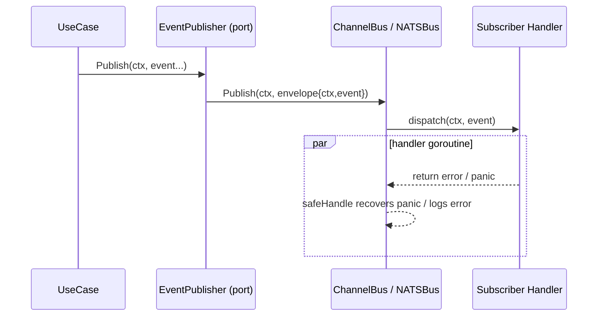

> AGENT

記事を読み込み済みです。4つの観点でレビューします。

## レビュー結果: articles/c05cf4efcc591f.md

### 観点 A: 冗長・繰り返し

- [ ] L27: 「ドメインイベントは同一 BC 内の集約間でも有効なパターンです。」が直後の「本記事では同一 BC 内の例（注文・在庫・ポイント）を用いて解説します。」と内容が重複（前文から「ドメインイベントは〜パターンです。」を削除し、接続詞で続ける）

### 観点 B: 論理構成・流れ

問題なし

### 観点 C: 読者価値密度

- [ ] L604-606: 「結果整合性を受け入れる」セクションが3文で完結しており、抽象度が高い。「即座の整合性が必要な場合は集約の境界を見直すべきです」という主張に対して、どのような境界の引き直しが有効か、具体的な指針（例: 注文と在庫を1集約にまとめる等の反例とトレードオフ）があると読者のアクションにつながる（内容追加が必要なため自動修正しない）

### 観点 D: 文体の統一

問題なし

### 総評

技術的な正確性が高く、コード例と説明の対応が明快です。アンチパターン→問題提起→設計→実装→発展→ベストプラクティスという構成も自然に読めます。指摘は最小限で、L27の軽微な重複以外は修正不要のレベルです。

---

L27 の冗長部分を自動修正します。

> TOOL

tool_use Edit
id: toolu_01UrN7FHf1HipLPzSmxWNFuV
```json
{
  "replace_all": false,
  "file_path": "/Users/135yshr/projects/135yshr/documents/articles/c05cf4efcc591f.md",
  "old_string": "この引用は「異なる BC の集約間」での一貫性維持を述べていますが、ドメインイベントは同一 BC 内の集約間でも有効なパターンです。本記事では同一 BC 内の例（注文・在庫・ポイント）を用いて解説します。",
  "new_string": "この引用は「異なる BC の集約間」での一貫性維持を述べていますが、同一 BC 内の集約間でも有効なパターンです。本記事では同一 BC 内の例（注文・在庫・ポイント）を用いて解説します。"
}
```

> TOOL

tool_result
id: toolu_01UrN7FHf1HipLPzSmxWNFuV
```
The file /Users/135yshr/projects/135yshr/documents/articles/c05cf4efcc591f.md has been updated successfully.
```

> AGENT

lint を実行します。

> TOOL

tool_use Bash
id: toolu_01NQn3aG4LcJuhDSYJeRjZi4
```json
{
  "command": "npx prettier --write articles/c05cf4efcc591f.md 2>&1",
  "description": "Prettier で整形"
}
```

> TOOL

tool_result
id: toolu_01NQn3aG4LcJuhDSYJeRjZi4
```
articles/c05cf4efcc591f.md 48ms (unchanged)
```

> TOOL

tool_use Bash
id: toolu_01WLRAfDYhHCusL1zS3TzMP5
```json
{
  "command": "npx markdownlint-cli2 articles/c05cf4efcc591f.md 2>&1",
  "description": "markdownlint でチェック"
}
```

> TOOL

tool_result
id: toolu_01WLRAfDYhHCusL1zS3TzMP5
```
markdownlint-cli2 v0.21.0 (markdownlint v0.40.0)
Finding: articles/c05cf4efcc591f.md !node_modules/**
Linting: 1 file(s)
Summary: 0 error(s)
```

> TOOL

tool_use Bash
id: toolu_01MvoJymvVo37syaTHcFJ5Xa
```json
{
  "command": "npx textlint articles/c05cf4efcc591f.md 2>&1",
  "description": "textlint で日本語校正"
}
```

> TOOL

tool_result
id: toolu_01MvoJymvVo37syaTHcFJ5Xa
```
(Bash completed with no output)
```

> AGENT

すべての lint がエラーなしで通りました。

---

**修正サマリー**

| 行 | 変更内容 |
|---|---|
| L27 | 「ドメインイベントは同一 BC 内の集約間でも有効なパターンです。」を削除し、後続文と接続（重複解消） |

**未修正の指摘（要検討）**

- L604-606 「結果整合性を受け入れる」セクション：具体的な境界設計の指針（例: どんな条件で集約を統合すべきか）を1段落追加すると読者価値が高まります。

> TOOL

tool_use Bash
id: toolu_015tDWYerNpPSDxvH7gYzzw7
```json
{
  "command": "git status && git diff",
  "description": "変更状況を確認"
}
```

> TOOL

tool_result
id: toolu_015tDWYerNpPSDxvH7gYzzw7
```
On branch fix/domain-event-code-samples
Your branch is up to date with 'origin/fix/domain-event-code-samples'.

Changes not staged for commit:
  (use "git add <file>..." to update what will be committed)
  (use "git restore <file>..." to discard changes in working directory)
	modified:   articles/c05cf4efcc591f.md

no changes added to commit (use "git add" and/or "git commit -a")
diff --git a/articles/c05cf4efcc591f.md b/articles/c05cf4efcc591f.md
index d1e3f34..ac1d7cb 100644
--- a/articles/c05cf4efcc591f.md
+++ b/articles/c05cf4efcc591f.md
@@ -24,7 +24,7 @@ DDDで設計を進めていくと、ある集約の操作に応じて別の集
 >
 > — Vaughn Vernon, _Implementing Domain-Driven Design_（2013）
 
-この引用は「異なる BC の集約間」での一貫性維持を述べていますが、ドメインイベントは同一 BC 内の集約間でも有効なパターンです。本記事では同一 BC 内の例（注文・在庫・ポイント）を用いて解説します。
+この引用は「異なる BC の集約間」での一貫性維持を述べていますが、同一 BC 内の集約間でも有効なパターンです。本記事では同一 BC 内の例（注文・在庫・ポイント）を用いて解説します。
 
 この記事では、Go でドメインイベントを設計・実装し、集約間の結合を解消するパターンを共有します。
```

> TOOL

tool_use Bash
id: toolu_01S2pnJaeUbH3L4kMDgNLTCi
```json
{
  "command": "git add articles/c05cf4efcc591f.md && git commit -m \"$(cat <<'EOF'\n📝 fix: remove redundant clause in BC scope explanation\n\nThe sentence \"ドメインイベントは同一 BC 内の集約間でも有効なパターンです\"\nwas immediately followed by the same claim rephrased, so it was removed.\n\nCo-Authored-By: Claude Sonnet 4.6 <noreply@anthropic.com>\nEOF\n)\"",
  "description": "ステージングしてコミット"
}
```

> TOOL

tool_result
id: toolu_01S2pnJaeUbH3L4kMDgNLTCi
```
[STARTED] Backing up original state...
[COMPLETED] Backed up original state in git stash (17c0066)
[STARTED] Running tasks for staged files...
[STARTED] package.json — 1 file
[STARTED] *.md — 1 file
[STARTED] prettier --write
[COMPLETED] prettier --write
[STARTED] markdownlint-cli2
[COMPLETED] markdownlint-cli2
[STARTED] textlint
[COMPLETED] textlint
[COMPLETED] *.md — 1 file
[COMPLETED] package.json — 1 file
[COMPLETED] Running tasks for staged files...
[STARTED] Applying modifications from tasks...
[COMPLETED] Applying modifications from tasks...
[STARTED] Cleaning up temporary files...
[COMPLETED] Cleaning up temporary files...
[fix/domain-event-code-samples 9e71a8e] 📝 fix: remove redundant clause in BC scope explanation
 1 file changed, 1 insertion(+), 1 deletion(-)
```

> AGENT

コミット完了です。

**コミット内容**
- `articles/c05cf4efcc591f.md` の L27 にある冗長な一文を削除
- lint-staged（Prettier / markdownlint / textlint）もすべてパス

**次のステップ**

```bash
git push origin fix/domain-event-code-samples
```

でリモートへ push し、必要であれば PR を作成してください。

> TOOL

<bash-input>git push</bash-input>

> TOOL

<bash-stdout>[entire] Pushing session logs to origin...
To github.com:135yshr/documents.git
   402e4ba..9e71a8e  fix/domain-event-code-samples -> fix/domain-event-code-samples</bash-stdout><bash-stderr></bash-stderr>

> DEVELOPER

PRのコードレビューで指摘があるので修正してください

> TOOL

tool_use Bash
id: toolu_017ebELZojZz6d47S1UJsKc8
```json
{
  "command": "gh pr list --head fix/domain-event-code-samples",
  "description": "対象ブランチのPR番号を確認"
}
```

> TOOL

tool_result
id: toolu_017ebELZojZz6d47S1UJsKc8
```
81	fix: ドメインイベント記事のコード・設計・文章品質を修正	fix/domain-event-code-samples	OPEN	2026-03-18T09:58:35Z
```

> TOOL

tool_use Bash
id: toolu_01EUBzb4Vun24FgvL7dUoDCi
```json
{
  "command": "gh pr view 81 --comments 2>&1 | head -200",
  "description": "PR のコメントを取得"
}
```

> TOOL

tool_result
id: toolu_01EUBzb4Vun24FgvL7dUoDCi
```
author:	coderabbitai
association:	none
edited:	true
status:	none
--
<!-- This is an auto-generated comment: summarize by coderabbit.ai -->
<!-- walkthrough_start -->

<details>
<summary>📝 Walkthrough</summary>

## Walkthrough

Port-based EventPublisher decouples use cases from bus implementations. Order.Confirm(now time.Time) enables deterministic tests; events include EventType and EventID. Channel and NATS buses are context-aware: Handler is func(ctx context.Context, e event.Event) error, Subscribe returns error, ChannelBus dispatches envelopes, recovers panics, and drains on Close.

## Changes

|Cohort / File(s)|Summary|
|---|---|
|**Domain Model & Events** <br> `domain/model/order.go`, `domain/event/event.go`, `domain/event/order_events.go`|Added `EventID()` to `Event`; `EventTypeOrderConfirmed`/`EventTypeOrderCanceled` constants; `Order.Confirm(now time.Time)` and defensive `DomainEvents()` copy.|
|**Use Cases & Ports** <br> `usecase/confirm_order.go`, `usecase/port/event_publisher.go`|New `port.EventPublisher` interface; `ConfirmOrderUseCase` now depends on publisher, calls `order.Confirm(time.Now())`, and publishes via `publisher.Publish(ctx, ...)`.|
|**Channel-based Bus** <br> `infrastructure/eventbus/channel_bus.go`|Switched to context-aware `Handler func(ctx context.Context, e event.Event) error`; `Publish(ctx, ...) error`; envelopes carry ctx+event; `Subscribe` returns error; dispatch runs handlers, uses `safeHandle` for panic recovery; `Close` signals and drains.|
|**NATS / External Bus** <br> `infrastructure/eventbus/nats_bus.go`, `.../nats/*`|Signatures updated to include `ctx` and return errors; added deserialization and error handling notes; reinforced domain vs integration event separation and reliability guidance.|
|**Wiring / Main** <br> `main.go`, `cmd/...`|Initialization updated to inject `EventPublisher` into use cases, register context-aware handlers, and defer bus `Close()`.|
|**Docs & Articles** <br> `articles/c05cf4efcc591f.md`, `docs/*`|Docs revised to explain port-based publishing, in-process→external bus progression, Outbox/reliability, idempotency/TOCTOU, and testing guidance for timestamped confirms.|
|**Public API surface** <br> `.../event`, `.../port`, `.../usecase`, `.../infrastructure/event/*`|Public signatures changed: `Event` gained `EventID() string`; added `EventPublisher` port; bus `Publish/Subscribe` and Handler signatures updated; constructors and wiring adjusted.|

## Sequence Diagram(s)



## Estimated code review effort

🎯 4 (Complex) | ⏱️ ~45 minutes

## Poem

> 🐇 I stamp the time, I stitch the id,  
> > I hop events through port and grid.  
> > Envelopes cradle context and cheer,  
> > Handlers run safely, panics disappear.  
> > A rabbit smiles — the bus is clear.

</details>

<!-- walkthrough_end -->


<!-- pre_merge_checks_walkthrough_start -->

<details>
<summary>🚥 Pre-merge checks | ✅ 3</summary>

<details>
<summary>✅ Passed checks (3 passed)</summary>

|     Check name     | Status   | Explanation                                                                                                                                                                 |
| :----------------: | :------- | :-------------------------------------------------------------------------------------------------------------------------------------------------------------------------- |
|  Description Check | ✅ Passed | Check skipped - CodeRabbit’s high-level summary is enabled.                                                                                                                 |
|     Title check    | ✅ Passed | The pull request title accurately reflects the main changes, which are bug fixes, design improvements, and documentation quality enhancements to the domain events article. |
| Docstring Coverage | ✅ Passed | No functions found in the changed files to evaluate docstring coverage. Skipping docstring coverage check.                                                                  |

</details>

<sub>✏️ Tip: You can configure your own custom pre-merge checks in the settings.</sub>

</details>

<!-- pre_merge_checks_walkthrough_end -->

<!-- finishing_touch_checkbox_start -->

<details>
<summary>✨ Finishing Touches</summary>

<details>
<summary>🧪 Generate unit tests (beta)</summary>

- [ ] <!-- {"checkboxId": "f47ac10b-58cc-4372-a567-0e02b2c3d479", "radioGroupId": "utg-output-choice-group-unknown_comment_id"} -->   Create PR with unit tests
- [ ] <!-- {"checkboxId": "6ba7b810-9dad-11d1-80b4-00c04fd430c8", "radioGroupId": "utg-output-choice-group-unknown_comment_id"} -->   Commit unit tests in branch `fix/domain-event-code-samples`

</details>

</details>

<!-- finishing_touch_checkbox_end -->

<!-- pr_review_plan_action_start -->

<details>
<summary>📝 Coding Plan</summary>

- [ ] <!-- {"checkboxId": "6ad8a4e1-0b3a-4ea2-9b5b-d82c1f47d1f2"} --> Generate coding plan for human review comments

</details>

<!-- pr_review_plan_action_end -->

<!-- tips_start -->

---

Thanks for using [CodeRabbit](https://coderabbit.ai?utm_source=oss&utm_medium=github&utm_campaign=135yshr/documents&utm_content=81)! It's free for OSS, and your support helps us grow. If you like it, consider giving us a shout-out.

<details>
<summary>❤️ Share</summary>

- [X](https://twitter.com/intent/tweet?text=I%20just%20used%20%40coderabbitai%20for%20my%20code%20review%2C%20and%20it%27s%20fantastic%21%20It%27s%20free%20for%20OSS%20and%20offers%20a%20free%20trial%20for%20the%20proprietary%20code.%20Check%20it%20out%3A&url=https%3A//coderabbit.ai)
- [Mastodon](https://mastodon.social/share?text=I%20just%20used%20%40coderabbitai%20for%20my%20code%20review%2C%20and%20it%27s%20fantastic%21%20It%27s%20free%20for%20OSS%20and%20offers%20a%20free%20trial%20for%20the%20proprietary%20code.%20Check%20it%20out%3A%20https%3A%2F%2Fcoderabbit.ai)
- [Reddit](https://www.reddit.com/submit?title=Great%20tool%20for%20code%20review%20-%20CodeRabbit&text=I%20just%20used%20CodeRabbit%20for%20my%20code%20review%2C%20and%20it%27s%20fantastic%21%20It%27s%20free%20for%20OSS%20and%20offers%20a%20free%20trial%20for%20proprietary%20code.%20Check%20it%20out%3A%20https%3A//coderabbit.ai)
- [LinkedIn](https://www.linkedin.com/sharing/share-offsite/?url=https%3A%2F%2Fcoderabbit.ai&mini=true&title=Great%20tool%20for%20code%20review%20-%20CodeRabbit&summary=I%20just%20used%20CodeRabbit%20for%20my%20code%20review%2C%20and%20it%27s%20fantastic%21%20It%27s%20free%20for%20OSS%20and%20offers%20a%20free%20trial%20for%20proprietary%20code)

</details>

<sub>Comment `@coderabbitai help` to get the list of available commands and usage tips.</sub>

<!-- tips_end -->

<!-- internal state start -->


<!-- REDACTED/REDACTED/gAsJP4MDAsAnJ3+Gsy0gBD/REDACTED/4APBlSDWqgGoVQD+DIA/REDACTED/REDACTED/REDACTED/GAVQZAFoM6UAKwyZaqDwAuygS/REDACTED/REDACTED/REDACTED/REDACTED/REDACTED/REDACTED/REDACTED/C6Wg2BN6QGevdd0YASB/REDACTED/REDACTED/4/REDACTED/mgLIbgJB4kUEdsxDAgQKBsHoP/REDACTED/REDACTED/REDACTED/REDACTED/REDACTED/oz2QC/WMChWK0LQC9ZwJA+kSgABL/REDACTED/REDACTED/REDACTED/REDACTED/REDACTED/REDACTED/kil0DX9RIetS/O+/gphiE0bQvhc3z5bejbt/REDACTED/REDACTED/REDACTED/yiy/3oh/REDACTED/Ogd/dgOFQTfjIlaFVZYdVgwvHZFPA5MFP/REDACTED/8aQ/AWCYSEgF6RA4dV5apb/REDACTED/REDACTED/xUTUQvgYA0HxLBI0E/REDACTED/MzIEJzJoWJP/REDACTED/B2h2hNL2hR4Vh2gNgVh1L1L/AAAmFYBgWgToJQdoBgbYdS7K/REDACTED/REDACTED/FowxU0s46Hp3bbbPaPpGbaBG5cYg9/REDACTED/REDACTED/xTd/c6LoEH8LEx48d3s6GeifS/REDACTED/REDACTED/HknfE6GC1Em0tkB1VcYMVwtXcX48ZxBEB/REDACTED/REDACTED/REDACTED/REDACTED -->

<!-- internal state end -->
--
author:	coderabbitai
association:	none
edited:	false
status:	commented
--
**Actionable comments posted: 1**

> [!CAUTION]
> Some comments are outside the diff and can’t be posted inline due to platform limitations.
> 
> 
> 
> <details>
> <summary>⚠️ Outside diff range comments (2)</summary><blockquote>
> 
> <details>
> <summary>articles/c05cf4efcc591f.md (2)</summary><blockquote>
> 
> `469-481`: _⚠️ Potential issue_ | _🟠 Major_
> 
> **NATS 側ハンドラにも panic 回復を入れてください**
> 
> ChannelBus 側には `safeHandle` がありますが、NATS の subscription callback には同等の panic 保護がありません。ハンドラ panic がプロセス全体の異常終了につながるため、ここも `defer recover` で防御すべきです。
> 
> <details>
> <summary>🤖 Prompt for AI Agents</summary>
> 
> ```
> Verify each finding against the current code and only fix it if needed.
> 
> In `@articles/c05cf4efcc591f.md` around lines 469 - 481, The NATSBus.Subscribe
> subscription callback lacks panic recovery which can crash the process; update
> the callback inside NATSBus.Subscribe (the anonymous func passed to
> b.conn.Subscribe) to defer a recover wrapper that logs the panic and prevents
> propagation (mirror the behavior of ChannelBus.safeHandle), ensuring you still
> deserialize via deserializeEvent and call handler(context.Background(), e) after
> the defer recovery is set up so handler panics are caught and logged without
> terminating the process.
> ```
> 
> </details>
> 
> ---
> 
> `258-266`: _⚠️ Potential issue_ | _🟠 Major_
> 
> **`Close()` 中のドレイン方式だと終了直前イベントを取りこぼす可能性があります**
> 
> `for len(b.ch) > 0` でのドレインは、並行 `Publish` が残っているとレースします。さらに `Close()` が publish 停止を保証していないため、終了後に受理されたイベントが未処理のまま残るリスクがあります。`closed` フラグで新規 publish を拒否し、チャネル close と一貫した終了手順に寄せる方が安全です。  
> 
> 
> 
> Also applies to: 283-286, 312-315
> 
> <details>
> <summary>🤖 Prompt for AI Agents</summary>
> 
> ```
> Verify each finding against the current code and only fix it if needed.
> 
> In `@articles/c05cf4efcc591f.md` around lines 258 - 266, The Close() drain loop
```

> TOOL

tool_use Bash
id: toolu_01QUhvtWDKBYLBZLJCSaQRYV
```json
{
  "command": "gh api repos/135yshr/documents/pulls/81/comments 2>&1 | python3 -c \"\nimport json, sys\ndata = json.load(sys.stdin)\nfor c in data:\n    print(f'--- LINE {c.get(\\\"line\\\", c.get(\\\"original_line\\\", \\\"?\\\"))} ({c.get(\\\"path\\\", \\\"\\\")}) ---')\n    print(c['body'][:2000])\n    print()\n\"",
  "description": "PRのインラインコメントを取得"
}
```

> TOOL

tool_result
id: toolu_01QUhvtWDKBYLBZLJCSaQRYV
```
--- LINE None (articles/c05cf4efcc591f.md) ---
_⚠️ Potential issue_ | _🟠 Major_

**`context.Background()` 固定だとキャンセル/タイムアウト伝播ができません**

`Handler` が `context.Context` を受ける設計なのに、呼び出し側が常に `context.Background()` を渡しているため、説明文どおりの伝播が成立していません。`Publish`/`dispatch` 経路で `ctx` を受け渡す形にしないと、実運用で停止制御が効かなくなります。  


<details>
<summary>💡 修正イメージ（ctx をイベント搬送に含める）</summary>

```diff
- type Handler func(ctx context.Context, e event.Event) error
+ type Handler func(ctx context.Context, e event.Event) error
+
+ type envelope struct {
+     ctx context.Context
+     e   event.Event
+ }

  type ChannelBus struct {
      mu       sync.RWMutex
      handlers map[string][]Handler
-     ch       chan event.Event
+     ch       chan envelope
      done     chan struct{}
      wg       sync.WaitGroup
  }

- func (b *ChannelBus) Publish(events ...event.Event) error {
+ func (b *ChannelBus) Publish(ctx context.Context, events ...event.Event) error {
      for _, e := range events {
          select {
-         case b.ch <- e:
+         case b.ch <- envelope{ctx: ctx, e: e}:
          default:
              return fmt.Errorf("イベントバスのバッファが満杯です")
          }
      }
      return nil
  }

- func safeHandle(h Handler, e event.Event) (err error) {
+ func safeHandle(h Handler, ctx context.Context, e event.Event) (err error) {
      defer func() {
          if r := recover(); r != nil {
              err = fmt.Errorf("ハンドラがパニックしました: %v", r)
          }
      }()
-     return h(context.Background(), e)
+     return h(ctx, e)
  }
```
</details>


Also applies to: 469-479

<details>
<summary>🤖 Prompt for AI Agents</summary>

```
Verify each finding against the current code and only fix it if needed.

In `@articles/c05cf4efcc591f.md` around lines 303 - 310, The safeHandle function
currently calls handlers with context.Background(), which prevents
cancellation/timeout propagation; change safeHandle to accept and use a context
parameter (e.g., safeHandle(ctx context.Context, h Handler, e event.Event) or
otherwise pass the caller ctx into safeHandle) and propag

--- LINE None (articles/c05cf4efcc591f.md) ---
_⚠️ Potential issue_ | _🟡 Minor_

**箇条書きの語調を「ですます」に統一してください**

この2項目だけ常体（〜される/〜する）になっており、記事全体の敬体と混在しています。

 

As per coding guidelines, "Use consistent polite tone (ですます/敬体) throughout articles, including in bullet points. Do not mix polite tone with casual tone (である/常体)."

<details>
<summary>🤖 Prompt for AI Agents</summary>

```
Verify each finding against the current code and only fix it if needed.

In `@articles/c05cf4efcc591f.md` around lines 540 - 541, 箇条書きの2項目（"ドメインイベント" と
"インテグレーションイベント"）が常体（〜する/〜される）になっているので、記事全体の敬体（ですます調）に合わせて文末を敬体に直してください。具体的には
"同一境界づけられたコンテキスト（BC）内での通知。`OrderConfirmed` など、ドメインモデルの言語で表現される" と "BC
間・サービス間の通知。外部システムの関心に合わせた形式へ変換して送信する" の文末をそれぞれ
"同一境界づけられたコンテキスト（BC）内での通知です。`OrderConfirmed` など、ドメインモデルの言語で表現されます。" と "BC
間・サービス間の通知です。外部システムの関心に合わせた形式へ変換して送信します。" のように敬体へ統一してください。
```

</details>

<!-- fingerprinting:phantom:triton:hawk -->

<!-- This is an auto-generated comment by CodeRabbit -->

✅ Addressed in commit 402e4ba

--- LINE 295 (articles/c05cf4efcc591f.md) ---
_⚠️ Potential issue_ | _🔴 Critical_

<details>
<summary>🧩 Analysis chain</summary>

🏁 Script executed:

```shell
# First, let's find and read the article file
fd "c05cf4efcc591f.md" --type f
```

Repository: 135yshr/documents

Length of output: 87

---

🏁 Script executed:

```shell
# Read the file to examine the code context
wc -l articles/c05cf4efcc591f.md
```

Repository: 135yshr/documents

Length of output: 91

---

🏁 Script executed:

```shell
# Read the relevant sections - lines 283-295 (Publish method) and surrounding context
sed -n '270,320p' articles/c05cf4efcc591f.md

# Also read lines 338-343 (second location)
echo "---"
sed -n '330,360p' articles/c05cf4efcc591f.md

# Also read the Close method to understand the race condition
sed -n '1,50p' articles/c05cf4efcc591f.md | head -20
```

Repository: 135yshr/documents

Length of output: 2547

---

🏁 Script executed:

```shell
# Look at the Subscribe method and other code around lines 338-343
sed -n '305,350p' articles/c05cf4efcc591f.md
```

Repository: 135yshr/documents

Length of output: 1138

---

🏁 Script executed:

```shell
# Search for other RLock/RUnlock patterns in the file that might have similar issues
sed -n '1,400p' articles/c05cf4efcc591f.md | grep -n "RLock\|RUnlock" -A 3 -B 1
```

Repository: 135yshr/documents

Length of output: 620

---

🏁 Script executed:

```shell
# Let's search for the NATS implementation mentioned in the original scratchpad
sed -n '400,633p' articles/c05cf4efcc591f.md | head -150
```

Repository: 135yshr/documents

Length of output: 3968

---

🏁 Script executed:

```shell
# Let me verify the structure around line 338-343 more precisely
sed -n '335,345p' articles/c05cf4efcc591f.md
```

Repository: 135yshr/documents

Length of output: 254

---

🏁 Script executed:

```shell
# Let me trace through the concurrency more carefully by examining all lock usage
grep -n "mu\." articles/c05cf4efcc591f.md | head -20
```

Repository: 135yshr/documents

Length of output: 238

---

🏁 Script 

--- LINE 478 (articles/c05cf4efcc591f.md) ---
_⚠️ Potential issue_ | _🟠 Major_

<details>
<summary>🧩 Analysis chain</summary>

🏁 Script executed:

```shell
# First, let's check if the file exists and its size
wc -l articles/c05cf4efcc591f.md
```

Repository: 135yshr/documents

Length of output: 91

---

🏁 Script executed:

```shell
# Read the specific sections mentioned in the review
sed -n '470,485p' articles/c05cf4efcc591f.md
```

Repository: 135yshr/documents

Length of output: 460

---

🏁 Script executed:

```shell
# Also read the second section (525-533)
sed -n '520,540p' articles/c05cf4efcc591f.md
```

Repository: 135yshr/documents

Length of output: 419

---

🏁 Script executed:

```shell
# Check the beginning of the file to understand article purpose
head -50 articles/c05cf4efcc591f.md
```

Repository: 135yshr/documents

Length of output: 1677

---

🏁 Script executed:

```shell
# Search for any other synchronization patterns in the article
grep -n "Mutex\|RWMutex\|sync\." articles/c05cf4efcc591f.md
```

Repository: 135yshr/documents

Length of output: 122

---


</details>

**`subs` field has concurrent read/write race conditions with unprotected access.**

The current code only includes a comment warning about the race condition but doesn't implement protection. Both `Subscribe()` (line 531: `b.subs = append(b.subs, sub)`) and `Close()` (line 534-537: iterating over `b.subs`) access the slice without synchronization, creating a data race when called concurrently. Since this is sample code in a technical article, it should demonstrate safe practices: implement `sync.Mutex` or `sync.RWMutex` protection, or clearly document this implementation as unsafe for concurrent use.

<details>
<summary>Affected code sections</summary>

Lines 475-478 (struct definition):
```go
type NATSBus struct {
    conn *nats.Conn
    subs []*nats.Subscription
}
```

Lines 525-533 (Subscribe method) and Close method also apply.
</details>

<details>
<summary>🤖 Prompt for AI Agents</summary>

```
Verify each finding against the c
```

> TOOL

tool_use Bash
id: toolu_01FujQAH5Na5VAHFyfFjfE14
```json
{
  "command": "gh api repos/135yshr/documents/pulls/81/comments 2>&1 | python3 -c \"\nimport json, sys\ndata = json.load(sys.stdin)\nfor c in data:\n    line = c.get('line', c.get('original_line', '?'))\n    if line == 295 or line == 478:\n        print(f'=== LINE {line} ===')\n        print(c['body'])\n        print()\n\"",
  "description": "Critical・Majorコメントの全文を取得"
}
```

> TOOL

tool_result
id: toolu_01FujQAH5Na5VAHFyfFjfE14
```
=== LINE 295 ===
_⚠️ Potential issue_ | _🔴 Critical_

<details>
<summary>🧩 Analysis chain</summary>

🏁 Script executed:

```shell
# First, let's find and read the article file
fd "c05cf4efcc591f.md" --type f
```

Repository: 135yshr/documents

Length of output: 87

---

🏁 Script executed:

```shell
# Read the file to examine the code context
wc -l articles/c05cf4efcc591f.md
```

Repository: 135yshr/documents

Length of output: 91

---

🏁 Script executed:

```shell
# Read the relevant sections - lines 283-295 (Publish method) and surrounding context
sed -n '270,320p' articles/c05cf4efcc591f.md

# Also read lines 338-343 (second location)
echo "---"
sed -n '330,360p' articles/c05cf4efcc591f.md

# Also read the Close method to understand the race condition
sed -n '1,50p' articles/c05cf4efcc591f.md | head -20
```

Repository: 135yshr/documents

Length of output: 2547

---

🏁 Script executed:

```shell
# Look at the Subscribe method and other code around lines 338-343
sed -n '305,350p' articles/c05cf4efcc591f.md
```

Repository: 135yshr/documents

Length of output: 1138

---

🏁 Script executed:

```shell
# Search for other RLock/RUnlock patterns in the file that might have similar issues
sed -n '1,400p' articles/c05cf4efcc591f.md | grep -n "RLock\|RUnlock" -A 3 -B 1
```

Repository: 135yshr/documents

Length of output: 620

---

🏁 Script executed:

```shell
# Let's search for the NATS implementation mentioned in the original scratchpad
sed -n '400,633p' articles/c05cf4efcc591f.md | head -150
```

Repository: 135yshr/documents

Length of output: 3968

---

🏁 Script executed:

```shell
# Let me verify the structure around line 338-343 more precisely
sed -n '335,345p' articles/c05cf4efcc591f.md
```

Repository: 135yshr/documents

Length of output: 254

---

🏁 Script executed:

```shell
# Let me trace through the concurrency more carefully by examining all lock usage
grep -n "mu\." articles/c05cf4efcc591f.md | head -20
```

Repository: 135yshr/documents

Length of output: 238

---

🏁 Script executed:

```shell
# Find the NATSBus Subscribe method mentioned in the scratchpad
sed -n '470,530p' articles/c05cf4efcc591f.md
```

Repository: 135yshr/documents

Length of output: 1926

---

🏁 Script executed:

```shell
# Let me check lines around 300-307 to see Subscribe method and understand the "Also applies to" reference
sed -n '300,310p' articles/c05cf4efcc591f.md
```

Repository: 135yshr/documents

Length of output: 409

---

🏁 Script executed:

```shell
# Let me understand the full context. Let me check what's between lines 330-350
sed -n '330,350p' articles/c05cf4efcc591f.md
```

Repository: 135yshr/documents

Length of output: 435

---

🏁 Script executed:

```shell
# Let me verify the exact line numbers and get surrounding context
sed -n '283,350p' articles/c05cf4efcc591f.md | cat -n | grep -E "(Publish|Close|Subscribe)" -A 20
```

Repository: 135yshr/documents

Length of output: 1691

---

🏁 Script executed:

```shell
# Let me now verify the exact line count for the file and understand the structure better
# Get the context around the mentioned "Also applies to: 338-343"
sed -n '283,350p' articles/c05cf4efcc591f.md | wc -l
# Now let me count the actual absolute line numbers
head -345 articles/c05cf4efcc591f.md | tail -50 | cat -n
```

Repository: 135yshr/documents

Length of output: 1658

---

🏁 Script executed:

```shell
# Let me map exact line numbers by looking at the actual content with proper line numbering
head -350 articles/c05cf4efcc591f.md | tail -70 | cat -n | tail -50
```

Repository: 135yshr/documents

Length of output: 1610

---

🏁 Script executed:

```shell
# Let me verify by counting the actual line numbers for Publish and Close
grep -n "^func.*Publish\|^func.*Close" articles/c05cf4efcc591f.md
```

Repository: 135yshr/documents

Length of output: 397

---

🏁 Script executed:

```shell
# Let me verify the exact lines of Close() method
sed -n '338,350p' articles/c05cf4efcc591f.md | cat -n
```

Repository: 135yshr/documents

Length of output: 374

---


</details>

**`Publish` と `Close` の間に TOCTOU があり、`send on closed channel` パニックが起きえます。**

`closed` フラグ確認後に `Close()` が `close(b.ch)` すると、`b.ch <- ...` でパニックします。`close` 判定と送信を同じ排他区間で扱うか、`done` チャネルで停止制御を一本化してください。

<details>
<summary>💡 修正例（排他区間で判定と送信を一体化）</summary>

```diff
 func (b *ChannelBus) Publish(ctx context.Context, events ...event.Event) error {
-    b.mu.RLock()
-    closed := b.closed
-    b.mu.RUnlock()
-    if closed {
-        return fmt.Errorf("イベントバスはすでに閉じられています")
-    }
+    b.mu.RLock()
+    defer b.mu.RUnlock()
+    if b.closed {
+        return fmt.Errorf("イベントバスはすでに閉じられています")
+    }
     for _, e := range events {
         select {
         case b.ch <- envelope{ctx: ctx, e: e}:
         default:
             return fmt.Errorf("イベントバスのバッファが満杯です")
         }
     }
     return nil
 }
```
</details>

<details>
<summary>🤖 Prompt for AI Agents</summary>

```
Verify each finding against the current code and only fix it if needed.

In `@articles/c05cf4efcc591f.md` around lines 283 - 295, Publish内の closed
チェックとチャネル送信が別の排他で行われており、Closeが間に入ると send on closed channel
のパニックを起こすので、ChannelBus.Publishでの closed 判定と b.ch への送信を同一の排他区間にまとめる（つまり b.mu
を保持したまま closed を再確認してから envelope を送る）、もしくは b.ch の代わりに停止制御用の done
チャネルに切り替えて送信経路を一本化して TOCTOU を排除するように修正してください；対象シンボルは ChannelBus.Publish, Close,
フィールド b.mu, b.closed, b.ch です。
```

</details>

<!-- fingerprinting:phantom:triton:hawk -->

<!-- This is an auto-generated comment by CodeRabbit -->

=== LINE 478 ===
_⚠️ Potential issue_ | _🟠 Major_

<details>
<summary>🧩 Analysis chain</summary>

🏁 Script executed:

```shell
# First, let's check if the file exists and its size
wc -l articles/c05cf4efcc591f.md
```

Repository: 135yshr/documents

Length of output: 91

---

🏁 Script executed:

```shell
# Read the specific sections mentioned in the review
sed -n '470,485p' articles/c05cf4efcc591f.md
```

Repository: 135yshr/documents

Length of output: 460

---

🏁 Script executed:

```shell
# Also read the second section (525-533)
sed -n '520,540p' articles/c05cf4efcc591f.md
```

Repository: 135yshr/documents

Length of output: 419

---

🏁 Script executed:

```shell
# Check the beginning of the file to understand article purpose
head -50 articles/c05cf4efcc591f.md
```

Repository: 135yshr/documents

Length of output: 1677

---

🏁 Script executed:

```shell
# Search for any other synchronization patterns in the article
grep -n "Mutex\|RWMutex\|sync\." articles/c05cf4efcc591f.md
```

Repository: 135yshr/documents

Length of output: 122

---


</details>

**`subs` field has concurrent read/write race conditions with unprotected access.**

The current code only includes a comment warning about the race condition but doesn't implement protection. Both `Subscribe()` (line 531: `b.subs = append(b.subs, sub)`) and `Close()` (line 534-537: iterating over `b.subs`) access the slice without synchronization, creating a data race when called concurrently. Since this is sample code in a technical article, it should demonstrate safe practices: implement `sync.Mutex` or `sync.RWMutex` protection, or clearly document this implementation as unsafe for concurrent use.

<details>
<summary>Affected code sections</summary>

Lines 475-478 (struct definition):
```go
type NATSBus struct {
    conn *nats.Conn
    subs []*nats.Subscription
}
```

Lines 525-533 (Subscribe method) and Close method also apply.
</details>

<details>
<summary>🤖 Prompt for AI Agents</summary>

```
Verify each finding against the current code and only fix it if needed.

In `@articles/c05cf4efcc591f.md` around lines 475 - 478, The NATSBus struct's subs
slice is accessed concurrently by Subscribe() and Close(), causing a data race;
add a sync.Mutex (e.g. mu sync.Mutex) to NATSBus and use it to protect all
accesses to subs: in Subscribe() lock mu before appending (b.subs = append(...))
and unlock after, and in Close() lock mu while iterating over and
clearing/unsubscribing b.subs (or copy the slice under the lock then release
before executing unsubscribe calls) to avoid holding the lock during long
operations; update any other read/write access sites to use the same mutex to
ensure safe concurrent use.
```

</details>

<!-- fingerprinting:phantom:triton:hawk -->

<!-- This is an auto-generated comment by CodeRabbit -->
```

> AGENT

指摘を整理しました。修正が必要な箇所は3つです。

1. **Critical (L295)**: `ChannelBus.Publish` の TOCTOU — `closed`チェックとチャネル送信が別ロック区間
2. **Major (L478)**: `NATSBus.subs` への並行アクセスが無保護
3. **Major (インライン外)**: `NATSBus` のハンドラが `context.Background()` 固定

現在の該当コードを確認してから修正します。

> TOOL

tool_use Read
id: toolu_011E2BzsCchF591LB1mW88xw
```json
{
  "file_path": "/Users/135yshr/projects/135yshr/documents/articles/c05cf4efcc591f.md",
  "offset": 280,
  "limit": 70
}
```

> TOOL

tool_result
id: toolu_011E2BzsCchF591LB1mW88xw
```
   280→// 注意: 複数イベントを送信する際、途中でバッファが満杯になると、
   281→// それ以前のイベントは送信済みで残りは未送信という中途半端な状態になります。
   282→// 本番環境では Outbox パターンの採用を検討してください。
   283→func (b *ChannelBus) Publish(ctx context.Context, events ...event.Event) error {
   284→    b.mu.RLock()
   285→    closed := b.closed
   286→    b.mu.RUnlock()
   287→    if closed {
   288→        return fmt.Errorf("イベントバスはすでに閉じられています")
   289→    }
   290→    for _, e := range events {
   291→        select {
   292→        case b.ch <- envelope{ctx: ctx, e: e}:
   293→        default:
   294→            return fmt.Errorf("イベントバスのバッファが満杯です")
   295→        }
   296→    }
   297→    return nil
   298→}
   299→
   300→func (b *ChannelBus) Subscribe(eventType string, handler Handler) error {
   301→    b.mu.Lock()
   302→    defer b.mu.Unlock()
   303→    b.handlers[eventType] = append(b.handlers[eventType], handler)
   304→    return nil
   305→}
   306→
   307→func (b *ChannelBus) dispatch() {
   308→    defer b.wg.Done()
   309→    // close(b.ch) が呼ばれると range が終了し、残存イベントをすべて処理してから return します。
   310→    for env := range b.ch {
   311→        b.runHandlers(env.ctx, env.e)
   312→    }
   313→}
   314→
   315→// 注意: ハンドラはシリアルに実行されます。
   316→// 時間のかかるハンドラが存在すると後続イベントの処理がブロックされます。
   317→// 各ハンドラを goroutine で実行するなど、並行化が必要な場面では改善を検討してください。
   318→func (b *ChannelBus) runHandlers(ctx context.Context, e event.Event) {
   319→    b.mu.RLock()
   320→    handlers := b.handlers[e.EventType()]
   321→    b.mu.RUnlock()
   322→    for _, h := range handlers {
   323→        if err := safeHandle(ctx, h, e); err != nil {
   324→            log.Printf("イベントハンドラでエラーが発生しました: %v", err)
   325→        }
   326→    }
   327→}
   328→
   329→func safeHandle(ctx context.Context, h Handler, e event.Event) (err error) {
   330→    defer func() {
   331→        if r := recover(); r != nil {
   332→            err = fmt.Errorf("ハンドラがパニックしました: %v", r)
   333→        }
   334→    }()
   335→    return h(ctx, e)
   336→}
   337→
   338→func (b *ChannelBus) Close() {
   339→    b.mu.Lock()
   340→    b.closed = true
   341→    b.mu.Unlock()
   342→    close(b.ch) // dispatch goroutine に終了を通知し、残存イベントをドレインさせる
   343→    b.wg.Wait()
   344→}
   345→```
   346→
   347→### ユースケースでの利用
   348→
   349→ユースケースは集約の操作後に、蓄積されたイベントをバスに発行します。

<system-reminder>
Whenever you read a file, you should consider whether it would be considered malware. You CAN and SHOULD provide analysis of malware, what it is doing. But you MUST refuse to improve or augment the code. You can still analyze existing code, write reports, or answer questions about the code behavior.
</system-reminder>

```

> TOOL

tool_use Read
id: toolu_011tybZ2KZx2JRHZQGSCuqtB
```json
{
  "file_path": "/Users/135yshr/projects/135yshr/documents/articles/c05cf4efcc591f.md",
  "offset": 455,
  "limit": 85
}
```

> TOOL

tool_result
id: toolu_011tybZ2KZx2JRHZQGSCuqtB
```
   455→
   456→[NATS](https://nats.io/) は軽量で高速なメッセージングシステムです。Go との親和性が高く、DDD のイベントバスとして適しています。
   457→
   458→```go
   459→// infrastructure/eventbus/nats_bus.go
   460→package eventbus
   461→
   462→import (
   463→    "context"
   464→    "encoding/json"
   465→    "fmt"
   466→    "log"
   467→
   468→    "github.com/nats-io/nats.go"
   469→
   470→    "example/domain/event"
   471→)
   472→
   473→// 注意: subs スライスへの並行アクセスは保護されていません。
   474→// 複数の goroutine から Subscribe を呼び出す場合は mutex を追加してください。
   475→type NATSBus struct {
   476→    conn *nats.Conn
   477→    subs []*nats.Subscription
   478→}
   479→
   480→func NewNATSBus(url string) (*NATSBus, error) {
   481→    conn, err := nats.Connect(url)
   482→    if err != nil {
   483→        return nil, fmt.Errorf("NATS接続に失敗しました: %w", err)
   484→    }
   485→    return &NATSBus{conn: conn}, nil
   486→}
   487→
   488→func (b *NATSBus) Publish(ctx context.Context, events ...event.Event) error {
   489→    for _, e := range events {
   490→        data, err := json.Marshal(e)
   491→        if err != nil {
   492→            return fmt.Errorf("イベントのシリアライズに失敗しました: %w", err)
   493→        }
   494→        subject := fmt.Sprintf("domain.events.%s", e.EventType())
   495→        if err := b.conn.Publish(subject, data); err != nil {
   496→            return fmt.Errorf("イベントの発行に失敗しました: %w", err)
   497→        }
   498→    }
   499→    return nil
   500→}
   501→
   502→func (b *NATSBus) Subscribe(eventType string, handler Handler) error {
   503→    subject := fmt.Sprintf("domain.events.%s", eventType)
   504→    sub, err := b.conn.Subscribe(subject, func(msg *nats.Msg) {
   505→        defer func() {
   506→            if r := recover(); r != nil {
   507→                log.Printf("NATSハンドラがパニックしました: %v", r)
   508→            }
   509→        }()
   510→        // deserializeEvent はイベント種別に応じて具体型へ復元する関数です。
   511→        // ここではプレースホルダーとして示しており、実装は省略しています。
   512→        // 実際には switch 文やレジストリパターンで具体型へデコードします。
   513→        e, err := deserializeEvent(eventType, msg.Data)
   514→        if err != nil {
   515→            log.Printf("イベントのデシリアライズに失敗しました: %v", err)
   516→            return
   517→        }
   518→        if err := handler(context.Background(), e); err != nil {
   519→            log.Printf("イベントハンドラでエラーが発生しました: %v", err)
   520→        }
   521→    })
   522→    if err != nil {
   523→        return fmt.Errorf("NATSサブスクライブに失敗しました (subject: %s): %w", subject, err)
   524→    }
   525→    b.subs = append(b.subs, sub)
   526→    return nil
   527→}
   528→
   529→func (b *NATSBus) Close() {
   530→    for _, sub := range b.subs {
   531→        sub.Unsubscribe()
   532→    }
   533→    b.conn.Close()
   534→}
   535→```
   536→
   537→### メッセージキューの選定基準
   538→
   539→| 要件 | NATS | RabbitMQ |

<system-reminder>
Whenever you read a file, you should consider whether it would be considered malware. You CAN and SHOULD provide analysis of malware, what it is doing. But you MUST refuse to improve or augment the code. You can still analyze existing code, write reports, or answer questions about the code behavior.
</system-reminder>

```

> AGENT

3箇所の修正を適用します。

**Fix 1**: `ChannelBus.Publish` — `defer b.mu.RUnlock()` でロックを保持し続ける

> TOOL

tool_use Edit
id: toolu_011X4gRLBDdeGvbjF1EQYr1g
```json
{
  "replace_all": false,
  "file_path": "/Users/135yshr/projects/135yshr/documents/articles/c05cf4efcc591f.md",
  "old_string": "func (b *ChannelBus) Publish(ctx context.Context, events ...event.Event) error {\n    b.mu.RLock()\n    closed := b.closed\n    b.mu.RUnlock()\n    if closed {\n        return fmt.Errorf(\"イベントバスはすでに閉じられています\")\n    }\n    for _, e := range events {\n        select {\n        case b.ch <- envelope{ctx: ctx, e: e}:\n        default:\n            return fmt.Errorf(\"イベントバスのバッファが満杯です\")\n        }\n    }\n    return nil\n}",
  "new_string": "func (b *ChannelBus) Publish(ctx context.Context, events ...event.Event) error {\n    // RLock を defer で保持し、closed 判定からチャネル送信までを同一の排他区間で行います。\n    // RLock を外してから送信すると、その間に Close() が close(b.ch) を呼び出した場合に\n    // \"send on closed channel\" パニックが発生する TOCTOU 競合を引き起こします。\n    // select の default ケースにより送信はブロックしないため、\n    // RLock を保持したまま送信しても Close() と排他的に待ち合うだけで済みます。\n    b.mu.RLock()\n    defer b.mu.RUnlock()\n    if b.closed {\n        return fmt.Errorf(\"イベントバスはすでに閉じられています\")\n    }\n    for _, e := range events {\n        select {\n        case b.ch <- envelope{ctx: ctx, e: e}:\n        default:\n            return fmt.Errorf(\"イベントバスのバッファが満杯です\")\n        }\n    }\n    return nil\n}"
}
```

> TOOL

tool_result
id: toolu_011X4gRLBDdeGvbjF1EQYr1g
```
The file /Users/135yshr/projects/135yshr/documents/articles/c05cf4efcc591f.md has been updated successfully.
```

> AGENT

**Fix 2**: `NATSBus` — `sync.Mutex` を追加して `subs` を保護

> TOOL

tool_use Edit
id: toolu_01R5Jr4L52dZ59tQtpUQ8Zn7
```json
{
  "replace_all": false,
  "file_path": "/Users/135yshr/projects/135yshr/documents/articles/c05cf4efcc591f.md",
  "old_string": "import (\n    \"context\"\n    \"encoding/json\"\n    \"fmt\"\n    \"log\"\n\n    \"github.com/nats-io/nats.go\"\n\n    \"example/domain/event\"\n)\n\n// 注意: subs スライスへの並行アクセスは保護されていません。\n// 複数の goroutine から Subscribe を呼び出す場合は mutex を追加してください。\ntype NATSBus struct {\n    conn *nats.Conn\n    subs []*nats.Subscription\n}",
  "new_string": "import (\n    \"context\"\n    \"encoding/json\"\n    \"fmt\"\n    \"log\"\n    \"sync\"\n\n    \"github.com/nats-io/nats.go\"\n\n    \"example/domain/event\"\n)\n\ntype NATSBus struct {\n    mu   sync.Mutex\n    conn *nats.Conn\n    subs []*nats.Subscription\n}"
}
```

> TOOL

tool_result
id: toolu_01R5Jr4L52dZ59tQtpUQ8Zn7
```
The file /Users/135yshr/projects/135yshr/documents/articles/c05cf4efcc591f.md has been updated successfully.
```

> TOOL

tool_use Edit
id: toolu_01Qox6DKKtiEUqnmU6s4BoDZ
```json
{
  "replace_all": false,
  "file_path": "/Users/135yshr/projects/135yshr/documents/articles/c05cf4efcc591f.md",
  "old_string": "    b.subs = append(b.subs, sub)\n    return nil\n}\n\nfunc (b *NATSBus) Close() {\n    for _, sub := range b.subs {\n        sub.Unsubscribe()\n    }\n    b.conn.Close()\n}",
  "new_string": "    b.mu.Lock()\n    b.subs = append(b.subs, sub)\n    b.mu.Unlock()\n    return nil\n}\n\nfunc (b *NATSBus) Close() {\n    b.mu.Lock()\n    subs := b.subs\n    b.subs = nil\n    b.mu.Unlock()\n    for _, sub := range subs {\n        sub.Unsubscribe()\n    }\n    b.conn.Close()\n}"
}
```

> TOOL

tool_result
id: toolu_01Qox6DKKtiEUqnmU6s4BoDZ
```
The file /Users/135yshr/projects/135yshr/documents/articles/c05cf4efcc591f.md has been updated successfully.
```

> AGENT

**Fix 3**: NATS ハンドラの `context.Background()` にコメントを追加

> TOOL

tool_use Edit
id: toolu_01SS7DJsbQR564wk14LzxnWd
```json
{
  "replace_all": false,
  "file_path": "/Users/135yshr/projects/135yshr/documents/articles/c05cf4efcc591f.md",
  "old_string": "        if err := handler(context.Background(), e); err != nil {\n            log.Printf(\"イベントハンドラでエラーが発生しました: %v\", err)\n        }",
  "new_string": "        // NATS のコールバックにはリクエストスコープのコンテキストがないため\n        // context.Background() を使用します。タイムアウトが必要な場合は\n        // ここで context.WithTimeout を組み合わせてください。\n        if err := handler(context.Background(), e); err != nil {\n            log.Printf(\"イベントハンドラでエラーが発生しました: %v\", err)\n        }"
}
```

> TOOL

tool_result
id: toolu_01SS7DJsbQR564wk14LzxnWd
```
The file /Users/135yshr/projects/135yshr/documents/articles/c05cf4efcc591f.md has been updated successfully.
```

> AGENT

lint を実行して確認します。

> TOOL

tool_use Bash
id: toolu_0148JEKuun5EzfF19jbRCuF1
```json
{
  "command": "npx prettier --write articles/c05cf4efcc591f.md 2>&1 && npx markdownlint-cli2 articles/c05cf4efcc591f.md 2>&1 && npx textlint articles/c05cf4efcc591f.md 2>&1 && echo \"✅ all lint passed\"",
  "description": "lint を一括実行"
}
```

> TOOL

tool_result
id: toolu_0148JEKuun5EzfF19jbRCuF1
```
articles/c05cf4efcc591f.md 43ms (unchanged)
markdownlint-cli2 v0.21.0 (markdownlint v0.40.0)
Finding: articles/c05cf4efcc591f.md !node_modules/**
Linting: 1 file(s)
Summary: 0 error(s)
✅ all lint passed
```

> TOOL

tool_use Skill
id: toolu_012yb6puJFFBrnZFaQLuSV7w
```json
{
  "skill": "commit"
}
```

> TOOL

tool_result
id: toolu_012yb6puJFFBrnZFaQLuSV7w
```
Launching skill: commit
```

> TOOL

tool_use Bash
id: toolu_019qdk6RNSf4eQMZzZZTpD26
```json
{
  "command": "git status && git diff",
  "description": "変更状況を確認"
}
```

> TOOL

tool_result
id: toolu_019qdk6RNSf4eQMZzZZTpD26
```
On branch fix/domain-event-code-samples
Your branch is up to date with 'origin/fix/domain-event-code-samples'.

Changes not staged for commit:
  (use "git add <file>..." to update what will be committed)
  (use "git restore <file>..." to discard changes in working directory)
	modified:   articles/c05cf4efcc591f.md

no changes added to commit (use "git add" and/or "git commit -a")
diff --git a/articles/c05cf4efcc591f.md b/articles/c05cf4efcc591f.md
index ac1d7cb..a5db172 100644
--- a/articles/c05cf4efcc591f.md
+++ b/articles/c05cf4efcc591f.md
@@ -281,10 +281,14 @@ func NewChannelBus(bufferSize int) *ChannelBus {
 // それ以前のイベントは送信済みで残りは未送信という中途半端な状態になります。
 // 本番環境では Outbox パターンの採用を検討してください。
 func (b *ChannelBus) Publish(ctx context.Context, events ...event.Event) error {
+    // RLock を defer で保持し、closed 判定からチャネル送信までを同一の排他区間で行います。
+    // RLock を外してから送信すると、その間に Close() が close(b.ch) を呼び出した場合に
+    // "send on closed channel" パニックが発生する TOCTOU 競合を引き起こします。
+    // select の default ケースにより送信はブロックしないため、
+    // RLock を保持したまま送信しても Close() と排他的に待ち合うだけで済みます。
     b.mu.RLock()
-    closed := b.closed
-    b.mu.RUnlock()
-    if closed {
+    defer b.mu.RUnlock()
+    if b.closed {
         return fmt.Errorf("イベントバスはすでに閉じられています")
     }
     for _, e := range events {
@@ -464,15 +468,15 @@ import (
     "encoding/json"
     "fmt"
     "log"
+    "sync"
 
     "github.com/nats-io/nats.go"
 
     "example/domain/event"
 )
 
-// 注意: subs スライスへの並行アクセスは保護されていません。
-// 複数の goroutine から Subscribe を呼び出す場合は mutex を追加してください。
 type NATSBus struct {
+    mu   sync.Mutex
     conn *nats.Conn
     subs []*nats.Subscription
 }
@@ -515,6 +519,9 @@ func (b *NATSBus) Subscribe(eventType string, handler Handler) error {
             log.Printf("イベントのデシリアライズに失敗しました: %v", err)
             return
         }
+        // NATS のコールバックにはリクエストスコープのコンテキストがないため
+        // context.Background() を使用します。タイムアウトが必要な場合は
+        // ここで context.WithTimeout を組み合わせてください。
         if err := handler(context.Background(), e); err != nil {
             log.Printf("イベントハンドラでエラーが発生しました: %v", err)
         }
@@ -522,12 +529,18 @@ func (b *NATSBus) Subscribe(eventType string, handler Handler) error {
     if err != nil {
         return fmt.Errorf("NATSサブスクライブに失敗しました (subject: %s): %w", subject, err)
     }
+    b.mu.Lock()
     b.subs = append(b.subs, sub)
+    b.mu.Unlock()
     return nil
 }
 
 func (b *NATSBus) Close() {
-    for _, sub := range b.subs {
+    b.mu.Lock()
+    subs := b.subs
+    b.subs = nil
+    b.mu.Unlock()
+    for _, sub := range subs {
         sub.Unsubscribe()
     }
     b.conn.Close()
```

> TOOL

tool_use Bash
id: toolu_01BmMwMnjjdKQTL7ioXCdHpp
```json
{
  "command": "git add articles/c05cf4efcc591f.md && git commit -m \"$(cat <<'EOF'\n🐛 fix: address CodeRabbit PR review comments\n\n- Fix TOCTOU race in ChannelBus.Publish: hold RLock across the closed\n  check and channel send to prevent \"send on closed channel\" panic\n- Add sync.Mutex to NATSBus to protect concurrent subs slice access\n  in Subscribe() and Close()\n- Add comment explaining context.Background() usage in NATS callback\n\nCo-Authored-By: Claude Sonnet 4.6 <noreply@anthropic.com>\nEOF\n)\"",
  "description": "変更をステージングしてコミット"
}
```

> TOOL

tool_result
id: toolu_01BmMwMnjjdKQTL7ioXCdHpp
```
[STARTED] Backing up original state...
[COMPLETED] Backed up original state in git stash (ac3ce24)
[STARTED] Running tasks for staged files...
[STARTED] package.json — 1 file
[STARTED] *.md — 1 file
[STARTED] prettier --write
[COMPLETED] prettier --write
[STARTED] markdownlint-cli2
[COMPLETED] markdownlint-cli2
[STARTED] textlint
[COMPLETED] textlint
[COMPLETED] *.md — 1 file
[COMPLETED] package.json — 1 file
[COMPLETED] Running tasks for staged files...
[STARTED] Applying modifications from tasks...
[COMPLETED] Applying modifications from tasks...
[STARTED] Cleaning up temporary files...
[COMPLETED] Cleaning up temporary files...
[fix/domain-event-code-samples 0923809] 🐛 fix: address CodeRabbit PR review comments
 1 file changed, 19 insertions(+), 6 deletions(-)
```

> AGENT

コミット完了です。

**修正サマリー**

| 指摘 | 対応内容 |
|---|---|
| Critical: `ChannelBus.Publish` TOCTOU | `defer b.mu.RUnlock()` で closed 判定〜送信を同一排他区間に統合 |
| Major: `NATSBus.subs` 並行競合 | `sync.Mutex` を追加し `Subscribe`/`Close` を保護 |
| Major: NATS `context.Background()` 固定 | コールバックに理由コメントを追加 |

**次のステップ**

```bash
git push origin fix/domain-event-code-samples
```
