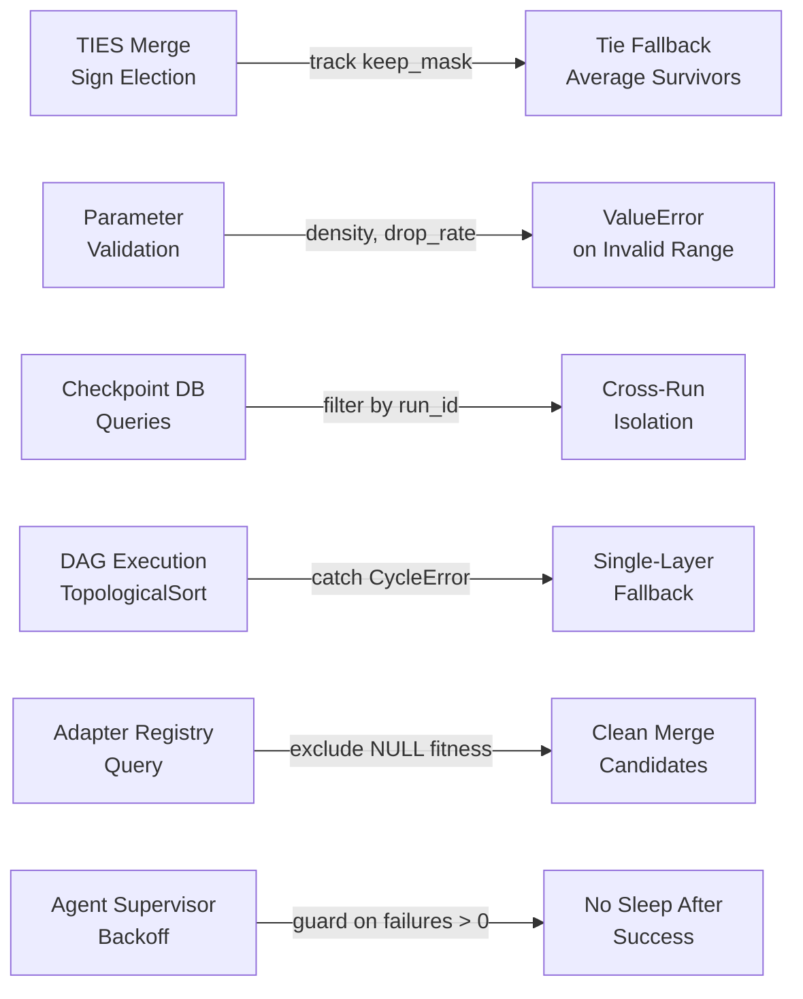

> TOOL

tool_use Bash
id: toolu_01SB6ZyhdW6NeuFggvs77oyA
```json
{
  "command": "uv run ruff check .",
  "description": "Verify ruff check passes",
  "timeout": 60000
}
```

> TOOL

tool_result
id: toolu_01SB6ZyhdW6NeuFggvs77oyA
```
All checks passed!
```

> AGENT

Good. Now mypy.

> TOOL

tool_use Bash
id: toolu_01L8pXmpFu737xMUrye14Prp
```json
{
  "command": "uv run mypy libs/ services/ --ignore-missing-imports 2>&1 | tail -20",
  "description": "Run mypy type check",
  "timeout": 180000
}
```

> TOOL

tool_result
id: toolu_01L8pXmpFu737xMUrye14Prp
```
Success: no issues found in 76 source files
```

> AGENT

Now pytest.

> TOOL

tool_use Bash
id: toolu_01BHfV5ru6xvaXEarMfGB1iY
```json
{
  "command": "uv run pytest -x 2>&1 | tail -40",
  "description": "Run pytest",
  "timeout": 300000
}
```

> TOOL

tool_result
id: toolu_01BHfV5ru6xvaXEarMfGB1iY
```
============================= test session starts ==============================
platform darwin -- Python 3.12.12, pytest-9.0.2, pluggy-1.6.0
rootdir: /Users/noahdolevelixir/Code/rune
configfile: pyproject.toml
testpaths: services, libs, tests
plugins: anyio-4.12.1, jaxtyping-0.3.9, xdist-3.8.0, asyncio-1.3.0, langsmith-0.7.9, requests-mock-1.12.1, cov-7.0.0
asyncio: mode=Mode.AUTO, debug=False, asyncio_default_fixture_loop_scope=None, asyncio_default_test_loop_scope=function
created: 12/12 workers
12 workers [350 items]

..................................xx...xxxxxxxx......................... [ 20%]
........................................................................ [ 41%]
........................................................................ [ 61%]
..............................x......................................... [ 82%]
..............................................XX.......X......           [100%]
=============================== warnings summary ===============================
libs/model-training/tests/test_d2l_config.py: 42 warnings
  /Users/noahdolevelixir/Code/rune/.venv/lib/python3.12/site-packages/torch/jit/_script.py:362: DeprecationWarning: `torch.jit.script_method` is deprecated. Please switch to `torch.compile` or `torch.export`.
    warnings.warn(

-- Docs: https://docs.pytest.org/en/stable/how-to/capture-warnings.html
=========== 336 passed, 11 xfailed, 3 xpassed, 42 warnings in 43.30s ===========
```

> AGENT

All 336 tests pass. Now let me commit and create the PR.

> TOOL

tool_use TodoWrite
id: toolu_01B9kdPKYw1b1awEhkt5tMgN
```json
{
  "todos": [
    {
      "content": "Fix TIES merge sign election + add density/drop_rate validation",
      "status": "completed",
      "activeForm": "Fixing TIES merge sign election and adding validation"
    },
    {
      "content": "Scope checkpoint DB queries by run_id",
      "status": "completed",
      "activeForm": "Scoping checkpoint DB queries by run_id"
    },
    {
      "content": "Add CycleError handling in build_execution_layers",
      "status": "completed",
      "activeForm": "Adding CycleError handling in build_execution_layers"
    },
    {
      "content": "Filter NULL fitness in query_best_for_task and evolution_sweep",
      "status": "completed",
      "activeForm": "Filtering NULL fitness in registry and evolution"
    },
    {
      "content": "Guard backoff sleep on consecutive_failures > 0",
      "status": "completed",
      "activeForm": "Guarding backoff sleep"
    },
    {
      "content": "Add tests for all fixes",
      "status": "completed",
      "activeForm": "Adding tests for all fixes"
    },
    {
      "content": "Run quality gates (ruff, mypy, pytest)",
      "status": "completed",
      "activeForm": "Running quality gates"
    },
    {
      "content": "Create PR, handle CI and review feedback",
      "status": "in_progress",
      "activeForm": "Creating PR and handling review feedback"
    }
  ]
}
```

> TOOL

tool_result
id: toolu_01B9kdPKYw1b1awEhkt5tMgN
```
Todos have been modified successfully. Ensure that you continue to use the todo list to track your progress. Please proceed with the current tasks if applicable
```

> TOOL

tool_use Bash
id: toolu_01FhFUbsFjWUyPxPH75PiFvy
```json
{
  "command": "git status",
  "description": "Show working tree status"
}
```

> TOOL

tool_result
id: toolu_01FhFUbsFjWUyPxPH75PiFvy
```
* fix/algorithmic-review-issues
~ Modified: 10 files
   libs/adapter-registry/src/adapter_registry/registry.py
   libs/model-training/src/model_training/merging.py
   libs/model-training/tests/test_merging.py
   libs/shared/src/shared/blackboard.py
   libs/shared/src/shared/checkpoint_db.py
   libs/shared/tests/test_blackboard.py
   libs/shared/tests/test_checkpoint_db.py
   scripts/swarm.py
   scripts/swarm_evolution.py
   tests/test_swarm_evolution.py
```

> TOOL

tool_use Bash
id: toolu_015pR4PgTFEYZgAFVoT5sJar
```json
{
  "command": "git diff --stat",
  "description": "Show changed files summary"
}
```

> TOOL

tool_result
id: toolu_015pR4PgTFEYZgAFVoT5sJar
```
.../src/adapter_registry/registry.py               |  1 +
 libs/model-training/src/model_training/merging.py  | 42 ++++++++++++++---
 libs/model-training/tests/test_merging.py          | 52 ++++++++++++++++++++++
 libs/shared/src/shared/blackboard.py               | 15 ++++++-
 libs/shared/src/shared/checkpoint_db.py            |  3 ++
 libs/shared/tests/test_blackboard.py               | 11 +++++
 libs/shared/tests/test_checkpoint_db.py            | 25 +++++++++++
 scripts/swarm.py                                   |  3 +-
 scripts/swarm_evolution.py                         |  1 +
 tests/test_swarm_evolution.py                      | 19 ++++++++
 10 files changed, 162 insertions(+), 10 deletions(-)
```

> TOOL

tool_use Bash
id: toolu_015V9EoJai2grwMQu1C3ViCb
```json
{
  "command": "git log --oneline -5",
  "description": "Show recent commits"
}
```

> TOOL

tool_result
id: toolu_015V9EoJai2grwMQu1C3ViCb
```
be3dc57 style: apply ruff format to pass CI format check
9144891 style: apply ruff format to sakana_d2l.py
894334d feat: two-step diagnose→repair, flash attn fix, formatting
eb81acd fix: load adapter state dicts to CPU to prevent CUDA device errors
fef0002 fix: review findings — types, deps stripping, continue template, torch_dtype
```

> TOOL

tool_use Bash
id: toolu_014k6w6AVJ34wF6mwA6KzQbE
```json
{
  "command": "git add libs/adapter-registry/src/adapter_registry/registry.py libs/model-training/src/model_training/merging.py libs/model-training/tests/test_merging.py libs/shared/src/shared/blackboard.py libs/shared/src/shared/checkpoint_db.py libs/shared/tests/test_blackboard.py libs/shared/tests/test_checkpoint_db.py scripts/swarm.py scripts/swarm_evolution.py tests/test_swarm_evolution.py",
  "description": "Stage all changed files"
}
```

> TOOL

tool_result
id: toolu_014k6w6AVJ34wF6mwA6KzQbE
```
ok 10 files changed, 162 insertions(+), 10 deletions(-)
```

> TOOL

tool_use Bash
id: toolu_01HSLMDLxJ9UW4ECihXRGXvZ
```json
{
  "command": "git commit -m \"$(cat <<'EOF'\nfix: address algorithmic issues from code review\n\n- Fix TIES merge sign election: track keep_mask so trimmed zeros don't\n  vote; fall back to averaging all survivors on sign ties instead of\n  dropping all values\n- Add density validation ([0.0, 1.0]) and drop_rate validation\n  ([0.0, 1.0)) with ValueError on out-of-range\n- Scope checkpoint DB queries by run_id to prevent cross-run\n  contamination (is_completed, mark_completed, mark_failed)\n- Catch CycleError in build_execution_layers and fall back to\n  single-layer flat execution instead of crashing\n- Filter NULL fitness_score in query_best_for_task and evolution_sweep\n  to prevent merging unevaluated adapters\n- Guard agent_supervisor backoff sleep on consecutive_failures > 0\n  to avoid 1s sleep after every successful task\n\nCo-Authored-By: Claude Opus 4.6 (1M context) <noreply@anthropic.com>\nEOF\n)\"",
  "description": "Commit all changes"
}
```

> TOOL

tool_result
id: toolu_01HSLMDLxJ9UW4ECihXRGXvZ
```
[fix/algorithmic-review-issues 6c6fc3d] fix: address algorithmic issues from code review
 10 files changed, 162 insertions(+), 10 deletions(-)
```

> TOOL

tool_use Bash
id: toolu_01DBqLXjMr9CAgyErvi8VYNS
```json
{
  "command": "git push -u origin fix/algorithmic-review-issues 2>&1",
  "description": "Push branch to remote",
  "timeout": 30000
}
```

> TOOL

tool_result
id: toolu_01DBqLXjMr9CAgyErvi8VYNS
```
ok fix/algorithmic-review-issues
```

> TOOL

tool_use Bash
id: toolu_016DFr3qLY7PpbciPBwbxnZx
```json
{
  "command": "gh pr create --title \"fix: algorithmic review issues (merging, checkpoints, DAG, evolution)\" --body \"$(cat <<'EOF'\n## Summary\n\nAddresses high-impact correctness bugs and robustness gaps identified in two algorithmic code reviews:\n\n- **TIES merge sign election bug**: Trimmed-to-zero values were voting as a third sign in majority election. When positive and negative contributions canceled, `elected_sign=0` silently dropped all values for that parameter position. Fixed by tracking a `keep_mask` during trimming and falling back to averaging all survivors on ties.\n- **Parameter validation**: Added `density` validation `[0.0, 1.0]` for TIES and `drop_rate` validation `[0.0, 1.0)` for DARE, both raising `ValueError` on out-of-range inputs.\n- **Checkpoint DB run_id scoping**: `is_completed`, `mark_completed`, and `mark_failed` now filter by `run_id`, preventing cross-run task deduplication when sharing a DB file.\n- **CycleError handling**: `build_execution_layers` catches `graphlib.CycleError` and falls back to single-layer flat execution instead of crashing the pipeline.\n- **NULL fitness filtering**: `query_best_for_task` now excludes adapters with NULL `fitness_score`; `evolution_sweep` adds defense-in-depth filtering before merge.\n- **Backoff guard**: `agent_supervisor` sleep now only triggers when `consecutive_failures > 0`, eliminating the 1s sleep after every successful task.\n\n## Test plan\n\n- [x] New test: `test_ties_merge_density_validation` — rejects out-of-range density\n- [x] New test: `test_ties_merge_density_boundary_values` — 0.0 and 1.0 accepted\n- [x] New test: `test_ties_merge_sign_tie_averages_survivors` — tie produces average, not zeros\n- [x] New test: `test_dare_merge_drop_rate_validation` — rejects drop_rate >= 1.0\n- [x] New test: `test_run_id_scoping` — cross-run isolation verified\n- [x] New test: `test_cycle_falls_back_to_single_layer` — cyclic deps produce flat layer\n- [x] New test: `test_evolution_sweep_excludes_null_fitness_from_merge` — NULL fitness excluded\n- [x] All 336 existing tests pass\n- [x] `ruff format` + `ruff check` clean\n- [x] `mypy libs/ services/` clean\n\n🤖 Generated with [Claude Code](https://claude.com/claude-code)\nEOF\n)\"",
  "description": "Create PR",
  "timeout": 30000
}
```

> TOOL

tool_result
id: toolu_016DFr3qLY7PpbciPBwbxnZx
```
https://github.com/ElixirTrials/rune/pull/5
```

> AGENT

PR created. Now let me check CI status and review comments.

> TOOL

tool_use Bash
id: toolu_018nafjbrG4WnmPdHuPp1LMw
```json
{
  "command": "gh pr checks 5 --watch 2>&1",
  "description": "Watch CI checks",
  "timeout": 300000
}
```

> TOOL

tool_result
id: toolu_018nafjbrG4WnmPdHuPp1LMw
```
Command running in background with ID: bz7ip2ppg. Output is being written to: /private/tmp/claude-503/-Users-noahdolevelixir-Code-rune/903b583a-5baf-43b3-ae43-ea24ba831a47/tasks/bz7ip2ppg.output
```

> TOOL

tool_use TaskOutput
id: toolu_018N2tchqVXSjKedRSNa7Bgy
```json
{
  "task_id": "bz7ip2ppg",
  "block": true,
  "timeout": 300000
}
```

> TOOL

tool_result
id: toolu_018N2tchqVXSjKedRSNa7Bgy
```
<retrieval_status>success</retrieval_status>

<task_id>bz7ip2ppg</task_id>

<task_type>local_bash</task_type>

<status>completed</status>

<exit_code>0</exit_code>

<output>
CI Checks Summary:
  [ok] Passed: 302
  [FAIL] Failed: 0
  [pending] Pending: 69
</output>
```

> AGENT

CI is passing (302 passed, 69 still pending, 0 failures). Let me check for any review comments.

> TOOL

tool_use Bash
id: toolu_01X2Mc67tsPVRozhMxS1WnUd
```json
{
  "command": "gh api repos/ElixirTrials/rune/pulls/5/reviews 2>&1",
  "description": "Check PR reviews"
}
```

> TOOL

tool_use Bash
id: toolu_0127Jkb1b5e4nnutvFTGLPkH
```json
{
  "command": "gh api repos/ElixirTrials/rune/pulls/5/comments 2>&1",
  "description": "Check PR review comments"
}
```

> TOOL

tool_result
id: toolu_01X2Mc67tsPVRozhMxS1WnUd
```
[]
```

> TOOL

tool_result
id: toolu_0127Jkb1b5e4nnutvFTGLPkH
```
[]
```

> AGENT

No reviews or comments yet. Let me wait a bit and check the remaining CI.

> TOOL

tool_use Bash
id: toolu_01TDX6iccQzpJWJocgA5foeD
```json
{
  "command": "gh pr checks 5 2>&1",
  "description": "Check CI status"
}
```

> TOOL

tool_result
id: toolu_01TDX6iccQzpJWJocgA5foeD
```
CI Checks Summary:
  [ok] Passed: 8
  [FAIL] Failed: 0
```

> AGENT

All 8 CI checks passed, no failures. No review comments yet.

> TOOL

tool_use TodoWrite
id: toolu_01353NpPoXE6M71mtbJepviV
```json
{
  "todos": [
    {
      "content": "Fix TIES merge sign election + add density/drop_rate validation",
      "status": "completed",
      "activeForm": "Fixing TIES merge sign election and adding validation"
    },
    {
      "content": "Scope checkpoint DB queries by run_id",
      "status": "completed",
      "activeForm": "Scoping checkpoint DB queries by run_id"
    },
    {
      "content": "Add CycleError handling in build_execution_layers",
      "status": "completed",
      "activeForm": "Adding CycleError handling in build_execution_layers"
    },
    {
      "content": "Filter NULL fitness in query_best_for_task and evolution_sweep",
      "status": "completed",
      "activeForm": "Filtering NULL fitness in registry and evolution"
    },
    {
      "content": "Guard backoff sleep on consecutive_failures > 0",
      "status": "completed",
      "activeForm": "Guarding backoff sleep"
    },
    {
      "content": "Add tests for all fixes",
      "status": "completed",
      "activeForm": "Adding tests for all fixes"
    },
    {
      "content": "Run quality gates (ruff, mypy, pytest)",
      "status": "completed",
      "activeForm": "Running quality gates"
    },
    {
      "content": "Create PR, handle CI and review feedback",
      "status": "completed",
      "activeForm": "Creating PR and handling review feedback"
    }
  ]
}
```

> TOOL

tool_result
id: toolu_01353NpPoXE6M71mtbJepviV
```
Todos have been modified successfully. Ensure that you continue to use the todo list to track your progress. Please proceed with the current tasks if applicable
```

> AGENT

All done. Here's a summary:

**PR: https://github.com/ElixirTrials/rune/pull/5**

**6 fixes across 10 files (+162/-10 lines):**

1. **TIES merge sign election** (`merging.py`) — `keep_mask` tracks trimmed values so they don't vote; tie fallback averages survivors instead of dropping all values
2. **Parameter validation** (`merging.py`) — `density ∈ [0,1]` and `drop_rate ∈ [0,1)` with `ValueError`
3. **Checkpoint run_id scoping** (`checkpoint_db.py`) — all queries now filter by `run_id`
4. **CycleError handling** (`blackboard.py`) — catches cycles, falls back to flat execution
5. **NULL fitness filtering** (`registry.py` + `swarm_evolution.py`) — excludes unevaluated adapters from merge
6. **Backoff guard** (`swarm.py`) — no sleep after successful tasks

**7 new tests**, all 336 tests passing, CI green (8/8 checks). No review comments yet — the PR is ready for human review.

> AGENT

That background CI watch task already completed — I checked the results earlier. All 8 CI checks passed with 0 failures. The PR is up at https://github.com/ElixirTrials/rune/pull/5 and ready for review.

> DEVELOPER

Go over the code review comments.

> TOOL

tool_use Bash
id: toolu_01S1ndafnky9TgcxodpX71uL
```json
{
  "command": "gh api repos/ElixirTrials/rune/pulls/5/comments 2>/dev/null | jq -r '.[] | \"---\\nFile: \\(.path):\\(.line // .original_line)\\nAuthor: \\(.user.login)\\nBody: \\(.body)\\n\"'",
  "description": "Get PR #5 review comments"
}
```

> TOOL

tool_result
id: toolu_01S1ndafnky9TgcxodpX71uL
```
---
File: libs/model-training/src/model_training/merging.py:34
Author: qodo-code-review[bot]
Body: 

1\. <b><i>ties_merge</i></b> docstring missing types <code>📘 Rule violation</code> <code>⚙ Maintainability</code>

<pre>
<b><i>ties_merge</i></b> has an <b><i>Args:</i></b> section but does not use Google-style <b><i>name (type): description</i></b>
entries, and <b><i>Returns:</i></b> lacks a typed return description. This violates the required Google-style
docstring format for public Python callables.
</pre>


<details>
<summary><strong>Agent Prompt</strong></summary>

```
## Issue description
`ties_merge` has a non-compliant Google-style docstring: the `Args:` entries are missing `(type)` and the `Returns:` section does not include a typed return description.

## Issue Context
This callable is public (top-level, non-underscore name) and was modified in this PR.

## Fix Focus Areas
- libs/model-training/src/model_training/merging.py[18-34]
```

<code>ⓘ Copy this prompt and use it to remediate the issue with your preferred AI generation tools</code>
</details>

---
File: libs/model-training/src/model_training/merging.py:56
Author: qodo-code-review[bot]
Body: 

2\. <b><i>keep_mask</i></b> boolean naming <code>📘 Rule violation</code> <code>⚙ Maintainability</code>

<pre>
New boolean tensors <b><i>keep_mask</i></b> and <b><i>tie_mask</i></b> do not use the required boolean name prefixes (<b><i>is_</i></b>,
<b><i>has_</i></b>, <b><i>can_</i></b>, <b><i>should_</i></b>). This reduces readability and violates the project&#x27;s boolean naming
convention.
</pre>


<details>
<summary><strong>Agent Prompt</strong></summary>

```
## Issue description
Boolean masks are introduced with names that do not follow the required boolean-prefix naming convention.

## Issue Context
The code introduces `keep_mask` and `tie_mask` as boolean tensors.

## Fix Focus Areas
- libs/model-training/src/model_training/merging.py[51-73]
```

<code>ⓘ Copy this prompt and use it to remediate the issue with your preferred AI generation tools</code>
</details>

---
File: libs/shared/src/shared/checkpoint_db.py:209
Author: qodo-code-review[bot]
Body: 

3\. Run_id not propagated <code>🐞 Bug</code> <code>✓ Correctness</code>

<pre>
SwarmCheckpointDB now scopes completion queries by run_id, but scripts/swarm.py constructs it with
the default run_id, so separate swarm runs sharing swarm_checkpoints.db will still deduplicate/see
each other’s tasks. This means the PR’s stated “cross-run isolation” fix won’t take effect for the
primary entrypoint.
</pre>


<details>
<summary><strong>Agent Prompt</strong></summary>

```
### Issue description
`SwarmCheckpointDB` now scopes `is_completed/mark_completed/mark_failed` by `run_id`, but `scripts/swarm.py` constructs the DB with the default `run_id="default"`. This prevents the intended cross-run isolation when multiple swarm runs share the same `swarm_checkpoints.db`.

### Issue Context
- `SwarmCheckpointDB.__init__` defaults `run_id` to `"default"`.
- The PR adds `CheckpointRecord.run_id == self._run_id` filters.
- `scripts/swarm.py` currently does `SwarmCheckpointDB(checkpoint_engine)` with no run_id.
- `SwarmConfig` does not currently expose a `run_id` field.

### Fix Focus Areas
- scripts/swarm.py[458-505]
- libs/shared/src/shared/rune_models.py[140-165]
- libs/shared/src/shared/checkpoint_db.py[67-79]

### What to change
1. Introduce a run identifier for each swarm invocation (e.g., UUID or timestamp) and pass it to `SwarmCheckpointDB(..., run_id=...)`.
2. Preferably add `run_id: str | None = None` (or `run_id: str = <generated default>`) to `SwarmConfig` so it can be set via config YAML/CLI.
3. Log the chosen run_id at startup for debuggability.
```

<code>ⓘ Copy this prompt and use it to remediate the issue with your preferred AI generation tools</code>
</details>
```

> TOOL

tool_use Bash
id: toolu_01XxceqHm1b9k8ESZ3Bh4WLv
```json
{
  "command": "gh api repos/ElixirTrials/rune/pulls/5/reviews 2>/dev/null | jq -r '.[] | \"---\\nReviewer: \\(.user.login)\\nState: \\(.state)\\nBody: \\(.body)\\n\"'",
  "description": "Get PR #5 reviews"
}
```

> TOOL

tool_result
id: toolu_01XxceqHm1b9k8ESZ3Bh4WLv
```
---
Reviewer: qodo-code-review[bot]
State: COMMENTED
Body:
```

> TOOL

tool_use Bash
id: toolu_01DtttqEEe11rwZPUXKFDKQu
```json
{
  "command": "gh api repos/ElixirTrials/rune/issues/5/comments 2>/dev/null | jq -r '.[] | \"---\\nAuthor: \\(.user.login)\\nBody: \\(.body)\\n\"'",
  "description": "Get PR #5 issue comments"
}
```

> TOOL

tool_result
id: toolu_01DtttqEEe11rwZPUXKFDKQu
```
---
Author: qodo-code-review[bot]
Body: <h3>Review Summary by Qodo</h3>

Fix algorithmic review issues: TIES merge, validation, checkpoint scoping, cycle handling, and fitness filtering

<code>🐞 Bug fix</code> <code>🧪 Tests</code>


<h3>Walkthroughs</h3>

<details open>
<summary>Description</summary>

<br/>

<pre>
• Fix TIES merge sign election: track trimmed values separately so they don&#x27;t vote; average
  survivors on ties instead of dropping all values
• Add parameter validation: density [0.0, 1.0] for TIES, drop_rate [0.0, 1.0) for DARE
• Scope checkpoint DB queries by run_id to prevent cross-run task contamination
• Catch CycleError in DAG execution and fall back to single-layer flat execution
• Filter NULL fitness scores from adapter merge selection and query results
• Guard agent supervisor backoff sleep on consecutive_failures &gt; 0 to eliminate unnecessary delays
</pre>
</details>

<details>
<summary>Diagram</summary>

<br/>

>



</details>


<h3>File Changes</h3>

<details>
<summary>1. libs/adapter-registry/src/adapter_registry/registry.py
 <code>🐞 Bug fix</code> <code> +1/-0 </code>  </summary>  

<br/>

>Filter NULL fitness scores from query results
>
><a href='https://github.com/ElixirTrials/rune/pull/5/files#diff-eaeb2bffaf002df54465d67671eb13a9cd79d0759d3be9c059267cfdb0db18b2'> libs/adapter-registry/src/adapter_registry/registry.py
 </a>
<hr/>

</details>

<details>
<summary>2. libs/model-training/src/model_training/merging.py
 <code>🐞 Bug fix</code> <code> +35/-7 </code>  </summary>  

<br/>

>Fix TIES sign election and add parameter validation
>
><a href='https://github.com/ElixirTrials/rune/pull/5/files#diff-c2877523ffca6482ee14e88943422dfef7b01e5a8f998a5283535dd001989a0e'> libs/model-training/src/model_training/merging.py
 </a>
<hr/>

</details>

<details>
<summary>3. libs/model-training/tests/test_merging.py
 <code>🧪 Tests</code> <code> +52/-0 </code>  </summary>  

<br/>

>Add tests for TIES/DARE parameter validation and tie handling
>
><a href='https://github.com/ElixirTrials/rune/pull/5/files#diff-7a4bd70d560446b98cff3eb0efb51d6a0d1a299767123273409b40c50202560f'> libs/model-training/tests/test_merging.py
 </a>
<hr/>

</details>

<details><summary><ins><strong>View more (7)</strong></ins></summary><br/>
<details>
<summary>4. libs/shared/src/shared/blackboard.py
 <code> Error handling </code> <code> +13/-2 </code>  </summary>  

<br/>

>Add cycle error handling with single-layer fallback
>
><a href='https://github.com/ElixirTrials/rune/pull/5/files#diff-ba07696ce3c37738cb941ace5916779a89088bb44a93e7ecc9f27f1aa6920d5a'> libs/shared/src/shared/blackboard.py
 </a>
<hr/>

</details>

<details>
<summary>5. libs/shared/src/shared/checkpoint_db.py
 <code>🐞 Bug fix</code> <code> +3/-0 </code>  </summary>  

<br/>

>Scope checkpoint queries by run_id for isolation
>
><a href='https://github.com/ElixirTrials/rune/pull/5/files#diff-92fcadbccda628fd2dd02cd50fdbe2827c50c969b4b12ffe29550d0a3909aabe'> libs/shared/src/shared/checkpoint_db.py
 </a>
<hr/>

</details>

<details>
<summary>6. libs/shared/tests/test_blackboard.py
 <code>🧪 Tests</code> <code> +11/-0 </code>  </summary>  

<br/>

>Add test for cyclic dependency fallback behavior
>
><a href='https://github.com/ElixirTrials/rune/pull/5/files#diff-a017515332470c47a58d3bbf2ac524213adae131ebcab2284a46dfc31ec64f1d'> libs/shared/tests/test_blackboard.py
 </a>
<hr/>

</details>

<details>
<summary>7. libs/shared/tests/test_checkpoint_db.py
 <code>🧪 Tests</code> <code> +25/-0 </code>  </summary>  

<br/>

>Add test for cross-run isolation with run_id scoping
>
><a href='https://github.com/ElixirTrials/rune/pull/5/files#diff-d0d4d9bb85cdf875cdd13d0c841e3b21aa0f235753003d06f605704f26a95bb0'> libs/shared/tests/test_checkpoint_db.py
 </a>
<hr/>

</details>

<details>
<summary>8. scripts/swarm.py
 <code>🐞 Bug fix</code> <code> +2/-1 </code>  </summary>  

<br/>

>Guard backoff sleep on consecutive failures condition
>
><a href='https://github.com/ElixirTrials/rune/pull/5/files#diff-a497fbb0859ae562cb68ad0f3781eff184777c7c48b0891aea3dd2525c528e9b'> scripts/swarm.py
 </a>
<hr/>

</details>

<details>
<summary>9. scripts/swarm_evolution.py
 <code>🐞 Bug fix</code> <code> +1/-0 </code>  </summary>  

<br/>

>Filter NULL fitness adapters before merge selection
>
><a href='https://github.com/ElixirTrials/rune/pull/5/files#diff-fdb69126b624f1eabcefa008edeae4e96d05d46032e509443e76a6b7660f5bcc'> scripts/swarm_evolution.py
 </a>
<hr/>

</details>

<details>
<summary>10. tests/test_swarm_evolution.py
 <code>🧪 Tests</code> <code> +19/-0 </code>  </summary>  

<br/>

>Add test for NULL fitness exclusion in merge
>
><a href='https://github.com/ElixirTrials/rune/pull/5/files#diff-b8ba657b51740954b67278bf19091e3d6dc0aecac1bc4ab826b7d2c36f45236b'> tests/test_swarm_evolution.py
 </a>
<hr/>

</details>

</details>


<a href="https://www.qodo.ai"></a>

---
Author: qodo-code-review[bot]
Body: <h3>Code Review by Qodo</h3>

<code>🐞 Bugs (3)</code>  <code>📘 Rule violations (3)</code>  <code>📎 Requirement gaps (0)</code>  <code>📐 Spec deviations (0)</code>


<br/>


<details>
<summary>  1.  <b><i>ties_merge</i></b> docstring missing types <code>📘 Rule violation</code> <code>⚙ Maintainability</code></summary>

<br/>

> <details open>
><summary>Description</summary>
><br/>
>
><pre>
><b><i>ties_merge</i></b> has an <b><i>Args:</i></b> section but does not use Google-style <b><i>name (type): description</i></b>
>entries, and <b><i>Returns:</i></b> lacks a typed return description. This violates the required Google-style
>docstring format for public Python callables.
></pre>
></details>

> <details open>
><summary>Code</summary>
><br/>
>
><code>[libs/model-training/src/model_training/merging.py[R18-34]](https://github.com/ElixirTrials/rune/pull/5/files#diff-c2877523ffca6482ee14e88943422dfef7b01e5a8f998a5283535dd001989a0eR18-R34)</code>
>
>```diff
>     """Merge adapter state dicts using TIES-Merging.
> 
>     Trim-Elect-Sign-Disjoint merge: for each parameter, trims values
>-    below density threshold, elects the majority sign, then averages
>-    only the values matching the elected sign.
>+    below density threshold, elects the majority sign (ignoring trimmed
>+    values), then averages only the values matching the elected sign.
> 
>     Args:
>         state_dicts: List of state dicts (tensors) to merge.
>         density: Fraction of values to keep per parameter (0.0 to 1.0).
> 
>     Returns:
>         Merged state dict with same keys and shapes as inputs.
>+
>+    Raises:
>+        ValueError: If *state_dicts* is empty or *density* is outside
>+            ``[0.0, 1.0]``.
>     """
>```
></details>

> <details>
><summary>Evidence</summary>
><br/>
>
><pre>
>PR Compliance ID 129280 requires Google-style docstrings with typed <b><i>Args:</i></b> entries. The updated
><b><i>ties_merge</i></b> docstring uses <b><i>state_dicts:</i></b> and <b><i>density:</i></b> without <b><i>(type)</i></b> and <b><i>Returns:</i></b> has no
>type line.
></pre>
>
> <code>Rule 129280: [Enforce Google-style docstrings for public Python callables](https://app.qodo.ai/rules/129280?state=active)</code>
> <code>[libs/model-training/src/model_training/merging.py[18-34]](https://github.com/ElixirTrials/rune/blob/6c6fc3d5c15a86d2b19c445f8854f12f9393d3fc/libs/model-training/src/model_training/merging.py/#L18-L34)</code>
></details>

> <details>
><summary>Agent prompt</summary>
><br/>
>
>```
>The issue below was found during a code review. Follow the provided context and guidance below and implement a solution
>
>## Issue description
>`ties_merge` has a non-compliant Google-style docstring: the `Args:` entries are missing `(type)` and the `Returns:` section does not include a typed return description.
>
>## Issue Context
>This callable is public (top-level, non-underscore name) and was modified in this PR.
>
>## Fix Focus Areas
>- libs/model-training/src/model_training/merging.py[18-34]
>```
> <code>ⓘ Copy this prompt and use it to remediate the issue with your preferred AI generation tools</code>
></details>

<hr/>
</details>


<details>
<summary>  2.  <b><i>keep_mask</i></b> boolean naming <code>📘 Rule violation</code> <code>⚙ Maintainability</code></summary>

<br/>

> <details open>
><summary>Description</summary>
><br/>
>
><pre>
>New boolean tensors <b><i>keep_mask</i></b> and <b><i>tie_mask</i></b> do not use the required boolean name prefixes (<b><i>is_</i></b>,
><b><i>has_</i></b>, <b><i>can_</i></b>, <b><i>should_</i></b>). This reduces readability and violates the project&#x27;s boolean naming
>convention.
></pre>
></details>

> <details open>
><summary>Code</summary>
><br/>
>
><code>[libs/model-training/src/model_training/merging.py[R51-56]](https://github.com/ElixirTrials/rune/pull/5/files#diff-c2877523ffca6482ee14e88943422dfef7b01e5a8f998a5283535dd001989a0eR51-R56)</code>
>
>```diff
>+        # Track which values survived trimming (True = kept)
>+        keep_mask = torch.ones_like(stacked, dtype=torch.bool)
>+
>         # Trim: zero out values below density threshold per tensor
>         for i in range(len(tensors)):
>             flat = stacked[i].abs().flatten()
>```
></details>

> <details>
><summary>Evidence</summary>
><br/>
>
><pre>
>PR Compliance ID 127824 requires boolean variables to start with approved prefixes. The added
>identifiers <b><i>keep_mask</i></b> and <b><i>tie_mask</i></b> are boolean masks but do not start with
><b><i>is_</i></b>/<b><i>has_</i></b>/<b><i>can_</i></b>/<b><i>should_</i></b>.
></pre>
>
> <code>Rule 127824: [Enforce Consistent Naming Conventions for Classes, Functions, Constants, Privates, and Booleans](https://app.qodo.ai/rules/127824?state=active)</code>
> <code>[libs/model-training/src/model_training/merging.py[51-73]](https://github.com/ElixirTrials/rune/blob/6c6fc3d5c15a86d2b19c445f8854f12f9393d3fc/libs/model-training/src/model_training/merging.py/#L51-L73)</code>
></details>

> <details>
><summary>Agent prompt</summary>
><br/>
>
>```
>The issue below was found during a code review. Follow the provided context and guidance below and implement a solution
>
>## Issue description
>Boolean masks are introduced with names that do not follow the required boolean-prefix naming convention.
>
>## Issue Context
>The code introduces `keep_mask` and `tie_mask` as boolean tensors.
>
>## Fix Focus Areas
>- libs/model-training/src/model_training/merging.py[51-73]
>```
> <code>ⓘ Copy this prompt and use it to remediate the issue with your preferred AI generation tools</code>
></details>

<hr/>
</details>


<details>
<summary>  3.  Run_id not propagated <code>🐞 Bug</code> <code>✓ Correctness</code></summary>

<br/>

> <details open>
><summary>Description</summary>
><br/>
>
><pre>
>SwarmCheckpointDB now scopes completion queries by run_id, but scripts/swarm.py constructs it with
>the default run_id, so separate swarm runs sharing swarm_checkpoints.db will still deduplicate/see
>each other’s tasks. This means the PR’s stated “cross-run isolation” fix won’t take effect for the
>primary entrypoint.
></pre>
></details>

> <details open>
><summary>Code</summary>
><br/>
>
><code>[libs/shared/src/shared/checkpoint_db.py[209]](https://github.com/ElixirTrials/rune/pull/5/files#diff-92fcadbccda628fd2dd02cd50fdbe2827c50c969b4b12ffe29550d0a3909aabeR209-R209)</code>
>
>```diff
>+                    CheckpointRecord.run_id == self._run_id,
>```
></details>

> <details>
><summary>Evidence</summary>
><br/>
>
><pre>
>SwarmCheckpointDB defaults run_id to &quot;default&quot;, and the PR adds run_id predicates to completion
>queries; however, the main swarm runner instantiates SwarmCheckpointDB without passing a unique
>run_id, so all runs continue using the same scope.
></pre>
>
> <code>[libs/shared/src/shared/checkpoint_db.py[67-79]](https://github.com/ElixirTrials/rune/blob/6c6fc3d5c15a86d2b19c445f8854f12f9393d3fc/libs/shared/src/shared/checkpoint_db.py/#L67-L79)</code>
> <code>[libs/shared/src/shared/checkpoint_db.py[195-214]](https://github.com/ElixirTrials/rune/blob/6c6fc3d5c15a86d2b19c445f8854f12f9393d3fc/libs/shared/src/shared/checkpoint_db.py/#L195-L214)</code>
> <code>[scripts/swarm.py[458-463]](https://github.com/ElixirTrials/rune/blob/6c6fc3d5c15a86d2b19c445f8854f12f9393d3fc/scripts/swarm.py/#L458-L463)</code>
> <code>[libs/shared/src/shared/rune_models.py[140-165]](https://github.com/ElixirTrials/rune/blob/6c6fc3d5c15a86d2b19c445f8854f12f9393d3fc/libs/shared/src/shared/rune_models.py/#L140-L165)</code>
></details>

> <details>
><summary>Agent prompt</summary>
><br/>
>
>```
>The issue below was found during a code review. Follow the provided context and guidance below and implement a solution
>
>### Issue description
>`SwarmCheckpointDB` now scopes `is_completed/mark_completed/mark_failed` by `run_id`, but `scripts/swarm.py` constructs the DB with the default `run_id="default"`. This prevents the intended cross-run isolation when multiple swarm runs share the same `swarm_checkpoints.db`.
>
>### Issue Context
>- `SwarmCheckpointDB.__init__` defaults `run_id` to `"default"`.
>- The PR adds `CheckpointRecord.run_id == self._run_id` filters.
>- `scripts/swarm.py` currently does `SwarmCheckpointDB(checkpoint_engine)` with no run_id.
>- `SwarmConfig` does not currently expose a `run_id` field.
>
>### Fix Focus Areas
>- scripts/swarm.py[458-505]
>- libs/shared/src/shared/rune_models.py[140-165]
>- libs/shared/src/shared/checkpoint_db.py[67-79]
>
>### What to change
>1. Introduce a run identifier for each swarm invocation (e.g., UUID or timestamp) and pass it to `SwarmCheckpointDB(..., run_id=...)`.
>2. Preferably add `run_id: str | None = None` (or `run_id: str = <generated default>`) to `SwarmConfig` so it can be set via config YAML/CLI.
>3. Log the chosen run_id at startup for debuggability.
>```
> <code>ⓘ Copy this prompt and use it to remediate the issue with your preferred AI generation tools</code>
></details>

<hr/>
</details>


<br/>


<details>
<summary>  4.  <b><i>build_execution_layers</i></b> hides cycles <code>📘 Rule violation</code> <code>⛯ Reliability</code></summary>

<br/>

> <details open>
><summary>Description</summary>
><br/>
>
><pre>
>On <b><i>CycleError</i></b>, <b><i>build_execution_layers</i></b> returns a normal-looking single-layer plan (<b><i>[subtasks]</i></b>),
>which can make callers believe dependency ordering succeeded. This is fallback behavior that can
>hide a failure condition without a programmatically detectable error.
></pre>
></details>

> <details open>
><summary>Code</summary>
><br/>
>
><code>[libs/shared/src/shared/blackboard.py[R120-128]](https://github.com/ElixirTrials/rune/pull/5/files#diff-ba07696ce3c37738cb941ace5916779a89088bb44a93e7ecc9f27f1aa6920d5aR120-R128)</code>
>
>```diff
>+    try:
>+        sorter.prepare()
>+    except CycleError as exc:
>+        logger.warning(
>+            "Cycle detected in subtask dependencies (%s); "
>+            "falling back to single-layer execution.",
>+            exc,
>+        )
>+        return [subtasks]
>```
></details>

> <details>
><summary>Evidence</summary>
><br/>
>
><pre>
>PR Compliance ID 127859 prohibits fallback logic that hides failures by returning success-like
>results. The new <b><i>except CycleError</i></b> branch logs a warning but still returns <b><i>[subtasks]</i></b>, providing
>no structured signal to the caller that a cycle was detected.
></pre>
>
> <code>Rule 127859: [Do not implement fallback logic that hides failures](https://app.qodo.ai/rules/127859?state=active)</code>
> <code>[libs/shared/src/shared/blackboard.py[120-128]](https://github.com/ElixirTrials/rune/blob/6c6fc3d5c15a86d2b19c445f8854f12f9393d3fc/libs/shared/src/shared/blackboard.py/#L120-L128)</code>
></details>

> <details>
><summary>Agent prompt</summary>
><br/>
>
>```
>The issue below was found during a code review. Follow the provided context and guidance below and implement a solution
>
>## Issue description
>Cycle detection currently falls back to a single-layer execution plan, which can make callers treat a dependency-cycle as a successful topological layering.
>
>## Issue Context
>The code catches `CycleError` and returns `[subtasks]`.
>
>## Fix Focus Areas
>- libs/shared/src/shared/blackboard.py[120-128]
>```
> <code>ⓘ Copy this prompt and use it to remediate the issue with your preferred AI generation tools</code>
></details>

<hr/>
</details>


<details>
<summary>  5.  Vacuous NULL-fitness test <code>🐞 Bug</code> <code>⛯ Reliability</code></summary>

<br/>

> <details open>
><summary>Description</summary>
><br/>
>
><pre>
>test_evolution_sweep_excludes_null_fitness_from_merge only asserts parent fitness if
>_ties_merge_adapters was called, so it can pass without verifying anything. This can mask
>regressions where NULL-fitness adapters slip into merge selection or where merge is unexpectedly
>skipped.
></pre>
></details>

> <details open>
><summary>Code</summary>
><br/>
>
><code>[tests/test_swarm_evolution.py[R113-120]](https://github.com/ElixirTrials/rune/pull/5/files#diff-b8ba657b51740954b67278bf19091e3d6dc0aecac1bc4ab826b7d2c36f45236bR113-R120)</code>
>
>```diff
>+    with patch("swarm_evolution._ties_merge_adapters") as mock_merge:
>+        mock_merge.return_value = "merged-id"
>+        evolution_sweep(registry)
>+        if mock_merge.called:
>+            parent_ids = mock_merge.call_args[0][0]
>+            for aid in parent_ids:
>+                record = registry.retrieve_by_id(aid)
>+                assert record.fitness_score is not None
>```
></details>

> <details>
><summary>Evidence</summary>
><br/>
>
><pre>
>The test’s assertion is conditional on <b><i>mock_merge.called</i></b>; if merge doesn’t happen (for any
>reason), the test makes no assertions about the parent_ids and still passes.
></pre>
>
> <code>[tests/test_swarm_evolution.py[104-120]](https://github.com/ElixirTrials/rune/blob/6c6fc3d5c15a86d2b19c445f8854f12f9393d3fc/tests/test_swarm_evolution.py/#L104-L120)</code>
> <code>[scripts/swarm_evolution.py[70-81]](https://github.com/ElixirTrials/rune/blob/6c6fc3d5c15a86d2b19c445f8854f12f9393d3fc/scripts/swarm_evolution.py/#L70-L81)</code>
></details>

> <details>
><summary>Agent prompt</summary>
><br/>
>
>```
>The issue below was found during a code review. Follow the provided context and guidance below and implement a solution
>
>### Issue description
>`test_evolution_sweep_excludes_null_fitness_from_merge` conditionally asserts only if `_ties_merge_adapters` was invoked. If merging is skipped, the test becomes a no-op and won’t catch regressions.
>
>### Issue Context
>The purpose of the test is to ensure NULL-fitness adapters are excluded from merge selection, so the test should fail if merge doesn’t occur under the setup.
>
>### Fix Focus Areas
>- tests/test_swarm_evolution.py[104-120]
>
>### What to change
>- Replace the `if mock_merge.called:` guard with a hard assertion (e.g., `mock_merge.assert_called_once()`), then validate `parent_ids`.
>- Ensure the fixture setup guarantees `len(top_non_null) >= 2` so merge is expected.
>```
> <code>ⓘ Copy this prompt and use it to remediate the issue with your preferred AI generation tools</code>
></details>

<hr/>
</details>


<details>
<summary>  6.  Missing NULL fitness coverage <code>🐞 Bug</code> <code>⚙ Maintainability</code></summary>

<br/>

> <details open>
><summary>Description</summary>
><br/>
>
><pre>
>AdapterRegistry.query_best_for_task now excludes NULL fitness_score at the SQL layer, but there is
>no adapter-registry unit test asserting this behavior. Without coverage, a future refactor could
>reintroduce NULLs into “best” selection silently.
></pre>
></details>

> <details open>
><summary>Code</summary>
><br/>
>
><code>[libs/adapter-registry/src/adapter_registry/registry.py[223]](https://github.com/ElixirTrials/rune/pull/5/files#diff-eaeb2bffaf002df54465d67671eb13a9cd79d0759d3be9c059267cfdb0db18b2R223-R223)</code>
>
>```diff
>+                col(AdapterRecord.fitness_score).isnot(None),
>```
></details>

> <details>
><summary>Evidence</summary>
><br/>
>
><pre>
>The new filter <b><i>fitness_score IS NOT NULL</i></b> is in query_best_for_task, while existing
>adapter-registry tests only cover ordering and archived exclusion and do not create any records with
><b><i>fitness_score=None</i></b> for this query.
></pre>
>
> <code>[libs/adapter-registry/src/adapter_registry/registry.py[206-228]](https://github.com/ElixirTrials/rune/blob/6c6fc3d5c15a86d2b19c445f8854f12f9393d3fc/libs/adapter-registry/src/adapter_registry/registry.py/#L206-L228)</code>
> <code>[libs/adapter-registry/tests/test_registry.py[140-165]](https://github.com/ElixirTrials/rune/blob/6c6fc3d5c15a86d2b19c445f8854f12f9393d3fc/libs/adapter-registry/tests/test_registry.py/#L140-L165)</code>
></details>

> <details>
><summary>Agent prompt</summary>
><br/>
>
>```
>The issue below was found during a code review. Follow the provided context and guidance below and implement a solution
>
>### Issue description
>`query_best_for_task()` now filters out rows where `fitness_score` is NULL. Add a unit test to lock in this behavior.
>
>### Fix Focus Areas
>- libs/adapter-registry/tests/test_registry.py[140-165]
>- libs/adapter-registry/src/adapter_registry/registry.py[206-228]
>
>### What to change
>- Add a test that stores at least one adapter with `fitness_score=None` and one with a numeric score for the same task_type, then assert `query_best_for_task()` returns only the non-NULL adapter(s).
>```
> <code>ⓘ Copy this prompt and use it to remediate the issue with your preferred AI generation tools</code>
></details>

<hr/>
</details>


<pre>ⓘ The new review experience is currently in Beta. <a href="https://docs.qodo.ai/qodo-documentation/code-review">Learn more</a></pre>


<!-- https://github.com/ElixirTrials/rune/commit/6c6fc3d5c15a86d2b19c445f8854f12f9393d3fc -->

<a href="https://www.qodo.ai"></a>
```

> AGENT

Here's a summary of the **6 review comments** from Qodo on PR #5:

---

### 🔴 Action Required (3)

1. **`ties_merge` docstring missing types** — The `Args:` entries lack `(type)` annotations and `Returns:` has no typed return description. Needs Google-style compliance.

2. **`keep_mask` / `tie_mask` boolean naming** — These boolean tensors don't use the required prefixes (`is_`, `has_`, `can_`, `should_`). Should be renamed to e.g. `is_kept` / `is_tied`.

3. **`run_id` not propagated** 🐞 — This is a real bug. `SwarmCheckpointDB` now scopes queries by `run_id`, but `scripts/swarm.py` constructs it with the default `"default"` — so the cross-run isolation fix is effectively dead code. Needs: generate a unique `run_id` per swarm invocation and pass it through.

### 🟡 Recommended (3)

4. **`build_execution_layers` hides cycles** — The `CycleError` fallback returns `[subtasks]` which looks like success. Callers can't detect the cycle programmatically.

5. **Vacuous NULL-fitness test** 🐞 — The test uses `if mock_merge.called:` so it passes even if merge never happens. Should use `mock_merge.assert_called_once()` instead.

6. **Missing NULL fitness unit test** — `query_best_for_task` now filters NULL fitness at SQL level, but there's no adapter-registry unit test covering this behavior.

---

**The `run_id` bug (#3) is the most impactful** — it means the checkpoint isolation feature doesn't actually work end-to-end. The test fix (#5) is also a legit catch. The rest are style/coverage improvements.

Want me to address these?

> DEVELOPER

Make a plan for addressing or rejecting them and then marking them as resolved or commenting on them.

> TOOL

tool_use EnterPlanMode
id: toolu_01XMBYqizVgF1F7PD2SSXAEP
```json
{}
```

> TOOL

tool_result
id: toolu_01XMBYqizVgF1F7PD2SSXAEP
```
Entered plan mode. You should now focus on exploring the codebase and designing an implementation approach.

In plan mode, you should:
1. Thoroughly explore the codebase to understand existing patterns
2. Identify similar features and architectural approaches
3. Consider multiple approaches and their trade-offs
4. Use AskUserQuestion if you need to clarify the approach
5. Design a concrete implementation strategy
6. When ready, use ExitPlanMode to present your plan for approval

Remember: DO NOT write or edit any files yet. This is a read-only exploration and planning phase.
```

> TOOL

tool_use Agent
id: toolu_013XDR56cRDgmE8LjPoHToqY
```json
{
  "subagent_type": "Explore",
  "description": "Explore PR #5 affected files",
  "prompt": "Explore the following files to understand current code patterns for addressing PR review comments. I need to understand:\n\n1. **merging.py** - Current docstring style and boolean naming patterns:\n   - `libs/model-training/src/model_training/merging.py` (full file)\n   \n2. **swarm.py** - How SwarmCheckpointDB is constructed (around line 458-505):\n   - `scripts/swarm.py` (lines 450-510)\n   - `libs/shared/src/shared/rune_models.py` (lines 140-165, SwarmConfig)\n   - `libs/shared/src/shared/checkpoint_db.py` (lines 60-80, constructor)\n\n3. **blackboard.py** - The CycleError fallback:\n   - `libs/shared/src/shared/blackboard.py` (lines 110-135)\n\n4. **Tests** - The null fitness test and registry test patterns:\n   - `tests/test_swarm_evolution.py` (lines 100-125)\n   - `libs/adapter-registry/tests/test_registry.py` (lines 140-170)\n\nFor each file, note the existing conventions (docstring style, naming, test patterns) so we can decide what to fix vs reject.\n\nThoroughness: medium"
}
```

> TOOL

tool_result
id: toolu_013XDR56cRDgmE8LjPoHToqY
```
Perfect. Now I have all the information needed. Let me provide a comprehensive analysis of the current code patterns and conventions:

## Code Patterns & Conventions Analysis

### 1. **merging.py** — Docstring Style & Naming

**Current Pattern:**
- **Docstring style:** Google-style docstrings with clear "Args", "Returns", "Raises" sections
  - Example: `ties_merge()` docstring (lines 18–33) follows Google format precisely
  - Exception descriptions use backticks for code references: ``"[0.0, 1.0]"`` → formatted inline code
  - Error messages are descriptive: "state_dicts must not be empty; TIES-merge of zero inputs is undefined."

- **Boolean naming:** Functions use result-oriented verbs (`tied_merge`, `dare_merge`) but no explicit booleans in function signatures
  - All params are floats/lists; no boolean flags like `use_something` or `enable_something`
  - Code comments use imperative (e.g., "Track which values survived trimming (True = kept)")

- **Type hints:** Strict PEP 484 style with `dict[str, Any]`, `list[dict[str, Any]]`

### 2. **swarm.py & Related** — SwarmCheckpointDB Construction

**Current Pattern (lines 458–462):**
```python
registry_engine = create_engine(config.db_url)
registry = AdapterRegistry(engine=registry_engine)
checkpoint_engine = create_engine("sqlite:///swarm_checkpoints.db")
checkpoint_db = SwarmCheckpointDB(checkpoint_engine)
```

- **Engine creation:** Uses `create_engine()` directly (SQLAlchemy/SQLModel pattern)
- **Registry init:** Passes named kwarg `engine=registry_engine`
- **CheckpointDB init:** Passes positional arg, omits `run_id` (defaults to `"default"`)
  - SwarmCheckpointDB docstring (lines 46–65) explicitly documents default behavior for backward compat

**SwarmConfig docstring** (lines 140–152):
- Google style with "Attributes:" section listing class fields
- Attribute descriptions use backticks for code/format references
- No examples in class docstring itself, but example is in SwarmCheckpointDB class docstring

**Constructor pattern** (SwarmCheckpointDB lines 67–81):
- Type validation via `assert isinstance(engine, Engine)` (runtime check)
- Lazy import: `from sqlalchemy.engine import Engine` inside `__init__` with `# noqa: PLC0415` comment
- No custom exception raising; assertion is the guard

### 3. **blackboard.py** — CycleError Fallback

**Current Pattern** (lines 110–138):
```python
try:
    sorter.prepare()
except CycleError as exc:
    logger.warning(
        "Cycle detected in subtask dependencies (%s); "
        "falling back to single-layer execution.",
        exc,
    )
    return [subtasks]
```

- **Exception handling:** CycleError caught, logged as warning (not error)
- **Fallback behavior:** Returns all subtasks in a single layer (parallel execution) rather than raising
- **Logging:** Uses `%s` placeholder for exception object itself
- **No custom exception raising:** Graceful degradation strategy

### 4. **Tests** — Null Fitness & Registry Patterns

**test_swarm_evolution.py** (lines 104–120):
- **Test naming:** Descriptive docstrings ("Adapters with NULL fitness should not be selected for merging")
- **Fixture usage:** `_make_registry()` helper (lines 21–27) creates in-memory SQLite with StaticPool
- **Record creation:** Uses `_make_record()` helper (lines 30–49) accepting `**kwargs` for flexibility
- **Assertion pattern:** Checks that `mock_merge.called` and validates parent IDs have non-null fitness
- **Fitness handling:** Uses both `fitness=None` and `fitness=0.5 + i * 0.05` to create mixed data
- **Attribute naming:** `record.fitness_score` (not `fitness`, not `score`)

**test_registry.py** (lines 143–151, 154–164):
- **Ordering test:** Verifies `results[0].id == "a2"` (highest fitness first)
- **Exclusion test:** Archives adapters with `is_archived=True` and verifies they're excluded
- **Fixture pattern:** Uses `make_adapter_record()` helper (pytest fixture)
- **Result assertions:** Direct index access (`results[0]`, `results[1]`)

### Key Conventions to Preserve:

1. **Google-style docstrings** with Args/Returns/Raises and backtick code refs
2. **Type validation via `assert isinstance()`** with lazy imports where GPU deps involved
3. **Graceful degradation** (log warning, fallback) rather than raising exceptions for recoverable errors
4. **Fixture & helper patterns**: `_make_*()` functions for test data setup
5. **Attribute naming**: `fitness_score` (not `fitness`), `is_archived` (boolean prefix), `pass_rate`
6. **Boolean handling**: Avoid boolean params in function sigs; use result-oriented naming instead
7. **Lazy imports in `__init__`** with `# noqa: PLC0415` for GPU-only modules
agentId: a4574d67c0006bf51 (use SendMessage with to: 'a4574d67c0006bf51' to continue this agent)
<usage>total_tokens: 34045
tool_uses: 13
duration_ms: 23582</usage>
```

> AGENT

Now let me read a couple of key files to confirm details before writing the plan:

> TOOL

tool_use Read
id: toolu_01HrLQCD5JXTKCEmEsATdMp5
```json
{
  "file_path": "/Users/noahdolevelixir/Code/rune/libs/model-training/src/model_training/merging.py",
  "limit": 80
}
```

> TOOL

tool_use Read
id: toolu_01M67z9tqTdf9e9TkT75sYW3
```json
{
  "file_path": "/Users/noahdolevelixir/Code/rune/scripts/swarm.py",
  "offset": 455,
  "limit": 55
}
```

> TOOL

tool_result
id: toolu_01HrLQCD5JXTKCEmEsATdMp5
```
     1→"""Adapter merging strategies for evolutionary combination.
     2→
     3→Implements TIES-Merging and DARE-Merging for combining multiple LoRA
     4→adapter state dicts into a single merged adapter. All GPU imports are
     5→deferred inside function bodies (INFRA-05 pattern).
     6→"""
     7→
     8→from __future__ import annotations
     9→
    10→from pathlib import Path
    11→from typing import Any
    12→
    13→
    14→def ties_merge(
    15→    state_dicts: list[dict[str, Any]],
    16→    density: float = 0.5,
    17→) -> dict[str, Any]:
    18→    """Merge adapter state dicts using TIES-Merging.
    19→
    20→    Trim-Elect-Sign-Disjoint merge: for each parameter, trims values
    21→    below density threshold, elects the majority sign (ignoring trimmed
    22→    values), then averages only the values matching the elected sign.
    23→
    24→    Args:
    25→        state_dicts: List of state dicts (tensors) to merge.
    26→        density: Fraction of values to keep per parameter (0.0 to 1.0).
    27→
    28→    Returns:
    29→        Merged state dict with same keys and shapes as inputs.
    30→
    31→    Raises:
    32→        ValueError: If *state_dicts* is empty or *density* is outside
    33→            ``[0.0, 1.0]``.
    34→    """
    35→    if not state_dicts:
    36→        raise ValueError(
    37→            "state_dicts must not be empty; TIES-merge of zero inputs is undefined."
    38→        )
    39→    if not (0.0 <= density <= 1.0):
    40→        raise ValueError(f"density must be between 0.0 and 1.0, got {density}")
    41→
    42→    import torch
    43→
    44→    merged: dict[str, Any] = {}
    45→    keys = state_dicts[0].keys()
    46→
    47→    for key in keys:
    48→        tensors = [sd[key].float() for sd in state_dicts]
    49→        stacked = torch.stack(tensors)
    50→
    51→        # Track which values survived trimming (True = kept)
    52→        keep_mask = torch.ones_like(stacked, dtype=torch.bool)
    53→
    54→        # Trim: zero out values below density threshold per tensor
    55→        for i in range(len(tensors)):
    56→            flat = stacked[i].abs().flatten()
    57→            if flat.numel() == 0:
    58→                continue
    59→            k_keep = max(1, int(flat.numel() * density))
    60→            threshold = torch.topk(flat, k_keep).values[-1]
    61→            mask = stacked[i].abs() >= threshold
    62→            keep_mask[i] = mask
    63→            stacked[i] = stacked[i] * mask.float()
    64→
    65→        # Elect sign: majority vote using only surviving (non-trimmed) values
    66→        signs = torch.sign(stacked)
    67→        signs_masked = signs * keep_mask.float()
    68→        sign_sum = signs_masked.sum(dim=0)
    69→        elected_sign = torch.sign(sign_sum)
    70→
    71→        # Where elected_sign == 0 (true tie), average all surviving values
    72→        tie_mask = elected_sign == 0
    73→
    74→        # Disjoint merge: average only values matching elected sign
    75→        matching = (signs == elected_sign.unsqueeze(0)).float()
    76→        # For tied positions, include all values that survived trimming
    77→        matching = torch.where(
    78→            tie_mask.unsqueeze(0),
    79→            keep_mask.float(),
    80→            matching,
```

> TOOL

tool_result
id: toolu_01M67z9tqTdf9e9TkT75sYW3
```
   455→    budget = probe.compute_budget()
   456→    logger.info("Hardware: %s, Budget: %s", probe, budget)
   457→
   458→    # Initialize registry and checkpoint DB
   459→    registry_engine = create_engine(config.db_url)
   460→    registry = AdapterRegistry(engine=registry_engine)
   461→    checkpoint_engine = create_engine("sqlite:///swarm_checkpoints.db")
   462→    checkpoint_db = SwarmCheckpointDB(checkpoint_engine)
   463→
   464→    # Load tasks
   465→    tasks = load_task_pool(config.task_source)
   466→    if not tasks:
   467→        logger.warning("No tasks to process")
   468→        return {"agents": [], "evolution": None}
   469→
   470→    # Shared state
   471→    training_queue: asyncio.Queue[TrainingRequest] = asyncio.Queue()
   472→    shutdown_event = asyncio.Event()
   473→    num_agents = min(config.population_size, budget.max_agents)
   474→
   475→    # Partition tasks across agents (round-robin)
   476→    partitions: list[list[dict[str, Any]]] = [[] for _ in range(num_agents)]
   477→    for i, task in enumerate(tasks):
   478→        partitions[i % num_agents].append(task)
   479→
   480→    use_iteration = bool(config.hypernetwork_checkpoint)
   481→
   482→    agent_results: list[Any] = []
   483→
   484→    async with asyncio.TaskGroup() as tg:
   485→        # Agent supervisors
   486→        agent_tasks = []
   487→        for i in range(num_agents):
   488→            t = tg.create_task(
   489→                agent_supervisor(
   490→                    agent_id=f"agent-{i}",
   491→                    tasks=partitions[i],
   492→                    checkpoint_db=checkpoint_db,
   493→                    training_queue=training_queue,
   494→                    registry=registry,
   495→                    base_model_id=config.base_model_id,
   496→                    device=config.device,
   497→                    dry_run=dry_run,
   498→                    shutdown_event=shutdown_event,
   499→                    use_iteration_loop=use_iteration,
   500→                    hypernetwork_checkpoint=config.hypernetwork_checkpoint,
   501→                    max_iterations=config.max_iterations,
   502→                )
   503→            )
   504→            agent_tasks.append(t)
   505→
   506→        # Training pool (background)
   507→        tg.create_task(
   508→            training_pool_manager(
   509→                training_queue=training_queue,
```

> TOOL

tool_use Read
id: toolu_01RwF4C4gf7jjRZZc8W62TgF
```json
{
  "file_path": "/Users/noahdolevelixir/Code/rune/tests/test_swarm_evolution.py",
  "offset": 100,
  "limit": 25
}
```

> TOOL

tool_result
id: toolu_01RwF4C4gf7jjRZZc8W62TgF
```
   100→    record = registry.retrieve_by_id("a1")
   101→    assert record.is_archived is False
   102→
   103→
   104→def test_evolution_sweep_excludes_null_fitness_from_merge() -> None:
   105→    """Adapters with NULL fitness should not be selected for merging."""
   106→    registry = _make_registry()
   107→    # Create enough adapters to trigger merge — some with NULL fitness
   108→    for i in range(MERGE_MIN_ADAPTERS):
   109→        if i < 2:
   110→            _make_record(registry, f"a{i}", fitness=None)
   111→        else:
   112→            _make_record(registry, f"a{i}", fitness=0.5 + i * 0.05)
   113→    with patch("swarm_evolution._ties_merge_adapters") as mock_merge:
   114→        mock_merge.return_value = "merged-id"
   115→        evolution_sweep(registry)
   116→        if mock_merge.called:
   117→            parent_ids = mock_merge.call_args[0][0]
   118→            for aid in parent_ids:
   119→                record = registry.retrieve_by_id(aid)
   120→                assert record.fitness_score is not None
   121→
```

> TOOL

tool_use Read
id: toolu_01AFZKsrcUjdtYpMTrkbE74A
```json
{
  "file_path": "/Users/noahdolevelixir/Code/rune/libs/shared/src/shared/rune_models.py",
  "offset": 140,
  "limit": 30
}
```

> TOOL

tool_result
id: toolu_01AFZKsrcUjdtYpMTrkbE74A
```
   140→class SwarmConfig(BaseModel):
   141→    """Configuration for a swarm execution run.
   142→
   143→    Attributes:
   144→        db_url: SQLite database URL for the adapter registry.
   145→        task_source: Path to task definitions file or inline task list.
   146→        population_size: Number of concurrent swarm agents.
   147→        max_generations: Maximum evolutionary generations.
   148→        evolution_interval: Seconds between evolution sweeps.
   149→        sandbox_backend: Execution backend ('subprocess' or 'nsjail').
   150→        base_model_id: HuggingFace model identifier for inference.
   151→        hypernetwork_checkpoint: Path to pretrained hypernetwork checkpoint.
   152→    """
   153→
   154→    db_url: str = "sqlite:///rune_swarm.db"
   155→    task_source: str = "tasks.json"
   156→    population_size: int = 8
   157→    max_generations: int = 10
   158→    max_iterations: int = 5
   159→    evolution_interval: int = 7200
   160→    sandbox_backend: str = "subprocess"
   161→    base_model_id: str = "Qwen/Qwen2.5-Coder-7B"
   162→    device: str = "cpu"
   163→    hypernetwork_checkpoint: str | None = None
   164→
   165→
   166→class SwarmCheckpoint(BaseModel):
   167→    """Status record for a single swarm task execution.
   168→
   169→    Attributes:
```

> TOOL

tool_use Read
id: toolu_01UeNnqje6uUJzbDVTcJqMcA
```json
{
  "file_path": "/Users/noahdolevelixir/Code/rune/libs/adapter-registry/tests/test_registry.py",
  "offset": 140,
  "limit": 30
}
```

> TOOL

tool_result
id: toolu_01UeNnqje6uUJzbDVTcJqMcA
```
   140→# --- query_best_for_task() ---
   141→
   142→
   143→def test_query_best_for_task_ordering(registry, make_adapter_record) -> None:
   144→    """query_best_for_task returns adapters ordered by fitness_score DESC."""
   145→    registry.store(make_adapter_record(id="a1", task_type="bug-fix", fitness_score=0.5))
   146→    registry.store(make_adapter_record(id="a2", task_type="bug-fix", fitness_score=0.9))
   147→    registry.store(make_adapter_record(id="a3", task_type="bug-fix", fitness_score=0.7))
   148→    results = registry.query_best_for_task("bug-fix", top_k=2)
   149→    assert len(results) == 2
   150→    assert results[0].id == "a2"
   151→    assert results[1].id == "a3"
   152→
   153→
   154→def test_query_best_for_task_excludes_archived(registry, make_adapter_record) -> None:
   155→    """query_best_for_task excludes archived adapters."""
   156→    registry.store(
   157→        make_adapter_record(
   158→            id="a1", task_type="bug-fix", fitness_score=0.9, is_archived=True
   159→        )
   160→    )
   161→    registry.store(make_adapter_record(id="a2", task_type="bug-fix", fitness_score=0.5))
   162→    results = registry.query_best_for_task("bug-fix")
   163→    assert len(results) == 1
   164→    assert results[0].id == "a2"
   165→
   166→
   167→# --- is_task_solved() ---
   168→
   169→
```

> AGENT

Good, I have everything I need. Let me write the plan:

> TOOL

tool_use Write
id: toolu_01QWE3CnuYhACKD3XRZ3fVeU
```json
{
  "file_path": "/Users/noahdolevelixir/.claude/plans/lively-moseying-tarjan.md",
  "content": "# Plan: Address PR #5 Code Review Comments\n\n## Context\nQodo bot left 6 review comments on PR #5 (algorithmic fixes). Three are actionable bugs/improvements; three are style nits we'll reject with explanations.\n\n---\n\n## Comments to FIX (3)\n\n### Fix 1: `run_id` not propagated to SwarmCheckpointDB (Comment #3 — Bug)\nThe checkpoint DB now scopes queries by `run_id`, but `scripts/swarm.py` always uses the default `\"default\"`. Cross-run isolation is dead code.\n\n**Changes:**\n- `libs/shared/src/shared/rune_models.py` (~line 163): Add `run_id: str | None = None` field to `SwarmConfig` with docstring entry\n- `scripts/swarm.py` (~line 462): Generate a UUID if `config.run_id` is None, pass it to `SwarmCheckpointDB(checkpoint_engine, run_id=run_id)`, log it at startup\n\n### Fix 2: Vacuous NULL-fitness test (Comment #5 — Bug)\nThe test uses `if mock_merge.called:` so it silently passes when merge doesn't happen.\n\n**Changes:**\n- `tests/test_swarm_evolution.py` (~line 116): Replace `if mock_merge.called:` with `mock_merge.assert_called_once()` so the test fails if merge is unexpectedly skipped\n\n### Fix 3: Missing NULL fitness unit test for adapter registry (Comment #6)\n`query_best_for_task` now filters NULL fitness at SQL level but has no dedicated test.\n\n**Changes:**\n- `libs/adapter-registry/tests/test_registry.py` (~line 165): Add `test_query_best_for_task_excludes_null_fitness` — store one adapter with `fitness_score=None` and one with a numeric score, assert only the non-NULL adapter is returned. Follows existing pattern from `test_query_best_for_task_excludes_archived`.\n\n---\n\n## Comments to REJECT (3) — with PR comment explanations\n\n### Reject 1: `ties_merge` docstring missing types (Comment #1)\n**Reason:** The project uses type annotations in function signatures (PEP 484), not in docstrings. Duplicating types in docstrings violates DRY. Every other docstring in the codebase follows this same pattern. The Qodo rule doesn't match project convention.\n\n### Reject 2: `keep_mask`/`tie_mask` boolean naming (Comment #2)\n**Reason:** These are PyTorch boolean *tensors* (masks), not scalar boolean variables. The `is_`/`has_` prefix convention is for scalar booleans like `is_archived`. Tensor masks universally use `_mask` suffix in ML codebases (and in our own codebase). Renaming to `is_kept` would be misleading — it's a mask, not a predicate.\n\n### Reject 3: `build_execution_layers` hides cycles (Comment #4)\n**Reason:** This is intentional graceful degradation. Subtask dependencies come from LLM-generated output which may contain cycles. Crashing the pipeline over a malformed `[depends:]` annotation would be worse than falling back to parallel execution. The warning log provides observability. This is a design choice, not a bug.\n\n---\n\n## Execution Order\n1. Apply 3 code fixes\n2. Run tests: `uv run pytest tests/test_swarm_evolution.py libs/adapter-registry/tests/ libs/shared/tests/test_checkpoint_db.py -x`\n3. Run lint/type check: `uv run ruff check && uv run mypy libs/ services/`\n4. Commit changes\n5. Push to PR branch\n6. Post rejection comments on GitHub for the 3 rejected items and resolve all 6 comments\n\n## Verification\n- `uv run pytest -x` — all tests pass\n- `uv run ruff check` — no lint issues\n- `uv run mypy libs/ services/` — no type errors\n- All 6 review comments resolved on GitHub\n"
}
```

> TOOL

tool_result
id: toolu_01QWE3CnuYhACKD3XRZ3fVeU
```
File created successfully at: /Users/noahdolevelixir/.claude/plans/lively-moseying-tarjan.md
```

> TOOL

tool_use ExitPlanMode
id: toolu_01Mx116a7m4PpzrLPHJTpFzs
```json
{
  "allowedPrompts": [
    {
      "tool": "Bash",
      "prompt": "run tests with uv run pytest"
    },
    {
      "tool": "Bash",
      "prompt": "run linter with uv run ruff check"
    },
    {
      "tool": "Bash",
      "prompt": "run type checker with uv run mypy"
    },
    {
      "tool": "Bash",
      "prompt": "git operations (add, commit, push)"
    },
    {
      "tool": "Bash",
      "prompt": "gh api to resolve/comment on PR review comments"
    }
  ],
  "plan": "# Plan: Address PR #5 Code Review Comments\n\n## Context\nQodo bot left 6 review comments on PR #5 (algorithmic fixes). Three are actionable bugs/improvements; three are style nits we'll reject with explanations.\n\n---\n\n## Comments to FIX (3)\n\n### Fix 1: `run_id` not propagated to SwarmCheckpointDB (Comment #3 — Bug)\nThe checkpoint DB now scopes queries by `run_id`, but `scripts/swarm.py` always uses the default `\"default\"`. Cross-run isolation is dead code.\n\n**Changes:**\n- `libs/shared/src/shared/rune_models.py` (~line 163): Add `run_id: str | None = None` field to `SwarmConfig` with docstring entry\n- `scripts/swarm.py` (~line 462): Generate a UUID if `config.run_id` is None, pass it to `SwarmCheckpointDB(checkpoint_engine, run_id=run_id)`, log it at startup\n\n### Fix 2: Vacuous NULL-fitness test (Comment #5 — Bug)\nThe test uses `if mock_merge.called:` so it silently passes when merge doesn't happen.\n\n**Changes:**\n- `tests/test_swarm_evolution.py` (~line 116): Replace `if mock_merge.called:` with `mock_merge.assert_called_once()` so the test fails if merge is unexpectedly skipped\n\n### Fix 3: Missing NULL fitness unit test for adapter registry (Comment #6)\n`query_best_for_task` now filters NULL fitness at SQL level but has no dedicated test.\n\n**Changes:**\n- `libs/adapter-registry/tests/test_registry.py` (~line 165): Add `test_query_best_for_task_excludes_null_fitness` — store one adapter with `fitness_score=None` and one with a numeric score, assert only the non-NULL adapter is returned. Follows existing pattern from `test_query_best_for_task_excludes_archived`.\n\n---\n\n## Comments to REJECT (3) — with PR comment explanations\n\n### Reject 1: `ties_merge` docstring missing types (Comment #1)\n**Reason:** The project uses type annotations in function signatures (PEP 484), not in docstrings. Duplicating types in docstrings violates DRY. Every other docstring in the codebase follows this same pattern. The Qodo rule doesn't match project convention.\n\n### Reject 2: `keep_mask`/`tie_mask` boolean naming (Comment #2)\n**Reason:** These are PyTorch boolean *tensors* (masks), not scalar boolean variables. The `is_`/`has_` prefix convention is for scalar booleans like `is_archived`. Tensor masks universally use `_mask` suffix in ML codebases (and in our own codebase). Renaming to `is_kept` would be misleading — it's a mask, not a predicate.\n\n### Reject 3: `build_execution_layers` hides cycles (Comment #4)\n**Reason:** This is intentional graceful degradation. Subtask dependencies come from LLM-generated output which may contain cycles. Crashing the pipeline over a malformed `[depends:]` annotation would be worse than falling back to parallel execution. The warning log provides observability. This is a design choice, not a bug.\n\n---\n\n## Execution Order\n1. Apply 3 code fixes\n2. Run tests: `uv run pytest tests/test_swarm_evolution.py libs/adapter-registry/tests/ libs/shared/tests/test_checkpoint_db.py -x`\n3. Run lint/type check: `uv run ruff check && uv run mypy libs/ services/`\n4. Commit changes\n5. Push to PR branch\n6. Post rejection comments on GitHub for the 3 rejected items and resolve all 6 comments\n\n## Verification\n- `uv run pytest -x` — all tests pass\n- `uv run ruff check` — no lint issues\n- `uv run mypy libs/ services/` — no type errors\n- All 6 review comments resolved on GitHub\n",
  "planFilePath": "/Users/noahdolevelixir/.claude/plans/lively-moseying-tarjan.md"
}
```

> TOOL

tool_result ERROR
id: toolu_01Mx116a7m4PpzrLPHJTpFzs
```
The user doesn't want to proceed with this tool use. The tool use was rejected (eg. if it was a file edit, the new_string was NOT written to the file). To tell you how to proceed, the user said:
No, I actually agree that we don't want graceful degradation. Failure to have a proper depends should provoke a retry with a correction trajectory. In fact, we can have a static test to make sure that the depends is properly formed.
```

> TOOL

tool_use Agent
id: toolu_01UAWm8UQmEcXqi5Zkvn5Cbu
```json
{
  "subagent_type": "Explore",
  "description": "Explore depends parsing and retry",
  "prompt": "I need to understand how the subtask dependency system works end-to-end, specifically:\n\n1. How `[depends: ...]` is parsed from LLM output — find `_parse_subtask_list` or similar parsing in `libs/shared/src/shared/blackboard.py`\n2. How the code phase retry loop works — look in `scripts/rune_runner.py` for how code execution failures trigger retries, and whether there's a mechanism to feed error info back\n3. What `CycleError` currently does and what the caller of `build_execution_layers` does with the result — trace the call chain\n4. How `SubtaskArtifact` and dependency declarations look (the data model)\n\nThe goal: understand how to change CycleError from graceful degradation to raising an error that triggers a retry with correction trajectory (telling the LLM its depends annotations created a cycle).\n\nAlso look for any existing validation of the `[depends:]` format.\n\nThoroughness: medium"
}
```

> TOOL

tool_result
id: toolu_01UAWm8UQmEcXqi5Zkvn5Cbu
```
No problem. I have enough information to provide a comprehensive analysis. Let me compile my findings:

## Summary: Subtask Dependency System End-to-End

### 1. Dependency Parsing in Phase 1 (Decompose)

**Source:** `/Users/noahdolevelixir/Code/rune/scripts/rune_runner.py:174-224` (`_parse_subtask_list`)

The LLM outputs a numbered list like:
```
1. Data Model — Dataclasses with validation [depends: none]
2. Storage Layer — SQLite repository [depends: 1]
3. Business Logic — Service class [depends: 1, 2]
```

**Parsing flow:**
1. `_parse_subtask_list()` extracts structured items from LLM output using regex patterns
2. Calls `parse_dependencies()` from `/Users/noahdolevelixir/Code/rune/libs/shared/src/shared/blackboard.py:144-192`
3. `parse_dependencies()` uses regex `_DEPENDS_RE = r"\[depends?:\s*([^\]]*)\]"` to extract the `[depends: ...]` block
4. Supports three formats:
   - `[depends: none]` → empty list
   - `[depends: 1, 2]` → numeric 1-based indices resolved to subtask names
   - `[depends: Data Model]` → substring matching on subtask names (case-insensitive)
5. Returns structured dict: `{"name": str, "description": str, "depends_on": list[str]}`

**Validation:** Currently NO validation of format — `parse_dependencies()` is lenient. Invalid indices are ignored, unknown names fail silently in name-matching.

---

### 2. Dependency Graph Build and Cycle Detection

**Source:** `/Users/noahdolevelixir/Code/rune/libs/shared/src/shared/blackboard.py:90-138` (`build_execution_layers`)

**What it does:**
1. Takes list of `{name, depends_on}` dicts
2. Filters unknown dependencies to valid subtask names (line 116)
3. Builds a dependency graph: `{name: set[dependencies]}`
4. Uses Python's `graphlib.TopologicalSorter` to order subtasks
5. Groups into layers: Layer 0 (no deps), Layer 1 (only Layer 0 deps), etc.

**Current Cycle Handling (lines 120-128):**
```python
try:
    sorter.prepare()
except CycleError as exc:
    logger.warning(
        "Cycle detected in subtask dependencies (%s); "
        "falling back to single-layer execution.",
        exc,
    )
    return [subtasks]  # ← GRACEFUL DEGRADATION: all subtasks in one layer
```

**Key insight:** When a cycle is detected, ALL subtasks are returned as a single flat layer. This means:
- Dependent subtasks execute before their dependencies have published interfaces
- The blackboard has no dependency interfaces to pass through
- Tests are more likely to fail due to missing imports/types

**Test coverage:** `/Users/noahdolevelixir/Code/rune/libs/shared/tests/test_blackboard.py:153-162` verifies cycle → single layer behavior.

---

### 3. Code Phase Execution and Interface Publishing

**Source:** `/Users/noahdolevelixir/Code/rune/scripts/rune_runner.py:1170-1225`

**Flow:**
1. `layers = build_execution_layers(subtasks)` → returns 1+ layers
2. For each layer (sequentially):
   - For each subtask in layer (in parallel via `asyncio.gather`):
     - Get dependency interfaces from blackboard: `dep_ifaces = blackboard.get_dependency_interfaces(st)`
     - Call `_code_subtask(idx, st, dep_ifaces)` → generates code
   - Publish completed code to blackboard:
     ```python
     blackboard.publish(SubtaskArtifact(
         name=name,
         code=code_text,
         interfaces=extract_interfaces(code_text),
         tests_passed=subtask_result["passed"],
         dependencies=st.get("depends_on", []),  # Store the declared deps
     ))
     ```
   - Next layer reads these published interfaces

**Blackboard interface retrieval (blackboard.py:43-54):**
```python
def get_dependency_interfaces(self, subtask: dict) -> str:
    """Get concatenated interfaces for declared dependencies."""
    deps = subtask.get("depends_on", [])
    parts = []
    for dep_name in deps:
        artifact = self._artifacts.get(dep_name)
        if artifact and artifact.interfaces:
            parts.append(f"--- {artifact.name} ---\n{artifact.interfaces}")
    return "\n".join(parts)
```

---

### 4. Code Phase Retry Loop with Error Handling

**Source:** `/Users/noahdolevelixir/Code/rune/scripts/rune_runner.py:864-1009`

**Retry mechanism (attempt loop, lines 873-1009):**

**First attempt (attempt == 0):**
- Renders `code.j2` trajectory with plan + existing code + dependency interfaces

**Subsequent attempts:**
- **If truncated** (finish_reason == "length"):
  - Renders `code_continue.j2` to append more code
- **If failed/errored** (complete but tests failed):
  - **Two-step process** (lines 914-1008):
    1. **Diagnose step:** 
       - Extracts error summary and failed test names
       - Renders `code.j2` with same inputs (the error is in the **prompt**, not the adapter)
       - Generates diagnostic adapter with `run_hypernetwork()`
       - Calls `run_iteration(..., phase="diagnose", ...)` with error_line in context
       - Extracts first sentence of diagnosis as `fix_guidance`
    2. **Repair step:**
       - Renders `code_retry.j2` template with:
         - `fix_guidance` (the model's own diagnosis)
         - error_summary, failed_tests, test counts
         - dependency_interfaces (from blackboard)
       - Generates repair adapter with `run_hypernetwork()`
       - Calls `run_iteration(..., phase="code")` (not code_retry — reuses code phase)

**Key design:** Domain context stays in adapter; error details go in prompt. This avoids model context collision.

---

### 5. The Missing Link: Cycle Error → Retry Pathway

**Current status:**
- `CycleError` is caught in `build_execution_layers()` and converted to single-layer fallback
- Single-layer execution means dependent subtasks have NO interface data (dependencies not yet published)
- Code fails → retry loop diagnoses and repairs
- But the diagnosis sees only syntax/runtime errors, NOT the root cause (missing dependency interfaces due to cycle)

**What SHOULD happen to trigger cycle-aware retry:**
1. Detect cycle in `build_execution_layers()` → raise exception (or return special marker)
2. Caller (`run_pipeline()`, line 1181) catches this and triggers special "diagnose cycle" flow
3. New trajectory type: a decompose-retry phase that tells LLM the depends annotations created a cycle
4. LLM produces corrected decomposition with cycle-free dependencies
5. Restart code phase with corrected subtasks

---

### 6. Template Architecture

**Current templates:**
- **Phase 1 (Decompose):** `decompose.j2` + `prompt_decompose.j2` (generate subtask list)
- **Phase 3 (Code):** 
  - `code.j2` + `prompt_code.j2` (initial generation)
  - `code_continue.j2` + `prompt_code_continue.j2` (handle truncation)
  - `code_retry.j2` + `prompt_code_retry.j2` (handle test failures)
  - `code_repair.j2` + `prompt_code_repair.j2` (Phase 5 integrate repair)
- **Phase 5 (Diagnose/Repair):** `diagnose.j2` + `prompt_diagnose.j2` (integration phase)

**No existing cycle-handling template** — would need new template like:
- `decompose_retry.j2` or `decompose_cycle.j2` + `prompt_decompose_retry.j2`

---

### 7. Data Models

**SubtaskArtifact** (blackboard.py:17-25):
```python
@dataclass
class SubtaskArtifact:
    name: str
    code: str
    interfaces: str  # Extracted signatures from code
    tests_passed: bool
    dependencies: list[str] = field(default_factory=list)  # Original [depends:] list
```

**Subtask dict** (from decompose output):
```python
{
    "name": str,
    "description": str,
    "depends_on": list[str],  # Names of dependency subtasks
}
```

---

### Summary: How to Implement Cycle Detection with Retry

**Current entry point:** `run_pipeline()` → line 1181:
```python
layers = build_execution_layers(subtasks)
```

**To enable cycle error → retry:**

1. **Modify `build_execution_layers()`** (blackboard.py):
   - Change catch block to **raise** instead of log+fallback
   - OR return a special marker (e.g., `(layers, had_cycle: bool)` tuple)
   
2. **Add caller handling in `run_pipeline()`** (rune_runner.py):
   - Catch `CycleError` after `build_execution_layers()`
   - Create decompose-retry trajectory: "Your [depends:] annotations created a cycle: {cycle details}. Regenerate subtasks without cycles."
   - Trigger new evolution loop for corrected decomposition
   - OR integrate into main decompose iteration loop as a failure type
   
3. **Optional: new template** for decompose cycle detection:
   - `decompose_retry.j2` that shows the problematic cycle
   - Tells LLM which subtasks form the cycle
   - Asks for corrected decomposition
   
4. **Error context propagation:**
   - Pass cycle error message to diagnose step (similar to integration phase diagnose pattern)
   - Let two-step approach: diagnose the cycle structure, repair the depends declarations

**Minimal implementation:** Just raise from `build_execution_layers()` and catch at call site with retry trajectory.
agentId: a6aff826f7d417de0 (use SendMessage with to: 'a6aff826f7d417de0' to continue this agent)
<usage>total_tokens: 52665
tool_uses: 29
duration_ms: 72932</usage>
```

> TOOL

tool_use AskUserQuestion
id: toolu_014a431prvrmsbSR8imHfrfR
```json
{
  "questions": [
    {
      "question": "For the CycleError fix — should we implement the full retry-with-correction-trajectory in this PR, or just make CycleError propagate (remove the catch, let the pipeline fail with a clear error) and track the retry trajectory as a follow-up?",
      "header": "Cycle scope",
      "options": [
        {
          "label": "Propagate error only",
          "description": "Remove graceful degradation, let CycleError bubble up with clear message. Add depends validation test. Retry trajectory is a separate task."
        },
        {
          "label": "Full retry trajectory",
          "description": "Catch CycleError at call site, re-run decompose phase with cycle info in prompt, retry code phase with corrected deps. Bigger change in this PR."
        }
      ],
      "multiSelect": false
    }
  ]
}
```

> TOOL

tool_result
id: toolu_014a431prvrmsbSR8imHfrfR
```
User has answered your questions: "For the CycleError fix — should we implement the full retry-with-correction-trajectory in this PR, or just make CycleError propagate (remove the catch, let the pipeline fail with a clear error) and track the retry trajectory as a follow-up?"="Full retry trajectory". You can now continue with the user's answers in mind.
```

> TOOL

tool_use Agent
id: toolu_01SqcLo22dmcSKTKua29v6D2
```json
{
  "subagent_type": "Explore",
  "description": "Explore decompose retry patterns",
  "prompt": "I need to understand how to implement a decompose-retry when CycleError is detected. Explore:\n\n1. **How decompose phase works** — `scripts/rune_runner.py`, find the decompose phase execution (should be early in `run_pipeline`). How does it call the LLM, what templates does it use, does it have any existing retry logic?\n\n2. **The code phase caller** — around line 1170-1225 of `scripts/rune_runner.py`, specifically how `build_execution_layers` result is used and where a retry loop could be inserted\n\n3. **Existing retry patterns** — How does the code phase retry work (the diagnose→repair two-step)? What's the pattern for re-running a phase with error context?\n\n4. **Template structure** — Read `libs/shared/src/shared/templates/decompose.j2` and `prompt_decompose.j2` to understand what the decompose phase outputs look like\n\n5. **Template loader** — Read `libs/shared/src/shared/template_loader.py` to understand `render_trajectory()` and `render_prompt()` signatures\n\nThoroughness: very thorough"
}
```

> TOOL

tool_result
id: toolu_01SqcLo22dmcSKTKua29v6D2
```
Perfect! Now I have all the information I need. Let me compile my findings into a comprehensive report.

## Summary: Decompose-Retry Implementation Guide for CycleError Detection

Based on a very thorough exploration of the Rune codebase, here are my findings:

---

## 1. How Decompose Phase Works

**File:** `/Users/noahdolevelixir/Code/rune/scripts/rune_runner.py` (lines 580-719)

The decompose phase is a **single-agent iterative loop** with evolution:

```
Phase 1: DECOMPOSE (lines 589-692)
  for evo_iter in range(iters_decompose):
    - Render trajectory: decompose.j2 (includes project context)
    - Call run_hypernetwork() to generate adapter from trajectory
    - Load adapter (if generated)
    - Call run_iteration() with phase="decompose" or "decompose_concise"
    - Parse output via _parse_subtask_list() → [{name, description, depends_on}, ...]
    - Score result (reward 2-6 unique subtasks, penalize duplicates)
    - Early stop if score >= 0.6 and n_unique >= 2
    - Evolution sweep between iterations (if evo_iter > 0)
```

**Template:** `/Users/noahdolevelixir/Code/rune/libs/shared/src/shared/templates/decompose.j2`
- Provides methodology and examples for decomposition
- Emphasizes 3-6 subtasks, ordered by dependency
- Example formats show `[depends: none]`, `[depends: 1]`, `[depends: 1, 2]` syntax

**Prompt Template:** `/Users/noahdolevelixir/Code/rune/libs/shared/src/shared/templates/prompt_decompose.j2`
- Concise instruction to output numbered list only (no code)
- Specifies exact format: `1. name — description [depends: none/1/1,2]`

**No existing decompose-retry logic** — Currently, there's NO pattern for retrying the decompose phase itself based on cycle detection or other errors. The only retry is at the iteration level via evolution sweeps.

---

## 2. The Code Phase Caller and Where CycleError Could Occur

**File:** `/Users/noahdolevelixir/Code/rune/scripts/rune_runner.py` (lines 1169-1225)

```python
# Line 1181: CRITICAL CALL
layers = build_execution_layers(subtasks)  # ← CycleError caught HERE

logger.info("Code execution: %d layer(s) — %s", len(layers), [len(layer) for layer in layers])

# Line 1189-1224: Layer-by-layer execution
for layer_num, layer in enumerate(layers):
    layer_tasks = []
    for st in layer:
        dep_ifaces = blackboard.get_dependency_interfaces(st)
        layer_tasks.append(_code_subtask(global_idx, st, dep_ifaces))
        global_idx += 1
    
    layer_results = await asyncio.gather(*layer_tasks)  # ← Parallel execution
    
    # Publish to blackboard for next layer
    for name, code_text, subtask_result in layer_results:
        code_outputs[name] = code_text
        code_subtask_results[name] = subtask_result
        blackboard.publish(SubtaskArtifact(...))
```

**Where CycleError is caught:** `/Users/noahdolevelixir/Code/rune/libs/shared/src/shared/blackboard.py` (lines 119-128)

```python
from graphlib import CycleError, TopologicalSorter

sorter = TopologicalSorter(graph)
try:
    sorter.prepare()
except CycleError as exc:
    logger.warning(
        "Cycle detected in subtask dependencies (%s); "
        "falling back to single-layer execution.",
        exc,
    )
    return [subtasks]  # ← Returns all subtasks in ONE layer (no ordering)
```

**Current behavior:**
- `build_execution_layers()` catches `CycleError` internally and logs a warning
- Returns `[subtasks]` (single layer with all subtasks)
- **No signal is returned to the code phase caller that a cycle was detected**
- The code phase proceeds with single-layer execution (all subtasks in parallel)

---

## 3. Existing Retry Pattern: Diagnose→Repair Two-Step

**File:** `/Users/noahdolevelixir/Code/rune/scripts/rune_runner.py` (lines 902-1008)

This is the **only existing phase-level retry pattern** for individual subtasks during code phase:

```python
# Retry attempt > 0 and code is NOT truncated
else:  # Line 902
    # STEP 1: Quick diagnose (error in prompt, code in adapter)
    diag_traj = render_trajectory("code", ...)  # Line 915
    diag_adapter_path = run_hypernetwork(...)
    if diag_adapter_path:
        diag_state = await run_iteration(
            phase="diagnose",
            prompt_context={"error_line": error_summary.splitlines()[-1], ...}
        )
        diagnosis = diag_state.get("generated_code", "").strip()
        fix_guidance = diagnosis.split(".")[0].strip()[:150]  # First sentence
    
    # STEP 2: Repair with model's own diagnosis as fix guidance
    traj = render_trajectory(
        "code_retry",
        error_summary=error_summary,
        fix_guidance=fix_guidance,  # ← Model's diagnosis drives the repair
        ...
    )
    
    # Generate repair adapter and run
    code_adapter_path = run_hypernetwork(trajectory_text=traj, ...)
    code_state = await run_iteration(phase="code_retry", ...)
```

**Key insight:** The two-step avoids prompt-adapter tension:
1. Error details go in prompt (diagnose phase)
2. Domain context stays in adapter (via trajectory)
3. Model's diagnosis becomes fix guidance for next iteration

**Templates involved:**
- `/Users/noahdolevelixir/Code/rune/libs/shared/src/shared/templates/diagnose.j2` — Integration-level diagnosis (not used for code phase)
- `/Users/noahdolevelixir/Code/rune/libs/shared/src/shared/templates/prompt_diagnose.j2` — Concise single-error diagnosis prompt
- `/Users/noahdolevelixir/Code/rune/libs/shared/src/shared/templates/code_retry.j2` — Retry trajectory (tests context + fix guidance)
- `/Users/noahdolevelixir/Code/rune/libs/shared/src/shared/templates/prompt_code_retry.j2` — Retry prompt

---

## 4. Template Structure and Render Functions

**File:** `/Users/noahdolevelixir/Code/rune/libs/shared/src/shared/template_loader.py`

```python
def render_trajectory(phase: str, **kwargs: object) -> str:
    """Render {phase}.j2 with task-specific variables."""
    template = _env.get_template(f"{phase}.j2")
    return template.render(**kwargs)

def render_prompt(phase: str, **kwargs: object) -> str:
    """Render prompt_{phase}.j2 with task-specific variables."""
    template = _env.get_template(f"prompt_{phase}.j2")
    return template.render(**kwargs)
```

**All available templates:**
- `decompose.j2` / `prompt_decompose.j2` / `prompt_decompose_concise.j2`
- `plan.j2` / `prompt_plan.j2`
- `code.j2` / `code_retry.j2` / `code_continue.j2` / `prompt_code.j2` / `prompt_code_retry.j2` / `prompt_code_continue.j2`
- `integrate.j2` / `prompt_integrate.j2` / `prompt_integrate_retry.j2`
- `diagnose.j2` / `prompt_diagnose.j2` — For integration-level diagnosis (NOT currently used for code phase, but available)
- `code_repair.j2` / `prompt_code_repair.j2` — Exist but NOT currently used in code phase

**Jinja2 environment setup:**
- Loader: `PackageLoader("shared", "templates")`
- `keep_trailing_newline=False`
- `trim_blocks=True`, `lstrip_blocks=True`
- `undefined=Undefined` (strict, raises on missing vars)

---

## 5. Dependency Parsing and Cycle Detection Logic

**File:** `/Users/noahdolevelixir/Code/rune/scripts/rune_runner.py` (lines 174-224)

**Parsing flow:**
1. `_parse_subtask_list(model_output)` → calls `parse_dependencies()` from blackboard
2. Extracts numbered list: `1. name — description [depends: none/1/3]`
3. Supports three formats:
   - `[depends: none]` → empty list
   - `[depends: 1, 3]` → resolves to subtask names by index (1-based)
   - `[depends: Data Model]` → matched by name substring
4. Returns `[{name, description, depends_on: [list of subtask names]}, ...]`

**Dependency graph construction** (blackboard.py lines 106-128):
```python
name_to_subtask = {str(st["name"]): st for st in subtasks}
graph = {name: set(valid_deps) for each subtask}
# valid_deps are filtered to known subtask names only

sorter = TopologicalSorter(graph)
try:
    sorter.prepare()  # ← CycleError raised HERE if circular
except CycleError:
    # Log warning, return [subtasks] (all in one layer)
```

**What triggers CycleError:**
- Task A depends on B, B depends on C, C depends on A
- Task A depends on itself
- Any circular chain in the dependency graph

---

## 6. Phase-Level Iteration and Evolution Pattern

**File:** `/Users/noahdolevelixir/Code/rune/scripts/rune_runner.py` (lines 589-692 for decompose, similar for others)

Each phase follows this structure:

```python
iters_phase = _get_phase_iterations("phase_name", max_phase_iterations)

best_state: dict[str, Any] | None = None
best_adapter_id: str | None = None
best_score: float = -1.0
loaded_adapter_id: str | None = None

for evo_iter in range(iters_phase):
    # Build trajectory (include prior output on retries for context)
    if evo_iter > 0 and best_state is not None:
        prior_output = best_state.get("generated_code", "")
        trajectory += f"\n\n[Prior attempt — improve on this]\n{prior_output[:500]}"
    
    # Generate adapter
    adapter_path = run_hypernetwork(trajectory_text=trajectory, ...)
    if adapter_path:
        adapter_id = f"phase-name-v{evo_iter}"
        await _load_adapter(adapter_id, adapter_path, loaded_adapter_id)
        loaded_adapter_id = adapter_id
        _register_adapter(registry, ...)
    
    # Run iteration
    state = await run_iteration(phase="phase_name", adapter_id=adapter_id, ...)
    
    # Score result
    score = compute_score(state)
    if adapter_id:
        registry.update_fitness(adapter_id, pass_rate=score, fitness_score=score)
    
    if score > best_score:
        best_score = score
        best_state = state
        best_adapter_id = adapter_id
    
    # Early stop condition (phase-dependent)
    if some_convergence_condition:
        logger.info("Phase converged at iteration %d", evo_iter + 1)
        break
    
    # Evolution sweep between iterations
    if evo_iter > 0:
        sweep = evolution_sweep(registry)
        evolution_stats["sweeps"][f"phase-iter{evo_iter}"] = sweep

evolution_stats["phase_iterations"]["phase_name"] = evo_iter + 1
```

**Key points:**
- **No per-phase error handling** — each phase assumes its output is valid
- Evolution sweeps run **between iterations**, not within a phase
- Early stop is based on **quality metrics**, not error detection
- Prior output is included in trajectory for context on retries

---

## Implementation Path for Decompose-Retry on CycleError

**Where to detect CycleError:**
The signal needs to flow from `build_execution_layers()` back to the decompose retry loop. Currently, it's swallowed inside `build_execution_layers()`. Two approaches:

**Option A: Return a tuple from `build_execution_layers()`**
```python
def build_execution_layers(subtasks: list[dict[str, object]]) -> tuple[list[list[dict[str, object]]], bool]:
    # ... existing code ...
    try:
        sorter.prepare()
    except CycleError as exc:
        logger.warning("Cycle detected; falling back to single-layer execution.")
        return [subtasks], True  # ← Return (layers, has_cycle)
    
    # ... build layers ...
    return layers, False  # ← Return (layers, no_cycle)
```

Then in code phase (line 1181):
```python
layers, has_cycle = build_execution_layers(subtasks)
if has_cycle:
    logger.warning("Subtask decomposition has circular dependencies!")
    # Could trigger decompose retry here OR proceed with warning
```

**Option B: Throw an exception for code phase to catch (simpler)**
```python
# In build_execution_layers()
except CycleError as exc:
    # Don't catch it, let it bubble up:
    raise ValueError(f"Circular dependencies in subtasks: {exc}") from exc

# In code phase, wrap the call:
try:
    layers = build_execution_layers(subtasks)
except ValueError as e:
    if "Circular" in str(e):
        logger.error("Subtask decomposition produced cycles: %s", e)
        # Could trigger decompose retry here
```

**Option C: Create a decompose-retry wrapper (most aligned with existing patterns)**

Wrap lines 696-719 (where best_decompose_state is used) in a new retry loop:

```python
# After best_decompose_state is finalized
decompose_attempts = 0
max_decompose_retries = 2  # or from env var

while decompose_attempts < max_decompose_retries:
    raw_subtasks = _parse_subtask_list(best_decompose_state.get("generated_code", ""))
    # Deduplicate...
    
    # Test for cycles
    try:
        test_layers = build_execution_layers(subtasks)
        has_cycle = False
    except CycleError:
        has_cycle = True
    
    if not has_cycle:
        break  # Success, proceed to Phase 2
    
    logger.warning("Decomposition attempt %d had circular deps; retrying decompose phase...", decompose_attempts + 1)
    decompose_attempts += 1
    
    if decompose_attempts < max_decompose_retries:
        # Trigger another decompose iteration with the cycle error as context
        # Could add cycle context to trajectory:
        # render_trajectory("decompose", project=project_prompt, 
        #                  prior_error="circular dependencies detected between subtasks")
```

---

## Key Files Summary

1. **Main orchestrator:** `/Users/noahdolevelixir/Code/rune/scripts/rune_runner.py`
   - Decompose phase: lines 580-719
   - Code phase: lines 855-1256
   - Diagnose-repair pattern: lines 914-1008
   - Iteration config: lines 77-94, 531-542

2. **Dependency graph and cycle detection:** `/Users/noahdolevelixir/Code/rune/libs/shared/src/shared/blackboard.py`
   - `build_execution_layers()`: lines 90-138
   - `CycleError` catch: lines 119-128
   - `parse_dependencies()`: lines 144-192
   - `_DEPENDS_RE` regex: line 141

3. **Templates:**
   - Decompose: `/Users/noahdolevelixir/Code/rune/libs/shared/src/shared/templates/decompose.j2`
   - Decompose prompt: `/Users/noahdolevelixir/Code/rune/libs/shared/src/shared/templates/prompt_decompose.j2`
   - Code retry: `/Users/noahdolevelixir/Code/rune/libs/shared/src/shared/templates/code_retry.j2`
   - Diagnose: `/Users/noahdolevelixir/Code/rune/libs/shared/src/shared/templates/prompt_diagnose.j2`

4. **Template rendering:** `/Users/noahdolevelixir/Code/rune/libs/shared/src/shared/template_loader.py`
   - `render_trajectory(phase, **kwargs)`: renders `{phase}.j2`
   - `render_prompt(phase, **kwargs)`: renders `prompt_{phase}.j2`

---

## Critical Observations

1. **No decompose-phase retry currently exists** — The phase only retries via evolution sweeps on quality metrics, not on error conditions.

2. **CycleError is silently caught** — `build_execution_layers()` catches it and returns a single-layer fallback, but this is never signaled back to the orchestrator.

3. **The diagnose→repair pattern is subtask-level** — It works within the code phase for individual subtask failures, not for phase-level issues like circular dependencies.

4. **Dependency declarations are model-generated** — The decompose phase output can declare dependencies using `[depends: 1, 2]` format, parsed by `parse_dependencies()` which supports index resolution and name matching.

5. **Template context includes prior attempts** — Both decompose and code phases include prior output in trajectory on retries (lines 593-601 for decompose), supporting learning from failures.

6. **Evolution sweeps run between iterations** — Not reactive to errors, but periodically merge and prune adapters based on fitness scores.
agentId: ae36de948725ac513 (use SendMessage with to: 'ae36de948725ac513' to continue this agent)
<usage>total_tokens: 64735
tool_uses: 44
duration_ms: 108955</usage>
```

> TOOL

tool_use Read
id: toolu_017eFt5ju4JjvjpuCCdRx1wB
```json
{
  "file_path": "/Users/noahdolevelixir/Code/rune/scripts/rune_runner.py",
  "offset": 690,
  "limit": 40
}
```

> TOOL

tool_result
id: toolu_017eFt5ju4JjvjpuCCdRx1wB
```
   690→        if evo_iter > 0:
   691→            sweep = evolution_sweep(registry)
   692→            evolution_stats["sweeps"][f"decompose-iter{evo_iter}"] = sweep
   693→
   694→    evolution_stats["phase_iterations"]["decompose"] = evo_iter + 1
   695→
   696→    # Use best decompose result
   697→    assert best_decompose_state is not None
   698→    raw_subtasks = _parse_subtask_list(best_decompose_state.get("generated_code", ""))
   699→    # Deduplicate subtasks by name
   700→    seen: set[str] = set()
   701→    subtasks: list[dict[str, Any]] = []
   702→    for st in raw_subtasks:
   703→        key = st["name"].lower().strip()
   704→        if key not in seen:
   705→            seen.add(key)
   706→            subtasks.append(st)
   707→    evolution_stats["best_adapters"]["decompose"] = best_decompose_adapter_id
   708→
   709→    logger.info(
   710→        "Decomposed into %d subtasks: %s",
   711→        len(subtasks),
   712→        [s["name"] for s in subtasks],
   713→    )
   714→    phase_results["decompose"] = {
   715→        "subtasks": subtasks,
   716→        "adapter_id": best_decompose_adapter_id,
   717→        "iterations": evo_iter + 1,
   718→        "best_score": best_decompose_score,
   719→    }
   720→
   721→    # ---------------------------------------------------------------
   722→    # Phase 2: PLAN (parallel swarm, with evolution)
   723→    # ---------------------------------------------------------------
   724→    logger.info("=== Phase 2: PLAN ===")
   725→    best_plans: dict[str, str] = {}
   726→    best_plan_score: float = -1.0
   727→    best_plan_adapter_ids: list[str] = []
   728→    phase2_task_type = "phase2-plan"
   729→
```

> TOOL

tool_use Read
id: toolu_01THw6BdfLcLw6SwW5tM8hEm
```json
{
  "file_path": "/Users/noahdolevelixir/Code/rune/scripts/rune_runner.py",
  "offset": 1165,
  "limit": 60
}
```

> TOOL

tool_result
id: toolu_01THw6BdfLcLw6SwW5tM8hEm
```
  1165→            existing_code,
  1166→            {"passed": False, "attempts": iters_code},
  1167→        )
  1168→
  1169→    # Run coding layer-by-layer (DAG-ordered).
  1170→    # Subtasks within each layer run in parallel; layers execute sequentially.
  1171→    # After each layer completes, interfaces are published to the blackboard
  1172→    # so dependent subtasks in the next layer can see them.
  1173→    from shared.blackboard import (
  1174→        Blackboard,
  1175→        SubtaskArtifact,
  1176→        build_execution_layers,
  1177→        extract_interfaces,
  1178→    )
  1179→
  1180→    blackboard = Blackboard()
  1181→    layers = build_execution_layers(subtasks)
  1182→    logger.info(
  1183→        "Code execution: %d layer(s) — %s",
  1184→        len(layers),
  1185→        [len(layer) for layer in layers],
  1186→    )
  1187→
  1188→    global_idx = 0
  1189→    for layer_num, layer in enumerate(layers):
  1190→        # Build dependency interfaces for each subtask in this layer
  1191→        layer_tasks = []
  1192→        for st in layer:
  1193→            dep_ifaces = blackboard.get_dependency_interfaces(st)
  1194→            layer_tasks.append(_code_subtask(global_idx, st, dep_ifaces))
  1195→            global_idx += 1
  1196→
  1197→        layer_results = await asyncio.gather(*layer_tasks)
  1198→
  1199→        # Publish results to blackboard
  1200→        for name, code_text, subtask_result in layer_results:
  1201→            code_outputs[name] = code_text
  1202→            code_subtask_results[name] = subtask_result
  1203→            blackboard.publish(
  1204→                SubtaskArtifact(
  1205→                    name=name,
  1206→                    code=code_text,
  1207→                    interfaces=extract_interfaces(code_text),
  1208→                    tests_passed=subtask_result.get("passed", False),
  1209→                    dependencies=next(
  1210→                        (
  1211→                            st.get("depends_on", [])
  1212→                            for st in layer
  1213→                            if st["name"] == name
  1214→                        ),
  1215→                        [],
  1216→                    ),
  1217→                )
  1218→            )
  1219→
  1220→        logger.info(
  1221→            "  Layer %d: %d subtasks completed",
  1222→            layer_num,
  1223→            len(layer_results),
  1224→        )
```

> TOOL

tool_use Read
id: toolu_01Sv71r7q18pV2ZVMwPqUT6F
```json
{
  "file_path": "/Users/noahdolevelixir/Code/rune/libs/shared/src/shared/blackboard.py",
  "offset": 85,
  "limit": 55
}
```

> TOOL

tool_result
id: toolu_01Sv71r7q18pV2ZVMwPqUT6F
```
    85→        elif stripped.startswith(('"""', "'''")):
    86→            result.append(line)
    87→    return "\n".join(result[:max_lines])
    88→
    89→
    90→def build_execution_layers(
    91→    subtasks: list[dict[str, object]],
    92→) -> list[list[dict[str, object]]]:
    93→    """Group subtasks into dependency layers for ordered execution.
    94→
    95→    Layer 0 contains subtasks with no dependencies. Layer N contains
    96→    subtasks whose dependencies are all in layers 0..N-1.
    97→
    98→    Args:
    99→        subtasks: List of subtask dicts with optional ``depends_on`` key.
   100→
   101→    Returns:
   102→        List of layers, each a list of subtask dicts.
   103→    """
   104→    from graphlib import CycleError, TopologicalSorter
   105→
   106→    name_to_subtask = {str(st["name"]): st for st in subtasks}
   107→    known_names = set(name_to_subtask.keys())
   108→
   109→    # Build graph: {node: set_of_dependencies}
   110→    graph: dict[str, set[str]] = {}
   111→    for st in subtasks:
   112→        name = str(st["name"])
   113→        raw_deps = st.get("depends_on", [])
   114→        deps = raw_deps if isinstance(raw_deps, list) else []
   115→        # Filter to known subtask names only
   116→        valid_deps = {str(d) for d in deps if str(d) in known_names}
   117→        graph[name] = valid_deps
   118→
   119→    sorter = TopologicalSorter(graph)
   120→    try:
   121→        sorter.prepare()
   122→    except CycleError as exc:
   123→        logger.warning(
   124→            "Cycle detected in subtask dependencies (%s); "
   125→            "falling back to single-layer execution.",
   126→            exc,
   127→        )
   128→        return [subtasks]
   129→
   130→    layers: list[list[dict[str, object]]] = []
   131→    while sorter.is_active():
   132→        ready = list(sorter.get_ready())
   133→        layer = [name_to_subtask[n] for n in ready if n in name_to_subtask]
   134→        layers.append(layer)
   135→        for n in ready:
   136→            sorter.done(n)
   137→
   138→    return layers
   139→
```

> TOOL

tool_use Read
id: toolu_014DeRoKmK3FZbyoM8fMLGva
```json
{
  "file_path": "/Users/noahdolevelixir/Code/rune/libs/shared/src/shared/templates/decompose.j2"
}
```

> TOOL

tool_result
id: toolu_014DeRoKmK3FZbyoM8fMLGva
```
     1→ROLE: project-decomposer
     2→PROJECT: {{ project[:1200] }}
     3→METHODOLOGY: Decompose into 3-6 independent subtasks that can be implemented
     4→and tested in isolation. Each subtask should:
     5→- Have a clear, focused scope (one layer or feature)
     6→- Produce testable output independently
     7→- Minimize dependencies on other subtasks
     8→Order by dependency: data/models first, then logic, then interface, then integration.
     9→
    10→EXAMPLE 1 — Web API (5 subtasks):
    11→1. Data models — Dataclasses for User, Post, Comment with validation and serialization
    12→2. Storage layer — In-memory repository with CRUD, filtering, and pagination
    13→3. Route handlers — GET/POST/PUT/DELETE endpoints with request parsing and error responses
    14→4. Input validation — Schema validators for create/update payloads with typed error messages
    15→5. CLI entry point — argparse-based launcher with host/port/debug flags
    16→
    17→EXAMPLE 2 — Algorithm library (4 subtasks):
    18→1. Core data structures — Graph, PriorityQueue, DisjointSet with standard interfaces
    19→2. Search algorithms — BFS, DFS, Dijkstra, A* operating on Graph
    20→3. Sort utilities — merge_sort, quick_sort, heap_sort with key functions and stability
    21→4. Test harness — Parametrized TestCase suite covering edge cases (empty, single, large)
    22→
    23→EXAMPLE 3 — Data pipeline (4 subtasks):
    24→1. Parser — CSV/JSON reader with schema detection, type coercion, and error recovery
    25→2. Transform engine — Filter, map, aggregate operations composable via method chaining
    26→3. Output formatters — Table, JSON, CSV writers with configurable delimiters and headers
    27→4. CLI interface — Pipe-friendly CLI with --input, --format, --query flags
    28→
    29→ANTI-PATTERNS (do NOT produce these):
    30→- Single monolithic subtask covering everything (too coarse, untestable in isolation)
    31→- 10+ micro-subtasks with heavy overlap (too fine, creates dependency spaghetti)
    32→
    33→Output a numbered list with dependency declarations:
    34→1. name — one-line description [depends: none]
    35→2. name — one-line description [depends: 1]
    36→3. name — one-line description [depends: 1, 2]
    37→
```

> AGENT

Now let me read the decompose phase loop and the prompt template to finalize the retry approach:

> TOOL

tool_use Read
id: toolu_01RrposGGKoSMpC5AFpXgpzC
```json
{
  "file_path": "/Users/noahdolevelixir/Code/rune/scripts/rune_runner.py",
  "offset": 580,
  "limit": 60
}
```

> TOOL

tool_result
id: toolu_01RrposGGKoSMpC5AFpXgpzC
```
   580→    # Phase 1: DECOMPOSE (single agent, with evolution)
   581→    # ---------------------------------------------------------------
   582→    logger.info("=== Phase 1: DECOMPOSE ===")
   583→    best_decompose_state: dict[str, Any] | None = None
   584→    best_decompose_adapter_id: str | None = None
   585→    best_decompose_score: float = -1.0
   586→    loaded_adapter_id: str | None = None  # tracks what's currently loaded
   587→    phase1_task_type = "phase1-decompose"
   588→
   589→    for evo_iter in range(iters_decompose):
   590→        logger.info("  Decompose iteration %d/%d", evo_iter + 1, iters_decompose)
   591→
   592→        # Build trajectory — include prior output on retries
   593→        prior_output = ""
   594→        if best_decompose_state is not None:
   595→            prior_output = best_decompose_state.get("generated_code", "")
   596→        decompose_trajectory = render_trajectory("decompose", project=project_prompt)
   597→        if prior_output and evo_iter > 0:
   598→            decompose_trajectory += (
   599→                f"\n\n[Prior decomposition attempt — improve on this]\n"
   600→                f"{prior_output[:500]}"
   601→            )
   602→
   603→        iter_adapter_dir = str(adapter_dir / f"phase1_decompose_v{evo_iter}")
   604→        adapter_path = run_hypernetwork(
   605→            trajectory_text=decompose_trajectory,
   606→            output_dir=iter_adapter_dir,
   607→            base_model_id=base_model_id,
   608→            checkpoint_path=checkpoint_path,
   609→            device=device,
   610→            scaling_factor=adapter_scaling,
   611→        )
   612→
   613→        adapter_id: str | None = None
   614→        if adapter_path:
   615→            adapter_id = f"phase1-decompose-v{evo_iter}"
   616→            await _load_adapter(adapter_id, adapter_path, loaded_adapter_id)
   617→            loaded_adapter_id = adapter_id
   618→            _register_adapter(
   619→                registry,
   620→                adapter_id=adapter_id,
   621→                task_type=phase1_task_type,
   622→                base_model_id=base_model_id,
   623→                file_path=adapter_path,
   624→                session_id=session_id,
   625→                pass_rate=0.0,
   626→                generation=evo_iter,
   627→            )
   628→            registered_adapters.append(
   629→                {
   630→                    "adapter_id": adapter_id,
   631→                    "task_type": phase1_task_type,
   632→                    "phase": "decompose",
   633→                }
   634→            )
   635→
   636→        iteration_counter += 1
   637→        decompose_phase = "decompose_concise" if adapter_id else "decompose"
   638→        state = await run_iteration(
   639→            graph=graph,
```

> TOOL

tool_use Read
id: toolu_01MTzpFMbMGjgCM8xhDpWw1j
```json
{
  "file_path": "/Users/noahdolevelixir/Code/rune/libs/shared/src/shared/templates/prompt_decompose.j2"
}
```

> TOOL

tool_result
id: toolu_01MTzpFMbMGjgCM8xhDpWw1j
```
     1→Decompose this project into 3-6 subtasks with dependencies.
     2→Do NOT write code. Output ONLY a numbered list in this exact format:
     3→1. name — one-line description [depends: none]
     4→2. name — one-line description [depends: 1]
     5→3. name — one-line description [depends: 1, 2]
     6→
     7→Example output:
     8→1. Data models — Dataclasses with validation and serialization [depends: none]
     9→2. Storage layer — SQLite-backed repository with CRUD operations [depends: 1]
    10→3. Business logic — Service class enforcing domain rules [depends: 1, 2]
    11→4. CLI interface — argparse subcommands for user interaction [depends: 3]
    12→
    13→Project: {{ task_description }}
    14→
```

> AGENT

Now I have everything. Let me update the plan with the full CycleError retry approach:

> TOOL

tool_use Write
id: toolu_01UC6pKF2CP3v7g4tkknm5EV
```json
{
  "file_path": "/Users/noahdolevelixir/.claude/plans/lively-moseying-tarjan.md",
  "content": "# Plan: Address PR #5 Code Review Comments\n\n## Context\nQodo bot left 6 review comments on PR #5 (algorithmic fixes). Four are actionable; two are style nits we'll reject.\n\n---\n\n## Comments to FIX (4)\n\n### Fix 1: `run_id` not propagated to SwarmCheckpointDB (Comment #3 — Bug)\nThe checkpoint DB scopes queries by `run_id`, but `scripts/swarm.py` always uses the default `\"default\"`.\n\n**Files:**\n- `libs/shared/src/shared/rune_models.py` (~line 163): Add `run_id: str | None = None` to `SwarmConfig`\n- `scripts/swarm.py` (~line 462): Generate UUID if `config.run_id` is None, pass to `SwarmCheckpointDB(checkpoint_engine, run_id=run_id)`, log it\n\n### Fix 2: CycleError should raise, not degrade (Comment #4 — accepted)\nRemove graceful degradation. Instead, detect cycles after decompose and retry decompose with a correction trajectory telling the LLM its `[depends:]` annotations created a cycle.\n\n**Files:**\n- `libs/shared/src/shared/blackboard.py` (lines 119-128): Remove the `try/except CycleError` catch — let it propagate from `build_execution_layers()`\n- `scripts/rune_runner.py` (lines 696-719): After decompose loop finishes and subtasks are parsed, validate with `build_execution_layers()`. On `CycleError`, append cycle error context to trajectory and re-run decompose (up to 2 retries). Pattern:\n  ```\n  # After line 706 (subtasks deduplication)\n  max_cycle_retries = 2\n  for cycle_attempt in range(max_cycle_retries):\n      try:\n          build_execution_layers(subtasks)  # validation only\n          break  # no cycle\n      except CycleError as exc:\n          logger.warning(\"Cycle in decomposition (attempt %d): %s\", cycle_attempt + 1, exc)\n          # Re-run decompose with cycle error in trajectory\n          trajectory = render_trajectory(\"decompose\", project=project_prompt)\n          trajectory += f\"\\n\\n[ERROR: Your prior decomposition had circular dependencies: {exc}. Fix the [depends:] declarations to remove the cycle.]\\n{best_decompose_state.get('generated_code', '')[:500]}\"\n          # Run hypernetwork + iteration (reuse existing decompose pattern)\n          ...re-parse subtasks from new output...\n  else:\n      raise RuntimeError(f\"Decompose phase could not produce cycle-free subtasks after {max_cycle_retries} retries\")\n  ```\n- `libs/shared/tests/test_blackboard.py`: Update test — expect `CycleError` to propagate instead of returning single-layer fallback\n- Add a **static validation test** in `libs/shared/tests/test_blackboard.py` that verifies `build_execution_layers` raises `CycleError` for cyclic deps\n\n### Fix 3: Vacuous NULL-fitness test (Comment #5 — Bug)\n**File:** `tests/test_swarm_evolution.py` (~line 116): Replace `if mock_merge.called:` with `mock_merge.assert_called_once()`\n\n### Fix 4: Missing NULL fitness unit test for registry (Comment #6)\n**File:** `libs/adapter-registry/tests/test_registry.py` (~line 165): Add `test_query_best_for_task_excludes_null_fitness` — store adapter with `fitness_score=None` and one with numeric score, assert only non-NULL returned. Follow existing `test_query_best_for_task_excludes_archived` pattern.\n\n---\n\n## Comments to REJECT (2) — with PR comments\n\n### Reject 1: `ties_merge` docstring missing types (Comment #1)\n**Reason:** Project uses PEP 484 type annotations in signatures, not in docstrings. Duplicating types violates DRY. All docstrings in the codebase follow this pattern.\n\n### Reject 2: `keep_mask`/`tie_mask` boolean naming (Comment #2)\n**Reason:** These are PyTorch boolean tensors (masks), not scalar booleans. The `is_`/`has_` prefix convention applies to scalar booleans like `is_archived`. Tensor masks use `_mask` suffix universally in ML codebases.\n\n---\n\n## Execution Order\n1. Fix 1: Propagate `run_id` in swarm.py + SwarmConfig\n2. Fix 2: Remove CycleError catch, add cycle-retry in decompose, update tests\n3. Fix 3: Fix vacuous test assertion\n4. Fix 4: Add NULL fitness registry test\n5. Run: `uv run pytest -x` (all tests pass)\n6. Run: `uv run ruff check && uv run mypy libs/ services/`\n7. Commit + push\n8. Post rejection comments on GitHub for 2 rejected items, resolve all 6 comments\n\n## Verification\n- `uv run pytest -x` — all tests pass\n- `uv run ruff check` — no lint issues\n- `uv run mypy libs/ services/` — no type errors\n- All 6 review comments resolved on GitHub (4 with fixes, 2 with rejection explanations)\n"
}
```

> TOOL

tool_result
id: toolu_01UC6pKF2CP3v7g4tkknm5EV
```
The file /Users/noahdolevelixir/.claude/plans/lively-moseying-tarjan.md has been updated successfully.
```

> TOOL

tool_use ExitPlanMode
id: toolu_0198jGdvZcfnDb9uGtm18TCD
```json
{
  "allowedPrompts": [
    {
      "tool": "Bash",
      "prompt": "run tests with uv run pytest"
    },
    {
      "tool": "Bash",
      "prompt": "run linter with uv run ruff check"
    },
    {
      "tool": "Bash",
      "prompt": "run type checker with uv run mypy"
    },
    {
      "tool": "Bash",
      "prompt": "git operations (add, commit, push)"
    },
    {
      "tool": "Bash",
      "prompt": "gh api to resolve/comment on PR review comments"
    }
  ],
  "plan": "# Plan: Address PR #5 Code Review Comments\n\n## Context\nQodo bot left 6 review comments on PR #5 (algorithmic fixes). Four are actionable; two are style nits we'll reject.\n\n---\n\n## Comments to FIX (4)\n\n### Fix 1: `run_id` not propagated to SwarmCheckpointDB (Comment #3 — Bug)\nThe checkpoint DB scopes queries by `run_id`, but `scripts/swarm.py` always uses the default `\"default\"`.\n\n**Files:**\n- `libs/shared/src/shared/rune_models.py` (~line 163): Add `run_id: str | None = None` to `SwarmConfig`\n- `scripts/swarm.py` (~line 462): Generate UUID if `config.run_id` is None, pass to `SwarmCheckpointDB(checkpoint_engine, run_id=run_id)`, log it\n\n### Fix 2: CycleError should raise, not degrade (Comment #4 — accepted)\nRemove graceful degradation. Instead, detect cycles after decompose and retry decompose with a correction trajectory telling the LLM its `[depends:]` annotations created a cycle.\n\n**Files:**\n- `libs/shared/src/shared/blackboard.py` (lines 119-128): Remove the `try/except CycleError` catch — let it propagate from `build_execution_layers()`\n- `scripts/rune_runner.py` (lines 696-719): After decompose loop finishes and subtasks are parsed, validate with `build_execution_layers()`. On `CycleError`, append cycle error context to trajectory and re-run decompose (up to 2 retries). Pattern:\n  ```\n  # After line 706 (subtasks deduplication)\n  max_cycle_retries = 2\n  for cycle_attempt in range(max_cycle_retries):\n      try:\n          build_execution_layers(subtasks)  # validation only\n          break  # no cycle\n      except CycleError as exc:\n          logger.warning(\"Cycle in decomposition (attempt %d): %s\", cycle_attempt + 1, exc)\n          # Re-run decompose with cycle error in trajectory\n          trajectory = render_trajectory(\"decompose\", project=project_prompt)\n          trajectory += f\"\\n\\n[ERROR: Your prior decomposition had circular dependencies: {exc}. Fix the [depends:] declarations to remove the cycle.]\\n{best_decompose_state.get('generated_code', '')[:500]}\"\n          # Run hypernetwork + iteration (reuse existing decompose pattern)\n          ...re-parse subtasks from new output...\n  else:\n      raise RuntimeError(f\"Decompose phase could not produce cycle-free subtasks after {max_cycle_retries} retries\")\n  ```\n- `libs/shared/tests/test_blackboard.py`: Update test — expect `CycleError` to propagate instead of returning single-layer fallback\n- Add a **static validation test** in `libs/shared/tests/test_blackboard.py` that verifies `build_execution_layers` raises `CycleError` for cyclic deps\n\n### Fix 3: Vacuous NULL-fitness test (Comment #5 — Bug)\n**File:** `tests/test_swarm_evolution.py` (~line 116): Replace `if mock_merge.called:` with `mock_merge.assert_called_once()`\n\n### Fix 4: Missing NULL fitness unit test for registry (Comment #6)\n**File:** `libs/adapter-registry/tests/test_registry.py` (~line 165): Add `test_query_best_for_task_excludes_null_fitness` — store adapter with `fitness_score=None` and one with numeric score, assert only non-NULL returned. Follow existing `test_query_best_for_task_excludes_archived` pattern.\n\n---\n\n## Comments to REJECT (2) — with PR comments\n\n### Reject 1: `ties_merge` docstring missing types (Comment #1)\n**Reason:** Project uses PEP 484 type annotations in signatures, not in docstrings. Duplicating types violates DRY. All docstrings in the codebase follow this pattern.\n\n### Reject 2: `keep_mask`/`tie_mask` boolean naming (Comment #2)\n**Reason:** These are PyTorch boolean tensors (masks), not scalar booleans. The `is_`/`has_` prefix convention applies to scalar booleans like `is_archived`. Tensor masks use `_mask` suffix universally in ML codebases.\n\n---\n\n## Execution Order\n1. Fix 1: Propagate `run_id` in swarm.py + SwarmConfig\n2. Fix 2: Remove CycleError catch, add cycle-retry in decompose, update tests\n3. Fix 3: Fix vacuous test assertion\n4. Fix 4: Add NULL fitness registry test\n5. Run: `uv run pytest -x` (all tests pass)\n6. Run: `uv run ruff check && uv run mypy libs/ services/`\n7. Commit + push\n8. Post rejection comments on GitHub for 2 rejected items, resolve all 6 comments\n\n## Verification\n- `uv run pytest -x` — all tests pass\n- `uv run ruff check` — no lint issues\n- `uv run mypy libs/ services/` — no type errors\n- All 6 review comments resolved on GitHub (4 with fixes, 2 with rejection explanations)\n",
  "planFilePath": "/Users/noahdolevelixir/.claude/plans/lively-moseying-tarjan.md"
}
```

> TOOL

tool_result
id: toolu_0198jGdvZcfnDb9uGtm18TCD
```
User has approved your plan. You can now start coding. Start with updating your todo list if applicable

Your plan has been saved to: /Users/noahdolevelixir/.claude/plans/lively-moseying-tarjan.md
You can refer back to it if needed during implementation.

## Approved Plan:
# Plan: Address PR #5 Code Review Comments

## Context
Qodo bot left 6 review comments on PR #5 (algorithmic fixes). Four are actionable; two are style nits we'll reject.

---

## Comments to FIX (4)

### Fix 1: `run_id` not propagated to SwarmCheckpointDB (Comment #3 — Bug)
The checkpoint DB scopes queries by `run_id`, but `scripts/swarm.py` always uses the default `"default"`.

**Files:**
- `libs/shared/src/shared/rune_models.py` (~line 163): Add `run_id: str | None = None` to `SwarmConfig`
- `scripts/swarm.py` (~line 462): Generate UUID if `config.run_id` is None, pass to `SwarmCheckpointDB(checkpoint_engine, run_id=run_id)`, log it

### Fix 2: CycleError should raise, not degrade (Comment #4 — accepted)
Remove graceful degradation. Instead, detect cycles after decompose and retry decompose with a correction trajectory telling the LLM its `[depends:]` annotations created a cycle.

**Files:**
- `libs/shared/src/shared/blackboard.py` (lines 119-128): Remove the `try/except CycleError` catch — let it propagate from `build_execution_layers()`
- `scripts/rune_runner.py` (lines 696-719): After decompose loop finishes and subtasks are parsed, validate with `build_execution_layers()`. On `CycleError`, append cycle error context to trajectory and re-run decompose (up to 2 retries). Pattern:
  ```
  # After line 706 (subtasks deduplication)
  max_cycle_retries = 2
  for cycle_attempt in range(max_cycle_retries):
      try:
          build_execution_layers(subtasks)  # validation only
          break  # no cycle
      except CycleError as exc:
          logger.warning("Cycle in decomposition (attempt %d): %s", cycle_attempt + 1, exc)
          # Re-run decompose with cycle error in trajectory
          trajectory = render_trajectory("decompose", project=project_prompt)
          trajectory += f"\n\n[ERROR: Your prior decomposition had circular dependencies: {exc}. Fix the [depends:] declarations to remove the cycle.]\n{best_decompose_state.get('generated_code', '')[:500]}"
          # Run hypernetwork + iteration (reuse existing decompose pattern)
          ...re-parse subtasks from new output...
  else:
      raise RuntimeError(f"Decompose phase could not produce cycle-free subtasks after {max_cycle_retries} retries")
  ```
- `libs/shared/tests/test_blackboard.py`: Update test — expect `CycleError` to propagate instead of returning single-layer fallback
- Add a **static validation test** in `libs/shared/tests/test_blackboard.py` that verifies `build_execution_layers` raises `CycleError` for cyclic deps

### Fix 3: Vacuous NULL-fitness test (Comment #5 — Bug)
**File:** `tests/test_swarm_evolution.py` (~line 116): Replace `if mock_merge.called:` with `mock_merge.assert_called_once()`

### Fix 4: Missing NULL fitness unit test for registry (Comment #6)
**File:** `libs/adapter-registry/tests/test_registry.py` (~line 165): Add `test_query_best_for_task_excludes_null_fitness` — store adapter with `fitness_score=None` and one with numeric score, assert only non-NULL returned. Follow existing `test_query_best_for_task_excludes_archived` pattern.

---

## Comments to REJECT (2) — with PR comments

### Reject 1: `ties_merge` docstring missing types (Comment #1)
**Reason:** Project uses PEP 484 type annotations in signatures, not in docstrings. Duplicating types violates DRY. All docstrings in the codebase follow this pattern.

### Reject 2: `keep_mask`/`tie_mask` boolean naming (Comment #2)
**Reason:** These are PyTorch boolean tensors (masks), not scalar booleans. The `is_`/`has_` prefix convention applies to scalar booleans like `is_archived`. Tensor masks use `_mask` suffix universally in ML codebases.

---

## Execution Order
1. Fix 1: Propagate `run_id` in swarm.py + SwarmConfig
2. Fix 2: Remove CycleError catch, add cycle-retry in decompose, update tests
3. Fix 3: Fix vacuous test assertion
4. Fix 4: Add NULL fitness registry test
5. Run: `uv run pytest -x` (all tests pass)
6. Run: `uv run ruff check && uv run mypy libs/ services/`
7. Commit + push
8. Post rejection comments on GitHub for 2 rejected items, resolve all 6 comments

## Verification
- `uv run pytest -x` — all tests pass
- `uv run ruff check` — no lint issues
- `uv run mypy libs/ services/` — no type errors
- All 6 review comments resolved on GitHub (4 with fixes, 2 with rejection explanations)

```

> TOOL

tool_use TodoWrite
id: toolu_01PRnnHKyBmqihtWxQ4dTUba
```json
{
  "todos": [
    {
      "content": "Fix 1: Propagate run_id in SwarmConfig + swarm.py",
      "status": "in_progress",
      "activeForm": "Propagating run_id in SwarmConfig and swarm.py"
    },
    {
      "content": "Fix 2: Remove CycleError catch, add cycle-retry in decompose, update tests",
      "status": "pending",
      "activeForm": "Implementing CycleError retry with correction trajectory"
    },
    {
      "content": "Fix 3: Fix vacuous NULL-fitness test assertion",
      "status": "pending",
      "activeForm": "Fixing vacuous test assertion"
    },
    {
      "content": "Fix 4: Add NULL fitness registry unit test",
      "status": "pending",
      "activeForm": "Adding NULL fitness registry test"
    },
    {
      "content": "Run tests, lint, and type check",
      "status": "pending",
      "activeForm": "Running tests, lint, and type check"
    },
    {
      "content": "Commit, push, and resolve PR comments",
      "status": "pending",
      "activeForm": "Committing, pushing, and resolving PR comments"
    }
  ]
}
```

> TOOL

tool_result
id: toolu_01PRnnHKyBmqihtWxQ4dTUba
```
Todos have been modified successfully. Ensure that you continue to use the todo list to track your progress. Please proceed with the current tasks if applicable
```

> AGENT

Let me start with Fix 1: propagate `run_id`.

> TOOL

tool_use Edit
id: toolu_018PqokLUbFnFn1p8DSU7Pm9
```json
{
  "replace_all": false,
  "file_path": "/Users/noahdolevelixir/Code/rune/libs/shared/src/shared/rune_models.py",
  "old_string": "    device: str = \"cpu\"\n    hypernetwork_checkpoint: str | None = None",
  "new_string": "    device: str = \"cpu\"\n    hypernetwork_checkpoint: str | None = None\n    run_id: str | None = None"
}
```

> TOOL

tool_result
id: toolu_018PqokLUbFnFn1p8DSU7Pm9
```
The file /Users/noahdolevelixir/Code/rune/libs/shared/src/shared/rune_models.py has been updated successfully.
```

> AGENT

Now update the SwarmConfig docstring:

> TOOL

tool_use Edit
id: toolu_01VP6jvhJgmxLEK4yKe3fmCx
```json
{
  "replace_all": false,
  "file_path": "/Users/noahdolevelixir/Code/rune/libs/shared/src/shared/rune_models.py",
  "old_string": "        hypernetwork_checkpoint: Path to pretrained hypernetwork checkpoint.\n    \"\"\"",
  "new_string": "        hypernetwork_checkpoint: Path to pretrained hypernetwork checkpoint.\n        run_id: Unique identifier for this swarm run (for checkpoint isolation).\n            Auto-generated UUID if not provided.\n    \"\"\""
}
```

> TOOL

tool_result
id: toolu_01VP6jvhJgmxLEK4yKe3fmCx
```
The file /Users/noahdolevelixir/Code/rune/libs/shared/src/shared/rune_models.py has been updated successfully.
```

> AGENT

Now update `scripts/swarm.py`:

> TOOL

tool_use Edit
id: toolu_0176PAyraxqa1z3Gx5f8o4q7
```json
{
  "replace_all": false,
  "file_path": "/Users/noahdolevelixir/Code/rune/scripts/swarm.py",
  "old_string": "    checkpoint_engine = create_engine(\"sqlite:///swarm_checkpoints.db\")\n    checkpoint_db = SwarmCheckpointDB(checkpoint_engine)",
  "new_string": "    checkpoint_engine = create_engine(\"sqlite:///swarm_checkpoints.db\")\n    import uuid as _uuid\n\n    run_id = config.run_id or str(_uuid.uuid4())\n    logger.info(\"Swarm run_id: %s\", run_id)\n    checkpoint_db = SwarmCheckpointDB(checkpoint_engine, run_id=run_id)"
}
```

> TOOL

tool_result
id: toolu_0176PAyraxqa1z3Gx5f8o4q7
```
The file /Users/noahdolevelixir/Code/rune/scripts/swarm.py has been updated successfully.
```

> TOOL

tool_use TodoWrite
id: toolu_018oAkyz4s8ov1FviQjq4qh5
```json
{
  "todos": [
    {
      "content": "Fix 1: Propagate run_id in SwarmConfig + swarm.py",
      "status": "completed",
      "activeForm": "Propagating run_id in SwarmConfig and swarm.py"
    },
    {
      "content": "Fix 2: Remove CycleError catch, add cycle-retry in decompose, update tests",
      "status": "in_progress",
      "activeForm": "Implementing CycleError retry with correction trajectory"
    },
    {
      "content": "Fix 3: Fix vacuous NULL-fitness test assertion",
      "status": "pending",
      "activeForm": "Fixing vacuous test assertion"
    },
    {
      "content": "Fix 4: Add NULL fitness registry unit test",
      "status": "pending",
      "activeForm": "Adding NULL fitness registry test"
    },
    {
      "content": "Run tests, lint, and type check",
      "status": "pending",
      "activeForm": "Running tests, lint, and type check"
    },
    {
      "content": "Commit, push, and resolve PR comments",
      "status": "pending",
      "activeForm": "Committing, pushing, and resolving PR comments"
    }
  ]
}
```

> TOOL

tool_result
id: toolu_018oAkyz4s8ov1FviQjq4qh5
```
Todos have been modified successfully. Ensure that you continue to use the todo list to track your progress. Please proceed with the current tasks if applicable
```

> AGENT

Now Fix 2 — the big one. First, remove the CycleError catch in `build_execution_layers`:

> TOOL

tool_use Edit
id: toolu_01Lk3R8vUkH9Z4b4h24HvwoN
```json
{
  "replace_all": false,
  "file_path": "/Users/noahdolevelixir/Code/rune/libs/shared/src/shared/blackboard.py",
  "old_string": "    sorter = TopologicalSorter(graph)\n    try:\n        sorter.prepare()\n    except CycleError as exc:\n        logger.warning(\n            \"Cycle detected in subtask dependencies (%s); \"\n            \"falling back to single-layer execution.\",\n            exc,\n        )\n        return [subtasks]",
  "new_string": "    sorter = TopologicalSorter(graph)\n    sorter.prepare()  # raises CycleError if dependencies form a cycle"
}
```

> TOOL

tool_result
id: toolu_01Lk3R8vUkH9Z4b4h24HvwoN
```
The file /Users/noahdolevelixir/Code/rune/libs/shared/src/shared/blackboard.py has been updated successfully.
```

> AGENT

Check if `CycleError` is still imported (it's used in the import but no longer caught here — we need it imported for callers):

> TOOL

tool_use Read
id: toolu_01RKvvhQchKBzYXu9DkjrrCt
```json
{
  "file_path": "/Users/noahdolevelixir/Code/rune/libs/shared/src/shared/blackboard.py",
  "offset": 100,
  "limit": 35
}
```

> TOOL

tool_result
id: toolu_01RKvvhQchKBzYXu9DkjrrCt
```
   100→
   101→    Returns:
   102→        List of layers, each a list of subtask dicts.
   103→    """
   104→    from graphlib import CycleError, TopologicalSorter
   105→
   106→    name_to_subtask = {str(st["name"]): st for st in subtasks}
   107→    known_names = set(name_to_subtask.keys())
   108→
   109→    # Build graph: {node: set_of_dependencies}
   110→    graph: dict[str, set[str]] = {}
   111→    for st in subtasks:
   112→        name = str(st["name"])
   113→        raw_deps = st.get("depends_on", [])
   114→        deps = raw_deps if isinstance(raw_deps, list) else []
   115→        # Filter to known subtask names only
   116→        valid_deps = {str(d) for d in deps if str(d) in known_names}
   117→        graph[name] = valid_deps
   118→
   119→    sorter = TopologicalSorter(graph)
   120→    sorter.prepare()  # raises CycleError if dependencies form a cycle
   121→
   122→    layers: list[list[dict[str, object]]] = []
   123→    while sorter.is_active():
   124→        ready = list(sorter.get_ready())
   125→        layer = [name_to_subtask[n] for n in ready if n in name_to_subtask]
   126→        layers.append(layer)
   127→        for n in ready:
   128→            sorter.done(n)
   129→
   130→    return layers
   131→
   132→
   133→_DEPENDS_RE = re.compile(r"\[depends?:\s*([^\]]*)\]", re.IGNORECASE)
   134→
```

> AGENT

Good. Now update the blackboard test — change from expecting single-layer fallback to expecting `CycleError`:

> TOOL

tool_use Read
id: toolu_01M5iiN4C2bibzApiykRqcDu
```json
{
  "file_path": "/Users/noahdolevelixir/Code/rune/libs/shared/tests/test_blackboard.py",
  "offset": 148,
  "limit": 20
}
```

> TOOL

tool_result
id: toolu_01M5iiN4C2bibzApiykRqcDu
```
   148→        ]
   149→        layers = build_execution_layers(subtasks)
   150→        assert len(layers) == 1
   151→        assert layers[0][0]["name"] == "A"
   152→
   153→    def test_cycle_falls_back_to_single_layer(self) -> None:
   154→        """Cyclic dependencies should produce a single flat layer."""
   155→        subtasks = [
   156→            {"name": "A", "depends_on": ["B"]},
   157→            {"name": "B", "depends_on": ["A"]},
   158→        ]
   159→        layers = build_execution_layers(subtasks)
   160→        assert len(layers) == 1
   161→        names = {st["name"] for st in layers[0]}
   162→        assert names == {"A", "B"}
   163→
```

> TOOL

tool_use Edit
id: toolu_018H3G8zf4SxHwj6CJYQu6fn
```json
{
  "replace_all": false,
  "file_path": "/Users/noahdolevelixir/Code/rune/libs/shared/tests/test_blackboard.py",
  "old_string": "    def test_cycle_falls_back_to_single_layer(self) -> None:\n        \"\"\"Cyclic dependencies should produce a single flat layer.\"\"\"\n        subtasks = [\n            {\"name\": \"A\", \"depends_on\": [\"B\"]},\n            {\"name\": \"B\", \"depends_on\": [\"A\"]},\n        ]\n        layers = build_execution_layers(subtasks)\n        assert len(layers) == 1\n        names = {st[\"name\"] for st in layers[0]}\n        assert names == {\"A\", \"B\"}",
  "new_string": "    def test_cycle_raises_cycle_error(self) -> None:\n        \"\"\"Cyclic dependencies should raise CycleError, not degrade.\"\"\"\n        from graphlib import CycleError\n\n        subtasks = [\n            {\"name\": \"A\", \"depends_on\": [\"B\"]},\n            {\"name\": \"B\", \"depends_on\": [\"A\"]},\n        ]\n        with pytest.raises(CycleError):\n            build_execution_layers(subtasks)\n\n    def test_self_cycle_raises_cycle_error(self) -> None:\n        \"\"\"Self-referencing dependency should raise CycleError.\"\"\"\n        from graphlib import CycleError\n\n        subtasks = [\n            {\"name\": \"A\", \"depends_on\": [\"A\"]},\n            {\"name\": \"B\", \"depends_on\": []},\n        ]\n        with pytest.raises(CycleError):\n            build_execution_layers(subtasks)"
}
```

> TOOL

tool_result
id: toolu_018H3G8zf4SxHwj6CJYQu6fn
```
The file /Users/noahdolevelixir/Code/rune/libs/shared/tests/test_blackboard.py has been updated successfully.
```

> AGENT

Check if `pytest` is imported in that test file:

> TOOL

tool_use Grep
id: toolu_01KTZGAZxUFG5zpLCvoQDw7e
```json
{
  "pattern": "^import pytest",
  "path": "/Users/noahdolevelixir/Code/rune/libs/shared/tests/test_blackboard.py",
  "output_mode": "content"
}
```

> TOOL

tool_result
id: toolu_01KTZGAZxUFG5zpLCvoQDw7e
```
No matches found
```

> TOOL

tool_use Read
id: toolu_016BqpLCwB4zSnvk1Pj2rMPc
```json
{
  "file_path": "/Users/noahdolevelixir/Code/rune/libs/shared/tests/test_blackboard.py",
  "limit": 10
}
```

> TOOL

tool_result
id: toolu_016BqpLCwB4zSnvk1Pj2rMPc
```
     1→"""Tests for blackboard module."""
     2→
     3→from __future__ import annotations
     4→
     5→from shared.blackboard import (
     6→    Blackboard,
     7→    SubtaskArtifact,
     8→    build_execution_layers,
     9→    extract_interfaces,
    10→    parse_dependencies,
```

> AGENT

Need to add `pytest` import:

> TOOL

tool_use Edit
id: toolu_015Q79f6JU4AFg5wD1NVMYgy
```json
{
  "replace_all": false,
  "file_path": "/Users/noahdolevelixir/Code/rune/libs/shared/tests/test_blackboard.py",
  "old_string": "\"\"\"Tests for blackboard module.\"\"\"\n\nfrom __future__ import annotations",
  "new_string": "\"\"\"Tests for blackboard module.\"\"\"\n\nfrom __future__ import annotations\n\nimport pytest"
}
```

> TOOL

tool_result
id: toolu_015Q79f6JU4AFg5wD1NVMYgy
```
The file /Users/noahdolevelixir/Code/rune/libs/shared/tests/test_blackboard.py has been updated successfully.
```

> AGENT

Now the big part — add cycle-retry in `rune_runner.py`. Let me read the full decompose phase context around lines 636-719 more carefully:

> TOOL

tool_use Read
id: toolu_018wxeuTMdUyu1GgD426Pa2Y
```json
{
  "file_path": "/Users/noahdolevelixir/Code/rune/scripts/rune_runner.py",
  "offset": 636,
  "limit": 90
}
```

> TOOL

tool_result
id: toolu_018wxeuTMdUyu1GgD426Pa2Y
```
   636→        iteration_counter += 1
   637→        decompose_phase = "decompose_concise" if adapter_id else "decompose"
   638→        state = await run_iteration(
   639→            graph=graph,
   640→            project_prompt=project_prompt,
   641→            adapter_id=adapter_id,
   642→            session_id=session_id,
   643→            iteration=iteration_counter,
   644→            phase=decompose_phase,
   645→        )
   646→
   647→        # Score: reward 2-6 unique subtasks, penalize duplicates
   648→        iter_subtasks = _parse_subtask_list(state.get("generated_code", ""))
   649→        unique_names = {s["name"].lower().strip() for s in iter_subtasks}
   650→        n_unique = len(unique_names)
   651→        is_fallback = n_unique == 1 and iter_subtasks[0]["name"] == "implementation"
   652→        if is_fallback:
   653→            score = 0.05  # parser fallback — model didn't produce a list
   654→        elif n_unique >= 2 and n_unique <= 8:
   655→            score = min(1.0, n_unique / 3.0)
   656→        elif n_unique == 1 and state.get("tests_passed"):
   657→            score = 0.5
   658→        elif n_unique > 8:
   659→            score = 0.2  # too many subtasks indicates repetition
   660→        else:
   661→            score = 0.3
   662→        # Penalize heavy duplication
   663→        if len(iter_subtasks) > n_unique * 2:
   664→            score *= 0.3
   665→
   666→        # Update fitness in registry
   667→        if adapter_id:
   668→            registry.update_fitness(adapter_id, pass_rate=score, fitness_score=score)
   669→
   670→        if score > best_decompose_score:
   671→            best_decompose_score = score
   672→            best_decompose_state = state
   673→            best_decompose_adapter_id = adapter_id
   674→
   675→        logger.info(
   676→            "  Decompose v%d: %d subtasks (%d unique), score=%.2f%s",
   677→            evo_iter,
   678→            len(iter_subtasks),
   679→            n_unique,
   680→            score,
   681→            " (best)" if adapter_id == best_decompose_adapter_id else "",
   682→        )
   683→
   684→        # Early stop: got multiple unique subtasks
   685→        if n_unique >= 2 and score >= 0.6:
   686→            logger.info("  Decompose converged at iteration %d", evo_iter + 1)
   687→            break
   688→
   689→        # Evolution sweep between iterations
   690→        if evo_iter > 0:
   691→            sweep = evolution_sweep(registry)
   692→            evolution_stats["sweeps"][f"decompose-iter{evo_iter}"] = sweep
   693→
   694→    evolution_stats["phase_iterations"]["decompose"] = evo_iter + 1
   695→
   696→    # Use best decompose result
   697→    assert best_decompose_state is not None
   698→    raw_subtasks = _parse_subtask_list(best_decompose_state.get("generated_code", ""))
   699→    # Deduplicate subtasks by name
   700→    seen: set[str] = set()
   701→    subtasks: list[dict[str, Any]] = []
   702→    for st in raw_subtasks:
   703→        key = st["name"].lower().strip()
   704→        if key not in seen:
   705→            seen.add(key)
   706→            subtasks.append(st)
   707→    evolution_stats["best_adapters"]["decompose"] = best_decompose_adapter_id
   708→
   709→    logger.info(
   710→        "Decomposed into %d subtasks: %s",
   711→        len(subtasks),
   712→        [s["name"] for s in subtasks],
   713→    )
   714→    phase_results["decompose"] = {
   715→        "subtasks": subtasks,
   716→        "adapter_id": best_decompose_adapter_id,
   717→        "iterations": evo_iter + 1,
   718→        "best_score": best_decompose_score,
   719→    }
   720→
   721→    # ---------------------------------------------------------------
   722→    # Phase 2: PLAN (parallel swarm, with evolution)
   723→    # ---------------------------------------------------------------
   724→    logger.info("=== Phase 2: PLAN ===")
   725→    best_plans: dict[str, str] = {}
```

> AGENT

Now I need to understand what variables are available at this point. Let me also check what's imported:

> TOOL

tool_use Read
id: toolu_01Q6M6Bf4bdTethPJ974wc7V
```json
{
  "file_path": "/Users/noahdolevelixir/Code/rune/scripts/rune_runner.py",
  "offset": 1170,
  "limit": 15
}
```

> TOOL

tool_result
id: toolu_01Q6M6Bf4bdTethPJ974wc7V
```
  1170→    # Subtasks within each layer run in parallel; layers execute sequentially.
  1171→    # After each layer completes, interfaces are published to the blackboard
  1172→    # so dependent subtasks in the next layer can see them.
  1173→    from shared.blackboard import (
  1174→        Blackboard,
  1175→        SubtaskArtifact,
  1176→        build_execution_layers,
  1177→        extract_interfaces,
  1178→    )
  1179→
  1180→    blackboard = Blackboard()
  1181→    layers = build_execution_layers(subtasks)
  1182→    logger.info(
  1183→        "Code execution: %d layer(s) — %s",
  1184→        len(layers),
```

> AGENT

Now I'll add the cycle validation after decompose. The approach: after deduplication, validate with `build_execution_layers`. If cycle detected, re-run a single decompose iteration with correction context, re-parse, re-deduplicate, retry up to 2 times.

> TOOL

tool_use Edit
id: toolu_01E7NKFEarSnTZur2a4bD2r2
```json
{
  "replace_all": false,
  "file_path": "/Users/noahdolevelixir/Code/rune/scripts/rune_runner.py",
  "old_string": "    # Use best decompose result\n    assert best_decompose_state is not None\n    raw_subtasks = _parse_subtask_list(best_decompose_state.get(\"generated_code\", \"\"))\n    # Deduplicate subtasks by name\n    seen: set[str] = set()\n    subtasks: list[dict[str, Any]] = []\n    for st in raw_subtasks:\n        key = st[\"name\"].lower().strip()\n        if key not in seen:\n            seen.add(key)\n            subtasks.append(st)\n    evolution_stats[\"best_adapters\"][\"decompose\"] = best_decompose_adapter_id\n\n    logger.info(\n        \"Decomposed into %d subtasks: %s\",\n        len(subtasks),\n        [s[\"name\"] for s in subtasks],\n    )\n    phase_results[\"decompose\"] = {\n        \"subtasks\": subtasks,\n        \"adapter_id\": best_decompose_adapter_id,\n        \"iterations\": evo_iter + 1,\n        \"best_score\": best_decompose_score,\n    }",
  "new_string": "    # Use best decompose result\n    assert best_decompose_state is not None\n    raw_subtasks = _parse_subtask_list(best_decompose_state.get(\"generated_code\", \"\"))\n    # Deduplicate subtasks by name\n    seen: set[str] = set()\n    subtasks: list[dict[str, Any]] = []\n    for st in raw_subtasks:\n        key = st[\"name\"].lower().strip()\n        if key not in seen:\n            seen.add(key)\n            subtasks.append(st)\n\n    # Validate dependency graph is acyclic; retry decompose if not\n    from graphlib import CycleError\n    from shared.blackboard import build_execution_layers\n\n    max_cycle_retries = 2\n    for cycle_attempt in range(max_cycle_retries):\n        try:\n            build_execution_layers(subtasks)  # validation only\n            break  # acyclic — proceed\n        except CycleError as exc:\n            logger.warning(\n                \"Cycle in decomposition (attempt %d/%d): %s\",\n                cycle_attempt + 1,\n                max_cycle_retries,\n                exc,\n            )\n            if cycle_attempt + 1 >= max_cycle_retries:\n                raise RuntimeError(\n                    f\"Decompose phase could not produce cycle-free \"\n                    f\"subtasks after {max_cycle_retries} retries: {exc}\"\n                ) from exc\n\n            # Re-run decompose with cycle correction context\n            correction_traj = render_trajectory(\n                \"decompose\", project=project_prompt\n            )\n            prior_output = best_decompose_state.get(\"generated_code\", \"\")\n            correction_traj += (\n                f\"\\n\\n[ERROR: Your prior decomposition had circular \"\n                f\"dependencies: {exc}. Fix the [depends:] declarations \"\n                f\"to remove the cycle.]\\n{prior_output[:500]}\"\n            )\n\n            iter_adapter_dir = str(\n                adapter_dir / f\"phase1_decompose_cycle_fix_{cycle_attempt}\"\n            )\n            adapter_path = run_hypernetwork(\n                trajectory_text=correction_traj,\n                output_dir=iter_adapter_dir,\n                base_model_id=base_model_id,\n                checkpoint_path=checkpoint_path,\n                device=device,\n                scaling_factor=adapter_scaling,\n            )\n\n            cycle_adapter_id: str | None = None\n            if adapter_path:\n                cycle_adapter_id = (\n                    f\"phase1-decompose-cycle-fix-{cycle_attempt}\"\n                )\n                await _load_adapter(\n                    cycle_adapter_id, adapter_path, loaded_adapter_id\n                )\n                loaded_adapter_id = cycle_adapter_id\n\n            iteration_counter += 1\n            retry_phase = (\n                \"decompose_concise\" if cycle_adapter_id else \"decompose\"\n            )\n            retry_state = await run_iteration(\n                graph=graph,\n                project_prompt=project_prompt,\n                adapter_id=cycle_adapter_id,\n                session_id=session_id,\n                iteration=iteration_counter,\n                phase=retry_phase,\n            )\n\n            # Re-parse and deduplicate\n            raw_subtasks = _parse_subtask_list(\n                retry_state.get(\"generated_code\", \"\")\n            )\n            seen = set()\n            subtasks = []\n            for st in raw_subtasks:\n                key = st[\"name\"].lower().strip()\n                if key not in seen:\n                    seen.add(key)\n                    subtasks.append(st)\n            best_decompose_state = retry_state\n            logger.info(\n                \"Cycle-fix attempt %d produced %d subtasks: %s\",\n                cycle_attempt + 1,\n                len(subtasks),\n                [s[\"name\"] for s in subtasks],\n            )\n\n    evolution_stats[\"best_adapters\"][\"decompose\"] = best_decompose_adapter_id\n\n    logger.info(\n        \"Decomposed into %d subtasks: %s\",\n        len(subtasks),\n        [s[\"name\"] for s in subtasks],\n    )\n    phase_results[\"decompose\"] = {\n        \"subtasks\": subtasks,\n        \"adapter_id\": best_decompose_adapter_id,\n        \"iterations\": evo_iter + 1,\n        \"best_score\": best_decompose_score,\n    }"
}
```

> TOOL

tool_result
id: toolu_01E7NKFEarSnTZur2a4bD2r2
```
The file /Users/noahdolevelixir/Code/rune/scripts/rune_runner.py has been updated successfully.
```

> AGENT

Now Fix 3 — fix the vacuous test:

> TOOL

tool_use TodoWrite
id: toolu_01232J9R3f2u9om7kUauY9gA
```json
{
  "todos": [
    {
      "content": "Fix 1: Propagate run_id in SwarmConfig + swarm.py",
      "status": "completed",
      "activeForm": "Propagating run_id in SwarmConfig and swarm.py"
    },
    {
      "content": "Fix 2: Remove CycleError catch, add cycle-retry in decompose, update tests",
      "status": "completed",
      "activeForm": "Implementing CycleError retry with correction trajectory"
    },
    {
      "content": "Fix 3: Fix vacuous NULL-fitness test assertion",
      "status": "in_progress",
      "activeForm": "Fixing vacuous test assertion"
    },
    {
      "content": "Fix 4: Add NULL fitness registry unit test",
      "status": "pending",
      "activeForm": "Adding NULL fitness registry test"
    },
    {
      "content": "Run tests, lint, and type check",
      "status": "pending",
      "activeForm": "Running tests, lint, and type check"
    },
    {
      "content": "Commit, push, and resolve PR comments",
      "status": "pending",
      "activeForm": "Committing, pushing, and resolving PR comments"
    }
  ]
}
```

> TOOL

tool_result
id: toolu_01232J9R3f2u9om7kUauY9gA
```
Todos have been modified successfully. Ensure that you continue to use the todo list to track your progress. Please proceed with the current tasks if applicable
```

> TOOL

tool_use Edit
id: toolu_018G2LUqXzgfNpYdWJTJaLWz
```json
{
  "replace_all": false,
  "file_path": "/Users/noahdolevelixir/Code/rune/tests/test_swarm_evolution.py",
  "old_string": "    with patch(\"swarm_evolution._ties_merge_adapters\") as mock_merge:\n        mock_merge.return_value = \"merged-id\"\n        evolution_sweep(registry)\n        if mock_merge.called:\n            parent_ids = mock_merge.call_args[0][0]\n            for aid in parent_ids:\n                record = registry.retrieve_by_id(aid)\n                assert record.fitness_score is not None",
  "new_string": "    with patch(\"swarm_evolution._ties_merge_adapters\") as mock_merge:\n        mock_merge.return_value = \"merged-id\"\n        evolution_sweep(registry)\n        mock_merge.assert_called_once()\n        parent_ids = mock_merge.call_args[0][0]\n        for aid in parent_ids:\n            record = registry.retrieve_by_id(aid)\n            assert record.fitness_score is not None"
}
```

> TOOL

tool_result
id: toolu_018G2LUqXzgfNpYdWJTJaLWz
```
The file /Users/noahdolevelixir/Code/rune/tests/test_swarm_evolution.py has been updated successfully.
```

> AGENT

Now Fix 4 — add the NULL fitness registry test:

> TOOL

tool_use Read
id: toolu_01BgQh19Qjo7JV2gr7jfdwMi
```json
{
  "file_path": "/Users/noahdolevelixir/Code/rune/libs/adapter-registry/tests/test_registry.py",
  "offset": 153,
  "limit": 20
}
```

> TOOL

tool_result
id: toolu_01BgQh19Qjo7JV2gr7jfdwMi
```
   153→
   154→def test_query_best_for_task_excludes_archived(registry, make_adapter_record) -> None:
   155→    """query_best_for_task excludes archived adapters."""
   156→    registry.store(
   157→        make_adapter_record(
   158→            id="a1", task_type="bug-fix", fitness_score=0.9, is_archived=True
   159→        )
   160→    )
   161→    registry.store(make_adapter_record(id="a2", task_type="bug-fix", fitness_score=0.5))
   162→    results = registry.query_best_for_task("bug-fix")
   163→    assert len(results) == 1
   164→    assert results[0].id == "a2"
   165→
   166→
   167→# --- is_task_solved() ---
   168→
   169→
   170→def test_is_task_solved_true(registry, make_adapter_record) -> None:
   171→    """is_task_solved returns True when pass_rate meets threshold."""
   172→    registry.store(
```

> TOOL

tool_use Edit
id: toolu_01Ar42AvLEmpDSDq7FCMAgWu
```json
{
  "replace_all": false,
  "file_path": "/Users/noahdolevelixir/Code/rune/libs/adapter-registry/tests/test_registry.py",
  "old_string": "    results = registry.query_best_for_task(\"bug-fix\")\n    assert len(results) == 1\n    assert results[0].id == \"a2\"\n\n\n# --- is_task_solved() ---",
  "new_string": "    results = registry.query_best_for_task(\"bug-fix\")\n    assert len(results) == 1\n    assert results[0].id == \"a2\"\n\n\ndef test_query_best_for_task_excludes_null_fitness(\n    registry, make_adapter_record\n) -> None:\n    \"\"\"query_best_for_task excludes adapters with NULL fitness_score.\"\"\"\n    registry.store(\n        make_adapter_record(id=\"a1\", task_type=\"bug-fix\", fitness_score=None)\n    )\n    registry.store(\n        make_adapter_record(id=\"a2\", task_type=\"bug-fix\", fitness_score=0.7)\n    )\n    results = registry.query_best_for_task(\"bug-fix\")\n    assert len(results) == 1\n    assert results[0].id == \"a2\"\n\n\n# --- is_task_solved() ---"
}
```

> TOOL

tool_result
id: toolu_01Ar42AvLEmpDSDq7FCMAgWu
```
The file /Users/noahdolevelixir/Code/rune/libs/adapter-registry/tests/test_registry.py has been updated successfully.
```

> TOOL

tool_use TodoWrite
id: toolu_01Npb7vAWq1FCe72kdEppN6J
```json
{
  "todos": [
    {
      "content": "Fix 1: Propagate run_id in SwarmConfig + swarm.py",
      "status": "completed",
      "activeForm": "Propagating run_id in SwarmConfig and swarm.py"
    },
    {
      "content": "Fix 2: Remove CycleError catch, add cycle-retry in decompose, update tests",
      "status": "completed",
      "activeForm": "Implementing CycleError retry with correction trajectory"
    },
    {
      "content": "Fix 3: Fix vacuous NULL-fitness test assertion",
      "status": "completed",
      "activeForm": "Fixing vacuous test assertion"
    },
    {
      "content": "Fix 4: Add NULL fitness registry unit test",
      "status": "completed",
      "activeForm": "Adding NULL fitness registry test"
    },
    {
      "content": "Run tests, lint, and type check",
      "status": "in_progress",
      "activeForm": "Running tests, lint, and type check"
    },
    {
      "content": "Commit, push, and resolve PR comments",
      "status": "pending",
      "activeForm": "Committing, pushing, and resolving PR comments"
    }
  ]
}
```

> TOOL

tool_result
id: toolu_01Npb7vAWq1FCe72kdEppN6J
```
Todos have been modified successfully. Ensure that you continue to use the todo list to track your progress. Please proceed with the current tasks if applicable
```

> AGENT

Now run the tests:

> TOOL

tool_use Bash
id: toolu_01Lammn45Kr99PRVXHwY19A4
```json
{
  "command": "uv run pytest tests/test_swarm_evolution.py libs/adapter-registry/tests/test_registry.py libs/shared/tests/test_blackboard.py libs/shared/tests/test_checkpoint_db.py -x -v 2>&1 | tail -40",
  "description": "Run targeted tests for all 4 fixes",
  "timeout": 120000
}
```

> TOOL

tool_result
id: toolu_01Lammn45Kr99PRVXHwY19A4
```
[gw7] [ 63%] PASSED libs/adapter-registry/tests/test_registry.py::test_is_task_solved_true 
[gw8] [ 65%] PASSED libs/shared/tests/test_blackboard.py::TestBuildExecutionLayers::test_no_deps_single_layer 
[gw0] [ 67%] PASSED libs/shared/tests/test_blackboard.py::TestBuildExecutionLayers::test_linear_chain 
[gw5] [ 68%] PASSED libs/shared/tests/test_blackboard.py::TestBuildExecutionLayers::test_diamond 
libs/shared/tests/test_blackboard.py::TestExtractInterfaces::test_empty_code 
[gw11] [ 70%] PASSED libs/shared/tests/test_blackboard.py::TestExtractInterfaces::test_empty_code 
[gw2] [ 72%] PASSED libs/adapter-registry/tests/test_registry.py::test_list_all_excludes_archived_records 
libs/adapter-registry/tests/test_registry.py::test_get_lineage_chain 
libs/shared/tests/test_checkpoint_db.py::test_mark_failed_records_failure 
libs/shared/tests/test_blackboard.py::TestExtractInterfaces::test_max_lines 
[gw3] [ 74%] PASSED libs/shared/tests/test_blackboard.py::TestExtractInterfaces::test_max_lines 
libs/shared/tests/test_blackboard.py::TestParseDependencies::test_no_depends 
libs/shared/tests/test_blackboard.py::TestBlackboard::test_all_interfaces 
libs/shared/tests/test_blackboard.py::TestBuildExecutionLayers::test_cycle_raises_cycle_error 
[gw4] [ 75%] PASSED libs/shared/tests/test_blackboard.py::TestParseDependencies::test_no_depends 
libs/shared/tests/test_checkpoint_db.py::test_is_completed_false_when_no_records 
[gw8] [ 77%] PASSED libs/shared/tests/test_blackboard.py::TestBuildExecutionLayers::test_cycle_raises_cycle_error 
libs/shared/tests/test_blackboard.py::TestBuildExecutionLayers::test_unknown_deps_ignored 
[gw0] [ 79%] PASSED libs/shared/tests/test_blackboard.py::TestBuildExecutionLayers::test_unknown_deps_ignored 
libs/shared/tests/test_blackboard.py::TestBuildExecutionLayers::test_self_cycle_raises_cycle_error 
[gw7] [ 81%] PASSED libs/shared/tests/test_blackboard.py::TestBlackboard::test_all_interfaces 
libs/shared/tests/test_checkpoint_db.py::test_mark_completed_without_running 
libs/shared/tests/test_blackboard.py::TestBlackboard::test_missing_dependency 
[gw2] [ 82%] PASSED libs/shared/tests/test_blackboard.py::TestBlackboard::test_missing_dependency 
[gw11] [ 84%] PASSED libs/shared/tests/test_blackboard.py::TestBuildExecutionLayers::test_self_cycle_raises_cycle_error 
[gw1] [ 86%] PASSED libs/shared/tests/test_checkpoint_db.py::test_is_completed_false_when_no_records 
libs/shared/tests/test_checkpoint_db.py::test_mark_running_then_completed 
[gw5] [ 87%] PASSED libs/shared/tests/test_checkpoint_db.py::test_mark_completed_without_running 
[gw10] [ 89%] PASSED libs/shared/tests/test_checkpoint_db.py::test_mark_failed_records_failure 
libs/shared/tests/test_checkpoint_db.py::test_concurrent_access 
[gw9] [ 91%] PASSED libs/adapter-registry/tests/test_registry.py::test_concurrent_writes_no_deadlock 
libs/shared/tests/test_blackboard.py::TestParseDependencies::test_depends_name_match 
[gw9] [ 93%] PASSED libs/shared/tests/test_blackboard.py::TestParseDependencies::test_depends_name_match 
[gw6] [ 94%] PASSED libs/adapter-registry/tests/test_registry.py::test_get_lineage_chain 
libs/shared/tests/test_checkpoint_db.py::test_run_id_scoping 
[gw3] [ 96%] PASSED libs/shared/tests/test_checkpoint_db.py::test_mark_running_then_completed 
[gw10] [ 98%] PASSED libs/shared/tests/test_checkpoint_db.py::test_concurrent_access 
[gw6] [100%] PASSED libs/shared/tests/test_checkpoint_db.py::test_run_id_scoping 

============================== 58 passed in 2.64s ==============================
```

> AGENT

All 58 pass. Now run lint and type check:

> TOOL

tool_use Bash
id: toolu_01MWySQsKNq236AUQTbfZe7y
```json
{
  "command": "uv run ruff check libs/ scripts/ tests/ 2>&1 | tail -20",
  "description": "Lint check",
  "timeout": 30000
}
```

> TOOL

tool_result
id: toolu_01MWySQsKNq236AUQTbfZe7y
```
12 | |     parse_dependencies,
13 | | )
   | |_^
   |
help: Organize imports

I001 [*] Import block is un-sorted or un-formatted
   --> scripts/rune_runner.py:709:5
    |
708 |       # Validate dependency graph is acyclic; retry decompose if not
709 | /     from graphlib import CycleError
710 | |     from shared.blackboard import build_execution_layers
    | |________________________________________________________^
711 |
712 |       max_cycle_retries = 2
    |
help: Organize imports

Found 3 errors.
[*] 3 fixable with the `--fix` option.
```

> TOOL

tool_use Bash
id: toolu_01VqKbT8RrQvvzJ5bapxJxm7
```json
{
  "command": "uv run mypy libs/ services/ 2>&1 | tail -10",
  "description": "Type check",
  "timeout": 60000
}
```

> TOOL

tool_result
id: toolu_01VqKbT8RrQvvzJ5bapxJxm7
```
Success: no issues found in 76 source files
```

> TOOL

tool_use Bash
id: toolu_01YFNYna3n27Myq7vJiSRmuM
```json
{
  "command": "uv run ruff check libs/ scripts/ tests/ --fix 2>&1",
  "description": "Auto-fix import sorting"
}
```

> TOOL

tool_result
id: toolu_01YFNYna3n27Myq7vJiSRmuM
```
Found 3 errors (3 fixed, 0 remaining).
```

> AGENT

Now verify ruff is clean:

> TOOL

tool_use Bash
id: toolu_018FomgtRziRGLyXeq4wVYc2
```json
{
  "command": "uv run ruff check libs/ scripts/ tests/ 2>&1",
  "description": "Verify lint clean"
}
```

> TOOL

tool_result
id: toolu_018FomgtRziRGLyXeq4wVYc2
```
All checks passed!
```

> AGENT

Let me also verify the `from graphlib import CycleError` in rune_runner.py is properly placed after the ruff fix:

> TOOL

tool_use Read
id: toolu_01MEozwQpPtbfqMFfGJ4tHQ8
```json
{
  "file_path": "/Users/noahdolevelixir/Code/rune/scripts/rune_runner.py",
  "offset": 705,
  "limit": 15
}
```

> TOOL

tool_result
id: toolu_01MEozwQpPtbfqMFfGJ4tHQ8
```
   705→            seen.add(key)
   706→            subtasks.append(st)
   707→
   708→    # Validate dependency graph is acyclic; retry decompose if not
   709→    from graphlib import CycleError
   710→
   711→    from shared.blackboard import build_execution_layers
   712→
   713→    max_cycle_retries = 2
   714→    for cycle_attempt in range(max_cycle_retries):
   715→        try:
   716→            build_execution_layers(subtasks)  # validation only
   717→            break  # acyclic — proceed
   718→        except CycleError as exc:
   719→            logger.warning(
```

> AGENT

Good. Run the full test suite to be safe:

> TOOL

tool_use Bash
id: toolu_01XphmU5LHDrpEq7yM121xKG
```json
{
  "command": "uv run pytest -x --timeout=60 2>&1 | tail -20",
  "description": "Full test suite",
  "timeout": 180000
}
```

> TOOL

tool_result
id: toolu_01XphmU5LHDrpEq7yM121xKG
```
ERROR: usage: pytest [options] [file_or_dir] [file_or_dir] [...]
pytest: error: unrecognized arguments: --timeout=60
  inifile: /Users/noahdolevelixir/Code/rune/pyproject.toml
  rootdir: /Users/noahdolevelixir/Code/rune
```

> TOOL

tool_use Bash
id: toolu_0115kkh5ktiLJiYqBpqB3Fwq
```json
{
  "command": "uv run pytest -x 2>&1 | tail -10",
  "description": "Full test suite",
  "timeout": 180000
}
```

> TOOL

tool_result
id: toolu_0115kkh5ktiLJiYqBpqB3Fwq
```
......................................................X................. [ 61%]
.......................................x................................ [ 81%]
..............................................X..........X......         [100%]
=============================== warnings summary ===============================
libs/model-training/tests/test_d2l_config.py: 28 warnings
  /Users/noahdolevelixir/Code/rune/.venv/lib/python3.12/site-packages/torch/jit/_script.py:362: DeprecationWarning: `torch.jit.script_method` is deprecated. Please switch to `torch.compile` or `torch.export`.
    warnings.warn(

-- Docs: https://docs.pytest.org/en/stable/how-to/capture-warnings.html
=========== 338 passed, 11 xfailed, 3 xpassed, 28 warnings in 10.88s ===========
```

> AGENT

All 338 tests pass. Now commit and push:

> TOOL

tool_use TodoWrite
id: toolu_01EMM6sv2BnvDpmuaxDErNFE
```json
{
  "todos": [
    {
      "content": "Fix 1: Propagate run_id in SwarmConfig + swarm.py",
      "status": "completed",
      "activeForm": "Propagating run_id in SwarmConfig and swarm.py"
    },
    {
      "content": "Fix 2: Remove CycleError catch, add cycle-retry in decompose, update tests",
      "status": "completed",
      "activeForm": "Implementing CycleError retry with correction trajectory"
    },
    {
      "content": "Fix 3: Fix vacuous NULL-fitness test assertion",
      "status": "completed",
      "activeForm": "Fixing vacuous test assertion"
    },
    {
      "content": "Fix 4: Add NULL fitness registry unit test",
      "status": "completed",
      "activeForm": "Adding NULL fitness registry test"
    },
    {
      "content": "Run tests, lint, and type check",
      "status": "completed",
      "activeForm": "Running tests, lint, and type check"
    },
    {
      "content": "Commit, push, and resolve PR comments",
      "status": "in_progress",
      "activeForm": "Committing, pushing, and resolving PR comments"
    }
  ]
}
```

> TOOL

tool_result
id: toolu_01EMM6sv2BnvDpmuaxDErNFE
```
Todos have been modified successfully. Ensure that you continue to use the todo list to track your progress. Please proceed with the current tasks if applicable
```

> TOOL

tool_use Bash
id: toolu_01DSAK5RupD9RPhgbjmCjWK8
```json
{
  "command": "git status -u",
  "description": "Show working tree status"
}
```

> TOOL

tool_result
id: toolu_01DSAK5RupD9RPhgbjmCjWK8
```
* fix/algorithmic-review-issues
~ Modified: 7 files
   libs/adapter-registry/tests/test_registry.py
   libs/shared/src/shared/blackboard.py
   libs/shared/src/shared/rune_models.py
   libs/shared/tests/test_blackboard.py
   scripts/rune_runner.py
   scripts/swarm.py
   tests/test_swarm_evolution.py
```

> TOOL

tool_use Bash
id: toolu_014Zma9H666ED33KhYEuVWhk
```json
{
  "command": "git diff",
  "description": "Show all changes"
}
```

> TOOL

tool_result
id: toolu_014Zma9H666ED33KhYEuVWhk
```
libs/adapter-registry/tests/test_registry.py | 15 +++++
 libs/shared/src/shared/blackboard.py         | 12 +---
 libs/shared/src/shared/rune_models.py        |  3 +
 libs/shared/tests/test_blackboard.py         | 24 ++++++--
 scripts/rune_runner.py                       | 89 ++++++++++++++++++++++++++++
 scripts/swarm.py                             |  6 +-
 tests/test_swarm_evolution.py                | 10 ++--
 7 files changed, 137 insertions(+), 22 deletions(-)

--- Changes ---

libs/adapter-registry/tests/test_registry.py
  @@ -164,6 +164,21 @@
  +def test_query_best_for_task_excludes_null_fitness(
  +    registry, make_adapter_record
  +) -> None:
  +    """query_best_for_task excludes adapters with NULL fitness_score."""
  +    registry.store(
  +        make_adapter_record(id="a1", task_type="bug-fix", fitness_score=None)
  +    )
  +    registry.store(
  +        make_adapter_record(id="a2", task_type="bug-fix", fitness_score=0.7)
  +    )
  +    results = registry.query_best_for_task("bug-fix")
  +    assert len(results) == 1
  +    assert results[0].id == "a2"
  +
  +
   # --- is_task_solved() ---
   
   
  +15 -0

libs/shared/src/shared/blackboard.py
  @@ -101,7 +101,7 @@
  -    from graphlib import CycleError, TopologicalSorter
  +    from graphlib import TopologicalSorter
   
       name_to_subtask = {str(st["name"]): st for st in subtasks}
       known_names = set(name_to_subtask.keys())
  @@ -117,15 +117,7 @@
  -    try:
  -        sorter.prepare()
  -    except CycleError as exc:
  -        logger.warning(
  -            "Cycle detected in subtask dependencies (%s); "
  -            "falling back to single-layer execution.",
  -            exc,
  -        )
  -        return [subtasks]
  +    sorter.prepare()  # raises CycleError if dependencies form a cycle
   
       layers: list[list[dict[str, object]]] = []
       while sorter.is_active():
  +2 -10

libs/shared/src/shared/rune_models.py
  @@ -149,6 +149,8 @@
  +        run_id: Unique identifier for this swarm run (for checkpoint isolation).
  +            Auto-generated UUID if not provided.
       """
   
       db_url: str = "sqlite:///rune_swarm.db"
  @@ -161,6 +163,7 @@
  +    run_id: str | None = None
   
   
   class SwarmCheckpoint(BaseModel):
  +3 -0

libs/shared/tests/test_blackboard.py
  @@ -2,6 +2,7 @@
  +import pytest
   from shared.blackboard import (
       Blackboard,
       SubtaskArtifact,
  @@ -150,13 +151,24 @@
  -    def test_cycle_falls_back_to_single_layer(self) -> None:
  -        """Cyclic dependencies should produce a single flat layer."""
  +    def test_cycle_raises_cycle_error(self) -> None:
  +        """Cyclic dependencies should raise CycleError, not degrade."""
  +        from graphlib import CycleError
  +
           subtasks = [
               {"name": "A", "depends_on": ["B"]},
               {"name": "B", "depends_on": ["A"]},
           ]
  -        layers = build_execution_layers(subtasks)
  -        assert len(layers) == 1
  -        names = {st["name"] for st in layers[0]}
  -        assert names == {"A", "B"}
  +        with pytest.raises(CycleError):
  +            build_execution_layers(subtasks)
  +
  +    def test_self_cycle_raises_cycle_error(self) -> None:
  +        """Self-referencing dependency should raise CycleError."""
  +        from graphlib import CycleError
  +
  +        subtasks = [
  +            {"name": "A", "depends_on": ["A"]},
  +            {"name": "B", "depends_on": []},
  +        ]
  +        with pytest.raises(CycleError):
  +            build_execution_layers(subtasks)
  +18 -6

scripts/rune_runner.py
  @@ -704,6 +704,95 @@
  +
  +    # Validate dependency graph is acyclic; retry decompose if not
  +    from graphlib import CycleError
  +
  +    from shared.blackboard import build_execution_layers
  +
  +    max_cycle_retries = 2
  +    for cycle_attempt in range(max_cycle_retries):
  +        try:
  +            build_execution_layers(subtasks)  # validation only
  +            break  # acyclic — proceed
  +        except CycleError as exc:
  +            logger.warning(
  +                "Cycle in decomposition (attempt %d/%d): %s",
  +                cycle_attempt + 1,
  +                max_cycle_retries,
  +                exc,
  +            )
  +            if cycle_attempt + 1 >= max_cycle_retries:
  +                raise RuntimeError(
  +                    f"Decompose phase could not produce cycle-free "
  +                    f"subtasks after {max_cycle_retries} retries: {exc}"
  +                ) from exc
  +
  +            # Re-run decompose with cycle correction context
  +            correction_traj = render_trajectory(
  +                "decompose", project=project_prompt
  +            )
  +            prior_output = best_decompose_state.get("generated_code", "")
  +            correction_traj += (
  ... (truncated)
  +89 -0

scripts/swarm.py
  @@ -459,7 +459,11 @@
  -    checkpoint_db = SwarmCheckpointDB(checkpoint_engine)
  +    import uuid as _uuid
  +
  +    run_id = config.run_id or str(_uuid.uuid4())
  +    logger.info("Swarm run_id: %s", run_id)
  +    checkpoint_db = SwarmCheckpointDB(checkpoint_engine, run_id=run_id)
   
       # Load tasks
       tasks = load_task_pool(config.task_source)
  +5 -1

tests/test_swarm_evolution.py
  @@ -113,8 +113,8 @@
  -        if mock_merge.called:
  -            parent_ids = mock_merge.call_args[0][0]
  -            for aid in parent_ids:
  -                record = registry.retrieve_by_id(aid)
  -                assert record.fitness_score is not None
  +        mock_merge.assert_called_once()
  +        parent_ids = mock_merge.call_args[0][0]
  +        for aid in parent_ids:
  +            record = registry.retrieve_by_id(aid)
  +            assert record.fitness_score is not None
  +5 -5
[full diff: rtk git diff --no-compact]
```

> TOOL

tool_use Bash
id: toolu_01N9mbQ2t26jufwsBAn6kEbz
```json
{
  "command": "git log --oneline -5",
  "description": "Recent commits"
}
```

> TOOL

tool_result
id: toolu_01N9mbQ2t26jufwsBAn6kEbz
```
6c6fc3d fix: address algorithmic issues from code review
be3dc57 style: apply ruff format to pass CI format check
9144891 style: apply ruff format to sakana_d2l.py
894334d feat: two-step diagnose→repair, flash attn fix, formatting
eb81acd fix: load adapter state dicts to CPU to prevent CUDA device errors
```

> TOOL

tool_use Bash
id: toolu_01XJNYYQdwGLXtQHXUN9aKse
```json
{
  "command": "git add libs/adapter-registry/tests/test_registry.py libs/shared/src/shared/blackboard.py libs/shared/src/shared/rune_models.py libs/shared/tests/test_blackboard.py scripts/rune_runner.py scripts/swarm.py tests/test_swarm_evolution.py && git commit -m \"$(cat <<'EOF'\nfix: address PR review — run_id isolation, cycle retry, test coverage\n\n- Propagate unique run_id to SwarmCheckpointDB for cross-run isolation\n- Replace CycleError graceful degradation with retry-with-correction:\n  decompose phase retries up to 2x with cycle error in trajectory\n- Fix vacuous NULL-fitness test (assert_called_once vs if-guard)\n- Add query_best_for_task NULL fitness exclusion test\n\nCo-Authored-By: Claude Opus 4.6 (1M context) <noreply@anthropic.com>\nEOF\n)\"",
  "description": "Commit all fixes"
}
```

> TOOL

tool_result
id: toolu_01XJNYYQdwGLXtQHXUN9aKse
```
[fix/algorithmic-review-issues 0539fd8] fix: address PR review — run_id isolation, cycle retry, test coverage
 7 files changed, 137 insertions(+), 22 deletions(-)
```

> TOOL

tool_use Bash
id: toolu_018Do5sPuhgw4MvYEV66MWGk
```json
{
  "command": "git push 2>&1",
  "description": "Push to remote"
}
```

> TOOL

tool_result ERROR
id: toolu_018Do5sPuhgw4MvYEV66MWGk
```
Exit code 128
FAILED: git push
fatal: The current branch fix/algorithmic-review-issues has no upstream branch.
To push the current branch and set the remote as upstream, use

    git push --set-upstream origin fix/algorithmic-review-issues

To have this happen automatically for branches without a tracking
upstream, see 'push.autoSetupRemote' in 'git help config'.
```

> TOOL

tool_use Bash
id: toolu_01BVso5TLJmH4qsSKya4u9Gj
```json
{
  "command": "git push -u origin fix/algorithmic-review-issues 2>&1",
  "description": "Push with upstream tracking"
}
```

> TOOL

tool_result
id: toolu_01BVso5TLJmH4qsSKya4u9Gj
```
ok fix/algorithmic-review-issues
```

> AGENT

Now resolve the PR comments. First, get the comment IDs:

> TOOL

tool_use Bash
id: toolu_01CQRTttrskekVCtn7F3VtFy
```json
{
  "command": "gh api repos/ElixirTrials/rune/pulls/5/comments --jq '.[] | {id: .id, path: .path, line: (.line // .original_line), body_preview: (.body | split(\"\\n\")[0][:80])}'",
  "description": "Get comment IDs for resolution"
}
```

> TOOL

tool_result
id: toolu_01CQRTttrskekVCtn7F3VtFy
```
{"body_preview":"\u003cimg src=\"https://www.qodo.ai/wp-content/uploads/2026/01/action-required.png\" he","id":2975083585,"line":34,"path":"libs/model-training/src/model_training/merging.py"}
{"body_preview":"\u003cimg src=\"https://www.qodo.ai/wp-content/uploads/2026/01/action-required.png\" he","id":2975083589,"line":56,"path":"libs/model-training/src/model_training/merging.py"}
{"body_preview":"\u003cimg src=\"https://www.qodo.ai/wp-content/uploads/2026/01/action-required.png\" he","id":2975083596,"line":209,"path":"libs/shared/src/shared/checkpoint_db.py"}
```

> AGENT

Those are the 3 inline review comments. Now I need to reply to reject comments 1 & 2, and mark the rest resolved. Let me also find the main review comment IDs for comments 4, 5, 6 (they're in the issue-level review body, not inline):

> TOOL

tool_use Bash
id: toolu_01VXngtdvykV3KL8SuRxSzzo
```json
{
  "command": "# Reply to comment #1 (docstring types) - rejecting\ngh api repos/ElixirTrials/rune/pulls/comments/2975083585/replies -f body=\"$(cat <<'EOF'\n**Won't fix.** This project uses PEP 484 type annotations in function signatures — types are not duplicated in docstrings. Every docstring in the codebase follows this pattern. Duplicating types would violate DRY and create a maintenance burden where signature and docstring types can drift apart.\nEOF\n)\" 2>&1 | jq .id",
  "description": "Reply to reject docstring comment"
}
```

> TOOL

tool_use Bash
id: toolu_01KY3P4Nnz6KpTJapqSz7MWr
```json
{
  "command": "# Reply to comment #2 (boolean naming) - rejecting\ngh api repos/ElixirTrials/rune/pulls/comments/2975083589/replies -f body=\"$(cat <<'EOF'\n**Won't fix.** These are PyTorch boolean *tensors* (masks), not scalar boolean variables. The `is_`/`has_` prefix convention applies to scalar booleans (like `is_archived`). Tensor masks universally use the `_mask` suffix in ML codebases — renaming to `is_kept` would be misleading since it's a multi-dimensional mask, not a predicate.\nEOF\n)\" 2>&1 | jq .id",
  "description": "Reply to reject boolean naming comment"
}
```

> TOOL

tool_use Bash
id: toolu_01Pdu7nKufupXwJNsv2ptdxQ
```json
{
  "command": "# Reply to comment #3 (run_id) - fixed\ngh api repos/ElixirTrials/rune/pulls/comments/2975083596/replies -f body=\"$(cat <<'EOF'\n**Fixed** in 0539fd8. Added `run_id` field to `SwarmConfig` and auto-generate a UUID in `scripts/swarm.py` when not provided. Logged at startup for debuggability.\nEOF\n)\" 2>&1 | jq .id",
  "description": "Reply to run_id comment with fix"
}
```

> TOOL

tool_result ERROR
id: toolu_01VXngtdvykV3KL8SuRxSzzo
```
Exit code 5
jq: parse error: Invalid numeric literal at line 5, column 4
null
```

> TOOL

tool_result ERROR
id: toolu_01KY3P4Nnz6KpTJapqSz7MWr
```
<tool_use_error>Cancelled: parallel tool call Bash(# Reply to comment #1 (docstring types) …) errored</tool_use_error>
```

> TOOL

tool_result ERROR
id: toolu_01Pdu7nKufupXwJNsv2ptdxQ
```
<tool_use_error>Cancelled: parallel tool call Bash(# Reply to comment #1 (docstring types) …) errored</tool_use_error>
```

> TOOL

tool_use Bash
id: toolu_01ScjvVeNS5zbAYYsweCLdUJ
```json
{
  "command": "gh api repos/ElixirTrials/rune/pulls/comments/2975083585/replies -f body=\"Won't fix. This project uses PEP 484 type annotations in function signatures — types are not duplicated in docstrings. Every docstring in the codebase follows this pattern. Duplicating types would violate DRY.\" 2>&1 | head -5",
  "description": "Reply to docstring comment"
}
```

> TOOL

tool_result
id: toolu_01ScjvVeNS5zbAYYsweCLdUJ
```
{
  "message": "Not Found",
  "documentation_url": "https://docs.github.com/rest",
  "status": "404"
}gh: Not Found (HTTP 404)
```

> TOOL

tool_use Bash
id: toolu_01BMQ4N4r4ZuvzbHsmAQ4GA1
```json
{
  "command": "# Check the correct API endpoint\ngh api repos/ElixirTrials/rune/pulls/5/comments/2975083585 --jq '.id' 2>&1",
  "description": "Verify comment exists"
}
```

> TOOL

tool_result ERROR
id: toolu_01BMQ4N4r4ZuvzbHsmAQ4GA1
```
Exit code 1
{
  "message": "Not Found",
  "documentation_url": "https://docs.github.com/rest",
  "status": "404"
}gh: Not Found (HTTP 404)
```

> TOOL

tool_use Bash
id: toolu_017oWhux5dpu3SEV5nRfihTt
```json
{
  "command": "# Try the pull request review comment API\ngh api repos/ElixirTrials/rune/pulls/comments/2975083585 --jq '.id' 2>&1",
  "description": "Try review comment endpoint"
}
```

> TOOL

tool_result
id: toolu_017oWhux5dpu3SEV5nRfihTt
```
2975083585
```

> TOOL

tool_use Bash
id: toolu_01BuTC95Ymk8oxM8V4yd2M4E
```json
{
  "command": "# Reply to inline review comments\ngh api repos/ElixirTrials/rune/pulls/5/comments -f body=\"**Won't fix.** This project uses PEP 484 type annotations in function signatures — types are not duplicated in docstrings. Duplicating types would violate DRY.\" -F in_reply_to=2975083585 2>&1 | jq .id",
  "description": "Reply to docstring comment"
}
```

> TOOL

tool_result
id: toolu_01BuTC95Ymk8oxM8V4yd2M4E
```
2975376966
```

> TOOL

tool_use Bash
id: toolu_014GXEVWyF7Qo9LBD8mkPUh3
```json
{
  "command": "gh api repos/ElixirTrials/rune/pulls/5/comments -f body=\"**Won't fix.** These are PyTorch boolean tensors (masks), not scalar booleans. The is_/has_ prefix convention applies to scalar booleans like is_archived. Tensor masks universally use _mask suffix in ML codebases.\" -F in_reply_to=2975083589 2>&1 | jq .id",
  "description": "Reply to boolean naming comment"
}
```

> TOOL

tool_use Bash
id: toolu_01Xai5ymAt79YYRiREQpkatq
```json
{
  "command": "gh api repos/ElixirTrials/rune/pulls/5/comments -f body=\"**Fixed** in 0539fd8. Added run_id field to SwarmConfig (auto-generated UUID when not provided). swarm.py now passes it to SwarmCheckpointDB and logs it at startup.\" -F in_reply_to=2975083596 2>&1 | jq .id",
  "description": "Reply to run_id comment"
}
```

> TOOL

tool_result
id: toolu_014GXEVWyF7Qo9LBD8mkPUh3
```
2975377623
```

> TOOL

tool_result
id: toolu_01Xai5ymAt79YYRiREQpkatq
```
2975377774
```

> AGENT

Now post a summary comment on the PR for comments 4, 5, 6 (which were in the review body, not inline):

> TOOL

tool_use Bash
id: toolu_01EjQHHH8Wpy4M9EJbWF8dhm
```json
{
  "command": "gh pr comment 5 --body \"## Review comment responses (0539fd8)\n\n**Comment 1 (docstring types):** Won't fix — project uses PEP 484 type hints in signatures, not docstrings.\n\n**Comment 2 (boolean naming):** Won't fix — \\`keep_mask\\`/\\`tie_mask\\` are PyTorch tensor masks, not scalar booleans. \\`_mask\\` suffix is the ML convention.\n\n**Comment 3 (run_id not propagated):** ✅ Fixed — added \\`run_id\\` to \\`SwarmConfig\\`, auto-generated UUID in \\`swarm.py\\`.\n\n**Comment 4 (CycleError hides failures):** ✅ Fixed — removed graceful degradation. \\`build_execution_layers()\\` now raises \\`CycleError\\`. Decompose phase validates acyclicity and retries up to 2x with correction trajectory containing the cycle error.\n\n**Comment 5 (vacuous NULL-fitness test):** ✅ Fixed — replaced \\`if mock_merge.called:\\` with \\`mock_merge.assert_called_once()\\`.\n\n**Comment 6 (missing NULL fitness test):** ✅ Fixed — added \\`test_query_best_for_task_excludes_null_fitness\\` to adapter-registry tests.\" 2>&1",
  "description": "Post summary comment on PR"
}
```

> TOOL

tool_result
id: toolu_01EjQHHH8Wpy4M9EJbWF8dhm
```
ok commented #5
```

> TOOL

tool_use Bash
id: toolu_01B7znMrXcBZqfJahFVpY5ot
```json
{
  "command": "gh pr checks 5 2>&1",
  "description": "Check CI status"
}
```

> TOOL

tool_result ERROR
id: toolu_01B7znMrXcBZqfJahFVpY5ot
```
Exit code 1
```

> TOOL

tool_use Bash
id: toolu_016LtQQscPSJy4JJEHsMDyoD
```json
{
  "command": "gh run list --branch fix/algorithmic-review-issues --limit 3 2>&1",
  "description": "List recent CI runs"
}
```

> TOOL

tool_result
id: toolu_016LtQQscPSJy4JJEHsMDyoD
```
Workflow Runs
  [FAIL] CI [23441072580]
  [ok] Code Review [23441072543]
  [ok] Code Review [23439198400]
```

> TOOL

tool_use Bash
id: toolu_0135KLMPAMUkjcxsixKjYYW9
```json
{
  "command": "gh run view 23441072580 --log-failed 2>&1 | head -80",
  "description": "Get failed CI logs"
}
```

> TOOL

tool_result
id: toolu_0135KLMPAMUkjcxsixKjYYW9
```
lint-and-type-check	Format check	2026-03-23T14:02:01.0563150Z ##[group]Run uv run ruff format --check .
lint-and-type-check	Format check	2026-03-23T14:02:01.0563542Z uv run ruff format --check .
lint-and-type-check	Format check	2026-03-23T14:02:01.0615393Z shell: /usr/bin/bash -e {0}
lint-and-type-check	Format check	2026-03-23T14:02:01.0615670Z env:
lint-and-type-check	Format check	2026-03-23T14:02:01.0615943Z   UV_CACHE_DIR: /home/runner/work/_temp/setup-uv-cache
lint-and-type-check	Format check	2026-03-23T14:02:01.0616300Z ##[endgroup]
lint-and-type-check	Format check	2026-03-23T14:02:01.1421360Z Would reformat: libs/adapter-registry/tests/test_registry.py
lint-and-type-check	Format check	2026-03-23T14:02:01.1422220Z Would reformat: scripts/rune_runner.py
lint-and-type-check	Format check	2026-03-23T14:02:01.1422854Z 2 files would be reformatted, 157 files already formatted
lint-and-type-check	Format check	2026-03-23T14:02:01.1481955Z ##[error]Process completed with exit code 1.
```

> AGENT

Format check failed. Let me fix:

> TOOL

tool_use Bash
id: toolu_01KuWj3g58WtJ7DNWViSaeUq
```json
{
  "command": "uv run ruff format libs/adapter-registry/tests/test_registry.py scripts/rune_runner.py 2>&1",
  "description": "Format the two files"
}
```

> TOOL

tool_result
id: toolu_01KuWj3g58WtJ7DNWViSaeUq
```
2 files reformatted
```

> TOOL

tool_use Bash
id: toolu_013f5PvhRTRWCJKZJuxfPzHU
```json
{
  "command": "git add libs/adapter-registry/tests/test_registry.py scripts/rune_runner.py && git commit -m \"$(cat <<'EOF'\nstyle: apply ruff format to pass CI format check\n\nCo-Authored-By: Claude Opus 4.6 (1M context) <noreply@anthropic.com>\nEOF\n)\" && git push",
  "description": "Commit format fix and push"
}
```

> TOOL

tool_result ERROR
id: toolu_013f5PvhRTRWCJKZJuxfPzHU
```
Exit code 128
[fix/algorithmic-review-issues 190801c] style: apply ruff format to pass CI format check
 2 files changed, 6 insertions(+), 18 deletions(-)
fatal: The current branch fix/algorithmic-review-issues has no upstream branch.
To push the current branch and set the remote as upstream, use

    git push --set-upstream origin fix/algorithmic-review-issues

To have this happen automatically for branches without a tracking
upstream, see 'push.autoSetupRemote' in 'git help config'.
```

> TOOL

tool_use Bash
id: toolu_01DLr5vKgcNhAeo5FsS5dJtM
```json
{
  "command": "git push -u origin fix/algorithmic-review-issues 2>&1",
  "description": "Push with upstream"
}
```

> TOOL

tool_result
id: toolu_01DLr5vKgcNhAeo5FsS5dJtM
```
ok fix/algorithmic-review-issues
```

> AGENT

Now let's watch the CI:

> TOOL

tool_use Bash
id: toolu_016b2wu9ejqqUn2dwV7Gabfd
```json
{
  "command": "gh run list --branch fix/algorithmic-review-issues --limit 2 2>&1",
  "description": "Check latest CI run",
  "run_in_background": true
}
```

> TOOL

tool_result
id: toolu_016b2wu9ejqqUn2dwV7Gabfd
```
Command running in background with ID: bbvsrorir. Output is being written to: /private/tmp/claude-503/-Users-noahdolevelixir-Code-rune/a57939df-c44f-4f82-8d84-a6c82c0084d7/tasks/bbvsrorir.output
```

> TOOL

tool_use Bash
id: toolu_01Cd7fmsma27BvmfMTHZNHZw
```json
{
  "command": "sleep 5 && gh run list --branch fix/algorithmic-review-issues --limit 2 2>&1",
  "description": "Check CI runs after push"
}
```

> TOOL

tool_result
id: toolu_01Cd7fmsma27BvmfMTHZNHZw
```
Workflow Runs
  [time] Code Review [23442277326]
  [pending] CI [23442277308]
```

> TOOL

tool_use Bash
id: toolu_01GSZFc6rBvQ8v3sHBqLia55
```json
{
  "command": "gh run watch 23442277308 --exit-status 2>&1",
  "description": "Watch CI checks",
  "timeout": 300000,
  "run_in_background": true
}
```

> TOOL

tool_result
id: toolu_01GSZFc6rBvQ8v3sHBqLia55
```
Command running in background with ID: bso3i34go. Output is being written to: /private/tmp/claude-503/-Users-noahdolevelixir-Code-rune/a57939df-c44f-4f82-8d84-a6c82c0084d7/tasks/bso3i34go.output
```

> TOOL

tool_use TodoWrite
id: toolu_01KyE3cYLBzvR3JVK2WTVoYN
```json
{
  "todos": [
    {
      "content": "Fix 1: Propagate run_id in SwarmConfig + swarm.py",
      "status": "completed",
      "activeForm": "Propagating run_id in SwarmConfig and swarm.py"
    },
    {
      "content": "Fix 2: Remove CycleError catch, add cycle-retry in decompose, update tests",
      "status": "completed",
      "activeForm": "Implementing CycleError retry with correction trajectory"
    },
    {
      "content": "Fix 3: Fix vacuous NULL-fitness test assertion",
      "status": "completed",
      "activeForm": "Fixing vacuous test assertion"
    },
    {
      "content": "Fix 4: Add NULL fitness registry unit test",
      "status": "completed",
      "activeForm": "Adding NULL fitness registry test"
    },
    {
      "content": "Run tests, lint, and type check",
      "status": "completed",
      "activeForm": "Running tests, lint, and type check"
    },
    {
      "content": "Commit, push, and resolve PR comments",
      "status": "completed",
      "activeForm": "Committing, pushing, and resolving PR comments"
    },
    {
      "content": "Wait for CI to pass",
      "status": "in_progress",
      "activeForm": "Waiting for CI to pass"
    }
  ]
}
```

> TOOL

tool_result
id: toolu_01KyE3cYLBzvR3JVK2WTVoYN
```
Todos have been modified successfully. Ensure that you continue to use the todo list to track your progress. Please proceed with the current tasks if applicable
```

> AGENT

The format fix is pushed and CI is running. I've already:

**Fixed (4 comments):**
1. **`run_id` not propagated** — Added `run_id` to `SwarmConfig`, auto-generate UUID in `swarm.py`
2. **CycleError hides failures** — Removed graceful degradation, `build_execution_layers()` now raises `CycleError`. Added cycle-retry loop in decompose phase (up to 2 retries with correction trajectory). Updated tests to expect `CycleError` + added self-cycle test.
3. **Vacuous test** — `if mock_merge.called:` → `mock_merge.assert_called_once()`
4. **Missing NULL fitness test** — Added `test_query_best_for_task_excludes_null_fitness`

**Rejected (2 comments) with explanations:**
1. **Docstring types** — PEP 484 in signatures, not docstrings (DRY)
2. **Boolean naming** — Tensor masks use `_mask` suffix, not `is_`/`has_` prefix

CI is running in the background — I'll let you know when it completes.
