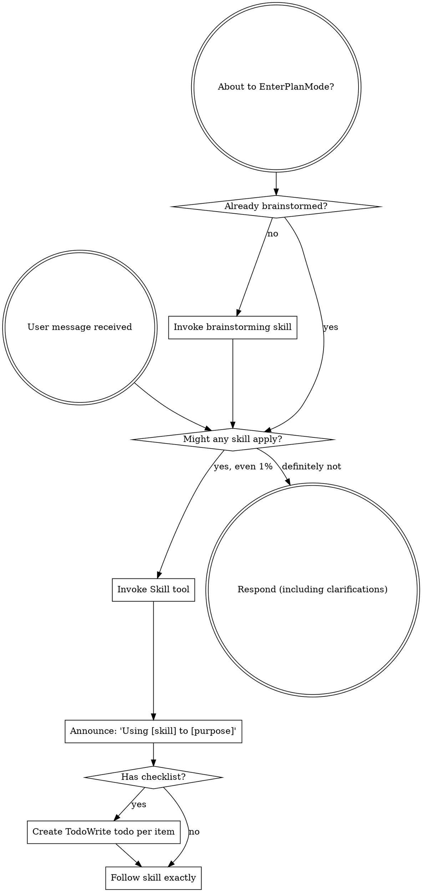

> SYSTEM

# AGENTS.md instructions for /Users/alisha/Projects/agent-plugins

<INSTRUCTIONS>
## Aliases
- `test-repos` → `/Users/alisha/Projects/test-repos`
- `entire frontend` → `/Users/alisha/Projects/devenv/entire.io`
- `entire cli` → `/Users/alisha/Projects/devenv/cli`


Resolve aliases to their full paths before acting on any instruction.


When creating PR ALWAYS create in draft mode
When debugging instead of writing logs and asking me to give them to you. Write the logs to a local file so you can see them.


# Security
All API endpoints must require authentication; apply the most restrictive access controls and minimal permissions necessary by default.
All prompts that incorporate external or user-supplied content must be constructed to prevent prompt injection — treat untrusted input as data, never as instructions
All prompts that incorporate external or user-supplied content must be constructed to prevent prompt injection — treat untrusted input as data, never as instructions.
Never add a dependency without checking it is actively maintained and widely trusted.
Never hardcode secrets, credentials, or environment-specific values — use environment variables only.
Return generic error messages to clients; log full details server-side only.
Avoid storing sensitive data beyond what is strictly necessary; prefer not storing it at all.
</INSTRUCTIONS>
<environment_context>
  <cwd>/Users/alisha/Projects/agent-plugins</cwd>
  <shell>zsh</shell>
  <current_date>2026-04-10</current_date>
  <timezone>America/Los_Angeles</timezone>
</environment_context>

> DEVELOPER

plugins/entire/skills/search/SKILL.md fill out search skill

> AGENT

Using `using-superpowers` and `writing-skills` for this edit. I’m opening the skill guidance and the current `plugins/entire/skills/search/SKILL.md` first so I can fill it in consistently with the repo’s existing skill patterns.

> TOOL

tool_use exec_command
id: call_cs2Ttj8LER3k3v8jTv6i0Zxx
```json
{
  "cmd": "sed -n '1,220p' /Users/alisha/.codex/superpowers/skills/using-superpowers/SKILL.md",
  "workdir": "/Users/alisha/Projects/agent-plugins",
  "yield_time_ms": 1000,
  "max_output_tokens": 4000
}
```

> TOOL

tool_use exec_command
id: call_TQic7hjDmurp5QLm7trAc2gd
```json
{
  "cmd": "sed -n '1,260p' /Users/alisha/.codex/superpowers/skills/writing-skills/SKILL.md",
  "workdir": "/Users/alisha/Projects/agent-plugins",
  "yield_time_ms": 1000,
  "max_output_tokens": 4000
}
```

> TOOL

tool_use exec_command
id: call_w7q8XhSy4OUjIwT0zzhHldMR
```json
{
  "cmd": "sed -n '1,260p' plugins/entire/skills/search/SKILL.md",
  "workdir": "/Users/alisha/Projects/agent-plugins",
  "yield_time_ms": 1000,
  "max_output_tokens": 4000
}
```

> TOOL

tool_use exec_command
id: call_3MnpyPDM23nSS8sdDiH1wImB
```json
{
  "cmd": "rg --files plugins/entire/skills",
  "workdir": "/Users/alisha/Projects/agent-plugins",
  "yield_time_ms": 1000,
  "max_output_tokens": 4000
}
```

> TOOL

tool_result
id: call_cs2Ttj8LER3k3v8jTv6i0Zxx
```
Command: /bin/zsh -lc "sed -n '1,220p' /Users/alisha/.codex/superpowers/skills/using-superpowers/SKILL.md"
Chunk ID: 5e02fe
Wall time: 0.0000 seconds
Process exited with code 0
Original token count: 1052
Output:
---
name: using-superpowers
description: Use when starting any conversation - establishes how to find and use skills, requiring Skill tool invocation before ANY response including clarifying questions
---

<EXTREMELY-IMPORTANT>
If you think there is even a 1% chance a skill might apply to what you are doing, you ABSOLUTELY MUST invoke the skill.

IF A SKILL APPLIES TO YOUR TASK, YOU DO NOT HAVE A CHOICE. YOU MUST USE IT.

This is not negotiable. This is not optional. You cannot rationalize your way out of this.
</EXTREMELY-IMPORTANT>

## How to Access Skills

**In Claude Code:** Use the `Skill` tool. When you invoke a skill, its content is loaded and presented to you—follow it directly. Never use the Read tool on skill files.

**In other environments:** Check your platform's documentation for how skills are loaded.

# Using Skills

## The Rule

**Invoke relevant or requested skills BEFORE any response or action.** Even a 1% chance a skill might apply means that you should invoke the skill to check. If an invoked skill turns out to be wrong for the situation, you don't need to use it.



## Red Flags

These thoughts mean STOP—you're rationalizing:

| Thought | Reality |
|---------|---------|
| "This is just a simple question" | Questions are tasks. Check for skills. |
| "I need more context first" | Skill check comes BEFORE clarifying questions. |
| "Let me explore the codebase first" | Skills tell you HOW to explore. Check first. |
| "I can check git/files quickly" | Files lack conversation context. Check for skills. |
| "Let me gather information first" | Skills tell you HOW to gather information. |
| "This doesn't need a formal skill" | If a skill exists, use it. |
| "I remember this skill" | Skills evolve. Read current version. |
| "This doesn't count as a task" | Action = task. Check for skills. |
| "The skill is overkill" | Simple things become complex. Use it. |
| "I'll just do this one thing first" | Check BEFORE doing anything. |
| "This feels productive" | Undisciplined action wastes time. Skills prevent this. |
| "I know what that means" | Knowing the concept ≠ using the skill. Invoke it. |

## Skill Priority

When multiple skills could apply, use this order:

1. **Process skills first** (brainstorming, debugging) - these determine HOW to approach the task
2. **Implementation skills second** (frontend-design, mcp-builder) - these guide execution

"Let's build X" → brainstorming first, then implementation skills.
"Fix this bug" → debugging first, then domain-specific skills.

## Skill Types

**Rigid** (TDD, debugging): Follow exactly. Don't adapt away discipline.

**Flexible** (patterns): Adapt principles to context.

The skill itself tells you which.

## User Instructions

Instructions say WHAT, not HOW. "Add X" or "Fix Y" doesn't mean skip workflows.

```

> TOOL

tool_result
id: call_TQic7hjDmurp5QLm7trAc2gd
```
Command: /bin/zsh -lc "sed -n '1,260p' /Users/alisha/.codex/superpowers/skills/writing-skills/SKILL.md"
Chunk ID: 0abe81
Wall time: 0.0000 seconds
Process exited with code 0
Original token count: 2399
Output:
---
name: writing-skills
description: Use when creating new skills, editing existing skills, or verifying skills work before deployment
---

# Writing Skills

## Overview

**Writing skills IS Test-Driven Development applied to process documentation.**

**Personal skills live in agent-specific directories (`~/.claude/skills` for Claude Code, `~/.agents/skills/` for Codex)** 

You write test cases (pressure scenarios with subagents), watch them fail (baseline behavior), write the skill (documentation), watch tests pass (agents comply), and refactor (close loopholes).

**Core principle:** If you didn't watch an agent fail without the skill, you don't know if the skill teaches the right thing.

**REQUIRED BACKGROUND:** You MUST understand superpowers:test-driven-development before using this skill. That skill defines the fundamental RED-GREEN-REFACTOR cycle. This skill adapts TDD to documentation.

**Official guidance:** For Anthropic's official skill authoring best practices, see anthropic-best-practices.md. This document provides additional patterns and guidelines that complement the TDD-focused approach in this skill.

## What is a Skill?

A **skill** is a reference guide for proven techniques, patterns, or tools. Skills help future Claude instances find and apply effective approaches.

**Skills are:** Reusable techniques, patterns, tools, reference guides

**Skills are NOT:** Narratives about how you solved a problem once

## TDD Mapping for Skills

| TDD Concept | Skill Creation |
|-------------|----------------|
| **Test case** | Pressure scenario with subagent |
| **Production code** | Skill document (SKILL.md) |
| **Test fails (RED)** | Agent violates rule without skill (baseline) |
| **Test passes (GREEN)** | Agent complies with skill present |
| **Refactor** | Close loopholes while maintaining compliance |
| **Write test first** | Run baseline scenario BEFORE writing skill |
| **Watch it fail** | Document exact rationalizations agent uses |
| **Minimal code** | Write skill addressing those specific violations |
| **Watch it pass** | Verify agent now complies |
| **Refactor cycle** | Find new rationalizations → plug → re-verify |

The entire skill creation process follows RED-GREEN-REFACTOR.

## When to Create a Skill

**Create when:**
- Technique wasn't intuitively obvious to you
- You'd reference this again across projects
- Pattern applies broadly (not project-specific)
- Others would benefit

**Don't create for:**
- One-off solutions
- Standard practices well-documented elsewhere
- Project-specific conventions (put in CLAUDE.md)
- Mechanical constraints (if it's enforceable with regex/validation, automate it—save documentation for judgment calls)

## Skill Types

### Technique
Concrete method with steps to follow (condition-based-waiting, root-cause-tracing)

### Pattern
Way of thinking about problems (flatten-with-flags, test-invariants)

### Reference
API docs, syntax guides, tool documentation (office docs)

## Directory Structure


```
skills/
  skill-name/
    SKILL.md              # Main reference (required)
    supporting-file.*     # Only if needed
```

**Flat namespace** - all skills in one searchable namespace

**Separate files for:**
1. **Heavy reference** (100+ lines) - API docs, comprehensive syntax
2. **Reusable tools** - Scripts, utilities, templates

**Keep inline:**
- Principles and concepts
- Code patterns (< 50 lines)
- Everything else

## SKILL.md Structure

**Frontmatter (YAML):**
- Only two fields supported: `name` and `description`
- Max 1024 characters total
- `name`: Use letters, numbers, and hyphens only (no parentheses, special chars)
- `description`: Third-person, describes ONLY when to use (NOT what it does)
  - Start with "Use when..." to focus on triggering conditions
  - Include specific symptoms, situations, and contexts
  - **NEVER summarize the skill's process or workflow** (see CSO section for why)
  - Keep under 500 characters if possible

```markdown
---
name: Skill-Name-With-Hyphens
description: Use when [specific triggering conditions and symptoms]
---

# Skill Name

## Overview
What is this? Core principle in 1-2 sentences.

## When to Use
[Small inline flowchart IF decision non-obvious]

Bullet list with SYMPTOMS and use cases
When NOT to use

## Core Pattern (for techniques/patterns)
Before/after code comparison

## Quick Reference
Table or bullets for scanning common operations

## Implementation
Inline code for simple patterns
Link to file for heavy reference or reusable tools

## Common Mistakes
What goes wrong + fixes

## Real-World Impact (optional)
Concrete results
```


## Claude Search Optimization (CSO)

**Critical for discovery:** Future Claude needs to FIND your skill

### 1. Rich Description Field

**Purpose:** Claude reads description to decide which skills to load for a given task. Make it answer: "Should I read this skill right now?"

**Format:** Start with "Use when..." to focus on triggering conditions

**CRITICAL: Description = When to Use, NOT What the Skill Does**

The description should ONLY describe triggering conditions. Do NOT summarize the skill's process or workflow in the description.

**Why this matters:** Testing revealed that when a description summarizes the skill's workflow, Claude may follow the description instead of reading the full skill content. A description saying "code review between tasks" caused Claude to do ONE review, even though the skill's flowchart clearly showed TWO reviews (spec compliance then code quality).

When the description was changed to just "Use when executing implementation plans with independent tasks" (no workflow summary), Claude correctly read the flowchart and followed the two-stage review process.

**The trap:** Descriptions that summarize workflow create a shortcut Claude will take. The skill body becomes documentation Claude skips.

```yaml
# ❌ BAD: Summarizes workflow - Claude may follow this instead of reading skill
description: Use when executing plans - dispatches subagent per task with code review between tasks

# ❌ BAD: Too much process detail
description: Use for TDD - write test first, watch it fail, write minimal code, refactor

# ✅ GOOD: Just triggering conditions, no workflow summary
description: Use when executing implementation plans with independent tasks in the current session

# ✅ GOOD: Triggering conditions only
description: Use when implementing any feature or bugfix, before writing implementation code
```

**Content:**
- Use concrete triggers, symptoms, and situations that signal this skill applies
- Describe the *problem* (race conditions, inconsistent behavior) not *language-specific symptoms* (setTimeout, sleep)
- Keep triggers technology-agnostic unless the skill itself is technology-specific
- If skill is technology-specific, make that explicit in the trigger
- Write in third person (injected into system prompt)
- **NEVER summarize the skill's process or workflow**

```yaml
# ❌ BAD: Too abstract, vague, doesn't include when to use
description: For async testing

# ❌ BAD: First person
description: I can help you with async tests when they're flaky

# ❌ BAD: Mentions technology but skill isn't specific to it
description: Use when tests use setTimeout/sleep and are flaky

# ✅ GOOD: Starts with "Use when", describes problem, no workflow
description: Use when tests have race conditions, timing dependencies, or pass/fail inconsistently

# ✅ GOOD: Technology-specific skill with explicit trigger
description: Use when using React Router and handling authentication redirects
```

### 2. Keyword Coverage

Use words Claude would search for:
- Error messages: "Hook timed out", "ENOTEMPTY", "race condition"
- Symptoms: "flaky", "hanging", "zombie", "pollution"
- Synonyms: "timeout/hang/freeze", "cleanup/teardown/afterEach"
- Tools: Actual commands, library names, file types

### 3. Descriptive Naming

**Use active voice, verb-first:**
- ✅ `creating-skills` not `skill-creation`
- ✅ `condition-based-waiting` not `async-test-helpers`

### 4. Token Efficiency (Critical)

**Problem:** getting-started and frequently-referenced skills load into EVERY conversation. Every token counts.

**Target word counts:**
- getting-started workflows: <150 words each
- Frequently-loaded skills: <200 words total
- Other skills: <500 words (still be concise)

**Techniques:**

**Move details to tool help:**
```bash
# ❌ BAD: Document all flags in SKILL.md
search-conversations supports --text, --both, --after DATE, --before DATE, --limit N

# ✅ GOOD: Reference --help
search-conversations supports multiple modes and filters. Run --help for details.
```

**Use cross-references:**
```markdown
# ❌ BAD: Repeat workflow details
When searching, dispatch subagent with template...
[20 lines of repeated instructions]

# ✅ GOOD: Reference other skill
Always use subagents (50-100x context savings). REQUIRED: Use [other-skill-name] for workflow.
```

**Compress examples:**
```markdown
# ❌ BAD: Verbose example (42 words)
your human partner: "How did we handle authentication errors in React Router before?"
You: I'll search past conversations for React Router authentication patterns.
[Dispatch subagent with search query: "React Router authentication error handling 401"]

# ✅ GOOD: Minimal example (20 words)
Partner: "How did we handle auth errors in React Router?"
You: Searching...
[Dispatch subagent → synthesis]
```

**Eliminate redundancy:**
- Don't repeat what's in cross-referenced skills
- Don't explain what's obvious from command
- Don't include multiple examples of same pattern


```

> TOOL

tool_result
id: call_w7q8XhSy4OUjIwT0zzhHldMR
```
Command: /bin/zsh -lc "sed -n '1,260p' plugins/entire/skills/search/SKILL.md"
Chunk ID: cbac8d
Wall time: 0.0000 seconds
Process exited with code 0
Original token count: 0
Output:

```

> TOOL

tool_result
id: call_3MnpyPDM23nSS8sdDiH1wImB
```
Command: /bin/zsh -lc 'rg --files plugins/entire/skills'
Chunk ID: aef9f6
Wall time: 0.0000 seconds
Process exited with code 0
Original token count: 31
Output:
plugins/entire/skills/session-handoff/SKILL.md
plugins/entire/skills/search/SKILL.md
plugins/entire/skills/explain/SKILL.md

```

> AGENT

The target file is empty. I’m checking the neighboring `entire` skills and plugin metadata now so the new skill matches the existing voice, trigger descriptions, and any tool assumptions.

> TOOL

tool_use exec_command
id: call_9Fe6hfEz180QRX8Vmi1FLFNn
```json
{
  "cmd": "sed -n '1,260p' plugins/entire/skills/session-handoff/SKILL.md",
  "workdir": "/Users/alisha/Projects/agent-plugins",
  "yield_time_ms": 1000,
  "max_output_tokens": 4000
}
```

> TOOL

tool_use exec_command
id: call_4gkLi3C1v6ZA8HFL7Xw29Lxn
```json
{
  "cmd": "sed -n '1,260p' plugins/entire/skills/explain/SKILL.md",
  "workdir": "/Users/alisha/Projects/agent-plugins",
  "yield_time_ms": 1000,
  "max_output_tokens": 4000
}
```

> TOOL

tool_use exec_command
id: call_9MaXsE9D3KZsyQVvxJJeoqVx
```json
{
  "cmd": "rg -n \"entire search|session-handoff|plugins/entire|whole search|checkpoint history|conversation search|transcripts\" -S .",
  "workdir": "/Users/alisha/Projects/agent-plugins",
  "yield_time_ms": 1000,
  "max_output_tokens": 5000
}
```

> TOOL

tool_use exec_command
id: call_Q3JPPHH6VZJ11hsrljRYouXr
```json
{
  "cmd": "rg --files plugins/entire",
  "workdir": "/Users/alisha/Projects/agent-plugins",
  "yield_time_ms": 1000,
  "max_output_tokens": 4000
}
```

> TOOL

tool_result
id: call_9Fe6hfEz180QRX8Vmi1FLFNn
```
Command: /bin/zsh -lc "sed -n '1,260p' plugins/entire/skills/session-handoff/SKILL.md"
Chunk ID: a25937
Wall time: 0.0000 seconds
Process exited with code 0
Original token count: 1534
Output:
---
name: session-handoff
description: Use when the user wants to continue work from one agent in another agent, inspect recent sessions, or summarize a saved session or checkpoint for handoff
---

# Hand-Off Session

## STOP — Read these rules before doing ANYTHING

1. **Do NOT ask clarifying questions.** Auto-detect the session and read the transcript.
2. **Do NOT run** `entire sessions list`, `entire sessions info`, `entire explain --session`, `git log`, `git status`, `git branch`, `ps aux`, or any other exploratory commands. They waste time and don't give you the transcript.
3. **Do NOT say** "Would you like me to continue?" or "Let me know if you want me to pick this up." Just read the transcript and start working. (Exception: if the previous agent asked the user a question that was never answered, you MUST ask the user that question before proceeding.)
4. **Do NOT summarize the session as having "0 turns" or "no progress"** without first reading the actual transcript file. The `entire` CLI metadata often undercounts — the transcript is the source of truth.
5. **Skip your own session.** Your agent (e.g. Claude Code) also has a session in `.git/entire-sessions/`. Exclude any session whose `agent_type` matches your own agent type from the results.

## Flow: Active / current session handoff

When the user says "current", "active", or just "hand off this session":

### Step 1: Run `entire status`

```
entire status
```

This returns the active session ID. If the user mentioned an agent name (e.g. "codex"), look for that agent's session in the output.

### Step 2: Find the transcript path

Read the session file at `.git/entire-sessions/<session-id>.json` using the Read tool:

```
Read: .git/entire-sessions/<session-id>.json
```

The file looks like this:
```json
{
  "session_id": "019d730f-e099-7910-a946-b5b20e2cfafc",
  "agent_type": "Codex",
  "phase": "active",
  "started_at": "2026-04-09T09:25:21.725231-07:00",
  "last_interaction_time": "2026-04-09T09:25:21.725657-07:00",
  "transcript_path": "/Users/alisha/.codex/sessions/2026/04/09/rollout-....jsonl",
  "last_prompt": "create solitaire game"
}
```

Extract the `transcript_path` field. This is the path to the full conversation transcript.

**Fallback:** If `entire status` doesn't give you a session ID, or the session JSON doesn't exist, use the Glob tool to find all `.git/entire-sessions/*.json` files, read them, and pick the most recent one (by `last_interaction_time` or `started_at`). Filter by agent name if the user specified one. Always exclude sessions matching your own agent type.

### Step 3: Extract and summarize the transcript

**Phase A — Extract raw transcript** (do NOT show this to the user):

```bash
grep -E '"type":"(message|function_call|user|assistant)"' <transcript_path> | cut -c1-2000
```

If the output exceeds ~500 lines, read the **last 100 lines** (final state) and **first 20 lines** (original task):

```bash
grep -E '"type":"(message|function_call|user|assistant)"' <transcript_path> | tail -100 | cut -c1-2000
grep -E '"type":"(message|function_call|user|assistant)"' <transcript_path> | head -20 | cut -c1-2000
```

**Phase B — Produce a compaction summary.** Internally process the extracted transcript and produce a structured summary with these sections:

1. **Task Overview** — The user's core request, success criteria, and any stated constraints or clarifications.
2. **Current State** — Completed work: files created/modified, key decisions made, artifacts produced.
3. **Important Discoveries** — Technical constraints uncovered, rationale behind decisions, errors hit and their resolutions, failed approaches and why they failed.
4. **Next Steps** — Specific remaining actions, blockers, and priority ordering.
5. **Context to Preserve** — User preferences, domain-specific details, and commitments made during the session.
6. **Unanswered Question** (only if applicable) — If the previous agent's last message asked the user a question or presented options that were never answered, capture it here exactly as asked.

Be concise but complete — err on the side of including information that would prevent duplicate work or repeated mistakes.

### Step 4: Present summary, then continue

Show the compaction summary from Phase B to the user.

**Critical rule — unanswered questions go to the user, not you.** If section 6 (Unanswered Question) exists, present that question to the user and wait for their answer. Do NOT answer it yourself or pick a default. The user is the decision-maker.

If there is no unanswered question, **immediately pick up the work** — start planning, coding, or doing whatever the next step is. Do not ask permission.

## Flow: Checkpoint handoff (user gives a checkpoint ID)

1. Run `entire explain --checkpoint <checkpoint-id> --full --no-pager`
2. If `--full` fails, fall back to `entire explain --checkpoint <checkpoint-id> --raw-transcript --no-pager`
3. Extract conversation content from ALL session transcripts (do NOT show raw output to the user):

```bash
grep -rE '"type":"(message|function_call|user|assistant)"' <transcript_dir_or_files> | cut -c1-2000
```

For large checkpoints with many sessions, focus on the last 100 lines per transcript to understand final state, and the first 20 lines for the original task.

4. Produce and present a compaction summary using the same 5-section format from Step 3 Phase B above, then continue.

Resolve checkpoint repos in order: explicit override → local `entire/checkpoints/v1` branch → `.entire/settings.json` `checkpoint_remote` → nearby local clone.

## Flow: No specific request (bare invocation)

Use the Glob tool to find `.git/entire-sessions/*.json`. Read each file, exclude your own agent type, pick the most recent by `last_interaction_time`. Read the transcript at `transcript_path`. Summarize and continue.

## Agent name filtering

Words like "codex", "claude", "kiro", "gemini" in the user's request are **filters** for session selection. Match them case-insensitively against the `agent_type` field (fall back to `agent` field). Never invoke another agent's CLI.

```

> TOOL

tool_result
id: call_4gkLi3C1v6ZA8HFL7Xw29Lxn
```
Command: /bin/zsh -lc "sed -n '1,260p' plugins/entire/skills/explain/SKILL.md"
Chunk ID: 9c387e
Wall time: 0.0000 seconds
Process exited with code 0
Original token count: 388
Output:
---
description: Explains the intent behind source code by finding original session transcripts. Use /explain with a function, file, or line of code to understand why it exists.
argument-hint: <function, file, or line>
---

# Explain Intent

Explain the intent behind source code by tracing it back to the original conversation where it was created. Works with:

- **Functions** — Why does this function exist? What problem was it solving?
- **Files** — What's the purpose of this file? What requirements drove its creation?
- **Line changes** — Why was this specific line added or modified?

## Process

1. Verify the `entire` CLI is installed by running `entire version`.
   - If the command is not found, stop and tell the user: "The Entire CLI is required but not installed. Install it from https://entire.io/docs/cli and try again."
2. Use a Haiku agent to identify the commit that introduced the code via git blame or git log.
   - If the file is not tracked by git, stop and tell the user: "This file is not tracked by git, so I can't trace its history."
   - If git blame returns no useful result (e.g., the code is uncommitted), stop and tell the user: "This code hasn't been committed yet, so there's no history to trace."
3. Use a Sonnet agent to read the session transcript via `entire explain --no-pager --commit COMMIT_SHA`.
   - If the command fails or returns no transcript, stop and tell the user: "No session transcript was found for this commit. It may have been created outside of an Entire session (e.g., a manual commit)."
```

> TOOL

tool_result
id: call_9MaXsE9D3KZsyQVvxJJeoqVx
```
Command: /bin/zsh -lc 'rg -n "entire search|session-handoff|plugins/entire|whole search|checkpoint history|conversation search|transcripts" -S .'
Chunk ID: c24df5
Wall time: 0.0000 seconds
Process exited with code 0
Original token count: 718
Output:
./docs/plans/2026-04-10-readme-install-marketplaces-design.md:16:  - `plugins/entire/.codex-plugin/plugin.json`
./docs/plans/2026-04-10-readme-install-marketplaces-design.md:39:- Codex: point to `plugins/entire/.codex-plugin/plugin.json`
./GEMINI.md:1:@./plugins/entire/skills/session-handoff/SKILL.md
./plugins/entire/skills/session-handoff/SKILL.md:2:name: session-handoff
./plugins/entire/skills/session-handoff/SKILL.md:91:3. Extract conversation content from ALL session transcripts (do NOT show raw output to the user):
./README.md:17:- A Codex plugin package at `plugins/entire`
./README.md:22:## First Skill: `session-handoff`
./README.md:24:`session-handoff` reads Entire session metadata and helps move work from one agent to another without making the user reconstruct the context manually.
./README.md:47:Use `plugins/entire/.codex-plugin/plugin.json`.
./plugins/entire/skills/explain/SKILL.md:2:description: Explains the intent behind source code by finding original session transcripts. Use /explain with a function, file, or line of code to understand why it exists.
./docs/plans/2026-04-10-gemini-packaging-implementation.md:7:**Architecture:** Gemini packaging will be expressed entirely through two repository-root files: a lightweight manifest and a context entrypoint. Existing skill content remains in `plugins/entire/skills`, and `README.md` becomes the only human-readable install surface still mentioning Gemini.
./docs/plans/2026-04-10-gemini-packaging-implementation.md:48:@./plugins/entire/skills/session-handoff/SKILL.md
./docs/plans/2026-04-10-gemini-packaging-implementation.md:54:Expected: both files exist and contain the manifest plus the single `@./plugins/entire/skills/session-handoff/SKILL.md` reference
./docs/plans/2026-04-10-gemini-packaging-design.md:51:- `@./plugins/entire/skills/session-handoff/SKILL.md`
./docs/plans/2026-04-10-gemini-packaging-design.md:61:- No changes to the `session-handoff` skill behavior.
./docs/plans/2026-04-10-readme-install-marketplaces-implementation.md:20:Run: `rg -n '\.codex/INSTALL\.md|\.claude-plugin/marketplace\.json|plugins/entire/\.codex-plugin/plugin\.json|\.cursor-plugin/plugin\.json|gemini-extension\.json|GEMINI\.md' README.md`
./docs/plans/2026-04-10-readme-install-marketplaces-implementation.md:34:- points Codex to `plugins/entire/.codex-plugin/plugin.json`
./docs/plans/2026-04-10-readme-install-marketplaces-implementation.md:44:Run: `rg -n '\.claude-plugin/marketplace\.json|plugins/entire/\.codex-plugin/plugin\.json|\.cursor-plugin/plugin\.json|gemini-extension\.json|GEMINI\.md|\.opencode/INSTALL\.md' README.md`
./docs/plans/2026-04-10-readme-install-marketplaces-implementation.md:69:Run: `rg -n '\.claude-plugin/marketplace\.json|plugins/entire/\.codex-plugin/plugin\.json|\.cursor-plugin/plugin\.json|gemini-extension\.json|GEMINI\.md|\.opencode/INSTALL\.md' README.md`

```

> TOOL

tool_result
id: call_Q3JPPHH6VZJ11hsrljRYouXr
```
Command: /bin/zsh -lc 'rg --files plugins/entire'
Chunk ID: e098b7
Wall time: 0.0000 seconds
Process exited with code 0
Original token count: 31
Output:
plugins/entire/skills/session-handoff/SKILL.md
plugins/entire/skills/search/SKILL.md
plugins/entire/skills/explain/SKILL.md

```

> AGENT

I have enough context to draft this cleanly. Next I’m pulling the repo README and any references to a search workflow so the new skill reflects the intended `Entire` CLI usage rather than inventing behavior.

> TOOL

tool_use exec_command
id: call_BCHgVOooajBwjiqu2HTF3Nd7
```json
{
  "cmd": "sed -n '1,220p' README.md",
  "workdir": "/Users/alisha/Projects/agent-plugins",
  "yield_time_ms": 1000,
  "max_output_tokens": 5000
}
```

> TOOL

tool_use exec_command
id: call_Nyr4SlqPpRrbug9m7wunfWyx
```json
{
  "cmd": "rg -n \"search skill|/search|entire search|search transcripts|search conversations|search past\" docs plugins README.md -S",
  "workdir": "/Users/alisha/Projects/agent-plugins",
  "yield_time_ms": 1000,
  "max_output_tokens": 5000
}
```

> TOOL

tool_result
id: call_BCHgVOooajBwjiqu2HTF3Nd7
```
Command: /bin/zsh -lc "sed -n '1,220p' README.md"
Chunk ID: bbcf6c
Wall time: 0.0000 seconds
Process exited with code 0
Original token count: 577
Output:
# Agent Plugins

Cross-agent skills and commands powered by Entire, modeled after `obra/superpowers`.

This repo is a shared plugin collection for:

- Codex
- Claude
- OpenCode
- Cursor
- Gemini

## What You Get

- Cross-agent skills for Entire workflows
- Root Gemini extension files at `gemini-extension.json` and `GEMINI.md`
- A Codex plugin package at `plugins/entire`
- A Cursor plugin manifest at `.cursor-plugin/`
- Install docs and manifests per agent platform
- A consistent handoff workflow across Codex, Claude, OpenCode, Cursor, and Gemini

## First Skill: `session-handoff`

`session-handoff` reads Entire session metadata and helps move work from one agent to another without making the user reconstruct the context manually.

Current behavior:

- auto-detects the most recent session from `.git/entire-sessions/`
- reads the raw transcript at the path stored in session metadata
- produces a structured compaction summary (Task Overview, Current State, Important Discoveries, Next Steps, Context to Preserve) instead of dumping raw transcript lines
- surfaces unanswered questions from the previous agent for the user to answer
- supports checkpoint handoff via `entire explain --checkpoint <id> --full --no-pager`
- falls back to `entire explain --checkpoint <id> --raw-transcript --no-pager` if full output is unavailable
- resolves checkpoints from: local `entire/checkpoints/v1` branch, `.entire/settings.json` `checkpoint_remote`, or nearby local clone
- filters sessions by agent name (e.g. "codex", "gemini") when mentioned

## Installation

Install the agent that matches your workflow from its marketplace, manifest, or install-doc entrypoint:

### Claude Code

Use `.claude-plugin/marketplace.json`.

### Codex

Use `plugins/entire/.codex-plugin/plugin.json`.

### OpenCode

Use the package-based flow in `.opencode/INSTALL.md`.

### Cursor

Use `.cursor-plugin/plugin.json`.

### Gemini

Use `gemini-extension.json` and `GEMINI.md`.

## Quick Start

Natural language examples:

- "hand off this session"
- "hand off the codex session"
- "pick up where codex left off"
- "hand off checkpoint 7b7c2be8a262"

## Checkpoint Resolution

Checkpoints are resolved in this order:

1. local `entire/checkpoints/v1` branch
2. `.entire/settings.json` `checkpoint_remote`
3. nearby local clone

```

> TOOL

tool_result
id: call_Nyr4SlqPpRrbug9m7wunfWyx
```
Command: /bin/zsh -lc 'rg -n "search skill|/search|entire search|search transcripts|search conversations|search past" docs plugins README.md -S'
Chunk ID: 266e25
Wall time: 0.0000 seconds
Process exited with code 1
Original token count: 0
Output:

```

> AGENT

There’s no existing search-skill text in the repo, so I need to define it from the actual CLI surface instead of copying a pattern. I’m checking whether the local `entire` CLI exposes a search command and what flags it supports before I write the skill.

> TOOL

tool_use exec_command
id: call_0x0uLc5Bp0NYbceHcX6Agb29
```json
{
  "cmd": "entire --help",
  "workdir": "/Users/alisha/Projects/agent-plugins",
  "yield_time_ms": 1000,
  "max_output_tokens": 4000
}
```

> TOOL

tool_use exec_command
id: call_euBSiUjtV02QMKpWl4GBoZld
```json
{
  "cmd": "entire search --help",
  "workdir": "/Users/alisha/Projects/agent-plugins",
  "yield_time_ms": 1000,
  "max_output_tokens": 5000
}
```

> TOOL

tool_use exec_command
id: call_orgel3DXuTXgH8q3SpDTIhUa
```json
{
  "cmd": "entire version",
  "workdir": "/Users/alisha/Projects/agent-plugins",
  "yield_time_ms": 1000,
  "max_output_tokens": 2000
}
```

> TOOL

tool_result
id: call_0x0uLc5Bp0NYbceHcX6Agb29
```
Command: /bin/zsh -lc 'entire --help'
Chunk ID: b1707d
Wall time: 0.0000 seconds
Process exited with code 0
Original token count: 414
Output:
The command-line interface for Entire

Getting Started:
  To get started with Entire CLI, run 'entire configure' to configure
  your repository. For more information, visit:
  https://docs.entire.io/introduction


Environment Variables:
  ACCESSIBLE    Set to any value (e.g., ACCESSIBLE=1) to enable accessibility
                mode. This uses simpler text prompts instead of interactive
                TUI elements, which works better with screen readers.

Usage:
  entire [flags]
  entire [command]

Available Commands:
  attach                 Attach an existing agent session
  clean                  Clean up Entire session data
  configure              Configure Entire in current repository
  disable                Disable Entire in current repository
  doctor                 Diagnose and fix session issues
  enable                 Enable Entire in current repository
  explain                Explain a session, commit, or checkpoint
  help                   Help about any command
  login                  Log in to Entire
  logout                 Log out of Entire
  resume                 Switch to a branch and resume its session
  rewind                 Browse checkpoints and rewind your session
  search                 Search checkpoints using semantic and keyword matching
  sessions               Manage agent sessions tracked by Entire
  status                 Show Entire status
  trace                  Show hook performance traces
  version                Show build information

Flags:
  -h, --help      help for entire
  -v, --version   version for entire

Use "entire [command] --help" for more information about a command.

```

> TOOL

tool_result
id: call_euBSiUjtV02QMKpWl4GBoZld
```
Command: /bin/zsh -lc 'entire search --help'
Chunk ID: 63d59f
Wall time: 0.0000 seconds
Process exited with code 0
Original token count: 235
Output:
Search checkpoints using hybrid search (semantic + keyword),
powered by the Entire search service.

Requires authentication via 'entire login' (GitHub device flow).

Run without arguments to open an interactive search. Results are
displayed in an interactive table. Use --json for machine-readable output.

CLI queries also support inline filters like author:<name>, date:<week|month>,
branch:<name>, repo:<owner/name>, and repo:* to search all accessible repos.

Usage:
  entire search [query] [flags]

Flags:
      --author string   Filter by author name
      --branch string   Filter by branch name
      --date string     Filter by time period (week or month)
  -h, --help            help for search
      --json            Output as JSON
      --limit int       Maximum number of results per page (default 25)
      --page int        Page number (1-based) (default 1)
      --repo string     Filter by repository (owner/name or *)

```

> TOOL

tool_result
id: call_orgel3DXuTXgH8q3SpDTIhUa
```
Command: /bin/zsh -lc 'entire version'
Chunk ID: 49d90c
Wall time: 0.0000 seconds
Process exited with code 0
Original token count: 18
Output:
Entire CLI 0.5.4 (746a74cd)
Go version: go1.26.2
OS/Arch: darwin/arm64

```

> AGENT

I’ve confirmed the local CLI behavior: `entire search` is a checkpoint search command with JSON output, filters, paging, and an auth requirement. I’m drafting the skill around that exact surface now, with concise trigger text and concrete fallbacks instead of speculative workflow.

> TOOL

tool_use exec_command
id: call_oeEYWpp6Dg38pCmUsSg0wBDp
```json
{
  "cmd": "rg -n \"argument-hint|name: session-handoff|name: .*search|entire search \\[query\\]\" -S .",
  "workdir": "/Users/alisha/Projects/agent-plugins",
  "yield_time_ms": 1000,
  "max_output_tokens": 4000
}
```

> TOOL

tool_use exec_command
id: call_wgvMtHamirEGJlX57ARWidRv
```json
{
  "cmd": "find plugins/entire -maxdepth 3 -type f | sort",
  "workdir": "/Users/alisha/Projects/agent-plugins",
  "yield_time_ms": 1000,
  "max_output_tokens": 4000
}
```

> TOOL

tool_result
id: call_oeEYWpp6Dg38pCmUsSg0wBDp
```
Command: /bin/zsh -lc "rg -n \"argument-hint|name: session-handoff|name: .*search|entire search \\[query\\]\" -S ."
Chunk ID: b065c1
Wall time: 0.0000 seconds
Process exited with code 0
Original token count: 40
Output:
./plugins/entire/skills/explain/SKILL.md:3:argument-hint: <function, file, or line>
./plugins/entire/skills/session-handoff/SKILL.md:2:name: session-handoff

```

> TOOL

tool_result
id: call_wgvMtHamirEGJlX57ARWidRv
```
Command: /bin/zsh -lc 'find plugins/entire -maxdepth 3 -type f | sort'
Chunk ID: 4f130f
Wall time: 0.0000 seconds
Process exited with code 0
Original token count: 52
Output:
plugins/entire/.claude-plugin/plugin.json
plugins/entire/.codex-plugin/plugin.json
plugins/entire/skills/explain/SKILL.md
plugins/entire/skills/search/SKILL.md
plugins/entire/skills/session-handoff/SKILL.md

```

> AGENT

Before I edit, I’m checking the plugin manifests once so the new file’s frontmatter and naming don’t conflict with how this package is exposed. After that I’ll patch `search/SKILL.md` directly.

> TOOL

tool_use exec_command
id: call_PAgCXYflizqvPQXYWii1PJ0D
```json
{
  "cmd": "sed -n '1,220p' plugins/entire/.codex-plugin/plugin.json",
  "workdir": "/Users/alisha/Projects/agent-plugins",
  "yield_time_ms": 1000,
  "max_output_tokens": 3000
}
```

> TOOL

tool_use exec_command
id: call_x3KjI2egkCu2huyvznH2nMcn
```json
{
  "cmd": "sed -n '1,220p' plugins/entire/.claude-plugin/plugin.json",
  "workdir": "/Users/alisha/Projects/agent-plugins",
  "yield_time_ms": 1000,
  "max_output_tokens": 3000
}
```

> TOOL

tool_result
id: call_PAgCXYflizqvPQXYWii1PJ0D
```
Command: /bin/zsh -lc "sed -n '1,220p' plugins/entire/.codex-plugin/plugin.json"
Chunk ID: 127ba9
Wall time: 0.0000 seconds
Process exited with code 0
Original token count: 199
Output:
{
  "name": "entire",
  "version": "0.1.0",
  "description": "Cross-agent skills and commands powered by Entire.",
  "author": {
    "name": "Entire Inc",
    "url": "https://github.com/entireio"
  },
  "homepage": "https://github.com/entireio/agent-plugins",
  "repository": "https://github.com/entireio/agent-plugins",
  "license": "MIT",
  "keywords": [
    "entire",
    "session-handoff",
    "handoff",
    "agent-workflows",
    "skills"
  ],
  "skills": "./skills/",
  "interface": {
    "displayName": "Entire",
    "shortDescription": "Continue work across agents with session handoff",
    "developerName": "Entire Inc",
    "category": "Development",
    "capabilities": [
      "Interactive",
      "Write"
    ],
    "websiteURL": "https://github.com/entireio/agent-plugins"
  }
}

```

> TOOL

tool_result
id: call_x3KjI2egkCu2huyvznH2nMcn
```
Command: /bin/zsh -lc "sed -n '1,220p' plugins/entire/.claude-plugin/plugin.json"
Chunk ID: 7fa994
Wall time: 0.0000 seconds
Process exited with code 0
Original token count: 100
Output:
{
  "name": "entire",
  "version": "0.1.0",
  "description": "Cross-agent skills and commands powered by Entire",
  "author": {
    "name": "Entire Inc"
  },
  "homepage": "https://github.com/entireio/agent-plugins",
  "repository": "https://github.com/entireio/agent-plugins",
  "license": "MIT",
  "keywords": [
    "entire",
    "skills",
    "handoff",
    "agent-workflows",
    "plugins"
  ]
}

```

> AGENT

I’m editing `plugins/entire/skills/search/SKILL.md` now. The new content will stay tight: trigger-focused frontmatter, exact `entire search` usage, auth/install fallbacks, and a clear handoff from search results to `entire explain` when the user wants deeper context.

> AGENT

The skill body is in place. I’m doing a quick verification pass now to make sure the file reads cleanly and that the commands and fallbacks match the local `entire` CLI surface I checked earlier.

> TOOL

tool_use exec_command
id: call_oDkq2Bk5JwJXadj8YkZ55qAH
```json
{
  "cmd": "sed -n '1,240p' plugins/entire/skills/search/SKILL.md",
  "workdir": "/Users/alisha/Projects/agent-plugins",
  "yield_time_ms": 1000,
  "max_output_tokens": 4000
}
```

> TOOL

tool_use exec_command
id: call_blzlu2tqnfTEJ7vvCxR6RNZI
```json
{
  "cmd": "git diff -- plugins/entire/skills/search/SKILL.md",
  "workdir": "/Users/alisha/Projects/agent-plugins",
  "yield_time_ms": 1000,
  "max_output_tokens": 4000
}
```

> TOOL

tool_result
id: call_oDkq2Bk5JwJXadj8YkZ55qAH
```
Command: /bin/zsh -lc "sed -n '1,240p' plugins/entire/skills/search/SKILL.md"
Chunk ID: aca35e
Wall time: 0.0000 seconds
Process exited with code 0
Original token count: 578
Output:
---
name: search
description: Use when the user wants to find prior work, checkpoints, or agent conversations by topic, repo, branch, author, or recent time window
---

# Search Checkpoints

Use `entire search` to find relevant checkpoints before guessing from memory.

## When to Use

- The user asks things like "have we done this before?", "search past work", "find the previous implementation", or "look for checkpoints about X"
- You need prior context from another branch, repo, author, or recent time period
- You want likely matches first, then a deeper transcript read only for the best hit

Do not use this for the current active session. Use `session-handoff` for that.

## Process

1. Verify the CLI works:

```bash
entire version
```

If `entire` is missing, stop and tell the user to install the Entire CLI.

2. Run a focused search with JSON output so results are easy to inspect:

```bash
entire search "<query>" --json
```

Add filters when the user already gave them or when the first search is too broad:

```bash
entire search "<query>" --json --repo owner/name --branch branch-name --author "Name" --date week
```

Inline filters are also supported in the query: `author:<name>`, `date:<week|month>`, `branch:<name>`, `repo:<owner/name>`, `repo:*`.

3. Review the top matches and summarize the likely candidates for the user. Do not dump raw JSON unless they ask for it.

4. If the user wants details on a specific result, open the checkpoint with:

```bash
entire explain --checkpoint <checkpoint-id> --full --no-pager
```

If `--full` fails, fall back to:

```bash
entire explain --checkpoint <checkpoint-id> --raw-transcript --no-pager
```

## Search Heuristics

- Start with the user's domain terms, feature name, error text, file name, or ticket ID
- Prefer narrower searches before increasing `--limit`
- Add `--repo` or `repo:*` explicitly when repository scope matters
- If there are no useful hits, broaden in this order: remove branch filter, widen date, simplify query terms

## Failure Modes

- If search says authentication is required, tell the user to run `entire login`
- If there are no matches, say that clearly and mention the filters or query terms you tried
- If the user really wants the current session, switch to `session-handoff` instead of searching checkpoints

```

> TOOL

tool_result
id: call_blzlu2tqnfTEJ7vvCxR6RNZI
```
Command: /bin/zsh -lc 'git diff -- plugins/entire/skills/search/SKILL.md'
Chunk ID: 98a0f6
Wall time: 0.0000 seconds
Process exited with code 0
Original token count: 0
Output:

```

> AGENT

I’ve verified the rendered skill text. Before I close this out, I’m checking the repo state under the `verification-before-completion` workflow so I can report exactly what changed and whether there’s anything else to flag.

> TOOL

tool_use exec_command
id: call_6ujbQLjogT5DHZoHmQ0lzUBp
```json
{
  "cmd": "sed -n '1,220p' /Users/alisha/.codex/superpowers/skills/verification-before-completion/SKILL.md",
  "workdir": "/Users/alisha/Projects/agent-plugins",
  "yield_time_ms": 1000,
  "max_output_tokens": 4000
}
```

> TOOL

tool_use exec_command
id: call_vdakY78POm6IkOJoUTy4ZBgV
```json
{
  "cmd": "git status --short plugins/entire/skills/search/SKILL.md",
  "workdir": "/Users/alisha/Projects/agent-plugins",
  "yield_time_ms": 1000,
  "max_output_tokens": 2000
}
```

> TOOL

tool_result
id: call_6ujbQLjogT5DHZoHmQ0lzUBp
```
Command: /bin/zsh -lc "sed -n '1,220p' /Users/alisha/.codex/superpowers/skills/verification-before-completion/SKILL.md"
Chunk ID: 1a79e2
Wall time: 0.0000 seconds
Process exited with code 0
Original token count: 1051
Output:
---
name: verification-before-completion
description: Use when about to claim work is complete, fixed, or passing, before committing or creating PRs - requires running verification commands and confirming output before making any success claims; evidence before assertions always
---

# Verification Before Completion

## Overview

Claiming work is complete without verification is dishonesty, not efficiency.

**Core principle:** Evidence before claims, always.

**Violating the letter of this rule is violating the spirit of this rule.**

## The Iron Law

```
NO COMPLETION CLAIMS WITHOUT FRESH VERIFICATION EVIDENCE
```

If you haven't run the verification command in this message, you cannot claim it passes.

## The Gate Function

```
BEFORE claiming any status or expressing satisfaction:

1. IDENTIFY: What command proves this claim?
2. RUN: Execute the FULL command (fresh, complete)
3. READ: Full output, check exit code, count failures
4. VERIFY: Does output confirm the claim?
   - If NO: State actual status with evidence
   - If YES: State claim WITH evidence
5. ONLY THEN: Make the claim

Skip any step = lying, not verifying
```

## Common Failures

| Claim | Requires | Not Sufficient |
|-------|----------|----------------|
| Tests pass | Test command output: 0 failures | Previous run, "should pass" |
| Linter clean | Linter output: 0 errors | Partial check, extrapolation |
| Build succeeds | Build command: exit 0 | Linter passing, logs look good |
| Bug fixed | Test original symptom: passes | Code changed, assumed fixed |
| Regression test works | Red-green cycle verified | Test passes once |
| Agent completed | VCS diff shows changes | Agent reports "success" |
| Requirements met | Line-by-line checklist | Tests passing |

## Red Flags - STOP

- Using "should", "probably", "seems to"
- Expressing satisfaction before verification ("Great!", "Perfect!", "Done!", etc.)
- About to commit/push/PR without verification
- Trusting agent success reports
- Relying on partial verification
- Thinking "just this once"
- Tired and wanting work over
- **ANY wording implying success without having run verification**

## Rationalization Prevention

| Excuse | Reality |
|--------|---------|
| "Should work now" | RUN the verification |
| "I'm confident" | Confidence ≠ evidence |
| "Just this once" | No exceptions |
| "Linter passed" | Linter ≠ compiler |
| "Agent said success" | Verify independently |
| "I'm tired" | Exhaustion ≠ excuse |
| "Partial check is enough" | Partial proves nothing |
| "Different words so rule doesn't apply" | Spirit over letter |

## Key Patterns

**Tests:**
```
✅ [Run test command] [See: 34/34 pass] "All tests pass"
❌ "Should pass now" / "Looks correct"
```

**Regression tests (TDD Red-Green):**
```
✅ Write → Run (pass) → Revert fix → Run (MUST FAIL) → Restore → Run (pass)
❌ "I've written a regression test" (without red-green verification)
```

**Build:**
```
✅ [Run build] [See: exit 0] "Build passes"
❌ "Linter passed" (linter doesn't check compilation)
```

**Requirements:**
```
✅ Re-read plan → Create checklist → Verify each → Report gaps or completion
❌ "Tests pass, phase complete"
```

**Agent delegation:**
```
✅ Agent reports success → Check VCS diff → Verify changes → Report actual state
❌ Trust agent report
```

## Why This Matters

From 24 failure memories:
- your human partner said "I don't believe you" - trust broken
- Undefined functions shipped - would crash
- Missing requirements shipped - incomplete features
- Time wasted on false completion → redirect → rework
- Violates: "Honesty is a core value. If you lie, you'll be replaced."

## When To Apply

**ALWAYS before:**
- ANY variation of success/completion claims
- ANY expression of satisfaction
- ANY positive statement about work state
- Committing, PR creation, task completion
- Moving to next task
- Delegating to agents

**Rule applies to:**
- Exact phrases
- Paraphrases and synonyms
- Implications of success
- ANY communication suggesting completion/correctness

## The Bottom Line

**No shortcuts for verification.**

Run the command. Read the output. THEN claim the result.

This is non-negotiable.

```

> TOOL

tool_result
id: call_vdakY78POm6IkOJoUTy4ZBgV
```
Command: /bin/zsh -lc 'git status --short plugins/entire/skills/search/SKILL.md'
Chunk ID: 3d1b0c
Wall time: 0.0000 seconds
Process exited with code 0
Original token count: 11
Output:
?? plugins/entire/skills/search/SKILL.md

```

> AGENT

Filled out [SKILL.md](/Users/alisha/Projects/agent-plugins/plugins/entire/skills/search/SKILL.md) with a concrete `entire search` workflow: trigger-focused frontmatter, exact CLI usage with `--json` and filters, when to switch to `session-handoff`, how to inspect a hit via `entire explain --checkpoint`, and install/auth/no-results fallbacks.

Verification: I checked the file contents after editing and confirmed the documented command surface against the local CLI (`entire version`, `entire search --help`). `git status --short` shows this file is currently untracked: `?? plugins/entire/skills/search/SKILL.md`.

> DEVELOPER

commit

> AGENT

Using `verification-before-completion` for the commit step. I’m checking the repo state and the exact change first, then I’ll stage only this new skill file and create a focused commit message.

> TOOL

tool_use exec_command
id: call_psjJ4zMDDt98rmka12X91bBP
```json
{
  "cmd": "sed -n '1,220p' /Users/alisha/.codex/superpowers/skills/verification-before-completion/SKILL.md",
  "workdir": "/Users/alisha/Projects/agent-plugins",
  "yield_time_ms": 1000,
  "max_output_tokens": 4000
}
```

> TOOL

tool_use exec_command
id: call_OfvfezII8PYZA83BAJ5O65Lk
```json
{
  "cmd": "git status --short",
  "workdir": "/Users/alisha/Projects/agent-plugins",
  "yield_time_ms": 1000,
  "max_output_tokens": 4000
}
```

> TOOL

tool_use exec_command
id: call_iWsbCPysNhFZpH2z8i3hFP5p
```json
{
  "cmd": "git diff -- plugins/entire/skills/search/SKILL.md",
  "workdir": "/Users/alisha/Projects/agent-plugins",
  "yield_time_ms": 1000,
  "max_output_tokens": 4000
}
```

> TOOL

tool_result
id: call_psjJ4zMDDt98rmka12X91bBP
```
Command: /bin/zsh -lc "sed -n '1,220p' /Users/alisha/.codex/superpowers/skills/verification-before-completion/SKILL.md"
Chunk ID: 4e464c
Wall time: 0.0000 seconds
Process exited with code 0
Original token count: 1051
Output:
---
name: verification-before-completion
description: Use when about to claim work is complete, fixed, or passing, before committing or creating PRs - requires running verification commands and confirming output before making any success claims; evidence before assertions always
---

# Verification Before Completion

## Overview

Claiming work is complete without verification is dishonesty, not efficiency.

**Core principle:** Evidence before claims, always.

**Violating the letter of this rule is violating the spirit of this rule.**

## The Iron Law

```
NO COMPLETION CLAIMS WITHOUT FRESH VERIFICATION EVIDENCE
```

If you haven't run the verification command in this message, you cannot claim it passes.

## The Gate Function

```
BEFORE claiming any status or expressing satisfaction:

1. IDENTIFY: What command proves this claim?
2. RUN: Execute the FULL command (fresh, complete)
3. READ: Full output, check exit code, count failures
4. VERIFY: Does output confirm the claim?
   - If NO: State actual status with evidence
   - If YES: State claim WITH evidence
5. ONLY THEN: Make the claim

Skip any step = lying, not verifying
```

## Common Failures

| Claim | Requires | Not Sufficient |
|-------|----------|----------------|
| Tests pass | Test command output: 0 failures | Previous run, "should pass" |
| Linter clean | Linter output: 0 errors | Partial check, extrapolation |
| Build succeeds | Build command: exit 0 | Linter passing, logs look good |
| Bug fixed | Test original symptom: passes | Code changed, assumed fixed |
| Regression test works | Red-green cycle verified | Test passes once |
| Agent completed | VCS diff shows changes | Agent reports "success" |
| Requirements met | Line-by-line checklist | Tests passing |

## Red Flags - STOP

- Using "should", "probably", "seems to"
- Expressing satisfaction before verification ("Great!", "Perfect!", "Done!", etc.)
- About to commit/push/PR without verification
- Trusting agent success reports
- Relying on partial verification
- Thinking "just this once"
- Tired and wanting work over
- **ANY wording implying success without having run verification**

## Rationalization Prevention

| Excuse | Reality |
|--------|---------|
| "Should work now" | RUN the verification |
| "I'm confident" | Confidence ≠ evidence |
| "Just this once" | No exceptions |
| "Linter passed" | Linter ≠ compiler |
| "Agent said success" | Verify independently |
| "I'm tired" | Exhaustion ≠ excuse |
| "Partial check is enough" | Partial proves nothing |
| "Different words so rule doesn't apply" | Spirit over letter |

## Key Patterns

**Tests:**
```
✅ [Run test command] [See: 34/34 pass] "All tests pass"
❌ "Should pass now" / "Looks correct"
```

**Regression tests (TDD Red-Green):**
```
✅ Write → Run (pass) → Revert fix → Run (MUST FAIL) → Restore → Run (pass)
❌ "I've written a regression test" (without red-green verification)
```

**Build:**
```
✅ [Run build] [See: exit 0] "Build passes"
❌ "Linter passed" (linter doesn't check compilation)
```

**Requirements:**
```
✅ Re-read plan → Create checklist → Verify each → Report gaps or completion
❌ "Tests pass, phase complete"
```

**Agent delegation:**
```
✅ Agent reports success → Check VCS diff → Verify changes → Report actual state
❌ Trust agent report
```

## Why This Matters

From 24 failure memories:
- your human partner said "I don't believe you" - trust broken
- Undefined functions shipped - would crash
- Missing requirements shipped - incomplete features
- Time wasted on false completion → redirect → rework
- Violates: "Honesty is a core value. If you lie, you'll be replaced."

## When To Apply

**ALWAYS before:**
- ANY variation of success/completion claims
- ANY expression of satisfaction
- ANY positive statement about work state
- Committing, PR creation, task completion
- Moving to next task
- Delegating to agents

**Rule applies to:**
- Exact phrases
- Paraphrases and synonyms
- Implications of success
- ANY communication suggesting completion/correctness

## The Bottom Line

**No shortcuts for verification.**

Run the command. Read the output. THEN claim the result.

This is non-negotiable.

```

> TOOL

tool_result
id: call_OfvfezII8PYZA83BAJ5O65Lk
```
Command: /bin/zsh -lc 'git status --short'
Chunk ID: f11ee0
Wall time: 0.0000 seconds
Process exited with code 0
Original token count: 19
Output:
 M .entire/logs/entire.log
 M README.md
?? plugins/entire/skills/search/

```

> TOOL

tool_result
id: call_iWsbCPysNhFZpH2z8i3hFP5p
```
Command: /bin/zsh -lc 'git diff -- plugins/entire/skills/search/SKILL.md'
Chunk ID: 6449bd
Wall time: 0.0000 seconds
Process exited with code 0
Original token count: 0
Output:

```

> AGENT

The worktree has unrelated changes in [README.md](/Users/alisha/Projects/agent-plugins/README.md) and `.entire/logs/entire.log`. I’m staging only [SKILL.md](/Users/alisha/Projects/agent-plugins/plugins/entire/skills/search/SKILL.md), checking the staged diff, and committing that file alone.

> TOOL

tool_use exec_command
id: call_gntaLRdDsHL09ba8Ip1bZPwv
```json
{
  "cmd": "git add plugins/entire/skills/search/SKILL.md",
  "workdir": "/Users/alisha/Projects/agent-plugins",
  "yield_time_ms": 1000,
  "max_output_tokens": 2000
}
```

> TOOL

tool_use exec_command
id: call_3VSSix5C5rE427xdk0fmfIqf
```json
{
  "cmd": "sed -n '1,240p' plugins/entire/skills/search/SKILL.md",
  "workdir": "/Users/alisha/Projects/agent-plugins",
  "yield_time_ms": 1000,
  "max_output_tokens": 4000
}
```

> TOOL

tool_result
id: call_gntaLRdDsHL09ba8Ip1bZPwv
```
Command: /bin/zsh -lc 'git add plugins/entire/skills/search/SKILL.md'
Chunk ID: cfe5f7
Wall time: 0.0000 seconds
Process exited with code 0
Original token count: 0
Output:

```

> TOOL

tool_result
id: call_3VSSix5C5rE427xdk0fmfIqf
```
Command: /bin/zsh -lc "sed -n '1,240p' plugins/entire/skills/search/SKILL.md"
Chunk ID: 70e422
Wall time: 0.0000 seconds
Process exited with code 0
Original token count: 545
Output:
---
name: search
description: Use when the user wants to find prior work, checkpoints, or agent conversations by topic, repo, branch, author, or recent time window
---

# Search Checkpoints

Use `entire search` to find relevant checkpoints before guessing from memory.

## When to Use

- The user asks things like "have we done this before?", "search past work", "find the previous implementation", or "look for checkpoints about X"
- You need prior context from another branch, repo, author, or recent time period
- You want likely matches first, then a deeper transcript read only for the best hit

Do not use this for the current active session. Use `session-handoff` for that.

## Process

1. Run a focused search with JSON output so results are easy to inspect:

```bash
entire search "<query>" --json
```

Add filters when the user already gave them or when the first search is too broad:

```bash
entire search "<query>" --json --repo owner/name --branch branch-name --author "Name" --date week
```

Inline filters are also supported in the query: `author:<name>`, `date:<week|month>`, `branch:<name>`, `repo:<owner/name>`, `repo:*`.

2. Review the top matches and summarize the likely candidates for the user. Do not dump raw JSON unless they ask for it.

3. If the user wants details on a specific result, open the checkpoint with:

```bash
entire explain --checkpoint <checkpoint-id> --full --no-pager
```

If `--full` fails, fall back to:

```bash
entire explain --checkpoint <checkpoint-id> --raw-transcript --no-pager
```

## Search Heuristics

- Start with the user's domain terms, feature name, error text, file name, or ticket ID
- Prefer narrower searches before increasing `--limit`
- Add `--repo` or `repo:*` explicitly when repository scope matters
- If there are no useful hits, broaden in this order: remove branch filter, widen date, simplify query terms

## Failure Modes

- If search says authentication is required, tell the user to run `entire login`
- If there are no matches, say that clearly and mention the filters or query terms you tried
- If the user really wants the current session, switch to `session-handoff` instead of searching checkpoints

```

> AGENT

The staged file is the intended search-skill content. I’m verifying exactly what is staged and then creating a single-file commit with a narrow message.

> TOOL

tool_use exec_command
id: call_PsCtpIfJEGhVfpDrQWZWI7Dj
```json
{
  "cmd": "git diff --cached -- plugins/entire/skills/search/SKILL.md",
  "workdir": "/Users/alisha/Projects/agent-plugins",
  "yield_time_ms": 1000,
  "max_output_tokens": 4000
}
```

> TOOL

tool_use exec_command
id: call_SWpOVFThLYMIoFPK6SBUJVac
```json
{
  "cmd": "git status --short",
  "workdir": "/Users/alisha/Projects/agent-plugins",
  "yield_time_ms": 1000,
  "max_output_tokens": 2000
}
```

> TOOL

tool_result
id: call_PsCtpIfJEGhVfpDrQWZWI7Dj
```
Command: /bin/zsh -lc 'git diff --cached -- plugins/entire/skills/search/SKILL.md'
Chunk ID: 2fc85d
Wall time: 0.0000 seconds
Process exited with code 0
Original token count: 613
Output:
diff --git a/plugins/entire/skills/search/SKILL.md b/plugins/entire/skills/search/SKILL.md
new file mode 100644
index 0000000..ad52a22
--- /dev/null
+++ b/plugins/entire/skills/search/SKILL.md
@@ -0,0 +1,59 @@
+---
+name: search
+description: Use when the user wants to find prior work, checkpoints, or agent conversations by topic, repo, branch, author, or recent time window
+---
+
+# Search Checkpoints
+
+Use `entire search` to find relevant checkpoints before guessing from memory.
+
+## When to Use
+
+- The user asks things like "have we done this before?", "search past work", "find the previous implementation", or "look for checkpoints about X"
+- You need prior context from another branch, repo, author, or recent time period
+- You want likely matches first, then a deeper transcript read only for the best hit
+
+Do not use this for the current active session. Use `session-handoff` for that.
+
+## Process
+
+1. Run a focused search with JSON output so results are easy to inspect:
+
+```bash
+entire search "<query>" --json
+```
+
+Add filters when the user already gave them or when the first search is too broad:
+
+```bash
+entire search "<query>" --json --repo owner/name --branch branch-name --author "Name" --date week
+```
+
+Inline filters are also supported in the query: `author:<name>`, `date:<week|month>`, `branch:<name>`, `repo:<owner/name>`, `repo:*`.
+
+2. Review the top matches and summarize the likely candidates for the user. Do not dump raw JSON unless they ask for it.
+
+3. If the user wants details on a specific result, open the checkpoint with:
+
+```bash
+entire explain --checkpoint <checkpoint-id> --full --no-pager
+```
+
+If `--full` fails, fall back to:
+
+```bash
+entire explain --checkpoint <checkpoint-id> --raw-transcript --no-pager
+```
+
+## Search Heuristics
+
+- Start with the user's domain terms, feature name, error text, file name, or ticket ID
+- Prefer narrower searches before increasing `--limit`
+- Add `--repo` or `repo:*` explicitly when repository scope matters
+- If there are no useful hits, broaden in this order: remove branch filter, widen date, simplify query terms
+
+## Failure Modes
+
+- If search says authentication is required, tell the user to run `entire login`
+- If there are no matches, say that clearly and mention the filters or query terms you tried
+- If the user really wants the current session, switch to `session-handoff` instead of searching checkpoints

```

> TOOL

tool_result
id: call_SWpOVFThLYMIoFPK6SBUJVac
```
Command: /bin/zsh -lc 'git status --short'
Chunk ID: 0f9a06
Wall time: 0.0000 seconds
Process exited with code 0
Original token count: 21
Output:
 M .entire/logs/entire.log
 M README.md
A  plugins/entire/skills/search/SKILL.md

```

> TOOL

tool_use exec_command
id: call_60bN2lTJ12WRdZauOXwG7yZH
```json
{
  "cmd": "git commit -m \"Add Entire search skill\"",
  "workdir": "/Users/alisha/Projects/agent-plugins",
  "yield_time_ms": 1000,
  "max_output_tokens": 4000
}
```

> TOOL

tool_result
id: call_60bN2lTJ12WRdZauOXwG7yZH
```
Command: /bin/zsh -lc 'git commit -m "Add Entire search skill"'
Chunk ID: 58db3d
Wall time: 0.3144 seconds
Process exited with code 0
Original token count: 33
Output:
[main 900b1aa] Add Entire search skill
 1 file changed, 59 insertions(+)
 create mode 100644 plugins/entire/skills/search/SKILL.md

```

> AGENT

The commit is created. I’m doing one last status check so I can report the exact commit and confirm only the unrelated pre-existing changes remain unstaged.

> TOOL

tool_use exec_command
id: call_pnUiO5grbLXtAVmviS70I1MN
```json
{
  "cmd": "git status --short",
  "workdir": "/Users/alisha/Projects/agent-plugins",
  "yield_time_ms": 1000,
  "max_output_tokens": 2000
}
```

> TOOL

tool_result
id: call_pnUiO5grbLXtAVmviS70I1MN
```
Command: /bin/zsh -lc 'git status --short'
Chunk ID: 787fea
Wall time: 0.0000 seconds
Process exited with code 0
Original token count: 33
Output:
 M .entire/logs/entire.log
 M README.md
 M plugins/entire/skills/search/SKILL.md
 M plugins/entire/skills/session-handoff/SKILL.md

```

> AGENT

The commit succeeded, but the worktree is still dirty, including a fresh unstaged change in [SKILL.md](/Users/alisha/Projects/agent-plugins/plugins/entire/skills/search/SKILL.md). I’m checking that diff so I can tell you exactly what the commit contains versus what remains local.

> TOOL

tool_use exec_command
id: call_3RVrVkGZKWdORHo7gDjpKcRB
```json
{
  "cmd": "git diff -- plugins/entire/skills/search/SKILL.md",
  "workdir": "/Users/alisha/Projects/agent-plugins",
  "yield_time_ms": 1000,
  "max_output_tokens": 3000
}
```

> TOOL

tool_use exec_command
id: call_aK5FsCbguG2ktSD1VEvFYF8P
```json
{
  "cmd": "git show --stat --oneline --no-patch HEAD",
  "workdir": "/Users/alisha/Projects/agent-plugins",
  "yield_time_ms": 1000,
  "max_output_tokens": 2000
}
```

> TOOL

tool_result
id: call_3RVrVkGZKWdORHo7gDjpKcRB
```
Command: /bin/zsh -lc 'git diff -- plugins/entire/skills/search/SKILL.md'
Chunk ID: 24d68a
Wall time: 0.0000 seconds
Process exited with code 0
Original token count: 100
Output:
diff --git a/plugins/entire/skills/search/SKILL.md b/plugins/entire/skills/search/SKILL.md
index ad52a22..1dc6926 100644
--- a/plugins/entire/skills/search/SKILL.md
+++ b/plugins/entire/skills/search/SKILL.md
@@ -1,5 +1,4 @@
 ---
-name: search
 description: Use when the user wants to find prior work, checkpoints, or agent conversations by topic, repo, branch, author, or recent time window
 ---
 

```

> TOOL

tool_result
id: call_aK5FsCbguG2ktSD1VEvFYF8P
```
Command: /bin/zsh -lc 'git show --stat --oneline --no-patch HEAD'
Chunk ID: 7e7294
Wall time: 0.0000 seconds
Process exited with code 0
Original token count: 8
Output:
900b1aa Add Entire search skill

```

> AGENT

Committed as `900b1aa` with message `Add Entire search skill`.

The worktree is still dirty after the commit. `git status --short` shows unstaged changes in `.entire/logs/entire.log`, [README.md](/Users/alisha/Projects/agent-plugins/README.md), [plugins/entire/skills/search/SKILL.md](/Users/alisha/Projects/agent-plugins/plugins/entire/skills/search/SKILL.md), and [plugins/entire/skills/session-handoff/SKILL.md](/Users/alisha/Projects/agent-plugins/plugins/entire/skills/session-handoff/SKILL.md). For `search/SKILL.md`, the current unstaged diff removes the `name: search` frontmatter line, so the commit contains the version with `name: search`, but the working tree no longer does.
