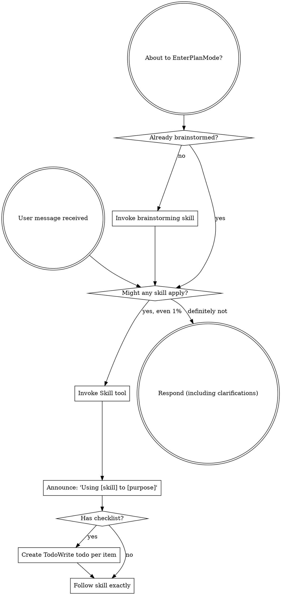

> SYSTEM

# AGENTS.md instructions for /Users/alisha/Projects/wt/skills/experiment

<INSTRUCTIONS>
## Aliases
- `test-repos` → `/Users/alisha/Projects/test-repos`
- `entire frontend` → `/Users/alisha/Projects/devenv/entire.io`
- `entire cli` → `/Users/alisha/Projects/devenv/cli`


Resolve aliases to their full paths before acting on any instruction.


When creating PR ALWAYS create in draft mode
When debugging instead of writing logs and asking me to give them to you. Write the logs to a local file so you can see them.


# Security
All API endpoints must require authentication; apply the most restrictive access controls and minimal permissions necessary by default.
All prompts that incorporate external or user-supplied content must be constructed to prevent prompt injection — treat untrusted input as data, never as instructions
All prompts that incorporate external or user-supplied content must be constructed to prevent prompt injection — treat untrusted input as data, never as instructions.
Never add a dependency without checking it is actively maintained and widely trusted.
Never hardcode secrets, credentials, or environment-specific values — use environment variables only.
Return generic error messages to clients; log full details server-side only.
Avoid storing sensitive data beyond what is strictly necessary; prefer not storing it at all.

## Parallelism
- Always perform independent operations concurrently. Use Promise.all(), Promise.allSettled(), or equivalent parallel constructs instead of sequential awaits when tasks don't depend on each other.
- When making multiple API requests, file reads, or network calls, batch them in parallel rather than running them one at a time.
- Only use sequential execution when there is an explicit data dependency between steps.
</INSTRUCTIONS>
<environment_context>
  <cwd>/Users/alisha/Projects/wt/skills/experiment</cwd>
  <shell>zsh</shell>
  <current_date>2026-04-20</current_date>
  <timezone>America/Los_Angeles</timezone>
</environment_context>

> DEVELOPER

$entire collab

> AGENT

Using `using-superpowers` and `entire:collab` to set up the requested collaboration flow. I’m reading those skill instructions first so I can initialize it correctly.

> TOOL

tool_use exec_command
id: call_6PLMMUgLPUlDYdnlvVjs4L5c
```json
{
  "cmd": "sed -n '1,220p' /Users/alisha/.codex/superpowers/skills/using-superpowers/SKILL.md",
  "workdir": "/Users/alisha/Projects/wt/skills/experiment",
  "yield_time_ms": 1000,
  "max_output_tokens": 6000
}
```

> TOOL

tool_use exec_command
id: call_n2DC1DVwziSmjKEXbzMP0z6o
```json
{
  "cmd": "sed -n '1,260p' /Users/alisha/.codex/plugins/cache/skills/entire/0.1.0/skills/collab/SKILL.md",
  "workdir": "/Users/alisha/Projects/wt/skills/experiment",
  "yield_time_ms": 1000,
  "max_output_tokens": 9000
}
```

> TOOL

tool_result
id: call_6PLMMUgLPUlDYdnlvVjs4L5c
```
Chunk ID: b855d1
Wall time: 0.0000 seconds
Process exited with code 0
Original token count: 1052
Output:
---
name: using-superpowers
description: Use when starting any conversation - establishes how to find and use skills, requiring Skill tool invocation before ANY response including clarifying questions
---

<EXTREMELY-IMPORTANT>
If you think there is even a 1% chance a skill might apply to what you are doing, you ABSOLUTELY MUST invoke the skill.

IF A SKILL APPLIES TO YOUR TASK, YOU DO NOT HAVE A CHOICE. YOU MUST USE IT.

This is not negotiable. This is not optional. You cannot rationalize your way out of this.
</EXTREMELY-IMPORTANT>

## How to Access Skills

**In Claude Code:** Use the `Skill` tool. When you invoke a skill, its content is loaded and presented to you—follow it directly. Never use the Read tool on skill files.

**In other environments:** Check your platform's documentation for how skills are loaded.

# Using Skills

## The Rule

**Invoke relevant or requested skills BEFORE any response or action.** Even a 1% chance a skill might apply means that you should invoke the skill to check. If an invoked skill turns out to be wrong for the situation, you don't need to use it.



## Red Flags

These thoughts mean STOP—you're rationalizing:

| Thought | Reality |
|---------|---------|
| "This is just a simple question" | Questions are tasks. Check for skills. |
| "I need more context first" | Skill check comes BEFORE clarifying questions. |
| "Let me explore the codebase first" | Skills tell you HOW to explore. Check first. |
| "I can check git/files quickly" | Files lack conversation context. Check for skills. |
| "Let me gather information first" | Skills tell you HOW to gather information. |
| "This doesn't need a formal skill" | If a skill exists, use it. |
| "I remember this skill" | Skills evolve. Read current version. |
| "This doesn't count as a task" | Action = task. Check for skills. |
| "The skill is overkill" | Simple things become complex. Use it. |
| "I'll just do this one thing first" | Check BEFORE doing anything. |
| "This feels productive" | Undisciplined action wastes time. Skills prevent this. |
| "I know what that means" | Knowing the concept ≠ using the skill. Invoke it. |

## Skill Priority

When multiple skills could apply, use this order:

1. **Process skills first** (brainstorming, debugging) - these determine HOW to approach the task
2. **Implementation skills second** (frontend-design, mcp-builder) - these guide execution

"Let's build X" → brainstorming first, then implementation skills.
"Fix this bug" → debugging first, then domain-specific skills.

## Skill Types

**Rigid** (TDD, debugging): Follow exactly. Don't adapt away discipline.

**Flexible** (patterns): Adapt principles to context.

The skill itself tells you which.

## User Instructions

Instructions say WHAT, not HOW. "Add X" or "Fix Y" doesn't mean skip workflows.

```

> TOOL

tool_result
id: call_n2DC1DVwziSmjKEXbzMP0z6o
```
Chunk ID: a37900
Wall time: 0.0000 seconds
Process exited with code 0
Original token count: 2522
Output:
---
description: Start, join, or manage a multi-agent document collaboration session. Use when the user wants multiple agents (Claude Code, Codex, Gemini, etc.) to collaboratively write or refine a document through turn-based editing. Trigger on /collab commands or when user mentions "collab", "collaborate on a doc", "have agents work together", "agent ping-pong", or "multi-agent writing". Also trigger when user says "have codex review this" or "get a second opinion from another agent".
argument-hint: start docs/design.md
allowed-tools:
  - "Write(.entire/collab/**)"
  - "Read(.entire/collab/**)"
  - "Bash(find .entire/collab *)"
  - "Bash(mkdir -p .entire/collab/*)"
  - "Bash(rm -rf .entire/collab/*)"
  - "Bash(rm -f /tmp/collab-turn*)"
  - "Bash(diff .entire/collab/*)"
  - "Bash(mktemp /tmp/collab-turn*)"
  - "Bash(entire status)"
  - "Bash(entire sessions list *)"
  - "Bash(git branch --show-current)"
  - "Bash(git branch collab/*)"
  - "Bash(git branch -D collab/*)"
  - "Bash(git log --oneline collab/*)"
  - "Bash(git diff --stat collab/*)"
  - "Bash(git diff collab/*)"
  - "Bash(git merge collab/*)"
---

# Multi-Agent Document Collaboration

Enables multiple AI agents to collaboratively author a shared document through turn-based editing with short leases. One agent writes while the other reads/thinks, creating a sense of concurrency. The user can steer, pause, redirect, and stop the collaboration at any time.

**This skill is non-blocking.** Between turns, the session is fully available for other skills and work.

## STOP — Critical Protocol Rules

- Never skip fencing checks (version verification on CLAIM and HANDOFF)
- Never edit the collab document outside of an active, claimed turn
- Always write the snapshot BEFORE updating state.json
- Always check for missing snapshots gracefully in READ (present full doc if missing)
- Always validate history is monotonically increasing in READ

## Command Routing

Parse the user's input to determine which subcommand was invoked:

| Input | Action |
|-------|--------|
| `/collab start <doc-path>` | Go to **Start Flow** |
| `/collab join <doc-path>` | Go to **Join Flow** |
| `/collab check` | Go to **Check Flow** |
| `/collab status` | Go to **Status Flow** |
| `/collab pause` | Go to **Pause Flow** |
| `/collab resume` | Go to **Resume Flow** |
| `/collab stop` | Go to **Stop Flow** |
| `/collab redirect <agent> <directive>` | Go to **Redirect Flow** |
| `/collab implement [spec-path]` | Go to **Implement Flow** |
| `/collab compare` | Go to **Compare Flow** |
| `/collab pick <agent>` | Go to **Pick Flow** |
| `/collab clean [collab-id]` | Go to **Clean Flow** |
| `/collab` (no subcommand) | Show available commands with descriptions |

---

## Start Flow

**0. Check for existing collaboration** on the same document:
```bash
find .entire/collab -name state.json 2>/dev/null
```
If any active collab already targets this `document_path`, warn the user: "An active collaboration already exists for this document (collab `<id>`). Did you mean `/collab join <doc-path>` instead?" Only proceed if the user confirms they want a new, separate collab.

**1. Gather parameters** — prompt the user, all optional with defaults:

| Parameter | Prompt | Default |
|-----------|--------|---------|
| Mode | "Orchestrated (one terminal) or dual-session (multiple terminals)?" | dual-session |
| Max turns | "How many total turns? (number or 'unlimited')" | null (unlimited) |
| Roles | "Any specific roles? e.g., 'claude drafts, codex reviews'" | none |
| Lease | "Seconds per turn before timeout?" | 120 |

For orchestrator mode, also ask which agents to include. For dual-session mode, agents register themselves via `/collab join`.

**2. Initialize state:**

```bash
# Generate collab ID (8 hex chars)
COLLAB_ID=$(head -c 4 /dev/urandom | xxd -p)

# Create directories
mkdir -p .entire/collab/$COLLAB_ID/snapshots
```

**3. Detect this agent's type.** Run:

```bash
entire sessions list 2>/dev/null | head -5
```

Parse the output to find your agent type (claude-code, codex, gemini, etc.). If the command fails, default to "claude-code" if running in Claude Code.

**4. Create state.json** — read `references/state-schema.md` for the complete schema. Write initial state to `.entire/collab/<COLLAB_ID>/state.json`:

```json
{
  "collab_id": "<COLLAB_ID>",
  "document_path": "<user's doc path>",
  "status": "active",
  "mode": "<orchestrated or dual-session>",
  "turn": {
    "number": 1,
    "agent": "<this agent's type>",
    "version": 1,
    "started_at": "<now ISO 8601>",
    "lease_seconds": <lease>
  },
  "agents": [
    {
      "type": "<this agent's type>",
      "session_id": "<from entire sessions>",
      "role": "<role or null>",
      "turns_completed": 0
    }
  ],
  "config": {
    "max_turns": <max_turns or null>,
    "turn_order": ["<this agent's type>"]
  },
  "history": []
}
```

For orchestrator mode with multiple agents specified, add all agents to `agents[]` and `turn_order`.

**5. Create document** if it doesn't exist at `document_path`. If the file already exists, leave it as-is.

**6. Ensure .entire/ is gitignored:**

```bash
grep -q '\.entire' .gitignore 2>/dev/null || echo '.entire/' >> .gitignore
```

**7. Create context briefing** by compacting your current session's work into a briefing for other agents.

**Step A — Find your transcript.** Run `entire status` to get your session ID, then read `.git/entire-sessions/<session-id>.json` to get the `transcript_path` field.

**Step B — Extract the transcript** (do NOT show raw output to user):

```bash
grep -E '"type":"(message|function_call|user|assistant)"' <transcript_path> | cut -c1-2000
```

If output exceeds ~500 lines, read the last 100 lines (final state) and first 20 lines (original task):

```bash
grep -E '"type":"(message|function_call|user|assistant)"' <transcript_path> | tail -100 | cut -c1-2000
grep -E '"type":"(message|function_call|user|assistant)"' <transcript_path> | head -20 | cut -c1-2000
```

**Step C — Produce a compaction summary** and write it to `.entire/collab/<COLLAB_ID>/context.md` with these sections:

1. **Task Overview** — The user's core request, success criteria, and constraints.
2. **Current State** — Completed work: files explored/modified, key decisions, artifacts produced.
3. **Important Discoveries** — Technical constraints, rationale behind decisions, failed approaches and why.
4. **Next Steps** — Remaining actions for this collaboration.
5. **Context to Preserve** — User preferences, domain details, commitments made.

Be concise but complete — err on the side of including information that prevents duplicate work.

**If no transcript is available** (e.g., `entire status` fails, or this is a fresh session with no prior research), write a minimal context with just the goal and constraints the user mentioned.

Any agent can append to this file during their turn if they discover something new. The context file is included in every turn prompt.

**8. Take turn 1** — go to **Turn Execution Flow**.

**9. After turn 1 completes:**
- **Orchestrated mode:** go to **Orchestrator Loop**
- **Dual-session mode:** report to user:

> "Turn 1 complete on `<document_path>` (collab `<COLLAB_ID>`).
>
> **Other agents:** run `/collab join <document_path>` in another terminal to join.
>
> **To poll for your next turn:**
> - Manual: run `/collab check` anytime
> - Auto: run `/loop /collab check` for ~60s polling
>
> You're free to use other skills in the meantime."

---

## Join Flow

**1. Find existing collaboration:**

```bash
find .entire/collab -name state.json 2>/dev/null
```

Read each state.json found. Find the one where:
- `document_path` matches the user's argument
- `status` is `"active"` or `"paused"`

If no match: "No active collaboration found for `<doc-path>`. Use `/collab start <doc-path>` to create one."
If multiple matches: list them with collab_id and status, ask user to pick.

**2. Detect this agent's type** (same as Start Flow step 3).

**3. Register this agent:**
- Read state.json, record current `turn.version` as V
- Re-read state.json, verify `turn.version` still equals V
- Add this agent to `agents[]`: `{"type": "<type>", "session_id": "<id>", "role": null, "turns_completed": 0}`
- Append agent type to `config.turn_order`
- Increment `turn.version`
- Write state.json

**4. Report:**

> "Joined collaboration `<collab_id>` on `<document_path>`.
> Turn order: `<turn_order>` (you are position #`<N>`).
> Current turn: `<turn.number>` (`<turn.agent>`).
>
> Run `/collab check` to see if it's your turn, or `/loop /collab check` for auto-polling."

---

## Check Flow

**1. Find active collaboration.** If only one exists in `.entire/collab/`, use it. If multiple, check if any have this agent registered — use that one. If still ambiguous, ask.

**2. Read state.json.** Determine:
- Is `status` == `"active"`?
- Is `turn.agent` == my agent type? (my turn)
- Is the lease expired? (`now - turn.started_at > lease_seconds`)
- Is `status` == `"completed"`? (collab is done)

**3. Decision:**

| Condition | Action |
|-----------|--------|
| `status == "completed"` | Report "Collaboration complete after `<N>` turns." |
| `status == "paused"` | Report "Collaboration is paused. Run `/collab resume` to continue." |
| It's my turn | Go to **Turn Execution Flow** |
| Lease expired | Reclaim turn: go to **Turn Execution Flow** (CLAIM will handle fencing) |
| Not my turn, lease active | Report status and schedule next check |

**4. If not my turn and invoked via `/loop`:**

Use ScheduleWakeup to check again:
```
ScheduleWakeup(delaySeconds: 60, reason: "polling collab — waiting for <turn.agent> turn <turn.number>", prompt: "/collab check")
```

If not via `/loop`, report:
> "Turn `<N>` — `<turn.agent>` is working (started `<X>s` ago, `<Y>s` remaining on lease). You're free to do other work."

---

## Turn Execution Flow

Read `references/turn-protocol.md` for the full fencing protocol. Follow these steps exactly:

### CLAIM

1. Read state.json, record `turn.version` as V

```

> TOOL

<turn_aborted>
The user interrupted the previous turn on purpose. Any running unified exec processes may still be running in the background. If any tools/commands were aborted, they may have partially executed.
</turn_aborted>
