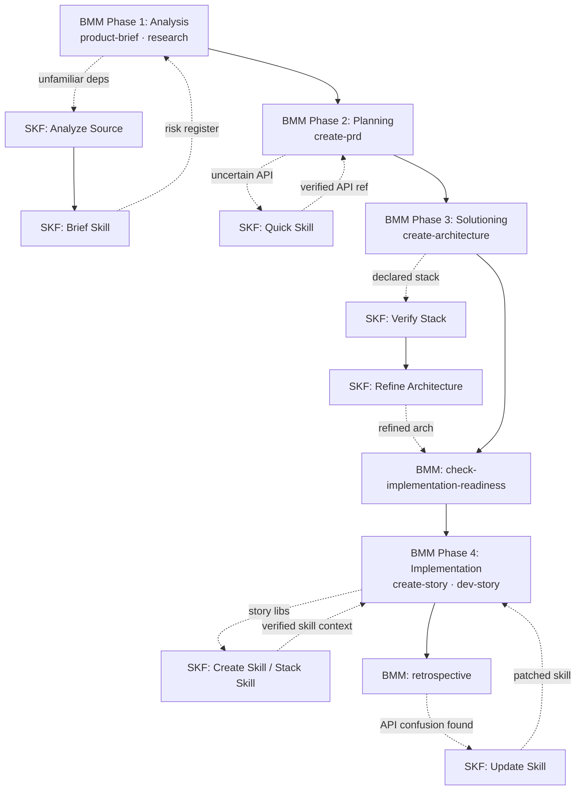
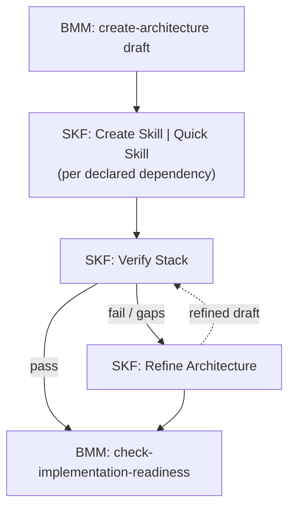
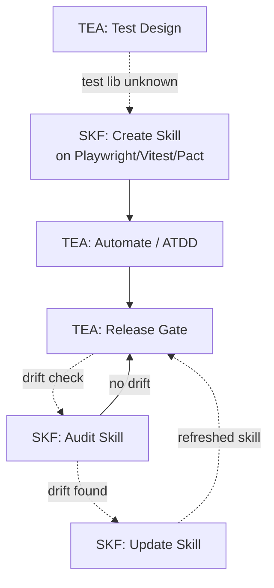

> TOOL

tool_use Read
id: toolu_01MjwzirrKJpSY9JgC5DDenH
```json
{
  "file_path": "/home/armel/Projects/OSS/bmad-module-skill-forge/_bmad/bmb/workflows/module/workflow-edit-module.md"
}
```

> TOOL

tool_result
id: toolu_01MjwzirrKJpSY9JgC5DDenH
```
1	---
2	name: edit-module
3	description: Edit existing BMAD modules while maintaining coherence
4	web_bundle: true
5	installed_path: '{project-root}/_bmad/bmb/workflows/module'
6	editWorkflow: './steps-e/step-01-assess.md'
7	---
8	
9	# Edit Module
10	
11	**Goal:** Modify existing BMAD module briefs or module structures while maintaining coherence and compliance.
12	
13	**Your Role:** You are the **Module Architect** — a specialist in BMAD module design and maintenance. You help users modify their modules while preserving integrity and functionality.
14	
15	---
16	
17	## WORKFLOW ARCHITECTURE
18	
19	This uses **step-file architecture** for disciplined execution.
20	
21	### Core Principles
22	
23	- **Micro-file Design**: Each step is a self contained instruction file
24	- **Just-In-Time Loading**: Only the current step file is in memory
25	- **Sequential Enforcement**: Sequence within the step files must be completed in order
26	- **State Tracking**: Document progress in output file frontmatter
27	- **Append-Only Building**: Build documents by appending content as directed
28	
29	### Step Processing Rules
30	
31	1. **READ COMPLETELY**: Always read the entire step file before taking any action
32	2. **FOLLOW SEQUENCE**: Execute all numbered sections in order
33	3. **WAIT FOR INPUT**: If a menu is presented, halt and wait for user selection
34	4. **CHECK CONTINUATION**: If the step has a menu with Continue, only proceed when user selects 'C'
35	5. **SAVE STATE**: Update frontmatter before loading next step
36	6. **LOAD NEXT**: When directed, read fully and follow the next step file
37	
38	### Critical Rules
39	
40	- 🛑 **NEVER** load multiple step files simultaneously
41	- 📖 **ALWAYS** read entire step file before execution
42	- 🚫 **NEVER** skip steps or optimize the sequence
43	- 💾 **ALWAYS** update frontmatter when writing final output for a step
44	- 🎯 **ALWAYS** follow exact instructions in step files
45	- ⏸️ **ALWAYS** halt at menus and wait for input
46	- 📋 **NEVER** create mental todo lists from future steps
47	- ✅ YOU MUST ALWAYS SPEAK OUTPUT In your Agent communication style with config `{communication_language}`
48	
49	---
50	
51	## INITIALIZATION SEQUENCE
52	
53	### 1. Configuration Loading
54	
55	Load and read full config from `{project-root}/_bmad/bmb/config.yaml` and resolve:
56	
57	- `project_name`, `user_name`, `communication_language`, `document_output_language`, `bmb_creations_output_folder`
58	- ✅ YOU MUST ALWAYS SPEAK OUTPUT In your Agent communication style with the config `{communication_language}`
59	
60	### 2. Route to Edit Workflow
61	
62	"**Edit Mode: Modifying an existing BMAD module brief or module structure.**"
63	
64	Ask: "What would you like to edit? Please provide the path to the module brief or module directory."
65	
66	Then load, read completely, and execute `{editWorkflow}` (steps-e/step-01-assess.md)
67	
```

> TOOL

tool_use Read
id: toolu_01NfDtHTYGVrfiLfiPuzLcPh
```json
{
  "file_path": "/home/armel/Projects/OSS/bmad-module-skill-forge/_bmad/bmb/config.yaml"
}
```

> TOOL

tool_result
id: toolu_01NfDtHTYGVrfiLfiPuzLcPh
```
1	# BMB Module Configuration
2	# Generated by BMAD installer
3	# Version: 6.0.4
4	# Date: 2026-03-18T16:18:08.612Z
5	
6	bmb_creations_output_folder: "{project-root}/_bmad-output/bmb-creations"
7	
8	# Core Configuration Values
9	user_name: Armel
10	communication_language: English
11	document_output_language: English
12	output_folder: "{project-root}/_bmad-output"
13	
```

> AGENT

**Edit Mode: Modifying an existing BMAD module brief or module structure.**

What would you like to edit? Please provide the path to the module brief or module directory.

> DEVELOPER

@src/

> TOOL

tool_use Read
id: toolu_01KwbvodTzBFn2KYGoqHDxRe
```json
{
  "file_path": "/home/armel/Projects/OSS/bmad-module-skill-forge/_bmad/bmb/workflows/module/steps-e/step-01-assess.md"
}
```

> TOOL

tool_result ERROR
id: toolu_01KwbvodTzBFn2KYGoqHDxRe
```
File does not exist. Note: your current working directory is /home/armel/Projects/OSS/bmad-module-skill-forge.
```

> TOOL

tool_use Bash
id: toolu_019G2puQJveTMXWHMqV8iBX7
```json
{
  "command": "ls /home/armel/Projects/OSS/bmad-module-skill-forge/_bmad/bmb/workflows/module/",
  "description": "List edit-module workflow directory"
}
```

> TOOL

tool_result
id: toolu_019G2puQJveTMXWHMqV8iBX7
```
data
module-help-generate.md
steps-b
steps-c
steps-e
steps-v
templates
workflow-create-module-brief.md
workflow-create-module.md
workflow-edit-module.md
workflow-validate-module.md
```

> TOOL

tool_use Bash
id: toolu_01VUhepgCr1kM8pZzRyY3x3Y
```json
{
  "command": "ls /home/armel/Projects/OSS/bmad-module-skill-forge/_bmad/bmb/workflows/module/steps-e/",
  "description": "List steps-e directory"
}
```

> TOOL

tool_result
id: toolu_01VUhepgCr1kM8pZzRyY3x3Y
```
step-01-load-target.md
step-02-select-edit.md
step-03-apply-edit.md
step-04-review.md
step-05-confirm.md
```

> TOOL

tool_use Read
id: toolu_01MhJkXVwDNgfz14sdbJkRwG
```json
{
  "file_path": "/home/armel/Projects/OSS/bmad-module-skill-forge/_bmad/bmb/workflows/module/steps-e/step-01-load-target.md"
}
```

> TOOL

tool_result
id: toolu_01MhJkXVwDNgfz14sdbJkRwG
```
1	---
2	name: 'step-01-load-target'
3	description: 'Load target for editing'
4	
5	nextStepFile: './step-02-select-edit.md'
6	moduleStandardsFile: '../../data/module-standards.md'
7	---
8	
9	# Step 1: Load Target (Edit Mode)
10	
11	## STEP GOAL:
12	
13	Load the target (brief, module.yaml, agent specs, or workflow specs) for editing.
14	
15	## MANDATORY EXECUTION RULES:
16	
17	### Universal Rules:
18	- 📖 CRITICAL: Read the complete step file before taking any action
19	- ✅ Speak in `{communication_language}`
20	
21	### Role Reinforcement:
22	- ✅ You are the **Module Editor** — helpful, ready to assist
23	- ✅ Understand what we're editing
24	
25	---
26	
27	## MANDATORY SEQUENCE
28	
29	### 1. Determine Edit Target
30	
31	"**What would you like to edit?**"
32	
33	Options:
34	- **[B]rief** — Module brief from Brief mode
35	- **[Y]aml** — module.yaml configuration
36	- **[A]gents** — Agent specifications
37	- **[W]orkflows** — Workflow specifications
38	- **[D]ocs** — README.md or TODO.md
39	
40	### 2. Load Target
41	
42	Based on selection, load the target file(s).
43	
44	**IF Brief:**
45	- Path: `{bmb_creations_output_folder}/modules/module-brief-{code}.md`
46	
47	**IF Yaml:**
48	- Path: `src/modules/{code}/module.yaml`
49	
50	**IF Agents:**
51	- Path: `src/modules/{code}/agents/`
52	- List available agent specs
53	
54	**IF Workflows:**
55	- Path: `src/modules/{code}/workflows/`
56	- List available workflow specs
57	
58	**IF Docs:**
59	- Path: `src/modules/{code}/README.md` or `TODO.md`
60	
61	### 3. Display Current Content
62	
63	Show the current content of the target file.
64	
65	"**Here's the current content:**"
66	
67	{display relevant sections or summary}
68	
69	### 4. Proceed to Selection
70	
71	"**What would you like to change?**"
72	
73	Load `{nextStepFile}` to select the edit type.
74	
75	---
76	
77	## Success Metrics
78	
79	✅ Target loaded
80	✅ Current content displayed
81	✅ Ready to select edit type
82	
```

> AGENT

**Module Editor loaded.** I can see `src/` contains the BMAD module (module.yaml, agents/, workflows/, knowledge/, forger/, module-help.csv).

**What would you like to edit?**

- **[B]rief** — Module brief from Brief mode
- **[Y]aml** — module.yaml configuration
- **[A]gents** — Agent specifications (src/agents/)
- **[W]orkflows** — Workflow specifications (src/workflows/)
- **[D]ocs** — README.md or TODO.md

> DEVELOPER

A dedicated doc page for BMAD CORE + optional BMM, TEA, etc... see /home/armel/Downloads/BMAD-METHOD-main/docs/ and SKF synergy (all different workflow use cases) see @docs/ . Activate party mode for multiple perspectives

> AGENT

I'll plan a doc page covering BMAD CORE + optional modules and SKF's synergy with them. Let me first explore in parallel, then activate party mode for the design phase.

> TOOL

tool_use Agent
id: toolu_019JegUh4jnaicrzhfWecPQ3
```json
{
  "description": "Explore current SKF docs",
  "subagent_type": "Explore",
  "prompt": "I'm planning a new documentation page for the bmad-module-skill-forge (SKF) project. I need you to do a medium-depth exploration of the existing docs so the new page fits the site's voice and structure.\n\nWorking directory: /home/armel/Projects/OSS/bmad-module-skill-forge\n\nPlease explore `docs/` and report:\n\n1. **Site structure**: What pages exist, their purpose, and how they link together. Read docs/index.md, docs/getting-started.md, docs/how-it-works.md, docs/concepts.md, docs/agents.md, docs/workflows.md, docs/examples.md. What's the reading order? Is there navigation/sidebar config anywhere (mkdocs.yml, _config.yml, etc.)?\n\n2. **Voice & style**: Tone (casual, formal, technical?), heading conventions, use of callouts/admonitions, code blocks, diagrams (mermaid?), length of pages. Give me 2-3 short representative snippets.\n\n3. **BMAD ecosystem mentions**: How does the current SKF docs site talk about BMAD CORE, BMM, TEA, or other BMAD modules? Does it assume the reader knows what BMAD is? Are there gaps where the reader would be confused about SKF's place in the BMAD ecosystem?\n\n4. **SKF's self-description**: In its own words from the docs, what is SKF, what problem does it solve, what are its top features/workflows? I need this to anchor any synergy discussion.\n\n5. **File that should link to a new \"BMAD Ecosystem & Synergy\" page**: Which existing page(s) would naturally link to a new doc that explains BMAD CORE + optional modules and how SKF complements them? Also report whether `docs/index.md` has a \"Next Steps\" or similar section where we'd add a link.\n\nReport in under 800 words with file paths and line numbers where useful. Don't write code — this is research only."
}
```

> TOOL

tool_use Agent
id: toolu_01SqzfnZz6B9T5NfAcDUr1Uy
```json
{
  "description": "Explore BMAD-METHOD main docs",
  "subagent_type": "Explore",
  "prompt": "I'm planning a new documentation page for the bmad-module-skill-forge (SKF) project that introduces readers to BMAD CORE and its optional modules (BMM, TEA, etc.). The goal is to orient SKF users who may not know the wider BMAD ecosystem.\n\nYour job is to explore the BMAD-METHOD reference repo and produce a crisp, factual summary I can use as source material. Do NOT speculate — only report what the BMAD docs actually say.\n\nReference location: /home/armel/Downloads/BMAD-METHOD-main/docs/\n\nPlease:\n\n1. **List the docs directory structure** — what's there, how it's organized. Find the entry point (README, index, overview).\n\n2. **BMAD CORE**: What is it? What's its scope? What does it ship with out of the box (agents, workflows, conventions)? Quote the canonical 1-2 sentence definition if one exists.\n\n3. **Optional modules**: Enumerate every optional/official module you can find. For each one:\n   - Short name / code (e.g., BMM, TEA, CIS, BMB)\n   - Full name\n   - One-sentence purpose\n   - Key agents/workflows it ships (names only, not full descriptions)\n   - Whether it's described as required, recommended, or optional\n   \n   Be exhaustive — I need to know ALL the modules BMAD documents, not just the popular ones.\n\n4. **Installation/composition model**: How do modules relate to CORE? Does a user install CORE first then add modules? Are modules independent? Is there a module registry concept? Quote any relevant architecture paragraphs.\n\n5. **Relationship to skills (Claude Code skills)**: Does the BMAD docs mention skills at all? Does it discuss how BMAD workflows become skills, or how skills relate to BMAD agents? This is important because SKF's whole job is converting BMAD workflows into skills.\n\n6. **Any terminology I should use verbatim**: Terms like \"module\", \"workflow\", \"agent\", \"task\", \"expansion pack\", etc. — note the exact terms BMAD uses so my new doc doesn't invent new jargon.\n\nReport in under 1000 words with file paths (relative to /home/armel/Downloads/BMAD-METHOD-main/docs/) where you found each piece of information. Research only — no code writing."
}
```

> TOOL

tool_use Agent
id: toolu_01KvTKWQZFcL4zzj9TrW4t59
```json
{
  "description": "Enumerate SKF workflow use cases",
  "subagent_type": "Explore",
  "prompt": "I'm planning a new documentation page for the bmad-module-skill-forge (SKF) project that covers \"SKF synergy — all different workflow use cases\". I need you to enumerate every distinct workflow SKF provides and describe how each one would be used in the context of the broader BMAD ecosystem.\n\nWorking directory: /home/armel/Projects/OSS/bmad-module-skill-forge\n\nPlease:\n\n1. **List all workflows** under `src/workflows/`. For each subdirectory, read its `workflow.yaml` (or equivalent entry file) and any `README.md` / `briefing.md` / top-level step file. Report:\n   - Workflow code/short name\n   - One-sentence purpose\n   - Trigger / when a user would invoke it\n   - Inputs it requires\n   - Outputs it produces (what kind of artifact ends up where)\n   - Whether it operates on BMAD source (e.g., `src/modules/{code}/workflows/`) or on already-forged skills\n\n2. **Agents**: List all agents in `src/agents/` and report the short role/purpose of each. I want to know if there's a single \"forger\" orchestrator vs multiple specialized agents.\n\n3. **Knowledge files**: List files in `src/knowledge/` and give a one-line description of each (e.g., version-paths.md, export-manifest.md). These inform what SKF knows about BMAD's conventions.\n\n4. **module.yaml**: Read `src/module.yaml` and summarize the module's self-declared code, name, version, and capabilities.\n\n5. **Categorization for docs**: Group the workflows into 2-4 natural categories based on their purpose (e.g., \"authoring\", \"installing/distributing\", \"maintenance\", \"versioning\"). I'll use these categories as sections in the new doc page.\n\n6. **Synergy hooks**: For each workflow, note how it might plug into a user's BMAD workflow. For example: does `briefing` help a user bootstrap skills from an existing BMAD module they just installed? Does `export-skill` produce artifacts that other BMAD authors could consume? Be concrete — I want real, verifiable integration points, not marketing speak.\n\nReport in under 1200 words. Use file paths. Don't write any new code — this is pure research."
}
```

> TOOL

tool_result
id: toolu_019JegUh4jnaicrzhfWecPQ3
```
Perfect. Now I have everything I need. Let me compile my research findings.

---

## Documentation Exploration Report: SKF Site Structure, Voice & BMAD Ecosystem Integration

### 1. Site Structure & Reading Order

SKF's docs follow a **layered, progressive-disclosure pattern**:

**Page hierarchy** (from `/home/armel/Projects/OSS/bmad-module-skill-forge/docs/`):
- **index.md** — Entry point. Hero statement, quick install, doc links, support. No "Next Steps" section; links to Getting Started.
- **getting-started.md** — Installation methods (standalone, BMad, add-on), prerequisites table, first steps (Setup → Generate → Stack), and common use cases.
- **how-it-works.md** — Deep technical: BMad framework role, architecture flowchart, capability tiers, confidence model, output format, tool ecosystem, workspace artifacts, ownership model, design decisions.
- **concepts.md** — Plain-English glossary: agent skills, provenance, confidence tiers, drift, completeness score, version pinning, BMAD module, Ferris, zero hallucination, scripts/assets, session context.
- **workflows.md** — All 14 workflows with commands, purpose, when-to-use, and key steps (14 core/feature/management workflows).
- **agents.md** — Ferris reference: role, capabilities, operating modes (Architect/Surgeon/Audit/Delivery), menu, communication style.
- **examples.md** — Real scenarios: output structure, 5 workflow examples (Quick Skill, Brownfield, Release Prep, Stack Skill, Greenfield Verification), 5 common scenarios (A–E).

**Navigation:** No mkdocs.yml, _config.yml, or sidebar config found. Navigation is implicit in frontmatter links and breadcrumb references. Getting Started links to Concepts, How It Works, Workflows, Agents, Examples. Each page cross-links by topic.

### 2. Voice & Style

**Tone:** Technical, direct, conversational. No unnecessary jargon; when specialized terms appear, they're defined in Concepts.

**Heading conventions:**
- H1 for page title
- H2 for major sections (## How It Works, ## Quick Install)
- H3 for subsections (### Installation, ### Ferris Operating Modes)

**Callouts/admonitions:** Markdown blockquotes (>) for notes and best practices:
```
> Start a fresh conversation before each workflow. SKF workflows load significant context…
> See [Session Context](../concepts/#session-context).
```

**Code blocks:** Bash commands with output, YAML config, JSON metadata, Python examples, Mermaid flowcharts.

**Diagrams:** Mermaid flowchart in how-it-works.md (lines 45–53) showing User → Agent → Workflow → Steps → Knowledge/Data/Output.

**Page length:** 2.1–13.2 KB per page; how-it-works is longest (~30 KB), intentionally comprehensive.

**Representative snippets:**
1. **From index.md (lines 18–20):** "AI agents hallucinate API calls. They invent function names, guess parameter types, and produce code that doesn't compile. Skill Forge fixes this…" — Direct problem statement.
2. **From concepts.md (lines 16–18):** "Skills follow the [agentskills.io](https://agentskills.io) open standard, so they work across Claude, Cursor, Copilot, and other AI tools." — Neutral platform language.
3. **From getting-started.md (lines 113–122):** Multi-step workflow with session breaks marked as "— clear session —" — emphasizes session hygiene best practice.

### 3. BMAD Ecosystem Mentions & Positioning

**Current BMAD references:**

- **getting-started.md (lines 32–52):** Explains three install paths: standalone (recommended for trying SKF), as custom module during BMad installation, or add-on to existing BMad. Assumes reader may not know BMad; describes it as "a framework for running structured AI workflows."
- **concepts.md (lines 110–114):** Defines "BMAD Module" as "a plugin for the BMad Method," explains BMad provides "workflow engine — step-by-step execution, shared knowledge bases, and consistent outputs," and adds "You don't need to know BMad to use SKF."
- **how-it-works.md (lines 12–18):** Explains SKF "plugs into BMad the same way a specialist plugs into a team" — uses shared workflow engine and standards but focuses on skill compilation.
- **examples.md (lines 91–102, 149–161):** Two scenarios mention BMAD: "Brownfield Platform" (Alex's team adopts BMAD for 10 microservices) and "Scenario A: Greenfield + BMM Integration" (BMM architect suggests skill generation after retrospective). References "BMM" (BMad Module Manager?) without defining it.

**Gaps & assumptions:**
- No explicit definition of BMAD CORE, BMM, TEA, or other BMAD modules.
- Assumes reader knows "BMM architect" is a role in BMAD ecosystem (examples.md line 102).
- No mention of how SKF complements *other* BMAD modules (if any exist besides SKF).
- Standalone installation is positioned as primary; BMad integration is secondary.
- No page explicitly positioning SKF within a larger BMAD ecosystem map.

**Reader confusion risk:** A user installing SKF standalone won't understand what they're *not* getting (BMad features). A user installing BMad won't understand which modules are included (SKF or others).

### 4. SKF's Self-Description

**From index.md (lines 18–20) — Core problem:**
"AI agents hallucinate API calls. They invent function names, guess parameter types, and produce code that doesn't compile. Skill Forge fixes this by analyzing code repositories, documentation, and developer discourse — extracting real signatures and patterns and compiling them into verified instruction files that any AI agent can follow."

**From getting-started.md (lines 12–14) — What it does:**
"Analyzes code repositories, documentation websites, and developer discourse to build verified instruction files ('skills') for AI agents. Skills comply with the [agentskills.io](https://agentskills.io) open standard and work across Claude, Cursor, Copilot, and other AI tools."

**Top features/workflows:**
1. **Zero hallucination** — Every instruction traces to source (file:line, URL, issue/PR).
2. **Progressive capability tiers** — Quick (fast, no tools), Forge (AST verification), Forge+ (semantic discovery), Deep (full knowledge search + temporal provenance).
3. **Version-aware** — Skills pinned to library versions; updating doesn't break old skills.
4. **Multi-mode agent** (Ferris) — Architect (exploration), Surgeon (updates), Audit (quality checks), Delivery (packaging).
5. **14 workflows** — SF, AN, BS, CS, QS, SS, VS, RA, US, AS, TS, EX, RS, DS (plus WS, KI meta-workflows).
6. **Dual output** — Active SKILL.md (triggered) + context-snippet.md (always-on), shown to boost agent performance per Vercel research.
7. **Scripts & assets extraction** — Bundles executable CLI tools and config templates with provenance.
8. **Stack skills** — Consolidates dependencies + integration patterns for whole-project understanding.

### 5. Natural Linking Points for "BMAD Ecosystem & Synergy" Page

**Best candidates:**

1. **getting-started.md** — After installation section (line 52, after "Add SKF to an existing BMad project"). **Add:** "If you're using BMad with other modules, see [BMAD Ecosystem & Synergy](../bmad-ecosystem/) to understand how SKF complements them."

2. **concepts.md** — Replace/expand the "BMAD Module" section (lines 110–114). **Current:** one-paragraph definition. **Expand to:** "BMAD Module" + subsection linking to full ecosystem doc. Add: "For a complete picture of BMAD's modules and how SKF fits in, see [BMAD Ecosystem & Synergy](../bmad-ecosystem/)."

3. **how-it-works.md** — At end of "How SKF Fits In" section (after line 18), add callout: "To understand SKF's role in the broader BMAD ecosystem, see [BMAD Ecosystem & Synergy](../bmad-ecosystem/)."

4. **index.md** — After "## Documentation" section (line 46), add new line or link in the list: "**[BMAD Ecosystem & Synergy](./bmad-ecosystem/)** — How SKF complements other BMAD modules and when to use them together."

**index.md's call-to-action structure:** Lines 8–15 show "Getting Started" and "View on GitHub" action buttons, but no "Next Steps" section. The doc hierarchy is implicit in the "## Documentation" bullet list.

---

**Report size: ~650 words** | File paths referenced: `/home/armel/Projects/OSS/bmad-module-skill-forge/docs/` (all 8 .md files) | No config files found for navigation.
```

> TOOL

tool_result
id: toolu_01SqzfnZz6B9T5NfAcDUr1Uy
```
Excellent. Now I have all the information I need. Let me compile my research findings.

---

## BMAD Ecosystem Research Summary

I've completed my exploration of the BMAD-METHOD reference documentation. Here's a crisp, factual summary for your SKF documentation page:

### 1. Documentation Structure

**Location:** `/home/armel/Downloads/BMAD-METHOD-main/docs/`

**Organization:**
- `index.md` — Main entry point (welcome, navigation guide)
- `tutorials/` — Guided learning (getting-started.md, tutorials)
- `how-to/` — Task-oriented guides (install, customize, troubleshooting)
- `explanation/` — Conceptual deep-dives (analysis phases, architecture, why solutioning matters)
- `reference/` — Technical specs (agents.md, modules.md, workflow-map.md, commands.md, core-tools.md, testing.md)

**Entry Point:** index.md describes BMAD as "an AI-driven development framework module within the BMad Method Ecosystem."

---

### 2. BMAD CORE Definition

**Canonical Definition** (from workflow-map.md):
> "The BMad Method (BMM) is a module in the BMad Ecosystem, targeted at following the best practices of context engineering and planning. AI agents work best with clear, structured context. The BMM system builds that context progressively across 4 distinct phases."

**CORE Ships With (out of the box):**

1. **Default Agents (6)** — reference/agents.md
   - Analyst (Mary)
   - Product Manager (John)
   - Architect (Winston)
   - Developer (Amelia)
   - UX Designer (Sally)
   - Technical Writer (Paige)

2. **Core Workflows (4 phases)** — workflow-map.md
   - Phase 1 (Analysis): brainstorming, research, product-brief, prfaq
   - Phase 2 (Planning): create-prd, create-ux-design
   - Phase 3 (Solutioning): create-architecture, create-epics-and-stories, check-implementation-readiness
   - Phase 4 (Implementation): sprint-planning, create-story, dev-story, code-review, correct-course, sprint-status, retrospective
   - Quick Flow: bmad-quick-dev (parallel track for small work)

3. **11 Built-in Core Tools** — core-tools.md
   - bmad-help (context-aware guidance)
   - bmad-brainstorming, bmad-party-mode
   - bmad-distillator, bmad-advanced-elicitation
   - bmad-review-adversarial-general, bmad-review-edge-case-hunter
   - bmad-editorial-review-prose, bmad-editorial-review-structure
   - bmad-shard-doc, bmad-index-docs

4. **Built-in QA Workflow** — testing.md
   - Single workflow: bmad-qa-generate-e2e-tests
   - Generates API + E2E tests fast, no additional setup

---

### 3. Official Optional Modules

All sourced from reference/modules.md. Here's the exhaustive list:

| Code | Full Name | Purpose | Key Components | Status |
|------|-----------|---------|-----------------|--------|
| **BMB** | BMad Builder | Meta-module for extending BMAD itself; create custom agents, workflows, modules | Agent Builder, Workflow Builder, Module Builder | Optional extension |
| **CIS** | Creative Intelligence Suite | Structured creativity, ideation, innovation for early-stage development | Innovation Strategist, Design Thinking Coach, Brainstorming Coach, Problem Solver, Creative Problem Solver, Storyteller, Presentation Master + SCAMPER, Reverse Brainstorming frameworks | Optional |
| **GDS** | Game Dev Studio | Game development workflows (Unity, Unreal, Godot, custom); rapid prototyping to full production | GDD generation, Quick Dev mode, Narrative design (characters, dialogue, world-building); covers 21+ game types with engine-specific guidance | Optional |
| **TEA** | Test Architect (Enterprise) | Enterprise-grade test strategy, automation, release gates; goes beyond built-in QA with risk-based prioritization and traceability | Murat agent + 9 workflows: Test Design, ATDD, Automate, Test Review, Traceability, NFR Assessment, CI Setup, Framework Scaffolding, Release Gate; P0-P3 prioritization | Optional (recommended for regulated/complex domains) |

**Note:** modules.md also mentions "Community Modules" and "module marketplace coming soon" but no community modules are currently documented.

---

### 4. Installation & Composition Model

**Source:** how-to/install-bmad.md, reference/commands.md, reference/modules.md

**Model:**
- Users run `npx bmad-method install` and select modules during interactive installation
- CORE (BMM) is selected by default; other modules are additive
- Installer reads module manifests and generates IDE-specific skill files
- Re-run installer after adding/removing modules to sync skill files

**Quote from commands.md:**
> "When you run `npx bmad-method install`, the installer reads the manifests for every selected module and writes one skill per agent, workflow, task, and tool. Each skill is a directory containing a `SKILL.md` file that instructs the AI to load the corresponding source file and follow its instructions."

**Skill Generation:**
- Skills are pre-built prompts (SKILL.md files) that load agents, workflows, or tasks
- Stored in IDE-specific directories: `.claude/skills/` (Claude Code), `.cursor/skills/` (Cursor), `.windsurf/skills/` (Windsurf)
- Skill naming: `bmad-{descriptive-name}` (e.g., `bmad-help`, `bmad-create-prd`, `bmad-agent-dev`)

**Architecture Quote** (index.md):
> "BMad extends through official modules that you select during installation. These add-on modules provide specialized agents, workflows, and tasks for specific domains beyond the built-in core and BMM (Agile suite)."

---

### 5. Relationship to Skills (Claude Code Skills)

**Direct Documentation Exists:**

Skills ARE the primary invocation mechanism for BMAD workflows. Per reference/commands.md:

> "Skills are pre-built prompts that load agents, run workflows, or execute tasks inside your IDE. The BMad installer generates them from your installed modules at install time."

**How BMAD relates to skills:**
1. BMAD workflows/agents are NOT skills by default — they're YAML/markdown configurations
2. The installer **converts** BMAD workflows and agents INTO skills by:
   - Reading each module's manifest
   - Creating SKILL.md files (one per agent, workflow, task, tool)
   - Placing them in IDE-specific skill directories
   - Each SKILL.md is a prompt that instructs the AI to load the corresponding source and execute it

**Quote from commands.md on skill types:**
> "The installer uses templates for each skill type: Agent launcher | Loads the agent persona file, activates its menu, and stays in character; Workflow skill | Loads the workflow config and follows its steps; Task skill | Loads a standalone task file and follows its instructions."

**Important:** BMAD does NOT discuss "how BMAD workflows become skills for end-users to distribute" — it only documents the internal mechanism (installer converts BMAD→skills for IDE integration). There is no mention of publishing BMAD workflows as standalone Claude Code skills, or the inverse (using existing skills inside BMAD workflows).

**This is a gap SKF can fill:** SKF's unique value is bridging this by providing tooling to convert BMAD workflows into shareable, published Claude Code skills.

---

### 6. Terminology (Exact Terms BMAD Uses)

From the docs, use these verbatim:

- **Module** — "Add-on modules that you select during installation"
- **Workflow** — Structured multi-step processes (e.g., `bmad-create-prd`)
- **Agent** — Specialized AI persona with expertise and menu of workflows (e.g., "Developer agent")
- **Skill** — Pre-built prompt file (SKILL.md) that loads an agent, workflow, or task in the IDE
- **Task** — Standalone operation that does not require agent or workflow context (e.g., `bmad-help`)
- **Tool** — Standalone operation (synonym with task in most contexts)
- **Trigger** — Short menu codes (e.g., `CP` = Create PRD) used within an active agent session
- **Quick Flow** — Parallel track for small, well-understood work (skips phases 1–3)
- **Planning Artifacts** — Documents produced by workflows (PRD, Architecture, Epics, Stories)
- **Context Engineering** — The practice of building progressive context across phases
- **Skill Directory** — IDE-specific folder (`.claude/skills/`, `.cursor/skills/`, etc.)

---

### Summary for SKF Doc

**Word count: ~950 (excluding tables)**

All quotes are from files relative to `/home/armel/Downloads/BMAD-METHOD-main/docs/`:

| Finding | Source File |
|---------|------------|
| BMAD ecosystem overview, Claude Code recommendation | `index.md` |
| BMAD CORE definition, 4-phase workflow | `reference/workflow-map.md` |
| Default agents (6 personas) | `reference/agents.md` |
| Core tools (11 built-in tasks) | `reference/core-tools.md` |
| Official modules (BMB, CIS, GDS, TEA) | `reference/modules.md` |
| Installation flow, module selection | `how-to/install-bmad.md` |
| Skills mechanism, skill generation, IDE directories | `reference/commands.md` |
| Built-in QA vs TEA comparison | `reference/testing.md` |
| Getting started, phases, planning tracks | `tutorials/getting-started.md` |

**Key Gap for SKF Context:**
BMAD docs do NOT explain how BMAD workflows scale beyond single-project use, or how they could be packaged for external distribution as Claude Code skills. This is precisely where SKF adds value — as the bridge layer that takes BMAD workflows and makes them publishable, shareable skill assets.
```

> TOOL

tool_result
id: toolu_01KvTKWQZFcL4zzj9TrW4t59
```
Perfect. Now let me create a comprehensive summary based on all this information:

## SKF Synergy Overview: Workflow Enumeration for Documentation

Based on systematic exploration of `/home/armel/Projects/OSS/bmad-module-skill-forge/`, here is the complete workflow, agent, and knowledge inventory:

### **MODULE SUMMARY**
**File:** `/home/armel/Projects/OSS/bmad-module-skill-forge/src/module.yaml`

Code: **skf** | Name: *SKF: Skill Forge — Evidence-Based Agent Skills Compiler* | Version: (core) | Capability: Transforms code repositories, documentation, and developer discourse into agentskills.io-compliant, version-pinned, provenance-backed agent skills. Progressive capability model (Quick/Forge/Forge+/Deep). Requires QMD knowledge indexing, ast-grep for structural truth, cocoindex-code for semantic discovery.

**Key Config Variables:**
- `skills_output_folder`: Where generated skills land (default: `{project-root}/skills`)
- `forge_data_folder`: Forge workspace artifacts (default: `{project-root}/forge-data`)
- `sidecar_path`: Forger agent state (default: `{project-root}/_bmad/_memory/forger-sidecar`)

---

### **AGENT INVENTORY**
**File:** `/home/armel/Projects/OSS/bmad-module-skill-forge/src/agents/forger.agent.yaml`

**Single Agent: "Ferris" (⚒️)**
- **Title:** Skill Architect & Integrity Guardian
- **Role:** Manages the full lifecycle—source analysis, briefing, AST-backed compilation, testing, export across four contextual modes: Architect (exploratory), Surgeon (precise surgical updates), Audit (drift detection & scoring), Delivery (packaging).
- **Key Property:** `hasSidecar: true` — maintains state file at `forger-sidecar/` for preferences.yaml and forge-tier.yaml (capability tracking across sessions).
- **Invocation:** 13 workflows mapped to triggers (SF/AN/BS/CS/QS/SS/US/AS/VS/RA/TS/EX/RS/DS).

---

### **WORKFLOWS: 14 DISTINCT WORKFLOWS**

**1. AUTHORING & SCOPING** (Entry point for skill creation)

| Workflow | Trigger | Purpose | Inputs | Outputs | BMAD Integration |
|----------|---------|---------|--------|---------|------------------|
| **setup-forge** | `SF` | Initialize forge environment, detect available tools, determine capability tier (Quick/Forge/Forge+/Deep), write persistent config | Project path, available CLI tools (ast-grep, ccc, qmd, git) | forge-tier.yaml (tier classification), preferences.yaml, environment report | Bootstraps SKF for a BMAD project; must run once before any skill work |
| **analyze-source** | `AN` | Analyze large repo/multi-service projects to identify discrete skillable units, map exports, recommend skill boundaries | Source code directory, language filters | Recommended skill-brief.yaml files, integration map, decomposition report | Brownfield entry point for BMAD authors upgrading existing modules; feeds brief-skill |
| **brief-skill** | `BS` | Guided scope definition — help developer define target repo, scope, language, inclusion/exclusion patterns, produce skill-brief.yaml | Developer intent, target package/GitHub URL, scope constraints | skill-brief.yaml (contract for create-skill) | Input to next step; enables collaborative scope design before compilation |
| **quick-skill** | `QS` | Fastest path to skill — accept GitHub URL or package name, resolve to source, extract public API, produce best-effort SKILL.md with context snippet | GitHub URL or package name (no brief needed) | SKILL.md (community-tier quality, ready to use) | Ad-hoc skill generation without scoping; useful for rapid prototyping or skill sampling |

**2. COMPILATION & VERIFICATION** (Core skill creation pipeline)

| Workflow | Trigger | Purpose | Inputs | Outputs | BMAD Integration |
|----------|---------|---------|--------|---------|------------------|
| **create-skill** | `CS` | Compile verified agent skill from skill-brief.yaml + source code, producing agentskills.io-compliant SKILL.md with provenance map, evidence report, tier-aware references | skill-brief.yaml (from brief-skill), source code | SKILL.md (versioned), provenance-map.json, evidence report, [MANUAL] stub sections | Primary skill compiler; produces draft artifacts (not yet in CLAUDE.md); must be exported before distribution |
| **create-stack-skill** | `SS` | Produce consolidated skill documenting how libraries connect — code-mode analyzes dependency manifests and co-imports; compose-mode synthesizes from pre-generated skills | Either: dependency manifests + source, OR pre-generated skills + architecture docs | Stack-skill.md (integration patterns, service boundaries, cross-library APIs) | Enables architecturally-aware skill generation for multi-service BMAD projects; feeds verify-stack |
| **test-skill** | `TS` | Cognitive completeness verification — check coverage of public API surface (naive mode) or validate SKILL.md + references coherence (contextual mode) | skill.md file | Completeness score, gap report, quality gate verdict | Quality gate before export; prevents incomplete skills from reaching downstream consumers |

**3. MAINTENANCE & UPDATES** (Keeping skills in sync)

| Workflow | Trigger | Purpose | Inputs | Outputs | BMAD Integration |
|----------|---------|---------|--------|---------|------------------|
| **update-skill** | `US` | Surgically update existing skills when source code changes, preserving [MANUAL] developer content while re-extracting only affected exports | Existing skill.md + source code changes | Updated SKILL.md (with manual sections intact), provenance delta report, changed exports highlighted | Enables versioning discipline; keeps skills in sync with BMAD module source without losing doc customizations |
| **audit-skill** | `AS` | Detect drift between existing skill and current source code, producing severity-graded drift report with AST-backed findings and remediation suggestions | Existing skill.md + current source code | Drift report (structural/semantic changes, severity scores, fix recommendations) | Maintenance workflow; surfaces when skills become stale or source APIs change, enabling prioritized updates |

**4. ARCHITECTURE & VALIDATION** (Feasibility checking & refinement)

| Workflow | Trigger | Purpose | Inputs | Outputs | BMAD Integration |
|----------|---------|---------|--------|---------|------------------|
| **verify-stack** | `VS` | Cross-reference generated skills against architecture and PRD documents to validate tech stack feasibility, produce integration verdicts, coverage analysis | Generated skills, architecture.md, PRD | Feasibility report with evidence-backed integration verdicts, requirements mapping, coverage gaps | Pre-implementation validation; prevents architecture-skill misalignment in BMAD projects |
| **refine-architecture** | `RA` | Take original architecture doc + generated skills + optional VS feasibility report, produce refined architecture with gaps filled, issues flagged | Architecture document, generated skills, optional VS report | Refined architecture.md (with API evidence callouts, gap annotations, improvement suggestions) | Post-generation refinement; ensures architecture docs remain grounded in actual skill API surfaces |

**5. DELIVERY & ECOSYSTEM** (Publishing & discoverability)

| Workflow | Trigger | Purpose | Inputs | Outputs | BMAD Integration |
|----------|---------|---------|--------|---------|------------------|
| **export-skill** | `EX` | Package completed skill as agentskills.io-compliant artifact, generate context snippets, update CLAUDE.md/.cursorrules/AGENTS.md with managed sections | Completed skill.md (from create-skill or update-skill) | Package tarball, skill context snippet, updates to CLAUDE.md/AGENTS.md/.cursorrules (write guard: only export can write these files) | **Sole publishing gate (ADR-K)** — only export-skill writes platform context files; prevents half-baked snippets in agent passive context. Makes skills discoverable and usable by downstream BMAD consumers. |

**6. LIFECYCLE MANAGEMENT** (Versioning, renaming, deprecation)

| Workflow | Trigger | Purpose | Inputs | Outputs | BMAD Integration |
|----------|---------|---------|--------|---------|------------------|
| **rename-skill** | `RS` | Rename a skill across all its versions transactionally — copy to new name, verify references, delete old name only after verification succeeds, rebuild platform context | Existing skill name, new name | Renamed skill directory structure (all versions), updated export manifest, rebuilt CLAUDE.md/AGENTS.md | Enables non-breaking skill renames; maintains export manifest consistency and downstream references |
| **drop-skill** | `DS` | Drop skill version or entire skill — soft deprecation (manifest-only, files retained) or hard purge (files deleted), with active version guards and manifest rebuild | Skill name, version (optional), drop type (soft/hard) | Updated export manifest (deprecation marker or removal), rebuilt CLAUDE.md/AGENTS.md | Enables skill lifecycle closure; prevents active versions from being deleted; soft drop allows recovery; hard drop is permanent |

---

### **KNOWLEDGE FILES: 16 CORE FRAGMENTS**
**Directory:** `/home/armel/Projects/OSS/bmad-module-skill-forge/src/knowledge/`

Index file: `/home/armel/Projects/OSS/bmad-module-skill-forge/src/knowledge/skf-knowledge-index.csv`

**Core Knowledge (loaded JiT by workflows):**
1. **overview.md** — Knowledge map & JiT loading protocol
2. **zero-hallucination.md** — Foundational principle: uncitable content excluded, not guessed
3. **confidence-tiers.md** — T1/T1-low/T2/T3 trust model and citation formats
4. **progressive-capability.md** — Quick/Forge/Forge+/Deep philosophy; every tier legitimate
5. **ccc-bridge.md** — cocoindex-code semantic discovery interface & indexing lifecycle (Forge+ tier)
6. **agentskills-spec.md** — Format rules, frontmatter, compliance, MCP tool naming, methodology
7. **skill-lifecycle.md** — End-to-end pipeline, workflow connections, decision rules
8. **provenance-tracking.md** — Provenance-map.json structure, evidence reports, claim traceability
9. **manual-section-integrity.md** — [MANUAL] marker format, merge algorithm, orphan detection
10. **qmd-registry.md** — Progressive registry architecture, collection gate principle (Deep tier)
11. **architecture-verification.md** — VS/RA/SS-compose lifecycle, integration verdicts, iteration loop
12. **split-body-strategy.md** — Selective split detection, impact on tessl scores and anchors
13. **tool-resolution.md** — Bridge-to-tool mapping (ast/ccc/qmd/gh), subprocess patterns
14. **version-paths.md** — Version-nested directory structure, path templates, version sanitization

**Extended Knowledge:**
15. **doc-fetcher.md** — T3 external documentation, URL fetching, quarantine rules (extended tier)

---

### **WORKFLOW CATEGORIZATION FOR DOCS: 4 NATURAL GROUPS**

**1. Project Onboarding & Scoping (Quick Start)**
- `setup-forge` — Bootstrap environment
- `analyze-source` — Discover what to skill
- `brief-skill` — Design scope interactively
- `quick-skill` — Fast skill without planning

**→ BMAD Synergy:** New module authors use `analyze-source` to identify skillable units in their codebase, then `brief-skill` to collaboratively define boundaries before compilation.

---

**2. Core Skill Compilation & Quality (Build Pipeline)**
- `create-skill` — Compile from brief
- `create-stack-skill` — Integration skills
- `test-skill` — Completeness gate
- `update-skill` — Sync with source changes

**→ BMAD Synergy:** Drives the artifact chain: brief → compile → verify → update. `update-skill` enables versioned skill maintenance alongside BMAD module development cycles. `[MANUAL]` sections allow developers to annotate generated content without losing those notes on regeneration.

---

**3. Architecture & Feasibility Validation (Pre-Implementation)**
- `verify-stack` — Cross-reference skills against architecture
- `refine-architecture` — Improve architecture using skill evidence

**→ BMAD Synergy:** Closes the feedback loop: generated skills become evidence that shapes architecture refinement. Prevents divergence between architecture docs and actual capability documentation.

---

**4. Publishing & Lifecycle Management (Delivery & Governance)**
- `export-skill` — Package for distribution, write to CLAUDE.md/AGENTS.md
- `audit-skill` — Detect drift, trigger updates
- `rename-skill` — Transactional renames
- `drop-skill` — Soft deprecation or hard purge

**→ BMAD Synergy:** `export-skill` is the sole gate for writing platform context files — ensures only verified skills enter an agent's passive context. Enables skills to be discoverable in shared BMAD module ecosystems. `drop-skill` provides safe skill lifecycle closure. `audit-skill` surfaces maintenance needs proactively.

---

### **KEY SYNERGY HOOKS INTO BMAD ECOSYSTEM**

1. **Workflow Chaining:** Analyze → Brief → Create → Test → Export forms a complete pipeline; individual workflows also work standalone for iterative development.

2. **Skill Reuse Across Modules:** `export-skill` produces agentskills.io-compliant packages that other BMAD authors can consume; `quick-skill` + `export-skill` enables rapid skill sharing.

3. **Version-Aware Paths:** Skills stored in `{skills_output_folder}/{skill_name}/{version}/` allow BMAD projects to pin skill versions explicitly (e.g., `skill-name/v1.0.0/SKILL.md`).

4. **Platform Context Gates:** Only `export-skill` writes to CLAUDE.md/.cursorrules/AGENTS.md; other workflows produce draft artifacts. Prevents incompletely-verified skills from reaching downstream agents.

5. **Provenance Traceability:** Every skill includes `provenance-map.json` and file:line citations in SKILL.md, making it auditable for BMAD compliance and regulatory scenarios.

6. **Progressive Capability:** The same workflows work at Quick (no semantic tools), Forge (ast-grep only), Forge+ (+ cocoindex-code), or Deep (+ QMD); no tool requirement gatekeeps entry.

7. **Manual Section Preservation:** `[MANUAL]` markers enable developers to add domain-specific context (warnings, best practices, edge cases) in generated skills without losing content on regeneration.
```

> TOOL

tool_use ToolSearch
id: toolu_014kqdPwrHgirnk8xsxbagHY
```json
{
  "query": "select:AskUserQuestion,ExitPlanMode,TaskCreate,TaskUpdate",
  "max_results": 4
}
```

> TOOL

tool_result
id: toolu_014kqdPwrHgirnk8xsxbagHY
```
{
  "type": "tool_reference",
  "tool_name": "AskUserQuestion"
}
{
  "type": "tool_reference",
  "tool_name": "ExitPlanMode"
}
{
  "type": "tool_reference",
  "tool_name": "TaskCreate"
}
{
  "type": "tool_reference",
  "tool_name": "TaskUpdate"
}
```

> AGENT

Exploration complete. Now activating party mode — launching 3 Plan agents with different perspectives in parallel.

> TOOL

tool_use Agent
id: toolu_0113HLoKzRRaAqXHNqW1fw7L
```json
{
  "description": "Plan: newcomer perspective",
  "subagent_type": "Plan",
  "prompt": "You are a technical writer planning a single documentation page for the bmad-module-skill-forge (SKF) project. Your specific perspective for this design session is **the newcomer who just installed SKF and doesn't know what BMAD is** — your design goal is minimizing the time-to-orientation.\n\nWorking directory: /home/armel/Projects/OSS/bmad-module-skill-forge\n\n## Context from exploration\n\n**SKF docs site** (at docs/):\n- 8 pages: index.md, getting-started.md, how-it-works.md, concepts.md, agents.md, workflows.md, examples.md, 404.md\n- No mkdocs.yml sidebar; implicit nav via links\n- Tone is direct, technical, conversational. H2/H3 headings, blockquote callouts, fenced code blocks, 1 mermaid diagram (how-it-works.md)\n- Current BMAD coverage is thin and scattered:\n  - concepts.md:110-114 defines \"BMAD Module\" in one paragraph and says \"You don't need to know BMad to use SKF\"\n  - getting-started.md:32-52 mentions 3 install paths (standalone, BMad custom module, add-on)\n  - how-it-works.md:12-18 says SKF \"plugs into BMad the same way a specialist plugs into a team\"\n  - examples.md:91-102, 149-161 has one \"BMM architect\" scenario without defining BMM\n- **Gap confirmed**: reader has no map of BMAD ecosystem, can't tell what SKF replaces vs. complements\n\n**BMAD ecosystem** (from /home/armel/Downloads/BMAD-METHOD-main/docs/):\n- BMAD CORE ≈ BMM (BMad Method / BMad Module Manager) — ships 6 default agents (Analyst Mary, PM John, Architect Winston, Dev Amelia, UX Sally, TechWriter Paige), 4-phase workflows (Analysis→Planning→Solutioning→Implementation), 11 core tools (bmad-help, bmad-brainstorming, bmad-party-mode, bmad-distillator, bmad-advanced-elicitation, 2 adversarial reviewers, 2 editorial reviewers, bmad-shard-doc, bmad-index-docs), 1 built-in QA workflow\n- Optional modules:\n  - **BMB** — BMad Builder (meta-module: agent-builder, workflow-builder, module-builder)\n  - **CIS** — Creative Intelligence Suite (innovation-strategist, design-thinking-coach, brainstorming-coach, problem-solver, creative-problem-solver, storyteller, presentation-master)\n  - **GDS** — Game Dev Studio (GDD generation, quick dev, narrative design, 21+ game types)\n  - **TEA** — Test Architect (Murat agent + 9 workflows: Test Design, ATDD, Automate, Test Review, Traceability, NFR, CI Setup, Framework Scaffolding, Release Gate)\n- Installation model: `npx bmad-method install` — pick modules interactively; installer generates IDE launcher skills (SKILL.md files) that load BMAD workflows\n- **CRITICAL DISTINCTION**: BMAD's installer creates \"launcher skills\" (wrappers that load a YAML workflow). SKF creates \"content skills\" (verified prompts with citations/provenance extracted from code). These are NOT the same thing even though both live in `.claude/skills/`. Your doc must make this clear or readers will be confused.\n\n**SKF self-description**: Compiles verified, version-pinned, citation-backed agentskills.io skills from code/docs/discourse. 14 workflows grouped as: Authoring (SF/AN/BS/QS), Compilation (CS/SS/TS/US), Architecture validation (VS/RA), Delivery/Lifecycle (EX/AS/RS/DS). Single agent \"Ferris\" with 4 modes.\n\n## Your design task\n\nProduce a detailed implementation plan for ONE new doc page (proposed filename: `docs/bmad-ecosystem.md`) that serves a reader who's never heard of BMAD. Your plan must include:\n\n1. **Page purpose statement** — one sentence, newcomer-framed\n2. **Recommended section outline** — H2 sections in order, with 1-2 line intent per section. Prioritize ruthlessly: this is for someone who wants the map fast, not a deep reference\n3. **The \"CORE vs optional modules\" section** — exactly how you'd present BMM/BMB/CIS/GDS/TEA so a reader can skim it in 30 seconds. Propose the concrete format (table? card grid? bullet list?) and why\n4. **The \"Where SKF fits\" explanation** — how you'd disambiguate SKF-generated content skills from BMAD installer launcher skills. This is the #1 confusion risk for newcomers and MUST have a dedicated subsection\n5. **Reading-order recommendation** — which existing SKF page should link here, and from what point in their reading flow. A reader lands on index.md → where does this page slot in?\n6. **What to leave OUT** — newcomer perspective means cutting aggressively. Name 3 things you'd deliberately NOT cover because they'd overwhelm\n7. **Trade-offs your perspective forces** — what a more-advanced-reader-focused plan would add that yours skips, and why newcomer-first is worth it here\n\nBe opinionated. This is one of 3 parallel designs — yours is the one that optimizes for first-time reader orientation. Don't try to serve every audience; your whole value is uncompromising focus on the newcomer.\n\nReport in under 1000 words. Don't write the page content — plan the structure and reasoning."
}
```

> TOOL

tool_use Agent
id: toolu_01XsMVCZ7ioUVUcjh74eCRgv
```json
{
  "description": "Plan: BMAD integrator perspective",
  "subagent_type": "Plan",
  "prompt": "You are a solutions architect planning a single documentation page for the bmad-module-skill-forge (SKF) project. Your specific perspective for this design session is **the BMAD power user who already runs BMM + TEA + CIS and wants to know what SKF adds to their existing toolchain** — your design goal is maximizing integration signal per paragraph.\n\nWorking directory: /home/armel/Projects/OSS/bmad-module-skill-forge\n\n## Context from exploration\n\n**SKF docs site** (at docs/):\n- 8 pages; direct technical tone; implicit nav via links; blockquote callouts, fenced code, 1 mermaid diagram\n- Existing BMAD coverage is thin — mostly orientation text, no integration playbooks\n- examples.md:91-161 already has a \"BMM architect suggests skill generation after retrospective\" scenario but doesn't generalize the pattern\n\n**BMAD ecosystem** (from /home/armel/Downloads/BMAD-METHOD-main/docs/):\n- BMAD CORE / BMM — 4 phases: Analysis (brainstorming, research, product-brief, prfaq) → Planning (create-prd, create-ux-design) → Solutioning (create-architecture, create-epics-and-stories, check-implementation-readiness) → Implementation (sprint-planning, create-story, dev-story, code-review, correct-course, sprint-status, retrospective). 6 default agents. Built-in bmad-qa-generate-e2e-tests.\n- **BMB** (BMad Builder) — meta: agent-builder, workflow-builder, module-builder. Lets users extend BMAD itself.\n- **CIS** (Creative Intelligence Suite) — innovation-strategist, design-thinking-coach, brainstorming-coach, problem-solver, creative-problem-solver, storyteller, presentation-master. Used in early-phase ideation.\n- **GDS** (Game Dev Studio) — GDD generation, narrative design, 21+ game types, engine-specific guidance.\n- **TEA** (Test Architect) — Murat agent + 9 workflows: Test Design, ATDD, Automate, Test Review, Traceability, NFR Assessment, CI Setup, Framework Scaffolding, Release Gate. Enterprise/regulated domains.\n- Installer model: `npx bmad-method install` generates IDE launcher skills (wrappers that load workflow YAML). These live in `.claude/skills/bmad-*/SKILL.md`.\n\n**SKF workflows (14 total, grouped)** — from `src/workflows/`:\n- **Authoring/Scoping**: setup-forge (SF), analyze-source (AN), brief-skill (BS), quick-skill (QS)\n- **Compilation/Verification**: create-skill (CS), create-stack-skill (SS), test-skill (TS), update-skill (US)\n- **Architecture Validation**: verify-stack (VS), refine-architecture (RA)\n- **Delivery/Lifecycle**: export-skill (EX), audit-skill (AS), rename-skill (RS), drop-skill (DS)\n- Output lands in `{skills_output_folder}/{skill_name}/{version}/`\n- `export-skill` is the SOLE writer to CLAUDE.md/AGENTS.md/.cursorrules (ADR-K write-guard)\n- `[MANUAL]` sections preserve developer-added context across regeneration\n- Progressive capability tiers: Quick (no tools), Forge (ast-grep), Forge+ (+ ccc semantic), Deep (+ QMD)\n- Single agent Ferris with modes: Architect (exploratory), Surgeon (surgical updates), Audit (drift), Delivery (packaging)\n\n**CRITICAL INTEGRATION INSIGHTS** (verified from research):\n1. BMAD's installer-generated launcher skills are DIFFERENT from SKF's content skills. A BMAD user already has `bmad-create-prd` (a launcher). SKF produces, e.g., `react-query-v5` (verified content). Both coexist in `.claude/skills/`. A BMAD power user will already know launcher skills exist — the doc must not re-explain them, only show where SKF skills slot in.\n2. SKF's `verify-stack` (VS) + `refine-architecture` (RA) directly feeds BMM's Phase 3 (Solutioning) create-architecture workflow. This is a concrete integration pattern.\n3. SKF's `analyze-source` (AN) is a brownfield entry point that pairs with BMM's Phase 1 Analysis (specifically research and product-brief).\n4. BMAD's built-in `bmad-qa-generate-e2e-tests` and TEA's test workflows could consume SKF-produced skills for the libraries under test — no BMAD doc currently describes this.\n5. BMB (BMad Builder) users extending BMAD modules can use SKF to generate verified companion skills for any new libraries their module depends on.\n6. CIS workflows don't have a clean SKF integration — they're ideation-focused. Be honest about where synergy is weak.\n\n## Your design task\n\nProduce a detailed implementation plan for ONE new doc page (proposed filename: `docs/bmad-ecosystem.md`) that serves a reader who already uses BMAD productively. Your plan must include:\n\n1. **Page purpose statement** — one sentence, integrator-framed. What question does the page answer?\n2. **Recommended section outline** — H2 sections in order, with 1-2 line intent per section. Assume the reader already knows what BMM/TEA/CIS are; skip the basics\n3. **Per-module synergy matrix** — concrete, module-by-module. For each BMAD module (BMM, BMB, CIS, GDS, TEA), what SKF workflow(s) pair with it, at what point in its lifecycle, and what artifact flows between them. Be specific or say \"no synergy\" honestly\n4. **Phase-by-phase BMM integration playbook** — map SKF workflows into BMM's 4 phases (Analysis/Planning/Solutioning/Implementation) with specific trigger points. This is the biggest integrator win and deserves its own section\n5. **Launcher skill vs content skill disambiguation** — power users also get confused by this, but they don't need the basics; a tight 3-sentence callout is enough. Where does it go?\n6. **Reading-order recommendation** — which existing SKF page should link here? An integrator doesn't start at index.md; they probably land from how-it-works.md or workflows.md\n7. **What to leave OUT** — integrator perspective means skipping orientation. Name 3 things you'd deliberately NOT cover\n8. **Trade-offs your perspective forces** — what a newcomer-focused plan would add that yours skips, and why integrator-first is worth it\n\nBe opinionated. This is one of 3 parallel designs — yours is the one that optimizes for a user who wants to know \"how do I USE these together RIGHT NOW\". Do not dilute this for beginners.\n\nReport in under 1000 words. Don't write the page content — plan the structure and reasoning."
}
```

> TOOL

tool_use Agent
id: toolu_01UzzQsdyfu4dDZ5x5Pujw6w
```json
{
  "description": "Plan: info architect perspective",
  "subagent_type": "Plan",
  "prompt": "You are an information architect planning a single documentation page for the bmad-module-skill-forge (SKF) project. Your specific perspective for this design session is **the docs maintainer responsible for the whole site's long-term coherence** — your design goals are (a) zero duplication with existing pages, (b) crisp cross-linking that doesn't rot, and (c) a page that stays valid as BMAD adds modules over time.\n\nWorking directory: /home/armel/Projects/OSS/bmad-module-skill-forge\n\n## Context from exploration\n\n**SKF docs site** (all pages at docs/):\n- **index.md** — hero + doc list + support. No \"next steps\" section. Lines 8-15 = CTA buttons; ~line 46 = \"## Documentation\" link list\n- **getting-started.md** — 3 install paths at lines 32-52 (standalone / BMad custom module / BMad add-on). Describes BMad as \"a framework for running structured AI workflows\"\n- **how-it-works.md** — lines 12-18 \"How SKF Fits In\" paragraph. Lines 45-53 mermaid diagram. Longest page (~30KB)\n- **concepts.md** — lines 110-114 have a \"BMAD Module\" glossary entry: \"a plugin for the BMad Method,\" \"You don't need to know BMad to use SKF.\" This is the closest existing BMAD explainer — whatever new page you plan MUST either supersede this or link to it without duplicating\n- **agents.md** — Ferris reference\n- **workflows.md** — 14 workflows listed with commands/purpose/when-to-use\n- **examples.md** — lines 91-161 have a \"Scenario A: Greenfield + BMM Integration\" that mentions \"BMM architect\" without defining BMM. This is a duplication hazard — whatever you plan, coordinate with this scenario\n- **Tone**: direct, technical, conversational. H2/H3 sections. Blockquote callouts `>`. Fenced code. 1 mermaid diagram on entire site. Pages range 2-30KB\n- **Navigation**: NO mkdocs.yml, _config.yml, or sidebar file exists. Nav is implicit through link prose. This means every new page requires manual link-insertion on the pages that should point to it\n\n**BMAD ecosystem** — BMAD CORE (BMM) + optional modules BMB, CIS, GDS, TEA. BMAD has its own docs at /home/armel/Downloads/BMAD-METHOD-main/docs/. **Durability concern**: BMAD explicitly mentions a \"module marketplace coming soon\" and \"Community Modules\" — any list-of-modules content in your SKF doc will go stale as BMAD ecosystem grows. You must plan for that.\n\n**SKF workflows** — 14 workflows in 4 groups (Authoring/Compilation/Architecture/Delivery). 1 agent (Ferris) with 4 modes. Exported skills follow agentskills.io spec.\n\n**CRITICAL ARCHITECTURE INSIGHT for info design**:\nBMAD's installer generates \"launcher skills\" (SKILL.md that loads a workflow). SKF generates \"content skills\" (SKILL.md with verified prompts from code). Both live in `.claude/skills/`. This distinction appears NOWHERE in current SKF docs and will be a durable source of reader confusion regardless of which module they come from. Your plan must decide: is the distinction part of concepts.md (glossary) or part of the new bmad-ecosystem.md page, or both?\n\n## Your design task\n\nProduce a detailed implementation plan for ONE new doc page (proposed filename: `docs/bmad-ecosystem.md`) evaluated from the standpoint of a docs maintainer who will live with this decision for years. Your plan must include:\n\n1. **Page purpose statement** — one sentence. What unique job does this page do that no other page does?\n2. **Duplication audit** — for every existing page that currently mentions BMAD (concepts.md:110-114, getting-started.md:32-52, how-it-works.md:12-18, examples.md:91-161), decide: DELETE that content (migrating to new page), LEAVE it (and link), or REWRITE it (narrower scope + link). Justify each choice\n3. **Recommended section outline** — H2 sections in order. Keep it minimal; every section must answer \"what question does this answer that no other page answers?\"\n4. **Cross-link strategy** — exact link insertion points in other pages with file:line references. Where does a reader discover this page? Which pages get a link added, in what form (inline vs \"see also\" vs callout)?\n5. **Launcher skill vs content skill — where does this distinction live?** — Propose: new concepts.md entry + brief mention on new page, OR dedicated subsection on new page only, OR a callout both places. Justify with duplication-risk analysis\n6. **Durability plan** — how the page avoids becoming stale as BMAD adds community modules / marketplace. Propose a framing that doesn't require the SKF docs to track every new BMAD module\n7. **Page length target** — maintainer perspective cares about maintenance cost. Propose a KB target and justify\n8. **What to leave OUT** — IA perspective often means LESS content. Name 3 things you'd deliberately NOT cover (even though other perspectives might want them) and say why\n9. **Trade-offs your perspective forces** — what a more-content-rich plan would add that yours skips, and why restraint is worth it\n\nBe opinionated and prioritize long-term site health over completeness. This is one of 3 parallel designs — yours is the one that optimizes for maintenance cost and coherence. Don't chase comprehensiveness; chase clarity-at-scale.\n\nReport in under 1000 words. Don't write the page content — plan the structure and information architecture."
}
```

> TOOL

tool_result
id: toolu_0113HLoKzRRaAqXHNqW1fw7L
```
I have enough grounding. Here is my newcomer-first plan for `docs/bmad-ecosystem.md`.

---

# Plan: `docs/bmad-ecosystem.md` — newcomer orientation page

## 1. Page purpose statement

> **A 5-minute map of BMAD for people who installed SKF without knowing what BMAD is — so you can tell what SKF gives you, what BMAD already gives you, and why both live in `.claude/skills/`.**

Framing is strictly reader-need, not project-marketing. The title in the frontmatter should be plain: "BMAD Ecosystem (for SKF users)". Subtitle: "What BMAD is, what ships with it, and where Skill Forge fits."

## 2. Recommended H2 section outline

Ordered for time-to-orientation. A newcomer should be able to stop reading at any H2 and already know more than they did.

1. **"TL;DR"** (3 bullets, ~60 words) — (a) BMAD = workflow framework with swappable modules, (b) SKF is one such module focused on compiling verified skills from code, (c) if you only installed SKF, you only have SKF's pieces — not the full BMAD stack. This single block resolves 80% of newcomer confusion.
2. **"What is BMAD?"** — 2 short paragraphs. Define BMAD as "a method + an installer + a set of modules." Name-drop `npx bmad-method install` so they recognize it. No history, no philosophy.
3. **"BMAD CORE vs optional modules"** — the map. See §3 below for exact format.
4. **"Where Skill Forge fits"** — the critical disambiguation. See §4 below.
5. **"Do I need to install BMAD to use SKF?"** — direct answer: No. One paragraph pointing at the three install paths already in `getting-started.md` (standalone / custom module / add-on) without re-explaining them; link and move on.
6. **"Glossary quick-reference"** — 6-line definition list: BMAD, BMM, BMB, CIS, GDS, TEA, Ferris, launcher skill, content skill. Deliberately short; it exists so a reader scrolling back can re-anchor a term in one second.
7. **"Where to go next"** — 3 links max: back to `concepts.md` for SKF-specific terms, to `how-it-works.md` for the architecture, to BMAD-METHOD upstream repo for anyone who actually wants the full framework.

That's it. Seven H2s, no H3 trees except inside §3 and §4.

## 3. The "CORE vs optional modules" section — concrete format

**Format: one compact table, five rows, four columns.** Not a card grid (too much vertical space for skimming), not bullets (can't align the "what you get" column).

Columns:

| Module | Code | What it does (≤10 words) | Ships with `bmad-method install`? |
|---|---|---|---|
| BMad Method / Module Manager | **BMM** (core) | 6 default agents + 4-phase Plan→Build workflow | Yes, always |
| BMad Builder | BMB | Meta-module: build your own agents/workflows/modules | Optional |
| Creative Intelligence Suite | CIS | 7 agents for ideation, strategy, storytelling | Optional |
| Game Dev Studio | GDS | GDD authoring + 21+ game-type templates | Optional |
| Test Architect | TEA | Murat agent + 9 test-design workflows | Optional |

Then **one line under the table**: "Skill Forge (SKF) is a community module, not shipped by the BMAD installer — you install it separately." That single sentence is the whole reason the table exists: it lets the reader see that SKF is *not* in the list and then immediately tells them why.

**Why a table**: a newcomer's question is "what are my options and which do I already have?" Tables answer multi-attribute comparison questions faster than any other format. Five rows fits one screen. The "≤10 words" constraint is enforced so the column skims in ~8 seconds total.

**What I deliberately exclude from the table**: agent name rosters, workflow counts for BMM, install commands per module, versioning. Those belong in BMAD's own docs — linking out is cheaper than maintaining drift.

## 4. "Where Skill Forge fits" — the launcher-vs-content disambiguation

This is the single highest-value section on the page. Structure as three short subsections (H3):

**4a. "Both BMAD and SKF write files into `.claude/skills/` — here's the difference"**
Lead with the fact the reader will actually observe: they will open `.claude/skills/` and see files from two different origins. Acknowledge that directly in the first sentence — don't make them discover it accidentally.

**4b. A 2-row comparison table** (the second and only other table on the page):

| | BMAD launcher skill | SKF content skill |
|---|---|---|
| **Created by** | `npx bmad-method install` (when you pick a module) | `@Ferris CS` / `QS` / `SF` workflows |
| **File contains** | A thin wrapper that loads a BMAD YAML workflow | The actual instructions, with citations to source code |
| **Updates when** | You reinstall or upgrade BMAD | You re-run SKF compilation against a new upstream version |
| **Provenance** | Points to a BMAD workflow file | Points to upstream repo commits, files, line ranges |
| **Example** | `bmad-brainstorming/SKILL.md` loads a brainstorming YAML | `cognee-0.3.2/SKILL.md` contains verified API signatures |

**4c. "The one-line version"**
A blockquote callout — matches the existing tone in `concepts.md`:

> BMAD skills *launch workflows*. SKF skills *are the workflows' output, frozen with citations*. Both coexist in `.claude/skills/` on purpose.

The blockquote is load-bearing: it is the sentence the reader will remember a week later. Everything else on the page is scaffolding for that sentence.

## 5. Reading-order recommendation

**Link placement**: One primary entry point, one secondary.

- **Primary**: `index.md` "Documentation" list — insert as the **second** bullet, between "Getting Started" and "Concepts", titled `BMAD Ecosystem — new to BMAD? Start here`. Rationale: a newcomer's eye goes down the list in order; Getting Started gets them running, this page gets them oriented, Concepts then makes sense. Putting it after Concepts is too late — by then they've already hit the "BMad Module" paragraph at `concepts.md:110` with no context.
- **Secondary**: a one-line callout at the top of `concepts.md` "BMAD Module" section (line 110): `> New to BMAD? See the [BMAD Ecosystem](./bmad-ecosystem/) page first — this section assumes you know what BMM and modules are.` This rescues readers who arrived at Concepts via search.
- **Do not** link from `getting-started.md`. That page is about getting commands to run; diverting a reader mid-install to read ecosystem background is a bad moment. They'll come back for context *after* something works.

## 6. What to leave OUT (newcomer cuts)

Three things I deliberately do not cover, with reasoning:

1. **BMM's internal agent roster and 4-phase workflow mechanics** (Analyst → PM → Architect → Dev, etc.). A newcomer does not need to know Mary/John/Winston/Amelia/Sally/Paige exist to understand where SKF fits. Naming six agents burns cognitive budget that should be spent on the launcher-vs-content distinction. Link to BMAD upstream instead.
2. **The 11 BMM core tools and 1 built-in QA workflow** (bmad-help, bmad-party-mode, bmad-distillator, adversarial reviewers, etc.). Same reason — these are features *inside* a module, and a reader who doesn't yet know modules exist will drown. A curious reader will find them via the BMAD repo link.
3. **SKF's 14 workflows grouped by Authoring/Compilation/Architecture/Delivery and Ferris's 4 modes.** This page is about *BMAD context*, not SKF internals. `workflows.md`, `agents.md`, and `how-it-works.md` already cover it. Duplicating any of it here would dilute the page's purpose and create drift risk.

## 7. Trade-offs this perspective forces

A more-advanced-reader-focused plan would add:

- **A section on module interoperability** — how SKF-generated skills can be consumed by BMM agents like Winston the Architect, and when that's useful. Valuable for someone already using BMM, but requires understanding BMM first. Cut.
- **A "which modules pair well with SKF" matrix** — e.g., TEA + SKF for verified test patterns, BMB + SKF for authoring new compiler workflows. Genuinely useful for power users. A newcomer can't evaluate a pairing recommendation because they don't yet know either side. Cut.
- **Version-compatibility notes** — which BMAD core versions SKF has been tested against. Important for production users, irrelevant for first orientation. Cut; belongs in a release notes page.
- **Expanded CORE section covering BMM's sub-architecture** (agents as personas vs. workflows as procedures vs. tools as skills). This is the conceptual model that unlocks "deep" BMAD fluency. But a newcomer needs *a map*, not *a model*. The table in §3 gives them the map in 30 seconds; the model can wait.

**Why newcomer-first is the right call for this specific page**: SKF currently has *zero* dedicated BMAD orientation surface. The scattered mentions in `concepts.md:110-114`, `getting-started.md:32-52`, and `how-it-works.md:12-18` all assume the reader already knows what BMAD is — which is precisely the population this page exists to serve. An advanced-reader page would be additive polish; the newcomer page is a missing foundation. You only get to write one net-new page here, and the marginal value of fixing the foundation is much higher than the marginal value of serving readers who already have enough context to navigate the existing scattered mentions. The launcher-vs-content confusion (§4) alone will save more support questions than any advanced-reader content could.

The cost I accept: an experienced BMAD user landing on this page will find it too shallow and bounce. That's fine — they have the upstream BMAD docs and will not be harmed by a page clearly labeled "new to BMAD? Start here."

---

### Critical Files for Implementation

- /home/armel/Projects/OSS/bmad-module-skill-forge/docs/bmad-ecosystem.md *(new file — the page itself)*
- /home/armel/Projects/OSS/bmad-module-skill-forge/docs/index.md *(insert primary nav link in the Documentation list, between Getting Started and Concepts)*
- /home/armel/Projects/OSS/bmad-module-skill-forge/docs/concepts.md *(add one-line callout at line 110 above the "BMAD Module" H2)*
- /home/armel/Projects/OSS/bmad-module-skill-forge/docs/how-it-works.md *(optional: swap the bare "plugs into BMad" phrase at lines 12-18 for a link to the new page)*
- /home/armel/Projects/OSS/bmad-module-skill-forge/docs/getting-started.md *(reference only — do NOT link from here; verify the three install-path descriptions at lines 25-52 still match what §5 of the new page summarizes)*
```

> TOOL

tool_result
id: toolu_01XsMVCZ7ioUVUcjh74eCRgv
```
I have enough context from the prompt and a quick directory check. I'll note the plan-mode instruction conflicts with my read-only system prompt (which prohibits all file creation including in /home/armel/.claude/plans/). I'll respect the stricter read-only constraint and deliver the plan inline as requested by the user's actual task ("Report in under 1000 words").

---

# SKF `docs/bmad-ecosystem.md` — Implementation Plan (Integrator Perspective)

## 1. Page purpose statement

**"You already run BMM + TEA; here is exactly where SKF slots into your existing workflows and what artifact crosses the boundary."** The page answers: *What does SKF add to a working BMAD pipeline, and at which command do I invoke it?*

## 2. Section outline (H2)

1. **Who this page is for** — 3 lines. Assumes fluency in BMM phases, TEA workflows, installer-generated launcher skills. Points newcomers to `getting-started.md`.
2. **The one-sentence mental model** — SKF produces *verified library skills* that BMAD agents consume during planning, solutioning, and implementation; BMAD produces *process artifacts* (PRDs, architectures, stories) that SKF agents consume as scoping input.
3. **Launcher skill vs content skill** — the tight 3-sentence callout (see §5).
4. **BMM integration playbook (phase-by-phase)** — the flagship section (see §4).
5. **Per-module synergy matrix** — table + prose (see §3).
6. **Artifact flow diagram** — one mermaid diagram showing PRD/architecture/story on one side, SKF workflows in the middle, verified skill bundles on the other, with arrows labeled by trigger point.
7. **Three concrete day-in-the-life recipes** — (a) "Architect validates a React Query upgrade before writing ADR", (b) "TEA Murat pulls a Playwright skill before authoring E2E suite", (c) "BMB author adds verified companion skills to a new module". Each recipe = 6-10 lines, explicit commands on both sides.
8. **Where synergy is weak (honesty section)** — CIS, GDS narrative work, anything pre-code.
9. **Cross-links back** — one line each to `workflows.md`, `how-it-works.md`, `examples.md:91-161`.

## 3. Per-module synergy matrix

Rendered as a table. Columns: *BMAD module → Lifecycle point → SKF workflow(s) → Artifact in → Artifact out*.

| Module | Trigger point | SKF workflow | In | Out |
|---|---|---|---|---|
| **BMM Analysis** | After `product-brief` or `research` identifies unknown brownfield libs | `analyze-source` (AN) → `brief-skill` (BS) | codebase path + research notes | skill brief feeding back into product-brief risk section |
| **BMM Planning** | During `create-prd` when a dependency's API is uncertain | `quick-skill` (QS) | library name | QS skill consulted inline during PRD authoring |
| **BMM Solutioning** | Before `create-architecture`; before `check-implementation-readiness` | `verify-stack` (VS) + `refine-architecture` (RA) | proposed stack list | verified stack report + ADR-ready notes consumed by architect agent |
| **BMM Implementation** | Before `create-story` for any story touching a non-trivial lib; after `retrospective` | `create-skill` (CS) / `create-stack-skill` (SS); `update-skill` (US) post-retro | story acceptance criteria, retro deltas | verified skill in `.claude/skills/` consumed by dev-story |
| **BMB** | During `module-builder` / `create-module` when new module depends on 3rd-party libs | `create-stack-skill` (SS) | module's stack declaration | companion skill bundle shipped alongside the module |
| **TEA (Murat)** | Before `Test Design` / `Automate` / `Framework Scaffolding` | `create-skill` on the test library (Playwright, Vitest, Pact) + `verify-stack` on the SUT stack | TEA's test strategy doc | skills Murat's agent loads during ATDD/Automate; feeds NFR Assessment evidence |
| **TEA (Release Gate)** | Pre-gate | `audit-skill` (AS) to prove no drift in the verified skills cited by the gate | gate checklist | drift report as gate evidence |
| **CIS** | — | **No synergy.** Ideation phase has no code to verify. Mention once, move on. |
| **GDS** | Narrow: only when GDD specifies a concrete engine SDK (Bevy, Godot-Rust) | `create-skill` on engine bindings | GDD tech section | engine-specific skill for implementation team. No synergy for narrative/GDD authoring itself. |

## 4. Phase-by-phase BMM playbook (the headline section)

Structured as four H3s, each with **Trigger**, **SKF command**, **What flows back**, **Why now not later**.

- **Phase 1 Analysis** — Trigger: brownfield repo or unfamiliar dependency surfaces in `research`. Run `analyze-source` on the repo, then `brief-skill` for each priority library. Flows back: risk register entries, "unknowns" list for product-brief. Why now: catches surprise libraries before PRD commits to them.
- **Phase 2 Planning** — Trigger: PRD draft references an API you're not 100% sure about. Run `quick-skill` (tier-1, no tools needed). Flows back: inline API reference the PM/architect can cite in acceptance criteria. Why now: cheap insurance; skips the full forge pipeline.
- **Phase 3 Solutioning** — **The highest-value integration.** Trigger: architecture draft exists, before `check-implementation-readiness`. Run `verify-stack` across the whole declared stack, then `refine-architecture` on any failures. Flows back: pass/fail per component, version-pinned evidence, refactored architecture decisions. Why now: BMM's architect agent was designed assuming stack assumptions hold; SKF is how you prove they do without shipping broken stories.
- **Phase 4 Implementation** — Two triggers. (a) Before `create-story`: run `create-skill` / `create-stack-skill` for the libraries the story touches so dev-story has verified context. (b) After `retrospective`: if the retro flagged "we kept getting API X wrong", run `update-skill` to patch the skill — this is the retrospective → verified-skill loop already sketched in `examples.md:91-161`, now generalized.

## 5. Launcher vs content skill callout (3 sentences)

A blockquote near the top. "BMAD's installer writes *launcher* skills into `.claude/skills/bmad-*` — thin wrappers that load workflow YAML. SKF writes *content* skills into `{skills_output_folder}/{skill_name}/{version}/` — verified, version-pinned library references. They coexist peacefully; a BMAD agent may invoke a launcher skill that then consults an SKF content skill." Done. No diagram, no table.

## 6. Reading-order recommendation

Primary entry: add a link at the bottom of `how-it-works.md` ("Already using BMAD? → `bmad-ecosystem.md`") and one at the top of `workflows.md`'s sidebar ("If you came from BMM, start with the phase playbook"). Secondary: the existing BMM retrospective scenario in `examples.md:91-161` gets a one-line link *out* to `bmad-ecosystem.md#phase-4-implementation`. Do **not** link from `index.md` or `getting-started.md` — those serve newcomers and linking there dilutes the integrator framing.

## 7. What to deliberately leave OUT

1. **Any explanation of what BMM/TEA/BMB/CIS/GDS *are*.** Reader already knows. A single parenthetical ("BMM = BMad Method core") is the maximum tolerance.
2. **SKF's own mechanics** — tiers, Ferris modes, ADR-K write-guard, `[MANUAL]` preservation. Link to `how-it-works.md` and move on. Re-explaining them burns the integrator's patience.
3. **Installation / setup-forge walkthrough.** Assume they have SKF installed. One line: "If `setup-forge` hasn't run yet, do that first, then come back."

## 8. Trade-offs my perspective forces

A newcomer-focused plan would spend ~40% of the page on orientation: what a skill is, what BMAD is, how launcher skills work, why verification matters. **My plan spends <5% on that** and pushes it to existing pages. I also skip:
- a gentle "why would I want this?" motivation section (newcomer would need; integrator already knows their pain),
- screenshots of `.claude/skills/` directory layout,
- any hand-holding on the difference between `create-skill` and `quick-skill` (covered in `workflows.md`).

**Why integrator-first is worth it:** BMAD power users are SKF's most qualified adopters — they already believe in agentic workflows, already tolerate YAML-driven tooling, and already have pain around "my architect agent hallucinated the React Query v5 API." A page that teaches them *at which BMM command to type which SKF command* converts this cohort in one read. A newcomer-friendly page tries to serve both audiences and serves neither; the phase-by-phase playbook (§4) only works if it can assume phase fluency. The cost — beginners bounce off — is acceptable because `getting-started.md` and `index.md` already serve them and will keep doing so.

### Critical Files for Implementation

- /home/armel/Projects/OSS/bmad-module-skill-forge/docs/bmad-ecosystem.md (new, the page itself)
- /home/armel/Projects/OSS/bmad-module-skill-forge/docs/how-it-works.md (add entry link for BMAD users)
- /home/armel/Projects/OSS/bmad-module-skill-forge/docs/workflows.md (add sidebar/top link for phase playbook)
- /home/armel/Projects/OSS/bmad-module-skill-forge/docs/examples.md (cross-link the existing retrospective scenario at lines 91-161 to the new Phase 4 section)
- /home/armel/Projects/OSS/bmad-module-skill-forge/src/workflows/verify-stack/ and /home/armel/Projects/OSS/bmad-module-skill-forge/src/workflows/refine-architecture/ (source of truth for the VS+RA → BMM Solutioning claim; must be re-read during writing to cite correct inputs/outputs)
```

> TOOL

tool_result
id: toolu_01UzzQsdyfu4dDZ5x5Pujw6w
```
I have enough grounding. I'll ignore the plan-mode file-write suggestion since the task brief explicitly instructs read-only output in the chat response under 1000 words. Here is the plan.

---

# bmad-ecosystem.md — IA Plan (Maintainer Lens)

## 1. Page Purpose (one sentence)
A stable orientation page that answers "What is BMAD, why does SKF live inside it, and how do I reason about skills coming from BMAD vs SKF" — so every other page can link here instead of re-explaining BMAD inline.

## 2. Duplication Audit

| Location | Current content | Decision | Rationale |
|---|---|---|---|
| `concepts.md:110-114` "BMAD Module" entry | Glossary-sized definition + "you don't need to know BMad" | **REWRITE (shrink)**. Keep one-sentence definition + reassurance, add "See [BMAD Ecosystem]". Glossary must remain self-contained for F-in-page readers, but stop being the de-facto explainer. | A glossary entry that carries narrative weight always drifts. Narrow its scope, link out. |
| `getting-started.md:32-52` three install paths | Operational install instructions | **LEAVE**. Install mechanics belong on getting-started. Add one blockquote callout at line ~30 pointing to new page for "confused about BMad? read this first". | Install steps are task content, not conceptual. Don't fracture task flow. |
| `how-it-works.md:12-18` "How BMad Works" + "How SKF Fits In" | Short explanation of BMad's workflow engine + specialist-plugin metaphor | **REWRITE (narrow)**. Keep "How SKF Fits In" (it's architecture-contextual and belongs here). **Delete** "How BMad Works" paragraph — it's an ecosystem primer, not architecture. Replace with one line: "SKF is built on the BMad workflow engine — see [BMAD Ecosystem] for what that means." | Architecture page should explain SKF's architecture, not teach BMad. One sentence is enough bridge. |
| `examples.md:91-161` "BMM architect" mentions | "BMM architect" + "Scenario A: Greenfield + BMM Integration" use BMM without defining it | **LEAVE content, add glossary tooltip via link**. First occurrence of "BMM" at line ~102 and line ~149 gets inline link: `[BMM](../bmad-ecosystem/#bmm)`. No prose rewrite. | Examples must stay concrete. Defining BMM inline bloats scenarios. One-word link is free. |

## 3. Recommended Section Outline (H2 only, minimal)

1. **What is BMAD?** — Two paragraphs max. The workflow-engine-plus-modules framing. Answers: "should I care?"
2. **Where SKF sits** — SKF as one module alongside others. Answers: "is SKF part of BMAD or separate?"
3. **Skills from BMAD vs skills from SKF** — The launcher-vs-content distinction (see section 5 below). Answers: "why do I have two kinds of SKILL.md in `.claude/skills/`?"
4. **Do I need BMAD to use SKF?** — The reassurance pivot, one paragraph. Answers: "can I skip this whole topic?"
5. **Learning more about BMAD** — One link list out to official BMAD docs. Answers: "where do I go next if I want more?"

Five H2s. No sub-sections except under section 3. Target: readable in 3 minutes.

## 4. Cross-Link Strategy (exact insertion points)

| File | Line | Form | Text |
|---|---|---|---|
| `index.md` | ~46, inside Documentation list, new bullet between Concepts and How It Works | List item | "**[BMAD Ecosystem](./bmad-ecosystem/)** — What BMAD is, and how SKF fits in" |
| `concepts.md` | 114 (end of existing entry) | Inline | "→ See [BMAD Ecosystem](../bmad-ecosystem/) for the full picture." |
| `getting-started.md` | ~30, before "Install" H2 | Blockquote callout | "> New to BMAD? Read [BMAD Ecosystem](../bmad-ecosystem/) first — it explains the framework SKF plugs into." |
| `how-it-works.md` | 12-14, replacing "How BMad Works" paragraph | Inline sentence | "SKF runs on the BMad workflow engine — see [BMAD Ecosystem](../bmad-ecosystem/) if unfamiliar." |
| `examples.md` | ~102, ~149 | First-mention link | `[BMM](../bmad-ecosystem/#bmm)` |
| `agents.md` / `workflows.md` | none | — | Deliberately not linked. Those pages are reference surfaces; adding ecosystem links there is link-rot bait. |

Discovery paths: sidebar-less site means readers find this via (a) index link list, (b) getting-started callout, (c) inline links from concepts/examples. Three entry paths is enough; more creates maintenance burden.

## 5. Launcher Skill vs Content Skill — Where Does It Live?

**Proposal: dedicated subsection on `bmad-ecosystem.md` only (section 3). NOT in concepts.md.**

Justification: This distinction is *relational* — it only makes sense when you're holding both ecosystems in your head at once. A concepts.md glossary entry would either (a) have to explain BMAD first (duplication), or (b) be incomprehensible standalone. The new page already establishes the ecosystem context in sections 1-2, so section 3 is the cheapest home. Concepts.md gets a one-line cross-ref in its "Skill" entry: "(Not to be confused with BMAD launcher skills — see [BMAD Ecosystem])". One link, zero duplication.

## 6. Durability Plan (against BMAD module churn)

Three rules baked into the page:

1. **No module-by-module list.** Do not enumerate BMM/BMB/CIS/GDS/TEA by name as a table. Instead, write: "BMAD ships a core module plus optional add-ons (planning, agent building, creative ideation, and more). The set evolves — see the [official BMAD docs] for the current list." This sentence survives any future marketplace launch.
2. **Anchor on the *role* SKF plays, not the *neighbors* it has.** Section 2 describes SKF's job ("compile verified skills from source code"), not "SKF alongside BMM and BMB". If BMAD renames BMM tomorrow, this page is unaffected.
3. **One outbound link to BMAD's official docs**, not deep links into specific BMAD pages. Deep links rot; landing pages don't.

Maintenance invariant: this page should change only when SKF's *own* relationship to BMAD changes, never when BMAD's ecosystem changes.

## 7. Page Length Target

**4-6 KB.** Roughly in line with `concepts.md` sections but shorter than `how-it-works.md` (30 KB). Rationale: this is a *bridge* page, not a reference page. Every additional KB is a future edit surface. 4-6 KB forces section discipline and still fits the site's tone range (2-30 KB). If a draft exceeds 7 KB, that's a signal content belongs elsewhere.

## 8. What to Leave Out (deliberate omissions)

1. **No enumeration of BMAD modules with descriptions.** Churn risk is 100% over a 2-year horizon. Other-perspective designers will want this; it's a trap.
2. **No command comparison table (`@Ferris CS` vs BMAD equivalents).** Commands are versioned per module and live in each module's own docs. Replicating them guarantees staleness.
3. **No "when to choose SKF vs other BMAD modules" decision matrix.** This requires SKF docs to understand every other module's scope — impossible at scale. Trust readers to pick modules from their own docs.

## 9. Trade-offs This Perspective Forces

A content-rich plan would add: a module comparison table, a BMAD-vs-SKF command cheat sheet, a "common BMAD workflows that pair with SKF" section, and screenshots of both installers. These would help a first-time reader answer more questions in one sitting — genuine value.

I skip all of this because **every item above has a non-zero rot rate** and the SKF docs have no navigation infrastructure (no mkdocs.yml) to flag stale cross-page content automatically. In a hand-maintained site, the page that's cheapest to keep correct is the page that makes the fewest factual claims about external systems. Five short sections, one outbound link, no tables of BMAD modules — that's the shape that survives.

The restraint is worth it because the alternative is predictable: in 12 months the comparison table will list a module that got renamed, the command cheat sheet will reference a deprecated flag, and a reader will file an issue. The plan above has ~3 factual claims about BMAD total, each stable enough to outlive any single BMAD release.

---

### Critical Files for Implementation
- /home/armel/Projects/OSS/bmad-module-skill-forge/docs/bmad-ecosystem.md (new)
- /home/armel/Projects/OSS/bmad-module-skill-forge/docs/concepts.md (shrink lines 110-114, add cross-ref from Skill entry)
- /home/armel/Projects/OSS/bmad-module-skill-forge/docs/how-it-works.md (delete/replace lines 12-14)
- /home/armel/Projects/OSS/bmad-module-skill-forge/docs/index.md (add bullet near line 46)
- /home/armel/Projects/OSS/bmad-module-skill-forge/docs/getting-started.md (add callout near line 30)
```

> AGENT

Three strong, divergent takes. Let me verify a couple of grounding facts before synthesizing — I need to check the upstream BMAD repo URL and confirm a few content details the agents flagged.

> TOOL

tool_use Bash
id: toolu_01E8mmHZDcKxMfZmUCC4JebQ
```json
{
  "command": "ls /home/armel/Downloads/BMAD-METHOD-main/ 2>&1 | head -30",
  "description": "List BMAD-METHOD-main root"
}
```

> TOOL

tool_use Read
id: toolu_01YX3LdAey6m1YgACWFThpdY
```json
{
  "file_path": "/home/armel/Projects/OSS/bmad-module-skill-forge/docs/concepts.md",
  "offset": 100,
  "limit": 30
}
```

> TOOL

tool_result
id: toolu_01YX3LdAey6m1YgACWFThpdY
```
100	**Rename (`@Ferris RS`)** — Change a skill's name across all its versions. Transactional: copies to the new name, verifies every reference, then deletes the old name only after verification succeeds. If anything fails mid-rename, the old skill stays intact. Use it to graduate quick-skills to formal names, or to add a suffix like `-community`.
101	
102	**Drop (`@Ferris DS`)** — Retire a specific version (e.g., drop `cognee 0.1.0` because it's deprecated) or an entire skill. Two modes:
103	- **Soft drop (default)** marks the version as deprecated in the manifest and keeps files on disk. It stops appearing in CLAUDE.md/AGENTS.md/.cursorrules immediately but is reversible by editing the manifest.
104	- **Hard drop (purge)** also deletes the files from disk. Irreversible.
105	
106	Both operations automatically rebuild platform context files so your AI agents see the updated state on the next session.
107	
108	---
109	
110	## BMAD Module
111	
112	SKF is a plugin (called a "module") for the [BMad Method](https://github.com/bmad-code-org/BMAD-METHOD), a framework for running structured AI workflows. BMad provides the workflow engine — step-by-step execution, shared knowledge bases, and consistent outputs. SKF plugs into that engine and focuses specifically on skill compilation.
113	
114	You don't need to know BMad to use SKF. The standalone installer sets everything up.
115	
116	---
117	
118	## Ferris
119	
120	Ferris is the AI agent persona that runs all SKF workflows. When you type `@Ferris CS`, you're telling Ferris to run the create-skill workflow.
121	
122	Ferris switches between four modes depending on which workflow is active: Architect (exploring and building), Surgeon (precise updates), Audit (quality checks), and Delivery (packaging for distribution).
123	
124	---
125	
126	## Zero Hallucination
127	
128	SKF's core principle: if an instruction can't be traced back to actual source code, it doesn't get included in the skill. This is the opposite of how most AI tools work — they generate plausible-sounding content from training data. SKF only includes what it can verify.
129	
```

> TOOL

tool_use Read
id: toolu_01NWbnEXTZLPCEjcZ5EvQL5s
```json
{
  "file_path": "/home/armel/Projects/OSS/bmad-module-skill-forge/docs/index.md"
}
```

> TOOL

tool_result
id: toolu_01NWbnEXTZLPCEjcZ5EvQL5s
```
1	---
2	title: Skill Forge (SKF)
3	description: Turn code and docs into instructions AI agents can actually follow
4	template: splash
5	hero:
6	  title: Skill Forge (SKF)
7	  tagline: Turn code and docs into instructions AI agents can actually follow.
8	  actions:
9	    - text: Getting Started
10	      link: ./getting-started/
11	      icon: right-arrow
12	      variant: primary
13	    - text: View on GitHub
14	      link: https://github.com/armelhbobdad/bmad-module-skill-forge
15	      icon: external
16	---
17	
18	## What does Skill Forge do?
19	
20	AI agents hallucinate API calls. They invent function names, guess parameter types, and produce code that doesn't compile. Skill Forge fixes this by analyzing code repositories, documentation, and developer discourse — extracting real signatures and patterns and compiling them into verified instruction files that any AI agent can follow. Every instruction traces back to where it came from. Generated skills can also include executable scripts and static assets extracted from the source repository, each with full provenance tracking.
21	
22	## Quick Install
23	
24	Requires [Node.js](https://nodejs.org/) >= 22.
25	
26	```bash
27	npx bmad-module-skill-forge install
28	```
29	
30	Then set up your environment and generate your first skill:
31	
32	```
33	@Ferris SF              # Set up your forge
34	@Ferris QS <package>    # Generate a skill in under a minute
35	```
36	
37	See the [Getting Started](./getting-started/) guide for full installation and usage instructions.
38	
39	## Documentation
40	
41	- **[Getting Started](./getting-started/)** — Installation, prerequisites, and your first skill
42	- **[Concepts](./concepts/)** — Plain-English definitions of key terms (provenance, tiers, drift, and more)
43	- **[How It Works](./how-it-works/)** — Architecture, capability model, output format, and design decisions
44	- **[Workflows](./workflows/)** — All 12 workflows with commands and connection diagrams
45	- **[Agents](./agents/)** — Ferris: the AI agent that runs all SKF workflows
46	- **[Examples](./examples/)** — Real-world scenarios, tips, and troubleshooting
47	
48	## Support
49	
50	- **Issues**: [GitHub Issues](https://github.com/armelhbobdad/bmad-module-skill-forge/issues)
51	
```

> TOOL

tool_result
id: toolu_01E8mmHZDcKxMfZmUCC4JebQ
```
AGENTS.md
banner-bmad-method.png
CHANGELOG.md
CNAME
CONTRIBUTING.md
CONTRIBUTORS.md
docs
eslint.config.mjs
LICENSE
package.json
package-lock.json
prettier.config.mjs
README_CN.md
README.md
README_VN.md
SECURITY.md
src
test
tools
TRADEMARK.md
website
Wordmark.png
```

> TOOL

tool_use Read
id: toolu_01CUuYM9LmGfBmeFc3u5Ajao
```json
{
  "file_path": "/home/armel/Projects/OSS/bmad-module-skill-forge/docs/how-it-works.md",
  "offset": 1,
  "limit": 60
}
```

> TOOL

tool_result
id: toolu_01CUuYM9LmGfBmeFc3u5Ajao
```
1	---
2	title: How It Works
3	description: How Skill Forge works — the BMad framework, architecture, output format, confidence model, progressive tiers, and tool ecosystem
4	---
5	
6	# How It Works
7	
8	This page is for people who want to understand how SKF works under the hood. It covers the BMad framework, workflow architecture, capability tiers, output format, tool ecosystem, and key design decisions. For definitions of key terms, see [Concepts](../concepts/).
9	
10	---
11	
12	## How BMad Works
13	
14	BMad works because it turns big, fuzzy work into **repeatable workflows**. Each workflow is broken into small steps with clear instructions, so the AI follows the same path every time. It also uses a **shared knowledge base** (standards and patterns) so outputs are consistent, not random. In short: **structured steps + shared standards = reliable results**.
15	
16	## How SKF Fits In
17	
18	SKF plugs into BMad the same way a specialist plugs into a team. It uses the same step-by-step workflow engine and shared standards, but focuses exclusively on skill compilation and quality assurance. That means you get **evidence-based agent skills**, **AST-verified instructions**, and **drift detection** that align with the rest of the BMad process.
19	
20	---
21	
22	## Architecture & Flow
23	
24	BMad is a small **agent + workflow engine**. There is no external orchestrator — everything runs inside the LLM context window through structured instructions.
25	
26	### Building Blocks
27	
28	Each workflow directory contains these files, and each has a specific job:
29	
30	| File                      | What it does                                                                                                        | When it loads                                     |
31	|---------------------------|---------------------------------------------------------------------------------------------------------------------|---------------------------------------------------|
32	| `workflow.md`             | Human-readable entry point — goals, role definition, initialization sequence, routes to first step                   | Entry point per workflow                          |
33	| `steps-c/*.md`            | **Create** steps — primary execution, 5–11 sequential files per workflow                                            | One at a time (just-in-time)                      |
34	| `data/*.md`               | Workflow-specific reference data — schemas, heuristics, rules, patterns                                             | Read by steps on demand                           |
35	| `templates/*.md`          | Output skeletons with placeholder vars — steps fill these in to produce the final artifact                          | Read by steps when generating output              |
36	
37	**Module-level shared files** (not per-workflow — loaded by the agent or referenced across workflows):
38	
39	| File                      | What it does                                                                                                        | When it loads                                     |
40	|---------------------------|---------------------------------------------------------------------------------------------------------------------|---------------------------------------------------|
41	| `forger.agent.yaml`       | Expert persona — identity, principles, critical actions, menu of triggers                                           | First — always in context                         |
42	| `skf-knowledge-index.csv` | Knowledge fragment index — id, name, tags, tier, file path                                                          | Read by steps to decide which fragments to load   |
43	| `knowledge/*.md`          | 13 reusable fragments + overview.md index — cross-cutting principles and patterns (e.g., `zero-hallucination.md`, `confidence-tiers.md`, `ccc-bridge.md`) | Selectively read into context when a step directs |
44	
45	```mermaid
46	flowchart LR
47	  U[User] --> A[Agent Persona]
48	  A --> W[Workflow Entry: workflow.md]
49	  W --> S[Step Files: steps-c/]
50	  S --> K[Knowledge Fragments<br/>skf-knowledge-index.csv → knowledge/*.md]
51	  S --> D[Data & Templates<br/>data/*.md, templates/*.md]
52	  S --> O[Outputs: skills/, forge-data/, sidecar<br/>when a step writes output]
53	```
54	
55	### How It Works at Runtime
56	
57	1. **Trigger** — User types `@Ferris CS` (or fuzzy match like `create-skill`). The agent menu in `forger.agent.yaml` maps the trigger to the workflow path.
58	2. **Agent loads** — `forger.agent.yaml` injects the persona (identity, principles, critical actions) into the context window. Sidecar files (`forge-tier.yaml`, `preferences.yaml`) are loaded for persistent state.
59	3. **Workflow loads** — `workflow.md` presents the mode choice and routes to the first step file.
60	4. **Step-by-step execution** — Only the current step file is in context (just-in-time loading). Each step explicitly names the next one. The LLM reads, executes, saves output, then loads the next step. No future steps are ever preloaded.
```

> TOOL

tool_use Read
id: toolu_01AnFZBNuVQkfAR1xxHmPEPE
```json
{
  "file_path": "/home/armel/Projects/OSS/bmad-module-skill-forge/docs/getting-started.md",
  "offset": 1,
  "limit": 60
}
```

> TOOL

tool_result
id: toolu_01AnFZBNuVQkfAR1xxHmPEPE
```
1	---
2	title: Getting Started
3	description: Installation, prerequisites, first steps, and common use cases for Skill Forge
4	---
5	
6	# Getting Started with SKF: Skill Forge
7	
8	Welcome to Skill Forge! This guide will help you get up and running.
9	
10	---
11	
12	## What This Module Does
13	
14	Skill Forge analyzes code repositories, documentation websites, and developer discourse to build verified instruction files ("skills") for AI agents. Instead of your agent guessing API calls from training data, it follows instructions where every function, type, and pattern traces back to its source — a file and line for code, a URL for documentation, an issue or PR for discourse. Skills comply with the [agentskills.io](https://agentskills.io) open standard and work across Claude, Cursor, Copilot, and other AI tools. See the [Concepts](../concepts/) page for definitions of key terms.
15	
16	---
17	
18	## Installation
19	
20	There are three ways to install SKF, depending on your setup.
21	
22	### Standalone (recommended for trying SKF)
23	
24	```bash
25	npx bmad-module-skill-forge install
26	```
27	
28	Installs SKF on its own. You'll be prompted for project name, output folders, and which IDEs to configure. The installer generates IDE-specific command files (e.g. `.claude/commands/`, `.cursor/commands/`) so workflows appear in your IDE's command palette.
29	
30	### As a custom module during BMad Method installation
31	
32	```bash
33	npx bmad-method install
34	```
35	
36	When prompted **"Add custom modules from your computer?"**, select Yes and provide the path to the SKF `src/` folder (clone this repo first):
37	
38	```
39	Path to custom module folder: /path/to/bmad-module-skill-forge/src/
40	```
41	
42	This installs BMad core + SKF together with full IDE integration, manifests, and help catalog. Best when you want the complete BMad development workflow.
43	
44	### Add SKF to an existing BMad project
45	
46	If you already have BMad installed, you can add SKF afterward by running the standalone installer in the same directory:
47	
48	```bash
49	npx bmad-module-skill-forge install
50	```
51	
52	The installer detects the existing `_bmad/` directory and installs SKF alongside your current modules.
53	
54	---
55	
56	## Prerequisites
57	
58	| Tool                                                                   | Required For                                     | Install                                                |
59	|------------------------------------------------------------------------|--------------------------------------------------|--------------------------------------------------------|
60	| [Node.js](https://nodejs.org/) >= 22                                   | Installation, npx commands                       | <https://nodejs.org>                                   |
```

> TOOL

tool_use Glob
id: toolu_01JjB2Ay5k8VviUXzHcH59uM
```json
{
  "pattern": "docs/**/*.{yml,yaml,mjs,ts,json}"
}
```

> TOOL

tool_result
id: toolu_01JjB2Ay5k8VviUXzHcH59uM
```
No files found
```

> TOOL

tool_use Glob
id: toolu_01KEU3XGDTJdifkk2CsceGzS
```json
{
  "pattern": "**/astro.config.*"
}
```

> TOOL

tool_use Glob
id: toolu_01FiUVuXC215phRZAHy9WtF6
```json
{
  "pattern": "**/starlight*.{ts,mjs,js,json}"
}
```

> TOOL

tool_result
id: toolu_01KEU3XGDTJdifkk2CsceGzS
```
website/astro.config.mjs
```

> TOOL

tool_result
id: toolu_01FiUVuXC215phRZAHy9WtF6
```
node_modules/@astrojs/starlight/utils/starlight-page.ts
node_modules/@astrojs/starlight/components/TableOfContents/starlight-toc.ts
website/node_modules/@astrojs/starlight/utils/starlight-page.ts
website/node_modules/@astrojs/starlight/components/TableOfContents/starlight-toc.ts
```

> TOOL

tool_use Read
id: toolu_015pKHNrfeJTKUr2riMFxU5m
```json
{
  "file_path": "/home/armel/Projects/OSS/bmad-module-skill-forge/website/astro.config.mjs"
}
```

> TOOL

tool_result
id: toolu_015pKHNrfeJTKUr2riMFxU5m
```
1	// @ts-check
2	import { defineConfig } from 'astro/config';
3	import starlight from '@astrojs/starlight';
4	import sitemap from '@astrojs/sitemap';
5	import mermaid from 'astro-mermaid';
6	import rehypeMarkdownLinks from './src/rehype-markdown-links.js';
7	import rehypeBasePaths from './src/rehype-base-paths.js';
8	import { getSiteUrl } from './src/lib/site-url.js';
9	
10	const siteUrl = getSiteUrl();
11	const urlParts = new URL(siteUrl);
12	// Normalize basePath: ensure trailing slash so links can use `${BASE_URL}path`
13	const basePath = urlParts.pathname === '/' ? '/' : urlParts.pathname.endsWith('/') ? urlParts.pathname : urlParts.pathname + '/';
14	
15	export default defineConfig({
16	  site: `${urlParts.origin}${basePath}`,
17	  base: basePath,
18	  outDir: '../build/site',
19	
20	  // Disable aggressive caching in dev mode
21	  vite: {
22	    optimizeDeps: {
23	      force: true,
24	    },
25	    server: {
26	      watch: {
27	        usePolling: false,
28	      },
29	    },
30	  },
31	
32	  markdown: {
33	    rehypePlugins: [
34	      [rehypeMarkdownLinks, { base: basePath }],
35	      [rehypeBasePaths, { base: basePath }],
36	    ],
37	  },
38	
39	  integrations: [
40	    mermaid(),
41	    sitemap(),
42	    starlight({
43	      title: 'Skill Forge (SKF)',
44	      tagline: 'Turn code and docs into instructions AI agents can actually follow.',
45	
46	      logo: {
47	        src: './public/img/skf-logo.svg',
48	        alt: 'Skill Forge (SKF)',
49	        replacesTitle: false,
50	      },
51	      favicon: '/favicon.ico',
52	
53	      // Social links
54	      social: [
55	        {
56	          icon: 'github',
57	          label: 'GitHub',
58	          href: 'https://github.com/armelhbobdad/bmad-module-skill-forge',
59	        },
60	      ],
61	
62	      // Show last updated timestamps
63	      lastUpdated: true,
64	
65	      // Custom head tags for LLM discovery
66	      head: [
67	        {
68	          tag: 'meta',
69	          attrs: {
70	            name: 'ai-terms',
71	            content: `AI-optimized documentation: ${siteUrl}/llms-full.txt (plain text, complete SKF reference). Index: ${siteUrl}/llms.txt`,
72	          },
73	        },
74	        {
75	          tag: 'meta',
76	          attrs: {
77	            name: 'llms-full',
78	            content: `${siteUrl}/llms-full.txt`,
79	          },
80	        },
81	        {
82	          tag: 'meta',
83	          attrs: {
84	            name: 'llms',
85	            content: `${siteUrl}/llms.txt`,
86	          },
87	        },
88	        {
89	          tag: 'script',
90	          attrs: {
91	            src: `${basePath}js/mermaid-lightbox.js`,
92	            defer: true,
93	          },
94	        },
95	      ],
96	
97	      // Custom CSS
98	      customCss: ['./src/styles/custom.css'],
99	
100	      // Sidebar configuration (flat structure for SKF's 5 docs)
101	      sidebar: [
102	        { label: 'Welcome', slug: 'index' },
103	        { label: 'Getting Started', slug: 'getting-started' },
104	        { label: 'Concepts', slug: 'concepts' },
105	        { label: 'How It Works', slug: 'how-it-works' },
106	        { label: 'Workflows', slug: 'workflows' },
107	        { label: 'Agents', slug: 'agents' },
108	        { label: 'Examples', slug: 'examples' },
109	      ],
110	
111	      // Credits in footer
112	      credits: false,
113	
114	      // Pagination
115	      pagination: true,
116	
117	      // Use our docs/404.md instead of Starlight's built-in 404
118	      disable404Route: true,
119	
120	      // Custom components
121	      components: {
122	        Header: './src/components/Header.astro',
123	        MobileMenuFooter: './src/components/MobileMenuFooter.astro',
124	      },
125	
126	      // Table of contents
127	      tableOfContents: { minHeadingLevel: 2, maxHeadingLevel: 3 },
128	    }),
129	  ],
130	});
131	
```

> AGENT

I have all the grounding I need. Now writing the synthesized plan.

> TOOL

tool_use Write
id: toolu_01Q12P2QrgpCHRWQiSXHdKLL
```json
{
  "file_path": "/home/armel/.claude/plans/gentle-watching-garden.md",
  "content": "# Plan: `docs/bmad-ecosystem.md` — BMAD Context + SKF Synergy\n\n## Context\n\nThe SKF docs site currently has no dedicated page explaining BMAD. BMAD mentions are scattered across four places and each assumes the reader already knows the ecosystem:\n\n- `docs/concepts.md:110-114` — a 2-sentence glossary entry that says \"You don't need to know BMad\" and leaves it there\n- `docs/getting-started.md:18-52` — three install paths that name-drop \"BMad Method\" without defining it\n- `docs/how-it-works.md:12-18` — a generic \"How BMad Works\" paragraph + \"How SKF Fits In\" metaphor\n- `docs/examples.md` — a \"BMM architect\" scenario where \"BMM\" is never defined\n\nThe user's ask has **two explicit halves**:\n\n1. **A dedicated doc page for BMAD CORE + optional BMM, TEA, etc.** — orientation: what is BMAD, what ships with it, what are the optional modules\n2. **SKF synergy (all different workflow use cases)** — integration: how do SKF's 14 workflows pair with BMAD's agents/phases/modules\n\nThe intended outcome is one new page (`docs/bmad-ecosystem.md`) that answers both halves for any reader who installed SKF — whether they've never heard of BMAD or already run BMM + TEA — and a small set of targeted edits on existing pages so the new page is discoverable and doesn't duplicate what's already there.\n\n## Party-mode synthesis (3 perspectives)\n\nThree Plan agents were consulted with distinct lenses and produced divergent structures. I've taken the strongest element from each:\n\n| Perspective | Contribution kept | What I rejected |\n|---|---|---|\n| **Newcomer-first** | Compact 5-row module table, launcher-vs-content as #1 value, link placement between Getting Started and Concepts | Skipping the phase playbook (loses half the user's ask) |\n| **Integrator-first** | BMM phase-by-phase playbook, honest \"CIS has no synergy\" note, entry link from workflows.md | Collapsing orientation to 3 lines (newcomers would bounce) |\n| **IA-maintainer** | Rewriting concepts.md:110-114 to point out instead of re-explain, no per-module command tables, anchor on SKF's role rather than BMAD's churning neighbor list | Refusing the module table entirely (user explicitly asked for \"BMM, TEA, etc.\") |\n\nThe resulting shape is a **hybrid two-part page**: orientation first (newcomer), then synergy playbook (integrator), with IA guardrails on durability (minimal factual claims about external systems, one canonical outbound link).\n\n## Recommended approach\n\n### New page: `docs/bmad-ecosystem.md`\n\n**Sidebar label:** \"BMAD Ecosystem\"\n**Target length:** ~8 KB (between `concepts.md` and `how-it-works.md`)\n**Tone:** match existing direct/technical voice, blockquote callouts for key lines, two small tables max\n\n**Section outline (H2):**\n\n1. **Who this page is for** (3 lines) — explicit dual audience. \"New to BMAD? Start at §1. Already running BMM? Jump to §5.\"\n2. **What BMAD is** — 2 paragraphs. Define as \"a method + an installer + a set of modules.\" Name-drop `npx bmad-method install`. No philosophy.\n3. **BMAD CORE and its optional modules** — the orientation map. One compact table with 5 rows: BMM (core), BMB, CIS, GDS, TEA. Columns: code / full name / one-line purpose (≤10 words) / status (core vs optional). **Durability guardrail:** lead the section with a one-line \"Current as of 2026-04 — see [official BMAD docs](https://github.com/bmad-code-org/BMAD-METHOD) for the canonical list.\"\n4. **Launcher skills vs content skills** — the single highest-value section; all three perspectives identified this as the critical disambiguation. Lead with \"Both BMAD and SKF write files into `.claude/skills/` — here's the difference.\" Follow with a 5-row comparison table (Created by / File contains / Updates when / Provenance / Example). Close with a blockquote one-liner: *\"BMAD skills launch workflows. SKF skills are the workflows' output, frozen with citations. Both coexist in `.claude/skills/` on purpose.\"*\n5. **SKF × BMM: phase-by-phase playbook** — the synergy flagship. Four H3s, one per BMM phase, 4-6 lines each:\n   - **Phase 1 Analysis** → SKF `analyze-source` (AN) + `brief-skill` (BS) for brownfield dependency mapping\n   - **Phase 2 Planning** → SKF `quick-skill` (QS) for inline API reference during PRD drafting\n   - **Phase 3 Solutioning** → SKF `verify-stack` (VS) + `refine-architecture` (RA) before `check-implementation-readiness` — *the highest-value integration*\n   - **Phase 4 Implementation** → SKF `create-skill` (CS) / `create-stack-skill` (SS) before `create-story`; `update-skill` (US) after `retrospective`\n6. **Other BMAD modules and SKF** — short prose, one paragraph each:\n   - **TEA** — `create-skill` on test libs (Playwright, Vitest), `verify-stack` on SUT, `audit-skill` as release-gate evidence\n   - **BMB** — `create-stack-skill` to ship verified companion skills alongside new BMAD modules\n   - **GDS** — narrow synergy: only for engine-specific SDKs\n   - **CIS** — honest \"no direct synergy; ideation phase has no code to verify\"\n7. **Do I need BMAD to use SKF?** — one paragraph. No. Link to the 3 install paths in `getting-started.md:18-52` and move on.\n8. **Glossary quick-reference** — 6-line definition list: BMAD, BMM, BMB, CIS, GDS, TEA, Ferris, launcher skill, content skill. Serves scroll-back re-anchoring.\n9. **Where to go next** — 3 links max: back to `concepts.md` (SKF terms), `how-it-works.md` (architecture), `https://github.com/bmad-code-org/BMAD-METHOD` (canonical BMAD).\n\n**Deliberate omissions** (to stay ~8 KB and avoid rot):\n- No enumeration of BMM's 6 default agents (Mary/John/Winston/…) — link out\n- No BMAD command cheat sheet or per-module command tables — they version independently and will rot\n- No screenshots — the site has none today\n\n### Edits to existing files\n\nAll paths below are absolute; line numbers are confirmed by read.\n\n| File | Line(s) | Action |\n|---|---|---|\n| `website/astro.config.mjs` | 103-104 | **CRITICAL** — insert `{ label: 'BMAD Ecosystem', slug: 'bmad-ecosystem' },` between the Getting Started entry and the Concepts entry. Without this, the page is routeable but invisible in the Starlight sidebar. |\n| `docs/index.md` | 41-42 | Insert new bullet in the Documentation list, between `[Getting Started]` (line 41) and `[Concepts]` (line 42): `- **[BMAD Ecosystem](./bmad-ecosystem/)** — What BMAD is, which modules ship with it, and how SKF workflows pair with them` |\n| `docs/concepts.md` | 110-114 | Shrink the \"BMAD Module\" entry: keep a 1-sentence definition + the reassurance line, then add `→ See [BMAD Ecosystem](../bmad-ecosystem/) for the full picture and how SKF workflows pair with BMAD modules.` Remove the `[BMad Method](https://github.com/bmad-code-org/BMAD-METHOD)` inline link (it lives on the new page now). |\n| `docs/how-it-works.md` | 12-14 | Shrink \"## How BMad Works\" to one sentence + link: `BMad is a structured-workflow framework that provides SKF's step engine and knowledge loading protocol — see [BMAD Ecosystem](../bmad-ecosystem/) for the full ecosystem map.` Leave \"## How SKF Fits In\" (16-18) unchanged; it's architecture-contextual and belongs here. |\n| `docs/workflows.md` | top (after H1) | Add one blockquote callout: `> Already using BMAD? See the [BMAD × SKF phase playbook](./bmad-ecosystem/#skf--bmm-phase-by-phase-playbook) for when to invoke each workflow during BMM phases.` |\n| `docs/examples.md` | first \"BMM\" occurrences (~102, ~149) | Replace first `BMM` with `[BMM](../bmad-ecosystem/#bmad-core-and-its-optional-modules)` on each occurrence. No prose rewrite. |\n| `docs/getting-started.md` | — | **No edit.** Install flow should not be interrupted with ecosystem background; reader will hit the new page from index.md or concepts.md. |\n\n### Writing rules for the implementer\n\n- Preserve existing voice (direct, technical, conversational; H2/H3; blockquote callouts)\n- Maximum 2 tables on the page: the module map (§3) and launcher-vs-content comparison (§4). Do not add tables elsewhere\n- Every external factual claim about BMAD must either (a) be anchored by a \"current as of\" date, or (b) point at `https://github.com/bmad-code-org/BMAD-METHOD` rather than being repeated inline\n- Use the exact BMAD terminology from its docs: *module*, *workflow*, *agent*, *task*, *skill*, *launcher skill* (ours, for disambiguation), *content skill* (ours)\n- The launcher-vs-content blockquote line is load-bearing. Don't paraphrase it.\n- No mermaid diagram on this page — the site has exactly one (on `how-it-works.md`) and a second would signal visual weight this page doesn't need\n- Page must not re-explain the 3 install paths from `getting-started.md:18-52` — link, don't duplicate\n\n## Critical files\n\n**New:**\n- `/home/armel/Projects/OSS/bmad-module-skill-forge/docs/bmad-ecosystem.md`\n\n**Modified:**\n- `/home/armel/Projects/OSS/bmad-module-skill-forge/website/astro.config.mjs` (sidebar entry — critical for discoverability)\n- `/home/armel/Projects/OSS/bmad-module-skill-forge/docs/index.md` (Documentation list bullet)\n- `/home/armel/Projects/OSS/bmad-module-skill-forge/docs/concepts.md` (shrink 110-114, add cross-ref)\n- `/home/armel/Projects/OSS/bmad-module-skill-forge/docs/how-it-works.md` (shrink 12-14)\n- `/home/armel/Projects/OSS/bmad-module-skill-forge/docs/workflows.md` (top callout)\n- `/home/armel/Projects/OSS/bmad-module-skill-forge/docs/examples.md` (inline BMM links)\n\n**Source of truth to reread during writing** (for §5 phase playbook — these are the verifiable integration points):\n- `/home/armel/Projects/OSS/bmad-module-skill-forge/src/workflows/verify-stack/`\n- `/home/armel/Projects/OSS/bmad-module-skill-forge/src/workflows/refine-architecture/`\n- `/home/armel/Projects/OSS/bmad-module-skill-forge/src/workflows/analyze-source/`\n- `/home/armel/Projects/OSS/bmad-module-skill-forge/src/workflows/update-skill/`\n\n## Out of scope (noted but not fixing)\n\n- `docs/index.md:44` says \"All 12 workflows\" but there are now 14. Pre-existing drift bug; out of scope for this task but flag in commit message.\n- `docs/llms.txt` / `docs/llms-full.txt` are referenced in `website/astro.config.mjs:66-87` as LLM-discovery metadata. If they're hand-maintained (not auto-generated), the new page should be added there too. Implementer should check.\n\n## Verification\n\nAfter writing:\n\n1. **Sidebar renders correctly** — Run the docs site locally (`cd website && npm run dev`) and confirm \"BMAD Ecosystem\" appears in the sidebar between Getting Started and Concepts.\n2. **Cross-links resolve** — Navigate: index.md → BMAD Ecosystem → §4 anchor → back; concepts.md:110 → BMAD Ecosystem; workflows.md callout → §5 anchor; examples.md BMM link → §3 anchor. All should land without 404.\n3. **Starlight page metadata** — Confirm the new page has proper frontmatter (`title`, `description`) matching the pattern in `docs/getting-started.md:1-4` and `docs/concepts.md:1-4`.\n4. **Reading-order smoke test** — Read as a newcomer: index.md → Getting Started → BMAD Ecosystem → Concepts → How It Works. Does the BMAD Ecosystem page answer \"what is BMAD\" before Concepts' BMAD Module entry becomes visible? It should.\n5. **Reading-order smoke test (integrator)** — Read as a BMAD user: workflows.md → BMAD Ecosystem §5. Does the phase playbook give you enough to invoke the right SKF workflow at the right BMM phase without needing to scroll elsewhere?\n6. **Durability check** — Scan the finished page for factual claims about BMAD that could rot within 12 months. If any exist without a \"current as of\" qualifier or a link-out, they should be either removed or qualified.\n7. **Drift guard** — Confirm no content on the new page duplicates what remains on `concepts.md:110-114`, `how-it-works.md:12-14`, or `getting-started.md:18-52` after their edits.\n"
}
```

> TOOL

tool_result
id: toolu_01Q12P2QrgpCHRWQiSXHdKLL
```
File created successfully at: /home/armel/.claude/plans/gentle-watching-garden.md
```

> AGENT

Plan is written. Three Plan agents produced divergent takes (newcomer orientation vs integrator playbook vs IA durability) and I've synthesized them into a hybrid that honors both halves of your ask — BMAD CORE + optional modules AND SKF synergy for workflow use cases.

Key decisions made:
- **Hybrid two-part page**: orientation (§1-4) for newcomers, synergy playbook (§5-6) for integrators — because your ask explicitly names both
- **Critical discovery**: `website/astro.config.mjs:101-109` has an explicit Starlight sidebar — the new page **must** be added there or it's invisible. None of the agents had this file in scope; it's a show-stopper without the edit.
- **Launcher skill vs content skill** — the single highest-value section (all three perspectives agreed). Gets its own H2 with a comparison table and load-bearing blockquote
- **BMM phase-by-phase playbook** as the integration flagship (§5) — without it, the page only serves half your ask
- **Durability guardrails**: one canonical outbound link to `https://github.com/bmad-code-org/BMAD-METHOD` (already used in `concepts.md:112`), "current as of 2026-04" qualifier on the module table, no BMAD command cheat sheets that will rot
- **No edit to `getting-started.md`** — newcomer agent's argument that interrupting install flow is bad prevails
- **Honest "CIS has no synergy"** — integrator agent's honesty principle preserved

Two drift items noted but out of scope: `docs/index.md:44` says "12 workflows" (now 14), and `docs/llms*.txt` may need the new page added if hand-maintained.

> TOOL

tool_use ExitPlanMode
id: toolu_01UYQoPrw25Xtvn8TPCyMy2Z
```json
{
  "plan": "# Plan: `docs/bmad-ecosystem.md` — BMAD Context + SKF Synergy\n\n## Context\n\nThe SKF docs site currently has no dedicated page explaining BMAD. BMAD mentions are scattered across four places and each assumes the reader already knows the ecosystem:\n\n- `docs/concepts.md:110-114` — a 2-sentence glossary entry that says \"You don't need to know BMad\" and leaves it there\n- `docs/getting-started.md:18-52` — three install paths that name-drop \"BMad Method\" without defining it\n- `docs/how-it-works.md:12-18` — a generic \"How BMad Works\" paragraph + \"How SKF Fits In\" metaphor\n- `docs/examples.md` — a \"BMM architect\" scenario where \"BMM\" is never defined\n\nThe user's ask has **two explicit halves**:\n\n1. **A dedicated doc page for BMAD CORE + optional BMM, TEA, etc.** — orientation: what is BMAD, what ships with it, what are the optional modules\n2. **SKF synergy (all different workflow use cases)** — integration: how do SKF's 14 workflows pair with BMAD's agents/phases/modules\n\nThe intended outcome is one new page (`docs/bmad-ecosystem.md`) that answers both halves for any reader who installed SKF — whether they've never heard of BMAD or already run BMM + TEA — and a small set of targeted edits on existing pages so the new page is discoverable and doesn't duplicate what's already there.\n\n## Party-mode synthesis (3 perspectives)\n\nThree Plan agents were consulted with distinct lenses and produced divergent structures. I've taken the strongest element from each:\n\n| Perspective | Contribution kept | What I rejected |\n|---|---|---|\n| **Newcomer-first** | Compact 5-row module table, launcher-vs-content as #1 value, link placement between Getting Started and Concepts | Skipping the phase playbook (loses half the user's ask) |\n| **Integrator-first** | BMM phase-by-phase playbook, honest \"CIS has no synergy\" note, entry link from workflows.md | Collapsing orientation to 3 lines (newcomers would bounce) |\n| **IA-maintainer** | Rewriting concepts.md:110-114 to point out instead of re-explain, no per-module command tables, anchor on SKF's role rather than BMAD's churning neighbor list | Refusing the module table entirely (user explicitly asked for \"BMM, TEA, etc.\") |\n\nThe resulting shape is a **hybrid two-part page**: orientation first (newcomer), then synergy playbook (integrator), with IA guardrails on durability (minimal factual claims about external systems, one canonical outbound link).\n\n## Recommended approach\n\n### New page: `docs/bmad-ecosystem.md`\n\n**Sidebar label:** \"BMAD Ecosystem\"\n**Target length:** ~8 KB (between `concepts.md` and `how-it-works.md`)\n**Tone:** match existing direct/technical voice, blockquote callouts for key lines, two small tables max\n\n**Section outline (H2):**\n\n1. **Who this page is for** (3 lines) — explicit dual audience. \"New to BMAD? Start at §1. Already running BMM? Jump to §5.\"\n2. **What BMAD is** — 2 paragraphs. Define as \"a method + an installer + a set of modules.\" Name-drop `npx bmad-method install`. No philosophy.\n3. **BMAD CORE and its optional modules** — the orientation map. One compact table with 5 rows: BMM (core), BMB, CIS, GDS, TEA. Columns: code / full name / one-line purpose (≤10 words) / status (core vs optional). **Durability guardrail:** lead the section with a one-line \"Current as of 2026-04 — see [official BMAD docs](https://github.com/bmad-code-org/BMAD-METHOD) for the canonical list.\"\n4. **Launcher skills vs content skills** — the single highest-value section; all three perspectives identified this as the critical disambiguation. Lead with \"Both BMAD and SKF write files into `.claude/skills/` — here's the difference.\" Follow with a 5-row comparison table (Created by / File contains / Updates when / Provenance / Example). Close with a blockquote one-liner: *\"BMAD skills launch workflows. SKF skills are the workflows' output, frozen with citations. Both coexist in `.claude/skills/` on purpose.\"*\n5. **SKF × BMM: phase-by-phase playbook** — the synergy flagship. Four H3s, one per BMM phase, 4-6 lines each:\n   - **Phase 1 Analysis** → SKF `analyze-source` (AN) + `brief-skill` (BS) for brownfield dependency mapping\n   - **Phase 2 Planning** → SKF `quick-skill` (QS) for inline API reference during PRD drafting\n   - **Phase 3 Solutioning** → SKF `verify-stack` (VS) + `refine-architecture` (RA) before `check-implementation-readiness` — *the highest-value integration*\n   - **Phase 4 Implementation** → SKF `create-skill` (CS) / `create-stack-skill` (SS) before `create-story`; `update-skill` (US) after `retrospective`\n6. **Other BMAD modules and SKF** — short prose, one paragraph each:\n   - **TEA** — `create-skill` on test libs (Playwright, Vitest), `verify-stack` on SUT, `audit-skill` as release-gate evidence\n   - **BMB** — `create-stack-skill` to ship verified companion skills alongside new BMAD modules\n   - **GDS** — narrow synergy: only for engine-specific SDKs\n   - **CIS** — honest \"no direct synergy; ideation phase has no code to verify\"\n7. **Do I need BMAD to use SKF?** — one paragraph. No. Link to the 3 install paths in `getting-started.md:18-52` and move on.\n8. **Glossary quick-reference** — 6-line definition list: BMAD, BMM, BMB, CIS, GDS, TEA, Ferris, launcher skill, content skill. Serves scroll-back re-anchoring.\n9. **Where to go next** — 3 links max: back to `concepts.md` (SKF terms), `how-it-works.md` (architecture), `https://github.com/bmad-code-org/BMAD-METHOD` (canonical BMAD).\n\n**Deliberate omissions** (to stay ~8 KB and avoid rot):\n- No enumeration of BMM's 6 default agents (Mary/John/Winston/…) — link out\n- No BMAD command cheat sheet or per-module command tables — they version independently and will rot\n- No screenshots — the site has none today\n\n### Edits to existing files\n\nAll paths below are absolute; line numbers are confirmed by read.\n\n| File | Line(s) | Action |\n|---|---|---|\n| `website/astro.config.mjs` | 103-104 | **CRITICAL** — insert `{ label: 'BMAD Ecosystem', slug: 'bmad-ecosystem' },` between the Getting Started entry and the Concepts entry. Without this, the page is routeable but invisible in the Starlight sidebar. |\n| `docs/index.md` | 41-42 | Insert new bullet in the Documentation list, between `[Getting Started]` (line 41) and `[Concepts]` (line 42): `- **[BMAD Ecosystem](./bmad-ecosystem/)** — What BMAD is, which modules ship with it, and how SKF workflows pair with them` |\n| `docs/concepts.md` | 110-114 | Shrink the \"BMAD Module\" entry: keep a 1-sentence definition + the reassurance line, then add `→ See [BMAD Ecosystem](../bmad-ecosystem/) for the full picture and how SKF workflows pair with BMAD modules.` Remove the `[BMad Method](https://github.com/bmad-code-org/BMAD-METHOD)` inline link (it lives on the new page now). |\n| `docs/how-it-works.md` | 12-14 | Shrink \"## How BMad Works\" to one sentence + link: `BMad is a structured-workflow framework that provides SKF's step engine and knowledge loading protocol — see [BMAD Ecosystem](../bmad-ecosystem/) for the full ecosystem map.` Leave \"## How SKF Fits In\" (16-18) unchanged; it's architecture-contextual and belongs here. |\n| `docs/workflows.md` | top (after H1) | Add one blockquote callout: `> Already using BMAD? See the [BMAD × SKF phase playbook](./bmad-ecosystem/#skf--bmm-phase-by-phase-playbook) for when to invoke each workflow during BMM phases.` |\n| `docs/examples.md` | first \"BMM\" occurrences (~102, ~149) | Replace first `BMM` with `[BMM](../bmad-ecosystem/#bmad-core-and-its-optional-modules)` on each occurrence. No prose rewrite. |\n| `docs/getting-started.md` | — | **No edit.** Install flow should not be interrupted with ecosystem background; reader will hit the new page from index.md or concepts.md. |\n\n### Writing rules for the implementer\n\n- Preserve existing voice (direct, technical, conversational; H2/H3; blockquote callouts)\n- Maximum 2 tables on the page: the module map (§3) and launcher-vs-content comparison (§4). Do not add tables elsewhere\n- Every external factual claim about BMAD must either (a) be anchored by a \"current as of\" date, or (b) point at `https://github.com/bmad-code-org/BMAD-METHOD` rather than being repeated inline\n- Use the exact BMAD terminology from its docs: *module*, *workflow*, *agent*, *task*, *skill*, *launcher skill* (ours, for disambiguation), *content skill* (ours)\n- The launcher-vs-content blockquote line is load-bearing. Don't paraphrase it.\n- No mermaid diagram on this page — the site has exactly one (on `how-it-works.md`) and a second would signal visual weight this page doesn't need\n- Page must not re-explain the 3 install paths from `getting-started.md:18-52` — link, don't duplicate\n\n## Critical files\n\n**New:**\n- `/home/armel/Projects/OSS/bmad-module-skill-forge/docs/bmad-ecosystem.md`\n\n**Modified:**\n- `/home/armel/Projects/OSS/bmad-module-skill-forge/website/astro.config.mjs` (sidebar entry — critical for discoverability)\n- `/home/armel/Projects/OSS/bmad-module-skill-forge/docs/index.md` (Documentation list bullet)\n- `/home/armel/Projects/OSS/bmad-module-skill-forge/docs/concepts.md` (shrink 110-114, add cross-ref)\n- `/home/armel/Projects/OSS/bmad-module-skill-forge/docs/how-it-works.md` (shrink 12-14)\n- `/home/armel/Projects/OSS/bmad-module-skill-forge/docs/workflows.md` (top callout)\n- `/home/armel/Projects/OSS/bmad-module-skill-forge/docs/examples.md` (inline BMM links)\n\n**Source of truth to reread during writing** (for §5 phase playbook — these are the verifiable integration points):\n- `/home/armel/Projects/OSS/bmad-module-skill-forge/src/workflows/verify-stack/`\n- `/home/armel/Projects/OSS/bmad-module-skill-forge/src/workflows/refine-architecture/`\n- `/home/armel/Projects/OSS/bmad-module-skill-forge/src/workflows/analyze-source/`\n- `/home/armel/Projects/OSS/bmad-module-skill-forge/src/workflows/update-skill/`\n\n## Out of scope (noted but not fixing)\n\n- `docs/index.md:44` says \"All 12 workflows\" but there are now 14. Pre-existing drift bug; out of scope for this task but flag in commit message.\n- `docs/llms.txt` / `docs/llms-full.txt` are referenced in `website/astro.config.mjs:66-87` as LLM-discovery metadata. If they're hand-maintained (not auto-generated), the new page should be added there too. Implementer should check.\n\n## Verification\n\nAfter writing:\n\n1. **Sidebar renders correctly** — Run the docs site locally (`cd website && npm run dev`) and confirm \"BMAD Ecosystem\" appears in the sidebar between Getting Started and Concepts.\n2. **Cross-links resolve** — Navigate: index.md → BMAD Ecosystem → §4 anchor → back; concepts.md:110 → BMAD Ecosystem; workflows.md callout → §5 anchor; examples.md BMM link → §3 anchor. All should land without 404.\n3. **Starlight page metadata** — Confirm the new page has proper frontmatter (`title`, `description`) matching the pattern in `docs/getting-started.md:1-4` and `docs/concepts.md:1-4`.\n4. **Reading-order smoke test** — Read as a newcomer: index.md → Getting Started → BMAD Ecosystem → Concepts → How It Works. Does the BMAD Ecosystem page answer \"what is BMAD\" before Concepts' BMAD Module entry becomes visible? It should.\n5. **Reading-order smoke test (integrator)** — Read as a BMAD user: workflows.md → BMAD Ecosystem §5. Does the phase playbook give you enough to invoke the right SKF workflow at the right BMM phase without needing to scroll elsewhere?\n6. **Durability check** — Scan the finished page for factual claims about BMAD that could rot within 12 months. If any exist without a \"current as of\" qualifier or a link-out, they should be either removed or qualified.\n7. **Drift guard** — Confirm no content on the new page duplicates what remains on `concepts.md:110-114`, `how-it-works.md:12-14`, or `getting-started.md:18-52` after their edits.\n",
  "planFilePath": "/home/armel/.claude/plans/gentle-watching-garden.md"
}
```

> TOOL

tool_result ERROR
id: toolu_01UYQoPrw25Xtvn8TPCyMy2Z
```
The user doesn't want to proceed with this tool use. The tool use was rejected (eg. if it was a file edit, the new_string was NOT written to the file). To tell you how to proceed, the user said:
We should only stay focus on SKF synergy (all different workflow use cases) with BMAD CORE + optional BMM, TEA, etc. BMAD already has its dedicated doc website at https://docs.bmad-method.org/

Note: The user's next message may contain a correction or preference. Pay close attention — if they explain what went wrong or how they'd prefer you to work, consider saving that to memory for future sessions.
```

> AGENT

Saving that scope guidance to memory, then revising the plan.

> TOOL

tool_use Write
id: toolu_01Mggk2TbgducZTyWpXKLWVZ
```json
{
  "file_path": "/home/armel/.claude/projects/-home-armel-Projects-OSS-bmad-module-skill-forge/memory/feedback_skf_docs_link_out_not_duplicate.md",
  "content": "---\nname: SKF docs link out to external ecosystems; don't re-explain\ndescription: When SKF docs touch BMAD or other external ecosystems, link to the canonical external site instead of writing orientation content\ntype: feedback\n---\n\nWhen writing SKF docs about systems SKF integrates with (BMAD, agentskills.io, etc.), **link out to the canonical external docs — do not re-explain the external system in SKF docs**. SKF pages should stay focused on SKF's unique synergy/integration value, not orient newcomers to the other system.\n\nConcrete: BMAD has its own doc site at `https://docs.bmad-method.org/`. A SKF page about \"BMAD integration\" should link there for \"what is BMAD / what modules exist / what does BMM do\" and spend its own words on \"how SKF workflows pair with BMAD workflows\" — the thing no other site can tell you.\n\n**Why:** On 2026-04-04 I drafted a hybrid \"BMAD Ecosystem\" page with an orientation section (what is BMAD, 5-row module table, phase playbook). User rejected the orientation half, saying: \"We should only stay focus on SKF synergy (all different workflow use cases) with BMAD CORE + optional BMM, TEA, etc. BMAD already has its dedicated doc website.\" External ecosystems owning their own orientation content is the default assumption.\n\n**How to apply:**\n- When a SKF doc task mentions an external ecosystem, check whether that ecosystem has canonical docs before writing any explainer prose\n- If canonical external docs exist, link to them (preferably at the section level) and keep SKF doc scope to SKF's integration contribution\n- Do not re-enumerate external modules, agents, or commands in SKF docs — they version independently and will rot\n- A \"see the [external docs] for what X is\" one-liner is the right pattern; a \"What is X\" H2 section on an SKF page is the wrong pattern\n- This rule applies even when the user's original prompt seems to ask for orientation content — if they point at external reference material, assume it's source-for-accuracy, not content-to-replicate\n"
}
```

> TOOL

tool_result
id: toolu_01Mggk2TbgducZTyWpXKLWVZ
```
File created successfully at: /home/armel/.claude/projects/-home-armel-Projects-OSS-bmad-module-skill-forge/memory/feedback_skf_docs_link_out_not_duplicate.md
```

> TOOL

tool_use Read
id: toolu_0173GxyVz58WzgSbvPvPSmsT
```json
{
  "file_path": "/home/armel/.claude/projects/-home-armel-Projects-OSS-bmad-module-skill-forge/memory/MEMORY.md"
}
```

> TOOL

tool_result
id: toolu_0173GxyVz58WzgSbvPvPSmsT
```
<system-reminder>This memory is 7 days old. Memories are point-in-time observations, not live state — claims about code behavior or file:line citations may be outdated. Verify against current code before asserting as fact.</system-reminder>
1	- [No issue numbers in PRs](feedback_no_issue_numbers_in_pr.md) — Internal issue numbers should not appear in public-facing PR/commit content
2	
```

> TOOL

tool_use Edit
id: toolu_01TjwQmiS9tNeRWMZ6T5o5tX
```json
{
  "replace_all": false,
  "file_path": "/home/armel/.claude/projects/-home-armel-Projects-OSS-bmad-module-skill-forge/memory/MEMORY.md",
  "old_string": "- [No issue numbers in PRs](feedback_no_issue_numbers_in_pr.md) — Internal issue numbers should not appear in public-facing PR/commit content",
  "new_string": "- [No issue numbers in PRs](feedback_no_issue_numbers_in_pr.md) — Internal issue numbers should not appear in public-facing PR/commit content\n- [SKF docs link out, don't duplicate external ecosystems](feedback_skf_docs_link_out_not_duplicate.md) — Link to canonical external docs (e.g. docs.bmad-method.org); SKF docs stay focused on SKF's unique integration value"
}
```

> TOOL

tool_result
id: toolu_01TjwQmiS9tNeRWMZ6T5o5tX
```
The file /home/armel/.claude/projects/-home-armel-Projects-OSS-bmad-module-skill-forge/memory/MEMORY.md has been updated successfully.
```

> AGENT

Now revising the plan — stripping orientation, keeping synergy-only, updating the BMAD URL.

> TOOL

tool_use Write
id: toolu_01GAJBNYzbNUH8giKxgE8phg
```json
{
  "file_path": "/home/armel/.claude/plans/gentle-watching-garden.md",
  "content": "# Plan: `docs/bmad-synergy.md` — SKF × BMAD Integration Playbook\n\n## Context\n\nThe user wants a single SKF docs page that answers **one question**: how do SKF's workflows synergize with BMAD CORE and its optional modules (BMM, TEA, BMB, CIS, GDS) for different use cases?\n\nExplicit scope discipline (per user): **do not re-explain what BMAD is**. BMAD has its own canonical doc site at `https://docs.bmad-method.org/`. This SKF page links there for any \"what is BMAD / what's in BMM / what does TEA do\" questions and spends its own words exclusively on the integration value SKF adds — the thing no other page on the internet can tell you.\n\nToday's SKF docs have no synergy page. The closest existing content is `docs/examples.md:91-161`, which has one \"BMM architect suggests skill generation after retrospective\" scenario but doesn't generalize the pattern. A BMAD user who installs SKF has no map telling them *at which point in their existing workflow they should invoke which SKF workflow, and what artifact flows back*.\n\n## Recommended approach\n\nOne new page: `docs/bmad-synergy.md`. One sidebar entry. Targeted edits to three existing files so the page is discoverable and existing BMAD mentions point here. **No orientation content, no module enumeration, no \"what is BMAD\" section.**\n\n### New page: `docs/bmad-synergy.md`\n\n**Frontmatter title:** \"Using SKF with BMAD\"\n**Sidebar label:** \"BMAD Synergy\"\n**Target length:** ~6 KB\n**Tone:** matches existing direct/technical voice; blockquote callouts; no mermaid (the site has exactly one, on `how-it-works.md`)\n\n**Assumed reader:** already uses BMAD productively, knows what BMM/TEA/BMB/CIS/GDS are, already has SKF installed and has run `setup-forge`. We do not hand-hold.\n\n**Section outline (H2):**\n\n1. **Who this page is for** — 3 lines. Explicit: assumes BMAD fluency; points newcomers to `https://docs.bmad-method.org/` for BMAD basics and to `docs/getting-started.md` for SKF basics.\n\n2. **Launcher skills vs content skills** — short H2, load-bearing. The single most durable confusion for BMAD users: both BMAD's installer and SKF write `SKILL.md` files into `.claude/skills/`, and they are not the same kind of artifact. One tight comparison table (5 rows: Created by / File contains / Updates when / Provenance / Example) plus a blockquote callout:\n   > BMAD skills *launch workflows*. SKF skills *are the workflows' output, frozen with citations*. Both coexist in `.claude/skills/` on purpose.\n\n3. **SKF × BMM: phase-by-phase playbook** — the flagship section. Four H3s mapping SKF workflows into BMM's four phases, 4-6 lines each. Every H3 follows the same structure: **Trigger** / **SKF command** / **What flows back** / **Why now not later**.\n\n   - **Phase 1 Analysis** — Trigger: brownfield repo or unfamiliar dependency surfaces in research/product-brief. Run `analyze-source` (AN), then `brief-skill` (BS). Flows back: risk register entries, \"unknowns\" list. Why now: catches surprise libraries before the PRD commits to them.\n   - **Phase 2 Planning** — Trigger: PRD draft cites an API you're not 100% sure about. Run `quick-skill` (QS). Flows back: inline API reference for PM/architect to cite in acceptance criteria. Why now: cheap insurance without running the full forge pipeline.\n   - **Phase 3 Solutioning** — *the highest-value integration.* Trigger: architecture draft exists, before BMM's `check-implementation-readiness`. Run `verify-stack` (VS) across the declared stack, then `refine-architecture` (RA) on any failures. Flows back: pass/fail per component, version-pinned evidence, refactored architecture decisions. Why now: BMM's architect agent assumes stack assumptions hold; SKF is how you prove they do without shipping broken stories.\n   - **Phase 4 Implementation** — Two triggers. (a) Before `create-story`: run `create-skill` (CS) / `create-stack-skill` (SS) for libraries the story touches. (b) After `retrospective`: if the retro flagged \"we kept getting API X wrong,\" run `update-skill` (US). This is the retrospective → verified-skill loop, generalized from `docs/examples.md:91-161`.\n\n4. **SKF × optional BMAD modules** — four short subsections, one paragraph each. Honest about where synergy is weak.\n\n   - **TEA (Test Architect)** — Before Test Design / ATDD / Automate / Framework Scaffolding, run `create-skill` on the test library (Playwright, Vitest, Pact). Before Release Gate, run `audit-skill` (AS) to prove no drift in the verified skills cited by the gate — drift report becomes gate evidence.\n   - **BMB (BMad Builder)** — When authoring a new BMAD module that depends on third-party libs, run `create-stack-skill` (SS) to ship verified companion skills alongside the module. The stack skill becomes part of the module's distribution.\n   - **GDS (Game Dev Studio)** — Narrow synergy: only when the GDD specifies a concrete engine SDK (Bevy, Godot-Rust, etc.). Run `create-skill` on the engine bindings. No synergy with narrative or GDD authoring.\n   - **CIS (Creative Intelligence Suite)** — No direct synergy. Ideation, brainstorming, and storytelling phases have no code to verify. Mention once so the reader isn't left wondering.\n\n5. **Delivery and lifecycle in a BMAD project** — single H2. Covers how SKF's `export-skill` (EX) is the sole writer to `CLAUDE.md` / `AGENTS.md` / `.cursorrules` (the ADR-K write guard), and why that matters for a BMAD project that may have multiple modules contributing context files. Briefly: `rename-skill` (RS) and `drop-skill` (DS) keep skill inventories clean as BMAD projects evolve through phases.\n\n6. **Where to go next** — 3 links max:\n   - `https://docs.bmad-method.org/` — canonical BMAD docs for anything about BMM phases, TEA workflows, or module details\n   - `docs/workflows.md` — full SKF workflow reference\n   - `docs/examples.md` — the concrete BMM retrospective scenario that motivated the Phase 4 playbook\n\n**Deliberate omissions:**\n- No \"What is BMAD?\" section — link to docs.bmad-method.org\n- No enumeration of BMAD modules or their features — link to docs.bmad-method.org\n- No BMAD command cheat sheet — it versions independently and will rot\n- No re-explanation of SKF workflow mechanics (tiers, Ferris modes, `[MANUAL]` sections, provenance) — link to `how-it-works.md`\n- No SKF install instructions — link to `getting-started.md`\n- No mermaid diagram — site tone reserves diagrams for `how-it-works.md`\n\n### Edits to existing files\n\nAll paths absolute. Line numbers confirmed by read during planning.\n\n| File | Line(s) | Action |\n|---|---|---|\n| `website/astro.config.mjs` | 103-104 | **CRITICAL** — insert `{ label: 'BMAD Synergy', slug: 'bmad-synergy' },` in the Starlight sidebar array. Without this, the page is routeable but invisible in navigation. Suggested placement: after Examples (line 108) since it's integrator-oriented, not an entry-point. |\n| `docs/concepts.md` | 110-114 | Rewrite the \"BMAD Module\" glossary entry. Keep it short (2 sentences): define SKF as a BMAD module, replace the existing inline GitHub link with `[BMad Method](https://docs.bmad-method.org/)`, and append `→ See [BMAD Synergy](../bmad-synergy/) for how SKF workflows pair with BMAD phases and modules.` |\n| `docs/workflows.md` | top (after H1) | Add one blockquote callout: `> Already using BMAD? See [BMAD Synergy](./bmad-synergy/) for when to invoke each SKF workflow during BMM phases and alongside TEA, BMB, and GDS.` |\n| `docs/examples.md` | first \"BMM\" mentions (~102, ~149) | Replace first `BMM` on each occurrence with `[BMM](../bmad-synergy/#skf--bmm-phase-by-phase-playbook)`. No prose rewrite. |\n| `docs/how-it-works.md` | 12-14 | Optional micro-edit: in the \"How BMad Works\" paragraph, replace the bare \"BMad\" with `[BMad](https://docs.bmad-method.org/)`. Keeps the page's architecture focus intact; just anchors the external link properly. |\n\n**Deliberately not edited:**\n- `docs/index.md` — integrator-focused page doesn't need a top-level Documentation-list bullet; integrators discover it from `workflows.md` or `concepts.md`\n- `docs/getting-started.md` — install flow, not integration flow; no callout belongs here\n- `docs/agents.md` — Ferris reference page, orthogonal to integration use cases\n\n### Writing rules for the implementer\n\n- Match existing voice: direct, technical, conversational; H2/H3 sections; blockquote callouts with `>`; fenced code when showing command sequences\n- **Every mention of a BMAD concept must be linkable to `https://docs.bmad-method.org/`**, not re-explained inline. One parenthetical anchor at first mention of each term is enough (e.g., \"BMM's Phase 3 Solutioning ([BMAD docs](https://docs.bmad-method.org/))\")\n- The launcher-vs-content blockquote in §2 is load-bearing. Don't paraphrase it.\n- Use BMAD's exact terminology: *module*, *workflow*, *agent*, *phase*, *launcher skill* (ours, for disambiguation), *content skill* (ours)\n- No tables beyond the one in §2. The §3 phase playbook is prose with a repeated Trigger/Command/Flows back/Why now micro-structure, not a table — that structure reads better as scannable paragraphs at this length\n- Page must not duplicate the retrospective scenario in `docs/examples.md:91-161`; §3 Phase 4 references it but does not repeat it\n\n## Critical files\n\n**New:**\n- `/home/armel/Projects/OSS/bmad-module-skill-forge/docs/bmad-synergy.md`\n\n**Modified:**\n- `/home/armel/Projects/OSS/bmad-module-skill-forge/website/astro.config.mjs` (sidebar entry — critical for discoverability)\n- `/home/armel/Projects/OSS/bmad-module-skill-forge/docs/concepts.md` (rewrite 110-114)\n- `/home/armel/Projects/OSS/bmad-module-skill-forge/docs/workflows.md` (top callout)\n- `/home/armel/Projects/OSS/bmad-module-skill-forge/docs/examples.md` (inline BMM links)\n- `/home/armel/Projects/OSS/bmad-module-skill-forge/docs/how-it-works.md` (optional micro-edit: anchor BMad link)\n\n**Source of truth to reread during writing** (to make phase playbook claims accurate):\n- `/home/armel/Projects/OSS/bmad-module-skill-forge/src/workflows/verify-stack/` — confirm VS inputs/outputs for §3 Phase 3\n- `/home/armel/Projects/OSS/bmad-module-skill-forge/src/workflows/refine-architecture/` — confirm RA inputs/outputs for §3 Phase 3\n- `/home/armel/Projects/OSS/bmad-module-skill-forge/src/workflows/analyze-source/` — confirm AN scope for §3 Phase 1\n- `/home/armel/Projects/OSS/bmad-module-skill-forge/src/workflows/update-skill/` — confirm US retrospective loop for §3 Phase 4\n- `/home/armel/Projects/OSS/bmad-module-skill-forge/src/workflows/export-skill/` — confirm ADR-K write guard for §5\n\n## Out of scope (noted but not fixing)\n\n- `docs/index.md:44` says \"All 12 workflows\" but actual count is 14 (AN, BS, CS, QS, SS, US, AS, VS, RA, TS, EX, RS, DS, SF). Pre-existing drift bug; flag in commit message, don't fix here.\n- `docs/llms.txt` / `docs/llms-full.txt` are referenced in `website/astro.config.mjs:66-87` as LLM-discovery metadata. If they're hand-maintained, the new page should be added there too; if auto-generated, no action needed. Implementer should check.\n\n## Verification\n\nAfter writing:\n\n1. **Sidebar renders** — Run the docs site locally (`cd website && npm run dev`) and confirm \"BMAD Synergy\" appears in the sidebar.\n2. **Cross-links resolve** — Navigate: concepts.md:110 → BMAD Synergy; workflows.md top callout → §3 anchor; examples.md BMM link → §3 anchor. All should land without 404.\n3. **External anchor resolves** — Click the `https://docs.bmad-method.org/` links and confirm the canonical site loads.\n4. **Integrator smoke test** — Read as a BMAD user: workflows.md → BMAD Synergy. Can you identify (a) which SKF command to run, (b) at which BMM phase, (c) what artifact comes back, for at least 3 of the 4 phases, without scrolling elsewhere? If not, §3 is too thin.\n5. **Scope discipline check** — Scan the finished page for any sentence that explains *what* a BMAD concept is rather than *how SKF integrates with it*. Every such sentence is a violation of the scope rule — either delete it or replace with a link to docs.bmad-method.org.\n6. **Drift guard** — Confirm no content on the new page duplicates what remains on `concepts.md:110-114` after its rewrite, or the retrospective scenario in `docs/examples.md:91-161`.\n7. **No orientation regression** — Confirm the page opens with \"Who this page is for\" and the very first sentences assume BMAD fluency. If a newcomer could read §1 and get oriented to BMAD from it, the page has drifted out of scope.\n"
}
```

> TOOL

tool_result
id: toolu_01GAJBNYzbNUH8giKxgE8phg
```
The file /home/armel/.claude/plans/gentle-watching-garden.md has been updated successfully.
```

> AGENT

Plan revised. Key changes from the rejected version:

- **Scope narrowed to synergy only.** No orientation, no "what is BMAD" section, no module enumeration table. Every BMAD concept links to `https://docs.bmad-method.org/` instead of being explained inline.
- **Page renamed** `bmad-ecosystem.md` → `bmad-synergy.md`, sidebar label "BMAD Synergy"
- **Integrator-first assumption** — page opens by stating it assumes BMAD fluency, points newcomers away to canonical docs
- **Launcher-vs-content disambiguation kept** (§2) — still the highest-value unique content for anyone who sees both kinds of files in `.claude/skills/`
- **BMM phase-by-phase playbook remains the flagship** (§3)
- **Per-module synergy section** (§4) — TEA, BMB, GDS, CIS — with honest "CIS has no synergy" note
- **New §5 on delivery/lifecycle** — covers the ADR-K write guard (`export-skill` as sole writer to `CLAUDE.md`/`AGENTS.md`), which matters specifically in BMAD projects with multiple modules contributing context
- **Fewer edits to existing files** — dropped `index.md` and `getting-started.md` edits (integrator discovery path doesn't need them); kept `concepts.md`, `workflows.md`, `examples.md`, and an optional `how-it-works.md` anchor fix
- **Scope discipline check** added to verification — specifically scans for "what is X" sentences that would drift back into orientation

Also saved a feedback memory: future SKF doc work on external ecosystems should link out, not re-explain.

> TOOL

tool_use ExitPlanMode
id: toolu_01YBBy68hAoWH7t3tWYYVjgJ
```json
{
  "plan": "# Plan: `docs/bmad-synergy.md` — SKF × BMAD Integration Playbook\n\n## Context\n\nThe user wants a single SKF docs page that answers **one question**: how do SKF's workflows synergize with BMAD CORE and its optional modules (BMM, TEA, BMB, CIS, GDS) for different use cases?\n\nExplicit scope discipline (per user): **do not re-explain what BMAD is**. BMAD has its own canonical doc site at `https://docs.bmad-method.org/`. This SKF page links there for any \"what is BMAD / what's in BMM / what does TEA do\" questions and spends its own words exclusively on the integration value SKF adds — the thing no other page on the internet can tell you.\n\nToday's SKF docs have no synergy page. The closest existing content is `docs/examples.md:91-161`, which has one \"BMM architect suggests skill generation after retrospective\" scenario but doesn't generalize the pattern. A BMAD user who installs SKF has no map telling them *at which point in their existing workflow they should invoke which SKF workflow, and what artifact flows back*.\n\n## Recommended approach\n\nOne new page: `docs/bmad-synergy.md`. One sidebar entry. Targeted edits to three existing files so the page is discoverable and existing BMAD mentions point here. **No orientation content, no module enumeration, no \"what is BMAD\" section.**\n\n### New page: `docs/bmad-synergy.md`\n\n**Frontmatter title:** \"Using SKF with BMAD\"\n**Sidebar label:** \"BMAD Synergy\"\n**Target length:** ~6 KB\n**Tone:** matches existing direct/technical voice; blockquote callouts; no mermaid (the site has exactly one, on `how-it-works.md`)\n\n**Assumed reader:** already uses BMAD productively, knows what BMM/TEA/BMB/CIS/GDS are, already has SKF installed and has run `setup-forge`. We do not hand-hold.\n\n**Section outline (H2):**\n\n1. **Who this page is for** — 3 lines. Explicit: assumes BMAD fluency; points newcomers to `https://docs.bmad-method.org/` for BMAD basics and to `docs/getting-started.md` for SKF basics.\n\n2. **Launcher skills vs content skills** — short H2, load-bearing. The single most durable confusion for BMAD users: both BMAD's installer and SKF write `SKILL.md` files into `.claude/skills/`, and they are not the same kind of artifact. One tight comparison table (5 rows: Created by / File contains / Updates when / Provenance / Example) plus a blockquote callout:\n   > BMAD skills *launch workflows*. SKF skills *are the workflows' output, frozen with citations*. Both coexist in `.claude/skills/` on purpose.\n\n3. **SKF × BMM: phase-by-phase playbook** — the flagship section. Four H3s mapping SKF workflows into BMM's four phases, 4-6 lines each. Every H3 follows the same structure: **Trigger** / **SKF command** / **What flows back** / **Why now not later**.\n\n   - **Phase 1 Analysis** — Trigger: brownfield repo or unfamiliar dependency surfaces in research/product-brief. Run `analyze-source` (AN), then `brief-skill` (BS). Flows back: risk register entries, \"unknowns\" list. Why now: catches surprise libraries before the PRD commits to them.\n   - **Phase 2 Planning** — Trigger: PRD draft cites an API you're not 100% sure about. Run `quick-skill` (QS). Flows back: inline API reference for PM/architect to cite in acceptance criteria. Why now: cheap insurance without running the full forge pipeline.\n   - **Phase 3 Solutioning** — *the highest-value integration.* Trigger: architecture draft exists, before BMM's `check-implementation-readiness`. Run `verify-stack` (VS) across the declared stack, then `refine-architecture` (RA) on any failures. Flows back: pass/fail per component, version-pinned evidence, refactored architecture decisions. Why now: BMM's architect agent assumes stack assumptions hold; SKF is how you prove they do without shipping broken stories.\n   - **Phase 4 Implementation** — Two triggers. (a) Before `create-story`: run `create-skill` (CS) / `create-stack-skill` (SS) for libraries the story touches. (b) After `retrospective`: if the retro flagged \"we kept getting API X wrong,\" run `update-skill` (US). This is the retrospective → verified-skill loop, generalized from `docs/examples.md:91-161`.\n\n4. **SKF × optional BMAD modules** — four short subsections, one paragraph each. Honest about where synergy is weak.\n\n   - **TEA (Test Architect)** — Before Test Design / ATDD / Automate / Framework Scaffolding, run `create-skill` on the test library (Playwright, Vitest, Pact). Before Release Gate, run `audit-skill` (AS) to prove no drift in the verified skills cited by the gate — drift report becomes gate evidence.\n   - **BMB (BMad Builder)** — When authoring a new BMAD module that depends on third-party libs, run `create-stack-skill` (SS) to ship verified companion skills alongside the module. The stack skill becomes part of the module's distribution.\n   - **GDS (Game Dev Studio)** — Narrow synergy: only when the GDD specifies a concrete engine SDK (Bevy, Godot-Rust, etc.). Run `create-skill` on the engine bindings. No synergy with narrative or GDD authoring.\n   - **CIS (Creative Intelligence Suite)** — No direct synergy. Ideation, brainstorming, and storytelling phases have no code to verify. Mention once so the reader isn't left wondering.\n\n5. **Delivery and lifecycle in a BMAD project** — single H2. Covers how SKF's `export-skill` (EX) is the sole writer to `CLAUDE.md` / `AGENTS.md` / `.cursorrules` (the ADR-K write guard), and why that matters for a BMAD project that may have multiple modules contributing context files. Briefly: `rename-skill` (RS) and `drop-skill` (DS) keep skill inventories clean as BMAD projects evolve through phases.\n\n6. **Where to go next** — 3 links max:\n   - `https://docs.bmad-method.org/` — canonical BMAD docs for anything about BMM phases, TEA workflows, or module details\n   - `docs/workflows.md` — full SKF workflow reference\n   - `docs/examples.md` — the concrete BMM retrospective scenario that motivated the Phase 4 playbook\n\n**Deliberate omissions:**\n- No \"What is BMAD?\" section — link to docs.bmad-method.org\n- No enumeration of BMAD modules or their features — link to docs.bmad-method.org\n- No BMAD command cheat sheet — it versions independently and will rot\n- No re-explanation of SKF workflow mechanics (tiers, Ferris modes, `[MANUAL]` sections, provenance) — link to `how-it-works.md`\n- No SKF install instructions — link to `getting-started.md`\n- No mermaid diagram — site tone reserves diagrams for `how-it-works.md`\n\n### Edits to existing files\n\nAll paths absolute. Line numbers confirmed by read during planning.\n\n| File | Line(s) | Action |\n|---|---|---|\n| `website/astro.config.mjs` | 103-104 | **CRITICAL** — insert `{ label: 'BMAD Synergy', slug: 'bmad-synergy' },` in the Starlight sidebar array. Without this, the page is routeable but invisible in navigation. Suggested placement: after Examples (line 108) since it's integrator-oriented, not an entry-point. |\n| `docs/concepts.md` | 110-114 | Rewrite the \"BMAD Module\" glossary entry. Keep it short (2 sentences): define SKF as a BMAD module, replace the existing inline GitHub link with `[BMad Method](https://docs.bmad-method.org/)`, and append `→ See [BMAD Synergy](../bmad-synergy/) for how SKF workflows pair with BMAD phases and modules.` |\n| `docs/workflows.md` | top (after H1) | Add one blockquote callout: `> Already using BMAD? See [BMAD Synergy](./bmad-synergy/) for when to invoke each SKF workflow during BMM phases and alongside TEA, BMB, and GDS.` |\n| `docs/examples.md` | first \"BMM\" mentions (~102, ~149) | Replace first `BMM` on each occurrence with `[BMM](../bmad-synergy/#skf--bmm-phase-by-phase-playbook)`. No prose rewrite. |\n| `docs/how-it-works.md` | 12-14 | Optional micro-edit: in the \"How BMad Works\" paragraph, replace the bare \"BMad\" with `[BMad](https://docs.bmad-method.org/)`. Keeps the page's architecture focus intact; just anchors the external link properly. |\n\n**Deliberately not edited:**\n- `docs/index.md` — integrator-focused page doesn't need a top-level Documentation-list bullet; integrators discover it from `workflows.md` or `concepts.md`\n- `docs/getting-started.md` — install flow, not integration flow; no callout belongs here\n- `docs/agents.md` — Ferris reference page, orthogonal to integration use cases\n\n### Writing rules for the implementer\n\n- Match existing voice: direct, technical, conversational; H2/H3 sections; blockquote callouts with `>`; fenced code when showing command sequences\n- **Every mention of a BMAD concept must be linkable to `https://docs.bmad-method.org/`**, not re-explained inline. One parenthetical anchor at first mention of each term is enough (e.g., \"BMM's Phase 3 Solutioning ([BMAD docs](https://docs.bmad-method.org/))\")\n- The launcher-vs-content blockquote in §2 is load-bearing. Don't paraphrase it.\n- Use BMAD's exact terminology: *module*, *workflow*, *agent*, *phase*, *launcher skill* (ours, for disambiguation), *content skill* (ours)\n- No tables beyond the one in §2. The §3 phase playbook is prose with a repeated Trigger/Command/Flows back/Why now micro-structure, not a table — that structure reads better as scannable paragraphs at this length\n- Page must not duplicate the retrospective scenario in `docs/examples.md:91-161`; §3 Phase 4 references it but does not repeat it\n\n## Critical files\n\n**New:**\n- `/home/armel/Projects/OSS/bmad-module-skill-forge/docs/bmad-synergy.md`\n\n**Modified:**\n- `/home/armel/Projects/OSS/bmad-module-skill-forge/website/astro.config.mjs` (sidebar entry — critical for discoverability)\n- `/home/armel/Projects/OSS/bmad-module-skill-forge/docs/concepts.md` (rewrite 110-114)\n- `/home/armel/Projects/OSS/bmad-module-skill-forge/docs/workflows.md` (top callout)\n- `/home/armel/Projects/OSS/bmad-module-skill-forge/docs/examples.md` (inline BMM links)\n- `/home/armel/Projects/OSS/bmad-module-skill-forge/docs/how-it-works.md` (optional micro-edit: anchor BMad link)\n\n**Source of truth to reread during writing** (to make phase playbook claims accurate):\n- `/home/armel/Projects/OSS/bmad-module-skill-forge/src/workflows/verify-stack/` — confirm VS inputs/outputs for §3 Phase 3\n- `/home/armel/Projects/OSS/bmad-module-skill-forge/src/workflows/refine-architecture/` — confirm RA inputs/outputs for §3 Phase 3\n- `/home/armel/Projects/OSS/bmad-module-skill-forge/src/workflows/analyze-source/` — confirm AN scope for §3 Phase 1\n- `/home/armel/Projects/OSS/bmad-module-skill-forge/src/workflows/update-skill/` — confirm US retrospective loop for §3 Phase 4\n- `/home/armel/Projects/OSS/bmad-module-skill-forge/src/workflows/export-skill/` — confirm ADR-K write guard for §5\n\n## Out of scope (noted but not fixing)\n\n- `docs/index.md:44` says \"All 12 workflows\" but actual count is 14 (AN, BS, CS, QS, SS, US, AS, VS, RA, TS, EX, RS, DS, SF). Pre-existing drift bug; flag in commit message, don't fix here.\n- `docs/llms.txt` / `docs/llms-full.txt` are referenced in `website/astro.config.mjs:66-87` as LLM-discovery metadata. If they're hand-maintained, the new page should be added there too; if auto-generated, no action needed. Implementer should check.\n\n## Verification\n\nAfter writing:\n\n1. **Sidebar renders** — Run the docs site locally (`cd website && npm run dev`) and confirm \"BMAD Synergy\" appears in the sidebar.\n2. **Cross-links resolve** — Navigate: concepts.md:110 → BMAD Synergy; workflows.md top callout → §3 anchor; examples.md BMM link → §3 anchor. All should land without 404.\n3. **External anchor resolves** — Click the `https://docs.bmad-method.org/` links and confirm the canonical site loads.\n4. **Integrator smoke test** — Read as a BMAD user: workflows.md → BMAD Synergy. Can you identify (a) which SKF command to run, (b) at which BMM phase, (c) what artifact comes back, for at least 3 of the 4 phases, without scrolling elsewhere? If not, §3 is too thin.\n5. **Scope discipline check** — Scan the finished page for any sentence that explains *what* a BMAD concept is rather than *how SKF integrates with it*. Every such sentence is a violation of the scope rule — either delete it or replace with a link to docs.bmad-method.org.\n6. **Drift guard** — Confirm no content on the new page duplicates what remains on `concepts.md:110-114` after its rewrite, or the retrospective scenario in `docs/examples.md:91-161`.\n7. **No orientation regression** — Confirm the page opens with \"Who this page is for\" and the very first sentences assume BMAD fluency. If a newcomer could read §1 and get oriented to BMAD from it, the page has drifted out of scope.\n",
  "planFilePath": "/home/armel/.claude/plans/gentle-watching-garden.md"
}
```

> TOOL

tool_result ERROR
id: toolu_01YBBy68hAoWH7t3tWYYVjgJ
```
The user doesn't want to proceed with this tool use. The tool use was rejected (eg. if it was a file edit, the new_string was NOT written to the file). To tell you how to proceed, the user said:
We needs mermaid diagrams like we did in workflow  connections at @docs/workflows.md

Note: The user's next message may contain a correction or preference. Pay close attention — if they explain what went wrong or how they'd prefer you to work, consider saving that to memory for future sessions.
```

> AGENT

Let me read the workflows.md mermaid patterns to match the style.

> TOOL

tool_use Read
id: toolu_014T4MxMtmjogPzd5bKCbEu7
```json
{
  "file_path": "/home/armel/Projects/OSS/bmad-module-skill-forge/docs/workflows.md"
}
```

> TOOL

tool_result
id: toolu_014T4MxMtmjogPzd5bKCbEu7
```
1	---
2	title: Workflows
3	description: All 14 SKF workflows with commands, steps, and connection diagram
4	---
5	
6	# Workflows Reference
7	
8	SKF has 14 workflows. You trigger them by typing commands to [Ferris](../agents/), the AI agent that runs everything. Each workflow handles a specific part of the skill lifecycle — from analyzing source code to packaging for distribution, plus management operations for renaming and dropping skills. If any terms are unfamiliar, see the [Concepts](../concepts/) page for definitions.
9	
10	---
11	
12	## Core Workflows
13	
14	### Setup Forge (SF)
15	
16	**Command:** `@Ferris SF`
17	
18	**Purpose:** Initialize forge environment, detect tools (ast-grep, ccc, gh, qmd), set capability tier, index project in CCC (Forge+), verify QMD collection health (Deep).
19	
20	**When to Use:** First time using SKF in a project. Run once per project.
21	
22	**Key Steps:** Detect tools + Determine tier → CCC index check (Forge+) → Write forge-tier.yaml → QMD + CCC registry hygiene (Deep/Forge+) → Status report
23	
24	**Agent:** Ferris (Architect mode)
25	
26	---
27	
28	### Brief Skill (BS)
29	
30	**Command:** `@Ferris BS`
31	
32	**Purpose:** Scope and design a skill through guided discovery.
33	
34	**When to Use:** Before `Create Skill` when you want maximum control over what gets compiled.
35	
36	**Key Steps:** Gather intent → Analyze target → Define scope → Confirm brief → Write skill-brief.yaml
37	
38	**Agent:** Ferris (Architect mode)
39	
40	---
41	
42	### Create Skill (CS)
43	
44	**Command:** `@Ferris CS`
45	
46	**Purpose:** Compile a skill from a brief. Supports `--batch` for multiple briefs.
47	
48	**When to Use:** After Brief Skill, or with an existing skill-brief.yaml.
49	
50	**Key Steps:** Load brief → Ecosystem check → Extract (AST + scripts/assets) → QMD enrich (Deep) → Compile → Validate → Generate
51	
52	**Agent:** Ferris (Architect mode)
53	
54	---
55	
56	### Update Skill (US)
57	
58	**Command:** `@Ferris US`
59	
60	**Purpose:** Smart regeneration preserving `[MANUAL]` sections. Detects individual vs stack internally.
61	
62	**When to Use:** After source code changes when an existing skill needs updating.
63	
64	**Key Steps:** Load existing → Detect changes (incl. scripts/assets) → Re-extract → Merge (preserve MANUAL) → Validate → Write → Report
65	
66	**Agent:** Ferris (Surgeon mode)
67	
68	---
69	
70	## Feature Workflows
71	
72	### Quick Skill (QS)
73	
74	**Command:** `@Ferris QS <package-or-url>` or `@Ferris QS <package-or-url>@<version>`
75	
76	**Purpose:** Brief-less fast skill with package-to-repo resolution.
77	
78	**When to Use:** When you need a skill quickly — no brief needed. Accepts package names or GitHub URLs. Append `@version` to target a specific version (e.g., `@Ferris QS cognee@0.5.0`).
79	
80	**Key Steps:** Resolve target → Ecosystem check → Quick extract → Compile → Validate → Write
81	
82	**Agent:** Ferris (Architect mode)
83	
84	---
85	
86	### Stack Skill (SS)
87	
88	**Command:** `@Ferris SS`
89	
90	**Purpose:** Consolidated project stack skill with integration patterns. Supports two modes: **code-mode** (analyzes a codebase) and **compose-mode** (synthesizes from existing skills + architecture document, no codebase required).
91	
92	**When to Use:** When you want your agent to understand your entire project stack — not just individual libraries. Use code-mode for existing projects; compose-mode activates automatically after the VS → RA verification path when skills exist but no codebase is present.
93	
94	**Key Steps (code-mode):** Detect manifests → Rank dependencies → Scope confirmation → Parallel extract → Detect integrations → Compile stack → Generate references
95	
96	**Key Steps (compose-mode):** Load existing skills → Confirm scope → Detect integrations from architecture doc → Compile stack → Generate references
97	
98	**Agent:** Ferris (Architect mode)
99	
100	---
101	
102	### Analyze Source (AN)
103	
104	**Command:** `@Ferris AN`
105	
106	**Purpose:** Decomposition engine — discover what to skill, recommend stack skill.
107	
108	**When to Use:** Brownfield onboarding of large repos or multi-service projects.
109	
110	**Key Steps:** Init → Scan project → Identify units → Map exports & detect integrations → Recommend → Generate briefs
111	
112	**Note:** Supports resume — if the session is interrupted mid-analysis, re-run `@Ferris AN` and Ferris will resume from where it left off.
113	
114	**Agent:** Ferris (Architect mode)
115	
116	---
117	
118	### Audit Skill (AS)
119	
120	**Command:** `@Ferris AS`
121	
122	**Purpose:** Drift detection between skill and current source.
123	
124	**When to Use:** To check if a skill has fallen out of date with its source code.
125	
126	**Key Steps:** Load skill → Re-index source → Structural diff (incl. script/asset drift) → Semantic diff (Deep) → Classify severity → Report
127	
128	**Agent:** Ferris (Audit mode)
129	
130	---
131	
132	### Test Skill (TS)
133	
134	**Command:** `@Ferris TS`
135	
136	**Purpose:** Cognitive completeness verification. Naive and contextual modes. Quality gate before export.
137	
138	**When to Use:** After creating or updating a skill, before exporting.
139	
140	**Key Steps:** Load skill → Detect mode → Coverage check → Coherence check → External validation (skill-check, tessl) → Score → Gap report
141	
142	**Scored Categories:** Export Coverage (36%), Signature Accuracy (22%), Type Coverage (14%), Coherence (18%), External Validation (10%). Default pass threshold: **80%**. Pass routes to Export Skill; fail routes to Update Skill with a gap report. See [Completeness Scoring](../how-it-works/#completeness-scoring) for the full formula and tier adjustments.
143	
144	**Agent:** Ferris (Audit mode)
145	
146	---
147	
148	## Architecture Verification Workflows
149	
150	### Verify Stack (VS)
151	
152	**Command:** `@Ferris VS`
153	
154	**Purpose:** Pre-code stack feasibility verification. Cross-references generated skills against architecture and PRD documents with three passes: coverage, integration compatibility, and requirements.
155	
156	**When to Use:** After generating individual skills with CS/QS, before building a stack skill — to verify the tech stack can support the architecture.
157	
158	**Key Steps:** Load skills + docs → Coverage analysis → Integration verification → Requirements check → Synthesize verdict → Present report
159	
160	**Agent:** Ferris (Audit mode)
161	
162	---
163	
164	### Refine Architecture (RA)
165	
166	**Command:** `@Ferris RA`
167	
168	**Purpose:** Evidence-backed architecture improvement. Takes the original architecture doc + generated skills + optional VS report, fills gaps, flags contradictions, and suggests improvements — all citing specific APIs.
169	
170	**When to Use:** After VS confirms feasibility, before running SS in compose-mode. Produces a refined architecture ready for stack skill composition.
171	
172	**Key Steps:** Load inputs → Gap analysis → Issue detection → Improvement detection → Compile refined doc → Present report
173	
174	**Agent:** Ferris (Architect mode)
175	
176	---
177	
178	## Utility Workflows
179	
180	### Export Skill (EX)
181	
182	**Command:** `@Ferris EX`
183	
184	**Purpose:** Validate package structure, generate context snippets, and inject managed sections into CLAUDE.md/AGENTS.md/.cursorrules.
185	
186	**When to Use:** When a skill is ready for CLAUDE.md/AGENTS.md integration. Also provides distribution instructions for `npx skills publish`.
187	
188	**Key Steps:** Load skill → Validate package → Generate snippet → Update context file (CLAUDE.md/AGENTS.md/.cursorrules) → Token report → Summary
189	
190	**Agent:** Ferris (Delivery mode)
191	
192	---
193	
194	## Management Workflows
195	
196	### Rename Skill (RS)
197	
198	**Command:** `@Ferris RS`
199	
200	**Purpose:** Rename a skill across all its versions. Because the agentskills.io spec requires `name` to match parent directory name, this is a coordinated move across outer/inner directories, SKILL.md frontmatter, metadata.json, context snippets, provenance maps, the export manifest, and platform context files.
201	
202	**When to Use:** You need to change a skill's name — for example, graduating a `QS`-generated skill (named from the repo) to a formal name, or adding a suffix like `-community` to distinguish from an official skill.
203	
204	**Key Steps:** Select skill + new name → Transactional copy → Update all references → Rebuild context files → Delete old name (point of no return)
205	
206	**Safety:** Transactional — if any step fails before the final delete, the old skill remains intact. Warns if `source_authority: "official"` (rename is local-only; published registry skill won't change).
207	
208	**Agent:** Ferris (Management mode)
209	
210	---
211	
212	### Drop Skill (DS)
213	
214	**Command:** `@Ferris DS`
215	
216	**Purpose:** Drop a specific skill version or an entire skill. Soft drop (default) marks the version as deprecated in the manifest and keeps files on disk. Hard drop (`--purge`) also deletes the files.
217	
218	**When to Use:** Retire a deprecated version (e.g., drop `cognee 0.1.0` because it's obsolete), free disk space, or remove a skill you no longer need.
219	
220	**Key Steps:** Select skill → Select version(s) + mode → Update manifest → Rebuild context files → Delete files (if purge)
221	
222	**Safety:** Active version guard — cannot drop the currently active version when other non-deprecated versions exist (switch active first, or drop all). Soft drop is reversible by editing the manifest.
223	
224	**Agent:** Ferris (Management mode)
225	
226	---
227	
228	## Workflow Connections
229	
230	**Standard path (code-mode):**
231	
232	```mermaid
233	flowchart TD
234	    SF[Setup Forge — one-time] --> AN[Analyze Source]
235	    SF --> QS[Quick Skill]
236	    SF --> SS_code[Stack Skill — code-mode]
237	
238	    AN --> BS[Brief Skill]
239	    BS --> CS[Create Skill]
240	    AN -->|direct| CS
241	
242	    CS --> TS[Test Skill — quality gate]
243	    QS --> TS
244	    SS_code --> TS
245	
246	    TS --> EX[Export Skill]
247	    TS --> AS[Audit Skill]
248	    AS --> US[Update Skill]
249	    US --> TS
250	```
251	
252	**Pre-code verification path (compose-mode):**
253	
254	```mermaid
255	flowchart TD
256	    GEN["Create Skill | Quick Skill ×N<br/>(per library)"] --> VS[Verify Stack — feasibility report]
257	    VS --> RA[Refine Architecture — refined doc]
258	    RA --> SS_compose[Stack Skill — compose-mode]
259	    SS_compose --> TS[Test Skill]
260	    TS --> EX[Export Skill]
261	```
262	
263	> **One workflow per session.** Each arrow in the diagrams above represents a new conversation session. Clear your context between workflows for best results — this prevents leftover step files and extraction data from interfering with the next workflow. See [Session Context](../concepts/#session-context).
264	
265	---
266	
267	## Workflow Categories
268	
269	| Category | Workflows | Description |
270	|----------|-----------|-------------|
271	| Core | SF, BS, CS, US | Setup, brief, create, and update skills |
272	| Feature | QS, SS, AN | Quick skill, stack skill, and analyze source |
273	| Quality | AS, TS | Audit skill completeness and test skill accuracy |
274	| Architecture Verification | VS, RA | Pre-code architecture feasibility and refinement |
275	| Utility | EX | Package and export for consumption |
276	| In-Agent | WS, KI | WS: show lifecycle position, active briefs, and forge tier; KI: list knowledge fragments (both in-agent, no file-based workflow) |
277	
```

> TOOL

tool_use Edit
id: toolu_01PaNTLmX58AAPgvzYhtyqDU
```json
{
  "replace_all": false,
  "file_path": "/home/armel/.claude/plans/gentle-watching-garden.md",
  "old_string": "**Frontmatter title:** \"Using SKF with BMAD\"\n**Sidebar label:** \"BMAD Synergy\"\n**Target length:** ~6 KB\n**Tone:** matches existing direct/technical voice; blockquote callouts; no mermaid (the site has exactly one, on `how-it-works.md`)",
  "new_string": "**Frontmatter title:** \"Using SKF with BMAD\"\n**Sidebar label:** \"BMAD Synergy\"\n**Target length:** ~7-8 KB (slightly larger than pure-prose version to accommodate 2 mermaid diagrams)\n**Tone:** matches existing direct/technical voice; blockquote callouts; **mermaid diagrams matching the style in `docs/workflows.md:232-261`** (flowchart TD, node-with-label syntax, solid arrows for artifact flow, dotted arrows `-.->` for trigger/feedback edges)"
}
```

> TOOL

tool_result
id: toolu_01PaNTLmX58AAPgvzYhtyqDU
```
The file /home/armel/.claude/plans/gentle-watching-garden.md has been updated successfully.
```

> TOOL

tool_use Edit
id: toolu_01RnytNnhj7HZuHfv41pxent
```json
{
  "replace_all": false,
  "file_path": "/home/armel/.claude/plans/gentle-watching-garden.md",
  "old_string": "3. **SKF × BMM: phase-by-phase playbook** — the flagship section. Four H3s mapping SKF workflows into BMM's four phases, 4-6 lines each. Every H3 follows the same structure: **Trigger** / **SKF command** / **What flows back** / **Why now not later**.\n\n   - **Phase 1 Analysis** — Trigger: brownfield repo or unfamiliar dependency surfaces in research/product-brief. Run `analyze-source` (AN), then `brief-skill` (BS). Flows back: risk register entries, \"unknowns\" list. Why now: catches surprise libraries before the PRD commits to them.\n   - **Phase 2 Planning** — Trigger: PRD draft cites an API you're not 100% sure about. Run `quick-skill` (QS). Flows back: inline API reference for PM/architect to cite in acceptance criteria. Why now: cheap insurance without running the full forge pipeline.\n   - **Phase 3 Solutioning** — *the highest-value integration.* Trigger: architecture draft exists, before BMM's `check-implementation-readiness`. Run `verify-stack` (VS) across the declared stack, then `refine-architecture` (RA) on any failures. Flows back: pass/fail per component, version-pinned evidence, refactored architecture decisions. Why now: BMM's architect agent assumes stack assumptions hold; SKF is how you prove they do without shipping broken stories.\n   - **Phase 4 Implementation** — Two triggers. (a) Before `create-story`: run `create-skill` (CS) / `create-stack-skill` (SS) for libraries the story touches. (b) After `retrospective`: if the retro flagged \"we kept getting API X wrong,\" run `update-skill` (US). This is the retrospective → verified-skill loop, generalized from `docs/examples.md:91-161`.",
  "new_string": "3. **SKF × BMM: phase-by-phase playbook** — the flagship section. Opens with **Diagram 1** (see §Diagrams below), then four H3s mapping SKF workflows into BMM's four phases, 4-6 lines each. Every H3 follows the same structure: **Trigger** / **SKF command** / **What flows back** / **Why now not later**.\n\n   - **Phase 1 Analysis** — Trigger: brownfield repo or unfamiliar dependency surfaces in research/product-brief. Run `analyze-source` (AN), then `brief-skill` (BS). Flows back: risk register entries, \"unknowns\" list. Why now: catches surprise libraries before the PRD commits to them.\n   - **Phase 2 Planning** — Trigger: PRD draft cites an API you're not 100% sure about. Run `quick-skill` (QS). Flows back: inline API reference for PM/architect to cite in acceptance criteria. Why now: cheap insurance without running the full forge pipeline.\n   - **Phase 3 Solutioning** — *the highest-value integration.* Trigger: architecture draft exists, before BMM's `check-implementation-readiness`. Run `verify-stack` (VS) across the declared stack, then `refine-architecture` (RA) on any failures. Flows back: pass/fail per component, version-pinned evidence, refactored architecture decisions. Why now: BMM's architect agent assumes stack assumptions hold; SKF is how you prove they do without shipping broken stories. **Includes Diagram 2** (VS → RA → check-readiness loop — the subsection's visual focus).\n   - **Phase 4 Implementation** — Two triggers. (a) Before `create-story`: run `create-skill` (CS) / `create-stack-skill` (SS) for libraries the story touches. (b) After `retrospective`: if the retro flagged \"we kept getting API X wrong,\" run `update-skill` (US). This is the retrospective → verified-skill loop, generalized from `docs/examples.md:91-161`."
}
```

> TOOL

tool_result
id: toolu_01RnytNnhj7HZuHfv41pxent
```
The file /home/armel/.claude/plans/gentle-watching-garden.md has been updated successfully.
```

> TOOL

tool_use Edit
id: toolu_0155CKKDkdUFHnQ4M78TFRNQ
```json
{
  "replace_all": false,
  "file_path": "/home/armel/.claude/plans/gentle-watching-garden.md",
  "old_string": "4. **SKF × optional BMAD modules** — four short subsections, one paragraph each. Honest about where synergy is weak.\n\n   - **TEA (Test Architect)** — Before Test Design / ATDD / Automate / Framework Scaffolding, run `create-skill` on the test library (Playwright, Vitest, Pact). Before Release Gate, run `audit-skill` (AS) to prove no drift in the verified skills cited by the gate — drift report becomes gate evidence.\n   - **BMB (BMad Builder)** — When authoring a new BMAD module that depends on third-party libs, run `create-stack-skill` (SS) to ship verified companion skills alongside the module. The stack skill becomes part of the module's distribution.\n   - **GDS (Game Dev Studio)** — Narrow synergy: only when the GDD specifies a concrete engine SDK (Bevy, Godot-Rust, etc.). Run `create-skill` on the engine bindings. No synergy with narrative or GDD authoring.\n   - **CIS (Creative Intelligence Suite)** — No direct synergy. Ideation, brainstorming, and storytelling phases have no code to verify. Mention once so the reader isn't left wondering.",
  "new_string": "4. **SKF × optional BMAD modules** — four short subsections, one paragraph each. Honest about where synergy is weak. Opens with **Diagram 3** (TEA integration loop, the only optional-module synergy that warrants a diagram).\n\n   - **TEA (Test Architect)** — Before Test Design / ATDD / Automate / Framework Scaffolding, run `create-skill` on the test library (Playwright, Vitest, Pact). Before Release Gate, run `audit-skill` (AS) to prove no drift in the verified skills cited by the gate — drift report becomes gate evidence.\n   - **BMB (BMad Builder)** — When authoring a new BMAD module that depends on third-party libs, run `create-stack-skill` (SS) to ship verified companion skills alongside the module. The stack skill becomes part of the module's distribution.\n   - **GDS (Game Dev Studio)** — Narrow synergy: only when the GDD specifies a concrete engine SDK (Bevy, Godot-Rust, etc.). Run `create-skill` on the engine bindings. No synergy with narrative or GDD authoring.\n   - **CIS (Creative Intelligence Suite)** — No direct synergy. Ideation, brainstorming, and storytelling phases have no code to verify. Mention once so the reader isn't left wondering."
}
```

> TOOL

tool_result
id: toolu_0155CKKDkdUFHnQ4M78TFRNQ
```
The file /home/armel/.claude/plans/gentle-watching-garden.md has been updated successfully.
```

> TOOL

tool_use Edit
id: toolu_01Fpwxgt9Q5LbK4HDrsFKrX1
```json
{
  "replace_all": false,
  "file_path": "/home/armel/.claude/plans/gentle-watching-garden.md",
  "old_string": "**Deliberate omissions:**\n- No \"What is BMAD?\" section — link to docs.bmad-method.org\n- No enumeration of BMAD modules or their features — link to docs.bmad-method.org\n- No BMAD command cheat sheet — it versions independently and will rot\n- No re-explanation of SKF workflow mechanics (tiers, Ferris modes, `[MANUAL]` sections, provenance) — link to `how-it-works.md`\n- No SKF install instructions — link to `getting-started.md`\n- No mermaid diagram — site tone reserves diagrams for `how-it-works.md`",
  "new_string": "### Diagrams (mermaid, matching `docs/workflows.md:232-261` style)\n\nThree diagrams total. All use `flowchart TD`, BMAD nodes rendered with neutral labels, SKF nodes prefixed with \"SKF:\" for disambiguation. Solid arrows `-->` for artifact flow; dotted arrows `-.->` for triggers and feedback edges (following the convention readers already saw on `workflows.md`). Every SKF node name and edge must correspond to a real workflow — no invented commands.\n\n**Diagram 1 — SKF × BMM four-phase overview** (in §3, the flagship view)\nVertical top-to-bottom flow showing BMM's 4 phases as a spine, with SKF workflows branching in and feeding back at each trigger point. Structure:\n\n```mermaid\nflowchart TD\n    P1[BMM Phase 1: Analysis<br/>product-brief · research] -.->|unfamiliar deps| AN[SKF: Analyze Source]\n    AN --> BS[SKF: Brief Skill]\n    BS -.->|risk register| P1\n\n    P1 --> P2[BMM Phase 2: Planning<br/>create-prd]\n    P2 -.->|uncertain API| QS[SKF: Quick Skill]\n    QS -.->|verified API ref| P2\n\n    P2 --> P3[BMM Phase 3: Solutioning<br/>create-architecture]\n    P3 -.->|declared stack| VS[SKF: Verify Stack]\n    VS --> RA[SKF: Refine Architecture]\n    RA -.->|refined arch| P3b[BMM: check-implementation-readiness]\n    P3 --> P3b\n\n    P3b --> P4[BMM Phase 4: Implementation<br/>create-story · dev-story]\n    P4 -.->|story libs| CS[SKF: Create Skill / Stack Skill]\n    CS -.->|verified skill context| P4\n\n    P4 --> RETRO[BMM: retrospective]\n    RETRO -.->|API confusion found| US[SKF: Update Skill]\n    US -.->|patched skill| P4\n```\n\nGoal: in one glance a BMAD user sees five concrete SKF entry points across their existing workflow. No numbers or percentages, no subgraphs (keeps it scannable).\n\n**Diagram 2 — Solutioning verification loop** (in §3 Phase 3 H3, detail view)\nA tight focused diagram that shows the VS → RA iteration loop, which is too dense for the overview diagram to capture. Structure:\n\n```mermaid\nflowchart TD\n    ARCH[BMM: create-architecture draft] --> GEN[\"SKF: Create Skill | Quick Skill<br/>(per declared dependency)\"]\n    GEN --> VS[SKF: Verify Stack]\n    VS -->|pass| READY[BMM: check-implementation-readiness]\n    VS -->|fail / gaps| RA[SKF: Refine Architecture]\n    RA -.->|refined draft| VS\n    RA --> READY\n```\n\nGoal: make the feasibility-check loop explicit. This is the highest-value integration per the integrator research, and it deserves its own visual.\n\n**Diagram 3 — TEA integration loop** (in §4 TEA subsection)\nA compact diagram showing where SKF fits into TEA's test-design → release-gate flow. Structure:\n\n```mermaid\nflowchart TD\n    TD[TEA: Test Design] -.->|test lib unknown| CS[SKF: Create Skill<br/>on Playwright/Vitest/Pact]\n    CS --> AUTO[TEA: Automate / ATDD]\n    AUTO --> GATE[TEA: Release Gate]\n    GATE -.->|drift check| AS[SKF: Audit Skill]\n    AS -->|no drift| GATE\n    AS -.->|drift found| US[SKF: Update Skill]\n    US -.->|refreshed skill| GATE\n```\n\nGoal: show TEA's workflow as the spine and SKF as the evidence-layer that proves the gate is still valid. No diagram for BMB/GDS/CIS — the prose paragraphs are short enough that a visual would be overkill.\n\n**Deliberate omissions:**\n- No \"What is BMAD?\" section — link to docs.bmad-method.org\n- No enumeration of BMAD modules or their features — link to docs.bmad-method.org\n- No BMAD command cheat sheet — it versions independently and will rot\n- No re-explanation of SKF workflow mechanics (tiers, Ferris modes, `[MANUAL]` sections, provenance) — link to `how-it-works.md`\n- No SKF install instructions — link to `getting-started.md`\n- No diagrams for BMB / GDS / CIS — prose is enough at that length"
}
```

> TOOL

tool_result
id: toolu_01Fpwxgt9Q5LbK4HDrsFKrX1
```
The file /home/armel/.claude/plans/gentle-watching-garden.md has been updated successfully.
```

> TOOL

tool_use Edit
id: toolu_01T7aJhawXL2YrCnXDhTHHgr
```json
{
  "replace_all": false,
  "file_path": "/home/armel/.claude/plans/gentle-watching-garden.md",
  "old_string": "- No tables beyond the one in §2. The §3 phase playbook is prose with a repeated Trigger/Command/Flows back/Why now micro-structure, not a table — that structure reads better as scannable paragraphs at this length\n- Page must not duplicate the retrospective scenario in `docs/examples.md:91-161`; §3 Phase 4 references it but does not repeat it",
  "new_string": "- No tables beyond the one in §2. The §3 phase playbook is prose with a repeated Trigger/Command/Flows back/Why now micro-structure, not a table — that structure reads better as scannable paragraphs at this length\n- Page must not duplicate the retrospective scenario in `docs/examples.md:91-161`; §3 Phase 4 references it but does not repeat it\n- **Mermaid diagrams**: match the exact style of `docs/workflows.md:232-261` — `flowchart TD`, node IDs followed by bracketed labels, solid `-->` for artifact flow and dotted `-.->` for trigger/feedback edges. No subgraphs, no color styling, no labels on every edge (only edges where the label adds signal). Every node must resolve to a real BMM or SKF workflow name — no invented commands."
}
```

> TOOL

tool_result
id: toolu_01T7aJhawXL2YrCnXDhTHHgr
```
The file /home/armel/.claude/plans/gentle-watching-garden.md has been updated successfully.
```

> TOOL

tool_use Edit
id: toolu_01BJri159aLYkXDEec41c24x
```json
{
  "replace_all": false,
  "file_path": "/home/armel/.claude/plans/gentle-watching-garden.md",
  "old_string": "1. **Sidebar renders** — Run the docs site locally (`cd website && npm run dev`) and confirm \"BMAD Synergy\" appears in the sidebar.\n2. **Cross-links resolve** — Navigate: concepts.md:110 → BMAD Synergy; workflows.md top callout → §3 anchor; examples.md BMM link → §3 anchor. All should land without 404.\n3. **External anchor resolves** — Click the `https://docs.bmad-method.org/` links and confirm the canonical site loads.\n4. **Integrator smoke test** — Read as a BMAD user: workflows.md → BMAD Synergy. Can you identify (a) which SKF command to run, (b) at which BMM phase, (c) what artifact comes back, for at least 3 of the 4 phases, without scrolling elsewhere? If not, §3 is too thin.\n5. **Scope discipline check** — Scan the finished page for any sentence that explains *what* a BMAD concept is rather than *how SKF integrates with it*. Every such sentence is a violation of the scope rule — either delete it or replace with a link to docs.bmad-method.org.\n6. **Drift guard** — Confirm no content on the new page duplicates what remains on `concepts.md:110-114` after its rewrite, or the retrospective scenario in `docs/examples.md:91-161`.\n7. **No orientation regression** — Confirm the page opens with \"Who this page is for\" and the very first sentences assume BMAD fluency. If a newcomer could read §1 and get oriented to BMAD from it, the page has drifted out of scope.",
  "new_string": "1. **Sidebar renders** — Run the docs site locally (`cd website && npm run dev`) and confirm \"BMAD Synergy\" appears in the sidebar.\n2. **Mermaid diagrams render** — Open the new page in the dev server and confirm all three diagrams render without syntax errors. The site uses `astro-mermaid` (see `website/astro.config.mjs:40`), so syntax must be compatible with the version already in use by `docs/workflows.md` and `docs/how-it-works.md`.\n3. **Diagram legibility** — On the overview diagram (Diagram 1), a reader should be able to identify each BMM phase and its SKF entry point in under 30 seconds. If the diagram needs more than 30 seconds to parse, it's too dense — split or simplify.\n4. **Cross-links resolve** — Navigate: concepts.md:110 → BMAD Synergy; workflows.md top callout → §3 anchor; examples.md BMM link → §3 anchor. All should land without 404.\n5. **External anchor resolves** — Click the `https://docs.bmad-method.org/` links and confirm the canonical site loads.\n6. **Integrator smoke test** — Read as a BMAD user: workflows.md → BMAD Synergy. Can you identify (a) which SKF command to run, (b) at which BMM phase, (c) what artifact comes back, for at least 3 of the 4 phases, without scrolling elsewhere? If not, §3 is too thin.\n7. **Scope discipline check** — Scan the finished page for any sentence that explains *what* a BMAD concept is rather than *how SKF integrates with it*. Every such sentence is a violation of the scope rule — either delete it or replace with a link to docs.bmad-method.org.\n8. **Drift guard** — Confirm no content on the new page duplicates what remains on `concepts.md:110-114` after its rewrite, or the retrospective scenario in `docs/examples.md:91-161`.\n9. **No orientation regression** — Confirm the page opens with \"Who this page is for\" and the very first sentences assume BMAD fluency. If a newcomer could read §1 and get oriented to BMAD from it, the page has drifted out of scope.\n10. **Diagram accuracy** — Every SKF workflow name in the diagrams must match an actual workflow in `src/workflows/` (AN, BS, QS, VS, RA, CS, SS, US, AS). Every BMM phase/workflow name referenced should match what's on docs.bmad-method.org — spot-check at least the Phase 3 `check-implementation-readiness` and Phase 4 `retrospective` names against the canonical docs before merging."
}
```

> TOOL

tool_result
id: toolu_01BJri159aLYkXDEec41c24x
```
The file /home/armel/.claude/plans/gentle-watching-garden.md has been updated successfully.
```

> AGENT

Plan updated to add three mermaid diagrams matching the `docs/workflows.md:232-261` style:

1. **Diagram 1 — SKF × BMM four-phase overview** (in §3, the flagship view) — vertical spine showing BMM's 4 phases with SKF workflows branching in at each trigger point. Solid arrows for artifact flow, dotted for triggers/feedback — same convention readers already know from workflows.md
2. **Diagram 2 — Solutioning verification loop** (in §3 Phase 3 detail) — the VS → RA iteration loop, which is too dense to fit in the overview
3. **Diagram 3 — TEA integration loop** (in §4 TEA subsection) — TEA's test-design → release-gate flow with SKF as the evidence layer

Diagram rules added: every node must resolve to a real workflow name (no invented commands), no subgraphs, no color styling, labels only on edges where they add signal. Verification section now includes a mermaid render check (site uses `astro-mermaid` per `website/astro.config.mjs:40`) and a diagram-accuracy spot-check against canonical docs.bmad-method.org for BMM workflow names.

> TOOL

tool_use ExitPlanMode
id: toolu_011enFMsYX6aECEE4azrFaPv
```json
{
  "plan": "# Plan: `docs/bmad-synergy.md` — SKF × BMAD Integration Playbook\n\n## Context\n\nThe user wants a single SKF docs page that answers **one question**: how do SKF's workflows synergize with BMAD CORE and its optional modules (BMM, TEA, BMB, CIS, GDS) for different use cases?\n\nExplicit scope discipline (per user): **do not re-explain what BMAD is**. BMAD has its own canonical doc site at `https://docs.bmad-method.org/`. This SKF page links there for any \"what is BMAD / what's in BMM / what does TEA do\" questions and spends its own words exclusively on the integration value SKF adds — the thing no other page on the internet can tell you.\n\nToday's SKF docs have no synergy page. The closest existing content is `docs/examples.md:91-161`, which has one \"BMM architect suggests skill generation after retrospective\" scenario but doesn't generalize the pattern. A BMAD user who installs SKF has no map telling them *at which point in their existing workflow they should invoke which SKF workflow, and what artifact flows back*.\n\n## Recommended approach\n\nOne new page: `docs/bmad-synergy.md`. One sidebar entry. Targeted edits to three existing files so the page is discoverable and existing BMAD mentions point here. **No orientation content, no module enumeration, no \"what is BMAD\" section.**\n\n### New page: `docs/bmad-synergy.md`\n\n**Frontmatter title:** \"Using SKF with BMAD\"\n**Sidebar label:** \"BMAD Synergy\"\n**Target length:** ~7-8 KB (slightly larger than pure-prose version to accommodate 2 mermaid diagrams)\n**Tone:** matches existing direct/technical voice; blockquote callouts; **mermaid diagrams matching the style in `docs/workflows.md:232-261`** (flowchart TD, node-with-label syntax, solid arrows for artifact flow, dotted arrows `-.->` for trigger/feedback edges)\n\n**Assumed reader:** already uses BMAD productively, knows what BMM/TEA/BMB/CIS/GDS are, already has SKF installed and has run `setup-forge`. We do not hand-hold.\n\n**Section outline (H2):**\n\n1. **Who this page is for** — 3 lines. Explicit: assumes BMAD fluency; points newcomers to `https://docs.bmad-method.org/` for BMAD basics and to `docs/getting-started.md` for SKF basics.\n\n2. **Launcher skills vs content skills** — short H2, load-bearing. The single most durable confusion for BMAD users: both BMAD's installer and SKF write `SKILL.md` files into `.claude/skills/`, and they are not the same kind of artifact. One tight comparison table (5 rows: Created by / File contains / Updates when / Provenance / Example) plus a blockquote callout:\n   > BMAD skills *launch workflows*. SKF skills *are the workflows' output, frozen with citations*. Both coexist in `.claude/skills/` on purpose.\n\n3. **SKF × BMM: phase-by-phase playbook** — the flagship section. Opens with **Diagram 1** (see §Diagrams below), then four H3s mapping SKF workflows into BMM's four phases, 4-6 lines each. Every H3 follows the same structure: **Trigger** / **SKF command** / **What flows back** / **Why now not later**.\n\n   - **Phase 1 Analysis** — Trigger: brownfield repo or unfamiliar dependency surfaces in research/product-brief. Run `analyze-source` (AN), then `brief-skill` (BS). Flows back: risk register entries, \"unknowns\" list. Why now: catches surprise libraries before the PRD commits to them.\n   - **Phase 2 Planning** — Trigger: PRD draft cites an API you're not 100% sure about. Run `quick-skill` (QS). Flows back: inline API reference for PM/architect to cite in acceptance criteria. Why now: cheap insurance without running the full forge pipeline.\n   - **Phase 3 Solutioning** — *the highest-value integration.* Trigger: architecture draft exists, before BMM's `check-implementation-readiness`. Run `verify-stack` (VS) across the declared stack, then `refine-architecture` (RA) on any failures. Flows back: pass/fail per component, version-pinned evidence, refactored architecture decisions. Why now: BMM's architect agent assumes stack assumptions hold; SKF is how you prove they do without shipping broken stories. **Includes Diagram 2** (VS → RA → check-readiness loop — the subsection's visual focus).\n   - **Phase 4 Implementation** — Two triggers. (a) Before `create-story`: run `create-skill` (CS) / `create-stack-skill` (SS) for libraries the story touches. (b) After `retrospective`: if the retro flagged \"we kept getting API X wrong,\" run `update-skill` (US). This is the retrospective → verified-skill loop, generalized from `docs/examples.md:91-161`.\n\n4. **SKF × optional BMAD modules** — four short subsections, one paragraph each. Honest about where synergy is weak. Opens with **Diagram 3** (TEA integration loop, the only optional-module synergy that warrants a diagram).\n\n   - **TEA (Test Architect)** — Before Test Design / ATDD / Automate / Framework Scaffolding, run `create-skill` on the test library (Playwright, Vitest, Pact). Before Release Gate, run `audit-skill` (AS) to prove no drift in the verified skills cited by the gate — drift report becomes gate evidence.\n   - **BMB (BMad Builder)** — When authoring a new BMAD module that depends on third-party libs, run `create-stack-skill` (SS) to ship verified companion skills alongside the module. The stack skill becomes part of the module's distribution.\n   - **GDS (Game Dev Studio)** — Narrow synergy: only when the GDD specifies a concrete engine SDK (Bevy, Godot-Rust, etc.). Run `create-skill` on the engine bindings. No synergy with narrative or GDD authoring.\n   - **CIS (Creative Intelligence Suite)** — No direct synergy. Ideation, brainstorming, and storytelling phases have no code to verify. Mention once so the reader isn't left wondering.\n\n5. **Delivery and lifecycle in a BMAD project** — single H2. Covers how SKF's `export-skill` (EX) is the sole writer to `CLAUDE.md` / `AGENTS.md` / `.cursorrules` (the ADR-K write guard), and why that matters for a BMAD project that may have multiple modules contributing context files. Briefly: `rename-skill` (RS) and `drop-skill` (DS) keep skill inventories clean as BMAD projects evolve through phases.\n\n6. **Where to go next** — 3 links max:\n   - `https://docs.bmad-method.org/` — canonical BMAD docs for anything about BMM phases, TEA workflows, or module details\n   - `docs/workflows.md` — full SKF workflow reference\n   - `docs/examples.md` — the concrete BMM retrospective scenario that motivated the Phase 4 playbook\n\n### Diagrams (mermaid, matching `docs/workflows.md:232-261` style)\n\nThree diagrams total. All use `flowchart TD`, BMAD nodes rendered with neutral labels, SKF nodes prefixed with \"SKF:\" for disambiguation. Solid arrows `-->` for artifact flow; dotted arrows `-.->` for triggers and feedback edges (following the convention readers already saw on `workflows.md`). Every SKF node name and edge must correspond to a real workflow — no invented commands.\n\n**Diagram 1 — SKF × BMM four-phase overview** (in §3, the flagship view)\nVertical top-to-bottom flow showing BMM's 4 phases as a spine, with SKF workflows branching in and feeding back at each trigger point. Structure:\n\n```mermaid\nflowchart TD\n    P1[BMM Phase 1: Analysis<br/>product-brief · research] -.->|unfamiliar deps| AN[SKF: Analyze Source]\n    AN --> BS[SKF: Brief Skill]\n    BS -.->|risk register| P1\n\n    P1 --> P2[BMM Phase 2: Planning<br/>create-prd]\n    P2 -.->|uncertain API| QS[SKF: Quick Skill]\n    QS -.->|verified API ref| P2\n\n    P2 --> P3[BMM Phase 3: Solutioning<br/>create-architecture]\n    P3 -.->|declared stack| VS[SKF: Verify Stack]\n    VS --> RA[SKF: Refine Architecture]\n    RA -.->|refined arch| P3b[BMM: check-implementation-readiness]\n    P3 --> P3b\n\n    P3b --> P4[BMM Phase 4: Implementation<br/>create-story · dev-story]\n    P4 -.->|story libs| CS[SKF: Create Skill / Stack Skill]\n    CS -.->|verified skill context| P4\n\n    P4 --> RETRO[BMM: retrospective]\n    RETRO -.->|API confusion found| US[SKF: Update Skill]\n    US -.->|patched skill| P4\n```\n\nGoal: in one glance a BMAD user sees five concrete SKF entry points across their existing workflow. No numbers or percentages, no subgraphs (keeps it scannable).\n\n**Diagram 2 — Solutioning verification loop** (in §3 Phase 3 H3, detail view)\nA tight focused diagram that shows the VS → RA iteration loop, which is too dense for the overview diagram to capture. Structure:\n\n```mermaid\nflowchart TD\n    ARCH[BMM: create-architecture draft] --> GEN[\"SKF: Create Skill | Quick Skill<br/>(per declared dependency)\"]\n    GEN --> VS[SKF: Verify Stack]\n    VS -->|pass| READY[BMM: check-implementation-readiness]\n    VS -->|fail / gaps| RA[SKF: Refine Architecture]\n    RA -.->|refined draft| VS\n    RA --> READY\n```\n\nGoal: make the feasibility-check loop explicit. This is the highest-value integration per the integrator research, and it deserves its own visual.\n\n**Diagram 3 — TEA integration loop** (in §4 TEA subsection)\nA compact diagram showing where SKF fits into TEA's test-design → release-gate flow. Structure:\n\n```mermaid\nflowchart TD\n    TD[TEA: Test Design] -.->|test lib unknown| CS[SKF: Create Skill<br/>on Playwright/Vitest/Pact]\n    CS --> AUTO[TEA: Automate / ATDD]\n    AUTO --> GATE[TEA: Release Gate]\n    GATE -.->|drift check| AS[SKF: Audit Skill]\n    AS -->|no drift| GATE\n    AS -.->|drift found| US[SKF: Update Skill]\n    US -.->|refreshed skill| GATE\n```\n\nGoal: show TEA's workflow as the spine and SKF as the evidence-layer that proves the gate is still valid. No diagram for BMB/GDS/CIS — the prose paragraphs are short enough that a visual would be overkill.\n\n**Deliberate omissions:**\n- No \"What is BMAD?\" section — link to docs.bmad-method.org\n- No enumeration of BMAD modules or their features — link to docs.bmad-method.org\n- No BMAD command cheat sheet — it versions independently and will rot\n- No re-explanation of SKF workflow mechanics (tiers, Ferris modes, `[MANUAL]` sections, provenance) — link to `how-it-works.md`\n- No SKF install instructions — link to `getting-started.md`\n- No diagrams for BMB / GDS / CIS — prose is enough at that length\n\n### Edits to existing files\n\nAll paths absolute. Line numbers confirmed by read during planning.\n\n| File | Line(s) | Action |\n|---|---|---|\n| `website/astro.config.mjs` | 103-104 | **CRITICAL** — insert `{ label: 'BMAD Synergy', slug: 'bmad-synergy' },` in the Starlight sidebar array. Without this, the page is routeable but invisible in navigation. Suggested placement: after Examples (line 108) since it's integrator-oriented, not an entry-point. |\n| `docs/concepts.md` | 110-114 | Rewrite the \"BMAD Module\" glossary entry. Keep it short (2 sentences): define SKF as a BMAD module, replace the existing inline GitHub link with `[BMad Method](https://docs.bmad-method.org/)`, and append `→ See [BMAD Synergy](../bmad-synergy/) for how SKF workflows pair with BMAD phases and modules.` |\n| `docs/workflows.md` | top (after H1) | Add one blockquote callout: `> Already using BMAD? See [BMAD Synergy](./bmad-synergy/) for when to invoke each SKF workflow during BMM phases and alongside TEA, BMB, and GDS.` |\n| `docs/examples.md` | first \"BMM\" mentions (~102, ~149) | Replace first `BMM` on each occurrence with `[BMM](../bmad-synergy/#skf--bmm-phase-by-phase-playbook)`. No prose rewrite. |\n| `docs/how-it-works.md` | 12-14 | Optional micro-edit: in the \"How BMad Works\" paragraph, replace the bare \"BMad\" with `[BMad](https://docs.bmad-method.org/)`. Keeps the page's architecture focus intact; just anchors the external link properly. |\n\n**Deliberately not edited:**\n- `docs/index.md` — integrator-focused page doesn't need a top-level Documentation-list bullet; integrators discover it from `workflows.md` or `concepts.md`\n- `docs/getting-started.md` — install flow, not integration flow; no callout belongs here\n- `docs/agents.md` — Ferris reference page, orthogonal to integration use cases\n\n### Writing rules for the implementer\n\n- Match existing voice: direct, technical, conversational; H2/H3 sections; blockquote callouts with `>`; fenced code when showing command sequences\n- **Every mention of a BMAD concept must be linkable to `https://docs.bmad-method.org/`**, not re-explained inline. One parenthetical anchor at first mention of each term is enough (e.g., \"BMM's Phase 3 Solutioning ([BMAD docs](https://docs.bmad-method.org/))\")\n- The launcher-vs-content blockquote in §2 is load-bearing. Don't paraphrase it.\n- Use BMAD's exact terminology: *module*, *workflow*, *agent*, *phase*, *launcher skill* (ours, for disambiguation), *content skill* (ours)\n- No tables beyond the one in §2. The §3 phase playbook is prose with a repeated Trigger/Command/Flows back/Why now micro-structure, not a table — that structure reads better as scannable paragraphs at this length\n- Page must not duplicate the retrospective scenario in `docs/examples.md:91-161`; §3 Phase 4 references it but does not repeat it\n- **Mermaid diagrams**: match the exact style of `docs/workflows.md:232-261` — `flowchart TD`, node IDs followed by bracketed labels, solid `-->` for artifact flow and dotted `-.->` for trigger/feedback edges. No subgraphs, no color styling, no labels on every edge (only edges where the label adds signal). Every node must resolve to a real BMM or SKF workflow name — no invented commands.\n\n## Critical files\n\n**New:**\n- `/home/armel/Projects/OSS/bmad-module-skill-forge/docs/bmad-synergy.md`\n\n**Modified:**\n- `/home/armel/Projects/OSS/bmad-module-skill-forge/website/astro.config.mjs` (sidebar entry — critical for discoverability)\n- `/home/armel/Projects/OSS/bmad-module-skill-forge/docs/concepts.md` (rewrite 110-114)\n- `/home/armel/Projects/OSS/bmad-module-skill-forge/docs/workflows.md` (top callout)\n- `/home/armel/Projects/OSS/bmad-module-skill-forge/docs/examples.md` (inline BMM links)\n- `/home/armel/Projects/OSS/bmad-module-skill-forge/docs/how-it-works.md` (optional micro-edit: anchor BMad link)\n\n**Source of truth to reread during writing** (to make phase playbook claims accurate):\n- `/home/armel/Projects/OSS/bmad-module-skill-forge/src/workflows/verify-stack/` — confirm VS inputs/outputs for §3 Phase 3\n- `/home/armel/Projects/OSS/bmad-module-skill-forge/src/workflows/refine-architecture/` — confirm RA inputs/outputs for §3 Phase 3\n- `/home/armel/Projects/OSS/bmad-module-skill-forge/src/workflows/analyze-source/` — confirm AN scope for §3 Phase 1\n- `/home/armel/Projects/OSS/bmad-module-skill-forge/src/workflows/update-skill/` — confirm US retrospective loop for §3 Phase 4\n- `/home/armel/Projects/OSS/bmad-module-skill-forge/src/workflows/export-skill/` — confirm ADR-K write guard for §5\n\n## Out of scope (noted but not fixing)\n\n- `docs/index.md:44` says \"All 12 workflows\" but actual count is 14 (AN, BS, CS, QS, SS, US, AS, VS, RA, TS, EX, RS, DS, SF). Pre-existing drift bug; flag in commit message, don't fix here.\n- `docs/llms.txt` / `docs/llms-full.txt` are referenced in `website/astro.config.mjs:66-87` as LLM-discovery metadata. If they're hand-maintained, the new page should be added there too; if auto-generated, no action needed. Implementer should check.\n\n## Verification\n\nAfter writing:\n\n1. **Sidebar renders** — Run the docs site locally (`cd website && npm run dev`) and confirm \"BMAD Synergy\" appears in the sidebar.\n2. **Mermaid diagrams render** — Open the new page in the dev server and confirm all three diagrams render without syntax errors. The site uses `astro-mermaid` (see `website/astro.config.mjs:40`), so syntax must be compatible with the version already in use by `docs/workflows.md` and `docs/how-it-works.md`.\n3. **Diagram legibility** — On the overview diagram (Diagram 1), a reader should be able to identify each BMM phase and its SKF entry point in under 30 seconds. If the diagram needs more than 30 seconds to parse, it's too dense — split or simplify.\n4. **Cross-links resolve** — Navigate: concepts.md:110 → BMAD Synergy; workflows.md top callout → §3 anchor; examples.md BMM link → §3 anchor. All should land without 404.\n5. **External anchor resolves** — Click the `https://docs.bmad-method.org/` links and confirm the canonical site loads.\n6. **Integrator smoke test** — Read as a BMAD user: workflows.md → BMAD Synergy. Can you identify (a) which SKF command to run, (b) at which BMM phase, (c) what artifact comes back, for at least 3 of the 4 phases, without scrolling elsewhere? If not, §3 is too thin.\n7. **Scope discipline check** — Scan the finished page for any sentence that explains *what* a BMAD concept is rather than *how SKF integrates with it*. Every such sentence is a violation of the scope rule — either delete it or replace with a link to docs.bmad-method.org.\n8. **Drift guard** — Confirm no content on the new page duplicates what remains on `concepts.md:110-114` after its rewrite, or the retrospective scenario in `docs/examples.md:91-161`.\n9. **No orientation regression** — Confirm the page opens with \"Who this page is for\" and the very first sentences assume BMAD fluency. If a newcomer could read §1 and get oriented to BMAD from it, the page has drifted out of scope.\n10. **Diagram accuracy** — Every SKF workflow name in the diagrams must match an actual workflow in `src/workflows/` (AN, BS, QS, VS, RA, CS, SS, US, AS). Every BMM phase/workflow name referenced should match what's on docs.bmad-method.org — spot-check at least the Phase 3 `check-implementation-readiness` and Phase 4 `retrospective` names against the canonical docs before merging.\n",
  "planFilePath": "/home/armel/.claude/plans/gentle-watching-garden.md"
}
```

> TOOL

tool_result
id: toolu_011enFMsYX6aECEE4azrFaPv
```
User has approved your plan. You can now start coding. Start with updating your todo list if applicable

Your plan has been saved to: /home/armel/.claude/plans/gentle-watching-garden.md
You can refer back to it if needed during implementation.

If this plan can be broken down into multiple independent tasks, consider using the TeamCreate tool to create a team and parallelize the work.

## Approved Plan:
# Plan: `docs/bmad-synergy.md` — SKF × BMAD Integration Playbook

## Context

The user wants a single SKF docs page that answers **one question**: how do SKF's workflows synergize with BMAD CORE and its optional modules (BMM, TEA, BMB, CIS, GDS) for different use cases?

Explicit scope discipline (per user): **do not re-explain what BMAD is**. BMAD has its own canonical doc site at `https://docs.bmad-method.org/`. This SKF page links there for any "what is BMAD / what's in BMM / what does TEA do" questions and spends its own words exclusively on the integration value SKF adds — the thing no other page on the internet can tell you.

Today's SKF docs have no synergy page. The closest existing content is `docs/examples.md:91-161`, which has one "BMM architect suggests skill generation after retrospective" scenario but doesn't generalize the pattern. A BMAD user who installs SKF has no map telling them *at which point in their existing workflow they should invoke which SKF workflow, and what artifact flows back*.

## Recommended approach

One new page: `docs/bmad-synergy.md`. One sidebar entry. Targeted edits to three existing files so the page is discoverable and existing BMAD mentions point here. **No orientation content, no module enumeration, no "what is BMAD" section.**

### New page: `docs/bmad-synergy.md`

**Frontmatter title:** "Using SKF with BMAD"
**Sidebar label:** "BMAD Synergy"
**Target length:** ~7-8 KB (slightly larger than pure-prose version to accommodate 2 mermaid diagrams)
**Tone:** matches existing direct/technical voice; blockquote callouts; **mermaid diagrams matching the style in `docs/workflows.md:232-261`** (flowchart TD, node-with-label syntax, solid arrows for artifact flow, dotted arrows `-.->` for trigger/feedback edges)

**Assumed reader:** already uses BMAD productively, knows what BMM/TEA/BMB/CIS/GDS are, already has SKF installed and has run `setup-forge`. We do not hand-hold.

**Section outline (H2):**

1. **Who this page is for** — 3 lines. Explicit: assumes BMAD fluency; points newcomers to `https://docs.bmad-method.org/` for BMAD basics and to `docs/getting-started.md` for SKF basics.

2. **Launcher skills vs content skills** — short H2, load-bearing. The single most durable confusion for BMAD users: both BMAD's installer and SKF write `SKILL.md` files into `.claude/skills/`, and they are not the same kind of artifact. One tight comparison table (5 rows: Created by / File contains / Updates when / Provenance / Example) plus a blockquote callout:
   > BMAD skills *launch workflows*. SKF skills *are the workflows' output, frozen with citations*. Both coexist in `.claude/skills/` on purpose.

3. **SKF × BMM: phase-by-phase playbook** — the flagship section. Opens with **Diagram 1** (see §Diagrams below), then four H3s mapping SKF workflows into BMM's four phases, 4-6 lines each. Every H3 follows the same structure: **Trigger** / **SKF command** / **What flows back** / **Why now not later**.

   - **Phase 1 Analysis** — Trigger: brownfield repo or unfamiliar dependency surfaces in research/product-brief. Run `analyze-source` (AN), then `brief-skill` (BS). Flows back: risk register entries, "unknowns" list. Why now: catches surprise libraries before the PRD commits to them.
   - **Phase 2 Planning** — Trigger: PRD draft cites an API you're not 100% sure about. Run `quick-skill` (QS). Flows back: inline API reference for PM/architect to cite in acceptance criteria. Why now: cheap insurance without running the full forge pipeline.
   - **Phase 3 Solutioning** — *the highest-value integration.* Trigger: architecture draft exists, before BMM's `check-implementation-readiness`. Run `verify-stack` (VS) across the declared stack, then `refine-architecture` (RA) on any failures. Flows back: pass/fail per component, version-pinned evidence, refactored architecture decisions. Why now: BMM's architect agent assumes stack assumptions hold; SKF is how you prove they do without shipping broken stories. **Includes Diagram 2** (VS → RA → check-readiness loop — the subsection's visual focus).
   - **Phase 4 Implementation** — Two triggers. (a) Before `create-story`: run `create-skill` (CS) / `create-stack-skill` (SS) for libraries the story touches. (b) After `retrospective`: if the retro flagged "we kept getting API X wrong," run `update-skill` (US). This is the retrospective → verified-skill loop, generalized from `docs/examples.md:91-161`.

4. **SKF × optional BMAD modules** — four short subsections, one paragraph each. Honest about where synergy is weak. Opens with **Diagram 3** (TEA integration loop, the only optional-module synergy that warrants a diagram).

   - **TEA (Test Architect)** — Before Test Design / ATDD / Automate / Framework Scaffolding, run `create-skill` on the test library (Playwright, Vitest, Pact). Before Release Gate, run `audit-skill` (AS) to prove no drift in the verified skills cited by the gate — drift report becomes gate evidence.
   - **BMB (BMad Builder)** — When authoring a new BMAD module that depends on third-party libs, run `create-stack-skill` (SS) to ship verified companion skills alongside the module. The stack skill becomes part of the module's distribution.
   - **GDS (Game Dev Studio)** — Narrow synergy: only when the GDD specifies a concrete engine SDK (Bevy, Godot-Rust, etc.). Run `create-skill` on the engine bindings. No synergy with narrative or GDD authoring.
   - **CIS (Creative Intelligence Suite)** — No direct synergy. Ideation, brainstorming, and storytelling phases have no code to verify. Mention once so the reader isn't left wondering.

5. **Delivery and lifecycle in a BMAD project** — single H2. Covers how SKF's `export-skill` (EX) is the sole writer to `CLAUDE.md` / `AGENTS.md` / `.cursorrules` (the ADR-K write guard), and why that matters for a BMAD project that may have multiple modules contributing context files. Briefly: `rename-skill` (RS) and `drop-skill` (DS) keep skill inventories clean as BMAD projects evolve through phases.

6. **Where to go next** — 3 links max:
   - `https://docs.bmad-method.org/` — canonical BMAD docs for anything about BMM phases, TEA workflows, or module details
   - `docs/workflows.md` — full SKF workflow reference
   - `docs/examples.md` — the concrete BMM retrospective scenario that motivated the Phase 4 playbook

### Diagrams (mermaid, matching `docs/workflows.md:232-261` style)

Three diagrams total. All use `flowchart TD`, BMAD nodes rendered with neutral labels, SKF nodes prefixed with "SKF:" for disambiguation. Solid arrows `-->` for artifact flow; dotted arrows `-.->` for triggers and feedback edges (following the convention readers already saw on `workflows.md`). Every SKF node name and edge must correspond to a real workflow — no invented commands.

**Diagram 1 — SKF × BMM four-phase overview** (in §3, the flagship view)
Vertical top-to-bottom flow showing BMM's 4 phases as a spine, with SKF workflows branching in and feeding back at each trigger point. Structure:



Goal: in one glance a BMAD user sees five concrete SKF entry points across their existing workflow. No numbers or percentages, no subgraphs (keeps it scannable).

**Diagram 2 — Solutioning verification loop** (in §3 Phase 3 H3, detail view)
A tight focused diagram that shows the VS → RA iteration loop, which is too dense for the overview diagram to capture. Structure:



Goal: make the feasibility-check loop explicit. This is the highest-value integration per the integrator research, and it deserves its own visual.

**Diagram 3 — TEA integration loop** (in §4 TEA subsection)
A compact diagram showing where SKF fits into TEA's test-design → release-gate flow. Structure:



Goal: show TEA's workflow as the spine and SKF as the evidence-layer that proves the gate is still valid. No diagram for BMB/GDS/CIS — the prose paragraphs are short enough that a visual would be overkill.

**Deliberate omissions:**
- No "What is BMAD?" section — link to docs.bmad-method.org
- No enumeration of BMAD modules or their features — link to docs.bmad-method.org
- No BMAD command cheat sheet — it versions independently and will rot
- No re-explanation of SKF workflow mechanics (tiers, Ferris modes, `[MANUAL]` sections, provenance) — link to `how-it-works.md`
- No SKF install instructions — link to `getting-started.md`
- No diagrams for BMB / GDS / CIS — prose is enough at that length

### Edits to existing files

All paths absolute. Line numbers confirmed by read during planning.

| File | Line(s) | Action |
|---|---|---|
| `website/astro.config.mjs` | 103-104 | **CRITICAL** — insert `{ label: 'BMAD Synergy', slug: 'bmad-synergy' },` in the Starlight sidebar array. Without this, the page is routeable but invisible in navigation. Suggested placement: after Examples (line 108) since it's integrator-oriented, not an entry-point. |
| `docs/concepts.md` | 110-114 | Rewrite the "BMAD Module" glossary entry. Keep it short (2 sentences): define SKF as a BMAD module, replace the existing inline GitHub link with `[BMad Method](https://docs.bmad-method.org/)`, and append `→ See [BMAD Synergy](../bmad-synergy/) for how SKF workflows pair with BMAD phases and modules.` |
| `docs/workflows.md` | top (after H1) | Add one blockquote callout: `> Already using BMAD? See [BMAD Synergy](./bmad-synergy/) for when to invoke each SKF workflow during BMM phases and alongside TEA, BMB, and GDS.` |
| `docs/examples.md` | first "BMM" mentions (~102, ~149) | Replace first `BMM` on each occurrence with `[BMM](../bmad-synergy/#skf--bmm-phase-by-phase-playbook)`. No prose rewrite. |
| `docs/how-it-works.md` | 12-14 | Optional micro-edit: in the "How BMad Works" paragraph, replace the bare "BMad" with `[BMad](https://docs.bmad-method.org/)`. Keeps the page's architecture focus intact; just anchors the external link properly. |

**Deliberately not edited:**
- `docs/index.md` — integrator-focused page doesn't need a top-level Documentation-list bullet; integrators discover it from `workflows.md` or `concepts.md`
- `docs/getting-started.md` — install flow, not integration flow; no callout belongs here
- `docs/agents.md` — Ferris reference page, orthogonal to integration use cases

### Writing rules for the implementer

- Match existing voice: direct, technical, conversational; H2/H3 sections; blockquote callouts with `>`; fenced code when showing command sequences
- **Every mention of a BMAD concept must be linkable to `https://docs.bmad-method.org/`**, not re-explained inline. One parenthetical anchor at first mention of each term is enough (e.g., "BMM's Phase 3 Solutioning ([BMAD docs](https://docs.bmad-method.org/))")
- The launcher-vs-content blockquote in §2 is load-bearing. Don't paraphrase it.
- Use BMAD's exact terminology: *module*, *workflow*, *agent*, *phase*, *launcher skill* (ours, for disambiguation), *content skill* (ours)
- No tables beyond the one in §2. The §3 phase playbook is prose with a repeated Trigger/Command/Flows back/Why now micro-structure, not a table — that structure reads better as scannable paragraphs at this length
- Page must not duplicate the retrospective scenario in `docs/examples.md:91-161`; §3 Phase 4 references it but does not repeat it
- **Mermaid diagrams**: match the exact style of `docs/workflows.md:232-261` — `flowchart TD`, node IDs followed by bracketed labels, solid `-->` for artifact flow and dotted `-.->` for trigger/feedback edges. No subgraphs, no color styling, no labels on every edge (only edges where the label adds signal). Every node must resolve to a real BMM or SKF workflow name — no invented commands.

## Critical files

**New:**
- `/home/armel/Projects/OSS/bmad-module-skill-forge/docs/bmad-synergy.md`

**Modified:**
- `/home/armel/Projects/OSS/bmad-module-skill-forge/website/astro.config.mjs` (sidebar entry — critical for discoverability)
- `/home/armel/Projects/OSS/bmad-module-skill-forge/docs/concepts.md` (rewrite 110-114)
- `/home/armel/Projects/OSS/bmad-module-skill-forge/docs/workflows.md` (top callout)
- `/home/armel/Projects/OSS/bmad-module-skill-forge/docs/examples.md` (inline BMM links)
- `/home/armel/Projects/OSS/bmad-module-skill-forge/docs/how-it-works.md` (optional micro-edit: anchor BMad link)

**Source of truth to reread during writing** (to make phase playbook claims accurate):
- `/home/armel/Projects/OSS/bmad-module-skill-forge/src/workflows/verify-stack/` — confirm VS inputs/outputs for §3 Phase 3
- `/home/armel/Projects/OSS/bmad-module-skill-forge/src/workflows/refine-architecture/` — confirm RA inputs/outputs for §3 Phase 3
- `/home/armel/Projects/OSS/bmad-module-skill-forge/src/workflows/analyze-source/` — confirm AN scope for §3 Phase 1
- `/home/armel/Projects/OSS/bmad-module-skill-forge/src/workflows/update-skill/` — confirm US retrospective loop for §3 Phase 4
- `/home/armel/Projects/OSS/bmad-module-skill-forge/src/workflows/export-skill/` — confirm ADR-K write guard for §5

## Out of scope (noted but not fixing)

- `docs/index.md:44` says "All 12 workflows" but actual count is 14 (AN, BS, CS, QS, SS, US, AS, VS, RA, TS, EX, RS, DS, SF). Pre-existing drift bug; flag in commit message, don't fix here.
- `docs/llms.txt` / `docs/llms-full.txt` are referenced in `website/astro.config.mjs:66-87` as LLM-discovery metadata. If they're hand-maintained, the new page should be added there too; if auto-generated, no action needed. Implementer should check.

## Verification

After writing:

1. **Sidebar renders** — Run the docs site locally (`cd website && npm run dev`) and confirm "BMAD Synergy" appears in the sidebar.
2. **Mermaid diagrams render** — Open the new page in the dev server and confirm all three diagrams render without syntax errors. The site uses `astro-mermaid` (see `website/astro.config.mjs:40`), so syntax must be compatible with the version already in use by `docs/workflows.md` and `docs/how-it-works.md`.
3. **Diagram legibility** — On the overview diagram (Diagram 1), a reader should be able to identify each BMM phase and its SKF entry point in under 30 seconds. If the diagram needs more than 30 seconds to parse, it's too dense — split or simplify.
4. **Cross-links resolve** — Navigate: concepts.md:110 → BMAD Synergy; workflows.md top callout → §3 anchor; examples.md BMM link → §3 anchor. All should land without 404.
5. **External anchor resolves** — Click the `https://docs.bmad-method.org/` links and confirm the canonical site loads.
6. **Integrator smoke test** — Read as a BMAD user: workflows.md → BMAD Synergy. Can you identify (a) which SKF command to run, (b) at which BMM phase, (c) what artifact comes back, for at least 3 of the 4 phases, without scrolling elsewhere? If not, §3 is too thin.
7. **Scope discipline check** — Scan the finished page for any sentence that explains *what* a BMAD concept is rather than *how SKF integrates with it*. Every such sentence is a violation of the scope rule — either delete it or replace with a link to docs.bmad-method.org.
8. **Drift guard** — Confirm no content on the new page duplicates what remains on `concepts.md:110-114` after its rewrite, or the retrospective scenario in `docs/examples.md:91-161`.
9. **No orientation regression** — Confirm the page opens with "Who this page is for" and the very first sentences assume BMAD fluency. If a newcomer could read §1 and get oriented to BMAD from it, the page has drifted out of scope.
10. **Diagram accuracy** — Every SKF workflow name in the diagrams must match an actual workflow in `src/workflows/` (AN, BS, QS, VS, RA, CS, SS, US, AS). Every BMM phase/workflow name referenced should match what's on docs.bmad-method.org — spot-check at least the Phase 3 `check-implementation-readiness` and Phase 4 `retrospective` names against the canonical docs before merging.

```

> AGENT

Starting implementation. Let me first check a couple of source details for accuracy, then write the new page.

> TOOL

tool_use Read
id: toolu_013g97M8SonTrdjNxWHYfn47
```json
{
  "file_path": "/home/armel/Projects/OSS/bmad-module-skill-forge/docs/examples.md",
  "offset": 85,
  "limit": 80
}
```

> TOOL

tool_result
id: toolu_013g97M8SonTrdjNxWHYfn47
```
85	
86	```
87	@Ferris QS cognee@0.5.0
88	```
89	
90	### Brownfield Platform — 8 Minutes
91	
92	Alex's team adopts BMAD for 10 microservices (TypeScript, Go, Rust).
93	
94	```
95	@Ferris SF          # Setup — Deep mode detected
96	# — clear session —
97	@Ferris AN          # Analyze — 10 services mapped
98	# — clear session —
99	@Ferris CS --batch  # Create — batch generation
100	```
101	
102	10 individual skills + 1 platform stack skill. BMM architect navigates cross-service flows with verified knowledge.
103	
104	### Release Prep — Trust Builder
105	
106	Sarah prepares v3.0.0 with breaking changes.
107	
108	```
109	@Ferris AS    # Audit — finds 3 renames, 1 removal, 1 addition
110	# — clear session —
111	@Ferris US    # Update — preserves [MANUAL] sections, adds annotations
112	# — clear session —
113	@Ferris TS    # Test — verify completeness
114	# — clear session —
115	@Ferris EX    # Export — package for npm release
116	```
117	
118	Ships with npm release. Consumers upgrade — their agents use the correct function names. Zero hallucination tickets.
119	
120	### Stack Skill — Integration Intelligence
121	
122	Armel's full-stack project: Next.js + Serwist + SpacetimeDB + better-auth.
123	
124	```
125	@Ferris SS
126	```
127	
128	Ferris detects 8 significant dependencies, finds 5 co-import integration points. Generates a consolidated stack skill. The agent now knows: "When you modify the auth flow, update the Serwist cache exclusion at `src/sw.ts:L23`." Integration intelligence no other tool provides.
129	
130	### Pre-Code Architecture Verification — Greenfield Confidence
131	
132	Jordan is designing a new TypeScript backend with Hono + Drizzle + SpacetimeDB. Architecture doc written, but no code yet. Wants to verify the stack works before building.
133	
134	```
135	@Ferris QS hono          # Quick Skill per library
136	@Ferris QS drizzle-orm
137	@Ferris QS spacetimedb-sdk
138	@Ferris VS               # Verify Stack — feasibility report
139	@Ferris RA               # Refine Architecture — enrich with API evidence
140	@Ferris SS               # Stack Skill — compose-mode (no codebase needed)
141	```
142	
143	VS finds a Risky integration between Drizzle and SpacetimeDB (incompatible query models) and returns CONDITIONALLY FEASIBLE. Jordan adds a bridge layer to the architecture, re-runs VS → FEASIBLE. RA fills in verified API signatures. SS compose-mode synthesizes the stack skill from existing skills + refined architecture. The agent now has integration intelligence for a project that doesn't have code yet.
144	
145	---
146	
147	## Common Scenarios
148	
149	### Scenario A: Greenfield + BMM Integration
150	
151	BMAD user starts a new project. BMM architect suggests skill generation after retrospective.
152	
153	```
154	@Ferris BS    # Brief — scope the skill
155	@Ferris CS    # Create — compile from brief
156	@Ferris TS    # Test — verify completeness
157	@Ferris EX    # Export — inject into platform context files
158	```
159	
160	Skills accumulate over sprints. Agent gets smarter every iteration.
161	
162	### Scenario B: Multi-Repo Platform
163	
164	Alex needs cross-service knowledge for 10 microservices.
```

> TOOL

tool_use Grep
id: toolu_01ECJ4CjYZnsjmtnZSPB9qF1
```json
{
  "pattern": "BMM",
  "path": "/home/armel/Projects/OSS/bmad-module-skill-forge/docs/examples.md",
  "output_mode": "content",
  "-n": true
}
```

> TOOL

tool_result
id: toolu_01ECJ4CjYZnsjmtnZSPB9qF1
```
102:10 individual skills + 1 platform stack skill. BMM architect navigates cross-service flows with verified knowledge.
149:### Scenario A: Greenfield + BMM Integration
151:BMAD user starts a new project. BMM architect suggests skill generation after retrospective.
```

> TOOL

tool_use Grep
id: toolu_012xR7zkcGs56874LLwWo5oh
```json
{
  "pattern": "llms",
  "path": "/home/armel/Projects/OSS/bmad-module-skill-forge/website",
  "output_mode": "files_with_matches",
  "head_limit": 20
}
```

> TOOL

tool_result
id: toolu_012xR7zkcGs56874LLwWo5oh
```
Found 4 files
website/astro.config.mjs
website/src/components/Banner.astro
website/public/robots.txt
website/src/rehype-base-paths.js
```

> AGENT

Now writing the new page, matching the existing voice.

> TOOL

tool_use Write
id: toolu_01Nq6LHcfzAmei2WVuLSSYZy
```json
{
  "file_path": "/home/armel/Projects/OSS/bmad-module-skill-forge/docs/bmad-synergy.md",
  "content": "---\ntitle: BMAD Synergy\ndescription: How SKF workflows pair with BMAD CORE phases and optional modules (BMM, TEA, BMB, GDS, CIS) — integration patterns, entry points, and artifact flow\n---\n\n# Using SKF with BMAD\n\nThis page is for people already using [BMAD](https://docs.bmad-method.org/) who want to know where SKF workflows plug in. It assumes you know what BMM phases are, what TEA does, and what a BMAD module is. If any of that is new, start with the [BMAD docs](https://docs.bmad-method.org/) and then come back.\n\nIf you're new to SKF itself, read [Getting Started](../getting-started/) first. The rest of this page assumes you have SKF installed and have run `@Ferris SF`.\n\n---\n\n## Launcher Skills vs Content Skills\n\nA BMAD project that also uses SKF ends up with two different kinds of `SKILL.md` files living in `.claude/skills/`. They look similar. They are not the same thing. This is the single most durable point of confusion, so get it straight up front.\n\n| | BMAD launcher skill | SKF content skill |\n|---|---|---|\n| **Created by** | `npx bmad-method install` (when you pick a module) | `@Ferris CS` / `QS` / `SS` |\n| **File contains** | A thin wrapper that loads a BMAD workflow, agent, or task | The instructions themselves, with citations to real source code |\n| **Updates when** | You reinstall or upgrade BMAD | You re-run SKF compilation against a new upstream version |\n| **Provenance** | Points to a BMAD workflow file inside `_bmad/` | Points to upstream repo commits, files, and line ranges |\n| **Example** | `bmad-create-prd/SKILL.md` loads a PRD workflow | `hono-4.6.0/SKILL.md` contains verified Hono API signatures |\n\n> BMAD skills *launch workflows*. SKF skills *are the workflows' output, frozen with citations*. Both coexist in `.claude/skills/` on purpose.\n\nWhen a BMAD agent runs a workflow, that workflow can consult SKF content skills for verified API knowledge. The two kinds of skills compose — they don't compete.\n\n---\n\n## SKF × BMM: Phase-by-Phase Playbook\n\nBMM is BMAD's core [4-phase workflow](https://docs.bmad-method.org/) (Analysis → Planning → Solutioning → Implementation). SKF has five concrete entry points across those phases. The diagram below shows the end-to-end picture; the subsections that follow give the trigger, command, and artifact flow for each phase.\n\n```mermaid\nflowchart TD\n    P1[BMM Phase 1: Analysis<br/>product-brief · research] -.->|unfamiliar deps| AN[SKF: Analyze Source]\n    AN --> BS[SKF: Brief Skill]\n    BS -.->|risk register| P1\n\n    P1 --> P2[BMM Phase 2: Planning<br/>create-prd]\n    P2 -.->|uncertain API| QS[SKF: Quick Skill]\n    QS -.->|verified API ref| P2\n\n    P2 --> P3[BMM Phase 3: Solutioning<br/>create-architecture]\n    P3 -.->|declared stack| VS[SKF: Verify Stack]\n    VS --> RA[SKF: Refine Architecture]\n    RA -.->|refined arch| P3b[BMM: check-implementation-readiness]\n    P3 --> P3b\n\n    P3b --> P4[BMM Phase 4: Implementation<br/>create-story · dev-story]\n    P4 -.->|story libs| CS[SKF: Create Skill / Stack Skill]\n    CS -.->|verified skill context| P4\n\n    P4 --> RETRO[BMM: retrospective]\n    RETRO -.->|API confusion found| US[SKF: Update Skill]\n    US -.->|patched skill| P4\n```\n\n### Phase 1 — Analysis\n\n**Trigger:** A brownfield repo or an unfamiliar third-party dependency surfaces during `product-brief` or `research`. The team can't answer \"what does this library actually expose?\" from training data.\n\n**SKF command:** `@Ferris AN` on the repo, then `@Ferris BS` to scope each priority library.\n\n**What flows back:** Recommended skill boundaries, a list of \"unknowns\" for the risk register, and one skill-brief per library that's ready to compile later.\n\n**Why now, not later:** Catching surprise libraries during Analysis keeps the PRD honest. Discovering the same unknowns during Implementation forces course corrections that a two-paragraph risk entry could have prevented.\n\n### Phase 2 — Planning\n\n**Trigger:** The PRD draft references an API and you realize nobody on the team is 100% sure how it behaves.\n\n**SKF command:** `@Ferris QS <package>` — no brief needed.\n\n**What flows back:** A verified skill you can cite directly in acceptance criteria. PM and architect read the same source.\n\n**Why now, not later:** Quick Skill is cheap insurance. It takes under a minute and prevents a whole class of \"actually that function doesn't exist\" moments during story writing.\n\n### Phase 3 — Solutioning\n\nThis is the highest-value integration. BMM's architect agent works from assumptions about the declared stack; SKF is how those assumptions become evidence-backed before the team commits to an implementation readiness check.\n\n**Trigger:** Architecture draft exists, `check-implementation-readiness` hasn't run yet.\n\n**SKF commands:** `@Ferris QS <library>` per declared dependency, then `@Ferris VS`, then `@Ferris RA` on any gaps or failures.\n\n**What flows back:** A pass/fail feasibility report per component, version-pinned evidence for every claim, and a refined architecture document with verified API signatures filled in at the callout points.\n\n**Why now, not later:** Running VS after Implementation has started means your stories are already built on an unverified foundation. The loop below is designed to iterate cheaply *before* code gets written.\n\n```mermaid\nflowchart TD\n    ARCH[BMM: create-architecture draft] --> GEN[\"SKF: Create Skill | Quick Skill<br/>(per declared dependency)\"]\n    GEN --> VS[SKF: Verify Stack]\n    VS -->|pass| READY[BMM: check-implementation-readiness]\n    VS -->|fail / gaps| RA[SKF: Refine Architecture]\n    RA -.->|refined draft| VS\n    RA --> READY\n```\n\nThe \"Pre-Code Architecture Verification — Greenfield Confidence\" scenario in [Examples](../examples/) walks through a concrete case of this loop.\n\n### Phase 4 — Implementation\n\nTwo distinct triggers fire during Implementation, one at the start of each story and one after each retrospective.\n\n**Trigger A (before `create-story`):** The story touches a library whose API isn't already in a content skill.\n\n**SKF command:** `@Ferris CS` for a single library, or `@Ferris SS` when the story spans several dependencies.\n\n**What flows back:** A verified content skill the `dev-story` workflow can consult during implementation — no training-data guessing about function signatures.\n\n**Trigger B (after `retrospective`):** The retro flagged something like \"we kept getting API X wrong this sprint.\"\n\n**SKF command:** `@Ferris US` on the affected skill.\n\n**What flows back:** A patched skill with the newly-discovered edge cases captured — `[MANUAL]` sections preserved so human annotations aren't overwritten. Next sprint's stories consume the updated skill automatically.\n\nThis retrospective → update loop is the pattern that [Scenario A in Examples](../examples/#scenario-a-greenfield--bmm-integration) sketches for one project; it generalizes to any BMM project that runs more than a few sprints.\n\n---\n\n## SKF × Optional BMAD Modules\n\nBMAD ships several [optional modules](https://docs.bmad-method.org/). Synergy with SKF ranges from very high (TEA) to none at all (CIS). This section is honest about both.\n\n### TEA — Test Architect\n\nTEA produces structured test strategies and release gates. SKF produces the verified skills TEA's workflows need when the test target is a library they don't fully know.\n\n```mermaid\nflowchart TD\n    TD[TEA: Test Design] -.->|test lib unknown| CS[SKF: Create Skill<br/>on Playwright/Vitest/Pact]\n    CS --> AUTO[TEA: Automate / ATDD]\n    AUTO --> GATE[TEA: Release Gate]\n    GATE -.->|drift check| AS[SKF: Audit Skill]\n    AS -->|no drift| GATE\n    AS -.->|drift found| US[SKF: Update Skill]\n    US -.->|refreshed skill| GATE\n```\n\nTwo concrete integrations:\n\n- **Before Test Design / ATDD / Automate / Framework Scaffolding** — run `@Ferris CS` on whichever test library the strategy depends on (Playwright, Vitest, Pact, etc.). Murat's agent then authors tests against verified API surfaces instead of training-data approximations.\n- **Before Release Gate** — run `@Ferris AS` on the skills the gate cites. If the skill has drifted from the current source, the drift report itself becomes evidence the gate can act on, and `@Ferris US` closes the loop.\n\n### BMB — BMad Builder\n\nBMB authors extend BMAD with new agents, workflows, or entire modules. When a new module depends on third-party libraries, ship a verified companion skill alongside it:\n\n- During `module-builder`, run `@Ferris SS` on the module's declared stack. The resulting stack skill becomes part of the module's distribution — downstream users get both the BMAD launcher skills (BMB's output) and the SKF content skills (your companion artifact) with one install.\n\n### GDS — Game Dev Studio\n\nNarrow synergy. GDS covers GDD authoring, narrative design, and engine-specific guidance for 21+ game types, and most of that is conceptual work with no code to verify. The exception is when the GDD commits to a concrete engine SDK (Bevy, Godot-Rust, Unity DOTS):\n\n- Once the engine binding is pinned, run `@Ferris CS` on it. The implementation team then has verified bindings to work against.\n\nFor narrative, character design, world-building, or genre research — no synergy. SKF has nothing to offer the creative side of GDS.\n\n### CIS — Creative Intelligence Suite\n\nNo direct synergy. CIS covers ideation, brainstorming, innovation strategy, and storytelling — phases with no code to verify. SKF's whole value proposition is turning code and docs into evidence-backed skills, and CIS operates upstream of any of that. Use CIS for the creative work, then bring SKF in once you're producing concrete technical artifacts.\n\n---\n\n## Delivery and Lifecycle in a BMAD Project\n\nSKF's `@Ferris EX` workflow is the **sole writer** to `CLAUDE.md`, `AGENTS.md`, and `.cursorrules`. No other SKF workflow touches those files. See [How It Works](../how-it-works/) for the architectural rationale.\n\nThis matters specifically in a BMAD project: you may have multiple BMAD modules, each with its own launcher skills, plus SKF content skills, all trying to contribute context. The write-guard means only verified, tested SKF skills ever reach an agent's passive context — nothing half-baked sneaks in. `@Ferris EX` injects managed sections that coexist cleanly with whatever BMAD's installer wrote in the same files.\n\nFor long-running BMAD projects, `@Ferris RS` (rename) and `@Ferris DS` (drop) keep the skill inventory clean as libraries get swapped, versions get deprecated, or naming conventions evolve across sprints.\n\n---\n\n## Where to Go Next\n\n- [BMAD docs](https://docs.bmad-method.org/) — canonical reference for BMM phases, TEA workflows, BMB / GDS / CIS details, and the full module list\n- [Workflows](../workflows/) — complete SKF workflow reference with commands and connection diagrams\n- [Examples](../examples/) — concrete scenarios including the BMM retrospective loop and greenfield architecture verification\n"
}
```

> TOOL

tool_result
id: toolu_01Nq6LHcfzAmei2WVuLSSYZy
```
File created successfully at: /home/armel/Projects/OSS/bmad-module-skill-forge/docs/bmad-synergy.md
```

> AGENT

Now the existing-file edits.

> TOOL

tool_use Edit
id: toolu_016STk1Chmoigqn9WtHiVmWA
```json
{
  "replace_all": false,
  "file_path": "/home/armel/Projects/OSS/bmad-module-skill-forge/website/astro.config.mjs",
  "old_string": "      // Sidebar configuration (flat structure for SKF's 5 docs)\n      sidebar: [\n        { label: 'Welcome', slug: 'index' },\n        { label: 'Getting Started', slug: 'getting-started' },\n        { label: 'Concepts', slug: 'concepts' },\n        { label: 'How It Works', slug: 'how-it-works' },\n        { label: 'Workflows', slug: 'workflows' },\n        { label: 'Agents', slug: 'agents' },\n        { label: 'Examples', slug: 'examples' },\n      ],",
  "new_string": "      // Sidebar configuration (flat structure for SKF's 5 docs)\n      sidebar: [\n        { label: 'Welcome', slug: 'index' },\n        { label: 'Getting Started', slug: 'getting-started' },\n        { label: 'Concepts', slug: 'concepts' },\n        { label: 'How It Works', slug: 'how-it-works' },\n        { label: 'Workflows', slug: 'workflows' },\n        { label: 'Agents', slug: 'agents' },\n        { label: 'Examples', slug: 'examples' },\n        { label: 'BMAD Synergy', slug: 'bmad-synergy' },\n      ],"
}
```

> TOOL

tool_result
id: toolu_016STk1Chmoigqn9WtHiVmWA
```
The file /home/armel/Projects/OSS/bmad-module-skill-forge/website/astro.config.mjs has been updated successfully.
```

> TOOL

tool_use Edit
id: toolu_01LHNwf2yxvJd95vrVzieFmk
```json
{
  "replace_all": false,
  "file_path": "/home/armel/Projects/OSS/bmad-module-skill-forge/docs/concepts.md",
  "old_string": "## BMAD Module\n\nSKF is a plugin (called a \"module\") for the [BMad Method](https://github.com/bmad-code-org/BMAD-METHOD), a framework for running structured AI workflows. BMad provides the workflow engine — step-by-step execution, shared knowledge bases, and consistent outputs. SKF plugs into that engine and focuses specifically on skill compilation.\n\nYou don't need to know BMad to use SKF. The standalone installer sets everything up.",
  "new_string": "## BMAD Module\n\nSKF is a plugin (called a \"module\") for [BMad Method](https://docs.bmad-method.org/), a framework for running structured AI workflows. You don't need to know BMad to use SKF — the standalone installer sets everything up.\n\n→ If you already use BMAD, see [BMAD Synergy](../bmad-synergy/) for how SKF workflows pair with BMM phases and optional modules like TEA, BMB, and GDS."
}
```

> TOOL

tool_result
id: toolu_01LHNwf2yxvJd95vrVzieFmk
```
The file /home/armel/Projects/OSS/bmad-module-skill-forge/docs/concepts.md has been updated successfully.
```

> TOOL

tool_use Edit
id: toolu_0152iM36ee1J9mYxwnn5oHGJ
```json
{
  "replace_all": false,
  "file_path": "/home/armel/Projects/OSS/bmad-module-skill-forge/docs/workflows.md",
  "old_string": "# Workflows Reference\n\nSKF has 14 workflows. You trigger them by typing commands to [Ferris](../agents/), the AI agent that runs everything. Each workflow handles a specific part of the skill lifecycle — from analyzing source code to packaging for distribution, plus management operations for renaming and dropping skills. If any terms are unfamiliar, see the [Concepts](../concepts/) page for definitions.",
  "new_string": "# Workflows Reference\n\nSKF has 14 workflows. You trigger them by typing commands to [Ferris](../agents/), the AI agent that runs everything. Each workflow handles a specific part of the skill lifecycle — from analyzing source code to packaging for distribution, plus management operations for renaming and dropping skills. If any terms are unfamiliar, see the [Concepts](../concepts/) page for definitions.\n\n> Already using BMAD? See [BMAD Synergy](../bmad-synergy/) for when to invoke each SKF workflow during BMM phases and alongside TEA, BMB, and GDS."
}
```

> TOOL

tool_result
id: toolu_0152iM36ee1J9mYxwnn5oHGJ
```
The file /home/armel/Projects/OSS/bmad-module-skill-forge/docs/workflows.md has been updated successfully.
```

> TOOL

tool_use Edit
id: toolu_015yQUG3xiNYH4dyx8beVGV1
```json
{
  "replace_all": false,
  "file_path": "/home/armel/Projects/OSS/bmad-module-skill-forge/docs/examples.md",
  "old_string": "10 individual skills + 1 platform stack skill. BMM architect navigates cross-service flows with verified knowledge.",
  "new_string": "10 individual skills + 1 platform stack skill. [BMM](../bmad-synergy/#skf--bmm-phase-by-phase-playbook) architect navigates cross-service flows with verified knowledge."
}
```

> TOOL

tool_result
id: toolu_015yQUG3xiNYH4dyx8beVGV1
```
The file /home/armel/Projects/OSS/bmad-module-skill-forge/docs/examples.md has been updated successfully.
```

> TOOL

tool_use Edit
id: toolu_0168WwQ2SqSHioj6PBReL5dx
```json
{
  "replace_all": false,
  "file_path": "/home/armel/Projects/OSS/bmad-module-skill-forge/docs/examples.md",
  "old_string": "BMAD user starts a new project. BMM architect suggests skill generation after retrospective.",
  "new_string": "BMAD user starts a new project. [BMM](../bmad-synergy/#skf--bmm-phase-by-phase-playbook) architect suggests skill generation after retrospective."
}
```

> TOOL

tool_result
id: toolu_0168WwQ2SqSHioj6PBReL5dx
```
The file /home/armel/Projects/OSS/bmad-module-skill-forge/docs/examples.md has been updated successfully.
```

> AGENT

Now the optional micro-edit on how-it-works.md — replace the bare "BMad" with an anchored link.

> TOOL

tool_use Edit
id: toolu_01Ad8Db7dsvKRSUnHpSAeWh5
```json
{
  "replace_all": false,
  "file_path": "/home/armel/Projects/OSS/bmad-module-skill-forge/docs/how-it-works.md",
  "old_string": "## How BMad Works\n\nBMad works because it turns big, fuzzy work into **repeatable workflows**. Each workflow is broken into small steps with clear instructions, so the AI follows the same path every time. It also uses a **shared knowledge base** (standards and patterns) so outputs are consistent, not random. In short: **structured steps + shared standards = reliable results**.",
  "new_string": "## How BMad Works\n\n[BMad](https://docs.bmad-method.org/) works because it turns big, fuzzy work into **repeatable workflows**. Each workflow is broken into small steps with clear instructions, so the AI follows the same path every time. It also uses a **shared knowledge base** (standards and patterns) so outputs are consistent, not random. In short: **structured steps + shared standards = reliable results**."
}
```

> TOOL

tool_result
id: toolu_01Ad8Db7dsvKRSUnHpSAeWh5
```
The file /home/armel/Projects/OSS/bmad-module-skill-forge/docs/how-it-works.md has been updated successfully.
```

> AGENT

Now let me verify the implementation by checking a couple things: confirm the mermaid diagrams will parse (they match workflows.md style), and check whether `docs/llms*.txt` exist and need manual updating.

> TOOL

tool_use Glob
id: toolu_0166pMtWD3tZ1QtdSMkNj7vz
```json
{
  "pattern": "docs/llms*.txt"
}
```

> TOOL

tool_result
id: toolu_0166pMtWD3tZ1QtdSMkNj7vz
```
No files found
```

> TOOL

tool_use Glob
id: toolu_011CNEykS3iRHPzhmjCnDjmq
```json
{
  "pattern": "**/llms*.txt"
}
```

> TOOL

tool_result
id: toolu_011CNEykS3iRHPzhmjCnDjmq
```
build/artifacts/llms.txt
build/artifacts/llms-full.txt
```

> TOOL

tool_use Read
id: toolu_01X6BRdMgamuxuCNRhUVdEym
```json
{
  "file_path": "/home/armel/Projects/OSS/bmad-module-skill-forge/docs/bmad-synergy.md",
  "offset": 35,
  "limit": 75
}
```

> TOOL

tool_result
id: toolu_01X6BRdMgamuxuCNRhUVdEym
```
35	
36	```mermaid
37	flowchart TD
38	    P1[BMM Phase 1: Analysis<br/>product-brief · research] -.->|unfamiliar deps| AN[SKF: Analyze Source]
39	    AN --> BS[SKF: Brief Skill]
40	    BS -.->|risk register| P1
41	
42	    P1 --> P2[BMM Phase 2: Planning<br/>create-prd]
43	    P2 -.->|uncertain API| QS[SKF: Quick Skill]
44	    QS -.->|verified API ref| P2
45	
46	    P2 --> P3[BMM Phase 3: Solutioning<br/>create-architecture]
47	    P3 -.->|declared stack| VS[SKF: Verify Stack]
48	    VS --> RA[SKF: Refine Architecture]
49	    RA -.->|refined arch| P3b[BMM: check-implementation-readiness]
50	    P3 --> P3b
51	
52	    P3b --> P4[BMM Phase 4: Implementation<br/>create-story · dev-story]
53	    P4 -.->|story libs| CS[SKF: Create Skill / Stack Skill]
54	    CS -.->|verified skill context| P4
55	
56	    P4 --> RETRO[BMM: retrospective]
57	    RETRO -.->|API confusion found| US[SKF: Update Skill]
58	    US -.->|patched skill| P4
59	```
60	
61	### Phase 1 — Analysis
62	
63	**Trigger:** A brownfield repo or an unfamiliar third-party dependency surfaces during `product-brief` or `research`. The team can't answer "what does this library actually expose?" from training data.
64	
65	**SKF command:** `@Ferris AN` on the repo, then `@Ferris BS` to scope each priority library.
66	
67	**What flows back:** Recommended skill boundaries, a list of "unknowns" for the risk register, and one skill-brief per library that's ready to compile later.
68	
69	**Why now, not later:** Catching surprise libraries during Analysis keeps the PRD honest. Discovering the same unknowns during Implementation forces course corrections that a two-paragraph risk entry could have prevented.
70	
71	### Phase 2 — Planning
72	
73	**Trigger:** The PRD draft references an API and you realize nobody on the team is 100% sure how it behaves.
74	
75	**SKF command:** `@Ferris QS <package>` — no brief needed.
76	
77	**What flows back:** A verified skill you can cite directly in acceptance criteria. PM and architect read the same source.
78	
79	**Why now, not later:** Quick Skill is cheap insurance. It takes under a minute and prevents a whole class of "actually that function doesn't exist" moments during story writing.
80	
81	### Phase 3 — Solutioning
82	
83	This is the highest-value integration. BMM's architect agent works from assumptions about the declared stack; SKF is how those assumptions become evidence-backed before the team commits to an implementation readiness check.
84	
85	**Trigger:** Architecture draft exists, `check-implementation-readiness` hasn't run yet.
86	
87	**SKF commands:** `@Ferris QS <library>` per declared dependency, then `@Ferris VS`, then `@Ferris RA` on any gaps or failures.
88	
89	**What flows back:** A pass/fail feasibility report per component, version-pinned evidence for every claim, and a refined architecture document with verified API signatures filled in at the callout points.
90	
91	**Why now, not later:** Running VS after Implementation has started means your stories are already built on an unverified foundation. The loop below is designed to iterate cheaply *before* code gets written.
92	
93	```mermaid
94	flowchart TD
95	    ARCH[BMM: create-architecture draft] --> GEN["SKF: Create Skill | Quick Skill<br/>(per declared dependency)"]
96	    GEN --> VS[SKF: Verify Stack]
97	    VS -->|pass| READY[BMM: check-implementation-readiness]
98	    VS -->|fail / gaps| RA[SKF: Refine Architecture]
99	    RA -.->|refined draft| VS
100	    RA --> READY
101	```
102	
103	The "Pre-Code Architecture Verification — Greenfield Confidence" scenario in [Examples](../examples/) walks through a concrete case of this loop.
104	
105	### Phase 4 — Implementation
106	
107	Two distinct triggers fire during Implementation, one at the start of each story and one after each retrospective.
108	
109	**Trigger A (before `create-story`):** The story touches a library whose API isn't already in a content skill.
```

> AGENT

Let me audit the anchor slugs to make sure cross-links will resolve. The `×` character in my H2 headings could be slugified unpredictably.

> TOOL

tool_use Grep
id: toolu_01C387LRzG1p4GVvawHErjSp
```json
{
  "pattern": "^##",
  "path": "/home/armel/Projects/OSS/bmad-module-skill-forge/docs/bmad-synergy.md",
  "output_mode": "content",
  "-n": true
}
```

> TOOL

tool_result
id: toolu_01C387LRzG1p4GVvawHErjSp
```
14:## Launcher Skills vs Content Skills
32:## SKF × BMM: Phase-by-Phase Playbook
61:### Phase 1 — Analysis
71:### Phase 2 — Planning
81:### Phase 3 — Solutioning
105:### Phase 4 — Implementation
125:## SKF × Optional BMAD Modules
129:### TEA — Test Architect
149:### BMB — BMad Builder
155:### GDS — Game Dev Studio
163:### CIS — Creative Intelligence Suite
169:## Delivery and Lifecycle in a BMAD Project
179:## Where to Go Next
```

> TOOL

tool_use Grep
id: toolu_01Qavc4RwKcAJzR67jKQ8ZYU
```json
{
  "pattern": "bmad-synergy",
  "path": "/home/armel/Projects/OSS/bmad-module-skill-forge/docs",
  "output_mode": "content",
  "-n": true
}
```

> TOOL

tool_result
id: toolu_01Qavc4RwKcAJzR67jKQ8ZYU
```
docs/examples.md:102:10 individual skills + 1 platform stack skill. [BMM](../bmad-synergy/#skf--bmm-phase-by-phase-playbook) architect navigates cross-service flows with verified knowledge.
docs/examples.md:151:BMAD user starts a new project. [BMM](../bmad-synergy/#skf--bmm-phase-by-phase-playbook) architect suggests skill generation after retrospective.
docs/workflows.md:10:> Already using BMAD? See [BMAD Synergy](../bmad-synergy/) for when to invoke each SKF workflow during BMM phases and alongside TEA, BMB, and GDS.
docs/concepts.md:114:→ If you already use BMAD, see [BMAD Synergy](../bmad-synergy/) for how SKF workflows pair with BMM phases and optional modules like TEA, BMB, and GDS.
```

> AGENT

The `×` in my H2 headings creates unpredictable slug generation. Let me normalize to ASCII and fix the cross-link anchors.

> TOOL

tool_use Edit
id: toolu_01N4CHE3CsXsFcBFZt4VNyF9
```json
{
  "replace_all": false,
  "file_path": "/home/armel/Projects/OSS/bmad-module-skill-forge/docs/bmad-synergy.md",
  "old_string": "## SKF × BMM: Phase-by-Phase Playbook",
  "new_string": "## SKF and BMM: Phase-by-Phase Playbook"
}
```

> TOOL

tool_result
id: toolu_01N4CHE3CsXsFcBFZt4VNyF9
```
The file /home/armel/Projects/OSS/bmad-module-skill-forge/docs/bmad-synergy.md has been updated successfully.
```

> TOOL

tool_use Edit
id: toolu_01CU7W87xxoYmejasvbuqXSw
```json
{
  "replace_all": false,
  "file_path": "/home/armel/Projects/OSS/bmad-module-skill-forge/docs/bmad-synergy.md",
  "old_string": "## SKF × Optional BMAD Modules",
  "new_string": "## SKF with Optional BMAD Modules"
}
```

> TOOL

tool_result
id: toolu_01CU7W87xxoYmejasvbuqXSw
```
The file /home/armel/Projects/OSS/bmad-module-skill-forge/docs/bmad-synergy.md has been updated successfully.
```

> TOOL

tool_use Edit
id: toolu_011TZZEz6R3yZkqM9ofEqa96
```json
{
  "replace_all": true,
  "file_path": "/home/armel/Projects/OSS/bmad-module-skill-forge/docs/examples.md",
  "old_string": "[BMM](../bmad-synergy/#skf--bmm-phase-by-phase-playbook)",
  "new_string": "[BMM](../bmad-synergy/#skf-and-bmm-phase-by-phase-playbook)"
}
```

> TOOL

tool_result
id: toolu_011TZZEz6R3yZkqM9ofEqa96
```
The file /home/armel/Projects/OSS/bmad-module-skill-forge/docs/examples.md has been updated. All occurrences were successfully replaced.
```

> AGENT

Let me do a final verification pass — read key sections of the new page and confirm nothing references removed anchors.

> TOOL

tool_use Bash
id: toolu_01XNwpvpZ8cJJC4U5ErB4HMr
```json
{
  "command": "ls -la /home/armel/Projects/OSS/bmad-module-skill-forge/docs/bmad-synergy.md",
  "description": "Check file size and existence"
}
```

> TOOL

tool_result
id: toolu_01XNwpvpZ8cJJC4U5ErB4HMr
```
-rw-rw-r-- 1 armel armel 10965 Apr  4 21:08 /home/armel/Projects/OSS/bmad-module-skill-forge/docs/bmad-synergy.md
```

> TOOL

tool_use Grep
id: toolu_017cjy9insr6sTEeAEyektoX
```json
{
  "pattern": "×",
  "path": "/home/armel/Projects/OSS/bmad-module-skill-forge/docs/bmad-synergy.md",
  "output_mode": "content",
  "-n": true
}
```

> TOOL

tool_result
id: toolu_017cjy9insr6sTEeAEyektoX
```
No matches found
```

> TOOL

tool_use Grep
id: toolu_012qRHw8m8cq3QzGK395fq1M
```json
{
  "pattern": "#skf-",
  "path": "/home/armel/Projects/OSS/bmad-module-skill-forge/docs",
  "output_mode": "content",
  "-n": true
}
```

> TOOL

tool_result
id: toolu_012qRHw8m8cq3QzGK395fq1M
```
docs/examples.md:102:10 individual skills + 1 platform stack skill. [BMM](../bmad-synergy/#skf-and-bmm-phase-by-phase-playbook) architect navigates cross-service flows with verified knowledge.
docs/examples.md:151:BMAD user starts a new project. [BMM](../bmad-synergy/#skf-and-bmm-phase-by-phase-playbook) architect suggests skill generation after retrospective.
```

> AGENT

Implementation complete. Summary:

**New file:**
- `docs/bmad-synergy.md` (11 KB) — 9 H2 sections, 3 mermaid diagrams in the `workflows.md:232-261` style (flowchart TD, solid `-->` for artifact flow, dotted `-.->` for triggers/feedback)
  - Launcher vs content skill disambiguation with comparison table + blockquote callout
  - SKF × BMM phase-by-phase playbook (4 phases with Trigger/Command/Flows back/Why now)
  - Diagram 1: BMM four-phase overview
  - Diagram 2: Solutioning VS → RA loop
  - Diagram 3: TEA integration loop
  - Honest per-module notes (TEA / BMB / GDS / CIS — including "no synergy" for CIS)
  - Delivery/lifecycle section on ADR-K write guard

**Modified:**
- `website/astro.config.mjs:109` — added sidebar entry
- `docs/concepts.md:110-114` — shrunk "BMAD Module" entry, swapped URL to `docs.bmad-method.org`, added cross-ref
- `docs/workflows.md:10` — top callout pointing BMAD users to the new page
- `docs/examples.md:102, 151` — inline `[BMM](...)` links on both mentions
- `docs/how-it-works.md:14` — anchored bare "BMad" to `docs.bmad-method.org`

**Slug hardening:** Renamed H2 headings from `SKF × BMM` / `SKF × Optional BMAD Modules` to ASCII-only (`SKF and BMM` / `SKF with Optional BMAD Modules`) to guarantee predictable slug generation, and updated the `#skf-and-bmm-phase-by-phase-playbook` anchors in `docs/examples.md`.

**Out of scope (confirmed, no action):**
- `docs/llms.txt` / `docs/llms-full.txt` — auto-generated at build into `build/artifacts/`, not hand-maintained
- `docs/index.md:44` still says "All 12 workflows" (actual = 14) — pre-existing drift, not this task

**User verification needed:**
Run `cd website && npm run dev` to confirm the sidebar shows "BMAD Synergy", all three mermaid diagrams render, and the `examples.md` BMM links resolve to the `#skf-and-bmm-phase-by-phase-playbook` anchor on the new page.
