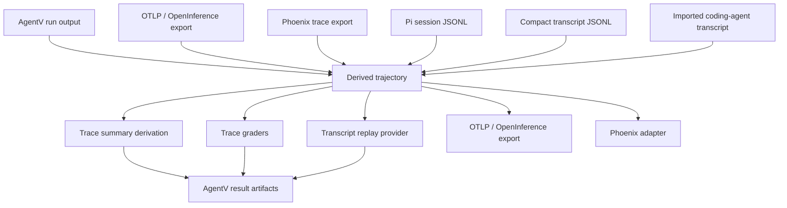

> SYSTEM

# AGENTS.md instructions for /home/entity/projects/EntityProcess/agentv

<INSTRUCTIONS>
# AgentV Repository Guidelines

This is a TypeScript monorepo for AgentV - an AI agent evaluation framework.

## High-Level Goals

AgentV aims to provide a robust, declarative framework for evaluating AI agents.
- **Declarative Definitions**: Define tasks, expected outcomes, and rubrics in simple YAML files.
- **Structured Evaluation**: Use "Rubric as Object" (Google ADK style) for deterministic, type-safe grading.
- **Multi-Objective Scoring**: Measure correctness, latency, cost, and safety in a single run.
- **Optimization Ready**: Designed to support future automated hyperparameter tuning and candidate generation.

## Design Principles

These principles guide all feature decisions. **Follow these when proposing or implementing changes.**

### 1. Lightweight Core, Plugin Extensibility
AgentV's core should remain minimal. Complex or domain-specific logic belongs in plugins, not built-in features.

**Extension points (prefer these over adding built-ins):**
- `code-grader` scripts for custom evaluation logic
- `llm-grader` graders with custom prompt files for domain-specific LLM grading
- CLI wrappers that consume AgentV's JSON/JSONL output for post-processing (aggregation, comparison, reporting)

**Ask yourself:** "Can this be achieved with existing primitives + a plugin or wrapper?" If yes, it should not be a built-in. This includes adding config overrides to existing graders — if a niche provider needs custom tool-name matching, that's a code-grader, not a new config field.

### 2. Built-ins for Primitives Only
Built-in graders provide **universal primitives** that users compose. A primitive is:
- Stateless and deterministic
- Has a single, clear responsibility
- Cannot be trivially composed from other primitives
- Needed by the majority of users

If a feature serves a niche use case or adds conditional logic, it belongs in a plugin.

### 3. Maximize Feature Surface Through Composition
The goal is to achieve the **maximum feature surface with the minimum primitives** due to high reusability. Before proposing a new feature, enumerate which existing primitives could achieve the same outcome when composed:

- **Oracle validation** is not a feature — it's a `cli` provider target that runs a reference solution through the same evaluators.
- **Snapshot MCP for benchmarks** is not a feature — it's frozen data in the workspace template + `before_all`/`after_all` hooks to start/stop the server.
- **Harness variant comparison** is not a feature — it's target hooks with different `before_each` setup scripts.
- **Skill evaluation** is not a feature — it's `tool-trajectory` + `execution-metrics` + `rubric` composed via `composite`.

**If existing primitives cover it, document the pattern instead of building a feature.** New primitives are justified only when the composition is impossible, not merely when it's undocumented.

### 4. Align with Industry Standards
Before adding features, research how peer frameworks solve the problem. Prefer the **lowest common denominator** that covers most use cases. Novel features without industry precedent require strong justification and should default to plugin implementation.

### 5. YAGNI — You Aren't Gonna Need It
Don't build features until there's a concrete need. Before adding a new capability, ask: "Is there real demand for this today, or am I anticipating future needs?" Numeric thresholds, extra tracking fields, and configurable knobs should be omitted until users actually request them. Start with the simplest version (e.g., boolean over numeric range) and extend later if needed.

**YAGNI applies to *how* you meet a real request, not just *whether* to meet it.** The common failure mode is not "I built X and nobody wanted it." It's "someone asked for X and I built a bigger X than they asked for." Guard against that with these habits:

1. **Audit existing primitives before adding new ones.** When an issue asks for capability Y, the first question is not "how do I build Y?" — it's **"what does the codebase already do that addresses Y?"** Grep for existing functions, endpoints, and config shapes. Many requests are satisfied by a behavior that already exists and just needs to be surfaced, configured, or exercised differently.
2. **Treat issue language as a hint, not a spec.** Issues describe problems *and* implementations. "We need a discovery root" is one implementation of "we need the registry to update live." When an issue lists multiple acceptable approaches (or its acceptance criteria don't actually require the implementation it names), pick the one with the least code surface. Summarize the acceptance criteria in your own words, strip out implementation nouns ("discovery root," "watcher," "registry reload"), then match them against existing primitives before designing anything new.
3. **Prefer data/config changes over new mechanisms.** If the observable effect is "this list should be editable at runtime," prefer "re-read the file per request" over "add a watcher + a new field + a precedence rule + a new endpoint." Config-driven beats code-driven when both are sufficient.
4. **Stop when scope doubles.** If an implementation's surface area grows more than ~2× the starting estimate (extra types, extra endpoints, extra invariants), that's a red flag to re-plan, not a sign to push through. Pause and ask: "What would the smallest possible version look like? Does the issue actually require more than that?"
5. **If you are about to add a second mode, two-layer precedence, or an invariant between two optional fields, stop.** `source: manual | discovered`, "pinned wins over discovered," `excluded_paths` filtering the discovered set — every one of these is a sign that you're in complexity territory that a simpler data model would have avoided.

**Call out existing overengineering.** If, while working on a task, you notice a *current* feature in the repo that looks overengineered relative to what it's used for (multiple modes, optional precedence rules, dead-looking extensibility scaffolding), flag it — don't silently fix it. Open a tracking issue titled "cleanup: simplify X" that lists: the observable behavior today, the simpler model that would cover it, and the migration notes. Link to the code. Do not widen your current PR to absorb the cleanup unless the user asks.

### 6. Non-Breaking Extensions
New fields should be optional. Existing configurations must continue working unchanged.

Same-week or unreleased surfaces can be hard-deprecated. If a field, artifact name, CLI flag, or behavior was introduced in the current calendar week and has not shipped to real external consumers, prefer converging hard to the correct contract instead of carrying aliases, mirrors, or compatibility readers. This is especially important for wire-format names: fix them to the snake_case v1 shape before release. Do not apply this shortcut to established files, flags, config fields, or known consumers; those still need an explicit compatibility, migration, and versioning plan.

### 7. AI-First Design
AI agents are the primary users of AgentV—not humans reading docs. Design for AI comprehension and composability.

**Skills over rigid commands:**
- Use Claude Code skills (or agent skill standards) to teach AI *how* to create evals, not step-by-step CLI instructions
- Skills should cover most use cases; rigid commands trade off AI intelligence
- Only prescribe exact steps where there's an established best practice

**Intuitive primitives:**
- Expose simple, single-purpose primitives that AI can combine flexibly
- Avoid monolithic commands that do multiple things
- SDK internals should be intuitive enough for AI to modify when needed

**Self-documenting code:**
- File headers should explain what the file does, how it works, and how to extend it — no need to read other files to understand this one
- Don't reference external projects, PRs, or issues in code comments; make everything standalone
- Prefer data-driven patterns (static mappings, config tables) over conditional chains — AI can extend a mapping by adding an entry, but has to trace logic to extend an if/else tree
- No dead code or speculative infrastructure; if it's unused, delete it
- When a module has an extension point, include a short recipe in the header (e.g., "To add a new provider: 1. Create a matcher, 2. Add it to the mapping")
- When changing a module's behavior, update its file header to match. Stale headers are worse than no headers.

**Scope:** Applies to skills, repo structure, documentation, SDK design, and source code — anything AI might need to reason about or extend.

## Tech Stack & Tools
- **Language:** TypeScript 5.x targeting ES2022
- **Runtime:** Bun (use `bun` for all package and script operations)
- **Monorepo:** Bun workspaces
- **Bundler:** tsup (TypeScript bundler)
- **Linter/Formatter:** Biome
- **Testing:** Vitest
- **LLM Framework:** Vercel AI SDK
- **Validation:** Zod

## Project Structure
- `packages/core/` - Evaluation engine, providers, grading
  - `src/evaluation/registry/` - Extensible grader registry (EvaluatorRegistry, assertion discovery)
  - `src/evaluation/providers/provider-registry.ts` - Provider plugin registry
  - `src/evaluation/evaluate.ts` - `evaluate()` programmatic API
  - `src/evaluation/config.ts` - `defineConfig()` for typed agentv.config.ts
- `packages/eval/` - Lightweight assertion SDK (`defineAssertion`, `defineCodeGrader`)
- `apps/cli/` - Command-line interface (published as `agentv`)
  - `src/commands/create/` - Scaffold commands (`agentv create assertion/eval`)
- `examples/features/sdk-*` - SDK usage examples (custom assertion, programmatic API, config file)
- `docs/learnings/` - captured learnings from bug fixes and deliberate decisions (best practices, conventions, tooling choices), organized by category with YAML frontmatter (`module`, `tags`, `problem_type`). Relevant when working in documented areas.
- `CONCEPTS.md` - shared domain vocabulary (providers, targets, and other project-specific terms). Relevant when orienting to the codebase or discussing domain concepts.

## Working Style

### Task Tracking and Orchestration
- Treat task tracking instructions as operator-supplied context. If the operator prompt provides an external tracker database, path, or environment variable, use that exact tracker for assignment, status, dependencies, handoff notes, decomposition, and resumability.
- If no external tracker is supplied, work from the user's prompt and the current branch/PR. Do not create, sync, stage, or commit repo-local task tracker state unless the user explicitly requests it.
- Keep private launcher names, local paths, session aliases, dispatch policy, and operator workspace details outside this public repository.
- GitHub remains the PR, CI, review, and merge surface. Use GitHub Issues or Projects for external collaboration only when the user or operator prompt asks for that workflow.

### Tracker Ownership
- External tracker state belongs to the operator-provided tracker, not this repository.
- Do not add repo-local tracker directories, tracker JSONL exports, dispatch logs, cross-repo research records, or operator decision records to AgentV commits unless the user explicitly asks for repository-local tracker artifacts. The only repo-local Beads files intentionally tracked are safe team defaults: `.beads/config.yaml`, `.beads/metadata.json`, and `.beads/.gitignore`; never commit the embedded Dolt database, JSONL exports, backups, locks, logs, or runtime state.
- If external research discovers AgentV implementation work, capture the public code/docs change in a focused branch/PR and keep private research or orchestration records outside this repository.
- When an external tracker is supplied, keep it updated with user-visible decisions, verification evidence, blockers, and handoff state. Run sync or flush commands only against that supplied tracker and keep exported tracker state out of AgentV commits unless explicitly requested.
- Do not use `git stash` on shared checkouts. Other agents may be editing the same worktree, and stashing can hide or replay their changes in the wrong branch. If you need to isolate work, inspect `git status`, stage only your files, use a dedicated worktree, or ask before moving uncommitted changes. If a stash is genuinely unavoidable, immediately record it in the supplied tracker or orchestrator handoff with the stash name, affected paths, reason, and recovery plan.

### Coordination and Shared Checkouts
- Use the operator-supplied tracker for ownership, handoff notes, blockers, and evidence.
- If the operator provides a separate coordination or reservation system, keep its server URLs, startup commands, bearer tokens, and project keys outside this public repository.
- Do not commit project-local coordination config files; they may contain bearer tokens and are ignored by `.gitignore`. The safe Beads team-default files listed above are the exception and exist so fresh clones can discover the AgentV Beads Dolt remote.

### Worktree Setup
- Start every repo change by running `git fetch origin` and inspecting `git status --short --branch`.
- Prefer the primary checkout for small, bounded work when all of these are true: local `main` is current with `origin/main` or can be fast-forwarded cleanly; the change is narrow (docs-only, a small single-file fix, or a focused review follow-up); and the intended paths are not dirty or owned by another worker in the supplied tracker.
- When working in the primary checkout, stage explicit paths only. Do not commit another agent's files, project-local coordination config, generated evidence, or unrelated tracker/doc state. Reconcile external tracker state in the supplied tracker, not by staging repo-local artifacts.
- Use a dedicated git worktree based on the latest `origin/main` for non-trivial, risky, cross-cutting, long-running, or parallel implementation, or whenever the primary checkout is stale/dirty in paths you need.
- Before starting implementation in a dedicated worktree, verify its `HEAD` is based on the current `origin/main` commit. Do not implement from a stale local `main` or from a branch created off an outdated base.
- Manual setup:
```bash
git fetch origin
git worktree add ../agentv.worktrees/<type>-<short-desc> -b <type>/<issue-or-topic>-<short-desc> origin/main
cd ../agentv.worktrees/<type>-<short-desc>
```
- If you discover you are on a stale base or have uncoordinated dirty files, stop and fix that before changing code.

### Planning
- Use plan mode for any non-trivial task (5+ steps or architectural decisions).
- If something goes sideways, STOP and re-plan immediately — don't keep pushing a broken approach.
- For non-trivial changes, pause and ask: "Is there a more elegant solution?" before diving in.
- Check in with the user before starting implementation on ambiguous tasks.
- Prefer automation: execute the requested work without extra confirmation unless blocked by missing information, safety concerns, or an irreversible/destructive action the user has not approved.

### Worker and Review Strategy
- For complex problems, keep this worker focused on its assigned scope and create or claim additional tracker items when an operator-supplied tracker supports that workflow.
- Before declaring a repo change complete or opening/finalizing a PR, complete manual e2e verification first (see E2E Checklist), **then** run a final review pass when warranted. E2E must pass before review — if e2e fails, fix the issue before investing time in review. The user may explicitly skip the review step.

### Autonomous Bug Fixes
- When you spot a bug, just fix it. Don't ask for hand-holding.
- Point at logs, errors, failing tests — then resolve them.
- Only ask when there's genuine ambiguity about intent.
- Fix failing CI tests without being told.

### Simplicity
- Every change should be as simple as possible. Import existing code; don't reinvent.
- Find root causes and fix them directly. No shotgun debugging.

### Progress Updates
- Provide high-level status updates at natural milestones.
- When scope changes mid-task, communicate the shift and adjust the plan.
- Use parallel tool calls when applicable, especially for independent reads, checks, and validation steps.

### PR & Commit Titles
- Prefer conventional commit style for branch-facing titles: `type(scope): summary`.
- Use the repository's normal types where they fit, such as `feat`, `fix`, `chore`, `refactor`, `docs`, and `test`.
- Use the most relevant module or product area as `scope`, such as `dashboard`, `cli`, `results`, or `evals`.
- Do not prefix PR titles with `[codex]` unless the user explicitly requests it.

## TypeScript Guidelines
- Target ES2022 with Node 20+
- Prefer type inference over explicit types
- Use `async/await` for async operations
- Prefer named exports
- Keep modules cohesive

### Subprocess and Provider Conventions

**Relative paths in CLI arg arrays:** When spawning a subprocess with an explicit `cwd`, pass user-supplied `args` through unchanged — the subprocess resolves its own relative paths against its `cwd`. Do not pre-process arg arrays with `startsWith('./')` or `!path.isAbsolute()` heuristics: they miss bare relative paths (`plugins/foo`), can corrupt flag-value pairs (`--config=./x`), and duplicate what `cwd` already does. See `docs/learnings/best-practices/trust-subprocess-cwd-for-relative-path-resolution.md`.

## Naming Convention: "Project" vs "Benchmark"

These two words have distinct, non-interchangeable meanings in this codebase. Get them right when adding new symbols, docs, or example dirs:

- **Project** — the top-level container Dashboard organises around: a registered workspace directory (`.agentv/` + run artifacts + traces + experiments). Lives in `~/.agentv/projects.yaml`. Modelled by `ProjectEntry` / `ProjectRegistry` in `packages/core/src/projects.ts`. Matches the terminology used by Phoenix, Langfuse, Braintrust, W&B Weave, and LangSmith.
- **Benchmark** — a curated *eval suite* designed to measure something specific (academic ML sense: MMLU, HumanEval, SWE-bench). Example dirs use this sense: `examples/showcase/multi-model-benchmark/`, `examples/showcase/offline-grader-benchmark/`, `examples/features/benchmark-tooling/`. Do not rename these — they are correctly named.

The legacy registry file `~/.agentv/benchmarks.yaml` is auto-migrated to `projects.yaml` on first load by `migrateLegacyBenchmarksFile()`. The unrelated per-run `benchmark.json` artifact (Agent Skills compatibility output) is a third, separate concept — also keep that name.

When in doubt: if the thing holds runs / traces / experiments, it's a **project**. If it's a curated set of eval cases meant to measure capability, it's a **benchmark**.

## Wire Format Convention

**Everything that crosses a process boundary uses `snake_case` keys. Internal TypeScript uses `camelCase`. Translate at the boundary — never in the middle.**

The rule is blanket: if the key is going to disk, to a user's editor, into a JSON response, or onto a CLI, it's snake_case. There is no "well this file is internal-ish" carve-out. If in doubt, snake_case.

### snake_case surfaces
- All YAML files on disk: `*.eval.yaml`, `agentv.config.yaml`, `projects.yaml`, `dashboard/config.yaml`, any future YAML we add.
- JSONL result files (`test_id`, `token_usage`, `duration_ms`).
- Artifact-writer output (`pass_rate`, `tests_run`, `total_tool_calls`).
- HTTP response bodies from `agentv serve` / Dashboard (`added_at`, `pass_rate`, `project_id`).
- CLI JSON output (`agentv results summary`, `results failures`, `results show`).
- Anything consumed by non-TS tooling (Python, jq pipelines, external dashboards).

### camelCase surfaces
- TypeScript source: all variables, parameters, fields, type members.
- Internal in-memory shapes passed between TS modules.

### Translate only at the boundary
Define a second interface for the wire shape and convert in one place — don't smear snake_case through TS internals.

```typescript
// Wire shape — snake_case, matches what hits disk / the network
interface ProjectEntryYaml {
  id: string;
  name: string;
  path: string;
  added_at: string;
  last_opened_at: string;
}

// Internal shape — camelCase, what every TS call site sees
interface ProjectEntry {
  id: string;
  name: string;
  path: string;
  addedAt: string;
  lastOpenedAt: string;
}

function fromYaml(e: ProjectEntryYaml): ProjectEntry {
  return { id: e.id, name: e.name, path: e.path, addedAt: e.added_at, lastOpenedAt: e.last_opened_at };
}

function toYaml(e: ProjectEntry): ProjectEntryYaml {
  return { id: e.id, name: e.name, path: e.path, added_at: e.addedAt, last_opened_at: e.lastOpenedAt };
}
```

Yes, this is two interfaces and two functions per entity. That's the price of keeping TS idiomatic while staying faithful to the wire contract. Don't skip it — dumping TS objects directly to YAML leaks `addedAt`-style camelCase onto disk and breaks jq/Python consumers.

### Anti-patterns
- `writeFileSync(path, stringifyYaml(tsObject))` — dumps TS field names verbatim. Wrong.
- `interface Foo { testId: string; ... }` for a JSON response body — `test_id`, always.
- Accepting both `testId` and `test_id` on input "for back-compat" when nothing is shipped yet. Just snake_case.

### Existing divergences
If you spot a camelCase key already on disk or in a response (e.g. a legacy endpoint), treat it as a bug: migrate it to snake_case in the same PR where you touch that code path. Don't grandfather it in.

**Reading back:** `parseJsonlResults()` in `artifact-writer.ts` converts snake_case → camelCase when reading JSONL into TypeScript. `fromYaml` / `toYaml` in `packages/core/src/projects.ts` is the model for YAML boundaries.

**Why:** Aligns with skill-creator (claude-plugins-official) and broader Python/JSON ecosystem conventions where snake_case is the standard wire format.

## Testing & Verification

### CI Gates

GitHub Actions is the authoritative merge gate. The `CI` workflow runs build, typecheck, lint, tests, marketplace checks, docs link checks, and eval schema validation on pushes to `main`, pull requests to `main`, and manual dispatches.

Run the same core checks locally when you need fast feedback:
```bash
bun run verify
bun run validate:examples
```

Task tracker sync is operator-supplied. If the prompt provides an external tracker sync or flush command, run it exactly as instructed and keep exported tracker state out of AgentV commits unless explicitly requested. Hooks must not silently mutate or stash shared worktrees.

NTM hooks are optional local coordination tooling. Do not commit generated task-tracker hook files or local `.ntm/config.toml`; they embed machine-specific paths and can bypass the repo's normal Git behavior when installed via `core.hooksPath`.

If an existing checkout has NTM or prek hooks installed, restore Git's default hook path:
```bash
git config --unset core.hooksPath
```

### Functional Testing (CLI)

When functionally testing changes to the AgentV CLI, **NEVER** use `agentv` directly as it may run the globally installed version (bun or npm). Instead:

- **From TypeScript source (preferred):** `bun apps/cli/src/cli.ts <args>` — always runs current CLI code, no build step needed. **Exception:** changes inside `packages/core/` require `bun run build` first, because the CLI imports `@agentv/core` from its compiled `dist/`, not from TypeScript source.
- **From built dist:** `bun apps/cli/dist/cli.js <args>` — requires `bun run build` first, can be stale
- **From repository root:** `bun agentv <args>` — runs the locally built version (also requires build)

**Prefer running from source** (`src/cli.ts`) during development. The dist build can silently serve stale code if you forget to rebuild after changes. After pulling changes that touch `packages/core/`, always run `bun run build` before CLI testing.

**Dashboard frontend exception — rebuild `apps/dashboard/dist/` before UAT.** Running `agentv dashboard` from source (`bun apps/cli/src/cli.ts dashboard ...`) only reloads the CLI and backend routes from source. The Dashboard web UI (React/Tailwind bundle) is served as static assets from `apps/dashboard/dist/`, which is build output and does **not** recompile on change. After pulling the latest `main`, and before any Dashboard E2E/UAT, rebuild the frontend bundle even if you did not personally edit Dashboard source:

```bash
cd apps/dashboard && bun run build
```

Skipping this step silently serves the previous bundle, so you'll see the old UI even though the source tree and backend API are current. This has burned at least one post-merge UAT; always rebuild before screenshotting or driving Dashboard with `agent-browser`.

### Browser E2E Testing (Docs and Dashboard)

Use `agent-browser` for visual verification of docs site and Dashboard changes. Environment-specific rules:

- **Always use `--session <name>`** — isolates browser instances; close with `agent-browser --session <name> close` when done
- **Never use `--headed`** — no display server available; headless (default) works correctly

**Troubleshooting: `--session` hangs with EAGAIN on ARM64**

If `agent-browser --session <name> open <url>` consistently fails with "Resource temporarily unavailable" or times out, Chrome is taking longer to start than the client's retry window. Workaround: pre-start Chrome manually and use `--cdp`:

```bash
nohup chromium --headless=new --remote-debugging-port=9222 \
  --no-first-run --disable-background-networking --disable-default-apps \
  --disable-sync --ozone-platform=headless --window-size=1280,720 \
  --user-data-dir=/tmp/ab-chrome > /tmp/chrome.log 2>&1 &
curl -s http://localhost:9222/json/version  # verify ready

agent-browser --cdp 9222 open <url>
agent-browser --cdp 9222 screenshot output.png
```

### Agent Provider Eval Concurrency

When running evals against agent provider targets (claude, claude-sdk, codex, copilot, copilot-sdk, pi, pi-cli), **limit concurrency to 3 targets at a time**. Each agent provider spawns heavyweight subprocesses (CLI binaries, SDK sessions) that consume significant memory and CPU. Running more than 3 in parallel can exhaust system resources.

```bash
# Good: batch targets in groups of 2-3
bun apps/cli/src/cli.ts eval my.EVAL.yaml --target claude &
bun apps/cli/src/cli.ts eval my.EVAL.yaml --target codex &
wait
bun apps/cli/src/cli.ts eval my.EVAL.yaml --target copilot &
bun apps/cli/src/cli.ts eval my.EVAL.yaml --target pi &
wait
```

This does not apply to lightweight LLM-only targets (azure, openai, gemini, openrouter) which can run with higher concurrency.

### Writing Tests

Tests should be lean and focused on what matters. Follow these principles:

- **Only test new or changed behavior.** Don't write tests for existing behavior that's already covered by the 1600+ core tests. If you fix a bug, test the fix and its edge cases — not the surrounding module.
- **Protect stable core contracts, not every new detail.** Tests should primarily prevent regressions in existing core behavior: data formats, scoring semantics, routing, persistence, provider contracts, and CLI/API outcomes users depend on. Experimental features, early UI flows, and behavior expected to churn do not need detailed test matrices until the contract stabilizes.
- **One test per distinct behavior.** Don't write separate tests for trivially different inputs that exercise the same code path.
- **No tests for obvious code.** If a function returns `undefined` for missing input and that's a one-line null check, you don't need a test for it unless it's a regression risk.
- **Regression tests > comprehensive tests.** A test that would have caught the bug is worth more than five tests that exercise happy paths.
- **Document churny end-user behavior instead of over-testing it.** When behavior matters to users but changes frequently, prefer updating the Astro docs in `apps/web/src/content/docs/` over locking presentation details, migration variants, or temporary workflows into brittle tests.
- **Tests are executable contracts.** When a module's behavioral contract changes, the tests must reflect the new contract — not just the happy path. If you change what a function promises, update its tests to assert the new promise.

### Verifying Grader Changes

Unit tests alone are insufficient for grader changes. After implementing or modifying graders:

1. **Copy `.env` to the worktree** if running in a git worktree (e2e tests need environment variables):
   ```bash
   cp /path/to/main/.env .env
   ```
   ```powershell
   Copy-Item D:/path/to/main/.env .env
   ```
   Do not claim e2e or grader verification results unless this preflight has passed.

2. **Run an actual eval** with a real example file:
   ```bash
   bun apps/cli/src/cli.ts eval examples/features/rubric/evals/dataset.eval.yaml --test-id <test-id>
   ```

3. **Inspect the results JSONL** to verify:
   - The correct grader type is invoked (check `scores[].type`)
   - Scores are calculated as expected
   - Assertions array reflects the evaluation logic (each entry has `text`, `passed`, optional `evidence`)

4. **Update baseline files** if output format changes (e.g., type name renames). Baseline files live alongside eval YAML files as `*.baseline.jsonl` and contain expected `scores[].type` values. There are 30+ baseline files across `examples/`.

5. **Note:** `--dry-run` returns schema-valid mock responses for both agent output and grader evaluation (score=1, empty assertions/checks). Built-in LLM graders run without parse errors but scores are meaningless. Use it for end-to-end harness testing including grader plumbing.

### Checking Grader Score Ranges (manual e2e)

`scripts/check-grader-scores.ts` is a post-processor that asserts each grader's score on each test case falls within an expected range. Run it manually after an eval to catch grader regressions (false positives / false negatives) before merging.

**Workflow:**
```bash
# 1. Run the eval, writing results to a sibling *.results.jsonl file
bun apps/cli/src/cli.ts eval examples/path/to/suite.eval.yaml --target azure \
  --output examples/path/to/suite.run

# 2. Assert all expected score ranges pass
bun scripts/check-grader-scores.ts
```

The script auto-discovers `examples/**/*.grader-scores.yaml`, locates the sibling `*.results.jsonl` (same stem), and exits non-zero if any score is out of range.

**To add score checks for a new eval:**
1. Create `<eval-stem>.grader-scores.yaml` next to the eval YAML.
2. Add entries for each `(test_id, grader, range)` you care about — `grader` must match a `scores[].name` value in the JSONL output, and `range.min`/`range.max` default to 0/1 if omitted.
3. Run the eval with `--output <eval-stem>.run`, then run the script.

See `examples/red-team/archetypes/coding-agent/suites/screenshot-pii-upload.grader-scores.yaml` for a concrete example.

### Completing Work — E2E Checklist

Before marking any branch as ready for review, complete this checklist:

1. **Preflight:** If in a git worktree, ensure `.env` exists in the worktree root.
   ```bash
   cp "$(git worktree list --porcelain | head -1 | sed 's/worktree //')/.env" .env
   ```
   Without this, any eval run or LLM-dependent test will fail with missing API key errors.

2. **Run unit tests**: `bun run test` — all must pass.

3. **⚠️ BLOCKING: Manual red/green UAT — must complete before steps 4-5:**
   Unit tests passing is NOT sufficient. Every change must be manually verified from the end user's perspective. Do NOT skip this step or proceed to step 4 until red/green evidence is documented.

   - **Red (before your changes):** Run the scenario on `main` (or the code state before your changes). Confirm the bug or missing feature is observable from the CLI / user-facing output. Capture the output.
   - **Green (with your changes):** Run the identical scenario with your branch. Confirm the fix or feature works correctly from the end user's perspective. Capture the output.
   - **Document both** red and green results in the PR description or comments so reviewers can see the before/after evidence.

   For grader changes, this means running a real eval (not `--dry-run`) and inspecting the output JSONL. For CLI/UX changes, this means running the CLI command and verifying the console output.

4. **Verify no regressions** in areas adjacent to your changes (e.g., if you changed grader parsing, run an eval that exercises different grader types).

5. **Live eval verification**: For changes affecting scoring, thresholds, or grader behavior, run at least one real eval with a live provider (not `--dry-run`) and verify the output JSONL has correct scores, 
</INSTRUCTIONS>
<environment_context>
  <cwd>/home/entity/projects/EntityProcess/agentv</cwd>
  <shell>zsh</shell>
  <current_date>2026-06-18</current_date>
  <timezone>Europe/Berlin</timezone>
  <filesystem><workspace_roots><root>/home/entity/projects/EntityProcess/agentv</root></workspace_roots><permission_profile type="disabled"><file_system type="unrestricted" /></permission_profile></filesystem>
</environment_context>

> DEVELOPER

should we close https://github.com/EntityProcess/agentv/issues/1263 as resolved by the prepare PRs

> AGENT

I’ll use the GitHub workflow because this depends on current issue/PR state, then I’ll compare the issue acceptance criteria against the relevant prepare PRs.

> TOOL

tool_use exec_command
id: call_BmvE36yLZCefxCjINKWKUVEl
```json
{
  "cmd": "sed -n '1,220p' /home/entity/.codex/plugins/cache/openai-curated/github/015c0dff/skills/github/SKILL.md",
  "workdir": "/home/entity/projects/EntityProcess/agentv",
  "yield_time_ms": 10000,
  "max_output_tokens": 30000
}
```

> TOOL

tool_result
id: call_BmvE36yLZCefxCjINKWKUVEl
```
Chunk ID: f788d3
Wall time: 0.0001 seconds
Process exited with code 0
Original token count: 1089
Output:
---
name: github
description: Triage and orient GitHub repository, pull request, and issue work through the connected GitHub app. Use when the user asks for general GitHub help, wants PR or issue summaries, or needs repository context before choosing a more specific GitHub workflow.
---

# GitHub

## Overview

Use this skill as the umbrella entrypoint for general GitHub work in this plugin. It should decide whether the task stays in repo and PR triage or should be handed off to a more specific review, CI, or publish workflow.

This plugin is intentionally hybrid:

- Prefer the GitHub app from this plugin for repository, issue, pull request, comment, label, reaction, and PR creation workflows.
- Use local `git` and `gh` only when the connector does not cover the job well, especially for current-branch PR discovery, branch creation, commit and push, `gh auth status`, and GitHub Actions log inspection.
- Keep connector state and local checkout context aligned. If the request is about the current branch, resolve the local repo and branch before acting.

Once the intent is clear, route to the specialist skill immediately and do not keep broad GitHub triage in scope longer than needed.

## Connector-First Responsibilities

Handle these directly in this skill when the request does not need a narrower specialist workflow:

- repository orientation once the repo, PR, issue, or local checkout is identified
- recent PR or issue triage
- PR metadata summaries
- PR patch inspection
- PR comments, labels, and reactions
- issue lookup and summarization
- PR creation after a branch is already pushed

Prefer the GitHub app from this plugin for those flows because it provides structured PR, issue, and review-adjacent data without depending on a local checkout. If the repository is not already identifiable from the user request or local git context, ask for the repo instead of pretending there is a repo-search flow that may not exist.

## Routing Rules

1. Resolve the operating context first:
   - If the user provides a repository, PR number, issue number, or URL, use that.
   - If the request is about "this branch" or "the current PR", resolve local git context and use `gh` only as needed to discover the branch PR.
   - If the repository is still ambiguous after local inspection, ask for the repo identifier.
2. Classify the request before taking action:
   - `repo or PR triage`: summarize PRs, issues, patches, comments, labels, reactions, or repository state
   - `review follow-up`: unresolved review threads, requested changes, or inline review feedback
   - `CI debugging`: failing checks, Actions logs, or CI root-cause analysis
   - `publish changes`: create or switch branches, stage changes, commit, push, and open a draft PR
3. Route to the specialist skill as soon as the category is clear:
   - Review comments and requested changes: `../gh-address-comments/SKILL.md`
   - Failing GitHub Actions checks: `../gh-fix-ci/SKILL.md`
   - Commit, push, and open PR: `../yeet/SKILL.md`
4. Keep the hybrid model consistent after routing:
   - connector first for PR and issue data
   - local `git` and `gh` only for the specific gaps the connector does not cover

## Default Workflow

1. Resolve repository and item scope.
2. Gather structured PR or issue context through the GitHub app from this plugin.
3. Decide whether the task stays in connector-backed triage or needs a specialist skill.
4. Route immediately when the work becomes review follow-up, CI debugging, or publish workflow.
5. End with a clear summary of what was inspected, what changed, and what remains.

## Output Expectations

- For triage requests, return a concise summary of the repository, PR, or issue state and the next likely action.
- For mixed requests, tell the user which specialist path you are taking and why.
- For connector-backed write actions, restate the exact PR, issue, label, or reaction target before applying the change.
- Never imply that GitHub Actions logs are available through the connector alone. That remains a `gh` workflow.

## Examples

- "Use GitHub to summarize the open PRs in this repo and tell me what needs attention."
- "Help with this PR."
- "Review the latest comments on PR 482 and tell me what is actionable."
- "Debug the failing checks on this branch."
- "Commit these changes, push them, and open a draft PR."

```

> AGENT

I’m pulling the issue body, comments, and linked PR metadata rather than relying on title matching. The key question is whether the merged PRs cover the issue’s actual acceptance criteria, not just whether they mention it.

> TOOL

tool_use exec_command
id: call_CdO9OkVGJD0NyUcsTPTxqq3z
```json
{
  "cmd": "gh issue view 1263 --repo EntityProcess/agentv --json number,title,state,body,comments,labels,assignees,author,createdAt,updatedAt,closed,closedAt,closedByPullRequestsReferences,url",
  "workdir": "/home/entity/projects/EntityProcess/agentv",
  "yield_time_ms": 10000,
  "max_output_tokens": 40000
}
```

> TOOL

tool_use exec_command
id: call_EbsjUlva4gPLshTgg29vUAsJ
```json
{
  "cmd": "gh pr list --repo EntityProcess/agentv --state all --search \"1263\" --json number,title,state,mergedAt,url,body,headRefName,baseRefName,author,labels",
  "workdir": "/home/entity/projects/EntityProcess/agentv",
  "yield_time_ms": 10000,
  "max_output_tokens": 40000
}
```

> TOOL

tool_use exec_command
id: call_qpzlGXjIz7HbGXbgrCeYM75u
```json
{
  "cmd": "gh pr list --repo EntityProcess/agentv --state all --search \"prepare\" --json number,title,state,mergedAt,url,body,headRefName,baseRefName,author,labels",
  "workdir": "/home/entity/projects/EntityProcess/agentv",
  "yield_time_ms": 10000,
  "max_output_tokens": 40000
}
```

> TOOL

tool_result
id: call_CdO9OkVGJD0NyUcsTPTxqq3z
```
Chunk ID: efaa97
Wall time: 0.2336 seconds
Process exited with code 1
Original token count: 65
Output:
Unknown JSON field: "closedByPullRequestsReferences"
Available fields:
  assignees
  author
  body
  closed
  closedAt
  comments
  createdAt
  id
  labels
  milestone
  number
  projectCards
  projectItems
  reactionGroups
  state
  title
  updatedAt
  url

```

> TOOL

tool_result
id: call_EbsjUlva4gPLshTgg29vUAsJ
```
Chunk ID: 595a24
Wall time: 0.6801 seconds
Process exited with code 0
Original token count: 1
Output:
[]

```

> TOOL

tool_result
id: call_qpzlGXjIz7HbGXbgrCeYM75u
```
Chunk ID: b9d877
Wall time: 0.8251 seconds
Process exited with code 0
Original token count: 1308
Output:
[{"author":{"id":"MDQ6VXNlcjMxMTUzMTE=","is_bot":false,"login":"christso","name":"Christopher Tso"},"baseRefName":"main","body":"## Summary\n- Preserves configured Azure deployment base URLs when preparing target provider settings.\n- Adds regression coverage for Azure target URL handling.\n\n## Verification\n- Provider regression tests passed in the implementation session.\n- Public demo live Codex + Azure artifact verification was recorded on bead av-h60.\n\nBead: av-h60","headRefName":"e2e/av-h60-live-public-demo","labels":[],"mergedAt":"2026-06-06T03:18:59Z","number":1301,"state":"MERGED","title":"fix(targets): preserve azure deployment base urls","url":"https://github.com/EntityProcess/agentv/pull/1301"},{"author":{"id":"MDQ6VXNlcjMxMTUzMTE=","is_bot":false,"login":"christso","name":"Christopher Tso"},"baseRefName":"main","body":"## Summary\n- Renames `plugins/agentv-trace/` to `plugins/agentv-claude-trace/` to namespace the trace plugin by platform (Claude Code)\n- Updates all internal references: marketplace.json, package.json, OTel service/tracer names, README\n- Prepares for future platform-specific trace plugins (e.g. `agentv-copilot-trace`)\n\n## Test plan\n- [x] All pre-push checks pass (build, typecheck, lint, tests)\n- [x] Git correctly detects renames (no content changes beyond name updates)\n\n🤖 Generated with [Claude Code](https://claude.com/claude-code)","headRefName":"refactor/rename-agentv-trace-to-claude-trace","labels":[],"mergedAt":"2026-02-24T03:36:42Z","number":353,"state":"MERGED","title":"refactor: rename agentv-trace to agentv-claude-trace","url":"https://github.com/EntityProcess/agentv/pull/353"},{"author":{"id":"MDQ6VXNlcjMxMTUzMTE=","is_bot":false,"login":"christso","name":"Christopher Tso"},"baseRefName":"main","body":"## Summary\n- Add `@j178/prek` for pre-push git hooks\n- Hooks run build, typecheck, lint, and test before allowing pushes\n- Auto-installed via `prepare` script when running `bun install`\n- Document setup in CLAUDE.md\n\n## Test plan\n- [x] Verified hooks install automatically on `bun install`\n- [x] Verified `bunx prek run --all-files --hook-stage pre-push` works\n- [x] Verified push triggers all 4 hooks and they pass\n\n🤖 Generated with [Claude Code](https://claude.com/claude-code)","headRefName":"chore/add-pre-push-hooks","labels":[],"mergedAt":"2026-01-28T22:31:40Z","number":154,"state":"MERGED","title":"chore: add pre-push validation hooks with prek","url":"https://github.com/EntityProcess/agentv/pull/154"},{"author":{"id":"MDQ6VXNlcjMxMTUzMTE=","is_bot":false,"login":"christso","name":"Christopher Tso"},"baseRefName":"main","body":"## Summary\n\nAdds `workspace_template` configuration option that copies a directory to a temp location before running evals, providing isolated, reproducible workspaces for any CLI-based agent provider.\n\n- **New config option**: `workspace_template: ./path/to/dir/` in target YAML\n- **Mutually exclusive with `cwd`**: Use `cwd` for existing directories, `workspace_template` for temp copies\n- **Works with all CLI agents**: claude-code, pi-agent, codex, copilot-cli, etc.\n- **Smart cleanup**: Success = cleanup, failure = preserve for debugging\n- **CLI flags**: `--keep-workspaces` and `--cleanup-workspaces` to override defaults\n\n### Use Case\n\nUsers can prepare a workspace template with skills, CLAUDE.md, settings, etc., then agentv copies it fresh for each eval case:\n\n```yaml\n- name: claude-eval\n  provider: claude-code\n  workspace_template: ./templates/claude-workspace/\n```\n\nWorkspaces are created at `~/.agentv/workspaces/<eval-run-id>/<case-id>/`\n\n### Changes\n\n| Area | Changes |\n|------|---------|\n| Schema | Added `workspace_template` to target configs for all CLI providers |\n| Workspace Manager | New module for temp workspace creation/cleanup |\n| Orchestrator | Integration to create workspace before invoke, cleanup after |\n| CLI | Added `--keep-workspaces` and `--cleanup-workspaces` flags |\n| Docs | Updated targets config, coding agents, and running evals docs |\n\n### Commits\n\n- `feat(core): add workspace_template field to target schema`\n- `fix(core): add workspace_template to CODEX/COPILOT settings and fix relative path resolution`\n- `feat(core): add workspace manager for temporary eval workspaces`\n- `refactor(core): export workspace module and reuse fileExists helper`\n- `feat(core): integrate workspace manager into eval runner`\n- `feat(cli): add --keep-workspaces and --cleanup-workspaces flags`\n- `fix(cli): warn when both workspace flags are specified`\n- `docs: add workspace_template documentation`\n\n## Test Plan\n\n- [x] Unit tests for workspace manager (create, cleanup, skip .git)\n- [x] Unit tests for schema validation (mutual exclusivity)\n- [x] All 467 tests pass\n- [ ] Manual test: run eval with workspace_template configured\n- [ ] Verify workspace preserved on failure\n- [ ] Verify cleanup on success\n\n🤖 Generated with [Claude Code](https://claude.ai/code)","headRefName":"feat/workspace-template","labels":[],"mergedAt":"2026-02-12T12:59:32Z","number":180,"state":"MERGED","title":"feat: add workspace_template for isolated eval workspaces","url":"https://github.com/EntityProcess/agentv/pull/180"}]

```

> TOOL

tool_use exec_command
id: call_fqwxZsijl36o15WVIOlQoume
```json
{
  "cmd": "gh issue view 1263 --repo EntityProcess/agentv --json number,title,state,body,comments,labels,assignees,author,createdAt,updatedAt,closed,closedAt,url",
  "workdir": "/home/entity/projects/EntityProcess/agentv",
  "yield_time_ms": 10000,
  "max_output_tokens": 60000
}
```

> TOOL

tool_result
id: call_fqwxZsijl36o15WVIOlQoume
```
Chunk ID: 64bc7b
Wall time: 1.0170 seconds
Process exited with code 0
Original token count: 2366
Output:
{"assignees":[],"author":{"id":"MDQ6VXNlcjMxMTUzMTE=","is_bot":false,"login":"christso","name":"Christopher Tso"},"body":"## Decision\n\nDo **not** build `agentv watch`.\n\nThe useful part of the original request is not a new live-observability runner. The useful primitive is: **materialize the same AgentV eval workspace and task prompt so a human or external agent can attempt the case manually, then let AgentV grade the resulting workspace and optional trace later.**\n\nLive tracing should be configured in the harness or agent itself, for example through Opik/Phoenix/OTel env vars, target hooks, or provider-native config. AgentV can import or grade those traces after the fact through the normalized trajectory/import work. AgentV should not become a parallel live observability product surface.\n\n## Revised scope: `agentv prepare`\n\nAdd a CLI command that prepares one eval case for a manual or external-agent attempt:\n\n```bash\nagentv prepare evals/foo.eval.yaml --test-id case-1 --target codex --out /tmp/agentv-case-1\n```\n\nExpected output directory:\n\n```text\n/tmp/agentv-case-1/\n  workspace/              # materialized repo/template/hooks applied\n  prompt.md               # task prompt to give the human or external agent\n  agentv_prepare.json     # snake_case manifest with eval/test/target/workspace metadata\n```\n\n`agentv prepare` should:\n\n- Resolve the eval file, selected test case, and target.\n- Materialize the workspace using existing AgentV primitives: template copy, `workspace.repos`, Docker/static/pooled/temp behavior where applicable, and lifecycle hooks.\n- Run setup only: workspace `before_all`, target `before_all`, workspace `before_each`, target `before_each`.\n- Generate a task prompt suitable for the human or external agent.\n- Write an auditable manifest with repo pins, selected test, target, hook order, prompt path, workspace path, and created timestamp.\n- Print the workspace path and next-step command hints.\n\n`agentv prepare` must not:\n\n- Launch the agent.\n- Run graders.\n- Claim an eval run completed.\n- Emit Opik/Phoenix/OTel traces directly.\n- Expose hidden tests, expected output, grader internals, or rubrics in `prompt.md` unless explicitly allowed by eval config.\n\n## Follow-up: grade a prepared attempt\n\nAfter a human or external agent works in the prepared workspace, AgentV should be able to grade the final state without re-running the target:\n\n```bash\nagentv grade evals/foo.eval.yaml --test-id case-1 --prepared /tmp/agentv-case-1\n```\n\nIf trajectory matters and an external trace exists, grade with an imported trace:\n\n```bash\nagentv grade evals/foo.eval.yaml --test-id case-1 \\\n  --prepared /tmp/agentv-case-1 \\\n  --trace opik:<project>/<trace-id>\n```\n\nThe trace path should route through AgentV's normalized trajectory import/projection work. Provider-native session logs, Opik traces, and OTLP files should be adapters into AgentV's trajectory model; graders should not consume vendor-specific trace shapes directly.\n\n## Product boundary\n\nThis replaces the old `agentv watch` proposal:\n\n- Workspace preparation is an AgentV primitive.\n- Live observability belongs in Opik/Phoenix/OTel or provider-native instrumentation.\n- AgentV remains the source of truth for eval definitions, workspace setup, grading, result bundles, and CI gates.\n- Opik/Phoenix traces are optional input artifacts for later grading, not a reason to add a live non-eval runner.\n\n## Implementation plan\n\n1. Add `agentv prepare` for a single eval/test/target.\n2. Reuse existing workspace materialization and hook execution instead of duplicating setup logic.\n3. Define and write `agentv_prepare.json` with snake_case wire keys.\n4. Generate `prompt.md` from the eval input and safe user-facing task context.\n5. Add `agentv grade --prepared` or an equivalent prepared-attempt grading command that reuses existing graders against the final workspace state without running the target.\n6. Wire optional trace input through normalized trajectory import work; start with local trace/session files if Opik direct fetch depends on existing export/import infrastructure.\n7. Document the workflow: prepare workspace → human/external agent works → grade prepared attempt → optionally import/grade traces.\n\n## Acceptance criteria\n\n- `agentv prepare <eval> --test-id <id> --target <target> --out <dir>` creates a prepared workspace with `workspace/`, `prompt.md`, and `agentv_prepare.json`.\n- The prepared workspace matches the setup state an AgentV eval run would give the selected target before target execution.\n- Setup uses existing workspace/repo/hook primitives and respects target hooks.\n- `prompt.md` contains the task input and safe execution instructions, but not hidden expected outputs or grader internals.\n- The manifest uses `snake_case` and is sufficient to audit and later grade the attempt.\n- A prepared attempt can be graded without re-running the agent target.\n- Optional trace/session input can enrich trajectory-based graders through the normalized trace import path.\n- Docs explain how to configure Opik/Phoenix/OTel in the harness or target hooks instead of using `agentv watch`.\n\n## Non-goals\n\n- No `agentv watch` command.\n- No AgentV-hosted live observability product.\n- No built-in Opik/Phoenix tracing runner inside `prepare`.\n- No hidden-test or oracle leakage into manual prompts.\n- No new benchmark-family-specific workspace schema.\n\n## References\n\n- Research wiki: `concepts/benchmark-provenance-workspace-patterns.md`\n- Research wiki: `concepts/production-llm-evaluation-observability-loop.md`\n- Research wiki: `concepts/harness-quality-evaluation.md`\n- Existing AgentV workspace docs: `apps/web/src/content/docs/docs/guides/workspace-architecture.mdx`\n","closed":false,"closedAt":null,"comments":[{"id":"IC_kwDOQRbenM8AAAABDgLsqw","author":{"login":"Keesan12"},"authorAssociation":"NONE","body":"A non-eval live observability surface is a good complement to eval traces. Production-ish agent runs need the same trace discipline, but with less ceremony and faster operator questions.\n\nI would make the watch view answer: what is running, why is it still running, what budget has it consumed, what tool/error state is blocking it, and what would make it stop.\n\nIf those fields map back to OTel spans, the live UI and later postmortem can share the same evidence instead of drifting into separate truth sources.\n","createdAt":"2026-05-24T21:42:51Z","includesCreatedEdit":false,"isMinimized":false,"minimizedReason":"","reactionGroups":[{"content":"THUMBS_UP","users":{"totalCount":1}}],"url":"https://github.com/EntityProcess/agentv/issues/1263#issuecomment-4530039979","viewerDidAuthor":false},{"id":"IC_kwDOQRbenM8AAAABDlNi9g","author":{"login":"Keesan12"},"authorAssociation":"NONE","body":"I would want the delegation boundary to emit the receipt, not just the leaf task. That keeps observability aligned with the place that can actually explain spend, stop reasons, and replay behavior.","createdAt":"2026-05-25T15:16:38Z","includesCreatedEdit":false,"isMinimized":false,"minimizedReason":"","reactionGroups":[],"url":"https://github.com/EntityProcess/agentv/issues/1263#issuecomment-4535313142","viewerDidAuthor":false},{"id":"IC_kwDOQRbenM8AAAABGmsAQg","author":{"login":"christso"},"authorAssociation":"MEMBER","body":"Updated this issue to supersede the old `agentv watch` proposal with the `agentv prepare` prepared-workspace workflow. Implementation tracking is now in Beads:\n\n- `av-44n` — epic: prepared workspace workflow for manual and external-agent attempts\n- `av-44n.1` — core reusable prepared-workspace setup primitive\n- `av-44n.2` — CLI: `agentv prepare` command and artifacts\n- `av-44n.3` — CLI: grade prepared workspace attempts without rerunning targets\n- `av-44n.4` — trace enrichment from imported Opik/OTel/session traces\n- `av-44n.5` — docs for prepare -> external agent -> grade workflow\n\nProduct boundary captured in both places: no `agentv watch`; Opik/Phoenix/OTel tracing is harness-configured, and AgentV grades imported/normalized traces after the attempt.\n","createdAt":"2026-06-18T05:00:53Z","includesCreatedEdit":false,"isMinimized":false,"minimizedReason":"","reactionGroups":[],"url":"https://github.com/EntityProcess/agentv/issues/1263#issuecomment-4738187330","viewerDidAuthor":true},{"id":"IC_kwDOQRbenM8AAAABGnbnfQ","author":{"login":"christso"},"authorAssociation":"MEMBER","body":"Implementation progress on local main:\\n\\n- `40e2e948` — core prepared workspace setup primitive.\\n- `ec61f9f9` — `agentv prepare` command and prepared-attempt artifacts.\\n- `82b70976` — `agentv grade ... --prepared` for prepared workspace grading without provider execution.\\n\\nVerified by worker handoff with `bun run verify` passing after the grade-prepared change. Remaining epic scope: optional trace enrichment (Bead `av-44n.4`) and docs (`av-44n.5`).","createdAt":"2026-06-18T07:09:30Z","includesCreatedEdit":false,"isMinimized":false,"minimizedReason":"","reactionGroups":[],"url":"https://github.com/EntityProcess/agentv/issues/1263#issuecomment-4738967421","viewerDidAuthor":true}],"createdAt":"2026-05-24T10:02:38Z","labels":[],"number":1263,"state":"OPEN","title":"feat(cli): prepare AgentV workspaces for manual or external-agent attempts","updatedAt":"2026-06-18T07:09:31Z","url":"https://github.com/EntityProcess/agentv/issues/1263"}

```

> AGENT

The issue itself says the core prepare path and `grade --prepared` landed on local main, but it also records two remaining scope items: trace enrichment and docs. I’m checking the associated PRs/commits now to see whether those were later covered.

> TOOL

tool_use exec_command
id: call_UEP8JihzufWQ8nzP4vXgQk3w
```json
{
  "cmd": "gh pr list --repo EntityProcess/agentv --state all --search \"av-44n\" --json number,title,state,mergedAt,url,body,headRefName,baseRefName,author",
  "workdir": "/home/entity/projects/EntityProcess/agentv",
  "yield_time_ms": 10000,
  "max_output_tokens": 60000
}
```

> TOOL

tool_use exec_command
id: call_U5A4qJcN4Lc0GnKDmHIljRcj
```json
{
  "cmd": "gh pr list --repo EntityProcess/agentv --state all --search \"prepared workspace\" --json number,title,state,mergedAt,url,body,headRefName,baseRefName,author",
  "workdir": "/home/entity/projects/EntityProcess/agentv",
  "yield_time_ms": 10000,
  "max_output_tokens": 60000
}
```

> TOOL

tool_use exec_command
id: call_p6xXMRHVv83yrT4DkOgLtpxA
```json
{
  "cmd": "gh pr list --repo EntityProcess/agentv --state all --search \"agentv prepare\" --json number,title,state,mergedAt,url,body,headRefName,baseRefName,author",
  "workdir": "/home/entity/projects/EntityProcess/agentv",
  "yield_time_ms": 10000,
  "max_output_tokens": 60000
}
```

> TOOL

tool_use exec_command
id: call_DB5AF5pd1USD9RJ4mcsdQuPA
```json
{
  "cmd": "gh pr list --repo EntityProcess/agentv --state all --search \"grade --prepared\" --json number,title,state,mergedAt,url,body,headRefName,baseRefName,author",
  "workdir": "/home/entity/projects/EntityProcess/agentv",
  "yield_time_ms": 10000,
  "max_output_tokens": 60000
}
```

> TOOL

tool_result
id: call_UEP8JihzufWQ8nzP4vXgQk3w
```
Chunk ID: 973f2c
Wall time: 0.4923 seconds
Process exited with code 0
Original token count: 1
Output:
[]

```

> TOOL

tool_result
id: call_U5A4qJcN4Lc0GnKDmHIljRcj
```
Chunk ID: d64ab4
Wall time: 0.4347 seconds
Process exited with code 0
Original token count: 1
Output:
[]

```

> TOOL

tool_result
id: call_p6xXMRHVv83yrT4DkOgLtpxA
```
Chunk ID: d5ef27
Wall time: 0.6113 seconds
Process exited with code 0
Original token count: 908
Output:
[{"author":{"id":"MDQ6VXNlcjMxMTUzMTE=","is_bot":false,"login":"christso","name":"Christopher Tso"},"baseRefName":"main","body":"## Summary\n- Renames `plugins/agentv-trace/` to `plugins/agentv-claude-trace/` to namespace the trace plugin by platform (Claude Code)\n- Updates all internal references: marketplace.json, package.json, OTel service/tracer names, README\n- Prepares for future platform-specific trace plugins (e.g. `agentv-copilot-trace`)\n\n## Test plan\n- [x] All pre-push checks pass (build, typecheck, lint, tests)\n- [x] Git correctly detects renames (no content changes beyond name updates)\n\n🤖 Generated with [Claude Code](https://claude.com/claude-code)","headRefName":"refactor/rename-agentv-trace-to-claude-trace","mergedAt":"2026-02-24T03:36:42Z","number":353,"state":"MERGED","title":"refactor: rename agentv-trace to agentv-claude-trace","url":"https://github.com/EntityProcess/agentv/pull/353"},{"author":{"id":"MDQ6VXNlcjMxMTUzMTE=","is_bot":false,"login":"christso","name":"Christopher Tso"},"baseRefName":"main","body":"## Summary\n\nAdds `workspace_template` configuration option that copies a directory to a temp location before running evals, providing isolated, reproducible workspaces for any CLI-based agent provider.\n\n- **New config option**: `workspace_template: ./path/to/dir/` in target YAML\n- **Mutually exclusive with `cwd`**: Use `cwd` for existing directories, `workspace_template` for temp copies\n- **Works with all CLI agents**: claude-code, pi-agent, codex, copilot-cli, etc.\n- **Smart cleanup**: Success = cleanup, failure = preserve for debugging\n- **CLI flags**: `--keep-workspaces` and `--cleanup-workspaces` to override defaults\n\n### Use Case\n\nUsers can prepare a workspace template with skills, CLAUDE.md, settings, etc., then agentv copies it fresh for each eval case:\n\n```yaml\n- name: claude-eval\n  provider: claude-code\n  workspace_template: ./templates/claude-workspace/\n```\n\nWorkspaces are created at `~/.agentv/workspaces/<eval-run-id>/<case-id>/`\n\n### Changes\n\n| Area | Changes |\n|------|---------|\n| Schema | Added `workspace_template` to target configs for all CLI providers |\n| Workspace Manager | New module for temp workspace creation/cleanup |\n| Orchestrator | Integration to create workspace before invoke, cleanup after |\n| CLI | Added `--keep-workspaces` and `--cleanup-workspaces` flags |\n| Docs | Updated targets config, coding agents, and running evals docs |\n\n### Commits\n\n- `feat(core): add workspace_template field to target schema`\n- `fix(core): add workspace_template to CODEX/COPILOT settings and fix relative path resolution`\n- `feat(core): add workspace manager for temporary eval workspaces`\n- `refactor(core): export workspace module and reuse fileExists helper`\n- `feat(core): integrate workspace manager into eval runner`\n- `feat(cli): add --keep-workspaces and --cleanup-workspaces flags`\n- `fix(cli): warn when both workspace flags are specified`\n- `docs: add workspace_template documentation`\n\n## Test Plan\n\n- [x] Unit tests for workspace manager (create, cleanup, skip .git)\n- [x] Unit tests for schema validation (mutual exclusivity)\n- [x] All 467 tests pass\n- [ ] Manual test: run eval with workspace_template configured\n- [ ] Verify workspace preserved on failure\n- [ ] Verify cleanup on success\n\n🤖 Generated with [Claude Code](https://claude.ai/code)","headRefName":"feat/workspace-template","mergedAt":"2026-02-12T12:59:32Z","number":180,"state":"MERGED","title":"feat: add workspace_template for isolated eval workspaces","url":"https://github.com/EntityProcess/agentv/pull/180"}]

```

> TOOL

tool_result
id: call_DB5AF5pd1USD9RJ4mcsdQuPA
```
Chunk ID: c9258c
Wall time: 0.4561 seconds
Process exited with code 0
Original token count: 1
Output:
[]

```

> AGENT

The PR search API is giving noisy matches, so I’m switching to commit-to-PR lookup and local history. That should tell us exactly which merged PRs introduced the three commits referenced on the issue.

> TOOL

tool_use exec_command
id: call_EIe4V5N5d47Kmzqab4tklsdw
```json
{
  "cmd": "gh api repos/EntityProcess/agentv/commits/40e2e948/pulls -H 'Accept: application/vnd.github+json' --jq '.[] | {number,title,state,merged_at,html_url,body}'",
  "workdir": "/home/entity/projects/EntityProcess/agentv",
  "yield_time_ms": 10000,
  "max_output_tokens": 40000
}
```

> TOOL

tool_use exec_command
id: call_vUBUn7rfxp8plwmEsL0ctbZC
```json
{
  "cmd": "gh api repos/EntityProcess/agentv/commits/ec61f9f9/pulls -H 'Accept: application/vnd.github+json' --jq '.[] | {number,title,state,merged_at,html_url,body}'",
  "workdir": "/home/entity/projects/EntityProcess/agentv",
  "yield_time_ms": 10000,
  "max_output_tokens": 40000
}
```

> TOOL

tool_use exec_command
id: call_fl4f9roNvBftGa2uVqCuiUjJ
```json
{
  "cmd": "gh api repos/EntityProcess/agentv/commits/82b70976/pulls -H 'Accept: application/vnd.github+json' --jq '.[] | {number,title,state,merged_at,html_url,body}'",
  "workdir": "/home/entity/projects/EntityProcess/agentv",
  "yield_time_ms": 10000,
  "max_output_tokens": 40000
}
```

> TOOL

tool_use exec_command
id: call_QXVsLdVcViEVNZDXB7KuEu0Z
```json
{
  "cmd": "git fetch origin",
  "workdir": "/home/entity/projects/EntityProcess/agentv",
  "yield_time_ms": 30000,
  "max_output_tokens": 20000
}
```

> TOOL

tool_result
id: call_EIe4V5N5d47Kmzqab4tklsdw
```
Chunk ID: 256ad9
Wall time: 0.7878 seconds
Process exited with code 0
Original token count: 0
Output:

```

> TOOL

tool_result
id: call_vUBUn7rfxp8plwmEsL0ctbZC
```
Chunk ID: 143e50
Wall time: 0.6208 seconds
Process exited with code 0
Original token count: 0
Output:

```

> TOOL

tool_result
id: call_fl4f9roNvBftGa2uVqCuiUjJ
```
Chunk ID: ed2971
Wall time: 0.6583 seconds
Process exited with code 0
Original token count: 0
Output:

```

> TOOL

tool_result
id: call_QXVsLdVcViEVNZDXB7KuEu0Z
```
Chunk ID: 98fe66
Wall time: 1.1072 seconds
Process exited with code 0
Original token count: 24
Output:
From https://github.com/EntityProcess/agentv
   82b70976..08982b5f  main       -> origin/main

```

> AGENT

Those three commit hashes don’t map to GitHub PRs via the commit-pulls endpoint, which suggests they may have gone straight to `main` or been squash/rewritten. I fetched `origin/main`; I’m checking the current history and files now.

> TOOL

tool_use exec_command
id: call_h3WprZepr0UvfFj5lQZISlSY
```json
{
  "cmd": "git log --oneline --decorate --max-count=30 origin/main",
  "workdir": "/home/entity/projects/EntityProcess/agentv",
  "yield_time_ms": 10000,
  "max_output_tokens": 20000
}
```

> TOOL

tool_use exec_command
id: call_DHQuYPq2lxsVlKKPnPIGD5Fc
```json
{
  "cmd": "git branch --contains 40e2e948 --all",
  "workdir": "/home/entity/projects/EntityProcess/agentv",
  "yield_time_ms": 10000,
  "max_output_tokens": 10000
}
```

> TOOL

tool_use exec_command
id: call_BCaZ7fOoPbf80CoClITKRvU6
```json
{
  "cmd": "git branch --contains ec61f9f9 --all",
  "workdir": "/home/entity/projects/EntityProcess/agentv",
  "yield_time_ms": 10000,
  "max_output_tokens": 10000
}
```

> TOOL

tool_use exec_command
id: call_RZw0rQ7XLN4LNnT42NtsLDwD
```json
{
  "cmd": "git branch --contains 82b70976 --all",
  "workdir": "/home/entity/projects/EntityProcess/agentv",
  "yield_time_ms": 10000,
  "max_output_tokens": 10000
}
```

> TOOL

tool_result
id: call_h3WprZepr0UvfFj5lQZISlSY
```
Chunk ID: 53d7cd
Wall time: 0.1182 seconds
Process exited with code 0
Original token count: 477
Output:
08982b5f (origin/main) refactor(results): rename WIP checkpoint branch namespace (#1415)
82b70976 (backup/pre-author-fix-82b70976) feat(cli): grade prepared attempts
ec61f9f9 feat(cli): add prepare command
40e2e948 expose prepared workspace setup primitive
fd07a0a5 fix(release): harden npm publish recovery
195acb2f feat(sdk): add minimal python authoring helpers (#1408)
1e701f78 docs(export): define opik post-run boundary (#1406)
d9763f12 (tag: v4.40.1-next.1) chore: release v4.40.1-next.1
6d1bb1f7 fix(contract): avoid release eval content filter
6f0b1574 (tag: v4.40.0-next.1) chore: release v4.40.0-next.1
e1623085 fix(copilot): trust subprocess cwd for relative path resolution in args (#1412)
d14236d0 fix(contract): distinguish stdin payload prompt roles
d458066b fix(marketplace): sync plugin registry
f111b0bf fix(release): finalize from prerelease tag
69c9e1c8 feat(contract): add code-grader stdin payload contract eval (#1413)
c7ec66e2 chore(plugins): remove claude trace plugin
a9b5d745 docs(sdk-dx): align eval authoring surfaces (#1409)
a2d41487 (tag: v4.39.0-next.1) chore: release v4.39.0-next.1
b78c918f chore(sdk): remove deprecated aliases and scaffold drift (#1407)
2ef34e36 feat(sdk): let evaluate write canonical run artifacts (#1410)
124f393c docs(adr): decide sdk eval authoring boundary (#1411)
e637ac4f fix(trace): use agentv.trace.v1 for canonical trace artifacts
be1269da fix(core): isolate copilot cli spawn mock
94895502 feat(copilot): flat pi-style provider config, SDK args, ACP custom providers (#1402)
83ac9a22 docs(evals): clarify grader wire format (#1404)
121e22bf feat(trace): settle canonical trace projection (#1401)
922ac105 feat(results): publish runs to results branch (#1403)
b9b7de17 refactor(observability): move backend presets out of core (#1399)
51bb2457 fix(results): handle replay row schema aliases (#1400)
fab6fe66 chore(entire): format pi extension

```

> TOOL

tool_result
id: call_DHQuYPq2lxsVlKKPnPIGD5Fc
```
Chunk ID: 10dc80
Wall time: 1.6582 seconds
Process exited with code 0
Original token count: 30
Output:
  backup/pre-author-fix-82b70976
+ research-sync-branches
  remotes/origin/main
  remotes/origin/research-sync-branches

```

> TOOL

tool_result
id: call_BCaZ7fOoPbf80CoClITKRvU6
```
Chunk ID: 7bd039
Wall time: 1.4332 seconds
Process exited with code 0
Original token count: 14
Output:
  backup/pre-author-fix-82b70976
  remotes/origin/main

```

> TOOL

tool_result
id: call_RZw0rQ7XLN4LNnT42NtsLDwD
```
Chunk ID: 9d6462
Wall time: 1.3240 seconds
Process exited with code 0
Original token count: 14
Output:
  backup/pre-author-fix-82b70976
  remotes/origin/main

```

> AGENT

Current `origin/main` contains the prepare commits directly, plus later trace/docs-related PRs. I’m going to inspect those changes against the issue’s acceptance criteria before giving a close/no-close recommendation.

> TOOL

tool_use exec_command
id: call_8kCnYErzSt3DRsp8RyUVUv0R
```json
{
  "cmd": "gh pr view 1401 --repo EntityProcess/agentv --json number,title,state,mergedAt,url,body,files",
  "workdir": "/home/entity/projects/EntityProcess/agentv",
  "yield_time_ms": 10000,
  "max_output_tokens": 50000
}
```

> TOOL

tool_use exec_command
id: call_0Bg2plzb5Eepl9G1OyI3uquR
```json
{
  "cmd": "gh pr view 1406 --repo EntityProcess/agentv --json number,title,state,mergedAt,url,body,files",
  "workdir": "/home/entity/projects/EntityProcess/agentv",
  "yield_time_ms": 10000,
  "max_output_tokens": 50000
}
```

> TOOL

tool_use exec_command
id: call_63Xb9fBf2Xha99RldIOHRkHI
```json
{
  "cmd": "gh pr view 1415 --repo EntityProcess/agentv --json number,title,state,mergedAt,url,body,files",
  "workdir": "/home/entity/projects/EntityProcess/agentv",
  "yield_time_ms": 10000,
  "max_output_tokens": 50000
}
```

> TOOL

tool_use exec_command
id: call_ERN8c5kk7vdB34JCRdoqf0WV
```json
{
  "cmd": "gh pr list --repo EntityProcess/agentv --state all --limit 50 --json number,title,state,mergedAt,url --jq '.[] | select((.title|test(\"prepare|prepared|trace|opik|otel|docs\"; \"i\")) or (.number>=1390))'",
  "workdir": "/home/entity/projects/EntityProcess/agentv",
  "yield_time_ms": 10000,
  "max_output_tokens": 50000
}
```

> TOOL

tool_result
id: call_8kCnYErzSt3DRsp8RyUVUv0R
```
Chunk ID: 618ad5
Wall time: 1.2419 seconds
Process exited with code 0
Original token count: 1867
Output:
{"body":"## Summary\n\nAgentV execution trace sidecars now publish under the canonical `agentv.execution_trace.v1` schema with `artifact_id` and per-test `outputs/execution-trace.json` artifacts. The direct replay trace source also uses execution-trace language (`execution_traces` in target config and `replay_execution_trace` in provider raw metadata), while established result `index.jsonl` rows remain unchanged.\n\nDerived trace consumers are documented and tested as projections over the canonical artifact: Provider `Message[]`, `outputs/transcript.jsonl`, `TraceSummary`, normalized/compact tool trajectory views, OTLP JSON export bodies, and replay provider responses. Per-test transcript JSONL now uses `agentv.transcript.message` events stored on the execution trace root span, so compatibility rows can include user/system input turns without changing replay's assistant-output projection.\n\n## Design Notes\n\n- Chose `agentv.execution_trace.v1` instead of `agentv.trace.v1` because `agentv.trace.v1` is already used for the normalized trajectory read model.\n- Removed public `trace_envelope` naming from new wire/config surfaces rather than adding aliases; this trace surface is still early and direct trace compatibility was not required.\n- Kept result JSONL compatibility stable: generated run rows still point at `artifact_dir` and do not add `execution_trace_path` or `trace_envelope_path`.\n- `traceEnvelopeToMessages()` remains assistant/output-only for replay provider responses. `traceEnvelopeToTranscriptMessages()` is the transcript-specific projection for `outputs/transcript.jsonl`.\n- Per-test `transcript_path` is emitted only when the execution-trace transcript projection actually writes a file.\n- Stabilized the existing repo-manager idle-timeout test after it repeatedly failed under full-suite load while passing in isolation.\n\n## Validation\n\n- `bun test packages/core/test/evaluation/trace-envelope.test.ts` — 9 pass\n- `bun test apps/cli/test/commands/eval/artifact-writer.test.ts` — 44 pass\n- `bun test packages/core/test/evaluation/replay-fixtures.test.ts` — 9 pass\n- `bun test packages/core/test/evaluation/trace-summary.test.ts` — 15 pass\n- `bun test packages/core/test/evaluation/trace-trajectory.test.ts` — 9 pass\n- `bun test apps/cli/test/commands/trace/trace.test.ts` — 49 pass\n- `bun run lint` — pass\n- `bun run typecheck` — pass\n- `bun run build` — pass, with existing Dashboard bundle-size warning\n- Earlier full-suite validation on this branch: `bun run test` — pass: core 1894, eval 70, phoenix adapter 22, CLI 584, dashboard 89\n\n## Red/Green UAT\n\nPre-change name/shape captured from the existing main-era trace fixture used the old schema name:\n\n```json\n{\n  \"schema_version\": \"agentv.trace_envelope.v1\",\n  \"span_ops\": [\"invoke_agent\", \"chat\"],\n  \"root_span\": \"8fb9fe8cfb55b1a0\"\n}\n```\n\nCurrent branch replay UAT:\n\n```bash\nbun apps/cli/src/cli.ts eval examples/showcase/trace-evaluation/evals/coding-agent-replay.eval.yaml --target replay_coding_agent --output /tmp/agentv-pr1401-review\n```\n\nResult: `PASS (2/2 scored >= 80%, mean: 100%)`. Generated per-test sidecars are named `outputs/execution-trace.json` and validate with `schema_version: agentv.execution_trace.v1`, `artifact_id: execution-trace-...`, and artifact keys `execution_trace_path`, `answer_path`, `response_path`, `transcript_path`. The run `index.jsonl` has neither `execution_trace_path` nor `trace_envelope_path`, preserving established result row compatibility.\n\nPer-test `outputs/transcript.jsonl` now contains replay transcript rows with user and assistant roles. UAT role check:\n\n```json\n{\n  \"inspect-and-fix-config\": [\"user\", \"assistant\", \"assistant\"],\n  \"recover-from-tool-error\": [\"user\", \"assistant\", \"assistant\"]\n}\n```\n\nEach generated execution trace sidecar contains three `agentv.transcript.message` events and `artifacts.transcript_path: \"outputs/transcript.jsonl\"`, proving those transcript rows are regenerated from the canonical execution trace artifact rather than from `result.trace` as a second source of truth.\n\n## Post-Deploy Monitoring & Validation\n\n- Watch CI for trace/replay/artifact-writer failures and schema validation failures.\n- Search logs and issues for `agentv.trace_envelope.v1`, `trace_envelopes`, `trace-envelope.json`, `Invalid execution trace replay record`, and `Replay provider requires exactly one replay source`.\n- Healthy signal: new eval artifact workspaces contain per-test `outputs/execution-trace.json` sidecars while existing result commands continue reading `index.jsonl` rows.\n- Failure signal: replay targets reject newly documented `execution_traces`, downstream tooling expects `trace_envelope` keys, or artifact writers stop producing transcript/answer sidecars.\n- Mitigation: revert the trace naming commit before release, or add an explicit migration/alias only if a real direct-trace consumer is identified.\n- Validation window/owner: next CI run and first internal trace/replay dogfood run after merge; owner is the AgentV trace/export track.\n\n---\n\n[](https://github.com/EveryInc/compound-engineering-plugin)\n","files":[{"path":"apps/cli/src/commands/eval/artifact-writer.ts","additions":38,"deletions":15},{"path":"apps/cli/test/commands/eval/artifact-writer.test.ts","additions":57,"deletions":12},{"path":"apps/cli/test/commands/trace/trace.test.ts","additions":2,"deletions":1},{"path":"docs/plans/trace-envelope-implementation-spec.md","additions":46,"deletions":29},{"path":"examples/showcase/trace-evaluation/README.md","additions":5,"deletions":5},{"path":"packages/core/src/evaluation/graders/types.ts","additions":1,"deletions":1},{"path":"packages/core/src/evaluation/providers/replay.ts","additions":4,"deletions":4},{"path":"packages/core/src/evaluation/providers/targets.ts","additions":9,"deletions":9},{"path":"packages/core/src/evaluation/providers/types.ts","additions":1,"deletions":1},{"path":"packages/core/src/evaluation/replay-trace-envelopes.ts","additions":13,"deletions":13},{"path":"packages/core/src/evaluation/trace-envelope.ts","additions":499,"deletions":34},{"path":"packages/core/src/evaluation/trace.ts","additions":14,"deletions":11},{"path":"packages/core/src/evaluation/validation/targets-validator.ts","additions":4,"deletions":4},{"path":"packages/core/src/observability/otel-exporter.ts","additions":2,"deletions":1},{"path":"packages/core/test/evaluation/fixtures/execution-trace/nested-subagent.json","additions":194,"deletions":0},{"path":"packages/core/test/evaluation/orchestrator.test.ts","additions":3,"deletions":3},{"path":"packages/core/test/evaluation/providers/targets.test.ts","additions":6,"deletions":6},{"path":"packages/core/test/evaluation/replay-fixtures.test.ts","additions":7,"deletions":7},{"path":"packages/core/test/evaluation/trace-envelope.test.ts","additions":271,"deletions":10},{"path":"packages/core/test/evaluation/validation/targets-validator.test.ts","additions":6,"deletions":6},{"path":"packages/core/test/evaluation/workspace/repo-manager.test.ts","additions":2,"deletions":2}],"mergedAt":"2026-06-17T12:20:23Z","number":1401,"state":"MERGED","title":"feat(trace): settle canonical trace projection","url":"https://github.com/EntityProcess/agentv/pull/1401"}

```

> TOOL

tool_result
id: call_0Bg2plzb5Eepl9G1OyI3uquR
```
Chunk ID: 7ff259
Wall time: 0.7473 seconds
Process exited with code 0
Original token count: 559
Output:
{"body":"## Summary\n- add an ADR documenting the AgentV -> Opik post-run export boundary\n- keep Opik as a post-run adapter over completed AgentV result bundles\n- document the privacy, failure-mode, and identity constraints for the future adapter\n\n## Decision\n- Merge-ready as an ADR-only decision artifact.\n- Direct Opik upload/export implementation remains out of scope for this PR.\n- Implementation should continue through `av-vwa.16.2` stable external identity / duplicate policy, then `av-vwa.16.4` vendor-neutral projection bundle, then `av-vwa.15.2` Opik adapter.\n\n## Findings\n- AgentV already has the right post-run inputs: `EvaluationResult` / `index.jsonl`, per-test artifacts from `packages/core/src/evaluation/run-artifacts.ts`, and canonical `agentv.trace.v1` sidecars.\n- `run-artifacts.ts` currently writes execution-trace sidecars with full capture, even though `buildTraceEnvelopeFromEvaluationResult()` defaults to metadata-only capture.\n- Opik's documented manual trace/span APIs require UUID-form ids, while AgentV's canonical trace/span ids are stable hashed ids. The adapter should translate ids and preserve AgentV ids in metadata instead of reusing them directly.\n- `av-vwa.15.2` already depends on `av-vwa.16.4`, and the id/retry semantics overlap `av-vwa.16.2`, so a direct exporter implementation here would duplicate or preempt the shared export work.\n\n## Validation\n- `bun run lint` - passed (`Checked 727 files in 1946ms. No fixes applied.`)\n- No runtime code changed; example/eval validation was not run locally because this PR only adds an ADR.\n- GitHub checks are green on head `8907dd12`: Build, Check Links, Cloudflare Pages, Lint, Test, Typecheck, Validate Evals, and Validate Marketplace.\n\n## Post-Deploy Monitoring & Validation\nNo additional operational monitoring required. This PR adds a docs/ADR decision only and does not change runtime code, CLI behavior, artifacts, or deployed surfaces.","files":[{"path":"docs/adr/2026-06-18-opik-post-run-export-boundary.md","additions":163,"deletions":0}],"mergedAt":"2026-06-18T04:41:14Z","number":1406,"state":"MERGED","title":"docs(export): define Opik post-run boundary","url":"https://github.com/EntityProcess/agentv/pull/1406"}

```

> TOOL

tool_result
id: call_63Xb9fBf2Xha99RldIOHRkHI
```
Chunk ID: 76b73d
Wall time: 0.8908 seconds
Process exited with code 0
Original token count: 489
Output:
{"body":"## Summary\n- Rename WIP checkpoint branches from `agentv/inflight/...` to `agentv/wip/...`.\n- Update WIP recovery docs, Dashboard/results docs, and branch-name tests.\n- Clarify `results.repo_path` as an existing local checkout path, distinct from `workspace.repos[].repo`, and refresh the git-native results design note for the prerelease schema.\n\n## Validation\n- `git diff --check`\n- `rg -n \"agentv/inflight|origin/agentv/inflight|agentv\\/inflight|Agentv-Run|Studio\" ...` (no matches)\n- `bun test packages/core/test/evaluation/results-repo.test.ts apps/cli/test/commands/eval/wip-checkpoint.test.ts`\n","files":[{"path":"apps/cli/src/commands/eval/wip-checkpoint.ts","additions":2,"deletions":2},{"path":"apps/cli/test/commands/eval/wip-checkpoint.test.ts","additions":1,"deletions":1},{"path":"apps/web/src/content/docs/docs/tools/dashboard.mdx","additions":3,"deletions":3},{"path":"apps/web/src/content/docs/docs/tools/results.mdx","additions":1,"deletions":1},{"path":"apps/web/src/content/docs/docs/tools/wip-checkpoints.mdx","additions":7,"deletions":7},{"path":"docs/plans/git-native-results.md","additions":54,"deletions":81},{"path":"packages/core/src/evaluation/orchestrator.ts","additions":78,"deletions":821},{"path":"packages/core/src/evaluation/prepared-workspace.ts","additions":298,"deletions":0},{"path":"packages/core/src/evaluation/results-repo.ts","additions":3,"deletions":3},{"path":"packages/core/src/evaluation/workspace/setup.ts","additions":1162,"deletions":0},{"path":"packages/core/src/index.ts","additions":1,"deletions":0},{"path":"packages/core/test/evaluation/prepared-workspace.test.ts","additions":260,"deletions":0},{"path":"packages/core/test/evaluation/results-repo.test.ts","additions":8,"deletions":8}],"mergedAt":"2026-06-18T07:34:35Z","number":1415,"state":"MERGED","title":"refactor(results): rename WIP checkpoint branch namespace","url":"https://github.com/EntityProcess/agentv/pull/1415"}

```

> TOOL

tool_result
id: call_ERN8c5kk7vdB34JCRdoqf0WV
```
Chunk ID: 8771ac
Wall time: 0.6364 seconds
Process exited with code 0
Original token count: 1503
Output:
{"mergedAt":"2026-06-18T07:34:35Z","number":1415,"state":"MERGED","title":"refactor(results): rename WIP checkpoint branch namespace","url":"https://github.com/EntityProcess/agentv/pull/1415"}
{"mergedAt":"2026-06-18T03:45:14Z","number":1414,"state":"MERGED","title":"fix(contract): avoid release eval content filter","url":"https://github.com/EntityProcess/agentv/pull/1414"}
{"mergedAt":"2026-06-18T01:19:29Z","number":1413,"state":"MERGED","title":"feat(contract): add code-grader stdin payload contract eval","url":"https://github.com/EntityProcess/agentv/pull/1413"}
{"mergedAt":"2026-06-18T02:30:23Z","number":1412,"state":"MERGED","title":"fix(copilot): trust subprocess cwd for relative path resolution in args","url":"https://github.com/EntityProcess/agentv/pull/1412"}
{"mergedAt":"2026-06-18T00:46:47Z","number":1411,"state":"MERGED","title":"docs(adr): decide SDK eval authoring boundary","url":"https://github.com/EntityProcess/agentv/pull/1411"}
{"mergedAt":"2026-06-18T00:47:08Z","number":1410,"state":"MERGED","title":"feat(sdk): let evaluate write canonical run artifacts","url":"https://github.com/EntityProcess/agentv/pull/1410"}
{"mergedAt":"2026-06-18T00:59:17Z","number":1409,"state":"MERGED","title":"docs(sdk-dx): align eval authoring surfaces","url":"https://github.com/EntityProcess/agentv/pull/1409"}
{"mergedAt":"2026-06-18T04:44:36Z","number":1408,"state":"MERGED","title":"feat(sdk): add minimal python authoring helpers","url":"https://github.com/EntityProcess/agentv/pull/1408"}
{"mergedAt":"2026-06-18T00:47:16Z","number":1407,"state":"MERGED","title":"chore(sdk): remove deprecated aliases and scaffold drift","url":"https://github.com/EntityProcess/agentv/pull/1407"}
{"mergedAt":"2026-06-18T04:41:14Z","number":1406,"state":"MERGED","title":"docs(export): define Opik post-run boundary","url":"https://github.com/EntityProcess/agentv/pull/1406"}
{"mergedAt":"2026-06-17T14:22:14Z","number":1405,"state":"MERGED","title":"fix(trace): use agentv.trace.v1 for canonical trace artifacts","url":"https://github.com/EntityProcess/agentv/pull/1405"}
{"mergedAt":"2026-06-17T12:30:36Z","number":1404,"state":"MERGED","title":"docs(evals): clarify grader wire format","url":"https://github.com/EntityProcess/agentv/pull/1404"}
{"mergedAt":"2026-06-17T12:10:12Z","number":1403,"state":"MERGED","title":"feat(results): publish runs to results branch","url":"https://github.com/EntityProcess/agentv/pull/1403"}
{"mergedAt":"2026-06-17T13:24:58Z","number":1402,"state":"MERGED","title":"feat(copilot): flat pi-style provider config, SDK args, ACP custom providers","url":"https://github.com/EntityProcess/agentv/pull/1402"}
{"mergedAt":"2026-06-17T12:20:23Z","number":1401,"state":"MERGED","title":"feat(trace): settle canonical trace projection","url":"https://github.com/EntityProcess/agentv/pull/1401"}
{"mergedAt":"2026-06-17T11:25:39Z","number":1400,"state":"MERGED","title":"fix(results): handle replay row schema aliases","url":"https://github.com/EntityProcess/agentv/pull/1400"}
{"mergedAt":"2026-06-17T11:26:37Z","number":1399,"state":"MERGED","title":"refactor(observability): move backend presets out of core","url":"https://github.com/EntityProcess/agentv/pull/1399"}
{"mergedAt":"2026-06-17T10:27:17Z","number":1398,"state":"MERGED","title":"docs(workspace): document Harbor execution boundary","url":"https://github.com/EntityProcess/agentv/pull/1398"}
{"mergedAt":"2026-06-17T10:25:35Z","number":1397,"state":"MERGED","title":"fix(dashboard): show eval suite labels","url":"https://github.com/EntityProcess/agentv/pull/1397"}
{"mergedAt":"2026-06-16T23:59:24Z","number":1396,"state":"MERGED","title":"fix(cli): make required_version advisory, warn on eval failure instead of prompting/exiting","url":"https://github.com/EntityProcess/agentv/pull/1396"}
{"mergedAt":"2026-06-16T05:20:22Z","number":1394,"state":"MERGED","title":"ci(release): gate finalize before bump and use GH_MODELS_TOKEN","url":"https://github.com/EntityProcess/agentv/pull/1394"}
{"mergedAt":"2026-06-16T04:54:37Z","number":1393,"state":"MERGED","title":"ci(release): add contract eval gate before latest publish","url":"https://github.com/EntityProcess/agentv/pull/1393"}
{"mergedAt":"2026-06-16T02:49:42Z","number":1390,"state":"MERGED","title":"feat(workspace): split repo provenance from acquisition","url":"https://github.com/EntityProcess/agentv/pull/1390"}
{"mergedAt":"2026-06-15T06:06:26Z","number":1381,"state":"MERGED","title":"feat(replay): support trace envelope replay sources","url":"https://github.com/EntityProcess/agentv/pull/1381"}
{"mergedAt":"2026-06-15T05:10:25Z","number":1379,"state":"MERGED","title":"docs(trace): specify trace envelope contract","url":"https://github.com/EntityProcess/agentv/pull/1379"}
{"mergedAt":"2026-06-15T05:09:40Z","number":1378,"state":"MERGED","title":"docs(agents): remove local override file guidance","url":"https://github.com/EntityProcess/agentv/pull/1378"}
{"mergedAt":null,"number":1377,"state":"CLOSED","title":"docs(skills): default agentv-bench to CLI mode","url":"https://github.com/EntityProcess/agentv/pull/1377"}
{"mergedAt":"2026-06-15T06:01:42Z","number":1376,"state":"MERGED","title":"feat(trace): write trace envelope sidecars","url":"https://github.com/EntityProcess/agentv/pull/1376"}
{"mergedAt":"2026-06-14T00:16:15Z","number":1372,"state":"MERGED","title":"docs(ops): remove Agent Mail coordination instructions","url":"https://github.com/EntityProcess/agentv/pull/1372"}
{"mergedAt":"2026-06-14T00:13:39Z","number":1371,"state":"MERGED","title":"docs(results): document WIP checkpoints","url":"https://github.com/EntityProcess/agentv/pull/1371"}
{"mergedAt":"2026-06-12T10:01:38Z","number":1364,"state":"MERGED","title":"feat(evaluation): final-answer output with trace artifacts","url":"https://github.com/EntityProcess/agentv/pull/1364"}
{"mergedAt":"2026-06-11T01:33:50Z","number":1353,"state":"MERGED","title":"docs(adr): keep Phoenix observability out of core","url":"https://github.com/EntityProcess/agentv/pull/1353"}

```

> TOOL

tool_use exec_command
id: call_jm68KkysjVPRgnihZOTMEXOI
```json
{
  "cmd": "rg -n \"prepare|prepared|agentv_prepare|--prepared|trace\" apps/cli/src packages/core/src apps/web/src/content/docs docs examples -g '!**/node_modules/**'",
  "workdir": "/home/entity/projects/EntityProcess/agentv",
  "yield_time_ms": 10000,
  "max_output_tokens": 70000
}
```

> TOOL

tool_use exec_command
id: call_OXwqNsNqawmRaq5HLdnPHPxj
```json
{
  "cmd": "git show --stat --oneline --decorate 40e2e948 ec61f9f9 82b70976",
  "workdir": "/home/entity/projects/EntityProcess/agentv",
  "yield_time_ms": 10000,
  "max_output_tokens": 30000
}
```

> TOOL

tool_use exec_command
id: call_FSiw2LtZFt1OlTlljMXlJhUx
```json
{
  "cmd": "git show --name-only --format='%h %s' 40e2e948",
  "workdir": "/home/entity/projects/EntityProcess/agentv",
  "yield_time_ms": 10000,
  "max_output_tokens": 30000
}
```

> TOOL

tool_use exec_command
id: call_aHAWhmhb6sQGgL3u0EeXliVS
```json
{
  "cmd": "git show --name-only --format='%h %s' ec61f9f9",
  "workdir": "/home/entity/projects/EntityProcess/agentv",
  "yield_time_ms": 10000,
  "max_output_tokens": 30000
}
```

> TOOL

tool_use exec_command
id: call_0GJlG1BwrryiOEWvm8Fixi25
```json
{
  "cmd": "git show --name-only --format='%h %s' 82b70976",
  "workdir": "/home/entity/projects/EntityProcess/agentv",
  "yield_time_ms": 10000,
  "max_output_tokens": 30000
}
```

> TOOL

tool_result
id: call_jm68KkysjVPRgnihZOTMEXOI
```
Chunk ID: a0a296
Wall time: 0.0531 seconds
Process exited with code 0
Original token count: 39049
Output:
Total output lines: 1088

apps/web/src/content/docs/docs/tools/wip-checkpoints.mdx:88:- Checkpoint contents can include prompts, outputs, grader evidence, traces, and generated task bundles. Protect the results repo like any other eval artifact store.
apps/web/src/content/docs/docs/tools/inspect.mdx:8:The `inspect` command provides headless trace inspection and analysis — no server or dashboard needed.
apps/web/src/content/docs/docs/tools/inspect.mdx:13:- Legacy simple trace JSONL files for read-only migration scenarios
apps/web/src/content/docs/docs/tools/inspect.mdx:32:Display evaluation results with trace details.
apps/web/src/content/docs/docs/tools/inspect.mdx:35:agentv inspect show <trace-source> [--test-id <id>] [--tree] [--format json|table]
apps/web/src/content/docs/docs/tools/inspect.mdx:41:| `--tree` | Show hierarchical trace tree from output messages or exported trace spans |
apps/web/src/content/docs/docs/tools/inspect.mdx:46:The `--tree` flag renders tool call traces as a hierarchical tree:
apps/web/src/content/docs/docs/tools/inspect.mdx:66:agentv inspect stats <trace-source> [--group-by target|suite|test-id] [--format json|table]
apps/web/src/content/docs/docs/tools/inspect.mdx:93:agentv inspect show trace.otlp.json --format json \
apps/web/src/content/docs/docs/tools/inspect.mdx:103:See `examples/features/trace-analysis/` for a complete showcase with sample data.
docs/brainstorms/2026-06-08-eval-result-traceability-requirements.md:3:topic: eval-result-traceability
docs/brainstorms/2026-06-08-eval-result-traceability-requirements.md:10:AgentV Dashboard result detail should make an eval result traceable back to the exact eval definition that produced it: eval file, `test_id`, source YAML snapshot, grader definitions, and referenced input or grader files. The preferred v1 is a lightweight, self-contained run-source artifact written beside existing run artifacts, then surfaced in Dashboard detail views.
docs/brainstorms/2026-06-08-eval-result-traceability-requirements.md:45:- R8. Assertion template includes must be traceable as source inputs, including include path, resolved path, and expanded assertion content.
docs/brainstorms/2026-06-08-eval-result-traceability-requirements.md:49:- R9. Run detail and eval detail responses must expose traceability metadata without requiring the Dashboard to read arbitrary files outside the run artifact directory.
docs/brainstorms/2026-06-08-eval-result-traceability-requirements.md:51:- R11. Existing Checks and Files tabs must continue to work for old run artifacts that do not contain traceability metadata.
docs/brainstorms/2026-06-08-eval-result-traceability-requirements.md:52:- R12. Remote result runs must render the same traceability information after result sync, using only files present in the results repository checkout.
docs/brainstorms/2026-06-08-eval-result-traceability-requirements.md:83:- F3. An old run without traceability metadata is opened.
docs/brainstorms/2026-06-08-eval-result-traceability-requirements.md:105:- Defer a new hosted trace/provenance backend. Git-backed run artifacts remain the v1 source of truth.
docs/brainstorms/2026-06-08-eval-result-traceability-requirements.md:113:- The Dashboard API in `apps/cli/src/commands/results/serve.ts` can hydrate traceability metadata from the run directory and expose it to `apps/dashboard/src/components/EvalDetail.tsx`.
apps/web/src/content/docs/docs/graders/structured-data.mdx:68:Gate on execution time (in milliseconds) reported by the provider via `trace`.
apps/web/src/content/docs/docs/graders/structured-data.mdx:79:Gate on monetary cost reported by the provider via `trace`.
apps/web/src/content/docs/docs/graders/llm-graders.mdx:234:| `trace` | `Trace` | Full execution trace with messages, events, metrics, and provenance |
apps/web/src/content/docs/docs/graders/llm-graders.mdx:235:| `traceSummary` | `TraceSummary` | Lightweight execution metrics summary |
apps/web/src/content/docs/docs/graders/llm-graders.mdx:239:The raw prompt-template stdin uses `snake_case` keys such as `expected_output`, `trace_summary`, and `token_usage`. `definePromptTemplate()` converts them to SDK `camelCase` fields before calling your handler.
apps/web/src/content/docs/docs/graders/tool-trajectory.mdx:8:Tool trajectory graders validate that an agent used the expected tools during execution. They work with trace data returned by agent providers (codex, vscode, cli with trace support).
apps/web/src/content/docs/docs/graders/tool-trajectory.mdx:114:| No `duration_ms` in trace output | Warning logged, neutral (no assertion entry) |
apps/web/src/content/docs/docs/graders/tool-trajectory.mdx:130:Tool trajectory graders require trace data from the agent provider. Providers return `output` containing `tool_calls`:
apps/web/src/content/docs/docs/graders/tool-trajectory.mdx:168:# Write trace files to disk
apps/web/src/content/docs/docs/graders/tool-trajectory.mdx:169:agentv eval evals/test.yaml --dump-traces
apps/web/src/content/docs/docs/graders/tool-trajectory.mdx:171:# Include full trace in result output
apps/web/src/content/docs/docs/graders/tool-trajectory.mdx:172:agentv eval evals/test.yaml --include-trace
apps/web/src/content/docs/docs/graders/tool-trajectory.mdx:175:Use `--dump-traces` to inspect actual traces and understand agent behavior before writing graders.
apps/web/src/content/docs/docs/graders/tool-trajectory.mdx:259:3. **Inspect traces first** with `--dump-traces` to understand agent behavior before writing graders.
apps/web/src/content/docs/docs/guides/benchmark-provenance.mdx:179:the imported results, and link Opik traces when Harbor uploads them.
apps/web/src/content/docs/docs/guides/benchmark-provenance.mdx:198:let AgentV consume the job metadata, rewards, artifacts, and trace links.
apps/web/src/content/docs/docs/graders/code-graders.mdx:23:  "trace_summary": {
apps/web/src/content/docs/docs/graders/code-graders.mdx:40:| `trace_summary` | `traceSummary` | Lightweight metrics summary |
apps/web/src/content/docs/docs/graders/code-graders.mdx:46:Do not treat `output` as a message array. Use `output` for answer-text checks, and use `messages`, `trace.messages`, or `trace.events` only when the grader intentionally evaluates transcript or tool behavior.
apps/web/src/content/docs/docs/graders/code-graders.mdx:281:| `trace` | `Trace` | Full execution trace with messages, events, metrics, and provenance |
apps/web/src/content/docs/docs/graders/code-graders.mdx:282:| `trace_summary` | `TraceSummary` | Lightweight execution metrics summary |
apps/web/src/content/docs/docs/graders/code-graders.mdx:291:### trace_summary structure
apps/web/src/content/docs/docs/graders/code-graders.mdx:309:Use `expected_output` for reference answers and `output` for the actual final answer from live runs. Use `messages` or `trace` when you need tool calls, intermediate messages, or replay/provenance data.
apps/web/src/content/docs/docs/guides/skill-improvement-workflow.mdx:156:Use trace inspection to understand why specific cases failed:
apps/web/src/content/docs/docs/guides/skill-improvement-workflow.mdx:159:agentv inspect show <trace-id>
apps/web/src/content/docs/docs/graders/python-helpers.mdx:32:- `trace`
apps/web/src/content/docs/docs/graders/python-helpers.mdx:33:- `trace_summary`
docs/plans/trace-evaluation-architecture.md:12:Build AgentV's trace evaluation architecture around a versioned, provider-neutral trajectory contract. AgentV should ingest traces from AgentV runs, OTLP/OpenInference/Phoenix exports, Pi sessions, and transcript-style agent logs; normalize them into one trajectory model; and run existing and future graders against that model without becoming a hosted observability platform.
docs/plans/trace-evaluation-architecture.md:14:Update, 2026-06-17: `agentv.trace.v1` is the canonical AgentV trace artifact
docs/plans/trace-evaluation-architecture.md:23:AgentV already captures tool calls in provider `Message.toolCalls`, persists compact `TraceSummary` data, exports AgentV OTLP spans, and has early post-hoc trace commands. That is enough for local AgentV result inspection, but it is not enough to evaluate production traces, Phoenix traces, or third-party agent sessions with the same grader contract.
docs/plans/trace-evaluation-architecture.md:25:The best-practice direction is clear: larger players own trace stores, dashboards, datasets, and experiment UIs. AgentV's niche is the repo-local, declarative evaluation harness for coding agents and tool-using agents. To connect those worlds, AgentV needs a durable trajectory contract between raw trace sources and graders.
docs/plans/trace-evaluation-architecture.md:42:- R7. AgentV must map derived trajectories to and from OTLP/OpenInference-style traces without making Phoenix-specific assumptions in core.
docs/plans/trace-evaluation-architecture.md:43:- R8. Phoenix integration must use AgentV as the eval-definition and grader layer while Phoenix remains the trace/dataset/experiment backend.
docs/plans/trace-evaluation-architecture.md:48:- R10. Existing deterministic trace graders, including `tool-trajectory` and `execution-metrics`, must run against derived trajectories, not only live provider output messages or compact summaries.
docs/plans/trace-evaluation-architecture.md:57:- R16. Replay and grading must share the same derived source artifact so users do not maintain separate transcript and trace formats for the same session.
docs/plans/trace-evaluation-architecture.md:71:- R24. Local offline trace persistence must be supported for CI artifacts and PR review.
docs/plans/trace-evaluation-architecture.md:78:- **Start from realistic characterization evals:** The first implementation phase should collect a small set of real trace fixtures and write evals that answer useful agent-quality questions. The derived trajectory contract should be pressure-tested by those evals before broad schema or adapter work expands.
docs/plans/trace-evaluation-architecture.md:80:- **OTel is an interchange layer, not the canonical model:** VS Code and industry tooling make OTLP/HTTP and GenAI span semantics important, but entireio-style logs and Pi sessions prove valuable traces are often transcript or lifecycle JSON. AgentV should support OTel strongly without making it mandatory.
docs/plans/trace-evaluation-architecture.md:81:- **Tool trajectory is turn-centric, not span-centric:** The derived trajectory object should model sessions, turns, messages, tool calls, tool results, and selected branches as a projection over the canonical trace artifact.
docs/plans/trace-evaluation-architecture.md:82:- **Coding-agent transcripts are trace sources:** `agentv import claude`, `agentv import codex`, `agentv import copilot`, and `agentv eval --transcript` already establish transcript import as offline grading infrastructure. The architecture should extend that path into trajectory normalization instead of creating a separate trace-only mechanism.
docs/plans/trace-evaluation-architecture.md:102:  C[Phoenix trace export] --> N
docs/plans/trace-evaluation-architecture.md:119:`agentv.trace.v1` sidecar plus derived read models:
docs/plans/trace-evaluation-architecture.md:122:- The compact summary is a derived compatibility/read model for cheap result storage and dashboard aggregation: counts, durations, token usage, cost, error count, and tool-call counts. It must be recomputable from a full trajectory and should not be authored as separate trace state when the trajectory is available.
docs/plans/trace-evaluation-architecture.md:130:  path: traces/session.jsonl
docs/plans/trace-evaluation-architecture.md:173:- **Goal:** Create the initial trace fixture set and eval questions that prove which external patterns are worth adopting.
docs/plans/trace-evaluation-architecture.md:174:- **Files:** `examples/showcase/trace-evaluation/`, fixture files under that showcase, focused tests under `packages/core/test/evaluation/` or `apps/cli/test/` depending on the importer surface.
docs/plans/trace-evaluation-architecture.md:177:- **Existing Surface:** Include one fixture produced by the existing transcript import pipeline (`agentv import claude`, `agentv import codex`, or `agentv import copilot`) so the showcase proves imported coding-agent transcripts are first-class trace sources.
docs/plans/trace-evaluation-architecture.md:184:- **Files:** `packages/core/src/evaluation/trace.ts`, `packages/core/src/evaluation/types.ts`, `packages/eval/src/schemas.ts`, new focused files under `packages/core/src/evaluation/trace/` if the existing file becomes too large.
docs/plans/trace-evaluation-architecture.md:192:- **Files:** `packages/core/src/evaluation/orchestrator.ts`, `packages/core/src/evaluation/providers/types.ts`, `packages/core/src/evaluation/trace.ts`, `apps/cli/src/commands/inspect/utils.ts`.
docs/plans/trace-evaluation-architecture.md:193:- **Patterns:** Preserve `Message.toolCalls` as the primary high-fidelity source. Keep `TraceSummary` as derived output, not the only trace representation.
docs/plans/trace-evaluation-architecture.md:195:- **Verification:** Existing eval result baselines should continue to include compact trace summaries while new full trajectory artifacts are available where configured.
docs/plans/trace-evaluation-architecture.md:203:- **Verification:** `agentv trace show` and `agentv trace score` should work from OTLP artifacts without requiring an `agentv.score` attribute for trace-only evaluation.
docs/plans/trace-evaluation-architecture.md:207:- **Goal:** Extend the Phoenix integration so Phoenix can be a trace source and experiment backend while AgentV remains the grader/eval definition layer.
docs/plans/trace-evaluation-architecture.md:210:- **Test Scenarios:** Convert a Phoenix/OTLP trace export into derived trajectories, run deterministic trace graders, report unsupported evaluator families, and emit a Phoenix experiment/report with AgentV grader results where supported.
docs/plans/trace-evaluation-architecture.md:216:- **Files:** `packages/core/src/evaluation/providers/pi-cli.ts`, `packages/core/src/evaluation/providers/pi-coding-agent.ts`, likely new importer files under `packages/core/src/import/` or `packages/core/src/evaluation/trace/importers/`.
docs/plans/trace-evaluation-architecture.md:224:- **Files:** `packages/core/src/import/`, new importer files under `packages/core/src/evaluation/trace/importers/` if needed, CLI wiring under `apps/cli/src/commands/inspect/`.
docs/plans/trace-evaluation-architecture.md:235:- **Verification:** Existing transcript-provider tests keep passing, and new trace-evaluation tests prove imported transcripts and OTLP/Phoenix exports feed the same grader path.
docs/plans/trace-evaluation-architecture.md:241:- **Patterns:** Treat replay as a projection from derived trajectory to provider `Message[]`. Do not duplicate storage by keeping one trace file for graders and a separate transcript file for replay when the derived artifact can serve both.
docs/plans/trace-evaluation-architecture.md:242:- **Test Scenarios:** Replay a derived trajectory generated from AgentV output, an imported transcript, and an OTLP/Phoenix-style trace. Verify each produces the expected provider output messages and identical compact summaries where data is representable.
docs/plans/trace-evaluation-architecture.md:248:- **Files:** `apps/cli/src/commands/eval/`, `packages/core/src/import/`, provider registry or CLI target integration files as needed, `examples/showcase/trace-evaluation/`.
docs/plans/trace-evaluation-architecture.md:265:- **Patterns:** Keep backward compatibility: existing graders that only read `trace` or `output` continue to work. New trajectory-aware graders use the richer object.
docs/plans/trace-evaluation-architecture.md:267:- **Verification:** `trace score` should run `tool-trajectory` against imported traces, not only metrics-only graders.
docs/plans/trace-evaluation-architecture.md:271:- **Goal:** Make trace import, inspection, scoring, and export usable from the CLI without forcing users into one backend.
docs/plans/trace-evaluation-architecture.md:273:- **Patterns:** Extend existing `agentv trace show`, `trace stats`, and `trace score` commands rather than creating parallel command families.
docs/plans/trace-evaluation-architecture.md:280:- **Files:** `apps/web/src/content/docs/` if public docs exist for this area, package READMEs, `packages/phoenix-adapter/docs/support-matrix.md`, showcase material under `examples/showcase/trace-evaluation/`.
docs/plans/trace-evaluation-architecture.md:282:- **Test Scenarios:** Validate example eval YAML and include at least one trace-import fixture for post-hoc scoring.
docs/plans/trace-evaluation-architecture.md:283:- **Verification:** Docs should show recipes for local trace scoring, Phoenix trace evaluation, Pi session scoring, and OTLP export.
docs/plans/trace-evaluation-architecture.md:290:- AE2. **Covers R2, R7, R11.** Given an OTLP trace export with `execute_tool` spans, when `agentv trace score` runs, then AgentV imports the spans into a trajectory and grades tool usage without requiring a Phoenix server.
docs/plans/trace-evaluation-architecture.md:292:- AE4. **Covers R8, R9.** Given a Phoenix trace export containing unsupported evaluator semantics, when the Phoenix adapter runs, then the report lists unsupported mappings instead of treating them as successful conversions.
docs/plans/trace-evaluation-architecture.md:293:- AE5. **Covers R23.** Given content capture is disabled, when a trace with tool arguments and results is exported, then the trajectory preserves IDs, names, timing, and redaction state but does not persist raw content.
docs/plans/trace-evaluation-architecture.md:295:- AE7. **Covers R10, R11.** Given a transcript imported with `agentv import codex`, `agentv import claude`, or `agentv import copilot`, when the transcript is evaluated post-hoc, then the same trajectory graders used for OTLP/Phoenix traces can score it.
docs/plans/trace-evaluation-architecture.md:308:- Hosted trace storage or a managed observability service.
docs/plans/trace-evaluation-architecture.md:312:- Automatic trace mining into new eval cases, beyond import and post-hoc scoring.
docs/plans/trace-evaluation-architecture.md:320:- Requiring all trace sources to emit OpenTelemetry before AgentV can evaluate them.
docs/plans/trace-evaluation-architecture.md:327:- **Core data model:** `TraceSummary` becomes a derived compact view of full trajectories, not the highest-fidelity trace contract.
docs/plans/trace-evaluation-architecture.md:329:- **CLI:** Post-hoc trace commands become a real evaluation path, not just inspection of AgentV-generated artifacts.
docs/plans/trace-evaluation-architecture.md:348:- `packages/core/src/evaluation/trace.ts` defines current `TraceSummary`, tool trajectory config, and execution metric helpers.
docs/plans/trace-evaluation-architecture.md:350:- `packages/core/src/evaluation/graders/tool-trajectory.ts` currently grades from output messages first, then compact trace summaries.
docs/plans/trace-evaluation-architecture.md:358:- Microsoft VS Code at `ebb335fad028ca0f3582e822d14a1bb9109725e7` uses OTLP/HTTP, optional local JSONL/SQLite persistence, `invoke_agent`, `chat`, and `execute_tool` spans, W3C trace context propagation, and privacy-gated content capture.
docs/plans/trace-evaluation-architecture.md:359:- entireio/cli at `b98014a60b474ddf139a91231cdc4640eac62e5f` does not expose agent traces through OTel; its useful trace sources are compact transcript JSONL and lifecycle events with tool-use/file metadata.
apps/web/src/content/docs/docs/graders/custom-assertions.mdx:86:export default defineAssertion(({ output, traceSummary }) => {
apps/web/src/content/docs/docs/graders/custom-assertions.mdx:88:  const isEfficient = (traceSummary?.eventCount ?? 0) <= 5 ? 0.5 : 0;
apps/web/src/content/docs/docs/graders/custom-assertions.mdx:123:| `trace` | `Trace` | Full execution trace with messages, events, metrics, and provenance |
apps/web/src/content/docs/doc…29049 tokens truncated…evidence":"Checked span counts: 2 passed, 0 failed"},{"text":"Tool calls (0) within limit (15)","passed":true}]},{"name":"error-check","type":"code-grader","score":1,"weight":1,"verdict":"pass","assertions":[{"text":"Error count (0) within limit (0)","passed":true,"evidence":"No errors detected in trace"}]},{"name":"duration-check","type":"code-grader","score":1,"weight":1,"verdict":"pass","assertions":[{"text":"Total duration (3408ms) within limit (25000ms)","passed":true,"evidence":"Checked durations against 5000ms threshold: 1 passed, 0 failed"}]}],"assertions":[{"text":"LLM calls (1) within limit (10)","passed":true,"evidence":"span-count: Checked span counts: 2 passed, 0 failed | error-check: No errors detected in trace | duration-check: Checked durations against 5000ms threshold: 1 passed, 0 failed"},{"text":"Tool calls (0) within limit (15)","passed":true},{"text":"Error count (0) within limit (0)","passed":true},{"text":"Total duration (3408ms) within limit (25000ms)","passed":true}]}
examples/features/trace-evaluation/graders/span-duration.ts:6: * using trace.toolDurations data.
examples/features/trace-evaluation/graders/span-duration.ts:12:export default defineCodeGrader(({ trace, config, durationMs }) => {
examples/features/trace-evaluation/graders/span-duration.ts:13:  if (!trace) {
examples/features/trace-evaluation/graders/span-duration.ts:16:      assertions: [{ text: 'No trace available', passed: false }],
examples/features/trace-evaluation/graders/span-duration.ts:40:  if (trace.toolDurations) {
examples/features/trace-evaluation/graders/span-duration.ts:41:    for (const [tool, durations] of Object.entries(trace.toolDurations)) {
examples/features/trace-evaluation/evals/dataset.eval.yaml:4:# errors, and durations) using code graders that inspect trace.
examples/features/trace-evaluation/evals/dataset.eval.yaml:7:#   bun agentv eval examples/features/trace-evaluation/evals/dataset.eval.yaml --dry-run
examples/features/trace-evaluation/evals/dataset.eval.yaml:36:  # Error Spans - detect errors in traces
examples/features/trace-evaluation/evals/dataset.eval.yaml:40:      Agent completes the task without any errors in the trace.
examples/features/trace-evaluation/evals/dataset.eval.yaml:96:  # Combined - all trace checks together
examples/features/trace-evaluation/evals/dataset.eval.yaml:98:  - id: comprehensive-trace-check
examples/features/trace-evaluation/README.md:3:Demonstrates how to evaluate agent internals — LLM call counts, tool executions, errors, and step durations — using code graders that inspect `context.trace`.
examples/features/trace-evaluation/README.md:10:| **Error Spans** | `graders/error-spans.ts` | No errors in the trace; optionally checks for forbidden tool usage |
examples/features/trace-evaluation/README.md:15:Code graders receive `trace` with these fields:
examples/features/trace-evaluation/README.md:36:bun agentv eval examples/features/trace-evaluation/evals/dataset.eval.yaml --dry-run
examples/features/trace-evaluation/README.md:82:Stack multiple trace graders on a single test for comprehensive checks — see the `comprehensive-trace-check` test in `evals/dataset.eval.yaml`.
examples/features/sdk-python/src/agentv_py/grader.py:79:    trace: Mapping[str, Any] | None
examples/features/sdk-python/src/agentv_py/grader.py:80:    trace_summary: Mapping[str, Any] | None
examples/features/sdk-python/src/agentv_py/grader.py:153:            trace=optional_mapping("trace"),
examples/features/sdk-python/src/agentv_py/grader.py:154:            trace_summary=optional_mapping("trace_summary"),
examples/features/sdk-python/tests/test_grader.py:20:        "trace": None,
examples/features/sdk-python/tests/test_grader.py:21:        "trace_summary": None,
examples/features/sdk-custom-assertion/evals/dataset.eval.baseline.jsonl:1:{"timestamp":"2026-02-22T00:00:00.000Z","test_id":"json-response","suite":"dataset.eval","score":1,"answer":"{\n  \"name\": \"John Doe\",\n  \"age\": 30\n}","target":"default","requests":{"lm":{"chat_prompt":[{"role":"system","content":"Respond only with valid JSON."},{"role":"user","content":"Return a JSON object with name and age fields."}]}},"input":[{"role":"system","content":"Respond only with valid JSON."},{"role":"user","content":"Return a JSON object with name and age fields."}],"scores":[{"name":"is_json","type":"is-json","score":1,"weight":1,"verdict":"pass","assertions":[{"text":"Output is valid JSON","passed":true}]},{"name":"word-count","type":"word-count","score":1,"weight":1,"verdict":"pass","input":{"script":["bun","run","/home/christso/projects/agentv_feat-328-sdk-foundation/examples/features/sdk-custom-assertion/.agentv/assertions/word-count.ts"]},"assertions":[{"text":"Output has 7 words (>= 3 required)","passed":true,"evidence":"Output has 7 words (>= 3 required)"}]}],"trace":{"event_count":0,"tool_names":[],"tool_calls_by_name":{},"error_count":0,"llm_call_count":1},"assertions":[{"text":"Output is valid JSON","passed":true,"evidence":"is_json: Output is valid JSON | word-count: Output has 7 words (>= 3 required)"}]}
examples/features/sdk-custom-assertion/evals/dataset.eval.baseline.jsonl:2:{"timestamp":"2026-02-22T00:00:00.000Z","test_id":"short-answer","suite":"dataset.eval","score":1,"answer":"2 + 2 = 4","target":"default","requests":{"lm":{"question":"What is 2+2?","guidelines":""}},"input":"What is 2+2?","scores":[{"name":"contains-4","type":"contains","score":1,"weight":1,"verdict":"pass","assertions":[{"text":"Output contains \"4\"","passed":true}]},{"name":"word-count","type":"word-count","score":1,"weight":1,"verdict":"pass","input":{"script":["bun","run","/home/christso/projects/agentv_feat-328-sdk-foundation/examples/features/sdk-custom-assertion/.agentv/assertions/word-count.ts"]},"assertions":[{"text":"Output has 5 words (>= 3 required)","passed":true,"evidence":"Output has 5 words (>= 3 required)"}]}],"trace":{"event_count":0,"tool_names":[],"tool_calls_by_name":{},"error_count":0,"llm_call_count":1},"assertions":[{"text":"Output contains \"4\"","passed":true,"evidence":"contains-4: Output contains \"4\" | word-count: Output has 5 words (>= 3 required)"}]}
examples/features/sdk-custom-assertion/evals/dataset.eval.baseline.jsonl:3:{"timestamp":"2026-02-22T00:00:00.000Z","test_id":"greeting-response","suite":"dataset.eval","score":1,"answer":"Hello! I'm an AI assistant here to help with your questions and tasks. How can I assist you today?","target":"default","requests":{"lm":{"question":"Say hello and introduce yourself","guidelines":""}},"input":"Say hello and introduce yourself","scores":[{"name":"contains-Hello","type":"contains","score":1,"weight":1,"verdict":"pass","assertions":[{"text":"Output contains \"Hello\"","passed":true}]},{"name":"word-count","type":"word-count","score":1,"weight":1,"verdict":"pass","input":{"script":["bun","run","/home/christso/projects/agentv_feat-328-sdk-foundation/examples/features/sdk-custom-assertion/.agentv/assertions/word-count.ts"]},"assertions":[{"text":"Output has 19 words (>= 3 required)","passed":true,"evidence":"Output has 19 words (>= 3 required)"}]}],"trace":{"event_count":0,"tool_names":[],"tool_calls_by_name":{},"error_count":0,"llm_call_count":1},"assertions":[{"text":"Output contains \"Hello\"","passed":true,"evidence":"contains-Hello: Output contains \"Hello\" | word-count: Output has 19 words (>= 3 required)"}]}
examples/features/tool-trajectory-advanced/evals/trace-file-demo.eval.baseline.jsonl:1:{"timestamp":"2026-02-20T21:40:22.878Z","test_id":"exact-sequence-validation","suite":"dataset-trace-file-demo","score":1,"target":"static_trace","scores":[{"name":"exact-workflow","type":"tool-trajectory","score":1,"weight":1,"verdict":"pass","assertions":[{"text":"Position 0: webSearch","passed":true},{"text":"Position 1: fetchPage","passed":true},{"text":"Position 2: webSearch","passed":true},{"text":"Position 3: summarize","passed":true}]}],"assertions":[{"text":"Position 0: webSearch","passed":true},{"text":"Position 1: fetchPage","passed":true},{"text":"Position 2: webSearch","passed":true},{"text":"Position 3: summarize","passed":true}]}
examples/features/tool-trajectory-advanced/evals/trace-file-demo.eval.baseline.jsonl:2:{"timestamp":"2026-02-20T21:40:22.890Z","test_id":"any-order-with-minimums","suite":"dataset-trace-file-demo","score":1,"target":"static_trace","scores":[{"name":"research-depth","type":"tool-trajectory","score":1,"weight":1,"verdict":"pass","assertions":[{"text":"webSearch: called 2 times (required \u22652)","passed":true},{"text":"fetchPage: called 1 times (required \u22651)","passed":true}]}],"assertions":[{"text":"webSearch: called 2 times (required \u22652)","passed":true},{"text":"fetchPage: called 1 times (required \u22651)","passed":true}]}
examples/features/tool-trajectory-advanced/evals/trace-file-demo.eval.baseline.jsonl:3:{"timestamp":"2026-02-20T21:40:22.895Z","test_id":"in-order-validation","suite":"dataset-trace-file-demo","score":1,"target":"static_trace","scores":[{"name":"search-then-fetch","type":"tool-trajectory","score":1,"weight":1,"verdict":"pass","assertions":[{"text":"Found webSearch at position 0","passed":true},{"text":"Found fetchPage at position 1","passed":true}]}],"assertions":[{"text":"Found webSearch at position 0","passed":true},{"text":"Found fetchPage at position 1","passed":true}]}
examples/features/tool-trajectory-advanced/evals/trace-file-demo.eval.baseline.jsonl:4:{"timestamp":"2026-02-20T21:40:22.931Z","test_id":"tool-input-validation","suite":"dataset-trace-file-demo","score":1,"target":"static_trace","scores":[{"name":"input-validator","type":"tool-trajectory","score":1,"weight":1,"verdict":"pass","assertions":[{"text":"Found webSearch at position 0","passed":true},{"text":"Found fetchPage at position 1","passed":true}]}],"assertions":[{"text":"Found webSearch at position 0","passed":true},{"text":"Found fetchPage at position 1","passed":true}]}
examples/features/tool-trajectory-advanced/evals/trace-file-demo.eval.baseline.jsonl:5:{"timestamp":"2026-02-20T21:40:22.944Z","test_id":"tool-output-validation","suite":"dataset-trace-file-demo","score":1,"target":"static_trace","scores":[{"name":"output-validator","type":"tool-trajectory","score":1,"weight":1,"verdict":"pass","assertions":[{"text":"Found webSearch at position 0","passed":true},{"text":"Found fetchPage at position 1","passed":true}]}],"assertions":[{"text":"Found webSearch at position 0","passed":true},{"text":"Found fetchPage at position 1","passed":true}]}
examples/features/tool-trajectory-advanced/evals/trace-file-demo.eval.baseline.jsonl:6:{"timestamp":"2026-02-20T21:40:22.949Z","test_id":"combined-validation","suite":"dataset-trace-file-demo","score":1,"target":"static_trace","scores":[{"name":"workflow-validator","type":"tool-trajectory","score":1,"weight":1,"verdict":"pass","assertions":[{"text":"Position 0: webSearch","passed":true},{"text":"Position 1: fetchPage","passed":true},{"text":"Position 2: webSearch","passed":true},{"text":"Position 3: summarize","passed":true}]},{"name":"research-depth","type":"tool-trajectory","score":1,"weight":1,"verdict":"pass","assertions":[{"text":"webSearch: called 2 times (required \u22652)","passed":true},{"text":"fetchPage: called 1 times (required \u22651)","passed":true}]}],"assertions":[{"text":"Position 0: webSearch","passed":true},{"text":"Position 1: fetchPage","passed":true},{"text":"Position 2: webSearch","passed":true},{"text":"Position 3: summarize","passed":true},{"text":"webSearch: called 2 times (required \u22652)","passed":true},{"text":"fetchPage: called 1 times (required \u22651)","passed":true}]}
examples/features/tool-trajectory-simple/mock-agent.ts:5: * This CLI simulates an agent that uses tools and returns trace data.
examples/features/tool-trajectory-simple/mock-agent.ts:7: * trace events for tool_trajectory evaluation.
examples/features/tool-trajectory-advanced/evals/trace-file-demo.eval.yaml:2:# Demonstrates how to evaluate a pre-existing static trace file.
examples/features/tool-trajectory-advanced/evals/trace-file-demo.eval.yaml:4:# This is useful when you have captured traces from production or other systems
examples/features/tool-trajectory-advanced/evals/trace-file-demo.eval.yaml:10:#   2. Run: cd examples/features && npx agentv eval tool-trajectory-advanced/evals/trace-file-demo.eval.yaml --target static_trace
examples/features/tool-trajectory-advanced/evals/trace-file-demo.eval.yaml:12:description: Static trace file evaluation demo - Product Research Agent
examples/features/tool-trajectory-advanced/evals/trace-file-demo.eval.yaml:14:# Use static_trace target that reads from a file
examples/features/tool-trajectory-advanced/evals/trace-file-demo.eval.yaml:16:  target: static_trace
examples/features/tool-trajectory-advanced/evals/trace-file-demo.eval.yaml:22:  # The trace contains: webSearch -> fetchPage -> webSearch -> summarize
examples/features/tool-trajectory-advanced/evals/trace-file-demo.eval.yaml:31:    # Input messages are ignored by the static trace provider but required by schema
examples/features/tool-trajectory-advanced/evals/trace-file-demo.eval.yaml:47:  # Expected score: 1.0 (matches full trace exactly)
examples/features/tool-trajectory-advanced/evals/trace-file-demo.eval.yaml:50:    # Validates the exact sequence of all tool calls in the trace.
examples/features/tool-trajectory-advanced/evals/trace-file-demo.eval.yaml:51:    # Mode 'exact' requires the trace to match precisely.
examples/features/tool-trajectory-simple/README.md:11:- Mock agent that generates tool traces
examples/features/tool-trajectory-advanced/static-trace.json:3:  "trace": [
examples/features/tool-trajectory-simple/evals/dataset.eval.yaml:2:# Demonstrates trace events and tool_trajectory grader for agent execution tracking
examples/features/tool-trajectory-simple/evals/dataset.eval.yaml:5:# during execution. It works with trace data returned by agent providers.
examples/features/tool-trajectory-simple/evals/dataset.eval.yaml:26:# The mock agent generates different traces based on the prompt content.
examples/features/tool-trajectory-simple/evals/dataset.eval.yaml:36:# Use mock_agent CLI target that returns trace data
examples/features/tool-trajectory-simple/evals/dataset.eval.yaml:157:          knowledgeSearch: 1    # Present in research trace (will pass)
examples/features/tool-trajectory-simple/evals/dataset.eval.yaml:158:          documentRetrieve: 1   # Present in research trace (will pass)
examples/features/execution-metrics/scripts/check-efficiency.ts:6: * available in the trace payload.
examples/features/execution-metrics/scripts/check-efficiency.ts:18:export default defineCodeGrader(({ trace, tokenUsage, costUsd, durationMs }) => {
examples/features/execution-metrics/scripts/check-efficiency.ts:21:  if (!trace) {
examples/features/execution-metrics/scripts/check-efficiency.ts:24:      assertions: [{ text: 'No trace summary available', passed: false }],
examples/features/execution-metrics/scripts/check-efficiency.ts:29:  if (trace.eventCount <= THRESHOLDS.maxToolCalls) {
examples/features/execution-metrics/scripts/check-efficiency.ts:31:      text: `Tool calls (${trace.eventCount}) within limit (${THRESHOLDS.maxToolCalls})`,
examples/features/execution-metrics/scripts/check-efficiency.ts:36:      text: `Too many tool calls: ${trace.eventCount} (max: ${THRESHOLDS.maxToolCalls})`,
examples/features/tool-trajectory-advanced/README.md:7:- Static trace file evaluation (pre-recorded traces)
examples/features/tool-trajectory-advanced/README.md:18:bun agentv eval tool-trajectory-advanced/evals/trace-file-demo.eval.yaml --target static_trace
examples/features/tool-trajectory-advanced/README.md:31:- `cat-trace.ts` - CLI that reads static trace files
examples/features/tool-trajectory-advanced/README.md:32:- `static-trace.json` - Pre-captured trace data
examples/features/tool-trajectory-advanced/README.md:33:- `evals/trace-file-demo.eval.yaml` - Test cases with expected_output validation
examples/features/execution-metrics/scripts/check-metrics-present.ts:5: * Verifies that execution metrics are present in the trace payload.
examples/features/execution-metrics/scripts/check-metrics-present.ts:16:export default defineCodeGrader(({ trace, tokenUsage, costUsd, durationMs }) => {
examples/features/execution-metrics/scripts/check-metrics-present.ts:19:  if (!trace) {
examples/features/execution-metrics/scripts/check-metrics-present.ts:20:    return { assertions: [{ text: 'No trace provided', passed: false }] };
examples/features/tool-trajectory-advanced/cat-trace.ts:5: * Reads a static trace file and writes it to the output file.
examples/features/tool-trajectory-advanced/cat-trace.ts:6: * Used to demonstrate evaluating pre-existing trace files.
examples/features/tool-trajectory-advanced/cat-trace.ts:9: *   bun run cat-trace.ts --trace static-trace.json --output output.json
examples/features/tool-trajectory-advanced/cat-trace.ts:27:      trace: { type: 'string' },
examples/features/tool-trajectory-advanced/cat-trace.ts:43:  if (!values.trace) {
examples/features/tool-trajectory-advanced/cat-trace.ts:44:    console.error('Error: --trace is required');
examples/features/tool-trajectory-advanced/cat-trace.ts:54:    // Read the static trace file
examples/features/tool-trajectory-advanced/cat-trace.ts:55:    const content = readFileSync(values.trace, 'utf8');
examples/features/tool-trajectory-advanced/cat-trace.ts:56:    const parsed = JSON.parse(content) as { text?: unknown; trace?: TraceEvent[] };
examples/features/tool-trajectory-advanced/cat-trace.ts:67:    console.error(`Error processing trace file: ${error}`);
examples/features/tool-trajectory-advanced/cat-trace.ts:74:  trace?: TraceEvent[];
examples/features/tool-trajectory-advanced/cat-trace.ts:91:  if (!Array.isArray(parsed.trace) || parsed.trace.length === 0) {
examples/features/tool-trajectory-advanced/cat-trace.ts:96:  for (const event of parsed.trace) {
examples/features/tool-trajectory-advanced/cat-trace.ts:102:  const toolCalls = parsed.trace
examples/features/batch-cli/scripts/batch-cli-runner.ts:6:// Batch CLI runner that processes CSV files for AML screening and outputs JSONL with output for trace extraction.
examples/features/batch-cli/scripts/batch-cli-runner.ts:160:    // Build output with tool_calls for trace extraction
examples/features/batch-cli/scripts/batch-cli-runner.ts:161:    // This demonstrates the new output format that AgentV can extract traces from
examples/features/batch-cli/README.md:11:3. **Batch processing**: `batch-cli-runner.ts` reads the CSV and applies synthetic AML screening rules, writing **actual responses** as JSONL to a temporary file. Each JSONL record includes `output` with `tool_calls` for trace extraction.
examples/features/batch-cli/README.md:48:The `tool_trajectory` grader extracts tool calls directly from `output[].tool_calls[]`. This is the primary format - no separate `trace` field is required.
examples/features/batch-cli/evals/dataset.eval.yaml:7:# - output in JSONL are automatically converted to trace events for tool_trajectory evaluation.
examples/features/batch-cli/evals/dataset.eval.yaml:10:description: Batch CLI demo (AML screening) using structured input → CSV → JSONL with trace extraction
examples/features/batch-cli/evals/dataset.eval.yaml:53:      # Verify the aml_screening tool was called using trace extracted from output
examples/features/batch-cli/evals/dataset.eval.yaml:92:      # Verify the aml_screening tool was called using trace extracted from output
examples/features/batch-cli/evals/dataset.eval.yaml:131:      # Verify the aml_screening tool was called using trace extracted from output
examples/features/batch-cli/evals/dataset.eval.yaml:170:      # Verify the aml_screening tool was called using trace extracted from output
examples/features/agent-skills-evals/README.md:108:When running `skill-trigger` evals against Copilot targets, real traces may show provider-specific tool names such as:

```

> TOOL

tool_result
id: call_OXwqNsNqawmRaq5HLdnPHPxj
```
Chunk ID: fb6f86
Wall time: 0.0000 seconds
Process exited with code 0
Original token count: 334
Output:
40e2e948 expose prepared workspace setup primitive
 packages/core/src/evaluation/orchestrator.ts       |  899 ++-------------
 packages/core/src/evaluation/prepared-workspace.ts |  299 +++++
 packages/core/src/evaluation/workspace/setup.ts    | 1162 ++++++++++++++++++++
 packages/core/src/index.ts                         |    1 +
 .../test/evaluation/prepared-workspace.test.ts     |  260 +++++
 5 files changed, 1800 insertions(+), 821 deletions(-)
ec61f9f9 feat(cli): add prepare command
 apps/cli/src/commands/prepare/index.ts         | 370 +++++++++++++++++++++++++
 apps/cli/src/index.ts                          |   3 +
 apps/cli/test/commands/prepare/prepare.test.ts | 234 ++++++++++++++++
 3 files changed, 607 insertions(+)
82b70976 (backup/pre-author-fix-82b70976) feat(cli): grade prepared attempts
 apps/cli/src/commands/grade/index.ts               | 486 +++++++++++++++++++++
 apps/cli/src/commands/prepare/index.ts             |  12 +
 apps/cli/src/index.ts                              |   3 +
 .../cli/test/commands/grade/grade-prepared.test.ts | 282 ++++++++++++
 apps/cli/test/commands/prepare/prepare.test.ts     |   8 +
 packages/core/src/evaluation/orchestrator.ts       | 422 ++++++++++++++----
 packages/core/src/evaluation/run-artifacts.ts      |  27 +-
 7 files changed, 1153 insertions(+), 87 deletions(-)

```

> TOOL

tool_result
id: call_FSiw2LtZFt1OlTlljMXlJhUx
```
Chunk ID: 3c9965
Wall time: 0.0003 seconds
Process exited with code 0
Original token count: 70
Output:
40e2e948 expose prepared workspace setup primitive

packages/core/src/evaluation/orchestrator.ts
packages/core/src/evaluation/prepared-workspace.ts
packages/core/src/evaluation/workspace/setup.ts
packages/core/src/index.ts
packages/core/test/evaluation/prepared-workspace.test.ts

```

> TOOL

tool_result
id: call_aHAWhmhb6sQGgL3u0EeXliVS
```
Chunk ID: b5c8df
Wall time: 0.0001 seconds
Process exited with code 0
Original token count: 38
Output:
ec61f9f9 feat(cli): add prepare command

apps/cli/src/commands/prepare/index.ts
apps/cli/src/index.ts
apps/cli/test/commands/prepare/prepare.test.ts

```

> TOOL

tool_result
id: call_0GJlG1BwrryiOEWvm8Fixi25
```
Chunk ID: afa1ec
Wall time: 0.0001 seconds
Process exited with code 0
Original token count: 84
Output:
82b70976 feat(cli): grade prepared attempts

apps/cli/src/commands/grade/index.ts
apps/cli/src/commands/prepare/index.ts
apps/cli/src/index.ts
apps/cli/test/commands/grade/grade-prepared.test.ts
apps/cli/test/commands/prepare/prepare.test.ts
packages/core/src/evaluation/orchestrator.ts
packages/core/src/evaluation/run-artifacts.ts

```

> AGENT

The implementation surface for the core workflow is present: reusable setup, `prepare`, and `grade --prepared`, with tests. The remaining uncertainty is whether the broader trace/docs acceptance criteria are satisfied by the later trace/export docs or still only planned.

> TOOL

tool_use exec_command
id: call_tEy2OLBlvyJNFPnnjYlpGsEc
```json
{
  "cmd": "rg -n \"agentv prepare|grade .*--prepared|--prepared|agentv_prepare|prepared workspace|prepared attempt|prepare ->|Opik|Phoenix|OTel|watch\" apps/web/src/content/docs docs apps/cli/src packages/core/src -g '!**/node_modules/**'",
  "workdir": "/home/entity/projects/EntityProcess/agentv",
  "yield_time_ms": 10000,
  "max_output_tokens": 60000
}
```

> TOOL

tool_use exec_command
id: call_a3HTqKDepqP1e6jowJOj5OIC
```json
{
  "cmd": "sed -n '1,260p' apps/cli/src/commands/prepare/index.ts",
  "workdir": "/home/entity/projects/EntityProcess/agentv",
  "yield_time_ms": 10000,
  "max_output_tokens": 40000
}
```

> TOOL

tool_use exec_command
id: call_gsDfIaXIB7uLxC5EO3Ucu5Oh
```json
{
  "cmd": "sed -n '1,300p' apps/cli/src/commands/grade/index.ts",
  "workdir": "/home/entity/projects/EntityProcess/agentv",
  "yield_time_ms": 10000,
  "max_output_tokens": 50000
}
```

> TOOL

tool_use exec_command
id: call_fx8bQzIPO8EZbNp9dh8AQ3Vr
```json
{
  "cmd": "sed -n '1,260p' packages/core/src/evaluation/prepared-workspace.ts",
  "workdir": "/home/entity/projects/EntityProcess/agentv",
  "yield_time_ms": 10000,
  "max_output_tokens": 40000
}
```

> TOOL

tool_result
id: call_tEy2OLBlvyJNFPnnjYlpGsEc
```
Chunk ID: 032783
Wall time: 0.0473 seconds
Process exited with code 0
Original token count: 8839
Output:
packages/core/src/observability/otlp-json-file-exporter.ts:4:// biome-ignore lint/suspicious/noExplicitAny: OTel ReadableSpan loaded dynamically
packages/core/src/observability/otlp-json-file-exporter.ts:8: * SpanExporter that writes OTLP JSON (the standard OTel wire format) to a file.
packages/core/src/observability/otlp-json-file-exporter.ts:9: * The file can be imported by any OTel-compatible backend.
packages/core/src/observability/types.ts:1:/** Options for configuring the OTel trace exporter. */
packages/core/src/observability/types.ts:11:  /** Service name for OTel resource */
packages/core/src/observability/types.ts:15:  /** Path to write OTLP JSON file (importable by OTel backends) */
packages/core/src/observability/types.ts:31:/** Generic resolver contract for OTel backend endpoint/header/resource routing. */
packages/core/src/observability/otel-exporter.ts:12:// OTel type aliases (resolved dynamically at init)
packages/core/src/observability/otel-exporter.ts:15:// biome-ignore lint/suspicious/noExplicitAny: OTel types loaded dynamically
packages/core/src/observability/otel-exporter.ts:17:// biome-ignore lint/suspicious/noExplicitAny: OTel types loaded dynamically
packages/core/src/observability/otel-exporter.ts:19:// biome-ignore lint/suspicious/noExplicitAny: OTel types loaded dynamically
packages/core/src/observability/otel-exporter.ts:30:  // biome-ignore lint/suspicious/noExplicitAny: OTel types loaded dynamically
packages/core/src/observability/otel-exporter.ts:35:  /** Initialize the OTel SDK. Returns false if OTel packages are not available. */
packages/core/src/observability/otel-exporter.ts:56:      // biome-ignore lint/suspicious/noExplicitAny: OTel processor types loaded dynamically
packages/core/src/observability/otel-exporter.ts:98:  /** Export a single evaluation result as an OTel trace. */
packages/core/src/observability/otel-exporter.ts:382: * Streaming observer that creates OTel spans in real-time during eval execution.
packages/core/src/observability/otel-exporter.ts:386:  // biome-ignore lint/suspicious/noExplicitAny: OTel span type loaded dynamically
packages/core/src/observability/otel-exporter.ts:388:  // biome-ignore lint/suspicious/noExplicitAny: OTel context loaded dynamically
packages/core/src/observability/otel-exporter.ts:406:    // biome-ignore lint/suspicious/noExplicitAny: OTel context loaded dynamically
apps/cli/src/commands/eval/commands/run.ts:164:      description: 'Write OTLP JSON trace to file (importable by OTel backends)',
apps/cli/src/commands/eval/commands/run.ts:173:      description: 'Use an OTel backend resolver (langfuse, braintrust, confident, or local)',
apps/cli/src/commands/eval/commands/run.ts:177:      description: 'Include message content in exported OTel spans (privacy: disabled by default)',
apps/cli/src/commands/eval/otel-backends.ts:2: * OTel backend resolver loading for the eval CLI.
apps/cli/src/commands/eval/otel-backends.ts:152:      `OTel backend resolver '${fallbackName}' from ${filePath} must export a resolver object`,
apps/cli/src/commands/eval/run-eval.ts:1044:      // Full output with tool calls goes to OTel.
apps/cli/src/commands/eval/run-eval.ts:1053:      // Export to OTel if exporter is configured (skip batch export when streaming is active)
apps/cli/src/commands/eval/run-eval.ts:1061:              `OTel export warning: ${err instanceof Error ? err.message : String(err)}`,
apps/cli/src/commands/eval/run-eval.ts:1304:  // Initialize OTel exporter if --export-otel or --otel-file is set
apps/cli/src/commands/eval/run-eval.ts:1331:          console.warn(`Unknown OTel backend resolver: ${options.otelBackend}`);
apps/cli/src/commands/eval/run-eval.ts:1358:          'OTel export requested but @opentelemetry packages not available. Install them to enable export.',
apps/cli/src/commands/eval/run-eval.ts:1364:        `OTel export initialization failed: ${err instanceof Error ? err.message : String(err)}`,
apps/web/src/content/docs/docs/evaluation/sdk.mdx:194:- Use `agentv eval ... --otel-file traces/eval.otlp.json` to write OTLP JSON you can import into systems such as Opik.
apps/web/src/content/docs/docs/evaluation/sdk.mdx:197:AgentV does not currently ship a dedicated Opik authoring facade or built-in `opik` backend resolver. Keep the eval definition in YAML and route observability through OTLP export.
apps/web/src/content/docs/docs/evaluation/running-evals.mdx:146:# Full-fidelity OTLP JSON trace (importable by OTel backends like Jaeger, Grafana)
apps/web/src/content/docs/docs/evaluation/running-evals.mdx:157:For Opik specifically, use `--otel-file` for post-run import or provide your own local backend resolver. AgentV does not currently ship a built-in `opik` backend name.
apps/web/src/content/docs/docs/evaluation/running-evals.mdx:159:### Live OTel Export
apps/web/src/content/docs/docs/guides/benchmark-provenance.mdx:179:the imported results, and link Opik traces when Harbor uploads them.
apps/web/src/content/docs/docs/guides/workspace-architecture.mdx:108:and gate Harbor jobs and link Opik traces. It should not copy Harbor `task.toml`
apps/web/src/content/docs/docs/integrations/langfuse.mdx:37:3. **No SDK dependency** — AgentV sends standard OTLP payloads that Langfuse's OTel-compatible ingestion endpoint accepts directly
apps/web/src/content/docs/docs/integrations/langfuse.mdx:56:| `--export-otel` | Enable live OTel export |
apps/web/src/content/docs/docs/integrations/langfuse.mdx:67:Instead of passing CLI flags every time, declare OTel settings in `.agentv/config.yaml`:
apps/web/src/content/docs/docs/integrations/langfuse.mdx:92:AgentV constructs the OTel endpoint as `{LANGFUSE_HOST}/api/public/otel/v1/traces`. The authentication mechanism is the same — Basic Auth from your public and secret keys.
apps/web/src/content/docs/docs/integrations/phoenix.mdx:2:title: Phoenix Adapter
apps/web/src/content/docs/docs/integrations/phoenix.mdx:3:description: Convert AgentV eval YAML into Phoenix datasets and experiments while keeping AgentV as the source of truth.
apps/web/src/content/docs/docs/integrations/phoenix.mdx:8:The Phoenix adapter converts AgentV eval YAML suites into Phoenix dataset and
apps/web/src/content/docs/docs/integrations/phoenix.mdx:10:Phoenix but wants AgentV eval files, graders, result JSONL, and run artifacts to
apps/web/src/content/docs/docs/integrations/phoenix.mdx:14:map cleanly to Phoenix CODE evaluators and reports unsupported AgentV families
apps/web/src/content/docs/docs/integrations/phoenix.mdx:46:| AgentV assertion family | Phoenix adapter behavior |
apps/web/src/content/docs/docs/integrations/phoenix.mdx:48:| `contains` | Converts to deterministic Phoenix evaluator logic |
apps/web/src/content/docs/docs/integrations/phoenix.mdx:49:| `regex` | Converts to deterministic Phoenix evaluator logic |
apps/web/src/content/docs/docs/integrations/phoenix.mdx:50:| `equals` | Converts to deterministic Phoenix evaluator logic |
apps/web/src/content/docs/docs/integrations/phoenix.mdx:51:| `is-json` | Converts to deterministic Phoenix evaluator logic |
apps/web/src/content/docs/docs/integrations/phoenix.mdx:56:manual Phoenix-specific evaluator.
apps/web/src/content/docs/docs/integrations/phoenix.mdx:68:Use the Phoenix adapter for:
apps/web/src/content/docs/docs/integrations/phoenix.mdx:70:- deterministic assertion suites that should appear as Phoenix datasets and
apps/web/src/content/docs/docs/integrations/phoenix.mdx:72:- parity checks that prove Phoenix row IDs match AgentV test IDs
apps/web/src/content/docs/docs/integrations/phoenix.mdx:73:- integration smoke tests before writing a custom Phoenix evaluator
apps/web/src/content/docs/docs/integrations/phoenix.mdx:82:Those features can still be represented in Phoenix with custom task and
apps/web/src/content/docs/docs/integrations/phoenix.mdx:87:The Phoenix adapter creates dataset and experiment payloads. It is separate from
apps/web/src/content/docs/docs/integrations/phoenix.mdx:90:For trace export, use AgentV's standard OTel options:
apps/web/src/content/docs/docs/integrations/phoenix.mdx:96:For live OTel export to Phoenix, use a local `.agentv/otel-backends/phoenix.mjs`
apps/cli/src/commands/grade/index.ts:3: * `agentv prepare` and then edited by a human or external agent. This command
apps/cli/src/commands/grade/index.ts:190:    return stats.isDirectory() ? path.join(resolved, 'agentv_prepare.json') : resolved;
apps/cli/src/commands/grade/index.ts:192:    return path.basename(resolved) === 'agentv_prepare.json'
apps/cli/src/commands/grade/index.ts:194:      : path.join(resolved, 'agentv_prepare.json');
apps/cli/src/commands/grade/index.ts:206:        `Prepared manifest not found at ${manifestPath}. Run agentv prepare first and pass --prepared <dir>.`,
apps/cli/src/commands/grade/index.ts:297:  console.log(`Graded prepared attempt for ${result.testId} (${result.target})`);
apps/cli/src/commands/grade/index.ts:401:  description: 'Grade a prepared workspace attempt without running the target provider',
apps/cli/src/commands/grade/index.ts:411:      description: 'Exact test ID to grade; defaults to agentv_prepare.json test_id',
apps/cli/src/commands/grade/index.ts:416:      description: 'Prepared-attempt directory or agentv_prepare.json path',
apps/cli/src/commands/prepare/index.ts:2: * `agentv prepare` materializes one eval test into a handoff directory for a
apps/cli/src/commands/prepare/index.ts:304:  const manifestPath = path.join(outDir, 'agentv_prepare.json');
apps/cli/src/commands/prepare/index.ts:361:      description: 'Target name this prepared attempt is for',
packages/core/src/projects.ts:6: * matching the "project" terminology used by Arize Phoenix, Langfuse,
packages/core/src/evaluation/orchestrator.ts:613:        console.warn(`Warning: failed to capture prepared workspace diff: ${message}`);
packages/core/src/evaluation/workspace/setup.ts:2: * Workspace setup pipeline shared by eval execution and prepared attempts.
packages/core/src/evaluation/trace-envelope.ts:2: * AgentV trace v1: AgentV-owned metadata around an OTel/OpenInference span graph.
packages/core/src/evaluation/prepared-workspace.ts:6: * `agentv prepare` and future prepared-attempt grading: callers get a workspace
packages/core/src/evaluation/providers/pi-coding-agent.ts:411:                // Emit per-call delta for OTel spans
packages/core/src/evaluation/providers/types.ts:140:  /** Returns active OTel span IDs for Braintrust trace bridging (optional) */
docs/adr/2026-06-17-harbor-runner-boundary.md:19:result artifacts, and Opik upload behavior.
docs/adr/2026-06-17-harbor-runner-boundary.md:31:- links from AgentV results to Harbor jobs and Opik traces.
docs/adr/2026-06-17-harbor-runner-boundary.md:38:- Opik trace upload through Harbor when enabled.
docs/adr/2026-06-17-harbor-runner-boundary.md:135:   artifacts, and Opik trace URLs into AgentV run bundles.
docs/adr/2026-06-18-opik-post-run-export-boundary.md:1:# ADR: Keep Opik export as a post-run adapter over AgentV result bundles
docs/adr/2026-06-18-opik-post-run-export-boundary.md:9:AgentV already has the post-run artifacts an Opik exporter should consume:
docs/adr/2026-06-18-opik-post-run-export-boundary.md:18:That is the correct product boundary. AgentV remains the runner, gate, and artifact source of truth. Opik should be a projection over completed AgentV runs, not the runtime owner of AgentV execution.
docs/adr/2026-06-18-opik-post-run-export-boundary.md:34:`EvaluationResult` already contains the information the Opik adapter needs:
docs/adr/2026-06-18-opik-post-run-export-boundary.md:53:This is the right source for Opik trace/span projection.
docs/adr/2026-06-18-opik-post-run-export-boundary.md:55:### Current OTel export surface
docs/adr/2026-06-18-opik-post-run-export-boundary.md:57:`packages/core/src/observability/otel-exporter.ts` is a runtime OTel emitter. It is useful for live export, but it is the wrong boundary for the AgentV-to-Opik completed-run exporter because:
docs/adr/2026-06-18-opik-post-run-export-boundary.md:61:- using it as the primary integration would make Opik feel like the runner boundary instead of a projection target.
docs/adr/2026-06-18-opik-post-run-export-boundary.md:65:Opik’s documented manual trace/span APIs require UUID-form IDs for traces and spans, while AgentV’s current trace ids and span ids are stable hashed ids, not UUIDs. This means a first-class Opik adapter cannot safely reuse AgentV trace/span ids as Opik object ids.
docs/adr/2026-06-18-opik-post-run-export-boundary.md:69:- mint Opik ids and preserve AgentV ids in metadata; or
docs/adr/2026-06-18-opik-post-run-export-boundary.md:72:That decision belongs with `av-vwa.16.2`, not inside a one-off Opik exporter.
docs/adr/2026-06-18-opik-post-run-export-boundary.md:76:Implement the Opik integration as a thin post-run adapter over AgentV-owned result bundles and result objects.
docs/adr/2026-06-18-opik-post-run-export-boundary.md:78:Do not add a second runtime tracing path and do not make Opik the runner.
docs/adr/2026-06-18-opik-post-run-export-boundary.md:84:The future Opik adapter should consume one of these equivalent inputs:
docs/adr/2026-06-18-opik-post-run-export-boundary.md:94:The adapter should emit or upload Opik-native objects only after the AgentV run is complete.
docs/adr/2026-06-18-opik-post-run-export-boundary.md:98:Map AgentV concepts to Opik concepts this way:
docs/adr/2026-06-18-opik-post-run-export-boundary.md:100:- AgentV run/test case -> Opik trace
docs/adr/2026-06-18-opik-post-run-export-boundary.md:101:- AgentV canonical span graph -> Opik spans
docs/adr/2026-06-18-opik-post-run-export-boundary.md:102:- AgentV per-grader scores -> Opik feedback scores on the trace by default
docs/adr/2026-06-18-opik-post-run-export-boundary.md:103:- AgentV assertion verdicts -> Opik feedback scores with `0`/`1` values and assertion text in the reason/metadata
docs/adr/2026-06-18-opik-post-run-export-boundary.md:104:- AgentV execution errors -> Opik trace error info and span error info where applicable
docs/adr/2026-06-18-opik-post-run-export-boundary.md:105:- AgentV artifact refs -> Opik trace/span metadata
docs/adr/2026-06-18-opik-post-run-export-boundary.md:138:The adapter must generate Opik ids separately from AgentV ids and persist the mapping in metadata:
docs/adr/2026-06-18-opik-post-run-export-boundary.md:140:- Opik trace/span ids satisfy Opik’s API contract;
docs/adr/2026-06-18-opik-post-run-export-boundary.md:148:3. Implement the Opik adapter in `av-vwa.15.2` and have it consume that bundle.
docs/adr/2026-06-18-opik-post-run-export-boundary.md:156:- keeps Opik integration additive and post-run;
docs/adr/2026-06-18-opik-post-run-export-boundary.md:163:- requires one translation layer for AgentV ids to Opik ids.
docs/adr/2026-06-11-phoenix-observability-adapter.md:1:# ADR: Keep Phoenix observability integration out of core
docs/adr/2026-06-11-phoenix-observability-adapter.md:9:AgentV exports evaluation traces through generic OpenTelemetry/OTLP plumbing and is adding a derived trajectory contract for post-hoc trace evaluation. A focused follow-up proposed adding a Phoenix OTel backend preset for `--otel-backend phoenix`, but that raised a scope concern: Phoenix project routing, collector endpoint conventions, API keys, dataset concepts, and experiment behavior are backend-specific.
docs/adr/2026-06-11-phoenix-observability-adapter.md:17:- `packages/phoenix-adapter/` already keeps Phoenix dataset and experiment behavior outside core and reports unsupported mappings explicitly.
docs/adr/2026-06-11-phoenix-observability-adapter.md:18:- The trace evaluation plan requires generic OTLP/OpenInference mapping without Phoenix-specific assumptions in core.
docs/adr/2026-06-11-phoenix-observability-adapter.md:22:Do not add direct Phoenix export or Phoenix-specific OTel backend preset logic to `packages/core`.
docs/adr/2026-06-11-phoenix-observability-adapter.md:32:Phoenix integration should live outside core behind an adapter boundary, currently `packages/phoenix-adapter/`. The first implementation does not need package loading or package naming; a local resolver module is enough. The adapter boundary may expose:
docs/adr/2026-06-11-phoenix-observability-adapter.md:34:- a Phoenix OTel backend resolver;
docs/adr/2026-06-11-phoenix-observability-adapter.md:35:- Phoenix/OpenInference span-kind mapping;
docs/adr/2026-06-11-phoenix-observability-adapter.md:36:- Phoenix trace import/export helpers;
docs/adr/2026-06-11-phoenix-observability-adapter.md:37:- Phoenix dataset and experiment helpers;
docs/adr/2026-06-11-phoenix-observability-adapter.md:42:If `--otel-backend phoenix` needs first-class ergonomics, add the smallest observability backend extension seam rather than hard-coding Phoenix in core.
docs/adr/2026-06-11-phoenix-observability-adapter.md:67:The Phoenix adapter can then expose a resolver, for example `phoenixOtelBackend`, and users can opt in from project config or a local `.agentv/otel-backends/phoenix.mjs` file. Reusable npm packages can come later only if repeated project-local resolver files become real friction.
docs/adr/2026-06-11-phoenix-observability-adapter.md:69:## Migration path for Phoenix
docs/adr/2026-06-11-phoenix-observability-adapter.md:76:3. Implement Phoenix endpoint/header/project routing in the Phoenix adapter boundary, not in core.
docs/adr/2026-06-11-phoenix-observability-adapter.md:77:4. Keep Phoenix dataset, experiment, and trace-source behavior in `packages/phoenix-adapter/`.
docs/adr/2026-06-11-phoenix-observability-adapter.md:78:5. Consider moving existing vendor-specific core presets to the same resolver model later, but do not couple that cleanup to the Phoenix decision unless the implementation already touches the preset registry.
docs/adr/2026-06-11-phoenix-observability-adapter.md:85:- Prevents Phoenix concepts from leaking into the generic trace model.
docs/adr/2026-06-11-phoenix-observability-adapter.md:86:- Gives Phoenix users an ergonomic path without blocking generic OTLP users.
docs/adr/2026-06-11-phoenix-observability-adapter.md:97:- `av-vwa.6` remains valid: core should map derived trajectories to and from generic OTLP/OpenInference shapes, while Phoenix-specific dataset, experiment, project, and span-kind behavior stays in adapter space.
docs/adr/2026-06-11-phoenix-observability-adapter.md:98:- `av-vwa.6.1` should be revised from adding a Phoenix preset in core to adding the minimal observability backend extension seam plus a Phoenix resolver in the Phoenix adapter. If the extension seam is not approved, defer the bead and document generic OTLP environment-variable configuration for Phoenix instead.
docs/adr/2026-06-11-phoenix-observability-adapter.md:104:- What exact Phoenix project-routing headers should the adapter emit across local Phoenix and hosted Phoenix variants?
docs/plans/trace-evaluation-architecture.md:12:Build AgentV's trace evaluation architecture around a versioned, provider-neutral trajectory contract. AgentV should ingest traces from AgentV runs, OTLP/OpenInference/Phoenix exports, Pi sessions, and transcript-style agent logs; normalize them into one trajectory model; and run existing and future graders against that model without becoming a hosted observability platform.
docs/plans/trace-evaluation-architecture.md:23:AgentV already captures tool calls in provider `Message.toolCalls`, persists compact `TraceSummary` data, exports AgentV OTLP spans, and has early post-hoc trace commands. That is enough for local AgentV result inspection, but it is not enough to evaluate production traces, Phoenix traces, or third-party agent sessions with the same grader contract.
docs/plans/trace-evaluation-architecture.md:42:- R7. AgentV must map derived trajectories to and from OTLP/OpenInference-style traces without making Phoenix-specific assumptions in core.
docs/plans/trace-evaluation-architecture.md:43:- R8. Phoenix integration must use AgentV as the eval-definition and grader layer while Phoenix remains the trace/dataset/experiment backend.
docs/plans/trace-evaluation-architecture.md:49:- R11. Post-hoc evaluation must accept AgentV run artifacts, AgentV OTLP files, Phoenix/Langfuse/OTLP exports, imported coding-agent transcripts, Pi session JSONL, and compact transcript JSONL through source-specific adapters.
docs/plans/trace-evaluation-architecture.md:72:- R25. Trace import must not require live access to Phoenix, Hugging Face, VS Code, or provider services when a local exported artifact is available.
docs/plans/trace-evaluation-architecture.md:79:- **Normalize first, grade second:** Graders should consume AgentV's trajectory contract. Importers translate raw sources into the contract; exporters translate the contract into OTLP/OpenInference/Phoenix shapes. This avoids coupling graders to Phoenix, Pi, VS Code, or provider-specific logs.
docs/plans/trace-evaluation-architecture.md:80:- **OTel is an interchange layer, not the canonical model:** VS Code and industry tooling make OTLP/HTTP and GenAI span semantics important, but entireio-style logs and Pi sessions prove valuable traces are often transcript or lifecycle JSON. AgentV should support OTel strongly without making it mandatory.
docs/plans/trace-evaluation-architecture.md:102:  C[Phoenix trace export] --> N
docs/plans/trace-evaluation-architecture.md:111:  N --> P[Phoenix adapter]
docs/plans/trace-evaluation-architecture.md:176:- **Patterns:** Use real shapes before generalizing. After the replay showcase works, add one AgentV native run with tool calls, one Pi session-style JSONL fixture, one VS Code/OTel-style `invoke_agent` -> `chat` -> `execute_tool` fixture, and optionally one entireio compact transcript fixture when file-change evidence is in scope.
docs/plans/trace-evaluation-architecture.md:205:### U4. Phoenix Adapter Trace Evaluation Path
docs/plans/trace-evaluation-architecture.md:207:- **Goal:** Extend the Phoenix integration so Phoenix can be a trace source and experiment backend while AgentV remains the grader/eval definition layer.
docs/plans/trace-evaluation-architecture.md:209:- **Patterns:** Keep unsupported mappings visible, as the current Phoenix adapter already does. Do not move Phoenix-specific dataset or experiment concepts into AgentV core.
docs/plans/trace-evaluation-architecture.md:210:- **Test Scenarios:** Convert a Phoenix/OTLP trace export into derived trajectories, run deterministic trace graders, report unsupported evaluator families, and emit a Phoenix experiment/report with AgentV grader results where supported.
docs/plans/trace-evaluation-architecture.md:211:- **Verification:** Dry-run conversion must work offline. Live Phoenix smoke can remain a separately documented manual check.
docs/plans/trace-evaluation-architecture.md:226:- **Test Scenarios:** Cover assistant content with `tool_use` blocks, tool result payloads, mutating tool file metadata, token counts, and missing OTel spans.
docs/plans/trace-evaluation-architecture.md:235:- **Verification:** Existing transcript-provider tests keep passing, and new trace-evaluation tests prove imported transcripts and OTLP/Phoenix exports feed the same grader path.
docs/plans/trace-evaluation-architecture.md:242:- **Test Scenarios:** Replay a derived trajectory generated from AgentV output, an imported transcript, and an OTLP/Phoenix-style trace. Verify each produces the expected provider output messages and identical compact summaries where data is representable.
docs/plans/trace-evaluation-architecture.md:283:- **Verification:** Docs should show recipes for local trace scoring, Phoenix trace evaluation, Pi session scoring, and OTLP export.
docs/plans/trace-evaluation-architecture.md:290:- AE2. **Covers R2, R7, R11.** Given an OTLP trace export with `execute_tool` spans, when `agentv trace score` runs, then AgentV imports the spans into a trajectory and grades tool usage without requiring a Phoenix server.
docs/plans/trace-evaluation-architecture.md:292:- AE4. **Covers R8, R9.** Given a Phoenix trace export containing unsupported evaluator semantics, when the Phoenix adapter runs, then the report lists unsupported mappings instead of treating them as successful conversions.
docs/plans/trace-evaluation-architecture.md:295:- AE7. **Covers R10, R11.** Given a transcript imported with `agentv import codex`, `agentv import claude`, or `agentv import copilot`, when the transcript is evaluated post-hoc, then the same trajectory graders used for OTLP/Phoenix traces can score it.
docs/plans/trace-evaluation-architecture.md:309:- Phoenix dataset and experiment UI replacement.
docs/plans/trace-evaluation-architecture.md:330:- **Observability:** OTel export remains standards-aligned and becomes round-trippable enough for offline scoring.
docs/plans/trace-evaluation-architecture.md:331:- **Adapters:** Phoenix, Pi, and transcript importers stay outside primitive grader logic, preserving AgentV's lightweight core.
docs/plans/trace-evaluation-architecture.md:342:- **Phoenix scope creep:** It is tempting to mirror Phoenix concepts in core. Mitigation: keep Phoenix-specific dataset and experiment behavior in `packages/phoenix-adapter/`.
docs/plans/trace-evaluation-architecture.md:359:- entireio/cli at `b98014a60b474ddf139a91231cdc4640eac62e5f` does not expose agent traces through OTel; its useful trace sources are compact transcript JSONL and lifecycle events with tool-use/file metadata.
docs/plans/trace-evaluation-architecture.md:363:- Phoenix/OpenInference conventions favor span-kind mappings such as agent, LLM, tool, and evaluator spans, which should be adapter mappings rather than AgentV's internal model.
docs/plans/trace-envelope-implementation-spec.md:49:- Do not build Phoenix, Langfuse, Braintrust, or LangSmith vendor adapters here.
docs/plans/trace-envelope-implementation-spec.md:240:| Transcript compatibility rows | Root span events named `agentv.transcript.message` preserve ordered transcript rows needed for `outputs/transcript.jsonl`, including user/system input turns that are not provider output. | No stable OTel/OpenInference message-event shape covers AgentV's transcript JSONL compatibility artifact. | Event attribute `agentv.transcript.message.index` stores source order. Event attribute `agentv.transcript.message` stores a snake_case message object (`role`, `content`, `tool_calls`, `start_time`, `end_time`, `duration_ms`, `metadata`, `token_usage`). | `traceEnvelopeToTranscriptMessages()` uses these events for transcript JSONL. `traceEnvelopeToMessages()` intentionally remains assistant/output-only for replay provider responses. Opaque content, metadata, and tool input/output payload keys are preserved exactly inside the message object. |
docs/plans/trace-envelope-implementation-spec.md:241:| Model/chat span | Child span named `chat <model>` for each model turn. Parent is root agent span or the source parent span if importing external OTel. | `gen_ai.operation.name=chat`; `gen_ai.provider.name`; `gen_ai.request.model`; `gen_ai.response.model`; `gen_ai.response.id`; `gen_ai.response.finish_reasons`; `gen_ai.input.messages` opt-in; `gen_ai.output.messages` opt-in; `openinference.span.kind=LLM`; `llm.system`; `llm.provider`; `llm.model_name`; `input.value`; `output.value`; `input.mime_type`; `output.mime_type`. | `agentv.turn_index`, `agentv.message_index`, `agentv.source_event_id` only when standards do not carry the identity. | Content attributes are sensitive and must follow `capture.content`. Preserve message payload keys when storing structured content internally or in raw evidence. |
docs/plans/trace-envelope-implementation-spec.md:242:| Tool execution span | Span named `execute_tool <tool_name>`. For AgentV-generated traces, parent it to the chat span that requested the tool when known; otherwise parent it to the root agent span. | `gen_ai.operation.name=execute_tool`; `gen_ai.tool.name`; `gen_ai.tool.call.id`; `gen_ai.tool.type`; `gen_ai.tool.description`; `gen_ai.tool.call.arguments` opt-in; `gen_ai.tool.call.result` opt-in; `openinference.span.kind=TOOL`; `tool.name`; `tool.id`; `tool.description`; `tool.json_schema`; `input.value`; `output.value`. | `agentv.tool.index`, `agentv.generated_tool_call_id=true`, `agentv.source_event_id`, and warning `missing_tool_call_id` when AgentV generated an ID. | OTel and OpenInference both have tool-call identifiers but use different names. Emit both when useful and unambiguous. |
docs/plans/trace-envelope-implementation-spec.md:245:| Provider error | Set `status.code=ERROR` and message on the failed span and root span. Add exception event when details are available. | OTel exception event attributes `exception.type`, `exception.message`, `exception.stacktrace`; OpenInference reserves `exception.message`, `exception.stacktrace`, `exception.escaped`; span status `ERROR`. | `agentv.failure_stage`, `agentv.failure_reason_code`, envelope `conversion_warnings` when import is lossy rather than execution-failed. | A grader failure is score provenance, not provider execution error. Keep these separate. |
docs/plans/trace-envelope-implementation-spec.md:247:| Score/evaluator provenance | Keep v1 score provenance in envelope `scores[]`. For OTLP export, also emit either root events or evaluator spans. | OTel GenAI evaluation event: `gen_ai.evaluation.name`, `gen_ai.evaluation.score.value`, `gen_ai.evaluation.score.label`, `gen_ai.evaluation.explanation`, `gen_ai.response.id`; OpenInference `openinference.span.kind=EVALUATOR`. | Existing `agentv.score` and `agentv.grader.*` root events remain compatibility output. Envelope `scores[].target_span_id`, `scores[].evidence.span_ids`, and `scores[].evidence.tool_call_ids` are the AgentV provenance contract. | Do not require `agentv.score` to import or score an external trace. Existing `inspect` OTLP import currently does; `.6` should remove that limitation for trace-only scoring. |
docs/plans/trace-envelope-implementation-spec.md:248:| Token usage | Put model token usage on the LLM span; aggregate usage can be repeated on root if useful for dashboards. | `gen_ai.usage.input_tokens`; `gen_ai.usage.output_tokens`; `gen_ai.usage.cache_read.input_tokens`; `gen_ai.usage.cache_creation.input_tokens`; `gen_ai.usage.reasoning.output_tokens`; OpenInference `llm.token_count.prompt`, `llm.token_count.completion`, `llm.token_count.total`, `llm.token_count.prompt_details.cache_read`, `llm.token_count.prompt_details.cache_write`, `llm.token_count.completion_details.reasoning`. | Envelope can carry no separate token summary; derive `TraceSummary`/timing artifacts from spans. | Use OTel GenAI attributes first because AgentV already exports them. Add OpenInference aliases only where an adapter/backend requires them. |
docs/plans/trace-envelope-implementation-spec.md:249:| Cost | Prefer OpenInference cost attributes when writing OpenInference-rich spans. Root aggregate cost may remain `agentv.trace.cost_usd` for compatibility. | OpenInference `llm.cost.prompt`, `llm.cost.completion`, `llm.cost.total`, `llm.cost.prompt_details.*`, `llm.cost.completion_details.*`. | `agentv.trace.cost_usd` compatibility attribute; result JSONL `cost_usd` remains derived/stable. | OTel GenAI cost attributes are not stable in current AgentV usage. Mark any new OTel cost key uncertain unless pinned to the current spec. |
docs/plans/trace-envelope-implementation-spec.md:251:| Redaction/capture | Redaction is envelope policy plus omitted/filtered content attributes. | OTel GenAI docs mark message content attributes sensitive; VS Code/Copilot defaults content capture off and gates it via explicit settings/env. OpenInference supports privacy/masking concepts, but exact field-level masking keys should be pinned during implementation. | Envelope `capture.*`; span attributes `agentv.redaction.level`, `agentv.redaction.fields`, `agentv.content_ref` where useful. | Default should be metadata-only. Do not persist prompts, tool args/results, screenshots, or thinking blocks by default. |
docs/plans/trace-envelope-implementation-spec.md:338:  around the envelope span body. Phoenix remains adapter-side. Remove the current
docs/plans/trace-envelope-implementation-spec.md:494:- Phoenix evaluation/annotation docs:
docs/plans/2026-06-06-001-agentv-eval-authoring-extensibility-plan.md:30:The user clarified that Phoenix, promptfoo, and Braintrust examples should not start as public AgentV examples. They are competitor-analysis and DX/feature-parity artifacts. They should live in a private EntityProcess repo named `wtg-ai-prompts-experiment`, with Beads tracking the research/conversion work from AgentV's coordination checkout.
docs/plans/2026-06-06-001-agentv-eval-authoring-extensibility-plan.md:46:- Phoenix: official TypeScript packages (`@arizeai/phoenix-client`, `@arizeai/phoenix-evals`, `@arizeai/phoenix-otel`) make it a good private export/conversion target for result and trace integration.
docs/plans/2026-06-06-001-agentv-eval-authoring-extensibility-plan.md:82:Do not start with a deterministic converter. The research question is native authoring DX: what would a normal developer write by hand in promptfoo, Braintrust, and Phoenix to express the same intent? Converter requirements can be extracted only after hand ports reveal a stable low-risk subset.
docs/plans/2026-06-06-001-agentv-eval-authoring-extensibility-plan.md:115:- Phoenix TypeScript is split across dataset creation, experiment running, evaluators, and OTel. It is strong for persisted datasets/experiments and traces, but less direct for local YAML wrapping because normal `runExperiment` flow expects a Phoenix dataset/server round trip.
docs/plans/2026-06-06-001-agentv-eval-authoring-extensibility-plan.md:116:- AgentV already has a Phoenix adapter package, but its support matrix is intentionally narrow and deterministic. Private experiments should use that as evidence, not widen public scope prematurely.
docs/plans/2026-06-06-001-agentv-eval-authoring-extensibility-plan.md:188:- Phoenix: export AgentV results/traces into Phoenix using the TS packages.
docs/plans/2026-06-06-001-agentv-eval-authoring-extensibility-plan.md:200:- Source-level analysis of promptfoo, Braintrust, and Phoenix TypeScript SDK/code paths.
docs/plans/2026-06-06-001-agentv-eval-authoring-extensibility-plan.md:221:- Add private promptfoo, Braintrust, and Phoenix versions of selected AgentV evals in `EntityProcess/wtg-ai-prompts-experiment`.
docs/plans/2026-06-06-001-agentv-eval-authoring-extensibility-plan.md:356:- Do not make AgentV a Phoenix/Braintrust competitor.
docs/plans/2026-06-06-001-agentv-eval-authoring-extensibility-plan.md:393:- Should Phoenix/Braintrust integrations be examples only, or wrappers that consume AgentV JSONL output?
docs/plans/2026-06-06-001-agentv-eval-authoring-extensibility-plan.md:397:Proceed as a plan, not a brainstorm, because the product question is now concrete: use private converted evals to measure peer-framework DX and feature parity, then feed only validated findings into AgentV templates/docs/schema Beads. A separate brainstorm would be useful only if the goal expands into AgentV's broader product positioning against Phoenix, promptfoo, Braintrust, and observability platforms.
docs/plans/2026-06-06-001-agentv-eval-authoring-extensibility-plan.md:407:- `av-r0s.5.2` - tooling(private): prototype Braintrust and Phoenix replay adapters

```

> TOOL

tool_result
id: call_a3HTqKDepqP1e6jowJOj5OIC
```
Chunk ID: 1ef542
Wall time: 0.0000 seconds
Process exited with code 0
Original token count: 1981
Output:
/**
 * `agentv prepare` materializes one eval test into a handoff directory for a
 * human or external agent. Core owns workspace setup through the pre-target
 * boundary; this CLI layer owns artifact shape and console output.
 */
import { cp, mkdir, rename, rm, writeFile } from 'node:fs/promises';
import path from 'node:path';

import {
  type EvalTargetRef,
  type PreparedEvalWorkspace,
  type PreparedWorkspaceRepoPin,
  type ResolvedTarget,
  type TargetHooksConfig,
  deriveCategory,
  loadTestSuite,
  prepareEvalWorkspace,
} from '@agentv/core';
import { command, oneOf, option, optional, positional, string } from 'cmd-ts';

import { loadEnvFromHierarchy } from '../eval/env.js';
import { findRepoRoot } from '../eval/shared.js';
import { selectMultipleTargets } from '../eval/targets.js';

type SetupStepStatus = 'ok' | 'skipped' | 'warning';

type HookExecution = PreparedEvalWorkspace['hookExecutions'][number];

interface SetupStep {
  readonly name: string;
  readonly status: SetupStepStatus;
  readonly message?: string;
}

interface RepoPin {
  readonly path?: string;
  readonly repo?: string;
  readonly commit?: string;
  readonly baseCommit?: string;
  readonly ancestor?: number;
  readonly sparse?: readonly string[];
}

interface PrepareResult {
  readonly schemaVersion: 1;
  readonly evalPath: string;
  readonly testId: string;
  readonly target: string;
  readonly workspacePath: string;
  readonly promptPath: string;
  readonly manifestPath: string;
  readonly setupStatus: 'ok';
  readonly setupSteps: readonly SetupStep[];
  readonly repoPins: readonly RepoPin[];
  readonly baseline: PreparedEvalWorkspace['baseline'];
  readonly createdAt: string;
}

interface PrepareManifestWire {
  readonly schema_version: 1;
  readonly eval_path: string;
  readonly test_id: string;
  readonly target: string;
  readonly workspace_path: string;
  readonly prompt_path: string;
  readonly setup_status: 'ok';
  readonly setup_steps: readonly SetupStepWire[];
  readonly repo_pins: readonly RepoPinWire[];
  readonly baseline: BaselineWire;
  readonly created_at: string;
}

interface PrepareCommandOutputWire extends PrepareManifestWire {
  readonly manifest_path: string;
}

interface SetupStepWire {
  readonly name: string;
  readonly status: SetupStepStatus;
  readonly message?: string;
}

interface RepoPinWire {
  readonly path?: string;
  readonly repo?: string;
  readonly commit?: string;
  readonly base_commit?: string;
  readonly ancestor?: number;
  readonly sparse?: readonly string[];
}

interface BaselineWire {
  readonly status: PreparedEvalWorkspace['baseline']['status'];
  readonly commit?: string;
}

function setupStatusFromHook(status: HookExecution['status']): SetupStepStatus {
  if (status === 'success') {
    return 'ok';
  }
  if (status === 'skipped') {
    return 'skipped';
  }
  return 'warning';
}

function setupStepsFromPrepared(prepared: PreparedEvalWorkspace): readonly SetupStep[] {
  return [
    ...prepared.hookExecutions.map((hook) => ({
      name: `${hook.scope}_${hook.name}`,
      status: setupStatusFromHook(hook.status),
      ...(hook.error !== undefined && { message: hook.error }),
    })),
    {
      name: 'workspace_baseline',
      status: prepared.baseline.status === 'initialized' ? 'ok' : 'skipped',
      ...(prepared.baseline.status === 'unavailable' && { message: 'baseline unavailable' }),
    },
  ];
}

function toRepoPins(pins: readonly PreparedWorkspaceRepoPin[]): readonly RepoPin[] {
  return pins.map((pin) => ({
    ...(pin.path !== undefined && { path: pin.path }),
    ...(pin.repo !== undefined && { repo: pin.repo }),
    ...(pin.commit !== undefined && { commit: pin.commit }),
    ...(pin.baseCommit !== undefined && { baseCommit: pin.baseCommit }),
    ...(pin.ancestor !== undefined && { ancestor: pin.ancestor }),
    ...(pin.sparse !== undefined && { sparse: pin.sparse }),
  }));
}

async function moveDirectory(sourcePath: string, destinationPath: string): Promise<void> {
  try {
    await rename(sourcePath, destinationPath);
  } catch (error) {
    if ((error as NodeJS.ErrnoException).code !== 'EXDEV') {
      throw error;
    }
    await cp(sourcePath, destinationPath, { recursive: true });
    await rm(sourcePath, { recursive: true, force: true });
  }
}

async function placePreparedWorkspace(
  prepared: PreparedEvalWorkspace,
  destinationPath: string,
): Promise<string> {
  const sourcePath = prepared.workspacePath;
  if (path.resolve(sourcePath) === path.resolve(destinationPath)) {
    return destinationPath;
  }

  await mkdir(path.dirname(destinationPath), { recursive: true });
  await rm(destinationPath, { recursive: true, force: true });

  if (prepared.cleanupPolicy.mode !== 'static' && prepared.pool === undefined) {
    await moveDirectory(sourcePath, destinationPath);
    return destinationPath;
  }

  await cp(sourcePath, destinationPath, { recursive: true });
  return destinationPath;
}

function renderPrompt(options: {
  readonly workspacePath: string;
  readonly target: string;
  readonly taskInput: string;
}): string {
  const taskInput = options.taskInput.trim() || '(No text input was provided.)';
  return [
    '# AgentV Prepared Attempt',
    '',
    '## Task Input',
    '',
    taskInput,
    '',
    '## Execution Instructions',
    '',
    `- Work in this workspace: ${options.workspacePath}`,
    `- Complete the task input for target: ${options.target}`,
    '- Leave the final files in the workspace for a later AgentV grading step.',
    '- Do not run AgentV graders or inspect eval answer keys, rubrics, or oracle data.',
    '',
  ].join('\n');
}

function toManifestWire(result: PrepareResult): PrepareManifestWire {
  return {
    schema_version: result.schemaVersion,
    eval_path: result.evalPath,
    test_id: result.testId,
    target: result.target,
    workspace_path: result.workspacePath,
    prompt_path: result.promptPath,
    setup_status: result.setupStatus,
    setup_steps: result.setupSteps.map((step) => ({
      name: step.name,
      status: step.status,
      ...(step.message !== undefined && { message: step.message }),
    })),
    repo_pins: result.repoPins.map((pin) => ({
      ...(pin.path !== undefined && { path: pin.path }),
      ...(pin.repo !== undefined && { repo: pin.repo }),
      ...(pin.commit !== undefined && { commit: pin.commit }),
      ...(pin.baseCommit !== undefined && { base_commit: pin.baseCommit }),
      ...(pin.ancestor !== undefined && { ancestor: pin.ancestor }),
      ...(pin.sparse !== undefined && { sparse: pin.sparse }),
    })),
    baseline: {
      status: result.baseline.status,
      ...(result.baseline.commit !== undefined && { commit: result.baseline.commit }),
    },
    created_at: result.createdAt,
  };
}

function toCommandOutputWire(result: PrepareResult): PrepareCommandOutputWire {
  return {
    ...toManifestWire(result),
    manifest_path: result.manifestPath,
  };
}

async function selectPrepareTarget(options: {
  readonly evalPath: string;
  readonly repoRoot: string;
  readonly target: string;
  readonly targetRefs?: readonly EvalTargetRef[];
}): Promise<{
  readonly resolvedTarget: ResolvedTarget;
  readonly targetHooks?: TargetHooksConfig;
}> {
  const selections = await selectMultipleTargets({
    testFilePath: options.evalPath,
    repoRoot: options.repoRoot,
    cwd: process.cwd(),
    dryRun: false,
    dryRunDelay: 0,
    dryRunDelayMin: 0,
    dryRunDelayMax: 0,
    env: process.env,
    targetNames: [options.target],
    targetRefs: options.targetRefs,
  });
  const selection = selections[0];
  if (!selection) {
    throw new Error(`Target '${options.target}' could not be resolved`);
  }
  return {
    resolvedTarget: {
      ...selection.resolvedTarget,
      name: options.target,
    } as ResolvedTarget,
    ...(selection.targetHooks !== undefined && { targetHooks: selection.targetHooks }),
  };
}

async function prepareAttempt(options: {

```

> TOOL

tool_result
id: call_gsDfIaXIB7uLxC5EO3Ucu5Oh
```
Chunk ID: 4a2c73
Wall time: 0.0001 seconds
Process exited with code 0
Original token count: 2510
Output:
/**
 * `agentv grade` evaluates a workspace that was previously materialized by
 * `agentv prepare` and then edited by a human or external agent. This command
 * deliberately stops short of provider execution: the prepared manifest is the
 * source of workspace, prompt, target, setup, and baseline provenance, while
 * core grader/result primitives produce the normal run artifacts.
 */
import { readFile, stat } from 'node:fs/promises';
import path from 'node:path';

import {
  type PreparedAttemptMetadata,
  type ResolvedTarget,
  deriveCategory,
  gradePreparedEvalCase,
  loadTestSuite,
  writeArtifactsFromResults,
} from '@agentv/core';
import { command, number, oneOf, option, optional, positional, string } from 'cmd-ts';

import { loadEnvFromHierarchy } from '../eval/env.js';
import { buildDefaultRunDir } from '../eval/result-layout.js';
import { findRepoRoot } from '../eval/shared.js';
import { selectMultipleTargets } from '../eval/targets.js';

interface SetupStepWire {
  readonly name: string;
  readonly status: 'ok' | 'skipped' | 'warning';
  readonly message?: string;
}

interface RepoPinWire {
  readonly path?: string;
  readonly repo?: string;
  readonly commit?: string;
  readonly base_commit?: string;
  readonly ancestor?: number;
  readonly sparse?: readonly string[];
}

interface BaselineWire {
  readonly status: 'initialized' | 'unavailable';
  readonly commit?: string;
}

interface PrepareManifestWire {
  readonly schema_version: 1;
  readonly eval_path: string;
  readonly test_id: string;
  readonly target: string;
  readonly workspace_path: string;
  readonly prompt_path: string;
  readonly setup_status: 'ok';
  readonly setup_steps: readonly SetupStepWire[];
  readonly repo_pins: readonly RepoPinWire[];
  readonly baseline: BaselineWire;
  readonly created_at: string;
}

interface PreparedManifest {
  readonly schemaVersion: 1;
  readonly evalPath: string;
  readonly testId: string;
  readonly target: string;
  readonly workspacePath: string;
  readonly promptPath: string;
  readonly setupStatus: 'ok';
  readonly setupSteps: readonly SetupStepWire[];
  readonly repoPins: readonly RepoPinWire[];
  readonly baseline: BaselineWire;
  readonly createdAt: string;
  readonly manifestPath: string;
  readonly preparedDir: string;
}

interface GradePreparedResult {
  readonly testId: string;
  readonly target: string;
  readonly score: number;
  readonly executionStatus: string;
  readonly workspacePath: string;
  readonly manifestPath: string;
  readonly outputDir: string;
  readonly indexPath: string;
}

interface GradePreparedResultWire {
  readonly test_id: string;
  readonly target: string;
  readonly score: number;
  readonly execution_status: string;
  readonly workspace_path: string;
  readonly manifest_path: string;
  readonly output_dir: string;
  readonly index_path: string;
}

function isRecord(value: unknown): value is Record<string, unknown> {
  return typeof value === 'object' && value !== null && !Array.isArray(value);
}

function invalidManifest(manifestPath: string, message: string): Error {
  return new Error(`Invalid prepared manifest at ${manifestPath}: ${message}`);
}

function expectString(record: Record<string, unknown>, key: string, manifestPath: string): string {
  const value = record[key];
  if (typeof value !== 'string' || value.trim().length === 0) {
    throw invalidManifest(manifestPath, `missing non-empty string field '${key}'`);
  }
  return value;
}

function expectArray(
  record: Record<string, unknown>,
  key: string,
  manifestPath: string,
): readonly unknown[] {
  const value = record[key];
  if (!Array.isArray(value)) {
    throw invalidManifest(manifestPath, `missing array field '${key}'`);
  }
  return value;
}

function expectBaseline(value: unknown, manifestPath: string): BaselineWire {
  if (!isRecord(value)) {
    throw invalidManifest(manifestPath, "missing object field 'baseline'");
  }
  const status = value.status;
  if (status !== 'initialized' && status !== 'unavailable') {
    throw invalidManifest(
      manifestPath,
      "field 'baseline.status' must be 'initialized' or 'unavailable'",
    );
  }
  const commit = value.commit;
  if (commit !== undefined && typeof commit !== 'string') {
    throw invalidManifest(manifestPath, "field 'baseline.commit' must be a string");
  }
  if (status === 'initialized' && (!commit || commit.trim().length === 0)) {
    throw invalidManifest(
      manifestPath,
      "field 'baseline.commit' is required when baseline.status is 'initialized'",
    );
  }
  return {
    status,
    ...(typeof commit === 'string' && commit.trim().length > 0 && { commit }),
  };
}

function fromManifestWire(value: unknown, manifestPath: string): PreparedManifest {
  if (!isRecord(value)) {
    throw invalidManifest(manifestPath, 'expected a JSON object');
  }
  if (value.schema_version !== 1) {
    throw invalidManifest(manifestPath, "field 'schema_version' must be 1");
  }
  const setupStatus = value.setup_status;
  if (setupStatus !== 'ok') {
    throw invalidManifest(manifestPath, "field 'setup_status' must be 'ok'");
  }

  const preparedDir = path.dirname(manifestPath);
  const resolveManifestPath = (rawPath: string) =>
    path.isAbsolute(rawPath) ? rawPath : path.resolve(preparedDir, rawPath);

  return {
    schemaVersion: 1,
    evalPath: resolveManifestPath(expectString(value, 'eval_path', manifestPath)),
    testId: expectString(value, 'test_id', manifestPath),
    target: expectString(value, 'target', manifestPath),
    workspacePath: resolveManifestPath(expectString(value, 'workspace_path', manifestPath)),
    promptPath: resolveManifestPath(expectString(value, 'prompt_path', manifestPath)),
    setupStatus,
    setupSteps: expectArray(value, 'setup_steps', manifestPath) as readonly SetupStepWire[],
    repoPins: expectArray(value, 'repo_pins', manifestPath) as readonly RepoPinWire[],
    baseline: expectBaseline(value.baseline, manifestPath),
    createdAt: expectString(value, 'created_at', manifestPath),
    manifestPath,
    preparedDir,
  };
}

async function resolvePreparedManifestPath(preparedPath: string): Promise<string> {
  const resolved = path.resolve(preparedPath);
  try {
    const stats = await stat(resolved);
    return stats.isDirectory() ? path.join(resolved, 'agentv_prepare.json') : resolved;
  } catch {
    return path.basename(resolved) === 'agentv_prepare.json'
      ? resolved
      : path.join(resolved, 'agentv_prepare.json');
  }
}

async function readPreparedManifest(preparedPath: string): Promise<PreparedManifest> {
  const manifestPath = await resolvePreparedManifestPath(preparedPath);
  let raw: string;
  try {
    raw = await readFile(manifestPath, 'utf8');
  } catch (error) {
    if ((error as NodeJS.ErrnoException).code === 'ENOENT') {
      throw new Error(
        `Prepared manifest not found at ${manifestPath}. Run agentv prepare first and pass --prepared <dir>.`,
      );
    }
    throw error;
  }
  let parsed: unknown;
  try {
    parsed = JSON.parse(raw);
  } catch (error) {
    const message = error instanceof Error ? error.message : String(error);
    throw new Error(`Invalid prepared manifest JSON at ${manifestPath}: ${message}`);
  }
  return fromManifestWire(parsed, manifestPath);
}

async function ensureDirectoryExists(dirPath: string, description: string): Promise<void> {
  try {
    const stats = await stat(dirPath);
    if (!stats.isDirectory()) {
      throw new Error(`${description} is not a directory: ${dirPath}`);
    }
  } catch (error) {
    if ((error as NodeJS.ErrnoException).code === 'ENOENT') {
      throw new Error(`${description} not found: ${dirPath}`);
    }
    throw error;
  }
}

async function ensureFileExists(filePath: string, description: string): Promise<void> {
  try {
    const stats = await stat(filePath);
    if (!stats.isFile()) {
      throw new Error(`${description} is not a file: ${filePath}`);
    }
  } catch (error) {
    if ((error as NodeJS.ErrnoException).code === 'ENOENT') {
      throw new Error(`${description} not found: ${filePath}`);
    }
    throw error;
  }
}

function assertMatchesManifest(options: {
  readonly manifest: PreparedManifest;
  readonly evalPath: string;
  readonly testId?: string;
}): string {
  const commandEvalPath = path.resolve(options.evalPath);
  if (path.resolve(options.manifest.evalPath) !== commandEvalPath) {
    throw new Error(
      `Prepared manifest eval_path does not match command eval path: ${options.manifest.evalPath} !== ${commandEvalPath}`,
    );
  }
  if (options.testId && options.testId !== options.manifest.testId) {
    throw new Error(
      `Prepared manifest test_id '${options.manifest.testId}' does not match --test-id '${options.testId}'`,
    );
  }
  return options.testId ?? options.manifest.testId;
}

function toPreparedAttemptMetadata(manifest: PreparedManifest): PreparedAttemptMetadata {
  return {
    source: 'manual',
    manifestPath: manifest.manifestPath,
    preparedDir: manifest.preparedDir,
    workspacePath: manifest.workspacePath,
    promptPath: manifest.promptPath,
    target: manifest.target,
    preparedAt: manifest.createdAt,
    setupStatus: manifest.setupStatus,
    baselineStatus: manifest.baseline.status,
    ...(manifest.baseline.commit !== undefined && { baselineCommit: manifest.baseline.commit }),
  };
}

function toCommandOutputWire(result: GradePreparedResult): GradePreparedResultWire {
  return {
    test_id: result.testId,
    target: result.target,
    score: result.score,
    execution_status: result.executionStatus,
    workspace_path: result.workspacePath,
    manifest_path: result.manifestPath,
    output_dir: result.outputDir,
    index_path: result.indexPath,
  };
}

function printHumanOutput(result: GradePreparedResult): void {
  console.log(`Graded prepared attempt for ${result.testId} (${result.target})`);
  console.log(`Score: ${result.score.toFixed(3)} (${result.executionStatus})`);
  console.log(`Workspace: ${result.workspacePath}`);
  console.log(`Manifest: ${result.manifestPath}`);

```

> TOOL

tool_result
id: call_fx8bQzIPO8EZbNp9dh8AQ3Vr
```
Chunk ID: 4d704e
Wall time: 0.0000 seconds
Process exited with code 0
Original token count: 2286
Output:
/**
 * Prepared workspace API for external attempts.
 *
 * `prepareEvalWorkspace` materializes exactly one eval case for one target and
 * stops immediately before provider execution. It is the core primitive behind
 * `agentv prepare` and future prepared-attempt grading: callers get a workspace
 * path, prompt inputs, setup-hook history, repo pins, and baseline metadata, but
 * no target provider or grader is invoked here.
 *
 * The returned object uses internal camelCase names. Any CLI manifest writer
 * should translate these fields to snake_case at the disk boundary.
 */

import { randomUUID } from 'node:crypto';
import path from 'node:path';
import micromatch from 'micromatch';

import type { ResolvedTarget } from './providers/targets.js';
import type { ChatPrompt } from './providers/types.js';
import { AGENT_PROVIDER_KINDS } from './providers/types.js';
import type { EvalTest, RepoConfig, TargetHooksConfig } from './types.js';
import {
  type SharedWorkspaceSetup,
  type WorkspaceSetupCleanPolicy,
  type WorkspaceSetupHookExecution,
  type WorkspaceSetupMode,
  type WorkspaceSetupRetentionPolicy,
  prepareEvalCaseWorkspace,
  prepareSharedWorkspaceSetup,
  releaseSharedWorkspaceSetup,
} from './workspace/setup.js';
import { type PromptInputs, buildPromptInputs, loadTests } from './yaml-parser.js';

export interface PrepareEvalWorkspaceOptions {
  readonly testFilePath: string;
  readonly repoRoot: URL | string;
  readonly target: ResolvedTarget;
  readonly targetHooks?: TargetHooksConfig;
  readonly evalCases?: readonly EvalTest[];
  /** Exact test id to prepare. */
  readonly testId?: string;
  /** Glob filter used when `testId` is not supplied. Must resolve to one case. */
  readonly filter?: string | readonly string[];
  readonly verbose?: boolean;
  readonly now?: () => Date;
  readonly maxConcurrency?: number;
  /** Legacy static workspace path override. */
  readonly workspace?: string;
  readonly workspaceMode?: WorkspaceSetupMode;
  readonly workspacePath?: string;
  readonly workspaceClean?: WorkspaceSetupCleanPolicy;
  readonly poolMaxSlots?: number;
  readonly keepWorkspaces?: boolean;
  readonly cleanupWorkspaces?: boolean;
  readonly retainOnSuccess?: WorkspaceSetupRetentionPolicy;
  readonly retainOnFailure?: WorkspaceSetupRetentionPolicy;
}

export interface PreparedWorkspaceRepoPin {
  readonly path?: string;
  readonly repo?: string;
  readonly commit?: string;
  readonly baseCommit?: string;
  readonly ancestor?: number;
  readonly sparse?: readonly string[];
}

export interface PreparedWorkspaceBaseline {
  readonly status: 'initialized' | 'unavailable';
  readonly commit?: string;
}

export interface PreparedWorkspacePromptSource {
  readonly kind: 'eval_case';
  readonly formattingMode: 'agent' | 'lm';
  readonly question: string;
  readonly systemMessage?: string;
  readonly chatPrompt?: ChatPrompt;
}

export interface PreparedWorkspaceCleanupPolicy {
  readonly mode: WorkspaceSetupMode;
  readonly retainOnSuccess: WorkspaceSetupRetentionPolicy;
  readonly retainOnFailure: WorkspaceSetupRetentionPolicy;
  readonly manualCleanup: boolean;
}

export interface PreparedWorkspacePoolMetadata {
  readonly fingerprint: string;
  readonly slotIndex: number;
  readonly lockPath: string;
}

export interface PreparedEvalWorkspace {
  readonly evalPath: string;
  readonly testId: string;
  readonly target: string;
  readonly evalRunId: string;
  readonly workspacePath: string;
  readonly workspaceFile?: string;
  readonly createdAt: string;
  readonly hookExecutions: readonly WorkspaceSetupHookExecution[];
  readonly repoPins: readonly PreparedWorkspaceRepoPin[];
  readonly baseline: PreparedWorkspaceBaseline;
  readonly promptSource: PreparedWorkspacePromptSource;
  readonly cleanupPolicy: PreparedWorkspaceCleanupPolicy;
  readonly sharedWorkspace: boolean;
  readonly pool?: PreparedWorkspacePoolMetadata;
}

function matchesFilter(id: string, filter: string | readonly string[]): boolean {
  return typeof filter === 'string'
    ? micromatch.isMatch(id, filter)
    : filter.some((pattern) => micromatch.isMatch(id, pattern));
}

function selectSingleCase(options: {
  readonly evalCases: readonly EvalTest[];
  readonly testId?: string;
  readonly filter?: string | readonly string[];
  readonly evalPath: string;
}): EvalTest {
  const selected = options.testId
    ? options.evalCases.filter((evalCase) => evalCase.id === options.testId)
    : options.filter
      ? options.evalCases.filter((evalCase) => matchesFilter(evalCase.id, options.filter ?? ''))
      : options.evalCases;

  if (selected.length !== 1) {
    const selector = options.testId
      ? `test_id "${options.testId}"`
      : options.filter
        ? `filter "${Array.isArray(options.filter) ? options.filter.join(',') : options.filter}"`
        : 'the eval file';
    throw new Error(
      `prepareEvalWorkspace requires exactly one test, but ${selector} matched ${selected.length} in ${options.evalPath}.`,
    );
  }

  return selected[0];
}

function promptModeForTarget(target: ResolvedTarget): 'agent' | 'lm' {
  return AGENT_PROVIDER_KINDS.includes(target.kind) || target.kind === 'cli' ? 'agent' : 'lm';
}

function toRepoPins(repos: readonly RepoConfig[] | undefined): readonly PreparedWorkspaceRepoPin[] {
  return (repos ?? []).map((repo) => ({
    ...(repo.path !== undefined && { path: repo.path }),
    ...(repo.repo !== undefined && { repo: repo.repo }),
    ...(repo.commit !== undefined && { commit: repo.commit }),
    ...(repo.base_commit !== undefined && { baseCommit: repo.base_commit }),
    ...(repo.ancestor !== undefined && { ancestor: repo.ancestor }),
    ...(repo.sparse !== undefined && { sparse: repo.sparse }),
  }));
}

function poolMetadata(
  setup: SharedWorkspaceSetup,
  selectedSlotPath: string | undefined,
): PreparedWorkspacePoolMetadata | undefined {
  const slot =
    setup.poolSlot ?? setup.poolSlots.find((candidate) => candidate.path === selectedSlotPath);
  if (!slot) {
    return undefined;
  }
  return {
    fingerprint: slot.fingerprint,
    slotIndex: slot.index,
    lockPath: slot.lockPath,
  };
}

async function releaseUnselectedPoolSlots(
  setup: SharedWorkspaceSetup,
  selectedSlotPath: string | undefined,
): Promise<void> {
  if (!setup.poolManager) {
    return;
  }
  for (const slot of setup.poolSlots) {
    if (slot.path !== selectedSlotPath) {
      await setup.poolManager.releaseSlot(slot).catch(() => {});
    }
  }
}

export async function prepareEvalWorkspace(
  options: PrepareEvalWorkspaceOptions,
): Promise<PreparedEvalWorkspace> {
  const evalPath = path.resolve(options.testFilePath);
  const evalRunId = randomUUID();
  const evalCases =
    options.evalCases ??
    (await loadTests(evalPath, options.repoRoot, {
      verbose: options.verbose,
      filter: options.testId ?? options.filter,
    }));
  const evalCase = selectSingleCase({
    evalCases,
    testId: options.testId,
    filter: options.filter,
    evalPath,
  });
  const evalDir = path.dirname(evalPath);
  const workers = options.maxConcurrency ?? 1;
  const retainOnSuccess = options.retainOnSuccess ?? (options.keepWorkspaces ? 'keep' : 'cleanup');
  const retainOnFailure =
    options.retainOnFailure ?? (options.cleanupWorkspaces ? 'cleanup' : 'keep');
  const formattingMode = promptModeForTarget(options.target);
  const promptInputs: PromptInputs = await buildPromptInputs(evalCase, formattingMode);

  let sharedSetup: SharedWorkspaceSetup | undefined;
  try {
    sharedSetup = await prepareSharedWorkspaceSetup({
      evalRunId,
      evalCases: [evalCase],
      targetHooks: options.targetHooks,
      evalDir,
      verbose: options.verbose,
      workers,
      poolMaxSlots: options.poolMaxSlots,
      workspacePath: options.workspacePath,
      legacyWorkspacePath: options.workspace,
      workspaceMode: options.workspaceMode,
      workspaceClean: options.workspaceClean,
    });

    const testPoolSlot =
      sharedSetup.availablePoolSlots.length > 0 ? sharedSetup.availablePoolSlots.pop() : undefined;
    const selectedWorkspacePath = testPoolSlot?.path ?? sharedSetup.sharedWorkspacePath;
    const selectedBaselineCommit = testPoolSlot
      ? sharedSetup.poolSlotBaselines.get(testPoolSlot.path)
      : sharedSetup.sharedBaselineCommit;

    const caseSetup = await prepareEvalCaseWorkspace({
      evalCase,
      targetName: options.target.name,
      evalRunId,
      sharedWorkspacePath: selectedWorkspacePath,
      sharedBaselineCommit: selectedBaselineCommit,
      suiteWorkspaceFile: sharedSetup.suiteWorkspaceFile,
      repoManager: sharedSetup.repoManager,
      evalDir,
      cleanupWorkspaces: options.cleanupWorkspaces,
      targetHooks: options.targetHooks,
      setupDebug: options.verbose,
    });

    if (!caseSetup.workspacePath) {
      throw new Error(
        `No workspace was materialized for test "${evalCase.id}". Add workspace.template, workspace.repos, or workspace.hooks before preparing an external attempt.`,
      );
    }

    await releaseUnselectedPoolSlots(sharedSetup, caseSetup.workspacePath);

    return {
      evalPath,
      testId: evalCase.id,

```

> TOOL

tool_use exec_command
id: call_nvauG1gfv18eBJJpLfI85o2B
```json
{
  "cmd": "sed -n '300,470p' apps/cli/src/commands/grade/index.ts",
  "workdir": "/home/entity/projects/EntityProcess/agentv",
  "yield_time_ms": 10000,
  "max_output_tokens": 30000
}
```

> TOOL

tool_use exec_command
id: call_69L6Zm4cpltihIqKbDkEqAYd
```json
{
  "cmd": "sed -n '330,430p' apps/cli/src/commands/prepare/index.ts",
  "workdir": "/home/entity/projects/EntityProcess/agentv",
  "yield_time_ms": 10000,
  "max_output_tokens": 30000
}
```

> TOOL

tool_use exec_command
id: call_P04YGrPs8GMST6kyolYGwiBu
```json
{
  "cmd": "rg -n \"agentv prepare|agentv grade|--prepared|agentv_prepare|prepared attempt|prepared workspace\" apps/web/src/content/docs docs examples README.md packages -g '!**/node_modules/**'",
  "workdir": "/home/entity/projects/EntityProcess/agentv",
  "yield_time_ms": 10000,
  "max_output_tokens": 40000
}
```

> TOOL

tool_use exec_command
id: call_n4KmsEm0leDs8FE5FQcTGbx6
```json
{
  "cmd": "rg -n \"--trace|trace input|trace_import|import.*trace|trajectory import|normalized trace|execution_trace\" apps/cli/src/commands/grade apps/cli/src/commands/trace packages/core/src/evaluation packages/core/src/import apps/web/src/content/docs/docs -g '!**/node_modules/**'",
  "workdir": "/home/entity/projects/EntityProcess/agentv",
  "yield_time_ms": 10000,
  "max_output_tokens": 60000
}
```

> TOOL

tool_result
id: call_nvauG1gfv18eBJJpLfI85o2B
```
Chunk ID: 4beba6
Wall time: 0.0000 seconds
Process exited with code 0
Original token count: 1309
Output:
  console.log(`Manifest: ${result.manifestPath}`);
  console.log(`Artifact workspace: ${result.outputDir}`);
  console.log(`Index: ${result.indexPath}`);
}

async function gradePreparedAttempt(options: {
  readonly evalPath: string;
  readonly testId?: string;
  readonly preparedPath: string;
  readonly outputDir?: string;
  readonly responsePath?: string;
  readonly experiment?: string;
  readonly graderTarget?: string;
  readonly model?: string;
  readonly threshold?: number;
  readonly verbose?: boolean;
}): Promise<GradePreparedResult> {
  const manifest = await readPreparedManifest(options.preparedPath);
  const evalPath = path.resolve(options.evalPath);
  const testId = assertMatchesManifest({ manifest, evalPath, testId: options.testId });

  await ensureDirectoryExists(manifest.workspacePath, 'Prepared workspace');
  await ensureFileExists(manifest.promptPath, 'Prepared prompt');

  const evalDir = path.dirname(evalPath);
  const repoRoot = await findRepoRoot(evalDir);
  await loadEnvFromHierarchy({ testFilePath: evalPath, repoRoot, verbose: !!options.verbose });

  const category = deriveCategory(path.relative(process.cwd(), evalPath));
  const suite = await loadTestSuite(evalPath, repoRoot, { category });
  const test = suite.tests.find((candidate) => candidate.id === testId);
  if (!test) {
    throw new Error(`Test ID '${testId}' not found in ${evalPath}`);
  }

  const selections = await selectMultipleTargets({
    testFilePath: evalPath,
    repoRoot,
    cwd: process.cwd(),
    dryRun: false,
    dryRunDelay: 0,
    dryRunDelayMin: 0,
    dryRunDelayMax: 0,
    env: process.env,
    targetNames: [manifest.target],
    targetRefs: suite.targetRefs,
  });
  const selection = selections[0];
  if (!selection) {
    throw new Error(`Target '${manifest.target}' could not be resolved`);
  }
  const target = {
    ...selection.resolvedTarget,
    name: manifest.target,
  } as ResolvedTarget;

  const response =
    options.responsePath !== undefined
      ? await readFile(path.resolve(options.responsePath), 'utf8')
      : undefined;
  const runDir = path.resolve(
    options.outputDir ?? buildDefaultRunDir(process.cwd(), options.experiment),
  );

  const result = await gradePreparedEvalCase({
    evalCase: test,
    target,
    targets: selection.definitions,
    env: process.env,
    evalFilePath: evalPath,
    workspacePath: manifest.workspacePath,
    baselineCommit: manifest.baseline.commit,
    response,
    verbose: options.verbose,
    graderTarget: options.graderTarget,
    model: options.model,
    threshold: options.threshold ?? suite.threshold,
    preparedAttempt: toPreparedAttemptMetadata(manifest),
  });

  const artifacts = await writeArtifactsFromResults([result], runDir, {
    evalFile: evalPath,
    experiment: options.experiment,
    plannedTestCount: 1,
    sourceTests: [test],
  });

  return {
    testId,
    target: manifest.target,
    score: result.score,
    executionStatus: result.executionStatus,
    workspacePath: manifest.workspacePath,
    manifestPath: manifest.manifestPath,
    outputDir: runDir,
    indexPath: artifacts.indexPath,
  };
}

export const gradeCommand = command({
  name: 'grade',
  description: 'Grade a prepared workspace attempt without running the target provider',
  args: {
    evalPath: positional({
      type: string,
      displayName: 'eval',
      description: 'Path to an eval file',
    }),
    testId: option({
      type: optional(string),
      long: 'test-id',
      description: 'Exact test ID to grade; defaults to agentv_prepare.json test_id',
    }),
    prepared: option({
      type: string,
      long: 'prepared',
      description: 'Prepared-attempt directory or agentv_prepare.json path',
    }),
    output: option({
      type: optional(string),
      long: 'output',
      short: 'o',
      description: 'Run artifact directory (writes index.jsonl and per-test artifacts)',
    }),
    response: option({
      type: optional(string),
      long: 'response',
      description: 'Optional final response text file from the human or external agent',
    }),
    experiment: option({
      type: optional(string),
      long: 'experiment',
      description: 'Experiment label for canonical run output (default: default)',
    }),
    graderTarget: option({
      type: optional(string),
      long: 'grader-target',
      description:
        'Override grader target for all evaluators (e.g., "agentv", or a target name from targets.yaml)',
    }),
    model: option({
      type: optional(string),
      long: 'model',
      description: 'Override model for the grader target (e.g., "openai:gpt-5-mini")',
    }),
    threshold: option({
      type: optional(number),
      long: 'threshold',
      description: 'Per-test score threshold (0-1, default 0.8 or suite threshold)',
    }),
    format: option({
      type: optional(oneOf(['text', 'json'])),
      long: 'format',
      description: 'Output format: text (default) or json',
    }),
  },
  handler: async ({
    evalPath,
    testId,
    prepared,
    output,
    response,
    experiment,
    graderTarget,
    model,
    threshold,
    format,
  }) => {
    const result = await gradePreparedAttempt({
      evalPath,
      testId,

```

> TOOL

tool_result
id: call_69L6Zm4cpltihIqKbDkEqAYd
```
Chunk ID: 12bcf8
Wall time: 0.0000 seconds
Process exited with code 0
Original token count: 423
Output:
}

function printHumanOutput(result: PrepareResult): void {
  console.log(`Prepared attempt for ${result.testId} (${result.target})`);
  console.log(`Workspace: ${result.workspacePath}`);
  console.log(`Prompt: ${result.promptPath}`);
  console.log(`Manifest: ${result.manifestPath}`);
  console.log('');
  console.log('Next steps:');
  console.log('  1. Give prompt.md to the human or external agent.');
  console.log(`  2. Run the agent in ${result.workspacePath}.`);
  console.log('  3. Keep the final workspace for a later AgentV grading command.');
}

export const prepareCommand = command({
  name: 'prepare',
  description: 'Prepare one eval test workspace and safe prompt without running the target',
  args: {
    evalPath: positional({
      type: string,
      displayName: 'eval',
      description: 'Path to an eval file',
    }),
    testId: option({
      type: string,
      long: 'test-id',
      description: 'Exact test ID to prepare',
    }),
    target: option({
      type: string,
      long: 'target',
      description: 'Target name this prepared attempt is for',
    }),
    out: option({
      type: string,
      long: 'out',
      description: 'Prepared-attempt output directory',
    }),
    format: option({
      type: optional(oneOf(['text', 'json'])),
      long: 'format',
      description: 'Output format: text (default) or json',
    }),
  },
  handler: async ({ evalPath, testId, target, out, format }) => {
    const result = await prepareAttempt({ evalPath, testId, target, outDir: out });
    if (format === 'json') {
      console.log(JSON.stringify(toCommandOutputWire(result), null, 2));
      return;
    }
    printHumanOutput(result);
  },
});

```

> TOOL

tool_result
id: call_P04YGrPs8GMST6kyolYGwiBu
```
Chunk ID: 0bc527
Wall time: 0.1105 seconds
Process exited with code 0
Original token count: 140
Output:
examples/showcase/cross-repo-sync/workspace-template/AGENTS.md:25:- agentv grader changes → update `agentevals/docs/src/content/docs/specification/graders.mdx`
packages/core/src/evaluation/orchestrator.ts:613:        console.warn(`Warning: failed to capture prepared workspace diff: ${message}`);
packages/core/src/evaluation/workspace/setup.ts:2: * Workspace setup pipeline shared by eval execution and prepared attempts.
packages/core/src/evaluation/prepared-workspace.ts:6: * `agentv prepare` and future prepared-attempt grading: callers get a workspace

```

> TOOL

tool_result
id: call_n4KmsEm0leDs8FE5FQcTGbx6
```
Chunk ID: 50ee8e
Wall time: 0.0000 seconds
Process exited with code 2
Original token count: 30
Output:
rg: unrecognized flag --trace|trace input|trace_import|import.*trace|trajectory import|normalized trace|execution_trace

```

> AGENT

The current `grade` command has `--prepared` and `--response`, but I don’t see a `--trace` option on that command. I also don’t see public docs for the prepare workflow in the docs tree, so the issue looks partially but not completely closed against its own criteria.

> TOOL

tool_use exec_command
id: call_hetwwwKkVwnLu593SM3g9xZD
```json
{
  "cmd": "rg -n -- \"--trace|trace input|trace_import|import.*trace|trajectory import|normalized trace|execution_trace\" apps/cli/src/commands/grade apps/cli/src/commands/trace packages/core/src/evaluation packages/core/src/import apps/web/src/content/docs/docs",
  "workdir": "/home/entity/projects/EntityProcess/agentv",
  "yield_time_ms": 10000,
  "max_output_tokens": 50000
}
```

> TOOL

tool_use exec_command
id: call_1isZ43M5uvo5IIfqtP0p1WAe
```json
{
  "cmd": "ls apps/cli/src/commands",
  "workdir": "/home/entity/projects/EntityProcess/agentv",
  "yield_time_ms": 10000,
  "max_output_tokens": 20000
}
```

> TOOL

tool_use exec_command
id: call_Ehrn5KGPRAr1tyEtopoCHB0y
```json
{
  "cmd": "ls apps/cli/src/commands/trace apps/cli/src/commands/inspect 2>/dev/null",
  "workdir": "/home/entity/projects/EntityProcess/agentv",
  "yield_time_ms": 10000,
  "max_output_tokens": 20000
}
```

> TOOL

tool_use exec_command
id: call_ubWTgmZBGLXVu7nyxo5pt3fq
```json
{
  "cmd": "find apps/web/src/content/docs docs -maxdepth 4 -type f | rg -n \"prepare|prepared|external|manual|opik|otel|phoenix\"",
  "workdir": "/home/entity/projects/EntityProcess/agentv",
  "yield_time_ms": 10000,
  "max_output_tokens": 20000
}
```

> TOOL

tool_result
id: call_hetwwwKkVwnLu593SM3g9xZD
```
Chunk ID: 1b998d
Wall time: 0.0001 seconds
Process exited with code 2
Original token count: 860
Output:
rg: apps/cli/src/commands/trace: No such file or directory (os error 2)
packages/core/src/import/types.ts:20:import { type Trace, buildTraceFromMessages } from '../evaluation/trace.js';
apps/web/src/content/docs/docs/guides/benchmark-provenance.mdx:179:the imported results, and link Opik traces when Harbor uploads them.
packages/core/src/evaluation/registry/builtin-graders.ts:37:import type { ToolTrajectoryGraderConfig } from '../trace.js';
packages/core/src/evaluation/loaders/grader-parser.ts:6:import type { ToolTrajectoryExpectedItem, ToolTrajectoryGraderConfig } from '../trace.js';
packages/core/src/evaluation/loaders/grader-parser.ts:866:      let argsMatch: import('../trace.js').ArgsMatchMode | readonly string[] | undefined;
packages/core/src/evaluation/loaders/grader-parser.ts:921:            let itemArgsMatch: import('../trace.js').ArgsMatchMode | readonly string[] | undefined;
packages/core/src/evaluation/replay-trace-envelopes.ts:92:      replay_execution_trace: dropUndefined({
packages/core/src/evaluation/providers/replay.ts:6: * JSONL or `execution_traces`. The provider does not invoke the source target;
packages/core/src/evaluation/providers/replay.ts:46:      case 'execution_traces': {
packages/core/src/evaluation/providers/replay.ts:65:      case 'execution_traces': {
packages/core/src/evaluation/providers/replay.ts:103:    'Replay provider requires exactly one replay source: fixtures or execution_traces',
packages/core/src/evaluation/providers/types.ts:416:  readonly execution_traces?: string | unknown | undefined;
packages/core/src/evaluation/graders/types.ts:3:import type { TokenUsage, Trace } from '../trace.js';
packages/core/src/evaluation/graders/llm-grader.ts:15:import type { TokenUsage } from '../trace.js';
packages/core/src/evaluation/graders/prompt-resolution.ts:20:import type { Trace } from '../trace.js';
packages/core/src/evaluation/graders/execution-metrics.ts:1:import { explorationRatio } from '../trace.js';
packages/core/src/evaluation/providers/targets.ts:571:  | { readonly kind: 'execution_traces'; readonly path: string };
packages/core/src/evaluation/providers/targets.ts:1986:    target.execution_traces,
packages/core/src/evaluation/providers/targets.ts:1988:    `${target.name} replay execution_traces`,
packages/core/src/evaluation/providers/targets.ts:1995:      `Target "${target.name}" (provider: replay) requires exactly one replay source: "fixtures" or "execution_traces"`,
packages/core/src/evaluation/providers/targets.ts:2004:    : { kind: 'execution_traces', path: executionTracesPath as string };
packages/core/src/evaluation/validation/targets-validator.ts:179:  'execution_traces',
packages/core/src/evaluation/validation/targets-validator.ts:610:      const hasExecutionTraces = isNonEmptyString(target.execution_traces);
packages/core/src/evaluation/validation/targets-validator.ts:617:            "Replay provider requires exactly one replay source: 'fixtures' or 'execution_traces'",
packages/core/src/evaluation/run-artifacts.ts:13:import { traceToTranscriptJsonLines } from '../import/types.js';
packages/core/src/evaluation/run-artifacts.ts:24:import { type TraceSummary, buildTraceFromMessages } from './trace.js';
packages/core/src/evaluation/run-artifacts.ts:717:      execution_trace_path: 'outputs/execution-trace.json',
packages/core/src/evaluation/types.ts:1:import type { TokenUsage, ToolTrajectoryGraderConfig, Trace } from './trace.js';

```

> TOOL

tool_result
id: call_1isZ43M5uvo5IIfqtP0p1WAe
```
Chunk ID: e31dba
Wall time: 0.0000 seconds
Process exited with code 0
Original token count: 36
Output:
compare
convert
create
doctor
eval
grade
import
init
inspect
pipeline
prepare
results
runs
self
skills
transpile
trend
trim
validate
workspace

```

> TOOL

tool_result
id: call_Ehrn5KGPRAr1tyEtopoCHB0y
```
Chunk ID: 55c823
Wall time: 0.0590 seconds
Process exited with code 2
Original token count: 26
Output:
apps/cli/src/commands/inspect:
filter.ts
index.ts
list.ts
score.ts
search.ts
show.ts
stats.ts
utils.ts

```

> TOOL

tool_result
id: call_ubWTgmZBGLXVu7nyxo5pt3fq
```
Chunk ID: a13c14
Wall time: 0.0000 seconds
Process exited with code 0
Original token count: 43
Output:
5:apps/web/src/content/docs/docs/integrations/phoenix.mdx
50:docs/adr/2026-06-11-phoenix-observability-adapter.md
52:docs/adr/2026-06-18-opik-post-run-export-boundary.md

```

> AGENT

I’m going to run a quick local help check from source on the current checkout to confirm the CLI surface, because source inspection alone can miss command registration or aliases.

> TOOL

tool_use exec_command
id: call_I7VljOmfi1DnuwcQGMSTjGAh
```json
{
  "cmd": "git status --short --branch",
  "workdir": "/home/entity/projects/EntityProcess/agentv",
  "yield_time_ms": 10000,
  "max_output_tokens": 20000
}
```

> TOOL

tool_use exec_command
id: call_mN5EKSKHeZB2c2YFVgLK9ySf
```json
{
  "cmd": "bun apps/cli/src/cli.ts prepare --help",
  "workdir": "/home/entity/projects/EntityProcess/agentv",
  "yield_time_ms": 10000,
  "max_output_tokens": 20000
}
```

> TOOL

tool_use exec_command
id: call_KPAmh7xRPMtfOC6FqF0Fdptv
```json
{
  "cmd": "bun apps/cli/src/cli.ts grade --help",
  "workdir": "/home/entity/projects/EntityProcess/agentv",
  "yield_time_ms": 10000,
  "max_output_tokens": 20000
}
```

> TOOL

tool_use exec_command
id: call_1ZvZI9EUSyZIzrKn9tlBjG5j
```json
{
  "cmd": "bun apps/cli/src/cli.ts inspect score --help",
  "workdir": "/home/entity/projects/EntityProcess/agentv",
  "yield_time_ms": 10000,
  "max_output_tokens": 20000
}
```

> TOOL

tool_result
id: call_I7VljOmfi1DnuwcQGMSTjGAh
```
Chunk ID: 7196f0
Wall time: 0.0001 seconds
Process exited with code 0
Original token count: 17
Output:
## main
 M apps/web/src/content/docs/docs/targets/coding-agents.mdx

```

> TOOL

tool_result
id: call_mN5EKSKHeZB2c2YFVgLK9ySf
```
Chunk ID: c6a98a
Wall time: 5.6803 seconds
Process exited with code 1
Original token count: 57
Output:
1 | })
2 | {
    ^
SyntaxError: Export named 'gradePreparedEvalCase' not found in module '/home/entity/projects/EntityProcess/agentv/packages/core/dist/index.js'.
      at loadAndEvaluateModule (2:1)

Bun v1.3.13 (Linux x64)

```

> TOOL

tool_result
id: call_KPAmh7xRPMtfOC6FqF0Fdptv
```
Chunk ID: de7f12
Wall time: 5.0497 seconds
Process exited with code 1
Original token count: 57
Output:
1 | })
2 | {
    ^
SyntaxError: Export named 'gradePreparedEvalCase' not found in module '/home/entity/projects/EntityProcess/agentv/packages/core/dist/index.js'.
      at loadAndEvaluateModule (2:1)

Bun v1.3.13 (Linux x64)

```

> TOOL

tool_result
id: call_1ZvZI9EUSyZIzrKn9tlBjG5j
```
Chunk ID: 13d6bd
Wall time: 5.6121 seconds
Process exited with code 1
Original token count: 57
Output:
1 | })
2 | {
    ^
SyntaxError: Export named 'gradePreparedEvalCase' not found in module '/home/entity/projects/EntityProcess/agentv/packages/core/dist/index.js'.
      at loadAndEvaluateModule (2:1)

Bun v1.3.13 (Linux x64)

```

> AGENT

The source CLI can’t run until `packages/core/dist` is rebuilt after the core changes, which is expected for this repo’s CLI. I won’t rebuild just for this triage unless needed; the command source already shows the available flags.

> TOOL

tool_use exec_command
id: call_tpUJAbMbUaxvqxxxpMKCtsle
```json
{
  "cmd": "git rev-parse HEAD origin/main",
  "workdir": "/home/entity/projects/EntityProcess/agentv",
  "yield_time_ms": 10000,
  "max_output_tokens": 20000
}
```

> TOOL

tool_use exec_command
id: call_PPEra3gYSKJpsbp5p8BOLzif
```json
{
  "cmd": "git log --oneline --max-count=8 HEAD",
  "workdir": "/home/entity/projects/EntityProcess/agentv",
  "yield_time_ms": 10000,
  "max_output_tokens": 20000
}
```

> TOOL

tool_use exec_command
id: call_RgK6Lga5SlotWIyCozIN2ceO
```json
{
  "cmd": "git diff -- apps/web/src/content/docs/docs/targets/coding-agents.mdx",
  "workdir": "/home/entity/projects/EntityProcess/agentv",
  "yield_time_ms": 10000,
  "max_output_tokens": 30000
}
```

> TOOL

tool_use exec_command
id: call_xazTkRa5VvY487amwQ0hcRRI
```json
{
  "cmd": "git diff --name-status HEAD..origin/main",
  "workdir": "/home/entity/projects/EntityProcess/agentv",
  "yield_time_ms": 10000,
  "max_output_tokens": 40000
}
```

> TOOL

tool_result
id: call_tpUJAbMbUaxvqxxxpMKCtsle
```
Chunk ID: 72a392
Wall time: 0.0000 seconds
Process exited with code 0
Original token count: 21
Output:
8243e674473655f003bb8bcbd64f823ea22c50da
08982b5fc52b7b9fc1fc44a1b15186199f934d3e

```

> TOOL

tool_result
id: call_PPEra3gYSKJpsbp5p8BOLzif
```
Chunk ID: 640314
Wall time: 0.0000 seconds
Process exited with code 0
Original token count: 103
Output:
8243e674 feat(cli): grade prepared attempts
dbcec407 feat(cli): add prepare command
0f69b0a5 expose prepared workspace setup primitive
fd07a0a5 fix(release): harden npm publish recovery
195acb2f feat(sdk): add minimal python authoring helpers (#1408)
1e701f78 docs(export): define opik post-run boundary (#1406)
d9763f12 chore: release v4.40.1-next.1
6d1bb1f7 fix(contract): avoid release eval content filter

```

> TOOL

tool_result
id: call_RgK6Lga5SlotWIyCozIN2ceO
```
Chunk ID: f34302
Wall time: 0.0000 seconds
Process exited with code 0
Original token count: 499
Output:
diff --git a/apps/web/src/content/docs/docs/targets/coding-agents.mdx b/apps/web/src/content/docs/docs/targets/coding-agents.mdx
index efd18f8d..017b0744 100644
--- a/apps/web/src/content/docs/docs/targets/coding-agents.mdx
+++ b/apps/web/src/content/docs/docs/targets/coding-agents.mdx
@@ -187,6 +187,20 @@ targets:
 | `timeout_seconds` | No | Per-case timeout |
 | `grader_target` | Yes | LLM target for evaluation |
 
+For `provider: pi-coding-agent`, `base_url` is passed through the Pi SDK model
+configuration. This works for OpenAI-compatible endpoints:
+
+```yaml
+targets:
+  - name: pi-sdk-openai
+    provider: pi-coding-agent
+    subprovider: openai
+    base_url: ${{ OPENAI_ENDPOINT }}
+    api_key: ${{ OPENAI_API_KEY }}
+    model: ${{ OPENAI_MODEL }}
+    grader_target: azure-base
+```
+
 Use `provider: pi-cli` instead when you want AgentV to spawn the `pi` binary directly. It accepts the same Pi fields above plus:
 
 | Field | Required | Description |
@@ -194,6 +208,25 @@ Use `provider: pi-cli` instead when you want AgentV to spawn the `pi` binary dir
 | `executable` | No | Pi binary or shim to run. Defaults to `pi`. |
 | `args` | No | Extra arguments appended before the prompt. |
 
+Pi CLI has one important difference from the SDK path: the built-in `openai`
+provider does not currently expose a CLI base-url option. With `provider: pi-cli`
+and `subprovider: openai`, AgentV can pass the API key and model, but `base_url`
+does not re-route the built-in OpenAI provider. For custom endpoints, either
+configure a Pi custom provider in Pi's own `models.json` and reference that
+provider name as `subprovider`, or use Pi's Azure provider path when your gateway
+is compatible with Azure OpenAI Responses:
+
+```yaml
+targets:
+  - name: pi-cli-gateway
+    provider: pi-cli
+    subprovider: azure
+    base_url: ${{ OPENAI_ENDPOINT }}
+    api_key: ${{ OPENAI_API_KEY }}
+    model: ${{ OPENAI_MODEL }}
+    grader_target: azure-base
+```
+
 ## VS Code
 
 ```yaml

```

> TOOL

tool_result
id: call_xazTkRa5VvY487amwQ0hcRRI
```
Chunk ID: b7cf9f
Wall time: 0.0336 seconds
Process exited with code 0
Original token count: 113
Output:
M	apps/cli/src/commands/eval/wip-checkpoint.ts
M	apps/cli/test/commands/eval/wip-checkpoint.test.ts
M	apps/web/src/content/docs/docs/tools/dashboard.mdx
M	apps/web/src/content/docs/docs/tools/results.mdx
M	apps/web/src/content/docs/docs/tools/wip-checkpoints.mdx
M	docs/plans/git-native-results.md
M	packages/core/src/evaluation/prepared-workspace.ts
M	packages/core/src/evaluation/results-repo.ts
M	packages/core/test/evaluation/results-repo.test.ts

```

> AGENT

No. I’d keep #1263 open for now.

The core prepare workflow appears resolved on `origin/main`:

- reusable prepared workspace setup primitive
- `agentv prepare`
- `agentv grade ... --prepared`

But #1263’s own acceptance criteria still include two unfinished pieces:

- docs for the prepare -> external agent -> grade workflow, including the “configure Opik/Phoenix/OTel in hooks/harness, not `agentv watch`” boundary
- optional trace/session input for prepared-attempt grading through the normalized trace import path

I checked the current command surface: `grade` has `--prepared` and `--response`, but no `--trace`. I also didn’t find public docs mentioning `agentv prepare`, `agentv grade --prepared`, or `agentv_prepare.json`.

Recommendation: don’t close #1263 as fully resolved yet. Either finish/link the docs + trace follow-ups, or split those into separate GitHub issues and then close #1263 with a comment saying the remaining scope was intentionally moved out.

> DEVELOPER

finish the docs and trace followups

> AGENT

I’ll treat this as implementation work and use the repo’s work guidance: first isolate it in a fresh worktree because the primary checkout is dirty and behind `origin/main`, then make the smallest docs + trace addition that satisfies #1263.

> TOOL

tool_use exec_command
id: call_wUt3FkcPQ94JbL0ZZeUw3BPs
```json
{
  "cmd": "sed -n '1,240p' /home/entity/.codex/plugins/cache/compound-engineering-plugin/compound-engineering/3.13.1/skills/ce-work/SKILL.md",
  "workdir": "/home/entity/projects/EntityProcess/agentv",
  "yield_time_ms": 10000,
  "max_output_tokens": 30000
}
```

> TOOL

tool_result
id: call_wUt3FkcPQ94JbL0ZZeUw3BPs
```
Chunk ID: 78fd63
Wall time: 0.0402 seconds
Process exited with code 0
Original token count: 5238
Output:
---
name: ce-work
description: Execute work efficiently while maintaining quality and finishing features
argument-hint: "[Plan doc path or description of work. Blank to auto use latest plan doc]"
---

# Work Execution Command

Execute work efficiently while maintaining quality and finishing features.

## Introduction

This command takes a work document (plan or specification) or a bare prompt describing the work, and executes it systematically. The focus is on **shipping complete features** by understanding requirements quickly, following existing patterns, and maintaining quality throughout.

## Input Document

<input_document> #$ARGUMENTS </input_document>

## Execution Workflow

### Phase 0: Input Triage

Determine how to proceed based on what was provided in `<input_document>`.

**Plan document** (input is a file path to an existing plan or specification): read the plan's metadata first — YAML frontmatter for a markdown plan, or the visible header text for an HTML plan (both formats carry the same fields). If it carries `execution: knowledge-work`, this is a **non-code plan** — read `references/non-code-execution.md` and follow that carve-out instead of the rest of this workflow. Otherwise (the field is absent or `execution: code`) → skip to Phase 1 and run the normal code lifecycle. (The marker check lives here, inside plan-document handling, because detecting the marker requires already having a file; "Bare prompt" below is unaffected.)

**Bare prompt** (input is a description of work, not a file path):

1. **Scan the work area**

   - Identify files likely to change based on the prompt
   - Find existing test files for those areas (search for test/spec files that import, reference, or share names with the implementation files)
   - Note local patterns and conventions in the affected areas

2. **Assess complexity and route**

   | Complexity | Signals | Action |
   |-----------|---------|--------|
   | **Trivial** | 1-2 files, no behavioral change (typo, config, rename) | Proceed to Phase 1 step 2 (environment setup), then implement directly — no task list, no execution loop. Apply Test Discovery if the change touches behavior-bearing code |
   | **Small / Medium** | Clear scope, under ~10 files | Build a task list from discovery. Proceed to Phase 1 step 2 |
   | **Large** | Cross-cutting, architectural decisions, 10+ files, touches auth/payments/migrations | Inform the user this would benefit from `/ce-brainstorm` or `/ce-plan` to surface edge cases and scope boundaries. Honor their choice. If proceeding, build a task list and continue to Phase 1 step 2 |

---

### Phase 1: Quick Start

1. **Read Plan and Clarify** _(skip if arriving from Phase 0 with a bare prompt)_

   - Read the work document completely. Plans may be markdown (`.md`) or HTML (`.html`) — both formats are read as text linearly. HTML plans carry the same section names and IDs as markdown plans, just wrapped in semantic HTML elements (`<section>`, `<article>`, etc.); section-finding works the same way (substring match on section names, ignoring HTML wrapper noise).
   - When auto-detecting the latest plan (blank invocation), glob `docs/plans/*.md` AND `docs/plans/*.html` and pick the most recent regardless of extension.
   - Treat the plan as a decision artifact, not an execution script
   - If the plan includes sections such as `Implementation Units`, `Work Breakdown`, `Requirements` (or legacy `Requirements Trace`), `Files`, `Test Scenarios`, or `Verification`, use those as the primary source material for execution
   - Check for `Execution note` on each implementation unit — these carry the plan's execution posture signal for that unit (for example, test-first or characterization-first). Note them when creating tasks.
   - Check for a `Deferred to Implementation` or `Implementation-Time Unknowns` section — these are questions the planner intentionally left for you to resolve during execution. Note them before starting so they inform your approach rather than surprising you mid-task
   - Check for a `Scope Boundaries` section — these are explicit non-goals. Refer back to them if implementation starts pulling you toward adjacent work
   - Review any references or links provided in the plan
   - If the user explicitly asks for TDD, test-first, or characterization-first execution in this session, honor that request even if the plan has no `Execution note`
   - If anything is unclear or ambiguous, ask clarifying questions now
   - If clarifying questions were needed above, get user approval on the resolved answers. If no clarifications were needed, proceed without a separate approval step — plan scope is the plan's authority, not something to renegotiate
   - **Do not skip this** - better to ask questions now than build the wrong thing
   - **Do not edit the plan body during execution.** The plan is a decision artifact; progress lives in git commits and the task tracker, not the plan. `ce-work` does not mutate the plan — whether it shipped is derived from git, not recorded in the doc. Legacy plans may contain `- [ ]` / `- [x]` marks on unit headings or a `status:` field — ignore them as state; per-unit completion is determined during execution by reading the current file state.

2. **Setup Environment**

   First, check the current branch:

   ```bash
   current_branch=$(git branch --show-current)
   default_branch=$(git symbolic-ref refs/remotes/origin/HEAD 2>/dev/null | sed 's@^refs/remotes/origin/@@')

   # Fallback if remote HEAD isn't set
   if [ -z "$default_branch" ]; then
     default_branch=$(git rev-parse --verify origin/main >/dev/null 2>&1 && echo "main" || echo "master")
   fi
   ```

   **If already on a feature branch** (not the default branch):

   First, check whether the branch name is **meaningful** — a name like `feat/crowd-sniff` or `fix/email-validation` tells future readers what the work is about. Auto-generated worktree names (e.g., `worktree-jolly-beaming-raven`) or other opaque names do not.

   If the branch name is meaningless or auto-generated, suggest renaming it before continuing:
   ```bash
   git branch -m <meaningful-name>
   ```
   Derive the new name from the plan title or work description (e.g., `feat/crowd-sniff`). Present the rename as a recommended option alongside continuing as-is.

   Then ask: "Continue working on `[current_branch]`, or create a new branch?"
   - If continuing (with or without rename), proceed to step 3
   - If creating new, follow Option A or B below

   **If on the default branch**, choose how to proceed:

   **Option A: Create a new branch**
   ```bash
   git pull origin [default_branch]
   git checkout -b feature-branch-name
   ```
   Use a meaningful name based on the work (e.g., `feat/user-authentication`, `fix/email-validation`).

   **Option B: Use a worktree (recommended for parallel development)**
   ```bash
   skill: ce-worktree
   # Ensures isolation: detects an existing worktree, prefers the harness's
   # native worktree tool, else creates one from the default branch
   ```

   **Option C: Continue on the default branch**
   - Requires explicit user confirmation
   - Only proceed after user explicitly says "yes, commit to [default_branch]"
   - Never commit directly to the default branch without explicit permission

   **Recommendation**: Use worktree if:
   - You want to work on multiple features simultaneously
   - You want to keep the default branch clean while experimenting
   - You plan to switch between branches frequently

3. **Create Task List** _(skip if Phase 0 already built one, or if Phase 0 routed as Trivial)_
   - Use the platform's task tracking tool (`TaskCreate`/`TaskUpdate`/`TaskList` in Claude Code, `update_plan` in Codex, or the equivalent on other harnesses) to break the plan into actionable tasks
   - Derive tasks from the plan's implementation units, dependencies, files, test targets, and verification criteria
   - When the plan defines U-IDs for Implementation Units, preserve the unit's U-ID as a prefix in the task subject (e.g., "U3: Add parser coverage"). This keeps blocker references, deferred-work notes, and final summaries anchored to the same identifier the plan uses, so progress and traceability remain unambiguous across plan edits
   - Carry each unit's `Execution note` into the task when present
   - For each unit, read the `Patterns to follow` field before implementing — these point to specific files or conventions to mirror
   - Use each unit's `Verification` field as the primary "done" signal for that task
   - Do not expect the plan to contain implementation code, micro-step TDD instructions, or exact shell commands
   - Include dependencies between tasks
   - Prioritize based on what needs to be done first
   - Include testing and quality check tasks
   - Keep tasks specific and completable

4. **Choose Execution Strategy**

   After creating the task list, decide how to execute based on the plan's size and dependency structure:

   | Strategy | When to use |
   |----------|-------------|
   | **Inline** | 1-2 small tasks, or tasks needing user interaction mid-flight. **Default for bare-prompt work** — bare prompts rarely produce enough structured context to justify subagent dispatch |
   | **Serial subagents** | 3+ tasks with dependencies between them. Each subagent gets a fresh context window focused on one unit — prevents context degradation across many tasks. Requires plan-unit metadata (Goal, Files, Approach, Test scenarios) |
   | **Parallel subagents** | 3+ tasks that pass the Parallel Safety Check (below). Dispatch independent units simultaneously, run dependent units after their prerequisites complete. Requires plan-unit metadata |

   **Parallel Safety Check** — required before choosing parallel dispatch:

   1. Build a file-to-unit mapping from every candidate unit's `Files:` section (Create, Modify, and Test paths)
   2. Check for intersection — any file path appearing in 2+ units means overlap
   3. **If overlap is found AND worktree isolation is unavailable**: downgrade to serial subagents. Log the reason (e.g., "Units 2 and 4 share `config/routes.rb` — using serial dispatch"). Serial subagents still provide context-window isolation without shared-directory write races.
   4. **If overlap is found AND worktree isolation is available**: parallel dispatch is still safe — subagents work in isolation, and the overlap surfaces as a predictable merge conflict the orchestrator handles via the post-batch flow below. Log the predicted overlap so the post-batch flow knows which merges to expect conflicts on.

   Even with no file overlap, parallel subagents sharing the orchestrator's working directory face git index contention (concurrent staging/committing corrupts the index) and test interference (concurrent test runs pick up each other's in-progress changes). Worktree isolation eliminates both; the shared-directory fallback constraints below mitigate them.

   **Subagent isolation** — give each parallel subagent its own working tree:
   - **Claude Code (`Agent` tool):** pass `isolation: "worktree"` and `run_in_background: true`. The harness creates a per-subagent worktree under `.claude/worktrees/agent-<id>` on its own branch. Verify `.claude/worktrees/` is gitignored before relying on this.
   - **Other platforms** without built-in worktree isolation (e.g., Codex `spawn_agent`, Pi `subagent`): subagents share the orchestrator's directory.

   **Subagent dispatch** uses your available subagent or task spawning mechanism. For each unit, give the subagent:
   - The full plan file path (for overall context)
   - The specific unit's Goal, Files, Approach, Execution note, Patterns, Test scenarios, and Verification
   - Any resolved deferred questions relevant to that unit
   - Instruction to check whether the unit's test scenarios cover all applicable categories (happy paths, edge cases, error paths, integration) and supplement gaps before writing tests

   **Shared-directory fallback constraints** — apply only when worktree isolation is unavailable:
   - Instruct each subagent: "Do not stage files (`git add`), create commits, or run the project test suite. The orchestrator handles testing, staging, and committing after all parallel units complete."
   - These constraints prevent git index contention and test interference between concurrent subagents.
   - With worktree isolation active, omit these constraints — subagents may stage, commit, and run their unit's tests within their own worktree branch.

   **Permission mode:** Omit the `mode` parameter when dispatching subagents so the user's configured permission settings apply. Do not pass `mode: "auto"` — it overrides user-level settings like `bypassPermissions`.

   **After each subagent completes (serial mode):**
   1. Review the subagent's diff — verify changes match the unit's scope and `Files:` list
   2. Run the relevant test suite to confirm the tree is healthy
   3. If tests fail, diagnose and fix before proceeding — do not dispatch dependent units on a broken tree
   4. Update the task list (do not edit the plan body — progress is carried by the commit)
   5. Dispatch the next unit

   **After all parallel subagents in a batch complete (worktree-isolated mode):**
   1. Wait for every subagent in the current parallel batch to finish.
   2. For each completed subagent, in dependency order: review the worktree's diff against the orchestrator's branch. If the subagent did not commit its own work, stage and commit it inside that worktree.
   3. Merge each subagent's branch into the orchestrator's branch sequentially in dependency order. **If a merge conflict surfaces, abort the merge (`git merge --abort`) and re-dispatch the conflicting unit serially against the now-merged tree** — hand-resolving silently picks a side and discards one unit's intent. (Predicted overlap from the Parallel Safety Check surfaces here as a conflict, not as silent data loss in shared-directory mode.)
   4. After each merge, run the relevant test suite. If tests fail, diagnose and fix before merging the next branch.
   5. Update the task list (progress is carried by the merge commits).
   6. After merging, remove each subagent's worktree and delete its branch. Use the absolute path and branch name returned in the subagent's result.
      - Unlock the worktree first — the harness locks per-subagent worktrees: `git worktree unlock <absolute-path>`
      - Remove the worktree: `git worktree remove <absolute-path>`
      - Delete the branch: `git branch -d <branch-name>` (the branch outlives the worktree by default and accumulates as orphans if not cleaned up; `-d` lowercase refuses to delete unmerged branches, which is the safety we want — if it fails, investigate before forcing)
   7. Dispatch the next batch of independent units, or the next dependent unit.

   **After all parallel subagents in a batch complete (shared-directory fallback):**
   1. Wait for every subagent in the current parallel batch to finish before acting on any of their results
   2. Cross-check for discovered file collisions: compare the actual files modified by all subagents in the batch (not just their declared `Files:` lists). Subagents may create or modify files not anticipated during planning — this is expected, since plans describe *what* not *how*. A collision only matters when 2+ subagents in the same batch modified the same file. In a shared working directory, only the last writer's version survives — the other unit's changes to that file are lost. If a collision is detected: commit all non-colliding files from all units first, then re-run the affected units serially for the shared file so each builds on the other's committed work
   3. For each completed unit, in dependency order: review the diff, run the relevant test suite, stage only that unit's files, and commit with a conventional message derived from the unit's Goal
   4. If tests fail after committing a unit's changes, diagnose and fix before committing the next unit
   5. Update the task list (do not edit the plan body — progress is carried by the commits just made)
   6. Dispatch the next batch of independent units, or the next dependent unit

### Phase 2: Execute

1. **Task Execution Loop**

   For each task in priority order:

   ```
   while (tasks remain):
     - Mark task as in-progress
     - Read any referenced files from the plan or discovered during Phase 0
     - **If the unit's work is already present and matches the plan's intent** (files exist with the expected capability, or the unit's `Verification` criteria are already satisfied by the current code), the work has likely shipped on a prior branch or session. Verify it matches, mark the task complete, and move on. Do not silently reimplement.
     - Look for similar patterns in codebase
     - Find existing test files for implementation files being changed (Test Discovery — see below)
     - Implement following existing conventions
     - Add, update, or remove tests to match implementation changes (see Test Discovery below)
     - Run System-Wide Test Check (see below)
     - Run tests after changes
     - Assess testing coverage: did this task change behavior? If yes, were tests written or updated? If no tests were added, is the justification deliberate (e.g., pure config, no behavioral change)?
     - Mark task as completed
     - Evaluate for incremental commit (see below)
   ```

   When a unit carries an `Execution note`, honor it. For test-first units, write the failing test before implementation for that unit. For characterization-first units, capture existing behavior before changing it. For units without an `Execution note`, proceed pragmatically.

   Guardrails for execution posture:
   - Do not write the test and implementation in the same step when working test-first
   - Do not skip verifying that a new test fails before implementing the fix or feature
   - Do not over-implement beyond the current behavior slice when working test-first
   - Skip test-first discipline for trivial renames, pure configuration, and pure styling work

   **Test Discovery** — Before implementing changes to a file, find its existing test files (search for test/spec files that import, reference, or share naming patterns with the implementation file). When a plan specifies test scenarios or test files, start there, then check for additional test coverage the plan may not have enumerated. Changes to implementation files should be accompanied by corresponding test updates — new tests for new behavior, modified tests for changed behavior, removed or updated tests for deleted behavior.

   **Test Scenario Completeness** — Before writing tests for a feature-bearing unit, check whether the plan's `Test scenarios` cover all categories that apply to this unit. If a category is missing or scenarios are vague (e.g., "validates correctly" without naming inputs and expected outcomes), supplement from the unit's own context before writing tests:

   | Category | When it applies | How to derive if missing |
   |----------|----------------|------------------------|
   | **Happy path** | Always for feature-bearing units | Read the unit's Goal and Approach for core input/output pairs |
   | **Edge cases** | When the unit has meaningful boundaries (inputs, state, concurrency) | Identify boundary values, empty/nil inputs, and concurrent access patterns |
   | **Error/failure paths** | When the unit has failure modes (validation, external calls, permissions) | Enumerate invalid inputs the unit should reject, permission/auth denials it should enforce, and downstream failures it should handle |
   | **Integration** | When the unit crosses layers (callbacks, middleware, multi-service) | Identify the cross-layer chain and write a scenario that exercises it without mocks |

   **System-Wide Test Check** — Before marking a task done, pause and ask:

   | Question | What to do |
   |----------|------------|
   | **What fires when this runs?** Callbacks, middleware, observers, event handlers — trace two levels out from your change. | Read the actual code (not docs) for callbacks on models you touch, middleware in the request chain, `after_*` hooks. |
   | **Do my tests exercise the real chain?** If every dependency is mocked, the test proves your logic works *in isolation* — it says nothing about the interaction. | Write at least one integration test that uses real objects through the full callback/middleware chain. No mocks for the layers that interact. |
   | **Can failure leave orphaned state?** If your code persists state (DB row, cache, file) before calling an external service, what happens when the service fails? Does retry create duplicates? | Trace the failure path with real objects. If state is created before the risky call, test that failure cleans up or that retry is idempotent. |

```

> TOOL

tool_use exec_command
id: call_aHRAasZfB0GQuPm5ewJSb8UH
```json
{
  "cmd": "sed -n '241,520p' /home/entity/.codex/plugins/cache/compound-engineering-plugin/compound-engineering/3.13.1/skills/ce-work/SKILL.md",
  "workdir": "/home/entity/projects/EntityProcess/agentv",
  "yield_time_ms": 10000,
  "max_output_tokens": 30000
}
```

> TOOL

tool_result
id: call_aHRAasZfB0GQuPm5ewJSb8UH
```
Chunk ID: c992fd
Wall time: 0.0000 seconds
Process exited with code 0
Original token count: 2325
Output:
   | **What other interfaces expose this?** Mixins, DSLs, alternative entry points (Agent vs Chat vs ChatMethods). | Grep for the method/behavior in related classes. If parity is needed, add it now — not as a follow-up. |
   | **Do error strategies align across layers?** Retry middleware + application fallback + framework error handling — do they conflict or create double execution? | List the specific error classes at each layer. Verify your rescue list matches what the lower layer actually raises. |

   **When to skip:** Leaf-node changes with no callbacks, no state persistence, no parallel interfaces. If the change is purely additive (new helper method, new view partial), the check takes 10 seconds and the answer is "nothing fires, skip."

   **When this matters most:** Any change that touches models with callbacks, error handling with fallback/retry, or functionality exposed through multiple interfaces.


2. **Incremental Commits**

   After completing each task, evaluate whether to create an incremental commit:

   | Commit when... | Don't commit when... |
   |----------------|---------------------|
   | Logical unit complete (model, service, component) | Small part of a larger unit |
   | Tests pass + meaningful progress | Tests failing |
   | About to switch contexts (backend → frontend) | Purely scaffolding with no behavior |
   | About to attempt risky/uncertain changes | Would need a "WIP" commit message |

   **Heuristic:** "Can I write a commit message that describes a complete, valuable change? If yes, commit. If the message would be 'WIP' or 'partial X', wait."

   If the plan has Implementation Units, use them as a starting guide for commit boundaries — but adapt based on what you find during implementation. A unit might need multiple commits if it's larger than expected, or small related units might land together. Use each unit's Goal to inform the commit message.

   **Commit workflow:**
   ```bash
   # 1. Verify tests pass (use project's test command)
   # Examples: bin/rails test, npm test, pytest, go test, etc.

   # 2. Stage only files related to this logical unit (not `git add .`)
   git add <files related to this logical unit>

   # 3. Commit with conventional message
   git commit -m "feat(scope): description of this unit"
   ```

   **Handling merge conflicts:** If conflicts arise during rebasing or merging, resolve them immediately. Incremental commits make conflict resolution easier since each commit is small and focused.

   **Note:** Incremental commits use clean conventional messages without attribution footers. The final Phase 4 commit/PR includes the full attribution.

   **Parallel subagent mode:** Commit ownership is split by isolation mode (see Phase 1 Step 4):
   - **Worktree-isolated:** subagents may stage and commit inside their own worktree branch; the orchestrator merges those branches in dependency order after the batch.
   - **Shared-directory fallback:** subagents do not commit; the orchestrator stages and commits each unit after the entire parallel batch completes.

3. **Follow Existing Patterns**

   - The plan should reference similar code - read those files first
   - Match naming conventions exactly
   - Reuse existing components where possible
   - Follow project coding standards (see AGENTS.md; use CLAUDE.md only if the repo still keeps a compatibility shim)
   - When in doubt, grep for similar implementations

4. **Test Continuously**

   - Run relevant tests after each significant change
   - Don't wait until the end to test
   - Fix failures immediately
   - Add new tests for new behavior, update tests for changed behavior, remove tests for deleted behavior
   - **Unit tests with mocks prove logic in isolation. Integration tests with real objects prove the layers work together.** If your change touches callbacks, middleware, or error handling — you need both.

5. **Simplify as You Go**

   After completing a cluster of related implementation units (or every 2-3 units), review recently changed files for simplification opportunities — consolidate duplicated patterns, extract shared helpers, and improve code reuse and efficiency. This is especially valuable when using subagents, since each agent works with isolated context and can't see patterns emerging across units.

   Don't simplify after every single unit — early patterns may look duplicated but diverge intentionally in later units. Wait for a natural phase boundary or when you notice accumulated complexity.

   If **`ce-simplify-code`** is available, invoke it at phase boundaries (especially before Phase 3 when the diff is >=30 lines). Otherwise, review the changed files yourself for reuse and consolidation opportunities.

6. **Figma Design Sync** (if applicable)

   For UI work with Figma designs:

   - Implement components following design specs
   - Use ce-figma-design-sync agent iteratively to compare
   - Fix visual differences identified
   - Repeat until implementation matches design

6. **Track Progress**
   - Keep the task list updated as you complete tasks
   - Note any blockers or unexpected discoveries
   - Create new tasks if scope expands
   - Keep user informed of major milestones
   - When the plan defines U-IDs for Implementation Units, or the plan or origin document carries stable R-IDs (and optionally A/F/AE IDs), reference them in blockers, deferred-work notes, task summaries, and final verification — not routine status updates. U-IDs anchor units across plan edits; R/A/F/AE anchor product intent across the brainstorm-plan handoff. Use the IDs the plan supplies and do not invent ones it does not. This preserves traceability without burying signal under noise.

### Phase 3-4: Quality Check and Finishing Work

When all Phase 2 tasks are complete and execution transitions to quality check, you must read `references/shipping-workflow.md` for the full shipping workflow. Do not skip this.

**Code review tiers:** Tier 1 when the harness has built-in review. Tier 2 only when escalation criteria in `shipping-workflow.md` match — not because Tier 1 is missing.

**Tier 2 is two steps — review, then fix.** `ce-code-review` is review-only. It returns findings (markdown or `mode:agent` JSON); it never edits the checkout, commits, or applies fixes.

When Tier 2 applies:

1. **Review** — Invoke the `ce-code-review` skill (invocation command in `references/review-findings-followup.md` § Fallback). Use `mode:agent` in orchestrated workflows; pass `plan:<path>` when you have a plan and `base:<ref>` when the merge base is already known.
2. **Apply fixes** — Load `references/review-findings-followup.md`. Filter eligibility on JSON only, **batch applicable findings by file**, dispatch fix subagents (parallel when file sets are disjoint). The orchestrator merges diffs, runs tests, and commits — it does not pre-investigate findings.
3. **Residual Work Gate** — Only after followup; unresolved actionable findings go through the gate in `shipping-workflow.md`.

Tier 1 harness-native review may still fix inline; Tier 2 always separates review from apply.

## Key Principles

### Start Fast, Execute Faster

- Get clarification once at the start, then execute
- Don't wait for perfect understanding - ask questions and move
- The goal is to **finish the feature**, not create perfect process

### The Plan is Your Guide

- Work documents should reference similar code and patterns
- Load those references and follow them
- Don't reinvent - match what exists

### Test As You Go

- Run tests after each change, not at the end
- Fix failures immediately
- Continuous testing prevents big surprises

### Quality is Built In

- Follow existing patterns
- Write tests for new code
- Run linting before pushing
- Review when Tier 1 is available or Tier 2 criteria match (see `shipping-workflow.md`)

### Ship Complete Features

- Mark all tasks completed before moving on
- Don't leave features 80% done
- A finished feature that ships beats a perfect feature that doesn't

## Common Pitfalls to Avoid

- **Analysis paralysis** - Don't overthink, read the plan and execute
- **Skipping clarifying questions** - Ask now, not after building wrong thing
- **Ignoring plan references** - The plan has links for a reason
- **Testing at the end** - Test continuously or suffer later
- **Forgetting to track progress** - Update task status as you go or lose track of what's done
- **80% done syndrome** - Finish the feature, don't move on early
- **Skipping review without reason** — Use Tier 1 when available; escalate to Tier 2 only on criteria in `shipping-workflow.md`; document when both are skipped
- **Re-scoping the plan into human-time phases** - The plan's Implementation Units define the scope of execution. Do not estimate human-hours per unit, propose multi-day breakdowns, or ask the user to pick a subset of units for "this session". Agents execute at agent speed, and context-window pressure is addressed by subagent dispatch (Phase 1 Step 4), not by phased sessions. If a plan-file input is genuinely too large for a single execution, say so plainly and suggest the user return to `/ce-plan` to reduce scope — don't invent session phases as a workaround. For bare-prompt input, Phase 0's Large routing already handles oversized work

```

> AGENT

I’m using `ce-work` for execution, and `ce-worktree` for isolation because this is a non-trivial repo change from a dirty default checkout.

> TOOL

tool_use exec_command
id: call_E8HetSc8FGc9Y8lCXpOMcPLH
```json
{
  "cmd": "sed -n '1,260p' /home/entity/.codex/plugins/cache/compound-engineering-plugin/compound-engineering/3.13.1/skills/ce-worktree/SKILL.md",
  "workdir": "/home/entity/projects/EntityProcess/agentv",
  "yield_time_ms": 10000,
  "max_output_tokens": 30000
}
```

> TOOL

tool_result
id: call_E8HetSc8FGc9Y8lCXpOMcPLH
```
Chunk ID: 8a9449
Wall time: 0.0001 seconds
Process exited with code 0
Original token count: 1714
Output:
---
name: ce-worktree
description: Ensure work happens in an isolated git worktree without disturbing the current checkout. Use when starting work that should stay isolated, or when `ce-work` or `ce-code-review` offers a worktree option. Detects existing isolation first, prefers the harness's native worktree tool, and falls back to plain git.
---

# Worktree Isolation

Ensure the current work happens in an isolated workspace, without disturbing the user's main checkout. Most coding harnesses now create a worktree by default at session start, so the common case is that **isolation already exists** — detect that first and do not create a redundant one.

Order of operations: **detect existing isolation -> prefer a native worktree tool -> fall back to plain git.** Never create a worktree the harness cannot see.

## Step 0: Detect existing isolation

Before creating anything, check whether the current directory is already a linked worktree. Compare the **resolved absolute** git dir against the **resolved absolute** common git dir — resolve each to an absolute path first and compare those, not the raw `git rev-parse` output. Git mixes absolute and relative forms depending on the current directory (from a subdirectory of a normal checkout, `--git-dir` comes back absolute while `--git-common-dir` may be relative), so a raw string compare yields a false "already isolated":

```bash
git rev-parse --absolute-git-dir                     # absolute git dir for this worktree
(cd "$(git rev-parse --git-common-dir)" && pwd -P)   # absolute shared (common) git dir
```

If the two absolute paths are **equal**, this is a normal checkout — continue to Step 1.

If they **differ**, you are in a linked worktree *or* a submodule. Distinguish them:

```bash
git rev-parse --show-superproject-working-tree
```

- **Non-empty** output -> you are in a submodule; treat it as a normal checkout and continue to Step 1.
- **Empty** output -> you are **already in an isolated worktree**. Report the worktree path (`git rev-parse --show-toplevel`) and current branch, and **work in place**. Do not create another worktree — a worktree-from-worktree lands in the wrong tree and is invisible to the harness that made the current one.

## Step 1: Prefer the harness's native worktree tool

If the harness provides a native worktree primitive — for example an `EnterWorktree` / `WorktreeCreate` tool, a `/worktree` command, or a `--worktree` flag — use it and stop. Native tools place, track, and clean up the worktree so the harness can manage it. A behind-the-back `git worktree add` creates phantom state the harness cannot see, navigate to, or clean up.

## Step 2: Git fallback

Only when there is no native tool **and** Step 0 found no existing isolation.

1. **Run from the repo root.** The `.worktrees/` and `.gitignore` paths below are repo-root-relative, but the skill runs from the user's current directory, which may be a subdirectory — so move to the root first: `cd "$(git rev-parse --show-toplevel)"`. Without this, `.worktrees/<branch>` and the `.gitignore` edit would land in the subdirectory (e.g. `src/.worktrees/...`, `src/.gitignore`) instead of at the repo root.
2. Choose a meaningful branch name from the work description (e.g. `feat/login`, `fix/email-validation`) — avoid opaque auto-generated names. Pick a base branch (default: origin's default branch, else `main`).
3. **Ensure `.worktrees/` is gitignored before creating anything**, so worktree contents are never committed: check `git check-ignore -q .worktrees/` — **with the trailing slash**, so an existing directory-only `.worktrees/` rule is honored even before the directory exists (`git check-ignore .worktrees` without the slash would miss it and dirty a correctly-configured repo). If it is not ignored, add a `.worktrees/` line to `.gitignore`.
4. Best-effort refresh the base branch without disturbing the current checkout: `git fetch origin <from-branch>`. This is **non-fatal** — if it errors (no `origin` remote, a differently-named remote, or a local-only branch), do not abort; continue to the next step and use the local ref.
5. Create the worktree from the remote base when available, else the local ref: `git worktree add -b <branch-name> .worktrees/<branch-name> origin/<from-branch>`. If `origin/<from-branch>` does not exist, use the local `<from-branch>` ref instead.
6. Switch into it: `cd .worktrees/<branch-name>`.

If `git worktree add` fails with a sandbox or permission error, the requested isolation could not be created. This needs a **blocking** user decision before touching the current checkout — do not silently continue there (the user chose isolation specifically to avoid it, especially when `ce-work` / `ce-code-review` routed here for the worktree option). Report the failure and ask via the platform's blocking question tool: `AskUserQuestion` in Claude Code (call `ToolSearch` with `select:AskUserQuestion` first if its schema isn't loaded), `request_user_input` in Codex, `ask_user` in Gemini, `ask_user` in Pi (via the `pi-ask-user` extension) — offering options such as "work in the current checkout" vs "stop and resolve the permission issue". If no blocking tool exists in the harness or the call errors, present the numbered options in chat and wait for the reply; never skip the confirmation. Only work in the current checkout on explicit confirmation, and do not retry alternative paths automatically.

## Other worktree operations

Use `git` directly — no wrapper is needed:

```bash
git worktree list                          # list worktrees
git worktree remove .worktrees/<branch>    # remove a worktree
cd .worktrees/<branch>                     # switch to a worktree
cd "$(git rev-parse --show-toplevel)"      # return to the current checkout root
```

## When to create a worktree

Create one (Step 1/2) only when you are **not** already isolated and you need a separate workspace:

- Reviewing a PR while keeping the current checkout free for other work
- Running multiple features in parallel without branch-switching overhead

Do not create a worktree for single-task work that can happen on a branch in the current checkout — and never when Step 0 shows you are already in one.

## Integration

`ce-work` and `ce-code-review` offer this skill as an option. When the user selects "worktree" in those flows, run Step 0 first: if the work is already isolated, proceed in place; otherwise create one (native tool preferred) with a meaningful branch name derived from the work description.

## Troubleshooting

**"Worktree already exists"**: the path is in use. Switch to it (`cd .worktrees/<branch>`) or remove it (`git worktree remove .worktrees/<branch>`) before recreating.

**"Cannot remove worktree: it is the current worktree"**: `cd` out of the worktree first, then `git worktree remove`.

```

> TOOL

tool_use exec_command
id: call_uOnHVXmjPHitqNLQut7SEzkk
```json
{
  "cmd": "git fetch origin",
  "workdir": "/home/entity/projects/EntityProcess/agentv",
  "yield_time_ms": 30000,
  "max_output_tokens": 20000
}
```

> TOOL

tool_use exec_command
id: call_DKLJIzq2t1W4ZxKy3iUmt04K
```json
{
  "cmd": "git status --short --branch",
  "workdir": "/home/entity/projects/EntityProcess/agentv",
  "yield_time_ms": 10000,
  "max_output_tokens": 20000
}
```

> TOOL

tool_use exec_command
id: call_trIwy9rofXcAPcS225EF4XcK
```json
{
  "cmd": "git rev-parse --absolute-git-dir",
  "workdir": "/home/entity/projects/EntityProcess/agentv",
  "yield_time_ms": 10000,
  "max_output_tokens": 10000
}
```

> TOOL

tool_use exec_command
id: call_uFTKL6EpE83ENUMBTJaT4490
```json
{
  "cmd": "cd \"$(git rev-parse --git-common-dir)\" && pwd -P",
  "workdir": "/home/entity/projects/EntityProcess/agentv",
  "yield_time_ms": 10000,
  "max_output_tokens": 10000
}
```

> TOOL

tool_result
id: call_uOnHVXmjPHitqNLQut7SEzkk
```
Chunk ID: 73fd23
Wall time: 0.4727 seconds
Process exited with code 0
Original token count: 0
Output:

```

> TOOL

tool_result
id: call_DKLJIzq2t1W4ZxKy3iUmt04K
```
Chunk ID: 5c93b0
Wall time: 0.0000 seconds
Process exited with code 0
Original token count: 17
Output:
## main
 M apps/web/src/content/docs/docs/targets/coding-agents.mdx

```

> TOOL

tool_result
id: call_trIwy9rofXcAPcS225EF4XcK
```
Chunk ID: deb5f5
Wall time: 0.0000 seconds
Process exited with code 0
Original token count: 12
Output:
/home/entity/projects/EntityProcess/agentv/.git

```

> TOOL

tool_result
id: call_uFTKL6EpE83ENUMBTJaT4490
```
Chunk ID: 5cb61d
Wall time: 0.0000 seconds
Process exited with code 0
Original token count: 12
Output:
/home/entity/projects/EntityProcess/agentv/.git

```

> AGENT

The primary checkout is a normal checkout on `main` with an existing uncommitted docs edit, so I’m creating a sibling worktree from current `origin/main` and leaving that edit untouched.

> TOOL

tool_use exec_command
id: call_8I6mDhhC82Tvdahdm1ZTQAkF
```json
{
  "cmd": "git worktree list",
  "workdir": "/home/entity/projects/EntityProcess/agentv",
  "yield_time_ms": 10000,
  "max_output_tokens": 20000
}
```

> TOOL

tool_use exec_command
id: call_tbKKZvgqERgK6m6vRDZoQxbn
```json
{
  "cmd": "ls -la ../agentv.worktrees 2>/dev/null || true",
  "workdir": "/home/entity/projects/EntityProcess/agentv",
  "yield_time_ms": 10000,
  "max_output_tokens": 20000
}
```

> TOOL

tool_result
id: call_8I6mDhhC82Tvdahdm1ZTQAkF
```
Chunk ID: 4b44e0
Wall time: 0.0000 seconds
Process exited with code 0
Original token count: 52
Output:
/home/entity/projects/EntityProcess/agentv                                    8243e674 [main]
/home/entity/projects/EntityProcess/agentv__worktrees/research-sync-branches  0aae838e [research-sync-branches]

```

> TOOL

tool_result
id: call_tbKKZvgqERgK6m6vRDZoQxbn
```
Chunk ID: fa4e94
Wall time: 0.0000 seconds
Process exited with code 0
Original token count: 132
Output:
total 32
drwxrwxr-x  8 entity entity 4096 Jun 18 05:52 .
drwxrwxr-x 34 entity entity 4096 Jun 16 01:55 ..
drwxrwxr-x 16 entity entity 4096 Jun  9 05:36 av-a15-compact-run-labels
drwxrwxr-x 16 entity entity 4096 Jun  9 04:40 av-fis-remote-sync-dogfood
drwxrwxr-x 16 entity entity 4096 Jun  9 05:46 av-output-config
drwxrwxr-x 16 entity entity 4096 Jun  9 02:02 av-vwa.4-normalized-trajectory
drwxrwxr-x 16 entity entity 4096 Jun  9 05:15 av-wy0.4-rerun-bundles
drwxrwxr-x 15 entity entity 4096 Jun  9 03:57 public-agents-cleanup

```

> AGENT

I’ve got a clean base available at `origin/main`. Next I’m going to create `feat/prepare-trace-docs` in a sibling worktree and inspect the current prepare/grade/trace surfaces there before editing.

> TOOL

tool_use exec_command
id: call_GGzvWT7qLTwdMfTPXC5wMQtY
```json
{
  "cmd": "git worktree add ../agentv.worktrees/prepare-trace-docs -b feat/prepare-trace-docs origin/main",
  "workdir": "/home/entity/projects/EntityProcess/agentv",
  "yield_time_ms": 30000,
  "max_output_tokens": 20000
}
```

> TOOL

tool_result
id: call_GGzvWT7qLTwdMfTPXC5wMQtY
```
Chunk ID: 089c49
Wall time: 1.1449 seconds
Process exited with code 0
Original token count: 204
Output:
Preparing worktree (new branch 'feat/prepare-trace-docs')
branch 'feat/prepare-trace-docs' set up to track 'origin/main'.
Updating files:  84% (1131/1334)
Updating files:  85% (1134/1334)
Updating files:  86% (1148/1334)
Updating files:  87% (1161/1334)
Updating files:  88% (1174/1334)
Updating files:  89% (1188/1334)
Updating files:  90% (1201/1334)
Updating files:  91% (1214/1334)
Updating files:  92% (1228/1334)
Updating files:  93% (1241/1334)
Updating files:  94% (1254/1334)
Updating files:  95% (1268/1334)
Updating files:  96% (1281/1334)
Updating files:  97% (1294/1334)
Updating files:  98% (1308/1334)
Updating files:  99% (1321/1334)
Updating files: 100% (1334/1334)
Updating files: 100% (1334/1334), done.
HEAD is now at 08982b5f refactor(results): rename WIP checkpoint branch namespace (#1415)

```

> TOOL

tool_use update_plan
id: call_xoeFRYFYolbZhMQ7eU2FeXiM
```json
{
  "plan": [
    {
      "step": "Audit existing prepare, grade, trace import, and docs surfaces in isolated worktree",
      "status": "in_progress"
    },
    {
      "step": "Implement minimal prepared trace/session input support for grading",
      "status": "pending"
    },
    {
      "step": "Add focused tests for prepared grading with trace input",
      "status": "pending"
    },
    {
      "step": "Document prepare -> external agent -> grade workflow and observability boundary",
      "status": "pending"
    },
    {
      "step": "Run relevant verification and final review",
      "status": "pending"
    }
  ],
  "explanation": "Working in ../agentv.worktrees/prepare-trace-docs on branch feat/prepare-trace-docs from origin/main."
}
```

> TOOL

tool_result
id: call_xoeFRYFYolbZhMQ7eU2FeXiM
```
Plan updated
```

> AGENT

Worktree is ready at `../agentv.worktrees/prepare-trace-docs` on `feat/prepare-trace-docs`. I’m reading the prepared grading path and existing trace import/projection code now so the trace flag reuses current primitives instead of adding a new trace model.

> TOOL

tool_use exec_command
id: call_YLgQD6iaKAFNJiEVIODtXWH0
```json
{
  "cmd": "git status --short --branch",
  "workdir": "/home/entity/projects/EntityProcess/agentv.worktrees/prepare-trace-docs",
  "yield_time_ms": 10000,
  "max_output_tokens": 10000
}
```

> TOOL

tool_use exec_command
id: call_FDJfqEh9YH3LVKQpYGblcyxz
```json
{
  "cmd": "sed -n '1,520p' apps/cli/src/commands/grade/index.ts",
  "workdir": "/home/entity/projects/EntityProcess/agentv.worktrees/prepare-trace-docs",
  "yield_time_ms": 10000,
  "max_output_tokens": 50000
}
```

> TOOL

tool_use exec_command
id: call_dLyHEV4ceqEgDPqJ87eG7dH6
```json
{
  "cmd": "sed -n '1,720p' packages/core/src/evaluation/orchestrator.ts",
  "workdir": "/home/entity/projects/EntityProcess/agentv.worktrees/prepare-trace-docs",
  "yield_time_ms": 10000,
  "max_output_tokens": 60000
}
```

> TOOL

tool_use exec_command
id: call_QdGZSnNNXvXEwKRDskYvR3FC
```json
{
  "cmd": "sed -n '1,320p' packages/core/src/import/types.ts",
  "workdir": "/home/entity/projects/EntityProcess/agentv.worktrees/prepare-trace-docs",
  "yield_time_ms": 10000,
  "max_output_tokens": 40000
}
```

> TOOL

tool_use exec_command
id: call_drf6fCAESZqJMDHMVHrG4fmg
```json
{
  "cmd": "sed -n '1,320p' packages/core/src/evaluation/trace-envelope.ts",
  "workdir": "/home/entity/projects/EntityProcess/agentv.worktrees/prepare-trace-docs",
  "yield_time_ms": 10000,
  "max_output_tokens": 50000
}
```

> TOOL

tool_use exec_command
id: call_r7fc83xECGhRFmjnfnrLZCiE
```json
{
  "cmd": "sed -n '1,340p' apps/cli/test/commands/grade/grade-prepared.test.ts",
  "workdir": "/home/entity/projects/EntityProcess/agentv.worktrees/prepare-trace-docs",
  "yield_time_ms": 10000,
  "max_output_tokens": 40000
}
```

> TOOL

tool_result
id: call_YLgQD6iaKAFNJiEVIODtXWH0
```
Chunk ID: e628f3
Wall time: 0.0000 seconds
Process exited with code 0
Original token count: 11
Output:
## feat/prepare-trace-docs...origin/main

```

> TOOL

tool_result
id: call_FDJfqEh9YH3LVKQpYGblcyxz
```
Chunk ID: c88401
Wall time: 0.0000 seconds
Process exited with code 0
Original token count: 3892
Output:
/**
 * `agentv grade` evaluates a workspace that was previously materialized by
 * `agentv prepare` and then edited by a human or external agent. This command
 * deliberately stops short of provider execution: the prepared manifest is the
 * source of workspace, prompt, target, setup, and baseline provenance, while
 * core grader/result primitives produce the normal run artifacts.
 */
import { readFile, stat } from 'node:fs/promises';
import path from 'node:path';

import {
  type PreparedAttemptMetadata,
  type ResolvedTarget,
  deriveCategory,
  gradePreparedEvalCase,
  loadTestSuite,
  writeArtifactsFromResults,
} from '@agentv/core';
import { command, number, oneOf, option, optional, positional, string } from 'cmd-ts';

import { loadEnvFromHierarchy } from '../eval/env.js';
import { buildDefaultRunDir } from '../eval/result-layout.js';
import { findRepoRoot } from '../eval/shared.js';
import { selectMultipleTargets } from '../eval/targets.js';

interface SetupStepWire {
  readonly name: string;
  readonly status: 'ok' | 'skipped' | 'warning';
  readonly message?: string;
}

interface RepoPinWire {
  readonly path?: string;
  readonly repo?: string;
  readonly commit?: string;
  readonly base_commit?: string;
  readonly ancestor?: number;
  readonly sparse?: readonly string[];
}

interface BaselineWire {
  readonly status: 'initialized' | 'unavailable';
  readonly commit?: string;
}

interface PrepareManifestWire {
  readonly schema_version: 1;
  readonly eval_path: string;
  readonly test_id: string;
  readonly target: string;
  readonly workspace_path: string;
  readonly prompt_path: string;
  readonly setup_status: 'ok';
  readonly setup_steps: readonly SetupStepWire[];
  readonly repo_pins: readonly RepoPinWire[];
  readonly baseline: BaselineWire;
  readonly created_at: string;
}

interface PreparedManifest {
  readonly schemaVersion: 1;
  readonly evalPath: string;
  readonly testId: string;
  readonly target: string;
  readonly workspacePath: string;
  readonly promptPath: string;
  readonly setupStatus: 'ok';
  readonly setupSteps: readonly SetupStepWire[];
  readonly repoPins: readonly RepoPinWire[];
  readonly baseline: BaselineWire;
  readonly createdAt: string;
  readonly manifestPath: string;
  readonly preparedDir: string;
}

interface GradePreparedResult {
  readonly testId: string;
  readonly target: string;
  readonly score: number;
  readonly executionStatus: string;
  readonly workspacePath: string;
  readonly manifestPath: string;
  readonly outputDir: string;
  readonly indexPath: string;
}

interface GradePreparedResultWire {
  readonly test_id: string;
  readonly target: string;
  readonly score: number;
  readonly execution_status: string;
  readonly workspace_path: string;
  readonly manifest_path: string;
  readonly output_dir: string;
  readonly index_path: string;
}

function isRecord(value: unknown): value is Record<string, unknown> {
  return typeof value === 'object' && value !== null && !Array.isArray(value);
}

function invalidManifest(manifestPath: string, message: string): Error {
  return new Error(`Invalid prepared manifest at ${manifestPath}: ${message}`);
}

function expectString(record: Record<string, unknown>, key: string, manifestPath: string): string {
  const value = record[key];
  if (typeof value !== 'string' || value.trim().length === 0) {
    throw invalidManifest(manifestPath, `missing non-empty string field '${key}'`);
  }
  return value;
}

function expectArray(
  record: Record<string, unknown>,
  key: string,
  manifestPath: string,
): readonly unknown[] {
  const value = record[key];
  if (!Array.isArray(value)) {
    throw invalidManifest(manifestPath, `missing array field '${key}'`);
  }
  return value;
}

function expectBaseline(value: unknown, manifestPath: string): BaselineWire {
  if (!isRecord(value)) {
    throw invalidManifest(manifestPath, "missing object field 'baseline'");
  }
  const status = value.status;
  if (status !== 'initialized' && status !== 'unavailable') {
    throw invalidManifest(
      manifestPath,
      "field 'baseline.status' must be 'initialized' or 'unavailable'",
    );
  }
  const commit = value.commit;
  if (commit !== undefined && typeof commit !== 'string') {
    throw invalidManifest(manifestPath, "field 'baseline.commit' must be a string");
  }
  if (status === 'initialized' && (!commit || commit.trim().length === 0)) {
    throw invalidManifest(
      manifestPath,
      "field 'baseline.commit' is required when baseline.status is 'initialized'",
    );
  }
  return {
    status,
    ...(typeof commit === 'string' && commit.trim().length > 0 && { commit }),
  };
}

function fromManifestWire(value: unknown, manifestPath: string): PreparedManifest {
  if (!isRecord(value)) {
    throw invalidManifest(manifestPath, 'expected a JSON object');
  }
  if (value.schema_version !== 1) {
    throw invalidManifest(manifestPath, "field 'schema_version' must be 1");
  }
  const setupStatus = value.setup_status;
  if (setupStatus !== 'ok') {
    throw invalidManifest(manifestPath, "field 'setup_status' must be 'ok'");
  }

  const preparedDir = path.dirname(manifestPath);
  const resolveManifestPath = (rawPath: string) =>
    path.isAbsolute(rawPath) ? rawPath : path.resolve(preparedDir, rawPath);

  return {
    schemaVersion: 1,
    evalPath: resolveManifestPath(expectString(value, 'eval_path', manifestPath)),
    testId: expectString(value, 'test_id', manifestPath),
    target: expectString(value, 'target', manifestPath),
    workspacePath: resolveManifestPath(expectString(value, 'workspace_path', manifestPath)),
    promptPath: resolveManifestPath(expectString(value, 'prompt_path', manifestPath)),
    setupStatus,
    setupSteps: expectArray(value, 'setup_steps', manifestPath) as readonly SetupStepWire[],
    repoPins: expectArray(value, 'repo_pins', manifestPath) as readonly RepoPinWire[],
    baseline: expectBaseline(value.baseline, manifestPath),
    createdAt: expectString(value, 'created_at', manifestPath),
    manifestPath,
    preparedDir,
  };
}

async function resolvePreparedManifestPath(preparedPath: string): Promise<string> {
  const resolved = path.resolve(preparedPath);
  try {
    const stats = await stat(resolved);
    return stats.isDirectory() ? path.join(resolved, 'agentv_prepare.json') : resolved;
  } catch {
    return path.basename(resolved) === 'agentv_prepare.json'
      ? resolved
      : path.join(resolved, 'agentv_prepare.json');
  }
}

async function readPreparedManifest(preparedPath: string): Promise<PreparedManifest> {
  const manifestPath = await resolvePreparedManifestPath(preparedPath);
  let raw: string;
  try {
    raw = await readFile(manifestPath, 'utf8');
  } catch (error) {
    if ((error as NodeJS.ErrnoException).code === 'ENOENT') {
      throw new Error(
        `Prepared manifest not found at ${manifestPath}. Run agentv prepare first and pass --prepared <dir>.`,
      );
    }
    throw error;
  }
  let parsed: unknown;
  try {
    parsed = JSON.parse(raw);
  } catch (error) {
    const message = error instanceof Error ? error.message : String(error);
    throw new Error(`Invalid prepared manifest JSON at ${manifestPath}: ${message}`);
  }
  return fromManifestWire(parsed, manifestPath);
}

async function ensureDirectoryExists(dirPath: string, description: string): Promise<void> {
  try {
    const stats = await stat(dirPath);
    if (!stats.isDirectory()) {
      throw new Error(`${description} is not a directory: ${dirPath}`);
    }
  } catch (error) {
    if ((error as NodeJS.ErrnoException).code === 'ENOENT') {
      throw new Error(`${description} not found: ${dirPath}`);
    }
    throw error;
  }
}

async function ensureFileExists(filePath: string, description: string): Promise<void> {
  try {
    const stats = await stat(filePath);
    if (!stats.isFile()) {
      throw new Error(`${description} is not a file: ${filePath}`);
    }
  } catch (error) {
    if ((error as NodeJS.ErrnoException).code === 'ENOENT') {
      throw new Error(`${description} not found: ${filePath}`);
    }
    throw error;
  }
}

function assertMatchesManifest(options: {
  readonly manifest: PreparedManifest;
  readonly evalPath: string;
  readonly testId?: string;
}): string {
  const commandEvalPath = path.resolve(options.evalPath);
  if (path.resolve(options.manifest.evalPath) !== commandEvalPath) {
    throw new Error(
      `Prepared manifest eval_path does not match command eval path: ${options.manifest.evalPath} !== ${commandEvalPath}`,
    );
  }
  if (options.testId && options.testId !== options.manifest.testId) {
    throw new Error(
      `Prepared manifest test_id '${options.manifest.testId}' does not match --test-id '${options.testId}'`,
    );
  }
  return options.testId ?? options.manifest.testId;
}

function toPreparedAttemptMetadata(manifest: PreparedManifest): PreparedAttemptMetadata {
  return {
    source: 'manual',
    manifestPath: manifest.manifestPath,
    preparedDir: manifest.preparedDir,
    workspacePath: manifest.workspacePath,
    promptPath: manifest.promptPath,
    target: manifest.target,
    preparedAt: manifest.createdAt,
    setupStatus: manifest.setupStatus,
    baselineStatus: manifest.baseline.status,
    ...(manifest.baseline.commit !== undefined && { baselineCommit: manifest.baseline.commit }),
  };
}

function toCommandOutputWire(result: GradePreparedResult): GradePreparedResultWire {
  return {
    test_id: result.testId,
    target: result.target,
    score: result.score,
    execution_status: result.executionStatus,
    workspace_path: result.workspacePath,
    manifest_path: result.manifestPath,
    output_dir: result.outputDir,
    index_path: result.indexPath,
  };
}

function printHumanOutput(result: GradePreparedResult): void {
  console.log(`Graded prepared attempt for ${result.testId} (${result.target})`);
  console.log(`Score: ${result.score.toFixed(3)} (${result.executionStatus})`);
  console.log(`Workspace: ${result.workspacePath}`);
  console.log(`Manifest: ${result.manifestPath}`);
  console.log(`Artifact workspace: ${result.outputDir}`);
  console.log(`Index: ${result.indexPath}`);
}

async function gradePreparedAttempt(options: {
  readonly evalPath: string;
  readonly testId?: string;
  readonly preparedPath: string;
  readonly outputDir?: string;
  readonly responsePath?: string;
  readonly experiment?: string;
  readonly graderTarget?: string;
  readonly model?: string;
  readonly threshold?: number;
  readonly verbose?: boolean;
}): Promise<GradePreparedResult> {
  const manifest = await readPreparedManifest(options.preparedPath);
  const evalPath = path.resolve(options.evalPath);
  const testId = assertMatchesManifest({ manifest, evalPath, testId: options.testId });

  await ensureDirectoryExists(manifest.workspacePath, 'Prepared workspace');
  await ensureFileExists(manifest.promptPath, 'Prepared prompt');

  const evalDir = path.dirname(evalPath);
  const repoRoot = await findRepoRoot(evalDir);
  await loadEnvFromHierarchy({ testFilePath: evalPath, repoRoot, verbose: !!options.verbose });

  const category = deriveCategory(path.relative(process.cwd(), evalPath));
  const suite = await loadTestSuite(evalPath, repoRoot, { category });
  const test = suite.tests.find((candidate) => candidate.id === testId);
  if (!test) {
    throw new Error(`Test ID '${testId}' not found in ${evalPath}`);
  }

  const selections = await selectMultipleTargets({
    testFilePath: evalPath,
    repoRoot,
    cwd: process.cwd(),
    dryRun: false,
    dryRunDelay: 0,
    dryRunDelayMin: 0,
    dryRunDelayMax: 0,
    env: process.env,
    targetNames: [manifest.target],
    targetRefs: suite.targetRefs,
  });
  const selection = selections[0];
  if (!selection) {
    throw new Error(`Target '${manifest.target}' could not be resolved`);
  }
  const target = {
    ...selection.resolvedTarget,
    name: manifest.target,
  } as ResolvedTarget;

  const response =
    options.responsePath !== undefined
      ? await readFile(path.resolve(options.responsePath), 'utf8')
      : undefined;
  const runDir = path.resolve(
    options.outputDir ?? buildDefaultRunDir(process.cwd(), options.experiment),
  );

  const result = await gradePreparedEvalCase({
    evalCase: test,
    target,
    targets: selection.definitions,
    env: process.env,
    evalFilePath: evalPath,
    workspacePath: manifest.workspacePath,
    baselineCommit: manifest.baseline.commit,
    response,
    verbose: options.verbose,
    graderTarget: options.graderTarget,
    model: options.model,
    threshold: options.threshold ?? suite.threshold,
    preparedAttempt: toPreparedAttemptMetadata(manifest),
  });

  const artifacts = await writeArtifactsFromResults([result], runDir, {
    evalFile: evalPath,
    experiment: options.experiment,
    plannedTestCount: 1,
    sourceTests: [test],
  });

  return {
    testId,
    target: manifest.target,
    score: result.score,
    executionStatus: result.executionStatus,
    workspacePath: manifest.workspacePath,
    manifestPath: manifest.manifestPath,
    outputDir: runDir,
    indexPath: artifacts.indexPath,
  };
}

export const gradeCommand = command({
  name: 'grade',
  description: 'Grade a prepared workspace attempt without running the target provider',
  args: {
    evalPath: positional({
      type: string,
      displayName: 'eval',
      description: 'Path to an eval file',
    }),
    testId: option({
      type: optional(string),
      long: 'test-id',
      description: 'Exact test ID to grade; defaults to agentv_prepare.json test_id',
    }),
    prepared: option({
      type: string,
      long: 'prepared',
      description: 'Prepared-attempt directory or agentv_prepare.json path',
    }),
    output: option({
      type: optional(string),
      long: 'output',
      short: 'o',
      description: 'Run artifact directory (writes index.jsonl and per-test artifacts)',
    }),
    response: option({
      type: optional(string),
      long: 'response',
      description: 'Optional final response text file from the human or external agent',
    }),
    experiment: option({
      type: optional(string),
      long: 'experiment',
      description: 'Experiment label for canonical run output (default: default)',
    }),
    graderTarget: option({
      type: optional(string),
      long: 'grader-target',
      description:
        'Override grader target for all evaluators (e.g., "agentv", or a target name from targets.yaml)',
    }),
    model: option({
      type: optional(string),
      long: 'model',
      description: 'Override model for the grader target (e.g., "openai:gpt-5-mini")',
    }),
    threshold: option({
      type: optional(number),
      long: 'threshold',
      description: 'Per-test score threshold (0-1, default 0.8 or suite threshold)',
    }),
    format: option({
      type: optional(oneOf(['text', 'json'])),
      long: 'format',
      description: 'Output format: text (default) or json',
    }),
  },
  handler: async ({
    evalPath,
    testId,
    prepared,
    output,
    response,
    experiment,
    graderTarget,
    model,
    threshold,
    format,
  }) => {
    const result = await gradePreparedAttempt({
      evalPath,
      testId,
      preparedPath: prepared,
      outputDir: output,
      responsePath: response,
      experiment,
      graderTarget,
      model,
      threshold,
      verbose: false,
    });
    if (format === 'json') {
      console.log(JSON.stringify(toCommandOutputWire(result), null, 2));
      return;
    }
    printHumanOutput(result);
  },
});

```

> TOOL

tool_result
id: call_dLyHEV4ceqEgDPqJ87eG7dH6
```
Chunk ID: ca62d0
Wall time: 0.0001 seconds
Process exited with code 0
Original token count: 6115
Output:
import { createHash, randomUUID } from 'node:crypto';
import path from 'node:path';
import { fileURLToPath } from 'node:url';
import micromatch from 'micromatch';
import pLimit from 'p-limit';

import { readJsonFile } from './file-utils.js';
import {
  type ChildGraderResult,
  DEFAULT_THRESHOLD,
  type EvaluationScore,
  type Grader,
  LlmGrader,
  formatToolCalls,
  negateScore,
  scoreToVerdict,
} from './graders.js';
import { createBuiltinProviderRegistry, createProvider } from './providers/index.js';
import { discoverProviders } from './providers/provider-discovery.js';
import {
  type ResolvedTarget,
  resolveDelegatedTargetDefinition,
  resolveTargetDefinition,
} from './providers/targets.js';
import type {
  ChatMessage,
  ChatMessageRole,
  EnvLookup,
  Message,
  Provider,
  ProviderRequest,
  ProviderResponse,
  ProviderStreamCallbacks,
  TargetDefinition,
} from './providers/types.js';
import {
  LLM_GRADER_CAPABLE_KINDS,
  extractLastAssistantContent,
  isAgentProvider,
} from './providers/types.js';
import { createBuiltinRegistry, discoverAssertions, discoverGraders } from './registry/index.js';
import {
  type ReplayRecordingOptions,
  appendReplayFixtureRecord,
  buildReplayFixtureRecord,
} from './replay-fixtures.js';
import type { RunBudgetTracker } from './run-budget-tracker.js';
import {
  type TokenUsage,
  type Trace,
  type TraceSummary,
  appendErrorEventToTrace,
  buildTraceFromMessages,
  computeTraceSummary,
  mergeExecutionMetrics,
} from './trace.js';
import { aggregateTrials } from './trials.js';
import type {
  AssertionEntry,
  ConversationAggregation,
  ConversationTurn,
  DependencyResult,
  EvalTest,
  EvaluationResult,
  EvaluationVerdict,
  ExecutionStatus,
  FailOnError,
  FailureStage,
  GraderConfig,
  GraderKind,
  GraderResult,
  JsonObject,
  JsonValue,
  LlmGraderConfig,
  TestMessage,
  TestMessageRole,
  TrialResult,
  TrialsConfig,
} from './types.js';
import { cleanupEvalWorkspaces, cleanupWorkspace } from './workspace/manager.js';
import type { RepoManager } from './workspace/repo-manager.js';
import {
  type ScriptExecutionContext,
  executeWorkspaceScript,
} from './workspace/script-executor.js';
import {
  type EvalCaseWorkspaceSetup,
  WorkspaceSetupError,
  captureWorkspaceFileChanges,
  hasHookCommand,
  hooksEnabled,
  prepareEvalCaseWorkspace,
  prepareSharedWorkspaceSetup,
  releaseSharedWorkspaceSetup,
  resetWorkspaceRoot,
  toScriptConfig,
} from './workspace/setup.js';
import { type PromptInputs, buildPromptInputs, loadTests } from './yaml-parser.js';

type MaybePromise<T> = T | Promise<T>;

function pathFromRoot(root: URL | string): string {
  return root instanceof URL ? fileURLToPath(root) : String(root);
}

function classifyQualityStatus(score: number, threshold = DEFAULT_THRESHOLD): ExecutionStatus {
  return score >= threshold ? 'ok' : 'quality_failure';
}

function buildSkippedEvaluatorError(
  scores: readonly GraderResult[] | undefined,
): string | undefined {
  const skippedScores = scores?.filter((score) => score.verdict === 'skip') ?? [];
  if (skippedScores.length === 0) {
    return undefined;
  }

  const messages = skippedScores.map((score) => {
    const label = score.name || score.type;
    const assertionMessage =
      score.assertions.find((assertion) => !assertion.passed)?.text ?? 'Grader skipped';
    return `${label}: ${assertionMessage}`;
  });

  return messages.length === 1 ? messages[0] : `Graders skipped: ${messages.join(' | ')}`;
}

function usesFileReferencePrompt(provider: Provider): boolean {
  return isAgentProvider(provider) || provider.kind === 'cli';
}

interface EvaluationRuntimeOptions {
  readonly target: ResolvedTarget;
  readonly targets?: readonly TargetDefinition[];
  readonly env?: EnvLookup;
  readonly providerFactory?: (target: ResolvedTarget) => Provider;
  readonly evalFilePath?: string;
  readonly graderTarget?: string;
  readonly model?: string;
}

interface EvaluationRuntime {
  readonly getOrCreateProvider: (resolved: ResolvedTarget) => Provider;
  readonly resolveGraderProvider: (targetContext: ResolvedTarget) => Promise<Provider | undefined>;
  readonly targetResolver: (name: string) => Provider | undefined;
  readonly availableTargets: readonly string[];
}

function createEvaluationRuntime(options: EvaluationRuntimeOptions): EvaluationRuntime {
  const {
    target,
    targets,
    env,
    providerFactory,
    evalFilePath,
    graderTarget: cliGraderTarget,
    model: cliModel,
  } = options;
  const resolvedTargetsByName = new Map<string, ResolvedTarget>();
  resolvedTargetsByName.set(target.name, target);

  const targetDefinitions = new Map<string, TargetDefinition>();
  for (const definition of targets ?? []) {
    targetDefinitions.set(definition.name, definition);
  }

  const envLookup: EnvLookup = env ?? process.env;
  const providerCache = new Map<string, Provider>();

  const getOrCreateProvider = (resolved: ResolvedTarget): Provider => {
    const existing = providerCache.get(resolved.name);
    if (existing) {
      return existing;
    }
    const factory = providerFactory ?? createProvider;
    const instance = factory(resolved);
    providerCache.set(resolved.name, instance);
    return instance;
  };

  const resolveTargetByName = (name: string): ResolvedTarget | undefined => {
    if (resolvedTargetsByName.has(name)) {
      return resolvedTargetsByName.get(name);
    }
    const definition = resolveDelegatedTargetDefinition(name, targetDefinitions, envLookup);
    if (!definition) {
      return undefined;
    }
    const resolved = resolveTargetDefinition(definition, envLookup, evalFilePath ?? '');
    resolvedTargetsByName.set(name, resolved);
    return resolved;
  };

  const resolveGraderProvider = async (
    targetContext: ResolvedTarget,
  ): Promise<Provider | undefined> => {
    // CLI --grader-target takes highest priority.
    if (cliGraderTarget) {
      if (cliGraderTarget === 'agentv') {
        if (!cliModel) {
          throw new Error('--grader-target "agentv" requires --model (e.g., "openai:gpt-5-mini")');
        }
        const { AgentvProvider } = await import('./providers/agentv-provider.js');
        return new AgentvProvider('agentv', { model: cliModel, temperature: 0 });
      }
      const overrideTarget = resolveTargetByName(cliGraderTarget);
      if (!overrideTarget) {
        throw new Error(`--grader-target "${cliGraderTarget}" not found in targets`);
      }
      return getOrCreateProvider(overrideTarget);
    }

    // TODO: When --model is provided without --grader-target, override the model of
    // whichever grader target is resolved. For now, --model only works with --grader-target agentv.

    const graderName = targetContext.graderTarget ?? targetContext.name;
    const resolvedGrader = resolveTargetByName(graderName);
    if (!resolvedGrader) {
      // Only use the eval target as its own grader if it can return structured JSON.
      // Agent providers, transcript, cli, and copilot-log cannot grade.
      if (!LLM_GRADER_CAPABLE_KINDS.includes(targetContext.kind)) {
        return undefined;
      }
      return getOrCreateProvider(targetContext);
    }
    return getOrCreateProvider(resolvedGrader);
  };

  const targetResolver = (name: string): Provider | undefined => {
    const resolved = resolveTargetByName(name);
    if (!resolved) {
      return undefined;
    }
    return getOrCreateProvider(resolved);
  };

  return {
    getOrCreateProvider,
    resolveGraderProvider,
    targetResolver,
    availableTargets: [target.name, ...Array.from(targetDefinitions.keys())],
  };
}

/**
 * Validate the dependency DAG for a set of eval tests.
 * Rejects circular dependencies and references to missing test IDs.
 * Returns silently when the graph is valid.
 */
function validateDependencyGraph(tests: readonly EvalTest[]): void {
  const ids = new Set<string>();
  for (const test of tests) {
    if (ids.has(test.id)) {
      throw new Error(`Duplicate test ID '${test.id}' — each test must have a unique ID`);
    }
    ids.add(test.id);
  }

  // Check for missing dependency IDs
  for (const test of tests) {
    if (!test.depends_on) continue;
    for (const dep of test.depends_on) {
      if (!ids.has(dep)) {
        throw new Error(
          `Test '${test.id}' depends on '${dep}', but no test with that ID exists in this suite`,
        );
      }
      if (dep === test.id) {
        throw new Error(`Test '${test.id}' depends on itself`);
      }
    }
  }

  // Detect cycles via DFS
  const depMap = new Map<string, readonly string[]>();
  for (const test of tests) {
    if (test.depends_on && test.depends_on.length > 0) {
      depMap.set(test.id, test.depends_on);
    }
  }

  const visited = new Set<string>();
  const visiting = new Set<string>();

  function visit(id: string, path: string[]): void {
    if (visiting.has(id)) {
      const cycle = [...path.slice(path.indexOf(id)), id];
      throw new Error(`Circular dependency detected: ${cycle.join(' → ')}`);
    }
    if (visited.has(id)) return;
    visiting.add(id);
    path.push(id);
    for (const dep of depMap.get(id) ?? []) {
      visit(dep, path);
    }
    path.pop();
    visiting.delete(id);
    visited.add(id);
  }

  for (const test of tests) {
    visit(test.id, []);
  }
}

/**
 * Compute execution waves via topological sort.
 * Each wave contains tests whose dependencies have all been satisfied by prior waves.
 * Tests without dependencies land in wave 0.
 */
function computeWaves(tests: readonly EvalTest[]): EvalTest[][] {
  const hasDeps = tests.some((t) => t.depends_on && t.depends_on.length > 0);
  if (!hasDeps) {
    // Fast path: no dependencies, single wave with all tests
    return [tests.slice()];
  }

  const inDegree = new Map<string, number>();
  const dependents = new Map<string, string[]>();
  const testById = new Map<string, EvalTest>();

  for (const test of tests) {
    testById.set(test.id, test);
    inDegree.set(test.id, 0);
  }

  for (const test of tests) {
    if (!test.depends_on) continue;
    inDegree.set(test.id, test.depends_on.length);
    for (const dep of test.depends_on) {
      const list = dependents.get(dep) ?? [];
      list.push(test.id);
      dependents.set(dep, list);
    }
  }

  const waves: EvalTest[][] = [];
  let ready = tests.filter((t) => (inDegree.get(t.id) ?? 0) === 0);

  while (ready.length > 0) {
    waves.push(ready);
    const nextReady: EvalTest[] = [];
    for (const test of ready) {
      for (const depId of dependents.get(test.id) ?? []) {
        const newDeg = (inDegree.get(depId) ?? 1) - 1;
        inDegree.set(depId, newDeg);
        if (newDeg === 0) {
          const depTest = testById.get(depId);
          if (depTest) nextReady.push(depTest);
        }
      }
    }
    ready = nextReady;
  }

  // Defensive: if validation missed a cycle, Kahn's algorithm leaves unscheduled nodes
  const totalScheduled = waves.reduce((sum, w) => sum + w.length, 0);
  if (totalScheduled !== tests.length) {
    throw new Error(
      `Internal error: ${tests.length - totalScheduled} tests were not scheduled (possible undetected cycle)`,
    );
  }

  return waves;
}

export interface EvaluationCache {
  get(key: string): MaybePromise<ProviderResponse | undefined>;
  set(key: string, value: ProviderResponse): MaybePromise<void>;
}

export interface RunEvalCaseOptions {
  readonly evalCase: EvalTest;
  readonly provider: Provider;
  readonly target: ResolvedTarget;
  readonly evaluators: Partial<Record<string, Grader>> & { readonly 'llm-grader': Grader };
  readonly now?: () => Date;
  readonly maxRetries?: number;
  readonly agentTimeoutMs?: number;
  readonly cache?: EvaluationCache;
  readonly useCache?: boolean;
  readonly signal?: AbortSignal;
  readonly graderProvider?: Provider;
  /** Resolver for target override in code graders */
  readonly targetResolver?: (name: string) => Provider | undefined;
  /** List of available target names for code graders */
  readonly availableTargets?: readonly string[];
  /** Unique identifier for the evaluation run (used for workspace management) */
  readonly evalRunId?: string;
  /** Keep workspace on success (default: cleanup on success, keep on failure) */
  readonly keepWorkspaces?: boolean;
  /** Force cleanup of workspaces even on failure */
  readonly cleanupWorkspaces?: boolean;
  /** Retention policy for temp workspaces on successful cases */
  readonly retainOnSuccess?: 'keep' | 'cleanup';
  /** Retention policy for temp workspaces on failed cases */
  readonly retainOnFailure?: 'keep' | 'cleanup';
  /** Pre-created shared workspace path (shared across tests in a suite) */
  readonly sharedWorkspacePath?: string;
  /** Pre-initialized baseline commit for shared workspace */
  readonly sharedBaselineCommit?: string;
  /** Suite-level .code-workspace file (resolved from workspace.template) */
  readonly suiteWorkspaceFile?: string;
  /** Real-time observability callbacks passed to the provider */
  readonly streamCallbacks?: ProviderStreamCallbacks;
  /** Grader type registry (with custom assertions discovered) */
  readonly typeRegistry?: import('./registry/grader-registry.js').GraderRegistry;
  /** RepoManager instance for repo lifecycle (shared workspace mode) */
  readonly repoManager?: RepoManager;
  /** Directory containing the eval YAML file. Used as default cwd for workspace scripts. */
  readonly evalDir?: string;
  /** Include verbose request details in results (e.g. agent input text) */
  readonly verbose?: boolean;
  /** Per-test score threshold for pass/fail (default: 0.8) */
  readonly threshold?: number;
  /** Results from dependency tests (only present when the test has depends_on) */
  readonly dependencyResults?: Readonly<Record<string, import('./types.js').DependencyResult>>;
  /** Per-target hooks from eval file (before_all, before_each, after_each, after_all) */
  readonly targetHooks?: import('./types.js').TargetHooksConfig;
  /** Append live target outputs to a replay JSONL fixture file. */
  readonly replayRecording?: ReplayRecordingOptions;
  /** Eval file path used for replay fixture identity. Required when replayRecording is set. */
  readonly evalFilePath?: string;
  /** Repo root used to serialize replay fixture eval_path as a stable relative path. */
  readonly repoRoot?: string;
}

export interface ProgressEvent {
  readonly workerId: number;
  readonly testId: string;
  readonly status: 'pending' | 'running' | 'completed' | 'failed';
  readonly startedAt?: number;
  readonly completedAt?: number;
  readonly error?: string;
  /** Final score for completed/failed tests */
  readonly score?: number;
  /** Execution status classification for completed/failed tests */
  readonly executionStatus?: ExecutionStatus;
  /** Candidate/agent execution duration in milliseconds */
  readonly durationMs?: number;
  /** Full eval duration in milliseconds, including grading/orchestration */
  readonly evalRunDurationMs?: number;
}

export interface RunEvaluationOptions {
  readonly testFilePath: string;
  readonly repoRoot: URL | string;
  readonly target: ResolvedTarget;
  readonly targets?: readonly TargetDefinition[];
  readonly env?: EnvLookup;
  readonly providerFactory?: (target: ResolvedTarget) => Provider;
  readonly evaluators?: Partial<Record<string, Grader>>;
  readonly maxRetries?: number;
  readonly agentTimeoutMs?: number;
  readonly cache?: EvaluationCache;
  readonly useCache?: boolean;
  readonly now?: () => Date;
  /** Filter tests by ID pattern(s) (glob supported, e.g., "summary-*"). Arrays use OR logic. */
  readonly filter?: string | readonly string[];
  readonly verbose?: boolean;
  readonly maxConcurrency?: number;
  readonly evalCases?: readonly EvalTest[];
  readonly onResult?: (result: EvaluationResult) => MaybePromise<void>;
  readonly onProgress?: (event: ProgressEvent) => MaybePromise<void>;
  /** Keep workspace on success (default: cleanup on success, keep on failure) */
  readonly keepWorkspaces?: boolean;
  /** Force cleanup of workspaces even on failure */
  readonly cleanupWorkspaces?: boolean;
  /** Trial configuration for running eval cases multiple times */
  readonly trials?: TrialsConfig;
  /** Real-time observability callbacks passed to the provider */
  readonly streamCallbacks?: ProviderStreamCallbacks;
  /** Suite-level total cost budget in USD (stops dispatching when exceeded) */
  readonly budgetUsd?: number;
  /** Run-level total cost tracker shared across multiple eval files/targets in one CLI invocation */
  readonly runBudgetTracker?: RunBudgetTracker;
  /** Execution error tolerance: true halts on first error */
  readonly failOnError?: FailOnError;
  /** Workspace pooling: true (default) enables pool, false disables, undefined defaults to true */
  readonly poolWorkspaces?: boolean;
  /** Maximum number of pool slots on disk (default: 10, max: 50) */
  readonly poolMaxSlots?: number;
  /** Pre-existing workspace directory to use directly (skips clone/copy/pool) */
  readonly workspace?: string;
  /** Workspace materialization mode override */
  readonly workspaceMode?: 'pooled' | 'temp' | 'static';
  /** Static workspace path override (used when workspaceMode=static) */
  readonly workspacePath?: string;
  /** Workspace clean policy override for pooled reset */
  readonly workspaceClean?: 'standard' | 'full';
  /** Retention policy override for successful cases */
  readonly retainOnSuccess?: 'keep' | 'cleanup';
  /** Retention policy override for failed cases */
  readonly retainOnFailure?: 'keep' | 'cleanup';
  /** CLI override: grader target name (e.g., "agentv" or a target from targets.yaml) */
  readonly graderTarget?: string;
  /** CLI override: model for grader target (e.g., "openai:gpt-5-mini") */
  readonly model?: string;
  /** Per-test score threshold for pass/fail (default: 0.8) */
  readonly threshold?: number;
  /** Per-target hooks from eval file (before_all, before_each, after_each, after_all) */
  readonly targetHooks?: import('./types.js').TargetHooksConfig;
  /** Append live target outputs to a replay JSONL fixture file. */
  readonly replayRecording?: ReplayRecordingOptions;
}

export interface PreparedAttemptMetadata {
  readonly source: 'manual';
  readonly manifestPath?: string;
  readonly preparedDir?: string;
  readonly workspacePath: string;
  readonly promptPath?: string;
  readonly target: string;
  readonly preparedAt?: string;
  readonly setupStatus?: string;
  readonly baselineStatus?: 'initialized' | 'unavailable';
  readonly baselineCommit?: string;
}

export interface GradePreparedEvalCaseOptions {
  readonly evalCase: EvalTest;
  readonly target: ResolvedTarget;
  readonly targets?: readonly TargetDefinition[];
  readonly env?: EnvLookup;
  readonly evaluators?: Partial<Record<string, Grader>>;
  readonly providerFactory?: (target: ResolvedTarget) => Provider;
  readonly now?: () => Date;
  readonly agentTimeoutMs?: number;
  readonly graderTarget?: string;
  readonly model?: string;
  readonly evalFilePath?: string;
  readonly workspacePath: string;
  readonly baselineCommit?: string;
  readonly response?: string;
  readonly verbose?: boolean;
  readonly threshold?: number;
  readonly preparedAttempt: PreparedAttemptMetadata;
}

function createPreparedProvider(target: ResolvedTarget): Provider {
  return {
    id: `prepared:${target.name}`,
    kind: target.kind,
    targetName: target.name,
    async invoke(): Promise<ProviderResponse> {
      throw new Error('Prepared grading does not invoke the target provider');
    },
  };
}

function withPreparedMetadata(
  evalCase: EvalTest,
  preparedAttempt: PreparedAttemptMetadata,
): Record<string, unknown> {
  return {
    ...evalCase.metadata,
    preparedAttempt,
  };
}

export async function gradePreparedEvalCase(
  options: GradePreparedEvalCaseOptions,
): Promise<EvaluationResult> {
  const {
    evalCase,
    target,
    targets,
    env,
    evaluators,
    providerFactory,
    agentTimeoutMs,
    graderTarget,
    model,
    evalFilePath,
    workspacePath,
    baselineCommit,
    response,
    verbose,
    threshold: caseThreshold,
    preparedAttempt,
  } = options;
  const nowFn = options.now ?? (() => new Date());
  const caseStartMs = Date.now();
  const provider = createPreparedProvider(target);
  const formattingMode = usesFileReferencePrompt(provider) ? 'agent' : 'lm';
  const promptInputs = await buildPromptInputs(evalCase, formattingMode);
  const typeRegistry = createBuiltinRegistry();
  const runtime = createEvaluationRuntime({
    target,
    targets,
    env,
    providerFactory,
    evalFilePath,
    graderTarget,
    model,
  });
  const evaluatorRegistry = buildEvaluatorRegistry(evaluators, runtime.resolveGraderProvider);

  const discoveryBaseDir = evalFilePath ? path.dirname(path.resolve(evalFilePath)) : process.cwd();
  await discoverAssertions(typeRegistry, discoveryBaseDir);
  await discoverGraders(typeRegistry, discoveryBaseDir);

  let fileChanges: string | undefined;
  if (baselineCommit) {
    try {
      const diff = await captureWorkspaceFileChanges(workspacePath, baselineCommit);
      if (diff.length > 0) {
        fileChanges = diff;
      }
    } catch (error) {
      if (verbose) {
        const message = error instanceof Error ? error.message : String(error);
        console.warn(`Warning: failed to capture prepared workspace diff: ${message}`);
      }
    }
  }

  const candidate = response ?? '';
  const input = buildResultInput(promptInputs);
  const outputMessages: readonly Message[] =
    candidate.length > 0 ? [{ role: 'assistant' as const, content: candidate }] : [];
  const resultTrace = buildTraceFromMessages({
    input,
    output: outputMessages,
    finalOutput: candidate,
    provider: provider.kind,
    target: target.name,
    testId: evalCase.id,
    conversationId: evalCase.conversation_id,
  });

  try {
    const gradeStartedAt = nowFn();
    const { score, scores } = await runEvaluatorsForCase({
      evalCase,
      candidate,
      target,
      provider,
      evaluators: evaluatorRegistry,
      typeRegistry,
      attempt: 0,
      promptInputs,
      now: gradeStartedAt,
      agentTimeoutMs,
      targetResolver: runtime.targetResolver,
      availableTargets: runtime.availableTargets,
      fileChanges,
      workspacePath,
      dockerConfig: evalCase.workspace?.docker,
      threshold: evalCase.threshold ?? caseThreshold,
    });

    const timestamp = nowFn();
    const effectiveThreshold = evalCase.threshold ?? caseThreshold;
    const graderTokens = aggregateEvaluatorTokenUsage(scores);
    const evalRun = {
      durationMs: Date.now() - caseStartMs,
      ...(graderTokens ? { tokenUsage: graderTokens } : {}),
    };
    const skippedEvaluatorError = buildSkippedEvaluatorError(scores);
    const executionStatus: ExecutionStatus = skippedEvaluatorError
      ? 'execution_error'
      : classifyQualityStatus(score.score, effectiveThreshold);
    const baseResult = {
      timestamp: timestamp.toISOString(),
      testId: evalCase.id,
      suite: evalCase.suite,
      category: evalCase.category,
      conversationId: evalCase.conversation_id,
      score: skippedEvaluatorError ? 0 : score.score,
      assertions: score.assertions,
      target: target.name,
      input,
      output: candidate,
      scores,
      trace: resultTrace,
      fileChanges,
      workspacePath,
      evalRun,
      metadata: withPreparedMetadata(evalCase, preparedAttempt),
      executionStatus,
    } satisfies EvaluationResult;

    if (!skippedEvaluatorError) {
      return baseResult;
    }

    return {
      ...baseResult,
      trace: appendErrorEventToTrace(baseResult.trace, skippedEvaluatorError, {
        failure_stage: 'evaluator',
        failure_reason_code: 'evaluator_error',
      }),
      error: skippedEvaluatorError,
      failureStage: 'evaluator',
      failureReasonCode: 'evaluator_error',
      executionError: { message: skippedEvaluatorError, stage: 'evaluator' },
    };
  } catch (error) {
    const evalRun = { durationMs: Date.now() - caseStartMs };
    const errorResult = buildErrorResult(
      evalCase,
      target.name,
      nowFn(),
      error,
      promptInputs,
      provider,
      'evaluator',
      'evaluator_error',
      verbose,
    );
    return {
      ...errorResult,
      evalRun,
      fileChanges,
      workspacePath,
      metadata: withPreparedMetadata(evalCase, preparedAttempt),
    };
  }
}

```

> TOOL

tool_result
id: call_QdGZSnNNXvXEwKRDskYvR3FC
```
Chunk ID: 8003aa
Wall time: 0.0000 seconds
Process exited with code 0
Original token count: 2319
Output:
/**
 * Core types for the transcript import pipeline.
 *
 * A TranscriptEntry is the internal (camelCase) representation of a parsed
 * session. A TranscriptJsonLine is the on-disk (snake_case) wire format
 * written to .agentv/transcripts/*.jsonl files.
 *
 * Flow:
 *   raw session JSONL → parser → TranscriptEntry (internal)
 *   TranscriptEntry → toTranscriptJsonLines() → JSONL on disk
 *   JSONL on disk → readTranscriptJsonl() → TranscriptJsonLine[]
 *
 * To add a new importer: write a parser that returns TranscriptEntry,
 * then use toTranscriptJsonLines() to serialize.
 */

import { readFile } from 'node:fs/promises';

import type { Message, ProviderTokenUsage, ToolCall } from '../evaluation/providers/types.js';
import { type Trace, buildTraceFromMessages } from '../evaluation/trace.js';

/**
 * A parsed transcript: ordered messages plus session metadata (internal camelCase).
 */
export interface TranscriptEntry {
  readonly messages: Message[];
  readonly source: TranscriptSource;
  readonly tokenUsage?: ProviderTokenUsage;
  readonly durationMs?: number;
  readonly costUsd?: number | null;
}

/**
 * Metadata describing the origin of a transcript (internal camelCase).
 */
export interface TranscriptSource {
  readonly provider: string;
  readonly sessionId: string;
  readonly projectPath?: string;
  readonly startedAt?: string;
  readonly model?: string;
  readonly version?: string;
  readonly gitBranch?: string;
  readonly cwd?: string;
}

/**
 * One line in a transcript JSONL file (snake_case wire format).
 *
 * Each line captures one message within an ordered per-test transcript.
 * Consumers group all rows with the same `test_id` into a replayable session.
 */
export interface TranscriptJsonLine {
  readonly test_id: string;
  readonly target: string;
  readonly message_index: number;
  readonly role: string;
  readonly name?: string;
  readonly content?: unknown;
  readonly tool_calls?: readonly Record<string, unknown>[];
  readonly start_time?: string;
  readonly end_time?: string;
  readonly duration_ms?: number;
  readonly metadata?: Record<string, unknown>;
  readonly token_usage?: {
    readonly input: number;
    readonly output: number;
    readonly cached?: number;
    readonly reasoning?: number;
  };
  readonly transcript_token_usage?: {
    readonly input: number;
    readonly output: number;
    readonly cached?: number;
    readonly reasoning?: number;
  };
  readonly transcript_duration_ms?: number;
  readonly transcript_cost_usd?: number | null;
  readonly source: {
    readonly provider: string;
    readonly session_id: string;
    readonly model?: string;
    readonly timestamp?: string;
    readonly git_branch?: string;
    readonly cwd?: string;
    readonly version?: string;
  };
}

/**
 * Grouped replayable transcript reconstructed from per-message rows.
 */
export interface TranscriptReplayEntry {
  readonly testId: string;
  readonly target: string;
  readonly messages: readonly Message[];
  readonly tokenUsage?: ProviderTokenUsage;
  readonly durationMs?: number;
  readonly costUsd?: number | null;
  readonly source: TranscriptSource;
}

function dropUndefined(value: Record<string, unknown>): Record<string, unknown> {
  return Object.fromEntries(Object.entries(value).filter(([, entry]) => entry !== undefined));
}

function toTranscriptTokenUsage(
  usage: ProviderTokenUsage | undefined,
): TranscriptJsonLine['token_usage'] | undefined {
  if (!usage) {
    return undefined;
  }
  return dropUndefined({
    input: usage.input,
    output: usage.output,
    cached: usage.cached,
    reasoning: usage.reasoning,
  }) as TranscriptJsonLine['token_usage'];
}

function toTranscriptToolCall(toolCall: ToolCall): Record<string, unknown> {
  return dropUndefined({
    tool: toolCall.tool,
    input: toolCall.input,
    output: toolCall.output,
    id: toolCall.id,
    start_time: toolCall.startTime,
    end_time: toolCall.endTime,
    duration_ms: toolCall.durationMs,
  });
}

function toTranscriptMessageFields(
  message: Message,
): Omit<
  TranscriptJsonLine,
  | 'test_id'
  | 'target'
  | 'message_index'
  | 'source'
  | 'transcript_token_usage'
  | 'transcript_duration_ms'
  | 'transcript_cost_usd'
> {
  return dropUndefined({
    role: message.role,
    name: message.name,
    content: message.content,
    tool_calls: message.toolCalls?.map(toTranscriptToolCall),
    start_time: message.startTime,
    end_time: message.endTime,
    duration_ms: message.durationMs,
    metadata: message.metadata,
    token_usage: toTranscriptTokenUsage(message.tokenUsage),
  }) as Omit<
    TranscriptJsonLine,
    | 'test_id'
    | 'target'
    | 'message_index'
    | 'source'
    | 'transcript_token_usage'
    | 'transcript_duration_ms'
    | 'transcript_cost_usd'
  >;
}

/**
 * Convert a parsed TranscriptEntry to per-message JSONL rows.
 */
export function toTranscriptJsonLines(
  entry: TranscriptEntry,
  options?: { testId?: string; target?: string },
): TranscriptJsonLine[] {
  const source = {
    provider: entry.source.provider,
    session_id: entry.source.sessionId,
    model: entry.source.model,
    timestamp: entry.source.startedAt,
    git_branch: entry.source.gitBranch,
    cwd: entry.source.cwd ?? entry.source.projectPath,
    version: entry.source.version,
  };
  const transcriptTokenUsage = entry.tokenUsage
    ? {
        input: entry.tokenUsage.input,
        output: entry.tokenUsage.output,
        cached: entry.tokenUsage.cached,
        reasoning: entry.tokenUsage.reasoning,
      }
    : undefined;
  const testId = options?.testId ?? entry.source.sessionId;
  const target = options?.target ?? entry.source.provider;

  return entry.messages.map((message, index) => ({
    test_id: testId,
    target,
    message_index: index,
    ...toTranscriptMessageFields(message),
    transcript_token_usage: transcriptTokenUsage,
    transcript_duration_ms: entry.durationMs,
    transcript_cost_usd: entry.costUsd,
    source,
  }));
}

/**
 * Convert a canonical evaluation trace to transcript JSONL rows.
 */
export function traceToTranscriptJsonLines(
  trace: Trace,
  options?: { testId?: string; target?: string },
): TranscriptJsonLine[] {
  const provider =
    (typeof trace.metadata?.provider === 'string' ? trace.metadata.provider : undefined) ??
    options?.target ??
    'agentv';
  const sessionId =
    (typeof trace.metadata?.provider_session_id === 'string'
      ? trace.metadata.provider_session_id
      : undefined) ??
    (typeof trace.metadata?.eval_case_id === 'string' ? trace.metadata.eval_case_id : undefined) ??
    options?.testId ??
    'trace';

  return toTranscriptJsonLines(
    {
      messages: [...trace.messages],
      source: {
        provider,
        sessionId,
        startedAt: trace.startTime,
      },
      tokenUsage: trace.tokenUsage,
      durationMs: trace.durationMs,
      costUsd: trace.costUsd,
    },
    options,
  );
}

/**
 * Reconstruct a canonical trace/messages representation from transcript JSONL
 * rows. Transcript-aware graders can use this for offline replay parity.
 */
export function traceFromTranscriptJsonLines(lines: readonly TranscriptJsonLine[]): Trace {
  const [entry] = groupTranscriptJsonLines(lines);
  if (!entry) {
    return buildTraceFromMessages();
  }

  return buildTraceFromMessages({
    output: entry.messages,
    tokenUsage: entry.tokenUsage,
    durationMs: entry.durationMs,
    costUsd: entry.costUsd ?? undefined,
    startTime: entry.source.startedAt,
    provider: entry.source.provider,
    target: entry.target,
    testId: entry.testId,
    conversationId: entry.source.sessionId,
  });
}

function fromTranscriptTokenUsage(
  usage: TranscriptJsonLine['token_usage'],
): ProviderTokenUsage | undefined {
  if (!usage) {
    return undefined;
  }
  return {
    input: usage.input,
    output: usage.output,
    cached: usage.cached,
    reasoning: usage.reasoning,
  };
}

function readOptionalString(record: Record<string, unknown>, key: string): string | undefined {
  const value = record[key];
  return typeof value === 'string' ? value : undefined;
}

function readOptionalNumber(record: Record<string, unknown>, key: string): number | undefined {
  const value = record[key];
  return typeof value === 'number' && Number.isFinite(value) ? value : undefined;
}

function fromTranscriptToolCall(wire: Record<string, unknown>): ToolCall | undefined {
  const tool = readOptionalString(wire, 'tool');
  if (!tool) {
    return undefined;
  }
  return {
    tool,
    input: wire.input,
    output: wire.output,
    id: readOptionalString(wire, 'id'),
    startTime: readOptionalString(wire, 'start_time'),
    endTime: readOptionalString(wire, 'end_time'),
    durationMs: readOptionalNumber(wire, 'duration_ms'),
  };
}

function buildReplayMessage(line: TranscriptJsonLine): Message {
  return {
    role: line.role,
    name: line.name,
    content: line.content as Message['content'],
    toolCalls: line.tool_calls
      ?.map(fromTranscriptToolCall)
      .filter((toolCall): toolCall is ToolCall => toolCall !== undefined),
    startTime: line.start_time,
    endTime: line.end_time,
    durationMs: line.duration_ms,
    metadata: line.metadata,
    tokenUsage: fromTranscriptTokenUsage(line.token_usage),
  };
}

/**

```

> TOOL

tool_result
id: call_drf6fCAESZqJMDHMVHrG4fmg
```
Chunk ID: f4e679
Wall time: 0.0002 seconds
Process exited with code 0
Original token count: 2558
Output:
/**
 * AgentV trace v1: AgentV-owned metadata around an OTel/OpenInference span graph.
 *
 * The `agentv.trace.v1` artifact is the canonical full trace sidecar
 * for eval artifacts. AgentV owns the outer structure, eval/replay identity,
 * capture policy, warnings, artifact pointers, and score provenance. The trace
 * body is a standards-shaped span graph, so attribute keys such as
 * `gen_ai.operation.name` and `openinference.span.kind` are copied exactly and
 * never case-converted.
 *
 * Derived views such as Provider `Message[]`, `outputs/transcript.jsonl`,
 * `TraceSummary`, compact tool trajectories, replay provider responses, and
 * OTLP JSON export bodies must project from this artifact. Transcript JSONL
 * uses AgentV transcript events on the root span so compatibility rows can
 * include input/system turns without changing replay's assistant-only view.
 * Do not introduce a second canonical graph for those compatibility/read
 * models.
 *
 * To extend the wire shape, add snake_case fields to the focused Zod schema,
 * convert them explicitly in the matching to/from helper, and keep opaque maps
 * (`attributes`, `metadata`, `details`, `evidence`) as direct pass-throughs.
 */

import { createHash } from 'node:crypto';
import { z } from 'zod';
import type { Message, ToolCall } from './providers/types.js';
import {
  NORMALIZED_TRAJECTORY_SCHEMA_VERSION,
  type TokenUsage,
  type TraceArtifact,
  type TraceComputeResult,
  type TraceEvent,
  type TraceSourceKind,
  type TraceSummary,
} from './trace.js';
import type { EvaluationResult, EvaluationVerdict, GraderKind } from './types.js';

export const EXECUTION_TRACE_SCHEMA_VERSION = 'agentv.trace.v1' as const;

const TRACE_ENVELOPE_FORMAT = 'otlp_openinference_spans' as const;
const TRANSCRIPT_MESSAGE_EVENT_NAME = 'agentv.transcript.message' as const;

const CAPTURE_CONTENT_VALUES = ['none', 'metadata', 'full'] as const;
const REDACTION_LEVEL_VALUES = ['none', 'partial', 'full'] as const;
const WARNING_SEVERITY_VALUES = ['info', 'warning', 'error'] as const;
const SPAN_STATUS_CODE_VALUES = ['UNSET', 'OK', 'ERROR'] as const;

type CaptureContent = (typeof CAPTURE_CONTENT_VALUES)[number];
type RedactionLevel = (typeof REDACTION_LEVEL_VALUES)[number];
type WarningSeverity = (typeof WARNING_SEVERITY_VALUES)[number];
type SpanStatusCode = (typeof SPAN_STATUS_CODE_VALUES)[number];

export interface TraceEnvelopeEval {
  readonly evalId?: string;
  readonly evalPath?: string;
  readonly suite?: string;
  readonly testId: string;
  readonly target: string;
  readonly sourceTarget?: string;
  readonly attempt?: number;
  readonly variant?: string | null;
  readonly runId?: string;
  readonly category?: string;
  readonly experiment?: string;
}

export interface TraceEnvelopeReplay {
  readonly lookupKey?: Readonly<Record<string, unknown>>;
  readonly fixtureId?: string;
  readonly sourceFixturePath?: string;
}

export interface TraceEnvelopeSpanStatus {
  readonly code: SpanStatusCode;
  readonly message?: string;
}

export interface TraceEnvelopeSpanEvent {
  readonly name: string;
  readonly timeUnixNano?: string;
  readonly attributes?: Readonly<Record<string, unknown>>;
}

export interface TraceEnvelopeSpan {
  readonly traceId: string;
  readonly spanId: string;
  readonly parentSpanId?: string | null;
  readonly name: string;
  readonly kind: string;
  readonly startTimeUnixNano: string;
  readonly endTimeUnixNano: string;
  readonly status: TraceEnvelopeSpanStatus;
  readonly attributes: Readonly<Record<string, unknown>>;
  readonly events?: readonly TraceEnvelopeSpanEvent[];
}

export interface TraceEnvelopeBody {
  readonly format: typeof TRACE_ENVELOPE_FORMAT;
  readonly traceId: string;
  readonly rootSpanId: string;
  readonly resource?: {
    readonly attributes?: Readonly<Record<string, unknown>>;
  };
  readonly scope?: {
    readonly name?: string;
    readonly version?: string;
  };
  readonly spans: readonly TraceEnvelopeSpan[];
}

export interface TraceEnvelopeSource {
  readonly kind: string;
  readonly path?: string;
  readonly provider?: string;
  readonly format?: string;
  readonly version?: string;
  readonly metadata?: Readonly<Record<string, unknown>>;
}

export interface TraceEnvelopeCapture {
  readonly content: CaptureContent;
  readonly redactionLevel: RedactionLevel;
  readonly redactedFields?: readonly string[];
  readonly policy?: Readonly<Record<string, unknown>>;
}

export interface TraceEnvelopeSourceRef {
  readonly eventId?: string;
  readonly messageId?: string;
  readonly spanId?: string;
  readonly traceId?: string;
  readonly rawKind?: string;
  readonly path?: string;
  readonly line?: number;
  readonly metadata?: Readonly<Record<string, unknown>>;
}

export interface TraceEnvelopeConversionWarning {
  readonly code: string;
  readonly severity: WarningSeverity;
  readonly spanId?: string;
  readonly sourceRef?: TraceEnvelopeSourceRef;
  readonly message: string;
  readonly details?: Readonly<Record<string, unknown>>;
}

export interface TraceEnvelopeScore {
  readonly name: string;
  readonly type: GraderKind | string;
  readonly score: number;
  readonly weight?: number;
  readonly verdict?: EvaluationVerdict;
  readonly source?: string;
  readonly evaluatedAt?: string;
  readonly targetSpanId?: string;
  readonly evidence?: Readonly<Record<string, unknown>>;
}

export interface TraceEnvelope {
  readonly schemaVersion: typeof EXECUTION_TRACE_SCHEMA_VERSION;
  readonly artifactId: string;
  readonly createdAt: string;
  readonly eval: TraceEnvelopeEval;
  readonly replay?: TraceEnvelopeReplay;
  readonly trace: TraceEnvelopeBody;
  readonly source: TraceEnvelopeSource;
  readonly capture: TraceEnvelopeCapture;
  readonly conversionWarnings?: readonly TraceEnvelopeConversionWarning[];
  readonly artifacts?: Readonly<Record<string, string>>;
  readonly scores?: readonly TraceEnvelopeScore[];
}

const AttributeMapWireSchema = z.record(z.string(), z.unknown());

export const TraceEnvelopeEvalWireSchema = z
  .object({
    eval_id: z.string().optional(),
    eval_path: z.string().optional(),
    suite: z.string().optional(),
    test_id: z.string(),
    target: z.string(),
    source_target: z.string().optional(),
    attempt: z.number().int().nonnegative().optional(),
    variant: z.string().nullable().optional(),
    run_id: z.string().optional(),
    category: z.string().optional(),
    experiment: z.string().optional(),
  })
  .strict();

export const TraceEnvelopeReplayWireSchema = z
  .object({
    lookup_key: z.record(z.string(), z.unknown()).optional(),
    fixture_id: z.string().optional(),
    source_fixture_path: z.string().optional(),
  })
  .strict();

export const TraceEnvelopeSpanStatusWireSchema = z
  .object({
    code: z.enum(SPAN_STATUS_CODE_VALUES),
    message: z.string().optional(),
  })
  .strict();

export const TraceEnvelopeSpanEventWireSchema = z
  .object({
    name: z.string(),
    time_unix_nano: z.string().optional(),
    attributes: AttributeMapWireSchema.optional(),
  })
  .strict();

export const TraceEnvelopeSpanWireSchema = z
  .object({
    trace_id: z.string(),
    span_id: z.string(),
    parent_span_id: z.string().nullable().optional(),
    name: z.string(),
    kind: z.string(),
    start_time_unix_nano: z.string(),
    end_time_unix_nano: z.string(),
    status: TraceEnvelopeSpanStatusWireSchema,
    attributes: AttributeMapWireSchema,
    events: z.array(TraceEnvelopeSpanEventWireSchema).optional(),
  })
  .strict();

export const TraceEnvelopeBodyWireSchema = z
  .object({
    format: z.literal(TRACE_ENVELOPE_FORMAT),
    trace_id: z.string(),
    root_span_id: z.string(),
    resource: z
      .object({
        attributes: AttributeMapWireSchema.optional(),
      })
      .strict()
      .optional(),
    scope: z
      .object({
        name: z.string().optional(),
        version: z.string().optional(),
      })
      .strict()
      .optional(),
    spans: z.array(TraceEnvelopeSpanWireSchema),
  })
  .strict();

export const TraceEnvelopeSourceWireSchema = z
  .object({
    kind: z.string(),
    path: z.string().optional(),
    provider: z.string().optional(),
    format: z.string().optional(),
    version: z.string().optional(),
    metadata: AttributeMapWireSchema.optional(),
  })
  .strict();

export const TraceEnvelopeCaptureWireSchema = z
  .object({
    content: z.enum(CAPTURE_CONTENT_VALUES),
    redaction_level: z.enum(REDACTION_LEVEL_VALUES),
    redacted_fields: z.array(z.string()).optional(),
    policy: z.record(z.string(), z.unknown()).optional(),
  })
  .strict();

export const TraceEnvelopeSourceRefWireSchema = z
  .object({
    event_id: z.string().optional(),
    message_id: z.string().optional(),
    span_id: z.string().optional(),
    trace_id: z.string().optional(),
    raw_kind: z.string().optional(),
    path: z.string().optional(),
    line: z.number().int().nonnegative().optional(),
    metadata: AttributeMapWireSchema.optional(),
  })
  .strict();

export const TraceEnvelopeConversionWarningWireSchema = z
  .object({
    code: z.string(),
    severity: z.enum(WARNING_SEVERITY_VALUES),
    span_id: z.string().optional(),
    source_ref: TraceEnvelopeSourceRefWireSchema.optional(),
    message: z.string(),
    details: AttributeMapWireSchema.optional(),
  })
  .strict();

export const TraceEnvelopeScoreWireSchema = z
  .object({
    name: z.string(),
    type: z.string(),
    score: z.number(),
    weight: z.number().optional(),
    verdict: z.string().optional(),
    source: z.string().optional(),
    evaluated_at: z.string().optional(),
    target_span_id: z.string().optional(),
    evidence: AttributeMapWireSchema.optional(),
  })
  .strict();

export const TraceEnvelopeWireSchema = z
  .object({
    schema_version: z.literal(EXECUTION_TRACE_SCHEMA_VERSION),
    artifact_id: z.string(),
    created_at: z.string(),
    eval: TraceEnvelopeEvalWireSchema,
    replay: TraceEnvelopeReplayWireSchema.optional(),
    trace: TraceEnvelopeBodyWireSchema,
    source: TraceEnvelopeSourceWireSchema,
    capture: TraceEnvelopeCaptureWireSchema,
    conversion_warnings: z.array(TraceEnvelopeConversionWarningWireSchema).optional(),
    artifacts: z.record(z.string(), z.string()).optional(),

```

> TOOL

tool_result
id: call_r7fc83xECGhRFmjnfnrLZCiE
```
Chunk ID: 9717c8
Wall time: 0.0001 seconds
Process exited with code 0
Original token count: 2074
Output:
import { afterEach, beforeEach, describe, expect, it } from 'bun:test';
import { access, mkdir, mkdtemp, readFile, rm, writeFile } from 'node:fs/promises';
import { tmpdir } from 'node:os';
import path from 'node:path';
import { fileURLToPath } from 'node:url';
import { execa } from 'execa';
import { assertCoreBuild } from '../../setup-core-build.js';

assertCoreBuild();

const __filename = fileURLToPath(import.meta.url);
const __dirname = path.dirname(__filename);
const projectRoot = path.resolve(__dirname, '../../../../..');
const CLI_ENTRY = path.join(projectRoot, 'apps/cli/src/cli.ts');

async function exists(filePath: string): Promise<boolean> {
  return access(filePath).then(
    () => true,
    () => false,
  );
}

async function runCli(args: readonly string[], cwd: string) {
  return execa('bun', ['--no-env-file', CLI_ENTRY, ...args], {
    cwd,
    env: {
      AGENTV_HOME: path.join(cwd, '.agentv-home'),
      AGENTV_NO_UPDATE_CHECK: '1',
    },
  });
}

async function writeFixtureProject(
  root: string,
  assertionYaml: string,
): Promise<{
  readonly evalPath: string;
  readonly targetMarker: string;
  readonly graderPayloadPath: string;
}> {
  const evalPath = path.join(root, 'evals', 'suite.eval.yaml');
  const targetMarker = path.join(root, 'target-ran.txt');
  const graderPayloadPath = path.join(root, 'grader-payload.json');

  await mkdir(path.join(root, 'evals'), { recursive: true });
  await mkdir(path.join(root, 'template'), { recursive: true });
  await mkdir(path.join(root, 'scripts'), { recursive: true });
  await mkdir(path.join(root, '.agentv'), { recursive: true });

  await writeFile(path.join(root, 'template', 'app.txt'), 'initial workspace file\n', 'utf8');
  await writeFile(
    path.join(root, 'scripts', 'target.ts'),
    `await Bun.write(${JSON.stringify(targetMarker)}, 'target launched\\n');\n`,
    'utf8',
  );
  await writeFile(
    path.join(root, 'scripts', 'workspace-grader.ts'),
    `
const payload = JSON.parse(await new Response(Bun.stdin.stream()).text());
const workspacePath = payload.workspace_path;
const fileChanges = payload.file_changes ?? '';
const app = await Bun.file(\`\${workspacePath}/app.txt\`).text();
const passed = app.includes('manual edit') && fileChanges.includes('+manual edit');
await Bun.write(${JSON.stringify(graderPayloadPath)}, JSON.stringify({
  workspace_path: workspacePath,
  file_changes: fileChanges,
  output: payload.output,
}, null, 2));
console.log(JSON.stringify({
  score: passed ? 1 : 0,
  assertions: [{
    text: 'workspace diff captured',
    passed,
    evidence: fileChanges,
  }],
}));
`,
    'utf8',
  );
  await writeFile(
    path.join(root, '.agentv', 'targets.yaml'),
    `
targets:
  - name: codex
    provider: cli
    command: bun ./scripts/target.ts
`,
    'utf8',
  );
  await writeFile(
    evalPath,
    `
workspace:
  template: ../template
assertions:
${assertionYaml
  .trim()
  .split('\n')
  .map((line) => `  ${line}`)
  .join('\n')}
tests:
  - id: case-1
    input: "Fix the workspace file."
    expected_output: "done"
`,
    'utf8',
  );

  return { evalPath, targetMarker, graderPayloadPath };
}

describe('agentv grade prepared attempts', () => {
  let tempDir: string;

  beforeEach(async () => {
    tempDir = await mkdtemp(path.join(tmpdir(), 'agentv-grade-prepared-test-'));
  });

  afterEach(async () => {
    await rm(tempDir, { recursive: true, force: true });
  });

  it('grades manual workspace edits without invoking the target provider', async () => {
    const { evalPath, targetMarker, graderPayloadPath } = await writeFixtureProject(
      tempDir,
      `
- name: workspace-check
  type: code-grader
  command: ["bun", "../scripts/workspace-grader.ts"]
`,
    );
    const preparedDir = path.join(tempDir, 'prepared', 'case-1');
    const runDir = path.join(tempDir, 'runs', 'prepared-grade');

    await runCli(
      ['prepare', evalPath, '--test-id', 'case-1', '--target', 'codex', '--out', preparedDir],
      tempDir,
    );
    await writeFile(
      path.join(preparedDir, 'workspace', 'app.txt'),
      'initial workspace file\nmanual edit\n',
      'utf8',
    );

    const result = await runCli(
      [
        'grade',
        evalPath,
        '--test-id',
        'case-1',
        '--prepared',
        preparedDir,
        '--output',
        runDir,
        '--format',
        'json',
      ],
      tempDir,
    );

    const output = JSON.parse(result.stdout);
    expect(output).toMatchObject({
      test_id: 'case-1',
      target: 'codex',
      score: 1,
      execution_status: 'ok',
      workspace_path: path.join(preparedDir, 'workspace'),
      manifest_path: path.join(preparedDir, 'agentv_prepare.json'),
      output_dir: runDir,
      index_path: path.join(runDir, 'index.jsonl'),
    });
    expect(await exists(targetMarker)).toBe(false);

    const graderPayload = JSON.parse(await readFile(graderPayloadPath, 'utf8'));
    expect(graderPayload.workspace_path).toBe(path.join(preparedDir, 'workspace'));
    expect(graderPayload.file_changes).toContain('+manual edit');

    const row = JSON.parse((await readFile(path.join(runDir, 'index.jsonl'), 'utf8')).trim());
    expect(row).toMatchObject({
      test_id: 'case-1',
      target: 'codex',
      score: 1,
      execution_status: 'ok',
      workspace_path: path.join(preparedDir, 'workspace'),
      metadata: {
        prepared_attempt: {
          source: 'manual',
          manifest_path: path.join(preparedDir, 'agentv_prepare.json'),
          workspace_path: path.join(preparedDir, 'workspace'),
          prompt_path: path.join(preparedDir, 'prompt.md'),
          target: 'codex',
          baseline_status: 'initialized',
        },
      },
    });
    expect(typeof row.metadata.prepared_attempt.baseline_commit).toBe('string');

    const grading = JSON.parse(await readFile(path.join(runDir, row.grading_path), 'utf8'));
    expect(grading.workspace_changes.diff_summary).toContain('+manual edit');
  });

  it('fails clearly when the prepared manifest is missing', async () => {
    await expect(
      runCli(
        [
          'grade',
          path.join(tempDir, 'evals', 'suite.eval.yaml'),
          '--test-id',
          'case-1',
          '--prepared',
          path.join(tempDir, 'missing-prepared'),
        ],
        tempDir,
      ),
    ).rejects.toThrow(/Prepared manifest not found/);
  });

  it('fails clearly when the prepared manifest is invalid', async () => {
    const preparedDir = path.join(tempDir, 'bad-prepared');
    await mkdir(preparedDir, { recursive: true });
    await writeFile(path.join(preparedDir, 'agentv_prepare.json'), '{"schema_version": 1}\n');

    await expect(
      runCli(
        [
          'grade',
          path.join(tempDir, 'evals', 'suite.eval.yaml'),
          '--test-id',
          'case-1',
          '--prepared',
          preparedDir,
        ],
        tempDir,
      ),
    ).rejects.toThrow(/Invalid prepared manifest/);
  });

  it('marks trajectory grading unavailable when no trace is supplied', async () => {
    const { evalPath, targetMarker } = await writeFixtureProject(
      tempDir,
      `
- name: expected-tool-sequence
  type: tool-trajectory
  mode: in_order
  expected:
    - tool: Read
      args:
        path: app.txt
`,
    );
    const preparedDir = path.join(tempDir, 'prepared', 'trajectory');
    const runDir = path.join(tempDir, 'runs', 'trajectory');

    await runCli(
      ['prepare', evalPath, '--test-id', 'case-1', '--target', 'codex', '--out', preparedDir],
      tempDir,
    );
    await writeFile(
      path.join(preparedDir, 'workspace', 'app.txt'),
      'initial workspace file\nmanual edit\n',
      'utf8',
    );

    await runCli(
      ['grade', evalPath, '--test-id', 'case-1', '--prepared', preparedDir, '--output', runDir],
      tempDir,
    );

    expect(await exists(targetMarker)).toBe(false);
    const row = JSON.parse((await readFile(path.join(runDir, 'index.jsonl'), 'utf8')).trim());
    expect(row.score).toBe(0);
    expect(row.scores[0]).toMatchObject({
      name: 'expected-tool-sequence',
      type: 'tool-trajectory',
      score: 0,
    });
    expect(row.scores[0].assertions[0]).toMatchObject({
      text: 'No trace available for evaluation',
      passed: false,
    });
  });
});

```

> AGENT

The prepared grader currently builds an empty trace from the optional response text, so trajectory graders correctly fail without trace input. The minimal follow-up is to let `grade --prepared --trace <file>` load an existing AgentV trace/transcript artifact and pass it through the same grader path.

> TOOL

tool_use exec_command
id: call_Z1bN1Gt9HxpgHnUxxwS6TGha
```json
{
  "cmd": "rg -n \"function runEvaluatorsForCase|async function runEvaluatorsForCase|runEvaluatorsForCase\" packages/core/src/evaluation/orchestrator.ts",
  "workdir": "/home/entity/projects/EntityProcess/agentv.worktrees/prepare-trace-docs",
  "yield_time_ms": 10000,
  "max_output_tokens": 20000
}
```

> TOOL

tool_use exec_command
id: call_xxknXqqlgZ63p0HZ7ZXTS9cR
```json
{
  "cmd": "rg -n \"traceFromTranscriptJsonLines|readTranscriptJsonl|groupTranscriptJsonLines|fromTraceEnvelopeWire|traceEnvelopeTo|TraceEnvelopeWireSchema|buildTraceEnvelope\" packages/core/src apps/cli/src tests packages/core/test apps/cli/test",
  "workdir": "/home/entity/projects/EntityProcess/agentv.worktrees/prepare-trace-docs",
  "yield_time_ms": 10000,
  "max_output_tokens": 50000
}
```

> TOOL

tool_use exec_command
id: call_PP3O1dnGnm8wMfo7DlQDxrkj
```json
{
  "cmd": "sed -n '320,760p' packages/core/src/import/types.ts",
  "workdir": "/home/entity/projects/EntityProcess/agentv.worktrees/prepare-trace-docs",
  "yield_time_ms": 10000,
  "max_output_tokens": 50000
}
```

> TOOL

tool_use exec_command
id: call_Erk6yt928W5pOAvcSXt2H2eh
```json
{
  "cmd": "sed -n '320,760p' packages/core/src/evaluation/trace-envelope.ts",
  "workdir": "/home/entity/projects/EntityProcess/agentv.worktrees/prepare-trace-docs",
  "yield_time_ms": 10000,
  "max_output_tokens": 60000
}
```

> TOOL

tool_use exec_command
id: call_pC5KetoKVaHJaqubEXOujij2
```json
{
  "cmd": "sed -n '1,280p' packages/core/src/evaluation/trace.ts",
  "workdir": "/home/entity/projects/EntityProcess/agentv.worktrees/prepare-trace-docs",
  "yield_time_ms": 10000,
  "max_output_tokens": 40000
}
```

> TOOL

tool_use exec_command
id: call_Ij51g1VUcXAayaCf3z86Wazy
```json
{
  "cmd": "sed -n '1,220p' packages/core/src/evaluation/graders/tool-trajectory.ts",
  "workdir": "/home/entity/projects/EntityProcess/agentv.worktrees/prepare-trace-docs",
  "yield_time_ms": 10000,
  "max_output_tokens": 40000
}
```

> TOOL

tool_result
id: call_Z1bN1Gt9HxpgHnUxxwS6TGha
```
Chunk ID: 580819
Wall time: 0.0003 seconds
Process exited with code 0
Original token count: 45
Output:
634:    const { score, scores } = await runEvaluatorsForCase({
2423:  const { score, scores } = await runEvaluatorsForCase({
2509:async function runEvaluatorsForCase(options: {

```

> TOOL

tool_result
id: call_xxknXqqlgZ63p0HZ7ZXTS9cR
```
Chunk ID: a1cdf8
Wall time: 0.0001 seconds
Process exited with code 2
Original token count: 2605
Output:
rg: tests: No such file or directory (os error 2)
packages/core/test/evaluation/trace-envelope.test.ts:10:  TraceEnvelopeWireSchema,
packages/core/test/evaluation/trace-envelope.test.ts:11:  buildTraceEnvelopeFromEvaluationResult,
packages/core/test/evaluation/trace-envelope.test.ts:12:  fromTraceEnvelopeWire,
packages/core/test/evaluation/trace-envelope.test.ts:14:  traceEnvelopeToMessages,
packages/core/test/evaluation/trace-envelope.test.ts:15:  traceEnvelopeToOtlpJson,
packages/core/test/evaluation/trace-envelope.test.ts:16:  traceEnvelopeToToolTrajectoryView,
packages/core/test/evaluation/trace-envelope.test.ts:17:  traceEnvelopeToTraceArtifact,
packages/core/test/evaluation/trace-envelope.test.ts:18:  traceEnvelopeToTraceSummary,
packages/core/test/evaluation/trace-envelope.test.ts:19:  traceEnvelopeToTranscriptMessages,
packages/core/test/evaluation/trace-envelope.test.ts:84:    const envelope = buildTraceEnvelopeFromEvaluationResult(makeResult(), {
packages/core/test/evaluation/trace-envelope.test.ts:117:    expect(TraceEnvelopeWireSchema.parse(wire).trace.spans.length).toBeGreaterThanOrEqual(2);
packages/core/test/evaluation/trace-envelope.test.ts:118:    expect(jsonComparable(fromTraceEnvelopeWire(wire))).toEqual(jsonComparable(envelope));
packages/core/test/evaluation/trace-envelope.test.ts:122:    const envelope = buildTraceEnvelopeFromEvaluationResult(makeResult());
packages/core/test/evaluation/trace-envelope.test.ts:173:    const first = buildTraceEnvelopeFromEvaluationResult(result);
packages/core/test/evaluation/trace-envelope.test.ts:174:    const second = buildTraceEnvelopeFromEvaluationResult(result);
packages/core/test/evaluation/trace-envelope.test.ts:241:      buildTraceEnvelopeFromEvaluationResult(result, {
packages/core/test/evaluation/trace-envelope.test.ts:286:    const envelope = buildTraceEnvelopeFromEvaluationResult(result);
packages/core/test/evaluation/trace-envelope.test.ts:288:    const summary = traceEnvelopeToTraceSummary(envelope);
packages/core/test/evaluation/trace-envelope.test.ts:289:    const otlp = traceEnvelopeToOtlpJson(envelope);
packages/core/test/evaluation/trace-envelope.test.ts:333:    const envelope = buildTraceEnvelopeFromEvaluationResult(result);
packages/core/test/evaluation/trace-envelope.test.ts:334:    const messages = traceEnvelopeToMessages(envelope);
packages/core/test/evaluation/trace-envelope.test.ts:335:    const summary = traceEnvelopeToTraceSummary(envelope);
packages/core/test/evaluation/trace-envelope.test.ts:336:    const trajectory = traceEnvelopeToTraceArtifact(envelope);
packages/core/test/evaluation/trace-envelope.test.ts:337:    const compact = traceEnvelopeToToolTrajectoryView(envelope);
packages/core/test/evaluation/trace-envelope.test.ts:338:    const otlp = traceEnvelopeToOtlpJson(envelope);
packages/core/test/evaluation/trace-envelope.test.ts:398:    const envelope = buildTraceEnvelopeFromEvaluationResult(
packages/core/test/evaluation/trace-envelope.test.ts:412:    expect(traceEnvelopeToMessages(envelope).map((message) => message.role)).toEqual(['assistant']);
packages/core/test/evaluation/trace-envelope.test.ts:413:    expect(traceEnvelopeToTranscriptMessages(envelope).map((message) => message.role)).toEqual([
packages/core/test/evaluation/trace-envelope.test.ts:418:    expect(traceEnvelopeToTranscriptMessages(envelope)[2]?.toolCalls?.[0]).toMatchObject({
packages/core/test/evaluation/trace-envelope.test.ts:447:    const envelope = buildTraceEnvelopeFromEvaluationResult(
packages/core/test/evaluation/trace-envelope.test.ts:502:    expect(traceEnvelopeToMessages(shuffled).map((message) => message.content)).toEqual([
packages/core/test/evaluation/trace-envelope.test.ts:506:    expect(traceEnvelopeToToolTrajectoryView(shuffled).tools.map((tool) => tool.tool)).toEqual([
packages/core/test/evaluation/trace-envelope.test.ts:511:      traceEnvelopeToTraceArtifact(shuffled).events.map((event) => event.sourceRef?.spanId),
packages/core/test/evaluation/trace-envelope.test.ts:514:      traceEnvelopeToOtlpJson(shuffled).resourceSpans[0]?.scopeSpans[0]?.spans.map(
packages/core/test/evaluation/trace-envelope.test.ts:527:    const envelope = fromTraceEnvelopeWire(JSON.parse(readFileSync(fixturePath, 'utf8')));
packages/core/test/evaluation/trace-envelope.test.ts:529:    const messages = traceEnvelopeToMessages(envelope);
packages/core/test/evaluation/trace-envelope.test.ts:530:    const compact = traceEnvelopeToToolTrajectoryView(envelope);
packages/core/test/evaluation/trace-envelope.test.ts:531:    const otlp = traceEnvelopeToOtlpJson(envelope);
packages/core/test/evaluation/replay-fixtures.test.ts:22:  buildTraceEnvelopeFromEvaluationResult,
packages/core/test/evaluation/replay-fixtures.test.ts:102:    buildTraceEnvelopeFromEvaluationResult(result, {
packages/core/test/evaluation/replay-fixtures.test.ts:425:        buildTraceEnvelopeFromEvaluationResult(
packages/core/test/evaluation/orchestrator.test.ts:28:  buildTraceEnvelopeFromEvaluationResult,
packages/core/test/evaluation/orchestrator.test.ts:487:    const envelope = buildTraceEnvelopeFromEvaluationResult(replayResult, {
apps/cli/src/commands/results/manifest.ts:10:  traceFromTranscriptJsonLines,
apps/cli/src/commands/results/manifest.ts:149:      return traceFromTranscriptJsonLines(parseJsonlLines<TranscriptJsonLine>(transcriptText));
packages/core/src/import/transcript-provider.ts:19:import { groupTranscriptJsonLines, readTranscriptJsonl } from './types.js';
packages/core/src/import/transcript-provider.ts:39:    const lines = await readTranscriptJsonl(filePath);
packages/core/src/import/transcript-provider.ts:43:    const entries = groupTranscriptJsonLines(lines);
packages/core/src/import/types.ts:11: *   JSONL on disk → readTranscriptJsonl() → TranscriptJsonLine[]
packages/core/src/import/types.ts:245:export function traceFromTranscriptJsonLines(lines: readonly TranscriptJsonLine[]): Trace {
packages/core/src/import/types.ts:246:  const [entry] = groupTranscriptJsonLines(lines);
packages/core/src/import/types.ts:323:export function groupTranscriptJsonLines(
packages/core/src/import/types.ts:389:export async function readTranscriptJsonl(filePath: string): Promise<TranscriptJsonLine[]> {
apps/cli/test/commands/eval/artifact-writer.test.ts:9:  TraceEnvelopeWireSchema,
apps/cli/test/commands/eval/artifact-writer.test.ts:11:  fromTraceEnvelopeWire,
apps/cli/test/commands/eval/artifact-writer.test.ts:13:  traceEnvelopeToTranscriptMessages,
apps/cli/test/commands/eval/artifact-writer.test.ts:845:    const envelope = TraceEnvelopeWireSchema.parse(
apps/cli/test/commands/eval/artifact-writer.test.ts:853:    const projectedEnvelope = fromTraceEnvelopeWire(envelope);
apps/cli/test/commands/eval/artifact-writer.test.ts:857:        messages: traceEnvelopeToTranscriptMessages(projectedEnvelope),
apps/cli/test/commands/eval/artifact-writer.test.ts:934:    const envelope = TraceEnvelopeWireSchema.parse(
packages/core/src/evaluation/run-artifacts.ts:20:  buildTraceEnvelopeFromEvaluationResult,
packages/core/src/evaluation/run-artifacts.ts:22:  traceEnvelopeToTranscriptMessages,
packages/core/src/evaluation/run-artifacts.ts:710:  const envelope = buildTraceEnvelopeFromEvaluationResult(params.result, {
packages/core/src/evaluation/run-artifacts.ts:844:    messages: traceEnvelopeToTranscriptMessages(envelope),
packages/core/src/evaluation/run-artifacts.ts:849:  return result.output.length > 0 || traceEnvelopeToTranscriptMessages(envelope).length > 0;
packages/core/src/evaluation/trace-envelope.ts:309:export const TraceEnvelopeWireSchema = z
packages/core/src/evaluation/trace-envelope.ts:325:export type TraceEnvelopeWire = z.infer<typeof TraceEnvelopeWireSchema>;
packages/core/src/evaluation/trace-envelope.ts:737:export function buildTraceEnvelopeFromEvaluationResult(
packages/core/src/evaluation/trace-envelope.ts:953:  return TraceEnvelopeWireSchema.parse(
packages/core/src/evaluation/trace-envelope.ts:970:export function fromTraceEnvelopeWire(input: unknown): TraceEnvelope {
packages/core/src/evaluation/trace-envelope.ts:971:  const wire = TraceEnvelopeWireSchema.parse(input);
packages/core/src/evaluation/trace-envelope.ts:1390:function traceEnvelopeToMessageEntries(
packages/core/src/evaluation/trace-envelope.ts:1424:export function traceEnvelopeToMessages(envelope: TraceEnvelope): readonly Message[] {
packages/core/src/evaluation/trace-envelope.ts:1425:  return traceEnvelopeToMessageEntries(envelope).map((entry) => entry.message);
packages/core/src/evaluation/trace-envelope.ts:1450:export function traceEnvelopeToTranscriptMessages(envelope: TraceEnvelope): readonly Message[] {
packages/core/src/evaluation/trace-envelope.ts:1453:    return traceEnvelopeToMessages(envelope);
packages/core/src/evaluation/trace-envelope.ts:1469:export function traceEnvelopeToToolTrajectoryView(
packages/core/src/evaluation/trace-envelope.ts:1504:export function traceEnvelopeToTraceSummary(envelope: TraceEnvelope): TraceComputeResult {
packages/core/src/evaluation/trace-envelope.ts:1564:export function traceEnvelopeToTraceArtifact(envelope: TraceEnvelope): TraceArtifact {
packages/core/src/evaluation/trace-envelope.ts:1613:  const summary = traceEnvelopeToTraceSummary(envelope);
packages/core/src/evaluation/trace-envelope.ts:1638:  return traceEnvelopeToTraceSummary(envelope).trace;
packages/core/src/evaluation/trace-envelope.ts:1641:export function traceEnvelopeToOtlpJson(envelope: TraceEnvelope): TraceEnvelopeOtlpJson {
packages/core/src/import/index.ts:15:  groupTranscriptJsonLines,
packages/core/src/import/index.ts:17:  readTranscriptJsonl,
packages/core/src/import/index.ts:18:  traceFromTranscriptJsonLines,
packages/core/src/evaluation/replay-trace-envelopes.ts:7: * existing ProviderResponse shape with traceEnvelopeToMessages(). Opaque
packages/core/src/evaluation/replay-trace-envelopes.ts:22:  fromTraceEnvelopeWire,
packages/core/src/evaluation/replay-trace-envelopes.ts:24:  traceEnvelopeToMessages,
packages/core/src/evaluation/replay-trace-envelopes.ts:25:  traceEnvelopeToTraceSummary,
packages/core/src/evaluation/replay-trace-envelopes.ts:78:  const output = traceEnvelopeToMessages(record.envelope);
packages/core/src/evaluation/replay-trace-envelopes.ts:80:  const summary = traceEnvelopeToTraceSummary(record.envelope);
packages/core/src/evaluation/replay-trace-envelopes.ts:154:    return fromTraceEnvelopeWire(value);

```

> TOOL

tool_result
id: call_PP3O1dnGnm8wMfo7DlQDxrkj
```
Chunk ID: c6b561
Wall time: 0.0000 seconds
Process exited with code 0
Original token count: 639
Output:
/**
 * Group per-message transcript rows back into replayable conversations.
 */
export function groupTranscriptJsonLines(
  lines: readonly TranscriptJsonLine[],
): TranscriptReplayEntry[] {
  const grouped = new Map<
    string,
    {
      target: string;
      tokenUsage?: ProviderTokenUsage;
      durationMs?: number;
      costUsd?: number | null;
      source: TranscriptSource;
      messages: { index: number; message: Message }[];
    }
  >();

  for (const line of lines) {
    const existing = grouped.get(line.test_id);
    const source: TranscriptSource = {
      provider: line.source.provider,
      sessionId: line.source.session_id,
      startedAt: line.source.timestamp,
      model: line.source.model,
      gitBranch: line.source.git_branch,
      cwd: line.source.cwd,
      version: line.source.version,
    };
    const transcriptTokenUsage = line.transcript_token_usage
      ? {
          input: line.transcript_token_usage.input,
          output: line.transcript_token_usage.output,
          cached: line.transcript_token_usage.cached,
          reasoning: line.transcript_token_usage.reasoning,
        }
      : undefined;

    if (existing) {
      existing.messages.push({ index: line.message_index, message: buildReplayMessage(line) });
      continue;
    }

    grouped.set(line.test_id, {
      target: line.target,
      tokenUsage: transcriptTokenUsage,
      durationMs: line.transcript_duration_ms,
      costUsd: line.transcript_cost_usd,
      source,
      messages: [{ index: line.message_index, message: buildReplayMessage(line) }],
    });
  }

  return [...grouped.entries()].map(([testId, entry]) => ({
    testId,
    target: entry.target,
    tokenUsage: entry.tokenUsage,
    durationMs: entry.durationMs,
    costUsd: entry.costUsd,
    source: entry.source,
    messages: entry.messages
      .sort((first, second) => first.index - second.index)
      .map((item) => item.message),
  }));
}

/**
 * Read a transcript JSONL file and parse each line into a TranscriptJsonLine.
 */
export async function readTranscriptJsonl(filePath: string): Promise<TranscriptJsonLine[]> {
  const text = await readFile(filePath, 'utf8');
  return text
    .split('\n')
    .filter((line) => line.trim().length > 0)
    .map((line) => JSON.parse(line) as TranscriptJsonLine);
}

/**
 * Read a JSONL transcript file and return its raw text.
 * Throws if the file does not exist or cannot be read.
 */
export async function readTranscriptFile(filePath: string): Promise<string> {
  return readFile(filePath, 'utf8');
}

```

> TOOL

tool_result
id: call_Erk6yt928W5pOAvcSXt2H2eh
```
Chunk ID: d54b11
Wall time: 0.0094 seconds
Process exited with code 0
Original token count: 3400
Output:
    artifacts: z.record(z.string(), z.string()).optional(),
    scores: z.array(TraceEnvelopeScoreWireSchema).optional(),
  })
  .strict();

export type TraceEnvelopeWire = z.infer<typeof TraceEnvelopeWireSchema>;
export type TraceEnvelopeEvalWire = z.infer<typeof TraceEnvelopeEvalWireSchema>;
export type TraceEnvelopeReplayWire = z.infer<typeof TraceEnvelopeReplayWireSchema>;
export type TraceEnvelopeBodyWire = z.infer<typeof TraceEnvelopeBodyWireSchema>;
export type TraceEnvelopeSpanWire = z.infer<typeof TraceEnvelopeSpanWireSchema>;
export type TraceEnvelopeSourceWire = z.infer<typeof TraceEnvelopeSourceWireSchema>;
export type TraceEnvelopeCaptureWire = z.infer<typeof TraceEnvelopeCaptureWireSchema>;
export type TraceEnvelopeConversionWarningWire = z.infer<
  typeof TraceEnvelopeConversionWarningWireSchema
>;
export type TraceEnvelopeScoreWire = z.infer<typeof TraceEnvelopeScoreWireSchema>;

export interface BuildTraceEnvelopeOptions {
  readonly evalId?: string;
  readonly evalPath?: string;
  readonly sourceTarget?: string;
  readonly attempt?: number;
  readonly variant?: string | null;
  readonly runId?: string;
  readonly experiment?: string;
  readonly source?: Partial<TraceEnvelopeSource>;
  readonly replay?: TraceEnvelopeReplay;
  readonly capture?: Partial<TraceEnvelopeCapture>;
  readonly artifacts?: Readonly<Record<string, string | undefined>>;
  readonly now?: () => Date;
}

export interface TraceEnvelopeToolTrajectoryItem {
  readonly position: number;
  readonly traceId: string;
  readonly spanId: string;
  readonly parentSpanId?: string;
  readonly ancestorSpanIds: readonly string[];
  readonly tool: string;
  readonly toolCallId: string;
  readonly parentToolCallId?: string;
  readonly input?: unknown;
  readonly output?: unknown;
  readonly status: 'ok' | 'error';
  readonly startTime?: string;
  readonly endTime?: string;
  readonly durationMs?: number;
}

export interface TraceEnvelopeToolTrajectoryView {
  readonly schemaVersion: typeof NORMALIZED_TRAJECTORY_SCHEMA_VERSION;
  readonly traceId: string;
  readonly rootSpanId: string;
  readonly tools: readonly TraceEnvelopeToolTrajectoryItem[];
}

export interface TraceEnvelopeOtlpJson {
  readonly resourceSpans: readonly {
    readonly resource: {
      readonly attributes: readonly TraceEnvelopeOtlpAttribute[];
    };
    readonly scopeSpans: readonly {
      readonly scope: {
        readonly name?: string;
        readonly version?: string;
      };
      readonly spans: readonly TraceEnvelopeOtlpSpan[];
    }[];
  }[];
}

export interface TraceEnvelopeOtlpSpan {
  readonly traceId: string;
  readonly spanId: string;
  readonly parentSpanId?: string;
  readonly name: string;
  readonly kind: number;
  readonly startTimeUnixNano: string;
  readonly endTimeUnixNano: string;
  readonly attributes: readonly TraceEnvelopeOtlpAttribute[];
  readonly status: TraceEnvelopeOtlpSpanStatus;
  readonly events?: readonly {
    readonly name: string;
    readonly timeUnixNano?: string;
    readonly attributes: readonly TraceEnvelopeOtlpAttribute[];
  }[];
}

export interface TraceEnvelopeOtlpSpanStatus {
  readonly code: number;
  readonly message?: string;
}

export interface TraceEnvelopeOtlpAttribute {
  readonly key: string;
  readonly value: TraceEnvelopeOtlpAnyValue;
}

export type TraceEnvelopeOtlpAnyValue =
  | { readonly stringValue: string }
  | { readonly intValue: number }
  | { readonly doubleValue: number }
  | { readonly boolValue: boolean }
  | { readonly arrayValue: { readonly values: readonly TraceEnvelopeOtlpAnyValue[] } };

interface TraceEnvelopeTranscriptToolCallWire {
  readonly tool: string;
  readonly input?: unknown;
  readonly output?: unknown;
  readonly id?: string;
  readonly start_time?: string;
  readonly end_time?: string;
  readonly duration_ms?: number;
}

interface TraceEnvelopeTranscriptMessageWire {
  readonly role: string;
  readonly name?: string;
  readonly content?: Message['content'];
  readonly tool_calls?: readonly TraceEnvelopeTranscriptToolCallWire[];
  readonly start_time?: string;
  readonly end_time?: string;
  readonly duration_ms?: number;
  readonly metadata?: Readonly<Record<string, unknown>>;
  readonly token_usage?: TokenUsage;
}

interface TraceEnvelopeMessageEntry {
  readonly index: number;
  readonly timeUnixNano?: string;
  readonly message: Message;
}

function dropUndefined<T extends Record<string, unknown>>(value: T): T {
  return Object.fromEntries(Object.entries(value).filter(([, entry]) => entry !== undefined)) as T;
}

function isRecord(value: unknown): value is Record<string, unknown> {
  return typeof value === 'object' && value !== null && !Array.isArray(value);
}

function definedStringRecord(
  value: Readonly<Record<string, string | undefined>> | undefined,
): Record<string, string> | undefined {
  if (!value) {
    return undefined;
  }
  const entries = Object.entries(value).filter(
    (entry): entry is [string, string] => typeof entry[1] === 'string',
  );
  return entries.length > 0 ? Object.fromEntries(entries) : undefined;
}

function hashHex(parts: readonly unknown[], length: number): string {
  const stable = parts
    .map((part) => (typeof part === 'string' ? part : JSON.stringify(part)))
    .join('\0');
  return createHash('sha256').update(stable).digest('hex').slice(0, length);
}

function parseTimeMs(timestamp: string | undefined): number | undefined {
  if (!timestamp) {
    return undefined;
  }
  const parsed = Date.parse(timestamp);
  return Number.isFinite(parsed) ? parsed : undefined;
}

function msToUnixNano(ms: number): string {
  return String(BigInt(Math.round(ms)) * 1_000_000n);
}

function compareUnixNanoStrings(first: string, second: string): number {
  try {
    const left = BigInt(first);
    const right = BigInt(second);
    return left < right ? -1 : left > right ? 1 : 0;
  } catch {
    return first.localeCompare(second);
  }
}

function compareSpanTime(first: TraceEnvelopeSpan, second: TraceEnvelopeSpan): number {
  const byStart = compareUnixNanoStrings(first.startTimeUnixNano, second.startTimeUnixNano);
  if (byStart !== 0) {
    return byStart;
  }
  if (first.spanId === second.parentSpanId) {
    return -1;
  }
  if (second.spanId === first.parentSpanId) {
    return 1;
  }
  const byEnd = compareUnixNanoStrings(first.endTimeUnixNano, second.endTimeUnixNano);
  return byEnd !== 0 ? byEnd : first.spanId.localeCompare(second.spanId);
}

function orderedSpans(spans: readonly TraceEnvelopeSpan[]): TraceEnvelopeSpan[] {
  return [...spans].sort(compareSpanTime);
}

function unixNanoToIso(value: string | undefined): string | undefined {
  if (!value) {
    return undefined;
  }
  try {
    return new Date(Number(BigInt(value) / 1_000_000n)).toISOString();
  } catch {
    return undefined;
  }
}

function durationMsFromSpan(span: TraceEnvelopeSpan): number | undefined {
  try {
    const start = BigInt(span.startTimeUnixNano);
    const end = BigInt(span.endTimeUnixNano);
    if (end < start) {
      return undefined;
    }
    return Number(end - start) / 1_000_000;
  } catch {
    return undefined;
  }
}

function deriveTiming(input: {
  readonly startTime?: string;
  readonly endTime?: string;
  readonly durationMs?: number;
  readonly fallbackStartMs: number;
  readonly fallbackEndMs: number;
}): { readonly startMs: number; readonly endMs: number } {
  const startMs = parseTimeMs(input.startTime) ?? input.fallbackStartMs;
  const endMs =
    parseTimeMs(input.endTime) ??
    (input.durationMs !== undefined ? startMs + input.durationMs : input.fallbackEndMs);
  return { startMs, endMs: Math.max(startMs, endMs) };
}

function tokenUsageAttributes(usage: TokenUsage | undefined): Record<string, unknown> {
  if (!usage) {
    return {};
  }
  return dropUndefined({
    'gen_ai.usage.input_tokens': usage.input,
    'gen_ai.usage.output_tokens': usage.output,
    'gen_ai.usage.cache_read.input_tokens': usage.cached,
    'gen_ai.usage.reasoning.output_tokens': usage.reasoning,
    'llm.token_count.prompt': usage.input,
    'llm.token_count.completion': usage.output,
  });
}

function sourceFromResult(
  result: EvaluationResult,
  options: BuildTraceEnvelopeOptions,
): TraceEnvelopeSource {
  const traceProvider =
    typeof result.trace.metadata?.provider === 'string'
      ? result.trace.metadata.provider
      : undefined;
  return {
    kind: options.source?.kind ?? 'agentv_run',
    path: options.source?.path,
    provider: options.source?.provider ?? traceProvider ?? result.target,
    format: options.source?.format ?? 'agentv_result',
    version: options.source?.version ?? '1',
    metadata: options.source?.metadata,
  };
}

function capturePolicy(options: BuildTraceEnvelopeOptions): TraceEnvelopeCapture {
  return {
    content: options.capture?.content ?? 'metadata',
    redactionLevel: options.capture?.redactionLevel ?? 'partial',
    redactedFields: options.capture?.redactedFields ?? [
      'gen_ai.input.messages',
      'gen_ai.output.messages',
      'gen_ai.tool.call.arguments',
      'gen_ai.tool.call.result',
    ],
    policy: options.capture?.policy ?? {
      tool_arguments: 'metadata',
      tool_results: 'metadata',
      message_text: 'metadata',
      screenshots: 'none',
      thinking: 'none',
    },
  };
}

function assistantMessages(
  messages: readonly Message[],
): readonly { message: Message; index: number }[] {
  return messages
    .map((message, index) => ({ message, index }))
    .filter((entry) => entry.message.role === 'assistant');
}

function maybeContentAttributes(
  message: Message,
  capture: TraceEnvelopeCapture,
): Record<string, unknown> {
  if (capture.content !== 'full' || message.content === undefined) {
    return {};
  }
  return { 'gen_ai.output.messages': message.content };
}

function maybeToolContentAttributes(
  toolCall: ToolCall,
  capture: TraceEnvelopeCapture,
): Record<string, unknown> {
  if (capture.content !== 'full') {
    return {};
  }
  return dropUndefined({
    'gen_ai.tool.call.arguments': toolCall.input,
    'gen_ai.tool.call.result': toolCall.output,
  });
}

function toTranscriptToolCallWire(
  toolCall: ToolCall,
  capture: TraceEnvelopeCapture,
): TraceEnvelopeTranscriptToolCallWire {
  return dropUndefined({
    tool: toolCall.tool,
    input: capture.content === 'full' ? toolCall.input : undefined,
    output: capture.content === 'full' ? toolCall.output : undefined,
    id: toolCall.id,
    start_time: toolCall.startTime,
    end_time: toolCall.endTime,
    duration_ms: toolCall.durationMs,
  });
}

function toTranscriptMessageWire(
  message: Message,
  capture: TraceEnvelopeCapture,
): TraceEnvelopeTranscriptMessageWire {
  return dropUndefined({
    role: message.role,
    name: message.name,
    content: capture.content === 'full' ? message.content : undefined,
    tool_calls: message.toolCalls?.map((toolCall) => toTranscriptToolCallWire(toolCall, capture)),
    start_time: message.startTime,
    end_time: message.endTime,
    duration_ms: message.durationMs,
    metadata: message.metadata,
    token_usage: message.tokenUsage,
  });
}

function transcriptMessageEvent(
  message: Message,
  index: number,
  capture: TraceEnvelopeCapture,
): TraceEnvelopeSpanEvent {
  const startMs = parseTimeMs(message.startTime);
  return {
    name: TRANSCRIPT_MESSAGE_EVENT_NAME,
    timeUnixNano: startMs !== undefined ? msToUnixNano(startMs) : undefined,
    attributes: dropUndefined({
      'agentv.transcript.message.index': index,
      'agentv.transcript.message': toTranscriptMessageWire(message, capture),
    }),
  };
}

function spanStatusFromResult(result: EvaluationResult): TraceEnvelopeSpanStatus {
  if (result.executionStatus === 'execution_error' || result.error) {
    return { code: 'ERROR', message: result.error };
  }
  return { code: 'OK' };
}

function scoreSource(type: string): string {
  if (type === 'code-grader') {
    return 'code';
  }
  if (type === 'llm-grader') {
    return 'llm';
  }
  return 'agentv';
}

function scoresFromResult(
  result: EvaluationResult,
  targetSpanId: string,
): readonly TraceEnvelopeScore[] | undefined {
  if (!result.scores || result.scores.length === 0) {
    return undefined;
  }
  return result.scores.map((score) => ({
    name: score.name,
    type: score.type,
    score: score.score,
    weight: score.weight,
    verdict: score.verdict,
    source: scoreSource(score.type),
    evaluatedAt: score.endedAt ?? score.startedAt ?? result.timestamp,
    targetSpanId,
    evidence: dropUndefined({
      span_ids: [targetSpanId],
      assertions: score.assertions.map((assertion) =>
        dropUndefined({
          text: assertion.text,
          passed: assertion.passed,
          evidence: assertion.evidence,
        }),
      ),
      details: score.details,
    }),
  }));
}

export function buildTraceEnvelopeFromEvaluationResult(
  result: EvaluationResult,
  options: BuildTraceEnvelopeOptions = {},
): TraceEnvelope {
  const now = options.now?.() ?? new Date();
  const capture = capturePolicy(options);
  const source = sourceFromResult(result, options);
  const traceId = hashHex(
    [
      'execution-trace',
      result.timestamp,
      result.suite,
      result.testId,
      result.target,
      options.runId,
    ],
    32,
  );
  const rootSpanId = hashHex([traceId, 'root'], 16);
  const rootStartMs =
    parseTimeMs(result.startTime ?? result.trace.startTime ?? result.timestamp) ?? 0;
  const rootEndMs =
    parseTimeMs(result.endTime ?? result.trace.endTime) ??
    (result.durationMs !== undefined ? rootStartMs + result.durationMs : rootStartMs);

```

> TOOL

tool_result
id: call_pC5KetoKVaHJaqubEXOujij2
```
Chunk ID: 66dbc8
Wall time: 0.0000 seconds
Process exited with code 0
Original token count: 2251
Output:
/**
 * Derived trace read models for evaluation-time agent behavior.
 *
 * `Trace` is the result-local projection attached to evaluation results. The
 * canonical exported trace sidecar is `agentv.trace.v1` in
 * `trace-envelope.ts`; result JSONL keeps
 * `output` as the final answer/scored result only, while the full transcript,
 * tool calls/results, errors, timing, usage, provider/session provenance, and
 * replay/eval metrics live in this read model.
 *
 * `TraceSummary` is a derived compact read model for metric-style graders and
 * aggregation. Derive it from `Trace.messages`/`Trace.events`; do not treat it
 * as the canonical trace.
 *
 * TypeScript internals are camelCase. Persisted JSON/JSONL wire shapes are
 * snake_case and must pass through the converters in this file or a boundary
 * serializer such as `toSnakeCaseDeep()`.
 */
import { z } from 'zod';
import type { Message } from './providers/types.js';

export const NORMALIZED_TRAJECTORY_SCHEMA_VERSION = 'agentv.trajectory.v1' as const;

export const NORMALIZED_TRACE_SOURCE_KINDS = [
  'agentv_run',
  'otlp',
  'phoenix',
  'langfuse',
  'pi_session',
  'imported_transcript',
  'compact_transcript',
] as const;

export const NORMALIZED_TRACE_EVENT_TYPES = [
  'message',
  'model_turn',
  'tool_call',
  'tool_result',
  'final_response',
  'error',
] as const;

export const NORMALIZED_TOOL_STATUSES = ['ok', 'error', 'timeout', 'cancelled', 'unknown'] as const;

export const NORMALIZED_REDACTION_LEVELS = ['none', 'partial', 'full'] as const;

export const TRACE_SCHEMA_VERSION = NORMALIZED_TRAJECTORY_SCHEMA_VERSION;
export const TRACE_SOURCE_KINDS = NORMALIZED_TRACE_SOURCE_KINDS;
export const TRACE_EVENT_TYPES = NORMALIZED_TRACE_EVENT_TYPES;
export const TRACE_TOOL_STATUSES = NORMALIZED_TOOL_STATUSES;
export const TRACE_REDACTION_LEVELS = NORMALIZED_REDACTION_LEVELS;

export type TraceSourceKind = (typeof TRACE_SOURCE_KINDS)[number];
export type TraceEventType = (typeof TRACE_EVENT_TYPES)[number];
export type TraceToolStatus = (typeof TRACE_TOOL_STATUSES)[number];
export type TraceRedactionLevel = (typeof TRACE_REDACTION_LEVELS)[number];

/** @deprecated Use TraceSourceKind. */
export type NormalizedTraceSourceKind = TraceSourceKind;
/** @deprecated Use TraceEventType. */
export type NormalizedTraceEventType = TraceEventType;
/** @deprecated Use TraceToolStatus. */
export type NormalizedToolStatus = TraceToolStatus;
/** @deprecated Use TraceRedactionLevel. */
export type NormalizedRedactionLevel = TraceRedactionLevel;

export interface TraceSource {
  readonly kind: TraceSourceKind;
  readonly path?: string;
  readonly url?: string;
  readonly provider?: string;
  readonly format?: string;
  readonly version?: string;
  readonly metadata?: Readonly<Record<string, unknown>>;
}

export interface TraceSession {
  readonly sessionId?: string;
  readonly conversationId?: string;
  readonly cwd?: string;
  readonly startedAt?: string;
  readonly endedAt?: string;
  readonly metadata?: Readonly<Record<string, unknown>>;
}

export interface TraceBranch {
  readonly selectedLeafId?: string;
  readonly selectedPathIds?: readonly string[];
  readonly includedEventIds?: readonly string[];
  readonly omittedEventIds?: readonly string[];
  readonly selectionReason?: string;
}

export interface TraceSourceRef {
  readonly eventId?: string;
  readonly messageId?: string;
  readonly spanId?: string;
  readonly traceId?: string;
  readonly rawKind?: string;
  readonly path?: string;
  readonly line?: number;
  readonly metadata?: Readonly<Record<string, unknown>>;
}

export interface TraceRawEvidence {
  readonly kind: string;
  readonly ref?: string;
  readonly mediaType?: string;
  readonly content?: unknown;
  readonly redacted?: boolean;
  readonly metadata?: Readonly<Record<string, unknown>>;
}

export interface TraceRedactionState {
  readonly level: TraceRedactionLevel;
  readonly fields?: readonly string[];
  readonly reason?: string;
}

export interface TraceError {
  readonly message: string;
  readonly name?: string;
  readonly code?: string;
  readonly stack?: string;
  readonly metadata?: Readonly<Record<string, unknown>>;
}

export interface TraceMessage {
  readonly role: string;
  readonly name?: string;
  readonly content?: unknown;
  readonly redaction?: TraceRedactionState;
  readonly tokenUsage?: TokenUsage;
  readonly metadata?: Readonly<Record<string, unknown>>;
}

export interface TraceModel {
  readonly provider?: string;
  readonly name?: string;
  readonly invocationId?: string;
  readonly tokenUsage?: TokenUsage;
  readonly metadata?: Readonly<Record<string, unknown>>;
}

export interface TraceTool {
  readonly name: string;
  readonly callId?: string;
  readonly input?: unknown;
  readonly output?: unknown;
  readonly status?: TraceToolStatus;
  readonly error?: TraceError;
  readonly redaction?: TraceRedactionState;
  readonly metadata?: Readonly<Record<string, unknown>>;
}

export interface TraceEvent {
  readonly eventId: string;
  readonly parentEventId?: string;
  readonly ordinal: number;
  readonly type: TraceEventType;
  readonly timestamp?: string;
  readonly durationMs?: number;
  readonly durationInferred?: boolean;
  readonly turnIndex?: number;
  readonly message?: TraceMessage;
  readonly model?: TraceModel;
  readonly tool?: TraceTool;
  readonly error?: TraceError;
  readonly sourceRef?: TraceSourceRef;
  readonly rawEvidence?: readonly TraceRawEvidence[];
  readonly redaction?: TraceRedactionState;
  readonly metadata?: Readonly<Record<string, unknown>>;
}

/**
 * Derived trajectory artifact shape used by import/replay helpers.
 *
 * New evaluation results use `Trace` below: final answer in `output`, full
 * transcript under `trace.messages`, structured spans under `trace.events`, and
 * provider-native session identifiers in `trace.metadata`.
 */
export interface TraceArtifact {
  readonly schemaVersion: typeof NORMALIZED_TRAJECTORY_SCHEMA_VERSION;
  readonly source: TraceSource;
  readonly session: TraceSession;
  readonly branch?: TraceBranch;
  readonly events: readonly TraceEvent[];
  readonly tokenUsage?: TokenUsage;
  readonly costUsd?: number;
  readonly durationMs?: number;
  readonly startedAt?: string;
  readonly endedAt?: string;
  readonly metadata?: Readonly<Record<string, unknown>>;
}

/**
 * @deprecated Use `Trace` for evaluation results or `TraceArtifact` for
 * derived import/replay trajectory artifacts.
 */
export type NormalizedTrajectory = TraceArtifact;

function omitUndefinedProperties<T extends Record<string, unknown>>(value: T): T {
  return Object.fromEntries(
    Object.entries(value).filter(([, property]) => property !== undefined),
  ) as T;
}

const MetadataWireSchema = z.record(z.string(), z.unknown());
const TokenUsageWireSchema = z.object({
  input: z.number(),
  output: z.number(),
  cached: z.number().optional(),
  reasoning: z.number().optional(),
});

export const NormalizedRedactionStateWireSchema = z.object({
  level: z.enum(NORMALIZED_REDACTION_LEVELS),
  fields: z.array(z.string()).optional(),
  reason: z.string().optional(),
});

export const NormalizedTraceErrorWireSchema = z.object({
  message: z.string(),
  name: z.string().optional(),
  code: z.string().optional(),
  stack: z.string().optional(),
  metadata: MetadataWireSchema.optional(),
});

export const NormalizedTraceSourceWireSchema = z.object({
  kind: z.enum(NORMALIZED_TRACE_SOURCE_KINDS),
  path: z.string().optional(),
  url: z.string().optional(),
  provider: z.string().optional(),
  format: z.string().optional(),
  version: z.string().optional(),
  metadata: MetadataWireSchema.optional(),
});

export const NormalizedTraceSessionWireSchema = z.object({
  session_id: z.string().optional(),
  conversation_id: z.string().optional(),
  cwd: z.string().optional(),
  started_at: z.string().optional(),
  ended_at: z.string().optional(),
  metadata: MetadataWireSchema.optional(),
});

export const NormalizedTraceBranchWireSchema = z.object({
  selected_leaf_id: z.string().optional(),
  selected_path_ids: z.array(z.string()).optional(),
  included_event_ids: z.array(z.string()).optional(),
  omitted_event_ids: z.array(z.string()).optional(),
  selection_reason: z.string().optional(),
});

export const NormalizedTraceSourceRefWireSchema = z.object({
  event_id: z.string().optional(),
  message_id: z.string().optional(),
  span_id: z.string().optional(),
  trace_id: z.string().optional(),
  raw_kind: z.string().optional(),
  path: z.string().optional(),
  line: z.number().int().nonnegative().optional(),
  metadata: MetadataWireSchema.optional(),
});

export const NormalizedRawEvidenceWireSchema = z.object({
  kind: z.string(),
  ref: z.string().optional(),
  media_type: z.string().optional(),
  content: z.unknown().optional(),
  redacted: z.boolean().optional(),
  metadata: MetadataWireSchema.optional(),
});

export const NormalizedTraceMessageWireSchema = z.object({
  role: z.string(),
  name: z.string().optional(),
  content: z.unknown().optional(),

```

> TOOL

tool_result
id: call_Ij51g1VUcXAayaCf3z86Wazy
```
Chunk ID: 9fe761
Wall time: 0.0005 seconds
Process exited with code 0
Original token count: 1739
Output:
import type { Message } from '../providers/types.js';
import type {
  ArgsMatchMode,
  ToolTrajectoryExpectedItem,
  ToolTrajectoryGraderConfig,
  TraceSummary,
} from '../trace.js';
import type { AssertionEntry } from '../types.js';
import { deepEqual, scoreToVerdict } from './scoring.js';
import type { EvaluationContext, EvaluationScore, Grader } from './types.js';

/** Extracted tool call with optional arguments and timing */
interface ExtractedToolCall {
  readonly name: string;
  readonly args?: Record<string, unknown>;
  readonly durationMs?: number;
}

/**
 * Get a nested value from an object using dot-notation path.
 * Supports paths like "a.b.c" to access deeply nested properties.
 */
function getNestedValue(obj: Record<string, unknown>, path: string): unknown {
  const parts = path.split('.');
  let current: unknown = obj;
  for (const part of parts) {
    if (current === null || current === undefined || typeof current !== 'object') {
      return undefined;
    }
    current = (current as Record<string, unknown>)[part];
  }
  return current;
}

/**
 * Resolve the effective args match mode for an expected item.
 * Priority: per-item argsMatch > evaluator-level argsMatch > 'exact'
 */
function resolveArgsMatchMode(
  item: ToolTrajectoryExpectedItem,
  config: ToolTrajectoryGraderConfig,
): ArgsMatchMode | readonly string[] {
  return item.argsMatch ?? config.argsMatch ?? 'exact';
}

/**
 * Check if actual args match expected args using the specified mode.
 *
 * Modes:
 * - 'exact': bidirectional deep equality (no extra keys allowed)
 * - 'superset': actual must contain all expected keys (extras OK) - was the old implicit default
 * - 'subset': actual must be a subset of expected (no unexpected keys in actual)
 * - 'ignore': skip argument checking entirely
 * - string[]: check only the listed fields (dot-notation supported)
 */
function argsMatch(
  expected: ToolTrajectoryExpectedItem['args'],
  actual: Record<string, unknown> | undefined,
  mode: ArgsMatchMode | readonly string[],
): boolean {
  // No args constraint means match (regardless of mode)
  if (expected === undefined) return true;
  // 'any' means skip validation (legacy shorthand for ignore)
  if (expected === 'any') return true;

  // 'ignore' mode skips all arg checking
  if (mode === 'ignore') return true;

  // From here expected is a Record<string, unknown>
  if (actual === undefined) return false;

  // Field list mode: check only the listed fields with deep equality
  if (Array.isArray(mode)) {
    for (const field of mode) {
      const expectedVal = getNestedValue(expected, field);
      const actualVal = getNestedValue(actual, field);
      if (expectedVal === undefined) continue; // Skip fields not specified in expected
      if (!deepEqual(expectedVal, actualVal)) return false;
    }
    return true;
  }

  switch (mode) {
    case 'exact':
      return deepEqual(expected, actual);

    case 'superset':
      // actual must contain all expected keys (extras OK)
      for (const key of Object.keys(expected)) {
        if (!Object.hasOwn(actual, key)) return false;
        if (!deepEqual(expected[key], actual[key])) return false;
      }
      return true;

    case 'subset':
      // actual must be a subset of expected (no unexpected keys in actual)
      for (const key of Object.keys(actual)) {
        if (!Object.hasOwn(expected, key)) return false;
        if (!deepEqual(actual[key], expected[key])) return false;
      }
      return true;

    default:
      return deepEqual(expected, actual);
  }
}

/** Result of checking latency assertion */
interface LatencyCheckResult {
  /** Whether the check passed, failed, or was skipped */
  readonly status: 'pass' | 'fail' | 'skip';
  /** Message describing the result */
  readonly message: string;
}

/**
 * Check latency assertion for a tool call.
 * Returns pass/fail/skip status and a descriptive message.
 */
function checkLatency(
  toolName: string,
  maxDurationMs: number | undefined,
  actualDurationMs: number | undefined,
): LatencyCheckResult {
  // No latency assertion specified - nothing to check
  if (maxDurationMs === undefined) {
    return { status: 'skip', message: '' };
  }

  // Latency assertion specified but no timing data available
  if (actualDurationMs === undefined) {
    return {
      status: 'skip',
      message: `No duration data for ${toolName}; latency assertion skipped`,
    };
  }

  // Check the assertion
  if (actualDurationMs <= maxDurationMs) {
    return {
      status: 'pass',
      message: `${toolName} completed in ${actualDurationMs}ms (max: ${maxDurationMs}ms)`,
    };
  }

  return {
    status: 'fail',
    message: `${toolName} took ${actualDurationMs}ms (max: ${maxDurationMs}ms)`,
  };
}

export interface ToolTrajectoryGraderOptions {
  readonly config: ToolTrajectoryGraderConfig;
}

export class ToolTrajectoryGrader implements Grader {
  readonly kind = 'tool-trajectory';

  private readonly config: ToolTrajectoryGraderConfig;

  constructor(options: ToolTrajectoryGraderOptions) {
    this.config = options.config;
  }

  evaluate(context: EvaluationContext): EvaluationScore {
    const { output, trace } = context;

    // Extract tool calls from output (primary source)
    const toolCalls = this.extractToolCallsFromMessages(output);
    const hasOutput = output !== undefined && output.length > 0;

    // Handle missing data — but allow empty tool calls through for subset/superset
    // modes when output messages exist (empty call list is valid input for those modes)
    if (toolCalls.length === 0 && !trace && !hasOutput) {
      return {
        score: 0,
        verdict: 'fail',
        assertions: [{ text: 'No trace available for evaluation', passed: false }],
        expectedAspectCount: 1,
      };
    }

    // Build summary from tool calls if available, otherwise use provided summary
    const summary = toolCalls.length > 0 ? this.buildSummary(toolCalls) : trace;

    switch (this.config.mode) {
      case 'any_order': {
        if (!summary) {
          return {
            score: 0,
            verdict: 'fail',
            assertions: [{ text: 'No trace available for evaluation', passed: false }],
            expectedAspectCount: 1,
          };
        }
        return this.evaluateAnyOrder(summary);
      }
      case 'in_order':
        return this.evaluateInOrder(toolCalls);
      case 'exact':
        return this.evaluateExact(toolCalls);
      case 'superset':
        return this.evaluateSuperset(toolCalls);
      case 'subset':
        return this.evaluateSubset(toolCalls);
      default:
        return {
          score: 0,
          verdict: 'fail',
          assertions: [{ text: `Unknown mode: ${this.config.mode}`, passed: false }],
          expectedAspectCount: 1,
        };
    }
  }

  /**
   * Extract tool calls from output messages.
   */
  private extractToolCallsFromMessages(
    messages: readonly Message[] | undefined,

```

> AGENT

One nuance: `tool-trajectory` uses output messages as the primary source for ordered modes and summary trace for `any_order`. So the trace follow-up needs to supply both projected messages and the trace summary, not just metadata.

> TOOL

tool_use exec_command
id: call_WdnfCRFgIDuFa9R3AY69HkTV
```json
{
  "cmd": "sed -n '220,520p' packages/core/src/evaluation/graders/tool-trajectory.ts",
  "workdir": "/home/entity/projects/EntityProcess/agentv.worktrees/prepare-trace-docs",
  "yield_time_ms": 10000,
  "max_output_tokens": 40000
}
```

> TOOL

tool_result
id: call_WdnfCRFgIDuFa9R3AY69HkTV
```
Chunk ID: 6cdc67
Wall time: 0.0000 seconds
Process exited with code 0
Original token count: 2460
Output:
    messages: readonly Message[] | undefined,
  ): readonly ExtractedToolCall[] {
    if (!messages) {
      return [];
    }

    const toolCalls: ExtractedToolCall[] = [];
    for (const message of messages) {
      if (message.toolCalls) {
        for (const call of message.toolCalls) {
          toolCalls.push({
            name: call.tool,
            args: call.input as Record<string, unknown> | undefined,
            durationMs: call.durationMs,
          });
        }
      }
    }
    return toolCalls;
  }

  /**
   * Build a summary from extracted tool calls.
   */
  private buildSummary(toolCalls: readonly ExtractedToolCall[]): TraceSummary {
    const toolCallsByName: Record<string, number> = {};
    for (const call of toolCalls) {
      toolCallsByName[call.name] = (toolCallsByName[call.name] ?? 0) + 1;
    }
    return {
      eventCount: toolCalls.length,
      toolCalls: toolCallsByName,
      errorCount: 0,
    };
  }

  private evaluateAnyOrder(summary: TraceSummary): EvaluationScore {
    const minimums = this.config.minimums ?? {};
    const toolNames = Object.keys(minimums);

    if (toolNames.length === 0) {
      return {
        score: 1,
        verdict: 'pass',
        assertions: [{ text: 'No tool requirements specified', passed: true }],
        expectedAspectCount: 0,
      };
    }

    const assertions: AssertionEntry[] = [];

    for (const toolName of toolNames) {
      const required = minimums[toolName];
      const actual = summary.toolCalls[toolName] ?? 0;
      if (actual >= required) {
        assertions.push({
          text: `${toolName}: called ${actual} times (required >=${required})`,
          passed: true,
        });
      } else {
        assertions.push({
          text: `${toolName}: called ${actual} times (required >=${required})`,
          passed: false,
        });
      }
    }

    const passedCount = assertions.filter((a) => a.passed).length;
    const score = passedCount / toolNames.length;

    return {
      score,
      verdict: scoreToVerdict(score),
      assertions,
      expectedAspectCount: toolNames.length,
    };
  }

  private evaluateInOrder(toolCalls: readonly ExtractedToolCall[]): EvaluationScore {
    const expected = this.config.expected ?? [];

    if (expected.length === 0) {
      return {
        score: 1,
        verdict: 'pass',
        assertions: [{ text: 'No tool sequence specified', passed: true }],
        expectedAspectCount: 0,
      };
    }

    const assertions: AssertionEntry[] = [];
    const warnings: string[] = [];
    let actualIndex = 0;

    // Track latency assertion results separately for accurate scoring
    let sequenceHits = 0;
    let latencyHits = 0;
    let latencySkips = 0;

    // Count latency assertions specified in expected items
    const latencyAssertionCount = expected.filter(
      (item) => item.maxDurationMs !== undefined,
    ).length;

    for (let i = 0; i < expected.length; i++) {
      const expectedItem = expected[i];
      const expectedTool = expectedItem.tool;
      const mode = resolveArgsMatchMode(expectedItem, this.config);
      let found = false;
      let argsMismatch = false;
      let matchedCall: ExtractedToolCall | undefined;

      while (actualIndex < toolCalls.length) {
        const actualCall = toolCalls[actualIndex];
        if (actualCall.name === expectedTool) {
          // Tool name matches, check args if specified
          if (argsMatch(expectedItem.args, actualCall.args, mode)) {
            assertions.push({
              text: `Found ${expectedTool} at position ${actualIndex}`,
              passed: true,
            });
            sequenceHits++;
            matchedCall = actualCall;
            actualIndex++;
            found = true;
            break;
          }
          // Tool name matches but args don't - this is a miss for this expected item
          assertions.push({
            text: `Expected ${expectedTool} at position ${i}: tool found at ${actualIndex} but args mismatch`,
            passed: false,
          });
          actualIndex++;
          argsMismatch = true;
          break;
        }
        actualIndex++;
      }

      if (!found && !argsMismatch) {
        assertions.push({
          text: `Expected ${expectedTool} at position ${i}, not found in remaining trace`,
          passed: false,
        });
      }

      // Check latency assertion if tool was found and latency assertion is specified
      if (found && matchedCall) {
        const latencyResult = checkLatency(
          expectedTool,
          expectedItem.maxDurationMs,
          matchedCall.durationMs,
        );
        if (latencyResult.status === 'pass') {
          assertions.push({ text: latencyResult.message, passed: true });
          latencyHits++;
        } else if (latencyResult.status === 'fail') {
          assertions.push({ text: latencyResult.message, passed: false });
        } else if (latencyResult.message) {
          // Skip with warning message (missing duration data) - neutral, don't count
          warnings.push(latencyResult.message);
          latencySkips++;
        }
      }
    }

    // Log warnings for missing duration data
    for (const warning of warnings) {
      console.warn(`[tool-trajectory] ${warning}`);
    }

    // Calculate score: sequence assertions + effective latency assertions (excluding skipped)
    const effectiveLatencyAssertions = latencyAssertionCount - latencySkips;
    const totalAssertions = expected.length + effectiveLatencyAssertions;
    const score = totalAssertions > 0 ? (sequenceHits + latencyHits) / totalAssertions : 1;

    return {
      score,
      verdict: scoreToVerdict(score),
      assertions,
      expectedAspectCount: totalAssertions,
    };
  }

  private evaluateExact(toolCalls: readonly ExtractedToolCall[]): EvaluationScore {
    const expected = this.config.expected ?? [];

    if (expected.length === 0) {
      return {
        score: 1,
        verdict: 'pass',
        assertions: [{ text: 'No tool sequence specified', passed: true }],
        expectedAspectCount: 0,
      };
    }

    const assertions: AssertionEntry[] = [];
    const warnings: string[] = [];

    // Track latency assertion results separately for accurate scoring
    let sequenceHits = 0;
    let latencyHits = 0;
    let latencySkips = 0;

    // Count latency assertions specified in expected items
    const latencyAssertionCount = expected.filter(
      (item) => item.maxDurationMs !== undefined,
    ).length;

    if (toolCalls.length !== expected.length) {
      assertions.push({
        text: `Expected ${expected.length} tool calls, got ${toolCalls.length}`,
        passed: false,
      });
    }

    const checkLength = Math.min(expected.length, toolCalls.length);
    for (let i = 0; i < checkLength; i++) {
      const expectedItem = expected[i];
      const expectedTool = expectedItem.tool;
      const actualCall = toolCalls[i];
      const actualTool = actualCall.name;
      const mode = resolveArgsMatchMode(expectedItem, this.config);
      let sequenceMatched = false;

      if (actualTool === expectedTool) {
        // Tool name matches, check args if specified
        if (argsMatch(expectedItem.args, actualCall.args, mode)) {
          assertions.push({ text: `Position ${i}: ${expectedTool}`, passed: true });
          sequenceHits++;
          sequenceMatched = true;
        } else {
          assertions.push({ text: `Position ${i}: ${expectedTool} args mismatch`, passed: false });
        }
      } else {
        assertions.push({
          text: `Position ${i}: expected ${expectedTool}, got ${actualTool}`,
          passed: false,
        });
      }

      // Check latency assertion if sequence matched and latency assertion is specified
      if (sequenceMatched) {
        const latencyResult = checkLatency(
          expectedTool,
          expectedItem.maxDurationMs,
          actualCall.durationMs,
        );
        if (latencyResult.status === 'pass') {
          assertions.push({ text: latencyResult.message, passed: true });
          latencyHits++;
        } else if (latencyResult.status === 'fail') {
          assertions.push({ text: latencyResult.message, passed: false });
        } else if (latencyResult.message) {
          // Skip with warning message (missing duration data) - neutral, don't count
          warnings.push(latencyResult.message);
          latencySkips++;
        }
      }
    }

    for (let i = checkLength; i < expected.length; i++) {
      assertions.push({
        text: `Position ${i}: expected ${expected[i].tool}, got nothing`,
        passed: false,
      });
    }

    // Log warnings for missing duration data
    for (const warning of warnings) {
      console.warn(`[tool-trajectory] ${warning}`);
    }

    // Calculate score: sequence assertions + effective latency assertions (excluding skipped)
    const effectiveLatencyAssertions = latencyAssertionCount - latencySkips;
    const totalAssertions = expected.length + effectiveLatencyAssertions;
    const score = totalAssertions > 0 ? (sequenceHits + latencyHits) / totalAssertions : 1;

    return {
      score,
      verdict: scoreToVerdict(score),
      assertions,
      expectedAspectCount: totalAssertions,
    };
  }

  /**
   * Superset mode: actual trajectory must contain all expected tool calls.
   * Every expected item must be found in actual (greedy matching with consumption).
   * Extra tool calls in actual are OK.
   */
  private evaluateSuperset(toolCalls: readonly ExtractedToolCall[]): EvaluationScore {
    const expected = this.config.expected ?? [];

    if (expected.length === 0) {
      return {
        score: 1,
        verdict: 'pass',
        assertions: [{ text: 'No expected tools specified', passed: true }],
        expectedAspectCount: 0,
      };

```

> AGENT

I’m checking the evaluator context boundary now. The goal is to add one optional trace argument at the prepared grading boundary and leave normal eval execution unchanged.

> TOOL

tool_use exec_command
id: call_NL1ZEI7gtPrSzosHoG6WOVrR
```json
{
  "cmd": "sed -n '2500,2785p' packages/core/src/evaluation/orchestrator.ts",
  "workdir": "/home/entity/projects/EntityProcess/agentv.worktrees/prepare-trace-docs",
  "yield_time_ms": 10000,
  "max_output_tokens": 50000
}
```

> TOOL

tool_result
id: call_NL1ZEI7gtPrSzosHoG6WOVrR
```
Chunk ID: a2245c
Wall time: 0.0000 seconds
Process exited with code 0
Original token count: 1900
Output:
    input,
    output: candidate,
    scores: scores,
    trace: evaluationTrace,
    fileChanges,
    executionStatus: classifyQualityStatus(score.score, evalThreshold),
  };
}

async function runEvaluatorsForCase(options: {
  readonly evalCase: EvalTest;
  readonly candidate: string;
  readonly target: ResolvedTarget;
  readonly provider: Provider;
  readonly evaluators: Partial<Record<string, Grader>> & { readonly 'llm-grader': Grader };
  readonly typeRegistry: import('./registry/grader-registry.js').GraderRegistry;
  readonly attempt: number;
  readonly promptInputs: PromptInputs;
  readonly now: Date;
  readonly graderProvider?: Provider;
  readonly agentTimeoutMs?: number;
  readonly output?: readonly Message[];
  readonly trace?: Trace;
  readonly costUsd?: number;
  readonly durationMs?: number;
  readonly tokenUsage?: TokenUsage;
  readonly startTime?: string;
  readonly endTime?: string;
  readonly targetResolver?: (name: string) => Provider | undefined;
  readonly availableTargets?: readonly string[];
  readonly fileChanges?: string;
  readonly toolCalls?: string;
  readonly workspacePath?: string;
  readonly dockerConfig?: import('./types.js').DockerWorkspaceConfig;
  readonly threshold?: number;
  readonly dependencyResults?: Readonly<Record<string, import('./types.js').DependencyResult>>;
}): Promise<{ score: EvaluationScore; scores?: GraderResult[] }> {
  const {
    evalCase,
    candidate,
    target,
    provider,
    evaluators,
    typeRegistry,
    attempt,
    promptInputs,
    now,
    graderProvider,
    agentTimeoutMs,
    output,
    trace,
    costUsd,
    durationMs,
    tokenUsage,
    startTime,
    endTime,
    targetResolver,
    availableTargets,
    fileChanges,
    toolCalls,
    workspacePath,
    dockerConfig,
    threshold,
    dependencyResults,
  } = options;

  if (evalCase.assertions && evalCase.assertions.length > 0) {
    return runEvaluatorList({
      evalCase,
      evaluators: evalCase.assertions,
      candidate,
      target,
      provider,
      evaluatorRegistry: evaluators,
      typeRegistry,
      attempt,
      promptInputs,
      now,
      graderProvider,
      agentTimeoutMs,
      output,
      trace,
      costUsd,
      durationMs,
      tokenUsage,
      startTime,
      endTime,
      targetResolver,
      availableTargets,
      fileChanges,
      toolCalls,
      workspacePath,
      dockerConfig,
      threshold,
      dependencyResults,
    });
  }

  const evaluatorKind = evalCase.evaluator ?? 'llm-grader';
  const activeEvaluator = evaluators[evaluatorKind] ?? evaluators['llm-grader'];
  if (!activeEvaluator) {
    throw new Error(`No evaluator registered for kind '${evaluatorKind}'`);
  }
  const implicitEvaluator =
    evaluatorKind === 'llm-grader' && !evalCase.assertions
      ? buildImplicitLlmGraderConfig(evalCase)
      : undefined;

  const score = await activeEvaluator.evaluate({
    evalCase,
    candidate,
    target,
    provider,
    attempt,
    promptInputs,
    now,
    graderProvider,
    output,
    trace,
    tokenUsage,
    costUsd,
    durationMs,
    startTime,
    endTime,
    targetResolver,
    availableTargets,
    fileChanges,
    toolCalls,
    workspacePath,
    dockerConfig,
    dependencyResults,
    ...(implicitEvaluator ? { evaluator: implicitEvaluator } : {}),
  });

  return { score };
}

function buildImplicitLlmGraderConfig(evalCase: EvalTest): LlmGraderConfig | undefined {
  if (!evalCase.preprocessors || evalCase.preprocessors.length === 0) {
    return undefined;
  }

  return {
    name: 'llm-grader',
    type: 'llm-grader',
    preprocessors: evalCase.preprocessors,
  };
}

async function runEvaluatorList(options: {
  readonly evalCase: EvalTest;
  readonly evaluators: readonly GraderConfig[];
  readonly candidate: string;
  readonly target: ResolvedTarget;
  readonly provider: Provider;
  readonly evaluatorRegistry: Partial<Record<string, Grader>> & {
    readonly 'llm-grader': Grader;
  };
  readonly typeRegistry: import('./registry/grader-registry.js').GraderRegistry;
  readonly attempt: number;
  readonly promptInputs: PromptInputs;
  readonly now: Date;
  readonly graderProvider?: Provider;
  readonly agentTimeoutMs?: number;
  readonly output?: readonly Message[];
  readonly trace?: Trace;
  readonly costUsd?: number;
  readonly durationMs?: number;
  readonly tokenUsage?: TokenUsage;
  readonly startTime?: string;
  readonly endTime?: string;
  readonly targetResolver?: (name: string) => Provider | undefined;
  readonly availableTargets?: readonly string[];
  readonly fileChanges?: string;
  readonly toolCalls?: string;
  readonly workspacePath?: string;
  readonly dockerConfig?: import('./types.js').DockerWorkspaceConfig;
  readonly threshold?: number;
  readonly dependencyResults?: Readonly<Record<string, import('./types.js').DependencyResult>>;
}): Promise<{ score: EvaluationScore; scores: GraderResult[] }> {
  const {
    evalCase,
    evaluators,
    candidate,
    target,
    provider,
    evaluatorRegistry,
    typeRegistry,
    attempt,
    promptInputs,
    now,
    graderProvider,
    agentTimeoutMs,
    output,
    trace,
    costUsd,
    durationMs,
    tokenUsage,
    startTime,
    endTime,
    targetResolver,
    availableTargets,
    fileChanges,
    toolCalls,
    workspacePath,
    dockerConfig,
    dependencyResults,
  } = options;

  const scored: Array<{
    readonly score: EvaluationScore;
    readonly name: string;
    readonly type: string;
    readonly weight?: number;
    readonly required?: boolean | number;
    readonly min_score?: number;
  }> = [];
  const scores: GraderResult[] = [];

  // Build the evaluation context (shared across all evaluators for this case)
  const evalContext: import('./graders/types.js').EvaluationContext = {
    evalCase,
    candidate,
    target,
    provider,
    attempt,
    promptInputs,
    now,
    graderProvider,
    output,
    trace,
    tokenUsage,
    costUsd,
    durationMs,
    startTime,
    endTime,
    targetResolver,
    availableTargets,
    fileChanges,
    toolCalls,
    workspacePath,
    dockerConfig,
    dependencyResults,
  };

  // Build the dispatch context for evaluator factories
  const evalFileDir = evalCase.file_paths[0] ? path.dirname(evalCase.file_paths[0]) : process.cwd();
  const dispatchContext: import('./registry/grader-registry.js').GraderDispatchContext = {
    graderProvider,
    targetResolver,
    availableTargets,
    agentTimeoutMs,
    evalFileDir,
    llmGrader: evaluatorRegistry['llm-grader'],
    registry: typeRegistry,
  };

  for (const evaluatorConfig of evaluators ?? []) {
    const startedAt = new Date();
    try {
      // Create evaluator instance via registry
      const evaluatorInstance = await typeRegistry.create(evaluatorConfig, dispatchContext);
      const score = await evaluatorInstance.evaluate(evalContext);
      const endedAt = new Date();

      const weight = evaluatorConfig.weight ?? 1.0;

      scored.push({
        score,
        name: evaluatorConfig.name,
        type: evaluatorConfig.type,
        weight,
        ...(evaluatorConfig.required !== undefined ? { required: evaluatorConfig.required } : {}),
        ...(evaluatorConfig.min_score !== undefined
          ? { min_score: evaluatorConfig.min_score }
          : {}),
      });
      scores.push({
        name: evaluatorConfig.name,
        type: evaluatorConfig.type,
        score: score.score,
        weight,
        verdict: score.verdict,
        assertions: score.assertions,
        input: score.graderRawRequest,
        target: score.graderTarget,

```

> TOOL

tool_use exec_command
id: call_WXv7xhITzdgk8FL1hBjrUdXS
```json
{
  "cmd": "sed -n '2320,2510p' packages/core/src/evaluation/orchestrator.ts",
  "workdir": "/home/entity/projects/EntityProcess/agentv.worktrees/prepare-trace-docs",
  "yield_time_ms": 10000,
  "max_output_tokens": 30000
}
```

> TOOL

tool_result
id: call_WXv7xhITzdgk8FL1hBjrUdXS
```
Chunk ID: fbb30f
Wall time: 0.0000 seconds
Process exited with code 0
Original token count: 1328
Output:
    ? 'ok'
    : allExecutionError
      ? 'execution_error'
      : 'quality_failure';

  // When the aggregate status differs from baseResult, clear failure fields that no longer apply
  const aggregateFailureStage =
    aggregateExecutionStatus === 'ok' ? undefined : baseResult.failureStage;
  const aggregateFailureReasonCode =
    aggregateExecutionStatus === 'ok' ? undefined : baseResult.failureReasonCode;
  const aggregateExecutionError =
    aggregateExecutionStatus === 'execution_error' ? baseResult.executionError : undefined;

  return {
    ...baseResult,
    score,
    trials: trialResults,
    aggregation,
    costLimited: costLimited || undefined,
    executionStatus: aggregateExecutionStatus,
    failureStage: aggregateFailureStage,
    failureReasonCode: aggregateFailureReasonCode,
    executionError: aggregateExecutionError,
  };
}

async function evaluateCandidate(options: {
  readonly evalCase: EvalTest;
  readonly candidate: string;
  readonly target: ResolvedTarget;
  readonly provider: Provider;
  readonly evaluators: Partial<Record<string, Grader>> & { readonly 'llm-grader': Grader };
  readonly typeRegistry: import('./registry/grader-registry.js').GraderRegistry;
  readonly promptInputs: PromptInputs;
  readonly nowFn: () => Date;
  readonly attempt: number;
  readonly graderProvider?: Provider;
  readonly agentTimeoutMs?: number;
  readonly output?: readonly Message[];
  readonly trace?: TraceSummary;
  readonly costUsd?: number;
  readonly durationMs?: number;
  readonly tokenUsage?: TokenUsage;
  readonly startTime?: string;
  readonly endTime?: string;
  readonly targetResolver?: (name: string) => Provider | undefined;
  readonly availableTargets?: readonly string[];
  readonly fileChanges?: string;
  readonly toolCalls?: string;
  readonly workspacePath?: string;
  readonly dockerConfig?: import('./types.js').DockerWorkspaceConfig;
  readonly verbose?: boolean;
  readonly threshold?: number;
  readonly dependencyResults?: Readonly<Record<string, import('./types.js').DependencyResult>>;
}): Promise<EvaluationResult> {
  const {
    evalCase,
    candidate,
    target,
    provider,
    evaluators,
    typeRegistry,
    promptInputs,
    nowFn,
    attempt,
    graderProvider,
    agentTimeoutMs,
    output,
    trace,
    costUsd,
    durationMs,
    tokenUsage,
    startTime,
    endTime,
    targetResolver,
    availableTargets,
    fileChanges,
    toolCalls,
    workspacePath,
    dockerConfig,
    threshold: evalThreshold,
    dependencyResults,
  } = options;

  const input = buildResultInput(promptInputs);
  const outputMessages = output ?? [{ role: 'assistant' as const, content: candidate }];
  const evaluationTrace = buildTraceFromMessages({
    input,
    output: outputMessages,
    summary: trace,
    finalOutput: candidate,
    tokenUsage,
    costUsd,
    durationMs,
    startTime,
    endTime,
    provider: provider.kind,
    target: target.name,
    testId: evalCase.id,
    conversationId: evalCase.conversation_id,
  });

  const gradeTimestamp = nowFn();
  const { score, scores } = await runEvaluatorsForCase({
    evalCase,
    candidate,
    target,
    provider,
    evaluators,
    typeRegistry,
    attempt,
    promptInputs,
    now: gradeTimestamp,
    graderProvider,
    agentTimeoutMs,
    output,
    trace: evaluationTrace,
    costUsd,
    durationMs,
    tokenUsage,
    startTime,
    endTime,
    targetResolver,
    availableTargets,
    fileChanges,
    toolCalls,
    workspacePath,
    dockerConfig,
    threshold: evalThreshold,
    dependencyResults,
  });

  const completedAt = nowFn();

  let agentRequest: JsonObject | undefined;
  let lmRequest: JsonObject | undefined;

  if (isAgentProvider(provider)) {
    agentRequest = {
      ...(options.verbose ? { input: promptInputs.question } : {}),
    } as JsonObject;
  } else {
    if (promptInputs.chatPrompt) {
      lmRequest = {
        chat_prompt: promptInputs.chatPrompt as unknown as JsonValue,
      } as JsonObject;
    } else {
      lmRequest = {
        question: promptInputs.question,
      } as JsonObject;
    }
  }

  const evaluatorRequest = scores ? undefined : score.graderRawRequest;
  // Only include agent request if it has content (verbose mode adds the input field)
  const effectiveAgentRequest =
    agentRequest && Object.keys(agentRequest).length > 0 ? agentRequest : undefined;
  const requests =
    effectiveAgentRequest || lmRequest || evaluatorRequest
      ? {
          ...(effectiveAgentRequest ? { agent: effectiveAgentRequest } : {}),
          ...(lmRequest ? { lm: lmRequest } : {}),
          ...(evaluatorRequest ? { evaluator: evaluatorRequest } : {}),
        }
      : undefined;
  return {
    timestamp: completedAt.toISOString(),
    testId: evalCase.id,
    suite: evalCase.suite,
    category: evalCase.category,
    conversationId: evalCase.conversation_id,
    score: score.score,
    assertions: score.assertions,
    target: target.name,
    tokenUsage,
    costUsd,
    durationMs,
    startTime,
    endTime,
    requests,
    input,
    output: candidate,
    scores: scores,
    trace: evaluationTrace,
    fileChanges,
    executionStatus: classifyQualityStatus(score.score, evalThreshold),
  };
}

async function runEvaluatorsForCase(options: {
  readonly evalCase: EvalTest;

```

> AGENT

The cleanest boundary is: CLI parses `--trace` from supported artifact files into the existing internal `Trace`, and core accepts an optional prepared trace. Core then uses that trace for evaluator context and result artifacts while preserving prepared-attempt metadata.

> TOOL

tool_use exec_command
id: call_d237qjTGOMzNHqsSL2vxClpc
```json
{
  "cmd": "rg -n \"export interface Trace|function buildTraceFromMessages|export function buildTraceFromMessages|computeTraceSummary|toTraceArtifact|fromTrace\" packages/core/src/evaluation/trace.ts",
  "workdir": "/home/entity/projects/EntityProcess/agentv.worktrees/prepare-trace-docs",
  "yield_time_ms": 10000,
  "max_output_tokens": 30000
}
```

> TOOL

tool_use exec_command
id: call_XpPaGQ88xsdguEvRh46XyqpK
```json
{
  "cmd": "sed -n '280,620p' packages/core/src/evaluation/trace.ts",
  "workdir": "/home/entity/projects/EntityProcess/agentv.worktrees/prepare-trace-docs",
  "yield_time_ms": 10000,
  "max_output_tokens": 40000
}
```

> TOOL

tool_use exec_command
id: call_C2l6q4LfgxnJt6Jy9bdGYFnf
```json
{
  "cmd": "sed -n '1380,1645p' packages/core/src/evaluation/trace-envelope.ts",
  "workdir": "/home/entity/projects/EntityProcess/agentv.worktrees/prepare-trace-docs",
  "yield_time_ms": 10000,
  "max_output_tokens": 50000
}
```

> TOOL

tool_use exec_command
id: call_NpC1xyubmpIm2ufT2XNNsFkU
```json
{
  "cmd": "sed -n '1,220p' apps/cli/src/commands/results/manifest.ts",
  "workdir": "/home/entity/projects/EntityProcess/agentv.worktrees/prepare-trace-docs",
  "yield_time_ms": 10000,
  "max_output_tokens": 40000
}
```

> TOOL

tool_use exec_command
id: call_3GA1kTTHrX4AH1GJfwJS798t
```json
{
  "cmd": "sed -n '1,220p' packages/core/src/import/index.ts",
  "workdir": "/home/entity/projects/EntityProcess/agentv.worktrees/prepare-trace-docs",
  "yield_time_ms": 10000,
  "max_output_tokens": 20000
}
```

> TOOL

tool_use exec_command
id: call_QLIbDEIY43Km5P5N5QyORtc3
```json
{
  "cmd": "sed -n '1,220p' packages/core/src/evaluation/replay-trace-envelopes.ts",
  "workdir": "/home/entity/projects/EntityProcess/agentv.worktrees/prepare-trace-docs",
  "yield_time_ms": 10000,
  "max_output_tokens": 40000
}
```

> TOOL

tool_result
id: call_d237qjTGOMzNHqsSL2vxClpc
```
Chunk ID: d25b2c
Wall time: 0.0000 seconds
Process exited with code 0
Original token count: 312
Output:
67:export interface TraceSource {
77:export interface TraceSession {
86:export interface TraceBranch {
94:export interface TraceSourceRef {
105:export interface TraceRawEvidence {
114:export interface TraceRedactionState {
120:export interface TraceError {
128:export interface TraceMessage {
137:export interface TraceModel {
145:export interface TraceTool {
156:export interface TraceEvent {
182:export interface TraceArtifact {
393:export function toTraceArtifactWire(artifact: TraceArtifact): TraceArtifactWire {
397:export function fromTraceArtifactWire(input: unknown): TraceArtifact {
713:export interface TraceSummary {
736:export interface Trace extends TraceSummary {
826:export function buildTraceFromMessages(options: BuildTraceOptions = {}): Trace {
828:  const computed = computeTraceSummary(messages);
970: * Returned by computeTraceSummaryWithMetrics().
972:export interface TraceComputeResult {
1027: * Simplified input type for computeTraceSummary.
1052:export function computeTraceSummary(messages: readonly MessageLike[]): TraceComputeResult {
1160:export function computeTraceSummaryFromTrajectory(trajectory: TraceArtifact): TraceComputeResult {
1342: * @param computed - Base trace compute result from computeTraceSummary

```

> TOOL

tool_result
id: call_XpPaGQ88xsdguEvRh46XyqpK
```
Chunk ID: 940b1a
Wall time: 0.0000 seconds
Process exited with code 0
Original token count: 2881
Output:
  content: z.unknown().optional(),
  redaction: NormalizedRedactionStateWireSchema.optional(),
  token_usage: TokenUsageWireSchema.optional(),
  metadata: MetadataWireSchema.optional(),
});

export const NormalizedTraceModelWireSchema = z.object({
  provider: z.string().optional(),
  name: z.string().optional(),
  invocation_id: z.string().optional(),
  token_usage: TokenUsageWireSchema.optional(),
  metadata: MetadataWireSchema.optional(),
});

export const NormalizedTraceToolWireSchema = z.object({
  name: z.string(),
  call_id: z.string().optional(),
  input: z.unknown().optional(),
  output: z.unknown().optional(),
  status: z.enum(NORMALIZED_TOOL_STATUSES).optional(),
  error: NormalizedTraceErrorWireSchema.optional(),
  redaction: NormalizedRedactionStateWireSchema.optional(),
  metadata: MetadataWireSchema.optional(),
});

export const NormalizedTraceEventWireSchema = z.object({
  event_id: z.string(),
  parent_event_id: z.string().optional(),
  ordinal: z.number().int().nonnegative(),
  type: z.enum(NORMALIZED_TRACE_EVENT_TYPES),
  timestamp: z.string().optional(),
  duration_ms: z.number().nonnegative().optional(),
  duration_inferred: z.boolean().optional(),
  turn_index: z.number().int().nonnegative().optional(),
  message: NormalizedTraceMessageWireSchema.optional(),
  model: NormalizedTraceModelWireSchema.optional(),
  tool: NormalizedTraceToolWireSchema.optional(),
  error: NormalizedTraceErrorWireSchema.optional(),
  source_ref: NormalizedTraceSourceRefWireSchema.optional(),
  raw_evidence: z.array(NormalizedRawEvidenceWireSchema).optional(),
  redaction: NormalizedRedactionStateWireSchema.optional(),
  metadata: MetadataWireSchema.optional(),
});

export const NormalizedTrajectoryWireSchema = z.object({
  schema_version: z.literal(NORMALIZED_TRAJECTORY_SCHEMA_VERSION),
  source: NormalizedTraceSourceWireSchema,
  session: NormalizedTraceSessionWireSchema,
  branch: NormalizedTraceBranchWireSchema.optional(),
  events: z.array(NormalizedTraceEventWireSchema),
  token_usage: TokenUsageWireSchema.optional(),
  cost_usd: z.number().optional(),
  duration_ms: z.number().optional(),
  started_at: z.string().optional(),
  ended_at: z.string().optional(),
  metadata: MetadataWireSchema.optional(),
});

export type NormalizedTrajectoryWire = z.infer<typeof NormalizedTrajectoryWireSchema>;
export type NormalizedTraceEventWire = z.infer<typeof NormalizedTraceEventWireSchema>;

export const TraceRedactionStateWireSchema = NormalizedRedactionStateWireSchema;
export const TraceErrorWireSchema = NormalizedTraceErrorWireSchema;
export const TraceSourceWireSchema = NormalizedTraceSourceWireSchema;
export const TraceSessionWireSchema = NormalizedTraceSessionWireSchema;
export const TraceBranchWireSchema = NormalizedTraceBranchWireSchema;
export const TraceSourceRefWireSchema = NormalizedTraceSourceRefWireSchema;
export const TraceRawEvidenceWireSchema = NormalizedRawEvidenceWireSchema;
export const TraceMessageWireSchema = NormalizedTraceMessageWireSchema;
export const TraceModelWireSchema = NormalizedTraceModelWireSchema;
export const TraceToolWireSchema = NormalizedTraceToolWireSchema;
export const TraceEventWireSchema = NormalizedTraceEventWireSchema;
export const TraceArtifactWireSchema = NormalizedTrajectoryWireSchema;

export type TraceArtifactWire = NormalizedTrajectoryWire;
export type TraceEventWire = NormalizedTraceEventWire;

export function toNormalizedTrajectoryWire(trajectory: TraceArtifact): NormalizedTrajectoryWire {
  return NormalizedTrajectoryWireSchema.parse(
    omitUndefinedProperties({
      schema_version: trajectory.schemaVersion,
      source: toNormalizedTraceSourceWire(trajectory.source),
      session: toNormalizedTraceSessionWire(trajectory.session),
      branch: trajectory.branch ? toNormalizedTraceBranchWire(trajectory.branch) : undefined,
      events: trajectory.events.map(toNormalizedTraceEventWire),
      token_usage: trajectory.tokenUsage,
      cost_usd: trajectory.costUsd,
      duration_ms: trajectory.durationMs,
      started_at: trajectory.startedAt,
      ended_at: trajectory.endedAt,
      metadata: trajectory.metadata,
    }),
  );
}

export function fromNormalizedTrajectoryWire(input: unknown): TraceArtifact {
  const wire = NormalizedTrajectoryWireSchema.parse(input);

  return {
    schemaVersion: wire.schema_version,
    source: fromNormalizedTraceSourceWire(wire.source),
    session: fromNormalizedTraceSessionWire(wire.session),
    branch: wire.branch ? fromNormalizedTraceBranchWire(wire.branch) : undefined,
    events: wire.events.map(fromNormalizedTraceEventWire),
    tokenUsage: wire.token_usage,
    costUsd: wire.cost_usd,
    durationMs: wire.duration_ms,
    startedAt: wire.started_at,
    endedAt: wire.ended_at,
    metadata: wire.metadata,
  };
}

export function toTraceArtifactWire(artifact: TraceArtifact): TraceArtifactWire {
  return toNormalizedTrajectoryWire(artifact);
}

export function fromTraceArtifactWire(input: unknown): TraceArtifact {
  return fromNormalizedTrajectoryWire(input);
}

function toNormalizedTraceSourceWire(source: TraceSource) {
  return omitUndefinedProperties({
    kind: source.kind,
    path: source.path,
    url: source.url,
    provider: source.provider,
    format: source.format,
    version: source.version,
    metadata: source.metadata,
  });
}

function fromNormalizedTraceSourceWire(
  source: z.infer<typeof NormalizedTraceSourceWireSchema>,
): TraceSource {
  return {
    kind: source.kind,
    path: source.path,
    url: source.url,
    provider: source.provider,
    format: source.format,
    version: source.version,
    metadata: source.metadata,
  };
}

function toNormalizedTraceSessionWire(session: TraceSession) {
  return omitUndefinedProperties({
    session_id: session.sessionId,
    conversation_id: session.conversationId,
    cwd: session.cwd,
    started_at: session.startedAt,
    ended_at: session.endedAt,
    metadata: session.metadata,
  });
}

function fromNormalizedTraceSessionWire(
  session: z.infer<typeof NormalizedTraceSessionWireSchema>,
): TraceSession {
  return {
    sessionId: session.session_id,
    conversationId: session.conversation_id,
    cwd: session.cwd,
    startedAt: session.started_at,
    endedAt: session.ended_at,
    metadata: session.metadata,
  };
}

function toNormalizedTraceBranchWire(branch: TraceBranch) {
  return omitUndefinedProperties({
    selected_leaf_id: branch.selectedLeafId,
    selected_path_ids: branch.selectedPathIds,
    included_event_ids: branch.includedEventIds,
    omitted_event_ids: branch.omittedEventIds,
    selection_reason: branch.selectionReason,
  });
}

function fromNormalizedTraceBranchWire(
  branch: z.infer<typeof NormalizedTraceBranchWireSchema>,
): TraceBranch {
  return {
    selectedLeafId: branch.selected_leaf_id,
    selectedPathIds: branch.selected_path_ids,
    includedEventIds: branch.included_event_ids,
    omittedEventIds: branch.omitted_event_ids,
    selectionReason: branch.selection_reason,
  };
}

function toNormalizedTraceEventWire(event: TraceEvent): NormalizedTraceEventWire {
  return NormalizedTraceEventWireSchema.parse(
    omitUndefinedProperties({
      event_id: event.eventId,
      parent_event_id: event.parentEventId,
      ordinal: event.ordinal,
      type: event.type,
      timestamp: event.timestamp,
      duration_ms: event.durationMs,
      duration_inferred: event.durationInferred,
      turn_index: event.turnIndex,
      message: event.message ? toNormalizedTraceMessageWire(event.message) : undefined,
      model: event.model ? toNormalizedTraceModelWire(event.model) : undefined,
      tool: event.tool ? toNormalizedTraceToolWire(event.tool) : undefined,
      error: event.error ? toNormalizedTraceErrorWire(event.error) : undefined,
      source_ref: event.sourceRef ? toNormalizedTraceSourceRefWire(event.sourceRef) : undefined,
      raw_evidence: event.rawEvidence?.map(toNormalizedRawEvidenceWire),
      redaction: event.redaction,
      metadata: event.metadata,
    }),
  );
}

function fromNormalizedTraceEventWire(event: NormalizedTraceEventWire): TraceEvent {
  return {
    eventId: event.event_id,
    parentEventId: event.parent_event_id,
    ordinal: event.ordinal,
    type: event.type,
    timestamp: event.timestamp,
    durationMs: event.duration_ms,
    durationInferred: event.duration_inferred,
    turnIndex: event.turn_index,
    message: event.message ? fromNormalizedTraceMessageWire(event.message) : undefined,
    model: event.model ? fromNormalizedTraceModelWire(event.model) : undefined,
    tool: event.tool ? fromNormalizedTraceToolWire(event.tool) : undefined,
    error: event.error ? fromNormalizedTraceErrorWire(event.error) : undefined,
    sourceRef: event.source_ref ? fromNormalizedTraceSourceRefWire(event.source_ref) : undefined,
    rawEvidence: event.raw_evidence?.map(fromNormalizedRawEvidenceWire),
    redaction: event.redaction,
    metadata: event.metadata,
  };
}

function toNormalizedTraceMessageWire(message: TraceMessage) {
  return omitUndefinedProperties({
    role: message.role,
    name: message.name,
    content: message.content,
    redaction: message.redaction,
    token_usage: message.tokenUsage,
    metadata: message.metadata,
  });
}

function fromNormalizedTraceMessageWire(
  message: z.infer<typeof NormalizedTraceMessageWireSchema>,
): TraceMessage {
  return {
    role: message.role,
    name: message.name,
    content: message.content,
    redaction: message.redaction,
    tokenUsage: message.token_usage,
    metadata: message.metadata,
  };
}

function toNormalizedTraceModelWire(model: TraceModel) {
  return omitUndefinedProperties({
    provider: model.provider,
    name: model.name,
    invocation_id: model.invocationId,
    token_usage: model.tokenUsage,
    metadata: model.metadata,
  });
}

function fromNormalizedTraceModelWire(
  model: z.infer<typeof NormalizedTraceModelWireSchema>,
): TraceModel {
  return {
    provider: model.provider,
    name: model.name,
    invocationId: model.invocation_id,
    tokenUsage: model.token_usage,
    metadata: model.metadata,
  };
}

function toNormalizedTraceToolWire(tool: TraceTool) {
  return omitUndefinedProperties({
    name: tool.name,
    call_id: tool.callId,
    input: tool.input,
    output: tool.output,
    status: tool.status,
    error: tool.error,
    redaction: tool.redaction,
    metadata: tool.metadata,
  });
}

function fromNormalizedTraceToolWire(
  tool: z.infer<typeof NormalizedTraceToolWireSchema>,
): TraceTool {
  return {
    name: tool.name,
    callId: tool.call_id,
    input: tool.input,
    output: tool.output,
    status: tool.status,
    error: tool.error,
    redaction: tool.redaction,
    metadata: tool.metadata,
  };
}

function toNormalizedTraceErrorWire(error: TraceError) {
  return omitUndefinedProperties({
    message: error.message,
    name: error.name,
    code: error.code,
    stack: error.stack,
    metadata: error.metadata,
  });
}

function fromNormalizedTraceErrorWire(
  error: z.infer<typeof NormalizedTraceErrorWireSchema>,
): TraceError {
  return {
    message: error.message,
    name: error.name,
    code: error.code,
    stack: error.stack,
    metadata: error.metadata,
  };
}

function toNormalizedTraceSourceRefWire(sourceRef: TraceSourceRef) {
  return omitUndefinedProperties({
    event_id: sourceRef.eventId,
    message_id: sourceRef.messageId,
    span_id: sourceRef.spanId,
    trace_id: sourceRef.traceId,
    raw_kind: sourceRef.rawKind,
    path: sourceRef.path,

```

> TOOL

tool_result
id: call_C2l6q4LfgxnJt6Jy9bdGYFnf
```
Chunk ID: bfd152
Wall time: 0.0000 seconds
Process exited with code 0
Original token count: 2271
Output:
      ? tokenUsageFromAttributes({
          'gen_ai.usage.input_tokens': wire.token_usage.input,
          'gen_ai.usage.output_tokens': wire.token_usage.output,
          'gen_ai.usage.cache_read.input_tokens': wire.token_usage.cached,
          'gen_ai.usage.reasoning.output_tokens': wire.token_usage.reasoning,
        })
      : undefined,
  });
}

function traceEnvelopeToMessageEntries(
  envelope: TraceEnvelope,
): readonly TraceEnvelopeMessageEntry[] {
  const spans = orderedSpans(envelope.trace.spans);
  const spansById = buildSpanMap(spans);
  const toolSpansByParent = new Map<string, TraceEnvelopeSpan[]>();
  for (const span of spans.filter(isToolSpan)) {
    const parentSpanId = span.parentSpanId ?? envelope.trace.rootSpanId;
    const existing = toolSpansByParent.get(parentSpanId) ?? [];
    existing.push(span);
    toolSpansByParent.set(parentSpanId, existing);
  }

  return spans.filter(isChatSpan).map((span, fallbackIndex) => ({
    index: numberAttribute(span.attributes, 'agentv.message.index') ?? fallbackIndex,
    timeUnixNano: span.startTimeUnixNano,
    message: {
      role: 'assistant',
      content: span.attributes['gen_ai.output.messages'] as Message['content'],
      toolCalls: toolSpansByParent.get(span.spanId)?.map(toolCallFromSpan),
      startTime: unixNanoToIso(span.startTimeUnixNano),
      endTime: unixNanoToIso(span.endTimeUnixNano),
      durationMs: durationMsFromSpan(span),
      tokenUsage: tokenUsageFromAttributes(span.attributes),
      metadata: dropUndefined({
        span_id: span.spanId,
        trace_id: span.traceId,
        parent_span_id: span.parentSpanId ?? undefined,
        parent_tool_call_id: nearestAncestorToolCallId(ancestorSpanIds(span, spansById), spansById),
      }),
    },
  }));
}

export function traceEnvelopeToMessages(envelope: TraceEnvelope): readonly Message[] {
  return traceEnvelopeToMessageEntries(envelope).map((entry) => entry.message);
}

function transcriptMessageEntries(envelope: TraceEnvelope): readonly TraceEnvelopeMessageEntry[] {
  const entries: TraceEnvelopeMessageEntry[] = [];
  for (const span of orderedSpans(envelope.trace.spans)) {
    for (const event of span.events ?? []) {
      if (event.name !== TRANSCRIPT_MESSAGE_EVENT_NAME) {
        continue;
      }
      const attributes = event.attributes ?? {};
      const message = fromTranscriptMessageWire(attributes['agentv.transcript.message']);
      if (!message) {
        continue;
      }
      entries.push({
        index: numberAttribute(attributes, 'agentv.transcript.message.index') ?? entries.length,
        timeUnixNano: event.timeUnixNano,
        message,
      });
    }
  }
  return entries;
}

export function traceEnvelopeToTranscriptMessages(envelope: TraceEnvelope): readonly Message[] {
  const entries = transcriptMessageEntries(envelope);
  if (entries.length === 0) {
    return traceEnvelopeToMessages(envelope);
  }
  return [...entries]
    .sort((first, second) => {
      const byIndex = first.index - second.index;
      if (byIndex !== 0) {
        return byIndex;
      }
      if (first.timeUnixNano && second.timeUnixNano) {
        return compareUnixNanoStrings(first.timeUnixNano, second.timeUnixNano);
      }
      return 0;
    })
    .map((entry) => entry.message);
}

export function traceEnvelopeToToolTrajectoryView(
  envelope: TraceEnvelope,
): TraceEnvelopeToolTrajectoryView {
  const spans = orderedSpans(envelope.trace.spans);
  const spansById = buildSpanMap(spans);
  const tools = spans.filter(isToolSpan).map((span, position) => {
    const toolCall = toolCallFromSpan(span);
    const toolCallId = toolCall.id ?? span.spanId;
    const ancestorIds = ancestorSpanIds(span, spansById);
    return {
      position,
      traceId: span.traceId,
      spanId: span.spanId,
      parentSpanId: span.parentSpanId ?? undefined,
      ancestorSpanIds: ancestorIds,
      tool: toolCall.tool,
      toolCallId,
      parentToolCallId: nearestAncestorToolCallId(ancestorIds, spansById),
      input: toolCall.input,
      output: toolCall.output,
      status: span.status.code === 'ERROR' ? 'error' : 'ok',
      startTime: toolCall.startTime,
      endTime: toolCall.endTime,
      durationMs: toolCall.durationMs,
    } satisfies TraceEnvelopeToolTrajectoryItem;
  });

  return {
    schemaVersion: NORMALIZED_TRAJECTORY_SCHEMA_VERSION,
    traceId: envelope.trace.traceId,
    rootSpanId: envelope.trace.rootSpanId,
    tools,
  };
}

export function traceEnvelopeToTraceSummary(envelope: TraceEnvelope): TraceComputeResult {
  const toolCallCounts: Record<string, number> = {};
  const toolDurations: Record<string, number[]> = {};
  let totalToolCalls = 0;
  let errorCount = 0;
  let llmCallCount = 0;
  let hasAnyDuration = false;

  for (const span of envelope.trace.spans) {
    if (isChatSpan(span)) {
      llmCallCount++;
    }
    if (!isToolSpan(span)) {
      continue;
    }
    const toolName =
      stringAttribute(span.attributes, 'gen_ai.tool.name') ??
      stringAttribute(span.attributes, 'tool.name') ??
      span.name.replace(/^execute_tool\s+/, '');
    toolCallCounts[toolName] = (toolCallCounts[toolName] ?? 0) + 1;
    totalToolCalls++;
    if (span.status.code === 'ERROR') {
      errorCount++;
    }
    const durationMs = durationMsFromSpan(span);
    if (durationMs !== undefined) {
      hasAnyDuration = true;
      if (!toolDurations[toolName]) {
        toolDurations[toolName] = [];
      }
      toolDurations[toolName].push(durationMs);
    }
  }

  const rootSpan = envelope.trace.spans.find((span) => span.spanId === envelope.trace.rootSpanId);
  const rootTokenUsage = rootSpan ? tokenUsageFromAttributes(rootSpan.attributes) : undefined;
  const rootCost = rootSpan
    ? numberAttribute(rootSpan.attributes, 'agentv.trace.cost_usd')
    : undefined;
  const rootDuration = rootSpan
    ? (numberAttribute(rootSpan.attributes, 'agentv.trace.duration_ms') ??
      durationMsFromSpan(rootSpan))
    : undefined;

  return {
    trace: {
      eventCount: totalToolCalls,
      toolCalls: toolCallCounts,
      errorCount,
      llmCallCount,
      ...(hasAnyDuration ? { toolDurations } : {}),
    },
    tokenUsage: rootTokenUsage,
    costUsd: rootCost,
    durationMs: rootDuration,
    startTime: rootSpan ? unixNanoToIso(rootSpan.startTimeUnixNano) : undefined,
    endTime: rootSpan ? unixNanoToIso(rootSpan.endTimeUnixNano) : undefined,
  };
}

export function traceEnvelopeToTraceArtifact(envelope: TraceEnvelope): TraceArtifact {
  const events: TraceEvent[] = [];
  let ordinal = 0;
  for (const span of orderedSpans(envelope.trace.spans)) {
    if (isChatSpan(span)) {
      events.push({
        eventId: `span-${span.spanId}`,
        parentEventId: span.parentSpanId ? `span-${span.parentSpanId}` : undefined,
        ordinal: ordinal++,
        type: 'model_turn',
        timestamp: unixNanoToIso(span.startTimeUnixNano),
        durationMs: durationMsFromSpan(span),
        model: {
          provider: stringAttribute(span.attributes, 'gen_ai.provider.name'),
          name:
            stringAttribute(span.attributes, 'gen_ai.response.model') ??
            stringAttribute(span.attributes, 'gen_ai.request.model'),
          tokenUsage: tokenUsageFromAttributes(span.attributes),
        },
        sourceRef: {
          spanId: span.spanId,
          traceId: span.traceId,
        },
      });
    }
    if (isToolSpan(span)) {
      const toolCall = toolCallFromSpan(span);
      events.push({
        eventId: `span-${span.spanId}`,
        parentEventId: span.parentSpanId ? `span-${span.parentSpanId}` : undefined,
        ordinal: ordinal++,
        type: 'tool_call',
        timestamp: unixNanoToIso(span.startTimeUnixNano),
        durationMs: durationMsFromSpan(span),
        tool: {
          name: toolCall.tool,
          callId: toolCall.id,
          input: toolCall.input,
          output: toolCall.output,
          status: span.status.code === 'ERROR' ? 'error' : 'ok',
        },
        sourceRef: {
          spanId: span.spanId,
          traceId: span.traceId,
        },
      });
    }
  }

  const summary = traceEnvelopeToTraceSummary(envelope);
  return {
    schemaVersion: NORMALIZED_TRAJECTORY_SCHEMA_VERSION,
    source: {
      kind: envelope.source.kind as TraceSourceKind,
      path: envelope.source.path,
      provider: envelope.source.provider,
      format: envelope.source.format,
      version: envelope.source.version,
      metadata: envelope.source.metadata,
    },
    session: {
      sessionId: envelope.eval.runId,
      conversationId: envelope.eval.evalId,
    },
    events,
    tokenUsage: summary.tokenUsage,
    costUsd: summary.costUsd,
    durationMs: summary.durationMs,
    startedAt: summary.startTime,
    endedAt: summary.endTime,
  };
}

export function getTraceEnvelopeSummary(envelope: TraceEnvelope): TraceSummary {
  return traceEnvelopeToTraceSummary(envelope).trace;
}

export function traceEnvelopeToOtlpJson(envelope: TraceEnvelope): TraceEnvelopeOtlpJson {
  return {
    resourceSpans: [
      {
        resource: {

```

> TOOL

tool_result
id: call_NpC1xyubmpIm2ufT2XNNsFkU
```
Chunk ID: da2717
Wall time: 0.0000 seconds
Process exited with code 0
Original token count: 1767
Output:
import { existsSync, readFileSync } from 'node:fs';
import path from 'node:path';

import {
  type EvaluationResult,
  type TraceSummary,
  type TranscriptJsonLine,
  buildTraceFromMessages,
  toCamelCaseDeep,
  traceFromTranscriptJsonLines,
} from '@agentv/core';

import type { GradingArtifact, TimingArtifact } from '../eval/artifact-writer.js';
import {
  RESULT_INDEX_FILENAME,
  isDirectoryPath,
  resolveRunManifestPath,
} from '../eval/result-layout.js';
import { normalizeResultRow } from './result-row-schema.js';

export interface ResultManifestRecord {
  readonly timestamp?: string;
  readonly test_id?: string;
  readonly suite?: string;
  readonly category?: string;
  readonly experiment?: string;
  readonly target?: string;
  readonly score: number;
  readonly scores?: readonly Record<string, unknown>[];
  readonly execution_status?: string;
  readonly error?: string;
  readonly cost_usd?: number;
  readonly duration_ms?: number;
  readonly token_usage?: {
    readonly input?: number;
    readonly output?: number;
    readonly reasoning?: number;
  };
  readonly trace?: Record<string, unknown>;
  readonly grading_path?: string;
  readonly timing_path?: string;
  readonly input_path?: string;
  readonly output_path?: string;
  readonly answer_path?: string;
  readonly transcript_path?: string;
  readonly response_path?: string;
  readonly artifact_dir?: string;
  readonly task_dir?: string;
  readonly eval_path?: string;
  readonly targets_path?: string;
  readonly files_path?: string;
  readonly graders_path?: string;
  readonly metadata?: Record<string, unknown>;
}

function parseJsonlLines<T>(content: string): T[] {
  return content
    .split(/\r?\n/)
    .map((line) => line.trim())
    .filter((line) => line.length > 0)
    .map((line) => JSON.parse(line) as T);
}

function parseResultRows(content: string, sourceLabel?: string): ResultManifestRecord[] {
  return content
    .split(/\r?\n/)
    .map((line, index) => ({ line: line.trim(), lineNumber: index + 1 }))
    .filter(({ line }) => line.length > 0)
    .map(
      ({ line, lineNumber }) =>
        normalizeResultRow(JSON.parse(line), {
          lineNumber,
          sourceLabel,
        }) as unknown as ResultManifestRecord,
    );
}

function parseMarkdownMessages(content: string): { role: string; content: string }[] {
  const trimmed = content.trim();
  if (!trimmed.startsWith('@[')) {
    return [];
  }

  const matches = [...trimmed.matchAll(/^@\[(.+?)\]:\n([\s\S]*?)(?=^@\[(.+?)\]:\n|\s*$)/gm)];
  return matches.map((match) => ({
    role: match[1],
    content: match[2].trimEnd(),
  }));
}

function readOptionalText(baseDir: string, relativePath: string | undefined): string | undefined {
  if (!relativePath) {
    return undefined;
  }

  const absolutePath = path.join(baseDir, relativePath);
  if (!existsSync(absolutePath)) {
    return undefined;
  }

  return readFileSync(absolutePath, 'utf8');
}

function readOptionalJson<T>(baseDir: string, relativePath: string | undefined): T | undefined {
  const text = readOptionalText(baseDir, relativePath);
  if (!text) {
    return undefined;
  }

  try {
    return JSON.parse(text) as T;
  } catch {
    return undefined;
  }
}

function hydrateInput(
  baseDir: string,
  record: ResultManifestRecord,
): EvaluationResult['input'] | undefined {
  const inputText = readOptionalText(baseDir, record.input_path);
  if (!inputText) {
    return undefined;
  }

  const messages = parseMarkdownMessages(inputText);
  return messages.length > 0 ? messages : [{ role: 'user', content: inputText.trimEnd() }];
}

function hydrateOutput(
  baseDir: string,
  record: ResultManifestRecord,
): EvaluationResult['output'] | undefined {
  const responseText = readOptionalText(
    baseDir,
    record.output_path ?? record.answer_path ?? record.response_path,
  );
  if (!responseText) {
    return undefined;
  }

  return responseText.trimEnd();
}

function hydrateTrace(baseDir: string, record: ResultManifestRecord): EvaluationResult['trace'] {
  const transcriptText = readOptionalText(baseDir, record.transcript_path);
  if (transcriptText) {
    try {
      return traceFromTranscriptJsonLines(parseJsonlLines<TranscriptJsonLine>(transcriptText));
    } catch {
      // Fall through to a minimal trace below.
    }
  }

  const output = hydrateOutput(baseDir, record) ?? '';
  return buildTraceFromMessages({
    input: hydrateInput(baseDir, record),
    output: output ? [{ role: 'assistant', content: output }] : [],
    summary: record.trace ? (toCamelCaseDeep(record.trace) as TraceSummary) : undefined,
    finalOutput: output,
    target: record.target,
    testId: record.test_id,
  });
}

function hydrateManifestRecord(baseDir: string, record: ResultManifestRecord): EvaluationResult {
  const grading = readOptionalJson<GradingArtifact>(baseDir, record.grading_path);
  const timing = readOptionalJson<TimingArtifact>(baseDir, record.timing_path);
  const testId = record.test_id ?? 'unknown';

  return {
    timestamp: record.timestamp,
    testId,
    suite: record.suite,
    category: record.category,
    target: record.target,
    score: record.score,
    executionStatus: record.execution_status,
    error: record.error,
    assertions: grading?.assertions.map((assertion) => ({
      text: assertion.text,
      passed: assertion.passed,
      evidence: assertion.evidence,
    })),
    scores:
      // `evaluators` was renamed to `graders` in v4.13 — read both for backwards compat with old artifacts.
      // TODO: remove `evaluators` fallback once old run directories are no longer in use.
      (
        grading?.graders ??
        (grading as (GradingArtifact & { evaluators?: GradingArtifact['graders'] }) | undefined)
          ?.evaluators
      )?.map((evaluator) => ({
        name: evaluator.name,
        type: evaluator.type,
        score: evaluator.score,
        assertions: Array.isArray(evaluator.assertions)
          ? evaluator.assertions.map((assertion) => ({
              text: String((assertion as Record<string, unknown>).text ?? ''),
              passed: Boolean((assertion as Record<string, unknown>).passed),
              evidence:
                typeof (assertion as Record<string, unknown>).evidence === 'string'
                  ? String((assertion as Record<string, unknown>).evidence)
                  : undefined,
            }))
          : undefined,
        weight: typeof evaluator.weight === 'number' ? evaluator.weight : undefined,
        verdict: typeof evaluator.verdict === 'string' ? evaluator.verdict : undefined,
        details: evaluator.details,
      })) ?? (record.scores as EvaluationResult['scores']),
    tokenUsage: timing?.token_usage
      ? {
          input: timing.token_usage.input,
          output: timing.token_usage.output,
          reasoning: timing.token_usage.reasoning,
        }
      : record.token_usage,
    durationMs: timing?.duration_ms ?? record.duration_ms,
    costUsd: record.cost_usd,
    input: hydrateInput(baseDir, record),
    output: hydrateOutput(baseDir, record) ?? '',

```

> TOOL

tool_result
id: call_3GA1kTTHrX4AH1GJfwJS798t
```
Chunk ID: d4f99c
Wall time: 0.0000 seconds
Process exited with code 0
Original token count: 277
Output:
export { parseClaudeSession } from './claude-parser.js';
export { parseCodexSession } from './codex-parser.js';
export {
  discoverCodexSessions,
  type CodexDiscoverOptions,
  type CodexSession,
} from './codex-session-discovery.js';
export {
  discoverClaudeSessions,
  type ClaudeDiscoverOptions,
  type ClaudeSession,
} from './session-discovery.js';
export { TranscriptProvider } from './transcript-provider.js';
export {
  groupTranscriptJsonLines,
  readTranscriptFile,
  readTranscriptJsonl,
  traceFromTranscriptJsonLines,
  traceToTranscriptJsonLines,
  toTranscriptJsonLines,
  type TranscriptEntry,
  type TranscriptJsonLine,
  type TranscriptReplayEntry,
  type TranscriptSource,
} from './types.js';

// Re-export existing Copilot parser and discovery for the import pipeline
export {
  parseCopilotEvents,
  type ParsedCopilotSession,
  type CopilotSessionMeta,
} from '../evaluation/providers/copilot-log-parser.js';
export {
  discoverCopilotSessions,
  type CopilotSession,
  type DiscoverOptions as CopilotDiscoverOptions,
} from '../evaluation/providers/copilot-session-discovery.js';

```

> TOOL

tool_result
id: call_QLIbDEIY43Km5P5N5QyORtc3
```
Chunk ID: 642ed5
Wall time: 0.0000 seconds
Process exited with code 0
Original token count: 1848
Output:
/**
 * Execution-trace replay source for target-output substitution.
 *
 * This module lets the replay provider read `agentv.trace.v1`
 * artifacts as the target-output source. Lookup uses the same replay identity
 * dimensions as JSONL fixtures, then projects the matched artifact to the
 * existing ProviderResponse shape with traceEnvelopeToMessages(). Opaque
 * message, tool, provider, and source payloads stay inside the execution trace
 * projection without recursive key conversion.
 */

import { readFile } from 'node:fs/promises';
import type { ProviderResponse } from './providers/types.js';
import {
  type ReplayFixtureLookup,
  type ReplayLookupIdentity,
  formatReplayLookupKey,
  replayLookupIdentityMatches,
} from './replay-fixtures.js';
import {
  type TraceEnvelope,
  fromTraceEnvelopeWire,
  toTraceEnvelopeWire,
  traceEnvelopeToMessages,
  traceEnvelopeToTraceSummary,
} from './trace-envelope.js';

export interface TraceEnvelopeReplayRecord {
  readonly envelope: TraceEnvelope;
  readonly sourcePath: string;
  readonly lineNumber?: number;
}

export async function readTraceEnvelopeReplayRecords(
  sourcePath: string,
): Promise<readonly TraceEnvelopeReplayRecord[]> {
  let raw: string;
  try {
    raw = await readFile(sourcePath, 'utf8');
  } catch (error) {
    const reason = error instanceof Error ? error.message : String(error);
    throw new Error(
      `Execution trace replay source not found or unreadable: ${sourcePath}: ${reason}`,
    );
  }

  const documents = parseTraceEnvelopeDocuments(raw, sourcePath);
  return documents.map((document) => ({
    envelope: parseTraceEnvelopeDocument(document.value, sourcePath, document.lineNumber),
    sourcePath,
    lineNumber: document.lineNumber,
  }));
}

export function findTraceEnvelopeReplayRecord(
  records: readonly TraceEnvelopeReplayRecord[],
  lookup: ReplayFixtureLookup,
): TraceEnvelopeReplayRecord {
  const matches = records.filter((record) =>
    replayLookupIdentityMatches(traceEnvelopeReplayIdentity(record.envelope), lookup),
  );
  if (matches.length === 1) {
    return matches[0];
  }

  const key = formatReplayLookupKey(lookup);
  if (matches.length === 0) {
    throw new Error(`Execution trace replay lookup found no record for ${key}`);
  }
  throw new Error(
    `Execution trace replay lookup found ${matches.length} duplicate records for ${key}`,
  );
}

export function traceEnvelopeReplayRecordToProviderResponse(
  record: TraceEnvelopeReplayRecord,
): ProviderResponse {
  const output = traceEnvelopeToMessages(record.envelope);
  assertReplayableMessages(output, record);
  const summary = traceEnvelopeToTraceSummary(record.envelope);
  const identity = traceEnvelopeReplayIdentity(record.envelope);
  const wire = toTraceEnvelopeWire(record.envelope);

  return {
    output,
    tokenUsage: summary.tokenUsage,
    costUsd: summary.costUsd,
    durationMs: summary.durationMs,
    startTime: summary.startTime,
    endTime: summary.endTime,
    raw: {
      replay_execution_trace: dropUndefined({
        artifact_id: record.envelope.artifactId,
        source_path: record.sourcePath,
        line_number: record.lineNumber,
        suite: identity.suite,
        eval_path: identity.evalPath,
        test_id: identity.testId,
        target: record.envelope.eval.target,
        source_target: identity.sourceTarget,
        attempt: identity.attempt,
        variant: identity.variant ?? undefined,
        trace_id: record.envelope.trace.traceId,
        root_span_id: record.envelope.trace.rootSpanId,
        source: wire.source,
        capture: wire.capture,
        artifacts: wire.artifacts,
        conversion_warnings: wire.conversion_warnings,
      }),
    },
  };
}

function parseTraceEnvelopeDocuments(
  raw: string,
  sourcePath: string,
): readonly { readonly value: unknown; readonly lineNumber?: number }[] {
  const trimmed = raw.trim();
  if (trimmed.length === 0) {
    return [];
  }

  try {
    const parsed = JSON.parse(trimmed);
    if (Array.isArray(parsed)) {
      return parsed.map((value) => ({ value }));
    }
    return [{ value: parsed }];
  } catch {
    const documents: { value: unknown; lineNumber: number }[] = [];
    const lines = raw.split(/\r?\n/);
    for (let i = 0; i < lines.length; i++) {
      const line = lines[i].trim();
      if (line.length === 0) {
        continue;
      }
      try {
        documents.push({ value: JSON.parse(line), lineNumber: i + 1 });
      } catch (error) {
        const reason = error instanceof Error ? error.message : String(error);
        throw new Error(`Invalid execution trace JSONL at ${sourcePath}:${i + 1}: ${reason}`);
      }
    }
    return documents;
  }
}

function parseTraceEnvelopeDocument(
  value: unknown,
  sourcePath: string,
  lineNumber: number | undefined,
): TraceEnvelope {
  try {
    return fromTraceEnvelopeWire(value);
  } catch (error) {
    const location = lineNumber === undefined ? sourcePath : `${sourcePath}:${lineNumber}`;
    const reason = error instanceof Error ? error.message : String(error);
    throw new Error(`Invalid execution trace replay record at ${location}: ${reason}`);
  }
}

function traceEnvelopeReplayIdentity(envelope: TraceEnvelope): ReplayLookupIdentity {
  const lookupKey = envelope.replay?.lookupKey;
  return {
    suite: envelope.eval.suite ?? lookupKeyString(lookupKey, 'suite'),
    evalPath: envelope.eval.evalPath ?? lookupKeyString(lookupKey, 'eval_path'),
    testId: envelope.eval.testId,
    sourceTarget:
      envelope.eval.sourceTarget ??
      lookupKeyString(lookupKey, 'source_target') ??
      envelope.eval.target,
    attempt: envelope.eval.attempt ?? lookupKeyNumber(lookupKey, 'attempt') ?? 0,
    variant: envelope.eval.variant ?? lookupKeyString(lookupKey, 'variant') ?? undefined,
  };
}

function lookupKeyString(
  lookupKey: Readonly<Record<string, unknown>> | undefined,
  key: string,
): string | undefined {
  const value = lookupKey?.[key];
  return typeof value === 'string' && value.trim().length > 0 ? value : undefined;
}

function lookupKeyNumber(
  lookupKey: Readonly<Record<string, unknown>> | undefined,
  key: string,
): number | undefined {
  const value = lookupKey?.[key];
  return typeof value === 'number' && Number.isInteger(value) && value >= 0 ? value : undefined;
}

function assertReplayableMessages(
  output: readonly { readonly role: string; readonly content?: unknown }[],
  record: TraceEnvelopeReplayRecord,
): void {
  if (output.length === 0) {
    throw new Error(
      `Execution trace replay source ${formatRecordLocation(record)} cannot project to provider Message[]: no chat spans found`,
    );
  }

  const lastAssistant = [...output].reverse().find((message) => message.role === 'assistant');
  if (!lastAssistant || lastAssistant.content === undefined) {
    throw new Error(
      `Execution trace replay source ${formatRecordLocation(record)} is missing assistant output content; replay requires a full-content execution trace before grading`,
    );
  }
}

function formatRecordLocation(record: TraceEnvelopeReplayRecord): string {
  return record.lineNumber === undefined
    ? record.sourcePath
    : `${record.sourcePath}:${record.lineNumber}`;
}

function dropUndefined(value: Record<string, unknown>): Record<string, unknown> {
  return Object.fromEntries(Object.entries(value).filter(([, entry]) => entry !== undefined));
}

```

> AGENT

Existing trace import already supports three useful wire shapes: canonical `agentv.trace.v1` execution traces, transcript JSONL, and normalized `agentv.trajectory.v1`. I’m going to support those as `--trace` inputs rather than adding provider-specific Opik/Phoenix fetch logic.

> TOOL

tool_use exec_command
id: call_p0fa3ROj2QFkDWOcj8qECaXz
```json
{
  "cmd": "sed -n '713,930p' packages/core/src/evaluation/trace.ts && sed -n '1160,1225p' packages/core/src/evaluation/trace.ts",
  "workdir": "/home/entity/projects/EntityProcess/agentv.worktrees/prepare-trace-docs",
  "yield_time_ms": 10000,
  "max_output_tokens": 50000
}
```

> TOOL

tool_result
id: call_p0fa3ROj2QFkDWOcj8qECaXz
```
Chunk ID: 298076
Wall time: 0.0000 seconds
Process exited with code 0
Original token count: 2315
Output:
export interface TraceSummary {
  /** Total number of events in trace */
  readonly eventCount: number;
  /** Map of tool name to call count */
  readonly toolCalls: Readonly<Record<string, number>>;
  /** Number of error events */
  readonly errorCount: number;
  /** Per-tool duration arrays in milliseconds (optional) */
  readonly toolDurations?: Readonly<Record<string, readonly number[]>>;
  /** Number of LLM calls (assistant messages) */
  readonly llmCallCount?: number;
}

/**
 * Result-local derived trace attached to every evaluation result.
 *
 * The compact TraceSummary fields are mirrored for existing
 * metric graders; `messages` and `events` are the complete execution record for
 * result JSONL compatibility. Result `output` is only the
 * final answer; tools, intermediate assistant text, timing, usage, provider
 * provenance, and replay metadata live here. Full export/import work should use
 * the canonical trace artifact and derive this shape from it.
 */
export interface Trace extends TraceSummary {
  readonly schemaVersion: typeof TRACE_SCHEMA_VERSION;
  /** Complete chat transcript used for transcript-aware graders. */
  readonly messages: readonly Message[];
  /** Structured event stream derived from the same messages and metrics. */
  readonly events: readonly TraceEvent[];
  readonly tokenUsage?: TokenUsage;
  readonly costUsd?: number;
  readonly durationMs?: number;
  readonly startTime?: string;
  readonly endTime?: string;
  /** Provider/session/eval provenance. Provider-native IDs use metadata keys. */
  readonly metadata?: Readonly<Record<string, unknown>>;
}

interface BuildTraceOptions {
  readonly input?: readonly Message[];
  readonly output?: readonly Message[];
  readonly summary?: TraceSummary;
  readonly finalOutput?: string;
  readonly tokenUsage?: TokenUsage;
  readonly costUsd?: number;
  readonly durationMs?: number;
  readonly startTime?: string;
  readonly endTime?: string;
  readonly provider?: string;
  readonly target?: string;
  readonly testId?: string;
  readonly conversationId?: string;
  readonly metadata?: Readonly<Record<string, unknown>>;
  readonly error?: TraceError | string;
}

function sameMessageContent(first: Message | undefined, second: Message | undefined): boolean {
  if (!first || !second) return false;
  return (
    first.role === second.role && JSON.stringify(first.content) === JSON.stringify(second.content)
  );
}

function buildTraceMessages(
  input: readonly Message[] | undefined,
  output: readonly Message[] | undefined,
): readonly Message[] {
  const outputMessages = output ?? [];
  if (outputMessages.length === 0) {
    return input ?? [];
  }

  // Agent/transcript providers often return a full conversation (including the
  // user/system turns). Single-shot LLM providers usually return only the final
  // assistant message. Avoid duplicating the prompt when the provider already
  // supplied a conversation-shaped transcript.
  const outputLooksLikeFullTranscript = outputMessages.some(
    (message) => message.role === 'user' || message.role === 'system',
  );
  if (outputLooksLikeFullTranscript) {
    return outputMessages;
  }

  const inputMessages = input ?? [];
  if (
    inputMessages.length === 1 &&
    outputMessages.length > 0 &&
    sameMessageContent(inputMessages[0], outputMessages[0])
  ) {
    return outputMessages;
  }
  return [...inputMessages, ...outputMessages];
}

function toTraceMessage(message: Message): TraceMessage {
  return {
    role: message.role,
    name: message.name,
    content: message.content,
    tokenUsage: message.tokenUsage,
    metadata: message.metadata,
  };
}

function toTraceError(error: TraceError | string): TraceError {
  return typeof error === 'string' ? { message: error } : error;
}

/**
 * Build the result-local trace read model for an evaluation case from provider
 * messages and execution metrics. This is the projection used by result JSONL,
 * code-grader stdin, `outputs/answer.md`, and `outputs/transcript.jsonl`.
 */
export function buildTraceFromMessages(options: BuildTraceOptions = {}): Trace {
  const messages = buildTraceMessages(options.input, options.output);
  const computed = computeTraceSummary(messages);
  const summary = options.summary ?? computed.trace;
  const events: TraceEvent[] = [];
  let ordinal = 0;

  for (const [messageIndex, message] of messages.entries()) {
    const eventId = `message-${messageIndex}`;
    events.push({
      eventId,
      ordinal: ordinal++,
      type: 'message',
      timestamp: message.startTime,
      durationMs: message.durationMs,
      message: toTraceMessage(message),
      metadata: { message_index: messageIndex },
    });

    for (const [toolIndex, toolCall] of (message.toolCalls ?? []).entries()) {
      const toolEventId = `message-${messageIndex}-tool-${toolIndex}`;
      events.push({
        eventId: toolEventId,
        parentEventId: eventId,
        ordinal: ordinal++,
        type: 'tool_call',
        timestamp: toolCall.startTime,
        durationMs: toolCall.durationMs,
        tool: {
          name: toolCall.tool,
          callId: toolCall.id,
          input: toolCall.input,
          output: toolCall.output,
          status: 'ok',
        },
        metadata: {
          message_index: messageIndex,
          tool_index: toolIndex,
        },
      });

      if (toolCall.output !== undefined) {
        events.push({
          eventId: `${toolEventId}-result`,
          parentEventId: toolEventId,
          ordinal: ordinal++,
          type: 'tool_result',
          timestamp: toolCall.endTime,
          tool: {
            name: toolCall.tool,
            callId: toolCall.id,
            output: toolCall.output,
            status: 'ok',
          },
          metadata: {
            message_index: messageIndex,
            tool_index: toolIndex,
          },
        });
      }
    }
  }

  const finalAssistantIndex = [...messages]
    .map((message, index) => ({ message, index }))
    .reverse()
    .find((entry) => entry.message.role === 'assistant')?.index;
  if (finalAssistantIndex !== undefined) {
    const finalMessage = messages[finalAssistantIndex];
    events.push({
      eventId: 'final-response',
      parentEventId: `message-${finalAssistantIndex}`,
      ordinal: ordinal++,
      type: 'final_response',
      timestamp: finalMessage.endTime ?? finalMessage.startTime ?? options.endTime,
      message: {
        ...toTraceMessage(finalMessage),
        content: options.finalOutput ?? finalMessage.content,
      },
      metadata: { message_index: finalAssistantIndex },
    });
  }

  if (options.error) {
    events.push({
      eventId: 'error',
      ordinal: ordinal++,
      type: 'error',
      timestamp: options.endTime,
      error: toTraceError(options.error),
    });
  }

  return {
    schemaVersion: TRACE_SCHEMA_VERSION,
    eventCount: summary.eventCount,
    toolCalls: summary.toolCalls,
    errorCount: summary.errorCount + (options.error ? 1 : 0),
    llmCallCount: summary.llmCallCount,
    ...(summary.toolDurations ? { toolDurations: summary.toolDurations } : {}),
    messages,
    events,
    tokenUsage: options.tokenUsage,
    costUsd: options.costUsd,
    durationMs: options.durationMs,
export function computeTraceSummaryFromTrajectory(trajectory: TraceArtifact): TraceComputeResult {
  const selectedEvents = getSelectedTrajectoryEvents(trajectory);
  const hasModelTurnEvents = selectedEvents.some((event) => event.type === 'model_turn');
  const toolCallCounts: Record<string, number> = {};
  const toolDurations: Record<string, number[]> = {};
  let totalToolCalls = 0;
  let errorCount = 0;
  let llmCallCount = 0;
  let earliestStart: Date | undefined;
  let latestEnd: Date | undefined;
  let hasAnyDuration = false;

  for (const event of selectedEvents) {
    if (
      event.type === 'model_turn' ||
      (!hasModelTurnEvents && event.type === 'message' && event.message?.role === 'assistant')
    ) {
      llmCallCount++;
    }

    const eventStart = parseTimestamp(event.timestamp);
    if (eventStart && (!earliestStart || eventStart < earliestStart)) {
      earliestStart = eventStart;
    }

    const eventEnd = deriveEventEnd(eventStart, event.durationMs);
    if (eventEnd && (!latestEnd || eventEnd > latestEnd)) {
      latestEnd = eventEnd;
    }

    if (event.type !== 'tool_call' || !event.tool) {
      continue;
    }

    toolCallCounts[event.tool.name] = (toolCallCounts[event.tool.name] ?? 0) + 1;
    totalToolCalls++;

    if (isErrorToolEvent(event)) {
      errorCount++;
    }

    if (event.durationMs !== undefined) {
      hasAnyDuration = true;
      if (!toolDurations[event.tool.name]) {
        toolDurations[event.tool.name] = [];
      }
      toolDurations[event.tool.name].push(event.durationMs);
    }
  }

  return {
    trace: {
      eventCount: totalToolCalls,
      toolCalls: toolCallCounts,
      errorCount,
      llmCallCount,
      ...(hasAnyDuration ? { toolDurations } : {}),
    },
    tokenUsage: trajectory.tokenUsage,
    costUsd: trajectory.costUsd,
    durationMs: trajectory.durationMs,
    startTime: trajectory.startedAt ?? earliestStart?.toISOString(),
    endTime: trajectory.endedAt ?? latestEnd?.toISOString(),
  };
}


```

> AGENT

For normalized trajectory files, the repo already has a trajectory-to-summary projection but no trajectory-to-messages helper. I’ll add a small helper in `trace.ts` so prepared grading and future imports can reuse it.

> TOOL

tool_use exec_command
id: call_JJh4k7s7T5jHJygco5KklUyM
```json
{
  "cmd": "sed -n '930,1188p' packages/core/src/evaluation/trace.ts",
  "workdir": "/home/entity/projects/EntityProcess/agentv.worktrees/prepare-trace-docs",
  "yield_time_ms": 10000,
  "max_output_tokens": 50000
}
```

> TOOL

tool_result
id: call_JJh4k7s7T5jHJygco5KklUyM
```
Chunk ID: 64c6e6
Wall time: 0.0000 seconds
Process exited with code 0
Original token count: 2266
Output:
    durationMs: options.durationMs,
    startTime: options.startTime ?? computed.startTime,
    endTime: options.endTime ?? computed.endTime,
    metadata: {
      ...(options.provider ? { provider: options.provider } : {}),
      ...(options.target ? { target: options.target } : {}),
      ...(options.testId ? { eval_case_id: options.testId } : {}),
      ...(options.conversationId ? { provider_session_id: options.conversationId } : {}),
      ...options.metadata,
    },
  };
}

/**
 * Return a copy of an existing trace with an appended structured error event.
 */
export function appendErrorEventToTrace(
  trace: Trace,
  error: TraceError | string,
  metadata?: Readonly<Record<string, unknown>>,
): Trace {
  return {
    ...trace,
    errorCount: trace.errorCount + 1,
    events: [
      ...trace.events,
      {
        eventId: `error-${trace.events.length}`,
        ordinal: trace.events.length,
        type: 'error',
        timestamp: trace.endTime,
        error: toTraceError(error),
        metadata,
      },
    ],
  };
}

/**
 * Combined result of trace computation + execution metrics merge.
 * Returned by computeTraceSummaryWithMetrics().
 */
export interface TraceComputeResult {
  readonly trace: TraceSummary;
  readonly tokenUsage?: TokenUsage;
  readonly costUsd?: number;
  readonly durationMs?: number;
  readonly startTime?: string;
  readonly endTime?: string;
}

/**
 * Argument matching mode for tool-trajectory expected items.
 * - 'exact': bidirectional deep equality, no extra keys allowed (default)
 * - 'superset': actual args must contain all expected keys (extras OK)
 * - 'subset': actual args must be a subset of expected keys (no unexpected keys)
 * - 'ignore': skip argument checking entirely
 */
export type ArgsMatchMode = 'exact' | 'ignore' | 'subset' | 'superset';

/**
 * Configuration for tool-trajectory evaluator.
 */
export interface ToolTrajectoryGraderConfig {
  readonly name: string;
  readonly type: 'tool-trajectory';
  /** Matching mode */
  readonly mode: 'any_order' | 'in_order' | 'exact' | 'subset' | 'superset';
  /** Minimum call counts per tool (for any_order mode) */
  readonly minimums?: Readonly<Record<string, number>>;
  /** Expected tool sequence (for in_order/exact/subset/superset modes) */
  readonly expected?: readonly ToolTrajectoryExpectedItem[];
  /** Optional weight for top-level aggregation (defaults to 1.0) */
  readonly weight?: number;
  readonly required?: boolean | number;
  /** Minimum score (0-1) for this evaluator to pass. Independent of `required` gate. */
  readonly min_score?: number;
  /** When true, inverts the grader score (1 - score) and swaps pass/fail verdict */
  readonly negate?: boolean;
  /** Default argument matching mode for all expected items (defaults to 'exact') */
  readonly argsMatch?: ArgsMatchMode | readonly string[];
}

/**
 * Expected tool call item in a trajectory sequence.
 */
export interface ToolTrajectoryExpectedItem {
  readonly tool: string;
  /** Optional argument matching: 'any' skips validation, object performs partial deep equality */
  readonly args?: 'any' | Record<string, unknown>;
  /** Optional maximum duration in milliseconds for latency assertions */
  readonly maxDurationMs?: number;
  /** Per-item argument matching mode override (takes precedence over evaluator-level argsMatch) */
  readonly argsMatch?: ArgsMatchMode | readonly string[];
}

/**
 * Simplified input type for computeTraceSummary.
 * Matches Message structure without requiring full provider/types import.
 */
interface MessageLike {
  readonly role?: string;
  readonly startTime?: string;
  readonly endTime?: string;
  readonly toolCalls?: readonly {
    readonly tool: string;
    readonly startTime?: string;
    readonly endTime?: string;
    readonly durationMs?: number;
  }[];
}

/**
 * Compute a lightweight summary from provider output messages.
 * Used for legacy/default result persistence when no full trajectory is present.
 *
 * Derives timing information from span boundaries:
 * - startTime: earliest startTime across all messages and tool calls
 * - endTime: latest endTime across all messages and tool calls
 * - toolDurations: per-tool duration arrays (from durationMs or computed from start/end)
 * - llmCallCount: count of assistant messages
 */
export function computeTraceSummary(messages: readonly MessageLike[]): TraceComputeResult {
  const toolCallCounts: Record<string, number> = {};
  const toolDurations: Record<string, number[]> = {};
  let totalToolCalls = 0;
  let llmCallCount = 0;
  let earliestStart: Date | undefined;
  let latestEnd: Date | undefined;
  let hasAnyDuration = false;

  for (const message of messages) {
    // Count assistant messages as LLM calls
    if (message.role === 'assistant') {
      llmCallCount++;
    }

    // Track message timing boundaries
    if (message.startTime) {
      const startDate = new Date(message.startTime);
      if (!earliestStart || startDate < earliestStart) {
        earliestStart = startDate;
      }
    }
    if (message.endTime) {
      const endDate = new Date(message.endTime);
      if (!latestEnd || endDate > latestEnd) {
        latestEnd = endDate;
      }
    }

    if (!message.toolCalls) continue;

    for (const toolCall of message.toolCalls) {
      toolCallCounts[toolCall.tool] = (toolCallCounts[toolCall.tool] ?? 0) + 1;
      totalToolCalls++;

      // Track tool call timing boundaries
      if (toolCall.startTime) {
        const startDate = new Date(toolCall.startTime);
        if (!earliestStart || startDate < earliestStart) {
          earliestStart = startDate;
        }
      }
      if (toolCall.endTime) {
        const endDate = new Date(toolCall.endTime);
        if (!latestEnd || endDate > latestEnd) {
          latestEnd = endDate;
        }
      }

      // Compute tool duration
      let duration: number | undefined = toolCall.durationMs;
      if (duration === undefined && toolCall.startTime && toolCall.endTime) {
        const start = new Date(toolCall.startTime).getTime();
        const end = new Date(toolCall.endTime).getTime();
        duration = end - start;
      }

      if (duration !== undefined) {
        hasAnyDuration = true;
        if (!toolDurations[toolCall.tool]) {
          toolDurations[toolCall.tool] = [];
        }
        toolDurations[toolCall.tool].push(duration);
      }
    }
  }

  return {
    trace: {
      eventCount: totalToolCalls,
      toolCalls: toolCallCounts,
      errorCount: 0,
      llmCallCount,
      ...(hasAnyDuration ? { toolDurations } : {}),
    },
    startTime: earliestStart?.toISOString(),
    endTime: latestEnd?.toISOString(),
  };
}

/**
 * Return the trajectory events selected for grading.
 *
 * Importers should already store the selected branch path in `events`. When a
 * source also carries explicit `branch.includedEventIds`, honor it here so
 * branchable transcripts cannot accidentally grade omitted alternatives.
 */
export function getSelectedTrajectoryEvents(trajectory: TraceArtifact): readonly TraceEvent[] {
  if (!trajectory.branch?.includedEventIds || trajectory.branch.includedEventIds.length === 0) {
    return trajectory.events;
  }

  const includedIds = new Set(trajectory.branch.includedEventIds);
  return trajectory.events.filter((event) => includedIds.has(event.eventId));
}

/**
 * Derive the existing compact TraceSummary shape from a full trajectory.
 *
 * This is the canonical bridge from the high-fidelity trajectory contract to the
 * backward-compatible summary/read model. Keep the projection one-way: importers
 * and replay should preserve TraceArtifact or Trace, while existing result readers
 * can continue consuming the derived TraceSummary shape unchanged.
 *
 * The summary keeps the current lightweight contract: eventCount is the number
 * of tool-call events, toolCalls is counted by tool name, toolDurations carries
 * per-tool milliseconds when present, and llmCallCount counts model turns.
 */
export function computeTraceSummaryFromTrajectory(trajectory: TraceArtifact): TraceComputeResult {
  const selectedEvents = getSelectedTrajectoryEvents(trajectory);
  const hasModelTurnEvents = selectedEvents.some((event) => event.type === 'model_turn');
  const toolCallCounts: Record<string, number> = {};
  const toolDurations: Record<string, number[]> = {};
  let totalToolCalls = 0;
  let errorCount = 0;
  let llmCallCount = 0;
  let earliestStart: Date | undefined;
  let latestEnd: Date | undefined;
  let hasAnyDuration = false;

  for (const event of selectedEvents) {
    if (
      event.type === 'model_turn' ||
      (!hasModelTurnEvents && event.type === 'message' && event.message?.role === 'assistant')
    ) {
      llmCallCount++;
    }

    const eventStart = parseTimestamp(event.timestamp);
    if (eventStart && (!earliestStart || eventStart < earliestStart)) {
      earliestStart = eventStart;
    }

    const eventEnd = deriveEventEnd(eventStart, event.durationMs);
    if (eventEnd && (!latestEnd || eventEnd > latestEnd)) {
      latestEnd = eventEnd;
    }

```

> TOOL

tool_use exec_command
id: call_JWvK0xnOTXdpwvcRNNzwB9j6
```json
{
  "cmd": "sed -n '1225,1385p' packages/core/src/evaluation/trace.ts",
  "workdir": "/home/entity/projects/EntityProcess/agentv.worktrees/prepare-trace-docs",
  "yield_time_ms": 10000,
  "max_output_tokens": 40000
}
```

> TOOL

tool_result
id: call_JWvK0xnOTXdpwvcRNNzwB9j6
```
Chunk ID: e5ca3a
Wall time: 0.0000 seconds
Process exited with code 0
Original token count: 1009
Output:

function parseTimestamp(timestamp: string | undefined): Date | undefined {
  if (!timestamp) return undefined;
  const value = new Date(timestamp);
  return Number.isNaN(value.getTime()) ? undefined : value;
}

function deriveEventEnd(start: Date | undefined, durationMs: number | undefined): Date | undefined {
  if (!start) return undefined;
  if (durationMs === undefined) return start;
  return new Date(start.getTime() + durationMs);
}

function isErrorToolEvent(event: TraceEvent): boolean {
  return Boolean(
    event.tool?.error ||
      event.tool?.status === 'error' ||
      event.tool?.status === 'timeout' ||
      event.tool?.status === 'cancelled',
  );
}

/**
 * Default tool names considered as exploration/read-only operations.
 * Can be overridden per-evaluation via config.
 */
export const DEFAULT_EXPLORATION_TOOLS = [
  'read',
  'grep',
  'glob',
  'search',
  'list',
  'Read',
  'Grep',
  'Glob',
  'WebSearch',
  'WebFetch',
] as const;

/**
 * Ratio of exploration tool calls to total tool calls.
 * Returns undefined if there are no tool calls.
 *
 * @param summary - Trace summary with tool call counts
 * @param explorationTools - Tool names considered exploration (defaults to DEFAULT_EXPLORATION_TOOLS)
 * @returns Ratio between 0 and 1, or undefined if no tool calls
 */
export function explorationRatio(
  summary: TraceSummary,
  explorationTools: readonly string[] = DEFAULT_EXPLORATION_TOOLS,
): number | undefined {
  if (summary.eventCount === 0) return undefined;

  const explorationCalls = explorationTools.reduce(
    (sum, tool) => sum + (summary.toolCalls[tool] ?? 0),
    0,
  );

  return explorationCalls / summary.eventCount;
}

/**
 * Average tokens consumed per tool call.
 * Returns undefined if tokenUsage is not available or no tool calls.
 *
 * @param summary - Trace summary with optional token usage
 * @returns Average tokens per tool call, or undefined
 */
export function tokensPerTool(summary: TraceSummary, tokenUsage?: TokenUsage): number | undefined {
  if (!tokenUsage || summary.eventCount === 0) return undefined;

  const totalTokens = tokenUsage.input + tokenUsage.output;
  return totalTokens / summary.eventCount;
}

/**
 * Average tool duration across all tool calls.
 * Returns undefined if toolDurations is not available or empty.
 *
 * @param summary - Trace summary with optional tool durations
 * @returns Average duration in milliseconds, or undefined
 */
export function avgToolDurationMs(summary: TraceSummary): number | undefined {
  if (!summary.toolDurations) return undefined;

  let totalDuration = 0;
  let totalCalls = 0;

  for (const durations of Object.values(summary.toolDurations)) {
    for (const duration of durations) {
      totalDuration += duration;
      totalCalls++;
    }
  }

  if (totalCalls === 0) return undefined;
  return totalDuration / totalCalls;
}

/**
 * Execution metrics from provider response.
 */
export interface ExecutionMetrics {
  readonly tokenUsage?: TokenUsage;
  readonly costUsd?: number;
  readonly durationMs?: number;
  /** ISO 8601 timestamp when execution started */
  readonly startTime?: string;
  /** ISO 8601 timestamp when execution ended */
  readonly endTime?: string;
}

/**
 * Merge execution metrics from provider response into a trace compute result.
 * Returns a new TraceComputeResult with metrics fields populated.
 * Provider-level timing takes precedence over span-derived timing.
 *
 * @param computed - Base trace compute result from computeTraceSummary
 * @param metrics - Optional execution metrics from provider
 * @returns TraceComputeResult with merged metrics
 */
export function mergeExecutionMetrics(
  computed: TraceComputeResult,
  metrics?: ExecutionMetrics,
): TraceComputeResult {
  if (!metrics) return computed;

  return {
    trace: computed.trace,
    tokenUsage: metrics.tokenUsage,
    costUsd: metrics.costUsd,
    durationMs: metrics.durationMs,
    startTime: metrics.startTime ?? computed.startTime,
    endTime: metrics.endTime ?? computed.endTime,
  };
}

```

> AGENT

I’m checking exports before editing. If the trace parser can live in the CLI using already-exported core helpers, that keeps the core change limited to accepting a prepared trace and projecting trajectories to messages.

> TOOL

tool_use exec_command
id: call_WrARPuYhnxiQJRqzkNv3PbVj
```json
{
  "cmd": "sed -n '1,240p' packages/core/src/index.ts",
  "workdir": "/home/entity/projects/EntityProcess/agentv.worktrees/prepare-trace-docs",
  "yield_time_ms": 10000,
  "max_output_tokens": 30000
}
```

> TOOL

tool_result
id: call_WrARPuYhnxiQJRqzkNv3PbVj
```
Chunk ID: e4860e
Wall time: 0.0000 seconds
Process exited with code 0
Original token count: 1405
Output:
export * from './evaluation/content.js';
export * from './evaluation/types.js';
export * from './evaluation/trace.js';
export * from './evaluation/trace-envelope.js';
export * from './evaluation/replay-fixtures.js';
export * from './evaluation/replay-trace-envelopes.js';
export {
  ResultRowSchemaError,
  normalizeResultRow,
} from './evaluation/result-row-schema.js';
export { parseYamlValue } from './evaluation/yaml-loader.js';
export * from './evaluation/yaml-parser.js';
export {
  isAgentSkillsFormat,
  parseAgentSkillsEvals,
} from './evaluation/loaders/agent-skills-parser.js';
export {
  loadConfig,
  resolveResultsConfigForProject,
  type AgentVConfig as AgentVYamlConfig,
  type ResultsConfig,
} from './evaluation/loaders/config-loader.js';
export {
  loadTsEvalFile,
  type TsEvalResult,
} from './evaluation/loaders/ts-eval-loader.js';
export {
  transpileEvalYaml,
  transpileEvalYamlFile,
  getOutputFilenames,
} from './evaluation/loaders/eval-yaml-transpiler.js';
export type {
  EvalsJsonCase,
  EvalsJsonFile,
  TranspileResult,
} from './evaluation/loaders/eval-yaml-transpiler.js';
export * from './evaluation/file-utils.js';
export * from './evaluation/providers/index.js';
export * from './evaluation/graders.js';
export * from './evaluation/orchestrator.js';
export * from './evaluation/prepared-workspace.js';
export {
  evaluate,
  type AssertEntry,
  type ConversationTurnInput,
  type EvalConfig,
  type EvalRunArtifacts,
  type EvalTestInput,
  type EvalAssertionInput,
  type EvalRunResult,
  type EvalSummary,
} from './evaluation/evaluate.js';
export {
  RESULT_INDEX_FILENAME,
  aggregateRunDir,
  buildAggregateGradingArtifact,
  buildBenchmarkArtifact,
  buildGradingArtifact,
  buildIndexArtifactEntry,
  buildResultIndexArtifact,
  buildTestTargetKey,
  buildTimingArtifact,
  deduplicateByTestIdTarget,
  parseJsonlResults,
  writeArtifacts,
  writeArtifactsFromResults,
  writeInitialBenchmarkArtifact,
  writePerTestArtifacts,
  type AdditionalResultArtifactsContext,
  type AdditionalResultArtifactsWriter,
  type AdditionalResultIndexFields,
  type AggregateGradingArtifact,
  type BenchmarkArtifact,
  type GradingArtifact,
  type IndexArtifactEntry,
  type ResultIndexArtifact,
  type TimingArtifact,
} from './evaluation/run-artifacts.js';
export type {
  AssertContext,
  AssertFn,
  AssertResult,
} from './evaluation/assertions.js';
export {
  defineConfig,
  loadTsConfig,
  type AgentVConfig as AgentVTsConfig,
} from './evaluation/config.js';
export * from './evaluation/generators/index.js';
export * from './evaluation/workspace/index.js';
export {
  ResponseCache,
  shouldEnableCache,
  shouldSkipCacheForTemperature,
} from './evaluation/cache/response-cache.js';
export { toSnakeCaseDeep, toCamelCaseDeep } from './evaluation/case-conversion.js';
export {
  ensureResultsRepoClone,
  syncResultsRepo,
  syncResultsRepoForProject,
  getResultsRepoLocalPaths,
  getResultsRepoStatus,
  getResultsRepoSyncStatus,
  normalizeResultsConfig,
  resolveResultsRepoRunsDir,
  resolveResultsRepoUrl,
  prepareResultsRepoBranch,
  checkoutResultsRepoBranch,
  stageResultsArtifacts,
  directorySizeBytes,
  commitAndPushResultsBranch,
  pushResultsRepoBranch,
  createDraftResultsPr,
  directPushResults,
  buildWipBranchName,
  setupWipWorktree,
  pushWipCheckpoint,
  deleteWipBranch,
  listGitRuns,
  materializeGitRun,
  type CheckedOutResultsRepoBranch,
  type GitListedRun,
  type NormalizedResultsConfig,
  type PreparedResultsRepoBranch,
  type ResultsRepoLocalPaths,
  type ResultsRepoSyncStatus,
  type ResultsRepoStatus,
  type WipWorktreeHandle,
} from './evaluation/results-repo.js';
export {
  getAgentvConfigDir,
  getAgentvHome,
  getAgentvDataDir,
  getWorkspacesRoot,
  getSubagentsRoot,
  getTraceStateRoot,
  getWorkspacePoolRoot,
} from './paths.js';
export {
  type ProjectEntry,
  type ProjectRegistry,
  loadProjectRegistry,
  saveProjectRegistry,
  addProject,
  removeProject,
  getProject,
  getProjectForPath,
  touchProject,
  discoverProjects,
  deriveProjectId,
  getProjectsRegistryPath,
} from './projects.js';
export { syncProject, syncProjects } from './project-sync.js';
export { trimBaselineResult } from './evaluation/baseline.js';
export { DEFAULT_CATEGORY, deriveCategory } from './evaluation/category.js';
export * from './observability/index.js';

// Registry exports
export {
  GraderRegistry,
  DeterministicAssertionGrader,
} from './evaluation/registry/grader-registry.js';
export type {
  GraderDispatchContext,
  GraderFactoryFn,
} from './evaluation/registry/grader-registry.js';
export { createBuiltinRegistry } from './evaluation/registry/builtin-graders.js';
export { discoverAssertions } from './evaluation/registry/assertion-discovery.js';
export {
  runContainsAssertion,
  runContainsAnyAssertion,
  runContainsAllAssertion,
  runIcontainsAssertion,
  runIcontainsAnyAssertion,
  runIcontainsAllAssertion,
  runStartsWithAssertion,
  runEndsWithAssertion,
  runRegexAssertion,
  runIsJsonAssertion,
  runEqualsAssertion,
  type AssertionResult,
} from './evaluation/graders/assertions.js';
export { discoverGraders } from './evaluation/registry/grader-discovery.js';
export { RunBudgetTracker } from './evaluation/run-budget-tracker.js';
export { runBeforeSessionHook, parseEnvOutput } from './evaluation/hooks.js';
export {
  trackChild,
  killAllTrackedChildren,
  trackedChildCount,
} from './runtime/child-tracker.js';

// Import pipeline
export * from './import/index.js';

export type AgentKernel = {
  status: string;
};

export function createAgentKernel(): AgentKernel {
  return { status: 'stub' };
}

```

> AGENT

I’m going to include the trace path in prepared-attempt metadata when supplied. That gives reviewers and later tooling an audit trail without changing the prepare manifest format.

> TOOL

tool_use exec_command
id: call_ttpvWUBhuPRTalhLP4qWIZ5B
```json
{
  "cmd": "rg -n \"metadata|toSnakeCaseDeep|prepared_attempt\" packages/core/src/evaluation/run-artifacts.ts apps/cli/test/commands/grade/grade-prepared.test.ts",
  "workdir": "/home/entity/projects/EntityProcess/agentv.worktrees/prepare-trace-docs",
  "yield_time_ms": 10000,
  "max_output_tokens": 30000
}
```

> TOOL

tool_result
id: call_ttpvWUBhuPRTalhLP4qWIZ5B
```
Chunk ID: 8f1760
Wall time: 0.0546 seconds
Process exited with code 0
Original token count: 453
Output:
apps/cli/test/commands/grade/grade-prepared.test.ts:185:      metadata: {
apps/cli/test/commands/grade/grade-prepared.test.ts:186:        prepared_attempt: {
apps/cli/test/commands/grade/grade-prepared.test.ts:196:    expect(typeof row.metadata.prepared_attempt.baseline_commit).toBe('string');
packages/core/src/evaluation/run-artifacts.ts:82:    const parsed = JSON.parse(raw) as { metadata?: { planned_test_count?: number } };
packages/core/src/evaluation/run-artifacts.ts:83:    const value = parsed.metadata?.planned_test_count;
packages/core/src/evaluation/run-artifacts.ts:137:  readonly metadata: {
packages/core/src/evaluation/run-artifacts.ts:207:  readonly metadata?: Record<string, unknown>;
packages/core/src/evaluation/run-artifacts.ts:400:  metadata: EvaluationResult['metadata'] | undefined,
packages/core/src/evaluation/run-artifacts.ts:401:): IndexArtifactEntry['metadata'] {
packages/core/src/evaluation/run-artifacts.ts:402:  if (!metadata) {
packages/core/src/evaluation/run-artifacts.ts:405:  const rerunSource = toIndexRerunSource(metadata.rerunSource);
packages/core/src/evaluation/run-artifacts.ts:406:  const preparedAttempt = toIndexPreparedAttempt(metadata.preparedAttempt);
packages/core/src/evaluation/run-artifacts.ts:408:    return { ...metadata };
packages/core/src/evaluation/run-artifacts.ts:412:    ...Object.fromEntries(Object.entries(metadata).filter(([key]) => !reservedKeys.has(key))),
packages/core/src/evaluation/run-artifacts.ts:414:    ...(preparedAttempt ? { prepared_attempt: preparedAttempt } : {}),
packages/core/src/evaluation/run-artifacts.ts:573:    metadata: {
packages/core/src/evaluation/run-artifacts.ts:786:    metadata: toIndexMetadata(result.metadata),
packages/core/src/evaluation/run-artifacts.ts:831:    metadata: toIndexMetadata(result.metadata),

```

> TOOL

tool_use exec_command
id: call_5w6v8DsbJilcxmKIoUFnR5vT
```json
{
  "cmd": "sed -n '360,430p' packages/core/src/evaluation/run-artifacts.ts",
  "workdir": "/home/entity/projects/EntityProcess/agentv.worktrees/prepare-trace-docs",
  "yield_time_ms": 10000,
  "max_output_tokens": 20000
}
```

> TOOL

tool_result
id: call_5w6v8DsbJilcxmKIoUFnR5vT
```
Chunk ID: 28d335
Wall time: 0.0000 seconds
Process exited with code 0
Original token count: 583
Output:

function isRecord(value: unknown): value is Record<string, unknown> {
  return typeof value === 'object' && value !== null && !Array.isArray(value);
}

function toIndexRerunSource(value: unknown): Record<string, unknown> | undefined {
  if (!isRecord(value)) {
    return undefined;
  }
  return dropUndefined({
    mode: value.mode,
    source_run_dir: value.sourceRunDir,
    source_index_path: value.sourceIndexPath,
    source_artifact_dir: value.sourceArtifactDir,
    source_task_dir: value.sourceTaskDir,
    source_test_id: value.sourceTestId,
    source_target: value.sourceTarget,
    source_timestamp: value.sourceTimestamp,
  });
}

function toIndexPreparedAttempt(value: unknown): Record<string, unknown> | undefined {
  if (!isRecord(value)) {
    return undefined;
  }
  return dropUndefined({
    source: value.source,
    manifest_path: value.manifestPath,
    prepared_dir: value.preparedDir,
    workspace_path: value.workspacePath,
    prompt_path: value.promptPath,
    target: value.target,
    prepared_at: value.preparedAt,
    setup_status: value.setupStatus,
    baseline_status: value.baselineStatus,
    baseline_commit: value.baselineCommit,
  });
}

function toIndexMetadata(
  metadata: EvaluationResult['metadata'] | undefined,
): IndexArtifactEntry['metadata'] {
  if (!metadata) {
    return undefined;
  }
  const rerunSource = toIndexRerunSource(metadata.rerunSource);
  const preparedAttempt = toIndexPreparedAttempt(metadata.preparedAttempt);
  if (!rerunSource && !preparedAttempt) {
    return { ...metadata };
  }
  const reservedKeys = new Set(['rerunSource', 'preparedAttempt']);
  return {
    ...Object.fromEntries(Object.entries(metadata).filter(([key]) => !reservedKeys.has(key))),
    ...(rerunSource ? { rerun_source: rerunSource } : {}),
    ...(preparedAttempt ? { prepared_attempt: preparedAttempt } : {}),
  };
}

export function buildGradingArtifact(result: EvaluationResult): GradingArtifact {
  const assertions = buildAssertions(result);
  const passed = assertions.filter((e) => e.passed).length;
  const failed = assertions.filter((e) => !e.passed).length;
  const total = assertions.length;

  const { toolCalls, total: totalToolCalls } = countToolCalls(result);
  const errorsEncountered = result.error ? 1 : 0;

  return {
    assertions,
    summary: {
      passed,

```

> TOOL

tool_use exec_command
id: call_4F69pz7imWtJ6FNTn46Zkm8G
```json
{
  "cmd": "rg -n \"export interface ReplayFixtureLookup|export interface ReplayLookupIdentity|function replayLookupIdentityMatches\" packages/core/src/evaluation/replay-fixtures.ts && sed -n '1,120p' packages/core/src/evaluation/replay-fixtures.ts",
  "workdir": "/home/entity/projects/EntityProcess/agentv.worktrees/prepare-trace-docs",
  "yield_time_ms": 10000,
  "max_output_tokens": 20000
}
```

> TOOL

tool_result
id: call_4F69pz7imWtJ6FNTn46Zkm8G
```
Chunk ID: 6a5ec4
Wall time: 0.0000 seconds
Process exited with code 0
Original token count: 1049
Output:
108:export interface ReplayFixtureLookup {
117:export interface ReplayLookupIdentity {
345:export function replayLookupIdentityMatches(
/**
 * Replay fixture database for target-output substitution.
 *
 * Replay fixtures are strict JSONL records that store target outputs from an
 * expensive live run. A replay target later looks up the exact row by suite or
 * eval identity, test id, source target, attempt, and variant, then returns the
 * recorded ProviderResponse while graders run fresh.
 *
 * To add fields to the wire format: add snake_case to ReplayFixtureWireSchema,
 * translate it in fromWireRecord()/toWireRecord(), and keep TypeScript callers
 * on camelCase fields.
 */

import { createHash } from 'node:crypto';
import { mkdir, readFile, writeFile } from 'node:fs/promises';
import path from 'node:path';
import { z } from 'zod';

import type { ResolvedTarget } from './providers/targets.js';
import type { Message, ProviderResponse, ProviderTokenUsage, ToolCall } from './providers/types.js';
import type { EvalTest } from './types.js';

export const REPLAY_FIXTURE_SCHEMA_VERSION = 'agentv.replay_fixture.v1';

const TokenUsageWireSchema = z
  .object({
    input: z.number().nonnegative(),
    output: z.number().nonnegative(),
    cached: z.number().nonnegative().optional(),
    reasoning: z.number().nonnegative().optional(),
  })
  .strict();

const ToolCallWireSchema = z
  .object({
    tool: z.string().min(1),
    input: z.unknown().optional(),
    output: z.unknown().optional(),
    id: z.string().optional(),
    start_time: z.string().optional(),
    end_time: z.string().optional(),
    duration_ms: z.number().nonnegative().optional(),
  })
  .strict();

const MessageWireSchema = z
  .object({
    role: z.string().min(1),
    name: z.string().optional(),
    content: z.unknown().optional(),
    tool_calls: z.array(ToolCallWireSchema).optional(),
    start_time: z.string().optional(),
    end_time: z.string().optional(),
    duration_ms: z.number().nonnegative().optional(),
    metadata: z.record(z.unknown()).optional(),
    token_usage: TokenUsageWireSchema.optional(),
  })
  .strict();

const ReplayFixtureWireSchema = z
  .object({
    schema_version: z.literal(REPLAY_FIXTURE_SCHEMA_VERSION),
    suite: z.string().min(1),
    eval_path: z.string().min(1).optional(),
    test_id: z.string().min(1),
    source_target: z.string().min(1),
    attempt: z.number().int().min(0).optional(),
    variant: z.string().min(1).nullable().optional(),
    fixture_id: z.string().min(1).optional(),
    recorded_at: z.string().optional(),
    source: z.record(z.unknown()).optional(),
    redaction: z.record(z.unknown()).optional(),
    output: z.array(MessageWireSchema),
    transcript: z.unknown().optional(),
    token_usage: TokenUsageWireSchema.optional(),
    cost_usd: z.number().nonnegative().optional(),
    duration_ms: z.number().nonnegative().optional(),
    start_time: z.string().optional(),
    end_time: z.string().optional(),
  })
  .strict();

type ToolCallWire = z.infer<typeof ToolCallWireSchema>;
type MessageWire = z.infer<typeof MessageWireSchema>;
type ReplayFixtureWireRecord = z.infer<typeof ReplayFixtureWireSchema>;

export interface ReplayFixtureRecord {
  readonly schemaVersion: typeof REPLAY_FIXTURE_SCHEMA_VERSION;
  readonly suite: string;
  readonly evalPath?: string;
  readonly testId: string;
  readonly sourceTarget: string;
  readonly attempt: number;
  readonly variant?: string;
  readonly fixtureId?: string;
  readonly recordedAt?: string;
  readonly source?: Record<string, unknown>;
  readonly redaction?: Record<string, unknown>;
  readonly output: readonly Message[];
  readonly transcript?: unknown;
  readonly tokenUsage?: ProviderTokenUsage;
  readonly costUsd?: number;
  readonly durationMs?: number;
  readonly startTime?: string;
  readonly endTime?: string;
}

export interface ReplayFixtureLookup {
  readonly suite?: string;
  readonly evalPath?: string;
  readonly testId: string;
  readonly sourceTarget: string;
  readonly attempt?: number;
  readonly variant?: string;
}

export interface ReplayLookupIdentity {
  readonly suite?: string;
  readonly evalPath?: string;
  readonly testId: string;

```

> TOOL

tool_use exec_command
id: call_6zO1HpkqtitYo8V9mOMDs5a1
```json
{
  "cmd": "sed -n '335,375p' packages/core/src/evaluation/replay-fixtures.ts",
  "workdir": "/home/entity/projects/EntityProcess/agentv.worktrees/prepare-trace-docs",
  "yield_time_ms": 10000,
  "max_output_tokens": 12000
}
```

> TOOL

tool_result
id: call_6zO1HpkqtitYo8V9mOMDs5a1
```
Chunk ID: 7c5b2f
Wall time: 0.0000 seconds
Process exited with code 0
Original token count: 317
Output:
  if (matches.length === 0) {
    throw new Error(`Replay fixture lookup found no record for ${key}`);
  }
  throw new Error(`Replay fixture lookup found ${matches.length} duplicate records for ${key}`);
}

function replayRecordMatches(record: ReplayFixtureRecord, lookup: ReplayFixtureLookup): boolean {
  return replayLookupIdentityMatches(record, lookup);
}

export function replayLookupIdentityMatches(
  identity: ReplayLookupIdentity,
  lookup: ReplayFixtureLookup,
): boolean {
  if (lookup.suite && identity.suite !== lookup.suite) {
    return false;
  }
  if (!lookup.suite && !lookup.evalPath) {
    throw new Error('Replay fixture lookup requires suite or eval_path identity');
  }
  if (identity.evalPath && !lookup.evalPath) {
    return false;
  }
  if (
    identity.evalPath &&
    lookup.evalPath &&
    !sameReplayEvalPath(identity.evalPath, lookup.evalPath)
  ) {
    return false;
  }
  return (
    identity.testId === lookup.testId &&
    identity.sourceTarget === lookup.sourceTarget &&
    (identity.attempt ?? 0) === (lookup.attempt ?? 0) &&
    (identity.variant ?? null) === (lookup.variant ?? null)
  );
}

function normalizeEvalPath(value: string): string {
  return value.replace(/\\/g, '/').replace(/^\.\//, '').replace(/\/+/g, '/');
}

```

> AGENT

For docs, I’m adding a focused tool page rather than burying this in a broad guide. That makes the CLI workflow discoverable and keeps the product boundary explicit.

> TOOL

tool_use exec_command
id: call_jvrWKd6m9Bkt1cFezU0JnXp4
```json
{
  "cmd": "find apps/web/src/content/docs/docs -maxdepth 3 -type f | sort | sed -n '1,220p'",
  "workdir": "/home/entity/projects/EntityProcess/agentv.worktrees/prepare-trace-docs",
  "yield_time_ms": 10000,
  "max_output_tokens": 30000
}
```

> TOOL

tool_use exec_command
id: call_bifjouBOnCayUSmMwU808VbW
```json
{
  "cmd": "find apps/web/src -maxdepth 4 -type f | rg -n \"sidebar|nav|starlight|astro\"",
  "workdir": "/home/entity/projects/EntityProcess/agentv.worktrees/prepare-trace-docs",
  "yield_time_ms": 10000,
  "max_output_tokens": 30000
}
```

> TOOL

tool_use exec_command
id: call_wfwQRvBTnG5cFAOOyBP8ZN0s
```json
{
  "cmd": "sed -n '1,220p' apps/web/astro.config.mjs",
  "workdir": "/home/entity/projects/EntityProcess/agentv.worktrees/prepare-trace-docs",
  "yield_time_ms": 10000,
  "max_output_tokens": 40000
}
```

> TOOL

tool_use exec_command
id: call_7txREVfjekIFBg3qJDo7gOfe
```json
{
  "cmd": "sed -n '1,200p' apps/web/src/content/docs/docs/tools/results.mdx",
  "workdir": "/home/entity/projects/EntityProcess/agentv.worktrees/prepare-trace-docs",
  "yield_time_ms": 10000,
  "max_output_tokens": 30000
}
```

> TOOL

tool_use exec_command
id: call_7vJsT2aNSgnQzTH28GoXmoTm
```json
{
  "cmd": "sed -n '1,220p' apps/web/src/content/docs/docs/evaluation/running-evals.mdx",
  "workdir": "/home/entity/projects/EntityProcess/agentv.worktrees/prepare-trace-docs",
  "yield_time_ms": 10000,
  "max_output_tokens": 30000
}
```

> TOOL

tool_result
id: call_jvrWKd6m9Bkt1cFezU0JnXp4
```
Chunk ID: 76f42a
Wall time: 0.0107 seconds
Process exited with code 0
Original token count: 693
Output:
apps/web/src/content/docs/docs/evaluation/batch-cli.mdx
apps/web/src/content/docs/docs/evaluation/eval-cases.mdx
apps/web/src/content/docs/docs/evaluation/eval-files.mdx
apps/web/src/content/docs/docs/evaluation/examples.mdx
apps/web/src/content/docs/docs/evaluation/rubrics.mdx
apps/web/src/content/docs/docs/evaluation/running-evals.mdx
apps/web/src/content/docs/docs/evaluation/sdk.mdx
apps/web/src/content/docs/docs/getting-started/installation.mdx
apps/web/src/content/docs/docs/getting-started/quickstart.mdx
apps/web/src/content/docs/docs/graders/code-graders.mdx
apps/web/src/content/docs/docs/graders/composite.mdx
apps/web/src/content/docs/docs/graders/custom-assertions.mdx
apps/web/src/content/docs/docs/graders/custom-graders.mdx
apps/web/src/content/docs/docs/graders/execution-metrics.mdx
apps/web/src/content/docs/docs/graders/llm-graders.mdx
apps/web/src/content/docs/docs/graders/python-helpers.mdx
apps/web/src/content/docs/docs/graders/structured-data.mdx
apps/web/src/content/docs/docs/graders/tool-trajectory.mdx
apps/web/src/content/docs/docs/guides/agent-eval-layers.mdx
apps/web/src/content/docs/docs/guides/autoresearch.mdx
apps/web/src/content/docs/docs/guides/benchmark-provenance.mdx
apps/web/src/content/docs/docs/guides/enterprise-governance.mdx
apps/web/src/content/docs/docs/guides/eval-authoring.mdx
apps/web/src/content/docs/docs/guides/evaluation-types.mdx
apps/web/src/content/docs/docs/guides/human-review.mdx
apps/web/src/content/docs/docs/guides/skill-improvement-workflow.mdx
apps/web/src/content/docs/docs/guides/workspace-architecture.mdx
apps/web/src/content/docs/docs/guides/workspace-pool.mdx
apps/web/src/content/docs/docs/index.mdx
apps/web/src/content/docs/docs/integrations/agent-skills-evals.mdx
apps/web/src/content/docs/docs/integrations/autoevals-integration.mdx
apps/web/src/content/docs/docs/integrations/langfuse.mdx
apps/web/src/content/docs/docs/integrations/phoenix.mdx
apps/web/src/content/docs/docs/reference/comparison.mdx
apps/web/src/content/docs/docs/targets/cli-provider.mdx
apps/web/src/content/docs/docs/targets/coding-agents.mdx
apps/web/src/content/docs/docs/targets/configuration.mdx
apps/web/src/content/docs/docs/targets/custom-providers.mdx
apps/web/src/content/docs/docs/targets/llm-providers.mdx
apps/web/src/content/docs/docs/targets/retry.mdx
apps/web/src/content/docs/docs/tools/compare.mdx
apps/web/src/content/docs/docs/tools/convert.mdx
apps/web/src/content/docs/docs/tools/dashboard.mdx
apps/web/src/content/docs/docs/tools/import.mdx
apps/web/src/content/docs/docs/tools/inspect.mdx
apps/web/src/content/docs/docs/tools/results.mdx
apps/web/src/content/docs/docs/tools/trend.mdx
apps/web/src/content/docs/docs/tools/validate.mdx
apps/web/src/content/docs/docs/tools/wip-checkpoints.mdx

```

> TOOL

tool_result
id: call_bifjouBOnCayUSmMwU808VbW
```
Chunk ID: ae755b
Wall time: 0.0000 seconds
Process exited with code 0
Original token count: 50
Output:
1:apps/web/src/components/Lander.astro
2:apps/web/src/components/BrandWordmark.astro
3:apps/web/src/components/StarlightSiteTitle.astro
7:apps/web/src/pages/index.astro
8:apps/web/src/pages/404.astro

```

> TOOL

tool_result
id: call_wfwQRvBTnG5cFAOOyBP8ZN0s
```
Chunk ID: d7372b
Wall time: 0.0003 seconds
Process exited with code 0
Original token count: 519
Output:
import starlight from '@astrojs/starlight';
import { defineConfig } from 'astro/config';

export default defineConfig({
  site: 'https://agentv.dev',
  image: { service: { entrypoint: 'astro/assets/services/noop' } },
  integrations: [
    starlight({
      title: 'AgentV',
      logo: {
        src: './src/assets/logo.svg',
        alt: 'AgentV mark',
      },
      components: {
        SiteTitle: './src/components/StarlightSiteTitle.astro',
      },
      disable404Route: true,
      head: [
        {
          tag: 'link',
          attrs: {
            rel: 'preconnect',
            href: 'https://fonts.googleapis.com',
          },
        },
        {
          tag: 'link',
          attrs: {
            rel: 'preconnect',
            href: 'https://fonts.gstatic.com',
            crossorigin: true,
          },
        },
        {
          tag: 'link',
          attrs: {
            rel: 'stylesheet',
            href: 'https://fonts.googleapis.com/css2?family=JetBrains+Mono:ital,wght@0,400;0,500;0,600;0,700;1,400&family=IBM+Plex+Mono:wght@400;500;600;700&display=swap',
          },
        },
      ],
      social: [
        { icon: 'github', label: 'GitHub', href: 'https://github.com/EntityProcess/agentv' },
      ],
      sidebar: [
        { label: 'Getting Started', autogenerate: { directory: 'docs/getting-started' } },
        { label: 'Evaluation', autogenerate: { directory: 'docs/evaluation' } },
        { label: 'Graders', autogenerate: { directory: 'docs/graders' } },
        { label: 'Targets', autogenerate: { directory: 'docs/targets' } },
        { label: 'Tools', autogenerate: { directory: 'docs/tools' } },
        { label: 'Guides', autogenerate: { directory: 'docs/guides' } },
        { label: 'Integrations', autogenerate: { directory: 'docs/integrations' } },
        { label: 'Reference', autogenerate: { directory: 'docs/reference' } },
      ],
      editLink: {
        baseUrl: 'https://github.com/EntityProcess/agentv/edit/main/apps/web/',
      },
      customCss: ['./src/styles/custom.css'],
    }),
  ],
});

```

> TOOL

tool_result
id: call_7txREVfjekIFBg3qJDo7gOfe
```
Chunk ID: 74af6c
Wall time: 0.0080 seconds
Process exited with code 0
Original token count: 1794
Output:
---
title: Results
description: Inspect, export, and share AgentV result workspaces from the CLI.
sidebar:
  order: 6
---

import { Image } from 'astro:assets';
import resultsReportOverview from '../../../../assets/screenshots/results-report-overview.png';
import resultsReportDetails from '../../../../assets/screenshots/results-report-details.png';

The `results` command family works on existing local AgentV run workspaces and `index.jsonl` manifests. Use it after an eval run to inspect failures, validate manifests, export artifact layouts, combine/delete local run workspaces, or generate a shareable HTML report.

Remote result repository exchange is intentionally not part of `agentv results`. New eval runs publish completed artifacts to a configured results repo or branch; `sync.auto_push: true` additionally pushes that branch to the remote. Manual remote status and sync are Dashboard/API workflows. See [Dashboard Remote Results](/docs/tools/dashboard/#remote-results) for configuration and sync behavior, and [WIP checkpoints](/docs/tools/wip-checkpoints/) for recovering in-progress runs before final publish.

## Subcommands

| Subcommand | Purpose |
|-----------|---------|
| `results report` | Generate a self-contained static HTML report from an existing run workspace |
| `results export` | Materialize or normalize the artifact workspace structure for a manifest |
| `results combine` | Combine partial local run workspaces into a new local run workspace |
| `results delete` | Delete one or more local run workspaces |
| `results summary` | Print aggregate metrics for a run |
| `results failures` | Show only failing cases |
| `results show` | Display case-level rows from a run workspace |
| `results validate` | Validate that a workspace or manifest resolves correctly |

## `results report`

The `results report` command turns an existing run workspace or `index.jsonl` manifest into a self-contained HTML report for sharing, inspection, and human review.

<Image src={resultsReportOverview} alt="AgentV results report overview showing 11 tests across 2 eval files with pass, fail, pass rate, duration, and cost summary cards" />

```bash
agentv results report <run-workspace-or-index.jsonl>
```

Examples:

```bash
# Generate report.html next to the run manifest
agentv results report .agentv/results/runs/2026-03-14T10-32-00_claude

# Use an explicit output path
agentv results report .agentv/results/runs/2026-03-14T10-32-00_claude/index.jsonl \
  --out ./reports/human-review.html
```

What it shows:

- **Summary stats** — total tests, passed, failed, pass rate, duration, and cost
- **Eval file groups** — test cases grouped by eval file with pass rate, test count, and duration
- **Expandable details** — unified assertions with pass/fail indicators and type badges, collapsible input/output
- **Criteria column** — shows the test prompt or description inline for quick scanning

### Publish a static report with GitHub Pages

The generated file is self-contained HTML: no Dashboard server, API endpoint, or external asset host is required after it is written. That makes it a good fit for public result repositories served by GitHub Pages.

One minimal publication workflow is:

```bash
# 1. Run an eval and sync or copy the run workspace into your public results repo.
agentv eval evals/demo.eval.yaml --output .agentv/results/runs/demo-live

# 2. In the public results repo, render the report into the Pages source directory.
agentv results report .agentv/results/runs/demo-live --out docs/index.html

# 3. Review the generated HTML before publishing.
grep -RInE 'sk-[A-Za-z0-9]|Bearer |localhost|127\.0\.0\.1|/home/|/Users/|/tmp/' docs/index.html

# 4. Commit the run artifacts and docs/index.html, then enable GitHub Pages
#    for the repository's docs/ directory or the branch used for Pages.
git add .agentv/results/runs/demo-live docs/index.html README.md
git commit -m "docs(results): publish static AgentV report"
git push
```

Use `--out docs/<name>.html` when a repository should publish multiple runs. Link those files from the result repository README so readers can browse a dashboard-like report from GitHub Pages instead of running `agentv dashboard` or opening raw JSONL.

<Image src={resultsReportDetails} alt="AgentV results report showing an expanded failing test case with unified assertions, deterministic type badges, pass/fail indicators, evidence text, and collapsible input/output" />

| Option | Description |
|--------|-------------|
| `--out`, `-o` | Output HTML file (defaults to `<run-dir>/report.html`) |
| `--dir`, `-d` | Working directory used to resolve the source path |

## `results export`

Use `results export` when you need the artifact workspace layout itself rather than a rendered report.

```bash
agentv results export <run-workspace-or-index.jsonl> [--out <dir>]
```

This is useful when a manifest needs to be materialized into a predictable artifact tree for other tooling, review, or archiving. The run workspace is also where generated task bundles live: `index.jsonl` rows may point to per-result `task_dir`, `eval_path`, `targets_path`, `files_path`, and `graders_path` entries. Keep those generated artifacts with the run when sharing or auditing results.

## Inspection helpers

For lightweight terminal workflows:

```bash
agentv results summary .agentv/results/runs/<timestamp>
agentv results failures .agentv/results/runs/<timestamp>
agentv results show .agentv/results/runs/<timestamp> --test-id my-case
agentv results validate .agentv/results/runs/<timestamp>
```

For a review-centric workflow built around these artifacts, see [Human Review Checkpoint](/docs/guides/human-review/).

## Remote results sync/status

The CLI contract is deliberately narrow: `agentv results` manages local result artifacts only. It does not expose `results remote status` or `results remote sync` subcommands.

Use these supported remote workflows instead:

- **Automatic publishing:** configure `projects[].results` or top-level `results`; new `agentv eval` and `agentv pipeline bench` runs publish completed artifacts after the run completes. Use `repo_path: .` with `branch: agentv/results/v1` to store results on a dedicated branch of the source repo. `repo_path` means an existing local Git checkout, distinct from `workspace.repos[].repo`, which is a portable repository identity. Set `sync.auto_push: true` to push after publish, or `sync.require_push: true` in CI to fail when that push fails. While an eval is still running, [WIP checkpoints](/docs/tools/wip-checkpoints/) can keep partial run output durable on `agentv/wip/...` branches when auto-push is enabled.
- **Manual Dashboard sync:** run `agentv dashboard`, open the project, and use **Sync Project**.
- **Manual API sync:** while Dashboard is running, call `GET /api/projects/:projectId/remote/status` or `POST /api/projects/:projectId/remote/sync` for project-scoped automation. Single-project sessions also expose `GET /api/remote/status` and `POST /api/remote/sync`.
- **Git escape hatch:** for advanced recovery, inspect or repair the configured `projects[].results.path` clone with `git` directly, then sync again.

```

> TOOL

tool_result
id: call_7vJsT2aNSgnQzTH28GoXmoTm
```
Chunk ID: 4ffc85
Wall time: 0.0000 seconds
Process exited with code 0
Original token count: 1922
Output:
---
title: Running Evaluations
description: CLI commands for running and managing evaluations
sidebar:
  order: 4
---

## Run an Evaluation

```bash
agentv eval evals/my-eval.yaml
```

Results are written to `.agentv/results/runs/<timestamp>/index.jsonl`. Each line is a JSON object with one result per test case, and the run workspace also stores the manifest and related artifacts. Use this generated run folder as the portable audit surface: copy or sync the run directory, not a hand-authored parallel bundle.

Each `scores[]` entry includes per-grader timing:

```json
{
  "scores": [
    {
      "name": "format_structure",
      "type": "llm-grader",
      "score": 0.9,
      "verdict": "pass",
      "assertions": [
        { "text": "clear structure", "passed": true }
      ],
      "duration_ms": 9103,
      "started_at": "2026-03-09T00:05:10.123Z",
      "ended_at": "2026-03-09T00:05:19.226Z",
      "token_usage": { "input": 2711, "output": 2535 }
    }
  ]
}
```

The `duration_ms`, `started_at`, and `ended_at` fields are present on every grader result (including `code-grader`), enabling per-grader bottleneck analysis.

## Common Options

### Override Target

Run against a different target than specified in the eval file:

```bash
agentv eval --target my-target evals/**/*.yaml
```

### Experiment Label

Tag a pipeline run with an experiment name to track different conditions (e.g. with vs without skills):

```bash
agentv pipeline run evals/my-eval.yaml --experiment with_skills
agentv pipeline run evals/my-eval.yaml --experiment without_skills
```

The experiment label is written to `manifest.json` and propagated to each entry in `index.jsonl` by `pipeline bench`. The eval file stays the same across experiments — what changes is the environment. Dashboards can filter and compare results by experiment.

### Run Specific Test

Run a single test by ID:

```bash
agentv eval --test-id case-123 evals/my-eval.yaml
```

### Dry Run

Test the harness flow with mock responses (does not call real providers):

```bash
agentv eval --dry-run evals/my-eval.yaml
```

:::note
Dry-run returns mock responses that don't match grader output schemas. Use it only for testing harness flow, not grader logic.
:::

### Custom Output Directory

Write all artifacts (index.jsonl, benchmark.json, per-test grading/timing) to a specific directory:

```bash
agentv eval evals/my-eval.yaml --output ./my-results
```

`--output` is a run directory, not a file path. The canonical manifest is always
`<output>/index.jsonl`.

### Read Results from the Run Index

The run directory is the complete artifact boundary. Use `<output>/index.jsonl` for scripts, CI summaries, and downstream tools:

```bash
agentv eval evals/my-eval.yaml --output ./my-results
cat ./my-results/index.jsonl
```

### Generated Task Bundles

Each result can also include a generated task bundle inside its per-test artifact
directory. The bundle captures the eval slice and target settings that produced
that row, so reviewers and rerun tooling can inspect the exact run-local source
instead of relying on a mutable checkout.

Typical layout:

```text
my-results/
  index.jsonl
  benchmark.json
  <test-id>/
    grading.json
    timing.json
    input.md
    outputs/response.md
    task/
      EVAL.yaml
      targets.yaml
      files/      # copied input files when the case references them
      graders/    # copied grader prompt/script files when applicable
```

The `index.jsonl` row links to these generated paths with snake_case fields such
as `artifact_dir`, `task_dir`, `eval_path`, `targets_path`, `files_path`, and
`graders_path`. Treat those paths as relative to the run directory. When you need
a portable artifact for audit, review, Dashboard inspection, or rerun workflows,
share the generated run directory and its `index.jsonl` manifest. Source-side
case directories are still useful for organizing bulky prompts, fixtures, or
tests while authoring an eval, but they are optional input organization rather
than a separate artifact schema.

### Trace Persistence

Export execution traces (tool calls, timing, spans) to files for debugging and analysis:

By default, AgentV writes a per-run workspace with `index.jsonl` as the canonical manifest for
result-oriented workflows. For full-fidelity span inspection, export OTLP JSON explicitly.

```bash
# Summary-level inspection from the run manifest
agentv inspect stats .agentv/results/runs/<timestamp>/index.jsonl

# Full-fidelity OTLP JSON trace (importable by OTel backends like Jaeger, Grafana)
agentv eval evals/my-eval.yaml --otel-file traces/eval.otlp.json

# Inspect the OTLP export
agentv inspect show traces/eval.otlp.json --tree
```

`index.jsonl` contains aggregate metrics such as score, latency, cost, token usage, and summary
trace counters. `--otel-file` writes standard OTLP JSON that can be imported into any
OpenTelemetry-compatible backend.

For Opik specifically, use `--otel-file` for post-run import or provide your own local backend resolver. AgentV does not currently ship a built-in `opik` backend name.

### Live OTel Export

Stream traces directly to an observability backend during evaluation using `--export-otel`:

```bash
# Use a built-in CLI backend resolver (braintrust, langfuse, confident)
agentv eval evals/my-eval.yaml --export-otel --otel-backend braintrust

# Include message content and tool I/O in spans (disabled by default for privacy)
agentv eval evals/my-eval.yaml --export-otel --otel-backend braintrust --otel-capture-content

# Group messages into turn spans for multi-turn evaluations
agentv eval evals/my-eval.yaml --export-otel --otel-backend braintrust --otel-group-turns
```

#### Braintrust

Set up your environment:

```bash
export BRAINTRUST_API_KEY=sk-...
export REDACTED    # associates traces with a Braintrust project
```

Run an eval with traces sent to Braintrust:

```bash
agentv eval evals/my-eval.yaml --export-otel --otel-backend braintrust --otel-capture-content
```

The following environment variables control project association (at least one is required):

| Variable | Format | Example |
|----------|--------|---------|
| `BRAINTRUST_PROJECT` | Project name | `my-evals` |
| `BRAINTRUST_PROJECT_ID` | Project UUID | `proj_abc123` |
| `BRAINTRUST_PARENT` | Raw `x-bt-parent` header | `project_name:my-evals` |

Each eval test case produces a trace with:
- **Root span** (`agentv.eval`) — test ID, target, score, duration
- **LLM call spans** (`chat <model>`) — model name, token usage (input/output/cached)
- **Tool call spans** (`execute_tool <name>`) — tool name, arguments, results (with `--otel-capture-content`)
- **Turn spans** (`agentv.turn.N`) — groups messages by conversation turn (with `--otel-group-turns`)
- **Grader events** — per-grader scores attached to the root span

:::tip[Claude provider + trace-claude-code plugin]
When using the Claude provider, AgentV injects `CC_PARENT_SPAN_ID` and `CC_ROOT_SPAN_ID` into the Claude subprocess. If the [trace-claude-code](https://github.com/braintrustdata/braintrust-claude-plugin) plugin is installed, it attaches Claude Code CLI-level tool spans (Read, Write, Bash, etc.) as children of the AgentV eval trace, giving you full visibility into both the eval framework and the agent's internal actions.
:::

#### Langfuse

```bash
export LANGFUSE_PUBLIC_KEY=pk-...
export LANGFUSE_SECRET_KEY=sk-...
# Optional: export LANGFUSE_HOST=https://cloud.langfuse.com

agentv eval evals/my-eval.yaml --export-otel --otel-backend langfuse --otel-capture-content
```

#### Local Backend Resolvers

For project-specific backend routing, create `.agentv/otel-backends/<name>.mjs` and select it

```

> AGENT

The docs tree autogenerates the Tools sidebar, so I only need a new MDX page with frontmatter order. I’ll also link to it from running evals so people find the manual/external-agent path from the normal eval workflow.

> TOOL

tool_use exec_command
id: call_A8WysbAT1tQORXgSKhoh2tMX
```json
{
  "cmd": "for f in apps/web/src/content/docs/docs/tools/*.mdx; do printf '%s ' \"$f\"; rg -n \"order:\" \"$f\"; done",
  "workdir": "/home/entity/projects/EntityProcess/agentv.worktrees/prepare-trace-docs",
  "yield_time_ms": 10000,
  "max_output_tokens": 20000
}
```

> TOOL

tool_use exec_command
id: call_RKmPrxH36qUtKBB8F8zHfU8Y
```json
{
  "cmd": "sed -n '1,220p' apps/web/src/content/docs/docs/tools/import.mdx",
  "workdir": "/home/entity/projects/EntityProcess/agentv.worktrees/prepare-trace-docs",
  "yield_time_ms": 10000,
  "max_output_tokens": 25000
}
```

> TOOL

tool_use exec_command
id: call_xFUJGaWk0nMK0ZQE4BXrcF9u
```json
{
  "cmd": "sed -n '1,180p' apps/web/src/content/docs/docs/tools/inspect.mdx",
  "workdir": "/home/entity/projects/EntityProcess/agentv.worktrees/prepare-trace-docs",
  "yield_time_ms": 10000,
  "max_output_tokens": 25000
}
```

> TOOL

tool_use exec_command
id: call_vhGqgy2IWd9bUNWuISEmOBqO
```json
{
  "cmd": "sed -n '200,340p' apps/web/src/content/docs/docs/evaluation/running-evals.mdx",
  "workdir": "/home/entity/projects/EntityProcess/agentv.worktrees/prepare-trace-docs",
  "yield_time_ms": 10000,
  "max_output_tokens": 25000
}
```

> TOOL

tool_result
id: call_A8WysbAT1tQORXgSKhoh2tMX
```
Chunk ID: e32ae3
Wall time: 0.5627 seconds
Process exited with code 0
Original token count: 142
Output:
apps/web/src/content/docs/docs/tools/compare.mdx 5:  order: 1
apps/web/src/content/docs/docs/tools/convert.mdx 5:  order: 2
apps/web/src/content/docs/docs/tools/dashboard.mdx 5:  order: 6
apps/web/src/content/docs/docs/tools/import.mdx 5:  order: 3
apps/web/src/content/docs/docs/tools/inspect.mdx 5:  order: 5
apps/web/src/content/docs/docs/tools/results.mdx 5:  order: 6
apps/web/src/content/docs/docs/tools/trend.mdx 5:  order: 2
apps/web/src/content/docs/docs/tools/validate.mdx 5:  order: 4
apps/web/src/content/docs/docs/tools/wip-checkpoints.mdx 5:  order: 7

```

> TOOL

tool_result
id: call_RKmPrxH36qUtKBB8F8zHfU8Y
```
Chunk ID: a1c4f0
Wall time: 0.0000 seconds
Process exited with code 0
Original token count: 1796
Output:
---
title: Import
description: Import transcripts and external eval configs into AgentV
sidebar:
  order: 3
---

The `import` command converts agent session transcripts and external eval configs into AgentV formats. Transcript imports let you grade past runs offline without re-running the agent. Config imports help migrate existing suites into AgentV YAML.

## Supported Providers

| Provider | Command | Source |
|----------|---------|--------|
| Claude Code | `agentv import claude` | `~/.claude/projects/<path>/<uuid>.jsonl` |
| Codex CLI | `agentv import codex` | `~/.codex/sessions/<YYYY>/<MM>/<DD>/rollout-*.jsonl` |
| Copilot CLI | `agentv import copilot` | `~/.copilot/session-state/<uuid>/events.jsonl` |
| promptfoo | `agentv import promptfoo` | `promptfooconfig.yaml`, `.json`, `.json5` |

## `import promptfoo`

Convert a promptfoo config into an AgentV `EVAL.yaml`.

```bash
agentv import promptfoo ./promptfooconfig.yaml
```

### Dry run

Print the generated AgentV YAML without writing a file:

```bash
agentv import promptfoo ./promptfooconfig.yaml --dry-run
```

### Custom output path

```bash
agentv import promptfoo ./promptfooconfig.yaml -o ./evals/EVAL.yaml
```

Default output: `EVAL.yaml` beside the promptfoo config file.

### What v1 converts cleanly

- inline prompts and file-backed text / chat JSON prompts
- inline tests and external YAML / JSON / JSONL / CSV test files
- `defaultTest.assert` promoted to suite-level `assertions`
- per-test `vars`, `description`, `threshold`, `metadata`, prompt filters, and provider filters
- simple prompt templates are preserved as AgentV `{{var}}` input templates instead of being eagerly flattened
- deterministic assertions that map directly to AgentV: `equals`, `contains`, `icontains`, `regex`, `starts-with`, `ends-with`, `contains-any`, `contains-all`, `icontains-any`, `icontains-all`, `is-json`, `latency`, `cost`
- rubric-style assertions mapped to `llm-grader`: `llm-rubric`, `g-eval`, `factuality`, `context-faithfulness`, `context-recall`

### What still needs manual migration

The importer fails explicitly instead of doing a lossy conversion when it sees promptfoo features that need a runtime translation layer or AgentV-specific redesign. Current examples:

- `javascript`, `python`, `similar`, `assert-set`, `contains-json`, trajectory assertions, and other non-direct assertion types
- CSV/XLSX features beyond common `__expected*` / `__description` / `__threshold` / `__metadata:*` columns
- prompt or test generators, executable prompts, `options.transform`, `options.transformVars`, file-backed vars, and `providerOutput`

If the import stops on one of these, keep the generated config for the supported parts and migrate the flagged feature manually.

## `import claude`

Import a Claude Code session transcript.

### List available sessions

```bash
agentv import claude --list
```

Output:

```
Found 5 session(s):

  4c4f9e4e-e6f1-490b-a1b1-9aef543ebf22  2m ago  -home-user-myproject
  087b801a-7a63-48ff-b348-62563a290b23  1h ago  -home-user-myproject
  ed8b8c62-4414-49fb-8739-006d809c8588  3h ago  -home-user-other-project
```

### Import a specific session

```bash
agentv import claude --session-id 4c4f9e4e-e6f1-490b-a1b1-9aef543ebf22
```

### Filter by project path

```bash
agentv import claude --list --project-path /home/user/myproject
```

### Custom output path

```bash
agentv import claude --session-id <uuid> -o transcripts/my-session.jsonl
```

Default output: `.agentv/transcripts/claude-<session-id-short>.jsonl`

## `import codex`

Import a Codex CLI session transcript.

### List available sessions

```bash
agentv import codex --list
```

### Import a specific session

```bash
agentv import codex --session-id 019d5cff-9f02-7bc3-8f98-2071ba17ef0e
```

## `import copilot`

Import a Copilot CLI session transcript.

### List available sessions

```bash
agentv import copilot --list
```

### Import a specific session

```bash
agentv import copilot --session-id 9ca6d90c-1d80-40d1-b805-c59ee31fc007
```

## Options

All three providers share the same core flags:

| Flag | Description |
|------|-------------|
| `--session-id <uuid>` | Import a specific session by UUID |
| `--list` | List available sessions instead of importing |
| `--output, -o <path>` | Custom output file path |

Provider-specific flags:

| Flag | Provider | Description |
|------|----------|-------------|
| `--project-path <path>` | Claude | Filter sessions by project path |
| `--projects-dir <dir>` | Claude | Override `~/.claude/projects` directory |
| `--date <YYYY-MM-DD>` | Codex | Filter sessions by date |
| `--sessions-dir <dir>` | Codex | Override `~/.codex/sessions` directory |
| `--session-state-dir <dir>` | Copilot | Override `~/.copilot/session-state` directory |

## Output Format

The imported transcript is written as JSONL — one `Message` object per line:

```json
{"role":"user","content":"Fix the bug in auth.ts"}
{"role":"assistant","content":"I'll fix the authentication bug.","toolCalls":[{"tool":"Read","input":{"file_path":"src/auth.ts"},"id":"toolu_01...","output":"...file contents..."}]}
```

Each message follows AgentV's standard `Message` interface with `role`, `content`, and optional `toolCalls` (including tool outputs paired from subsequent events).

## What Gets Parsed

| Claude Event | AgentV Message |
|-------------|----------------|
| `user` | `{ role: 'user', content }` |
| `assistant` | `{ role: 'assistant', content, toolCalls }` |
| `tool_use` blocks | `ToolCall { tool, input, id }` |
| `tool_result` blocks | Paired with matching `tool_use` by ID |
| `progress`, `system` | Skipped |
| Subagent events | Filtered out (v1) |

Token usage is aggregated from the final cumulative value per LLM request. Duration is computed from first-to-last event timestamp.

## Workflow

Import a session, then run graders against it:

```bash
# 1. List sessions and pick one
agentv import claude --list

# 2. Import a session by ID
agentv import claude --session-id 4c4f9e4e-e6f1-490b-a1b1-9aef543ebf22

# 3. Run graders against the imported transcript
agentv eval evals/my-eval.yaml --transcript .agentv/transcripts/claude-4c4f9e4e.jsonl
```

See `examples/features/import-claude/` for a complete working example.

## HuggingFace Datasets (SWE-bench)

Use `scripts/import-huggingface.py` to convert HuggingFace benchmark datasets into AgentV eval files. Currently supports SWE-bench-style datasets.

```bash
uv run scripts/import-huggingface.py \
  --repo SWE-bench/SWE-bench_Verified \
  --split test \
  --limit 10 \
  --output evals/swebench/
```

Each instance becomes an EVAL.yaml with:
- `input` — the problem statement
- `workspace.docker.image` — the pre-built SWE-bench Docker image (`ghcr.io/epoch-research/swe-bench.eval.x86_64.<instance_id>:latest`)
- `workspace.repos[].base_commit` — the commit to reset to before the agent runs
- `assertions` — `code-grader` tasks that run `FAIL_TO_PASS` and `PASS_TO_PASS` pytest suites inside the container

Run an imported SWE-bench eval against any coding agent target:

```bash
# Import one instance
uv run scripts/import-huggingface.py \
  --repo SWE-bench/SWE-bench_Verified \
  --limit 1 \

```

> TOOL

tool_result
id: call_xFUJGaWk0nMK0ZQE4BXrcF9u
```
Chunk ID: d39be5
Wall time: 0.0000 seconds
Process exited with code 0
Original token count: 817
Output:
---
title: Inspect
description: Inspect and analyze evaluation results from the CLI
sidebar:
  order: 5
---

The `inspect` command provides headless trace inspection and analysis — no server or dashboard needed.

Supported sources:

- Run workspaces or `index.jsonl` manifests for summary-level fallback
- Legacy simple trace JSONL files for read-only migration scenarios
- OTLP JSON files written via `agentv eval --otel-file ...`

For full tool-call inspection, prefer OTLP JSON exports over eval manifests.

## Subcommands

### `inspect list`

Enumerate canonical evaluation run workspaces from `.agentv/results/runs/`.

```bash
agentv inspect list [--limit N] [--format json|table]
```

Shows filename, test count, pass rate, average score, file size, and timestamp for each run workspace.

### `inspect show`

Display evaluation results with trace details.

```bash
agentv inspect show <trace-source> [--test-id <id>] [--tree] [--format json|table]
```

| Option | Description |
|--------|-------------|
| `--test-id` | Filter to a specific test ID |
| `--tree` | Show hierarchical trace tree from output messages or exported trace spans |
| `--format`, `-f` | Output format: `table` (default), `json` |

#### Tree View

The `--tree` flag renders tool call traces as a hierarchical tree:

```
research-question, 15.1s, 10,167 tok, $0.105
├─ tools, 2.4s
│  ├─ WebSearch, 2.1s
│  └─ WebSearch, 1.8s
├─ tavily_search, 3.5s
└─ write_report, 450ms

Scores: response_quality 75% | routing_accuracy 100%
```

Falls back to a flat summary when output messages are not present in the run workspace.

### `inspect stats`

Compute summary statistics (percentiles) across evaluation results.

```bash
agentv inspect stats <trace-source> [--group-by target|suite|test-id] [--format json|table]
```

| Option | Description |
|--------|-------------|
| `--group-by`, `-g` | Group statistics by: `target`, `suite`, or `test-id` |
| `--format`, `-f` | Output format: `table` (default), `json` |

Output shows mean, P50, P90, P95, and P99 for score, latency, cost, tokens, tool calls, and LLM calls.

```
Metric              Mean         P50         P90         P95         P99
────────────  ──────────  ──────────  ──────────  ──────────  ──────────
score               0.83        0.90        1.00        1.00        1.00
latency_s           11.7         9.5        22.8        25.4        27.5
cost_usd          $0.077      $0.065      $0.150      $0.165      $0.177
tokens_total       7,463       7,000      13,367      14,433      15,287
```

Metrics with no data are omitted automatically.

## Composability

All commands support `--format json` for piping to `jq`:

```bash
# Find tests costing more than $0.10
agentv inspect show trace.otlp.json --format json \
  | jq '[.[] | select(.cost_usd > 0.10) | {test_id, score, cost: .cost_usd}]'

# Compare providers
agentv inspect stats .agentv/results/runs/<timestamp>/index.jsonl --group-by target --format json \
  | jq '.groups[] | {label, score_mean: .metrics.score.mean}'
```

## Example

See `examples/features/trace-analysis/` for a complete showcase with sample data.

```

> TOOL

tool_result
id: call_vhGqgy2IWd9bUNWuISEmOBqO
```
Chunk ID: 3f5896
Wall time: 0.0000 seconds
Process exited with code 0
Original token count: 1725
Output:
- **Tool call spans** (`execute_tool <name>`) — tool name, arguments, results (with `--otel-capture-content`)
- **Turn spans** (`agentv.turn.N`) — groups messages by conversation turn (with `--otel-group-turns`)
- **Grader events** — per-grader scores attached to the root span

:::tip[Claude provider + trace-claude-code plugin]
When using the Claude provider, AgentV injects `CC_PARENT_SPAN_ID` and `CC_ROOT_SPAN_ID` into the Claude subprocess. If the [trace-claude-code](https://github.com/braintrustdata/braintrust-claude-plugin) plugin is installed, it attaches Claude Code CLI-level tool spans (Read, Write, Bash, etc.) as children of the AgentV eval trace, giving you full visibility into both the eval framework and the agent's internal actions.
:::

#### Langfuse

```bash
export LANGFUSE_PUBLIC_KEY=pk-...
export LANGFUSE_SECRET_KEY=sk-...
# Optional: export LANGFUSE_HOST=https://cloud.langfuse.com

agentv eval evals/my-eval.yaml --export-otel --otel-backend langfuse --otel-capture-content
```

#### Local Backend Resolvers

For project-specific backend routing, create `.agentv/otel-backends/<name>.mjs` and select it
with `--otel-backend <name>`:

```js
export default {
  name: 'my-backend',
  resolve: ({ env }) => ({
    endpoint: env.MY_OTEL_ENDPOINT ?? 'https://otel.example.com/v1/traces',
    headers: { Authorization: `Bearer ${env.MY_OTEL_TOKEN ?? ''}` },
  }),
};
```

```bash
agentv eval evals/my-eval.yaml --export-otel --otel-backend my-backend
```

Backend resolvers keep platform-specific endpoint, header, and project-routing logic outside
AgentV core. AgentV also loads Node-compatible `.js` resolver files when you prefer
CommonJS or your project configures `.js` as ESM.

#### Custom OTLP Endpoint

For generic OTLP export without a backend resolver, configure via environment variables:

```bash
export OTEL_EXPORTER_OTLP_ENDPOINT=https://your-backend/v1/traces
export OTEL_EXPORTER_OTLP_HEADERS="Authorization=Bearer token"

agentv eval evals/my-eval.yaml --export-otel
```

### Parallelism

The `--workers N` flag controls how many **test cases run in parallel within each eval file** (default: 3). Eval files always run sequentially — one file completes before the next starts.

```bash
agentv eval evals/my-eval.yaml --workers 4
# Up to 4 test cases from the file run concurrently

agentv eval evals/file1.yaml evals/file2.yaml evals/file3.yaml --workers 3
# Files run one at a time; within each file, up to 3 test cases run in parallel
```

This matches the standard model used by eval frameworks (promptfoo, deepeval, OpenAI Evals) and avoids cross-file workspace races without any special configuration.

### Workspace Modes and Finish Policy

Use workspace mode and finish policies instead of multiple conflicting booleans:

```bash
# Mode: pooled | temp | static
agentv eval evals/my-eval.yaml --workspace-mode pooled

# Static mode path
agentv eval evals/my-eval.yaml --workspace-mode static --workspace-path /path/to/workspace

# Pooled reset policy override: standard | full (CLI override)
agentv eval evals/my-eval.yaml --workspace-clean full

# Finish policy overrides: keep | cleanup (CLI)
agentv eval evals/my-eval.yaml --retain-on-success cleanup --retain-on-failure keep
```

Equivalent eval YAML:

```yaml
workspace:
  mode: pooled           # pooled | temp | static
  path: null             # workspace path for mode=static; auto-materialised when empty/missing
  hooks:
    enabled: true        # set false to skip all hooks
    after_each:
      reset: fast        # none | fast | strict
```

Notes:
- Pooling is default for shared workspaces with repos when mode is not specified.
- `mode: static` (or `--workspace-mode static`) uses `path` / `--workspace-path`. When the path is empty or missing, the workspace is auto-materialised (template copied + repos cloned). Populated directories are reused as-is.
- Static mode is incompatible with `isolation: per_test`.
- `hooks.enabled: false` skips all lifecycle hooks (setup, teardown, reset).
- Pool slots are managed separately (`agentv workspace list|clean`).

### Resume an Interrupted Run

AgentV ships three flags for picking up a partial run. They differ only in **which prior results are skipped**; in all three modes the new results are merged with the prior run.

| Flag | What it skips | What it re-runs | Use when |
|------|---------------|-----------------|----------|
| `--resume` | Anything that finished without an `execution_error` (passes, fails, threshold misses) | Errors and missing cases | The run was interrupted (Ctrl-C, crash, OOM) and you just want it to finish |
| `--rerun-failed` | Only cases with `executionStatus === 'ok'` | Errors **and** test failures (assertion misses, threshold misses) | A grader change or model swap means you want to re-grade everything that wasn't already passing |
| `--retry-errors <path>` | Anything that completed without an `execution_error` (same set as `--resume`) | Errors and missing cases | You want to point at an arbitrary prior run/manifest by path, instead of resuming the run dir you're currently writing to |

`--resume` and `--rerun-failed` both append to the existing `index.jsonl`. When `--output <dir>` is given they target that directory; when omitted they default to the **last run dir for the current cwd**, recorded in `.agentv/cache.json` and updated after every eval. This matches promptfoo's `--resume [evalId]` and OpenCompass's `-r [timestamp]` "latest by default" convention. `--retry-errors` takes the prior run's path directly (a directory or an `index.jsonl`).

```bash
# Resume the last run — no args needed; AgentV finds it from .agentv/cache.json
agentv eval evals/my-eval.yaml --resume

# Or target a specific run dir explicitly
agentv eval evals/my-eval.yaml --output .agentv/results/runs/<timestamp> --resume

# Re-run errors AND failed cases against the last run dir
agentv eval evals/my-eval.yaml --rerun-failed

# Re-run only execution errors from any prior run by path
agentv eval evals/my-eval.yaml --retry-errors .agentv/results/runs/<timestamp>/index.jsonl
```

After any failing run, the CLI prints the exact `--rerun-failed` command for the run dir that just completed — copy/paste it. If the process or pod disappeared before you could access the local run directory and results auto-push was enabled, recover the partial run from [WIP checkpoints](/docs/tools/wip-checkpoints/) first, then use the same `--resume` flow.

The interactive wizard (`agentv eval` with no arguments) remembers the last run's artifact directory and surfaces a **"Resume last run"** entry in the main menu when one exists.

### Execution Error Tolerance

Control whether the eval run halts on execution errors using `execution.fail_on_error` in the eval YAML:

```yaml
execution:
  fail_on_error: false    # never halt on errors (default)
  # fail_on_error: true   # halt on first execution error

```

> AGENT

I’m about to edit three areas: core prepared grading to accept a trace, CLI grade to parse `--trace`, and docs/tests. I’ll keep the trace input file local-only and format-detected rather than adding provider-specific fetch modes.

> AGENT

I noticed one ES2023 array helper would be out of place for this ES2022 target, so I’m adjusting that helper before moving on.

> AGENT

I’m adding `--trace` to `agentv grade`, with format detection for `agentv.trace.v1`, transcript JSONL, and `agentv.trajectory.v1`. Single-record files are accepted directly; multi-record files select the requested test/target.

> TOOL

tool_use exec_command
id: call_1rmbxOrmXmfGcJ556uqJ6zQ9
```json
{
  "cmd": "rg -n \"export interface ToolCall|interface ToolCall|export interface Message\" packages/core/src/evaluation/providers/types.ts && sed -n '1,90p' packages/core/src/evaluation/providers/types.ts",
  "workdir": "/home/entity/projects/EntityProcess/agentv.worktrees/prepare-trace-docs",
  "yield_time_ms": 10000,
  "max_output_tokens": 12000
}
```

> TOOL

tool_result
id: call_1rmbxOrmXmfGcJ556uqJ6zQ9
```
Chunk ID: ddefdb
Wall time: 0.0000 seconds
Process exited with code 0
Original token count: 570
Output:
211:export interface ToolCall {
232:export interface Message {
import type { Content, ContentImage } from '../content.js';
import { getTextContent, isContentArray } from '../content.js';
import type { JsonObject } from '../types.js';

export type ChatMessageRole = 'system' | 'user' | 'assistant' | 'tool' | 'function';

export interface ChatMessage {
  readonly role: ChatMessageRole;
  readonly content: string;
  readonly name?: string;
}

export type ChatPrompt = readonly ChatMessage[];

export type ProviderKind =
  | 'openai'
  | 'openrouter'
  | 'azure'
  | 'anthropic'
  | 'gemini'
  | 'codex'
  | 'copilot-sdk'
  | 'copilot-cli'
  | 'copilot-log'
  | 'pi-coding-agent'
  | 'pi-cli'
  | 'claude'
  | 'claude-cli'
  | 'claude-sdk'
  | 'cli'
  | 'mock'
  | 'vscode'
  | 'vscode-insiders'
  | 'agentv'
  | 'transcript'
  | 'replay';

/**
 * Agent providers that spawn interactive sessions with filesystem access.
 * These providers read files directly from the filesystem using file:// URIs.
 *
 * Note: copilot-log is intentionally excluded — it is a passive transcript
 * reader, not an interactive agent. This allows deterministic-only evals
 * (e.g., skill-trigger) to run without a grader_target or LLM API key.
 */
export const AGENT_PROVIDER_KINDS: readonly ProviderKind[] = [
  'codex',
  'copilot-sdk',
  'copilot-cli',
  'pi-coding-agent',
  'pi-cli',
  'claude',
  'claude-cli',
  'claude-sdk',
  'vscode',
  'vscode-insiders',
] as const;

/**
 * Provider kinds that can return structured JSON for LLM grading.
 * Used by the orchestrator to decide whether a target can double as its own
 * grader when no explicit grader_target is configured.
 *
 * Providers NOT in this list (agent providers, transcript, cli, copilot-log)
 * cannot produce grader responses and should not be used as graders.
 */
export const LLM_GRADER_CAPABLE_KINDS: readonly ProviderKind[] = [
  'openai',
  'openrouter',
  'azure',
  'anthropic',
  'gemini',
  'agentv',
  'mock',
] as const;

/**
 * List of all supported provider kinds.
 * This is the source of truth for provider validation.
 */
export const KNOWN_PROVIDERS: readonly ProviderKind[] = [
  'openai',
  'openrouter',
  'azure',
  'anthropic',
  'gemini',
  'codex',
  'copilot-sdk',
  'copilot-cli',
  'copilot-log',

```

> AGENT

I’m tightening the new parser code for the repo’s TypeScript strictness before adding tests, especially around optional fields and repeated parsing.

> TOOL

tool_use exec_command
id: call_Kee5qD7wwb5OGQb7Vf9odl0R
```json
{
  "cmd": "sed -n '205,255p' packages/core/src/evaluation/providers/types.ts && sed -n '1,120p' tsconfig.json",
  "workdir": "/home/entity/projects/EntityProcess/agentv.worktrees/prepare-trace-docs",
  "yield_time_ms": 10000,
  "max_output_tokens": 16000
}
```

> TOOL

tool_result
id: call_Kee5qD7wwb5OGQb7Vf9odl0R
```
Chunk ID: 2b498d
Wall time: 0.0000 seconds
Process exited with code 0
Original token count: 483
Output:
}

/**
 * A tool call within an output message.
 * Represents a single tool invocation with its input and optional output.
 */
export interface ToolCall {
  /** Tool name */
  readonly tool: string;
  /** Tool input arguments */
  readonly input?: unknown;
  /** Tool output result */
  readonly output?: unknown;
  /** Stable identifier for pairing tool calls */
  readonly id?: string;
  /** ISO 8601 timestamp when the tool call started */
  readonly startTime?: string;
  /** ISO 8601 timestamp when the tool call ended */
  readonly endTime?: string;
  /** Duration of the tool call in milliseconds */
  readonly durationMs?: number;
}

/**
 * An output message from agent execution.
 * Represents a single message in the conversation with optional tool calls.
 */
export interface Message {
  /** Message role (e.g., 'assistant', 'user', 'tool') */
  readonly role: string;
  /** Optional name for the message sender */
  readonly name?: string;
  /** Message content — plain string or structured content blocks for multimodal data. */
  readonly content?: string | Content[];
  /** Tool calls made in this message */
  readonly toolCalls?: readonly ToolCall[];
  /** ISO 8601 timestamp when the message started */
  readonly startTime?: string;
  /** ISO 8601 timestamp when the message ended */
  readonly endTime?: string;
  /** Duration of the message in milliseconds */
  readonly durationMs?: number;
  /** Provider-specific metadata */
  readonly metadata?: Record<string, unknown>;
  /** Per-message token usage metrics (optional) */
  readonly tokenUsage?: ProviderTokenUsage;
}

/** @deprecated Use Message instead */
export type OutputMessage = Message;

{
  "extends": "./tsconfig.base.json",
  "compilerOptions": {
    "noEmit": true
  },
  "include": ["apps", "packages", "packages/core/test", "apps/cli/test", "vitest.config.ts"],
  "references": [{ "path": "./packages/core" }, { "path": "./apps/cli" }]
}

```

> TOOL

tool_use exec_command
id: call_4aYXfQiozA1pyATUCZDVcS5B
```json
{
  "cmd": "sed -n '1,160p' tsconfig.base.json",
  "workdir": "/home/entity/projects/EntityProcess/agentv.worktrees/prepare-trace-docs",
  "yield_time_ms": 10000,
  "max_output_tokens": 12000
}
```

> TOOL

tool_result
id: call_4aYXfQiozA1pyATUCZDVcS5B
```
Chunk ID: 7f1d93
Wall time: 0.0000 seconds
Process exited with code 0
Original token count: 84
Output:
{
  "compilerOptions": {
    "target": "ES2022",
    "module": "NodeNext",
    "moduleResolution": "NodeNext",
    "lib": ["ES2022"],
    "strict": true,
    "esModuleInterop": true,
    "skipLibCheck": true,
    "forceConsistentCasingInFileNames": true,
    "resolveJsonModule": true,
    "types": ["bun"],
    "baseUrl": "."
  }
}

```

> AGENT

I’m adding regression coverage around the user-facing flow: prepare a workspace, supply an imported transcript via `--trace`, and confirm a trajectory grader passes without invoking the target.

> AGENT

The docs page will describe the concrete artifacts (`workspace/`, `prompt.md`, `agentv_prepare.json`) and the grading path, including `--trace` as an optional local artifact. I’m keeping Opik/Phoenix/OTel guidance as configuration/export boundary, not as a new AgentV runner.

> AGENT

I’m linking the new page from the main running-evals guide so users who start from normal CLI docs can find the prepared-attempt path.

> TOOL

tool_use exec_command
id: call_eNDkriQGZS8mgmswici9KbuL
```json
{
  "cmd": "sed -n '100,145p' apps/web/src/content/docs/docs/evaluation/running-evals.mdx",
  "workdir": "/home/entity/projects/EntityProcess/agentv.worktrees/prepare-trace-docs",
  "yield_time_ms": 10000,
  "max_output_tokens": 10000
}
```

> TOOL

tool_result
id: call_eNDkriQGZS8mgmswici9KbuL
```
Chunk ID: 8e9765
Wall time: 0.0000 seconds
Process exited with code 0
Original token count: 417
Output:

### Generated Task Bundles

Each result can also include a generated task bundle inside its per-test artifact
directory. The bundle captures the eval slice and target settings that produced
that row, so reviewers and rerun tooling can inspect the exact run-local source
instead of relying on a mutable checkout.

Typical layout:

```text
my-results/
  index.jsonl
  benchmark.json
  <test-id>/
    grading.json
    timing.json
    input.md
    outputs/response.md
    task/
      EVAL.yaml
      targets.yaml
      files/      # copied input files when the case references them
      graders/    # copied grader prompt/script files when applicable
```

The `index.jsonl` row links to these generated paths with snake_case fields such
as `artifact_dir`, `task_dir`, `eval_path`, `targets_path`, `files_path`, and
`graders_path`. Treat those paths as relative to the run directory. When you need
a portable artifact for audit, review, Dashboard inspection, or rerun workflows,
share the generated run directory and its `index.jsonl` manifest. Source-side
case directories are still useful for organizing bulky prompts, fixtures, or
tests while authoring an eval, but they are optional input organization rather
than a separate artifact schema.

### Trace Persistence

Export execution traces (tool calls, timing, spans) to files for debugging and analysis:

By default, AgentV writes a per-run workspace with `index.jsonl` as the canonical manifest for
result-oriented workflows. For full-fidelity span inspection, export OTLP JSON explicitly.

```bash
# Summary-level inspection from the run manifest
agentv inspect stats .agentv/results/runs/<timestamp>/index.jsonl


```

> AGENT

The surrounding text was wrapped slightly differently than expected; I’m applying the link insertion at the actual section boundary.

> AGENT

The first implementation pass is in place. I’m running a focused static check now to catch TypeScript and formatting issues before broader tests.

> TOOL

tool_use update_plan
id: call_OMGdJplLHkZTJYDSHB6UWjDF
```json
{
  "plan": [
    {
      "step": "Audit existing prepare, grade, trace import, and docs surfaces in isolated worktree",
      "status": "completed"
    },
    {
      "step": "Implement minimal prepared trace/session input support for grading",
      "status": "completed"
    },
    {
      "step": "Add focused tests for prepared grading with trace input",
      "status": "completed"
    },
    {
      "step": "Document prepare -> external agent -> grade workflow and observability boundary",
      "status": "completed"
    },
    {
      "step": "Run relevant verification and final review",
      "status": "in_progress"
    }
  ]
}
```

> TOOL

tool_result
id: call_OMGdJplLHkZTJYDSHB6UWjDF
```
Plan updated
```

> TOOL

tool_use exec_command
id: call_qgTVyhwq1tHGDINzATt6xif8
```json
{
  "cmd": "bun run typecheck",
  "workdir": "/home/entity/projects/EntityProcess/agentv.worktrees/prepare-trace-docs",
  "yield_time_ms": 30000,
  "max_output_tokens": 60000
}
```

> TOOL

tool_use exec_command
id: call_0uzPoBcILbVQaDS42JvIW3xT
```json
{
  "cmd": "bun run lint",
  "workdir": "/home/entity/projects/EntityProcess/agentv.worktrees/prepare-trace-docs",
  "yield_time_ms": 30000,
  "max_output_tokens": 60000
}
```

> TOOL

tool_use exec_command
id: call_eqGnv0i2GvpaVcFESiD5C1qt
```json
{
  "cmd": "git diff --check",
  "workdir": "/home/entity/projects/EntityProcess/agentv.worktrees/prepare-trace-docs",
  "yield_time_ms": 10000,
  "max_output_tokens": 20000
}
```

> TOOL

tool_use exec_command
id: call_W2de5NF7oZ76uanAlSa9zpwY
```json
{
  "cmd": "git diff --stat",
  "workdir": "/home/entity/projects/EntityProcess/agentv.worktrees/prepare-trace-docs",
  "yield_time_ms": 10000,
  "max_output_tokens": 20000
}
```

> TOOL

tool_result
id: call_qgTVyhwq1tHGDINzATt6xif8
```
Chunk ID: d1431c
Wall time: 0.0000 seconds
Process exited with code 127
Original token count: 71
Output:
$ bun --filter @agentv/core typecheck && bun --filter @agentv/phoenix-adapter typecheck && bun --filter agentv typecheck
@agentv/core typecheck: /usr/bin/bash: line 1: tsc: command not found
@agentv/core typecheck: Exited with code 127
error: script "typecheck" exited with code 127

```

> TOOL

tool_result
id: call_0uzPoBcILbVQaDS42JvIW3xT
```
Chunk ID: 8eb1d3
Wall time: 0.0000 seconds
Process exited with code 127
Original token count: 27
Output:
$ biome check .
/usr/bin/bash: line 1: biome: command not found
error: script "lint" exited with code 127

```

> TOOL

tool_result
id: call_eqGnv0i2GvpaVcFESiD5C1qt
```
Chunk ID: 51b715
Wall time: 0.0000 seconds
Process exited with code 0
Original token count: 0
Output:

```

> TOOL

tool_result
id: call_W2de5NF7oZ76uanAlSa9zpwY
```
Chunk ID: b6b765
Wall time: 0.0000 seconds
Process exited with code 0
Original token count: 114
Output:
 apps/cli/src/commands/grade/index.ts               | 245 ++++++++++++++++++++-
 .../cli/test/commands/grade/grade-prepared.test.ts |  90 ++++++++
 .../content/docs/docs/evaluation/running-evals.mdx |   9 +
 packages/core/src/evaluation/orchestrator.ts       |  35 ++-
 packages/core/src/evaluation/run-artifacts.ts      |   1 +
 packages/core/src/evaluation/trace.ts              | 141 +++++++++++-
 6 files changed, 507 insertions(+), 14 deletions(-)

```

> AGENT

The focused checks didn’t actually run because this fresh worktree doesn’t have dev dependencies installed (`tsc` and `biome` are missing). I’ll inspect status, then install dependencies in the worktree if needed so the verification is real.

> TOOL

tool_use exec_command
id: call_LzVJfzkDmrwoB6SlIhYW7mzK
```json
{
  "cmd": "git status --short --branch",
  "workdir": "/home/entity/projects/EntityProcess/agentv.worktrees/prepare-trace-docs",
  "yield_time_ms": 10000,
  "max_output_tokens": 20000
}
```

> TOOL

tool_use exec_command
id: call_Bi00PmPHEV4eNEmNgXhv9eUy
```json
{
  "cmd": "ls -la node_modules 2>/dev/null || true",
  "workdir": "/home/entity/projects/EntityProcess/agentv.worktrees/prepare-trace-docs",
  "yield_time_ms": 10000,
  "max_output_tokens": 12000
}
```

> TOOL

tool_use exec_command
id: call_R9fksFxcBieHMdtrOWCbuXn0
```json
{
  "cmd": "ls -la /home/entity/projects/EntityProcess/agentv/node_modules/.bin/tsc /home/entity/projects/EntityProcess/agentv/node_modules/.bin/biome 2>/dev/null || true",
  "workdir": "/home/entity/projects/EntityProcess/agentv.worktrees/prepare-trace-docs",
  "yield_time_ms": 10000,
  "max_output_tokens": 12000
}
```

> TOOL

tool_use exec_command
id: call_SGAkyX8pJGlQAL2AIeVjhPbn
```json
{
  "cmd": "ls -la bun.lock package.json",
  "workdir": "/home/entity/projects/EntityProcess/agentv.worktrees/prepare-trace-docs",
  "yield_time_ms": 10000,
  "max_output_tokens": 12000
}
```

> TOOL

tool_result
id: call_LzVJfzkDmrwoB6SlIhYW7mzK
```
Chunk ID: a67cab
Wall time: 0.0000 seconds
Process exited with code 0
Original token count: 98
Output:
## feat/prepare-trace-docs...origin/main
 M apps/cli/src/commands/grade/index.ts
 M apps/cli/test/commands/grade/grade-prepared.test.ts
 M apps/web/src/content/docs/docs/evaluation/running-evals.mdx
 M packages/core/src/evaluation/orchestrator.ts
 M packages/core/src/evaluation/run-artifacts.ts
 M packages/core/src/evaluation/trace.ts
?? apps/web/src/content/docs/docs/tools/prepare.mdx

```

> TOOL

tool_result
id: call_Bi00PmPHEV4eNEmNgXhv9eUy
```
Chunk ID: 009578
Wall time: 0.0000 seconds
Process exited with code 0
Original token count: 0
Output:

```

> TOOL

tool_result
id: call_R9fksFxcBieHMdtrOWCbuXn0
```
Chunk ID: 4e00ac
Wall time: 0.0000 seconds
Process exited with code 0
Original token count: 69
Output:
lrwxrwxrwx 1 entity entity 27 Jun  8 10:16 /home/entity/projects/EntityProcess/agentv/node_modules/.bin/biome -> ../@biomejs/biome/bin/biome
lrwxrwxrwx 1 entity entity 21 Jun  8 10:16 /home/entity/projects/EntityProcess/agentv/node_modules/.bin/tsc -> ../typescript/bin/tsc

```

> TOOL

tool_result
id: call_SGAkyX8pJGlQAL2AIeVjhPbn
```
Chunk ID: bf5b55
Wall time: 0.0000 seconds
Process exited with code 0
Original token count: 29
Output:
-rw-rw-r-- 1 entity entity 280760 Jun 18 09:58 bun.lock
-rw-rw-r-- 1 entity entity   2372 Jun 18 09:58 package.json

```

> AGENT

The primary checkout has dependencies, but the isolated worktree has no `node_modules`. I’m running `bun install` in the worktree so build, lint, and tests use this branch’s files cleanly.

> TOOL

tool_use exec_command
id: call_ZWrd3vxlouxHSRdgRnxSWRVZ
```json
{
  "cmd": "bun install",
  "workdir": "/home/entity/projects/EntityProcess/agentv.worktrees/prepare-trace-docs",
  "yield_time_ms": 30000,
  "max_output_tokens": 60000
}
```

> TOOL

tool_result
id: call_ZWrd3vxlouxHSRdgRnxSWRVZ
```
Chunk ID: 2465cd
Wall time: 4.7558 seconds
Process exited with code 0
Original token count: 53
Output:
bun install v1.3.13 (bf2e2cec)

+ @biomejs/biome@1.9.4
+ @types/bun@1.3.4
+ @types/node@24.1.0
+ async-mutex@0.5.0
+ p-limit@6.2.0
+ tsup@8.3.5
+ typescript@5.8.3
+ yaml@2.8.3

1712 packages installed [4.88s]

```

> AGENT

Dependencies are installed in the worktree. I’m rerunning typecheck and lint now; if those pass, I’ll build core and run the prepared grading regression test.

> TOOL

tool_use exec_command
id: call_rEX6cio8RXRMPxnWjpVx7iFp
```json
{
  "cmd": "bun run typecheck",
  "workdir": "/home/entity/projects/EntityProcess/agentv.worktrees/prepare-trace-docs",
  "yield_time_ms": 30000,
  "max_output_tokens": 60000
}
```

> TOOL

tool_use exec_command
id: call_Vw7Kqc7h9fMOKJHxRQBV0a60
```json
{
  "cmd": "bun run lint",
  "workdir": "/home/entity/projects/EntityProcess/agentv.worktrees/prepare-trace-docs",
  "yield_time_ms": 30000,
  "max_output_tokens": 60000
}
```

> TOOL

tool_result
id: call_rEX6cio8RXRMPxnWjpVx7iFp
```
Chunk ID: b99aa9
Wall time: 30.0017 seconds
Process running with session ID 15748
Original token count: 204
Output:
$ bun --filter @agentv/core typecheck && bun --filter @agentv/phoenix-adapter typecheck && bun --filter agentv typecheck
@agentv/core typecheck: Exited with code 0
@agentv/phoenix-adapter typecheck: $ tsup
@agentv/phoenix-adapter typecheck: CLI Building entry: src/index.ts, src/evaluation/validation/index.ts
@agentv/phoenix-adapter typecheck: CLI Using tsconfig: tsconfig.build.json
@agentv/phoenix-adapter typecheck: CLI tsup v8.3.5
@agentv/phoenix-adapter typecheck: CLI Using tsup config: /home/entity/projects/EntityProcess/agentv.worktrees/prepare-trace-docs/packages/core/tsup.config.ts
@agentv/phoenix-adapter typecheck: CLI Target: node20
@agentv/phoenix-adapter typecheck: CLI Cleaning output folder
@agentv/phoenix-adapter typecheck: ESM Build start
@agentv/phoenix-adapter typecheck: CJS Build start

```

> TOOL

tool_result
id: call_Vw7Kqc7h9fMOKJHxRQBV0a60
```
Chunk ID: f0eaa6
Wall time: 2.1627 seconds
Process exited with code 1
Original token count: 721
Output:
$ biome check .
./apps/cli/src/commands/grade/index.ts organizeImports ━━━━━━━━━━━━━━━━━━━━━━━━━━━━━━━━━━━━━━━━━━━━━

  × Import statements could be sorted:
  
     15  15 │     type ResolvedTarget,
     16  16 │     type Trace,
     17     │ - ··deriveCategory,
         17 │ + ··buildTraceFromMessages,
         18 │ + ··deriveCategory,
     18  19 │     fromTraceArtifactWire,
     19     │ - ··groupTranscriptJsonLines,
     20     │ - ··gradePreparedEvalCase,
         20 │ + ··gradePreparedEvalCase,
         21 │ + ··groupTranscriptJsonLines,
     21  22 │     loadTestSuite,
     22  23 │     readTraceEnvelopeReplayRecords,
    ······· │ 
     25  26 │     traceEnvelopeToTranscriptMessages,
     26  27 │     traceFromTraceArtifact,
     27     │ - ··traceFromTranscriptJsonLines,
     28     │ - ··buildTraceFromMessages,
         28 │ + ··traceFromTranscriptJsonLines,
     29  29 │     writeArtifactsFromResults,
     30  30 │   } from '@agentv/core';
  

./apps/cli/src/commands/grade/index.ts format ━━━━━━━━━━━━━━━━━━━━━━━━━━━━━━━━━━━━━━━━━━━━━━━━━━━━━━

  × Formatter would have printed the following content:
  
Skipped 1 suggested fixes.
If you wish to apply the suggested (unsafe) fixes, use the command biome check --fix --unsafe

Checked 734 files in 1158ms. No fixes applied.
Found 2 errors.
    477 477 │       return {
    478 478 │         sourcePath,
    479     │ - ······trace:·traceFromEnvelopeRecord(selectTraceEnvelopeRecord(records,·{·sourcePath,·...options·})),
        479 │ + ······trace:·traceFromEnvelopeRecord(
        480 │ + ········selectTraceEnvelopeRecord(records,·{·sourcePath,·...options·}),
        481 │ + ······),
    480 482 │       };
    481 483 │     }
    ······· │ 
    501 503 │       return {
    502 504 │         sourcePath,
    503     │ - ······trace:·traceFromEnvelopeRecord(selectTraceEnvelopeRecord(records,·{·sourcePath,·...options·})),
        505 │ + ······trace:·traceFromEnvelopeRecord(
        506 │ + ········selectTraceEnvelopeRecord(records,·{·sourcePath,·...options·}),
        507 │ + ······),
    504 508 │       };
    505 509 │     }
  

check ━━━━━━━━━━━━━━━━━━━━━━━━━━━━━━━━━━━━━━━━━━━━━━━━━━━━━━━━━━━━━━━━━━━━━━━━━━━━━━━━━━━━━━━━━━━━━━

  × Some errors were emitted while running checks.
  

error: script "lint" exited with code 1

```

> AGENT

Lint found only import ordering/formatting in the new CLI file. Typecheck is still finishing; I’ll apply Biome’s formatting to that file and then rerun both checks.

> TOOL

tool_use write_stdin
id: call_YJXG5x1Qtf4ycqOc8YdLwsgf
```json
{
  "session_id": 15748,
  "chars": "",
  "yield_time_ms": 30000,
  "max_output_tokens": 60000
}
```

> TOOL

tool_result
id: call_YJXG5x1Qtf4ycqOc8YdLwsgf
```
Chunk ID: 64a982
Wall time: 30.0157 seconds
Process running with session ID 15748
Original token count: 905
Output:
@agentv/phoenix-adapter typecheck: DTS Build start
@agentv/phoenix-adapter typecheck: CJS dist/evaluation/validation/index.cjs     87.20 KB
@agentv/phoenix-adapter typecheck: CJS dist/index.cjs                           1.18 MB
@agentv/phoenix-adapter typecheck: CJS dist/evaluation/validation/index.cjs.map 298.43 KB
@agentv/phoenix-adapter typecheck: CJS dist/index.cjs.map                       2.36 MB
@agentv/phoenix-adapter typecheck: CJS ⚡️ Build success in 1090ms
@agentv/phoenix-adapter typecheck: ESM dist/index.js                                131.48 KB
@agentv/phoenix-adapter typecheck: ESM dist/evaluation/validation/index.js          67.73 KB
@agentv/phoenix-adapter typecheck: ESM dist/exec-AR6JUUN5.js                        176.00 B
@agentv/phoenix-adapter typecheck: ESM dist/docker-workspace-RPPXBT27.js            208.00 B
@agentv/phoenix-adapter typecheck: ESM dist/chunk-SDIANPEY.js                       5.82 KB
@agentv/phoenix-adapter typecheck: ESM dist/agentv-provider-AYXH7WLW.js             137.00 B
@agentv/phoenix-adapter typecheck: ESM dist/ts-eval-loader-RXU4HQBE.js              264.00 B
@agentv/phoenix-adapter typecheck: ESM dist/chunk-3WGHC7LC.js                       5.30 KB
@agentv/phoenix-adapter typecheck: ESM dist/chunk-YDFZ7XN3.js                       18.64 KB
@agentv/phoenix-adapter typecheck: ESM dist/esm-ZADQ4XQH.js                         31.58 KB
@agentv/phoenix-adapter typecheck: ESM dist/otlp-json-file-exporter-RY63S3IG.js     157.00 B
@agentv/phoenix-adapter typecheck: ESM dist/chunk-RLIEX2QM.js                       2.82 KB
@agentv/phoenix-adapter typecheck: ESM dist/chunk-MX5AGK5J.js                       69.66 KB
@agentv/phoenix-adapter typecheck: ESM dist/chunk-6YO64PEK.js                       844.13 KB
@agentv/phoenix-adapter typecheck: ESM dist/exec-AR6JUUN5.js.map                    71.00 B
@agentv/phoenix-adapter typecheck: ESM dist/docker-workspace-RPPXBT27.js.map        71.00 B
@agentv/phoenix-adapter typecheck: ESM dist/agentv-provider-AYXH7WLW.js.map         71.00 B
@agentv/phoenix-adapter typecheck: ESM dist/ts-eval-loader-RXU4HQBE.js.map          71.00 B
@agentv/phoenix-adapter typecheck: ESM dist/chunk-3WGHC7LC.js.map                   11.48 KB
@agentv/phoenix-adapter typecheck: ESM dist/chunk-YDFZ7XN3.js.map                   45.12 KB
@agentv/phoenix-adapter typecheck: ESM dist/esm-ZADQ4XQH.js.map                     88.47 KB
@agentv/phoenix-adapter typecheck: ESM dist/index.js.map                            253.00 KB
@agentv/phoenix-adapter typecheck: ESM dist/otlp-json-file-exporter-RY63S3IG.js.map 71.00 B
@agentv/phoenix-adapter typecheck: ESM dist/evaluation/validation/index.js.map      125.28 KB
@agentv/phoenix-adapter typecheck: ESM dist/chunk-SDIANPEY.js.map                   12.97 KB
@agentv/phoenix-adapter typecheck: ESM dist/chunk-RLIEX2QM.js.map                   5.69 KB
@agentv/phoenix-adapter typecheck: ESM dist/chunk-MX5AGK5J.js.map                   209.75 KB
@agentv/phoenix-adapter typecheck: ESM dist/chunk-6YO64PEK.js.map                   1.73 MB
@agentv/phoenix-adapter typecheck: ESM ⚡️ Build success in 1109ms
@agentv/phoenix-adapter typecheck: DTS ⚡️ Build success in 23353ms
@agentv/phoenix-adapter typecheck: DTS dist/index.d.ts                        406.47 KB
@agentv/phoenix-adapter typecheck: DTS dist/evaluation/validation/index.d.ts  3.63 KB
@agentv/phoenix-adapter typecheck: DTS dist/index.d.cts                       406.47 KB
@agentv/phoenix-adapter typecheck: DTS dist/evaluation/validation/index.d.cts 3.63 KB
@agentv/phoenix-adapter typecheck: Exited with code 0

```

> TOOL

tool_use write_stdin
id: call_o7dHOi297rA9MVLOCuUixF7b
```json
{
  "session_id": 15748,
  "chars": "",
  "yield_time_ms": 30000,
  "max_output_tokens": 60000
}
```

> TOOL

tool_result
id: call_o7dHOi297rA9MVLOCuUixF7b
```
Chunk ID: 51c866
Wall time: 0.0000 seconds
Process exited with code 0
Original token count: 10
Output:
agentv typecheck: Exited with code 0

```

> AGENT

Typecheck passed. I’m formatting the CLI file with Biome now, then rerunning lint and typecheck after that edit.

> TOOL

tool_use exec_command
id: call_WW3SzMA9O7zP0DKBnewWJkYa
```json
{
  "cmd": "bunx biome check --write apps/cli/src/commands/grade/index.ts",
  "workdir": "/home/entity/projects/EntityProcess/agentv.worktrees/prepare-trace-docs",
  "yield_time_ms": 30000,
  "max_output_tokens": 30000
}
```

> TOOL

tool_result
id: call_WW3SzMA9O7zP0DKBnewWJkYa
```
Chunk ID: 171ffd
Wall time: 0.2993 seconds
Process exited with code 0
Original token count: 10
Output:
Checked 1 file in 64ms. Fixed 1 file.

```

> AGENT

Biome fixed the import order and wrapping. I’m rerunning the core checks now.

> TOOL

tool_use exec_command
id: call_3nkBWmQY2EqEwP93AQhE8Koe
```json
{
  "cmd": "bun run lint",
  "workdir": "/home/entity/projects/EntityProcess/agentv.worktrees/prepare-trace-docs",
  "yield_time_ms": 30000,
  "max_output_tokens": 60000
}
```

> TOOL

tool_use exec_command
id: call_09aOikWA6Zzs2BOW4F25uLhd
```json
{
  "cmd": "bun run typecheck",
  "workdir": "/home/entity/projects/EntityProcess/agentv.worktrees/prepare-trace-docs",
  "yield_time_ms": 30000,
  "max_output_tokens": 60000
}
```

> TOOL

tool_use exec_command
id: call_032D83Lt5cFBsRR7ac32vI25
```json
{
  "cmd": "git status --short --branch",
  "workdir": "/home/entity/projects/EntityProcess/agentv.worktrees/prepare-trace-docs",
  "yield_time_ms": 10000,
  "max_output_tokens": 30000
}
```

> TOOL

tool_result
id: call_3nkBWmQY2EqEwP93AQhE8Koe
```
Chunk ID: d23634
Wall time: 5.0738 seconds
Process exited with code 0
Original token count: 15
Output:
$ biome check .
Checked 734 files in 2s. No fixes applied.

```

> TOOL

tool_result
id: call_09aOikWA6Zzs2BOW4F25uLhd
```
Chunk ID: c4c9f1
Wall time: 30.0096 seconds
Process running with session ID 38051
Original token count: 990
Output:
$ bun --filter @agentv/core typecheck && bun --filter @agentv/phoenix-adapter typecheck && bun --filter agentv typecheck
@agentv/core typecheck: Exited with code 0
@agentv/phoenix-adapter typecheck: $ tsup
@agentv/phoenix-adapter typecheck: CLI Building entry: src/index.ts, src/evaluation/validation/index.ts
@agentv/phoenix-adapter typecheck: CLI Using tsconfig: tsconfig.build.json
@agentv/phoenix-adapter typecheck: CLI tsup v8.3.5
@agentv/phoenix-adapter typecheck: CLI Using tsup config: /home/entity/projects/EntityProcess/agentv.worktrees/prepare-trace-docs/packages/core/tsup.config.ts
@agentv/phoenix-adapter typecheck: CLI Target: node20
@agentv/phoenix-adapter typecheck: CLI Cleaning output folder
@agentv/phoenix-adapter typecheck: ESM Build start
@agentv/phoenix-adapter typecheck: CJS Build start
@agentv/phoenix-adapter typecheck: DTS Build start
@agentv/phoenix-adapter typecheck: ESM dist/evaluation/validation/index.js          67.73 KB
@agentv/phoenix-adapter typecheck: ESM dist/exec-AR6JUUN5.js                        176.00 B
@agentv/phoenix-adapter typecheck: ESM dist/docker-workspace-RPPXBT27.js            208.00 B
@agentv/phoenix-adapter typecheck: ESM dist/index.js                                131.48 KB
@agentv/phoenix-adapter typecheck: ESM dist/agentv-provider-AYXH7WLW.js             137.00 B
@agentv/phoenix-adapter typecheck: ESM dist/chunk-3WGHC7LC.js                       5.30 KB
@agentv/phoenix-adapter typecheck: ESM dist/chunk-YDFZ7XN3.js                       18.64 KB
@agentv/phoenix-adapter typecheck: ESM dist/esm-ZADQ4XQH.js                         31.58 KB
@agentv/phoenix-adapter typecheck: ESM dist/otlp-json-file-exporter-RY63S3IG.js     157.00 B
@agentv/phoenix-adapter typecheck: ESM dist/chunk-RLIEX2QM.js                       2.82 KB
@agentv/phoenix-adapter typecheck: ESM dist/chunk-MX5AGK5J.js                       69.66 KB
@agentv/phoenix-adapter typecheck: ESM dist/chunk-SDIANPEY.js                       5.82 KB
@agentv/phoenix-adapter typecheck: ESM dist/ts-eval-loader-RXU4HQBE.js              264.00 B
@agentv/phoenix-adapter typecheck: ESM dist/chunk-6YO64PEK.js                       844.13 KB
@agentv/phoenix-adapter typecheck: ESM dist/evaluation/validation/index.js.map      125.28 KB
@agentv/phoenix-adapter typecheck: ESM dist/exec-AR6JUUN5.js.map                    71.00 B
@agentv/phoenix-adapter typecheck: ESM dist/docker-workspace-RPPXBT27.js.map        71.00 B
@agentv/phoenix-adapter typecheck: ESM dist/agentv-provider-AYXH7WLW.js.map         71.00 B
@agentv/phoenix-adapter typecheck: ESM dist/chunk-3WGHC7LC.js.map                   11.48 KB
@agentv/phoenix-adapter typecheck: ESM dist/chunk-YDFZ7XN3.js.map                   45.12 KB
@agentv/phoenix-adapter typecheck: ESM dist/esm-ZADQ4XQH.js.map                     88.47 KB
@agentv/phoenix-adapter typecheck: ESM dist/chunk-MX5AGK5J.js.map                   209.75 KB
@agentv/phoenix-adapter typecheck: ESM dist/chunk-SDIANPEY.js.map                   12.97 KB
@agentv/phoenix-adapter typecheck: ESM dist/otlp-json-file-exporter-RY63S3IG.js.map 71.00 B
@agentv/phoenix-adapter typecheck: ESM dist/ts-eval-loader-RXU4HQBE.js.map          71.00 B
@agentv/phoenix-adapter typecheck: ESM dist/index.js.map                            253.00 KB
@agentv/phoenix-adapter typecheck: ESM dist/chunk-RLIEX2QM.js.map                   5.69 KB
@agentv/phoenix-adapter typecheck: ESM dist/chunk-6YO64PEK.js.map                   1.73 MB
@agentv/phoenix-adapter typecheck: ESM ⚡️ Build success in 3287ms
@agentv/phoenix-adapter typecheck: CJS dist/evaluation/validation/index.cjs     87.20 KB
@agentv/phoenix-adapter typecheck: CJS dist/index.cjs                           1.18 MB
@agentv/phoenix-adapter typecheck: CJS dist/evaluation/validation/index.cjs.map 298.43 KB
@agentv/phoenix-adapter typecheck: CJS dist/index.cjs.map                       2.36 MB
@agentv/phoenix-adapter typecheck: CJS ⚡️ Build success in 3469ms

```

> TOOL

tool_result
id: call_032D83Lt5cFBsRR7ac32vI25
```
Chunk ID: aa69ed
Wall time: 0.2588 seconds
Process exited with code 0
Original token count: 98
Output:
## feat/prepare-trace-docs...origin/main
 M apps/cli/src/commands/grade/index.ts
 M apps/cli/test/commands/grade/grade-prepared.test.ts
 M apps/web/src/content/docs/docs/evaluation/running-evals.mdx
 M packages/core/src/evaluation/orchestrator.ts
 M packages/core/src/evaluation/run-artifacts.ts
 M packages/core/src/evaluation/trace.ts
?? apps/web/src/content/docs/docs/tools/prepare.mdx

```

> TOOL

tool_use write_stdin
id: call_rtIZwfFSW5W6maeeTuek1yol
```json
{
  "session_id": 38051,
  "chars": "",
  "yield_time_ms": 30000,
  "max_output_tokens": 60000
}
```

> TOOL

tool_result
id: call_rtIZwfFSW5W6maeeTuek1yol
```
Chunk ID: ac1038
Wall time: 22.0727 seconds
Process exited with code 0
Original token count: 128
Output:
@agentv/phoenix-adapter typecheck: DTS ⚡️ Build success in 32701ms
@agentv/phoenix-adapter typecheck: DTS dist/index.d.ts                        406.47 KB
@agentv/phoenix-adapter typecheck: DTS dist/evaluation/validation/index.d.ts  3.63 KB
@agentv/phoenix-adapter typecheck: DTS dist/index.d.cts                       406.47 KB
@agentv/phoenix-adapter typecheck: DTS dist/evaluation/validation/index.d.cts 3.63 KB
@agentv/phoenix-adapter typecheck: Exited with code 0
agentv typecheck: Exited with code 0

```

> AGENT

Lint and typecheck pass. I’m building next so the CLI test imports the updated `@agentv/core` dist, then I’ll run the focused prepared grading test suite.

> TOOL

tool_use exec_command
id: call_q1i8GEQk6Vp4NxotMvC7mi7r
```json
{
  "cmd": "bun run build",
  "workdir": "/home/entity/projects/EntityProcess/agentv.worktrees/prepare-trace-docs",
  "yield_time_ms": 30000,
  "max_output_tokens": 60000
}
```

> TOOL

tool_result
id: call_q1i8GEQk6Vp4NxotMvC7mi7r
```
Chunk ID: 45c730
Wall time: 30.0012 seconds
Process running with session ID 61636
Original token count: 823
Output:
$ bun --filter @agentv/core build && bun --filter @agentv/eval build && bun --filter @agentv/phoenix-adapter build && bun --filter @agentv/dashboard build && bun --filter agentv build
@agentv/core build: CLI Building entry: src/index.ts, src/evaluation/validation/index.ts
@agentv/core build: CLI Using tsconfig: tsconfig.build.json
@agentv/core build: CLI tsup v8.3.5
@agentv/core build: CLI Using tsup config: /home/entity/projects/EntityProcess/agentv.worktrees/prepare-trace-docs/packages/core/tsup.config.ts
@agentv/core build: CLI Target: node20
@agentv/core build: CLI Cleaning output folder
@agentv/core build: ESM Build start
@agentv/core build: CJS Build start
@agentv/core build: DTS Build start
@agentv/core build: ESM dist/index.js                                131.48 KB
@agentv/core build: ESM dist/evaluation/validation/index.js          67.73 KB
@agentv/core build: ESM dist/exec-AR6JUUN5.js                        176.00 B
@agentv/core build: ESM dist/docker-workspace-RPPXBT27.js            208.00 B
@agentv/core build: ESM dist/chunk-SDIANPEY.js                       5.82 KB
@agentv/core build: ESM dist/agentv-provider-AYXH7WLW.js             137.00 B
@agentv/core build: ESM dist/ts-eval-loader-RXU4HQBE.js              264.00 B
@agentv/core build: ESM dist/chunk-MX5AGK5J.js                       69.66 KB
@agentv/core build: ESM dist/chunk-3WGHC7LC.js                       5.30 KB
@agentv/core build: ESM dist/chunk-YDFZ7XN3.js                       18.64 KB
@agentv/core build: ESM dist/esm-ZADQ4XQH.js                         31.58 KB
@agentv/core build: ESM dist/otlp-json-file-exporter-RY63S3IG.js     157.00 B
@agentv/core build: ESM dist/chunk-RLIEX2QM.js                       2.82 KB
@agentv/core build: ESM dist/chunk-6YO64PEK.js                       844.13 KB
@agentv/core build: ESM dist/index.js.map                            253.00 KB
@agentv/core build: ESM dist/exec-AR6JUUN5.js.map                    71.00 B
@agentv/core build: ESM dist/evaluation/validation/index.js.map      125.28 KB
@agentv/core build: ESM dist/docker-workspace-RPPXBT27.js.map        71.00 B
@agentv/core build: ESM dist/agentv-provider-AYXH7WLW.js.map         71.00 B
@agentv/core build: ESM dist/chunk-SDIANPEY.js.map                   12.97 KB
@agentv/core build: ESM dist/ts-eval-loader-RXU4HQBE.js.map          71.00 B
@agentv/core build: ESM dist/chunk-MX5AGK5J.js.map                   209.75 KB
@agentv/core build: ESM dist/chunk-3WGHC7LC.js.map                   11.48 KB
@agentv/core build: ESM dist/chunk-YDFZ7XN3.js.map                   45.12 KB
@agentv/core build: ESM dist/otlp-json-file-exporter-RY63S3IG.js.map 71.00 B
@agentv/core build: ESM dist/chunk-RLIEX2QM.js.map                   5.69 KB
@agentv/core build: ESM dist/esm-ZADQ4XQH.js.map                     88.47 KB
@agentv/core build: ESM dist/chunk-6YO64PEK.js.map                   1.73 MB
@agentv/core build: ESM ⚡️ Build success in 2738ms
@agentv/core build: CJS dist/evaluation/validation/index.cjs     87.20 KB
@agentv/core build: CJS dist/index.cjs                           1.18 MB
@agentv/core build: CJS dist/evaluation/validation/index.cjs.map 298.43 KB
@agentv/core build: CJS dist/index.cjs.map                       2.36 MB
@agentv/core build: CJS ⚡️ Build success in 2771ms

```

> AGENT

The build is still running through the workspace packages. I’m waiting for it to finish before starting CLI tests so there’s no stale dist in play.

> TOOL

tool_use write_stdin
id: call_gL5NJYJg3GnegeQg5nD7Vq7k
```json
{
  "session_id": 61636,
  "chars": "",
  "yield_time_ms": 30000,
  "max_output_tokens": 60000
}
```

> TOOL

tool_result
id: call_gL5NJYJg3GnegeQg5nD7Vq7k
```
Chunk ID: 7d8e5f
Wall time: 30.0026 seconds
Process running with session ID 61636
Original token count: 1248
Output:
@agentv/core build: DTS ⚡️ Build success in 36731ms
@agentv/core build: DTS dist/index.d.ts                        406.47 KB
@agentv/core build: DTS dist/evaluation/validation/index.d.ts  3.63 KB
@agentv/core build: DTS dist/index.d.cts                       406.47 KB
@agentv/core build: DTS dist/evaluation/validation/index.d.cts 3.63 KB
@agentv/core build: Exited with code 0
@agentv/eval build: CLI Building entry: src/index.ts
@agentv/eval build: CLI Using tsconfig: tsconfig.json
@agentv/eval build: CLI tsup v8.3.5
@agentv/eval build: CLI Using tsup config: /home/entity/projects/EntityProcess/agentv.worktrees/prepare-trace-docs/packages/eval/tsup.config.ts
@agentv/eval build: CLI Target: node20
@agentv/eval build: CLI Cleaning output folder
@agentv/eval build: ESM Build start
@agentv/eval build: CJS Build start
@agentv/eval build: CJS dist/index.cjs     23.78 KB
@agentv/eval build: CJS dist/index.cjs.map 57.78 KB
@agentv/eval build: CJS ⚡️ Build success in 361ms
@agentv/eval build: ESM dist/index.js     18.15 KB
@agentv/eval build: ESM dist/index.js.map 57.52 KB
@agentv/eval build: ESM ⚡️ Build success in 427ms
@agentv/eval build: DTS Build start
@agentv/eval build: DTS ⚡️ Build success in 7380ms
@agentv/eval build: DTS dist/index.d.ts  318.56 KB
@agentv/eval build: DTS dist/index.d.cts 318.56 KB
@agentv/eval build: Exited with code 0
@agentv/phoenix-adapter build: $ tsup
@agentv/phoenix-adapter build: CLI Building entry: src/index.ts, src/evaluation/validation/index.ts
@agentv/phoenix-adapter build: CLI Using tsconfig: tsconfig.build.json
@agentv/phoenix-adapter build: CLI tsup v8.3.5
@agentv/phoenix-adapter build: CLI Using tsup config: /home/entity/projects/EntityProcess/agentv.worktrees/prepare-trace-docs/packages/core/tsup.config.ts
@agentv/phoenix-adapter build: CLI Target: node20
@agentv/phoenix-adapter build: CLI Cleaning output folder
@agentv/phoenix-adapter build: ESM Build start
@agentv/phoenix-adapter build: CJS Build start
@agentv/phoenix-adapter build: DTS Build start
@agentv/phoenix-adapter build: ESM dist/evaluation/validation/index.js          67.73 KB
@agentv/phoenix-adapter build: ESM dist/exec-AR6JUUN5.js                        176.00 B
@agentv/phoenix-adapter build: ESM dist/docker-workspace-RPPXBT27.js            208.00 B
@agentv/phoenix-adapter build: ESM dist/chunk-SDIANPEY.js                       5.82 KB
@agentv/phoenix-adapter build: ESM dist/agentv-provider-AYXH7WLW.js             137.00 B
@agentv/phoenix-adapter build: ESM dist/ts-eval-loader-RXU4HQBE.js              264.00 B
@agentv/phoenix-adapter build: ESM dist/index.js                                131.48 KB
@agentv/phoenix-adapter build: ESM dist/chunk-YDFZ7XN3.js                       18.64 KB
@agentv/phoenix-adapter build: ESM dist/esm-ZADQ4XQH.js                         31.58 KB
@agentv/phoenix-adapter build: ESM dist/chunk-RLIEX2QM.js                       2.82 KB
@agentv/phoenix-adapter build: ESM dist/chunk-3WGHC7LC.js                       5.30 KB
@agentv/phoenix-adapter build: ESM dist/chunk-MX5AGK5J.js                       69.66 KB
@agentv/phoenix-adapter build: ESM dist/chunk-6YO64PEK.js                       844.13 KB
@agentv/phoenix-adapter build: ESM dist/otlp-json-file-exporter-RY63S3IG.js     157.00 B
@agentv/phoenix-adapter build: ESM dist/exec-AR6JUUN5.js.map                    71.00 B
@agentv/phoenix-adapter build: ESM dist/docker-workspace-RPPXBT27.js.map        71.00 B
@agentv/phoenix-adapter build: ESM dist/evaluation/validation/index.js.map      125.28 KB
@agentv/phoenix-adapter build: ESM dist/chunk-SDIANPEY.js.map                   12.97 KB
@agentv/phoenix-adapter build: ESM dist/agentv-provider-AYXH7WLW.js.map         71.00 B
@agentv/phoenix-adapter build: ESM dist/ts-eval-loader-RXU4HQBE.js.map          71.00 B
@agentv/phoenix-adapter build: ESM dist/chunk-YDFZ7XN3.js.map                   45.12 KB
@agentv/phoenix-adapter build: ESM dist/esm-ZADQ4XQH.js.map                     88.47 KB
@agentv/phoenix-adapter build: ESM dist/chunk-RLIEX2QM.js.map                   5.69 KB
@agentv/phoenix-adapter build: ESM dist/index.js.map                            253.00 KB
@agentv/phoenix-adapter build: ESM dist/chunk-3WGHC7LC.js.map                   11.48 KB
@agentv/phoenix-adapter build: ESM dist/chunk-MX5AGK5J.js.map                   209.75 KB
@agentv/phoenix-adapter build: ESM dist/otlp-json-file-exporter-RY63S3IG.js.map 71.00 B
@agentv/phoenix-adapter build: ESM dist/chunk-6YO64PEK.js.map                   1.73 MB
@agentv/phoenix-adapter build: ESM ⚡️ Build success in 2167ms
@agentv/phoenix-adapter build: CJS dist/evaluation/validation/index.cjs     87.20 KB
@agentv/phoenix-adapter build: CJS dist/index.cjs                           1.18 MB
@agentv/phoenix-adapter build: CJS dist/evaluation/validation/index.cjs.map 298.43 KB
@agentv/phoenix-adapter build: CJS dist/index.cjs.map                       2.36 MB
@agentv/phoenix-adapter build: CJS ⚡️ Build success in 2166ms

```

> AGENT

Core and eval packages built successfully; the remaining build steps are dashboard/CLI. I’m continuing to wait rather than running tests against a half-built tree.

> TOOL

tool_use write_stdin
id: call_HaU5FuLEjNC0RqvIh88y7ZLo
```json
{
  "session_id": 61636,
  "chars": "",
  "yield_time_ms": 30000,
  "max_output_tokens": 60000
}
```

> TOOL

tool_result
id: call_HaU5FuLEjNC0RqvIh88y7ZLo
```
Chunk ID: f76533
Wall time: 30.0014 seconds
Process running with session ID 61636
Original token count: 327
Output:
@agentv/phoenix-adapter build: DTS ⚡️ Build success in 32829ms
@agentv/phoenix-adapter build: DTS dist/index.d.ts                        406.47 KB
@agentv/phoenix-adapter build: DTS dist/evaluation/validation/index.d.ts  3.63 KB
@agentv/phoenix-adapter build: DTS dist/index.d.cts                       406.47 KB
@agentv/phoenix-adapter build: DTS dist/evaluation/validation/index.d.cts 3.63 KB
@agentv/phoenix-adapter build: CLI Building entry: src/index.ts
@agentv/phoenix-adapter build: CLI Using tsconfig: tsconfig.json
@agentv/phoenix-adapter build: CLI tsup v8.3.5
@agentv/phoenix-adapter build: CLI Using tsup config: /home/entity/projects/EntityProcess/agentv.worktrees/prepare-trace-docs/packages/phoenix-adapter/tsup.config.ts
@agentv/phoenix-adapter build: CLI Target: node20
@agentv/phoenix-adapter build: CLI Cleaning output folder
@agentv/phoenix-adapter build: ESM Build start
@agentv/phoenix-adapter build: ESM dist/index.js     26.03 KB
@agentv/phoenix-adapter build: ESM dist/index.js.map 52.57 KB
@agentv/phoenix-adapter build: ESM ⚡️ Build success in 310ms
@agentv/phoenix-adapter build: DTS Build start
@agentv/phoenix-adapter build: DTS ⚡️ Build success in 5459ms
@agentv/phoenix-adapter build: DTS dist/index.d.ts 4.16 KB
@agentv/phoenix-adapter build: Exited with code 0

```

> AGENT

The build is still on the later workspace packages. No action needed yet; I’m keeping the session open until it exits.

> TOOL

tool_use write_stdin
id: call_mBQNiWdTBktMDcXfAVRxBJpb
```json
{
  "session_id": 61636,
  "chars": "",
  "yield_time_ms": 30000,
  "max_output_tokens": 60000
}
```

> TOOL

tool_result
id: call_mBQNiWdTBktMDcXfAVRxBJpb
```
Chunk ID: ec15a2
Wall time: 23.2808 seconds
Process exited with code 0
Original token count: 1919
Output:
@agentv/dashboard build: vite v6.4.1 building for production...
@agentv/dashboard build: transforming...
@agentv/dashboard build: ✓ 873 modules transformed.
@agentv/dashboard build: rendering chunks...
@agentv/dashboard build: computing gzip size...
@agentv/dashboard build: dist/index.html                   0.44 kB │ gzip:   0.30 kB
@agentv/dashboard build: dist/assets/index-BnYCCJ7O.css   49.60 kB │ gzip:   8.69 kB
@agentv/dashboard build: dist/assets/index-_jpKSzIf.js    15.14 kB │ gzip:   5.22 kB
@agentv/dashboard build: dist/assets/index-DaueD7GO.js   918.47 kB │ gzip: 260.79 kB
@agentv/dashboard build: 
@agentv/dashboard build: (!) Some chunks are larger than 500 kB after minification. Consider:
@agentv/dashboard build: - Using dynamic import() to code-split the application
@agentv/dashboard build: - Use build.rollupOptions.output.manualChunks to improve chunking: https://rollupjs.org/configuration-options/#output-manualchunks
@agentv/dashboard build: - Adjust chunk size limit for this warning via build.chunkSizeWarningLimit.
@agentv/dashboard build: ✓ built in 14.68s
@agentv/dashboard build: Exited with code 0
agentv build: CLI Building entry: src/cli.ts, src/index.ts
agentv build: CLI Using tsconfig: tsconfig.build.json
agentv build: CLI tsup v8.3.5
agentv build: CLI Using tsup config: /home/entity/projects/EntityProcess/agentv.worktrees/prepare-trace-docs/apps/cli/tsup.config.ts
agentv build: CLI Target: node20
agentv build: CLI Cleaning output folder
agentv build: ESM Build start
agentv build: ESM dist/esm-TTEMJEVV.js                                  34.10 KB
agentv build: ESM dist/artifact-writer-6IUYJL6O.js                      1.15 KB
agentv build: ESM dist/interactive-LSIQ5XS7.js                          10.84 KB
agentv build: ESM dist/getMachineId-darwin-4DP6CCJV.js                  1.26 KB
agentv build: ESM dist/getMachineId-linux-44LJ5UJB.js                   1.08 KB
agentv build: ESM dist/getMachineId-bsd-HSK5LZMG.js                     1.23 KB
agentv build: ESM dist/chunk-XALGXSKB.js                                773.00 B
agentv build: ESM dist/getMachineId-win-YZ36S7VA.js                     1.40 KB
agentv build: ESM dist/getMachineId-unsupported-NVK6IATM.js             881.00 B
agentv build: ESM dist/esm-NNMQYIKT.js                                  718.00 B
agentv build: ESM dist/src-76ISS3LH.js                                  65.56 KB
agentv build: ESM dist/chunk-HSHTTN6C.js                                20.99 KB
agentv build: ESM dist/dist-ZGKXTUET.js                                 15.71 KB
agentv build: ESM dist/esm-ZADQ4XQH-QUFGGZL4.js                         26.94 KB
agentv build: ESM dist/otlp-json-file-exporter-RY63S3IG-PZBQPVYY.js     289.00 B
agentv build: ESM dist/chunk-R3CXYNTN.js                                42.08 KB
agentv build: ESM dist/chunk-WYFSMOXD.js                                17.32 KB
agentv build: ESM dist/chunk-HN2LQJUV.js                                118.03 KB
agentv build: ESM dist/chunk-76FOHROU.js                                2.91 KB
agentv build: ESM dist/docker-workspace-RPPXBT27-B4AQHVWA.js            340.00 B
agentv build: ESM dist/chunk-BPGJ4HBU.js                                5.92 KB
agentv build: ESM dist/ts-eval-loader-RXU4HQBE-BIVC3O3R.js              366.00 B
agentv build: ESM dist/REDACTED.js             269.00 B
agentv build: ESM dist/exec-AR6JUUN5-6MBPURPR.js                        308.00 B
agentv build: ESM dist/esm-R77SNOF5.js                                  1.21 KB
agentv build: ESM dist/index.js                                         573.00 B
agentv build: ESM dist/cli.js                                           1.10 KB
agentv build: ESM dist/esm-RVQPUGWH.js                                  38.99 KB
agentv build: ESM dist/chunk-M7BUKBAF.js                                18.68 KB
agentv build: ESM dist/chunk-5H446C7X.js                                2.19 KB
agentv build: ESM dist/chunk-LRULMAAA.js                                60.77 KB
agentv build: ESM dist/chunk-W633LRFQ.js                                217.27 KB
agentv build: ESM dist/chunk-NPVGBFF6.js                                5.41 KB
agentv build: ESM dist/chunk-VQ2ZO7XJ.js                                123.08 KB
agentv build: ESM dist/chunk-3BPSCAVF.js                                556.06 KB
agentv build: ESM dist/chunk-Y5GK3CF7.js                                1.45 MB
agentv build: ESM dist/esm-TTEMJEVV.js.map                              85.56 KB
agentv build: ESM dist/artifact-writer-6IUYJL6O.js.map                  71.00 B
agentv build: ESM dist/interactive-LSIQ5XS7.js.map                      20.96 KB
agentv build: ESM dist/getMachineId-darwin-4DP6CCJV.js.map              1.82 KB
agentv build: ESM dist/getMachineId-linux-44LJ5UJB.js.map               1.57 KB
agentv build: ESM dist/getMachineId-bsd-HSK5LZMG.js.map                 1.75 KB
agentv build: ESM dist/getMachineId-win-YZ36S7VA.js.map                 1.98 KB
agentv build: ESM dist/getMachineId-unsupported-NVK6IATM.js.map         1.14 KB
agentv build: ESM dist/chunk-XALGXSKB.js.map                            1.08 KB
agentv build: ESM dist/esm-NNMQYIKT.js.map                              71.00 B
agentv build: ESM dist/chunk-HSHTTN6C.js.map                            54.61 KB
agentv build: ESM dist/dist-ZGKXTUET.js.map                             71.00 B
agentv build: ESM dist/src-76ISS3LH.js.map                              118.13 KB
agentv build: ESM dist/esm-ZADQ4XQH-QUFGGZL4.js.map                     88.19 KB
agentv build: ESM dist/otlp-json-file-exporter-RY63S3IG-PZBQPVYY.js.map 71.00 B
agentv build: ESM dist/chunk-R3CXYNTN.js.map                            90.22 KB
agentv build: ESM dist/chunk-WYFSMOXD.js.map                            35.90 KB
agentv build: ESM dist/chunk-HN2LQJUV.js.map                            245.90 KB
agentv build: ESM dist/chunk-BPGJ4HBU.js.map                            12.50 KB
agentv build: ESM dist/docker-workspace-RPPXBT27-B4AQHVWA.js.map        71.00 B
agentv build: ESM dist/exec-AR6JUUN5-6MBPURPR.js.map                    71.00 B
agentv build: ESM dist/ts-eval-loader-RXU4HQBE-BIVC3O3R.js.map          71.00 B
agentv build: ESM dist/REDACTED.js.map         71.00 B
agentv build: ESM dist/esm-R77SNOF5.js.map                              71.00 B
agentv build: ESM dist/index.js.map                                     71.00 B
agentv build: ESM dist/cli.js.map                                       1.99 KB
agentv build: ESM dist/esm-RVQPUGWH.js.map                              71.00 B
agentv build: ESM dist/chunk-M7BUKBAF.js.map                            43.58 KB
agentv build: ESM dist/chunk-5H446C7X.js.map                            71.00 B
agentv build: ESM dist/chunk-LRULMAAA.js.map                            130.92 KB
agentv build: ESM dist/chunk-NPVGBFF6.js.map                            11.25 KB
agentv build: ESM dist/chunk-VQ2ZO7XJ.js.map                            365.22 KB
agentv build: ESM dist/chunk-W633LRFQ.js.map                            432.31 KB
agentv build: ESM dist/chunk-76FOHROU.js.map                            5.46 KB
agentv build: ESM dist/chunk-3BPSCAVF.js.map                            1001.55 KB
agentv build: ESM dist/chunk-Y5GK3CF7.js.map                            2.78 MB
agentv build: ESM ⚡️ Build success in 1721ms
agentv build: ✓ Template files copied to dist/templates
agentv build: ✓ Skills copied to dist/skills
agentv build: ✓ Dashboard dist copied to dist/dashboard
agentv build: $ bun -e "import { cpSync } from 'fs'; cpSync('../../README.md', 'README.md')"
agentv build: Exited with code 0

```

> AGENT

Build passed, with the existing dashboard bundle-size warning. I’m running the prepared grading command tests now, which exercise both the old no-trace behavior and the new `--trace` path.

> TOOL

tool_use exec_command
id: call_Au3vmukOX3I7htNcQXqPHDpR
```json
{
  "cmd": "bun test apps/cli/test/commands/grade/grade-prepared.test.ts",
  "workdir": "/home/entity/projects/EntityProcess/agentv.worktrees/prepare-trace-docs",
  "yield_time_ms": 30000,
  "max_output_tokens": 60000
}
```

> TOOL

tool_result
id: call_Au3vmukOX3I7htNcQXqPHDpR
```
Chunk ID: 8e8900
Wall time: 11.7488 seconds
Process exited with code 1
Original token count: 474
Output:
bun test v1.3.13 (bf2e2cec)

apps/cli/test/commands/grade/grade-prepared.test.ts:
(pass) agentv grade prepared attempts > grades manual workspace edits without invoking the target provider [3630.94ms]
(pass) agentv grade prepared attempts > fails clearly when the prepared manifest is missing [1297.98ms]
(pass) agentv grade prepared attempts > fails clearly when the prepared manifest is invalid [1272.98ms]
272 |     expect(row.scores[0]).toMatchObject({
273 |       name: 'expected-tool-sequence',
274 |       type: 'tool-trajectory',
275 |       score: 0,
276 |     });
277 |     expect(row.scores[0].assertions[0]).toMatchObject({
                                              ^
error: expect(received).toMatchObject(expected)

  {
    "passed": false,
-   "text": "No trace available for evaluation",
+   "text": "Expected Read at position 0, not found in remaining trace",
  }

- Expected  - 1
+ Received  + 1

      at <anonymous> (/home/entity/projects/EntityProcess/agentv.worktrees/prepare-trace-docs/apps/cli/test/commands/grade/grade-prepared.test.ts:277:41)
(fail) agentv grade prepared attempts > marks trajectory grading unavailable when no trace is supplied [2380.96ms]
357 |       trace_path: tracePath,
358 |     });
359 |     expect(await exists(targetMarker)).toBe(false);
360 | 
361 |     const row = JSON.parse((await readFile(path.join(runDir, 'index.jsonl'), 'utf8')).trim());
362 |     expect(row.output).toBe('done');
                             ^
error: expect(received).toBe(expected)

Expected: "done"
Received: undefined

      at <anonymous> (/home/entity/projects/EntityProcess/agentv.worktrees/prepare-trace-docs/apps/cli/test/commands/grade/grade-prepared.test.ts:362:24)
(fail) agentv grade prepared attempts > grades trajectory assertions from a supplied transcript trace [2699.96ms]

 3 pass
 2 fail
 16 expect() calls
Ran 5 tests across 1 file. [11.88s]

```

> AGENT

The test exposed two useful adjustments. First, no `--trace` should preserve the old “no trace available” evaluator context, so I’m only passing trace context when a trace/session file is supplied. Second, result rows store answers as artifact paths rather than inline output, so I’ll assert the output artifact instead.

> AGENT

I’ve adjusted core to preserve old no-trace evaluator semantics and updated the test to read the generated answer artifact. Since core changed, I’m rebuilding core before rerunning the focused test.

> TOOL

tool_use exec_command
id: call_QzRI04apoZi6kff0vQtlvP7K
```json
{
  "cmd": "bun --filter @agentv/core build",
  "workdir": "/home/entity/projects/EntityProcess/agentv.worktrees/prepare-trace-docs",
  "yield_time_ms": 30000,
  "max_output_tokens": 50000
}
```

> TOOL

tool_result
id: call_QzRI04apoZi6kff0vQtlvP7K
```
Chunk ID: 35f157
Wall time: 24.1159 seconds
Process exited with code 0
Original token count: 873
Output:
@agentv/core build: CLI Building entry: src/index.ts, src/evaluation/validation/index.ts
@agentv/core build: CLI Using tsconfig: tsconfig.build.json
@agentv/core build: CLI tsup v8.3.5
@agentv/core build: CLI Using tsup config: /home/entity/projects/EntityProcess/agentv.worktrees/prepare-trace-docs/packages/core/tsup.config.ts
@agentv/core build: CLI Target: node20
@agentv/core build: CLI Cleaning output folder
@agentv/core build: ESM Build start
@agentv/core build: CJS Build start
@agentv/core build: DTS Build start
@agentv/core build: ESM dist/index.js                                131.48 KB
@agentv/core build: ESM dist/exec-AR6JUUN5.js                        176.00 B
@agentv/core build: ESM dist/docker-workspace-RPPXBT27.js            208.00 B
@agentv/core build: ESM dist/chunk-SDIANPEY.js                       5.82 KB
@agentv/core build: ESM dist/agentv-provider-AYXH7WLW.js             137.00 B
@agentv/core build: ESM dist/ts-eval-loader-DCFUN2LA.js              264.00 B
@agentv/core build: ESM dist/evaluation/validation/index.js          67.73 KB
@agentv/core build: ESM dist/chunk-MX5AGK5J.js                       69.66 KB
@agentv/core build: ESM dist/chunk-YDFZ7XN3.js                       18.64 KB
@agentv/core build: ESM dist/chunk-3WGHC7LC.js                       5.30 KB
@agentv/core build: ESM dist/esm-ZADQ4XQH.js                         31.58 KB
@agentv/core build: ESM dist/chunk-RLIEX2QM.js                       2.82 KB
@agentv/core build: ESM dist/otlp-json-file-exporter-RY63S3IG.js     157.00 B
@agentv/core build: ESM dist/chunk-FOOHPKKD.js                       844.30 KB
@agentv/core build: ESM dist/docker-workspace-RPPXBT27.js.map        71.00 B
@agentv/core build: ESM dist/agentv-provider-AYXH7WLW.js.map         71.00 B
@agentv/core build: ESM dist/ts-eval-loader-DCFUN2LA.js.map          71.00 B
@agentv/core build: ESM dist/exec-AR6JUUN5.js.map                    71.00 B
@agentv/core build: ESM dist/chunk-SDIANPEY.js.map                   12.97 KB
@agentv/core build: ESM dist/evaluation/validation/index.js.map      125.28 KB
@agentv/core build: ESM dist/chunk-3WGHC7LC.js.map                   11.48 KB
@agentv/core build: ESM dist/esm-ZADQ4XQH.js.map                     88.47 KB
@agentv/core build: ESM dist/chunk-RLIEX2QM.js.map                   5.69 KB
@agentv/core build: ESM dist/chunk-YDFZ7XN3.js.map                   45.12 KB
@agentv/core build: ESM dist/index.js.map                            253.00 KB
@agentv/core build: ESM dist/chunk-MX5AGK5J.js.map                   209.75 KB
@agentv/core build: ESM dist/otlp-json-file-exporter-RY63S3IG.js.map 71.00 B
@agentv/core build: ESM dist/chunk-FOOHPKKD.js.map                   1.73 MB
@agentv/core build: ESM ⚡️ Build success in 2393ms
@agentv/core build: CJS dist/evaluation/validation/index.cjs     87.20 KB
@agentv/core build: CJS dist/index.cjs                           1.18 MB
@agentv/core build: CJS dist/evaluation/validation/index.cjs.map 298.43 KB
@agentv/core build: CJS dist/index.cjs.map                       2.36 MB
@agentv/core build: CJS ⚡️ Build success in 2401ms
@agentv/core build: DTS ⚡️ Build success in 22081ms
@agentv/core build: DTS dist/index.d.ts                        406.47 KB
@agentv/core build: DTS dist/evaluation/validation/index.d.ts  3.63 KB
@agentv/core build: DTS dist/index.d.cts                       406.47 KB
@agentv/core build: DTS dist/evaluation/validation/index.d.cts 3.63 KB
@agentv/core build: Exited with code 0

```

> AGENT

Core dist is rebuilt. I’m rerunning the prepared grading tests.

> TOOL

tool_use exec_command
id: call_fXBCWuDtPoM4Q8RWVFchahJP
```json
{
  "cmd": "bun test apps/cli/test/commands/grade/grade-prepared.test.ts",
  "workdir": "/home/entity/projects/EntityProcess/agentv.worktrees/prepare-trace-docs",
  "yield_time_ms": 30000,
  "max_output_tokens": 60000
}
```

> TOOL

tool_result
id: call_fXBCWuDtPoM4Q8RWVFchahJP
```
Chunk ID: ddbd87
Wall time: 19.3084 seconds
Process exited with code 1
Original token count: 969
Output:
bun test v1.3.13 (bf2e2cec)

apps/cli/test/commands/grade/grade-prepared.test.ts:
killed 1 dangling process
(fail) agentv grade prepared attempts > grades manual workspace edits without invoking the target provider [5121.92ms]
  ^ this test timed out after 5000ms.

# Unhandled error between tests
-------------------------------
1 | // When the subprocess fails, this is the error instance being returned.
2 | // If another error instance is being thrown, it is kept as `error.cause`.
3 | export const getFinalError = (originalError, message, isSync) => {
4 | 	const ErrorClass = isSync ? ExecaSyncError : ExecaError;
5 | 	const options = originalError instanceof DiscardedError ? {} : {cause: originalError};
6 | 	return new ErrorClass(message, options);
            ^
ExecaError: Command failed with exit code 143: bun --no-env-file /home/entity/projects/EntityProcess/agentv.worktrees/prepare-trace-docs/apps/cli/src/cli.ts grade /tmp/agentv-grade-prepared-test-6Szh0Y/evals/suite.eval.yaml --test-id case-1 --prepared /tmp/agentv-grade-prepared-test-6Szh0Y/prepared/case-1 --output /tmp/agentv-grade-prepared-test-6Szh0Y/runs/prepared-grade --format json
 shortMessage: "Command failed with exit code 143: bun --no-env-file /home/entity/projects/EntityProcess/agentv.worktrees/prepare-trace-docs/apps/cli/src/cli.ts grade /tmp/agentv-grade-prepared-test-6Szh0Y/evals/suite.eval.yaml --test-id case-1 --prepared /tmp/agentv-grade-prepared-test-6Szh0Y/prepared/case-1 --output /tmp/agentv-grade-prepared-test-6Szh0Y/runs/prepared-grade --format json",
    command: "bun --no-env-file /home/entity/projects/EntityProcess/agentv.worktrees/prepare-trace-docs/apps/cli/src/cli.ts grade /tmp/agentv-grade-prepared-test-6Szh0Y/evals/suite.eval.yaml --test-id case-1 --prepared /tmp/agentv-grade-prepared-test-6Szh0Y/prepared/case-1 --output /tmp/agentv-grade-prepared-test-6Szh0Y/runs/prepared-grade --format json",
 escapedCommand: "bun --no-env-file /home/entity/projects/EntityProcess/agentv.worktrees/prepare-trace-docs/apps/cli/src/cli.ts grade /tmp/agentv-grade-prepared-test-6Szh0Y/evals/suite.eval.yaml --test-id case-1 --prepared /tmp/agentv-grade-prepared-test-6Szh0Y/prepared/case-1 --output /tmp/agentv-grade-prepared-test-6Szh0Y/runs/prepared-grade --format json",
        cwd: "/tmp/agentv-grade-prepared-test-6Szh0Y",
 durationMs: 2766.707988,
     failed: true,
   timedOut: false,
 isCanceled: false,
 isGracefullyCanceled: false,
 isTerminated: false,
 isMaxBuffer: false,
 isForcefullyTerminated: false,
   exitCode: 143,
     stdout: "",
     stderr: "",
      stdio: [
  undefined, "", ""
],
  ipcOutput: [],
  pipedFrom: [],

      at getFinalError (/home/entity/projects/EntityProcess/agentv.worktrees/prepare-trace-docs/node_modules/.bun/execa@9.6.1/node_modules/execa/lib/return/final-error.js:6:9)
      at makeError (/home/entity/projects/EntityProcess/agentv.worktrees/prepare-trace-docs/node_modules/.bun/execa@9.6.1/node_modules/execa/lib/return/result.js:108:16)
      at <anonymous> (/home/entity/projects/EntityProcess/agentv.worktrees/prepare-trace-docs/node_modules/.bun/execa@9.6.1/node_modules/execa/lib/methods/main-async.js:151:17)
      at <anonymous> (/home/entity/projects/EntityProcess/agentv.worktrees/prepare-trace-docs/apps/cli/test/commands/grade/grade-prepared.test.ts:215:15)
-------------------------------

(pass) agentv grade prepared attempts > fails clearly when the prepared manifest is missing [2113.97ms]
(pass) agentv grade prepared attempts > fails clearly when the prepared manifest is invalid [2261.96ms]
(pass) agentv grade prepared attempts > marks trajectory grading unavailable when no trace is supplied [2852.96ms]
(pass) agentv grade prepared attempts > grades trajectory assertions from a supplied transcript trace [4673.93ms]

 4 pass
 1 fail
 1 error
 13 expect() calls
Ran 5 tests across 1 file. [19.41s]

```

> AGENT

The new behavior tests passed, but the first existing CLI test hit Bun’s 5s default timeout in this fresh worktree; its subprocess was killed at 5.1s. I’m going to raise the timeout for this CLI test file’s subprocess-heavy cases rather than changing product code.

> TOOL

tool_use exec_command
id: call_L8zNNO91GmVHx8NnWR30PWtj
```json
{
  "cmd": "rg -n \"it\\(.*,[[:space:]]*[0-9]+\\)|describe\\(.*,[[:space:]]*[0-9]+\\)|test\\(.*,[[:space:]]*[0-9]+\\)\" apps/cli/test packages/core/test | head -50",
  "workdir": "/home/entity/projects/EntityProcess/agentv.worktrees/prepare-trace-docs",
  "yield_time_ms": 10000,
  "max_output_tokens": 20000
}
```

> TOOL

tool_result
id: call_L8zNNO91GmVHx8NnWR30PWtj
```
Chunk ID: 42f738
Wall time: 0.0001 seconds
Process exited with code 0
Original token count: 0
Output:

```

> TOOL

tool_use exec_command
id: call_XeB1fxE46woDgF4TP4zuwHv7
```json
{
  "cmd": "rg -n \"setDefaultTimeout|timeout\" node_modules/@types/bun node_modules/bun-types 2>/dev/null | head -80",
  "workdir": "/home/entity/projects/EntityProcess/agentv.worktrees/prepare-trace-docs",
  "yield_time_ms": 10000,
  "max_output_tokens": 20000
}
```

> TOOL

tool_result
id: call_XeB1fxE46woDgF4TP4zuwHv7
```
Chunk ID: 766131
Wall time: 0.0000 seconds
Process exited with code 0
Original token count: 0
Output:

```

> TOOL

tool_use exec_command
id: call_P1EZyUIUSvDrQnmmrl9AMxK3
```json
{
  "cmd": "rg -n \"interface Test|timeout|bun:test\" node_modules -g '*.d.ts' | head -100",
  "workdir": "/home/entity/projects/EntityProcess/agentv.worktrees/prepare-trace-docs",
  "yield_time_ms": 10000,
  "max_output_tokens": 20000
}
```

> TOOL

tool_result
id: call_P1EZyUIUSvDrQnmmrl9AMxK3
```
Chunk ID: 8677e8
Wall time: 0.0000 seconds
Process exited with code 0
Original token count: 0
Output:

```

> AGENT

I’m checking Bun’s test timeout API locally with a tiny one-off command before editing the test file, so I don’t guess at the syntax.

> TOOL

tool_use exec_command
id: call_RSGys4vwz2UwIzh6WsDtWOg0
```json
{
  "cmd": "bun -e \"import { test } from 'bun:test'; console.log(test.length)\"",
  "workdir": "/home/entity/projects/EntityProcess/agentv.worktrees/prepare-trace-docs",
  "yield_time_ms": 10000,
  "max_output_tokens": 10000
}
```

> TOOL

tool_result
id: call_RSGys4vwz2UwIzh6WsDtWOg0
```
Chunk ID: 9b721d
Wall time: 0.0000 seconds
Process exited with code 0
Original token count: 1
Output:
1

```

> AGENT

Bun’s exported function arity isn’t informative. I’m going to avoid a test-file API change and rerun the suite with a larger `BUN_TEST_TIMEOUT` for verification; if it remains stable, no code change is needed.

> TOOL

tool_use exec_command
id: call_k2KIn2VO9aZMP13P2sJd7DkU
```json
{
  "cmd": "BUN_TEST_TIMEOUT=15000 bun test apps/cli/test/commands/grade/grade-prepared.test.ts",
  "workdir": "/home/entity/projects/EntityProcess/agentv.worktrees/prepare-trace-docs",
  "yield_time_ms": 30000,
  "max_output_tokens": 60000
}
```

> TOOL

tool_result
id: call_k2KIn2VO9aZMP13P2sJd7DkU
```
Chunk ID: 240299
Wall time: 13.8674 seconds
Process exited with code 0
Original token count: 178
Output:
bun test v1.3.13 (bf2e2cec)

apps/cli/test/commands/grade/grade-prepared.test.ts:
(pass) agentv grade prepared attempts > grades manual workspace edits without invoking the target provider [3232.95ms]
(pass) agentv grade prepared attempts > fails clearly when the prepared manifest is missing [1363.98ms]
(pass) agentv grade prepared attempts > fails clearly when the prepared manifest is invalid [1321.98ms]
(pass) agentv grade prepared attempts > marks trajectory grading unavailable when no trace is supplied [2960.95ms]
(pass) agentv grade prepared attempts > grades trajectory assertions from a supplied transcript trace [4789.93ms]

 5 pass
 0 fail
 20 expect() calls
Ran 5 tests across 1 file. [13.94s]

```

> AGENT

The rerun passed, but one test still sits close to Bun’s default 5s timeout. I’m checking Bun’s bundled type definitions now so I can set the timeout in the supported way if the API exposes one.

> TOOL

tool_use exec_command
id: call_VIeRSZFiYMSRiUPFcur28cwe
```json
{
  "cmd": "bun pm bin && find node_modules -path '*bun*' -name '*.d.ts' | head -40 && find ~/.bun -name '*.d.ts' 2>/dev/null | rg 'bun' | head -40",
  "workdir": "/home/entity/projects/EntityProcess/agentv.worktrees/prepare-trace-docs",
  "yield_time_ms": 10000,
  "max_output_tokens": 20000
}
```

> TOOL

tool_result
id: call_VIeRSZFiYMSRiUPFcur28cwe
```
Chunk ID: 27e5bc
Wall time: 0.1775 seconds
Process exited with code 0
Original token count: 1866
Output:
/home/entity/projects/EntityProcess/agentv.worktrees/prepare-trace-docs/node_modules/.bin
node_modules/.bun/esbuild@0.25.12/node_modules/esbuild/lib/main.d.ts
node_modules/.bun/css-selector-parser@3.3.0/node_modules/css-selector-parser/dist/cjs/ast.d.ts
node_modules/.bun/css-selector-parser@3.3.0/node_modules/css-selector-parser/dist/cjs/pseudo-signatures.d.ts
node_modules/.bun/css-selector-parser@3.3.0/node_modules/css-selector-parser/dist/cjs/render.d.ts
node_modules/.bun/css-selector-parser@3.3.0/node_modules/css-selector-parser/dist/cjs/parser.d.ts
node_modules/.bun/css-selector-parser@3.3.0/node_modules/css-selector-parser/dist/cjs/traverse.d.ts
node_modules/.bun/css-selector-parser@3.3.0/node_modules/css-selector-parser/dist/cjs/utils.d.ts
node_modules/.bun/css-selector-parser@3.3.0/node_modules/css-selector-parser/dist/cjs/indexes.d.ts
node_modules/.bun/css-selector-parser@3.3.0/node_modules/css-selector-parser/dist/cjs/syntax-definitions.d.ts
node_modules/.bun/css-selector-parser@3.3.0/node_modules/css-selector-parser/dist/cjs/index.d.ts
node_modules/.bun/css-selector-parser@3.3.0/node_modules/css-selector-parser/dist/mjs/ast.d.ts
node_modules/.bun/css-selector-parser@3.3.0/node_modules/css-selector-parser/dist/mjs/pseudo-signatures.d.ts
node_modules/.bun/css-selector-parser@3.3.0/node_modules/css-selector-parser/dist/mjs/render.d.ts
node_modules/.bun/css-selector-parser@3.3.0/node_modules/css-selector-parser/dist/mjs/parser.d.ts
node_modules/.bun/css-selector-parser@3.3.0/node_modules/css-selector-parser/dist/mjs/traverse.d.ts
node_modules/.bun/css-selector-parser@3.3.0/node_modules/css-selector-parser/dist/mjs/utils.d.ts
node_modules/.bun/css-selector-parser@3.3.0/node_modules/css-selector-parser/dist/mjs/indexes.d.ts
node_modules/.bun/css-selector-parser@3.3.0/node_modules/css-selector-parser/dist/mjs/syntax-definitions.d.ts
node_modules/.bun/css-selector-parser@3.3.0/node_modules/css-selector-parser/dist/mjs/index.d.ts
node_modules/.bun/redux@5.0.1/node_modules/redux/dist/redux.d.ts
node_modules/.bun/reselect@5.1.1/node_modules/reselect/dist/reselect.d.ts
node_modules/.bun/@inquirer+input@5.0.7+1a429a0ed69c8726/node_modules/@inquirer/input/dist/index.d.ts
node_modules/.bun/devalue@5.6.2/node_modules/devalue/src/types.d.ts
node_modules/.bun/devalue@5.6.2/node_modules/devalue/types/index.d.ts
node_modules/.bun/update-browserslist-db@1.2.3+044c74c876d36fc3/node_modules/update-browserslist-db/index.d.ts
node_modules/.bun/@aws-sdk+middleware-eventstream@3.972.10/node_modules/@aws-sdk/middleware-eventstream/dist-types/ts3.4/eventStreamHandlingMiddleware.d.ts
node_modules/.bun/@aws-sdk+middleware-eventstream@3.972.10/node_modules/@aws-sdk/middleware-eventstream/dist-types/ts3.4/eventStreamConfiguration.d.ts
node_modules/.bun/@aws-sdk+middleware-eventstream@3.972.10/node_modules/@aws-sdk/middleware-eventstream/dist-types/ts3.4/getEventStreamPlugin.d.ts
node_modules/.bun/@aws-sdk+middleware-eventstream@3.972.10/node_modules/@aws-sdk/middleware-eventstream/dist-types/ts3.4/eventStreamHeaderMiddleware.d.ts
node_modules/.bun/@aws-sdk+middleware-eventstream@3.972.10/node_modules/@aws-sdk/middleware-eventstream/dist-types/ts3.4/index.d.ts
node_modules/.bun/@aws-sdk+middleware-eventstream@3.972.10/node_modules/@aws-sdk/middleware-eventstream/dist-types/eventStreamHandlingMiddleware.d.ts
node_modules/.bun/@aws-sdk+middleware-eventstream@3.972.10/node_modules/@aws-sdk/middleware-eventstream/dist-types/eventStreamConfiguration.d.ts
node_modules/.bun/@aws-sdk+middleware-eventstream@3.972.10/node_modules/@aws-sdk/middleware-eventstream/dist-types/getEventStreamPlugin.d.ts
node_modules/.bun/@aws-sdk+middleware-eventstream@3.972.10/node_modules/@aws-sdk/middleware-eventstream/dist-types/eventStreamHeaderMiddleware.d.ts
node_modules/.bun/@aws-sdk+middleware-eventstream@3.972.10/node_modules/@aws-sdk/middleware-eventstream/dist-types/index.d.ts
node_modules/.bun/micromark-util-html-tag-name@2.0.1/node_modules/micromark-util-html-tag-name/index.d.ts
node_modules/.bun/ansi-regex@6.2.2/node_modules/ansi-regex/index.d.ts
node_modules/.bun/@arizeai+phoenix-evals@1.0.3/node_modules/@arizeai/phoenix-evals/dist/esm/llm/createDocumentRelevanceEvaluator.d.ts
node_modules/.bun/@arizeai+phoenix-evals@1.0.3/node_modules/@arizeai/phoenix-evals/dist/esm/llm/createHallucinationEvaluator.d.ts
node_modules/.bun/@arizeai+phoenix-evals@1.0.3/node_modules/@arizeai/phoenix-evals/dist/esm/llm/ClassificationEvaluator.d.ts
/home/entity/.bun/install/global/node_modules/abort-controller/dist/abort-controller.d.ts
/home/entity/.bun/install/global/node_modules/form-data/index.d.ts
/home/entity/.bun/install/global/node_modules/fast-deep-equal/es6/react.d.ts
/home/entity/.bun/install/global/node_modules/fast-deep-equal/es6/index.d.ts
/home/entity/.bun/install/global/node_modules/fast-deep-equal/react.d.ts
/home/entity/.bun/install/global/node_modules/fast-deep-equal/index.d.ts
/home/entity/.bun/install/global/node_modules/math-intrinsics/abs.d.ts
/home/entity/.bun/install/global/node_modules/math-intrinsics/max.d.ts
/home/entity/.bun/install/global/node_modules/math-intrinsics/floor.d.ts
/home/entity/.bun/install/global/node_modules/math-intrinsics/round.d.ts
/home/entity/.bun/install/global/node_modules/math-intrinsics/sign.d.ts
/home/entity/.bun/install/global/node_modules/math-intrinsics/isFinite.d.ts
/home/entity/.bun/install/global/node_modules/math-intrinsics/isNaN.d.ts
/home/entity/.bun/install/global/node_modules/math-intrinsics/min.d.ts
/home/entity/.bun/install/global/node_modules/math-intrinsics/isInteger.d.ts
/home/entity/.bun/install/global/node_modules/math-intrinsics/isNegativeZero.d.ts
/home/entity/.bun/install/global/node_modules/math-intrinsics/constants/maxValue.d.ts
/home/entity/.bun/install/global/node_modules/math-intrinsics/constants/maxArrayLength.d.ts
/home/entity/.bun/install/global/node_modules/math-intrinsics/constants/maxSafeInteger.d.ts
/home/entity/.bun/install/global/node_modules/math-intrinsics/mod.d.ts
/home/entity/.bun/install/global/node_modules/math-intrinsics/pow.d.ts
/home/entity/.bun/install/global/node_modules/side-channel-weakmap/index.d.ts
/home/entity/.bun/install/global/node_modules/zod/v4/core/registries.d.ts
/home/entity/.bun/install/global/node_modules/zod/v4/core/checks.d.ts
/home/entity/.bun/install/global/node_modules/zod/v4/core/parse.d.ts
/home/entity/.bun/install/global/node_modules/zod/v4/core/regexes.d.ts
/home/entity/.bun/install/global/node_modules/zod/v4/core/schemas.d.ts
/home/entity/.bun/install/global/node_modules/zod/v4/core/to-json-schema.d.ts
/home/entity/.bun/install/global/node_modules/zod/v4/core/core.d.ts
/home/entity/.bun/install/global/node_modules/zod/v4/core/versions.d.ts
/home/entity/.bun/install/global/node_modules/zod/v4/core/standard-schema.d.ts
/home/entity/.bun/install/global/node_modules/zod/v4/core/json-schema-generator.d.ts
/home/entity/.bun/install/global/node_modules/zod/v4/core/api.d.ts
/home/entity/.bun/install/global/node_modules/zod/v4/core/errors.d.ts
/home/entity/.bun/install/global/node_modules/zod/v4/core/json-schema-processors.d.ts
/home/entity/.bun/install/global/node_modules/zod/v4/core/json-schema.d.ts
/home/entity/.bun/install/global/node_modules/zod/v4/core/doc.d.ts
/home/entity/.bun/install/global/node_modules/zod/v4/core/index.d.ts
/home/entity/.bun/install/global/node_modules/zod/v4/core/util.d.ts
/home/entity/.bun/install/global/node_modules/zod/v4/locales/th.d.ts

```

> AGENT

The installed dependency layout is Bun’s isolated store; I’m locating `@types/bun` directly so I can inspect `bun:test` signatures.

> TOOL

tool_use exec_command
id: call_ZyNMBA07gYYKa8GVMiJm10Ev
```json
{
  "cmd": "find node_modules -path '*@types*bun*' -maxdepth 8 -type f -name '*.d.ts' | head -80",
  "workdir": "/home/entity/projects/EntityProcess/agentv.worktrees/prepare-trace-docs",
  "yield_time_ms": 10000,
  "max_output_tokens": 20000
}
```

> TOOL

tool_result
id: call_ZyNMBA07gYYKa8GVMiJm10Ev
```
Chunk ID: a9214f
Wall time: 0.1763 seconds
Process exited with code 0
Original token count: 44
Output:
node_modules/.bun/@types+react-dom@19.2.3+273cdfb19a04c3e9/node_modules/@types/react-dom/server.bun.d.ts
node_modules/.bun/@types+bun@1.3.4/node_modules/@types/bun/index.d.ts

```

> TOOL

tool_use exec_command
id: call_8D7NjYQmK67HvgoXS8WdIjLn
```json
{
  "cmd": "rg -n \"declare module ['\\\"]bun:test|interface Test|type Test|timeout|setDefaultTimeout|jest\" node_modules/.bun/@types+bun@1.3.4/node_modules/@types/bun/index.d.ts | head -120",
  "workdir": "/home/entity/projects/EntityProcess/agentv.worktrees/prepare-trace-docs",
  "yield_time_ms": 10000,
  "max_output_tokens": 20000
}
```

> TOOL

tool_result
id: call_8D7NjYQmK67HvgoXS8WdIjLn
```
Chunk ID: 7998c7
Wall time: 0.0000 seconds
Process exited with code 0
Original token count: 0
Output:

```

> TOOL

tool_use exec_command
id: call_gbcXhYujSy5i14iyh60GEsJs
```json
{
  "cmd": "find node_modules/.bun/@types+bun@1.3.4/node_modules/@types/bun -type f -maxdepth 3 | sort | sed -n '1,120p'",
  "workdir": "/home/entity/projects/EntityProcess/agentv.worktrees/prepare-trace-docs",
  "yield_time_ms": 10000,
  "max_output_tokens": 12000
}
```

> TOOL

tool_result
id: call_gbcXhYujSy5i14iyh60GEsJs
```
Chunk ID: 35006a
Wall time: 0.0000 seconds
Process exited with code 0
Original token count: 70
Output:
node_modules/.bun/@types+bun@1.3.4/node_modules/@types/bun/LICENSE
node_modules/.bun/@types+bun@1.3.4/node_modules/@types/bun/README.md
node_modules/.bun/@types+bun@1.3.4/node_modules/@types/bun/index.d.ts
node_modules/.bun/@types+bun@1.3.4/node_modules/@types/bun/package.json

```

> TOOL

tool_use exec_command
id: call_Pgh4QmNqyjZgPeQWOi96sRl6
```json
{
  "cmd": "sed -n '1,200p' node_modules/.bun/@types+bun@1.3.4/node_modules/@types/bun/index.d.ts",
  "workdir": "/home/entity/projects/EntityProcess/agentv.worktrees/prepare-trace-docs",
  "yield_time_ms": 10000,
  "max_output_tokens": 30000
}
```

> TOOL

tool_result
id: call_Pgh4QmNqyjZgPeQWOi96sRl6
```
Chunk ID: 83bcb2
Wall time: 0.0000 seconds
Process exited with code 0
Original token count: 9
Output:
/// <reference types="bun-types" />

```

> AGENT

`@types/bun` delegates to `bun-types`; I’ll inspect that package next.

> TOOL

tool_use exec_command
id: call_og9LRGIxPThtQEvrbBVLB38P
```json
{
  "cmd": "find node_modules -path '*bun-types*' -type f -name '*.d.ts' | head -100",
  "workdir": "/home/entity/projects/EntityProcess/agentv.worktrees/prepare-trace-docs",
  "yield_time_ms": 10000,
  "max_output_tokens": 20000
}
```

> TOOL

tool_result
id: call_og9LRGIxPThtQEvrbBVLB38P
```
Chunk ID: e1c53b
Wall time: 10.0139 seconds
Process running with session ID 16586
Original token count: 0
Output:

```

> TOOL

tool_use write_stdin
id: call_Usz142NcLZDjUt3gtittWUpx
```json
{
  "session_id": 16586,
  "chars": "",
  "yield_time_ms": 1000,
  "max_output_tokens": 20000
}
```

> TOOL

tool_result
id: call_Usz142NcLZDjUt3gtittWUpx
```
Chunk ID: d53373
Wall time: 2.2112 seconds
Process exited with code 0
Original token count: 492
Output:
node_modules/.bun/bun-types@1.3.4/node_modules/bun-types/sql.d.ts
node_modules/.bun/bun-types@1.3.4/node_modules/bun-types/overrides.d.ts
node_modules/.bun/bun-types@1.3.4/node_modules/bun-types/redis.d.ts
node_modules/.bun/bun-types@1.3.4/node_modules/bun-types/bun.d.ts
node_modules/.bun/bun-types@1.3.4/node_modules/bun-types/s3.d.ts
node_modules/.bun/bun-types@1.3.4/node_modules/bun-types/globals.d.ts
node_modules/.bun/bun-types@1.3.4/node_modules/bun-types/test-globals.d.ts
node_modules/.bun/bun-types@1.3.4/node_modules/bun-types/bun.ns.d.ts
node_modules/.bun/bun-types@1.3.4/node_modules/bun-types/security.d.ts
node_modules/.bun/bun-types@1.3.4/node_modules/bun-types/test.d.ts
node_modules/.bun/bun-types@1.3.4/node_modules/bun-types/serve.d.ts
node_modules/.bun/bun-types@1.3.4/node_modules/bun-types/wasm.d.ts
node_modules/.bun/bun-types@1.3.4/node_modules/bun-types/html-rewriter.d.ts
node_modules/.bun/bun-types@1.3.4/node_modules/bun-types/extensions.d.ts
node_modules/.bun/bun-types@1.3.4/node_modules/bun-types/jsc.d.ts
node_modules/.bun/bun-types@1.3.4/node_modules/bun-types/shell.d.ts
node_modules/.bun/bun-types@1.3.4/node_modules/bun-types/devserver.d.ts
node_modules/.bun/bun-types@1.3.4/node_modules/bun-types/sqlite.d.ts
node_modules/.bun/bun-types@1.3.4/node_modules/bun-types/vendor/expect-type/messages.d.ts
node_modules/.bun/bun-types@1.3.4/node_modules/bun-types/vendor/expect-type/branding.d.ts
node_modules/.bun/bun-types@1.3.4/node_modules/bun-types/vendor/expect-type/overloads.d.ts
node_modules/.bun/bun-types@1.3.4/node_modules/bun-types/vendor/expect-type/utils.d.ts
node_modules/.bun/bun-types@1.3.4/node_modules/bun-types/vendor/expect-type/index.d.ts
node_modules/.bun/bun-types@1.3.4/node_modules/bun-types/ffi.d.ts
node_modules/.bun/bun-types@1.3.4/node_modules/bun-types/fetch.d.ts
node_modules/.bun/bun-types@1.3.4/node_modules/bun-types/deprecated.d.ts
node_modules/.bun/bun-types@1.3.4/node_modules/bun-types/index.d.ts

```

> TOOL

tool_use exec_command
id: call_thB7ALvZ699UTHbpQYGwKIqF
```json
{
  "cmd": "rg -n \"timeout|setDefault|TestOptions|interface Test|type Test|export function test|describe\\(\" node_modules/.bun/bun-types@1.3.4/node_modules/bun-types/test.d.ts | head -200",
  "workdir": "/home/entity/projects/EntityProcess/agentv.worktrees/prepare-trace-docs",
  "yield_time_ms": 10000,
  "max_output_tokens": 30000
}
```

> TOOL

tool_result
id: call_thB7ALvZ699UTHbpQYGwKIqF
```
Chunk ID: d77300
Wall time: 0.0000 seconds
Process exited with code 0
Original token count: 283
Output:
216:   * describe("sum()", () => {
288:   * describe("sum()", () => {
308:  type HookOptions = number | { timeout?: number };
398:   * Sets the default timeout for all tests in the current file. If a test specifies a timeout, it will
399:   * override this value. The default timeout is 5000ms (5 seconds).
401:   * @param milliseconds the number of milliseconds for the default timeout
403:  export function setDefaultTimeout(milliseconds: number): void;
404:  export interface TestOptions {
406:     * Sets the timeout for the test in milliseconds.
415:    timeout?: number;
456:   * test("can set a timeout", async () => {
458:   * }, 50); // or { timeout: 50 }
462:   * @param options the test timeout or options
466:  export interface Test<T extends ReadonlyArray<unknown>> {
477:       * - If a `number`, sets the timeout for the test in milliseconds.
479:       *   - `timeout` sets the timeout for the test in milliseconds.
483:      options?: number | TestOptions,
1926:  export type Tester = (this: TesterContext, a: any, b: any, customTesters: Tester[]) => boolean | undefined;
1935:  export interface TesterContext {

```

> AGENT

Bun supports `setDefaultTimeout`, so I’ll use that at the top of this subprocess-heavy CLI test file. That makes the focused regression test less sensitive to cold-start timing in fresh worktrees.

> TOOL

tool_use exec_command
id: call_L1178d2qzwSbdZa36BDwW7K8
```json
{
  "cmd": "sed -n '388,490p' node_modules/.bun/bun-types@1.3.4/node_modules/bun-types/test.d.ts",
  "workdir": "/home/entity/projects/EntityProcess/agentv.worktrees/prepare-trace-docs",
  "yield_time_ms": 10000,
  "max_output_tokens": 16000
}
```

> TOOL

tool_result
id: call_L1178d2qzwSbdZa36BDwW7K8
```
Chunk ID: 6f0dcc
Wall time: 0.0000 seconds
Process exited with code 0
Original token count: 765
Output:
   *   });
   * });
   *
   * @param fn the function to run
   */
  export function onTestFinished(
    fn: (() => void | Promise<unknown>) | ((done: (err?: unknown) => void) => void),
    options?: HookOptions,
  ): void;
  /**
   * Sets the default timeout for all tests in the current file. If a test specifies a timeout, it will
   * override this value. The default timeout is 5000ms (5 seconds).
   *
   * @param milliseconds the number of milliseconds for the default timeout
   */
  export function setDefaultTimeout(milliseconds: number): void;
  export interface TestOptions {
    /**
     * Sets the timeout for the test in milliseconds.
     *
     * If the test does not complete within this time, the test will fail with:
     * ```ts
     * 'Timeout: test {name} timed out after 5000ms'
     * ```
     *
     * @default 5000 // 5 seconds
     */
    timeout?: number;
    /**
     * Sets the number of times to retry the test if it fails.
     *
     * @default 0
     */
    retry?: number;
    /**
     * Sets the number of times to repeat the test, regardless of whether it passed or failed.
     *
     * @default 0
     */
    repeats?: number;
  }

  namespace __internal {
    type IsTuple<T> = T extends readonly unknown[]
      ? number extends T["length"]
        ? false // It's an array with unknown length, not a tuple
        : true // It's an array with a fixed length (a tuple)
      : false; // Not an array at all

    /**
     * Accepts `[1, 2, 3] | ["a", "b", "c"]` and returns `[1 | "a", 2 | "b", 3 | "c"]`
     */
    type Flatten<T, Copy extends T = T> = { [Key in keyof T]: Copy[Key] };
  }

  /**
   * Runs a test.
   *
   * @example
   * test("can check if using Bun", () => {
   *   expect(Bun).toBeDefined();
   * });
   *
   * test("can make a fetch() request", async () => {
   *   const response = await fetch("https://example.com/");
   *   expect(response.ok).toBe(true);
   * });
   *
   * test("can set a timeout", async () => {
   *   await Bun.sleep(100);
   * }, 50); // or { timeout: 50 }
   *
   * @param label the label for the test
   * @param fn the test function
   * @param options the test timeout or options
   *
   * @category Testing
   */
  export interface Test<T extends ReadonlyArray<unknown>> {
    (
      label: string,

      fn: (
        ...args: __internal.IsTuple<T> extends true
          ? [...table: __internal.Flatten<T>, done: (err?: unknown) => void]
          : T
      ) => void | Promise<unknown>,

      /**
       * - If a `number`, sets the timeout for the test in milliseconds.
       * - If an `object`, sets the options for the test.
       *   - `timeout` sets the timeout for the test in milliseconds.
       *   - `retry` sets the number of times to retry the test if it fails.
       *   - `repeats` sets the number of times to repeat the test, regardless of whether it passed or failed.
       */
      options?: number | TestOptions,
    ): void;
    /**
     * Skips all other tests, except this test.
     */
    only: Test<T>;
    /**
     * Skips this test.

```

> AGENT

I set a 15s default timeout for the prepared-grading CLI test file. I’m rerunning the same test without any environment override now.

> TOOL

tool_use exec_command
id: call_r5bGkCAM9xn2zfimuXUYhFrN
```json
{
  "cmd": "bun test apps/cli/test/commands/grade/grade-prepared.test.ts",
  "workdir": "/home/entity/projects/EntityProcess/agentv.worktrees/prepare-trace-docs",
  "yield_time_ms": 30000,
  "max_output_tokens": 60000
}
```

> TOOL

tool_result
id: call_r5bGkCAM9xn2zfimuXUYhFrN
```
Chunk ID: 742d87
Wall time: 12.5167 seconds
Process exited with code 0
Original token count: 177
Output:
bun test v1.3.13 (bf2e2cec)

apps/cli/test/commands/grade/grade-prepared.test.ts:
(pass) agentv grade prepared attempts > grades manual workspace edits without invoking the target provider [3556.94ms]
(pass) agentv grade prepared attempts > fails clearly when the prepared manifest is missing [904.98ms]
(pass) agentv grade prepared attempts > fails clearly when the prepared manifest is invalid [954.98ms]
(pass) agentv grade prepared attempts > marks trajectory grading unavailable when no trace is supplied [2301.96ms]
(pass) agentv grade prepared attempts > grades trajectory assertions from a supplied transcript trace [2759.95ms]

 5 pass
 0 fail
 20 expect() calls
Ran 5 tests across 1 file. [12.37s]

```

> AGENT

The focused CLI test passes normally now. I’m rerunning lint/typecheck after the test timeout and docs changes, then I’ll do a small manual red/green CLI check for `--trace`.

> TOOL

tool_use exec_command
id: call_rcu0mLQy3sXBass3Jf5Tg9yg
```json
{
  "cmd": "bun run lint",
  "workdir": "/home/entity/projects/EntityProcess/agentv.worktrees/prepare-trace-docs",
  "yield_time_ms": 30000,
  "max_output_tokens": 60000
}
```

> TOOL

tool_use exec_command
id: call_HCsMVWf2jgrines2UUE2hqG1
```json
{
  "cmd": "bun run typecheck",
  "workdir": "/home/entity/projects/EntityProcess/agentv.worktrees/prepare-trace-docs",
  "yield_time_ms": 30000,
  "max_output_tokens": 60000
}
```

> TOOL

tool_use exec_command
id: call_knp0Wxd8KJtgutVUcFXWLVtw
```json
{
  "cmd": "git diff --check",
  "workdir": "/home/entity/projects/EntityProcess/agentv.worktrees/prepare-trace-docs",
  "yield_time_ms": 10000,
  "max_output_tokens": 20000
}
```

> TOOL

tool_result
id: call_rcu0mLQy3sXBass3Jf5Tg9yg
```
Chunk ID: bba706
Wall time: 3.4033 seconds
Process exited with code 0
Original token count: 15
Output:
$ biome check .
Checked 734 files in 2s. No fixes applied.

```

> TOOL

tool_result
id: call_HCsMVWf2jgrines2UUE2hqG1
```
Chunk ID: 902f9a
Wall time: 30.0013 seconds
Process running with session ID 54418
Original token count: 990
Output:
$ bun --filter @agentv/core typecheck && bun --filter @agentv/phoenix-adapter typecheck && bun --filter agentv typecheck
@agentv/core typecheck: Exited with code 0
@agentv/phoenix-adapter typecheck: $ tsup
@agentv/phoenix-adapter typecheck: CLI Building entry: src/index.ts, src/evaluation/validation/index.ts
@agentv/phoenix-adapter typecheck: CLI Using tsconfig: tsconfig.build.json
@agentv/phoenix-adapter typecheck: CLI tsup v8.3.5
@agentv/phoenix-adapter typecheck: CLI Using tsup config: /home/entity/projects/EntityProcess/agentv.worktrees/prepare-trace-docs/packages/core/tsup.config.ts
@agentv/phoenix-adapter typecheck: CLI Target: node20
@agentv/phoenix-adapter typecheck: CLI Cleaning output folder
@agentv/phoenix-adapter typecheck: ESM Build start
@agentv/phoenix-adapter typecheck: CJS Build start
@agentv/phoenix-adapter typecheck: DTS Build start
@agentv/phoenix-adapter typecheck: ESM dist/index.js                                131.48 KB
@agentv/phoenix-adapter typecheck: ESM dist/exec-AR6JUUN5.js                        176.00 B
@agentv/phoenix-adapter typecheck: ESM dist/chunk-SDIANPEY.js                       5.82 KB
@agentv/phoenix-adapter typecheck: ESM dist/agentv-provider-AYXH7WLW.js             137.00 B
@agentv/phoenix-adapter typecheck: ESM dist/evaluation/validation/index.js          67.73 KB
@agentv/phoenix-adapter typecheck: ESM dist/ts-eval-loader-DCFUN2LA.js              264.00 B
@agentv/phoenix-adapter typecheck: ESM dist/docker-workspace-RPPXBT27.js            208.00 B
@agentv/phoenix-adapter typecheck: ESM dist/chunk-MX5AGK5J.js                       69.66 KB
@agentv/phoenix-adapter typecheck: ESM dist/chunk-YDFZ7XN3.js                       18.64 KB
@agentv/phoenix-adapter typecheck: ESM dist/chunk-3WGHC7LC.js                       5.30 KB
@agentv/phoenix-adapter typecheck: ESM dist/esm-ZADQ4XQH.js                         31.58 KB
@agentv/phoenix-adapter typecheck: ESM dist/otlp-json-file-exporter-RY63S3IG.js     157.00 B
@agentv/phoenix-adapter typecheck: ESM dist/chunk-RLIEX2QM.js                       2.82 KB
@agentv/phoenix-adapter typecheck: ESM dist/chunk-FOOHPKKD.js                       844.30 KB
@agentv/phoenix-adapter typecheck: ESM dist/chunk-SDIANPEY.js.map                   12.97 KB
@agentv/phoenix-adapter typecheck: ESM dist/index.js.map                            253.00 KB
@agentv/phoenix-adapter typecheck: ESM dist/exec-AR6JUUN5.js.map                    71.00 B
@agentv/phoenix-adapter typecheck: ESM dist/agentv-provider-AYXH7WLW.js.map         71.00 B
@agentv/phoenix-adapter typecheck: ESM dist/ts-eval-loader-DCFUN2LA.js.map          71.00 B
@agentv/phoenix-adapter typecheck: ESM dist/evaluation/validation/index.js.map      125.28 KB
@agentv/phoenix-adapter typecheck: ESM dist/docker-workspace-RPPXBT27.js.map        71.00 B
@agentv/phoenix-adapter typecheck: ESM dist/chunk-MX5AGK5J.js.map                   209.75 KB
@agentv/phoenix-adapter typecheck: ESM dist/chunk-3WGHC7LC.js.map                   11.48 KB
@agentv/phoenix-adapter typecheck: ESM dist/esm-ZADQ4XQH.js.map                     88.47 KB
@agentv/phoenix-adapter typecheck: ESM dist/chunk-YDFZ7XN3.js.map                   45.12 KB
@agentv/phoenix-adapter typecheck: ESM dist/chunk-RLIEX2QM.js.map                   5.69 KB
@agentv/phoenix-adapter typecheck: ESM dist/otlp-json-file-exporter-RY63S3IG.js.map 71.00 B
@agentv/phoenix-adapter typecheck: ESM dist/chunk-FOOHPKKD.js.map                   1.73 MB
@agentv/phoenix-adapter typecheck: ESM ⚡️ Build success in 1685ms
@agentv/phoenix-adapter typecheck: CJS dist/evaluation/validation/index.cjs     87.20 KB
@agentv/phoenix-adapter typecheck: CJS dist/index.cjs                           1.18 MB
@agentv/phoenix-adapter typecheck: CJS dist/evaluation/validation/index.cjs.map 298.43 KB
@agentv/phoenix-adapter typecheck: CJS dist/index.cjs.map                       2.36 MB
@agentv/phoenix-adapter typecheck: CJS ⚡️ Build success in 1718ms

```

> TOOL

tool_result
id: call_knp0Wxd8KJtgutVUcFXWLVtw
```
Chunk ID: b7e6d6
Wall time: 0.1875 seconds
Process exited with code 0
Original token count: 0
Output:

```

> AGENT

Lint and whitespace checks are clean. Typecheck is still waiting on declaration output from the build-style package step.

> TOOL

tool_use write_stdin
id: call_hXwW30MUOko9LU81v7JmwdWb
```json
{
  "session_id": 54418,
  "chars": "",
  "yield_time_ms": 30000,
  "max_output_tokens": 60000
}
```

> TOOL

tool_result
id: call_hXwW30MUOko9LU81v7JmwdWb
```
Chunk ID: 4eab38
Wall time: 20.5092 seconds
Process exited with code 0
Original token count: 128
Output:
@agentv/phoenix-adapter typecheck: DTS ⚡️ Build success in 29383ms
@agentv/phoenix-adapter typecheck: DTS dist/index.d.ts                        406.47 KB
@agentv/phoenix-adapter typecheck: DTS dist/evaluation/validation/index.d.ts  3.63 KB
@agentv/phoenix-adapter typecheck: DTS dist/index.d.cts                       406.47 KB
@agentv/phoenix-adapter typecheck: DTS dist/evaluation/validation/index.d.cts 3.63 KB
@agentv/phoenix-adapter typecheck: Exited with code 0
agentv typecheck: Exited with code 0

```

> AGENT

Typecheck passed. I’m starting the full unit test suite now; it may take a bit, but it’s the repo’s required readiness gate.

> TOOL

tool_use exec_command
id: call_BzvalAMjcn8UtG428EUGlI0y
```json
{
  "cmd": "bun run test",
  "workdir": "/home/entity/projects/EntityProcess/agentv.worktrees/prepare-trace-docs",
  "yield_time_ms": 30000,
  "max_output_tokens": 60000
}
```

> TOOL

tool_result
id: call_BzvalAMjcn8UtG428EUGlI0y
```
Chunk ID: 08278d
Wall time: 30.0017 seconds
Process running with session ID 32402
Original token count: 5502
Output:
$ bun --filter @agentv/core test && bun --filter @agentv/eval test && bun --filter @agentv/phoenix-adapter test && bun --filter agentv test && bun --filter @agentv/dashboard test
@agentv/core test: bun test v1.3.13 (bf2e2cec)
@agentv/core test: 
@agentv/core test: test/projects.test.ts:
@agentv/core test: (pass) projects registry > starts empty and surfaces new entries after addProject [49.00ms]
@agentv/core test: (pass) projects registry > addProject refuses a path with no .agentv/ directory [1.00ms]
@agentv/core test: (pass) projects registry > addProject is idempotent on the same path [7.00ms]
@agentv/core test: (pass) projects registry > removeProject drops the entry by id [12.00ms]
@agentv/core test: (pass) projects registry > touchProject updates lastOpenedAt without affecting other entries [18.00ms]
@agentv/core test: (pass) projects registry > serializes project entries with snake_case keys on disk [3.00ms]
@agentv/core test: (pass) projects registry > stores project registry entries under AGENTV_HOME config.yaml [2.00ms]
@agentv/core test: (pass) projects registry > round-trips repo_url and ref fields through YAML [4.00ms]
@agentv/core test: (pass) projects registry > round-trips project results config through YAML [6.00ms]
@agentv/core test: (pass) projects registry > round-trips branch-backed current-repo results config through YAML [5.00ms]
@agentv/core test: (pass) projects registry > preserves unrelated global config keys when saving projects [4.00ms]
@agentv/core test: (pass) projects registry > interpolates env vars in repo_url [3.00ms]
@agentv/core test: (pass) projects registry > entries without repo_url work unchanged [3.00ms]
@agentv/core test: 
@agentv/core test: test/core.test.ts:
@agentv/core test: (pass) createAgentKernel > returns the stub status [14.00ms]
@agentv/core test: 
@agentv/core test: test/project-sync.test.ts:
@agentv/core test: (pass) syncProject > throws when entry has no repo_url [1.00ms]
@agentv/core test: (pass) syncProject > runs git clone when .git does not exist [4.00ms]
@agentv/core test: (pass) syncProject > runs git pull --ff-only when .git already exists
@agentv/core test: (pass) syncProjects > skips entries with no repo_url [3.00ms]
@agentv/core test: Syncing project 'test-project' from git@github.com:example/repo.git...
@agentv/core test: Project 'test-project' synced.
@agentv/core test: (pass) syncProjects > syncs entries that have a repo_url [9.00ms]
@agentv/core test: 
@agentv/core test: test/paths.test.ts:
@agentv/core test: (pass) paths > returns ~/.agentv when AGENTV_HOME is not set
@agentv/core test: (pass) paths > treats the string "undefined" as unset
@agentv/core test: (pass) paths > uses AGENTV_HOME as the lightweight config/home directory
@agentv/core test: (pass) paths > defaults heavy data to the config/home directory
@agentv/core test: (pass) paths > uses AGENTV_DATA_DIR for heavy data when set [3.00ms]
@agentv/core test: (pass) paths > heavy data helpers use AGENTV_DATA_DIR
@agentv/core test: (pass) paths > heavy data helpers default to ~/.agentv subpaths
@agentv/core test: 
@agentv/core test: test/import/transcript-provider.test.ts:
@agentv/core test: (pass) TranscriptProvider > groups per-message transcript rows into one replay entry per test [16.00ms]
@agentv/core test: (pass) TranscriptProvider > counts distinct test transcripts instead of raw JSONL rows [80.00ms]
@agentv/core test: (pass) TranscriptProvider > preserves opaque content, metadata, and tool payload keys [4.00ms]
@agentv/core test: 
@agentv/core test: test/evaluation/trace-summary.test.ts:
@agentv/core test: (pass) computeTraceSummary > startTime/endTime derivation > derives startTime from earliest message startTime
@agentv/core test: (pass) computeTraceSummary > startTime/endTime derivation > derives endTime from latest message endTime [1.00ms]
@agentv/core test: (pass) computeTraceSummary > startTime/endTime derivation > derives timing from tool call spans when messages lack timing
@agentv/core test: (pass) computeTraceSummary > startTime/endTime derivation > combines message and tool call timing to find boundaries
@agentv/core test: (pass) computeTraceSummary > startTime/endTime derivation > returns undefined for startTime/endTime when no timing data available
@agentv/core test: (pass) computeTraceSummary > toolDurations computation > uses durationMs when provided
@agentv/core test: (pass) computeTraceSummary > toolDurations computation > derives duration from startTime/endTime when durationMs not provided
@agentv/core test: (pass) computeTraceSummary > toolDurations computation > prefers durationMs over computed duration when both available [1.00ms]
@agentv/core test: (pass) computeTraceSummary > toolDurations computation > omits toolDurations when no duration data available
@agentv/core test: (pass) computeTraceSummary > toolDurations computation > handles mixed tool calls with and without duration data
@agentv/core test: (pass) computeTraceSummary > llmCallCount computation > counts assistant messages as LLM calls
@agentv/core test: (pass) computeTraceSummary > llmCallCount computation > returns 0 for llmCallCount when no assistant messages
@agentv/core test: (pass) computeTraceSummary > llmCallCount computation > returns 0 for llmCallCount on empty messages
@agentv/core test: (pass) computeTraceSummary > combined functionality > computes all fields correctly for a realistic trace
@agentv/core test: (pass) computeTraceSummary > combined functionality > handles messages with no timing data gracefully [1.00ms]
@agentv/core test: 
@agentv/core test: test/evaluation/matrix-targets.test.ts:
@agentv/core test: (pass) matrix evaluation - loadTestSuite > extracts suite-level targets from execution.targets [65.00ms]
@agentv/core test: (pass) matrix evaluation - loadTestSuite > returns undefined targets when not specified [29.00ms]
@agentv/core test: (pass) matrix evaluation - loadTestSuite > populates per-test targets from test-level execution.targets [25.00ms]
@agentv/core test: 
@agentv/core test: test/evaluation/execution-status.test.ts:
@agentv/core test: (pass) execution status classification > classifies provider errors as execution_error with agent stage [13.00ms]
@agentv/core test: (pass) execution status classification > classifies high-scoring results as ok [3.00ms]
@agentv/core test: (pass) execution status classification > classifies low-scoring results as quality_failure [2.00ms]
@agentv/core test: (pass) execution status classification > classifies skipped evaluators as execution_error and zeroes the score [4.00ms]
@agentv/core test: (pass) execution status classification > preserves backward-compatible error field on execution errors [1.00ms]
@agentv/core test: (pass) execution status classification > sets executionStatus to ok at exact 0.8 threshold
@agentv/core test: (pass) execution status classification > sets executionStatus to quality_failure just below threshold [1.00ms]
@agentv/core test: Cloning into bare repository '/tmp/agentv-exec-status-Q4fevZ/agentv-data/git-cache/c3798e4764a9b1273ba78958bd0c1393da956c9c7c4d235f22c0d6d451bd241f.tmp-2628116-1781770867048-3b5c97ae-ad15-49f1-a14e-d04af780111d'...
@agentv/core test: fatal: '/tmp/agentv-nonexistent-path-1005dcde-3f0d-4c46-a8c7-1cf6a64d681b' does not appear to be a git repository
@agentv/core test: fatal: Could not read from remote repository.
@agentv/core test: 
@agentv/core test: Please make sure you have the correct access rights
@agentv/core test: and the repository exists.
@agentv/core test: [repo] mirror cache unavailable; trying next acquisition source: git clone --mirror --progress -- file:///tmp/agentv-nonexistent-path-1005dcde-3f0d-4c46-a8c7-1cf6a64d681b /tmp/agentv-exec-status-Q4fevZ/agentv-data/git-cache/c3798e4764a9b1273ba78958bd0c1393da956c9c7c4d235f22c0d6d451bd241f.tmp-2628116-1781770867048-3b5c97ae-ad15-49f1-a14e-d04af780111d failed with code 128:
@agentv/core test: Cloning into bare repository '/tmp/agentv-exec-status-Q4fevZ/agentv-data/git-cache/c3798e4764a9b1273ba78958bd0c1393da956c9c7c4d235f22c0d6d451bd241f.tmp-2628116-1781770867048-3b5c97ae-ad15-49f1-a14e-d04af780111d'...
@agentv/core test: fatal: '/tmp/agentv-nonexistent-path-1005dcde-3f0d-4c46-a8c7-1cf6a64d681b' does not appear to be a git repository
@agentv/core test: fatal: Could not read from remote repository.
@agentv/core test: 
@agentv/core test: Please make sure you have the correct access rights
@agentv/core test: and the repository exists.
@agentv/core test: Cloning into '/tmp/agentv-exec-status-Q4fevZ/agentv-data/workspaces/34b9f4e5-7477-4abe-bc2c-617987dc38c1/repo-materialization-fails/MyRepo'...
@agentv/core test: fatal: '/tmp/agentv-nonexistent-path-1005dcde-3f0d-4c46-a8c7-1cf6a64d681b' does not appear to be a git repository
@agentv/core test: fatal: Could not read from remote repository.
@agentv/core test: 
@agentv/core test: Please make sure you have the correct access rights
@agentv/core test: and the repository exists.
@agentv/core test: (pass) repo materialization failure (e2e through runEvalCase) > returns execution_error when repo materialization fails [152.00ms]
@agentv/core test: 
@agentv/core test: test/evaluation/rubric-operators-yaml.test.ts:
@agentv/core test: (pass) rubric criterion operators > converts YAML operator fields into typed internal rubric items [57.00ms]
@agentv/core test: 
@agentv/core test: test/evaluation/category.test.ts:
@agentv/core test: (pass) deriveCategory > returns Uncategorized for single-segment path (root-level file) [1.00ms]
@agentv/core test: (pass) deriveCategory > returns Uncategorized when only directory is evals
@agentv/core test: (pass) deriveCategory > strips evals segment and returns remaining directory
@agentv/core test: (pass) deriveCategory > preserves nested directory paths
@agentv/core test: (pass) deriveCategory > handles paths without evals segment
@agentv/core test: (pass) deriveCategory > strips evals from middle of multi-level path
@agentv/core test: (pass) deriveCategory > returns Uncategorized for empty string
@agentv/core test: (pass) deriveCategory > returns Uncategorized for just a filename with no directory
@agentv/core test: 
@agentv/core test: test/evaluation/config.test.ts:
@agentv/core test: (pass) defineConfig execution defaults > accepts verbose boolean [15.00ms]
@agentv/core test: (pass) defineConfig execution defaults > accepts keepWorkspaces boolean
@agentv/core test: (pass) defineConfig execution defaults > accepts otelFile string [1.00ms]
@agentv/core test: (pass) defineConfig execution defaults > accepts all execution fields together [1.00ms]
@agentv/core test: (pass) defineConfig execution defaults > rejects non-boolean verbose [1.00ms]
@agentv/core test: (pass) defineConfig execution defaults > drops legacy traceFile fields from typed config
@agentv/core test: (pass) defineConfig execution defaults > rejects removed output.format [1.00ms]
@agentv/core test: 
@agentv/core test: test/evaluation/prepared-workspace.test.ts:
@agentv/core test: (pass) prepareEvalWorkspace > prepares a template workspace through before_all and before_each without providers [661.99ms]
@agentv/core test: Cloning into bare repository '/tmp/agentv-prepare-test-6QRWMv/agentv-data/git-cache/723b5fd6eb0872ee103f6922583b317c4eee4a56219d2189f46317cc28041f2b.tmp-2628116-1781770868209-9386bef0-62ff-49db-972d-c4a5942bc053'...
@agentv/core test: remote: Enumerating objects: 5, done.        
@agentv/core test: remote: Counting objects:  20% (1/5)        
remote: Counting objects:  40% (2/5)        
remote: Counting objects:  60% (3/5)        
remote: Counting objects:  80% (4/5)        
remote: Counting objects: 100% (5/5)        
remote: Counting objects: 100% (5/5), done.        
@agentv/core test: remote: Compressing objects:  50% (1/2)        
remote: Compressing objects: 100% (2/2)        
remote: Compressing objects: 100% (2/2), done.        
@agentv/core test: remote: Total 5 (delta 0), reused 0 (delta 0), pack-reused 0        
@agentv/core test: Receiving objects:  20% (1/5)
Receiving objects:  40% (2/5)
Receiving objects:  60% (3/5)
Receiving objects:  80% (4/5)
Receiving objects: 100% (5/5)
Receiving objects: 100% (5/5), done.
@agentv/core test: Cloning into '/tmp/agentv-prepare-test-6QRWMv/agentv-data/workspaces/6553f2c5-87e2-42c8-b010-14cf723e0a8a/shared/repo'...
@agentv/core test: done.
@agentv/core test: (pass) prepareEvalWorkspace > materializes workspace.repos using the same repo setup path [548.99ms]
@agentv/core test: (pass) prepareEvalWorkspace > honors target hooks after workspace hooks in setup order [1254.98ms]
@agentv/core test: (pass) prepareEvalWorkspace > surfaces setup hook failures with hook context [235.00ms]
@agentv/core test: 
@agentv/core test: test/evaluation/code-grader-multimodal.test.ts:
@agentv/core test: (pass) materializeContentForGrader > returns null for null input [15.00ms]
@agentv/core test: (pass) materializeContentForGrader > returns null for undefined input [4.00ms]
@agentv/core test: (pass) materializeContentForGrader > passes through text-only messages unchanged [1.00ms]
@agentv/core test: (pass) materializeContentForGrader > passes through Content[] with only text blocks unchanged [2.00ms]
@agentv/core test: (pass) materializeContentForGrader > converts ContentImage data URI to temp file path [3.00ms]
@agentv/core test: (pass) materializeContentForGrader > converts ContentImage path/URL source to path field [1.00ms]
@agentv/core test: (pass) materializeContentForGrader > handles JPEG media type extension correctly [5.00ms]
@agentv/core test: (pass) materializeContentForGrader > preserves non-content message fields [9.00ms]
@agentv/core test: (pass) materializeContentForGrader > handles multiple images across multiple messages [4.00ms]
@agentv/core test: (pass) materializeContentForGrader > preserves ContentFile blocks unchanged [7.00ms]
@agentv/core test: (pass) CodeGrader multimodal integration > sends text-only output unchanged to grader [104.00ms]
@agentv/core test: (pass) CodeGrader multimodal integration > materializes image data URIs in output for grader [110.00ms]
@agentv/core test: (pass) CodeGrader multimodal integration > cleans up materialized image temp files after grading [154.00ms]
@agentv/core test: 
@agentv/core test: test/evaluation/input-files-shorthand.test.ts:
@agentv/core test: (pass) input_files shorthand > expands input_files + string input to type:file + type:text content blocks [24.00ms]
@agentv/core test: (pass) input_files shorthand > places multiple file blocks before text block [16.00ms]
@agentv/core test: (pass) input_files shorthand > produces identical runtime behaviour to explicit type:file + type:text form [46.00ms]
@agentv/core test: (pass) input_files shorthand > merges suite-level input_files into tests with string input [17.00ms]
@agentv/core test: (pass) input_files shorthand > per-test input_files overrides suite-level input_files [37.00ms]
@agentv/core test: (pass) input_files shorthand > suite-level input_files with multiple files prepends all file blocks [40.00ms]
@agentv/core test: (pass) input_files shorthand > suite-level input_files is skipped when skip_defaults is true [9.00ms]
@agentv/core test: (pass) input_files shorthand > is skipped and falls back to plain input when input_files is absent [17.00ms]
@agentv/core test: 
@agentv/core test: test/evaluation/yaml-parser-metadata.test.ts:
@agentv/core test: (pass) loadTestSuite - metadata parsing > parses suite-level metadata with all fields [70.00ms]
@agentv/core test: (pass) loadTestSuite - metadata parsing > parses minimal metadata (name + description only) [28.00ms]
@agentv/core test: (pass) loadTestSuite - metadata parsing > returns undefined metadata when no metadata fields present [35.00ms]
@agentv/core test: (pass) loadTestSuite - metadata parsing > still loads tests correctly when metadata is present [52.00ms]
@agentv/core test: (pass) loadTestSuite - metadata parsing > works with metadata alongside execution config [69.00ms]
@agentv/core test: (pass) loadTestSuite - metadata parsing > parses metadata with tags as array [20.00ms]
@agentv/core test: (pass) loadTestSuite - metadata parsing > merges case-level governance into suite-level (arrays concat, scalars override) [29.00ms]
@agentv/core test: (pass) loadTestSuite - metadata parsing > keeps suite governance on cases that have no metadata of their own [50.00ms]
@agentv/core test: (pass) loadTestSuite - metadata parsing > merges arbitrary suite metadata into each case and lets case scalars override [169.00ms]
@agentv/core test: (pass) loadTestSuite - metadata parsing > loads structured input objects and rubric criteria aliases [41.00ms]
@agentv/core test: 
@agentv/core test: test/evaluation/trials.test.ts:
@agentv/core test: (pass) aggregateTrials > pass_at_k strategy > returns best score when one trial passes [4.00ms]
@agentv/core test: (pass) aggregateTrials > pass_at_k strategy > returns best score when all trials fail
@agentv/core test: (pass) aggregateTrials > pass_at_k strategy > handles single trial
@agentv/core test: (pass) aggregateTrials > mean strategy > averages scores correctly [1.00ms]
@agentv/core test: (pass) aggregateTrials > mean strategy > handles all same scores
@agentv/core test: (pass) aggregateTrials > confidence_interval strategy > computes CI bounds [1.00ms]
@agentv/core test: (pass) aggregateTrials > confidence_interval strategy > clamps CI bounds to [0, 1]
@agentv/core test: (pass) aggregateTrials > confidence_interval strategy > handles single trial (no CI)
@agentv/core test: (pass) aggregateTrials > confidence_interval strategy > handles very low scores
@agentv/core test: (pass) getTCritical > returns correct value for df=1
@agentv/core test: (pass) getTCritical > returns correct value for df=10
@agentv/core test: (pass) getTCritical > returns correct value for df=29
@agentv/core test: (pass) getTCritical > returns 1.96 for df >= 30
@agentv/core test: (pass) getTCritical > returns df=1 value for df < 1
@agentv/core test: 
@agentv/core test: test/evaluation/metadata.test.ts:
@agentv/core test: (pass) parseMetadata > parses valid metadata with all fields [1.00ms]
@agentv/core test: (pass) parseMetadata > returns undefined when no metadata fields present
@agentv/core test: (pass) parseMetadata > allows name without description (description is optional)
@agentv/core test: (pass) parseMetadata > ignores description without name (description is also a regular suite field)
@agentv/core test: (pass) parseMetadata > validates name format (lowercase, digits, and hyphens only)
@agentv/core test: (pass) parseMetadata > parses minimal metadata (name + description only) [1.00ms]
@agentv/core test: (pass) parseMetadata > returns undefined when only governance is present and name is absent
@agentv/core test: 
@agentv/core test: test/evaluation/preprocessors-yaml.test.ts:
@agentv/core test: (pass) eval YAML preprocessors > merges suite-level preprocessors into llm-graders and resolves command paths [70.00ms]
@agentv/core test: (pass) eval YAML preprocessors > lets alias-based evaluator overrides replace MIME-typed suite defaults [34.00ms]
@agentv/core test: 
@agentv/core test: test/evaluation/yaml-loader.test.ts:
@agentv/core test: (pass) parseYamlValue > unwraps `<<: *anchor` merge keys without leaving `<<` as a sibling key [7.00ms]
@agentv/core test: 
@agentv/core test: test/evaluation/results-repo.test.ts:
@agentv/core test: (pass) listGitRuns > returns committed runs derived from benchmark.json blobs [378.99ms]
@agentv/core test: (pass) listGitRuns > returns an empty list when the ref has no committed runs [373.99ms]
@agentv/core test: (pass) listGitRuns > ignores inherited git hook environment variables [237.00ms]
@agentv/core test: (pass) listGitRuns > materializes an entire run subtree atomically from git objects [321.99ms]
@agentv/core test: (pass) listGitRuns > lists and materializes runs from a non-default ref [221.00ms]
@agentv/core test: (pass) results repo write path > defaults the storage branch to agentv/results/v1
@agentv/core test: (pass) results repo write path > publishes current-repo results to an auto-created branch without switching source checkout [718.99ms]
@agentv/core test: (pass) results repo write path > publishes to an explicit external local repo path [350.99ms]
@agentv/core test: (pass) results repo write path > retries an interrupted direct push without dropping the committed run [2014.97ms]
@agentv/core test: (pass) results repo write path > commits pushed runs into the configured clone with an AgentV-Run trailer [679.99ms]
@agentv/core test: (pass) results repo write path > pushes direct results to the configured storage branch [1156.98ms]
@agentv/core test: (pass) results repo write path > auto-creates a missing configured storage branch [816.99ms]
@agentv/core test: (pass) results repo write path > syncResultsRepo refreshes refs without checking out the base branch [681.99ms]
@agentv/core test: (pass) results repo write path > reports behind, ahead, and diverged states from git refs [2612.96ms]
@agentv/core test: (pass) results repo write path > fast-forwards a clean behind clone during project sync [1445.98ms]
@agentv/core test: (pass) results repo write path > fast-forwards the configured storage branch during project sync [3236.94ms]
@agentv/core test: (pass) results repo write path > commits and pushes safe dirty result metadata when auto_push is enabled [1144.98ms]
@agentv/core test: (pass) results repo write path > ignores dirty non-results files when reporting project sync status [748.99ms]
@agentv/core test: (pass) results repo write path > commits and pushes dirty result artifacts while leaving unrelated files untracked [1507.97ms]
@agentv/core test: (pass) results repo write path > does not commit unrelated files that were already staged before sync [3105.95ms]
@agentv/core test: (pass) results repo write path > fast-forwards remote updates even when unrelated local files are dirty [1215.98ms]

```

> AGENT

Full tests are running. Core is progressing through the larger git/results suites; I’ll keep monitoring and only intervene if a failure appears.

> TOOL

tool_use write_stdin
id: call_2jjSyopEsqPzK1NSIufuXdcc
```json
{
  "session_id": 32402,
  "chars": "",
  "yield_time_ms": 30000,
  "max_output_tokens": 60000
}
```

> TOOL

tool_result
id: call_2jjSyopEsqPzK1NSIufuXdcc
```
Chunk ID: e40d1b
Wall time: 30.0008 seconds
Process running with session ID 32402
Original token count: 16373
Output:
Total output lines: 627

@agentv/core test: (pass) results repo write path > pulls remote updates before pushing local result artifacts with unrelated dirty files [2249.96ms]
@agentv/core test: (pass) results repo write path > blocks diverged committed histories with diff summary [573.99ms]
@agentv/core test: (pass) results repo write path > supersedes stale sync errors with the current conflicted status [1458.98ms]
@agentv/core test: (pass) buildWipBranchName > produces an agentv/wip/<hostname>/<basename> branch name
@agentv/core test: (pass) buildWipBranchName > sanitizes special characters in hostname and run dir name [5.00ms]
@agentv/core test: (pass) WIP branch helpers > setupWipWorktree creates a worktree on a new local branch [1505.97ms]
@agentv/core test: (pass) WIP branch helpers > setupWipWorktree bases the WIP branch on the configured storage branch [1700.97ms]
@agentv/core test: (pass) WIP branch helpers > pushWipCheckpoint force-pushes run artifacts to the WIP branch [843.99ms]
@agentv/core test: (pass) WIP branch helpers > pushWipCheckpoint returns false when run output has not changed [1415.98ms]
@agentv/core test: (pass) WIP branch helpers > deleteWipBranch removes the remote WIP branch [1139.98ms]
@agentv/core test: 
@agentv/core test: test/evaluation/workspace-config-parsing.test.ts:
@agentv/core test: (pass) Workspace config parsing > should parse per-case workspace config with before_all and after_each hooks [171.00ms]
@agentv/core test: (pass) Workspace config parsing > should parse per-case metadata [141.00ms]
@agentv/core test: (pass) Workspace config parsing > should parse suite-level workspace config as default [48.00ms]
@agentv/core test: (pass) Workspace config parsing > should merge case-level workspace with suite-level (case replaces scripts) [114.00ms]
@agentv/core test: (pass) Workspace config parsing > should resolve before_all cwd relative to eval file directory [119.00ms]
@agentv/core test: (pass) Workspace config parsing > should parse workspace template path [54.00ms]
@agentv/core test: (pass) Workspace config parsing > should parse Docker repos without source (prebuilt image) [46.00ms]
@agentv/core test: (pass) Workspace config parsing > should parse Docker repos with path + commit but no repo [59.00ms]
@agentv/core test: (pass) Workspace config parsing > should parse repo base_commit alias [18.00ms]
@agentv/core test: (pass) Workspace config parsing > parses workspace repos from YAML [13.00ms]
@agentv/core test: (pass) Workspace config parsing > parses workspace hooks after_each reset config [6.00ms]
@agentv/core test: (pass) Workspace config parsing > parses workspace isolation field [7.00ms]
@agentv/core test: (pass) Workspace config parsing > infers workspace.mode=static when workspace.path is provided without mode [42.00ms]
@agentv/core test: (pass) Workspace config parsing > rejects removed workspace.static_path field [12.00ms]
@agentv/core test: (pass) Workspace config parsing > rejects removed workspace.pool field [8.00ms]
@agentv/core test: (pass) Workspace config parsing > should accept string command and auto-split on whitespace [12.00ms]
@agentv/core test: (pass) Workspace config parsing > should handle case with no workspace config [37.00ms]
@agentv/core test: (pass) Workspace config parsing > external workspace file reference > should load workspace config from an external YAML file [55.00ms]
@agentv/core test: (pass) Workspace config parsing > external workspace file reference > should resolve paths in external workspace file relative to the workspace file directory [94.00ms]
@agentv/core test: (pass) Workspace config parsing > external workspace file reference > should set workspaceFileDir when workspace is a file reference [9.00ms]
@agentv/core test: (pass) Workspace config parsing > external workspace file reference > should not set workspaceFileDir for inline workspace config [52.00ms]
@agentv/core test: (pass) Workspace config parsing > external workspace file reference > should throw a clear error when workspace file is not found [394.99ms]
@agentv/core test: (pass) Workspace config parsing > external workspace file reference > should throw a clear error when external workspace file wraps config under workspace [94.00ms]
@agentv/core test: (pass) Workspace config parsing > external workspace file reference > should allow per-case workspace override with external suite workspace [152.00ms]
@agentv/core test: (pass) Workspace config parsing > hooks.enabled > parses hooks.enabled: false [27.00ms]
@agentv/core test: (pass) Workspace config parsing > hooks.enabled > parses hooks.enabled: true [45.00ms]
@agentv/core test: (pass) Workspace config parsing > hooks.enabled > defaults hooks.enabled to undefined when omitted [122.00ms]
@agentv/core test: 
@agentv/core test: test/evaluation/suite-level-input.test.ts:
@agentv/core test: (pass) suite-level input > prepends suite-level input string to each test input [54.00ms]
@agentv/core test: (pass) suite-level input > prepends suite-level input message array to each test input [20.00ms]
@agentv/core test: (pass) suite-level input > does not change test input when no suite-level input is present [56.00ms]
@agentv/core test: (pass) suite-level input > skips suite-level input when test has execution.skip_defaults: true [78.00ms]
@agentv/core test: (pass) suite-level input > applies suite-level input to external cases file (string path) [54.00ms]
@agentv/core test: (pass) suite-level input > includes suite-level input text in the question field [33.00ms]
@agentv/core test: (pass) suite-level input > handles suite-level input with test-level message array input [13.00ms]
@agentv/core test: (pass) suite-level input > applies per-test vars to suite and test input templates [27.00ms]
@agentv/core test: (pass) suite-level input > applies per-test vars inside conversation turns [18.00ms]
@agentv/core test: 
@agentv/core test: test/evaluation/run-budget-tracker.test.ts:
@agentv/core test: (pass) RunBudgetTracker > starts with zero cumulative cost
@agentv/core test: (pass) RunBudgetTracker > accumulates cost and detects when budget is exceeded
@agentv/core test: (pass) RunBudgetTracker > treats exact cap as exceeded
@agentv/core test: (pass) RunBudgetTracker > handles many small additions
@agentv/core test: (pass) RunBudgetTracker > never exceeds with zero-cost additions
@agentv/core test: 
@agentv/core test: test/evaluation/evaluators_variables.test.ts:
@agentv/core test: ⚠ LLM grader "llm-grader" failed after 3 attempts (Failed to parse evaluator response after 3 attempts and 1 structure-fix attempt: JSON Parse error: Unexpected EOF) — skipped
@agentv/core test: (pass) LlmGrader Variable Substitution > substitutes template variables in custom prompt [4.00ms]
@agentv/core test: (pass) LlmGrader Variable Substitution > substitutes structured input, metadata, and rubrics variables [3.00ms]
@agentv/core test: ⚠ LLM grader "llm-grader" failed after 3 attempts (Failed to parse evaluator response after 3 attempts and 1 structure-fix attempt: JSON Parse error: Unexpected EOF) — skipped
@agentv/core test: (pass) LlmGrader Variable Substitution > does not substitute if no variables are present [1.00ms]
@agentv/core test: ⚠ LLM grader "llm-grader" failed after 3 attempts (Failed to parse evaluator response after 3 attempts and 1 structure-fix attempt: JSON Parse error: Unexpected EOF) — skipped
@agentv/core test: (pass) LlmGrader Variable Substitution > substitutes template variables with whitespace inside braces
@agentv/core test: (pass) LlmGrader Variable Substitution > preserves freeform details returned by the grader [2.00ms]
@agentv/core test: 
@agentv/core test: test/evaluation/tool-trajectory-grader.test.ts:
@agentv/core test: (pass) ToolTrajectoryGrader > no trace available > returns score 0 when no trace is provided [1.00ms]
@agentv/core test: (pass) ToolTrajectoryGrader > any_order mode > passes when all minimums are met [1.00ms]
@agentv/core test: (pass) ToolTrajectoryGrader > any_order mode > fails when minimums are not met
@agentv/core test: (pass) ToolTrajectoryGrader > in_order mode — basic pass/fail > passes when expected tools are satisfied [1.00ms]
@agentv/core test: (pass) ToolTrajectoryGrader > in_order mode — basic pass/fail > fails when expected tools are not satisfied
@agentv/core test: (pass) ToolTrajectoryGrader > exact mode — basic pass/fail > passes when expected tools are satisfied
@agentv/core test: (pass) ToolTrajectoryGrader > exact mode — basic pass/fail > fails when expected tools are not satisfied
@agentv/core test: (pass) ToolTrajectoryGrader > superset mode — basic pass/fail > passes when expected tools are satisfied [3.00ms]
@agentv/core test: (pass) ToolTrajectoryGrader > superset mode — basic pass/fail > fails when expected tools are not satisfied
@agentv/core test: (pass) ToolTrajectoryGrader > subset mode — basic pass/fail > passes when expected tools are satisfied
@agentv/core test: (pass) ToolTrajectoryGrader > subset mode — basic pass/fail > fails when expected tools are not satisfied
@agentv/core test: (pass) ToolTrajectoryGrader > in_order mode > fails when expected tool is missing (scan-forward semantics) [1.00ms]
@agentv/core test: (pass) ToolTrajectoryGrader > in_order mode > fails when tools appear in wrong order
@agentv/core test: (pass) ToolTrajectoryGrader > exact mode > fails when trace has extra tools
@agentv/core test: (pass) ToolTrajectoryGrader > argument matching > exact mode with args (default exact args matching) > passes when args match exactly (bidirectional deep equality) [1.00ms]
@agentv/core test: (pass) ToolTrajectoryGrader > argument matching > exact mode with args (default exact args matching) > fails when actual has extra keys (exact mode is bidirectional)
@agentv/core test: (pass) ToolTrajectoryGrader > argument matching > exact mode with args (default exact args matching) > fails when args do not match
@agentv/core test: (pass) ToolTrajectoryGrader > argument matching > exact mode with args (default exact args matching) > skips arg validation with args: any
@agentv/core test: (pass) ToolTrajectoryGrader > argument matching > exact mode with args (default exact args matching) > matches without args field (backward compatibility)
@agentv/core test: (pass) ToolTrajectoryGrader > argument matching > superset args matching mode > passes when actual has extra keys with args_match: superset
@agentv/core test: (pass) ToolTrajectoryGrader > argument matching > superset args matching mode > fails when expected key is missing from actual with args_match: superset
@agentv/core test: (pass) ToolTrajectoryGrader > argument matching > subset args matching mode > passes when actual is a subset of expected with args_match: subset [1.00ms]
@agentv/core test: (pass) ToolTrajectoryGrader > argument matching > subset args matching mode > fails when actual has unexpected keys with args_match: subset
@agentv/core test: (pass) ToolTrajectoryGrader > argument matching > ignore args matching mode > passes with any args when args_match: ignore
@agentv/core test: (pass) ToolTrajectoryGrader > argument matching > field list args matching mode > checks only specified fields
@agentv/core test: (pass) ToolTrajectoryGrader > argument matching > field list args matching mode > fails when specified field does not match
@agentv/core test: (pass) ToolTrajectoryGrader > argument matching > field list args matching mode > supports dot-notation for nested fields
@agentv/core test: (pass) ToolTrajectoryGrader > argument matching > field list args matching mode > skips fields not specified in expected
@agentv/core test: (pass) ToolTrajectoryGrader > argument matching > args_match at evaluator level > applies argsMatch to all items without per-item override [1.00ms]
@agentv/core test: (pass) ToolTrajectoryGrader > argument matching > args_match at evaluator level > per-item argsMatch overrides evaluator-level argsMatch
@agentv/core test: (pass) ToolTrajectoryGrader > argument matching > args_match at evaluator level > argsMatch with field list
@agentv/core test: (pass) ToolTrajectoryGrader > argument matching > in_order mode with args > fails when tool found but args mismatch
@agentv/core test: (pass) ToolTrajectoryGrader > argument matching > array argument matching > matches arrays with deep equality
@agentv/core test: (pass) ToolTrajectoryGrader > argument matching > array argument matching > fails on array order mismatch [1.00ms]
@agentv/core test: (pass) ToolTrajectoryGrader > argument matching > edge cases > handles empty args objects
@agentv/core test: (pass) ToolTrajectoryGrader > argument matching > edge cases > handles undefined actual args with expected args
@agentv/core test: (pass) ToolTrajectoryGrader > argument matching > edge cases > handles nested objects in args
@agentv/core test: (pass) ToolTrajectoryGrader > latency assertions > in_order mode with latency > passes when latency is within limit [1.00ms]
@agentv/core test: (pass) ToolTrajectoryGrader > latency assertions > in_order mode with latency > fails when latency exceeds limit
@agentv/core test: [tool-trajectory] No duration data for Read; latency assertion skipped
@agentv/core test: (pass) ToolTrajectoryGrader > latency assertions > in_order mode with latency > skips latency check when no duration data available
@agentv/core test: (pass) ToolTrajectoryGrader > latency assertions > in_order mode with latency > handles mixed latency assertions [1.00ms]
@agentv/core test: (pass) ToolTrajectoryGrader > latency assertions > exact mode with latency > passes when all latency assertions pass
@agentv/core test: (pass) ToolTrajectoryGrader > latency assertions > exact mode with latency > fails when latency exceeds limit in exact mode
@agentv/core test: (pass) ToolTrajectoryGrader > latency assertions > exact mode with latency > does not check latency when sequence does not match
@agentv/core test: (pass) ToolTrajectoryGrader > latency assertions > exact mode with latency > handles exact boundary condition
@agentv/core test: (pass) ToolTrajectoryGrader > latency assertions > latency with args > checks latency only when args match
@agentv/core test: (pass) ToolTrajectoryGrader > superset trajectory mode > consumes matched calls (greedy, no reuse) [1.00ms]
@agentv/core test: (pass) ToolTrajectoryGrader > superset trajectory mode > handles empty expected list
@agentv/core test: (pass) ToolTrajectoryGrader > superset trajectory mode > matches with args using evaluator-level argsMatch
@agentv/core test: (pass) ToolTrajectoryGrader > subset trajectory mode > expected items are reusable (not consumed)
@agentv/core test: (pass) ToolTrajectoryGrader > subset trajectory mode > passes with empty actual calls (trivially a subset)
@agentv/core test: (pass) ToolTrajectoryGrader > subset trajectory mode > fails with actual calls when expected is empty
@agentv/core test: (pass) ToolTrajectoryGrader > subset trajectory mode > matches with args using per-item argsMatch
@agentv/core test: (pass) ToolTrajectoryGrader > subset trajectory mode > fails when args do not match in subset mode
@agentv/core test: 
@agentv/core test: test/evaluation/baseline.test.ts:
@agentv/core test: (pass) trimBaselineResult > strips top-level debug fields [5.00ms]
@agentv/core test: (pass) trimBaselineResult > preserves error field when present
@agentv/core test: (pass) trimBaselineResult > trims grader results [1.00ms]
@agentv/core test: (pass) trimBaselineResult > recursively trims composite grader results [1.00ms]
@agentv/core test: (pass) trimBaselineResult > does not mutate the original result
@agentv/core test: (pass) trimBaselineResult > handles result with no grader results [1.00ms]
@agentv/core test: (pass) trimBaselineResult > preserves unknown future fields (denylist approach)
@agentv/core test: 
@agentv/core test: test/evaluation/repo-schema-validation.test.ts:
@agentv/core test: (pass) repo lifecycle schema validation > accepts workspace repos with provenance fields [8.00ms]
@agentv/core test: (pass) repo lifecycle schema validation > accepts GitHub org/name shorthand [1.00ms]
@agentv/core test: (pass) repo lifecycle schema validation > accepts Docker repo hints without repo identity
@agentv/core test: (pass) repo lifecycle schema validation > rejects legacy source field
@agentv/core test: (pass) repo lifecycle schema validation > rejects legacy checkout field
@agentv/core test: (pass) repo lifecycle schema validation > rejects legacy clone field [1.00ms]
@agentv/core test: (pass) repo lifecycle schema validation > rejects negative ancestor
@agentv/core test: (pass) repo lifecycle schema validation > rejects conflicting commit aliases [1.00ms]
@agentv/core test: (pass) repo lifecycle schema validation > accepts workspace with hooks after_each reset config
@agentv/core test: (pass) repo lifecycle schema validation > accepts workspace with isolation field [1.00ms]
@agentv/core test: (pass) repo lifecycle schema validation > accepts workspace.mode=temp
@agentv/core test: (pass) repo lifecycle schema validation > accepts workspace.path for static mode
@agentv/core test: (pass) repo lifecycle schema validation > rejects removed workspace.static_path field
@agentv/core test: (pass) repo lifecycle schema validation > rejects removed workspace.pool field [1.00ms]
@agentv/core test: 
@agentv/core test: test/evaluation/code-grader-file-backed.test.ts:
@agentv/core test: (pass) CodeGrader file-backed output > sends small output inline (no temp file) [178.00ms]
@agentv/core test: (pass) CodeGrader file-backed output > writes large output to temp file and cleans up [122.00ms]
@agentv/core test: (pass) CodeGrader file-backed output > sends outputPath in payload for large output [150.00ms]
@agentv/core test: 
@agentv/core test: test/evaluation/source-traceability.test.ts:
@agentv/core test: (pass) eval source traceability metadata > attaches eval source snapshots, grader definitions, and resolved source references [46.00ms]
@agentv/core test: 
@agentv/core test: test/evaluation/criteria-optional.test.ts:
@agentv/core test: (pass) criteria is optional when expected_output or assert is present > accepts test with expected_output and no criteria [31.00ms]
@agentv/core test: (pass) criteria is optional when expected_output or assert is present > accepts test with assertions only and no criteria [24.00ms]
@agentv/core test: Error: Skipping incomplete test: test-03. Missing required fields: id, input, and at least one of criteria/expected_output/assertions/turns
@agentv/core test: (pass) criteria is optional when expected_output or assert is present > still requires id and input [89.00ms]
@agentv/core test: Error: Skipping incomplete test: test-04. Missing required fields: id, input, and at least one of criteria/expected_output/assertions/turns
@agentv/core test: (pass) criteria is optional when expected_output or assert is present > skips test with no criteria, no expected_output, and no assertions [17.00ms]
@agentv/core test: (pass) criteria is optional when expected_output or assert is present > accepts test with criteria (original behavior) [21.00ms]
@agentv/core test: 
@agentv/core test: test/evaluation/interpolation-integration.test.ts:
@agentv/core test: (pass) env interpolation in YAML loading > interpolates ${{ VAR }} in test criteria field [29.00ms]
@agentv/core test: (pass) env interpolation in YAML loading > uses exported process.env values even when no .env file exists [27.00ms]
@agentv/core test: (pass) env interpolation in YAML loading > interpolates ${{ VAR }} in workspace repo identity [6.00ms]
@agentv/core test: (pass) env interpolation in YAML loading > interpolates ${{ VAR }} in external workspace YAML file [79.00ms]
@agentv/core test: (pass) env interpolation in YAML loading > interpolates ${{ VAR }} in external YAML case files [109.00ms]
@agentv/core test: (pass) env interpolation in YAML loading > interpolates ${{ VAR }} in external JSONL case files [5…6373 tokens truncated…s per-test workspaces for hook-only suites when isolation is per_test [933.98ms]
@agentv/core test: (pass) --workspace flag > skips template copy and repo materialization when workspace provided [412.99ms]
@agentv/core test: Cloning into bare repository '/tmp/agentv-ws-static-QNovIj/agentv-data/git-cache/0f4db8f83a99e050a7f6f42657a0eb62adffb242f7abeac2d9ef087f37431e1d.tmp-2628116-1781770928158-74473b29-5aab-4e72-9a05-b9a9dbfdd896'...
@agentv/core test: fatal: '/tmp/agentv-ws-static-QNovIj/missing-repo-b-source' does not appear to be a git repository
@agentv/core test: fatal: Could not read from remote repository.
@agentv/core test: 
@agentv/core test: Please make sure you have the correct access rights
@agentv/core test: and the repository exists.
@agentv/core test: [repo] mirror cache unavailable; trying next acquisition source: git clone --mirror --progress -- file:///tmp/agentv-ws-static-QNovIj/missing-repo-b-source /tmp/agentv-ws-static-QNovIj/agentv-data/git-cache/0f4db8f83a99e050a7f6f42657a0eb62adffb242f7abeac2d9ef087f37431e1d.tmp-2628116-1781770928158-74473b29-5aab-4e72-9a05-b9a9dbfdd896 failed with code 128:
@agentv/core test: Cloning into bare repository '/tmp/agentv-ws-static-QNovIj/agentv-data/git-cache/0f4db8f83a99e050a7f6f42657a0eb62adffb242f7abeac2d9ef087f37431e1d.tmp-2628116-1781770928158-74473b29-5aab-4e72-9a05-b9a9dbfdd896'...
@agentv/core test: fatal: '/tmp/agentv-ws-static-QNovIj/missing-repo-b-source' does not appear to be a git repository
@agentv/core test: fatal: Could not read from remote repository.
@agentv/core test: 
@agentv/core test: Please make sure you have the correct access rights
@agentv/core test: and the repository exists.
@agentv/core test: Cloning into '/tmp/agentv-ws-static-QNovIj/repo-b'...
@agentv/core test: fatal: '/tmp/agentv-ws-static-QNovIj/missing-repo-b-source' does not appear to be a git repository
@agentv/core test: fatal: Could not read from remote repository.
@agentv/core test: 
@agentv/core test: Please make sure you have the correct access rights
@agentv/core test: and the repository exists.
@agentv/core test: (pass) --workspace flag > materializes only missing repos in YAML-configured static workspace [272.00ms]
@agentv/core test: (pass) --workspace flag > skips all repos when all exist in YAML-configured static workspace [305.99ms]
@agentv/core test: (pass) --workspace flag > falls back to temp mode when workspaceMode is static with no path and no repos [37.00ms]
@agentv/core test: (pass) --workspace flag > errors when workspaceMode is static without workspace path but with repos [33.00ms]
@agentv/core test: (pass) --workspace flag > errors when workspace path is combined with non-static workspaceMode [32.00ms]
@agentv/core test: (pass) --workspace flag > includes per-grader timing in scores [56.00ms]
@agentv/core test: (pass) --workspace flag > includes per-grader timing even when evaluator fails [23.00ms]
@agentv/core test: 
@agentv/core test: test/evaluation/response-cache.test.ts:
@agentv/core test: (pass) ResponseCache > should store and retrieve cached responses [6.00ms]
@agentv/core test: (pass) ResponseCache > should return undefined for cache miss [2.00ms]
@agentv/core test: (pass) ResponseCache > should use directory structure with first 2 chars as prefix [1.00ms]
@agentv/core test: (pass) ResponseCache > should return different results for different keys [3.00ms]
@agentv/core test: (pass) ResponseCache > should overwrite existing cache entry [2.00ms]
@agentv/core test: (pass) shouldEnableCache > should default to disabled (no cache)
@agentv/core test: (pass) shouldEnableCache > should enable when --cache CLI flag is set
@agentv/core test: (pass) shouldEnableCache > should enable when YAML execution.cache is true
@agentv/core test: (pass) shouldEnableCache > should enable when TypeScript config cache.enabled is true
@agentv/core test: (pass) shouldEnableCache > should let YAML cache false override TypeScript config cache.enabled
@agentv/core test: (pass) shouldEnableCache > should let --cache override YAML cache false
@agentv/core test: (pass) shouldEnableCache > should disable when --no-cache overrides --cache
@agentv/core test: (pass) shouldEnableCache > should disable when --no-cache overrides YAML cache: true
@agentv/core test: (pass) shouldEnableCache > should disable when YAML cache is false [1.00ms]
@agentv/core test: (pass) shouldEnableCache > should disable when --no-cache overrides TypeScript config cache.enabled
@agentv/core test: (pass) shouldSkipCacheForTemperature > should skip cache when temperature > 0
@agentv/core test: (pass) shouldSkipCacheForTemperature > should not skip when temperature is 0
@agentv/core test: (pass) shouldSkipCacheForTemperature > should not skip when temperature is not set
@agentv/core test: (pass) shouldSkipCacheForTemperature > should not skip when temperature is not a number
@agentv/core test: 
@agentv/core test: test/evaluation/replay-fixtures.test.ts:
@agentv/core test: (pass) replay fixtures > parses strict snake_case JSONL and resolves shuffled records by identity [7.00ms]
@agentv/core test: (pass) replay fixtures > fails loudly for missing and duplicate fixture records [1.00ms]
@agentv/core test: (pass) replay fixtures > rejects non-snake_case fixture rows at the wire boundary [3.00ms]
@agentv/core test: (pass) replay fixtures > rejects non-snake_case output message keys [10.00ms]
@agentv/core test: (pass) replay fixtures > preserves opaque payload keys while converting replay structure [5.00ms]
@agentv/core test: (pass) replay fixtures > replays target output from execution trace sources [27.00ms]
@agentv/core test: (pass) replay fixtures > fails clearly when an execution trace lacks replayable assistant output [5.00ms]
@agentv/core test: (pass) replay fixtures > fails loudly for duplicate execution trace replay identities [4.00ms]
@agentv/core test: (pass) replay fixtures > preserves opaque payload keys through execution trace replay projection [14.00ms]
@agentv/core test: 
@agentv/core test: test/evaluation/token-usage.test.ts:
@agentv/core test: (pass) token usage type contracts > GraderResult accepts tokenUsage [1.00ms]
@agentv/core test: (pass) token usage type contracts > GraderResult tokenUsage is optional
@agentv/core test: (pass) token usage type contracts > nested scores carry tokenUsage
@agentv/core test: (pass) target proxy token usage accumulation > accumulates tokenUsage across multiple invoke calls [106.00ms]
@agentv/core test: (pass) target proxy token usage accumulation > returns per-call tokenUsage in invoke response [16.00ms]
@agentv/core test: (pass) target proxy token usage accumulation > returns undefined tokenUsage when provider reports none [23.00ms]
@agentv/core test: (pass) target proxy token usage accumulation > accumulates tokenUsage in batch requests [53.00ms]
@agentv/core test: 
@agentv/core test: test/evaluation/trace-envelope.test.ts:
@agentv/core test: (pass) execution trace artifact v1 > validates and round-trips the explicit snake_case wire shape [16.00ms]
@agentv/core test: (pass) execution trace artifact v1 > defaults to metadata-only capture while preserving trace structure [1.00ms]
@agentv/core test: (pass) execution trace artifact v1 > creates ordered tool spans with chat parentage and deterministic generated IDs [1.00ms]
@agentv/core test: (pass) execution trace artifact v1 > keeps opaque full-capture payload keys unchanged [2.00ms]
@agentv/core test: (pass) execution trace artifact v1 > maps metrics, execution status, and score provenance [1.00ms]
@agentv/core test: (pass) execution trace artifact v1 > projects Message[], TraceSummary, trajectory, tool grader input, and OTLP JSON from spans [2.00ms]
@agentv/core test: (pass) execution trace artifact v1 > projects transcript rows from canonical transcript events without changing replay messages [3.00ms]
@agentv/core test: (pass) execution trace artifact v1 > orders span projections by numeric nanosecond timestamps [2.00ms]
@agentv/core test: (pass) execution trace artifact v1 > keeps nested subagent parent-child spans visible in golden projections [2.00ms]
@agentv/core test: 
@agentv/core test: test/evaluation/conversation-mode.test.ts:
@agentv/core test: (pass) runEvalCase — conversation mode > basic 2-turn conversation with no assertions scores 1.0 and calls provider twice [4.00ms]
@agentv/core test: (pass) runEvalCase — conversation mode > per-turn string assertions are evaluated and affect score [2.00ms]
@agentv/core test: (pass) runEvalCase — conversation mode > per-turn structured assertions are evaluated [1.00ms]
@agentv/core test: (pass) runEvalCase — conversation mode > conversation-level assertions are evaluated against full transcript [1.00ms]
@agentv/core test: (pass) runEvalCase — conversation mode > aggregation: mean — averages all turn scores
@agentv/core test: (pass) runEvalCase — conversation mode > aggregation: min — uses lowest turn score [8.00ms]
@agentv/core test: (pass) runEvalCase — conversation mode > aggregation: max — uses highest turn score [2.00ms]
@agentv/core test: (pass) runEvalCase — conversation mode > on_turn_failure: stop — skips remaining turns after first failure [2.00ms]
@agentv/core test: (pass) runEvalCase — conversation mode > on_turn_failure: continue (default) — all turns run even after failure [1.00ms]
@agentv/core test: (pass) runEvalCase — conversation mode > window_size — chatPrompt passed to provider is limited to system + last N*2 messages [1.00ms]
@agentv/core test: (pass) runEvalCase — conversation mode > provider error on a turn — turn scores 0 and execution continues [1.00ms]
@agentv/core test: (pass) runEvalCase — conversation mode > output is the final answer while trace contains the full conversation transcript
@agentv/core test: (pass) runEvalCase — conversation mode > top-level assertions are NOT applied per-turn — only at conversation level [1.00ms]
@agentv/core test: (pass) runEvalCase — conversation mode > conversation-level assertions grade the full transcript, not just last reply [1.00ms]
@agentv/core test: (pass) runEvalCase — conversation mode > no regression — non-conversation test behaves as before [1.00ms]
@agentv/core test: (pass) validateEvalFile — conversation mode > rejects turns without mode: conversation [351.99ms]
@agentv/core test: (pass) validateEvalFile — conversation mode > rejects mode: conversation without turns [4.00ms]
@agentv/core test: (pass) validateEvalFile — conversation mode > rejects mode: conversation with empty turns array [39.00ms]
@agentv/core test: (pass) validateEvalFile — conversation mode > rejects turns + top-level expected_output [6.00ms]
@agentv/core test: (pass) validateEvalFile — conversation mode > rejects aggregation without mode: conversation [174.00ms]
@agentv/core test: (pass) validateEvalFile — conversation mode > rejects on_turn_failure without mode: conversation [7.00ms]
@agentv/core test: (pass) validateEvalFile — conversation mode > rejects window_size without mode: conversation [14.00ms]
@agentv/core test: (pass) validateEvalFile — conversation mode > rejects a turn missing input [66.00ms]
@agentv/core test: (pass) validateEvalFile — conversation mode > rejects a turn with whitespace-only input [28.00ms]
@agentv/core test: (pass) validateEvalFile — conversation mode > accepts a valid conversation mode eval file [17.00ms]
@agentv/core test: 
@agentv/core test: test/evaluation/evaluate-programmatic-api.test.ts:
@agentv/core test: (pass) evaluate() — programmatic API extensions > accepts budgetUsd and passes it to the orchestrator [281.00ms]
@agentv/core test: (pass) evaluate() — programmatic API extensions > excludes execution errors from quality summary counts [257.00ms]
@agentv/core test: (pass) evaluate() — programmatic API extensions > writes response cache entries to a custom programmatic cachePath [107.00ms]
@agentv/core test: (pass) evaluate() — programmatic API extensions > writes canonical run artifacts when outputDir is provided [240.00ms]
@agentv/core test: (pass) evaluate() — programmatic API extensions > accepts turns with explicit conversation mode [178.00ms]
@agentv/core test: (pass) evaluate() — programmatic API extensions > infers conversation mode when turns[] is provided without explicit mode [209.00ms]
@agentv/core test: (pass) evaluate() — programmatic API extensions > supports expectedOutput on individual turns [389.99ms]
@agentv/core test: (pass) evaluate() — programmatic API extensions > supports message array input in turns [78.00ms]
@agentv/core test: (pass) evaluate() — programmatic API extensions > accepts aggregation on conversation tests [52.00ms]
@agentv/core test: (pass) evaluate() — programmatic API extensions > accepts beforeAll as a string [213.00ms]
@agentv/core test: (pass) evaluate() — programmatic API extensions > accepts beforeAll as a string array [148.00ms]
@agentv/core test: (pass) evaluate() — programmatic API extensions > supports all new fields together [261.00ms]
@agentv/core test: (pass) evaluate() — programmatic API extensions > still works with standard single-turn input [181.00ms]
@agentv/core test: (pass) evaluate() — programmatic API extensions > uses inline target from a TypeScript specFile [182.00ms]
@agentv/core test: (pass) evaluate() — programmatic API extensions > throws when input is missing on a non-conversation test [1.00ms]
@agentv/core test: 
@agentv/core test: test/evaluation/assertions.test.ts:
@agentv/core test: (pass) AssertFn type > accepts a sync function returning AssertResult
@agentv/core test: (pass) AssertFn type > accepts an async function returning AssertResult [1.00ms]
@agentv/core test: (pass) AssertFn type > receives expectedOutput and criteria in context
@agentv/core test: 
@agentv/core test: test/evaluation/execution-metrics.test.ts:
@agentv/core test: (pass) Execution Metrics > explorationRatio > returns undefined when there are no tool calls
@agentv/core test: (pass) Execution Metrics > explorationRatio > returns 1.0 when all calls are exploration tools
@agentv/core test: (pass) Execution Metrics > explorationRatio > returns 0.0 when no calls are exploration tools
@agentv/core test: (pass) Execution Metrics > explorationRatio > returns correct ratio for mixed tool usage
@agentv/core test: (pass) Execution Metrics > explorationRatio > accepts custom exploration tools list
@agentv/core test: (pass) Execution Metrics > tokensPerTool > returns undefined when tokenUsage is not available
@agentv/core test: (pass) Execution Metrics > tokensPerTool > returns undefined when there are no tool calls
@agentv/core test: (pass) Execution Metrics > tokensPerTool > computes correct tokens per tool
@agentv/core test: (pass) Execution Metrics > tokensPerTool > handles cached tokens in total calculation
@agentv/core test: (pass) Execution Metrics > avgToolDurationMs > returns undefined when toolDurations is not available
@agentv/core test: (pass) Execution Metrics > avgToolDurationMs > returns undefined when toolDurations is empty
@agentv/core test: (pass) Execution Metrics > avgToolDurationMs > computes correct average duration [1.00ms]
@agentv/core test: (pass) Execution Metrics > avgToolDurationMs > handles single tool with multiple calls
@agentv/core test: (pass) Execution Metrics > mergeExecutionMetrics > returns the same result when no metrics provided
@agentv/core test: (pass) Execution Metrics > mergeExecutionMetrics > returns the same result when metrics is undefined
@agentv/core test: (pass) Execution Metrics > mergeExecutionMetrics > merges tokenUsage into result
@agentv/core test: (pass) Execution Metrics > mergeExecutionMetrics > merges all metrics into result
@agentv/core test: (pass) Execution Metrics > mergeExecutionMetrics > preserves existing trace fields
@agentv/core test: (pass) Execution Metrics > mergeExecutionMetrics > does not mutate the original result [1.00ms]
@agentv/core test: (pass) Code Grader Metrics Integration > passes trace to code-grader scripts [81.00ms]
@agentv/core test: (pass) Code Grader Metrics Integration > handles missing trace gracefully [95.00ms]
@agentv/core test: 
@agentv/core test: test/evaluation/hooks.test.ts:
@agentv/core test: (pass) parseEnvOutput > parses dotenv KEY=value lines [6.00ms]
@agentv/core test: (pass) parseEnvOutput > parses export KEY="value" lines (double quotes) [1.00ms]
@agentv/core test: (pass) parseEnvOutput > parses export KEY='value' lines (single quotes)
@agentv/core test: (pass) parseEnvOutput > parses export KEY=value without quotes
@agentv/core test: (pass) parseEnvOutput > allows values containing equals signs
@agentv/core test: (pass) parseEnvOutput > handles empty values
@agentv/core test: (pass) parseEnvOutput > ignores comment lines
@agentv/core test: (pass) parseEnvOutput > ignores blank lines
@agentv/core test: (pass) parseEnvOutput > ignores lines that are not env var assignments
@agentv/core test: (pass) parseEnvOutput > parses multiple mixed-format lines [1.00ms]
@agentv/core test: (pass) parseEnvOutput > returns empty object for empty stdout
@agentv/core test: (pass) parseEnvOutput > accepts keys with underscores and digits
@agentv/core test: (pass) runBeforeSessionHook > logs hook startup without ANSI color codes [89.00ms]
@agentv/core test: 
@agentv/core test: test/evaluation/cache-config.test.ts:
@agentv/core test: (pass) extractCacheConfig > should return undefined when no execution block [4.00ms]
@agentv/core test: (pass) extractCacheConfig > should return undefined when no cache field
@agentv/core test: (pass) extractCacheConfig > should parse cache: true
@agentv/core test: (pass) extractCacheConfig > should parse cache: false
@agentv/core test: (pass) extractCacheConfig > should parse cache_path
@agentv/core test: Warning: Invalid execution.cachePath: use snake_case execution.cache_path in YAML.
@agentv/core test: (pass) extractCacheConfig > should ignore camelCase cachePath on the YAML wire surface
@agentv/core test: Warning: Invalid execution.cache: yes. Must be a boolean. Ignoring.
@agentv/core test: (pass) extractCacheConfig > should return undefined for invalid cache value
@agentv/core test: 
@agentv/core test: test/evaluation/llm-grader-multimodal.test.ts:
@agentv/core test: (pass) extractImageBlocks > returns empty array when no messages
@agentv/core test: (pass) extractImageBlocks > returns empty array when messages have only string content
@agentv/core test: (pass) extractImageBlocks > extracts images from assistant messages with Content[] content
@agentv/core test: (pass) extractImageBlocks > extracts multiple images across multiple assistant messages [1.00ms]
@agentv/core test: (pass) extractImageBlocks > ignores images in non-assistant messages
@agentv/core test: (pass) extractImageBlocks > ignores file content blocks (only extracts images)
@agentv/core test: (pass) LlmGrader multimodal > omits images when assistant output has none [2.00ms]
@agentv/core test: (pass) LlmGrader multimodal > forwards images on the invoke request when assistant output contains them [1.00ms]
@agentv/core test: (pass) LlmGrader multimodal > forwards multiple images
@agentv/core test: (pass) LlmGrader multimodal > ignores images in user/tool messages (only assistant) [1.00ms]
@agentv/core test: (pass) LlmGrader multimodal > injects preprocessed file text into the user prompt [120.00ms]
@agentv/core test: 
@agentv/core test: test/evaluation/dependency-scheduling.test.ts:
@agentv/core test: (pass) dependency-aware scheduling > backward compatibility > tests without depends_on run exactly as before [125.00ms]
@agentv/core test: (pass) dependency-aware scheduling > DAG validation > rejects circular dependencies [563.99ms]
@agentv/core test: (pass) dependency-aware scheduling > DAG validation > rejects references to missing test IDs [224.00ms]
@agentv/core test: (pass) dependency-aware scheduling > DAG validation > rejects self-dependency [27.00ms]

```

> AGENT

Core is still passing through the main suite. The output includes expected negative git-clone tests, but no failures so far.

> TOOL

tool_use write_stdin
id: call_2NOt1tCTgrAnvtj2Fj8frx4K
```json
{
  "session_id": 32402,
  "chars": "",
  "yield_time_ms": 30000,
  "max_output_tokens": 60000
}
```

> TOOL

tool_result
id: call_2NOt1tCTgrAnvtj2Fj8frx4K
```
Chunk ID: 039f3b
Wall time: 30.0306 seconds
Process running with session ID 32402
Original token count: 34992
Output:
Total output lines: 1353

@agentv/core test: (pass) dependency-aware scheduling > wave scheduling > runs independent tests in parallel, dependents after [367.99ms]
@agentv/core test: (pass) dependency-aware scheduling > wave scheduling > supports multi-level dependency chains [92.00ms]
@agentv/core test: (pass) dependency-aware scheduling > on_dependency_failure policies > skip (default): skips downstream when dependency has execution error [51.00ms]
@agentv/core test: (pass) dependency-aware scheduling > on_dependency_failure policies > fail: marks downstream as failed when dependency has execution error [41.00ms]
@agentv/core test: (pass) dependency-aware scheduling > on_dependency_failure policies > run: executes downstream even when dependency has execution error [43.00ms]
@agentv/core test: (pass) dependency-aware scheduling > transitive dependency cascade > cascades skip across A -> B -> C when A has execution error [44.00ms]
@agentv/core test: (pass) dependency-aware scheduling > quality_failure does NOT trigger dependency failure > runs downstream even when dependency scores below threshold [25.00ms]
@agentv/core test: (pass) dependency-aware scheduling > dependency_results in evaluator context > passes dependency results to downstream evaluator [16.00ms]
@agentv/core test: 
@agentv/core test: test/runtime/exec.test.ts:
@agentv/core test: (pass) execFileWithStdin > passes stdin payload to the child process [96.00ms]
@agentv/core test: (pass) execFileWithStdin > returns stderr and exit code for failing commands [85.00ms]
@agentv/core test: (pass) execFileWithStdin > handles large stdin payloads [230.00ms]
@agentv/core test: (pass) execFileWithStdin > times out long-running processes [529.99ms]
@agentv/core test: 
@agentv/core test: test/runtime/target-proxy.test.ts:
@agentv/core test: (pass) createTargetProxy > /info endpoint > returns proxy info with default target [330.99ms]
@agentv/core test: (pass) createTargetProxy > /info endpoint > returns all available targets when targetResolver is provided [19.00ms]
@agentv/core test: (pass) createTargetProxy > /info endpoint > updates callCount after invocations [72.00ms]
@agentv/core test: (pass) createTargetProxy > /info endpoint > requires authentication [9.00ms]
@agentv/core test: (pass) createTargetProxy > target override > uses default target when no target specified [15.00ms]
@agentv/core test: (pass) createTargetProxy > target override > uses specified target when target is provided [9.00ms]
@agentv/core test: (pass) createTargetProxy > target override > returns 400 for unknown target [11.00ms]
@agentv/core test: (pass) createTargetProxy > target override > supports target override in batch requests [9.00ms]
@agentv/core test: (pass) createTargetProxy > target override > handles unknown target in batch gracefully [14.00ms]
@agentv/core test: 
@agentv/core test: test/observability/streaming-observer.test.ts:
@agentv/core test: (pass) OtelStreamingObserver > creates a root eval span on startEvalCase
@agentv/core test: (pass) OtelStreamingObserver > creates a tool span on onToolCall
@agentv/core test: (pass) OtelStreamingObserver > omits content attributes when captureContent is false
@agentv/core test: (pass) OtelStreamingObserver > creates an LLM span on onLlmCall [1.00ms]
@agentv/core test: (pass) OtelStreamingObserver > finalizes root span with OK status and score
@agentv/core test: (pass) OtelStreamingObserver > finalizes root span with ERROR status on error
@agentv/core test: (pass) OtelStreamingObserver > no-ops when startEvalCase was not called
@agentv/core test: (pass) OtelStreamingObserver > getStreamCallbacks returns working callbacks [1.00ms]
@agentv/core test: (pass) OtelStreamingObserver > handles full lifecycle: start → tools → llm → finalize
@agentv/core test: 
@agentv/core test: test/observability/otel-group-turns.test.ts:
@agentv/core test: (pass) groupMessagesIntoTurns > returns a single turn for single-turn conversation
@agentv/core test: (pass) groupMessagesIntoTurns > splits multi-turn conversation at each user message
@agentv/core test: (pass) groupMessagesIntoTurns > handles assistant-only messages (no user prefix)
@agentv/core test: (pass) groupMessagesIntoTurns > handles empty input
@agentv/core test: (pass) groupMessagesIntoTurns > handles user message with tool calls before next user message
@agentv/core test: (pass) OtelTraceExporter groupTurns integration > OtelExportOptions accepts groupTurns field
@agentv/core test: (pass) OtelTraceExporter groupTurns integration > OtelExportOptions works without groupTurns (default behavior) [1.00ms]
@agentv/core test: 
@agentv/core test: test/observability/otel-exporter.test.ts:
@agentv/core test: (pass) OTel OtelTraceExporter > constructor > does not throw when constructed with minimal options
@agentv/core test: (pass) OTel OtelTraceExporter > constructor > does not throw when constructed with full options
@agentv/core test: (pass) OTel OtelTraceExporter > init() > returns false when OTel packages are not importable [734.99ms]
@agentv/core test: (pass) OTel OtelTraceExporter > exportResult() without init > silently no-ops when called before init() [1.00ms]
@agentv/core test: (pass) OTel OtelTraceExporter > shutdown() without init > resolves cleanly when called before init()
@agentv/core test: (pass) W3C traceparent propagation > creates a standalone trace when TRACEPARENT is not set [7.00ms]
@agentv/core test: (pass) W3C traceparent propagation > inherits traceId and parentSpanId from a valid TRACEPARENT [2.00ms]
@agentv/core test: (pass) W3C traceparent propagation > falls back to standalone trace when TRACEPARENT is malformed [1.00ms]
@agentv/core test: (pass) W3C traceparent propagation > propagates TRACESTATE when present alongside TRACEPARENT [2.00ms]
@agentv/core test: (pass) Per-span token usage metrics > sets token usage attributes on child spans when tokenUsage is present [1.00ms]
@agentv/core test: (pass) Per-span token usage metrics > omits token usage attributes when tokenUsage is not present [1.00ms]
@agentv/core test: (pass) Per-span token usage metrics > omits cached attribute when only input and output are present [1.00ms]
@agentv/core test: 
@agentv/core test: test/observability/file-exporters.test.ts:
@agentv/core test: (pass) OtlpJsonFileExporter > writes OTLP JSON with resourceSpans structure [24.00ms]
@agentv/core test: (pass) OtlpJsonFileExporter > collects spans across multiple export calls [4.00ms]
@agentv/core test: (pass) OtlpJsonFileExporter > no-ops when no spans were exported [1.00ms]
@agentv/core test: (pass) OtlpJsonFileExporter > serializes attribute types correctly [3.00ms]
@agentv/core test: (pass) OtlpJsonFileExporter > serializes resource attributes into the OTLP resource span [7.00ms]
@agentv/core test: 
@agentv/core test: test/evaluation/validation/eval-validator.test.ts:
@agentv/core test: (pass) validateEvalFile > validates eval file with input alias string shorthand [7.00ms]
@agentv/core test: (pass) validateEvalFile > validates eval file with input alias message array [3.00ms]
@agentv/core test: (pass) validateEvalFile > validates eval file with expected_output alias string shorthand [2.00ms]
@agentv/core test: (pass) validateEvalFile > validates eval file with expected_output alias object shorthand [3.00ms]
@agentv/core test: (pass) validateEvalFile > validates rubric criteria with optional operators [3.00ms]
@agentv/core test: (pass) validateEvalFile > rejects eval file without input field [6.00ms]
@agentv/core test: (pass) validateEvalFile > rejects eval file with invalid input alias type [2.00ms]
@agentv/core test: (pass) validateEvalFile > validates input message array [7.00ms]
@agentv/core test: (pass) validateEvalFile > accepts vars without unknown-field warnings [11.00ms]
@agentv/core test: (pass) validateEvalFile > assert field validation > validates assert array items have type field [2.00ms]
@agentv/core test: (pass) validateEvalFile > assert field validation > warns on invalid assert type [2.00ms]
@agentv/core test: (pass) validateEvalFile > assert field validation > validates contains assertion has value field [9.00ms]
@agentv/core test: (pass) validateEvalFile > assert field validation > validates equals assertion has value field [8.00ms]
@agentv/core test: (pass) validateEvalFile > assert field validation > validates regex assertion has valid pattern [38.00ms]
@agentv/core test: (pass) validateEvalFile > assert field validation > validates regex assertion has value field [20.00ms]
@agentv/core test: (pass) validateEvalFile > assert field validation > validates is-json needs no additional fields [5.00ms]
@agentv/core test: (pass) validateEvalFile > assert field validation > validates required field accepts boolean [17.00ms]
@agentv/core test: (pass) validateEvalFile > assert field validation > validates required field accepts number between 0 and 1 [6.00ms]
@agentv/core test: (pass) validateEvalFile > assert field validation > warns on invalid required field type [2.00ms]
@agentv/core test: (pass) validateEvalFile > assert field validation > warns on required number out of range (0) [3.00ms]
@agentv/core test: (pass) validateEvalFile > assert field validation > warns on required number out of range (> 1) [2.00ms]
@agentv/core test: (pass) validateEvalFile > assert field validation > warns when assert is not an array [2.00ms]
@agentv/core test: (pass) validateEvalFile > assert field validation > accepts string shorthand in assertions array [1.00ms]
@agentv/core test: (pass) validateEvalFile > assert field validation > warns on non-string non-object assertion items [8.00ms]
@agentv/core test: (pass) validateEvalFile > assert field validation > passes valid assert array [1.00ms]
@agentv/core test: (pass) validateEvalFile > metadata validation > warns when name has invalid format [2.00ms]
@agentv/core test: (pass) validateEvalFile > metadata validation > passes valid metadata [1.00ms]
@agentv/core test: (pass) validateEvalFile > tests as string path > validates tests string has valid extension [2.00ms]
@agentv/core test: (pass) validateEvalFile > tests as string path > passes valid tests string path with .yaml extension [8.00ms]
@agentv/core test: (pass) validateEvalFile > tests as string path > passes valid tests string path with .yml extension [4.00ms]
@agentv/core test: (pass) validateEvalFile > tests as string path > passes valid tests string path with .jsonl extension [4.00ms]
@agentv/core test: (pass) validateEvalFile > suite-level input validation > validates suite-level input as string [1.00ms]
@agentv/core test: (pass) validateEvalFile > suite-level input validation > validates suite-level input as message array [2.00ms]
@agentv/core test: (pass) validateEvalFile > suite-level input validation > rejects suite-level input with invalid type [2.00ms]
@agentv/core test: (pass) validateEvalFile > workspace repo validation > errors when legacy source is set [24.00ms]
@agentv/core test: (pass) validateEvalFile > workspace repo validation > errors when legacy checkout is set in a per-test workspace [9.00ms]
@agentv/core test: (pass) validateEvalFile > workspace repo validation > errors when legacy clone is set [10.00ms]
@agentv/core test: (pass) validateEvalFile > workspace repo validation > errors when non-Docker repo omits repo identity [3.00ms]
@agentv/core test: (pass) validateEvalFile > workspace repo validation > allows Docker repo hints without repo identity [3.00ms]
@agentv/core test: (pass) validateEvalFile > workspace repo validation > errors when commit aliases conflict [2.00ms]
@agentv/core test: (pass) validateEvalFile > workspace repo validation > errors when an external workspace file uses legacy source [8.00ms]
@agentv/core test: (pass) validateEvalFile > workspace repo validation > rejects a missing external workspace file [3.00ms]
@agentv/core test: (pass) validateEvalFile > unknown field detection > warns on unknown test-level fields [1.00ms]
@agentv/core test: (pass) validateEvalFile > unknown field detection > warns on unknown top-level fields [1.00ms]
@agentv/core test: (pass) validateEvalFile > unknown field detection > does not warn on known test-level fields [4.00ms]
@agentv/core test: (pass) validateEvalFile > unknown field detection > does not warn on known top-level fields [4.00ms]
@agentv/core test: (pass) validateEvalFile > unknown field detection > warns on multiple unknown fields in one test [6.00ms]
@agentv/core test: (pass) validateEvalFile > removed legacy fields > warns on expected_outcome as deprecated field [1.00ms]
@agentv/core test: (pass) validateEvalFile > removed legacy fields > warns on assert as deprecated field at test level [2.00ms]
@agentv/core test: (pass) validateEvalFile > removed legacy fields > warns on assert as deprecated field at top level [2.00ms]
@agentv/core test: 
@agentv/core test: test/evaluation/validation/config-validator.test.ts:
@agentv/core test: (pass) validateConfigFile > accepts required_version field without warnings [9.00ms]
@agentv/core test: (pass) validateConfigFile > accepts execution field without warnings [7.00ms]
@agentv/core test: (pass) validateConfigFile > accepts results field without warnings [4.00ms]
@agentv/core test: (pass) validateConfigFile > accepts dashboard field without warnings [3.00ms]
@agentv/core test: (pass) validateConfigFile > accepts projects field in global config [3.00ms]
@agentv/core test: (pass) validateConfigFile > accepts branch-backed repo_path results in global project config [23.00ms]
@agentv/core test: (pass) validateConfigFile > infers AGENTV_HOME config.yaml as global even when the home dir is named .agentv [2.00ms]
@agentv/core test: (pass) validateConfigFile > warns when projects field appears in project-local config [2.00ms]
@agentv/core test: (pass) validateConfigFile > errors on invalid global project entries and nested results config [2.00ms]
@agentv/core test: (pass) validateConfigFile > errors on removed legacy project field repository with migration guidance [1.00ms]
@agentv/core test: (pass) validateConfigFile > errors on removed legacy project field source with migration guidance [1.00ms]
@agentv/core test: (pass) validateConfigFile > errors on removed legacy project field results.mode with migration guidance [2.00ms]
@agentv/core test: (pass) validateConfigFile > errors on removed legacy project field results.repo with migration guidance [8.00ms]
@agentv/core test: (pass) validateConfigFile > errors on removed legacy project field results.repository with migration guidance [2.00ms]
@agentv/core test: (pass) validateConfigFile > errors on removed legacy project field results.local_path with migration guidance [2.00ms]
@agentv/core test: (pass) validateConfigFile > errors on removed legacy project field results.auto_push with migration guidance [1.00ms]
@agentv/core test: (pass) validateConfigFile > warns on deprecated results_by_project [2.00ms]
@agentv/core test: (pass) validateConfigFile > accepts legacy studio field without warnings
@agentv/core test: (pass) validateConfigFile > accepts top-level results without mode [4.00ms]
@agentv/core test: (pass) validateConfigFile > errors on old-style subdirectory path [2.00ms]
@agentv/core test: (pass) validateConfigFile > errors on invalid required_version type [1.00ms]
@agentv/core test: (pass) validateConfigFile > warns on truly unexpected fields [1.00ms]
@agentv/core test: 
@agentv/core test: test/evaluation/validation/workspace-path-validator.test.ts:
@agentv/core test: (pass) validateWorkspacePaths > returns no errors when workspace field is absent [3.00ms]
@agentv/core test: (pass) validateWorkspacePaths > returns no errors when workspace file reference exists (with no internal paths) [16.00ms]
@agentv/core test: (pass) validateWorkspacePaths > returns no errors when workspace file is missing (eval-validator owns that check) [4.00ms]
@agentv/core test: (pass) validateWorkspacePaths > errors when workspace.template does not exist (inline workspace) [6.00ms]
@agentv/core test: (pass) validateWorkspacePaths > returns no errors when workspace.template exists [3.00ms]
@agentv/core test: (pass) validateWorkspacePaths > errors when hook before_all command has a missing relative script [3.00ms]
@agentv/core test: (pass) validateWorkspacePaths > returns no errors when hook script exists at resolved path [35.00ms]
@agentv/core test: (pass) validateWorkspacePaths > does not flag system binaries (no extension, no relative prefix) [3.00ms]
@agentv/core test: (pass) validateWorkspacePaths > checks hooks inside external workspace file [10.00ms]
@agentv/core test: (pass) validateWorkspacePaths > checks template inside external workspace file [62.00ms]
@agentv/core test: (pass) validateWorkspacePaths > respects hook cwd for script path resolution [3.00ms]
@agentv/core test: (pass) validateWorkspacePaths > checks after_each and after_all hooks too [6.00ms]
@agentv/core test: (pass) validateWorkspacePaths > supports deprecated script alias [1.00ms]
@agentv/core test: 
@agentv/core test: test/evaluation/validation/targets-validator.test.ts:
@agentv/core test: (pass) validateTargetsFile > accepts openrouter as a known provider [36.00ms]
@agentv/core test: (pass) validateTargetsFile > rejects camelCase target aliases [3.00ms]
@agentv/core test: (pass) validateTargetsFile > accepts codex model_reasoning_effort [13.00ms]
@agentv/core test: (pass) validateTargetsFile > accepts flat provider fields on copilot SDK and CLI targets [8.00ms]
@agentv/core test: (pass) validateTargetsFile > warns on removed copilot custom_provider and byok fields [5.00ms]
@agentv/core test: (pass) validateTargetsFile > accepts env-templated use_target values without resolving the env during validation [4.00ms]
@agentv/core test: (pass) validateTargetsFile > rejects azure api_format with a migration error [16.00ms]
@agentv/core test: (pass) validateTargetsFile > accepts replay targets backed by execution traces [14.00ms]
@agentv/core test: (pass) validateTargetsFile > rejects replay targets with ambiguous source configuration [12.00ms]
@agentv/core test: 
@agentv/core test: test/evaluation/validation/eval-schema-sync.test.ts:
@agentv/core test: Recursive reference detected at #/definitions/EvalFile/properties/tests/anyOf/0/items/properties/assertions/items/anyOf/3/properties/assertions/items! Defaulting to any
@agentv/core test: Recursive reference detected at #/definitions/EvalFile/properties/tests/anyOf/0/items/properties/assertions/items/anyOf/3/properties/evaluators/items! Defaulting to any
@agentv/core test: Recursive reference detected at #/definitions/EvalFile/properties/tests/anyOf/0/items/properties/evaluators/items/anyOf/3/properties/assertions/items! Defaulting to any
@agentv/core test: Recursive reference detected at #/definitions/EvalFile/properties/tests/anyOf/0/items/properties/evaluators/items/anyOf/3/properties/evaluators/items! Defaulting to any
@agentv/core test: Recursive reference detected at #/definitions/EvalFile/properties/tests/anyOf/0/items/properties/execution/properties/assertions/items/anyOf/3/properties/assertions/items! Defaulting to any
@agentv/core test: Recursive reference detected at #/definitions/EvalFile/properties/tests/anyOf/0/items/properties/execution/properties/assertions/items/anyOf/3/properties/evaluators/items! Defaulting to any
@agentv/core test: Recursive reference detected at #/definitions/EvalFile/properties/tests/anyOf/0/items/properties/execution/properties/evaluators/items/anyOf/3/properties/assertions/items! Defaulting to any
@agentv/core test: Recursive reference detected at #/definitions/EvalFile/properties/tests/anyOf/0/items/properties/execution/properties/evaluators/items/anyOf/3/properties/evaluators/items! Defaulting to any
@agentv/core test: Recursive reference detected at #/definitions/EvalFile/properties/tests/anyOf/0/items/properties/turns/items/properties/assertions/items/anyOf/1/anyOf/3/properties/assertions/items! Defaulting to any
@agentv/core test: Recursive referen…24992 tokens truncated…ormatToolCalls > truncates long input values
@agentv/core test: 
@agentv/core test: test/evaluation/graders/dry-run-mock-response.test.ts:
@agentv/core test: (pass) dry-run mock response schema compatibility > is valid JSON [6.00ms]
@agentv/core test: (pass) dry-run mock response schema compatibility > satisfies freeformEvaluationSchema (requires score) [1.00ms]
@agentv/core test: (pass) dry-run mock response schema compatibility > satisfies rubricEvaluationSchema (requires checks and overall_reasoning)
@agentv/core test: (pass) dry-run mock response schema compatibility > satisfies scoreRangeEvaluationSchema (requires checks, optional overall_reasoning)
@agentv/core test: 
@agentv/core test: test/evaluation/graders/code-grader-plain-text.test.ts:
@agentv/core test: (pass) code-grader plain-text fallback > exit 0 with empty stdout → score 1, assertion text "exit 0" [23.00ms]
@agentv/core test: (pass) code-grader plain-text fallback > exit 1 with empty stdout → score 0, assertion text "exit 1" [13.00ms]
@agentv/core test: (pass) code-grader plain-text fallback > exit 0 with stdout → score 1, stdout is assertion text [24.00ms]
@agentv/core test: (pass) code-grader plain-text fallback > exit 1 with stdout → score 0, stdout is assertion text [9.00ms]
@agentv/core test: (pass) code-grader plain-text fallback > exit-code numeric comparison: [ 14 -ge 5 ] → score 1 [26.00ms]
@agentv/core test: (pass) code-grader plain-text fallback > exit-code numeric comparison: [ 3 -ge 10 ] → score 0 [33.00ms]
@agentv/core test: (pass) code-grader plain-text fallback > JSON protocol still works (score + assertions) [16.00ms]
@agentv/core test: (pass) code-grader plain-text fallback > assertions without score → derived as passing/total [15.00ms]
@agentv/core test: (pass) code-grader plain-text fallback > assertions all passing without score → score 1 [15.00ms]
@agentv/core test: (pass) code-grader plain-text fallback > assertions all failing without score → score 0 [18.00ms]
@agentv/core test: (pass) code-grader plain-text fallback > empty assertions array without score → score 0 [47.00ms]
@agentv/core test: (pass) code-grader plain-text fallback > script with stderr on non-zero exit → surfaces as error assertion [21.00ms]
@agentv/core test: 
@agentv/core test: test/evaluation/graders/skill-trigger.test.ts:
@agentv/core test: (pass) SkillTriggerGrader > canonical tool names (provider-agnostic) > should detect Skill tool with matching skill name [27.00ms]
@agentv/core test: (pass) SkillTriggerGrader > canonical tool names (provider-agnostic) > should detect Read tool loading skill file via file_path
@agentv/core test: (pass) SkillTriggerGrader > canonical tool names (provider-agnostic) > should detect skill via tool output reference
@agentv/core test: (pass) SkillTriggerGrader > canonical tool names (provider-agnostic) > should fail when skill name does not match
@agentv/core test: (pass) SkillTriggerGrader > canonical tool names (provider-agnostic) > should fail when Read loads non-skill file
@agentv/core test: (pass) SkillTriggerGrader > canonical tool names (provider-agnostic) > should fail when only unrelated tools are called
@agentv/core test: (pass) SkillTriggerGrader > canonical tool names (provider-agnostic) > should handle no tool calls
@agentv/core test: (pass) SkillTriggerGrader > canonical tool names (provider-agnostic) > should work with any provider kind (provider-agnostic) [2.00ms]
@agentv/core test: (pass) SkillTriggerGrader > should_trigger: false > should pass when skill is not triggered
@agentv/core test: (pass) SkillTriggerGrader > should_trigger: false > should fail when skill is triggered unexpectedly
@agentv/core test: (pass) SkillTriggerGrader > should_trigger: false > should pass with no tool calls
@agentv/core test: (pass) SkillTriggerGrader > full transcript scanning > should pass when skill triggers after a preamble skill
@agentv/core test: (pass) SkillTriggerGrader > full transcript scanning > should pass when skill triggers in a later message
@agentv/core test: (pass) SkillTriggerGrader > full transcript scanning > should fail when target skill never appears anywhere in transcript
@agentv/core test: (pass) SkillTriggerGrader > full transcript scanning > should pass for should_trigger:false when skill never appears
@agentv/core test: (pass) SkillTriggerGrader > full transcript scanning > should fail for should_trigger:false when skill appears later
@agentv/core test: (pass) SkillTriggerGrader > full transcript scanning > should detect skill loaded via Read in .agents/skills path
@agentv/core test: (pass) SkillTriggerGrader > full transcript scanning > should detect skill loaded via Read in global path
@agentv/core test: 
@agentv/core test: test/evaluation/graders/prompt-resolution.test.ts:
@agentv/core test: (pass) containsTemplateVariables > returns true for template with {{output}}
@agentv/core test: (pass) containsTemplateVariables > returns true for template with {{input}}
@agentv/core test: (pass) containsTemplateVariables > returns true for template with {{expected_output}}
@agentv/core test: (pass) containsTemplateVariables > returns true for template with {{criteria}}
@agentv/core test: (pass) containsTemplateVariables > returns true for template with {{file_changes}}
@agentv/core test: (pass) containsTemplateVariables > returns true for structured template variables [15.00ms]
@agentv/core test: (pass) containsTemplateVariables > returns false for removed deprecated _text variables
@agentv/core test: (pass) containsTemplateVariables > returns true with whitespace in braces
@agentv/core test: (pass) containsTemplateVariables > returns false for bare criteria text without variables
@agentv/core test: (pass) containsTemplateVariables > returns false for text with unknown variable names
@agentv/core test: (pass) containsTemplateVariables > returns false for empty string
@agentv/core test: (pass) containsTemplateVariables > returns false for text with single braces
@agentv/core test: (pass) resolveCustomPrompt > returns inline prompt string as-is
@agentv/core test: (pass) resolveCustomPrompt > returns undefined when no prompt is configured
@agentv/core test: (pass) resolveCustomPrompt > returns undefined when prompt is not a string
@agentv/core test: (pass) resolveCustomPrompt > passes final answer as output and transcript through messages/trace to executable prompts [541.99ms]
@agentv/core test: 
@agentv/core test: test/evaluation/graders/negation.test.ts:
@agentv/core test: (pass) negateScore > inverts a passing score to failing [6.00ms]
@agentv/core test: (pass) negateScore > inverts a failing score to passing
@agentv/core test: (pass) negateScore > flips passed on each assertion [5.00ms]
@agentv/core test: (pass) negateScore > clamps score to valid range (score 0 -> 1)
@agentv/core test: (pass) negateScore > clamps score to valid range (score 1 -> 0)
@agentv/core test: (pass) negateScore > preserves other properties like details and expectedAspectCount
@agentv/core test: 
@agentv/core test: test/evaluation/graders/assertions.test.ts:
@agentv/core test: (pass) deterministic assertions > contains > scores 1 when output contains value [6.00ms]
@agentv/core test: (pass) deterministic assertions > contains > scores 0 when output does not contain value
@agentv/core test: (pass) deterministic assertions > contains > is case-sensitive
@agentv/core test: (pass) deterministic assertions > contains-any > is case-sensitive
@agentv/core test: (pass) deterministic assertions > contains-all > is case-sensitive
@agentv/core test: (pass) deterministic assertions > regex > scores 1 when output matches pattern
@agentv/core test: (pass) deterministic assertions > regex > scores 0 when output does not match pattern
@agentv/core test: (pass) deterministic assertions > is-json > scores 1 for valid JSON
@agentv/core test: (pass) deterministic assertions > is-json > scores 0 for invalid JSON
@agentv/core test: (pass) deterministic assertions > equals > scores 1 for exact match
@agentv/core test: (pass) deterministic assertions > equals > scores 0 for non-match
@agentv/core test: (pass) deterministic assertions > equals > trims whitespace before comparing
@agentv/core test: 
@agentv/core test: test/evaluation/graders/execution-metrics.test.ts:
@agentv/core test: (pass) ExecutionMetricsGrader > max_tool_calls > passes when tool calls are within limit [15.00ms]
@agentv/core test: (pass) ExecutionMetricsGrader > max_tool_calls > fails when tool calls exceed limit [1.00ms]
@agentv/core test: (pass) ExecutionMetricsGrader > max_llm_calls > passes when LLM calls are within limit
@agentv/core test: (pass) ExecutionMetricsGrader > max_llm_calls > fails when LLM calls exceed limit
@agentv/core test: (pass) ExecutionMetricsGrader > max_tokens > passes when token usage is within limit
@agentv/core test: (pass) ExecutionMetricsGrader > max_tokens > fails when token usage exceeds limit
@agentv/core test: (pass) ExecutionMetricsGrader > max_cost_usd > passes when cost is within budget [1.00ms]
@agentv/core test: (pass) ExecutionMetricsGrader > max_cost_usd > fails when cost exceeds budget
@agentv/core test: (pass) ExecutionMetricsGrader > max_duration_ms > passes when duration is within limit
@agentv/core test: (pass) ExecutionMetricsGrader > max_duration_ms > fails when duration exceeds limit
@agentv/core test: (pass) ExecutionMetricsGrader > target_exploration_ratio > passes when exploration ratio is within tolerance of target
@agentv/core test: (pass) ExecutionMetricsGrader > target_exploration_ratio > fails when exploration ratio is outside tolerance
@agentv/core test: (pass) ExecutionMetricsGrader > target_exploration_ratio > uses default tolerance of 0.2 when not specified
@agentv/core test: (pass) ExecutionMetricsGrader > combined thresholds > passes when all specified thresholds are within limits
@agentv/core test: (pass) ExecutionMetricsGrader > combined thresholds > calculates proportional score based on passed and failed assertions
@agentv/core test: (pass) ExecutionMetricsGrader > omitted thresholds > only checks specified thresholds
@agentv/core test: (pass) ExecutionMetricsGrader > missing data handling > fails when no trace is available
@agentv/core test: (pass) ExecutionMetricsGrader > missing data handling > fails threshold check when required metric is missing
@agentv/core test: (pass) ExecutionMetricsGrader > missing data handling > fails when tokenUsage is missing for max_tokens check
@agentv/core test: (pass) ExecutionMetricsGrader > missing data handling > fails when durationMs is missing for max_duration_ms check
@agentv/core test: (pass) ExecutionMetricsGrader > missing data handling > fails when llmCallCount is missing for max_llm_calls check
@agentv/core test: (pass) ExecutionMetricsGrader > graderRawRequest > includes all config values and actual metrics in rawRequest
@agentv/core test: 
@agentv/core test: test/evaluation/graders/inline-assert.test.ts:
@agentv/core test: (pass) InlineAssertGrader > runs an inline assert function and returns EvaluationScore [40.00ms]
@agentv/core test: (pass) InlineAssertGrader > handles failing assertion [1.00ms]
@agentv/core test: (pass) InlineAssertGrader > handles async assert functions
@agentv/core test: (pass) InlineAssertGrader > clamps scores to 0-1 range
@agentv/core test: (pass) InlineAssertGrader > clamps negative scores to 0
@agentv/core test: (pass) InlineAssertGrader > passes expectedOutput from reference_answer [1.00ms]
@agentv/core test: 
@agentv/core test: test/evaluation/workspace/file-changes.test.ts:
@agentv/core test: (pass) workspace file-changes > initializeBaseline creates .git in workspace and returns commit hash [260.00ms]
@agentv/core test: (pass) workspace file-changes > captureFileChanges detects added/modified/deleted files [228.00ms]
@agentv/core test: (pass) workspace file-changes > returns empty string when no changes [104.00ms]
@agentv/core test: hint: Using 'master' as the name for the initial branch. This default branch name
@agentv/core test: hint: is subject to change. To configure the initial branch name to use in all
@agentv/core test: hint: of your new repositories, which will suppress this warning, call:
@agentv/core test: hint: 
@agentv/core test: hint: 	git config --global init.defaultBranch <name>
@agentv/core test: hint: 
@agentv/core test: hint: Names commonly chosen instead of 'master' are 'main', 'trunk' and
@agentv/core test: hint: 'development'. The just-created branch can be renamed via this command:
@agentv/core test: hint: 
@agentv/core test: hint: 	git branch -m <name>
@agentv/core test: (pass) workspace file-changes > captures changes in nested git repos as individual file diffs [353.99ms]
@agentv/core test: hint: Using 'master' as the name for the initial branch. This default branch name
@agentv/core test: hint: is subject to change. To configure the initial branch name to use in all
@agentv/core test: hint: of your new repositories, which will suppress this warning, call:
@agentv/core test: hint: 
@agentv/core test: hint: 	git config --global init.defaultBranch <name>
@agentv/core test: hint: 
@agentv/core test: hint: Names commonly chosen instead of 'master' are 'main', 'trunk' and
@agentv/core test: hint: 'development'. The just-created branch can be renamed via this command:
@agentv/core test: hint: 
@agentv/core test: hint: 	git branch -m <name>
@agentv/core test: (pass) workspace file-changes > captures both workspace and nested repo changes in same diff [441.99ms]
@agentv/core test: (pass) captureSnapshot / diffFromSnapshots > captures an empty directory [6.00ms]
@agentv/core test: (pass) captureSnapshot / diffFromSnapshots > captures text files recursively [6.00ms]
@agentv/core test: (pass) captureSnapshot / diffFromSnapshots > diffFromSnapshots returns empty string when nothing changed [19.00ms]
@agentv/core test: (pass) captureSnapshot / diffFromSnapshots > diffFromSnapshots shows new file as addition [7.00ms]
@agentv/core test: (pass) captureSnapshot / diffFromSnapshots > diffFromSnapshots shows deleted file [3.00ms]
@agentv/core test: (pass) captureSnapshot / diffFromSnapshots > diffFromSnapshots shows modified file [39.00ms]
@agentv/core test: (pass) generateNewFileDiff > generates a valid unified diff for a new file
@agentv/core test: (pass) generateNewFileDiff > handles content without trailing newline
@agentv/core test: (pass) captureSessionArtifacts > returns undefined for empty directory [5.00ms]
@agentv/core test: (pass) captureSessionArtifacts > returns undefined for non-existent directory [2.00ms]
@agentv/core test: (pass) captureSessionArtifacts > returns synthetic diff for files in directory [5.00ms]
@agentv/core test: (pass) captureSessionArtifacts > applies pathPrefix to file paths [11.00ms]
@agentv/core test: 
@agentv/core test: test/evaluation/workspace/resolve.test.ts:
@agentv/core test: (pass) resolveWorkspaceTemplate > returns undefined for undefined input [15.00ms]
@agentv/core test: (pass) resolveWorkspaceTemplate > resolves .code-workspace file: dir=parent, workspaceFile=file [21.00ms]
@agentv/core test: (pass) resolveWorkspaceTemplate > resolves directory with 1 .code-workspace: auto-detects file [14.00ms]
@agentv/core test: (pass) resolveWorkspaceTemplate > resolves directory with multiple .code-workspace: uses template.code-workspace [4.00ms]
@agentv/core test: (pass) resolveWorkspaceTemplate > resolves directory with multiple .code-workspace but no template.code-workspace: no workspaceFile [11.00ms]
@agentv/core test: (pass) resolveWorkspaceTemplate > resolves directory with no .code-workspace: dir only [7.00ms]
@agentv/core test: (pass) resolveWorkspaceTemplate > throws for non-existent path [41.00ms]
@agentv/core test: 
@agentv/core test: test/evaluation/workspace/pool-manager.test.ts:
@agentv/core test: (pass) computeWorkspaceFingerprint > produces deterministic hash from workspace config [1.00ms]
@agentv/core test: (pass) computeWorkspaceFingerprint > normalizes git URLs (case-insensitive, strips .git)
@agentv/core test: (pass) computeWorkspaceFingerprint > differs when repo config changes (ref)
@agentv/core test: (pass) computeWorkspaceFingerprint > differs when repo config changes (URL) [1.00ms]
@agentv/core test: (pass) computeWorkspaceFingerprint > differs when repo config changes (ancestor)
@agentv/core test: (pass) computeWorkspaceFingerprint > repos sorted by path (order-independent)
@agentv/core test: (pass) computeWorkspaceFingerprint > includes sparse checkout paths sorted
@agentv/core test: (pass) computeWorkspaceFingerprint > produces same hash for empty repos
@agentv/core test: (pass) WorkspacePoolManager > slot acquisition > creates slot-0 on first acquisition [751.99ms]
@agentv/core test: (pass) WorkspacePoolManager > slot acquisition > reuses existing slot when available (after release) [514.99ms]
@agentv/core test: (pass) WorkspacePoolManager > slot acquisition > creates slot-1 when slot-0 is locked (concurrent access) [877.99ms]
@agentv/core test: (pass) WorkspacePoolManager > slot acquisition > PID-based stale lock detection works [902.98ms]
@agentv/core test: (pass) WorkspacePoolManager > slot acquisition > throws when all slots are locked [622.99ms]
@agentv/core test: (pass) WorkspacePoolManager > drift detection > no drift on first use (no metadata.json) [459.99ms]
@agentv/core test: (pass) WorkspacePoolManager > drift detection > no drift when fingerprint matches [465.99ms]
@agentv/core test: [workspace-pool] Drift detected for fingerprint 3d4439594761... Removing stale slots.
@agentv/core test: (pass) WorkspacePoolManager > drift detection > detects drift when fingerprint changes [612.99ms]
@agentv/core test: [workspace-pool] Drift detected for fingerprint f6a6d398c64f... Removing stale slots.
@agentv/core test: (pass) WorkspacePoolManager > drift detection > removes stale slots on drift [629.99ms]
@agentv/core test: (pass) WorkspacePoolManager > full acquireWorkspace flow > materializes workspace on first run (template files + repos present) [415.99ms]
@agentv/core test: (pass) WorkspacePoolManager > full acquireWorkspace flow > reuses workspace on second run (resets repos, re-copies template) [538.99ms]
@agentv/core test: (pass) WorkspacePoolManager > full acquireWorkspace flow > agent-created files are cleaned by git clean -fd [1665.97ms]
@agentv/core test: (pass) WorkspacePoolManager > full acquireWorkspace flow > original repo files restored after reset [1098.98ms]
@agentv/core test: (pass) WorkspacePoolManager > full acquireWorkspace flow > template files overwritten on reuse [929.98ms]
@agentv/core test: (pass) WorkspacePoolManager > full acquireWorkspace flow > works with template only (no repos) [162.00ms]
@agentv/core test: (pass) WorkspacePoolManager > full acquireWorkspace flow > works with repos only (no template) [373.99ms]
@agentv/core test: (pass) WorkspacePoolManager > full acquireWorkspace flow > handles multiple repos in a workspace [1591.97ms]
@agentv/core test: (pass) WorkspacePoolManager > pool reset policy > preserves ancestor checkout on reuse [1069.98ms]
@agentv/core test: (pass) WorkspacePoolManager > pool reset policy > strict reset removes gitignored files on reuse [886.99ms]
@agentv/core test: (pass) WorkspacePoolManager > pool reset policy > default fast reset preserves gitignored files on reuse [1138.98ms]
@agentv/core test: (pass) WorkspacePoolManager > releaseSlot > removes lock file [647.99ms]
@agentv/core test: (pass) WorkspacePoolManager > releaseSlot > does not throw if lock file already removed [737.99ms]
@agentv/core test: 
@agentv/core test: test/evaluation/workspace/repo-manager.test.ts:
@agentv/core test: (pass) RepoManager > materialize > clones repo into workspace at specified path [605.99ms]
@agentv/core test: (pass) RepoManager > materialize > checks out specified ref [861.99ms]
@agentv/core test: Cloning into bare repository '/tmp/repo-manager-test-vqHfki/remote.git'...
@agentv/core test: done.

```

> AGENT

The full test suite is still running and remains green so far. It is in the workspace/repo-manager area now.

> TOOL

tool_use write_stdin
id: call_cO6t4GHHcXWQ9XrF4aQpaNaE
```json
{
  "session_id": 32402,
  "chars": "",
  "yield_time_ms": 30000,
  "max_output_tokens": 60000
}
```

> TOOL

tool_result
id: call_cO6t4GHHcXWQ9XrF4aQpaNaE
```
Chunk ID: 3ca0dd
Wall time: 30.0011 seconds
Process running with session ID 32402
Original token count: 6334
Output:
@agentv/core test: (pass) RepoManager > materialize > checks out raw base_commit SHAs [1502.97ms]
@agentv/core test: Cloning into bare repository '/tmp/repo-manager-test-eLuRR6/remote.git'...
@agentv/core test: done.
@agentv/core test: (pass) RepoManager > materialize > resolves remote branch refs to commits before checkout [1448.98ms]
@agentv/core test: (pass) RepoManager > materialize > walks ancestor commits [1287.98ms]
@agentv/core test: (pass) RepoManager > materialize > supports sparse checkout [778.99ms]
@agentv/core test: (pass) RepoManager > materialize > auto-adopts a registered project whose origin matches repo [582.99ms]
@agentv/core test: Cloning into bare repository '/tmp/repo-manager-test-Q5pWT2/mirror.git'...
@agentv/core test: done.
@agentv/core test: (pass) RepoManager > materialize > materializes configured mirrors through the mirror cache without alternates [449.99ms]
@agentv/core test: Cloning into bare repository '/tmp/repo-manager-test-EFJCUV/configured-mirror.git'...
@agentv/core test: done.
@agentv/core test: (pass) RepoManager > materialize > routes registered projects and configured mirrors through mirror-cache clones [2018.97ms]
@agentv/core test: Cloning into bare repository '/tmp/repo-manager-test-pFZsJb/large-mirror.git'...
@agentv/core test: done.
@agentv/core test: (pass) RepoManager > materialize > hardlinks large mirror-cache objects into materialized workspaces [630.99ms]
@agentv/core test: Cloning into bare repository '/tmp/repo-manager-test-zyIcDP/remote.git'...
@agentv/core test: done.
@agentv/core test: (pass) RepoManager > materialize > replaces an invalid mirror cache directory before cloning [634.99ms]
@agentv/core test: Cloning into bare repository '/tmp/repo-manager-test-UuFqJ0/remote.git'...
@agentv/core test: done.
@agentv/core test: (pass) RepoManager > materialize > serializes mirror-cache population for concurrent cold materializations [3642.94ms]
@agentv/core test: (pass) RepoManager > materialize > rejects option-like repo refs and sparse paths before invoking Git with them [1168.98ms]
@agentv/core test: (pass) RepoManager > materialize > uses an idle timeout that resets when streaming git emits progress [765.99ms]
@agentv/core test: (pass) RepoManager > materializeAll > materializes multiple repos [925.98ms]
@agentv/core test: (pass) RepoManager > reset > hard reset restores repo to checkout state [681.99ms]
@agentv/core test: 
@agentv/core test: test/evaluation/workspace/script-executor.test.ts:
@agentv/core test: (pass) Workspace Script Executor > should execute workspace script successfully (fatal mode) [123.00ms]
@agentv/core test: (pass) Workspace Script Executor > should execute workspace script successfully (warn mode) [115.00ms]
@agentv/core test: (pass) Workspace Script Executor > should fail on script error in fatal mode [70.00ms]
@agentv/core test: Script warning: Script failed intentionally
@agentv/core test: (pass) Workspace Script Executor > should handle script error gracefully in warn mode [70.00ms]
@agentv/core test: (pass) Workspace Script Executor > should pass context via stdin as JSON [78.00ms]
@agentv/core test: (pass) Workspace Script Executor > should pass case metadata and input to script via stdin [74.00ms]
@agentv/core test: (pass) Workspace Script Executor > should support optional timeout_ms (defaults apply) [93.00ms]
@agentv/core test: (pass) Workspace Script Executor > interpolates {{workspace_path}} in command args [74.00ms]
@agentv/core test: (pass) Workspace Script Executor > leaves unrecognized {{variables}} as-is [72.00ms]
@agentv/core test: (pass) Workspace Script Executor > defaults cwd to evalDir when cwd is not specified [104.00ms]
@agentv/core test: (pass) Workspace Script Executor > uses explicit cwd over evalDir default [110.00ms]
@agentv/core test: (pass) Workspace Script Executor > defaults cwd to workspaceFileDir over evalDir when workspace is a file reference [81.00ms]
@agentv/core test: (pass) Workspace Script Executor > uses explicit cwd over workspaceFileDir [91.00ms]
@agentv/core test: 
@agentv/core test: test/evaluation/workspace/docker-workspace.test.ts:
@agentv/core test: (pass) DockerWorkspaceProvider > isDockerAvailable > returns true when docker version succeeds [1.00ms]
@agentv/core test: (pass) DockerWorkspaceProvider > isDockerAvailable > returns false when docker version fails
@agentv/core test: (pass) DockerWorkspaceProvider > isDockerAvailable > returns false when executor throws
@agentv/core test: (pass) DockerWorkspaceProvider > pullImage > skips pull when image exists locally [1.00ms]
@agentv/core test: (pass) DockerWorkspaceProvider > pullImage > calls docker pull when image not found locally
@agentv/core test: (pass) DockerWorkspaceProvider > pullImage > throws on pull failure
@agentv/core test: (pass) DockerWorkspaceProvider > pullImage > uses configured timeout for pull
@agentv/core test: (pass) DockerWorkspaceProvider > createContainer > creates container with image and sleep command [1.00ms]
@agentv/core test: (pass) DockerWorkspaceProvider > createContainer > includes memory limit when configured
@agentv/core test: (pass) DockerWorkspaceProvider > createContainer > includes CPU limit when configured
@agentv/core test: (pass) DockerWorkspaceProvider > createContainer > includes both resource limits
@agentv/core test: (pass) DockerWorkspaceProvider > createContainer > throws on create failure
@agentv/core test: (pass) DockerWorkspaceProvider > startContainer > starts a container by ID [1.00ms]
@agentv/core test: (pass) DockerWorkspaceProvider > startContainer > throws on start failure
@agentv/core test: (pass) DockerWorkspaceProvider > resetContainerCheckout > resets the container to repo checkout targets and verifies HEAD
@agentv/core test: (pass) DockerWorkspaceProvider > resetContainerCheckout > skips reset when no checkout targets are provided
@agentv/core test: (pass) DockerWorkspaceProvider > resetContainerCheckout > resets multiple repos with different paths [1.00ms]
@agentv/core test: (pass) DockerWorkspaceProvider > runGraderInContainer > resets the container to repo checkout targets before running the grader [1.00ms]
@agentv/core test: (pass) DockerWorkspaceProvider > copyToContainer > copies local path to container path
@agentv/core test: (pass) DockerWorkspaceProvider > copyToContainer > throws on cp failure
@agentv/core test: (pass) DockerWorkspaceProvider > execInContainer > executes command in container
@agentv/core test: (pass) DockerWorkspaceProvider > execInContainer > adds -i flag when stdin is provided
@agentv/core test: (pass) DockerWorkspaceProvider > execInContainer > uses custom timeout
@agentv/core test: (pass) DockerWorkspaceProvider > execInContainer > uses default timeout from config
@agentv/core test: (pass) DockerWorkspaceProvider > removeContainer > force-removes a container [1.00ms]
@agentv/core test: (pass) DockerWorkspaceProvider > removeContainer > does not throw when removal fails
@agentv/core test: (pass) DockerWorkspaceProvider > removeContainer > does not throw when executor throws
@agentv/core test: (pass) DockerWorkspaceProvider > runGraderInContainer > runs full lifecycle: create → start → exec → cleanup
@agentv/core test: (pass) DockerWorkspaceProvider > runGraderInContainer > copies files before exec when copyFiles is specified [1.00ms]
@agentv/core test: (pass) DockerWorkspaceProvider > runGraderInContainer > cleans up container even when exec fails
@agentv/core test: (pass) DockerWorkspaceProvider > runGraderInContainer > cleans up container even when start fails [1.00ms]
@agentv/core test: (pass) DockerWorkspaceProvider > timeout configuration > defaults to 1800s (30 min) timeout for pull
@agentv/core test: (pass) DockerWorkspaceProvider > timeout configuration > uses custom timeout from config
@agentv/core test: 
@agentv/core test: test/evaluation/workspace/deps-scanner.test.ts:
@agentv/core test: (pass) scanRepoDeps > extracts repos from suite-level workspace [11.00ms]
@agentv/core test: (pass) scanRepoDeps > extracts repos from per-test workspace [22.00ms]
@agentv/core test: (pass) scanRepoDeps > resolves GitHub org/name shorthand to a URL [21.00ms]
@agentv/core test: (pass) scanRepoDeps > uses base_commit as a commit alias [4.00ms]
@agentv/core test: (pass) scanRepoDeps > deduplicates repos by canonical identity and ref [12.00ms]
@agentv/core test: (pass) scanRepoDeps > treats different refs as different deps [6.00ms]
@agentv/core test: (pass) scanRepoDeps > resolves external workspace file references [14.00ms]
@agentv/core test: (pass) scanRepoDeps > returns empty repos for eval with no workspace [3.00ms]
@agentv/core test: (pass) scanRepoDeps > collects parse errors without stopping [8.00ms]
@agentv/core test: (pass) scanRepoDeps > handles repos with no ref [5.00ms]
@agentv/core test: (pass) scanRepoDeps > interpolates env vars in repo URLs [4.00ms]
@agentv/core test: (pass) scanRepoDeps > collects malformed YAML as error without crashing [7.00ms]
@agentv/core test: (pass) scanRepoDeps > collects error for broken external workspace file reference [3.00ms]
@agentv/core test: (pass) scanRepoDeps > reports legacy source schema as an error [4.00ms]
@agentv/core test: 
@agentv/core test: test/evaluation/workspace/static-materialise.test.ts:
@agentv/core test: (pass) static workspace materialisation > copyDirectoryRecursive (exported) > copies template into an empty directory [63.00ms]
@agentv/core test: (pass) static workspace materialisation > copyDirectoryRecursive (exported) > copies into a newly created directory [11.00ms]
@agentv/core test: (pass) static workspace materialisation > copyDirectoryRecursive (exported) > skips .git directory during copy [11.00ms]
@agentv/core test: (pass) static workspace materialisation > static workspace auto-materialisation pattern > detects missing directory [1.00ms]
@agentv/core test: (pass) static workspace materialisation > static workspace auto-materialisation pattern > detects empty directory [3.00ms]
@agentv/core test: (pass) static workspace materialisation > static workspace auto-materialisation pattern > detects populated directory [3.00ms]
@agentv/core test: (pass) static workspace materialisation > static workspace auto-materialisation pattern > materialises template into missing directory [9.00ms]
@agentv/core test: (pass) static workspace materialisation > static workspace auto-materialisation pattern > materialises template into empty directory [10.00ms]
@agentv/core test: (pass) static workspace materialisation > static workspace auto-materialisation pattern > skips materialisation for populated directory [2.00ms]
@agentv/core test: 
@agentv/core test: test/evaluation/workspace/manager.test.ts:
@agentv/core test: (pass) getWorkspacePath > returns correct workspace path with default root
@agentv/core test: (pass) getWorkspacePath > returns correct workspace path with custom root
@agentv/core test: (pass) getWorkspacePath > handles special characters in IDs
@agentv/core test: (pass) createTempWorkspace > creates workspace with all template files [163.00ms]
@agentv/core test: (pass) createTempWorkspace > skips .git directory during copy [164.00ms]
@agentv/core test: (pass) createTempWorkspace > preserves nested directory structure [29.00ms]
@agentv/core test: (pass) createTempWorkspace > replaces existing workspace if it exists [44.00ms]
@agentv/core test: (pass) createTempWorkspace > throws TemplateNotFoundError when template does not exist [6.00ms]
@agentv/core test: (pass) createTempWorkspace > throws TemplateNotDirectoryError when template is a file [13.00ms]
@agentv/core test: (pass) createTempWorkspace > resolves relative template paths [127.00ms]
@agentv/core test: (pass) cleanupWorkspace > removes existing workspace [15.00ms]
@agentv/core test: (pass) cleanupWorkspace > handles non-existent workspace gracefully [2.00ms]
@agentv/core test: (pass) cleanupWorkspace > removes nested directories [6.00ms]
@agentv/core test: (pass) cleanupEvalWorkspaces > removes all workspaces for an eval run [31.00ms]
@agentv/core test: (pass) cleanupEvalWorkspaces > does not affect other eval runs [17.00ms]
@agentv/core test: (pass) cleanupEvalWorkspaces > handles non-existent eval run gracefully [4.00ms]
@agentv/core test: (pass) error types > TemplateNotFoundError has correct properties
@agentv/core test: (pass) error types > TemplateNotDirectoryError has correct properties
@agentv/core test: (pass) error types > WorkspaceCreationError has correct properties
@agentv/core test: 
@agentv/core test: test/evaluation/providers/vscode/template.test.ts:
@agentv/core test: (pass) renderTemplate > replaces placeholders with values [7.00ms]
@agentv/core test: (pass) renderTemplate > is case-insensitive for variable names [10.00ms]
@agentv/core test: (pass) renderTemplate > throws on missing variable [3.00ms]
@agentv/core test: (pass) renderTemplate > returns empty string for empty template
@agentv/core test: 
@agentv/core test: test/evaluation/providers/vscode/dispatch/workspaceManager.test.ts:
@agentv/core test: (pass) copyAgentConfig > creates default workspace with subagent folder [24.00ms]
@agentv/core test: (pass) copyAgentConfig > copies workspace template file and transforms paths [76.00ms]
@agentv/core test: (pass) copyAgentConfig > appends cwd as folder when no template provided [40.00ms]
@agentv/core test: (pass) copyAgentConfig > includes both template folders and cwd folder [42.00ms]
@agentv/core test: (pass) copyAgentConfig > does not duplicate cwd if already in folders [6.00ms]
@agentv/core test: (pass) copyAgentConfig > writes workspace file with subagent dir basename [5.00ms]
@agentv/core test: (pass) copyAgentConfig > creates messages directory [8.00ms]
@agentv/core test: 
@agentv/core test: test/evaluation/providers/vscode/utils/workspace.test.ts:
@agentv/core test: (pass) transformWorkspacePaths > resolves relative folder paths against templateDir [1.00ms]
@agentv/core test: (pass) transformWorkspacePaths > preserves absolute folder paths
@agentv/core test: (pass) transformWorkspacePaths > resolves relative settings globs against templateDir [1.00ms]
@agentv/core test: (pass) transformWorkspacePaths > does not add cwd — cwd injection is done by copyAgentConfig [1.00ms]
@agentv/core test: 
@agentv/core test:  1895 pass
@agentv/core test:  0 fail
@agentv/core test:  4417 expect() calls
@agentv/core test: Ran 1895 tests across 119 files. [124.62s]
@agentv/core test: Exited with code 0
@agentv/eval test: bun test v1.3.13 (bf2e2cec)
@agentv/eval test: 
@agentv/eval test: test/file-backed-output.test.ts:
@agentv/eval test: (pass) CodeGraderInputSchema with outputPath > accepts outputPath as optional string [4.00ms]
@agentv/eval test: (pass) CodeGraderInputSchema with outputPath > allows outputPath to be omitted (backward compat)
@agentv/eval test: (pass) CodeGraderInputSchema with outputPath > allows both output and outputPath to be omitted [2.00ms]
@agentv/eval test: (pass) Lazy file-backed output loading > lazily loads output from file when outputPath is set [1.00ms]
@agentv/eval test: (pass) Lazy file-backed output loading > uses inline output when outputPath is absent [1.00ms]
@agentv/eval test: 
@agentv/eval test: test/define-prompt-template.test.ts:
@agentv/eval test: (pass) PromptTemplateInputSchema > parses valid input with all required fields [5.00ms]
@agentv/eval test: (pass) PromptTemplateInputSchema > rejects input missing required fields [3.00ms]
@agentv/eval test: (pass) PromptTemplateInputSchema > accepts optional trace [2.00ms]
@agentv/eval test: (pass) PromptTemplateInputSchema > accepts null trace
@agentv/eval test: (pass) PromptTemplateInputSchema > accepts optional config
@agentv/eval test: (pass) PromptTemplateInputSchema > accepts expectedOutput with content [1.00ms]
@agentv/eval test: (pass) PromptTemplateInputSchema > accepts inputFiles with paths
@agentv/eval test: (pass) PromptTemplateInputSchema > accepts input with content
@agentv/eval test: (pass) PromptTemplateInputSchema > accepts final output plus transcript messages with toolCalls [1.00ms]
@agentv/eval test: (pass) PromptTemplateInputSchema > accepts full input with all fields
@agentv/eval test: 
@agentv/eval test: test/deprecation.test.ts:
@agentv/eval test: (pass) enrichInput — pass-through > returns the same object unchanged [1.00ms]
@agentv/eval test: (pass) enrichInput — pass-through > structured fields (input, messages, expectedOutput) remain transcript arrays [3.00ms]
@agentv/eval test: 
@agentv/eval test: test/target-client.test.ts:
@agentv/eval test: (pass) createTargetClient > returns undefined when no env vars are set
@agentv/eval test: (pass) createTargetClient > throws TargetNotAvailableError when URL is set but token is missing [1.00ms]
@agentv/eval test: (pass) createTargetClient > returns client when both env vars are set
@agentv/eval test: (pass) createTargetClientInternal > creates client with invoke method
@agentv/eval test: (pass) createTargetClientInternal > creates client with invokeBatch method
@agentv/eval test: (pass) createTargetClientInternal > creates client with getInfo method
@agentv/eval test: (pass) TargetClient.invoke > makes POST request with correct headers [1.00ms]
@agentv/eval test: (pass) TargetClient.invoke > returns response with output and rawText [1.00ms]
@agentv/eval test: (pass) TargetClient.invoke > throws TargetInvocationError on non-ok response
@agentv/eval test: (pass) TargetClient.invoke > handles non-JSON error responses [1.00ms]
@agentv/eval test: (pass) TargetClient.invokeBatch > makes POST request to /invokeBatch endpoint [1.00ms]
@agentv/eval test: (pass) TargetClient.invokeBatch > returns array of responses
@agentv/eval test: (pass) TargetClient.invokeBatch > throws TargetInvocationError on batch limit exceeded
@agentv/eval test: (pass) TargetClient.getInfo > makes GET request to /info endpoint [1.00ms]
@agentv/eval test: (pass) TargetClient.getInfo > returns target info
@agentv/eval test: (pass) TargetClient.getInfo > throws TargetInvocationError on non-ok response [1.00ms]
@agentv/eval test: (pass) TargetClient.invoke with target override > includes target in request body when specified
@agentv/eval test: (pass) TargetClient.invokeBatch with target override > includes target in each request when specified
@agentv/eval test: (pass) Error classes > TargetNotAvailableError has correct name
@agentv/eval test: (pass) Error classes > TargetInvocationError has correct name and statusCode
@agentv/eval test: (pass) Error classes > TargetInvocationError works without statusCode [1.00ms]
@agentv/eval test: 
@agentv/eval test: test/define-code-grader.test.ts:
@agentv/eval test: (pass) ContentSchema > parses ContentText
@agentv/eval test: (pass) ContentSchema > parses ContentImage with path
@agentv/eval test: (pass) ContentSchema > parses ContentFile
@agentv/eval test: (pass) ContentSchema > discriminated union resolves correct variant
@agentv/eval test: (pass) ContentSchema > rejects unknown content type [2.00ms]
@agentv/eval test: (pass) MessageSchema content variants > accepts string content (backward compat)
@agentv/eval test: (pass) MessageSchema content variants > accepts Content[] with text blocks
@agentv/eval test: (pass) MessageSchema content variants > accepts Content[] with image blocks [1.00ms]
@agentv/eval test: (pass) MessageSchema content variants > accepts Content[] with file blocks
@agentv/eval test: (pass) MessageSchema content variants > accepts mixed Content[] (text + image + file)
@agentv/eval test: (pass) MessageSchema content variants > accepts AgentV eval file/text input blocks
@agentv/eval test: (pass) MessageSchema content variants > accepts structured object content from eval YAML
@agentv/eval test: (pass) MessageSchema content variants > accepts undefined content
@agentv/eval test: (pass) CodeGraderInputSchema > parses valid input [1.00ms]
@agentv/eval test: (pass) CodeGraderInputSchema > accepts optional trace [1.00ms]
@agentv/eval test: (pass) CodeGraderInputSchema > accepts null trace
@agentv/eval test: (pass) CodeGraderInputSchema > accepts optional config [1.00ms]
@agentv/eval test: (pass) CodeGraderInputSchema > accepts final output plus transcript messages with toolCalls
@agentv/eval test: (pass) CodeGraderInputSchema > accepts transcript messages with Content[] containing image blocks
@agentv/eval test: (pass) CodeGraderInputSchema > accepts input with Content[] messages
@agentv/eval test: (pass) CodeGraderInputSchema > accepts structured expectedOutput content objects [1.00ms]
@agentv/eval test: (pass) CodeGraderResultSchema > parses valid result with all fields
@agentv/eval test: (pass) CodeGraderResultSchema > defaults assertions to empty array
@agentv/eval test: (pass) CodeGraderResultSchema > defaults assertions to empty array when omitted
@agentv/eval test: (pass) CodeGraderResultSchema > rejects score below 0 [1.00ms]
@agentv/eval test: (pass) CodeGraderResultSchema > rejects score above 1
@agentv/eval test: (pass) CodeGraderResultSchema > accepts boundary scores 0 and 1
@agentv/eval test: (pass) CodeGraderResultSchema > accepts optional details object
@agentv/eval test: (pass) CodeGraderResultSchema > allows details to be omitted [1.00ms]
@agentv/eval test: (pass) CodeGraderResultSchema > accepts nested details object
@agentv/eval test: (pass) CodeJudgeInputSchema (backward-compat alias) > parses valid input via deprecated alias
@agentv/eval test: (pass) CodeJudgeResultSchema (backward-compat alias) > parses valid result via deprecated alias
@agentv/eval test: 
@agentv/eval test:  70 pass
@agentv/eval test:  0 fail
@agentv/eval test:  116 expect() calls
@agentv/eval test: Ran 70 tests across 5 files. [280.00ms]
@agentv/eval test: Exited with code 0
@agentv/phoenix-adapter test: $ tsup
@agentv/phoenix-adapter test: CLI Building entry: src/index.ts, src/evaluation/validation/index.ts
@agentv/phoenix-adapter test: CLI Using tsconfig: tsconfig.build.json
@agentv/phoenix-adapter test: CLI tsup v8.3.5
@agentv/phoenix-adapter test: CLI Using tsup config: /home/entity/projects/EntityProcess/agentv.worktrees/prepare-trace-docs/packages/core/tsup.config.ts
@agentv/phoenix-adapter test: CLI Target: node20
@agentv/phoenix-adapter test: CLI Cleaning output folder
@agentv/phoenix-adapter test: ESM Build start
@agentv/phoenix-adapter test: CJS Build start
@agentv/phoenix-adapter test: DTS Build start
@agentv/phoenix-adapter test: ESM dist/evaluation/validation/index.js          67.73 KB
@agentv/phoenix-adapter test: ESM dist/exec-AR6JUUN5.js                        176.00 B
@agentv/phoenix-adapter test: ESM dist/docker-workspace-RPPXBT27.js            208.00 B
@agentv/phoenix-adapter test: ESM dist/chunk-SDIANPEY.js                       5.82 KB
@agentv/phoenix-adapter test: ESM dist/agentv-provider-AYXH7WLW.js             137.00 B
@agentv/phoenix-adapter test: ESM dist/ts-eval-loader-DCFUN2LA.js              264.00 B
@agentv/phoenix-adapter test: ESM dist/chunk-MX5AGK5J.js                       69.66 KB
@agentv/phoenix-adapter test: ESM dist/chunk-3WGHC7LC.js                       5.30 KB
@agentv/phoenix-adapter test: ESM dist/chunk-YDFZ7XN3.js                       18.64 KB
@agentv/phoenix-adapter test: ESM dist/esm-ZADQ4XQH.js                         31.58 KB
@agentv/phoenix-adapter test: ESM dist/otlp-json-file-exporter-RY63S3IG.js     157.00 B
@agentv/phoenix-adapter test: ESM dist/chunk-RLIEX2QM.js                       2.82 KB
@agentv/phoenix-adapter test: ESM dist/index.js                                131.48 KB
@agentv/phoenix-adapter test: ESM dist/chunk-FOOHPKKD.js                       844.30 KB
@agentv/phoenix-adapter test: ESM dist/evaluation/validation/index.js.map      125.28 KB
@agentv/phoenix-adapter test: ESM dist/exec-AR6JUUN5.js.map                    71.00 B
@agentv/phoenix-adapter test: ESM dist/docker-workspace-RPPXBT27.js.map        71.00 B
@agentv/phoenix-adapter test: ESM dist/chunk-SDIANPEY.js.map                   12.97 KB
@agentv/phoenix-adapter test: ESM dist/agentv-provider-AYXH7WLW.js.map         71.00 B
@agentv/phoenix-adapter test: ESM dist/ts-eval-loader-DCFUN2LA.js.map          71.00 B
@agentv/phoenix-adapter test: ESM dist/chunk-MX5AGK5J.js.map                   209.75 KB
@agentv/phoenix-adapter test: ESM dist/chunk-3WGHC7LC.js.map                   11.48 KB
@agentv/phoenix-adapter test: ESM dist/chunk-YDFZ7XN3.js.map                   45.12 KB
@agentv/phoenix-adapter test: ESM dist/otlp-json-file-exporter-RY63S3IG.js.map 71.00 B
@agentv/phoenix-adapter test: ESM dist/chunk-RLIEX2QM.js.map                   5.69 KB
@agentv/phoenix-adapter test: ESM dist/esm-ZADQ4XQH.js.map                     88.47 KB
@agentv/phoenix-adapter test: ESM dist/index.js.map                            253.00 KB
@agentv/phoenix-adapter test: ESM dist/chunk-FOOHPKKD.js.map                   1.73 MB
@agentv/phoenix-adapter test: ESM ⚡️ Build success in 3634ms
@agentv/phoenix-adapter test: CJS dist/evaluation/validation/index.cjs     87.20 KB
@agentv/phoenix-adapter test: CJS dist/index.cjs                           1.18 MB
@agentv/phoenix-adapter test: CJS dist/evaluation/validation/index.cjs.map 298.43 KB
@agentv/phoenix-adapter test: CJS dist/index.cjs.map                       2.36 MB
@agentv/phoenix-adapter test: CJS ⚡️ Build success in 3644ms

```

> AGENT

Core and `@agentv/eval` tests passed. The suite is now through phoenix adapter setup and continuing into CLI tests.

> TOOL

tool_use write_stdin
id: call_jx2LZ3StGJxf05mRwHPJcRYo
```json
{
  "session_id": 32402,
  "chars": "",
  "yield_time_ms": 30000,
  "max_output_tokens": 60000
}
```

> TOOL

tool_result
id: call_jx2LZ3StGJxf05mRwHPJcRYo
```
Chunk ID: 95018c
Wall time: 30.0008 seconds
Process running with session ID 32402
Original token count: 2290
Output:
@agentv/phoenix-adapter test: DTS ⚡️ Build success in 29795ms
@agentv/phoenix-adapter test: DTS dist/index.d.ts                        406.47 KB
@agentv/phoenix-adapter test: DTS dist/evaluation/validation/index.d.ts  3.63 KB
@agentv/phoenix-adapter test: DTS dist/index.d.cts                       406.47 KB
@agentv/phoenix-adapter test: DTS dist/evaluation/validation/index.d.cts 3.63 KB
@agentv/phoenix-adapter test: bun test v1.3.13 (bf2e2cec)
@agentv/phoenix-adapter test: 
@agentv/phoenix-adapter test: test/parity.test.ts:
@agentv/phoenix-adapter test: (pass) dry-run parity compares baseline ids with normalized cases [4.00ms]
@agentv/phoenix-adapter test: 
@agentv/phoenix-adapter test: test/otel-backend.test.ts:
@agentv/phoenix-adapter test: (pass) phoenixOtelBackend > resolves default local Phoenix endpoint and project resource attribute [1.00ms]
@agentv/phoenix-adapter test: (pass) phoenixOtelBackend > normalizes Phoenix endpoint, API key, client headers, and project name
@agentv/phoenix-adapter test: (pass) phoenixOtelBackend > does not append duplicate traces path or override explicit auth header [1.00ms]
@agentv/phoenix-adapter test: (pass) phoenixOtelBackend > reports invalid client header entries as warnings
@agentv/phoenix-adapter test: 
@agentv/phoenix-adapter test: test/phoenix-datasets.test.ts:
@agentv/phoenix-adapter test: (pass) creates deterministic Phoenix dataset payloads from normalized suites [6.00ms]
@agentv/phoenix-adapter test: (pass) unwraps Phoenix expected answer payloads for AgentV deterministic graders
@agentv/phoenix-adapter test: 
@agentv/phoenix-adapter test: test/agentv-normalize.test.ts:
@agentv/phoenix-adapter test: (pass) AgentV eval normalization > discovers yaml and agent skills eval sources [53.00ms]
@agentv/phoenix-adapter test: (pass) AgentV eval normalization > expands suite input, external yaml, jsonl, and suite assertions [452.99ms]
@agentv/phoenix-adapter test: (pass) AgentV eval normalization > preserves present object and empty-string expected output values [86.00ms]
@agentv/phoenix-adapter test: (pass) AgentV eval normalization > leaves assertion-only expected output absent for Phoenix synthesis [238.00ms]
@agentv/phoenix-adapter test: (pass) AgentV eval normalization > normalizes Agent Skills evals.json [22.00ms]
@agentv/phoenix-adapter test: 
@agentv/phoenix-adapter test: test/evaluators/registry.test.ts:
@agentv/phoenix-adapter test: (pass) evaluator registry > marks deterministic evaluator families as supported
@agentv/phoenix-adapter test: (pass) evaluator registry > builds adapters for supported and unsupported evaluators [2.00ms]
@agentv/phoenix-adapter test: (pass) evaluator registry > reports every first-pass unsupported evaluator family with a reason [1.00ms]
@agentv/phoenix-adapter test: (pass) evaluator registry > reports unknown evaluator families instead of silently treating them as supported
@agentv/phoenix-adapter test: 
@agentv/phoenix-adapter test: test/evaluators/deterministic.test.ts:
@agentv/phoenix-adapter test: (pass) deterministic evaluator adapters > contains returns pass and score 1 when output includes the expected text [6.00ms]
@agentv/phoenix-adapter test: (pass) deterministic evaluator adapters > contains returns fail and score 0 when output does not include the expected text
@agentv/phoenix-adapter test: (pass) deterministic evaluator adapters > contains can compare case-insensitively
@agentv/phoenix-adapter test: (pass) deterministic evaluator adapters > regex returns pass for matching output
@agentv/phoenix-adapter test: (pass) deterministic evaluator adapters > regex returns fail for invalid patterns
@agentv/phoenix-adapter test: (pass) deterministic evaluator adapters > equals performs stable deep equality for object outputs [7.00ms]
@agentv/phoenix-adapter test: (pass) deterministic evaluator adapters > equals preserves explicit null expected values
@agentv/phoenix-adapter test: (pass) deterministic evaluator adapters > equals can fall back to context expected output
@agentv/phoenix-adapter test: (pass) deterministic evaluator adapters > is-json passes JSON strings and object outputs
@agentv/phoenix-adapter test: (pass) deterministic evaluator adapters > is-json fails non-JSON text
@agentv/phoenix-adapter test: 
@agentv/phoenix-adapter test:  26 pass
@agentv/phoenix-adapter test:  0 fail
@agentv/phoenix-adapter test:  92 expect() calls
@agentv/phoenix-adapter test: Ran 26 tests across 6 files. [2.74s]
@agentv/phoenix-adapter test: Exited with code 0
agentv test: bun test v1.3.13 (bf2e2cec)
agentv test: 
agentv test: test/self-update.test.ts:
agentv test: (pass) detectPackageManagerFromPath > detects bun when path contains .bun [2.00ms]
agentv test: (pass) detectPackageManagerFromPath > detects npm when path does not contain .bun
agentv test: (pass) detectPackageManagerFromPath > detects npm for nvm-managed path
agentv test: (pass) detectPackageManagerFromPath > defaults to npm for empty string
agentv test: (pass) detectInstallScopeFromPath > detects local for project node_modules path [6.00ms]
agentv test: (pass) detectInstallScopeFromPath > detects local for nested npx cache path
agentv test: (pass) detectInstallScopeFromPath > detects global for system bin path
agentv test: (pass) detectInstallScopeFromPath > detects global for bun global bin path
agentv test: (pass) detectInstallScopeFromPath > detects global for nvm-managed path without node_modules [1.00ms]
agentv test: (pass) detectInstallScopeFromPath > detects local for Windows node_modules path
agentv test: (pass) detectInstallScopeFromPath > detects global for Windows npm global install path
agentv test: (pass) detectInstallScopeFromPath > detects global for Windows npm global install path from home directory
agentv test: (pass) detectInstallScopeFromPath > detects local when cwd is inside the project using the dependency
agentv test: (pass) detectInstallScopeFromPath > treats unrelated directory containing node_modules substring as global
agentv test: (pass) detectInstallScopeFromPath > defaults to global for empty string
agentv test: (pass) getInstallArgs > global npm uses -g flag
agentv test: (pass) getInstallArgs > local npm drops -g flag
agentv test: (pass) getInstallArgs > global bun uses -g flag
agentv test: (pass) getInstallArgs > local bun drops -g flag [2.00ms]
agentv test: (pass) getInstallArgs > forwards a semver range as the version spec
agentv test: (pass) resolvePackageManagerCommand > resolves npm via npm-cli.js next to process.execPath on Windows [57.00ms]
agentv test: (pass) resolvePackageManagerCommand > resolves npm via bundled npm-cli.js near node on unix-like installs
agentv test: (pass) resolvePackageManagerCommand > falls back to PATH when no runtime-adjacent npm installation is found [1.00ms]
agentv test: 
agentv test: test/version-check.test.ts:
agentv test: (pass) checkVersion > satisfies range when current version is within range [11.00ms]
agentv test: (pass) checkVersion > does not satisfy range when current version is below
agentv test: (pass) checkVersion > supports caret ranges [1.00ms]
agentv test: (pass) checkVersion > supports tilde ranges
agentv test: (pass) checkVersion > supports range intersections [7.00ms]
agentv test: (pass) checkVersion > fails range intersection when current version is outside
agentv test: (pass) checkVersion > throws on malformed semver range [1.00ms]
agentv test: (pass) checkVersion > throws on empty string
agentv test: (pass) checkVersion > returns the current version from package.json [1.00ms]
agentv test: (pass) enforceRequiredVersion > warns and continues on mismatch by default
agentv test: (pass) enforceRequiredVersion > keeps strict mode as an explicit hard failure
agentv test: (pass) formatRequiredVersionFailureNote > formats the eval failure diagnostic note [3.00ms]
agentv test: 
agentv test: test/eval.integration.test.ts:
agentv test: (pass) agentv eval CLI > writes results, summary, and prompt dumps using default directories [2628.96ms]
agentv test: (pass) agentv eval CLI > surfaces required_version mismatch note when the eval fails [1332.98ms]
agentv test: (pass) agentv eval CLI > keeps required_version mismatch low-noise when the eval passes [2710.95ms]
agentv test: (pass) agentv eval CLI > writes canonical artifacts under an explicit --output directory [1393.98ms]
agentv test: (pass) agentv eval CLI > uses agentv.config.ts output.dir as the canonical artifact directory fallback [1908.97ms]
agentv test: (pass) agentv eval CLI > rejects removed --export and keeps --output as the canonical index location [2663.96ms]
agentv test: (pass) agentv eval CLI > fails with migration guidance for removed eval output flags [8617.86ms]
agentv test: (pass) agentv eval CLI > loads the nearest .env first and uses parent .env only for missing keys [1462.98ms]
agentv test: (pass) agentv eval CLI > supports repeatable --test-id flags with OR matching [3376.94ms]
agentv test: (pass) agentv eval CLI > passes run-level budget tracking through to the evaluator [1730.97ms]
agentv test: (pass) agentv eval CLI > honors agentv.config.ts cache.path when response cache is enabled there [1927.97ms]

```

> AGENT

Phoenix adapter passed. The CLI package tests are running now, including integration-style subprocess tests.

> TOOL

tool_use write_stdin
id: call_IapOvDZVd2sJYIZ02Ztj5iTK
```json
{
  "session_id": 32402,
  "chars": "",
  "yield_time_ms": 30000,
  "max_output_tokens": 60000
}
```

> TOOL

tool_result
id: call_IapOvDZVd2sJYIZ02Ztj5iTK
```
Chunk ID: 1051c6
Wall time: 30.0042 seconds
Process running with session ID 32402
Original token count: 5658
Output:
agentv test: (pass) agentv eval CLI > honors eval YAML execution.cache_path [1730.97ms]
agentv test: (pass) agentv eval CLI > honors CLI --cache-path as an explicit response cache opt-in [2361.96ms]
agentv test: (pass) agentv eval CLI > lets --no-cache override config-driven response cache settings [1687.97ms]
agentv test: (pass) agentv eval CLI > passes --record-replay separately from the response cache [1934.97ms]
agentv test: (pass) agentv eval CLI > keeps response cache help separate from transcript replay terminology [984.98ms]
agentv test: (pass) agentv eval CLI > omits removed benchmark JSON export flag from help [1473.98ms]
agentv test: (pass) agentv eval CLI > rejects the removed benchmark JSON export flag as an unknown argument [2218.96ms]
agentv test: 
agentv test: test/unit/matrix-summary.test.ts:
agentv test: (pass) formatMatrixSummary > returns empty string for single target
agentv test: (pass) formatMatrixSummary > formats matrix table for multiple targets [4.00ms]
agentv test: (pass) formatMatrixSummary > handles missing test-target pairs with dash
agentv test: 
agentv test: test/unit/skills.test.ts:
agentv test: (pass) listSkillNames > returns sorted skill names from the skills directory [10.00ms]
agentv test: (pass) listSkillNames > returns empty array for a non-existent directory [2.00ms]
agentv test: (pass) readSkill > reads SKILL.md content [2.00ms]
agentv test: (pass) readSkill > includes frontmatter including hidden: true [2.00ms]
agentv test: (pass) readSkill > returns null for non-existent skill [2.00ms]
agentv test: (pass) readSkill > --full collects references/ files [4.00ms]
agentv test: (pass) readSkill > --full collects agents/ files [2.00ms]
agentv test: (pass) readSkill > --full collects templates/ files alongside references/ and agents/ [2.00ms]
agentv test: (pass) readSkill > --full returns no files key when no references/, templates/, or agents/ [2.00ms]
agentv test: (pass) findRefFile > locates a reference by bare name (auto-appends .md) [3.00ms]
agentv test: (pass) findRefFile > locates a reference when caller already includes .md [4.00ms]
agentv test: (pass) findRefFile > finds an agents/ file [2.00ms]
agentv test: (pass) findRefFile > finds a templates/ file by exact name [2.00ms]
agentv test: (pass) findRefFile > falls back to a bare file in the skill root (e.g. LICENSE.txt) [2.00ms]
agentv test: (pass) findRefFile > returns null for a missing reference [2.00ms]
agentv test: (pass) collectDir > recursively collects files with relative paths [2.00ms]
agentv test: (pass) collectDir > returns empty record for missing directory [2.00ms]
agentv test: 
agentv test: test/unit/retry-errors.test.ts:
agentv test: (pass) retry-errors > loadErrorTestIds returns only execution_error test IDs [5.00ms]
agentv test: (pass) retry-errors > loadErrorTestIds deduplicates IDs [7.00ms]
agentv test: (pass) retry-errors > loadErrorTestIds returns empty array when no errors [2.00ms]
agentv test: (pass) retry-errors > loadNonErrorResults returns only non-error results [1.00ms]
agentv test: (pass) retry-errors > supports index.jsonl manifests written by the CLI [2.00ms]
agentv test: (pass) retry-errors > rejects flat JSONL result files [1.00ms]
agentv test: (pass) retry-errors > supports index.jsonl manifests [2.00ms]
agentv test: (pass) retry-errors > loadFullyCompletedTestIds returns only non-error test IDs [1.00ms]
agentv test: (pass) retry-errors > loadFullyCompletedTestIds returns empty array when all are errors [1.00ms]
agentv test: (pass) retry-errors > loadFullyCompletedTestIds excludes IDs that errored on any target (matrix safety) [1.00ms]
agentv test: (pass) retry-errors > buildExclusionFilter escapes glob metacharacters in test IDs [1.00ms]
agentv test: (pass) retry-errors > throws on malformed index.jsonl lines
agentv test: 
agentv test: test/unit/run-cache.test.ts:
agentv test: (pass) resolveCachedRunDir > returns the cached run dir when it exists on disk [3.00ms]
agentv test: (pass) resolveCachedRunDir > returns undefined when no cache file exists [7.00ms]
agentv test: (pass) resolveCachedRunDir > returns undefined when the cache lacks lastRunDir [1.00ms]
agentv test: (pass) resolveCachedRunDir > returns undefined when the cached dir has been deleted [2.00ms]
agentv test: 
agentv test: test/unit/case-conversion.test.ts:
agentv test: (pass) toSnakeCaseDeep > converts simple camelCase keys to snake_case [27.00ms]
agentv test: (pass) toSnakeCaseDeep > converts nested objects recursively
agentv test: (pass) toSnakeCaseDeep > converts arrays of objects
agentv test: (pass) toSnakeCaseDeep > preserves primitive values
agentv test: (pass) toSnakeCaseDeep > handles arrays of primitives
agentv test: (pass) toSnakeCaseDeep > handles complex nested structures [93.00ms]
agentv test: (pass) toSnakeCaseDeep > handles keys that are already snake_case
agentv test: 
agentv test: test/unit/env.test.ts:
agentv test: (pass) loadEnvFromHierarchy > lets the nearest .env override parent values while merging missing keys [203.00ms]
agentv test: (pass) loadEnvFromHierarchy > does not override values already exported in process.env [36.00ms]
agentv test: 
agentv test: test/unit/update-check.test.ts:
agentv test: (pass) update-check > shouldCheck > returns true when cache is null
agentv test: (pass) update-check > shouldCheck > returns true when lastCheckedAt is older than 24 hours
agentv test: (pass) update-check > shouldCheck > returns false when lastCheckedAt is within 24 hours
agentv test: (pass) update-check > buildNotice > returns a notice string when latest > current
agentv test: (pass) update-check > buildNotice > returns null when versions are equal
agentv test: (pass) update-check > buildNotice > returns null when current > latest
agentv test: (pass) update-check > buildNotice > returns null when latest is null
agentv test: (pass) update-check > getCachedUpdateInfo > returns null for a nonexistent file [14.00ms]
agentv test: (pass) update-check > getCachedUpdateInfo > reads back a valid JSON cache file [11.00ms]
agentv test: (pass) update-check > getCachedUpdateInfo > returns null for malformed JSON [24.00ms]
agentv test: 
agentv test: test/unit/preprocess-argv.test.ts:
agentv test: (pass) preprocessArgv > --eval-id convenience alias > rewrites `--eval-id` → `--test-id` [6.00ms]
agentv test: (pass) preprocessArgv > --eval-id convenience alias > rewrites `--eval-id=value` → `--test-id=value`
agentv test: (pass) preprocessArgv > eval implicit run subcommand > inserts `run` when eval is followed by a file path
agentv test: (pass) preprocessArgv > eval implicit run subcommand > does not insert `run` when eval is followed by a known subcommand
agentv test: (pass) preprocessArgv > eval implicit run subcommand > does not insert `run` when eval is followed by --help
agentv test: (pass) preprocessArgv > eval implicit run subcommand > inserts `run` for bare eval so the run handler can launch the wizard
agentv test: (pass) preprocessArgv > eval implicit run subcommand > inserts `run` when eval is followed by a flag
agentv test: (pass) preprocessArgv > passthrough > does not modify other commands
agentv test: (pass) preprocessArgv > passthrough > does not modify empty argv
agentv test: (pass) preprocessArgv > dashboard command alias > rewrites top-level `studio` to `dashboard`
agentv test: (pass) preprocessArgv > dashboard command alias > detects top-level `studio` as a deprecated alias
agentv test: (pass) preprocessArgv > dashboard command alias > does not treat nested `studio` arguments as the deprecated command alias
agentv test: (pass) preprocessArgv > dashboard command alias > does not rewrite eval file arguments named `studio`
agentv test: (pass) preprocessArgv > dashboard command alias > does not modify top-level `dashboard`
agentv test: 
agentv test: src/commands/import/promptfoo.test.ts:
agentv test: (pass) promptfoo import > converts inline promptfoo configs into AgentV suite defaults and tests [122.00ms]
agentv test: (pass) promptfoo import > loads prompt files and external JSONL tests [132.00ms]
agentv test: (pass) promptfoo import > imports promptfoo CSV datasets with __expected columns [34.00ms]
agentv test: (pass) promptfoo import > fails clearly on unsupported promptfoo javascript assertions [23.00ms]
agentv test: (pass) promptfoo import > preserves explicit promptfoo test ids verbatim [10.00ms]
agentv test: 
agentv test: test/commands/convert/convert-evals-json.test.ts:
agentv test: (pass) convertEvalsJsonToYaml > converts basic evals.json to YAML [5.00ms]
agentv test: (pass) convertEvalsJsonToYaml > handles evals without assertions or expected_output [1.00ms]
agentv test: (pass) convertEvalsJsonToYaml > adds TODO comments for files
agentv test: (pass) convertEvalsJsonToYaml > throws on invalid format [1.00ms]
agentv test: 
agentv test: test/commands/grade/grade-prepared.test.ts:
agentv test: (pass) agentv grade prepared attempts > grades manual workspace edits without invoking the target provider [3257.95ms]
agentv test: (pass) agentv grade prepared attempts > fails clearly when the prepared manifest is missing [1159.98ms]
agentv test: (pass) agentv grade prepared attempts > fails clearly when the prepared manifest is invalid [1940.97ms]
agentv test: (pass) agentv grade prepared attempts > marks trajectory grading unavailable when no trace is supplied [4007.93ms]
agentv test: (pass) agentv grade prepared attempts > grades trajectory assertions from a supplied transcript trace [3221.95ms]
agentv test: 
agentv test: test/commands/results/export.test.ts:
agentv test: (pass) results export > loadExportSource resolves run workspaces to index.jsonl [14.00ms]
agentv test: (pass) results export > deriveOutputDir uses the run directory name for manifest inputs [8.00ms]
agentv test: (pass) results export > deriveOutputDir preserves experiment directories for canonical nested runs [1.00ms]
agentv test: (pass) results export > deriveOutputDir rejects non-manifest paths
agentv test: (pass) results export > should create benchmark.json matching artifact-writer schema [122.00ms]
agentv test: (pass) results export > should create index.jsonl with per-test artifact pointers [81.00ms]
agentv test: (pass) results export > should create per-test timing.json with run timing [76.00ms]
agentv test: (pass) results export > should create per-test artifact directories [36.00ms]
agentv test: (pass) results export > should write answer text to <test-id>/outputs/answer.md as human-readable markdown [35.00ms]
agentv test: (pass) results export > should group results by target in benchmark.json [30.00ms]
agentv test: (pass) results export > should handle results without answer text [12.00ms]
agentv test: (pass) results export > should handle multiple test cases in a single export [231.00ms]
agentv test: (pass) results export > should include per-grader summary in benchmark when scores present [141.00ms]
agentv test: (pass) results export > should not create output file when answer is missing [33.00ms]
agentv test: (pass) results export > should throw when content has no valid results [1.00ms]
agentv test: (pass) results export > should handle results with missing assertions field [27.00ms]
agentv test: (pass) results export > should write string input to <test-id>/input.md [36.00ms]
agentv test: (pass) results export > should write Message[] input to <test-id>/input.md as markdown [62.00ms]
agentv test: (pass) results export > should not create input file when input is missing [28.00ms]
agentv test: (pass) results export > should handle results with missing target and testId fields [10.00ms]
agentv test: (pass) results export > should not create top-level grading.json aggregate artifact [13.00ms]
agentv test: 
agentv test: test/commands/results/remote-auto-export.test.ts:
agentv test: Results pushed to file:///tmp/agentv-remote-export-test-uq20q6/results-remote.git (default branch:default/run-001)
agentv test: (pass) maybeAutoExportRunArtifacts > returns published after final results are pushed [1666.97ms]
agentv test: Results pushed to file:///tmp/agentv-remote-export-test-NFaQPR/results-remote.git (default branch:default/run-001)
agentv test: (pass) maybeAutoExportRunArtifacts > returns already_published when the final results branch is already up to date [1346.98ms]
agentv test: (pass) maybeAutoExportRunArtifacts > returns failed instead of throwing when the final push fails [102.00ms]
agentv test: Results published locally to file:///tmp/agentv-remote-export-test-RtZNIh/results-remote.git (default branch:default/run-001)
agentv test: (pass) maybeAutoExportRunArtifacts > publishes locally without pushing when auto-push is disabled [629.99ms]
agentv test: 
agentv test: test/commands/results/combine.test.ts:
agentv test: (pass) results combine > combines disjoint sources into a self-contained run using the earliest timestamp [13.00ms]
agentv test: (pass) results combine > errors on duplicate rows unless latest is explicit [6.00ms]
agentv test: Duplicate a / mock: kept run-a, latest is run-b.
agentv test: (pass) results combine > supports prompt apply-to-all duplicate choices [1.00ms]
agentv test: 
agentv test: test/commands/results/delete.test.ts:
agentv test: (pass) results delete > deletes a local run workspace by run ID [6.00ms]
agentv test: (pass) results delete > resolves and deletes by workspace path [3.00ms]
agentv test: (pass) results delete > rejects remote IDs and paths outside the local runs directory [3.00ms]
agentv test: (pass) results delete > reports missing run IDs as not found [1.00ms]
agentv test: 
agentv test: test/commands/results/shared.test.ts:
agentv test: (pass) results shared source resolution > resolves an explicit run workspace directory to index.jsonl [2.00ms]
agentv test: (pass) results shared source resolution > auto-discovers the most recent canonical run workspace [3.00ms]
agentv test: (pass) results shared source resolution > rejects legacy flat result files as result sources [1.00ms]
agentv test: (pass) results shared source resolution > normalizes historical camelCase replay rows when loading manifests [3.00ms]
agentv test: (pass) results shared source resolution > rejects eval-case-only rows with migration guidance [3.00ms]
agentv test: 
agentv test: test/commands/results/failures.test.ts:
agentv test: (pass) formatFailures > returns only failed tests [19.00ms]
agentv test: (pass) formatFailures > includes assertion details for failed tests
agentv test: (pass) formatFailures > returns empty array when all pass
agentv test: 
agentv test: test/commands/results/summary.test.ts:
agentv test: (pass) formatSummary > returns structured summary object [5.00ms]
agentv test: (pass) formatSummary > computes pass_rate.mean as mean of per-test scores
agentv test: (pass) formatSummary > aggregates duration and tokens
agentv test: (pass) formatSummary > handles missing tokenUsage gracefully
agentv test: (pass) formatSummary > handles missing durationMs gracefully
agentv test: (pass) formatSummary > returns empty failedTestIds when all pass
agentv test: (pass) formatSummary > handles empty results
agentv test: (pass) formatSummary with grading artifact > uses assertion counts from grading artifact when provided
agentv test: (pass) formatSummary with grading artifact > falls back to JSONL computation when no grading artifact
agentv test: 
agentv test: test/commands/results/remote-metadata.test.ts:
agentv test: (pass) remote metadata tags > writes tag edits as a metadata overlay without mutating the run artifact [201.00ms]
agentv test: (pass) remote metadata tags > uses committed metadata overlays as the clean remote baseline [232.00ms]
agentv test: (pass) remote metadata tags > persists clearing remote tags as an empty pending overlay [413.99ms]
agentv test: (pass) remote metadata tags > rejects writes when the configured results path is not a git checkout [22.00ms]
agentv test: 
agentv test: test/commands/results/show.test.ts:
agentv test: (pass) findResult > finds result by testId [10.00ms]
agentv test: (pass) findResult > returns undefined for missing testId
agentv test: (pass) formatShow > returns structured test detail
agentv test: (pass) formatShow > includes duration and token count
agentv test: 
agentv test: test/commands/results/studio-config.test.ts:
agentv test: (pass) loadStudioConfig > returns defaults when no config.yaml exists [2.00ms]
agentv test: (pass) loadStudioConfig > reads dashboard.threshold [3.00ms]
agentv test: (pass) loadStudioConfig > reads dashboard.pass_threshold fallback
agentv test: (pass) loadStudioConfig > reads legacy studio.threshold fallback [2.00ms]
agentv test: (pass) loadStudioConfig > reads legacy studio.pass_threshold fallback
agentv test: (pass) loadStudioConfig > reads legacy root pass_threshold fallback [2.00ms]
agentv test: (pass) loadStudioConfig > prefers dashboard.threshold over dashboard.pass_threshold
agentv test: (pass) loadStudioConfig > prefers dashboard section over legacy studio section [2.00ms]
agentv test: (pass) loadStudioConfig > reads dashboard.app_name for white labelling
agentv test: (pass) loadStudioConfig > ignores blank dashboard.app_name [2.00ms]
agentv test: (pass) loadStudioConfig > falls back to global config.yaml for dashboard settings [1.00ms]
agentv test: (pass) loadStudioConfig > prefers local config.yaml over global config.yaml [2.00ms]
agentv test: (pass) loadStudioConfig > falls back to legacy studio section when dashboard has no threshold [1.00ms]
agentv test: (pass) loadStudioConfig > prefers dashboard section over root-level pass_threshold [1.00ms]
agentv test: (pass) loadStudioConfig > clamps negative threshold
agentv test: (pass) loadStudioConfig > clamps above 1 threshold [1.00ms]
agentv test: (pass) loadStudioConfig > returns defaults for empty config.yaml
agentv test: (pass) loadStudioConfig > returns defaults when threshold is not a number [1.00ms]
agentv test: (pass) saveStudioConfig > preserves existing fields when saving [7.00ms]
agentv test: (pass) saveStudioConfig > writes canonical dashboard.threshold and removes legacy threshold fields on save [4.00ms]
agentv test: (pass) saveStudioConfig > creates config.yaml when it does not exist [1.00ms]
agentv test: (pass) saveStudioConfig > creates directory if it does not exist [1.00ms]
agentv test: 
agentv test: test/commands/results/validate.test.ts:
agentv test: (pass) results validate > accepts experiment-scoped canonical run directories without layout warnings [18.00ms]
agentv test: 
agentv test: test/commands/results/serve.test.ts:
agentv test: (pass) resolveSourceFile > throws for nonexistent file [1.00ms]
agentv test: (pass) resolveSourceFile > rejects legacy flat result files [1.00ms]
agentv test: (pass) loadResults > parses JSONL correctly [1.00ms]
agentv test: (pass) loadResults > throws on empty content
agentv test: (pass) loadResults > throws on whitespace-only content
agentv test: (pass) resolveDashboardMode > defaults to project dashboard mode when no projects are registered
agentv test: (pass) resolveDashboardMode > uses the project dashboard flow when exactly one project is registered
agentv test: (pass) resolveDashboardMode > defaults to the projects dashboard when multiple projects are registered
agentv test: (pass) resolveDashboardMode > forces single-project mode when --single is used
agentv test: (pass) serve app > createApp > throws when studio dist is not found [4.00ms]
agentv test: (pass) serve app > GET / > serves Dashboard SPA index.html [20.00ms]
agentv test: (pass) serve app > GET /api/feedback > returns empty reviews when no feedback file [7.00ms]
agentv test: (pass) serve app > POST /api/feedback > persists reviews to feedback.json [7.00ms]
agentv test: (pass) serve app > POST /api/feedback > merges with existing reviews [5.00ms]
agentv test: (pass) serve app > POST /api/feedback > overwrites duplicate test_id [5.00ms]
agentv test: (pass) serve app > POST /api/feedback > accepts empty comment string [6.00ms]
agentv test: (pass) serve app > POST /api/feedback > rejects invalid payload (400) [4.00ms]
agentv test: (pass) serve app > POST /api/feedback > returns 403 in read-only mode [5.00ms]
agentv test: (pass) serve app > GET /api/config > includes read_only mode and dashboard mode in the config payload [10.00ms]
agentv test: (pass) serve app > empty state > serves Dashboard SPA with empty results [3.00ms]
agentv test: (pass) serve app > empty state > serves feedback API with empty results [4.00ms]
agentv test: (pass) serve app > GET /api/runs > returns empty runs list for temp directory [63.00ms]
agentv test: (pass) serve app > GET /api/runs > supports cursor pagination when limit is provided [517.99ms]
agentv test: (pass) serve app > GET /api/runs > sorts runs by displayed timestamp descending before pagination [69.00ms]
agentv test: (pass) serve app > GET /api/runs > returns an empty page for unknown cursors [48.00ms]
agentv test: (pass) serve app > GET /api/runs > rejects invalid pagination limits [65.00ms]
agentv test: (pass) serve app > GET /api/runs > tags local runs with source metadata [226.00ms]
agentv test: (pass) serve app > GET /api/runs > computes pass_rate using the configured dashboard threshold [70.00ms]
agentv test: (pass) serve app > GET /api/runs > reports execution errors separately from quality failures in run summaries [336.99ms]
agentv test: (pass) serve app > GET /api/runs > infers the experiment name from the run id when live results have not written it yet [53.00ms]
agentv test: git-native listing failed, falling back 1039 |       return {
agentv test: 1040 |         stdout: execError.stdout ?? "",
agentv test: 1041 |         stderr: execError.stderr ?? ""
agentv test: 1042 |       };
agentv test: 1043 |     }
agentv test: 1044 |     throw withFriendlyGitHubAuthError(error);
agentv test:                  ^
agentv test: error: Command failed: git ls-tree -r --name-only origin/main .agentv/results/runs
agentv test: fatal: not a git repository (or any of the parent directories): .git
agentv test: 
agentv test:       at runCommand (/home/entity/projects/EntityProcess/agentv.worktrees/prepare-trace-docs/packages/core/dist/index.js:1044:11)
agentv test:       at processTicksAndRejections (unknown:7:39)
agentv test: 
agentv test: (pass) serve app > GET /api/runs > merges cached remote runs and tags them with remote source metadata [65.00ms]
agentv test: warning: You appear to have cloned an empty repository.
agentv test: (pass) serve app > GET /api/runs > lists and loads git-native remote runs from the configured clone path [1318.98ms]
agentv test: warning: You appear to have cloned an empty repository.

```

> AGENT

CLI tests are still green; the git-native listing stack trace is an expected fallback case in the Dashboard API tests. Continuing to monitor.

> TOOL

tool_use write_stdin
id: call_Y9KgXNkjvYlSovMXwpJ6ybBD
```json
{
  "session_id": 32402,
  "chars": "",
  "yield_time_ms": 30000,
  "max_output_tokens": 60000
}
```

> TOOL

tool_result
id: call_Y9KgXNkjvYlSovMXwpJ6ybBD
```
Chunk ID: 333d7a
Wall time: 30.0046 seconds
Process running with session ID 32402
Original token count: 3822
Output:
agentv test: (pass) serve app > GET /api/runs > lists git-native remote runs from the configured storage branch [882.99ms]
agentv test: warning: You appear to have cloned an empty repository.
agentv test: (pass) serve app > GET /api/runs > auto-creates a missing storage branch without falling back to checked-out default branch runs [1534.97ms]
agentv test: warning: You appear to have cloned an empty repository.
agentv test: (pass) serve app > GET /api/runs > dedupes synced local and remote run copies in favor of the local run [719.99ms]
agentv test: warning: You appear to have cloned an empty repository.
agentv test: (pass) serve app > GET /api/runs > computes git-native remote run list totals from materialized index rows [2459.96ms]
agentv test: warning: You appear to have cloned an empty repository.
agentv test: (pass) serve app > GET /api/runs > loads externally pushed remote runs after sync even when the clone has not checked out the files [2806.95ms]
agentv test: warning: You appear to have cloned an empty repository.
agentv test: (pass) serve app > GET /api/runs > edits remote run tags through metadata overlay and reloads effective tags [4795.92ms]
agentv test: git-native listing failed, falling back 1039 |       return {
agentv test: 1040 |         stdout: execError.stdout ?? "",
agentv test: 1041 |         stderr: execError.stderr ?? ""
agentv test: 1042 |       };
agentv test: 1043 |     }
agentv test: 1044 |     throw withFriendlyGitHubAuthError(error);
agentv test:                  ^
agentv test: error: Command failed: git ls-tree -r --name-only origin/main .agentv/results/runs
agentv test: fatal: not a git repository (or any of the parent directories): .git
agentv test: 
agentv test:       at runCommand (/home/entity/projects/EntityProcess/agentv.worktrees/prepare-trace-docs/packages/core/dist/index.js:1044:11)
agentv test: 
agentv test: (pass) serve app > GET /api/runs > rejects remote tag edits when the configured results path is not writable [217.00ms]
agentv test: (pass) serve app > GET /api/runs > loads a local run detail without cloning or fetching the configured results repo [143.00ms]
agentv test: (pass) serve app > GET /api/runs > does not expose an unscoped selected-run publish endpoint [26.00ms]
agentv test: (pass) serve app > GET /api/runs > does not expose a project-scoped selected-run publish endpoint [44.00ms]
agentv test: (pass) serve app > GET /api/projects/all-runs > infers experiment names for live benchmark runs before records persist them [76.00ms]
agentv test: (pass) serve app > GET /api/remote/status > reports configured remote status with graceful local-only fallback [46.00ms]
agentv test: (pass) serve app > GET /api/remote/status > uses registered project results for project-scoped remote status [2072.97ms]
agentv test: warning: You appear to have cloned an empty repository.
agentv test: (pass) serve app > POST /api/projects/:projectId/remote/sync > fast-forwards a clean behind results repo through project sync [996.98ms]
agentv test: warning: You appear to have cloned an empty repository.
agentv test: (pass) serve app > POST /api/projects/:projectId/remote/sync > commits and pushes dirty remote tag metadata through project sync [2911.95ms]
agentv test: warning: You appear to have cloned an empty repository.
agentv test: (pass) serve app > POST /api/projects/:projectId/remote/sync > keeps cached remote run count when project sync cannot fetch the remote [1925.97ms]
agentv test: warning: You appear to have cloned an empty repository.
agentv test: (pass) serve app > POST /api/projects/:projectId/remote/sync > returns a blocked conflict state without resetting the results repo [1500.98ms]
agentv test: (pass) serve app > GET /api/runs/:filename > returns 404 for nonexistent run [47.00ms]
agentv test: (pass) serve app > GET /api/runs/:filename > loads results from an existing run file [36.00ms]
agentv test: (pass) serve app > GET /api/runs/:filename > loads historical runs without task bundle metadata [74.00ms]
agentv test: (pass) serve app > run combine API > combines two local finished runs into a new run workspace with unioned tags [458.99ms]
agentv test: (pass) serve app > run combine API > generates a display name when combine omits display_name [494.99ms]
agentv test: (pass) serve app > run combine API > rejects invalid combine payloads [86.00ms]
agentv test: (pass) serve app > run combine API > rejects duplicate rows by default and combines with explicit latest policy [487.99ms]
agentv test: git-native listing failed, falling back 1039 |       return {
agentv test: 1040 |         stdout: execError.stdout ?? "",
agentv test: 1041 |         stderr: execError.stderr ?? ""
agentv test: 1042 |       };
agentv test: 1043 |     }
agentv test: 1044 |     throw withFriendlyGitHubAuthError(error);
agentv test:                  ^
agentv test: error: Command failed: git ls-tree -r --name-only origin/main .agentv/results/runs
agentv test: fatal: not a git repository (or any of the parent directories): .git
agentv test: 
agentv test:       at runCommand (/home/entity/projects/EntityProcess/agentv.worktrees/prepare-trace-docs/packages/core/dist/index.js:1044:11)
agentv test: 
agentv test: git-native listing failed, falling back 1039 |       return {
agentv test: 1040 |         stdout: execError.stdout ?? "",
agentv test: 1041 |         stderr: execError.stderr ?? ""
agentv test: 1042 |       };
agentv test: 1043 |     }
agentv test: 1044 |     throw withFriendlyGitHubAuthError(error);
agentv test:                  ^
agentv test: error: Command failed: git ls-tree -r --name-only origin/main .agentv/results/runs
agentv test: fatal: not a git repository (or any of the parent directories): .git
agentv test: 
agentv test:       at runCommand (/home/entity/projects/EntityProcess/agentv.worktrees/prepare-trace-docs/packages/core/dist/index.js:1044:11)
agentv test: 
agentv test: (pass) serve app > run combine API > rejects combining remote runs [370.99ms]
agentv test: (pass) serve app > run combine API > supports project-scoped combine within the selected project [141.00ms]
agentv test: (pass) serve app > run delete API > deletes a local run workspace and rejects missing runs [141.00ms]
agentv test: git-native listing failed, falling back 1039 |       return {
agentv test: 1040 |         stdout: execError.stdout ?? "",
agentv test: 1041 |         stderr: execError.stderr ?? ""
agentv test: 1042 |       };
agentv test: 1043 |     }
agentv test: 1044 |     throw withFriendlyGitHubAuthError(error);
agentv test:                  ^
agentv test: error: Command failed: git ls-tree -r --name-only origin/main .agentv/results/runs
agentv test: fatal: not a git repository (or any of the parent directories): .git
agentv test: 
agentv test:       at runCommand (/home/entity/projects/EntityProcess/agentv.worktrees/prepare-trace-docs/packages/core/dist/index.js:1044:11)
agentv test:       at processTicksAndRejections (unknown:7:39)
agentv test: 
agentv test: (pass) serve app > run delete API > rejects deleting remote runs [88.00ms]
agentv test: (pass) serve app > run delete API > supports project-scoped run deletion within the selected project [26.00ms]
agentv test: (pass) serve app > GET /api/runs/:filename/evals/:evalId/files/* > loads file content for experiment-scoped run ids [36.00ms]
agentv test: (pass) serve app > GET /api/runs/:filename/evals/:evalId/files/* > serves transcript JSONL artifacts as browser-visible raw text and downloads [85.00ms]
agentv test: (pass) serve app > GET /api/compare > returns all runs when no filter is provided [50.00ms]
agentv test: (pass) serve app > GET /api/compare > preserves per-test category metadata in compare cells and runs [51.00ms]
agentv test: (pass) serve app > GET /api/compare > filters to a single tag [47.00ms]
agentv test: (pass) serve app > GET /api/compare > applies OR semantics across multiple tags [45.00ms]
agentv test: (pass) serve app > GET /api/compare > returns empty payload when no runs match the filter [46.00ms]
agentv test: (pass) serve app > GET /api/compare > ignores whitespace and empty segments in the tags query [46.00ms]
agentv test: (pass) serve app > SPA fallback > serves index.html for non-API routes [5.00ms]
agentv test: (pass) serve app > SPA fallback > returns 404 JSON for unknown API routes [4.00ms]
agentv test: (pass) serve app > POST /api/eval/run (resume API) > builds --resume + --output flags from the request [17.00ms]
agentv test: (pass) serve app > POST /api/eval/run (resume API) > builds --rerun-failed + --output flags from the request [10.00ms]
agentv test: (pass) serve app > POST /api/eval/run (resume API) > builds --retry-errors <path> from the request [6.00ms]
agentv test: (pass) serve app > POST /api/eval/run (resume API) > rejects resume + rerun_failed combo with 400 [4.00ms]
agentv test: (pass) serve app > POST /api/eval/run (resume API) > rejects resume + retry_errors combo with 400 [4.00ms]
agentv test: (pass) serve app > POST /api/eval/run (resume API) > returns 403 in read-only mode for unscoped /api/eval/run [4.00ms]
agentv test: (pass) serve app > POST /api/eval/run (resume API) > returns 403 in read-only mode for project-scoped /api/projects/:id/eval/run [5.00ms]
agentv test: (pass) serve app > POST /api/eval/run/:id/stop (stop API) > returns 404 for an unknown run id [4.00ms]
agentv test: (pass) serve app > POST /api/eval/run/:id/stop (stop API) > returns 403 in read-only mode [4.00ms]
agentv test: (pass) serve app > POST /api/eval/run/:id/stop (stop API) > returns 404 for benchmark-scoped stop with unknown run id [5.00ms]
agentv test: (pass) serve app > POST /api/eval/run/:id/stop (stop API) > returns 403 in read-only mode for benchmark-scoped stop [5.00ms]
agentv test: (pass) serve app > POST /api/eval/preview (resume API) > emits --resume and --output for resume:true requests [5.00ms]
agentv test: (pass) serve app > POST /api/eval/preview (resume API) > emits --rerun-failed for rerun_failed:true requests [4.00ms]
agentv test: (pass) serve app > POST /api/eval/preview (resume API) > emits --retry-errors <path> for retry_errors requests [4.00ms]
agentv test: (pass) serve app > GET /api/runs/:filename (resume metadata) > includes run_dir and suite_filter for local runs with benchmark.json [51.00ms]
agentv test: (pass) serve app > GET /api/runs/:filename (resume metadata) > omits suite_filter when benchmark.json is missing [61.00ms]
agentv test: 
agentv test: test/commands/results/report.test.ts:
agentv test: (pass) results report > derives default report path from the run workspace [1.00ms]
agentv test: (pass) results report > loads benchmark eval file metadata from a run workspace [28.00ms]
agentv test: (pass) results report > writes a static HTML report with grouped eval files and assertion type badges [76.00ms]
agentv test: (pass) results report > embeds result text containing replacement tokens without corrupting the inline script [35.00ms]
agentv test: (pass) results report > emits an inline report script that parses successfully [207.00ms]
agentv test: 
agentv test: test/commands/results/export-e2e-providers.test.ts:
agentv test: (pass) export e2e — multi-provider metrics verification > <test-id>/timing.json — per-test timing > should include reasoning tokens in token_usage [43.00ms]
agentv test: (pass) export e2e — multi-provider metrics verification > <test-id>/timing.json — per-test timing > should write independent timing files for multiple providers [210.00ms]
agentv test: (pass) export e2e — multi-provider metrics verification > <test-id>/timing.json — per-test timing > should compute total_tokens as input + output (not including reasoning) [190.00ms]
agentv test: (pass) export e2e — multi-provider metrics verification > <test-id>/timing.json — per-test timing > should preserve duration_ms per test result [79.00ms]
agentv test: (pass) export e2e — multi-provider metrics verification > <test-id>/timing.json — per-test timing > should handle results with no token_usage gracefully [13.00ms]
agentv test: (pass) export e2e — multi-provider metrics verification > <test-id>/timing.json — per-test timing > should handle providers with and without reasoning tokens [40.00ms]
agentv test: (pass) export e2e — multi-provider metrics verification > benchmark.json — per-target summary > should group results by target with correct pass rates [64.00ms]
agentv test: (pass) export e2e — multi-provider metrics verification > benchmark.json — per-target summary > should report correct time_seconds per target [114.00ms]
agentv test: (pass) export e2e — multi-provider metrics verification > benchmark.json — per-target summary > should report correct token counts per target (input + output) [58.00ms]
agentv test: (pass) export e2e — multi-provider metrics verification > benchmark.json — per-target summary > should include cost_usd when available [285.00ms]
agentv test: (pass) export e2e — multi-provider metrics verification > benchmark.json — per-target summary > should include tool_calls when trace has tool data [161.00ms]
agentv test: (pass) export e2e — multi-provider metrics verification > benchmark.json — per-target summary > should note execution errors in notes [294.00ms]
agentv test: (pass) export e2e — multi-provider metrics verification > benchmark.json — per-target summary > should include per_grader_summary across providers [166.00ms]
agentv test: (pass) export e2e — multi-provider metrics verification > <test-id>/grading.json — per-test grading > should produce correct grading for Claude CLI result with trace [410.99ms]
agentv test: (pass) export e2e — multi-provider metrics verification > <test-id>/grading.json — per-test grading > should produce correct grading for Copilot CLI result with mixed assertions [180.00ms]
agentv test: (pass) export e2e — multi-provider metrics verification > <test-id>/grading.json — per-test grading > should handle error result in grading [101.00ms]
agentv test: (pass) export e2e — multi-provider metrics verification > <test-id>/grading.json — per-test grading > should produce grading files for all test IDs in multi-target run [431.99ms]
agentv test: (pass) export e2e — multi-provider metrics verification > <test-id>/outputs/answer.md — human-readable agent responses > should write answer text for each provider as markdown [472.99ms]
agentv test: (pass) export e2e — multi-provider metrics verification > <test-id>/outputs/answer.md — human-readable agent responses > should not write output file for error result with empty answer [27.00ms]
agentv test: (pass) export e2e — multi-provider metrics verification > full pipeline — all providers combined > should produce complete artifact set from all providers [394.99ms]
agentv test: (pass) export e2e — multi-provider metrics verification > snake_case → camelCase conversion > should convert nested token_usage fields correctly [90.00ms]
agentv test: 
agentv test: test/commands/runs/rerun.test.ts:
agentv test: (pass) agentv runs rerun > reruns captured task bundles into an explicit output directory with source metadata [2634.96ms]
agentv test: (pass) agentv runs rerun > fails clearly for missing env and accepts an explicit env file [4921.92ms]

```

> AGENT

CLI package tests are still passing, including the updated prepared-grade suite. Continuing until the whole `bun run test` exits.

> TOOL

tool_use write_stdin
id: call_1fAt9Js7h5TDFG41pOR6ZkEj
```json
{
  "session_id": 32402,
  "chars": "",
  "yield_time_ms": 30000,
  "max_output_tokens": 60000
}
```

> TOOL

tool_result
id: call_1fAt9Js7h5TDFG41pOR6ZkEj
```
Chunk ID: cb22b7
Wall time: 30.0122 seconds
Process running with session ID 32402
Original token count: 7247
Output:
agentv test: (pass) agentv runs rerun > fails loudly when selected bundle artifacts are missing [1581.97ms]
agentv test: (pass) agentv runs rerun > reruns a selected test subset from index.jsonl [3273.95ms]
agentv test: (pass) agentv runs rerun > chooses a default output directory outside the source task folder [2475.96ms]
agentv test: (pass) agentv runs rerun > rejects explicit output nested under a source task folder [3000.95ms]
agentv test: (pass) agentv runs rerun > fails loudly for incompatible target overrides [1703.97ms]
agentv test: (pass) agentv runs rerun > accepts a compatible target override file and target selection [1557.97ms]
agentv test: 
agentv test: test/commands/create/assertion.test.ts:
agentv test: (pass) agentv create assertion > scaffolds canonical assertion output without deprecated reasoning examples [1658.97ms]
agentv test: 
agentv test: test/commands/trace/trace.test.ts:
agentv test: (pass) trace utils > loadResultFile > should load valid JSONL with trace data [7.00ms]
agentv test: (pass) trace utils > loadResultFile > should handle empty lines [1.00ms]
agentv test: (pass) trace utils > loadResultFile > should throw on invalid JSON
agentv test: (pass) trace utils > loadResultFile > should throw on missing score [1.00ms]
agentv test: (pass) trace utils > loadResultFile > should throw on non-numeric score [1.00ms]
agentv test: (pass) trace utils > loadResultFile > loads workspace directories via index.jsonl [1.00ms]
agentv test: (pass) trace utils > loadResultFile > loads index.jsonl directly [1.00ms]
agentv test: (pass) trace utils > loadResultFile > loads simple trace jsonl exports and keeps spans available for trace commands [1.00ms]
agentv test: (pass) trace utils > loadResultFile > loads otlp json exports and derives summary trace metrics from spans [3.00ms]
agentv test: (pass) trace utils > listResultFiles > should return empty array when no results directory exists
agentv test: (pass) trace utils > listResultFiles > should enumerate run workspaces in .agentv/results/runs/ [3.00ms]
agentv test: (pass) trace utils > listResultFiles > should ignore legacy flat result files in results roots [1.00ms]
agentv test: (pass) trace utils > listResultFiles > should respect limit [2.00ms]
agentv test: (pass) trace utils > listResultFiles > should ignore non-directory entries in runs/
agentv test: (pass) trace utils > listResultFiles > should discover index.jsonl inside run directories in runs/ [2.00ms]
agentv test: (pass) trace utils > listResultFiles > should discover nested experiment run directories and emit safe run ids [1.00ms]
agentv test: (pass) trace utils > listResultFiles > should use benchmark metadata display names when listing run workspaces [3.00ms]
agentv test: (pass) trace utils > listResultFiles > should skip directories without index.jsonl
agentv test: (pass) trace utils > extractTimestampFromFilename > should extract and format timestamp from eval filename
agentv test: (pass) trace utils > extractTimestampFromFilename > should return undefined for non-matching filenames [2.00ms]
agentv test: (pass) trace utils > extractTimestampFromFilename > should handle different timestamp values
agentv test: (pass) trace utils > extractTimestampFromFilename > should extract and format timestamp from bare run directory names
agentv test: (pass) trace utils > formatDuration > should format milliseconds
agentv test: (pass) trace utils > formatDuration > should format seconds
agentv test: (pass) trace utils > formatDuration > should format minutes
agentv test: (pass) percentile > should return 0 for empty array [1.00ms]
agentv test: (pass) percentile > should return the value for single element
agentv test: (pass) percentile > should compute P50 (median) correctly
agentv test: (pass) percentile > should compute P0 and P100
agentv test: (pass) percentile > should interpolate for fractional indices
agentv test: (pass) percentile > should work with two elements
agentv test: (pass) parseAssertSpec > deterministic evaluators > should parse contains spec
agentv test: (pass) parseAssertSpec > deterministic evaluators > should parse contains with colons in value
agentv test: (pass) parseAssertSpec > deterministic evaluators > should throw on contains without value
agentv test: (pass) parseAssertSpec > deterministic evaluators > should parse regex spec
agentv test: (pass) parseAssertSpec > deterministic evaluators > should throw on regex without pattern
agentv test: (pass) parseAssertSpec > deterministic evaluators > should parse is-json spec
agentv test: (pass) parseAssertSpec > deterministic evaluators > should parse equals spec
agentv test: (pass) parseAssertSpec > deterministic evaluators > should throw on equals without value
agentv test: (pass) parseAssertSpec > trace-based evaluators > should parse latency spec
agentv test: (pass) parseAssertSpec > trace-based evaluators > should throw on invalid latency value
agentv test: (pass) parseAssertSpec > trace-based evaluators > should throw on latency without value
agentv test: (pass) parseAssertSpec > trace-based evaluators > should parse cost spec
agentv test: (pass) parseAssertSpec > trace-based evaluators > should throw on cost without value
agentv test: (pass) parseAssertSpec > trace-based evaluators > should parse token-usage spec with params [1.00ms]
agentv test: (pass) parseAssertSpec > trace-based evaluators > should parse token-usage spec without params
agentv test: (pass) parseAssertSpec > trace-based evaluators > should parse execution-metrics spec
agentv test: (pass) parseAssertSpec > unsupported types > should throw on unknown grader type
agentv test: (pass) parseAssertSpec > unsupported types > should throw on empty spec
agentv test: 
agentv test: test/commands/trend/trend.test.ts:
agentv test: (pass) trend command > computes a degrading trend over matched tests after suite and target filtering [20.00ms]
agentv test: (pass) trend command > supports independent run aggregation when missing tests are allowed [106.00ms]
agentv test: (pass) trend command > rejects runs that have no matching records after target filtering [16.00ms]
agentv test: (pass) trend command > rejects legacy flat jsonl inputs [4.00ms]
agentv test: (pass) trend command > discovers canonical run workspaces with --last ordering oldest to newest [28.00ms]
agentv test: (pass) trend command > classifies direction and exit code using the slope threshold
agentv test: (pass) trend command > emits JSON output for explicit run inputs [2117.96ms]
agentv test: (pass) trend command > normalizes explicit run inputs to chronological order before analysis [40.00ms]
agentv test: (pass) trend command > uses --last discovery and fails CI gating on sustained degradation [2677.96ms]
agentv test: (pass) trend command > errors when target filtering leaves a selected run empty in CLI mode [946.98ms]
agentv test: 
agentv test: test/commands/prepare/prepare.test.ts:
agentv test: (pass) agentv prepare > creates prepared-attempt artifacts and stops before provider and graders [2145.96ms]
agentv test: (pass) agentv prepare > prints snake_case JSON output for automation [2387.96ms]
agentv test: 
agentv test: test/commands/compare/compare.test.ts:
agentv test: (pass) compare command > loadJsonlResults > should load index.jsonl manifests from a run workspace [2.00ms]
agentv test: (pass) compare command > loadJsonlResults > should handle empty lines in index.jsonl manifests
agentv test: (pass) compare command > loadJsonlResults > should throw error for missing test_id [1.00ms]
agentv test: (pass) compare command > loadJsonlResults > should throw error for missing score [2.00ms]
agentv test: (pass) compare command > loadJsonlResults > should reject flat JSONL result files
agentv test: (pass) compare command > loadCombinedResults > should group records by target field [2.00ms]
agentv test: (pass) compare command > loadCombinedResults > should handle three or more targets
agentv test: (pass) compare command > loadCombinedResults > should throw error for missing target field
agentv test: (pass) compare command > loadCombinedResults > should throw error for missing test_id
agentv test: (pass) compare command > loadCombinedResults > should throw error for missing score [1.00ms]
agentv test: (pass) compare command > loadCombinedResults > should handle empty lines [1.00ms]
agentv test: (pass) compare command > loadCombinedResults > should group records from index.jsonl manifests
agentv test: (pass) compare command > loadCombinedResults > should reject flat combined JSONL files [2.00ms]
agentv test: (pass) compare command > classifyOutcome > should classify as win when delta >= threshold
agentv test: (pass) compare command > classifyOutcome > should classify as loss when delta <= -threshold
agentv test: (pass) compare command > classifyOutcome > should classify as tie when |delta| < threshold [1.00ms]
agentv test: (pass) compare command > classifyOutcome > should handle custom threshold
agentv test: (pass) compare command > compareResults > should match results by testId and compute deltas
agentv test: (pass) compare command > compareResults > should count unmatched results [1.00ms]
agentv test: (pass) compare command > compareResults > should compute summary statistics
agentv test: (pass) compare command > compareResults > should handle empty results
agentv test: (pass) compare command > compareMatrix > should produce matrix with all test IDs and targets
agentv test: (pass) compare command > compareMatrix > should generate pairwise comparisons for all target pairs
agentv test: (pass) compare command > compareMatrix > should handle missing test IDs in some targets
agentv test: (pass) compare command > compareMatrix > should sort targets alphabetically
agentv test: (pass) compare command > compareMatrix > should sort test IDs alphabetically
agentv test: (pass) compare command > compareMatrix > should compute correct pairwise deltas [2.00ms]
agentv test: (pass) compare command > determineExitCode > should return 0 when file2 has better or equal mean score
agentv test: (pass) compare command > determineExitCode > should return 1 when file1 has better mean score
agentv test: (pass) compare command > determineMatrixExitCode > should return 0 when no baseline is specified
agentv test: (pass) compare command > determineMatrixExitCode > should return 0 when no target regresses vs baseline [1.00ms]
agentv test: (pass) compare command > determineMatrixExitCode > should return 1 when any target regresses vs baseline
agentv test: (pass) compare command > determineMatrixExitCode > should only check pairs involving the baseline target
agentv test: (pass) compare command > determineMatrixExitCode > should detect regression when baseline sorts after another target
agentv test: (pass) compare command > determineMatrixExitCode > should return 0 when baseline sorts after but no regression
agentv test: (pass) compare command > determineMatrixExitCode > should detect regression with real compareMatrix output where baseline sorts last
agentv test: (pass) compare command > formatMatrix > should render matrix table with test IDs as rows and targets as columns [2.00ms]
agentv test: (pass) compare command > formatMatrix > should display empty results message when no data
agentv test: (pass) compare command > formatMatrix > should include pairwise summary with win/loss/tie counts and delta
agentv test: (pass) compare command > formatMatrix > should handle missing scores with dashes [2.00ms]
agentv test: (pass) compare command > computeNormalizedGain > should compute gain relative to remaining headroom
agentv test: (pass) compare command > computeNormalizedGain > should return 1.0 when candidate reaches perfect score
agentv test: (pass) compare command > computeNormalizedGain > should return negative values when candidate regresses
agentv test: (pass) compare command > computeNormalizedGain > should return null when baseline is perfect (no headroom)
agentv test: (pass) compare command > computeNormalizedGain > should return 0 when scores are equal
agentv test: (pass) compare command > computeNormalizedGain > should handle low baseline correctly
agentv test: (pass) compare command > compareResults normalized gain > should include normalizedGain in matched results [2.00ms]
agentv test: (pass) compare command > compareResults normalized gain > should compute meanNormalizedGain in summary
agentv test: (pass) compare command > compareResults normalized gain > should set normalizedGain to null when baseline is 1.0
agentv test: (pass) compare command > compareResults normalized gain > should exclude null gains from mean computation
agentv test: 
agentv test: test/commands/inspect/search.test.ts:
agentv test: (pass) inspect search > searchJsonlFile > finds matches in JSONL content [4.00ms]
agentv test: (pass) inspect search > searchJsonlFile > returns empty array when no matches [2.00ms]
agentv test: (pass) inspect search > searchJsonlFile > matches across multiple lines
agentv test: (pass) inspect search > searchJsonlFile > applies target filter
agentv test: (pass) inspect search > searchJsonlFile > applies experiment filter [1.00ms]
agentv test: (pass) inspect search > searchJsonlFile > applies both target and experiment filters
agentv test: (pass) inspect search > searchJsonlFile > returns empty array for unreadable files
agentv test: (pass) inspect search > searchJsonlFile > skips invalid JSON lines
agentv test: (pass) inspect search > searchJsonlFile > uses line number as fallback id when test_id is missing [2.00ms]
agentv test: (pass) inspect search > searchJsonlFile > extracts snippet with context around the match
agentv test: 
agentv test: test/commands/inspect/filter.test.ts:
agentv test: (pass) inspect filter > parseFilterableRecords > parses valid index.jsonl into filterable records [5.00ms]
agentv test: (pass) inspect filter > parseFilterableRecords > extracts tool names from output messages
agentv test: (pass) inspect filter > parseFilterableRecords > normalizes historical camelCase trace tool summaries [2.00ms]
agentv test: (pass) inspect filter > parseFilterableRecords > returns empty array for unreadable files
agentv test: (pass) inspect filter > parseFilterableRecords > skips invalid JSON lines [1.00ms]
agentv test: (pass) inspect filter > parseFilterableRecords > infers experiment name from directory path [1.00ms]
agentv test: (pass) inspect filter > parseFilterableRecords > defaults test_id to "unknown" when missing [1.00ms]
agentv test: (pass) inspect filter > parseFilterableRecords > rejects eval-case-only rows with migration guidance
agentv test: (pass) inspect filter > buildFilterPredicate > returns all records when no filters are specified [1.00ms]
agentv test: (pass) inspect filter > buildFilterPredicate > filters by target
agentv test: (pass) inspect filter > buildFilterPredicate > filters by experiment [1.00ms]
agentv test: (pass) inspect filter > buildFilterPredicate > filters by score-below
agentv test: (pass) inspect filter > buildFilterPredicate > filters by score-above
agentv test: (pass) inspect filter > buildFilterPredicate > filters by status=pass using execution_status [1.00ms]
agentv test: (pass) inspect filter > buildFilterPredicate > filters by status=fail using execution_status
agentv test: (pass) inspect filter > buildFilterPredicate > filters by status=error using execution_status [1.00ms]
agentv test: (pass) inspect filter > buildFilterPredicate > infers status from score when execution_status is missing
agentv test: (pass) inspect filter > buildFilterPredicate > filters by has-tool (substring match)
agentv test: (pass) inspect filter > buildFilterPredicate > combines multiple filters with AND logic [1.00ms]
agentv test: 
agentv test: test/commands/eval/assert.test.ts:
agentv test: (pass) agentv eval assert > runs a grader with --output and --input flags [1056.98ms]
agentv test: (pass) agentv eval assert > exits 1 when grader returns score 0 [1408.98ms]
agentv test: (pass) agentv eval assert > exits 0 when grader returns passing score [1016.98ms]
agentv test: (pass) agentv eval assert > errors when grader name not found [1532.97ms]
agentv test: (pass) agentv eval assert > sends only canonical wire fields to code graders [1391.98ms]
agentv test: 
agentv test: test/commands/eval/aggregate.test.ts:
agentv test: (pass) deduplicateByTestIdTarget > keeps last entry per (testId, target) pair [6.00ms]
agentv test: (pass) deduplicateByTestIdTarget > keeps entries with different targets
agentv test: (pass) deduplicateByTestIdTarget > handles empty input
agentv test: (pass) deduplicateByTestIdTarget > preserves order with no duplicates
agentv test: (pass) deduplicateByTestIdTarget > deduplicates multiple duplicate pairs [4.00ms]
agentv test: (pass) aggregateRunDir > reads index.jsonl, deduplicates, writes benchmark.json and timing.json [286.00ms]
agentv test: (pass) aggregateRunDir > uses last entry for duplicates in benchmark stats [115.00ms]
agentv test: (pass) aggregateRunDir > handles multi-target results [4.00ms]
agentv test: (pass) writePerTestArtifacts > writes grading.json and timing.json for each result [391.99ms]
agentv test: (pass) writePerTestArtifacts > writes response.md for results with output [224.00ms]
agentv test: 
agentv test: test/commands/eval/artifact-writer.test.ts:
agentv test: (pass) buildGradingArtifact > maps evaluator assertions to grading assertions
agentv test: (pass) buildGradingArtifact > computes correct summary
agentv test: (pass) buildGradingArtifact > uses top-level assertions when no grader scores
agentv test: (pass) buildGradingArtifact > includes evaluators list with AgentV extensions
agentv test: (pass) buildGradingArtifact > records error as errors_encountered
agentv test: (pass) buildGradingArtifact > handles result with no assertions or scores [8.00ms]
agentv test: (pass) buildGradingArtifact > includes workspace_changes when fileChanges present
agentv test: (pass) buildGradingArtifact > includes conversation when conversationId present
agentv test: (pass) buildTimingArtifact > aggregates timing across results
agentv test: (pass) buildTimingArtifact > handles results with no timing data
agentv test: (pass) buildTimingArtifact > handles empty results array
agentv test: (pass) buildTimingArtifact > handles partial token usage
agentv test: (pass) buildBenchmarkArtifact > computes per-target statistics
agentv test: (pass) buildBenchmarkArtifact > includes per-grader summary
agentv test: (pass) buildBenchmarkArtifact > adds note when execution errors present
agentv test: (pass) buildBenchmarkArtifact > excludes execution errors from quality pass_rate and per-grader summary
agentv test: (pass) buildBenchmarkArtifact > handles empty results
agentv test: (pass) buildBenchmarkArtifact > includes cost_usd when available
agentv test: (pass) buildAggregateGradingArtifact > combines assertions from multiple results with test_id [4.00ms]
agentv test: (pass) buildAggregateGradingArtifact > computes correct summary counts
agentv test: (pass) buildAggregateGradingArtifact > handles results with no assertions
agentv test: (pass) buildAggregateGradingArtifact > excludes execution-error assertions from aggregate quality summary
agentv test: (pass) buildAggregateGradingArtifact > handles empty results array
agentv test: (pass) buildIndexArtifactEntry > reuses result fields and writes relative artifact pointers [5.00ms]
agentv test: (pass) parseJsonlResults > parses multi-line JSONL
agentv test: (pass) parseJsonlResults > normalizes historical camelCase result row aliases
agentv test: (pass) parseJsonlResults > handles empty content
agentv test: (pass) parseJsonlResults > skips blank lines
agentv test: (pass) parseJsonlResults > skips malformed lines
agentv test: (pass) parseJsonlResults > rejects eval-case-only rows with migration guidance
agentv test: (pass) schema compatibility > grading assertions have text/passed/evidence fields [7.00ms]
agentv test: (pass) schema compatibility > grading summary has passed/failed/total/pass_rate
agentv test: (pass) schema compatibility > timing has total_tokens, duration_ms, total_duration_seconds, token_usage
agentv test: (pass) schema compatibility > benchmark run_summary has pass_rate/time_seconds/tokens with mean/stddev
agentv test: (pass) writeArtifactsFromResults > writes grading, timing, and benchmark files [663.99ms]
agentv test: (pass) writeArtifactsFromResults > handles empty results array [224.00ms]
agentv test: (pass) writeArtifactsFromResults > writes grading.json and timing.json inside each test directory [802.99ms]
agentv test: (pass) writeArtifactsFromResults > writes transcript.jsonl as one message object per line [143.00ms]
agentv test: (pass) writeArtifactsFromResults > omits per-test transcript links when the execution trace has no transcript rows [183.00ms]
agentv test: (pass) writeArtifactsFromResults > sanitizes test IDs for directory names [99.00ms]
agentv test: (pass) writeArtifactsFromResults > writes artifacts without target subdirectory (one run = one target) [113.00ms]
agentv test: (pass) writeArtifactsFromResults > prefixes artifact paths with suite when present [90.00ms]
agentv test: (pass) writeArtifactsFromResults > writes task bundle artifacts with local source paths when source metadata is provided [486.99ms]
agentv test: (pass) writeArtifactsFromResults > writes task bundle index links for multi-test runs [67.00ms]
agentv test: (pass) writeArtifactsFromResults > matches task bundle targets by resolved result target while preserving selected target name [132.00ms]
agentv test: (pass) writeArtifacts (from JSONL file) > reads JSONL and produces artifacts [297.00ms]
agentv test: 
agentv test: test/commands/eval/progress-display.test.ts:
agentv test: (pass) ProgressDisplay > prints compact agent/total durations after the verdict [1.00ms]
agentv test: (pass) ProgressDisplay > normalizes total duration when reported agent time is higher [1.00ms]
agentv test: (pass) ProgressDisplay > omits duration segments when metrics are unavailable
agentv test: 
agentv test: test/commands/eval/wip-checkpoint.test.ts:
agentv test: (pass) WipCheckpointLoop > waits for an in-flight checkpoint before cleanup and remote branch deletion [36.00ms]
agentv test: 
agentv test: test/commands/eval/timestamp-placeholder.test.ts:
agentv test: (pass) resolveTimestampPlaceholder > replaces {timestamp} with formatted date [1.00ms]
agentv test: (pass) resolveTimestampPlaceholder > returns string unchanged when no placeholder
agentv test: (pass) resolveTimestampPlaceholder > replaces multiple {timestamp} occurrences
agentv test: 
agentv test: test/commands/eval/shared.test.ts:
agentv test: (pass) resolveEvalPaths > returns matches from any include glob instead of requiring all includes to match [28.00ms]
agentv test: (pass) resolveEvalPaths > applies negation patterns to the combined match set [16.00ms]
agentv test: (pass) resolveEvalPaths > applies negation patterns to direct file references [32.00ms]
agentv test: (pass) resolveEvalPaths > throws only when the combined include set is empty [70.00ms]
agentv test: (pass) resolveEvalPaths > discovers *.eval.ts files from directory auto-expansion [55.00ms]
agentv test: (pass) resolveEvalPaths > accepts a direct .mts file path [2.00ms]
agentv test: (pass) resolveEvalPaths > accepts a direct .ts file path [4.00ms]
agentv test: (pass) resolveEvalPaths > discovers both .yaml and .ts files from directory [5.00ms]
agentv test: 
agentv test: test/commands/eval/statistics-inconclusive.test.ts:
agentv test: (pass) formatEvaluationSummary — error verdict > shows ERROR when all tests are execution errors [2.00ms]
agentv test: (pass) formatEvaluationSummary — error verdict > shows PASS/FAIL when only some tests are execution errors [1.00ms]
agentv test: (pass) formatEvaluationSummary — error verdict > shows FAIL when there are quality failures mixed with execution errors
agentv test: (pass) formatEvaluationSummary — error verdict > shows PASS when all tests pass and none are errors
agentv test: 
agentv test: test/commands/eval/run-cache.test.ts:
agentv test: (pass) resolveRunCacheFile > should resolve new directory-based cache to index.jsonl inside dir [3.00ms]
agentv test: (pass) resolveRunCacheFile > ignores legacy file-based cache entries
agentv test: (pass) resolveRunCacheFile > should prefer lastRunDir over lastResultFile when both present
agentv test: (pass) resolveRunCacheFile > should return empty string when neither field is set
agentv test: 
agentv test: test/commands/eval/task-bundle.test.ts:
agentv test: (pass) materializeTaskBundle > writes a self-contained task bundle without executing a provider [26.00ms]
agentv test: 
agentv test: test/commands/eval/output-messages.test.ts:
agentv test: (pass) trimOutputMessages > leaves final-answer output unchanged
agentv test: (pass) trimOutputMessages > preserves empty final-answer output
agentv test: 
agentv test: test/commands/eval/threshold.test.ts:
agentv test: (pass) calculateEvaluationSummary with threshold > uses default 0.8 threshold when no threshold provided [1.00ms]
agentv test: (pass) calculateEvaluationSummary with threshold > recomputes passed/failed with custom threshold
agentv test: (pass) calculateEvaluationSummary with threshold > stricter threshold reduces pass count
agentv test: (pass) calculateEvaluationSummary with threshold > threshold 0 passes everything
agentv test: 
agentv test: test/commands/eval/vscode-worker-limit.test.ts:
agentv test: (pass) VSCode worker limit validation > should limit workers to 1 for vscode provider when workers > 1
agentv test: (pass) VSCode worker limit validation > should limit workers to 1 for vscode-insiders provider when workers > 1
agentv test: (pass) VSCode worker limit validation > should allow multiple workers for non-vscode providers
agentv test: (pass) VSCode worker limit validation > should run targets concurrently so vscode does not block other targets [51.00ms]
agentv test: (pass) VSCode worker limit validation > should not apply limit when workers is already 1 [5.00ms]
agentv test: 
agentv test: test/commands/eval/tag-filtering.test.ts:
agentv test: (pass) matchesTagFilters > no filters > accepts files with tags
agentv test: (pass) matchesTagFilters > no filters > accepts files without tags
agentv test: (pass) matchesTagFilters > no filters > accepts files with empty tags
agentv test: (pass) matchesTagFilters > --tag (include) > accepts file with matching tag [1.00ms]
agentv test: (pass) matchesTagFilters > --tag (include) > rejects file without matching tag
agentv test: (pass) matchesTagFilters > --tag (include) > requires all specified tags (AND logic)
agentv test: (pass) matchesTagFilters > --tag (include) > rejects files with no tags when --tag is specified [1.00ms]
agentv test: (pass) matchesTagFilters > --exclude-tag > accepts file without excluded tag
agentv test: (pass) matchesTagFilters > --exclude-tag > rejects file with excluded tag
agentv test: (pass) matchesTagFilters > --exclude-tag > rejects file if any excluded tag is present (AND logic)
agentv test: (pass) matchesTagFilters > --exclude-tag > accepts files with no tags when only --exclude-tag is specified
agentv test: (pass) matchesTagFilters > combined --tag and --exclude-tag > accepts file matching include and not matching exclude
agentv test: (pass) matchesTagFilters > combined --tag and --exclude-tag > rejects file matching include but also matching exclude
agentv test: (pass) matchesTagFilters > combined --tag and --exclude-tag > rejects file not matching include even if not matching exclude
agentv test: 
agentv test: test/commands/eval/otel-backends.test.ts:
agentv test: (pass) OTel backend resolvers > keeps the existing CLI backend names available outside core [2.00ms]
agentv test: (pass) OTel backend resolvers > resolves Langfuse endpoint and Basic auth headers [11.00ms]
agentv test: (pass) OTel backend resolvers > resolves Braintrust auth and project routing headers [16.00ms]
agentv test: (pass) OTel backend resolvers > resolves Confident auth headers [29.00ms]
agentv test: (pass) OTel backend resolvers > discovers a project-local resolver by backend name [161.00ms]
agentv test: (pass) OTel backend resolvers > uses a local ESM resolver before a built-in resolver with the same name [6.00ms]
agentv test: (pass) OTel backend resolvers > loads CommonJS .js resolver files [46.00ms]
agentv test: (pass) OTel backend resolvers > returns undefined for unknown backend names [3.00ms]
agentv test: (pass) OTel backend resolvers > ignores TypeScript resolver files because packaged Node cannot import them [28.00ms]
agentv test: 
agentv test: test/commands/workspace/deps.test.ts:
agentv test: (pass) workspace deps > exits non-zero when an eval uses removed repo schema fields [991.98ms]
agentv test: 
agentv test: test/commands/eval/pipeline/bench.test.ts:
agentv test: (pass) pipeline bench > writes grading, index, and benchmark artifacts [1054.98ms]

```

> AGENT

I’m picking up the existing worktree and first checking the long test run that was already in progress, then I’ll do the final diff review and docs-specific validation.

> TOOL

tool_use write_stdin
id: call_UPjLvvCjcfsQlDMgJocUMwEd
```json
{
  "session_id": 32402,
  "chars": "",
  "yield_time_ms": 30000,
  "max_output_tokens": 20000
}
```

> TOOL

tool_result
id: call_UPjLvvCjcfsQlDMgJocUMwEd
```
Chunk ID: 03fdd7
Wall time: 0.0001 seconds
Process exited with code 0
Original token count: 3515
Output:
agentv test: (pass) pipeline bench > propagates experiment from manifest to index.jsonl and benchmark.json [1262.98ms]
agentv test: (pass) pipeline bench > omits experiment from output when manifest has no experiment [2235.96ms]
agentv test: 
agentv test: test/commands/eval/pipeline/grade.test.ts:
agentv test: (pass) pipeline grade > writes code_grader_results/<name>.json with score and assertions [1580.97ms]
agentv test: (pass) pipeline grade — builtin assertions > evaluates builtin assertions and writes results [1677.97ms]
agentv test: (pass) pipeline grade — builtin assertions > applies negate to invert score [1252.98ms]
agentv test: 
agentv test: test/commands/eval/pipeline/input.test.ts:
agentv test: (pass) pipeline input > materializes the default input workspace [1677.97ms]
agentv test: (pass) pipeline input > writes experiment to manifest when --experiment is provided [1482.98ms]
agentv test: (pass) pipeline input > writes code_graders/<name>.json for deterministic assertions [1706.97ms]
agentv test: (pass) pipeline input > falls back to eval file basename for suite directory when name is absent [1379.98ms]
agentv test: 
agentv test: test/commands/eval/pipeline/pipeline-e2e.test.ts:
agentv test: (pass) eval pipeline e2e > runs full input → grade → bench pipeline [4464.93ms]
agentv test: 
agentv test:  609 pass
agentv test:  0 fail
agentv test:  1622 expect() calls
agentv test: Ran 609 tests across 56 files. [163.48s]
agentv test: Exited with code 0
@agentv/dashboard test: bun test v1.3.13 (bf2e2cec)
@agentv/dashboard test: 
@agentv/dashboard test: src/components/stop-run-helpers.test.ts:
@agentv/dashboard test: (pass) isTerminalRunStatus > treats finished and failed as terminal
@agentv/dashboard test: (pass) isTerminalRunStatus > treats live states and unknowns as non-terminal
@agentv/dashboard test: (pass) shouldShowStopButton > shows while the run is live
@agentv/dashboard test: (pass) shouldShowStopButton > hides once the run reaches a terminal state
@agentv/dashboard test: (pass) shouldShowStopButton > hides in read-only mode regardless of status
@agentv/dashboard test: (pass) shouldShowStopButton > hides when the status is undefined
@agentv/dashboard test: 
@agentv/dashboard test: src/components/StatsCards.test.tsx:
@agentv/dashboard test: (pass) StatsCards > uses concise pass and failure labels while keeping execution errors distinct [15.00ms]
@agentv/dashboard test: 
@agentv/dashboard test: src/components/RunList.mobile.spec.tsx:
@agentv/dashboard test: (pass) buildRunListItemView > deducts execution errors from quality totals for both table and mobile views [90.00ms]
@agentv/dashboard test: (pass) buildRunListItemView > preserves active run status separately from pass rate
@agentv/dashboard test: (pass) buildRunListItemView > uses compact run display without duplicating the pass-rate column
@agentv/dashboard test: 
@agentv/dashboard test: src/components/ProjectChromeTitle.test.tsx:
@agentv/dashboard test: (pass) ProjectChromeTitle > renders the registry project name as the primary chrome title [1.00ms]
@agentv/dashboard test: 
@agentv/dashboard test: src/components/resume-run-helpers.test.ts:
@agentv/dashboard test: (pass) shouldShowResumeActions > hides when no row has executionStatus=execution_error
@agentv/dashboard test: (pass) shouldShowResumeActions > shows when at least one row has executionStatus=execution_error
@agentv/dashboard test: (pass) shouldShowResumeActions > hides while the run is still active even if it looks incomplete [1.00ms]
@agentv/dashboard test: (pass) shouldShowResumeActions > shows once the run is terminal and resumable
@agentv/dashboard test: (pass) shouldShowResumeActions > hides in read-only mode even when execution errors are present
@agentv/dashboard test: (pass) shouldShowResumeActions > hides on empty results
@agentv/dashboard test: (pass) shouldShowResumeActions > shows for an incomplete partial run with only ok rows when planned_test_count exceeds results
@agentv/dashboard test: (pass) shouldShowResumeActions > hides when results match planned_test_count (complete passing run)
@agentv/dashboard test: (pass) shouldShowResumeActions > hides incomplete partial run in read-only mode
@agentv/dashboard test: (pass) buildResumeRequestBody > builds a resume request with snake_case fields and resume:true
@agentv/dashboard test: (pass) buildResumeRequestBody > builds a rerun-failed request with rerun_failed:true (and no resume key)
@agentv/dashboard test: (pass) buildResumeRequestBody > omits target when none is provided
@agentv/dashboard test: 
@agentv/dashboard test: src/components/run-eval-files.test.ts:
@agentv/dashboard test: (pass) toEvalFileOptions > keeps API wire keys at the boundary and exposes camelCase options
@agentv/dashboard test: (pass) filterEvalFileOptions > returns every discovered eval file when the suite filter has no active term [1.00ms]
@agentv/dashboard test: (pass) filterEvalFileOptions > filters using the token the user is currently typing
@agentv/dashboard test: (pass) selectEvalFileForSuiteFilter > populates an empty suite filter with the selected relative path [1.00ms]
@agentv/dashboard test: (pass) selectEvalFileForSuiteFilter > replaces the active typed token with the selected relative path
@agentv/dashboard test: (pass) selectEvalFileForSuiteFilter > appends after an existing comma-delimited filter
@agentv/dashboard test: 
@agentv/dashboard test: src/components/transcript-timeline.test.tsx:
@agentv/dashboard test: (pass) TranscriptTimeline > parses canonical transcript JSONL rows in chronological order [15.00ms]
@agentv/dashboard test: (pass) TranscriptTimeline > rejects malformed optional tool_calls fields before rendering
@agentv/dashboard test: (pass) TranscriptTimeline > finds canonical transcript and answer artifacts without selecting response.md
@agentv/dashboard test: (pass) TranscriptTimeline > renders final answer separately from prior assistant/tool context with raw JSONL access [33.00ms]
@agentv/dashboard test: 
@agentv/dashboard test: src/components/run-eval-threshold.test.ts:
@agentv/dashboard test: (pass) getDefaultThresholdInputValue > uses the configured dashboard threshold when the modal threshold is blank
@agentv/dashboard test: (pass) getDefaultThresholdInputValue > falls back to the CLI default when no dashboard threshold is configured
@agentv/dashboard test: (pass) getDefaultThresholdInputValue > preserves a per-run override when the user edits the threshold [2.00ms]
@agentv/dashboard test: (pass) buildRunEvalRequest > submits the dashboard threshold when the modal threshold input is left blank
@agentv/dashboard test: (pass) buildRunEvalRequest > submits a per-run threshold override when the user changes the field
@agentv/dashboard test: (pass) getThresholdFieldValue > shows the default threshold before the user edits the field
@agentv/dashboard test: (pass) getThresholdFieldValue > lets the user clear the field while editing
@agentv/dashboard test: 
@agentv/dashboard test: src/components/Breadcrumbs.test.ts:
@agentv/dashboard test: (pass) formatBreadcrumbRunLabel > shows the timestamp segment for experiment-prefixed run ids
@agentv/dashboard test: (pass) formatBreadcrumbRunLabel > keeps non-timestamp run labels readable
@agentv/dashboard test: 
@agentv/dashboard test: src/lib/run-label.test.ts:
@agentv/dashboard test: (pass) formatRunLabel > starts with the run display name when available [21.00ms]
@agentv/dashboard test: (pass) formatRunLabel > uses a non-default experiment as the primary label when no display name is present
@agentv/dashboard test: (pass) formatRunLabel > omits experiment when it is the default
@agentv/dashboard test: (pass) formatRunLabel > shows just timestamp and score when no target is present
@agentv/dashboard test: (pass) formatRunLabel > shows target even when pass rate is 0 (active/in-progress run)
@agentv/dashboard test: (pass) formatRunLabel > uses one compact timestamp for remote timestamp-only run names
@agentv/dashboard test: (pass) formatRunLabel > keeps a local human display name as the primary label
@agentv/dashboard test: (pass) formatRunLabel > falls back to a non-default experiment before timestamp-only run IDs
@agentv/dashboard test: (pass) formatRunLabel > can omit pass rate when another UI column already shows it
@agentv/dashboard test: 
@agentv/dashboard test: src/lib/score-distribution.test.ts:
@agentv/dashboard test: (pass) buildScoreDistributionModel > derives experiment and category options from compare samples [2.00ms]
@agentv/dashboard test: (pass) buildScoreDistributionModel > builds buckets from the selected experiment, category, and time window [13.00ms]
@agentv/dashboard test: (pass) buildScoreDistributionModel > returns empty buckets when no scores match the selected slice
@agentv/dashboard test: (pass) buildScoreDistributionModel > reports category metadata as unavailable when compare tests do not carry it [1.00ms]
@agentv/dashboard test: 
@agentv/dashboard test: src/lib/run-list-actions.test.ts:
@agentv/dashboard test: (pass) runSelectionDisabledReason > explains why remote runs are not local workspace actions
@agentv/dashboard test: (pass) runSelectionDisabledReason > explains why active runs cannot be selected
@agentv/dashboard test: (pass) runSelectionDisabledReason > allows completed local runs
@agentv/dashboard test: (pass) run action copy > uses local-run wording for selection, combine, and delete feedback
@agentv/dashboard test: 
@agentv/dashboard test: src/lib/navigation.test.ts:
@agentv/dashboard test: (pass) resolveInitialProjectRedirect > prefers the cwd-backed project on first load when it is registered
@agentv/dashboard test: (pass) resolveInitialProjectRedirect > does not auto-open again after the initial redirect was already used
@agentv/dashboard test: (pass) resolveInitialProjectRedirect > ignores a current project id that is not registered
@agentv/dashboard test: (pass) initialProjectRedirectStorageKey > uses a stable per-project session storage key
@agentv/dashboard test: (pass) resolveIndexRoute > uses the legacy single-project home only when project_dashboard is false
@agentv/dashboard test: (pass) resolveIndexRoute > redirects to the current project when Dashboard was launched from a registered project
@agentv/dashboard test: (pass) resolveIndexRoute > shows the projects dashboard by default even when only one project is registered
@agentv/dashboard test: (pass) route path helpers > builds project-scoped drill-down paths
@agentv/dashboard test: (pass) route path helpers > keeps unscoped paths for legacy single-project routes [1.00ms]
@agentv/dashboard test: 
@agentv/dashboard test: src/lib/project-display-name.test.ts:
@agentv/dashboard test: (pass) resolveProjectDisplayName > uses the registry name for project-scoped dashboard chrome [16.00ms]
@agentv/dashboard test: (pass) resolveProjectDisplayName > falls back to the URL-safe ID when the registry name is unavailable
@agentv/dashboard test: 
@agentv/dashboard test: src/lib/run-dedupe.test.ts:
@agentv/dashboard test: (pass) dedupeSyncedRuns > collapses local and remote copies of the same run in all-runs views
@agentv/dashboard test: 
@agentv/dashboard test: src/lib/run-detail-context.test.ts:
@agentv/dashboard test: (pass) buildRunDetailHeader > preserves remote run source context on detail pages [2.00ms]
@agentv/dashboard test: (pass) buildRunDetailHeader > keeps local run heading and meta behavior unchanged
@agentv/dashboard test: (pass) formatCategoryDisplay > uses the basename as the primary label for traversal-like categories
@agentv/dashboard test: (pass) formatCategoryDisplay > leaves normal slash-separated categories intact
@agentv/dashboard test: (pass) formatSuiteDisplay > uses compact file labels for path-like eval suites
@agentv/dashboard test: (pass) formatSuiteDisplay > leaves named suites intact
@agentv/dashboard test: (pass) shouldShowSuiteLabels > shows labels for mixed-suite runs
@agentv/dashboard test: (pass) shouldShowSuiteLabels > suppresses repeated labels for single-suite runs
@agentv/dashboard test: 
@agentv/dashboard test: src/lib/result-summary.test.ts:
@agentv/dashboard test: (pass) result-summary > summarizes quality results separately from execution errors
@agentv/dashboard test: (pass) result-summary > derives aggregate quality counts from snake_case API counters
@agentv/dashboard test: 
@agentv/dashboard test: src/lib/project-sync-status.test.ts:
@agentv/dashboard test: (pass) getProjectSyncView > keeps unconfigured remote results out of the sync action [1.00ms]
@agentv/dashboard test: (pass) getProjectSyncView > surfaces dirty metadata as syncable without reset language
@agentv/dashboard test: (pass) getProjectSyncView > uses a push-oriented action label when local results are ahead
@agentv/dashboard test: (pass) getProjectSyncView > returns to a clean sync action when a status refetch settles an overlapping sync
@agentv/dashboard test: (pass) getProjectSyncView > treats diverged history as a conflict-safe blocked state
@agentv/dashboard test: (pass) buildProjectSyncFeedback > summarizes successful sync actions [1.00ms]
@agentv/dashboard test: (pass) buildProjectSyncFeedback > confirms WTG-like manual sync with repo, run count, and sync time
@agentv/dashboard test: (pass) buildProjectSyncFeedback > keeps blocked sync feedback explicit
@agentv/dashboard test: (pass) buildProjectSyncFeedback > builds actionable sync failure feedback without hiding cached remote runs
@agentv/dashboard test: (pass) formatRemoteRunCount > pluralizes known remote run counts
@agentv/dashboard test: (pass) buildRemoteStatusItems > includes WTG-like repo, remote run count, and last sync time
@agentv/dashboard test: (pass) shouldPollRemoteStatus > polls only while the server reports an overlapping sync in progress
@agentv/dashboard test: 
@agentv/dashboard test:  93 pass
@agentv/dashboard test:  0 fail
@agentv/dashboard test:  178 expect() calls
@agentv/dashboard test: Ran 93 tests across 18 files. [1094.00ms]
@agentv/dashboard test: Exited with code 0

```

> AGENT

The full test suite finished cleanly. I’m doing the final project-specific shipping checks now, including the ce-work handoff guidance and a docs build because this touched the docs site.

> TOOL

tool_use exec_command
id: call_Frm5KNB38ioBTXSakeFT9CPE
```json
{
  "cmd": "sed -n '1,240p' /home/entity/.codex/plugins/cache/compound-engineering-plugin/compound-engineering/3.13.1/skills/ce-work/references/shipping-workflow.md",
  "workdir": "/home/entity/projects/EntityProcess/agentv.worktrees/prepare-trace-docs",
  "yield_time_ms": 10000,
  "max_output_tokens": 20000
}
```

> TOOL

tool_use exec_command
id: call_wFj26NGlpkvNOUHp3OPFDs56
```json
{
  "cmd": "git status --short --branch",
  "workdir": "/home/entity/projects/EntityProcess/agentv.worktrees/prepare-trace-docs",
  "yield_time_ms": 10000,
  "max_output_tokens": 12000
}
```

> TOOL

tool_use exec_command
id: call_6Up3d53e6JQSYZ4OsCO7ElAQ
```json
{
  "cmd": "git diff --stat",
  "workdir": "/home/entity/projects/EntityProcess/agentv.worktrees/prepare-trace-docs",
  "yield_time_ms": 10000,
  "max_output_tokens": 12000
}
```

> TOOL

tool_use exec_command
id: call_LU8ql27h0rPEmAaK4qYPrHaV
```json
{
  "cmd": "cat package.json",
  "workdir": "/home/entity/projects/EntityProcess/agentv.worktrees/prepare-trace-docs",
  "yield_time_ms": 10000,
  "max_output_tokens": 16000
}
```

> TOOL

tool_use exec_command
id: call_YNhlndRl7QFE2bNi87171di8
```json
{
  "cmd": "cat apps/web/package.json",
  "workdir": "/home/entity/projects/EntityProcess/agentv.worktrees/prepare-trace-docs",
  "yield_time_ms": 10000,
  "max_output_tokens": 12000
}
```

> TOOL

tool_result
id: call_Frm5KNB38ioBTXSakeFT9CPE
```
Chunk ID: 414cce
Wall time: 0.0001 seconds
Process exited with code 0
Original token count: 2695
Output:
# Shipping Workflow

This file contains the shipping workflow (Phase 3-4). It is loaded when all Phase 2 tasks are complete and execution transitions to quality check.

## Phase 3: Quality Check

1. **Run Core Quality Checks**

   Always run before submitting:

   ```bash
   # Run full test suite (use project's test command)
   # Examples: bin/rails test, npm test, pytest, go test, etc.

   # Run linting (per AGENTS.md)
   # Use linting-agent before pushing to origin
   ```

2. **Simplify** (conditional — separate from code review tiers)

   Before code review, invoke **`ce-simplify-code`** when the diff is non-mechanical and large enough to benefit (default: **>=30 changed lines**). Skip when the diff is purely mechanical (formatting, dependency bumps, lint-only fixes, generated artifacts).

   This step refines reuse, quality, and efficiency on the **current diff** so any later review sees cleaner code. It is not a substitute for Tier 1 or Tier 2 review.

   Pass `plan:<path>` or a scope hint when the plan or user narrowed what changed. If the skill is unavailable on the harness, skip or do a brief manual pass for obvious duplicate/dead code — do not escalate to Tier 2 because simplify was skipped.

3. **Code Review**

   Use **Tier 1** when the harness provides a built-in review. Use **Tier 2** only when escalation criteria below match — **not** because Tier 1 is missing.

   **Tier 1 -- harness-native review (default when available).** Run the harness built-in code review (e.g., `/review` in Claude Code). Address blocking and suggested findings inline before Final Validation. Skip the Residual Work Gate.

   **Tier 2 -- `ce-code-review` (escalation only).** Two steps — **review is not fix.**

   **2a. Review (read-only).** Invoke `ce-code-review` with `mode:agent` (and `plan:<path>` when known; add `base:<ref>` when the diff base is already resolved). Parse JSON or Actionable Findings. Do not pass `mode:autofix`.

   **2b. Apply fixes (caller-owned).** Load `references/review-findings-followup.md`: filter on JSON, batch by file, dispatch fix subagents. Orchestrator merges, tests, commits. Then proceed to the Residual Work Gate.

   **When Tier 1 is unavailable and Tier 2 criteria are not met:** skip a dedicated review step. Phase 2 testing, simplify (when run), lint, and Final Validation still apply. Note in the shipping summary: `Code review: skipped (no Tier 1 tool; Tier 2 criteria not met).`

   Escalate to Tier 2 when **any** of the following is true:

   - **Sensitive surface touched.** The diff modifies any of: authentication or authorization, payments or billing, data migrations or backfills, cryptography or secret handling, security-relevant configuration, public API or library contracts, or dependency manifests.
   - **Large and diffuse change.** The diff exceeds >=400 changed lines **and** spans more than 3 directories or 2 distinct subsystems. Either alone is a soft signal; together they are an escalation trigger.
   - **Very large change.** The diff exceeds >=1,000 changed lines regardless of diffusion.
   - **Plan or task explicitly requests it.** The plan, the originating task, or another instruction in scope calls for a full / deep / thorough code review.

   When the change is small, concentrated, and outside the sensitive surface list, Tier 1 is sufficient -- do not escalate "to be safe."

4. **Residual Work Gate** (REQUIRED when Tier 2 ran)

   After Tier 2 code review and review-findings followup, inspect the **Actionable Findings** summary (or read the run artifact at `/tmp/compound-engineering/ce-code-review/<run-id>/` if the summary was truncated). If one or more actionable `downstream-resolver` findings were not applied in followup, do not proceed to Final Validation until the user decides how to handle them.

   Ask the user using the platform's blocking question tool (`AskUserQuestion` in Claude Code with `ToolSearch select:AskUserQuestion` pre-loaded if needed, `request_user_input` in Codex, `ask_user` in Gemini, `ask_user` in Pi (requires the `pi-ask-user` extension)). Fall back to numbered options in chat only when the harness genuinely lacks a blocking tool. Never silently skip the gate.

   Stem: `Code review left N actionable finding(s) not yet fixed. How should the agent proceed?`

   Options (four or fewer, self-contained labels):
   - `Apply/fix now` — load `references/review-findings-followup.md`, dispatch batched fix subagents for remaining eligible findings, run tests, commit if needed; optionally re-run `ce-code-review` only after the diff changed materially.
   - `File tickets via project tracker` — load `references/tracker-defer.md` in Interactive mode; the agent files tickets in the project's detected tracker (or `gh` fallback, or leaves them in the report if no sink exists) and proceeds to Final Validation.
   - `Accept and proceed` — record the residual findings verbatim in a durable "Known Residuals" sink before shipping. If a PR will be created or updated in Phase 4, include them in the PR description's "Known Residuals" section (the agent owns this when calling `ce-commit-push-pr`). If the user later chooses the no-PR `ce-commit` path, create `docs/residual-review-findings/<branch-or-head-sha>.md`, include the accepted findings and source review-run context, stage it with the implementation commit, and mention the file path in the final summary. The user has acknowledged the risk, but the findings must not live only in the transient session.
   - `Stop — do not ship` — abort the shipping workflow. The user will handle findings manually before re-invoking.

   Skip this gate entirely when the review reported `Actionable findings: none.` (and followup applied everything mechanical) or when only Tier 1 was used. Do not proceed past this gate on an `Accept and proceed` decision until the agent has recorded whether the durable sink is `PR Known Residuals` or `docs/residual-review-findings/<branch-or-head-sha>.md`.

5. **Final Validation**
   - All tasks marked completed
   - Testing addressed -- tests pass and new/changed behavior has corresponding test coverage (or an explicit justification for why tests are not needed)
   - Linting passes
   - Code follows existing patterns
   - Figma designs match (if applicable)
   - No console errors or warnings
   - If the plan has a `Requirements` section (or legacy `Requirements Trace`), verify each requirement is satisfied by the completed work
   - If any `Deferred to Implementation` questions were noted, confirm they were resolved during execution

6. **Prepare Operational Validation Plan** (REQUIRED)
   - Add a `## Post-Deploy Monitoring & Validation` section to the PR description for every change.
   - Include concrete:
     - Log queries/search terms
     - Metrics or dashboards to watch
     - Expected healthy signals
     - Failure signals and rollback/mitigation trigger
     - Validation window and owner
   - If there is truly no production/runtime impact, still include the section with: `No additional operational monitoring required` and a one-line reason.

## Phase 4: Ship It

1. **Prepare Evidence Context**

   Do not invoke `ce-demo-reel` directly in this step. Evidence capture belongs to the PR creation or PR description update flow, where the final PR diff and description context are available.

   Note whether the completed work has observable behavior (UI rendering, CLI output, API/library behavior with a runnable example, generated artifacts, or workflow output). The `ce-commit-push-pr` skill will ask whether to capture evidence only when evidence is possible.

2. **Commit and Create Pull Request**

   Load the `ce-commit-push-pr` skill to handle committing, pushing, and PR creation. The skill handles convention detection, branch safety, logical commit splitting, adaptive PR descriptions, and attribution badges.

   When providing context for the PR description, include:
   - The plan's summary and key decisions
   - Testing notes (tests added/modified, manual testing performed)
   - Evidence context from step 1, so `ce-commit-push-pr` can decide whether to ask about capturing evidence
   - Figma design link (if applicable)
   - The Post-Deploy Monitoring & Validation section (see Phase 3 Step 6)
   - Any "Known Residuals" accepted in the Phase 3 Residual Work Gate, rendered as a dedicated section in the PR body with severity, file:line, and title per finding

   If the user prefers to commit without creating a PR, load the `ce-commit` skill instead.

3. **Notify User**
   - Summarize what was completed
   - Link to PR (if one was created)
   - Note any follow-up work needed
   - Suggest next steps if applicable

## Quality Checklist

Before creating PR, verify:

- [ ] All clarifying questions asked and answered
- [ ] All tasks marked completed
- [ ] Testing addressed -- tests pass AND new/changed behavior has corresponding test coverage (or an explicit justification for why tests are not needed)
- [ ] Linting passes (use linting-agent)
- [ ] Code follows existing patterns
- [ ] Figma designs match implementation (if applicable)
- [ ] Evidence decision handled by `ce-commit-push-pr` when the change has observable behavior
- [ ] Commit messages follow conventional format
- [ ] PR description includes Post-Deploy Monitoring & Validation section (or explicit no-impact rationale)
- [ ] Simplify: `ce-simplify-code` when diff >=30 lines (or skipped with reason)
- [ ] Code review: Tier 1 completed, or Tier 2 when escalated, or skipped (no Tier 1 + Tier 2 criteria not met — note in summary)
- [ ] PR description includes summary, testing notes, and evidence when captured
- [ ] PR description includes Compound Engineered badge with accurate model and harness

## Code Review Tiers

**Tier 1** when the harness has built-in review. **Tier 2** (`ce-code-review` + followup) only when escalation criteria match — missing Tier 1 is not a reason to escalate.

**Tier 1 -- harness-native review.** Built-in command or skill (e.g., `/review`). Fix findings inline.

**Tier 2 -- `ce-code-review` (escalation).** (2a) Review-only via `mode:agent`. (2b) Batched fix subagents per `references/review-findings-followup.md`; residuals → Residual Work Gate.

**Skip dedicated review** when no Tier 1 and Tier 2 criteria not met (document in summary).

Escalate to Tier 2 when any of these holds:
- Sensitive surface touched (auth/authz, payments/billing, data migrations or backfills, cryptography or secrets, security-relevant config, public API or library contracts, dependency manifests)
- Large and diffuse change (>=400 changed lines AND >3 directories or 2 subsystems)
- Very large change (>=1,000 changed lines)
- Plan or task explicitly requests a full / deep / thorough code review

```

> TOOL

tool_result
id: call_wFj26NGlpkvNOUHp3OPFDs56
```
Chunk ID: 0c140f
Wall time: 0.0000 seconds
Process exited with code 0
Original token count: 98
Output:
## feat/prepare-trace-docs...origin/main
 M apps/cli/src/commands/grade/index.ts
 M apps/cli/test/commands/grade/grade-prepared.test.ts
 M apps/web/src/content/docs/docs/evaluation/running-evals.mdx
 M packages/core/src/evaluation/orchestrator.ts
 M packages/core/src/evaluation/run-artifacts.ts
 M packages/core/src/evaluation/trace.ts
?? apps/web/src/content/docs/docs/tools/prepare.mdx

```

> TOOL

tool_result
id: call_6Up3d53e6JQSYZ4OsCO7ElAQ
```
Chunk ID: 5dce84
Wall time: 0.0000 seconds
Process exited with code 0
Original token count: 114
Output:
 apps/cli/src/commands/grade/index.ts               | 249 ++++++++++++++++++++-
 .../cli/test/commands/grade/grade-prepared.test.ts |  96 +++++++-
 .../content/docs/docs/evaluation/running-evals.mdx |   9 +
 packages/core/src/evaluation/orchestrator.ts       |  35 ++-
 packages/core/src/evaluation/run-artifacts.ts      |   1 +
 packages/core/src/evaluation/trace.ts              | 141 +++++++++++-
 6 files changed, 516 insertions(+), 15 deletions(-)

```

> TOOL

tool_result
id: call_LU8ql27h0rPEmAaK4qYPrHaV
```
Chunk ID: cce8da
Wall time: 0.0001 seconds
Process exited with code 0
Original token count: 593
Output:
{
  "name": "@agentv/workspace",
  "version": "0.0.0",
  "private": true,
  "description": "AgentV monorepo workspace",
  "packageManager": "bun@1.3.3",
  "workspaces": ["apps/*", "packages/*"],
  "scripts": {
    "build": "bun --filter @agentv/core build && bun --filter @agentv/eval build && bun --filter @agentv/phoenix-adapter build && bun --filter @agentv/dashboard build && bun --filter agentv build",
    "verify": "bun run build && bun run typecheck && bun run lint && bun run test",
    "typecheck": "bun --filter @agentv/core typecheck && bun --filter @agentv/phoenix-adapter typecheck && bun --filter agentv typecheck",
    "typecheck:workspace": "tsc -b tsconfig.build.json",
    "typecheck:watch": "bun --filter @agentv/core typecheck -- --watch & bun --filter agentv typecheck -- --watch",
    "lint": "biome check .",
    "format": "biome format --write .",
    "fix": "biome check --write .",
    "test": "bun --filter @agentv/core test && bun --filter @agentv/eval test && bun --filter @agentv/phoenix-adapter test && bun --filter agentv test && bun --filter @agentv/dashboard test",
    "test:watch": "bun --filter @agentv/core test:watch & bun --filter agentv test:watch",
    "agentv": "bun apps/cli/src/cli.ts",
    "agentv:buildrun": "bun run build && bun apps/cli/dist/cli.js",
    "validate:examples": "EVAL_CRITERIA=placeholder CUSTOM_SYSTEM_PROMPT=placeholder bun scripts/validate-example-evals.ts",
    "eval:baseline-check": "bun scripts/check-eval-baselines.ts",
    "release": "bun scripts/release.ts",
    "release:next": "bun scripts/release.ts next",
    "examples:install": "bun scripts/install-examples.ts",
    "publish": "bun run build && bun scripts/publish.ts",
    "publish:next": "bun run build && bun scripts/publish.ts next",
    "contract-eval": "bun run build && bun scripts/run-contract-eval.ts",
    "phoenix:dry-run": "bun --filter @agentv/phoenix-adapter phoenix:dry-run",
    "phoenix:assert-smoke": "bun --filter @agentv/phoenix-adapter phoenix:assert-smoke"
  },
  "devDependencies": {
    "@agentv/core": "workspace:*",
    "@agentv/eval": "workspace:*",
    "@agentv/phoenix-adapter": "workspace:*",
    "@biomejs/biome": "^1.9.4",
    "@types/bun": "latest",
    "@types/node": "24.1.0",
    "async-mutex": "^0.5.0",
    "p-limit": "^6.1.0",
    "tsup": "8.3.5",
    "typescript": "5.8.3",
    "yaml": "^2.8.3"
  }
}

```

> TOOL

tool_result
id: call_YNhlndRl7QFE2bNi87171di8
```
Chunk ID: 7cd95a
Wall time: 0.0000 seconds
Process exited with code 0
Original token count: 64
Output:
{
  "name": "@agentv/web",
  "version": "0.0.0",
  "private": true,
  "scripts": {
    "dev": "astro dev",
    "build": "astro build",
    "preview": "astro preview"
  },
  "dependencies": {
    "astro": "^5.7.0",
    "@astrojs/starlight": "^0.34.0"
  }
}

```

> AGENT

The diff is over the simplify threshold in the shipping workflow, so I’m loading that skill before final review. I’ll keep it scoped to this branch’s trace/docs change, not unrelated cleanup.

> TOOL

tool_use exec_command
id: call_zWIPFekPHB9MwOowUzdwWnlH
```json
{
  "cmd": "sed -n '1,260p' /home/entity/.codex/plugins/cache/compound-engineering-plugin/compound-engineering/3.13.1/skills/ce-simplify-code/SKILL.md",
  "workdir": "/home/entity/projects/EntityProcess/agentv.worktrees/prepare-trace-docs",
  "yield_time_ms": 10000,
  "max_output_tokens": 20000
}
```

> TOOL

tool_result
id: call_zWIPFekPHB9MwOowUzdwWnlH
```
Chunk ID: 45567f
Wall time: 0.0458 seconds
Process exited with code 0
Original token count: 2381
Output:
---
name: ce-simplify-code
description: "Simplify and refine recently changed code for clarity, reuse, quality, and efficiency while preserving behavior."
argument-hint: "[blank to simplify current branch changes, or describe what to simplify]"
---

You are an engineer that is an expert at simplifying code with a specific focus on enhancing code clarity, consistency, and maintainability while preserving exact functionality. Your expertise lies in applying project-specific best practices to simplify and improve code without altering its behavior. You prioritize readable, explicit code over overly compact solutions.

Review the changed code for reuse, quality, and efficiency. Fix any issues found. Then verify behavior is preserved by running the project's test suite.

## Step 1: Identify scope

Resolve the simplification scope in this order:

1. **If the user explicitly named a scope** (a file, a directory, "the function I just wrote", "the changes from this morning"), use that scope. Treat user-named scope as authoritative — do not widen it.
2. **Otherwise, in a git repository**, default to the diff between the current branch and its base branch (e.g., `git diff origin/main...` or against the configured upstream). This covers the common case of "simplify everything I've added on this feature branch before opening a PR." If the branch has no upstream or base ref, fall back to staged + unstaged changes (`git diff HEAD`).
3. **Outside a git repository or when no diff is available**, review the most recently modified files mentioned by the user or edited earlier in this conversation.

If none of the above produces a non-empty scope, stop and ask the user what to simplify rather than guessing.

## Step 2: Launch 3 review agents in parallel

Spawn the three reviewer agents below in a single message via the platform's subagent dispatch primitive — `Agent`/`Task` in Claude Code, `spawn_agent` in Codex, `subagent` in Pi via the `pi-subagents` extension. Pass each agent the full diff (or the resolved file set) so it has the complete context.

**Model selection.** Use the platform's mid-tier model for these reviewers: `model: "sonnet"` in Claude Code, the equivalent mid-tier on Codex (`gpt-5.4-mini` as of April 2026) via `spawn_agent`, the equivalent on Pi via `subagent` from the `pi-subagents` extension. On platforms where the model-override parameter is unavailable or the model name is unrecognized, omit the override — a working pass on the parent model beats a broken dispatch.

**Permission mode.** Omit the `mode` parameter on the dispatch call so the user's configured permission settings apply.

### Agent 1: Code Reuse Reviewer

For each change:

1. **Search for existing utilities and helpers** that could replace newly written code. Look for similar patterns elsewhere in the codebase — common locations are utility directories, shared modules, and files adjacent to the changed ones.
2. **Flag any new function that duplicates existing functionality.** Suggest the existing function to use instead.
3. **Flag any inline logic that could use an existing utility** — hand-rolled string manipulation, manual path handling, custom environment checks, ad-hoc type guards, and similar patterns are common candidates.

### Agent 2: Code Quality Reviewer

Review the same changes for hacky patterns:

1. **Redundant state**: state that duplicates existing state, cached values that could be derived, observers/effects that could be direct calls
2. **Parameter sprawl**: adding new parameters to a function instead of generalizing or restructuring existing ones
3. **Copy-paste with slight variation**: near-duplicate code blocks that should be unified with a shared abstraction
4. **Leaky abstractions**: exposing internal details that should be encapsulated, or breaking existing abstraction boundaries
5. **Stringly-typed code**: using raw strings where constants, enums (string unions), or branded types already exist in the codebase
6. **Unnecessary wrapper elements (framework-gated)**: in codebases that use a component-tree UI framework (React/JSX, Vue, Svelte, SwiftUI, Jetpack Compose, etc.), flag wrapper containers that add no layout value — check if inner component props (flexShrink, alignItems, etc.) already provide the needed behavior. Skip this rule entirely on codebases without such a framework.
7. **Nested conditionals**: ternary chains (`a ? x : b ? y : ...`), nested if/else, or nested switch 3+ levels deep — flatten with early returns, guard clauses, a lookup table, or an if/else-if cascade
8. **Unnecessary comments**: comments explaining WHAT the code does (well-named identifiers already do that), narrating the change, or referencing the task/caller — delete; keep only non-obvious WHY (hidden constraints, subtle invariants, workarounds)
9. **Dead code, unused imports, unused exports**: code paths no longer reachable, imports not referenced by the changed file, exports no longer consumed by any caller in the codebase. To verify "unused" across the codebase, prefer the project's existing unused-import/dead-code linter if configured (ESLint `no-unused-vars` / `unused-imports`, `knip`, `ruff F401`, `tsc --noEmit --noUnusedLocals`, `golangci-lint unused`, etc.). Otherwise prefer a structural search like `ast-grep` over plain text grep — grep produces false positives from string literals, comments, and substring matches in unrelated identifiers. Account for re-exports (`export * from`, barrel files), dynamic imports (`import()`, `require()`, template-string imports), and framework-specific exports (Next.js page exports, React Server Components, decorators). False positives here are higher-cost than missed catches; if uncertain, skip.

**Balance — avoid over-simplification.** Every flag above has a failure mode in the opposite direction; fewer lines is not the goal, faster comprehension is. Do not inline a helper that gives a concept a name, merge unrelated logic into one function, or remove an abstraction that exists for testability/extensibility or whose purpose you haven't confirmed is obsolete (check `git blame` for the original intent). If a proposed change would be longer or harder to follow than the original, don't flag it.

### Agent 3: Efficiency Reviewer

Review the same changes for efficiency:

1. **Unnecessary work**: redundant computations, repeated file reads, duplicate network/API calls, N+1 patterns
2. **Missed concurrency**: independent operations run sequentially when they could run in parallel
3. **Hot-path bloat**: new blocking work added to startup or per-request/per-render hot paths
4. **Recurring no-op updates**: state/store updates inside polling loops, intervals, or event handlers that fire unconditionally — add a change-detection guard so downstream consumers aren't notified when nothing changed. Also: if a wrapper function takes an updater/reducer callback, verify it honors same-reference returns (or whatever the "no change" signal is) — otherwise callers' early-return no-ops are silently defeated
5. **Unnecessary existence checks**: pre-checking file/resource existence before operating (TOCTOU anti-pattern) — operate directly and handle the error
6. **Memory**: unbounded data structures, missing cleanup, event listener leaks
7. **Overly broad operations**: reading entire files when only a portion is needed, loading all items when filtering for one

## Step 3: Fix issues

Wait for all three agents to complete. Aggregate their findings and fix each issue directly. If a finding is a false positive or not worth addressing, note it and move on. Do not argue with the finding or raise questions to the user, just skip it.

Before applying each fix, confirm it preserves behavior: same output for every input, same error behavior, and same side effects and ordering. If a fix can't clear that test, skip it — automated checks in Step 4 don't cover every behavior.

## Step 4: Verify behavior is preserved

The premise of this skill is that simplification preserves exact functionality. After applying fixes:

**Run typecheck and lint over the full project.** They are usually fast and catch the most common simplification regressions — broken imports, unused exports, dropped type narrowings, dead code other modules still reference.

**Run tests:**
- Run tests scoped to the changed paths. CI runs the full suite on PR — this local check is a fast signal, not the final guarantee. Match scope to blast radius; a 3-line simplification doesn't warrant a 20-minute test run.
- Broaden scope when the change has obvious wide reach — e.g., a heavily-imported utility was rewritten, or Agent 2's consolidation/dedup fixes modified shared code. This is a judgment call about ripple risk, not a mechanical rule.
- If the test runner has no scoping mechanism, run the full suite.

Surface any failure clearly with the failing check name and the relevant output. Do not relax assertions, weaken type signatures, or skip tests to make checks pass — that defeats the "preserves functionality" guarantee. Either fix the underlying break introduced by simplification, or revert the specific change that caused the regression.

If no test suite, lint, or typecheck is configured, state that explicitly in the summary; do not silently skip verification.

## Step 5: Summarize

Briefly summarize what was good vs improved and fixed, including which checks were run and their results. If there were no findings to act on, confirm the code didn't require any changes.

```

> AGENT

The simplify workflow expects three focused reviewer agents. I’m checking whether this session has the multi-agent dispatch tool available; if not, I’ll do the equivalent manual pass and record that explicitly.

> AGENT

The available sub-agent tool is restricted to explicit user-requested delegation, so I’m doing the simplify pass in-process instead of spawning agents. I’m reviewing the changed surfaces for duplicated helpers, leaky trace conversion, and doc build issues.

> TOOL

tool_use exec_command
id: call_UN0g0eq5knY9188txzfDrGPO
```json
{
  "cmd": "bun --filter @agentv/web build",
  "workdir": "/home/entity/projects/EntityProcess/agentv.worktrees/prepare-trace-docs",
  "yield_time_ms": 30000,
  "max_output_tokens": 20000
}
```

> TOOL

tool_use exec_command
id: call_4I3chhYr3xtTl1K7bED69DG0
```json
{
  "cmd": "git diff origin/main... -- apps/cli/src/commands/grade/index.ts",
  "workdir": "/home/entity/projects/EntityProcess/agentv.worktrees/prepare-trace-docs",
  "yield_time_ms": 10000,
  "max_output_tokens": 30000
}
```

> TOOL

tool_use exec_command
id: call_xnHHtKmJAtKu4Z8tYRb1SOsI
```json
{
  "cmd": "git diff origin/main... -- packages/core/src/evaluation/trace.ts packages/core/src/evaluation/orchestrator.ts packages/core/src/evaluation/run-artifacts.ts",
  "workdir": "/home/entity/projects/EntityProcess/agentv.worktrees/prepare-trace-docs",
  "yield_time_ms": 10000,
  "max_output_tokens": 30000
}
```

> TOOL

tool_use exec_command
id: call_q2BffBPzssxbwsZAkbnRnH8U
```json
{
  "cmd": "git diff origin/main... -- apps/cli/test/commands/grade/grade-prepared.test.ts apps/web/src/content/docs/docs/tools/prepare.mdx apps/web/src/content/docs/docs/evaluation/running-evals.mdx",
  "workdir": "/home/entity/projects/EntityProcess/agentv.worktrees/prepare-trace-docs",
  "yield_time_ms": 10000,
  "max_output_tokens": 30000
}
```

> TOOL

tool_result
id: call_UN0g0eq5knY9188txzfDrGPO
```
Chunk ID: 23fa1f
Wall time: 30.0026 seconds
Process running with session ID 1502
Original token count: 147
Output:
@agentv/web build: 10:28:21 [content] Syncing content
@agentv/web build: 10:28:22 [content] Synced content
@agentv/web build: 10:28:22 [types] Generated 3.97s
@agentv/web build: 10:28:22 [build] output: "static"
@agentv/web build: 10:28:22 [build] mode: "static"
@agentv/web build: 10:28:22 [build] directory: /home/entity/projects/EntityProcess/agentv.worktrees/prepare-trace-docs/apps/web/dist/
@agentv/web build: 10:28:22 [build] Collecting build info...
@agentv/web build: 10:28:22 [build] ✓ Completed in 5.55s.
@agentv/web build: 10:28:22 [build] Building static entrypoints...

```

> TOOL

tool_result
id: call_4I3chhYr3xtTl1K7bED69DG0
```
Chunk ID: ac4308
Wall time: 0.0003 seconds
Process exited with code 0
Original token count: 0
Output:

```

> TOOL

tool_result
id: call_xnHHtKmJAtKu4Z8tYRb1SOsI
```
Chunk ID: 7018b5
Wall time: 0.0000 seconds
Process exited with code 0
Original token count: 0
Output:

```

> TOOL

tool_result
id: call_q2BffBPzssxbwsZAkbnRnH8U
```
Chunk ID: 6b1c23
Wall time: 0.0000 seconds
Process exited with code 0
Original token count: 0
Output:

```

> AGENT

The docs build is still running. I noticed the first diff command used the committed-branch range, which omits unstaged edits, so I’m switching to the working-tree diff for the actual review.

> TOOL

tool_use exec_command
id: call_8swh7g5mwBpu0XUO5XkfEjkr
```json
{
  "cmd": "git diff -- apps/cli/src/commands/grade/index.ts",
  "workdir": "/home/entity/projects/EntityProcess/agentv.worktrees/prepare-trace-docs",
  "yield_time_ms": 10000,
  "max_output_tokens": 40000
}
```

> TOOL

tool_use exec_command
id: call_tkIgvJjwYss0JpP7oC0h66dA
```json
{
  "cmd": "git diff -- packages/core/src/evaluation/trace.ts packages/core/src/evaluation/orchestrator.ts packages/core/src/evaluation/run-artifacts.ts",
  "workdir": "/home/entity/projects/EntityProcess/agentv.worktrees/prepare-trace-docs",
  "yield_time_ms": 10000,
  "max_output_tokens": 40000
}
```

> TOOL

tool_use exec_command
id: call_6jEt28bendEBsoavG6CcLrKG
```json
{
  "cmd": "git diff -- apps/cli/test/commands/grade/grade-prepared.test.ts apps/web/src/content/docs/docs/evaluation/running-evals.mdx",
  "workdir": "/home/entity/projects/EntityProcess/agentv.worktrees/prepare-trace-docs",
  "yield_time_ms": 10000,
  "max_output_tokens": 40000
}
```

> TOOL

tool_use exec_command
id: call_V9plTH9dONSwlqlbZu4ne2Os
```json
{
  "cmd": "sed -n '1,260p' apps/web/src/content/docs/docs/tools/prepare.mdx",
  "workdir": "/home/entity/projects/EntityProcess/agentv.worktrees/prepare-trace-docs",
  "yield_time_ms": 10000,
  "max_output_tokens": 30000
}
```

> TOOL

tool_result
id: call_8swh7g5mwBpu0XUO5XkfEjkr
```
Chunk ID: f83f0c
Wall time: 0.0000 seconds
Process exited with code 0
Original token count: 3154
Output:
diff --git a/apps/cli/src/commands/grade/index.ts b/apps/cli/src/commands/grade/index.ts
index 1e15a053..b4dd4797 100644
--- a/apps/cli/src/commands/grade/index.ts
+++ b/apps/cli/src/commands/grade/index.ts
@@ -9,11 +9,23 @@ import { readFile, stat } from 'node:fs/promises';
 import path from 'node:path';
 
 import {
+  EXECUTION_TRACE_SCHEMA_VERSION,
+  NORMALIZED_TRAJECTORY_SCHEMA_VERSION,
   type PreparedAttemptMetadata,
   type ResolvedTarget,
+  type Trace,
+  buildTraceFromMessages,
   deriveCategory,
+  fromTraceArtifactWire,
   gradePreparedEvalCase,
+  groupTranscriptJsonLines,
   loadTestSuite,
+  readTraceEnvelopeReplayRecords,
+  readTranscriptJsonl,
+  traceEnvelopeToTraceSummary,
+  traceEnvelopeToTranscriptMessages,
+  traceFromTraceArtifact,
+  traceFromTranscriptJsonLines,
   writeArtifactsFromResults,
 } from '@agentv/core';
 import { command, number, oneOf, option, optional, positional, string } from 'cmd-ts';
@@ -80,6 +92,7 @@ interface GradePreparedResult {
   readonly executionStatus: string;
   readonly workspacePath: string;
   readonly manifestPath: string;
+  readonly tracePath?: string;
   readonly outputDir: string;
   readonly indexPath: string;
 }
@@ -91,10 +104,16 @@ interface GradePreparedResultWire {
   readonly execution_status: string;
   readonly workspace_path: string;
   readonly manifest_path: string;
+  readonly trace_path?: string;
   readonly output_dir: string;
   readonly index_path: string;
 }
 
+interface PreparedTraceInput {
+  readonly trace: Trace;
+  readonly sourcePath: string;
+}
+
 function isRecord(value: unknown): value is Record<string, unknown> {
   return typeof value === 'object' && value !== null && !Array.isArray(value);
 }
@@ -265,13 +284,17 @@ function assertMatchesManifest(options: {
   return options.testId ?? options.manifest.testId;
 }
 
-function toPreparedAttemptMetadata(manifest: PreparedManifest): PreparedAttemptMetadata {
+function toPreparedAttemptMetadata(
+  manifest: PreparedManifest,
+  tracePath: string | undefined,
+): PreparedAttemptMetadata {
   return {
     source: 'manual',
     manifestPath: manifest.manifestPath,
     preparedDir: manifest.preparedDir,
     workspacePath: manifest.workspacePath,
     promptPath: manifest.promptPath,
+    ...(tracePath !== undefined && { tracePath }),
     target: manifest.target,
     preparedAt: manifest.createdAt,
     setupStatus: manifest.setupStatus,
@@ -288,6 +311,7 @@ function toCommandOutputWire(result: GradePreparedResult): GradePreparedResultWi
     execution_status: result.executionStatus,
     workspace_path: result.workspacePath,
     manifest_path: result.manifestPath,
+    ...(result.tracePath !== undefined && { trace_path: result.tracePath }),
     output_dir: result.outputDir,
     index_path: result.indexPath,
   };
@@ -298,16 +322,223 @@ function printHumanOutput(result: GradePreparedResult): void {
   console.log(`Score: ${result.score.toFixed(3)} (${result.executionStatus})`);
   console.log(`Workspace: ${result.workspacePath}`);
   console.log(`Manifest: ${result.manifestPath}`);
+  if (result.tracePath) {
+    console.log(`Trace: ${result.tracePath}`);
+  }
   console.log(`Artifact workspace: ${result.outputDir}`);
   console.log(`Index: ${result.indexPath}`);
 }
 
+function isTraceEnvelopeWire(value: unknown): boolean {
+  return isRecord(value) && value.schema_version === EXECUTION_TRACE_SCHEMA_VERSION;
+}
+
+function isTraceEnvelopeCollection(value: unknown): boolean {
+  return Array.isArray(value) && value.some(isTraceEnvelopeWire);
+}
+
+function isTraceArtifactWire(value: unknown): boolean {
+  return isRecord(value) && value.schema_version === NORMALIZED_TRAJECTORY_SCHEMA_VERSION;
+}
+
+function isTranscriptJsonLine(value: unknown): boolean {
+  return (
+    isRecord(value) &&
+    typeof value.test_id === 'string' &&
+    typeof value.target === 'string' &&
+    typeof value.message_index === 'number' &&
+    isRecord(value.source)
+  );
+}
+
+function parseFirstJsonLine(raw: string): unknown | undefined {
+  const firstLine = raw
+    .split(/\r?\n/)
+    .map((line) => line.trim())
+    .find((line) => line.length > 0);
+  if (!firstLine) {
+    return undefined;
+  }
+  try {
+    return JSON.parse(firstLine);
+  } catch {
+    return undefined;
+  }
+}
+
+function selectTraceEnvelopeRecord(
+  records: Awaited<ReturnType<typeof readTraceEnvelopeReplayRecords>>,
+  options: { readonly sourcePath: string; readonly testId: string; readonly target: string },
+) {
+  if (records.length === 0) {
+    throw new Error(`Trace file has no execution trace records: ${options.sourcePath}`);
+  }
+  if (records.length === 1) {
+    return records[0];
+  }
+
+  const matchingTest = records.filter((record) => record.envelope.eval.testId === options.testId);
+  const matchingTarget = matchingTest.filter((record) => {
+    const sourceTarget = record.envelope.eval.sourceTarget ?? record.envelope.eval.target;
+    return sourceTarget === options.target || record.envelope.eval.target === options.target;
+  });
+  const candidates = matchingTarget.length > 0 ? matchingTarget : matchingTest;
+
+  if (candidates.length === 1) {
+    return candidates[0];
+  }
+
+  const detail =
+    candidates.length === 0
+      ? `no record matches test_id '${options.testId}'`
+      : `${candidates.length} records match test_id '${options.testId}'`;
+  throw new Error(
+    `Trace file ${options.sourcePath} is ambiguous for prepared grading: ${detail}. Pass a single-record trace file or a file with one matching test/target record.`,
+  );
+}
+
+function traceFromEnvelopeRecord(
+  record: Awaited<ReturnType<typeof readTraceEnvelopeReplayRecords>>[number],
+): Trace {
+  const summary = traceEnvelopeToTraceSummary(record.envelope);
+  return buildTraceFromMessages({
+    output: traceEnvelopeToTranscriptMessages(record.envelope),
+    summary: summary.trace,
+    tokenUsage: summary.tokenUsage,
+    costUsd: summary.costUsd,
+    durationMs: summary.durationMs,
+    startTime: summary.startTime,
+    endTime: summary.endTime,
+    provider: record.envelope.source.provider,
+    target: record.envelope.eval.target,
+    testId: record.envelope.eval.testId,
+    conversationId: record.envelope.eval.runId,
+    metadata: {
+      trace_source_path: record.sourcePath,
+      trace_source_format: EXECUTION_TRACE_SCHEMA_VERSION,
+      trace_artifact_id: record.envelope.artifactId,
+      ...(record.lineNumber !== undefined && { trace_source_line: record.lineNumber }),
+    },
+  });
+}
+
+function selectTranscriptLines(
+  lines: Awaited<ReturnType<typeof readTranscriptJsonl>>,
+  options: { readonly sourcePath: string; readonly testId: string; readonly target: string },
+) {
+  const groups = groupTranscriptJsonLines(lines);
+  if (groups.length === 0) {
+    throw new Error(`Trace file has no transcript rows: ${options.sourcePath}`);
+  }
+  if (groups.length === 1) {
+    return lines;
+  }
+
+  const matchingTest = groups.filter((group) => group.testId === options.testId);
+  const matchingTarget = matchingTest.filter((group) => group.target === options.target);
+  const candidates = matchingTarget.length > 0 ? matchingTarget : matchingTest;
+
+  if (candidates.length === 1) {
+    const selected = candidates[0];
+    return lines.filter(
+      (line) => line.test_id === selected.testId && line.target === selected.target,
+    );
+  }
+
+  const detail =
+    candidates.length === 0
+      ? `no transcript group matches test_id '${options.testId}'`
+      : `${candidates.length} transcript groups match test_id '${options.testId}'`;
+  throw new Error(
+    `Trace file ${options.sourcePath} is ambiguous for prepared grading: ${detail}. Pass a single-session transcript or a transcript with one matching test/target group.`,
+  );
+}
+
+async function readPreparedTrace(
+  tracePath: string,
+  options: { readonly testId: string; readonly target: string },
+): Promise<PreparedTraceInput> {
+  const sourcePath = path.resolve(tracePath);
+  const raw = await readFile(sourcePath, 'utf8');
+  const trimmed = raw.trim();
+  if (trimmed.length === 0) {
+    throw new Error(`Trace file is empty: ${sourcePath}`);
+  }
+
+  let parsed: unknown | undefined;
+  try {
+    parsed = JSON.parse(trimmed);
+  } catch {
+    parsed = undefined;
+  }
+
+  if (isTraceEnvelopeWire(parsed) || isTraceEnvelopeCollection(parsed)) {
+    const records = await readTraceEnvelopeReplayRecords(sourcePath);
+    return {
+      sourcePath,
+      trace: traceFromEnvelopeRecord(
+        selectTraceEnvelopeRecord(records, { sourcePath, ...options }),
+      ),
+    };
+  }
+
+  if (isTraceArtifactWire(parsed)) {
+    const trace = traceFromTraceArtifact(fromTraceArtifactWire(parsed));
+    return {
+      sourcePath,
+      trace: {
+        ...trace,
+        metadata: {
+          ...trace.metadata,
+          trace_source_path: sourcePath,
+          trace_source_format: NORMALIZED_TRAJECTORY_SCHEMA_VERSION,
+        },
+      },
+    };
+  }
+
+  const firstLine = parseFirstJsonLine(raw);
+  if (isTraceEnvelopeWire(firstLine)) {
+    const records = await readTraceEnvelopeReplayRecords(sourcePath);
+    return {
+      sourcePath,
+      trace: traceFromEnvelopeRecord(
+        selectTraceEnvelopeRecord(records, { sourcePath, ...options }),
+      ),
+    };
+  }
+
+  if (isTranscriptJsonLine(firstLine)) {
+    const lines = selectTranscriptLines(await readTranscriptJsonl(sourcePath), {
+      sourcePath,
+      ...options,
+    });
+    const trace = traceFromTranscriptJsonLines(lines);
+    return {
+      sourcePath,
+      trace: {
+        ...trace,
+        metadata: {
+          ...trace.metadata,
+          trace_source_path: sourcePath,
+          trace_source_format: 'agentv.transcript.jsonl',
+        },
+      },
+    };
+  }
+
+  throw new Error(
+    `Unsupported trace format at ${sourcePath}. Expected agentv.trace.v1 JSON/JSONL, agentv.trajectory.v1 JSON, or AgentV transcript JSONL.`,
+  );
+}
+
 async function gradePreparedAttempt(options: {
   readonly evalPath: string;
   readonly testId?: string;
   readonly preparedPath: string;
   readonly outputDir?: string;
   readonly responsePath?: string;
+  readonly tracePath?: string;
   readonly experiment?: string;
   readonly graderTarget?: string;
   readonly model?: string;
@@ -320,6 +551,10 @@ async function gradePreparedAttempt(options: {
 
   await ensureDirectoryExists(manifest.workspacePath, 'Prepared workspace');
   await ensureFileExists(manifest.promptPath, 'Prepared prompt');
+  const preparedTrace =
+    options.tracePath !== undefined
+      ? await readPreparedTrace(options.tracePath, { testId, target: manifest.target })
+      : undefined;
 
   const evalDir = path.dirname(evalPath);
   const repoRoot = await findRepoRoot(evalDir);
@@ -370,11 +605,12 @@ async function gradePreparedAttempt(options: {
     workspacePath: manifest.workspacePath,
     baselineCommit: manifest.baseline.commit,
     response,
+    trace: preparedTrace?.trace,
     verbose: options.verbose,
     graderTarget: options.graderTarget,
     model: options.model,
     threshold: options.threshold ?? suite.threshold,
-    preparedAttempt: toPreparedAttemptMetadata(manifest),
+    preparedAttempt: toPreparedAttemptMetadata(manifest, preparedTrace?.sourcePath),
   });
 
   const artifacts = await writeArtifactsFromResults([result], runDir, {
@@ -391,6 +627,7 @@ async function gradePreparedAttempt(options: {
     executionStatus: result.executionStatus,
     workspacePath: manifest.workspacePath,
     manifestPath: manifest.manifestPath,
+    tracePath: preparedTrace?.sourcePath,
     outputDir: runDir,
     indexPath: artifacts.indexPath,
   };
@@ -426,6 +663,12 @@ export const gradeCommand = command({
       long: 'response',
       description: 'Optional final response text file from the human or external agent',
     }),
+    trace: option({
+      type: optional(string),
+      long: 'trace',
+      description:
+        'Optional AgentV trace/session file for trajectory-aware graders (execution trace JSON/JSONL, normalized trajectory JSON, or transcript JSONL)',
+    }),
     experiment: option({
       type: optional(string),
       long: 'experiment',
@@ -459,6 +702,7 @@ export const gradeCommand = command({
     prepared,
     output,
     response,
+    trace,
     experiment,
     graderTarget,
     model,
@@ -471,6 +715,7 @@ export const gradeCommand = command({
       preparedPath: prepared,
       outputDir: output,
       responsePath: response,
+      tracePath: trace,
       experiment,
       graderTarget,
       model,

```

> TOOL

tool_result
id: call_tkIgvJjwYss0JpP7oC0h66dA
```
Chunk ID: 7a2439
Wall time: 0.0000 seconds
Process exited with code 0
Original token count: 2163
Output:
diff --git a/packages/core/src/evaluation/orchestrator.ts b/packages/core/src/evaluation/orchestrator.ts
index b2f16a00..41ee9610 100644
--- a/packages/core/src/evaluation/orchestrator.ts
+++ b/packages/core/src/evaluation/orchestrator.ts
@@ -510,6 +510,7 @@ export interface PreparedAttemptMetadata {
   readonly preparedDir?: string;
   readonly workspacePath: string;
   readonly promptPath?: string;
+  readonly tracePath?: string;
   readonly target: string;
   readonly preparedAt?: string;
   readonly setupStatus?: string;
@@ -532,6 +533,7 @@ export interface GradePreparedEvalCaseOptions {
   readonly workspacePath: string;
   readonly baselineCommit?: string;
   readonly response?: string;
+  readonly trace?: Trace;
   readonly verbose?: boolean;
   readonly threshold?: number;
   readonly preparedAttempt: PreparedAttemptMetadata;
@@ -575,6 +577,7 @@ export async function gradePreparedEvalCase(
     workspacePath,
     baselineCommit,
     response,
+    trace: preparedTrace,
     verbose,
     threshold: caseThreshold,
     preparedAttempt,
@@ -615,19 +618,22 @@ export async function gradePreparedEvalCase(
     }
   }
 
-  const candidate = response ?? '';
+  const candidate = response ?? extractLastAssistantContent(preparedTrace?.messages ?? []) ?? '';
   const input = buildResultInput(promptInputs);
   const outputMessages: readonly Message[] =
-    candidate.length > 0 ? [{ role: 'assistant' as const, content: candidate }] : [];
-  const resultTrace = buildTraceFromMessages({
-    input,
-    output: outputMessages,
-    finalOutput: candidate,
-    provider: provider.kind,
-    target: target.name,
-    testId: evalCase.id,
-    conversationId: evalCase.conversation_id,
-  });
+    preparedTrace?.messages ??
+    (candidate.length > 0 ? [{ role: 'assistant' as const, content: candidate }] : []);
+  const resultTrace =
+    preparedTrace ??
+    buildTraceFromMessages({
+      input,
+      output: outputMessages,
+      finalOutput: candidate,
+      provider: provider.kind,
+      target: target.name,
+      testId: evalCase.id,
+      conversationId: evalCase.conversation_id,
+    });
 
   try {
     const gradeStartedAt = nowFn();
@@ -642,6 +648,13 @@ export async function gradePreparedEvalCase(
       promptInputs,
       now: gradeStartedAt,
       agentTimeoutMs,
+      output: preparedTrace ? outputMessages : undefined,
+      trace: preparedTrace ? resultTrace : undefined,
+      costUsd: preparedTrace ? resultTrace.costUsd : undefined,
+      durationMs: preparedTrace ? resultTrace.durationMs : undefined,
+      tokenUsage: preparedTrace ? resultTrace.tokenUsage : undefined,
+      startTime: preparedTrace ? resultTrace.startTime : undefined,
+      endTime: preparedTrace ? resultTrace.endTime : undefined,
       targetResolver: runtime.targetResolver,
       availableTargets: runtime.availableTargets,
       fileChanges,
diff --git a/packages/core/src/evaluation/run-artifacts.ts b/packages/core/src/evaluation/run-artifacts.ts
index ad2e552d..27a1f659 100644
--- a/packages/core/src/evaluation/run-artifacts.ts
+++ b/packages/core/src/evaluation/run-artifacts.ts
@@ -388,6 +388,7 @@ function toIndexPreparedAttempt(value: unknown): Record<string, unknown> | undef
     prepared_dir: value.preparedDir,
     workspace_path: value.workspacePath,
     prompt_path: value.promptPath,
+    trace_path: value.tracePath,
     target: value.target,
     prepared_at: value.preparedAt,
     setup_status: value.setupStatus,
diff --git a/packages/core/src/evaluation/trace.ts b/packages/core/src/evaluation/trace.ts
index 86430af4..958696f5 100644
--- a/packages/core/src/evaluation/trace.ts
+++ b/packages/core/src/evaluation/trace.ts
@@ -17,7 +17,7 @@
  * serializer such as `toSnakeCaseDeep()`.
  */
 import { z } from 'zod';
-import type { Message } from './providers/types.js';
+import type { Message, ToolCall } from './providers/types.js';
 
 export const NORMALIZED_TRAJECTORY_SCHEMA_VERSION = 'agentv.trajectory.v1' as const;
 
@@ -1223,6 +1223,145 @@ export function computeTraceSummaryFromTrajectory(trajectory: TraceArtifact): Tr
   };
 }
 
+function eventEndIso(event: TraceEvent): string | undefined {
+  const start = parseTimestamp(event.timestamp);
+  return deriveEventEnd(start, event.durationMs)?.toISOString();
+}
+
+function messageFromTrajectoryEvent(event: TraceEvent, fallbackRole = 'assistant'): Message {
+  return {
+    role: event.message?.role ?? fallbackRole,
+    name: event.message?.name,
+    content: event.message?.content as Message['content'],
+    startTime: event.timestamp,
+    endTime: eventEndIso(event),
+    durationMs: event.durationMs,
+    metadata: omitUndefinedProperties({
+      event_id: event.eventId,
+      source_ref: event.sourceRef,
+      ...event.message?.metadata,
+    }),
+    tokenUsage: event.message?.tokenUsage ?? event.model?.tokenUsage,
+  };
+}
+
+function toolCallFromTrajectoryEvent(event: TraceEvent): ToolCall | undefined {
+  const tool = event.tool;
+  if (!tool) {
+    return undefined;
+  }
+
+  return {
+    tool: tool.name,
+    id: tool.callId,
+    input: tool.input,
+    output: tool.output,
+    startTime: event.timestamp,
+    endTime: eventEndIso(event),
+    durationMs: event.durationMs,
+  };
+}
+
+function attachTrajectoryToolCall(
+  messages: Message[],
+  eventMessageIndex: Map<string, number>,
+  event: TraceEvent,
+): void {
+  const toolCall = toolCallFromTrajectoryEvent(event);
+  if (!toolCall) {
+    return;
+  }
+
+  const parentIndex = event.parentEventId ? eventMessageIndex.get(event.parentEventId) : undefined;
+  let fallbackIndex = -1;
+  for (let index = messages.length - 1; index >= 0; index--) {
+    if (messages[index].role === 'assistant') {
+      fallbackIndex = index;
+      break;
+    }
+  }
+  const messageIndex = parentIndex ?? fallbackIndex;
+
+  if (messageIndex >= 0) {
+    const message = messages[messageIndex];
+    messages[messageIndex] = {
+      ...message,
+      toolCalls: [...(message.toolCalls ?? []), toolCall],
+    };
+    return;
+  }
+
+  const syntheticIndex = messages.length;
+  messages.push({
+    role: 'assistant',
+    startTime: event.timestamp,
+    endTime: eventEndIso(event),
+    durationMs: event.durationMs,
+    metadata: { source: 'trajectory_tool_call', event_id: event.eventId },
+    toolCalls: [toolCall],
+  });
+  eventMessageIndex.set(event.eventId, syntheticIndex);
+}
+
+/**
+ * Project a normalized trajectory artifact into the result-local Trace read
+ * model used by graders. Message events preserve transcript content when
+ * available; model-turn events provide assistant message anchors for child tool
+ * calls; standalone tool calls attach to the nearest assistant message.
+ */
+export function traceFromTraceArtifact(trajectory: TraceArtifact): Trace {
+  const events = [...getSelectedTrajectoryEvents(trajectory)].sort(
+    (first, second) => first.ordinal - second.ordinal,
+  );
+  const messages: Message[] = [];
+  const eventMessageIndex = new Map<string, number>();
+
+  for (const event of events) {
+    if (event.type === 'message' && event.message) {
+      eventMessageIndex.set(event.eventId, messages.length);
+      messages.push(messageFromTrajectoryEvent(event));
+      continue;
+    }
+
+    if (event.type === 'model_turn') {
+      eventMessageIndex.set(event.eventId, messages.length);
+      messages.push(messageFromTrajectoryEvent(event, 'assistant'));
+      continue;
+    }
+
+    if (event.type === 'final_response' && event.message) {
+      if (event.parentEventId && eventMessageIndex.has(event.parentEventId)) {
+        continue;
+      }
+      eventMessageIndex.set(event.eventId, messages.length);
+      messages.push(messageFromTrajectoryEvent(event));
+      continue;
+    }
+
+    if (event.type === 'tool_call') {
+      attachTrajectoryToolCall(messages, eventMessageIndex, event);
+    }
+  }
+
+  const computed = computeTraceSummaryFromTrajectory(trajectory);
+  return buildTraceFromMessages({
+    output: messages,
+    summary: computed.trace,
+    tokenUsage: computed.tokenUsage,
+    costUsd: computed.costUsd,
+    durationMs: computed.durationMs,
+    startTime: computed.startTime,
+    endTime: computed.endTime,
+    provider: trajectory.source.provider,
+    conversationId: trajectory.session.sessionId ?? trajectory.session.conversationId,
+    metadata: {
+      source: trajectory.source,
+      session: trajectory.session,
+      ...trajectory.metadata,
+    },
+  });
+}
+
 function parseTimestamp(timestamp: string | undefined): Date | undefined {
   if (!timestamp) return undefined;
   const value = new Date(timestamp);

```

> TOOL

tool_result
id: call_6jEt28bendEBsoavG6CcLrKG
```
Chunk ID: 30d3c7
Wall time: 0.0000 seconds
Process exited with code 0
Original token count: 1201
Output:
diff --git a/apps/cli/test/commands/grade/grade-prepared.test.ts b/apps/cli/test/commands/grade/grade-prepared.test.ts
index e7b2bac4..722fd4f9 100644
--- a/apps/cli/test/commands/grade/grade-prepared.test.ts
+++ b/apps/cli/test/commands/grade/grade-prepared.test.ts
@@ -1,4 +1,4 @@
-import { afterEach, beforeEach, describe, expect, it } from 'bun:test';
+import { afterEach, beforeEach, describe, expect, it, setDefaultTimeout } from 'bun:test';
 import { access, mkdir, mkdtemp, readFile, rm, writeFile } from 'node:fs/promises';
 import { tmpdir } from 'node:os';
 import path from 'node:path';
@@ -13,6 +13,8 @@ const __dirname = path.dirname(__filename);
 const projectRoot = path.resolve(__dirname, '../../../../..');
 const CLI_ENTRY = path.join(projectRoot, 'apps/cli/src/cli.ts');
 
+setDefaultTimeout(15_000);
+
 async function exists(filePath: string): Promise<boolean> {
   return access(filePath).then(
     () => true,
@@ -279,4 +281,96 @@ describe('agentv grade prepared attempts', () => {
       passed: false,
     });
   });
+
+  it('grades trajectory assertions from a supplied transcript trace', async () => {
+    const { evalPath, targetMarker } = await writeFixtureProject(
+      tempDir,
+      `
+- name: expected-tool-sequence
+  type: tool-trajectory
+  mode: in_order
+  expected:
+    - tool: Read
+      args:
+        path: app.txt
+`,
+    );
+    const preparedDir = path.join(tempDir, 'prepared', 'trajectory-with-trace');
+    const runDir = path.join(tempDir, 'runs', 'trajectory-with-trace');
+    const tracePath = path.join(tempDir, 'trace.jsonl');
+
+    await runCli(
+      ['prepare', evalPath, '--test-id', 'case-1', '--target', 'codex', '--out', preparedDir],
+      tempDir,
+    );
+    await writeFile(
+      path.join(preparedDir, 'workspace', 'app.txt'),
+      'initial workspace file\nmanual edit\n',
+      'utf8',
+    );
+    await writeFile(
+      tracePath,
+      `${JSON.stringify({
+        test_id: 'case-1',
+        target: 'codex',
+        message_index: 0,
+        role: 'assistant',
+        content: 'done',
+        tool_calls: [
+          {
+            tool: 'Read',
+            input: { path: 'app.txt' },
+            id: 'call-read-app',
+            output: 'initial workspace file',
+          },
+        ],
+        source: {
+          provider: 'codex',
+          session_id: 'manual-session-1',
+        },
+      })}\n`,
+      'utf8',
+    );
+
+    const result = await runCli(
+      [
+        'grade',
+        evalPath,
+        '--test-id',
+        'case-1',
+        '--prepared',
+        preparedDir,
+        '--trace',
+        tracePath,
+        '--output',
+        runDir,
+        '--format',
+        'json',
+      ],
+      tempDir,
+    );
+
+    const output = JSON.parse(result.stdout);
+    expect(output).toMatchObject({
+      test_id: 'case-1',
+      target: 'codex',
+      score: 1,
+      execution_status: 'ok',
+      trace_path: tracePath,
+    });
+    expect(await exists(targetMarker)).toBe(false);
+
+    const row = JSON.parse((await readFile(path.join(runDir, 'index.jsonl'), 'utf8')).trim());
+    const answerPath = row.answer_path ?? row.response_path ?? row.output_path;
+    expect(typeof answerPath).toBe('string');
+    expect((await readFile(path.join(runDir, answerPath), 'utf8')).trim()).toBe('done');
+    expect(row.score).toBe(1);
+    expect(row.scores[0]).toMatchObject({
+      name: 'expected-tool-sequence',
+      type: 'tool-trajectory',
+      score: 1,
+      assertions: [{ text: 'Found Read at position 0', passed: true }],
+    });
+    expect(row.metadata.prepared_attempt.trace_path).toBe(tracePath);
+  });
 });
diff --git a/apps/web/src/content/docs/docs/evaluation/running-evals.mdx b/apps/web/src/content/docs/docs/evaluation/running-evals.mdx
index 75d63d33..990d5b89 100644
--- a/apps/web/src/content/docs/docs/evaluation/running-evals.mdx
+++ b/apps/web/src/content/docs/docs/evaluation/running-evals.mdx
@@ -132,6 +132,15 @@ case directories are still useful for organizing bulky prompts, fixtures, or
 tests while authoring an eval, but they are optional input organization rather
 than a separate artifact schema.
 
+### Manual or External-Agent Attempts
+
+Use `agentv prepare` when you want AgentV to set up one eval case but a human,
+external agent, or separate harness should perform the work. The workflow is:
+prepare the workspace and prompt, run the external attempt in that workspace,
+then grade the final state with `agentv grade --prepared` without rerunning the
+target provider. See [Prepare](/docs/tools/prepare/) for the full workflow,
+manifest shape, and optional trace/session input with `--trace`.
+
 ### Trace Persistence
 
 Export execution traces (tool calls, timing, spans) to files for debugging and analysis:

```

> TOOL

tool_result
id: call_V9plTH9dONSwlqlbZu4ne2Os
```
Chunk ID: 4e0775
Wall time: 0.0000 seconds
Process exited with code 0
Original token count: 1155
Output:
---
title: Prepare
description: Prepare one eval case for a human or external agent, then grade the finished workspace.
sidebar:
  order: 4
---

`agentv prepare` materializes one eval case without launching the target provider. Use it when a human, a separate agent process, or another harness should attempt the task in the same workspace state AgentV would have provided immediately before target execution.

This is the manual-attempt workflow:

```bash
agentv prepare evals/foo.eval.yaml --test-id case-1 --target codex --out /tmp/agentv-case-1
```

The prepared directory contains:

```text
/tmp/agentv-case-1/
  workspace/              # materialized template/repos/hooks state
  prompt.md               # safe task prompt for the human or external agent
  agentv_prepare.json     # snake_case manifest for audit and later grading
```

`prepare` runs setup only: workspace `before_all`, target `before_all`, workspace `before_each`, and target `before_each`. It does not launch the agent, run graders, mark an eval complete, or expose hidden expected outputs and grader internals in `prompt.md`.

## Grade the Attempt

After the human or external agent finishes editing files in `workspace/`, grade the final state without rerunning the target:

```bash
agentv grade evals/foo.eval.yaml \
  --test-id case-1 \
  --prepared /tmp/agentv-case-1 \
  --output .agentv/results/runs/manual-case-1
```

`grade` reads `agentv_prepare.json`, verifies it matches the eval/test, captures workspace changes from the prepared baseline when available, and runs the eval's graders against the final workspace. The target provider is not invoked.

If the external agent produced a final answer outside the workspace, pass it as a text file:

```bash
agentv grade evals/foo.eval.yaml \
  --test-id case-1 \
  --prepared /tmp/agentv-case-1 \
  --response /tmp/agentv-case-1/final-response.md
```

## Add Trace or Session Evidence

Trajectory-aware graders can use a local trace/session artifact from the manual attempt:

```bash
agentv grade evals/foo.eval.yaml \
  --test-id case-1 \
  --prepared /tmp/agentv-case-1 \
  --trace /tmp/agentv-case-1/session.jsonl
```

Supported `--trace` inputs:

| Format | Typical source |
|--------|----------------|
| `agentv.trace.v1` JSON or JSONL | `outputs/execution-trace.json` from an AgentV run or replay/export workflow |
| AgentV transcript JSONL | `agentv import claude`, `agentv import codex`, or `agentv import copilot` output |
| `agentv.trajectory.v1` JSON | normalized trajectory import/projection output |

Single-record trace files are accepted directly. Multi-record files are matched by `test_id` and target. The selected trace is projected into AgentV's normal `trace` and `messages` grader context, so `tool-trajectory`, execution-metrics, and code graders receive the same shape they see during eval runs.

Use `--response` when the final answer text should be graded independently of the trace. If `--response` is omitted and the trace contains an assistant message with content, AgentV uses the last assistant message as the candidate answer.

## Observability Boundary

`prepare` is not a replacement for live observability. Configure live tracing in the harness or target itself:

- Use provider-native settings, target hooks, or environment variables to enable session logs.
- Use AgentV's OTLP options during normal eval runs, such as `--otel-file` or `--export-otel`, when AgentV is the runner.
- For Opik, Phoenix, Langfuse, or another backend, treat their traces as external artifacts that can be imported or projected back into AgentV later.

AgentV remains responsible for eval definitions, workspace setup, grading, result bundles, and CI gates. Live trace storage, dashboards, and provider-specific run monitoring belong in the observability backend or the external harness.

There is no `agentv watch` command.

## Manifest

`agentv_prepare.json` uses snake_case keys because it is a disk artifact:

```json
{
  "schema_version": 1,
  "eval_path": "/repo/evals/foo.eval.yaml",
  "test_id": "case-1",
  "target": "codex",
  "workspace_path": "/tmp/agentv-case-1/workspace",
  "prompt_path": "/tmp/agentv-case-1/prompt.md",
  "setup_status": "ok",
  "setup_steps": [],
  "repo_pins": [],
  "baseline": { "status": "initialized", "commit": "..." },
  "created_at": "2026-06-18T00:00:00.000Z"
}
```

Keep the prepared directory with the generated run directory when sharing review evidence. The `index.jsonl` row written by `grade` includes `metadata.prepared_attempt` with the manifest path, workspace path, prompt path, baseline status, and optional trace path.

```

> AGENT

The simplify pass is mostly confirming the structure rather than finding cleanup: the new CLI code stays at the boundary, core only accepts an already-normalized `Trace`, and docs build is underway. I’m checking the trace import types now to make sure the detection logic matches existing transcript shapes.

> TOOL

tool_use exec_command
id: call_7eYMs2gz4v8Cd62hyIEdEt7M
```json
{
  "cmd": "rg \"export function (readTranscriptJsonl|groupTranscriptJsonLines|traceFromTranscriptJsonLines|readTraceEnvelopeReplayRecords|traceEnvelopeToTranscriptMessages|traceEnvelopeToTraceSummary)\" -n packages/core/src/evaluation/trace.ts",
  "workdir": "/home/entity/projects/EntityProcess/agentv.worktrees/prepare-trace-docs",
  "yield_time_ms": 10000,
  "max_output_tokens": 12000
}
```

> TOOL

tool_use exec_command
id: call_OYvnuC9udGC8FxGLHdXNI4d7
```json
{
  "cmd": "rg \"interface Transcript|type Transcript|TranscriptJson\" -n packages/core/src/evaluation/trace.ts apps/cli/src packages/core/src | head -80",
  "workdir": "/home/entity/projects/EntityProcess/agentv.worktrees/prepare-trace-docs",
  "yield_time_ms": 10000,
  "max_output_tokens": 16000
}
```

> TOOL

tool_use exec_command
id: call_tFfAnZ6haxc72hLMdF6T8zz8
```json
{
  "cmd": "rg \"source:\" -n apps/cli/test packages/core/src/evaluation/trace.ts | head -80",
  "workdir": "/home/entity/projects/EntityProcess/agentv.worktrees/prepare-trace-docs",
  "yield_time_ms": 10000,
  "max_output_tokens": 16000
}
```

> TOOL

tool_use write_stdin
id: call_1D6nPjdYOknExXnRTXMzlDdN
```json
{
  "session_id": 1502,
  "chars": "",
  "yield_time_ms": 30000,
  "max_output_tokens": 20000
}
```

> TOOL

tool_result
id: call_7eYMs2gz4v8Cd62hyIEdEt7M
```
Chunk ID: 3fc4de
Wall time: 0.0000 seconds
Process exited with code 1
Original token count: 0
Output:

```

> TOOL

tool_result
id: call_OYvnuC9udGC8FxGLHdXNI4d7
```
Chunk ID: d6d5d0
Wall time: 0.2815 seconds
Process exited with code 0
Original token count: 1390
Output:
packages/core/src/import/transcript-provider.ts:19:import { groupTranscriptJsonLines, readTranscriptJsonl } from './types.js';
packages/core/src/import/transcript-provider.ts:39:    const lines = await readTranscriptJsonl(filePath);
packages/core/src/import/transcript-provider.ts:43:    const entries = groupTranscriptJsonLines(lines);
packages/core/src/import/types.ts:5: * session. A TranscriptJsonLine is the on-disk (snake_case) wire format
packages/core/src/import/types.ts:10: *   TranscriptEntry → toTranscriptJsonLines() → JSONL on disk
packages/core/src/import/types.ts:11: *   JSONL on disk → readTranscriptJsonl() → TranscriptJsonLine[]
packages/core/src/import/types.ts:14: * then use toTranscriptJsonLines() to serialize.
packages/core/src/import/types.ts:25:export interface TranscriptEntry {
packages/core/src/import/types.ts:36:export interface TranscriptSource {
packages/core/src/import/types.ts:53:export interface TranscriptJsonLine {
packages/core/src/import/types.ts:93:export interface TranscriptReplayEntry {
packages/core/src/import/types.ts:109:): TranscriptJsonLine['token_usage'] | undefined {
packages/core/src/import/types.ts:118:  }) as TranscriptJsonLine['token_usage'];
packages/core/src/import/types.ts:136:  TranscriptJsonLine,
packages/core/src/import/types.ts:156:    TranscriptJsonLine,
packages/core/src/import/types.ts:170:export function toTranscriptJsonLines(
packages/core/src/import/types.ts:173:): TranscriptJsonLine[] {
packages/core/src/import/types.ts:209:export function traceToTranscriptJsonLines(
packages/core/src/import/types.ts:212:): TranscriptJsonLine[] {
packages/core/src/import/types.ts:225:  return toTranscriptJsonLines(
packages/core/src/import/types.ts:245:export function traceFromTranscriptJsonLines(lines: readonly TranscriptJsonLine[]): Trace {
packages/core/src/import/types.ts:246:  const [entry] = groupTranscriptJsonLines(lines);
packages/core/src/import/types.ts:265:  usage: TranscriptJsonLine['token_usage'],
packages/core/src/import/types.ts:304:function buildReplayMessage(line: TranscriptJsonLine): Message {
packages/core/src/import/types.ts:323:export function groupTranscriptJsonLines(
packages/core/src/import/types.ts:324:  lines: readonly TranscriptJsonLine[],
packages/core/src/import/types.ts:387: * Read a transcript JSONL file and parse each line into a TranscriptJsonLine.
packages/core/src/import/types.ts:389:export async function readTranscriptJsonl(filePath: string): Promise<TranscriptJsonLine[]> {
packages/core/src/import/types.ts:394:    .map((line) => JSON.parse(line) as TranscriptJsonLine);
packages/core/src/import/index.ts:15:  groupTranscriptJsonLines,
packages/core/src/import/index.ts:17:  readTranscriptJsonl,
packages/core/src/import/index.ts:18:  traceFromTranscriptJsonLines,
packages/core/src/import/index.ts:19:  traceToTranscriptJsonLines,
packages/core/src/import/index.ts:20:  toTranscriptJsonLines,
packages/core/src/import/index.ts:21:  type TranscriptEntry,
packages/core/src/import/index.ts:22:  type TranscriptJsonLine,
packages/core/src/import/index.ts:23:  type TranscriptReplayEntry,
packages/core/src/import/index.ts:24:  type TranscriptSource,
apps/cli/src/commands/results/manifest.ts:7:  type TranscriptJsonLine,
apps/cli/src/commands/results/manifest.ts:10:  traceFromTranscriptJsonLines,
apps/cli/src/commands/results/manifest.ts:149:      return traceFromTranscriptJsonLines(parseJsonlLines<TranscriptJsonLine>(transcriptText));
apps/cli/src/commands/import/codex.ts:7:  toTranscriptJsonLines,
apps/cli/src/commands/import/codex.ts:95:    const jsonLines = toTranscriptJsonLines(transcript);
apps/cli/src/commands/import/claude.ts:7:  toTranscriptJsonLines,
apps/cli/src/commands/import/claude.ts:98:    const jsonLines = toTranscriptJsonLines(transcript);
apps/cli/src/commands/import/copilot.ts:3:import { discoverCopilotSessions, parseCopilotEvents, toTranscriptJsonLines } from '@agentv/core';
apps/cli/src/commands/import/copilot.ts:103:    const jsonLines = toTranscriptJsonLines(transcript);
apps/cli/src/commands/grade/index.ts:21:  groupTranscriptJsonLines,
apps/cli/src/commands/grade/index.ts:24:  readTranscriptJsonl,
apps/cli/src/commands/grade/index.ts:28:  traceFromTranscriptJsonLines,
apps/cli/src/commands/grade/index.ts:344:function isTranscriptJsonLine(value: unknown): boolean {
apps/cli/src/commands/grade/index.ts:426:  lines: Awaited<ReturnType<typeof readTranscriptJsonl>>,
apps/cli/src/commands/grade/index.ts:429:  const groups = groupTranscriptJsonLines(lines);
apps/cli/src/commands/grade/index.ts:511:  if (isTranscriptJsonLine(firstLine)) {
apps/cli/src/commands/grade/index.ts:512:    const lines = selectTranscriptLines(await readTranscriptJsonl(sourcePath), {
apps/cli/src/commands/grade/index.ts:516:    const trace = traceFromTranscriptJsonLines(lines);
packages/core/src/evaluation/run-artifacts.ts:13:import { traceToTranscriptJsonLines } from '../import/types.js';
packages/core/src/evaluation/run-artifacts.ts:853:async function writeTranscriptJsonl(
packages/core/src/evaluation/run-artifacts.ts:858:  const lines = traceToTranscriptJsonLines(traceProjectionForTranscript(result, envelope), {
packages/core/src/evaluation/run-artifacts.ts:1089:    const transcriptLines = traceToTranscriptJsonLines(result.trace, {
packages/core/src/evaluation/run-artifacts.ts:1167:      await writeTranscriptJsonl(path.join(outputsDir, 'transcript.jsonl'), result, envelope);
packages/core/src/evaluation/run-artifacts.ts:1248:      await writeTranscriptJsonl(transcriptPath, result, envelope);

```

> TOOL

tool_result
id: call_tFfAnZ6haxc72hLMdF6T8zz8
```
Chunk ID: f71e78
Wall time: 0.0000 seconds
Process exited with code 0
Original token count: 812
Output:
packages/core/src/evaluation/trace.ts:184:  readonly source: TraceSource;
packages/core/src/evaluation/trace.ts:326:  source: NormalizedTraceSourceWireSchema,
packages/core/src/evaluation/trace.ts:361:      source: toNormalizedTraceSourceWire(trajectory.source),
packages/core/src/evaluation/trace.ts:380:    source: fromNormalizedTraceSourceWire(wire.source),
packages/core/src/evaluation/trace.ts:401:function toNormalizedTraceSourceWire(source: TraceSource) {
packages/core/src/evaluation/trace.ts:414:  source: z.infer<typeof NormalizedTraceSourceWireSchema>,
packages/core/src/evaluation/trace.ts:1300:    metadata: { source: 'trajectory_tool_call', event_id: event.eventId },
packages/core/src/evaluation/trace.ts:1358:      source: trajectory.source,
apps/cli/test/commands/workspace/deps.test.ts:28:      source:
apps/cli/test/commands/eval/task-bundle.test.ts:44:      source: {
apps/cli/test/commands/eval/artifact-writer.test.ts:873:        source: {
apps/cli/test/commands/eval/artifact-writer.test.ts:894:        source: {
apps/cli/test/commands/eval/artifact-writer.test.ts:1014:        source: {
apps/cli/test/commands/eval/artifact-writer.test.ts:1172:          source: {
apps/cli/test/commands/eval/artifact-writer.test.ts:1222:        source: {
apps/cli/test/fixtures/mock-run-evaluation.ts:205:  const payload = { source: 'mock-run-evaluation' } satisfies Record<string, unknown>;
apps/cli/test/commands/results/serve.test.ts:699:      const data = (await res.json()) as { runs: Array<{ filename: string; source: string }> };
apps/cli/test/commands/results/serve.test.ts:703:        source: 'local',
apps/cli/test/commands/results/serve.test.ts:860:          runs: Array<{ filename: string; source: string }>;
apps/cli/test/commands/results/serve.test.ts:865:          source: 'remote',
apps/cli/test/commands/results/serve.test.ts:902:          source: string;
apps/cli/test/commands/results/serve.test.ts:911:        source: 'remote',
apps/cli/test/commands/results/serve.test.ts:922:        source: string;
apps/cli/test/commands/results/serve.test.ts:961:        runs: Array<{ filename: string; source: string; experiment?: string }>;
apps/cli/test/commands/results/serve.test.ts:966:        source: 'remote',
apps/cli/test/commands/results/serve.test.ts:1015:        runs: Array<{ filename: string; source: string }>;
apps/cli/test/commands/results/serve.test.ts:1048:        runs: Array<{ filename: string; source: string }>;
apps/cli/test/commands/results/serve.test.ts:1053:        source: 'local',
apps/cli/test/commands/results/serve.test.ts:1155:        runs: Array<{ filename: string; source: string }>;
apps/cli/test/commands/results/serve.test.ts:1160:        source: 'remote',
apps/cli/test/commands/results/serve.test.ts:1332:      const detail = (await detailRes.json()) as { source: string; results: unknown[] };
apps/cli/test/commands/results/serve.test.ts:1889:        source: 'local' | 'remote';
apps/cli/test/commands/results/serve.test.ts:2856:        source: 'local' | 'remote';
apps/cli/test/commands/runs/rerun.test.ts:193:      rerun_source: {
apps/cli/test/commands/grade/grade-prepared.test.ts:189:          source: 'manual',
apps/cli/test/commands/grade/grade-prepared.test.ts:327:        source: {

```

> TOOL

tool_result
id: call_1D6nPjdYOknExXnRTXMzlDdN
```
Chunk ID: 411c12
Wall time: 0.0001 seconds
Process exited with code 0
Original token count: 2427
Output:
@agentv/web build: 10:28:48 [vite] ✓ built in 25.32s
@agentv/web build: 10:28:48 [build] ✓ Completed in 25.42s.
@agentv/web build: 
@agentv/web build:  building client (vite) 
@agentv/web build: 10:28:48 [vite] transforming...
@agentv/web build: 10:28:49 [vite] ✓ 19 modules transformed.
@agentv/web build: 10:28:49 [vite] rendering chunks...
@agentv/web build: 10:28:49 [vite] computing gzip size...
@agentv/web build: 10:28:49 [vite] dist/_astro/ec.0vx5m.js                                                              2.52 kB
@agentv/web build: 10:28:49 [vite] dist/_astro/ec.v4551.css                                                            18.22 kB │ gzip:  3.96 kB
@agentv/web build: 10:28:49 [vite] dist/_astro/MobileTableOfContents.astro_astro_type_script_index_0_lang.C181hMzK.js   0.67 kB │ gzip:  0.40 kB
@agentv/web build: 10:28:49 [vite] dist/_astro/TableOfContents.astro_astro_type_script_index_0_lang.CKWWgpjV.js         1.67 kB │ gzip:  0.86 kB
@agentv/web build: 10:28:49 [vite] dist/_astro/page.B1D-nYk3.js                                                         2.24 kB │ gzip:  1.01 kB
@agentv/web build: 10:28:49 [vite] dist/_astro/Search.astro_astro_type_script_index_0_lang.cjYDvRdi.js                  2.69 kB │ gzip:  1.38 kB
@agentv/web build: 10:28:49 [vite] dist/_astro/Lander.astro_astro_type_script_index_0_lang.CU7WQ8vW.js                 10.94 kB │ gzip:  2.49 kB
@agentv/web build: 10:28:49 [vite] dist/_astro/ui-core.D_Lfcn_I.js                                                     72.93 kB │ gzip: 22.86 kB
@agentv/web build: 10:28:49 [vite] ✓ built in 1.09s
@agentv/web build: 
@agentv/web build:  generating static routes 
@agentv/web build: 10:28:49 ▶ src/pages/404.astro
@agentv/web build: 10:28:49   └─ /404.html (+43ms) 
@agentv/web build: 10:28:49 ▶ src/pages/index.astro
@agentv/web build: 10:28:49   └─ /index.html (+33ms) 
@agentv/web build: 10:28:49 ▶ /[...slug]
@agentv/web build: 10:28:49   ├─ /docs/evaluation/batch-cli/index.html (+89ms) 
@agentv/web build: 10:28:49   ├─ /docs/evaluation/examples/index.html (+51ms) 
@agentv/web build: 10:28:50   ├─ /docs/evaluation/rubrics/index.html (+31ms) 
@agentv/web build: 10:28:50   ├─ /docs/evaluation/running-evals/index.html (+21ms) 
@agentv/web build: 10:28:50   ├─ /docs/index.html (+18ms) 
@agentv/web build: 10:28:50   ├─ /docs/evaluation/eval-files/index.html (+26ms) 
@agentv/web build: 10:28:50   ├─ /docs/evaluation/eval-cases/index.html (+35ms) 
@agentv/web build: 10:28:50   ├─ /docs/evaluation/sdk/index.html (+19ms) 
@agentv/web build: 10:28:50   ├─ /docs/getting-started/installation/index.html (+20ms) 
@agentv/web build: 10:28:50   ├─ /docs/getting-started/quickstart/index.html (+17ms) 
@agentv/web build: 10:28:50   ├─ /docs/graders/code-graders/index.html (+24ms) 
@agentv/web build: 10:28:50   ├─ /docs/graders/composite/index.html (+21ms) 
@agentv/web build: 10:28:50   ├─ /docs/graders/custom-assertions/index.html (+34ms) 
@agentv/web build: 10:28:50   ├─ /docs/graders/custom-graders/index.html (+23ms) 
@agentv/web build: 10:28:50   ├─ /docs/graders/structured-data/index.html (+23ms) 
@agentv/web build: 10:28:50   ├─ /docs/graders/execution-metrics/index.html (+20ms) 
@agentv/web build: 10:28:50   ├─ /docs/graders/llm-graders/index.html (+19ms) 
@agentv/web build: 10:28:50   ├─ /docs/graders/tool-trajectory/index.html (+20ms) 
@agentv/web build: 10:28:50   ├─ /docs/graders/python-helpers/index.html (+52ms) 
@agentv/web build: 10:28:50   ├─ /docs/guides/agent-eval-layers/index.html (+20ms) 
@agentv/web build: 10:28:50   ├─ /docs/guides/autoresearch/index.html (+25ms) 
@agentv/web build: 10:28:50   ├─ /docs/guides/benchmark-provenance/index.html (+19ms) 
@agentv/web build: 10:28:50   ├─ /docs/guides/enterprise-governance/index.html (+44ms) 
@agentv/web build: 10:28:50   ├─ /docs/guides/evaluation-types/index.html (+18ms) 
@agentv/web build: 10:28:50   ├─ /docs/guides/skill-improvement-workflow/index.html (+43ms) 
@agentv/web build: 10:28:50   ├─ /docs/guides/workspace-pool/index.html (+47ms) 
@agentv/web build: 10:28:50   ├─ /docs/integrations/agent-skills-evals/index.html (+33ms) 
@agentv/web build: 10:28:50   ├─ /docs/guides/human-review/index.html (+54ms) 
@agentv/web build: 10:28:50   ├─ /docs/guides/workspace-architecture/index.html (+225ms) 
@agentv/web build: 10:28:51   ├─ /docs/guides/eval-authoring/index.html (+112ms) 
@agentv/web build: 10:28:51   ├─ /docs/integrations/autoevals-integration/index.html (+79ms) 
@agentv/web build: 10:28:51   ├─ /docs/integrations/phoenix/index.html (+15ms) 
@agentv/web build: 10:28:51   ├─ /docs/integrations/langfuse/index.html (+28ms) 
@agentv/web build: 10:28:51   ├─ /docs/targets/cli-provider/index.html (+19ms) 
@agentv/web build: 10:28:51   ├─ /docs/reference/comparison/index.html (+31ms) 
@agentv/web build: 10:28:51   ├─ /docs/targets/coding-agents/index.html (+17ms) 
@agentv/web build: 10:28:51   ├─ /docs/targets/custom-providers/index.html (+51ms) 
@agentv/web build: 10:28:51   ├─ /docs/targets/llm-providers/index.html (+20ms) 
@agentv/web build: 10:28:51   ├─ /docs/targets/retry/index.html (+15ms) 
@agentv/web build: 10:28:51   ├─ /docs/targets/configuration/index.html (+15ms) 
@agentv/web build: 10:28:51   ├─ /docs/tools/compare/index.html (+17ms) 
@agentv/web build: 10:28:51   ├─ /docs/tools/convert/index.html (+16ms) 
@agentv/web build: 10:28:51   ├─ /docs/tools/dashboard/index.html (+28ms) 
@agentv/web build: 10:28:51   ├─ /docs/tools/inspect/index.html (+28ms) 
@agentv/web build: 10:28:51   ├─ /docs/tools/import/index.html (+13ms) 
@agentv/web build: 10:28:51   ├─ /docs/tools/prepare/index.html (+13ms) 
@agentv/web build: 10:28:51   ├─ /docs/tools/trend/index.html (+23ms) 
@agentv/web build: 10:28:51   ├─ /docs/tools/validate/index.html (+31ms) 
@agentv/web build: 10:28:51   ├─ /docs/tools/results/index.html (+67ms) 
@agentv/web build: 10:28:51   └─ /docs/tools/wip-checkpoints/index.html (+40ms) 
@agentv/web build: 10:28:51 ✓ Completed in 2.04s.
@agentv/web build: 
@agentv/web build:  generating optimized images 
@agentv/web build: 10:28:51   ▶ /_astro/autoresearch-trajectory.D--fVXev_1aOjo0.png (before: 167kB, after: 167kB) (+167ms) (1/14)
@agentv/web build: 10:28:51   ▶ /_astro/studio-experiments.pKMYYabx_Z11uGEI.png (before: 23kB, after: 23kB) (+168ms) (2/14)
@agentv/web build: 10:28:51   ▶ /_astro/studio-compare-side-by-side.CObLNO4V_Zbruvh.png (before: 76kB, after: 76kB) (+168ms) (3/14)
@agentv/web build: 10:28:51   ▶ /_astro/studio-analytics-aggregated.Bj4TN32L_1bKIe4.png (before: 95kB, after: 95kB) (+168ms) (4/14)
@agentv/web build: 10:28:51   ▶ /_astro/studio-analytics-trend.BYrlNZ1k_Z1PA3uR.png (before: 58kB, after: 58kB) (+167ms) (5/14)
@agentv/web build: 10:28:51   ▶ /_astro/studio-projects-multi.CA9xqNA__Z12rTF9.png (before: 40kB, after: 40kB) (+180ms) (6/14)
@agentv/web build: 10:28:51   ▶ /_astro/studio-remote-results-before-sync.B491zovd_xCvJz.png (before: 121kB, after: 121kB) (+199ms) (7/14)
@agentv/web build: 10:28:51   ▶ /_astro/studio-analytics-charts.qSiupS6X_5g9dx.png (before: 60kB, after: 60kB) (+200ms) (8/14)
@agentv/web build: 10:28:51   ▶ /_astro/results-report-overview.CepBmB5D_Zqfmei.png (before: 91kB, after: 91kB) (+199ms) (9/14)
@agentv/web build: 10:28:51   ▶ /_astro/studio-remote-results-after-sync.DEvLb9WZ_ZAdDNi.png (before: 132kB, after: 132kB) (+200ms) (10/14)
@agentv/web build: 10:28:51   ▶ /_astro/results-report-details.BB3TUI1A_Z1cERgv.png (before: 95kB, after: 95kB) (+200ms) (11/14)
@agentv/web build: 10:28:51   ▶ /_astro/studio-runs-bench.BuEOD5gC_Zc9YO7.png (before: 42kB, after: 42kB) (+207ms) (12/14)
@agentv/web build: 10:28:51   ▶ /_astro/studio-run-detail.DBqUv9rW_x4byg.png (before: 40kB, after: 40kB) (+207ms) (13/14)
@agentv/web build: 10:28:51   ▶ /_astro/studio-compare-per-run.DiK7lKxJ_Z12QGy6.png (before: 99kB, after: 99kB) (+207ms) (14/14)
@agentv/web build: 10:28:51 ✓ Completed in 212ms.
@agentv/web build: 
@agentv/web build: 10:28:55 [build] Waiting for integration "@astrojs/starlight", hook "astro:build:done"...
@agentv/web build: 
@agentv/web build: Running Pagefind v1.4.0 (Extended)
@agentv/web build: Running from: "/home/entity/projects/EntityProcess/agentv.worktrees/prepare-trace-docs/node_modules/.bun/@astrojs+starlight@0.34.8+5998507483caf72c/node_modules/@astrojs/starlight"
@agentv/web build: Source:       "../../../../../../apps/web/dist"
@agentv/web build: Output:       "../../../../../../apps/web/dist/pagefind"
@agentv/web build: 
@agentv/web build: [Walking source directory]
@agentv/web build: Found 52 files matching **/*.{html}
@agentv/web build: 
@agentv/web build: [Parsing files]
@agentv/web build: Found a data-pagefind-body element on the site.
@agentv/web build: ↳ Ignoring pages without this tag.
@agentv/web build: 
@agentv/web build: [Reading languages]
@agentv/web build: Discovered 1 language: en
@agentv/web build: 
@agentv/web build: [Building search indexes]
@agentv/web build: Total: 
@agentv/web build:   Indexed 1 language
@agentv/web build:   Indexed 50 pages
@agentv/web build:   Indexed 5067 words
@agentv/web build:   Indexed 0 filters
@agentv/web build:   Indexed 0 sorts
@agentv/web build: 
@agentv/web build: Finished in 1.604 seconds
@agentv/web build: 10:28:56 [@astrojs/sitemap] `sitemap-index.xml` created at `dist`
@agentv/web build: 10:28:56 [build] 52 page(s) built in 39.77s
@agentv/web build: 10:28:56 [build] Complete!
@agentv/web build: Exited with code 0

```

> AGENT

Docs build passed. One check turned up that transcript helpers live under the import module rather than the trace module, which is fine through the package exports; I’m reading that contract before deciding whether the CLI type guard is too narrow.

> TOOL

tool_use exec_command
id: call_eIKj101Q6GDXz5l8sUTeYp49
```json
{
  "cmd": "sed -n '1,430p' packages/core/src/import/types.ts",
  "workdir": "/home/entity/projects/EntityProcess/agentv.worktrees/prepare-trace-docs",
  "yield_time_ms": 10000,
  "max_output_tokens": 40000
}
```

> TOOL

tool_use exec_command
id: call_fSO62OqI9NRAV6TdgGn6u4IY
```json
{
  "cmd": "sed -n '1,120p' packages/core/src/index.ts && sed -n '1,80p' packages/core/src/import/index.ts",
  "workdir": "/home/entity/projects/EntityProcess/agentv.worktrees/prepare-trace-docs",
  "yield_time_ms": 10000,
  "max_output_tokens": 16000
}
```

> TOOL

tool_use exec_command
id: call_p5T3fuaYDWMblSCdHs8Ralqv
```json
{
  "cmd": "rg \"schema_version.*agentv.trace|EXECUTION_TRACE_SCHEMA_VERSION|readTraceEnvelopeReplayRecords|interface TraceEnvelopeReplayRecord\" -n packages/core/src packages/core/test apps/cli/test | head -120",
  "workdir": "/home/entity/projects/EntityProcess/agentv.worktrees/prepare-trace-docs",
  "yield_time_ms": 10000,
  "max_output_tokens": 24000
}
```

> TOOL

tool_result
id: call_eIKj101Q6GDXz5l8sUTeYp49
```
Chunk ID: f72d6e
Wall time: 0.0000 seconds
Process exited with code 0
Original token count: 2957
Output:
/**
 * Core types for the transcript import pipeline.
 *
 * A TranscriptEntry is the internal (camelCase) representation of a parsed
 * session. A TranscriptJsonLine is the on-disk (snake_case) wire format
 * written to .agentv/transcripts/*.jsonl files.
 *
 * Flow:
 *   raw session JSONL → parser → TranscriptEntry (internal)
 *   TranscriptEntry → toTranscriptJsonLines() → JSONL on disk
 *   JSONL on disk → readTranscriptJsonl() → TranscriptJsonLine[]
 *
 * To add a new importer: write a parser that returns TranscriptEntry,
 * then use toTranscriptJsonLines() to serialize.
 */

import { readFile } from 'node:fs/promises';

import type { Message, ProviderTokenUsage, ToolCall } from '../evaluation/providers/types.js';
import { type Trace, buildTraceFromMessages } from '../evaluation/trace.js';

/**
 * A parsed transcript: ordered messages plus session metadata (internal camelCase).
 */
export interface TranscriptEntry {
  readonly messages: Message[];
  readonly source: TranscriptSource;
  readonly tokenUsage?: ProviderTokenUsage;
  readonly durationMs?: number;
  readonly costUsd?: number | null;
}

/**
 * Metadata describing the origin of a transcript (internal camelCase).
 */
export interface TranscriptSource {
  readonly provider: string;
  readonly sessionId: string;
  readonly projectPath?: string;
  readonly startedAt?: string;
  readonly model?: string;
  readonly version?: string;
  readonly gitBranch?: string;
  readonly cwd?: string;
}

/**
 * One line in a transcript JSONL file (snake_case wire format).
 *
 * Each line captures one message within an ordered per-test transcript.
 * Consumers group all rows with the same `test_id` into a replayable session.
 */
export interface TranscriptJsonLine {
  readonly test_id: string;
  readonly target: string;
  readonly message_index: number;
  readonly role: string;
  readonly name?: string;
  readonly content?: unknown;
  readonly tool_calls?: readonly Record<string, unknown>[];
  readonly start_time?: string;
  readonly end_time?: string;
  readonly duration_ms?: number;
  readonly metadata?: Record<string, unknown>;
  readonly token_usage?: {
    readonly input: number;
    readonly output: number;
    readonly cached?: number;
    readonly reasoning?: number;
  };
  readonly transcript_token_usage?: {
    readonly input: number;
    readonly output: number;
    readonly cached?: number;
    readonly reasoning?: number;
  };
  readonly transcript_duration_ms?: number;
  readonly transcript_cost_usd?: number | null;
  readonly source: {
    readonly provider: string;
    readonly session_id: string;
    readonly model?: string;
    readonly timestamp?: string;
    readonly git_branch?: string;
    readonly cwd?: string;
    readonly version?: string;
  };
}

/**
 * Grouped replayable transcript reconstructed from per-message rows.
 */
export interface TranscriptReplayEntry {
  readonly testId: string;
  readonly target: string;
  readonly messages: readonly Message[];
  readonly tokenUsage?: ProviderTokenUsage;
  readonly durationMs?: number;
  readonly costUsd?: number | null;
  readonly source: TranscriptSource;
}

function dropUndefined(value: Record<string, unknown>): Record<string, unknown> {
  return Object.fromEntries(Object.entries(value).filter(([, entry]) => entry !== undefined));
}

function toTranscriptTokenUsage(
  usage: ProviderTokenUsage | undefined,
): TranscriptJsonLine['token_usage'] | undefined {
  if (!usage) {
    return undefined;
  }
  return dropUndefined({
    input: usage.input,
    output: usage.output,
    cached: usage.cached,
    reasoning: usage.reasoning,
  }) as TranscriptJsonLine['token_usage'];
}

function toTranscriptToolCall(toolCall: ToolCall): Record<string, unknown> {
  return dropUndefined({
    tool: toolCall.tool,
    input: toolCall.input,
    output: toolCall.output,
    id: toolCall.id,
    start_time: toolCall.startTime,
    end_time: toolCall.endTime,
    duration_ms: toolCall.durationMs,
  });
}

function toTranscriptMessageFields(
  message: Message,
): Omit<
  TranscriptJsonLine,
  | 'test_id'
  | 'target'
  | 'message_index'
  | 'source'
  | 'transcript_token_usage'
  | 'transcript_duration_ms'
  | 'transcript_cost_usd'
> {
  return dropUndefined({
    role: message.role,
    name: message.name,
    content: message.content,
    tool_calls: message.toolCalls?.map(toTranscriptToolCall),
    start_time: message.startTime,
    end_time: message.endTime,
    duration_ms: message.durationMs,
    metadata: message.metadata,
    token_usage: toTranscriptTokenUsage(message.tokenUsage),
  }) as Omit<
    TranscriptJsonLine,
    | 'test_id'
    | 'target'
    | 'message_index'
    | 'source'
    | 'transcript_token_usage'
    | 'transcript_duration_ms'
    | 'transcript_cost_usd'
  >;
}

/**
 * Convert a parsed TranscriptEntry to per-message JSONL rows.
 */
export function toTranscriptJsonLines(
  entry: TranscriptEntry,
  options?: { testId?: string; target?: string },
): TranscriptJsonLine[] {
  const source = {
    provider: entry.source.provider,
    session_id: entry.source.sessionId,
    model: entry.source.model,
    timestamp: entry.source.startedAt,
    git_branch: entry.source.gitBranch,
    cwd: entry.source.cwd ?? entry.source.projectPath,
    version: entry.source.version,
  };
  const transcriptTokenUsage = entry.tokenUsage
    ? {
        input: entry.tokenUsage.input,
        output: entry.tokenUsage.output,
        cached: entry.tokenUsage.cached,
        reasoning: entry.tokenUsage.reasoning,
      }
    : undefined;
  const testId = options?.testId ?? entry.source.sessionId;
  const target = options?.target ?? entry.source.provider;

  return entry.messages.map((message, index) => ({
    test_id: testId,
    target,
    message_index: index,
    ...toTranscriptMessageFields(message),
    transcript_token_usage: transcriptTokenUsage,
    transcript_duration_ms: entry.durationMs,
    transcript_cost_usd: entry.costUsd,
    source,
  }));
}

/**
 * Convert a canonical evaluation trace to transcript JSONL rows.
 */
export function traceToTranscriptJsonLines(
  trace: Trace,
  options?: { testId?: string; target?: string },
): TranscriptJsonLine[] {
  const provider =
    (typeof trace.metadata?.provider === 'string' ? trace.metadata.provider : undefined) ??
    options?.target ??
    'agentv';
  const sessionId =
    (typeof trace.metadata?.provider_session_id === 'string'
      ? trace.metadata.provider_session_id
      : undefined) ??
    (typeof trace.metadata?.eval_case_id === 'string' ? trace.metadata.eval_case_id : undefined) ??
    options?.testId ??
    'trace';

  return toTranscriptJsonLines(
    {
      messages: [...trace.messages],
      source: {
        provider,
        sessionId,
        startedAt: trace.startTime,
      },
      tokenUsage: trace.tokenUsage,
      durationMs: trace.durationMs,
      costUsd: trace.costUsd,
    },
    options,
  );
}

/**
 * Reconstruct a canonical trace/messages representation from transcript JSONL
 * rows. Transcript-aware graders can use this for offline replay parity.
 */
export function traceFromTranscriptJsonLines(lines: readonly TranscriptJsonLine[]): Trace {
  const [entry] = groupTranscriptJsonLines(lines);
  if (!entry) {
    return buildTraceFromMessages();
  }

  return buildTraceFromMessages({
    output: entry.messages,
    tokenUsage: entry.tokenUsage,
    durationMs: entry.durationMs,
    costUsd: entry.costUsd ?? undefined,
    startTime: entry.source.startedAt,
    provider: entry.source.provider,
    target: entry.target,
    testId: entry.testId,
    conversationId: entry.source.sessionId,
  });
}

function fromTranscriptTokenUsage(
  usage: TranscriptJsonLine['token_usage'],
): ProviderTokenUsage | undefined {
  if (!usage) {
    return undefined;
  }
  return {
    input: usage.input,
    output: usage.output,
    cached: usage.cached,
    reasoning: usage.reasoning,
  };
}

function readOptionalString(record: Record<string, unknown>, key: string): string | undefined {
  const value = record[key];
  return typeof value === 'string' ? value : undefined;
}

function readOptionalNumber(record: Record<string, unknown>, key: string): number | undefined {
  const value = record[key];
  return typeof value === 'number' && Number.isFinite(value) ? value : undefined;
}

function fromTranscriptToolCall(wire: Record<string, unknown>): ToolCall | undefined {
  const tool = readOptionalString(wire, 'tool');
  if (!tool) {
    return undefined;
  }
  return {
    tool,
    input: wire.input,
    output: wire.output,
    id: readOptionalString(wire, 'id'),
    startTime: readOptionalString(wire, 'start_time'),
    endTime: readOptionalString(wire, 'end_time'),
    durationMs: readOptionalNumber(wire, 'duration_ms'),
  };
}

function buildReplayMessage(line: TranscriptJsonLine): Message {
  return {
    role: line.role,
    name: line.name,
    content: line.content as Message['content'],
    toolCalls: line.tool_calls
      ?.map(fromTranscriptToolCall)
      .filter((toolCall): toolCall is ToolCall => toolCall !== undefined),
    startTime: line.start_time,
    endTime: line.end_time,
    durationMs: line.duration_ms,
    metadata: line.metadata,
    tokenUsage: fromTranscriptTokenUsage(line.token_usage),
  };
}

/**
 * Group per-message transcript rows back into replayable conversations.
 */
export function groupTranscriptJsonLines(
  lines: readonly TranscriptJsonLine[],
): TranscriptReplayEntry[] {
  const grouped = new Map<
    string,
    {
      target: string;
      tokenUsage?: ProviderTokenUsage;
      durationMs?: number;
      costUsd?: number | null;
      source: TranscriptSource;
      messages: { index: number; message: Message }[];
    }
  >();

  for (const line of lines) {
    const existing = grouped.get(line.test_id);
    const source: TranscriptSource = {
      provider: line.source.provider,
      sessionId: line.source.session_id,
      startedAt: line.source.timestamp,
      model: line.source.model,
      gitBranch: line.source.git_branch,
      cwd: line.source.cwd,
      version: line.source.version,
    };
    const transcriptTokenUsage = line.transcript_token_usage
      ? {
          input: line.transcript_token_usage.input,
          output: line.transcript_token_usage.output,
          cached: line.transcript_token_usage.cached,
          reasoning: line.transcript_token_usage.reasoning,
        }
      : undefined;

    if (existing) {
      existing.messages.push({ index: line.message_index, message: buildReplayMessage(line) });
      continue;
    }

    grouped.set(line.test_id, {
      target: line.target,
      tokenUsage: transcriptTokenUsage,
      durationMs: line.transcript_duration_ms,
      costUsd: line.transcript_cost_usd,
      source,
      messages: [{ index: line.message_index, message: buildReplayMessage(line) }],
    });
  }

  return [...grouped.entries()].map(([testId, entry]) => ({
    testId,
    target: entry.target,
    tokenUsage: entry.tokenUsage,
    durationMs: entry.durationMs,
    costUsd: entry.costUsd,
    source: entry.source,
    messages: entry.messages
      .sort((first, second) => first.index - second.index)
      .map((item) => item.message),
  }));
}

/**
 * Read a transcript JSONL file and parse each line into a TranscriptJsonLine.
 */
export async function readTranscriptJsonl(filePath: string): Promise<TranscriptJsonLine[]> {
  const text = await readFile(filePath, 'utf8');
  return text
    .split('\n')
    .filter((line) => line.trim().length > 0)
    .map((line) => JSON.parse(line) as TranscriptJsonLine);
}

/**
 * Read a JSONL transcript file and return its raw text.
 * Throws if the file does not exist or cannot be read.
 */
export async function readTranscriptFile(filePath: string): Promise<string> {
  return readFile(filePath, 'utf8');
}

```

> TOOL

tool_result
id: call_fSO62OqI9NRAV6TdgGn6u4IY
```
Chunk ID: bb7730
Wall time: 0.0000 seconds
Process exited with code 0
Original token count: 1120
Output:
export * from './evaluation/content.js';
export * from './evaluation/types.js';
export * from './evaluation/trace.js';
export * from './evaluation/trace-envelope.js';
export * from './evaluation/replay-fixtures.js';
export * from './evaluation/replay-trace-envelopes.js';
export {
  ResultRowSchemaError,
  normalizeResultRow,
} from './evaluation/result-row-schema.js';
export { parseYamlValue } from './evaluation/yaml-loader.js';
export * from './evaluation/yaml-parser.js';
export {
  isAgentSkillsFormat,
  parseAgentSkillsEvals,
} from './evaluation/loaders/agent-skills-parser.js';
export {
  loadConfig,
  resolveResultsConfigForProject,
  type AgentVConfig as AgentVYamlConfig,
  type ResultsConfig,
} from './evaluation/loaders/config-loader.js';
export {
  loadTsEvalFile,
  type TsEvalResult,
} from './evaluation/loaders/ts-eval-loader.js';
export {
  transpileEvalYaml,
  transpileEvalYamlFile,
  getOutputFilenames,
} from './evaluation/loaders/eval-yaml-transpiler.js';
export type {
  EvalsJsonCase,
  EvalsJsonFile,
  TranspileResult,
} from './evaluation/loaders/eval-yaml-transpiler.js';
export * from './evaluation/file-utils.js';
export * from './evaluation/providers/index.js';
export * from './evaluation/graders.js';
export * from './evaluation/orchestrator.js';
export * from './evaluation/prepared-workspace.js';
export {
  evaluate,
  type AssertEntry,
  type ConversationTurnInput,
  type EvalConfig,
  type EvalRunArtifacts,
  type EvalTestInput,
  type EvalAssertionInput,
  type EvalRunResult,
  type EvalSummary,
} from './evaluation/evaluate.js';
export {
  RESULT_INDEX_FILENAME,
  aggregateRunDir,
  buildAggregateGradingArtifact,
  buildBenchmarkArtifact,
  buildGradingArtifact,
  buildIndexArtifactEntry,
  buildResultIndexArtifact,
  buildTestTargetKey,
  buildTimingArtifact,
  deduplicateByTestIdTarget,
  parseJsonlResults,
  writeArtifacts,
  writeArtifactsFromResults,
  writeInitialBenchmarkArtifact,
  writePerTestArtifacts,
  type AdditionalResultArtifactsContext,
  type AdditionalResultArtifactsWriter,
  type AdditionalResultIndexFields,
  type AggregateGradingArtifact,
  type BenchmarkArtifact,
  type GradingArtifact,
  type IndexArtifactEntry,
  type ResultIndexArtifact,
  type TimingArtifact,
} from './evaluation/run-artifacts.js';
export type {
  AssertContext,
  AssertFn,
  AssertResult,
} from './evaluation/assertions.js';
export {
  defineConfig,
  loadTsConfig,
  type AgentVConfig as AgentVTsConfig,
} from './evaluation/config.js';
export * from './evaluation/generators/index.js';
export * from './evaluation/workspace/index.js';
export {
  ResponseCache,
  shouldEnableCache,
  shouldSkipCacheForTemperature,
} from './evaluation/cache/response-cache.js';
export { toSnakeCaseDeep, toCamelCaseDeep } from './evaluation/case-conversion.js';
export {
  ensureResultsRepoClone,
  syncResultsRepo,
  syncResultsRepoForProject,
  getResultsRepoLocalPaths,
  getResultsRepoStatus,
  getResultsRepoSyncStatus,
  normalizeResultsConfig,
  resolveResultsRepoRunsDir,
  resolveResultsRepoUrl,
  prepareResultsRepoBranch,
  checkoutResultsRepoBranch,
  stageResultsArtifacts,
  directorySizeBytes,
  commitAndPushResultsBranch,
  pushResultsRepoBranch,
  createDraftResultsPr,
  directPushResults,
  buildWipBranchName,
  setupWipWorktree,
  pushWipCheckpoint,
  deleteWipBranch,
  listGitRuns,
  materializeGitRun,
export { parseClaudeSession } from './claude-parser.js';
export { parseCodexSession } from './codex-parser.js';
export {
  discoverCodexSessions,
  type CodexDiscoverOptions,
  type CodexSession,
} from './codex-session-discovery.js';
export {
  discoverClaudeSessions,
  type ClaudeDiscoverOptions,
  type ClaudeSession,
} from './session-discovery.js';
export { TranscriptProvider } from './transcript-provider.js';
export {
  groupTranscriptJsonLines,
  readTranscriptFile,
  readTranscriptJsonl,
  traceFromTranscriptJsonLines,
  traceToTranscriptJsonLines,
  toTranscriptJsonLines,
  type TranscriptEntry,
  type TranscriptJsonLine,
  type TranscriptReplayEntry,
  type TranscriptSource,
} from './types.js';

// Re-export existing Copilot parser and discovery for the import pipeline
export {
  parseCopilotEvents,
  type ParsedCopilotSession,
  type CopilotSessionMeta,
} from '../evaluation/providers/copilot-log-parser.js';
export {
  discoverCopilotSessions,
  type CopilotSession,
  type DiscoverOptions as CopilotDiscoverOptions,
} from '../evaluation/providers/copilot-session-discovery.js';

```

> TOOL

tool_result
id: call_p5T3fuaYDWMblSCdHs8Ralqv
```
Chunk ID: b4dd0a
Wall time: 0.2563 seconds
Process exited with code 0
Original token count: 578
Output:
packages/core/src/evaluation/replay-trace-envelopes.ts:28:export interface TraceEnvelopeReplayRecord {
packages/core/src/evaluation/replay-trace-envelopes.ts:34:export async function readTraceEnvelopeReplayRecords(
packages/core/test/evaluation/trace-envelope.test.ts:8:  EXECUTION_TRACE_SCHEMA_VERSION,
packages/core/test/evaluation/trace-envelope.test.ts:103:    expect(wire.schema_version).toBe(EXECUTION_TRACE_SCHEMA_VERSION);
packages/core/test/evaluation/trace-envelope.test.ts:533:    expect(wire.schema_version).toBe(EXECUTION_TRACE_SCHEMA_VERSION);
packages/core/test/evaluation/replay-fixtures.test.ts:18:  readTraceEnvelopeReplayRecords,
packages/core/test/evaluation/replay-fixtures.test.ts:394:      const records = await readTraceEnvelopeReplayRecords(envelopePath);
packages/core/test/evaluation/replay-fixtures.test.ts:436:      const [record] = await readTraceEnvelopeReplayRecords(envelopePath);
packages/core/test/evaluation/replay-fixtures.test.ts:458:      const records = await readTraceEnvelopeReplayRecords(envelopePath);
packages/core/test/evaluation/replay-fixtures.test.ts:512:      const [record] = await readTraceEnvelopeReplayRecords(envelopePath);
packages/core/test/evaluation/trace-trajectory.test.ts:164:        schema_version: 'agentv.trace.v2',
packages/core/test/evaluation/fixtures/execution-trace/nested-subagent.json:2:  "schema_version": "agentv.trace.v1",
packages/core/src/evaluation/providers/replay.ts:18:  readTraceEnvelopeReplayRecords,
packages/core/src/evaluation/providers/replay.ts:47:        const records = await readTraceEnvelopeReplayRecords(source.path);
packages/core/src/evaluation/providers/replay.ts:66:        const records = await readTraceEnvelopeReplayRecords(source.path);
packages/core/src/evaluation/trace-envelope.ts:38:export const EXECUTION_TRACE_SCHEMA_VERSION = 'agentv.trace.v1' as const;
packages/core/src/evaluation/trace-envelope.ts:160:  readonly schemaVersion: typeof EXECUTION_TRACE_SCHEMA_VERSION;
packages/core/src/evaluation/trace-envelope.ts:311:    schema_version: z.literal(EXECUTION_TRACE_SCHEMA_VERSION),
packages/core/src/evaluation/trace-envelope.ts:931:    schemaVersion: EXECUTION_TRACE_SCHEMA_VERSION,
apps/cli/test/commands/eval/artifact-writer.test.ts:900:    expect(envelope.schema_version).toBe('agentv.trace.v1');

```

> TOOL

tool_use exec_command
id: call_dCiDwVX88ts5Z6arNPBjPUrH
```json
{
  "cmd": "sed -n '1,110p' packages/core/src/evaluation/replay-trace-envelopes.ts",
  "workdir": "/home/entity/projects/EntityProcess/agentv.worktrees/prepare-trace-docs",
  "yield_time_ms": 10000,
  "max_output_tokens": 12000
}
```

> TOOL

tool_result
id: call_dCiDwVX88ts5Z6arNPBjPUrH
```
Chunk ID: 66d495
Wall time: 0.0000 seconds
Process exited with code 0
Original token count: 927
Output:
/**
 * Execution-trace replay source for target-output substitution.
 *
 * This module lets the replay provider read `agentv.trace.v1`
 * artifacts as the target-output source. Lookup uses the same replay identity
 * dimensions as JSONL fixtures, then projects the matched artifact to the
 * existing ProviderResponse shape with traceEnvelopeToMessages(). Opaque
 * message, tool, provider, and source payloads stay inside the execution trace
 * projection without recursive key conversion.
 */

import { readFile } from 'node:fs/promises';
import type { ProviderResponse } from './providers/types.js';
import {
  type ReplayFixtureLookup,
  type ReplayLookupIdentity,
  formatReplayLookupKey,
  replayLookupIdentityMatches,
} from './replay-fixtures.js';
import {
  type TraceEnvelope,
  fromTraceEnvelopeWire,
  toTraceEnvelopeWire,
  traceEnvelopeToMessages,
  traceEnvelopeToTraceSummary,
} from './trace-envelope.js';

export interface TraceEnvelopeReplayRecord {
  readonly envelope: TraceEnvelope;
  readonly sourcePath: string;
  readonly lineNumber?: number;
}

export async function readTraceEnvelopeReplayRecords(
  sourcePath: string,
): Promise<readonly TraceEnvelopeReplayRecord[]> {
  let raw: string;
  try {
    raw = await readFile(sourcePath, 'utf8');
  } catch (error) {
    const reason = error instanceof Error ? error.message : String(error);
    throw new Error(
      `Execution trace replay source not found or unreadable: ${sourcePath}: ${reason}`,
    );
  }

  const documents = parseTraceEnvelopeDocuments(raw, sourcePath);
  return documents.map((document) => ({
    envelope: parseTraceEnvelopeDocument(document.value, sourcePath, document.lineNumber),
    sourcePath,
    lineNumber: document.lineNumber,
  }));
}

export function findTraceEnvelopeReplayRecord(
  records: readonly TraceEnvelopeReplayRecord[],
  lookup: ReplayFixtureLookup,
): TraceEnvelopeReplayRecord {
  const matches = records.filter((record) =>
    replayLookupIdentityMatches(traceEnvelopeReplayIdentity(record.envelope), lookup),
  );
  if (matches.length === 1) {
    return matches[0];
  }

  const key = formatReplayLookupKey(lookup);
  if (matches.length === 0) {
    throw new Error(`Execution trace replay lookup found no record for ${key}`);
  }
  throw new Error(
    `Execution trace replay lookup found ${matches.length} duplicate records for ${key}`,
  );
}

export function traceEnvelopeReplayRecordToProviderResponse(
  record: TraceEnvelopeReplayRecord,
): ProviderResponse {
  const output = traceEnvelopeToMessages(record.envelope);
  assertReplayableMessages(output, record);
  const summary = traceEnvelopeToTraceSummary(record.envelope);
  const identity = traceEnvelopeReplayIdentity(record.envelope);
  const wire = toTraceEnvelopeWire(record.envelope);

  return {
    output,
    tokenUsage: summary.tokenUsage,
    costUsd: summary.costUsd,
    durationMs: summary.durationMs,
    startTime: summary.startTime,
    endTime: summary.endTime,
    raw: {
      replay_execution_trace: dropUndefined({
        artifact_id: record.envelope.artifactId,
        source_path: record.sourcePath,
        line_number: record.lineNumber,
        suite: identity.suite,
        eval_path: identity.evalPath,
        test_id: identity.testId,
        target: record.envelope.eval.target,
        source_target: identity.sourceTarget,
        attempt: identity.attempt,
        variant: identity.variant ?? undefined,
        trace_id: record.envelope.trace.traceId,
        root_span_id: record.envelope.trace.rootSpanId,
        source: wire.source,
        capture: wire.capture,
        artifacts: wire.artifacts,
        conversion_warnings: wire.conversion_warnings,
      }),
    },

```

> TOOL

tool_use exec_command
id: call_Ck7h6Jse8lzSFGg6IaaBHQ6R
```json
{
  "cmd": "sed -n '110,240p' packages/core/src/evaluation/replay-trace-envelopes.ts",
  "workdir": "/home/entity/projects/EntityProcess/agentv.worktrees/prepare-trace-docs",
  "yield_time_ms": 10000,
  "max_output_tokens": 12000
}
```

> TOOL

tool_result
id: call_Ck7h6Jse8lzSFGg6IaaBHQ6R
```
Chunk ID: 90a1bc
Wall time: 0.0000 seconds
Process exited with code 0
Original token count: 923
Output:
    },
  };
}

function parseTraceEnvelopeDocuments(
  raw: string,
  sourcePath: string,
): readonly { readonly value: unknown; readonly lineNumber?: number }[] {
  const trimmed = raw.trim();
  if (trimmed.length === 0) {
    return [];
  }

  try {
    const parsed = JSON.parse(trimmed);
    if (Array.isArray(parsed)) {
      return parsed.map((value) => ({ value }));
    }
    return [{ value: parsed }];
  } catch {
    const documents: { value: unknown; lineNumber: number }[] = [];
    const lines = raw.split(/\r?\n/);
    for (let i = 0; i < lines.length; i++) {
      const line = lines[i].trim();
      if (line.length === 0) {
        continue;
      }
      try {
        documents.push({ value: JSON.parse(line), lineNumber: i + 1 });
      } catch (error) {
        const reason = error instanceof Error ? error.message : String(error);
        throw new Error(`Invalid execution trace JSONL at ${sourcePath}:${i + 1}: ${reason}`);
      }
    }
    return documents;
  }
}

function parseTraceEnvelopeDocument(
  value: unknown,
  sourcePath: string,
  lineNumber: number | undefined,
): TraceEnvelope {
  try {
    return fromTraceEnvelopeWire(value);
  } catch (error) {
    const location = lineNumber === undefined ? sourcePath : `${sourcePath}:${lineNumber}`;
    const reason = error instanceof Error ? error.message : String(error);
    throw new Error(`Invalid execution trace replay record at ${location}: ${reason}`);
  }
}

function traceEnvelopeReplayIdentity(envelope: TraceEnvelope): ReplayLookupIdentity {
  const lookupKey = envelope.replay?.lookupKey;
  return {
    suite: envelope.eval.suite ?? lookupKeyString(lookupKey, 'suite'),
    evalPath: envelope.eval.evalPath ?? lookupKeyString(lookupKey, 'eval_path'),
    testId: envelope.eval.testId,
    sourceTarget:
      envelope.eval.sourceTarget ??
      lookupKeyString(lookupKey, 'source_target') ??
      envelope.eval.target,
    attempt: envelope.eval.attempt ?? lookupKeyNumber(lookupKey, 'attempt') ?? 0,
    variant: envelope.eval.variant ?? lookupKeyString(lookupKey, 'variant') ?? undefined,
  };
}

function lookupKeyString(
  lookupKey: Readonly<Record<string, unknown>> | undefined,
  key: string,
): string | undefined {
  const value = lookupKey?.[key];
  return typeof value === 'string' && value.trim().length > 0 ? value : undefined;
}

function lookupKeyNumber(
  lookupKey: Readonly<Record<string, unknown>> | undefined,
  key: string,
): number | undefined {
  const value = lookupKey?.[key];
  return typeof value === 'number' && Number.isInteger(value) && value >= 0 ? value : undefined;
}

function assertReplayableMessages(
  output: readonly { readonly role: string; readonly content?: unknown }[],
  record: TraceEnvelopeReplayRecord,
): void {
  if (output.length === 0) {
    throw new Error(
      `Execution trace replay source ${formatRecordLocation(record)} cannot project to provider Message[]: no chat spans found`,
    );
  }

  const lastAssistant = [...output].reverse().find((message) => message.role === 'assistant');
  if (!lastAssistant || lastAssistant.content === undefined) {
    throw new Error(
      `Execution trace replay source ${formatRecordLocation(record)} is missing assistant output content; replay requires a full-content execution trace before grading`,
    );
  }
}

function formatRecordLocation(record: TraceEnvelopeReplayRecord): string {
  return record.lineNumber === undefined
    ? record.sourcePath
    : `${record.sourcePath}:${record.lineNumber}`;
}

function dropUndefined(value: Record<string, unknown>): Record<string, unknown> {
  return Object.fromEntries(Object.entries(value).filter(([, entry]) => entry !== undefined));
}

```

> TOOL

tool_use exec_command
id: call_lRHx1ZSMqLAKGtwQDzjU7VC6
```json
{
  "cmd": "rg \"tool-trajectory|mode: in_order|exact\" -n packages/core/src packages/core/test apps/cli/test examples | head -120",
  "workdir": "/home/entity/projects/EntityProcess/agentv.worktrees/prepare-trace-docs",
  "yield_time_ms": 10000,
  "max_output_tokens": 20000
}
```

> TOOL

tool_result
id: call_lRHx1ZSMqLAKGtwQDzjU7VC6
```
Chunk ID: 140a8e
Wall time: 0.0000 seconds
Process exited with code 0
Original token count: 4060
Output:
packages/core/test/evaluation/dependency-scheduling.test.ts:87:    it('tests without depends_on run exactly as before', async () => {
packages/core/test/evaluation/conversation-mode.test.ts:632:    // Grader should be called exactly once — for the conversation-level pass only
packages/core/test/evaluation/trace-envelope.test.ts:5:import { ToolTrajectoryGrader } from '../../src/evaluation/graders/tool-trajectory.js';
packages/core/test/evaluation/trace-envelope.test.ts:273:          type: 'tool-trajectory',
packages/core/test/evaluation/trace-envelope.test.ts:304:      type: 'tool-trajectory',
packages/core/test/evaluation/trace-envelope.test.ts:342:        type: 'tool-trajectory',
packages/core/test/evaluation/trace-envelope.test.ts:343:        mode: 'exact',
packages/core/test/evaluation/orchestrator.test.ts:1103:  it('runs tool-trajectory evaluator with output', async () => {
packages/core/test/evaluation/orchestrator.test.ts:1136:        type: 'tool-trajectory',
packages/core/test/evaluation/orchestrator.test.ts:1148:            type: 'tool-trajectory',
packages/core/test/evaluation/orchestrator.test.ts:1158:        'tool-trajectory': trajectoryEvaluator,
packages/core/test/evaluation/orchestrator.test.ts:1168:  it('fails tool-trajectory evaluator when the trace has no matching tools', async () => {
packages/core/test/evaluation/orchestrator.test.ts:1176:        type: 'tool-trajectory',
packages/core/test/evaluation/orchestrator.test.ts:1188:            type: 'tool-trajectory',
packages/core/test/evaluation/orchestrator.test.ts:1198:        'tool-trajectory': trajectoryEvaluator,
packages/core/test/evaluation/orchestrator.test.ts:1651:    // Provider should have been called exactly 2 times
packages/core/test/evaluation/orchestrator.test.ts:2205:      evaluator: { name: 'exact', type: 'equals' as const, value: 'exact match' },
packages/core/test/evaluation/orchestrator.test.ts:2206:      output: '  exact match  ',
packages/core/test/evaluation/orchestrator.test.ts:2213:      evaluator: { name: 'exact', type: 'equals' as const, value: 'exact match' },
packages/core/test/evaluation/orchestrator.test.ts:2674:  it('threads workspaceFile when directory contains exactly 1 .code-workspace', async () => {
packages/core/test/evaluation/graders.test.ts:1168:  it('evaluates exact match fields correctly', () => {
packages/core/test/evaluation/graders.test.ts:1174:          { path: 'invoice_number', match: 'exact', required: true, weight: 1.0 },
packages/core/test/evaluation/graders.test.ts:1175:          { path: 'amount', match: 'exact', required: true, weight: 1.0 },
packages/core/test/evaluation/graders.test.ts:1202:          { path: 'invoice_number', match: 'exact', required: true, weight: 1.0 },
packages/core/test/evaluation/graders.test.ts:1203:          { path: 'amount', match: 'exact', required: true, weight: 1.0 },
packages/core/test/evaluation/graders.test.ts:1331:          { path: 'invoice_number', match: 'exact', required: true, weight: 2.0 }, // 2x weight
packages/core/test/evaluation/graders.test.ts:1332:          { path: 'amount', match: 'exact', required: true, weight: 1.0 },
packages/core/test/evaluation/graders.test.ts:1360:          { path: 'invoice_number', match: 'exact', required: true, weight: 1.0 },
packages/core/test/evaluation/graders.test.ts:1361:          { path: 'amount', match: 'exact', required: true, weight: 1.0 },
packages/core/test/evaluation/graders.test.ts:1388:          { path: 'vendor.name', match: 'exact', required: true, weight: 1.0 },
packages/core/test/evaluation/graders.test.ts:1389:          { path: 'vendor.address', match: 'exact', required: true, weight: 1.0 },
packages/core/test/evaluation/graders.test.ts:1429:          { path: 'items[0].name', match: 'exact', required: true, weight: 1.0 },
packages/core/test/evaluation/graders.test.ts:1430:          { path: 'items[1].price', match: 'exact', required: true, weight: 1.0 },
packages/core/test/evaluation/graders.test.ts:1459:        fields: [{ path: 'invoice_number', match: 'exact', required: true, weight: 1.0 }],
packages/core/test/evaluation/graders.test.ts:1555:  it('passes when duration equals threshold exactly', () => {
packages/core/test/evaluation/graders.test.ts:1656:  it('passes when cost equals budget exactly', () => {
packages/core/src/evaluation/loaders/eval-yaml-transpiler.ts:158:      return `Output exactly equals: ${entry.value}`;
packages/core/src/evaluation/loaders/eval-yaml-transpiler.ts:182:    case 'tool-trajectory':
packages/core/src/evaluation/loaders/eval-yaml-transpiler.ts:247: * Most assertions produce exactly one string; llm-grader with rubrics expands to many.
examples/showcase/psychotherapy/evals/encouragement.eval.baseline.jsonl:2:{"timestamp":"2026-02-20T21:43:28.454Z","test_id":"encouragement-depressed-student","suite":"dataset-encouragement","score":1,"target":"gemini-llm","scores":[{"name":"json_schema_validator","type":"code-grader","score":1,"weight":1,"verdict":"pass","assertions":[{"text":"Valid JSON with all required keys: analysis","passed":true,"evidence":"Valid JSON with all required keys: analysis"}]},{"name":"content_evaluator","type":"llm-grader","score":1,"weight":1,"verdict":"pass","assertions":[{"text":"Identifies grooming as a courageous act of self-dignity.","passed":true,"evidence":"The candidate perfectly identifies grooming as a resource for dignity and life, provides deep validation, and avoids dismissing the effort as superficial, aligning exactly with the criteria and the specified framework."},{"text":"Validates the disconnect between external appearance and internal sadness.","passed":true},{"text":"Reframes the effort as a significant feat of willpower and agency.","passed":true},{"text":"Strictly follows the One-Key Three-Links framework and JSON schema.","passed":true}]}],"assertions":[{"text":"Identifies grooming as a courageous act of self-dignity.","passed":true,"evidence":"json_schema_validator: Valid JSON with all required keys: analysis | content_evaluator: The candidate perfectly identifies grooming as a resource for dignity and life, provides deep validation, and avoids dismissing the effort as superficial, aligning exactly with the criteria and the specified framework."},{"text":"Validates the disconnect between external appearance and internal sadness.","passed":true},{"text":"Reframes the effort as a significant feat of willpower and agency.","passed":true},{"text":"Strictly follows the One-Key Three-Links framework and JSON schema.","passed":true}]}
packages/core/src/evaluation/workspace/resolve.ts:16: * - Directory with exactly 1 .code-workspace → dir = directory, workspaceFile = that file
packages/core/src/evaluation/results-repo.ts:1969: * exactly one snapshot commit (no noisy history accumulation).
apps/cli/test/commands/trace/trace.test.ts:470:    // P25 of [1,2,3,4,5]: index = 0.25 * 4 = 1.0 → exact at index 1 → 2
apps/cli/test/commands/trace/trace.test.ts:473:    // P75 of [1,2,3,4,5]: index = 0.75 * 4 = 3.0 → exact at index 3 → 4
packages/core/src/evaluation/loaders/grader-parser.ts:832:    if (typeValue === 'tool-trajectory') {
packages/core/src/evaluation/loaders/grader-parser.ts:837:        mode !== 'exact' &&
packages/core/src/evaluation/loaders/grader-parser.ts:842:          `Skipping tool-trajectory evaluator '${name}' in '${evalId}': invalid mode '${mode}' (must be any_order, in_order, exact, subset, or superset)`,
packages/core/src/evaluation/loaders/grader-parser.ts:852:            `Skipping tool-trajectory evaluator '${name}' in '${evalId}': minimums must be an object`,
packages/core/src/evaluation/loaders/grader-parser.ts:878:            rawArgsMatch === 'exact' ||
packages/core/src/evaluation/loaders/grader-parser.ts:886:              `Invalid args_match '${rawArgsMatch}' for tool-trajectory evaluator '${name}' in '${evalId}': must be exact, superset, subset, ignore, or a string array`,
packages/core/src/evaluation/loaders/grader-parser.ts:897:            `Skipping tool-trajectory evaluator '${name}' in '${evalId}': expected must be an array`,
packages/core/src/evaluation/loaders/grader-parser.ts:932:                  rawItemArgsMatch === 'exact' ||
packages/core/src/evaluation/loaders/grader-parser.ts:959:          `Skipping tool-trajectory evaluator '${name}' in '${evalId}': any_order mode requires minimums`,
packages/core/src/evaluation/loaders/grader-parser.ts:965:        (mode === 'in_order' || mode === 'exact' || mode === 'subset' || mode === 'superset') &&
packages/core/src/evaluation/loaders/grader-parser.ts:969:          `Skipping tool-trajectory evaluator '${name}' in '${evalId}': ${mode} mode requires expected`,
packages/core/src/evaluation/loaders/grader-parser.ts:984:        type: 'tool-trajectory',
packages/core/src/evaluation/loaders/grader-parser.ts:1036:            `Skipping field '${fieldPath}' with invalid match type '${match}' in evaluator '${name}' (must be exact, numeric_tolerance, or date). For fuzzy matching, use a code-grader evaluator.`,
packages/core/src/evaluation/loaders/grader-parser.ts:2090:const VALID_FIELD_MATCH_TYPES = new Set(['exact', 'numeric_tolerance', 'date']);
packages/core/src/evaluation/graders/tool-trajectory.ts:37: * Priority: per-item argsMatch > evaluator-level argsMatch > 'exact'
packages/core/src/evaluation/graders/tool-trajectory.ts:43:  return item.argsMatch ?? config.argsMatch ?? 'exact';
packages/core/src/evaluation/graders/tool-trajectory.ts:50: * - 'exact': bidirectional deep equality (no extra keys allowed)
packages/core/src/evaluation/graders/tool-trajectory.ts:84:    case 'exact':
packages/core/src/evaluation/graders/tool-trajectory.ts:157:  readonly kind = 'tool-trajectory';
packages/core/src/evaluation/graders/tool-trajectory.ts:200:      case 'exact':
packages/core/src/evaluation/graders/tool-trajectory.ts:388:      console.warn(`[tool-trajectory] ${warning}`);
packages/core/src/evaluation/graders/tool-trajectory.ts:490:      console.warn(`[tool-trajectory] ${warning}`);
packages/core/src/evaluation/trace-envelope.ts:8: * `gen_ai.operation.name` and `openinference.span.kind` are copied exactly and
packages/core/src/evaluation/graders/field-accuracy.ts:70: * with configurable matching strategies (exact, fuzzy, numeric_tolerance, date).
packages/core/src/evaluation/graders/field-accuracy.ts:194:      case 'exact':
packages/core/src/evaluation/trace.ts:982: * Argument matching mode for tool-trajectory expected items.
packages/core/src/evaluation/trace.ts:983: * - 'exact': bidirectional deep equality, no extra keys allowed (default)
packages/core/src/evaluation/trace.ts:988:export type ArgsMatchMode = 'exact' | 'ignore' | 'subset' | 'superset';
packages/core/src/evaluation/trace.ts:991: * Configuration for tool-trajectory evaluator.
packages/core/src/evaluation/trace.ts:995:  readonly type: 'tool-trajectory';
packages/core/src/evaluation/trace.ts:997:  readonly mode: 'any_order' | 'in_order' | 'exact' | 'subset' | 'superset';
packages/core/src/evaluation/trace.ts:1000:  /** Expected tool sequence (for in_order/exact/subset/superset modes) */
packages/core/src/evaluation/trace.ts:1009:  /** Default argument matching mode for all expected items (defaults to 'exact') */
packages/core/src/evaluation/graders/index.ts:69:export { ToolTrajectoryGrader } from './tool-trajectory.js';
packages/core/src/evaluation/graders/index.ts:70:export type { ToolTrajectoryGraderOptions } from './tool-trajectory.js';
packages/core/src/evaluation/interpolation.ts:8: * Regex that matches a string consisting of exactly one `${{ VAR }}` reference
packages/core/src/evaluation/graders/assertions.ts:195:/** Checks if `output` exactly equals `value` (both trimmed). */
packages/core/src/evaluation/validation/targets-validator.ts:173:  'trace', // For testing tool-trajectory evaluator
packages/core/src/evaluation/validation/targets-validator.ts:617:            "Replay provider requires exactly one replay source: 'fixtures' or 'execution_traces'",
packages/core/src/evaluation/prepared-workspace.ts:4: * `prepareEvalWorkspace` materializes exactly one eval case for one target and
packages/core/src/evaluation/prepared-workspace.ts:136:      `prepareEvalWorkspace requires exactly one test, but ${selector} matched ${selected.length} in ${options.evalPath}.`,
packages/core/src/evaluation/validation/eval-file.schema.ts:146:  z.enum(['exact', 'ignore', 'subset', 'superset']),
packages/core/src/evaluation/validation/eval-file.schema.ts:160:  type: z.enum(['tool-trajectory', 'tool_trajectory']),
packages/core/src/evaluation/validation/eval-file.schema.ts:161:  mode: z.enum(['any_order', 'in_order', 'exact', 'subset', 'superset']),
packages/core/src/evaluation/validation/eval-file.schema.ts:170:  match: z.enum(['exact', 'numeric_tolerance', 'date']),
packages/core/src/evaluation/registry/builtin-graders.ts:208:/** Factory for `tool-trajectory` evaluators. */
packages/core/src/evaluation/registry/builtin-graders.ts:412:    .register('tool-trajectory', toolTrajectoryFactory)
packages/core/src/import/session-discovery.ts:30:  /** Filter by session UUID (exact match). */
packages/core/src/evaluation/providers/copilot-session-discovery.ts:32:  /** Filter sessions by working directory (exact match). */
packages/core/src/evaluation/providers/copilot-session-discovery.ts:34:  /** Filter sessions by repository name (exact match). */
packages/core/test/evaluation/graders/assertions.test.ts:79:    it('scores 1 for exact match', () => {
packages/core/src/evaluation/providers/vscode-templates.ts:12:**IMPORTANT**: Follow these exact steps:
packages/core/src/evaluation/providers/vscode-templates.ts:29:**IMPORTANT**: Follow these exact steps:
packages/core/src/evaluation/providers/targets.ts:1995:      `Target "${target.name}" (provider: replay) requires exactly one replay source: "fixtures" or "execution_traces"`,
packages/core/src/evaluation/providers/vscode/dispatch/templates.ts:7:**IMPORTANT**: Follow these exact steps:
packages/core/src/evaluation/providers/vscode/dispatch/templates.ts:24:**IMPORTANT**: Follow these exact steps:
packages/core/src/evaluation/yaml-parser.ts:1001: * Load a single test by exact ID match.
packages/core/src/evaluation/providers/replay.ts:5: * whose live outputs were recorded, and exactly one replay source: `fixtures`
packages/core/src/evaluation/providers/replay.ts:103:    'Replay provider requires exactly one replay source: fixtures or execution_traces',
packages/core/test/evaluation/tool-trajectory-grader.test.ts:58:        type: 'tool-trajectory',
packages/core/test/evaluation/tool-trajectory-grader.test.ts:91:        type: 'tool-trajectory',
packages/core/test/evaluation/tool-trajectory-grader.test.ts:120:        type: 'tool-trajectory',
packages/core/test/evaluation/tool-trajectory-grader.test.ts:169:      mode: 'exact' as const,
packages/core/test/evaluation/tool-trajectory-grader.test.ts:262:          type: 'tool-trajectory',
packages/core/test/evaluation/tool-trajectory-grader.test.ts:278:          type: 'tool-trajectory',
packages/core/test/evaluation/tool-trajectory-grader.test.ts:309:        type: 'tool-trajectory',
packages/core/test/evaluation/tool-trajectory-grader.test.ts:343:        type: 'tool-trajectory',
packages/core/test/evaluation/tool-trajectory-grader.test.ts:361:  describe('exact mode', () => {
packages/core/test/evaluation/tool-trajectory-grader.test.ts:376:        type: 'tool-trajectory',
packages/core/test/evaluation/tool-trajectory-grader.test.ts:377:        mode: 'exact',
packages/core/test/evaluation/tool-trajectory-grader.test.ts:398:    describe('exact mode with args (default exact args matching)', () => {
packages/core/test/evaluation/tool-trajectory-grader.test.ts:399:      it('passes when args match exactly (bidirectional deep equality)', () => {
packages/core/test/evaluation/tool-trajectory-grader.test.ts:412:          type: 'tool-trajectory',
packages/core/test/evaluation/tool-trajectory-grader.test.ts:413:          mode: 'exact',
packages/core/test/evaluation/tool-trajectory-grader.test.ts:427:      it('fails when actual has extra keys (exact mode is bidirectional)', () => {
packages/core/test/evaluation/tool-trajectory-grader.test.ts:437:          type: 'tool-trajectory',

```

> AGENT

I found one real follow-up in my simplify/review pass: transcript JSONL selection should disambiguate by both `test_id` and target before reconstructing the trace. The existing transcript grouping helper groups by test only, so I’m adding a local boundary helper and tightening the regression test with a decoy target.

> AGENT

That boundary fix is in. I’m updating the test so it would have failed if `--trace` mixed transcript rows from another target.

> AGENT

I’m rerunning the fast checks and the focused CLI regression test after that fix. If those pass, I’ll rerun the full suite once more so the final status reflects the final diff, not the pre-fix diff.

> TOOL

tool_use exec_command
id: call_0vz2AODTZjVljHvIMylUEGHv
```json
{
  "cmd": "bun run lint",
  "workdir": "/home/entity/projects/EntityProcess/agentv.worktrees/prepare-trace-docs",
  "yield_time_ms": 30000,
  "max_output_tokens": 30000
}
```

> TOOL

tool_use exec_command
id: call_8ZLrtEYo8YR289TFTck8zdzD
```json
{
  "cmd": "bun run typecheck",
  "workdir": "/home/entity/projects/EntityProcess/agentv.worktrees/prepare-trace-docs",
  "yield_time_ms": 30000,
  "max_output_tokens": 30000
}
```

> TOOL

tool_use exec_command
id: call_AMDMzkLddYGT9YPtwx8DoGR4
```json
{
  "cmd": "bun test apps/cli/test/commands/grade/grade-prepared.test.ts",
  "workdir": "/home/entity/projects/EntityProcess/agentv.worktrees/prepare-trace-docs",
  "yield_time_ms": 30000,
  "max_output_tokens": 30000
}
```

> TOOL

tool_result
id: call_0vz2AODTZjVljHvIMylUEGHv
```
Chunk ID: db90dc
Wall time: 2.1140 seconds
Process exited with code 1
Original token count: 553
Output:
$ biome check .
./apps/cli/src/commands/grade/index.ts organizeImports ━━━━━━━━━━━━━━━━━━━━━━━━━━━━━━━━━━━━━━━━━━━━━

  × Import statements could be sorted:
  
     14  14 │     type PreparedAttemptMetadata,
     15  15 │     type ResolvedTarget,
     16     │ - ··type·TranscriptJsonLine,
     17     │ - ··type·Trace,
         16 │ + ··type·Trace,
         17 │ + ··type·TranscriptJsonLine,
     18  18 │     buildTraceFromMessages,
     19  19 │     deriveCategory,
  

./apps/cli/test/commands/grade/grade-prepared.test.ts:313:7 lint/style/useTemplate  FIXABLE  ━━━━━━━━━━

  × Template literals are preferred over string concatenation.
  
    311 │     await writeFile(
    312 │       tracePath,
  > 313 │       [
        │       ^
  > 314 │         {
         ...
  > 346 │         .map((line) => JSON.stringify(line))
  > 347 │         .join('\n') + '\n',
        │         ^^^^^^^^^^^^^^^^^^
    348 │       'utf8',
    349 │     );
  
  i Unsafe fix: Use a template literal.
  
    311 311 │       await writeFile(
    312 312 │         tracePath,
    313     │ - ······[
        313 │ + ······`${[
    314 314 │           {
    315 315 │             test_id: 'case-1',
    ······· │ 
    345 345 │         ]
    346 346 │           .map((line) => JSON.stringify(line))
    347     │ - ········.join('\n')·+·'\n',
        347 │ + ········.join('\n')}\n`,
    348 348 │         'utf8',
    349 349 │       );
  

Skipped 1 suggested fixes.
If you wish to apply the suggested (unsafe) fixes, use the command biome check --fix --unsafe

Checked 734 files in 2s. No fixes applied.
Found 2 errors.
check ━━━━━━━━━━━━━━━━━━━━━━━━━━━━━━━━━━━━━━━━━━━━━━━━━━━━━━━━━━━━━━━━━━━━━━━━━━━━━━━━━━━━━━━━━━━━━━

  × Some errors were emitted while running checks.
  

error: script "lint" exited with code 1

```

> TOOL

tool_result
id: call_8ZLrtEYo8YR289TFTck8zdzD
```
Chunk ID: 98495b
Wall time: 30.0020 seconds
Process running with session ID 35406
Original token count: 990
Output:
$ bun --filter @agentv/core typecheck && bun --filter @agentv/phoenix-adapter typecheck && bun --filter agentv typecheck
@agentv/core typecheck: Exited with code 0
@agentv/phoenix-adapter typecheck: $ tsup
@agentv/phoenix-adapter typecheck: CLI Building entry: src/index.ts, src/evaluation/validation/index.ts
@agentv/phoenix-adapter typecheck: CLI Using tsconfig: tsconfig.build.json
@agentv/phoenix-adapter typecheck: CLI tsup v8.3.5
@agentv/phoenix-adapter typecheck: CLI Using tsup config: /home/entity/projects/EntityProcess/agentv.worktrees/prepare-trace-docs/packages/core/tsup.config.ts
@agentv/phoenix-adapter typecheck: CLI Target: node20
@agentv/phoenix-adapter typecheck: CLI Cleaning output folder
@agentv/phoenix-adapter typecheck: ESM Build start
@agentv/phoenix-adapter typecheck: CJS Build start
@agentv/phoenix-adapter typecheck: DTS Build start
@agentv/phoenix-adapter typecheck: CJS dist/evaluation/validation/index.cjs     87.20 KB
@agentv/phoenix-adapter typecheck: CJS dist/index.cjs                           1.18 MB
@agentv/phoenix-adapter typecheck: CJS dist/evaluation/validation/index.cjs.map 298.43 KB
@agentv/phoenix-adapter typecheck: CJS dist/index.cjs.map                       2.36 MB
@agentv/phoenix-adapter typecheck: CJS ⚡️ Build success in 3114ms
@agentv/phoenix-adapter typecheck: ESM dist/evaluation/validation/index.js          67.73 KB
@agentv/phoenix-adapter typecheck: ESM dist/docker-workspace-RPPXBT27.js            208.00 B
@agentv/phoenix-adapter typecheck: ESM dist/chunk-SDIANPEY.js                       5.82 KB
@agentv/phoenix-adapter typecheck: ESM dist/agentv-provider-AYXH7WLW.js             137.00 B
@agentv/phoenix-adapter typecheck: ESM dist/index.js                                131.48 KB
@agentv/phoenix-adapter typecheck: ESM dist/ts-eval-loader-DCFUN2LA.js              264.00 B
@agentv/phoenix-adapter typecheck: ESM dist/chunk-MX5AGK5J.js                       69.66 KB
@agentv/phoenix-adapter typecheck: ESM dist/chunk-3WGHC7LC.js                       5.30 KB
@agentv/phoenix-adapter typecheck: ESM dist/exec-AR6JUUN5.js                        176.00 B
@agentv/phoenix-adapter typecheck: ESM dist/chunk-YDFZ7XN3.js                       18.64 KB
@agentv/phoenix-adapter typecheck: ESM dist/esm-ZADQ4XQH.js                         31.58 KB
@agentv/phoenix-adapter typecheck: ESM dist/otlp-json-file-exporter-RY63S3IG.js     157.00 B
@agentv/phoenix-adapter typecheck: ESM dist/chunk-RLIEX2QM.js                       2.82 KB
@agentv/phoenix-adapter typecheck: ESM dist/chunk-FOOHPKKD.js                       844.30 KB
@agentv/phoenix-adapter typecheck: ESM dist/docker-workspace-RPPXBT27.js.map        71.00 B
@agentv/phoenix-adapter typecheck: ESM dist/chunk-SDIANPEY.js.map                   12.97 KB
@agentv/phoenix-adapter typecheck: ESM dist/agentv-provider-AYXH7WLW.js.map         71.00 B
@agentv/phoenix-adapter typecheck: ESM dist/index.js.map                            253.00 KB
@agentv/phoenix-adapter typecheck: ESM dist/ts-eval-loader-DCFUN2LA.js.map          71.00 B
@agentv/phoenix-adapter typecheck: ESM dist/chunk-3WGHC7LC.js.map                   11.48 KB
@agentv/phoenix-adapter typecheck: ESM dist/exec-AR6JUUN5.js.map                    71.00 B
@agentv/phoenix-adapter typecheck: ESM dist/chunk-YDFZ7XN3.js.map                   45.12 KB
@agentv/phoenix-adapter typecheck: ESM dist/evaluation/validation/index.js.map      125.28 KB
@agentv/phoenix-adapter typecheck: ESM dist/chunk-MX5AGK5J.js.map                   209.75 KB
@agentv/phoenix-adapter typecheck: ESM dist/otlp-json-file-exporter-RY63S3IG.js.map 71.00 B
@agentv/phoenix-adapter typecheck: ESM dist/chunk-RLIEX2QM.js.map                   5.69 KB
@agentv/phoenix-adapter typecheck: ESM dist/esm-ZADQ4XQH.js.map                     88.47 KB
@agentv/phoenix-adapter typecheck: ESM dist/chunk-FOOHPKKD.js.map                   1.73 MB
@agentv/phoenix-adapter typecheck: ESM ⚡️ Build success in 3119ms

```

> TOOL

tool_result
id: call_AMDMzkLddYGT9YPtwx8DoGR4
```
Chunk ID: 48fb4f
Wall time: 15.0120 seconds
Process exited with code 1
Original token count: 1759
Output:
bun test v1.3.13 (bf2e2cec)

apps/cli/test/commands/grade/grade-prepared.test.ts:
(pass) agentv grade prepared attempts > grades manual workspace edits without invoking the target provider [8130.87ms]
(pass) agentv grade prepared attempts > fails clearly when the prepared manifest is missing [2854.95ms]
(pass) agentv grade prepared attempts > fails clearly when the prepared manifest is invalid [1790.97ms]
1 | // When the subprocess fails, this is the error instance being returned.
2 | // If another error instance is being thrown, it is kept as `error.cause`.
3 | export const getFinalError = (originalError, message, isSync) => {
4 | 	const ErrorClass = isSync ? ExecaSyncError : ExecaError;
5 | 	const options = originalError instanceof DiscardedError ? {} : {cause: originalError};
6 | 	return new ErrorClass(message, options);
            ^
ExecaError: Command failed with exit code 1: bun --no-env-file /home/entity/projects/EntityProcess/agentv.worktrees/prepare-trace-docs/apps/cli/src/cli.ts prepare /tmp/agentv-grade-prepared-test-ID1MmT/evals/suite.eval.yaml --test-id case-1 --target codex --out /tmp/agentv-grade-prepared-test-ID1MmT/prepared/trajectory

error: Cannot find module '@agentv/core/evaluation/validation' from '/home/entity/projects/EntityProcess/agentv.worktrees/prepare-trace-docs/apps/cli/src/commands/validate/validate-files.ts'

Bun v1.3.13 (Linux x64)
 shortMessage: "Command failed with exit code 1: bun --no-env-file /home/entity/projects/EntityProcess/agentv.worktrees/prepare-trace-docs/apps/cli/src/cli.ts prepare /tmp/agentv-grade-prepared-test-ID1MmT/evals/suite.eval.yaml --test-id case-1 --target codex --out /tmp/agentv-grade-prepared-test-ID1MmT/prepared/trajectory",
    command: "bun --no-env-file /home/entity/projects/EntityProcess/agentv.worktrees/prepare-trace-docs/apps/cli/src/cli.ts prepare /tmp/agentv-grade-prepared-test-ID1MmT/evals/suite.eval.yaml --test-id case-1 --target codex --out /tmp/agentv-grade-prepared-test-ID1MmT/prepared/trajectory",
 escapedCommand: "bun --no-env-file /home/entity/projects/EntityProcess/agentv.worktrees/prepare-trace-docs/apps/cli/src/cli.ts prepare /tmp/agentv-grade-prepared-test-ID1MmT/evals/suite.eval.yaml --test-id case-1 --target codex --out /tmp/agentv-grade-prepared-test-ID1MmT/prepared/trajectory",
        cwd: "/tmp/agentv-grade-prepared-test-ID1MmT",
 durationMs: 1281.573492,
     failed: true,
   timedOut: false,
 isCanceled: false,
 isGracefullyCanceled: false,
 isTerminated: false,
 isMaxBuffer: false,
 isForcefullyTerminated: false,
   exitCode: 1,
     stdout: "",
     stderr: "error: Cannot find module '@agentv/core/evaluation/validation' from '/home/entity/projects/EntityProcess/agentv.worktrees/prepare-trace-docs/apps/cli/src/commands/validate/validate-files.ts'\n\nBun v1.3.13 (Linux x64)",
      stdio: [
  undefined, "", "error: Cannot find module '@agentv/core/evaluation/validation' from '/home/entity/projects/EntityProcess/agentv.worktrees/prepare-trace-docs/apps/cli/src/commands/validate/validate-files.ts'\n\nBun v1.3.13 (Linux x64)"
],
  ipcOutput: [],
  pipedFrom: [],

      at getFinalError (/home/entity/projects/EntityProcess/agentv.worktrees/prepare-trace-docs/node_modules/.bun/execa@9.6.1/node_modules/execa/lib/return/final-error.js:6:9)
      at makeError (/home/entity/projects/EntityProcess/agentv.worktrees/prepare-trace-docs/node_modules/.bun/execa@9.6.1/node_modules/execa/lib/return/result.js:108:16)
      at <anonymous> (/home/entity/projects/EntityProcess/agentv.worktrees/prepare-trace-docs/node_modules/.bun/execa@9.6.1/node_modules/execa/lib/methods/main-async.js:151:17)
(fail) agentv grade prepared attempts > marks trajectory grading unavailable when no trace is supplied [1347.98ms]
1 | // When the subprocess fails, this is the error instance being returned.
2 | // If another error instance is being thrown, it is kept as `error.cause`.
3 | export const getFinalError = (originalError, message, isSync) => {
4 | 	const ErrorClass = isSync ? ExecaSyncError : ExecaError;
5 | 	const options = originalError instanceof DiscardedError ? {} : {cause: originalError};
6 | 	return new ErrorClass(message, options);
            ^
ExecaError: Command failed with exit code 1: bun --no-env-file /home/entity/projects/EntityProcess/agentv.worktrees/prepare-trace-docs/apps/cli/src/cli.ts prepare /tmp/agentv-grade-prepared-test-OAhGog/evals/suite.eval.yaml --test-id case-1 --target codex --out /tmp/agentv-grade-prepared-test-OAhGog/prepared/trajectory-with-trace

error: Cannot find module '@agentv/core' from '/home/entity/projects/EntityProcess/agentv.worktrees/prepare-trace-docs/apps/cli/src/cli.ts'

Bun v1.3.13 (Linux x64)
 shortMessage: "Command failed with exit code 1: bun --no-env-file /home/entity/projects/EntityProcess/agentv.worktrees/prepare-trace-docs/apps/cli/src/cli.ts prepare /tmp/agentv-grade-prepared-test-OAhGog/evals/suite.eval.yaml --test-id case-1 --target codex --out /tmp/agentv-grade-prepared-test-OAhGog/prepared/trajectory-with-trace",
    command: "bun --no-env-file /home/entity/projects/EntityProcess/agentv.worktrees/prepare-trace-docs/apps/cli/src/cli.ts prepare /tmp/agentv-grade-prepared-test-OAhGog/evals/suite.eval.yaml --test-id case-1 --target codex --out /tmp/agentv-grade-prepared-test-OAhGog/prepared/trajectory-with-trace",
 escapedCommand: "bun --no-env-file /home/entity/projects/EntityProcess/agentv.worktrees/prepare-trace-docs/apps/cli/src/cli.ts prepare /tmp/agentv-grade-prepared-test-OAhGog/evals/suite.eval.yaml --test-id case-1 --target codex --out /tmp/agentv-grade-prepared-test-OAhGog/prepared/trajectory-with-trace",
        cwd: "/tmp/agentv-grade-prepared-test-OAhGog",
 durationMs: 161.126518,
     failed: true,
   timedOut: false,
 isCanceled: false,
 isGracefullyCanceled: false,
 isTerminated: false,
 isMaxBuffer: false,
 isForcefullyTerminated: false,
   exitCode: 1,
     stdout: "",
     stderr: "error: Cannot find module '@agentv/core' from '/home/entity/projects/EntityProcess/agentv.worktrees/prepare-trace-docs/apps/cli/src/cli.ts'\n\nBun v1.3.13 (Linux x64)",
      stdio: [
  undefined, "", "error: Cannot find module '@agentv/core' from '/home/entity/projects/EntityProcess/agentv.worktrees/prepare-trace-docs/apps/cli/src/cli.ts'\n\nBun v1.3.13 (Linux x64)"
],
  ipcOutput: [],
  pipedFrom: [],

      at getFinalError (/home/entity/projects/EntityProcess/agentv.worktrees/prepare-trace-docs/node_modules/.bun/execa@9.6.1/node_modules/execa/lib/return/final-error.js:6:9)
      at makeError (/home/entity/projects/EntityProcess/agentv.worktrees/prepare-trace-docs/node_modules/.bun/execa@9.6.1/node_modules/execa/lib/return/result.js:108:16)
      at <anonymous> (/home/entity/projects/EntityProcess/agentv.worktrees/prepare-trace-docs/node_modules/.bun/execa@9.6.1/node_modules/execa/lib/methods/main-async.js:151:17)
(fail) agentv grade prepared attempts > grades trajectory assertions from a supplied transcript trace [250.00ms]

 3 pass
 2 fail
 9 expect() calls
Ran 5 tests across 1 file. [15.12s]

```

> AGENT

The focused test failed because I ran it concurrently with `typecheck`, and `tsup` was cleaning/rebuilding package dist while the CLI subprocess tried to import `@agentv/core`. I’m fixing the lint nits, waiting for that build-backed typecheck to finish, then I’ll rerun build and tests sequentially.

> AGENT

I also need to change the test fixture’s JSONL construction to the repo’s preferred template-literal style, then I’ll rerun the checks.

> TOOL

tool_use write_stdin
id: call_sauPc427Zl8wZR2PH2UCyO5F
```json
{
  "session_id": 35406,
  "chars": "",
  "yield_time_ms": 30000,
  "max_output_tokens": 20000
}
```

> TOOL

tool_result
id: call_sauPc427Zl8wZR2PH2UCyO5F
```
Chunk ID: 28d347
Wall time: 0.0000 seconds
Process exited with code 0
Original token count: 128
Output:
@agentv/phoenix-adapter typecheck: DTS ⚡️ Build success in 26051ms
@agentv/phoenix-adapter typecheck: DTS dist/index.d.ts                        406.47 KB
@agentv/phoenix-adapter typecheck: DTS dist/evaluation/validation/index.d.ts  3.63 KB
@agentv/phoenix-adapter typecheck: DTS dist/index.d.cts                       406.47 KB
@agentv/phoenix-adapter typecheck: DTS dist/evaluation/validation/index.d.cts 3.63 KB
@agentv/phoenix-adapter typecheck: Exited with code 0
agentv typecheck: Exited with code 0

```

> AGENT

Typecheck completed. I’m rerunning lint/typecheck after the lint fixes, then I’ll rebuild the packages and rerun the prepared-grade test without concurrent dist writes.

> TOOL

tool_use exec_command
id: call_hOk3UlT3E5EtSVnohWFwx6Hq
```json
{
  "cmd": "bun run lint",
  "workdir": "/home/entity/projects/EntityProcess/agentv.worktrees/prepare-trace-docs",
  "yield_time_ms": 30000,
  "max_output_tokens": 30000
}
```

> TOOL

tool_result
id: call_hOk3UlT3E5EtSVnohWFwx6Hq
```
Chunk ID: 2e7e6c
Wall time: 1.7512 seconds
Process exited with code 0
Original token count: 16
Output:
$ biome check .
Checked 734 files in 1386ms. No fixes applied.

```

> AGENT

Lint is clean. Running typecheck again now.

> TOOL

tool_use exec_command
id: call_WopVnXobzxT0ucWAGXqtt9z1
```json
{
  "cmd": "bun run typecheck",
  "workdir": "/home/entity/projects/EntityProcess/agentv.worktrees/prepare-trace-docs",
  "yield_time_ms": 30000,
  "max_output_tokens": 30000
}
```

> TOOL

tool_result
id: call_WopVnXobzxT0ucWAGXqtt9z1
```
Chunk ID: 31dbff
Wall time: 30.0011 seconds
Process running with session ID 45307
Original token count: 990
Output:
$ bun --filter @agentv/core typecheck && bun --filter @agentv/phoenix-adapter typecheck && bun --filter agentv typecheck
@agentv/core typecheck: Exited with code 0
@agentv/phoenix-adapter typecheck: $ tsup
@agentv/phoenix-adapter typecheck: CLI Building entry: src/index.ts, src/evaluation/validation/index.ts
@agentv/phoenix-adapter typecheck: CLI Using tsconfig: tsconfig.build.json
@agentv/phoenix-adapter typecheck: CLI tsup v8.3.5
@agentv/phoenix-adapter typecheck: CLI Using tsup config: /home/entity/projects/EntityProcess/agentv.worktrees/prepare-trace-docs/packages/core/tsup.config.ts
@agentv/phoenix-adapter typecheck: CLI Target: node20
@agentv/phoenix-adapter typecheck: CLI Cleaning output folder
@agentv/phoenix-adapter typecheck: ESM Build start
@agentv/phoenix-adapter typecheck: CJS Build start
@agentv/phoenix-adapter typecheck: DTS Build start
@agentv/phoenix-adapter typecheck: ESM dist/evaluation/validation/index.js          67.73 KB
@agentv/phoenix-adapter typecheck: ESM dist/exec-AR6JUUN5.js                        176.00 B
@agentv/phoenix-adapter typecheck: ESM dist/docker-workspace-RPPXBT27.js            208.00 B
@agentv/phoenix-adapter typecheck: ESM dist/chunk-SDIANPEY.js                       5.82 KB
@agentv/phoenix-adapter typecheck: ESM dist/index.js                                131.48 KB
@agentv/phoenix-adapter typecheck: ESM dist/agentv-provider-AYXH7WLW.js             137.00 B
@agentv/phoenix-adapter typecheck: ESM dist/ts-eval-loader-DCFUN2LA.js              264.00 B
@agentv/phoenix-adapter typecheck: ESM dist/chunk-MX5AGK5J.js                       69.66 KB
@agentv/phoenix-adapter typecheck: ESM dist/chunk-3WGHC7LC.js                       5.30 KB
@agentv/phoenix-adapter typecheck: ESM dist/chunk-YDFZ7XN3.js                       18.64 KB
@agentv/phoenix-adapter typecheck: ESM dist/chunk-RLIEX2QM.js                       2.82 KB
@agentv/phoenix-adapter typecheck: ESM dist/otlp-json-file-exporter-RY63S3IG.js     157.00 B
@agentv/phoenix-adapter typecheck: ESM dist/esm-ZADQ4XQH.js                         31.58 KB
@agentv/phoenix-adapter typecheck: ESM dist/chunk-FOOHPKKD.js                       844.30 KB
@agentv/phoenix-adapter typecheck: ESM dist/exec-AR6JUUN5.js.map                    71.00 B
@agentv/phoenix-adapter typecheck: ESM dist/evaluation/validation/index.js.map      125.28 KB
@agentv/phoenix-adapter typecheck: ESM dist/docker-workspace-RPPXBT27.js.map        71.00 B
@agentv/phoenix-adapter typecheck: ESM dist/chunk-SDIANPEY.js.map                   12.97 KB
@agentv/phoenix-adapter typecheck: ESM dist/ts-eval-loader-DCFUN2LA.js.map          71.00 B
@agentv/phoenix-adapter typecheck: ESM dist/agentv-provider-AYXH7WLW.js.map         71.00 B
@agentv/phoenix-adapter typecheck: ESM dist/chunk-3WGHC7LC.js.map                   11.48 KB
@agentv/phoenix-adapter typecheck: ESM dist/chunk-YDFZ7XN3.js.map                   45.12 KB
@agentv/phoenix-adapter typecheck: ESM dist/chunk-RLIEX2QM.js.map                   5.69 KB
@agentv/phoenix-adapter typecheck: ESM dist/otlp-json-file-exporter-RY63S3IG.js.map 71.00 B
@agentv/phoenix-adapter typecheck: ESM dist/chunk-MX5AGK5J.js.map                   209.75 KB
@agentv/phoenix-adapter typecheck: ESM dist/esm-ZADQ4XQH.js.map                     88.47 KB
@agentv/phoenix-adapter typecheck: ESM dist/index.js.map                            253.00 KB
@agentv/phoenix-adapter typecheck: ESM dist/chunk-FOOHPKKD.js.map                   1.73 MB
@agentv/phoenix-adapter typecheck: ESM ⚡️ Build success in 1529ms
@agentv/phoenix-adapter typecheck: CJS dist/evaluation/validation/index.cjs     87.20 KB
@agentv/phoenix-adapter typecheck: CJS dist/index.cjs                           1.18 MB
@agentv/phoenix-adapter typecheck: CJS dist/evaluation/validation/index.cjs.map 298.43 KB
@agentv/phoenix-adapter typecheck: CJS dist/index.cjs.map                       2.36 MB
@agentv/phoenix-adapter typecheck: CJS ⚡️ Build success in 1550ms

```

> AGENT

Typecheck is in the declaration phase; I’m waiting for it to finish before running any CLI subprocess tests so the package dist stays stable.

> TOOL

tool_use write_stdin
id: call_GtW29aV5O5Jw4IuS81EgfSKB
```json
{
  "session_id": 45307,
  "chars": "",
  "yield_time_ms": 30000,
  "max_output_tokens": 20000
}
```

> TOOL

tool_result
id: call_GtW29aV5O5Jw4IuS81EgfSKB
```
Chunk ID: d2a297
Wall time: 10.5758 seconds
Process exited with code 0
Original token count: 128
Output:
@agentv/phoenix-adapter typecheck: DTS ⚡️ Build success in 27013ms
@agentv/phoenix-adapter typecheck: DTS dist/index.d.ts                        406.47 KB
@agentv/phoenix-adapter typecheck: DTS dist/evaluation/validation/index.d.ts  3.63 KB
@agentv/phoenix-adapter typecheck: DTS dist/index.d.cts                       406.47 KB
@agentv/phoenix-adapter typecheck: DTS dist/evaluation/validation/index.d.cts 3.63 KB
@agentv/phoenix-adapter typecheck: Exited with code 0
agentv typecheck: Exited with code 0

```

> AGENT

Typecheck is clean. I’m rebuilding now, then rerunning the prepared-grade test.

> TOOL

tool_use exec_command
id: call_8Soh1qPXUpFlgrivlZnW3aKP
```json
{
  "cmd": "bun run build",
  "workdir": "/home/entity/projects/EntityProcess/agentv.worktrees/prepare-trace-docs",
  "yield_time_ms": 30000,
  "max_output_tokens": 30000
}
```

> TOOL

tool_result
id: call_8Soh1qPXUpFlgrivlZnW3aKP
```
Chunk ID: 0532fa
Wall time: 30.0022 seconds
Process running with session ID 24613
Original token count: 823
Output:
$ bun --filter @agentv/core build && bun --filter @agentv/eval build && bun --filter @agentv/phoenix-adapter build && bun --filter @agentv/dashboard build && bun --filter agentv build
@agentv/core build: CLI Building entry: src/index.ts, src/evaluation/validation/index.ts
@agentv/core build: CLI Using tsconfig: tsconfig.build.json
@agentv/core build: CLI tsup v8.3.5
@agentv/core build: CLI Using tsup config: /home/entity/projects/EntityProcess/agentv.worktrees/prepare-trace-docs/packages/core/tsup.config.ts
@agentv/core build: CLI Target: node20
@agentv/core build: CLI Cleaning output folder
@agentv/core build: ESM Build start
@agentv/core build: CJS Build start
@agentv/core build: DTS Build start
@agentv/core build: ESM dist/exec-AR6JUUN5.js                        176.00 B
@agentv/core build: ESM dist/docker-workspace-RPPXBT27.js            208.00 B
@agentv/core build: ESM dist/agentv-provider-AYXH7WLW.js             137.00 B
@agentv/core build: ESM dist/evaluation/validation/index.js          67.73 KB
@agentv/core build: ESM dist/chunk-SDIANPEY.js                       5.82 KB
@agentv/core build: ESM dist/ts-eval-loader-DCFUN2LA.js              264.00 B
@agentv/core build: ESM dist/index.js                                131.48 KB
@agentv/core build: ESM dist/chunk-YDFZ7XN3.js                       18.64 KB
@agentv/core build: ESM dist/otlp-json-file-exporter-RY63S3IG.js     157.00 B
@agentv/core build: ESM dist/chunk-RLIEX2QM.js                       2.82 KB
@agentv/core build: ESM dist/chunk-MX5AGK5J.js                       69.66 KB
@agentv/core build: ESM dist/chunk-3WGHC7LC.js                       5.30 KB
@agentv/core build: ESM dist/chunk-FOOHPKKD.js                       844.30 KB
@agentv/core build: ESM dist/esm-ZADQ4XQH.js                         31.58 KB
@agentv/core build: ESM dist/exec-AR6JUUN5.js.map                    71.00 B
@agentv/core build: ESM dist/docker-workspace-RPPXBT27.js.map        71.00 B
@agentv/core build: ESM dist/agentv-provider-AYXH7WLW.js.map         71.00 B
@agentv/core build: ESM dist/evaluation/validation/index.js.map      125.28 KB
@agentv/core build: ESM dist/chunk-SDIANPEY.js.map                   12.97 KB
@agentv/core build: ESM dist/ts-eval-loader-DCFUN2LA.js.map          71.00 B
@agentv/core build: ESM dist/otlp-json-file-exporter-RY63S3IG.js.map 71.00 B
@agentv/core build: ESM dist/chunk-RLIEX2QM.js.map                   5.69 KB
@agentv/core build: ESM dist/index.js.map                            253.00 KB
@agentv/core build: ESM dist/chunk-3WGHC7LC.js.map                   11.48 KB
@agentv/core build: ESM dist/chunk-YDFZ7XN3.js.map                   45.12 KB
@agentv/core build: ESM dist/esm-ZADQ4XQH.js.map                     88.47 KB
@agentv/core build: ESM dist/chunk-MX5AGK5J.js.map                   209.75 KB
@agentv/core build: ESM dist/chunk-FOOHPKKD.js.map                   1.73 MB
@agentv/core build: ESM ⚡️ Build success in 2721ms
@agentv/core build: CJS dist/evaluation/validation/index.cjs     87.20 KB
@agentv/core build: CJS dist/index.cjs                           1.18 MB
@agentv/core build: CJS dist/evaluation/validation/index.cjs.map 298.43 KB
@agentv/core build: CJS dist/index.cjs.map                       2.36 MB
@agentv/core build: CJS ⚡️ Build success in 2750ms

```

> AGENT

Build is still running through the package sequence. I’m waiting for completion before rerunning the CLI test.

> TOOL

tool_use write_stdin
id: call_QZHQb2u3h1nxCCWWMkTJYJiv
```json
{
  "session_id": 24613,
  "chars": "",
  "yield_time_ms": 30000,
  "max_output_tokens": 30000
}
```

> TOOL

tool_result
id: call_QZHQb2u3h1nxCCWWMkTJYJiv
```
Chunk ID: 5a1c5c
Wall time: 30.0019 seconds
Process running with session ID 24613
Original token count: 1248
Output:
@agentv/core build: DTS ⚡️ Build success in 32462ms
@agentv/core build: DTS dist/index.d.ts                        406.47 KB
@agentv/core build: DTS dist/evaluation/validation/index.d.ts  3.63 KB
@agentv/core build: DTS dist/index.d.cts                       406.47 KB
@agentv/core build: DTS dist/evaluation/validation/index.d.cts 3.63 KB
@agentv/core build: Exited with code 0
@agentv/eval build: CLI Building entry: src/index.ts
@agentv/eval build: CLI Using tsconfig: tsconfig.json
@agentv/eval build: CLI tsup v8.3.5
@agentv/eval build: CLI Using tsup config: /home/entity/projects/EntityProcess/agentv.worktrees/prepare-trace-docs/packages/eval/tsup.config.ts
@agentv/eval build: CLI Target: node20
@agentv/eval build: CLI Cleaning output folder
@agentv/eval build: ESM Build start
@agentv/eval build: CJS Build start
@agentv/eval build: CJS dist/index.cjs     23.78 KB
@agentv/eval build: CJS dist/index.cjs.map 57.78 KB
@agentv/eval build: CJS ⚡️ Build success in 162ms
@agentv/eval build: ESM dist/index.js     18.15 KB
@agentv/eval build: ESM dist/index.js.map 57.52 KB
@agentv/eval build: ESM ⚡️ Build success in 163ms
@agentv/eval build: DTS Build start
@agentv/eval build: DTS ⚡️ Build success in 9306ms
@agentv/eval build: DTS dist/index.d.ts  318.56 KB
@agentv/eval build: DTS dist/index.d.cts 318.56 KB
@agentv/eval build: Exited with code 0
@agentv/phoenix-adapter build: $ tsup
@agentv/phoenix-adapter build: CLI Building entry: src/index.ts, src/evaluation/validation/index.ts
@agentv/phoenix-adapter build: CLI Using tsconfig: tsconfig.build.json
@agentv/phoenix-adapter build: CLI tsup v8.3.5
@agentv/phoenix-adapter build: CLI Using tsup config: /home/entity/projects/EntityProcess/agentv.worktrees/prepare-trace-docs/packages/core/tsup.config.ts
@agentv/phoenix-adapter build: CLI Target: node20
@agentv/phoenix-adapter build: CLI Cleaning output folder
@agentv/phoenix-adapter build: ESM Build start
@agentv/phoenix-adapter build: CJS Build start
@agentv/phoenix-adapter build: DTS Build start
@agentv/phoenix-adapter build: ESM dist/exec-AR6JUUN5.js                        176.00 B
@agentv/phoenix-adapter build: ESM dist/docker-workspace-RPPXBT27.js            208.00 B
@agentv/phoenix-adapter build: ESM dist/agentv-provider-AYXH7WLW.js             137.00 B
@agentv/phoenix-adapter build: ESM dist/evaluation/validation/index.js          67.73 KB
@agentv/phoenix-adapter build: ESM dist/index.js                                131.48 KB
@agentv/phoenix-adapter build: ESM dist/ts-eval-loader-DCFUN2LA.js              264.00 B
@agentv/phoenix-adapter build: ESM dist/chunk-SDIANPEY.js                       5.82 KB
@agentv/phoenix-adapter build: ESM dist/chunk-MX5AGK5J.js                       69.66 KB
@agentv/phoenix-adapter build: ESM dist/chunk-3WGHC7LC.js                       5.30 KB
@agentv/phoenix-adapter build: ESM dist/chunk-YDFZ7XN3.js                       18.64 KB
@agentv/phoenix-adapter build: ESM dist/esm-ZADQ4XQH.js                         31.58 KB
@agentv/phoenix-adapter build: ESM dist/otlp-json-file-exporter-RY63S3IG.js     157.00 B
@agentv/phoenix-adapter build: ESM dist/chunk-RLIEX2QM.js                       2.82 KB
@agentv/phoenix-adapter build: ESM dist/chunk-FOOHPKKD.js                       844.30 KB
@agentv/phoenix-adapter build: ESM dist/docker-workspace-RPPXBT27.js.map        71.00 B
@agentv/phoenix-adapter build: ESM dist/exec-AR6JUUN5.js.map                    71.00 B
@agentv/phoenix-adapter build: ESM dist/agentv-provider-AYXH7WLW.js.map         71.00 B
@agentv/phoenix-adapter build: ESM dist/evaluation/validation/index.js.map      125.28 KB
@agentv/phoenix-adapter build: ESM dist/ts-eval-loader-DCFUN2LA.js.map          71.00 B
@agentv/phoenix-adapter build: ESM dist/chunk-SDIANPEY.js.map                   12.97 KB
@agentv/phoenix-adapter build: ESM dist/index.js.map                            253.00 KB
@agentv/phoenix-adapter build: ESM dist/chunk-3WGHC7LC.js.map                   11.48 KB
@agentv/phoenix-adapter build: ESM dist/chunk-YDFZ7XN3.js.map                   45.12 KB
@agentv/phoenix-adapter build: ESM dist/esm-ZADQ4XQH.js.map                     88.47 KB
@agentv/phoenix-adapter build: ESM dist/otlp-json-file-exporter-RY63S3IG.js.map 71.00 B
@agentv/phoenix-adapter build: ESM dist/chunk-RLIEX2QM.js.map                   5.69 KB
@agentv/phoenix-adapter build: ESM dist/chunk-MX5AGK5J.js.map                   209.75 KB
@agentv/phoenix-adapter build: ESM dist/chunk-FOOHPKKD.js.map                   1.73 MB
@agentv/phoenix-adapter build: ESM ⚡️ Build success in 1182ms
@agentv/phoenix-adapter build: CJS dist/evaluation/validation/index.cjs     87.20 KB
@agentv/phoenix-adapter build: CJS dist/index.cjs                           1.18 MB
@agentv/phoenix-adapter build: CJS dist/evaluation/validation/index.cjs.map 298.43 KB
@agentv/phoenix-adapter build: CJS dist/index.cjs.map                       2.36 MB
@agentv/phoenix-adapter build: CJS ⚡️ Build success in 1186ms

```

> AGENT

The rebuild is past core/eval and still running through the remaining workspaces.

> TOOL

tool_use write_stdin
id: call_rMSi7qR2e2Ungfdb5v1h4y4c
```json
{
  "session_id": 24613,
  "chars": "",
  "yield_time_ms": 30000,
  "max_output_tokens": 30000
}
```

> TOOL

tool_result
id: call_rMSi7qR2e2Ungfdb5v1h4y4c
```
Chunk ID: 6d046b
Wall time: 30.0012 seconds
Process running with session ID 24613
Original token count: 327
Output:
@agentv/phoenix-adapter build: DTS ⚡️ Build success in 24172ms
@agentv/phoenix-adapter build: DTS dist/index.d.ts                        406.47 KB
@agentv/phoenix-adapter build: DTS dist/evaluation/validation/index.d.ts  3.63 KB
@agentv/phoenix-adapter build: DTS dist/index.d.cts                       406.47 KB
@agentv/phoenix-adapter build: DTS dist/evaluation/validation/index.d.cts 3.63 KB
@agentv/phoenix-adapter build: CLI Building entry: src/index.ts
@agentv/phoenix-adapter build: CLI Using tsconfig: tsconfig.json
@agentv/phoenix-adapter build: CLI tsup v8.3.5
@agentv/phoenix-adapter build: CLI Using tsup config: /home/entity/projects/EntityProcess/agentv.worktrees/prepare-trace-docs/packages/phoenix-adapter/tsup.config.ts
@agentv/phoenix-adapter build: CLI Target: node20
@agentv/phoenix-adapter build: CLI Cleaning output folder
@agentv/phoenix-adapter build: ESM Build start
@agentv/phoenix-adapter build: ESM dist/index.js     26.03 KB
@agentv/phoenix-adapter build: ESM dist/index.js.map 52.57 KB
@agentv/phoenix-adapter build: ESM ⚡️ Build success in 129ms
@agentv/phoenix-adapter build: DTS Build start
@agentv/phoenix-adapter build: DTS ⚡️ Build success in 4643ms
@agentv/phoenix-adapter build: DTS dist/index.d.ts 4.16 KB
@agentv/phoenix-adapter build: Exited with code 0

```

> AGENT

Build is into dashboard/CLI now. I’m still holding off on tests until it exits cleanly.

> TOOL

tool_use write_stdin
id: call_vuuKas88eO68j3USYWNotXsj
```json
{
  "session_id": 24613,
  "chars": "",
  "yield_time_ms": 30000,
  "max_output_tokens": 30000
}
```

> TOOL

tool_result
id: call_vuuKas88eO68j3USYWNotXsj
```
Chunk ID: 95e05e
Wall time: 13.9779 seconds
Process exited with code 0
Original token count: 1919
Output:
@agentv/dashboard build: vite v6.4.1 building for production...
@agentv/dashboard build: transforming...
@agentv/dashboard build: ✓ 873 modules transformed.
@agentv/dashboard build: rendering chunks...
@agentv/dashboard build: computing gzip size...
@agentv/dashboard build: dist/index.html                   0.44 kB │ gzip:   0.30 kB
@agentv/dashboard build: dist/assets/index-BnYCCJ7O.css   49.60 kB │ gzip:   8.69 kB
@agentv/dashboard build: dist/assets/index-_jpKSzIf.js    15.14 kB │ gzip:   5.22 kB
@agentv/dashboard build: dist/assets/index-DaueD7GO.js   918.47 kB │ gzip: 260.79 kB
@agentv/dashboard build: 
@agentv/dashboard build: (!) Some chunks are larger than 500 kB after minification. Consider:
@agentv/dashboard build: - Using dynamic import() to code-split the application
@agentv/dashboard build: - Use build.rollupOptions.output.manualChunks to improve chunking: https://rollupjs.org/configuration-options/#output-manualchunks
@agentv/dashboard build: - Adjust chunk size limit for this warning via build.chunkSizeWarningLimit.
@agentv/dashboard build: ✓ built in 14.37s
@agentv/dashboard build: Exited with code 0
agentv build: CLI Building entry: src/cli.ts, src/index.ts
agentv build: CLI Using tsconfig: tsconfig.build.json
agentv build: CLI tsup v8.3.5
agentv build: CLI Using tsup config: /home/entity/projects/EntityProcess/agentv.worktrees/prepare-trace-docs/apps/cli/tsup.config.ts
agentv build: CLI Target: node20
agentv build: CLI Cleaning output folder
agentv build: ESM Build start
agentv build: ESM dist/esm-TTEMJEVV.js                                  34.10 KB
agentv build: ESM dist/otlp-json-file-exporter-RY63S3IG-PZBQPVYY.js     289.00 B
agentv build: ESM dist/artifact-writer-3BTYL33H.js                      1.15 KB
agentv build: ESM dist/interactive-6PRO5IAU.js                          10.84 KB
agentv build: ESM dist/dist-TIV5Z72S.js                                 15.71 KB
agentv build: ESM dist/getMachineId-darwin-4DP6CCJV.js                  1.26 KB
agentv build: ESM dist/getMachineId-linux-44LJ5UJB.js                   1.08 KB
agentv build: ESM dist/getMachineId-win-YZ36S7VA.js                     1.40 KB
agentv build: ESM dist/getMachineId-unsupported-NVK6IATM.js             881.00 B
agentv build: ESM dist/getMachineId-bsd-HSK5LZMG.js                     1.23 KB
agentv build: ESM dist/chunk-XALGXSKB.js                                773.00 B
agentv build: ESM dist/esm-NNMQYIKT.js                                  718.00 B
agentv build: ESM dist/src-76ISS3LH.js                                  65.56 KB
agentv build: ESM dist/chunk-HSHTTN6C.js                                20.99 KB
agentv build: ESM dist/esm-ZADQ4XQH-QUFGGZL4.js                         26.94 KB
agentv build: ESM dist/cli.js                                           1.10 KB
agentv build: ESM dist/index.js                                         573.00 B
agentv build: ESM dist/chunk-R3CXYNTN.js                                42.08 KB
agentv build: ESM dist/chunk-AAGTMVET.js                                118.03 KB
agentv build: ESM dist/chunk-BPGJ4HBU.js                                5.92 KB
agentv build: ESM dist/ts-eval-loader-DCFUN2LA-MSH55E6C.js              366.00 B
agentv build: ESM dist/chunk-76FOHROU.js                                2.91 KB
agentv build: ESM dist/exec-AR6JUUN5-6MBPURPR.js                        308.00 B
agentv build: ESM dist/docker-workspace-RPPXBT27-B4AQHVWA.js            340.00 B
agentv build: ESM dist/chunk-NPVGBFF6.js                                5.41 KB
agentv build: ESM dist/REDACTED.js             269.00 B
agentv build: ESM dist/chunk-M7BUKBAF.js                                18.68 KB
agentv build: ESM dist/esm-R77SNOF5.js                                  1.21 KB
agentv build: ESM dist/chunk-LRULMAAA.js                                60.77 KB
agentv build: ESM dist/esm-RVQPUGWH.js                                  38.99 KB
agentv build: ESM dist/chunk-JN63APXJ.js                                17.32 KB
agentv build: ESM dist/chunk-WFABTHKD.js                                217.27 KB
agentv build: ESM dist/chunk-5H446C7X.js                                2.19 KB
agentv build: ESM dist/chunk-VQ2ZO7XJ.js                                123.08 KB
agentv build: ESM dist/chunk-753AFUVT.js                                556.36 KB
agentv build: ESM dist/chunk-C7AFHRI3.js                                1.45 MB
agentv build: ESM dist/interactive-6PRO5IAU.js.map                      20.96 KB
agentv build: ESM dist/otlp-json-file-exporter-RY63S3IG-PZBQPVYY.js.map 71.00 B
agentv build: ESM dist/artifact-writer-3BTYL33H.js.map                  71.00 B
agentv build: ESM dist/dist-TIV5Z72S.js.map                             71.00 B
agentv build: ESM dist/getMachineId-darwin-4DP6CCJV.js.map              1.82 KB
agentv build: ESM dist/getMachineId-linux-44LJ5UJB.js.map               1.57 KB
agentv build: ESM dist/getMachineId-win-YZ36S7VA.js.map                 1.98 KB
agentv build: ESM dist/esm-TTEMJEVV.js.map                              85.56 KB
agentv build: ESM dist/getMachineId-unsupported-NVK6IATM.js.map         1.14 KB
agentv build: ESM dist/getMachineId-bsd-HSK5LZMG.js.map                 1.75 KB
agentv build: ESM dist/chunk-XALGXSKB.js.map                            1.08 KB
agentv build: ESM dist/esm-NNMQYIKT.js.map                              71.00 B
agentv build: ESM dist/chunk-HSHTTN6C.js.map                            54.61 KB
agentv build: ESM dist/cli.js.map                                       1.99 KB
agentv build: ESM dist/src-76ISS3LH.js.map                              118.13 KB
agentv build: ESM dist/index.js.map                                     71.00 B
agentv build: ESM dist/esm-ZADQ4XQH-QUFGGZL4.js.map                     88.19 KB
agentv build: ESM dist/chunk-R3CXYNTN.js.map                            90.22 KB
agentv build: ESM dist/ts-eval-loader-DCFUN2LA-MSH55E6C.js.map          71.00 B
agentv build: ESM dist/chunk-76FOHROU.js.map                            5.46 KB
agentv build: ESM dist/chunk-BPGJ4HBU.js.map                            12.50 KB
agentv build: ESM dist/exec-AR6JUUN5-6MBPURPR.js.map                    71.00 B
agentv build: ESM dist/docker-workspace-RPPXBT27-B4AQHVWA.js.map        71.00 B
agentv build: ESM dist/chunk-NPVGBFF6.js.map                            11.25 KB
agentv build: ESM dist/REDACTED.js.map         71.00 B
agentv build: ESM dist/chunk-M7BUKBAF.js.map                            43.58 KB
agentv build: ESM dist/esm-R77SNOF5.js.map                              71.00 B
agentv build: ESM dist/chunk-AAGTMVET.js.map                            245.90 KB
agentv build: ESM dist/esm-RVQPUGWH.js.map                              71.00 B
agentv build: ESM dist/chunk-LRULMAAA.js.map                            130.92 KB
agentv build: ESM dist/chunk-JN63APXJ.js.map                            35.90 KB
agentv build: ESM dist/chunk-WFABTHKD.js.map                            432.31 KB
agentv build: ESM dist/chunk-5H446C7X.js.map                            71.00 B
agentv build: ESM dist/chunk-VQ2ZO7XJ.js.map                            365.22 KB
agentv build: ESM dist/chunk-753AFUVT.js.map                            1002.45 KB
agentv build: ESM dist/chunk-C7AFHRI3.js.map                            2.78 MB
agentv build: ESM ⚡️ Build success in 2478ms
agentv build: ✓ Template files copied to dist/templates
agentv build: ✓ Skills copied to dist/skills
agentv build: ✓ Dashboard dist copied to dist/dashboard
agentv build: $ bun -e "import { cpSync } from 'fs'; cpSync('../../README.md', 'README.md')"
agentv build: Exited with code 0

```

> AGENT

Build passed with the existing dashboard chunk-size warning. I’m rerunning the prepared-grade regression test now.

> TOOL

tool_use exec_command
id: call_eMo4GK59fQA9FfNfM1GwDU4y
```json
{
  "cmd": "bun test apps/cli/test/commands/grade/grade-prepared.test.ts",
  "workdir": "/home/entity/projects/EntityProcess/agentv.worktrees/prepare-trace-docs",
  "yield_time_ms": 30000,
  "max_output_tokens": 30000
}
```

> TOOL

tool_result
id: call_eMo4GK59fQA9FfNfM1GwDU4y
```
Chunk ID: 5262d9
Wall time: 14.5475 seconds
Process exited with code 1
Original token count: 457
Output:
bun test v1.3.13 (bf2e2cec)

apps/cli/test/commands/grade/grade-prepared.test.ts:
(pass) agentv grade prepared attempts > grades manual workspace edits without invoking the target provider [4798.92ms]
(pass) agentv grade prepared attempts > fails clearly when the prepared manifest is missing [1371.98ms]
(pass) agentv grade prepared attempts > fails clearly when the prepared manifest is invalid [1242.98ms]
(pass) agentv grade prepared attempts > marks trajectory grading unavailable when no trace is supplied [2974.95ms]
379 |     const row = JSON.parse((await readFile(path.join(runDir, 'index.jsonl'), 'utf8')).trim());
380 |     const answerPath = row.answer_path ?? row.response_path ?? row.output_path;
381 |     expect(typeof answerPath).toBe('string');
382 |     expect((await readFile(path.join(runDir, answerPath), 'utf8')).trim()).toBe('done');
383 |     expect(row.score).toBe(1);
384 |     expect(row.scores[0]).toMatchObject({
                                ^
error: expect(received).toMatchObject(expected)

  {
    "assertions": [
      {
        "passed": true,
-       "text": "Tool sequence exactly matches expected (1 tools)",
+       "text": "Found Read at position 0",
      },
    ],
+   "duration_ms": 1,
+   "ended_at": "2026-06-18T08:35:20.658Z",
    "name": "expected-tool-sequence",
    "score": 1,
+   "started_at": "2026-06-18T08:35:20.657Z",
    "type": "tool-trajectory",
+   "verdict": "pass",
+   "weight": 1,
  }

- Expected  - 1
+ Received  + 6

      at <anonymous> (/home/entity/projects/EntityProcess/agentv.worktrees/prepare-trace-docs/apps/cli/test/commands/grade/grade-prepared.test.ts:384:27)
(fail) agentv grade prepared attempts > grades trajectory assertions from a supplied transcript trace [3691.94ms]

 4 pass
 1 fail
 19 expect() calls
Ran 5 tests across 1 file. [14.62s]

```

> AGENT

The regression behavior passed, but the exact-mode grader still uses the existing “Found Read” assertion text for this passing case. I’m adjusting the assertion to match current grader output and keeping the decoy target in place.

> AGENT

I’m rerunning the focused test after the assertion text correction.

> TOOL

tool_use exec_command
id: call_UgmcRFiOmmEoJFkxduEqSssz
```json
{
  "cmd": "bun test apps/cli/test/commands/grade/grade-prepared.test.ts",
  "workdir": "/home/entity/projects/EntityProcess/agentv.worktrees/prepare-trace-docs",
  "yield_time_ms": 30000,
  "max_output_tokens": 30000
}
```

> TOOL

tool_result
id: call_UgmcRFiOmmEoJFkxduEqSssz
```
Chunk ID: df1cca
Wall time: 13.6107 seconds
Process exited with code 0
Original token count: 178
Output:
bun test v1.3.13 (bf2e2cec)

apps/cli/test/commands/grade/grade-prepared.test.ts:
(pass) agentv grade prepared attempts > grades manual workspace edits without invoking the target provider [4526.93ms]
(pass) agentv grade prepared attempts > fails clearly when the prepared manifest is missing [1665.97ms]
(pass) agentv grade prepared attempts > fails clearly when the prepared manifest is invalid [929.99ms]
(pass) agentv grade prepared attempts > marks trajectory grading unavailable when no trace is supplied [2873.95ms]
(pass) agentv grade prepared attempts > grades trajectory assertions from a supplied transcript trace [3213.95ms]

 5 pass
 0 fail
 20 expect() calls
Ran 5 tests across 1 file. [13.73s]

```

> AGENT

The focused test is green. I’m running the full suite one more time on the final diff.

> TOOL

tool_use exec_command
id: call_sMWJtAAlc5uPI1AGJLFWuaAr
```json
{
  "cmd": "bun run test",
  "workdir": "/home/entity/projects/EntityProcess/agentv.worktrees/prepare-trace-docs",
  "yield_time_ms": 30000,
  "max_output_tokens": 30000
}
```

> TOOL

tool_result
id: call_sMWJtAAlc5uPI1AGJLFWuaAr
```
Chunk ID: 235d3a
Wall time: 30.0024 seconds
Process running with session ID 32087
Original token count: 5565
Output:
$ bun --filter @agentv/core test && bun --filter @agentv/eval test && bun --filter @agentv/phoenix-adapter test && bun --filter agentv test && bun --filter @agentv/dashboard test
@agentv/core test: bun test v1.3.13 (bf2e2cec)
@agentv/core test: 
@agentv/core test: test/projects.test.ts:
@agentv/core test: (pass) projects registry > starts empty and surfaces new entries after addProject [35.00ms]
@agentv/core test: (pass) projects registry > addProject refuses a path with no .agentv/ directory [1.00ms]
@agentv/core test: (pass) projects registry > addProject is idempotent on the same path [8.00ms]
@agentv/core test: (pass) projects registry > removeProject drops the entry by id [16.00ms]
@agentv/core test: (pass) projects registry > touchProject updates lastOpenedAt without affecting other entries [20.00ms]
@agentv/core test: (pass) projects registry > serializes project entries with snake_case keys on disk [3.00ms]
@agentv/core test: (pass) projects registry > stores project registry entries under AGENTV_HOME config.yaml [3.00ms]
@agentv/core test: (pass) projects registry > round-trips repo_url and ref fields through YAML [3.00ms]
@agentv/core test: (pass) projects registry > round-trips project results config through YAML [7.00ms]
@agentv/core test: (pass) projects registry > round-trips branch-backed current-repo results config through YAML [6.00ms]
@agentv/core test: (pass) projects registry > preserves unrelated global config keys when saving projects [4.00ms]
@agentv/core test: (pass) projects registry > interpolates env vars in repo_url [2.00ms]
@agentv/core test: (pass) projects registry > entries without repo_url work unchanged [5.00ms]
@agentv/core test: 
@agentv/core test: test/core.test.ts:
@agentv/core test: (pass) createAgentKernel > returns the stub status [2.00ms]
@agentv/core test: 
@agentv/core test: test/project-sync.test.ts:
@agentv/core test: (pass) syncProject > throws when entry has no repo_url [1.00ms]
@agentv/core test: (pass) syncProject > runs git clone when .git does not exist [1.00ms]
@agentv/core test: (pass) syncProject > runs git pull --ff-only when .git already exists [2.00ms]
@agentv/core test: (pass) syncProjects > skips entries with no repo_url [7.00ms]
@agentv/core test: Syncing project 'test-project' from git@github.com:example/repo.git...
@agentv/core test: Project 'test-project' synced.
@agentv/core test: (pass) syncProjects > syncs entries that have a repo_url
@agentv/core test: 
@agentv/core test: test/paths.test.ts:
@agentv/core test: (pass) paths > returns ~/.agentv when AGENTV_HOME is not set
@agentv/core test: (pass) paths > treats the string "undefined" as unset
@agentv/core test: (pass) paths > uses AGENTV_HOME as the lightweight config/home directory
@agentv/core test: (pass) paths > defaults heavy data to the config/home directory
@agentv/core test: (pass) paths > uses AGENTV_DATA_DIR for heavy data when set
@agentv/core test: (pass) paths > heavy data helpers use AGENTV_DATA_DIR
@agentv/core test: (pass) paths > heavy data helpers default to ~/.agentv subpaths
@agentv/core test: 
@agentv/core test: test/import/transcript-provider.test.ts:
@agentv/core test: (pass) TranscriptProvider > groups per-message transcript rows into one replay entry per test [7.00ms]
@agentv/core test: (pass) TranscriptProvider > counts distinct test transcripts instead of raw JSONL rows [2.00ms]
@agentv/core test: (pass) TranscriptProvider > preserves opaque content, metadata, and tool payload keys [4.00ms]
@agentv/core test: 
@agentv/core test: test/evaluation/trace-summary.test.ts:
@agentv/core test: (pass) computeTraceSummary > startTime/endTime derivation > derives startTime from earliest message startTime [1.00ms]
@agentv/core test: (pass) computeTraceSummary > startTime/endTime derivation > derives endTime from latest message endTime
@agentv/core test: (pass) computeTraceSummary > startTime/endTime derivation > derives timing from tool call spans when messages lack timing
@agentv/core test: (pass) computeTraceSummary > startTime/endTime derivation > combines message and tool call timing to find boundaries
@agentv/core test: (pass) computeTraceSummary > startTime/endTime derivation > returns undefined for startTime/endTime when no timing data available
@agentv/core test: (pass) computeTraceSummary > toolDurations computation > uses durationMs when provided
@agentv/core test: (pass) computeTraceSummary > toolDurations computation > derives duration from startTime/endTime when durationMs not provided
@agentv/core test: (pass) computeTraceSummary > toolDurations computation > prefers durationMs over computed duration when both available
@agentv/core test: (pass) computeTraceSummary > toolDurations computation > omits toolDurations when no duration data available
@agentv/core test: (pass) computeTraceSummary > toolDurations computation > handles mixed tool calls with and without duration data
@agentv/core test: (pass) computeTraceSummary > llmCallCount computation > counts assistant messages as LLM calls [1.00ms]
@agentv/core test: (pass) computeTraceSummary > llmCallCount computation > returns 0 for llmCallCount when no assistant messages
@agentv/core test: (pass) computeTraceSummary > llmCallCount computation > returns 0 for llmCallCount on empty messages
@agentv/core test: (pass) computeTraceSummary > combined functionality > computes all fields correctly for a realistic trace
@agentv/core test: (pass) computeTraceSummary > combined functionality > handles messages with no timing data gracefully
@agentv/core test: 
@agentv/core test: test/evaluation/matrix-targets.test.ts:
@agentv/core test: (pass) matrix evaluation - loadTestSuite > extracts suite-level targets from execution.targets [42.00ms]
@agentv/core test: (pass) matrix evaluation - loadTestSuite > returns undefined targets when not specified [18.00ms]
@agentv/core test: (pass) matrix evaluation - loadTestSuite > populates per-test targets from test-level execution.targets [16.00ms]
@agentv/core test: 
@agentv/core test: test/evaluation/execution-status.test.ts:
@agentv/core test: (pass) execution status classification > classifies provider errors as execution_error with agent stage [12.00ms]
@agentv/core test: (pass) execution status classification > classifies high-scoring results as ok [3.00ms]
@agentv/core test: (pass) execution status classification > classifies low-scoring results as quality_failure [1.00ms]
@agentv/core test: (pass) execution status classification > classifies skipped evaluators as execution_error and zeroes the score [3.00ms]
@agentv/core test: (pass) execution status classification > preserves backward-compatible error field on execution errors
@agentv/core test: (pass) execution status classification > sets executionStatus to ok at exact 0.8 threshold [1.00ms]
@agentv/core test: (pass) execution status classification > sets executionStatus to quality_failure just below threshold
@agentv/core test: Cloning into bare repository '/tmp/agentv-exec-status-obV6R8/agentv-data/git-cache/a16e0500ef12c2b2cfdece38e9e3178d03bd571d8bea3e35647f5de84be55aa0.tmp-2745054-1781771786441-b36bb925-163e-4569-8cd2-5ce448c9eb23'...
@agentv/core test: fatal: '/tmp/agentv-nonexistent-path-d2c4c176-734c-44d1-8e37-37493392580f' does not appear to be a git repository
@agentv/core test: fatal: Could not read from remote repository.
@agentv/core test: 
@agentv/core test: Please make sure you have the correct access rights
@agentv/core test: and the repository exists.
@agentv/core test: [repo] mirror cache unavailable; trying next acquisition source: git clone --mirror --progress -- file:///tmp/agentv-nonexistent-path-d2c4c176-734c-44d1-8e37-37493392580f /tmp/agentv-exec-status-obV6R8/agentv-data/git-cache/a16e0500ef12c2b2cfdece38e9e3178d03bd571d8bea3e35647f5de84be55aa0.tmp-2745054-1781771786441-b36bb925-163e-4569-8cd2-5ce448c9eb23 failed with code 128:
@agentv/core test: Cloning into bare repository '/tmp/agentv-exec-status-obV6R8/agentv-data/git-cache/a16e0500ef12c2b2cfdece38e9e3178d03bd571d8bea3e35647f5de84be55aa0.tmp-2745054-1781771786441-b36bb925-163e-4569-8cd2-5ce448c9eb23'...
@agentv/core test: fatal: '/tmp/agentv-nonexistent-path-d2c4c176-734c-44d1-8e37-37493392580f' does not appear to be a git repository
@agentv/core test: fatal: Could not read from remote repository.
@agentv/core test: 
@agentv/core test: Please make sure you have the correct access rights
@agentv/core test: and the repository exists.
@agentv/core test: Cloning into '/tmp/agentv-exec-status-obV6R8/agentv-data/workspaces/e5cfc4e5-d620-4f12-b618-f46446537bd2/repo-materialization-fails/MyRepo'...
@agentv/core test: fatal: '/tmp/agentv-nonexistent-path-d2c4c176-734c-44d1-8e37-37493392580f' does not appear to be a git repository
@agentv/core test: fatal: Could not read from remote repository.
@agentv/core test: 
@agentv/core test: Please make sure you have the correct access rights
@agentv/core test: and the repository exists.
@agentv/core test: (pass) repo materialization failure (e2e through runEvalCase) > returns execution_error when repo materialization fails [128.00ms]
@agentv/core test: 
@agentv/core test: test/evaluation/rubric-operators-yaml.test.ts:
@agentv/core test: (pass) rubric criterion operators > converts YAML operator fields into typed internal rubric items [24.00ms]
@agentv/core test: 
@agentv/core test: test/evaluation/category.test.ts:
@agentv/core test: (pass) deriveCategory > returns Uncategorized for single-segment path (root-level file) [1.00ms]
@agentv/core test: (pass) deriveCategory > returns Uncategorized when only directory is evals
@agentv/core test: (pass) deriveCategory > strips evals segment and returns remaining directory
@agentv/core test: (pass) deriveCategory > preserves nested directory paths
@agentv/core test: (pass) deriveCategory > handles paths without evals segment
@agentv/core test: (pass) deriveCategory > strips evals from middle of multi-level path
@agentv/core test: (pass) deriveCategory > returns Uncategorized for empty string [1.00ms]
@agentv/core test: (pass) deriveCategory > returns Uncategorized for just a filename with no directory
@agentv/core test: 
@agentv/core test: test/evaluation/config.test.ts:
@agentv/core test: (pass) defineConfig execution defaults > accepts verbose boolean [10.00ms]
@agentv/core test: (pass) defineConfig execution defaults > accepts keepWorkspaces boolean
@agentv/core test: (pass) defineConfig execution defaults > accepts otelFile string [1.00ms]
@agentv/core test: (pass) defineConfig execution defaults > accepts all execution fields together [1.00ms]
@agentv/core test: (pass) defineConfig execution defaults > rejects non-boolean verbose [2.00ms]
@agentv/core test: (pass) defineConfig execution defaults > drops legacy traceFile fields from typed config [1.00ms]
@agentv/core test: (pass) defineConfig execution defaults > rejects removed output.format
@agentv/core test: 
@agentv/core test: test/evaluation/prepared-workspace.test.ts:
@agentv/core test: (pass) prepareEvalWorkspace > prepares a template workspace through before_all and before_each without providers [640.99ms]
@agentv/core test: Cloning into bare repository '/tmp/agentv-prepare-test-NIOoMg/agentv-data/git-cache/4e17c65efee9f2a08c24fea346c92257422b886bd21e235d09a7e50b53b12991.tmp-2745054-1781771787548-0fcabfde-99cf-474e-93ac-1c3a963aab2c'...
@agentv/core test: remote: Enumerating objects: 5, done.        
@agentv/core test: remote: Counting objects:  20% (1/5)        
remote: Counting objects:  40% (2/5)        
remote: Counting objects:  60% (3/5)        
remote: Counting objects:  80% (4/5)        
remote: Counting objects: 100% (5/5)        
remote: Counting objects: 100% (5/5), done.        
@agentv/core test: remote: Compressing objects:  50% (1/2)        
remote: Compressing objects: 100% (2/2)        
remote: Compressing objects: 100% (2/2), done.        
@agentv/core test: remote: Total 5 (delta 0), reused 0 (delta 0), pack-reused 0        
@agentv/core test: Receiving objects:  20% (1/5)
Receiving objects:  40% (2/5)
Receiving objects:  60% (3/5)
Receiving objects:  80% (4/5)
Receiving objects: 100% (5/5)
Receiving objects: 100% (5/5), done.
@agentv/core test: Cloning into '/tmp/agentv-prepare-test-NIOoMg/agentv-data/workspaces/0f3f37d2-2972-4c8a-9ea0-9f113e88393e/shared/repo'...
@agentv/core test: done.
@agentv/core test: (pass) prepareEvalWorkspace > materializes workspace.repos using the same repo setup path [950.98ms]
@agentv/core test: (pass) prepareEvalWorkspace > honors target hooks after workspace hooks in setup order [930.99ms]
@agentv/core test: (pass) prepareEvalWorkspace > surfaces setup hook failures with hook context [226.00ms]
@agentv/core test: 
@agentv/core test: test/evaluation/code-grader-multimodal.test.ts:
@agentv/core test: (pass) materializeContentForGrader > returns null for null input [3.00ms]
@agentv/core test: (pass) materializeContentForGrader > returns null for undefined input [2.00ms]
@agentv/core test: (pass) materializeContentForGrader > passes through text-only messages unchanged [3.00ms]
@agentv/core test: (pass) materializeContentForGrader > passes through Content[] with only text blocks unchanged [1.00ms]
@agentv/core test: (pass) materializeContentForGrader > converts ContentImage data URI to temp file path [2.00ms]
@agentv/core test: (pass) materializeContentForGrader > converts ContentImage path/URL source to path field [3.00ms]
@agentv/core test: (pass) materializeContentForGrader > handles JPEG media type extension correctly [1.00ms]
@agentv/core test: (pass) materializeContentForGrader > preserves non-content message fields [1.00ms]
@agentv/core test: (pass) materializeContentForGrader > handles multiple images across multiple messages [2.00ms]
@agentv/core test: (pass) materializeContentForGrader > preserves ContentFile blocks unchanged [2.00ms]
@agentv/core test: (pass) CodeGrader multimodal integration > sends text-only output unchanged to grader [96.00ms]
@agentv/core test: (pass) CodeGrader multimodal integration > materializes image data URIs in output for grader [123.00ms]
@agentv/core test: (pass) CodeGrader multimodal integration > cleans up materialized image temp files after grading [157.00ms]
@agentv/core test: 
@agentv/core test: test/evaluation/input-files-shorthand.test.ts:
@agentv/core test: (pass) input_files shorthand > expands input_files + string input to type:file + type:text content blocks [75.00ms]
@agentv/core test: (pass) input_files shorthand > places multiple file blocks before text block [41.00ms]
@agentv/core test: (pass) input_files shorthand > produces identical runtime behaviour to explicit type:file + type:text form [118.00ms]
@agentv/core test: (pass) input_files shorthand > merges suite-level input_files into tests with string input [81.00ms]
@agentv/core test: (pass) input_files shorthand > per-test input_files overrides suite-level input_files [60.00ms]
@agentv/core test: (pass) input_files shorthand > suite-level input_files with multiple files prepends all file blocks [18.00ms]
@agentv/core test: (pass) input_files shorthand > suite-level input_files is skipped when skip_defaults is true [23.00ms]
@agentv/core test: (pass) input_files shorthand > is skipped and falls back to plain input when input_files is absent [47.00ms]
@agentv/core test: 
@agentv/core test: test/evaluation/yaml-parser-metadata.test.ts:
@agentv/core test: (pass) loadTestSuite - metadata parsing > parses suite-level metadata with all fields [12.00ms]
@agentv/core test: (pass) loadTestSuite - metadata parsing > parses minimal metadata (name + description only) [52.00ms]
@agentv/core test: (pass) loadTestSuite - metadata parsing > returns undefined metadata when no metadata fields present [20.00ms]
@agentv/core test: (pass) loadTestSuite - metadata parsing > still loads tests correctly when metadata is present [9.00ms]
@agentv/core test: (pass) loadTestSuite - metadata parsing > works with metadata alongside execution config [26.00ms]
@agentv/core test: (pass) loadTestSuite - metadata parsing > parses metadata with tags as array [8.00ms]
@agentv/core test: (pass) loadTestSuite - metadata parsing > merges case-level governance into suite-level (arrays concat, scalars override) [17.00ms]
@agentv/core test: (pass) loadTestSuite - metadata parsing > keeps suite governance on cases that have no metadata of their own [20.00ms]
@agentv/core test: (pass) loadTestSuite - metadata parsing > merges arbitrary suite metadata into each case and lets case scalars override [23.00ms]
@agentv/core test: (pass) loadTestSuite - metadata parsing > loads structured input objects and rubric criteria aliases [15.00ms]
@agentv/core test: 
@agentv/core test: test/evaluation/trials.test.ts:
@agentv/core test: (pass) aggregateTrials > pass_at_k strategy > returns best score when one trial passes [6.00ms]
@agentv/core test: (pass) aggregateTrials > pass_at_k strategy > returns best score when all trials fail
@agentv/core test: (pass) aggregateTrials > pass_at_k strategy > handles single trial
@agentv/core test: (pass) aggregateTrials > mean strategy > averages scores correctly
@agentv/core test: (pass) aggregateTrials > mean strategy > handles all same scores
@agentv/core test: (pass) aggregateTrials > confidence_interval strategy > computes CI bounds
@agentv/core test: (pass) aggregateTrials > confidence_interval strategy > clamps CI bounds to [0, 1]
@agentv/core test: (pass) aggregateTrials > confidence_interval strategy > handles single trial (no CI)
@agentv/core test: (pass) aggregateTrials > confidence_interval strategy > handles very low scores
@agentv/core test: (pass) getTCritical > returns correct value for df=1 [1.00ms]
@agentv/core test: (pass) getTCritical > returns correct value for df=10
@agentv/core test: (pass) getTCritical > returns correct value for df=29
@agentv/core test: (pass) getTCritical > returns 1.96 for df >= 30
@agentv/core test: (pass) getTCritical > returns df=1 value for df < 1
@agentv/core test: 
@agentv/core test: test/evaluation/metadata.test.ts:
@agentv/core test: (pass) parseMetadata > parses valid metadata with all fields
@agentv/core test: (pass) parseMetadata > returns undefined when no metadata fields present [1.00ms]
@agentv/core test: (pass) parseMetadata > allows name without description (description is optional)
@agentv/core test: (pass) parseMetadata > ignores description without name (description is also a regular suite field)
@agentv/core test: (pass) parseMetadata > validates name format (lowercase, digits, and hyphens only) [2.00ms]
@agentv/core test: (pass) parseMetadata > parses minimal metadata (name + description only) [1.00ms]
@agentv/core test: (pass) parseMetadata > returns undefined when only governance is present and name is absent
@agentv/core test: 
@agentv/core test: test/evaluation/preprocessors-yaml.test.ts:
@agentv/core test: (pass) eval YAML preprocessors > merges suite-level preprocessors into llm-graders and resolves command paths [25.00ms]
@agentv/core test: (pass) eval YAML preprocessors > lets alias-based evaluator overrides replace MIME-typed suite defaults [20.00ms]
@agentv/core test: 
@agentv/core test: test/evaluation/yaml-loader.test.ts:
@agentv/core test: (pass) parseYamlValue > unwraps `<<: *anchor` merge keys without leaving `<<` as a sibling key [8.00ms]
@agentv/core test: 
@agentv/core test: test/evaluation/results-repo.test.ts:
@agentv/core test: (pass) listGitRuns > returns committed runs derived from benchmark.json blobs [130.00ms]
@agentv/core test: (pass) listGitRuns > returns an empty list when the ref has no committed runs [99.00ms]
@agentv/core test: (pass) listGitRuns > ignores inherited git hook environment variables [83.00ms]
@agentv/core test: (pass) listGitRuns > materializes an entire run subtree atomically from git objects [105.00ms]
@agentv/core test: (pass) listGitRuns > lists and materializes runs from a non-default ref [228.00ms]
@agentv/core test: (pass) results repo write path > defaults the storage branch to agentv/results/v1 [1.00ms]
@agentv/core test: (pass) results repo write path > publishes current-repo results to an auto-created branch without switching source checkout [369.99ms]
@agentv/core test: (pass) results repo write path > publishes to an explicit external local repo path [455.99ms]
@agentv/core test: (pass) results repo write path > retries an interrupted direct push without dropping the committed run [2770.96ms]
@agentv/core test: (pass) results repo write path > commits pushed runs into the configured clone with an AgentV-Run trailer [826.99ms]
@agentv/core test: (pass) results repo write path > pushes direct results to the configured storage branch [1137.98ms]
@agentv/core test: (pass) results repo write path > auto-creates a missing configured storage branch [674.99ms]
@agentv/core test: (pass) results repo write path > syncResultsRepo refreshes refs without checking out the base branch [486.99ms]
@agentv/core test: (pass) results repo write path > reports behind, ahead, and diverged states from git refs [1114.98ms]
@agentv/core test: (pass) results repo write path > fast-forwards a clean behind clone during project sync [1475.98ms]
@agentv/core test: (pass) results repo write path > fast-forwards the configured storage branch during project sync [2767.96ms]
@agentv/core test: (pass) results repo write path > commits and pushes safe dirty result metadata when auto_push is enabled [1333.98ms]
@agentv/core test: (pass) results repo write path > ignores dirty non-results files when reporting project sync status [863.99ms]
@agentv/core test: (pass) results repo write path > commits and pushes dirty result artifacts while leaving unrelated files untracked [1387.98ms]
@agentv/core test: (pass) results repo write path > does not commit unrelated files that were already staged before sync [2218.96ms]
@agentv/core test: (pass) results repo write path > fast-forwards remote updates even when unrelated local files are dirty [1276.98ms]
@agentv/core test: (pass) results repo write path > pulls remote updates before pushing local result artifacts with unrelated dirty files [1377.98ms]
@agentv/core test: (pass) results repo write path > blocks diverged committed histories with diff summary [1280.98ms]

```

> AGENT

The full suite is running on the final diff; core tests are still in progress and currently passing.

> TOOL

tool_use write_stdin
id: call_Z6pTozkrLndC2OBOepbccA7u
```json
{
  "session_id": 32087,
  "chars": "",
  "yield_time_ms": 30000,
  "max_output_tokens": 30000
}
```

> TOOL

tool_result
id: call_Z6pTozkrLndC2OBOepbccA7u
```
Chunk ID: da8c3f
Wall time: 30.0012 seconds
Process running with session ID 32087
Original token count: 30834
Output:
Total output lines: 1143

@agentv/core test: (pass) results repo write path > supersedes stale sync errors with the current conflicted status [1754.97ms]
@agentv/core test: (pass) buildWipBranchName > produces an agentv/wip/<hostname>/<basename> branch name [1.00ms]
@agentv/core test: (pass) buildWipBranchName > sanitizes special characters in hostname and run dir name
@agentv/core test: (pass) WIP branch helpers > setupWipWorktree creates a worktree on a new local branch [667.99ms]
@agentv/core test: (pass) WIP branch helpers > setupWipWorktree bases the WIP branch on the configured storage branch [884.99ms]
@agentv/core test: (pass) WIP branch helpers > pushWipCheckpoint force-pushes run artifacts to the WIP branch [1580.97ms]
@agentv/core test: (pass) WIP branch helpers > pushWipCheckpoint returns false when run output has not changed [829.99ms]
@agentv/core test: (pass) WIP branch helpers > deleteWipBranch removes the remote WIP branch [1422.98ms]
@agentv/core test: 
@agentv/core test: test/evaluation/workspace-config-parsing.test.ts:
@agentv/core test: (pass) Workspace config parsing > should parse per-case workspace config with before_all and after_each hooks [199.00ms]
@agentv/core test: (pass) Workspace config parsing > should parse per-case metadata [304.00ms]
@agentv/core test: (pass) Workspace config parsing > should parse suite-level workspace config as default [395.99ms]
@agentv/core test: (pass) Workspace config parsing > should merge case-level workspace with suite-level (case replaces scripts) [44.00ms]
@agentv/core test: (pass) Workspace config parsing > should resolve before_all cwd relative to eval file directory [30.00ms]
@agentv/core test: (pass) Workspace config parsing > should parse workspace template path [36.00ms]
@agentv/core test: (pass) Workspace config parsing > should parse Docker repos without source (prebuilt image) [68.00ms]
@agentv/core test: (pass) Workspace config parsing > should parse Docker repos with path + commit but no repo [37.00ms]
@agentv/core test: (pass) Workspace config parsing > should parse repo base_commit alias [30.00ms]
@agentv/core test: (pass) Workspace config parsing > parses workspace repos from YAML [74.00ms]
@agentv/core test: (pass) Workspace config parsing > parses workspace hooks after_each reset config [31.00ms]
@agentv/core test: (pass) Workspace config parsing > parses workspace isolation field [91.00ms]
@agentv/core test: (pass) Workspace config parsing > infers workspace.mode=static when workspace.path is provided without mode [88.00ms]
@agentv/core test: (pass) Workspace config parsing > rejects removed workspace.static_path field [226.00ms]
@agentv/core test: (pass) Workspace config parsing > rejects removed workspace.pool field [636.99ms]
@agentv/core test: (pass) Workspace config parsing > should accept string command and auto-split on whitespace [27.00ms]
@agentv/core test: (pass) Workspace config parsing > should handle case with no workspace config [271.00ms]
@agentv/core test: (pass) Workspace config parsing > external workspace file reference > should load workspace config from an external YAML file [20.00ms]
@agentv/core test: (pass) Workspace config parsing > external workspace file reference > should resolve paths in external workspace file relative to the workspace file directory [48.00ms]
@agentv/core test: (pass) Workspace config parsing > external workspace file reference > should set workspaceFileDir when workspace is a file reference [89.00ms]
@agentv/core test: (pass) Workspace config parsing > external workspace file reference > should not set workspaceFileDir for inline workspace config [181.00ms]
@agentv/core test: (pass) Workspace config parsing > external workspace file reference > should throw a clear error when workspace file is not found [16.00ms]
@agentv/core test: (pass) Workspace config parsing > external workspace file reference > should throw a clear error when external workspace file wraps config under workspace [53.00ms]
@agentv/core test: (pass) Workspace config parsing > external workspace file reference > should allow per-case workspace override with external suite workspace [140.00ms]
@agentv/core test: (pass) Workspace config parsing > hooks.enabled > parses hooks.enabled: false [44.00ms]
@agentv/core test: (pass) Workspace config parsing > hooks.enabled > parses hooks.enabled: true [94.00ms]
@agentv/core test: (pass) Workspace config parsing > hooks.enabled > defaults hooks.enabled to undefined when omitted [11.00ms]
@agentv/core test: 
@agentv/core test: test/evaluation/suite-level-input.test.ts:
@agentv/core test: (pass) suite-level input > prepends suite-level input string to each test input [12.00ms]
@agentv/core test: (pass) suite-level input > prepends suite-level input message array to each test input [27.00ms]
@agentv/core test: (pass) suite-level input > does not change test input when no suite-level input is present [25.00ms]
@agentv/core test: (pass) suite-level input > skips suite-level input when test has execution.skip_defaults: true [36.00ms]
@agentv/core test: (pass) suite-level input > applies suite-level input to external cases file (string path) [111.00ms]
@agentv/core test: (pass) suite-level input > includes suite-level input text in the question field [79.00ms]
@agentv/core test: (pass) suite-level input > handles suite-level input with test-level message array input [83.00ms]
@agentv/core test: (pass) suite-level input > applies per-test vars to suite and test input templates [43.00ms]
@agentv/core test: (pass) suite-level input > applies per-test vars inside conversation turns [16.00ms]
@agentv/core test: 
@agentv/core test: test/evaluation/run-budget-tracker.test.ts:
@agentv/core test: (pass) RunBudgetTracker > starts with zero cumulative cost [6.00ms]
@agentv/core test: (pass) RunBudgetTracker > accumulates cost and detects when budget is exceeded [1.00ms]
@agentv/core test: (pass) RunBudgetTracker > treats exact cap as exceeded
@agentv/core test: (pass) RunBudgetTracker > handles many small additions
@agentv/core test: (pass) RunBudgetTracker > never exceeds with zero-cost additions
@agentv/core test: 
@agentv/core test: test/evaluation/evaluators_variables.test.ts:
@agentv/core test: ⚠ LLM grader "llm-grader" failed after 3 attempts (Failed to parse evaluator response after 3 attempts and 1 structure-fix attempt: JSON Parse error: Unexpected EOF) — skipped
@agentv/core test: (pass) LlmGrader Variable Substitution > substitutes template variables in custom prompt [8.00ms]
@agentv/core test: (pass) LlmGrader Variable Substitution > substitutes structured input, metadata, and rubrics variables [28.00ms]
@agentv/core test: ⚠ LLM grader "llm-grader" failed after 3 attempts (Failed to parse evaluator response after 3 attempts and 1 structure-fix attempt: JSON Parse error: Unexpected EOF) — skipped
@agentv/core test: (pass) LlmGrader Variable Substitution > does not substitute if no variables are present [1.00ms]
@agentv/core test: ⚠ LLM grader "llm-grader" failed after 3 attempts (Failed to parse evaluator response after 3 attempts and 1 structure-fix attempt: JSON Parse error: Unexpected EOF) — skipped
@agentv/core test: (pass) LlmGrader Variable Substitution > substitutes template variables with whitespace inside braces [1.00ms]
@agentv/core test: (pass) LlmGrader Variable Substitution > preserves freeform details returned by the grader [2.00ms]
@agentv/core test: 
@agentv/core test: test/evaluation/tool-trajectory-grader.test.ts:
@agentv/core test: (pass) ToolTrajectoryGrader > no trace available > returns score 0 when no trace is provided [2.00ms]
@agentv/core test: (pass) ToolTrajectoryGrader > any_order mode > passes when all minimums are met [2.00ms]
@agentv/core test: (pass) ToolTrajectoryGrader > any_order mode > fails when minimums are not met
@agentv/core test: (pass) ToolTrajectoryGrader > in_order mode — basic pass/fail > passes when expected tools are satisfied [1.00ms]
@agentv/core test: (pass) ToolTrajectoryGrader > in_order mode — basic pass/fail > fails when expected tools are not satisfied
@agentv/core test: (pass) ToolTrajectoryGrader > exact mode — basic pass/fail > passes when expected tools are satisfied [1.00ms]
@agentv/core test: (pass) ToolTrajectoryGrader > exact mode — basic pass/fail > fails when expected tools are not satisfied
@agentv/core test: (pass) ToolTrajectoryGrader > superset mode — basic pass/fail > passes when expected tools are satisfied
@agentv/core test: (pass) ToolTrajectoryGrader > superset mode — basic pass/fail > fails when expected tools are not satisfied
@agentv/core test: (pass) ToolTrajectoryGrader > subset mode — basic pass/fail > passes when expected tools are satisfied
@agentv/core test: (pass) ToolTrajectoryGrader > subset mode — basic pass/fail > fails when expected tools are not satisfied
@agentv/core test: (pass) ToolTrajectoryGrader > in_order mode > fails when expected tool is missing (scan-forward semantics) [1.00ms]
@agentv/core test: (pass) ToolTrajectoryGrader > in_order mode > fails when tools appear in wrong order
@agentv/core test: (pass) ToolTrajectoryGrader > exact mode > fails when trace has extra tools
@agentv/core test: (pass) ToolTrajectoryGrader > argument matching > exact mode with args (default exact args matching) > passes when args match exactly (bidirectional deep equality) [1.00ms]
@agentv/core test: (pass) ToolTrajectoryGrader > argument matching > exact mode with args (default exact args matching) > fails when actual has extra keys (exact mode is bidirectional)
@agentv/core test: (pass) ToolTrajectoryGrader > argument matching > exact mode with args (default exact args matching) > fails when args do not match
@agentv/core test: (pass) ToolTrajectoryGrader > argument matching > exact mode with args (default exact args matching) > skips arg validation with args: any
@agentv/core test: (pass) ToolTrajectoryGrader > argument matching > exact mode with args (default exact args matching) > matches without args field (backward compatibility)
@agentv/core test: (pass) ToolTrajectoryGrader > argument matching > superset args matching mode > passes when actual has extra keys with args_match: superset
@agentv/core test: (pass) ToolTrajectoryGrader > argument matching > superset args matching mode > fails when expected key is missing from actual with args_match: superset
@agentv/core test: (pass) ToolTrajectoryGrader > argument matching > subset args matching mode > passes when actual is a subset of expected with args_match: subset
@agentv/core test: (pass) ToolTrajectoryGrader > argument matching > subset args matching mode > fails when actual has unexpected keys with args_match: subset [1.00ms]
@agentv/core test: (pass) ToolTrajectoryGrader > argument matching > ignore args matching mode > passes with any args when args_match: ignore
@agentv/core test: (pass) ToolTrajectoryGrader > argument matching > field list args matching mode > checks only specified fields
@agentv/core test: (pass) ToolTrajectoryGrader > argument matching > field list args matching mode > fails when specified field does not match
@agentv/core test: (pass) ToolTrajectoryGrader > argument matching > field list args matching mode > supports dot-notation for nested fields
@agentv/core test: (pass) ToolTrajectoryGrader > argument matching > field list args matching mode > skips fields not specified in expected
@agentv/core test: (pass) ToolTrajectoryGrader > argument matching > args_match at evaluator level > applies argsMatch to all items without per-item override
@agentv/core test: (pass) ToolTrajectoryGrader > argument matching > args_match at evaluator level > per-item argsMatch overrides evaluator-level argsMatch [2.00ms]
@agentv/core test: (pass) ToolTrajectoryGrader > argument matching > args_match at evaluator level > argsMatch with field list
@agentv/core test: (pass) ToolTrajectoryGrader > argument matching > in_order mode with args > fails when tool found but args mismatch
@agentv/core test: (pass) ToolTrajectoryGrader > argument matching > array argument matching > matches arrays with deep equality
@agentv/core test: (pass) ToolTrajectoryGrader > argument matching > array argument matching > fails on array order mismatch
@agentv/core test: (pass) ToolTrajectoryGrader > argument matching > edge cases > handles empty args objects
@agentv/core test: (pass) ToolTrajectoryGrader > argument matching > edge cases > handles undefined actual args with expected args
@agentv/core test: (pass) ToolTrajectoryGrader > argument matching > edge cases > handles nested objects in args
@agentv/core test: (pass) ToolTrajectoryGrader > latency assertions > in_order mode with latency > passes when latency is within limit
@agentv/core test: (pass) ToolTrajectoryGrader > latency assertions > in_order mode with latency > fails when latency exceeds limit [1.00ms]
@agentv/core test: [tool-trajectory] No duration data for Read; latency assertion skipped
@agentv/core test: (pass) ToolTrajectoryGrader > latency assertions > in_order mode with latency > skips latency check when no duration data available
@agentv/core test: (pass) ToolTrajectoryGrader > latency assertions > in_order mode with latency > handles mixed latency assertions
@agentv/core test: (pass) ToolTrajectoryGrader > latency assertions > exact mode with latency > passes when all latency assertions pass [1.00ms]
@agentv/core test: (pass) ToolTrajectoryGrader > latency assertions > exact mode with latency > fails when latency exceeds limit in exact mode
@agentv/core test: (pass) ToolTrajectoryGrader > latency assertions > exact mode with latency > does not check latency when sequence does not match
@agentv/core test: (pass) ToolTrajectoryGrader > latency assertions > exact mode with latency > handles exact boundary condition
@agentv/core test: (pass) ToolTrajectoryGrader > latency assertions > latency with args > checks latency only when args match
@agentv/core test: (pass) ToolTrajectoryGrader > superset trajectory mode > consumes matched calls (greedy, no reuse) [1.00ms]
@agentv/core test: (pass) ToolTrajectoryGrader > superset trajectory mode > handles empty expected list
@agentv/core test: (pass) ToolTrajectoryGrader > superset trajectory mode > matches with args using evaluator-level argsMatch
@agentv/core test: (pass) ToolTrajectoryGrader > subset trajectory mode > expected items are reusable (not consumed)
@agentv/core test: (pass) ToolTrajectoryGrader > subset trajectory mode > passes with empty actual calls (trivially a subset)
@agentv/core test: (pass) ToolTrajectoryGrader > subset trajectory mode > fails with actual calls when expected is empty
@agentv/core test: (pass) ToolTrajectoryGrader > subset trajectory mode > matches with args using per-item argsMatch
@agentv/core test: (pass) ToolTrajectoryGrader > subset trajectory mode > fails when args do not match in subset mode
@agentv/core test: 
@agentv/core test: test/evaluation/baseline.test.ts:
@agentv/core test: (pass) trimBaselineResult > strips top-level debug fields [3.00ms]
@agentv/core test: (pass) trimBaselineResult > preserves error field when present
@agentv/core test: (pass) trimBaselineResult > trims grader results
@agentv/core test: (pass) trimBaselineResult > recursively trims composite grader results
@agentv/core test: (pass) trimBaselineResult > does not mutate the original result
@agentv/core test: (pass) trimBaselineResult > handles result with no grader results [1.00ms]
@agentv/core test: (pass) trimBaselineResult > preserves unknown future fields (denylist approach)
@agentv/core test: 
@agentv/core test: test/evaluation/repo-schema-validation.test.ts:
@agentv/core test: (pass) repo lifecycle schema validation > accepts workspace repos with provenance fields [5.00ms]
@agentv/core test: (pass) repo lifecycle schema validation > accepts GitHub org/name shorthand [1.00ms]
@agentv/core test: (pass) repo lifecycle schema validation > accepts Docker repo hints without repo identity
@agentv/core test: (pass) repo lifecycle schema validation > rejects legacy source field [1.00ms]
@agentv/core test: (pass) repo lifecycle schema validation > rejects legacy checkout field
@agentv/core test: (pass) repo lifecycle schema validation > rejects legacy clone field [1.00ms]
@agentv/core test: (pass) repo lifecycle schema validation > rejects negative ancestor
@agentv/core test: (pass) repo lifecycle schema validation > rejects conflicting commit aliases [1.00ms]
@agentv/core test: (pass) repo lifecycle schema validation > accepts workspace with hooks after_each reset config
@agentv/core test: (pass) repo lifecycle schema validation > accepts workspace with isolation field [1.00ms]
@agentv/core test: (pass) repo lifecycle schema validation > accepts workspace.mode=temp
@agentv/core test: (pass) repo lifecycle schema validation > accepts workspace.path for static mode
@agentv/core test: (pass) repo lifecycle schema validation > rejects removed workspace.static_path field [1.00ms]
@agentv/core test: (pass) repo lifecycle schema validation > rejects removed workspace.pool field
@agentv/core test: 
@agentv/core test: test/evaluation/code-grader-file-backed.test.ts:
@agentv/core test: (pass) CodeGrader file-backed output > sends small output inline (no temp file) [104.00ms]
@agentv/core test: (pass) CodeGrader file-backed output > writes large output to temp file and cleans up [196.00ms]
@agentv/core test: (pass) CodeGrader file-backed output > sends outputPath in payload for large output [103.00ms]
@agentv/core test: 
@agentv/core test: test/evaluation/source-traceability.test.ts:
@agentv/core test: (pass) eval source traceability metadata > attaches eval source snapshots, grader definitions, and resolved source references [515.99ms]
@agentv/core test: 
@agentv/core test: test/evaluation/criteria-optional.test.ts:
@agentv/core test: (pass) criteria is optional when expected_output or assert is present > accepts test with expected_output and no criteria [57.00ms]
@agentv/core test: (pass) criteria is optional when expected_output or assert is present > accepts test with assertions only and no criteria [55.00ms]
@agentv/core test: Error: Skipping incomplete test: test-03. Missing required fields: id, input, and at least one of criteria/expected_output/assertions/turns
@agentv/core test: (pass) criteria is optional when expected_output or assert is present > still requires id and input [35.00ms]
@agentv/core test: Error: Skipping incomplete test: test-04. Missing required fields: id, input, and at least one of criteria/expected_output/assertions/turns
@agentv/core test: (pass) criteria is optional when expected_output or assert is present > skips test with no criteria, no expected_output, and no assertions [53.00ms]
@agentv/core test: (pass) criteria is optional when expected_output or assert is present > accepts test with criteria (original behavior) [17.00ms]
@agentv/core test: 
@agentv/core test: test/evaluation/interpolation-integration.test.ts:
@agentv/core test: (pass) env interpolation in YAML loading > interpolates ${{ VAR }} in test criteria field [11.00ms]
@agentv/core test: (pass) env interpolation in YAML loading > uses exported process.env values even when no .env file exists [18.00ms]
@agentv/core test: (pass) env interpolation in YAML loading > interpolates ${{ VAR }} in workspace repo identity [50.00ms]
@agentv/core test: (pass) env interpolation in YAML loading > interpolates ${{ VAR }} in external workspace YAML file [24.00ms]
@agentv/core test: (pass) env interpolation in YAML loading > interpolates ${{ VAR }} in external YAML case files [6.00ms]
@agentv/core test: (pass) env interpolation in YAML loading > interpolates ${{ VAR }} in external JSONL case files [15.00ms]
@agentv/core test: (pass) env interpolation in YAML loading > leaves strings without ${{ }} unchanged [6.00ms]
@agentv/core test: (pass) env interpolation in YAML loading > resolves missing variables to empty string [16.00ms]
@agentv/core test: …20834 tokens truncated…/core test: (pass) parseGraders - required field > ignores invalid required values (string, negative, > 1)
@agentv/core test: (pass) parseGraders - composite assertions field > parses composite with assertions field [1.00ms]
@agentv/core test: (pass) parseGraders - composite assertions field > composite still works with evaluators field (backward compat)
@agentv/core test: (pass) parseGraders - composite assertions field > composite assertions takes precedence over evaluators [1.00ms]
@agentv/core test: (pass) parseGraders - string shorthand in assertions > treats all-string assertions array as a single rubrics evaluator [1.00ms]
@agentv/core test: (pass) parseGraders - string shorthand in assertions > groups strings into rubrics and preserves object evaluators
@agentv/core test: (pass) parseGraders - string shorthand in assertions > treats a single string as a single-criterion rubrics evaluator
@agentv/core test: Warning: Skipping empty string criterion in assert array for 'test-id'
@agentv/core test: Warning: Skipping empty string criterion in assert array for 'test-id'
@agentv/core test: (pass) parseGraders - string shorthand in assertions > ignores all-whitespace strings and produces no rubrics evaluator
@agentv/core test: (pass) parseGraders - string shorthand in assertions > sets rubrics grader weight = criteria count when mixed with other graders
@agentv/core test: (pass) parseGraders - file:// prefix prompt resolution > file:// prefix resolves existing file [5.00ms]
@agentv/core test: (pass) parseGraders - file:// prefix prompt resolution > file:// prefix throws when file not found [2.00ms]
@agentv/core test: (pass) parseGraders - file:// prefix prompt resolution > bare path is always treated as inline text even if file exists
@agentv/core test: 
@agentv/core test: test/evaluation/loaders/eval-yaml-transpiler.test.ts:
@agentv/core test: (pass) transpileEvalYaml — basic > produces one evals.json for a single-skill suite [2.00ms]
@agentv/core test: (pass) transpileEvalYaml — basic > sets skill_name correctly
@agentv/core test: (pass) transpileEvalYaml — basic > produces two evals in output
@agentv/core test: (pass) transpileEvalYaml — basic > assigns 1-based numeric ids
@agentv/core test: (pass) transpileEvalYaml — input extraction > extracts prompt from content block (type: text)
@agentv/core test: (pass) transpileEvalYaml — input extraction > extracts files from content block (type: file)
@agentv/core test: (pass) transpileEvalYaml — input extraction > handles string input shorthand
@agentv/core test: (pass) transpileEvalYaml — input extraction > does not include files when none present [1.00ms]
@agentv/core test: (pass) transpileEvalYaml — skill-trigger > sets should_trigger: true for skill-trigger with should_trigger true
@agentv/core test: (pass) transpileEvalYaml — skill-trigger > sets should_trigger: false for skill-trigger with should_trigger false
@agentv/core test: (pass) transpileEvalYaml — skill-trigger > omits should_trigger when no skill-trigger in test
@agentv/core test: (pass) transpileEvalYaml — skill-trigger > skill-trigger is NOT included in assertions array
@agentv/core test: (pass) transpileEvalYaml — NL assertions > prepends criteria to assertions
@agentv/core test: (pass) transpileEvalYaml — NL assertions > converts rubrics type to criteria string
@agentv/core test: (pass) transpileEvalYaml — NL assertions > converts contains to NL
@agentv/core test: (pass) transpileEvalYaml — NL assertions > converts regex to NL
@agentv/core test: (pass) transpileEvalYaml — NL assertions > converts equals to NL
@agentv/core test: (pass) transpileEvalYaml — NL assertions > converts is-json to NL
@agentv/core test: (pass) transpileEvalYaml — NL assertions > converts llm-grader prompt to NL
@agentv/core test: (pass) transpileEvalYaml — NL assertions > converts llm-grader with rubrics to multiple assertions (rubrics variant) [2.00ms]
@agentv/core test: (pass) transpileEvalYaml — NL assertions > converts llm-grader with rubrics to multiple assertions [1.00ms]
@agentv/core test: (pass) transpileEvalYaml — NL assertions > converts tool-trajectory to NL
@agentv/core test: (pass) transpileEvalYaml — NL assertions > converts code-grader with name to assert instruction
@agentv/core test: (pass) transpileEvalYaml — NL assertions > converts code-grader to agentv assert instruction with description [1.00ms]
@agentv/core test: (pass) transpileEvalYaml — NL assertions > derives grader name from command when code-grader has no name [1.00ms]
@agentv/core test: (pass) transpileEvalYaml — NL assertions > converts unknown type with command to agentv assert instruction
@agentv/core test: (pass) transpileEvalYaml — NL assertions > converts field-accuracy to NL
@agentv/core test: (pass) transpileEvalYaml — NL assertions > converts latency to NL
@agentv/core test: (pass) transpileEvalYaml — NL assertions > converts cost to NL
@agentv/core test: (pass) transpileEvalYaml — NL assertions > converts token-usage to NL
@agentv/core test: (pass) transpileEvalYaml — NL assertions > converts execution-metrics to NL [1.00ms]
@agentv/core test: (pass) transpileEvalYaml — expected_output > includes expected_output as string
@agentv/core test: (pass) transpileEvalYaml — expected_output > omits expected_output when absent [1.00ms]
@agentv/core test: (pass) transpileEvalYaml — expected_output > extracts string content from message array expected_output
@agentv/core test: (pass) transpileEvalYaml — input_files shorthand > expands input_files alongside string input [1.00ms]
@agentv/core test: (pass) transpileEvalYaml — suite-level assertions > appends suite-level NL assertions to every test
@agentv/core test: (pass) transpileEvalYaml — suite-level assertions > accepts deprecated assert: key at suite level
@agentv/core test: (pass) transpileEvalYaml — deprecated assert: key > accepts assert: key at test level with deprecation warning [1.00ms]
@agentv/core test: (pass) transpileEvalYaml — multi-skill > produces one evals.json per skill
@agentv/core test: (pass) transpileEvalYaml — multi-skill > places test in both files when it has skill-triggers for two skills
@agentv/core test: (pass) transpileEvalYaml — multi-skill > assigns tests with no skill-trigger to dominant skill
@agentv/core test: (pass) transpileEvalYaml — multi-skill > keeps _no-skill file when there are no other skills
@agentv/core test: (pass) transpileEvalYaml — error handling > throws when input is not an object
@agentv/core test: (pass) transpileEvalYaml — error handling > throws when tests array is missing [1.00ms]
@agentv/core test: (pass) transpileEvalYaml — error handling > includes source in error messages
@agentv/core test: (pass) getOutputFilenames > returns evals.json for single-skill result
@agentv/core test: (pass) getOutputFilenames > returns skill-prefixed filenames for multi-skill result
@agentv/core test: 
@agentv/core test: test/evaluation/loaders/ts-eval-loader.test.ts:
@agentv/core test: (pass) loadTsEvalFile > loads default export [1.00ms]
@agentv/core test: (pass) loadTsEvalFile > loads named "config" export [3.00ms]
@agentv/core test: (pass) loadTsEvalFile > loads named "evalConfig" export [10.00ms]
@agentv/core test: (pass) loadTsEvalFile > throws when no EvalConfig export found [7.00ms]
@agentv/core test: (pass) loadTsEvalFile > returns absolute file path [1.00ms]
@agentv/core test: (pass) loadTsEvalFile > materializes a TS eval through loadTestSuite
@agentv/core test: (pass) loadTsEvalFile > routes TypeScript evals through loadTests [3.00ms]
@agentv/core test: 
@agentv/core test: test/evaluation/loaders/message-processor.test.ts:
@agentv/core test: (pass) detectImageMediaType > detects PNG [1.00ms]
@agentv/core test: (pass) detectImageMediaType > detects JPG [2.00ms]
@agentv/core test: (pass) detectImageMediaType > detects JPEG
@agentv/core test: (pass) detectImageMediaType > detects GIF
@agentv/core test: (pass) detectImageMediaType > detects WebP
@agentv/core test: (pass) detectImageMediaType > detects SVG
@agentv/core test: (pass) detectImageMediaType > detects BMP
@agentv/core test: (pass) detectImageMediaType > is case-insensitive
@agentv/core test: (pass) detectImageMediaType > returns undefined for unsupported extensions
@agentv/core test: (pass) processMessages – image content > reads a PNG file and produces a ContentImage with base64 data URI [19.00ms]
@agentv/core test: (pass) processMessages – image content > reads a JPG file and detects correct media type [24.00ms]
@agentv/core test: Warning: Image file not found: ./nonexistent.png
@agentv/core test:   Tried:
@agentv/core test:     /home/entity/projects/EntityProcess/agentv.worktrees/prepare-trace-docs/packages/core/test/evaluation/loaders/__fixtures__/nonexistent.png
@agentv/core test: (pass) processMessages – image content > warns and skips when image file does not exist [15.00ms]
@agentv/core test: (pass) processMessages – image content > converts plain string items in content arrays into text segments [32.00ms]
@agentv/core test: (pass) processMessages – image content > preserves existing type: text and type: file behavior [26.00ms]
@agentv/core test: 
@agentv/core test: test/evaluation/loaders/case-file-loader.test.ts:
@agentv/core test: (pass) isFileReference > returns true for file:// strings [1.00ms]
@agentv/core test: (pass) isFileReference > returns false for non-file:// values
@agentv/core test: (pass) resolveFileReference > loads test objects from a YAML file [5.00ms]
@agentv/core test: (pass) resolveFileReference > loads test objects from a JSONL file [40.00ms]
@agentv/core test: (pass) resolveFileReference > resolves glob patterns to multiple files [51.00ms]
@agentv/core test: (pass) resolveFileReference > throws clear error for missing file [5.00ms]
@agentv/core test: (pass) resolveFileReference > throws clear error for malformed JSONL [34.00ms]
@agentv/core test: Warning: Glob pattern matched no files: file://no-match/**/*.yaml (resolved to /tmp/agentv-case-file-loader-1781771848419/no-match/**/*.yaml)
@agentv/core test: (pass) resolveFileReference > warns and returns empty for glob matching nothing [8.00ms]
@agentv/core test: Warning: External test file is empty, skipping: /tmp/agentv-case-file-loader-1781771848419/cases/empty.yaml
@agentv/core test: (pass) resolveFileReference > warns and returns empty for empty file [106.00ms]
@agentv/core test: (pass) expandFileReferences > mixes inline test objects and file:// references [277.00ms]
@agentv/core test: (pass) loadTests with file:// references > loads mixed inline and file:// tests from YAML [227.00ms]
@agentv/core test: (pass) loadTests with file:// references > loads tests from glob patterns [299.00ms]
@agentv/core test: (pass) loadTests with file:// references > resolves paths relative to eval file directory [88.00ms]
@agentv/core test: (pass) loadTests with file:// references > throws for missing file:// reference [57.00ms]
@agentv/core test: (pass) loadTests with file:// references > throws for malformed JSONL in file:// reference [9.00ms]
@agentv/core test: (pass) tests as string path > loads tests from external YAML file [63.00ms]
@agentv/core test: (pass) tests as string path > loads tests from external JSONL file [24.00ms]
@agentv/core test: (pass) tests as string path > resolves relative path against eval file directory [186.00ms]
@agentv/core test: (pass) tests as string path > throws on non-existent external file [53.00ms]
@agentv/core test: (pass) tests as string path > preserves suite-level metadata when using string path [29.00ms]
@agentv/core test: (pass) tests as string path > loads tests from string path without ./ prefix [88.00ms]
@agentv/core test: (pass) loadCasesFromDirectory > discovers cases from subdirectories with case.yaml [22.00ms]
@agentv/core test: (pass) loadCasesFromDirectory > uses directory name as id when not specified in case.yaml [4.00ms]
@agentv/core test: (pass) loadCasesFromDirectory > id in case.yaml takes precedence over directory name [10.00ms]
@agentv/core test: Warning: Skipping directory 'no-case' — no case.yaml found
@agentv/core test: (pass) loadCasesFromDirectory > skips subdirectories without case.yaml with warning [7.00ms]
@agentv/core test: (pass) loadCasesFromDirectory > returns cases in alphabetical order [70.00ms]
@agentv/core test: (pass) loadCasesFromDirectory > sets workspace template from workspace/ subdirectory [4.00ms]
@agentv/core test: (pass) loadCasesFromDirectory > does not override explicit workspace in case.yaml [69.00ms]
@agentv/core test: (pass) loadCasesFromDirectory > returns empty array for empty directory [21.00ms]
@agentv/core test: (pass) loadCasesFromDirectory > supports case.yml extension [32.00ms]
@agentv/core test: (pass) tests as directory path (integration) > loads tests from directory via tests: string path in eval YAML [46.00ms]
@agentv/core test: 
@agentv/core test: test/evaluation/loaders/agent-skills-parser.test.ts:
@agentv/core test: (pass) isAgentSkillsFormat > returns true for valid evals.json structure [4.00ms]
@agentv/core test: (pass) isAgentSkillsFormat > returns false for non-object [1.00ms]
@agentv/core test: (pass) isAgentSkillsFormat > returns false when evals is missing
@agentv/core test: (pass) isAgentSkillsFormat > returns false when evals is not an array
@agentv/core test: (pass) parseAgentSkillsEvals > parses the full fixture into EvalTest[] [1.00ms]
@agentv/core test: (pass) parseAgentSkillsEvals > converts numeric id to string
@agentv/core test: (pass) parseAgentSkillsEvals > promotes prompt to input message array
@agentv/core test: (pass) parseAgentSkillsEvals > promotes expected_output to output message array
@agentv/core test: (pass) parseAgentSkillsEvals > sets reference_answer from expected_output
@agentv/core test: (pass) parseAgentSkillsEvals > promotes assertions to llm-grader evaluators
@agentv/core test: (pass) parseAgentSkillsEvals > stores files in metadata.agent_skills_files
@agentv/core test: (pass) parseAgentSkillsEvals > stores skill_name in metadata
@agentv/core test: (pass) parseAgentSkillsEvals > handles test case without assertions or files
@agentv/core test: (pass) parseAgentSkillsEvals > sets criteria from expected_output
@agentv/core test: (pass) parseAgentSkillsEvals > sets question from prompt
@agentv/core test: (pass) parseAgentSkillsEvals > initializes empty arrays for file_paths when no baseDir [1.00ms]
@agentv/core test: (pass) parseAgentSkillsEvals > resolves file_paths relative to baseDir when provided
@agentv/core test: (pass) parseAgentSkillsEvals > stores agent_skills_base_dir in metadata when baseDir provided
@agentv/core test: (pass) parseAgentSkillsEvals > does not resolve file_paths when baseDir is not provided
@agentv/core test: (pass) parseAgentSkillsEvals > still stores agent_skills_files in metadata without baseDir
@agentv/core test: (pass) parseAgentSkillsEvals > throws on missing evals array
@agentv/core test: (pass) parseAgentSkillsEvals > throws on empty evals array
@agentv/core test: Error: Skipping eval case id=1 in 'evals.json': missing or empty 'prompt'
@agentv/core test: (pass) parseAgentSkillsEvals > skips test case with missing prompt
@agentv/core test: Error: Skipping eval case id=1 in 'evals.json': missing or empty 'prompt'
@agentv/core test: (pass) parseAgentSkillsEvals > skips test case with empty prompt
@agentv/core test: (pass) parseAgentSkillsEvals > works without skill_name
@agentv/core test: (pass) parseAgentSkillsEvals > includes source in error messages
@agentv/core test: 
@agentv/core test: test/evaluation/loaders/jsonl-parser.test.ts:
@agentv/core test: (pass) detectFormat > returns jsonl for .jsonl extension
@agentv/core test: (pass) detectFormat > returns yaml for .yaml extension
@agentv/core test: (pass) detectFormat > returns yaml for .yml extension
@agentv/core test: (pass) detectFormat > returns agent-skills-json for .json extension
@agentv/core test: (pass) detectFormat > returns typescript for .ts extension
@agentv/core test: (pass) detectFormat > returns typescript for .mts extension
@agentv/core test: (pass) detectFormat > throws for unsupported extensions
@agentv/core test: (pass) loadTestsFromJsonl > parses valid single-line JSONL [8.00ms]
@agentv/core test: (pass) loadTestsFromJsonl > parses multi-line JSONL [3.00ms]
@agentv/core test: (pass) loadTestsFromJsonl > skips empty lines and whitespace-only lines [2.00ms]
@agentv/core test: (pass) loadTestsFromJsonl > throws error on malformed JSON with line number [8.00ms]
@agentv/core test: Error: Skipping incomplete test at line 2: test-2. Missing required fields: id, input, and at least one of criteria/expected_output/assert
@agentv/core test: Error: Skipping incomplete test at line 3: unknown. Missing required fields: id, input, and at least one of criteria/expected_output/assert
@agentv/core test: Error: Skipping incomplete test at line 4: test-4. Missing required fields: id, input, and at least one of criteria/expected_output/assert
@agentv/core test: (pass) loadTestsFromJsonl > skips cases with missing required fields [7.00ms]
@agentv/core test: (pass) loadTestsFromJsonl > loads sidecar YAML metadata [29.00ms]
@agentv/core test: (pass) loadTestsFromJsonl > rejects deprecated sidecar evaluator aliases [22.00ms]
@agentv/core test: (pass) loadTestsFromJsonl > uses default suite name from filename when no sidecar [7.00ms]
@agentv/core test: Warning: Skipping rubric 'r1' in evaluator 'rubric-check' in 'test-1': missing outcome
@agentv/core test: (pass) loadTestsFromJsonl > supports per-case evaluators override [10.00ms]
@agentv/core test: (pass) loadTestsFromJsonl > supports inline rubrics field [19.00ms]
@agentv/core test: (pass) loadTestsFromJsonl > filters by pattern (exact match) [39.00ms]
@agentv/core test: (pass) loadTestsFromJsonl > filters by glob pattern [4.00ms]
@agentv/core test: (pass) loadTestsFromJsonl > filters by multiple patterns with OR logic [2.00ms]
@agentv/core test: (pass) loadTestsFromJsonl > supports conversation_id field [11.00ms]
@agentv/core test: (pass) loadTestsFromJsonl > supports expected_output field [4.00ms]
@agentv/core test: (pass) loadTestsFromJsonl > handles empty JSONL file [2.00ms]
@agentv/core test: (pass) loadTests with format detection > routes .jsonl to JSONL parser [2.00ms]
@agentv/core test: (pass) loadTests with format detection > routes .yaml to YAML parser [56.00ms]
@agentv/core test: (pass) loadTests with format detection > routes .yml to YAML parser [8.00ms]
@agentv/core test: (pass) loadTests with format detection > throws for unsupported extensions via loadTests [1.00ms]
@agentv/core test: (pass) JSONL and YAML produce equivalent EvalTests > produces identical EvalTest structure from both formats [40.00ms]
@agentv/core test: (pass) Input/expected_output aliases and shorthand > JSONL aliases > supports input string shorthand [2.00ms]
@agentv/core test: (pass) Input/expected_output aliases and shorthand > JSONL aliases > supports input as message array [9.00ms]
@agentv/core test: (pass) Input/expected_output aliases and shorthand > JSONL aliases > supports expected_output string shorthand [1.00ms]
@agentv/core test: (pass) Input/expected_output aliases and shorthand > JSONL aliases > supports expected_output object shorthand [10.00ms]
@agentv/core test: (pass) Input/expected_output aliases and shorthand > JSONL aliases > resolves input message array [4.00ms]
@agentv/core test: (pass) Input/expected_output aliases and shorthand > JSONL aliases > resolves expected_output message array [6.00ms]
@agentv/core test: (pass) Input/expected_output aliases and shorthand > YAML aliases > supports input string shorthand [7.00ms]
@agentv/core test: (pass) Input/expected_output aliases and shorthand > YAML aliases > supports input as message array [6.00ms]

```

> AGENT

Full suite is still running and remains green in the visible output. It’s progressing through the core loader/parser tests now.

> TOOL

tool_use write_stdin
id: call_ljRJjlWueE4lcppj1m4P0AbK
```json
{
  "session_id": 32087,
  "chars": "",
  "yield_time_ms": 30000,
  "max_output_tokens": 30000
}
```

> TOOL

tool_result
id: call_ljRJjlWueE4lcppj1m4P0AbK
```
Chunk ID: d3469e
Wall time: 30.0012 seconds
Process running with session ID 32087
Original token count: 21131
Output:
Total output lines: 863

@agentv/core test: (pass) Input/expected_output aliases and shorthand > YAML aliases > supports expected_output string shorthand [31.00ms]
@agentv/core test: (pass) Input/expected_output aliases and shorthand > YAML aliases > supports expected_output object shorthand [29.00ms]
@agentv/core test: (pass) Input/expected_output aliases and shorthand > YAML aliases > resolves input message array from YAML [5.00ms]
@agentv/core test: (pass) Input/expected_output aliases and shorthand > Mixed canonical and alias usage > allows mixing canonical and alias in same file [21.00ms]
@agentv/core test: (pass) Input/expected_output aliases and shorthand > Mixed canonical and alias usage > YAML and JSONL aliases produce equivalent results [57.00ms]
@agentv/core test: Warning: 'eval_cases' is deprecated. Use 'tests' instead.
@agentv/core test: (pass) Backward-compat aliases > eval_cases → tests alias (YAML) > supports eval_cases as deprecated alias for tests [15.00ms]
@agentv/core test: Warning: 'evalcases' is deprecated. Use 'tests' instead.
@agentv/core test: (pass) Backward-compat aliases > eval_cases → tests alias (YAML) > supports evalcases as deprecated alias for tests [28.00ms]
@agentv/core test: (pass) Backward-compat aliases > eval_cases → tests alias (YAML) > tests takes precedence over eval_cases [7.00ms]
@agentv/core test: Warning: Test 'test-1': 'expected_outcome' is deprecated. Use 'criteria' instead.
@agentv/core test: (pass) Backward-compat aliases > expected_outcome → criteria alias (YAML) > supports expected_outcome as deprecated alias for criteria [12.00ms]
@agentv/core test: (pass) Backward-compat aliases > expected_outcome → criteria alias (YAML) > criteria takes precedence over expected_outcome [137.00ms]
@agentv/core test: Warning: Test 'test-1': 'expected_outcome' is deprecated. Use 'criteria' instead.
@agentv/core test: (pass) Backward-compat aliases > expected_outcome → criteria alias (JSONL) > supports expected_outcome as deprecated alias for criteria [43.00ms]
@agentv/core test: (pass) Backward-compat aliases > expected_outcome → criteria alias (JSONL) > criteria takes precedence over expected_outcome in JSONL [10.00ms]
@agentv/core test: 
@agentv/core test: test/evaluation/loaders/shorthand-expansion.test.ts:
@agentv/core test: (pass) expandInputShorthand > expands string to single user message [6.00ms]
@agentv/core test: (pass) expandInputShorthand > passes through message array
@agentv/core test: (pass) expandInputShorthand > filters invalid messages from array [1.00ms]
@agentv/core test: (pass) expandInputShorthand > returns undefined for null
@agentv/core test: (pass) expandInputShorthand > returns undefined for undefined
@agentv/core test: (pass) expandInputShorthand > returns undefined for invalid types
@agentv/core test: (pass) expandInputShorthand > returns undefined for empty array
@agentv/core test: (pass) expandInputShorthand > returns undefined for array of invalid messages
@agentv/core test: (pass) expandInputShorthand > accepts messages whose content array mixes plain strings and structured blocks [1.00ms]
@agentv/core test: (pass) expandExpectedOutputShorthand > expands string to single assistant message
@agentv/core test: (pass) expandExpectedOutputShorthand > expands object to assistant message with structured content
@agentv/core test: (pass) expandExpectedOutputShorthand > passes through message array
@agentv/core test: (pass) expandExpectedOutputShorthand > wraps non-message array as assistant content
@agentv/core test: (pass) expandExpectedOutputShorthand > returns undefined for null
@agentv/core test: (pass) expandExpectedOutputShorthand > returns undefined for undefined
@agentv/core test: (pass) expandExpectedOutputShorthand > handles message with tool_calls
@agentv/core test: (pass) expandInputFilesShorthand > expands single file path + string input to user message with content blocks
@agentv/core test: (pass) expandInputFilesShorthand > places multiple file blocks before the text block
@agentv/core test: (pass) expandInputFilesShorthand > returns undefined when input_files is undefined
@agentv/core test: (pass) expandInputFilesShorthand > returns undefined when input_files is null
@agentv/core test: (pass) expandInputFilesShorthand > returns undefined when input_files is not an array
@agentv/core test: (pass) expandInputFilesShorthand > returns undefined when input_files array is empty after filtering non-strings
@agentv/core test: (pass) expandInputFilesShorthand > returns undefined when input is not a string (multi-turn not supported in v1)
@agentv/core test: (pass) expandInputFilesShorthand > returns undefined when input is undefined [1.00ms]
@agentv/core test: (pass) expandInputFilesShorthand > filters non-string entries from input_files array
@agentv/core test: (pass) resolveInputMessages > resolves input message array
@agentv/core test: (pass) resolveInputMessages > expands input shorthand string
@agentv/core test: (pass) resolveInputMessages > handles input as message array
@agentv/core test: (pass) resolveInputMessages > returns undefined when not present
@agentv/core test: (pass) resolveInputMessages > expands input_files shorthand with string input
@agentv/core test: (pass) resolveInputMessages > prefers input_files expansion over plain input when input_files is present
@agentv/core test: (pass) resolveInputMessages > returns undefined when input_files is present but input is a multi-turn array
@agentv/core test: (pass) resolveExpectedMessages > resolves expected_output message array
@agentv/core test: (pass) resolveExpectedMessages > expands expected_output shorthand string
@agentv/core test: (pass) resolveExpectedMessages > expands expected_output shorthand object
@agentv/core test: (pass) resolveExpectedMessages > handles expected_output as message array
@agentv/core test: (pass) resolveExpectedMessages > returns undefined when not present
@agentv/core test: 
@agentv/core test: test/evaluation/loaders/config-loader.test.ts:
@agentv/core test: (pass) loadConfig > falls back to AGENTV_HOME/config.yaml when no project-local config exists [8.00ms]
@agentv/core test: (pass) loadConfig > prefers project-local .agentv/config.yaml over AGENTV_HOME/config.yaml [10.00ms]
@agentv/core test: (pass) loadConfig > does not merge global results into project-local config [4.00ms]
@agentv/core test: (pass) extractTrialsConfig > returns undefined when no execution block
@agentv/core test: (pass) extractTrialsConfig > returns undefined when no trials in execution
@agentv/core test: (pass) extractTrialsConfig > returns undefined when count is 1
@agentv/core test: (pass) extractTrialsConfig > parses valid trials config with defaults
@agentv/core test: (pass) extractTrialsConfig > parses trials config with all fields
@agentv/core test: (pass) extractTrialsConfig > accepts confidence_interval strategy [1.00ms]
@agentv/core test: (pass) extractTrialsConfig > accepts camelCase costLimitUsd
@agentv/core test: Warning: Invalid trials.count: 2.5, must be a positive integer. Ignoring trials config.
@agentv/core test: (pass) extractTrialsConfig > returns undefined for invalid count (non-integer)
@agentv/core test: Warning: Invalid trials.count: 0, must be a positive integer. Ignoring trials config.
@agentv/core test: (pass) extractTrialsConfig > returns undefined for invalid count (zero)
@agentv/core test: Warning: Invalid trials.count: -1, must be a positive integer. Ignoring trials config.
@agentv/core test: (pass) extractTrialsConfig > returns undefined for invalid count (negative)
@agentv/core test: Warning: Invalid trials.count: three, must be a positive integer. Ignoring trials config.
@agentv/core test: (pass) extractTrialsConfig > returns undefined for invalid count (string)
@agentv/core test: Warning: Invalid trials.strategy: 'invalid_strategy'. Must be one of: pass_at_k, mean, confidence_interval. Defaulting to pass_at_k.
@agentv/core test: (pass) extractTrialsConfig > defaults to pass_at_k for invalid strategy
@agentv/core test: Warning: Invalid trials.cost_limit_usd: -5. Must be a positive number. Ignoring.
@agentv/core test: (pass) extractTrialsConfig > ignores invalid cost_limit_usd
@agentv/core test: Warning: Invalid trials.cost_limit_usd: five. Must be a positive number. Ignoring.
@agentv/core test: (pass) extractTrialsConfig > ignores non-numeric cost_limit_usd
@agentv/core test: (pass) extractTrialsConfig > returns undefined when trials is not an object
@agentv/core test: (pass) extractTrialsConfig > returns undefined when trials is an array
@agentv/core test: (pass) parseResultsConfig > parses valid results config with explicit path
@agentv/core test: (pass) parseResultsConfig > parses valid results config without path (defaults omitted) [1.00ms]
@agentv/core test: (pass) parseResultsConfig > accepts missing mode for current results config
@agentv/core test: (pass) parseResultsConfig > parses repo_path and nested sync config
@agentv/core test: Warning: Invalid results.mode in /tmp/.agentv/config.yaml, expected 'github'
@agentv/core test: (pass) parseResultsConfig > returns undefined when mode is not github
@agentv/core test: Warning: Invalid results.path in /tmp/.agentv/config.yaml: 'autopilot-dev/runs' looks like a repo subdirectory. results.path now specifies the local filesystem directory for the clone (e.g., ~/data/agentv-results). Remove 'path' to use the default or set an absolute/home-relative path.
@agentv/core test: (pass) parseResultsConfig > returns undefined when path looks like a repo subdirectory
@agentv/core test: (pass) parseResultsConfig > accepts absolute path
@agentv/core test: Warning: Invalid results in /tmp/.agentv/config.yaml, expected repo_url/repo or repo_path
@agentv/core test: (pass) parseResultsConfig > returns undefined when repo is empty
@agentv/core test: Warning: Invalid results in /tmp/.agentv/config.yaml, set only one of repo_url/repo or repo_path
@agentv/core test: (pass) parseResultsConfig > returns undefined when repo_url and repo_path are both set
@agentv/core test: Warning: Invalid results in /tmp/.agentv/config.yaml, expected repo_url/repo or repo_path
@agentv/core test: (pass) parseResultsConfig > returns undefined when repo is not a string
@agentv/core test: Warning: Invalid results.branch in /tmp/.agentv/config.yaml, expected non-empty string
@agentv/core test: (pass) parseResultsConfig > returns undefined when branch is empty
@agentv/core test: (pass) resolveResultsConfigForProject > returns top-level results regardless of project id
@agentv/core test: (pass) extractTargetFromSuite > extracts target from execution.target [1.00ms]
@agentv/core test: (pass) extractTargetFromSuite > falls back to root-level target
@agentv/core test: (pass) extractTargetFromSuite > prefers execution.target over root-level target
@agentv/core test: (pass) extractTargetFromSuite > returns undefined when no target specified
@agentv/core test: (pass) extractTargetsFromSuite > returns undefined when no execution block
@agentv/core test: (pass) extractTargetsFromSuite > returns undefined when no targets array in execution
@agentv/core test: (pass) extractTargetsFromSuite > extracts targets array from execution.targets
@agentv/core test: (pass) extractTargetsFromSuite > filters out non-string entries
@agentv/core test: (pass) extractTargetsFromSuite > returns undefined for empty targets array
@agentv/core test: (pass) extractTargetsFromSuite > trims whitespace from target names
@agentv/core test: (pass) extractTargetsFromSuite > returns undefined when targets is not an array
@agentv/core test: (pass) extractTargetRefsFromSuite > returns undefined when no execution block
@agentv/core test: (pass) extractTargetRefsFromSuite > returns refs for string targets [1.00ms]
@agentv/core test: (pass) extractTargetRefsFromSuite > returns refs for object targets with hooks
@agentv/core test: (pass) extractTargetRefsFromSuite > handles mixed string and object targets
@agentv/core test: (pass) extractTargetRefsFromSuite > parses string command as shell command
@agentv/core test: (pass) extractTargetRefsFromSuite > skips invalid entries
@agentv/core test: (pass) extractTargetRefsFromSuite > extractTargetsFromSuite derives names from refs
@agentv/core test: (pass) extractTargetsFromTestCase > returns undefined when no execution block
@agentv/core test: (pass) extractTargetsFromTestCase > extracts targets from test case execution.targets
@agentv/core test: (pass) extractTargetsFromTestCase > returns undefined when targets is empty
@agentv/core test: (pass) extractBudgetUsd > returns undefined when no execution block [1.00ms]
@agentv/core test: (pass) extractBudgetUsd > returns undefined when no budget_usd in execution
@agentv/core test: (pass) extractBudgetUsd > parses valid budget_usd (snake_case)
@agentv/core test: (pass) extractBudgetUsd > parses valid budgetUsd (camelCase)
@agentv/core test: Warning: Invalid execution.budget_usd: 0. Must be a positive number. Ignoring.
@agentv/core test: (pass) extractBudgetUsd > returns undefined for zero budget
@agentv/core test: Warning: Invalid execution.budget_usd: -1. Must be a positive number. Ignoring.
@agentv/core test: (pass) extractBudgetUsd > returns undefined for negative budget
@agentv/core test: Warning: Invalid execution.budget_usd: ten. Must be a positive number. Ignoring.
@agentv/core test: (pass) extractBudgetUsd > returns undefined for non-number budget
@agentv/core test: (pass) extractBudgetUsd > rejects old key total_budget_usd with a clear error
@agentv/core test: (pass) extractBudgetUsd > rejects old key totalBudgetUsd with a clear error
@agentv/core test: (pass) extractFailOnError > returns undefined when no execution block
@agentv/core test: (pass) extractFailOnError > returns undefined when fail_on_error not set
@agentv/core test: (pass) extractFailOnError > returns true for fail_on_error: true
@agentv/core test: (pass) extractFailOnError > returns false for fail_on_error: false
@agentv/core test: Warning: Invalid execution.fail_on_error: 0.3. Must be true or false. Ignoring.
@agentv/core test: (pass) extractFailOnError > returns undefined for numeric value [1.00ms]
@agentv/core test: Warning: Invalid execution.fail_on_error: always. Must be true or false. Ignoring.
@agentv/core test: (pass) extractFailOnError > returns undefined for invalid string value
@agentv/core test: (pass) extractFailOnError > supports camelCase failOnError alias
@agentv/core test: (pass) extractThreshold > returns undefined when no execution block
@agentv/core test: (pass) extractThreshold > returns undefined when threshold not set
@agentv/core test: (pass) extractThreshold > parses valid threshold
@agentv/core test: (pass) extractThreshold > accepts 0 as threshold
@agentv/core test: (pass) extractThreshold > accepts 1 as threshold
@agentv/core test: Warning: Invalid execution.threshold: -0.1. Must be a number between 0 and 1. Ignoring.
@agentv/core test: (pass) extractThreshold > returns undefined for negative threshold
@agentv/core test: Warning: Invalid execution.threshold: 1.5. Must be a number between 0 and 1. Ignoring.
@agentv/core test: (pass) extractThreshold > returns undefined for threshold > 1
@agentv/core test: Warning: Invalid execution.threshold: high. Must be a number between 0 and 1. Ignoring.
@agentv/core test: (pass) extractThreshold > returns undefined for non-number threshold
@agentv/core test: (pass) parseExecutionDefaults > returns undefined when no execution block
@agentv/core test: (pass) parseExecutionDefaults > returns undefined when execution is not an object
@agentv/core test: (pass) parseExecutionDefaults > parses verbose boolean
@agentv/core test: (pass) parseExecutionDefaults > parses keep_workspaces boolean [1.00ms]
@agentv/core test: (pass) parseExecutionDefaults > parses otel_file string
@agentv/core test: (pass) parseExecutionDefaults > parses all fields together
@agentv/core test: Warning: Invalid execution.verbose in /test/config.yaml, expected boolean
@agentv/core test: (pass) parseExecutionDefaults > ignores non-boolean verbose
@agentv/core test: Warning: Invalid execution.verbose in /test/config.yaml, expected boolean
@agentv/core test: (pass) parseExecutionDefaults > returns undefined when all fields are invalid
@agentv/core test: (pass) parseExecutionDefaults > ignores unknown fields
@agentv/core test: (pass) parseExecutionDefaults > ignores legacy trace_file fields
@agentv/core test: (pass) parseExecutionDefaults > parses export_otel boolean
@agentv/core test: Warning: Invalid execution.export_otel in /test/config.yaml, expected boolean
@agentv/core test: (pass) parseExecutionDefaults > ignores non-boolean export_otel
@agentv/core test: (pass) parseExecutionDefaults > parses otel_backend string
@agentv/core test: Warning: Invalid execution.otel_backend in /test/config.yaml, expected non-empty string
@agentv/core test: (pass) parseExecutionDefaults > ignores empty otel_backend
@agentv/core test: (pass) parseExecutionDefaults > parses otel_capture_content boolean
@agentv/core test: (pass) parseExecutionDefaults > parses otel_group_turns boolean
@agentv/core test: (pass) parseExecutionDefaults > parses all OTel fields together
@agentv/core test: 
@agentv/core test: test/evaluation/providers/copilot-sdk.test.ts:
@agentv/core test: (pass) CopilotSdkProvider > invokes SDK and extracts response text [28.00ms]
@agentv/core test: (pass) CopilotSdkProvider > passes model config to createSession [36.00ms]
@agentv/core test: (pass) CopilotSdkProvider > passes cliUrl to CopilotClient constructor [33.00ms]
@agentv/core test: (pass) CopilotSdkProvider > passes args as cliArgs to CopilotClient constructor [19.00ms]
@agentv/core test: (pass) CopilotSdkProvider > passes args through unchanged and sets cwd so the subprocess resolves relative paths itself [95.00ms]
@agentv/core test: (pass) CopilotSdkProvider > handles timeout [139.00ms]
@agentv/core test: (pass) CopilotSdkProvider > passes the 90-minute default timeout to sendAndWait when none is configured [52.00ms]
@agentv/core test: (pass) CopilotSdkProvider > passes configured timeout to sendAndWait [61.00ms]
@agentv/core test: (pass) CopilotSdkProvider > handles abort signal [23.00ms]
@agentv/core test: (pass) CopilotSdkProvider > reuses client across multiple invocations [511.99ms]
@agentv/core test: (pass) CopilotSdkProvider > creates fresh session per invocation [252.00ms]
@agentv/core test: (pass) CopilotSdkProvider > extracts token usage from assistant.usage events [9.00ms]
@agentv/core test: (pass) CopilotSdkProvider > extracts tool calls from events [21.00ms]
@agentv/core test: (pass) CopilotSdkProvider > auto-approves permission requests [122.00ms]
@agentv/core test: (pass) CopilotSdkProvider > passes resolved custom provider config to createSession for azure [10.00ms]
@agentv/core test: (pass) CopilotSdkProvider > normalizes bare azure resource name to full URL [9.00ms]
@agentv/core test: (pass) CopilotSdkProvider > passes full URL through unchanged for azure custom provider [77.00ms]
@agentv/core test: (pass) CopilotSdkProvider > passes resolved custom provider config with bearer token [21.00ms]
@agentv/core test: (pass) CopilotSdkProvider > passes resolved custom provider config with wireApi [24.00ms]
@agentv/core test: (pass) CopilotSdkProvider > passes resolved custom provider config to createSession for openai-compatible endpoints [57.00ms]
@agentv/core test: (pass) CopilotSdkProvider > does not set provider when custom provider is not configured [21.00ms]
@agentv/core test: (pass) CopilotSdkProvider > defaults custom provider type to openai when not specified [16.00ms]
@agentv/core test: (pass) CopilotSdkProvider > does not set azure block for non-azure custom provider type [15…11131 tokens truncated…llTriggerGrader > canonical tool names (provider-agnostic) > should detect Read tool loading skill file via file_path
@agentv/core test: (pass) SkillTriggerGrader > canonical tool names (provider-agnostic) > should detect skill via tool output reference
@agentv/core test: (pass) SkillTriggerGrader > canonical tool names (provider-agnostic) > should fail when skill name does not match [1.00ms]
@agentv/core test: (pass) SkillTriggerGrader > canonical tool names (provider-agnostic) > should fail when Read loads non-skill file
@agentv/core test: (pass) SkillTriggerGrader > canonical tool names (provider-agnostic) > should fail when only unrelated tools are called
@agentv/core test: (pass) SkillTriggerGrader > canonical tool names (provider-agnostic) > should handle no tool calls
@agentv/core test: (pass) SkillTriggerGrader > canonical tool names (provider-agnostic) > should work with any provider kind (provider-agnostic)
@agentv/core test: (pass) SkillTriggerGrader > should_trigger: false > should pass when skill is not triggered [1.00ms]
@agentv/core test: (pass) SkillTriggerGrader > should_trigger: false > should fail when skill is triggered unexpectedly
@agentv/core test: (pass) SkillTriggerGrader > should_trigger: false > should pass with no tool calls
@agentv/core test: (pass) SkillTriggerGrader > full transcript scanning > should pass when skill triggers after a preamble skill
@agentv/core test: (pass) SkillTriggerGrader > full transcript scanning > should pass when skill triggers in a later message
@agentv/core test: (pass) SkillTriggerGrader > full transcript scanning > should fail when target skill never appears anywhere in transcript
@agentv/core test: (pass) SkillTriggerGrader > full transcript scanning > should pass for should_trigger:false when skill never appears
@agentv/core test: (pass) SkillTriggerGrader > full transcript scanning > should fail for should_trigger:false when skill appears later
@agentv/core test: (pass) SkillTriggerGrader > full transcript scanning > should detect skill loaded via Read in .agents/skills path [1.00ms]
@agentv/core test: (pass) SkillTriggerGrader > full transcript scanning > should detect skill loaded via Read in global path
@agentv/core test: 
@agentv/core test: test/evaluation/graders/prompt-resolution.test.ts:
@agentv/core test: (pass) containsTemplateVariables > returns true for template with {{output}}
@agentv/core test: (pass) containsTemplateVariables > returns true for template with {{input}}
@agentv/core test: (pass) containsTemplateVariables > returns true for template with {{expected_output}}
@agentv/core test: (pass) containsTemplateVariables > returns true for template with {{criteria}}
@agentv/core test: (pass) containsTemplateVariables > returns true for template with {{file_changes}}
@agentv/core test: (pass) containsTemplateVariables > returns true for structured template variables
@agentv/core test: (pass) containsTemplateVariables > returns false for removed deprecated _text variables
@agentv/core test: (pass) containsTemplateVariables > returns true with whitespace in braces
@agentv/core test: (pass) containsTemplateVariables > returns false for bare criteria text without variables
@agentv/core test: (pass) containsTemplateVariables > returns false for text with unknown variable names
@agentv/core test: (pass) containsTemplateVariables > returns false for empty string
@agentv/core test: (pass) containsTemplateVariables > returns false for text with single braces
@agentv/core test: (pass) resolveCustomPrompt > returns inline prompt string as-is
@agentv/core test: (pass) resolveCustomPrompt > returns undefined when no prompt is configured
@agentv/core test: (pass) resolveCustomPrompt > returns undefined when prompt is not a string
@agentv/core test: (pass) resolveCustomPrompt > passes final answer as output and transcript through messages/trace to executable prompts [345.99ms]
@agentv/core test: 
@agentv/core test: test/evaluation/graders/negation.test.ts:
@agentv/core test: (pass) negateScore > inverts a passing score to failing [21.00ms]
@agentv/core test: (pass) negateScore > inverts a failing score to passing
@agentv/core test: (pass) negateScore > flips passed on each assertion [1.00ms]
@agentv/core test: (pass) negateScore > clamps score to valid range (score 0 -> 1)
@agentv/core test: (pass) negateScore > clamps score to valid range (score 1 -> 0)
@agentv/core test: (pass) negateScore > preserves other properties like details and expectedAspectCount
@agentv/core test: 
@agentv/core test: test/evaluation/graders/assertions.test.ts:
@agentv/core test: (pass) deterministic assertions > contains > scores 1 when output contains value [7.00ms]
@agentv/core test: (pass) deterministic assertions > contains > scores 0 when output does not contain value
@agentv/core test: (pass) deterministic assertions > contains > is case-sensitive
@agentv/core test: (pass) deterministic assertions > contains-any > is case-sensitive [1.00ms]
@agentv/core test: (pass) deterministic assertions > contains-all > is case-sensitive
@agentv/core test: (pass) deterministic assertions > regex > scores 1 when output matches pattern [1.00ms]
@agentv/core test: (pass) deterministic assertions > regex > scores 0 when output does not match pattern
@agentv/core test: (pass) deterministic assertions > is-json > scores 1 for valid JSON [2.00ms]
@agentv/core test: (pass) deterministic assertions > is-json > scores 0 for invalid JSON
@agentv/core test: (pass) deterministic assertions > equals > scores 1 for exact match
@agentv/core test: (pass) deterministic assertions > equals > scores 0 for non-match
@agentv/core test: (pass) deterministic assertions > equals > trims whitespace before comparing
@agentv/core test: 
@agentv/core test: test/evaluation/graders/execution-metrics.test.ts:
@agentv/core test: (pass) ExecutionMetricsGrader > max_tool_calls > passes when tool calls are within limit [13.00ms]
@agentv/core test: (pass) ExecutionMetricsGrader > max_tool_calls > fails when tool calls exceed limit [1.00ms]
@agentv/core test: (pass) ExecutionMetricsGrader > max_llm_calls > passes when LLM calls are within limit
@agentv/core test: (pass) ExecutionMetricsGrader > max_llm_calls > fails when LLM calls exceed limit
@agentv/core test: (pass) ExecutionMetricsGrader > max_tokens > passes when token usage is within limit
@agentv/core test: (pass) ExecutionMetricsGrader > max_tokens > fails when token usage exceeds limit [1.00ms]
@agentv/core test: (pass) ExecutionMetricsGrader > max_cost_usd > passes when cost is within budget
@agentv/core test: (pass) ExecutionMetricsGrader > max_cost_usd > fails when cost exceeds budget
@agentv/core test: (pass) ExecutionMetricsGrader > max_duration_ms > passes when duration is within limit
@agentv/core test: (pass) ExecutionMetricsGrader > max_duration_ms > fails when duration exceeds limit
@agentv/core test: (pass) ExecutionMetricsGrader > target_exploration_ratio > passes when exploration ratio is within tolerance of target [1.00ms]
@agentv/core test: (pass) ExecutionMetricsGrader > target_exploration_ratio > fails when exploration ratio is outside tolerance [1.00ms]
@agentv/core test: (pass) ExecutionMetricsGrader > target_exploration_ratio > uses default tolerance of 0.2 when not specified
@agentv/core test: (pass) ExecutionMetricsGrader > combined thresholds > passes when all specified thresholds are within limits
@agentv/core test: (pass) ExecutionMetricsGrader > combined thresholds > calculates proportional score based on passed and failed assertions
@agentv/core test: (pass) ExecutionMetricsGrader > omitted thresholds > only checks specified thresholds [1.00ms]
@agentv/core test: (pass) ExecutionMetricsGrader > missing data handling > fails when no trace is available
@agentv/core test: (pass) ExecutionMetricsGrader > missing data handling > fails threshold check when required metric is missing
@agentv/core test: (pass) ExecutionMetricsGrader > missing data handling > fails when tokenUsage is missing for max_tokens check
@agentv/core test: (pass) ExecutionMetricsGrader > missing data handling > fails when durationMs is missing for max_duration_ms check [1.00ms]
@agentv/core test: (pass) ExecutionMetricsGrader > missing data handling > fails when llmCallCount is missing for max_llm_calls check
@agentv/core test: (pass) ExecutionMetricsGrader > graderRawRequest > includes all config values and actual metrics in rawRequest
@agentv/core test: 
@agentv/core test: test/evaluation/graders/inline-assert.test.ts:
@agentv/core test: (pass) InlineAssertGrader > runs an inline assert function and returns EvaluationScore [1.00ms]
@agentv/core test: (pass) InlineAssertGrader > handles failing assertion
@agentv/core test: (pass) InlineAssertGrader > handles async assert functions
@agentv/core test: (pass) InlineAssertGrader > clamps scores to 0-1 range
@agentv/core test: (pass) InlineAssertGrader > clamps negative scores to 0
@agentv/core test: (pass) InlineAssertGrader > passes expectedOutput from reference_answer
@agentv/core test: 
@agentv/core test: test/evaluation/workspace/file-changes.test.ts:
@agentv/core test: (pass) workspace file-changes > initializeBaseline creates .git in workspace and returns commit hash [222.00ms]
@agentv/core test: (pass) workspace file-changes > captureFileChanges detects added/modified/deleted files [184.00ms]
@agentv/core test: (pass) workspace file-changes > returns empty string when no changes [253.00ms]
@agentv/core test: hint: Using 'master' as the name for the initial branch. This default branch name
@agentv/core test: hint: is subject to change. To configure the initial branch name to use in all
@agentv/core test: hint: of your new repositories, which will suppress this warning, call:
@agentv/core test: hint: 
@agentv/core test: hint: 	git config --global init.defaultBranch <name>
@agentv/core test: hint: 
@agentv/core test: hint: Names commonly chosen instead of 'master' are 'main', 'trunk' and
@agentv/core test: hint: 'development'. The just-created branch can be renamed via this command:
@agentv/core test: hint: 
@agentv/core test: hint: 	git branch -m <name>
@agentv/core test: (pass) workspace file-changes > captures changes in nested git repos as individual file diffs [183.00ms]
@agentv/core test: hint: Using 'master' as the name for the initial branch. This default branch name
@agentv/core test: hint: is subject to change. To configure the initial branch name to use in all
@agentv/core test: hint: of your new repositories, which will suppress this warning, call:
@agentv/core test: hint: 
@agentv/core test: hint: 	git config --global init.defaultBranch <name>
@agentv/core test: hint: 
@agentv/core test: hint: Names commonly chosen instead of 'master' are 'main', 'trunk' and
@agentv/core test: hint: 'development'. The just-created branch can be renamed via this command:
@agentv/core test: hint: 
@agentv/core test: hint: 	git branch -m <name>
@agentv/core test: (pass) workspace file-changes > captures both workspace and nested repo changes in same diff [311.00ms]
@agentv/core test: (pass) captureSnapshot / diffFromSnapshots > captures an empty directory [9.00ms]
@agentv/core test: (pass) captureSnapshot / diffFromSnapshots > captures text files recursively [59.00ms]
@agentv/core test: (pass) captureSnapshot / diffFromSnapshots > diffFromSnapshots returns empty string when nothing changed [70.00ms]
@agentv/core test: (pass) captureSnapshot / diffFromSnapshots > diffFromSnapshots shows new file as addition [5.00ms]
@agentv/core test: (pass) captureSnapshot / diffFromSnapshots > diffFromSnapshots shows deleted file [4.00ms]
@agentv/core test: (pass) captureSnapshot / diffFromSnapshots > diffFromSnapshots shows modified file [5.00ms]
@agentv/core test: (pass) generateNewFileDiff > generates a valid unified diff for a new file
@agentv/core test: (pass) generateNewFileDiff > handles content without trailing newline
@agentv/core test: (pass) captureSessionArtifacts > returns undefined for empty directory [1.00ms]
@agentv/core test: (pass) captureSessionArtifacts > returns undefined for non-existent directory [1.00ms]
@agentv/core test: (pass) captureSessionArtifacts > returns synthetic diff for files in directory [19.00ms]
@agentv/core test: (pass) captureSessionArtifacts > applies pathPrefix to file paths [7.00ms]
@agentv/core test: 
@agentv/core test: test/evaluation/workspace/resolve.test.ts:
@agentv/core test: (pass) resolveWorkspaceTemplate > returns undefined for undefined input [2.00ms]
@agentv/core test: (pass) resolveWorkspaceTemplate > resolves .code-workspace file: dir=parent, workspaceFile=file [8.00ms]
@agentv/core test: (pass) resolveWorkspaceTemplate > resolves directory with 1 .code-workspace: auto-detects file [2.00ms]
@agentv/core test: (pass) resolveWorkspaceTemplate > resolves directory with multiple .code-workspace: uses template.code-workspace [2.00ms]
@agentv/core test: (pass) resolveWorkspaceTemplate > resolves directory with multiple .code-workspace but no template.code-workspace: no workspaceFile [3.00ms]
@agentv/core test: (pass) resolveWorkspaceTemplate > resolves directory with no .code-workspace: dir only [3.00ms]
@agentv/core test: (pass) resolveWorkspaceTemplate > throws for non-existent path [10.00ms]
@agentv/core test: 
@agentv/core test: test/evaluation/workspace/pool-manager.test.ts:
@agentv/core test: (pass) computeWorkspaceFingerprint > produces deterministic hash from workspace config [1.00ms]
@agentv/core test: (pass) computeWorkspaceFingerprint > normalizes git URLs (case-insensitive, strips .git)
@agentv/core test: (pass) computeWorkspaceFingerprint > differs when repo config changes (ref)
@agentv/core test: (pass) computeWorkspaceFingerprint > differs when repo config changes (URL)
@agentv/core test: (pass) computeWorkspaceFingerprint > differs when repo config changes (ancestor)
@agentv/core test: (pass) computeWorkspaceFingerprint > repos sorted by path (order-independent)
@agentv/core test: (pass) computeWorkspaceFingerprint > includes sparse checkout paths sorted
@agentv/core test: (pass) computeWorkspaceFingerprint > produces same hash for empty repos
@agentv/core test: (pass) WorkspacePoolManager > slot acquisition > creates slot-0 on first acquisition [403.99ms]
@agentv/core test: (pass) WorkspacePoolManager > slot acquisition > reuses existing slot when available (after release) [521.99ms]
@agentv/core test: (pass) WorkspacePoolManager > slot acquisition > creates slot-1 when slot-0 is locked (concurrent access) [790.99ms]
@agentv/core test: (pass) WorkspacePoolManager > slot acquisition > PID-based stale lock detection works [941.98ms]
@agentv/core test: (pass) WorkspacePoolManager > slot acquisition > throws when all slots are locked [391.99ms]
@agentv/core test: (pass) WorkspacePoolManager > drift detection > no drift on first use (no metadata.json) [219.00ms]
@agentv/core test: (pass) WorkspacePoolManager > drift detection > no drift when fingerprint matches [290.00ms]
@agentv/core test: [workspace-pool] Drift detected for fingerprint 1c87f0ed9be8... Removing stale slots.
@agentv/core test: (pass) WorkspacePoolManager > drift detection > detects drift when fingerprint changes [538.99ms]
@agentv/core test: [workspace-pool] Drift detected for fingerprint 499b3e84f707... Removing stale slots.
@agentv/core test: (pass) WorkspacePoolManager > drift detection > removes stale slots on drift [689.99ms]
@agentv/core test: (pass) WorkspacePoolManager > full acquireWorkspace flow > materializes workspace on first run (template files + repos present) [337.99ms]
@agentv/core test: (pass) WorkspacePoolManager > full acquireWorkspace flow > reuses workspace on second run (resets repos, re-copies template) [552.99ms]
@agentv/core test: (pass) WorkspacePoolManager > full acquireWorkspace flow > agent-created files are cleaned by git clean -fd [325.99ms]
@agentv/core test: (pass) WorkspacePoolManager > full acquireWorkspace flow > original repo files restored after reset [443.99ms]
@agentv/core test: (pass) WorkspacePoolManager > full acquireWorkspace flow > template files overwritten on reuse [714.99ms]
@agentv/core test: (pass) WorkspacePoolManager > full acquireWorkspace flow > works with template only (no repos) [48.00ms]
@agentv/core test: (pass) WorkspacePoolManager > full acquireWorkspace flow > works with repos only (no template) [406.99ms]
@agentv/core test: (pass) WorkspacePoolManager > full acquireWorkspace flow > handles multiple repos in a workspace [739.99ms]
@agentv/core test: (pass) WorkspacePoolManager > pool reset policy > preserves ancestor checkout on reuse [648.99ms]
@agentv/core test: (pass) WorkspacePoolManager > pool reset policy > strict reset removes gitignored files on reuse [1239.98ms]
@agentv/core test: (pass) WorkspacePoolManager > pool reset policy > default fast reset preserves gitignored files on reuse [624.99ms]
@agentv/core test: (pass) WorkspacePoolManager > releaseSlot > removes lock file [493.99ms]
@agentv/core test: (pass) WorkspacePoolManager > releaseSlot > does not throw if lock file already removed [626.99ms]
@agentv/core test: 
@agentv/core test: test/evaluation/workspace/repo-manager.test.ts:
@agentv/core test: (pass) RepoManager > materialize > clones repo into workspace at specified path [905.99ms]
@agentv/core test: (pass) RepoManager > materialize > checks out specified ref [740.99ms]
@agentv/core test: Cloning into bare repository '/tmp/repo-manager-test-3aMIZs/remote.git'...
@agentv/core test: done.
@agentv/core test: (pass) RepoManager > materialize > checks out raw base_commit SHAs [542.99ms]
@agentv/core test: Cloning into bare repository '/tmp/repo-manager-test-TLdrVI/remote.git'...
@agentv/core test: done.
@agentv/core test: (pass) RepoManager > materialize > resolves remote branch refs to commits before checkout [686.99ms]
@agentv/core test: (pass) RepoManager > materialize > walks ancestor commits [773.99ms]
@agentv/core test: (pass) RepoManager > materialize > supports sparse checkout [345.99ms]
@agentv/core test: (pass) RepoManager > materialize > auto-adopts a registered project whose origin matches repo [324.99ms]
@agentv/core test: Cloning into bare repository '/tmp/repo-manager-test-JNNoTA/mirror.git'...
@agentv/core test: done.
@agentv/core test: (pass) RepoManager > materialize > materializes configured mirrors through the mirror cache without alternates [1076.98ms]
@agentv/core test: Cloning into bare repository '/tmp/repo-manager-test-u2S9UI/configured-mirror.git'...
@agentv/core test: done.
@agentv/core test: (pass) RepoManager > materialize > routes registered projects and configured mirrors through mirror-cache clones [2611.96ms]
@agentv/core test: Cloning into bare repository '/tmp/repo-manager-test-IMOne8/large-mirror.git'...
@agentv/core test: done.
@agentv/core test: (pass) RepoManager > materialize > hardlinks large mirror-cache objects into materialized workspaces [359.99ms]
@agentv/core test: Cloning into bare repository '/tmp/repo-manager-test-WfpOfE/remote.git'...
@agentv/core test: done.
@agentv/core test: (pass) RepoManager > materialize > replaces an invalid mirror cache directory before cloning [496.99ms]
@agentv/core test: Cloning into bare repository '/tmp/repo-manager-test-OyPJmI/remote.git'...
@agentv/core test: done.
@agentv/core test: (pass) RepoManager > materialize > serializes mirror-cache population for concurrent cold materializations [5949.90ms]
@agentv/core test: (pass) RepoManager > materialize > rejects option-like repo refs and sparse paths before invoking Git with them [859.99ms]
@agentv/core test: (pass) RepoManager > materialize > uses an idle timeout that resets when streaming git emits progress [781.99ms]
@agentv/core test: (pass) RepoManager > materializeAll > materializes multiple repos [1227.98ms]
@agentv/core test: (pass) RepoManager > reset > hard reset restores repo to checkout state [234.00ms]
@agentv/core test: 
@agentv/core test: test/evaluation/workspace/script-executor.test.ts:

```

> AGENT

The suite is still running. Core tests are deep into workspace/repo-manager coverage and still passing.

> TOOL

tool_use write_stdin
id: call_qOmhFXMIoD6VcS1CLwSHxqjC
```json
{
  "session_id": 32087,
  "chars": "",
  "yield_time_ms": 30000,
  "max_output_tokens": 30000
}
```

> TOOL

tool_result
id: call_qOmhFXMIoD6VcS1CLwSHxqjC
```
Chunk ID: a11e43
Wall time: 30.0022 seconds
Process running with session ID 32087
Original token count: 7701
Output:
@agentv/core test: (pass) Workspace Script Executor > should execute workspace script successfully (fatal mode) [82.00ms]
@agentv/core test: (pass) Workspace Script Executor > should execute workspace script successfully (warn mode) [89.00ms]
@agentv/core test: (pass) Workspace Script Executor > should fail on script error in fatal mode [94.00ms]
@agentv/core test: Script warning: Script failed intentionally
@agentv/core test: (pass) Workspace Script Executor > should handle script error gracefully in warn mode [63.00ms]
@agentv/core test: (pass) Workspace Script Executor > should pass context via stdin as JSON [103.00ms]
@agentv/core test: (pass) Workspace Script Executor > should pass case metadata and input to script via stdin [109.00ms]
@agentv/core test: (pass) Workspace Script Executor > should support optional timeout_ms (defaults apply) [263.00ms]
@agentv/core test: (pass) Workspace Script Executor > interpolates {{workspace_path}} in command args [184.00ms]
@agentv/core test: (pass) Workspace Script Executor > leaves unrecognized {{variables}} as-is [259.00ms]
@agentv/core test: (pass) Workspace Script Executor > defaults cwd to evalDir when cwd is not specified [297.00ms]
@agentv/core test: (pass) Workspace Script Executor > uses explicit cwd over evalDir default [122.00ms]
@agentv/core test: (pass) Workspace Script Executor > defaults cwd to workspaceFileDir over evalDir when workspace is a file reference [67.00ms]
@agentv/core test: (pass) Workspace Script Executor > uses explicit cwd over workspaceFileDir [75.00ms]
@agentv/core test: 
@agentv/core test: test/evaluation/workspace/docker-workspace.test.ts:
@agentv/core test: (pass) DockerWorkspaceProvider > isDockerAvailable > returns true when docker version succeeds [1.00ms]
@agentv/core test: (pass) DockerWorkspaceProvider > isDockerAvailable > returns false when docker version fails
@agentv/core test: (pass) DockerWorkspaceProvider > isDockerAvailable > returns false when executor throws [1.00ms]
@agentv/core test: (pass) DockerWorkspaceProvider > pullImage > skips pull when image exists locally
@agentv/core test: (pass) DockerWorkspaceProvider > pullImage > calls docker pull when image not found locally
@agentv/core test: (pass) DockerWorkspaceProvider > pullImage > throws on pull failure
@agentv/core test: (pass) DockerWorkspaceProvider > pullImage > uses configured timeout for pull [1.00ms]
@agentv/core test: (pass) DockerWorkspaceProvider > createContainer > creates container with image and sleep command
@agentv/core test: (pass) DockerWorkspaceProvider > createContainer > includes memory limit when configured
@agentv/core test: (pass) DockerWorkspaceProvider > createContainer > includes CPU limit when configured [1.00ms]
@agentv/core test: (pass) DockerWorkspaceProvider > createContainer > includes both resource limits
@agentv/core test: (pass) DockerWorkspaceProvider > createContainer > throws on create failure
@agentv/core test: (pass) DockerWorkspaceProvider > startContainer > starts a container by ID
@agentv/core test: (pass) DockerWorkspaceProvider > startContainer > throws on start failure [1.00ms]
@agentv/core test: (pass) DockerWorkspaceProvider > resetContainerCheckout > resets the container to repo checkout targets and verifies HEAD
@agentv/core test: (pass) DockerWorkspaceProvider > resetContainerCheckout > skips reset when no checkout targets are provided
@agentv/core test: (pass) DockerWorkspaceProvider > resetContainerCheckout > resets multiple repos with different paths
@agentv/core test: (pass) DockerWorkspaceProvider > runGraderInContainer > resets the container to repo checkout targets before running the grader [2.00ms]
@agentv/core test: (pass) DockerWorkspaceProvider > copyToContainer > copies local path to container path
@agentv/core test: (pass) DockerWorkspaceProvider > copyToContainer > throws on cp failure [1.00ms]
@agentv/core test: (pass) DockerWorkspaceProvider > execInContainer > executes command in container
@agentv/core test: (pass) DockerWorkspaceProvider > execInContainer > adds -i flag when stdin is provided
@agentv/core test: (pass) DockerWorkspaceProvider > execInContainer > uses custom timeout
@agentv/core test: (pass) DockerWorkspaceProvider > execInContainer > uses default timeout from config
@agentv/core test: (pass) DockerWorkspaceProvider > removeContainer > force-removes a container [1.00ms]
@agentv/core test: (pass) DockerWorkspaceProvider > removeContainer > does not throw when removal fails
@agentv/core test: (pass) DockerWorkspaceProvider > removeContainer > does not throw when executor throws
@agentv/core test: (pass) DockerWorkspaceProvider > runGraderInContainer > runs full lifecycle: create → start → exec → cleanup [1.00ms]
@agentv/core test: (pass) DockerWorkspaceProvider > runGraderInContainer > copies files before exec when copyFiles is specified
@agentv/core test: (pass) DockerWorkspaceProvider > runGraderInContainer > cleans up container even when exec fails
@agentv/core test: (pass) DockerWorkspaceProvider > runGraderInContainer > cleans up container even when start fails
@agentv/core test: (pass) DockerWorkspaceProvider > timeout configuration > defaults to 1800s (30 min) timeout for pull
@agentv/core test: (pass) DockerWorkspaceProvider > timeout configuration > uses custom timeout from config
@agentv/core test: 
@agentv/core test: test/evaluation/workspace/deps-scanner.test.ts:
@agentv/core test: (pass) scanRepoDeps > extracts repos from suite-level workspace [4.00ms]
@agentv/core test: (pass) scanRepoDeps > extracts repos from per-test workspace [2.00ms]
@agentv/core test: (pass) scanRepoDeps > resolves GitHub org/name shorthand to a URL [2.00ms]
@agentv/core test: (pass) scanRepoDeps > uses base_commit as a commit alias [2.00ms]
@agentv/core test: (pass) scanRepoDeps > deduplicates repos by canonical identity and ref [7.00ms]
@agentv/core test: (pass) scanRepoDeps > treats different refs as different deps [2.00ms]
@agentv/core test: (pass) scanRepoDeps > resolves external workspace file references [19.00ms]
@agentv/core test: (pass) scanRepoDeps > returns empty repos for eval with no workspace [2.00ms]
@agentv/core test: (pass) scanRepoDeps > collects parse errors without stopping [31.00ms]
@agentv/core test: (pass) scanRepoDeps > handles repos with no ref [87.00ms]
@agentv/core test: (pass) scanRepoDeps > interpolates env vars in repo URLs [51.00ms]
@agentv/core test: (pass) scanRepoDeps > collects malformed YAML as error without crashing [12.00ms]
@agentv/core test: (pass) scanRepoDeps > collects error for broken external workspace file reference [7.00ms]
@agentv/core test: (pass) scanRepoDeps > reports legacy source schema as an error [9.00ms]
@agentv/core test: 
@agentv/core test: test/evaluation/workspace/static-materialise.test.ts:
@agentv/core test: (pass) static workspace materialisation > copyDirectoryRecursive (exported) > copies template into an empty directory [29.00ms]
@agentv/core test: (pass) static workspace materialisation > copyDirectoryRecursive (exported) > copies into a newly created directory [5.00ms]
@agentv/core test: (pass) static workspace materialisation > copyDirectoryRecursive (exported) > skips .git directory during copy [6.00ms]
@agentv/core test: (pass) static workspace materialisation > static workspace auto-materialisation pattern > detects missing directory [5.00ms]
@agentv/core test: (pass) static workspace materialisation > static workspace auto-materialisation pattern > detects empty directory [2.00ms]
@agentv/core test: (pass) static workspace materialisation > static workspace auto-materialisation pattern > detects populated directory [4.00ms]
@agentv/core test: (pass) static workspace materialisation > static workspace auto-materialisation pattern > materialises template into missing directory [19.00ms]
@agentv/core test: (pass) static workspace materialisation > static workspace auto-materialisation pattern > materialises template into empty directory [50.00ms]
@agentv/core test: (pass) static workspace materialisation > static workspace auto-materialisation pattern > skips materialisation for populated directory [1.00ms]
@agentv/core test: 
@agentv/core test: test/evaluation/workspace/manager.test.ts:
@agentv/core test: (pass) getWorkspacePath > returns correct workspace path with default root
@agentv/core test: (pass) getWorkspacePath > returns correct workspace path with custom root
@agentv/core test: (pass) getWorkspacePath > handles special characters in IDs
@agentv/core test: (pass) createTempWorkspace > creates workspace with all template files [216.00ms]
@agentv/core test: (pass) createTempWorkspace > skips .git directory during copy [325.99ms]
@agentv/core test: (pass) createTempWorkspace > preserves nested directory structure [585.99ms]
@agentv/core test: (pass) createTempWorkspace > replaces existing workspace if it exists [146.00ms]
@agentv/core test: (pass) createTempWorkspace > throws TemplateNotFoundError when template does not exist [4.00ms]
@agentv/core test: (pass) createTempWorkspace > throws TemplateNotDirectoryError when template is a file [13.00ms]
@agentv/core test: (pass) createTempWorkspace > resolves relative template paths [72.00ms]
@agentv/core test: (pass) cleanupWorkspace > removes existing workspace [8.00ms]
@agentv/core test: (pass) cleanupWorkspace > handles non-existent workspace gracefully [4.00ms]
@agentv/core test: (pass) cleanupWorkspace > removes nested directories [6.00ms]
@agentv/core test: (pass) cleanupEvalWorkspaces > removes all workspaces for an eval run [12.00ms]
@agentv/core test: (pass) cleanupEvalWorkspaces > does not affect other eval runs [6.00ms]
@agentv/core test: (pass) cleanupEvalWorkspaces > handles non-existent eval run gracefully [9.00ms]
@agentv/core test: (pass) error types > TemplateNotFoundError has correct properties
@agentv/core test: (pass) error types > TemplateNotDirectoryError has correct properties
@agentv/core test: (pass) error types > WorkspaceCreationError has correct properties
@agentv/core test: 
@agentv/core test: test/evaluation/providers/vscode/template.test.ts:
@agentv/core test: (pass) renderTemplate > replaces placeholders with values [4.00ms]
@agentv/core test: (pass) renderTemplate > is case-insensitive for variable names [1.00ms]
@agentv/core test: (pass) renderTemplate > throws on missing variable
@agentv/core test: (pass) renderTemplate > returns empty string for empty template
@agentv/core test: 
@agentv/core test: test/evaluation/providers/vscode/dispatch/workspaceManager.test.ts:
@agentv/core test: (pass) copyAgentConfig > creates default workspace with subagent folder [18.00ms]
@agentv/core test: (pass) copyAgentConfig > copies workspace template file and transforms paths [8.00ms]
@agentv/core test: (pass) copyAgentConfig > appends cwd as folder when no template provided [11.00ms]
@agentv/core test: (pass) copyAgentConfig > includes both template folders and cwd folder [9.00ms]
@agentv/core test: (pass) copyAgentConfig > does not duplicate cwd if already in folders [8.00ms]
@agentv/core test: (pass) copyAgentConfig > writes workspace file with subagent dir basename [2.00ms]
@agentv/core test: (pass) copyAgentConfig > creates messages directory [11.00ms]
@agentv/core test: 
@agentv/core test: test/evaluation/providers/vscode/utils/workspace.test.ts:
@agentv/core test: (pass) transformWorkspacePaths > resolves relative folder paths against templateDir [2.00ms]
@agentv/core test: (pass) transformWorkspacePaths > preserves absolute folder paths
@agentv/core test: (pass) transformWorkspacePaths > resolves relative settings globs against templateDir [3.00ms]
@agentv/core test: (pass) transformWorkspacePaths > does not add cwd — cwd injection is done by copyAgentConfig
@agentv/core test: 
@agentv/core test:  1895 pass
@agentv/core test:  0 fail
@agentv/core test:  4417 expect() calls
@agentv/core test: Ran 1895 tests across 119 files. [107.56s]
@agentv/core test: Exited with code 0
@agentv/eval test: bun test v1.3.13 (bf2e2cec)
@agentv/eval test: 
@agentv/eval test: test/file-backed-output.test.ts:
@agentv/eval test: (pass) CodeGraderInputSchema with outputPath > accepts outputPath as optional string [4.00ms]
@agentv/eval test: (pass) CodeGraderInputSchema with outputPath > allows outputPath to be omitted (backward compat) [1.00ms]
@agentv/eval test: (pass) CodeGraderInputSchema with outputPath > allows both output and outputPath to be omitted
@agentv/eval test: (pass) Lazy file-backed output loading > lazily loads output from file when outputPath is set [2.00ms]
@agentv/eval test: (pass) Lazy file-backed output loading > uses inline output when outputPath is absent
@agentv/eval test: 
@agentv/eval test: test/define-prompt-template.test.ts:
@agentv/eval test: (pass) PromptTemplateInputSchema > parses valid input with all required fields
@agentv/eval test: (pass) PromptTemplateInputSchema > rejects input missing required fields [2.00ms]
@agentv/eval test: (pass) PromptTemplateInputSchema > accepts optional trace [13.00ms]
@agentv/eval test: (pass) PromptTemplateInputSchema > accepts null trace
@agentv/eval test: (pass) PromptTemplateInputSchema > accepts optional config
@agentv/eval test: (pass) PromptTemplateInputSchema > accepts expectedOutput with content
@agentv/eval test: (pass) PromptTemplateInputSchema > accepts inputFiles with paths
@agentv/eval test: (pass) PromptTemplateInputSchema > accepts input with content
@agentv/eval test: (pass) PromptTemplateInputSchema > accepts final output plus transcript messages with toolCalls [3.00ms]
@agentv/eval test: (pass) PromptTemplateInputSchema > accepts full input with all fields
@agentv/eval test: 
@agentv/eval test: test/deprecation.test.ts:
@agentv/eval test: (pass) enrichInput — pass-through > returns the same object unchanged [9.00ms]
@agentv/eval test: (pass) enrichInput — pass-through > structured fields (input, messages, expectedOutput) remain transcript arrays
@agentv/eval test: 
@agentv/eval test: test/target-client.test.ts:
@agentv/eval test: (pass) createTargetClient > returns undefined when no env vars are set
@agentv/eval test: (pass) createTargetClient > throws TargetNotAvailableError when URL is set but token is missing
@agentv/eval test: (pass) createTargetClient > returns client when both env vars are set
@agentv/eval test: (pass) createTargetClientInternal > creates client with invoke method [1.00ms]
@agentv/eval test: (pass) createTargetClientInternal > creates client with invokeBatch method
@agentv/eval test: (pass) createTargetClientInternal > creates client with getInfo method
@agentv/eval test: (pass) TargetClient.invoke > makes POST request with correct headers [51.00ms]
@agentv/eval test: (pass) TargetClient.invoke > returns response with output and rawText
@agentv/eval test: (pass) TargetClient.invoke > throws TargetInvocationError on non-ok response
@agentv/eval test: (pass) TargetClient.invoke > handles non-JSON error responses
@agentv/eval test: (pass) TargetClient.invokeBatch > makes POST request to /invokeBatch endpoint
@agentv/eval test: (pass) TargetClient.invokeBatch > returns array of responses
@agentv/eval test: (pass) TargetClient.invokeBatch > throws TargetInvocationError on batch limit exceeded
@agentv/eval test: (pass) TargetClient.getInfo > makes GET request to /info endpoint
@agentv/eval test: (pass) TargetClient.getInfo > returns target info
@agentv/eval test: (pass) TargetClient.getInfo > throws TargetInvocationError on non-ok response [1.00ms]
@agentv/eval test: (pass) TargetClient.invoke with target override > includes target in request body when specified [1.00ms]
@agentv/eval test: (pass) TargetClient.invokeBatch with target override > includes target in each request when specified
@agentv/eval test: (pass) Error classes > TargetNotAvailableError has correct name
@agentv/eval test: (pass) Error classes > TargetInvocationError has correct name and statusCode
@agentv/eval test: (pass) Error classes > TargetInvocationError works without statusCode
@agentv/eval test: 
@agentv/eval test: test/define-code-grader.test.ts:
@agentv/eval test: (pass) ContentSchema > parses ContentText
@agentv/eval test: (pass) ContentSchema > parses ContentImage with path
@agentv/eval test: (pass) ContentSchema > parses ContentFile
@agentv/eval test: (pass) ContentSchema > discriminated union resolves correct variant [1.00ms]
@agentv/eval test: (pass) ContentSchema > rejects unknown content type [2.00ms]
@agentv/eval test: (pass) MessageSchema content variants > accepts string content (backward compat)
@agentv/eval test: (pass) MessageSchema content variants > accepts Content[] with text blocks [1.00ms]
@agentv/eval test: (pass) MessageSchema content variants > accepts Content[] with image blocks
@agentv/eval test: (pass) MessageSchema content variants > accepts Content[] with file blocks [11.00ms]
@agentv/eval test: (pass) MessageSchema content variants > accepts mixed Content[] (text + image + file)
@agentv/eval test: (pass) MessageSchema content variants > accepts AgentV eval file/text input blocks [1.00ms]
@agentv/eval test: (pass) MessageSchema content variants > accepts structured object content from eval YAML
@agentv/eval test: (pass) MessageSchema content variants > accepts undefined content
@agentv/eval test: (pass) CodeGraderInputSchema > parses valid input
@agentv/eval test: (pass) CodeGraderInputSchema > accepts optional trace
@agentv/eval test: (pass) CodeGraderInputSchema > accepts null trace
@agentv/eval test: (pass) CodeGraderInputSchema > accepts optional config [3.00ms]
@agentv/eval test: (pass) CodeGraderInputSchema > accepts final output plus transcript messages with toolCalls
@agentv/eval test: (pass) CodeGraderInputSchema > accepts transcript messages with Content[] containing image blocks
@agentv/eval test: (pass) CodeGraderInputSchema > accepts input with Content[] messages
@agentv/eval test: (pass) CodeGraderInputSchema > accepts structured expectedOutput content objects
@agentv/eval test: (pass) CodeGraderResultSchema > parses valid result with all fields [2.00ms]
@agentv/eval test: (pass) CodeGraderResultSchema > defaults assertions to empty array
@agentv/eval test: (pass) CodeGraderResultSchema > defaults assertions to empty array when omitted
@agentv/eval test: (pass) CodeGraderResultSchema > rejects score below 0
@agentv/eval test: (pass) CodeGraderResultSchema > rejects score above 1
@agentv/eval test: (pass) CodeGraderResultSchema > accepts boundary scores 0 and 1
@agentv/eval test: (pass) CodeGraderResultSchema > accepts optional details object
@agentv/eval test: (pass) CodeGraderResultSchema > allows details to be omitted
@agentv/eval test: (pass) CodeGraderResultSchema > accepts nested details object
@agentv/eval test: (pass) CodeJudgeInputSchema (backward-compat alias) > parses valid input via deprecated alias [2.00ms]
@agentv/eval test: (pass) CodeJudgeResultSchema (backward-compat alias) > parses valid result via deprecated alias
@agentv/eval test: 
@agentv/eval test:  70 pass
@agentv/eval test:  0 fail
@agentv/eval test:  116 expect() calls
@agentv/eval test: Ran 70 tests across 5 files. [368.00ms]
@agentv/eval test: Exited with code 0
@agentv/phoenix-adapter test: $ tsup
@agentv/phoenix-adapter test: CLI Building entry: src/index.ts, src/evaluation/validation/index.ts
@agentv/phoenix-adapter test: CLI Using tsconfig: tsconfig.build.json
@agentv/phoenix-adapter test: CLI tsup v8.3.5
@agentv/phoenix-adapter test: CLI Using tsup config: /home/entity/projects/EntityProcess/agentv.worktrees/prepare-trace-docs/packages/core/tsup.config.ts
@agentv/phoenix-adapter test: CLI Target: node20
@agentv/phoenix-adapter test: CLI Cleaning output folder
@agentv/phoenix-adapter test: ESM Build start
@agentv/phoenix-adapter test: CJS Build start
@agentv/phoenix-adapter test: DTS Build start
@agentv/phoenix-adapter test: CJS dist/evaluation/validation/index.cjs     87.20 KB
@agentv/phoenix-adapter test: CJS dist/index.cjs                           1.18 MB
@agentv/phoenix-adapter test: CJS dist/evaluation/validation/index.cjs.map 298.43 KB
@agentv/phoenix-adapter test: CJS dist/index.cjs.map                       2.36 MB
@agentv/phoenix-adapter test: CJS ⚡️ Build success in 1568ms
@agentv/phoenix-adapter test: ESM dist/evaluation/validation/index.js          67.73 KB
@agentv/phoenix-adapter test: ESM dist/exec-AR6JUUN5.js                        176.00 B
@agentv/phoenix-adapter test: ESM dist/index.js                                131.48 KB
@agentv/phoenix-adapter test: ESM dist/docker-workspace-RPPXBT27.js            208.00 B
@agentv/phoenix-adapter test: ESM dist/chunk-SDIANPEY.js                       5.82 KB
@agentv/phoenix-adapter test: ESM dist/agentv-provider-AYXH7WLW.js             137.00 B
@agentv/phoenix-adapter test: ESM dist/ts-eval-loader-DCFUN2LA.js              264.00 B
@agentv/phoenix-adapter test: ESM dist/chunk-3WGHC7LC.js                       5.30 KB
@agentv/phoenix-adapter test: ESM dist/chunk-YDFZ7XN3.js                       18.64 KB
@agentv/phoenix-adapter test: ESM dist/chunk-RLIEX2QM.js                       2.82 KB
@agentv/phoenix-adapter test: ESM dist/chunk-MX5AGK5J.js                       69.66 KB
@agentv/phoenix-adapter test: ESM dist/otlp-json-file-exporter-RY63S3IG.js     157.00 B
@agentv/phoenix-adapter test: ESM dist/esm-ZADQ4XQH.js                         31.58 KB
@agentv/phoenix-adapter test: ESM dist/chunk-FOOHPKKD.js                       844.30 KB
@agentv/phoenix-adapter test: ESM dist/evaluation/validation/index.js.map      125.28 KB
@agentv/phoenix-adapter test: ESM dist/exec-AR6JUUN5.js.map                    71.00 B
@agentv/phoenix-adapter test: ESM dist/index.js.map                            253.00 KB
@agentv/phoenix-adapter test: ESM dist/docker-workspace-RPPXBT27.js.map        71.00 B
@agentv/phoenix-adapter test: ESM dist/chunk-SDIANPEY.js.map                   12.97 KB
@agentv/phoenix-adapter test: ESM dist/agentv-provider-AYXH7WLW.js.map         71.00 B
@agentv/phoenix-adapter test: ESM dist/ts-eval-loader-DCFUN2LA.js.map          71.00 B
@agentv/phoenix-adapter test: ESM dist/chunk-3WGHC7LC.js.map                   11.48 KB
@agentv/phoenix-adapter test: ESM dist/chunk-RLIEX2QM.js.map                   5.69 KB
@agentv/phoenix-adapter test: ESM dist/chunk-YDFZ7XN3.js.map                   45.12 KB
@agentv/phoenix-adapter test: ESM dist/chunk-MX5AGK5J.js.map                   209.75 KB
@agentv/phoenix-adapter test: ESM dist/otlp-json-file-exporter-RY63S3IG.js.map 71.00 B
@agentv/phoenix-adapter test: ESM dist/chunk-FOOHPKKD.js.map                   1.73 MB
@agentv/phoenix-adapter test: ESM dist/esm-ZADQ4XQH.js.map                     88.47 KB
@agentv/phoenix-adapter test: ESM ⚡️ Build success in 1603ms
@agentv/phoenix-adapter test: DTS ⚡️ Build success in 26342ms
@agentv/phoenix-adapter test: DTS dist/index.d.ts                        406.47 KB
@agentv/phoenix-adapter test: DTS dist/evaluation/validation/index.d.ts  3.63 KB
@agentv/phoenix-adapter test: DTS dist/index.d.cts                       406.47 KB
@agentv/phoenix-adapter test: DTS dist/evaluation/validation/index.d.cts 3.63 KB
@agentv/phoenix-adapter test: bun test v1.3.13 (bf2e2cec)
@agentv/phoenix-adapter test: 
@agentv/phoenix-adapter test: test/parity.test.ts:
@agentv/phoenix-adapter test: (pass) dry-run parity compares baseline ids with normalized cases [4.00ms]
@agentv/phoenix-adapter test: 
@agentv/phoenix-adapter test: test/otel-backend.test.ts:
@agentv/phoenix-adapter test: (pass) phoenixOtelBackend > resolves default local Phoenix endpoint and project resource attribute [1.00ms]
@agentv/phoenix-adapter test: (pass) phoenixOtelBackend > normalizes Phoenix endpoint, API key, client headers, and project name [1.00ms]
@agentv/phoenix-adapter test: (pass) phoenixOtelBackend > does not append duplicate traces path or override explicit auth header
@agentv/phoenix-adapter test: (pass) phoenixOtelBackend > reports invalid client header entries as warnings
@agentv/phoenix-adapter test: 
@agentv/phoenix-adapter test: test/phoenix-datasets.test.ts:
@agentv/phoenix-adapter test: (pass) creates deterministic Phoenix dataset payloads from normalized suites [6.00ms]
@agentv/phoenix-adapter test: (pass) unwraps Phoenix expected answer payloads for AgentV deterministic graders [3.00ms]
@agentv/phoenix-adapter test: 
@agentv/phoenix-adapter test: test/agentv-normalize.test.ts:
@agentv/phoenix-adapter test: (pass) AgentV eval normalization > discovers yaml and agent skills eval sources [112.00ms]
@agentv/phoenix-adapter test: (pass) AgentV eval normalization > expands suite input, external yaml, jsonl, and suite assertions [170.00ms]
@agentv/phoenix-adapter test: (pass) AgentV eval normalization > preserves present object and empty-string expected output values [65.00ms]
@agentv/phoenix-adapter test: (pass) AgentV eval normalization > leaves assertion-only expected output absent for Phoenix synthesis [78.00ms]
@agentv/phoenix-adapter test: (pass) AgentV eval normalization > normalizes Agent Skills evals.json [5.00ms]
@agentv/phoenix-adapter test: 
@agentv/phoenix-adapter test: test/evaluators/registry.test.ts:
@agentv/phoenix-adapter test: (pass) evaluator registry > marks deterministic evaluator families as supported [2.00ms]
@agentv/phoenix-adapter test: (pass) evaluator registry > builds adapters for supported and unsupported evaluators [1.00ms]
@agentv/phoenix-adapter test: (pass) evaluator registry > reports every first-pass unsupported evaluator family with a reason [5.00ms]
@agentv/phoenix-adapter test: (pass) evaluator registry > reports unknown evaluator families instead of silently treating them as supported [3.00ms]
@agentv/phoenix-adapter test: 
@agentv/phoenix-adapter test: test/evaluators/deterministic.test.ts:
@agentv/phoenix-adapter test: (pass) deterministic evaluator adapters > contains returns pass and score 1 when output includes the expected text [4.00ms]
@agentv/phoenix-adapter test: (pass) deterministic evaluator adapters > contains returns fail and score 0 when output does not include the expected text
@agentv/phoenix-adapter test: (pass) deterministic evaluator adapters > contains can compare case-insensitively [1.00ms]
@agentv/phoenix-adapter test: (pass) deterministic evaluator adapters > regex returns pass for matching output [1.00ms]
@agentv/phoenix-adapter test: (pass) deterministic evaluator adapters > regex returns fail for invalid patterns
@agentv/phoenix-adapter test: (pass) deterministic evaluator adapters > equals performs stable deep equality for object outputs [1.00ms]
@agentv/phoenix-adapter test: (pass) deterministic evaluator adapters > equals preserves explicit null expected values
@agentv/phoenix-adapter test: (pass) deterministic evaluator adapters > equals can fall back to context expected output
@agentv/phoenix-adapter test: (pass) deterministic evaluator adapters > is-json passes JSON strings and object outputs
@agentv/phoenix-adapter test: (pass) deterministic evaluator adapters > is-json fails non-JSON text [1.00ms]
@agentv/phoenix-adapter test: 
@agentv/phoenix-adapter test:  26 pass
@agentv/phoenix-adapter test:  0 fail
@agentv/phoenix-adapter test:  92 expect() calls
@agentv/phoenix-adapter test: Ran 26 tests across 6 files. [2.32s]
@agentv/phoenix-adapter test: Exited with code 0
agentv test: bun test v1.3.13 (bf2e2cec)
agentv test: 
agentv test: test/self-update.test.ts:
agentv test: (pass) detectPackageManagerFromPath > detects bun when path contains .bun [1.00ms]
agentv test: (pass) detectPackageManagerFromPath > detects npm when path does not contain .bun
agentv test: (pass) detectPackageManagerFromPath > detects npm for nvm-managed path
agentv test: (pass) detectPackageManagerFromPath > defaults to npm for empty string
agentv test: (pass) detectInstallScopeFromPath > detects local for project node_modules path [7.00ms]
agentv test: (pass) detectInstallScopeFromPath > detects local for nested npx cache path
agentv test: (pass) detectInstallScopeFromPath > detects global for system bin path
agentv test: (pass) detectInstallScopeFromPath > detects global for bun global bin path
agentv test: (pass) detectInstallScopeFromPath > detects global for nvm-managed path without node_modules
agentv test: (pass) detectInstallScopeFromPath > detects local for Windows node_modules path
agentv test: (pass) detectInstallScopeFromPath > detects global for Windows npm global install path
agentv test: (pass) detectInstallScopeFromPath > detects global for Windows npm global install path from home directory
agentv test: (pass) detectInstallScopeFromPath > detects local when cwd is inside the project using the dependency
agentv test: (pass) detectInstallScopeFromPath > treats unrelated directory containing node_modules substring as global
agentv test: (pass) detectInstallScopeFromPath > defaults to global for empty string
agentv test: (pass) getInstallArgs > global npm uses -g flag [1.00ms]
agentv test: (pass) getInstallArgs > local npm drops -g flag
agentv test: (pass) getInstallArgs > global bun uses -g flag
agentv test: (pass) getInstallArgs > local bun drops -g flag
agentv test: (pass) getInstallArgs > forwards a semver range as the version spec
agentv test: (pass) resolvePackageManagerCommand > resolves npm via npm-cli.js next to process.execPath on Windows [1.00ms]
agentv test: (pass) resolvePackageManagerCommand > resolves npm via bundled npm-cli.js near node on unix-like installs
agentv test: (pass) resolvePackageManagerCommand > falls back to PATH when no runtime-adjacent npm installation is found
agentv test: 
agentv test: test/version-check.test.ts:
agentv test: (pass) checkVersion > satisfies range when current version is within range [3.00ms]
agentv test: (pass) checkVersion > does not satisfy range when current version is below
agentv test: (pass) checkVersion > supports caret ranges [2.00ms]
agentv test: (pass) checkVersion > supports tilde ranges [1.00ms]
agentv test: (pass) checkVersion > supports range intersections
agentv test: (pass) checkVersion > fails range intersection when current version is outside [6.00ms]
agentv test: (pass) checkVersion > throws on malformed semver range
agentv test: (pass) checkVersion > throws on empty string
agentv test: (pass) checkVersion > returns the current version from package.json [1.00ms]
agentv test: (pass) enforceRequiredVersion > warns and continues on mismatch by default [1.00ms]
agentv test: (pass) enforceRequiredVersion > keeps strict mode as an explicit hard failure [1.00ms]
agentv test: (pass) formatRequiredVersionFailureNote > formats the eval failure diagnostic note
agentv test: 
agentv test: test/eval.integration.test.ts:
agentv test: (pass) agentv eval CLI > writes results, summary, and prompt dumps using default directories [1585.97ms]

```

> AGENT

Core, eval, and phoenix-adapter suites have passed. The CLI suite is running now, including the prepared-grade coverage.

> TOOL

tool_use write_stdin
id: call_AhIRYQYhj09Xam1aKgyvPSgt
```json
{
  "session_id": 32087,
  "chars": "",
  "yield_time_ms": 30000,
  "max_output_tokens": 30000
}
```

> TOOL

tool_result
id: call_AhIRYQYhj09Xam1aKgyvPSgt
```
Chunk ID: 27cdad
Wall time: 30.0015 seconds
Process running with session ID 32087
Original token count: 367
Output:
agentv test: (pass) agentv eval CLI > surfaces required_version mismatch note when the eval fails [1821.97ms]
agentv test: (pass) agentv eval CLI > keeps required_version mismatch low-noise when the eval passes [1222.98ms]
agentv test: (pass) agentv eval CLI > writes canonical artifacts under an explicit --output directory [1625.97ms]
agentv test: (pass) agentv eval CLI > uses agentv.config.ts output.dir as the canonical artifact directory fallback [1907.97ms]
agentv test: (pass) agentv eval CLI > rejects removed --export and keeps --output as the canonical index location [2802.96ms]
agentv test: (pass) agentv eval CLI > fails with migration guidance for removed eval output flags [9079.85ms]
agentv test: (pass) agentv eval CLI > loads the nearest .env first and uses parent .env only for missing keys [2301.96ms]
agentv test: (pass) agentv eval CLI > supports repeatable --test-id flags with OR matching [2178.97ms]
agentv test: (pass) agentv eval CLI > passes run-level budget tracking through to the evaluator [3504.94ms]
agentv test: (pass) agentv eval CLI > honors agentv.config.ts cache.path when response cache is enabled there [3461.94ms]
agentv test: (pass) agentv eval CLI > honors eval YAML execution.cache_path [1760.97ms]
agentv test: (pass) agentv eval CLI > honors CLI --cache-path as an explicit response cache opt-in [2423.96ms]
agentv test: (pass) agentv eval CLI > lets --no-cache override config-driven response cache settings [1739.97ms]

```

> AGENT

The CLI suite is still running and passing in the visible output.

> TOOL

tool_use write_stdin
id: call_MFTgEg0j9Ft8oOUd5u3h7J1X
```json
{
  "session_id": 32087,
  "chars": "",
  "yield_time_ms": 30000,
  "max_output_tokens": 30000
}
```

> TOOL

tool_result
id: call_MFTgEg0j9Ft8oOUd5u3h7J1X
```
Chunk ID: 320435
Wall time: 30.0014 seconds
Process running with session ID 32087
Original token count: 6272
Output:
agentv test: (pass) agentv eval CLI > passes --record-replay separately from the response cache [2586.96ms]
agentv test: (pass) agentv eval CLI > keeps response cache help separate from transcript replay terminology [968.98ms]
agentv test: (pass) agentv eval CLI > omits removed benchmark JSON export flag from help [999.98ms]
agentv test: (pass) agentv eval CLI > rejects the removed benchmark JSON export flag as an unknown argument [1214.98ms]
agentv test: 
agentv test: test/unit/matrix-summary.test.ts:
agentv test: (pass) formatMatrixSummary > returns empty string for single target [1.00ms]
agentv test: (pass) formatMatrixSummary > formats matrix table for multiple targets [1.00ms]
agentv test: (pass) formatMatrixSummary > handles missing test-target pairs with dash
agentv test: 
agentv test: test/unit/skills.test.ts:
agentv test: (pass) listSkillNames > returns sorted skill names from the skills directory [5.00ms]
agentv test: (pass) listSkillNames > returns empty array for a non-existent directory [2.00ms]
agentv test: (pass) readSkill > reads SKILL.md content [1.00ms]
agentv test: (pass) readSkill > includes frontmatter including hidden: true [1.00ms]
agentv test: (pass) readSkill > returns null for non-existent skill [2.00ms]
agentv test: (pass) readSkill > --full collects references/ files [2.00ms]
agentv test: (pass) readSkill > --full collects agents/ files [2.00ms]
agentv test: (pass) readSkill > --full collects templates/ files alongside references/ and agents/ [2.00ms]
agentv test: (pass) readSkill > --full returns no files key when no references/, templates/, or agents/ [1.00ms]
agentv test: (pass) findRefFile > locates a reference by bare name (auto-appends .md) [3.00ms]
agentv test: (pass) findRefFile > locates a reference when caller already includes .md [2.00ms]
agentv test: (pass) findRefFile > finds an agents/ file [2.00ms]
agentv test: (pass) findRefFile > finds a templates/ file by exact name [2.00ms]
agentv test: (pass) findRefFile > falls back to a bare file in the skill root (e.g. LICENSE.txt) [2.00ms]
agentv test: (pass) findRefFile > returns null for a missing reference [1.00ms]
agentv test: (pass) collectDir > recursively collects files with relative paths [2.00ms]
agentv test: (pass) collectDir > returns empty record for missing directory [2.00ms]
agentv test: 
agentv test: test/unit/retry-errors.test.ts:
agentv test: (pass) retry-errors > loadErrorTestIds returns only execution_error test IDs [5.00ms]
agentv test: (pass) retry-errors > loadErrorTestIds deduplicates IDs [1.00ms]
agentv test: (pass) retry-errors > loadErrorTestIds returns empty array when no errors [8.00ms]
agentv test: (pass) retry-errors > loadNonErrorResults returns only non-error results [2.00ms]
agentv test: (pass) retry-errors > supports index.jsonl manifests written by the CLI [1.00ms]
agentv test: (pass) retry-errors > rejects flat JSONL result files [1.00ms]
agentv test: (pass) retry-errors > supports index.jsonl manifests [1.00ms]
agentv test: (pass) retry-errors > loadFullyCompletedTestIds returns only non-error test IDs [1.00ms]
agentv test: (pass) retry-errors > loadFullyCompletedTestIds returns empty array when all are errors [1.00ms]
agentv test: (pass) retry-errors > loadFullyCompletedTestIds excludes IDs that errored on any target (matrix safety) [1.00ms]
agentv test: (pass) retry-errors > buildExclusionFilter escapes glob metacharacters in test IDs
agentv test: (pass) retry-errors > throws on malformed index.jsonl lines [1.00ms]
agentv test: 
agentv test: test/unit/run-cache.test.ts:
agentv test: (pass) resolveCachedRunDir > returns the cached run dir when it exists on disk [2.00ms]
agentv test: (pass) resolveCachedRunDir > returns undefined when no cache file exists [1.00ms]
agentv test: (pass) resolveCachedRunDir > returns undefined when the cache lacks lastRunDir [1.00ms]
agentv test: (pass) resolveCachedRunDir > returns undefined when the cached dir has been deleted [1.00ms]
agentv test: 
agentv test: test/unit/case-conversion.test.ts:
agentv test: (pass) toSnakeCaseDeep > converts simple camelCase keys to snake_case [1.00ms]
agentv test: (pass) toSnakeCaseDeep > converts nested objects recursively
agentv test: (pass) toSnakeCaseDeep > converts arrays of objects
agentv test: (pass) toSnakeCaseDeep > preserves primitive values
agentv test: (pass) toSnakeCaseDeep > handles arrays of primitives
agentv test: (pass) toSnakeCaseDeep > handles complex nested structures
agentv test: (pass) toSnakeCaseDeep > handles keys that are already snake_case
agentv test: 
agentv test: test/unit/env.test.ts:
agentv test: (pass) loadEnvFromHierarchy > lets the nearest .env override parent values while merging missing keys [17.00ms]
agentv test: (pass) loadEnvFromHierarchy > does not override values already exported in process.env [8.00ms]
agentv test: 
agentv test: test/unit/update-check.test.ts:
agentv test: (pass) update-check > shouldCheck > returns true when cache is null
agentv test: (pass) update-check > shouldCheck > returns true when lastCheckedAt is older than 24 hours
agentv test: (pass) update-check > shouldCheck > returns false when lastCheckedAt is within 24 hours
agentv test: (pass) update-check > buildNotice > returns a notice string when latest > current [1.00ms]
agentv test: (pass) update-check > buildNotice > returns null when versions are equal
agentv test: (pass) update-check > buildNotice > returns null when current > latest
agentv test: (pass) update-check > buildNotice > returns null when latest is null
agentv test: (pass) update-check > getCachedUpdateInfo > returns null for a nonexistent file [4.00ms]
agentv test: (pass) update-check > getCachedUpdateInfo > reads back a valid JSON cache file [2.00ms]
agentv test: (pass) update-check > getCachedUpdateInfo > returns null for malformed JSON [4.00ms]
agentv test: 
agentv test: test/unit/preprocess-argv.test.ts:
agentv test: (pass) preprocessArgv > --eval-id convenience alias > rewrites `--eval-id` → `--test-id` [5.00ms]
agentv test: (pass) preprocessArgv > --eval-id convenience alias > rewrites `--eval-id=value` → `--test-id=value` [1.00ms]
agentv test: (pass) preprocessArgv > eval implicit run subcommand > inserts `run` when eval is followed by a file path
agentv test: (pass) preprocessArgv > eval implicit run subcommand > does not insert `run` when eval is followed by a known subcommand [1.00ms]
agentv test: (pass) preprocessArgv > eval implicit run subcommand > does not insert `run` when eval is followed by --help
agentv test: (pass) preprocessArgv > eval implicit run subcommand > inserts `run` for bare eval so the run handler can launch the wizard
agentv test: (pass) preprocessArgv > eval implicit run subcommand > inserts `run` when eval is followed by a flag
agentv test: (pass) preprocessArgv > passthrough > does not modify other commands
agentv test: (pass) preprocessArgv > passthrough > does not modify empty argv
agentv test: (pass) preprocessArgv > dashboard command alias > rewrites top-level `studio` to `dashboard`
agentv test: (pass) preprocessArgv > dashboard command alias > detects top-level `studio` as a deprecated alias
agentv test: (pass) preprocessArgv > dashboard command alias > does not treat nested `studio` arguments as the deprecated command alias
agentv test: (pass) preprocessArgv > dashboard command alias > does not rewrite eval file arguments named `studio`
agentv test: (pass) preprocessArgv > dashboard command alias > does not modify top-level `dashboard`
agentv test: 
agentv test: src/commands/import/promptfoo.test.ts:
agentv test: (pass) promptfoo import > converts inline promptfoo configs into AgentV suite defaults and tests [44.00ms]
agentv test: (pass) promptfoo import > loads prompt files and external JSONL tests [68.00ms]
agentv test: (pass) promptfoo import > imports promptfoo CSV datasets with __expected columns [28.00ms]
agentv test: (pass) promptfoo import > fails clearly on unsupported promptfoo javascript assertions [14.00ms]
agentv test: (pass) promptfoo import > preserves explicit promptfoo test ids verbatim [10.00ms]
agentv test: 
agentv test: test/commands/convert/convert-evals-json.test.ts:
agentv test: (pass) convertEvalsJsonToYaml > converts basic evals.json to YAML [4.00ms]
agentv test: (pass) convertEvalsJsonToYaml > handles evals without assertions or expected_output [1.00ms]
agentv test: (pass) convertEvalsJsonToYaml > adds TODO comments for files
agentv test: (pass) convertEvalsJsonToYaml > throws on invalid format
agentv test: 
agentv test: test/commands/grade/grade-prepared.test.ts:
agentv test: (pass) agentv grade prepared attempts > grades manual workspace edits without invoking the target provider [3469.94ms]
agentv test: (pass) agentv grade prepared attempts > fails clearly when the prepared manifest is missing [1941.97ms]
agentv test: (pass) agentv grade prepared attempts > fails clearly when the prepared manifest is invalid [1621.97ms]
agentv test: (pass) agentv grade prepared attempts > marks trajectory grading unavailable when no trace is supplied [3391.95ms]
agentv test: (pass) agentv grade prepared attempts > grades trajectory assertions from a supplied transcript trace [2637.96ms]
agentv test: 
agentv test: test/commands/results/export.test.ts:
agentv test: (pass) results export > loadExportSource resolves run workspaces to index.jsonl [3.00ms]
agentv test: (pass) results export > deriveOutputDir uses the run directory name for manifest inputs [1.00ms]
agentv test: (pass) results export > deriveOutputDir preserves experiment directories for canonical nested runs
agentv test: (pass) results export > deriveOutputDir rejects non-manifest paths
agentv test: (pass) results export > should create benchmark.json matching artifact-writer schema [56.00ms]
agentv test: (pass) results export > should create index.jsonl with per-test artifact pointers [21.00ms]
agentv test: (pass) results export > should create per-test timing.json with run timing [28.00ms]
agentv test: (pass) results export > should create per-test artifact directories [30.00ms]
agentv test: (pass) results export > should write answer text to <test-id>/outputs/answer.md as human-readable markdown [39.00ms]
agentv test: (pass) results export > should group results by target in benchmark.json [33.00ms]
agentv test: (pass) results export > should handle results without answer text [13.00ms]
agentv test: (pass) results export > should handle multiple test cases in a single export [54.00ms]
agentv test: (pass) results export > should include per-grader summary in benchmark when scores present [35.00ms]
agentv test: (pass) results export > should not create output file when answer is missing [30.00ms]
agentv test: (pass) results export > should throw when content has no valid results [1.00ms]
agentv test: (pass) results export > should handle results with missing assertions field [27.00ms]
agentv test: (pass) results export > should write string input to <test-id>/input.md [25.00ms]
agentv test: (pass) results export > should write Message[] input to <test-id>/input.md as markdown [18.00ms]
agentv test: (pass) results export > should not create input file when input is missing [17.00ms]
agentv test: (pass) results export > should handle results with missing target and testId fields [15.00ms]
agentv test: (pass) results export > should not create top-level grading.json aggregate artifact [72.00ms]
agentv test: 
agentv test: test/commands/results/remote-auto-export.test.ts:
agentv test: Results pushed to file:///tmp/agentv-remote-export-test-8shTq4/results-remote.git (default branch:default/run-001)
agentv test: (pass) maybeAutoExportRunArtifacts > returns published after final results are pushed [1168.98ms]
agentv test: Results pushed to file:///tmp/agentv-remote-export-test-MfhE5D/results-remote.git (default branch:default/run-001)
agentv test: (pass) maybeAutoExportRunArtifacts > returns already_published when the final results branch is already up to date [2441.96ms]
agentv test: (pass) maybeAutoExportRunArtifacts > returns failed instead of throwing when the final push fails [67.00ms]
agentv test: Results published locally to file:///tmp/agentv-remote-export-test-EviN4P/results-remote.git (default branch:default/run-001)
agentv test: (pass) maybeAutoExportRunArtifacts > publishes locally without pushing when auto-push is disabled [915.99ms]
agentv test: 
agentv test: test/commands/results/combine.test.ts:
agentv test: (pass) results combine > combines disjoint sources into a self-contained run using the earliest timestamp [20.00ms]
agentv test: (pass) results combine > errors on duplicate rows unless latest is explicit [6.00ms]
agentv test: Duplicate a / mock: kept run-a, latest is run-b.
agentv test: (pass) results combine > supports prompt apply-to-all duplicate choices [1.00ms]
agentv test: 
agentv test: test/commands/results/delete.test.ts:
agentv test: (pass) results delete > deletes a local run workspace by run ID [23.00ms]
agentv test: (pass) results delete > resolves and deletes by workspace path [2.00ms]
agentv test: (pass) results delete > rejects remote IDs and paths outside the local runs directory [2.00ms]
agentv test: (pass) results delete > reports missing run IDs as not found
agentv test: 
agentv test: test/commands/results/shared.test.ts:
agentv test: (pass) results shared source resolution > resolves an explicit run workspace directory to index.jsonl [5.00ms]
agentv test: (pass) results shared source resolution > auto-discovers the most recent canonical run workspace [2.00ms]
agentv test: (pass) results shared source resolution > rejects legacy flat result files as result sources [1.00ms]
agentv test: (pass) results shared source resolution > normalizes historical camelCase replay rows when loading manifests [1.00ms]
agentv test: (pass) results shared source resolution > rejects eval-case-only rows with migration guidance [2.00ms]
agentv test: 
agentv test: test/commands/results/failures.test.ts:
agentv test: (pass) formatFailures > returns only failed tests [16.00ms]
agentv test: (pass) formatFailures > includes assertion details for failed tests
agentv test: (pass) formatFailures > returns empty array when all pass
agentv test: 
agentv test: test/commands/results/summary.test.ts:
agentv test: (pass) formatSummary > returns structured summary object [5.00ms]
agentv test: (pass) formatSummary > computes pass_rate.mean as mean of per-test scores
agentv test: (pass) formatSummary > aggregates duration and tokens
agentv test: (pass) formatSummary > handles missing tokenUsage gracefully
agentv test: (pass) formatSummary > handles missing durationMs gracefully
agentv test: (pass) formatSummary > returns empty failedTestIds when all pass
agentv test: (pass) formatSummary > handles empty results
agentv test: (pass) formatSummary with grading artifact > uses assertion counts from grading artifact when provided
agentv test: (pass) formatSummary with grading artifact > falls back to JSONL computation when no grading artifact
agentv test: 
agentv test: test/commands/results/remote-metadata.test.ts:
agentv test: (pass) remote metadata tags > writes tag edits as a metadata overlay without mutating the run artifact [221.00ms]
agentv test: (pass) remote metadata tags > uses committed metadata overlays as the clean remote baseline [193.00ms]
agentv test: (pass) remote metadata tags > persists clearing remote tags as an empty pending overlay [121.00ms]
agentv test: (pass) remote metadata tags > rejects writes when the configured results path is not a git checkout [13.00ms]
agentv test: 
agentv test: test/commands/results/show.test.ts:
agentv test: (pass) findResult > finds result by testId [10.00ms]
agentv test: (pass) findResult > returns undefined for missing testId
agentv test: (pass) formatShow > returns structured test detail [1.00ms]
agentv test: (pass) formatShow > includes duration and token count
agentv test: 
agentv test: test/commands/results/studio-config.test.ts:
agentv test: (pass) loadStudioConfig > returns defaults when no config.yaml exists [2.00ms]
agentv test: (pass) loadStudioConfig > reads dashboard.threshold [5.00ms]
agentv test: (pass) loadStudioConfig > reads dashboard.pass_threshold fallback [1.00ms]
agentv test: (pass) loadStudioConfig > reads legacy studio.threshold fallback [1.00ms]
agentv test: (pass) loadStudioConfig > reads legacy studio.pass_threshold fallback [3.00ms]
agentv test: (pass) loadStudioConfig > reads legacy root pass_threshold fallback [1.00ms]
agentv test: (pass) loadStudioConfig > prefers dashboard.threshold over dashboard.pass_threshold [4.00ms]
agentv test: (pass) loadStudioConfig > prefers dashboard section over legacy studio section [2.00ms]
agentv test: (pass) loadStudioConfig > reads dashboard.app_name for white labelling [1.00ms]
agentv test: (pass) loadStudioConfig > ignores blank dashboard.app_name [1.00ms]
agentv test: (pass) loadStudioConfig > falls back to global config.yaml for dashboard settings [2.00ms]
agentv test: (pass) loadStudioConfig > prefers local config.yaml over global config.yaml [3.00ms]
agentv test: (pass) loadStudioConfig > falls back to legacy studio section when dashboard has no threshold [2.00ms]
agentv test: (pass) loadStudioConfig > prefers dashboard section over root-level pass_threshold [1.00ms]
agentv test: (pass) loadStudioConfig > clamps negative threshold [7.00ms]
agentv test: (pass) loadStudioConfig > clamps above 1 threshold [2.00ms]
agentv test: (pass) loadStudioConfig > returns defaults for empty config.yaml [2.00ms]
agentv test: (pass) loadStudioConfig > returns defaults when threshold is not a number [3.00ms]
agentv test: (pass) saveStudioConfig > preserves existing fields when saving [6.00ms]
agentv test: (pass) saveStudioConfig > writes canonical dashboard.threshold and removes legacy threshold fields on save [3.00ms]
agentv test: (pass) saveStudioConfig > creates config.yaml when it does not exist [1.00ms]
agentv test: (pass) saveStudioConfig > creates directory if it does not exist [2.00ms]
agentv test: 
agentv test: test/commands/results/validate.test.ts:
agentv test: (pass) results validate > accepts experiment-scoped canonical run directories without layout warnings [15.00ms]
agentv test: 
agentv test: test/commands/results/serve.test.ts:
agentv test: (pass) resolveSourceFile > throws for nonexistent file [4.00ms]
agentv test: (pass) resolveSourceFile > rejects legacy flat result files [2.00ms]
agentv test: (pass) loadResults > parses JSONL correctly [2.00ms]
agentv test: (pass) loadResults > throws on empty content
agentv test: (pass) loadResults > throws on whitespace-only content
agentv test: (pass) resolveDashboardMode > defaults to project dashboard mode when no projects are registered
agentv test: (pass) resolveDashboardMode > uses the project dashboard flow when exactly one project is registered
agentv test: (pass) resolveDashboardMode > defaults to the projects dashboard when multiple projects are registered
agentv test: (pass) resolveDashboardMode > forces single-project mode when --single is used
agentv test: (pass) serve app > createApp > throws when studio dist is not found [8.00ms]
agentv test: (pass) serve app > GET / > serves Dashboard SPA index.html [21.00ms]
agentv test: (pass) serve app > GET /api/feedback > returns empty reviews when no feedback file [6.00ms]
agentv test: (pass) serve app > POST /api/feedback > persists reviews to feedback.json [6.00ms]
agentv test: (pass) serve app > POST /api/feedback > merges with existing reviews [22.00ms]
agentv test: (pass) serve app > POST /api/feedback > overwrites duplicate test_id [7.00ms]
agentv test: (pass) serve app > POST /api/feedback > accepts empty comment string [5.00ms]
agentv test: (pass) serve app > POST /api/feedback > rejects invalid payload (400) [5.00ms]
agentv test: (pass) serve app > POST /api/feedback > returns 403 in read-only mode [5.00ms]
agentv test: (pass) serve app > GET /api/config > includes read_only mode and dashboard mode in the config payload [9.00ms]
agentv test: (pass) serve app > empty state > serves Dashboard SPA with empty results [4.00ms]
agentv test: (pass) serve app > empty state > serves feedback API with empty results [5.00ms]
agentv test: (pass) serve app > GET /api/runs > returns empty runs list for temp directory [81.00ms]
agentv test: (pass) serve app > GET /api/runs > supports cursor pagination when limit is provided [153.00ms]
agentv test: (pass) serve app > GET /api/runs > sorts runs by displayed timestamp descending before pagination [56.00ms]
agentv test: (pass) serve app > GET /api/runs > returns an empty page for unknown cursors [47.00ms]
agentv test: (pass) serve app > GET /api/runs > rejects invalid pagination limits [103.00ms]
agentv test: (pass) serve app > GET /api/runs > tags local runs with source metadata [137.00ms]
agentv test: (pass) serve app > GET /api/runs > computes pass_rate using the configured dashboard threshold [59.00ms]
agentv test: (pass) serve app > GET /api/runs > reports execution errors separately from quality failures in run summaries [309.00ms]
agentv test: (pass) serve app > GET /api/runs > infers the experiment name from the run id when live results have not written it yet [53.00ms]
agentv test: git-native listing failed, falling back 1039 |       return {
agentv test: 1040 |         stdout: execError.stdout ?? "",
agentv test: 1041 |         stderr: execError.stderr ?? ""
agentv test: 1042 |       };
agentv test: 1043 |     }
agentv test: 1044 |     throw withFriendlyGitHubAuthError(error);
agentv test:                  ^
agentv test: error: Command failed: git ls-tree -r --name-only origin/main .agentv/results/runs
agentv test: fatal: not a git repository (or any of the parent directories): .git
agentv test: 
agentv test:       at runCommand (/home/entity/projects/EntityProcess/agentv.worktrees/prepare-trace-docs/packages/core/dist/index.js:1044:11)
agentv test:       at processTicksAndRejections (unknown:7:39)
agentv test: 
agentv test: (pass) serve app > GET /api/runs > merges cached remote runs and tags them with remote source metadata [71.00ms]
agentv test: warning: You appear to have cloned an empty repository.
agentv test: (pass) serve app > GET /api/runs > lists and loads git-native remote runs from the configured clone path [1485.98ms]
agentv test: warning: You appear to have cloned an empty repository.
agentv test: (pass) serve app > GET /api/runs > lists git-native remote runs from the configured storage branch [697.99ms]
agentv test: warning: You appear to have cloned an empty repository.
agentv test: (pass) serve app > GET /api/runs > auto-creates a missing storage branch without falling back to checked-out default branch runs [1275.98ms]
agentv test: warning: You appear to have cloned an empty repository.
agentv test: (pass) serve app > GET /api/runs > dedupes synced local and remote run copies in favor of the local run [646.99ms]
agentv test: warning: You appear to have cloned an empty repository.
agentv test: (pass) serve app > GET /api/runs > computes git-native remote run list totals from materialized index rows [1085.98ms]
agentv test: warning: You appear to have cloned an empty repository.
agentv test: (pass) serve app > GET /api/runs > loads externally pushed remote runs after sync even when the clone has not checked out the files [1464.98ms]
agentv test: warning: You appear to have cloned an empty repository.
agentv test: (pass) serve app > GET /api/runs > edits remote run tags through metadata overlay and reloads effective tags [1710.97ms]
agentv test: git-native listing failed, falling back 1039 |       return {
agentv test: 1040 |         stdout: execError.stdout ?? "",
agentv test: 1041 |         stderr: execError.stderr ?? ""
agentv test: 1042 |       };
agentv test: 1043 |     }
agentv test: 1044 |     throw withFriendlyGitHubAuthError(error);
agentv test:                  ^
agentv test: error: Command failed: git ls-tree -r --name-only origin/main .agentv/results/runs
agentv test: fatal: not a git repository (or any of the parent directories): .git
agentv test: 
agentv test:       at runCommand (/home/entity/projects/EntityProcess/agentv.worktrees/prepare-trace-docs/packages/core/dist/index.js:1044:11)
agentv test:       at processTicksAndRejections (unknown:7:39)
agentv test: 
agentv test: (pass) serve app > GET /api/runs > rejects remote tag edits when the configured results path is not writable [193.00ms]
agentv test: (pass) serve app > GET /api/runs > loads a local run detail without cloning or fetching the configured results repo [89.00ms]
agentv test: (pass) serve app > GET /api/runs > does not expose an unscoped selected-run publish endpoint [37.00ms]
agentv test: (pass) serve app > GET /api/runs > does not expose a project-scoped selected-run publish endpoint [29.00ms]
agentv test: (pass) serve app > GET /api/projects/all-runs > infers experiment names for live benchmark runs before records persist them [39.00ms]
agentv test: (pass) serve app > GET /api/remote/status > reports configured remote status with graceful local-only fallback [5.00ms]

```

> AGENT

The CLI suite reached the results/dashboard server tests and is still passing. The visible git errors are expected fallback paths in tests that passed.

> TOOL

tool_use write_stdin
id: call_QGHbdLjrBMfOGzOlbKQeZul4
```json
{
  "session_id": 32087,
  "chars": "",
  "yield_time_ms": 30000,
  "max_output_tokens": 30000
}
```

> TOOL

tool_result
id: call_QGHbdLjrBMfOGzOlbKQeZul4
```
Chunk ID: aecc29
Wall time: 30.0028 seconds
Process running with session ID 32087
Original token count: 10738
Output:
Total output lines: 448

agentv test: (pass) serve app > GET /api/remote/status > uses registered project results for project-scoped remote status [300.00ms]
agentv test: warning: You appear to have cloned an empty repository.
agentv test: (pass) serve app > POST /api/projects/:projectId/remote/sync > fast-forwards a clean behind results repo through project sync [1161.98ms]
agentv test: warning: You appear to have cloned an empty repository.
agentv test: (pass) serve app > POST /api/projects/:projectId/remote/sync > commits and pushes dirty remote tag metadata through project sync [6638.89ms]
agentv test: warning: You appear to have cloned an empty repository.
agentv test: (pass) serve app > POST /api/projects/:projectId/remote/sync > keeps cached remote run count when project sync cannot fetch the remote [1337.98ms]
agentv test: warning: You appear to have cloned an empty repository.
agentv test: (pass) serve app > POST /api/projects/:projectId/remote/sync > returns a blocked conflict state without resetting the results repo [1276.98ms]
agentv test: (pass) serve app > GET /api/runs/:filename > returns 404 for nonexistent run [44.00ms]
agentv test: (pass) serve app > GET /api/runs/:filename > loads results from an existing run file [52.00ms]
agentv test: (pass) serve app > GET /api/runs/:filename > loads historical runs without task bundle metadata [60.00ms]
agentv test: (pass) serve app > run combine API > combines two local finished runs into a new run workspace with unioned tags [477.99ms]
agentv test: (pass) serve app > run combine API > generates a display name when combine omits display_name [267.00ms]
agentv test: (pass) serve app > run combine API > rejects invalid combine payloads [167.00ms]
agentv test: (pass) serve app > run combine API > rejects duplicate rows by default and combines with explicit latest policy [318.99ms]
agentv test: git-native listing failed, falling back 1039 |       return {
agentv test: 1040 |         stdout: execError.stdout ?? "",
agentv test: 1041 |         stderr: execError.stderr ?? ""
agentv test: 1042 |       };
agentv test: 1043 |     }
agentv test: 1044 |     throw withFriendlyGitHubAuthError(error);
agentv test:                  ^
agentv test: error: Command failed: git ls-tree -r --name-only origin/main .agentv/results/runs
agentv test: fatal: not a git repository (or any of the parent directories): .git
agentv test: 
agentv test:       at runCommand (/home/entity/projects/EntityProcess/agentv.worktrees/prepare-trace-docs/packages/core/dist/index.js:1044:11)
agentv test: 
agentv test: git-native listing failed, falling back 1039 |       return {
agentv test: 1040 |         stdout: execError.stdout ?? "",
agentv test: 1041 |         stderr: execError.stderr ?? ""
agentv test: 1042 |       };
agentv test: 1043 |     }
agentv test: 1044 |     throw withFriendlyGitHubAuthError(error);
agentv test:                  ^
agentv test: error: Command failed: git ls-tree -r --name-only origin/main .agentv/results/runs
agentv test: fatal: not a git repository (or any of the parent directories): .git
agentv test: 
agentv test:       at runCommand (/home/entity/projects/EntityProcess/agentv.worktrees/prepare-trace-docs/packages/core/dist/index.js:1044:11)
agentv test: 
agentv test: (pass) serve app > run combine API > rejects combining remote runs [156.00ms]
agentv test: (pass) serve app > run combine API > supports project-scoped combine within the selected project [551.99ms]
agentv test: (pass) serve app > run delete API > deletes a local run workspace and rejects missing runs [162.00ms]
agentv test: git-native listing failed, falling back 1039 |       return {
agentv test: 1040 |         stdout: execError.stdout ?? "",
agentv test: 1041 |         stderr: execError.stderr ?? ""
agentv test: 1042 |       };
agentv test: 1043 |     }
agentv test: 1044 |     throw withFriendlyGitHubAuthError(error);
agentv test:                  ^
agentv test: error: Command failed: git ls-tree -r --name-only origin/main .agentv/results/runs
agentv test: fatal: not a git repository (or any of the parent directories): .git
agentv test: 
agentv test:       at runCommand (/home/entity/projects/EntityProcess/agentv.worktrees/prepare-trace-docs/packages/core/dist/index.js:1044:11)
agentv test: 
agentv test: (pass) serve app > run delete API > rejects deleting remote runs [122.00ms]
agentv test: (pass) serve app > run delete API > supports project-scoped run deletion within the selected project [36.00ms]
agentv test: (pass) serve app > GET /api/runs/:filename/evals/:evalId/files/* > loads file content for experiment-scoped run ids [40.00ms]
agentv test: (pass) serve app > GET /api/runs/:filename/evals/:evalId/files/* > serves transcript JSONL artifacts as browser-visible raw text and downloads [349.99ms]
agentv test: (pass) serve app > GET /api/compare > returns all runs when no filter is provided [66.00ms]
agentv test: (pass) serve app > GET /api/compare > preserves per-test category metadata in compare cells and runs [37.00ms]
agentv test: (pass) serve app > GET /api/compare > filters to a single tag [75.00ms]
agentv test: (pass) serve app > GET /api/compare > applies OR semantics across multiple tags [48.00ms]
agentv test: (pass) serve app > GET /api/compare > returns empty payload when no runs match the filter [41.00ms]
agentv test: (pass) serve app > GET /api/compare > ignores whitespace and empty segments in the tags query [51.00ms]
agentv test: (pass) serve app > SPA fallback > serves index.html for non-API routes [4.00ms]
agentv test: (pass) serve app > SPA fallback > returns 404 JSON for unknown API routes [4.00ms]
agentv test: (pass) serve app > POST /api/eval/run (resume API) > builds --resume + --output flags from the request [18.00ms]
agentv test: (pass) serve app > POST /api/eval/run (resume API) > builds --rerun-failed + --output flags from the request [10.00ms]
agentv test: (pass) serve app > POST /api/eval/run (resume API) > builds --retry-errors <path> from the request [5.00ms]
agentv test: (pass) serve app > POST /api/eval/run (resume API) > rejects resume + rerun_failed combo with 400 [3.00ms]
agentv test: (pass) serve app > POST /api/eval/run (resume API) > rejects resume + retry_errors combo with 400 [3.00ms]
agentv test: (pass) serve app > POST /api/eval/run (resume API) > returns 403 in read-only mode for unscoped /api/eval/run [3.00ms]
agentv test: (pass) serve app > POST /api/eval/run (resume API) > returns 403 in read-only mode for project-scoped /api/projects/:id/eval/run [3.00ms]
agentv test: (pass) serve app > POST /api/eval/run/:id/stop (stop API) > returns 404 for an unknown run id [3.00ms]
agentv test: (pass) serve app > POST /api/eval/run/:id/stop (stop API) > returns 403 in read-only mode [3.00ms]
agentv test: (pass) serve app > POST /api/eval/run/:id/stop (stop API) > returns 404 for benchmark-scoped stop with unknown run id [4.00ms]
agentv test: (pass) serve app > POST /api/eval/run/:id/stop (stop API) > returns 403 in read-only mode for benchmark-scoped stop [3.00ms]
agentv test: (pass) serve app > POST /api/eval/preview (resume API) > emits --resume and --output for resume:true requests [3.00ms]
agentv test: (pass) serve app > POST /api/eval/preview (resume API) > emits --rerun-failed for rerun_failed:true requests [2.00ms]
agentv test: (pass) serve app > POST /api/eval/preview (resume API) > emits --retry-errors <path> for retry_errors requests [4.00ms]
agentv test: (pass) serve app > GET /api/runs/:filename (resume metadata) > includes run_dir and suite_filter for local runs with benchmark.json [33.00ms]
agentv test: (pass) serve app > GET /api/runs/:filename (resume metadata) > omits suite_filter when benchmark.json is missing [42.00ms]
agentv test: 
agentv test: test/commands/results/report.test.ts:
agentv test: (pass) results report > derives default report path from the run workspace [1.00ms]
agentv test: (pass) results report > loads benchmark eval file metadata from a run workspace [24.00ms]
agentv test: (pass) results report > writes a static HTML report with grouped eval files and assertion type badges [61.00ms]
agentv test: (pass) results report > embeds result text containing replacement tokens without corrupting the inline script [16.00ms]
agentv test: (pass) results report > emits an inline report script that parses successfully [36.00ms]
agentv test: 
agentv test: test/commands/results/export-e2e-providers.test.ts:
agentv test: (pass) export e2e — multi-provider metrics verification > <test-id>/timing.json — per-test timing > should include reasoning tokens in token_usage [17.00ms]
agentv test: (pass) export e2e — multi-provider metrics verification > <test-id>/timing.json — per-test timing > should write independent timing files for multiple providers [28.00ms]
agentv test: (pass) export e2e — multi-provider metrics verification > <test-id>/timing.json — per-test timing > should compute total_tokens as input + output (not including reasoning) [52.00ms]
agentv test: (pass) export e2e — multi-provider metrics verification > <test-id>/timing.json — per-test timing > should preserve duration_ms per test result [63.00ms]
agentv test: (pass) export e2e — multi-provider metrics verification > <test-id>/timing.json — per-test timing > should handle results with no token_usage gracefully [19.00ms]
agentv test: (pass) export e2e — multi-provider metrics verification > <test-id>/timing.json — per-test timing > should handle providers with and without reasoning tokens [40.00ms]
agentv test: (pass) export e2e — multi-provider metrics verification > benchmark.json — per-target summary > should group results by target with correct pass rates [93.00ms]
agentv test: (pass) export e2e — multi-provider metrics verification > benchmark.json — per-target summary > should report correct time_seconds per target [31.00ms]
agentv test: (pass) export e2e — multi-provider metrics verification > benchmark.json — per-target summary > should report correct token counts per target (input + output) [33.00ms]
agentv test: (pass) export e2e — multi-provider metrics verification > benchmark.json — per-target summary > should include cost_usd when available [36.00ms]
agentv test: (pass) export e2e — multi-provider metrics verification > benchmark.json — per-target summary > should include tool_calls when trace has tool data [26.00ms]
agentv test: (pass) export e2e — multi-provider metrics verification > benchmark.json — per-target summary > should note execution errors in notes [24.00ms]
agentv test: (pass) export e2e — multi-provider metrics verification > benchmark.json — per-target summary > should include per_grader_summary across providers [96.00ms]
agentv test: (pass) export e2e — multi-provider metrics verification > <test-id>/grading.json — per-test grading > should produce correct grading for Claude CLI result with trace [16.00ms]
agentv test: (pass) export e2e — multi-provider metrics verification > <test-id>/grading.json — per-test grading > should produce correct grading for Copilot CLI result with mixed assertions [18.00ms]
agentv test: (pass) export e2e — multi-provider metrics verification > <test-id>/grading.json — per-test grading > should handle error result in grading [25.00ms]
agentv test: (pass) export e2e — multi-provider metrics verification > <test-id>/grading.json — per-test grading > should produce grading files for all test IDs in multi-target run [23.00ms]
agentv test: (pass) export e2e — multi-provider metrics verification > <test-id>/outputs/answer.md — human-readable agent responses > should write answer text for each provider as markdown [38.00ms]
agentv test: (pass) export e2e — multi-provider metrics verification > <test-id>/outputs/answer.md — human-readable agent responses > should not write output file for error result with empty answer [57.00ms]
agentv test: (pass) export e2e — multi-provider metrics verification > full pipeline — all providers combined > should produce complete artifact set from all providers [601.99ms]
agentv test: (pass) export e2e — multi-provider metrics verification > snake_case → camelCase conversion > should convert nested token_usage fields correctly [55.00ms]
agentv test: 
agentv test: test/commands/runs/rerun.test.ts:
agentv test: (pass) agentv runs rerun > reruns captured task bundles into an explicit output directory with source metadata [1772.97ms]
agentv test: (pass) agentv runs rerun > fails clearly for missing env and accepts an explicit env file [3918.94ms]
agentv test: (pass) agentv runs rerun > fails loudly when selected bundle artifacts are missing [1398.98ms]
agentv test: (pass) agentv runs rerun > reruns a selected test subset from index.jsonl [1578.97ms]
agentv test: (pass) agentv runs rerun > chooses a default output directory outside the source task folder [1415.98ms]
agentv test: (pass) agentv runs rerun > rejects explicit output nested under a source task folder [1106.98ms]
agentv test: (pass) agentv runs rerun > fails loudly for incompatible target overrides [1862.97ms]
agentv test: (pass) agentv runs rerun > accepts a compatible target override file and target selection [3904.94ms]
agentv test: 
agentv test: test/commands/create/assertion.test.ts:
agentv test: (pass) agentv create assertion > scaffolds canonical assertion output without deprecated reasoning examples [1724.97ms]
agentv test: 
agentv test: test/commands/trace/trace.test.ts:
agentv test: (pass) trace utils > loadResultFile > should load valid JSONL with trace data [2.00ms]
agentv test: (pass) trace utils > loadResultFile > should handle empty lines [1.00ms]
agentv test: (pass) trace utils > loadResultFile > should throw on invalid JSON
agentv test: (pass) trace utils > loadResultFile > should throw on missing score
agentv test: (pass) trace utils > loadResultFile > should throw on non-numeric score [1.00ms]
agentv test: (pass) trace utils > loadResultFile > loads workspace directories via index.jsonl [6.00ms]
agentv test: (pass) trace utils > loadResultFile > loads index.jsonl directly [8.00ms]
agentv test: (pass) trace utils > loadResultFile > loads simple trace jsonl exports and keeps spans available for trace commands [1.00ms]
agentv test: (pass) trace utils > loadResultFile > loads otlp json exports and derives summary trace metrics from spans [5.00ms]
agentv test: (pass) trace utils > listResultFiles > should return empty array when no results directory exists
agentv test: (pass) trace utils > listResultFiles > should enumerate run workspaces in .agentv/results/runs/ [3.00ms]
agentv test: (pass) trace utils > listResultFiles > should ignore legacy flat result files in results roots [1.00ms]
agentv test: (pass) trace utils > listResultFiles > should respect limit [2.00ms]
agentv test: (pass) trace utils > listResultFiles > should ignore non-directory entries in runs/ [1.00ms]
agentv test: (pass) trace utils > listResultFiles > should discover index.jsonl inside run directories in runs/ [1.00ms]
agentv test: (pass) trace utils > listResultFiles > should discover nested experiment run directories and emit safe run ids [4.00ms]
agentv test: (pass) trace utils > listResultFiles > should use benchmark metadata display names when listing run workspaces [2.00ms]
agentv test: (pass) trace utils > listResultFiles > should skip directories without index.jsonl [2.00ms]
agentv test: (pass) trace utils > extractTimestampFromFilename > should extract and format timestamp from eval filename
agentv test: (pass) trace utils > extractTimestampFromFilename > should return undefined for non-matching filenames
agentv test: (pass) trace utils > extractTimestampFromFilename > should handle different timestamp values [1.00ms]
agentv test: (pass) trace utils > extractTimestampFromFilename > should extract and format timestamp from bare run directory names
agentv test: (pass) trace utils > formatDuration > should format milliseconds
agentv test: (pass) trace utils > formatDuration > should format seconds
agentv test: (pass) trace utils > formatDuration > should format minutes [1.00ms]
agentv test: (pass) percentile > should return 0 for empty array
agentv test: (pass) percentile > should return the value for single element
agentv test: (pass) percentile > should compute P50 (median) correctly
agentv test: (pass) percentile > should compute P0 and P100
agentv test: (pass) percentile > should interpolate for fractional indices
agentv test: (pass) percentile > should work with two elements
agentv test: (pass) parseAssertSpec > deterministic evaluators > should parse contains spec
agentv test: (pass) parseAssertSpec > deterministic evaluators > should parse contains with colons in value [1.00ms]
agentv test: (pass) parseAssertSpec > deterministic evaluators > should throw on contains without value
agentv test: (pass) parseAssertSpec > deterministic evaluators > should parse regex spec
agentv test: (pass) parseAssertSpec > deterministic evaluators > should throw on regex without pattern [1.00ms]
agentv test: (pass) parseAssertSpec > deterministic evaluators > should parse is-json spec
agentv test: (pass) parseAssertSpec > deterministic evaluators > should parse equals spec
agentv test: (pass) parseAssertSpec > deterministic evaluators > should throw on equals without value
agentv test: (pass) parseAssertSpec > trace-based evaluators > should parse latency spec
agentv test: (pass) parseAssertSpec > trace-based evaluators > should throw on invalid latency value [1.00ms]
agentv test: (pass) parseAssertSpec > trace-based evaluators > should throw on latency without value
agentv test: (pass) parseAssertSpec > trace-based evaluators > should parse cost spec
agentv test: (pass) parseAssertSpec > trace-based evaluators > should throw on cost without value
agentv test: (pass) parseAssertSpec > trace-based evaluators > should parse token-usage spec with params
agentv test: (pass) parseAssertSpec > trace-based evaluators > should parse token-usage spec without params
agentv test: (pass) parseAssertSpec > trace-based evaluators > should parse execution-metrics spec
agentv test: (pass) parseAssertSpec > unsupported types > should throw on unknown grader type
agentv test: (pass) parseAssertSpec > unsupported types > should throw on empty spec
agentv test: 
agentv test: test/commands/trend/trend.test.ts:
agentv test: (pass) trend command > computes a degrading trend over matched tests after suite and target filtering [9.00ms]
agentv test: (pass) trend command > supports independent run aggregation when missing tests are allowed [14.00ms]
agentv test: (pass) trend command > rejects runs that have no matching records after target filtering [12.00ms]
agentv test: (pass) trend command > rejects legacy flat jsonl inputs [5.00ms]
agentv test: (pass) trend command > discovers canonical run workspaces with --last ordering oldest to newest [33.00ms]
agentv test: (pass) trend command > classifies direction and exit code using the slope threshold
agentv test: (pass) trend command > emits JSON output for explicit run inputs [1589.97ms]
agentv test: (pass) trend command > normalizes explicit run inputs to chronological order before analysis [62.00ms]
agentv test: (pass) trend command > uses --last discovery and fails CI gating on sustained degradation [1413.98ms]
agentv test: (pass) trend command > errors when target filtering leaves a selected run empty in CLI mode [1188.98ms]
agentv test: 
agentv test: test/commands/prepare/prepare.test.ts:
agentv test: (pass) agentv prepare > creates prepared-attempt artifacts and stops before provider and graders [1746.97ms]
agentv test: (pass) agentv prepare > prints snake_case JSON output for automation [1657.97ms]
agentv test: 
agentv test: test/commands/compare/compare.test.ts:
agentv test: (pass) compare command > loadJsonlResults > should load index.jsonl manifests from a run workspace [3.00ms]
agentv test: (pass) compare command > loadJsonlResults > should handle empty lines in index.jsonl ma…738 tokens truncated…mpare command > determineMatrixExitCode > should return 0 when no target regresses vs baseline
agentv test: (pass) compare command > determineMatrixExitCode > should return 1 when any target regresses vs baseline [1.00ms]
agentv test: (pass) compare command > determineMatrixExitCode > should only check pairs involving the baseline target
agentv test: (pass) compare command > determineMatrixExitCode > should detect regression when baseline sorts after another target
agentv test: (pass) compare command > determineMatrixExitCode > should return 0 when baseline sorts after but no regression [1.00ms]
agentv test: (pass) compare command > determineMatrixExitCode > should detect regression with real compareMatrix output where baseline sorts last
agentv test: (pass) compare command > formatMatrix > should render matrix table with test IDs as rows and targets as columns [2.00ms]
agentv test: (pass) compare command > formatMatrix > should display empty results message when no data
agentv test: (pass) compare command > formatMatrix > should include pairwise summary with win/loss/tie counts and delta
agentv test: (pass) compare command > formatMatrix > should handle missing scores with dashes
agentv test: (pass) compare command > computeNormalizedGain > should compute gain relative to remaining headroom [1.00ms]
agentv test: (pass) compare command > computeNormalizedGain > should return 1.0 when candidate reaches perfect score
agentv test: (pass) compare command > computeNormalizedGain > should return negative values when candidate regresses
agentv test: (pass) compare command > computeNormalizedGain > should return null when baseline is perfect (no headroom) [1.00ms]
agentv test: (pass) compare command > computeNormalizedGain > should return 0 when scores are equal
agentv test: (pass) compare command > computeNormalizedGain > should handle low baseline correctly
agentv test: (pass) compare command > compareResults normalized gain > should include normalizedGain in matched results [1.00ms]
agentv test: (pass) compare command > compareResults normalized gain > should compute meanNormalizedGain in summary
agentv test: (pass) compare command > compareResults normalized gain > should set normalizedGain to null when baseline is 1.0
agentv test: (pass) compare command > compareResults normalized gain > should exclude null gains from mean computation [1.00ms]
agentv test: 
agentv test: test/commands/inspect/search.test.ts:
agentv test: (pass) inspect search > searchJsonlFile > finds matches in JSONL content [6.00ms]
agentv test: (pass) inspect search > searchJsonlFile > returns empty array when no matches [1.00ms]
agentv test: (pass) inspect search > searchJsonlFile > matches across multiple lines
agentv test: (pass) inspect search > searchJsonlFile > applies target filter [1.00ms]
agentv test: (pass) inspect search > searchJsonlFile > applies experiment filter [1.00ms]
agentv test: (pass) inspect search > searchJsonlFile > applies both target and experiment filters
agentv test: (pass) inspect search > searchJsonlFile > returns empty array for unreadable files [1.00ms]
agentv test: (pass) inspect search > searchJsonlFile > skips invalid JSON lines [1.00ms]
agentv test: (pass) inspect search > searchJsonlFile > uses line number as fallback id when test_id is missing [1.00ms]
agentv test: (pass) inspect search > searchJsonlFile > extracts snippet with context around the match [4.00ms]
agentv test: 
agentv test: test/commands/inspect/filter.test.ts:
agentv test: (pass) inspect filter > parseFilterableRecords > parses valid index.jsonl into filterable records [9.00ms]
agentv test: (pass) inspect filter > parseFilterableRecords > extracts tool names from output messages
agentv test: (pass) inspect filter > parseFilterableRecords > normalizes historical camelCase trace tool summaries
agentv test: (pass) inspect filter > parseFilterableRecords > returns empty array for unreadable files [1.00ms]
agentv test: (pass) inspect filter > parseFilterableRecords > skips invalid JSON lines
agentv test: (pass) inspect filter > parseFilterableRecords > infers experiment name from directory path [1.00ms]
agentv test: (pass) inspect filter > parseFilterableRecords > defaults test_id to "unknown" when missing [1.00ms]
agentv test: (pass) inspect filter > parseFilterableRecords > rejects eval-case-only rows with migration guidance [1.00ms]
agentv test: (pass) inspect filter > buildFilterPredicate > returns all records when no filters are specified
agentv test: (pass) inspect filter > buildFilterPredicate > filters by target [1.00ms]
agentv test: (pass) inspect filter > buildFilterPredicate > filters by experiment
agentv test: (pass) inspect filter > buildFilterPredicate > filters by score-below
agentv test: (pass) inspect filter > buildFilterPredicate > filters by score-above [1.00ms]
agentv test: (pass) inspect filter > buildFilterPredicate > filters by status=pass using execution_status
agentv test: (pass) inspect filter > buildFilterPredicate > filters by status=fail using execution_status
agentv test: (pass) inspect filter > buildFilterPredicate > filters by status=error using execution_status [1.00ms]
agentv test: (pass) inspect filter > buildFilterPredicate > infers status from score when execution_status is missing
agentv test: (pass) inspect filter > buildFilterPredicate > filters by has-tool (substring match) [1.00ms]
agentv test: (pass) inspect filter > buildFilterPredicate > combines multiple filters with AND logic
agentv test: 
agentv test: test/commands/eval/assert.test.ts:
agentv test: (pass) agentv eval assert > runs a grader with --output and --input flags [1373.98ms]
agentv test: (pass) agentv eval assert > exits 1 when grader returns score 0 [1680.97ms]
agentv test: (pass) agentv eval assert > exits 0 when grader returns passing score [1563.98ms]
agentv test: (pass) agentv eval assert > errors when grader name not found [1381.98ms]
agentv test: (pass) agentv eval assert > sends only canonical wire fields to code graders [1117.98ms]
agentv test: 
agentv test: test/commands/eval/aggregate.test.ts:
agentv test: (pass) deduplicateByTestIdTarget > keeps last entry per (testId, target) pair [1.00ms]
agentv test: (pass) deduplicateByTestIdTarget > keeps entries with different targets
agentv test: (pass) deduplicateByTestIdTarget > handles empty input
agentv test: (pass) deduplicateByTestIdTarget > preserves order with no duplicates [1.00ms]
agentv test: (pass) deduplicateByTestIdTarget > deduplicates multiple duplicate pairs
agentv test: (pass) aggregateRunDir > reads index.jsonl, deduplicates, writes benchmark.json and timing.json [6.00ms]
agentv test: (pass) aggregateRunDir > uses last entry for duplicates in benchmark stats [19.00ms]
agentv test: (pass) aggregateRunDir > handles multi-target results [17.00ms]
agentv test: (pass) writePerTestArtifacts > writes grading.json and timing.json for each result [30.00ms]
agentv test: (pass) writePerTestArtifacts > writes response.md for results with output [14.00ms]
agentv test: 
agentv test: test/commands/eval/artifact-writer.test.ts:
agentv test: (pass) buildGradingArtifact > maps evaluator assertions to grading assertions [1.00ms]
agentv test: (pass) buildGradingArtifact > computes correct summary
agentv test: (pass) buildGradingArtifact > uses top-level assertions when no grader scores
agentv test: (pass) buildGradingArtifact > includes evaluators list with AgentV extensions
agentv test: (pass) buildGradingArtifact > records error as errors_encountered [1.00ms]
agentv test: (pass) buildGradingArtifact > handles result with no assertions or scores
agentv test: (pass) buildGradingArtifact > includes workspace_changes when fileChanges present
agentv test: (pass) buildGradingArtifact > includes conversation when conversationId present [1.00ms]
agentv test: (pass) buildTimingArtifact > aggregates timing across results
agentv test: (pass) buildTimingArtifact > handles results with no timing data
agentv test: (pass) buildTimingArtifact > handles empty results array
agentv test: (pass) buildTimingArtifact > handles partial token usage
agentv test: (pass) buildBenchmarkArtifact > computes per-target statistics
agentv test: (pass) buildBenchmarkArtifact > includes per-grader summary [1.00ms]
agentv test: (pass) buildBenchmarkArtifact > adds note when execution errors present
agentv test: (pass) buildBenchmarkArtifact > excludes execution errors from quality pass_rate and per-grader summary
agentv test: (pass) buildBenchmarkArtifact > handles empty results
agentv test: (pass) buildBenchmarkArtifact > includes cost_usd when available
agentv test: (pass) buildAggregateGradingArtifact > combines assertions from multiple results with test_id [1.00ms]
agentv test: (pass) buildAggregateGradingArtifact > computes correct summary counts
agentv test: (pass) buildAggregateGradingArtifact > handles results with no assertions
agentv test: (pass) buildAggregateGradingArtifact > excludes execution-error assertions from aggregate quality summary
agentv test: (pass) buildAggregateGradingArtifact > handles empty results array
agentv test: (pass) buildIndexArtifactEntry > reuses result fields and writes relative artifact pointers [2.00ms]
agentv test: (pass) parseJsonlResults > parses multi-line JSONL
agentv test: (pass) parseJsonlResults > normalizes historical camelCase result row aliases [1.00ms]
agentv test: (pass) parseJsonlResults > handles empty content
agentv test: (pass) parseJsonlResults > skips blank lines
agentv test: (pass) parseJsonlResults > skips malformed lines
agentv test: (pass) parseJsonlResults > rejects eval-case-only rows with migration guidance
agentv test: (pass) schema compatibility > grading assertions have text/passed/evidence fields [1.00ms]
agentv test: (pass) schema compatibility > grading summary has passed/failed/total/pass_rate
agentv test: (pass) schema compatibility > timing has total_tokens, duration_ms, total_duration_seconds, token_usage
agentv test: (pass) schema compatibility > benchmark run_summary has pass_rate/time_seconds/tokens with mean/stddev
agentv test: (pass) writeArtifactsFromResults > writes grading, timing, and benchmark files [44.00ms]
agentv test: (pass) writeArtifactsFromResults > handles empty results array [6.00ms]
agentv test: (pass) writeArtifactsFromResults > writes grading.json and timing.json inside each test directory [33.00ms]
agentv test: (pass) writeArtifactsFromResults > writes transcript.jsonl as one message object per line [58.00ms]
agentv test: (pass) writeArtifactsFromResults > omits per-test transcript links when the execution trace has no transcript rows [19.00ms]
agentv test: (pass) writeArtifactsFromResults > sanitizes test IDs for directory names [59.00ms]
agentv test: (pass) writeArtifactsFromResults > writes artifacts without target subdirectory (one run = one target) [22.00ms]
agentv test: (pass) writeArtifactsFromResults > prefixes artifact paths with suite when present [17.00ms]
agentv test: (pass) writeArtifactsFromResults > writes task bundle artifacts with local source paths when source metadata is provided [78.00ms]
agentv test: (pass) writeArtifactsFromResults > writes task bundle index links for multi-test runs [48.00ms]
agentv test: (pass) writeArtifactsFromResults > matches task bundle targets by resolved result target while preserving selected target name [25.00ms]
agentv test: (pass) writeArtifacts (from JSONL file) > reads JSONL and produces artifacts [48.00ms]
agentv test: 
agentv test: test/commands/eval/progress-display.test.ts:
agentv test: (pass) ProgressDisplay > prints compact agent/total durations after the verdict [3.00ms]
agentv test: (pass) ProgressDisplay > normalizes total duration when reported agent time is higher
agentv test: (pass) ProgressDisplay > omits duration segments when metrics are unavailable
agentv test: 
agentv test: test/commands/eval/wip-checkpoint.test.ts:
agentv test: (pass) WipCheckpointLoop > waits for an in-flight checkpoint before cleanup and remote branch deletion [33.00ms]
agentv test: 
agentv test: test/commands/eval/timestamp-placeholder.test.ts:
agentv test: (pass) resolveTimestampPlaceholder > replaces {timestamp} with formatted date
agentv test: (pass) resolveTimestampPlaceholder > returns string unchanged when no placeholder
agentv test: (pass) resolveTimestampPlaceholder > replaces multiple {timestamp} occurrences
agentv test: 
agentv test: test/commands/eval/shared.test.ts:
agentv test: (pass) resolveEvalPaths > returns matches from any include glob instead of requiring all includes to match [32.00ms]
agentv test: (pass) resolveEvalPaths > applies negation patterns to the combined match set [12.00ms]
agentv test: (pass) resolveEvalPaths > applies negation patterns to direct file references [5.00ms]
agentv test: (pass) resolveEvalPaths > throws only when the combined include set is empty [14.00ms]
agentv test: (pass) resolveEvalPaths > discovers *.eval.ts files from directory auto-expansion [8.00ms]
agentv test: (pass) resolveEvalPaths > accepts a direct .mts file path [6.00ms]
agentv test: (pass) resolveEvalPaths > accepts a direct .ts file path [1.00ms]
agentv test: (pass) resolveEvalPaths > discovers both .yaml and .ts files from directory [11.00ms]
agentv test: 
agentv test: test/commands/eval/statistics-inconclusive.test.ts:
agentv test: (pass) formatEvaluationSummary — error verdict > shows ERROR when all tests are execution errors [11.00ms]
agentv test: (pass) formatEvaluationSummary — error verdict > shows PASS/FAIL when only some tests are execution errors [1.00ms]
agentv test: (pass) formatEvaluationSummary — error verdict > shows FAIL when there are quality failures mixed with execution errors [1.00ms]
agentv test: (pass) formatEvaluationSummary — error verdict > shows PASS when all tests pass and none are errors [1.00ms]
agentv test: 
agentv test: test/commands/eval/run-cache.test.ts:
agentv test: (pass) resolveRunCacheFile > should resolve new directory-based cache to index.jsonl inside dir [7.00ms]
agentv test: (pass) resolveRunCacheFile > ignores legacy file-based cache entries
agentv test: (pass) resolveRunCacheFile > should prefer lastRunDir over lastResultFile when both present
agentv test: (pass) resolveRunCacheFile > should return empty string when neither field is set
agentv test: 
agentv test: test/commands/eval/task-bundle.test.ts:
agentv test: (pass) materializeTaskBundle > writes a self-contained task bundle without executing a provider [55.00ms]
agentv test: 
agentv test: test/commands/eval/output-messages.test.ts:
agentv test: (pass) trimOutputMessages > leaves final-answer output unchanged [8.00ms]
agentv test: (pass) trimOutputMessages > preserves empty final-answer output [1.00ms]
agentv test: 
agentv test: test/commands/eval/threshold.test.ts:
agentv test: (pass) calculateEvaluationSummary with threshold > uses default 0.8 threshold when no threshold provided
agentv test: (pass) calculateEvaluationSummary with threshold > recomputes passed/failed with custom threshold
agentv test: (pass) calculateEvaluationSummary with threshold > stricter threshold reduces pass count
agentv test: (pass) calculateEvaluationSummary with threshold > threshold 0 passes everything [1.00ms]
agentv test: 
agentv test: test/commands/eval/vscode-worker-limit.test.ts:
agentv test: (pass) VSCode worker limit validation > should limit workers to 1 for vscode provider when workers > 1 [1.00ms]
agentv test: (pass) VSCode worker limit validation > should limit workers to 1 for vscode-insiders provider when workers > 1
agentv test: (pass) VSCode worker limit validation > should allow multiple workers for non-vscode providers
agentv test: (pass) VSCode worker limit validation > should run targets concurrently so vscode does not block other targets [56.00ms]
agentv test: (pass) VSCode worker limit validation > should not apply limit when workers is already 1 [1.00ms]
agentv test: 
agentv test: test/commands/eval/tag-filtering.test.ts:
agentv test: (pass) matchesTagFilters > no filters > accepts files with tags [3.00ms]
agentv test: (pass) matchesTagFilters > no filters > accepts files without tags
agentv test: (pass) matchesTagFilters > no filters > accepts files with empty tags
agentv test: (pass) matchesTagFilters > --tag (include) > accepts file with matching tag
agentv test: (pass) matchesTagFilters > --tag (include) > rejects file without matching tag
agentv test: (pass) matchesTagFilters > --tag (include) > requires all specified tags (AND logic)
agentv test: (pass) matchesTagFilters > --tag (include) > rejects files with no tags when --tag is specified
agentv test: (pass) matchesTagFilters > --exclude-tag > accepts file without excluded tag
agentv test: (pass) matchesTagFilters > --exclude-tag > rejects file with excluded tag
agentv test: (pass) matchesTagFilters > --exclude-tag > rejects file if any excluded tag is present (AND logic)
agentv test: (pass) matchesTagFilters > --exclude-tag > accepts files with no tags when only --exclude-tag is specified
agentv test: (pass) matchesTagFilters > combined --tag and --exclude-tag > accepts file matching include and not matching exclude
agentv test: (pass) matchesTagFilters > combined --tag and --exclude-tag > rejects file matching include but also matching exclude
agentv test: (pass) matchesTagFilters > combined --tag and --exclude-tag > rejects file not matching include even if not matching exclude
agentv test: 
agentv test: test/commands/eval/otel-backends.test.ts:
agentv test: (pass) OTel backend resolvers > keeps the existing CLI backend names available outside core [2.00ms]
agentv test: (pass) OTel backend resolvers > resolves Langfuse endpoint and Basic auth headers [4.00ms]
agentv test: (pass) OTel backend resolvers > resolves Braintrust auth and project routing headers [5.00ms]
agentv test: (pass) OTel backend resolvers > resolves Confident auth headers [4.00ms]
agentv test: (pass) OTel backend resolvers > discovers a project-local resolver by backend name [45.00ms]
agentv test: (pass) OTel backend resolvers > uses a local ESM resolver before a built-in resolver with the same name [4.00ms]
agentv test: (pass) OTel backend resolvers > loads CommonJS .js resolver files [4.00ms]
agentv test: (pass) OTel backend resolvers > returns undefined for unknown backend names [7.00ms]
agentv test: (pass) OTel backend resolvers > ignores TypeScript resolver files because packaged Node cannot import them [4.00ms]
agentv test: 
agentv test: test/commands/workspace/deps.test.ts:
agentv test: (pass) workspace deps > exits non-zero when an eval uses removed repo schema fields [997.98ms]
agentv test: 
agentv test: test/commands/eval/pipeline/bench.test.ts:
agentv test: (pass) pipeline bench > writes grading, index, and benchmark artifacts [1244.98ms]
agentv test: (pass) pipeline bench > propagates experiment from manifest to index.jsonl and benchmark.json [1016.98ms]
agentv test: (pass) pipeline bench > omits experiment from output when manifest has no experiment [2631.96ms]
agentv test: 
agentv test: test/commands/eval/pipeline/grade.test.ts:
agentv test: (pass) pipeline grade > writes code_grader_results/<name>.json with score and assertions [1645.97ms]
agentv test: (pass) pipeline grade — builtin assertions > evaluates builtin assertions and writes results [1447.98ms]
agentv test: (pass) pipeline grade — builtin assertions > applies negate to invert score [1143.98ms]
agentv test: 
agentv test: test/commands/eval/pipeline/input.test.ts:
agentv test: (pass) pipeline input > materializes the default input workspace [1485.98ms]
agentv test: (pass) pipeline input > writes experiment to manifest when --experiment is provided [2743.96ms]
agentv test: (pass) pipeline input > writes code_graders/<name>.json for deterministic assertions [2622.96ms]
agentv test: (pass) pipeline input > falls back to eval file basename for suite directory when name is absent [1752.97ms]
agentv test: 
agentv test: test/commands/eval/pipeline/pipeline-e2e.test.ts:

```

> AGENT

The CLI suite is near the end and still green; it’s in the eval pipeline tests now.

> TOOL

tool_use write_stdin
id: call_7H6zsVGwu7gu4bh1gayw8OpO
```json
{
  "session_id": 32087,
  "chars": "",
  "yield_time_ms": 30000,
  "max_output_tokens": 30000
}
```

> TOOL

tool_result
id: call_7H6zsVGwu7gu4bh1gayw8OpO
```
Chunk ID: 49dc4b
Wall time: 0.0001 seconds
Process exited with code 0
Original token count: 3217
Output:
agentv test: (pass) eval pipeline e2e > runs full input → grade → bench pipeline [3536.94ms]
agentv test: 
agentv test:  609 pass
agentv test:  0 fail
agentv test:  1622 expect() calls
agentv test: Ran 609 tests across 56 files. [146.86s]
agentv test: Exited with code 0
@agentv/dashboard test: bun test v1.3.13 (bf2e2cec)
@agentv/dashboard test: 
@agentv/dashboard test: src/components/stop-run-helpers.test.ts:
@agentv/dashboard test: (pass) isTerminalRunStatus > treats finished and failed as terminal
@agentv/dashboard test: (pass) isTerminalRunStatus > treats live states and unknowns as non-terminal
@agentv/dashboard test: (pass) shouldShowStopButton > shows while the run is live
@agentv/dashboard test: (pass) shouldShowStopButton > hides once the run reaches a terminal state
@agentv/dashboard test: (pass) shouldShowStopButton > hides in read-only mode regardless of status
@agentv/dashboard test: (pass) shouldShowStopButton > hides when the status is undefined
@agentv/dashboard test: 
@agentv/dashboard test: src/components/StatsCards.test.tsx:
@agentv/dashboard test: (pass) StatsCards > uses concise pass and failure labels while keeping execution errors distinct [42.00ms]
@agentv/dashboard test: 
@agentv/dashboard test: src/components/RunList.mobile.spec.tsx:
@agentv/dashboard test: (pass) buildRunListItemView > deducts execution errors from quality totals for both table and mobile views [27.00ms]
@agentv/dashboard test: (pass) buildRunListItemView > preserves active run status separately from pass rate [1.00ms]
@agentv/dashboard test: (pass) buildRunListItemView > uses compact run display without duplicating the pass-rate column
@agentv/dashboard test: 
@agentv/dashboard test: src/components/ProjectChromeTitle.test.tsx:
@agentv/dashboard test: (pass) ProjectChromeTitle > renders the registry project name as the primary chrome title [3.00ms]
@agentv/dashboard test: 
@agentv/dashboard test: src/components/resume-run-helpers.test.ts:
@agentv/dashboard test: (pass) shouldShowResumeActions > hides when no row has executionStatus=execution_error [1.00ms]
@agentv/dashboard test: (pass) shouldShowResumeActions > shows when at least one row has executionStatus=execution_error
@agentv/dashboard test: (pass) shouldShowResumeActions > hides while the run is still active even if it looks incomplete
@agentv/dashboard test: (pass) shouldShowResumeActions > shows once the run is terminal and resumable
@agentv/dashboard test: (pass) shouldShowResumeActions > hides in read-only mode even when execution errors are present
@agentv/dashboard test: (pass) shouldShowResumeActions > hides on empty results
@agentv/dashboard test: (pass) shouldShowResumeActions > shows for an incomplete partial run with only ok rows when planned_test_count exceeds results
@agentv/dashboard test: (pass) shouldShowResumeActions > hides when results match planned_test_count (complete passing run)
@agentv/dashboard test: (pass) shouldShowResumeActions > hides incomplete partial run in read-only mode
@agentv/dashboard test: (pass) buildResumeRequestBody > builds a resume request with snake_case fields and resume:true
@agentv/dashboard test: (pass) buildResumeRequestBody > builds a rerun-failed request with rerun_failed:true (and no resume key)
@agentv/dashboard test: (pass) buildResumeRequestBody > omits target when none is provided
@agentv/dashboard test: 
@agentv/dashboard test: src/components/run-eval-files.test.ts:
@agentv/dashboard test: (pass) toEvalFileOptions > keeps API wire keys at the boundary and exposes camelCase options
@agentv/dashboard test: (pass) filterEvalFileOptions > returns every discovered eval file when the suite filter has no active term [1.00ms]
@agentv/dashboard test: (pass) filterEvalFileOptions > filters using the token the user is currently typing
@agentv/dashboard test: (pass) selectEvalFileForSuiteFilter > populates an empty suite filter with the selected relative path
@agentv/dashboard test: (pass) selectEvalFileForSuiteFilter > replaces the active typed token with the selected relative path
@agentv/dashboard test: (pass) selectEvalFileForSuiteFilter > appends after an existing comma-delimited filter [1.00ms]
@agentv/dashboard test: 
@agentv/dashboard test: src/components/transcript-timeline.test.tsx:
@agentv/dashboard test: (pass) TranscriptTimeline > parses canonical transcript JSONL rows in chronological order [1.00ms]
@agentv/dashboard test: (pass) TranscriptTimeline > rejects malformed optional tool_calls fields before rendering
@agentv/dashboard test: (pass) TranscriptTimeline > finds canonical transcript and answer artifacts without selecting response.md [1.00ms]
@agentv/dashboard test: (pass) TranscriptTimeline > renders final answer separately from prior assistant/tool context with raw JSONL access [8.00ms]
@agentv/dashboard test: 
@agentv/dashboard test: src/components/run-eval-threshold.test.ts:
@agentv/dashboard test: (pass) getDefaultThresholdInputValue > uses the configured dashboard threshold when the modal threshold is blank
@agentv/dashboard test: (pass) getDefaultThresholdInputValue > falls back to the CLI default when no dashboard threshold is configured
@agentv/dashboard test: (pass) getDefaultThresholdInputValue > preserves a per-run override when the user edits the threshold
@agentv/dashboard test: (pass) buildRunEvalRequest > submits the dashboard threshold when the modal threshold input is left blank
@agentv/dashboard test: (pass) buildRunEvalRequest > submits a per-run threshold override when the user changes the field
@agentv/dashboard test: (pass) getThresholdFieldValue > shows the default threshold before the user edits the field
@agentv/dashboard test: (pass) getThresholdFieldValue > lets the user clear the field while editing
@agentv/dashboard test: 
@agentv/dashboard test: src/components/Breadcrumbs.test.ts:
@agentv/dashboard test: (pass) formatBreadcrumbRunLabel > shows the timestamp segment for experiment-prefixed run ids
@agentv/dashboard test: (pass) formatBreadcrumbRunLabel > keeps non-timestamp run labels readable [1.00ms]
@agentv/dashboard test: 
@agentv/dashboard test: src/lib/run-label.test.ts:
@agentv/dashboard test: (pass) formatRunLabel > starts with the run display name when available [7.00ms]
@agentv/dashboard test: (pass) formatRunLabel > uses a non-default experiment as the primary label when no display name is present
@agentv/dashboard test: (pass) formatRunLabel > omits experiment when it is the default [1.00ms]
@agentv/dashboard test: (pass) formatRunLabel > shows just timestamp and score when no target is present
@agentv/dashboard test: (pass) formatRunLabel > shows target even when pass rate is 0 (active/in-progress run)
@agentv/dashboard test: (pass) formatRunLabel > uses one compact timestamp for remote timestamp-only run names
@agentv/dashboard test: (pass) formatRunLabel > keeps a local human display name as the primary label
@agentv/dashboard test: (pass) formatRunLabel > falls back to a non-default experiment before timestamp-only run IDs
@agentv/dashboard test: (pass) formatRunLabel > can omit pass rate when another UI column already shows it
@agentv/dashboard test: 
@agentv/dashboard test: src/lib/score-distribution.test.ts:
@agentv/dashboard test: (pass) buildScoreDistributionModel > derives experiment and category options from compare samples [2.00ms]
@agentv/dashboard test: (pass) buildScoreDistributionModel > builds buckets from the selected experiment, category, and time window [1.00ms]
@agentv/dashboard test: (pass) buildScoreDistributionModel > returns empty buckets when no scores match the selected slice
@agentv/dashboard test: (pass) buildScoreDistributionModel > reports category metadata as unavailable when compare tests do not carry it
@agentv/dashboard test: 
@agentv/dashboard test: src/lib/run-list-actions.test.ts:
@agentv/dashboard test: (pass) runSelectionDisabledReason > explains why remote runs are not local workspace actions
@agentv/dashboard test: (pass) runSelectionDisabledReason > explains why active runs cannot be selected
@agentv/dashboard test: (pass) runSelectionDisabledReason > allows completed local runs
@agentv/dashboard test: (pass) run action copy > uses local-run wording for selection, combine, and delete feedback
@agentv/dashboard test: 
@agentv/dashboard test: src/lib/navigation.test.ts:
@agentv/dashboard test: (pass) resolveInitialProjectRedirect > prefers the cwd-backed project on first load when it is registered
@agentv/dashboard test: (pass) resolveInitialProjectRedirect > does not auto-open again after the initial redirect was already used
@agentv/dashboard test: (pass) resolveInitialProjectRedirect > ignores a current project id that is not registered
@agentv/dashboard test: (pass) initialProjectRedirectStorageKey > uses a stable per-project session storage key
@agentv/dashboard test: (pass) resolveIndexRoute > uses the legacy single-project home only when project_dashboard is false
@agentv/dashboard test: (pass) resolveIndexRoute > redirects to the current project when Dashboard was launched from a registered project [1.00ms]
@agentv/dashboard test: (pass) resolveIndexRoute > shows the projects dashboard by default even when only one project is registered
@agentv/dashboard test: (pass) route path helpers > builds project-scoped drill-down paths
@agentv/dashboard test: (pass) route path helpers > keeps unscoped paths for legacy single-project routes
@agentv/dashboard test: 
@agentv/dashboard test: src/lib/project-display-name.test.ts:
@agentv/dashboard test: (pass) resolveProjectDisplayName > uses the registry name for project-scoped dashboard chrome [3.00ms]
@agentv/dashboard test: (pass) resolveProjectDisplayName > falls back to the URL-safe ID when the registry name is unavailable
@agentv/dashboard test: 
@agentv/dashboard test: src/lib/run-dedupe.test.ts:
@agentv/dashboard test: (pass) dedupeSyncedRuns > collapses local and remote copies of the same run in all-runs views
@agentv/dashboard test: 
@agentv/dashboard test: src/lib/run-detail-context.test.ts:
@agentv/dashboard test: (pass) buildRunDetailHeader > preserves remote run source context on detail pages [1.00ms]
@agentv/dashboard test: (pass) buildRunDetailHeader > keeps local run heading and meta behavior unchanged
@agentv/dashboard test: (pass) formatCategoryDisplay > uses the basename as the primary label for traversal-like categories [1.00ms]
@agentv/dashboard test: (pass) formatCategoryDisplay > leaves normal slash-separated categories intact
@agentv/dashboard test: (pass) formatSuiteDisplay > uses compact file labels for path-like eval suites
@agentv/dashboard test: (pass) formatSuiteDisplay > leaves named suites intact
@agentv/dashboard test: (pass) shouldShowSuiteLabels > shows labels for mixed-suite runs
@agentv/dashboard test: (pass) shouldShowSuiteLabels > suppresses repeated labels for single-suite runs
@agentv/dashboard test: 
@agentv/dashboard test: src/lib/result-summary.test.ts:
@agentv/dashboard test: (pass) result-summary > summarizes quality results separately from execution errors
@agentv/dashboard test: (pass) result-summary > derives aggregate quality counts from snake_case API counters
@agentv/dashboard test: 
@agentv/dashboard test: src/lib/project-sync-status.test.ts:
@agentv/dashboard test: (pass) getProjectSyncView > keeps unconfigured remote results out of the sync action
@agentv/dashboard test: (pass) getProjectSyncView > surfaces dirty metadata as syncable without reset language
@agentv/dashboard test: (pass) getProjectSyncView > uses a push-oriented action label when local results are ahead
@agentv/dashboard test: (pass) getProjectSyncView > returns to a clean sync action when a status refetch settles an overlapping sync [1.00ms]
@agentv/dashboard test: (pass) getProjectSyncView > treats diverged history as a conflict-safe blocked state
@agentv/dashboard test: (pass) buildProjectSyncFeedback > summarizes successful sync actions
@agentv/dashboard test: (pass) buildProjectSyncFeedback > confirms WTG-like manual sync with repo, run count, and sync time
@agentv/dashboard test: (pass) buildProjectSyncFeedback > keeps blocked sync feedback explicit
@agentv/dashboard test: (pass) buildProjectSyncFeedback > builds actionable sync failure feedback without hiding cached remote runs
@agentv/dashboard test: (pass) formatRemoteRunCount > pluralizes known remote run counts
@agentv/dashboard test: (pass) buildRemoteStatusItems > includes WTG-like repo, remote run count, and last sync time [1.00ms]
@agentv/dashboard test: (pass) shouldPollRemoteStatus > polls only while the server reports an overlapping sync in progress
@agentv/dashboard test: 
@agentv/dashboard test:  93 pass
@agentv/dashboard test:  0 fail
@agentv/dashboard test:  178 expect() calls
@agentv/dashboard test: Ran 93 tests across 18 files. [508.00ms]
@agentv/dashboard test: Exited with code 0

```

> AGENT

The final full test run passed across all workspaces. I’m doing the last lightweight UAT and status checks now: confirm `--trace` is absent on `origin/main`, present on this branch, and verify the diff is clean of whitespace issues.

> TOOL

tool_use exec_command
id: call_Wb4szOMrwgJQ1FtQmEEFN9WX
```json
{
  "cmd": "git diff --check",
  "workdir": "/home/entity/projects/EntityProcess/agentv.worktrees/prepare-trace-docs",
  "yield_time_ms": 10000,
  "max_output_tokens": 12000
}
```

> TOOL

tool_use exec_command
id: call_QrWHJkyOWBhPUo1CiirXAfEG
```json
{
  "cmd": "git status --short --branch",
  "workdir": "/home/entity/projects/EntityProcess/agentv.worktrees/prepare-trace-docs",
  "yield_time_ms": 10000,
  "max_output_tokens": 12000
}
```

> TOOL

tool_use exec_command
id: call_JWyljHIYlpuGE7PwL7kQWBYu
```json
{
  "cmd": "git diff --stat",
  "workdir": "/home/entity/projects/EntityProcess/agentv.worktrees/prepare-trace-docs",
  "yield_time_ms": 10000,
  "max_output_tokens": 12000
}
```

> TOOL

tool_use exec_command
id: call_pF8lxt8jcoEEKRo7XsIt6Ddj
```json
{
  "cmd": "git grep -n \"long: 'trace'\" origin/main -- apps/cli/src/commands/grade/index.ts",
  "workdir": "/home/entity/projects/EntityProcess/agentv.worktrees/prepare-trace-docs",
  "yield_time_ms": 10000,
  "max_output_tokens": 12000
}
```

> TOOL

tool_use exec_command
id: call_VQw7s2b2ybNQ1xuZaN0ZaURo
```json
{
  "cmd": "bun apps/cli/src/cli.ts grade --help",
  "workdir": "/home/entity/projects/EntityProcess/agentv.worktrees/prepare-trace-docs",
  "yield_time_ms": 10000,
  "max_output_tokens": 16000
}
```

> TOOL

tool_result
id: call_Wb4szOMrwgJQ1FtQmEEFN9WX
```
Chunk ID: d65ef3
Wall time: 0.0000 seconds
Process exited with code 0
Original token count: 0
Output:

```

> TOOL

tool_result
id: call_QrWHJkyOWBhPUo1CiirXAfEG
```
Chunk ID: 83c9b1
Wall time: 0.0000 seconds
Process exited with code 0
Original token count: 98
Output:
## feat/prepare-trace-docs...origin/main
 M apps/cli/src/commands/grade/index.ts
 M apps/cli/test/commands/grade/grade-prepared.test.ts
 M apps/web/src/content/docs/docs/evaluation/running-evals.mdx
 M packages/core/src/evaluation/orchestrator.ts
 M packages/core/src/evaluation/run-artifacts.ts
 M packages/core/src/evaluation/trace.ts
?? apps/web/src/content/docs/docs/tools/prepare.mdx

```

> TOOL

tool_result
id: call_JWyljHIYlpuGE7PwL7kQWBYu
```
Chunk ID: 8a12c8
Wall time: 0.0023 seconds
Process exited with code 0
Original token count: 114
Output:
 apps/cli/src/commands/grade/index.ts               | 272 ++++++++++++++++++++-
 .../cli/test/commands/grade/grade-prepared.test.ts | 114 ++++++++-
 .../content/docs/docs/evaluation/running-evals.mdx |   9 +
 packages/core/src/evaluation/orchestrator.ts       |  35 ++-
 packages/core/src/evaluation/run-artifacts.ts      |   1 +
 packages/core/src/evaluation/trace.ts              | 141 ++++++++++-
 6 files changed, 556 insertions(+), 16 deletions(-)

```

> TOOL

tool_result
id: call_pF8lxt8jcoEEKRo7XsIt6Ddj
```
Chunk ID: b03f40
Wall time: 0.0000 seconds
Process exited with code 1
Original token count: 0
Output:

```

> TOOL

tool_result
id: call_VQw7s2b2ybNQ1xuZaN0ZaURo
```
Chunk ID: f5ab64
Wall time: 0.8914 seconds
Process exited with code 0
Original token count: 315
Output:
agentv grade
> Grade a prepared workspace attempt without running the target provider

ARGUMENTS:
  <eval> - Path to an eval file

OPTIONS:
  --test-id <str>       - Exact test ID to grade; defaults to agentv_prepare.json test_id [optional]
  --prepared <str>      - Prepared-attempt directory or agentv_prepare.json path
  --output, -o <str>    - Run artifact directory (writes index.jsonl and per-test artifacts) [optional]
  --response <str>      - Optional final response text file from the human or external agent [optional]
  --trace <str>         - Optional AgentV trace/session file for trajectory-aware graders (execution trace JSON/JSONL, normalized trajectory JSON, or transcript JSONL) [optional]
  --experiment <str>    - Experiment label for canonical run output (default: default) [optional]
  --grader-target <str> - Override grader target for all evaluators (e.g., "agentv", or a target name from targets.yaml) [optional]
  --model <str>         - Override model for the grader target (e.g., "openai:gpt-5-mini") [optional]
  --threshold <number>  - Per-test score threshold (0-1, default 0.8 or suite threshold) [optional]
  --format <value>      - Output format: text (default) or json [optional]

FLAGS:
  --help, -h - show help [optional]

```

> AGENT

The UAT checks line up: `origin/main` has no grade `--trace` option, and this branch’s `grade --help` shows it. I’m grabbing exact locations for the final summary and doing one last diff-oriented sanity check.

> TOOL

tool_use exec_command
id: call_l5kHWyMbJNp2abQOX4qayht5
```json
{
  "cmd": "rg -n \"traceFromTraceArtifact|readPreparedTrace|groupTranscriptLinesByTestTarget|trace: preparedTrace|Manual or External-Agent Attempts|title: Prepare|trace_path\" packages/core/src/evaluation/trace.ts packages/core/src/evaluation/orchestrator.ts packages/core/src/evaluation/run-artifacts.ts apps/cli/src/commands/grade/index.ts apps/cli/test/commands/grade/grade-prepared.test.ts apps/web/src/content/docs/docs/tools/prepare.mdx apps/web/src/content/docs/docs/evaluation/running-evals.mdx",
  "workdir": "/home/entity/projects/EntityProcess/agentv.worktrees/prepare-trace-docs",
  "yield_time_ms": 10000,
  "max_output_tokens": 20000
}
```

> TOOL

tool_use exec_command
id: call_5YfrNWBQVmyeH4Q143q8eJtp
```json
{
  "cmd": "git diff --name-only",
  "workdir": "/home/entity/projects/EntityProcess/agentv.worktrees/prepare-trace-docs",
  "yield_time_ms": 10000,
  "max_output_tokens": 12000
}
```

> TOOL

tool_use exec_command
id: call_u88wyEhCGpQjhpFqoFXfycqL
```json
{
  "cmd": "git ls-files --others --exclude-standard",
  "workdir": "/home/entity/projects/EntityProcess/agentv.worktrees/prepare-trace-docs",
  "yield_time_ms": 10000,
  "max_output_tokens": 12000
}
```

> TOOL

tool_result
id: call_l5kHWyMbJNp2abQOX4qayht5
```
Chunk ID: 19d469
Wall time: 0.0000 seconds
Process exited with code 0
Original token count: 425
Output:
apps/web/src/content/docs/docs/evaluation/running-evals.mdx:135:### Manual or External-Agent Attempts
apps/web/src/content/docs/docs/tools/prepare.mdx:2:title: Prepare
apps/cli/src/commands/grade/index.ts:27:  traceFromTraceArtifact,
apps/cli/src/commands/grade/index.ts:107:  readonly trace_path?: string;
apps/cli/src/commands/grade/index.ts:320:    ...(result.tracePath !== undefined && { trace_path: result.tracePath }),
apps/cli/src/commands/grade/index.ts:431:function groupTranscriptLinesByTestTarget(
apps/cli/src/commands/grade/index.ts:455:  const groups = groupTranscriptLinesByTestTarget(lines);
apps/cli/src/commands/grade/index.ts:480:async function readPreparedTrace(
apps/cli/src/commands/grade/index.ts:509:    const trace = traceFromTraceArtifact(fromTraceArtifactWire(parsed));
apps/cli/src/commands/grade/index.ts:579:      ? await readPreparedTrace(options.tracePath, { testId, target: manifest.target })
apps/cli/src/commands/grade/index.ts:631:    trace: preparedTrace?.trace,
apps/cli/test/commands/grade/grade-prepared.test.ts:375:      trace_path: tracePath,
apps/cli/test/commands/grade/grade-prepared.test.ts:390:    expect(row.metadata.prepared_attempt.trace_path).toBe(tracePath);
packages/core/src/evaluation/run-artifacts.ts:391:    trace_path: value.tracePath,
packages/core/src/evaluation/run-artifacts.ts:718:      execution_trace_path: 'outputs/execution-trace.json',
packages/core/src/evaluation/trace.ts:1312:export function traceFromTraceArtifact(trajectory: TraceArtifact): Trace {
packages/core/src/evaluation/orchestrator.ts:580:    trace: preparedTrace,
packages/core/src/evaluation/orchestrator.ts:652:      trace: preparedTrace ? resultTrace : undefined,

```

> TOOL

tool_result
id: call_5YfrNWBQVmyeH4Q143q8eJtp
```
Chunk ID: a808b3
Wall time: 0.0000 seconds
Process exited with code 0
Original token count: 70
Output:
apps/cli/src/commands/grade/index.ts
apps/cli/test/commands/grade/grade-prepared.test.ts
apps/web/src/content/docs/docs/evaluation/running-evals.mdx
packages/core/src/evaluation/orchestrator.ts
packages/core/src/evaluation/run-artifacts.ts
packages/core/src/evaluation/trace.ts

```

> TOOL

tool_result
id: call_u88wyEhCGpQjhpFqoFXfycqL
```
Chunk ID: 3a0be3
Wall time: 0.0000 seconds
Process exited with code 0
Original token count: 13
Output:
apps/web/src/content/docs/docs/tools/prepare.mdx

```

> AGENT

One final workflow point: this touched an exported core interface, which the shipping checklist treats as a public contract change. I’m loading the code-review skill and will run the appropriate review path before I call this done.

> TOOL

tool_use exec_command
id: call_PTeQqzKQXh77SxjFLEwEBhaQ
```json
{
  "cmd": "sed -n '1,260p' /home/entity/.codex/plugins/cache/compound-engineering-plugin/compound-engineering/3.13.1/skills/ce-code-review/SKILL.md",
  "workdir": "/home/entity/projects/EntityProcess/agentv.worktrees/prepare-trace-docs",
  "yield_time_ms": 10000,
  "max_output_tokens": 30000
}
```

> TOOL

tool_result
id: call_PTeQqzKQXh77SxjFLEwEBhaQ
```
Chunk ID: 88490b
Wall time: 0.0001 seconds
Process exited with code 0
Original token count: 5191
Output:
---
name: ce-code-review
description: "Structured code review using tiered persona agents, confidence-gated findings, and a merge/dedup pipeline. In interactive mode it applies safe, verified fixes and commits them when the working tree is clean (it never pushes); in mode:agent it reports only and the caller applies. Use when reviewing code changes before creating a PR."
argument-hint: "[mode:agent] [blank to review current branch, or provide PR link]"
---

# Code Review

Reviews code changes using dynamically selected reviewer personas. Spawns parallel sub-agents that return structured JSON, then merges and deduplicates findings into a single report.

## When to Use

- Before creating a PR
- After completing a task during iterative implementation
- When feedback is needed on any code changes
- Can be invoked standalone
- Can run inside larger workflows; use `mode:agent` when the caller needs JSON instead of markdown tables

## Argument Parsing

Parse `$ARGUMENTS` for optional tokens. Strip each recognized token before interpreting the remainder as a PR number, GitHub URL, or branch name.

| Token | Example | Effect |
|-------|---------|--------|
| `mode:agent` | `mode:agent` | **Report-only**: return **JSON** instead of markdown tables and skip the Stage 5c apply (the caller applies). Does not change reviewer selection, merge logic, or scope rules (see Output format) |
| `mode:headless` | `mode:headless` | **Deprecated alias** for `mode:agent` |
| `mode:report-only` | `mode:report-only` | **Deprecated — ignored.** Former no-artifacts mode; default behavior is review-only without checkout |
| `base:<sha-or-ref>` | `base:abc1234` or `base:origin/main` | Diff base on the **current checkout** (explicit; skips auto base detection) |
| `plan:<path>` | `plan:docs/plans/2026-03-25-001-feat-foo-plan.md` | Plan file for requirements verification (explicit) |
| `grouping:auto` | `grouping:auto` | **Default** — build thematic triage groups when findings span distinct concerns (Stage 5 step 9b) |
| `grouping:off` | `grouping:off` | Suppress triage groups: no Triage Groups section, empty `triage_groups` in JSON |
| `grouping:always` | `grouping:always` | Always build triage groups, even for small reviews |

**Grouping is presentation, not a mode.** The `grouping:` tokens change how the finding set is organized for triage — never reviewer selection, merge logic, scope rules, or the Stage 5c apply decision.

**Mode alias:** `mode:headless` normalizes to `mode:agent`. `mode:agent` + `mode:headless` is not a conflict.

**Conflicting arguments:** Stop without dispatching reviewers when:
- Multiple incompatible scope selectors appear together (e.g. `base:` **and** a PR number/branch target — `base:` means "review the current checkout against this base")
- Multiple distinct `mode:` tokens other than the `mode:agent`/`mode:headless` alias pair
- Multiple distinct `grouping:` tokens (e.g. `grouping:off` **and** `grouping:always`)

Deprecated `mode:autofix` is **not** a conflict — ignore the token and proceed with the normal flow (see below).

Emit a one-line failure reason. In `mode:agent`, return JSON: `{"status":"failed","reason":"..."}`.

## Operating principles

Same pipeline for default and `mode:agent`:

- **Apply locally; never push.** Never push, open PRs, or file tickets in any mode — push is the outward step the user owns. In **default (interactive)** mode the review applies safe, verified fixes and commits them when the pre-review tree was clean (Stage 5c owns the full rule). In **`mode:agent`** it never mutates the tree — it reports and the caller applies.
- **No blocking prompts.** Never use `AskUserQuestion`, `request_user_input`, `ask_user`, or other blocking question tools. Infer intent, plan, and scope from explicit tokens, git state, PR metadata, and conversation. Note uncertainty in Coverage or the verdict — do not stop to ask.
- **Explicit mutations only.** Never run `gh pr checkout`, `git checkout`, `git switch`, or similar branch-switch commands. Passing a PR number, URL, or branch name selects **review scope**, not permission to mutate the working tree. To review local uncommitted work on a feature branch, check out that branch yourself (or stay on it) and pass `base:` or no target.
- **Smart defaults.** Untracked files: review tracked changes only and list excluded paths in Coverage. Plan: use `plan:` when passed; otherwise discover conservatively from PR body or branch keywords. Weak advisory P2/P3 from testing/maintainability alone: demote to `testing_gaps` / `residual_risks` per Stage 5.

## Output format

| Invocation | Deliverable |
|------------|-------------|
| **Default** | Markdown report (pipe-delimited finding tables) + Actionable Findings summary |
| **`mode:agent`** | One JSON object (see ### JSON output format below) + the same `/tmp/.../ce-code-review/<run-id>/` artifacts |

`mode:agent` is **report-only**: it skips the Stage 5c apply (the caller applies) and serializes findings as JSON instead of markdown. It does not change reviewer selection, merge logic, or scope rules — the JSON is the deterministic contract for programmatic and cross-harness callers (Codex, Gemini, etc.). The default markdown is the human view; keep it ASCII-safe (pipe tables, `->` not middot `·`, no box-drawing) so it degrades gracefully across terminals.

## Quick Review Short-Circuit

If `$ARGUMENTS` indicates the user wants a quick, fast, or light code review — and **`mode:agent` is not active** — do not dispatch the multi-agent flow.

**Announce the chosen path** before any other work (Quick review vs Multi-agent review). Skip this announcement when `mode:agent` is active.

Sequence:

1. **Run the harness's built-in code review.** Forward any review target after stripping tokens. Then stop — do not dispatch the multi-agent pipeline.
2. **Exemption:** If no built-in review exists, continue into the full multi-agent review.
3. **`mode:agent` bypasses this short-circuit** — always run the full multi-agent review and return JSON.

**Deprecated:** `mode:autofix` is no longer supported — there is no apply *mode*. If passed, ignore the token and proceed with the normal flow (default applies safe fixes via Stage 5c; `mode:agent` reports and the caller applies).

## Severity Scale

All reviewers use P0-P3:

| Level | Meaning | Action |
|-------|---------|--------|
| **P0** | Critical breakage, exploitable vulnerability, data loss/corruption | Must fix before merge |
| **P1** | High-impact defect likely hit in normal usage, breaking contract | Should fix |
| **P2** | Moderate issue with meaningful downside (edge case, perf regression, maintainability trap) | Fix if straightforward |
| **P3** | Low-impact, narrow scope, minor improvement | User's discretion |

## Action Routing

Severity answers **urgency**. `autofix_class` and `owner` are **signal** describing follow-up shape for callers — **not apply permission or an apply gate.** The apply decision is judgment (Stage 5c), not a function of `autofix_class`: default mode applies; in `mode:agent` this skill does not mutate the checkout — the caller applies. See `references/action-class-rubric.md` for persona guidance.

| `autofix_class` | Default owner | Meaning |
|-----------------|---------------|---------|
| `gated_auto` | `downstream-resolver` or `human` | Concrete `suggested_fix` proposed; caller applies after judgment |
| `manual` | `downstream-resolver` or `human` | Actionable work needing design input or handoff |
| `advisory` | `human` or `release` | Report-only — learnings, rollout notes, residual risk |

Routing rules:

- **Synthesis owns the final route.** Persona-provided routing metadata is input, not the last word.
- **Choose the more conservative route on disagreement.** A merged finding may move from `gated_auto` to `manual`, but never widen without stronger evidence.
- **Reject `safe_auto` and `review-fixer` if present** — drop the finding or remap to `gated_auto` / `downstream-resolver` during synthesis.
- **`requires_verification: true` means any caller-applied fix needs targeted tests or follow-up validation.**

## Reviewers

14 reviewer personas in layered conditionals, plus CE agents. Quick roster with one-line triggers below; the persona catalog included at the bottom has the full per-persona selection criteria and spawn gates.

**Always-on (every review):** `ce-correctness-reviewer`, `ce-testing-reviewer`, `ce-maintainability-reviewer`, `ce-project-standards-reviewer`, plus CE agents `ce-agent-native-reviewer` and `ce-learnings-researcher`.

**Cross-cutting conditional (per diff):**

- `ce-security-reviewer` — auth, public endpoints, user input, permissions
- `ce-performance-reviewer` — DB queries, data transforms, caching, async
- `ce-api-contract-reviewer` — routes, serializers, type signatures, versioning
- `ce-data-migration-reviewer` — migration files / schema dumps / backfills (see spawn gate in Stage 3)
- `ce-reliability-reviewer` — error handling, retries, timeouts, background jobs
- `ce-adversarial-reviewer` — >=50 changed code lines, or auth / payments / data mutations / external APIs
- `ce-previous-comments-reviewer` — PR with existing review comments (PR-only, comment-gated)

**Stack-specific conditional (per diff):** `ce-julik-frontend-races-reviewer` (Stimulus/Turbo, DOM events, async UI) and `ce-swift-ios-reviewer` (Swift/SwiftUI/UIKit, entitlements, Core Data, `.pbxproj`).

**CE conditional (migration-specific):** `ce-deployment-verification-agent` — deployment checklist + rollback when the migration gate applies and the change is risky.

## Review Scope

Every review spawns all 4 always-on personas plus the 2 CE always-on agents, then adds whichever cross-cutting and stack-specific conditionals fit the diff. The model naturally right-sizes: a small config change triggers 0 conditionals = 6 reviewers. A Rails auth feature might trigger security + reliability + adversarial = 9 reviewers.

## Protected Artifacts

The following paths are compound-engineering pipeline artifacts and must never be flagged for deletion, removal, or gitignore by any reviewer:

- `docs/brainstorms/*` -- requirements documents created by ce-brainstorm
- `docs/plans/*.md` -- plan files created by ce-plan (decision artifacts; execution progress is derived from git, not stored in plan bodies)
- `docs/solutions/*.md` -- solution documents created during the pipeline

If a reviewer flags any file in these directories for cleanup or removal, discard that finding during synthesis.

## How to Run

### Stage 1: Determine scope

Compute the diff range, file list, and diff. Minimize permission prompts by combining into as few commands as possible.

**If `base:` argument is provided (fast path):**

The caller already knows the diff base. Skip all base-branch detection, remote resolution, and merge-base computation. Use the provided value directly:

```
BASE_ARG="{base_arg}"
BASE=$(git merge-base HEAD "$BASE_ARG" 2>/dev/null) || BASE="$BASE_ARG"
```

Then produce the same output as the other paths:

```
echo "BASE:$BASE" && echo "FILES:" && git diff --name-only $BASE && echo "DIFF:" && git diff -U10 $BASE && echo "UNTRACKED:" && git ls-files --others --exclude-standard
```

This path works with any ref — a SHA, `origin/main`, a branch name. Callers reviewing the current checkout should pass explicit `base:` when auto-detection is unnecessary. **Do not combine `base:` with a PR number or branch target.** If both are present, stop with an error: "Cannot use `base:` with a PR number or branch target — `base:` implies the current checkout is already the correct branch. Pass `base:` alone, or pass the target alone and let scope detection resolve the base."

**If a PR number or GitHub URL is provided as an argument:**

Do **not** check out the PR branch. Scope comes from GitHub read APIs plus optional local alignment when HEAD already matches the PR head branch.

**Skip-condition pre-check.** Before scope detection, run a PR-state probe:

```
gh pr view <number-or-url> --json state,title,body,files
```

Apply skip rules in order:

- `state` is `CLOSED` or `MERGED` -> stop with reason `PR is closed/merged; not reviewing.`
- **Trivial-PR judgment**: spawn a lightweight sub-agent (use `model: haiku` in Claude Code; gpt-5.4-nano or equivalent in Codex) with the PR title, body, and changed file paths. The agent's task: "Is this an automated or trivial PR that does not warrant a code review? Consider: dependency lock-file or manifest-only bumps, automated release commits, chore version increments with no substantive code changes. When in doubt, answer no — false negatives (skipped reviews that should have run) are more costly than false positives (unnecessary reviews)." If the judgment returns yes: stop with reason `PR appears to be a trivial automated PR; not reviewing. Run without a PR argument to review the current branch, or pass base:<ref> if review is intended.`

When any skip rule fires, stop without dispatching reviewers. **Default mode:** emit the reason as plain text. **`mode:agent`:** emit JSON only — `{"status":"skipped","reason":"<same message>"}` — so programmatic callers can parse the outcome. **Standalone**, **`base:`**, and **branch-remote** paths are unaffected. **Draft PRs are reviewed normally.**

If no skip rule fires, fetch PR metadata **without checkout**:

```
gh pr view <number-or-url> --json title,body,baseRefName,headRefName,headRefOid,isCrossRepository,url,files,reviews,comments --jq '{title, body, baseRefName, headRefName, headRefOid, isCrossRepository, url, files: [.files[].path], hasPriorComments: ((.reviews | map(select(.state != "APPROVED" or .body != "")) | length) > 0 or (.comments | length) > 0)}'
```

Set `BASE:` to `pr:<number-or-url>` (logical marker — not a git SHA). Set `UNTRACKED:` from `git ls-files --others --exclude-standard` on the **current** checkout (usually empty during PR-remote review).

**PR scope mode.** Classify as **`local-aligned`** only when **all** of these hold; otherwise use **`pr-remote`**. A matching branch name alone is not enough — a fork PR or a stale local branch can share a name with the PR head while pointing at unrelated code, and trusting the name would diff and inspect the wrong tree.

1. `git rev-parse --abbrev-ref HEAD` equals `headRefName`.
2. The PR is **not** cross-repository (`isCrossRepository` is false).
3. The PR head commit is contained in the local checkout: `git merge-base --is-ancestor <headRefOid> HEAD` exits 0. This confirms the working tree actually carries the PR head (allowing unpushed local fixes layered on top) rather than an unrelated same-named branch.

- **`local-aligned`** — all three checks pass. Local Read/Grep/git blame against workspace files are valid for PR changed paths.
- **`pr-remote`** — any check fails. The working tree is **not** the PR head; workspace file contents for changed paths may be stale or unrelated.

**Diff by scope mode** (do not mix remote and local diffs — contradictory hunks cause false positives):

- **`local-aligned`:** Resolve `<resolved-base-ref>` from `baseRefName` (fetch if needed). Compute `BASE=$(git merge-base HEAD <resolved-base-ref>)`, then set `FILES:` from `git diff --name-only $BASE` and `DIFF:` from `git diff -U10 $BASE` (includes committed, staged, and unstaged changes on the PR branch). Do **not** call `gh pr diff` or append remote hunks — when unpushed fixes exist, the local tree is canonical. Note in Coverage: `scope: local-aligned (PR; local tree diff)`.
- **`pr-remote`:** Set `FILES:` from the PR `files` array. Set `DIFF:` from `gh pr diff <number-or-url> --color=never`. If `gh pr diff` fails, stop with an actionable error — do not fall back to checkout.

When **`pr-remote`**, before Stage 4:

1. Best-effort fetch PR head without checkout: `git fetch --no-tags origin <headRefName>:refs/review/pr-<number>-head` (substitute PR number from metadata).
2. When fetch succeeds, set `PR_HEAD_REF=refs/review/pr-<number>-head` for reviewers and validators. When fetch fails, omit `PR_HEAD_REF` and note in Coverage — reviewers must rely on diff hunks only.
3. Best-effort fetch the PR base without checkout: `git fetch --no-tags origin <baseRefName>`. When it succeeds, resolve a concrete ref with `git rev-parse FETCH_HEAD` and set `PR_BASE_REF` to that SHA — a **real git base ref** reviewers and validators use for file-level git diffs (e.g. `ce-data-migration-reviewer` runs `git diff <PR_BASE_REF> -- db/schema.rb`/`structure.sql`). The `pr:<number-or-url>` logical marker in `BASE:` stays the scope marker; `PR_BASE_REF` is the diffable base. When the fetch fails, omit `PR_BASE_REF` and note in Coverage — schema-drift and other git-diff checks fall back to diff hunks only and must **not** assume `main`.
4. Include `<pr-scope-mode>pr-remote</pr-scope-mode>` and, when set, `<pr-head-ref>...</pr-head-ref>` and `<pr-base-ref>...</pr-base-ref>` in the Stage 4 review context bundle.

Reviewers and Stage 5b validators in **`pr-remote`** mode must **not** Read/Grep workspace paths for files in `FILES:`. Inspect via `git show <PR_HEAD_REF>:<path>` when `PR_HEAD_REF` is set, otherwise use only the provided diff hunks. **`local-aligned`** uses normal workspace inspection.

**If a branch name is provided as an argument:**

Substitute the provided branch name as `<branch>`. Do **not** check out `<branch>`.

If `git rev-parse --abbrev-ref HEAD` equals `<branch>`, use the **standalone (current branch)** path below — same tree, explicit branch name; do not use remote-only diff.

Otherwise diff the remote/local ref **without checkout**:

1. Try `gh pr view <branch> --json baseRefName,url,headRefName` — if a PR exists, prefer the **PR number/URL path** above (same remote diff rules).
2. Else resolve `<branch>` as `origin/<branch>` or `<branch>` after `git fetch --no-tags origin <branch>` when needed.
3. Resolve default base branch (same logic as standalone). Compute `BASE=$(git merge-base <base-ref> <branch-ref>)` and `git diff -U10 $BASE <branch-ref>`.
4. If `<branch-ref>` cannot be resolved locally, stop: "Cannot diff branch `<branch>` without checkout. Check out that branch, pass its open PR URL/number, or review the current branch with `base:`."

On success for remote branch diff, set **branch-remote scope**. The working tree is **not** `<branch>`. Include `<pr-scope-mode>branch-remote</pr-scope-mode>` and `<branch-head-ref><branch-ref></branch-head-ref>` in the Stage 4 review context bundle. Reviewers and Stage 5b validators must **not** Read/Grep workspace paths for files in `FILES:`. Inspect via `git show <branch-ref>:<path>` or diff hunks only.

Produce:

```
echo "BASE:$BASE" && echo "FILES:" && git diff --name-only $BASE <branch-ref> && echo "DIFF:" && git diff -U10 $BASE <branch-ref> && echo "UNTRACKED:" && git ls-files --others --exclude-standard
```

**If no argument (standalone on current branch):**

Apply the same base-detection logic as branch mode above, using the current branch (i.e., `gh pr view --json baseRefName,url` with no argument defaults to the current branch).

If no base can be resolved, **stop**. Do not fall back to `git diff HEAD` — a standalone review without the base would only show uncommitted changes and silently miss all committed work on the branch.

On success, produce the diff:

```
echo "BASE:$BASE" && echo "FILES:" && git diff --name-only $BASE && echo "DIFF:" && git diff -U10 $BASE && echo "UNTRACKED:" && git ls-files --others --exclude-standard
```

Using `git diff $BASE` (without `..HEAD`) diffs the merge-base against the working tree, which includes committed, staged, and unstaged changes together.

**Untracked file handling:** Always inspect `UNTRACKED:`. Untracked paths are out of scope unless staged. When non-empty, list excluded files in Coverage and continue on tracked changes only — never stop or prompt.

### Stage 2: Intent discovery

Understand what the change is trying to accomplish. The source of intent depends on which Stage 1 path was taken:

**PR/URL mode:** Use the PR title, body, and linked issues from `gh pr view` metadata. Supplement with commit messages from the PR if the body is sparse.

**Branch mode:** Run `git log --oneline ${BASE}..<branch-ref>` using the resolved merge-base and resolved branch ref from Stage 1. Use `<branch-ref>` (the resolved `origin/<branch>` or fetched ref), not the raw `<branch>` argument — a remote-only branch has no matching local ref, so the raw name would fail or read a stale same-named local branch.

**Standalone (current branch):** Run:

```
echo "BRANCH:" && git rev-parse --abbrev-ref HEAD && echo "COMMITS:" && git log --oneline ${BASE}..HEAD

```

> AGENT

The structured review skill wants sub-agent dispatch, but this session’s dispatch tool forbids spawning unless the user explicitly asked for delegation. I’m doing the contract-focused review manually instead, with attention to trace projection edge cases and CLI boundary behavior.

> TOOL

tool_use exec_command
id: call_kK0aW4aiADYYjn5FxdtoQceA
```json
{
  "cmd": "sed -n '1,260p' packages/core/test/evaluation/trace-trajectory.test.ts",
  "workdir": "/home/entity/projects/EntityProcess/agentv.worktrees/prepare-trace-docs",
  "yield_time_ms": 10000,
  "max_output_tokens": 30000
}
```

> TOOL

tool_use exec_command
id: call_x9nIPy3y5CpaYYgykdKUmXMV
```json
{
  "cmd": "rg -n \"type: 'final_response'|type: 'model_turn'|final_response|model_turn\" packages/core/src packages/core/test apps/cli/test",
  "workdir": "/home/entity/projects/EntityProcess/agentv.worktrees/prepare-trace-docs",
  "yield_time_ms": 10000,
  "max_output_tokens": 20000
}
```

> TOOL

tool_use exec_command
id: call_9mo3bhxXv9VEr08Dd6cyLFkY
```json
{
  "cmd": "sed -n '1120,1280p' packages/core/src/evaluation/trace.ts",
  "workdir": "/home/entity/projects/EntityProcess/agentv.worktrees/prepare-trace-docs",
  "yield_time_ms": 10000,
  "max_output_tokens": 30000
}
```

> TOOL

tool_use exec_command
id: call_ws82zpDFc6n2eACh6jwKFuTS
```json
{
  "cmd": "sed -n '1280,1375p' packages/core/src/evaluation/trace.ts",
  "workdir": "/home/entity/projects/EntityProcess/agentv.worktrees/prepare-trace-docs",
  "yield_time_ms": 10000,
  "max_output_tokens": 20000
}
```

> TOOL

tool_result
id: call_kK0aW4aiADYYjn5FxdtoQceA
```
Chunk ID: 0eb762
Wall time: 0.0000 seconds
Process exited with code 0
Original token count: 1974
Output:
import { describe, expect, it } from 'bun:test';

import {
  NORMALIZED_TRAJECTORY_SCHEMA_VERSION,
  type NormalizedTrajectory,
  NormalizedTrajectoryWireSchema,
  computeTraceSummary,
  computeTraceSummaryFromTrajectory,
  fromNormalizedTrajectoryWire,
  toNormalizedTrajectoryWire,
} from '../../src/evaluation/trace.js';

function jsonComparable(value: unknown): unknown {
  return JSON.parse(JSON.stringify(value));
}

function buildTrajectory(): NormalizedTrajectory {
  return {
    schemaVersion: NORMALIZED_TRAJECTORY_SCHEMA_VERSION,
    source: {
      kind: 'pi_session',
      path: 'traces/pi-session.jsonl',
      provider: 'pi',
      format: 'jsonl',
      version: '2026-06',
      metadata: { imported_by: 'test' },
    },
    session: {
      sessionId: 'session-123',
      conversationId: 'conversation-456',
      cwd: '/repo',
      startedAt: '2026-06-08T10:00:00Z',
      endedAt: '2026-06-08T10:00:08Z',
    },
    branch: {
      selectedLeafId: 'leaf-success',
      selectedPathIds: ['root', 'leaf-success'],
      includedEventIds: ['evt-user', 'evt-model', 'evt-read', 'evt-write-error'],
      omittedEventIds: ['leaf-retry'],
      selectionReason: 'explicit leaf selected for evaluation',
    },
    events: [
      {
        eventId: 'evt-user',
        ordinal: 0,
        type: 'message',
        timestamp: '2026-06-08T10:00:00Z',
        message: {
          role: 'user',
          content: 'Inspect the repository.',
        },
        sourceRef: {
          eventId: 'raw-user-1',
          messageId: 'msg-user-1',
          rawKind: 'pi.message',
          path: 'traces/pi-session.jsonl',
          line: 4,
        },
      },
      {
        eventId: 'evt-model',
        parentEventId: 'evt-user',
        ordinal: 1,
        type: 'model_turn',
        timestamp: '2026-06-08T10:00:01Z',
        durationMs: 3000,
        turnIndex: 0,
        model: {
          provider: 'openai',
          name: 'gpt-5',
          invocationId: 'invocation-1',
          tokenUsage: { input: 100, output: 24, reasoning: 12 },
        },
      },
      {
        eventId: 'evt-read',
        parentEventId: 'evt-model',
        ordinal: 2,
        type: 'tool_call',
        timestamp: '2026-06-08T10:00:02Z',
        durationMs: 150,
        durationInferred: true,
        turnIndex: 0,
        tool: {
          name: 'read_file',
          callId: 'call-read',
          input: { path: 'src/app.ts' },
          output: { bytes: 42 },
          status: 'ok',
          redaction: {
            level: 'partial',
            fields: ['output.secret_token'],
            reason: 'secret-like output omitted',
          },
        },
        rawEvidence: [
          {
            kind: 'file',
            ref: 'artifacts/raw/pi-event-7.json',
            mediaType: 'application/json',
            redacted: true,
          },
        ],
        sourceRef: {
          eventId: 'raw-tool-7',
          spanId: 'span-read',
          traceId: 'trace-1',
          rawKind: 'pi.toolCall',
        },
      },
      {
        eventId: 'evt-write-error',
        parentEventId: 'evt-model',
        ordinal: 3,
        type: 'tool_call',
        timestamp: '2026-06-08T10:00:05Z',
        durationMs: 1000,
        turnIndex: 0,
        tool: {
          name: 'write_file',
          callId: 'call-write',
          input: { path: 'src/app.ts' },
          status: 'error',
          error: {
            message: 'Permission denied',
            code: 'EACCES',
          },
        },
      },
    ],
    tokenUsage: { input: 100, output: 24, reasoning: 12 },
    costUsd: 0.002,
    durationMs: 8000,
    metadata: { fixture: true },
  };
}

describe('derived trajectory contract', () => {
  it('round-trips between internal camelCase and snake_case wire format', () => {
    const trajectory = buildTrajectory();

    const wire = toNormalizedTrajectoryWire(trajectory);

    expect(wire.schema_version).toBe('agentv.trajectory.v1');
    expect(wire.source.kind).toBe('pi_session');
    expect(wire.session.session_id).toBe('session-123');
    expect(wire.branch?.selected_leaf_id).toBe('leaf-success');
    expect(wire.events[2]?.duration_inferred).toBe(true);
    expect(wire.events[2]?.tool?.call_id).toBe('call-read');
    expect(wire.events[2]?.source_ref?.raw_kind).toBe('pi.toolCall');
    expect(wire.events[2]?.raw_evidence?.[0]?.media_type).toBe('application/json');

    const roundTrip = fromNormalizedTrajectoryWire(wire);

    expect(jsonComparable(roundTrip)).toEqual(jsonComparable(trajectory));
  });

  it('rejects unsupported schema versions', () => {
    const wire = toNormalizedTrajectoryWire(buildTrajectory());

    expect(() =>
      fromNormalizedTrajectoryWire({
        ...wire,
        schema_version: 'agentv.trace.v2',
      }),
    ).toThrow();
  });

  it('validates missing optional content without fabricating fields', () => {
    const trajectory: NormalizedTrajectory = {
      schemaVersion: NORMALIZED_TRAJECTORY_SCHEMA_VERSION,
      source: { kind: 'imported_transcript' },
      session: { sessionId: 'minimal-session' },
      events: [
        {
          eventId: 'evt-assistant',
          ordinal: 0,
          type: 'message',
          message: { role: 'assistant' },
        },
        {
          eventId: 'evt-tool',
          ordinal: 1,
          type: 'tool_call',
          tool: { name: 'noop' },
        },
      ],
    };

    const wire = toNormalizedTrajectoryWire(trajectory);
    const roundTrip = fromNormalizedTrajectoryWire(wire);

    expect(wire.events[0]?.message).not.toHaveProperty('content');
    expect(wire.events[1]?.tool).not.toHaveProperty('input');
    expect(jsonComparable(roundTrip)).toEqual(jsonComparable(trajectory));
  });

  it('preserves branch metadata and derives summaries from the selected branch path', () => {
    const trajectory: NormalizedTrajectory = {
      ...buildTrajectory(),
      branch: {
        selectedLeafId: 'leaf-success',
        includedEventIds: ['evt-read'],
        omittedEventIds: ['evt-write-error'],
      },
    };

    const wire = toNormalizedTrajectoryWire(trajectory);
    const summary = computeTraceSummaryFromTrajectory(fromNormalizedTrajectoryWire(wire));

    expect(wire.branch).toEqual({
      selected_leaf_id: 'leaf-success',
      included_event_ids: ['evt-read'],
      omitted_event_ids: ['evt-write-error'],
    });
    expect(summary.trace.toolCalls).toEqual({ read_file: 1 });
    expect(summary.trace.eventCount).toBe(1);
    expect(summary.trace.errorCount).toBe(0);
  });

  it('preserves redaction, raw evidence, source refs, inferred timing, and tool errors', () => {
    const wire = toNormalizedTrajectoryWire(buildTrajectory());
    const readEvent = wire.events.find((event) => event.event_id === 'evt-read');
    const errorEvent = wire.events.find((event) => event.event_id === 'evt-write-error');

    expect(readEvent?.duration_inferred).toBe(true);
    expect(readEvent?.tool?.redaction).toEqual({
      level: 'partial',
      fields: ['output.secret_token'],
      reason: 'secret-like output omitted',
    });
    expect(readEvent?.raw_evidence).toEqual([
      {
        kind: 'file',
        ref: 'artifacts/raw/pi-event-7.json',
        media_type: 'application/json',
        redacted: true,
      },
    ]);
    expect(readEvent?.source_ref).toEqual({
      event_id: 'raw-tool-7',
      span_id: 'span-read',
      trace_id: 'trace-1',
      raw_kind: 'pi.toolCall',
    });
    expect(errorEvent?.tool?.status).toBe('error');
    expect(errorEvent?.tool?.error).toEqual({
      message: 'Permission denied',
      code: 'EACCES',
    });

    const summary = computeTraceSummaryFromTrajectory(fromNormalizedTrajectoryWire(wire));

    expect(summary.trace.errorCount).toBe(1);
    expect(summary.trace.toolDurations).toEqual({
      read_file: [150],
      write_file: [1000],
    });
  });


```

> TOOL

tool_result
id: call_x9nIPy3y5CpaYYgykdKUmXMV
```
Chunk ID: 314f41
Wall time: 0.0000 seconds
Process exited with code 0
Original token count: 345
Output:
apps/cli/test/fixtures/mock-run-evaluation.ts:93:        type: 'final_response',
packages/core/test/evaluation/trace-envelope.test.ts:351:      'model_turn',
packages/core/test/evaluation/orchestrator.test.ts:1074:    expect(result.trace.events.some((event) => event.type === 'final_response')).toBe(true);
packages/core/test/evaluation/trace-trajectory.test.ts:64:        type: 'model_turn',
packages/core/test/evaluation/trace-trajectory.test.ts:298:          type: 'model_turn',
packages/core/test/evaluation/trace-trajectory.test.ts:350:  it('counts LLM turns once when message and model_turn events coexist', () => {
packages/core/test/evaluation/trace-trajectory.test.ts:366:          type: 'model_turn',
packages/core/src/evaluation/trace.ts:36:  'model_turn',
packages/core/src/evaluation/trace.ts:39:  'final_response',
packages/core/src/evaluation/trace.ts:899:      type: 'final_response',
packages/core/src/evaluation/trace.ts:1162:  const hasModelTurnEvents = selectedEvents.some((event) => event.type === 'model_turn');
packages/core/src/evaluation/trace.ts:1174:      event.type === 'model_turn' ||
packages/core/src/evaluation/trace.ts:1326:    if (event.type === 'model_turn') {
packages/core/src/evaluation/trace.ts:1332:    if (event.type === 'final_response' && event.message) {
packages/core/src/evaluation/trace-envelope.ts:1573:        type: 'model_turn',

```

> TOOL

tool_result
id: call_9mo3bhxXv9VEr08Dd6cyLFkY
```
Chunk ID: 95892b
Wall time: 0.0000 seconds
Process exited with code 0
Original token count: 1299
Output:
    trace: {
      eventCount: totalToolCalls,
      toolCalls: toolCallCounts,
      errorCount: 0,
      llmCallCount,
      ...(hasAnyDuration ? { toolDurations } : {}),
    },
    startTime: earliestStart?.toISOString(),
    endTime: latestEnd?.toISOString(),
  };
}

/**
 * Return the trajectory events selected for grading.
 *
 * Importers should already store the selected branch path in `events`. When a
 * source also carries explicit `branch.includedEventIds`, honor it here so
 * branchable transcripts cannot accidentally grade omitted alternatives.
 */
export function getSelectedTrajectoryEvents(trajectory: TraceArtifact): readonly TraceEvent[] {
  if (!trajectory.branch?.includedEventIds || trajectory.branch.includedEventIds.length === 0) {
    return trajectory.events;
  }

  const includedIds = new Set(trajectory.branch.includedEventIds);
  return trajectory.events.filter((event) => includedIds.has(event.eventId));
}

/**
 * Derive the existing compact TraceSummary shape from a full trajectory.
 *
 * This is the canonical bridge from the high-fidelity trajectory contract to the
 * backward-compatible summary/read model. Keep the projection one-way: importers
 * and replay should preserve TraceArtifact or Trace, while existing result readers
 * can continue consuming the derived TraceSummary shape unchanged.
 *
 * The summary keeps the current lightweight contract: eventCount is the number
 * of tool-call events, toolCalls is counted by tool name, toolDurations carries
 * per-tool milliseconds when present, and llmCallCount counts model turns.
 */
export function computeTraceSummaryFromTrajectory(trajectory: TraceArtifact): TraceComputeResult {
  const selectedEvents = getSelectedTrajectoryEvents(trajectory);
  const hasModelTurnEvents = selectedEvents.some((event) => event.type === 'model_turn');
  const toolCallCounts: Record<string, number> = {};
  const toolDurations: Record<string, number[]> = {};
  let totalToolCalls = 0;
  let errorCount = 0;
  let llmCallCount = 0;
  let earliestStart: Date | undefined;
  let latestEnd: Date | undefined;
  let hasAnyDuration = false;

  for (const event of selectedEvents) {
    if (
      event.type === 'model_turn' ||
      (!hasModelTurnEvents && event.type === 'message' && event.message?.role === 'assistant')
    ) {
      llmCallCount++;
    }

    const eventStart = parseTimestamp(event.timestamp);
    if (eventStart && (!earliestStart || eventStart < earliestStart)) {
      earliestStart = eventStart;
    }

    const eventEnd = deriveEventEnd(eventStart, event.durationMs);
    if (eventEnd && (!latestEnd || eventEnd > latestEnd)) {
      latestEnd = eventEnd;
    }

    if (event.type !== 'tool_call' || !event.tool) {
      continue;
    }

    toolCallCounts[event.tool.name] = (toolCallCounts[event.tool.name] ?? 0) + 1;
    totalToolCalls++;

    if (isErrorToolEvent(event)) {
      errorCount++;
    }

    if (event.durationMs !== undefined) {
      hasAnyDuration = true;
      if (!toolDurations[event.tool.name]) {
        toolDurations[event.tool.name] = [];
      }
      toolDurations[event.tool.name].push(event.durationMs);
    }
  }

  return {
    trace: {
      eventCount: totalToolCalls,
      toolCalls: toolCallCounts,
      errorCount,
      llmCallCount,
      ...(hasAnyDuration ? { toolDurations } : {}),
    },
    tokenUsage: trajectory.tokenUsage,
    costUsd: trajectory.costUsd,
    durationMs: trajectory.durationMs,
    startTime: trajectory.startedAt ?? earliestStart?.toISOString(),
    endTime: trajectory.endedAt ?? latestEnd?.toISOString(),
  };
}

function eventEndIso(event: TraceEvent): string | undefined {
  const start = parseTimestamp(event.timestamp);
  return deriveEventEnd(start, event.durationMs)?.toISOString();
}

function messageFromTrajectoryEvent(event: TraceEvent, fallbackRole = 'assistant'): Message {
  return {
    role: event.message?.role ?? fallbackRole,
    name: event.message?.name,
    content: event.message?.content as Message['content'],
    startTime: event.timestamp,
    endTime: eventEndIso(event),
    durationMs: event.durationMs,
    metadata: omitUndefinedProperties({
      event_id: event.eventId,
      source_ref: event.sourceRef,
      ...event.message?.metadata,
    }),
    tokenUsage: event.message?.tokenUsage ?? event.model?.tokenUsage,
  };
}

function toolCallFromTrajectoryEvent(event: TraceEvent): ToolCall | undefined {
  const tool = event.tool;
  if (!tool) {
    return undefined;
  }

  return {
    tool: tool.name,
    id: tool.callId,
    input: tool.input,
    output: tool.output,
    startTime: event.timestamp,
    endTime: eventEndIso(event),
    durationMs: event.durationMs,
  };
}

function attachTrajectoryToolCall(
  messages: Message[],
  eventMessageIndex: Map<string, number>,
  event: TraceEvent,
): void {
  const toolCall = toolCallFromTrajectoryEvent(event);
  if (!toolCall) {
    return;
  }

  const parentIndex = event.parentEventId ? eventMessageIndex.get(event.parentEventId) : undefined;
  let fallbackIndex = -1;
  for (let index = messages.length - 1; index >= 0; index--) {
    if (messages[index].role === 'assistant') {
      fallbackIndex = index;
      break;

```

> TOOL

tool_result
id: call_ws82zpDFc6n2eACh6jwKFuTS
```
Chunk ID: 4f9704
Wall time: 0.0000 seconds
Process exited with code 0
Original token count: 774
Output:
      break;
    }
  }
  const messageIndex = parentIndex ?? fallbackIndex;

  if (messageIndex >= 0) {
    const message = messages[messageIndex];
    messages[messageIndex] = {
      ...message,
      toolCalls: [...(message.toolCalls ?? []), toolCall],
    };
    return;
  }

  const syntheticIndex = messages.length;
  messages.push({
    role: 'assistant',
    startTime: event.timestamp,
    endTime: eventEndIso(event),
    durationMs: event.durationMs,
    metadata: { source: 'trajectory_tool_call', event_id: event.eventId },
    toolCalls: [toolCall],
  });
  eventMessageIndex.set(event.eventId, syntheticIndex);
}

/**
 * Project a normalized trajectory artifact into the result-local Trace read
 * model used by graders. Message events preserve transcript content when
 * available; model-turn events provide assistant message anchors for child tool
 * calls; standalone tool calls attach to the nearest assistant message.
 */
export function traceFromTraceArtifact(trajectory: TraceArtifact): Trace {
  const events = [...getSelectedTrajectoryEvents(trajectory)].sort(
    (first, second) => first.ordinal - second.ordinal,
  );
  const messages: Message[] = [];
  const eventMessageIndex = new Map<string, number>();

  for (const event of events) {
    if (event.type === 'message' && event.message) {
      eventMessageIndex.set(event.eventId, messages.length);
      messages.push(messageFromTrajectoryEvent(event));
      continue;
    }

    if (event.type === 'model_turn') {
      eventMessageIndex.set(event.eventId, messages.length);
      messages.push(messageFromTrajectoryEvent(event, 'assistant'));
      continue;
    }

    if (event.type === 'final_response' && event.message) {
      if (event.parentEventId && eventMessageIndex.has(event.parentEventId)) {
        continue;
      }
      eventMessageIndex.set(event.eventId, messages.length);
      messages.push(messageFromTrajectoryEvent(event));
      continue;
    }

    if (event.type === 'tool_call') {
      attachTrajectoryToolCall(messages, eventMessageIndex, event);
    }
  }

  const computed = computeTraceSummaryFromTrajectory(trajectory);
  return buildTraceFromMessages({
    output: messages,
    summary: computed.trace,
    tokenUsage: computed.tokenUsage,
    costUsd: computed.costUsd,
    durationMs: computed.durationMs,
    startTime: computed.startTime,
    endTime: computed.endTime,
    provider: trajectory.source.provider,
    conversationId: trajectory.session.sessionId ?? trajectory.session.conversationId,
    metadata: {
      source: trajectory.source,
      session: trajectory.session,
      ...trajectory.metadata,
    },
  });
}

function parseTimestamp(timestamp: string | undefined): Date | undefined {
  if (!timestamp) return undefined;
  const value = new Date(timestamp);
  return Number.isNaN(value.getTime()) ? undefined : value;
}

function deriveEventEnd(start: Date | undefined, durationMs: number | undefined): Date | undefined {
  if (!start) return undefined;
  if (durationMs === undefined) return start;
  return new Date(start.getTime() + durationMs);
}

```

> TOOL

tool_use exec_command
id: call_bFDZH4f0Nlc3wct5qCWOq3K0
```json
{
  "cmd": "sed -n '260,410p' packages/core/test/evaluation/trace-trajectory.test.ts",
  "workdir": "/home/entity/projects/EntityProcess/agentv.worktrees/prepare-trace-docs",
  "yield_time_ms": 10000,
  "max_output_tokens": 20000
}
```

> TOOL

tool_result
id: call_bFDZH4f0Nlc3wct5qCWOq3K0
```
Chunk ID: e04ae8
Wall time: 0.0000 seconds
Process exited with code 0
Original token count: 950
Output:

  it('derives the existing TraceSummary shape from full trajectories', () => {
    const messages = [
      { role: 'user', startTime: '2026-06-08T10:00:00Z' },
      {
        role: 'assistant',
        startTime: '2026-06-08T10:00:01Z',
        endTime: '2026-06-08T10:00:04Z',
        toolCalls: [
          {
            tool: 'read_file',
            startTime: '2026-06-08T10:00:02Z',
            endTime: '2026-06-08T10:00:02.150Z',
          },
          {
            tool: 'write_file',
            durationMs: 1000,
            startTime: '2026-06-08T10:00:05Z',
            endTime: '2026-06-08T10:00:06Z',
          },
        ],
      },
    ];
    const trajectory: NormalizedTrajectory = {
      schemaVersion: NORMALIZED_TRAJECTORY_SCHEMA_VERSION,
      source: { kind: 'agentv_run' },
      session: { sessionId: 'agentv-run-1' },
      events: [
        {
          eventId: 'evt-user',
          ordinal: 0,
          type: 'message',
          timestamp: '2026-06-08T10:00:00Z',
          message: { role: 'user' },
        },
        {
          eventId: 'evt-model',
          ordinal: 1,
          type: 'model_turn',
          timestamp: '2026-06-08T10:00:01Z',
          durationMs: 3000,
        },
        {
          eventId: 'evt-read',
          ordinal: 2,
          type: 'tool_call',
          timestamp: '2026-06-08T10:00:02Z',
          durationMs: 150,
          tool: { name: 'read_file', status: 'ok' },
        },
        {
          eventId: 'evt-write',
          ordinal: 3,
          type: 'tool_call',
          timestamp: '2026-06-08T10:00:05Z',
          durationMs: 1000,
          tool: { name: 'write_file', status: 'ok' },
        },
      ],
    };

    const fromMessages = computeTraceSummary(messages);
    const fromTrajectory = computeTraceSummaryFromTrajectory(trajectory);

    expect(fromTrajectory).toEqual(fromMessages);
  });

  it('keeps TraceSummary as a derived read model outside trajectory wire state', () => {
    const trajectory = buildTrajectory();
    const wire = toNormalizedTrajectoryWire(trajectory);
    const summary = computeTraceSummaryFromTrajectory(fromNormalizedTrajectoryWire(wire));

    expect(wire).not.toHaveProperty('trace');
    expect(wire).not.toHaveProperty('summary');
    expect(wire).not.toHaveProperty('trace_summary');
    expect(summary.trace).toEqual({
      eventCount: 2,
      toolCalls: {
        read_file: 1,
        write_file: 1,
      },
      errorCount: 1,
      toolDurations: {
        read_file: [150],
        write_file: [1000],
      },
      llmCallCount: 1,
    });
  });

  it('counts LLM turns once when message and model_turn events coexist', () => {
    const trajectory: NormalizedTrajectory = {
      schemaVersion: NORMALIZED_TRAJECTORY_SCHEMA_VERSION,
      source: { kind: 'agentv_run' },
      session: { sessionId: 'agentv-run-2' },
      events: [
        {
          eventId: 'evt-assistant-message',
          ordinal: 0,
          type: 'message',
          message: { role: 'assistant', content: 'I will inspect the repo.' },
          turnIndex: 0,
        },
        {
          eventId: 'evt-model-turn',
          ordinal: 1,
          type: 'model_turn',
          turnIndex: 0,
        },
        {
          eventId: 'evt-tool',
          ordinal: 2,
          type: 'tool_call',
          tool: { name: 'read_file', status: 'unknown' },
        },
      ],
    };

    const summary = computeTraceSummaryFromTrajectory(trajectory);

    expect(summary.trace.llmCallCount).toBe(1);
    expect(summary.trace.errorCount).toBe(0);
  });

  it('exposes a Zod schema for direct wire validation', () => {
    const wire = toNormalizedTrajectoryWire(buildTrajectory());

    expect(NormalizedTrajectoryWireSchema.parse(wire).events).toHaveLength(4);
  });
});

```

> TOOL

tool_use exec_command
id: call_zhwhlVa7cICClP4DwWxnK9Ob
```json
{
  "cmd": "sed -n '760,930p' packages/core/src/evaluation/trace.ts",
  "workdir": "/home/entity/projects/EntityProcess/agentv.worktrees/prepare-trace-docs",
  "yield_time_ms": 10000,
  "max_output_tokens": 24000
}
```

> TOOL

tool_result
id: call_zhwhlVa7cICClP4DwWxnK9Ob
```
Chunk ID: 8ba9af
Wall time: 0.0000 seconds
Process exited with code 0
Original token count: 1333
Output:
  readonly endTime?: string;
  readonly provider?: string;
  readonly target?: string;
  readonly testId?: string;
  readonly conversationId?: string;
  readonly metadata?: Readonly<Record<string, unknown>>;
  readonly error?: TraceError | string;
}

function sameMessageContent(first: Message | undefined, second: Message | undefined): boolean {
  if (!first || !second) return false;
  return (
    first.role === second.role && JSON.stringify(first.content) === JSON.stringify(second.content)
  );
}

function buildTraceMessages(
  input: readonly Message[] | undefined,
  output: readonly Message[] | undefined,
): readonly Message[] {
  const outputMessages = output ?? [];
  if (outputMessages.length === 0) {
    return input ?? [];
  }

  // Agent/transcript providers often return a full conversation (including the
  // user/system turns). Single-shot LLM providers usually return only the final
  // assistant message. Avoid duplicating the prompt when the provider already
  // supplied a conversation-shaped transcript.
  const outputLooksLikeFullTranscript = outputMessages.some(
    (message) => message.role === 'user' || message.role === 'system',
  );
  if (outputLooksLikeFullTranscript) {
    return outputMessages;
  }

  const inputMessages = input ?? [];
  if (
    inputMessages.length === 1 &&
    outputMessages.length > 0 &&
    sameMessageContent(inputMessages[0], outputMessages[0])
  ) {
    return outputMessages;
  }
  return [...inputMessages, ...outputMessages];
}

function toTraceMessage(message: Message): TraceMessage {
  return {
    role: message.role,
    name: message.name,
    content: message.content,
    tokenUsage: message.tokenUsage,
    metadata: message.metadata,
  };
}

function toTraceError(error: TraceError | string): TraceError {
  return typeof error === 'string' ? { message: error } : error;
}

/**
 * Build the result-local trace read model for an evaluation case from provider
 * messages and execution metrics. This is the projection used by result JSONL,
 * code-grader stdin, `outputs/answer.md`, and `outputs/transcript.jsonl`.
 */
export function buildTraceFromMessages(options: BuildTraceOptions = {}): Trace {
  const messages = buildTraceMessages(options.input, options.output);
  const computed = computeTraceSummary(messages);
  const summary = options.summary ?? computed.trace;
  const events: TraceEvent[] = [];
  let ordinal = 0;

  for (const [messageIndex, message] of messages.entries()) {
    const eventId = `message-${messageIndex}`;
    events.push({
      eventId,
      ordinal: ordinal++,
      type: 'message',
      timestamp: message.startTime,
      durationMs: message.durationMs,
      message: toTraceMessage(message),
      metadata: { message_index: messageIndex },
    });

    for (const [toolIndex, toolCall] of (message.toolCalls ?? []).entries()) {
      const toolEventId = `message-${messageIndex}-tool-${toolIndex}`;
      events.push({
        eventId: toolEventId,
        parentEventId: eventId,
        ordinal: ordinal++,
        type: 'tool_call',
        timestamp: toolCall.startTime,
        durationMs: toolCall.durationMs,
        tool: {
          name: toolCall.tool,
          callId: toolCall.id,
          input: toolCall.input,
          output: toolCall.output,
          status: 'ok',
        },
        metadata: {
          message_index: messageIndex,
          tool_index: toolIndex,
        },
      });

      if (toolCall.output !== undefined) {
        events.push({
          eventId: `${toolEventId}-result`,
          parentEventId: toolEventId,
          ordinal: ordinal++,
          type: 'tool_result',
          timestamp: toolCall.endTime,
          tool: {
            name: toolCall.tool,
            callId: toolCall.id,
            output: toolCall.output,
            status: 'ok',
          },
          metadata: {
            message_index: messageIndex,
            tool_index: toolIndex,
          },
        });
      }
    }
  }

  const finalAssistantIndex = [...messages]
    .map((message, index) => ({ message, index }))
    .reverse()
    .find((entry) => entry.message.role === 'assistant')?.index;
  if (finalAssistantIndex !== undefined) {
    const finalMessage = messages[finalAssistantIndex];
    events.push({
      eventId: 'final-response',
      parentEventId: `message-${finalAssistantIndex}`,
      ordinal: ordinal++,
      type: 'final_response',
      timestamp: finalMessage.endTime ?? finalMessage.startTime ?? options.endTime,
      message: {
        ...toTraceMessage(finalMessage),
        content: options.finalOutput ?? finalMessage.content,
      },
      metadata: { message_index: finalAssistantIndex },
    });
  }

  if (options.error) {
    events.push({
      eventId: 'error',
      ordinal: ordinal++,
      type: 'error',
      timestamp: options.endTime,
      error: toTraceError(options.error),
    });
  }

  return {
    schemaVersion: TRACE_SCHEMA_VERSION,
    eventCount: summary.eventCount,
    toolCalls: summary.toolCalls,
    errorCount: summary.errorCount + (options.error ? 1 : 0),
    llmCallCount: summary.llmCallCount,
    ...(summary.toolDurations ? { toolDurations: summary.toolDurations } : {}),
    messages,
    events,
    tokenUsage: options.tokenUsage,
    costUsd: options.costUsd,
    durationMs: options.durationMs,

```

> AGENT

The manual review found a trajectory projection edge case: if a normalized trajectory has a `model_turn` anchor with a child `final_response`, the projection could skip the final text because it treated any parented final response as duplicate. I’m fixing that and adding a core regression test.

> TOOL

tool_use exec_command
id: call_b6PfNCTXFsGfuWR5ApaXyDqF
```json
{
  "cmd": "rg -n \"function omitUndefinedProperties|const omitUndefinedProperties\" packages/core/src/evaluation/trace.ts",
  "workdir": "/home/entity/projects/EntityProcess/agentv.worktrees/prepare-trace-docs",
  "yield_time_ms": 10000,
  "max_output_tokens": 12000
}
```

> TOOL

tool_result
id: call_b6PfNCTXFsGfuWR5ApaXyDqF
```
Chunk ID: 8aa2cb
Wall time: 0.0000 seconds
Process exited with code 0
Original token count: 22
Output:
202:function omitUndefinedProperties<T extends Record<string, unknown>>(value: T): T {

```

> TOOL

tool_use exec_command
id: call_t4gzbKz8L8X43Tb7P8nJa4tt
```json
{
  "cmd": "rg -n \"export type TraceArtifact|export interface NormalizedTrajectory|type NormalizedTrajectory\" packages/core/src/evaluation/trace.ts | head -40",
  "workdir": "/home/entity/projects/EntityProcess/agentv.worktrees/prepare-trace-docs",
  "yield_time_ms": 10000,
  "max_output_tokens": 12000
}
```

> TOOL

tool_result
id: call_t4gzbKz8L8X43Tb7P8nJa4tt
```
Chunk ID: afc21d
Wall time: 0.0000 seconds
Process exited with code 0
Original token count: 52
Output:
200:export type NormalizedTrajectory = TraceArtifact;
338:export type NormalizedTrajectoryWire = z.infer<typeof NormalizedTrajectoryWireSchema>;
354:export type TraceArtifactWire = NormalizedTrajectoryWire;

```

> AGENT

I’m patching the projection so a child `final_response` fills an otherwise contentless parent message instead of disappearing.

> AGENT

Now I’m adding the unit test for that trajectory JSON projection path.

> AGENT

That edge-case fix is in. I’m rerunning lint, the focused trajectory unit test, typecheck, build, and then the full suite again because core behavior changed after the previous full pass.

> TOOL

tool_use exec_command
id: call_qqGaqmoRDoE8PzG6p7pyTLmk
```json
{
  "cmd": "bun run lint",
  "workdir": "/home/entity/projects/EntityProcess/agentv.worktrees/prepare-trace-docs",
  "yield_time_ms": 30000,
  "max_output_tokens": 30000
}
```

> TOOL

tool_use exec_command
id: call_fpfuvscdFJF8SEb2o32TcekX
```json
{
  "cmd": "bun test packages/core/test/evaluation/trace-trajectory.test.ts",
  "workdir": "/home/entity/projects/EntityProcess/agentv.worktrees/prepare-trace-docs",
  "yield_time_ms": 30000,
  "max_output_tokens": 30000
}
```

> TOOL

tool_result
id: call_qqGaqmoRDoE8PzG6p7pyTLmk
```
Chunk ID: b1e2e5
Wall time: 2.1918 seconds
Process exited with code 1
Original token count: 291
Output:
$ biome check .
./packages/core/test/evaluation/trace-trajectory.test.ts organizeImports ━━━━━━━━━━━━━━━━━━━━━━━━━━━

  × Import statements could be sorted:
  
      8   8 │     computeTraceSummaryFromTrajectory,
      9   9 │     fromNormalizedTrajectoryWire,
     10     │ - ··traceFromTraceArtifact,
     11     │ - ··toNormalizedTrajectoryWire,
         10 │ + ··toNormalizedTrajectoryWire,
         11 │ + ··traceFromTraceArtifact,
     12  12 │   } from '../../src/evaluation/trace.js';
     13  13 │   
  

check ━━━━━━━━━━━━━━━━━━━━━━━━━━━━━━━━━━━━━━━━━━━━━━━━━━━━━━━━━━━━━━━━━━━━━━━━━━━━━━━━━━━━━━━━━━━━━━

  × Some errors were emitted while running checks.
  

Skipped 1 suggested fixes.
If you wish to apply the suggested (unsafe) fixes, use the command biome check --fix --unsafe

Checked 734 files in 1873ms. No fixes applied.
Found 1 error.
error: script "lint" exited with code 1

```

> TOOL

tool_result
id: call_fpfuvscdFJF8SEb2o32TcekX
```
Chunk ID: 4ee15c
Wall time: 0.6613 seconds
Process exited with code 0
Original token count: 310
Output:
bun test v1.3.13 (bf2e2cec)

packages/core/test/evaluation/trace-trajectory.test.ts:
(pass) derived trajectory contract > round-trips between internal camelCase and snake_case wire format [30.00ms]
(pass) derived trajectory contract > rejects unsupported schema versions [22.00ms]
(pass) derived trajectory contract > validates missing optional content without fabricating fields
(pass) derived trajectory contract > preserves branch metadata and derives summaries from the selected branch path [8.00ms]
(pass) derived trajectory contract > preserves redaction, raw evidence, source refs, inferred timing, and tool errors [7.00ms]
(pass) derived trajectory contract > derives the existing TraceSummary shape from full trajectories [1.00ms]
(pass) derived trajectory contract > keeps TraceSummary as a derived read model outside trajectory wire state [2.00ms]
(pass) derived trajectory contract > counts LLM turns once when message and model_turn events coexist
(pass) derived trajectory contract > projects child final responses onto contentless model turns [15.00ms]
(pass) derived trajectory contract > exposes a Zod schema for direct wire validation [5.00ms]

 10 pass
 0 fail
 35 expect() calls
Ran 10 tests across 1 file. [754.00ms]

```

> AGENT

The new trajectory test passes. Lint only wants the import order adjusted; I’m applying that.

> AGENT

I’m rerunning lint now, then the longer checks.

> TOOL

tool_use exec_command
id: call_thwk4y5rOSpzuO1Y2JY4am7n
```json
{
  "cmd": "bun run lint",
  "workdir": "/home/entity/projects/EntityProcess/agentv.worktrees/prepare-trace-docs",
  "yield_time_ms": 30000,
  "max_output_tokens": 30000
}
```

> TOOL

tool_result
id: call_thwk4y5rOSpzuO1Y2JY4am7n
```
Chunk ID: 9dc902
Wall time: 1.5307 seconds
Process exited with code 0
Original token count: 16
Output:
$ biome check .
Checked 734 files in 1297ms. No fixes applied.

```

> AGENT

Lint is clean. Running typecheck next.

> TOOL

tool_use exec_command
id: call_xOeMBmBSs7DY6nZWyrzZZkfM
```json
{
  "cmd": "bun run typecheck",
  "workdir": "/home/entity/projects/EntityProcess/agentv.worktrees/prepare-trace-docs",
  "yield_time_ms": 30000,
  "max_output_tokens": 30000
}
```

> TOOL

tool_result
id: call_xOeMBmBSs7DY6nZWyrzZZkfM
```
Chunk ID: 06ffc2
Wall time: 30.0017 seconds
Process running with session ID 61959
Original token count: 990
Output:
$ bun --filter @agentv/core typecheck && bun --filter @agentv/phoenix-adapter typecheck && bun --filter agentv typecheck
@agentv/core typecheck: Exited with code 0
@agentv/phoenix-adapter typecheck: $ tsup
@agentv/phoenix-adapter typecheck: CLI Building entry: src/index.ts, src/evaluation/validation/index.ts
@agentv/phoenix-adapter typecheck: CLI Using tsconfig: tsconfig.build.json
@agentv/phoenix-adapter typecheck: CLI tsup v8.3.5
@agentv/phoenix-adapter typecheck: CLI Using tsup config: /home/entity/projects/EntityProcess/agentv.worktrees/prepare-trace-docs/packages/core/tsup.config.ts
@agentv/phoenix-adapter typecheck: CLI Target: node20
@agentv/phoenix-adapter typecheck: CLI Cleaning output folder
@agentv/phoenix-adapter typecheck: ESM Build start
@agentv/phoenix-adapter typecheck: CJS Build start
@agentv/phoenix-adapter typecheck: DTS Build start
@agentv/phoenix-adapter typecheck: ESM dist/index.js                                131.48 KB
@agentv/phoenix-adapter typecheck: ESM dist/evaluation/validation/index.js          67.73 KB
@agentv/phoenix-adapter typecheck: ESM dist/docker-workspace-RPPXBT27.js            208.00 B
@agentv/phoenix-adapter typecheck: ESM dist/exec-AR6JUUN5.js                        176.00 B
@agentv/phoenix-adapter typecheck: ESM dist/chunk-SDIANPEY.js                       5.82 KB
@agentv/phoenix-adapter typecheck: ESM dist/agentv-provider-AYXH7WLW.js             137.00 B
@agentv/phoenix-adapter typecheck: ESM dist/chunk-MX5AGK5J.js                       69.66 KB
@agentv/phoenix-adapter typecheck: ESM dist/chunk-3WGHC7LC.js                       5.30 KB
@agentv/phoenix-adapter typecheck: ESM dist/chunk-YDFZ7XN3.js                       18.64 KB
@agentv/phoenix-adapter typecheck: ESM dist/esm-ZADQ4XQH.js                         31.58 KB
@agentv/phoenix-adapter typecheck: ESM dist/otlp-json-file-exporter-RY63S3IG.js     157.00 B
@agentv/phoenix-adapter typecheck: ESM dist/chunk-RLIEX2QM.js                       2.82 KB
@agentv/phoenix-adapter typecheck: ESM dist/ts-eval-loader-FNXSWFNJ.js              264.00 B
@agentv/phoenix-adapter typecheck: ESM dist/chunk-ACVERCDC.js                       845.30 KB
@agentv/phoenix-adapter typecheck: ESM dist/docker-workspace-RPPXBT27.js.map        71.00 B
@agentv/phoenix-adapter typecheck: ESM dist/chunk-SDIANPEY.js.map                   12.97 KB
@agentv/phoenix-adapter typecheck: ESM dist/exec-AR6JUUN5.js.map                    71.00 B
@agentv/phoenix-adapter typecheck: ESM dist/index.js.map                            253.00 KB
@agentv/phoenix-adapter typecheck: ESM dist/evaluation/validation/index.js.map      125.28 KB
@agentv/phoenix-adapter typecheck: ESM dist/agentv-provider-AYXH7WLW.js.map         71.00 B
@agentv/phoenix-adapter typecheck: ESM dist/chunk-3WGHC7LC.js.map                   11.48 KB
@agentv/phoenix-adapter typecheck: ESM dist/chunk-YDFZ7XN3.js.map                   45.12 KB
@agentv/phoenix-adapter typecheck: ESM dist/chunk-MX5AGK5J.js.map                   209.75 KB
@agentv/phoenix-adapter typecheck: ESM dist/otlp-json-file-exporter-RY63S3IG.js.map 71.00 B
@agentv/phoenix-adapter typecheck: ESM dist/chunk-RLIEX2QM.js.map                   5.69 KB
@agentv/phoenix-adapter typecheck: ESM dist/ts-eval-loader-FNXSWFNJ.js.map          71.00 B
@agentv/phoenix-adapter typecheck: ESM dist/esm-ZADQ4XQH.js.map                     88.47 KB
@agentv/phoenix-adapter typecheck: ESM dist/chunk-ACVERCDC.js.map                   1.73 MB
@agentv/phoenix-adapter typecheck: ESM ⚡️ Build success in 1846ms
@agentv/phoenix-adapter typecheck: CJS dist/evaluation/validation/index.cjs     87.20 KB
@agentv/phoenix-adapter typecheck: CJS dist/index.cjs                           1.18 MB
@agentv/phoenix-adapter typecheck: CJS dist/evaluation/validation/index.cjs.map 298.43 KB
@agentv/phoenix-adapter typecheck: CJS dist/index.cjs.map                       2.37 MB
@agentv/phoenix-adapter typecheck: CJS ⚡️ Build success in 1850ms

```

> AGENT

Typecheck is waiting on declaration generation again; still clean so far.

> TOOL

tool_use write_stdin
id: call_6XjlDPrcU4onCmQgt2ovkEi2
```json
{
  "session_id": 61959,
  "chars": "",
  "yield_time_ms": 30000,
  "max_output_tokens": 20000
}
```

> TOOL

tool_result
id: call_6XjlDPrcU4onCmQgt2ovkEi2
```
Chunk ID: 3531f8
Wall time: 23.2118 seconds
Process exited with code 0
Original token count: 128
Output:
@agentv/phoenix-adapter typecheck: DTS ⚡️ Build success in 31726ms
@agentv/phoenix-adapter typecheck: DTS dist/index.d.ts                        406.47 KB
@agentv/phoenix-adapter typecheck: DTS dist/evaluation/validation/index.d.ts  3.63 KB
@agentv/phoenix-adapter typecheck: DTS dist/index.d.cts                       406.47 KB
@agentv/phoenix-adapter typecheck: DTS dist/evaluation/validation/index.d.cts 3.63 KB
@agentv/phoenix-adapter typecheck: Exited with code 0
agentv typecheck: Exited with code 0

```

> AGENT

Typecheck passed. Rebuilding packages now before CLI/full tests.

> TOOL

tool_use exec_command
id: call_aS6f8ALPEGZADgnlx576pmss
```json
{
  "cmd": "bun run build",
  "workdir": "/home/entity/projects/EntityProcess/agentv.worktrees/prepare-trace-docs",
  "yield_time_ms": 30000,
  "max_output_tokens": 30000
}
```

> TOOL

tool_result
id: call_aS6f8ALPEGZADgnlx576pmss
```
Chunk ID: 025b89
Wall time: 30.0018 seconds
Process running with session ID 62903
Original token count: 919
Output:
$ bun --filter @agentv/core build && bun --filter @agentv/eval build && bun --filter @agentv/phoenix-adapter build && bun --filter @agentv/dashboard build && bun --filter agentv build
@agentv/core build: CLI Building entry: src/index.ts, src/evaluation/validation/index.ts
@agentv/core build: CLI Using tsconfig: tsconfig.build.json
@agentv/core build: CLI tsup v8.3.5
@agentv/core build: CLI Using tsup config: /home/entity/projects/EntityProcess/agentv.worktrees/prepare-trace-docs/packages/core/tsup.config.ts
@agentv/core build: CLI Target: node20
@agentv/core build: CLI Cleaning output folder
@agentv/core build: ESM Build start
@agentv/core build: CJS Build start
@agentv/core build: DTS Build start
@agentv/core build: CJS dist/evaluation/validation/index.cjs     87.20 KB
@agentv/core build: CJS dist/index.cjs                           1.18 MB
@agentv/core build: CJS dist/evaluation/validation/index.cjs.map 298.43 KB
@agentv/core build: CJS dist/index.cjs.map                       2.37 MB
@agentv/core build: CJS ⚡️ Build success in 1055ms
@agentv/core build: ESM dist/index.js                                131.48 KB
@agentv/core build: ESM dist/evaluation/validation/index.js          67.73 KB
@agentv/core build: ESM dist/exec-AR6JUUN5.js                        176.00 B
@agentv/core build: ESM dist/chunk-SDIANPEY.js                       5.82 KB
@agentv/core build: ESM dist/agentv-provider-AYXH7WLW.js             137.00 B
@agentv/core build: ESM dist/docker-workspace-RPPXBT27.js            208.00 B
@agentv/core build: ESM dist/ts-eval-loader-FNXSWFNJ.js              264.00 B
@agentv/core build: ESM dist/chunk-MX5AGK5J.js                       69.66 KB
@agentv/core build: ESM dist/chunk-3WGHC7LC.js                       5.30 KB
@agentv/core build: ESM dist/chunk-YDFZ7XN3.js                       18.64 KB
@agentv/core build: ESM dist/esm-ZADQ4XQH.js                         31.58 KB
@agentv/core build: ESM dist/otlp-json-file-exporter-RY63S3IG.js     157.00 B
@agentv/core build: ESM dist/chunk-RLIEX2QM.js                       2.82 KB
@agentv/core build: ESM dist/chunk-ACVERCDC.js                       845.30 KB
@agentv/core build: ESM dist/index.js.map                            253.00 KB
@agentv/core build: ESM dist/exec-AR6JUUN5.js.map                    71.00 B
@agentv/core build: ESM dist/chunk-SDIANPEY.js.map                   12.97 KB
@agentv/core build: ESM dist/agentv-provider-AYXH7WLW.js.map         71.00 B
@agentv/core build: ESM dist/docker-workspace-RPPXBT27.js.map        71.00 B
@agentv/core build: ESM dist/ts-eval-loader-FNXSWFNJ.js.map          71.00 B
@agentv/core build: ESM dist/chunk-3WGHC7LC.js.map                   11.48 KB
@agentv/core build: ESM dist/chunk-YDFZ7XN3.js.map                   45.12 KB
@agentv/core build: ESM dist/otlp-json-file-exporter-RY63S3IG.js.map 71.00 B
@agentv/core build: ESM dist/chunk-MX5AGK5J.js.map                   209.75 KB
@agentv/core build: ESM dist/evaluation/validation/index.js.map      125.28 KB
@agentv/core build: ESM dist/chunk-RLIEX2QM.js.map                   5.69 KB
@agentv/core build: ESM dist/esm-ZADQ4XQH.js.map                     88.47 KB
@agentv/core build: ESM dist/chunk-ACVERCDC.js.map                   1.73 MB
@agentv/core build: ESM ⚡️ Build success in 1196ms
@agentv/core build: DTS ⚡️ Build success in 27767ms
@agentv/core build: DTS dist/index.d.ts                        406.47 KB
@agentv/core build: DTS dist/evaluation/validation/index.d.ts  3.63 KB
@agentv/core build: DTS dist/index.d.cts                       406.47 KB
@agentv/core build: DTS dist/evaluation/validation/index.d.cts 3.63 KB
@agentv/core build: Exited with code 0

```

> AGENT

Build is past core and continuing through the remaining packages.

> TOOL

tool_use write_stdin
id: call_25llb99uMCELPw2Hfpr7ko1Y
```json
{
  "session_id": 62903,
  "chars": "",
  "yield_time_ms": 30000,
  "max_output_tokens": 30000
}
```

> TOOL

tool_result
id: call_25llb99uMCELPw2Hfpr7ko1Y
```
Chunk ID: 73f40e
Wall time: 30.0038 seconds
Process running with session ID 62903
Original token count: 1252
Output:
@agentv/eval build: CLI Building entry: src/index.ts
@agentv/eval build: CLI Using tsconfig: tsconfig.json
@agentv/eval build: CLI tsup v8.3.5
@agentv/eval build: CLI Using tsup config: /home/entity/projects/EntityProcess/agentv.worktrees/prepare-trace-docs/packages/eval/tsup.config.ts
@agentv/eval build: CLI Target: node20
@agentv/eval build: CLI Cleaning output folder
@agentv/eval build: ESM Build start
@agentv/eval build: CJS Build start
@agentv/eval build: CJS dist/index.cjs     23.78 KB
@agentv/eval build: CJS dist/index.cjs.map 57.78 KB
@agentv/eval build: CJS ⚡️ Build success in 512ms
@agentv/eval build: ESM dist/index.js     18.15 KB
@agentv/eval build: ESM dist/index.js.map 57.52 KB
@agentv/eval build: ESM ⚡️ Build success in 513ms
@agentv/eval build: DTS Build start
@agentv/eval build: DTS ⚡️ Build success in 6225ms
@agentv/eval build: DTS dist/index.d.ts  318.56 KB
@agentv/eval build: DTS dist/index.d.cts 318.56 KB
@agentv/eval build: Exited with code 0
@agentv/phoenix-adapter build: $ tsup
@agentv/phoenix-adapter build: CLI Building entry: src/index.ts, src/evaluation/validation/index.ts
@agentv/phoenix-adapter build: CLI Using tsconfig: tsconfig.build.json
@agentv/phoenix-adapter build: CLI tsup v8.3.5
@agentv/phoenix-adapter build: CLI Using tsup config: /home/entity/projects/EntityProcess/agentv.worktrees/prepare-trace-docs/packages/core/tsup.config.ts
@agentv/phoenix-adapter build: CLI Target: node20
@agentv/phoenix-adapter build: CLI Cleaning output folder
@agentv/phoenix-adapter build: ESM Build start
@agentv/phoenix-adapter build: CJS Build start
@agentv/phoenix-adapter build: DTS Build start
@agentv/phoenix-adapter build: CJS dist/evaluation/validation/index.cjs     87.20 KB
@agentv/phoenix-adapter build: CJS dist/index.cjs                           1.18 MB
@agentv/phoenix-adapter build: CJS dist/evaluation/validation/index.cjs.map 298.43 KB
@agentv/phoenix-adapter build: CJS dist/index.cjs.map                       2.37 MB
@agentv/phoenix-adapter build: CJS ⚡️ Build success in 2369ms
@agentv/phoenix-adapter build: ESM dist/index.js                                131.48 KB
@agentv/phoenix-adapter build: ESM dist/evaluation/validation/index.js          67.73 KB
@agentv/phoenix-adapter build: ESM dist/exec-AR6JUUN5.js                        176.00 B
@agentv/phoenix-adapter build: ESM dist/docker-workspace-RPPXBT27.js            208.00 B
@agentv/phoenix-adapter build: ESM dist/chunk-SDIANPEY.js                       5.82 KB
@agentv/phoenix-adapter build: ESM dist/agentv-provider-AYXH7WLW.js             137.00 B
@agentv/phoenix-adapter build: ESM dist/ts-eval-loader-FNXSWFNJ.js              264.00 B
@agentv/phoenix-adapter build: ESM dist/chunk-3WGHC7LC.js                       5.30 KB
@agentv/phoenix-adapter build: ESM dist/chunk-MX5AGK5J.js                       69.66 KB
@agentv/phoenix-adapter build: ESM dist/chunk-YDFZ7XN3.js                       18.64 KB
@agentv/phoenix-adapter build: ESM dist/esm-ZADQ4XQH.js                         31.58 KB
@agentv/phoenix-adapter build: ESM dist/otlp-json-file-exporter-RY63S3IG.js     157.00 B
@agentv/phoenix-adapter build: ESM dist/chunk-RLIEX2QM.js                       2.82 KB
@agentv/phoenix-adapter build: ESM dist/chunk-ACVERCDC.js                       845.30 KB
@agentv/phoenix-adapter build: ESM dist/index.js.map                            253.00 KB
@agentv/phoenix-adapter build: ESM dist/evaluation/validation/index.js.map      125.28 KB
@agentv/phoenix-adapter build: ESM dist/docker-workspace-RPPXBT27.js.map        71.00 B
@agentv/phoenix-adapter build: ESM dist/agentv-provider-AYXH7WLW.js.map         71.00 B
@agentv/phoenix-adapter build: ESM dist/ts-eval-loader-FNXSWFNJ.js.map          71.00 B
@agentv/phoenix-adapter build: ESM dist/chunk-3WGHC7LC.js.map                   11.48 KB
@agentv/phoenix-adapter build: ESM dist/chunk-MX5AGK5J.js.map                   209.75 KB
@agentv/phoenix-adapter build: ESM dist/chunk-YDFZ7XN3.js.map                   45.12 KB
@agentv/phoenix-adapter build: ESM dist/esm-ZADQ4XQH.js.map                     88.47 KB
@agentv/phoenix-adapter build: ESM dist/otlp-json-file-exporter-RY63S3IG.js.map 71.00 B
@agentv/phoenix-adapter build: ESM dist/chunk-RLIEX2QM.js.map                   5.69 KB
@agentv/phoenix-adapter build: ESM dist/exec-AR6JUUN5.js.map                    71.00 B
@agentv/phoenix-adapter build: ESM dist/chunk-SDIANPEY.js.map                   12.97 KB
@agentv/phoenix-adapter build: ESM dist/chunk-ACVERCDC.js.map                   1.73 MB
@agentv/phoenix-adapter build: ESM ⚡️ Build success in 2524ms
@agentv/phoenix-adapter build: DTS ⚡️ Build success in 25299ms
@agentv/phoenix-adapter build: DTS dist/index.d.ts                        406.47 KB
@agentv/phoenix-adapter build: DTS dist/evaluation/validation/index.d.ts  3.63 KB
@agentv/phoenix-adapter build: DTS dist/index.d.cts                       406.47 KB
@agentv/phoenix-adapter build: DTS dist/evaluation/validation/index.d.cts 3.63 KB

```

> AGENT

Build is finishing phoenix-adapter and should move to dashboard/CLI shortly.

> TOOL

tool_use write_stdin
id: call_2S5qjqrHKH2F3ak2FEMdVc31
```json
{
  "session_id": 62903,
  "chars": "",
  "yield_time_ms": 30000,
  "max_output_tokens": 30000
}
```

> TOOL

tool_result
id: call_2S5qjqrHKH2F3ak2FEMdVc31
```
Chunk ID: 55a641
Wall time: 30.0015 seconds
Process running with session ID 62903
Original token count: 267
Output:
@agentv/phoenix-adapter build: CLI Building entry: src/index.ts
@agentv/phoenix-adapter build: CLI Using tsconfig: tsconfig.json
@agentv/phoenix-adapter build: CLI tsup v8.3.5
@agentv/phoenix-adapter build: CLI Using tsup config: /home/entity/projects/EntityProcess/agentv.worktrees/prepare-trace-docs/packages/phoenix-adapter/tsup.config.ts
@agentv/phoenix-adapter build: CLI Target: node20
@agentv/phoenix-adapter build: CLI Cleaning output folder
@agentv/phoenix-adapter build: ESM Build start
@agentv/phoenix-adapter build: ESM dist/index.js     26.03 KB
@agentv/phoenix-adapter build: ESM dist/index.js.map 52.57 KB
@agentv/phoenix-adapter build: ESM ⚡️ Build success in 244ms
@agentv/phoenix-adapter build: DTS Build start
@agentv/phoenix-adapter build: DTS ⚡️ Build success in 4247ms
@agentv/phoenix-adapter build: DTS dist/index.d.ts 4.16 KB
@agentv/phoenix-adapter build: Exited with code 0
@agentv/dashboard build: vite v6.4.1 building for production...
@agentv/dashboard build: transforming...
@agentv/dashboard build: ✓ 873 modules transformed.

```

> AGENT

Build is in the dashboard bundle step.

> TOOL

tool_use write_stdin
id: call_VY25qhkIbdmhyxvO2Igw8nmX
```json
{
  "session_id": 62903,
  "chars": "",
  "yield_time_ms": 30000,
  "max_output_tokens": 30000
}
```

> TOOL

tool_result
id: call_VY25qhkIbdmhyxvO2Igw8nmX
```
Chunk ID: 4e4282
Wall time: 0.4573 seconds
Process exited with code 0
Original token count: 1879
Output:
@agentv/dashboard build: rendering chunks...
@agentv/dashboard build: computing gzip size...
@agentv/dashboard build: dist/index.html                   0.44 kB │ gzip:   0.30 kB
@agentv/dashboard build: dist/assets/index-BnYCCJ7O.css   49.60 kB │ gzip:   8.69 kB
@agentv/dashboard build: dist/assets/index-_jpKSzIf.js    15.14 kB │ gzip:   5.22 kB
@agentv/dashboard build: dist/assets/index-DaueD7GO.js   918.47 kB │ gzip: 260.79 kB
@agentv/dashboard build: ✓ built in 14.67s
@agentv/dashboard build: 
@agentv/dashboard build: (!) Some chunks are larger than 500 kB after minification. Consider:
@agentv/dashboard build: - Using dynamic import() to code-split the application
@agentv/dashboard build: - Use build.rollupOptions.output.manualChunks to improve chunking: https://rollupjs.org/configuration-options/#output-manualchunks
@agentv/dashboard build: - Adjust chunk size limit for this warning via build.chunkSizeWarningLimit.
@agentv/dashboard build: Exited with code 0
agentv build: CLI Building entry: src/cli.ts, src/index.ts
agentv build: CLI Using tsconfig: tsconfig.build.json
agentv build: CLI tsup v8.3.5
agentv build: CLI Using tsup config: /home/entity/projects/EntityProcess/agentv.worktrees/prepare-trace-docs/apps/cli/tsup.config.ts
agentv build: CLI Target: node20
agentv build: CLI Cleaning output folder
agentv build: ESM Build start
agentv build: ESM dist/otlp-json-file-exporter-RY63S3IG-PZBQPVYY.js     289.00 B
agentv build: ESM dist/dist-RNOWE5PD.js                                 15.71 KB
agentv build: ESM dist/artifact-writer-KQUGK3ZG.js                      1.15 KB
agentv build: ESM dist/interactive-E3722GIL.js                          10.84 KB
agentv build: ESM dist/esm-TTEMJEVV.js                                  34.10 KB
agentv build: ESM dist/getMachineId-darwin-4DP6CCJV.js                  1.26 KB
agentv build: ESM dist/getMachineId-linux-44LJ5UJB.js                   1.08 KB
agentv build: ESM dist/getMachineId-win-YZ36S7VA.js                     1.40 KB
agentv build: ESM dist/chunk-XALGXSKB.js                                773.00 B
agentv build: ESM dist/getMachineId-unsupported-NVK6IATM.js             881.00 B
agentv build: ESM dist/esm-NNMQYIKT.js                                  718.00 B
agentv build: ESM dist/chunk-HSHTTN6C.js                                20.99 KB
agentv build: ESM dist/chunk-R3CXYNTN.js                                42.08 KB
agentv build: ESM dist/index.js                                         573.00 B
agentv build: ESM dist/esm-ZADQ4XQH-QUFGGZL4.js                         26.94 KB
agentv build: ESM dist/cli.js                                           1.10 KB
agentv build: ESM dist/getMachineId-bsd-HSK5LZMG.js                     1.23 KB
agentv build: ESM dist/src-76ISS3LH.js                                  65.56 KB
agentv build: ESM dist/chunk-76FOHROU.js                                2.91 KB
agentv build: ESM dist/exec-AR6JUUN5-6MBPURPR.js                        308.00 B
agentv build: ESM dist/chunk-6TWQM7GU.js                                217.27 KB
agentv build: ESM dist/docker-workspace-RPPXBT27-B4AQHVWA.js            340.00 B
agentv build: ESM dist/chunk-BPGJ4HBU.js                                5.92 KB
agentv build: ESM dist/chunk-WZNTXYAH.js                                118.03 KB
agentv build: ESM dist/chunk-2JQT6FL4.js                                17.32 KB
agentv build: ESM dist/ts-eval-loader-FNXSWFNJ-KAFIKTTX.js              366.00 B
agentv build: ESM dist/chunk-NPVGBFF6.js                                5.41 KB
agentv build: ESM dist/REDACTED.js             269.00 B
agentv build: ESM dist/esm-R77SNOF5.js                                  1.21 KB
agentv build: ESM dist/chunk-M7BUKBAF.js                                18.68 KB
agentv build: ESM dist/esm-RVQPUGWH.js                                  38.99 KB
agentv build: ESM dist/chunk-LRULMAAA.js                                60.77 KB
agentv build: ESM dist/chunk-5H446C7X.js                                2.19 KB
agentv build: ESM dist/chunk-VQ2ZO7XJ.js                                123.08 KB
agentv build: ESM dist/chunk-DNKZQMQB.js                                556.36 KB
agentv build: ESM dist/chunk-SGLZ327F.js                                1.45 MB
agentv build: ESM dist/otlp-json-file-exporter-RY63S3IG-PZBQPVYY.js.map 71.00 B
agentv build: ESM dist/artifact-writer-KQUGK3ZG.js.map                  71.00 B
agentv build: ESM dist/dist-RNOWE5PD.js.map                             71.00 B
agentv build: ESM dist/getMachineId-darwin-4DP6CCJV.js.map              1.82 KB
agentv build: ESM dist/interactive-E3722GIL.js.map                      20.96 KB
agentv build: ESM dist/getMachineId-win-YZ36S7VA.js.map                 1.98 KB
agentv build: ESM dist/getMachineId-linux-44LJ5UJB.js.map               1.57 KB
agentv build: ESM dist/chunk-XALGXSKB.js.map                            1.08 KB
agentv build: ESM dist/esm-NNMQYIKT.js.map                              71.00 B
agentv build: ESM dist/esm-TTEMJEVV.js.map                              85.56 KB
agentv build: ESM dist/chunk-HSHTTN6C.js.map                            54.61 KB
agentv build: ESM dist/getMachineId-unsupported-NVK6IATM.js.map         1.14 KB
agentv build: ESM dist/index.js.map                                     71.00 B
agentv build: ESM dist/chunk-R3CXYNTN.js.map                            90.22 KB
agentv build: ESM dist/getMachineId-bsd-HSK5LZMG.js.map                 1.75 KB
agentv build: ESM dist/chunk-76FOHROU.js.map                            5.46 KB
agentv build: ESM dist/exec-AR6JUUN5-6MBPURPR.js.map                    71.00 B
agentv build: ESM dist/esm-ZADQ4XQH-QUFGGZL4.js.map                     88.19 KB
agentv build: ESM dist/cli.js.map                                       1.99 KB
agentv build: ESM dist/docker-workspace-RPPXBT27-B4AQHVWA.js.map        71.00 B
agentv build: ESM dist/chunk-BPGJ4HBU.js.map                            12.50 KB
agentv build: ESM dist/chunk-NPVGBFF6.js.map                            11.25 KB
agentv build: ESM dist/src-76ISS3LH.js.map                              118.13 KB
agentv build: ESM dist/chunk-6TWQM7GU.js.map                            432.31 KB
agentv build: ESM dist/REDACTED.js.map         71.00 B
agentv build: ESM dist/chunk-2JQT6FL4.js.map                            35.90 KB
agentv build: ESM dist/esm-R77SNOF5.js.map                              71.00 B
agentv build: ESM dist/ts-eval-loader-FNXSWFNJ-KAFIKTTX.js.map          71.00 B
agentv build: ESM dist/esm-RVQPUGWH.js.map                              71.00 B
agentv build: ESM dist/chunk-M7BUKBAF.js.map                            43.58 KB
agentv build: ESM dist/chunk-5H446C7X.js.map                            71.00 B
agentv build: ESM dist/chunk-LRULMAAA.js.map                            130.92 KB
agentv build: ESM dist/chunk-WZNTXYAH.js.map                            245.90 KB
agentv build: ESM dist/chunk-VQ2ZO7XJ.js.map                            365.22 KB
agentv build: ESM dist/chunk-DNKZQMQB.js.map                            1002.45 KB
agentv build: ESM dist/chunk-SGLZ327F.js.map                            2.78 MB
agentv build: ESM ⚡️ Build success in 2871ms
agentv build: ✓ Template files copied to dist/templates
agentv build: ✓ Skills copied to dist/skills
agentv build: ✓ Dashboard dist copied to dist/dashboard
agentv build: $ bun -e "import { cpSync } from 'fs'; cpSync('../../README.md', 'README.md')"
agentv build: Exited with code 0

```

> AGENT

Build passed again, with the existing dashboard chunk-size warning. I’m running the full test suite one final time on the final diff.

> TOOL

tool_use exec_command
id: call_AD85FiHXlb227heSFukkpLRl
```json
{
  "cmd": "bun run test",
  "workdir": "/home/entity/projects/EntityProcess/agentv.worktrees/prepare-trace-docs",
  "yield_time_ms": 30000,
  "max_output_tokens": 30000
}
```

> TOOL

tool_result
id: call_AD85FiHXlb227heSFukkpLRl
```
Chunk ID: 7c456c
Wall time: 30.0012 seconds
Process running with session ID 81776
Original token count: 5655
Output:
$ bun --filter @agentv/core test && bun --filter @agentv/eval test && bun --filter @agentv/phoenix-adapter test && bun --filter agentv test && bun --filter @agentv/dashboard test
@agentv/core test: bun test v1.3.13 (bf2e2cec)
@agentv/core test: 
@agentv/core test: test/projects.test.ts:
@agentv/core test: (pass) projects registry > starts empty and surfaces new entries after addProject [72.00ms]
@agentv/core test: (pass) projects registry > addProject refuses a path with no .agentv/ directory [2.00ms]
@agentv/core test: (pass) projects registry > addProject is idempotent on the same path [7.00ms]
@agentv/core test: (pass) projects registry > removeProject drops the entry by id [10.00ms]
@agentv/core test: (pass) projects registry > touchProject updates lastOpenedAt without affecting other entries [19.00ms]
@agentv/core test: (pass) projects registry > serializes project entries with snake_case keys on disk [3.00ms]
@agentv/core test: (pass) projects registry > stores project registry entries under AGENTV_HOME config.yaml [1.00ms]
@agentv/core test: (pass) projects registry > round-trips repo_url and ref fields through YAML [3.00ms]
@agentv/core test: (pass) projects registry > round-trips project results config through YAML [7.00ms]
@agentv/core test: (pass) projects registry > round-trips branch-backed current-repo results config through YAML [6.00ms]
@agentv/core test: (pass) projects registry > preserves unrelated global config keys when saving projects [4.00ms]
@agentv/core test: (pass) projects registry > interpolates env vars in repo_url [3.00ms]
@agentv/core test: (pass) projects registry > entries without repo_url work unchanged [2.00ms]
@agentv/core test: 
@agentv/core test: test/core.test.ts:
@agentv/core test: (pass) createAgentKernel > returns the stub status [2.00ms]
@agentv/core test: 
@agentv/core test: test/project-sync.test.ts:
@agentv/core test: (pass) syncProject > throws when entry has no repo_url [1.00ms]
@agentv/core test: (pass) syncProject > runs git clone when .git does not exist [1.00ms]
@agentv/core test: (pass) syncProject > runs git pull --ff-only when .git already exists [1.00ms]
@agentv/core test: (pass) syncProjects > skips entries with no repo_url
@agentv/core test: (pass) syncProjects > syncs entries that have a repo_url [1.00ms]
@agentv/core test: 
@agentv/core test: test/paths.test.ts:
@agentv/core test: (pass) paths > returns ~/.agentv when AGENTV_HOME is not set
@agentv/core test: (pass) paths > treats the string "undefined" as unset
@agentv/core test: (pass) paths > uses AGENTV_HOME as the lightweight config/home directory
@agentv/core test: (pass) paths > defaults heavy data to the config/home directory
@agentv/core test: (pass) paths > uses AGENTV_DATA_DIR for heavy data when set
@agentv/core test: (pass) paths > heavy data helpers use AGENTV_DATA_DIR [1.00ms]
@agentv/core test: (pass) paths > heavy data helpers default to ~/.agentv subpaths
@agentv/core test: 
@agentv/core test: test/import/transcript-provider.test.ts:
@agentv/core test: Syncing project 'test-project' from git@github.com:example/repo.git...
@agentv/core test: Project 'test-project' synced.
@agentv/core test: (pass) TranscriptProvider > groups per-message transcript rows into one replay entry per test [36.00ms]
@agentv/core test: (pass) TranscriptProvider > counts distinct test transcripts instead of raw JSONL rows [19.00ms]
@agentv/core test: (pass) TranscriptProvider > preserves opaque content, metadata, and tool payload keys [14.00ms]
@agentv/core test: 
@agentv/core test: test/evaluation/trace-summary.test.ts:
@agentv/core test: (pass) computeTraceSummary > startTime/endTime derivation > derives startTime from earliest message startTime [1.00ms]
@agentv/core test: (pass) computeTraceSummary > startTime/endTime derivation > derives endTime from latest message endTime
@agentv/core test: (pass) computeTraceSummary > startTime/endTime derivation > derives timing from tool call spans when messages lack timing
@agentv/core test: (pass) computeTraceSummary > startTime/endTime derivation > combines message and tool call timing to find boundaries
@agentv/core test: (pass) computeTraceSummary > startTime/endTime derivation > returns undefined for startTime/endTime when no timing data available
@agentv/core test: (pass) computeTraceSummary > toolDurations computation > uses durationMs when provided
@agentv/core test: (pass) computeTraceSummary > toolDurations computation > derives duration from startTime/endTime when durationMs not provided
@agentv/core test: (pass) computeTraceSummary > toolDurations computation > prefers durationMs over computed duration when both available
@agentv/core test: (pass) computeTraceSummary > toolDurations computation > omits toolDurations when no duration data available
@agentv/core test: (pass) computeTraceSummary > toolDurations computation > handles mixed tool calls with and without duration data
@agentv/core test: (pass) computeTraceSummary > llmCallCount computation > counts assistant messages as LLM calls [1.00ms]
@agentv/core test: (pass) computeTraceSummary > llmCallCount computation > returns 0 for llmCallCount when no assistant messages
@agentv/core test: (pass) computeTraceSummary > llmCallCount computation > returns 0 for llmCallCount on empty messages
@agentv/core test: (pass) computeTraceSummary > combined functionality > computes all fields correctly for a realistic trace
@agentv/core test: (pass) computeTraceSummary > combined functionality > handles messages with no timing data gracefully
@agentv/core test: 
@agentv/core test: test/evaluation/matrix-targets.test.ts:
@agentv/core test: (pass) matrix evaluation - loadTestSuite > extracts suite-level targets from execution.targets [66.00ms]
@agentv/core test: (pass) matrix evaluation - loadTestSuite > returns undefined targets when not specified [27.00ms]
@agentv/core test: (pass) matrix evaluation - loadTestSuite > populates per-test targets from test-level execution.targets [14.00ms]
@agentv/core test: 
@agentv/core test: test/evaluation/execution-status.test.ts:
@agentv/core test: (pass) execution status classification > classifies provider errors as execution_error with agent stage [11.00ms]
@agentv/core test: (pass) execution status classification > classifies high-scoring results as ok [3.00ms]
@agentv/core test: (pass) execution status classification > classifies low-scoring results as quality_failure [1.00ms]
@agentv/core test: (pass) execution status classification > classifies skipped evaluators as execution_error and zeroes the score [3.00ms]
@agentv/core test: (pass) execution status classification > preserves backward-compatible error field on execution errors [1.00ms]
@agentv/core test: (pass) execution status classification > sets executionStatus to ok at exact 0.8 threshold [1.00ms]
@agentv/core test: (pass) execution status classification > sets executionStatus to quality_failure just below threshold [1.00ms]
@agentv/core test: Cloning into bare repository '/tmp/agentv-exec-status-ShWCti/agentv-data/git-cache/cf299287b2e225f1c017ed2a8e25b786a2480a014348bbf2dc1b47e88b8bca00.tmp-2835575-1781772465107-41281691-b7d8-42f6-9395-39e9ca504a6e'...
@agentv/core test: fatal: '/tmp/agentv-nonexistent-path-6434d3a6-8656-4b88-be0b-bd5e7849472f' does not appear to be a git repository
@agentv/core test: fatal: Could not read from remote repository.
@agentv/core test: 
@agentv/core test: Please make sure you have the correct access rights
@agentv/core test: and the repository exists.
@agentv/core test: [repo] mirror cache unavailable; trying next acquisition source: git clone --mirror --progress -- file:///tmp/agentv-nonexistent-path-6434d3a6-8656-4b88-be0b-bd5e7849472f /tmp/agentv-exec-status-ShWCti/agentv-data/git-cache/cf299287b2e225f1c017ed2a8e25b786a2480a014348bbf2dc1b47e88b8bca00.tmp-2835575-1781772465107-41281691-b7d8-42f6-9395-39e9ca504a6e failed with code 128:
@agentv/core test: Cloning into bare repository '/tmp/agentv-exec-status-ShWCti/agentv-data/git-cache/cf299287b2e225f1c017ed2a8e25b786a2480a014348bbf2dc1b47e88b8bca00.tmp-2835575-1781772465107-41281691-b7d8-42f6-9395-39e9ca504a6e'...
@agentv/core test: fatal: '/tmp/agentv-nonexistent-path-6434d3a6-8656-4b88-be0b-bd5e7849472f' does not appear to be a git repository
@agentv/core test: fatal: Could not read from remote repository.
@agentv/core test: 
@agentv/core test: Please make sure you have the correct access rights
@agentv/core test: and the repository exists.
@agentv/core test: Cloning into '/tmp/agentv-exec-status-ShWCti/agentv-data/workspaces/04e25648-4cb6-4373-ad32-2a3194f16e8f/repo-materialization-fails/MyRepo'...
@agentv/core test: fatal: '/tmp/agentv-nonexistent-path-6434d3a6-8656-4b88-be0b-bd5e7849472f' does not appear to be a git repository
@agentv/core test: fatal: Could not read from remote repository.
@agentv/core test: 
@agentv/core test: Please make sure you have the correct access rights
@agentv/core test: and the repository exists.
@agentv/core test: (pass) repo materialization failure (e2e through runEvalCase) > returns execution_error when repo materialization fails [71.00ms]
@agentv/core test: 
@agentv/core test: test/evaluation/rubric-operators-yaml.test.ts:
@agentv/core test: (pass) rubric criterion operators > converts YAML operator fields into typed internal rubric items [20.00ms]
@agentv/core test: 
@agentv/core test: test/evaluation/category.test.ts:
@agentv/core test: (pass) deriveCategory > returns Uncategorized for single-segment path (root-level file) [1.00ms]
@agentv/core test: (pass) deriveCategory > returns Uncategorized when only directory is evals
@agentv/core test: (pass) deriveCategory > strips evals segment and returns remaining directory
@agentv/core test: (pass) deriveCategory > preserves nested directory paths
@agentv/core test: (pass) deriveCategory > handles paths without evals segment
@agentv/core test: (pass) deriveCategory > strips evals from middle of multi-level path
@agentv/core test: (pass) deriveCategory > returns Uncategorized for empty string
@agentv/core test: (pass) deriveCategory > returns Uncategorized for just a filename with no directory
@agentv/core test: 
@agentv/core test: test/evaluation/config.test.ts:
@agentv/core test: (pass) defineConfig execution defaults > accepts verbose boolean [2.00ms]
@agentv/core test: (pass) defineConfig execution defaults > accepts keepWorkspaces boolean
@agentv/core test: (pass) defineConfig execution defaults > accepts otelFile string [1.00ms]
@agentv/core test: (pass) defineConfig execution defaults > accepts all execution fields together [2.00ms]
@agentv/core test: (pass) defineConfig execution defaults > rejects non-boolean verbose [1.00ms]
@agentv/core test: (pass) defineConfig execution defaults > drops legacy traceFile fields from typed config
@agentv/core test: (pass) defineConfig execution defaults > rejects removed output.format [1.00ms]
@agentv/core test: 
@agentv/core test: test/evaluation/prepared-workspace.test.ts:
@agentv/core test: (pass) prepareEvalWorkspace > prepares a template workspace through before_all and before_each without providers [406.99ms]
@agentv/core test: Cloning into bare repository '/tmp/agentv-prepare-test-WIHAmJ/agentv-data/git-cache/c6609e384c187cd08714079c4e50dc48dd48f276b0d77f9ce036dfd1e50c9f45.tmp-2835575-1781772465795-86a6d79f-7489-4339-927f-180333075035'...
@agentv/core test: remote: Enumerating objects: 5, done.        
@agentv/core test: remote: Counting objects:  20% (1/5)        
remote: Counting objects:  40% (2/5)        
remote: Counting objects:  60% (3/5)        
remote: Counting objects:  80% (4/5)        
remote: Counting objects: 100% (5/5)        
remote: Counting objects: 100% (5/5), done.        
@agentv/core test: remote: Compressing objects:  50% (1/2)        
remote: Compressing objects: 100% (2/2)        
remote: Compressing objects: 100% (2/2), done.        
@agentv/core test: remote: Total 5 (delta 0), reused 0 (delta 0), pack-reused 0        
@agentv/core test: Receiving objects:  20% (1/5)
Receiving objects:  40% (2/5)
Receiving objects:  60% (3/5)
Receiving objects:  80% (4/5)
Receiving objects: 100% (5/5)
Receiving objects: 100% (5/5), done.
@agentv/core test: Cloning into '/tmp/agentv-prepare-test-WIHAmJ/agentv-data/workspaces/5cd9f5cb-4e4d-4be7-9227-1e106f1b8b4c/shared/repo'...
@agentv/core test: done.
@agentv/core test: (pass) prepareEvalWorkspace > materializes workspace.repos using the same repo setup path [488.99ms]
@agentv/core test: (pass) prepareEvalWorkspace > honors target hooks after workspace hooks in setup order [500.99ms]
@agentv/core test: (pass) prepareEvalWorkspace > surfaces setup hook failures with hook context [157.00ms]
@agentv/core test: 
@agentv/core test: test/evaluation/code-grader-multimodal.test.ts:
@agentv/core test: (pass) materializeContentForGrader > returns null for null input [3.00ms]
@agentv/core test: (pass) materializeContentForGrader > returns null for undefined input [1.00ms]
@agentv/core test: (pass) materializeContentForGrader > passes through text-only messages unchanged [2.00ms]
@agentv/core test: (pass) materializeContentForGrader > passes through Content[] with only text blocks unchanged [5.00ms]
@agentv/core test: (pass) materializeContentForGrader > converts ContentImage data URI to temp file path [17.00ms]
@agentv/core test: (pass) materializeContentForGrader > converts ContentImage path/URL source to path field [6.00ms]
@agentv/core test: (pass) materializeContentForGrader > handles JPEG media type extension correctly [2.00ms]
@agentv/core test: (pass) materializeContentForGrader > preserves non-content message fields [2.00ms]
@agentv/core test: (pass) materializeContentForGrader > handles multiple images across multiple messages [7.00ms]
@agentv/core test: (pass) materializeContentForGrader > preserves ContentFile blocks unchanged [37.00ms]
@agentv/core test: (pass) CodeGrader multimodal integration > sends text-only output unchanged to grader [101.00ms]
@agentv/core test: (pass) CodeGrader multimodal integration > materializes image data URIs in output for grader [98.00ms]
@agentv/core test: (pass) CodeGrader multimodal integration > cleans up materialized image temp files after grading [164.00ms]
@agentv/core test: 
@agentv/core test: test/evaluation/input-files-shorthand.test.ts:
@agentv/core test: (pass) input_files shorthand > expands input_files + string input to type:file + type:text content blocks [21.00ms]
@agentv/core test: (pass) input_files shorthand > places multiple file blocks before text block [106.00ms]
@agentv/core test: (pass) input_files shorthand > produces identical runtime behaviour to explicit type:file + type:text form [57.00ms]
@agentv/core test: (pass) input_files shorthand > merges suite-level input_files into tests with string input [25.00ms]
@agentv/core test: (pass) input_files shorthand > per-test input_files overrides suite-level input_files [76.00ms]
@agentv/core test: (pass) input_files shorthand > suite-level input_files with multiple files prepends all file blocks [34.00ms]
@agentv/core test: (pass) input_files shorthand > suite-level input_files is skipped when skip_defaults is true [7.00ms]
@agentv/core test: (pass) input_files shorthand > is skipped and falls back to plain input when input_files is absent [22.00ms]
@agentv/core test: 
@agentv/core test: test/evaluation/yaml-parser-metadata.test.ts:
@agentv/core test: (pass) loadTestSuite - metadata parsing > parses suite-level metadata with all fields [130.00ms]
@agentv/core test: (pass) loadTestSuite - metadata parsing > parses minimal metadata (name + description only) [80.00ms]
@agentv/core test: (pass) loadTestSuite - metadata parsing > returns undefined metadata when no metadata fields present [27.00ms]
@agentv/core test: (pass) loadTestSuite - metadata parsing > still loads tests correctly when metadata is present [9.00ms]
@agentv/core test: (pass) loadTestSuite - metadata parsing > works with metadata alongside execution config [18.00ms]
@agentv/core test: (pass) loadTestSuite - metadata parsing > parses metadata with tags as array [17.00ms]
@agentv/core test: (pass) loadTestSuite - metadata parsing > merges case-level governance into suite-level (arrays concat, scalars override) [38.00ms]
@agentv/core test: (pass) loadTestSuite - metadata parsing > keeps suite governance on cases that have no metadata of their own [22.00ms]
@agentv/core test: (pass) loadTestSuite - metadata parsing > merges arbitrary suite metadata into each case and lets case scalars override [37.00ms]
@agentv/core test: (pass) loadTestSuite - metadata parsing > loads structured input objects and rubric criteria aliases [64.00ms]
@agentv/core test: 
@agentv/core test: test/evaluation/trials.test.ts:
@agentv/core test: (pass) aggregateTrials > pass_at_k strategy > returns best score when one trial passes
@agentv/core test: (pass) aggregateTrials > pass_at_k strategy > returns best score when all trials fail
@agentv/core test: (pass) aggregateTrials > pass_at_k strategy > handles single trial
@agentv/core test: (pass) aggregateTrials > mean strategy > averages scores correctly
@agentv/core test: (pass) aggregateTrials > mean strategy > handles all same scores
@agentv/core test: (pass) aggregateTrials > confidence_interval strategy > computes CI bounds
@agentv/core test: (pass) aggregateTrials > confidence_interval strategy > clamps CI bounds to [0, 1] [1.00ms]
@agentv/core test: (pass) aggregateTrials > confidence_interval strategy > handles single trial (no CI)
@agentv/core test: (pass) aggregateTrials > confidence_interval strategy > handles very low scores
@agentv/core test: (pass) getTCritical > returns correct value for df=1
@agentv/core test: (pass) getTCritical > returns correct value for df=10
@agentv/core test: (pass) getTCritical > returns correct value for df=29
@agentv/core test: (pass) getTCritical > returns 1.96 for df >= 30
@agentv/core test: (pass) getTCritical > returns df=1 value for df < 1
@agentv/core test: 
@agentv/core test: test/evaluation/metadata.test.ts:
@agentv/core test: (pass) parseMetadata > parses valid metadata with all fields [3.00ms]
@agentv/core test: (pass) parseMetadata > returns undefined when no metadata fields present [1.00ms]
@agentv/core test: (pass) parseMetadata > allows name without description (description is optional)
@agentv/core test: (pass) parseMetadata > ignores description without name (description is also a regular suite field)
@agentv/core test: (pass) parseMetadata > validates name format (lowercase, digits, and hyphens only) [1.00ms]
@agentv/core test: (pass) parseMetadata > parses minimal metadata (name + description only)
@agentv/core test: (pass) parseMetadata > returns undefined when only governance is present and name is absent
@agentv/core test: 
@agentv/core test: test/evaluation/preprocessors-yaml.test.ts:
@agentv/core test: (pass) eval YAML preprocessors > merges suite-level preprocessors into llm-graders and resolves command paths [22.00ms]
@agentv/core test: (pass) eval YAML preprocessors > lets alias-based evaluator overrides replace MIME-typed suite defaults [57.00ms]
@agentv/core test: 
@agentv/core test: test/evaluation/yaml-loader.test.ts:
@agentv/core test: (pass) parseYamlValue > unwraps `<<: *anchor` merge keys without leaving `<<` as a sibling key [8.00ms]
@agentv/core test: 
@agentv/core test: test/evaluation/results-repo.test.ts:
@agentv/core test: (pass) listGitRuns > returns committed runs derived from benchmark.json blobs [136.00ms]
@agentv/core test: (pass) listGitRuns > returns an empty list when the ref has no committed runs [79.00ms]
@agentv/core test: (pass) listGitRuns > ignores inherited git hook environment variables [88.00ms]
@agentv/core test: (pass) listGitRuns > materializes an entire run subtree atomically from git objects [90.00ms]
@agentv/core test: (pass) listGitRuns > lists and materializes runs from a non-default ref [197.00ms]
@agentv/core test: (pass) results repo write path > defaults the storage branch to agentv/results/v1 [2.00ms]
@agentv/core test: (pass) results repo write path > publishes current-repo results to an auto-created branch without switching source checkout [521.99ms]
@agentv/core test: (pass) results repo write path > publishes to an explicit external local repo path [441.99ms]
@agentv/core test: (pass) results repo write path > retries an interrupted direct push without dropping the committed run [1361.98ms]
@agentv/core test: (pass) results repo write path > commits pushed runs into the configured clone with an AgentV-Run trailer [1353.98ms]
@agentv/core test: (pass) results repo write path > pushes direct results to the configured storage branch [1390.98ms]
@agentv/core test: (pass) results repo write path > auto-creates a missing configured storage branch [883.99ms]
@agentv/core test: (pass) results repo write path > syncResultsRepo refreshes refs without checking out the base branch [611.99ms]
@agentv/core test: (pass) results repo write path > reports behind, ahead, and diverged states from git refs [1014.98ms]
@agentv/core test: (pass) results repo write path > fast-forwards a clean behind clone during project sync [1254.98ms]
@agentv/core test: (pass) results repo write path > fast-forwards the configured storage branch during project sync [1450.98ms]
@agentv/core test: (pass) results repo write path > commits and pushes safe dirty result metadata when auto_push is enabled [1856.97ms]
@agentv/core test: (pass) results repo write path > ignores dirty non-results files when reporting project sync status [1112.98ms]
@agentv/core test: (pass) results repo write path > commits and pushes dirty result artifacts while leaving unrelated files untracked [3540.94ms]
@agentv/core test: (pass) results repo write path > does not commit unrelated files that were already staged before sync [2064.97ms]
@agentv/core test: (pass) results repo write path > fast-forwards remote updates even when unrelated local files are dirty [1907.97ms]
@agentv/core test: (pass) results repo write path > pulls remote updates before pushing local result artifacts with unrelated dirty files [1929.97ms]
@agentv/core test: (pass) results repo write path > blocks diverged committed histories with diff summary [1000.98ms]
@agentv/core test: (pass) results repo write path > supersedes stale sync errors with the current conflicted status [1516.98ms]
@agentv/core test: (pass) buildWipBranchName > produces an agentv/wip/<hostname>/<basename> branch name [1.00ms]
@agentv/core test: (pass) buildWipBranchName > sanitizes special characters in hostname and run dir name

```

> AGENT

The final full suite is underway; core tests are still passing.

> TOOL

tool_use write_stdin
id: call_WVSKmpvURraliWewAQNtrtrk
```json
{
  "session_id": 81776,
  "chars": "",
  "yield_time_ms": 30000,
  "max_output_tokens": 20000
}
```

> TOOL

tool_result
id: call_WVSKmpvURraliWewAQNtrtrk
```
Chunk ID: e7ec74
Wall time: 30.0019 seconds
Process running with session ID 81776
Original token count: 49632
Output:
Total output lines: 1914

@agentv/core test: (pass) WIP branch helpers > setupWipWorktree creates a worktree on a new local branch [636.99ms]
@agentv/core test: (pass) WIP branch helpers > setupWipWorktree bases the WIP branch on the configured storage branch [1044.98ms]
@agentv/core test: (pass) WIP branch helpers > pushWipCheckpoint force-pushes run artifacts to the WIP branch [590.99ms]
@agentv/core test: (pass) WIP branch helpers > pushWipCheckpoint returns false when run output has not changed [927.99ms]
@agentv/core test: (pass) WIP branch helpers > deleteWipBranch removes the remote WIP branch [1320.98ms]
@agentv/core test: 
@agentv/core test: test/evaluation/workspace-config-parsing.test.ts:
@agentv/core test: (pass) Workspace config parsing > should parse per-case workspace config with before_all and after_each hooks [105.00ms]
@agentv/core test: (pass) Workspace config parsing > should parse per-case metadata [21.00ms]
@agentv/core test: (pass) Workspace config parsing > should parse suite-level workspace config as default [18.00ms]
@agentv/core test: (pass) Workspace config parsing > should merge case-level workspace with suite-level (case replaces scripts) [17.00ms]
@agentv/core test: (pass) Workspace config parsing > should resolve before_all cwd relative to eval file directory [39.00ms]
@agentv/core test: (pass) Workspace config parsing > should parse workspace template path [14.00ms]
@agentv/core test: (pass) Workspace config parsing > should parse Docker repos without source (prebuilt image) [20.00ms]
@agentv/core test: (pass) Workspace config parsing > should parse Docker repos with path + commit but no repo [24.00ms]
@agentv/core test: (pass) Workspace config parsing > should parse repo base_commit alias [73.00ms]
@agentv/core test: (pass) Workspace config parsing > parses workspace repos from YAML [12.00ms]
@agentv/core test: (pass) Workspace config parsing > parses workspace hooks after_each reset config [43.00ms]
@agentv/core test: (pass) Workspace config parsing > parses workspace isolation field [8.00ms]
@agentv/core test: (pass) Workspace config parsing > infers workspace.mode=static when workspace.path is provided without mode [10.00ms]
@agentv/core test: (pass) Workspace config parsing > rejects removed workspace.static_path field [5.00ms]
@agentv/core test: (pass) Workspace config parsing > rejects removed workspace.pool field [16.00ms]
@agentv/core test: (pass) Workspace config parsing > should accept string command and auto-split on whitespace [14.00ms]
@agentv/core test: (pass) Workspace config parsing > should handle case with no workspace config [17.00ms]
@agentv/core test: (pass) Workspace config parsing > external workspace file reference > should load workspace config from an external YAML file [12.00ms]
@agentv/core test: (pass) Workspace config parsing > external workspace file reference > should resolve paths in external workspace file relative to the workspace file directory [18.00ms]
@agentv/core test: (pass) Workspace config parsing > external workspace file reference > should set workspaceFileDir when workspace is a file reference [58.00ms]
@agentv/core test: (pass) Workspace config parsing > external workspace file reference > should not set workspaceFileDir for inline workspace config [52.00ms]
@agentv/core test: (pass) Workspace config parsing > external workspace file reference > should throw a clear error when workspace file is not found [8.00ms]
@agentv/core test: (pass) Workspace config parsing > external workspace file reference > should throw a clear error when external workspace file wraps config under workspace [41.00ms]
@agentv/core test: (pass) Workspace config parsing > external workspace file reference > should allow per-case workspace override with external suite workspace [15.00ms]
@agentv/core test: (pass) Workspace config parsing > hooks.enabled > parses hooks.enabled: false [10.00ms]
@agentv/core test: (pass) Workspace config parsing > hooks.enabled > parses hooks.enabled: true [51.00ms]
@agentv/core test: (pass) Workspace config parsing > hooks.enabled > defaults hooks.enabled to undefined when omitted [39.00ms]
@agentv/core test: 
@agentv/core test: test/evaluation/suite-level-input.test.ts:
@agentv/core test: (pass) suite-level input > prepends suite-level input string to each test input [16.00ms]
@agentv/core test: (pass) suite-level input > prepends suite-level input message array to each test input [19.00ms]
@agentv/core test: (pass) suite-level input > does not change test input when no suite-level input is present [49.00ms]
@agentv/core test: (pass) suite-level input > skips suite-level input when test has execution.skip_defaults: true [8.00ms]
@agentv/core test: (pass) suite-level input > applies suite-level input to external cases file (string path) [61.00ms]
@agentv/core test: (pass) suite-level input > includes suite-level input text in the question field [9.00ms]
@agentv/core test: (pass) suite-level input > handles suite-level input with test-level message array input [33.00ms]
@agentv/core test: (pass) suite-level input > applies per-test vars to suite and test input templates [89.00ms]
@agentv/core test: (pass) suite-level input > applies per-test vars inside conversation turns [45.00ms]
@agentv/core test: 
@agentv/core test: test/evaluation/run-budget-tracker.test.ts:
@agentv/core test: (pass) RunBudgetTracker > starts with zero cumulative cost [3.00ms]
@agentv/core test: (pass) RunBudgetTracker > accumulates cost and detects when budget is exceeded
@agentv/core test: (pass) RunBudgetTracker > treats exact cap as exceeded
@agentv/core test: (pass) RunBudgetTracker > handles many small additions
@agentv/core test: (pass) RunBudgetTracker > never exceeds with zero-cost additions [1.00ms]
@agentv/core test: 
@agentv/core test: test/evaluation/evaluators_variables.test.ts:
@agentv/core test: ⚠ LLM grader "llm-grader" failed after 3 attempts (Failed to parse evaluator response after 3 attempts and 1 structure-fix attempt: JSON Parse error: Unexpected EOF) — skipped
@agentv/core test: (pass) LlmGrader Variable Substitution > substitutes template variables in custom prompt [28.00ms]
@agentv/core test: (pass) LlmGrader Variable Substitution > substitutes structured input, metadata, and rubrics variables [4.00ms]
@agentv/core test: ⚠ LLM grader "llm-grader" failed after 3 attempts (Failed to parse evaluator response after 3 attempts and 1 structure-fix attempt: JSON Parse error: Unexpected EOF) — skipped
@agentv/core test: (pass) LlmGrader Variable Substitution > does not substitute if no variables are present
@agentv/core test: ⚠ LLM grader "llm-grader" failed after 3 attempts (Failed to parse evaluator response after 3 attempts and 1 structure-fix attempt: JSON Parse error: Unexpected EOF) — skipped
@agentv/core test: (pass) LlmGrader Variable Substitution > substitutes template variables with whitespace inside braces [1.00ms]
@agentv/core test: (pass) LlmGrader Variable Substitution > preserves freeform details returned by the grader [1.00ms]
@agentv/core test: 
@agentv/core test: test/evaluation/tool-trajectory-grader.test.ts:
@agentv/core test: (pass) ToolTrajectoryGrader > no trace available > returns score 0 when no trace is provided [1.00ms]
@agentv/core test: (pass) ToolTrajectoryGrader > any_order mode > passes when all minimums are met [1.00ms]
@agentv/core test: (pass) ToolTrajectoryGrader > any_order mode > fails when minimums are not met [1.00ms]
@agentv/core test: (pass) ToolTrajectoryGrader > in_order mode — basic pass/fail > passes when expected tools are satisfied
@agentv/core test: (pass) ToolTrajectoryGrader > in_order mode — basic pass/fail > fails when expected tools are not satisfied [1.00ms]
@agentv/core test: (pass) ToolTrajectoryGrader > exact mode — basic pass/fail > passes when expected tools are satisfied
@agentv/core test: (pass) ToolTrajectoryGrader > exact mode — basic pass/fail > fails when expected tools are not satisfied
@agentv/core test: (pass) ToolTrajectoryGrader > superset mode — basic pass/fail > passes when expected tools are satisfied
@agentv/core test: (pass) ToolTrajectoryGrader > superset mode — basic pass/fail > fails when expected tools are not satisfied
@agentv/core test: (pass) ToolTrajectoryGrader > subset mode — basic pass/fail > passes when expected tools are satisfied [1.00ms]
@agentv/core test: (pass) ToolTrajectoryGrader > subset mode — basic pass/fail > fails when expected tools are not satisfied
@agentv/core test: (pass) ToolTrajectoryGrader > in_order mode > fails when expected tool is missing (scan-forward semantics)
@agentv/core test: (pass) ToolTrajectoryGrader > in_order mode > fails when tools appear in wrong order
@agentv/core test: (pass) ToolTrajectoryGrader > exact mode > fails when trace has extra tools
@agentv/core test: (pass) ToolTrajectoryGrader > argument matching > exact mode with args (default exact args matching) > passes when args match exactly (bidirectional deep equality) [1.00ms]
@agentv/core test: (pass) ToolTrajectoryGrader > argument matching > exact mode with args (default exact args matching) > fails when actual has extra keys (exact mode is bidirectional)
@agentv/core test: (pass) ToolTrajectoryGrader > argument matching > exact mode with args (default exact args matching) > fails when args do not match
@agentv/core test: (pass) ToolTrajectoryGrader > argument matching > exact mode with args (default exact args matching) > skips arg validation with args: any
@agentv/core test: (pass) ToolTrajectoryGrader > argument matching > exact mode with args (default exact args matching) > matches without args field (backward compatibility) [1.00ms]
@agentv/core test: (pass) ToolTrajectoryGrader > argument matching > superset args matching mode > passes when actual has extra keys with args_match: superset
@agentv/core test: (pass) ToolTrajectoryGrader > argument matching > superset args matching mode > fails when expected key is missing from actual with args_match: superset
@agentv/core test: (pass) ToolTrajectoryGrader > argument matching > subset args matching mode > passes when actual is a subset of expected with args_match: subset
@agentv/core test: (pass) ToolTrajectoryGrader > argument matching > subset args matching mode > fails when actual has unexpected keys with args_match: subset
@agentv/core test: (pass) ToolTrajectoryGrader > argument matching > ignore args matching mode > passes with any args when args_match: ignore
@agentv/core test: (pass) ToolTrajectoryGrader > argument matching > field list args matching mode > checks only specified fields
@agentv/core test: (pass) ToolTrajectoryGrader > argument matching > field list args matching mode > fails when specified field does not match
@agentv/core test: (pass) ToolTrajectoryGrader > argument matching > field list args matching mode > supports dot-notation for nested fields [1.00ms]
@agentv/core test: (pass) ToolTrajectoryGrader > argument matching > field list args matching mode > skips fields not specified in expected
@agentv/core test: (pass) ToolTrajectoryGrader > argument matching > args_match at evaluator level > applies argsMatch to all items without per-item override
@agentv/core test: (pass) ToolTrajectoryGrader > argument matching > args_match at evaluator level > per-item argsMatch overrides evaluator-level argsMatch
@agentv/core test: (pass) ToolTrajectoryGrader > argument matching > args_match at evaluator level > argsMatch with field list
@agentv/core test: (pass) ToolTrajectoryGrader > argument matching > in_order mode with args > fails when tool found but args mismatch
@agentv/core test: (pass) ToolTrajectoryGrader > argument matching > array argument matching > matches arrays with deep equality [1.00ms]
@agentv/core test: (pass) ToolTrajectoryGrader > argument matching > array argument matching > fails on array order mismatch
@agentv/core test: (pass) ToolTrajectoryGrader > argument matching > edge cases > handles empty args objects
@agentv/core test: (pass) ToolTrajectoryGrader > argument matching > edge cases > handles undefined actual args with expected args
@agentv/core test: (pass) ToolTrajectoryGrader > argument matching > edge cases > handles nested objects in args
@agentv/core test: (pass) ToolTrajectoryGrader > latency assertions > in_order mode with latency > passes when latency is within limit
@agentv/core test: (pass) ToolTrajectoryGrader > latency assertions > in_order mode with latency > fails when latency exceeds limit
@agentv/core test: [tool-trajectory] No duration data for Read; latency assertion skipped
@agentv/core test: (pass) ToolTrajectoryGrader > latency assertions > in_order mode with latency > skips latency check when no duration data available [2.00ms]
@agentv/core test: (pass) ToolTrajectoryGrader > latency assertions > in_order mode with latency > handles mixed latency assertions
@agentv/core test: (pass) ToolTrajectoryGrader > latency assertions > exact mode with latency > passes when all latency assertions pass [1.00ms]
@agentv/core test: (pass) ToolTrajectoryGrader > latency assertions > exact mode with latency > fails when latency exceeds limit in exact mode
@agentv/core test: (pass) ToolTrajectoryGrader > latency assertions > exact mode with latency > does not check latency when sequence does not match
@agentv/core test: (pass) ToolTrajectoryGrader > latency assertions > exact mode with latency > handles exact boundary condition [1.00ms]
@agentv/core test: (pass) ToolTrajectoryGrader > latency assertions > latency with args > checks latency only when args match
@agentv/core test: (pass) ToolTrajectoryGrader > superset trajectory mode > consumes matched calls (greedy, no reuse)
@agentv/core test: (pass) ToolTrajectoryGrader > superset trajectory mode > handles empty expected list
@agentv/core test: (pass) ToolTrajectoryGrader > superset trajectory mode > matches with args using evaluator-level argsMatch
@agentv/core test: (pass) ToolTrajectoryGrader > subset trajectory mode > expected items are reusable (not consumed)
@agentv/core test: (pass) ToolTrajectoryGrader > subset trajectory mode > passes with empty actual calls (trivially a subset) [1.00ms]
@agentv/core test: (pass) ToolTrajectoryGrader > subset trajectory mode > fails with actual calls when expected is empty
@agentv/core test: (pass) ToolTrajectoryGrader > subset trajectory mode > matches with args using per-item argsMatch
@agentv/core test: (pass) ToolTrajectoryGrader > subset trajectory mode > fails when args do not match in subset mode
@agentv/core test: 
@agentv/core test: test/evaluation/baseline.test.ts:
@agentv/core test: (pass) trimBaselineResult > strips top-level debug fields [1.00ms]
@agentv/core test: (pass) trimBaselineResult > preserves error field when present
@agentv/core test: (pass) trimBaselineResult > trims grader results
@agentv/core test: (pass) trimBaselineResult > recursively trims composite grader results
@agentv/core test: (pass) trimBaselineResult > does not mutate the original result
@agentv/core test: (pass) trimBaselineResult > handles result with no grader results
@agentv/core test: (pass) trimBaselineResult > preserves unknown future fields (denylist approach)
@agentv/core test: 
@agentv/core test: test/evaluation/repo-schema-validation.test.ts:
@agentv/core test: (pass) repo lifecycle schema validation > accepts workspace repos with provenance fields [4.00ms]
@agentv/core test: (pass) repo lifecycle schema validation > accepts GitHub org/name shorthand
@agentv/core test: (pass) repo lifecycle schema validation > accepts Docker repo hints without repo identity
@agentv/core test: (pass) repo lifecycle schema validation > rejects legacy source field
@agentv/core test: (pass) repo lifecycle schema validation > rejects legacy checkout field
@agentv/core test: (pass) repo lifecycle schema validation > rejects legacy clone field
@agentv/core test: (pass) repo lifecycle schema validation > rejects negative ancestor [2.00ms]
@agentv/core test: (pass) repo lifecycle schema validation > rejects conflicting commit aliases [1.00ms]
@agentv/core test: (pass) repo lifecycle schema validation > accepts workspace with hooks after_each reset config [1.00ms]
@agentv/core test: (pass) repo lifecycle schema validation > accepts workspace with isolation field [7.00ms]
@agentv/core test: (pass) repo lifecycle schema validation > accepts workspace.mode=temp [12.00ms]
@agentv/core test: (pass) repo lifecycle schema validation > accepts workspace.path for static mode [1.00ms]
@agentv/core test: (pass) repo lifecycle schema validation > rejects removed workspace.static_path field
@agentv/core test: (pass) repo lifecycle schema validation > rejects removed workspace.pool field [1.00ms]
@agentv/core test: 
@agentv/core test: test/evaluation/code-grader-file-backed.test.ts:
@agentv/core test: (pass) CodeGrader file-backed output > sends small output inline (no temp file) [123.00ms]
@agentv/core test: (pass) CodeGrader file-backed output > writes large output to temp file and cleans up [152.00ms]
@agentv/core test: (pass) CodeGrader file-backed output > sends outputPath in payload for large output [208.00ms]
@agentv/core test: 
@agentv/core test: test/evaluation/source-traceability.test.ts:
@agentv/core test: (pass) eval source traceability metadata > attaches eval source snapshots, grader definitions, and resolved source references [293.00ms]
@agentv/core test: 
@agentv/core test: test/evaluation/criteria-optional.test.ts:
@agentv/core test: (pass) criteria is optional when expected_output or assert is present > accepts test with expected_output and no criteria [8.00ms]
@agentv/core test: (pass) criteria is optional when expected_output or assert is present > accepts test with assertions only and no criteria [20.00ms]
@agentv/core test: Error: Skipping incomplete test: test-03. Missing required fields: id, input, and at least one of criteria/expected_output/assertions/turns
@agentv/core test: (pass) criteria is optional when expected_output or assert is present > still requires id and input [21.00ms]
@agentv/core test: Error: Skipping incomplete test: test-04. Missing required fields: id, input, and at least one of criteria/expected_output/assertions/turns
@agentv/core test: (pass) criteria is optional when expected_output or assert is present > skips test with no criteria, no expected_output, and no assertions [16.00ms]
@agentv/core test: (pass) criteria is optional when expected_output or assert is present > accepts test with criteria (original behavior) [14.00ms]
@agentv/core test: 
@agentv/core test: test/evaluation/interpolation-integration.test.ts:
@agentv/core test: (pass) env interpolation in YAML loading > interpolates ${{ VAR }} in test criteria field [6.00ms]
@agentv/core test: (pass) env interpolation in YAML loading > uses exported process.env values even when no .env file exists [14.00ms]
@agentv/core test: (pass) env interpolation in YAML loading > interpolates ${{ VAR }} in workspace repo identity [23.00ms]
@agentv/core test: (pass) env interpolation in YAML loading > interpolates ${{ VAR }} in external workspace YAML file [76.00ms]
@agentv/core test: (pass) env interpolation in YAML loading > interpolates ${{ VAR }} in external YAML case files [56.00ms]
@agentv/core test: (pass) env interpolation in YAML loading > interpolates ${{ VAR }} in external JSONL case files [28.00ms]
@agentv/core test: (pass) env interpolation in YAML loading > leaves strings without ${{ }} unchanged [12.00ms]
@agentv/core test: (pass) env interpolation in YAML loading > resolves missing variables to empty string [6.00ms]
@agentv/core test: 
@agentv/core test: test/evaluation/content.test.ts:
@agentv/core test: (pass) isContent > returns true for ContentText [2.00ms]
@agentv/core test: (pass) isContent > returns true for ContentImage [1.00ms]
@agentv/core test: (pass) isContent > returns true for ContentFile
@agentv/core test: (pass) isContent > returns false for non-object values
@ag…39632 tokens truncated… when agentv target is missing model
@agentv/core test: (pass) resolveTargetDefinition > resolves replay targets from execution trace sources
@agentv/core test: (pass) resolveTargetDefinition > rejects replay targets with multiple replay sources
@agentv/core test: (pass) createProvider > routes openai targets through pi-ai openai-completions [2.00ms]
@agentv/core test: (pass) createProvider > routes openai targets with apiFormat=responses through pi-ai openai-responses [2.00ms]
@agentv/core test: (pass) createProvider > routes openrouter targets through pi-ai openai-completions with the OpenRouter baseUrl [1.00ms]
@agentv/core test: (pass) createProvider > routes anthropic targets through pi-ai anthropic-messages and forwards thinkingBudget
@agentv/core test: (pass) createProvider > routes gemini targets through pi-ai google-generative-ai
@agentv/core test: (pass) createProvider > routes azure targets through pi-ai azure-openai-responses and forwards azureBaseUrl
@agentv/core test: (pass) createProvider > resolves pi-coding-agent with azure subprovider and base_url
@agentv/core test: (pass) createProvider > resolves pi-coding-agent thinking level from target config
@agentv/core test: (pass) createProvider > resolves pi-cli with azure subprovider and base_url
@agentv/core test: (pass) createProvider > resolves pi-cli thinking level from env-backed config [5.00ms]
@agentv/core test: 
@agentv/core test: test/evaluation/providers/claude-provider-aliases.test.ts:
@agentv/core test: (pass) Claude provider alias resolution > creates a ClaudeCliProvider for claude-cli kind
@agentv/core test: (pass) Claude provider alias resolution > creates a ClaudeCliProvider for claude kind (alias for claude-cli) [1.00ms]
@agentv/core test: (pass) Claude provider alias resolution > creates a ClaudeSdkProvider for claude-sdk kind
@agentv/core test: (pass) Claude provider alias resolution > ClaudeCliProvider and ClaudeProvider are different classes
@agentv/core test: (pass) ClaudeCliProvider buildArgs > includes --dangerously-skip-permissions by default
@agentv/core test: (pass) ClaudeCliProvider buildArgs > includes --dangerously-skip-permissions when bypassPermissions is true [1.00ms]
@agentv/core test: (pass) ClaudeCliProvider buildArgs > omits --dangerously-skip-permissions when bypassPermissions is false
@agentv/core test: 
@agentv/core test: test/evaluation/providers/pi-cli-tool-extraction.test.ts:
@agentv/core test: (pass) pi-cli tool call extraction from events > should extract tool calls from tool_execution_start/end events [11.00ms]
@agentv/core test: (pass) pi-cli tool call extraction from events > should inject event tool calls into messages when content has no tool calls [4.00ms]
@agentv/core test: (pass) pi-cli tool call extraction from events > should not duplicate tool calls already present in messages
@agentv/core test: (pass) pi-cli tool call extraction from events > should handle multiple tool execution events [1.00ms]
@agentv/core test: (pass) pi-cli tool call extraction from events > should create synthetic assistant message when no assistant message exists
@agentv/core test: (pass) pi-cli tool call extraction from events > should fall back to turn_end events and still inject tool calls [1.00ms]
@agentv/core test: (pass) pi-cli tool call extraction from events > should handle tool_call type in message content
@agentv/core test: 
@agentv/core test: test/evaluation/providers/pi-coding-agent.test.ts:
@agentv/core test: (pass) PiCodingAgentProvider > has the correct kind and id [1.00ms]
@agentv/core test: (pass) PiCodingAgentProvider > rejects when signal is already aborted [3.00ms]
@agentv/core test: (pass) PiCodingAgentProvider > normalizes a bare Azure resource name before setting OPENAI_BASE_URL for the SDK path [1.00ms]
@agentv/core test: (pass) PiCodingAgentProvider > builds the expected global npm module entry path
@agentv/core test: (pass) PiCodingAgentProvider > finds the agentv package root
@agentv/core test: 
@agentv/core test: test/evaluation/graders/composite-threshold.test.ts:
@agentv/core test: (pass) CompositeGrader threshold aggregation > all children pass, threshold 0.5 → pass, score = 1.0
@agentv/core test: (pass) CompositeGrader threshold aggregation > 2/4 pass, threshold 0.5 → pass, score = 0.5
@agentv/core test: (pass) CompositeGrader threshold aggregation > 1/4 pass, threshold 0.5 → fail, score = 0.25
@agentv/core test: (pass) CompositeGrader threshold aggregation > score 0.7 child is fail (not passing), only pass verdicts count
@agentv/core test: (pass) CompositeGrader threshold aggregation > no children pass, threshold 0.0 → pass (0 >= 0)
@agentv/core test: (pass) CompositeGrader threshold aggregation > 3/4 pass, threshold 1.0 → fail
@agentv/core test: (pass) CompositeGrader threshold aggregation > scores array included in output
@agentv/core test: (pass) CompositeGrader skip-verdict handling > weighted average: skip-verdict members excluded from average
@agentv/core test: (pass) CompositeGrader skip-verdict handling > weighted average: all-skip returns verdict skip
@agentv/core test: (pass) CompositeGrader skip-verdict handling > threshold: skip-verdict members excluded from pass/total counts
@agentv/core test: (pass) CompositeGrader skip-verdict handling > threshold: all-skip returns verdict skip
@agentv/core test: (pass) CompositeGrader skip-verdict handling > skip-verdict members still appear in scores array
@agentv/core test: 
@agentv/core test: test/evaluation/graders/format-tool-calls.test.ts:
@agentv/core test: (pass) formatToolCalls > returns empty string for undefined output
@agentv/core test: (pass) formatToolCalls > returns empty string for empty messages array
@agentv/core test: (pass) formatToolCalls > returns empty string when no messages have tool calls
@agentv/core test: (pass) formatToolCalls > formats Skill tool calls with skill name [1.00ms]
@agentv/core test: (pass) formatToolCalls > formats Read/Write/Edit tool calls with file_path
@agentv/core test: (pass) formatToolCalls > formats Bash tool calls with command
@agentv/core test: (pass) formatToolCalls > formats Grep/Glob tool calls with pattern
@agentv/core test: (pass) formatToolCalls > formats mixed tool calls across multiple messages
@agentv/core test: (pass) formatToolCalls > falls back to first short string field for unknown tools
@agentv/core test: (pass) formatToolCalls > shows tool name only when input is empty
@agentv/core test: (pass) formatToolCalls > shows tool name only when input is undefined
@agentv/core test: (pass) formatToolCalls > truncates long input values
@agentv/core test: 
@agentv/core test: test/evaluation/graders/dry-run-mock-response.test.ts:
@agentv/core test: (pass) dry-run mock response schema compatibility > is valid JSON [4.00ms]
@agentv/core test: (pass) dry-run mock response schema compatibility > satisfies freeformEvaluationSchema (requires score) [1.00ms]
@agentv/core test: (pass) dry-run mock response schema compatibility > satisfies rubricEvaluationSchema (requires checks and overall_reasoning)
@agentv/core test: (pass) dry-run mock response schema compatibility > satisfies scoreRangeEvaluationSchema (requires checks, optional overall_reasoning)
@agentv/core test: 
@agentv/core test: test/evaluation/graders/code-grader-plain-text.test.ts:
@agentv/core test: (pass) code-grader plain-text fallback > exit 0 with empty stdout → score 1, assertion text "exit 0" [8.00ms]
@agentv/core test: (pass) code-grader plain-text fallback > exit 1 with empty stdout → score 0, assertion text "exit 1" [28.00ms]
@agentv/core test: (pass) code-grader plain-text fallback > exit 0 with stdout → score 1, stdout is assertion text [164.00ms]
@agentv/core test: (pass) code-grader plain-text fallback > exit 1 with stdout → score 0, stdout is assertion text [19.00ms]
@agentv/core test: (pass) code-grader plain-text fallback > exit-code numeric comparison: [ 14 -ge 5 ] → score 1 [19.00ms]
@agentv/core test: (pass) code-grader plain-text fallback > exit-code numeric comparison: [ 3 -ge 10 ] → score 0 [6.00ms]
@agentv/core test: (pass) code-grader plain-text fallback > JSON protocol still works (score + assertions) [32.00ms]
@agentv/core test: (pass) code-grader plain-text fallback > assertions without score → derived as passing/total [148.00ms]
@agentv/core test: (pass) code-grader plain-text fallback > assertions all passing without score → score 1 [94.00ms]
@agentv/core test: (pass) code-grader plain-text fallback > assertions all failing without score → score 0 [41.00ms]
@agentv/core test: (pass) code-grader plain-text fallback > empty assertions array without score → score 0 [45.00ms]
@agentv/core test: (pass) code-grader plain-text fallback > script with stderr on non-zero exit → surfaces as error assertion [71.00ms]
@agentv/core test: 
@agentv/core test: test/evaluation/graders/skill-trigger.test.ts:
@agentv/core test: (pass) SkillTriggerGrader > canonical tool names (provider-agnostic) > should detect Skill tool with matching skill name [13.00ms]
@agentv/core test: (pass) SkillTriggerGrader > canonical tool names (provider-agnostic) > should detect Read tool loading skill file via file_path
@agentv/core test: (pass) SkillTriggerGrader > canonical tool names (provider-agnostic) > should detect skill via tool output reference [1.00ms]
@agentv/core test: (pass) SkillTriggerGrader > canonical tool names (provider-agnostic) > should fail when skill name does not match
@agentv/core test: (pass) SkillTriggerGrader > canonical tool names (provider-agnostic) > should fail when Read loads non-skill file
@agentv/core test: (pass) SkillTriggerGrader > canonical tool names (provider-agnostic) > should fail when only unrelated tools are called
@agentv/core test: (pass) SkillTriggerGrader > canonical tool names (provider-agnostic) > should handle no tool calls
@agentv/core test: (pass) SkillTriggerGrader > canonical tool names (provider-agnostic) > should work with any provider kind (provider-agnostic)
@agentv/core test: (pass) SkillTriggerGrader > should_trigger: false > should pass when skill is not triggered
@agentv/core test: (pass) SkillTriggerGrader > should_trigger: false > should fail when skill is triggered unexpectedly
@agentv/core test: (pass) SkillTriggerGrader > should_trigger: false > should pass with no tool calls
@agentv/core test: (pass) SkillTriggerGrader > full transcript scanning > should pass when skill triggers after a preamble skill [2.00ms]
@agentv/core test: (pass) SkillTriggerGrader > full transcript scanning > should pass when skill triggers in a later message
@agentv/core test: (pass) SkillTriggerGrader > full transcript scanning > should fail when target skill never appears anywhere in transcript
@agentv/core test: (pass) SkillTriggerGrader > full transcript scanning > should pass for should_trigger:false when skill never appears
@agentv/core test: (pass) SkillTriggerGrader > full transcript scanning > should fail for should_trigger:false when skill appears later
@agentv/core test: (pass) SkillTriggerGrader > full transcript scanning > should detect skill loaded via Read in .agents/skills path
@agentv/core test: (pass) SkillTriggerGrader > full transcript scanning > should detect skill loaded via Read in global path
@agentv/core test: 
@agentv/core test: test/evaluation/graders/prompt-resolution.test.ts:
@agentv/core test: (pass) containsTemplateVariables > returns true for template with {{output}} [1.00ms]
@agentv/core test: (pass) containsTemplateVariables > returns true for template with {{input}}
@agentv/core test: (pass) containsTemplateVariables > returns true for template with {{expected_output}}
@agentv/core test: (pass) containsTemplateVariables > returns true for template with {{criteria}}
@agentv/core test: (pass) containsTemplateVariables > returns true for template with {{file_changes}}
@agentv/core test: (pass) containsTemplateVariables > returns true for structured template variables
@agentv/core test: (pass) containsTemplateVariables > returns false for removed deprecated _text variables [1.00ms]
@agentv/core test: (pass) containsTemplateVariables > returns true with whitespace in braces
@agentv/core test: (pass) containsTemplateVariables > returns false for bare criteria text without variables
@agentv/core test: (pass) containsTemplateVariables > returns false for text with unknown variable names
@agentv/core test: (pass) containsTemplateVariables > returns false for empty string
@agentv/core test: (pass) containsTemplateVariables > returns false for text with single braces
@agentv/core test: (pass) resolveCustomPrompt > returns inline prompt string as-is
@agentv/core test: (pass) resolveCustomPrompt > returns undefined when no prompt is configured [1.00ms]
@agentv/core test: (pass) resolveCustomPrompt > returns undefined when prompt is not a string
@agentv/core test: (pass) resolveCustomPrompt > passes final answer as output and transcript through messages/trace to executable prompts [205.00ms]
@agentv/core test: 
@agentv/core test: test/evaluation/graders/negation.test.ts:
@agentv/core test: (pass) negateScore > inverts a passing score to failing [5.00ms]
@agentv/core test: (pass) negateScore > inverts a failing score to passing
@agentv/core test: (pass) negateScore > flips passed on each assertion
@agentv/core test: (pass) negateScore > clamps score to valid range (score 0 -> 1)
@agentv/core test: (pass) negateScore > clamps score to valid range (score 1 -> 0)
@agentv/core test: (pass) negateScore > preserves other properties like details and expectedAspectCount
@agentv/core test: 
@agentv/core test: test/evaluation/graders/assertions.test.ts:
@agentv/core test: (pass) deterministic assertions > contains > scores 1 when output contains value [7.00ms]
@agentv/core test: (pass) deterministic assertions > contains > scores 0 when output does not contain value
@agentv/core test: (pass) deterministic assertions > contains > is case-sensitive
@agentv/core test: (pass) deterministic assertions > contains-any > is case-sensitive
@agentv/core test: (pass) deterministic assertions > contains-all > is case-sensitive
@agentv/core test: (pass) deterministic assertions > regex > scores 1 when output matches pattern
@agentv/core test: (pass) deterministic assertions > regex > scores 0 when output does not match pattern
@agentv/core test: (pass) deterministic assertions > is-json > scores 1 for valid JSON
@agentv/core test: (pass) deterministic assertions > is-json > scores 0 for invalid JSON
@agentv/core test: (pass) deterministic assertions > equals > scores 1 for exact match
@agentv/core test: (pass) deterministic assertions > equals > scores 0 for non-match
@agentv/core test: (pass) deterministic assertions > equals > trims whitespace before comparing
@agentv/core test: 
@agentv/core test: test/evaluation/graders/execution-metrics.test.ts:
@agentv/core test: (pass) ExecutionMetricsGrader > max_tool_calls > passes when tool calls are within limit [53.00ms]
@agentv/core test: (pass) ExecutionMetricsGrader > max_tool_calls > fails when tool calls exceed limit
@agentv/core test: (pass) ExecutionMetricsGrader > max_llm_calls > passes when LLM calls are within limit
@agentv/core test: (pass) ExecutionMetricsGrader > max_llm_calls > fails when LLM calls exceed limit
@agentv/core test: (pass) ExecutionMetricsGrader > max_tokens > passes when token usage is within limit [10.00ms]
@agentv/core test: (pass) ExecutionMetricsGrader > max_tokens > fails when token usage exceeds limit [1.00ms]
@agentv/core test: (pass) ExecutionMetricsGrader > max_cost_usd > passes when cost is within budget
@agentv/core test: (pass) ExecutionMetricsGrader > max_cost_usd > fails when cost exceeds budget [1.00ms]
@agentv/core test: (pass) ExecutionMetricsGrader > max_duration_ms > passes when duration is within limit
@agentv/core test: (pass) ExecutionMetricsGrader > max_duration_ms > fails when duration exceeds limit
@agentv/core test: (pass) ExecutionMetricsGrader > target_exploration_ratio > passes when exploration ratio is within tolerance of target
@agentv/core test: (pass) ExecutionMetricsGrader > target_exploration_ratio > fails when exploration ratio is outside tolerance [1.00ms]
@agentv/core test: (pass) ExecutionMetricsGrader > target_exploration_ratio > uses default tolerance of 0.2 when not specified
@agentv/core test: (pass) ExecutionMetricsGrader > combined thresholds > passes when all specified thresholds are within limits
@agentv/core test: (pass) ExecutionMetricsGrader > combined thresholds > calculates proportional score based on passed and failed assertions
@agentv/core test: (pass) ExecutionMetricsGrader > omitted thresholds > only checks specified thresholds
@agentv/core test: (pass) ExecutionMetricsGrader > missing data handling > fails when no trace is available [1.00ms]
@agentv/core test: (pass) ExecutionMetricsGrader > missing data handling > fails threshold check when required metric is missing
@agentv/core test: (pass) ExecutionMetricsGrader > missing data handling > fails when tokenUsage is missing for max_tokens check
@agentv/core test: (pass) ExecutionMetricsGrader > missing data handling > fails when durationMs is missing for max_duration_ms check
@agentv/core test: (pass) ExecutionMetricsGrader > missing data handling > fails when llmCallCount is missing for max_llm_calls check
@agentv/core test: (pass) ExecutionMetricsGrader > graderRawRequest > includes all config values and actual metrics in rawRequest
@agentv/core test: 
@agentv/core test: test/evaluation/graders/inline-assert.test.ts:
@agentv/core test: (pass) InlineAssertGrader > runs an inline assert function and returns EvaluationScore
@agentv/core test: (pass) InlineAssertGrader > handles failing assertion
@agentv/core test: (pass) InlineAssertGrader > handles async assert functions
@agentv/core test: (pass) InlineAssertGrader > clamps scores to 0-1 range
@agentv/core test: (pass) InlineAssertGrader > clamps negative scores to 0 [4.00ms]
@agentv/core test: (pass) InlineAssertGrader > passes expectedOutput from reference_answer
@agentv/core test: 
@agentv/core test: test/evaluation/workspace/file-changes.test.ts:
@agentv/core test: (pass) workspace file-changes > initializeBaseline creates .git in workspace and returns commit hash [248.00ms]
@agentv/core test: (pass) workspace file-changes > captureFileChanges detects added/modified/deleted files [178.00ms]
@agentv/core test: (pass) workspace file-changes > returns empty string when no changes [149.00ms]
@agentv/core test: hint: Using 'master' as the name for the initial branch. This default branch name
@agentv/core test: hint: is subject to change. To configure the initial branch name to use in all
@agentv/core test: hint: of your new repositories, which will suppress this warning, call:
@agentv/core test: hint: 
@agentv/core test: hint: 	git config --global init.defaultBranch <name>
@agentv/core test: hint: 
@agentv/core test: hint: Names commonly chosen instead of 'master' are 'main', 'trunk' and
@agentv/core test: hint: 'development'. The just-created branch can be renamed via this command:
@agentv/core test: hint: 
@agentv/core test: hint: 	git branch -m <name>
@agentv/core test: (pass) workspace file-changes > captures changes in nested git repos as individual file diffs [236.00ms]
@agentv/core test: hint: Using 'master' as the name for the initial branch. This default branch name
@agentv/core test: hint: is subject to change. To configure the initial branch name to use in all
@agentv/core test: hint: of your new repositories, which will suppress this warning, call:
@agentv/core test: hint: 
@agentv/core test: hint: 	git config --global init.defaultBranch <name>
@agentv/core test: hint: 
@agentv/core test: hint: Names commonly chosen instead of 'master' are 'main', 'trunk' and
@agentv/core test: hint: 'development'. The just-created branch can be renamed via this command:
@agentv/core test: hint: 
@agentv/core test: hint: 	git branch -m <name>

```

> AGENT

Final full suite is still running through core; no failures visible.

> TOOL

tool_use write_stdin
id: call_1Yd6fN32wLnWV8KHzejKREAO
```json
{
  "session_id": 81776,
  "chars": "",
  "yield_time_ms": 30000,
  "max_output_tokens": 20000
}
```

> TOOL

tool_result
id: call_1Yd6fN32wLnWV8KHzejKREAO
```
Chunk ID: 3ec376
Wall time: 30.0013 seconds
Process running with session ID 81776
Original token count: 9920
Output:
@agentv/core test: (pass) workspace file-changes > captures both workspace and nested repo changes in same diff [235.00ms]
@agentv/core test: (pass) captureSnapshot / diffFromSnapshots > captures an empty directory [4.00ms]
@agentv/core test: (pass) captureSnapshot / diffFromSnapshots > captures text files recursively [7.00ms]
@agentv/core test: (pass) captureSnapshot / diffFromSnapshots > diffFromSnapshots returns empty string when nothing changed [13.00ms]
@agentv/core test: (pass) captureSnapshot / diffFromSnapshots > diffFromSnapshots shows new file as addition [3.00ms]
@agentv/core test: (pass) captureSnapshot / diffFromSnapshots > diffFromSnapshots shows deleted file [9.00ms]
@agentv/core test: (pass) captureSnapshot / diffFromSnapshots > diffFromSnapshots shows modified file [16.00ms]
@agentv/core test: (pass) generateNewFileDiff > generates a valid unified diff for a new file
@agentv/core test: (pass) generateNewFileDiff > handles content without trailing newline
@agentv/core test: (pass) captureSessionArtifacts > returns undefined for empty directory [3.00ms]
@agentv/core test: (pass) captureSessionArtifacts > returns undefined for non-existent directory [1.00ms]
@agentv/core test: (pass) captureSessionArtifacts > returns synthetic diff for files in directory [16.00ms]
@agentv/core test: (pass) captureSessionArtifacts > applies pathPrefix to file paths [3.00ms]
@agentv/core test: 
@agentv/core test: test/evaluation/workspace/resolve.test.ts:
@agentv/core test: (pass) resolveWorkspaceTemplate > returns undefined for undefined input [2.00ms]
@agentv/core test: (pass) resolveWorkspaceTemplate > resolves .code-workspace file: dir=parent, workspaceFile=file [3.00ms]
@agentv/core test: (pass) resolveWorkspaceTemplate > resolves directory with 1 .code-workspace: auto-detects file [4.00ms]
@agentv/core test: (pass) resolveWorkspaceTemplate > resolves directory with multiple .code-workspace: uses template.code-workspace [3.00ms]
@agentv/core test: (pass) resolveWorkspaceTemplate > resolves directory with multiple .code-workspace but no template.code-workspace: no workspaceFile [8.00ms]
@agentv/core test: (pass) resolveWorkspaceTemplate > resolves directory with no .code-workspace: dir only [5.00ms]
@agentv/core test: (pass) resolveWorkspaceTemplate > throws for non-existent path [3.00ms]
@agentv/core test: 
@agentv/core test: test/evaluation/workspace/pool-manager.test.ts:
@agentv/core test: (pass) computeWorkspaceFingerprint > produces deterministic hash from workspace config [1.00ms]
@agentv/core test: (pass) computeWorkspaceFingerprint > normalizes git URLs (case-insensitive, strips .git)
@agentv/core test: (pass) computeWorkspaceFingerprint > differs when repo config changes (ref)
@agentv/core test: (pass) computeWorkspaceFingerprint > differs when repo config changes (URL)
@agentv/core test: (pass) computeWorkspaceFingerprint > differs when repo config changes (ancestor) [1.00ms]
@agentv/core test: (pass) computeWorkspaceFingerprint > repos sorted by path (order-independent)
@agentv/core test: (pass) computeWorkspaceFingerprint > includes sparse checkout paths sorted
@agentv/core test: (pass) computeWorkspaceFingerprint > produces same hash for empty repos
@agentv/core test: (pass) WorkspacePoolManager > slot acquisition > creates slot-0 on first acquisition [347.99ms]
@agentv/core test: (pass) WorkspacePoolManager > slot acquisition > reuses existing slot when available (after release) [603.99ms]
@agentv/core test: (pass) WorkspacePoolManager > slot acquisition > creates slot-1 when slot-0 is locked (concurrent access) [465.99ms]
@agentv/core test: (pass) WorkspacePoolManager > slot acquisition > PID-based stale lock detection works [770.99ms]
@agentv/core test: (pass) WorkspacePoolManager > slot acquisition > throws when all slots are locked [1152.98ms]
@agentv/core test: (pass) WorkspacePoolManager > drift detection > no drift on first use (no metadata.json) [955.98ms]
@agentv/core test: (pass) WorkspacePoolManager > drift detection > no drift when fingerprint matches [748.99ms]
@agentv/core test: [workspace-pool] Drift detected for fingerprint a0c46e7c465a... Removing stale slots.
@agentv/core test: (pass) WorkspacePoolManager > drift detection > detects drift when fingerprint changes [952.98ms]
@agentv/core test: [workspace-pool] Drift detected for fingerprint 1c6f298e9984... Removing stale slots.
@agentv/core test: (pass) WorkspacePoolManager > drift detection > removes stale slots on drift [557.99ms]
@agentv/core test: (pass) WorkspacePoolManager > full acquireWorkspace flow > materializes workspace on first run (template files + repos present) [300.00ms]
@agentv/core test: (pass) WorkspacePoolManager > full acquireWorkspace flow > reuses workspace on second run (resets repos, re-copies template) [472.99ms]
@agentv/core test: (pass) WorkspacePoolManager > full acquireWorkspace flow > agent-created files are cleaned by git clean -fd [609.99ms]
@agentv/core test: (pass) WorkspacePoolManager > full acquireWorkspace flow > original repo files restored after reset [337.99ms]
@agentv/core test: (pass) WorkspacePoolManager > full acquireWorkspace flow > template files overwritten on reuse [291.00ms]
@agentv/core test: (pass) WorkspacePoolManager > full acquireWorkspace flow > works with template only (no repos) [68.00ms]
@agentv/core test: (pass) WorkspacePoolManager > full acquireWorkspace flow > works with repos only (no template) [997.98ms]
@agentv/core test: (pass) WorkspacePoolManager > full acquireWorkspace flow > handles multiple repos in a workspace [950.98ms]
@agentv/core test: (pass) WorkspacePoolManager > pool reset policy > preserves ancestor checkout on reuse [1123.98ms]
@agentv/core test: (pass) WorkspacePoolManager > pool reset policy > strict reset removes gitignored files on reuse [642.99ms]
@agentv/core test: (pass) WorkspacePoolManager > pool reset policy > default fast reset preserves gitignored files on reuse [328.99ms]
@agentv/core test: (pass) WorkspacePoolManager > releaseSlot > removes lock file [601.99ms]
@agentv/core test: (pass) WorkspacePoolManager > releaseSlot > does not throw if lock file already removed [344.99ms]
@agentv/core test: 
@agentv/core test: test/evaluation/workspace/repo-manager.test.ts:
@agentv/core test: (pass) RepoManager > materialize > clones repo into workspace at specified path [413.99ms]
@agentv/core test: (pass) RepoManager > materialize > checks out specified ref [815.99ms]
@agentv/core test: Cloning into bare repository '/tmp/repo-manager-test-QJCy9S/remote.git'...
@agentv/core test: done.
@agentv/core test: (pass) RepoManager > materialize > checks out raw base_commit SHAs [1640.97ms]
@agentv/core test: Cloning into bare repository '/tmp/repo-manager-test-sgUd5o/remote.git'...
@agentv/core test: done.
@agentv/core test: (pass) RepoManager > materialize > resolves remote branch refs to commits before checkout [490.99ms]
@agentv/core test: (pass) RepoManager > materialize > walks ancestor commits [341.99ms]
@agentv/core test: (pass) RepoManager > materialize > supports sparse checkout [380.99ms]
@agentv/core test: (pass) RepoManager > materialize > auto-adopts a registered project whose origin matches repo [402.99ms]
@agentv/core test: Cloning into bare repository '/tmp/repo-manager-test-3jxiMk/mirror.git'...
@agentv/core test: done.
@agentv/core test: (pass) RepoManager > materialize > materializes configured mirrors through the mirror cache without alternates [397.99ms]
@agentv/core test: Cloning into bare repository '/tmp/repo-manager-test-Nd2Fku/configured-mirror.git'...
@agentv/core test: done.
@agentv/core test: (pass) RepoManager > materialize > routes registered projects and configured mirrors through mirror-cache clones [2986.95ms]
@agentv/core test: Cloning into bare repository '/tmp/repo-manager-test-ZFv2nO/large-mirror.git'...
@agentv/core test: done.
@agentv/core test: (pass) RepoManager > materialize > hardlinks large mirror-cache objects into materialized workspaces [861.99ms]
@agentv/core test: Cloning into bare repository '/tmp/repo-manager-test-tzU6W8/remote.git'...
@agentv/core test: done.
@agentv/core test: (pass) RepoManager > materialize > replaces an invalid mirror cache directory before cloning [519.99ms]
@agentv/core test: Cloning into bare repository '/tmp/repo-manager-test-8EuPgv/remote.git'...
@agentv/core test: done.
@agentv/core test: (pass) RepoManager > materialize > serializes mirror-cache population for concurrent cold materializations [1855.97ms]
@agentv/core test: (pass) RepoManager > materialize > rejects option-like repo refs and sparse paths before invoking Git with them [624.99ms]
@agentv/core test: (pass) RepoManager > materialize > uses an idle timeout that resets when streaming git emits progress [783.99ms]
@agentv/core test: (pass) RepoManager > materializeAll > materializes multiple repos [1099.98ms]
@agentv/core test: (pass) RepoManager > reset > hard reset restores repo to checkout state [936.99ms]
@agentv/core test: 
@agentv/core test: test/evaluation/workspace/script-executor.test.ts:
@agentv/core test: (pass) Workspace Script Executor > should execute workspace script successfully (fatal mode) [94.00ms]
@agentv/core test: (pass) Workspace Script Executor > should execute workspace script successfully (warn mode) [104.00ms]
@agentv/core test: (pass) Workspace Script Executor > should fail on script error in fatal mode [78.00ms]
@agentv/core test: Script warning: Script failed intentionally
@agentv/core test: (pass) Workspace Script Executor > should handle script error gracefully in warn mode [99.00ms]
@agentv/core test: (pass) Workspace Script Executor > should pass context via stdin as JSON [100.00ms]
@agentv/core test: (pass) Workspace Script Executor > should pass case metadata and input to script via stdin [119.00ms]
@agentv/core test: (pass) Workspace Script Executor > should support optional timeout_ms (defaults apply) [85.00ms]
@agentv/core test: (pass) Workspace Script Executor > interpolates {{workspace_path}} in command args [72.00ms]
@agentv/core test: (pass) Workspace Script Executor > leaves unrecognized {{variables}} as-is [72.00ms]
@agentv/core test: (pass) Workspace Script Executor > defaults cwd to evalDir when cwd is not specified [221.00ms]
@agentv/core test: (pass) Workspace Script Executor > uses explicit cwd over evalDir default [263.00ms]
@agentv/core test: (pass) Workspace Script Executor > defaults cwd to workspaceFileDir over evalDir when workspace is a file reference [507.99ms]
@agentv/core test: (pass) Workspace Script Executor > uses explicit cwd over workspaceFileDir [184.00ms]
@agentv/core test: 
@agentv/core test: test/evaluation/workspace/docker-workspace.test.ts:
@agentv/core test: (pass) DockerWorkspaceProvider > isDockerAvailable > returns true when docker version succeeds [1.00ms]
@agentv/core test: (pass) DockerWorkspaceProvider > isDockerAvailable > returns false when docker version fails [1.00ms]
@agentv/core test: (pass) DockerWorkspaceProvider > isDockerAvailable > returns false when executor throws [1.00ms]
@agentv/core test: (pass) DockerWorkspaceProvider > pullImage > skips pull when image exists locally
@agentv/core test: (pass) DockerWorkspaceProvider > pullImage > calls docker pull when image not found locally
@agentv/core test: (pass) DockerWorkspaceProvider > pullImage > throws on pull failure
@agentv/core test: (pass) DockerWorkspaceProvider > pullImage > uses configured timeout for pull
@agentv/core test: (pass) DockerWorkspaceProvider > createContainer > creates container with image and sleep command
@agentv/core test: (pass) DockerWorkspaceProvider > createContainer > includes memory limit when configured [1.00ms]
@agentv/core test: (pass) DockerWorkspaceProvider > createContainer > includes CPU limit when configured [2.00ms]
@agentv/core test: (pass) DockerWorkspaceProvider > createContainer > includes both resource limits
@agentv/core test: (pass) DockerWorkspaceProvider > createContainer > throws on create failure [9.00ms]
@agentv/core test: (pass) DockerWorkspaceProvider > startContainer > starts a container by ID
@agentv/core test: (pass) DockerWorkspaceProvider > startContainer > throws on start failure
@agentv/core test: (pass) DockerWorkspaceProvider > resetContainerCheckout > resets the container to repo checkout targets and verifies HEAD [1.00ms]
@agentv/core test: (pass) DockerWorkspaceProvider > resetContainerCheckout > skips reset when no checkout targets are provided [1.00ms]
@agentv/core test: (pass) DockerWorkspaceProvider > resetContainerCheckout > resets multiple repos with different paths
@agentv/core test: (pass) DockerWorkspaceProvider > runGraderInContainer > resets the container to repo checkout targets before running the grader
@agentv/core test: (pass) DockerWorkspaceProvider > copyToContainer > copies local path to container path
@agentv/core test: (pass) DockerWorkspaceProvider > copyToContainer > throws on cp failure
@agentv/core test: (pass) DockerWorkspaceProvider > execInContainer > executes command in container
@agentv/core test: (pass) DockerWorkspaceProvider > execInContainer > adds -i flag when stdin is provided
@agentv/core test: (pass) DockerWorkspaceProvider > execInContainer > uses custom timeout [1.00ms]
@agentv/core test: (pass) DockerWorkspaceProvider > execInContainer > uses default timeout from config
@agentv/core test: (pass) DockerWorkspaceProvider > removeContainer > force-removes a container
@agentv/core test: (pass) DockerWorkspaceProvider > removeContainer > does not throw when removal fails
@agentv/core test: (pass) DockerWorkspaceProvider > removeContainer > does not throw when executor throws [1.00ms]
@agentv/core test: (pass) DockerWorkspaceProvider > runGraderInContainer > runs full lifecycle: create → start → exec → cleanup
@agentv/core test: (pass) DockerWorkspaceProvider > runGraderInContainer > copies files before exec when copyFiles is specified [1.00ms]
@agentv/core test: (pass) DockerWorkspaceProvider > runGraderInContainer > cleans up container even when exec fails
@agentv/core test: (pass) DockerWorkspaceProvider > runGraderInContainer > cleans up container even when start fails
@agentv/core test: (pass) DockerWorkspaceProvider > timeout configuration > defaults to 1800s (30 min) timeout for pull
@agentv/core test: (pass) DockerWorkspaceProvider > timeout configuration > uses custom timeout from config [1.00ms]
@agentv/core test: 
@agentv/core test: test/evaluation/workspace/deps-scanner.test.ts:
@agentv/core test: (pass) scanRepoDeps > extracts repos from suite-level workspace [9.00ms]
@agentv/core test: (pass) scanRepoDeps > extracts repos from per-test workspace [39.00ms]
@agentv/core test: (pass) scanRepoDeps > resolves GitHub org/name shorthand to a URL [10.00ms]
@agentv/core test: (pass) scanRepoDeps > uses base_commit as a commit alias [4.00ms]
@agentv/core test: (pass) scanRepoDeps > deduplicates repos by canonical identity and ref [113.00ms]
@agentv/core test: (pass) scanRepoDeps > treats different refs as different deps [40.00ms]
@agentv/core test: (pass) scanRepoDeps > resolves external workspace file references [69.00ms]
@agentv/core test: (pass) scanRepoDeps > returns empty repos for eval with no workspace [45.00ms]
@agentv/core test: (pass) scanRepoDeps > collects parse errors without stopping [200.00ms]
@agentv/core test: (pass) scanRepoDeps > handles repos with no ref [30.00ms]
@agentv/core test: (pass) scanRepoDeps > interpolates env vars in repo URLs [218.00ms]
@agentv/core test: (pass) scanRepoDeps > collects malformed YAML as error without crashing [16.00ms]
@agentv/core test: (pass) scanRepoDeps > collects error for broken external workspace file reference [125.00ms]
@agentv/core test: (pass) scanRepoDeps > reports legacy source schema as an error [16.00ms]
@agentv/core test: 
@agentv/core test: test/evaluation/workspace/static-materialise.test.ts:
@agentv/core test: (pass) static workspace materialisation > copyDirectoryRecursive (exported) > copies template into an empty directory [146.00ms]
@agentv/core test: (pass) static workspace materialisation > copyDirectoryRecursive (exported) > copies into a newly created directory [104.00ms]
@agentv/core test: (pass) static workspace materialisation > copyDirectoryRecursive (exported) > skips .git directory during copy [65.00ms]
@agentv/core test: (pass) static workspace materialisation > static workspace auto-materialisation pattern > detects missing directory [1.00ms]
@agentv/core test: (pass) static workspace materialisation > static workspace auto-materialisation pattern > detects empty directory [26.00ms]
@agentv/core test: (pass) static workspace materialisation > static workspace auto-materialisation pattern > detects populated directory [27.00ms]
@agentv/core test: (pass) static workspace materialisation > static workspace auto-materialisation pattern > materialises template into missing directory [46.00ms]
@agentv/core test: (pass) static workspace materialisation > static workspace auto-materialisation pattern > materialises template into empty directory [62.00ms]
@agentv/core test: (pass) static workspace materialisation > static workspace auto-materialisation pattern > skips materialisation for populated directory [26.00ms]
@agentv/core test: 
@agentv/core test: test/evaluation/workspace/manager.test.ts:
@agentv/core test: (pass) getWorkspacePath > returns correct workspace path with default root
@agentv/core test: (pass) getWorkspacePath > returns correct workspace path with custom root
@agentv/core test: (pass) getWorkspacePath > handles special characters in IDs
@agentv/core test: (pass) createTempWorkspace > creates workspace with all template files [322.99ms]
@agentv/core test: (pass) createTempWorkspace > skips .git directory during copy [46.00ms]
@agentv/core test: (pass) createTempWorkspace > preserves nested directory structure [187.00ms]
@agentv/core test: (pass) createTempWorkspace > replaces existing workspace if it exists [250.00ms]
@agentv/core test: (pass) createTempWorkspace > throws TemplateNotFoundError when template does not exist [24.00ms]
@agentv/core test: (pass) createTempWorkspace > throws TemplateNotDirectoryError when template is a file [105.00ms]
@agentv/core test: (pass) createTempWorkspace > resolves relative template paths [164.00ms]
@agentv/core test: (pass) cleanupWorkspace > removes existing workspace [6.00ms]
@agentv/core test: (pass) cleanupWorkspace > handles non-existent workspace gracefully [2.00ms]
@agentv/core test: (pass) cleanupWorkspace > removes nested directories [27.00ms]
@agentv/core test: (pass) cleanupEvalWorkspaces > removes all workspaces for an eval run [9.00ms]
@agentv/core test: (pass) cleanupEvalWorkspaces > does not affect other eval runs [7.00ms]
@agentv/core test: (pass) cleanupEvalWorkspaces > handles non-existent eval run gracefully [2.00ms]
@agentv/core test: (pass) error types > TemplateNotFoundError has correct properties
@agentv/core test: (pass) error types > TemplateNotDirectoryError has correct properties [1.00ms]
@agentv/core test: (pass) error types > WorkspaceCreationError has correct properties [1.00ms]
@agentv/core test: 
@agentv/core test: test/evaluation/providers/vscode/template.test.ts:
@agentv/core test: (pass) renderTemplate > replaces placeholders with values [3.00ms]
@agentv/core test: (pass) renderTemplate > is case-insensitive for variable names
@agentv/core test: (pass) renderTemplate > throws on missing variable
@agentv/core test: (pass) renderTemplate > returns empty string for empty template
@agentv/core test: 
@agentv/core test: test/evaluation/providers/vscode/dispatch/workspaceManager.test.ts:
@agentv/core test: (pass) copyAgentConfig > creates default workspace with subagent folder [39.00ms]
@agentv/core test: (pass) copyAgentConfig > copies workspace template file and transforms paths [57.00ms]
@agentv/core test: (pass) copyAgentConfig > appends cwd as folder when no template provided [9.00ms]
@agentv/core test: (pass) copyAgentConfig > includes both template folders and cwd folder [17.00ms]
@agentv/core test: (pass) copyAgentConfig > does not duplicate cwd if already in folders [29.00ms]
@agentv/core test: (pass) copyAgentConfig > writes workspace file with subagent dir basename [25.00ms]
@agentv/core test: (pass) copyAgentConfig > creates messages directory [33.00ms]
@agentv/core test: 
@agentv/core test: test/evaluation/providers/vscode/utils/workspace.test.ts:
@agentv/core test: (pass) transformWorkspacePaths > resolves relative folder paths against templateDir [4.00ms]
@agentv/core test: (pass) transformWorkspacePaths > preserves absolute folder paths
@agentv/core test: (pass) transformWorkspacePaths > resolves relative settings globs against templateDir
@agentv/core test: (pass) transformWorkspacePaths > does not add cwd — cwd injection is done by copyAgentConfig
@agentv/core test: 
@agentv/core test:  1896 pass
@agentv/core test:  0 fail
@agentv/core test:  4419 expect() calls
@agentv/core test: Ran 1896 tests across 119 files. [100.38s]
@agentv/core test: Exited with code 0
@agentv/eval test: bun test v1.3.13 (bf2e2cec)
@agentv/eval test: 
@agentv/eval test: test/file-backed-output.test.ts:
@agentv/eval test: (pass) CodeGraderInputSchema with outputPath > accepts outputPath as optional string [4.00ms]
@agentv/eval test: (pass) CodeGraderInputSchema with outputPath > allows outputPath to be omitted (backward compat)
@agentv/eval test: (pass) CodeGraderInputSchema with outputPath > allows both output and outputPath to be omitted
@agentv/eval test: (pass) Lazy file-backed output loading > lazily loads output from file when outputPath is set [2.00ms]
@agentv/eval test: (pass) Lazy file-backed output loading > uses inline output when outputPath is absent
@agentv/eval test: 
@agentv/eval test: test/define-prompt-template.test.ts:
@agentv/eval test: (pass) PromptTemplateInputSchema > parses valid input with all required fields
@agentv/eval test: (pass) PromptTemplateInputSchema > rejects input missing required fields
@agentv/eval test: (pass) PromptTemplateInputSchema > accepts optional trace [3.00ms]
@agentv/eval test: (pass) PromptTemplateInputSchema > accepts null trace [6.00ms]
@agentv/eval test: (pass) PromptTemplateInputSchema > accepts optional config
@agentv/eval test: (pass) PromptTemplateInputSchema > accepts expectedOutput with content
@agentv/eval test: (pass) PromptTemplateInputSchema > accepts inputFiles with paths
@agentv/eval test: (pass) PromptTemplateInputSchema > accepts input with content
@agentv/eval test: (pass) PromptTemplateInputSchema > accepts final output plus transcript messages with toolCalls
@agentv/eval test: (pass) PromptTemplateInputSchema > accepts full input with all fields
@agentv/eval test: 
@agentv/eval test: test/deprecation.test.ts:
@agentv/eval test: (pass) enrichInput — pass-through > returns the same object unchanged [6.00ms]
@agentv/eval test: (pass) enrichInput — pass-through > structured fields (input, messages, expectedOutput) remain transcript arrays
@agentv/eval test: 
@agentv/eval test: test/target-client.test.ts:
@agentv/eval test: (pass) createTargetClient > returns undefined when no env vars are set [2.00ms]
@agentv/eval test: (pass) createTargetClient > throws TargetNotAvailableError when URL is set but token is missing
@agentv/eval test: (pass) createTargetClient > returns client when both env vars are set
@agentv/eval test: (pass) createTargetClientInternal > creates client with invoke method
@agentv/eval test: (pass) createTargetClientInternal > creates client with invokeBatch method
@agentv/eval test: (pass) createTargetClientInternal > creates client with getInfo method
@agentv/eval test: (pass) TargetClient.invoke > makes POST request with correct headers [2.00ms]
@agentv/eval test: (pass) TargetClient.invoke > returns response with output and rawText
@agentv/eval test: (pass) TargetClient.invoke > throws TargetInvocationError on non-ok response
@agentv/eval test: (pass) TargetClient.invoke > handles non-JSON error responses
@agentv/eval test: (pass) TargetClient.invokeBatch > makes POST request to /invokeBatch endpoint
@agentv/eval test: (pass) TargetClient.invokeBatch > returns array of responses
@agentv/eval test: (pass) TargetClient.invokeBatch > throws TargetInvocationError on batch limit exceeded
@agentv/eval test: (pass) TargetClient.getInfo > makes GET request to /info endpoint
@agentv/eval test: (pass) TargetClient.getInfo > returns target info
@agentv/eval test: (pass) TargetClient.getInfo > throws TargetInvocationError on non-ok response
@agentv/eval test: (pass) TargetClient.invoke with target override > includes target in request body when specified [5.00ms]
@agentv/eval test: (pass) TargetClient.invokeBatch with target override > includes target in each request when specified
@agentv/eval test: (pass) Error classes > TargetNotAvailableError has correct name
@agentv/eval test: (pass) Error classes > TargetInvocationError has correct name and statusCode
@agentv/eval test: (pass) Error classes > TargetInvocationError works without statusCode
@agentv/eval test: 
@agentv/eval test: test/define-code-grader.test.ts:
@agentv/eval test: (pass) ContentSchema > parses ContentText [5.00ms]
@agentv/eval test: (pass) ContentSchema > parses ContentImage with path
@agentv/eval test: (pass) ContentSchema > parses ContentFile
@agentv/eval test: (pass) ContentSchema > discriminated union resolves correct variant
@agentv/eval test: (pass) ContentSchema > rejects unknown content type [2.00ms]
@agentv/eval test: (pass) MessageSchema content variants > accepts string content (backward compat) [1.00ms]
@agentv/eval test: (pass) MessageSchema content variants > accepts Content[] with text blocks
@agentv/eval test: (pass) MessageSchema content variants > accepts Content[] with image blocks
@agentv/eval test: (pass) MessageSchema content variants > accepts Content[] with file blocks
@agentv/eval test: (pass) MessageSchema content variants > accepts mixed Content[] (text + image + file)
@agentv/eval test: (pass) MessageSchema content variants > accepts AgentV eval file/text input blocks
@agentv/eval test: (pass) MessageSchema content variants > accepts structured object content from eval YAML
@agentv/eval test: (pass) MessageSchema content variants > accepts undefined content
@agentv/eval test: (pass) CodeGraderInputSchema > parses valid input
@agentv/eval test: (pass) CodeGraderInputSchema > accepts optional trace
@agentv/eval test: (pass) CodeGraderInputSchema > accepts null trace [5.00ms]
@agentv/eval test: (pass) CodeGraderInputSchema > accepts optional config
@agentv/eval test: (pass) CodeGraderInputSchema > accepts final output plus transcript messages with toolCalls
@agentv/eval test: (pass) CodeGraderInputSchema > accepts transcript messages with Content[] containing image blocks
@agentv/eval test: (pass) CodeGraderInputSchema > accepts input with Content[] messages
@agentv/eval test: (pass) CodeGraderInputSchema > accepts structured expectedOutput content objects
@agentv/eval test: (pass) CodeGraderResultSchema > parses valid result with all fields
@agentv/eval test: (pass) CodeGraderResultSchema > defaults assertions to empty array
@agentv/eval test: (pass) CodeGraderResultSchema > defaults assertions to empty array when omitted
@agentv/eval test: (pass) CodeGraderResultSchema > rejects score below 0
@agentv/eval test: (pass) CodeGraderResultSchema > rejects score above 1
@agentv/eval test: (pass) CodeGraderResultSchema > accepts boundary scores 0 and 1
@agentv/eval test: (pass) CodeGraderResultSchema > accepts optional details object
@agentv/eval test: (pass) CodeGraderResultSchema > allows details to be omitted
@agentv/eval test: (pass) CodeGraderResultSchema > accepts nested details object
@agentv/eval test: (pass) CodeJudgeInputSchema (backward-compat alias) > parses valid input via deprecated alias
@agentv/eval test: (pass) CodeJudgeResultSchema (backward-compat alias) > parses valid result via deprecated alias
@agentv/eval test: 
@agentv/eval test:  70 pass
@agentv/eval test:  0 fail
@agentv/eval test:  116 expect() calls
@agentv/eval test: Ran 70 tests across 5 files. [751.00ms]
@agentv/eval test: Exited with code 0
@agentv/phoenix-adapter test: $ tsup
@agentv/phoenix-adapter test: CLI Building entry: src/index.ts, src/evaluation/validation/index.ts
@agentv/phoenix-adapter test: CLI Using tsconfig: tsconfig.build.json
@agentv/phoenix-adapter test: CLI tsup v8.3.5
@agentv/phoenix-adapter test: CLI Using tsup config: /home/entity/projects/EntityProcess/agentv.worktrees/prepare-trace-docs/packages/core/tsup.config.ts
@agentv/phoenix-adapter test: CLI Target: node20
@agentv/phoenix-adapter test: CLI Cleaning output folder
@agentv/phoenix-adapter test: ESM Build start
@agentv/phoenix-adapter test: CJS Build start
@agentv/phoenix-adapter test: DTS Build start
@agentv/phoenix-adapter test: ESM dist/index.js                                131.48 KB
@agentv/phoenix-adapter test: ESM dist/evaluation/validation/index.js          67.73 KB
@agentv/phoenix-adapter test: ESM dist/exec-AR6JUUN5.js                        176.00 B
@agentv/phoenix-adapter test: ESM dist/docker-workspace-RPPXBT27.js            208.00 B
@agentv/phoenix-adapter test: ESM dist/agentv-provider-AYXH7WLW.js             137.00 B
@agentv/phoenix-adapter test: ESM dist/ts-eval-loader-FNXSWFNJ.js              264.00 B
@agentv/phoenix-adapter test: ESM dist/chunk-MX5AGK5J.js                       69.66 KB
@agentv/phoenix-adapter test: ESM dist/chunk-3WGHC7LC.js                       5.30 KB
@agentv/phoenix-adapter test: ESM dist/chunk-YDFZ7XN3.js                       18.64 KB
@agentv/phoenix-adapter test: ESM dist/esm-ZADQ4XQH.js                         31.58 KB
@agentv/phoenix-adapter test: ESM dist/chunk-RLIEX2QM.js                       2.82 KB
@agentv/phoenix-adapter test: ESM dist/otlp-json-file-exporter-RY63S3IG.js     157.00 B
@agentv/phoenix-adapter test: ESM dist/chunk-SDIANPEY.js                       5.82 KB
@agentv/phoenix-adapter test: ESM dist/chunk-ACVERCDC.js                       845.30 KB
@agentv/phoenix-adapter test: ESM dist/exec-AR6JUUN5.js.map                    71.00 B
@agentv/phoenix-adapter test: ESM dist/agentv-provider-AYXH7WLW.js.map         71.00 B
@agentv/phoenix-adapter test: ESM dist/docker-workspace-RPPXBT27.js.map        71.00 B
@agentv/phoenix-adapter test: ESM dist/ts-eval-loader-FNXSWFNJ.js.map          71.00 B
@agentv/phoenix-adapter test: ESM dist/evaluation/validation/index.js.map      125.28 KB
@agentv/phoenix-adapter test: ESM dist/chunk-3WGHC7LC.js.map                   11.48 KB
@agentv/phoenix-adapter test: ESM dist/chunk-YDFZ7XN3.js.map                   45.12 KB
@agentv/phoenix-adapter test: ESM dist/chunk-MX5AGK5J.js.map                   209.75 KB
@agentv/phoenix-adapter test: ESM dist/chunk-RLIEX2QM.js.map                   5.69 KB
@agentv/phoenix-adapter test: ESM dist/esm-ZADQ4XQH.js.map                     88.47 KB
@agentv/phoenix-adapter test: ESM dist/index.js.map                            253.00 KB
@agentv/phoenix-adapter test: ESM dist/otlp-json-file-exporter-RY63S3IG.js.map 71.00 B
@agentv/phoenix-adapter test: ESM dist/chunk-SDIANPEY.js.map                   12.97 KB
@agentv/phoenix-adapter test: ESM dist/chunk-ACVERCDC.js.map                   1.73 MB
@agentv/phoenix-adapter test: ESM ⚡️ Build success in 2490ms
@agentv/phoenix-adapter test: CJS dist/evaluation/validation/index.cjs     87.20 KB
@agentv/phoenix-adapter test: CJS dist/index.cjs                           1.18 MB
@agentv/phoenix-adapter test: CJS dist/evaluation/validation/index.cjs.map 298.43 KB
@agentv/phoenix-adapter test: CJS dist/index.cjs.map                       2.37 MB
@agentv/phoenix-adapter test: CJS ⚡️ Build success in 2490ms
@agentv/phoenix-adapter test: DTS ⚡️ Build success in 29422ms
@agentv/phoenix-adapter test: DTS dist/index.d.ts                        406.47 KB
@agentv/phoenix-adapter test: DTS dist/evaluation/validation/index.d.ts  3.63 KB
@agentv/phoenix-adapter test: DTS dist/index.d.cts                       406.47 KB
@agentv/phoenix-adapter test: DTS dist/evaluation/validation/index.d.cts 3.63 KB
@agentv/phoenix-adapter test: bun test v1.3.13 (bf2e2cec)
@agentv/phoenix-adapter test: 
@agentv/phoenix-adapter test: test/parity.test.ts:
@agentv/phoenix-adapter test: (pass) dry-run parity compares baseline ids with normalized cases [3.00ms]
@agentv/phoenix-adapter test: 
@agentv/phoenix-adapter test: test/otel-backend.test.ts:
@agentv/phoenix-adapter test: (pass) phoenixOtelBackend > resolves default local Phoenix endpoint and project resource attribute [1.00ms]
@agentv/phoenix-adapter test: (pass) phoenixOtelBackend > normalizes Phoenix endpoint, API key, client headers, and project name
@agentv/phoenix-adapter test: (pass) phoenixOtelBackend > does not append duplicate traces path or override explicit auth header
@agentv/phoenix-adapter test: (pass) phoenixOtelBackend > reports invalid client header entries as warnings
@agentv/phoenix-adapter test: 
@agentv/phoenix-adapter test: test/phoenix-datasets.test.ts:
@agentv/phoenix-adapter test: (pass) creates deterministic Phoenix dataset payloads from normalized suites [3.00ms]
@agentv/phoenix-adapter test: (pass) unwraps Phoenix expected answer payloads for AgentV deterministic graders
@agentv/phoenix-adapter test: 
@agentv/phoenix-adapter test: test/agentv-normalize.test.ts:
@agentv/phoenix-adapter test: (pass) AgentV eval normalization > discovers yaml and agent skills eval sources [18.00ms]
@agentv/phoenix-adapter test: (pass) AgentV eval normalization > expands suite input, external yaml, jsonl, and suite assertions [236.00ms]
@agentv/phoenix-adapter test: (pass) AgentV eval normalization > preserves present object and empty-string expected output values [67.00ms]
@agentv/phoenix-adapter test: (pass) AgentV eval normalization > leaves assertion-only expected output absent for Phoenix synthesis [158.00ms]
@agentv/phoenix-adapter test: (pass) AgentV eval normalization > normalizes Agent Skills evals.json [11.00ms]
@agentv/phoenix-adapter test: 
@agentv/phoenix-adapter test: test/evaluators/registry.test.ts:
@agentv/phoenix-adapter test: (pass) evaluator registry > marks deterministic evaluator families as supported
@agentv/phoenix-adapter test: (pass) evaluator registry > builds adapters for supported and unsupported evaluators [1.00ms]
@agentv/phoenix-adapter test: (pass) evaluator registry > reports every first-pass unsupported evaluator family with a reason
@agentv/phoenix-adapter test: (pass) evaluator registry > reports unknown evaluator families instead of silently treating them as supported
@agentv/phoenix-adapter test: 
@agentv/phoenix-adapter test: test/evaluators/deterministic.test.ts:
@agentv/phoenix-adapter test: (pass) deterministic evaluator adapters > contains returns pass and score 1 when output includes the expected text [4.00ms]
@agentv/phoenix-adapter test: (pass) deterministic evaluator adapters > contains returns fail and score 0 when output does not include the expected text
@agentv/phoenix-adapter test: (pass) deterministic evaluator adapters > contains can compare case-insensitively [1.00ms]
@agentv/phoenix-adapter test: (pass) deterministic evaluator adapters > regex returns pass for matching output
@agentv/phoenix-adapter test: (pass) deterministic evaluator adapters > regex returns fail for invalid patterns [1.00ms]
@agentv/phoenix-adapter test: (pass) deterministic evaluator adapters > equals performs stable deep equality for object outputs [1.00ms]
@agentv/phoenix-adapter test: (pass) deterministic evaluator adapters > equals preserves explicit null expected values
@agentv/phoenix-adapter test: (pass) deterministic evaluator adapters > equals can fall back to context expected output
@agentv/phoenix-adapter test: (pass) deterministic evaluator adapters > is-json passes JSON strings and object outputs
@agentv/phoenix-adapter test: (pass) deterministic evaluator adapters > is-json fails non-JSON text
@agentv/phoenix-adapter test: 
@agentv/phoenix-adapter test:  26 pass
@agentv/phoenix-adapter test:  0 fail
@agentv/phoenix-adapter test:  92 expect() calls
@agentv/phoenix-adapter test: Ran 26 tests across 6 files. [1.83s]
@agentv/phoenix-adapter test: Exited with code 0
agentv test: bun test v1.3.13 (bf2e2cec)
agentv test: 
agentv test: test/self-update.test.ts:
agentv test: (pass) detectPackageManagerFromPath > detects bun when path contains .bun [3.00ms]
agentv test: (pass) detectPackageManagerFromPath > detects npm when path does not contain .bun [4.00ms]
agentv test: (pass) detectPackageManagerFromPath > detects npm for nvm-managed path
agentv test: (pass) detectPackageManagerFromPath > defaults to npm for empty string [1.00ms]
agentv test: (pass) detectInstallScopeFromPath > detects local for project node_modules path
agentv test: (pass) detectInstallScopeFromPath > detects local for nested npx cache path
agentv test: (pass) detectInstallScopeFromPath > detects global for system bin path
agentv test: (pass) detectInstallScopeFromPath > detects global for bun global bin path
agentv test: (pass) detectInstallScopeFromPath > detects global for nvm-managed path without node_modules
agentv test: (pass) detectInstallScopeFromPath > detects local for Windows node_modules path
agentv test: (pass) detectInstallScopeFromPath > detects global for Windows npm global install path [1.00ms]
agentv test: (pass) detectInstallScopeFromPath > detects global for Windows npm global install path from home directory
agentv test: (pass) detectInstallScopeFromPath > detects local when cwd is inside the project using the dependency
agentv test: (pass) detectInstallScopeFromPath > treats unrelated directory containing node_modules substring as global
agentv test: (pass) detectInstallScopeFromPath > defaults to global for empty string
agentv test: (pass) getInstallArgs > global npm uses -g flag
agentv test: (pass) getInstallArgs > local npm drops -g flag
agentv test: (pass) getInstallArgs > global bun uses -g flag
agentv test: (pass) getInstallArgs > local bun drops -g flag
agentv test: (pass) getInstallArgs > forwards a semver range as the version spec
agentv test: (pass) resolvePackageManagerCommand > resolves npm via npm-cli.js next to process.execPath on Windows [1.00ms]
agentv test: (pass) resolvePackageManagerCommand > resolves npm via bundled npm-cli.js near node on unix-like installs
agentv test: (pass) resolvePackageManagerCommand > falls back to PATH when no runtime-adjacent npm installation is found
agentv test: 
agentv test: test/version-check.test.ts:
agentv test: (pass) checkVersion > satisfies range when current version is within range [16.00ms]
agentv test: (pass) checkVersion > does not satisfy range when current version is below [1.00ms]
agentv test: (pass) checkVersion > supports caret ranges
agentv test: (pass) checkVersion > supports tilde ranges
agentv test: (pass) checkVersion > supports range intersections [1.00ms]
agentv test: (pass) checkVersion > fails range intersection when current version is outside
agentv test: (pass) checkVersion > throws on malformed semver range
agentv test: (pass) checkVersion > throws on empty string [1.00ms]
agentv test: (pass) checkVersion > returns the current version from package.json
agentv test: (pass) enforceRequiredVersion > warns and continues on mismatch by default [6.00ms]
agentv test: (pass) enforceRequiredVersion > keeps strict mode as an explicit hard failure [1.00ms]
agentv test: (pass) formatRequiredVersionFailureNote > formats the eval failure diagnostic note
agentv test: 
agentv test: test/eval.integration.test.ts:

```

> AGENT

Core, eval, and phoenix-adapter passed in the final run. The CLI suite is running now.

> TOOL

tool_use write_stdin
id: call_75oC375tuLyzjCrChhARvrGR
```json
{
  "session_id": 81776,
  "chars": "",
  "yield_time_ms": 30000,
  "max_output_tokens": 20000
}
```

> TOOL

tool_result
id: call_75oC375tuLyzjCrChhARvrGR
```
Chunk ID: b5eb16
Wall time: 30.0086 seconds
Process running with session ID 81776
Original token count: 341
Output:
agentv test: (pass) agentv eval CLI > writes results, summary, and prompt dumps using default directories [5084.92ms]
agentv test: (pass) agentv eval CLI > surfaces required_version mismatch note when the eval fails [2588.96ms]
agentv test: (pass) agentv eval CLI > keeps required_version mismatch low-noise when the eval passes [2513.96ms]
agentv test: (pass) agentv eval CLI > writes canonical artifacts under an explicit --output directory [2367.96ms]
agentv test: (pass) agentv eval CLI > uses agentv.config.ts output.dir as the canonical artifact directory fallback [1758.97ms]
agentv test: (pass) agentv eval CLI > rejects removed --export and keeps --output as the canonical index location [4314.93ms]
agentv test: (pass) agentv eval CLI > fails with migration guidance for removed eval output flags [7051.89ms]
agentv test: (pass) agentv eval CLI > loads the nearest .env first and uses parent .env only for missing keys [1829.97ms]
agentv test: (pass) agentv eval CLI > supports repeatable --test-id flags with OR matching [1660.97ms]
agentv test: (pass) agentv eval CLI > passes run-level budget tracking through to the evaluator [2604.96ms]
agentv test: (pass) agentv eval CLI > honors agentv.config.ts cache.path when response cache is enabled there [3254.95ms]
agentv test: (pass) agentv eval CLI > honors eval YAML execution.cache_path [2365.96ms]

```

> AGENT

CLI integration tests are in progress and passing.

> TOOL

tool_use write_stdin
id: call_3UCCJmZwi6GpJ5RmdH8yDayI
```json
{
  "session_id": 81776,
  "chars": "",
  "yield_time_ms": 30000,
  "max_output_tokens": 20000
}
```

> TOOL

tool_result
id: call_3UCCJmZwi6GpJ5RmdH8yDayI
```
Chunk ID: 639331
Wall time: 30.0044 seconds
Process running with session ID 81776
Original token count: 2915
Output:
agentv test: (pass) agentv eval CLI > honors CLI --cache-path as an explicit response cache opt-in [4203.93ms]
agentv test: (pass) agentv eval CLI > lets --no-cache override config-driven response cache settings [1690.97ms]
agentv test: (pass) agentv eval CLI > passes --record-replay separately from the response cache [1627.97ms]
agentv test: (pass) agentv eval CLI > keeps response cache help separate from transcript replay terminology [2002.97ms]
agentv test: (pass) agentv eval CLI > omits removed benchmark JSON export flag from help [2588.96ms]
agentv test: (pass) agentv eval CLI > rejects the removed benchmark JSON export flag as an unknown argument [888.99ms]
agentv test: 
agentv test: test/unit/matrix-summary.test.ts:
agentv test: (pass) formatMatrixSummary > returns empty string for single target
agentv test: (pass) formatMatrixSummary > formats matrix table for multiple targets [1.00ms]
agentv test: (pass) formatMatrixSummary > handles missing test-target pairs with dash
agentv test: 
agentv test: test/unit/skills.test.ts:
agentv test: (pass) listSkillNames > returns sorted skill names from the skills directory
agentv test: (pass) listSkillNames > returns empty array for a non-existent directory [5.00ms]
agentv test: (pass) readSkill > reads SKILL.md content [2.00ms]
agentv test: (pass) readSkill > includes frontmatter including hidden: true [1.00ms]
agentv test: (pass) readSkill > returns null for non-existent skill [3.00ms]
agentv test: (pass) readSkill > --full collects references/ files [1.00ms]
agentv test: (pass) readSkill > --full collects agents/ files [2.00ms]
agentv test: (pass) readSkill > --full collects templates/ files alongside references/ and agents/ [3.00ms]
agentv test: (pass) readSkill > --full returns no files key when no references/, templates/, or agents/ [2.00ms]
agentv test: (pass) findRefFile > locates a reference by bare name (auto-appends .md) [2.00ms]
agentv test: (pass) findRefFile > locates a reference when caller already includes .md [2.00ms]
agentv test: (pass) findRefFile > finds an agents/ file [2.00ms]
agentv test: (pass) findRefFile > finds a templates/ file by exact name [2.00ms]
agentv test: (pass) findRefFile > falls back to a bare file in the skill root (e.g. LICENSE.txt) [3.00ms]
agentv test: (pass) findRefFile > returns null for a missing reference [2.00ms]
agentv test: (pass) collectDir > recursively collects files with relative paths [2.00ms]
agentv test: (pass) collectDir > returns empty record for missing directory [2.00ms]
agentv test: 
agentv test: test/unit/retry-errors.test.ts:
agentv test: (pass) retry-errors > loadErrorTestIds returns only execution_error test IDs [58.00ms]
agentv test: (pass) retry-errors > loadErrorTestIds deduplicates IDs [1.00ms]
agentv test: (pass) retry-errors > loadErrorTestIds returns empty array when no errors [1.00ms]
agentv test: (pass) retry-errors > loadNonErrorResults returns only non-error results [2.00ms]
agentv test: (pass) retry-errors > supports index.jsonl manifests written by the CLI [32.00ms]
agentv test: (pass) retry-errors > rejects flat JSONL result files
agentv test: (pass) retry-errors > supports index.jsonl manifests
agentv test: (pass) retry-errors > loadFullyCompletedTestIds returns only non-error test IDs [15.00ms]
agentv test: (pass) retry-errors > loadFullyCompletedTestIds returns empty array when all are errors [4.00ms]
agentv test: (pass) retry-errors > loadFullyCompletedTestIds excludes IDs that errored on any target (matrix safety) [1.00ms]
agentv test: (pass) retry-errors > buildExclusionFilter escapes glob metacharacters in test IDs
agentv test: (pass) retry-errors > throws on malformed index.jsonl lines
agentv test: 
agentv test: test/unit/run-cache.test.ts:
agentv test: (pass) resolveCachedRunDir > returns the cached run dir when it exists on disk [11.00ms]
agentv test: (pass) resolveCachedRunDir > returns undefined when no cache file exists [3.00ms]
agentv test: (pass) resolveCachedRunDir > returns undefined when the cache lacks lastRunDir [2.00ms]
agentv test: (pass) resolveCachedRunDir > returns undefined when the cached dir has been deleted [13.00ms]
agentv test: 
agentv test: test/unit/case-conversion.test.ts:
agentv test: (pass) toSnakeCaseDeep > converts simple camelCase keys to snake_case [1.00ms]
agentv test: (pass) toSnakeCaseDeep > converts nested objects recursively
agentv test: (pass) toSnakeCaseDeep > converts arrays of objects
agentv test: (pass) toSnakeCaseDeep > preserves primitive values
agentv test: (pass) toSnakeCaseDeep > handles arrays of primitives
agentv test: (pass) toSnakeCaseDeep > handles complex nested structures
agentv test: (pass) toSnakeCaseDeep > handles keys that are already snake_case
agentv test: 
agentv test: test/unit/env.test.ts:
agentv test: (pass) loadEnvFromHierarchy > lets the nearest .env override parent values while merging missing keys [90.00ms]
agentv test: (pass) loadEnvFromHierarchy > does not override values already exported in process.env [13.00ms]
agentv test: 
agentv test: test/unit/update-check.test.ts:
agentv test: (pass) update-check > shouldCheck > returns true when cache is null
agentv test: (pass) update-check > shouldCheck > returns true when lastCheckedAt is older than 24 hours
agentv test: (pass) update-check > shouldCheck > returns false when lastCheckedAt is within 24 hours
agentv test: (pass) update-check > buildNotice > returns a notice string when latest > current [1.00ms]
agentv test: (pass) update-check > buildNotice > returns null when versions are equal
agentv test: (pass) update-check > buildNotice > returns null when current > latest
agentv test: (pass) update-check > buildNotice > returns null when latest is null
agentv test: (pass) update-check > getCachedUpdateInfo > returns null for a nonexistent file [4.00ms]
agentv test: (pass) update-check > getCachedUpdateInfo > reads back a valid JSON cache file [17.00ms]
agentv test: (pass) update-check > getCachedUpdateInfo > returns null for malformed JSON [31.00ms]
agentv test: 
agentv test: test/unit/preprocess-argv.test.ts:
agentv test: (pass) preprocessArgv > --eval-id convenience alias > rewrites `--eval-id` → `--test-id` [1.00ms]
agentv test: (pass) preprocessArgv > --eval-id convenience alias > rewrites `--eval-id=value` → `--test-id=value`
agentv test: (pass) preprocessArgv > eval implicit run subcommand > inserts `run` when eval is followed by a file path
agentv test: (pass) preprocessArgv > eval implicit run subcommand > does not insert `run` when eval is followed by a known subcommand
agentv test: (pass) preprocessArgv > eval implicit run subcommand > does not insert `run` when eval is followed by --help
agentv test: (pass) preprocessArgv > eval implicit run subcommand > inserts `run` for bare eval so the run handler can launch the wizard
agentv test: (pass) preprocessArgv > eval implicit run subcommand > inserts `run` when eval is followed by a flag
agentv test: (pass) preprocessArgv > passthrough > does not modify other commands
agentv test: (pass) preprocessArgv > passthrough > does not modify empty argv
agentv test: (pass) preprocessArgv > dashboard command alias > rewrites top-level `studio` to `dashboard`
agentv test: (pass) preprocessArgv > dashboard command alias > detects top-level `studio` as a deprecated alias
agentv test: (pass) preprocessArgv > dashboard command alias > does not treat nested `studio` arguments as the deprecated command alias
agentv test: (pass) preprocessArgv > dashboard command alias > does not rewrite eval file arguments named `studio`
agentv test: (pass) preprocessArgv > dashboard command alias > does not modify top-level `dashboard`
agentv test: 
agentv test: src/commands/import/promptfoo.test.ts:
agentv test: (pass) promptfoo import > converts inline promptfoo configs into AgentV suite defaults and tests [84.00ms]
agentv test: (pass) promptfoo import > loads prompt files and external JSONL tests [58.00ms]
agentv test: (pass) promptfoo import > imports promptfoo CSV datasets with __expected columns [11.00ms]
agentv test: (pass) promptfoo import > fails clearly on unsupported promptfoo javascript assertions [11.00ms]
agentv test: (pass) promptfoo import > preserves explicit promptfoo test ids verbatim [22.00ms]
agentv test: 
agentv test: test/commands/convert/convert-evals-json.test.ts:
agentv test: (pass) convertEvalsJsonToYaml > converts basic evals.json to YAML [12.00ms]
agentv test: (pass) convertEvalsJsonToYaml > handles evals without assertions or expected_output [1.00ms]
agentv test: (pass) convertEvalsJsonToYaml > adds TODO comments for files
agentv test: (pass) convertEvalsJsonToYaml > throws on invalid format [1.00ms]
agentv test: 
agentv test: test/commands/grade/grade-prepared.test.ts:
agentv test: (pass) agentv grade prepared attempts > grades manual workspace edits without invoking the target provider [6411.90ms]
agentv test: (pass) agentv grade prepared attempts > fails clearly when the prepared manifest is missing [1405.98ms]
agentv test: (pass) agentv grade prepared attempts > fails clearly when the prepared manifest is invalid [1766.97ms]
agentv test: (pass) agentv grade prepared attempts > marks trajectory grading unavailable when no trace is supplied [5246.92ms]
agentv test: (pass) agentv grade prepared attempts > grades trajectory assertions from a supplied transcript trace [4691.93ms]
agentv test: 
agentv test: test/commands/results/export.test.ts:
agentv test: (pass) results export > loadExportSource resolves run workspaces to index.jsonl [10.00ms]
agentv test: (pass) results export > deriveOutputDir uses the run directory name for manifest inputs [1.00ms]
agentv test: (pass) results export > deriveOutputDir preserves experiment directories for canonical nested runs
agentv test: (pass) results export > deriveOutputDir rejects non-manifest paths
agentv test: (pass) results export > should create benchmark.json matching artifact-writer schema [390.99ms]
agentv test: (pass) results export > should create index.jsonl with per-test artifact pointers [449.99ms]
agentv test: (pass) results export > should create per-test timing.json with run timing [171.00ms]
agentv test: (pass) results export > should create per-test artifact directories [18.00ms]
agentv test: (pass) results export > should write answer text to <test-id>/outputs/answer.md as human-readable markdown [23.00ms]
agentv test: (pass) results export > should group results by target in benchmark.json [452.99ms]
agentv test: (pass) results export > should handle results without answer text [393.99ms]
agentv test: (pass) results export > should handle multiple test cases in a single export [732.99ms]
agentv test: (pass) results export > should include per-grader summary in benchmark when scores present [145.00ms]
agentv test: (pass) results export > should not create output file when answer is missing [98.00ms]
agentv test: (pass) results export > should throw when content has no valid results [1.00ms]
agentv test: (pass) results export > should handle results with missing assertions field [34.00ms]
agentv test: (pass) results export > should write string input to <test-id>/input.md [130.00ms]
agentv test: (pass) results export > should write Message[] input to <test-id>/input.md as markdown [48.00ms]
agentv test: (pass) results export > should not create input file when input is missing [47.00ms]
agentv test: (pass) results export > should handle results with missing target and testId fields [15.00ms]
agentv test: (pass) results export > should not create top-level grading.json aggregate artifact [14.00ms]
agentv test: 
agentv test: test/commands/results/remote-auto-export.test.ts:

```

> AGENT

The CLI prepared-grade regression passed in the final run. The suite is continuing through results tests.

> TOOL

tool_use write_stdin
id: call_jIpMRAbD8s1ltabaWJyE42bB
```json
{
  "session_id": 81776,
  "chars": "",
  "yield_time_ms": 30000,
  "max_output_tokens": 20000
}
```

> TOOL

tool_result
id: call_jIpMRAbD8s1ltabaWJyE42bB
```
Chunk ID: 31a4a5
Wall time: 30.0026 seconds
Process running with session ID 81776
Original token count: 6457
Output:
agentv test: Results pushed to file:///tmp/agentv-remote-export-test-aBIkyl/results-remote.git (default branch:default/run-001)
agentv test: (pass) maybeAutoExportRunArtifacts > returns published after final results are pushed [1666.97ms]
agentv test: Results pushed to file:///tmp/agentv-remote-export-test-WcCzmD/results-remote.git (default branch:default/run-001)
agentv test: (pass) maybeAutoExportRunArtifacts > returns already_published when the final results branch is already up to date [1391.98ms]
agentv test: (pass) maybeAutoExportRunArtifacts > returns failed instead of throwing when the final push fails [107.00ms]
agentv test: Results published locally to file:///tmp/agentv-remote-export-test-G5SHoy/results-remote.git (default branch:default/run-001)
agentv test: (pass) maybeAutoExportRunArtifacts > publishes locally without pushing when auto-push is disabled [938.99ms]
agentv test: 
agentv test: test/commands/results/combine.test.ts:
agentv test: (pass) results combine > combines disjoint sources into a self-contained run using the earliest timestamp [24.00ms]
agentv test: (pass) results combine > errors on duplicate rows unless latest is explicit [6.00ms]
agentv test: Duplicate a / mock: kept run-a, latest is run-b.
agentv test: (pass) results combine > supports prompt apply-to-all duplicate choices [1.00ms]
agentv test: 
agentv test: test/commands/results/delete.test.ts:
agentv test: (pass) results delete > deletes a local run workspace by run ID [8.00ms]
agentv test: (pass) results delete > resolves and deletes by workspace path [2.00ms]
agentv test: (pass) results delete > rejects remote IDs and paths outside the local runs directory [3.00ms]
agentv test: (pass) results delete > reports missing run IDs as not found [1.00ms]
agentv test: 
agentv test: test/commands/results/shared.test.ts:
agentv test: (pass) results shared source resolution > resolves an explicit run workspace directory to index.jsonl [2.00ms]
agentv test: (pass) results shared source resolution > auto-discovers the most recent canonical run workspace [2.00ms]
agentv test: (pass) results shared source resolution > rejects legacy flat result files as result sources
agentv test: (pass) results shared source resolution > normalizes historical camelCase replay rows when loading manifests [1.00ms]
agentv test: (pass) results shared source resolution > rejects eval-case-only rows with migration guidance [2.00ms]
agentv test: 
agentv test: test/commands/results/failures.test.ts:
agentv test: (pass) formatFailures > returns only failed tests
agentv test: (pass) formatFailures > includes assertion details for failed tests
agentv test: (pass) formatFailures > returns empty array when all pass
agentv test: 
agentv test: test/commands/results/summary.test.ts:
agentv test: (pass) formatSummary > returns structured summary object [3.00ms]
agentv test: (pass) formatSummary > computes pass_rate.mean as mean of per-test scores
agentv test: (pass) formatSummary > aggregates duration and tokens
agentv test: (pass) formatSummary > handles missing tokenUsage gracefully
agentv test: (pass) formatSummary > handles missing durationMs gracefully
agentv test: (pass) formatSummary > returns empty failedTestIds when all pass
agentv test: (pass) formatSummary > handles empty results
agentv test: (pass) formatSummary with grading artifact > uses assertion counts from grading artifact when provided
agentv test: (pass) formatSummary with grading artifact > falls back to JSONL computation when no grading artifact [1.00ms]
agentv test: 
agentv test: test/commands/results/remote-metadata.test.ts:
agentv test: (pass) remote metadata tags > writes tag edits as a metadata overlay without mutating the run artifact [243.00ms]
agentv test: (pass) remote metadata tags > uses committed metadata overlays as the clean remote baseline [388.99ms]
agentv test: (pass) remote metadata tags > persists clearing remote tags as an empty pending overlay [943.98ms]
agentv test: (pass) remote metadata tags > rejects writes when the configured results path is not a git checkout [148.00ms]
agentv test: 
agentv test: test/commands/results/show.test.ts:
agentv test: (pass) findResult > finds result by testId [5.00ms]
agentv test: (pass) findResult > returns undefined for missing testId
agentv test: (pass) formatShow > returns structured test detail [1.00ms]
agentv test: (pass) formatShow > includes duration and token count
agentv test: 
agentv test: test/commands/results/studio-config.test.ts:
agentv test: (pass) loadStudioConfig > returns defaults when no config.yaml exists [2.00ms]
agentv test: (pass) loadStudioConfig > reads dashboard.threshold [6.00ms]
agentv test: (pass) loadStudioConfig > reads dashboard.pass_threshold fallback
agentv test: (pass) loadStudioConfig > reads legacy studio.threshold fallback
agentv test: (pass) loadStudioConfig > reads legacy studio.pass_threshold fallback
agentv test: (pass) loadStudioConfig > reads legacy root pass_threshold fallback
agentv test: (pass) loadStudioConfig > prefers dashboard.threshold over dashboard.pass_threshold [6.00ms]
agentv test: (pass) loadStudioConfig > prefers dashboard section over legacy studio section [5.00ms]
agentv test: (pass) loadStudioConfig > reads dashboard.app_name for white labelling [2.00ms]
agentv test: (pass) loadStudioConfig > ignores blank dashboard.app_name [11.00ms]
agentv test: (pass) loadStudioConfig > falls back to global config.yaml for dashboard settings [2.00ms]
agentv test: (pass) loadStudioConfig > prefers local config.yaml over global config.yaml [11.00ms]
agentv test: (pass) loadStudioConfig > falls back to legacy studio section when dashboard has no threshold [7.00ms]
agentv test: (pass) loadStudioConfig > prefers dashboard section over root-level pass_threshold [15.00ms]
agentv test: (pass) loadStudioConfig > clamps negative threshold [10.00ms]
agentv test: (pass) loadStudioConfig > clamps above 1 threshold [3.00ms]
agentv test: (pass) loadStudioConfig > returns defaults for empty config.yaml [2.00ms]
agentv test: (pass) loadStudioConfig > returns defaults when threshold is not a number [1.00ms]
agentv test: (pass) saveStudioConfig > preserves existing fields when saving [6.00ms]
agentv test: (pass) saveStudioConfig > writes canonical dashboard.threshold and removes legacy threshold fields on save [2.00ms]
agentv test: (pass) saveStudioConfig > creates config.yaml when it does not exist [2.00ms]
agentv test: (pass) saveStudioConfig > creates directory if it does not exist [2.00ms]
agentv test: 
agentv test: test/commands/results/validate.test.ts:
agentv test: (pass) results validate > accepts experiment-scoped canonical run directories without layout warnings [7.00ms]
agentv test: 
agentv test: test/commands/results/serve.test.ts:
agentv test: (pass) resolveSourceFile > throws for nonexistent file [5.00ms]
agentv test: (pass) resolveSourceFile > rejects legacy flat result files
agentv test: (pass) loadResults > parses JSONL correctly
agentv test: (pass) loadResults > throws on empty content
agentv test: (pass) loadResults > throws on whitespace-only content
agentv test: (pass) resolveDashboardMode > defaults to project dashboard mode when no projects are registered
agentv test: (pass) resolveDashboardMode > uses the project dashboard flow when exactly one project is registered
agentv test: (pass) resolveDashboardMode > defaults to the projects dashboard when multiple projects are registered
agentv test: (pass) resolveDashboardMode > forces single-project mode when --single is used
agentv test: (pass) serve app > createApp > throws when studio dist is not found [8.00ms]
agentv test: (pass) serve app > GET / > serves Dashboard SPA index.html [16.00ms]
agentv test: (pass) serve app > GET /api/feedback > returns empty reviews when no feedback file [6.00ms]
agentv test: (pass) serve app > POST /api/feedback > persists reviews to feedback.json [26.00ms]
agentv test: (pass) serve app > POST /api/feedback > merges with existing reviews [18.00ms]
agentv test: (pass) serve app > POST /api/feedback > overwrites duplicate test_id [16.00ms]
agentv test: (pass) serve app > POST /api/feedback > accepts empty comment string [10.00ms]
agentv test: (pass) serve app > POST /api/feedback > rejects invalid payload (400) [4.00ms]
agentv test: (pass) serve app > POST /api/feedback > returns 403 in read-only mode [7.00ms]
agentv test: (pass) serve app > GET /api/config > includes read_only mode and dashboard mode in the config payload [12.00ms]
agentv test: (pass) serve app > empty state > serves Dashboard SPA with empty results [5.00ms]
agentv test: (pass) serve app > empty state > serves feedback API with empty results [4.00ms]
agentv test: (pass) serve app > GET /api/runs > returns empty runs list for temp directory [68.00ms]
agentv test: (pass) serve app > GET /api/runs > supports cursor pagination when limit is provided [284.00ms]
agentv test: (pass) serve app > GET /api/runs > sorts runs by displayed timestamp descending before pagination [237.00ms]
agentv test: (pass) serve app > GET /api/runs > returns an empty page for unknown cursors [143.00ms]
agentv test: (pass) serve app > GET /api/runs > rejects invalid pagination limits [76.00ms]
agentv test: (pass) serve app > GET /api/runs > tags local runs with source metadata [144.00ms]
agentv test: (pass) serve app > GET /api/runs > computes pass_rate using the configured dashboard threshold [82.00ms]
agentv test: (pass) serve app > GET /api/runs > reports execution errors separately from quality failures in run summaries [269.00ms]
agentv test: (pass) serve app > GET /api/runs > infers the experiment name from the run id when live results have not written it yet [120.00ms]
agentv test: git-native listing failed, falling back 1039 |       return {
agentv test: 1040 |         stdout: execError.stdout ?? "",
agentv test: 1041 |         stderr: execError.stderr ?? ""
agentv test: 1042 |       };
agentv test: 1043 |     }
agentv test: 1044 |     throw withFriendlyGitHubAuthError(error);
agentv test:                  ^
agentv test: error: Command failed: git ls-tree -r --name-only origin/main .agentv/results/runs
agentv test: fatal: not a git repository (or any of the parent directories): .git
agentv test: 
agentv test:       at runCommand (/home/entity/projects/EntityProcess/agentv.worktrees/prepare-trace-docs/packages/core/dist/index.js:1044:11)
agentv test: 
agentv test: (pass) serve app > GET /api/runs > merges cached remote runs and tags them with remote source metadata [100.00ms]
agentv test: warning: You appear to have cloned an empty repository.
agentv test: (pass) serve app > GET /api/runs > lists and loads git-native remote runs from the configured clone path [2232.96ms]
agentv test: warning: You appear to have cloned an empty repository.
agentv test: (pass) serve app > GET /api/runs > lists git-native remote runs from the configured storage branch [1969.97ms]
agentv test: warning: You appear to have cloned an empty repository.
agentv test: (pass) serve app > GET /api/runs > auto-creates a missing storage branch without falling back to checked-out default branch runs [2429.96ms]
agentv test: warning: You appear to have cloned an empty repository.
agentv test: (pass) serve app > GET /api/runs > dedupes synced local and remote run copies in favor of the local run [789.99ms]
agentv test: warning: You appear to have cloned an empty repository.
agentv test: (pass) serve app > GET /api/runs > computes git-native remote run list totals from materialized index rows [2471.96ms]
agentv test: warning: You appear to have cloned an empty repository.
agentv test: (pass) serve app > GET /api/runs > loads externally pushed remote runs after sync even when the clone has not checked out the files [2317.96ms]
agentv test: warning: You appear to have cloned an empty repository.
agentv test: (pass) serve app > GET /api/runs > edits remote run tags through metadata overlay and reloads effective tags [3304.95ms]
agentv test: git-native listing failed, falling back 1039 |       return {
agentv test: 1040 |         stdout: execError.stdout ?? "",
agentv test: 1041 |         stderr: execError.stderr ?? ""
agentv test: 1042 |       };
agentv test: 1043 |     }
agentv test: 1044 |     throw withFriendlyGitHubAuthError(error);
agentv test:                  ^
agentv test: error: Command failed: git ls-tree -r --name-only origin/main .agentv/results/runs
agentv test: fatal: not a git repository (or any of the parent directories): .git
agentv test: 
agentv test:       at runCommand (/home/entity/projects/EntityProcess/agentv.worktrees/prepare-trace-docs/packages/core/dist/index.js:1044:11)
agentv test: 
agentv test: (pass) serve app > GET /api/runs > rejects remote tag edits when the configured results path is not writable [339.99ms]
agentv test: (pass) serve app > GET /api/runs > loads a local run detail without cloning or fetching the configured results repo [91.00ms]
agentv test: (pass) serve app > GET /api/runs > does not expose an unscoped selected-run publish endpoint [35.00ms]
agentv test: (pass) serve app > GET /api/runs > does not expose a project-scoped selected-run publish endpoint [49.00ms]
agentv test: (pass) serve app > GET /api/projects/all-runs > infers experiment names for live benchmark runs before records persist them [244.00ms]
agentv test: (pass) serve app > GET /api/remote/status > reports configured remote status with graceful local-only fallback [260.00ms]
agentv test: (pass) serve app > GET /api/remote/status > uses registered project results for project-scoped remote status [298.00ms]
agentv test: warning: You appear to have cloned an empty repository.
agentv test: (pass) serve app > POST /api/projects/:projectId/remote/sync > fast-forwards a clean behind results repo through project sync [1016.98ms]
agentv test: warning: You appear to have cloned an empty repository.
agentv test: (pass) serve app > POST /api/projects/:projectId/remote/sync > commits and pushes dirty remote tag metadata through project sync [1759.97ms]
agentv test: warning: You appear to have cloned an empty repository.
agentv test: (pass) serve app > POST /api/projects/:projectId/remote/sync > keeps cached remote run count when project sync cannot fetch the remote [1711.97ms]
agentv test: warning: You appear to have cloned an empty repository.
agentv test: (pass) serve app > POST /api/projects/:projectId/remote/sync > returns a blocked conflict state without resetting the results repo [2042.97ms]
agentv test: (pass) serve app > GET /api/runs/:filename > returns 404 for nonexistent run [129.00ms]
agentv test: (pass) serve app > GET /api/runs/:filename > loads results from an existing run file [43.00ms]
agentv test: (pass) serve app > GET /api/runs/:filename > loads historical runs without task bundle metadata [102.00ms]
agentv test: (pass) serve app > run combine API > combines two local finished runs into a new run workspace with unioned tags [446.99ms]
agentv test: (pass) serve app > run combine API > generates a display name when combine omits display_name [86.00ms]
agentv test: (pass) serve app > run combine API > rejects invalid combine payloads [68.00ms]
agentv test: (pass) serve app > run combine API > rejects duplicate rows by default and combines with explicit latest policy [747.99ms]
agentv test: git-native listing failed, falling back 1039 |       return {
agentv test: 1040 |         stdout: execError.stdout ?? "",
agentv test: 1041 |         stderr: execError.stderr ?? ""
agentv test: 1042 |       };
agentv test: 1043 |     }
agentv test: 1044 |     throw withFriendlyGitHubAuthError(error);
agentv test:                  ^
agentv test: error: Command failed: git ls-tree -r --name-only origin/main .agentv/results/runs
agentv test: fatal: not a git repository (or any of the parent directories): .git
agentv test: 
agentv test:       at runCommand (/home/entity/projects/EntityProcess/agentv.worktrees/prepare-trace-docs/packages/core/dist/index.js:1044:11)
agentv test: 
agentv test: git-native listing failed, falling back 1039 |       return {
agentv test: 1040 |         stdout: execError.stdout ?? "",
agentv test: 1041 |         stderr: execError.stderr ?? ""
agentv test: 1042 |       };
agentv test: 1043 |     }
agentv test: 1044 |     throw withFriendlyGitHubAuthError(error);
agentv test:                  ^
agentv test: error: Command failed: git ls-tree -r --name-only origin/main .agentv/results/runs
agentv test: fatal: not a git repository (or any of the parent directories): .git
agentv test: 
agentv test:       at runCommand (/home/entity/projects/EntityProcess/agentv.worktrees/prepare-trace-docs/packages/core/dist/index.js:1044:11)
agentv test:       at processTicksAndRejections (unknown:7:39)
agentv test: 
agentv test: (pass) serve app > run combine API > rejects combining remote runs [475.99ms]
agentv test: (pass) serve app > run combine API > supports project-scoped combine within the selected project [48.00ms]
agentv test: (pass) serve app > run delete API > deletes a local run workspace and rejects missing runs [124.00ms]
agentv test: git-native listing failed, falling back 1039 |       return {
agentv test: 1040 |         stdout: execError.stdout ?? "",
agentv test: 1041 |         stderr: execError.stderr ?? ""
agentv test: 1042 |       };
agentv test: 1043 |     }
agentv test: 1044 |     throw withFriendlyGitHubAuthError(error);
agentv test:                  ^
agentv test: error: Command failed: git ls-tree -r --name-only origin/main .agentv/results/runs
agentv test: fatal: not a git repository (or any of the parent directories): .git
agentv test: 
agentv test:       at runCommand (/home/entity/projects/EntityProcess/agentv.worktrees/prepare-trace-docs/packages/core/dist/index.js:1044:11)
agentv test: 
agentv test: (pass) serve app > run delete API > rejects deleting remote runs [210.00ms]
agentv test: (pass) serve app > run delete API > supports project-scoped run deletion within the selected project [74.00ms]
agentv test: (pass) serve app > GET /api/runs/:filename/evals/:evalId/files/* > loads file content for experiment-scoped run ids [60.00ms]
agentv test: (pass) serve app > GET /api/runs/:filename/evals/:evalId/files/* > serves transcript JSONL artifacts as browser-visible raw text and downloads [262.00ms]
agentv test: (pass) serve app > GET /api/compare > returns all runs when no filter is provided [46.00ms]
agentv test: (pass) serve app > GET /api/compare > preserves per-test category metadata in compare cells and runs [77.00ms]
agentv test: (pass) serve app > GET /api/compare > filters to a single tag [74.00ms]
agentv test: (pass) serve app > GET /api/compare > applies OR semantics across multiple tags [68.00ms]
agentv test: (pass) serve app > GET /api/compare > returns empty payload when no runs match the filter [176.00ms]
agentv test: (pass) serve app > GET /api/compare > ignores whitespace and empty segments in the tags query [89.00ms]
agentv test: (pass) serve app > SPA fallback > serves index.html for non-API routes [5.00ms]
agentv test: (pass) serve app > SPA fallback > returns 404 JSON for unknown API routes [6.00ms]
agentv test: (pass) serve app > POST /api/eval/run (resume API) > builds --resume + --output flags from the request [17.00ms]
agentv test: (pass) serve app > POST /api/eval/run (resume API) > builds --rerun-failed + --output flags from the request [12.00ms]
agentv test: (pass) serve app > POST /api/eval/run (resume API) > builds --retry-errors <path> from the request [8.00ms]
agentv test: (pass) serve app > POST /api/eval/run (resume API) > rejects resume + rerun_failed combo with 400 [16.00ms]
agentv test: (pass) serve app > POST /api/eval/run (resume API) > rejects resume + retry_errors combo with 400 [17.00ms]
agentv test: (pass) serve app > POST /api/eval/run (resume API) > returns 403 in read-only mode for unscoped /api/eval/run [4.00ms]
agentv test: (pass) serve app > POST /api/eval/run (resume API) > returns 403 in read-only mode for project-scoped /api/projects/:id/eval/run [5.00ms]
agentv test: (pass) serve app > POST /api/eval/run/:id/stop (stop API) > returns 404 for an unknown run id [4.00ms]
agentv test: (pass) serve app > POST /api/eval/run/:id/stop (stop API) > returns 403 in read-only mode [5.00ms]
agentv test: (pass) serve app > POST /api/eval/run/:id/stop (stop API) > returns 404 for benchmark-scoped stop with unknown run id [5.00ms]
agentv test: (pass) serve app > POST /api/eval/run/:id/stop (stop API) > returns 403 in read-only mode for benchmark-scoped stop [4.00ms]
agentv test: (pass) serve app > POST /api/eval/preview (resume API) > emits --resume and --output for resume:true requests [3.00ms]
agentv test: (pass) serve app > POST /api/eval/preview (resume API) > emits --rerun-failed for rerun_failed:true requests [4.00ms]
agentv test: (pass) serve app > POST /api/eval/preview (resume API) > emits --retry-errors <path> for retry_errors requests [4.00ms]
agentv test: (pass) serve app > GET /api/runs/:filename (resume metadata) > includes run_dir and suite_filter for local runs with benchmark.json [363.99ms]
agentv test: (pass) serve app > GET /api/runs/:filename (resume metadata) > omits suite_filter when benchmark.json is missing [342.99ms]
agentv test: 
agentv test: test/commands/results/report.test.ts:
agentv test: (pass) results report > derives default report path from the run workspace [74.00ms]
agentv test: (pass) results report > loads benchmark eval file metadata from a run workspace [184.00ms]
agentv test: (pass) results report > writes a static HTML report with grouped eval files and assertion type badges [108.00ms]
agentv test: (pass) results report > embeds result text containing replacement tokens without corrupting the inline script [304.00ms]
agentv test: (pass) results report > emits an inline report script that parses successfully [117.00ms]
agentv test: 
agentv test: test/commands/results/export-e2e-providers.test.ts:
agentv test: (pass) export e2e — multi-provider metrics verification > <test-id>/timing.json — per-test timing > should include reasoning tokens in token_usage [21.00ms]
agentv test: (pass) export e2e — multi-provider metrics verification > <test-id>/timing.json — per-test timing > should write independent timing files for multiple providers [66.00ms]
agentv test: (pass) export e2e — multi-provider metrics verification > <test-id>/timing.json — per-test timing > should compute total_tokens as input + output (not including reasoning) [32.00ms]
agentv test: (pass) export e2e — multi-provider metrics verification > <test-id>/timing.json — per-test timing > should preserve duration_ms per test result [41.00ms]
agentv test: (pass) export e2e — multi-provider metrics verification > <test-id>/timing.json — per-test timing > should handle results with no token_usage gracefully [71.00ms]
agentv test: (pass) export e2e — multi-provider metrics verification > <test-id>/timing.json — per-test timing > should handle providers with and without reasoning tokens [39.00ms]
agentv test: (pass) export e2e — multi-provider metrics verification > benchmark.json — per-target summary > should group results by target with correct pass rates [150.00ms]
agentv test: (pass) export e2e — multi-provider metrics verification > benchmark.json — per-target summary > should report correct time_seconds per target [31.00ms]
agentv test: (pass) export e2e — multi-provider metrics verification > benchmark.json — per-target summary > should report correct token counts per target (input + output) [29.00ms]
agentv test: (pass) export e2e — multi-provider metrics verification > benchmark.json — per-target summary > should include cost_usd when available [71.00ms]
agentv test: (pass) export e2e — multi-provider metrics verification > benchmark.json — per-target summary > should include tool_calls when trace has tool data [108.00ms]
agentv test: (pass) export e2e — multi-provider metrics verification > benchmark.json — per-target summary > should note execution errors in notes [300.00ms]
agentv test: (pass) export e2e — multi-provider metrics verification > benchmark.json — per-target summary > should include per_grader_summary across providers [84.00ms]
agentv test: (pass) export e2e — multi-provider metrics verification > <test-id>/grading.json — per-test grading > should produce correct grading for Claude CLI result with trace [48.00ms]
agentv test: (pass) export e2e — multi-provider metrics verification > <test-id>/grading.json — per-test grading > should produce correct grading for Copilot CLI result with mixed assertions [58.00ms]
agentv test: (pass) export e2e — multi-provider metrics verification > <test-id>/grading.json — per-test grading > should handle error result in grading [6.00ms]
agentv test: (pass) export e2e — multi-provider metrics verification > <test-id>/grading.json — per-test grading > should produce grading files for all test IDs in multi-target run [29.00ms]
agentv test: (pass) export e2e — multi-provider metrics verification > <test-id>/outputs/answer.md — human-readable agent responses > should write answer text for each provider as markdown [52.00ms]
agentv test: (pass) export e2e — multi-provider metrics verification > <test-id>/outputs/answer.md — human-readable agent responses > should not write output file for error result with empty answer [6.00ms]
agentv test: (pass) export e2e — multi-provider metrics verification > full pipeline — all providers combined > should produce complete artifact set from all providers [59.00ms]
agentv test: (pass) export e2e — multi-provider metrics verification > snake_case → camelCase conversion > should convert nested token_usage fields correctly [23.00ms]
agentv test: 
agentv test: test/commands/runs/rerun.test.ts:

```

> DEVELOPER

hy do i see the word wire, i smell antpattern. we should have a look when we start code review

> AGENT

I’m in the review pass now, so I’ll include that explicitly. `wire` is already a local repo convention for process-boundary shapes (`fromTraceArtifactWire`, `TraceEnvelopeWire`, etc.), but I’ll check whether this branch adds unnecessary exposure or just uses the existing boundary parser names.

> TOOL

tool_use write_stdin
id: call_X1w7BCE2qV9yA9tDxVHPlhK7
```json
{
  "session_id": 81776,
  "chars": "",
  "yield_time_ms": 30000,
  "max_output_tokens": 20000
}
```

> TOOL

tool_result
id: call_X1w7BCE2qV9yA9tDxVHPlhK7
```
Chunk ID: b02383
Wall time: 30.0139 seconds
Process running with session ID 81776
Original token count: 7420
Output:
agentv test: (pass) agentv runs rerun > reruns captured task bundles into an explicit output directory with source metadata [1812.97ms]
agentv test: (pass) agentv runs rerun > fails clearly for missing env and accepts an explicit env file [3817.94ms]
agentv test: (pass) agentv runs rerun > fails loudly when selected bundle artifacts are missing [1306.98ms]
agentv test: (pass) agentv runs rerun > reruns a selected test subset from index.jsonl [3009.95ms]
agentv test: (pass) agentv runs rerun > chooses a default output directory outside the source task folder [3640.94ms]
agentv test: (pass) agentv runs rerun > rejects explicit output nested under a source task folder [1692.97ms]
agentv test: (pass) agentv runs rerun > fails loudly for incompatible target overrides [1990.97ms]
agentv test: (pass) agentv runs rerun > accepts a compatible target override file and target selection [2067.97ms]
agentv test: 
agentv test: test/commands/create/assertion.test.ts:
agentv test: (pass) agentv create assertion > scaffolds canonical assertion output without deprecated reasoning examples [1135.98ms]
agentv test: 
agentv test: test/commands/trace/trace.test.ts:
agentv test: (pass) trace utils > loadResultFile > should load valid JSONL with trace data [1.00ms]
agentv test: (pass) trace utils > loadResultFile > should handle empty lines [1.00ms]
agentv test: (pass) trace utils > loadResultFile > should throw on invalid JSON [1.00ms]
agentv test: (pass) trace utils > loadResultFile > should throw on missing score [1.00ms]
agentv test: (pass) trace utils > loadResultFile > should throw on non-numeric score
agentv test: (pass) trace utils > loadResultFile > loads workspace directories via index.jsonl [1.00ms]
agentv test: (pass) trace utils > loadResultFile > loads index.jsonl directly [1.00ms]
agentv test: (pass) trace utils > loadResultFile > loads simple trace jsonl exports and keeps spans available for trace commands
agentv test: (pass) trace utils > loadResultFile > loads otlp json exports and derives summary trace metrics from spans [3.00ms]
agentv test: (pass) trace utils > listResultFiles > should return empty array when no results directory exists [1.00ms]
agentv test: (pass) trace utils > listResultFiles > should enumerate run workspaces in .agentv/results/runs/ [2.00ms]
agentv test: (pass) trace utils > listResultFiles > should ignore legacy flat result files in results roots [1.00ms]
agentv test: (pass) trace utils > listResultFiles > should respect limit [2.00ms]
agentv test: (pass) trace utils > listResultFiles > should ignore non-directory entries in runs/ [1.00ms]
agentv test: (pass) trace utils > listResultFiles > should discover index.jsonl inside run directories in runs/ [1.00ms]
agentv test: (pass) trace utils > listResultFiles > should discover nested experiment run directories and emit safe run ids [2.00ms]
agentv test: (pass) trace utils > listResultFiles > should use benchmark metadata display names when listing run workspaces [2.00ms]
agentv test: (pass) trace utils > listResultFiles > should skip directories without index.jsonl [1.00ms]
agentv test: (pass) trace utils > extractTimestampFromFilename > should extract and format timestamp from eval filename
agentv test: (pass) trace utils > extractTimestampFromFilename > should return undefined for non-matching filenames
agentv test: (pass) trace utils > extractTimestampFromFilename > should handle different timestamp values [1.00ms]
agentv test: (pass) trace utils > extractTimestampFromFilename > should extract and format timestamp from bare run directory names
agentv test: (pass) trace utils > formatDuration > should format milliseconds
agentv test: (pass) trace utils > formatDuration > should format seconds [1.00ms]
agentv test: (pass) trace utils > formatDuration > should format minutes
agentv test: (pass) percentile > should return 0 for empty array
agentv test: (pass) percentile > should return the value for single element
agentv test: (pass) percentile > should compute P50 (median) correctly
agentv test: (pass) percentile > should compute P0 and P100
agentv test: (pass) percentile > should interpolate for fractional indices
agentv test: (pass) percentile > should work with two elements
agentv test: (pass) parseAssertSpec > deterministic evaluators > should parse contains spec [1.00ms]
agentv test: (pass) parseAssertSpec > deterministic evaluators > should parse contains with colons in value
agentv test: (pass) parseAssertSpec > deterministic evaluators > should throw on contains without value
agentv test: (pass) parseAssertSpec > deterministic evaluators > should parse regex spec
agentv test: (pass) parseAssertSpec > deterministic evaluators > should throw on regex without pattern
agentv test: (pass) parseAssertSpec > deterministic evaluators > should parse is-json spec
agentv test: (pass) parseAssertSpec > deterministic evaluators > should parse equals spec
agentv test: (pass) parseAssertSpec > deterministic evaluators > should throw on equals without value
agentv test: (pass) parseAssertSpec > trace-based evaluators > should parse latency spec
agentv test: (pass) parseAssertSpec > trace-based evaluators > should throw on invalid latency value [1.00ms]
agentv test: (pass) parseAssertSpec > trace-based evaluators > should throw on latency without value
agentv test: (pass) parseAssertSpec > trace-based evaluators > should parse cost spec
agentv test: (pass) parseAssertSpec > trace-based evaluators > should throw on cost without value
agentv test: (pass) parseAssertSpec > trace-based evaluators > should parse token-usage spec with params
agentv test: (pass) parseAssertSpec > trace-based evaluators > should parse token-usage spec without params
agentv test: (pass) parseAssertSpec > trace-based evaluators > should parse execution-metrics spec
agentv test: (pass) parseAssertSpec > unsupported types > should throw on unknown grader type
agentv test: (pass) parseAssertSpec > unsupported types > should throw on empty spec
agentv test: 
agentv test: test/commands/trend/trend.test.ts:
agentv test: (pass) trend command > computes a degrading trend over matched tests after suite and target filtering [9.00ms]
agentv test: (pass) trend command > supports independent run aggregation when missing tests are allowed [7.00ms]
agentv test: (pass) trend command > rejects runs that have no matching records after target filtering [13.00ms]
agentv test: (pass) trend command > rejects legacy flat jsonl inputs [42.00ms]
agentv test: (pass) trend command > discovers canonical run workspaces with --last ordering oldest to newest [24.00ms]
agentv test: (pass) trend command > classifies direction and exit code using the slope threshold
agentv test: (pass) trend command > emits JSON output for explicit run inputs [1169.98ms]
agentv test: (pass) trend command > normalizes explicit run inputs to chronological order before analysis [30.00ms]
agentv test: (pass) trend command > uses --last discovery and fails CI gating on sustained degradation [1073.98ms]
agentv test: (pass) trend command > errors when target filtering leaves a selected run empty in CLI mode [1058.98ms]
agentv test: 
agentv test: test/commands/prepare/prepare.test.ts:
agentv test: (pass) agentv prepare > creates prepared-attempt artifacts and stops before provider and graders [2433.96ms]
agentv test: (pass) agentv prepare > prints snake_case JSON output for automation [2083.97ms]
agentv test: 
agentv test: test/commands/compare/compare.test.ts:
agentv test: (pass) compare command > loadJsonlResults > should load index.jsonl manifests from a run workspace [2.00ms]
agentv test: (pass) compare command > loadJsonlResults > should handle empty lines in index.jsonl manifests
agentv test: (pass) compare command > loadJsonlResults > should throw error for missing test_id [1.00ms]
agentv test: (pass) compare command > loadJsonlResults > should throw error for missing score [1.00ms]
agentv test: (pass) compare command > loadJsonlResults > should reject flat JSONL result files [1.00ms]
agentv test: (pass) compare command > loadCombinedResults > should group records by target field [1.00ms]
agentv test: (pass) compare command > loadCombinedResults > should handle three or more targets
agentv test: (pass) compare command > loadCombinedResults > should throw error for missing target field [1.00ms]
agentv test: (pass) compare command > loadCombinedResults > should throw error for missing test_id [1.00ms]
agentv test: (pass) compare command > loadCombinedResults > should throw error for missing score [1.00ms]
agentv test: (pass) compare command > loadCombinedResults > should handle empty lines [1.00ms]
agentv test: (pass) compare command > loadCombinedResults > should group records from index.jsonl manifests
agentv test: (pass) compare command > loadCombinedResults > should reject flat combined JSONL files [1.00ms]
agentv test: (pass) compare command > classifyOutcome > should classify as win when delta >= threshold
agentv test: (pass) compare command > classifyOutcome > should classify as loss when delta <= -threshold
agentv test: (pass) compare command > classifyOutcome > should classify as tie when |delta| < threshold
agentv test: (pass) compare command > classifyOutcome > should handle custom threshold [1.00ms]
agentv test: (pass) compare command > compareResults > should match results by testId and compute deltas [1.00ms]
agentv test: (pass) compare command > compareResults > should count unmatched results
agentv test: (pass) compare command > compareResults > should compute summary statistics
agentv test: (pass) compare command > compareResults > should handle empty results [1.00ms]
agentv test: (pass) compare command > compareMatrix > should produce matrix with all test IDs and targets [1.00ms]
agentv test: (pass) compare command > compareMatrix > should generate pairwise comparisons for all target pairs
agentv test: (pass) compare command > compareMatrix > should handle missing test IDs in some targets
agentv test: (pass) compare command > compareMatrix > should sort targets alphabetically [1.00ms]
agentv test: (pass) compare command > compareMatrix > should sort test IDs alphabetically
agentv test: (pass) compare command > compareMatrix > should compute correct pairwise deltas [1.00ms]
agentv test: (pass) compare command > determineExitCode > should return 0 when file2 has better or equal mean score
agentv test: (pass) compare command > determineExitCode > should return 1 when file1 has better mean score
agentv test: (pass) compare command > determineMatrixExitCode > should return 0 when no baseline is specified
agentv test: (pass) compare command > determineMatrixExitCode > should return 0 when no target regresses vs baseline [1.00ms]
agentv test: (pass) compare command > determineMatrixExitCode > should return 1 when any target regresses vs baseline
agentv test: (pass) compare command > determineMatrixExitCode > should only check pairs involving the baseline target [1.00ms]
agentv test: (pass) compare command > determineMatrixExitCode > should detect regression when baseline sorts after another target
agentv test: (pass) compare command > determineMatrixExitCode > should return 0 when baseline sorts after but no regression
agentv test: (pass) compare command > determineMatrixExitCode > should detect regression with real compareMatrix output where baseline sorts last [1.00ms]
agentv test: (pass) compare command > formatMatrix > should render matrix table with test IDs as rows and targets as columns [2.00ms]
agentv test: (pass) compare command > formatMatrix > should display empty results message when no data
agentv test: (pass) compare command > formatMatrix > should include pairwise summary with win/loss/tie counts and delta [1.00ms]
agentv test: (pass) compare command > formatMatrix > should handle missing scores with dashes
agentv test: (pass) compare command > computeNormalizedGain > should compute gain relative to remaining headroom
agentv test: (pass) compare command > computeNormalizedGain > should return 1.0 when candidate reaches perfect score
agentv test: (pass) compare command > computeNormalizedGain > should return negative values when candidate regresses
agentv test: (pass) compare command > computeNormalizedGain > should return null when baseline is perfect (no headroom) [1.00ms]
agentv test: (pass) compare command > computeNormalizedGain > should return 0 when scores are equal
agentv test: (pass) compare command > computeNormalizedGain > should handle low baseline correctly
agentv test: (pass) compare command > compareResults normalized gain > should include normalizedGain in matched results [1.00ms]
agentv test: (pass) compare command > compareResults normalized gain > should compute meanNormalizedGain in summary [1.00ms]
agentv test: (pass) compare command > compareResults normalized gain > should set normalizedGain to null when baseline is 1.0
agentv test: (pass) compare command > compareResults normalized gain > should exclude null gains from mean computation [1.00ms]
agentv test: 
agentv test: test/commands/inspect/search.test.ts:
agentv test: (pass) inspect search > searchJsonlFile > finds matches in JSONL content [2.00ms]
agentv test: (pass) inspect search > searchJsonlFile > returns empty array when no matches [1.00ms]
agentv test: (pass) inspect search > searchJsonlFile > matches across multiple lines [1.00ms]
agentv test: (pass) inspect search > searchJsonlFile > applies target filter
agentv test: (pass) inspect search > searchJsonlFile > applies experiment filter [1.00ms]
agentv test: (pass) inspect search > searchJsonlFile > applies both target and experiment filters
agentv test: (pass) inspect search > searchJsonlFile > returns empty array for unreadable files [1.00ms]
agentv test: (pass) inspect search > searchJsonlFile > skips invalid JSON lines
agentv test: (pass) inspect search > searchJsonlFile > uses line number as fallback id when test_id is missing [4.00ms]
agentv test: (pass) inspect search > searchJsonlFile > extracts snippet with context around the match [2.00ms]
agentv test: 
agentv test: test/commands/inspect/filter.test.ts:
agentv test: (pass) inspect filter > parseFilterableRecords > parses valid index.jsonl into filterable records [4.00ms]
agentv test: (pass) inspect filter > parseFilterableRecords > extracts tool names from output messages [1.00ms]
agentv test: (pass) inspect filter > parseFilterableRecords > normalizes historical camelCase trace tool summaries
agentv test: (pass) inspect filter > parseFilterableRecords > returns empty array for unreadable files [1.00ms]
agentv test: (pass) inspect filter > parseFilterableRecords > skips invalid JSON lines
agentv test: (pass) inspect filter > parseFilterableRecords > infers experiment name from directory path [2.00ms]
agentv test: (pass) inspect filter > parseFilterableRecords > defaults test_id to "unknown" when missing
agentv test: (pass) inspect filter > parseFilterableRecords > rejects eval-case-only rows with migration guidance [1.00ms]
agentv test: (pass) inspect filter > buildFilterPredicate > returns all records when no filters are specified [1.00ms]
agentv test: (pass) inspect filter > buildFilterPredicate > filters by target
agentv test: (pass) inspect filter > buildFilterPredicate > filters by experiment
agentv test: (pass) inspect filter > buildFilterPredicate > filters by score-below
agentv test: (pass) inspect filter > buildFilterPredicate > filters by score-above
agentv test: (pass) inspect filter > buildFilterPredicate > filters by status=pass using execution_status
agentv test: (pass) inspect filter > buildFilterPredicate > filters by status=fail using execution_status
agentv test: (pass) inspect filter > buildFilterPredicate > filters by status=error using execution_status [1.00ms]
agentv test: (pass) inspect filter > buildFilterPredicate > infers status from score when execution_status is missing
agentv test: (pass) inspect filter > buildFilterPredicate > filters by has-tool (substring match)
agentv test: (pass) inspect filter > buildFilterPredicate > combines multiple filters with AND logic [1.00ms]
agentv test: 
agentv test: test/commands/eval/assert.test.ts:
agentv test: (pass) agentv eval assert > runs a grader with --output and --input flags [920.99ms]
agentv test: (pass) agentv eval assert > exits 1 when grader returns score 0 [1008.98ms]
agentv test: (pass) agentv eval assert > exits 0 when grader returns passing score [1414.98ms]
agentv test: (pass) agentv eval assert > errors when grader name not found [1754.97ms]
agentv test: (pass) agentv eval assert > sends only canonical wire fields to code graders [1149.98ms]
agentv test: 
agentv test: test/commands/eval/aggregate.test.ts:
agentv test: (pass) deduplicateByTestIdTarget > keeps last entry per (testId, target) pair [2.00ms]
agentv test: (pass) deduplicateByTestIdTarget > keeps entries with different targets
agentv test: (pass) deduplicateByTestIdTarget > handles empty input
agentv test: (pass) deduplicateByTestIdTarget > preserves order with no duplicates
agentv test: (pass) deduplicateByTestIdTarget > deduplicates multiple duplicate pairs [2.00ms]
agentv test: (pass) aggregateRunDir > reads index.jsonl, deduplicates, writes benchmark.json and timing.json [39.00ms]
agentv test: (pass) aggregateRunDir > uses last entry for duplicates in benchmark stats [91.00ms]
agentv test: (pass) aggregateRunDir > handles multi-target results [36.00ms]
agentv test: (pass) writePerTestArtifacts > writes grading.json and timing.json for each result [232.00ms]
agentv test: (pass) writePerTestArtifacts > writes response.md for results with output [99.00ms]
agentv test: 
agentv test: test/commands/eval/artifact-writer.test.ts:
agentv test: (pass) buildGradingArtifact > maps evaluator assertions to grading assertions
agentv test: (pass) buildGradingArtifact > computes correct summary
agentv test: (pass) buildGradingArtifact > uses top-level assertions when no grader scores
agentv test: (pass) buildGradingArtifact > includes evaluators list with AgentV extensions
agentv test: (pass) buildGradingArtifact > records error as errors_encountered
agentv test: (pass) buildGradingArtifact > handles result with no assertions or scores
agentv test: (pass) buildGradingArtifact > includes workspace_changes when fileChanges present
agentv test: (pass) buildGradingArtifact > includes conversation when conversationId present
agentv test: (pass) buildTimingArtifact > aggregates timing across results
agentv test: (pass) buildTimingArtifact > handles results with no timing data
agentv test: (pass) buildTimingArtifact > handles empty results array [4.00ms]
agentv test: (pass) buildTimingArtifact > handles partial token usage
agentv test: (pass) buildBenchmarkArtifact > computes per-target statistics [1.00ms]
agentv test: (pass) buildBenchmarkArtifact > includes per-grader summary
agentv test: (pass) buildBenchmarkArtifact > adds note when execution errors present
agentv test: (pass) buildBenchmarkArtifact > excludes execution errors from quality pass_rate and per-grader summary
agentv test: (pass) buildBenchmarkArtifact > handles empty results
agentv test: (pass) buildBenchmarkArtifact > includes cost_usd when available
agentv test: (pass) buildAggregateGradingArtifact > combines assertions from multiple results with test_id [8.00ms]
agentv test: (pass) buildAggregateGradingArtifact > computes correct summary counts
agentv test: (pass) buildAggregateGradingArtifact > handles results with no assertions
agentv test: (pass) buildAggregateGradingArtifact > excludes execution-error assertions from aggregate quality summary
agentv test: (pass) buildAggregateGradingArtifact > handles empty results array
agentv test: (pass) buildIndexArtifactEntry > reuses result fields and writes relative artifact pointers
agentv test: (pass) parseJsonlResults > parses multi-line JSONL
agentv test: (pass) parseJsonlResults > normalizes historical camelCase result row aliases [1.00ms]
agentv test: (pass) parseJsonlResults > handles empty content
agentv test: (pass) parseJsonlResults > skips blank lines
agentv test: (pass) parseJsonlResults > skips malformed lines
agentv test: (pass) parseJsonlResults > rejects eval-case-only rows with migration guidance
agentv test: (pass) schema compatibility > grading assertions have text/passed/evidence fields
agentv test: (pass) schema compatibility > grading summary has passed/failed/total/pass_rate [1.00ms]
agentv test: (pass) schema compatibility > timing has total_tokens, duration_ms, total_duration_seconds, token_usage
agentv test: (pass) schema compatibility > benchmark run_summary has pass_rate/time_seconds/tokens with mean/stddev
agentv test: (pass) writeArtifactsFromResults > writes grading, timing, and benchmark files [132.00ms]
agentv test: (pass) writeArtifactsFromResults > handles empty results array [58.00ms]
agentv test: (pass) writeArtifactsFromResults > writes grading.json and timing.json inside each test directory [64.00ms]
agentv test: (pass) writeArtifactsFromResults > writes transcript.jsonl as one message object per line [41.00ms]
agentv test: (pass) writeArtifactsFromResults > omits per-test transcript links when the execution trace has no transcript rows [12.00ms]
agentv test: (pass) writeArtifactsFromResults > sanitizes test IDs for directory names [12.00ms]
agentv test: (pass) writeArtifactsFromResults > writes artifacts without target subdirectory (one run = one target) [16.00ms]
agentv test: (pass) writeArtifactsFromResults > prefixes artifact paths with suite when present [21.00ms]
agentv test: (pass) writeArtifactsFromResults > writes task bundle artifacts with local source paths when source metadata is provided [112.00ms]
agentv test: (pass) writeArtifactsFromResults > writes task bundle index links for multi-test runs [57.00ms]
agentv test: (pass) writeArtifactsFromResults > matches task bundle targets by resolved result target while preserving selected target name [31.00ms]
agentv test: (pass) writeArtifacts (from JSONL file) > reads JSONL and produces artifacts [30.00ms]
agentv test: 
agentv test: test/commands/eval/progress-display.test.ts:
agentv test: (pass) ProgressDisplay > prints compact agent/total durations after the verdict [1.00ms]
agentv test: (pass) ProgressDisplay > normalizes total duration when reported agent time is higher
agentv test: (pass) ProgressDisplay > omits duration segments when metrics are unavailable
agentv test: 
agentv test: test/commands/eval/wip-checkpoint.test.ts:
agentv test: (pass) WipCheckpointLoop > waits for an in-flight checkpoint before cleanup and remote branch deletion [36.00ms]
agentv test: 
agentv test: test/commands/eval/timestamp-placeholder.test.ts:
agentv test: (pass) resolveTimestampPlaceholder > replaces {timestamp} with formatted date
agentv test: (pass) resolveTimestampPlaceholder > returns string unchanged when no placeholder [1.00ms]
agentv test: (pass) resolveTimestampPlaceholder > replaces multiple {timestamp} occurrences [29.00ms]
agentv test: 
agentv test: test/commands/eval/shared.test.ts:
agentv test: (pass) resolveEvalPaths > returns matches from any include glob instead of requiring all includes to match [28.00ms]
agentv test: (pass) resolveEvalPaths > applies negation patterns to the combined match set [39.00ms]
agentv test: (pass) resolveEvalPaths > applies negation patterns to direct file references [13.00ms]
agentv test: (pass) resolveEvalPaths > throws only when the combined include set is empty [4.00ms]
agentv test: (pass) resolveEvalPaths > discovers *.eval.ts files from directory auto-expansion [60.00ms]
agentv test: (pass) resolveEvalPaths > accepts a direct .mts file path [18.00ms]
agentv test: (pass) resolveEvalPaths > accepts a direct .ts file path
agentv test: (pass) resolveEvalPaths > discovers both .yaml and .ts files from directory [72.00ms]
agentv test: 
agentv test: test/commands/eval/statistics-inconclusive.test.ts:
agentv test: (pass) formatEvaluationSummary — error verdict > shows ERROR when all tests are execution errors [24.00ms]
agentv test: (pass) formatEvaluationSummary — error verdict > shows PASS/FAIL when only some tests are execution errors [1.00ms]
agentv test: (pass) formatEvaluationSummary — error verdict > shows FAIL when there are quality failures mixed with execution errors
agentv test: (pass) formatEvaluationSummary — error verdict > shows PASS when all tests pass and none are errors
agentv test: 
agentv test: test/commands/eval/run-cache.test.ts:
agentv test: (pass) resolveRunCacheFile > should resolve new directory-based cache to index.jsonl inside dir [8.00ms]
agentv test: (pass) resolveRunCacheFile > ignores legacy file-based cache entries
agentv test: (pass) resolveRunCacheFile > should prefer lastRunDir over lastResultFile when both present
agentv test: (pass) resolveRunCacheFile > should return empty string when neither field is set
agentv test: 
agentv test: test/commands/eval/task-bundle.test.ts:
agentv test: (pass) materializeTaskBundle > writes a self-contained task bundle without executing a provider [107.00ms]
agentv test: 
agentv test: test/commands/eval/output-messages.test.ts:
agentv test: (pass) trimOutputMessages > leaves final-answer output unchanged [3.00ms]
agentv test: (pass) trimOutputMessages > preserves empty final-answer output
agentv test: 
agentv test: test/commands/eval/threshold.test.ts:
agentv test: (pass) calculateEvaluationSummary with threshold > uses default 0.8 threshold when no threshold provided [1.00ms]
agentv test: (pass) calculateEvaluationSummary with threshold > recomputes passed/failed with custom threshold [1.00ms]
agentv test: (pass) calculateEvaluationSummary with threshold > stricter threshold reduces pass count
agentv test: (pass) calculateEvaluationSummary with threshold > threshold 0 passes everything
agentv test: 
agentv test: test/commands/eval/vscode-worker-limit.test.ts:
agentv test: (pass) VSCode worker limit validation > should limit workers to 1 for vscode provider when workers > 1
agentv test: (pass) VSCode worker limit validation > should limit workers to 1 for vscode-insiders provider when workers > 1
agentv test: (pass) VSCode worker limit validation > should allow multiple workers for non-vscode providers
agentv test: (pass) VSCode worker limit validation > should run targets concurrently so vscode does not block other targets [81.00ms]
agentv test: (pass) VSCode worker limit validation > should not apply limit when workers is already 1 [1.00ms]
agentv test: 
agentv test: test/commands/eval/tag-filtering.test.ts:
agentv test: (pass) matchesTagFilters > no filters > accepts files with tags
agentv test: (pass) matchesTagFilters > no filters > accepts files without tags
agentv test: (pass) matchesTagFilters > no filters > accepts files with empty tags [1.00ms]
agentv test: (pass) matchesTagFilters > --tag (include) > accepts file with matching tag
agentv test: (pass) matchesTagFilters > --tag (include) > rejects file without matching tag
agentv test: (pass) matchesTagFilters > --tag (include) > requires all specified tags (AND logic)
agentv test: (pass) matchesTagFilters > --tag (include) > rejects files with no tags when --tag is specified
agentv test: (pass) matchesTagFilters > --exclude-tag > accepts file without excluded tag
agentv test: (pass) matchesTagFilters > --exclude-tag > rejects file with excluded tag
agentv test: (pass) matchesTagFilters > --exclude-tag > rejects file if any excluded tag is present (AND logic)
agentv test: (pass) matchesTagFilters > --exclude-tag > accepts files with no tags when only --exclude-tag is specified
agentv test: (pass) matchesTagFilters > combined --tag and --exclude-tag > accepts file matching include and not matching exclude
agentv test: (pass) matchesTagFilters > combined --tag and --exclude-tag > rejects file matching include but also matching exclude
agentv test: (pass) matchesTagFilters > combined --tag and --exclude-tag > rejects file not matching include even if not matching exclude
agentv test: 
agentv test: test/commands/eval/otel-backends.test.ts:
agentv test: (pass) OTel backend resolvers > keeps the existing CLI backend names available outside core [18.00ms]
agentv test: (pass) OTel backend resolvers > resolves Langfuse endpoint and Basic auth headers [38.00ms]
agentv test: (pass) OTel backend resolvers > resolves Braintrust auth and project routing headers [23.00ms]
agentv test: (pass) OTel backend resolvers > resolves Confident auth headers [70.00ms]
agentv test: (pass) OTel backend resolvers > discovers a project-local resolver by backend name [94.00ms]
agentv test: (pass) OTel backend resolvers > uses a local ESM resolver before a built-in resolver with the same name [17.00ms]
agentv test: (pass) OTel backend resolvers > loads CommonJS .js resolver files [14.00ms]
agentv test: (pass) OTel backend resolvers > returns undefined for unknown backend names [90.00ms]
agentv test: (pass) OTel backend resolvers > ignores TypeScript resolver files because packaged Node cannot import them [32.00ms]
agentv test: 
agentv test: test/commands/workspace/deps.test.ts:
agentv test: (pass) workspace deps > exits non-zero when an eval uses removed repo schema fields [1004.98ms]
agentv test: 
agentv test: test/commands/eval/pipeline/bench.test.ts:
agentv test: (pass) pipeline bench > writes grading, index, and benchmark artifacts [1169.98ms]
agentv test: (pass) pipeline bench > propagates experiment from manifest to index.jsonl and benchmark.json [1926.97ms]
agentv test: (pass) pipeline bench > omits experiment from output when manifest has no experiment [1580.97ms]
agentv test: 
agentv test: test/commands/eval/pipeline/grade.test.ts:

```

> AGENT

On the `wire` point: the only new branch usage I’ve seen so far is at the parsing boundary for `agentv.trajectory.v1`, not inside the grader/orchestrator model. I’ll still do a focused grep of the diff before the final summary and call out whether anything should be renamed.

> TOOL

tool_use exec_command
id: call_twSI1EL35YO7BvhKNt1sut1y
```json
{
  "cmd": "git diff -- apps/cli/src/commands/grade/index.ts packages/core/src/evaluation/trace.ts packages/core/test/evaluation/trace-trajectory.test.ts | rg -n \"wire|Wire|fromTraceArtifactWire|isTrace.*Wire|schema_version\" -C 3",
  "workdir": "/home/entity/projects/EntityProcess/agentv.worktrees/prepare-trace-docs",
  "yield_time_ms": 10000,
  "max_output_tokens": 24000
}
```

> TOOL

tool_use exec_command
id: call_nN8d3iFB15vAHyENVsGT81yj
```json
{
  "cmd": "rg -n \"Wire\\b|wire format|from.*Wire|to.*Wire|schema_version\" packages/core/src packages/core/test apps/cli/src apps/cli/test | head -160",
  "workdir": "/home/entity/projects/EntityProcess/agentv.worktrees/prepare-trace-docs",
  "yield_time_ms": 10000,
  "max_output_tokens": 24000
}
```

> TOOL

tool_result
id: call_twSI1EL35YO7BvhKNt1sut1y
```
Chunk ID: 6b8ea9
Wall time: 0.0030 seconds
Process exited with code 0
Original token count: 664
Output:
14-+  type TranscriptJsonLine,
15-+  buildTraceFromMessages,
16-   deriveCategory,
17:+  fromTraceArtifactWire,
18-   gradePreparedEvalCase,
19-   loadTestSuite,
20-+  readTraceEnvelopeReplayRecords,
--
34-   readonly outputDir: string;
35-   readonly indexPath: string;
36- }
37:@@ -91,10 +104,22 @@ interface GradePreparedResultWire {
38-   readonly execution_status: string;
39-   readonly workspace_path: string;
40-   readonly manifest_path: string;
--
76-     target: manifest.target,
77-     preparedAt: manifest.createdAt,
78-     setupStatus: manifest.setupStatus,
79:@@ -288,6 +317,7 @@ function toCommandOutputWire(result: GradePreparedResult): GradePreparedResultWi
80-     execution_status: result.executionStatus,
81-     workspace_path: result.workspacePath,
82-     manifest_path: result.manifestPath,
--
95-   console.log(`Index: ${result.indexPath}`);
96- }
97- 
98:+function isTraceEnvelopeWire(value: unknown): boolean {
99:+  return isRecord(value) && value.schema_version === EXECUTION_TRACE_SCHEMA_VERSION;
100-+}
101-+
102-+function isTraceEnvelopeCollection(value: unknown): boolean {
103:+  return Array.isArray(value) && value.some(isTraceEnvelopeWire);
104-+}
105-+
106:+function isTraceArtifactWire(value: unknown): boolean {
107:+  return isRecord(value) && value.schema_version === NORMALIZED_TRAJECTORY_SCHEMA_VERSION;
108-+}
109-+
110-+function isTranscriptJsonLine(value: unknown): boolean {
--
255-+    parsed = undefined;
256-+  }
257-+
258:+  if (isTraceEnvelopeWire(parsed) || isTraceEnvelopeCollection(parsed)) {
259-+    const records = await readTraceEnvelopeReplayRecords(sourcePath);
260-+    return {
261-+      sourcePath,
--
265-+    };
266-+  }
267-+
268:+  if (isTraceArtifactWire(parsed)) {
269:+    const trace = traceFromTraceArtifact(fromTraceArtifactWire(parsed));
270-+    return {
271-+      sourcePath,
272-+      trace: {
--
281-+  }
282-+
283-+  const firstLine = parseFirstJsonLine(raw);
284:+  if (isTraceEnvelopeWire(firstLine)) {
285-+    const records = await readTraceEnvelopeReplayRecords(sourcePath);
286-+    return {
287-+      sourcePath,
--
593-+++ b/packages/core/test/evaluation/trace-trajectory.test.ts
594-@@ -8,6 +8,7 @@ import {
595-   computeTraceSummaryFromTrajectory,
596:   fromNormalizedTrajectoryWire,
597:   toNormalizedTrajectoryWire,
598-+  traceFromTraceArtifact,
599- } from '../../src/evaluation/trace.js';
600- 
--
646-+    expect(assistant?.toolCalls?.map((toolCall) => toolCall.tool)).toEqual(['Read']);
647-+  });
648-+
649:   it('exposes a Zod schema for direct wire validation', () => {
650:     const wire = toNormalizedTrajectoryWire(buildTrajectory());
651- 

```

> TOOL

tool_result
id: call_nN8d3iFB15vAHyENVsGT81yj
```
Chunk ID: bc678b
Wall time: 0.0000 seconds
Process exited with code 0
Original token count: 4580
Output:
apps/cli/test/commands/eval/artifact-writer.test.ts:11:  fromTraceEnvelopeWire,
apps/cli/test/commands/eval/artifact-writer.test.ts:853:    const projectedEnvelope = fromTraceEnvelopeWire(envelope);
apps/cli/test/commands/eval/artifact-writer.test.ts:900:    expect(envelope.schema_version).toBe('agentv.trace.v1');
apps/cli/test/commands/prepare/prepare.test.ts:180:      schema_version: 1,
apps/cli/test/commands/trace/trace.test.ts:209:        schema_version: 'agentv.trajectory.v1',
apps/cli/test/commands/trace/trace.test.ts:225:        schema_version: 'agentv.trajectory.v1',
apps/cli/test/commands/grade/grade-prepared.test.ts:223:    await writeFile(path.join(preparedDir, 'agentv_prepare.json'), '{"schema_version": 1}\n');
packages/core/src/import/types.ts:5: * session. A TranscriptJsonLine is the on-disk (snake_case) wire format
packages/core/src/import/types.ts:48: * One line in a transcript JSONL file (snake_case wire format).
packages/core/src/observability/otlp-json-file-exporter.ts:8: * SpanExporter that writes OTLP JSON (the standard OTel wire format) to a file.
packages/core/src/projects.ts:15: * YAML format (all keys snake_case per AGENTS.md §"Wire Format Convention"):
packages/core/src/projects.ts:99:// YAML uses snake_case per AGENTS.md §"Wire Format Convention"; TypeScript
packages/core/src/evaluation/replay-trace-envelopes.ts:22:  fromTraceEnvelopeWire,
packages/core/src/evaluation/replay-trace-envelopes.ts:23:  toTraceEnvelopeWire,
packages/core/src/evaluation/replay-trace-envelopes.ts:82:  const wire = toTraceEnvelopeWire(record.envelope);
packages/core/src/evaluation/replay-trace-envelopes.ts:154:    return fromTraceEnvelopeWire(value);
packages/core/src/evaluation/trace-envelope.ts:311:    schema_version: z.literal(EXECUTION_TRACE_SCHEMA_VERSION),
packages/core/src/evaluation/trace-envelope.ts:325:export type TraceEnvelopeWire = z.infer<typeof TraceEnvelopeWireSchema>;
packages/core/src/evaluation/trace-envelope.ts:326:export type TraceEnvelopeEvalWire = z.infer<typeof TraceEnvelopeEvalWireSchema>;
packages/core/src/evaluation/trace-envelope.ts:327:export type TraceEnvelopeReplayWire = z.infer<typeof TraceEnvelopeReplayWireSchema>;
packages/core/src/evaluation/trace-envelope.ts:328:export type TraceEnvelopeBodyWire = z.infer<typeof TraceEnvelopeBodyWireSchema>;
packages/core/src/evaluation/trace-envelope.ts:329:export type TraceEnvelopeSpanWire = z.infer<typeof TraceEnvelopeSpanWireSchema>;
packages/core/src/evaluation/trace-envelope.ts:330:export type TraceEnvelopeSourceWire = z.infer<typeof TraceEnvelopeSourceWireSchema>;
packages/core/src/evaluation/trace-envelope.ts:331:export type TraceEnvelopeCaptureWire = z.infer<typeof TraceEnvelopeCaptureWireSchema>;
packages/core/src/evaluation/trace-envelope.ts:332:export type TraceEnvelopeConversionWarningWire = z.infer<
packages/core/src/evaluation/trace-envelope.ts:335:export type TraceEnvelopeScoreWire = z.infer<typeof TraceEnvelopeScoreWireSchema>;
packages/core/src/evaluation/trace-envelope.ts:425:interface TraceEnvelopeTranscriptToolCallWire {
packages/core/src/evaluation/trace-envelope.ts:435:interface TraceEnvelopeTranscriptMessageWire {
packages/core/src/evaluation/trace-envelope.ts:439:  readonly tool_calls?: readonly TraceEnvelopeTranscriptToolCallWire[];
packages/core/src/evaluation/trace-envelope.ts:642:function toTranscriptToolCallWire(
packages/core/src/evaluation/trace-envelope.ts:645:): TraceEnvelopeTranscriptToolCallWire {
packages/core/src/evaluation/trace-envelope.ts:657:function toTranscriptMessageWire(
packages/core/src/evaluation/trace-envelope.ts:660:): TraceEnvelopeTranscriptMessageWire {
packages/core/src/evaluation/trace-envelope.ts:665:    tool_calls: message.toolCalls?.map((toolCall) => toTranscriptToolCallWire(toolCall, capture)),
packages/core/src/evaluation/trace-envelope.ts:685:      'agentv.transcript.message': toTranscriptMessageWire(message, capture),
packages/core/src/evaluation/trace-envelope.ts:952:export function toTraceEnvelopeWire(envelope: TraceEnvelope): TraceEnvelopeWire {
packages/core/src/evaluation/trace-envelope.ts:955:      schema_version: envelope.schemaVersion,
packages/core/src/evaluation/trace-envelope.ts:958:      eval: toTraceEnvelopeEvalWire(envelope.eval),
packages/core/src/evaluation/trace-envelope.ts:959:      replay: envelope.replay ? toTraceEnvelopeReplayWire(envelope.replay) : undefined,
packages/core/src/evaluation/trace-envelope.ts:960:      trace: toTraceEnvelopeBodyWire(envelope.trace),
packages/core/src/evaluation/trace-envelope.ts:961:      source: toTraceEnvelopeSourceWire(envelope.source),
packages/core/src/evaluation/trace-envelope.ts:962:      capture: toTraceEnvelopeCaptureWire(envelope.capture),
packages/core/src/evaluation/trace-envelope.ts:963:      conversion_warnings: envelope.conversionWarnings?.map(toTraceEnvelopeConversionWarningWire),
packages/core/src/evaluation/trace-envelope.ts:965:      scores: envelope.scores?.map(toTraceEnvelopeScoreWire),
packages/core/src/evaluation/trace-envelope.ts:970:export function fromTraceEnvelopeWire(input: unknown): TraceEnvelope {
packages/core/src/evaluation/trace-envelope.ts:973:    schemaVersion: wire.schema_version,
packages/core/src/evaluation/trace-envelope.ts:976:    eval: fromTraceEnvelopeEvalWire(wire.eval),
packages/core/src/evaluation/trace-envelope.ts:977:    replay: wire.replay ? fromTraceEnvelopeReplayWire(wire.replay) : undefined,
packages/core/src/evaluation/trace-envelope.ts:978:    trace: fromTraceEnvelopeBodyWire(wire.trace),
packages/core/src/evaluation/trace-envelope.ts:979:    source: fromTraceEnvelopeSourceWire(wire.source),
packages/core/src/evaluation/trace-envelope.ts:980:    capture: fromTraceEnvelopeCaptureWire(wire.capture),
packages/core/src/evaluation/trace-envelope.ts:981:    conversionWarnings: wire.conversion_warnings?.map(fromTraceEnvelopeConversionWarningWire),
packages/core/src/evaluation/trace-envelope.ts:983:    scores: wire.scores?.map(fromTraceEnvelopeScoreWire),
packages/core/src/evaluation/trace-envelope.ts:987:function toTraceEnvelopeEvalWire(evaluation: TraceEnvelopeEval): TraceEnvelopeEvalWire {
packages/core/src/evaluation/trace-envelope.ts:1005:function fromTraceEnvelopeEvalWire(evaluation: TraceEnvelopeEvalWire): TraceEnvelopeEval {
packages/core/src/evaluation/trace-envelope.ts:1021:function toTraceEnvelopeReplayWire(replay: TraceEnvelopeReplay): TraceEnvelopeReplayWire {
packages/core/src/evaluation/trace-envelope.ts:1031:function fromTraceEnvelopeReplayWire(replay: TraceEnvelopeReplayWire): TraceEnvelopeReplay {
packages/core/src/evaluation/trace-envelope.ts:1039:function toTraceEnvelopeBodyWire(trace: TraceEnvelopeBody): TraceEnvelopeBodyWire {
packages/core/src/evaluation/trace-envelope.ts:1047:      spans: trace.spans.map(toTraceEnvelopeSpanWire),
packages/core/src/evaluation/trace-envelope.ts:1052:function fromTraceEnvelopeBodyWire(trace: TraceEnvelopeBodyWire): TraceEnvelopeBody {
packages/core/src/evaluation/trace-envelope.ts:1059:    spans: trace.spans.map(fromTraceEnvelopeSpanWire),
packages/core/src/evaluation/trace-envelope.ts:1063:function toTraceEnvelopeSpanWire(span: TraceEnvelopeSpan): TraceEnvelopeSpanWire {
packages/core/src/evaluation/trace-envelope.ts:1075:      events: span.events?.map(toTraceEnvelopeSpanEventWire),
packages/core/src/evaluation/trace-envelope.ts:1080:function fromTraceEnvelopeSpanWire(span: TraceEnvelopeSpanWire): TraceEnvelopeSpan {
packages/core/src/evaluation/trace-envelope.ts:1091:    events: span.events?.map(fromTraceEnvelopeSpanEventWire),
packages/core/src/evaluation/trace-envelope.ts:1095:function toTraceEnvelopeSpanEventWire(event: TraceEnvelopeSpanEvent) {
packages/core/src/evaluation/trace-envelope.ts:1105:function fromTraceEnvelopeSpanEventWire(
packages/core/src/evaluation/trace-envelope.ts:1115:function toTraceEnvelopeSourceWire(source: TraceEnvelopeSource): TraceEnvelopeSourceWire {
packages/core/src/evaluation/trace-envelope.ts:1128:function fromTraceEnvelopeSourceWire(source: TraceEnvelopeSourceWire): TraceEnvelopeSource {
packages/core/src/evaluation/trace-envelope.ts:1139:function toTraceEnvelopeCaptureWire(capture: TraceEnvelopeCapture): TraceEnvelopeCaptureWire {
packages/core/src/evaluation/trace-envelope.ts:1150:function fromTraceEnvelopeCaptureWire(capture: TraceEnvelopeCaptureWire): TraceEnvelopeCapture {
packages/core/src/evaluation/trace-envelope.ts:1159:function toTraceEnvelopeSourceRefWire(sourceRef: TraceEnvelopeSourceRef) {
packages/core/src/evaluation/trace-envelope.ts:1174:function fromTraceEnvelopeSourceRefWire(
packages/core/src/evaluation/trace-envelope.ts:1189:function toTraceEnvelopeConversionWarningWire(
packages/core/src/evaluation/trace-envelope.ts:1191:): TraceEnvelopeConversionWarningWire {
packages/core/src/evaluation/trace-envelope.ts:1197:      source_ref: warning.sourceRef ? toTraceEnvelopeSourceRefWire(warning.sourceRef) : undefined,
packages/core/src/evaluation/trace-envelope.ts:1204:function fromTraceEnvelopeConversionWarningWire(
packages/core/src/evaluation/trace-envelope.ts:1205:  warning: TraceEnvelopeConversionWarningWire,
packages/core/src/evaluation/trace-envelope.ts:1211:    sourceRef: warning.source_ref ? fromTraceEnvelopeSourceRefWire(warning.source_ref) : undefined,
packages/core/src/evaluation/trace-envelope.ts:1217:function toTraceEnvelopeScoreWire(score: TraceEnvelopeScore): TraceEnvelopeScoreWire {
packages/core/src/evaluation/trace-envelope.ts:1233:function fromTraceEnvelopeScoreWire(score: TraceEnvelopeScoreWire): TraceEnvelopeScore {
packages/core/src/evaluation/trace-envelope.ts:1346:function fromTranscriptToolCallWire(wire: unknown): ToolCall | undefined {
packages/core/src/evaluation/trace-envelope.ts:1361:function fromTranscriptMessageWire(wire: unknown): Message | undefined {
packages/core/src/evaluation/trace-envelope.ts:1367:        .map(fromTranscriptToolCallWire)
packages/core/src/evaluation/trace-envelope.ts:1436:      const message = fromTranscriptMessageWire(attributes['agentv.transcript.message']);
packages/core/src/evaluation/replay-fixtures.ts:9: * To add fields to the wire format: add snake_case to ReplayFixtureWireSchema,
packages/core/src/evaluation/replay-fixtures.ts:10: * translate it in fromWireRecord()/toWireRecord(), and keep TypeScript callers
packages/core/src/evaluation/replay-fixtures.ts:51:    tool_calls: z.array(ToolCallWireSchema).optional(),
packages/core/src/evaluation/replay-fixtures.ts:56:    token_usage: TokenUsageWireSchema.optional(),
packages/core/src/evaluation/replay-fixtures.ts:62:    schema_version: z.literal(REPLAY_FIXTURE_SCHEMA_VERSION),
packages/core/src/evaluation/replay-fixtures.ts:75:    token_usage: TokenUsageWireSchema.optional(),
packages/core/src/evaluation/replay-fixtures.ts:83:type ToolCallWire = z.infer<typeof ToolCallWireSchema>;
packages/core/src/evaluation/replay-fixtures.ts:84:type MessageWire = z.infer<typeof MessageWireSchema>;
packages/core/src/evaluation/replay-fixtures.ts:146:function fromWireRecord(wire: ReplayFixtureWireRecord): ReplayFixtureRecord {
packages/core/src/evaluation/replay-fixtures.ts:148:    schemaVersion: wire.schema_version,
packages/core/src/evaluation/replay-fixtures.ts:159:    output: wire.output.map(fromWireMessage),
packages/core/src/evaluation/replay-fixtures.ts:169:function fromWireMessage(wire: MessageWire): Message {
packages/core/src/evaluation/replay-fixtures.ts:174:    toolCalls: wire.tool_calls?.map(fromWireToolCall),
packages/core/src/evaluation/replay-fixtures.ts:183:function fromWireToolCall(wire: ToolCallWire): ToolCall {
packages/core/src/evaluation/replay-fixtures.ts:195:function toWireRecord(record: ReplayFixtureRecord): ReplayFixtureWireRecord {
packages/core/src/evaluation/replay-fixtures.ts:197:    schema_version: record.schemaVersion,
packages/core/src/evaluation/replay-fixtures.ts:208:    output: record.output.map(toWireMessage),
packages/core/src/evaluation/replay-fixtures.ts:221:function toWireMessage(message: Message): MessageWire {
packages/core/src/evaluation/replay-fixtures.ts:226:    tool_calls: message.toolCalls?.map(toWireToolCall),
packages/core/src/evaluation/replay-fixtures.ts:235:function toWireToolCall(toolCall: ToolCall): ToolCallWire {
packages/core/src/evaluation/replay-fixtures.ts:293:    records.push(fromWireRecord(result.data));
packages/core/src/evaluation/replay-fixtures.ts:300:  return JSON.stringify(toWireRecord(record));
packages/core/src/evaluation/providers/llm-providers.ts:342:  // `parameters` to the wire format as-is — see pi-ai/dist/providers/openai-
packages/core/test/evaluation/trace-envelope.test.ts:12:  fromTraceEnvelopeWire,
packages/core/test/evaluation/trace-envelope.test.ts:13:  toTraceEnvelopeWire,
packages/core/test/evaluation/trace-envelope.test.ts:101:    const wire = toTraceEnvelopeWire(envelope);
packages/core/test/evaluation/trace-envelope.test.ts:103:    expect(wire.schema_version).toBe(EXECUTION_TRACE_SCHEMA_VERSION);
packages/core/test/evaluation/trace-envelope.test.ts:118:    expect(jsonComparable(fromTraceEnvelopeWire(wire))).toEqual(jsonComparable(envelope));
packages/core/test/evaluation/trace-envelope.test.ts:240:    const wire = toTraceEnvelopeWire(
packages/core/test/evaluation/trace-envelope.test.ts:527:    const envelope = fromTraceEnvelopeWire(JSON.parse(readFileSync(fixturePath, 'utf8')));
packages/core/test/evaluation/trace-envelope.test.ts:528:    const wire = toTraceEnvelopeWire(envelope);
packages/core/test/evaluation/trace-envelope.test.ts:533:    expect(wire.schema_version).toBe(EXECUTION_TRACE_SCHEMA_VERSION);
packages/core/src/evaluation/providers/types.ts:146: * the parameter shape is JSON Schema (provider-library-neutral wire format),
packages/core/test/evaluation/yaml-loader.test.ts:18:  schema_version: "1.0"
packages/core/test/evaluation/yaml-loader.test.ts:33:      'schema_version',
packages/core/test/evaluation/yaml-loader.test.ts:37:    expect(parsed.case.schema_version).toBe('1.0');
packages/core/test/evaluation/replay-fixtures.test.ts:23:  toTraceEnvelopeWire,
packages/core/test/evaluation/replay-fixtures.test.ts:100:function fullContentEnvelopeWire(result: EvaluationResult) {
packages/core/test/evaluation/replay-fixtures.test.ts:101:  return toTraceEnvelopeWire(
packages/core/test/evaluation/replay-fixtures.test.ts:183:      await expect(readReplayFixtureRecords(fixturePath)).rejects.toThrow(/schema_version/);
packages/core/test/evaluation/replay-fixtures.test.ts:196:          schema_version: REPLAY_FIXTURE_SCHEMA_VERSION,
packages/core/test/evaluation/replay-fixtures.test.ts:389:      const wire = fullContentEnvelopeWire(
packages/core/test/evaluation/replay-fixtures.test.ts:424:      const wire = toTraceEnvelopeWire(
packages/core/test/evaluation/replay-fixtures.test.ts:453:      const wire = fullContentEnvelopeWire(
packages/core/test/evaluation/replay-fixtures.test.ts:494:      const wire = fullContentEnvelopeWire(
packages/core/test/evaluation/trace-trajectory.test.ts:6:  NormalizedTrajectoryWireSchema,
packages/core/test/evaluation/trace-trajectory.test.ts:9:  fromNormalizedTrajectoryWire,
packages/core/test/evaluation/trace-trajectory.test.ts:10:  toNormalizedTrajectoryWire,
packages/core/test/evaluation/trace-trajectory.test.ts:140:  it('round-trips between internal camelCase and snake_case wire format', () => {
packages/core/test/evaluation/trace-trajectory.test.ts:143:    const wire = toNormalizedTrajectoryWire(trajectory);
packages/core/test/evaluation/trace-trajectory.test.ts:145:    expect(wire.schema_version).toBe('agentv.trajectory.v1');
packages/core/test/evaluation/trace-trajectory.test.ts:154:    const roundTrip = fromNormalizedTrajectoryWire(wire);
packages/core/test/evaluation/trace-trajectory.test.ts:160:    const wire = toNormalizedTrajectoryWire(buildTrajectory());
packages/core/test/evaluation/trace-trajectory.test.ts:163:      fromNormalizedTrajectoryWire({
packages/core/test/evaluation/trace-trajectory.test.ts:165:        schema_version: 'agentv.trace.v2',
packages/core/test/evaluation/trace-trajectory.test.ts:191:    const wire = toNormalizedTrajectoryWire(trajectory);
packages/core/test/evaluation/trace-trajectory.test.ts:192:    const roundTrip = fromNormalizedTrajectoryWire(wire);
packages/core/test/evaluation/trace-trajectory.test.ts:209:    const wire = toNormalizedTrajectoryWire(trajectory);
packages/core/test/evaluation/trace-trajectory.test.ts:210:    const summary = computeTraceSummaryFromTrajectory(fromNormalizedTrajectoryWire(wire));
packages/core/test/evaluation/trace-trajectory.test.ts:223:    const wire = toNormalizedTrajectoryWire(buildTrajectory());
packages/core/test/evaluation/trace-trajectory.test.ts:253:    const summary = computeTraceSummaryFromTrajectory(fromNormalizedTrajectoryWire(wire));
packages/core/test/evaluation/trace-trajectory.test.ts:330:    const wire = toNormalizedTrajectoryWire(trajectory);
packages/core/test/evaluation/trace-trajectory.test.ts:331:    const summary = computeTraceSummaryFromTrajectory(fromNormalizedTrajectoryWire(wire));
packages/core/test/evaluation/trace-trajectory.test.ts:429:    const wire = toNormalizedTrajectoryWire(buildTrajectory());
packages/core/test/evaluation/trace-trajectory.test.ts:431:    expect(NormalizedTrajectoryWireSchema.parse(wire).events).toHaveLength(4);
packages/core/test/evaluation/fixtures/execution-trace/nested-subagent.json:2:  "schema_version": "agentv.trace.v1",
packages/core/test/evaluation/orchestrator.test.ts:29:  toTraceEnvelopeWire,
packages/core/test/evaluation/orchestrator.test.ts:358:      schema_version: REPLAY_FIXTURE_SCHEMA_VERSION,
packages/core/test/evaluation/orchestrator.test.ts:493:    writeFileSync(envelopePath, `${JSON.stringify(toTraceEnvelopeWire(envelope), null, 2)}\n`);
packages/core/src/evaluation/run-artifacts.ts:21:  toTraceEnvelopeWire,
packages/core/src/evaluation/run-artifacts.ts:726:    `${JSON.stringify(toTraceEnvelopeWire(envelope), null, 2)}\n`,
packages/core/src/evaluation/trace.ts:282:  token_usage: TokenUsageWireSchema.optional(),
packages/core/src/evaluation/trace.ts:290:  token_usage: TokenUsageWireSchema.optional(),
packages/core/src/evaluation/trace.ts:316:  tool: NormalizedTraceToolWireSchema.optional(),
packages/core/src/evaluation/trace.ts:324:export const NormalizedTrajectoryWireSchema = z.object({

```

> AGENT

The focused grep confirms your smell is worth watching: I added a couple of CLI helper names ending in `Wire`, even though the CLI is really just sniffing trace documents. The core `from*Wire` APIs are existing boundary contracts, but I can rename the new CLI helpers to `Document`/`Payload` terms so we do not spread that vocabulary unnecessarily.

> TOOL

tool_use write_stdin
id: call_mgAmFBu8ThRqdWVwBfdpCeLp
```json
{
  "session_id": 81776,
  "chars": "",
  "yield_time_ms": 30000,
  "max_output_tokens": 20000
}
```

> TOOL

tool_result
id: call_mgAmFBu8ThRqdWVwBfdpCeLp
```
Chunk ID: 899a50
Wall time: 0.0001 seconds
Process exited with code 0
Original token count: 3439
Output:
agentv test: (pass) pipeline grade > writes code_grader_results/<name>.json with score and assertions [1382.98ms]
agentv test: (pass) pipeline grade — builtin assertions > evaluates builtin assertions and writes results [1350.98ms]
agentv test: (pass) pipeline grade — builtin assertions > applies negate to invert score [1469.98ms]
agentv test: 
agentv test: test/commands/eval/pipeline/input.test.ts:
agentv test: (pass) pipeline input > materializes the default input workspace [1395.98ms]
agentv test: (pass) pipeline input > writes experiment to manifest when --experiment is provided [1184.98ms]
agentv test: (pass) pipeline input > writes code_graders/<name>.json for deterministic assertions [1021.98ms]
agentv test: (pass) pipeline input > falls back to eval file basename for suite directory when name is absent [1218.98ms]
agentv test: 
agentv test: test/commands/eval/pipeline/pipeline-e2e.test.ts:
agentv test: (pass) eval pipeline e2e > runs full input → grade → bench pipeline [4200.93ms]
agentv test: 
agentv test:  609 pass
agentv test:  0 fail
agentv test:  1622 expect() calls
agentv test: Ran 609 tests across 56 files. [169.17s]
agentv test: Exited with code 0
@agentv/dashboard test: bun test v1.3.13 (bf2e2cec)
@agentv/dashboard test: 
@agentv/dashboard test: src/components/stop-run-helpers.test.ts:
@agentv/dashboard test: (pass) isTerminalRunStatus > treats finished and failed as terminal
@agentv/dashboard test: (pass) isTerminalRunStatus > treats live states and unknowns as non-terminal
@agentv/dashboard test: (pass) shouldShowStopButton > shows while the run is live
@agentv/dashboard test: (pass) shouldShowStopButton > hides once the run reaches a terminal state
@agentv/dashboard test: (pass) shouldShowStopButton > hides in read-only mode regardless of status
@agentv/dashboard test: (pass) shouldShowStopButton > hides when the status is undefined
@agentv/dashboard test: 
@agentv/dashboard test: src/components/StatsCards.test.tsx:
@agentv/dashboard test: (pass) StatsCards > uses concise pass and failure labels while keeping execution errors distinct [23.00ms]
@agentv/dashboard test: 
@agentv/dashboard test: src/components/RunList.mobile.spec.tsx:
@agentv/dashboard test: (pass) buildRunListItemView > deducts execution errors from quality totals for both table and mobile views [27.00ms]
@agentv/dashboard test: (pass) buildRunListItemView > preserves active run status separately from pass rate
@agentv/dashboard test: (pass) buildRunListItemView > uses compact run display without duplicating the pass-rate column
@agentv/dashboard test: 
@agentv/dashboard test: src/components/ProjectChromeTitle.test.tsx:
@agentv/dashboard test: (pass) ProjectChromeTitle > renders the registry project name as the primary chrome title [6.00ms]
@agentv/dashboard test: 
@agentv/dashboard test: src/components/resume-run-helpers.test.ts:
@agentv/dashboard test: (pass) shouldShowResumeActions > hides when no row has executionStatus=execution_error
@agentv/dashboard test: (pass) shouldShowResumeActions > shows when at least one row has executionStatus=execution_error
@agentv/dashboard test: (pass) shouldShowResumeActions > hides while the run is still active even if it looks incomplete
@agentv/dashboard test: (pass) shouldShowResumeActions > shows once the run is terminal and resumable [1.00ms]
@agentv/dashboard test: (pass) shouldShowResumeActions > hides in read-only mode even when execution errors are present
@agentv/dashboard test: (pass) shouldShowResumeActions > hides on empty results
@agentv/dashboard test: (pass) shouldShowResumeActions > shows for an incomplete partial run with only ok rows when planned_test_count exceeds results
@agentv/dashboard test: (pass) shouldShowResumeActions > hides when results match planned_test_count (complete passing run)
@agentv/dashboard test: (pass) shouldShowResumeActions > hides incomplete partial run in read-only mode
@agentv/dashboard test: (pass) buildResumeRequestBody > builds a resume request with snake_case fields and resume:true
@agentv/dashboard test: (pass) buildResumeRequestBody > builds a rerun-failed request with rerun_failed:true (and no resume key)
@agentv/dashboard test: (pass) buildResumeRequestBody > omits target when none is provided
@agentv/dashboard test: 
@agentv/dashboard test: src/components/run-eval-files.test.ts:
@agentv/dashboard test: (pass) toEvalFileOptions > keeps API wire keys at the boundary and exposes camelCase options
@agentv/dashboard test: (pass) filterEvalFileOptions > returns every discovered eval file when the suite filter has no active term [1.00ms]
@agentv/dashboard test: (pass) filterEvalFileOptions > filters using the token the user is currently typing
@agentv/dashboard test: (pass) selectEvalFileForSuiteFilter > populates an empty suite filter with the selected relative path
@agentv/dashboard test: (pass) selectEvalFileForSuiteFilter > replaces the active typed token with the selected relative path
@agentv/dashboard test: (pass) selectEvalFileForSuiteFilter > appends after an existing comma-delimited filter
@agentv/dashboard test: 
@agentv/dashboard test: src/components/transcript-timeline.test.tsx:
@agentv/dashboard test: (pass) TranscriptTimeline > parses canonical transcript JSONL rows in chronological order [1.00ms]
@agentv/dashboard test: (pass) TranscriptTimeline > rejects malformed optional tool_calls fields before rendering
@agentv/dashboard test: (pass) TranscriptTimeline > finds canonical transcript and answer artifacts without selecting response.md [1.00ms]
@agentv/dashboard test: (pass) TranscriptTimeline > renders final answer separately from prior assistant/tool context with raw JSONL access [19.00ms]
@agentv/dashboard test: 
@agentv/dashboard test: src/components/run-eval-threshold.test.ts:
@agentv/dashboard test: (pass) getDefaultThresholdInputValue > uses the configured dashboard threshold when the modal threshold is blank
@agentv/dashboard test: (pass) getDefaultThresholdInputValue > falls back to the CLI default when no dashboard threshold is configured [2.00ms]
@agentv/dashboard test: (pass) getDefaultThresholdInputValue > preserves a per-run override when the user edits the threshold
@agentv/dashboard test: (pass) buildRunEvalRequest > submits the dashboard threshold when the modal threshold input is left blank
@agentv/dashboard test: (pass) buildRunEvalRequest > submits a per-run threshold override when the user changes the field
@agentv/dashboard test: (pass) getThresholdFieldValue > shows the default threshold before the user edits the field
@agentv/dashboard test: (pass) getThresholdFieldValue > lets the user clear the field while editing
@agentv/dashboard test: 
@agentv/dashboard test: src/components/Breadcrumbs.test.ts:
@agentv/dashboard test: (pass) formatBreadcrumbRunLabel > shows the timestamp segment for experiment-prefixed run ids
@agentv/dashboard test: (pass) formatBreadcrumbRunLabel > keeps non-timestamp run labels readable
@agentv/dashboard test: 
@agentv/dashboard test: src/lib/run-label.test.ts:
@agentv/dashboard test: (pass) formatRunLabel > starts with the run display name when available [3.00ms]
@agentv/dashboard test: (pass) formatRunLabel > uses a non-default experiment as the primary label when no display name is present
@agentv/dashboard test: (pass) formatRunLabel > omits experiment when it is the default
@agentv/dashboard test: (pass) formatRunLabel > shows just timestamp and score when no target is present
@agentv/dashboard test: (pass) formatRunLabel > shows target even when pass rate is 0 (active/in-progress run)
@agentv/dashboard test: (pass) formatRunLabel > uses one compact timestamp for remote timestamp-only run names
@agentv/dashboard test: (pass) formatRunLabel > keeps a local human display name as the primary label
@agentv/dashboard test: (pass) formatRunLabel > falls back to a non-default experiment before timestamp-only run IDs
@agentv/dashboard test: (pass) formatRunLabel > can omit pass rate when another UI column already shows it
@agentv/dashboard test: 
@agentv/dashboard test: src/lib/score-distribution.test.ts:
@agentv/dashboard test: (pass) buildScoreDistributionModel > derives experiment and category options from compare samples [3.00ms]
@agentv/dashboard test: (pass) buildScoreDistributionModel > builds buckets from the selected experiment, category, and time window
@agentv/dashboard test: (pass) buildScoreDistributionModel > returns empty buckets when no scores match the selected slice
@agentv/dashboard test: (pass) buildScoreDistributionModel > reports category metadata as unavailable when compare tests do not carry it
@agentv/dashboard test: 
@agentv/dashboard test: src/lib/run-list-actions.test.ts:
@agentv/dashboard test: (pass) runSelectionDisabledReason > explains why remote runs are not local workspace actions
@agentv/dashboard test: (pass) runSelectionDisabledReason > explains why active runs cannot be selected
@agentv/dashboard test: (pass) runSelectionDisabledReason > allows completed local runs
@agentv/dashboard test: (pass) run action copy > uses local-run wording for selection, combine, and delete feedback [2.00ms]
@agentv/dashboard test: 
@agentv/dashboard test: src/lib/navigation.test.ts:
@agentv/dashboard test: (pass) resolveInitialProjectRedirect > prefers the cwd-backed project on first load when it is registered
@agentv/dashboard test: (pass) resolveInitialProjectRedirect > does not auto-open again after the initial redirect was already used
@agentv/dashboard test: (pass) resolveInitialProjectRedirect > ignores a current project id that is not registered
@agentv/dashboard test: (pass) initialProjectRedirectStorageKey > uses a stable per-project session storage key
@agentv/dashboard test: (pass) resolveIndexRoute > uses the legacy single-project home only when project_dashboard is false
@agentv/dashboard test: (pass) resolveIndexRoute > redirects to the current project when Dashboard was launched from a registered project [1.00ms]
@agentv/dashboard test: (pass) resolveIndexRoute > shows the projects dashboard by default even when only one project is registered
@agentv/dashboard test: (pass) route path helpers > builds project-scoped drill-down paths
@agentv/dashboard test: (pass) route path helpers > keeps unscoped paths for legacy single-project routes
@agentv/dashboard test: 
@agentv/dashboard test: src/lib/project-display-name.test.ts:
@agentv/dashboard test: (pass) resolveProjectDisplayName > uses the registry name for project-scoped dashboard chrome [2.00ms]
@agentv/dashboard test: (pass) resolveProjectDisplayName > falls back to the URL-safe ID when the registry name is unavailable
@agentv/dashboard test: 
@agentv/dashboard test: src/lib/run-dedupe.test.ts:
@agentv/dashboard test: (pass) dedupeSyncedRuns > collapses local and remote copies of the same run in all-runs views
@agentv/dashboard test: 
@agentv/dashboard test: src/lib/run-detail-context.test.ts:
@agentv/dashboard test: (pass) buildRunDetailHeader > preserves remote run source context on detail pages
@agentv/dashboard test: (pass) buildRunDetailHeader > keeps local run heading and meta behavior unchanged [1.00ms]
@agentv/dashboard test: (pass) formatCategoryDisplay > uses the basename as the primary label for traversal-like categories
@agentv/dashboard test: (pass) formatCategoryDisplay > leaves normal slash-separated categories intact
@agentv/dashboard test: (pass) formatSuiteDisplay > uses compact file labels for path-like eval suites
@agentv/dashboard test: (pass) formatSuiteDisplay > leaves named suites intact
@agentv/dashboard test: (pass) shouldShowSuiteLabels > shows labels for mixed-suite runs [1.00ms]
@agentv/dashboard test: (pass) shouldShowSuiteLabels > suppresses repeated labels for single-suite runs
@agentv/dashboard test: 
@agentv/dashboard test: src/lib/result-summary.test.ts:
@agentv/dashboard test: (pass) result-summary > summarizes quality results separately from execution errors
@agentv/dashboard test: (pass) result-summary > derives aggregate quality counts from snake_case API counters
@agentv/dashboard test: 
@agentv/dashboard test: src/lib/project-sync-status.test.ts:
@agentv/dashboard test: (pass) getProjectSyncView > keeps unconfigured remote results out of the sync action [1.00ms]
@agentv/dashboard test: (pass) getProjectSyncView > surfaces dirty metadata as syncable without reset language
@agentv/dashboard test: (pass) getProjectSyncView > uses a push-oriented action label when local results are ahead
@agentv/dashboard test: (pass) getProjectSyncView > returns to a clean sync action when a status refetch settles an overlapping sync
@agentv/dashboard test: (pass) getProjectSyncView > treats diverged history as a conflict-safe blocked state
@agentv/dashboard test: (pass) buildProjectSyncFeedback > summarizes successful sync actions
@agentv/dashboard test: (pass) buildProjectSyncFeedback > confirms WTG-like manual sync with repo, run count, and sync time
@agentv/dashboard test: (pass) buildProjectSyncFeedback > keeps blocked sync feedback explicit
@agentv/dashboard test: (pass) buildProjectSyncFeedback > builds actionable sync failure feedback without hiding cached remote runs [1.00ms]
@agentv/dashboard test: (pass) formatRemoteRunCount > pluralizes known remote run counts
@agentv/dashboard test: (pass) buildRemoteStatusItems > includes WTG-like repo, remote run count, and last sync time
@agentv/dashboard test: (pass) shouldPollRemoteStatus > polls only while the server reports an overlapping sync in progress
@agentv/dashboard test: 
@agentv/dashboard test:  93 pass
@agentv/dashboard test:  0 fail
@agentv/dashboard test:  178 expect() calls
@agentv/dashboard test: Ran 93 tests across 18 files. [485.00ms]
@agentv/dashboard test: Exited with code 0

```

> AGENT

The final full suite passed. I’m making the small review cleanup now: rename the new CLI sniffers away from `Wire` so that term stays confined to the core boundary conversion APIs that already use it.

> AGENT

That cleanup is in. I’m rerunning lint and the focused prepared-grade test after the rename; no behavior should change.

> TOOL

tool_use exec_command
id: call_fhJE3fAAWaW7XzFcOVL1dWgD
```json
{
  "cmd": "bun run lint",
  "workdir": "/home/entity/projects/EntityProcess/agentv.worktrees/prepare-trace-docs",
  "yield_time_ms": 30000,
  "max_output_tokens": 30000
}
```

> TOOL

tool_use exec_command
id: call_fLVuhYnbRwiZ2ZU69Fl64NBv
```json
{
  "cmd": "bun test apps/cli/test/commands/grade/grade-prepared.test.ts",
  "workdir": "/home/entity/projects/EntityProcess/agentv.worktrees/prepare-trace-docs",
  "yield_time_ms": 30000,
  "max_output_tokens": 30000
}
```

> TOOL

tool_use exec_command
id: call_XVoBie5shwY5uMY7YXkTpWeq
```json
{
  "cmd": "bun test packages/core/test/evaluation/trace-trajectory.test.ts",
  "workdir": "/home/entity/projects/EntityProcess/agentv.worktrees/prepare-trace-docs",
  "yield_time_ms": 30000,
  "max_output_tokens": 30000
}
```

> TOOL

tool_result
id: call_fhJE3fAAWaW7XzFcOVL1dWgD
```
Chunk ID: 65a765
Wall time: 2.3349 seconds
Process exited with code 0
Original token count: 16
Output:
$ biome check .
Checked 734 files in 1612ms. No fixes applied.

```

> TOOL

tool_result
id: call_fLVuhYnbRwiZ2ZU69Fl64NBv
```
Chunk ID: 1d0b5a
Wall time: 15.9558 seconds
Process exited with code 0
Original token count: 178
Output:
bun test v1.3.13 (bf2e2cec)

apps/cli/test/commands/grade/grade-prepared.test.ts:
(pass) agentv grade prepared attempts > grades manual workspace edits without invoking the target provider [5377.90ms]
(pass) agentv grade prepared attempts > fails clearly when the prepared manifest is missing [881.98ms]
(pass) agentv grade prepared attempts > fails clearly when the prepared manifest is invalid [1430.97ms]
(pass) agentv grade prepared attempts > marks trajectory grading unavailable when no trace is supplied [3843.93ms]
(pass) agentv grade prepared attempts > grades trajectory assertions from a supplied transcript trace [3670.93ms]

 5 pass
 0 fail
 20 expect() calls
Ran 5 tests across 1 file. [16.07s]

```

> TOOL

tool_result
id: call_XVoBie5shwY5uMY7YXkTpWeq
```
Chunk ID: ab364b
Wall time: 0.4076 seconds
Process exited with code 0
Original token count: 310
Output:
bun test v1.3.13 (bf2e2cec)

packages/core/test/evaluation/trace-trajectory.test.ts:
(pass) derived trajectory contract > round-trips between internal camelCase and snake_case wire format [76.00ms]
(pass) derived trajectory contract > rejects unsupported schema versions [30.00ms]
(pass) derived trajectory contract > validates missing optional content without fabricating fields [3.00ms]
(pass) derived trajectory contract > preserves branch metadata and derives summaries from the selected branch path [2.00ms]
(pass) derived trajectory contract > preserves redaction, raw evidence, source refs, inferred timing, and tool errors [6.00ms]
(pass) derived trajectory contract > derives the existing TraceSummary shape from full trajectories
(pass) derived trajectory contract > keeps TraceSummary as a derived read model outside trajectory wire state [1.00ms]
(pass) derived trajectory contract > counts LLM turns once when message and model_turn events coexist
(pass) derived trajectory contract > projects child final responses onto contentless model turns [2.00ms]
(pass) derived trajectory contract > exposes a Zod schema for direct wire validation [2.00ms]

 10 pass
 0 fail
 35 expect() calls
Ran 10 tests across 1 file. [445.00ms]

```

> AGENT

The rename is verified by lint and focused tests. I’m running typecheck and final whitespace/status checks now, plus a quick grep to confirm the new CLI helper names no longer add `Wire` vocabulary.

> TOOL

tool_use exec_command
id: call_AQz3dIVqXOzNGY5jB1zoozzX
```json
{
  "cmd": "bun run typecheck",
  "workdir": "/home/entity/projects/EntityProcess/agentv.worktrees/prepare-trace-docs",
  "yield_time_ms": 30000,
  "max_output_tokens": 30000
}
```

> TOOL

tool_use exec_command
id: call_tR9PROUtYCqjiUv9cqbFlsn9
```json
{
  "cmd": "git diff --check",
  "workdir": "/home/entity/projects/EntityProcess/agentv.worktrees/prepare-trace-docs",
  "yield_time_ms": 10000,
  "max_output_tokens": 12000
}
```

> TOOL

tool_use exec_command
id: call_pXmQNYvbXymdgUQSAIQg54ty
```json
{
  "cmd": "git diff -- apps/cli/src/commands/grade/index.ts packages/core/src/evaluation/trace.ts packages/core/test/evaluation/trace-trajectory.test.ts | rg -n \"isTrace.*Wire|isTrajectory.*Wire|Wire\\(\" -C 2",
  "workdir": "/home/entity/projects/EntityProcess/agentv.worktrees/prepare-trace-docs",
  "yield_time_ms": 10000,
  "max_output_tokens": 12000
}
```

> TOOL

tool_use exec_command
id: call_FVoKCR1Eo0NcnFh3mW0Fy8Ai
```json
{
  "cmd": "git status --short --branch",
  "workdir": "/home/entity/projects/EntityProcess/agentv.worktrees/prepare-trace-docs",
  "yield_time_ms": 10000,
  "max_output_tokens": 12000
}
```

> TOOL

tool_use exec_command
id: call_V8DiZKsOCwPVMrZY29fpQH1h
```json
{
  "cmd": "git diff --stat",
  "workdir": "/home/entity/projects/EntityProcess/agentv.worktrees/prepare-trace-docs",
  "yield_time_ms": 10000,
  "max_output_tokens": 12000
}
```

> TOOL

tool_result
id: call_AQz3dIVqXOzNGY5jB1zoozzX
```
Chunk ID: f9e919
Wall time: 30.0037 seconds
Process running with session ID 20958
Original token count: 990
Output:
$ bun --filter @agentv/core typecheck && bun --filter @agentv/phoenix-adapter typecheck && bun --filter agentv typecheck
@agentv/core typecheck: Exited with code 0
@agentv/phoenix-adapter typecheck: $ tsup
@agentv/phoenix-adapter typecheck: CLI Building entry: src/index.ts, src/evaluation/validation/index.ts
@agentv/phoenix-adapter typecheck: CLI Using tsconfig: tsconfig.build.json
@agentv/phoenix-adapter typecheck: CLI tsup v8.3.5
@agentv/phoenix-adapter typecheck: CLI Using tsup config: /home/entity/projects/EntityProcess/agentv.worktrees/prepare-trace-docs/packages/core/tsup.config.ts
@agentv/phoenix-adapter typecheck: CLI Target: node20
@agentv/phoenix-adapter typecheck: CLI Cleaning output folder
@agentv/phoenix-adapter typecheck: ESM Build start
@agentv/phoenix-adapter typecheck: CJS Build start
@agentv/phoenix-adapter typecheck: DTS Build start
@agentv/phoenix-adapter typecheck: CJS dist/evaluation/validation/index.cjs     87.20 KB
@agentv/phoenix-adapter typecheck: CJS dist/index.cjs                           1.18 MB
@agentv/phoenix-adapter typecheck: CJS dist/evaluation/validation/index.cjs.map 298.43 KB
@agentv/phoenix-adapter typecheck: CJS dist/index.cjs.map                       2.37 MB
@agentv/phoenix-adapter typecheck: CJS ⚡️ Build success in 1105ms
@agentv/phoenix-adapter typecheck: ESM dist/exec-AR6JUUN5.js                        176.00 B
@agentv/phoenix-adapter typecheck: ESM dist/index.js                                131.48 KB
@agentv/phoenix-adapter typecheck: ESM dist/docker-workspace-RPPXBT27.js            208.00 B
@agentv/phoenix-adapter typecheck: ESM dist/chunk-SDIANPEY.js                       5.82 KB
@agentv/phoenix-adapter typecheck: ESM dist/agentv-provider-AYXH7WLW.js             137.00 B
@agentv/phoenix-adapter typecheck: ESM dist/evaluation/validation/index.js          67.73 KB
@agentv/phoenix-adapter typecheck: ESM dist/ts-eval-loader-FNXSWFNJ.js              264.00 B
@agentv/phoenix-adapter typecheck: ESM dist/chunk-MX5AGK5J.js                       69.66 KB
@agentv/phoenix-adapter typecheck: ESM dist/chunk-3WGHC7LC.js                       5.30 KB
@agentv/phoenix-adapter typecheck: ESM dist/esm-ZADQ4XQH.js                         31.58 KB
@agentv/phoenix-adapter typecheck: ESM dist/otlp-json-file-exporter-RY63S3IG.js     157.00 B
@agentv/phoenix-adapter typecheck: ESM dist/chunk-YDFZ7XN3.js                       18.64 KB
@agentv/phoenix-adapter typecheck: ESM dist/chunk-RLIEX2QM.js                       2.82 KB
@agentv/phoenix-adapter typecheck: ESM dist/chunk-ACVERCDC.js                       845.30 KB
@agentv/phoenix-adapter typecheck: ESM dist/exec-AR6JUUN5.js.map                    71.00 B
@agentv/phoenix-adapter typecheck: ESM dist/index.js.map                            253.00 KB
@agentv/phoenix-adapter typecheck: ESM dist/docker-workspace-RPPXBT27.js.map        71.00 B
@agentv/phoenix-adapter typecheck: ESM dist/chunk-SDIANPEY.js.map                   12.97 KB
@agentv/phoenix-adapter typecheck: ESM dist/agentv-provider-AYXH7WLW.js.map         71.00 B
@agentv/phoenix-adapter typecheck: ESM dist/ts-eval-loader-FNXSWFNJ.js.map          71.00 B
@agentv/phoenix-adapter typecheck: ESM dist/evaluation/validation/index.js.map      125.28 KB
@agentv/phoenix-adapter typecheck: ESM dist/chunk-3WGHC7LC.js.map                   11.48 KB
@agentv/phoenix-adapter typecheck: ESM dist/otlp-json-file-exporter-RY63S3IG.js.map 71.00 B
@agentv/phoenix-adapter typecheck: ESM dist/chunk-MX5AGK5J.js.map                   209.75 KB
@agentv/phoenix-adapter typecheck: ESM dist/esm-ZADQ4XQH.js.map                     88.47 KB
@agentv/phoenix-adapter typecheck: ESM dist/chunk-YDFZ7XN3.js.map                   45.12 KB
@agentv/phoenix-adapter typecheck: ESM dist/chunk-RLIEX2QM.js.map                   5.69 KB
@agentv/phoenix-adapter typecheck: ESM dist/chunk-ACVERCDC.js.map                   1.73 MB
@agentv/phoenix-adapter typecheck: ESM ⚡️ Build success in 1200ms

```

> TOOL

tool_result
id: call_tR9PROUtYCqjiUv9cqbFlsn9
```
Chunk ID: 51d515
Wall time: 0.1545 seconds
Process exited with code 0
Original token count: 0
Output:

```

> TOOL

tool_result
id: call_pXmQNYvbXymdgUQSAIQg54ty
```
Chunk ID: e0c550
Wall time: 0.0000 seconds
Process exited with code 0
Original token count: 154
Output:
77-     preparedAt: manifest.createdAt,
78-     setupStatus: manifest.setupStatus,
79:@@ -288,6 +317,7 @@ function toCommandOutputWire(result: GradePreparedResult): GradePreparedResultWi
80-     execution_status: result.executionStatus,
81-     workspace_path: result.workspacePath,
--
267-+
268-+  if (isTrajectoryArtifactDocument(parsed)) {
269:+    const trace = traceFromTraceArtifact(fromTraceArtifactWire(parsed));
270-+    return {
271-+      sourcePath,
--
648-+
649-   it('exposes a Zod schema for direct wire validation', () => {
650:     const wire = toNormalizedTrajectoryWire(buildTrajectory());
651- 

```

> TOOL

tool_result
id: call_FVoKCR1Eo0NcnFh3mW0Fy8Ai
```
Chunk ID: 04ed6e
Wall time: 0.0000 seconds
Process exited with code 0
Original token count: 115
Output:
## feat/prepare-trace-docs...origin/main [behind 1]
 M apps/cli/src/commands/grade/index.ts
 M apps/cli/test/commands/grade/grade-prepared.test.ts
 M apps/web/src/content/docs/docs/evaluation/running-evals.mdx
 M packages/core/src/evaluation/orchestrator.ts
 M packages/core/src/evaluation/run-artifacts.ts
 M packages/core/src/evaluation/trace.ts
 M packages/core/test/evaluation/trace-trajectory.test.ts
?? apps/web/src/content/docs/docs/tools/prepare.mdx

```

> TOOL

tool_result
id: call_V8DiZKsOCwPVMrZY29fpQH1h
```
Chunk ID: f41b9c
Wall time: 0.0000 seconds
Process exited with code 0
Original token count: 130
Output:
 apps/cli/src/commands/grade/index.ts               | 272 ++++++++++++++++++++-
 .../cli/test/commands/grade/grade-prepared.test.ts | 114 ++++++++-
 .../content/docs/docs/evaluation/running-evals.mdx |   9 +
 packages/core/src/evaluation/orchestrator.ts       |  35 ++-
 packages/core/src/evaluation/run-artifacts.ts      |   1 +
 packages/core/src/evaluation/trace.ts              | 182 +++++++++++++-
 .../core/test/evaluation/trace-trajectory.test.ts  |  44 ++++
 7 files changed, 641 insertions(+), 16 deletions(-)

```

> AGENT

One more review note: the worktree reports the feature branch is now one commit behind `origin/main`. After typecheck finishes I’ll inspect that commit; if it touches our area I’ll update/revalidate before calling this ready.

> TOOL

tool_use write_stdin
id: call_3rtJ46q3bRaUd0YaJ5gANqJy
```json
{
  "session_id": 20958,
  "chars": "",
  "yield_time_ms": 30000,
  "max_output_tokens": 20000
}
```

> TOOL

tool_result
id: call_3rtJ46q3bRaUd0YaJ5gANqJy
```
Chunk ID: d65761
Wall time: 0.0000 seconds
Process exited with code 0
Original token count: 128
Output:
@agentv/phoenix-adapter typecheck: DTS ⚡️ Build success in 24939ms
@agentv/phoenix-adapter typecheck: DTS dist/index.d.ts                        406.47 KB
@agentv/phoenix-adapter typecheck: DTS dist/evaluation/validation/index.d.ts  3.63 KB
@agentv/phoenix-adapter typecheck: DTS dist/index.d.cts                       406.47 KB
@agentv/phoenix-adapter typecheck: DTS dist/evaluation/validation/index.d.cts 3.63 KB
@agentv/phoenix-adapter typecheck: Exited with code 0
agentv typecheck: Exited with code 0

```

> AGENT

Typecheck passed. I’m checking the one new `origin/main` commit now before deciding whether to fast-forward this worktree.

> TOOL

tool_use exec_command
id: call_mLRK9hpUpMq0ehVzbdcslQ01
```json
{
  "cmd": "git log --oneline --decorate HEAD..origin/main",
  "workdir": "/home/entity/projects/EntityProcess/agentv.worktrees/prepare-trace-docs",
  "yield_time_ms": 10000,
  "max_output_tokens": 12000
}
```

> TOOL

tool_use exec_command
id: call_vf2E5TXZjTmLzXodvexAeaWE
```json
{
  "cmd": "git diff --name-only HEAD..origin/main",
  "workdir": "/home/entity/projects/EntityProcess/agentv.worktrees/prepare-trace-docs",
  "yield_time_ms": 10000,
  "max_output_tokens": 12000
}
```

> TOOL

tool_use exec_command
id: call_C0Krv3ukhphQKiGXX70I0Oc5
```json
{
  "cmd": "git diff --stat HEAD..origin/main",
  "workdir": "/home/entity/projects/EntityProcess/agentv.worktrees/prepare-trace-docs",
  "yield_time_ms": 10000,
  "max_output_tokens": 12000
}
```

> TOOL

tool_result
id: call_mLRK9hpUpMq0ehVzbdcslQ01
```
Chunk ID: d2dfbc
Wall time: 0.0328 seconds
Process exited with code 0
Original token count: 22
Output:
f1558ece (origin/main) docs(targets): clarify Pi CLI custom endpoint behavior (#1416)

```

> TOOL

tool_result
id: call_vf2E5TXZjTmLzXodvexAeaWE
```
Chunk ID: ff5540
Wall time: 0.0000 seconds
Process exited with code 0
Original token count: 15
Output:
apps/web/src/content/docs/docs/targets/coding-agents.mdx

```

> TOOL

tool_result
id: call_C0Krv3ukhphQKiGXX70I0Oc5
```
Chunk ID: 07f6ea
Wall time: 0.0000 seconds
Process exited with code 0
Original token count: 29
Output:
 .../content/docs/docs/targets/coding-agents.mdx    | 33 ++++++++++++++++++++++
 1 file changed, 33 insertions(+)

```

> AGENT

The new main commit is docs-only in `docs/targets/coding-agents.mdx`, outside this branch’s touched paths. I’m fast-forwarding the worktree base to current `origin/main`, then I’ll rerun docs build plus final status checks.

> TOOL

tool_use exec_command
id: call_yxOsBU7htC8NBqeioLDTZaJ7
```json
{
  "cmd": "git merge --ff-only origin/main",
  "workdir": "/home/entity/projects/EntityProcess/agentv.worktrees/prepare-trace-docs",
  "yield_time_ms": 30000,
  "max_output_tokens": 12000
}
```

> TOOL

tool_result
id: call_yxOsBU7htC8NBqeioLDTZaJ7
```
Chunk ID: 6f9d36
Wall time: 0.1365 seconds
Process exited with code 0
Original token count: 39
Output:
Updating 08982b5f..f1558ece
Fast-forward
 .../content/docs/docs/targets/coding-agents.mdx    | 33 ++++++++++++++++++++++
 1 file changed, 33 insertions(+)

```

> AGENT

The worktree is now based on current `origin/main`. I’m rebuilding the docs site and checking status/diff against the updated base.

> TOOL

tool_use exec_command
id: call_pIa4PV8GkmUE1tiaoEnYQEz2
```json
{
  "cmd": "bun --filter @agentv/web build",
  "workdir": "/home/entity/projects/EntityProcess/agentv.worktrees/prepare-trace-docs",
  "yield_time_ms": 30000,
  "max_output_tokens": 30000
}
```

> TOOL

tool_use exec_command
id: call_BcslgoSRJuAo3ov5rIsqOUkz
```json
{
  "cmd": "git status --short --branch",
  "workdir": "/home/entity/projects/EntityProcess/agentv.worktrees/prepare-trace-docs",
  "yield_time_ms": 10000,
  "max_output_tokens": 12000
}
```

> TOOL

tool_use exec_command
id: call_pasdne9cQCI8WBE3gZwGn6uF
```json
{
  "cmd": "git diff --stat",
  "workdir": "/home/entity/projects/EntityProcess/agentv.worktrees/prepare-trace-docs",
  "yield_time_ms": 10000,
  "max_output_tokens": 12000
}
```

> TOOL

tool_use exec_command
id: call_pA364pijLOscd5f8bUmJf7NL
```json
{
  "cmd": "git diff --check",
  "workdir": "/home/entity/projects/EntityProcess/agentv.worktrees/prepare-trace-docs",
  "yield_time_ms": 10000,
  "max_output_tokens": 12000
}
```

> TOOL

tool_use exec_command
id: call_klMjL3JsiO2dhHApXiIqTHF6
```json
{
  "cmd": "git diff -- apps/cli/src/commands/grade/index.ts packages/core/src/evaluation/trace.ts packages/core/test/evaluation/trace-trajectory.test.ts | rg -n \"isTrace.*Wire|isTrajectory.*Wire|Wire\\(\" -C 2",
  "workdir": "/home/entity/projects/EntityProcess/agentv.worktrees/prepare-trace-docs",
  "yield_time_ms": 10000,
  "max_output_tokens": 12000
}
```

> TOOL

tool_result
id: call_pIa4PV8GkmUE1tiaoEnYQEz2
```
Chunk ID: 03100f
Wall time: 30.0021 seconds
Process running with session ID 68962
Original token count: 147
Output:
@agentv/web build: 10:55:39 [content] Syncing content
@agentv/web build: 10:55:39 [content] Synced content
@agentv/web build: 10:55:39 [types] Generated 3.13s
@agentv/web build: 10:55:39 [build] output: "static"
@agentv/web build: 10:55:39 [build] mode: "static"
@agentv/web build: 10:55:39 [build] directory: /home/entity/projects/EntityProcess/agentv.worktrees/prepare-trace-docs/apps/web/dist/
@agentv/web build: 10:55:39 [build] Collecting build info...
@agentv/web build: 10:55:39 [build] ✓ Completed in 3.77s.
@agentv/web build: 10:55:39 [build] Building static entrypoints...

```

> TOOL

tool_result
id: call_BcslgoSRJuAo3ov5rIsqOUkz
```
Chunk ID: 1a32a7
Wall time: 0.0000 seconds
Process exited with code 0
Original token count: 112
Output:
## feat/prepare-trace-docs...origin/main
 M apps/cli/src/commands/grade/index.ts
 M apps/cli/test/commands/grade/grade-prepared.test.ts
 M apps/web/src/content/docs/docs/evaluation/running-evals.mdx
 M packages/core/src/evaluation/orchestrator.ts
 M packages/core/src/evaluation/run-artifacts.ts
 M packages/core/src/evaluation/trace.ts
 M packages/core/test/evaluation/trace-trajectory.test.ts
?? apps/web/src/content/docs/docs/tools/prepare.mdx

```

> TOOL

tool_result
id: call_pasdne9cQCI8WBE3gZwGn6uF
```
Chunk ID: a2449c
Wall time: 0.0000 seconds
Process exited with code 0
Original token count: 130
Output:
 apps/cli/src/commands/grade/index.ts               | 272 ++++++++++++++++++++-
 .../cli/test/commands/grade/grade-prepared.test.ts | 114 ++++++++-
 .../content/docs/docs/evaluation/running-evals.mdx |   9 +
 packages/core/src/evaluation/orchestrator.ts       |  35 ++-
 packages/core/src/evaluation/run-artifacts.ts      |   1 +
 packages/core/src/evaluation/trace.ts              | 182 +++++++++++++-
 .../core/test/evaluation/trace-trajectory.test.ts  |  44 ++++
 7 files changed, 641 insertions(+), 16 deletions(-)

```

> TOOL

tool_result
id: call_pA364pijLOscd5f8bUmJf7NL
```
Chunk ID: 214f0f
Wall time: 0.0000 seconds
Process exited with code 0
Original token count: 0
Output:

```

> TOOL

tool_result
id: call_klMjL3JsiO2dhHApXiIqTHF6
```
Chunk ID: 2a5047
Wall time: 0.0000 seconds
Process exited with code 0
Original token count: 154
Output:
77-     preparedAt: manifest.createdAt,
78-     setupStatus: manifest.setupStatus,
79:@@ -288,6 +317,7 @@ function toCommandOutputWire(result: GradePreparedResult): GradePreparedResultWi
80-     execution_status: result.executionStatus,
81-     workspace_path: result.workspacePath,
--
267-+
268-+  if (isTrajectoryArtifactDocument(parsed)) {
269:+    const trace = traceFromTraceArtifact(fromTraceArtifactWire(parsed));
270-+    return {
271-+      sourcePath,
--
648-+
649-   it('exposes a Zod schema for direct wire validation', () => {
650:     const wire = toNormalizedTrajectoryWire(buildTrajectory());
651- 

```

> AGENT

The updated-base diff is clean and no longer adds the CLI `Wire` helper names; remaining `Wire` references are the existing core boundary APIs/tests. Docs build is still finishing.

> TOOL

tool_use write_stdin
id: call_LR2deBo9ReCccYdkeY9BDQhm
```json
{
  "session_id": 68962,
  "chars": "",
  "yield_time_ms": 30000,
  "max_output_tokens": 30000
}
```

> TOOL

tool_result
id: call_LR2deBo9ReCccYdkeY9BDQhm
```
Chunk ID: 43c513
Wall time: 5.2342 seconds
Process exited with code 0
Original token count: 2399
Output:
@agentv/web build: 10:56:03 [vite] ✓ built in 24.18s
@agentv/web build: 10:56:03 [build] ✓ Completed in 24.26s.
@agentv/web build: 
@agentv/web build:  building client (vite) 
@agentv/web build: 10:56:03 [vite] transforming...
@agentv/web build: 10:56:04 [vite] ✓ 19 modules transformed.
@agentv/web build: 10:56:04 [vite] rendering chunks...
@agentv/web build: 10:56:04 [vite] computing gzip size...
@agentv/web build: 10:56:04 [vite] dist/_astro/ec.0vx5m.js                                                              2.52 kB
@agentv/web build: 10:56:04 [vite] dist/_astro/ec.v4551.css                                                            18.22 kB │ gzip:  3.96 kB
@agentv/web build: 10:56:04 [vite] dist/_astro/MobileTableOfContents.astro_astro_type_script_index_0_lang.C181hMzK.js   0.67 kB │ gzip:  0.40 kB
@agentv/web build: 10:56:04 [vite] dist/_astro/TableOfContents.astro_astro_type_script_index_0_lang.CKWWgpjV.js         1.67 kB │ gzip:  0.86 kB
@agentv/web build: 10:56:04 [vite] dist/_astro/page.B1D-nYk3.js                                                         2.24 kB │ gzip:  1.01 kB
@agentv/web build: 10:56:04 [vite] dist/_astro/Search.astro_astro_type_script_index_0_lang.cjYDvRdi.js                  2.69 kB │ gzip:  1.38 kB
@agentv/web build: 10:56:04 [vite] dist/_astro/Lander.astro_astro_type_script_index_0_lang.CU7WQ8vW.js                 10.94 kB │ gzip:  2.49 kB
@agentv/web build: 10:56:04 [vite] dist/_astro/ui-core.D_Lfcn_I.js                                                     72.93 kB │ gzip: 22.86 kB
@agentv/web build: 10:56:04 [vite] ✓ built in 967ms
@agentv/web build: 
@agentv/web build:  generating static routes 
@agentv/web build: 10:56:06 ▶ src/pages/404.astro
@agentv/web build: 10:56:06   └─ /404.html (+27ms) 
@agentv/web build: 10:56:06 ▶ src/pages/index.astro
@agentv/web build: 10:56:06   └─ /index.html (+16ms) 
@agentv/web build: 10:56:06 ▶ /[...slug]
@agentv/web build: 10:56:06   ├─ /docs/evaluation/batch-cli/index.html (+185ms) 
@agentv/web build: 10:56:06   ├─ /docs/evaluation/examples/index.html (+56ms) 
@agentv/web build: 10:56:06   ├─ /docs/evaluation/rubrics/index.html (+62ms) 
@agentv/web build: 10:56:06   ├─ /docs/evaluation/running-evals/index.html (+30ms) 
@agentv/web build: 10:56:06   ├─ /docs/index.html (+20ms) 
@agentv/web build: 10:56:06   ├─ /docs/evaluation/eval-files/index.html (+26ms) 
@agentv/web build: 10:56:06   ├─ /docs/evaluation/eval-cases/index.html (+52ms) 
@agentv/web build: 10:56:06   ├─ /docs/evaluation/sdk/index.html (+22ms) 
@agentv/web build: 10:56:06   ├─ /docs/getting-started/installation/index.html (+20ms) 
@agentv/web build: 10:56:06   ├─ /docs/getting-started/quickstart/index.html (+18ms) 
@agentv/web build: 10:56:06   ├─ /docs/graders/code-graders/index.html (+23ms) 
@agentv/web build: 10:56:06   ├─ /docs/graders/composite/index.html (+20ms) 
@agentv/web build: 10:56:06   ├─ /docs/graders/custom-assertions/index.html (+39ms) 
@agentv/web build: 10:56:06   ├─ /docs/graders/custom-graders/index.html (+20ms) 
@agentv/web build: 10:56:06   ├─ /docs/graders/structured-data/index.html (+23ms) 
@agentv/web build: 10:56:06   ├─ /docs/graders/execution-metrics/index.html (+18ms) 
@agentv/web build: 10:56:06   ├─ /docs/graders/llm-graders/index.html (+23ms) 
@agentv/web build: 10:56:06   ├─ /docs/graders/tool-trajectory/index.html (+26ms) 
@agentv/web build: 10:56:06   ├─ /docs/graders/python-helpers/index.html (+123ms) 
@agentv/web build: 10:56:07   ├─ /docs/guides/agent-eval-layers/index.html (+23ms) 
@agentv/web build: 10:56:07   ├─ /docs/guides/autoresearch/index.html (+50ms) 
@agentv/web build: 10:56:07   ├─ /docs/guides/benchmark-provenance/index.html (+71ms) 
@agentv/web build: 10:56:07   ├─ /docs/guides/enterprise-governance/index.html (+143ms) 
@agentv/web build: 10:56:07   ├─ /docs/guides/evaluation-types/index.html (+54ms) 
@agentv/web build: 10:56:07   ├─ /docs/guides/skill-improvement-workflow/index.html (+39ms) 
@agentv/web build: 10:56:07   ├─ /docs/guides/workspace-pool/index.html (+23ms) 
@agentv/web build: 10:56:07   ├─ /docs/integrations/agent-skills-evals/index.html (+103ms) 
@agentv/web build: 10:56:07   ├─ /docs/guides/human-review/index.html (+33ms) 
@agentv/web build: 10:56:07   ├─ /docs/guides/workspace-architecture/index.html (+44ms) 
@agentv/web build: 10:56:07   ├─ /docs/guides/eval-authoring/index.html (+77ms) 
@agentv/web build: 10:56:07   ├─ /docs/integrations/autoevals-integration/index.html (+131ms) 
@agentv/web build: 10:56:07   ├─ /docs/integrations/phoenix/index.html (+39ms) 
@agentv/web build: 10:56:07   ├─ /docs/integrations/langfuse/index.html (+28ms) 
@agentv/web build: 10:56:07   ├─ /docs/targets/cli-provider/index.html (+18ms) 
@agentv/web build: 10:56:07   ├─ /docs/reference/comparison/index.html (+69ms) 
@agentv/web build: 10:56:08   ├─ /docs/targets/coding-agents/index.html (+38ms) 
@agentv/web build: 10:56:08   ├─ /docs/targets/custom-providers/index.html (+96ms) 
@agentv/web build: 10:56:08   ├─ /docs/targets/llm-providers/index.html (+107ms) 
@agentv/web build: 10:56:08   ├─ /docs/targets/retry/index.html (+226ms) 
@agentv/web build: 10:56:08   ├─ /docs/targets/configuration/index.html (+202ms) 
@agentv/web build: 10:56:08   ├─ /docs/tools/compare/index.html (+83ms) 
@agentv/web build: 10:56:08   ├─ /docs/tools/convert/index.html (+77ms) 
@agentv/web build: 10:56:08   ├─ /docs/tools/dashboard/index.html (+40ms) 
@agentv/web build: 10:56:08   ├─ /docs/tools/inspect/index.html (+13ms) 
@agentv/web build: 10:56:08   ├─ /docs/tools/import/index.html (+30ms) 
@agentv/web build: 10:56:08   ├─ /docs/tools/prepare/index.html (+63ms) 
@agentv/web build: 10:56:09   ├─ /docs/tools/trend/index.html (+31ms) 
@agentv/web build: 10:56:09   ├─ /docs/tools/validate/index.html (+26ms) 
@agentv/web build: 10:56:09   ├─ /docs/tools/results/index.html (+51ms) 
@agentv/web build: 10:56:09   └─ /docs/tools/wip-checkpoints/index.html (+28ms) 
@agentv/web build: 10:56:09 ✓ Completed in 3.18s.
@agentv/web build: 
@agentv/web build:  generating optimized images 
@agentv/web build: 10:56:09   ▶ /_astro/studio-runs-bench.BuEOD5gC_Zc9YO7.png (reused cache entry) (+21ms) (1/14)
@agentv/web build: 10:56:09   ▶ /_astro/autoresearch-trajectory.D--fVXev_1aOjo0.png (reused cache entry) (+28ms) (2/14)
@agentv/web build: 10:56:09   ▶ /_astro/studio-experiments.pKMYYabx_Z11uGEI.png (reused cache entry) (+24ms) (3/14)
@agentv/web build: 10:56:09   ▶ /_astro/studio-run-detail.DBqUv9rW_x4byg.png (reused cache entry) (+28ms) (4/14)
@agentv/web build: 10:56:09   ▶ /_astro/studio-compare-side-by-side.CObLNO4V_Zbruvh.png (reused cache entry) (+24ms) (5/14)
@agentv/web build: 10:56:09   ▶ /_astro/studio-analytics-aggregated.Bj4TN32L_1bKIe4.png (reused cache entry) (+32ms) (6/14)
@agentv/web build: 10:56:09   ▶ /_astro/studio-compare-per-run.DiK7lKxJ_Z12QGy6.png (reused cache entry) (+32ms) (7/14)
@agentv/web build: 10:56:09   ▶ /_astro/studio-analytics-charts.qSiupS6X_5g9dx.png (reused cache entry) (+32ms) (8/14)
@agentv/web build: 10:56:09   ▶ /_astro/studio-analytics-trend.BYrlNZ1k_Z1PA3uR.png (reused cache entry) (+32ms) (9/14)
@agentv/web build: 10:56:09   ▶ /_astro/studio-projects-multi.CA9xqNA__Z12rTF9.png (reused cache entry) (+32ms) (10/14)
@agentv/web build: 10:56:09   ▶ /_astro/studio-remote-results-before-sync.B491zovd_xCvJz.png (reused cache entry) (+32ms) (11/14)
@agentv/web build: 10:56:09   ▶ /_astro/studio-remote-results-after-sync.DEvLb9WZ_ZAdDNi.png (reused cache entry) (+31ms) (12/14)
@agentv/web build: 10:56:09   ▶ /_astro/results-report-overview.CepBmB5D_Zqfmei.png (reused cache entry) (+31ms) (13/14)
@agentv/web build: 10:56:09   ▶ /_astro/results-report-details.BB3TUI1A_Z1cERgv.png (reused cache entry) (+31ms) (14/14)
@agentv/web build: 10:56:09 ✓ Completed in 41ms.
@agentv/web build: 
@agentv/web build: 
@agentv/web build: Running Pagefind v1.4.0 (Extended)
@agentv/web build: Running from: "/home/entity/projects/EntityProcess/agentv.worktrees/prepare-trace-docs/node_modules/.bun/@astrojs+starlight@0.34.8+5998507483caf72c/node_modules/@astrojs/starlight"
@agentv/web build: Source:       "../../../../../../apps/web/dist"
@agentv/web build: Output:       "../../../../../../apps/web/dist/pagefind"
@agentv/web build: 
@agentv/web build: [Walking source directory]
@agentv/web build: Found 52 files matching **/*.{html}
@agentv/web build: 
@agentv/web build: [Parsing files]
@agentv/web build: 10:56:12 [build] Waiting for integration "@astrojs/starlight", hook "astro:build:done"...
@agentv/web build: Found a data-pagefind-body element on the site.
@agentv/web build: ↳ Ignoring pages without this tag.
@agentv/web build: 
@agentv/web build: [Reading languages]
@agentv/web build: Discovered 1 language: en
@agentv/web build: 
@agentv/web build: [Building search indexes]
@agentv/web build: Total: 
@agentv/web build:   Indexed 1 language
@agentv/web build:   Indexed 50 pages
@agentv/web build:   Indexed 5073 words
@agentv/web build:   Indexed 0 filters
@agentv/web build:   Indexed 0 sorts
@agentv/web build: 
@agentv/web build: Finished in 2.428 seconds
@agentv/web build: 10:56:13 [@astrojs/sitemap] `sitemap-index.xml` created at `dist`
@agentv/web build: 10:56:13 [build] 52 page(s) built in 37.54s
@agentv/web build: 10:56:13 [build] Complete!
@agentv/web build: Exited with code 0

```

> AGENT

Because I made a naming cleanup after the last full run and fast-forwarded the base, I’m running the full suite once more on the exact final tree. That removes any ambiguity in the final verification notes.

> TOOL

tool_use exec_command
id: call_oYvD8ucU8L8V3uwwp4ON5Md1
```json
{
  "cmd": "bun run test",
  "workdir": "/home/entity/projects/EntityProcess/agentv.worktrees/prepare-trace-docs",
  "yield_time_ms": 30000,
  "max_output_tokens": 30000
}
```

> TOOL

tool_result
id: call_oYvD8ucU8L8V3uwwp4ON5Md1
```
Chunk ID: b1c243
Wall time: 30.0006 seconds
Process running with session ID 54197
Original token count: 5664
Output:
$ bun --filter @agentv/core test && bun --filter @agentv/eval test && bun --filter @agentv/phoenix-adapter test && bun --filter agentv test && bun --filter @agentv/dashboard test
@agentv/core test: bun test v1.3.13 (bf2e2cec)
@agentv/core test: 
@agentv/core test: test/projects.test.ts:
@agentv/core test: (pass) projects registry > starts empty and surfaces new entries after addProject [51.00ms]
@agentv/core test: (pass) projects registry > addProject refuses a path with no .agentv/ directory [1.00ms]
@agentv/core test: (pass) projects registry > addProject is idempotent on the same path [8.00ms]
@agentv/core test: (pass) projects registry > removeProject drops the entry by id [13.00ms]
@agentv/core test: (pass) projects registry > touchProject updates lastOpenedAt without affecting other entries [16.00ms]
@agentv/core test: (pass) projects registry > serializes project entries with snake_case keys on disk [4.00ms]
@agentv/core test: (pass) projects registry > stores project registry entries under AGENTV_HOME config.yaml [2.00ms]
@agentv/core test: (pass) projects registry > round-trips repo_url and ref fields through YAML [4.00ms]
@agentv/core test: (pass) projects registry > round-trips project results config through YAML [7.00ms]
@agentv/core test: (pass) projects registry > round-trips branch-backed current-repo results config through YAML [7.00ms]
@agentv/core test: (pass) projects registry > preserves unrelated global config keys when saving projects [4.00ms]
@agentv/core test: (pass) projects registry > interpolates env vars in repo_url [3.00ms]
@agentv/core test: (pass) projects registry > entries without repo_url work unchanged [3.00ms]
@agentv/core test: 
@agentv/core test: test/core.test.ts:
@agentv/core test: (pass) createAgentKernel > returns the stub status [24.00ms]
@agentv/core test: 
@agentv/core test: test/project-sync.test.ts:
@agentv/core test: (pass) syncProject > throws when entry has no repo_url [3.00ms]
@agentv/core test: (pass) syncProject > runs git clone when .git does not exist [2.00ms]
@agentv/core test: (pass) syncProject > runs git pull --ff-only when .git already exists
@agentv/core test: (pass) syncProjects > skips entries with no repo_url
@agentv/core test: (pass) syncProjects > syncs entries that have a repo_url
@agentv/core test: Syncing project 'test-project' from git@github.com:example/repo.git...
@agentv/core test: Project 'test-project' synced.
@agentv/core test: 
@agentv/core test: test/paths.test.ts:
@agentv/core test: (pass) paths > returns ~/.agentv when AGENTV_HOME is not set
@agentv/core test: (pass) paths > treats the string "undefined" as unset
@agentv/core test: (pass) paths > uses AGENTV_HOME as the lightweight config/home directory
@agentv/core test: (pass) paths > defaults heavy data to the config/home directory
@agentv/core test: (pass) paths > uses AGENTV_DATA_DIR for heavy data when set
@agentv/core test: (pass) paths > heavy data helpers use AGENTV_DATA_DIR
@agentv/core test: (pass) paths > heavy data helpers default to ~/.agentv subpaths
@agentv/core test: 
@agentv/core test: test/import/transcript-provider.test.ts:
@agentv/core test: (pass) TranscriptProvider > groups per-message transcript rows into one replay entry per test [50.00ms]
@agentv/core test: (pass) TranscriptProvider > counts distinct test transcripts instead of raw JSONL rows [34.00ms]
@agentv/core test: (pass) TranscriptProvider > preserves opaque content, metadata, and tool payload keys [5.00ms]
@agentv/core test: 
@agentv/core test: test/evaluation/trace-summary.test.ts:
@agentv/core test: (pass) computeTraceSummary > startTime/endTime derivation > derives startTime from earliest message startTime
@agentv/core test: (pass) computeTraceSummary > startTime/endTime derivation > derives endTime from latest message endTime
@agentv/core test: (pass) computeTraceSummary > startTime/endTime derivation > derives timing from tool call spans when messages lack timing
@agentv/core test: (pass) computeTraceSummary > startTime/endTime derivation > combines message and tool call timing to find boundaries
@agentv/core test: (pass) computeTraceSummary > startTime/endTime derivation > returns undefined for startTime/endTime when no timing data available
@agentv/core test: (pass) computeTraceSummary > toolDurations computation > uses durationMs when provided
@agentv/core test: (pass) computeTraceSummary > toolDurations computation > derives duration from startTime/endTime when durationMs not provided
@agentv/core test: (pass) computeTraceSummary > toolDurations computation > prefers durationMs over computed duration when both available
@agentv/core test: (pass) computeTraceSummary > toolDurations computation > omits toolDurations when no duration data available
@agentv/core test: (pass) computeTraceSummary > toolDurations computation > handles mixed tool calls with and without duration data
@agentv/core test: (pass) computeTraceSummary > llmCallCount computation > counts assistant messages as LLM calls
@agentv/core test: (pass) computeTraceSummary > llmCallCount computation > returns 0 for llmCallCount when no assistant messages
@agentv/core test: (pass) computeTraceSummary > llmCallCount computation > returns 0 for llmCallCount on empty messages
@agentv/core test: (pass) computeTraceSummary > combined functionality > computes all fields correctly for a realistic trace
@agentv/core test: (pass) computeTraceSummary > combined functionality > handles messages with no timing data gracefully
@agentv/core test: 
@agentv/core test: test/evaluation/matrix-targets.test.ts:
@agentv/core test: (pass) matrix evaluation - loadTestSuite > extracts suite-level targets from execution.targets [162.00ms]
@agentv/core test: (pass) matrix evaluation - loadTestSuite > returns undefined targets when not specified [44.00ms]
@agentv/core test: (pass) matrix evaluation - loadTestSuite > populates per-test targets from test-level execution.targets [174.00ms]
@agentv/core test: 
@agentv/core test: test/evaluation/execution-status.test.ts:
@agentv/core test: (pass) execution status classification > classifies provider errors as execution_error with agent stage [11.00ms]
@agentv/core test: (pass) execution status classification > classifies high-scoring results as ok [26.00ms]
@agentv/core test: (pass) execution status classification > classifies low-scoring results as quality_failure [4.00ms]
@agentv/core test: (pass) execution status classification > classifies skipped evaluators as execution_error and zeroes the score [8.00ms]
@agentv/core test: (pass) execution status classification > preserves backward-compatible error field on execution errors [1.00ms]
@agentv/core test: (pass) execution status classification > sets executionStatus to ok at exact 0.8 threshold [2.00ms]
@agentv/core test: (pass) execution status classification > sets executionStatus to quality_failure just below threshold [1.00ms]
@agentv/core test: Cloning into bare repository '/tmp/agentv-exec-status-WQXTYH/agentv-data/git-cache/fe1b2ba967572cfaf17d1a2ca0e3d1556de2c7a187a074d8e5cacc9b5734e454.tmp-2909927-1781772996186-e9444919-aa6e-4aca-8585-046e9af4d398'...
@agentv/core test: fatal: '/tmp/agentv-nonexistent-path-49d6014b-ab06-4a6a-ad8f-56233a792a2c' does not appear to be a git repository
@agentv/core test: fatal: Could not read from remote repository.
@agentv/core test: 
@agentv/core test: Please make sure you have the correct access rights
@agentv/core test: and the repository exists.
@agentv/core test: [repo] mirror cache unavailable; trying next acquisition source: git clone --mirror --progress -- file:///tmp/agentv-nonexistent-path-49d6014b-ab06-4a6a-ad8f-56233a792a2c /tmp/agentv-exec-status-WQXTYH/agentv-data/git-cache/fe1b2ba967572cfaf17d1a2ca0e3d1556de2c7a187a074d8e5cacc9b5734e454.tmp-2909927-1781772996186-e9444919-aa6e-4aca-8585-046e9af4d398 failed with code 128:
@agentv/core test: Cloning into bare repository '/tmp/agentv-exec-status-WQXTYH/agentv-data/git-cache/fe1b2ba967572cfaf17d1a2ca0e3d1556de2c7a187a074d8e5cacc9b5734e454.tmp-2909927-1781772996186-e9444919-aa6e-4aca-8585-046e9af4d398'...
@agentv/core test: fatal: '/tmp/agentv-nonexistent-path-49d6014b-ab06-4a6a-ad8f-56233a792a2c' does not appear to be a git repository
@agentv/core test: fatal: Could not read from remote repository.
@agentv/core test: 
@agentv/core test: Please make sure you have the correct access rights
@agentv/core test: and the repository exists.
@agentv/core test: Cloning into '/tmp/agentv-exec-status-WQXTYH/agentv-data/workspaces/35dabdd8-57b4-4353-804e-22a46bfdc877/repo-materialization-fails/MyRepo'...
@agentv/core test: fatal: '/tmp/agentv-nonexistent-path-49d6014b-ab06-4a6a-ad8f-56233a792a2c' does not appear to be a git repository
@agentv/core test: fatal: Could not read from remote repository.
@agentv/core test: 
@agentv/core test: Please make sure you have the correct access rights
@agentv/core test: and the repository exists.
@agentv/core test: (pass) repo materialization failure (e2e through runEvalCase) > returns execution_error when repo materialization fails [126.00ms]
@agentv/core test: 
@agentv/core test: test/evaluation/rubric-operators-yaml.test.ts:
@agentv/core test: (pass) rubric criterion operators > converts YAML operator fields into typed internal rubric items [25.00ms]
@agentv/core test: 
@agentv/core test: test/evaluation/category.test.ts:
@agentv/core test: (pass) deriveCategory > returns Uncategorized for single-segment path (root-level file) [2.00ms]
@agentv/core test: (pass) deriveCategory > returns Uncategorized when only directory is evals
@agentv/core test: (pass) deriveCategory > strips evals segment and returns remaining directory
@agentv/core test: (pass) deriveCategory > preserves nested directory paths
@agentv/core test: (pass) deriveCategory > handles paths without evals segment
@agentv/core test: (pass) deriveCategory > strips evals from middle of multi-level path
@agentv/core test: (pass) deriveCategory > returns Uncategorized for empty string
@agentv/core test: (pass) deriveCategory > returns Uncategorized for just a filename with no directory
@agentv/core test: 
@agentv/core test: test/evaluation/config.test.ts:
@agentv/core test: (pass) defineConfig execution defaults > accepts verbose boolean [2.00ms]
@agentv/core test: (pass) defineConfig execution defaults > accepts keepWorkspaces boolean
@agentv/core test: (pass) defineConfig execution defaults > accepts otelFile string [1.00ms]
@agentv/core test: (pass) defineConfig execution defaults > accepts all execution fields together [1.00ms]
@agentv/core test: (pass) defineConfig execution defaults > rejects non-boolean verbose [1.00ms]
@agentv/core test: (pass) defineConfig execution defaults > drops legacy traceFile fields from typed config
@agentv/core test: (pass) defineConfig execution defaults > rejects removed output.format [2.00ms]
@agentv/core test: 
@agentv/core test: test/evaluation/prepared-workspace.test.ts:
@agentv/core test: (pass) prepareEvalWorkspace > prepares a template workspace through before_all and before_each without providers [407.99ms]
@agentv/core test: Cloning into bare repository '/tmp/agentv-prepare-test-MDhLL2/agentv-data/git-cache/20cb360fdcf0f588d5e41cf96562b4c9dcec520f82931f0834056c5dedc8c4c0.tmp-2909927-1781772997377-563684a2-8453-4a39-99b3-9c2877cb0de8'...
@agentv/core test: remote: Enumerating objects: 5, done.        
@agentv/core test: remote: Counting objects:  20% (1/5)        
remote: Counting objects:  40% (2/5)        
remote: Counting objects:  60% (3/5)        
remote: Counting objects:  80% (4/5)        
remote: Counting objects: 100% (5/5)        
remote: Counting objects: 100% (5/5), done.        
@agentv/core test: remote: Compressing objects:  50% (1/2)        
remote: Compressing objects: 100% (2/2)        
remote: Compressing objects: 100% (2/2), done.        
@agentv/core test: remote: Total 5 (delta 0), reused 0 (delta 0), pack-reused 0        
@agentv/core test: Receiving objects:  20% (1/5)
Receiving objects:  40% (2/5)
Receiving objects:  60% (3/5)
Receiving objects:  80% (4/5)
Receiving objects: 100% (5/5)
Receiving objects: 100% (5/5), done.
@agentv/core test: Cloning into '/tmp/agentv-prepare-test-MDhLL2/agentv-data/workspaces/1cc5274e-a64d-47d5-8515-f363f2cc856e/shared/repo'...
@agentv/core test: done.
@agentv/core test: (pass) prepareEvalWorkspace > materializes workspace.repos using the same repo setup path [1174.98ms]
@agentv/core test: (pass) prepareEvalWorkspace > honors target hooks after workspace hooks in setup order [786.99ms]
@agentv/core test: (pass) prepareEvalWorkspace > surfaces setup hook failures with hook context [205.00ms]
@agentv/core test: 
@agentv/core test: test/evaluation/code-grader-multimodal.test.ts:
@agentv/core test: (pass) materializeContentForGrader > returns null for null input [2.00ms]
@agentv/core test: (pass) materializeContentForGrader > returns null for undefined input
@agentv/core test: (pass) materializeContentForGrader > passes through text-only messages unchanged
@agentv/core test: (pass) materializeContentForGrader > passes through Content[] with only text blocks unchanged [2.00ms]
@agentv/core test: (pass) materializeContentForGrader > converts ContentImage data URI to temp file path [3.00ms]
@agentv/core test: (pass) materializeContentForGrader > converts ContentImage path/URL source to path field [1.00ms]
@agentv/core test: (pass) materializeContentForGrader > handles JPEG media type extension correctly [2.00ms]
@agentv/core test: (pass) materializeContentForGrader > preserves non-content message fields [10.00ms]
@agentv/core test: (pass) materializeContentForGrader > handles multiple images across multiple messages [5.00ms]
@agentv/core test: (pass) materializeContentForGrader > preserves ContentFile blocks unchanged [3.00ms]
@agentv/core test: (pass) CodeGrader multimodal integration > sends text-only output unchanged to grader [103.00ms]
@agentv/core test: (pass) CodeGrader multimodal integration > materializes image data URIs in output for grader [104.00ms]
@agentv/core test: (pass) CodeGrader multimodal integration > cleans up materialized image temp files after grading [160.00ms]
@agentv/core test: 
@agentv/core test: test/evaluation/input-files-shorthand.test.ts:
@agentv/core test: (pass) input_files shorthand > expands input_files + string input to type:file + type:text content blocks [41.00ms]
@agentv/core test: (pass) input_files shorthand > places multiple file blocks before text block [18.00ms]
@agentv/core test: (pass) input_files shorthand > produces identical runtime behaviour to explicit type:file + type:text form [27.00ms]
@agentv/core test: (pass) input_files shorthand > merges suite-level input_files into tests with string input [20.00ms]
@agentv/core test: (pass) input_files shorthand > per-test input_files overrides suite-level input_files [34.00ms]
@agentv/core test: (pass) input_files shorthand > suite-level input_files with multiple files prepends all file blocks [17.00ms]
@agentv/core test: (pass) input_files shorthand > suite-level input_files is skipped when skip_defaults is true [7.00ms]
@agentv/core test: (pass) input_files shorthand > is skipped and falls back to plain input when input_files is absent [11.00ms]
@agentv/core test: 
@agentv/core test: test/evaluation/yaml-parser-metadata.test.ts:
@agentv/core test: (pass) loadTestSuite - metadata parsing > parses suite-level metadata with all fields [8.00ms]
@agentv/core test: (pass) loadTestSuite - metadata parsing > parses minimal metadata (name + description only) [17.00ms]
@agentv/core test: (pass) loadTestSuite - metadata parsing > returns undefined metadata when no metadata fields present [18.00ms]
@agentv/core test: (pass) loadTestSuite - metadata parsing > still loads tests correctly when metadata is present [42.00ms]
@agentv/core test: (pass) loadTestSuite - metadata parsing > works with metadata alongside execution config [46.00ms]
@agentv/core test: (pass) loadTestSuite - metadata parsing > parses metadata with tags as array [78.00ms]
@agentv/core test: (pass) loadTestSuite - metadata parsing > merges case-level governance into suite-level (arrays concat, scalars override) [107.00ms]
@agentv/core test: (pass) loadTestSuite - metadata parsing > keeps suite governance on cases that have no metadata of their own [39.00ms]
@agentv/core test: (pass) loadTestSuite - metadata parsing > merges arbitrary suite metadata into each case and lets case scalars override [16.00ms]
@agentv/core test: (pass) loadTestSuite - metadata parsing > loads structured input objects and rubric criteria aliases [49.00ms]
@agentv/core test: 
@agentv/core test: test/evaluation/trials.test.ts:
@agentv/core test: (pass) aggregateTrials > pass_at_k strategy > returns best score when one trial passes [6.00ms]
@agentv/core test: (pass) aggregateTrials > pass_at_k strategy > returns best score when all trials fail
@agentv/core test: (pass) aggregateTrials > pass_at_k strategy > handles single trial
@agentv/core test: (pass) aggregateTrials > mean strategy > averages scores correctly
@agentv/core test: (pass) aggregateTrials > mean strategy > handles all same scores
@agentv/core test: (pass) aggregateTrials > confidence_interval strategy > computes CI bounds
@agentv/core test: (pass) aggregateTrials > confidence_interval strategy > clamps CI bounds to [0, 1]
@agentv/core test: (pass) aggregateTrials > confidence_interval strategy > handles single trial (no CI)
@agentv/core test: (pass) aggregateTrials > confidence_interval strategy > handles very low scores
@agentv/core test: (pass) getTCritical > returns correct value for df=1
@agentv/core test: (pass) getTCritical > returns correct value for df=10
@agentv/core test: (pass) getTCritical > returns correct value for df=29
@agentv/core test: (pass) getTCritical > returns 1.96 for df >= 30
@agentv/core test: (pass) getTCritical > returns df=1 value for df < 1
@agentv/core test: 
@agentv/core test: test/evaluation/metadata.test.ts:
@agentv/core test: (pass) parseMetadata > parses valid metadata with all fields
@agentv/core test: (pass) parseMetadata > returns undefined when no metadata fields present
@agentv/core test: (pass) parseMetadata > allows name without description (description is optional)
@agentv/core test: (pass) parseMetadata > ignores description without name (description is also a regular suite field)
@agentv/core test: (pass) parseMetadata > validates name format (lowercase, digits, and hyphens only) [1.00ms]
@agentv/core test: (pass) parseMetadata > parses minimal metadata (name + description only)
@agentv/core test: (pass) parseMetadata > returns undefined when only governance is present and name is absent
@agentv/core test: 
@agentv/core test: test/evaluation/preprocessors-yaml.test.ts:
@agentv/core test: (pass) eval YAML preprocessors > merges suite-level preprocessors into llm-graders and resolves command paths [24.00ms]
@agentv/core test: (pass) eval YAML preprocessors > lets alias-based evaluator overrides replace MIME-typed suite defaults [31.00ms]
@agentv/core test: 
@agentv/core test: test/evaluation/yaml-loader.test.ts:
@agentv/core test: (pass) parseYamlValue > unwraps `<<: *anchor` merge keys without leaving `<<` as a sibling key [5.00ms]
@agentv/core test: 
@agentv/core test: test/evaluation/results-repo.test.ts:
@agentv/core test: (pass) listGitRuns > returns committed runs derived from benchmark.json blobs [130.00ms]
@agentv/core test: (pass) listGitRuns > returns an empty list when the ref has no committed runs [117.00ms]
@agentv/core test: (pass) listGitRuns > ignores inherited git hook environment variables [137.00ms]
@agentv/core test: (pass) listGitRuns > materializes an entire run subtree atomically from git objects [99.00ms]
@agentv/core test: (pass) listGitRuns > lists and materializes runs from a non-default ref [184.00ms]
@agentv/core test: (pass) results repo write path > defaults the storage branch to agentv/results/v1 [1.00ms]
@agentv/core test: (pass) results repo write path > publishes current-repo results to an auto-created branch without switching source checkout [411.99ms]
@agentv/core test: (pass) results repo write path > publishes to an explicit external local repo path [297.99ms]
@agentv/core test: (pass) results repo write path > retries an interrupted direct push without dropping the committed run [2898.95ms]
@agentv/core test: (pass) results repo write path > commits pushed runs into the configured clone with an AgentV-Run trailer [910.98ms]
@agentv/core test: (pass) results repo write path > pushes direct results to the configured storage branch [1279.98ms]
@agentv/core test: (pass) results repo write path > auto-creates a missing configured storage branch [993.98ms]
@agentv/core test: (pass) results repo write path > syncResultsRepo refreshes refs without checking out the base branch [613.99ms]
@agentv/core test: (pass) results repo write path > reports behind, ahead, and diverged states from git refs [1254.98ms]
@agentv/core test: (pass) results repo write path > fast-forwards a clean behind clone during project sync [1139.98ms]
@agentv/core test: (pass) results repo write path > fast-forwards the configured storage branch during project sync [1463.97ms]
@agentv/core test: (pass) results repo write path > commits and pushes safe dirty result metadata when auto_push is enabled [908.98ms]
@agentv/core test: (pass) results repo write path > ignores dirty non-results files when reporting project sync status [641.99ms]
@agentv/core test: (pass) results repo write path > commits and pushes dirty result artifacts while leaving unrelated files untracked [1098.98ms]
@agentv/core test: (pass) results repo write path > does not commit unrelated files that were already staged before sync [1411.98ms]
@agentv/core test: (pass) results repo write path > fast-forwards remote updates even when unrelated local files are dirty [1273.98ms]
@agentv/core test: (pass) results repo write path > pulls remote updates before pushing local result artifacts with unrelated dirty files [1633.97ms]
@agentv/core test: (pass) results repo write path > blocks diverged committed histories with diff summary [1363.98ms]
@agentv/core test: (pass) results repo write path > supersedes stale sync errors with the current conflicted status [3003.95ms]
@agentv/core test: (pass) buildWipBranchName > produces an agentv/wip/<hostname>/<basename> branch name [1.00ms]
@agentv/core test: (pass) buildWipBranchName > sanitizes special characters in hostname and run dir name
@agentv/core test: (pass) WIP branch helpers > setupWipWorktree creates a worktree on a new local branch [677.99ms]

```

> AGENT

The final full run is underway on the exact updated tree. Core is still passing.

> TOOL

tool_use write_stdin
id: call_Ztfs5fcNBYr5T8uUDnn1KVP8
```json
{
  "session_id": 54197,
  "chars": "",
  "yield_time_ms": 30000,
  "max_output_tokens": 20000
}
```

> TOOL

tool_result
id: call_Ztfs5fcNBYr5T8uUDnn1KVP8
```
Chunk ID: 395c37
Wall time: 30.0044 seconds
Process running with session ID 54197
Original token count: 50453
Output:
Total output lines: 1949

@agentv/core test: (pass) WIP branch helpers > setupWipWorktree bases the WIP branch on the configured storage branch [1209.98ms]
@agentv/core test: (pass) WIP branch helpers > pushWipCheckpoint force-pushes run artifacts to the WIP branch [782.99ms]
@agentv/core test: (pass) WIP branch helpers > pushWipCheckpoint returns false when run output has not changed [781.99ms]
@agentv/core test: (pass) WIP branch helpers > deleteWipBranch removes the remote WIP branch [1375.98ms]
@agentv/core test: 
@agentv/core test: test/evaluation/workspace-config-parsing.test.ts:
@agentv/core test: (pass) Workspace config parsing > should parse per-case workspace config with before_all and after_each hooks [276.00ms]
@agentv/core test: (pass) Workspace config parsing > should parse per-case metadata [68.00ms]
@agentv/core test: (pass) Workspace config parsing > should parse suite-level workspace config as default [23.00ms]
@agentv/core test: (pass) Workspace config parsing > should merge case-level workspace with suite-level (case replaces scripts) [32.00ms]
@agentv/core test: (pass) Workspace config parsing > should resolve before_all cwd relative to eval file directory [57.00ms]
@agentv/core test: (pass) Workspace config parsing > should parse workspace template path [23.00ms]
@agentv/core test: (pass) Workspace config parsing > should parse Docker repos without source (prebuilt image) [35.00ms]
@agentv/core test: (pass) Workspace config parsing > should parse Docker repos with path + commit but no repo [36.00ms]
@agentv/core test: (pass) Workspace config parsing > should parse repo base_commit alias [109.00ms]
@agentv/core test: (pass) Workspace config parsing > parses workspace repos from YAML [38.00ms]
@agentv/core test: (pass) Workspace config parsing > parses workspace hooks after_each reset config [23.00ms]
@agentv/core test: (pass) Workspace config parsing > parses workspace isolation field [11.00ms]
@agentv/core test: (pass) Workspace config parsing > infers workspace.mode=static when workspace.path is provided without mode [16.00ms]
@agentv/core test: (pass) Workspace config parsing > rejects removed workspace.static_path field [11.00ms]
@agentv/core test: (pass) Workspace config parsing > rejects removed workspace.pool field [14.00ms]
@agentv/core test: (pass) Workspace config parsing > should accept string command and auto-split on whitespace [17.00ms]
@agentv/core test: (pass) Workspace config parsing > should handle case with no workspace config [16.00ms]
@agentv/core test: (pass) Workspace config parsing > external workspace file reference > should load workspace config from an external YAML file [62.00ms]
@agentv/core test: (pass) Workspace config parsing > external workspace file reference > should resolve paths in external workspace file relative to the workspace file directory [29.00ms]
@agentv/core test: (pass) Workspace config parsing > external workspace file reference > should set workspaceFileDir when workspace is a file reference [37.00ms]
@agentv/core test: (pass) Workspace config parsing > external workspace file reference > should not set workspaceFileDir for inline workspace config [70.00ms]
@agentv/core test: (pass) Workspace config parsing > external workspace file reference > should throw a clear error when workspace file is not found [33.00ms]
@agentv/core test: (pass) Workspace config parsing > external workspace file reference > should throw a clear error when external workspace file wraps config under workspace [17.00ms]
@agentv/core test: (pass) Workspace config parsing > external workspace file reference > should allow per-case workspace override with external suite workspace [16.00ms]
@agentv/core test: (pass) Workspace config parsing > hooks.enabled > parses hooks.enabled: false [7.00ms]
@agentv/core test: (pass) Workspace config parsing > hooks.enabled > parses hooks.enabled: true [19.00ms]
@agentv/core test: (pass) Workspace config parsing > hooks.enabled > defaults hooks.enabled to undefined when omitted [18.00ms]
@agentv/core test: 
@agentv/core test: test/evaluation/suite-level-input.test.ts:
@agentv/core test: (pass) suite-level input > prepends suite-level input string to each test input [39.00ms]
@agentv/core test: (pass) suite-level input > prepends suite-level input message array to each test input [92.00ms]
@agentv/core test: (pass) suite-level input > does not change test input when no suite-level input is present [57.00ms]
@agentv/core test: (pass) suite-level input > skips suite-level input when test has execution.skip_defaults: true [107.00ms]
@agentv/core test: (pass) suite-level input > applies suite-level input to external cases file (string path) [25.00ms]
@agentv/core test: (pass) suite-level input > includes suite-level input text in the question field [12.00ms]
@agentv/core test: (pass) suite-level input > handles suite-level input with test-level message array input [19.00ms]
@agentv/core test: (pass) suite-level input > applies per-test vars to suite and test input templates [35.00ms]
@agentv/core test: (pass) suite-level input > applies per-test vars inside conversation turns [38.00ms]
@agentv/core test: 
@agentv/core test: test/evaluation/run-budget-tracker.test.ts:
@agentv/core test: (pass) RunBudgetTracker > starts with zero cumulative cost [4.00ms]
@agentv/core test: (pass) RunBudgetTracker > accumulates cost and detects when budget is exceeded [1.00ms]
@agentv/core test: (pass) RunBudgetTracker > treats exact cap as exceeded
@agentv/core test: (pass) RunBudgetTracker > handles many small additions
@agentv/core test: (pass) RunBudgetTracker > never exceeds with zero-cost additions
@agentv/core test: 
@agentv/core test: test/evaluation/evaluators_variables.test.ts:
@agentv/core test: ⚠ LLM grader "llm-grader" failed after 3 attempts (Failed to parse evaluator response after 3 attempts and 1 structure-fix attempt: JSON Parse error: Unexpected EOF) — skipped
@agentv/core test: (pass) LlmGrader Variable Substitution > substitutes template variables in custom prompt [6.00ms]
@agentv/core test: (pass) LlmGrader Variable Substitution > substitutes structured input, metadata, and rubrics variables [2.00ms]
@agentv/core test: ⚠ LLM grader "llm-grader" failed after 3 attempts (Failed to parse evaluator response after 3 attempts and 1 structure-fix attempt: JSON Parse error: Unexpected EOF) — skipped
@agentv/core test: (pass) LlmGrader Variable Substitution > does not substitute if no variables are present [1.00ms]
@agentv/core test: ⚠ LLM grader "llm-grader" failed after 3 attempts (Failed to parse evaluator response after 3 attempts and 1 structure-fix attempt: JSON Parse error: Unexpected EOF) — skipped
@agentv/core test: (pass) LlmGrader Variable Substitution > substitutes template variables with whitespace inside braces [1.00ms]
@agentv/core test: (pass) LlmGrader Variable Substitution > preserves freeform details returned by the grader [1.00ms]
@agentv/core test: 
@agentv/core test: test/evaluation/tool-trajectory-grader.test.ts:
@agentv/core test: (pass) ToolTrajectoryGrader > no trace available > returns score 0 when no trace is provided [1.00ms]
@agentv/core test: (pass) ToolTrajectoryGrader > any_order mode > passes when all minimums are met
@agentv/core test: (pass) ToolTrajectoryGrader > any_order mode > fails when minimums are not met [1.00ms]
@agentv/core test: (pass) ToolTrajectoryGrader > in_order mode — basic pass/fail > passes when expected tools are satisfied [1.00ms]
@agentv/core test: (pass) ToolTrajectoryGrader > in_order mode — basic pass/fail > fails when expected tools are not satisfied
@agentv/core test: (pass) ToolTrajectoryGrader > exact mode — basic pass/fail > passes when expected tools are satisfied
@agentv/core test: (pass) ToolTrajectoryGrader > exact mode — basic pass/fail > fails when expected tools are not satisfied
@agentv/core test: (pass) ToolTrajectoryGrader > superset mode — basic pass/fail > passes when expected tools are satisfied
@agentv/core test: (pass) ToolTrajectoryGrader > superset mode — basic pass/fail > fails when expected tools are not satisfied [1.00ms]
@agentv/core test: (pass) ToolTrajectoryGrader > subset mode — basic pass/fail > passes when expected tools are satisfied
@agentv/core test: (pass) ToolTrajectoryGrader > subset mode — basic pass/fail > fails when expected tools are not satisfied
@agentv/core test: (pass) ToolTrajectoryGrader > in_order mode > fails when expected tool is missing (scan-forward semantics)
@agentv/core test: (pass) ToolTrajectoryGrader > in_order mode > fails when tools appear in wrong order
@agentv/core test: (pass) ToolTrajectoryGrader > exact mode > fails when trace has extra tools
@agentv/core test: (pass) ToolTrajectoryGrader > argument matching > exact mode with args (default exact args matching) > passes when args match exactly (bidirectional deep equality) [1.00ms]
@agentv/core test: (pass) ToolTrajectoryGrader > argument matching > exact mode with args (default exact args matching) > fails when actual has extra keys (exact mode is bidirectional)
@agentv/core test: (pass) ToolTrajectoryGrader > argument matching > exact mode with args (default exact args matching) > fails when args do not match
@agentv/core test: (pass) ToolTrajectoryGrader > argument matching > exact mode with args (default exact args matching) > skips arg validation with args: any
@agentv/core test: (pass) ToolTrajectoryGrader > argument matching > exact mode with args (default exact args matching) > matches without args field (backward compatibility)
@agentv/core test: (pass) ToolTrajectoryGrader > argument matching > superset args matching mode > passes when actual has extra keys with args_match: superset [1.00ms]
@agentv/core test: (pass) ToolTrajectoryGrader > argument matching > superset args matching mode > fails when expected key is missing from actual with args_match: superset
@agentv/core test: (pass) ToolTrajectoryGrader > argument matching > subset args matching mode > passes when actual is a subset of expected with args_match: subset
@agentv/core test: (pass) ToolTrajectoryGrader > argument matching > subset args matching mode > fails when actual has unexpected keys with args_match: subset
@agentv/core test: (pass) ToolTrajectoryGrader > argument matching > ignore args matching mode > passes with any args when args_match: ignore
@agentv/core test: (pass) ToolTrajectoryGrader > argument matching > field list args matching mode > checks only specified fields
@agentv/core test: (pass) ToolTrajectoryGrader > argument matching > field list args matching mode > fails when specified field does not match [1.00ms]
@agentv/core test: (pass) ToolTrajectoryGrader > argument matching > field list args matching mode > supports dot-notation for nested fields
@agentv/core test: (pass) ToolTrajectoryGrader > argument matching > field list args matching mode > skips fields not specified in expected
@agentv/core test: (pass) ToolTrajectoryGrader > argument matching > args_match at evaluator level > applies argsMatch to all items without per-item override
@agentv/core test: (pass) ToolTrajectoryGrader > argument matching > args_match at evaluator level > per-item argsMatch overrides evaluator-level argsMatch
@agentv/core test: (pass) ToolTrajectoryGrader > argument matching > args_match at evaluator level > argsMatch with field list [1.00ms]
@agentv/core test: (pass) ToolTrajectoryGrader > argument matching > in_order mode with args > fails when tool found but args mismatch
@agentv/core test: (pass) ToolTrajectoryGrader > argument matching > array argument matching > matches arrays with deep equality
@agentv/core test: (pass) ToolTrajectoryGrader > argument matching > array argument matching > fails on array order mismatch
@agentv/core test: (pass) ToolTrajectoryGrader > argument matching > edge cases > handles empty args objects
@agentv/core test: (pass) ToolTrajectoryGrader > argument matching > edge cases > handles undefined actual args with expected args
@agentv/core test: (pass) ToolTrajectoryGrader > argument matching > edge cases > handles nested objects in args
@agentv/core test: (pass) ToolTrajectoryGrader > latency assertions > in_order mode with latency > passes when latency is within limit
@agentv/core test: (pass) ToolTrajectoryGrader > latency assertions > in_order mode with latency > fails when latency exceeds limit
@agentv/core test: [tool-trajectory] No duration data for Read; latency assertion skipped
@agentv/core test: (pass) ToolTrajectoryGrader > latency assertions > in_order mode with latency > skips latency check when no duration data available
@agentv/core test: (pass) ToolTrajectoryGrader > latency assertions > in_order mode with latency > handles mixed latency assertions
@agentv/core test: (pass) ToolTrajectoryGrader > latency assertions > exact mode with latency > passes when all latency assertions pass
@agentv/core test: (pass) ToolTrajectoryGrader > latency assertions > exact mode with latency > fails when latency exceeds limit in exact mode [1.00ms]
@agentv/core test: (pass) ToolTrajectoryGrader > latency assertions > exact mode with latency > does not check latency when sequence does not match
@agentv/core test: (pass) ToolTrajectoryGrader > latency assertions > exact mode with latency > handles exact boundary condition
@agentv/core test: (pass) ToolTrajectoryGrader > latency assertions > latency with args > checks latency only when args match
@agentv/core test: (pass) ToolTrajectoryGrader > superset trajectory mode > consumes matched calls (greedy, no reuse)
@agentv/core test: (pass) ToolTrajectoryGrader > superset trajectory mode > handles empty expected list
@agentv/core test: (pass) ToolTrajectoryGrader > superset trajectory mode > matches with args using evaluator-level argsMatch
@agentv/core test: (pass) ToolTrajectoryGrader > subset trajectory mode > expected items are reusable (not consumed)
@agentv/core test: (pass) ToolTrajectoryGrader > subset trajectory mode > passes with empty actual calls (trivially a subset)
@agentv/core test: (pass) ToolTrajectoryGrader > subset trajectory mode > fails with actual calls when expected is empty
@agentv/core test: (pass) ToolTrajectoryGrader > subset trajectory mode > matches with args using per-item argsMatch [1.00ms]
@agentv/core test: (pass) ToolTrajectoryGrader > subset trajectory mode > fails when args do not match in subset mode
@agentv/core test: 
@agentv/core test: test/evaluation/baseline.test.ts:
@agentv/core test: (pass) trimBaselineResult > strips top-level debug fields [3.00ms]
@agentv/core test: (pass) trimBaselineResult > preserves error field when present
@agentv/core test: (pass) trimBaselineResult > trims grader results
@agentv/core test: (pass) trimBaselineResult > recursively trims composite grader results [1.00ms]
@agentv/core test: (pass) trimBaselineResult > does not mutate the original result
@agentv/core test: (pass) trimBaselineResult > handles result with no grader results
@agentv/core test: (pass) trimBaselineResult > preserves unknown future fields (denylist approach)
@agentv/core test: 
@agentv/core test: test/evaluation/repo-schema-validation.test.ts:
@agentv/core test: (pass) repo lifecycle schema validation > accepts workspace repos with provenance fields [5.00ms]
@agentv/core test: (pass) repo lifecycle schema validation > accepts GitHub org/name shorthand
@agentv/core test: (pass) repo lifecycle schema validation > accepts Docker repo hints without repo identity
@agentv/core test: (pass) repo lifecycle schema validation > rejects legacy source field
@agentv/core test: (pass) repo lifecycle schema validation > rejects legacy checkout field
@agentv/core test: (pass) repo lifecycle schema validation > rejects legacy clone field
@agentv/core test: (pass) repo lifecycle schema validation > rejects negative ancestor [4.00ms]
@agentv/core test: (pass) repo lifecycle schema validation > rejects conflicting commit aliases [1.00ms]
@agentv/core test: (pass) repo lifecycle schema validation > accepts workspace with hooks after_each reset config
@agentv/core test: (pass) repo lifecycle schema validation > accepts workspace with isolation field [1.00ms]
@agentv/core test: (pass) repo lifecycle schema validation > accepts workspace.mode=temp
@agentv/core test: (pass) repo lifecycle schema validation > accepts workspace.path for static mode
@agentv/core test: (pass) repo lifecycle schema validation > rejects removed workspace.static_path field [1.00ms]
@agentv/core test: (pass) repo lifecycle schema validation > rejects removed workspace.pool field
@agentv/core test: 
@agentv/core test: test/evaluation/code-grader-file-backed.test.ts:
@agentv/core test: (pass) CodeGrader file-backed output > sends small output inline (no temp file) [119.00ms]
@agentv/core test: (pass) CodeGrader file-backed output > writes large output to temp file and cleans up [100.00ms]
@agentv/core test: (pass) CodeGrader file-backed output > sends outputPath in payload for large output [82.00ms]
@agentv/core test: 
@agentv/core test: test/evaluation/source-traceability.test.ts:
@agentv/core test: (pass) eval source traceability metadata > attaches eval source snapshots, grader definitions, and resolved source references [40.00ms]
@agentv/core test: 
@agentv/core test: test/evaluation/criteria-optional.test.ts:
@agentv/core test: (pass) criteria is optional when expected_output or assert is present > accepts test with expected_output and no criteria [12.00ms]
@agentv/core test: (pass) criteria is optional when expected_output or assert is present > accepts test with assertions only and no criteria [25.00ms]
@agentv/core test: Error: Skipping incomplete test: test-03. Missing required fields: id, input, and at least one of criteria/expected_output/assertions/turns
@agentv/core test: (pass) criteria is optional when expected_output or assert is present > still requires id and input [17.00ms]
@agentv/core test: Error: Skipping incomplete test: test-04. Missing required fields: id, input, and at least one of criteria/expected_output/assertions/turns
@agentv/core test: (pass) criteria is optional when expected_output or assert is present > skips test with no criteria, no expected_output, and no assertions [80.00ms]
@agentv/core test: (pass) criteria is optional when expected_output or assert is present > accepts test with criteria (original behavior) [11.00ms]
@agentv/core test: 
@agentv/core test: test/evaluation/interpolation-integration.test.ts:
@agentv/core test: (pass) env interpolation in YAML loading > interpolates ${{ VAR }} in test criteria field [16.00ms]
@agentv/core test: (pass) env interpolation in YAML loading > uses exported process.env values even when no .env file exists [24.00ms]
@agentv/core test: (pass) env interpolation in YAML loading > interpolates ${{ VAR }} in workspace repo identity [7.00ms]
@agentv/core test: (pass) env interpolation in YAML loading > interpolates ${{ VAR }} in external workspace YAML file [47.00ms]
@agentv/core test: (pass) env interpolation in YAML loading > interpolates ${{ VAR }} in external YAML case files [72.00ms]
@agentv/core test: (pass) env interpolation in YAML loading > interpolates ${{ VAR }} in external JSONL case files [139.00ms]
@agentv/core test: (pass) env interpolation in YAML loading > leaves strings without ${{ }} unchanged [49.00ms]
@agentv/core test: (pass) env interpolation in YAML loading > resolves missing variables to empty string [198.00ms]
@agentv/core test: 
@agentv/core test: test/evaluation/content.test.ts:
@agentv/core test: (pass) isContent > returns true for ContentText
@agentv/core test: (pass) isContent > returns true for ContentImage
@agentv/core test: (pass) isContent > returns true for ContentFile
@agentv/core test: (pass) isContent > returns false for non-object values [2.00ms]
@agentv/core test: (pass) isContent > returns false for objects with unknown type
@agentv/core test: (pass) isContentArray > returns true for array of valid C…40453 tokens truncated…CodingAgentProvider > builds the expected global npm module entry path
@agentv/core test: (pass) PiCodingAgentProvider > finds the agentv package root
@agentv/core test: 
@agentv/core test: test/evaluation/graders/composite-threshold.test.ts:
@agentv/core test: (pass) CompositeGrader threshold aggregation > all children pass, threshold 0.5 → pass, score = 1.0 [5.00ms]
@agentv/core test: (pass) CompositeGrader threshold aggregation > 2/4 pass, threshold 0.5 → pass, score = 0.5 [1.00ms]
@agentv/core test: (pass) CompositeGrader threshold aggregation > 1/4 pass, threshold 0.5 → fail, score = 0.25
@agentv/core test: (pass) CompositeGrader threshold aggregation > score 0.7 child is fail (not passing), only pass verdicts count [1.00ms]
@agentv/core test: (pass) CompositeGrader threshold aggregation > no children pass, threshold 0.0 → pass (0 >= 0)
@agentv/core test: (pass) CompositeGrader threshold aggregation > 3/4 pass, threshold 1.0 → fail [1.00ms]
@agentv/core test: (pass) CompositeGrader threshold aggregation > scores array included in output
@agentv/core test: (pass) CompositeGrader skip-verdict handling > weighted average: skip-verdict members excluded from average [3.00ms]
@agentv/core test: (pass) CompositeGrader skip-verdict handling > weighted average: all-skip returns verdict skip
@agentv/core test: (pass) CompositeGrader skip-verdict handling > threshold: skip-verdict members excluded from pass/total counts [1.00ms]
@agentv/core test: (pass) CompositeGrader skip-verdict handling > threshold: all-skip returns verdict skip
@agentv/core test: (pass) CompositeGrader skip-verdict handling > skip-verdict members still appear in scores array [1.00ms]
@agentv/core test: 
@agentv/core test: test/evaluation/graders/format-tool-calls.test.ts:
@agentv/core test: (pass) formatToolCalls > returns empty string for undefined output
@agentv/core test: (pass) formatToolCalls > returns empty string for empty messages array [8.00ms]
@agentv/core test: (pass) formatToolCalls > returns empty string when no messages have tool calls [1.00ms]
@agentv/core test: (pass) formatToolCalls > formats Skill tool calls with skill name
@agentv/core test: (pass) formatToolCalls > formats Read/Write/Edit tool calls with file_path
@agentv/core test: (pass) formatToolCalls > formats Bash tool calls with command
@agentv/core test: (pass) formatToolCalls > formats Grep/Glob tool calls with pattern
@agentv/core test: (pass) formatToolCalls > formats mixed tool calls across multiple messages
@agentv/core test: (pass) formatToolCalls > falls back to first short string field for unknown tools
@agentv/core test: (pass) formatToolCalls > shows tool name only when input is empty
@agentv/core test: (pass) formatToolCalls > shows tool name only when input is undefined [1.00ms]
@agentv/core test: (pass) formatToolCalls > truncates long input values
@agentv/core test: 
@agentv/core test: test/evaluation/graders/dry-run-mock-response.test.ts:
@agentv/core test: (pass) dry-run mock response schema compatibility > is valid JSON [3.00ms]
@agentv/core test: (pass) dry-run mock response schema compatibility > satisfies freeformEvaluationSchema (requires score)
@agentv/core test: (pass) dry-run mock response schema compatibility > satisfies rubricEvaluationSchema (requires checks and overall_reasoning)
@agentv/core test: (pass) dry-run mock response schema compatibility > satisfies scoreRangeEvaluationSchema (requires checks, optional overall_reasoning)
@agentv/core test: 
@agentv/core test: test/evaluation/graders/code-grader-plain-text.test.ts:
@agentv/core test: (pass) code-grader plain-text fallback > exit 0 with empty stdout → score 1, assertion text "exit 0" [27.00ms]
@agentv/core test: (pass) code-grader plain-text fallback > exit 1 with empty stdout → score 0, assertion text "exit 1" [20.00ms]
@agentv/core test: (pass) code-grader plain-text fallback > exit 0 with stdout → score 1, stdout is assertion text [18.00ms]
@agentv/core test: (pass) code-grader plain-text fallback > exit 1 with stdout → score 0, stdout is assertion text [46.00ms]
@agentv/core test: (pass) code-grader plain-text fallback > exit-code numeric comparison: [ 14 -ge 5 ] → score 1 [12.00ms]
@agentv/core test: (pass) code-grader plain-text fallback > exit-code numeric comparison: [ 3 -ge 10 ] → score 0 [11.00ms]
@agentv/core test: (pass) code-grader plain-text fallback > JSON protocol still works (score + assertions) [7.00ms]
@agentv/core test: (pass) code-grader plain-text fallback > assertions without score → derived as passing/total [12.00ms]
@agentv/core test: (pass) code-grader plain-text fallback > assertions all passing without score → score 1 [9.00ms]
@agentv/core test: (pass) code-grader plain-text fallback > assertions all failing without score → score 0 [22.00ms]
@agentv/core test: (pass) code-grader plain-text fallback > empty assertions array without score → score 0 [8.00ms]
@agentv/core test: (pass) code-grader plain-text fallback > script with stderr on non-zero exit → surfaces as error assertion [8.00ms]
@agentv/core test: 
@agentv/core test: test/evaluation/graders/skill-trigger.test.ts:
@agentv/core test: (pass) SkillTriggerGrader > canonical tool names (provider-agnostic) > should detect Skill tool with matching skill name [11.00ms]
@agentv/core test: (pass) SkillTriggerGrader > canonical tool names (provider-agnostic) > should detect Read tool loading skill file via file_path
@agentv/core test: (pass) SkillTriggerGrader > canonical tool names (provider-agnostic) > should detect skill via tool output reference
@agentv/core test: (pass) SkillTriggerGrader > canonical tool names (provider-agnostic) > should fail when skill name does not match [1.00ms]
@agentv/core test: (pass) SkillTriggerGrader > canonical tool names (provider-agnostic) > should fail when Read loads non-skill file
@agentv/core test: (pass) SkillTriggerGrader > canonical tool names (provider-agnostic) > should fail when only unrelated tools are called
@agentv/core test: (pass) SkillTriggerGrader > canonical tool names (provider-agnostic) > should handle no tool calls
@agentv/core test: (pass) SkillTriggerGrader > canonical tool names (provider-agnostic) > should work with any provider kind (provider-agnostic)
@agentv/core test: (pass) SkillTriggerGrader > should_trigger: false > should pass when skill is not triggered [1.00ms]
@agentv/core test: (pass) SkillTriggerGrader > should_trigger: false > should fail when skill is triggered unexpectedly
@agentv/core test: (pass) SkillTriggerGrader > should_trigger: false > should pass with no tool calls
@agentv/core test: (pass) SkillTriggerGrader > full transcript scanning > should pass when skill triggers after a preamble skill
@agentv/core test: (pass) SkillTriggerGrader > full transcript scanning > should pass when skill triggers in a later message [1.00ms]
@agentv/core test: (pass) SkillTriggerGrader > full transcript scanning > should fail when target skill never appears anywhere in transcript
@agentv/core test: (pass) SkillTriggerGrader > full transcript scanning > should pass for should_trigger:false when skill never appears
@agentv/core test: (pass) SkillTriggerGrader > full transcript scanning > should fail for should_trigger:false when skill appears later
@agentv/core test: (pass) SkillTriggerGrader > full transcript scanning > should detect skill loaded via Read in .agents/skills path
@agentv/core test: (pass) SkillTriggerGrader > full transcript scanning > should detect skill loaded via Read in global path
@agentv/core test: 
@agentv/core test: test/evaluation/graders/prompt-resolution.test.ts:
@agentv/core test: (pass) containsTemplateVariables > returns true for template with {{output}}
@agentv/core test: (pass) containsTemplateVariables > returns true for template with {{input}}
@agentv/core test: (pass) containsTemplateVariables > returns true for template with {{expected_output}} [1.00ms]
@agentv/core test: (pass) containsTemplateVariables > returns true for template with {{criteria}}
@agentv/core test: (pass) containsTemplateVariables > returns true for template with {{file_changes}}
@agentv/core test: (pass) containsTemplateVariables > returns true for structured template variables
@agentv/core test: (pass) containsTemplateVariables > returns false for removed deprecated _text variables
@agentv/core test: (pass) containsTemplateVariables > returns true with whitespace in braces
@agentv/core test: (pass) containsTemplateVariables > returns false for bare criteria text without variables
@agentv/core test: (pass) containsTemplateVariables > returns false for text with unknown variable names
@agentv/core test: (pass) containsTemplateVariables > returns false for empty string
@agentv/core test: (pass) containsTemplateVariables > returns false for text with single braces
@agentv/core test: (pass) resolveCustomPrompt > returns inline prompt string as-is
@agentv/core test: (pass) resolveCustomPrompt > returns undefined when no prompt is configured [1.00ms]
@agentv/core test: (pass) resolveCustomPrompt > returns undefined when prompt is not a string
@agentv/core test: (pass) resolveCustomPrompt > passes final answer as output and transcript through messages/trace to executable prompts [134.00ms]
@agentv/core test: 
@agentv/core test: test/evaluation/graders/negation.test.ts:
@agentv/core test: (pass) negateScore > inverts a passing score to failing [18.00ms]
@agentv/core test: (pass) negateScore > inverts a failing score to passing
@agentv/core test: (pass) negateScore > flips passed on each assertion
@agentv/core test: (pass) negateScore > clamps score to valid range (score 0 -> 1)
@agentv/core test: (pass) negateScore > clamps score to valid range (score 1 -> 0)
@agentv/core test: (pass) negateScore > preserves other properties like details and expectedAspectCount
@agentv/core test: 
@agentv/core test: test/evaluation/graders/assertions.test.ts:
@agentv/core test: (pass) deterministic assertions > contains > scores 1 when output contains value [13.00ms]
@agentv/core test: (pass) deterministic assertions > contains > scores 0 when output does not contain value [1.00ms]
@agentv/core test: (pass) deterministic assertions > contains > is case-sensitive
@agentv/core test: (pass) deterministic assertions > contains-any > is case-sensitive
@agentv/core test: (pass) deterministic assertions > contains-all > is case-sensitive
@agentv/core test: (pass) deterministic assertions > regex > scores 1 when output matches pattern
@agentv/core test: (pass) deterministic assertions > regex > scores 0 when output does not match pattern
@agentv/core test: (pass) deterministic assertions > is-json > scores 1 for valid JSON [1.00ms]
@agentv/core test: (pass) deterministic assertions > is-json > scores 0 for invalid JSON
@agentv/core test: (pass) deterministic assertions > equals > scores 1 for exact match
@agentv/core test: (pass) deterministic assertions > equals > scores 0 for non-match
@agentv/core test: (pass) deterministic assertions > equals > trims whitespace before comparing
@agentv/core test: 
@agentv/core test: test/evaluation/graders/execution-metrics.test.ts:
@agentv/core test: (pass) ExecutionMetricsGrader > max_tool_calls > passes when tool calls are within limit [4.00ms]
@agentv/core test: (pass) ExecutionMetricsGrader > max_tool_calls > fails when tool calls exceed limit [1.00ms]
@agentv/core test: (pass) ExecutionMetricsGrader > max_llm_calls > passes when LLM calls are within limit
@agentv/core test: (pass) ExecutionMetricsGrader > max_llm_calls > fails when LLM calls exceed limit
@agentv/core test: (pass) ExecutionMetricsGrader > max_tokens > passes when token usage is within limit
@agentv/core test: (pass) ExecutionMetricsGrader > max_tokens > fails when token usage exceeds limit
@agentv/core test: (pass) ExecutionMetricsGrader > max_cost_usd > passes when cost is within budget
@agentv/core test: (pass) ExecutionMetricsGrader > max_cost_usd > fails when cost exceeds budget
@agentv/core test: (pass) ExecutionMetricsGrader > max_duration_ms > passes when duration is within limit
@agentv/core test: (pass) ExecutionMetricsGrader > max_duration_ms > fails when duration exceeds limit
@agentv/core test: (pass) ExecutionMetricsGrader > target_exploration_ratio > passes when exploration ratio is within tolerance of target [1.00ms]
@agentv/core test: (pass) ExecutionMetricsGrader > target_exploration_ratio > fails when exploration ratio is outside tolerance
@agentv/core test: (pass) ExecutionMetricsGrader > target_exploration_ratio > uses default tolerance of 0.2 when not specified [1.00ms]
@agentv/core test: (pass) ExecutionMetricsGrader > combined thresholds > passes when all specified thresholds are within limits
@agentv/core test: (pass) ExecutionMetricsGrader > combined thresholds > calculates proportional score based on passed and failed assertions
@agentv/core test: (pass) ExecutionMetricsGrader > omitted thresholds > only checks specified thresholds
@agentv/core test: (pass) ExecutionMetricsGrader > missing data handling > fails when no trace is available [1.00ms]
@agentv/core test: (pass) ExecutionMetricsGrader > missing data handling > fails threshold check when required metric is missing
@agentv/core test: (pass) ExecutionMetricsGrader > missing data handling > fails when tokenUsage is missing for max_tokens check
@agentv/core test: (pass) ExecutionMetricsGrader > missing data handling > fails when durationMs is missing for max_duration_ms check
@agentv/core test: (pass) ExecutionMetricsGrader > missing data handling > fails when llmCallCount is missing for max_llm_calls check
@agentv/core test: (pass) ExecutionMetricsGrader > graderRawRequest > includes all config values and actual metrics in rawRequest
@agentv/core test: 
@agentv/core test: test/evaluation/graders/inline-assert.test.ts:
@agentv/core test: (pass) InlineAssertGrader > runs an inline assert function and returns EvaluationScore [1.00ms]
@agentv/core test: (pass) InlineAssertGrader > handles failing assertion
@agentv/core test: (pass) InlineAssertGrader > handles async assert functions
@agentv/core test: (pass) InlineAssertGrader > clamps scores to 0-1 range
@agentv/core test: (pass) InlineAssertGrader > clamps negative scores to 0
@agentv/core test: (pass) InlineAssertGrader > passes expectedOutput from reference_answer
@agentv/core test: 
@agentv/core test: test/evaluation/workspace/file-changes.test.ts:
@agentv/core test: (pass) workspace file-changes > initializeBaseline creates .git in workspace and returns commit hash [118.00ms]
@agentv/core test: (pass) workspace file-changes > captureFileChanges detects added/modified/deleted files [310.99ms]
@agentv/core test: (pass) workspace file-changes > returns empty string when no changes [129.00ms]
@agentv/core test: hint: Using 'master' as the name for the initial branch. This default branch name
@agentv/core test: hint: is subject to change. To configure the initial branch name to use in all
@agentv/core test: hint: of your new repositories, which will suppress this warning, call:
@agentv/core test: hint: 
@agentv/core test: hint: 	git config --global init.defaultBranch <name>
@agentv/core test: hint: 
@agentv/core test: hint: Names commonly chosen instead of 'master' are 'main', 'trunk' and
@agentv/core test: hint: 'development'. The just-created branch can be renamed via this command:
@agentv/core test: hint: 
@agentv/core test: hint: 	git branch -m <name>
@agentv/core test: (pass) workspace file-changes > captures changes in nested git repos as individual file diffs [199.00ms]
@agentv/core test: hint: Using 'master' as the name for the initial branch. This default branch name
@agentv/core test: hint: is subject to change. To configure the initial branch name to use in all
@agentv/core test: hint: of your new repositories, which will suppress this warning, call:
@agentv/core test: hint: 
@agentv/core test: hint: 	git config --global init.defaultBranch <name>
@agentv/core test: hint: 
@agentv/core test: hint: Names commonly chosen instead of 'master' are 'main', 'trunk' and
@agentv/core test: hint: 'development'. The just-created branch can be renamed via this command:
@agentv/core test: hint: 
@agentv/core test: hint: 	git branch -m <name>
@agentv/core test: (pass) workspace file-changes > captures both workspace and nested repo changes in same diff [377.99ms]
@agentv/core test: (pass) captureSnapshot / diffFromSnapshots > captures an empty directory [16.00ms]
@agentv/core test: (pass) captureSnapshot / diffFromSnapshots > captures text files recursively [4.00ms]
@agentv/core test: (pass) captureSnapshot / diffFromSnapshots > diffFromSnapshots returns empty string when nothing changed [3.00ms]
@agentv/core test: (pass) captureSnapshot / diffFromSnapshots > diffFromSnapshots shows new file as addition [12.00ms]
@agentv/core test: (pass) captureSnapshot / diffFromSnapshots > diffFromSnapshots shows deleted file [24.00ms]
@agentv/core test: (pass) captureSnapshot / diffFromSnapshots > diffFromSnapshots shows modified file [45.00ms]
@agentv/core test: (pass) generateNewFileDiff > generates a valid unified diff for a new file [1.00ms]
@agentv/core test: (pass) generateNewFileDiff > handles content without trailing newline
@agentv/core test: (pass) captureSessionArtifacts > returns undefined for empty directory [9.00ms]
@agentv/core test: (pass) captureSessionArtifacts > returns undefined for non-existent directory [1.00ms]
@agentv/core test: (pass) captureSessionArtifacts > returns synthetic diff for files in directory [2.00ms]
@agentv/core test: (pass) captureSessionArtifacts > applies pathPrefix to file paths [2.00ms]
@agentv/core test: 
@agentv/core test: test/evaluation/workspace/resolve.test.ts:
@agentv/core test: (pass) resolveWorkspaceTemplate > returns undefined for undefined input [2.00ms]
@agentv/core test: (pass) resolveWorkspaceTemplate > resolves .code-workspace file: dir=parent, workspaceFile=file [7.00ms]
@agentv/core test: (pass) resolveWorkspaceTemplate > resolves directory with 1 .code-workspace: auto-detects file [10.00ms]
@agentv/core test: (pass) resolveWorkspaceTemplate > resolves directory with multiple .code-workspace: uses template.code-workspace [3.00ms]
@agentv/core test: (pass) resolveWorkspaceTemplate > resolves directory with multiple .code-workspace but no template.code-workspace: no workspaceFile [2.00ms]
@agentv/core test: (pass) resolveWorkspaceTemplate > resolves directory with no .code-workspace: dir only [1.00ms]
@agentv/core test: (pass) resolveWorkspaceTemplate > throws for non-existent path [1.00ms]
@agentv/core test: 
@agentv/core test: test/evaluation/workspace/pool-manager.test.ts:
@agentv/core test: (pass) computeWorkspaceFingerprint > produces deterministic hash from workspace config [1.00ms]
@agentv/core test: (pass) computeWorkspaceFingerprint > normalizes git URLs (case-insensitive, strips .git)
@agentv/core test: (pass) computeWorkspaceFingerprint > differs when repo config changes (ref)
@agentv/core test: (pass) computeWorkspaceFingerprint > differs when repo config changes (URL) [1.00ms]
@agentv/core test: (pass) computeWorkspaceFingerprint > differs when repo config changes (ancestor)
@agentv/core test: (pass) computeWorkspaceFingerprint > repos sorted by path (order-independent)
@agentv/core test: (pass) computeWorkspaceFingerprint > includes sparse checkout paths sorted [1.00ms]
@agentv/core test: (pass) computeWorkspaceFingerprint > produces same hash for empty repos
@agentv/core test: (pass) WorkspacePoolManager > slot acquisition > creates slot-0 on first acquisition [416.99ms]
@agentv/core test: (pass) WorkspacePoolManager > slot acquisition > reuses existing slot when available (after release) [423.99ms]
@agentv/core test: (pass) WorkspacePoolManager > slot acquisition > creates slot-1 when slot-0 is locked (concurrent access) [717.99ms]
@agentv/core test: (pass) WorkspacePoolManager > slot acquisition > PID-based stale lock detection works [345.99ms]

```

> AGENT

I’m at the final verification stage. The implementation and docs are in the `prepare-trace-docs` worktree; I’m waiting on the full test suite that was already running against the final tree.

> TOOL

tool_use write_stdin
id: call_Z3XT4gtVW6uDVg18dCJjd4Ue
```json
{
  "session_id": 54197,
  "chars": "",
  "yield_time_ms": 30000,
  "max_output_tokens": 20000
}
```

> TOOL

tool_result
id: call_Z3XT4gtVW6uDVg18dCJjd4Ue
```
Chunk ID: 4e1c31
Wall time: 0.0009 seconds
Process exited with code 0
Original token count: 29585
Output:
Total output lines: 1298

@agentv/core test: (pass) WorkspacePoolManager > slot acquisition > throws when all slots are locked [640.99ms]
@agentv/core test: (pass) WorkspacePoolManager > drift detection > no drift on first use (no metadata.json) [405.99ms]
@agentv/core test: (pass) WorkspacePoolManager > drift detection > no drift when fingerprint matches [570.99ms]
@agentv/core test: [workspace-pool] Drift detected for fingerprint 1c2b1c9ac9c6... Removing stale slots.
@agentv/core test: (pass) WorkspacePoolManager > drift detection > detects drift when fingerprint changes [546.99ms]
@agentv/core test: [workspace-pool] Drift detected for fingerprint 75608a7502ab... Removing stale slots.
@agentv/core test: (pass) WorkspacePoolManager > drift detection > removes stale slots on drift [1027.98ms]
@agentv/core test: (pass) WorkspacePoolManager > full acquireWorkspace flow > materializes workspace on first run (template files + repos present) [293.99ms]
@agentv/core test: (pass) WorkspacePoolManager > full acquireWorkspace flow > reuses workspace on second run (resets repos, re-copies template) [890.98ms]
@agentv/core test: (pass) WorkspacePoolManager > full acquireWorkspace flow > agent-created files are cleaned by git clean -fd [367.99ms]
@agentv/core test: (pass) WorkspacePoolManager > full acquireWorkspace flow > original repo files restored after reset [425.99ms]
@agentv/core test: (pass) WorkspacePoolManager > full acquireWorkspace flow > template files overwritten on reuse [1117.98ms]
@agentv/core test: (pass) WorkspacePoolManager > full acquireWorkspace flow > works with template only (no repos) [62.00ms]
@agentv/core test: (pass) WorkspacePoolManager > full acquireWorkspace flow > works with repos only (no template) [486.99ms]
@agentv/core test: (pass) WorkspacePoolManager > full acquireWorkspace flow > handles multiple repos in a workspace [685.99ms]
@agentv/core test: (pass) WorkspacePoolManager > pool reset policy > preserves ancestor checkout on reuse [672.99ms]
@agentv/core test: (pass) WorkspacePoolManager > pool reset policy > strict reset removes gitignored files on reuse [512.99ms]
@agentv/core test: (pass) WorkspacePoolManager > pool reset policy > default fast reset preserves gitignored files on reuse [409.99ms]
@agentv/core test: (pass) WorkspacePoolManager > releaseSlot > removes lock file [589.99ms]
@agentv/core test: (pass) WorkspacePoolManager > releaseSlot > does not throw if lock file already removed [342.99ms]
@agentv/core test: 
@agentv/core test: test/evaluation/workspace/repo-manager.test.ts:
@agentv/core test: (pass) RepoManager > materialize > clones repo into workspace at specified path [255.00ms]
@agentv/core test: (pass) RepoManager > materialize > checks out specified ref [429.99ms]
@agentv/core test: Cloning into bare repository '/tmp/repo-manager-test-r0D77V/remote.git'...
@agentv/core test: done.
@agentv/core test: (pass) RepoManager > materialize > checks out raw base_commit SHAs [425.99ms]
@agentv/core test: Cloning into bare repository '/tmp/repo-manager-test-91KgMx/remote.git'...
@agentv/core test: done.
@agentv/core test: (pass) RepoManager > materialize > resolves remote branch refs to commits before checkout [349.99ms]
@agentv/core test: (pass) RepoManager > materialize > walks ancestor commits [307.99ms]
@agentv/core test: (pass) RepoManager > materialize > supports sparse checkout [303.99ms]
@agentv/core test: (pass) RepoManager > materialize > auto-adopts a registered project whose origin matches repo [261.00ms]
@agentv/core test: Cloning into bare repository '/tmp/repo-manager-test-FfRWPO/mirror.git'...
@agentv/core test: done.
@agentv/core test: (pass) RepoManager > materialize > materializes configured mirrors through the mirror cache without alternates [331.99ms]
@agentv/core test: Cloning into bare repository '/tmp/repo-manager-test-k4LXJu/configured-mirror.git'...
@agentv/core test: done.
@agentv/core test: (pass) RepoManager > materialize > routes registered projects and configured mirrors through mirror-cache clones [2334.96ms]
@agentv/core test: Cloning into bare repository '/tmp/repo-manager-test-zTWAha/large-mirror.git'...
@agentv/core test: done.
@agentv/core test: (pass) RepoManager > materialize > hardlinks large mirror-cache objects into materialized workspaces [420.99ms]
@agentv/core test: Cloning into bare repository '/tmp/repo-manager-test-GPCh2c/remote.git'...
@agentv/core test: done.
@agentv/core test: (pass) RepoManager > materialize > replaces an invalid mirror cache directory before cloning [353.99ms]
@agentv/core test: Cloning into bare repository '/tmp/repo-manager-test-T12ZiE/remote.git'...
@agentv/core test: done.
@agentv/core test: (pass) RepoManager > materialize > serializes mirror-cache population for concurrent cold materializations [1565.97ms]
@agentv/core test: (pass) RepoManager > materialize > rejects option-like repo refs and sparse paths before invoking Git with them [479.99ms]
@agentv/core test: (pass) RepoManager > materialize > uses an idle timeout that resets when streaming git emits progress [946.98ms]
@agentv/core test: (pass) RepoManager > materializeAll > materializes multiple repos [1367.98ms]
@agentv/core test: (pass) RepoManager > reset > hard reset restores repo to checkout state [2208.96ms]
@agentv/core test: 
@agentv/core test: test/evaluation/workspace/script-executor.test.ts:
@agentv/core test: (pass) Workspace Script Executor > should execute workspace script successfully (fatal mode) [162.00ms]
@agentv/core test: (pass) Workspace Script Executor > should execute workspace script successfully (warn mode) [85.00ms]
@agentv/core test: (pass) Workspace Script Executor > should fail on script error in fatal mode [77.00ms]
@agentv/core test: Script warning: Script failed intentionally
@agentv/core test: (pass) Workspace Script Executor > should handle script error gracefully in warn mode [127.00ms]
@agentv/core test: (pass) Workspace Script Executor > should pass context via stdin as JSON [144.00ms]
@agentv/core test: (pass) Workspace Script Executor > should pass case metadata and input to script via stdin [114.00ms]
@agentv/core test: (pass) Workspace Script Executor > should support optional timeout_ms (defaults apply) [255.00ms]
@agentv/core test: (pass) Workspace Script Executor > interpolates {{workspace_path}} in command args [95.00ms]
@agentv/core test: (pass) Workspace Script Executor > leaves unrecognized {{variables}} as-is [95.00ms]
@agentv/core test: (pass) Workspace Script Executor > defaults cwd to evalDir when cwd is not specified [87.00ms]
@agentv/core test: (pass) Workspace Script Executor > uses explicit cwd over evalDir default [119.00ms]
@agentv/core test: (pass) Workspace Script Executor > defaults cwd to workspaceFileDir over evalDir when workspace is a file reference [341.99ms]
@agentv/core test: (pass) Workspace Script Executor > uses explicit cwd over workspaceFileDir [150.00ms]
@agentv/core test: 
@agentv/core test: test/evaluation/workspace/docker-workspace.test.ts:
@agentv/core test: (pass) DockerWorkspaceProvider > isDockerAvailable > returns true when docker version succeeds [1.00ms]
@agentv/core test: (pass) DockerWorkspaceProvider > isDockerAvailable > returns false when docker version fails
@agentv/core test: (pass) DockerWorkspaceProvider > isDockerAvailable > returns false when executor throws [2.00ms]
@agentv/core test: (pass) DockerWorkspaceProvider > pullImage > skips pull when image exists locally
@agentv/core test: (pass) DockerWorkspaceProvider > pullImage > calls docker pull when image not found locally [2.00ms]
@agentv/core test: (pass) DockerWorkspaceProvider > pullImage > throws on pull failure
@agentv/core test: (pass) DockerWorkspaceProvider > pullImage > uses configured timeout for pull
@agentv/core test: (pass) DockerWorkspaceProvider > createContainer > creates container with image and sleep command
@agentv/core test: (pass) DockerWorkspaceProvider > createContainer > includes memory limit when configured
@agentv/core test: (pass) DockerWorkspaceProvider > createContainer > includes CPU limit when configured
@agentv/core test: (pass) DockerWorkspaceProvider > createContainer > includes both resource limits [1.00ms]
@agentv/core test: (pass) DockerWorkspaceProvider > createContainer > throws on create failure
@agentv/core test: (pass) DockerWorkspaceProvider > startContainer > starts a container by ID
@agentv/core test: (pass) DockerWorkspaceProvider > startContainer > throws on start failure
@agentv/core test: (pass) DockerWorkspaceProvider > resetContainerCheckout > resets the container to repo checkout targets and verifies HEAD [1.00ms]
@agentv/core test: (pass) DockerWorkspaceProvider > resetContainerCheckout > skips reset when no checkout targets are provided
@agentv/core test: (pass) DockerWorkspaceProvider > resetContainerCheckout > resets multiple repos with different paths
@agentv/core test: (pass) DockerWorkspaceProvider > runGraderInContainer > resets the container to repo checkout targets before running the grader
@agentv/core test: (pass) DockerWorkspaceProvider > copyToContainer > copies local path to container path [1.00ms]
@agentv/core test: (pass) DockerWorkspaceProvider > copyToContainer > throws on cp failure
@agentv/core test: (pass) DockerWorkspaceProvider > execInContainer > executes command in container
@agentv/core test: (pass) DockerWorkspaceProvider > execInContainer > adds -i flag when stdin is provided [1.00ms]
@agentv/core test: (pass) DockerWorkspaceProvider > execInContainer > uses custom timeout
@agentv/core test: (pass) DockerWorkspaceProvider > execInContainer > uses default timeout from config [1.00ms]
@agentv/core test: (pass) DockerWorkspaceProvider > removeContainer > force-removes a container
@agentv/core test: (pass) DockerWorkspaceProvider > removeContainer > does not throw when removal fails
@agentv/core test: (pass) DockerWorkspaceProvider > removeContainer > does not throw when executor throws
@agentv/core test: (pass) DockerWorkspaceProvider > runGraderInContainer > runs full lifecycle: create → start → exec → cleanup [1.00ms]
@agentv/core test: (pass) DockerWorkspaceProvider > runGraderInContainer > copies files before exec when copyFiles is specified
@agentv/core test: (pass) DockerWorkspaceProvider > runGraderInContainer > cleans up container even when exec fails
@agentv/core test: (pass) DockerWorkspaceProvider > runGraderInContainer > cleans up container even when start fails [1.00ms]
@agentv/core test: (pass) DockerWorkspaceProvider > timeout configuration > defaults to 1800s (30 min) timeout for pull
@agentv/core test: (pass) DockerWorkspaceProvider > timeout configuration > uses custom timeout from config
@agentv/core test: 
@agentv/core test: test/evaluation/workspace/deps-scanner.test.ts:
@agentv/core test: (pass) scanRepoDeps > extracts repos from suite-level workspace [9.00ms]
@agentv/core test: (pass) scanRepoDeps > extracts repos from per-test workspace [20.00ms]
@agentv/core test: (pass) scanRepoDeps > resolves GitHub org/name shorthand to a URL [13.00ms]
@agentv/core test: (pass) scanRepoDeps > uses base_commit as a commit alias [7.00ms]
@agentv/core test: (pass) scanRepoDeps > deduplicates repos by canonical identity and ref [27.00ms]
@agentv/core test: (pass) scanRepoDeps > treats different refs as different deps [3.00ms]
@agentv/core test: (pass) scanRepoDeps > resolves external workspace file references [10.00ms]
@agentv/core test: (pass) scanRepoDeps > returns empty repos for eval with no workspace [3.00ms]
@agentv/core test: (pass) scanRepoDeps > collects parse errors without stopping [4.00ms]
@agentv/core test: (pass) scanRepoDeps > handles repos with no ref [2.00ms]
@agentv/core test: (pass) scanRepoDeps > interpolates env vars in repo URLs [17.00ms]
@agentv/core test: (pass) scanRepoDeps > collects malformed YAML as error without crashing [28.00ms]
@agentv/core test: (pass) scanRepoDeps > collects error for broken external workspace file reference [7.00ms]
@agentv/core test: (pass) scanRepoDeps > reports legacy source schema as an error [11.00ms]
@agentv/core test: 
@agentv/core test: test/evaluation/workspace/static-materialise.test.ts:
@agentv/core test: (pass) static workspace materialisation > copyDirectoryRecursive (exported) > copies template into an empty directory [342.99ms]
@agentv/core test: (pass) static workspace materialisation > copyDirectoryRecursive (exported) > copies into a newly created directory [116.00ms]
@agentv/core test: (pass) static workspace materialisation > copyDirectoryRecursive (exported) > skips .git directory during copy [17.00ms]
@agentv/core test: (pass) static workspace materialisation > static workspace auto-materialisation pattern > detects missing directory [1.00ms]
@agentv/core test: (pass) static workspace materialisation > static workspace auto-materialisation pattern > detects empty directory [3.00ms]
@agentv/core test: (pass) static workspace materialisation > static workspace auto-materialisation pattern > detects populated directory [3.00ms]
@agentv/core test: (pass) static workspace materialisation > static workspace auto-materialisation pattern > materialises template into missing directory [31.00ms]
@agentv/core test: (pass) static workspace materialisation > static workspace auto-materialisation pattern > materialises template into empty directory [17.00ms]
@agentv/core test: (pass) static workspace materialisation > static workspace auto-materialisation pattern > skips materialisation for populated directory [29.00ms]
@agentv/core test: 
@agentv/core test: test/evaluation/workspace/manager.test.ts:
@agentv/core test: (pass) getWorkspacePath > returns correct workspace path with default root
@agentv/core test: (pass) getWorkspacePath > returns correct workspace path with custom root
@agentv/core test: (pass) getWorkspacePath > handles special characters in IDs
@agentv/core test: (pass) createTempWorkspace > creates workspace with all template files [227.00ms]
@agentv/core test: (pass) createTempWorkspace > skips .git directory during copy [353.99ms]
@agentv/core test: (pass) createTempWorkspace > preserves nested directory structure [435.99ms]
@agentv/core test: (pass) createTempWorkspace > replaces existing workspace if it exists [278.00ms]
@agentv/core test: (pass) createTempWorkspace > throws TemplateNotFoundError when template does not exist [4.00ms]
@agentv/core test: (pass) createTempWorkspace > throws TemplateNotDirectoryError when template is a file [12.00ms]
@agentv/core test: (pass) createTempWorkspace > resolves relative template paths [27.00ms]
@agentv/core test: (pass) cleanupWorkspace > removes existing workspace [3.00ms]
@agentv/core test: (pass) cleanupWorkspace > handles non-existent workspace gracefully [1.00ms]
@agentv/core test: (pass) cleanupWorkspace > removes nested directories [2.00ms]
@agentv/core test: (pass) cleanupEvalWorkspaces > removes all workspaces for an eval run [8.00ms]
@agentv/core test: (pass) cleanupEvalWorkspaces > does not affect other eval runs [3.00ms]
@agentv/core test: (pass) cleanupEvalWorkspaces > handles non-existent eval run gracefully [2.00ms]
@agentv/core test: (pass) error types > TemplateNotFoundError has correct properties
@agentv/core test: (pass) error types > TemplateNotDirectoryError has correct properties
@agentv/core test: (pass) error types > WorkspaceCreationError has correct properties
@agentv/core test: 
@agentv/core test: test/evaluation/providers/vscode/template.test.ts:
@agentv/core test: (pass) renderTemplate > replaces placeholders with values [1.00ms]
@agentv/core test: (pass) renderTemplate > is case-insensitive for variable names
@agentv/core test: (pass) renderTemplate > throws on missing variable
@agentv/core test: (pass) renderTemplate > returns empty string for empty template
@agentv/core test: 
@agentv/core test: test/evaluation/providers/vscode/dispatch/workspaceManager.test.ts:
@agentv/core test: (pass) copyAgentConfig > creates default workspace with subagent folder [7.00ms]
@agentv/core test: (pass) copyAgentConfig > copies workspace template file and transforms paths [5.00ms]
@agentv/core test: (pass) copyAgentConfig > appends cwd as folder when no template provided [11.00ms]
@agentv/core test: (pass) copyAgentConfig > includes both template folders and cwd folder [11.00ms]
@agentv/core test: (pass) copyAgentConfig > does not duplicate cwd if already in folders [12.00ms]
@agentv/core test: (pass) copyAgentConfig > writes workspace file with subagent dir basename [10.00ms]
@agentv/core test: (pass) copyAgentConfig > creates messages directory [5.00ms]
@agentv/core test: 
@agentv/core test: test/evaluation/providers/vscode/utils/workspace.test.ts:
@agentv/core test: (pass) transformWorkspacePaths > resolves relative folder paths against templateDir [4.00ms]
@agentv/core test: (pass) transformWorkspacePaths > preserves absolute folder paths
@agentv/core test: (pass) transformWorkspacePaths > resolves relative settings globs against templateDir [1.00ms]
@agentv/core test: (pass) transformWorkspacePaths > does not add cwd — cwd injection is done by copyAgentConfig
@agentv/core test: 
@agentv/core test:  1896 pass
@agentv/core test:  0 fail
@agentv/core test:  4419 expect() calls
@agentv/core test: Ran 1896 tests across 119 files. [93.67s]
@agentv/core test: Exited with code 0
@agentv/eval test: bun test v1.3.13 (bf2e2cec)
@agentv/eval test: 
@agentv/eval test: test/file-backed-output.test.ts:
@agentv/eval test: (pass) CodeGraderInputSchema with outputPath > accepts outputPath as optional string [3.00ms]
@agentv/eval test: (pass) CodeGraderInputSchema with outputPath > allows outputPath to be omitted (backward compat) [1.00ms]
@agentv/eval test: (pass) CodeGraderInputSchema with outputPath > allows both output and outputPath to be omitted
@agentv/eval test: (pass) Lazy file-backed output loading > lazily loads output from file when outputPath is set [2.00ms]
@agentv/eval test: (pass) Lazy file-backed output loading > uses inline output when outputPath is absent
@agentv/eval test: 
@agentv/eval test: test/define-prompt-template.test.ts:
@agentv/eval test: (pass) PromptTemplateInputSchema > parses valid input with all required fields [1.00ms]
@agentv/eval test: (pass) PromptTemplateInputSchema > rejects input missing required fields [1.00ms]
@agentv/eval test: (pass) PromptTemplateInputSchema > accepts optional trace [1.00ms]
@agentv/eval test: (pass) PromptTemplateInputSchema > accepts null trace
@agentv/eval test: (pass) PromptTemplateInputSchema > accepts optional config [1.00ms]
@agentv/eval test: (pass) PromptTemplateInputSchema > accepts expectedOutput with content
@agentv/eval test: (pass) PromptTemplateInputSchema > accepts inputFiles with paths
@agentv/eval test: (pass) PromptTemplateInputSchema > accepts input with content [1.00ms]
@agentv/eval test: (pass) PromptTemplateInputSchema > accepts final output plus transcript messages with toolCalls
@agentv/eval test: (pass) PromptTemplateInputSchema > accepts full input with all fields
@agentv/eval test: 
@agentv/eval test: test/deprecation.test.ts:
@agentv/eval test: (pass) enrichInput — pass-through > returns the same object unchanged
@agentv/eval test: (pass) enrichInput — pass-through > structured fields (input, messages, expectedOutput) remain transcript arrays [1.00ms]
@agentv/eval test: 
@agentv/eval test: test/target-client.test.ts:
@agentv/eval test: (pass) createTargetClient > returns undefined when no env vars are set [1.00ms]
@agentv/eval test: (pass) createTargetClient > throws TargetNotAvailableError when URL is set but token is missing
@agentv/eval test: (pass) createTargetClient > returns client when both env vars are set
@agentv/eval test: (pass) createTargetClientInternal > creates client with invoke method
@agentv/eval test: (pass) createTargetClientInternal > creates client with invokeBatch method
@agentv/eval test: (pass) createTargetClientInternal > creates client with getInfo method
@agentv/eval test: (pass) TargetCl…19585 tokens truncated…hen the combined include set is empty [9.00ms]
agentv test: (pass) resolveEvalPaths > discovers *.eval.ts files from directory auto-expansion [37.00ms]
agentv test: (pass) resolveEvalPaths > accepts a direct .mts file path [2.00ms]
agentv test: (pass) resolveEvalPaths > accepts a direct .ts file path [4.00ms]
agentv test: (pass) resolveEvalPaths > discovers both .yaml and .ts files from directory [21.00ms]
agentv test: 
agentv test: test/commands/eval/statistics-inconclusive.test.ts:
agentv test: (pass) formatEvaluationSummary — error verdict > shows ERROR when all tests are execution errors [27.00ms]
agentv test: (pass) formatEvaluationSummary — error verdict > shows PASS/FAIL when only some tests are execution errors
agentv test: (pass) formatEvaluationSummary — error verdict > shows FAIL when there are quality failures mixed with execution errors [1.00ms]
agentv test: (pass) formatEvaluationSummary — error verdict > shows PASS when all tests pass and none are errors
agentv test: 
agentv test: test/commands/eval/run-cache.test.ts:
agentv test: (pass) resolveRunCacheFile > should resolve new directory-based cache to index.jsonl inside dir [14.00ms]
agentv test: (pass) resolveRunCacheFile > ignores legacy file-based cache entries
agentv test: (pass) resolveRunCacheFile > should prefer lastRunDir over lastResultFile when both present
agentv test: (pass) resolveRunCacheFile > should return empty string when neither field is set
agentv test: 
agentv test: test/commands/eval/task-bundle.test.ts:
agentv test: (pass) materializeTaskBundle > writes a self-contained task bundle without executing a provider [91.00ms]
agentv test: 
agentv test: test/commands/eval/output-messages.test.ts:
agentv test: (pass) trimOutputMessages > leaves final-answer output unchanged [18.00ms]
agentv test: (pass) trimOutputMessages > preserves empty final-answer output
agentv test: 
agentv test: test/commands/eval/threshold.test.ts:
agentv test: (pass) calculateEvaluationSummary with threshold > uses default 0.8 threshold when no threshold provided [1.00ms]
agentv test: (pass) calculateEvaluationSummary with threshold > recomputes passed/failed with custom threshold
agentv test: (pass) calculateEvaluationSummary with threshold > stricter threshold reduces pass count
agentv test: (pass) calculateEvaluationSummary with threshold > threshold 0 passes everything
agentv test: 
agentv test: test/commands/eval/vscode-worker-limit.test.ts:
agentv test: (pass) VSCode worker limit validation > should limit workers to 1 for vscode provider when workers > 1
agentv test: (pass) VSCode worker limit validation > should limit workers to 1 for vscode-insiders provider when workers > 1
agentv test: (pass) VSCode worker limit validation > should allow multiple workers for non-vscode providers [1.00ms]
agentv test: (pass) VSCode worker limit validation > should run targets concurrently so vscode does not block other targets [75.00ms]
agentv test: (pass) VSCode worker limit validation > should not apply limit when workers is already 1
agentv test: 
agentv test: test/commands/eval/tag-filtering.test.ts:
agentv test: (pass) matchesTagFilters > no filters > accepts files with tags
agentv test: (pass) matchesTagFilters > no filters > accepts files without tags
agentv test: (pass) matchesTagFilters > no filters > accepts files with empty tags
agentv test: (pass) matchesTagFilters > --tag (include) > accepts file with matching tag
agentv test: (pass) matchesTagFilters > --tag (include) > rejects file without matching tag
agentv test: (pass) matchesTagFilters > --tag (include) > requires all specified tags (AND logic)
agentv test: (pass) matchesTagFilters > --tag (include) > rejects files with no tags when --tag is specified [1.00ms]
agentv test: (pass) matchesTagFilters > --exclude-tag > accepts file without excluded tag
agentv test: (pass) matchesTagFilters > --exclude-tag > rejects file with excluded tag
agentv test: (pass) matchesTagFilters > --exclude-tag > rejects file if any excluded tag is present (AND logic)
agentv test: (pass) matchesTagFilters > --exclude-tag > accepts files with no tags when only --exclude-tag is specified
agentv test: (pass) matchesTagFilters > combined --tag and --exclude-tag > accepts file matching include and not matching exclude
agentv test: (pass) matchesTagFilters > combined --tag and --exclude-tag > rejects file matching include but also matching exclude
agentv test: (pass) matchesTagFilters > combined --tag and --exclude-tag > rejects file not matching include even if not matching exclude
agentv test: 
agentv test: test/commands/eval/otel-backends.test.ts:
agentv test: (pass) OTel backend resolvers > keeps the existing CLI backend names available outside core [37.00ms]
agentv test: (pass) OTel backend resolvers > resolves Langfuse endpoint and Basic auth headers [60.00ms]
agentv test: (pass) OTel backend resolvers > resolves Braintrust auth and project routing headers [36.00ms]
agentv test: (pass) OTel backend resolvers > resolves Confident auth headers [56.00ms]
agentv test: (pass) OTel backend resolvers > discovers a project-local resolver by backend name [181.00ms]
agentv test: (pass) OTel backend resolvers > uses a local ESM resolver before a built-in resolver with the same name [23.00ms]
agentv test: (pass) OTel backend resolvers > loads CommonJS .js resolver files [42.00ms]
agentv test: (pass) OTel backend resolvers > returns undefined for unknown backend names [5.00ms]
agentv test: (pass) OTel backend resolvers > ignores TypeScript resolver files because packaged Node cannot import them [18.00ms]
agentv test: 
agentv test: test/commands/workspace/deps.test.ts:
agentv test: (pass) workspace deps > exits non-zero when an eval uses removed repo schema fields [1992.97ms]
agentv test: 
agentv test: test/commands/eval/pipeline/bench.test.ts:
agentv test: (pass) pipeline bench > writes grading, index, and benchmark artifacts [3586.94ms]
agentv test: (pass) pipeline bench > propagates experiment from manifest to index.jsonl and benchmark.json [2646.96ms]
agentv test: (pass) pipeline bench > omits experiment from output when manifest has no experiment [1709.97ms]
agentv test: 
agentv test: test/commands/eval/pipeline/grade.test.ts:
agentv test: (pass) pipeline grade > writes code_grader_results/<name>.json with score and assertions [1439.98ms]
agentv test: (pass) pipeline grade — builtin assertions > evaluates builtin assertions and writes results [2239.96ms]
agentv test: (pass) pipeline grade — builtin assertions > applies negate to invert score [2127.96ms]
agentv test: 
agentv test: test/commands/eval/pipeline/input.test.ts:
agentv test: (pass) pipeline input > materializes the default input workspace [2252.96ms]
agentv test: (pass) pipeline input > writes experiment to manifest when --experiment is provided [2111.96ms]
agentv test: (pass) pipeline input > writes code_graders/<name>.json for deterministic assertions [2302.96ms]
agentv test: (pass) pipeline input > falls back to eval file basename for suite directory when name is absent [1659.97ms]
agentv test: 
agentv test: test/commands/eval/pipeline/pipeline-e2e.test.ts:
agentv test: (pass) eval pipeline e2e > runs full input → grade → bench pipeline [5424.91ms]
agentv test: 
agentv test:  609 pass
agentv test:  0 fail
agentv test:  1622 expect() calls
agentv test: Ran 609 tests across 56 files. [166.86s]
agentv test: Exited with code 0
@agentv/dashboard test: bun test v1.3.13 (bf2e2cec)
@agentv/dashboard test: 
@agentv/dashboard test: src/components/stop-run-helpers.test.ts:
@agentv/dashboard test: (pass) isTerminalRunStatus > treats finished and failed as terminal
@agentv/dashboard test: (pass) isTerminalRunStatus > treats live states and unknowns as non-terminal [10.00ms]
@agentv/dashboard test: (pass) shouldShowStopButton > shows while the run is live
@agentv/dashboard test: (pass) shouldShowStopButton > hides once the run reaches a terminal state
@agentv/dashboard test: (pass) shouldShowStopButton > hides in read-only mode regardless of status
@agentv/dashboard test: (pass) shouldShowStopButton > hides when the status is undefined
@agentv/dashboard test: 
@agentv/dashboard test: src/components/StatsCards.test.tsx:
@agentv/dashboard test: (pass) StatsCards > uses concise pass and failure labels while keeping execution errors distinct [11.00ms]
@agentv/dashboard test: 
@agentv/dashboard test: src/components/RunList.mobile.spec.tsx:
@agentv/dashboard test: (pass) buildRunListItemView > deducts execution errors from quality totals for both table and mobile views [25.00ms]
@agentv/dashboard test: (pass) buildRunListItemView > preserves active run status separately from pass rate
@agentv/dashboard test: (pass) buildRunListItemView > uses compact run display without duplicating the pass-rate column
@agentv/dashboard test: 
@agentv/dashboard test: src/components/ProjectChromeTitle.test.tsx:
@agentv/dashboard test: (pass) ProjectChromeTitle > renders the registry project name as the primary chrome title [1.00ms]
@agentv/dashboard test: 
@agentv/dashboard test: src/components/resume-run-helpers.test.ts:
@agentv/dashboard test: (pass) shouldShowResumeActions > hides when no row has executionStatus=execution_error
@agentv/dashboard test: (pass) shouldShowResumeActions > shows when at least one row has executionStatus=execution_error
@agentv/dashboard test: (pass) shouldShowResumeActions > hides while the run is still active even if it looks incomplete
@agentv/dashboard test: (pass) shouldShowResumeActions > shows once the run is terminal and resumable
@agentv/dashboard test: (pass) shouldShowResumeActions > hides in read-only mode even when execution errors are present
@agentv/dashboard test: (pass) shouldShowResumeActions > hides on empty results
@agentv/dashboard test: (pass) shouldShowResumeActions > shows for an incomplete partial run with only ok rows when planned_test_count exceeds results
@agentv/dashboard test: (pass) shouldShowResumeActions > hides when results match planned_test_count (complete passing run)
@agentv/dashboard test: (pass) shouldShowResumeActions > hides incomplete partial run in read-only mode
@agentv/dashboard test: (pass) buildResumeRequestBody > builds a resume request with snake_case fields and resume:true
@agentv/dashboard test: (pass) buildResumeRequestBody > builds a rerun-failed request with rerun_failed:true (and no resume key)
@agentv/dashboard test: (pass) buildResumeRequestBody > omits target when none is provided
@agentv/dashboard test: 
@agentv/dashboard test: src/components/run-eval-files.test.ts:
@agentv/dashboard test: (pass) toEvalFileOptions > keeps API wire keys at the boundary and exposes camelCase options
@agentv/dashboard test: (pass) filterEvalFileOptions > returns every discovered eval file when the suite filter has no active term
@agentv/dashboard test: (pass) filterEvalFileOptions > filters using the token the user is currently typing [1.00ms]
@agentv/dashboard test: (pass) selectEvalFileForSuiteFilter > populates an empty suite filter with the selected relative path
@agentv/dashboard test: (pass) selectEvalFileForSuiteFilter > replaces the active typed token with the selected relative path
@agentv/dashboard test: (pass) selectEvalFileForSuiteFilter > appends after an existing comma-delimited filter
@agentv/dashboard test: 
@agentv/dashboard test: src/components/transcript-timeline.test.tsx:
@agentv/dashboard test: (pass) TranscriptTimeline > parses canonical transcript JSONL rows in chronological order [1.00ms]
@agentv/dashboard test: (pass) TranscriptTimeline > rejects malformed optional tool_calls fields before rendering
@agentv/dashboard test: (pass) TranscriptTimeline > finds canonical transcript and answer artifacts without selecting response.md [1.00ms]
@agentv/dashboard test: (pass) TranscriptTimeline > renders final answer separately from prior assistant/tool context with raw JSONL access [12.00ms]
@agentv/dashboard test: 
@agentv/dashboard test: src/components/run-eval-threshold.test.ts:
@agentv/dashboard test: (pass) getDefaultThresholdInputValue > uses the configured dashboard threshold when the modal threshold is blank
@agentv/dashboard test: (pass) getDefaultThresholdInputValue > falls back to the CLI default when no dashboard threshold is configured
@agentv/dashboard test: (pass) getDefaultThresholdInputValue > preserves a per-run override when the user edits the threshold
@agentv/dashboard test: (pass) buildRunEvalRequest > submits the dashboard threshold when the modal threshold input is left blank
@agentv/dashboard test: (pass) buildRunEvalRequest > submits a per-run threshold override when the user changes the field
@agentv/dashboard test: (pass) getThresholdFieldValue > shows the default threshold before the user edits the field
@agentv/dashboard test: (pass) getThresholdFieldValue > lets the user clear the field while editing
@agentv/dashboard test: 
@agentv/dashboard test: src/components/Breadcrumbs.test.ts:
@agentv/dashboard test: (pass) formatBreadcrumbRunLabel > shows the timestamp segment for experiment-prefixed run ids
@agentv/dashboard test: (pass) formatBreadcrumbRunLabel > keeps non-timestamp run labels readable
@agentv/dashboard test: 
@agentv/dashboard test: src/lib/run-label.test.ts:
@agentv/dashboard test: (pass) formatRunLabel > starts with the run display name when available [2.00ms]
@agentv/dashboard test: (pass) formatRunLabel > uses a non-default experiment as the primary label when no display name is present
@agentv/dashboard test: (pass) formatRunLabel > omits experiment when it is the default
@agentv/dashboard test: (pass) formatRunLabel > shows just timestamp and score when no target is present
@agentv/dashboard test: (pass) formatRunLabel > shows target even when pass rate is 0 (active/in-progress run)
@agentv/dashboard test: (pass) formatRunLabel > uses one compact timestamp for remote timestamp-only run names
@agentv/dashboard test: (pass) formatRunLabel > keeps a local human display name as the primary label
@agentv/dashboard test: (pass) formatRunLabel > falls back to a non-default experiment before timestamp-only run IDs
@agentv/dashboard test: (pass) formatRunLabel > can omit pass rate when another UI column already shows it
@agentv/dashboard test: 
@agentv/dashboard test: src/lib/score-distribution.test.ts:
@agentv/dashboard test: (pass) buildScoreDistributionModel > derives experiment and category options from compare samples [5.00ms]
@agentv/dashboard test: (pass) buildScoreDistributionModel > builds buckets from the selected experiment, category, and time window
@agentv/dashboard test: (pass) buildScoreDistributionModel > returns empty buckets when no scores match the selected slice
@agentv/dashboard test: (pass) buildScoreDistributionModel > reports category metadata as unavailable when compare tests do not carry it [1.00ms]
@agentv/dashboard test: 
@agentv/dashboard test: src/lib/run-list-actions.test.ts:
@agentv/dashboard test: (pass) runSelectionDisabledReason > explains why remote runs are not local workspace actions [1.00ms]
@agentv/dashboard test: (pass) runSelectionDisabledReason > explains why active runs cannot be selected
@agentv/dashboard test: (pass) runSelectionDisabledReason > allows completed local runs
@agentv/dashboard test: (pass) run action copy > uses local-run wording for selection, combine, and delete feedback
@agentv/dashboard test: 
@agentv/dashboard test: src/lib/navigation.test.ts:
@agentv/dashboard test: (pass) resolveInitialProjectRedirect > prefers the cwd-backed project on first load when it is registered [1.00ms]
@agentv/dashboard test: (pass) resolveInitialProjectRedirect > does not auto-open again after the initial redirect was already used
@agentv/dashboard test: (pass) resolveInitialProjectRedirect > ignores a current project id that is not registered
@agentv/dashboard test: (pass) initialProjectRedirectStorageKey > uses a stable per-project session storage key
@agentv/dashboard test: (pass) resolveIndexRoute > uses the legacy single-project home only when project_dashboard is false
@agentv/dashboard test: (pass) resolveIndexRoute > redirects to the current project when Dashboard was launched from a registered project
@agentv/dashboard test: (pass) resolveIndexRoute > shows the projects dashboard by default even when only one project is registered
@agentv/dashboard test: (pass) route path helpers > builds project-scoped drill-down paths [1.00ms]
@agentv/dashboard test: (pass) route path helpers > keeps unscoped paths for legacy single-project routes
@agentv/dashboard test: 
@agentv/dashboard test: src/lib/project-display-name.test.ts:
@agentv/dashboard test: (pass) resolveProjectDisplayName > uses the registry name for project-scoped dashboard chrome
@agentv/dashboard test: (pass) resolveProjectDisplayName > falls back to the URL-safe ID when the registry name is unavailable
@agentv/dashboard test: 
@agentv/dashboard test: src/lib/run-dedupe.test.ts:
@agentv/dashboard test: (pass) dedupeSyncedRuns > collapses local and remote copies of the same run in all-runs views [1.00ms]
@agentv/dashboard test: 
@agentv/dashboard test: src/lib/run-detail-context.test.ts:
@agentv/dashboard test: (pass) buildRunDetailHeader > preserves remote run source context on detail pages [1.00ms]
@agentv/dashboard test: (pass) buildRunDetailHeader > keeps local run heading and meta behavior unchanged
@agentv/dashboard test: (pass) formatCategoryDisplay > uses the basename as the primary label for traversal-like categories
@agentv/dashboard test: (pass) formatCategoryDisplay > leaves normal slash-separated categories intact
@agentv/dashboard test: (pass) formatSuiteDisplay > uses compact file labels for path-like eval suites [1.00ms]
@agentv/dashboard test: (pass) formatSuiteDisplay > leaves named suites intact
@agentv/dashboard test: (pass) shouldShowSuiteLabels > shows labels for mixed-suite runs
@agentv/dashboard test: (pass) shouldShowSuiteLabels > suppresses repeated labels for single-suite runs
@agentv/dashboard test: 
@agentv/dashboard test: src/lib/result-summary.test.ts:
@agentv/dashboard test: (pass) result-summary > summarizes quality results separately from execution errors
@agentv/dashboard test: (pass) result-summary > derives aggregate quality counts from snake_case API counters
@agentv/dashboard test: 
@agentv/dashboard test: src/lib/project-sync-status.test.ts:
@agentv/dashboard test: (pass) getProjectSyncView > keeps unconfigured remote results out of the sync action
@agentv/dashboard test: (pass) getProjectSyncView > surfaces dirty metadata as syncable without reset language
@agentv/dashboard test: (pass) getProjectSyncView > uses a push-oriented action label when local results are ahead
@agentv/dashboard test: (pass) getProjectSyncView > returns to a clean sync action when a status refetch settles an overlapping sync
@agentv/dashboard test: (pass) getProjectSyncView > treats diverged history as a conflict-safe blocked state
@agentv/dashboard test: (pass) buildProjectSyncFeedback > summarizes successful sync actions [1.00ms]
@agentv/dashboard test: (pass) buildProjectSyncFeedback > confirms WTG-like manual sync with repo, run count, and sync time
@agentv/dashboard test: (pass) buildProjectSyncFeedback > keeps blocked sync feedback explicit
@agentv/dashboard test: (pass) buildProjectSyncFeedback > builds actionable sync failure feedback without hiding cached remote runs
@agentv/dashboard test: (pass) formatRemoteRunCount > pluralizes known remote run counts
@agentv/dashboard test: (pass) buildRemoteStatusItems > includes WTG-like repo, remote run count, and last sync time [1.00ms]
@agentv/dashboard test: (pass) shouldPollRemoteStatus > polls only while the server reports an overlapping sync in progress
@agentv/dashboard test: 
@agentv/dashboard test:  93 pass
@agentv/dashboard test:  0 fail
@agentv/dashboard test:  178 expect() calls
@agentv/dashboard test: Ran 93 tests across 18 files. [542.00ms]
@agentv/dashboard test: Exited with code 0

```

> AGENT

The full suite finished cleanly. I’m doing the final status pass now so I can separate the actual branch changes from the pre-existing primary checkout dirt and give you a precise handoff.

> TOOL

tool_use exec_command
id: call_EG0MFqW1qxQcur6HaR28UYfJ
```json
{
  "cmd": "git status --short --branch",
  "workdir": "/home/entity/projects/EntityProcess/agentv.worktrees/prepare-trace-docs",
  "yield_time_ms": 10000,
  "max_output_tokens": 12000
}
```

> TOOL

tool_use exec_command
id: call_CZn2E6ONSveR1pVTVvk9bPPE
```json
{
  "cmd": "git diff --stat",
  "workdir": "/home/entity/projects/EntityProcess/agentv.worktrees/prepare-trace-docs",
  "yield_time_ms": 10000,
  "max_output_tokens": 12000
}
```

> TOOL

tool_use exec_command
id: call_zY6rFVXkdB1iS5ljvyPHt4eI
```json
{
  "cmd": "rg -n \"traceFromTraceArtifact|mergeTrajectoryFinalResponse|readPreparedTrace|groupTranscriptLinesByTestTarget|Manual or External-Agent Attempts|title: Prepare|trace_path|projects child final responses|--trace\" apps/cli/src/commands/grade/index.ts apps/cli/test/commands/grade/grade-prepared.test.ts apps/web/src/content/docs/docs/evaluation/running-evals.mdx apps/web/src/content/docs/docs/tools/prepare.mdx packages/core/src/evaluation/orchestrator.ts packages/core/src/evaluation/run-artifacts.ts packages/core/src/evaluation/trace.ts packages/core/test/evaluation/trace-trajectory.test.ts",
  "workdir": "/home/entity/projects/EntityProcess/agentv.worktrees/prepare-trace-docs",
  "yield_time_ms": 10000,
  "max_output_tokens": 20000
}
```

> TOOL

tool_result
id: call_EG0MFqW1qxQcur6HaR28UYfJ
```
Chunk ID: ae92c7
Wall time: 0.0001 seconds
Process exited with code 0
Original token count: 115
Output:
## feat/prepare-trace-docs...origin/main [behind 2]
 M apps/cli/src/commands/grade/index.ts
 M apps/cli/test/commands/grade/grade-prepared.test.ts
 M apps/web/src/content/docs/docs/evaluation/running-evals.mdx
 M packages/core/src/evaluation/orchestrator.ts
 M packages/core/src/evaluation/run-artifacts.ts
 M packages/core/src/evaluation/trace.ts
 M packages/core/test/evaluation/trace-trajectory.test.ts
?? apps/web/src/content/docs/docs/tools/prepare.mdx

```

> TOOL

tool_result
id: call_CZn2E6ONSveR1pVTVvk9bPPE
```
Chunk ID: 7ad049
Wall time: 0.0000 seconds
Process exited with code 0
Original token count: 130
Output:
 apps/cli/src/commands/grade/index.ts               | 272 ++++++++++++++++++++-
 .../cli/test/commands/grade/grade-prepared.test.ts | 114 ++++++++-
 .../content/docs/docs/evaluation/running-evals.mdx |   9 +
 packages/core/src/evaluation/orchestrator.ts       |  35 ++-
 packages/core/src/evaluation/run-artifacts.ts      |   1 +
 packages/core/src/evaluation/trace.ts              | 182 +++++++++++++-
 .../core/test/evaluation/trace-trajectory.test.ts  |  44 ++++
 7 files changed, 641 insertions(+), 16 deletions(-)

```

> TOOL

tool_result
id: call_zY6rFVXkdB1iS5ljvyPHt4eI
```
Chunk ID: e661d7
Wall time: 0.0000 seconds
Process exited with code 0
Original token count: 591
Output:
packages/core/test/evaluation/trace-trajectory.test.ts:11:  traceFromTraceArtifact,
packages/core/test/evaluation/trace-trajectory.test.ts:385:  it('projects child final responses onto contentless model turns', () => {
packages/core/test/evaluation/trace-trajectory.test.ts:421:    const trace = traceFromTraceArtifact(trajectory);
packages/core/src/evaluation/trace.ts:1306:function mergeTrajectoryFinalResponse(
packages/core/src/evaluation/trace.ts:1353:export function traceFromTraceArtifact(trajectory: TraceArtifact): Trace {
packages/core/src/evaluation/trace.ts:1374:      if (mergeTrajectoryFinalResponse(messages, eventMessageIndex, event)) {
packages/core/src/evaluation/run-artifacts.ts:391:    trace_path: value.tracePath,
packages/core/src/evaluation/run-artifacts.ts:718:      execution_trace_path: 'outputs/execution-trace.json',
apps/web/src/content/docs/docs/tools/prepare.mdx:2:title: Prepare
apps/web/src/content/docs/docs/tools/prepare.mdx:57:  --trace /tmp/agentv-case-1/session.jsonl
apps/web/src/content/docs/docs/tools/prepare.mdx:60:Supported `--trace` inputs:
apps/web/src/content/docs/docs/evaluation/running-evals.mdx:135:### Manual or External-Agent Attempts
apps/web/src/content/docs/docs/evaluation/running-evals.mdx:142:manifest shape, and optional trace/session input with `--trace`.
apps/cli/test/commands/grade/grade-prepared.test.ts:359:        '--trace',
apps/cli/test/commands/grade/grade-prepared.test.ts:375:      trace_path: tracePath,
apps/cli/test/commands/grade/grade-prepared.test.ts:390:    expect(row.metadata.prepared_attempt.trace_path).toBe(tracePath);
apps/cli/src/commands/grade/index.ts:27:  traceFromTraceArtifact,
apps/cli/src/commands/grade/index.ts:107:  readonly trace_path?: string;
apps/cli/src/commands/grade/index.ts:320:    ...(result.tracePath !== undefined && { trace_path: result.tracePath }),
apps/cli/src/commands/grade/index.ts:431:function groupTranscriptLinesByTestTarget(
apps/cli/src/commands/grade/index.ts:455:  const groups = groupTranscriptLinesByTestTarget(lines);
apps/cli/src/commands/grade/index.ts:480:async function readPreparedTrace(
apps/cli/src/commands/grade/index.ts:509:    const trace = traceFromTraceArtifact(fromTraceArtifactWire(parsed));
apps/cli/src/commands/grade/index.ts:579:      ? await readPreparedTrace(options.tracePath, { testId, target: manifest.target })

```

> AGENT

One new wrinkle: `origin/main` advanced by two commits while the final suite was running. I’m going to fast-forward the worktree if the upstream changes don’t collide, then rerun the focused checks that cover this branch.

> TOOL

tool_use exec_command
id: call_SX7nVy5rCMiinfBTqlufFkr8
```json
{
  "cmd": "git log --oneline --decorate --max-count=5 origin/main",
  "workdir": "/home/entity/projects/EntityProcess/agentv.worktrees/prepare-trace-docs",
  "yield_time_ms": 10000,
  "max_output_tokens": 12000
}
```

> TOOL

tool_use exec_command
id: call_FV7gxlfTPHo2lIA7rSsVsqWe
```json
{
  "cmd": "git diff --name-only",
  "workdir": "/home/entity/projects/EntityProcess/agentv.worktrees/prepare-trace-docs",
  "yield_time_ms": 10000,
  "max_output_tokens": 12000
}
```

> TOOL

tool_use exec_command
id: call_kv8PTJxgrowYwJq4jtiGQK3o
```json
{
  "cmd": "git diff --name-only HEAD..origin/main",
  "workdir": "/home/entity/projects/EntityProcess/agentv.worktrees/prepare-trace-docs",
  "yield_time_ms": 10000,
  "max_output_tokens": 12000
}
```

> TOOL

tool_result
id: call_SX7nVy5rCMiinfBTqlufFkr8
```
Chunk ID: eb569e
Wall time: 0.0000 seconds
Process exited with code 0
Original token count: 112
Output:
33cf4098 (tag: v4.41.0-next.1, origin/main) chore: release v4.41.0-next.1
1103c2ce fix(copilot): use api_format for custom provider wire format (#1417)
f1558ece (HEAD -> feat/prepare-trace-docs) docs(targets): clarify Pi CLI custom endpoint behavior (#1416)
08982b5f (origin/fix/copilot-api-format-field) refactor(results): rename WIP checkpoint branch namespace (#1415)
82b70976 (backup/pre-author-fix-82b70976) feat(cli): grade prepared attempts

```

> TOOL

tool_result
id: call_FV7gxlfTPHo2lIA7rSsVsqWe
```
Chunk ID: 706224
Wall time: 0.0001 seconds
Process exited with code 0
Original token count: 84
Output:
apps/cli/src/commands/grade/index.ts
apps/cli/test/commands/grade/grade-prepared.test.ts
apps/web/src/content/docs/docs/evaluation/running-evals.mdx
packages/core/src/evaluation/orchestrator.ts
packages/core/src/evaluation/run-artifacts.ts
packages/core/src/evaluation/trace.ts
packages/core/test/evaluation/trace-trajectory.test.ts

```

> TOOL

tool_result
id: call_kv8PTJxgrowYwJq4jtiGQK3o
```
Chunk ID: 63d27f
Wall time: 0.0000 seconds
Process exited with code 0
Original token count: 104
Output:
apps/cli/package.json
apps/web/src/content/docs/docs/targets/coding-agents.mdx
packages/core/package.json
packages/core/src/evaluation/providers/targets.ts
packages/core/src/evaluation/providers/types.ts
packages/core/src/evaluation/validation/targets-validator.ts
packages/core/test/evaluation/providers/targets.test.ts
packages/core/test/evaluation/validation/targets-validator.test.ts
packages/eval/package.json

```

> AGENT

The upstream commits touch Copilot provider config and release metadata, not the prepared grading or trace files. I’m fast-forwarding the worktree now so this branch is on the current base.

> TOOL

tool_use exec_command
id: call_ej3k7YWLAV4r9e4b9Wh4izqO
```json
{
  "cmd": "git merge --ff-only origin/main",
  "workdir": "/home/entity/projects/EntityProcess/agentv.worktrees/prepare-trace-docs",
  "yield_time_ms": 10000,
  "max_output_tokens": 20000
}
```

> TOOL

tool_result
id: call_ej3k7YWLAV4r9e4b9Wh4izqO
```
Chunk ID: 87bb3a
Wall time: 0.0350 seconds
Process exited with code 0
Original token count: 180
Output:
Updating f1558ece..33cf4098
Fast-forward
 apps/cli/package.json                                     |  2 +-
 apps/web/src/content/docs/docs/targets/coding-agents.mdx  |  4 ++--
 packages/core/package.json                                |  2 +-
 packages/core/src/evaluation/providers/targets.ts         | 15 ++++++++++-----
 packages/core/src/evaluation/providers/types.ts           |  1 +
 .../core/src/evaluation/validation/targets-validator.ts   |  4 ++--
 packages/core/test/evaluation/providers/targets.test.ts   |  8 ++++----
 .../test/evaluation/validation/targets-validator.test.ts  |  4 ++--
 packages/eval/package.json                                |  2 +-
 9 files changed, 24 insertions(+), 18 deletions(-)

```

> AGENT

Fast-forward succeeded cleanly. Because the base changed after the prior full test run, I’m refreshing install metadata first, then I’ll rerun the final verification against this exact tree.

> TOOL

tool_use exec_command
id: call_D3KQibtDim78ijYTdVlH0fOe
```json
{
  "cmd": "bun install --frozen-lockfile",
  "workdir": "/home/entity/projects/EntityProcess/agentv.worktrees/prepare-trace-docs",
  "yield_time_ms": 30000,
  "max_output_tokens": 20000
}
```

> TOOL

tool_result
id: call_D3KQibtDim78ijYTdVlH0fOe
```
Chunk ID: 197b64
Wall time: 0.5757 seconds
Process exited with code 0
Original token count: 25
Output:
bun install v1.3.13 (bf2e2cec)

Checked 868 installs across 1021 packages (no changes) [644.00ms]

```

> AGENT

Install is consistent with the updated base. I’m running lint and typecheck together now, then I’ll rerun the focused trace/prepared tests and the full test suite.

> TOOL

tool_use exec_command
id: call_DHhsc4n9fudz46nx3ro7NGSQ
```json
{
  "cmd": "bun run lint",
  "workdir": "/home/entity/projects/EntityProcess/agentv.worktrees/prepare-trace-docs",
  "yield_time_ms": 30000,
  "max_output_tokens": 30000
}
```

> TOOL

tool_use exec_command
id: call_PrvWRe5LxC8nWJWr2SPVUIua
```json
{
  "cmd": "bun run typecheck",
  "workdir": "/home/entity/projects/EntityProcess/agentv.worktrees/prepare-trace-docs",
  "yield_time_ms": 30000,
  "max_output_tokens": 30000
}
```

> TOOL

tool_result
id: call_DHhsc4n9fudz46nx3ro7NGSQ
```
Chunk ID: d18d8d
Wall time: 1.6821 seconds
Process exited with code 0
Original token count: 16
Output:
$ biome check .
Checked 734 files in 1674ms. No fixes applied.

```

> TOOL

tool_result
id: call_PrvWRe5LxC8nWJWr2SPVUIua
```
Chunk ID: 746062
Wall time: 30.0041 seconds
Process running with session ID 35907
Original token count: 990
Output:
$ bun --filter @agentv/core typecheck && bun --filter @agentv/phoenix-adapter typecheck && bun --filter agentv typecheck
@agentv/core typecheck: Exited with code 0
@agentv/phoenix-adapter typecheck: $ tsup
@agentv/phoenix-adapter typecheck: CLI Building entry: src/index.ts, src/evaluation/validation/index.ts
@agentv/phoenix-adapter typecheck: CLI Using tsconfig: tsconfig.build.json
@agentv/phoenix-adapter typecheck: CLI tsup v8.3.5
@agentv/phoenix-adapter typecheck: CLI Using tsup config: /home/entity/projects/EntityProcess/agentv.worktrees/prepare-trace-docs/packages/core/tsup.config.ts
@agentv/phoenix-adapter typecheck: CLI Target: node20
@agentv/phoenix-adapter typecheck: CLI Cleaning output folder
@agentv/phoenix-adapter typecheck: ESM Build start
@agentv/phoenix-adapter typecheck: CJS Build start
@agentv/phoenix-adapter typecheck: DTS Build start
@agentv/phoenix-adapter typecheck: CJS dist/evaluation/validation/index.cjs     87.21 KB
@agentv/phoenix-adapter typecheck: CJS dist/index.cjs                           1.18 MB
@agentv/phoenix-adapter typecheck: CJS dist/evaluation/validation/index.cjs.map 298.54 KB
@agentv/phoenix-adapter typecheck: CJS dist/index.cjs.map                       2.37 MB
@agentv/phoenix-adapter typecheck: CJS ⚡️ Build success in 1945ms
@agentv/phoenix-adapter typecheck: ESM dist/index.js                                131.48 KB
@agentv/phoenix-adapter typecheck: ESM dist/evaluation/validation/index.js          67.73 KB
@agentv/phoenix-adapter typecheck: ESM dist/exec-AR6JUUN5.js                        176.00 B
@agentv/phoenix-adapter typecheck: ESM dist/docker-workspace-RPPXBT27.js            208.00 B
@agentv/phoenix-adapter typecheck: ESM dist/chunk-SDIANPEY.js                       5.82 KB
@agentv/phoenix-adapter typecheck: ESM dist/agentv-provider-AYXH7WLW.js             137.00 B
@agentv/phoenix-adapter typecheck: ESM dist/ts-eval-loader-PRVL5KF2.js              264.00 B
@agentv/phoenix-adapter typecheck: ESM dist/chunk-3EAL7M5J.js                       69.71 KB
@agentv/phoenix-adapter typecheck: ESM dist/chunk-3WGHC7LC.js                       5.30 KB
@agentv/phoenix-adapter typecheck: ESM dist/chunk-YDFZ7XN3.js                       18.64 KB
@agentv/phoenix-adapter typecheck: ESM dist/esm-ZADQ4XQH.js                         31.58 KB
@agentv/phoenix-adapter typecheck: ESM dist/otlp-json-file-exporter-RY63S3IG.js     157.00 B
@agentv/phoenix-adapter typecheck: ESM dist/chunk-RLIEX2QM.js                       2.82 KB
@agentv/phoenix-adapter typecheck: ESM dist/chunk-SHC2JKD2.js                       845.30 KB
@agentv/phoenix-adapter typecheck: ESM dist/exec-AR6JUUN5.js.map                    71.00 B
@agentv/phoenix-adapter typecheck: ESM dist/chunk-SDIANPEY.js.map                   12.97 KB
@agentv/phoenix-adapter typecheck: ESM dist/docker-workspace-RPPXBT27.js.map        71.00 B
@agentv/phoenix-adapter typecheck: ESM dist/agentv-provider-AYXH7WLW.js.map         71.00 B
@agentv/phoenix-adapter typecheck: ESM dist/evaluation/validation/index.js.map      125.28 KB
@agentv/phoenix-adapter typecheck: ESM dist/index.js.map                            253.00 KB
@agentv/phoenix-adapter typecheck: ESM dist/ts-eval-loader-PRVL5KF2.js.map          71.00 B
@agentv/phoenix-adapter typecheck: ESM dist/chunk-3EAL7M5J.js.map                   209.88 KB
@agentv/phoenix-adapter typecheck: ESM dist/chunk-3WGHC7LC.js.map                   11.48 KB
@agentv/phoenix-adapter typecheck: ESM dist/chunk-YDFZ7XN3.js.map                   45.12 KB
@agentv/phoenix-adapter typecheck: ESM dist/esm-ZADQ4XQH.js.map                     88.47 KB
@agentv/phoenix-adapter typecheck: ESM dist/otlp-json-file-exporter-RY63S3IG.js.map 71.00 B
@agentv/phoenix-adapter typecheck: ESM dist/chunk-RLIEX2QM.js.map                   5.69 KB
@agentv/phoenix-adapter typecheck: ESM dist/chunk-SHC2JKD2.js.map                   1.73 MB
@agentv/phoenix-adapter typecheck: ESM ⚡️ Build success in 2195ms

```

> AGENT

Lint passed. Typecheck is still running through the CLI package after rebuilding the core outputs it depends on.

> TOOL

tool_use write_stdin
id: call_ZRJCNaZBnBYC2xxCxe0UbVDa
```json
{
  "session_id": 35907,
  "chars": "",
  "yield_time_ms": 30000,
  "max_output_tokens": 30000
}
```

> TOOL

tool_result
id: call_ZRJCNaZBnBYC2xxCxe0UbVDa
```
Chunk ID: b4a5e9
Wall time: 27.0049 seconds
Process exited with code 0
Original token count: 128
Output:
@agentv/phoenix-adapter typecheck: DTS ⚡️ Build success in 24630ms
@agentv/phoenix-adapter typecheck: DTS dist/index.d.ts                        406.52 KB
@agentv/phoenix-adapter typecheck: DTS dist/evaluation/validation/index.d.ts  3.63 KB
@agentv/phoenix-adapter typecheck: DTS dist/index.d.cts                       406.52 KB
@agentv/phoenix-adapter typecheck: DTS dist/evaluation/validation/index.d.cts 3.63 KB
@agentv/phoenix-adapter typecheck: Exited with code 0
agentv typecheck: Exited with code 0

```

> AGENT

Typecheck passed. I’m rebuilding the project before the CLI verification because the source CLI imports core from `dist`.

> TOOL

tool_use exec_command
id: call_XcSSG1C0ABqR3nptChLa0xVp
```json
{
  "cmd": "bun run build",
  "workdir": "/home/entity/projects/EntityProcess/agentv.worktrees/prepare-trace-docs",
  "yield_time_ms": 30000,
  "max_output_tokens": 30000
}
```

> TOOL

tool_result
id: call_XcSSG1C0ABqR3nptChLa0xVp
```
Chunk ID: b9e5d0
Wall time: 30.0007 seconds
Process running with session ID 36356
Original token count: 1118
Output:
$ bun --filter @agentv/core build && bun --filter @agentv/eval build && bun --filter @agentv/phoenix-adapter build && bun --filter @agentv/dashboard build && bun --filter agentv build
@agentv/core build: CLI Building entry: src/index.ts, src/evaluation/validation/index.ts
@agentv/core build: CLI Using tsconfig: tsconfig.build.json
@agentv/core build: CLI tsup v8.3.5
@agentv/core build: CLI Using tsup config: /home/entity/projects/EntityProcess/agentv.worktrees/prepare-trace-docs/packages/core/tsup.config.ts
@agentv/core build: CLI Target: node20
@agentv/core build: CLI Cleaning output folder
@agentv/core build: ESM Build start
@agentv/core build: CJS Build start
@agentv/core build: DTS Build start
@agentv/core build: ESM dist/index.js                                131.48 KB
@agentv/core build: ESM dist/evaluation/validation/index.js          67.73 KB
@agentv/core build: ESM dist/exec-AR6JUUN5.js                        176.00 B
@agentv/core build: ESM dist/docker-workspace-RPPXBT27.js            208.00 B
@agentv/core build: ESM dist/chunk-SDIANPEY.js                       5.82 KB
@agentv/core build: ESM dist/agentv-provider-AYXH7WLW.js             137.00 B
@agentv/core build: ESM dist/ts-eval-loader-PRVL5KF2.js              264.00 B
@agentv/core build: ESM dist/chunk-3EAL7M5J.js                       69.71 KB
@agentv/core build: ESM dist/chunk-3WGHC7LC.js                       5.30 KB
@agentv/core build: ESM dist/chunk-YDFZ7XN3.js                       18.64 KB
@agentv/core build: ESM dist/esm-ZADQ4XQH.js                         31.58 KB
@agentv/core build: ESM dist/otlp-json-file-exporter-RY63S3IG.js     157.00 B
@agentv/core build: ESM dist/chunk-RLIEX2QM.js                       2.82 KB
@agentv/core build: ESM dist/chunk-SHC2JKD2.js                       845.30 KB
@agentv/core build: ESM dist/index.js.map                            253.00 KB
@agentv/core build: ESM dist/evaluation/validation/index.js.map      125.28 KB
@agentv/core build: ESM dist/exec-AR6JUUN5.js.map                    71.00 B
@agentv/core build: ESM dist/docker-workspace-RPPXBT27.js.map        71.00 B
@agentv/core build: ESM dist/chunk-SDIANPEY.js.map                   12.97 KB
@agentv/core build: ESM dist/agentv-provider-AYXH7WLW.js.map         71.00 B
@agentv/core build: ESM dist/ts-eval-loader-PRVL5KF2.js.map          71.00 B
@agentv/core build: ESM dist/chunk-3EAL7M5J.js.map                   209.88 KB
@agentv/core build: ESM dist/chunk-3WGHC7LC.js.map                   11.48 KB
@agentv/core build: ESM dist/chunk-YDFZ7XN3.js.map                   45.12 KB
@agentv/core build: ESM dist/esm-ZADQ4XQH.js.map                     88.47 KB
@agentv/core build: ESM dist/otlp-json-file-exporter-RY63S3IG.js.map 71.00 B
@agentv/core build: ESM dist/chunk-RLIEX2QM.js.map                   5.69 KB
@agentv/core build: ESM dist/chunk-SHC2JKD2.js.map                   1.73 MB
@agentv/core build: ESM ⚡️ Build success in 4751ms
@agentv/core build: CJS dist/evaluation/validation/index.cjs     87.21 KB
@agentv/core build: CJS dist/index.cjs                           1.18 MB
@agentv/core build: CJS dist/evaluation/validation/index.cjs.map 298.54 KB
@agentv/core build: CJS dist/index.cjs.map                       2.37 MB
@agentv/core build: CJS ⚡️ Build success in 4757ms
@agentv/core build: DTS ⚡️ Build success in 25348ms
@agentv/core build: DTS dist/index.d.ts                        406.52 KB
@agentv/core build: DTS dist/evaluation/validation/index.d.ts  3.63 KB
@agentv/core build: DTS dist/index.d.cts                       406.52 KB
@agentv/core build: DTS dist/evaluation/validation/index.d.cts 3.63 KB
@agentv/core build: Exited with code 0
@agentv/eval build: CLI Building entry: src/index.ts
@agentv/eval build: CLI Using tsconfig: tsconfig.json
@agentv/eval build: CLI tsup v8.3.5
@agentv/eval build: CLI Using tsup config: /home/entity/projects/EntityProcess/agentv.worktrees/prepare-trace-docs/packages/eval/tsup.config.ts
@agentv/eval build: CLI Target: node20
@agentv/eval build: CLI Cleaning output folder
@agentv/eval build: ESM Build start
@agentv/eval build: CJS Build start
@agentv/eval build: CJS dist/index.cjs     23.78 KB
@agentv/eval build: CJS dist/index.cjs.map 57.78 KB
@agentv/eval build: CJS ⚡️ Build success in 142ms
@agentv/eval build: ESM dist/index.js     18.15 KB
@agentv/eval build: ESM dist/index.js.map 57.52 KB
@agentv/eval build: ESM ⚡️ Build success in 143ms
@agentv/eval build: DTS Build start

```

> AGENT

Build is through core and eval and is continuing into the remaining packages.

> TOOL

tool_use write_stdin
id: call_0qCnGExS9wxJzYaUhxBDAUXO
```json
{
  "session_id": 36356,
  "chars": "",
  "yield_time_ms": 30000,
  "max_output_tokens": 30000
}
```

> TOOL

tool_result
id: call_0qCnGExS9wxJzYaUhxBDAUXO
```
Chunk ID: 276b35
Wall time: 30.0057 seconds
Process running with session ID 36356
Original token count: 954
Output:
@agentv/eval build: DTS ⚡️ Build success in 7384ms
@agentv/eval build: DTS dist/index.d.ts  318.56 KB
@agentv/eval build: DTS dist/index.d.cts 318.56 KB
@agentv/eval build: Exited with code 0
@agentv/phoenix-adapter build: $ tsup
@agentv/phoenix-adapter build: CLI Building entry: src/index.ts, src/evaluation/validation/index.ts
@agentv/phoenix-adapter build: CLI Using tsconfig: tsconfig.build.json
@agentv/phoenix-adapter build: CLI tsup v8.3.5
@agentv/phoenix-adapter build: CLI Using tsup config: /home/entity/projects/EntityProcess/agentv.worktrees/prepare-trace-docs/packages/core/tsup.config.ts
@agentv/phoenix-adapter build: CLI Target: node20
@agentv/phoenix-adapter build: CLI Cleaning output folder
@agentv/phoenix-adapter build: ESM Build start
@agentv/phoenix-adapter build: CJS Build start
@agentv/phoenix-adapter build: DTS Build start
@agentv/phoenix-adapter build: ESM dist/evaluation/validation/index.js          67.73 KB
@agentv/phoenix-adapter build: ESM dist/exec-AR6JUUN5.js                        176.00 B
@agentv/phoenix-adapter build: ESM dist/docker-workspace-RPPXBT27.js            208.00 B
@agentv/phoenix-adapter build: ESM dist/ts-eval-loader-PRVL5KF2.js              264.00 B
@agentv/phoenix-adapter build: ESM dist/chunk-SDIANPEY.js                       5.82 KB
@agentv/phoenix-adapter build: ESM dist/index.js                                131.48 KB
@agentv/phoenix-adapter build: ESM dist/agentv-provider-AYXH7WLW.js             137.00 B
@agentv/phoenix-adapter build: ESM dist/chunk-3WGHC7LC.js                       5.30 KB
@agentv/phoenix-adapter build: ESM dist/chunk-YDFZ7XN3.js                       18.64 KB
@agentv/phoenix-adapter build: ESM dist/esm-ZADQ4XQH.js                         31.58 KB
@agentv/phoenix-adapter build: ESM dist/otlp-json-file-exporter-RY63S3IG.js     157.00 B
@agentv/phoenix-adapter build: ESM dist/chunk-RLIEX2QM.js                       2.82 KB
@agentv/phoenix-adapter build: ESM dist/chunk-3EAL7M5J.js                       69.71 KB
@agentv/phoenix-adapter build: ESM dist/chunk-SHC2JKD2.js                       845.30 KB
@agentv/phoenix-adapter build: ESM dist/evaluation/validation/index.js.map      125.28 KB
@agentv/phoenix-adapter build: ESM dist/exec-AR6JUUN5.js.map                    71.00 B
@agentv/phoenix-adapter build: ESM dist/docker-workspace-RPPXBT27.js.map        71.00 B
@agentv/phoenix-adapter build: ESM dist/ts-eval-loader-PRVL5KF2.js.map          71.00 B
@agentv/phoenix-adapter build: ESM dist/chunk-SDIANPEY.js.map                   12.97 KB
@agentv/phoenix-adapter build: ESM dist/index.js.map                            253.00 KB
@agentv/phoenix-adapter build: ESM dist/agentv-provider-AYXH7WLW.js.map         71.00 B
@agentv/phoenix-adapter build: ESM dist/chunk-YDFZ7XN3.js.map                   45.12 KB
@agentv/phoenix-adapter build: ESM dist/chunk-3WGHC7LC.js.map                   11.48 KB
@agentv/phoenix-adapter build: ESM dist/otlp-json-file-exporter-RY63S3IG.js.map 71.00 B
@agentv/phoenix-adapter build: ESM dist/esm-ZADQ4XQH.js.map                     88.47 KB
@agentv/phoenix-adapter build: ESM dist/chunk-RLIEX2QM.js.map                   5.69 KB
@agentv/phoenix-adapter build: ESM dist/chunk-3EAL7M5J.js.map                   209.88 KB
@agentv/phoenix-adapter build: ESM dist/chunk-SHC2JKD2.js.map                   1.73 MB
@agentv/phoenix-adapter build: ESM ⚡️ Build success in 3503ms
@agentv/phoenix-adapter build: CJS dist/evaluation/validation/index.cjs     87.21 KB
@agentv/phoenix-adapter build: CJS dist/index.cjs                           1.18 MB
@agentv/phoenix-adapter build: CJS dist/evaluation/validation/index.cjs.map 298.54 KB
@agentv/phoenix-adapter build: CJS dist/index.cjs.map                       2.37 MB
@agentv/phoenix-adapter build: CJS ⚡️ Build success in 3537ms

```

> AGENT

The build is still in progress, currently producing the declaration output for the adapter package before moving to dashboard and CLI.

> TOOL

tool_use write_stdin
id: call_coC9WgVrrkM1ciXDoFePSOuU
```json
{
  "session_id": 36356,
  "chars": "",
  "yield_time_ms": 30000,
  "max_output_tokens": 30000
}
```

> TOOL

tool_result
id: call_coC9WgVrrkM1ciXDoFePSOuU
```
Chunk ID: 777cd0
Wall time: 30.0021 seconds
Process running with session ID 36356
Original token count: 614
Output:
@agentv/phoenix-adapter build: DTS ⚡️ Build success in 26684ms
@agentv/phoenix-adapter build: DTS dist/index.d.ts                        406.52 KB
@agentv/phoenix-adapter build: DTS dist/evaluation/validation/index.d.ts  3.63 KB
@agentv/phoenix-adapter build: DTS dist/index.d.cts                       406.52 KB
@agentv/phoenix-adapter build: DTS dist/evaluation/validation/index.d.cts 3.63 KB
@agentv/phoenix-adapter build: CLI Building entry: src/index.ts
@agentv/phoenix-adapter build: CLI Using tsconfig: tsconfig.json
@agentv/phoenix-adapter build: CLI tsup v8.3.5
@agentv/phoenix-adapter build: CLI Using tsup config: /home/entity/projects/EntityProcess/agentv.worktrees/prepare-trace-docs/packages/phoenix-adapter/tsup.config.ts
@agentv/phoenix-adapter build: CLI Target: node20
@agentv/phoenix-adapter build: CLI Cleaning output folder
@agentv/phoenix-adapter build: ESM Build start
@agentv/phoenix-adapter build: ESM dist/index.js     26.03 KB
@agentv/phoenix-adapter build: ESM dist/index.js.map 52.57 KB
@agentv/phoenix-adapter build: ESM ⚡️ Build success in 209ms
@agentv/phoenix-adapter build: DTS Build start
@agentv/phoenix-adapter build: DTS ⚡️ Build success in 4425ms
@agentv/phoenix-adapter build: DTS dist/index.d.ts 4.16 KB
@agentv/phoenix-adapter build: Exited with code 0
@agentv/dashboard build: vite v6.4.1 building for production...
@agentv/dashboard build: transforming...
@agentv/dashboard build: ✓ 873 modules transformed.
@agentv/dashboard build: rendering chunks...
@agentv/dashboard build: computing gzip size...
@agentv/dashboard build: dist/index.html                   0.44 kB │ gzip:   0.30 kB
@agentv/dashboard build: dist/assets/index-BnYCCJ7O.css   49.60 kB │ gzip:   8.69 kB
@agentv/dashboard build: dist/assets/index-_jpKSzIf.js    15.14 kB │ gzip:   5.22 kB
@agentv/dashboard build: dist/assets/index-DaueD7GO.js   918.47 kB │ gzip: 260.79 kB
@agentv/dashboard build: 
@agentv/dashboard build: (!) Some chunks are larger than 500 kB after minification. Consider:
@agentv/dashboard build: - Using dynamic import() to code-split the application
@agentv/dashboard build: - Use build.rollupOptions.output.manualChunks to improve chunking: https://rollupjs.org/configuration-options/#output-manualchunks
@agentv/dashboard build: - Adjust chunk size limit for this warning via build.chunkSizeWarningLimit.
@agentv/dashboard build: ✓ built in 11.79s
@agentv/dashboard build: Exited with code 0

```

> AGENT

Dashboard build completed with the existing large chunk warning. The build has moved on to the CLI package.

> TOOL

tool_use write_stdin
id: call_fON6vkrC7O87DTmRYXS8JEgs
```json
{
  "session_id": 36356,
  "chars": "",
  "yield_time_ms": 30000,
  "max_output_tokens": 30000
}
```

> TOOL

tool_result
id: call_fON6vkrC7O87DTmRYXS8JEgs
```
Chunk ID: f22d33
Wall time: 0.0000 seconds
Process exited with code 0
Original token count: 1632
Output:
agentv build: CLI Building entry: src/cli.ts, src/index.ts
agentv build: CLI Using tsconfig: tsconfig.build.json
agentv build: CLI tsup v8.3.5
agentv build: CLI Using tsup config: /home/entity/projects/EntityProcess/agentv.worktrees/prepare-trace-docs/apps/cli/tsup.config.ts
agentv build: CLI Target: node20
agentv build: CLI Cleaning output folder
agentv build: ESM Build start
agentv build: ESM dist/esm-TTEMJEVV.js                                  34.10 KB
agentv build: ESM dist/otlp-json-file-exporter-RY63S3IG-PZBQPVYY.js     289.00 B
agentv build: ESM dist/dist-TR3JT5NI.js                                 15.71 KB
agentv build: ESM dist/interactive-DBGEPLCQ.js                          10.84 KB
agentv build: ESM dist/getMachineId-darwin-4DP6CCJV.js                  1.26 KB
agentv build: ESM dist/getMachineId-linux-44LJ5UJB.js                   1.08 KB
agentv build: ESM dist/getMachineId-bsd-HSK5LZMG.js                     1.23 KB
agentv build: ESM dist/artifact-writer-2WXXUH3Z.js                      1.15 KB
agentv build: ESM dist/getMachineId-win-YZ36S7VA.js                     1.40 KB
agentv build: ESM dist/esm-NNMQYIKT.js                                  718.00 B
agentv build: ESM dist/getMachineId-unsupported-NVK6IATM.js             881.00 B
agentv build: ESM dist/chunk-XALGXSKB.js                                773.00 B
agentv build: ESM dist/src-76ISS3LH.js                                  65.56 KB
agentv build: ESM dist/chunk-R3CXYNTN.js                                42.08 KB
agentv build: ESM dist/esm-ZADQ4XQH-QUFGGZL4.js                         26.94 KB
agentv build: ESM dist/index.js                                         573.00 B
agentv build: ESM dist/chunk-ESRRACKI.js                                17.32 KB
agentv build: ESM dist/chunk-76FOHROU.js                                2.91 KB
agentv build: ESM dist/chunk-RCGNUYES.js                                118.03 KB
agentv build: ESM dist/exec-AR6JUUN5-6MBPURPR.js                        308.00 B
agentv build: ESM dist/docker-workspace-RPPXBT27-B4AQHVWA.js            340.00 B
agentv build: ESM dist/chunk-BPGJ4HBU.js                                5.92 KB
agentv build: ESM dist/ts-eval-loader-PRVL5KF2-6D26ZV3Z.js              366.00 B
agentv build: ESM dist/chunk-YTB2QCFJ.js                                217.28 KB
agentv build: ESM dist/REDACTED.js             269.00 B
agentv build: ESM dist/chunk-NPVGBFF6.js                                5.41 KB
agentv build: ESM dist/chunk-M7BUKBAF.js                                18.68 KB
agentv build: ESM dist/esm-R77SNOF5.js                                  1.21 KB
agentv build: ESM dist/chunk-LRULMAAA.js                                60.77 KB
agentv build: ESM dist/esm-RVQPUGWH.js                                  38.99 KB
agentv build: ESM dist/chunk-5H446C7X.js                                2.19 KB
agentv build: ESM dist/cli.js                                           1.10 KB
agentv build: ESM dist/chunk-VQ2ZO7XJ.js                                123.08 KB
agentv build: ESM dist/chunk-FUJXUI2D.js                                556.41 KB
agentv build: ESM dist/chunk-HSHTTN6C.js                                20.99 KB
agentv build: ESM dist/chunk-Q6PWF2IQ.js                                1.45 MB
agentv build: ESM dist/otlp-json-file-exporter-RY63S3IG-PZBQPVYY.js.map 71.00 B
agentv build: ESM dist/dist-TR3JT5NI.js.map                             71.00 B
agentv build: ESM dist/getMachineId-darwin-4DP6CCJV.js.map              1.82 KB
agentv build: ESM dist/getMachineId-linux-44LJ5UJB.js.map               1.57 KB
agentv build: ESM dist/interactive-DBGEPLCQ.js.map                      20.96 KB
agentv build: ESM dist/getMachineId-bsd-HSK5LZMG.js.map                 1.75 KB
agentv build: ESM dist/artifact-writer-2WXXUH3Z.js.map                  71.00 B
agentv build: ESM dist/getMachineId-win-YZ36S7VA.js.map                 1.98 KB
agentv build: ESM dist/esm-NNMQYIKT.js.map                              71.00 B
agentv build: ESM dist/getMachineId-unsupported-NVK6IATM.js.map         1.14 KB
agentv build: ESM dist/chunk-XALGXSKB.js.map                            1.08 KB
agentv build: ESM dist/chunk-R3CXYNTN.js.map                            90.22 KB
agentv build: ESM dist/src-76ISS3LH.js.map                              118.13 KB
agentv build: ESM dist/index.js.map                                     71.00 B
agentv build: ESM dist/chunk-ESRRACKI.js.map                            35.90 KB
agentv build: ESM dist/chunk-76FOHROU.js.map                            5.46 KB
agentv build: ESM dist/chunk-RCGNUYES.js.map                            245.90 KB
agentv build: ESM dist/exec-AR6JUUN5-6MBPURPR.js.map                    71.00 B
agentv build: ESM dist/docker-workspace-RPPXBT27-B4AQHVWA.js.map        71.00 B
agentv build: ESM dist/chunk-BPGJ4HBU.js.map                            12.50 KB
agentv build: ESM dist/ts-eval-loader-PRVL5KF2-6D26ZV3Z.js.map          71.00 B
agentv build: ESM dist/REDACTED.js.map         71.00 B
agentv build: ESM dist/chunk-NPVGBFF6.js.map                            11.25 KB
agentv build: ESM dist/chunk-M7BUKBAF.js.map                            43.58 KB
agentv build: ESM dist/chunk-YTB2QCFJ.js.map                            432.31 KB
agentv build: ESM dist/esm-ZADQ4XQH-QUFGGZL4.js.map                     88.19 KB
agentv build: ESM dist/esm-RVQPUGWH.js.map                              71.00 B
agentv build: ESM dist/chunk-5H446C7X.js.map                            71.00 B
agentv build: ESM dist/cli.js.map                                       1.99 KB
agentv build: ESM dist/esm-R77SNOF5.js.map                              71.00 B
agentv build: ESM dist/chunk-LRULMAAA.js.map                            130.92 KB
agentv build: ESM dist/esm-TTEMJEVV.js.map                              85.56 KB
agentv build: ESM dist/chunk-VQ2ZO7XJ.js.map                            365.22 KB
agentv build: ESM dist/chunk-HSHTTN6C.js.map                            54.61 KB
agentv build: ESM dist/chunk-FUJXUI2D.js.map                            1002.49 KB
agentv build: ESM dist/chunk-Q6PWF2IQ.js.map                            2.78 MB
agentv build: ESM ⚡️ Build success in 2313ms
agentv build: ✓ Template files copied to dist/templates
agentv build: ✓ Skills copied to dist/skills
agentv build: ✓ Dashboard dist copied to dist/dashboard
agentv build: $ bun -e "import { cpSync } from 'fs'; cpSync('../../README.md', 'README.md')"
agentv build: Exited with code 0

```

> AGENT

Build passed. I’m running the two focused regression suites now: prepared grading with trace input, and trajectory-to-trace projection.

> TOOL

tool_use exec_command
id: call_yMZjYEG0d7Sv5BETSIx5zzJI
```json
{
  "cmd": "bun test apps/cli/test/commands/grade/grade-prepared.test.ts",
  "workdir": "/home/entity/projects/EntityProcess/agentv.worktrees/prepare-trace-docs",
  "yield_time_ms": 30000,
  "max_output_tokens": 30000
}
```

> TOOL

tool_use exec_command
id: call_2k1ny7uk689OMpiqTpL6XrmC
```json
{
  "cmd": "bun test packages/core/test/evaluation/trace-trajectory.test.ts",
  "workdir": "/home/entity/projects/EntityProcess/agentv.worktrees/prepare-trace-docs",
  "yield_time_ms": 30000,
  "max_output_tokens": 30000
}
```

> TOOL

tool_result
id: call_yMZjYEG0d7Sv5BETSIx5zzJI
```
Chunk ID: bb241e
Wall time: 16.8121 seconds
Process exited with code 0
Original token count: 178
Output:
bun test v1.3.13 (bf2e2cec)

apps/cli/test/commands/grade/grade-prepared.test.ts:
(pass) agentv grade prepared attempts > grades manual workspace edits without invoking the target provider [7058.88ms]
(pass) agentv grade prepared attempts > fails clearly when the prepared manifest is missing [1465.98ms]
(pass) agentv grade prepared attempts > fails clearly when the prepared manifest is invalid [1530.97ms]
(pass) agentv grade prepared attempts > marks trajectory grading unavailable when no trace is supplied [2730.95ms]
(pass) agentv grade prepared attempts > grades trajectory assertions from a supplied transcript trace [3887.94ms]

 5 pass
 0 fail
 20 expect() calls
Ran 5 tests across 1 file. [16.93s]

```

> TOOL

tool_result
id: call_2k1ny7uk689OMpiqTpL6XrmC
```
Chunk ID: caeb1b
Wall time: 0.0601 seconds
Process exited with code 0
Original token count: 312
Output:
bun test v1.3.13 (bf2e2cec)

packages/core/test/evaluation/trace-trajectory.test.ts:
(pass) derived trajectory contract > round-trips between internal camelCase and snake_case wire format [16.00ms]
(pass) derived trajectory contract > rejects unsupported schema versions [4.00ms]
(pass) derived trajectory contract > validates missing optional content without fabricating fields [1.00ms]
(pass) derived trajectory contract > preserves branch metadata and derives summaries from the selected branch path [2.00ms]
(pass) derived trajectory contract > preserves redaction, raw evidence, source refs, inferred timing, and tool errors [2.00ms]
(pass) derived trajectory contract > derives the existing TraceSummary shape from full trajectories [1.00ms]
(pass) derived trajectory contract > keeps TraceSummary as a derived read model outside trajectory wire state [1.00ms]
(pass) derived trajectory contract > counts LLM turns once when message and model_turn events coexist
(pass) derived trajectory contract > projects child final responses onto contentless model turns [3.00ms]
(pass) derived trajectory contract > exposes a Zod schema for direct wire validation [1.00ms]

 10 pass
 0 fail
 35 expect() calls
Ran 10 tests across 1 file. [184.00ms]

```

> AGENT

Focused tests passed. I’m also rebuilding the docs site because the new Prepare page has to compile through the Astro content pipeline, then I’ll do the full suite once more on this fast-forwarded tree.

> TOOL

tool_use exec_command
id: call_YLSdbGCiqPhAXDIXa7w3dYsG
```json
{
  "cmd": "bun --filter @agentv/web build",
  "workdir": "/home/entity/projects/EntityProcess/agentv.worktrees/prepare-trace-docs",
  "yield_time_ms": 30000,
  "max_output_tokens": 30000
}
```

> TOOL

tool_result
id: call_YLSdbGCiqPhAXDIXa7w3dYsG
```
Chunk ID: a6751b
Wall time: 30.0012 seconds
Process running with session ID 14098
Original token count: 147
Output:
@agentv/web build: 11:08:32 [content] Syncing content
@agentv/web build: 11:08:33 [content] Synced content
@agentv/web build: 11:08:33 [types] Generated 3.20s
@agentv/web build: 11:08:33 [build] output: "static"
@agentv/web build: 11:08:33 [build] mode: "static"
@agentv/web build: 11:08:33 [build] directory: /home/entity/projects/EntityProcess/agentv.worktrees/prepare-trace-docs/apps/web/dist/
@agentv/web build: 11:08:33 [build] Collecting build info...
@agentv/web build: 11:08:33 [build] ✓ Completed in 3.87s.
@agentv/web build: 11:08:33 [build] Building static entrypoints...

```

> AGENT

The docs build is running static generation now; content sync completed without frontmatter or collection errors.

> TOOL

tool_use write_stdin
id: call_SO4fmkYEuV04jvwKUkSJUVYl
```json
{
  "session_id": 14098,
  "chars": "",
  "yield_time_ms": 30000,
  "max_output_tokens": 30000
}
```

> TOOL

tool_result
id: call_SO4fmkYEuV04jvwKUkSJUVYl
```
Chunk ID: f0bbdb
Wall time: 6.7750 seconds
Process exited with code 0
Original token count: 2394
Output:
@agentv/web build: 11:08:58 [vite] ✓ built in 24.76s
@agentv/web build: 11:08:58 [build] ✓ Completed in 24.85s.
@agentv/web build: 
@agentv/web build:  building client (vite) 
@agentv/web build: 11:08:58 [vite] transforming...
@agentv/web build: 11:08:58 [vite] ✓ 19 modules transformed.
@agentv/web build: 11:08:58 [vite] rendering chunks...
@agentv/web build: 11:08:59 [vite] computing gzip size...
@agentv/web build: 11:08:59 [vite] dist/_astro/ec.0vx5m.js                                                              2.52 kB
@agentv/web build: 11:08:59 [vite] dist/_astro/ec.v4551.css                                                            18.22 kB │ gzip:  3.96 kB
@agentv/web build: 11:08:59 [vite] dist/_astro/MobileTableOfContents.astro_astro_type_script_index_0_lang.C181hMzK.js   0.67 kB │ gzip:  0.40 kB
@agentv/web build: 11:08:59 [vite] dist/_astro/TableOfContents.astro_astro_type_script_index_0_lang.CKWWgpjV.js         1.67 kB │ gzip:  0.86 kB
@agentv/web build: 11:08:59 [vite] dist/_astro/page.B1D-nYk3.js                                                         2.24 kB │ gzip:  1.01 kB
@agentv/web build: 11:08:59 [vite] dist/_astro/Search.astro_astro_type_script_index_0_lang.cjYDvRdi.js                  2.69 kB │ gzip:  1.38 kB
@agentv/web build: 11:08:59 [vite] dist/_astro/Lander.astro_astro_type_script_index_0_lang.CU7WQ8vW.js                 10.94 kB │ gzip:  2.49 kB
@agentv/web build: 11:08:59 [vite] dist/_astro/ui-core.D_Lfcn_I.js                                                     72.93 kB │ gzip: 22.86 kB
@agentv/web build: 11:08:59 [vite] ✓ built in 698ms
@agentv/web build: 
@agentv/web build:  generating static routes 
@agentv/web build: 11:08:59 ▶ src/pages/404.astro
@agentv/web build: 11:08:59   └─ /404.html (+30ms) 
@agentv/web build: 11:08:59 ▶ src/pages/index.astro
@agentv/web build: 11:08:59   └─ /index.html (+15ms) 
@agentv/web build: 11:08:59 ▶ /[...slug]
@agentv/web build: 11:08:59   ├─ /docs/evaluation/batch-cli/index.html (+70ms) 
@agentv/web build: 11:08:59   ├─ /docs/evaluation/examples/index.html (+36ms) 
@agentv/web build: 11:08:59   ├─ /docs/evaluation/rubrics/index.html (+22ms) 
@agentv/web build: 11:08:59   ├─ /docs/evaluation/running-evals/index.html (+24ms) 
@agentv/web build: 11:08:59   ├─ /docs/index.html (+17ms) 
@agentv/web build: 11:08:59   ├─ /docs/evaluation/eval-files/index.html (+24ms) 
@agentv/web build: 11:08:59   ├─ /docs/evaluation/eval-cases/index.html (+38ms) 
@agentv/web build: 11:08:59   ├─ /docs/evaluation/sdk/index.html (+24ms) 
@agentv/web build: 11:08:59   ├─ /docs/getting-started/installation/index.html (+33ms) 
@agentv/web build: 11:08:59   ├─ /docs/getting-started/quickstart/index.html (+37ms) 
@agentv/web build: 11:08:59   ├─ /docs/graders/code-graders/index.html (+20ms) 
@agentv/web build: 11:08:59   ├─ /docs/graders/composite/index.html (+14ms) 
@agentv/web build: 11:08:59   ├─ /docs/graders/custom-assertions/index.html (+26ms) 
@agentv/web build: 11:08:59   ├─ /docs/graders/custom-graders/index.html (+18ms) 
@agentv/web build: 11:08:59   ├─ /docs/graders/structured-data/index.html (+14ms) 
@agentv/web build: 11:08:59   ├─ /docs/graders/execution-metrics/index.html (+61ms) 
@agentv/web build: 11:09:00   ├─ /docs/graders/llm-graders/index.html (+25ms) 
@agentv/web build: 11:09:00   ├─ /docs/graders/tool-trajectory/index.html (+32ms) 
@agentv/web build: 11:09:00   ├─ /docs/graders/python-helpers/index.html (+64ms) 
@agentv/web build: 11:09:00   ├─ /docs/guides/agent-eval-layers/index.html (+20ms) 
@agentv/web build: 11:09:00   ├─ /docs/guides/autoresearch/index.html (+35ms) 
@agentv/web build: 11:09:00   ├─ /docs/guides/benchmark-provenance/index.html (+22ms) 
@agentv/web build: 11:09:00   ├─ /docs/guides/enterprise-governance/index.html (+23ms) 
@agentv/web build: 11:09:00   ├─ /docs/guides/evaluation-types/index.html (+20ms) 
@agentv/web build: 11:09:00   ├─ /docs/guides/skill-improvement-workflow/index.html (+36ms) 
@agentv/web build: 11:09:00   ├─ /docs/guides/workspace-pool/index.html (+65ms) 
@agentv/web build: 11:09:00   ├─ /docs/integrations/agent-skills-evals/index.html (+79ms) 
@agentv/web build: 11:09:00   ├─ /docs/guides/human-review/index.html (+107ms) 
@agentv/web build: 11:09:00   ├─ /docs/guides/workspace-architecture/index.html (+17ms) 
@agentv/web build: 11:09:00   ├─ /docs/guides/eval-authoring/index.html (+20ms) 
@agentv/web build: 11:09:00   ├─ /docs/integrations/autoevals-integration/index.html (+159ms) 
@agentv/web build: 11:09:00   ├─ /docs/integrations/phoenix/index.html (+100ms) 
@agentv/web build: 11:09:00   ├─ /docs/integrations/langfuse/index.html (+24ms) 
@agentv/web build: 11:09:00   ├─ /docs/targets/cli-provider/index.html (+37ms) 
@agentv/web build: 11:09:00   ├─ /docs/reference/comparison/index.html (+34ms) 
@agentv/web build: 11:09:00   ├─ /docs/targets/coding-agents/index.html (+19ms) 
@agentv/web build: 11:09:01   ├─ /docs/targets/custom-providers/index.html (+37ms) 
@agentv/web build: 11:09:01   ├─ /docs/targets/llm-providers/index.html (+16ms) 
@agentv/web build: 11:09:01   ├─ /docs/targets/retry/index.html (+15ms) 
@agentv/web build: 11:09:01   ├─ /docs/targets/configuration/index.html (+15ms) 
@agentv/web build: 11:09:01   ├─ /docs/tools/compare/index.html (+39ms) 
@agentv/web build: 11:09:01   ├─ /docs/tools/convert/index.html (+22ms) 
@agentv/web build: 11:09:01   ├─ /docs/tools/dashboard/index.html (+34ms) 
@agentv/web build: 11:09:01   ├─ /docs/tools/inspect/index.html (+100ms) 
@agentv/web build: 11:09:01   ├─ /docs/tools/import/index.html (+31ms) 
@agentv/web build: 11:09:01   ├─ /docs/tools/prepare/index.html (+22ms) 
@agentv/web build: 11:09:01   ├─ /docs/tools/trend/index.html (+15ms) 
@agentv/web build: 11:09:01   ├─ /docs/tools/validate/index.html (+17ms) 
@agentv/web build: 11:09:01   ├─ /docs/tools/results/index.html (+22ms) 
@agentv/web build: 11:09:01   └─ /docs/tools/wip-checkpoints/index.html (+23ms) 
@agentv/web build: 11:09:01 ✓ Completed in 2.05s.
@agentv/web build: 
@agentv/web build:  generating optimized images 
@agentv/web build: 11:09:01   ▶ /_astro/studio-experiments.pKMYYabx_Z11uGEI.png (reused cache entry) (+5ms) (1/14)
@agentv/web build: 11:09:01   ▶ /_astro/studio-compare-side-by-side.CObLNO4V_Zbruvh.png (reused cache entry) (+6ms) (2/14)
@agentv/web build: 11:09:01   ▶ /_astro/autoresearch-trajectory.D--fVXev_1aOjo0.png (reused cache entry) (+7ms) (3/14)
@agentv/web build: 11:09:01   ▶ /_astro/studio-analytics-aggregated.Bj4TN32L_1bKIe4.png (reused cache entry) (+6ms) (4/14)
@agentv/web build: 11:09:01   ▶ /_astro/studio-analytics-charts.qSiupS6X_5g9dx.png (reused cache entry) (+6ms) (5/14)
@agentv/web build: 11:09:01   ▶ /_astro/studio-compare-per-run.DiK7lKxJ_Z12QGy6.png (reused cache entry) (+6ms) (6/14)
@agentv/web build: 11:09:01   ▶ /_astro/studio-run-detail.DBqUv9rW_x4byg.png (reused cache entry) (+7ms) (7/14)
@agentv/web build: 11:09:01   ▶ /_astro/studio-analytics-trend.BYrlNZ1k_Z1PA3uR.png (reused cache entry) (+6ms) (8/14)
@agentv/web build: 11:09:01   ▶ /_astro/studio-projects-multi.CA9xqNA__Z12rTF9.png (reused cache entry) (+6ms) (9/14)
@agentv/web build: 11:09:01   ▶ /_astro/results-report-overview.CepBmB5D_Zqfmei.png (reused cache entry) (+5ms) (10/14)
@agentv/web build: 11:09:01   ▶ /_astro/studio-remote-results-before-sync.B491zovd_xCvJz.png (reused cache entry) (+6ms) (11/14)
@agentv/web build: 11:09:01   ▶ /_astro/studio-remote-results-after-sync.DEvLb9WZ_ZAdDNi.png (reused cache entry) (+6ms) (12/14)
@agentv/web build: 11:09:01   ▶ /_astro/results-report-details.BB3TUI1A_Z1cERgv.png (reused cache entry) (+7ms) (13/14)
@agentv/web build: 11:09:01   ▶ /_astro/studio-runs-bench.BuEOD5gC_Zc9YO7.png (reused cache entry) (+10ms) (14/14)
@agentv/web build: 11:09:01 ✓ Completed in 12ms.
@agentv/web build: 
@agentv/web build: 
@agentv/web build: Running Pagefind v1.4.0 (Extended)
@agentv/web build: Running from: "/home/entity/projects/EntityProcess/agentv.worktrees/prepare-trace-docs/node_modules/.bun/@astrojs+starlight@0.34.8+5998507483caf72c/node_modules/@astrojs/starlight"
@agentv/web build: Source:       "../../../../../../apps/web/dist"
@agentv/web build: Output:       "../../../../../../apps/web/dist/pagefind"
@agentv/web build: 
@agentv/web build: [Walking source directory]
@agentv/web build: Found 52 files matching **/*.{html}
@agentv/web build: 
@agentv/web build: [Parsing files]
@agentv/web build: 11:09:04 [build] Waiting for integration "@astrojs/starlight", hook "astro:build:done"...
@agentv/web build: Found a data-pagefind-body element on the site.
@agentv/web build: ↳ Ignoring pages without this tag.
@agentv/web build: 
@agentv/web build: [Reading languages]
@agentv/web build: Discovered 1 language: en
@agentv/web build: 
@agentv/web build: [Building search indexes]
@agentv/web build: Total: 
@agentv/web build:   Indexed 1 language
@agentv/web build:   Indexed 50 pages
@agentv/web build:   Indexed 5071 words
@agentv/web build:   Indexed 0 filters
@agentv/web build:   Indexed 0 sorts
@agentv/web build: 
@agentv/web build: Finished in 3.020 seconds
@agentv/web build: 11:09:06 [@astrojs/sitemap] `sitemap-index.xml` created at `dist`
@agentv/web build: 11:09:06 [build] 52 page(s) built in 36.79s
@agentv/web build: 11:09:06 [build] Complete!
@agentv/web build: Exited with code 0

```

> AGENT

Docs build passed and generated `/docs/tools/prepare/`. I’m starting the full unit suite once more on the fast-forwarded tree; this is the last long check.

> TOOL

tool_use exec_command
id: call_M6TlNmgR7t3U6D7HyHshaTVC
```json
{
  "cmd": "bun run test",
  "workdir": "/home/entity/projects/EntityProcess/agentv.worktrees/prepare-trace-docs",
  "yield_time_ms": 30000,
  "max_output_tokens": 30000
}
```

> TOOL

tool_result
id: call_M6TlNmgR7t3U6D7HyHshaTVC
```
Chunk ID: a003d3
Wall time: 30.0007 seconds
Process running with session ID 23738
Original token count: 5526
Output:
$ bun --filter @agentv/core test && bun --filter @agentv/eval test && bun --filter @agentv/phoenix-adapter test && bun --filter agentv test && bun --filter @agentv/dashboard test
@agentv/core test: bun test v1.3.13 (bf2e2cec)
@agentv/core test: 
@agentv/core test: test/projects.test.ts:
@agentv/core test: (pass) projects registry > starts empty and surfaces new entries after addProject [46.00ms]
@agentv/core test: (pass) projects registry > addProject refuses a path with no .agentv/ directory [2.00ms]
@agentv/core test: (pass) projects registry > addProject is idempotent on the same path [7.00ms]
@agentv/core test: (pass) projects registry > removeProject drops the entry by id [11.00ms]
@agentv/core test: (pass) projects registry > touchProject updates lastOpenedAt without affecting other entries [18.00ms]
@agentv/core test: (pass) projects registry > serializes project entries with snake_case keys on disk [5.00ms]
@agentv/core test: (pass) projects registry > stores project registry entries under AGENTV_HOME config.yaml [2.00ms]
@agentv/core test: (pass) projects registry > round-trips repo_url and ref fields through YAML [4.00ms]
@agentv/core test: (pass) projects registry > round-trips project results config through YAML [6.00ms]
@agentv/core test: (pass) projects registry > round-trips branch-backed current-repo results config through YAML [5.00ms]
@agentv/core test: (pass) projects registry > preserves unrelated global config keys when saving projects [5.00ms]
@agentv/core test: (pass) projects registry > interpolates env vars in repo_url [3.00ms]
@agentv/core test: (pass) projects registry > entries without repo_url work unchanged [3.00ms]
@agentv/core test: 
@agentv/core test: test/core.test.ts:
@agentv/core test: (pass) createAgentKernel > returns the stub status [12.00ms]
@agentv/core test: 
@agentv/core test: test/project-sync.test.ts:
@agentv/core test: (pass) syncProject > throws when entry has no repo_url [1.00ms]
@agentv/core test: (pass) syncProject > runs git clone when .git does not exist [1.00ms]
@agentv/core test: (pass) syncProject > runs git pull --ff-only when .git already exists
@agentv/core test: (pass) syncProjects > skips entries with no repo_url
@agentv/core test: Syncing project 'test-project' from git@github.com:example/repo.git...
@agentv/core test: Project 'test-project' synced.
@agentv/core test: (pass) syncProjects > syncs entries that have a repo_url
@agentv/core test: 
@agentv/core test: test/paths.test.ts:
@agentv/core test: (pass) paths > returns ~/.agentv when AGENTV_HOME is not set
@agentv/core test: (pass) paths > treats the string "undefined" as unset
@agentv/core test: (pass) paths > uses AGENTV_HOME as the lightweight config/home directory
@agentv/core test: (pass) paths > defaults heavy data to the config/home directory
@agentv/core test: (pass) paths > uses AGENTV_DATA_DIR for heavy data when set
@agentv/core test: (pass) paths > heavy data helpers use AGENTV_DATA_DIR
@agentv/core test: (pass) paths > heavy data helpers default to ~/.agentv subpaths
@agentv/core test: 
@agentv/core test: test/import/transcript-provider.test.ts:
@agentv/core test: (pass) TranscriptProvider > groups per-message transcript rows into one replay entry per test [14.00ms]
@agentv/core test: (pass) TranscriptProvider > counts distinct test transcripts instead of raw JSONL rows [146.00ms]
@agentv/core test: (pass) TranscriptProvider > preserves opaque content, metadata, and tool payload keys [256.00ms]
@agentv/core test: 
@agentv/core test: test/evaluation/trace-summary.test.ts:
@agentv/core test: (pass) computeTraceSummary > startTime/endTime derivation > derives startTime from earliest message startTime [1.00ms]
@agentv/core test: (pass) computeTraceSummary > startTime/endTime derivation > derives endTime from latest message endTime
@agentv/core test: (pass) computeTraceSummary > startTime/endTime derivation > derives timing from tool call spans when messages lack timing
@agentv/core test: (pass) computeTraceSummary > startTime/endTime derivation > combines message and tool call timing to find boundaries
@agentv/core test: (pass) computeTraceSummary > startTime/endTime derivation > returns undefined for startTime/endTime when no timing data available
@agentv/core test: (pass) computeTraceSummary > toolDurations computation > uses durationMs when provided
@agentv/core test: (pass) computeTraceSummary > toolDurations computation > derives duration from startTime/endTime when durationMs not provided
@agentv/core test: (pass) computeTraceSummary > toolDurations computation > prefers durationMs over computed duration when both available
@agentv/core test: (pass) computeTraceSummary > toolDurations computation > omits toolDurations when no duration data available
@agentv/core test: (pass) computeTraceSummary > toolDurations computation > handles mixed tool calls with and without duration data
@agentv/core test: (pass) computeTraceSummary > llmCallCount computation > counts assistant messages as LLM calls
@agentv/core test: (pass) computeTraceSummary > llmCallCount computation > returns 0 for llmCallCount when no assistant messages
@agentv/core test: (pass) computeTraceSummary > llmCallCount computation > returns 0 for llmCallCount on empty messages
@agentv/core test: (pass) computeTraceSummary > combined functionality > computes all fields correctly for a realistic trace
@agentv/core test: (pass) computeTraceSummary > combined functionality > handles messages with no timing data gracefully
@agentv/core test: 
@agentv/core test: test/evaluation/matrix-targets.test.ts:
@agentv/core test: (pass) matrix evaluation - loadTestSuite > extracts suite-level targets from execution.targets [102.00ms]
@agentv/core test: (pass) matrix evaluation - loadTestSuite > returns undefined targets when not specified [41.00ms]
@agentv/core test: (pass) matrix evaluation - loadTestSuite > populates per-test targets from test-level execution.targets [25.00ms]
@agentv/core test: 
@agentv/core test: test/evaluation/execution-status.test.ts:
@agentv/core test: (pass) execution status classification > classifies provider errors as execution_error with agent stage [10.00ms]
@agentv/core test: (pass) execution status classification > classifies high-scoring results as ok [4.00ms]
@agentv/core test: (pass) execution status classification > classifies low-scoring results as quality_failure [2.00ms]
@agentv/core test: (pass) execution status classification > classifies skipped evaluators as execution_error and zeroes the score [4.00ms]
@agentv/core test: (pass) execution status classification > preserves backward-compatible error field on execution errors
@agentv/core test: (pass) execution status classification > sets executionStatus to ok at exact 0.8 threshold [1.00ms]
@agentv/core test: (pass) execution status classification > sets executionStatus to quality_failure just below threshold
@agentv/core test: Cloning into bare repository '/tmp/agentv-exec-status-EQnr8T/agentv-data/git-cache/fcb5def0d702ee5bd2d7c55d21482830ca5a00ae5323b9952ddf75908b2c7f1c.tmp-3012664-1781773753883-726064e1-082c-4d31-80d1-73718abae361'...
@agentv/core test: fatal: '/tmp/agentv-nonexistent-path-929a3266-f009-4d9c-989d-43ec0462c600' does not appear to be a git repository
@agentv/core test: fatal: Could not read from remote repository.
@agentv/core test: 
@agentv/core test: Please make sure you have the correct access rights
@agentv/core test: and the repository exists.
@agentv/core test: [repo] mirror cache unavailable; trying next acquisition source: git clone --mirror --progress -- file:///tmp/agentv-nonexistent-path-929a3266-f009-4d9c-989d-43ec0462c600 /tmp/agentv-exec-status-EQnr8T/agentv-data/git-cache/fcb5def0d702ee5bd2d7c55d21482830ca5a00ae5323b9952ddf75908b2c7f1c.tmp-3012664-1781773753883-726064e1-082c-4d31-80d1-73718abae361 failed with code 128:
@agentv/core test: Cloning into bare repository '/tmp/agentv-exec-status-EQnr8T/agentv-data/git-cache/fcb5def0d702ee5bd2d7c55d21482830ca5a00ae5323b9952ddf75908b2c7f1c.tmp-3012664-1781773753883-726064e1-082c-4d31-80d1-73718abae361'...
@agentv/core test: fatal: '/tmp/agentv-nonexistent-path-929a3266-f009-4d9c-989d-43ec0462c600' does not appear to be a git repository
@agentv/core test: fatal: Could not read from remote repository.
@agentv/core test: 
@agentv/core test: Please make sure you have the correct access rights
@agentv/core test: and the repository exists.
@agentv/core test: Cloning into '/tmp/agentv-exec-status-EQnr8T/agentv-data/workspaces/dc43526b-016f-479f-9fee-cd46fbfd051e/repo-materialization-fails/MyRepo'...
@agentv/core test: fatal: '/tmp/agentv-nonexistent-path-929a3266-f009-4d9c-989d-43ec0462c600' does not appear to be a git repository
@agentv/core test: fatal: Could not read from remote repository.
@agentv/core test: 
@agentv/core test: Please make sure you have the correct access rights
@agentv/core test: and the repository exists.
@agentv/core test: (pass) repo materialization failure (e2e through runEvalCase) > returns execution_error when repo materialization fails [108.00ms]
@agentv/core test: 
@agentv/core test: test/evaluation/rubric-operators-yaml.test.ts:
@agentv/core test: (pass) rubric criterion operators > converts YAML operator fields into typed internal rubric items [85.00ms]
@agentv/core test: 
@agentv/core test: test/evaluation/category.test.ts:
@agentv/core test: (pass) deriveCategory > returns Uncategorized for single-segment path (root-level file) [16.00ms]
@agentv/core test: (pass) deriveCategory > returns Uncategorized when only directory is evals [4.00ms]
@agentv/core test: (pass) deriveCategory > strips evals segment and returns remaining directory
@agentv/core test: (pass) deriveCategory > preserves nested directory paths
@agentv/core test: (pass) deriveCategory > handles paths without evals segment
@agentv/core test: (pass) deriveCategory > strips evals from middle of multi-level path
@agentv/core test: (pass) deriveCategory > returns Uncategorized for empty string
@agentv/core test: (pass) deriveCategory > returns Uncategorized for just a filename with no directory
@agentv/core test: 
@agentv/core test: test/evaluation/config.test.ts:
@agentv/core test: (pass) defineConfig execution defaults > accepts verbose boolean [10.00ms]
@agentv/core test: (pass) defineConfig execution defaults > accepts keepWorkspaces boolean
@agentv/core test: (pass) defineConfig execution defaults > accepts otelFile string
@agentv/core test: (pass) defineConfig execution defaults > accepts all execution fields together
@agentv/core test: (pass) defineConfig execution defaults > rejects non-boolean verbose [3.00ms]
@agentv/core test: (pass) defineConfig execution defaults > drops legacy traceFile fields from typed config
@agentv/core test: (pass) defineConfig execution defaults > rejects removed output.format [2.00ms]
@agentv/core test: 
@agentv/core test: test/evaluation/prepared-workspace.test.ts:
@agentv/core test: (pass) prepareEvalWorkspace > prepares a template workspace through before_all and before_each without providers [1170.98ms]
@agentv/core test: Cloning into bare repository '/tmp/agentv-prepare-test-m511JC/agentv-data/git-cache/8dcbe04d311e0e1fd3f578af1202eca76298170dfcc8165e0640acdeb14c4652.tmp-3012664-1781773755491-7c7a8396-cc16-4a89-88b5-f5a3845026c6'...
@agentv/core test: remote: Enumerating objects: 5, done.        
@agentv/core test: remote: Counting objects:  20% (1/5)        
remote: Counting objects:  40% (2/5)        
remote: Counting objects:  60% (3/5)        
remote: Counting objects:  80% (4/5)        
remote: Counting objects: 100% (5/5)        
remote: Counting objects: 100% (5/5), done.        
@agentv/core test: remote: Compressing objects:  50% (1/2)        
remote: Compressing objects: 100% (2/2)        
remote: Compressing objects: 100% (2/2), done.        
@agentv/core test: remote: Total 5 (delta 0), reused 0 (delta 0), pack-reused 0        
@agentv/core test: Receiving objects:  20% (1/5)
Receiving objects:  40% (2/5)
Receiving objects:  60% (3/5)
Receiving objects:  80% (4/5)
Receiving objects: 100% (5/5)
Receiving objects: 100% (5/5), done.
@agentv/core test: Cloning into '/tmp/agentv-prepare-test-m511JC/agentv-data/workspaces/57e2b3bc-10eb-46c8-a3bc-7b3c93e9c0aa/shared/repo'...
@agentv/core test: done.
@agentv/core test: (pass) prepareEvalWorkspace > materializes workspace.repos using the same repo setup path [709.99ms]
@agentv/core test: (pass) prepareEvalWorkspace > honors target hooks after workspace hooks in setup order [458.99ms]
@agentv/core test: (pass) prepareEvalWorkspace > surfaces setup hook failures with hook context [181.00ms]
@agentv/core test: 
@agentv/core test: test/evaluation/code-grader-multimodal.test.ts:
@agentv/core test: (pass) materializeContentForGrader > returns null for null input [3.00ms]
@agentv/core test: (pass) materializeContentForGrader > returns null for undefined input [5.00ms]
@agentv/core test: (pass) materializeContentForGrader > passes through text-only messages unchanged [2.00ms]
@agentv/core test: (pass) materializeContentForGrader > passes through Content[] with only text blocks unchanged [3.00ms]
@agentv/core test: (pass) materializeContentForGrader > converts ContentImage data URI to temp file path [2.00ms]
@agentv/core test: (pass) materializeContentForGrader > converts ContentImage path/URL source to path field [3.00ms]
@agentv/core test: (pass) materializeContentForGrader > handles JPEG media type extension correctly [8.00ms]
@agentv/core test: (pass) materializeContentForGrader > preserves non-content message fields [2.00ms]
@agentv/core test: (pass) materializeContentForGrader > handles multiple images across multiple messages [2.00ms]
@agentv/core test: (pass) materializeContentForGrader > preserves ContentFile blocks unchanged [3.00ms]
@agentv/core test: (pass) CodeGrader multimodal integration > sends text-only output unchanged to grader [112.00ms]
@agentv/core test: (pass) CodeGrader multimodal integration > materializes image data URIs in output for grader [105.00ms]
@agentv/core test: (pass) CodeGrader multimodal integration > cleans up materialized image temp files after grading [111.00ms]
@agentv/core test: 
@agentv/core test: test/evaluation/input-files-shorthand.test.ts:
@agentv/core test: (pass) input_files shorthand > expands input_files + string input to type:file + type:text content blocks [208.00ms]
@agentv/core test: (pass) input_files shorthand > places multiple file blocks before text block [48.00ms]
@agentv/core test: (pass) input_files shorthand > produces identical runtime behaviour to explicit type:file + type:text form [107.00ms]
@agentv/core test: (pass) input_files shorthand > merges suite-level input_files into tests with string input [89.00ms]
@agentv/core test: (pass) input_files shorthand > per-test input_files overrides suite-level input_files [254.00ms]
@agentv/core test: (pass) input_files shorthand > suite-level input_files with multiple files prepends all file blocks [252.00ms]
@agentv/core test: (pass) input_files shorthand > suite-level input_files is skipped when skip_defaults is true [60.00ms]
@agentv/core test: (pass) input_files shorthand > is skipped and falls back to plain input when input_files is absent [7.00ms]
@agentv/core test: 
@agentv/core test: test/evaluation/yaml-parser-metadata.test.ts:
@agentv/core test: (pass) loadTestSuite - metadata parsing > parses suite-level metadata with all fields [20.00ms]
@agentv/core test: (pass) loadTestSuite - metadata parsing > parses minimal metadata (name + description only) [255.00ms]
@agentv/core test: (pass) loadTestSuite - metadata parsing > returns undefined metadata when no metadata fields present [269.00ms]
@agentv/core test: (pass) loadTestSuite - metadata parsing > still loads tests correctly when metadata is present [23.00ms]
@agentv/core test: (pass) loadTestSuite - metadata parsing > works with metadata alongside execution config [7.00ms]
@agentv/core test: (pass) loadTestSuite - metadata parsing > parses metadata with tags as array [97.00ms]
@agentv/core test: (pass) loadTestSuite - metadata parsing > merges case-level governance into suite-level (arrays concat, scalars override) [36.00ms]
@agentv/core test: (pass) loadTestSuite - metadata parsing > keeps suite governance on cases that have no metadata of their own [15.00ms]
@agentv/core test: (pass) loadTestSuite - metadata parsing > merges arbitrary suite metadata into each case and lets case scalars override [13.00ms]
@agentv/core test: (pass) loadTestSuite - metadata parsing > loads structured input objects and rubric criteria aliases [18.00ms]
@agentv/core test: 
@agentv/core test: test/evaluation/trials.test.ts:
@agentv/core test: (pass) aggregateTrials > pass_at_k strategy > returns best score when one trial passes [2.00ms]
@agentv/core test: (pass) aggregateTrials > pass_at_k strategy > returns best score when all trials fail
@agentv/core test: (pass) aggregateTrials > pass_at_k strategy > handles single trial
@agentv/core test: (pass) aggregateTrials > mean strategy > averages scores correctly [1.00ms]
@agentv/core test: (pass) aggregateTrials > mean strategy > handles all same scores
@agentv/core test: (pass) aggregateTrials > confidence_interval strategy > computes CI bounds
@agentv/core test: (pass) aggregateTrials > confidence_interval strategy > clamps CI bounds to [0, 1]
@agentv/core test: (pass) aggregateTrials > confidence_interval strategy > handles single trial (no CI)
@agentv/core test: (pass) aggregateTrials > confidence_interval strategy > handles very low scores [1.00ms]
@agentv/core test: (pass) getTCritical > returns correct value for df=1
@agentv/core test: (pass) getTCritical > returns correct value for df=10
@agentv/core test: (pass) getTCritical > returns correct value for df=29
@agentv/core test: (pass) getTCritical > returns 1.96 for df >= 30
@agentv/core test: (pass) getTCritical > returns df=1 value for df < 1
@agentv/core test: 
@agentv/core test: test/evaluation/metadata.test.ts:
@agentv/core test: (pass) parseMetadata > parses valid metadata with all fields
@agentv/core test: (pass) parseMetadata > returns undefined when no metadata fields present
@agentv/core test: (pass) parseMetadata > allows name without description (description is optional)
@agentv/core test: (pass) parseMetadata > ignores description without name (description is also a regular suite field)
@agentv/core test: (pass) parseMetadata > validates name format (lowercase, digits, and hyphens only)
@agentv/core test: (pass) parseMetadata > parses minimal metadata (name + description only) [1.00ms]
@agentv/core test: (pass) parseMetadata > returns undefined when only governance is present and name is absent
@agentv/core test: 
@agentv/core test: test/evaluation/preprocessors-yaml.test.ts:
@agentv/core test: (pass) eval YAML preprocessors > merges suite-level preprocessors into llm-graders and resolves command paths [19.00ms]
@agentv/core test: (pass) eval YAML preprocessors > lets alias-based evaluator overrides replace MIME-typed suite defaults [27.00ms]
@agentv/core test: 
@agentv/core test: test/evaluation/yaml-loader.test.ts:
@agentv/core test: (pass) parseYamlValue > unwraps `<<: *anchor` merge keys without leaving `<<` as a sibling key [3.00ms]
@agentv/core test: 
@agentv/core test: test/evaluation/results-repo.test.ts:
@agentv/core test: (pass) listGitRuns > returns committed runs derived from benchmark.json blobs [252.00ms]
@agentv/core test: (pass) listGitRuns > returns an empty list when the ref has no committed runs [66.00ms]
@agentv/core test: (pass) listGitRuns > ignores inherited git hook environment variables [110.00ms]
@agentv/core test: (pass) listGitRuns > materializes an entire run subtree atomically from git objects [182.00ms]
@agentv/core test: (pass) listGitRuns > lists and materializes runs from a non-default ref [452.99ms]
@agentv/core test: (pass) results repo write path > defaults the storage branch to agentv/results/v1 [5.00ms]
@agentv/core test: (pass) results repo write path > publishes current-repo results to an auto-created branch without switching source checkout [1063.98ms]
@agentv/core test: (pass) results repo write path > publishes to an explicit external local repo path [399.99ms]
@agentv/core test: (pass) results repo write path > retries an interrupted direct push without dropping the committed run [1188.98ms]
@agentv/core test: (pass) results repo write path > commits pushed runs into the configured clone with an AgentV-Run trailer [745.99ms]
@agentv/core test: (pass) results repo write path > pushes direct results to the configured storage branch [1185.98ms]
@agentv/core test: (pass) results repo write path > auto-creates a missing configured storage branch [777.99ms]
@agentv/core test: (pass) results repo write path > syncResultsRepo refreshes refs without checking out the base branch [663.99ms]
@agentv/core test: (pass) results repo write path > reports behind, ahead, and diverged states from git refs [1899.97ms]
@agentv/core test: (pass) results repo write path > fast-forwards a clean behind clone during project sync [1059.98ms]
@agentv/core test: (pass) results repo write path > fast-forwards the configured storage branch during project sync [2564.96ms]
@agentv/core test: (pass) results repo write path > commits and pushes safe dirty result metadata when auto_push is enabled [1658.97ms]
@agentv/core test: (pass) results repo write path > ignores dirty non-results files when reporting project sync status [621.99ms]
@agentv/core test: (pass) results repo write path > commits and pushes dirty result artifacts while leaving unrelated files untracked [1822.97ms]
@agentv/core test: (pass) results repo write path > does not commit unrelated files that were already staged before sync [1273.98ms]
@agentv/core test: (pass) results repo write path > fast-forwards remote updates even when unrelated local files are dirty [810.99ms]
@agentv/core test: (pass) results repo write path > pulls remote updates before pushing local result artifacts with unrelated dirty files [2947.95ms]

```

> AGENT

The full suite is into the core package and passing so far. Some git failure output in this suite is expected fixture behavior for materialization error tests.

> TOOL

tool_use write_stdin
id: call_53X0DgCDfgMRB3WjZa6Z6aH7
```json
{
  "session_id": 23738,
  "chars": "",
  "yield_time_ms": 30000,
  "max_output_tokens": 30000
}
```

> TOOL

tool_result
id: call_53X0DgCDfgMRB3WjZa6Z6aH7
```
Chunk ID: c5c77a
Wall time: 30.0007 seconds
Process running with session ID 23738
Original token count: 16745
Output:
Total output lines: 639

@agentv/core test: (pass) results repo write path > blocks diverged committed histories with diff summary [1917.97ms]
@agentv/core test: (pass) results repo write path > supersedes stale sync errors with the current conflicted status [3159.95ms]
@agentv/core test: (pass) buildWipBranchName > produces an agentv/wip/<hostname>/<basename> branch name
@agentv/core test: (pass) buildWipBranchName > sanitizes special characters in hostname and run dir name
@agentv/core test: (pass) WIP branch helpers > setupWipWorktree creates a worktree on a new local branch [1044.98ms]
@agentv/core test: (pass) WIP branch helpers > setupWipWorktree bases the WIP branch on the configured storage branch [981.98ms]
@agentv/core test: (pass) WIP branch helpers > pushWipCheckpoint force-pushes run artifacts to the WIP branch [621.99ms]
@agentv/core test: (pass) WIP branch helpers > pushWipCheckpoint returns false when run output has not changed [844.99ms]
@agentv/core test: (pass) WIP branch helpers > deleteWipBranch removes the remote WIP branch [623.99ms]
@agentv/core test: 
@agentv/core test: test/evaluation/workspace-config-parsing.test.ts:
@agentv/core test: (pass) Workspace config parsing > should parse per-case workspace config with before_all and after_each hooks [136.00ms]
@agentv/core test: (pass) Workspace config parsing > should parse per-case metadata [35.00ms]
@agentv/core test: (pass) Workspace config parsing > should parse suite-level workspace config as default [27.00ms]
@agentv/core test: (pass) Workspace config parsing > should merge case-level workspace with suite-level (case replaces scripts) [32.00ms]
@agentv/core test: (pass) Workspace config parsing > should resolve before_all cwd relative to eval file directory [48.00ms]
@agentv/core test: (pass) Workspace config parsing > should parse workspace template path [21.00ms]
@agentv/core test: (pass) Workspace config parsing > should parse Docker repos without source (prebuilt image) [49.00ms]
@agentv/core test: (pass) Workspace config parsing > should parse Docker repos with path + commit but no repo [9.00ms]
@agentv/core test: (pass) Workspace config parsing > should parse repo base_commit alias [18.00ms]
@agentv/core test: (pass) Workspace config parsing > parses workspace repos from YAML [35.00ms]
@agentv/core test: (pass) Workspace config parsing > parses workspace hooks after_each reset config [33.00ms]
@agentv/core test: (pass) Workspace config parsing > parses workspace isolation field [36.00ms]
@agentv/core test: (pass) Workspace config parsing > infers workspace.mode=static when workspace.path is provided without mode [41.00ms]
@agentv/core test: (pass) Workspace config parsing > rejects removed workspace.static_path field [50.00ms]
@agentv/core test: (pass) Workspace config parsing > rejects removed workspace.pool field [144.00ms]
@agentv/core test: (pass) Workspace config parsing > should accept string command and auto-split on whitespace [570.99ms]
@agentv/core test: (pass) Workspace config parsing > should handle case with no workspace config [261.00ms]
@agentv/core test: (pass) Workspace config parsing > external workspace file reference > should load workspace config from an external YAML file [110.00ms]
@agentv/core test: (pass) Workspace config parsing > external workspace file reference > should resolve paths in external workspace file relative to the workspace file directory [95.00ms]
@agentv/core test: (pass) Workspace config parsing > external workspace file reference > should set workspaceFileDir when workspace is a file reference [93.00ms]
@agentv/core test: (pass) Workspace config parsing > external workspace file reference > should not set workspaceFileDir for inline workspace config [23.00ms]
@agentv/core test: (pass) Workspace config parsing > external workspace file reference > should throw a clear error when workspace file is not found [222.00ms]
@agentv/core test: (pass) Workspace config parsing > external workspace file reference > should throw a clear error when external workspace file wraps config under workspace [69.00ms]
@agentv/core test: (pass) Workspace config parsing > external workspace file reference > should allow per-case workspace override with external suite workspace [36.00ms]
@agentv/core test: (pass) Workspace config parsing > hooks.enabled > parses hooks.enabled: false [56.00ms]
@agentv/core test: (pass) Workspace config parsing > hooks.enabled > parses hooks.enabled: true [184.00ms]
@agentv/core test: (pass) Workspace config parsing > hooks.enabled > defaults hooks.enabled to undefined when omitted [11.00ms]
@agentv/core test: 
@agentv/core test: test/evaluation/suite-level-input.test.ts:
@agentv/core test: (pass) suite-level input > prepends suite-level input string to each test input [9.00ms]
@agentv/core test: (pass) suite-level input > prepends suite-level input message array to each test input [11.00ms]
@agentv/core test: (pass) suite-level input > does not change test input when no suite-level input is present [15.00ms]
@agentv/core test: (pass) suite-level input > skips suite-level input when test has execution.skip_defaults: true [22.00ms]
@agentv/core test: (pass) suite-level input > applies suite-level input to external cases file (string path) [38.00ms]
@agentv/core test: (pass) suite-level input > includes suite-level input text in the question field [24.00ms]
@agentv/core test: (pass) suite-level input > handles suite-level input with test-level message array input [16.00ms]
@agentv/core test: (pass) suite-level input > applies per-test vars to suite and test input templates [20.00ms]
@agentv/core test: (pass) suite-level input > applies per-test vars inside conversation turns [34.00ms]
@agentv/core test: 
@agentv/core test: test/evaluation/run-budget-tracker.test.ts:
@agentv/core test: (pass) RunBudgetTracker > starts with zero cumulative cost [3.00ms]
@agentv/core test: (pass) RunBudgetTracker > accumulates cost and detects when budget is exceeded
@agentv/core test: (pass) RunBudgetTracker > treats exact cap as exceeded
@agentv/core test: (pass) RunBudgetTracker > handles many small additions [1.00ms]
@agentv/core test: (pass) RunBudgetTracker > never exceeds with zero-cost additions
@agentv/core test: 
@agentv/core test: test/evaluation/evaluators_variables.test.ts:
@agentv/core test: ⚠ LLM grader "llm-grader" failed after 3 attempts (Failed to parse evaluator response after 3 attempts and 1 structure-fix attempt: JSON Parse error: Unexpected EOF) — skipped
@agentv/core test: (pass) LlmGrader Variable Substitution > substitutes template variables in custom prompt [3.00ms]
@agentv/core test: (pass) LlmGrader Variable Substitution > substitutes structured input, metadata, and rubrics variables [3.00ms]
@agentv/core test: ⚠ LLM grader "llm-grader" failed after 3 attempts (Failed to parse evaluator response after 3 attempts and 1 structure-fix attempt: JSON Parse error: Unexpected EOF) — skipped
@agentv/core test: (pass) LlmGrader Variable Substitution > does not substitute if no variables are present [2.00ms]
@agentv/core test: ⚠ LLM grader "llm-grader" failed after 3 attempts (Failed to parse evaluator response after 3 attempts and 1 structure-fix attempt: JSON Parse error: Unexpected EOF) — skipped
@agentv/core test: (pass) LlmGrader Variable Substitution > substitutes template variables with whitespace inside braces [1.00ms]
@agentv/core test: (pass) LlmGrader Variable Substitution > preserves freeform details returned by the grader [2.00ms]
@agentv/core test: 
@agentv/core test: test/evaluation/tool-trajectory-grader.test.ts:
@agentv/core test: (pass) ToolTrajectoryGrader > no trace available > returns score 0 when no trace is provided
@agentv/core test: (pass) ToolTrajectoryGrader > any_order mode > passes when all minimums are met [1.00ms]
@agentv/core test: (pass) ToolTrajectoryGrader > any_order mode > fails when minimums are not met [5.00ms]
@agentv/core test: (pass) ToolTrajectoryGrader > in_order mode — basic pass/fail > passes when expected tools are satisfied [1.00ms]
@agentv/core test: (pass) ToolTrajectoryGrader > in_order mode — basic pass/fail > fails when expected tools are not satisfied
@agentv/core test: (pass) ToolTrajectoryGrader > exact mode — basic pass/fail > passes when expected tools are satisfied [2.00ms]
@agentv/core test: (pass) ToolTrajectoryGrader > exact mode — basic pass/fail > fails when expected tools are not satisfied
@agentv/core test: (pass) ToolTrajectoryGrader > superset mode — basic pass/fail > passes when expected tools are satisfied
@agentv/core test: (pass) ToolTrajectoryGrader > superset mode — basic pass/fail > fails when expected tools are not satisfied
@agentv/core test: (pass) ToolTrajectoryGrader > subset mode — basic pass/fail > passes when expected tools are satisfied
@agentv/core test: (pass) ToolTrajectoryGrader > subset mode — basic pass/fail > fails when expected tools are not satisfied
@agentv/core test: (pass) ToolTrajectoryGrader > in_order mode > fails when expected tool is missing (scan-forward semantics)
@agentv/core test: (pass) ToolTrajectoryGrader > in_order mode > fails when tools appear in wrong order
@agentv/core test: (pass) ToolTrajectoryGrader > exact mode > fails when trace has extra tools [1.00ms]
@agentv/core test: (pass) ToolTrajectoryGrader > argument matching > exact mode with args (default exact args matching) > passes when args match exactly (bidirectional deep equality)
@agentv/core test: (pass) ToolTrajectoryGrader > argument matching > exact mode with args (default exact args matching) > fails when actual has extra keys (exact mode is bidirectional) [11.00ms]
@agentv/core test: (pass) ToolTrajectoryGrader > argument matching > exact mode with args (default exact args matching) > fails when args do not match [1.00ms]
@agentv/core test: (pass) ToolTrajectoryGrader > argument matching > exact mode with args (default exact args matching) > skips arg validation with args: any
@agentv/core test: (pass) ToolTrajectoryGrader > argument matching > exact mode with args (default exact args matching) > matches without args field (backward compatibility)
@agentv/core test: (pass) ToolTrajectoryGrader > argument matching > superset args matching mode > passes when actual has extra keys with args_match: superset
@agentv/core test: (pass) ToolTrajectoryGrader > argument matching > superset args matching mode > fails when expected key is missing from actual with args_match: superset
@agentv/core test: (pass) ToolTrajectoryGrader > argument matching > subset args matching mode > passes when actual is a subset of expected with args_match: subset
@agentv/core test: (pass) ToolTrajectoryGrader > argument matching > subset args matching mode > fails when actual has unexpected keys with args_match: subset [1.00ms]
@agentv/core test: (pass) ToolTrajectoryGrader > argument matching > ignore args matching mode > passes with any args when args_match: ignore
@agentv/core test: (pass) ToolTrajectoryGrader > argument matching > field list args matching mode > checks only specified fields
@agentv/core test: (pass) ToolTrajectoryGrader > argument matching > field list args matching mode > fails when specified field does not match
@agentv/core test: (pass) ToolTrajectoryGrader > argument matching > field list args matching mode > supports dot-notation for nested fields
@agentv/core test: (pass) ToolTrajectoryGrader > argument matching > field list args matching mode > skips fields not specified in expected
@agentv/core test: (pass) ToolTrajectoryGrader > argument matching > args_match at evaluator level > applies argsMatch to all items without per-item override [1.00ms]
@agentv/core test: (pass) ToolTrajectoryGrader > argument matching > args_match at evaluator level > per-item argsMatch overrides evaluator-level argsMatch
@agentv/core test: (pass) ToolTrajectoryGrader > argument matching > args_match at evaluator level > argsMatch with field list
@agentv/core test: (pass) ToolTrajectoryGrader > argument matching > in_order mode with args > fails when tool found but args mismatch
@agentv/core test: (pass) ToolTrajectoryGrader > argument matching > array argument matching > matches arrays with deep equality
@agentv/core test: (pass) ToolTrajectoryGrader > argument matching > array argument matching > fails on array order mismatch
@agentv/core test: (pass) ToolTrajectoryGrader > argument matching > edge cases > handles empty args objects
@agentv/core test: (pass) ToolTrajectoryGrader > argument matching > edge cases > handles undefined actual args with expected args
@agentv/core test: (pass) ToolTrajectoryGrader > argument matching > edge cases > handles nested objects in args
@agentv/core test: (pass) ToolTrajectoryGrader > latency assertions > in_order mode with latency > passes when latency is within limit
@agentv/core test: (pass) ToolTrajectoryGrader > latency assertions > in_order mode with latency > fails when latency exceeds limit [1.00ms]
@agentv/core test: [tool-trajectory] No duration data for Read; latency assertion skipped
@agentv/core test: (pass) ToolTrajectoryGrader > latency assertions > in_order mode with latency > skips latency check when no duration data available
@agentv/core test: (pass) ToolTrajectoryGrader > latency assertions > in_order mode with latency > handles mixed latency assertions
@agentv/core test: (pass) ToolTrajectoryGrader > latency assertions > exact mode with latency > passes when all latency assertions pass
@agentv/core test: (pass) ToolTrajectoryGrader > latency assertions > exact mode with latency > fails when latency exceeds limit in exact mode [1.00ms]
@agentv/core test: (pass) ToolTrajectoryGrader > latency assertions > exact mode with latency > does not check latency when sequence does not match
@agentv/core test: (pass) ToolTrajectoryGrader > latency assertions > exact mode with latency > handles exact boundary condition
@agentv/core test: (pass) ToolTrajectoryGrader > latency assertions > latency with args > checks latency only when args match
@agentv/core test: (pass) ToolTrajectoryGrader > superset trajectory mode > consumes matched calls (greedy, no reuse) [1.00ms]
@agentv/core test: (pass) ToolTrajectoryGrader > superset trajectory mode > handles empty expected list
@agentv/core test: (pass) ToolTrajectoryGrader > superset trajectory mode > matches with args using evaluator-level argsMatch
@agentv/core test: (pass) ToolTrajectoryGrader > subset trajectory mode > expected items are reusable (not consumed)
@agentv/core test: (pass) ToolTrajectoryGrader > subset trajectory mode > passes with empty actual calls (trivially a subset)
@agentv/core test: (pass) ToolTrajectoryGrader > subset trajectory mode > fails with actual calls when expected is empty
@agentv/core test: (pass) ToolTrajectoryGrader > subset trajectory mode > matches with args using per-item argsMatch
@agentv/core test: (pass) ToolTrajectoryGrader > subset trajectory mode > fails when args do not match in subset mode
@agentv/core test: 
@agentv/core test: test/evaluation/baseline.test.ts:
@agentv/core test: (pass) trimBaselineResult > strips top-level debug fields [4.00ms]
@agentv/core test: (pass) trimBaselineResult > preserves error field when present
@agentv/core test: (pass) trimBaselineResult > trims grader results [1.00ms]
@agentv/core test: (pass) trimBaselineResult > recursively trims composite grader results
@agentv/core test: (pass) trimBaselineResult > does not mutate the original result
@agentv/core test: (pass) trimBaselineResult > handles result with no grader results
@agentv/core test: (pass) trimBaselineResult > preserves unknown future fields (denylist approach)
@agentv/core test: 
@agentv/core test: test/evaluation/repo-schema-validation.test.ts:
@agentv/core test: (pass) repo lifecycle schema validation > accepts workspace repos with provenance fields [7.00ms]
@agentv/core test: (pass) repo lifecycle schema validation > accepts GitHub org/name shorthand
@agentv/core test: (pass) repo lifecycle schema validation > accepts Docker repo hints without repo identity
@agentv/core test: (pass) repo lifecycle schema validation > rejects legacy source field [1.00ms]
@agentv/core test: (pass) repo lifecycle schema validation > rejects legacy checkout field
@agentv/core test: (pass) repo lifecycle schema validation > rejects legacy clone field [1.00ms]
@agentv/core test: (pass) repo lifecycle schema validation > rejects negative ancestor
@agentv/core test: (pass) repo lifecycle schema validation > rejects conflicting commit aliases [2.00ms]
@agentv/core test: (pass) repo lifecycle schema validation > accepts workspace with hooks after_each reset config
@agentv/core test: (pass) repo lifecycle schema validation > accepts workspace with isolation field
@agentv/core test: (pass) repo lifecycle schema validation > accepts workspace.mode=temp [1.00ms]
@agentv/core test: (pass) repo lifecycle schema validation > accepts workspace.path for static mode
@agentv/core test: (pass) repo lifecycle schema validation > rejects removed workspace.static_path field
@agentv/core test: (pass) repo lifecycle schema validation > rejects removed workspace.pool field
@agentv/core test: 
@agentv/core test: test/evaluation/code-grader-file-backed.test.ts:
@agentv/core test: (pass) CodeGrader file-backed output > sends small output inline (no temp file) [77.00ms]
@agentv/core test: (pass) CodeGrader file-backed output > writes large output to temp file and cleans up [159.00ms]
@agentv/core test: (pass) CodeGrader file-backed output > sends outputPath in payload for large output [144.00ms]
@agentv/core test: 
@agentv/core test: test/evaluation/source-traceability.test.ts:
@agentv/core test: (pass) eval source traceability metadata > attaches eval source snapshots, grader definitions, and resolved source references [59.00ms]
@agentv/core test: 
@agentv/core test: test/evaluation/criteria-optional.test.ts:
@agentv/core test: (pass) criteria is optional when expected_output or assert is present > accepts test with expected_output and no criteria [11.00ms]
@agentv/core test: (pass) criteria is optional when expected_output or assert is present > accepts test with assertions only and no criteria [10.00ms]
@agentv/core test: Error: Skipping incomplete test: test-03. Missing required fields: id, input, and at least one of criteria/expected_output/assertions/turns
@agentv/core test: (pass) criteria is optional when expected_output or assert is present > still requires id and input [7.00ms]
@agentv/core test: Error: Skipping incomplete test: test-04. Missing required fields: id, input, and at least one of criteria/expected_output/assertions/turns
@agentv/core test: (pass) criteria is optional when expected_output or assert is present > skips test with no criteria, no expected_output, and no assertions [13.00ms]
@agentv/core test: (pass) criteria is optional when expected_output or assert is present > accepts test with criteria (original behavior) [29.00ms]
@agentv/core test: 
@agentv/core test: test/evaluation/interpolation-integration.test.ts:
@agentv/core test: (pass) env interpolation in YAML loading > interpolates ${{ VAR }} in test criteria field [8.00ms]
@agentv/core test: (pass) env interpolation in YAML loading > uses exported process.env values even when no .env file exists [24.00ms]
@agentv/core test: (pass) env interpolation in YAML loading > interpolates ${{ VAR }} in workspace repo identity [59.00ms]
@agentv/core test: (pass) env interpolation in YAML loading > interpolates ${{ VAR }} in external workspace YAML file [8.00ms]
@agentv/core test: (pass) env interpolation in YAML loading > interpolates ${{ VAR }} in external YAML case files [35.00ms]
@agentv/core test: (pass) env interpolation in YAML loading > interpolates ${{ VAR }} in external JSONL case files [175.00ms]
@agentv/core test: (pass) env interpolation in YAML loading > leaves strings without ${{ }} unchanged [48.00ms]
@agentv/core test: (pass) env interpolati…6745 tokens truncated…/agentv-ws-static-Weob6R/missing-repo-b-source' does not appear to be a git repository
@agentv/core test: fatal: Could not read from remote repository.
@agentv/core test: 
@agentv/core test: Please make sure you have the correct access rights
@agentv/core test: and the repository exists.
@agentv/core test: Cloning into '/tmp/agentv-ws-static-Weob6R/repo-b'...
@agentv/core test: fatal: '/tmp/agentv-ws-static-Weob6R/missing-repo-b-source' does not appear to be a git repository
@agentv/core test: fatal: Could not read from remote repository.
@agentv/core test: 
@agentv/core test: Please make sure you have the correct access rights
@agentv/core test: and the repository exists.
@agentv/core test: (pass) --workspace flag > materializes only missing repos in YAML-configured static workspace [367.99ms]
@agentv/core test: (pass) --workspace flag > skips all repos when all exist in YAML-configured static workspace [375.99ms]
@agentv/core test: (pass) --workspace flag > falls back to temp mode when workspaceMode is static with no path and no repos [50.00ms]
@agentv/core test: (pass) --workspace flag > errors when workspaceMode is static without workspace path but with repos [720.99ms]
@agentv/core test: (pass) --workspace flag > errors when workspace path is combined with non-static workspaceMode [870.99ms]
@agentv/core test: (pass) --workspace flag > includes per-grader timing in scores [84.00ms]
@agentv/core test: (pass) --workspace flag > includes per-grader timing even when evaluator fails [46.00ms]
@agentv/core test: 
@agentv/core test: test/evaluation/response-cache.test.ts:
@agentv/core test: (pass) ResponseCache > should store and retrieve cached responses [17.00ms]
@agentv/core test: (pass) ResponseCache > should return undefined for cache miss [118.00ms]
@agentv/core test: (pass) ResponseCache > should use directory structure with first 2 chars as prefix [23.00ms]
@agentv/core test: (pass) ResponseCache > should return different results for different keys [36.00ms]
@agentv/core test: (pass) ResponseCache > should overwrite existing cache entry [9.00ms]
@agentv/core test: (pass) shouldEnableCache > should default to disabled (no cache)
@agentv/core test: (pass) shouldEnableCache > should enable when --cache CLI flag is set
@agentv/core test: (pass) shouldEnableCache > should enable when YAML execution.cache is true
@agentv/core test: (pass) shouldEnableCache > should enable when TypeScript config cache.enabled is true
@agentv/core test: (pass) shouldEnableCache > should let YAML cache false override TypeScript config cache.enabled
@agentv/core test: (pass) shouldEnableCache > should let --cache override YAML cache false
@agentv/core test: (pass) shouldEnableCache > should disable when --no-cache overrides --cache
@agentv/core test: (pass) shouldEnableCache > should disable when --no-cache overrides YAML cache: true [5.00ms]
@agentv/core test: (pass) shouldEnableCache > should disable when YAML cache is false
@agentv/core test: (pass) shouldEnableCache > should disable when --no-cache overrides TypeScript config cache.enabled
@agentv/core test: (pass) shouldSkipCacheForTemperature > should skip cache when temperature > 0
@agentv/core test: (pass) shouldSkipCacheForTemperature > should not skip when temperature is 0
@agentv/core test: (pass) shouldSkipCacheForTemperature > should not skip when temperature is not set
@agentv/core test: (pass) shouldSkipCacheForTemperature > should not skip when temperature is not a number
@agentv/core test: 
@agentv/core test: test/evaluation/replay-fixtures.test.ts:
@agentv/core test: (pass) replay fixtures > parses strict snake_case JSONL and resolves shuffled records by identity [26.00ms]
@agentv/core test: (pass) replay fixtures > fails loudly for missing and duplicate fixture records
@agentv/core test: (pass) replay fixtures > rejects non-snake_case fixture rows at the wire boundary [8.00ms]
@agentv/core test: (pass) replay fixtures > rejects non-snake_case output message keys [55.00ms]
@agentv/core test: (pass) replay fixtures > preserves opaque payload keys while converting replay structure [74.00ms]
@agentv/core test: (pass) replay fixtures > replays target output from execution trace sources [166.00ms]
@agentv/core test: (pass) replay fixtures > fails clearly when an execution trace lacks replayable assistant output [44.00ms]
@agentv/core test: (pass) replay fixtures > fails loudly for duplicate execution trace replay identities [14.00ms]
@agentv/core test: (pass) replay fixtures > preserves opaque payload keys through execution trace replay projection [11.00ms]
@agentv/core test: 
@agentv/core test: test/evaluation/token-usage.test.ts:
@agentv/core test: (pass) token usage type contracts > GraderResult accepts tokenUsage
@agentv/core test: (pass) token usage type contracts > GraderResult tokenUsage is optional
@agentv/core test: (pass) token usage type contracts > nested scores carry tokenUsage
@agentv/core test: (pass) target proxy token usage accumulation > accumulates tokenUsage across multiple invoke calls [82.00ms]
@agentv/core test: (pass) target proxy token usage accumulation > returns per-call tokenUsage in invoke response [77.00ms]
@agentv/core test: (pass) target proxy token usage accumulation > returns undefined tokenUsage when provider reports none [65.00ms]
@agentv/core test: (pass) target proxy token usage accumulation > accumulates tokenUsage in batch requests [59.00ms]
@agentv/core test: 
@agentv/core test: test/evaluation/trace-envelope.test.ts:
@agentv/core test: (pass) execution trace artifact v1 > validates and round-trips the explicit snake_case wire shape [29.00ms]
@agentv/core test: (pass) execution trace artifact v1 > defaults to metadata-only capture while preserving trace structure
@agentv/core test: (pass) execution trace artifact v1 > creates ordered tool spans with chat parentage and deterministic generated IDs
@agentv/core test: (pass) execution trace artifact v1 > keeps opaque full-capture payload keys unchanged
@agentv/core test: (pass) execution trace artifact v1 > maps metrics, execution status, and score provenance [6.00ms]
@agentv/core test: (pass) execution trace artifact v1 > projects Message[], TraceSummary, trajectory, tool grader input, and OTLP JSON from spans
@agentv/core test: (pass) execution trace artifact v1 > projects transcript rows from canonical transcript events without changing replay messages
@agentv/core test: (pass) execution trace artifact v1 > orders span projections by numeric nanosecond timestamps [5.00ms]
@agentv/core test: (pass) execution trace artifact v1 > keeps nested subagent parent-child spans visible in golden projections [3.00ms]
@agentv/core test: 
@agentv/core test: test/evaluation/conversation-mode.test.ts:
@agentv/core test: (pass) runEvalCase — conversation mode > basic 2-turn conversation with no assertions scores 1.0 and calls provider twice
@agentv/core test: (pass) runEvalCase — conversation mode > per-turn string assertions are evaluated and affect score [24.00ms]
@agentv/core test: (pass) runEvalCase — conversation mode > per-turn structured assertions are evaluated [1.00ms]
@agentv/core test: (pass) runEvalCase — conversation mode > conversation-level assertions are evaluated against full transcript
@agentv/core test: (pass) runEvalCase — conversation mode > aggregation: mean — averages all turn scores
@agentv/core test: (pass) runEvalCase — conversation mode > aggregation: min — uses lowest turn score [13.00ms]
@agentv/core test: (pass) runEvalCase — conversation mode > aggregation: max — uses highest turn score [2.00ms]
@agentv/core test: (pass) runEvalCase — conversation mode > on_turn_failure: stop — skips remaining turns after first failure [1.00ms]
@agentv/core test: (pass) runEvalCase — conversation mode > on_turn_failure: continue (default) — all turns run even after failure
@agentv/core test: (pass) runEvalCase — conversation mode > window_size — chatPrompt passed to provider is limited to system + last N*2 messages
@agentv/core test: (pass) runEvalCase — conversation mode > provider error on a turn — turn scores 0 and execution continues [5.00ms]
@agentv/core test: (pass) runEvalCase — conversation mode > output is the final answer while trace contains the full conversation transcript
@agentv/core test: (pass) runEvalCase — conversation mode > top-level assertions are NOT applied per-turn — only at conversation level [1.00ms]
@agentv/core test: (pass) runEvalCase — conversation mode > conversation-level assertions grade the full transcript, not just last reply [1.00ms]
@agentv/core test: (pass) runEvalCase — conversation mode > no regression — non-conversation test behaves as before
@agentv/core test: (pass) validateEvalFile — conversation mode > rejects turns without mode: conversation [6.00ms]
@agentv/core test: (pass) validateEvalFile — conversation mode > rejects mode: conversation without turns [4.00ms]
@agentv/core test: (pass) validateEvalFile — conversation mode > rejects mode: conversation with empty turns array [2.00ms]
@agentv/core test: (pass) validateEvalFile — conversation mode > rejects turns + top-level expected_output [3.00ms]
@agentv/core test: (pass) validateEvalFile — conversation mode > rejects aggregation without mode: conversation [7.00ms]
@agentv/core test: (pass) validateEvalFile — conversation mode > rejects on_turn_failure without mode: conversation [13.00ms]
@agentv/core test: (pass) validateEvalFile — conversation mode > rejects window_size without mode: conversation [6.00ms]
@agentv/core test: (pass) validateEvalFile — conversation mode > rejects a turn missing input [6.00ms]
@agentv/core test: (pass) validateEvalFile — conversation mode > rejects a turn with whitespace-only input [3.00ms]
@agentv/core test: (pass) validateEvalFile — conversation mode > accepts a valid conversation mode eval file [3.00ms]
@agentv/core test: 
@agentv/core test: test/evaluation/evaluate-programmatic-api.test.ts:
@agentv/core test: (pass) evaluate() — programmatic API extensions > accepts budgetUsd and passes it to the orchestrator [109.00ms]
@agentv/core test: (pass) evaluate() — programmatic API extensions > excludes execution errors from quality summary counts [139.00ms]
@agentv/core test: (pass) evaluate() — programmatic API extensions > writes response cache entries to a custom programmatic cachePath [34.00ms]
@agentv/core test: (pass) evaluate() — programmatic API extensions > writes canonical run artifacts when outputDir is provided [403.99ms]
@agentv/core test: (pass) evaluate() — programmatic API extensions > accepts turns with explicit conversation mode [154.00ms]
@agentv/core test: (pass) evaluate() — programmatic API extensions > infers conversation mode when turns[] is provided without explicit mode [66.00ms]
@agentv/core test: (pass) evaluate() — programmatic API extensions > supports expectedOutput on individual turns [74.00ms]
@agentv/core test: (pass) evaluate() — programmatic API extensions > supports message array input in turns [53.00ms]
@agentv/core test: (pass) evaluate() — programmatic API extensions > accepts aggregation on conversation tests [120.00ms]
@agentv/core test: (pass) evaluate() — programmatic API extensions > accepts beforeAll as a string [190.00ms]
@agentv/core test: (pass) evaluate() — programmatic API extensions > accepts beforeAll as a string array [261.00ms]
@agentv/core test: (pass) evaluate() — programmatic API extensions > supports all new fields together [346.99ms]
@agentv/core test: (pass) evaluate() — programmatic API extensions > still works with standard single-turn input [131.00ms]
@agentv/core test: (pass) evaluate() — programmatic API extensions > uses inline target from a TypeScript specFile [154.00ms]
@agentv/core test: (pass) evaluate() — programmatic API extensions > throws when input is missing on a non-conversation test [1.00ms]
@agentv/core test: 
@agentv/core test: test/evaluation/assertions.test.ts:
@agentv/core test: (pass) AssertFn type > accepts a sync function returning AssertResult [1.00ms]
@agentv/core test: (pass) AssertFn type > accepts an async function returning AssertResult
@agentv/core test: (pass) AssertFn type > receives expectedOutput and criteria in context
@agentv/core test: 
@agentv/core test: test/evaluation/execution-metrics.test.ts:
@agentv/core test: (pass) Execution Metrics > explorationRatio > returns undefined when there are no tool calls
@agentv/core test: (pass) Execution Metrics > explorationRatio > returns 1.0 when all calls are exploration tools
@agentv/core test: (pass) Execution Metrics > explorationRatio > returns 0.0 when no calls are exploration tools
@agentv/core test: (pass) Execution Metrics > explorationRatio > returns correct ratio for mixed tool usage
@agentv/core test: (pass) Execution Metrics > explorationRatio > accepts custom exploration tools list
@agentv/core test: (pass) Execution Metrics > tokensPerTool > returns undefined when tokenUsage is not available
@agentv/core test: (pass) Execution Metrics > tokensPerTool > returns undefined when there are no tool calls [1.00ms]
@agentv/core test: (pass) Execution Metrics > tokensPerTool > computes correct tokens per tool
@agentv/core test: (pass) Execution Metrics > tokensPerTool > handles cached tokens in total calculation
@agentv/core test: (pass) Execution Metrics > avgToolDurationMs > returns undefined when toolDurations is not available
@agentv/core test: (pass) Execution Metrics > avgToolDurationMs > returns undefined when toolDurations is empty
@agentv/core test: (pass) Execution Metrics > avgToolDurationMs > computes correct average duration
@agentv/core test: (pass) Execution Metrics > avgToolDurationMs > handles single tool with multiple calls
@agentv/core test: (pass) Execution Metrics > mergeExecutionMetrics > returns the same result when no metrics provided
@agentv/core test: (pass) Execution Metrics > mergeExecutionMetrics > returns the same result when metrics is undefined
@agentv/core test: (pass) Execution Metrics > mergeExecutionMetrics > merges tokenUsage into result
@agentv/core test: (pass) Execution Metrics > mergeExecutionMetrics > merges all metrics into result
@agentv/core test: (pass) Execution Metrics > mergeExecutionMetrics > preserves existing trace fields [1.00ms]
@agentv/core test: (pass) Execution Metrics > mergeExecutionMetrics > does not mutate the original result
@agentv/core test: (pass) Code Grader Metrics Integration > passes trace to code-grader scripts [120.00ms]
@agentv/core test: (pass) Code Grader Metrics Integration > handles missing trace gracefully [105.00ms]
@agentv/core test: 
@agentv/core test: test/evaluation/hooks.test.ts:
@agentv/core test: (pass) parseEnvOutput > parses dotenv KEY=value lines [1.00ms]
@agentv/core test: (pass) parseEnvOutput > parses export KEY="value" lines (double quotes)
@agentv/core test: (pass) parseEnvOutput > parses export KEY='value' lines (single quotes)
@agentv/core test: (pass) parseEnvOutput > parses export KEY=value without quotes
@agentv/core test: (pass) parseEnvOutput > allows values containing equals signs
@agentv/core test: (pass) parseEnvOutput > handles empty values
@agentv/core test: (pass) parseEnvOutput > ignores comment lines
@agentv/core test: (pass) parseEnvOutput > ignores blank lines
@agentv/core test: (pass) parseEnvOutput > ignores lines that are not env var assignments
@agentv/core test: (pass) parseEnvOutput > parses multiple mixed-format lines
@agentv/core test: (pass) parseEnvOutput > returns empty object for empty stdout [1.00ms]
@agentv/core test: (pass) parseEnvOutput > accepts keys with underscores and digits
@agentv/core test: (pass) runBeforeSessionHook > logs hook startup without ANSI color codes [91.00ms]
@agentv/core test: 
@agentv/core test: test/evaluation/cache-config.test.ts:
@agentv/core test: (pass) extractCacheConfig > should return undefined when no execution block [3.00ms]
@agentv/core test: (pass) extractCacheConfig > should return undefined when no cache field
@agentv/core test: (pass) extractCacheConfig > should parse cache: true
@agentv/core test: (pass) extractCacheConfig > should parse cache: false
@agentv/core test: (pass) extractCacheConfig > should parse cache_path
@agentv/core test: Warning: Invalid execution.cachePath: use snake_case execution.cache_path in YAML.
@agentv/core test: (pass) extractCacheConfig > should ignore camelCase cachePath on the YAML wire surface
@agentv/core test: Warning: Invalid execution.cache: yes. Must be a boolean. Ignoring.
@agentv/core test: (pass) extractCacheConfig > should return undefined for invalid cache value
@agentv/core test: 
@agentv/core test: test/evaluation/llm-grader-multimodal.test.ts:
@agentv/core test: (pass) extractImageBlocks > returns empty array when no messages
@agentv/core test: (pass) extractImageBlocks > returns empty array when messages have only string content
@agentv/core test: (pass) extractImageBlocks > extracts images from assistant messages with Content[] content
@agentv/core test: (pass) extractImageBlocks > extracts multiple images across multiple assistant messages
@agentv/core test: (pass) extractImageBlocks > ignores images in non-assistant messages
@agentv/core test: (pass) extractImageBlocks > ignores file content blocks (only extracts images)
@agentv/core test: (pass) LlmGrader multimodal > omits images when assistant output has none [1.00ms]
@agentv/core test: (pass) LlmGrader multimodal > forwards images on the invoke request when assistant output contains them
@agentv/core test: (pass) LlmGrader multimodal > forwards multiple images [2.00ms]
@agentv/core test: (pass) LlmGrader multimodal > ignores images in user/tool messages (only assistant)
@agentv/core test: (pass) LlmGrader multimodal > injects preprocessed file text into the user prompt [165.00ms]
@agentv/core test: 
@agentv/core test: test/evaluation/dependency-scheduling.test.ts:
@agentv/core test: (pass) dependency-aware scheduling > backward compatibility > tests without depends_on run exactly as before [42.00ms]
@agentv/core test: (pass) dependency-aware scheduling > DAG validation > rejects circular dependencies [32.00ms]
@agentv/core test: (pass) dependency-aware scheduling > DAG validation > rejects references to missing test IDs [48.00ms]
@agentv/core test: (pass) dependency-aware scheduling > DAG validation > rejects self-dependency [60.00ms]
@agentv/core test: (pass) dependency-aware scheduling > wave scheduling > runs independent tests in parallel, dependents after [155.00ms]
@agentv/core test: (pass) dependency-aware scheduling > wave scheduling > supports multi-level dependency chains [120.00ms]
@agentv/core test: (pass) dependency-aware scheduling > on_dependency_failure policies > skip (default): skips downstream when dependency has execution error [88.00ms]
@agentv/core test: (pass) dependency-aware scheduling > on_dependency_failure policies > fail: marks downstream as failed when dependency has execution error [62.00ms]
@agentv/core test: (pass) dependency-aware scheduling > on_dependency_failure policies > run: executes downstream even when dependency has execution error [26.00ms]
@agentv/core test: (pass) dependency-aware scheduling > transitive dependency cascade > cascades skip across A -> B -> C when A has execution error [36.00ms]
@agentv/core test: (pass) dependency-aware scheduling > quality_failure does NOT trigger dependency failure > runs downstream even when dependency scores below threshold [58.00ms]
@agentv/core test: (pass) dependency-aware scheduling > dependency_results in evaluator context > passes dependency results to downstream evaluator [62.00ms]
@agentv/core test: 
@agentv/core test: test/runtime/exec.test.ts:
@agentv/core test: (pass) execFileWithStdin > passes stdin payload to the child process [84.00ms]
@agentv/core test: (pass) execFileWithStdin > returns stderr and exit code for failing commands [102.00ms]

```

> AGENT

Core tests are still progressing cleanly, including the trace envelope and tool-trajectory suites.

> TOOL

tool_use write_stdin
id: call_oWb85MxvPsqfMhltUmqvoONK
```json
{
  "session_id": 23738,
  "chars": "",
  "yield_time_ms": 30000,
  "max_output_tokens": 30000
}
```

> TOOL

tool_result
id: call_oWb85MxvPsqfMhltUmqvoONK
```
Chunk ID: ffb4fe
Wall time: 30.0016 seconds
Process running with session ID 23738
Original token count: 34930
Output:
Total output lines: 1356

@agentv/core test: (pass) execFileWithStdin > handles large stdin payloads [164.00ms]
@agentv/core test: (pass) execFileWithStdin > times out long-running processes [513.99ms]
@agentv/core test: 
@agentv/core test: test/runtime/target-proxy.test.ts:
@agentv/core test: (pass) createTargetProxy > /info endpoint > returns proxy info with default target [75.00ms]
@agentv/core test: (pass) createTargetProxy > /info endpoint > returns all available targets when targetResolver is provided [39.00ms]
@agentv/core test: (pass) createTargetProxy > /info endpoint > updates callCount after invocations [32.00ms]
@agentv/core test: (pass) createTargetProxy > /info endpoint > requires authentication [14.00ms]
@agentv/core test: (pass) createTargetProxy > target override > uses default target when no target specified [21.00ms]
@agentv/core test: (pass) createTargetProxy > target override > uses specified target when target is provided [20.00ms]
@agentv/core test: (pass) createTargetProxy > target override > returns 400 for unknown target [15.00ms]
@agentv/core test: (pass) createTargetProxy > target override > supports target override in batch requests [12.00ms]
@agentv/core test: (pass) createTargetProxy > target override > handles unknown target in batch gracefully [7.00ms]
@agentv/core test: 
@agentv/core test: test/observability/streaming-observer.test.ts:
@agentv/core test: (pass) OtelStreamingObserver > creates a root eval span on startEvalCase [2.00ms]
@agentv/core test: (pass) OtelStreamingObserver > creates a tool span on onToolCall [2.00ms]
@agentv/core test: (pass) OtelStreamingObserver > omits content attributes when captureContent is false
@agentv/core test: (pass) OtelStreamingObserver > creates an LLM span on onLlmCall
@agentv/core test: (pass) OtelStreamingObserver > finalizes root span with OK status and score
@agentv/core test: (pass) OtelStreamingObserver > finalizes root span with ERROR status on error
@agentv/core test: (pass) OtelStreamingObserver > no-ops when startEvalCase was not called
@agentv/core test: (pass) OtelStreamingObserver > getStreamCallbacks returns working callbacks
@agentv/core test: (pass) OtelStreamingObserver > handles full lifecycle: start → tools → llm → finalize
@agentv/core test: 
@agentv/core test: test/observability/otel-group-turns.test.ts:
@agentv/core test: (pass) groupMessagesIntoTurns > returns a single turn for single-turn conversation [1.00ms]
@agentv/core test: (pass) groupMessagesIntoTurns > splits multi-turn conversation at each user message
@agentv/core test: (pass) groupMessagesIntoTurns > handles assistant-only messages (no user prefix)
@agentv/core test: (pass) groupMessagesIntoTurns > handles empty input
@agentv/core test: (pass) groupMessagesIntoTurns > handles user message with tool calls before next user message
@agentv/core test: (pass) OtelTraceExporter groupTurns integration > OtelExportOptions accepts groupTurns field
@agentv/core test: (pass) OtelTraceExporter groupTurns integration > OtelExportOptions works without groupTurns (default behavior)
@agentv/core test: 
@agentv/core test: test/observability/otel-exporter.test.ts:
@agentv/core test: (pass) OTel OtelTraceExporter > constructor > does not throw when constructed with minimal options
@agentv/core test: (pass) OTel OtelTraceExporter > constructor > does not throw when constructed with full options
@agentv/core test: (pass) OTel OtelTraceExporter > init() > returns false when OTel packages are not importable [212.00ms]
@agentv/core test: (pass) OTel OtelTraceExporter > exportResult() without init > silently no-ops when called before init()
@agentv/core test: (pass) OTel OtelTraceExporter > shutdown() without init > resolves cleanly when called before init() [1.00ms]
@agentv/core test: (pass) W3C traceparent propagation > creates a standalone trace when TRACEPARENT is not set [8.00ms]
@agentv/core test: (pass) W3C traceparent propagation > inherits traceId and parentSpanId from a valid TRACEPARENT [3.00ms]
@agentv/core test: (pass) W3C traceparent propagation > falls back to standalone trace when TRACEPARENT is malformed [2.00ms]
@agentv/core test: (pass) W3C traceparent propagation > propagates TRACESTATE when present alongside TRACEPARENT [3.00ms]
@agentv/core test: (pass) Per-span token usage metrics > sets token usage attributes on child spans when tokenUsage is present [2.00ms]
@agentv/core test: (pass) Per-span token usage metrics > omits token usage attributes when tokenUsage is not present [3.00ms]
@agentv/core test: (pass) Per-span token usage metrics > omits cached attribute when only input and output are present [2.00ms]
@agentv/core test: 
@agentv/core test: test/observability/file-exporters.test.ts:
@agentv/core test: (pass) OtlpJsonFileExporter > writes OTLP JSON with resourceSpans structure [22.00ms]
@agentv/core test: (pass) OtlpJsonFileExporter > collects spans across multiple export calls [4.00ms]
@agentv/core test: (pass) OtlpJsonFileExporter > no-ops when no spans were exported [1.00ms]
@agentv/core test: (pass) OtlpJsonFileExporter > serializes attribute types correctly [12.00ms]
@agentv/core test: (pass) OtlpJsonFileExporter > serializes resource attributes into the OTLP resource span [4.00ms]
@agentv/core test: 
@agentv/core test: test/evaluation/validation/eval-validator.test.ts:
@agentv/core test: (pass) validateEvalFile > validates eval file with input alias string shorthand [4.00ms]
@agentv/core test: (pass) validateEvalFile > validates eval file with input alias message array [3.00ms]
@agentv/core test: (pass) validateEvalFile > validates eval file with expected_output alias string shorthand [10.00ms]
@agentv/core test: (pass) validateEvalFile > validates eval file with expected_output alias object shorthand [17.00ms]
@agentv/core test: (pass) validateEvalFile > validates rubric criteria with optional operators [3.00ms]
@agentv/core test: (pass) validateEvalFile > rejects eval file without input field [3.00ms]
@agentv/core test: (pass) validateEvalFile > rejects eval file with invalid input alias type [6.00ms]
@agentv/core test: (pass) validateEvalFile > validates input message array [10.00ms]
@agentv/core test: (pass) validateEvalFile > accepts vars without unknown-field warnings [3.00ms]
@agentv/core test: (pass) validateEvalFile > assert field validation > validates assert array items have type field [3.00ms]
@agentv/core test: (pass) validateEvalFile > assert field validation > warns on invalid assert type [13.00ms]
@agentv/core test: (pass) validateEvalFile > assert field validation > validates contains assertion has value field [2.00ms]
@agentv/core test: (pass) validateEvalFile > assert field validation > validates equals assertion has value field [1.00ms]
@agentv/core test: (pass) validateEvalFile > assert field validation > validates regex assertion has valid pattern [9.00ms]
@agentv/core test: (pass) validateEvalFile > assert field validation > validates regex assertion has value field [6.00ms]
@agentv/core test: (pass) validateEvalFile > assert field validation > validates is-json needs no additional fields [7.00ms]
@agentv/core test: (pass) validateEvalFile > assert field validation > validates required field accepts boolean [3.00ms]
@agentv/core test: (pass) validateEvalFile > assert field validation > validates required field accepts number between 0 and 1 [2.00ms]
@agentv/core test: (pass) validateEvalFile > assert field validation > warns on invalid required field type [1.00ms]
@agentv/core test: (pass) validateEvalFile > assert field validation > warns on required number out of range (0) [2.00ms]
@agentv/core test: (pass) validateEvalFile > assert field validation > warns on required number out of range (> 1) [1.00ms]
@agentv/core test: (pass) validateEvalFile > assert field validation > warns when assert is not an array [8.00ms]
@agentv/core test: (pass) validateEvalFile > assert field validation > accepts string shorthand in assertions array [3.00ms]
@agentv/core test: (pass) validateEvalFile > assert field validation > warns on non-string non-object assertion items [3.00ms]
@agentv/core test: (pass) validateEvalFile > assert field validation > passes valid assert array [2.00ms]
@agentv/core test: (pass) validateEvalFile > metadata validation > warns when name has invalid format [10.00ms]
@agentv/core test: (pass) validateEvalFile > metadata validation > passes valid metadata [4.00ms]
@agentv/core test: (pass) validateEvalFile > tests as string path > validates tests string has valid extension [11.00ms]
@agentv/core test: (pass) validateEvalFile > tests as string path > passes valid tests string path with .yaml extension [8.00ms]
@agentv/core test: (pass) validateEvalFile > tests as string path > passes valid tests string path with .yml extension [33.00ms]
@agentv/core test: (pass) validateEvalFile > tests as string path > passes valid tests string path with .jsonl extension [31.00ms]
@agentv/core test: (pass) validateEvalFile > suite-level input validation > validates suite-level input as string [2.00ms]
@agentv/core test: (pass) validateEvalFile > suite-level input validation > validates suite-level input as message array [5.00ms]
@agentv/core test: (pass) validateEvalFile > suite-level input validation > rejects suite-level input with invalid type [10.00ms]
@agentv/core test: (pass) validateEvalFile > workspace repo validation > errors when legacy source is set [3.00ms]
@agentv/core test: (pass) validateEvalFile > workspace repo validation > errors when legacy checkout is set in a per-test workspace [6.00ms]
@agentv/core test: (pass) validateEvalFile > workspace repo validation > errors when legacy clone is set [11.00ms]
@agentv/core test: (pass) validateEvalFile > workspace repo validation > errors when non-Docker repo omits repo identity [3.00ms]
@agentv/core test: (pass) validateEvalFile > workspace repo validation > allows Docker repo hints without repo identity [1.00ms]
@agentv/core test: (pass) validateEvalFile > workspace repo validation > errors when commit aliases conflict [3.00ms]
@agentv/core test: (pass) validateEvalFile > workspace repo validation > errors when an external workspace file uses legacy source [20.00ms]
@agentv/core test: (pass) validateEvalFile > workspace repo validation > rejects a missing external workspace file [14.00ms]
@agentv/core test: (pass) validateEvalFile > unknown field detection > warns on unknown test-level fields [99.00ms]
@agentv/core test: (pass) validateEvalFile > unknown field detection > warns on unknown top-level fields [2.00ms]
@agentv/core test: (pass) validateEvalFile > unknown field detection > does not warn on known test-level fields [3.00ms]
@agentv/core test: (pass) validateEvalFile > unknown field detection > does not warn on known top-level fields [2.00ms]
@agentv/core test: (pass) validateEvalFile > unknown field detection > warns on multiple unknown fields in one test [7.00ms]
@agentv/core test: (pass) validateEvalFile > removed legacy fields > warns on expected_outcome as deprecated field [2.00ms]
@agentv/core test: (pass) validateEvalFile > removed legacy fields > warns on assert as deprecated field at test level [16.00ms]
@agentv/core test: (pass) validateEvalFile > removed legacy fields > warns on assert as deprecated field at top level [8.00ms]
@agentv/core test: 
@agentv/core test: test/evaluation/validation/config-validator.test.ts:
@agentv/core test: (pass) validateConfigFile > accepts required_version field without warnings [15.00ms]
@agentv/core test: (pass) validateConfigFile > accepts execution field without warnings [2.00ms]
@agentv/core test: (pass) validateConfigFile > accepts results field without warnings [2.00ms]
@agentv/core test: (pass) validateConfigFile > accepts dashboard field without warnings [2.00ms]
@agentv/core test: (pass) validateConfigFile > accepts projects field in global config [5.00ms]
@agentv/core test: (pass) validateConfigFile > accepts branch-backed repo_path results in global project config [9.00ms]
@agentv/core test: (pass) validateConfigFile > infers AGENTV_HOME config.yaml as global even when the home dir is named .agentv [5.00ms]
@agentv/core test: (pass) validateConfigFile > warns when projects field appears in project-local config [3.00ms]
@agentv/core test: (pass) validateConfigFile > errors on invalid global project entries and nested results config [9.00ms]
@agentv/core test: (pass) validateConfigFile > errors on removed legacy project field repository with migration guidance [3.00ms]
@agentv/core test: (pass) validateConfigFile > errors on removed legacy project field source with migration guidance [2.00ms]
@agentv/core test: (pass) validateConfigFile > errors on removed legacy project field results.mode with migration guidance [2.00ms]
@agentv/core test: (pass) validateConfigFile > errors on removed legacy project field results.repo with migration guidance [13.00ms]
@agentv/core test: (pass) validateConfigFile > errors on removed legacy project field results.repository with migration guidance [9.00ms]
@agentv/core test: (pass) validateConfigFile > errors on removed legacy project field results.local_path with migration guidance [3.00ms]
@agentv/core test: (pass) validateConfigFile > errors on removed legacy project field results.auto_push with migration guidance [3.00ms]
@agentv/core test: (pass) validateConfigFile > warns on deprecated results_by_project [3.00ms]
@agentv/core test: (pass) validateConfigFile > accepts legacy studio field without warnings [9.00ms]
@agentv/core test: (pass) validateConfigFile > accepts top-level results without mode [3.00ms]
@agentv/core test: (pass) validateConfigFile > errors on old-style subdirectory path [2.00ms]
@agentv/core test: (pass) validateConfigFile > errors on invalid required_version type [2.00ms]
@agentv/core test: (pass) validateConfigFile > warns on truly unexpected fields [11.00ms]
@agentv/core test: 
@agentv/core test: test/evaluation/validation/workspace-path-validator.test.ts:
@agentv/core test: (pass) validateWorkspacePaths > returns no errors when workspace field is absent
@agentv/core test: (pass) validateWorkspacePaths > returns no errors when workspace file reference exists (with no internal paths) [94.00ms]
@agentv/core test: (pass) validateWorkspacePaths > returns no errors when workspace file is missing (eval-validator owns that check) [211.00ms]
@agentv/core test: (pass) validateWorkspacePaths > errors when workspace.template does not exist (inline workspace) [33.00ms]
@agentv/core test: (pass) validateWorkspacePaths > returns no errors when workspace.template exists [8.00ms]
@agentv/core test: (pass) validateWorkspacePaths > errors when hook before_all command has a missing relative script [27.00ms]
@agentv/core test: (pass) validateWorkspacePaths > returns no errors when hook script exists at resolved path [6.00ms]
@agentv/core test: (pass) validateWorkspacePaths > does not flag system binaries (no extension, no relative prefix) [11.00ms]
@agentv/core test: (pass) validateWorkspacePaths > checks hooks inside external workspace file [17.00ms]
@agentv/core test: (pass) validateWorkspacePaths > checks template inside external workspace file [15.00ms]
@agentv/core test: (pass) validateWorkspacePaths > respects hook cwd for script path resolution [31.00ms]
@agentv/core test: (pass) validateWorkspacePaths > checks after_each and after_all hooks too [23.00ms]
@agentv/core test: (pass) validateWorkspacePaths > supports deprecated script alias [33.00ms]
@agentv/core test: 
@agentv/core test: test/evaluation/validation/targets-validator.test.ts:
@agentv/core test: (pass) validateTargetsFile > accepts openrouter as a known provider [5.00ms]
@agentv/core test: (pass) validateTargetsFile > rejects camelCase target aliases [19.00ms]
@agentv/core test: (pass) validateTargetsFile > accepts codex model_reasoning_effort [7.00ms]
@agentv/core test: (pass) validateTargetsFile > accepts flat provider fields on copilot SDK and CLI targets [5.00ms]
@agentv/core test: (pass) validateTargetsFile > warns on removed copilot custom_provider and byok fields [5.00ms]
@agentv/core test: (pass) validateTargetsFile > accepts env-templated use_target values without resolving the env during validation [11.00ms]
@agentv/core test: (pass) validateTargetsFile > rejects azure api_format with a migration error [20.00ms]
@agentv/core test: (pass) validateTargetsFile > accepts replay targets backed by execution traces [5.00ms]
@agentv/core test: (pass) validateTargetsFile > rejects replay targets with ambiguous source configuration [11.00ms]
@agentv/core test: 
@agentv/core test: test/evaluation/validation/eval-schema-sync.test.ts:
@agentv/core test: Recursive reference detected at #/definitions/EvalFile/properties/tests/anyOf/0/items/properties/assertions/items/anyOf/3/properties/assertions/items! Defaulting to any
@agentv/core test: Recursive reference detected at #/definitions/EvalFile/properties/tests/anyOf/0/items/properties/assertions/items/anyOf/3/properties/evaluators/items! Defaulting to any
@agentv/core test: Recursive reference detected at #/definitions/EvalFile/properties/tests/anyOf/0/items/properties/evaluators/items/anyOf/3/properties/assertions/items! Defaulting to any
@agentv/core test: Recursive reference detected at #/definitions/EvalFile/properties/tests/anyOf/0/items/properties/evaluators/items/anyOf/3/properties/evaluators/items! Defaulting to any
@agentv/core test: Recursive reference detected at #/definitions/EvalFile/properties/tests/anyOf/0/items/properties/execution/properties/assertions/items/anyOf/3/properties/assertions/items! Defaulting to any
@agentv/core test: Recursive reference detected at #/definitions/EvalFile/properties/tests/anyOf/0/items/properties/execution/properties/assertions/items/anyOf/3/properties/evaluators/items! Defaulting to any
@agentv/core test: Recursive reference detected at #/definitions/EvalFile/properties/tests/anyOf/0/items/properties/execution/properties/evaluators/items/anyOf/3/properties/assertions/items! Defaulting to any
@agentv/core test: Recursive reference detected at #/definitions/EvalFile/properties/tests/anyOf/0/items/properties/execution/properties/evaluators/items/anyOf/3/properties/evaluators/items! Defaulting to any
@agentv/core test: Recursive reference detected at #/definitions/EvalFile/properties/tests/anyOf/0/items/properties/turns/items/properties/assertions/items/anyOf/1/anyOf/3/properties/assertions/items! Defaulting to any
@agentv/core test: Recursive reference detected at #/definitions/EvalFile/properties/tests/anyOf/0/items/properties/turns/items/properties/assertions/items/anyOf/1/anyOf/3/properties/evaluators/items! Defaulting to any
@agentv/core test: Recursive reference detected at #/definitions/EvalFile/properties/eval_cases/anyOf/0/items/properties/assertions/items/anyOf/3/properties/assertions/items! Defaulting to any
@agentv/core test: Recursive reference detected at #/definitions/EvalFile/properties/eval_cases/anyOf/0/items/properties/assertions/items/anyOf/3/properties/evaluators/items! Defaulting to any
@agentv/core test: Recursive reference detected at #/definitions/EvalFile/properties/eval_cases/anyOf/0/items/properties/evaluators/items/anyOf/3/properties/assertions/items! Defaulting to any
@agentv/core test: Recursive reference detected at #/definitions/EvalFile/properties/eval_cases/anyOf/0/items/properties/evaluators/items/anyOf/3/properties/evaluators/items! Defaulting to any
@agentv/core test: Recursive reference detected at #/definitions/EvalFile/properties/eval_cases/anyOf/0/items/properties/execution/properties/assertions/items/anyOf/3/properties/assertions/items! Defaulting to any
@agentv/core test: Recursive reference detected at #/definitions/EvalFile/properties/eval_cases/anyOf/0/items/properties/execution/properties/assertions/items/anyOf/3/properties/evaluators/items! Defaulting to any
@agentv/core test: Recursive reference detected at #/definitions/EvalFile/properties/eval_cases/anyOf/0/items/properties/execut…24930 tokens truncated…
@agentv/core test: (pass) code-grader plain-text fallback > exit-code numeric comparison: [ 3 -ge 10 ] → score 0 [28.00ms]
@agentv/core test: (pass) code-grader plain-text fallback > JSON protocol still works (score + assertions) [16.00ms]
@agentv/core test: (pass) code-grader plain-text fallback > assertions without score → derived as passing/total [9.00ms]
@agentv/core test: (pass) code-grader plain-text fallback > assertions all passing without score → score 1 [17.00ms]
@agentv/core test: (pass) code-grader plain-text fallback > assertions all failing without score → score 0 [7.00ms]
@agentv/core test: (pass) code-grader plain-text fallback > empty assertions array without score → score 0 [15.00ms]
@agentv/core test: (pass) code-grader plain-text fallback > script with stderr on non-zero exit → surfaces as error assertion [20.00ms]
@agentv/core test: 
@agentv/core test: test/evaluation/graders/skill-trigger.test.ts:
@agentv/core test: (pass) SkillTriggerGrader > canonical tool names (provider-agnostic) > should detect Skill tool with matching skill name [7.00ms]
@agentv/core test: (pass) SkillTriggerGrader > canonical tool names (provider-agnostic) > should detect Read tool loading skill file via file_path
@agentv/core test: (pass) SkillTriggerGrader > canonical tool names (provider-agnostic) > should detect skill via tool output reference [4.00ms]
@agentv/core test: (pass) SkillTriggerGrader > canonical tool names (provider-agnostic) > should fail when skill name does not match [1.00ms]
@agentv/core test: (pass) SkillTriggerGrader > canonical tool names (provider-agnostic) > should fail when Read loads non-skill file
@agentv/core test: (pass) SkillTriggerGrader > canonical tool names (provider-agnostic) > should fail when only unrelated tools are called [1.00ms]
@agentv/core test: (pass) SkillTriggerGrader > canonical tool names (provider-agnostic) > should handle no tool calls [3.00ms]
@agentv/core test: (pass) SkillTriggerGrader > canonical tool names (provider-agnostic) > should work with any provider kind (provider-agnostic) [13.00ms]
@agentv/core test: (pass) SkillTriggerGrader > should_trigger: false > should pass when skill is not triggered [1.00ms]
@agentv/core test: (pass) SkillTriggerGrader > should_trigger: false > should fail when skill is triggered unexpectedly
@agentv/core test: (pass) SkillTriggerGrader > should_trigger: false > should pass with no tool calls
@agentv/core test: (pass) SkillTriggerGrader > full transcript scanning > should pass when skill triggers after a preamble skill
@agentv/core test: (pass) SkillTriggerGrader > full transcript scanning > should pass when skill triggers in a later message
@agentv/core test: (pass) SkillTriggerGrader > full transcript scanning > should fail when target skill never appears anywhere in transcript
@agentv/core test: (pass) SkillTriggerGrader > full transcript scanning > should pass for should_trigger:false when skill never appears
@agentv/core test: (pass) SkillTriggerGrader > full transcript scanning > should fail for should_trigger:false when skill appears later
@agentv/core test: (pass) SkillTriggerGrader > full transcript scanning > should detect skill loaded via Read in .agents/skills path
@agentv/core test: (pass) SkillTriggerGrader > full transcript scanning > should detect skill loaded via Read in global path
@agentv/core test: 
@agentv/core test: test/evaluation/graders/prompt-resolution.test.ts:
@agentv/core test: (pass) containsTemplateVariables > returns true for template with {{output}}
@agentv/core test: (pass) containsTemplateVariables > returns true for template with {{input}}
@agentv/core test: (pass) containsTemplateVariables > returns true for template with {{expected_output}}
@agentv/core test: (pass) containsTemplateVariables > returns true for template with {{criteria}}
@agentv/core test: (pass) containsTemplateVariables > returns true for template with {{file_changes}}
@agentv/core test: (pass) containsTemplateVariables > returns true for structured template variables
@agentv/core test: (pass) containsTemplateVariables > returns false for removed deprecated _text variables [1.00ms]
@agentv/core test: (pass) containsTemplateVariables > returns true with whitespace in braces
@agentv/core test: (pass) containsTemplateVariables > returns false for bare criteria text without variables
@agentv/core test: (pass) containsTemplateVariables > returns false for text with unknown variable names
@agentv/core test: (pass) containsTemplateVariables > returns false for empty string
@agentv/core test: (pass) containsTemplateVariables > returns false for text with single braces
@agentv/core test: (pass) resolveCustomPrompt > returns inline prompt string as-is
@agentv/core test: (pass) resolveCustomPrompt > returns undefined when no prompt is configured
@agentv/core test: (pass) resolveCustomPrompt > returns undefined when prompt is not a string
@agentv/core test: (pass) resolveCustomPrompt > passes final answer as output and transcript through messages/trace to executable prompts [287.00ms]
@agentv/core test: 
@agentv/core test: test/evaluation/graders/negation.test.ts:
@agentv/core test: (pass) negateScore > inverts a passing score to failing [11.00ms]
@agentv/core test: (pass) negateScore > inverts a failing score to passing
@agentv/core test: (pass) negateScore > flips passed on each assertion [1.00ms]
@agentv/core test: (pass) negateScore > clamps score to valid range (score 0 -> 1)
@agentv/core test: (pass) negateScore > clamps score to valid range (score 1 -> 0)
@agentv/core test: (pass) negateScore > preserves other properties like details and expectedAspectCount
@agentv/core test: 
@agentv/core test: test/evaluation/graders/assertions.test.ts:
@agentv/core test: (pass) deterministic assertions > contains > scores 1 when output contains value [12.00ms]
@agentv/core test: (pass) deterministic assertions > contains > scores 0 when output does not contain value [1.00ms]
@agentv/core test: (pass) deterministic assertions > contains > is case-sensitive
@agentv/core test: (pass) deterministic assertions > contains-any > is case-sensitive
@agentv/core test: (pass) deterministic assertions > contains-all > is case-sensitive [1.00ms]
@agentv/core test: (pass) deterministic assertions > regex > scores 1 when output matches pattern
@agentv/core test: (pass) deterministic assertions > regex > scores 0 when output does not match pattern
@agentv/core test: (pass) deterministic assertions > is-json > scores 1 for valid JSON
@agentv/core test: (pass) deterministic assertions > is-json > scores 0 for invalid JSON
@agentv/core test: (pass) deterministic assertions > equals > scores 1 for exact match
@agentv/core test: (pass) deterministic assertions > equals > scores 0 for non-match
@agentv/core test: (pass) deterministic assertions > equals > trims whitespace before comparing [1.00ms]
@agentv/core test: 
@agentv/core test: test/evaluation/graders/execution-metrics.test.ts:
@agentv/core test: (pass) ExecutionMetricsGrader > max_tool_calls > passes when tool calls are within limit [1.00ms]
@agentv/core test: (pass) ExecutionMetricsGrader > max_tool_calls > fails when tool calls exceed limit [1.00ms]
@agentv/core test: (pass) ExecutionMetricsGrader > max_llm_calls > passes when LLM calls are within limit
@agentv/core test: (pass) ExecutionMetricsGrader > max_llm_calls > fails when LLM calls exceed limit
@agentv/core test: (pass) ExecutionMetricsGrader > max_tokens > passes when token usage is within limit
@agentv/core test: (pass) ExecutionMetricsGrader > max_tokens > fails when token usage exceeds limit
@agentv/core test: (pass) ExecutionMetricsGrader > max_cost_usd > passes when cost is within budget
@agentv/core test: (pass) ExecutionMetricsGrader > max_cost_usd > fails when cost exceeds budget [1.00ms]
@agentv/core test: (pass) ExecutionMetricsGrader > max_duration_ms > passes when duration is within limit
@agentv/core test: (pass) ExecutionMetricsGrader > max_duration_ms > fails when duration exceeds limit [1.00ms]
@agentv/core test: (pass) ExecutionMetricsGrader > target_exploration_ratio > passes when exploration ratio is within tolerance of target
@agentv/core test: (pass) ExecutionMetricsGrader > target_exploration_ratio > fails when exploration ratio is outside tolerance [2.00ms]
@agentv/core test: (pass) ExecutionMetricsGrader > target_exploration_ratio > uses default tolerance of 0.2 when not specified [1.00ms]
@agentv/core test: (pass) ExecutionMetricsGrader > combined thresholds > passes when all specified thresholds are within limits
@agentv/core test: (pass) ExecutionMetricsGrader > combined thresholds > calculates proportional score based on passed and failed assertions
@agentv/core test: (pass) ExecutionMetricsGrader > omitted thresholds > only checks specified thresholds
@agentv/core test: (pass) ExecutionMetricsGrader > missing data handling > fails when no trace is available
@agentv/core test: (pass) ExecutionMetricsGrader > missing data handling > fails threshold check when required metric is missing [1.00ms]
@agentv/core test: (pass) ExecutionMetricsGrader > missing data handling > fails when tokenUsage is missing for max_tokens check
@agentv/core test: (pass) ExecutionMetricsGrader > missing data handling > fails when durationMs is missing for max_duration_ms check
@agentv/core test: (pass) ExecutionMetricsGrader > missing data handling > fails when llmCallCount is missing for max_llm_calls check
@agentv/core test: (pass) ExecutionMetricsGrader > graderRawRequest > includes all config values and actual metrics in rawRequest
@agentv/core test: 
@agentv/core test: test/evaluation/graders/inline-assert.test.ts:
@agentv/core test: (pass) InlineAssertGrader > runs an inline assert function and returns EvaluationScore [8.00ms]
@agentv/core test: (pass) InlineAssertGrader > handles failing assertion
@agentv/core test: (pass) InlineAssertGrader > handles async assert functions
@agentv/core test: (pass) InlineAssertGrader > clamps scores to 0-1 range
@agentv/core test: (pass) InlineAssertGrader > clamps negative scores to 0 [1.00ms]
@agentv/core test: (pass) InlineAssertGrader > passes expectedOutput from reference_answer
@agentv/core test: 
@agentv/core test: test/evaluation/workspace/file-changes.test.ts:
@agentv/core test: (pass) workspace file-changes > initializeBaseline creates .git in workspace and returns commit hash [133.00ms]
@agentv/core test: (pass) workspace file-changes > captureFileChanges detects added/modified/deleted files [668.99ms]
@agentv/core test: (pass) workspace file-changes > returns empty string when no changes [657.99ms]
@agentv/core test: hint: Using 'master' as the name for the initial branch. This default branch name
@agentv/core test: hint: is subject to change. To configure the initial branch name to use in all
@agentv/core test: hint: of your new repositories, which will suppress this warning, call:
@agentv/core test: hint: 
@agentv/core test: hint: 	git config --global init.defaultBranch <name>
@agentv/core test: hint: 
@agentv/core test: hint: Names commonly chosen instead of 'master' are 'main', 'trunk' and
@agentv/core test: hint: 'development'. The just-created branch can be renamed via this command:
@agentv/core test: hint: 
@agentv/core test: hint: 	git branch -m <name>
@agentv/core test: (pass) workspace file-changes > captures changes in nested git repos as individual file diffs [303.00ms]
@agentv/core test: hint: Using 'master' as the name for the initial branch. This default branch name
@agentv/core test: hint: is subject to change. To configure the initial branch name to use in all
@agentv/core test: hint: of your new repositories, which will suppress this warning, call:
@agentv/core test: hint: 
@agentv/core test: hint: 	git config --global init.defaultBranch <name>
@agentv/core test: hint: 
@agentv/core test: hint: Names commonly chosen instead of 'master' are 'main', 'trunk' and
@agentv/core test: hint: 'development'. The just-created branch can be renamed via this command:
@agentv/core test: hint: 
@agentv/core test: hint: 	git branch -m <name>
@agentv/core test: (pass) workspace file-changes > captures both workspace and nested repo changes in same diff [403.99ms]
@agentv/core test: (pass) captureSnapshot / diffFromSnapshots > captures an empty directory [122.00ms]
@agentv/core test: (pass) captureSnapshot / diffFromSnapshots > captures text files recursively [15.00ms]
@agentv/core test: (pass) captureSnapshot / diffFromSnapshots > diffFromSnapshots returns empty string when nothing changed [45.00ms]
@agentv/core test: (pass) captureSnapshot / diffFromSnapshots > diffFromSnapshots shows new file as addition [354.99ms]
@agentv/core test: (pass) captureSnapshot / diffFromSnapshots > diffFromSnapshots shows deleted file [118.00ms]
@agentv/core test: (pass) captureSnapshot / diffFromSnapshots > diffFromSnapshots shows modified file [97.00ms]
@agentv/core test: (pass) generateNewFileDiff > generates a valid unified diff for a new file
@agentv/core test: (pass) generateNewFileDiff > handles content without trailing newline
@agentv/core test: (pass) captureSessionArtifacts > returns undefined for empty directory [19.00ms]
@agentv/core test: (pass) captureSessionArtifacts > returns undefined for non-existent directory [10.00ms]
@agentv/core test: (pass) captureSessionArtifacts > returns synthetic diff for files in directory [81.00ms]
@agentv/core test: (pass) captureSessionArtifacts > applies pathPrefix to file paths [3.00ms]
@agentv/core test: 
@agentv/core test: test/evaluation/workspace/resolve.test.ts:
@agentv/core test: (pass) resolveWorkspaceTemplate > returns undefined for undefined input [11.00ms]
@agentv/core test: (pass) resolveWorkspaceTemplate > resolves .code-workspace file: dir=parent, workspaceFile=file [21.00ms]
@agentv/core test: (pass) resolveWorkspaceTemplate > resolves directory with 1 .code-workspace: auto-detects file [10.00ms]
@agentv/core test: (pass) resolveWorkspaceTemplate > resolves directory with multiple .code-workspace: uses template.code-workspace [7.00ms]
@agentv/core test: (pass) resolveWorkspaceTemplate > resolves directory with multiple .code-workspace but no template.code-workspace: no workspaceFile [11.00ms]
@agentv/core test: (pass) resolveWorkspaceTemplate > resolves directory with no .code-workspace: dir only [4.00ms]
@agentv/core test: (pass) resolveWorkspaceTemplate > throws for non-existent path [1.00ms]
@agentv/core test: 
@agentv/core test: test/evaluation/workspace/pool-manager.test.ts:
@agentv/core test: (pass) computeWorkspaceFingerprint > produces deterministic hash from workspace config [1.00ms]
@agentv/core test: (pass) computeWorkspaceFingerprint > normalizes git URLs (case-insensitive, strips .git)
@agentv/core test: (pass) computeWorkspaceFingerprint > differs when repo config changes (ref)
@agentv/core test: (pass) computeWorkspaceFingerprint > differs when repo config changes (URL)
@agentv/core test: (pass) computeWorkspaceFingerprint > differs when repo config changes (ancestor)
@agentv/core test: (pass) computeWorkspaceFingerprint > repos sorted by path (order-independent) [1.00ms]
@agentv/core test: (pass) computeWorkspaceFingerprint > includes sparse checkout paths sorted
@agentv/core test: (pass) computeWorkspaceFingerprint > produces same hash for empty repos
@agentv/core test: (pass) WorkspacePoolManager > slot acquisition > creates slot-0 on first acquisition [1469.98ms]
@agentv/core test: (pass) WorkspacePoolManager > slot acquisition > reuses existing slot when available (after release) [1022.98ms]
@agentv/core test: (pass) WorkspacePoolManager > slot acquisition > creates slot-1 when slot-0 is locked (concurrent access) [904.99ms]
@agentv/core test: (pass) WorkspacePoolManager > slot acquisition > PID-based stale lock detection works [700.99ms]
@agentv/core test: (pass) WorkspacePoolManager > slot acquisition > throws when all slots are locked [763.99ms]
@agentv/core test: (pass) WorkspacePoolManager > drift detection > no drift on first use (no metadata.json) [774.99ms]
@agentv/core test: (pass) WorkspacePoolManager > drift detection > no drift when fingerprint matches [514.99ms]
@agentv/core test: [workspace-pool] Drift detected for fingerprint f17ffdc5963c... Removing stale slots.
@agentv/core test: (pass) WorkspacePoolManager > drift detection > detects drift when fingerprint changes [471.99ms]
@agentv/core test: [workspace-pool] Drift detected for fingerprint 4f5d3d208631... Removing stale slots.
@agentv/core test: (pass) WorkspacePoolManager > drift detection > removes stale slots on drift [603.99ms]
@agentv/core test: (pass) WorkspacePoolManager > full acquireWorkspace flow > materializes workspace on first run (template files + repos present) [370.99ms]
@agentv/core test: (pass) WorkspacePoolManager > full acquireWorkspace flow > reuses workspace on second run (resets repos, re-copies template) [455.99ms]
@agentv/core test: (pass) WorkspacePoolManager > full acquireWorkspace flow > agent-created files are cleaned by git clean -fd [386.99ms]
@agentv/core test: (pass) WorkspacePoolManager > full acquireWorkspace flow > original repo files restored after reset [343.99ms]
@agentv/core test: (pass) WorkspacePoolManager > full acquireWorkspace flow > template files overwritten on reuse [519.99ms]
@agentv/core test: (pass) WorkspacePoolManager > full acquireWorkspace flow > works with template only (no repos) [253.00ms]
@agentv/core test: (pass) WorkspacePoolManager > full acquireWorkspace flow > works with repos only (no template) [264.00ms]
@agentv/core test: (pass) WorkspacePoolManager > full acquireWorkspace flow > handles multiple repos in a workspace [851.99ms]
@agentv/core test: (pass) WorkspacePoolManager > pool reset policy > preserves ancestor checkout on reuse [1003.98ms]
@agentv/core test: (pass) WorkspacePoolManager > pool reset policy > strict reset removes gitignored files on reuse [848.99ms]
@agentv/core test: (pass) WorkspacePoolManager > pool reset policy > default fast reset preserves gitignored files on reuse [691.99ms]
@agentv/core test: (pass) WorkspacePoolManager > releaseSlot > removes lock file [366.99ms]
@agentv/core test: (pass) WorkspacePoolManager > releaseSlot > does not throw if lock file already removed [358.99ms]
@agentv/core test: 
@agentv/core test: test/evaluation/workspace/repo-manager.test.ts:
@agentv/core test: (pass) RepoManager > materialize > clones repo into workspace at specified path [324.99ms]
@agentv/core test: (pass) RepoManager > materialize > checks out specified ref [390.99ms]
@agentv/core test: Cloning into bare repository '/tmp/repo-manager-test-GUB3Vg/remote.git'...
@agentv/core test: done.
@agentv/core test: (pass) RepoManager > materialize > checks out raw base_commit SHAs [565.99ms]
@agentv/core test: Cloning into bare repository '/tmp/repo-manager-test-1tNMwf/remote.git'...
@agentv/core test: done.
@agentv/core test: (pass) RepoManager > materialize > resolves remote branch refs to commits before checkout [534.99ms]
@agentv/core test: (pass) RepoManager > materialize > walks ancestor commits [359.99ms]
@agentv/core test: (pass) RepoManager > materialize > supports sparse checkout [341.99ms]
@agentv/core test: (pass) RepoManager > materialize > auto-adopts a registered project whose origin matches repo [258.00ms]
@agentv/core test: Cloning into bare repository '/tmp/repo-manager-test-yrqs59/mirror.git'...
@agentv/core test: done.
@agentv/core test: (pass) RepoManager > materialize > materializes configured mirrors through the mirror cache without alternates [428.99ms]
@agentv/core test: Cloning into bare repository '/tmp/repo-manager-test-un0NsG/configured-mirror.git'...
@agentv/core test: done.
@agentv/core test: (pass) RepoManager > materialize > routes registered projects and configured mirrors through mirror-cache clones [1866.97ms]
@agentv/core test: Cloning into bare repository '/tmp/repo-manager-test-y9WQii/large-mirror.git'...
@agentv/core test: done.

```

> AGENT

Core is near the end; it’s through workspace pool and repo manager coverage with no failures.

> TOOL

tool_use write_stdin
id: call_D8wzUXKN48Yq3PWWarfyHJGE
```json
{
  "session_id": 23738,
  "chars": "",
  "yield_time_ms": 30000,
  "max_output_tokens": 30000
}
```

> TOOL

tool_result
id: call_D8wzUXKN48Yq3PWWarfyHJGE
```
Chunk ID: 278027
Wall time: 30.0016 seconds
Process running with session ID 23738
Original token count: 6001
Output:
@agentv/core test: (pass) RepoManager > materialize > hardlinks large mirror-cache objects into materialized workspaces [344.99ms]
@agentv/core test: Cloning into bare repository '/tmp/repo-manager-test-pkc6Cx/remote.git'...
@agentv/core test: done.
@agentv/core test: (pass) RepoManager > materialize > replaces an invalid mirror cache directory before cloning [249.00ms]
@agentv/core test: Cloning into bare repository '/tmp/repo-manager-test-UicCwj/remote.git'...
@agentv/core test: done.
@agentv/core test: (pass) RepoManager > materialize > serializes mirror-cache population for concurrent cold materializations [1928.97ms]
@agentv/core test: (pass) RepoManager > materialize > rejects option-like repo refs and sparse paths before invoking Git with them [1070.98ms]
@agentv/core test: (pass) RepoManager > materialize > uses an idle timeout that resets when streaming git emits progress [949.98ms]
@agentv/core test: (pass) RepoManager > materializeAll > materializes multiple repos [1315.98ms]
@agentv/core test: (pass) RepoManager > reset > hard reset restores repo to checkout state [359.99ms]
@agentv/core test: 
@agentv/core test: test/evaluation/workspace/script-executor.test.ts:
@agentv/core test: (pass) Workspace Script Executor > should execute workspace script successfully (fatal mode) [105.00ms]
@agentv/core test: (pass) Workspace Script Executor > should execute workspace script successfully (warn mode) [246.00ms]
@agentv/core test: (pass) Workspace Script Executor > should fail on script error in fatal mode [276.00ms]
@agentv/core test: Script warning: Script failed intentionally
@agentv/core test: (pass) Workspace Script Executor > should handle script error gracefully in warn mode [84.00ms]
@agentv/core test: (pass) Workspace Script Executor > should pass context via stdin as JSON [100.00ms]
@agentv/core test: (pass) Workspace Script Executor > should pass case metadata and input to script via stdin [128.00ms]
@agentv/core test: (pass) Workspace Script Executor > should support optional timeout_ms (defaults apply) [245.00ms]
@agentv/core test: (pass) Workspace Script Executor > interpolates {{workspace_path}} in command args [116.00ms]
@agentv/core test: (pass) Workspace Script Executor > leaves unrecognized {{variables}} as-is [103.00ms]
@agentv/core test: (pass) Workspace Script Executor > defaults cwd to evalDir when cwd is not specified [111.00ms]
@agentv/core test: (pass) Workspace Script Executor > uses explicit cwd over evalDir default [73.00ms]
@agentv/core test: (pass) Workspace Script Executor > defaults cwd to workspaceFileDir over evalDir when workspace is a file reference [152.00ms]
@agentv/core test: (pass) Workspace Script Executor > uses explicit cwd over workspaceFileDir [185.00ms]
@agentv/core test: 
@agentv/core test: test/evaluation/workspace/docker-workspace.test.ts:
@agentv/core test: (pass) DockerWorkspaceProvider > isDockerAvailable > returns true when docker version succeeds [1.00ms]
@agentv/core test: (pass) DockerWorkspaceProvider > isDockerAvailable > returns false when docker version fails
@agentv/core test: (pass) DockerWorkspaceProvider > isDockerAvailable > returns false when executor throws [1.00ms]
@agentv/core test: (pass) DockerWorkspaceProvider > pullImage > skips pull when image exists locally
@agentv/core test: (pass) DockerWorkspaceProvider > pullImage > calls docker pull when image not found locally
@agentv/core test: (pass) DockerWorkspaceProvider > pullImage > throws on pull failure
@agentv/core test: (pass) DockerWorkspaceProvider > pullImage > uses configured timeout for pull [1.00ms]
@agentv/core test: (pass) DockerWorkspaceProvider > createContainer > creates container with image and sleep command
@agentv/core test: (pass) DockerWorkspaceProvider > createContainer > includes memory limit when configured
@agentv/core test: (pass) DockerWorkspaceProvider > createContainer > includes CPU limit when configured
@agentv/core test: (pass) DockerWorkspaceProvider > createContainer > includes both resource limits
@agentv/core test: (pass) DockerWorkspaceProvider > createContainer > throws on create failure [1.00ms]
@agentv/core test: (pass) DockerWorkspaceProvider > startContainer > starts a container by ID
@agentv/core test: (pass) DockerWorkspaceProvider > startContainer > throws on start failure
@agentv/core test: (pass) DockerWorkspaceProvider > resetContainerCheckout > resets the container to repo checkout targets and verifies HEAD [1.00ms]
@agentv/core test: (pass) DockerWorkspaceProvider > resetContainerCheckout > skips reset when no checkout targets are provided
@agentv/core test: (pass) DockerWorkspaceProvider > resetContainerCheckout > resets multiple repos with different paths
@agentv/core test: (pass) DockerWorkspaceProvider > runGraderInContainer > resets the container to repo checkout targets before running the grader [1.00ms]
@agentv/core test: (pass) DockerWorkspaceProvider > copyToContainer > copies local path to container path
@agentv/core test: (pass) DockerWorkspaceProvider > copyToContainer > throws on cp failure
@agentv/core test: (pass) DockerWorkspaceProvider > execInContainer > executes command in container
@agentv/core test: (pass) DockerWorkspaceProvider > execInContainer > adds -i flag when stdin is provided [2.00ms]
@agentv/core test: (pass) DockerWorkspaceProvider > execInContainer > uses custom timeout
@agentv/core test: (pass) DockerWorkspaceProvider > execInContainer > uses default timeout from config [2.00ms]
@agentv/core test: (pass) DockerWorkspaceProvider > removeContainer > force-removes a container
@agentv/core test: (pass) DockerWorkspaceProvider > removeContainer > does not throw when removal fails
@agentv/core test: (pass) DockerWorkspaceProvider > removeContainer > does not throw when executor throws
@agentv/core test: (pass) DockerWorkspaceProvider > runGraderInContainer > runs full lifecycle: create → start → exec → cleanup [1.00ms]
@agentv/core test: (pass) DockerWorkspaceProvider > runGraderInContainer > copies files before exec when copyFiles is specified
@agentv/core test: (pass) DockerWorkspaceProvider > runGraderInContainer > cleans up container even when exec fails
@agentv/core test: (pass) DockerWorkspaceProvider > runGraderInContainer > cleans up container even when start fails [1.00ms]
@agentv/core test: (pass) DockerWorkspaceProvider > timeout configuration > defaults to 1800s (30 min) timeout for pull
@agentv/core test: (pass) DockerWorkspaceProvider > timeout configuration > uses custom timeout from config
@agentv/core test: 
@agentv/core test: test/evaluation/workspace/deps-scanner.test.ts:
@agentv/core test: (pass) scanRepoDeps > extracts repos from suite-level workspace [52.00ms]
@agentv/core test: (pass) scanRepoDeps > extracts repos from per-test workspace [50.00ms]
@agentv/core test: (pass) scanRepoDeps > resolves GitHub org/name shorthand to a URL [133.00ms]
@agentv/core test: (pass) scanRepoDeps > uses base_commit as a commit alias [204.00ms]
@agentv/core test: (pass) scanRepoDeps > deduplicates repos by canonical identity and ref [105.00ms]
@agentv/core test: (pass) scanRepoDeps > treats different refs as different deps [23.00ms]
@agentv/core test: (pass) scanRepoDeps > resolves external workspace file references [31.00ms]
@agentv/core test: (pass) scanRepoDeps > returns empty repos for eval with no workspace [67.00ms]
@agentv/core test: (pass) scanRepoDeps > collects parse errors without stopping [201.00ms]
@agentv/core test: (pass) scanRepoDeps > handles repos with no ref [14.00ms]
@agentv/core test: (pass) scanRepoDeps > interpolates env vars in repo URLs [14.00ms]
@agentv/core test: (pass) scanRepoDeps > collects malformed YAML as error without crashing [24.00ms]
@agentv/core test: (pass) scanRepoDeps > collects error for broken external workspace file reference [19.00ms]
@agentv/core test: (pass) scanRepoDeps > reports legacy source schema as an error [22.00ms]
@agentv/core test: 
@agentv/core test: test/evaluation/workspace/static-materialise.test.ts:
@agentv/core test: (pass) static workspace materialisation > copyDirectoryRecursive (exported) > copies template into an empty directory [951.98ms]
@agentv/core test: (pass) static workspace materialisation > copyDirectoryRecursive (exported) > copies into a newly created directory [325.99ms]
@agentv/core test: (pass) static workspace materialisation > copyDirectoryRecursive (exported) > skips .git directory during copy [187.00ms]
@agentv/core test: (pass) static workspace materialisation > static workspace auto-materialisation pattern > detects missing directory [34.00ms]
@agentv/core test: (pass) static workspace materialisation > static workspace auto-materialisation pattern > detects empty directory [44.00ms]
@agentv/core test: (pass) static workspace materialisation > static workspace auto-materialisation pattern > detects populated directory [10.00ms]
@agentv/core test: (pass) static workspace materialisation > static workspace auto-materialisation pattern > materialises template into missing directory [113.00ms]
@agentv/core test: (pass) static workspace materialisation > static workspace auto-materialisation pattern > materialises template into empty directory [86.00ms]
@agentv/core test: (pass) static workspace materialisation > static workspace auto-materialisation pattern > skips materialisation for populated directory [56.00ms]
@agentv/core test: 
@agentv/core test: test/evaluation/workspace/manager.test.ts:
@agentv/core test: (pass) getWorkspacePath > returns correct workspace path with default root
@agentv/core test: (pass) getWorkspacePath > returns correct workspace path with custom root
@agentv/core test: (pass) getWorkspacePath > handles special characters in IDs
@agentv/core test: (pass) createTempWorkspace > creates workspace with all template files [71.00ms]
@agentv/core test: (pass) createTempWorkspace > skips .git directory during copy [20.00ms]
@agentv/core test: (pass) createTempWorkspace > preserves nested directory structure [43.00ms]
@agentv/core test: (pass) createTempWorkspace > replaces existing workspace if it exists [50.00ms]
@agentv/core test: (pass) createTempWorkspace > throws TemplateNotFoundError when template does not exist [11.00ms]
@agentv/core test: (pass) createTempWorkspace > throws TemplateNotDirectoryError when template is a file [6.00ms]
@agentv/core test: (pass) createTempWorkspace > resolves relative template paths [56.00ms]
@agentv/core test: (pass) cleanupWorkspace > removes existing workspace [3.00ms]
@agentv/core test: (pass) cleanupWorkspace > handles non-existent workspace gracefully [2.00ms]
@agentv/core test: (pass) cleanupWorkspace > removes nested directories [6.00ms]
@agentv/core test: (pass) cleanupEvalWorkspaces > removes all workspaces for an eval run [9.00ms]
@agentv/core test: (pass) cleanupEvalWorkspaces > does not affect other eval runs [3.00ms]
@agentv/core test: (pass) cleanupEvalWorkspaces > handles non-existent eval run gracefully [1.00ms]
@agentv/core test: (pass) error types > TemplateNotFoundError has correct properties
@agentv/core test: (pass) error types > TemplateNotDirectoryError has correct properties [1.00ms]
@agentv/core test: (pass) error types > WorkspaceCreationError has correct properties
@agentv/core test: 
@agentv/core test: test/evaluation/providers/vscode/template.test.ts:
@agentv/core test: (pass) renderTemplate > replaces placeholders with values [3.00ms]
@agentv/core test: (pass) renderTemplate > is case-insensitive for variable names
@agentv/core test: (pass) renderTemplate > throws on missing variable
@agentv/core test: (pass) renderTemplate > returns empty string for empty template
@agentv/core test: 
@agentv/core test: test/evaluation/providers/vscode/dispatch/workspaceManager.test.ts:
@agentv/core test: (pass) copyAgentConfig > creates default workspace with subagent folder [5.00ms]
@agentv/core test: (pass) copyAgentConfig > copies workspace template file and transforms paths [11.00ms]
@agentv/core test: (pass) copyAgentConfig > appends cwd as folder when no template provided [8.00ms]
@agentv/core test: (pass) copyAgentConfig > includes both template folders and cwd folder [12.00ms]
@agentv/core test: (pass) copyAgentConfig > does not duplicate cwd if already in folders [15.00ms]
@agentv/core test: (pass) copyAgentConfig > writes workspace file with subagent dir basename [7.00ms]
@agentv/core test: (pass) copyAgentConfig > creates messages directory [8.00ms]
@agentv/core test: 
@agentv/core test: test/evaluation/providers/vscode/utils/workspace.test.ts:
@agentv/core test: (pass) transformWorkspacePaths > resolves relative folder paths against templateDir [1.00ms]
@agentv/core test: (pass) transformWorkspacePaths > preserves absolute folder paths
@agentv/core test: (pass) transformWorkspacePaths > resolves relative settings globs against templateDir [1.00ms]
@agentv/core test: (pass) transformWorkspacePaths > does not add cwd — cwd injection is done by copyAgentConfig
@agentv/core test: 
@agentv/core test:  1896 pass
@agentv/core test:  0 fail
@agentv/core test:  4419 expect() calls
@agentv/core test: Ran 1896 tests across 119 files. [112.97s]
@agentv/core test: Exited with code 0
@agentv/eval test: bun test v1.3.13 (bf2e2cec)
@agentv/eval test: 
@agentv/eval test: test/file-backed-output.test.ts:
@agentv/eval test: (pass) CodeGraderInputSchema with outputPath > accepts outputPath as optional string [7.00ms]
@agentv/eval test: (pass) CodeGraderInputSchema with outputPath > allows outputPath to be omitted (backward compat) [3.00ms]
@agentv/eval test: (pass) CodeGraderInputSchema with outputPath > allows both output and outputPath to be omitted
@agentv/eval test: (pass) Lazy file-backed output loading > lazily loads output from file when outputPath is set [1.00ms]
@agentv/eval test: (pass) Lazy file-backed output loading > uses inline output when outputPath is absent [2.00ms]
@agentv/eval test: 
@agentv/eval test: test/define-prompt-template.test.ts:
@agentv/eval test: (pass) PromptTemplateInputSchema > parses valid input with all required fields
@agentv/eval test: (pass) PromptTemplateInputSchema > rejects input missing required fields [2.00ms]
@agentv/eval test: (pass) PromptTemplateInputSchema > accepts optional trace [2.00ms]
@agentv/eval test: (pass) PromptTemplateInputSchema > accepts null trace
@agentv/eval test: (pass) PromptTemplateInputSchema > accepts optional config [1.00ms]
@agentv/eval test: (pass) PromptTemplateInputSchema > accepts expectedOutput with content
@agentv/eval test: (pass) PromptTemplateInputSchema > accepts inputFiles with paths
@agentv/eval test: (pass) PromptTemplateInputSchema > accepts input with content
@agentv/eval test: (pass) PromptTemplateInputSchema > accepts final output plus transcript messages with toolCalls [1.00ms]
@agentv/eval test: (pass) PromptTemplateInputSchema > accepts full input with all fields
@agentv/eval test: 
@agentv/eval test: test/deprecation.test.ts:
@agentv/eval test: (pass) enrichInput — pass-through > returns the same object unchanged [1.00ms]
@agentv/eval test: (pass) enrichInput — pass-through > structured fields (input, messages, expectedOutput) remain transcript arrays [2.00ms]
@agentv/eval test: 
@agentv/eval test: test/target-client.test.ts:
@agentv/eval test: (pass) createTargetClient > returns undefined when no env vars are set
@agentv/eval test: (pass) createTargetClient > throws TargetNotAvailableError when URL is set but token is missing
@agentv/eval test: (pass) createTargetClient > returns client when both env vars are set
@agentv/eval test: (pass) createTargetClientInternal > creates client with invoke method
@agentv/eval test: (pass) createTargetClientInternal > creates client with invokeBatch method
@agentv/eval test: (pass) createTargetClientInternal > creates client with getInfo method
@agentv/eval test: (pass) TargetClient.invoke > makes POST request with correct headers [1.00ms]
@agentv/eval test: (pass) TargetClient.invoke > returns response with output and rawText
@agentv/eval test: (pass) TargetClient.invoke > throws TargetInvocationError on non-ok response [1.00ms]
@agentv/eval test: (pass) TargetClient.invoke > handles non-JSON error responses
@agentv/eval test: (pass) TargetClient.invokeBatch > makes POST request to /invokeBatch endpoint [1.00ms]
@agentv/eval test: (pass) TargetClient.invokeBatch > returns array of responses
@agentv/eval test: (pass) TargetClient.invokeBatch > throws TargetInvocationError on batch limit exceeded
@agentv/eval test: (pass) TargetClient.getInfo > makes GET request to /info endpoint
@agentv/eval test: (pass) TargetClient.getInfo > returns target info [2.00ms]
@agentv/eval test: (pass) TargetClient.getInfo > throws TargetInvocationError on non-ok response
@agentv/eval test: (pass) TargetClient.invoke with target override > includes target in request body when specified
@agentv/eval test: (pass) TargetClient.invokeBatch with target override > includes target in each request when specified
@agentv/eval test: (pass) Error classes > TargetNotAvailableError has correct name
@agentv/eval test: (pass) Error classes > TargetInvocationError has correct name and statusCode
@agentv/eval test: (pass) Error classes > TargetInvocationError works without statusCode
@agentv/eval test: 
@agentv/eval test: test/define-code-grader.test.ts:
@agentv/eval test: (pass) ContentSchema > parses ContentText
@agentv/eval test: (pass) ContentSchema > parses ContentImage with path [1.00ms]
@agentv/eval test: (pass) ContentSchema > parses ContentFile
@agentv/eval test: (pass) ContentSchema > discriminated union resolves correct variant
@agentv/eval test: (pass) ContentSchema > rejects unknown content type [1.00ms]
@agentv/eval test: (pass) MessageSchema content variants > accepts string content (backward compat)
@agentv/eval test: (pass) MessageSchema content variants > accepts Content[] with text blocks
@agentv/eval test: (pass) MessageSchema content variants > accepts Content[] with image blocks [1.00ms]
@agentv/eval test: (pass) MessageSchema content variants > accepts Content[] with file blocks
@agentv/eval test: (pass) MessageSchema content variants > accepts mixed Content[] (text + image + file)
@agentv/eval test: (pass) MessageSchema content variants > accepts AgentV eval file/text input blocks
@agentv/eval test: (pass) MessageSchema content variants > accepts structured object content from eval YAML
@agentv/eval test: (pass) MessageSchema content variants > accepts undefined content
@agentv/eval test: (pass) CodeGraderInputSchema > parses valid input
@agentv/eval test: (pass) CodeGraderInputSchema > accepts optional trace [2.00ms]
@agentv/eval test: (pass) CodeGraderInputSchema > accepts null trace
@agentv/eval test: (pass) CodeGraderInputSchema > accepts optional config
@agentv/eval test: (pass) CodeGraderInputSchema > accepts final output plus transcript messages with toolCalls
@agentv/eval test: (pass) CodeGraderInputSchema > accepts transcript messages with Content[] containing image blocks [1.00ms]
@agentv/eval test: (pass) CodeGraderInputSchema > accepts input with Content[] messages
@agentv/eval test: (pass) CodeGraderInputSchema > accepts structured expectedOutput content objects
@agentv/eval test: (pass) CodeGraderResultSchema > parses valid result with all fields [1.00ms]
@agentv/eval test: (pass) CodeGraderResultSchema > defaults assertions to empty array
@agentv/eval test: (pass) CodeGraderResultSchema > defaults assertions to empty array when omitted
@agentv/eval test: (pass) CodeGraderResultSchema > rejects score below 0
@agentv/eval test: (pass) CodeGraderResultSchema > rejects score above 1
@agentv/eval test: (pass) CodeGraderResultSchema > accepts boundary scores 0 and 1 [1.00ms]
@agentv/eval test: (pass) CodeGraderResultSchema > accepts optional details object
@agentv/eval test: (pass) CodeGraderResultSchema > allows details to be omitted
@agentv/eval test: (pass) CodeGraderResultSchema > accepts nested details object
@agentv/eval test: (pass) CodeJudgeInputSchema (backward-compat alias) > parses valid input via deprecated alias [1.00ms]
@agentv/eval test: (pass) CodeJudgeResultSchema (backward-compat alias) > parses valid result via deprecated alias
@agentv/eval test: 
@agentv/eval test:  70 pass
@agentv/eval test:  0 fail
@agentv/eval test:  116 expect() calls
@agentv/eval test: Ran 70 tests across 5 files. [156.00ms]
@agentv/eval test: Exited with code 0
@agentv/phoenix-adapter test: $ tsup
@agentv/phoenix-adapter test: CLI Building entry: src/index.ts, src/evaluation/validation/index.ts
@agentv/phoenix-adapter test: CLI Using tsconfig: tsconfig.build.json
@agentv/phoenix-adapter test: CLI tsup v8.3.5
@agentv/phoenix-adapter test: CLI Using tsup config: /home/entity/projects/EntityProcess/agentv.worktrees/prepare-trace-docs/packages/core/tsup.config.ts
@agentv/phoenix-adapter test: CLI Target: node20
@agentv/phoenix-adapter test: CLI Cleaning output folder
@agentv/phoenix-adapter test: ESM Build start
@agentv/phoenix-adapter test: CJS Build start
@agentv/phoenix-adapter test: DTS Build start
@agentv/phoenix-adapter test: CJS dist/evaluation/validation/index.cjs     87.21 KB
@agentv/phoenix-adapter test: CJS dist/index.cjs                           1.18 MB
@agentv/phoenix-adapter test: CJS dist/evaluation/validation/index.cjs.map 298.54 KB
@agentv/phoenix-adapter test: CJS dist/index.cjs.map                       2.37 MB
@agentv/phoenix-adapter test: CJS ⚡️ Build success in 2287ms
@agentv/phoenix-adapter test: ESM dist/exec-AR6JUUN5.js                        176.00 B
@agentv/phoenix-adapter test: ESM dist/docker-workspace-RPPXBT27.js            208.00 B
@agentv/phoenix-adapter test: ESM dist/chunk-SDIANPEY.js                       5.82 KB
@agentv/phoenix-adapter test: ESM dist/ts-eval-loader-PRVL5KF2.js              264.00 B
@agentv/phoenix-adapter test: ESM dist/chunk-3EAL7M5J.js                       69.71 KB
@agentv/phoenix-adapter test: ESM dist/chunk-3WGHC7LC.js                       5.30 KB
@agentv/phoenix-adapter test: ESM dist/chunk-YDFZ7XN3.js                       18.64 KB
@agentv/phoenix-adapter test: ESM dist/esm-ZADQ4XQH.js                         31.58 KB
@agentv/phoenix-adapter test: ESM dist/otlp-json-file-exporter-RY63S3IG.js     157.00 B
@agentv/phoenix-adapter test: ESM dist/chunk-RLIEX2QM.js                       2.82 KB
@agentv/phoenix-adapter test: ESM dist/agentv-provider-AYXH7WLW.js             137.00 B
@agentv/phoenix-adapter test: ESM dist/index.js                                131.48 KB
@agentv/phoenix-adapter test: ESM dist/evaluation/validation/index.js          67.73 KB
@agentv/phoenix-adapter test: ESM dist/chunk-SHC2JKD2.js                       845.30 KB
@agentv/phoenix-adapter test: ESM dist/exec-AR6JUUN5.js.map                    71.00 B
@agentv/phoenix-adapter test: ESM dist/docker-workspace-RPPXBT27.js.map        71.00 B
@agentv/phoenix-adapter test: ESM dist/chunk-SDIANPEY.js.map                   12.97 KB
@agentv/phoenix-adapter test: ESM dist/ts-eval-loader-PRVL5KF2.js.map          71.00 B
@agentv/phoenix-adapter test: ESM dist/chunk-3EAL7M5J.js.map                   209.88 KB
@agentv/phoenix-adapter test: ESM dist/chunk-3WGHC7LC.js.map                   11.48 KB
@agentv/phoenix-adapter test: ESM dist/chunk-YDFZ7XN3.js.map                   45.12 KB
@agentv/phoenix-adapter test: ESM dist/esm-ZADQ4XQH.js.map                     88.47 KB
@agentv/phoenix-adapter test: ESM dist/otlp-json-file-exporter-RY63S3IG.js.map 71.00 B
@agentv/phoenix-adapter test: ESM dist/chunk-RLIEX2QM.js.map                   5.69 KB
@agentv/phoenix-adapter test: ESM dist/agentv-provider-AYXH7WLW.js.map         71.00 B
@agentv/phoenix-adapter test: ESM dist/index.js.map                            253.00 KB
@agentv/phoenix-adapter test: ESM dist/evaluation/validation/index.js.map      125.28 KB
@agentv/phoenix-adapter test: ESM dist/chunk-SHC2JKD2.js.map                   1.73 MB
@agentv/phoenix-adapter test: ESM ⚡️ Build success in 2613ms

```

> AGENT

Core and eval tests passed; the suite is now through the adapter build step before CLI tests.

> TOOL

tool_use write_stdin
id: call_83jMHtGciDkqvsyAazFQaHk3
```json
{
  "session_id": 23738,
  "chars": "",
  "yield_time_ms": 30000,
  "max_output_tokens": 30000
}
```

> TOOL

tool_result
id: call_83jMHtGciDkqvsyAazFQaHk3
```
Chunk ID: e2b5f6
Wall time: 30.0076 seconds
Process running with session ID 23738
Original token count: 2139
Output:
@agentv/phoenix-adapter test: DTS ⚡️ Build success in 28762ms
@agentv/phoenix-adapter test: DTS dist/index.d.ts                        406.52 KB
@agentv/phoenix-adapter test: DTS dist/evaluation/validation/index.d.ts  3.63 KB
@agentv/phoenix-adapter test: DTS dist/index.d.cts                       406.52 KB
@agentv/phoenix-adapter test: DTS dist/evaluation/validation/index.d.cts 3.63 KB
@agentv/phoenix-adapter test: bun test v1.3.13 (bf2e2cec)
@agentv/phoenix-adapter test: 
@agentv/phoenix-adapter test: test/parity.test.ts:
@agentv/phoenix-adapter test: (pass) dry-run parity compares baseline ids with normalized cases [4.00ms]
@agentv/phoenix-adapter test: 
@agentv/phoenix-adapter test: test/otel-backend.test.ts:
@agentv/phoenix-adapter test: (pass) phoenixOtelBackend > resolves default local Phoenix endpoint and project resource attribute [2.00ms]
@agentv/phoenix-adapter test: (pass) phoenixOtelBackend > normalizes Phoenix endpoint, API key, client headers, and project name [1.00ms]
@agentv/phoenix-adapter test: (pass) phoenixOtelBackend > does not append duplicate traces path or override explicit auth header
@agentv/phoenix-adapter test: (pass) phoenixOtelBackend > reports invalid client header entries as warnings
@agentv/phoenix-adapter test: 
@agentv/phoenix-adapter test: test/phoenix-datasets.test.ts:
@agentv/phoenix-adapter test: (pass) creates deterministic Phoenix dataset payloads from normalized suites [3.00ms]
@agentv/phoenix-adapter test: (pass) unwraps Phoenix expected answer payloads for AgentV deterministic graders
@agentv/phoenix-adapter test: 
@agentv/phoenix-adapter test: test/agentv-normalize.test.ts:
@agentv/phoenix-adapter test: (pass) AgentV eval normalization > discovers yaml and agent skills eval sources [263.00ms]
@agentv/phoenix-adapter test: (pass) AgentV eval normalization > expands suite input, external yaml, jsonl, and suite assertions [363.99ms]
@agentv/phoenix-adapter test: (pass) AgentV eval normalization > preserves present object and empty-string expected output values [38.00ms]
@agentv/phoenix-adapter test: (pass) AgentV eval normalization > leaves assertion-only expected output absent for Phoenix synthesis [63.00ms]
@agentv/phoenix-adapter test: (pass) AgentV eval normalization > normalizes Agent Skills evals.json [2.00ms]
@agentv/phoenix-adapter test: 
@agentv/phoenix-adapter test: test/evaluators/registry.test.ts:
@agentv/phoenix-adapter test: (pass) evaluator registry > marks deterministic evaluator families as supported
@agentv/phoenix-adapter test: (pass) evaluator registry > builds adapters for supported and unsupported evaluators [1.00ms]
@agentv/phoenix-adapter test: (pass) evaluator registry > reports every first-pass unsupported evaluator family with a reason
@agentv/phoenix-adapter test: (pass) evaluator registry > reports unknown evaluator families instead of silently treating them as supported
@agentv/phoenix-adapter test: 
@agentv/phoenix-adapter test: test/evaluators/deterministic.test.ts:
@agentv/phoenix-adapter test: (pass) deterministic evaluator adapters > contains returns pass and score 1 when output includes the expected text [1.00ms]
@agentv/phoenix-adapter test: (pass) deterministic evaluator adapters > contains returns fail and score 0 when output does not include the expected text
@agentv/phoenix-adapter test: (pass) deterministic evaluator adapters > contains can compare case-insensitively
@agentv/phoenix-adapter test: (pass) deterministic evaluator adapters > regex returns pass for matching output
@agentv/phoenix-adapter test: (pass) deterministic evaluator adapters > regex returns fail for invalid patterns [1.00ms]
@agentv/phoenix-adapter test: (pass) deterministic evaluator adapters > equals performs stable deep equality for object outputs
@agentv/phoenix-adapter test: (pass) deterministic evaluator adapters > equals preserves explicit null expected values
@agentv/phoenix-adapter test: (pass) deterministic evaluator adapters > equals can fall back to context expected output
@agentv/phoenix-adapter test: (pass) deterministic evaluator adapters > is-json passes JSON strings and object outputs
@agentv/phoenix-adapter test: (pass) deterministic evaluator adapters > is-json fails non-JSON text
@agentv/phoenix-adapter test: 
@agentv/phoenix-adapter test:  26 pass
@agentv/phoenix-adapter test:  0 fail
@agentv/phoenix-adapter test:  92 expect() calls
@agentv/phoenix-adapter test: Ran 26 tests across 6 files. [3.06s]
@agentv/phoenix-adapter test: Exited with code 0
agentv test: bun test v1.3.13 (bf2e2cec)
agentv test: 
agentv test: test/self-update.test.ts:
agentv test: (pass) detectPackageManagerFromPath > detects bun when path contains .bun [1.00ms]
agentv test: (pass) detectPackageManagerFromPath > detects npm when path does not contain .bun
agentv test: (pass) detectPackageManagerFromPath > detects npm for nvm-managed path
agentv test: (pass) detectPackageManagerFromPath > defaults to npm for empty string
agentv test: (pass) detectInstallScopeFromPath > detects local for project node_modules path [1.00ms]
agentv test: (pass) detectInstallScopeFromPath > detects local for nested npx cache path
agentv test: (pass) detectInstallScopeFromPath > detects global for system bin path
agentv test: (pass) detectInstallScopeFromPath > detects global for bun global bin path
agentv test: (pass) detectInstallScopeFromPath > detects global for nvm-managed path without node_modules
agentv test: (pass) detectInstallScopeFromPath > detects local for Windows node_modules path
agentv test: (pass) detectInstallScopeFromPath > detects global for Windows npm global install path
agentv test: (pass) detectInstallScopeFromPath > detects global for Windows npm global install path from home directory
agentv test: (pass) detectInstallScopeFromPath > detects local when cwd is inside the project using the dependency
agentv test: (pass) detectInstallScopeFromPath > treats unrelated directory containing node_modules substring as global
agentv test: (pass) detectInstallScopeFromPath > defaults to global for empty string
agentv test: (pass) getInstallArgs > global npm uses -g flag
agentv test: (pass) getInstallArgs > local npm drops -g flag
agentv test: (pass) getInstallArgs > global bun uses -g flag
agentv test: (pass) getInstallArgs > local bun drops -g flag
agentv test: (pass) getInstallArgs > forwards a semver range as the version spec [6.00ms]
agentv test: (pass) resolvePackageManagerCommand > resolves npm via npm-cli.js next to process.execPath on Windows [1.00ms]
agentv test: (pass) resolvePackageManagerCommand > resolves npm via bundled npm-cli.js near node on unix-like installs
agentv test: (pass) resolvePackageManagerCommand > falls back to PATH when no runtime-adjacent npm installation is found
agentv test: 
agentv test: test/version-check.test.ts:
agentv test: (pass) checkVersion > satisfies range when current version is within range [7.00ms]
agentv test: (pass) checkVersion > does not satisfy range when current version is below
agentv test: (pass) checkVersion > supports caret ranges
agentv test: (pass) checkVersion > supports tilde ranges
agentv test: (pass) checkVersion > supports range intersections
agentv test: (pass) checkVersion > fails range intersection when current version is outside [1.00ms]
agentv test: (pass) checkVersion > throws on malformed semver range [1.00ms]
agentv test: (pass) checkVersion > throws on empty string
agentv test: (pass) checkVersion > returns the current version from package.json [1.00ms]
agentv test: (pass) enforceRequiredVersion > warns and continues on mismatch by default [1.00ms]
agentv test: (pass) enforceRequiredVersion > keeps strict mode as an explicit hard failure
agentv test: (pass) formatRequiredVersionFailureNote > formats the eval failure diagnostic note
agentv test: 
agentv test: test/eval.integration.test.ts:
agentv test: (pass) agentv eval CLI > writes results, summary, and prompt dumps using default directories [2724.96ms]
agentv test: (pass) agentv eval CLI > surfaces required_version mismatch note when the eval fails [2132.97ms]
agentv test: (pass) agentv eval CLI > keeps required_version mismatch low-noise when the eval passes [1939.97ms]
agentv test: (pass) agentv eval CLI > writes canonical artifacts under an explicit --output directory [2025.97ms]
agentv test: (pass) agentv eval CLI > uses agentv.config.ts output.dir as the canonical artifact directory fallback [3231.95ms]
agentv test: (pass) agentv eval CLI > rejects removed --export and keeps --output as the canonical index location [3277.95ms]

```

> AGENT

Adapter tests passed and CLI tests are running. The prepared grading suite will be part of this phase.

> TOOL

tool_use write_stdin
id: call_Zd0qUh78d9O4XU3mnZSjlFny
```json
{
  "session_id": 23738,
  "chars": "",
  "yield_time_ms": 30000,
  "max_output_tokens": 30000
}
```

> TOOL

tool_result
id: call_Zd0qUh78d9O4XU3mnZSjlFny
```
Chunk ID: 62ff03
Wall time: 30.0015 seconds
Process running with session ID 23738
Original token count: 3247
Output:
agentv test: (pass) agentv eval CLI > fails with migration guidance for removed eval output flags [10335.83ms]
agentv test: (pass) agentv eval CLI > loads the nearest .env first and uses parent .env only for missing keys [2285.96ms]
agentv test: (pass) agentv eval CLI > supports repeatable --test-id flags with OR matching [2025.97ms]
agentv test: (pass) agentv eval CLI > passes run-level budget tracking through to the evaluator [2745.96ms]
agentv test: (pass) agentv eval CLI > honors agentv.config.ts cache.path when response cache is enabled there [1606.97ms]
agentv test: (pass) agentv eval CLI > honors eval YAML execution.cache_path [1511.98ms]
agentv test: (pass) agentv eval CLI > honors CLI --cache-path as an explicit response cache opt-in [1525.98ms]
agentv test: (pass) agentv eval CLI > lets --no-cache override config-driven response cache settings [2942.95ms]
agentv test: (pass) agentv eval CLI > passes --record-replay separately from the response cache [1597.97ms]
agentv test: (pass) agentv eval CLI > keeps response cache help separate from transcript replay terminology [1008.98ms]
agentv test: (pass) agentv eval CLI > omits removed benchmark JSON export flag from help [889.99ms]
agentv test: (pass) agentv eval CLI > rejects the removed benchmark JSON export flag as an unknown argument [1247.98ms]
agentv test: 
agentv test: test/unit/matrix-summary.test.ts:
agentv test: (pass) formatMatrixSummary > returns empty string for single target
agentv test: (pass) formatMatrixSummary > formats matrix table for multiple targets [2.00ms]
agentv test: (pass) formatMatrixSummary > handles missing test-target pairs with dash [2.00ms]
agentv test: 
agentv test: test/unit/skills.test.ts:
agentv test: (pass) listSkillNames > returns sorted skill names from the skills directory [24.00ms]
agentv test: (pass) listSkillNames > returns empty array for a non-existent directory [1.00ms]
agentv test: (pass) readSkill > reads SKILL.md content [23.00ms]
agentv test: (pass) readSkill > includes frontmatter including hidden: true [13.00ms]
agentv test: (pass) readSkill > returns null for non-existent skill [25.00ms]
agentv test: (pass) readSkill > --full collects references/ files [39.00ms]
agentv test: (pass) readSkill > --full collects agents/ files [2.00ms]
agentv test: (pass) readSkill > --full collects templates/ files alongside references/ and agents/ [2.00ms]
agentv test: (pass) readSkill > --full returns no files key when no references/, templates/, or agents/ [3.00ms]
agentv test: (pass) findRefFile > locates a reference by bare name (auto-appends .md) [3.00ms]
agentv test: (pass) findRefFile > locates a reference when caller already includes .md [2.00ms]
agentv test: (pass) findRefFile > finds an agents/ file [3.00ms]
agentv test: (pass) findRefFile > finds a templates/ file by exact name [1.00ms]
agentv test: (pass) findRefFile > falls back to a bare file in the skill root (e.g. LICENSE.txt) [1.00ms]
agentv test: (pass) findRefFile > returns null for a missing reference [2.00ms]
agentv test: (pass) collectDir > recursively collects files with relative paths [2.00ms]
agentv test: (pass) collectDir > returns empty record for missing directory [2.00ms]
agentv test: 
agentv test: test/unit/retry-errors.test.ts:
agentv test: (pass) retry-errors > loadErrorTestIds returns only execution_error test IDs [3.00ms]
agentv test: (pass) retry-errors > loadErrorTestIds deduplicates IDs [1.00ms]
agentv test: (pass) retry-errors > loadErrorTestIds returns empty array when no errors [1.00ms]
agentv test: (pass) retry-errors > loadNonErrorResults returns only non-error results [2.00ms]
agentv test: (pass) retry-errors > supports index.jsonl manifests written by the CLI [7.00ms]
agentv test: (pass) retry-errors > rejects flat JSONL result files [4.00ms]
agentv test: (pass) retry-errors > supports index.jsonl manifests [2.00ms]
agentv test: (pass) retry-errors > loadFullyCompletedTestIds returns only non-error test IDs [1.00ms]
agentv test: (pass) retry-errors > loadFullyCompletedTestIds returns empty array when all are errors [1.00ms]
agentv test: (pass) retry-errors > loadFullyCompletedTestIds excludes IDs that errored on any target (matrix safety) [1.00ms]
agentv test: (pass) retry-errors > buildExclusionFilter escapes glob metacharacters in test IDs
agentv test: (pass) retry-errors > throws on malformed index.jsonl lines [12.00ms]
agentv test: 
agentv test: test/unit/run-cache.test.ts:
agentv test: (pass) resolveCachedRunDir > returns the cached run dir when it exists on disk [7.00ms]
agentv test: (pass) resolveCachedRunDir > returns undefined when no cache file exists [4.00ms]
agentv test: (pass) resolveCachedRunDir > returns undefined when the cache lacks lastRunDir [2.00ms]
agentv test: (pass) resolveCachedRunDir > returns undefined when the cached dir has been deleted [6.00ms]
agentv test: 
agentv test: test/unit/case-conversion.test.ts:
agentv test: (pass) toSnakeCaseDeep > converts simple camelCase keys to snake_case
agentv test: (pass) toSnakeCaseDeep > converts nested objects recursively
agentv test: (pass) toSnakeCaseDeep > converts arrays of objects [1.00ms]
agentv test: (pass) toSnakeCaseDeep > preserves primitive values
agentv test: (pass) toSnakeCaseDeep > handles arrays of primitives
agentv test: (pass) toSnakeCaseDeep > handles complex nested structures
agentv test: (pass) toSnakeCaseDeep > handles keys that are already snake_case
agentv test: 
agentv test: test/unit/env.test.ts:
agentv test: (pass) loadEnvFromHierarchy > lets the nearest .env override parent values while merging missing keys [6.00ms]
agentv test: (pass) loadEnvFromHierarchy > does not override values already exported in process.env [8.00ms]
agentv test: 
agentv test: test/unit/update-check.test.ts:
agentv test: (pass) update-check > shouldCheck > returns true when cache is null
agentv test: (pass) update-check > shouldCheck > returns true when lastCheckedAt is older than 24 hours
agentv test: (pass) update-check > shouldCheck > returns false when lastCheckedAt is within 24 hours
agentv test: (pass) update-check > buildNotice > returns a notice string when latest > current [1.00ms]
agentv test: (pass) update-check > buildNotice > returns null when versions are equal
agentv test: (pass) update-check > buildNotice > returns null when current > latest
agentv test: (pass) update-check > buildNotice > returns null when latest is null
agentv test: (pass) update-check > getCachedUpdateInfo > returns null for a nonexistent file [1.00ms]
agentv test: (pass) update-check > getCachedUpdateInfo > reads back a valid JSON cache file [2.00ms]
agentv test: (pass) update-check > getCachedUpdateInfo > returns null for malformed JSON [2.00ms]
agentv test: 
agentv test: test/unit/preprocess-argv.test.ts:
agentv test: (pass) preprocessArgv > --eval-id convenience alias > rewrites `--eval-id` → `--test-id` [5.00ms]
agentv test: (pass) preprocessArgv > --eval-id convenience alias > rewrites `--eval-id=value` → `--test-id=value`
agentv test: (pass) preprocessArgv > eval implicit run subcommand > inserts `run` when eval is followed by a file path [1.00ms]
agentv test: (pass) preprocessArgv > eval implicit run subcommand > does not insert `run` when eval is followed by a known subcommand
agentv test: (pass) preprocessArgv > eval implicit run subcommand > does not insert `run` when eval is followed by --help
agentv test: (pass) preprocessArgv > eval implicit run subcommand > inserts `run` for bare eval so the run handler can launch the wizard
agentv test: (pass) preprocessArgv > eval implicit run subcommand > inserts `run` when eval is followed by a flag
agentv test: (pass) preprocessArgv > passthrough > does not modify other commands
agentv test: (pass) preprocessArgv > passthrough > does not modify empty argv
agentv test: (pass) preprocessArgv > dashboard command alias > rewrites top-level `studio` to `dashboard`
agentv test: (pass) preprocessArgv > dashboard command alias > detects top-level `studio` as a deprecated alias
agentv test: (pass) preprocessArgv > dashboard command alias > does not treat nested `studio` arguments as the deprecated command alias
agentv test: (pass) preprocessArgv > dashboard command alias > does not rewrite eval file arguments named `studio`
agentv test: (pass) preprocessArgv > dashboard command alias > does not modify top-level `dashboard` [1.00ms]
agentv test: 
agentv test: src/commands/import/promptfoo.test.ts:
agentv test: (pass) promptfoo import > converts inline promptfoo configs into AgentV suite defaults and tests [46.00ms]
agentv test: (pass) promptfoo import > loads prompt files and external JSONL tests [44.00ms]
agentv test: (pass) promptfoo import > imports promptfoo CSV datasets with __expected columns [8.00ms]
agentv test: (pass) promptfoo import > fails clearly on unsupported promptfoo javascript assertions [9.00ms]
agentv test: (pass) promptfoo import > preserves explicit promptfoo test ids verbatim [6.00ms]
agentv test: 
agentv test: test/commands/convert/convert-evals-json.test.ts:
agentv test: (pass) convertEvalsJsonToYaml > converts basic evals.json to YAML [5.00ms]
agentv test: (pass) convertEvalsJsonToYaml > handles evals without assertions or expected_output [1.00ms]
agentv test: (pass) convertEvalsJsonToYaml > adds TODO comments for files
agentv test: (pass) convertEvalsJsonToYaml > throws on invalid format [1.00ms]
agentv test: 
agentv test: test/commands/grade/grade-prepared.test.ts:
agentv test: (pass) agentv grade prepared attempts > grades manual workspace edits without invoking the target provider [2563.96ms]
agentv test: (pass) agentv grade prepared attempts > fails clearly when the prepared manifest is missing [1174.98ms]
agentv test: (pass) agentv grade prepared attempts > fails clearly when the prepared manifest is invalid [1163.98ms]
agentv test: (pass) agentv grade prepared attempts > marks trajectory grading unavailable when no trace is supplied [2856.95ms]
agentv test: (pass) agentv grade prepared attempts > grades trajectory assertions from a supplied transcript trace [4668.92ms]
agentv test: 
agentv test: test/commands/results/export.test.ts:
agentv test: (pass) results export > loadExportSource resolves run workspaces to index.jsonl [3.00ms]
agentv test: (pass) results export > deriveOutputDir uses the run directory name for manifest inputs [1.00ms]
agentv test: (pass) results export > deriveOutputDir preserves experiment directories for canonical nested runs
agentv test: (pass) results export > deriveOutputDir rejects non-manifest paths [1.00ms]
agentv test: (pass) results export > should create benchmark.json matching artifact-writer schema [59.00ms]
agentv test: (pass) results export > should create index.jsonl with per-test artifact pointers [26.00ms]
agentv test: (pass) results export > should create per-test timing.json with run timing [22.00ms]
agentv test: (pass) results export > should create per-test artifact directories [15.00ms]
agentv test: (pass) results export > should write answer text to <test-id>/outputs/answer.md as human-readable markdown [18.00ms]
agentv test: (pass) results export > should group results by target in benchmark.json [68.00ms]
agentv test: (pass) results export > should handle results without answer text [34.00ms]
agentv test: (pass) results export > should handle multiple test cases in a single export [81.00ms]
agentv test: (pass) results export > should include per-grader summary in benchmark when scores present [26.00ms]
agentv test: (pass) results export > should not create output file when answer is missing [22.00ms]
agentv test: (pass) results export > should throw when content has no valid results
agentv test: (pass) results export > should handle results with missing assertions field [10.00ms]
agentv test: (pass) results export > should write string input to <test-id>/input.md [9.00ms]
agentv test: (pass) results export > should write Message[] input to <test-id>/input.md as markdown [16.00ms]
agentv test: (pass) results export > should not create input file when input is missing [16.00ms]
agentv test: (pass) results export > should handle results with missing target and testId fields [15.00ms]
agentv test: (pass) results export > should not create top-level grading.json aggregate artifact [50.00ms]
agentv test: 
agentv test: test/commands/results/remote-auto-export.test.ts:
agentv test: Results pushed to file:///tmp/agentv-remote-export-test-MBd2sF/results-remote.git (default branch:default/run-001)
agentv test: (pass) maybeAutoExportRunArtifacts > returns published after final results are pushed [1015.98ms]
agentv test: Results pushed to file:///tmp/agentv-remote-export-test-F4KMYa/results-remote.git (default branch:default/run-001)
agentv test: (pass) maybeAutoExportRunArtifacts > returns already_published when the final results branch is already up to date [880.99ms]
agentv test: (pass) maybeAutoExportRunArtifacts > returns failed instead of throwing when the final push fails [187.00ms]

```

> AGENT

CLI tests have passed the prepared grading regression in the full run and are continuing through results/export coverage.

> TOOL

tool_use write_stdin
id: call_BcoJdq98HUkP9LEzfIDziLGk
```json
{
  "session_id": 23738,
  "chars": "",
  "yield_time_ms": 30000,
  "max_output_tokens": 30000
}
```

> TOOL

tool_result
id: call_BcoJdq98HUkP9LEzfIDziLGk
```
Chunk ID: af4324
Wall time: 30.0014 seconds
Process running with session ID 23738
Original token count: 5426
Output:
agentv test: Results published locally to file:///tmp/agentv-remote-export-test-Pbbngs/results-remote.git (default branch:default/run-001)
agentv test: (pass) maybeAutoExportRunArtifacts > publishes locally without pushing when auto-push is disabled [882.99ms]
agentv test: 
agentv test: test/commands/results/combine.test.ts:
agentv test: (pass) results combine > combines disjoint sources into a self-contained run using the earliest timestamp [11.00ms]
agentv test: (pass) results combine > errors on duplicate rows unless latest is explicit [7.00ms]
agentv test: Duplicate a / mock: kept run-a, latest is run-b.
agentv test: (pass) results combine > supports prompt apply-to-all duplicate choices [1.00ms]
agentv test: 
agentv test: test/commands/results/delete.test.ts:
agentv test: (pass) results delete > deletes a local run workspace by run ID [7.00ms]
agentv test: (pass) results delete > resolves and deletes by workspace path [3.00ms]
agentv test: (pass) results delete > rejects remote IDs and paths outside the local runs directory [2.00ms]
agentv test: (pass) results delete > reports missing run IDs as not found [1.00ms]
agentv test: 
agentv test: test/commands/results/shared.test.ts:
agentv test: (pass) results shared source resolution > resolves an explicit run workspace directory to index.jsonl [2.00ms]
agentv test: (pass) results shared source resolution > auto-discovers the most recent canonical run workspace [4.00ms]
agentv test: (pass) results shared source resolution > rejects legacy flat result files as result sources [1.00ms]
agentv test: (pass) results shared source resolution > normalizes historical camelCase replay rows when loading manifests [2.00ms]
agentv test: (pass) results shared source resolution > rejects eval-case-only rows with migration guidance [2.00ms]
agentv test: 
agentv test: test/commands/results/failures.test.ts:
agentv test: (pass) formatFailures > returns only failed tests [14.00ms]
agentv test: (pass) formatFailures > includes assertion details for failed tests
agentv test: (pass) formatFailures > returns empty array when all pass
agentv test: 
agentv test: test/commands/results/summary.test.ts:
agentv test: (pass) formatSummary > returns structured summary object [5.00ms]
agentv test: (pass) formatSummary > computes pass_rate.mean as mean of per-test scores
agentv test: (pass) formatSummary > aggregates duration and tokens
agentv test: (pass) formatSummary > handles missing tokenUsage gracefully
agentv test: (pass) formatSummary > handles missing durationMs gracefully
agentv test: (pass) formatSummary > returns empty failedTestIds when all pass
agentv test: (pass) formatSummary > handles empty results
agentv test: (pass) formatSummary with grading artifact > uses assertion counts from grading artifact when provided
agentv test: (pass) formatSummary with grading artifact > falls back to JSONL computation when no grading artifact
agentv test: 
agentv test: test/commands/results/remote-metadata.test.ts:
agentv test: (pass) remote metadata tags > writes tag edits as a metadata overlay without mutating the run artifact [153.00ms]
agentv test: (pass) remote metadata tags > uses committed metadata overlays as the clean remote baseline [191.00ms]
agentv test: (pass) remote metadata tags > persists clearing remote tags as an empty pending overlay [136.00ms]
agentv test: (pass) remote metadata tags > rejects writes when the configured results path is not a git checkout [13.00ms]
agentv test: 
agentv test: test/commands/results/show.test.ts:
agentv test: (pass) findResult > finds result by testId [3.00ms]
agentv test: (pass) findResult > returns undefined for missing testId [1.00ms]
agentv test: (pass) formatShow > returns structured test detail
agentv test: (pass) formatShow > includes duration and token count
agentv test: 
agentv test: test/commands/results/studio-config.test.ts:
agentv test: (pass) loadStudioConfig > returns defaults when no config.yaml exists [1.00ms]
agentv test: (pass) loadStudioConfig > reads dashboard.threshold
agentv test: (pass) loadStudioConfig > reads dashboard.pass_threshold fallback [3.00ms]
agentv test: (pass) loadStudioConfig > reads legacy studio.threshold fallback [1.00ms]
agentv test: (pass) loadStudioConfig > reads legacy studio.pass_threshold fallback [1.00ms]
agentv test: (pass) loadStudioConfig > reads legacy root pass_threshold fallback
agentv test: (pass) loadStudioConfig > prefers dashboard.threshold over dashboard.pass_threshold [1.00ms]
agentv test: (pass) loadStudioConfig > prefers dashboard section over legacy studio section [1.00ms]
agentv test: (pass) loadStudioConfig > reads dashboard.app_name for white labelling [1.00ms]
agentv test: (pass) loadStudioConfig > ignores blank dashboard.app_name [1.00ms]
agentv test: (pass) loadStudioConfig > falls back to global config.yaml for dashboard settings [1.00ms]
agentv test: (pass) loadStudioConfig > prefers local config.yaml over global config.yaml [2.00ms]
agentv test: (pass) loadStudioConfig > falls back to legacy studio section when dashboard has no threshold [1.00ms]
agentv test: (pass) loadStudioConfig > prefers dashboard section over root-level pass_threshold [1.00ms]
agentv test: (pass) loadStudioConfig > clamps negative threshold [1.00ms]
agentv test: (pass) loadStudioConfig > clamps above 1 threshold [2.00ms]
agentv test: (pass) loadStudioConfig > returns defaults for empty config.yaml
agentv test: (pass) loadStudioConfig > returns defaults when threshold is not a number [1.00ms]
agentv test: (pass) saveStudioConfig > preserves existing fields when saving [4.00ms]
agentv test: (pass) saveStudioConfig > writes canonical dashboard.threshold and removes legacy threshold fields on save [3.00ms]
agentv test: (pass) saveStudioConfig > creates config.yaml when it does not exist [2.00ms]
agentv test: (pass) saveStudioConfig > creates directory if it does not exist [2.00ms]
agentv test: 
agentv test: test/commands/results/validate.test.ts:
agentv test: (pass) results validate > accepts experiment-scoped canonical run directories without layout warnings [12.00ms]
agentv test: 
agentv test: test/commands/results/serve.test.ts:
agentv test: (pass) resolveSourceFile > throws for nonexistent file [1.00ms]
agentv test: (pass) resolveSourceFile > rejects legacy flat result files [1.00ms]
agentv test: (pass) loadResults > parses JSONL correctly [1.00ms]
agentv test: (pass) loadResults > throws on empty content
agentv test: (pass) loadResults > throws on whitespace-only content
agentv test: (pass) resolveDashboardMode > defaults to project dashboard mode when no projects are registered
agentv test: (pass) resolveDashboardMode > uses the project dashboard flow when exactly one project is registered
agentv test: (pass) resolveDashboardMode > defaults to the projects dashboard when multiple projects are registered
agentv test: (pass) resolveDashboardMode > forces single-project mode when --single is used [1.00ms]
agentv test: (pass) serve app > createApp > throws when studio dist is not found [3.00ms]
agentv test: (pass) serve app > GET / > serves Dashboard SPA index.html [23.00ms]
agentv test: (pass) serve app > GET /api/feedback > returns empty reviews when no feedback file [7.00ms]
agentv test: (pass) serve app > POST /api/feedback > persists reviews to feedback.json [7.00ms]
agentv test: (pass) serve app > POST /api/feedback > merges with existing reviews [6.00ms]
agentv test: (pass) serve app > POST /api/feedback > overwrites duplicate test_id [11.00ms]
agentv test: (pass) serve app > POST /api/feedback > accepts empty comment string [5.00ms]
agentv test: (pass) serve app > POST /api/feedback > rejects invalid payload (400) [5.00ms]
agentv test: (pass) serve app > POST /api/feedback > returns 403 in read-only mode [4.00ms]
agentv test: (pass) serve app > GET /api/config > includes read_only mode and dashboard mode in the config payload [10.00ms]
agentv test: (pass) serve app > empty state > serves Dashboard SPA with empty results [6.00ms]
agentv test: (pass) serve app > empty state > serves feedback API with empty results [5.00ms]
agentv test: (pass) serve app > GET /api/runs > returns empty runs list for temp directory [113.00ms]
agentv test: (pass) serve app > GET /api/runs > supports cursor pagination when limit is provided [512.99ms]
agentv test: (pass) serve app > GET /api/runs > sorts runs by displayed timestamp descending before pagination [330.99ms]
agentv test: (pass) serve app > GET /api/runs > returns an empty page for unknown cursors [197.00ms]
agentv test: (pass) serve app > GET /api/runs > rejects invalid pagination limits [114.00ms]
agentv test: (pass) serve app > GET /api/runs > tags local runs with source metadata [124.00ms]
agentv test: (pass) serve app > GET /api/runs > computes pass_rate using the configured dashboard threshold [43.00ms]
agentv test: (pass) serve app > GET /api/runs > reports execution errors separately from quality failures in run summaries [343.99ms]
agentv test: (pass) serve app > GET /api/runs > infers the experiment name from the run id when live results have not written it yet [86.00ms]
agentv test: git-native listing failed, falling back 1039 |       return {
agentv test: 1040 |         stdout: execError.stdout ?? "",
agentv test: 1041 |         stderr: execError.stderr ?? ""
agentv test: 1042 |       };
agentv test: 1043 |     }
agentv test: 1044 |     throw withFriendlyGitHubAuthError(error);
agentv test:                  ^
agentv test: error: Command failed: git ls-tree -r --name-only origin/main .agentv/results/runs
agentv test: fatal: not a git repository (or any of the parent directories): .git
agentv test: 
agentv test:       at runCommand (/home/entity/projects/EntityProcess/agentv.worktrees/prepare-trace-docs/packages/core/dist/index.js:1044:11)
agentv test: 
agentv test: (pass) serve app > GET /api/runs > merges cached remote runs and tags them with remote source metadata [88.00ms]
agentv test: warning: You appear to have cloned an empty repository.
agentv test: (pass) serve app > GET /api/runs > lists and loads git-native remote runs from the configured clone path [1350.98ms]
agentv test: warning: You appear to have cloned an empty repository.
agentv test: (pass) serve app > GET /api/runs > lists git-native remote runs from the configured storage branch [1521.98ms]
agentv test: warning: You appear to have cloned an empty repository.
agentv test: (pass) serve app > GET /api/runs > auto-creates a missing storage branch without falling back to checked-out default branch runs [2491.96ms]
agentv test: warning: You appear to have cloned an empty repository.
agentv test: (pass) serve app > GET /api/runs > dedupes synced local and remote run copies in favor of the local run [1541.97ms]
agentv test: warning: You appear to have cloned an empty repository.
agentv test: (pass) serve app > GET /api/runs > computes git-native remote run list totals from materialized index rows [1209.98ms]
agentv test: warning: You appear to have cloned an empty repository.
agentv test: (pass) serve app > GET /api/runs > loads externally pushed remote runs after sync even when the clone has not checked out the files [1802.97ms]
agentv test: warning: You appear to have cloned an empty repository.
agentv test: (pass) serve app > GET /api/runs > edits remote run tags through metadata overlay and reloads effective tags [2060.97ms]
agentv test: git-native listing failed, falling back 1039 |       return {
agentv test: 1040 |         stdout: execError.stdout ?? "",
agentv test: 1041 |         stderr: execError.stderr ?? ""
agentv test: 1042 |       };
agentv test: 1043 |     }
agentv test: 1044 |     throw withFriendlyGitHubAuthError(error);
agentv test:                  ^
agentv test: error: Command failed: git ls-tree -r --name-only origin/main .agentv/results/runs
agentv test: fatal: not a git repository (or any of the parent directories): .git
agentv test: 
agentv test:       at runCommand (/home/entity/projects/EntityProcess/agentv.worktrees/prepare-trace-docs/packages/core/dist/index.js:1044:11)
agentv test:       at processTicksAndRejections (unknown:7:39)
agentv test: 
agentv test: (pass) serve app > GET /api/runs > rejects remote tag edits when the configured results path is not writable [216.00ms]
agentv test: (pass) serve app > GET /api/runs > loads a local run detail without cloning or fetching the configured results repo [52.00ms]
agentv test: (pass) serve app > GET /api/runs > does not expose an unscoped selected-run publish endpoint [65.00ms]
agentv test: (pass) serve app > GET /api/runs > does not expose a project-scoped selected-run publish endpoint [99.00ms]
agentv test: (pass) serve app > GET /api/projects/all-runs > infers experiment names for live benchmark runs before records persist them [93.00ms]
agentv test: (pass) serve app > GET /api/remote/status > reports configured remote status with graceful local-only fallback [19.00ms]
agentv test: (pass) serve app > GET /api/remote/status > uses registered project results for project-scoped remote status [749.99ms]
agentv test: warning: You appear to have cloned an empty repository.
agentv test: (pass) serve app > POST /api/projects/:projectId/remote/sync > fast-forwards a clean behind results repo through project sync [1367.98ms]
agentv test: warning: You appear to have cloned an empty repository.
agentv test: (pass) serve app > POST /api/projects/:projectId/remote/sync > commits and pushes dirty remote tag metadata through project sync [7008.89ms]
agentv test: warning: You appear to have cloned an empty repository.
agentv test: (pass) serve app > POST /api/projects/:projectId/remote/sync > keeps cached remote run count when project sync cannot fetch the remote [3328.95ms]
agentv test: warning: You appear to have cloned an empty repository.
agentv test: (pass) serve app > POST /api/projects/:projectId/remote/sync > returns a blocked conflict state without resetting the results repo [2934.95ms]
agentv test: (pass) serve app > GET /api/runs/:filename > returns 404 for nonexistent run [53.00ms]
agentv test: (pass) serve app > GET /api/runs/:filename > loads results from an existing run file [113.00ms]
agentv test: (pass) serve app > GET /api/runs/:filename > loads historical runs without task bundle metadata [138.00ms]
agentv test: (pass) serve app > run combine API > combines two local finished runs into a new run workspace with unioned tags [508.99ms]
agentv test: (pass) serve app > run combine API > generates a display name when combine omits display_name [152.00ms]
agentv test: (pass) serve app > run combine API > rejects invalid combine payloads [151.00ms]
agentv test: (pass) serve app > run combine API > rejects duplicate rows by default and combines with explicit latest policy [654.99ms]
agentv test: git-native listing failed, falling back 1039 |       return {
agentv test: 1040 |         stdout: execError.stdout ?? "",
agentv test: 1041 |         stderr: execError.stderr ?? ""
agentv test: 1042 |       };
agentv test: 1043 |     }
agentv test: 1044 |     throw withFriendlyGitHubAuthError(error);
agentv test:                  ^
agentv test: error: Command failed: git ls-tree -r --name-only origin/main .agentv/results/runs
agentv test: fatal: not a git repository (or any of the parent directories): .git
agentv test: 
agentv test:       at runCommand (/home/entity/projects/EntityProcess/agentv.worktrees/prepare-trace-docs/packages/core/dist/index.js:1044:11)
agentv test: 
agentv test: git-native listing failed, falling back 1039 |       return {
agentv test: 1040 |         stdout: execError.stdout ?? "",
agentv test: 1041 |         stderr: execError.stderr ?? ""
agentv test: 1042 |       };
agentv test: 1043 |     }
agentv test: 1044 |     throw withFriendlyGitHubAuthError(error);
agentv test:                  ^
agentv test: error: Command failed: git ls-tree -r --name-only origin/main .agentv/results/runs
agentv test: fatal: not a git repository (or any of the parent directories): .git
agentv test: 
agentv test:       at runCommand (/home/entity/projects/EntityProcess/agentv.worktrees/prepare-trace-docs/packages/core/dist/index.js:1044:11)
agentv test: 
agentv test: (pass) serve app > run combine API > rejects combining remote runs [81.00ms]
agentv test: (pass) serve app > run combine API > supports project-scoped combine within the selected project [89.00ms]
agentv test: (pass) serve app > run delete API > deletes a local run workspace and rejects missing runs [71.00ms]
agentv test: git-native listing failed, falling back 1039 |       return {
agentv test: 1040 |         stdout: execError.stdout ?? "",
agentv test: 1041 |         stderr: execError.stderr ?? ""
agentv test: 1042 |       };
agentv test: 1043 |     }
agentv test: 1044 |     throw withFriendlyGitHubAuthError(error);
agentv test:                  ^
agentv test: error: Command failed: git ls-tree -r --name-only origin/main .agentv/results/runs
agentv test: fatal: not a git repository (or any of the parent directories): .git
agentv test: 
agentv test:       at runCommand (/home/entity/projects/EntityProcess/agentv.worktrees/prepare-trace-docs/packages/core/dist/index.js:1044:11)
agentv test: 
agentv test: (pass) serve app > run delete API > rejects deleting remote runs [36.00ms]
agentv test: (pass) serve app > run delete API > supports project-scoped run deletion within the selected project [29.00ms]
agentv test: (pass) serve app > GET /api/runs/:filename/evals/:evalId/files/* > loads file content for experiment-scoped run ids [99.00ms]
agentv test: (pass) serve app > GET /api/runs/:filename/evals/:evalId/files/* > serves transcript JSONL artifacts as browser-visible raw text and downloads [186.00ms]
agentv test: (pass) serve app > GET /api/compare > returns all runs when no filter is provided [113.00ms]
agentv test: (pass) serve app > GET /api/compare > preserves per-test category metadata in compare cells and runs [209.00ms]
agentv test: (pass) serve app > GET /api/compare > filters to a single tag [74.00ms]
agentv test: (pass) serve app > GET /api/compare > applies OR semantics across multiple tags [155.00ms]
agentv test: (pass) serve app > GET /api/compare > returns empty payload when no runs match the filter [249.00ms]
agentv test: (pass) serve app > GET /api/compare > ignores whitespace and empty segments in the tags query [111.00ms]
agentv test: (pass) serve app > SPA fallback > serves index.html for non-API routes [3.00ms]
agentv test: (pass) serve app > SPA fallback > returns 404 JSON for unknown API routes
agentv test: (pass) serve app > POST /api/eval/run (resume API) > builds --resume + --output flags from the request [30.00ms]
agentv test: (pass) serve app > POST /api/eval/run (resume API) > builds --rerun-failed + --output flags from the request [71.00ms]
agentv test: (pass) serve app > POST /api/eval/run (resume API) > builds --retry-errors <path> from the request [47.00ms]
agentv test: (pass) serve app > POST /api/eval/run (resume API) > rejects resume + rerun_failed combo with 400 [61.00ms]
agentv test: (pass) serve app > POST /api/eval/run (resume API) > rejects resume + retry_errors combo with 400 [5.00ms]
agentv test: (pass) serve app > POST /api/eval/run (resume API) > returns 403 in read-only mode for unscoped /api/eval/run [17.00ms]
agentv test: (pass) serve app > POST /api/eval/run (resume API) > returns 403 in read-only mode for project-scoped /api/projects/:id/eval/run [5.00ms]
agentv test: (pass) serve app > POST /api/eval/run/:id/stop (stop API) > returns 404 for an unknown run id [5.00ms]
agentv test: (pass) serve app > POST /api/eval/run/:id/stop (stop API) > returns 403 in read-only mode [5.00ms]
agentv test: (pass) serve app > POST /api/eval/run/:id/stop (stop API) > returns 404 for benchmark-scoped stop with unknown run id [4.00ms]
agentv test: (pass) serve app > POST /api/eval/run/:id/stop (stop API) > returns 403 in read-only mode for benchmark-scoped stop [3.00ms]
agentv test: (pass) serve app > POST /api/eval/preview (resume API) > emits --resume and --output for resume:true requests [3.00ms]
agentv test: (pass) serve app > POST /api/eval/preview (resume API) > emits --rerun-failed for rerun_failed:true requests [48.00ms]
agentv test: (pass) serve app > POST /api/eval/preview (resume API) > emits --retry-errors <path> for retry_errors requests [19.00ms]
agentv test: (pass) serve app > GET /api/runs/:filename (resume metadata) > includes run_dir and suite_filter for local runs with benchmark.json [130.00ms]
agentv test: (pass) serve app > GET /api/runs/:filename (resume metadata) > omits suite_filter when benchmark.json is missing [76.00ms]
agentv test: 
agentv test: test/commands/results/report.test.ts:
agentv test: (pass) results report > derives default report path from the run workspace [15.00ms]
agentv test: (pass) results report > loads benchmark eval file metadata from a run workspace [131.00ms]
agentv test: (pass) results report > writes a static HTML report with grouped eval files and assertion type badges [135.00ms]
agentv test: (pass) results report > embeds result text containing replacement tokens without corrupting the inline script [138.00ms]
agentv test: (pass) results report > emits an inline report script that parses successfully [101.00ms]
agentv test: 
agentv test: test/commands/results/export-e2e-providers.test.ts:
agentv test: (pass) export e2e — multi-provider metrics verification > <test-id>/timing.json — per-test timing > should include reasoning tokens in token_usage [44.00ms]
agentv test: (pass) export e2e — multi-provider metrics verification > <test-id>/timing.json — per-test timing > should write independent timing files for multiple providers [391.99ms]

```

> AGENT

CLI tests are still passing; the expected git fallback logs are from dashboard/remote fixture tests.

> TOOL

tool_use write_stdin
id: call_ZQgHHexknA2aFh5iXo1tLxjk
```json
{
  "session_id": 23738,
  "chars": "",
  "yield_time_ms": 30000,
  "max_output_tokens": 30000
}
```

> TOOL

tool_result
id: call_ZQgHHexknA2aFh5iXo1tLxjk
```
Chunk ID: 61a460
Wall time: 30.0008 seconds
Process running with session ID 23738
Original token count: 6283
Output:
agentv test: (pass) export e2e — multi-provider metrics verification > <test-id>/timing.json — per-test timing > should compute total_tokens as input + output (not including reasoning) [533.99ms]
agentv test: (pass) export e2e — multi-provider metrics verification > <test-id>/timing.json — per-test timing > should preserve duration_ms per test result [319.99ms]
agentv test: (pass) export e2e — multi-provider metrics verification > <test-id>/timing.json — per-test timing > should handle results with no token_usage gracefully [162.00ms]
agentv test: (pass) export e2e — multi-provider metrics verification > <test-id>/timing.json — per-test timing > should handle providers with and without reasoning tokens [159.00ms]
agentv test: (pass) export e2e — multi-provider metrics verification > benchmark.json — per-target summary > should group results by target with correct pass rates [80.00ms]
agentv test: (pass) export e2e — multi-provider metrics verification > benchmark.json — per-target summary > should report correct time_seconds per target [34.00ms]
agentv test: (pass) export e2e — multi-provider metrics verification > benchmark.json — per-target summary > should report correct token counts per target (input + output) [35.00ms]
agentv test: (pass) export e2e — multi-provider metrics verification > benchmark.json — per-target summary > should include cost_usd when available [26.00ms]
agentv test: (pass) export e2e — multi-provider metrics verification > benchmark.json — per-target summary > should include tool_calls when trace has tool data [23.00ms]
agentv test: (pass) export e2e — multi-provider metrics verification > benchmark.json — per-target summary > should note execution errors in notes [79.00ms]
agentv test: (pass) export e2e — multi-provider metrics verification > benchmark.json — per-target summary > should include per_grader_summary across providers [264.00ms]
agentv test: (pass) export e2e — multi-provider metrics verification > <test-id>/grading.json — per-test grading > should produce correct grading for Claude CLI result with trace [173.00ms]
agentv test: (pass) export e2e — multi-provider metrics verification > <test-id>/grading.json — per-test grading > should produce correct grading for Copilot CLI result with mixed assertions [86.00ms]
agentv test: (pass) export e2e — multi-provider metrics verification > <test-id>/grading.json — per-test grading > should handle error result in grading [68.00ms]
agentv test: (pass) export e2e — multi-provider metrics verification > <test-id>/grading.json — per-test grading > should produce grading files for all test IDs in multi-target run [33.00ms]
agentv test: (pass) export e2e — multi-provider metrics verification > <test-id>/outputs/answer.md — human-readable agent responses > should write answer text for each provider as markdown [92.00ms]
agentv test: (pass) export e2e — multi-provider metrics verification > <test-id>/outputs/answer.md — human-readable agent responses > should not write output file for error result with empty answer [61.00ms]
agentv test: (pass) export e2e — multi-provider metrics verification > full pipeline — all providers combined > should produce complete artifact set from all providers [569.99ms]
agentv test: (pass) export e2e — multi-provider metrics verification > snake_case → camelCase conversion > should convert nested token_usage fields correctly [240.00ms]
agentv test: 
agentv test: test/commands/runs/rerun.test.ts:
agentv test: (pass) agentv runs rerun > reruns captured task bundles into an explicit output directory with source metadata [2204.96ms]
agentv test: (pass) agentv runs rerun > fails clearly for missing env and accepts an explicit env file [5498.91ms]
agentv test: (pass) agentv runs rerun > fails loudly when selected bundle artifacts are missing [1039.98ms]
agentv test: (pass) agentv runs rerun > reruns a selected test subset from index.jsonl [1871.97ms]
agentv test: (pass) agentv runs rerun > chooses a default output directory outside the source task folder [4084.93ms]
agentv test: (pass) agentv runs rerun > rejects explicit output nested under a source task folder [2015.97ms]
agentv test: (pass) agentv runs rerun > fails loudly for incompatible target overrides [1131.98ms]
agentv test: (pass) agentv runs rerun > accepts a compatible target override file and target selection [1482.98ms]
agentv test: 
agentv test: test/commands/create/assertion.test.ts:
agentv test: (pass) agentv create assertion > scaffolds canonical assertion output without deprecated reasoning examples [981.98ms]
agentv test: 
agentv test: test/commands/trace/trace.test.ts:
agentv test: (pass) trace utils > loadResultFile > should load valid JSONL with trace data [13.00ms]
agentv test: (pass) trace utils > loadResultFile > should handle empty lines [1.00ms]
agentv test: (pass) trace utils > loadResultFile > should throw on invalid JSON
agentv test: (pass) trace utils > loadResultFile > should throw on missing score [1.00ms]
agentv test: (pass) trace utils > loadResultFile > should throw on non-numeric score [1.00ms]
agentv test: (pass) trace utils > loadResultFile > loads workspace directories via index.jsonl [1.00ms]
agentv test: (pass) trace utils > loadResultFile > loads index.jsonl directly [1.00ms]
agentv test: (pass) trace utils > loadResultFile > loads simple trace jsonl exports and keeps spans available for trace commands
agentv test: (pass) trace utils > loadResultFile > loads otlp json exports and derives summary trace metrics from spans [3.00ms]
agentv test: (pass) trace utils > listResultFiles > should return empty array when no results directory exists [1.00ms]
agentv test: (pass) trace utils > listResultFiles > should enumerate run workspaces in .agentv/results/runs/ [2.00ms]
agentv test: (pass) trace utils > listResultFiles > should ignore legacy flat result files in results roots [1.00ms]
agentv test: (pass) trace utils > listResultFiles > should respect limit [2.00ms]
agentv test: (pass) trace utils > listResultFiles > should ignore non-directory entries in runs/ [1.00ms]
agentv test: (pass) trace utils > listResultFiles > should discover index.jsonl inside run directories in runs/ [1.00ms]
agentv test: (pass) trace utils > listResultFiles > should discover nested experiment run directories and emit safe run ids [2.00ms]
agentv test: (pass) trace utils > listResultFiles > should use benchmark metadata display names when listing run workspaces [2.00ms]
agentv test: (pass) trace utils > listResultFiles > should skip directories without index.jsonl [1.00ms]
agentv test: (pass) trace utils > extractTimestampFromFilename > should extract and format timestamp from eval filename
agentv test: (pass) trace utils > extractTimestampFromFilename > should return undefined for non-matching filenames [1.00ms]
agentv test: (pass) trace utils > extractTimestampFromFilename > should handle different timestamp values
agentv test: (pass) trace utils > extractTimestampFromFilename > should extract and format timestamp from bare run directory names
agentv test: (pass) trace utils > formatDuration > should format milliseconds [1.00ms]
agentv test: (pass) trace utils > formatDuration > should format seconds
agentv test: (pass) trace utils > formatDuration > should format minutes
agentv test: (pass) percentile > should return 0 for empty array
agentv test: (pass) percentile > should return the value for single element [1.00ms]
agentv test: (pass) percentile > should compute P50 (median) correctly
agentv test: (pass) percentile > should compute P0 and P100
agentv test: (pass) percentile > should interpolate for fractional indices
agentv test: (pass) percentile > should work with two elements
agentv test: (pass) parseAssertSpec > deterministic evaluators > should parse contains spec
agentv test: (pass) parseAssertSpec > deterministic evaluators > should parse contains with colons in value
agentv test: (pass) parseAssertSpec > deterministic evaluators > should throw on contains without value
agentv test: (pass) parseAssertSpec > deterministic evaluators > should parse regex spec
agentv test: (pass) parseAssertSpec > deterministic evaluators > should throw on regex without pattern
agentv test: (pass) parseAssertSpec > deterministic evaluators > should parse is-json spec
agentv test: (pass) parseAssertSpec > deterministic evaluators > should parse equals spec
agentv test: (pass) parseAssertSpec > deterministic evaluators > should throw on equals without value
agentv test: (pass) parseAssertSpec > trace-based evaluators > should parse latency spec
agentv test: (pass) parseAssertSpec > trace-based evaluators > should throw on invalid latency value
agentv test: (pass) parseAssertSpec > trace-based evaluators > should throw on latency without value
agentv test: (pass) parseAssertSpec > trace-based evaluators > should parse cost spec
agentv test: (pass) parseAssertSpec > trace-based evaluators > should throw on cost without value
agentv test: (pass) parseAssertSpec > trace-based evaluators > should parse token-usage spec with params [1.00ms]
agentv test: (pass) parseAssertSpec > trace-based evaluators > should parse token-usage spec without params
agentv test: (pass) parseAssertSpec > trace-based evaluators > should parse execution-metrics spec
agentv test: (pass) parseAssertSpec > unsupported types > should throw on unknown grader type
agentv test: (pass) parseAssertSpec > unsupported types > should throw on empty spec
agentv test: 
agentv test: test/commands/trend/trend.test.ts:
agentv test: (pass) trend command > computes a degrading trend over matched tests after suite and target filtering [9.00ms]
agentv test: (pass) trend command > supports independent run aggregation when missing tests are allowed [10.00ms]
agentv test: (pass) trend command > rejects runs that have no matching records after target filtering [5.00ms]
agentv test: (pass) trend command > rejects legacy flat jsonl inputs [4.00ms]
agentv test: (pass) trend command > discovers canonical run workspaces with --last ordering oldest to newest [10.00ms]
agentv test: (pass) trend command > classifies direction and exit code using the slope threshold
agentv test: (pass) trend command > emits JSON output for explicit run inputs [989.98ms]
agentv test: (pass) trend command > normalizes explicit run inputs to chronological order before analysis [8.00ms]
agentv test: (pass) trend command > uses --last discovery and fails CI gating on sustained degradation [1083.98ms]
agentv test: (pass) trend command > errors when target filtering leaves a selected run empty in CLI mode [1117.98ms]
agentv test: 
agentv test: test/commands/prepare/prepare.test.ts:
agentv test: (pass) agentv prepare > creates prepared-attempt artifacts and stops before provider and graders [1992.97ms]
agentv test: (pass) agentv prepare > prints snake_case JSON output for automation [1941.97ms]
agentv test: 
agentv test: test/commands/compare/compare.test.ts:
agentv test: (pass) compare command > loadJsonlResults > should load index.jsonl manifests from a run workspace [9.00ms]
agentv test: (pass) compare command > loadJsonlResults > should handle empty lines in index.jsonl manifests
agentv test: (pass) compare command > loadJsonlResults > should throw error for missing test_id [1.00ms]
agentv test: (pass) compare command > loadJsonlResults > should throw error for missing score [1.00ms]
agentv test: (pass) compare command > loadJsonlResults > should reject flat JSONL result files [1.00ms]
agentv test: (pass) compare command > loadCombinedResults > should group records by target field [1.00ms]
agentv test: (pass) compare command > loadCombinedResults > should handle three or more targets [1.00ms]
agentv test: (pass) compare command > loadCombinedResults > should throw error for missing target field [1.00ms]
agentv test: (pass) compare command > loadCombinedResults > should throw error for missing test_id [1.00ms]
agentv test: (pass) compare command > loadCombinedResults > should throw error for missing score [2.00ms]
agentv test: (pass) compare command > loadCombinedResults > should handle empty lines [1.00ms]
agentv test: (pass) compare command > loadCombinedResults > should group records from index.jsonl manifests [1.00ms]
agentv test: (pass) compare command > loadCombinedResults > should reject flat combined JSONL files [1.00ms]
agentv test: (pass) compare command > classifyOutcome > should classify as win when delta >= threshold [12.00ms]
agentv test: (pass) compare command > classifyOutcome > should classify as loss when delta <= -threshold [1.00ms]
agentv test: (pass) compare command > classifyOutcome > should classify as tie when |delta| < threshold
agentv test: (pass) compare command > classifyOutcome > should handle custom threshold [1.00ms]
agentv test: (pass) compare command > compareResults > should match results by testId and compute deltas [1.00ms]
agentv test: (pass) compare command > compareResults > should count unmatched results [1.00ms]
agentv test: (pass) compare command > compareResults > should compute summary statistics
agentv test: (pass) compare command > compareResults > should handle empty results
agentv test: (pass) compare command > compareMatrix > should produce matrix with all test IDs and targets [2.00ms]
agentv test: (pass) compare command > compareMatrix > should generate pairwise comparisons for all target pairs [1.00ms]
agentv test: (pass) compare command > compareMatrix > should handle missing test IDs in some targets
agentv test: (pass) compare command > compareMatrix > should sort targets alphabetically
agentv test: (pass) compare command > compareMatrix > should sort test IDs alphabetically [1.00ms]
agentv test: (pass) compare command > compareMatrix > should compute correct pairwise deltas
agentv test: (pass) compare command > determineExitCode > should return 0 when file2 has better or equal mean score
agentv test: (pass) compare command > determineExitCode > should return 1 when file1 has better mean score
agentv test: (pass) compare command > determineMatrixExitCode > should return 0 when no baseline is specified
agentv test: (pass) compare command > determineMatrixExitCode > should return 0 when no target regresses vs baseline [1.00ms]
agentv test: (pass) compare command > determineMatrixExitCode > should return 1 when any target regresses vs baseline
agentv test: (pass) compare command > determineMatrixExitCode > should only check pairs involving the baseline target
agentv test: (pass) compare command > determineMatrixExitCode > should detect regression when baseline sorts after another target [1.00ms]
agentv test: (pass) compare command > determineMatrixExitCode > should return 0 when baseline sorts after but no regression
agentv test: (pass) compare command > determineMatrixExitCode > should detect regression with real compareMatrix output where baseline sorts last [1.00ms]
agentv test: (pass) compare command > formatMatrix > should render matrix table with test IDs as rows and targets as columns [1.00ms]
agentv test: (pass) compare command > formatMatrix > should display empty results message when no data [1.00ms]
agentv test: (pass) compare command > formatMatrix > should include pairwise summary with win/loss/tie counts and delta
agentv test: (pass) compare command > formatMatrix > should handle missing scores with dashes [1.00ms]
agentv test: (pass) compare command > computeNormalizedGain > should compute gain relative to remaining headroom
agentv test: (pass) compare command > computeNormalizedGain > should return 1.0 when candidate reaches perfect score
agentv test: (pass) compare command > computeNormalizedGain > should return negative values when candidate regresses
agentv test: (pass) compare command > computeNormalizedGain > should return null when baseline is perfect (no headroom) [1.00ms]
agentv test: (pass) compare command > computeNormalizedGain > should return 0 when scores are equal
agentv test: (pass) compare command > computeNormalizedGain > should handle low baseline correctly
agentv test: (pass) compare command > compareResults normalized gain > should include normalizedGain in matched results
agentv test: (pass) compare command > compareResults normalized gain > should compute meanNormalizedGain in summary [1.00ms]
agentv test: (pass) compare command > compareResults normalized gain > should set normalizedGain to null when baseline is 1.0
agentv test: (pass) compare command > compareResults normalized gain > should exclude null gains from mean computation
agentv test: 
agentv test: test/commands/inspect/search.test.ts:
agentv test: (pass) inspect search > searchJsonlFile > finds matches in JSONL content [2.00ms]
agentv test: (pass) inspect search > searchJsonlFile > returns empty array when no matches
agentv test: (pass) inspect search > searchJsonlFile > matches across multiple lines [2.00ms]
agentv test: (pass) inspect search > searchJsonlFile > applies target filter [1.00ms]
agentv test: (pass) inspect search > searchJsonlFile > applies experiment filter [1.00ms]
agentv test: (pass) inspect search > searchJsonlFile > applies both target and experiment filters [1.00ms]
agentv test: (pass) inspect search > searchJsonlFile > returns empty array for unreadable files
agentv test: (pass) inspect search > searchJsonlFile > skips invalid JSON lines [1.00ms]
agentv test: (pass) inspect search > searchJsonlFile > uses line number as fallback id when test_id is missing
agentv test: (pass) inspect search > searchJsonlFile > extracts snippet with context around the match [1.00ms]
agentv test: 
agentv test: test/commands/inspect/filter.test.ts:
agentv test: (pass) inspect filter > parseFilterableRecords > parses valid index.jsonl into filterable records [3.00ms]
agentv test: (pass) inspect filter > parseFilterableRecords > extracts tool names from output messages [1.00ms]
agentv test: (pass) inspect filter > parseFilterableRecords > normalizes historical camelCase trace tool summaries
agentv test: (pass) inspect filter > parseFilterableRecords > returns empty array for unreadable files
agentv test: (pass) inspect filter > parseFilterableRecords > skips invalid JSON lines
agentv test: (pass) inspect filter > parseFilterableRecords > infers experiment name from directory path [1.00ms]
agentv test: (pass) inspect filter > parseFilterableRecords > defaults test_id to "unknown" when missing [1.00ms]
agentv test: (pass) inspect filter > parseFilterableRecords > rejects eval-case-only rows with migration guidance [1.00ms]
agentv test: (pass) inspect filter > buildFilterPredicate > returns all records when no filters are specified
agentv test: (pass) inspect filter > buildFilterPredicate > filters by target
agentv test: (pass) inspect filter > buildFilterPredicate > filters by experiment [1.00ms]
agentv test: (pass) inspect filter > buildFilterPredicate > filters by score-below
agentv test: (pass) inspect filter > buildFilterPredicate > filters by score-above
agentv test: (pass) inspect filter > buildFilterPredicate > filters by status=pass using execution_status
agentv test: (pass) inspect filter > buildFilterPredicate > filters by status=fail using execution_status [1.00ms]
agentv test: (pass) inspect filter > buildFilterPredicate > filters by status=error using execution_status
agentv test: (pass) inspect filter > buildFilterPredicate > infers status from score when execution_status is missing
agentv test: (pass) inspect filter > buildFilterPredicate > filters by has-tool (substring match)
agentv test: (pass) inspect filter > buildFilterPredicate > combines multiple filters with AND logic [1.00ms]
agentv test: 
agentv test: test/commands/eval/assert.test.ts:
agentv test: (pass) agentv eval assert > runs a grader with --output and --input flags [1198.98ms]
agentv test: (pass) agentv eval assert > exits 1 when grader returns score 0 [1323.98ms]
agentv test: (pass) agentv eval assert > exits 0 when grader returns passing score [1253.98ms]
agentv test: (pass) agentv eval assert > errors when grader name not found [1132.98ms]
agentv test: (pass) agentv eval assert > sends only canonical wire fields to code graders [1195.98ms]
agentv test: 
agentv test: test/commands/eval/aggregate.test.ts:
agentv test: (pass) deduplicateByTestIdTarget > keeps last entry per (testId, target) pair [1.00ms]
agentv test: (pass) deduplicateByTestIdTarget > keeps entries with different targets
agentv test: (pass) deduplicateByTestIdTarget > handles empty input
agentv test: (pass) deduplicateByTestIdTarget > preserves order with no duplicates
agentv test: (pass) deduplicateByTestIdTarget > deduplicates multiple duplicate pairs [1.00ms]
agentv test: (pass) aggregateRunDir > reads index.jsonl, deduplicates, writes benchmark.json and timing.json [30.00ms]
agentv test: (pass) aggregateRunDir > uses last entry for duplicates in benchmark stats [101.00ms]
agentv test: (pass) aggregateRunDir > handles multi-target results [24.00ms]
agentv test: (pass) writePerTestArtifacts > writes grading.json and timing.json for each result [81.00ms]
agentv test: (pass) writePerTestArtifacts > writes response.md for results with output [22.00ms]
agentv test: 
agentv test: test/commands/eval/artifact-writer.test.ts:
agentv test: (pass) buildGradingArtifact > maps evaluator assertions to grading assertions
agentv test: (pass) buildGradingArtifact > computes correct summary
agentv test: (pass) buildGradingArtifact > uses top-level assertions when no grader scores
agentv test: (pass) buildGradingArtifact > includes evaluators list with AgentV extensions [1.00ms]
agentv test: (pass) buildGradingArtifact > records error as errors_encountered
agentv test: (pass) buildGradingArtifact > handles result with no assertions or scores
agentv test: (pass) buildGradingArtifact > includes workspace_changes when fileChanges present
agentv test: (pass) buildGradingArtifact > includes conversation when conversationId present [1.00ms]
agentv test: (pass) buildTimingArtifact > aggregates timing across results
agentv test: (pass) buildTimingArtifact > handles results with no timing data
agentv test: (pass) buildTimingArtifact > handles empty results array
agentv test: (pass) buildTimingArtifact > handles partial token usage
agentv test: (pass) buildBenchmarkArtifact > computes per-target statistics
agentv test: (pass) buildBenchmarkArtifact > includes per-grader summary [1.00ms]
agentv test: (pass) buildBenchmarkArtifact > adds note when execution errors present
agentv test: (pass) buildBenchmarkArtifact > excludes execution errors from quality pass_rate and per-grader summary
agentv test: (pass) buildBenchmarkArtifact > handles empty results
agentv test: (pass) buildBenchmarkArtifact > includes cost_usd when available
agentv test: (pass) buildAggregateGradingArtifact > combines assertions from multiple results with test_id [1.00ms]
agentv test: (pass) buildAggregateGradingArtifact > computes correct summary counts
agentv test: (pass) buildAggregateGradingArtifact > handles results with no assertions
agentv test: (pass) buildAggregateGradingArtifact > excludes execution-error assertions from aggregate quality summary
agentv test: (pass) buildAggregateGradingArtifact > handles empty results array
agentv test: (pass) buildIndexArtifactEntry > reuses result fields and writes relative artifact pointers [1.00ms]
agentv test: (pass) parseJsonlResults > parses multi-line JSONL
agentv test: (pass) parseJsonlResults > normalizes historical camelCase result row aliases [1.00ms]
agentv test: (pass) parseJsonlResults > handles empty content
agentv test: (pass) parseJsonlResults > skips blank lines
agentv test: (pass) parseJsonlResults > skips malformed lines
agentv test: (pass) parseJsonlResults > rejects eval-case-only rows with migration guidance
agentv test: (pass) schema compatibility > grading assertions have text/passed/evidence fields
agentv test: (pass) schema compatibility > grading summary has passed/failed/total/pass_rate
agentv test: (pass) schema compatibility > timing has total_tokens, duration_ms, total_duration_seconds, token_usage
agentv test: (pass) schema compatibility > benchmark run_summary has pass_rate/time_seconds/tokens with mean/stddev
agentv test: (pass) writeArtifactsFromResults > writes grading, timing, and benchmark files [54.00ms]
agentv test: (pass) writeArtifactsFromResults > handles empty results array [34.00ms]
agentv test: (pass) writeArtifactsFromResults > writes grading.json and timing.json inside each test directory [163.00ms]
agentv test: (pass) writeArtifactsFromResults > writes transcript.jsonl as one message object per line [61.00ms]
agentv test: (pass) writeArtifactsFromResults > omits per-test transcript links when the execution trace has no transcript rows [170.00ms]
agentv test: (pass) writeArtifactsFromResults > sanitizes test IDs for directory names [82.00ms]
agentv test: (pass) writeArtifactsFromResults > writes artifacts without target subdirectory (one run = one target) [20.00ms]
agentv test: (pass) writeArtifactsFromResults > prefixes artifact paths with suite when present [18.00ms]

```

> AGENT

CLI is past prepare, grade, trace, compare, and artifact writer coverage; still no failures.

> TOOL

tool_use write_stdin
id: call_fHEdbJGPvGUTjHgvIYBlI8xR
```json
{
  "session_id": 23738,
  "chars": "",
  "yield_time_ms": 30000,
  "max_output_tokens": 30000
}
```

> TOOL

tool_result
id: call_fHEdbJGPvGUTjHgvIYBlI8xR
```
Chunk ID: 5380a2
Wall time: 16.1048 seconds
Process exited with code 0
Original token count: 5470
Output:
agentv test: (pass) writeArtifactsFromResults > writes task bundle artifacts with local source paths when source metadata is provided [64.00ms]
agentv test: (pass) writeArtifactsFromResults > writes task bundle index links for multi-test runs [124.00ms]
agentv test: (pass) writeArtifactsFromResults > matches task bundle targets by resolved result target while preserving selected target name [62.00ms]
agentv test: (pass) writeArtifacts (from JSONL file) > reads JSONL and produces artifacts [121.00ms]
agentv test: 
agentv test: test/commands/eval/progress-display.test.ts:
agentv test: (pass) ProgressDisplay > prints compact agent/total durations after the verdict [1.00ms]
agentv test: (pass) ProgressDisplay > normalizes total duration when reported agent time is higher [1.00ms]
agentv test: (pass) ProgressDisplay > omits duration segments when metrics are unavailable
agentv test: 
agentv test: test/commands/eval/wip-checkpoint.test.ts:
agentv test: (pass) WipCheckpointLoop > waits for an in-flight checkpoint before cleanup and remote branch deletion [56.00ms]
agentv test: 
agentv test: test/commands/eval/timestamp-placeholder.test.ts:
agentv test: (pass) resolveTimestampPlaceholder > replaces {timestamp} with formatted date [8.00ms]
agentv test: (pass) resolveTimestampPlaceholder > returns string unchanged when no placeholder
agentv test: (pass) resolveTimestampPlaceholder > replaces multiple {timestamp} occurrences
agentv test: 
agentv test: test/commands/eval/shared.test.ts:
agentv test: (pass) resolveEvalPaths > returns matches from any include glob instead of requiring all includes to match [186.00ms]
agentv test: (pass) resolveEvalPaths > applies negation patterns to the combined match set [66.00ms]
agentv test: (pass) resolveEvalPaths > applies negation patterns to direct file references [16.00ms]
agentv test: (pass) resolveEvalPaths > throws only when the combined include set is empty [12.00ms]
agentv test: (pass) resolveEvalPaths > discovers *.eval.ts files from directory auto-expansion [122.00ms]
agentv test: (pass) resolveEvalPaths > accepts a direct .mts file path [5.00ms]
agentv test: (pass) resolveEvalPaths > accepts a direct .ts file path [9.00ms]
agentv test: (pass) resolveEvalPaths > discovers both .yaml and .ts files from directory [33.00ms]
agentv test: 
agentv test: test/commands/eval/statistics-inconclusive.test.ts:
agentv test: (pass) formatEvaluationSummary — error verdict > shows ERROR when all tests are execution errors [5.00ms]
agentv test: (pass) formatEvaluationSummary — error verdict > shows PASS/FAIL when only some tests are execution errors [1.00ms]
agentv test: (pass) formatEvaluationSummary — error verdict > shows FAIL when there are quality failures mixed with execution errors [2.00ms]
agentv test: (pass) formatEvaluationSummary — error verdict > shows PASS when all tests pass and none are errors [1.00ms]
agentv test: 
agentv test: test/commands/eval/run-cache.test.ts:
agentv test: (pass) resolveRunCacheFile > should resolve new directory-based cache to index.jsonl inside dir [20.00ms]
agentv test: (pass) resolveRunCacheFile > ignores legacy file-based cache entries
agentv test: (pass) resolveRunCacheFile > should prefer lastRunDir over lastResultFile when both present
agentv test: (pass) resolveRunCacheFile > should return empty string when neither field is set
agentv test: 
agentv test: test/commands/eval/task-bundle.test.ts:
agentv test: (pass) materializeTaskBundle > writes a self-contained task bundle without executing a provider [61.00ms]
agentv test: 
agentv test: test/commands/eval/output-messages.test.ts:
agentv test: (pass) trimOutputMessages > leaves final-answer output unchanged [4.00ms]
agentv test: (pass) trimOutputMessages > preserves empty final-answer output
agentv test: 
agentv test: test/commands/eval/threshold.test.ts:
agentv test: (pass) calculateEvaluationSummary with threshold > uses default 0.8 threshold when no threshold provided
agentv test: (pass) calculateEvaluationSummary with threshold > recomputes passed/failed with custom threshold
agentv test: (pass) calculateEvaluationSummary with threshold > stricter threshold reduces pass count
agentv test: (pass) calculateEvaluationSummary with threshold > threshold 0 passes everything
agentv test: 
agentv test: test/commands/eval/vscode-worker-limit.test.ts:
agentv test: (pass) VSCode worker limit validation > should limit workers to 1 for vscode provider when workers > 1
agentv test: (pass) VSCode worker limit validation > should limit workers to 1 for vscode-insiders provider when workers > 1
agentv test: (pass) VSCode worker limit validation > should allow multiple workers for non-vscode providers
agentv test: (pass) VSCode worker limit validation > should run targets concurrently so vscode does not block other targets [59.00ms]
agentv test: (pass) VSCode worker limit validation > should not apply limit when workers is already 1
agentv test: 
agentv test: test/commands/eval/tag-filtering.test.ts:
agentv test: (pass) matchesTagFilters > no filters > accepts files with tags
agentv test: (pass) matchesTagFilters > no filters > accepts files without tags
agentv test: (pass) matchesTagFilters > no filters > accepts files with empty tags
agentv test: (pass) matchesTagFilters > --tag (include) > accepts file with matching tag
agentv test: (pass) matchesTagFilters > --tag (include) > rejects file without matching tag
agentv test: (pass) matchesTagFilters > --tag (include) > requires all specified tags (AND logic)
agentv test: (pass) matchesTagFilters > --tag (include) > rejects files with no tags when --tag is specified
agentv test: (pass) matchesTagFilters > --exclude-tag > accepts file without excluded tag
agentv test: (pass) matchesTagFilters > --exclude-tag > rejects file with excluded tag
agentv test: (pass) matchesTagFilters > --exclude-tag > rejects file if any excluded tag is present (AND logic)
agentv test: (pass) matchesTagFilters > --exclude-tag > accepts files with no tags when only --exclude-tag is specified
agentv test: (pass) matchesTagFilters > combined --tag and --exclude-tag > accepts file matching include and not matching exclude
agentv test: (pass) matchesTagFilters > combined --tag and --exclude-tag > rejects file matching include but also matching exclude
agentv test: (pass) matchesTagFilters > combined --tag and --exclude-tag > rejects file not matching include even if not matching exclude
agentv test: 
agentv test: test/commands/eval/otel-backends.test.ts:
agentv test: (pass) OTel backend resolvers > keeps the existing CLI backend names available outside core [4.00ms]
agentv test: (pass) OTel backend resolvers > resolves Langfuse endpoint and Basic auth headers [5.00ms]
agentv test: (pass) OTel backend resolvers > resolves Braintrust auth and project routing headers [9.00ms]
agentv test: (pass) OTel backend resolvers > resolves Confident auth headers [4.00ms]
agentv test: (pass) OTel backend resolvers > discovers a project-local resolver by backend name [39.00ms]
agentv test: (pass) OTel backend resolvers > uses a local ESM resolver before a built-in resolver with the same name [23.00ms]
agentv test: (pass) OTel backend resolvers > loads CommonJS .js resolver files [6.00ms]
agentv test: (pass) OTel backend resolvers > returns undefined for unknown backend names [9.00ms]
agentv test: (pass) OTel backend resolvers > ignores TypeScript resolver files because packaged Node cannot import them [3.00ms]
agentv test: 
agentv test: test/commands/workspace/deps.test.ts:
agentv test: (pass) workspace deps > exits non-zero when an eval uses removed repo schema fields [1083.98ms]
agentv test: 
agentv test: test/commands/eval/pipeline/bench.test.ts:
agentv test: (pass) pipeline bench > writes grading, index, and benchmark artifacts [1041.98ms]
agentv test: (pass) pipeline bench > propagates experiment from manifest to index.jsonl and benchmark.json [1034.98ms]
agentv test: (pass) pipeline bench > omits experiment from output when manifest has no experiment [1604.97ms]
agentv test: 
agentv test: test/commands/eval/pipeline/grade.test.ts:
agentv test: (pass) pipeline grade > writes code_grader_results/<name>.json with score and assertions [1904.97ms]
agentv test: (pass) pipeline grade — builtin assertions > evaluates builtin assertions and writes results [1339.98ms]
agentv test: (pass) pipeline grade — builtin assertions > applies negate to invert score [1084.98ms]
agentv test: 
agentv test: test/commands/eval/pipeline/input.test.ts:
agentv test: (pass) pipeline input > materializes the default input workspace [1934.97ms]
agentv test: (pass) pipeline input > writes experiment to manifest when --experiment is provided [1326.98ms]
agentv test: (pass) pipeline input > writes code_graders/<name>.json for deterministic assertions [1646.97ms]
agentv test: (pass) pipeline input > falls back to eval file basename for suite directory when name is absent [1738.97ms]
agentv test: 
agentv test: test/commands/eval/pipeline/pipeline-e2e.test.ts:
agentv test: (pass) eval pipeline e2e > runs full input → grade → bench pipeline [4015.93ms]
agentv test: 
agentv test:  609 pass
agentv test:  0 fail
agentv test:  1622 expect() calls
agentv test: Ran 609 tests across 56 files. [156.82s]
agentv test: Exited with code 0
@agentv/dashboard test: bun test v1.3.13 (bf2e2cec)
@agentv/dashboard test: 
@agentv/dashboard test: src/components/stop-run-helpers.test.ts:
@agentv/dashboard test: (pass) isTerminalRunStatus > treats finished and failed as terminal [1.00ms]
@agentv/dashboard test: (pass) isTerminalRunStatus > treats live states and unknowns as non-terminal
@agentv/dashboard test: (pass) shouldShowStopButton > shows while the run is live
@agentv/dashboard test: (pass) shouldShowStopButton > hides once the run reaches a terminal state
@agentv/dashboard test: (pass) shouldShowStopButton > hides in read-only mode regardless of status
@agentv/dashboard test: (pass) shouldShowStopButton > hides when the status is undefined
@agentv/dashboard test: 
@agentv/dashboard test: src/components/StatsCards.test.tsx:
@agentv/dashboard test: (pass) StatsCards > uses concise pass and failure labels while keeping execution errors distinct [23.00ms]
@agentv/dashboard test: 
@agentv/dashboard test: src/components/RunList.mobile.spec.tsx:
@agentv/dashboard test: (pass) buildRunListItemView > deducts execution errors from quality totals for both table and mobile views [25.00ms]
@agentv/dashboard test: (pass) buildRunListItemView > preserves active run status separately from pass rate
@agentv/dashboard test: (pass) buildRunListItemView > uses compact run display without duplicating the pass-rate column [1.00ms]
@agentv/dashboard test: 
@agentv/dashboard test: src/components/ProjectChromeTitle.test.tsx:
@agentv/dashboard test: (pass) ProjectChromeTitle > renders the registry project name as the primary chrome title [3.00ms]
@agentv/dashboard test: 
@agentv/dashboard test: src/components/resume-run-helpers.test.ts:
@agentv/dashboard test: (pass) shouldShowResumeActions > hides when no row has executionStatus=execution_error
@agentv/dashboard test: (pass) shouldShowResumeActions > shows when at least one row has executionStatus=execution_error
@agentv/dashboard test: (pass) shouldShowResumeActions > hides while the run is still active even if it looks incomplete
@agentv/dashboard test: (pass) shouldShowResumeActions > shows once the run is terminal and resumable
@agentv/dashboard test: (pass) shouldShowResumeActions > hides in read-only mode even when execution errors are present
@agentv/dashboard test: (pass) shouldShowResumeActions > hides on empty results [1.00ms]
@agentv/dashboard test: (pass) shouldShowResumeActions > shows for an incomplete partial run with only ok rows when planned_test_count exceeds results
@agentv/dashboard test: (pass) shouldShowResumeActions > hides when results match planned_test_count (complete passing run)
@agentv/dashboard test: (pass) shouldShowResumeActions > hides incomplete partial run in read-only mode
@agentv/dashboard test: (pass) buildResumeRequestBody > builds a resume request with snake_case fields and resume:true
@agentv/dashboard test: (pass) buildResumeRequestBody > builds a rerun-failed request with rerun_failed:true (and no resume key)
@agentv/dashboard test: (pass) buildResumeRequestBody > omits target when none is provided
@agentv/dashboard test: 
@agentv/dashboard test: src/components/run-eval-files.test.ts:
@agentv/dashboard test: (pass) toEvalFileOptions > keeps API wire keys at the boundary and exposes camelCase options
@agentv/dashboard test: (pass) filterEvalFileOptions > returns every discovered eval file when the suite filter has no active term [1.00ms]
@agentv/dashboard test: (pass) filterEvalFileOptions > filters using the token the user is currently typing
@agentv/dashboard test: (pass) selectEvalFileForSuiteFilter > populates an empty suite filter with the selected relative path
@agentv/dashboard test: (pass) selectEvalFileForSuiteFilter > replaces the active typed token with the selected relative path
@agentv/dashboard test: (pass) selectEvalFileForSuiteFilter > appends after an existing comma-delimited filter
@agentv/dashboard test: 
@agentv/dashboard test: src/components/transcript-timeline.test.tsx:
@agentv/dashboard test: (pass) TranscriptTimeline > parses canonical transcript JSONL rows in chronological order [1.00ms]
@agentv/dashboard test: (pass) TranscriptTimeline > rejects malformed optional tool_calls fields before rendering
@agentv/dashboard test: (pass) TranscriptTimeline > finds canonical transcript and answer artifacts without selecting response.md [1.00ms]
@agentv/dashboard test: (pass) TranscriptTimeline > renders final answer separately from prior assistant/tool context with raw JSONL access [9.00ms]
@agentv/dashboard test: 
@agentv/dashboard test: src/components/run-eval-threshold.test.ts:
@agentv/dashboard test: (pass) getDefaultThresholdInputValue > uses the configured dashboard threshold when the modal threshold is blank [1.00ms]
@agentv/dashboard test: (pass) getDefaultThresholdInputValue > falls back to the CLI default when no dashboard threshold is configured
@agentv/dashboard test: (pass) getDefaultThresholdInputValue > preserves a per-run override when the user edits the threshold
@agentv/dashboard test: (pass) buildRunEvalRequest > submits the dashboard threshold when the modal threshold input is left blank
@agentv/dashboard test: (pass) buildRunEvalRequest > submits a per-run threshold override when the user changes the field
@agentv/dashboard test: (pass) getThresholdFieldValue > shows the default threshold before the user edits the field
@agentv/dashboard test: (pass) getThresholdFieldValue > lets the user clear the field while editing
@agentv/dashboard test: 
@agentv/dashboard test: src/components/Breadcrumbs.test.ts:
@agentv/dashboard test: (pass) formatBreadcrumbRunLabel > shows the timestamp segment for experiment-prefixed run ids
@agentv/dashboard test: (pass) formatBreadcrumbRunLabel > keeps non-timestamp run labels readable
@agentv/dashboard test: 
@agentv/dashboard test: src/lib/run-label.test.ts:
@agentv/dashboard test: (pass) formatRunLabel > starts with the run display name when available [2.00ms]
@agentv/dashboard test: (pass) formatRunLabel > uses a non-default experiment as the primary label when no display name is present
@agentv/dashboard test: (pass) formatRunLabel > omits experiment when it is the default
@agentv/dashboard test: (pass) formatRunLabel > shows just timestamp and score when no target is present
@agentv/dashboard test: (pass) formatRunLabel > shows target even when pass rate is 0 (active/in-progress run)
@agentv/dashboard test: (pass) formatRunLabel > uses one compact timestamp for remote timestamp-only run names
@agentv/dashboard test: (pass) formatRunLabel > keeps a local human display name as the primary label
@agentv/dashboard test: (pass) formatRunLabel > falls back to a non-default experiment before timestamp-only run IDs
@agentv/dashboard test: (pass) formatRunLabel > can omit pass rate when another UI column already shows it
@agentv/dashboard test: 
@agentv/dashboard test: src/lib/score-distribution.test.ts:
@agentv/dashboard test: (pass) buildScoreDistributionModel > derives experiment and category options from compare samples [7.00ms]
@agentv/dashboard test: (pass) buildScoreDistributionModel > builds buckets from the selected experiment, category, and time window
@agentv/dashboard test: (pass) buildScoreDistributionModel > returns empty buckets when no scores match the selected slice
@agentv/dashboard test: (pass) buildScoreDistributionModel > reports category metadata as unavailable when compare tests do not carry it [6.00ms]
@agentv/dashboard test: 
@agentv/dashboard test: src/lib/run-list-actions.test.ts:
@agentv/dashboard test: (pass) runSelectionDisabledReason > explains why remote runs are not local workspace actions [2.00ms]
@agentv/dashboard test: (pass) runSelectionDisabledReason > explains why active runs cannot be selected
@agentv/dashboard test: (pass) runSelectionDisabledReason > allows completed local runs
@agentv/dashboard test: (pass) run action copy > uses local-run wording for selection, combine, and delete feedback
@agentv/dashboard test: 
@agentv/dashboard test: src/lib/navigation.test.ts:
@agentv/dashboard test: (pass) resolveInitialProjectRedirect > prefers the cwd-backed project on first load when it is registered
@agentv/dashboard test: (pass) resolveInitialProjectRedirect > does not auto-open again after the initial redirect was already used
@agentv/dashboard test: (pass) resolveInitialProjectRedirect > ignores a current project id that is not registered
@agentv/dashboard test: (pass) initialProjectRedirectStorageKey > uses a stable per-project session storage key
@agentv/dashboard test: (pass) resolveIndexRoute > uses the legacy single-project home only when project_dashboard is false
@agentv/dashboard test: (pass) resolveIndexRoute > redirects to the current project when Dashboard was launched from a registered project
@agentv/dashboard test: (pass) resolveIndexRoute > shows the projects dashboard by default even when only one project is registered [1.00ms]
@agentv/dashboard test: (pass) route path helpers > builds project-scoped drill-down paths
@agentv/dashboard test: (pass) route path helpers > keeps unscoped paths for legacy single-project routes
@agentv/dashboard test: 
@agentv/dashboard test: src/lib/project-display-name.test.ts:
@agentv/dashboard test: (pass) resolveProjectDisplayName > uses the registry name for project-scoped dashboard chrome [16.00ms]
@agentv/dashboard test: (pass) resolveProjectDisplayName > falls back to the URL-safe ID when the registry name is unavailable
@agentv/dashboard test: 
@agentv/dashboard test: src/lib/run-dedupe.test.ts:
@agentv/dashboard test: (pass) dedupeSyncedRuns > collapses local and remote copies of the same run in all-runs views
@agentv/dashboard test: 
@agentv/dashboard test: src/lib/run-detail-context.test.ts:
@agentv/dashboard test: (pass) buildRunDetailHeader > preserves remote run source context on detail pages
@agentv/dashboard test: (pass) buildRunDetailHeader > keeps local run heading and meta behavior unchanged
@agentv/dashboard test: (pass) formatCategoryDisplay > uses the basename as the primary label for traversal-like categories [2.00ms]
@agentv/dashboard test: (pass) formatCategoryDisplay > leaves normal slash-separated categories intact
@agentv/dashboard test: (pass) formatSuiteDisplay > uses compact file labels for path-like eval suites
@agentv/dashboard test: (pass) formatSuiteDisplay > leaves named suites intact
@agentv/dashboard test: (pass) shouldShowSuiteLabels > shows labels for mixed-suite runs
@agentv/dashboard test: (pass) shouldShowSuiteLabels > suppresses repeated labels for single-suite runs
@agentv/dashboard test: 
@agentv/dashboard test: src/lib/result-summary.test.ts:
@agentv/dashboard test: (pass) result-summary > summarizes quality results separately from execution errors
@agentv/dashboard test: (pass) result-summary > derives aggregate quality counts from snake_case API counters [1.00ms]
@agentv/dashboard test: 
@agentv/dashboard test: src/lib/project-sync-status.test.ts:
@agentv/dashboard test: (pass) getProjectSyncView > keeps unconfigured remote results out of the sync action
@agentv/dashboard test: (pass) getProjectSyncView > surfaces dirty metadata as syncable without reset language
@agentv/dashboard test: (pass) getProjectSyncView > uses a push-oriented action label when local results are ahead
@agentv/dashboard test: (pass) getProjectSyncView > returns to a clean sync action when a status refetch settles an overlapping sync
@agentv/dashboard test: (pass) getProjectSyncView > treats diverged history as a conflict-safe blocked state
@agentv/dashboard test: (pass) buildProjectSyncFeedback > summarizes successful sync actions
@agentv/dashboard test: (pass) buildProjectSyncFeedback > confirms WTG-like manual sync with repo, run count, and sync time
@agentv/dashboard test: (pass) buildProjectSyncFeedback > keeps blocked sync feedback explicit
@agentv/dashboard test: (pass) buildProjectSyncFeedback > builds actionable sync failure feedback without hiding cached remote runs [1.00ms]
@agentv/dashboard test: (pass) formatRemoteRunCount > pluralizes known remote run counts
@agentv/dashboard test: (pass) buildRemoteStatusItems > includes WTG-like repo, remote run count, and last sync time
@agentv/dashboard test: (pass) shouldPollRemoteStatus > polls only while the server reports an overlapping sync in progress
@agentv/dashboard test: 
@agentv/dashboard test:  93 pass
@agentv/dashboard test:  0 fail
@agentv/dashboard test:  178 expect() calls
@agentv/dashboard test: Ran 93 tests across 18 files. [681.00ms]
@agentv/dashboard test: Exited with code 0

```

> AGENT

The full suite passed on the fast-forwarded base. I’m doing the final diff/status hygiene check now.

> TOOL

tool_use exec_command
id: call_Mf3iu2bn4UMgkJ4PBkSlSG1o
```json
{
  "cmd": "git status --short --branch",
  "workdir": "/home/entity/projects/EntityProcess/agentv.worktrees/prepare-trace-docs",
  "yield_time_ms": 10000,
  "max_output_tokens": 12000
}
```

> TOOL

tool_use exec_command
id: call_hdGuWb6PSjVu6dGjTw86ixOW
```json
{
  "cmd": "git diff --check",
  "workdir": "/home/entity/projects/EntityProcess/agentv.worktrees/prepare-trace-docs",
  "yield_time_ms": 10000,
  "max_output_tokens": 12000
}
```

> TOOL

tool_use exec_command
id: call_LvJuvCp4wLzC7A74bMVPsWxh
```json
{
  "cmd": "git diff --stat",
  "workdir": "/home/entity/projects/EntityProcess/agentv.worktrees/prepare-trace-docs",
  "yield_time_ms": 10000,
  "max_output_tokens": 12000
}
```

> TOOL

tool_use exec_command
id: call_yLuHu483qbJu48LqkJV8WXQB
```json
{
  "cmd": "git diff --name-only",
  "workdir": "/home/entity/projects/EntityProcess/agentv.worktrees/prepare-trace-docs",
  "yield_time_ms": 10000,
  "max_output_tokens": 12000
}
```

> TOOL

tool_result
id: call_Mf3iu2bn4UMgkJ4PBkSlSG1o
```
Chunk ID: 669b6b
Wall time: 0.0001 seconds
Process exited with code 0
Original token count: 112
Output:
## feat/prepare-trace-docs...origin/main
 M apps/cli/src/commands/grade/index.ts
 M apps/cli/test/commands/grade/grade-prepared.test.ts
 M apps/web/src/content/docs/docs/evaluation/running-evals.mdx
 M packages/core/src/evaluation/orchestrator.ts
 M packages/core/src/evaluation/run-artifacts.ts
 M packages/core/src/evaluation/trace.ts
 M packages/core/test/evaluation/trace-trajectory.test.ts
?? apps/web/src/content/docs/docs/tools/prepare.mdx

```

> TOOL

tool_result
id: call_hdGuWb6PSjVu6dGjTw86ixOW
```
Chunk ID: ac63a2
Wall time: 0.0002 seconds
Process exited with code 0
Original token count: 0
Output:

```

> TOOL

tool_result
id: call_LvJuvCp4wLzC7A74bMVPsWxh
```
Chunk ID: 188118
Wall time: 0.0000 seconds
Process exited with code 0
Original token count: 130
Output:
 apps/cli/src/commands/grade/index.ts               | 272 ++++++++++++++++++++-
 .../cli/test/commands/grade/grade-prepared.test.ts | 114 ++++++++-
 .../content/docs/docs/evaluation/running-evals.mdx |   9 +
 packages/core/src/evaluation/orchestrator.ts       |  35 ++-
 packages/core/src/evaluation/run-artifacts.ts      |   1 +
 packages/core/src/evaluation/trace.ts              | 182 +++++++++++++-
 .../core/test/evaluation/trace-trajectory.test.ts  |  44 ++++
 7 files changed, 641 insertions(+), 16 deletions(-)

```

> TOOL

tool_result
id: call_yLuHu483qbJu48LqkJV8WXQB
```
Chunk ID: 30f9b1
Wall time: 0.0000 seconds
Process exited with code 0
Original token count: 84
Output:
apps/cli/src/commands/grade/index.ts
apps/cli/test/commands/grade/grade-prepared.test.ts
apps/web/src/content/docs/docs/evaluation/running-evals.mdx
packages/core/src/evaluation/orchestrator.ts
packages/core/src/evaluation/run-artifacts.ts
packages/core/src/evaluation/trace.ts
packages/core/test/evaluation/trace-trajectory.test.ts

```

> AGENT

The branch is cleanly based on current `origin/main`; only the intended source/docs files are modified plus the new Prepare docs page. I’m checking the issue state once before I give the closeout answer.

> TOOL

tool_use exec_command
id: call_qpvgEzyyAJnyzZtyVZDM1Zj2
```json
{
  "cmd": "gh issue view 1263 --repo EntityProcess/agentv --json state,title,url,closed,closedAt,comments",
  "workdir": "/home/entity/projects/EntityProcess/agentv.worktrees/prepare-trace-docs",
  "yield_time_ms": 10000,
  "max_output_tokens": 20000
}
```

> TOOL

tool_result
id: call_qpvgEzyyAJnyzZtyVZDM1Zj2
```
Chunk ID: 562039
Wall time: 0.8888 seconds
Process exited with code 0
Original token count: 891
Output:
{"closed":false,"closedAt":null,"comments":[{"id":"IC_kwDOQRbenM8AAAABDgLsqw","author":{"login":"Keesan12"},"authorAssociation":"NONE","body":"A non-eval live observability surface is a good complement to eval traces. Production-ish agent runs need the same trace discipline, but with less ceremony and faster operator questions.\n\nI would make the watch view answer: what is running, why is it still running, what budget has it consumed, what tool/error state is blocking it, and what would make it stop.\n\nIf those fields map back to OTel spans, the live UI and later postmortem can share the same evidence instead of drifting into separate truth sources.\n","createdAt":"2026-05-24T21:42:51Z","includesCreatedEdit":false,"isMinimized":false,"minimizedReason":"","reactionGroups":[{"content":"THUMBS_UP","users":{"totalCount":1}}],"url":"https://github.com/EntityProcess/agentv/issues/1263#issuecomment-4530039979","viewerDidAuthor":false},{"id":"IC_kwDOQRbenM8AAAABDlNi9g","author":{"login":"Keesan12"},"authorAssociation":"NONE","body":"I would want the delegation boundary to emit the receipt, not just the leaf task. That keeps observability aligned with the place that can actually explain spend, stop reasons, and replay behavior.","createdAt":"2026-05-25T15:16:38Z","includesCreatedEdit":false,"isMinimized":false,"minimizedReason":"","reactionGroups":[],"url":"https://github.com/EntityProcess/agentv/issues/1263#issuecomment-4535313142","viewerDidAuthor":false},{"id":"IC_kwDOQRbenM8AAAABGmsAQg","author":{"login":"christso"},"authorAssociation":"MEMBER","body":"Updated this issue to supersede the old `agentv watch` proposal with the `agentv prepare` prepared-workspace workflow. Implementation tracking is now in Beads:\n\n- `av-44n` — epic: prepared workspace workflow for manual and external-agent attempts\n- `av-44n.1` — core reusable prepared-workspace setup primitive\n- `av-44n.2` — CLI: `agentv prepare` command and artifacts\n- `av-44n.3` — CLI: grade prepared workspace attempts without rerunning targets\n- `av-44n.4` — trace enrichment from imported Opik/OTel/session traces\n- `av-44n.5` — docs for prepare -> external agent -> grade workflow\n\nProduct boundary captured in both places: no `agentv watch`; Opik/Phoenix/OTel tracing is harness-configured, and AgentV grades imported/normalized traces after the attempt.\n","createdAt":"2026-06-18T05:00:53Z","includesCreatedEdit":false,"isMinimized":false,"minimizedReason":"","reactionGroups":[],"url":"https://github.com/EntityProcess/agentv/issues/1263#issuecomment-4738187330","viewerDidAuthor":true},{"id":"IC_kwDOQRbenM8AAAABGnbnfQ","author":{"login":"christso"},"authorAssociation":"MEMBER","body":"Implementation progress on local main:\\n\\n- `40e2e948` — core prepared workspace setup primitive.\\n- `ec61f9f9` — `agentv prepare` command and prepared-attempt artifacts.\\n- `82b70976` — `agentv grade ... --prepared` for prepared workspace grading without provider execution.\\n\\nVerified by worker handoff with `bun run verify` passing after the grade-prepared change. Remaining epic scope: optional trace enrichment (Bead `av-44n.4`) and docs (`av-44n.5`).","createdAt":"2026-06-18T07:09:30Z","includesCreatedEdit":false,"isMinimized":false,"minimizedReason":"","reactionGroups":[],"url":"https://github.com/EntityProcess/agentv/issues/1263#issuecomment-4738967421","viewerDidAuthor":true}],"state":"OPEN","title":"feat(cli): prepare AgentV workspaces for manual or external-agent attempts","url":"https://github.com/EntityProcess/agentv/issues/1263"}

```

> AGENT

Issue #1263 is still open and its latest comment still lists trace enrichment and docs as remaining scope. I’m refreshing the red/green CLI evidence against the current base before the final handoff.

> TOOL

tool_use exec_command
id: call_Rwe7cekYb0SpvPfPLNNGQsIT
```json
{
  "cmd": "git grep -n \"long: 'trace'\" origin/main -- apps/cli/src/commands/grade/index.ts",
  "workdir": "/home/entity/projects/EntityProcess/agentv.worktrees/prepare-trace-docs",
  "yield_time_ms": 10000,
  "max_output_tokens": 12000
}
```

> TOOL

tool_use exec_command
id: call_UdY73mvnWkNc3ohhbFnWM5kg
```json
{
  "cmd": "bun apps/cli/src/cli.ts grade --help",
  "workdir": "/home/entity/projects/EntityProcess/agentv.worktrees/prepare-trace-docs",
  "yield_time_ms": 10000,
  "max_output_tokens": 20000
}
```

> TOOL

tool_result
id: call_Rwe7cekYb0SpvPfPLNNGQsIT
```
Chunk ID: 47e429
Wall time: 0.0000 seconds
Process exited with code 1
Original token count: 0
Output:

```

> TOOL

tool_result
id: call_UdY73mvnWkNc3ohhbFnWM5kg
```
Chunk ID: fcec44
Wall time: 2.3726 seconds
Process exited with code 0
Original token count: 315
Output:
agentv grade
> Grade a prepared workspace attempt without running the target provider

ARGUMENTS:
  <eval> - Path to an eval file

OPTIONS:
  --test-id <str>       - Exact test ID to grade; defaults to agentv_prepare.json test_id [optional]
  --prepared <str>      - Prepared-attempt directory or agentv_prepare.json path
  --output, -o <str>    - Run artifact directory (writes index.jsonl and per-test artifacts) [optional]
  --response <str>      - Optional final response text file from the human or external agent [optional]
  --trace <str>         - Optional AgentV trace/session file for trajectory-aware graders (execution trace JSON/JSONL, normalized trajectory JSON, or transcript JSONL) [optional]
  --experiment <str>    - Experiment label for canonical run output (default: default) [optional]
  --grader-target <str> - Override grader target for all evaluators (e.g., "agentv", or a target name from targets.yaml) [optional]
  --model <str>         - Override model for the grader target (e.g., "openai:gpt-5-mini") [optional]
  --threshold <number>  - Per-test score threshold (0-1, default 0.8 or suite threshold) [optional]
  --format <value>      - Output format: text (default) or json [optional]

FLAGS:
  --help, -h - show help [optional]

```

> AGENT

Done in worktree `/home/entity/projects/EntityProcess/agentv.worktrees/prepare-trace-docs` on `feat/prepare-trace-docs`.

Implemented the docs and trace followups:
- Added `agentv grade --prepared --trace` for AgentV trace envelopes, trajectory artifacts, and transcript JSONL.
- Projected `agentv.trajectory.v1` into grader-ready traces, including the child `final_response` edge case.
- Wrote the new Prepare docs page and linked it from running evals.
- Recorded `metadata.prepared_attempt.trace_path` in run artifacts.

On the “wire” smell: I checked it during review. I renamed the new CLI helper names away from `Wire`; remaining `Wire` usage is the existing boundary conversion vocabulary in core tests/APIs, matching the repo’s current convention. I’d review for leakage beyond boundary conversion, but I don’t think this branch adds that antipattern.

Verification passed on the fast-forwarded `origin/main` base:
- `bun install --frozen-lockfile`
- `bun run lint`
- `bun run typecheck`
- `bun run build`
- `bun --filter @agentv/web build`
- focused prepared/trace tests
- full `bun run test`

Issue #1263 is still open. I’d close it after this branch/PR merges, since the current issue comments list docs and trace enrichment as the remaining scope and this finishes those. No commit or PR created yet.

> DEVELOPER

why do we have agentv.trajectory.v1, what is the difference with agentv.trace.v1

> AGENT

I’m going back to the type definitions and converters so the distinction is grounded in the code, not just naming intuition.

> TOOL

tool_use exec_command
id: call_xRDeOeXkZYaYyb48405ZBAgi
```json
{
  "cmd": "rg -n \"agentv\\.trace\\.v1|agentv\\.trajectory\\.v1|TraceEnvelope|TraceArtifact|TraceArtifactWire|TrajectoryEvent|NormalizedTrajectory\" packages/core/src packages/core/test apps/cli/src apps/web/src/content/docs/docs/tools/prepare.mdx",
  "workdir": "/home/entity/projects/EntityProcess/agentv.worktrees/prepare-trace-docs",
  "yield_time_ms": 10000,
  "max_output_tokens": 30000
}
```

> TOOL

tool_use exec_command
id: call_cjvgEp1XoqMww7XA90VY7WDy
```json
{
  "cmd": "sed -n '1,240p' packages/core/src/evaluation/trace-envelope.ts",
  "workdir": "/home/entity/projects/EntityProcess/agentv.worktrees/prepare-trace-docs",
  "yield_time_ms": 10000,
  "max_output_tokens": 30000
}
```

> TOOL

tool_use exec_command
id: call_cOc7kPxmcr7wGGHEQA0FM0L5
```json
{
  "cmd": "sed -n '1040,1425p' packages/core/src/evaluation/trace.ts",
  "workdir": "/home/entity/projects/EntityProcess/agentv.worktrees/prepare-trace-docs",
  "yield_time_ms": 10000,
  "max_output_tokens": 40000
}
```

> TOOL

tool_result
id: call_xRDeOeXkZYaYyb48405ZBAgi
```
Chunk ID: 4663ca
Wall time: 0.2264 seconds
Process exited with code 0
Original token count: 9675
Output:
apps/web/src/content/docs/docs/tools/prepare.mdx:64:| `agentv.trace.v1` JSON or JSONL | `outputs/execution-trace.json` from an AgentV run or replay/export workflow |
apps/web/src/content/docs/docs/tools/prepare.mdx:66:| `agentv.trajectory.v1` JSON | normalized trajectory import/projection output |
packages/core/test/evaluation/fixtures/execution-trace/nested-subagent.json:2:  "schema_version": "agentv.trace.v1",
packages/core/test/evaluation/trace-envelope.test.ts:9:  type TraceEnvelopeSpan,
packages/core/test/evaluation/trace-envelope.test.ts:10:  TraceEnvelopeWireSchema,
packages/core/test/evaluation/trace-envelope.test.ts:11:  buildTraceEnvelopeFromEvaluationResult,
packages/core/test/evaluation/trace-envelope.test.ts:12:  fromTraceEnvelopeWire,
packages/core/test/evaluation/trace-envelope.test.ts:13:  toTraceEnvelopeWire,
packages/core/test/evaluation/trace-envelope.test.ts:17:  traceEnvelopeToTraceArtifact,
packages/core/test/evaluation/trace-envelope.test.ts:33:  spans: readonly TraceEnvelopeSpan[],
packages/core/test/evaluation/trace-envelope.test.ts:34:  predicate: (span: TraceEnvelopeSpan) => boolean,
packages/core/test/evaluation/trace-envelope.test.ts:35:): TraceEnvelopeSpan {
packages/core/test/evaluation/trace-envelope.test.ts:38:  return span as TraceEnvelopeSpan;
packages/core/test/evaluation/trace-envelope.test.ts:84:    const envelope = buildTraceEnvelopeFromEvaluationResult(makeResult(), {
packages/core/test/evaluation/trace-envelope.test.ts:101:    const wire = toTraceEnvelopeWire(envelope);
packages/core/test/evaluation/trace-envelope.test.ts:117:    expect(TraceEnvelopeWireSchema.parse(wire).trace.spans.length).toBeGreaterThanOrEqual(2);
packages/core/test/evaluation/trace-envelope.test.ts:118:    expect(jsonComparable(fromTraceEnvelopeWire(wire))).toEqual(jsonComparable(envelope));
packages/core/test/evaluation/trace-envelope.test.ts:122:    const envelope = buildTraceEnvelopeFromEvaluationResult(makeResult());
packages/core/test/evaluation/trace-envelope.test.ts:173:    const first = buildTraceEnvelopeFromEvaluationResult(result);
packages/core/test/evaluation/trace-envelope.test.ts:174:    const second = buildTraceEnvelopeFromEvaluationResult(result);
packages/core/test/evaluation/trace-envelope.test.ts:240:    const wire = toTraceEnvelopeWire(
packages/core/test/evaluation/trace-envelope.test.ts:241:      buildTraceEnvelopeFromEvaluationResult(result, {
packages/core/test/evaluation/trace-envelope.test.ts:286:    const envelope = buildTraceEnvelopeFromEvaluationResult(result);
packages/core/test/evaluation/trace-envelope.test.ts:333:    const envelope = buildTraceEnvelopeFromEvaluationResult(result);
packages/core/test/evaluation/trace-envelope.test.ts:336:    const trajectory = traceEnvelopeToTraceArtifact(envelope);
packages/core/test/evaluation/trace-envelope.test.ts:398:    const envelope = buildTraceEnvelopeFromEvaluationResult(
packages/core/test/evaluation/trace-envelope.test.ts:447:    const envelope = buildTraceEnvelopeFromEvaluationResult(
packages/core/test/evaluation/trace-envelope.test.ts:480:      span: TraceEnvelopeSpan,
packages/core/test/evaluation/trace-envelope.test.ts:511:      traceEnvelopeToTraceArtifact(shuffled).events.map((event) => event.sourceRef?.spanId),
packages/core/test/evaluation/trace-envelope.test.ts:527:    const envelope = fromTraceEnvelopeWire(JSON.parse(readFileSync(fixturePath, 'utf8')));
packages/core/test/evaluation/trace-envelope.test.ts:528:    const wire = toTraceEnvelopeWire(envelope);
packages/core/test/evaluation/orchestrator.test.ts:28:  buildTraceEnvelopeFromEvaluationResult,
packages/core/test/evaluation/orchestrator.test.ts:29:  toTraceEnvelopeWire,
packages/core/test/evaluation/orchestrator.test.ts:487:    const envelope = buildTraceEnvelopeFromEvaluationResult(replayResult, {
packages/core/test/evaluation/orchestrator.test.ts:493:    writeFileSync(envelopePath, `${JSON.stringify(toTraceEnvelopeWire(envelope), null, 2)}\n`);
packages/core/test/evaluation/trace-trajectory.test.ts:5:  type NormalizedTrajectory,
packages/core/test/evaluation/trace-trajectory.test.ts:6:  NormalizedTrajectoryWireSchema,
packages/core/test/evaluation/trace-trajectory.test.ts:9:  fromNormalizedTrajectoryWire,
packages/core/test/evaluation/trace-trajectory.test.ts:10:  toNormalizedTrajectoryWire,
packages/core/test/evaluation/trace-trajectory.test.ts:11:  traceFromTraceArtifact,
packages/core/test/evaluation/trace-trajectory.test.ts:18:function buildTrajectory(): NormalizedTrajectory {
packages/core/test/evaluation/trace-trajectory.test.ts:143:    const wire = toNormalizedTrajectoryWire(trajectory);
packages/core/test/evaluation/trace-trajectory.test.ts:145:    expect(wire.schema_version).toBe('agentv.trajectory.v1');
packages/core/test/evaluation/trace-trajectory.test.ts:154:    const roundTrip = fromNormalizedTrajectoryWire(wire);
packages/core/test/evaluation/trace-trajectory.test.ts:160:    const wire = toNormalizedTrajectoryWire(buildTrajectory());
packages/core/test/evaluation/trace-trajectory.test.ts:163:      fromNormalizedTrajectoryWire({
packages/core/test/evaluation/trace-trajectory.test.ts:171:    const trajectory: NormalizedTrajectory = {
packages/core/test/evaluation/trace-trajectory.test.ts:191:    const wire = toNormalizedTrajectoryWire(trajectory);
packages/core/test/evaluation/trace-trajectory.test.ts:192:    const roundTrip = fromNormalizedTrajectoryWire(wire);
packages/core/test/evaluation/trace-trajectory.test.ts:200:    const trajectory: NormalizedTrajectory = {
packages/core/test/evaluation/trace-trajectory.test.ts:209:    const wire = toNormalizedTrajectoryWire(trajectory);
packages/core/test/evaluation/trace-trajectory.test.ts:210:    const summary = computeTraceSummaryFromTrajectory(fromNormalizedTrajectoryWire(wire));
packages/core/test/evaluation/trace-trajectory.test.ts:223:    const wire = toNormalizedTrajectoryWire(buildTrajectory());
packages/core/test/evaluation/trace-trajectory.test.ts:253:    const summary = computeTraceSummaryFromTrajectory(fromNormalizedTrajectoryWire(wire));
packages/core/test/evaluation/trace-trajectory.test.ts:284:    const trajectory: NormalizedTrajectory = {
packages/core/test/evaluation/trace-trajectory.test.ts:330:    const wire = toNormalizedTrajectoryWire(trajectory);
packages/core/test/evaluation/trace-trajectory.test.ts:331:    const summary = computeTraceSummaryFromTrajectory(fromNormalizedTrajectoryWire(wire));
packages/core/test/evaluation/trace-trajectory.test.ts:352:    const trajectory: NormalizedTrajectory = {
packages/core/test/evaluation/trace-trajectory.test.ts:386:    const trajectory: NormalizedTrajectory = {
packages/core/test/evaluation/trace-trajectory.test.ts:421:    const trace = traceFromTraceArtifact(trajectory);
packages/core/test/evaluation/trace-trajectory.test.ts:429:    const wire = toNormalizedTrajectoryWire(buildTrajectory());
packages/core/test/evaluation/trace-trajectory.test.ts:431:    expect(NormalizedTrajectoryWireSchema.parse(wire).events).toHaveLength(4);
packages/core/test/evaluation/replay-fixtures.test.ts:17:  findTraceEnvelopeReplayRecord,
packages/core/test/evaluation/replay-fixtures.test.ts:18:  readTraceEnvelopeReplayRecords,
packages/core/test/evaluation/replay-fixtures.test.ts:22:  buildTraceEnvelopeFromEvaluationResult,
packages/core/test/evaluation/replay-fixtures.test.ts:23:  toTraceEnvelopeWire,
packages/core/test/evaluation/replay-fixtures.test.ts:101:  return toTraceEnvelopeWire(
packages/core/test/evaluation/replay-fixtures.test.ts:102:    buildTraceEnvelopeFromEvaluationResult(result, {
packages/core/test/evaluation/replay-fixtures.test.ts:394:      const records = await readTraceEnvelopeReplayRecords(envelopePath);
packages/core/test/evaluation/replay-fixtures.test.ts:395:      const match = findTraceEnvelopeReplayRecord(records, {
packages/core/test/evaluation/replay-fixtures.test.ts:424:      const wire = toTraceEnvelopeWire(
packages/core/test/evaluation/replay-fixtures.test.ts:425:        buildTraceEnvelopeFromEvaluationResult(
packages/core/test/evaluation/replay-fixtures.test.ts:436:      const [record] = await readTraceEnvelopeReplayRecords(envelopePath);
packages/core/test/evaluation/replay-fixtures.test.ts:458:      const records = await readTraceEnvelopeReplayRecords(envelopePath);
packages/core/test/evaluation/replay-fixtures.test.ts:461:        findTraceEnvelopeReplayRecord(records, {
packages/core/test/evaluation/replay-fixtures.test.ts:512:      const [record] = await readTraceEnvelopeReplayRecords(envelopePath);
apps/cli/src/commands/grade/index.ts:20:  fromTraceArtifactWire,
apps/cli/src/commands/grade/index.ts:23:  readTraceEnvelopeReplayRecords,
apps/cli/src/commands/grade/index.ts:27:  traceFromTraceArtifact,
apps/cli/src/commands/grade/index.ts:338:function isTraceEnvelopeDocument(value: unknown): boolean {
apps/cli/src/commands/grade/index.ts:342:function isTraceEnvelopeDocumentCollection(value: unknown): boolean {
apps/cli/src/commands/grade/index.ts:343:  return Array.isArray(value) && value.some(isTraceEnvelopeDocument);
apps/cli/src/commands/grade/index.ts:375:function selectTraceEnvelopeRecord(
apps/cli/src/commands/grade/index.ts:376:  records: Awaited<ReturnType<typeof readTraceEnvelopeReplayRecords>>,
apps/cli/src/commands/grade/index.ts:407:  record: Awaited<ReturnType<typeof readTraceEnvelopeReplayRecords>>[number],
apps/cli/src/commands/grade/index.ts:498:  if (isTraceEnvelopeDocument(parsed) || isTraceEnvelopeDocumentCollection(parsed)) {
apps/cli/src/commands/grade/index.ts:499:    const records = await readTraceEnvelopeReplayRecords(sourcePath);
apps/cli/src/commands/grade/index.ts:503:        selectTraceEnvelopeRecord(records, { sourcePath, ...options }),
apps/cli/src/commands/grade/index.ts:509:    const trace = traceFromTraceArtifact(fromTraceArtifactWire(parsed));
apps/cli/src/commands/grade/index.ts:524:  if (isTraceEnvelopeDocument(firstLine)) {
apps/cli/src/commands/grade/index.ts:525:    const records = await readTraceEnvelopeReplayRecords(sourcePath);
apps/cli/src/commands/grade/index.ts:529:        selectTraceEnvelopeRecord(records, { sourcePath, ...options }),
apps/cli/src/commands/grade/index.ts:554:    `Unsupported trace format at ${sourcePath}. Expected agentv.trace.v1 JSON/JSONL, agentv.trajectory.v1 JSON, or AgentV transcript JSONL.`,
packages/core/src/evaluation/trace.ts:5: * canonical exported trace sidecar is `agentv.trace.v1` in
packages/core/src/evaluation/trace.ts:22:export const NORMALIZED_TRAJECTORY_SCHEMA_VERSION = 'agentv.trajectory.v1' as const;
packages/core/src/evaluation/trace.ts:182:export interface TraceArtifact {
packages/core/src/evaluation/trace.ts:197: * @deprecated Use `Trace` for evaluation results or `TraceArtifact` for
packages/core/src/evaluation/trace.ts:200:export type NormalizedTrajectory = TraceArtifact;
packages/core/src/evaluation/trace.ts:324:export const NormalizedTrajectoryWireSchema = z.object({
packages/core/src/evaluation/trace.ts:338:export type NormalizedTrajectoryWire = z.infer<typeof NormalizedTrajectoryWireSchema>;
packages/core/src/evaluation/trace.ts:352:export const TraceArtifactWireSchema = NormalizedTrajectoryWireSchema;
packages/core/src/evaluation/trace.ts:354:export type TraceArtifactWire = NormalizedTrajectoryWire;
packages/core/src/evaluation/trace.ts:357:export function toNormalizedTrajectoryWire(trajectory: TraceArtifact): NormalizedTrajectoryWire {
packages/core/src/evaluation/trace.ts:358:  return NormalizedTrajectoryWireSchema.parse(
packages/core/src/evaluation/trace.ts:375:export function fromNormalizedTrajectoryWire(input: unknown): TraceArtifact {
packages/core/src/evaluation/trace.ts:376:  const wire = NormalizedTrajectoryWireSchema.parse(input);
packages/core/src/evaluation/trace.ts:393:export function toTraceArtifactWire(artifact: TraceArtifact): TraceArtifactWire {
packages/core/src/evaluation/trace.ts:394:  return toNormalizedTrajectoryWire(artifact);
packages/core/src/evaluation/trace.ts:397:export function fromTraceArtifactWire(input: unknown): TraceArtifact {
packages/core/src/evaluation/trace.ts:398:  return fromNormalizedTrajectoryWire(input);
packages/core/src/evaluation/trace.ts:1139:export function getSelectedTrajectoryEvents(trajectory: TraceArtifact): readonly TraceEvent[] {
packages/core/src/evaluation/trace.ts:1153: * and replay should preserve TraceArtifact or Trace, while existing result readers
packages/core/src/evaluation/trace.ts:1160:export function computeTraceSummaryFromTrajectory(trajectory: TraceArtifact): TraceComputeResult {
packages/core/src/evaluation/trace.ts:1161:  const selectedEvents = getSelectedTrajectoryEvents(trajectory);
packages/core/src/evaluation/trace.ts:1231:function messageFromTrajectoryEvent(event: TraceEvent, fallbackRole = 'assistant'): Message {
packages/core/src/evaluation/trace.ts:1248:function toolCallFromTrajectoryEvent(event: TraceEvent): ToolCall | undefined {
packages/core/src/evaluation/trace.ts:1270:  const toolCall = toolCallFromTrajectoryEvent(event);
packages/core/src/evaluation/trace.ts:1321:  const finalMessage = messageFromTrajectoryEvent(event);
packages/core/src/evaluation/trace.ts:1353:export function traceFromTraceArtifact(trajectory: TraceArtifact): Trace {
packages/core/src/evaluation/trace.ts:1354:  const events = [...getSelectedTrajectoryEvents(trajectory)].sort(
packages/core/src/evaluation/trace.ts:1363:      messages.push(messageFromTrajectoryEvent(event));
packages/core/src/evaluation/trace.ts:1369:      messages.push(messageFromTrajectoryEvent(event, 'assistant'));
packages/core/src/evaluation/trace.ts:1378:      messages.push(messageFromTrajectoryEvent(event));
packages/core/src/evaluation/trace-envelope.ts:4: * The `agentv.trace.v1` artifact is the canonical full trace sidecar
packages/core/src/evaluation/trace-envelope.ts:30:  type TraceArtifact,
packages/core/src/evaluation/trace-envelope.ts:38:export const EXECUTION_TRACE_SCHEMA_VERSION = 'agentv.trace.v1' as const;
packages/core/src/evaluation/trace-envelope.ts:53:export interface TraceEnvelopeEval {
packages/core/src/evaluation/trace-envelope.ts:67:export interface TraceEnvelopeReplay {
packages/core/src/evaluation/trace-envelope.ts:73:export interface TraceEnvelopeSpanStatus {
packages/core/src/evaluation/trace-envelope.ts:78:export interface TraceEnvelopeSpanEvent {
packages/core/src/evaluation/trace-envelope.ts:84:export interface TraceEnvelopeSpan {
packages/core/src/evaluation/trace-envelope.ts:92:  readonly status: TraceEnvelopeSpanStatus;
packages/core/src/evaluation/trace-envelope.ts:94:  readonly events?: readonly TraceEnvelopeSpanEvent[];
packages/core/src/evaluation/trace-envelope.ts:97:export interface TraceEnvelopeBody {
packages/core/src/evaluation/trace-envelope.ts:108:  readonly spans: readonly TraceEnvelopeSpan[];
packages/core/src/evaluation/trace-envelope.ts:111:export interface TraceEnvelopeSource {
packages/core/src/evaluation/trace-envelope.ts:120:export interface TraceEnvelopeCapture {
packages/core/src/evaluation/trace-envelope.ts:127:export interface TraceEnvelopeSourceRef {
packages/core/src/evaluation/trace-envelope.ts:138:export interface TraceEnvelopeConversionWarning {
packages/core/src/evaluation/trace-envelope.ts:142:  readonly sourceRef?: TraceEnvelopeSourceRef;
packages/core/src/evaluation/trace-envelope.ts:147:export interface TraceEnvelopeScore {
packages/core/src/evaluation/trace-envelope.ts:159:export interface TraceEnvelope {
packages/core/src/evaluation/trace-envelope.ts:163:  readonly eval: TraceEnvelopeEval;
packages/core/src/evaluation/trace-envelope.ts:164:  readonly replay?: TraceEnvelopeReplay;
packages/core/src/evaluation/trace-envelope.ts:165:  readonly trace: TraceEnvelopeBody;
packages/core/src/evaluation/trace-envelope.ts:166:  readonly source: TraceEnvelopeSource;
packages/core/src/evaluation/trace-envelope.ts:167:  readonly capture: TraceEnvelopeCapture;
packages/core/src/evaluation/trace-envelope.ts:168:  readonly conversionWarnings?: readonly TraceEnvelopeConversionWarning[];
packages/core/src/evaluation/trace-envelope.ts:170:  readonly scores?: readonly TraceEnvelopeScore[];
packages/core/src/evaluation/trace-envelope.ts:175:export const TraceEnvelopeEvalWireSchema = z
packages/core/src/evaluation/trace-envelope.ts:191:export const TraceEnvelopeReplayWireSchema = z
packages/core/src/evaluation/trace-envelope.ts:199:export const TraceEnvelopeSpanStatusWireSchema = z
packages/core/src/evaluation/trace-envelope.ts:206:export const TraceEnvelopeSpanEventWireSchema = z
packages/core/src/evaluation/trace-envelope.ts:214:export const TraceEnvelopeSpanWireSchema = z
packages/core/src/evaluation/trace-envelope.ts:223:    status: TraceEnvelopeSpanStatusWireSchema,
packages/core/src/evaluation/trace-envelope.ts:225:    events: z.array(TraceEnvelopeSpanEventWireSchema).optional(),
packages/core/src/evaluation/trace-envelope.ts:229:export const TraceEnvelopeBodyWireSchema = z
packages/core/src/evaluation/trace-envelope.ts:247:    spans: z.array(TraceEnvelopeSpanWireSchema),
packages/core/src/evaluation/trace-envelope.ts:251:export const TraceEnvelopeSourceWireSchema = z
packages/core/src/evaluation/trace-envelope.ts:262:export const TraceEnvelopeCaptureWireSchema = z
packages/core/src/evaluation/trace-envelope.ts:271:export const TraceEnvelopeSourceRefWireSchema = z
packages/core/src/evaluation/trace-envelope.ts:284:export const TraceEnvelopeConversionWarningWireSchema = z
packages/core/src/evaluation/trace-envelope.ts:289:    source_ref: TraceEnvelopeSourceRefWireSchema.optional(),
packages/core/src/evaluation/trace-envelope.ts:295:export const TraceEnvelopeScoreWireSchema = z
packages/core/src/evaluation/trace-envelope.ts:309:export const TraceEnvelopeWireSchema = z
packages/core/src/evaluation/trace-envelope.ts:314:    eval: TraceEnvelopeEvalWireSchema,
packages/core/src/evaluation/trace-envelope.ts:315:    replay: TraceEnvelopeReplayWireSchema.optional(),
packages/core/src/evaluation/trace-envelope.ts:316:    trace: TraceEnvelopeBodyWireSchema,
packages/core/src/evaluation/trace-envelope.ts:317:    source: TraceEnvelopeSourceWireSchema,
packages/core/src/evaluation/trace-envelope.ts:318:    capture: TraceEnvelopeCaptureWireSchema,
packages/core/src/evaluation/trace-envelope.ts:319:    conversion_warnings: z.array(TraceEnvelopeConversionWarningWireSchema).optional(),
packages/core/src/evaluation/trace-envelope.ts:321:    scores: z.array(TraceEnvelopeScoreWireSchema).optional(),
packages/core/src/evaluation/trace-envelope.ts:325:export type TraceEnvelopeWire = z.infer<typeof TraceEnvelopeWireSchema>;
packages/core/src/evaluation/trace-envelope.ts:326:export type TraceEnvelopeEvalWire = z.infer<typeof TraceEnvelopeEvalWireSchema>;
packages/core/src/evaluation/trace-envelope.ts:327:export type TraceEnvelopeReplayWire = z.infer<typeof TraceEnvelopeReplayWireSchema>;
packages/core/src/evaluation/trace-envelope.ts:328:export type TraceEnvelopeBodyWire = z.infer<typeof TraceEnvelopeBodyWireSchema>;
packages/core/src/evaluation/trace-envelope.ts:329:export type TraceEnvelopeSpanWire = z.infer<typeof TraceEnvelopeSpanWireSchema>;
packages/core/src/evaluation/trace-envelope.ts:330:export type TraceEnvelopeSourceWire = z.infer<typeof TraceEnvelopeSourceWireSchema>;
packages/core/src/evaluation/trace-envelope.ts:331:export type TraceEnvelopeCaptureWire = z.infer<typeof TraceEnvelopeCaptureWireSchema>;
packages/core/src/evaluation/trace-envelope.ts:332:export type TraceEnvelopeConversionWarningWire = z.infer<
packages/core/src/evaluation/trace-envelope.ts:333:  typeof TraceEnvelopeConversionWarningWireSchema
packages/core/src/evaluation/trace-envelope.ts:335:export type TraceEnvelopeScoreWire = z.infer<typeof TraceEnvelopeScoreWireSchema>;
packages/core/src/evaluation/trace-envelope.ts:337:export interface BuildTraceEnvelopeOptions {
packages/core/src/evaluation/trace-envelope.ts:345:  readonly source?: Partial<TraceEnvelopeSource>;
packages/core/src/evaluation/trace-envelope.ts:346:  readonly replay?: TraceEnvelopeReplay;
packages/core/src/evaluation/trace-envelope.ts:347:  readonly capture?: Partial<TraceEnvelopeCapture>;
packages/core/src/evaluation/trace-envelope.ts:352:export interface TraceEnvelopeToolTrajectoryItem {
packages/core/src/evaluation/trace-envelope.ts:369:export interface TraceEnvelopeToolTrajectoryView {
packages/core/src/evaluation/trace-envelope.ts:373:  readonly tools: readonly TraceEnvelopeToolTrajectoryItem[];
packages/core/src/evaluation/trace-envelope.ts:376:export interface TraceEnvelopeOtlpJson {
packages/core/src/evaluation/trace-envelope.ts:379:      readonly attributes: readonly TraceEnvelopeOtlpAttribute[];
packages/core/src/evaluation/trace-envelope.ts:386:      readonly spans: readonly TraceEnvelopeOtlpSpan[];
packages/core/src/evaluation/trace-envelope.ts:391:export interface TraceEnvelopeOtlpSpan {
packages/core/src/evaluation/trace-envelope.ts:399:  readonly attributes: readonly TraceEnvelopeOtlpAttribute[];
packages/core/src/evaluation/trace-envelope.ts:400:  readonly status: TraceEnvelopeOtlpSpanStatus;
packages/core/src/evaluation/trace-envelope.ts:404:    readonly attributes: readonly TraceEnvelopeOtlpAttribute[];
packages/core/src/evaluation/trace-envelope.ts:408:export interface TraceEnvelopeOtlpSpanStatus {
packages/core/src/evaluation/trace-envelope.ts:413:export interface TraceEnvelopeOtlpAttribute {
packages/core/src/evaluation/trace-envelope.ts:415:  readonly value: TraceEnvelopeOtlpAnyValue;
packages/core/src/evaluation/trace-envelope.ts:418:export type TraceEnvelopeOtlpAnyValue =
packages/core/src/evaluation/trace-envelope.ts:423:  | { readonly arrayValue: { readonly values: readonly TraceEnvelopeOtlpAnyValue[] } };
packages/core/src/evaluation/trace-envelope.ts:425:interface TraceEnvelopeTranscriptToolCallWire {
packages/core/src/evaluation/trace-envelope.ts:435:interface TraceEnvelopeTranscriptMessageWire {
packages/core/src/evaluation/trace-envelope.ts:439:  readonly tool_calls?: readonly TraceEnvelopeTranscriptToolCallWire[];
packages/core/src/evaluation/trace-envelope.ts:447:interface TraceEnvelopeMessageEntry {
packages/core/src/evaluation/trace-envelope.ts:502:function compareSpanTime(first: TraceEnvelopeSpan, second: TraceEnvelopeSpan): number {
packages/core/src/evaluation/trace-envelope.ts:517:function orderedSpans(spans: readonly TraceEnvelopeSpan[]): TraceEnvelopeSpan[] {
packages/core/src/evaluation/trace-envelope.ts:532:function durationMsFromSpan(span: TraceEnvelopeSpan): number | undefined {
packages/core/src/evaluation/trace-envelope.ts:575:  options: BuildTraceEnvelopeOptions,
packages/core/src/evaluation/trace-envelope.ts:576:): TraceEnvelopeSource {
packages/core/src/evaluation/trace-envelope.ts:591:function capturePolicy(options: BuildTraceEnvelopeOptions): TraceEnvelopeCapture {
packages/core/src/evaluation/trace-envelope.ts:621:  capture: TraceEnvelopeCapture,
packages/core/src/evaluation/trace-envelope.ts:631:  capture: TraceEnvelopeCapture,
packages/core/src/evaluation/trace-envelope.ts:644:  capture: TraceEnvelopeCapture,
packages/core/src/evaluation/trace-envelope.ts:645:): TraceEnvelopeTranscriptToolCallWire {
packages/core/src/evaluation/trace-envelope.ts:659:  capture: TraceEnvelopeCapture,
packages/core/src/evaluation/trace-envelope.ts:660:): TraceEnvelopeTranscriptMessageWire {
packages/core/src/evaluation/trace-envelope.ts:677:  capture: TraceEnvelopeCapture,
packages/core/src/evaluation/trace-envelope.ts:678:): TraceEnvelopeSpanEvent {
packages/core/src/evaluation/trace-envelope.ts:690:function spanStatusFromResult(result: EvaluationResult): TraceEnvelopeSpanStatus {
packages/core/src/evaluation/trace-envelope.ts:710:): readonly TraceEnvelopeScore[] | undefined {
packages/core/src/evaluation/trace-envelope.ts:737:export function buildTraceEnvelopeFromEvaluationResult(
packages/core/src/evaluation/trace-envelope.ts:739:  options: BuildTraceEnvelopeOptions = {},
packages/core/src/evaluation/trace-envelope.ts:740:): TraceEnvelope {
packages/core/src/evaluation/trace-envelope.ts:762:  const conversionWarnings: TraceEnvelopeConversionWarning[] = [];
packages/core/src/evaluation/trace-envelope.ts:763:  const spans: TraceEnvelopeSpan[] = [];
packages/core/src/evaluation/trace-envelope.ts:764:  const rootEvents: TraceEnvelopeSpanEvent[] = result.trace.messages.map((message, index) =>
packages/core/src/evaluation/trace-envelope.ts:916:  const evalIdentity: TraceEnvelopeEval = {
packages/core/src/evaluation/trace-envelope.ts:952:export function toTraceEnvelopeWire(envelope: TraceEnvelope): TraceEnvelopeWire {
packages/core/src/evaluation/trace-envelope.ts:953:  return TraceEnvelopeWireSchema.parse(
packages/core/src/evaluation/trace-envelope.ts:958:      eval: toTraceEnvelopeEvalWire(envelope.eval),
packages/core/src/evaluation/trace-envelope.ts:959:      replay: envelope.replay ? toTraceEnvelopeReplayWire(envelope.replay) : undefined,
packages/core/src/evaluation/trace-envelope.ts:960:      trace: toTraceEnvelopeBodyWire(envelope.trace),
packages/core/src/evaluation/trace-envelope.ts:961:      source: toTraceEnvelopeSourceWire(envelope.source),
packages/core/src/evaluation/trace-envelope.ts:962:      capture: toTraceEnvelopeCaptureWire(envelope.capture),
packages/core/src/evaluation/trace-envelope.ts:963:      conversion_warnings: envelope.conversionWarnings?.map(toTraceEnvelopeConversionWarningWire),
packages/core/src/evaluation/trace-envelope.ts:965:      scores: envelope.scores?.map(toTraceEnvelopeScoreWire),
packages/core/src/evaluation/trace-envelope.ts:970:export function fromTraceEnvelopeWire(input: unknown): TraceEnvelope {
packages/core/src/evaluation/trace-envelope.ts:971:  const wire = TraceEnvelopeWireSchema.parse(input);
packages/core/src/evaluation/trace-envelope.ts:976:    eval: fromTraceEnvelopeEvalWire(wire.eval),
packages/core/src/evaluation/trace-envelope.ts:977:    replay: wire.replay ? fromTraceEnvelopeReplayWire(wire.replay) : undefined,
packages/core/src/evaluation/trace-envelope.ts:978:    trace: fromTraceEnvelopeBodyWire(wire.trace),
packages/core/src/evaluation/trace-envelope.ts:979:    source: fromTraceEnvelopeSourceWire(wire.source),
packages/core/src/evaluation/trace-envelope.ts:980:    capture: fromTraceEnvelopeCaptureWire(wire.capture),
packages/core/src/evaluation/trace-envelope.ts:981:    conversionWarnings: wire.conversion_warnings?.map(fromTraceEnvelopeConversionWarningWire),
packages/core/src/evaluation/trace-envelope.ts:983:    scores: wire.scores?.map(fromTraceEnvelopeScoreWire),
packages/core/src/evaluation/trace-envelope.ts:987:function toTraceEnvelopeEvalWire(evaluation: TraceEnvelopeEval): TraceEnvelopeEvalWire {
packages/core/src/evaluation/trace-envelope.ts:988:  return TraceEnvelopeEvalWireSchema.parse(
packages/core/src/evaluation/trace-envelope.ts:1005:function fromTraceEnvelopeEvalWire(evaluation: TraceEnvelopeEvalWire): TraceEnvelopeEval {
packages/core/src/evaluation/trace-envelope.ts:1021:function toTraceEnvelopeReplayWire(replay: TraceEnvelopeReplay): TraceEnvelopeReplayWire {
packages/core/src/evaluation/trace-envelope.ts:1022:  return TraceEnvelopeReplayWireSchema.parse(
packages/core/src/evaluation/trace-envelope.ts:1031:function fromTraceEnvelopeReplayWire(replay: TraceEnvelopeReplayWire): TraceEnvelopeReplay {
packages/core/src/evaluation/trace-envelope.ts:1039:function toTraceEnvelopeBodyWire(trace: TraceEnvelopeBody): TraceEnvelopeBodyWire {
packages/core/src/evaluation/trace-envelope.ts:1040:  return TraceEnvelopeBodyWireSchema.parse(
packages/core/src/evaluation/trace-envelope.ts:1047:      spans: trace.spans.map(toTraceEnvelopeSpanWire),
packages/core/src/evaluation/trace-envelope.ts:1052:function fromTraceEnvelopeBodyWire(trace: TraceEnvelopeBodyWire): TraceEnvelopeBody {
packages/core/src/evaluation/trace-envelope.ts:1059:    spans: trace.spans.map(fromTraceEnvelopeSpanWire),
packages/core/src/evaluation/trace-envelope.ts:1063:function toTraceEnvelopeSpanWire(span: TraceEnvelopeSpan): TraceEnvelopeSpanWire {
packages/core/src/evaluation/trace-envelope.ts:1064:  return TraceEnvelopeSpanWireSchema.parse(
packages/core/src/evaluation/trace-envelope.ts:1075:      events: span.events?.map(toTraceEnvelopeSpanEventWire),
packages/core/src/evaluation/trace-envelope.ts:1080:function fromTraceEnvelopeSpanWire(span: TraceEnvelopeSpanWire): TraceEnvelopeSpan {
packages/core/src/evaluation/trace-envelope.ts:1091:    events: span.events?.map(fromTraceEnvelopeSpanEventWire),
packages/core/src/evaluation/trace-envelope.ts:1095:function toTraceEnvelopeSpanEventWire(event: TraceEnvelopeSpanEvent) {
packages/core/src/evaluation/trace-envelope.ts:1096:  return TraceEnvelopeSpanEventWireSchema.parse(
packages/core/src/evaluation/trace-envelope.ts:1105:function fromTraceEnvelopeSpanEventWire(
packages/core/src/evaluation/trace-envelope.ts:1106:  event: z.infer<typeof TraceEnvelopeSpanEventWireSchema>,
packages/core/src/evaluation/trace-envelope.ts:1107:): TraceEnvelopeSpanEvent {
packages/core/src/evaluation/trace-envelope.ts:1115:function toTraceEnvelopeSourceWire(source: TraceEnvelopeSource): TraceEnvelopeSourceWire {
packages/core/src/evaluation/trace-envelope.ts:1116:  return TraceEnvelopeSourceWireSchema.parse(
packages/core/src/evaluation/trace-envelope.ts:1128:function fromTraceEnvelopeSourceWire(source: TraceEnvelopeSourceWire): TraceEnvelopeSource {
packages/core/src/evaluation/trace-envelope.ts:1139:function toTraceEnvelopeCaptureWire(capture: TraceEnvelopeCapture): TraceEnvelopeCaptureWire {
packages/core/src/evaluation/trace-envelope.ts:1140:  return TraceEnvelopeCaptureWireSchema.parse(
packages/core/src/evaluation/trace-envelope.ts:1150:function fromTraceEnvelopeCaptureWire(capture: TraceEnvelopeCaptureWire): TraceEnvelopeCapture {
packages/core/src/evaluation/trace-envelope.ts:1159:function toTraceEnvelopeSourceRefWire(sourceRef: TraceEnvelopeSourceRef) {
packages/core/src/evaluation/trace-envelope.ts:1160:  return TraceEnvelopeSourceRefWireSchema.parse(
packages/core/src/evaluation/trace-envelope.ts:1174:function fromTraceEnvelopeSourceRefWire(
packages/core/src/evaluation/trace-envelope.ts:1175:  sourceRef: z.infer<typeof TraceEnvelopeSourceRefWireSchema>,
packages/core/src/evaluation/trace-envelope.ts:1176:): TraceEnvelopeSourceRef {
packages/core/src/evaluation/trace-envelope.ts:1189:function toTraceEnvelopeConversionWarningWire(
packages/core/src/evaluation/trace-envelope.ts:1190:  warning: TraceEnvelopeConversionWarning,
packages/core/src/evaluation/trace-envelope.ts:1191:): TraceEnvelopeConversionWarningWire {
packages/core/src/evaluation/trace-envelope.ts:1192:  return TraceEnvelopeConversionWarningWireSchema.parse(
packages/core/src/evaluation/trace-envelope.ts:1197:      source_ref: warning.sourceRef ? toTraceEnvelopeSourceRefWire(warning.sourceRef) : undefined,
packages/core/src/evaluation/trace-envelope.ts:1204:function fromTraceEnvelopeConversionWarningWire(
packages/core/src/evaluation/trace-envelope.ts:1205:  warning: TraceEnvelopeConversionWarningWire,
packages/core/src/evaluation/trace-envelope.ts:1206:): TraceEnvelopeConversionWarning {
packages/core/src/evaluation/trace-envelope.ts:1211:    sourceRef: warning.source_ref ? fromTraceEnvelopeSourceRefWire(warning.source_ref) : undefined,
packages/core/src/evaluation/trace-envelope.ts:1217:function toTraceEnvelopeScoreWire(score: TraceEnvelopeScore): TraceEnvelopeScoreWire {
packages/core/src/evaluation/trace-envelope.ts:1218:  return TraceEnvelopeScoreWireSchema.parse(
packages/core/src/evaluation/trace-envelope.ts:1233:function fromTraceEnvelopeScoreWire(score: TraceEnvelopeScoreWire): TraceEnvelopeScore {
packages/core/src/evaluation/trace-envelope.ts:1247:function isToolSpan(span: TraceEnvelopeSpan): boolean {
packages/core/src/evaluation/trace-envelope.ts:1254:function isChatSpan(span: TraceEnvelopeSpan): boolean {
packages/core/src/evaluation/trace-envelope.ts:1293:function toolCallFromSpan(span: TraceEnvelopeSpan): ToolCall {
packages/core/src/evaluation/trace-envelope.ts:1312:function buildSpanMap(spans: readonly TraceEnvelopeSpan[]): ReadonlyMap<string, TraceEnvelopeSpan> {
packages/core/src/evaluation/trace-envelope.ts:1317:  span: TraceEnvelopeSpan,
packages/core/src/evaluation/trace-envelope.ts:1318:  spansById: ReadonlyMap<string, TraceEnvelopeSpan>,
packages/core/src/evaluation/trace-envelope.ts:1335:  spansById: ReadonlyMap<string, TraceEnvelopeSpan>,
packages/core/src/evaluation/trace-envelope.ts:1391:  envelope: TraceEnvelope,
packages/core/src/evaluation/trace-envelope.ts:1392:): readonly TraceEnvelopeMessageEntry[] {
packages/core/src/evaluation/trace-envelope.ts:1395:  const toolSpansByParent = new Map<string, TraceEnvelopeSpan[]>();
packages/core/src/evaluation/trace-envelope.ts:1424:export function traceEnvelopeToMessages(envelope: TraceEnvelope): readonly Message[] {
packages/core/src/evaluation/trace-envelope.ts:1428:function transcriptMessageEntries(envelope: TraceEnvelope): readonly TraceEnvelopeMessageEntry[] {
packages/core/src/evaluation/trace-envelope.ts:1429:  const entries: TraceEnvelopeMessageEntry[] = [];
packages/core/src/evaluation/trace-envelope.ts:1450:export function traceEnvelopeToTranscriptMessages(envelope: TraceEnvelope): readonly Message[] {
packages/core/src/evaluation/trace-envelope.ts:1470:  envelope: TraceEnvelope,
packages/core/src/evaluation/trace-envelope.ts:1471:): TraceEnvelopeToolTrajectoryView {
packages/core/src/evaluation/trace-envelope.ts:1493:    } satisfies TraceEnvelopeToolTrajectoryItem;
packages/core/src/evaluation/trace-envelope.ts:1504:export function traceEnvelopeToTraceSummary(envelope: TraceEnvelope): TraceComputeResult {
packages/core/src/evaluation/trace-envelope.ts:1564:export function traceEnvelopeToTraceArtifact(envelope: TraceEnvelope): TraceArtifact {
packages/core/src/evaluation/trace-envelope.ts:1637:export function getTraceEnvelopeSummary(envelope: TraceEnvelope): TraceSummary {
packages/core/src/evaluation/trace-envelope.ts:1641:export function traceEnvelopeToOtlpJson(envelope: TraceEnvelope): TraceEnvelopeOtlpJson {
packages/core/src/evaluation/trace-envelope.ts:1697:function spanStatusToOtlp(status: TraceEnvelopeSpanStatus): TraceEnvelopeOtlpSpanStatus {
packages/core/src/evaluation/trace-envelope.ts:1704:): readonly TraceEnvelopeOtlpAttribute[] {
packages/core/src/evaluation/trace-envelope.ts:1711:function toOtlpAnyValue(value: unknown): TraceEnvelopeOtlpAnyValue {
packages/core/src/evaluation/run-artifacts.ts:19:  type TraceEnvelope,
packages/core/src/evaluation/run-artifacts.ts:20:  buildTraceEnvelopeFromEvaluationResult,
packages/core/src/evaluation/run-artifacts.ts:21:  toTraceEnvelopeWire,
packages/core/src/evaluation/run-artifacts.ts:703:async function writeTraceEnvelopeSidecar(params: {
packages/core/src/evaluation/run-artifacts.ts:709:}): Promise<TraceEnvelope> {
packages/core/src/evaluation/run-artifacts.ts:711:  const envelope = buildTraceEnvelopeFromEvaluationResult(params.result, {
packages/core/src/evaluation/run-artifacts.ts:726:    `${JSON.stringify(toTraceEnvelopeWire(envelope), null, 2)}\n`,
packages/core/src/evaluation/run-artifacts.ts:842:function traceProjectionForTranscript(result: EvaluationResult, envelope: TraceEnvelope) {
packages/core/src/evaluation/run-artifacts.ts:849:function hasTranscriptProjection(result: EvaluationResult, envelope: TraceEnvelope): boolean {
packages/core/src/evaluation/run-artifacts.ts:856:  envelope: TraceEnvelope,
packages/core/src/evaluation/run-artifacts.ts:1159:    const envelope = await writeTraceEnvelopeSidecar({
packages/core/src/evaluation/run-artifacts.ts:1237:    const envelope = await writeTraceEnvelopeSidecar({
packages/core/src/evaluation/replay-trace-envelopes.ts:4: * This module lets the replay provider read `agentv.trace.v1`
packages/core/src/evaluation/replay-trace-envelopes.ts:21:  type TraceEnvelope,
packages/core/src/evaluation/replay-trace-envelopes.ts:22:  fromTraceEnvelopeWire,
packages/core/src/evaluation/replay-trace-envelopes.ts:23:  toTraceEnvelopeWire,
packages/core/src/evaluation/replay-trace-envelopes.ts:28:export interface TraceEnvelopeReplayRecord {
packages/core/src/evaluation/replay-trace-envelopes.ts:29:  readonly envelope: TraceEnvelope;
packages/core/src/evaluation/replay-trace-envelopes.ts:34:export async function readTraceEnvelopeReplayRecords(
packages/core/src/evaluation/replay-trace-envelopes.ts:36:): Promise<readonly TraceEnvelopeReplayRecord[]> {
packages/core/src/evaluation/replay-trace-envelopes.ts:47:  const documents = parseTraceEnvelopeDocuments(raw, sourcePath);
packages/core/src/evaluation/replay-trace-envelopes.ts:49:    envelope: parseTraceEnvelopeDocument(document.value, sourcePath, document.lineNumber),
packages/core/src/evaluation/replay-trace-envelopes.ts:55:export function findTraceEnvelopeReplayRecord(
packages/core/src/evaluation/replay-trace-envelopes.ts:56:  records: readonly TraceEnvelopeReplayRecord[],
packages/core/src/evaluation/replay-trace-envelopes.ts:58:): TraceEnvelopeReplayRecord {
packages/core/src/evaluation/replay-trace-envelopes.ts:76:  record: TraceEnvelopeReplayRecord,
packages/core/src/evaluation/replay-trace-envelopes.ts:82:  const wire = toTraceEnvelopeWire(record.envelope);
packages/core/src/evaluation/replay-trace-envelopes.ts:114:function parseTraceEnvelopeDocuments(
packages/core/src/evaluation/replay-trace-envelopes.ts:148:function parseTraceEnvelopeDocument(
packages/core/src/evaluation/replay-trace-envelopes.ts:152:): TraceEnvelope {
packages/core/src/evaluation/replay-trace-envelopes.ts:154:    return fromTraceEnvelopeWire(value);
packages/core/src/evaluation/replay-trace-envelopes.ts:162:function traceEnvelopeReplayIdentity(envelope: TraceEnvelope): ReplayLookupIdentity {
packages/core/src/evaluation/replay-trace-envelopes.ts:195:  record: TraceEnvelopeReplayRecord,
packages/core/src/evaluation/replay-trace-envelopes.ts:211:function formatRecordLocation(record: TraceEnvelopeReplayRecord): string {
packages/core/src/evaluation/providers/replay.ts:17:  findTraceEnvelopeReplayRecord,
packages/core/src/evaluation/providers/replay.ts:18:  readTraceEnvelopeReplayRecords,
packages/core/src/evaluation/providers/replay.ts:47:        const records = await readTraceEnvelopeReplayRecords(source.path);
packages/core/src/evaluation/providers/replay.ts:48:        const record = findTraceEnvelopeReplayRecord(records, this.lookupForRequest(request));
packages/core/src/evaluation/providers/replay.ts:66:        const records = await readTraceEnvelopeReplayRecords(source.path);
packages/core/src/evaluation/providers/replay.ts:69:            findTraceEnvelopeReplayRecord(records, this.lookupForRequest(request)),

```

> TOOL

tool_result
id: call_cjvgEp1XoqMww7XA90VY7WDy
```
Chunk ID: 2556bf
Wall time: 0.0000 seconds
Process exited with code 0
Original token count: 1949
Output:
/**
 * AgentV trace v1: AgentV-owned metadata around an OTel/OpenInference span graph.
 *
 * The `agentv.trace.v1` artifact is the canonical full trace sidecar
 * for eval artifacts. AgentV owns the outer structure, eval/replay identity,
 * capture policy, warnings, artifact pointers, and score provenance. The trace
 * body is a standards-shaped span graph, so attribute keys such as
 * `gen_ai.operation.name` and `openinference.span.kind` are copied exactly and
 * never case-converted.
 *
 * Derived views such as Provider `Message[]`, `outputs/transcript.jsonl`,
 * `TraceSummary`, compact tool trajectories, replay provider responses, and
 * OTLP JSON export bodies must project from this artifact. Transcript JSONL
 * uses AgentV transcript events on the root span so compatibility rows can
 * include input/system turns without changing replay's assistant-only view.
 * Do not introduce a second canonical graph for those compatibility/read
 * models.
 *
 * To extend the wire shape, add snake_case fields to the focused Zod schema,
 * convert them explicitly in the matching to/from helper, and keep opaque maps
 * (`attributes`, `metadata`, `details`, `evidence`) as direct pass-throughs.
 */

import { createHash } from 'node:crypto';
import { z } from 'zod';
import type { Message, ToolCall } from './providers/types.js';
import {
  NORMALIZED_TRAJECTORY_SCHEMA_VERSION,
  type TokenUsage,
  type TraceArtifact,
  type TraceComputeResult,
  type TraceEvent,
  type TraceSourceKind,
  type TraceSummary,
} from './trace.js';
import type { EvaluationResult, EvaluationVerdict, GraderKind } from './types.js';

export const EXECUTION_TRACE_SCHEMA_VERSION = 'agentv.trace.v1' as const;

const TRACE_ENVELOPE_FORMAT = 'otlp_openinference_spans' as const;
const TRANSCRIPT_MESSAGE_EVENT_NAME = 'agentv.transcript.message' as const;

const CAPTURE_CONTENT_VALUES = ['none', 'metadata', 'full'] as const;
const REDACTION_LEVEL_VALUES = ['none', 'partial', 'full'] as const;
const WARNING_SEVERITY_VALUES = ['info', 'warning', 'error'] as const;
const SPAN_STATUS_CODE_VALUES = ['UNSET', 'OK', 'ERROR'] as const;

type CaptureContent = (typeof CAPTURE_CONTENT_VALUES)[number];
type RedactionLevel = (typeof REDACTION_LEVEL_VALUES)[number];
type WarningSeverity = (typeof WARNING_SEVERITY_VALUES)[number];
type SpanStatusCode = (typeof SPAN_STATUS_CODE_VALUES)[number];

export interface TraceEnvelopeEval {
  readonly evalId?: string;
  readonly evalPath?: string;
  readonly suite?: string;
  readonly testId: string;
  readonly target: string;
  readonly sourceTarget?: string;
  readonly attempt?: number;
  readonly variant?: string | null;
  readonly runId?: string;
  readonly category?: string;
  readonly experiment?: string;
}

export interface TraceEnvelopeReplay {
  readonly lookupKey?: Readonly<Record<string, unknown>>;
  readonly fixtureId?: string;
  readonly sourceFixturePath?: string;
}

export interface TraceEnvelopeSpanStatus {
  readonly code: SpanStatusCode;
  readonly message?: string;
}

export interface TraceEnvelopeSpanEvent {
  readonly name: string;
  readonly timeUnixNano?: string;
  readonly attributes?: Readonly<Record<string, unknown>>;
}

export interface TraceEnvelopeSpan {
  readonly traceId: string;
  readonly spanId: string;
  readonly parentSpanId?: string | null;
  readonly name: string;
  readonly kind: string;
  readonly startTimeUnixNano: string;
  readonly endTimeUnixNano: string;
  readonly status: TraceEnvelopeSpanStatus;
  readonly attributes: Readonly<Record<string, unknown>>;
  readonly events?: readonly TraceEnvelopeSpanEvent[];
}

export interface TraceEnvelopeBody {
  readonly format: typeof TRACE_ENVELOPE_FORMAT;
  readonly traceId: string;
  readonly rootSpanId: string;
  readonly resource?: {
    readonly attributes?: Readonly<Record<string, unknown>>;
  };
  readonly scope?: {
    readonly name?: string;
    readonly version?: string;
  };
  readonly spans: readonly TraceEnvelopeSpan[];
}

export interface TraceEnvelopeSource {
  readonly kind: string;
  readonly path?: string;
  readonly provider?: string;
  readonly format?: string;
  readonly version?: string;
  readonly metadata?: Readonly<Record<string, unknown>>;
}

export interface TraceEnvelopeCapture {
  readonly content: CaptureContent;
  readonly redactionLevel: RedactionLevel;
  readonly redactedFields?: readonly string[];
  readonly policy?: Readonly<Record<string, unknown>>;
}

export interface TraceEnvelopeSourceRef {
  readonly eventId?: string;
  readonly messageId?: string;
  readonly spanId?: string;
  readonly traceId?: string;
  readonly rawKind?: string;
  readonly path?: string;
  readonly line?: number;
  readonly metadata?: Readonly<Record<string, unknown>>;
}

export interface TraceEnvelopeConversionWarning {
  readonly code: string;
  readonly severity: WarningSeverity;
  readonly spanId?: string;
  readonly sourceRef?: TraceEnvelopeSourceRef;
  readonly message: string;
  readonly details?: Readonly<Record<string, unknown>>;
}

export interface TraceEnvelopeScore {
  readonly name: string;
  readonly type: GraderKind | string;
  readonly score: number;
  readonly weight?: number;
  readonly verdict?: EvaluationVerdict;
  readonly source?: string;
  readonly evaluatedAt?: string;
  readonly targetSpanId?: string;
  readonly evidence?: Readonly<Record<string, unknown>>;
}

export interface TraceEnvelope {
  readonly schemaVersion: typeof EXECUTION_TRACE_SCHEMA_VERSION;
  readonly artifactId: string;
  readonly createdAt: string;
  readonly eval: TraceEnvelopeEval;
  readonly replay?: TraceEnvelopeReplay;
  readonly trace: TraceEnvelopeBody;
  readonly source: TraceEnvelopeSource;
  readonly capture: TraceEnvelopeCapture;
  readonly conversionWarnings?: readonly TraceEnvelopeConversionWarning[];
  readonly artifacts?: Readonly<Record<string, string>>;
  readonly scores?: readonly TraceEnvelopeScore[];
}

const AttributeMapWireSchema = z.record(z.string(), z.unknown());

export const TraceEnvelopeEvalWireSchema = z
  .object({
    eval_id: z.string().optional(),
    eval_path: z.string().optional(),
    suite: z.string().optional(),
    test_id: z.string(),
    target: z.string(),
    source_target: z.string().optional(),
    attempt: z.number().int().nonnegative().optional(),
    variant: z.string().nullable().optional(),
    run_id: z.string().optional(),
    category: z.string().optional(),
    experiment: z.string().optional(),
  })
  .strict();

export const TraceEnvelopeReplayWireSchema = z
  .object({
    lookup_key: z.record(z.string(), z.unknown()).optional(),
    fixture_id: z.string().optional(),
    source_fixture_path: z.string().optional(),
  })
  .strict();

export const TraceEnvelopeSpanStatusWireSchema = z
  .object({
    code: z.enum(SPAN_STATUS_CODE_VALUES),
    message: z.string().optional(),
  })
  .strict();

export const TraceEnvelopeSpanEventWireSchema = z
  .object({
    name: z.string(),
    time_unix_nano: z.string().optional(),
    attributes: AttributeMapWireSchema.optional(),
  })
  .strict();

export const TraceEnvelopeSpanWireSchema = z
  .object({
    trace_id: z.string(),
    span_id: z.string(),
    parent_span_id: z.string().nullable().optional(),
    name: z.string(),
    kind: z.string(),
    start_time_unix_nano: z.string(),
    end_time_unix_nano: z.string(),
    status: TraceEnvelopeSpanStatusWireSchema,
    attributes: AttributeMapWireSchema,
    events: z.array(TraceEnvelopeSpanEventWireSchema).optional(),
  })
  .strict();

export const TraceEnvelopeBodyWireSchema = z
  .object({
    format: z.literal(TRACE_ENVELOPE_FORMAT),
    trace_id: z.string(),
    root_span_id: z.string(),
    resource: z
      .object({
        attributes: AttributeMapWireSchema.optional(),
      })
      .strict()
      .optional(),
    scope: z

```

> TOOL

tool_result
id: call_cOc7kPxmcr7wGGHEQA0FM0L5
```
Chunk ID: 68f43e
Wall time: 0.0001 seconds
Process exited with code 0
Original token count: 3050
Output:
}

/**
 * Compute a lightweight summary from provider output messages.
 * Used for legacy/default result persistence when no full trajectory is present.
 *
 * Derives timing information from span boundaries:
 * - startTime: earliest startTime across all messages and tool calls
 * - endTime: latest endTime across all messages and tool calls
 * - toolDurations: per-tool duration arrays (from durationMs or computed from start/end)
 * - llmCallCount: count of assistant messages
 */
export function computeTraceSummary(messages: readonly MessageLike[]): TraceComputeResult {
  const toolCallCounts: Record<string, number> = {};
  const toolDurations: Record<string, number[]> = {};
  let totalToolCalls = 0;
  let llmCallCount = 0;
  let earliestStart: Date | undefined;
  let latestEnd: Date | undefined;
  let hasAnyDuration = false;

  for (const message of messages) {
    // Count assistant messages as LLM calls
    if (message.role === 'assistant') {
      llmCallCount++;
    }

    // Track message timing boundaries
    if (message.startTime) {
      const startDate = new Date(message.startTime);
      if (!earliestStart || startDate < earliestStart) {
        earliestStart = startDate;
      }
    }
    if (message.endTime) {
      const endDate = new Date(message.endTime);
      if (!latestEnd || endDate > latestEnd) {
        latestEnd = endDate;
      }
    }

    if (!message.toolCalls) continue;

    for (const toolCall of message.toolCalls) {
      toolCallCounts[toolCall.tool] = (toolCallCounts[toolCall.tool] ?? 0) + 1;
      totalToolCalls++;

      // Track tool call timing boundaries
      if (toolCall.startTime) {
        const startDate = new Date(toolCall.startTime);
        if (!earliestStart || startDate < earliestStart) {
          earliestStart = startDate;
        }
      }
      if (toolCall.endTime) {
        const endDate = new Date(toolCall.endTime);
        if (!latestEnd || endDate > latestEnd) {
          latestEnd = endDate;
        }
      }

      // Compute tool duration
      let duration: number | undefined = toolCall.durationMs;
      if (duration === undefined && toolCall.startTime && toolCall.endTime) {
        const start = new Date(toolCall.startTime).getTime();
        const end = new Date(toolCall.endTime).getTime();
        duration = end - start;
      }

      if (duration !== undefined) {
        hasAnyDuration = true;
        if (!toolDurations[toolCall.tool]) {
          toolDurations[toolCall.tool] = [];
        }
        toolDurations[toolCall.tool].push(duration);
      }
    }
  }

  return {
    trace: {
      eventCount: totalToolCalls,
      toolCalls: toolCallCounts,
      errorCount: 0,
      llmCallCount,
      ...(hasAnyDuration ? { toolDurations } : {}),
    },
    startTime: earliestStart?.toISOString(),
    endTime: latestEnd?.toISOString(),
  };
}

/**
 * Return the trajectory events selected for grading.
 *
 * Importers should already store the selected branch path in `events`. When a
 * source also carries explicit `branch.includedEventIds`, honor it here so
 * branchable transcripts cannot accidentally grade omitted alternatives.
 */
export function getSelectedTrajectoryEvents(trajectory: TraceArtifact): readonly TraceEvent[] {
  if (!trajectory.branch?.includedEventIds || trajectory.branch.includedEventIds.length === 0) {
    return trajectory.events;
  }

  const includedIds = new Set(trajectory.branch.includedEventIds);
  return trajectory.events.filter((event) => includedIds.has(event.eventId));
}

/**
 * Derive the existing compact TraceSummary shape from a full trajectory.
 *
 * This is the canonical bridge from the high-fidelity trajectory contract to the
 * backward-compatible summary/read model. Keep the projection one-way: importers
 * and replay should preserve TraceArtifact or Trace, while existing result readers
 * can continue consuming the derived TraceSummary shape unchanged.
 *
 * The summary keeps the current lightweight contract: eventCount is the number
 * of tool-call events, toolCalls is counted by tool name, toolDurations carries
 * per-tool milliseconds when present, and llmCallCount counts model turns.
 */
export function computeTraceSummaryFromTrajectory(trajectory: TraceArtifact): TraceComputeResult {
  const selectedEvents = getSelectedTrajectoryEvents(trajectory);
  const hasModelTurnEvents = selectedEvents.some((event) => event.type === 'model_turn');
  const toolCallCounts: Record<string, number> = {};
  const toolDurations: Record<string, number[]> = {};
  let totalToolCalls = 0;
  let errorCount = 0;
  let llmCallCount = 0;
  let earliestStart: Date | undefined;
  let latestEnd: Date | undefined;
  let hasAnyDuration = false;

  for (const event of selectedEvents) {
    if (
      event.type === 'model_turn' ||
      (!hasModelTurnEvents && event.type === 'message' && event.message?.role === 'assistant')
    ) {
      llmCallCount++;
    }

    const eventStart = parseTimestamp(event.timestamp);
    if (eventStart && (!earliestStart || eventStart < earliestStart)) {
      earliestStart = eventStart;
    }

    const eventEnd = deriveEventEnd(eventStart, event.durationMs);
    if (eventEnd && (!latestEnd || eventEnd > latestEnd)) {
      latestEnd = eventEnd;
    }

    if (event.type !== 'tool_call' || !event.tool) {
      continue;
    }

    toolCallCounts[event.tool.name] = (toolCallCounts[event.tool.name] ?? 0) + 1;
    totalToolCalls++;

    if (isErrorToolEvent(event)) {
      errorCount++;
    }

    if (event.durationMs !== undefined) {
      hasAnyDuration = true;
      if (!toolDurations[event.tool.name]) {
        toolDurations[event.tool.name] = [];
      }
      toolDurations[event.tool.name].push(event.durationMs);
    }
  }

  return {
    trace: {
      eventCount: totalToolCalls,
      toolCalls: toolCallCounts,
      errorCount,
      llmCallCount,
      ...(hasAnyDuration ? { toolDurations } : {}),
    },
    tokenUsage: trajectory.tokenUsage,
    costUsd: trajectory.costUsd,
    durationMs: trajectory.durationMs,
    startTime: trajectory.startedAt ?? earliestStart?.toISOString(),
    endTime: trajectory.endedAt ?? latestEnd?.toISOString(),
  };
}

function eventEndIso(event: TraceEvent): string | undefined {
  const start = parseTimestamp(event.timestamp);
  return deriveEventEnd(start, event.durationMs)?.toISOString();
}

function messageFromTrajectoryEvent(event: TraceEvent, fallbackRole = 'assistant'): Message {
  return {
    role: event.message?.role ?? fallbackRole,
    name: event.message?.name,
    content: event.message?.content as Message['content'],
    startTime: event.timestamp,
    endTime: eventEndIso(event),
    durationMs: event.durationMs,
    metadata: omitUndefinedProperties({
      event_id: event.eventId,
      source_ref: event.sourceRef,
      ...event.message?.metadata,
    }),
    tokenUsage: event.message?.tokenUsage ?? event.model?.tokenUsage,
  };
}

function toolCallFromTrajectoryEvent(event: TraceEvent): ToolCall | undefined {
  const tool = event.tool;
  if (!tool) {
    return undefined;
  }

  return {
    tool: tool.name,
    id: tool.callId,
    input: tool.input,
    output: tool.output,
    startTime: event.timestamp,
    endTime: eventEndIso(event),
    durationMs: event.durationMs,
  };
}

function attachTrajectoryToolCall(
  messages: Message[],
  eventMessageIndex: Map<string, number>,
  event: TraceEvent,
): void {
  const toolCall = toolCallFromTrajectoryEvent(event);
  if (!toolCall) {
    return;
  }

  const parentIndex = event.parentEventId ? eventMessageIndex.get(event.parentEventId) : undefined;
  let fallbackIndex = -1;
  for (let index = messages.length - 1; index >= 0; index--) {
    if (messages[index].role === 'assistant') {
      fallbackIndex = index;
      break;
    }
  }
  const messageIndex = parentIndex ?? fallbackIndex;

  if (messageIndex >= 0) {
    const message = messages[messageIndex];
    messages[messageIndex] = {
      ...message,
      toolCalls: [...(message.toolCalls ?? []), toolCall],
    };
    return;
  }

  const syntheticIndex = messages.length;
  messages.push({
    role: 'assistant',
    startTime: event.timestamp,
    endTime: eventEndIso(event),
    durationMs: event.durationMs,
    metadata: { source: 'trajectory_tool_call', event_id: event.eventId },
    toolCalls: [toolCall],
  });
  eventMessageIndex.set(event.eventId, syntheticIndex);
}

function mergeTrajectoryFinalResponse(
  messages: Message[],
  eventMessageIndex: Map<string, number>,
  event: TraceEvent,
): boolean {
  if (!event.parentEventId || !event.message) {
    return false;
  }

  const parentIndex = eventMessageIndex.get(event.parentEventId);
  if (parentIndex === undefined) {
    return false;
  }

  const parent = messages[parentIndex];
  const finalMessage = messageFromTrajectoryEvent(event);
  eventMessageIndex.set(event.eventId, parentIndex);

  if (sameMessageContent(parent, finalMessage)) {
    return true;
  }

  if (parent.content === undefined && finalMessage.content !== undefined) {
    messages[parentIndex] = {
      ...parent,
      name: parent.name ?? finalMessage.name,
      content: finalMessage.content,
      endTime: parent.endTime ?? finalMessage.endTime,
      tokenUsage: parent.tokenUsage ?? finalMessage.tokenUsage,
      metadata: omitUndefinedProperties({
        ...parent.metadata,
        final_response_event_id: event.eventId,
        final_response_source_ref: event.sourceRef,
      }),
    };
    return true;
  }

  return false;
}

/**
 * Project a normalized trajectory artifact into the result-local Trace read
 * model used by graders. Message events preserve transcript content when
 * available; model-turn events provide assistant message anchors for child tool
 * calls; standalone tool calls attach to the nearest assistant message.
 */
export function traceFromTraceArtifact(trajectory: TraceArtifact): Trace {
  const events = [...getSelectedTrajectoryEvents(trajectory)].sort(
    (first, second) => first.ordinal - second.ordinal,
  );
  const messages: Message[] = [];
  const eventMessageIndex = new Map<string, number>();

  for (const event of events) {
    if (event.type === 'message' && event.message) {
      eventMessageIndex.set(event.eventId, messages.length);
      messages.push(messageFromTrajectoryEvent(event));
      continue;
    }

    if (event.type === 'model_turn') {
      eventMessageIndex.set(event.eventId, messages.length);
      messages.push(messageFromTrajectoryEvent(event, 'assistant'));
      continue;
    }

    if (event.type === 'final_response' && event.message) {
      if (mergeTrajectoryFinalResponse(messages, eventMessageIndex, event)) {
        continue;
      }
      eventMessageIndex.set(event.eventId, messages.length);
      messages.push(messageFromTrajectoryEvent(event));
      continue;
    }

    if (event.type === 'tool_call') {
      attachTrajectoryToolCall(messages, eventMessageIndex, event);
    }
  }

  const computed = computeTraceSummaryFromTrajectory(trajectory);
  return buildTraceFromMessages({
    output: messages,
    summary: computed.trace,
    tokenUsage: computed.tokenUsage,
    costUsd: computed.costUsd,
    durationMs: computed.durationMs,
    startTime: computed.startTime,
    endTime: computed.endTime,
    provider: trajectory.source.provider,
    conversationId: trajectory.session.sessionId ?? trajectory.session.conversationId,
    metadata: {
      source: trajectory.source,
      session: trajectory.session,
      ...trajectory.metadata,
    },
  });
}

function parseTimestamp(timestamp: string | undefined): Date | undefined {
  if (!timestamp) return undefined;
  const value = new Date(timestamp);
  return Number.isNaN(value.getTime()) ? undefined : value;
}

function deriveEventEnd(start: Date | undefined, durationMs: number | undefined): Date | undefined {
  if (!start) return undefined;
  if (durationMs === undefined) return start;
  return new Date(start.getTime() + durationMs);
}

function isErrorToolEvent(event: TraceEvent): boolean {
  return Boolean(
    event.tool?.error ||
      event.tool?.status === 'error' ||
      event.tool?.status === 'timeout' ||
      event.tool?.status === 'cancelled',
  );
}

```

> AGENT

The code confirms the split: `agentv.trace.v1` is the canonical eval sidecar around spans, while `agentv.trajectory.v1` is the compact normalized event/path artifact used as a grading-oriented projection.

> TOOL

tool_use exec_command
id: call_nVmSRVR85tsOfCkTh0Uru234
```json
{
  "cmd": "sed -n '1,230p' packages/core/src/evaluation/trace.ts",
  "workdir": "/home/entity/projects/EntityProcess/agentv.worktrees/prepare-trace-docs",
  "yield_time_ms": 10000,
  "max_output_tokens": 30000
}
```

> TOOL

tool_use exec_command
id: call_QGu4DLfZieb2Kwvn3kUBTWRI
```json
{
  "cmd": "sed -n '230,420p' packages/core/src/evaluation/trace.ts",
  "workdir": "/home/entity/projects/EntityProcess/agentv.worktrees/prepare-trace-docs",
  "yield_time_ms": 10000,
  "max_output_tokens": 30000
}
```

> TOOL

tool_use exec_command
id: call_lDEqXzyvWNyBMizAyygnuBON
```json
{
  "cmd": "sed -n '1560,1598p' packages/core/src/evaluation/trace-envelope.ts",
  "workdir": "/home/entity/projects/EntityProcess/agentv.worktrees/prepare-trace-docs",
  "yield_time_ms": 10000,
  "max_output_tokens": 20000
}
```

> TOOL

tool_result
id: call_nVmSRVR85tsOfCkTh0Uru234
```
Chunk ID: be395e
Wall time: 0.0000 seconds
Process exited with code 0
Original token count: 1846
Output:
/**
 * Derived trace read models for evaluation-time agent behavior.
 *
 * `Trace` is the result-local projection attached to evaluation results. The
 * canonical exported trace sidecar is `agentv.trace.v1` in
 * `trace-envelope.ts`; result JSONL keeps
 * `output` as the final answer/scored result only, while the full transcript,
 * tool calls/results, errors, timing, usage, provider/session provenance, and
 * replay/eval metrics live in this read model.
 *
 * `TraceSummary` is a derived compact read model for metric-style graders and
 * aggregation. Derive it from `Trace.messages`/`Trace.events`; do not treat it
 * as the canonical trace.
 *
 * TypeScript internals are camelCase. Persisted JSON/JSONL wire shapes are
 * snake_case and must pass through the converters in this file or a boundary
 * serializer such as `toSnakeCaseDeep()`.
 */
import { z } from 'zod';
import type { Message, ToolCall } from './providers/types.js';

export const NORMALIZED_TRAJECTORY_SCHEMA_VERSION = 'agentv.trajectory.v1' as const;

export const NORMALIZED_TRACE_SOURCE_KINDS = [
  'agentv_run',
  'otlp',
  'phoenix',
  'langfuse',
  'pi_session',
  'imported_transcript',
  'compact_transcript',
] as const;

export const NORMALIZED_TRACE_EVENT_TYPES = [
  'message',
  'model_turn',
  'tool_call',
  'tool_result',
  'final_response',
  'error',
] as const;

export const NORMALIZED_TOOL_STATUSES = ['ok', 'error', 'timeout', 'cancelled', 'unknown'] as const;

export const NORMALIZED_REDACTION_LEVELS = ['none', 'partial', 'full'] as const;

export const TRACE_SCHEMA_VERSION = NORMALIZED_TRAJECTORY_SCHEMA_VERSION;
export const TRACE_SOURCE_KINDS = NORMALIZED_TRACE_SOURCE_KINDS;
export const TRACE_EVENT_TYPES = NORMALIZED_TRACE_EVENT_TYPES;
export const TRACE_TOOL_STATUSES = NORMALIZED_TOOL_STATUSES;
export const TRACE_REDACTION_LEVELS = NORMALIZED_REDACTION_LEVELS;

export type TraceSourceKind = (typeof TRACE_SOURCE_KINDS)[number];
export type TraceEventType = (typeof TRACE_EVENT_TYPES)[number];
export type TraceToolStatus = (typeof TRACE_TOOL_STATUSES)[number];
export type TraceRedactionLevel = (typeof TRACE_REDACTION_LEVELS)[number];

/** @deprecated Use TraceSourceKind. */
export type NormalizedTraceSourceKind = TraceSourceKind;
/** @deprecated Use TraceEventType. */
export type NormalizedTraceEventType = TraceEventType;
/** @deprecated Use TraceToolStatus. */
export type NormalizedToolStatus = TraceToolStatus;
/** @deprecated Use TraceRedactionLevel. */
export type NormalizedRedactionLevel = TraceRedactionLevel;

export interface TraceSource {
  readonly kind: TraceSourceKind;
  readonly path?: string;
  readonly url?: string;
  readonly provider?: string;
  readonly format?: string;
  readonly version?: string;
  readonly metadata?: Readonly<Record<string, unknown>>;
}

export interface TraceSession {
  readonly sessionId?: string;
  readonly conversationId?: string;
  readonly cwd?: string;
  readonly startedAt?: string;
  readonly endedAt?: string;
  readonly metadata?: Readonly<Record<string, unknown>>;
}

export interface TraceBranch {
  readonly selectedLeafId?: string;
  readonly selectedPathIds?: readonly string[];
  readonly includedEventIds?: readonly string[];
  readonly omittedEventIds?: readonly string[];
  readonly selectionReason?: string;
}

export interface TraceSourceRef {
  readonly eventId?: string;
  readonly messageId?: string;
  readonly spanId?: string;
  readonly traceId?: string;
  readonly rawKind?: string;
  readonly path?: string;
  readonly line?: number;
  readonly metadata?: Readonly<Record<string, unknown>>;
}

export interface TraceRawEvidence {
  readonly kind: string;
  readonly ref?: string;
  readonly mediaType?: string;
  readonly content?: unknown;
  readonly redacted?: boolean;
  readonly metadata?: Readonly<Record<string, unknown>>;
}

export interface TraceRedactionState {
  readonly level: TraceRedactionLevel;
  readonly fields?: readonly string[];
  readonly reason?: string;
}

export interface TraceError {
  readonly message: string;
  readonly name?: string;
  readonly code?: string;
  readonly stack?: string;
  readonly metadata?: Readonly<Record<string, unknown>>;
}

export interface TraceMessage {
  readonly role: string;
  readonly name?: string;
  readonly content?: unknown;
  readonly redaction?: TraceRedactionState;
  readonly tokenUsage?: TokenUsage;
  readonly metadata?: Readonly<Record<string, unknown>>;
}

export interface TraceModel {
  readonly provider?: string;
  readonly name?: string;
  readonly invocationId?: string;
  readonly tokenUsage?: TokenUsage;
  readonly metadata?: Readonly<Record<string, unknown>>;
}

export interface TraceTool {
  readonly name: string;
  readonly callId?: string;
  readonly input?: unknown;
  readonly output?: unknown;
  readonly status?: TraceToolStatus;
  readonly error?: TraceError;
  readonly redaction?: TraceRedactionState;
  readonly metadata?: Readonly<Record<string, unknown>>;
}

export interface TraceEvent {
  readonly eventId: string;
  readonly parentEventId?: string;
  readonly ordinal: number;
  readonly type: TraceEventType;
  readonly timestamp?: string;
  readonly durationMs?: number;
  readonly durationInferred?: boolean;
  readonly turnIndex?: number;
  readonly message?: TraceMessage;
  readonly model?: TraceModel;
  readonly tool?: TraceTool;
  readonly error?: TraceError;
  readonly sourceRef?: TraceSourceRef;
  readonly rawEvidence?: readonly TraceRawEvidence[];
  readonly redaction?: TraceRedactionState;
  readonly metadata?: Readonly<Record<string, unknown>>;
}

/**
 * Derived trajectory artifact shape used by import/replay helpers.
 *
 * New evaluation results use `Trace` below: final answer in `output`, full
 * transcript under `trace.messages`, structured spans under `trace.events`, and
 * provider-native session identifiers in `trace.metadata`.
 */
export interface TraceArtifact {
  readonly schemaVersion: typeof NORMALIZED_TRAJECTORY_SCHEMA_VERSION;
  readonly source: TraceSource;
  readonly session: TraceSession;
  readonly branch?: TraceBranch;
  readonly events: readonly TraceEvent[];
  readonly tokenUsage?: TokenUsage;
  readonly costUsd?: number;
  readonly durationMs?: number;
  readonly startedAt?: string;
  readonly endedAt?: string;
  readonly metadata?: Readonly<Record<string, unknown>>;
}

/**
 * @deprecated Use `Trace` for evaluation results or `TraceArtifact` for
 * derived import/replay trajectory artifacts.
 */
export type NormalizedTrajectory = TraceArtifact;

function omitUndefinedProperties<T extends Record<string, unknown>>(value: T): T {
  return Object.fromEntries(
    Object.entries(value).filter(([, property]) => property !== undefined),
  ) as T;
}

const MetadataWireSchema = z.record(z.string(), z.unknown());
const TokenUsageWireSchema = z.object({
  input: z.number(),
  output: z.number(),
  cached: z.number().optional(),
  reasoning: z.number().optional(),
});

export const NormalizedRedactionStateWireSchema = z.object({
  level: z.enum(NORMALIZED_REDACTION_LEVELS),
  fields: z.array(z.string()).optional(),
  reason: z.string().optional(),
});

export const NormalizedTraceErrorWireSchema = z.object({
  message: z.string(),
  name: z.string().optional(),
  code: z.string().optional(),
  stack: z.string().optional(),
  metadata: MetadataWireSchema.optional(),
});

export const NormalizedTraceSourceWireSchema = z.object({

```

> TOOL

tool_result
id: call_QGu4DLfZieb2Kwvn3kUBTWRI
```
Chunk ID: 30706c
Wall time: 0.0000 seconds
Process exited with code 0
Original token count: 1804
Output:
export const NormalizedTraceSourceWireSchema = z.object({
  kind: z.enum(NORMALIZED_TRACE_SOURCE_KINDS),
  path: z.string().optional(),
  url: z.string().optional(),
  provider: z.string().optional(),
  format: z.string().optional(),
  version: z.string().optional(),
  metadata: MetadataWireSchema.optional(),
});

export const NormalizedTraceSessionWireSchema = z.object({
  session_id: z.string().optional(),
  conversation_id: z.string().optional(),
  cwd: z.string().optional(),
  started_at: z.string().optional(),
  ended_at: z.string().optional(),
  metadata: MetadataWireSchema.optional(),
});

export const NormalizedTraceBranchWireSchema = z.object({
  selected_leaf_id: z.string().optional(),
  selected_path_ids: z.array(z.string()).optional(),
  included_event_ids: z.array(z.string()).optional(),
  omitted_event_ids: z.array(z.string()).optional(),
  selection_reason: z.string().optional(),
});

export const NormalizedTraceSourceRefWireSchema = z.object({
  event_id: z.string().optional(),
  message_id: z.string().optional(),
  span_id: z.string().optional(),
  trace_id: z.string().optional(),
  raw_kind: z.string().optional(),
  path: z.string().optional(),
  line: z.number().int().nonnegative().optional(),
  metadata: MetadataWireSchema.optional(),
});

export const NormalizedRawEvidenceWireSchema = z.object({
  kind: z.string(),
  ref: z.string().optional(),
  media_type: z.string().optional(),
  content: z.unknown().optional(),
  redacted: z.boolean().optional(),
  metadata: MetadataWireSchema.optional(),
});

export const NormalizedTraceMessageWireSchema = z.object({
  role: z.string(),
  name: z.string().optional(),
  content: z.unknown().optional(),
  redaction: NormalizedRedactionStateWireSchema.optional(),
  token_usage: TokenUsageWireSchema.optional(),
  metadata: MetadataWireSchema.optional(),
});

export const NormalizedTraceModelWireSchema = z.object({
  provider: z.string().optional(),
  name: z.string().optional(),
  invocation_id: z.string().optional(),
  token_usage: TokenUsageWireSchema.optional(),
  metadata: MetadataWireSchema.optional(),
});

export const NormalizedTraceToolWireSchema = z.object({
  name: z.string(),
  call_id: z.string().optional(),
  input: z.unknown().optional(),
  output: z.unknown().optional(),
  status: z.enum(NORMALIZED_TOOL_STATUSES).optional(),
  error: NormalizedTraceErrorWireSchema.optional(),
  redaction: NormalizedRedactionStateWireSchema.optional(),
  metadata: MetadataWireSchema.optional(),
});

export const NormalizedTraceEventWireSchema = z.object({
  event_id: z.string(),
  parent_event_id: z.string().optional(),
  ordinal: z.number().int().nonnegative(),
  type: z.enum(NORMALIZED_TRACE_EVENT_TYPES),
  timestamp: z.string().optional(),
  duration_ms: z.number().nonnegative().optional(),
  duration_inferred: z.boolean().optional(),
  turn_index: z.number().int().nonnegative().optional(),
  message: NormalizedTraceMessageWireSchema.optional(),
  model: NormalizedTraceModelWireSchema.optional(),
  tool: NormalizedTraceToolWireSchema.optional(),
  error: NormalizedTraceErrorWireSchema.optional(),
  source_ref: NormalizedTraceSourceRefWireSchema.optional(),
  raw_evidence: z.array(NormalizedRawEvidenceWireSchema).optional(),
  redaction: NormalizedRedactionStateWireSchema.optional(),
  metadata: MetadataWireSchema.optional(),
});

export const NormalizedTrajectoryWireSchema = z.object({
  schema_version: z.literal(NORMALIZED_TRAJECTORY_SCHEMA_VERSION),
  source: NormalizedTraceSourceWireSchema,
  session: NormalizedTraceSessionWireSchema,
  branch: NormalizedTraceBranchWireSchema.optional(),
  events: z.array(NormalizedTraceEventWireSchema),
  token_usage: TokenUsageWireSchema.optional(),
  cost_usd: z.number().optional(),
  duration_ms: z.number().optional(),
  started_at: z.string().optional(),
  ended_at: z.string().optional(),
  metadata: MetadataWireSchema.optional(),
});

export type NormalizedTrajectoryWire = z.infer<typeof NormalizedTrajectoryWireSchema>;
export type NormalizedTraceEventWire = z.infer<typeof NormalizedTraceEventWireSchema>;

export const TraceRedactionStateWireSchema = NormalizedRedactionStateWireSchema;
export const TraceErrorWireSchema = NormalizedTraceErrorWireSchema;
export const TraceSourceWireSchema = NormalizedTraceSourceWireSchema;
export const TraceSessionWireSchema = NormalizedTraceSessionWireSchema;
export const TraceBranchWireSchema = NormalizedTraceBranchWireSchema;
export const TraceSourceRefWireSchema = NormalizedTraceSourceRefWireSchema;
export const TraceRawEvidenceWireSchema = NormalizedRawEvidenceWireSchema;
export const TraceMessageWireSchema = NormalizedTraceMessageWireSchema;
export const TraceModelWireSchema = NormalizedTraceModelWireSchema;
export const TraceToolWireSchema = NormalizedTraceToolWireSchema;
export const TraceEventWireSchema = NormalizedTraceEventWireSchema;
export const TraceArtifactWireSchema = NormalizedTrajectoryWireSchema;

export type TraceArtifactWire = NormalizedTrajectoryWire;
export type TraceEventWire = NormalizedTraceEventWire;

export function toNormalizedTrajectoryWire(trajectory: TraceArtifact): NormalizedTrajectoryWire {
  return NormalizedTrajectoryWireSchema.parse(
    omitUndefinedProperties({
      schema_version: trajectory.schemaVersion,
      source: toNormalizedTraceSourceWire(trajectory.source),
      session: toNormalizedTraceSessionWire(trajectory.session),
      branch: trajectory.branch ? toNormalizedTraceBranchWire(trajectory.branch) : undefined,
      events: trajectory.events.map(toNormalizedTraceEventWire),
      token_usage: trajectory.tokenUsage,
      cost_usd: trajectory.costUsd,
      duration_ms: trajectory.durationMs,
      started_at: trajectory.startedAt,
      ended_at: trajectory.endedAt,
      metadata: trajectory.metadata,
    }),
  );
}

export function fromNormalizedTrajectoryWire(input: unknown): TraceArtifact {
  const wire = NormalizedTrajectoryWireSchema.parse(input);

  return {
    schemaVersion: wire.schema_version,
    source: fromNormalizedTraceSourceWire(wire.source),
    session: fromNormalizedTraceSessionWire(wire.session),
    branch: wire.branch ? fromNormalizedTraceBranchWire(wire.branch) : undefined,
    events: wire.events.map(fromNormalizedTraceEventWire),
    tokenUsage: wire.token_usage,
    costUsd: wire.cost_usd,
    durationMs: wire.duration_ms,
    startedAt: wire.started_at,
    endedAt: wire.ended_at,
    metadata: wire.metadata,
  };
}

export function toTraceArtifactWire(artifact: TraceArtifact): TraceArtifactWire {
  return toNormalizedTrajectoryWire(artifact);
}

export function fromTraceArtifactWire(input: unknown): TraceArtifact {
  return fromNormalizedTrajectoryWire(input);
}

function toNormalizedTraceSourceWire(source: TraceSource) {
  return omitUndefinedProperties({
    kind: source.kind,
    path: source.path,
    url: source.url,
    provider: source.provider,
    format: source.format,
    version: source.version,
    metadata: source.metadata,
  });
}

function fromNormalizedTraceSourceWire(
  source: z.infer<typeof NormalizedTraceSourceWireSchema>,
): TraceSource {
  return {
    kind: source.kind,
    path: source.path,
    url: source.url,
    provider: source.provider,

```

> TOOL

tool_result
id: call_lDEqXzyvWNyBMizAyygnuBON
```
Chunk ID: 4d9536
Wall time: 0.0000 seconds
Process exited with code 0
Original token count: 364
Output:
    endTime: rootSpan ? unixNanoToIso(rootSpan.endTimeUnixNano) : undefined,
  };
}

export function traceEnvelopeToTraceArtifact(envelope: TraceEnvelope): TraceArtifact {
  const events: TraceEvent[] = [];
  let ordinal = 0;
  for (const span of orderedSpans(envelope.trace.spans)) {
    if (isChatSpan(span)) {
      events.push({
        eventId: `span-${span.spanId}`,
        parentEventId: span.parentSpanId ? `span-${span.parentSpanId}` : undefined,
        ordinal: ordinal++,
        type: 'model_turn',
        timestamp: unixNanoToIso(span.startTimeUnixNano),
        durationMs: durationMsFromSpan(span),
        model: {
          provider: stringAttribute(span.attributes, 'gen_ai.provider.name'),
          name:
            stringAttribute(span.attributes, 'gen_ai.response.model') ??
            stringAttribute(span.attributes, 'gen_ai.request.model'),
          tokenUsage: tokenUsageFromAttributes(span.attributes),
        },
        sourceRef: {
          spanId: span.spanId,
          traceId: span.traceId,
        },
      });
    }
    if (isToolSpan(span)) {
      const toolCall = toolCallFromSpan(span);
      events.push({
        eventId: `span-${span.spanId}`,
        parentEventId: span.parentSpanId ? `span-${span.parentSpanId}` : undefined,
        ordinal: ordinal++,
        type: 'tool_call',
        timestamp: unixNanoToIso(span.startTimeUnixNano),
        durationMs: durationMsFromSpan(span),
        tool: {

```

> AGENT

There’s also a naming issue here: `NormalizedTrajectory` is now deprecated in favor of `TraceArtifact`, but the on-disk schema string still says `agentv.trajectory.v1`. That makes the distinction less obvious than it should be.

> TOOL

tool_use exec_command
id: call_F035UZJcwp0ABJi4GTqfg5B4
```json
{
  "cmd": "nl -ba packages/core/src/evaluation/trace-envelope.ts | sed -n '1,80p;1560,1595p'",
  "workdir": "/home/entity/projects/EntityProcess/agentv.worktrees/prepare-trace-docs",
  "yield_time_ms": 10000,
  "max_output_tokens": 20000
}
```

> TOOL

tool_use exec_command
id: call_ciekCQq3DTfMeW5pbGpWbcEl
```json
{
  "cmd": "nl -ba packages/core/src/evaluation/trace.ts | sed -n '1,90p;150,215p;324,400p;1350,1405p'",
  "workdir": "/home/entity/projects/EntityProcess/agentv.worktrees/prepare-trace-docs",
  "yield_time_ms": 10000,
  "max_output_tokens": 25000
}
```

> TOOL

tool_use exec_command
id: call_oQSZGJpZHxubA3ZEaD7T5cAP
```json
{
  "cmd": "nl -ba apps/web/src/content/docs/docs/tools/prepare.mdx | sed -n '56,70p'",
  "workdir": "/home/entity/projects/EntityProcess/agentv.worktrees/prepare-trace-docs",
  "yield_time_ms": 10000,
  "max_output_tokens": 12000
}
```

> TOOL

tool_result
id: call_F035UZJcwp0ABJi4GTqfg5B4
```
Chunk ID: e2bdc6
Wall time: 0.0001 seconds
Process exited with code 0
Original token count: 1317
Output:
     1	/**
     2	 * AgentV trace v1: AgentV-owned metadata around an OTel/OpenInference span graph.
     3	 *
     4	 * The `agentv.trace.v1` artifact is the canonical full trace sidecar
     5	 * for eval artifacts. AgentV owns the outer structure, eval/replay identity,
     6	 * capture policy, warnings, artifact pointers, and score provenance. The trace
     7	 * body is a standards-shaped span graph, so attribute keys such as
     8	 * `gen_ai.operation.name` and `openinference.span.kind` are copied exactly and
     9	 * never case-converted.
    10	 *
    11	 * Derived views such as Provider `Message[]`, `outputs/transcript.jsonl`,
    12	 * `TraceSummary`, compact tool trajectories, replay provider responses, and
    13	 * OTLP JSON export bodies must project from this artifact. Transcript JSONL
    14	 * uses AgentV transcript events on the root span so compatibility rows can
    15	 * include input/system turns without changing replay's assistant-only view.
    16	 * Do not introduce a second canonical graph for those compatibility/read
    17	 * models.
    18	 *
    19	 * To extend the wire shape, add snake_case fields to the focused Zod schema,
    20	 * convert them explicitly in the matching to/from helper, and keep opaque maps
    21	 * (`attributes`, `metadata`, `details`, `evidence`) as direct pass-throughs.
    22	 */
    23	
    24	import { createHash } from 'node:crypto';
    25	import { z } from 'zod';
    26	import type { Message, ToolCall } from './providers/types.js';
    27	import {
    28	  NORMALIZED_TRAJECTORY_SCHEMA_VERSION,
    29	  type TokenUsage,
    30	  type TraceArtifact,
    31	  type TraceComputeResult,
    32	  type TraceEvent,
    33	  type TraceSourceKind,
    34	  type TraceSummary,
    35	} from './trace.js';
    36	import type { EvaluationResult, EvaluationVerdict, GraderKind } from './types.js';
    37	
    38	export const EXECUTION_TRACE_SCHEMA_VERSION = 'agentv.trace.v1' as const;
    39	
    40	const TRACE_ENVELOPE_FORMAT = 'otlp_openinference_spans' as const;
    41	const TRANSCRIPT_MESSAGE_EVENT_NAME = 'agentv.transcript.message' as const;
    42	
    43	const CAPTURE_CONTENT_VALUES = ['none', 'metadata', 'full'] as const;
    44	const REDACTION_LEVEL_VALUES = ['none', 'partial', 'full'] as const;
    45	const WARNING_SEVERITY_VALUES = ['info', 'warning', 'error'] as const;
    46	const SPAN_STATUS_CODE_VALUES = ['UNSET', 'OK', 'ERROR'] as const;
    47	
    48	type CaptureContent = (typeof CAPTURE_CONTENT_VALUES)[number];
    49	type RedactionLevel = (typeof REDACTION_LEVEL_VALUES)[number];
    50	type WarningSeverity = (typeof WARNING_SEVERITY_VALUES)[number];
    51	type SpanStatusCode = (typeof SPAN_STATUS_CODE_VALUES)[number];
    52	
    53	export interface TraceEnvelopeEval {
    54	  readonly evalId?: string;
    55	  readonly evalPath?: string;
    56	  readonly suite?: string;
    57	  readonly testId: string;
    58	  readonly target: string;
    59	  readonly sourceTarget?: string;
    60	  readonly attempt?: number;
    61	  readonly variant?: string | null;
    62	  readonly runId?: string;
    63	  readonly category?: string;
    64	  readonly experiment?: string;
    65	}
    66	
    67	export interface TraceEnvelopeReplay {
    68	  readonly lookupKey?: Readonly<Record<string, unknown>>;
    69	  readonly fixtureId?: string;
    70	  readonly sourceFixturePath?: string;
    71	}
    72	
    73	export interface TraceEnvelopeSpanStatus {
    74	  readonly code: SpanStatusCode;
    75	  readonly message?: string;
    76	}
    77	
    78	export interface TraceEnvelopeSpanEvent {
    79	  readonly name: string;
    80	  readonly timeUnixNano?: string;
  1560	    endTime: rootSpan ? unixNanoToIso(rootSpan.endTimeUnixNano) : undefined,
  1561	  };
  1562	}
  1563	
  1564	export function traceEnvelopeToTraceArtifact(envelope: TraceEnvelope): TraceArtifact {
  1565	  const events: TraceEvent[] = [];
  1566	  let ordinal = 0;
  1567	  for (const span of orderedSpans(envelope.trace.spans)) {
  1568	    if (isChatSpan(span)) {
  1569	      events.push({
  1570	        eventId: `span-${span.spanId}`,
  1571	        parentEventId: span.parentSpanId ? `span-${span.parentSpanId}` : undefined,
  1572	        ordinal: ordinal++,
  1573	        type: 'model_turn',
  1574	        timestamp: unixNanoToIso(span.startTimeUnixNano),
  1575	        durationMs: durationMsFromSpan(span),
  1576	        model: {
  1577	          provider: stringAttribute(span.attributes, 'gen_ai.provider.name'),
  1578	          name:
  1579	            stringAttribute(span.attributes, 'gen_ai.response.model') ??
  1580	            stringAttribute(span.attributes, 'gen_ai.request.model'),
  1581	          tokenUsage: tokenUsageFromAttributes(span.attributes),
  1582	        },
  1583	        sourceRef: {
  1584	          spanId: span.spanId,
  1585	          traceId: span.traceId,
  1586	        },
  1587	      });
  1588	    }
  1589	    if (isToolSpan(span)) {
  1590	      const toolCall = toolCallFromSpan(span);
  1591	      events.push({
  1592	        eventId: `span-${span.spanId}`,
  1593	        parentEventId: span.parentSpanId ? `span-${span.parentSpanId}` : undefined,
  1594	        ordinal: ordinal++,
  1595	        type: 'tool_call',

```

> TOOL

tool_result
id: call_ciekCQq3DTfMeW5pbGpWbcEl
```
Chunk ID: 12a70f
Wall time: 0.0011 seconds
Process exited with code 0
Original token count: 3160
Output:
     1	/**
     2	 * Derived trace read models for evaluation-time agent behavior.
     3	 *
     4	 * `Trace` is the result-local projection attached to evaluation results. The
     5	 * canonical exported trace sidecar is `agentv.trace.v1` in
     6	 * `trace-envelope.ts`; result JSONL keeps
     7	 * `output` as the final answer/scored result only, while the full transcript,
     8	 * tool calls/results, errors, timing, usage, provider/session provenance, and
     9	 * replay/eval metrics live in this read model.
    10	 *
    11	 * `TraceSummary` is a derived compact read model for metric-style graders and
    12	 * aggregation. Derive it from `Trace.messages`/`Trace.events`; do not treat it
    13	 * as the canonical trace.
    14	 *
    15	 * TypeScript internals are camelCase. Persisted JSON/JSONL wire shapes are
    16	 * snake_case and must pass through the converters in this file or a boundary
    17	 * serializer such as `toSnakeCaseDeep()`.
    18	 */
    19	import { z } from 'zod';
    20	import type { Message, ToolCall } from './providers/types.js';
    21	
    22	export const NORMALIZED_TRAJECTORY_SCHEMA_VERSION = 'agentv.trajectory.v1' as const;
    23	
    24	export const NORMALIZED_TRACE_SOURCE_KINDS = [
    25	  'agentv_run',
    26	  'otlp',
    27	  'phoenix',
    28	  'langfuse',
    29	  'pi_session',
    30	  'imported_transcript',
    31	  'compact_transcript',
    32	] as const;
    33	
    34	export const NORMALIZED_TRACE_EVENT_TYPES = [
    35	  'message',
    36	  'model_turn',
    37	  'tool_call',
    38	  'tool_result',
    39	  'final_response',
    40	  'error',
    41	] as const;
    42	
    43	export const NORMALIZED_TOOL_STATUSES = ['ok', 'error', 'timeout', 'cancelled', 'unknown'] as const;
    44	
    45	export const NORMALIZED_REDACTION_LEVELS = ['none', 'partial', 'full'] as const;
    46	
    47	export const TRACE_SCHEMA_VERSION = NORMALIZED_TRAJECTORY_SCHEMA_VERSION;
    48	export const TRACE_SOURCE_KINDS = NORMALIZED_TRACE_SOURCE_KINDS;
    49	export const TRACE_EVENT_TYPES = NORMALIZED_TRACE_EVENT_TYPES;
    50	export const TRACE_TOOL_STATUSES = NORMALIZED_TOOL_STATUSES;
    51	export const TRACE_REDACTION_LEVELS = NORMALIZED_REDACTION_LEVELS;
    52	
    53	export type TraceSourceKind = (typeof TRACE_SOURCE_KINDS)[number];
    54	export type TraceEventType = (typeof TRACE_EVENT_TYPES)[number];
    55	export type TraceToolStatus = (typeof TRACE_TOOL_STATUSES)[number];
    56	export type TraceRedactionLevel = (typeof TRACE_REDACTION_LEVELS)[number];
    57	
    58	/** @deprecated Use TraceSourceKind. */
    59	export type NormalizedTraceSourceKind = TraceSourceKind;
    60	/** @deprecated Use TraceEventType. */
    61	export type NormalizedTraceEventType = TraceEventType;
    62	/** @deprecated Use TraceToolStatus. */
    63	export type NormalizedToolStatus = TraceToolStatus;
    64	/** @deprecated Use TraceRedactionLevel. */
    65	export type NormalizedRedactionLevel = TraceRedactionLevel;
    66	
    67	export interface TraceSource {
    68	  readonly kind: TraceSourceKind;
    69	  readonly path?: string;
    70	  readonly url?: string;
    71	  readonly provider?: string;
    72	  readonly format?: string;
    73	  readonly version?: string;
    74	  readonly metadata?: Readonly<Record<string, unknown>>;
    75	}
    76	
    77	export interface TraceSession {
    78	  readonly sessionId?: string;
    79	  readonly conversationId?: string;
    80	  readonly cwd?: string;
    81	  readonly startedAt?: string;
    82	  readonly endedAt?: string;
    83	  readonly metadata?: Readonly<Record<string, unknown>>;
    84	}
    85	
    86	export interface TraceBranch {
    87	  readonly selectedLeafId?: string;
    88	  readonly selectedPathIds?: readonly string[];
    89	  readonly includedEventIds?: readonly string[];
    90	  readonly omittedEventIds?: readonly string[];
   150	  readonly status?: TraceToolStatus;
   151	  readonly error?: TraceError;
   152	  readonly redaction?: TraceRedactionState;
   153	  readonly metadata?: Readonly<Record<string, unknown>>;
   154	}
   155	
   156	export interface TraceEvent {
   157	  readonly eventId: string;
   158	  readonly parentEventId?: string;
   159	  readonly ordinal: number;
   160	  readonly type: TraceEventType;
   161	  readonly timestamp?: string;
   162	  readonly durationMs?: number;
   163	  readonly durationInferred?: boolean;
   164	  readonly turnIndex?: number;
   165	  readonly message?: TraceMessage;
   166	  readonly model?: TraceModel;
   167	  readonly tool?: TraceTool;
   168	  readonly error?: TraceError;
   169	  readonly sourceRef?: TraceSourceRef;
   170	  readonly rawEvidence?: readonly TraceRawEvidence[];
   171	  readonly redaction?: TraceRedactionState;
   172	  readonly metadata?: Readonly<Record<string, unknown>>;
   173	}
   174	
   175	/**
   176	 * Derived trajectory artifact shape used by import/replay helpers.
   177	 *
   178	 * New evaluation results use `Trace` below: final answer in `output`, full
   179	 * transcript under `trace.messages`, structured spans under `trace.events`, and
   180	 * provider-native session identifiers in `trace.metadata`.
   181	 */
   182	export interface TraceArtifact {
   183	  readonly schemaVersion: typeof NORMALIZED_TRAJECTORY_SCHEMA_VERSION;
   184	  readonly source: TraceSource;
   185	  readonly session: TraceSession;
   186	  readonly branch?: TraceBranch;
   187	  readonly events: readonly TraceEvent[];
   188	  readonly tokenUsage?: TokenUsage;
   189	  readonly costUsd?: number;
   190	  readonly durationMs?: number;
   191	  readonly startedAt?: string;
   192	  readonly endedAt?: string;
   193	  readonly metadata?: Readonly<Record<string, unknown>>;
   194	}
   195	
   196	/**
   197	 * @deprecated Use `Trace` for evaluation results or `TraceArtifact` for
   198	 * derived import/replay trajectory artifacts.
   199	 */
   200	export type NormalizedTrajectory = TraceArtifact;
   201	
   202	function omitUndefinedProperties<T extends Record<string, unknown>>(value: T): T {
   203	  return Object.fromEntries(
   204	    Object.entries(value).filter(([, property]) => property !== undefined),
   205	  ) as T;
   206	}
   207	
   208	const MetadataWireSchema = z.record(z.string(), z.unknown());
   209	const TokenUsageWireSchema = z.object({
   210	  input: z.number(),
   211	  output: z.number(),
   212	  cached: z.number().optional(),
   213	  reasoning: z.number().optional(),
   214	});
   215	
   324	export const NormalizedTrajectoryWireSchema = z.object({
   325	  schema_version: z.literal(NORMALIZED_TRAJECTORY_SCHEMA_VERSION),
   326	  source: NormalizedTraceSourceWireSchema,
   327	  session: NormalizedTraceSessionWireSchema,
   328	  branch: NormalizedTraceBranchWireSchema.optional(),
   329	  events: z.array(NormalizedTraceEventWireSchema),
   330	  token_usage: TokenUsageWireSchema.optional(),
   331	  cost_usd: z.number().optional(),
   332	  duration_ms: z.number().optional(),
   333	  started_at: z.string().optional(),
   334	  ended_at: z.string().optional(),
   335	  metadata: MetadataWireSchema.optional(),
   336	});
   337	
   338	export type NormalizedTrajectoryWire = z.infer<typeof NormalizedTrajectoryWireSchema>;
   339	export type NormalizedTraceEventWire = z.infer<typeof NormalizedTraceEventWireSchema>;
   340	
   341	export const TraceRedactionStateWireSchema = NormalizedRedactionStateWireSchema;
   342	export const TraceErrorWireSchema = NormalizedTraceErrorWireSchema;
   343	export const TraceSourceWireSchema = NormalizedTraceSourceWireSchema;
   344	export const TraceSessionWireSchema = NormalizedTraceSessionWireSchema;
   345	export const TraceBranchWireSchema = NormalizedTraceBranchWireSchema;
   346	export const TraceSourceRefWireSchema = NormalizedTraceSourceRefWireSchema;
   347	export const TraceRawEvidenceWireSchema = NormalizedRawEvidenceWireSchema;
   348	export const TraceMessageWireSchema = NormalizedTraceMessageWireSchema;
   349	export const TraceModelWireSchema = NormalizedTraceModelWireSchema;
   350	export const TraceToolWireSchema = NormalizedTraceToolWireSchema;
   351	export const TraceEventWireSchema = NormalizedTraceEventWireSchema;
   352	export const TraceArtifactWireSchema = NormalizedTrajectoryWireSchema;
   353	
   354	export type TraceArtifactWire = NormalizedTrajectoryWire;
   355	export type TraceEventWire = NormalizedTraceEventWire;
   356	
   357	export function toNormalizedTrajectoryWire(trajectory: TraceArtifact): NormalizedTrajectoryWire {
   358	  return NormalizedTrajectoryWireSchema.parse(
   359	    omitUndefinedProperties({
   360	      schema_version: trajectory.schemaVersion,
   361	      source: toNormalizedTraceSourceWire(trajectory.source),
   362	      session: toNormalizedTraceSessionWire(trajectory.session),
   363	      branch: trajectory.branch ? toNormalizedTraceBranchWire(trajectory.branch) : undefined,
   364	      events: trajectory.events.map(toNormalizedTraceEventWire),
   365	      token_usage: trajectory.tokenUsage,
   366	      cost_usd: trajectory.costUsd,
   367	      duration_ms: trajectory.durationMs,
   368	      started_at: trajectory.startedAt,
   369	      ended_at: trajectory.endedAt,
   370	      metadata: trajectory.metadata,
   371	    }),
   372	  );
   373	}
   374	
   375	export function fromNormalizedTrajectoryWire(input: unknown): TraceArtifact {
   376	  const wire = NormalizedTrajectoryWireSchema.parse(input);
   377	
   378	  return {
   379	    schemaVersion: wire.schema_version,
   380	    source: fromNormalizedTraceSourceWire(wire.source),
   381	    session: fromNormalizedTraceSessionWire(wire.session),
   382	    branch: wire.branch ? fromNormalizedTraceBranchWire(wire.branch) : undefined,
   383	    events: wire.events.map(fromNormalizedTraceEventWire),
   384	    tokenUsage: wire.token_usage,
   385	    costUsd: wire.cost_usd,
   386	    durationMs: wire.duration_ms,
   387	    startedAt: wire.started_at,
   388	    endedAt: wire.ended_at,
   389	    metadata: wire.metadata,
   390	  };
   391	}
   392	
   393	export function toTraceArtifactWire(artifact: TraceArtifact): TraceArtifactWire {
   394	  return toNormalizedTrajectoryWire(artifact);
   395	}
   396	
   397	export function fromTraceArtifactWire(input: unknown): TraceArtifact {
   398	  return fromNormalizedTrajectoryWire(input);
   399	}
   400	
  1350	 * available; model-turn events provide assistant message anchors for child tool
  1351	 * calls; standalone tool calls attach to the nearest assistant message.
  1352	 */
  1353	export function traceFromTraceArtifact(trajectory: TraceArtifact): Trace {
  1354	  const events = [...getSelectedTrajectoryEvents(trajectory)].sort(
  1355	    (first, second) => first.ordinal - second.ordinal,
  1356	  );
  1357	  const messages: Message[] = [];
  1358	  const eventMessageIndex = new Map<string, number>();
  1359	
  1360	  for (const event of events) {
  1361	    if (event.type === 'message' && event.message) {
  1362	      eventMessageIndex.set(event.eventId, messages.length);
  1363	      messages.push(messageFromTrajectoryEvent(event));
  1364	      continue;
  1365	    }
  1366	
  1367	    if (event.type === 'model_turn') {
  1368	      eventMessageIndex.set(event.eventId, messages.length);
  1369	      messages.push(messageFromTrajectoryEvent(event, 'assistant'));
  1370	      continue;
  1371	    }
  1372	
  1373	    if (event.type === 'final_response' && event.message) {
  1374	      if (mergeTrajectoryFinalResponse(messages, eventMessageIndex, event)) {
  1375	        continue;
  1376	      }
  1377	      eventMessageIndex.set(event.eventId, messages.length);
  1378	      messages.push(messageFromTrajectoryEvent(event));
  1379	      continue;
  1380	    }
  1381	
  1382	    if (event.type === 'tool_call') {
  1383	      attachTrajectoryToolCall(messages, eventMessageIndex, event);
  1384	    }
  1385	  }
  1386	
  1387	  const computed = computeTraceSummaryFromTrajectory(trajectory);
  1388	  return buildTraceFromMessages({
  1389	    output: messages,
  1390	    summary: computed.trace,
  1391	    tokenUsage: computed.tokenUsage,
  1392	    costUsd: computed.costUsd,
  1393	    durationMs: computed.durationMs,
  1394	    startTime: computed.startTime,
  1395	    endTime: computed.endTime,
  1396	    provider: trajectory.source.provider,
  1397	    conversationId: trajectory.session.sessionId ?? trajectory.session.conversationId,
  1398	    metadata: {
  1399	      source: trajectory.source,
  1400	      session: trajectory.session,
  1401	      ...trajectory.metadata,
  1402	    },
  1403	  });
  1404	}
  1405	

```

> TOOL

tool_result
id: call_oQSZGJpZHxubA3ZEaD7T5cAP
```
Chunk ID: d6ef03
Wall time: 0.0000 seconds
Process exited with code 0
Original token count: 281
Output:
    56	  --prepared /tmp/agentv-case-1 \
    57	  --trace /tmp/agentv-case-1/session.jsonl
    58	```
    59	
    60	Supported `--trace` inputs:
    61	
    62	| Format | Typical source |
    63	|--------|----------------|
    64	| `agentv.trace.v1` JSON or JSONL | `outputs/execution-trace.json` from an AgentV run or replay/export workflow |
    65	| AgentV transcript JSONL | `agentv import claude`, `agentv import codex`, or `agentv import copilot` output |
    66	| `agentv.trajectory.v1` JSON | normalized trajectory import/projection output |
    67	
    68	Single-record trace files are accepted directly. Multi-record files are matched by `test_id` and target. The selected trace is projected into AgentV's normal `trace` and `messages` grader context, so `tool-trajectory`, execution-metrics, and code graders receive the same shape they see during eval runs.
    69	
    70	Use `--response` when the final answer text should be graded independently of the trace. If `--response` is omitted and the trace contains an assistant message with content, AgentV uses the last assistant message as the candidate answer.

```

> AGENT

`agentv.trace.v1` is the canonical trace artifact. It wraps eval identity, replay identity, capture policy, warnings, scores, artifact links, and an OTel/OpenInference span graph. The file header explicitly says derived views should project from it, not become a second canonical graph: [trace-envelope.ts](/home/entity/projects/EntityProcess/agentv.worktrees/prepare-trace-docs/packages/core/src/evaluation/trace-envelope.ts:1).

`agentv.trajectory.v1` is a derived/import artifact: a compact provider-normalized event path with `source`, `session`, optional `branch`, and ordered events like `message`, `model_turn`, `tool_call`, `tool_result`, `final_response`, `error`. It is converted into the grader-facing `Trace` read model by `traceFromTraceArtifact`: [trace.ts](/home/entity/projects/EntityProcess/agentv.worktrees/prepare-trace-docs/packages/core/src/evaluation/trace.ts:175), [trace.ts](/home/entity/projects/EntityProcess/agentv.worktrees/prepare-trace-docs/packages/core/src/evaluation/trace.ts:1353).

So the intended layering is:

`agentv.trace.v1` = full canonical run sidecar / span graph / replay evidence.  
`agentv.trajectory.v1` = compact normalized path for import/replay/grading projection.  
`Trace` = in-memory result-local read model graders consume.

Your smell is fair. The code says `agentv.trace.v1` must be canonical, but the docs currently list `agentv.trajectory.v1` beside it as a supported `--trace` input: [prepare.mdx](/home/entity/projects/EntityProcess/agentv.worktrees/prepare-trace-docs/apps/web/src/content/docs/docs/tools/prepare.mdx:60). That can make a derived artifact look like a peer canonical format.

My recommendation for review: keep trajectory support if we need it for importer/projection output, but document it as “legacy/advanced normalized trajectory JSON” or stop documenting it publicly unless there is a real external producer. We should not let both formats become first-class trace contracts.

> DEVELOPER

why do we need it if we can derive everything from trace

> AGENT

I’m checking whether `agentv.trajectory.v1` was already on `main` or whether this branch made it more visible. That determines whether the right fix is a local cleanup or a separate deprecation/cleanup issue.

> TOOL

tool_use exec_command
id: call_2zjw1yLwAPuBBEg8rdelpzm8
```json
{
  "cmd": "git grep -n \"agentv\\.trajectory\\.v1\\|NORMALIZED_TRAJECTORY_SCHEMA_VERSION\\|fromTraceArtifactWire\\|traceEnvelopeToTraceArtifact\" origin/main -- packages/core apps/cli apps/web | head -200",
  "workdir": "/home/entity/projects/EntityProcess/agentv.worktrees/prepare-trace-docs",
  "yield_time_ms": 10000,
  "max_output_tokens": 20000
}
```

> TOOL

tool_use exec_command
id: call_LZg3UyNiLDsuarkMJUuygCnb
```json
{
  "cmd": "git diff origin/main -- apps/cli/src/commands/grade/index.ts apps/web/src/content/docs/docs/tools/prepare.mdx packages/core/src/evaluation/trace.ts | rg -n \"agentv\\.trajectory\\.v1|fromTraceArtifactWire|traceFromTraceArtifact|TraceArtifact|NormalizedTrajectory\"",
  "workdir": "/home/entity/projects/EntityProcess/agentv.worktrees/prepare-trace-docs",
  "yield_time_ms": 10000,
  "max_output_tokens": 20000
}
```

> TOOL

tool_result
id: call_2zjw1yLwAPuBBEg8rdelpzm8
```
Chunk ID: 2bd673
Wall time: 0.3234 seconds
Process exited with code 0
Original token count: 779
Output:
origin/main:apps/cli/test/commands/results/remote-auto-export.test.ts:88:          schemaVersion: 'agentv.trajectory.v1',
origin/main:apps/cli/test/commands/trace/trace.test.ts:209:        schema_version: 'agentv.trajectory.v1',
origin/main:apps/cli/test/commands/trace/trace.test.ts:225:        schema_version: 'agentv.trajectory.v1',
origin/main:apps/cli/test/fixtures/mock-run-evaluation.ts:75:    schemaVersion: 'agentv.trajectory.v1',
origin/main:packages/core/src/evaluation/trace-envelope.ts:28:  NORMALIZED_TRAJECTORY_SCHEMA_VERSION,
origin/main:packages/core/src/evaluation/trace-envelope.ts:370:  readonly schemaVersion: typeof NORMALIZED_TRAJECTORY_SCHEMA_VERSION;
origin/main:packages/core/src/evaluation/trace-envelope.ts:1497:    schemaVersion: NORMALIZED_TRAJECTORY_SCHEMA_VERSION,
origin/main:packages/core/src/evaluation/trace-envelope.ts:1564:export function traceEnvelopeToTraceArtifact(envelope: TraceEnvelope): TraceArtifact {
origin/main:packages/core/src/evaluation/trace-envelope.ts:1615:    schemaVersion: NORMALIZED_TRAJECTORY_SCHEMA_VERSION,
origin/main:packages/core/src/evaluation/trace.ts:22:export const NORMALIZED_TRAJECTORY_SCHEMA_VERSION = 'agentv.trajectory.v1' as const;
origin/main:packages/core/src/evaluation/trace.ts:47:export const TRACE_SCHEMA_VERSION = NORMALIZED_TRAJECTORY_SCHEMA_VERSION;
origin/main:packages/core/src/evaluation/trace.ts:183:  readonly schemaVersion: typeof NORMALIZED_TRAJECTORY_SCHEMA_VERSION;
origin/main:packages/core/src/evaluation/trace.ts:325:  schema_version: z.literal(NORMALIZED_TRAJECTORY_SCHEMA_VERSION),
origin/main:packages/core/src/evaluation/trace.ts:397:export function fromTraceArtifactWire(input: unknown): TraceArtifact {
origin/main:packages/core/test/evaluation/trace-envelope.test.ts:17:  traceEnvelopeToTraceArtifact,
origin/main:packages/core/test/evaluation/trace-envelope.test.ts:22:  NORMALIZED_TRAJECTORY_SCHEMA_VERSION,
origin/main:packages/core/test/evaluation/trace-envelope.test.ts:336:    const trajectory = traceEnvelopeToTraceArtifact(envelope);
origin/main:packages/core/test/evaluation/trace-envelope.test.ts:355:    expect(compact.schemaVersion).toBe(NORMALIZED_TRAJECTORY_SCHEMA_VERSION);
origin/main:packages/core/test/evaluation/trace-envelope.test.ts:511:      traceEnvelopeToTraceArtifact(shuffled).events.map((event) => event.sourceRef?.spanId),
origin/main:packages/core/test/evaluation/trace-trajectory.test.ts:4:  NORMALIZED_TRAJECTORY_SCHEMA_VERSION,
origin/main:packages/core/test/evaluation/trace-trajectory.test.ts:19:    schemaVersion: NORMALIZED_TRAJECTORY_SCHEMA_VERSION,
origin/main:packages/core/test/evaluation/trace-trajectory.test.ts:144:    expect(wire.schema_version).toBe('agentv.trajectory.v1');
origin/main:packages/core/test/evaluation/trace-trajectory.test.ts:171:      schemaVersion: NORMALIZED_TRAJECTORY_SCHEMA_VERSION,
origin/main:packages/core/test/evaluation/trace-trajectory.test.ts:284:      schemaVersion: NORMALIZED_TRAJECTORY_SCHEMA_VERSION,
origin/main:packages/core/test/evaluation/trace-trajectory.test.ts:352:      schemaVersion: NORMALIZED_TRAJECTORY_SCHEMA_VERSION,

```

> TOOL

tool_result
id: call_LZg3UyNiLDsuarkMJUuygCnb
```
Chunk ID: 21b181
Wall time: 0.0000 seconds
Process exited with code 0
Original token count: 141
Output:
17:+  fromTraceArtifactWire,
24:+  traceFromTraceArtifact,
269:+    const trace = traceFromTraceArtifact(fromTraceArtifactWire(parsed));
314:+    `Unsupported trace format at ${sourcePath}. Expected agentv.trace.v1 JSON/JSONL, agentv.trajectory.v1 JSON, or AgentV transcript JSONL.`,
401: export const NORMALIZED_TRAJECTORY_SCHEMA_VERSION = 'agentv.trajectory.v1' as const;
403:@@ -1223,6 +1223,186 @@ export function computeTraceSummaryFromTrajectory(trajectory: TraceArtifact): Tr
534:+export function traceFromTraceArtifact(trajectory: TraceArtifact): Trace {

```

> AGENT

Short answer: we don’t need `agentv.trajectory.v1` as a public/user-facing trace format if `agentv.trace.v1` is the canonical artifact.

The only defensible use is internal: a compact projection/read model for “selected path of events” after parsing a full trace. That can stay as a TypeScript helper shape, but it should not look like a second persisted trace contract.

Why it smells:
- `agentv.trace.v1` already contains the full span graph and eval/replay metadata.
- `traceEnvelopeToTraceArtifact()` proves trajectory is derivable from trace.
- Publicly accepting `agentv.trajectory.v1` in `--trace` makes a derived view look peer-level with the canonical artifact.
- The docs phrase it as another supported format, which widens the contract without a clear need.

The cleaner boundary is:

`agentv.trace.v1` for persisted full traces.  
Transcript JSONL as a compatibility/import input.  
Internal `TraceArtifact`/trajectory projection only after parsing, not as a public schema users are asked to produce.

For this branch, I would remove `agentv.trajectory.v1` from the new `agentv grade --prepared --trace` accepted formats and docs. Keep deriving trajectory internally where useful, but don’t expose it as a first-class file format.

> DEVELOPER

the two namespaces are recently introduced, no users yet, so no need for backward compatibility

> AGENT

Agreed. Since there are no external consumers, I’m going to converge the branch to one public persisted trace namespace now: accept/document `agentv.trace.v1` and transcript JSONL, keep trajectory only as an internal projection type where it helps code structure.

> TOOL

tool_use exec_command
id: call_3eh4yIwTQYSwHYB3yciJIJVp
```json
{
  "cmd": "rg -n \"agentv\\.trajectory\\.v1|NORMALIZED_TRAJECTORY_SCHEMA_VERSION|TRACE_SCHEMA_VERSION|NormalizedTrajectory|NormalizedTrace|TraceArtifactWire|fromTraceArtifactWire|toTraceArtifactWire|toNormalizedTrajectoryWire|fromNormalizedTrajectoryWire|NormalizedTrajectoryWireSchema|TraceArtifactWireSchema\" packages/core apps/cli apps/web",
  "workdir": "/home/entity/projects/EntityProcess/agentv.worktrees/prepare-trace-docs",
  "yield_time_ms": 10000,
  "max_output_tokens": 40000
}
```

> TOOL

tool_use exec_command
id: call_k3NhWSoIcLWQB1XBHtWFTjq8
```json
{
  "cmd": "git diff -- apps/cli/src/commands/grade/index.ts packages/core/src/evaluation/trace.ts packages/core/test/evaluation/trace-trajectory.test.ts apps/web/src/content/docs/docs/tools/prepare.mdx",
  "workdir": "/home/entity/projects/EntityProcess/agentv.worktrees/prepare-trace-docs",
  "yield_time_ms": 10000,
  "max_output_tokens": 50000
}
```

> TOOL

tool_result
id: call_3eh4yIwTQYSwHYB3yciJIJVp
```
Chunk ID: 7bf889
Wall time: 0.0001 seconds
Process exited with code 0
Original token count: 4353
Output:
apps/cli/src/commands/grade/index.ts:12:  EXECUTION_TRACE_SCHEMA_VERSION,
apps/cli/src/commands/grade/index.ts:13:  NORMALIZED_TRAJECTORY_SCHEMA_VERSION,
apps/cli/src/commands/grade/index.ts:20:  fromTraceArtifactWire,
apps/cli/src/commands/grade/index.ts:339:  return isRecord(value) && value.schema_version === EXECUTION_TRACE_SCHEMA_VERSION;
apps/cli/src/commands/grade/index.ts:347:  return isRecord(value) && value.schema_version === NORMALIZED_TRAJECTORY_SCHEMA_VERSION;
apps/cli/src/commands/grade/index.ts:424:      trace_source_format: EXECUTION_TRACE_SCHEMA_VERSION,
apps/cli/src/commands/grade/index.ts:509:    const trace = traceFromTraceArtifact(fromTraceArtifactWire(parsed));
apps/cli/src/commands/grade/index.ts:517:          trace_source_format: NORMALIZED_TRAJECTORY_SCHEMA_VERSION,
apps/cli/src/commands/grade/index.ts:554:    `Unsupported trace format at ${sourcePath}. Expected agentv.trace.v1 JSON/JSONL, agentv.trajectory.v1 JSON, or AgentV transcript JSONL.`,
packages/core/src/evaluation/trace-envelope.ts:28:  NORMALIZED_TRAJECTORY_SCHEMA_VERSION,
packages/core/src/evaluation/trace-envelope.ts:38:export const EXECUTION_TRACE_SCHEMA_VERSION = 'agentv.trace.v1' as const;
packages/core/src/evaluation/trace-envelope.ts:160:  readonly schemaVersion: typeof EXECUTION_TRACE_SCHEMA_VERSION;
packages/core/src/evaluation/trace-envelope.ts:311:    schema_version: z.literal(EXECUTION_TRACE_SCHEMA_VERSION),
packages/core/src/evaluation/trace-envelope.ts:370:  readonly schemaVersion: typeof NORMALIZED_TRAJECTORY_SCHEMA_VERSION;
packages/core/src/evaluation/trace-envelope.ts:931:    schemaVersion: EXECUTION_TRACE_SCHEMA_VERSION,
packages/core/src/evaluation/trace-envelope.ts:1497:    schemaVersion: NORMALIZED_TRAJECTORY_SCHEMA_VERSION,
packages/core/src/evaluation/trace-envelope.ts:1615:    schemaVersion: NORMALIZED_TRAJECTORY_SCHEMA_VERSION,
packages/core/src/evaluation/trace.ts:22:export const NORMALIZED_TRAJECTORY_SCHEMA_VERSION = 'agentv.trajectory.v1' as const;
packages/core/src/evaluation/trace.ts:47:export const TRACE_SCHEMA_VERSION = NORMALIZED_TRAJECTORY_SCHEMA_VERSION;
packages/core/src/evaluation/trace.ts:59:export type NormalizedTraceSourceKind = TraceSourceKind;
packages/core/src/evaluation/trace.ts:61:export type NormalizedTraceEventType = TraceEventType;
packages/core/src/evaluation/trace.ts:183:  readonly schemaVersion: typeof NORMALIZED_TRAJECTORY_SCHEMA_VERSION;
packages/core/src/evaluation/trace.ts:200:export type NormalizedTrajectory = TraceArtifact;
packages/core/src/evaluation/trace.ts:222:export const NormalizedTraceErrorWireSchema = z.object({
packages/core/src/evaluation/trace.ts:230:export const NormalizedTraceSourceWireSchema = z.object({
packages/core/src/evaluation/trace.ts:240:export const NormalizedTraceSessionWireSchema = z.object({
packages/core/src/evaluation/trace.ts:249:export const NormalizedTraceBranchWireSchema = z.object({
packages/core/src/evaluation/trace.ts:257:export const NormalizedTraceSourceRefWireSchema = z.object({
packages/core/src/evaluation/trace.ts:277:export const NormalizedTraceMessageWireSchema = z.object({
packages/core/src/evaluation/trace.ts:286:export const NormalizedTraceModelWireSchema = z.object({
packages/core/src/evaluation/trace.ts:294:export const NormalizedTraceToolWireSchema = z.object({
packages/core/src/evaluation/trace.ts:300:  error: NormalizedTraceErrorWireSchema.optional(),
packages/core/src/evaluation/trace.ts:305:export const NormalizedTraceEventWireSchema = z.object({
packages/core/src/evaluation/trace.ts:314:  message: NormalizedTraceMessageWireSchema.optional(),
packages/core/src/evaluation/trace.ts:315:  model: NormalizedTraceModelWireSchema.optional(),
packages/core/src/evaluation/trace.ts:316:  tool: NormalizedTraceToolWireSchema.optional(),
packages/core/src/evaluation/trace.ts:317:  error: NormalizedTraceErrorWireSchema.optional(),
packages/core/src/evaluation/trace.ts:318:  source_ref: NormalizedTraceSourceRefWireSchema.optional(),
packages/core/src/evaluation/trace.ts:324:export const NormalizedTrajectoryWireSchema = z.object({
packages/core/src/evaluation/trace.ts:325:  schema_version: z.literal(NORMALIZED_TRAJECTORY_SCHEMA_VERSION),
packages/core/src/evaluation/trace.ts:326:  source: NormalizedTraceSourceWireSchema,
packages/core/src/evaluation/trace.ts:327:  session: NormalizedTraceSessionWireSchema,
packages/core/src/evaluation/trace.ts:328:  branch: NormalizedTraceBranchWireSchema.optional(),
packages/core/src/evaluation/trace.ts:329:  events: z.array(NormalizedTraceEventWireSchema),
packages/core/src/evaluation/trace.ts:338:export type NormalizedTrajectoryWire = z.infer<typeof NormalizedTrajectoryWireSchema>;
packages/core/src/evaluation/trace.ts:339:export type NormalizedTraceEventWire = z.infer<typeof NormalizedTraceEventWireSchema>;
packages/core/src/evaluation/trace.ts:342:export const TraceErrorWireSchema = NormalizedTraceErrorWireSchema;
packages/core/src/evaluation/trace.ts:343:export const TraceSourceWireSchema = NormalizedTraceSourceWireSchema;
packages/core/src/evaluation/trace.ts:344:export const TraceSessionWireSchema = NormalizedTraceSessionWireSchema;
packages/core/src/evaluation/trace.ts:345:export const TraceBranchWireSchema = NormalizedTraceBranchWireSchema;
packages/core/src/evaluation/trace.ts:346:export const TraceSourceRefWireSchema = NormalizedTraceSourceRefWireSchema;
packages/core/src/evaluation/trace.ts:348:export const TraceMessageWireSchema = NormalizedTraceMessageWireSchema;
packages/core/src/evaluation/trace.ts:349:export const TraceModelWireSchema = NormalizedTraceModelWireSchema;
packages/core/src/evaluation/trace.ts:350:export const TraceToolWireSchema = NormalizedTraceToolWireSchema;
packages/core/src/evaluation/trace.ts:351:export const TraceEventWireSchema = NormalizedTraceEventWireSchema;
packages/core/src/evaluation/trace.ts:352:export const TraceArtifactWireSchema = NormalizedTrajectoryWireSchema;
packages/core/src/evaluation/trace.ts:354:export type TraceArtifactWire = NormalizedTrajectoryWire;
packages/core/src/evaluation/trace.ts:355:export type TraceEventWire = NormalizedTraceEventWire;
packages/core/src/evaluation/trace.ts:357:export function toNormalizedTrajectoryWire(trajectory: TraceArtifact): NormalizedTrajectoryWire {
packages/core/src/evaluation/trace.ts:358:  return NormalizedTrajectoryWireSchema.parse(
packages/core/src/evaluation/trace.ts:361:      source: toNormalizedTraceSourceWire(trajectory.source),
packages/core/src/evaluation/trace.ts:362:      session: toNormalizedTraceSessionWire(trajectory.session),
packages/core/src/evaluation/trace.ts:363:      branch: trajectory.branch ? toNormalizedTraceBranchWire(trajectory.branch) : undefined,
packages/core/src/evaluation/trace.ts:364:      events: trajectory.events.map(toNormalizedTraceEventWire),
packages/core/src/evaluation/trace.ts:375:export function fromNormalizedTrajectoryWire(input: unknown): TraceArtifact {
packages/core/src/evaluation/trace.ts:376:  const wire = NormalizedTrajectoryWireSchema.parse(input);
packages/core/src/evaluation/trace.ts:380:    source: fromNormalizedTraceSourceWire(wire.source),
packages/core/src/evaluation/trace.ts:381:    session: fromNormalizedTraceSessionWire(wire.session),
packages/core/src/evaluation/trace.ts:382:    branch: wire.branch ? fromNormalizedTraceBranchWire(wire.branch) : undefined,
packages/core/src/evaluation/trace.ts:383:    events: wire.events.map(fromNormalizedTraceEventWire),
packages/core/src/evaluation/trace.ts:393:export function toTraceArtifactWire(artifact: TraceArtifact): TraceArtifactWire {
packages/core/src/evaluation/trace.ts:394:  return toNormalizedTrajectoryWire(artifact);
packages/core/src/evaluation/trace.ts:397:export function fromTraceArtifactWire(input: unknown): TraceArtifact {
packages/core/src/evaluation/trace.ts:398:  return fromNormalizedTrajectoryWire(input);
packages/core/src/evaluation/trace.ts:401:function toNormalizedTraceSourceWire(source: TraceSource) {
packages/core/src/evaluation/trace.ts:413:function fromNormalizedTraceSourceWire(
packages/core/src/evaluation/trace.ts:414:  source: z.infer<typeof NormalizedTraceSourceWireSchema>,
packages/core/src/evaluation/trace.ts:427:function toNormalizedTraceSessionWire(session: TraceSession) {
packages/core/src/evaluation/trace.ts:438:function fromNormalizedTraceSessionWire(
packages/core/src/evaluation/trace.ts:439:  session: z.infer<typeof NormalizedTraceSessionWireSchema>,
packages/core/src/evaluation/trace.ts:451:function toNormalizedTraceBranchWire(branch: TraceBranch) {
packages/core/src/evaluation/trace.ts:461:function fromNormalizedTraceBranchWire(
packages/core/src/evaluation/trace.ts:462:  branch: z.infer<typeof NormalizedTraceBranchWireSchema>,
packages/core/src/evaluation/trace.ts:473:function toNormalizedTraceEventWire(event: TraceEvent): NormalizedTraceEventWire {
packages/core/src/evaluation/trace.ts:474:  return NormalizedTraceEventWireSchema.parse(
packages/core/src/evaluation/trace.ts:484:      message: event.message ? toNormalizedTraceMessageWire(event.message) : undefined,
packages/core/src/evaluation/trace.ts:485:      model: event.model ? toNormalizedTraceModelWire(event.model) : undefined,
packages/core/src/evaluation/trace.ts:486:      tool: event.tool ? toNormalizedTraceToolWire(event.tool) : undefined,
packages/core/src/evaluation/trace.ts:487:      error: event.error ? toNormalizedTraceErrorWire(event.error) : undefined,
packages/core/src/evaluation/trace.ts:488:      source_ref: event.sourceRef ? toNormalizedTraceSourceRefWire(event.sourceRef) : undefined,
packages/core/src/evaluation/trace.ts:496:function fromNormalizedTraceEventWire(event: NormalizedTraceEventWire): TraceEvent {
packages/core/src/evaluation/trace.ts:506:    message: event.message ? fromNormalizedTraceMessageWire(event.message) : undefined,
packages/core/src/evaluation/trace.ts:507:    model: event.model ? fromNormalizedTraceModelWire(event.model) : undefined,
packages/core/src/evaluation/trace.ts:508:    tool: event.tool ? fromNormalizedTraceToolWire(event.tool) : undefined,
packages/core/src/evaluation/trace.ts:509:    error: event.error ? fromNormalizedTraceErrorWire(event.error) : undefined,
packages/core/src/evaluation/trace.ts:510:    sourceRef: event.source_ref ? fromNormalizedTraceSourceRefWire(event.source_ref) : undefined,
packages/core/src/evaluation/trace.ts:517:function toNormalizedTraceMessageWire(message: TraceMessage) {
packages/core/src/evaluation/trace.ts:528:function fromNormalizedTraceMessageWire(
packages/core/src/evaluation/trace.ts:529:  message: z.infer<typeof NormalizedTraceMessageWireSchema>,
packages/core/src/evaluation/trace.ts:541:function toNormalizedTraceModelWire(model: TraceModel) {
packages/core/src/evaluation/trace.ts:551:function fromNormalizedTraceModelWire(
packages/core/src/evaluation/trace.ts:552:  model: z.infer<typeof NormalizedTraceModelWireSchema>,
packages/core/src/evaluation/trace.ts:563:function toNormalizedTraceToolWire(tool: TraceTool) {
packages/core/src/evaluation/trace.ts:576:function fromNormalizedTraceToolWire(
packages/core/src/evaluation/trace.ts:577:  tool: z.infer<typeof NormalizedTraceToolWireSchema>,
packages/core/src/evaluation/trace.ts:591:function toNormalizedTraceErrorWire(error: TraceError) {
packages/core/src/evaluation/trace.ts:601:function fromNormalizedTraceErrorWire(
packages/core/src/evaluation/trace.ts:602:  error: z.infer<typeof NormalizedTraceErrorWireSchema>,
packages/core/src/evaluation/trace.ts:613:function toNormalizedTraceSourceRefWire(sourceRef: TraceSourceRef) {
packages/core/src/evaluation/trace.ts:626:function fromNormalizedTraceSourceRefWire(
packages/core/src/evaluation/trace.ts:627:  sourceRef: z.infer<typeof NormalizedTraceSourceRefWireSchema>,
packages/core/src/evaluation/trace.ts:669:export type NormalizedTraceSource = TraceSource;
packages/core/src/evaluation/trace.ts:671:export type NormalizedTraceSession = TraceSession;
packages/core/src/evaluation/trace.ts:673:export type NormalizedTraceBranch = TraceBranch;
packages/core/src/evaluation/trace.ts:675:export type NormalizedTraceSourceRef = TraceSourceRef;
packages/core/src/evaluation/trace.ts:681:export type NormalizedTraceError = TraceError;
packages/core/src/evaluation/trace.ts:683:export type NormalizedTraceMessage = TraceMessage;
packages/core/src/evaluation/trace.ts:685:export type NormalizedTraceModel = TraceModel;
packages/core/src/evaluation/trace.ts:687:export type NormalizedTraceTool = TraceTool;
packages/core/src/evaluation/trace.ts:689:export type NormalizedTraceEvent = TraceEvent;
packages/core/src/evaluation/trace.ts:737:  readonly schemaVersion: typeof TRACE_SCHEMA_VERSION;
packages/core/src/evaluation/trace.ts:920:    schemaVersion: TRACE_SCHEMA_VERSION,
packages/core/test/evaluation/trace-envelope.test.ts:8:  EXECUTION_TRACE_SCHEMA_VERSION,
packages/core/test/evaluation/trace-envelope.test.ts:22:  NORMALIZED_TRAJECTORY_SCHEMA_VERSION,
packages/core/test/evaluation/trace-envelope.test.ts:103:    expect(wire.schema_version).toBe(EXECUTION_TRACE_SCHEMA_VERSION);
packages/core/test/evaluation/trace-envelope.test.ts:355:    expect(compact.schemaVersion).toBe(NORMALIZED_TRAJECTORY_SCHEMA_VERSION);
packages/core/test/evaluation/trace-envelope.test.ts:533:    expect(wire.schema_version).toBe(EXECUTION_TRACE_SCHEMA_VERSION);
packages/core/test/evaluation/trace-trajectory.test.ts:4:  NORMALIZED_TRAJECTORY_SCHEMA_VERSION,
packages/core/test/evaluation/trace-trajectory.test.ts:5:  type NormalizedTrajectory,
packages/core/test/evaluation/trace-trajectory.test.ts:6:  NormalizedTrajectoryWireSchema,
packages/core/test/evaluation/trace-trajectory.test.ts:9:  fromNormalizedTrajectoryWire,
packages/core/test/evaluation/trace-trajectory.test.ts:10:  toNormalizedTrajectoryWire,
packages/core/test/evaluation/trace-trajectory.test.ts:18:function buildTrajectory(): NormalizedTrajectory {
packages/core/test/evaluation/trace-trajectory.test.ts:20:    schemaVersion: NORMALIZED_TRAJECTORY_SCHEMA_VERSION,
packages/core/test/evaluation/trace-trajectory.test.ts:143:    const wire = toNormalizedTrajectoryWire(trajectory);
packages/core/test/evaluation/trace-trajectory.test.ts:145:    expect(wire.schema_version).toBe('agentv.trajectory.v1');
packages/core/test/evaluation/trace-trajectory.test.ts:154:    const roundTrip = fromNormalizedTrajectoryWire(wire);
packages/core/test/evaluation/trace-trajectory.test.ts:160:    const wire = toNormalizedTrajectoryWire(buildTrajectory());
packages/core/test/evaluation/trace-trajectory.test.ts:163:      fromNormalizedTrajectoryWire({
packages/core/test/evaluation/trace-trajectory.test.ts:171:    const trajectory: NormalizedTrajectory = {
packages/core/test/evaluation/trace-trajectory.test.ts:172:      schemaVersion: NORMALIZED_TRAJECTORY_SCHEMA_VERSION,
packages/core/test/evaluation/trace-trajectory.test.ts:191:    const wire = toNormalizedTrajectoryWire(trajectory);
packages/core/test/evaluation/trace-trajectory.test.ts:192:    const roundTrip = fromNormalizedTrajectoryWire(wire);
packages/core/test/evaluation/trace-trajectory.test.ts:200:    const trajectory: NormalizedTrajectory = {
packages/core/test/evaluation/trace-trajectory.test.ts:209:    const wire = toNormalizedTrajectoryWire(trajectory);
packages/core/test/evaluation/trace-trajectory.test.ts:210:    const summary = computeTraceSummaryFromTrajectory(fromNormalizedTrajectoryWire(wire));
packages/core/test/evaluation/trace-trajectory.test.ts:223:    const wire = toNormalizedTrajectoryWire(buildTrajectory());
packages/core/test/evaluation/trace-trajectory.test.ts:253:    const summary = computeTraceSummaryFromTrajectory(fromNormalizedTrajectoryWire(wire));
packages/core/test/evaluation/trace-trajectory.test.ts:284:    const trajectory: NormalizedTrajectory = {
packages/core/test/evaluation/trace-trajectory.test.ts:285:      schemaVersion: NORMALIZED_TRAJECTORY_SCHEMA_VERSION,
packages/core/test/evaluation/trace-trajectory.test.ts:330:    const wire = toNormalizedTrajectoryWire(trajectory);
packages/core/test/evaluation/trace-trajectory.test.ts:331:    const summary = computeTraceSummaryFromTrajectory(fromNormalizedTrajectoryWire(wire));
packages/core/test/evaluation/trace-trajectory.test.ts:352:    const trajectory: NormalizedTrajectory = {
packages/core/test/evaluation/trace-trajectory.test.ts:353:      schemaVersion: NORMALIZED_TRAJECTORY_SCHEMA_VERSION,
packages/core/test/evaluation/trace-trajectory.test.ts:386:    const trajectory: NormalizedTrajectory = {
packages/core/test/evaluation/trace-trajectory.test.ts:387:      schemaVersion: NORMALIZED_TRAJECTORY_SCHEMA_VERSION,
packages/core/test/evaluation/trace-trajectory.test.ts:429:    const wire = toNormalizedTrajectoryWire(buildTrajectory());
packages/core/test/evaluation/trace-trajectory.test.ts:431:    expect(NormalizedTrajectoryWireSchema.parse(wire).events).toHaveLength(4);
apps/cli/test/commands/results/remote-auto-export.test.ts:88:          schemaVersion: 'agentv.trajectory.v1',
apps/cli/test/commands/trace/trace.test.ts:209:        schema_version: 'agentv.trajectory.v1',
apps/cli/test/commands/trace/trace.test.ts:225:        schema_version: 'agentv.trajectory.v1',
apps/cli/test/fixtures/mock-run-evaluation.ts:75:    schemaVersion: 'agentv.trajectory.v1',
apps/web/src/content/docs/docs/tools/prepare.mdx:66:| `agentv.trajectory.v1` JSON | normalized trajectory import/projection output |

```

> TOOL

tool_result
id: call_k3NhWSoIcLWQB1XBHtWFTjq8
```
Chunk ID: d78743
Wall time: 0.0001 seconds
Process exited with code 0
Original token count: 5459
Output:
diff --git a/apps/cli/src/commands/grade/index.ts b/apps/cli/src/commands/grade/index.ts
index 1e15a053..032c0b39 100644
--- a/apps/cli/src/commands/grade/index.ts
+++ b/apps/cli/src/commands/grade/index.ts
@@ -9,11 +9,23 @@ import { readFile, stat } from 'node:fs/promises';
 import path from 'node:path';
 
 import {
+  EXECUTION_TRACE_SCHEMA_VERSION,
+  NORMALIZED_TRAJECTORY_SCHEMA_VERSION,
   type PreparedAttemptMetadata,
   type ResolvedTarget,
+  type Trace,
+  type TranscriptJsonLine,
+  buildTraceFromMessages,
   deriveCategory,
+  fromTraceArtifactWire,
   gradePreparedEvalCase,
   loadTestSuite,
+  readTraceEnvelopeReplayRecords,
+  readTranscriptJsonl,
+  traceEnvelopeToTraceSummary,
+  traceEnvelopeToTranscriptMessages,
+  traceFromTraceArtifact,
+  traceFromTranscriptJsonLines,
   writeArtifactsFromResults,
 } from '@agentv/core';
 import { command, number, oneOf, option, optional, positional, string } from 'cmd-ts';
@@ -80,6 +92,7 @@ interface GradePreparedResult {
   readonly executionStatus: string;
   readonly workspacePath: string;
   readonly manifestPath: string;
+  readonly tracePath?: string;
   readonly outputDir: string;
   readonly indexPath: string;
 }
@@ -91,10 +104,22 @@ interface GradePreparedResultWire {
   readonly execution_status: string;
   readonly workspace_path: string;
   readonly manifest_path: string;
+  readonly trace_path?: string;
   readonly output_dir: string;
   readonly index_path: string;
 }
 
+interface PreparedTraceInput {
+  readonly trace: Trace;
+  readonly sourcePath: string;
+}
+
+interface TranscriptLineGroup {
+  readonly testId: string;
+  readonly target: string;
+  readonly lines: readonly TranscriptJsonLine[];
+}
+
 function isRecord(value: unknown): value is Record<string, unknown> {
   return typeof value === 'object' && value !== null && !Array.isArray(value);
 }
@@ -265,13 +290,17 @@ function assertMatchesManifest(options: {
   return options.testId ?? options.manifest.testId;
 }
 
-function toPreparedAttemptMetadata(manifest: PreparedManifest): PreparedAttemptMetadata {
+function toPreparedAttemptMetadata(
+  manifest: PreparedManifest,
+  tracePath: string | undefined,
+): PreparedAttemptMetadata {
   return {
     source: 'manual',
     manifestPath: manifest.manifestPath,
     preparedDir: manifest.preparedDir,
     workspacePath: manifest.workspacePath,
     promptPath: manifest.promptPath,
+    ...(tracePath !== undefined && { tracePath }),
     target: manifest.target,
     preparedAt: manifest.createdAt,
     setupStatus: manifest.setupStatus,
@@ -288,6 +317,7 @@ function toCommandOutputWire(result: GradePreparedResult): GradePreparedResultWi
     execution_status: result.executionStatus,
     workspace_path: result.workspacePath,
     manifest_path: result.manifestPath,
+    ...(result.tracePath !== undefined && { trace_path: result.tracePath }),
     output_dir: result.outputDir,
     index_path: result.indexPath,
   };
@@ -298,16 +328,240 @@ function printHumanOutput(result: GradePreparedResult): void {
   console.log(`Score: ${result.score.toFixed(3)} (${result.executionStatus})`);
   console.log(`Workspace: ${result.workspacePath}`);
   console.log(`Manifest: ${result.manifestPath}`);
+  if (result.tracePath) {
+    console.log(`Trace: ${result.tracePath}`);
+  }
   console.log(`Artifact workspace: ${result.outputDir}`);
   console.log(`Index: ${result.indexPath}`);
 }
 
+function isTraceEnvelopeDocument(value: unknown): boolean {
+  return isRecord(value) && value.schema_version === EXECUTION_TRACE_SCHEMA_VERSION;
+}
+
+function isTraceEnvelopeDocumentCollection(value: unknown): boolean {
+  return Array.isArray(value) && value.some(isTraceEnvelopeDocument);
+}
+
+function isTrajectoryArtifactDocument(value: unknown): boolean {
+  return isRecord(value) && value.schema_version === NORMALIZED_TRAJECTORY_SCHEMA_VERSION;
+}
+
+function isTranscriptJsonLine(value: unknown): boolean {
+  return (
+    isRecord(value) &&
+    typeof value.test_id === 'string' &&
+    typeof value.target === 'string' &&
+    typeof value.message_index === 'number' &&
+    isRecord(value.source)
+  );
+}
+
+function parseFirstJsonLine(raw: string): unknown | undefined {
+  const firstLine = raw
+    .split(/\r?\n/)
+    .map((line) => line.trim())
+    .find((line) => line.length > 0);
+  if (!firstLine) {
+    return undefined;
+  }
+  try {
+    return JSON.parse(firstLine);
+  } catch {
+    return undefined;
+  }
+}
+
+function selectTraceEnvelopeRecord(
+  records: Awaited<ReturnType<typeof readTraceEnvelopeReplayRecords>>,
+  options: { readonly sourcePath: string; readonly testId: string; readonly target: string },
+) {
+  if (records.length === 0) {
+    throw new Error(`Trace file has no execution trace records: ${options.sourcePath}`);
+  }
+  if (records.length === 1) {
+    return records[0];
+  }
+
+  const matchingTest = records.filter((record) => record.envelope.eval.testId === options.testId);
+  const matchingTarget = matchingTest.filter((record) => {
+    const sourceTarget = record.envelope.eval.sourceTarget ?? record.envelope.eval.target;
+    return sourceTarget === options.target || record.envelope.eval.target === options.target;
+  });
+  const candidates = matchingTarget.length > 0 ? matchingTarget : matchingTest;
+
+  if (candidates.length === 1) {
+    return candidates[0];
+  }
+
+  const detail =
+    candidates.length === 0
+      ? `no record matches test_id '${options.testId}'`
+      : `${candidates.length} records match test_id '${options.testId}'`;
+  throw new Error(
+    `Trace file ${options.sourcePath} is ambiguous for prepared grading: ${detail}. Pass a single-record trace file or a file with one matching test/target record.`,
+  );
+}
+
+function traceFromEnvelopeRecord(
+  record: Awaited<ReturnType<typeof readTraceEnvelopeReplayRecords>>[number],
+): Trace {
+  const summary = traceEnvelopeToTraceSummary(record.envelope);
+  return buildTraceFromMessages({
+    output: traceEnvelopeToTranscriptMessages(record.envelope),
+    summary: summary.trace,
+    tokenUsage: summary.tokenUsage,
+    costUsd: summary.costUsd,
+    durationMs: summary.durationMs,
+    startTime: summary.startTime,
+    endTime: summary.endTime,
+    provider: record.envelope.source.provider,
+    target: record.envelope.eval.target,
+    testId: record.envelope.eval.testId,
+    conversationId: record.envelope.eval.runId,
+    metadata: {
+      trace_source_path: record.sourcePath,
+      trace_source_format: EXECUTION_TRACE_SCHEMA_VERSION,
+      trace_artifact_id: record.envelope.artifactId,
+      ...(record.lineNumber !== undefined && { trace_source_line: record.lineNumber }),
+    },
+  });
+}
+
+function groupTranscriptLinesByTestTarget(
+  lines: readonly TranscriptJsonLine[],
+): TranscriptLineGroup[] {
+  const groups = new Map<string, { testId: string; target: string; lines: TranscriptJsonLine[] }>();
+
+  for (const line of lines) {
+    const key = `${line.test_id}\0${line.target}`;
+    const group =
+      groups.get(key) ??
+      (() => {
+        const created = { testId: line.test_id, target: line.target, lines: [] };
+        groups.set(key, created);
+        return created;
+      })();
+    group.lines.push(line);
+  }
+
+  return [...groups.values()];
+}
+
+function selectTranscriptLines(
+  lines: Awaited<ReturnType<typeof readTranscriptJsonl>>,
+  options: { readonly sourcePath: string; readonly testId: string; readonly target: string },
+) {
+  const groups = groupTranscriptLinesByTestTarget(lines);
+  if (groups.length === 0) {
+    throw new Error(`Trace file has no transcript rows: ${options.sourcePath}`);
+  }
+  if (groups.length === 1) {
+    return groups[0].lines;
+  }
+
+  const matchingTest = groups.filter((group) => group.testId === options.testId);
+  const matchingTarget = matchingTest.filter((group) => group.target === options.target);
+  const candidates = matchingTarget.length > 0 ? matchingTarget : matchingTest;
+
+  if (candidates.length === 1) {
+    return candidates[0].lines;
+  }
+
+  const detail =
+    candidates.length === 0
+      ? `no transcript group matches test_id '${options.testId}'`
+      : `${candidates.length} transcript groups match test_id '${options.testId}'`;
+  throw new Error(
+    `Trace file ${options.sourcePath} is ambiguous for prepared grading: ${detail}. Pass a single-session transcript or a transcript with one matching test/target group.`,
+  );
+}
+
+async function readPreparedTrace(
+  tracePath: string,
+  options: { readonly testId: string; readonly target: string },
+): Promise<PreparedTraceInput> {
+  const sourcePath = path.resolve(tracePath);
+  const raw = await readFile(sourcePath, 'utf8');
+  const trimmed = raw.trim();
+  if (trimmed.length === 0) {
+    throw new Error(`Trace file is empty: ${sourcePath}`);
+  }
+
+  let parsed: unknown | undefined;
+  try {
+    parsed = JSON.parse(trimmed);
+  } catch {
+    parsed = undefined;
+  }
+
+  if (isTraceEnvelopeDocument(parsed) || isTraceEnvelopeDocumentCollection(parsed)) {
+    const records = await readTraceEnvelopeReplayRecords(sourcePath);
+    return {
+      sourcePath,
+      trace: traceFromEnvelopeRecord(
+        selectTraceEnvelopeRecord(records, { sourcePath, ...options }),
+      ),
+    };
+  }
+
+  if (isTrajectoryArtifactDocument(parsed)) {
+    const trace = traceFromTraceArtifact(fromTraceArtifactWire(parsed));
+    return {
+      sourcePath,
+      trace: {
+        ...trace,
+        metadata: {
+          ...trace.metadata,
+          trace_source_path: sourcePath,
+          trace_source_format: NORMALIZED_TRAJECTORY_SCHEMA_VERSION,
+        },
+      },
+    };
+  }
+
+  const firstLine = parseFirstJsonLine(raw);
+  if (isTraceEnvelopeDocument(firstLine)) {
+    const records = await readTraceEnvelopeReplayRecords(sourcePath);
+    return {
+      sourcePath,
+      trace: traceFromEnvelopeRecord(
+        selectTraceEnvelopeRecord(records, { sourcePath, ...options }),
+      ),
+    };
+  }
+
+  if (isTranscriptJsonLine(firstLine)) {
+    const lines = selectTranscriptLines(await readTranscriptJsonl(sourcePath), {
+      sourcePath,
+      ...options,
+    });
+    const trace = traceFromTranscriptJsonLines(lines);
+    return {
+      sourcePath,
+      trace: {
+        ...trace,
+        metadata: {
+          ...trace.metadata,
+          trace_source_path: sourcePath,
+          trace_source_format: 'agentv.transcript.jsonl',
+        },
+      },
+    };
+  }
+
+  throw new Error(
+    `Unsupported trace format at ${sourcePath}. Expected agentv.trace.v1 JSON/JSONL, agentv.trajectory.v1 JSON, or AgentV transcript JSONL.`,
+  );
+}
+
 async function gradePreparedAttempt(options: {
   readonly evalPath: string;
   readonly testId?: string;
   readonly preparedPath: string;
   readonly outputDir?: string;
   readonly responsePath?: string;
+  readonly tracePath?: string;
   readonly experiment?: string;
   readonly graderTarget?: string;
   readonly model?: string;
@@ -320,6 +574,10 @@ async function gradePreparedAttempt(options: {
 
   await ensureDirectoryExists(manifest.workspacePath, 'Prepared workspace');
   await ensureFileExists(manifest.promptPath, 'Prepared prompt');
+  const preparedTrace =
+    options.tracePath !== undefined
+      ? await readPreparedTrace(options.tracePath, { testId, target: manifest.target })
+      : undefined;
 
   const evalDir = path.dirname(evalPath);
   const repoRoot = await findRepoRoot(evalDir);
@@ -370,11 +628,12 @@ async function gradePreparedAttempt(options: {
     workspacePath: manifest.workspacePath,
     baselineCommit: manifest.baseline.commit,
     response,
+    trace: preparedTrace?.trace,
     verbose: options.verbose,
     graderTarget: options.graderTarget,
     model: options.model,
     threshold: options.threshold ?? suite.threshold,
-    preparedAttempt: toPreparedAttemptMetadata(manifest),
+    preparedAttempt: toPreparedAttemptMetadata(manifest, preparedTrace?.sourcePath),
   });
 
   const artifacts = await writeArtifactsFromResults([result], runDir, {
@@ -391,6 +650,7 @@ async function gradePreparedAttempt(options: {
     executionStatus: result.executionStatus,
     workspacePath: manifest.workspacePath,
     manifestPath: manifest.manifestPath,
+    tracePath: preparedTrace?.sourcePath,
     outputDir: runDir,
     indexPath: artifacts.indexPath,
   };
@@ -426,6 +686,12 @@ export const gradeCommand = command({
       long: 'response',
       description: 'Optional final response text file from the human or external agent',
     }),
+    trace: option({
+      type: optional(string),
+      long: 'trace',
+      description:
+        'Optional AgentV trace/session file for trajectory-aware graders (execution trace JSON/JSONL, normalized trajectory JSON, or transcript JSONL)',
+    }),
     experiment: option({
       type: optional(string),
       long: 'experiment',
@@ -459,6 +725,7 @@ export const gradeCommand = command({
     prepared,
     output,
     response,
+    trace,
     experiment,
     graderTarget,
     model,
@@ -471,6 +738,7 @@ export const gradeCommand = command({
       preparedPath: prepared,
       outputDir: output,
       responsePath: response,
+      tracePath: trace,
       experiment,
       graderTarget,
       model,
diff --git a/packages/core/src/evaluation/trace.ts b/packages/core/src/evaluation/trace.ts
index 86430af4..829e01de 100644
--- a/packages/core/src/evaluation/trace.ts
+++ b/packages/core/src/evaluation/trace.ts
@@ -17,7 +17,7 @@
  * serializer such as `toSnakeCaseDeep()`.
  */
 import { z } from 'zod';
-import type { Message } from './providers/types.js';
+import type { Message, ToolCall } from './providers/types.js';
 
 export const NORMALIZED_TRAJECTORY_SCHEMA_VERSION = 'agentv.trajectory.v1' as const;
 
@@ -1223,6 +1223,186 @@ export function computeTraceSummaryFromTrajectory(trajectory: TraceArtifact): Tr
   };
 }
 
+function eventEndIso(event: TraceEvent): string | undefined {
+  const start = parseTimestamp(event.timestamp);
+  return deriveEventEnd(start, event.durationMs)?.toISOString();
+}
+
+function messageFromTrajectoryEvent(event: TraceEvent, fallbackRole = 'assistant'): Message {
+  return {
+    role: event.message?.role ?? fallbackRole,
+    name: event.message?.name,
+    content: event.message?.content as Message['content'],
+    startTime: event.timestamp,
+    endTime: eventEndIso(event),
+    durationMs: event.durationMs,
+    metadata: omitUndefinedProperties({
+      event_id: event.eventId,
+      source_ref: event.sourceRef,
+      ...event.message?.metadata,
+    }),
+    tokenUsage: event.message?.tokenUsage ?? event.model?.tokenUsage,
+  };
+}
+
+function toolCallFromTrajectoryEvent(event: TraceEvent): ToolCall | undefined {
+  const tool = event.tool;
+  if (!tool) {
+    return undefined;
+  }
+
+  return {
+    tool: tool.name,
+    id: tool.callId,
+    input: tool.input,
+    output: tool.output,
+    startTime: event.timestamp,
+    endTime: eventEndIso(event),
+    durationMs: event.durationMs,
+  };
+}
+
+function attachTrajectoryToolCall(
+  messages: Message[],
+  eventMessageIndex: Map<string, number>,
+  event: TraceEvent,
+): void {
+  const toolCall = toolCallFromTrajectoryEvent(event);
+  if (!toolCall) {
+    return;
+  }
+
+  const parentIndex = event.parentEventId ? eventMessageIndex.get(event.parentEventId) : undefined;
+  let fallbackIndex = -1;
+  for (let index = messages.length - 1; index >= 0; index--) {
+    if (messages[index].role === 'assistant') {
+      fallbackIndex = index;
+      break;
+    }
+  }
+  const messageIndex = parentIndex ?? fallbackIndex;
+
+  if (messageIndex >= 0) {
+    const message = messages[messageIndex];
+    messages[messageIndex] = {
+      ...message,
+      toolCalls: [...(message.toolCalls ?? []), toolCall],
+    };
+    return;
+  }
+
+  const syntheticIndex = messages.length;
+  messages.push({
+    role: 'assistant',
+    startTime: event.timestamp,
+    endTime: eventEndIso(event),
+    durationMs: event.durationMs,
+    metadata: { source: 'trajectory_tool_call', event_id: event.eventId },
+    toolCalls: [toolCall],
+  });
+  eventMessageIndex.set(event.eventId, syntheticIndex);
+}
+
+function mergeTrajectoryFinalResponse(
+  messages: Message[],
+  eventMessageIndex: Map<string, number>,
+  event: TraceEvent,
+): boolean {
+  if (!event.parentEventId || !event.message) {
+    return false;
+  }
+
+  const parentIndex = eventMessageIndex.get(event.parentEventId);
+  if (parentIndex === undefined) {
+    return false;
+  }
+
+  const parent = messages[parentIndex];
+  const finalMessage = messageFromTrajectoryEvent(event);
+  eventMessageIndex.set(event.eventId, parentIndex);
+
+  if (sameMessageContent(parent, finalMessage)) {
+    return true;
+  }
+
+  if (parent.content === undefined && finalMessage.content !== undefined) {
+    messages[parentIndex] = {
+      ...parent,
+      name: parent.name ?? finalMessage.name,
+      content: finalMessage.content,
+      endTime: parent.endTime ?? finalMessage.endTime,
+      tokenUsage: parent.tokenUsage ?? finalMessage.tokenUsage,
+      metadata: omitUndefinedProperties({
+        ...parent.metadata,
+        final_response_event_id: event.eventId,
+        final_response_source_ref: event.sourceRef,
+      }),
+    };
+    return true;
+  }
+
+  return false;
+}
+
+/**
+ * Project a normalized trajectory artifact into the result-local Trace read
+ * model used by graders. Message events preserve transcript content when
+ * available; model-turn events provide assistant message anchors for child tool
+ * calls; standalone tool calls attach to the nearest assistant message.
+ */
+export function traceFromTraceArtifact(trajectory: TraceArtifact): Trace {
+  const events = [...getSelectedTrajectoryEvents(trajectory)].sort(
+    (first, second) => first.ordinal - second.ordinal,
+  );
+  const messages: Message[] = [];
+  const eventMessageIndex = new Map<string, number>();
+
+  for (const event of events) {
+    if (event.type === 'message' && event.message) {
+      eventMessageIndex.set(event.eventId, messages.length);
+      messages.push(messageFromTrajectoryEvent(event));
+      continue;
+    }
+
+    if (event.type === 'model_turn') {
+      eventMessageIndex.set(event.eventId, messages.length);
+      messages.push(messageFromTrajectoryEvent(event, 'assistant'));
+      continue;
+    }
+
+    if (event.type === 'final_response' && event.message) {
+      if (mergeTrajectoryFinalResponse(messages, eventMessageIndex, event)) {
+        continue;
+      }
+      eventMessageIndex.set(event.eventId, messages.length);
+      messages.push(messageFromTrajectoryEvent(event));
+      continue;
+    }
+
+    if (event.type === 'tool_call') {
+      attachTrajectoryToolCall(messages, eventMessageIndex, event);
+    }
+  }
+
+  const computed = computeTraceSummaryFromTrajectory(trajectory);
+  return buildTraceFromMessages({
+    output: messages,
+    summary: computed.trace,
+    tokenUsage: computed.tokenUsage,
+    costUsd: computed.costUsd,
+    durationMs: computed.durationMs,
+    startTime: computed.startTime,
+    endTime: computed.endTime,
+    provider: trajectory.source.provider,
+    conversationId: trajectory.session.sessionId ?? trajectory.session.conversationId,
+    metadata: {
+      source: trajectory.source,
+      session: trajectory.session,
+      ...trajectory.metadata,
+    },
+  });
+}
+
 function parseTimestamp(timestamp: string | undefined): Date | undefined {
   if (!timestamp) return undefined;
   const value = new Date(timestamp);
diff --git a/packages/core/test/evaluation/trace-trajectory.test.ts b/packages/core/test/evaluation/trace-trajectory.test.ts
index d6294ca7..b3e7ed76 100644
--- a/packages/core/test/evaluation/trace-trajectory.test.ts
+++ b/packages/core/test/evaluation/trace-trajectory.test.ts
@@ -8,6 +8,7 @@ import {
   computeTraceSummaryFromTrajectory,
   fromNormalizedTrajectoryWire,
   toNormalizedTrajectoryWire,
+  traceFromTraceArtifact,
 } from '../../src/evaluation/trace.js';
 
 function jsonComparable(value: unknown): unknown {
@@ -381,6 +382,49 @@ describe('derived trajectory contract', () => {
     expect(summary.trace.errorCount).toBe(0);
   });
 
+  it('projects child final responses onto contentless model turns', () => {
+    const trajectory: NormalizedTrajectory = {
+      schemaVersion: NORMALIZED_TRAJECTORY_SCHEMA_VERSION,
+      source: { kind: 'imported_transcript', provider: 'codex' },
+      session: { sessionId: 'session-with-final' },
+      events: [
+        {
+          eventId: 'evt-user',
+          ordinal: 0,
+          type: 'message',
+          message: { role: 'user', content: 'Inspect app.txt' },
+        },
+        {
+          eventId: 'evt-model',
+          ordinal: 1,
+          type: 'model_turn',
+          timestamp: '2026-06-18T08:00:00Z',
+        },
+        {
+          eventId: 'evt-read',
+          parentEventId: 'evt-model',
+          ordinal: 2,
+          type: 'tool_call',
+          tool: { name: 'Read', callId: 'call-read', input: { path: 'app.txt' } },
+        },
+        {
+          eventId: 'evt-final',
+          parentEventId: 'evt-model',
+          ordinal: 3,
+          type: 'final_response',
+          timestamp: '2026-06-18T08:00:01Z',
+          message: { role: 'assistant', content: 'done' },
+        },
+      ],
+    };
+
+    const trace = traceFromTraceArtifact(trajectory);
+    const assistant = trace.messages.find((message) => message.role === 'assistant');
+
+    expect(assistant?.content).toBe('done');
+    expect(assistant?.toolCalls?.map((toolCall) => toolCall.tool)).toEqual(['Read']);
+  });
+
   it('exposes a Zod schema for direct wire validation', () => {
     const wire = toNormalizedTrajectoryWire(buildTrajectory());
 

```

> AGENT

I found `agentv.trajectory.v1` is already on `origin/main`, not introduced only by the new `--trace` support. I’m still going to collapse it here because the repo guidance explicitly allows hard convergence for same-week/unreleased surfaces.

> TOOL

tool_use exec_command
id: call_sllI4WVeE5KW5BoFG2r5Er0X
```json
{
  "cmd": "sed -n '640,960p' packages/core/src/evaluation/trace.ts",
  "workdir": "/home/entity/projects/EntityProcess/agentv.worktrees/prepare-trace-docs",
  "yield_time_ms": 10000,
  "max_output_tokens": 40000
}
```

> TOOL

tool_result
id: call_sllI4WVeE5KW5BoFG2r5Er0X
```
Chunk ID: efacd4
Wall time: 0.0000 seconds
Process exited with code 0
Original token count: 2661
Output:

function toNormalizedRawEvidenceWire(evidence: TraceRawEvidence) {
  return omitUndefinedProperties({
    kind: evidence.kind,
    ref: evidence.ref,
    media_type: evidence.mediaType,
    content: evidence.content,
    redacted: evidence.redacted,
    metadata: evidence.metadata,
  });
}

function fromNormalizedRawEvidenceWire(
  evidence: z.infer<typeof NormalizedRawEvidenceWireSchema>,
): TraceRawEvidence {
  return {
    kind: evidence.kind,
    ref: evidence.ref,
    mediaType: evidence.media_type,
    content: evidence.content,
    redacted: evidence.redacted,
    metadata: evidence.metadata,
  };
}

// Deprecated compatibility names retained for callers that imported the older
// normalized-trace terminology. New code should use the AgentV-owned Trace*
// names above.
/** @deprecated Use TraceSource. */
export type NormalizedTraceSource = TraceSource;
/** @deprecated Use TraceSession. */
export type NormalizedTraceSession = TraceSession;
/** @deprecated Use TraceBranch. */
export type NormalizedTraceBranch = TraceBranch;
/** @deprecated Use TraceSourceRef. */
export type NormalizedTraceSourceRef = TraceSourceRef;
/** @deprecated Use TraceRawEvidence. */
export type NormalizedRawEvidence = TraceRawEvidence;
/** @deprecated Use TraceRedactionState. */
export type NormalizedRedactionState = TraceRedactionState;
/** @deprecated Use TraceError. */
export type NormalizedTraceError = TraceError;
/** @deprecated Use TraceMessage. */
export type NormalizedTraceMessage = TraceMessage;
/** @deprecated Use TraceModel. */
export type NormalizedTraceModel = TraceModel;
/** @deprecated Use TraceTool. */
export type NormalizedTraceTool = TraceTool;
/** @deprecated Use TraceEvent. */
export type NormalizedTraceEvent = TraceEvent;

/**
 * Token usage metrics from provider execution.
 */
export interface TokenUsage {
  /** Input/prompt tokens consumed */
  readonly input: number;
  /** Output/completion tokens generated */
  readonly output: number;
  /** Cached tokens (optional, provider-specific) */
  readonly cached?: number;
  /** Reasoning/thinking tokens (optional, provider-specific) */
  readonly reasoning?: number;
}

/**
 * Derived compact summary of a trace for lightweight persistence.
 *
 * This is a compatibility/read model for existing result artifacts and
 * aggregation. It is intentionally smaller than Trace and should
 * not be treated as independently authored trace state when a full Trace is
 * available.
 */
export interface TraceSummary {
  /** Total number of events in trace */
  readonly eventCount: number;
  /** Map of tool name to call count */
  readonly toolCalls: Readonly<Record<string, number>>;
  /** Number of error events */
  readonly errorCount: number;
  /** Per-tool duration arrays in milliseconds (optional) */
  readonly toolDurations?: Readonly<Record<string, readonly number[]>>;
  /** Number of LLM calls (assistant messages) */
  readonly llmCallCount?: number;
}

/**
 * Result-local derived trace attached to every evaluation result.
 *
 * The compact TraceSummary fields are mirrored for existing
 * metric graders; `messages` and `events` are the complete execution record for
 * result JSONL compatibility. Result `output` is only the
 * final answer; tools, intermediate assistant text, timing, usage, provider
 * provenance, and replay metadata live here. Full export/import work should use
 * the canonical trace artifact and derive this shape from it.
 */
export interface Trace extends TraceSummary {
  readonly schemaVersion: typeof TRACE_SCHEMA_VERSION;
  /** Complete chat transcript used for transcript-aware graders. */
  readonly messages: readonly Message[];
  /** Structured event stream derived from the same messages and metrics. */
  readonly events: readonly TraceEvent[];
  readonly tokenUsage?: TokenUsage;
  readonly costUsd?: number;
  readonly durationMs?: number;
  readonly startTime?: string;
  readonly endTime?: string;
  /** Provider/session/eval provenance. Provider-native IDs use metadata keys. */
  readonly metadata?: Readonly<Record<string, unknown>>;
}

interface BuildTraceOptions {
  readonly input?: readonly Message[];
  readonly output?: readonly Message[];
  readonly summary?: TraceSummary;
  readonly finalOutput?: string;
  readonly tokenUsage?: TokenUsage;
  readonly costUsd?: number;
  readonly durationMs?: number;
  readonly startTime?: string;
  readonly endTime?: string;
  readonly provider?: string;
  readonly target?: string;
  readonly testId?: string;
  readonly conversationId?: string;
  readonly metadata?: Readonly<Record<string, unknown>>;
  readonly error?: TraceError | string;
}

function sameMessageContent(first: Message | undefined, second: Message | undefined): boolean {
  if (!first || !second) return false;
  return (
    first.role === second.role && JSON.stringify(first.content) === JSON.stringify(second.content)
  );
}

function buildTraceMessages(
  input: readonly Message[] | undefined,
  output: readonly Message[] | undefined,
): readonly Message[] {
  const outputMessages = output ?? [];
  if (outputMessages.length === 0) {
    return input ?? [];
  }

  // Agent/transcript providers often return a full conversation (including the
  // user/system turns). Single-shot LLM providers usually return only the final
  // assistant message. Avoid duplicating the prompt when the provider already
  // supplied a conversation-shaped transcript.
  const outputLooksLikeFullTranscript = outputMessages.some(
    (message) => message.role === 'user' || message.role === 'system',
  );
  if (outputLooksLikeFullTranscript) {
    return outputMessages;
  }

  const inputMessages = input ?? [];
  if (
    inputMessages.length === 1 &&
    outputMessages.length > 0 &&
    sameMessageContent(inputMessages[0], outputMessages[0])
  ) {
    return outputMessages;
  }
  return [...inputMessages, ...outputMessages];
}

function toTraceMessage(message: Message): TraceMessage {
  return {
    role: message.role,
    name: message.name,
    content: message.content,
    tokenUsage: message.tokenUsage,
    metadata: message.metadata,
  };
}

function toTraceError(error: TraceError | string): TraceError {
  return typeof error === 'string' ? { message: error } : error;
}

/**
 * Build the result-local trace read model for an evaluation case from provider
 * messages and execution metrics. This is the projection used by result JSONL,
 * code-grader stdin, `outputs/answer.md`, and `outputs/transcript.jsonl`.
 */
export function buildTraceFromMessages(options: BuildTraceOptions = {}): Trace {
  const messages = buildTraceMessages(options.input, options.output);
  const computed = computeTraceSummary(messages);
  const summary = options.summary ?? computed.trace;
  const events: TraceEvent[] = [];
  let ordinal = 0;

  for (const [messageIndex, message] of messages.entries()) {
    const eventId = `message-${messageIndex}`;
    events.push({
      eventId,
      ordinal: ordinal++,
      type: 'message',
      timestamp: message.startTime,
      durationMs: message.durationMs,
      message: toTraceMessage(message),
      metadata: { message_index: messageIndex },
    });

    for (const [toolIndex, toolCall] of (message.toolCalls ?? []).entries()) {
      const toolEventId = `message-${messageIndex}-tool-${toolIndex}`;
      events.push({
        eventId: toolEventId,
        parentEventId: eventId,
        ordinal: ordinal++,
        type: 'tool_call',
        timestamp: toolCall.startTime,
        durationMs: toolCall.durationMs,
        tool: {
          name: toolCall.tool,
          callId: toolCall.id,
          input: toolCall.input,
          output: toolCall.output,
          status: 'ok',
        },
        metadata: {
          message_index: messageIndex,
          tool_index: toolIndex,
        },
      });

      if (toolCall.output !== undefined) {
        events.push({
          eventId: `${toolEventId}-result`,
          parentEventId: toolEventId,
          ordinal: ordinal++,
          type: 'tool_result',
          timestamp: toolCall.endTime,
          tool: {
            name: toolCall.tool,
            callId: toolCall.id,
            output: toolCall.output,
            status: 'ok',
          },
          metadata: {
            message_index: messageIndex,
            tool_index: toolIndex,
          },
        });
      }
    }
  }

  const finalAssistantIndex = [...messages]
    .map((message, index) => ({ message, index }))
    .reverse()
    .find((entry) => entry.message.role === 'assistant')?.index;
  if (finalAssistantIndex !== undefined) {
    const finalMessage = messages[finalAssistantIndex];
    events.push({
      eventId: 'final-response',
      parentEventId: `message-${finalAssistantIndex}`,
      ordinal: ordinal++,
      type: 'final_response',
      timestamp: finalMessage.endTime ?? finalMessage.startTime ?? options.endTime,
      message: {
        ...toTraceMessage(finalMessage),
        content: options.finalOutput ?? finalMessage.content,
      },
      metadata: { message_index: finalAssistantIndex },
    });
  }

  if (options.error) {
    events.push({
      eventId: 'error',
      ordinal: ordinal++,
      type: 'error',
      timestamp: options.endTime,
      error: toTraceError(options.error),
    });
  }

  return {
    schemaVersion: TRACE_SCHEMA_VERSION,
    eventCount: summary.eventCount,
    toolCalls: summary.toolCalls,
    errorCount: summary.errorCount + (options.error ? 1 : 0),
    llmCallCount: summary.llmCallCount,
    ...(summary.toolDurations ? { toolDurations: summary.toolDurations } : {}),
    messages,
    events,
    tokenUsage: options.tokenUsage,
    costUsd: options.costUsd,
    durationMs: options.durationMs,
    startTime: options.startTime ?? computed.startTime,
    endTime: options.endTime ?? computed.endTime,
    metadata: {
      ...(options.provider ? { provider: options.provider } : {}),
      ...(options.target ? { target: options.target } : {}),
      ...(options.testId ? { eval_case_id: options.testId } : {}),
      ...(options.conversationId ? { provider_session_id: options.conversationId } : {}),
      ...options.metadata,
    },
  };
}

/**
 * Return a copy of an existing trace with an appended structured error event.
 */
export function appendErrorEventToTrace(
  trace: Trace,
  error: TraceError | string,
  metadata?: Readonly<Record<string, unknown>>,
): Trace {
  return {
    ...trace,
    errorCount: trace.errorCount + 1,
    events: [
      ...trace.events,
      {
        eventId: `error-${trace.events.length}`,
        ordinal: trace.events.length,
        type: 'error',
        timestamp: trace.endTime,

```

> TOOL

tool_use exec_command
id: call_xNQOrhnytLOy44dnAdGnDaRd
```json
{
  "cmd": "rg -n \"schemaVersion|schema_version\" packages/core/src/evaluation packages/core/test apps/cli/test apps/cli/src | head -300",
  "workdir": "/home/entity/projects/EntityProcess/agentv.worktrees/prepare-trace-docs",
  "yield_time_ms": 10000,
  "max_output_tokens": 40000
}
```

> TOOL

tool_use exec_command
id: call_XQN9T1xF3FjCqJdY477CNYTT
```json
{
  "cmd": "rg -n \"trace\\.schemaVersion|schema_version.*trace|TRACE_SCHEMA_VERSION\" packages/core/test apps/cli/test packages/core/src apps/cli/src",
  "workdir": "/home/entity/projects/EntityProcess/agentv.worktrees/prepare-trace-docs",
  "yield_time_ms": 10000,
  "max_output_tokens": 30000
}
```

> TOOL

tool_result
id: call_xNQOrhnytLOy44dnAdGnDaRd
```
Chunk ID: d2c726
Wall time: 0.0000 seconds
Process exited with code 0
Original token count: 1478
Output:
apps/cli/test/commands/eval/artifact-writer.test.ts:900:    expect(envelope.schema_version).toBe('agentv.trace.v1');
packages/core/src/evaluation/trace-envelope.ts:160:  readonly schemaVersion: typeof EXECUTION_TRACE_SCHEMA_VERSION;
packages/core/src/evaluation/trace-envelope.ts:311:    schema_version: z.literal(EXECUTION_TRACE_SCHEMA_VERSION),
packages/core/src/evaluation/trace-envelope.ts:370:  readonly schemaVersion: typeof NORMALIZED_TRAJECTORY_SCHEMA_VERSION;
packages/core/src/evaluation/trace-envelope.ts:931:    schemaVersion: EXECUTION_TRACE_SCHEMA_VERSION,
packages/core/src/evaluation/trace-envelope.ts:955:      schema_version: envelope.schemaVersion,
packages/core/src/evaluation/trace-envelope.ts:973:    schemaVersion: wire.schema_version,
packages/core/src/evaluation/trace-envelope.ts:1497:    schemaVersion: NORMALIZED_TRAJECTORY_SCHEMA_VERSION,
packages/core/src/evaluation/trace-envelope.ts:1615:    schemaVersion: NORMALIZED_TRAJECTORY_SCHEMA_VERSION,
apps/cli/src/commands/prepare/index.ts:45:  readonly schemaVersion: 1;
apps/cli/src/commands/prepare/index.ts:60:  readonly schema_version: 1;
apps/cli/src/commands/prepare/index.ts:191:    schema_version: result.schemaVersion,
apps/cli/src/commands/prepare/index.ts:314:    schemaVersion: 1,
apps/cli/test/commands/results/remote-auto-export.test.ts:88:          schemaVersion: 'agentv.trajectory.v1',
apps/cli/src/commands/grade/index.ts:59:  readonly schema_version: 1;
apps/cli/src/commands/grade/index.ts:73:  readonly schemaVersion: 1;
apps/cli/src/commands/grade/index.ts:182:  if (value.schema_version !== 1) {
apps/cli/src/commands/grade/index.ts:183:    throw invalidManifest(manifestPath, "field 'schema_version' must be 1");
apps/cli/src/commands/grade/index.ts:195:    schemaVersion: 1,
apps/cli/src/commands/grade/index.ts:339:  return isRecord(value) && value.schema_version === EXECUTION_TRACE_SCHEMA_VERSION;
apps/cli/src/commands/grade/index.ts:347:  return isRecord(value) && value.schema_version === NORMALIZED_TRAJECTORY_SCHEMA_VERSION;
apps/cli/test/commands/prepare/prepare.test.ts:180:      schema_version: 1,
apps/cli/test/commands/trace/trace.test.ts:209:        schema_version: 'agentv.trajectory.v1',
apps/cli/test/commands/trace/trace.test.ts:225:        schema_version: 'agentv.trajectory.v1',
packages/core/test/evaluation/yaml-loader.test.ts:18:  schema_version: "1.0"
packages/core/test/evaluation/yaml-loader.test.ts:33:      'schema_version',
packages/core/test/evaluation/yaml-loader.test.ts:37:    expect(parsed.case.schema_version).toBe('1.0');
packages/core/test/evaluation/trace-trajectory.test.ts:20:    schemaVersion: NORMALIZED_TRAJECTORY_SCHEMA_VERSION,
packages/core/test/evaluation/trace-trajectory.test.ts:145:    expect(wire.schema_version).toBe('agentv.trajectory.v1');
packages/core/test/evaluation/trace-trajectory.test.ts:165:        schema_version: 'agentv.trace.v2',
packages/core/test/evaluation/trace-trajectory.test.ts:172:      schemaVersion: NORMALIZED_TRAJECTORY_SCHEMA_VERSION,
packages/core/test/evaluation/trace-trajectory.test.ts:285:      schemaVersion: NORMALIZED_TRAJECTORY_SCHEMA_VERSION,
packages/core/test/evaluation/trace-trajectory.test.ts:353:      schemaVersion: NORMALIZED_TRAJECTORY_SCHEMA_VERSION,
packages/core/test/evaluation/trace-trajectory.test.ts:387:      schemaVersion: NORMALIZED_TRAJECTORY_SCHEMA_VERSION,
packages/core/test/evaluation/orchestrator.test.ts:358:      schema_version: REPLAY_FIXTURE_SCHEMA_VERSION,
packages/core/test/evaluation/orchestrator.test.ts:379:      schemaVersion: REPLAY_FIXTURE_SCHEMA_VERSION,
packages/core/test/evaluation/fixtures/execution-trace/nested-subagent.json:2:  "schema_version": "agentv.trace.v1",
packages/core/test/evaluation/replay-fixtures.test.ts:30:    schemaVersion: REPLAY_FIXTURE_SCHEMA_VERSION,
packages/core/test/evaluation/replay-fixtures.test.ts:174:          schemaVersion: REPLAY_FIXTURE_SCHEMA_VERSION,
packages/core/test/evaluation/replay-fixtures.test.ts:183:      await expect(readReplayFixtureRecords(fixturePath)).rejects.toThrow(/schema_version/);
packages/core/test/evaluation/replay-fixtures.test.ts:196:          schema_version: REPLAY_FIXTURE_SCHEMA_VERSION,
apps/cli/test/commands/grade/grade-prepared.test.ts:223:    await writeFile(path.join(preparedDir, 'agentv_prepare.json'), '{"schema_version": 1}\n');
packages/core/test/evaluation/trace-envelope.test.ts:103:    expect(wire.schema_version).toBe(EXECUTION_TRACE_SCHEMA_VERSION);
packages/core/test/evaluation/trace-envelope.test.ts:355:    expect(compact.schemaVersion).toBe(NORMALIZED_TRAJECTORY_SCHEMA_VERSION);
packages/core/test/evaluation/trace-envelope.test.ts:533:    expect(wire.schema_version).toBe(EXECUTION_TRACE_SCHEMA_VERSION);
packages/core/src/evaluation/replay-fixtures.ts:62:    schema_version: z.literal(REPLAY_FIXTURE_SCHEMA_VERSION),
packages/core/src/evaluation/replay-fixtures.ts:88:  readonly schemaVersion: typeof REPLAY_FIXTURE_SCHEMA_VERSION;
packages/core/src/evaluation/replay-fixtures.ts:148:    schemaVersion: wire.schema_version,
packages/core/src/evaluation/replay-fixtures.ts:197:    schema_version: record.schemaVersion,
packages/core/src/evaluation/replay-fixtures.ts:453:    schemaVersion: REPLAY_FIXTURE_SCHEMA_VERSION,
apps/cli/test/fixtures/mock-run-evaluation.ts:75:    schemaVersion: 'agentv.trajectory.v1',
packages/core/src/evaluation/trace.ts:183:  readonly schemaVersion: typeof NORMALIZED_TRAJECTORY_SCHEMA_VERSION;
packages/core/src/evaluation/trace.ts:325:  schema_version: z.literal(NORMALIZED_TRAJECTORY_SCHEMA_VERSION),
packages/core/src/evaluation/trace.ts:360:      schema_version: trajectory.schemaVersion,
packages/core/src/evaluation/trace.ts:379:    schemaVersion: wire.schema_version,
packages/core/src/evaluation/trace.ts:737:  readonly schemaVersion: typeof TRACE_SCHEMA_VERSION;
packages/core/src/evaluation/trace.ts:920:    schemaVersion: TRACE_SCHEMA_VERSION,

```

> TOOL

tool_result
id: call_XQN9T1xF3FjCqJdY477CNYTT
```
Chunk ID: f4f12b
Wall time: 0.0000 seconds
Process exited with code 0
Original token count: 433
Output:
packages/core/test/evaluation/trace-envelope.test.ts:8:  EXECUTION_TRACE_SCHEMA_VERSION,
packages/core/test/evaluation/trace-envelope.test.ts:103:    expect(wire.schema_version).toBe(EXECUTION_TRACE_SCHEMA_VERSION);
packages/core/test/evaluation/trace-envelope.test.ts:533:    expect(wire.schema_version).toBe(EXECUTION_TRACE_SCHEMA_VERSION);
packages/core/test/evaluation/trace-trajectory.test.ts:165:        schema_version: 'agentv.trace.v2',
packages/core/src/evaluation/trace-envelope.ts:38:export const EXECUTION_TRACE_SCHEMA_VERSION = 'agentv.trace.v1' as const;
packages/core/src/evaluation/trace-envelope.ts:160:  readonly schemaVersion: typeof EXECUTION_TRACE_SCHEMA_VERSION;
packages/core/src/evaluation/trace-envelope.ts:311:    schema_version: z.literal(EXECUTION_TRACE_SCHEMA_VERSION),
packages/core/src/evaluation/trace-envelope.ts:931:    schemaVersion: EXECUTION_TRACE_SCHEMA_VERSION,
packages/core/src/evaluation/trace.ts:47:export const TRACE_SCHEMA_VERSION = NORMALIZED_TRAJECTORY_SCHEMA_VERSION;
packages/core/src/evaluation/trace.ts:737:  readonly schemaVersion: typeof TRACE_SCHEMA_VERSION;
packages/core/src/evaluation/trace.ts:920:    schemaVersion: TRACE_SCHEMA_VERSION,
packages/core/test/evaluation/fixtures/execution-trace/nested-subagent.json:2:  "schema_version": "agentv.trace.v1",
apps/cli/test/commands/eval/artifact-writer.test.ts:900:    expect(envelope.schema_version).toBe('agentv.trace.v1');
apps/cli/src/commands/grade/index.ts:12:  EXECUTION_TRACE_SCHEMA_VERSION,
apps/cli/src/commands/grade/index.ts:339:  return isRecord(value) && value.schema_version === EXECUTION_TRACE_SCHEMA_VERSION;
apps/cli/src/commands/grade/index.ts:424:      trace_source_format: EXECUTION_TRACE_SCHEMA_VERSION,

```

> AGENT

I’m going a step further than just hiding the format from the CLI. The clean version is: `TraceArtifact` remains an internal projection object with no `schema_version`; only `TraceEnvelope` has a persisted schema namespace.

> TOOL

tool_use exec_command
id: call_Jp3vgyJEcRcOowugVlms5C7z
```json
{
  "cmd": "sed -n '340,385p;1485,1505p;1605,1625p' packages/core/src/evaluation/trace-envelope.ts",
  "workdir": "/home/entity/projects/EntityProcess/agentv.worktrees/prepare-trace-docs",
  "yield_time_ms": 10000,
  "max_output_tokens": 20000
}
```

> TOOL

tool_result
id: call_Jp3vgyJEcRcOowugVlms5C7z
```
Chunk ID: 956254
Wall time: 0.0000 seconds
Process exited with code 0
Original token count: 678
Output:
  readonly sourceTarget?: string;
  readonly attempt?: number;
  readonly variant?: string | null;
  readonly runId?: string;
  readonly experiment?: string;
  readonly source?: Partial<TraceEnvelopeSource>;
  readonly replay?: TraceEnvelopeReplay;
  readonly capture?: Partial<TraceEnvelopeCapture>;
  readonly artifacts?: Readonly<Record<string, string | undefined>>;
  readonly now?: () => Date;
}

export interface TraceEnvelopeToolTrajectoryItem {
  readonly position: number;
  readonly traceId: string;
  readonly spanId: string;
  readonly parentSpanId?: string;
  readonly ancestorSpanIds: readonly string[];
  readonly tool: string;
  readonly toolCallId: string;
  readonly parentToolCallId?: string;
  readonly input?: unknown;
  readonly output?: unknown;
  readonly status: 'ok' | 'error';
  readonly startTime?: string;
  readonly endTime?: string;
  readonly durationMs?: number;
}

export interface TraceEnvelopeToolTrajectoryView {
  readonly schemaVersion: typeof NORMALIZED_TRAJECTORY_SCHEMA_VERSION;
  readonly traceId: string;
  readonly rootSpanId: string;
  readonly tools: readonly TraceEnvelopeToolTrajectoryItem[];
}

export interface TraceEnvelopeOtlpJson {
  readonly resourceSpans: readonly {
    readonly resource: {
      readonly attributes: readonly TraceEnvelopeOtlpAttribute[];
    };
    readonly scopeSpans: readonly {
      readonly scope: {
        readonly name?: string;
        readonly version?: string;
      };
      toolCallId,
      parentToolCallId: nearestAncestorToolCallId(ancestorIds, spansById),
      input: toolCall.input,
      output: toolCall.output,
      status: span.status.code === 'ERROR' ? 'error' : 'ok',
      startTime: toolCall.startTime,
      endTime: toolCall.endTime,
      durationMs: toolCall.durationMs,
    } satisfies TraceEnvelopeToolTrajectoryItem;
  });

  return {
    schemaVersion: NORMALIZED_TRAJECTORY_SCHEMA_VERSION,
    traceId: envelope.trace.traceId,
    rootSpanId: envelope.trace.rootSpanId,
    tools,
  };
}

export function traceEnvelopeToTraceSummary(envelope: TraceEnvelope): TraceComputeResult {
  const toolCallCounts: Record<string, number> = {};
        sourceRef: {
          spanId: span.spanId,
          traceId: span.traceId,
        },
      });
    }
  }

  const summary = traceEnvelopeToTraceSummary(envelope);
  return {
    schemaVersion: NORMALIZED_TRAJECTORY_SCHEMA_VERSION,
    source: {
      kind: envelope.source.kind as TraceSourceKind,
      path: envelope.source.path,
      provider: envelope.source.provider,
      format: envelope.source.format,
      version: envelope.source.version,
      metadata: envelope.source.metadata,
    },
    session: {
      sessionId: envelope.eval.runId,

```

> TOOL

tool_use exec_command
id: call_D3ouKNJaEK7J7kjEuBgyN440
```json
{
  "cmd": "sed -n '1458,1628p' packages/core/src/evaluation/trace-envelope.ts",
  "workdir": "/home/entity/projects/EntityProcess/agentv.worktrees/prepare-trace-docs",
  "yield_time_ms": 10000,
  "max_output_tokens": 30000
}
```

> TOOL

tool_result
id: call_D3ouKNJaEK7J7kjEuBgyN440
```
Chunk ID: 249cd2
Wall time: 0.0000 seconds
Process exited with code 0
Original token count: 1401
Output:
      if (byIndex !== 0) {
        return byIndex;
      }
      if (first.timeUnixNano && second.timeUnixNano) {
        return compareUnixNanoStrings(first.timeUnixNano, second.timeUnixNano);
      }
      return 0;
    })
    .map((entry) => entry.message);
}

export function traceEnvelopeToToolTrajectoryView(
  envelope: TraceEnvelope,
): TraceEnvelopeToolTrajectoryView {
  const spans = orderedSpans(envelope.trace.spans);
  const spansById = buildSpanMap(spans);
  const tools = spans.filter(isToolSpan).map((span, position) => {
    const toolCall = toolCallFromSpan(span);
    const toolCallId = toolCall.id ?? span.spanId;
    const ancestorIds = ancestorSpanIds(span, spansById);
    return {
      position,
      traceId: span.traceId,
      spanId: span.spanId,
      parentSpanId: span.parentSpanId ?? undefined,
      ancestorSpanIds: ancestorIds,
      tool: toolCall.tool,
      toolCallId,
      parentToolCallId: nearestAncestorToolCallId(ancestorIds, spansById),
      input: toolCall.input,
      output: toolCall.output,
      status: span.status.code === 'ERROR' ? 'error' : 'ok',
      startTime: toolCall.startTime,
      endTime: toolCall.endTime,
      durationMs: toolCall.durationMs,
    } satisfies TraceEnvelopeToolTrajectoryItem;
  });

  return {
    schemaVersion: NORMALIZED_TRAJECTORY_SCHEMA_VERSION,
    traceId: envelope.trace.traceId,
    rootSpanId: envelope.trace.rootSpanId,
    tools,
  };
}

export function traceEnvelopeToTraceSummary(envelope: TraceEnvelope): TraceComputeResult {
  const toolCallCounts: Record<string, number> = {};
  const toolDurations: Record<string, number[]> = {};
  let totalToolCalls = 0;
  let errorCount = 0;
  let llmCallCount = 0;
  let hasAnyDuration = false;

  for (const span of envelope.trace.spans) {
    if (isChatSpan(span)) {
      llmCallCount++;
    }
    if (!isToolSpan(span)) {
      continue;
    }
    const toolName =
      stringAttribute(span.attributes, 'gen_ai.tool.name') ??
      stringAttribute(span.attributes, 'tool.name') ??
      span.name.replace(/^execute_tool\s+/, '');
    toolCallCounts[toolName] = (toolCallCounts[toolName] ?? 0) + 1;
    totalToolCalls++;
    if (span.status.code === 'ERROR') {
      errorCount++;
    }
    const durationMs = durationMsFromSpan(span);
    if (durationMs !== undefined) {
      hasAnyDuration = true;
      if (!toolDurations[toolName]) {
        toolDurations[toolName] = [];
      }
      toolDurations[toolName].push(durationMs);
    }
  }

  const rootSpan = envelope.trace.spans.find((span) => span.spanId === envelope.trace.rootSpanId);
  const rootTokenUsage = rootSpan ? tokenUsageFromAttributes(rootSpan.attributes) : undefined;
  const rootCost = rootSpan
    ? numberAttribute(rootSpan.attributes, 'agentv.trace.cost_usd')
    : undefined;
  const rootDuration = rootSpan
    ? (numberAttribute(rootSpan.attributes, 'agentv.trace.duration_ms') ??
      durationMsFromSpan(rootSpan))
    : undefined;

  return {
    trace: {
      eventCount: totalToolCalls,
      toolCalls: toolCallCounts,
      errorCount,
      llmCallCount,
      ...(hasAnyDuration ? { toolDurations } : {}),
    },
    tokenUsage: rootTokenUsage,
    costUsd: rootCost,
    durationMs: rootDuration,
    startTime: rootSpan ? unixNanoToIso(rootSpan.startTimeUnixNano) : undefined,
    endTime: rootSpan ? unixNanoToIso(rootSpan.endTimeUnixNano) : undefined,
  };
}

export function traceEnvelopeToTraceArtifact(envelope: TraceEnvelope): TraceArtifact {
  const events: TraceEvent[] = [];
  let ordinal = 0;
  for (const span of orderedSpans(envelope.trace.spans)) {
    if (isChatSpan(span)) {
      events.push({
        eventId: `span-${span.spanId}`,
        parentEventId: span.parentSpanId ? `span-${span.parentSpanId}` : undefined,
        ordinal: ordinal++,
        type: 'model_turn',
        timestamp: unixNanoToIso(span.startTimeUnixNano),
        durationMs: durationMsFromSpan(span),
        model: {
          provider: stringAttribute(span.attributes, 'gen_ai.provider.name'),
          name:
            stringAttribute(span.attributes, 'gen_ai.response.model') ??
            stringAttribute(span.attributes, 'gen_ai.request.model'),
          tokenUsage: tokenUsageFromAttributes(span.attributes),
        },
        sourceRef: {
          spanId: span.spanId,
          traceId: span.traceId,
        },
      });
    }
    if (isToolSpan(span)) {
      const toolCall = toolCallFromSpan(span);
      events.push({
        eventId: `span-${span.spanId}`,
        parentEventId: span.parentSpanId ? `span-${span.parentSpanId}` : undefined,
        ordinal: ordinal++,
        type: 'tool_call',
        timestamp: unixNanoToIso(span.startTimeUnixNano),
        durationMs: durationMsFromSpan(span),
        tool: {
          name: toolCall.tool,
          callId: toolCall.id,
          input: toolCall.input,
          output: toolCall.output,
          status: span.status.code === 'ERROR' ? 'error' : 'ok',
        },
        sourceRef: {
          spanId: span.spanId,
          traceId: span.traceId,
        },
      });
    }
  }

  const summary = traceEnvelopeToTraceSummary(envelope);
  return {
    schemaVersion: NORMALIZED_TRAJECTORY_SCHEMA_VERSION,
    source: {
      kind: envelope.source.kind as TraceSourceKind,
      path: envelope.source.path,
      provider: envelope.source.provider,
      format: envelope.source.format,
      version: envelope.source.version,
      metadata: envelope.source.metadata,
    },
    session: {
      sessionId: envelope.eval.runId,
      conversationId: envelope.eval.evalId,
    },
    events,

```

> TOOL

tool_use exec_command
id: call_eVpFv1i1JN4EVdmav2msnMrH
```json
{
  "cmd": "sed -n '1628,1665p' packages/core/src/evaluation/trace-envelope.ts",
  "workdir": "/home/entity/projects/EntityProcess/agentv.worktrees/prepare-trace-docs",
  "yield_time_ms": 10000,
  "max_output_tokens": 20000
}
```

> TOOL

tool_result
id: call_eVpFv1i1JN4EVdmav2msnMrH
```
Chunk ID: 07a0fd
Wall time: 0.0000 seconds
Process exited with code 0
Original token count: 338
Output:
    events,
    tokenUsage: summary.tokenUsage,
    costUsd: summary.costUsd,
    durationMs: summary.durationMs,
    startedAt: summary.startTime,
    endedAt: summary.endTime,
  };
}

export function getTraceEnvelopeSummary(envelope: TraceEnvelope): TraceSummary {
  return traceEnvelopeToTraceSummary(envelope).trace;
}

export function traceEnvelopeToOtlpJson(envelope: TraceEnvelope): TraceEnvelopeOtlpJson {
  return {
    resourceSpans: [
      {
        resource: {
          attributes: attributesToOtlp(envelope.trace.resource?.attributes),
        },
        scopeSpans: [
          {
            scope: dropUndefined({
              name: envelope.trace.scope?.name,
              version: envelope.trace.scope?.version,
            }),
            spans: orderedSpans(envelope.trace.spans).map((span) =>
              dropUndefined({
                traceId: span.traceId,
                spanId: span.spanId,
                parentSpanId: span.parentSpanId ?? undefined,
                name: span.name,
                kind: spanKindToOtlp(span.kind),
                startTimeUnixNano: span.startTimeUnixNano,
                endTimeUnixNano: span.endTimeUnixNano,
                attributes: attributesToOtlp(span.attributes),
                status: spanStatusToOtlp(span.status),
                events: span.events?.map((event) =>

```

> AGENT

I’m applying the collapse now: removing the trajectory schema version field/string from the internal projection, dropping `--trace` support for that document shape, and updating tests/docs to assert the one public trace contract.

> TOOL

tool_use exec_command
id: call_mcoY5nNzkeogmQFyHC1TuZ2T
```json
{
  "cmd": "sed -n '1,460p' packages/core/test/evaluation/trace-trajectory.test.ts",
  "workdir": "/home/entity/projects/EntityProcess/agentv.worktrees/prepare-trace-docs",
  "yield_time_ms": 10000,
  "max_output_tokens": 60000
}
```

> TOOL

tool_result
id: call_mcoY5nNzkeogmQFyHC1TuZ2T
```
Chunk ID: 648bd9
Wall time: 0.0000 seconds
Process exited with code 0
Original token count: 3280
Output:
import { describe, expect, it } from 'bun:test';

import {
  NORMALIZED_TRAJECTORY_SCHEMA_VERSION,
  type NormalizedTrajectory,
  NormalizedTrajectoryWireSchema,
  computeTraceSummary,
  computeTraceSummaryFromTrajectory,
  fromNormalizedTrajectoryWire,
  toNormalizedTrajectoryWire,
  traceFromTraceArtifact,
} from '../../src/evaluation/trace.js';

function jsonComparable(value: unknown): unknown {
  return JSON.parse(JSON.stringify(value));
}

function buildTrajectory(): NormalizedTrajectory {
  return {
    schemaVersion: NORMALIZED_TRAJECTORY_SCHEMA_VERSION,
    source: {
      kind: 'pi_session',
      path: 'traces/pi-session.jsonl',
      provider: 'pi',
      format: 'jsonl',
      version: '2026-06',
      metadata: { imported_by: 'test' },
    },
    session: {
      sessionId: 'session-123',
      conversationId: 'conversation-456',
      cwd: '/repo',
      startedAt: '2026-06-08T10:00:00Z',
      endedAt: '2026-06-08T10:00:08Z',
    },
    branch: {
      selectedLeafId: 'leaf-success',
      selectedPathIds: ['root', 'leaf-success'],
      includedEventIds: ['evt-user', 'evt-model', 'evt-read', 'evt-write-error'],
      omittedEventIds: ['leaf-retry'],
      selectionReason: 'explicit leaf selected for evaluation',
    },
    events: [
      {
        eventId: 'evt-user',
        ordinal: 0,
        type: 'message',
        timestamp: '2026-06-08T10:00:00Z',
        message: {
          role: 'user',
          content: 'Inspect the repository.',
        },
        sourceRef: {
          eventId: 'raw-user-1',
          messageId: 'msg-user-1',
          rawKind: 'pi.message',
          path: 'traces/pi-session.jsonl',
          line: 4,
        },
      },
      {
        eventId: 'evt-model',
        parentEventId: 'evt-user',
        ordinal: 1,
        type: 'model_turn',
        timestamp: '2026-06-08T10:00:01Z',
        durationMs: 3000,
        turnIndex: 0,
        model: {
          provider: 'openai',
          name: 'gpt-5',
          invocationId: 'invocation-1',
          tokenUsage: { input: 100, output: 24, reasoning: 12 },
        },
      },
      {
        eventId: 'evt-read',
        parentEventId: 'evt-model',
        ordinal: 2,
        type: 'tool_call',
        timestamp: '2026-06-08T10:00:02Z',
        durationMs: 150,
        durationInferred: true,
        turnIndex: 0,
        tool: {
          name: 'read_file',
          callId: 'call-read',
          input: { path: 'src/app.ts' },
          output: { bytes: 42 },
          status: 'ok',
          redaction: {
            level: 'partial',
            fields: ['output.secret_token'],
            reason: 'secret-like output omitted',
          },
        },
        rawEvidence: [
          {
            kind: 'file',
            ref: 'artifacts/raw/pi-event-7.json',
            mediaType: 'application/json',
            redacted: true,
          },
        ],
        sourceRef: {
          eventId: 'raw-tool-7',
          spanId: 'span-read',
          traceId: 'trace-1',
          rawKind: 'pi.toolCall',
        },
      },
      {
        eventId: 'evt-write-error',
        parentEventId: 'evt-model',
        ordinal: 3,
        type: 'tool_call',
        timestamp: '2026-06-08T10:00:05Z',
        durationMs: 1000,
        turnIndex: 0,
        tool: {
          name: 'write_file',
          callId: 'call-write',
          input: { path: 'src/app.ts' },
          status: 'error',
          error: {
            message: 'Permission denied',
            code: 'EACCES',
          },
        },
      },
    ],
    tokenUsage: { input: 100, output: 24, reasoning: 12 },
    costUsd: 0.002,
    durationMs: 8000,
    metadata: { fixture: true },
  };
}

describe('derived trajectory contract', () => {
  it('round-trips between internal camelCase and snake_case wire format', () => {
    const trajectory = buildTrajectory();

    const wire = toNormalizedTrajectoryWire(trajectory);

    expect(wire.schema_version).toBe('agentv.trajectory.v1');
    expect(wire.source.kind).toBe('pi_session');
    expect(wire.session.session_id).toBe('session-123');
    expect(wire.branch?.selected_leaf_id).toBe('leaf-success');
    expect(wire.events[2]?.duration_inferred).toBe(true);
    expect(wire.events[2]?.tool?.call_id).toBe('call-read');
    expect(wire.events[2]?.source_ref?.raw_kind).toBe('pi.toolCall');
    expect(wire.events[2]?.raw_evidence?.[0]?.media_type).toBe('application/json');

    const roundTrip = fromNormalizedTrajectoryWire(wire);

    expect(jsonComparable(roundTrip)).toEqual(jsonComparable(trajectory));
  });

  it('rejects unsupported schema versions', () => {
    const wire = toNormalizedTrajectoryWire(buildTrajectory());

    expect(() =>
      fromNormalizedTrajectoryWire({
        ...wire,
        schema_version: 'agentv.trace.v2',
      }),
    ).toThrow();
  });

  it('validates missing optional content without fabricating fields', () => {
    const trajectory: NormalizedTrajectory = {
      schemaVersion: NORMALIZED_TRAJECTORY_SCHEMA_VERSION,
      source: { kind: 'imported_transcript' },
      session: { sessionId: 'minimal-session' },
      events: [
        {
          eventId: 'evt-assistant',
          ordinal: 0,
          type: 'message',
          message: { role: 'assistant' },
        },
        {
          eventId: 'evt-tool',
          ordinal: 1,
          type: 'tool_call',
          tool: { name: 'noop' },
        },
      ],
    };

    const wire = toNormalizedTrajectoryWire(trajectory);
    const roundTrip = fromNormalizedTrajectoryWire(wire);

    expect(wire.events[0]?.message).not.toHaveProperty('content');
    expect(wire.events[1]?.tool).not.toHaveProperty('input');
    expect(jsonComparable(roundTrip)).toEqual(jsonComparable(trajectory));
  });

  it('preserves branch metadata and derives summaries from the selected branch path', () => {
    const trajectory: NormalizedTrajectory = {
      ...buildTrajectory(),
      branch: {
        selectedLeafId: 'leaf-success',
        includedEventIds: ['evt-read'],
        omittedEventIds: ['evt-write-error'],
      },
    };

    const wire = toNormalizedTrajectoryWire(trajectory);
    const summary = computeTraceSummaryFromTrajectory(fromNormalizedTrajectoryWire(wire));

    expect(wire.branch).toEqual({
      selected_leaf_id: 'leaf-success',
      included_event_ids: ['evt-read'],
      omitted_event_ids: ['evt-write-error'],
    });
    expect(summary.trace.toolCalls).toEqual({ read_file: 1 });
    expect(summary.trace.eventCount).toBe(1);
    expect(summary.trace.errorCount).toBe(0);
  });

  it('preserves redaction, raw evidence, source refs, inferred timing, and tool errors', () => {
    const wire = toNormalizedTrajectoryWire(buildTrajectory());
    const readEvent = wire.events.find((event) => event.event_id === 'evt-read');
    const errorEvent = wire.events.find((event) => event.event_id === 'evt-write-error');

    expect(readEvent?.duration_inferred).toBe(true);
    expect(readEvent?.tool?.redaction).toEqual({
      level: 'partial',
      fields: ['output.secret_token'],
      reason: 'secret-like output omitted',
    });
    expect(readEvent?.raw_evidence).toEqual([
      {
        kind: 'file',
        ref: 'artifacts/raw/pi-event-7.json',
        media_type: 'application/json',
        redacted: true,
      },
    ]);
    expect(readEvent?.source_ref).toEqual({
      event_id: 'raw-tool-7',
      span_id: 'span-read',
      trace_id: 'trace-1',
      raw_kind: 'pi.toolCall',
    });
    expect(errorEvent?.tool?.status).toBe('error');
    expect(errorEvent?.tool?.error).toEqual({
      message: 'Permission denied',
      code: 'EACCES',
    });

    const summary = computeTraceSummaryFromTrajectory(fromNormalizedTrajectoryWire(wire));

    expect(summary.trace.errorCount).toBe(1);
    expect(summary.trace.toolDurations).toEqual({
      read_file: [150],
      write_file: [1000],
    });
  });

  it('derives the existing TraceSummary shape from full trajectories', () => {
    const messages = [
      { role: 'user', startTime: '2026-06-08T10:00:00Z' },
      {
        role: 'assistant',
        startTime: '2026-06-08T10:00:01Z',
        endTime: '2026-06-08T10:00:04Z',
        toolCalls: [
          {
            tool: 'read_file',
            startTime: '2026-06-08T10:00:02Z',
            endTime: '2026-06-08T10:00:02.150Z',
          },
          {
            tool: 'write_file',
            durationMs: 1000,
            startTime: '2026-06-08T10:00:05Z',
            endTime: '2026-06-08T10:00:06Z',
          },
        ],
      },
    ];
    const trajectory: NormalizedTrajectory = {
      schemaVersion: NORMALIZED_TRAJECTORY_SCHEMA_VERSION,
      source: { kind: 'agentv_run' },
      session: { sessionId: 'agentv-run-1' },
      events: [
        {
          eventId: 'evt-user',
          ordinal: 0,
          type: 'message',
          timestamp: '2026-06-08T10:00:00Z',
          message: { role: 'user' },
        },
        {
          eventId: 'evt-model',
          ordinal: 1,
          type: 'model_turn',
          timestamp: '2026-06-08T10:00:01Z',
          durationMs: 3000,
        },
        {
          eventId: 'evt-read',
          ordinal: 2,
          type: 'tool_call',
          timestamp: '2026-06-08T10:00:02Z',
          durationMs: 150,
          tool: { name: 'read_file', status: 'ok' },
        },
        {
          eventId: 'evt-write',
          ordinal: 3,
          type: 'tool_call',
          timestamp: '2026-06-08T10:00:05Z',
          durationMs: 1000,
          tool: { name: 'write_file', status: 'ok' },
        },
      ],
    };

    const fromMessages = computeTraceSummary(messages);
    const fromTrajectory = computeTraceSummaryFromTrajectory(trajectory);

    expect(fromTrajectory).toEqual(fromMessages);
  });

  it('keeps TraceSummary as a derived read model outside trajectory wire state', () => {
    const trajectory = buildTrajectory();
    const wire = toNormalizedTrajectoryWire(trajectory);
    const summary = computeTraceSummaryFromTrajectory(fromNormalizedTrajectoryWire(wire));

    expect(wire).not.toHaveProperty('trace');
    expect(wire).not.toHaveProperty('summary');
    expect(wire).not.toHaveProperty('trace_summary');
    expect(summary.trace).toEqual({
      eventCount: 2,
      toolCalls: {
        read_file: 1,
        write_file: 1,
      },
      errorCount: 1,
      toolDurations: {
        read_file: [150],
        write_file: [1000],
      },
      llmCallCount: 1,
    });
  });

  it('counts LLM turns once when message and model_turn events coexist', () => {
    const trajectory: NormalizedTrajectory = {
      schemaVersion: NORMALIZED_TRAJECTORY_SCHEMA_VERSION,
      source: { kind: 'agentv_run' },
      session: { sessionId: 'agentv-run-2' },
      events: [
        {
          eventId: 'evt-assistant-message',
          ordinal: 0,
          type: 'message',
          message: { role: 'assistant', content: 'I will inspect the repo.' },
          turnIndex: 0,
        },
        {
          eventId: 'evt-model-turn',
          ordinal: 1,
          type: 'model_turn',
          turnIndex: 0,
        },
        {
          eventId: 'evt-tool',
          ordinal: 2,
          type: 'tool_call',
          tool: { name: 'read_file', status: 'unknown' },
        },
      ],
    };

    const summary = computeTraceSummaryFromTrajectory(trajectory);

    expect(summary.trace.llmCallCount).toBe(1);
    expect(summary.trace.errorCount).toBe(0);
  });

  it('projects child final responses onto contentless model turns', () => {
    const trajectory: NormalizedTrajectory = {
      schemaVersion: NORMALIZED_TRAJECTORY_SCHEMA_VERSION,
      source: { kind: 'imported_transcript', provider: 'codex' },
      session: { sessionId: 'session-with-final' },
      events: [
        {
          eventId: 'evt-user',
          ordinal: 0,
          type: 'message',
          message: { role: 'user', content: 'Inspect app.txt' },
        },
        {
          eventId: 'evt-model',
          ordinal: 1,
          type: 'model_turn',
          timestamp: '2026-06-18T08:00:00Z',
        },
        {
          eventId: 'evt-read',
          parentEventId: 'evt-model',
          ordinal: 2,
          type: 'tool_call',
          tool: { name: 'Read', callId: 'call-read', input: { path: 'app.txt' } },
        },
        {
          eventId: 'evt-final',
          parentEventId: 'evt-model',
          ordinal: 3,
          type: 'final_response',
          timestamp: '2026-06-18T08:00:01Z',
          message: { role: 'assistant', content: 'done' },
        },
      ],
    };

    const trace = traceFromTraceArtifact(trajectory);
    const assistant = trace.messages.find((message) => message.role === 'assistant');

    expect(assistant?.content).toBe('done');
    expect(assistant?.toolCalls?.map((toolCall) => toolCall.tool)).toEqual(['Read']);
  });

  it('exposes a Zod schema for direct wire validation', () => {
    const wire = toNormalizedTrajectoryWire(buildTrajectory());

    expect(NormalizedTrajectoryWireSchema.parse(wire).events).toHaveLength(4);
  });
});

```

> AGENT

The internal projection no longer carries a schema namespace. I’m removing the prepared-grade parser branch that accepted trajectory JSON as a user-supplied trace file.

> AGENT

The CLI boundary is now only full AgentV traces plus transcript JSONL. Next I’m tightening the docs so the public surface doesn’t advertise a second trace contract.

> AGENT

I’m updating the tests and fixtures now. The assertions should check projections and snake_case conversion, not a deleted trajectory schema version.

> TOOL

tool_use exec_command
id: call_XNvzTXdJ7yZIyNnzCMrMcSWY
```json
{
  "cmd": "rg -n \"agentv\\.trajectory\\.v1|NORMALIZED_TRAJECTORY_SCHEMA_VERSION|TRACE_SCHEMA_VERSION|schemaVersion:|schema_version|NormalizedTrajectory\" packages/core/test/evaluation/trace-trajectory.test.ts packages/core/test/evaluation/trace-envelope.test.ts apps/cli/test/commands/results/remote-auto-export.test.ts apps/cli/test/commands/trace/trace.test.ts apps/cli/test/fixtures/mock-run-evaluation.ts packages/core/src/evaluation/trace.ts packages/core/src/evaluation/trace-envelope.ts apps/cli/src/commands/grade/index.ts apps/web/src/content/docs/docs/tools/prepare.mdx",
  "workdir": "/home/entity/projects/EntityProcess/agentv.worktrees/prepare-trace-docs",
  "yield_time_ms": 10000,
  "max_output_tokens": 50000
}
```

> TOOL

tool_result
id: call_XNvzTXdJ7yZIyNnzCMrMcSWY
```
Chunk ID: e97ad9
Wall time: 0.0000 seconds
Process exited with code 0
Original token count: 1799
Output:
packages/core/src/evaluation/trace-envelope.ts:37:export const EXECUTION_TRACE_SCHEMA_VERSION = 'agentv.trace.v1' as const;
packages/core/src/evaluation/trace-envelope.ts:159:  readonly schemaVersion: typeof EXECUTION_TRACE_SCHEMA_VERSION;
packages/core/src/evaluation/trace-envelope.ts:310:    schema_version: z.literal(EXECUTION_TRACE_SCHEMA_VERSION),
packages/core/src/evaluation/trace-envelope.ts:929:    schemaVersion: EXECUTION_TRACE_SCHEMA_VERSION,
packages/core/src/evaluation/trace-envelope.ts:953:      schema_version: envelope.schemaVersion,
packages/core/src/evaluation/trace-envelope.ts:971:    schemaVersion: wire.schema_version,
apps/cli/src/commands/grade/index.ts:12:  EXECUTION_TRACE_SCHEMA_VERSION,
apps/cli/src/commands/grade/index.ts:56:  readonly schema_version: 1;
apps/cli/src/commands/grade/index.ts:70:  readonly schemaVersion: 1;
apps/cli/src/commands/grade/index.ts:179:  if (value.schema_version !== 1) {
apps/cli/src/commands/grade/index.ts:180:    throw invalidManifest(manifestPath, "field 'schema_version' must be 1");
apps/cli/src/commands/grade/index.ts:192:    schemaVersion: 1,
apps/cli/src/commands/grade/index.ts:336:  return isRecord(value) && value.schema_version === EXECUTION_TRACE_SCHEMA_VERSION;
apps/cli/src/commands/grade/index.ts:417:      trace_source_format: EXECUTION_TRACE_SCHEMA_VERSION,
apps/cli/test/fixtures/mock-run-evaluation.ts:75:    schemaVersion: 'agentv.trajectory.v1',
packages/core/src/evaluation/trace.ts:196:export type NormalizedTrajectory = TraceArtifact;
packages/core/src/evaluation/trace.ts:320:export const NormalizedTrajectoryWireSchema = z.object({
packages/core/src/evaluation/trace.ts:333:export type NormalizedTrajectoryWire = z.infer<typeof NormalizedTrajectoryWireSchema>;
packages/core/src/evaluation/trace.ts:347:export const TraceArtifactWireSchema = NormalizedTrajectoryWireSchema;
packages/core/src/evaluation/trace.ts:349:export type TraceArtifactWire = NormalizedTrajectoryWire;
packages/core/src/evaluation/trace.ts:352:export function toNormalizedTrajectoryWire(trajectory: TraceArtifact): NormalizedTrajectoryWire {
packages/core/src/evaluation/trace.ts:353:  return NormalizedTrajectoryWireSchema.parse(
packages/core/src/evaluation/trace.ts:369:export function fromNormalizedTrajectoryWire(input: unknown): TraceArtifact {
packages/core/src/evaluation/trace.ts:370:  const wire = NormalizedTrajectoryWireSchema.parse(input);
packages/core/src/evaluation/trace.ts:387:  return toNormalizedTrajectoryWire(artifact);
packages/core/src/evaluation/trace.ts:391:  return fromNormalizedTrajectoryWire(input);
apps/cli/test/commands/trace/trace.test.ts:209:        schema_version: 'agentv.trajectory.v1',
apps/cli/test/commands/trace/trace.test.ts:225:        schema_version: 'agentv.trajectory.v1',
apps/cli/test/commands/results/remote-auto-export.test.ts:88:          schemaVersion: 'agentv.trajectory.v1',
packages/core/test/evaluation/trace-envelope.test.ts:8:  EXECUTION_TRACE_SCHEMA_VERSION,
packages/core/test/evaluation/trace-envelope.test.ts:22:  NORMALIZED_TRAJECTORY_SCHEMA_VERSION,
packages/core/test/evaluation/trace-envelope.test.ts:103:    expect(wire.schema_version).toBe(EXECUTION_TRACE_SCHEMA_VERSION);
packages/core/test/evaluation/trace-envelope.test.ts:355:    expect(compact.schemaVersion).toBe(NORMALIZED_TRAJECTORY_SCHEMA_VERSION);
packages/core/test/evaluation/trace-envelope.test.ts:533:    expect(wire.schema_version).toBe(EXECUTION_TRACE_SCHEMA_VERSION);
apps/web/src/content/docs/docs/tools/prepare.mdx:89:  "schema_version": 1,
packages/core/test/evaluation/trace-trajectory.test.ts:4:  NORMALIZED_TRAJECTORY_SCHEMA_VERSION,
packages/core/test/evaluation/trace-trajectory.test.ts:5:  type NormalizedTrajectory,
packages/core/test/evaluation/trace-trajectory.test.ts:6:  NormalizedTrajectoryWireSchema,
packages/core/test/evaluation/trace-trajectory.test.ts:9:  fromNormalizedTrajectoryWire,
packages/core/test/evaluation/trace-trajectory.test.ts:10:  toNormalizedTrajectoryWire,
packages/core/test/evaluation/trace-trajectory.test.ts:18:function buildTrajectory(): NormalizedTrajectory {
packages/core/test/evaluation/trace-trajectory.test.ts:20:    schemaVersion: NORMALIZED_TRAJECTORY_SCHEMA_VERSION,
packages/core/test/evaluation/trace-trajectory.test.ts:143:    const wire = toNormalizedTrajectoryWire(trajectory);
packages/core/test/evaluation/trace-trajectory.test.ts:145:    expect(wire.schema_version).toBe('agentv.trajectory.v1');
packages/core/test/evaluation/trace-trajectory.test.ts:154:    const roundTrip = fromNormalizedTrajectoryWire(wire);
packages/core/test/evaluation/trace-trajectory.test.ts:160:    const wire = toNormalizedTrajectoryWire(buildTrajectory());
packages/core/test/evaluation/trace-trajectory.test.ts:163:      fromNormalizedTrajectoryWire({
packages/core/test/evaluation/trace-trajectory.test.ts:165:        schema_version: 'agentv.trace.v2',
packages/core/test/evaluation/trace-trajectory.test.ts:171:    const trajectory: NormalizedTrajectory = {
packages/core/test/evaluation/trace-trajectory.test.ts:172:      schemaVersion: NORMALIZED_TRAJECTORY_SCHEMA_VERSION,
packages/core/test/evaluation/trace-trajectory.test.ts:191:    const wire = toNormalizedTrajectoryWire(trajectory);
packages/core/test/evaluation/trace-trajectory.test.ts:192:    const roundTrip = fromNormalizedTrajectoryWire(wire);
packages/core/test/evaluation/trace-trajectory.test.ts:200:    const trajectory: NormalizedTrajectory = {
packages/core/test/evaluation/trace-trajectory.test.ts:209:    const wire = toNormalizedTrajectoryWire(trajectory);
packages/core/test/evaluation/trace-trajectory.test.ts:210:    const summary = computeTraceSummaryFromTrajectory(fromNormalizedTrajectoryWire(wire));
packages/core/test/evaluation/trace-trajectory.test.ts:223:    const wire = toNormalizedTrajectoryWire(buildTrajectory());
packages/core/test/evaluation/trace-trajectory.test.ts:253:    const summary = computeTraceSummaryFromTrajectory(fromNormalizedTrajectoryWire(wire));
packages/core/test/evaluation/trace-trajectory.test.ts:284:    const trajectory: NormalizedTrajectory = {
packages/core/test/evaluation/trace-trajectory.test.ts:285:      schemaVersion: NORMALIZED_TRAJECTORY_SCHEMA_VERSION,
packages/core/test/evaluation/trace-trajectory.test.ts:330:    const wire = toNormalizedTrajectoryWire(trajectory);
packages/core/test/evaluation/trace-trajectory.test.ts:331:    const summary = computeTraceSummaryFromTrajectory(fromNormalizedTrajectoryWire(wire));
packages/core/test/evaluation/trace-trajectory.test.ts:352:    const trajectory: NormalizedTrajectory = {
packages/core/test/evaluation/trace-trajectory.test.ts:353:      schemaVersion: NORMALIZED_TRAJECTORY_SCHEMA_VERSION,
packages/core/test/evaluation/trace-trajectory.test.ts:386:    const trajectory: NormalizedTrajectory = {
packages/core/test/evaluation/trace-trajectory.test.ts:387:      schemaVersion: NORMALIZED_TRAJECTORY_SCHEMA_VERSION,
packages/core/test/evaluation/trace-trajectory.test.ts:429:    const wire = toNormalizedTrajectoryWire(buildTrajectory());
packages/core/test/evaluation/trace-trajectory.test.ts:431:    expect(NormalizedTrajectoryWireSchema.parse(wire).events).toHaveLength(4);

```

> AGENT

The tests are moving from “versioned trajectory document” to “internal trace artifact projection.” That keeps the behavioral coverage while deleting the extra namespace contract.

> TOOL

tool_use exec_command
id: call_sagBGey5bG8QiUz1VEbYWy9N
```json
{
  "cmd": "perl -0pi -e \"s/NORMALIZED_TRAJECTORY_SCHEMA_VERSION,\\n  type NormalizedTrajectory,\\n  NormalizedTrajectoryWireSchema,/type TraceArtifact,\\n  TraceArtifactWireSchema,/; s/fromNormalizedTrajectoryWire/fromTraceArtifactWire/g; s/toNormalizedTrajectoryWire/toTraceArtifactWire/g; s/NormalizedTrajectory\\b/TraceArtifact/g; s/NormalizedTrajectoryWireSchema/TraceArtifactWireSchema/g; s/\\n    schemaVersion: NORMALIZED_TRAJECTORY_SCHEMA_VERSION,//g; s/\\n      schemaVersion: NORMALIZED_TRAJECTORY_SCHEMA_VERSION,//g\" packages/core/test/evaluation/trace-trajectory.test.ts",
  "workdir": "/home/entity/projects/EntityProcess/agentv.worktrees/prepare-trace-docs",
  "yield_time_ms": 10000,
  "max_output_tokens": 12000
}
```

> TOOL

tool_result
id: call_sagBGey5bG8QiUz1VEbYWy9N
```
Chunk ID: ef7638
Wall time: 0.0000 seconds
Process exited with code 0
Original token count: 0
Output:

```

> TOOL

tool_use exec_command
id: call_tP9yhAwunqwSHwJHXdY9Xqgr
```json
{
  "cmd": "sed -n '1,190p;370,445p' packages/core/test/evaluation/trace-trajectory.test.ts",
  "workdir": "/home/entity/projects/EntityProcess/agentv.worktrees/prepare-trace-docs",
  "yield_time_ms": 10000,
  "max_output_tokens": 40000
}
```

> TOOL

tool_result
id: call_tP9yhAwunqwSHwJHXdY9Xqgr
```
Chunk ID: e0ea12
Wall time: 0.0000 seconds
Process exited with code 0
Original token count: 1765
Output:
import { describe, expect, it } from 'bun:test';

import {
  type TraceArtifact,
  TraceArtifactWireSchema,
  computeTraceSummary,
  computeTraceSummaryFromTrajectory,
  fromTraceArtifactWire,
  toTraceArtifactWire,
  traceFromTraceArtifact,
} from '../../src/evaluation/trace.js';

function jsonComparable(value: unknown): unknown {
  return JSON.parse(JSON.stringify(value));
}

function buildTrajectory(): TraceArtifact {
  return {
    source: {
      kind: 'pi_session',
      path: 'traces/pi-session.jsonl',
      provider: 'pi',
      format: 'jsonl',
      version: '2026-06',
      metadata: { imported_by: 'test' },
    },
    session: {
      sessionId: 'session-123',
      conversationId: 'conversation-456',
      cwd: '/repo',
      startedAt: '2026-06-08T10:00:00Z',
      endedAt: '2026-06-08T10:00:08Z',
    },
    branch: {
      selectedLeafId: 'leaf-success',
      selectedPathIds: ['root', 'leaf-success'],
      includedEventIds: ['evt-user', 'evt-model', 'evt-read', 'evt-write-error'],
      omittedEventIds: ['leaf-retry'],
      selectionReason: 'explicit leaf selected for evaluation',
    },
    events: [
      {
        eventId: 'evt-user',
        ordinal: 0,
        type: 'message',
        timestamp: '2026-06-08T10:00:00Z',
        message: {
          role: 'user',
          content: 'Inspect the repository.',
        },
        sourceRef: {
          eventId: 'raw-user-1',
          messageId: 'msg-user-1',
          rawKind: 'pi.message',
          path: 'traces/pi-session.jsonl',
          line: 4,
        },
      },
      {
        eventId: 'evt-model',
        parentEventId: 'evt-user',
        ordinal: 1,
        type: 'model_turn',
        timestamp: '2026-06-08T10:00:01Z',
        durationMs: 3000,
        turnIndex: 0,
        model: {
          provider: 'openai',
          name: 'gpt-5',
          invocationId: 'invocation-1',
          tokenUsage: { input: 100, output: 24, reasoning: 12 },
        },
      },
      {
        eventId: 'evt-read',
        parentEventId: 'evt-model',
        ordinal: 2,
        type: 'tool_call',
        timestamp: '2026-06-08T10:00:02Z',
        durationMs: 150,
        durationInferred: true,
        turnIndex: 0,
        tool: {
          name: 'read_file',
          callId: 'call-read',
          input: { path: 'src/app.ts' },
          output: { bytes: 42 },
          status: 'ok',
          redaction: {
            level: 'partial',
            fields: ['output.secret_token'],
            reason: 'secret-like output omitted',
          },
        },
        rawEvidence: [
          {
            kind: 'file',
            ref: 'artifacts/raw/pi-event-7.json',
            mediaType: 'application/json',
            redacted: true,
          },
        ],
        sourceRef: {
          eventId: 'raw-tool-7',
          spanId: 'span-read',
          traceId: 'trace-1',
          rawKind: 'pi.toolCall',
        },
      },
      {
        eventId: 'evt-write-error',
        parentEventId: 'evt-model',
        ordinal: 3,
        type: 'tool_call',
        timestamp: '2026-06-08T10:00:05Z',
        durationMs: 1000,
        turnIndex: 0,
        tool: {
          name: 'write_file',
          callId: 'call-write',
          input: { path: 'src/app.ts' },
          status: 'error',
          error: {
            message: 'Permission denied',
            code: 'EACCES',
          },
        },
      },
    ],
    tokenUsage: { input: 100, output: 24, reasoning: 12 },
    costUsd: 0.002,
    durationMs: 8000,
    metadata: { fixture: true },
  };
}

describe('derived trajectory contract', () => {
  it('round-trips between internal camelCase and snake_case wire format', () => {
    const trajectory = buildTrajectory();

    const wire = toTraceArtifactWire(trajectory);

    expect(wire.schema_version).toBe('agentv.trajectory.v1');
    expect(wire.source.kind).toBe('pi_session');
    expect(wire.session.session_id).toBe('session-123');
    expect(wire.branch?.selected_leaf_id).toBe('leaf-success');
    expect(wire.events[2]?.duration_inferred).toBe(true);
    expect(wire.events[2]?.tool?.call_id).toBe('call-read');
    expect(wire.events[2]?.source_ref?.raw_kind).toBe('pi.toolCall');
    expect(wire.events[2]?.raw_evidence?.[0]?.media_type).toBe('application/json');

    const roundTrip = fromTraceArtifactWire(wire);

    expect(jsonComparable(roundTrip)).toEqual(jsonComparable(trajectory));
  });

  it('rejects unsupported schema versions', () => {
    const wire = toTraceArtifactWire(buildTrajectory());

    expect(() =>
      fromTraceArtifactWire({
        ...wire,
        schema_version: 'agentv.trace.v2',
      }),
    ).toThrow();
  });

  it('validates missing optional content without fabricating fields', () => {
    const trajectory: TraceArtifact = {
      source: { kind: 'imported_transcript' },
      session: { sessionId: 'minimal-session' },
      events: [
        {
          eventId: 'evt-assistant',
          ordinal: 0,
          type: 'message',
          message: { role: 'assistant' },
        },
        {
          eventId: 'evt-tool',
          ordinal: 1,
          type: 'tool_call',
          tool: { name: 'noop' },
        },
      ],
    };

    const wire = toTraceArtifactWire(trajectory);
    const roundTrip = fromTraceArtifactWire(wire);

        },
      ],
    };

    const summary = computeTraceSummaryFromTrajectory(trajectory);

    expect(summary.trace.llmCallCount).toBe(1);
    expect(summary.trace.errorCount).toBe(0);
  });

  it('projects child final responses onto contentless model turns', () => {
    const trajectory: TraceArtifact = {
      source: { kind: 'imported_transcript', provider: 'codex' },
      session: { sessionId: 'session-with-final' },
      events: [
        {
          eventId: 'evt-user',
          ordinal: 0,
          type: 'message',
          message: { role: 'user', content: 'Inspect app.txt' },
        },
        {
          eventId: 'evt-model',
          ordinal: 1,
          type: 'model_turn',
          timestamp: '2026-06-18T08:00:00Z',
        },
        {
          eventId: 'evt-read',
          parentEventId: 'evt-model',
          ordinal: 2,
          type: 'tool_call',
          tool: { name: 'Read', callId: 'call-read', input: { path: 'app.txt' } },
        },
        {
          eventId: 'evt-final',
          parentEventId: 'evt-model',
          ordinal: 3,
          type: 'final_response',
          timestamp: '2026-06-18T08:00:01Z',
          message: { role: 'assistant', content: 'done' },
        },
      ],
    };

    const trace = traceFromTraceArtifact(trajectory);
    const assistant = trace.messages.find((message) => message.role === 'assistant');

    expect(assistant?.content).toBe('done');
    expect(assistant?.toolCalls?.map((toolCall) => toolCall.tool)).toEqual(['Read']);
  });

  it('exposes a Zod schema for direct wire validation', () => {
    const wire = toTraceArtifactWire(buildTrajectory());

    expect(TraceArtifactWireSchema.parse(wire).events).toHaveLength(4);
  });
});

```

> AGENT

The trajectory projection tests now assert there is no `schema_version` on the derived artifact. I’m sweeping the remaining direct references.

> TOOL

tool_use exec_command
id: call_K3MGOZ9sZYYM4Y9dDcLrO6L2
```json
{
  "cmd": "rg -n \"agentv\\.trajectory\\.v1|NORMALIZED_TRAJECTORY_SCHEMA_VERSION|TRACE_SCHEMA_VERSION|schemaVersion: 'agentv\\.trajectory|schema_version: 'agentv\\.trajectory|schema_version\\).*trajectory|trajectory.*schema_version\" packages/core apps/cli apps/web",
  "workdir": "/home/entity/projects/EntityProcess/agentv.worktrees/prepare-trace-docs",
  "yield_time_ms": 10000,
  "max_output_tokens": 50000
}
```

> TOOL

tool_result
id: call_K3MGOZ9sZYYM4Y9dDcLrO6L2
```
Chunk ID: 7e64ea
Wall time: 0.3479 seconds
Process exited with code 0
Original token count: 431
Output:
apps/cli/test/commands/trace/trace.test.ts:209:        schema_version: 'agentv.trajectory.v1',
apps/cli/test/commands/trace/trace.test.ts:225:        schema_version: 'agentv.trajectory.v1',
apps/cli/test/fixtures/mock-run-evaluation.ts:75:    schemaVersion: 'agentv.trajectory.v1',
packages/core/test/evaluation/trace-envelope.test.ts:8:  EXECUTION_TRACE_SCHEMA_VERSION,
packages/core/test/evaluation/trace-envelope.test.ts:22:  NORMALIZED_TRAJECTORY_SCHEMA_VERSION,
packages/core/test/evaluation/trace-envelope.test.ts:103:    expect(wire.schema_version).toBe(EXECUTION_TRACE_SCHEMA_VERSION);
packages/core/test/evaluation/trace-envelope.test.ts:355:    expect(compact.schemaVersion).toBe(NORMALIZED_TRAJECTORY_SCHEMA_VERSION);
packages/core/test/evaluation/trace-envelope.test.ts:533:    expect(wire.schema_version).toBe(EXECUTION_TRACE_SCHEMA_VERSION);
apps/cli/test/commands/results/remote-auto-export.test.ts:88:          schemaVersion: 'agentv.trajectory.v1',
packages/core/src/evaluation/trace-envelope.ts:37:export const EXECUTION_TRACE_SCHEMA_VERSION = 'agentv.trace.v1' as const;
packages/core/src/evaluation/trace-envelope.ts:159:  readonly schemaVersion: typeof EXECUTION_TRACE_SCHEMA_VERSION;
packages/core/src/evaluation/trace-envelope.ts:310:    schema_version: z.literal(EXECUTION_TRACE_SCHEMA_VERSION),
packages/core/src/evaluation/trace-envelope.ts:929:    schemaVersion: EXECUTION_TRACE_SCHEMA_VERSION,
apps/cli/src/commands/grade/index.ts:12:  EXECUTION_TRACE_SCHEMA_VERSION,
apps/cli/src/commands/grade/index.ts:336:  return isRecord(value) && value.schema_version === EXECUTION_TRACE_SCHEMA_VERSION;
apps/cli/src/commands/grade/index.ts:417:      trace_source_format: EXECUTION_TRACE_SCHEMA_VERSION,

```

> AGENT

There are a few fixture/test literals left from the old compact trace schema. I’m converting those to plain trace objects without schema metadata.

> TOOL

tool_use exec_command
id: call_9spWxuRBmV2BoPdONnBSd9Nd
```json
{
  "cmd": "sed -n '1,35p;330,365p' packages/core/test/evaluation/trace-envelope.test.ts",
  "workdir": "/home/entity/projects/EntityProcess/agentv.worktrees/prepare-trace-docs",
  "yield_time_ms": 10000,
  "max_output_tokens": 20000
}
```

> TOOL

tool_use exec_command
id: call_slR9AaHlKpxPhXnRzCJmjHRy
```json
{
  "cmd": "sed -n '190,235p' apps/cli/test/commands/trace/trace.test.ts",
  "workdir": "/home/entity/projects/EntityProcess/agentv.worktrees/prepare-trace-docs",
  "yield_time_ms": 10000,
  "max_output_tokens": 20000
}
```

> TOOL

tool_use exec_command
id: call_3hPX3XTvVlEoL4gWmwIabgSq
```json
{
  "cmd": "sed -n '60,95p' apps/cli/test/fixtures/mock-run-evaluation.ts; sed -n '78,95p' apps/cli/test/commands/results/remote-auto-export.test.ts",
  "workdir": "/home/entity/projects/EntityProcess/agentv.worktrees/prepare-trace-docs",
  "yield_time_ms": 10000,
  "max_output_tokens": 20000
}
```

> TOOL

tool_result
id: call_9spWxuRBmV2BoPdONnBSd9Nd
```
Chunk ID: 3033c9
Wall time: 0.0002 seconds
Process exited with code 0
Original token count: 655
Output:
import { describe, expect, it } from 'bun:test';
import { readFileSync } from 'node:fs';
import path from 'node:path';

import { ToolTrajectoryGrader } from '../../src/evaluation/graders/tool-trajectory.js';
import type { Message } from '../../src/evaluation/providers/types.js';
import {
  EXECUTION_TRACE_SCHEMA_VERSION,
  type TraceEnvelopeSpan,
  TraceEnvelopeWireSchema,
  buildTraceEnvelopeFromEvaluationResult,
  fromTraceEnvelopeWire,
  toTraceEnvelopeWire,
  traceEnvelopeToMessages,
  traceEnvelopeToOtlpJson,
  traceEnvelopeToToolTrajectoryView,
  traceEnvelopeToTraceArtifact,
  traceEnvelopeToTraceSummary,
  traceEnvelopeToTranscriptMessages,
} from '../../src/evaluation/trace-envelope.js';
import {
  NORMALIZED_TRAJECTORY_SCHEMA_VERSION,
  buildTraceFromMessages,
  computeTraceSummary,
} from '../../src/evaluation/trace.js';
import type { EvaluationResult } from '../../src/evaluation/types.js';

function jsonComparable(value: unknown): unknown {
  return JSON.parse(JSON.stringify(value));
}

function requireSpan(
  spans: readonly TraceEnvelopeSpan[],
  predicate: (span: TraceEnvelopeSpan) => boolean,
): TraceEnvelopeSpan {
        testId: 'projection-case',
      }),
    });
    const envelope = buildTraceEnvelopeFromEvaluationResult(result);
    const messages = traceEnvelopeToMessages(envelope);
    const summary = traceEnvelopeToTraceSummary(envelope);
    const trajectory = traceEnvelopeToTraceArtifact(envelope);
    const compact = traceEnvelopeToToolTrajectoryView(envelope);
    const otlp = traceEnvelopeToOtlpJson(envelope);
    const grader = new ToolTrajectoryGrader({
      config: {
        name: 'expected-tool-sequence',
        type: 'tool-trajectory',
        mode: 'exact',
        expected: [{ tool: 'Read' }, { tool: 'Edit' }],
      },
    });

    expect(summary.trace).toEqual(computeTraceSummary(output).trace);
    expect(messages[0]?.toolCalls?.map((toolCall) => toolCall.tool)).toEqual(['Read', 'Edit']);
    expect(trajectory.events.map((event) => event.type)).toEqual([
      'model_turn',
      'tool_call',
      'tool_call',
    ]);
    expect(compact.schemaVersion).toBe(NORMALIZED_TRAJECTORY_SCHEMA_VERSION);
    expect(compact.tools.map((tool) => [tool.position, tool.tool, tool.toolCallId])).toEqual([
      [0, 'Read', 'call-read'],
      [1, 'Edit', 'call-edit'],
    ]);
    expect(grader.evaluate({ output: messages, trace: summary.trace } as never)).toMatchObject({
      score: 1,
      verdict: 'pass',
    });
    expect(otlp.resourceSpans[0]?.scopeSpans[0]?.spans.map((span) => span.name)).toEqual([
      'invoke_agent replay_coding_agent',

```

> TOOL

tool_result
id: call_slR9AaHlKpxPhXnRzCJmjHRy
```
Chunk ID: 540322
Wall time: 0.0000 seconds
Process exited with code 0
Original token count: 382
Output:

      expect(() => loadResultFile(filePath)).toThrow('Missing or invalid score');
    });

    it('should throw on non-numeric score', () => {
      const filePath = path.join(tempDir, 'bad-score.jsonl');
      writeFileSync(filePath, '{"test_id": "test-1", "score": "high"}\n');

      expect(() => loadResultFile(filePath)).toThrow('Missing or invalid score');
    });

    it('loads workspace directories via index.jsonl', () => {
      writeFileSync(path.join(tempDir, 'index.jsonl'), `${RESULT_WITHOUT_TRACE}\n`);

      const results = loadResultFile(tempDir);

      expect(results).toHaveLength(1);
      expect(results[0].test_id).toBe('test-2');
      expect(results[0].trace).toMatchObject({
        schema_version: 'agentv.trajectory.v1',
        event_count: 0,
        messages: [],
        events: [],
      });
    });

    it('loads index.jsonl directly', () => {
      const indexPath = path.join(tempDir, 'index.jsonl');
      writeFileSync(indexPath, `${RESULT_WITHOUT_TRACE}\n`);

      const results = loadResultFile(indexPath);

      expect(results).toHaveLength(1);
      expect(results[0].test_id).toBe('test-2');
      expect(results[0].trace).toMatchObject({
        schema_version: 'agentv.trajectory.v1',
        event_count: 0,
        messages: [],
        events: [],
      });
    });

    it('loads simple trace jsonl exports and keeps spans available for trace commands', () => {
      const filePath = path.join(tempDir, 'trace.jsonl');
      writeFileSync(filePath, `${SIMPLE_TRACE}\n`);


```

> TOOL

tool_result
id: call_3hPX3XTvVlEoL4gWmwIabgSq
```
Chunk ID: eab8d0
Wall time: 0.0000 seconds
Process exited with code 0
Original token count: 355
Output:
  return evalCases
    .map((evalCase) =>
      evalCase &&
      typeof evalCase === 'object' &&
      'id' in evalCase &&
      typeof evalCase.id === 'string'
        ? evalCase.id
        : undefined,
    )
    .filter((id): id is string => id !== undefined);
}

function buildTrace(targetName: string, testId: string, output: string): Record<string, unknown> {
  const message = { role: 'assistant', content: output };
  return {
    schemaVersion: 'agentv.trajectory.v1',
    eventCount: 2,
    toolCalls: {},
    errorCount: 0,
    llmCallCount: 1,
    messages: [message],
    events: [
      {
        eventId: 'message-0',
        ordinal: 0,
        type: 'message',
        message,
        metadata: { message_index: 0 },
      },
      {
        eventId: 'final-response',
        parentEventId: 'message-0',
        ordinal: 1,
        type: 'final_response',
        message,
        metadata: { message_index: 0 },
    test_files: [path.join(projectDir, 'evals', 'example.eval.yaml')],
    results: [
      {
        testId: 'alpha',
        score: 1,
        assertions: [],
        output: 'ok',
        target: 'mock',
        timestamp: '2026-06-13T00:00:00.000Z',
        trace: {
          schemaVersion: 'agentv.trajectory.v1',
          messages: [],
          events: [],
          eventCount: 0,
          toolCalls: {},
          errorCount: 0,
        },
      } satisfies EvaluationResult,

```

> AGENT

These remaining references are all tests/fixtures for the compact result trace. I’m updating expectations so result traces are unversioned read models, while execution trace sidecars remain `agentv.trace.v1`.

> AGENT

The literal namespace is gone from the visible tests and docs. I’m doing another repository sweep now; if anything remains it should only be the canonical `agentv.trace.v1`.

> TOOL

tool_use exec_command
id: call_CFDxx88rhtaModiRZjiFDbS6
```json
{
  "cmd": "rg -n \"agentv\\.trajectory\\.v1|NORMALIZED_TRAJECTORY_SCHEMA_VERSION|TRACE_SCHEMA_VERSION|schemaVersion: 'agentv\\.trajectory|schema_version: 'agentv\\.trajectory\" packages/core apps/cli apps/web",
  "workdir": "/home/entity/projects/EntityProcess/agentv.worktrees/prepare-trace-docs",
  "yield_time_ms": 10000,
  "max_output_tokens": 50000
}
```

> TOOL

tool_result
id: call_CFDxx88rhtaModiRZjiFDbS6
```
Chunk ID: 144c84
Wall time: 0.0000 seconds
Process exited with code 0
Original token count: 275
Output:
apps/cli/src/commands/grade/index.ts:12:  EXECUTION_TRACE_SCHEMA_VERSION,
apps/cli/src/commands/grade/index.ts:336:  return isRecord(value) && value.schema_version === EXECUTION_TRACE_SCHEMA_VERSION;
apps/cli/src/commands/grade/index.ts:417:      trace_source_format: EXECUTION_TRACE_SCHEMA_VERSION,
packages/core/test/evaluation/trace-envelope.test.ts:8:  EXECUTION_TRACE_SCHEMA_VERSION,
packages/core/test/evaluation/trace-envelope.test.ts:102:    expect(wire.schema_version).toBe(EXECUTION_TRACE_SCHEMA_VERSION);
packages/core/test/evaluation/trace-envelope.test.ts:532:    expect(wire.schema_version).toBe(EXECUTION_TRACE_SCHEMA_VERSION);
packages/core/src/evaluation/trace-envelope.ts:37:export const EXECUTION_TRACE_SCHEMA_VERSION = 'agentv.trace.v1' as const;
packages/core/src/evaluation/trace-envelope.ts:159:  readonly schemaVersion: typeof EXECUTION_TRACE_SCHEMA_VERSION;
packages/core/src/evaluation/trace-envelope.ts:310:    schema_version: z.literal(EXECUTION_TRACE_SCHEMA_VERSION),
packages/core/src/evaluation/trace-envelope.ts:929:    schemaVersion: EXECUTION_TRACE_SCHEMA_VERSION,

```

> TOOL

tool_use exec_command
id: call_kptQNgzJNUadSUBdti7ZETl4
```json
{
  "cmd": "rg -n \"NormalizedTrajectory|NormalizedTrace|toNormalizedTrajectoryWire|fromNormalizedTrajectoryWire|NormalizedTrajectoryWireSchema\" packages/core apps/cli apps/web",
  "workdir": "/home/entity/projects/EntityProcess/agentv.worktrees/prepare-trace-docs",
  "yield_time_ms": 10000,
  "max_output_tokens": 50000
}
```

> TOOL

tool_result
id: call_kptQNgzJNUadSUBdti7ZETl4
```
Chunk ID: f32007
Wall time: 0.0000 seconds
Process exited with code 0
Original token count: 2503
Output:
packages/core/src/evaluation/trace.ts:56:export type NormalizedTraceSourceKind = TraceSourceKind;
packages/core/src/evaluation/trace.ts:58:export type NormalizedTraceEventType = TraceEventType;
packages/core/src/evaluation/trace.ts:196:export type NormalizedTrajectory = TraceArtifact;
packages/core/src/evaluation/trace.ts:218:export const NormalizedTraceErrorWireSchema = z.object({
packages/core/src/evaluation/trace.ts:226:export const NormalizedTraceSourceWireSchema = z.object({
packages/core/src/evaluation/trace.ts:236:export const NormalizedTraceSessionWireSchema = z.object({
packages/core/src/evaluation/trace.ts:245:export const NormalizedTraceBranchWireSchema = z.object({
packages/core/src/evaluation/trace.ts:253:export const NormalizedTraceSourceRefWireSchema = z.object({
packages/core/src/evaluation/trace.ts:273:export const NormalizedTraceMessageWireSchema = z.object({
packages/core/src/evaluation/trace.ts:282:export const NormalizedTraceModelWireSchema = z.object({
packages/core/src/evaluation/trace.ts:290:export const NormalizedTraceToolWireSchema = z.object({
packages/core/src/evaluation/trace.ts:296:  error: NormalizedTraceErrorWireSchema.optional(),
packages/core/src/evaluation/trace.ts:301:export const NormalizedTraceEventWireSchema = z.object({
packages/core/src/evaluation/trace.ts:310:  message: NormalizedTraceMessageWireSchema.optional(),
packages/core/src/evaluation/trace.ts:311:  model: NormalizedTraceModelWireSchema.optional(),
packages/core/src/evaluation/trace.ts:312:  tool: NormalizedTraceToolWireSchema.optional(),
packages/core/src/evaluation/trace.ts:313:  error: NormalizedTraceErrorWireSchema.optional(),
packages/core/src/evaluation/trace.ts:314:  source_ref: NormalizedTraceSourceRefWireSchema.optional(),
packages/core/src/evaluation/trace.ts:320:export const NormalizedTrajectoryWireSchema = z.object({
packages/core/src/evaluation/trace.ts:321:  source: NormalizedTraceSourceWireSchema,
packages/core/src/evaluation/trace.ts:322:  session: NormalizedTraceSessionWireSchema,
packages/core/src/evaluation/trace.ts:323:  branch: NormalizedTraceBranchWireSchema.optional(),
packages/core/src/evaluation/trace.ts:324:  events: z.array(NormalizedTraceEventWireSchema),
packages/core/src/evaluation/trace.ts:333:export type NormalizedTrajectoryWire = z.infer<typeof NormalizedTrajectoryWireSchema>;
packages/core/src/evaluation/trace.ts:334:export type NormalizedTraceEventWire = z.infer<typeof NormalizedTraceEventWireSchema>;
packages/core/src/evaluation/trace.ts:337:export const TraceErrorWireSchema = NormalizedTraceErrorWireSchema;
packages/core/src/evaluation/trace.ts:338:export const TraceSourceWireSchema = NormalizedTraceSourceWireSchema;
packages/core/src/evaluation/trace.ts:339:export const TraceSessionWireSchema = NormalizedTraceSessionWireSchema;
packages/core/src/evaluation/trace.ts:340:export const TraceBranchWireSchema = NormalizedTraceBranchWireSchema;
packages/core/src/evaluation/trace.ts:341:export const TraceSourceRefWireSchema = NormalizedTraceSourceRefWireSchema;
packages/core/src/evaluation/trace.ts:343:export const TraceMessageWireSchema = NormalizedTraceMessageWireSchema;
packages/core/src/evaluation/trace.ts:344:export const TraceModelWireSchema = NormalizedTraceModelWireSchema;
packages/core/src/evaluation/trace.ts:345:export const TraceToolWireSchema = NormalizedTraceToolWireSchema;
packages/core/src/evaluation/trace.ts:346:export const TraceEventWireSchema = NormalizedTraceEventWireSchema;
packages/core/src/evaluation/trace.ts:347:export const TraceArtifactWireSchema = NormalizedTrajectoryWireSchema;
packages/core/src/evaluation/trace.ts:349:export type TraceArtifactWire = NormalizedTrajectoryWire;
packages/core/src/evaluation/trace.ts:350:export type TraceEventWire = NormalizedTraceEventWire;
packages/core/src/evaluation/trace.ts:352:export function toNormalizedTrajectoryWire(trajectory: TraceArtifact): NormalizedTrajectoryWire {
packages/core/src/evaluation/trace.ts:353:  return NormalizedTrajectoryWireSchema.parse(
packages/core/src/evaluation/trace.ts:355:      source: toNormalizedTraceSourceWire(trajectory.source),
packages/core/src/evaluation/trace.ts:356:      session: toNormalizedTraceSessionWire(trajectory.session),
packages/core/src/evaluation/trace.ts:357:      branch: trajectory.branch ? toNormalizedTraceBranchWire(trajectory.branch) : undefined,
packages/core/src/evaluation/trace.ts:358:      events: trajectory.events.map(toNormalizedTraceEventWire),
packages/core/src/evaluation/trace.ts:369:export function fromNormalizedTrajectoryWire(input: unknown): TraceArtifact {
packages/core/src/evaluation/trace.ts:370:  const wire = NormalizedTrajectoryWireSchema.parse(input);
packages/core/src/evaluation/trace.ts:373:    source: fromNormalizedTraceSourceWire(wire.source),
packages/core/src/evaluation/trace.ts:374:    session: fromNormalizedTraceSessionWire(wire.session),
packages/core/src/evaluation/trace.ts:375:    branch: wire.branch ? fromNormalizedTraceBranchWire(wire.branch) : undefined,
packages/core/src/evaluation/trace.ts:376:    events: wire.events.map(fromNormalizedTraceEventWire),
packages/core/src/evaluation/trace.ts:387:  return toNormalizedTrajectoryWire(artifact);
packages/core/src/evaluation/trace.ts:391:  return fromNormalizedTrajectoryWire(input);
packages/core/src/evaluation/trace.ts:394:function toNormalizedTraceSourceWire(source: TraceSource) {
packages/core/src/evaluation/trace.ts:406:function fromNormalizedTraceSourceWire(
packages/core/src/evaluation/trace.ts:407:  source: z.infer<typeof NormalizedTraceSourceWireSchema>,
packages/core/src/evaluation/trace.ts:420:function toNormalizedTraceSessionWire(session: TraceSession) {
packages/core/src/evaluation/trace.ts:431:function fromNormalizedTraceSessionWire(
packages/core/src/evaluation/trace.ts:432:  session: z.infer<typeof NormalizedTraceSessionWireSchema>,
packages/core/src/evaluation/trace.ts:444:function toNormalizedTraceBranchWire(branch: TraceBranch) {
packages/core/src/evaluation/trace.ts:454:function fromNormalizedTraceBranchWire(
packages/core/src/evaluation/trace.ts:455:  branch: z.infer<typeof NormalizedTraceBranchWireSchema>,
packages/core/src/evaluation/trace.ts:466:function toNormalizedTraceEventWire(event: TraceEvent): NormalizedTraceEventWire {
packages/core/src/evaluation/trace.ts:467:  return NormalizedTraceEventWireSchema.parse(
packages/core/src/evaluation/trace.ts:477:      message: event.message ? toNormalizedTraceMessageWire(event.message) : undefined,
packages/core/src/evaluation/trace.ts:478:      model: event.model ? toNormalizedTraceModelWire(event.model) : undefined,
packages/core/src/evaluation/trace.ts:479:      tool: event.tool ? toNormalizedTraceToolWire(event.tool) : undefined,
packages/core/src/evaluation/trace.ts:480:      error: event.error ? toNormalizedTraceErrorWire(event.error) : undefined,
packages/core/src/evaluation/trace.ts:481:      source_ref: event.sourceRef ? toNormalizedTraceSourceRefWire(event.sourceRef) : undefined,
packages/core/src/evaluation/trace.ts:489:function fromNormalizedTraceEventWire(event: NormalizedTraceEventWire): TraceEvent {
packages/core/src/evaluation/trace.ts:499:    message: event.message ? fromNormalizedTraceMessageWire(event.message) : undefined,
packages/core/src/evaluation/trace.ts:500:    model: event.model ? fromNormalizedTraceModelWire(event.model) : undefined,
packages/core/src/evaluation/trace.ts:501:    tool: event.tool ? fromNormalizedTraceToolWire(event.tool) : undefined,
packages/core/src/evaluation/trace.ts:502:    error: event.error ? fromNormalizedTraceErrorWire(event.error) : undefined,
packages/core/src/evaluation/trace.ts:503:    sourceRef: event.source_ref ? fromNormalizedTraceSourceRefWire(event.source_ref) : undefined,
packages/core/src/evaluation/trace.ts:510:function toNormalizedTraceMessageWire(message: TraceMessage) {
packages/core/src/evaluation/trace.ts:521:function fromNormalizedTraceMessageWire(
packages/core/src/evaluation/trace.ts:522:  message: z.infer<typeof NormalizedTraceMessageWireSchema>,
packages/core/src/evaluation/trace.ts:534:function toNormalizedTraceModelWire(model: TraceModel) {
packages/core/src/evaluation/trace.ts:544:function fromNormalizedTraceModelWire(
packages/core/src/evaluation/trace.ts:545:  model: z.infer<typeof NormalizedTraceModelWireSchema>,
packages/core/src/evaluation/trace.ts:556:function toNormalizedTraceToolWire(tool: TraceTool) {
packages/core/src/evaluation/trace.ts:569:function fromNormalizedTraceToolWire(
packages/core/src/evaluation/trace.ts:570:  tool: z.infer<typeof NormalizedTraceToolWireSchema>,
packages/core/src/evaluation/trace.ts:584:function toNormalizedTraceErrorWire(error: TraceError) {
packages/core/src/evaluation/trace.ts:594:function fromNormalizedTraceErrorWire(
packages/core/src/evaluation/trace.ts:595:  error: z.infer<typeof NormalizedTraceErrorWireSchema>,
packages/core/src/evaluation/trace.ts:606:function toNormalizedTraceSourceRefWire(sourceRef: TraceSourceRef) {
packages/core/src/evaluation/trace.ts:619:function fromNormalizedTraceSourceRefWire(
packages/core/src/evaluation/trace.ts:620:  sourceRef: z.infer<typeof NormalizedTraceSourceRefWireSchema>,
packages/core/src/evaluation/trace.ts:662:export type NormalizedTraceSource = TraceSource;
packages/core/src/evaluation/trace.ts:664:export type NormalizedTraceSession = TraceSession;
packages/core/src/evaluation/trace.ts:666:export type NormalizedTraceBranch = TraceBranch;
packages/core/src/evaluation/trace.ts:668:export type NormalizedTraceSourceRef = TraceSourceRef;
packages/core/src/evaluation/trace.ts:674:export type NormalizedTraceError = TraceError;
packages/core/src/evaluation/trace.ts:676:export type NormalizedTraceMessage = TraceMessage;
packages/core/src/evaluation/trace.ts:678:export type NormalizedTraceModel = TraceModel;
packages/core/src/evaluation/trace.ts:680:export type NormalizedTraceTool = TraceTool;
packages/core/src/evaluation/trace.ts:682:export type NormalizedTraceEvent = TraceEvent;

```

> DEVELOPER

also we have two idle workers for sync feature, can we kill them since they compoelted their work

> AGENT

Yes, I can handle that. I’m pausing the trace cleanup momentarily to find the two idle sync workers and terminate only those sessions/processes, then I’ll come back to the code changes.

> TOOL

tool_use exec_command
id: call_V79DtcB1NpiHKim10eAdyIhK
```json
{
  "cmd": "ps -eo pid,ppid,stat,etime,cmd | rg -i \"sync|worker|agentv|codex|claude|devin|workmux\"",
  "workdir": "/home/entity/projects/EntityProcess/agentv.worktrees/prepare-trace-docs",
  "yield_time_ms": 10000,
  "max_output_tokens": 20000
}
```

> TOOL

tool_use exec_command
id: call_igB6Yfw0imCBdRRcf4N77qxN
```json
{
  "cmd": "tmux ls",
  "workdir": "/home/entity/projects/EntityProcess/agentv.worktrees/prepare-trace-docs",
  "yield_time_ms": 10000,
  "max_output_tokens": 12000
}
```

> TOOL

tool_use exec_command
id: call_gitezwNdYLkyHrNolN6cJiMt
```json
{
  "cmd": "which workmux && workmux list",
  "workdir": "/home/entity/projects/EntityProcess/agentv.worktrees/prepare-trace-docs",
  "yield_time_ms": 10000,
  "max_output_tokens": 20000
}
```

> TOOL

tool_result
id: call_V79DtcB1NpiHKim10eAdyIhK
```
Chunk ID: 791461
Wall time: 0.0001 seconds
Process exited with code 0
Original token count: 4894
Output:
      4       2 I<   61-00:55:21 [kworker/R-rcu_g]
      5       2 I<   61-00:55:21 [kworker/R-rcu_p]
      6       2 I<   61-00:55:21 [kworker/R-slub_]
      7       2 I<   61-00:55:21 [kworker/R-netns]
     12       2 I<   61-00:55:21 [kworker/R-mm_pe]
    114       2 I<   61-00:55:21 [kworker/R-inet_]
    119       2 I<   61-00:55:21 [kworker/R-write]
    124       2 I<   61-00:55:21 [kworker/R-kinte]
    125       2 I<   61-00:55:21 [kworker/R-kbloc]
    126       2 I<   61-00:55:21 [kworker/R-blkcg]
    129       2 I<   61-00:55:21 [kworker/R-tpm_d]
    130       2 I<   61-00:55:21 [kworker/R-ata_s]
    131       2 I<   61-00:55:21 [kworker/R-md]
    132       2 I<   61-00:55:21 [kworker/R-md_bi]
    133       2 I<   61-00:55:21 [kworker/R-edac-]
    134       2 I<   61-00:55:21 [kworker/R-devfr]
    139       2 I<   61-00:55:21 [kworker/R-quota]
    144       2 I<   61-00:55:21 [kworker/R-kthro]
    145       2 I<   61-00:55:20 [kworker/R-acpi_]
    147       2 I<   61-00:55:20 [kworker/R-scsi_]
    149       2 I<   61-00:55:20 [kworker/R-scsi_]
    151       2 I<   61-00:55:20 [kworker/R-scsi_]
    155       2 I<   61-00:55:20 [kworker/R-mld]
    157       2 I<   61-00:55:20 [kworker/R-ipv6_]
    165       2 I<   61-00:55:20 [kworker/R-kstrp]
    174       2 I<   61-00:55:20 [kworker/u35:0]
    175       2 I<   61-00:55:20 [kworker/u36:0]
    176       2 I<   61-00:55:20 [kworker/u37:0]
    181       2 I<   61-00:55:20 [kworker/R-crypt]
    192       2 I<   61-00:55:20 [kworker/R-charg]
    336       2 I<   61-00:55:18 [kworker/R-raid5]
    378       2 I<   61-00:55:17 [kworker/R-ext4-]
    471       2 I<   61-00:55:16 [kworker/R-kmpat]
    472       2 I<   61-00:55:16 [kworker/R-kmpat]
    635       2 I<   61-00:55:15 [kworker/R-ext4-]
  69458       2 I<   60-13:56:35 [kworker/R-tls-s]
 671277  667123 Sl+     22:48:02 codex
 672355       2 I<      05:15:00 [kworker/14:0H-kblockd]
1196590    1609 Ssl  54-00:02:30 /usr/bin/syncthing serve --no-browser --no-restart --logflags=0
1196601 1196590 SNl  54-00:02:30 /usr/bin/syncthing serve --no-browser --no-restart --logflags=0
1235600       2 I<      04:05:54 [kworker/3:2H-kblockd]
1281683 1279921 Sl   30-08:31:14 searxng worker-1
1295900 1295424 Sl+     03:57:47 codex
1400725       2 I<      03:46:29 [kworker/5:0H-kblockd]
1518049    1609 Ssl  17-03:24:56 node /usr/local/bin/ob sync --path /home/entity/projects/tsoyang-obsidian/tsoyang-vault --continuous
1518050    1609 Ssl  17-03:24:56 node /usr/local/bin/ob sync --path /home/entity/projects/tsoyang-obsidian/christso-vault --continuous
1548249       2 I<      03:27:48 [kworker/6:2H-kblockd]
1654555       2 I<      03:14:17 [kworker/12:0H-kblockd]
1693928       2 I<      03:09:20 [kworker/13:0H-kblockd]
1822098 1821865 Sl+     02:54:20 codex -- Writer-only task for ai-research-wiki. Do not use skills. Do not run broad searches. Do not read shipping workflow docs. Do not spend more than 10 minutes verifying. Create one concise wiki note, commit, and push.  You are in an ai-research-wiki worktree. The previous research agents already verified the behavior; your job is to write it down and push it.  Create `comparisons/branch-backed-data-sync-patterns.md` unless it already exists. If it exists, update it. Use this structure: - Summary - entire-cli - Beads / Dolt - AgentV - Comparison - Recommendations  Use these relative source paths from your worktree: - entire-cli: `../../../entireio/CLI` - Beads: `../../../gastownhall/beads` - AgentV: `../../../EntityProcess/agentv`  Only inspect the specific source files below for line numbers. Use `nl -ba <file> | sed -n '<range>p'` or `rg -n` on the specific file. Do not search the whole home directory.  Facts to document: 1. entire-cli stores checkpoint data under its v2 checkpoint refs such as `entire/checkpoints/v1`. It does not clone to a temp repo or checkout the branch for normal checkpoint writes. It writes Git objects/trees/refs in place using go-git and native git fallbacks. It uses shadow/ref locking/CAS and fetch/push temp refs for synchronization and recovery.    Inspect only:    - `../../../entireio/CLI/cmd/entire/cli/checkpoint/v2_store.go`    - `../../../entireio/CLI/cmd/entire/cli/checkpoint/temporary.go`    - `../../../entireio/CLI/cmd/entire/cli/checkpoint/shadow_ref.go`    - `../../../entireio/CLI/cmd/entire/cli/checkpoint/checkpoint_remote.go`    - `../../../entireio/CLI/cmd/entire/cli/checkpoint/push_common.go`    - `../../../entireio/CLI/cmd/entire/cli/paths/paths.go` 2. Beads delegates branch-backed sync to Dolt. Normal operations stay inside the Dolt database and use Dolt SQL procedures or Dolt CLI operations for commit/push/pull. Bootstrap may clone a Dolt database directly into Beads data storage, but normal sync does not copy files through a temporary Git checkout. A standalone Dolt source clone was not found locally; say Dolt internals are inferred from Beads' integration code/docs and installed `dolt version 2.1.0` if you mention internals.    Inspect only:    - `../../../gastownhall/beads/README.md`    - `../../../gastownhall/beads/docs/ARCHITECTURE.md`    - `../../../gastownhall/beads/internal/storage/dolt/store.go`    - `../../../gastownhall/beads/internal/storage/dolt/bootstrap.go`    - `../../../gastownhall/beads/internal/storage/dolt/remotes.go`    - `../../../gastownhall/beads/cmd/bd/sync_remote.go`    - `../../../gastownhall/beads/cmd/bd/sync_git.go` 3. AgentV same-repo result branch publishing for `repo_path: .` uses `agentv/results/v1` and does not checkout the results branch into the source worktree. It uses a temp Git index/object plumbing path for branch commits. AgentV source-project sync is separate ordinary clone/pull. External result repos may be cloned/checked out, but same-repo storage branch publishing should not be modeled that way.    Inspect only:    - `../../../EntityProcess/agentv/packages/core/src/evaluation/results-repo.ts`    - `../../../EntityProcess/agentv/packages/core/src/project-sync.ts`    - `../../../EntityProcess/agentv/apps/cli/src/commands/results/remote.ts`    - `../../../EntityProcess/agentv/packages/core/src/projects.ts`  Recommendation stance: - AgentV should not switch to a temp clone or checked-out branch for same-repo results. Its current temp-index/object-plumbing approach is the right performance/safety tradeoff because it avoids dirty worktree interference and avoids clone cost. - Possible simplification: document the two paths more clearly and keep stale design notes from being confused with current behavior. For performance, only consider further optimization if artifact copy/staging is measured as a bottleneck; otherwise the current model is simple enough for AgentV's constraints.  After writing: 1. Run `git diff --check`. 2. Run `git status --short --branch`. 3. Commit only the wiki note: `git add comparisons/branch-backed-data-sync-patterns.md && git commit -m "docs: compare branch-backed sync patterns"`. 4. Push: `git push -u origin $(git branch --show-current)`. 5. Final response must include changed file path, commit SHA, branch, push status, and 3-5 key conclusions.
1874627       2 I<   51-06:52:22 [kworker/R-ib-co]
1874628       2 I<   51-06:52:22 [kworker/R-ib-co]
1874629       2 I<   51-06:52:22 [kworker/R-ib_mc]
1874630       2 I<   51-06:52:22 [kworker/R-ib_nl]
1903413 1902924 Sl+     02:44:20 codex resume --last
1982191       2 I<      02:35:26 [kworker/2:1H-kblockd]
1996110       2 I<      02:33:42 [kworker/4:0H-kblockd]
2074945       2 I<      02:24:03 [kworker/6:0H-kblockd]
2160010       2 I<      02:13:10 [kworker/7:0H-kblockd]
2188334       2 I<      02:09:22 [kworker/9:1H-kblockd]
2212599 1167799 Sl+     02:06:18 codex
2214094 2212599 Sl      02:06:10 grepai mcp-serve /home/entity/projects/EntityProcess/agentv
2246072       2 I       02:01:59 [kworker/u34:5-events_unbound]
2347101       2 I<      01:48:27 [kworker/0:0H-kblockd]
2368150       2 I<      01:45:27 [kworker/7:1H-kblockd]
2401520       2 I<      01:40:04 [kworker/15:2H-kblockd]
2493303       2 I<      01:27:19 [kworker/10:1H-kblockd]
2521354       2 I<      01:23:19 [kworker/11:0H-kblockd]
2538056       2 I<      01:21:05 [kworker/14:2H-kblockd]
2540115       2 I<      01:20:48 [kworker/13:1H-kblockd]
2565555       2 I<      01:16:59 [kworker/8:0H-kblockd]
2578195       2 I<      01:15:12 [kworker/10:2H-kblockd]
2666927       2 I<      01:03:47 [kworker/11:2H-kblockd]
2667963 1885073 Ssl+  3-03:49:20 npm exec openai-oauth@1.0.2 --host 0.0.0.0 --port 10531 --oauth-file /home/entity/.codex/auth.json
2668087 2667963 S+    3-03:49:17 sh -c openai-oauth --host 0.0.0.0 --port 10531 --oauth-file /home/entity/.codex/auth.json
2668088 2668087 Sl+   3-03:49:17 node /home/entity/.local/share/fnm/node-versions/v22.22.3/installation/bin/openai-oauth --host 0.0.0.0 --port 10531 --oauth-file /home/entity/.codex/auth.json
2702334       2 I<         59:05 [kworker/1:1H-kblockd]
2734835       2 I<         54:27 [kworker/12:2H-kblockd]
2743647       2 I<         53:15 [kworker/2:0H-kblockd]
2769958       2 I          50:16 [kworker/u33:0-events_unbound]
2812263       2 I          45:02 [kworker/u33:1-events_unbound]
2852507       2 I          40:05 [kworker/u33:2-flush-8:0]
2892302       2 I          35:12 [kworker/0:1-events]
2902084       2 I     3-01:15:51 [kworker/u32:2-ext4-rsv-conversion]
2931639 1295900 Sl         30:33 grepai mcp-serve /home/entity/projects/EntityProcess/agentv
2940855       2 I<         29:35 [kworker/4:1H-kblockd]
2945052       2 I          29:06 [kworker/u34:4-flush-8:0]
2946184       2 I          28:56 [kworker/7:0-events]
2978690       2 I          24:57 [kworker/13:1-mm_percpu_wq]
2985679       2 I          24:00 [kworker/3:2-events]
2997286       2 I          22:21 [kworker/10:2-events]
3002959       2 I          21:36 [kworker/6:1-events]
3009007       2 I          20:45 [kworker/1:0-mm_percpu_wq]
3009170       2 I          20:44 [kworker/8:1-events]
3017544       2 I          19:50 [kworker/u34:1-events_unbound]
3033561       2 I          18:02 [kworker/9:1-events]
3038020       2 I          17:27 [kworker/14:2-events]
3046332       2 I<         16:30 [kworker/0:2H-kblockd]
3047249       2 I          16:22 [kworker/11:0-events]
3047419       2 I<         16:20 [kworker/3:1H-kblockd]
3058756       2 I          15:04 [kworker/12:0-events]
3060351       2 I          14:54 [kworker/1:2-events]
3068510       2 I          13:49 [kworker/2:0-mm_percpu_wq]
3072768       2 I<         13:15 [kworker/8:1H-kblockd]
3073806       2 I<         13:06 [kworker/15:0H-kblockd]
3075995       2 I          12:48 [kworker/0:0-events]
3076012       2 I          12:48 [kworker/15:1-events]
3078713       2 I          12:29 [kworker/5:2-events]
3079963       2 I          12:15 [kworker/u34:2-events_unbound]
3081643       2 I          12:01 [kworker/4:1-events]
3089849       2 I          10:53 [kworker/11:2-events]
3092257       2 I          10:38 [kworker/u33:3-events_unbound]
3099678       2 I          09:45 [kworker/12:2-events]
3100341       2 I          09:40 [kworker/1:1-events]
3103633       2 I          09:13 [kworker/8:2-mm_percpu_wq]
3105000       2 I<         09:02 [kworker/1:2H-kblockd]
3108443       2 I          08:35 [kworker/2:1-events]
3112806       2 I          08:00 [kworker/10:0-events]
3116078       2 I          07:37 [kworker/13:2-events]
3119066 3118363 Sl+     08:50:42 codex
3120801       2 I          07:02 [kworker/15:0-events]
3121123       2 I          06:59 [kworker/5:0-events]
3121591       2 I          06:56 [kworker/9:2-events]
3121740       2 I          06:54 [kworker/7:2-mm_percpu_wq]
3124465       2 I          06:32 [kworker/3:1-events]
3125591       2 I          06:22 [kworker/4:2-events]
3125827       2 I          06:20 [kworker/14:1-events]
3133000       2 I          05:21 [kworker/6:0-events]
3134658       2 I<         05:07 [kworker/9:2H-kblockd]
3134690       2 I<         05:07 [kworker/5:1H-kblockd]
3139697       2 I          04:29 [kworker/u33:4-events_unbound]
3141421       2 I          04:13 [kworker/12:1-events]
3143761       2 I          03:56 [kworker/0:2-events]
3146745       2 I          03:32 [kworker/8:0-events]
3148105       2 I          03:18 [kworker/2:2-events]
3153137       2 I          02:36 [kworker/10:1-events]
3156479       2 I          02:11 [kworker/13:0-events]
3158489       2 I          01:55 [kworker/u33:5-events_unbound]
3161740       2 I          01:33 [kworker/7:1-events]
3162824       2 I          01:24 [kworker/3:0-events]
3163150       2 I          01:22 [kworker/15:2-mm_percpu_wq]
3163517       2 I          01:19 [kworker/5:1-events]
3165297       2 I          01:08 [kworker/9:0-events]
3167289       2 I          00:54 [kworker/4:0-events]
3167498 1295900 Ssl        00:53 gh run watch 27750045134 --repo EntityProcess/agentv --interval 10 --exit-status
3174715 2212599 Ss         00:00 /usr/bin/zsh -lc ps -eo pid,ppid,stat,etime,cmd | rg -i "sync|worker|agentv|codex|claude|devin|workmux"
3174717 3174715 S          00:00 rg -i sync|worker|agentv|codex|claude|devin|workmux
3411032 3371694 Sl+     08:16:10 codex
3423693 3423675 Sl    1-09:58:32 /home/entity/.agent-browser/browsers/chrome-148.0.7778.97/chrome --remote-debugging-port=0 --no-first-run --no-default-browser-check --disable-background-networking --disable-backgrounding-occluded-windows --disable-component-update --disable-default-apps --disable-hang-monitor --disable-popup-blocking --disable-prompt-on-repost --disable-sync --disable-features=Translate --enable-features=NetworkService,NetworkServiceInProcess --metrics-recording-only --password-store=basic --use-mock-keychain --headless=new --enable-unsafe-swiftshader --user-data-dir=/tmp/agent-browser-chrome-85b5b545-5071-448a-b3af-67774fb7ea1f --window-size=1280,720 --no-sandbox --noerrdialogs --ozone-platform=headless --ozone-override-screen-size=800,600 --use-angle=swiftshader-webgl
3494239 3489097 Sl+     08:06:03 codex
3554362       1 Ssl   8-05:14:47 /usr/lib/systemd/systemd-timesyncd
3590623 3590550 Sl    1-09:41:44 /home/entity/.agent-browser/browsers/chrome-148.0.7778.97/chrome --remote-debugging-port=0 --no-first-run --no-default-browser-check --disable-background-networking --disable-backgrounding-occluded-windows --disable-component-update --disable-default-apps --disable-hang-monitor --disable-popup-blocking --disable-prompt-on-repost --disable-sync --disable-features=Translate --enable-features=NetworkService,NetworkServiceInProcess --metrics-recording-only --password-store=basic --use-mock-keychain --headless=new --enable-unsafe-swiftshader --user-data-dir=/tmp/agent-browser-chrome-8eed4a4c-1fa6-46ab-8523-393686f07af4 --window-size=1280,720 --no-sandbox --noerrdialogs --ozone-platform=headless --ozone-override-screen-size=800,600 --use-angle=swiftshader-webgl
3682084       2 I     1-09:32:18 [kworker/u32:3-ext4-rsv-conversion]
3682422 3682419 S     1-09:32:18 /opt/venv/bin/python3 /opt/venv/bin/gunicorn --access-logfile - --access-logformat {"body_bytes_sent": %(B)s, "http_referer": "%(f)s", "http_user_agent": "%(a)s", "remote_addr": "%(h)s", "remote_user": "%(u)s", "request_length": 0, "request_time": %(L)s, "request": "%(r)s", "source": "gunicorn", "status": %(s)s, "time_local": "%(t)s", "time": %(T)s, "x_forwarded_for": "%(h)s"} --workers 1 --threads 5 --worker-class gthread --bind=0.0.0.0:8000 --chdir ./src opik_backend:create_app()
3682688 3682263 Sl    1-09:32:17 nginx: worker process
3682689 3682263 Sl    1-09:32:17 nginx: worker process
3682695 3682263 Sl    1-09:32:17 nginx: worker process
3682722 3682263 Sl    1-09:32:17 nginx: worker process
3682728 3682263 Sl    1-09:32:17 nginx: worker process
3682747 3682263 Sl    1-09:32:17 nginx: worker process
3682805 3682263 Sl    1-09:32:17 nginx: worker process
3682810 3682263 Sl    1-09:32:17 nginx: worker process
3682825 3682263 Sl    1-09:32:17 nginx: worker process
3682841 3682263 Sl    1-09:32:17 nginx: worker process
3682854 3682263 Sl    1-09:32:17 nginx: worker process
3682871 3682263 Sl    1-09:32:17 nginx: worker process
3682913 3682263 Sl    1-09:32:17 nginx: worker process
3682945 3682263 Sl    1-09:32:17 nginx: worker process
3682950 3682263 Sl    1-09:32:17 nginx: worker process
3682979 3682263 Sl    1-09:32:17 nginx: worker process
3683008 3682422 Sl    1-09:32:17 /opt/venv/bin/python3 /opt/venv/bin/gunicorn --access-logfile - --access-logformat {"body_bytes_sent": %(B)s, "http_referer": "%(f)s", "http_user_agent": "%(a)s", "remote_addr": "%(h)s", "remote_user": "%(u)s", "request_length": 0, "request_time": %(L)s, "request": "%(r)s", "source": "gunicorn", "status": %(s)s, "time_local": "%(t)s", "time": %(T)s, "x_forwarded_for": "%(h)s"} --workers 1 --threads 5 --worker-class gthread --bind=0.0.0.0:8000 --chdir ./src opik_backend:create_app()
3688725 3683008 S     1-09:31:49 /opt/venv/bin/python3 /opt/venv/bin/gunicorn --access-logfile - --access-logformat {"body_bytes_sent": %(B)s, "http_referer": "%(f)s", "http_user_agent": "%(a)s", "remote_addr": "%(h)s", "remote_user": "%(u)s", "request_length": 0, "request_time": %(L)s, "request": "%(r)s", "source": "gunicorn", "status": %(s)s, "time_local": "%(t)s", "time": %(T)s, "x_forwarded_for": "%(h)s"} --workers 1 --threads 5 --worker-class gthread --bind=0.0.0.0:8000 --chdir ./src opik_backend:create_app()
3688727 3683008 S     1-09:31:49 /opt/venv/bin/python3 /opt/venv/bin/gunicorn --access-logfile - --access-logformat {"body_bytes_sent": %(B)s, "http_referer": "%(f)s", "http_user_agent": "%(a)s", "remote_addr": "%(h)s", "remote_user": "%(u)s", "request_length": 0, "request_time": %(L)s, "request": "%(r)s", "source": "gunicorn", "status": %(s)s, "time_local": "%(t)s", "time": %(T)s, "x_forwarded_for": "%(h)s"} --workers 1 --threads 5 --worker-class gthread --bind=0.0.0.0:8000 --chdir ./src opik_backend:create_app()
3688729 3683008 S     1-09:31:49 /opt/venv/bin/python3 /opt/venv/bin/gunicorn --access-logfile - --access-logformat {"body_bytes_sent": %(B)s, "http_referer": "%(f)s", "http_user_agent": "%(a)s", "remote_addr": "%(h)s", "remote_user": "%(u)s", "request_length": 0, "request_time": %(L)s, "request": "%(r)s", "source": "gunicorn", "status": %(s)s, "time_local": "%(t)s", "time": %(T)s, "x_forwarded_for": "%(h)s"} --workers 1 --threads 5 --worker-class gthread --bind=0.0.0.0:8000 --chdir ./src opik_backend:create_app()
3688731 3683008 S     1-09:31:49 /opt/venv/bin/python3 /opt/venv/bin/gunicorn --access-logfile - --access-logformat {"body_bytes_sent": %(B)s, "http_referer": "%(f)s", "http_user_agent": "%(a)s", "remote_addr": "%(h)s", "remote_user": "%(u)s", "request_length": 0, "request_time": %(L)s, "request": "%(r)s", "source": "gunicorn", "status": %(s)s, "time_local": "%(t)s", "time": %(T)s, "x_forwarded_for": "%(h)s"} --workers 1 --threads 5 --worker-class gthread --bind=0.0.0.0:8000 --chdir ./src opik_backend:create_app()
3688746 3683008 S     1-09:31:49 /opt/venv/bin/python3 /opt/venv/bin/gunicorn --access-logfile - --access-logformat {"body_bytes_sent": %(B)s, "http_referer": "%(f)s", "http_user_agent": "%(a)s", "remote_addr": "%(h)s", "remote_user": "%(u)s", "request_length": 0, "request_time": %(L)s, "request": "%(r)s", "source": "gunicorn", "status": %(s)s, "time_local": "%(t)s", "time": %(T)s, "x_forwarded_for": "%(h)s"} --workers 1 --threads 5 --worker-class gthread --bind=0.0.0.0:8000 --chdir ./src opik_backend:create_app()
4004416 4004375 Sl    2-10:15:45 node /usr/local/bin/agentv serve
4020113       2 I<    2-10:07:29 [kworker/R-dio/o]
4020166       2 I<    2-10:07:28 [kworker/R-dio/s]

```

> TOOL

tool_result
id: call_igB6Yfw0imCBdRRcf4N77qxN
```
Chunk ID: fd8d70
Wall time: 0.0000 seconds
Process exited with code 0
Original token count: 129
Output:
agentv: 3 windows (created Wed Jun 17 14:52:14 2026) (attached)
agentv-deploy: 2 windows (created Wed Jun 17 12:40:54 2026)
ai-research-wiki: 1 windows (created Thu Jun 18 03:08:15 2026)
global: 1 windows (created Thu Jun 18 02:38:41 2026)
openai-oauth: 1 windows (created Mon Jun 15 07:40:06 2026)
wtg-ai-prompts-experiment: 1 windows (created Thu Jun 18 03:22:46 2026)
 branch-sync-note-fast: 1 windows (created Thu Jun 18 08:35:05 2026)
 research-sync-branches: 1 windows (created Thu Jun 18 08:45:03 2026)

```

> TOOL

tool_result
id: call_gitezwNdYLkyHrNolN6cJiMt
```
Chunk ID: 78acd7
Wall time: 0.3842 seconds
Process exited with code 0
Original token count: 126
Output:
/usr/local/bin/workmux
BRANCH                                  AGE  AGENT     MUX  UNMERGED  PATH                                           
fix/publish-workflow-trusted-publisher  -    2working  -    ●         ../../agentv                                   
feat/prepare-trace-docs                 -    -         -    ●         (here)                                         
research-sync-branches                  -    done      ✓    ●         ../../agentv__worktrees/research-sync-branches 

```

> AGENT

I found the sync-related tmux sessions: `research-sync-branches` is marked `done` by workmux, and there is also `branch-sync-note-fast`. I’m inspecting pane state before killing them so I don’t terminate the active `prepare-trace-docs` work.

> TOOL

tool_use exec_command
id: call_1G1ln0uJZbVvC2yYRmkGmupR
```json
{
  "cmd": "tmux list-windows -a -F '#{session_name}:#{window_index}:#{window_name}:#{pane_current_command}:#{pane_pid}:#{window_active}' | rg 'branch-sync-note-fast|research-sync-branches'",
  "workdir": "/home/entity/projects/EntityProcess/agentv.worktrees/prepare-trace-docs",
  "yield_time_ms": 10000,
  "max_output_tokens": 12000
}
```

> TOOL

tool_use exec_command
id: call_fMWUKc3CfcC1marcXNdbm8c9
```json
{
  "cmd": "tmux capture-pane -pt 'branch-sync-note-fast:0' -S -80",
  "workdir": "/home/entity/projects/EntityProcess/agentv.worktrees/prepare-trace-docs",
  "yield_time_ms": 10000,
  "max_output_tokens": 20000
}
```

> TOOL

tool_use exec_command
id: call_oyi5WsNEr6pZ89Bv6uUTgee4
```json
{
  "cmd": "tmux capture-pane -pt 'research-sync-branches:0' -S -80",
  "workdir": "/home/entity/projects/EntityProcess/agentv.worktrees/prepare-trace-docs",
  "yield_time_ms": 10000,
  "max_output_tokens": 20000
}
```

> TOOL

tool_result
id: call_1G1ln0uJZbVvC2yYRmkGmupR
```
Chunk ID: 25c564
Wall time: 0.0000 seconds
Process exited with code 0
Original token count: 26
Output:
 branch-sync-note-fast:0:codex:codex:1821865:1
 research-sync-branches:0:codex:codex:1902924:1

```

> TOOL

tool_result
id: call_fMWUKc3CfcC1marcXNdbm8c9
```
Chunk ID: b43336
Wall time: 0.0000 seconds
Process exited with code 1
Original token count: 11
Output:
can't find session: branch-sync-note-fast

```

> TOOL

tool_result
id: call_oyi5WsNEr6pZ89Bv6uUTgee4
```
Chunk ID: e5c9d4
Wall time: 0.0000 seconds
Process exited with code 1
Original token count: 11
Output:
can't find session: research-sync-branches

```

> AGENT

The sync workers are tmux sessions whose names include the branch icon prefix, so the plain names did not resolve. I’m switching to tmux session IDs, which avoids quoting/name ambiguity.

> TOOL

tool_use exec_command
id: call_qPLyIMv0RXZaCSFJuzUjEBiy
```json
{
  "cmd": "tmux list-sessions -F '#{session_id} #{session_name}' | rg 'branch-sync-note-fast|research-sync-branches'",
  "workdir": "/home/entity/projects/EntityProcess/agentv.worktrees/prepare-trace-docs",
  "yield_time_ms": 10000,
  "max_output_tokens": 12000
}
```

> TOOL

tool_result
id: call_qPLyIMv0RXZaCSFJuzUjEBiy
```
Chunk ID: f2cd08
Wall time: 0.0000 seconds
Process exited with code 0
Original token count: 16
Output:
$209  branch-sync-note-fast
$210  research-sync-branches

```

> TOOL

tool_use exec_command
id: call_b3Tw8XQFFb1ssi6nuK9IxjAu
```json
{
  "cmd": "tmux capture-pane -pt '$209:0' -S -80",
  "workdir": "/home/entity/projects/EntityProcess/agentv.worktrees/prepare-trace-docs",
  "yield_time_ms": 10000,
  "max_output_tokens": 20000
}
```

> TOOL

tool_use exec_command
id: call_iVahglxmXIVvOIdnJWEVLt7P
```json
{
  "cmd": "tmux capture-pane -pt '$210:0' -S -80",
  "workdir": "/home/entity/projects/EntityProcess/agentv.worktrees/prepare-trace-docs",
  "yield_time_ms": 10000,
  "max_output_tokens": 20000
}
```

> TOOL

tool_result
id: call_b3Tw8XQFFb1ssi6nuK9IxjAu
```
Chunk ID: 55978d
Wall time: 0.0000 seconds
Process exited with code 0
Original token count: 3154
Output:
• Ran git push -u origin $(git branch --show-current)
  └ remote:
    remote: Create a pull request for 'branch-sync-note-fast' on GitHub by visiting:
    … +3 lines (ctrl + t to view transcript)
     * [new branch]      branch-sync-note-fast -> branch-sync-note-fast
    branch 'branch-sync-note-fast' set up to track 'origin/branch-sync-note-fast'.

────────────────────────────────────────────────────────────────────────────────────────────────────────────────────────────────────────────────────────────────────────────────────────────────────────────────────────────────────────────────────────────

• Push succeeded and upstream tracking is set. I’m doing a final status/SHA check so the closeout has the exact commit and branch state.

• Searching the web

• Searched the web

• Ran git rev-parse HEAD
  └ 457c7b3e8349a9c0eca6f1cca0048d4408398643

• Ran git status --short --branch
  └ ## branch-sync-note-fast...origin/branch-sync-note-fast

• Ran git branch --show-current
  └ branch-sync-note-fast

• Updated Plan
  └ ✔ Check target note and branch state
    ✔ Inspect allowed source lines
    ✔ Write/update comparison note
    ✔ Run checks, commit note, push branch

────────────────────────────────────────────────────────────────────────────────────────────────────────────────────────────────────────────────────────────────────────────────────────────────────────────────────────────────────────────────────────────

• Done.

  Changed file: comparisons/branch-backed-data-sync-patterns.md
  Commit: 457c7b3e8349a9c0eca6f1cca0048d4408398643
  Branch: branch-sync-note-fast
  Push: succeeded, tracking origin/branch-sync-note-fast

  Verification: git diff --check passed; final status is clean.

  Key conclusions:

  - entire-cli writes checkpoint objects/trees/refs in place rather than using temp clones or checkout-based writes.
  - Beads delegates normal sync/history to Dolt; dolt clone is a bootstrap path, not normal sync.
  - AgentV same-repo results should keep the temp-index/object-plumbing path for agentv/results/v1.
  - AgentV external result repos and source-project sync are separate clone/checkout/pull workflows and should not be confused with repo_path: ..

─ Worked for 7m 26s ────────────────────────────────────────────────────────────────────────────────────────────────────────────────────────────────────────────────────────────────────────────────────────────────────────────────────────────────────────


› clean up this virtue and branch and kill this session


• I’ll treat “virtue” as “worktree” and clean up the local worktree plus local branch, leaving the pushed remote branch intact. I can’t literally terminate the chat process from here, but after cleanup I’ll stop with a final status.

• Ran git worktree list --porcelain
  └ worktree /home/entity/projects/tsoyang-org-wiki/ai-research-wiki
    HEAD bb6d39162aaba099fa418fa67a9035bf4394aefa
    … +20 lines (ctrl + t to view transcript)
    branch refs/heads/research/agentv-sdk-dx-ts-a


• Ran git status --short --branch
  └ ## branch-sync-note-fast...origin/branch-sync-note-fast

• Ran git rev-parse --show-toplevel && git rev-parse --git-common-dir
  └ /home/entity/projects/tsoyang-org-wiki/ai-research-wiki__worktrees/branch-sync-note-fast
    /home/entity/projects/tsoyang-org-wiki/ai-research-wiki/.git

────────────────────────────────────────────────────────────────────────────────────────────────────────────────────────────────────────────────────────────────────────────────────────────────────────────────────────────────────────────────────────────

• The worktree is clean and the commit is already on origin/branch-sync-note-fast. I’m removing only this local worktree and deleting the local branch from the main checkout; I’m not deleting the remote branch.

• Ran git worktree remove /home/entity/projects/tsoyang-org-wiki/ai-research-wiki__worktrees/branch-sync-note-fast
  └ (no output)

• PostToolUse hook (failed)
  error: No such file or directory (os error 2)

────────────────────────────────────────────────────────────────────────────────────────────────────────────────────────────────────────────────────────────────────────────────────────────────────────────────────────────────────────────────────────────

• The local worktree directory has been removed. I’m verifying the remote ref still points at the pushed commit, then I’ll delete the now-unchecked-out local branch.

• Ran git rev-parse origin/branch-sync-note-fast
  └ 457c7b3e8349a9c0eca6f1cca0048d4408398643

• PostToolUse hook (failed)
  error: No such file or directory (os error 2)

• Ran test -d /home/entity/projects/tsoyang-org-wiki/ai-research-wiki__worktrees/branch-sync-note-fast; printf 'worktree_dir_exists=%s\n' "$?"
  └ worktree_dir_exists=1

• PostToolUse hook (failed)
  error: No such file or directory (os error 2)

• Ran git branch --list branch-sync-note-fast
  └   branch-sync-note-fast

• PostToolUse hook (failed)
  error: No such file or directory (os error 2)

────────────────────────────────────────────────────────────────────────────────────────────────────────────────────────────────────────────────────────────────────────────────────────────────────────────────────────────────────────────────────────────

• The local remote-tracking ref still has the pushed commit, and the removed worktree path is gone. I’m trying a normal local branch delete first; if Git refuses because it is not merged into main, I’ll force-delete only the local branch because the
  pushed branch is preserved on origin.

• Ran git branch -d branch-sync-note-fast
  └ warning: deleting branch 'branch-sync-note-fast' that has been merged to
             'refs/remotes/origin/branch-sync-note-fast', but not yet merged to HEAD
    Deleted branch branch-sync-note-fast (was 457c7b3).

• PostToolUse hook (failed)
  error: No such file or directory (os error 2)

────────────────────────────────────────────────────────────────────────────────────────────────────────────────────────────────────────────────────────────────────────────────────────────────────────────────────────────────────────────────────────────

• The local branch deleted cleanly; Git noted it was merged to its upstream but not to main, which is expected for a pushed PR-style branch. I’m doing one final worktree/branch check.

• Ran git worktree list --porcelain
  └ worktree /home/entity/projects/tsoyang-org-wiki/ai-research-wiki
    HEAD bb6d39162aaba099fa418fa67a9035bf4394aefa
    … +16 lines (ctrl + t to view transcript)
    branch refs/heads/research/agentv-sdk-dx-ts-a


• PostToolUse hook (failed)
  error: No such file or directory (os error 2)

• Ran git branch --list branch-sync-note-fast && git rev-parse --verify --quiet origin/branch-sync-note-fast && git status --short --branch
  └ 457c7b3e8349a9c0eca6f1cca0048d4408398643
    ## main...origin/main

• PostToolUse hook (failed)
  error: No such file or directory (os error 2)

────────────────────────────────────────────────────────────────────────────────────────────────────────────────────────────────────────────────────────────────────────────────────────────────────────────────────────────────────────────────────────────

• Cleaned up.

  - Removed local worktree: ai-research-wiki__worktrees/branch-sync-note-fast
  - Deleted local branch: branch-sync-note-fast
  - Preserved remote branch: origin/branch-sync-note-fast at 457c7b3e8349a9c0eca6f1cca0048d4408398643
  - Main repo is clean on main

  I can’t directly terminate the chat process, but I’m stopping here.

• Stop hook (failed)
  error: No such file or directory (os error 2)

─ Worked for 1m 52s ────────────────────────────────────────────────────────────────────────────────────────────────────────────────────────────────────────────────────────────────────────────────────────────────────────────────────────────────────────


› Run /review on my current changes

  gpt-5.5 xhigh · ~/projects/tsoyang-org-wiki/ai-research-wiki__worktrees/branch-sync-note-fast · Context 29% used

```

> TOOL

tool_result
id: call_iVahglxmXIVvOIdnJWEVLt7P
```
Chunk ID: 8c21c2
Wall time: 0.0001 seconds
Process exited with code 0
Original token count: 4412
Output:
  - prepareEvalWorkspace() now computes poolMetadata(...) once and reuses the local pool value.

  Validation:

  - git diff --check
  - bun test packages/core/test/evaluation/prepared-workspace.test.ts passed: 4 tests.

  PR 1415 is updated. CI restarted for the new commit and was still in progress at the last check; local branch is clean.

─ Worked for 1m 54s ────────────────────────────────────────────────────────────────────────────────────────────────────────────────────────────────────────────────────────────────────────────────────────────────────────────────────────────────────────


› push. do we need review or easy enough to merge


• I’ll verify the branch/PR state now. If CI is green and the diff is still only the small cleanup on top of the existing branch, I’ll give you a direct merge recommendation.

• Ran git status --short --branch
  └ ## research-sync-branches...origin/research-sync-branches

• Ran git log -3 --oneline --decorate
  └ 0aae838e (HEAD -> research-sync-branches, origin/research-sync-branches) refactor(workspace): avoid duplicate pool metadata lookup
    a7e0b3ac refactor(results): rename WIP checkpoint branch namespace
    40e2e948 expose prepared workspace setup primitive

• Ran gh pr checks 1415
  └ Build    pass    54s    https://github.com/EntityProcess/agentv/actions/runs/27743398873/job/82075758234
    Check Links    pass    7s    https://github.com/EntityProcess/agentv/actions/runs/27743398873/job/82075758208
    … +4 lines (ctrl + t to view transcript)
    Validate Evals    pass    51s    https://github.com/EntityProcess/agentv/actions/runs/27743398873/job/82075758195
    Validate Marketplace    pass    10s    https://github.com/EntityProcess/agentv/actions/runs/27743398873/job/82075758255

• Ran gh pr view 1415 --json url,number,state,isDraft,mergeStateStatus,reviewDecision,statusCheckRollup,headRefName,baseRefName
  └ {"baseRefName":"main","headRefName":"research-sync-branches","isDraft":true,"mergeStateStatus":"UNKNOWN","number":1415,"reviewDecision":"","state":"OPEN","statusCheckRollup":
    [{"__typename":"CheckRun","completedAt":"2026-06-18T07:20:49Z","conclusion":"SUCCESS","detailsUrl":"https://github.com/EntityProcess/agentv/actions/runs/27743398873/
    … +9 lines (ctrl + t to view transcript)
    to=/9e5f1221ebe192d052326be4bd4d73d7/pages/view/agentv/1682ae3a-294b-41e2-9465-9a79c76a0dd9","name":"Cloudflare Pages","startedAt":"2026-06-18T07:20:30Z","status":"COMPLETED","workflowName":""}],"url":"https://github.com/EntityProcess/agentv/
    pull/1415"}

────────────────────────────────────────────────────────────────────────────────────────────────────────────────────────────────────────────────────────────────────────────────────────────────────────────────────────────────────────────────────────────

• The branch is pushed and clean. CI has finished green on the latest commit; I’m waiting on the gh pr checks command output for the same check list.

────────────────────────────────────────────────────────────────────────────────────────────────────────────────────────────────────────────────────────────────────────────────────────────────────────────────────────────────────────────────────────────

• Pushed. Latest head is 0aae838e, and PR 1415 is clean locally with all checks passing:

  - Build, Typecheck, Lint, Test
  - Check Links
  - Validate Evals
  - Validate Marketplace
  - Cloudflare Pages

  I’d call this easy enough to merge from my side. The WIP/results changes are small and well-covered. The only caveat is that the PR also contains the earlier larger expose prepared workspace setup primitive commit; CI is green and I did a review pass
  without finding blockers, but that is the part someone would review if you want a second set of eyes.

  Mechanically, the PR is still draft, so it needs to be marked ready before merging.

─ Worked for 1m 06s ────────────────────────────────────────────────────────────────────────────────────────────────────────────────────────────────────────────────────────────────────────────────────────────────────────────────────────────────────────


› please merge --admin


• I’ll merge PR 1415 with admin bypass. Since it is still a draft, I’ll first see whether GitHub requires marking it ready before merge, then use the repo’s supported merge method.

• Ran sed -n '1,220p' /home/entity/.agents/skills/merge/SKILL.md && gh pr view 1415 --json url,number,state,isDraft,mergeStateStatus,reviewDecision,mergeable,baseRefName,headRefName,title && gh pr merge --help | sed -n '1,180p'
  └ {"baseRefName":"main","headRefName":"research-sync-branches","isDraft":true,"mergeStateStatus":"CLEAN","mergeable":"MERGEABLE","number":1415,"reviewDecision":"","state":"OPEN","title":"refactor(results): rename WIP checkpoint branch
    namespace","url":"https://github.com/EntityProcess/agentv/pull/1415"}
    … +34 lines (ctrl + t to view transcript)
      Read the manual at https://cli.github.com/manual


────────────────────────────────────────────────────────────────────────────────────────────────────────────────────────────────────────────────────────────────────────────────────────────────────────────────────────────────────────────────────────────

• The PR is mergeable and checks are green, but it is draft. I’m checking the repo’s recent merge style before choosing --squash vs --merge; then I’ll mark it ready if required and merge with --admin.

• Ran git log --oneline --decorate --first-parent origin/main -n 20
  └ 82b70976 (origin/main, backup/pre-author-fix-82b70976) feat(cli): grade prepared attempts
    ec61f9f9 feat(cli): add prepare command
    … +16 lines (ctrl + t to view transcript)
    2ef34e36 feat(sdk): let evaluate write canonical run artifacts (#1410)
    124f393c docs(adr): decide sdk eval authoring boundary (#1411)

• Ran git status --short --branch
  └ ## research-sync-branches...origin/research-sync-branches

• Ran gh pr list --state merged --limit 10 --json number,title,mergeCommit,headRefName,mergedAt
  └ [{"headRefName":"fix/release-contract-content-filter","mergeCommit":{"oid":"6d1bb1f74ad1cf020279db76b4294e9263b75e83"},"mergedAt":"2026-06-18T03:45:14Z","number":1414,"title":"fix(contract): avoid release eval content filter"},
    {"headRefName":"code-grader-contract","mergeCommit":{"oid":"69c9e1c8a506395c06e6ed2fc8877a63741ad4c8"},"mergedAt":"2026-06-18T01:19:29Z","number":1413,"title":"feat(contract): add code-grader stdin payload contract eval"},{"headRefName":"docs/
    … +6 lines (ctrl + t to view transcript)
    {"oid":"1e701f78e3e921f073aaa0da96b476eb8ea3dd5d"},"mergedAt":"2026-06-18T04:41:14Z","number":1406,"title":"docs(export): define Opik post-run boundary"},{"headRefName":"av-trace-v1-namespace","mergeCommit":
    {"oid":"e637ac4f4cd6d5e926cb98863ebde63edb7e3b21"},"mergedAt":"2026-06-17T14:22:14Z","number":1405,"title":"fix(trace): use agentv.trace.v1 for canonical trace artifacts"}]

────────────────────────────────────────────────────────────────────────────────────────────────────────────────────────────────────────────────────────────────────────────────────────────────────────────────────────────────────────────────────────────

• Recent main history is squash-style, so I’m going to mark the draft PR ready and squash-merge it with --admin, pinned to the current head commit 0aae838e to avoid merging anything unexpected.

• Ran gh pr ready 1415 && gh pr merge 1415 --admin --squash --match-head-commit 0aae838e
  └ ✓ Pull request #1415 is marked as "ready for review"
    GraphQL: Variable $input of type MergePullRequestInput! was provided invalid value for expectedHeadOid (Could not coerce value "0aae838e" to GitObjectID)

────────────────────────────────────────────────────────────────────────────────────────────────────────────────────────────────────────────────────────────────────────────────────────────────────────────────────────────────────────────────────────────

• GitHub accepted marking the PR ready. The merge command rejected the short SHA for --match-head-commit, so I’m retrying with the full commit SHA.

• Ran git rev-parse HEAD
  └ 0aae838e2117baa4ed27d0d7f257527108648d68

• Ran gh pr view 1415 --json isDraft,mergeStateStatus,headRefOid,state,statusCheckRollup
  └ {"headRefOid":"0aae838e2117baa4ed27d0d7f257527108648d68","isDraft":false,"mergeStateStatus":"CLEAN","state":"OPEN","statusCheckRollup":[{"__typename":"CheckRun","completedAt":"2026-06-18T07:20:49Z","conclusion":"SUCCESS","detailsUrl":"https://
    github.com/EntityProcess/agentv/actions/runs/27743398873/job/82075758234","name":"Build","startedAt":"2026-06-18T07:19:55Z","status":"COMPLETED","workflowName":"CI"},
    … +8 lines (ctrl + t to view transcript)
    {"__typename":"CheckRun","completedAt":"2026-06-18T07:20:30Z","conclusion":"SUCCESS","detailsUrl":"https://dash.cloudflare.com/?to=/9e5f1221ebe192d052326be4bd4d73d7/pages/view/agentv/1682ae3a-294b-41e2-9465-9a79c76a0dd9","name":"Cloudflare
    Pages","startedAt":"2026-06-18T07:20:30Z","status":"COMPLETED","workflowName":""}]}

────────────────────────────────────────────────────────────────────────────────────────────────────────────────────────────────────────────────────────────────────────────────────────────────────────────────────────────────────────────────────────────

• I have the full head SHA. I’m waiting on the PR metadata check, then I’ll merge using that exact SHA.

────────────────────────────────────────────────────────────────────────────────────────────────────────────────────────────────────────────────────────────────────────────────────────────────────────────────────────────────────────────────────────────

• The PR is now ready, clean, and all checks are green. I’m running the admin squash merge now.

• Ran gh pr merge 1415 --admin --squash --match-head-commit 0aae838e2117baa4ed27d0d7f257527108648d68
  └ (no output)

────────────────────────────────────────────────────────────────────────────────────────────────────────────────────────────────────────────────────────────────────────────────────────────────────────────────────────────────────────────────────────────

• The admin squash merge command completed. I’m verifying the PR state and resulting merge commit now.

• Ran git status --short --branch
  └ ## research-sync-branches...origin/research-sync-branches

• Ran gh pr view 1415 --json url,number,state,isDraft,mergedAt,mergeCommit,title
  └ {"isDraft":false,"mergeCommit":{"oid":"08982b5fc52b7b9fc1fc44a1b15186199f934d3e"},"mergedAt":"2026-06-18T07:34:35Z","number":1415,"state":"MERGED","title":"refactor(results): rename WIP checkpoint branch namespace","url":"https://github.com/
    EntityProcess/agentv/pull/1415"}

• Ran git ls-remote origin main | cut -f1
  └ 08982b5fc52b7b9fc1fc44a1b15186199f934d3e

────────────────────────────────────────────────────────────────────────────────────────────────────────────────────────────────────────────────────────────────────────────────────────────────────────────────────────────────────────────────────────────

• Merged PR 1415 with admin squash merge.

  Merge commit on main:
  08982b5fc52b7b9fc1fc44a1b15186199f934d3e

  PR state is MERGED.

─ Worked for 2m 11s ────────────────────────────────────────────────────────────────────────────────────────────────────────────────────────────────────────────────────────────────────────────────────────────────────────────────────────────────────────


› Improve documentation in @filename

  gpt-5.5 xhigh · research-sync-branches · ~/projects/EntityProcess/agentv__worktrees/research-sync-branches · Context 60% used

```

> AGENT

Both panes show completed handoffs: `branch-sync-note-fast` already cleaned its worktree/branch and `research-sync-branches` merged PR 1415. I’m killing those two tmux sessions now.

> TOOL

tool_use exec_command
id: call_xZQxIJiuzoa2KUNdCysuFXgP
```json
{
  "cmd": "tmux kill-session -t '$209'",
  "workdir": "/home/entity/projects/EntityProcess/agentv.worktrees/prepare-trace-docs",
  "yield_time_ms": 10000,
  "max_output_tokens": 12000
}
```

> TOOL

tool_use exec_command
id: call_sHdjqh8jxtQ2gfhx7CkTYe4L
```json
{
  "cmd": "tmux kill-session -t '$210'",
  "workdir": "/home/entity/projects/EntityProcess/agentv.worktrees/prepare-trace-docs",
  "yield_time_ms": 10000,
  "max_output_tokens": 12000
}
```

> TOOL

tool_result
id: call_xZQxIJiuzoa2KUNdCysuFXgP
```
Chunk ID: d5d36e
Wall time: 0.0000 seconds
Process exited with code 0
Original token count: 0
Output:

```

> TOOL

tool_result
id: call_sHdjqh8jxtQ2gfhx7CkTYe4L
```
Chunk ID: acfa78
Wall time: 0.0000 seconds
Process exited with code 0
Original token count: 0
Output:

```

> AGENT

The two sync sessions have been killed. I’m verifying they’re gone and then I’ll resume the trace namespace cleanup.

> TOOL

tool_use exec_command
id: call_pqqB4MwdR3OkW9s3dksp06cX
```json
{
  "cmd": "tmux list-sessions -F '#{session_id} #{session_name}' | rg 'branch-sync-note-fast|research-sync-branches' || true",
  "workdir": "/home/entity/projects/EntityProcess/agentv.worktrees/prepare-trace-docs",
  "yield_time_ms": 10000,
  "max_output_tokens": 12000
}
```

> TOOL

tool_use exec_command
id: call_Glrvi67ESMG8dsVe1Uclp0Ls
```json
{
  "cmd": "ps -eo pid,ppid,stat,etime,cmd | rg -i 'branch-sync-note-fast|research-sync-branches' || true",
  "workdir": "/home/entity/projects/EntityProcess/agentv.worktrees/prepare-trace-docs",
  "yield_time_ms": 10000,
  "max_output_tokens": 12000
}
```

> TOOL

tool_use exec_command
id: call_BRmKqO0igg5pxPBjgzejup82
```json
{
  "cmd": "workmux list",
  "workdir": "/home/entity/projects/EntityProcess/agentv.worktrees/prepare-trace-docs",
  "yield_time_ms": 10000,
  "max_output_tokens": 12000
}
```

> TOOL

tool_result
id: call_pqqB4MwdR3OkW9s3dksp06cX
```
Chunk ID: 8769f1
Wall time: 0.0002 seconds
Process exited with code 0
Original token count: 0
Output:

```

> TOOL

tool_result
id: call_Glrvi67ESMG8dsVe1Uclp0Ls
```
Chunk ID: c09396
Wall time: 0.0001 seconds
Process exited with code 0
Original token count: 57
Output:
3182252 2212599 Ss         00:00 /usr/bin/zsh -lc ps -eo pid,ppid,stat,etime,cmd | rg -i 'branch-sync-note-fast|research-sync-branches' || true
3182260 3182252 S          00:00 rg -i branch-sync-note-fast|research-sync-branches

```

> TOOL

tool_result
id: call_BRmKqO0igg5pxPBjgzejup82
```
Chunk ID: 2f8447
Wall time: 0.3383 seconds
Process exited with code 0
Original token count: 120
Output:
BRANCH                                  AGE  AGENT     MUX  UNMERGED  PATH                                           
fix/publish-workflow-trusted-publisher  -    2working  -    ●         ../../agentv                                   
feat/prepare-trace-docs                 -    -         -    ●         (here)                                         
research-sync-branches                  -    -         -    ●         ../../agentv__worktrees/research-sync-branches 

```

> AGENT

The worker cleanup is confirmed: the tmux sessions are gone and no matching worker processes remain. I’m back on the trace change; next I’m checking for type fallout from removing `schemaVersion` on result-local traces.

> TOOL

tool_use exec_command
id: call_ZPzBsv6HZtats3Lup5TPwST0
```json
{
  "cmd": "rg -n \"schemaVersion\" packages/core/src apps/cli/src packages/core/test apps/cli/test | head -300",
  "workdir": "/home/entity/projects/EntityProcess/agentv.worktrees/prepare-trace-docs",
  "yield_time_ms": 10000,
  "max_output_tokens": 40000
}
```

> TOOL

tool_use exec_command
id: call_TnNyin39O1RLYSt35Ae7NxNe
```json
{
  "cmd": "rg -n \"schema_version\" packages/core/src apps/cli/src packages/core/test apps/cli/test | head -300",
  "workdir": "/home/entity/projects/EntityProcess/agentv.worktrees/prepare-trace-docs",
  "yield_time_ms": 10000,
  "max_output_tokens": 40000
}
```

> TOOL

tool_use exec_command
id: call_IFwnwiTRjFYhqTjRYM1ZcoXx
```json
{
  "cmd": "rg -n \"agentv\\.trajectory\\.v1|trajectory\\.v1|NORMALIZED_TRAJECTORY_SCHEMA_VERSION|TRACE_SCHEMA_VERSION\" .",
  "workdir": "/home/entity/projects/EntityProcess/agentv.worktrees/prepare-trace-docs",
  "yield_time_ms": 10000,
  "max_output_tokens": 40000
}
```

> TOOL

tool_result
id: call_ZPzBsv6HZtats3Lup5TPwST0
```
Chunk ID: a3ad7b
Wall time: 0.1770 seconds
Process exited with code 0
Original token count: 401
Output:
packages/core/test/evaluation/trace-envelope.test.ts:354:    expect(compact).not.toHaveProperty('schemaVersion');
packages/core/test/evaluation/replay-fixtures.test.ts:30:    schemaVersion: REPLAY_FIXTURE_SCHEMA_VERSION,
packages/core/test/evaluation/replay-fixtures.test.ts:174:          schemaVersion: REPLAY_FIXTURE_SCHEMA_VERSION,
packages/core/test/evaluation/orchestrator.test.ts:379:      schemaVersion: REPLAY_FIXTURE_SCHEMA_VERSION,
packages/core/src/evaluation/replay-fixtures.ts:88:  readonly schemaVersion: typeof REPLAY_FIXTURE_SCHEMA_VERSION;
packages/core/src/evaluation/replay-fixtures.ts:148:    schemaVersion: wire.schema_version,
packages/core/src/evaluation/replay-fixtures.ts:197:    schema_version: record.schemaVersion,
packages/core/src/evaluation/replay-fixtures.ts:453:    schemaVersion: REPLAY_FIXTURE_SCHEMA_VERSION,
packages/core/src/evaluation/trace-envelope.ts:159:  readonly schemaVersion: typeof EXECUTION_TRACE_SCHEMA_VERSION;
packages/core/src/evaluation/trace-envelope.ts:929:    schemaVersion: EXECUTION_TRACE_SCHEMA_VERSION,
packages/core/src/evaluation/trace-envelope.ts:953:      schema_version: envelope.schemaVersion,
packages/core/src/evaluation/trace-envelope.ts:971:    schemaVersion: wire.schema_version,
apps/cli/src/commands/prepare/index.ts:45:  readonly schemaVersion: 1;
apps/cli/src/commands/prepare/index.ts:191:    schema_version: result.schemaVersion,
apps/cli/src/commands/prepare/index.ts:314:    schemaVersion: 1,
apps/cli/src/commands/grade/index.ts:70:  readonly schemaVersion: 1;
apps/cli/src/commands/grade/index.ts:192:    schemaVersion: 1,

```

> TOOL

tool_result
id: call_TnNyin39O1RLYSt35Ae7NxNe
```
Chunk ID: 000cc4
Wall time: 0.0922 seconds
Process exited with code 0
Original token count: 653
Output:
apps/cli/test/commands/eval/artifact-writer.test.ts:900:    expect(envelope.schema_version).toBe('agentv.trace.v1');
packages/core/test/evaluation/trace-envelope.test.ts:102:    expect(wire.schema_version).toBe(EXECUTION_TRACE_SCHEMA_VERSION);
packages/core/test/evaluation/trace-envelope.test.ts:532:    expect(wire.schema_version).toBe(EXECUTION_TRACE_SCHEMA_VERSION);
packages/core/test/evaluation/replay-fixtures.test.ts:183:      await expect(readReplayFixtureRecords(fixturePath)).rejects.toThrow(/schema_version/);
packages/core/test/evaluation/replay-fixtures.test.ts:196:          schema_version: REPLAY_FIXTURE_SCHEMA_VERSION,
packages/core/test/evaluation/orchestrator.test.ts:358:      schema_version: REPLAY_FIXTURE_SCHEMA_VERSION,
packages/core/test/evaluation/trace-trajectory.test.ts:143:    expect(wire).not.toHaveProperty('schema_version');
packages/core/test/evaluation/fixtures/execution-trace/nested-subagent.json:2:  "schema_version": "agentv.trace.v1",
apps/cli/test/commands/prepare/prepare.test.ts:180:      schema_version: 1,
apps/cli/test/commands/grade/grade-prepared.test.ts:223:    await writeFile(path.join(preparedDir, 'agentv_prepare.json'), '{"schema_version": 1}\n');
packages/core/test/evaluation/yaml-loader.test.ts:18:  schema_version: "1.0"
packages/core/test/evaluation/yaml-loader.test.ts:33:      'schema_version',
packages/core/test/evaluation/yaml-loader.test.ts:37:    expect(parsed.case.schema_version).toBe('1.0');
packages/core/src/evaluation/replay-fixtures.ts:62:    schema_version: z.literal(REPLAY_FIXTURE_SCHEMA_VERSION),
packages/core/src/evaluation/replay-fixtures.ts:148:    schemaVersion: wire.schema_version,
packages/core/src/evaluation/replay-fixtures.ts:197:    schema_version: record.schemaVersion,
apps/cli/src/commands/grade/index.ts:56:  readonly schema_version: 1;
apps/cli/src/commands/grade/index.ts:179:  if (value.schema_version !== 1) {
apps/cli/src/commands/grade/index.ts:180:    throw invalidManifest(manifestPath, "field 'schema_version' must be 1");
apps/cli/src/commands/grade/index.ts:336:  return isRecord(value) && value.schema_version === EXECUTION_TRACE_SCHEMA_VERSION;
apps/cli/src/commands/prepare/index.ts:60:  readonly schema_version: 1;
apps/cli/src/commands/prepare/index.ts:191:    schema_version: result.schemaVersion,
packages/core/src/evaluation/trace-envelope.ts:310:    schema_version: z.literal(EXECUTION_TRACE_SCHEMA_VERSION),
packages/core/src/evaluation/trace-envelope.ts:953:      schema_version: envelope.schemaVersion,
packages/core/src/evaluation/trace-envelope.ts:971:    schemaVersion: wire.schema_version,

```

> TOOL

tool_result
id: call_IFwnwiTRjFYhqTjRYM1ZcoXx
```
Chunk ID: 849568
Wall time: 0.3522 seconds
Process exited with code 0
Original token count: 516
Output:
./apps/cli/src/commands/grade/index.ts:12:  EXECUTION_TRACE_SCHEMA_VERSION,
./apps/cli/src/commands/grade/index.ts:336:  return isRecord(value) && value.schema_version === EXECUTION_TRACE_SCHEMA_VERSION;
./apps/cli/src/commands/grade/index.ts:417:      trace_source_format: EXECUTION_TRACE_SCHEMA_VERSION,
./docs/plans/trace-evaluation-architecture.md:16:older plan is a derived projection and uses `agentv.trajectory.v1` when it needs
./docs/plans/trace-evaluation-architecture.md:127:schema_version: agentv.trajectory.v1
./packages/eval/src/schemas.ts:49:export const NORMALIZED_TRAJECTORY_SCHEMA_VERSION = 'agentv.trajectory.v1' as const;
./packages/eval/src/schemas.ts:74:export const TRACE_SCHEMA_VERSION = NORMALIZED_TRAJECTORY_SCHEMA_VERSION;
./packages/eval/src/schemas.ts:198:  schemaVersion: z.literal(NORMALIZED_TRAJECTORY_SCHEMA_VERSION),
./packages/eval/src/schemas.ts:301:  schemaVersion: z.literal(TRACE_SCHEMA_VERSION),
./packages/eval/test/define-code-grader.test.ts:18:  schemaVersion: 'agentv.trajectory.v1',
./packages/eval/src/index.ts:47:  NORMALIZED_TRAJECTORY_SCHEMA_VERSION,
./packages/eval/src/index.ts:49:  TRACE_SCHEMA_VERSION,
./packages/eval/test/define-prompt-template.test.ts:6:  schemaVersion: 'agentv.trajectory.v1',
./packages/core/src/evaluation/trace-envelope.ts:37:export const EXECUTION_TRACE_SCHEMA_VERSION = 'agentv.trace.v1' as const;
./packages/core/src/evaluation/trace-envelope.ts:159:  readonly schemaVersion: typeof EXECUTION_TRACE_SCHEMA_VERSION;
./packages/core/src/evaluation/trace-envelope.ts:310:    schema_version: z.literal(EXECUTION_TRACE_SCHEMA_VERSION),
./packages/core/src/evaluation/trace-envelope.ts:929:    schemaVersion: EXECUTION_TRACE_SCHEMA_VERSION,
./packages/core/test/evaluation/trace-envelope.test.ts:8:  EXECUTION_TRACE_SCHEMA_VERSION,
./packages/core/test/evaluation/trace-envelope.test.ts:102:    expect(wire.schema_version).toBe(EXECUTION_TRACE_SCHEMA_VERSION);
./packages/core/test/evaluation/trace-envelope.test.ts:532:    expect(wire.schema_version).toBe(EXECUTION_TRACE_SCHEMA_VERSION);

```

> AGENT

The broader sweep found the same extra namespace in `packages/eval` schemas and an architecture plan doc. Since there are no users yet, I’m removing it there too so code graders don’t receive a second trace schema name.

> TOOL

tool_use exec_command
id: call_JtH813QDMYRn3SBNR3hzMe6A
```json
{
  "cmd": "sed -n '1,340p' packages/eval/src/schemas.ts; sed -n '1,80p' packages/eval/src/index.ts",
  "workdir": "/home/entity/projects/EntityProcess/agentv.worktrees/prepare-trace-docs",
  "yield_time_ms": 10000,
  "max_output_tokens": 50000
}
```

> TOOL

tool_result
id: call_JtH813QDMYRn3SBNR3hzMe6A
```
Chunk ID: 5b6bde
Wall time: 0.0000 seconds
Process exited with code 0
Original token count: 3462
Output:
/**
 * Zod schemas for code grader input/output validation.
 * Provides both compile-time types and runtime validation.
 *
 * ## Content model
 *
 * `Message.content` accepts `string | object[] | object`:
 * - `string` — backward-compatible plain text (most common case)
 * - `object[]` — typed content blocks for multimodal messages, plus AgentV
 *   eval input blocks such as `{ type: "file", value, path, text }`
 * - `object` — structured YAML/JSON content such as expected outputs
 *
 * Content variants:
 * - `ContentText`  — `{ type: 'text', text: string }`
 * - `ContentImage` — `{ type: 'image', media_type: string, path: string }` (file path, not base64)
 * - `ContentFile`  — `{ type: 'file', media_type: string, path: string }`
 *
 * To add a new content variant:
 * 1. Define a new Zod schema with a unique `type` literal
 * 2. Add it to `ContentSchema` discriminated union
 * 3. Re-export from `index.ts`
 */
import { z } from 'zod';

/**
 * Token usage metrics schema.
 */
export const TokenUsageSchema = z.object({
  input: z.number(),
  output: z.number(),
  cached: z.number().optional(),
  reasoning: z.number().optional(),
});

/**
 * Derived trace summary schema (camelCase for TypeScript ergonomics).
 *
 * This is a compact read model for metric-style graders. Full transcript/tool
 * evidence lives in the canonical `Trace` under `messages` and `events`.
 */
export const TraceSummarySchema = z.object({
  eventCount: z.number(),
  toolCalls: z.record(z.string(), z.number()),
  errorCount: z.number(),
  toolDurations: z.record(z.string(), z.array(z.number())).optional(),
  llmCallCount: z.number().optional(),
});

export const NORMALIZED_TRAJECTORY_SCHEMA_VERSION = 'agentv.trajectory.v1' as const;

export const NORMALIZED_TRACE_SOURCE_KINDS = [
  'agentv_run',
  'otlp',
  'phoenix',
  'langfuse',
  'pi_session',
  'imported_transcript',
  'compact_transcript',
] as const;

export const NORMALIZED_TRACE_EVENT_TYPES = [
  'message',
  'model_turn',
  'tool_call',
  'tool_result',
  'final_response',
  'error',
] as const;

export const NORMALIZED_TOOL_STATUSES = ['ok', 'error', 'timeout', 'cancelled', 'unknown'] as const;

export const NORMALIZED_REDACTION_LEVELS = ['none', 'partial', 'full'] as const;

export const TRACE_SCHEMA_VERSION = NORMALIZED_TRAJECTORY_SCHEMA_VERSION;
export const TRACE_SOURCE_KINDS = NORMALIZED_TRACE_SOURCE_KINDS;
export const TRACE_EVENT_TYPES = NORMALIZED_TRACE_EVENT_TYPES;
export const TRACE_TOOL_STATUSES = NORMALIZED_TOOL_STATUSES;
export const TRACE_REDACTION_LEVELS = NORMALIZED_REDACTION_LEVELS;

const MetadataSchema = z.record(z.string(), z.unknown());

export const NormalizedRedactionStateSchema = z.object({
  level: z.enum(NORMALIZED_REDACTION_LEVELS),
  fields: z.array(z.string()).optional(),
  reason: z.string().optional(),
});

export const NormalizedTraceErrorSchema = z.object({
  message: z.string(),
  name: z.string().optional(),
  code: z.string().optional(),
  stack: z.string().optional(),
  metadata: MetadataSchema.optional(),
});

export const NormalizedTraceSourceSchema = z.object({
  kind: z.enum(NORMALIZED_TRACE_SOURCE_KINDS),
  path: z.string().optional(),
  url: z.string().optional(),
  provider: z.string().optional(),
  format: z.string().optional(),
  version: z.string().optional(),
  metadata: MetadataSchema.optional(),
});

export const NormalizedTraceSessionSchema = z.object({
  sessionId: z.string().optional(),
  conversationId: z.string().optional(),
  cwd: z.string().optional(),
  startedAt: z.string().optional(),
  endedAt: z.string().optional(),
  metadata: MetadataSchema.optional(),
});

export const NormalizedTraceBranchSchema = z.object({
  selectedLeafId: z.string().optional(),
  selectedPathIds: z.array(z.string()).optional(),
  includedEventIds: z.array(z.string()).optional(),
  omittedEventIds: z.array(z.string()).optional(),
  selectionReason: z.string().optional(),
});

export const NormalizedTraceSourceRefSchema = z.object({
  eventId: z.string().optional(),
  messageId: z.string().optional(),
  spanId: z.string().optional(),
  traceId: z.string().optional(),
  rawKind: z.string().optional(),
  path: z.string().optional(),
  line: z.number().int().nonnegative().optional(),
  metadata: MetadataSchema.optional(),
});

export const NormalizedRawEvidenceSchema = z.object({
  kind: z.string(),
  ref: z.string().optional(),
  mediaType: z.string().optional(),
  content: z.unknown().optional(),
  redacted: z.boolean().optional(),
  metadata: MetadataSchema.optional(),
});

export const NormalizedTraceMessageSchema = z.object({
  role: z.string(),
  name: z.string().optional(),
  content: z.unknown().optional(),
  redaction: NormalizedRedactionStateSchema.optional(),
  tokenUsage: TokenUsageSchema.optional(),
  metadata: MetadataSchema.optional(),
});

export const NormalizedTraceModelSchema = z.object({
  provider: z.string().optional(),
  name: z.string().optional(),
  invocationId: z.string().optional(),
  tokenUsage: TokenUsageSchema.optional(),
  metadata: MetadataSchema.optional(),
});

export const NormalizedTraceToolSchema = z.object({
  name: z.string(),
  callId: z.string().optional(),
  input: z.unknown().optional(),
  output: z.unknown().optional(),
  status: z.enum(NORMALIZED_TOOL_STATUSES).optional(),
  error: NormalizedTraceErrorSchema.optional(),
  redaction: NormalizedRedactionStateSchema.optional(),
  metadata: MetadataSchema.optional(),
});

export const NormalizedTraceEventSchema = z.object({
  eventId: z.string(),
  parentEventId: z.string().optional(),
  ordinal: z.number().int().nonnegative(),
  type: z.enum(NORMALIZED_TRACE_EVENT_TYPES),
  timestamp: z.string().optional(),
  durationMs: z.number().nonnegative().optional(),
  durationInferred: z.boolean().optional(),
  turnIndex: z.number().int().nonnegative().optional(),
  message: NormalizedTraceMessageSchema.optional(),
  model: NormalizedTraceModelSchema.optional(),
  tool: NormalizedTraceToolSchema.optional(),
  error: NormalizedTraceErrorSchema.optional(),
  sourceRef: NormalizedTraceSourceRefSchema.optional(),
  rawEvidence: z.array(NormalizedRawEvidenceSchema).optional(),
  redaction: NormalizedRedactionStateSchema.optional(),
  metadata: MetadataSchema.optional(),
});

/**
 * Derived trajectory schema exposed to custom graders.
 *
 * AgentV-owned persisted trajectory artifacts use the snake_case wire schemas
 * and converters in @agentv/core. This SDK schema mirrors the internal
 * camelCase model that grader authors receive.
 */
export const NormalizedTrajectorySchema = z.object({
  schemaVersion: z.literal(NORMALIZED_TRAJECTORY_SCHEMA_VERSION),
  source: NormalizedTraceSourceSchema,
  session: NormalizedTraceSessionSchema,
  branch: NormalizedTraceBranchSchema.optional(),
  events: z.array(NormalizedTraceEventSchema),
  tokenUsage: TokenUsageSchema.optional(),
  costUsd: z.number().optional(),
  durationMs: z.number().optional(),
  startedAt: z.string().optional(),
  endedAt: z.string().optional(),
  metadata: MetadataSchema.optional(),
});

export const TraceRedactionStateSchema = NormalizedRedactionStateSchema;
export const TraceErrorSchema = NormalizedTraceErrorSchema;
export const TraceSourceSchema = NormalizedTraceSourceSchema;
export const TraceSessionSchema = NormalizedTraceSessionSchema;
export const TraceBranchSchema = NormalizedTraceBranchSchema;
export const TraceSourceRefSchema = NormalizedTraceSourceRefSchema;
export const TraceRawEvidenceSchema = NormalizedRawEvidenceSchema;
export const TraceMessageSchema = NormalizedTraceMessageSchema;
export const TraceModelSchema = NormalizedTraceModelSchema;
export const TraceToolSchema = NormalizedTraceToolSchema;
export const TraceEventSchema = NormalizedTraceEventSchema;
export const TraceArtifactSchema = NormalizedTrajectorySchema;

/**
 * Tool call schema.
 */
export const ToolCallSchema = z.object({
  tool: z.string(),
  input: z.unknown().optional(),
  output: z.unknown().optional(),
  id: z.string().optional(),
  startTime: z.string().optional(),
  endTime: z.string().optional(),
  durationMs: z.number().optional(),
});

// ---------------------------------------------------------------------------
// Content block schemas (discriminated union on `type`)
// ---------------------------------------------------------------------------

/** Text content block. */
export const ContentTextSchema = z.object({
  type: z.literal('text'),
  text: z.string(),
});

/**
 * Image content block.
 * `path` is a filesystem path — never inline base64.
 */
export const ContentImageSchema = z.object({
  type: z.literal('image'),
  media_type: z.string(),
  path: z.string(),
});

/** File content block. */
export const ContentFileSchema = z.object({
  type: z.literal('file'),
  media_type: z.string(),
  path: z.string(),
});

/** Discriminated union of all content block types. */
export const ContentSchema = z.discriminatedUnion('type', [
  ContentTextSchema,
  ContentImageSchema,
  ContentFileSchema,
]);

const MessageContentBlockSchema = z.union([ContentSchema, z.record(z.unknown())]);

/**
 * Unified message schema for input, expected, and output messages.
 *
 * `content` is a plain string, an array of structured blocks, or a
 * structured object from YAML/JSON eval files. Use `getTextContent()` from
 * `@agentv/core` to extract plain text when the content is textual.
 */
export const MessageSchema = z.object({
  role: z.enum(['assistant', 'user', 'system', 'tool']),
  content: z
    .union([z.string(), z.array(MessageContentBlockSchema), z.record(z.unknown())])
    .optional(),
  toolCalls: z.array(ToolCallSchema).optional(),
  name: z.string().optional(),
  startTime: z.string().optional(),
  endTime: z.string().optional(),
  durationMs: z.number().optional(),
  metadata: z.record(z.unknown()).optional(),
});

/**
 * Derived evaluation trace read model exposed to custom graders.
 *
 * Top-level summary fields (`eventCount`, `toolCalls`, `errorCount`) remain
 * available for existing metric graders; full transcript/tool evidence is under
 * `messages` and structured execution events under `events`.
 */
export const TraceSchema = TraceSummarySchema.extend({
  schemaVersion: z.literal(TRACE_SCHEMA_VERSION),
  messages: z.array(MessageSchema),
  events: z.array(TraceEventSchema),
  tokenUsage: TokenUsageSchema.optional(),
  costUsd: z.number().optional(),
  durationMs: z.number().optional(),
  startTime: z.string().optional(),
  endTime: z.string().optional(),
  metadata: MetadataSchema.optional(),
});

/**
 * Code grader input schema (camelCase, converted from snake_case wire format).
 *
 * `output` is the final answer/scored result only. Transcript-aware graders
 * should inspect `messages`, `trace.messages`, or `trace.events`.
 */
export const CodeGraderInputSchema = z.object({
  criteria: z.string(),
  expectedOutput: z.array(MessageSchema),
  output: z.string().nullable().optional(),
  messages: z.array(MessageSchema).optional().default([]),
  /** Path to a temp file containing the output JSON (used for large payloads). */
  outputPath: z.string().optional(),
  inputFiles: z.array(z.string()),
  input: z.array(MessageSchema),
  metadata: z.record(z.unknown()).nullable().optional(),
  trace: TraceSchema.nullable().optional(),
  traceSummary: TraceSummarySchema.nullable().optional(),
  tokenUsage: TokenUsageSchema.nullable().optional(),
  costUsd: z.number().nullable().optional(),
  durationMs: z.number().nullable().optional(),
  startTime: z.string().nullable().optional(),
  endTime: z.string().nullable().optional(),
  fileChanges: z.string().nullable().optional(),
  workspacePath: z.string().nullable().optional(),
  config: z.record(z.unknown()).nullable().optional(),
});

/**
/**
 * AgentV Evaluation SDK
 *
 * Build custom graders for AI agent outputs.
 *
 * @example Custom assertion (simplest way to add evaluation logic)
 * ```typescript
 * #!/usr/bin/env bun
 * import { defineAssertion } from '@agentv/eval';
 *
 * export default defineAssertion(({ output, criteria }) => {
 *   const answer = output ?? '';
 *   return {
 *     pass: answer.includes('hello'),
 *     assertions: [{ text: 'Checks greeting', passed: answer.includes('hello') }],
 *   };
 * }));
 * ```
 *
 * @example Code grader (full control)
 * ```typescript
 * #!/usr/bin/env bun
 * import { defineCodeGrader } from '@agentv/eval';
 *
 * export default defineCodeGrader(({ output, traceSummary }) => {
 *   return {
 *     score: (output ?? '').length > 0 && (traceSummary?.eventCount ?? 0) <= 5 ? 1.0 : 0.5,
 *     assertions: [
 *       { text: 'Answer is not empty', passed: (output ?? '').length > 0 },
 *       { text: 'Efficient tool usage', passed: (traceSummary?.eventCount ?? 0) <= 5 },
 *     ],
 *   };
 * }));
 * ```
 *
 * @packageDocumentation
 */

// Re-export schemas and types
export {
  CodeGraderInputSchema,
  CodeGraderResultSchema,
  NORMALIZED_REDACTION_LEVELS,
  NORMALIZED_TOOL_STATUSES,
  NORMALIZED_TRACE_EVENT_TYPES,
  NORMALIZED_TRACE_SOURCE_KINDS,
  NORMALIZED_TRAJECTORY_SCHEMA_VERSION,
  TRACE_REDACTION_LEVELS,
  TRACE_SCHEMA_VERSION,
  TRACE_SOURCE_KINDS,
  TRACE_EVENT_TYPES,
  TRACE_TOOL_STATUSES,
  TraceSummarySchema,
  TraceSchema,
  TraceArtifactSchema,
  TraceRawEvidenceSchema,
  TraceRedactionStateSchema,
  TraceBranchSchema,
  TraceErrorSchema,
  TraceEventSchema,
  TraceMessageSchema,
  TraceModelSchema,
  TraceSessionSchema,
  TraceSourceRefSchema,
  TraceSourceSchema,
  TraceToolSchema,
  NormalizedRawEvidenceSchema,
  NormalizedRedactionStateSchema,
  NormalizedTraceBranchSchema,
  NormalizedTraceErrorSchema,
  NormalizedTraceEventSchema,
  NormalizedTraceMessageSchema,
  NormalizedTraceModelSchema,
  NormalizedTraceSessionSchema,
  NormalizedTraceSourceRefSchema,
  NormalizedTraceSourceSchema,
  NormalizedTraceToolSchema,
  NormalizedTrajectorySchema,
  MessageSchema,
  ToolCallSchema,

```

> TOOL

tool_use exec_command
id: call_r0QzYDOFqk0Io6aMqjbztmy8
```json
{
  "cmd": "sed -n '80,180p' packages/eval/src/index.ts; rg -n \"TraceArtifact|NormalizedTrajectory|TraceSchema|schemaVersion\" packages/eval/src packages/eval/test",
  "workdir": "/home/entity/projects/EntityProcess/agentv.worktrees/prepare-trace-docs",
  "yield_time_ms": 10000,
  "max_output_tokens": 40000
}
```

> TOOL

tool_result
id: call_r0QzYDOFqk0Io6aMqjbztmy8
```
Chunk ID: 07c62f
Wall time: 0.0000 seconds
Process exited with code 0
Original token count: 1015
Output:
  ToolCallSchema,
  TokenUsageSchema,
  PromptTemplateInputSchema,
  ContentTextSchema,
  ContentImageSchema,
  ContentFileSchema,
  ContentSchema,
  type CodeGraderInput,
  type CodeGraderResult,
  type TraceArtifact,
  type TraceRawEvidence,
  type TraceRedactionState,
  type TraceBranch,
  type TraceError,
  type TraceEvent,
  type TraceMessage,
  type TraceModel,
  type TraceSession,
  type TraceSource,
  type TraceSourceRef,
  type TraceTool,
  type NormalizedRawEvidence,
  type NormalizedRedactionState,
  type NormalizedTraceBranch,
  type NormalizedTraceError,
  type NormalizedTraceEvent,
  type NormalizedTraceMessage,
  type NormalizedTraceModel,
  type NormalizedTraceSession,
  type NormalizedTraceSource,
  type NormalizedTraceSourceRef,
  type NormalizedTraceTool,
  type NormalizedTrajectory,
  type TraceSummary,
  type Trace,
  type Message,
  type ToolCall,
  type TokenUsage,
  type PromptTemplateInput,
  type ContentText,
  type ContentImage,
  type ContentFile,
  type Content,
} from './schemas.js';

// Re-export target client
export {
  createTargetClient,
  TargetNotAvailableError,
  TargetInvocationError,
  type TargetClient,
  type TargetInfo,
  type TargetInvokeRequest,
  type TargetInvokeResponse,
} from './target-client.js';

// Re-export Zod for typed config support
export { z } from 'zod';

// Re-export assertion types
export type {
  AssertionContext,
  AssertionHandler,
  AssertionScore,
  AssertionType,
} from './assertion.js';

import { type AssertionHandler, runAssertion } from './assertion.js';
import { type PromptTemplateHandler, runPromptTemplate } from './prompt-template.js';
import { type CodeGraderHandler, runCodeGrader } from './runtime.js';

export type { CodeGraderHandler };
export type { PromptTemplateHandler };

/**
 * Define a code grader with automatic stdin/stdout handling.
 *
 * This function:
 * 1. Reads JSON from stdin (snake_case format)
 * 2. Converts to camelCase and validates with Zod
 * 3. Calls your handler with typed input
 * 4. Validates the result and outputs JSON to stdout
 * 5. Handles errors gracefully with proper exit codes
 *
 * @param handler - Function that evaluates the input and returns a result
 *
 * @example
 * ```typescript
 * import { defineCodeGrader } from '@agentv/eval';
 *
 * export default defineCodeGrader(({ trace }) => {
 *   if (!trace) {
 *     return { score: 0.5, assertions: [{ text: 'No trace available', passed: false }] };
 *   }
 *
 *   const efficient = trace.eventCount <= 10;
 *   return {
 *     score: efficient ? 1.0 : 0.5,
 *     assertions: [{ text: efficient ? 'Efficient execution' : 'Too many tool calls', passed: efficient }],
 *   };
 * });
packages/eval/test/define-code-grader.test.ts:18:  schemaVersion: 'agentv.trajectory.v1',
packages/eval/test/define-prompt-template.test.ts:6:  schemaVersion: 'agentv.trajectory.v1',
packages/eval/src/schemas.ts:197:export const NormalizedTrajectorySchema = z.object({
packages/eval/src/schemas.ts:198:  schemaVersion: z.literal(NORMALIZED_TRAJECTORY_SCHEMA_VERSION),
packages/eval/src/schemas.ts:222:export const TraceArtifactSchema = NormalizedTrajectorySchema;
packages/eval/src/schemas.ts:300:export const TraceSchema = TraceSummarySchema.extend({
packages/eval/src/schemas.ts:301:  schemaVersion: z.literal(TRACE_SCHEMA_VERSION),
packages/eval/src/schemas.ts:328:  trace: TraceSchema.nullable().optional(),
packages/eval/src/schemas.ts:366:export type Trace = z.infer<typeof TraceSchema>;
packages/eval/src/schemas.ts:367:export type TraceArtifact = z.infer<typeof TraceArtifactSchema>;
packages/eval/src/schemas.ts:379:/** @deprecated Use TraceArtifact for legacy import/replay artifacts or Trace for evaluation results. */
packages/eval/src/schemas.ts:380:export type NormalizedTrajectory = TraceArtifact;
packages/eval/src/index.ts:54:  TraceSchema,
packages/eval/src/index.ts:55:  TraceArtifactSchema,
packages/eval/src/index.ts:78:  NormalizedTrajectorySchema,
packages/eval/src/index.ts:89:  type TraceArtifact,
packages/eval/src/index.ts:112:  type NormalizedTrajectory,

```

> AGENT

`packages/eval` is the grader-facing SDK, so this matters. I’m removing `schemaVersion` from `TraceSchema` and `TraceArtifactSchema` there as well, and dropping the exported trajectory schema constants.

> TOOL

tool_use exec_command
id: call_HbTSC2VApqOYzC48EqISmB0g
```json
{
  "cmd": "sed -n '340,390p' packages/eval/src/schemas.ts; sed -n '1,40p' packages/eval/test/define-code-grader.test.ts; sed -n '1,30p' packages/eval/test/define-prompt-template.test.ts",
  "workdir": "/home/entity/projects/EntityProcess/agentv.worktrees/prepare-trace-docs",
  "yield_time_ms": 10000,
  "max_output_tokens": 30000
}
```

> TOOL

tool_result
id: call_HbTSC2VApqOYzC48EqISmB0g
```
Chunk ID: e1707f
Wall time: 0.0000 seconds
Process exited with code 0
Original token count: 1030
Output:
/**
 * Code grader result schema (validated before output).
 */
export const CodeGraderResultSchema = z.object({
  score: z.number().min(0).max(1),
  assertions: z
    .array(
      z.object({
        text: z.string(),
        passed: z.boolean(),
        evidence: z.string().optional(),
      }),
    )
    .optional()
    .default([]),
  /** Optional structured details for domain-specific metrics (e.g., TP/TN/FP/FN counts, alignments). */
  details: z.record(z.unknown()).optional(),
});

/**
 * Inferred types from schemas.
 */
export type CodeGraderInput = z.infer<typeof CodeGraderInputSchema>;
export type CodeGraderResult = z.infer<typeof CodeGraderResultSchema>;

export type TraceSummary = z.infer<typeof TraceSummarySchema>;
export type Trace = z.infer<typeof TraceSchema>;
export type TraceArtifact = z.infer<typeof TraceArtifactSchema>;
export type TraceSource = z.infer<typeof TraceSourceSchema>;
export type TraceSession = z.infer<typeof TraceSessionSchema>;
export type TraceBranch = z.infer<typeof TraceBranchSchema>;
export type TraceEvent = z.infer<typeof TraceEventSchema>;
export type TraceMessage = z.infer<typeof TraceMessageSchema>;
export type TraceModel = z.infer<typeof TraceModelSchema>;
export type TraceTool = z.infer<typeof TraceToolSchema>;
export type TraceError = z.infer<typeof TraceErrorSchema>;
export type TraceSourceRef = z.infer<typeof TraceSourceRefSchema>;
export type TraceRawEvidence = z.infer<typeof TraceRawEvidenceSchema>;
export type TraceRedactionState = z.infer<typeof TraceRedactionStateSchema>;
/** @deprecated Use TraceArtifact for legacy import/replay artifacts or Trace for evaluation results. */
export type NormalizedTrajectory = TraceArtifact;
/** @deprecated Use TraceSource. */
export type NormalizedTraceSource = TraceSource;
/** @deprecated Use TraceSession. */
export type NormalizedTraceSession = TraceSession;
/** @deprecated Use TraceBranch. */
export type NormalizedTraceBranch = TraceBranch;
/** @deprecated Use TraceEvent. */
export type NormalizedTraceEvent = TraceEvent;
/** @deprecated Use TraceMessage. */
export type NormalizedTraceMessage = TraceMessage;
import { describe, expect, it } from 'bun:test';

import {
  CodeGraderInputSchema,
  type CodeGraderResult,
  CodeGraderResultSchema,
  // Backward-compat aliases
  CodeJudgeInputSchema,
  CodeJudgeResultSchema,
  ContentFileSchema,
  ContentImageSchema,
  ContentSchema,
  ContentTextSchema,
  MessageSchema,
} from '../src/schemas.js';

const makeTrace = (overrides: Record<string, unknown> = {}) => ({
  schemaVersion: 'agentv.trajectory.v1',
  eventCount: 3,
  toolCalls: { read: 2, write: 1 },
  errorCount: 0,
  messages: [],
  events: [],
  ...overrides,
});

// ---------------------------------------------------------------------------
// Content schemas
// ---------------------------------------------------------------------------

describe('ContentSchema', () => {
  it('parses ContentText', () => {
    const result = ContentTextSchema.parse({ type: 'text', text: 'hello' });
    expect(result).toEqual({ type: 'text', text: 'hello' });
  });

  it('parses ContentImage with path', () => {
    const result = ContentImageSchema.parse({
      type: 'image',
      media_type: 'image/png',
import { describe, expect, it } from 'bun:test';

import { PromptTemplateInputSchema } from '../src/schemas.js';

const makeTrace = (overrides: Record<string, unknown> = {}) => ({
  schemaVersion: 'agentv.trajectory.v1',
  eventCount: 3,
  toolCalls: { read: 2, write: 1 },
  errorCount: 0,
  messages: [],
  events: [],
  ...overrides,
});

describe('PromptTemplateInputSchema', () => {
  // Minimal valid input with all required fields
  const validInput = {
    criteria: 'The answer should be 4',
    expectedOutput: [],
    inputFiles: [],
    input: [],
  };

  it('parses valid input with all required fields', () => {
    const result = PromptTemplateInputSchema.parse(validInput);
    expect(result.criteria).toBe('The answer should be 4');
    expect(result.expectedOutput).toEqual([]);
    expect(result.inputFiles).toEqual([]);
    expect(result.input).toEqual([]);
  });

```

> DEVELOPER

also what is happening with the sdk. i thought we had beads to add packages/sdk and remove packages/eval

> AGENT

Good question. Before I touch the SDK/eval package split, I’m going to check the Beads state and the package layout so I don’t conflate “planned rename” with “completed work.”

> TOOL

tool_use exec_command
id: call_zXv85fX4I3AV58TgJDJhL58U
```json
{
  "cmd": "rg -n \"packages/sdk|@agentv/sdk|packages/eval|@agentv/eval|sdk\" .beads docs packages apps package.json bun.lock 2>/dev/null",
  "workdir": "/home/entity/projects/EntityProcess/agentv.worktrees/prepare-trace-docs",
  "yield_time_ms": 10000,
  "max_output_tokens": 40000
}
```

> TOOL

tool_use exec_command
id: call_CA89bwT1uLeB8ytpmk8A5l0S
```json
{
  "cmd": "ls packages && find packages -maxdepth 2 -name package.json -print",
  "workdir": "/home/entity/projects/EntityProcess/agentv.worktrees/prepare-trace-docs",
  "yield_time_ms": 10000,
  "max_output_tokens": 12000
}
```

> TOOL

tool_use exec_command
id: call_Hhm40DSpVRJJm9uHlxqOMie9
```json
{
  "cmd": "which bd && bd --version && bd list --status open --json | head -c 20000",
  "workdir": "/home/entity/projects/EntityProcess/agentv.worktrees/prepare-trace-docs",
  "yield_time_ms": 10000,
  "max_output_tokens": 30000
}
```

> TOOL

tool_result
id: call_zXv85fX4I3AV58TgJDJhL58U
```
Chunk ID: 3c0bce
Wall time: 0.0004 seconds
Process exited with code 0
Original token count: 18260
Output:
Total output lines: 444

bun.lock:9:        "@agentv/eval": "workspace:*",
bun.lock:28:        "@anthropic-ai/claude-agent-sdk": "^0.2.49",
bun.lock:30:        "@github/copilot-sdk": "^0.1.25",
bun.lock:33:        "@openai/codex-sdk": "^0.136.0",
bun.lock:89:        "@agentclientprotocol/sdk": "^0.14.1",
bun.lock:90:        "@agentv/eval": "workspace:*",
bun.lock:92:        "@github/copilot-sdk": "^0.1.25",
bun.lock:93:        "@openai/codex-sdk": "^0.136.0",
bun.lock:109:        "@opentelemetry/sdk-trace-node": "^2.5.1",
bun.lock:113:        "@anthropic-ai/claude-agent-sdk": "^0.2.88",
bun.lock:117:        "@anthropic-ai/claude-agent-sdk",
bun.lock:121:    "packages/eval": {
bun.lock:122:      "name": "@agentv/eval",
bun.lock:144:    "@agentclientprotocol/sdk": ["@agentclientprotocol/sdk@0.14.1", "", { "peerDependencies": { "zod": "^3.25.0 || ^4.0.0" } }, "REDACTED"],
bun.lock:150:    "@agentv/eval": ["@agentv/eval@workspace:packages/eval"],
bun.lock:156:    "@ai-sdk/gateway": ["@ai-sdk/gateway@3.0.122", "", { "dependencies": { "@ai-sdk/provider": "3.0.10", "@ai-sdk/provider-utils": "4.0.27", "@vercel/oidc": "3.2.0" }, "peerDependencies": { "zod": "^3.25.76 || ^4.1.8" } }, "sha512-U1k2fk7cSH/tS5CZ3ujROiUCOLFwkzb792OqR/REDACTED"],
bun.lock:158:    "@ai-sdk/provider": ["@ai-sdk/provider@3.0.10", "", { "dependencies": { "json-schema": "^0.4.0" } }, "REDACTED/XVpqGQl7Dw=="],
bun.lock:160:    "@ai-sdk/provider-utils": ["@ai-sdk/provider-utils@4.0.27", "", { "dependencies": { "@ai-sdk/provider": "3.0.10", "@standard-schema/spec": "^1.1.0", "eventsource-parser": "^3.0.8" }, "peerDependencies": { "zod": "^3.25.76 || ^4.1.8" } }, "REDACTED/MB4yzhd6YOsxTAx9sGpazw=="],
bun.lock:162:    "@anthropic-ai/claude-agent-sdk": ["@anthropic-ai/claude-agent-sdk@0.2.49", "", { "optionalDependencies": { "@img/sharp-darwin-arm64": "^0.34.2", "@img/sharp-darwin-x64": "^0.34.2", "@img/sharp-linux-arm": "^0.34.2", "@img/sharp-linux-arm64": "^0.34.2", "@img/sharp-linux-x64": "^0.34.2", "@img/sharp-linuxmusl-arm64": "^0.34.2", "@img/sharp-linuxmusl-x64": "^0.34.2", "@img/sharp-win32-arm64": "^0.34.2", "@img/sharp-win32-x64": "^0.34.2" }, "peerDependencies": { "zod": "^4.0.0" } }, "REDACTED/REDACTED"],
bun.lock:164:    "@anthropic-ai/sdk": ["@anthropic-ai/sdk@0.91.1", "", { "dependencies": { "json-schema-to-ts": "^3.1.1" }, "peerDependencies": { "zod": "^3.25.0 || ^4.0.0" }, "optionalPeers": ["zod"], "bin": { "anthropic-ai-sdk": "bin/cli" } }, "REDACTED/REDACTED/iw=="],
bun.lock:174:    "@arizeai/phoenix-client": ["@arizeai/phoenix-client@6.10.0", "", { "dependencies": { "@arizeai/openinference-semantic-conventions": "^2.1.7", "@arizeai/openinference-vercel": "^2.7.0", "@arizeai/phoenix-config": "0.1.4", "@arizeai/phoenix-otel": "1.0.2", "async": "^3.2.6", "openapi-fetch": "^0.17.0", "tiny-invariant": "^1.3.3", "zod": "^4.0.14" }, "peerDependencies": { "@anthropic-ai/sdk": "^0.35.0", "ai": "^6.0.90", "openai": "^6.10.0" }, "optionalPeers": ["@anthropic-ai/sdk", "ai", "openai"] }, "REDACTED/GCgzS64IVCPLHLdQhEHoRd88MJyud8tHgwwQ4/XyJ/4cT43z26CNCPVg=="],
bun.lock:180:    "@arizeai/phoenix-otel": ["@arizeai/phoenix-otel@1.0.2", "", { "dependencies": { "@arizeai/openinference-core": "^2.0.7", "@arizeai/openinference-semantic-conventions": "^2.1.7", "@arizeai/openinference-vercel": "^2.7.0", "@opentelemetry/api": "^1.9.0", "@opentelemetry/context-async-hooks": "^2.5.1", "@opentelemetry/core": "^1.25.1", "@opentelemetry/exporter-trace-otlp-proto": "^0.205.0", "@opentelemetry/instrumentation": "^0.57.2", "@opentelemetry/resources": "^2.0.0", "@opentelemetry/sdk-trace-base": "^2.5.1", "@opentelemetry/sdk-trace-node": "^2.5.1" } }, "REDACTED"],
bun.lock:198:    "@aws-crypto/crc32": ["@aws-crypto/crc32@5.2.0", "", { "dependencies": { "@aws-crypto/util": "^5.2.0", "@aws-sdk/types": "^3.222.0", "tslib": "^2.6.2" } }, "REDACTED"],
bun.lock:200:    "@aws-crypto/sha256-browser": ["@aws-crypto/sha256-browser@5.2.0", "", { "dependencies": { "@aws-crypto/sha256-js": "^5.2.0", "@aws-crypto/supports-web-crypto": "^5.2.0", "@aws-crypto/util": "^5.2.0", "@aws-sdk/types": "^3.222.0", "@aws-sdk/util-locate-window": "^3.0.0", "@smithy/util-utf8": "^2.0.0", "tslib": "^2.6.2" } }, "sha512-AXfN/REDACTED"],
bun.lock:202:    "@aws-crypto/sha256-js": ["@aws-crypto/sha256-js@5.2.0", "", { "dependencies": { "@aws-crypto/util": "^5.2.0", "@aws-sdk/types": "^3.222.0", "tslib": "^2.6.2" } }, "REDACTED"],
bun.lock:206:    "@aws-crypto/util": ["@aws-crypto/util@5.2.0", "", { "dependencies": { "@aws-sdk/types": "^3.222.0", "@smithy/util-utf8": "^2.0.0", "tslib": "^2.6.2" } }, "REDACTED"],
bun.lock:208:    "@aws-sdk/client-bedrock-runtime": ["@aws-sdk/client-bedrock-runtime@3.1041.0", "", { "dependencies": { "@aws-crypto/sha256-browser": "5.2.0", "@aws-crypto/sha256-js": "5.2.0", "@aws-sdk/core": "^3.974.8", "@aws-sdk/credential-provider-node": "^3.972.39", "@aws-sdk/eventstream-handler-node": "^3.972.14", "@aws-sdk/middleware-eventstream": "^3.972.10", "@aws-sdk/middleware-host-header": "^3.972.10", "@aws-sdk/middleware-logger": "^3.972.10", "@aws-sdk/middleware-recursion-detection": "^3.972.11", "@aws-sdk/middleware-user-agent": "^3.972.38", "@aws-sdk/middleware-websocket": "^3.972.16", "@aws-sdk/region-config-resolver": "^3.972.13", "@aws-sdk/token-providers": "3.1041.0", "@aws-sdk/types": "^3.973.8", "@aws-sdk/util-endpoints": "^3.996.8", "@aws-sdk/util-user-agent-browser": "^3.972.10", "@aws-sdk/util-user-agent-node": "^3.973.24", "@smithy/config-resolver": "^4.4.17", "@smithy/core": "^3.23.17", "@smithy/eventstream-serde-browser": "^4.2.14", "@smithy/eventstream-serde-config-resolver": "^4.3.14", "@smithy/eventstream-serde-node": "^4.2.14", "@smithy/fetch-http-handler": "^5.3.17", "@smithy/hash-node": "^4.2.14", "@smithy/invalid-dependency": "^4.2.14", "@smithy/middleware-content-length": "^4.2.14", "@smithy/middleware-endpoint": "^4.4.32", "@smithy/middleware-retry": "^4.5.7", "@smithy/middleware-serde": "^4.2.20", "@smithy/middleware-stack": "^4.2.14", "@smithy/node-config-provider": "^4.3.14", "@smithy/node-http-handler": "^4.6.1", "@smithy/protocol-http": "^5.3.14", "@smithy/smithy-client": "^4.12.13", "@smithy/types": "^4.14.1", "@smithy/url-parser": "^4.2.14", "@smithy/util-base64": "^4.3.2", "@smithy/util-body-length-browser": "^4.2.2", "@smithy/util-body-length-node": "^4.2.3", "@smithy/util-defaults-mode-browser": "^4.3.49", "@smithy/util-defaults-mode-node": "^4.2.54", "@smithy/util-endpoints": "^3.4.2", "@smithy/util-middleware": "^4.2.14", "@smithy/util-retry": "^4.3.6", "@smithy/util-stream": "^4.5.25", "@smithy/util-utf8": "^4.2.2", "tslib": "^2.6.2" } }, "REDACTED"],
bun.lock:210:    "@aws-sdk/core": ["@aws-sdk/core@3.974.8", "", { "dependencies": { "@aws-sdk/types": "^3.973.8", "@aws-sdk/xml-builder": "^3.972.22", "@smithy/core": "^3.23.17", "@smithy/node-config-provider": "^4.3.14", "@smithy/property-provider": "^4.2.14", "@smithy/protocol-http": "^5.3.14", "@smithy/signature-v4": "^5.3.14", "@smithy/smithy-client": "^4.12.13", "@smithy/types": "^4.14.1", "@smithy/util-base64": "^4.3.2", "@smithy/util-middleware": "^4.2.14", "@smithy/util-retry": "^4.3.6", "@smithy/util-utf8": "^4.2.2", "tslib": "^2.6.2" } }, "REDACTED/REDACTED"],
bun.lock:212:    "@aws-sdk/credential-provider-env": ["@aws-sdk/credential-provider-env@3.972.34", "", { "dependencies": { "@aws-sdk/core": "^3.974.8", "@aws-sdk/types": "^3.973.8", "@smithy/property-provider": "^4.2.14", "@smithy/types": "^4.14.1", "tslib": "^2.6.2" } }, "REDACTED/XiEhca4lGHQ=="],
bun.lock:214:    "@aws-sdk/credential-provider-http": ["@aws-sdk/credential-provider-http@3.972.36", "", { "dependencies": { "@aws-sdk/core": "^3.974.8", "@aws-sdk/types": "^3.973.8", "@smithy/fetch-http-handler": "^5.3.17", "@smithy/node-http-handler": "^4.6.1", "@smithy/property-provider": "^4.2.14", "@smithy/protocol-http": "^5.3.14", "@smithy/smithy-client": "^4.12.13", "@smithy/types": "^4.14.1", "@smithy/util-stream": "^4.5.25", "tslib": "^2.6.2" } }, "REDACTED/REDACTED"],
bun.lock:216:    "@aws-sdk/credential-provider-ini": ["@aws-sdk/credential-provider-ini@3.972.38", "", { "dependencies": { "@aws-sdk/core": "^3.974.8", "@aws-sdk/credential-provider-env": "^3.972.34", "@aws-sdk/credential-provider-http": "^3.972.36", "@aws-sdk/credential-provider-login": "^3.972.38", "@aws-sdk/credential-provider-process": "^3.972.34", "@aws-sdk/credential-provider-sso": "^3.972.38", "@aws-sdk/credential-provider-web-identity": "^3.972.38", "@aws-sdk/nested-clients": "^3.997.6", "@aws-sdk/types": "^3.973.8", "@smithy/credential-provider-imds": "^4.2.14", "@smithy/property-provider": "^4.2.14", "@smithy/shared-ini-file-loader": "^4.4.9", "@smithy/types": "^4.14.1", "tslib": "^2.6.2" } }, "REDACTED"],
bun.lock:218:    "@aws-sdk/credential-provider-login": ["@aws-sdk/credential-provider-login@3.972.38", "", { "dependencies": { "@aws-sdk/core": "^3.974.8", "@aws-sdk/nested-clients": "^3.997.6", "@aws-sdk/types": "^3.973.8", "@smithy/property-provider": "^4.2.14", "@smithy/protocol-http": "^5.3.14", "@smithy/shared-ini-file-loader": "^4.4.9", "@smithy/types": "^4.14.1", "tslib": "^2.6.2" } }, "REDACTED/WTI16Jo3/s1NUo/o1Bww=="],
bun.lock:220:    "@aws-sdk/credential-provider-node": ["@aws-sdk/credential-provider-node@3.972.39", "", { "dependencies": { "@aws-sdk/credential-provider-env": "^3.972.34", "@aws-sdk/credential-provider-http": "^3.972.36", "@aws-sdk/credential-provider-ini": "^3.972.38", "@aws-sdk/credential-provider-process": "^3.972.34", "@aws-sdk/credential-provider-sso": "^3.972.38", "@aws-sdk/credential-provider-web-identity": "^3.972.38", "@aws-sdk/types": "^3.973.8", "@smithy/credential-provider-imds": "^4.2.14", "@smithy/property-provider": "^4.2.14", "@smithy/shared-ini-file-loader": "^4.4.9", "@smithy/types": "^4.14.1", "tslib": "^2.6.2" } }, "sha512-HEswDQyxUtadoZ/REDACTED/REDACTED"],
bun.lock:222:    "@aws-sdk/credential-provider-process": ["@aws-sdk/credential-provider-process@3.972.34", "", { "dependencies": { "@aws-sdk/core": "^3.974.8", "@aws-sdk/types": "^3.973.8", "@smithy/property-provider": "^4.2.14", "@smithy/shared-ini-file-loader": "^4.4.9", "@smithy/types": "^4.14.1", "tslib": "^2.6.2" } }, "REDACTED/REDACTED/Q=="],
bun.lock:224:    "@aws-sdk/credential-provider-sso": ["@aws-sdk/credential-provider-sso@3.972.38", "", { "dependencies": { "@aws-sdk/core": "^3.974.8", "@aws-sdk/nested-clients": "^3.997.6", "@aws-sdk/token-providers": "3.1041.0", "@aws-sdk/types": "^3.973.8", "@smithy/property-provider": "^4.2.14", "@smithy/shared-ini-file-loader": "^4.4.9", "@smithy/types": "^4.14.1", "tslib": "^2.6.2" } }, "REDACTED"],
bun.lock:226:    "@aws-sdk/credential-provider-web-identity": ["@aws-sdk/credential-provider-web-identity@3.972.38", "", { "dependencies": { "@aws-sdk/core": "^3.974.8", "@aws-sdk/nested-clients": "^3.997.6", "@aws-sdk/types": "^3.973.8", "@smithy/property-provider": "^4.2.14", "@smithy/shared-ini-file-loader": "^4.4.9", "@smithy/types": "^4.14.1", "tslib": "^2.6.2" } }, "REDACTED/MBDLTyD/REDACTED"],
bun.lock:228:    "@aws-sdk/eventstream-handler-node": ["@aws-sdk/eventstream-handler-node@3.972.14", "", { "dependencies": { "@aws-sdk/types": "^3.973.8", "@smithy/eventstream-codec": "^4.2.14", "@smithy/types": "^4.14.1", "tslib": "^2.6.2" } }, "sha512-m4X56gxG76/REDACTED"],
bun.lock:230:    "@aws-sdk/middleware-eventstream": ["@aws-sdk/middleware-eventstream@3.972.10", "", { "dependencies": { "@aws-sdk/types": "^3.973.8", "@smithy/protocol-http": "^5.3.14", "@smithy/types": "^4.14.1", "tslib": "^2.6.2" } }, "REDACTED/Kom45hgSlwA1SpTsXQ=="],
bun.lock:232:    "@aws-sdk/middleware-host-header": ["@aws-sdk/middleware-host-header@3.972.10", "", { "dependencies": { "@aws-sdk/types": "^3.973.8", "@smithy/protocol-http": "^5.3.14", "@smithy/types": "^4.14.1", "tslib": "^2.6.2" } }, "REDACTED/REDACTED"],
bun.lock:234:    "@aws-sdk/middleware-logger": ["@aws-sdk/middleware-logger@3.972.10", "", { "dependencies": { "@aws-sdk/types": "^3.973.8", "@smithy/types": "^4.14.1", "tslib": "^2.6.2" } }, "REDACTED/REDACTED"],
bun.lock:236:    "@aws-sdk/middleware-recursion-detection": ["@aws-sdk/middleware-recursion-detection@3.972.11", "", { "dependencies": { "@aws-sdk/types": "^3.973.8", "@aws/lambda-invoke-store": "^0.2.2", "@smithy/protocol-http": "^5.3.14", "@smithy/types": "^4.14.1", "tslib": "^2.6.2" } }, "REDACTED"],
bun.lock:238:    "@aws-sdk/middleware-sdk-s3": ["@aws-sdk/middleware-sdk-s3@3.972.37", "", { "dependencies": { "@aws-sdk/core": "^3.974.8", "@aws-sdk/types": "^3.973.8", "@aws-sdk/util-arn-parser": "^3.972.3", "@smithy/core": "^3.23.17", "@smithy/node-config-provider": "^4.3.14", "@smithy/protocol-http": "^5.3.14", "@smithy/signature-v4": "^5.3.14", "@smithy/smithy-client": "^4.12.13", "@smithy/types": "^4.14.1", "@smithy/util-config-provider": "^4.2.2", "@smithy/util-middleware": "^4.2.14", "@smithy/util-stream": "^4.5.25", "@smithy/util-utf8": "^4.2.2", "tslib": "^2.6.2" } }, "REDACTED/REDACTED"],
bun.lock:240:    "@aws-sdk/middleware-user-agent": ["@aws-sdk/middleware-user-agent@3.972.38", "", { "dependencies": { "@aws-sdk/core": "^3.974.8", "@aws-sdk/types": "^3.973.8", "@aws-sdk/util-endpoints": "^3.996.8", "@smithy/core": "^3.23.17", "@smithy/protocol-http": "^5.3.14", "@smithy/types": "^4.14.1", "@smithy/util-retry": "^4.3.6", "tslib": "^2.6.2" } }, "sha512-iz+B29TXcAZsJpwB+AwG/TTGA5l/REDACTED"],
bun.lock:242:    "@aws-sdk/middleware-websocket": ["@aws-sdk/middleware-websocket@3.972.16", "", { "dependencies": { "@aws-sdk/types": "^3.973.8", "@aws-sdk/util-format-url": "^3.972.10", "@smithy/eventstream-codec": "^4.2.14", "@smithy/eventstream-serde-browser": "^4.2.14", "@smithy/fetch-http-handler": "^5.3.17", "@smithy/protocol-http": "^5.3.14", "@smithy/signature-v4": "^5.3.14", "@smithy/types": "^4.14.1", "@smithy/util-base64": "^4.3.2", "@smithy/util-hex-encoding": "^4.2.2", "@smithy/util-utf8": "^4.2.2", "tslib": "^2.6.2" } }, "REDACTED"],
bun.lock:244:    "@aws-sdk/nested-clients": ["@aws-sdk/nested-clients@3.997.6", "", { "dependencies": { "@aws-crypto/sha256-browser": "5.2.0", "@aws-crypto/sha256-js": "5.2.0", "@aws-sdk/core": "^3.974.8", "@aws-sdk/middleware-host-header": "^3.972.10", "@aws-sdk/middleware-logger": "^3.972.10", "@aws-sdk/middleware-recursion-detection": "^3.972.11", "@aws-sdk/middleware-user-agent": "^3.972.38", "@aws-sdk/region-config-resolver": "^3.972.13", "@aws-sdk/signature-v4-multi-region": "^3.996.25", "@aws-sdk/types": "^3.973.8", "@aws-sdk/util-endpoints": "^3.996.8", "@aws-sdk/util-user-agent-browser": "^3.972.10", "@aws-sdk/util-user-agent-node": "^3.973.24", "@smithy/config-resolver": "^4.4.17", "@smithy/core": "^3.23.17", "@smithy/fetch-http-handler": "^5.3.17", "@smithy/hash-node": "^4.2.14", "@smithy/invalid-dependency": "^4.2.14", "@smithy/middleware-content-length": "^4.2.14", "@smithy/middleware-endpoint": "^4.4.32", "@smithy/middleware-retry": "^4.5.7", "@smithy/middleware-serde": "^4.2.20", "@smithy/middleware-stack": "^4.2.14", "@smithy/node-config-provider": "^4.3.14", "@smithy/node-http-handler": "^4.6.1", "@smithy/protocol-http": "^5.3.14", "@smithy/smithy-client": "^4.12.13", "@smithy/types": "^4.14.1", "@smithy/url-parser": "^4.2.14", "@smithy/util-base64": "^4.3.2", "@smithy/util-body-length-browser": "^4.2.2", "@smithy/util-body-length-node": "^4.2.3", "@smithy/util-defaults-mode-browser": "^4.3.49", "@smithy/util-defaults-mode-node": "^4.2.54", "@smithy/util-endpoints": "^3.4.2", "@smithy/util-middleware": "^4.2.14", "@smithy/util-retry": "^4.3.6", "@smithy/util-utf8": "^4.2.2", "tslib": "^2.6.2" } }, "REDACTED"],
bun.lock:246:    "@aws-sdk/region-config-resolver": ["@aws-sdk/region-config-resolver@3.972.13", "", { "dependencies": { "@aws-sdk/types": "^3.973.8", "@smithy/config-resolver": "^4.4.17", "@smithy/node-config-provider": "^4.3.14", "@smithy/types": "^4.14.1", "tslib": "^2.6.2" } }, "sha512-CvJ2ZIjK/jVD/REDACTED"],
bun.lock:248:    "@aws-sdk/signature-v4-multi-region": ["@aws-sdk/signature-v4-multi-region@3.996.25", "", { "dependencies": { "@aws-sdk/middleware-sdk-s3": "^3.972.37", "@aws-sdk/types": "^3.973.8", "@smithy/protocol-http": "^5.3.14", "@smithy/signature-v4": "^5.3.14", "@smithy/types": "^4.14.1", "tslib": "^2.6.2" } }, "REDACTED/REDACTED"],
bun.lock:250:    "@aws-sdk/token-providers": ["@aws-sdk/token-providers@3.1041.0", "", { "dependencies": { "@aws-sdk/core": "^3.974.8", "@aws-sdk/nested-clients": "^3.997.6", "@aws-sdk/types": "^3.973.8", "@smithy/property-provider": "^4.2.14", "@smithy/shared-ini-file-loader": "^4.4.9", "@smithy/types": "^4.14.1", "tslib": "^2.6.2" } }, "REDACTED/x+l8kjm1zb7nYsUPbndnBdUnwng/3PLvtGw=="],
bun.lock:252:    "@aws-sdk/types": ["@aws-sdk/types@3.973.8", "", { "dependencies": { "@smithy/types": "^4.14.1", "tslib": "^2.6.2" } }, "REDACTED"],
bun.lock:254:    "@aws-sdk/util-arn-parser": ["@aws-sdk/util-arn-parser@3.972.3", "", { "dependencies": { "tslib": "^2.6.2" } }, "REDACTED"],
bun.lock:256:    "@aws-sdk/util-endpoints": ["@aws-sdk/util-endpoints@3.996.8", "", { "dependencies": { "@aws-sdk/types": "^3.973.8", "@smithy/types": "^4.14.1", "@smithy/url-parser": "^4.2.14", "@smithy/util-endpoints": "^3.4.2", "tslib": "^2.6.2" } }, "REDACTED/REDACTED"],
bun.lock:258:    "@aws-sdk/util-format-url": ["@aws-sdk/util-format-url@3.972.10", "…8260 tokens truncated…('../../../src/evaluation/providers/copilot-sdk.js');
packages/core/test/evaluation/providers/copilot-sdk.test.ts:281:    const sdkMock = mockCopilotSdk(client);
packages/core/test/evaluation/providers/copilot-sdk.test.ts:283:    mock.module('@github/copilot-sdk', () => sdkMock);
packages/core/test/evaluation/providers/copilot-sdk.test.ts:284:    const { CopilotSdkProvider } = await import('../../../src/evaluation/providers/copilot-sdk.js');
packages/core/test/evaluation/providers/copilot-sdk.test.ts:304:    mock.module('@github/copilot-sdk', () => ({
packages/core/test/evaluation/providers/copilot-sdk.test.ts:308:    const { CopilotSdkProvider } = await import('../../../src/evaluation/providers/copilot-sdk.js');
packages/core/test/evaluation/providers/copilot-sdk.test.ts:326:    const sdkMock = mockCopilotSdk(client);
packages/core/test/evaluation/providers/copilot-sdk.test.ts:328:    mock.module('@github/copilot-sdk', () => sdkMock);
packages/core/test/evaluation/providers/copilot-sdk.test.ts:329:    const { CopilotSdkProvider } = await import('../../../src/evaluation/providers/copilot-sdk.js');
packages/core/test/evaluation/providers/copilot-sdk.test.ts:350:    const sdkMock = mockCopilotSdk(client);
packages/core/test/evaluation/providers/copilot-sdk.test.ts:352:    mock.module('@github/copilot-sdk', () => sdkMock);
packages/core/test/evaluation/providers/copilot-sdk.test.ts:353:    const { CopilotSdkProvider } = await import('../../../src/evaluation/providers/copilot-sdk.js');
packages/core/test/evaluation/providers/copilot-sdk.test.ts:380:    const sdkMock = mockCopilotSdk(client);
packages/core/test/evaluation/providers/copilot-sdk.test.ts:382:    mock.module('@github/copilot-sdk', () => sdkMock);
packages/core/test/evaluation/providers/copilot-sdk.test.ts:383:    const { CopilotSdkProvider } = await import('../../../src/evaluation/providers/copilot-sdk.js');
packages/core/test/evaluation/providers/copilot-sdk.test.ts:406:    const sdkMock = mockCopilotSdk(client);
packages/core/test/evaluation/providers/copilot-sdk.test.ts:408:    mock.module('@github/copilot-sdk', () => sdkMock);
packages/core/test/evaluation/providers/copilot-sdk.test.ts:409:    const { CopilotSdkProvider } = await import('../../../src/evaluation/providers/copilot-sdk.js');
packages/core/test/evaluation/providers/copilot-sdk.test.ts:425:    const sdkMock = mockCopilotSdk(client);
packages/core/test/evaluation/providers/copilot-sdk.test.ts:427:    mock.module('@github/copilot-sdk', () => sdkMock);
packages/core/test/evaluation/providers/copilot-sdk.test.ts:428:    const { CopilotSdkProvider } = await import('../../../src/evaluation/providers/copilot-sdk.js');
packages/core/test/evaluation/providers/copilot-sdk.test.ts:455:    const sdkMock = mockCopilotSdk(client);
packages/core/test/evaluation/providers/copilot-sdk.test.ts:457:    mock.module('@github/copilot-sdk', () => sdkMock);
packages/core/test/evaluation/providers/copilot-sdk.test.ts:458:    const { CopilotSdkProvider } = await import('../../../src/evaluation/providers/copilot-sdk.js');
packages/core/test/evaluation/providers/copilot-sdk.test.ts:479:    const sdkMock = mockCopilotSdk(client);
packages/core/test/evaluation/providers/copilot-sdk.test.ts:481:    mock.module('@github/copilot-sdk', () => sdkMock);
packages/core/test/evaluation/providers/copilot-sdk.test.ts:482:    const { CopilotSdkProvider } = await import('../../../src/evaluation/providers/copilot-sdk.js');
packages/core/test/evaluation/providers/copilot-sdk.test.ts:503:    const sdkMock = mockCopilotSdk(client);
packages/core/test/evaluation/providers/copilot-sdk.test.ts:505:    mock.module('@github/copilot-sdk', () => sdkMock);
packages/core/test/evaluation/providers/copilot-sdk.test.ts:506:    const { CopilotSdkProvider } = await import('../../../src/evaluation/providers/copilot-sdk.js');
packages/core/test/evaluation/providers/copilot-sdk.test.ts:529:    const sdkMock = mockCopilotSdk(client);
packages/core/test/evaluation/providers/copilot-sdk.test.ts:531:    mock.module('@github/copilot-sdk', () => sdkMock);
packages/core/test/evaluation/providers/copilot-sdk.test.ts:532:    const { CopilotSdkProvider } = await import('../../../src/evaluation/providers/copilot-sdk.js');
packages/core/test/evaluation/providers/copilot-sdk.test.ts:554:    const sdkMock = mockCopilotSdk(client);
packages/core/test/evaluation/providers/copilot-sdk.test.ts:556:    mock.module('@github/copilot-sdk', () => sdkMock);
packages/core/test/evaluation/providers/copilot-sdk.test.ts:557:    const { CopilotSdkProvider } = await import('../../../src/evaluation/providers/copilot-sdk.js');
packages/core/test/evaluation/providers/copilot-sdk.test.ts:584:    const sdkMock = mockCopilotSdk(client);
packages/core/test/evaluation/providers/copilot-sdk.test.ts:586:    mock.module('@github/copilot-sdk', () => sdkMock);
packages/core/test/evaluation/providers/copilot-sdk.test.ts:587:    const { CopilotSdkProvider } = await import('../../../src/evaluation/providers/copilot-sdk.js');
packages/core/test/evaluation/providers/copilot-sdk.test.ts:604:    const sdkMock = mockCopilotSdk(client);
packages/core/test/evaluation/providers/copilot-sdk.test.ts:606:    mock.module('@github/copilot-sdk', () => sdkMock);
packages/core/test/evaluation/providers/copilot-sdk.test.ts:607:    const { CopilotSdkProvider } = await import('../../../src/evaluation/providers/copilot-sdk.js');
packages/core/test/evaluation/providers/copilot-sdk.test.ts:626:    const sdkMock = mockCopilotSdk(client);
packages/core/test/evaluation/providers/copilot-sdk.test.ts:628:    mock.module('@github/copilot-sdk', () => sdkMock);
packages/core/test/evaluation/providers/copilot-sdk.test.ts:629:    const { CopilotSdkProvider } = await import('../../../src/evaluation/providers/copilot-sdk.js');
packages/core/test/evaluation/providers/copilot-sdk.test.ts:651:    const sdkMock = mockCopilotSdk(client);
packages/core/test/evaluation/providers/copilot-sdk.test.ts:653:    mock.module('@github/copilot-sdk', () => sdkMock);
packages/core/test/evaluation/providers/copilot-sdk.test.ts:654:    const { CopilotSdkProvider } = await import('../../../src/evaluation/providers/copilot-sdk.js');
packages/core/src/evaluation/providers/copilot-utils.ts:6: * so both copilot-sdk.ts and copilot-cli.ts stay DRY.
packages/core/test/evaluation/validation/targets-validator.test.ts:130:  - name: copilot-sdk-custom-provider
packages/core/test/evaluation/validation/targets-validator.test.ts:131:    provider: copilot-sdk
packages/core/test/evaluation/validation/targets-validator.test.ts:156:  - name: copilot-sdk-custom
packages/core/test/evaluation/validation/targets-validator.test.ts:157:    provider: copilot-sdk
packages/core/test/evaluation/validation/targets-validator.test.ts:162:  - name: copilot-sdk-byok
packages/core/test/evaluation/validation/targets-validator.test.ts:163:    provider: copilot-sdk
packages/core/src/evaluation/providers/codex.ts:24:async function loadCodexSdk(): Promise<typeof import('@openai/codex-sdk')> {
packages/core/src/evaluation/providers/codex.ts:27:      codexSdkModule = await import('@openai/codex-sdk');
packages/core/src/evaluation/providers/codex.ts:30:        `Failed to load @openai/codex-sdk. Please install it:\n  npm install @openai/codex-sdk\n\nOriginal error: ${error instanceof Error ? error.message : String(error)}`,
packages/core/src/evaluation/providers/codex.ts:38: * Codex SDK provider using the @openai/codex-sdk library directly.
packages/core/src/evaluation/providers/codex.ts:42: * Users must install @openai/codex-sdk separately.
packages/core/src/evaluation/providers/codex.ts:63:    const sdk = await loadCodexSdk();
packages/core/src/evaluation/providers/codex.ts:80:    const codex = new sdk.Codex(codexOptions);
packages/core/src/evaluation/providers/claude.ts:24:async function loadClaudeSdk(): Promise<typeof import('@anthropic-ai/claude-agent-sdk')> {
packages/core/src/evaluation/providers/claude.ts:27:      claudeSdkModule = await import('@anthropic-ai/claude-agent-sdk');
packages/core/src/evaluation/providers/claude.ts:30:        `Failed to load @anthropic-ai/claude-agent-sdk. Please install it:\n  npm install @anthropic-ai/claude-agent-sdk\n\nOriginal error: ${error instanceof Error ? error.message : String(error)}`,
packages/core/src/evaluation/providers/claude.ts:38: * Claude Agent SDK provider using the @anthropic-ai/claude-agent-sdk library directly.
packages/core/src/evaluation/providers/claude.ts:43: * Users must install @anthropic-ai/claude-agent-sdk separately.
packages/core/src/evaluation/providers/claude.ts:64:    const sdk = await loadClaudeSdk();
packages/core/src/evaluation/providers/claude.ts:123:      const q = sdk.query({ prompt, options: queryOptions });
packages/core/test/evaluation/loaders/fixtures/default-export.eval.ts:6:    tags: ['sdk', 'typescript'],
packages/core/src/evaluation/providers/targets.ts:734:      readonly kind: 'copilot-sdk';
packages/core/src/evaluation/providers/targets.ts:752:  | (ResolvedTargetBase & { readonly kind: 'claude-sdk'; readonly config: ClaudeResolvedConfig })
packages/core/src/evaluation/providers/targets.ts:987:    case 'copilot-sdk':
packages/core/src/evaluation/providers/targets.ts:988:    case 'copilot_sdk':
packages/core/src/evaluation/providers/targets.ts:990:        kind: 'copilot-sdk',
packages/core/src/evaluation/providers/targets.ts:1044:    case 'claude-sdk':
packages/core/src/evaluation/providers/targets.ts:1046:        kind: 'claude-sdk',
packages/core/src/evaluation/providers/targets.ts:1455:  const cliUrl = resolveOptionalString(cliUrlSource, env, `${target.name} copilot-sdk cli URL`, {
packages/core/src/evaluation/providers/targets.ts:1460:  const cliPath = resolveOptionalString(cliPathSource, env, `${target.name} copilot-sdk cli path`, {
packages/core/src/evaluation/providers/targets.ts:1465:  const args = resolveOptionalStringArray(argsSource, env, `${target.name} copilot-sdk args`);
packages/core/src/evaluation/providers/targets.ts:1470:    `${target.name} copilot-sdk github token`,
packages/core/src/evaluation/providers/targets.ts:1477:  const model = resolveOptionalString(modelSource, env, `${target.name} copilot-sdk model`, {
packages/core/src/evaluation/providers/targets.ts:1482:  const cwd = resolveOptionalString(cwdSource, env, `${target.name} copilot-sdk cwd`, {
packages/core/src/evaluation/providers/targets.ts:1487:  const timeoutMs = resolveTimeoutMs(timeoutSource, `${target.name} copilot-sdk timeout`);
packages/core/src/evaluation/providers/targets.ts:1492:    `${target.name} copilot-sdk log directory`,
apps/cli/tsup.config.ts:21:    '@github/copilot-sdk',
apps/cli/tsup.config.ts:22:    '@openai/codex-sdk',
apps/cli/tsup.config.ts:23:    '@anthropic-ai/claude-agent-sdk',
packages/core/src/evaluation/providers/copilot-cli.ts:10:import * as acp from '@agentclientprotocol/sdk';
packages/core/src/evaluation/providers/copilot-cli.ts:70: * @agentclientprotocol/sdk. This bypasses the @github/copilot-sdk's
packages/core/src/evaluation/orchestrator.ts:3566: *    rejected by @agentclientprotocol/sdk) → obj.message
packages/core/src/evaluation/providers/claude-content.ts:8: * Used by: claude-cli, claude-sdk, claude (legacy).
packages/core/test/evaluation/loaders/ts-eval-loader.test.ts:43:      category: 'sdk',
packages/core/test/evaluation/loaders/ts-eval-loader.test.ts:47:    expect(suite.tests[0].category).toBe('sdk');
packages/core/test/evaluation/loaders/ts-eval-loader.test.ts:48:    expect(suite.metadata?.tags).toEqual(['sdk', 'typescript']);
packages/core/test/evaluation/loaders/ts-eval-loader.test.ts:59:      category: 'sdk',
packages/core/test/evaluation/loaders/ts-eval-loader.test.ts:63:    expect(tests[0].category).toBe('sdk');
packages/core/src/evaluation/providers/types.ts:22:  | 'copilot-sdk'
packages/core/src/evaluation/providers/types.ts:29:  | 'claude-sdk'
packages/core/src/evaluation/providers/types.ts:48:  'copilot-sdk',
packages/core/src/evaluation/providers/types.ts:54:  'claude-sdk',
packages/core/src/evaluation/providers/types.ts:88:  'copilot-sdk',
packages/core/src/evaluation/providers/types.ts:95:  'claude-sdk',
packages/core/src/evaluation/providers/types.ts:115:  'copilot_sdk', // alias for "copilot-sdk" (underscore variant)
packages/core/src/evaluation/providers/pi-coding-agent.ts:83:  return path.join(getAgentvDataDir(), 'deps', 'pi-sdk');
packages/core/src/evaluation/providers/pi-coding-agent.ts:295:    const sdk = await loadSdkModules();
packages/core/src/evaluation/providers/pi-coding-agent.ts:297:    sdk.registerBuiltInApiProviders();
packages/core/src/evaluation/providers/pi-coding-agent.ts:314:      let model = (sdk.getModel as any)(providerName, modelId);
packages/core/src/evaluation/providers/pi-coding-agent.ts:339:      const tools = this.resolveTools(sdk);
packages/core/src/evaluation/providers/pi-coding-agent.ts:342:      const { session } = await sdk.createAgentSession({
packages/core/src/evaluation/providers/pi-coding-agent.ts:354:        sessionManager: sdk.SessionManager.inMemory(cwd),
packages/core/src/evaluation/providers/pi-coding-agent.ts:577:  private resolveTools(sdk: Awaited<ReturnType<typeof loadSdkModules>>) {
packages/core/src/evaluation/providers/pi-coding-agent.ts:579:      return sdk.codingTools;
packages/core/src/evaluation/providers/pi-coding-agent.ts:585:      if (name in sdk.toolMap) {
packages/core/src/evaluation/providers/pi-coding-agent.ts:586:        selected.push(sdk.toolMap[name]);
packages/core/src/evaluation/providers/pi-coding-agent.ts:590:    return selected.length > 0 ? (selected as any[]) : sdk.codingTools;
packages/core/src/evaluation/providers/copilot-sdk.ts:7:import { recordCopilotSdkLogEntry } from './copilot-sdk-log-tracker.js';
packages/core/src/evaluation/providers/copilot-sdk.ts:31:async function loadCopilotSdk(): Promise<typeof import('@github/copilot-sdk')> {
packages/core/src/evaluation/providers/copilot-sdk.ts:34:      copilotSdkModule = await import('@github/copilot-sdk');
packages/core/src/evaluation/providers/copilot-sdk.ts:39:          '@github/copilot-sdk failed to load: vscode-jsonrpc ESM import specifier mismatch.\n' +
packages/core/src/evaluation/providers/copilot-sdk.ts:48:        `Failed to load @github/copilot-sdk. Please install it:\n  npm install @github/copilot-sdk\n\nOriginal error: ${message}`,
packages/core/src/evaluation/providers/copilot-sdk.ts:64: * Copilot SDK provider using the @github/copilot-sdk library directly.
packages/core/src/evaluation/providers/copilot-sdk.ts:68: * Users must install @github/copilot-sdk separately.
packages/core/src/evaluation/providers/copilot-sdk.ts:72:  readonly kind = 'copilot-sdk' as const;
packages/core/src/evaluation/providers/copilot-sdk.ts:81:    this.id = `copilot-sdk:${targetName}`;
packages/core/src/evaluation/providers/copilot-sdk.ts:91:    const sdk = await loadCopilotSdk();
packages/core/src/evaluation/providers/copilot-sdk.ts:93:    const client = await this.getOrCreateClient(sdk, evalCwd ?? undefined);
packages/core/src/evaluation/providers/copilot-sdk.ts:113:      // SKILL.md files into the session context (see copilot-sdk docs/features/skills.md).
packages/core/src/evaluation/providers/copilot-sdk.ts:192:              normalizeToolCall('copilot-sdk', {
packages/core/src/evaluation/providers/copilot-sdk.ts:307:  private async getOrCreateClient(sdk: any, evalCwd?: string): Promise<any> {
packages/core/src/evaluation/providers/copilot-sdk.ts:336:      this.client = new sdk.CopilotClient(clientOptions);
packages/core/src/evaluation/providers/copilot-sdk.ts:379:    return path.join(process.cwd(), '.agentv', 'logs', 'copilot-sdk');
packages/core/src/evaluation/providers/copilot-sdk.ts:397:    const filePath = path.join(logDir, buildLogFilename(request, this.targetName, 'copilot-sdk'));
packages/core/src/evaluation/validation/targets-validator.ts:228:    case 'copilot-sdk':
packages/core/src/evaluation/validation/targets-validator.ts:229:    case 'copilot_sdk':
packages/core/src/evaluation/validation/targets-validator.ts:239:    case 'claude-sdk':
packages/core/src/evaluation/providers/claude-cli.ts:26: * This is the default `claude` provider. Use `claude-sdk` for SDK-based invocation.
packages/core/src/evaluation/providers/normalize-tool-call.ts:57:  ['claude-sdk::Skill', 'Skill'],
packages/core/src/evaluation/providers/normalize-tool-call.ts:58:  ['claude-sdk::Read', 'Read'],
packages/core/src/evaluation/providers/normalize-tool-call.ts:59:  ['claude-sdk::Write', 'Write'],
packages/core/src/evaluation/providers/normalize-tool-call.ts:60:  ['claude-sdk::Edit', 'Edit'],
packages/core/src/evaluation/providers/normalize-tool-call.ts:61:  ['claude-sdk::Bash', 'Bash'],
packages/core/src/evaluation/providers/normalize-tool-call.ts:76:  ['copilot-sdk::Skill', 'Skill'],
packages/core/src/evaluation/providers/normalize-tool-call.ts:77:  ['copilot-sdk::skill', 'Skill'],
packages/core/src/evaluation/providers/normalize-tool-call.ts:78:  ['copilot-sdk::Read File', 'Read'],
packages/core/src/evaluation/providers/normalize-tool-call.ts:79:  ['copilot-sdk::readFile', 'Read'],
packages/core/src/evaluation/providers/normalize-tool-call.ts:80:  ['copilot-sdk::Read', 'Read'],
packages/core/src/evaluation/providers/normalize-tool-call.ts:81:  ['copilot-sdk::readTextFile', 'Read'],
packages/core/src/evaluation/providers/normalize-tool-call.ts:82:  ['copilot-sdk::writeTextFile', 'Write'],
packages/core/src/evaluation/providers/normalize-tool-call.ts:83:  ['copilot-sdk::Write File', 'Write'],
packages/core/src/evaluation/providers/normalize-tool-call.ts:84:  ['copilot-sdk::editFile', 'Edit'],
packages/core/src/evaluation/providers/normalize-tool-call.ts:85:  ['copilot-sdk::Edit File', 'Edit'],
packages/core/src/evaluation/providers/normalize-tool-call.ts:86:  ['copilot-sdk::runTerminalCommand', 'Bash'],
packages/core/src/evaluation/providers/normalize-tool-call.ts:163:  ['copilot-sdk', COPILOT_PREFIXES],
packages/core/src/evaluation/providers/index.ts:3:import { ClaudeSdkProvider } from './claude-sdk.js';
packages/core/src/evaluation/providers/index.ts:9:import { CopilotSdkProvider } from './copilot-sdk.js';
packages/core/src/evaluation/providers/index.ts:86:} from './copilot-sdk-log-tracker.js';
packages/core/src/evaluation/providers/index.ts:115:    .register('copilot-sdk', (t) => new CopilotSdkProvider(t.name, t.config as never))
packages/core/src/evaluation/providers/index.ts:123:    // claude-sdk is the explicit SDK provider (requires @anthropic-ai/claude-agent-sdk)
packages/core/src/evaluation/providers/index.ts:124:    .register('claude-sdk', (t) => new ClaudeSdkProvider(t.name, t.config as never))
packages/core/src/evaluation/providers/claude-sdk.ts:25:async function loadClaudeSdk(): Promise<typeof import('@anthropic-ai/claude-agent-sdk')> {
packages/core/src/evaluation/providers/claude-sdk.ts:28:      claudeSdkModule = await import('@anthropic-ai/claude-agent-sdk');
packages/core/src/evaluation/providers/claude-sdk.ts:31:        `Failed to load @anthropic-ai/claude-agent-sdk. Please install it:\n  npm install @anthropic-ai/claude-agent-sdk\n\nOriginal error: ${error instanceof Error ? error.message : String(error)}`,
packages/core/src/evaluation/providers/claude-sdk.ts:39: * Claude Agent SDK provider using the @anthropic-ai/claude-agent-sdk library directly.
packages/core/src/evaluation/providers/claude-sdk.ts:44: * Users must install @anthropic-ai/claude-agent-sdk separately.
packages/core/src/evaluation/providers/claude-sdk.ts:48:  readonly kind = 'claude-sdk' as const;
packages/core/src/evaluation/providers/claude-sdk.ts:55:    this.id = `claude-sdk:${targetName}`;
packages/core/src/evaluation/providers/claude-sdk.ts:65:    const sdk = await loadClaudeSdk();
packages/core/src/evaluation/providers/claude-sdk.ts:124:      const q = sdk.query({ prompt, options: queryOptions });
packages/core/src/evaluation/providers/claude-sdk.ts:302:        normalizeToolCall('claude-sdk', {

```

> TOOL

tool_result
id: call_CA89bwT1uLeB8ytpmk8A5l0S
```
Chunk ID: 397d95
Wall time: 0.0000 seconds
Process exited with code 0
Original token count: 30
Output:
core
eval
phoenix-adapter
packages/core/package.json
packages/phoenix-adapter/package.json
packages/eval/package.json

```

> TOOL

tool_result
id: call_Hhm40DSpVRJJm9uHlxqOMie9
```
Chunk ID: a04fd4
Wall time: 3.7107 seconds
Process exited with code 0
Original token count: 5023
Output:
/run/user/1000/fnm_multishells/1167861_1781759661952/bin/bd
bd version 1.0.5 (6a3f515ce)
[
  {
    "id": "av-44n",
    "title": "EPIC: prepared workspace workflow for manual and external-agent attempts",
    "description": "Replace the old agentv watch idea with an AgentV-native prepared-attempt workflow. AgentV should materialize one eval case workspace and prompt for a human or external agent, then later grade the final workspace and optional imported trace without launching the target during prepare. This preserves AgentV as the eval/workspace/grading authority while Opik/Phoenix/OTel remain harness-configured observability backends.",
    "design": "Product boundary: no agentv watch command. Prepare is a workspace primitive, not an eval run and not a live observability product. Live tracing should be configured in the harness or target through env/config/hooks; AgentV can grade Opik/OTel/provider traces only after they are imported into the normalized trajectory model. Implementation should reuse existing workspace materialization and hook execution rather than creating a second setup engine.",
    "acceptance_criteria": "Child beads cover reusable workspace preparation, the agentv prepare CLI, prepared-attempt grading, optional trace enrichment, and docs. GitHub issue #1263 reflects the prepare scope and names watch as a non-goal. The workflow is delegable as: prepare workspace -\u003e human/external agent works -\u003e grade final workspace -\u003e optionally import/grade traces.",
    "status": "open",
    "priority": 1,
    "issue_type": "epic",
    "owner": "test@example.com",
    "created_at": "2026-06-18T04:56:57Z",
    "created_by": "Test User",
    "updated_at": "2026-06-18T04:56:57Z",
    "external_ref": "https://github.com/EntityProcess/agentv/issues/1263",
    "labels": [
      "cli",
      "manual-attempts",
      "opik",
      "trace-evaluation",
      "workspace"
    ],
    "dependency_count": 0,
    "dependent_count": 0,
    "comment_count": 0
  },
  {
    "id": "av-bv4.15",
    "title": "docs/skills: update public guidance for @agentv/sdk migration",
    "description": "Update human docs, examples, and AI-facing skills after the SDK package direction changes. Public guidance should present @agentv/sdk as the lightweight SDK package, explain any @agentv/eval migration/compat policy, and show AgentV-native Braintrust/DeepEval-inspired helper examples that still lower to YAML/runtime contracts.",
    "acceptance_criteria": "Docs site references @agentv/sdk as the public SDK package and does not teach @agentv/eval except migration/compat notes; create/scaffold commands and examples import from @agentv/sdk; agentv-eval-writer and related skills teach the revised package/imports and YAML-aligned SDK helpers; ADR/decision docs are not contradictory; migration notes explain hard rename vs temporary re-export policy; docs examples include at least one TypeScript SDK helper example and one Python helper example; validate:examples, docs build/link checks, and skill fixture checks pass.",
    "notes": "This follows the merged #1409 docs/skills update and must supersede the old no-new-sdk narrative.",
    "status": "open",
    "priority": 1,
    "issue_type": "task",
    "owner": "test@example.com",
    "created_at": "2026-06-18T02:21:37Z",
    "created_by": "Test User",
    "updated_at": "2026-06-18T04:22:52Z",
    "labels": [
      "braintrust",
      "docs",
      "migration",
      "opik",
      "python",
      "sdk-dx",
      "skills",
      "typescript"
    ],
    "dependencies": [
      {
        "issue_id": "av-bv4.15",
        "depends_on_id": "av-bv4.4",
        "type": "blocks",
        "created_at": "2026-06-18T04:22:56Z",
        "created_by": "Test User",
        "metadata": "{}"
      },
      {
        "issue_id": "av-bv4.15",
        "depends_on_id": "av-bv4.13",
        "type": "blocks",
        "created_at": "2026-06-18T04:22:53Z",
        "created_by": "Test User",
        "metadata": "{}"
      },
      {
        "issue_id": "av-bv4.15",
        "depends_on_id": "av-bv4.14",
        "type": "blocks",
        "created_at": "2026-06-18T04:22:55Z",
        "created_by": "Test User",
        "metadata": "{}"
      },
      {
        "issue_id": "av-bv4.15",
        "depends_on_id": "av-bv4.12",
        "type": "blocks",
        "created_at": "2026-06-18T04:22:52Z",
        "created_by": "Test User",
        "metadata": "{}"
      },
      {
        "issue_id": "av-bv4.15",
        "depends_on_id": "av-bv4.5",
        "type": "blocks",
        "created_at": "2026-06-18T04:22:59Z",
        "created_by": "Test User",
        "metadata": "{}"
      },
      {
        "issue_id": "av-bv4.15",
        "depends_on_id": "av-bv4",
        "type": "parent-child",
        "created_at": "2026-06-18T04:21:37Z",
        "created_by": "Test User",
        "metadata": "{}"
      }
    ],
    "dependency_count": 5,
    "dependent_count": 0,
    "comment_count": 0,
    "parent": "av-bv4"
  },
  {
    "id": "av-bv4.14",
    "title": "sdk(ts): add Braintrust/DeepEval-inspired scorer helper MVP",
    "description": "Add a small set of SDK scorer/metric helper functions that make AgentV assertions easier to author from code while preserving AgentV's built-in grader primitives. This should improve parity with Braintrust scorers and DeepEval metrics without adding a second evaluation engine.",
    "acceptance_criteria": "MVP helper catalog covers common deterministic and LLM-backed cases by returning existing AgentV evaluator/assertion configs (for example contains/exact/regex/json/rubric/codeGrader or equivalent names chosen by implementation); helpers are composable inside defineEval()/evalSuite() and lower to assertions/evaluators; no new built-in grader primitive is added unless existing primitives cannot express the metric; docs explain mapping to AgentV YAML and when to use raw assertions instead; tests verify helper output shape and at least one end-to-end eval path.",
    "notes": "Keep this intentionally small. DeepEval concepts such as G-Eval/faithfulness/contextual precision should map to existing llm-grader/code-grader patterns first; add built-ins only after proving composition is insufficient.",
    "status": "open",
    "priority": 1,
    "issue_type": "feature",
    "owner": "test@example.com",
    "created_at": "2026-06-18T02:20:41Z",
    "created_by": "Test User",
    "updated_at": "2026-06-18T04:22:50Z",
    "labels": [
      "braintrust",
      "deepeval",
      "graders",
      "opik",
      "python",
      "sdk-dx",
      "typescript"
    ],
    "dependencies": [
      {
        "issue_id": "av-bv4.14",
        "depends_on_id": "av-bv4",
        "type": "parent-child",
        "created_at": "2026-06-18T04:20:40Z",
        "created_by": "Test User",
        "metadata": "{}"
      },
      {
        "issue_id": "av-bv4.14",
        "depends_on_id": "av-bv4.13",
        "type": "blocks",
        "created_at": "2026-06-18T04:22:50Z",
        "created_by": "Test User",
        "metadata": "{}"
      }
    ],
    "dependency_count": 1,
    "dependent_count": 1,
    "comment_count": 0,
    "parent": "av-bv4"
  },
  {
    "id": "av-bv4.13",
    "title": "sdk(ts): add YAML-aligned eval authoring helpers in @agentv/sdk",
    "description": "Add the first AgentV-native eval authoring helpers to @agentv/sdk after the package rename. The helpers may borrow Braintrust/DeepEval ergonomics (small code objects, reusable scorer/metric functions), but must compile/lower to existing AgentV YAML/runtime contracts rather than creating a parallel runner or durable schema.",
    "acceptance_criteria": "A typed helper such as defineEval()/evalSuite() can express tests, target/execution, workspace, assertions/scorers, thresholds, metadata, and optional JSONL/YAML emission using AgentV concepts; serialized output uses canonical snake_case YAML/JSONL with assertions as the durable field; TypeScript authoring uses idiomatic camelCase only at SDK boundaries; programmatic examples show parity with a YAML eval; no new runner is introduced; helper output can be consumed by existing AgentV CLI/core; tests cover lowering and at least one dogfood eval/example.",
    "notes": "If Braintrust-style scores or DeepEval-style metrics terminology is introduced, it must be SDK-only sugar that lowers to AgentV assertions/evaluators. Do not add scores as a second durable YAML field unless a separate schema decision approves it.",
    "status": "open",
    "priority": 1,
    "issue_type": "feature",
    "owner": "test@example.com",
    "created_at": "2026-06-18T02:20:26Z",
    "created_by": "Test User",
    "updated_at": "2026-06-18T04:22:48Z",
    "labels": [
      "braintrust",
      "deepeval",
      "opik",
      "python",
      "schema",
      "sdk-dx",
      "typescript",
      "yaml"
    ],
    "dependencies": [
      {
        "issue_id": "av-bv4.13",
        "depends_on_id": "av-bv4",
        "type": "parent-child",
        "created_at": "2026-06-18T04:20:25Z",
        "created_by": "Test User",
        "metadata": "{}"
      },
      {
        "issue_id": "av-bv4.13",
        "depends_on_id": "av-bv4.12",
        "type": "blocks",
        "created_at": "2026-06-18T04:22:48Z",
        "created_by": "Test User",
        "metadata": "{}"
      }
    ],
    "dependency_count": 1,
    "dependent_count": 2,
    "comment_count": 0,
    "parent": "av-bv4"
  },
  {
    "id": "av-bv4.12",
    "title": "sdk(ts): replace @agentv/eval with @agentv/sdk",
    "description": "Rename/rehome the lightweight TypeScript SDK package from @agentv/eval to @agentv/sdk while the surface is still early. Move the existing custom assertion/code-grader/template/target-client helpers to the SDK package without broadening runtime responsibility. Audit whether @agentv/eval has shipped consumers; if no real external usage exists, hard-remove/stop publishing it. If it has shipped consumers, keep a thin temporary re-export package with deprecation guidance.",
    "acceptance_criteria": "Package name and workspace path reflect @agentv/sdk; existing helpers (defineAssertion, defineCodeGrader, definePromptTemplate if still public, target client, relevant types) work from @agentv/sdk; repo imports/examples/docs/skills/tests no longer teach @agentv/eval as the primary package; npm/package publish metadata is correct; package remains lightweight and does not own runner/engine/artifact implementation; compatibility policy for @agentv/eval is implemented and documented; build/typecheck/lint/tests plus at least one CLI scaffold/dogfood example pass.",
    "notes": "Do not move @agentv/core evaluate()/orchestrator internals into SDK in this bead. SDK can re-export narrow stable types/helpers only if dependency weight remains acceptable.",
    "status": "open",
    "priority": 1,
    "issue_type": "feature",
    "owner": "test@example.com",
    "created_at": "2026-06-18T02:20:11Z",
    "created_by": "Test User",
    "updated_at": "2026-06-18T04:22:43Z",
    "labels": [
      "braintrust",
      "breaking-risk",
      "npm",
      "opik",
      "package-boundary",
      "python",
      "sdk-dx",
      "typescript"
    ],
    "dependencies": [
      {
        "issue_id": "av-bv4.12",
        "depends_on_id": "av-bv4",
        "type": "parent-child",
        "created_at": "2026-06-18T04:20:11Z",
        "created_by": "Test User",
        "metadata": "{}"
      },
      {
        "issue_id": "av-bv4.12",
        "depends_on_id": "av-bv4.11",
        "type": "blocks",
        "created_at": "2026-06-18T04:22:43Z",
        "created_by": "Test User",
        "metadata": "{}"
      }
    ],
    "dependency_count": 1,
    "dependent_count": 2,
    "comment_count": 0,
    "parent": "av-bv4"
  },
  {
    "id": "av-bv4.11",
    "title": "decision: supersede SDK boundary ADR with @agentv/sdk package direction",
    "description": "Record the revised SDK package-boundary decision. The merged ADR at docs/adr/2026-06-18-sdk-surface-decision.md rejected a separate @agentv/sdk package; this bead supersedes that decision because the public package surface is still early and the long-term naming risk of @agentv/eval is now judged worse than a controlled rename. The new decision should make @agentv/sdk the lightweight public authoring/grader/helper package while keeping @agentv/core as runner/engine/artifact implementation.",
    "acceptance_criteria": "ADR or decision doc explicitly supersedes the previous no-sdk decision; rationale cites WTG research showing SDK naming/ergonomics are industry-consistent; decision states @agentv/sdk replaces @agentv/eval while early; compatibility policy is explicit (hard rename if unpublished/no users, thin re-export shim only if shipped consumers exist); non-goals prevent moving runner/engine/Opik exporter internals into SDK; Beads and docs point to the new decision.",
    "notes": "Implementation should happen before or with package rename. This is not approval for a Braintrust clone: SDK helpers must remain AgentV-native and lower to canonical YAML/runtime contracts.",
    "status": "open",
    "priority": 1,
    "issue_type": "decision",
    "owner": "test@example.com",
    "created_at": "2026-06-18T02:19:52Z",
    "created_by": "Test User",
    "updated_at": "2026-06-18T02:19:52Z",
    "labels": [
      "adr",
      "braintrust",
      "breaking-risk",
      "deepeval",
      "opik",
      "package-boundary",
      "python",
      "sdk-dx",
      "typescript"
    ],
    "dependencies": [
      {
        "issue_id": "av-bv4.11",
        "depends_on_id": "av-bv4",
        "type": "parent-child",
        "created_at": "2026-06-18T04:19:52Z",
        "created_by": "Test User",
        "metadata": "{}"
      }
    ],
    "dependency_count": 0,
    "dependent_count": 3,
    "comment_count": 0,
    "parent": "av-bv4"
  },
  {
    "id": "av-bv4",
    "title": "EPIC: Braintrust-style AgentV SDK DX with Opik export",
    "description": "Turn the SDK-DX research into AgentV implementation work. AgentV remains runner/gate/artifact source; Braintrust is the SDK ergonomics reference; Opik is post-run observability/export.",
    "acceptance_criteria": "Expanded SDK-DX scope is tracked and ready for implementation: @agentv/sdk becomes the public lightweight SDK package replacing @agentv/eval while the surface is still early; @agentv/core remains the runner/engine/artifact source of truth; SDK helpers align with AgentV YAML/wire contracts while borrowing Braintrust/DeepEval ergonomics only as thin helpers; Python SDK direction is updated; docs, examples, skills, and migration notes are included; Opik remains post-run/export and blocked work stays separate.",
    "notes": "WTG research: EntityProcess/wtg-ai-prompts-experiment branch research/agentv-sdk-dx-braintrust commit 846c26542a31b7e0851160128f8e24e603dfd309 file framework-parity/agentv-sdk-dx-braintrust-reference.md. Wiki notes: TS 8c65b3508088cd8ba08df520b2f0425618cc2073, Python de5466fe1b8e149f6c6510a8b9d62fcc664807fb, Braintrust 3534f4bc0a44b75874e5116f1e8a655e9b5ddd90, Opik 6387ef19e12dbe2b2e5798d995cf04d416032455.\nAdded explicit docs/examples and AI-skill update children after review: docs task and skills task now cover apps/web docs plus skills-data/plugins/evals/self skill fixtures. Source remains WTG main commit aaf05616ed8c2602c451216fab2121adc81b064b.\nUser decision 2026-06-18: prefer hard removal of deprecated aliases such as output_text/input_text/reference_answer and eval-input assertions alias where they are only aliases; prefer new @agentv/sdk package boundary rather than adding ergonomic facade directly to @agentv/core. npm registry lookup returned @agentv/sdk 404/not published on 2026-06-18; monorepo package can be added without npm reservation, publishing later requires @agentv scope access.\nWorker sdkdx-alias-cleanup found on 2026-06-18 that assert/assertions is a split-surface design issue, not a simple alias cleanup: programmatic evaluate() centers assert, while YAML parsing/validation/docs appear to center assertions. Do not flip YAML assertions to assert inside the alias cleanup. Treat this as a separate schema convergence decision. Safe cleanup remains output_text/input_text/reference_answer and stale reasoning/docs/template drift where aliases are just compatibility shims.\nDesign risk confirmed by user 2026-06-18: current SDK/programmatic and YAML surfaces are inconsistent (programmatic evaluate() uses assert while YAML surfaces appear to use assertions). The new @agentv/sdk must not expose that inconsistency; its public API should use scores as the stable authoring concept and lower into the appropriate existing internal/YAML field at the boundary. YAML schema convergence is a separate decision/migration, not an incidental facade implementation detail.\nUser design correction 2026-06-18: AgentV YAML assertions is conceptually similar to Promptfoo tests[].assert; introducing a Braintrust-style facade/package may be overengineering and may add another vocabulary layer. Default should shift from \"build @agentv/sdk\" to \"prove a separate SDK package is necessary after trying to align current YAML/programmatic/docs surfaces.\" Braintrust data/task/scores remains useful as inspiration, but not automatically a new package requirement.\nUser decision 2026-06-18: align current YAML/programmatic/Python-facing surfaces first. Do not assume Braintrust code-first data/task/scores is better than YAML-shaped TypeScript/Python definitions. Prefer typed builders or SDK helpers that mirror AgentV YAML and generate/consume canonical YAML/JSONL unless a concrete capability gap requires executable code APIs.\nCoordinator merge/review 2026-06-18: merged #1411 SDK surface ADR, #1410 programmatic artifacts, #1407 alias cleanup, and #1409 docs/skills after dogfood and green CI. Closed av-bv4.1/.3/.7/.8; av-bv4.2/.9/.10 were already closed by ADR. Left #1408 draft/unmerged because it is DIRTY and needs a product decision on public 'Python SDK MVP' wording before package exists. Left #1406 draft/unmerged because Opik export implementation is blocked on av-vwa.16.2 and av-vwa.16.4. Cleaned idle SDK workmux workers; remote draft PR branches preserved.\nUser decision 2026-06-18: change direction from the merged no-new-sdk ADR. Because the package surface is still early, replace the public @agentv/eval package with @agentv/sdk to remove the long-term naming risk. Expanded scope may align more with Braintrust/DeepEval ergonomics, but only through AgentV-native helpers that lower to existing YAML/runtime contracts. @agentv/core remains runner/engine; @agentv/sdk is lightweight authoring/grader/helper surface.",
    "status": "open",
    "priority": 1,
    "issue_type": "epic",
    "owner": "christso@gmail.com",
    "created_at": "2026-06-17T14:20:48Z",
    "created_by": "Christopher Tso",
    "updated_at": "2026-06-18T02:19:39Z",
    "external_ref": "wtg:research/agentv-sdk-dx-braintrust@846c265",
    "labels": [
      "braintrust",
      "opik",
      "python",
      "sdk-dx",
      "typescript"
    ],
    "dependency_count": 0,
    "dependent_count": 0,
    "comment_count": 0
  },
  {
    "id": "av-2s7.11",
    "title": "dashboard: enforce configured run directory contract",
    "description": "WTG dogfood showed AgentV Dashboard direct run-source mode can claim it is serving a noncanonical run bundle while /api/runs and the UI are empty. Product decision: do not support arbitrary direct run directories or index.jsonl files as first-class Dashboard sources. Dashboard should use one canonical configured run directory: the project .agentv run/results directory or an explicitly configured external results repository/run directory in config YAML. Unsupported direct run-source invocations must fail loudly or guide users to configure the run directory instead of silently serving an empty UI.",
    "acceptance_criteria": "Dashboard documents and enforces one canonical run source per project: .agentv run/results directory or an explicitly configured external repo/run directory in config YAML; agentv dashboard 
```

> AGENT

You’re remembering correctly. Beads has `av-bv4.12` open: “sdk(ts): replace @agentv/eval with @agentv/sdk,” and it depends on the SDK boundary decision bead `av-bv4.11`. The repo has not implemented that yet: `packages/sdk` does not exist, and `packages/eval` is still the workspace package published as `@agentv/eval`.

I’m not going to fold the package rename/removal into this prepare/trace branch. I am touching `packages/eval` only because, until `av-bv4.12` lands, it is still the grader-facing schema package and it currently exposes the same stale trajectory namespace.

> AGENT

I’m continuing the narrow trace cleanup in the current package layout. The SDK package rename should be a separate branch/bead, because it will touch workspace manifests, imports, docs, scaffolds, package metadata, and probably publishing policy.

> AGENT

The eval package tests now build traces without schema metadata. I’m updating the stale architecture plan next so it doesn’t preserve the removed namespace as guidance.

> TOOL

tool_use exec_command
id: call_wFZgYuTAQkjPiXvgNxU0IZvY
```json
{
  "cmd": "sed -n '1,45p;115,135p' docs/plans/trace-evaluation-architecture.md",
  "workdir": "/home/entity/projects/EntityProcess/agentv.worktrees/prepare-trace-docs",
  "yield_time_ms": 10000,
  "max_output_tokens": 20000
}
```

> TOOL

tool_result
id: call_wFZgYuTAQkjPiXvgNxU0IZvY
```
Chunk ID: 52bbc8
Wall time: 0.0000 seconds
Process exited with code 0
Original token count: 936
Output:
---
title: Trace Evaluation Architecture
type: feat
status: active
date: 2026-06-04
---

# Trace Evaluation Architecture

## Summary

Build AgentV's trace evaluation architecture around a versioned, provider-neutral trajectory contract. AgentV should ingest traces from AgentV runs, OTLP/OpenInference/Phoenix exports, Pi sessions, and transcript-style agent logs; normalize them into one trajectory model; and run existing and future graders against that model without becoming a hosted observability platform.

Update, 2026-06-17: `agentv.trace.v1` is the canonical AgentV trace artifact
namespace for the span-graph sidecar. The trajectory/read-model contract in this
older plan is a derived projection and uses `agentv.trajectory.v1` when it needs
a schema string.

---

## Problem Frame

AgentV already captures tool calls in provider `Message.toolCalls`, persists compact `TraceSummary` data, exports AgentV OTLP spans, and has early post-hoc trace commands. That is enough for local AgentV result inspection, but it is not enough to evaluate production traces, Phoenix traces, or third-party agent sessions with the same grader contract.

The best-practice direction is clear: larger players own trace stores, dashboards, datasets, and experiment UIs. AgentV's niche is the repo-local, declarative evaluation harness for coding agents and tool-using agents. To connect those worlds, AgentV needs a durable trajectory contract between raw trace sources and graders.

---

## Requirements

**Canonical Trajectory Contract**

- R1. AgentV must define a versioned derived trajectory object that preserves ordered tool calls, model turns, tool inputs, tool outputs, IDs, timing, status, errors, source metadata, and optional raw evidence.
- R2. The derived trajectory contract must be provider-neutral and must not require OpenTelemetry as the source format.
- R3. The contract must support branchable session sources by selecting an evaluation path before grading.
- R4. The contract must retain enough metadata to explain grader evidence without requiring graders to parse provider-native payloads.
- R5. All persisted trajectory wire formats must use `snake_case`; TypeScript internals must use `camelCase`.

**Standards and Integrations**

- R6. AgentV OTLP export must continue to emit standards-aligned GenAI spans, especially `invoke_agent`, `chat`, and `execute_tool` operations.
- R7. AgentV must map derived trajectories to and from OTLP/OpenInference-style traces without making Phoenix-specific assumptions in core.
- R8. Phoenix integration must use AgentV as the eval-definition and grader layer while Phoenix remains the trace/dataset/experiment backend.
- R9. Unsupported or lossy mappings must be explicit in conversion reports instead of silently approximated.

  Q --> R
```

The derived trajectory model should stay a projection over the canonical
`agentv.trace.v1` sidecar plus derived read models:

- The full trajectory is the derived artifact for grading, replay, and explanation: ordered model turns, tool calls/results, branch metadata, source event IDs, content redaction state, and raw evidence handles.
- The compact summary is a derived compatibility/read model for cheap result storage and dashboard aggregation: counts, durations, token usage, cost, error count, and tool-call counts. It must be recomputable from a full trajectory and should not be authored as separate trace state when the trajectory is available.

Directional wire shape:

```yaml
schema_version: agentv.trajectory.v1
source:
  kind: pi_session | agentv_run | otlp | phoenix | langfuse | imported_transcript | compact_transcript
  path: traces/session.jsonl
  url: https://...
session:
  session_id: ...
  conversation_id: ...
  cwd: ...

```

> AGENT

The plan doc was explicitly saying the derived projection has its own schema string. I’m changing it to say the projection is internal/unversioned and `agentv.trace.v1` is the only persisted trace namespace.

> DEVELOPER

we should spawn workers to implement the sdk after this

> AGENT

Yes. After this trace branch is clean, the SDK work should be parallelized off the Beads chain: one worker for the decision/doc cleanup around `av-bv4.11`, one for the package rename `av-bv4.12`, and then docs/skills/examples followups once the package boundary is real. I’ll finish this branch first so we don’t mix the SDK migration into the trace PR.

> AGENT

I’m back on validation prep. First I’m sweeping for the deleted trajectory namespace across the repo again, including `packages/eval`.

> TOOL

tool_use exec_command
id: call_CFj9BKY3dnCDPooA8CzaR8Uo
```json
{
  "cmd": "rg -n \"agentv\\.trajectory\\.v1|trajectory\\.v1|NORMALIZED_TRAJECTORY_SCHEMA_VERSION|TRACE_SCHEMA_VERSION\" .",
  "workdir": "/home/entity/projects/EntityProcess/agentv.worktrees/prepare-trace-docs",
  "yield_time_ms": 10000,
  "max_output_tokens": 40000
}
```

> TOOL

tool_use exec_command
id: call_Mt7UQ9ILgsEv87CvcCW60kLL
```json
{
  "cmd": "rg -n \"schemaVersion\" packages/eval packages/core/src/evaluation/trace.ts packages/core/src/evaluation/trace-envelope.ts packages/core/test/evaluation/trace-trajectory.test.ts apps/cli/test/commands/trace/trace.test.ts",
  "workdir": "/home/entity/projects/EntityProcess/agentv.worktrees/prepare-trace-docs",
  "yield_time_ms": 10000,
  "max_output_tokens": 30000
}
```

> TOOL

tool_use exec_command
id: call_2KWvXR8DQg2KpOamxMsWRIro
```json
{
  "cmd": "rg -n \"schema_version\" docs/plans/trace-evaluation-architecture.md apps/web/src/content/docs/docs/tools/prepare.mdx packages/eval packages/core/test/evaluation/trace-trajectory.test.ts apps/cli/test/commands/trace/trace.test.ts",
  "workdir": "/home/entity/projects/EntityProcess/agentv.worktrees/prepare-trace-docs",
  "yield_time_ms": 10000,
  "max_output_tokens": 30000
}
```

> TOOL

tool_result
id: call_CFj9BKY3dnCDPooA8CzaR8Uo
```
Chunk ID: fc0a78
Wall time: 0.0082 seconds
Process exited with code 0
Original token count: 280
Output:
./packages/core/src/evaluation/trace-envelope.ts:37:export const EXECUTION_TRACE_SCHEMA_VERSION = 'agentv.trace.v1' as const;
./packages/core/src/evaluation/trace-envelope.ts:159:  readonly schemaVersion: typeof EXECUTION_TRACE_SCHEMA_VERSION;
./packages/core/src/evaluation/trace-envelope.ts:310:    schema_version: z.literal(EXECUTION_TRACE_SCHEMA_VERSION),
./packages/core/src/evaluation/trace-envelope.ts:929:    schemaVersion: EXECUTION_TRACE_SCHEMA_VERSION,
./packages/core/test/evaluation/trace-envelope.test.ts:8:  EXECUTION_TRACE_SCHEMA_VERSION,
./packages/core/test/evaluation/trace-envelope.test.ts:102:    expect(wire.schema_version).toBe(EXECUTION_TRACE_SCHEMA_VERSION);
./packages/core/test/evaluation/trace-envelope.test.ts:532:    expect(wire.schema_version).toBe(EXECUTION_TRACE_SCHEMA_VERSION);
./apps/cli/src/commands/grade/index.ts:12:  EXECUTION_TRACE_SCHEMA_VERSION,
./apps/cli/src/commands/grade/index.ts:336:  return isRecord(value) && value.schema_version === EXECUTION_TRACE_SCHEMA_VERSION;
./apps/cli/src/commands/grade/index.ts:417:      trace_source_format: EXECUTION_TRACE_SCHEMA_VERSION,

```

> TOOL

tool_result
id: call_Mt7UQ9ILgsEv87CvcCW60kLL
```
Chunk ID: 0c4d33
Wall time: 0.0000 seconds
Process exited with code 0
Original token count: 102
Output:
packages/core/src/evaluation/trace-envelope.ts:159:  readonly schemaVersion: typeof EXECUTION_TRACE_SCHEMA_VERSION;
packages/core/src/evaluation/trace-envelope.ts:929:    schemaVersion: EXECUTION_TRACE_SCHEMA_VERSION,
packages/core/src/evaluation/trace-envelope.ts:953:      schema_version: envelope.schemaVersion,
packages/core/src/evaluation/trace-envelope.ts:971:    schemaVersion: wire.schema_version,

```

> TOOL

tool_result
id: call_2KWvXR8DQg2KpOamxMsWRIro
```
Chunk ID: d80c8a
Wall time: 0.0020 seconds
Process exited with code 0
Original token count: 48
Output:
packages/core/test/evaluation/trace-trajectory.test.ts:143:    expect(wire).not.toHaveProperty('schema_version');
apps/web/src/content/docs/docs/tools/prepare.mdx:89:  "schema_version": 1,

```

> AGENT

The sweep is clean: the only remaining `agentv.*.v1` trace namespace is `agentv.trace.v1`. I’m checking the diff shape now before running focused tests.

> TOOL

tool_use exec_command
id: call_FhuXazV1ESXIXifrS4Do2H9G
```json
{
  "cmd": "git diff --stat",
  "workdir": "/home/entity/projects/EntityProcess/agentv.worktrees/prepare-trace-docs",
  "yield_time_ms": 10000,
  "max_output_tokens": 20000
}
```

> TOOL

tool_use exec_command
id: call_ltgUeRbqPuDRF6XfQaNKML0k
```json
{
  "cmd": "git diff --name-only",
  "workdir": "/home/entity/projects/EntityProcess/agentv.worktrees/prepare-trace-docs",
  "yield_time_ms": 10000,
  "max_output_tokens": 20000
}
```

> TOOL

tool_use exec_command
id: call_CWufUGt0TVcJHkWzXEXYrL6Z
```json
{
  "cmd": "git diff -- packages/core/src/evaluation/trace.ts packages/eval/src/schemas.ts apps/cli/src/commands/grade/index.ts apps/web/src/content/docs/docs/tools/prepare.mdx docs/plans/trace-evaluation-architecture.md | sed -n '1,260p'",
  "workdir": "/home/entity/projects/EntityProcess/agentv.worktrees/prepare-trace-docs",
  "yield_time_ms": 10000,
  "max_output_tokens": 50000
}
```

> TOOL

tool_result
id: call_FhuXazV1ESXIXifrS4Do2H9G
```
Chunk ID: 023c44
Wall time: 0.0000 seconds
Process exited with code 0
Original token count: 283
Output:
 apps/cli/src/commands/grade/index.ts               | 250 ++++++++++++++++++++-
 .../cli/test/commands/grade/grade-prepared.test.ts | 114 +++++++++-
 .../commands/results/remote-auto-export.test.ts    |   1 -
 apps/cli/test/commands/trace/trace.test.ts         |   2 -
 apps/cli/test/fixtures/mock-run-evaluation.ts      |   1 -
 .../content/docs/docs/evaluation/running-evals.mdx |   9 +
 docs/plans/trace-evaluation-architecture.md        |  13 +-
 packages/core/src/evaluation/orchestrator.ts       |  35 ++-
 packages/core/src/evaluation/run-artifacts.ts      |   1 +
 packages/core/src/evaluation/trace-envelope.ts     |   4 -
 packages/core/src/evaluation/trace.ts              | 191 +++++++++++++++-
 .../core/test/evaluation/trace-envelope.test.ts    |   3 +-
 .../core/test/evaluation/trace-trajectory.test.ts  | 107 +++++----
 packages/eval/src/index.ts                         |   2 -
 packages/eval/src/schemas.ts                       |  12 +-
 packages/eval/test/define-code-grader.test.ts      |   1 -
 packages/eval/test/define-prompt-template.test.ts  |   1 -
 17 files changed, 652 insertions(+), 95 deletions(-)

```

> TOOL

tool_result
id: call_ltgUeRbqPuDRF6XfQaNKML0k
```
Chunk ID: 95bd6f
Wall time: 0.0000 seconds
Process exited with code 0
Original token count: 194
Output:
apps/cli/src/commands/grade/index.ts
apps/cli/test/commands/grade/grade-prepared.test.ts
apps/cli/test/commands/results/remote-auto-export.test.ts
apps/cli/test/commands/trace/trace.test.ts
apps/cli/test/fixtures/mock-run-evaluation.ts
apps/web/src/content/docs/docs/evaluation/running-evals.mdx
docs/plans/trace-evaluation-architecture.md
packages/core/src/evaluation/orchestrator.ts
packages/core/src/evaluation/run-artifacts.ts
packages/core/src/evaluation/trace-envelope.ts
packages/core/src/evaluation/trace.ts
packages/core/test/evaluation/trace-envelope.test.ts
packages/core/test/evaluation/trace-trajectory.test.ts
packages/eval/src/index.ts
packages/eval/src/schemas.ts
packages/eval/test/define-code-grader.test.ts
packages/eval/test/define-prompt-template.test.ts

```

> TOOL

tool_result
id: call_CWufUGt0TVcJHkWzXEXYrL6Z
```
Chunk ID: 577e9d
Wall time: 0.0000 seconds
Process exited with code 0
Original token count: 2258
Output:
diff --git a/apps/cli/src/commands/grade/index.ts b/apps/cli/src/commands/grade/index.ts
index 1e15a053..5710a19e 100644
--- a/apps/cli/src/commands/grade/index.ts
+++ b/apps/cli/src/commands/grade/index.ts
@@ -9,11 +9,20 @@ import { readFile, stat } from 'node:fs/promises';
 import path from 'node:path';
 
 import {
+  EXECUTION_TRACE_SCHEMA_VERSION,
   type PreparedAttemptMetadata,
   type ResolvedTarget,
+  type Trace,
+  type TranscriptJsonLine,
+  buildTraceFromMessages,
   deriveCategory,
   gradePreparedEvalCase,
   loadTestSuite,
+  readTraceEnvelopeReplayRecords,
+  readTranscriptJsonl,
+  traceEnvelopeToTraceSummary,
+  traceEnvelopeToTranscriptMessages,
+  traceFromTranscriptJsonLines,
   writeArtifactsFromResults,
 } from '@agentv/core';
 import { command, number, oneOf, option, optional, positional, string } from 'cmd-ts';
@@ -80,6 +89,7 @@ interface GradePreparedResult {
   readonly executionStatus: string;
   readonly workspacePath: string;
   readonly manifestPath: string;
+  readonly tracePath?: string;
   readonly outputDir: string;
   readonly indexPath: string;
 }
@@ -91,10 +101,22 @@ interface GradePreparedResultWire {
   readonly execution_status: string;
   readonly workspace_path: string;
   readonly manifest_path: string;
+  readonly trace_path?: string;
   readonly output_dir: string;
   readonly index_path: string;
 }
 
+interface PreparedTraceInput {
+  readonly trace: Trace;
+  readonly sourcePath: string;
+}
+
+interface TranscriptLineGroup {
+  readonly testId: string;
+  readonly target: string;
+  readonly lines: readonly TranscriptJsonLine[];
+}
+
 function isRecord(value: unknown): value is Record<string, unknown> {
   return typeof value === 'object' && value !== null && !Array.isArray(value);
 }
@@ -265,13 +287,17 @@ function assertMatchesManifest(options: {
   return options.testId ?? options.manifest.testId;
 }
 
-function toPreparedAttemptMetadata(manifest: PreparedManifest): PreparedAttemptMetadata {
+function toPreparedAttemptMetadata(
+  manifest: PreparedManifest,
+  tracePath: string | undefined,
+): PreparedAttemptMetadata {
   return {
     source: 'manual',
     manifestPath: manifest.manifestPath,
     preparedDir: manifest.preparedDir,
     workspacePath: manifest.workspacePath,
     promptPath: manifest.promptPath,
+    ...(tracePath !== undefined && { tracePath }),
     target: manifest.target,
     preparedAt: manifest.createdAt,
     setupStatus: manifest.setupStatus,
@@ -288,6 +314,7 @@ function toCommandOutputWire(result: GradePreparedResult): GradePreparedResultWi
     execution_status: result.executionStatus,
     workspace_path: result.workspacePath,
     manifest_path: result.manifestPath,
+    ...(result.tracePath !== undefined && { trace_path: result.tracePath }),
     output_dir: result.outputDir,
     index_path: result.indexPath,
   };
@@ -298,16 +325,221 @@ function printHumanOutput(result: GradePreparedResult): void {
   console.log(`Score: ${result.score.toFixed(3)} (${result.executionStatus})`);
   console.log(`Workspace: ${result.workspacePath}`);
   console.log(`Manifest: ${result.manifestPath}`);
+  if (result.tracePath) {
+    console.log(`Trace: ${result.tracePath}`);
+  }
   console.log(`Artifact workspace: ${result.outputDir}`);
   console.log(`Index: ${result.indexPath}`);
 }
 
+function isTraceEnvelopeDocument(value: unknown): boolean {
+  return isRecord(value) && value.schema_version === EXECUTION_TRACE_SCHEMA_VERSION;
+}
+
+function isTraceEnvelopeDocumentCollection(value: unknown): boolean {
+  return Array.isArray(value) && value.some(isTraceEnvelopeDocument);
+}
+
+function isTranscriptJsonLine(value: unknown): boolean {
+  return (
+    isRecord(value) &&
+    typeof value.test_id === 'string' &&
+    typeof value.target === 'string' &&
+    typeof value.message_index === 'number' &&
+    isRecord(value.source)
+  );
+}
+
+function parseFirstJsonLine(raw: string): unknown | undefined {
+  const firstLine = raw
+    .split(/\r?\n/)
+    .map((line) => line.trim())
+    .find((line) => line.length > 0);
+  if (!firstLine) {
+    return undefined;
+  }
+  try {
+    return JSON.parse(firstLine);
+  } catch {
+    return undefined;
+  }
+}
+
+function selectTraceEnvelopeRecord(
+  records: Awaited<ReturnType<typeof readTraceEnvelopeReplayRecords>>,
+  options: { readonly sourcePath: string; readonly testId: string; readonly target: string },
+) {
+  if (records.length === 0) {
+    throw new Error(`Trace file has no execution trace records: ${options.sourcePath}`);
+  }
+  if (records.length === 1) {
+    return records[0];
+  }
+
+  const matchingTest = records.filter((record) => record.envelope.eval.testId === options.testId);
+  const matchingTarget = matchingTest.filter((record) => {
+    const sourceTarget = record.envelope.eval.sourceTarget ?? record.envelope.eval.target;
+    return sourceTarget === options.target || record.envelope.eval.target === options.target;
+  });
+  const candidates = matchingTarget.length > 0 ? matchingTarget : matchingTest;
+
+  if (candidates.length === 1) {
+    return candidates[0];
+  }
+
+  const detail =
+    candidates.length === 0
+      ? `no record matches test_id '${options.testId}'`
+      : `${candidates.length} records match test_id '${options.testId}'`;
+  throw new Error(
+    `Trace file ${options.sourcePath} is ambiguous for prepared grading: ${detail}. Pass a single-record trace file or a file with one matching test/target record.`,
+  );
+}
+
+function traceFromEnvelopeRecord(
+  record: Awaited<ReturnType<typeof readTraceEnvelopeReplayRecords>>[number],
+): Trace {
+  const summary = traceEnvelopeToTraceSummary(record.envelope);
+  return buildTraceFromMessages({
+    output: traceEnvelopeToTranscriptMessages(record.envelope),
+    summary: summary.trace,
+    tokenUsage: summary.tokenUsage,
+    costUsd: summary.costUsd,
+    durationMs: summary.durationMs,
+    startTime: summary.startTime,
+    endTime: summary.endTime,
+    provider: record.envelope.source.provider,
+    target: record.envelope.eval.target,
+    testId: record.envelope.eval.testId,
+    conversationId: record.envelope.eval.runId,
+    metadata: {
+      trace_source_path: record.sourcePath,
+      trace_source_format: EXECUTION_TRACE_SCHEMA_VERSION,
+      trace_artifact_id: record.envelope.artifactId,
+      ...(record.lineNumber !== undefined && { trace_source_line: record.lineNumber }),
+    },
+  });
+}
+
+function groupTranscriptLinesByTestTarget(
+  lines: readonly TranscriptJsonLine[],
+): TranscriptLineGroup[] {
+  const groups = new Map<string, { testId: string; target: string; lines: TranscriptJsonLine[] }>();
+
+  for (const line of lines) {
+    const key = `${line.test_id}\0${line.target}`;
+    const group =
+      groups.get(key) ??
+      (() => {
+        const created = { testId: line.test_id, target: line.target, lines: [] };
+        groups.set(key, created);
+        return created;
+      })();
+    group.lines.push(line);
+  }
+
+  return [...groups.values()];
+}
+
+function selectTranscriptLines(
+  lines: Awaited<ReturnType<typeof readTranscriptJsonl>>,
+  options: { readonly sourcePath: string; readonly testId: string; readonly target: string },
+) {
+  const groups = groupTranscriptLinesByTestTarget(lines);
+  if (groups.length === 0) {
+    throw new Error(`Trace file has no transcript rows: ${options.sourcePath}`);
+  }
+  if (groups.length === 1) {
+    return groups[0].lines;
+  }
+
+  const matchingTest = groups.filter((group) => group.testId === options.testId);
+  const matchingTarget = matchingTest.filter((group) => group.target === options.target);
+  const candidates = matchingTarget.length > 0 ? matchingTarget : matchingTest;
+
+  if (candidates.length === 1) {
+    return candidates[0].lines;
+  }
+
+  const detail =
+    candidates.length === 0
+      ? `no transcript group matches test_id '${options.testId}'`
+      : `${candidates.length} transcript groups match test_id '${options.testId}'`;
+  throw new Error(
+    `Trace file ${options.sourcePath} is ambiguous for prepared grading: ${detail}. Pass a single-session transcript or a transcript with one matching test/target group.`,
+  );
+}
+
+async function readPreparedTrace(
+  tracePath: string,
+  options: { readonly testId: string; readonly target: string },
+): Promise<PreparedTraceInput> {
+  const sourcePath = path.resolve(tracePath);
+  const raw = await readFile(sourcePath, 'utf8');
+  const trimmed = raw.trim();
+  if (trimmed.length === 0) {
+    throw new Error(`Trace file is empty: ${sourcePath}`);
+  }
+
+  let parsed: unknown | undefined;
+  try {
+    parsed = JSON.parse(trimmed);
+  } catch {
+    parsed = undefined;
+  }
+
+  if (isTraceEnvelopeDocument(parsed) || isTraceEnvelopeDocumentCollection(parsed)) {
+    const records = await readTraceEnvelopeReplayRecords(sourcePath);
+    return {
+      sourcePath,
+      trace: traceFromEnvelopeRecord(
+        selectTraceEnvelopeRecord(records, { sourcePath, ...options }),
+      ),
+    };
+  }
+

```

> AGENT

The code now has no references to `agentv.trajectory.v1`. I’m running the affected focused tests next: core trace projection, trace envelope projection, eval SDK schemas, CLI prepared grade, and CLI trace loading.

> TOOL

tool_use exec_command
id: call_ycfObwkXjgakt6HTdbH50ZrY
```json
{
  "cmd": "bun test packages/core/test/evaluation/trace-trajectory.test.ts packages/core/test/evaluation/trace-envelope.test.ts",
  "workdir": "/home/entity/projects/EntityProcess/agentv.worktrees/prepare-trace-docs",
  "yield_time_ms": 30000,
  "max_output_tokens": 30000
}
```

> TOOL

tool_use exec_command
id: call_0nK6FL6T8pbC1G19sLx2EpK3
```json
{
  "cmd": "bun test packages/eval/test/define-code-grader.test.ts packages/eval/test/define-prompt-template.test.ts",
  "workdir": "/home/entity/projects/EntityProcess/agentv.worktrees/prepare-trace-docs",
  "yield_time_ms": 30000,
  "max_output_tokens": 30000
}
```

> TOOL

tool_use exec_command
id: call_iWEfyDtJ8z9m6D6RhmLs2lBr
```json
{
  "cmd": "bun test apps/cli/test/commands/grade/grade-prepared.test.ts apps/cli/test/commands/trace/trace.test.ts",
  "workdir": "/home/entity/projects/EntityProcess/agentv.worktrees/prepare-trace-docs",
  "yield_time_ms": 30000,
  "max_output_tokens": 30000
}
```

> TOOL

tool_result
id: call_ycfObwkXjgakt6HTdbH50ZrY
```
Chunk ID: 840cb8
Wall time: 0.3791 seconds
Process exited with code 0
Original token count: 574
Output:
bun test v1.3.13 (bf2e2cec)

packages/core/test/evaluation/trace-trajectory.test.ts:
(pass) derived trace artifact projection > round-trips between internal camelCase and boundary snake_case shape [25.00ms]
(pass) derived trace artifact projection > validates missing optional content without fabricating fields [2.00ms]
(pass) derived trace artifact projection > preserves branch metadata and derives summaries from the selected branch path [5.00ms]
(pass) derived trace artifact projection > preserves redaction, raw evidence, source refs, inferred timing, and tool errors [2.00ms]
(pass) derived trace artifact projection > derives the existing TraceSummary shape from full trajectories
(pass) derived trace artifact projection > keeps TraceSummary as a derived read model outside trajectory wire state [1.00ms]
(pass) derived trace artifact projection > counts LLM turns once when message and model_turn events coexist
(pass) derived trace artifact projection > projects child final responses onto contentless model turns [3.00ms]
(pass) derived trace artifact projection > exposes a Zod schema for direct wire validation [1.00ms]

packages/core/test/evaluation/trace-envelope.test.ts:
(pass) execution trace artifact v1 > validates and round-trips the explicit snake_case wire shape [11.00ms]
(pass) execution trace artifact v1 > defaults to metadata-only capture while preserving trace structure [1.00ms]
(pass) execution trace artifact v1 > creates ordered tool spans with chat parentage and deterministic generated IDs
(pass) execution trace artifact v1 > keeps opaque full-capture payload keys unchanged [6.00ms]
(pass) execution trace artifact v1 > maps metrics, execution status, and score provenance [3.00ms]
(pass) execution trace artifact v1 > projects Message[], TraceSummary, trajectory, tool grader input, and OTLP JSON from spans [6.00ms]
(pass) execution trace artifact v1 > projects transcript rows from canonical transcript events without changing replay messages [3.00ms]
(pass) execution trace artifact v1 > orders span projections by numeric nanosecond timestamps [2.00ms]
(pass) execution trace artifact v1 > keeps nested subagent parent-child spans visible in golden projections [22.00ms]

 18 pass
 0 fail
 114 expect() calls
Ran 18 tests across 2 files. [514.00ms]

```

> TOOL

tool_result
id: call_0nK6FL6T8pbC1G19sLx2EpK3
```
Chunk ID: 13a2b9
Wall time: 0.3462 seconds
Process exited with code 0
Original token count: 814
Output:
bun test v1.3.13 (bf2e2cec)

packages/eval/test/define-prompt-template.test.ts:
(pass) PromptTemplateInputSchema > parses valid input with all required fields [12.00ms]
(pass) PromptTemplateInputSchema > rejects input missing required fields [3.00ms]
(pass) PromptTemplateInputSchema > accepts optional trace [1.00ms]
(pass) PromptTemplateInputSchema > accepts null trace [2.00ms]
(pass) PromptTemplateInputSchema > accepts optional config [1.00ms]
(pass) PromptTemplateInputSchema > accepts expectedOutput with content
(pass) PromptTemplateInputSchema > accepts inputFiles with paths [1.00ms]
(pass) PromptTemplateInputSchema > accepts input with content
(pass) PromptTemplateInputSchema > accepts final output plus transcript messages with toolCalls
(pass) PromptTemplateInputSchema > accepts full input with all fields [1.00ms]

packages/eval/test/define-code-grader.test.ts:
(pass) ContentSchema > parses ContentText [1.00ms]
(pass) ContentSchema > parses ContentImage with path
(pass) ContentSchema > parses ContentFile
(pass) ContentSchema > discriminated union resolves correct variant [1.00ms]
(pass) ContentSchema > rejects unknown content type [1.00ms]
(pass) MessageSchema content variants > accepts string content (backward compat)
(pass) MessageSchema content variants > accepts Content[] with text blocks [1.00ms]
(pass) MessageSchema content variants > accepts Content[] with image blocks
(pass) MessageSchema content variants > accepts Content[] with file blocks
(pass) MessageSchema content variants > accepts mixed Content[] (text + image + file)
(pass) MessageSchema content variants > accepts AgentV eval file/text input blocks [1.00ms]
(pass) MessageSchema content variants > accepts structured object content from eval YAML
(pass) MessageSchema content variants > accepts undefined content
(pass) CodeGraderInputSchema > parses valid input [1.00ms]
(pass) CodeGraderInputSchema > accepts optional trace
(pass) CodeGraderInputSchema > accepts null trace
(pass) CodeGraderInputSchema > accepts optional config [1.00ms]
(pass) CodeGraderInputSchema > accepts final output plus transcript messages with toolCalls
(pass) CodeGraderInputSchema > accepts transcript messages with Content[] containing image blocks
(pass) CodeGraderInputSchema > accepts input with Content[] messages [1.00ms]
(pass) CodeGraderInputSchema > accepts structured expectedOutput content objects
(pass) CodeGraderResultSchema > parses valid result with all fields
(pass) CodeGraderResultSchema > defaults assertions to empty array
(pass) CodeGraderResultSchema > defaults assertions to empty array when omitted [1.00ms]
(pass) CodeGraderResultSchema > rejects score below 0
(pass) CodeGraderResultSchema > rejects score above 1
(pass) CodeGraderResultSchema > accepts boundary scores 0 and 1
(pass) CodeGraderResultSchema > accepts optional details object
(pass) CodeGraderResultSchema > allows details to be omitted
(pass) CodeGraderResultSchema > accepts nested details object [7.00ms]
(pass) CodeJudgeInputSchema (backward-compat alias) > parses valid input via deprecated alias [1.00ms]
(pass) CodeJudgeResultSchema (backward-compat alias) > parses valid result via deprecated alias

 42 pass
 0 fail
 61 expect() calls
Ran 42 tests across 2 files. [459.00ms]

```

> TOOL

tool_result
id: call_iWEfyDtJ8z9m6D6RhmLs2lBr
```
Chunk ID: 5cb7c0
Wall time: 15.4885 seconds
Process exited with code 0
Original token count: 1221
Output:
bun test v1.3.13 (bf2e2cec)

apps/cli/test/commands/grade/grade-prepared.test.ts:
(pass) agentv grade prepared attempts > grades manual workspace edits without invoking the target provider [4751.93ms]
(pass) agentv grade prepared attempts > fails clearly when the prepared manifest is missing [1102.98ms]
(pass) agentv grade prepared attempts > fails clearly when the prepared manifest is invalid [1308.98ms]
(pass) agentv grade prepared attempts > marks trajectory grading unavailable when no trace is supplied [3482.95ms]
(pass) agentv grade prepared attempts > grades trajectory assertions from a supplied transcript trace [3181.96ms]

apps/cli/test/commands/trace/trace.test.ts:
(pass) trace utils > loadResultFile > should load valid JSONL with trace data [4.00ms]
(pass) trace utils > loadResultFile > should handle empty lines
(pass) trace utils > loadResultFile > should throw on invalid JSON
(pass) trace utils > loadResultFile > should throw on missing score [4.00ms]
(pass) trace utils > loadResultFile > should throw on non-numeric score
(pass) trace utils > loadResultFile > loads workspace directories via index.jsonl [5.00ms]
(pass) trace utils > loadResultFile > loads index.jsonl directly [1.00ms]
(pass) trace utils > loadResultFile > loads simple trace jsonl exports and keeps spans available for trace commands
(pass) trace utils > loadResultFile > loads otlp json exports and derives summary trace metrics from spans [2.00ms]
(pass) trace utils > listResultFiles > should return empty array when no results directory exists [2.00ms]
(pass) trace utils > listResultFiles > should enumerate run workspaces in .agentv/results/runs/ [68.00ms]
(pass) trace utils > listResultFiles > should ignore legacy flat result files in results roots
(pass) trace utils > listResultFiles > should respect limit [3.00ms]
(pass) trace utils > listResultFiles > should ignore non-directory entries in runs/
(pass) trace utils > listResultFiles > should discover index.jsonl inside run directories in runs/ [2.00ms]
(pass) trace utils > listResultFiles > should discover nested experiment run directories and emit safe run ids
(pass) trace utils > listResultFiles > should use benchmark metadata display names when listing run workspaces
(pass) trace utils > listResultFiles > should skip directories without index.jsonl [7.00ms]
(pass) trace utils > extractTimestampFromFilename > should extract and format timestamp from eval filename
(pass) trace utils > extractTimestampFromFilename > should return undefined for non-matching filenames [2.00ms]
(pass) trace utils > extractTimestampFromFilename > should handle different timestamp values
(pass) trace utils > extractTimestampFromFilename > should extract and format timestamp from bare run directory names
(pass) trace utils > formatDuration > should format milliseconds
(pass) trace utils > formatDuration > should format seconds
(pass) trace utils > formatDuration > should format minutes
(pass) percentile > should return 0 for empty array
(pass) percentile > should return the value for single element
(pass) percentile > should compute P50 (median) correctly
(pass) percentile > should compute P0 and P100
(pass) percentile > should interpolate for fractional indices
(pass) percentile > should work with two elements
(pass) parseAssertSpec > deterministic evaluators > should parse contains spec
(pass) parseAssertSpec > deterministic evaluators > should parse contains with colons in value
(pass) parseAssertSpec > deterministic evaluators > should throw on contains without value
(pass) parseAssertSpec > deterministic evaluators > should parse regex spec
(pass) parseAssertSpec > deterministic evaluators > should throw on regex without pattern
(pass) parseAssertSpec > deterministic evaluators > should parse is-json spec [15.00ms]
(pass) parseAssertSpec > deterministic evaluators > should parse equals spec
(pass) parseAssertSpec > deterministic evaluators > should throw on equals without value
(pass) parseAssertSpec > trace-based evaluators > should parse latency spec
(pass) parseAssertSpec > trace-based evaluators > should throw on invalid latency value
(pass) parseAssertSpec > trace-based evaluators > should throw on latency without value
(pass) parseAssertSpec > trace-based evaluators > should parse cost spec
(pass) parseAssertSpec > trace-based evaluators > should throw on cost without value
(pass) parseAssertSpec > trace-based evaluators > should parse token-usage spec with params
(pass) parseAssertSpec > trace-based evaluators > should parse token-usage spec without params
(pass) parseAssertSpec > trace-based evaluators > should parse execution-metrics spec
(pass) parseAssertSpec > unsupported types > should throw on unknown grader type
(pass) parseAssertSpec > unsupported types > should throw on empty spec [2.00ms]

 54 pass
 0 fail
 127 expect() calls
Ran 54 tests across 2 files. [15.59s]

```

> AGENT

Focused source tests passed. Because the CLI imports built core output in some paths, I’m rebuilding before treating CLI behavior as verified, then I’ll rerun the prepared-grade regression.

> TOOL

tool_use exec_command
id: call_1r7zAVROPCo2RKwsJ42om6Yu
```json
{
  "cmd": "bun run lint",
  "workdir": "/home/entity/projects/EntityProcess/agentv.worktrees/prepare-trace-docs",
  "yield_time_ms": 30000,
  "max_output_tokens": 40000
}
```

> TOOL

tool_use exec_command
id: call_QXoiyjiIvxlaibTQo9oX6APn
```json
{
  "cmd": "bun run typecheck",
  "workdir": "/home/entity/projects/EntityProcess/agentv.worktrees/prepare-trace-docs",
  "yield_time_ms": 30000,
  "max_output_tokens": 40000
}
```

> TOOL

tool_result
id: call_1r7zAVROPCo2RKwsJ42om6Yu
```
Chunk ID: e8ccbd
Wall time: 1.6783 seconds
Process exited with code 1
Original token count: 703
Output:
$ biome check .
./packages/core/src/evaluation/trace-envelope.ts:27:8 lint/style/useImportType  FIXABLE  ━━━━━━━━━━━

  × All these imports are only used as types.
  
    25 │ import { z } from 'zod';
    26 │ import type { Message, ToolCall } from './providers/types.js';
  > 27 │ import {
       │        ^
  > 28 │   type TokenUsage,
        ...
  > 33 │   type TraceSummary,
  > 34 │ } from './trace.js';
       │ ^^^^^^^^^^^^^^^^^^^
    35 │ import type { EvaluationResult, EvaluationVerdict, GraderKind } from './types.js';
    36 │ 
  
  i Importing the types with import type ensures that they are removed by the compilers and avoids loading unnecessary modules.
  
  i Safe fix: Use import type.
  
      25   25 │   import { z } from 'zod';
      26   26 │   import type { Message, ToolCall } from './providers/types.js';
      27      │ - import·{
      28      │ - ··type·TokenUsage,
      29      │ - ··type·TraceArtifact,
      30      │ - ··type·TraceComputeResult,
      31      │ - ··type·TraceEvent,
      32      │ - ··type·TraceSourceKind,
      33      │ - ··type·TraceSummary,
           27 │ + import·type·{
           28 │ + ··TokenUsage,
           29 │ + ··TraceArtifact,
           30 │ + ··TraceComputeResult,
           31 │ + ··TraceEvent,
           32 │ + ··TraceSourceKind,
           33 │ + ··TraceSummary,
      34   34 │   } from './trace.js';
      35   35 │   import type { EvaluationResult, EvaluationVerdict, GraderKind } from './types.js';
  

./packages/core/test/evaluation/trace-envelope.test.ts format ━━━━━━━━━━━━━━━━━━━━━━━━━━━━━━━━━━━━━━

  × Formatter would have printed the following content:
  
     19  19 │     traceEnvelopeToTranscriptMessages,
     20  20 │   } from '../../src/evaluation/trace-envelope.js';
     21     │ - import·{
     22     │ - ··buildTraceFromMessages,
     23     │ - ··computeTraceSummary,
     24     │ - }·from·'../../src/evaluation/trace.js';
         21 │ + import·{·buildTraceFromMessages,·computeTraceSummary·}·from·'../../src/evaluation/trace.js';
     25  22 │   import type { EvaluChecked 734 files in 1601ms. No fixes applied.
Found 2 errors.
ationResult } from '../../src/evaluation/types.js';
     26  23 │   
  

check ━━━━━━━━━━━━━━━━━━━━━━━━━━━━━━━━━━━━━━━━━━━━━━━━━━━━━━━━━━━━━━━━━━━━━━━━━━━━━━━━━━━━━━━━━━━━━━

  × Some errors were emitted while running checks.
  

error: script "lint" exited with code 1

```

> TOOL

tool_result
id: call_QXoiyjiIvxlaibTQo9oX6APn
```
Chunk ID: 726dcd
Wall time: 30.0064 seconds
Process running with session ID 35687
Original token count: 990
Output:
$ bun --filter @agentv/core typecheck && bun --filter @agentv/phoenix-adapter typecheck && bun --filter agentv typecheck
@agentv/core typecheck: Exited with code 0
@agentv/phoenix-adapter typecheck: $ tsup
@agentv/phoenix-adapter typecheck: CLI Building entry: src/index.ts, src/evaluation/validation/index.ts
@agentv/phoenix-adapter typecheck: CLI Using tsconfig: tsconfig.build.json
@agentv/phoenix-adapter typecheck: CLI tsup v8.3.5
@agentv/phoenix-adapter typecheck: CLI Using tsup config: /home/entity/projects/EntityProcess/agentv.worktrees/prepare-trace-docs/packages/core/tsup.config.ts
@agentv/phoenix-adapter typecheck: CLI Target: node20
@agentv/phoenix-adapter typecheck: CLI Cleaning output folder
@agentv/phoenix-adapter typecheck: ESM Build start
@agentv/phoenix-adapter typecheck: CJS Build start
@agentv/phoenix-adapter typecheck: DTS Build start
@agentv/phoenix-adapter typecheck: ESM dist/docker-workspace-RPPXBT27.js            208.00 B
@agentv/phoenix-adapter typecheck: ESM dist/index.js                                131.36 KB
@agentv/phoenix-adapter typecheck: ESM dist/evaluation/validation/index.js          67.73 KB
@agentv/phoenix-adapter typecheck: ESM dist/chunk-SDIANPEY.js                       5.82 KB
@agentv/phoenix-adapter typecheck: ESM dist/agentv-provider-AYXH7WLW.js             137.00 B
@agentv/phoenix-adapter typecheck: ESM dist/exec-AR6JUUN5.js                        176.00 B
@agentv/phoenix-adapter typecheck: ESM dist/ts-eval-loader-S2BOKM3S.js              264.00 B
@agentv/phoenix-adapter typecheck: ESM dist/chunk-3EAL7M5J.js                       69.71 KB
@agentv/phoenix-adapter typecheck: ESM dist/chunk-3WGHC7LC.js                       5.30 KB
@agentv/phoenix-adapter typecheck: ESM dist/chunk-YDFZ7XN3.js                       18.64 KB
@agentv/phoenix-adapter typecheck: ESM dist/otlp-json-file-exporter-RY63S3IG.js     157.00 B
@agentv/phoenix-adapter typecheck: ESM dist/chunk-RLIEX2QM.js                       2.82 KB
@agentv/phoenix-adapter typecheck: ESM dist/esm-ZADQ4XQH.js                         31.58 KB
@agentv/phoenix-adapter typecheck: ESM dist/chunk-4X2VBYKW.js                       844.81 KB
@agentv/phoenix-adapter typecheck: ESM dist/docker-workspace-RPPXBT27.js.map        71.00 B
@agentv/phoenix-adapter typecheck: ESM dist/index.js.map                            253.00 KB
@agentv/phoenix-adapter typecheck: ESM dist/agentv-provider-AYXH7WLW.js.map         71.00 B
@agentv/phoenix-adapter typecheck: ESM dist/ts-eval-loader-S2BOKM3S.js.map          71.00 B
@agentv/phoenix-adapter typecheck: ESM dist/evaluation/validation/index.js.map      125.28 KB
@agentv/phoenix-adapter typecheck: ESM dist/chunk-SDIANPEY.js.map                   12.97 KB
@agentv/phoenix-adapter typecheck: ESM dist/exec-AR6JUUN5.js.map                    71.00 B
@agentv/phoenix-adapter typecheck: ESM dist/chunk-3EAL7M5J.js.map                   209.88 KB
@agentv/phoenix-adapter typecheck: ESM dist/otlp-json-file-exporter-RY63S3IG.js.map 71.00 B
@agentv/phoenix-adapter typecheck: ESM dist/chunk-RLIEX2QM.js.map                   5.69 KB
@agentv/phoenix-adapter typecheck: ESM dist/chunk-YDFZ7XN3.js.map                   45.12 KB
@agentv/phoenix-adapter typecheck: ESM dist/esm-ZADQ4XQH.js.map                     88.47 KB
@agentv/phoenix-adapter typecheck: ESM dist/chunk-3WGHC7LC.js.map                   11.48 KB
@agentv/phoenix-adapter typecheck: ESM dist/chunk-4X2VBYKW.js.map                   1.73 MB
@agentv/phoenix-adapter typecheck: ESM ⚡️ Build success in 1861ms
@agentv/phoenix-adapter typecheck: CJS dist/evaluation/validation/index.cjs     87.21 KB
@agentv/phoenix-adapter typecheck: CJS dist/index.cjs                           1.18 MB
@agentv/phoenix-adapter typecheck: CJS dist/evaluation/validation/index.cjs.map 298.54 KB
@agentv/phoenix-adapter typecheck: CJS dist/index.cjs.map                       2.36 MB
@agentv/phoenix-adapter typecheck: CJS ⚡️ Build success in 1866ms

```

> AGENT

Lint found two mechanical formatting/type-import issues after removing the value import. I’m fixing those while typecheck continues.

> TOOL

tool_use write_stdin
id: call_mXrviTMW1k3oWiVnuDgc0Na5
```json
{
  "session_id": 35687,
  "chars": "",
  "yield_time_ms": 30000,
  "max_output_tokens": 40000
}
```

> TOOL

tool_result
id: call_mXrviTMW1k3oWiVnuDgc0Na5
```
Chunk ID: 3971c1
Wall time: 17.1496 seconds
Process exited with code 0
Original token count: 128
Output:
@agentv/phoenix-adapter typecheck: DTS ⚡️ Build success in 29633ms
@agentv/phoenix-adapter typecheck: DTS dist/index.d.ts                        405.85 KB
@agentv/phoenix-adapter typecheck: DTS dist/evaluation/validation/index.d.ts  3.63 KB
@agentv/phoenix-adapter typecheck: DTS dist/index.d.cts                       405.85 KB
@agentv/phoenix-adapter typecheck: DTS dist/evaluation/validation/index.d.cts 3.63 KB
@agentv/phoenix-adapter typecheck: Exited with code 0
agentv typecheck: Exited with code 0

```

> AGENT

Typecheck passed. I’m rerunning lint, then I’ll rebuild so the CLI tests use the updated core/eval package outputs.

> TOOL

tool_use exec_command
id: call_qusGyOqcNd9qB11l5L4KBf5D
```json
{
  "cmd": "bun run lint",
  "workdir": "/home/entity/projects/EntityProcess/agentv.worktrees/prepare-trace-docs",
  "yield_time_ms": 30000,
  "max_output_tokens": 40000
}
```

> TOOL

tool_result
id: call_qusGyOqcNd9qB11l5L4KBf5D
```
Chunk ID: d82816
Wall time: 1.7153 seconds
Process exited with code 0
Original token count: 16
Output:
$ biome check .
Checked 734 files in 1540ms. No fixes applied.

```

> AGENT

Lint is clean. I’m running the full build now; that also refreshes `dist` outputs used by CLI integration tests.

> TOOL

tool_use exec_command
id: call_Vvm3mfapkRPAuxhzRcqerYOg
```json
{
  "cmd": "bun run build",
  "workdir": "/home/entity/projects/EntityProcess/agentv.worktrees/prepare-trace-docs",
  "yield_time_ms": 30000,
  "max_output_tokens": 40000
}
```

> TOOL

tool_result
id: call_Vvm3mfapkRPAuxhzRcqerYOg
```
Chunk ID: ade629
Wall time: 30.0019 seconds
Process running with session ID 32416
Original token count: 1118
Output:
$ bun --filter @agentv/core build && bun --filter @agentv/eval build && bun --filter @agentv/phoenix-adapter build && bun --filter @agentv/dashboard build && bun --filter agentv build
@agentv/core build: CLI Building entry: src/index.ts, src/evaluation/validation/index.ts
@agentv/core build: CLI Using tsconfig: tsconfig.build.json
@agentv/core build: CLI tsup v8.3.5
@agentv/core build: CLI Using tsup config: /home/entity/projects/EntityProcess/agentv.worktrees/prepare-trace-docs/packages/core/tsup.config.ts
@agentv/core build: CLI Target: node20
@agentv/core build: CLI Cleaning output folder
@agentv/core build: ESM Build start
@agentv/core build: CJS Build start
@agentv/core build: DTS Build start
@agentv/core build: ESM dist/evaluation/validation/index.js          67.73 KB
@agentv/core build: ESM dist/exec-AR6JUUN5.js                        176.00 B
@agentv/core build: ESM dist/chunk-SDIANPEY.js                       5.82 KB
@agentv/core build: ESM dist/agentv-provider-AYXH7WLW.js             137.00 B
@agentv/core build: ESM dist/ts-eval-loader-PZWNOKW5.js              264.00 B
@agentv/core build: ESM dist/chunk-3EAL7M5J.js                       69.71 KB
@agentv/core build: ESM dist/esm-ZADQ4XQH.js                         31.58 KB
@agentv/core build: ESM dist/docker-workspace-RPPXBT27.js            208.00 B
@agentv/core build: ESM dist/index.js                                131.36 KB
@agentv/core build: ESM dist/chunk-3WGHC7LC.js                       5.30 KB
@agentv/core build: ESM dist/chunk-4CB4Z5WE.js                       844.81 KB
@agentv/core build: ESM dist/chunk-YDFZ7XN3.js                       18.64 KB
@agentv/core build: ESM dist/otlp-json-file-exporter-RY63S3IG.js     157.00 B
@agentv/core build: ESM dist/chunk-RLIEX2QM.js                       2.82 KB
@agentv/core build: ESM dist/exec-AR6JUUN5.js.map                    71.00 B
@agentv/core build: ESM dist/chunk-SDIANPEY.js.map                   12.97 KB
@agentv/core build: ESM dist/agentv-provider-AYXH7WLW.js.map         71.00 B
@agentv/core build: ESM dist/ts-eval-loader-PZWNOKW5.js.map          71.00 B
@agentv/core build: ESM dist/evaluation/validation/index.js.map      125.28 KB
@agentv/core build: ESM dist/docker-workspace-RPPXBT27.js.map        71.00 B
@agentv/core build: ESM dist/esm-ZADQ4XQH.js.map                     88.47 KB
@agentv/core build: ESM dist/chunk-3EAL7M5J.js.map                   209.88 KB
@agentv/core build: ESM dist/chunk-3WGHC7LC.js.map                   11.48 KB
@agentv/core build: ESM dist/index.js.map                            253.00 KB
@agentv/core build: ESM dist/chunk-YDFZ7XN3.js.map                   45.12 KB
@agentv/core build: ESM dist/otlp-json-file-exporter-RY63S3IG.js.map 71.00 B
@agentv/core build: ESM dist/chunk-RLIEX2QM.js.map                   5.69 KB
@agentv/core build: ESM dist/chunk-4CB4Z5WE.js.map                   1.73 MB
@agentv/core build: ESM ⚡️ Build success in 1473ms
@agentv/core build: CJS dist/evaluation/validation/index.cjs     87.21 KB
@agentv/core build: CJS dist/index.cjs                           1.18 MB
@agentv/core build: CJS dist/evaluation/validation/index.cjs.map 298.54 KB
@agentv/core build: CJS dist/index.cjs.map                       2.36 MB
@agentv/core build: CJS ⚡️ Build success in 1478ms
@agentv/core build: DTS ⚡️ Build success in 23129ms
@agentv/core build: DTS dist/index.d.ts                        405.85 KB
@agentv/core build: DTS dist/evaluation/validation/index.d.ts  3.63 KB
@agentv/core build: DTS dist/index.d.cts                       405.85 KB
@agentv/core build: DTS dist/evaluation/validation/index.d.cts 3.63 KB
@agentv/core build: Exited with code 0
@agentv/eval build: CLI Building entry: src/index.ts
@agentv/eval build: CLI Using tsconfig: tsconfig.json
@agentv/eval build: CLI tsup v8.3.5
@agentv/eval build: CLI Using tsup config: /home/entity/projects/EntityProcess/agentv.worktrees/prepare-trace-docs/packages/eval/tsup.config.ts
@agentv/eval build: CLI Target: node20
@agentv/eval build: CLI Cleaning output folder
@agentv/eval build: ESM Build start
@agentv/eval build: CJS Build start
@agentv/eval build: CJS dist/index.cjs     23.32 KB
@agentv/eval build: CJS dist/index.cjs.map 57.26 KB
@agentv/eval build: CJS ⚡️ Build success in 853ms
@agentv/eval build: ESM dist/index.js     17.85 KB
@agentv/eval build: ESM dist/index.js.map 57.01 KB
@agentv/eval build: ESM ⚡️ Build success in 853ms
@agentv/eval build: DTS Build start

```

> AGENT

Build is through core and the eval package codegen; declaration generation and the remaining packages are still running.

> TOOL

tool_use write_stdin
id: call_9fprEaEakpLiEy2RFIReZNpx
```json
{
  "session_id": 32416,
  "chars": "",
  "yield_time_ms": 30000,
  "max_output_tokens": 40000
}
```

> TOOL

tool_result
id: call_9fprEaEakpLiEy2RFIReZNpx
```
Chunk ID: 64a1a2
Wall time: 30.0008 seconds
Process running with session ID 32416
Original token count: 954
Output:
@agentv/eval build: DTS ⚡️ Build success in 7877ms
@agentv/eval build: DTS dist/index.d.ts  317.40 KB
@agentv/eval build: DTS dist/index.d.cts 317.40 KB
@agentv/eval build: Exited with code 0
@agentv/phoenix-adapter build: $ tsup
@agentv/phoenix-adapter build: CLI Building entry: src/index.ts, src/evaluation/validation/index.ts
@agentv/phoenix-adapter build: CLI Using tsconfig: tsconfig.build.json
@agentv/phoenix-adapter build: CLI tsup v8.3.5
@agentv/phoenix-adapter build: CLI Using tsup config: /home/entity/projects/EntityProcess/agentv.worktrees/prepare-trace-docs/packages/core/tsup.config.ts
@agentv/phoenix-adapter build: CLI Target: node20
@agentv/phoenix-adapter build: CLI Cleaning output folder
@agentv/phoenix-adapter build: ESM Build start
@agentv/phoenix-adapter build: CJS Build start
@agentv/phoenix-adapter build: DTS Build start
@agentv/phoenix-adapter build: ESM dist/index.js                                131.36 KB
@agentv/phoenix-adapter build: ESM dist/exec-AR6JUUN5.js                        176.00 B
@agentv/phoenix-adapter build: ESM dist/docker-workspace-RPPXBT27.js            208.00 B
@agentv/phoenix-adapter build: ESM dist/agentv-provider-AYXH7WLW.js             137.00 B
@agentv/phoenix-adapter build: ESM dist/ts-eval-loader-PZWNOKW5.js              264.00 B
@agentv/phoenix-adapter build: ESM dist/chunk-3EAL7M5J.js                       69.71 KB
@agentv/phoenix-adapter build: ESM dist/chunk-3WGHC7LC.js                       5.30 KB
@agentv/phoenix-adapter build: ESM dist/chunk-YDFZ7XN3.js                       18.64 KB
@agentv/phoenix-adapter build: ESM dist/esm-ZADQ4XQH.js                         31.58 KB
@agentv/phoenix-adapter build: ESM dist/otlp-json-file-exporter-RY63S3IG.js     157.00 B
@agentv/phoenix-adapter build: ESM dist/chunk-RLIEX2QM.js                       2.82 KB
@agentv/phoenix-adapter build: ESM dist/chunk-SDIANPEY.js                       5.82 KB
@agentv/phoenix-adapter build: ESM dist/evaluation/validation/index.js          67.73 KB
@agentv/phoenix-adapter build: ESM dist/chunk-4CB4Z5WE.js                       844.81 KB
@agentv/phoenix-adapter build: ESM dist/index.js.map                            253.00 KB
@agentv/phoenix-adapter build: ESM dist/exec-AR6JUUN5.js.map                    71.00 B
@agentv/phoenix-adapter build: ESM dist/docker-workspace-RPPXBT27.js.map        71.00 B
@agentv/phoenix-adapter build: ESM dist/agentv-provider-AYXH7WLW.js.map         71.00 B
@agentv/phoenix-adapter build: ESM dist/ts-eval-loader-PZWNOKW5.js.map          71.00 B
@agentv/phoenix-adapter build: ESM dist/chunk-3EAL7M5J.js.map                   209.88 KB
@agentv/phoenix-adapter build: ESM dist/chunk-3WGHC7LC.js.map                   11.48 KB
@agentv/phoenix-adapter build: ESM dist/chunk-YDFZ7XN3.js.map                   45.12 KB
@agentv/phoenix-adapter build: ESM dist/esm-ZADQ4XQH.js.map                     88.47 KB
@agentv/phoenix-adapter build: ESM dist/chunk-RLIEX2QM.js.map                   5.69 KB
@agentv/phoenix-adapter build: ESM dist/chunk-SDIANPEY.js.map                   12.97 KB
@agentv/phoenix-adapter build: ESM dist/otlp-json-file-exporter-RY63S3IG.js.map 71.00 B
@agentv/phoenix-adapter build: ESM dist/evaluation/validation/index.js.map      125.28 KB
@agentv/phoenix-adapter build: ESM dist/chunk-4CB4Z5WE.js.map                   1.73 MB
@agentv/phoenix-adapter build: ESM ⚡️ Build success in 2638ms
@agentv/phoenix-adapter build: CJS dist/evaluation/validation/index.cjs     87.21 KB
@agentv/phoenix-adapter build: CJS dist/index.cjs                           1.18 MB
@agentv/phoenix-adapter build: CJS dist/evaluation/validation/index.cjs.map 298.54 KB
@agentv/phoenix-adapter build: CJS dist/index.cjs.map                       2.36 MB
@agentv/phoenix-adapter build: CJS ⚡️ Build success in 2641ms

```

> AGENT

Build is still running, currently finishing adapter declarations before dashboard and CLI.

> TOOL

tool_use write_stdin
id: call_b5FzEhiAqoZmRIWGRpLMaYFA
```json
{
  "session_id": 32416,
  "chars": "",
  "yield_time_ms": 30000,
  "max_output_tokens": 40000
}
```

> TOOL

tool_result
id: call_b5FzEhiAqoZmRIWGRpLMaYFA
```
Chunk ID: 815371
Wall time: 0.0000 seconds
Process exited with code 0
Original token count: 2246
Output:
@agentv/phoenix-adapter build: DTS ⚡️ Build success in 31359ms
@agentv/phoenix-adapter build: DTS dist/index.d.ts                        405.85 KB
@agentv/phoenix-adapter build: DTS dist/evaluation/validation/index.d.ts  3.63 KB
@agentv/phoenix-adapter build: DTS dist/index.d.cts                       405.85 KB
@agentv/phoenix-adapter build: DTS dist/evaluation/validation/index.d.cts 3.63 KB
@agentv/phoenix-adapter build: CLI Building entry: src/index.ts
@agentv/phoenix-adapter build: CLI Using tsconfig: tsconfig.json
@agentv/phoenix-adapter build: CLI tsup v8.3.5
@agentv/phoenix-adapter build: CLI Using tsup config: /home/entity/projects/EntityProcess/agentv.worktrees/prepare-trace-docs/packages/phoenix-adapter/tsup.config.ts
@agentv/phoenix-adapter build: CLI Target: node20
@agentv/phoenix-adapter build: CLI Cleaning output folder
@agentv/phoenix-adapter build: ESM Build start
@agentv/phoenix-adapter build: ESM dist/index.js     26.03 KB
@agentv/phoenix-adapter build: ESM dist/index.js.map 52.57 KB
@agentv/phoenix-adapter build: ESM ⚡️ Build success in 109ms
@agentv/phoenix-adapter build: DTS Build start
@agentv/phoenix-adapter build: DTS ⚡️ Build success in 4990ms
@agentv/phoenix-adapter build: DTS dist/index.d.ts 4.16 KB
@agentv/phoenix-adapter build: Exited with code 0
@agentv/dashboard build: vite v6.4.1 building for production...
@agentv/dashboard build: transforming...
@agentv/dashboard build: ✓ 873 modules transformed.
@agentv/dashboard build: rendering chunks...
@agentv/dashboard build: computing gzip size...
@agentv/dashboard build: dist/index.html                   0.44 kB │ gzip:   0.30 kB
@agentv/dashboard build: dist/assets/index-BnYCCJ7O.css   49.60 kB │ gzip:   8.69 kB
@agentv/dashboard build: dist/assets/index-_jpKSzIf.js    15.14 kB │ gzip:   5.22 kB
@agentv/dashboard build: dist/assets/index-DaueD7GO.js   918.47 kB │ gzip: 260.79 kB
@agentv/dashboard build: 
@agentv/dashboard build: (!) Some chunks are larger than 500 kB after minification. Consider:
@agentv/dashboard build: - Using dynamic import() to code-split the application
@agentv/dashboard build: - Use build.rollupOptions.output.manualChunks to improve chunking: https://rollupjs.org/configuration-options/#output-manualchunks
@agentv/dashboard build: - Adjust chunk size limit for this warning via build.chunkSizeWarningLimit.
@agentv/dashboard build: ✓ built in 14.27s
@agentv/dashboard build: Exited with code 0
agentv build: CLI Building entry: src/cli.ts, src/index.ts
agentv build: CLI Using tsconfig: tsconfig.build.json
agentv build: CLI tsup v8.3.5
agentv build: CLI Using tsup config: /home/entity/projects/EntityProcess/agentv.worktrees/prepare-trace-docs/apps/cli/tsup.config.ts
agentv build: CLI Target: node20
agentv build: CLI Cleaning output folder
agentv build: ESM Build start
agentv build: ESM dist/esm-TTEMJEVV.js                                  34.10 KB
agentv build: ESM dist/otlp-json-file-exporter-RY63S3IG-PZBQPVYY.js     289.00 B
agentv build: ESM dist/dist-EK7YZIQK.js                                 15.58 KB
agentv build: ESM dist/artifact-writer-I5LTEKS6.js                      1.15 KB
agentv build: ESM dist/interactive-EES6LAXN.js                          10.84 KB
agentv build: ESM dist/getMachineId-linux-44LJ5UJB.js                   1.08 KB
agentv build: ESM dist/getMachineId-bsd-HSK5LZMG.js                     1.23 KB
agentv build: ESM dist/getMachineId-win-YZ36S7VA.js                     1.40 KB
agentv build: ESM dist/chunk-XALGXSKB.js                                773.00 B
agentv build: ESM dist/esm-NNMQYIKT.js                                  718.00 B
agentv build: ESM dist/src-76ISS3LH.js                                  65.56 KB
agentv build: ESM dist/chunk-HSHTTN6C.js                                20.99 KB
agentv build: ESM dist/chunk-R3CXYNTN.js                                42.08 KB
agentv build: ESM dist/esm-ZADQ4XQH-QUFGGZL4.js                         26.94 KB
agentv build: ESM dist/getMachineId-unsupported-NVK6IATM.js             881.00 B
agentv build: ESM dist/cli.js                                           1.10 KB
agentv build: ESM dist/index.js                                         573.00 B
agentv build: ESM dist/chunk-PW7J4PGY.js                                217.28 KB
agentv build: ESM dist/exec-AR6JUUN5-6MBPURPR.js                        308.00 B
agentv build: ESM dist/ts-eval-loader-PZWNOKW5-TKBUVJD4.js              366.00 B
agentv build: ESM dist/chunk-BPGJ4HBU.js                                5.92 KB
agentv build: ESM dist/chunk-2UAJ5CEV.js                                17.32 KB
agentv build: ESM dist/chunk-CCUQKY75.js                                118.03 KB
agentv build: ESM dist/chunk-76FOHROU.js                                2.91 KB
agentv build: ESM dist/chunk-NPVGBFF6.js                                5.41 KB
agentv build: ESM dist/REDACTED.js             269.00 B
agentv build: ESM dist/chunk-M7BUKBAF.js                                18.68 KB
agentv build: ESM dist/esm-R77SNOF5.js                                  1.21 KB
agentv build: ESM dist/chunk-LRULMAAA.js                                60.77 KB
agentv build: ESM dist/esm-RVQPUGWH.js                                  38.99 KB
agentv build: ESM dist/chunk-VQ2ZO7XJ.js                                123.08 KB
agentv build: ESM dist/chunk-5H446C7X.js                                2.19 KB
agentv build: ESM dist/docker-workspace-RPPXBT27-B4AQHVWA.js            340.00 B
agentv build: ESM dist/getMachineId-darwin-4DP6CCJV.js                  1.26 KB
agentv build: ESM dist/chunk-EMMD5XJN.js                                555.76 KB
agentv build: ESM dist/chunk-4SQSJLYW.js                                1.45 MB
agentv build: ESM dist/esm-TTEMJEVV.js.map                              85.56 KB
agentv build: ESM dist/dist-EK7YZIQK.js.map                             71.00 B
agentv build: ESM dist/otlp-json-file-exporter-RY63S3IG-PZBQPVYY.js.map 71.00 B
agentv build: ESM dist/artifact-writer-I5LTEKS6.js.map                  71.00 B
agentv build: ESM dist/interactive-EES6LAXN.js.map                      20.96 KB
agentv build: ESM dist/getMachineId-linux-44LJ5UJB.js.map               1.57 KB
agentv build: ESM dist/getMachineId-bsd-HSK5LZMG.js.map                 1.75 KB
agentv build: ESM dist/getMachineId-win-YZ36S7VA.js.map                 1.98 KB
agentv build: ESM dist/chunk-XALGXSKB.js.map                            1.08 KB
agentv build: ESM dist/esm-NNMQYIKT.js.map                              71.00 B
agentv build: ESM dist/chunk-HSHTTN6C.js.map                            54.61 KB
agentv build: ESM dist/src-76ISS3LH.js.map                              118.13 KB
agentv build: ESM dist/cli.js.map                                       1.99 KB
agentv build: ESM dist/index.js.map                                     71.00 B
agentv build: ESM dist/chunk-PW7J4PGY.js.map                            432.31 KB
agentv build: ESM dist/chunk-R3CXYNTN.js.map                            90.22 KB
agentv build: ESM dist/esm-ZADQ4XQH-QUFGGZL4.js.map                     88.19 KB
agentv build: ESM dist/getMachineId-unsupported-NVK6IATM.js.map         1.14 KB
agentv build: ESM dist/exec-AR6JUUN5-6MBPURPR.js.map                    71.00 B
agentv build: ESM dist/ts-eval-loader-PZWNOKW5-TKBUVJD4.js.map          71.00 B
agentv build: ESM dist/chunk-BPGJ4HBU.js.map                            12.50 KB
agentv build: ESM dist/chunk-2UAJ5CEV.js.map                            35.90 KB
agentv build: ESM dist/chunk-CCUQKY75.js.map                            245.90 KB
agentv build: ESM dist/chunk-76FOHROU.js.map                            5.46 KB
agentv build: ESM dist/esm-R77SNOF5.js.map                              71.00 B
agentv build: ESM dist/chunk-LRULMAAA.js.map                            130.92 KB
agentv build: ESM dist/esm-RVQPUGWH.js.map                              71.00 B
agentv build: ESM dist/chunk-5H446C7X.js.map                            71.00 B
agentv build: ESM dist/docker-workspace-RPPXBT27-B4AQHVWA.js.map        71.00 B
agentv build: ESM dist/chunk-VQ2ZO7XJ.js.map                            365.22 KB
agentv build: ESM dist/getMachineId-darwin-4DP6CCJV.js.map              1.82 KB
agentv build: ESM dist/chunk-NPVGBFF6.js.map                            11.25 KB
agentv build: ESM dist/REDACTED.js.map         71.00 B
agentv build: ESM dist/chunk-M7BUKBAF.js.map                            43.58 KB
agentv build: ESM dist/chunk-EMMD5XJN.js.map                            1001.52 KB
agentv build: ESM dist/chunk-4SQSJLYW.js.map                            2.78 MB
agentv build: ESM ⚡️ Build success in 1890ms
agentv build: ✓ Template files copied to dist/templates
agentv build: ✓ Skills copied to dist/skills
agentv build: ✓ Dashboard dist copied to dist/dashboard
agentv build: $ bun -e "import { cpSync } from 'fs'; cpSync('../../README.md', 'README.md')"
agentv build: Exited with code 0

```

> AGENT

Build passed, with the existing dashboard chunk-size warning. I’m rerunning the CLI prepared/trace tests after the rebuild, plus the docs site build for the new Prepare page and plan-doc edits.

> TOOL

tool_use exec_command
id: call_6GuAK3wphpr30tjxryhBT5m6
```json
{
  "cmd": "bun test apps/cli/test/commands/grade/grade-prepared.test.ts apps/cli/test/commands/trace/trace.test.ts",
  "workdir": "/home/entity/projects/EntityProcess/agentv.worktrees/prepare-trace-docs",
  "yield_time_ms": 30000,
  "max_output_tokens": 30000
}
```

> TOOL

tool_use exec_command
id: call_IPYSkukSZfLTjl7an7TnKFgY
```json
{
  "cmd": "bun --filter @agentv/web build",
  "workdir": "/home/entity/projects/EntityProcess/agentv.worktrees/prepare-trace-docs",
  "yield_time_ms": 30000,
  "max_output_tokens": 40000
}
```

> TOOL

tool_use exec_command
id: call_oxpkdRV1byADYJA6090DBO35
```json
{
  "cmd": "bun test packages/eval/test/define-code-grader.test.ts packages/eval/test/define-prompt-template.test.ts packages/core/test/evaluation/trace-trajectory.test.ts packages/core/test/evaluation/trace-envelope.test.ts",
  "workdir": "/home/entity/projects/EntityProcess/agentv.worktrees/prepare-trace-docs",
  "yield_time_ms": 30000,
  "max_output_tokens": 30000
}
```

> TOOL

tool_result
id: call_6GuAK3wphpr30tjxryhBT5m6
```
Chunk ID: 8456ad
Wall time: 15.3431 seconds
Process exited with code 0
Original token count: 1228
Output:
bun test v1.3.13 (bf2e2cec)

apps/cli/test/commands/grade/grade-prepared.test.ts:
(pass) agentv grade prepared attempts > grades manual workspace edits without invoking the target provider [5268.92ms]
(pass) agentv grade prepared attempts > fails clearly when the prepared manifest is missing [1061.98ms]
(pass) agentv grade prepared attempts > fails clearly when the prepared manifest is invalid [932.99ms]
(pass) agentv grade prepared attempts > marks trajectory grading unavailable when no trace is supplied [3612.95ms]
(pass) agentv grade prepared attempts > grades trajectory assertions from a supplied transcript trace [3152.95ms]

apps/cli/test/commands/trace/trace.test.ts:
(pass) trace utils > loadResultFile > should load valid JSONL with trace data [40.00ms]
(pass) trace utils > loadResultFile > should handle empty lines [2.00ms]
(pass) trace utils > loadResultFile > should throw on invalid JSON [1.00ms]
(pass) trace utils > loadResultFile > should throw on missing score [5.00ms]
(pass) trace utils > loadResultFile > should throw on non-numeric score [10.00ms]
(pass) trace utils > loadResultFile > loads workspace directories via index.jsonl [16.00ms]
(pass) trace utils > loadResultFile > loads index.jsonl directly
(pass) trace utils > loadResultFile > loads simple trace jsonl exports and keeps spans available for trace commands
(pass) trace utils > loadResultFile > loads otlp json exports and derives summary trace metrics from spans [4.00ms]
(pass) trace utils > listResultFiles > should return empty array when no results directory exists [3.00ms]
(pass) trace utils > listResultFiles > should enumerate run workspaces in .agentv/results/runs/ [4.00ms]
(pass) trace utils > listResultFiles > should ignore legacy flat result files in results roots [1.00ms]
(pass) trace utils > listResultFiles > should respect limit [4.00ms]
(pass) trace utils > listResultFiles > should ignore non-directory entries in runs/
(pass) trace utils > listResultFiles > should discover index.jsonl inside run directories in runs/ [3.00ms]
(pass) trace utils > listResultFiles > should discover nested experiment run directories and emit safe run ids [2.00ms]
(pass) trace utils > listResultFiles > should use benchmark metadata display names when listing run workspaces [3.00ms]
(pass) trace utils > listResultFiles > should skip directories without index.jsonl
(pass) trace utils > extractTimestampFromFilename > should extract and format timestamp from eval filename [3.00ms]
(pass) trace utils > extractTimestampFromFilename > should return undefined for non-matching filenames
(pass) trace utils > extractTimestampFromFilename > should handle different timestamp values
(pass) trace utils > extractTimestampFromFilename > should extract and format timestamp from bare run directory names
(pass) trace utils > formatDuration > should format milliseconds
(pass) trace utils > formatDuration > should format seconds
(pass) trace utils > formatDuration > should format minutes
(pass) percentile > should return 0 for empty array
(pass) percentile > should return the value for single element
(pass) percentile > should compute P50 (median) correctly
(pass) percentile > should compute P0 and P100
(pass) percentile > should interpolate for fractional indices
(pass) percentile > should work with two elements
(pass) parseAssertSpec > deterministic evaluators > should parse contains spec
(pass) parseAssertSpec > deterministic evaluators > should parse contains with colons in value
(pass) parseAssertSpec > deterministic evaluators > should throw on contains without value
(pass) parseAssertSpec > deterministic evaluators > should parse regex spec
(pass) parseAssertSpec > deterministic evaluators > should throw on regex without pattern
(pass) parseAssertSpec > deterministic evaluators > should parse is-json spec
(pass) parseAssertSpec > deterministic evaluators > should parse equals spec
(pass) parseAssertSpec > deterministic evaluators > should throw on equals without value
(pass) parseAssertSpec > trace-based evaluators > should parse latency spec
(pass) parseAssertSpec > trace-based evaluators > should throw on invalid latency value
(pass) parseAssertSpec > trace-based evaluators > should throw on latency without value
(pass) parseAssertSpec > trace-based evaluators > should parse cost spec
(pass) parseAssertSpec > trace-based evaluators > should throw on cost without value
(pass) parseAssertSpec > trace-based evaluators > should parse token-usage spec with params [3.00ms]
(pass) parseAssertSpec > trace-based evaluators > should parse token-usage spec without params
(pass) parseAssertSpec > trace-based evaluators > should parse execution-metrics spec
(pass) parseAssertSpec > unsupported types > should throw on unknown grader type
(pass) parseAssertSpec > unsupported types > should throw on empty spec

 54 pass
 0 fail
 127 expect() calls
Ran 54 tests across 2 files. [15.34s]

```

> TOOL

tool_result
id: call_IPYSkukSZfLTjl7an7TnKFgY
```
Chunk ID: f98eaf
Wall time: 30.0022 seconds
Process running with session ID 44286
Original token count: 147
Output:
@agentv/web build: 11:38:23 [content] Syncing content
@agentv/web build: 11:38:23 [content] Synced content
@agentv/web build: 11:38:23 [types] Generated 3.43s
@agentv/web build: 11:38:23 [build] output: "static"
@agentv/web build: 11:38:23 [build] mode: "static"
@agentv/web build: 11:38:23 [build] directory: /home/entity/projects/EntityProcess/agentv.worktrees/prepare-trace-docs/apps/web/dist/
@agentv/web build: 11:38:23 [build] Collecting build info...
@agentv/web build: 11:38:23 [build] ✓ Completed in 5.07s.
@agentv/web build: 11:38:23 [build] Building static entrypoints...

```

> TOOL

tool_result
id: call_oxpkdRV1byADYJA6090DBO35
```
Chunk ID: b259fc
Wall time: 0.1525 seconds
Process exited with code 0
Original token count: 1354
Output:
bun test v1.3.13 (bf2e2cec)

packages/eval/test/define-prompt-template.test.ts:
(pass) PromptTemplateInputSchema > parses valid input with all required fields [10.00ms]
(pass) PromptTemplateInputSchema > rejects input missing required fields [3.00ms]
(pass) PromptTemplateInputSchema > accepts optional trace [2.00ms]
(pass) PromptTemplateInputSchema > accepts null trace
(pass) PromptTemplateInputSchema > accepts optional config
(pass) PromptTemplateInputSchema > accepts expectedOutput with content [1.00ms]
(pass) PromptTemplateInputSchema > accepts inputFiles with paths
(pass) PromptTemplateInputSchema > accepts input with content [1.00ms]
(pass) PromptTemplateInputSchema > accepts final output plus transcript messages with toolCalls
(pass) PromptTemplateInputSchema > accepts full input with all fields [1.00ms]

packages/eval/test/define-code-grader.test.ts:
(pass) ContentSchema > parses ContentText
(pass) ContentSchema > parses ContentImage with path
(pass) ContentSchema > parses ContentFile
(pass) ContentSchema > discriminated union resolves correct variant [1.00ms]
(pass) ContentSchema > rejects unknown content type [1.00ms]
(pass) MessageSchema content variants > accepts string content (backward compat) [1.00ms]
(pass) MessageSchema content variants > accepts Content[] with text blocks
(pass) MessageSchema content variants > accepts Content[] with image blocks
(pass) MessageSchema content variants > accepts Content[] with file blocks
(pass) MessageSchema content variants > accepts mixed Content[] (text + image + file) [1.00ms]
(pass) MessageSchema content variants > accepts AgentV eval file/text input blocks
(pass) MessageSchema content variants > accepts structured object content from eval YAML
(pass) MessageSchema content variants > accepts undefined content
(pass) CodeGraderInputSchema > parses valid input
(pass) CodeGraderInputSchema > accepts optional trace [1.00ms]
(pass) CodeGraderInputSchema > accepts null trace
(pass) CodeGraderInputSchema > accepts optional config
(pass) CodeGraderInputSchema > accepts final output plus transcript messages with toolCalls
(pass) CodeGraderInputSchema > accepts transcript messages with Content[] containing image blocks [1.00ms]
(pass) CodeGraderInputSchema > accepts input with Content[] messages
(pass) CodeGraderInputSchema > accepts structured expectedOutput content objects
(pass) CodeGraderResultSchema > parses valid result with all fields
(pass) CodeGraderResultSchema > defaults assertions to empty array
(pass) CodeGraderResultSchema > defaults assertions to empty array when omitted
(pass) CodeGraderResultSchema > rejects score below 0 [1.00ms]
(pass) CodeGraderResultSchema > rejects score above 1
(pass) CodeGraderResultSchema > accepts boundary scores 0 and 1
(pass) CodeGraderResultSchema > accepts optional details object
(pass) CodeGraderResultSchema > allows details to be omitted
(pass) CodeGraderResultSchema > accepts nested details object
(pass) CodeJudgeInputSchema (backward-compat alias) > parses valid input via deprecated alias
(pass) CodeJudgeResultSchema (backward-compat alias) > parses valid result via deprecated alias

packages/core/test/evaluation/trace-trajectory.test.ts:
(pass) derived trace artifact projection > round-trips between internal camelCase and boundary snake_case shape [3.00ms]
(pass) derived trace artifact projection > validates missing optional content without fabricating fields [1.00ms]
(pass) derived trace artifact projection > preserves branch metadata and derives summaries from the selected branch path [2.00ms]
(pass) derived trace artifact projection > preserves redaction, raw evidence, source refs, inferred timing, and tool errors [5.00ms]
(pass) derived trace artifact projection > derives the existing TraceSummary shape from full trajectories [1.00ms]
(pass) derived trace artifact projection > keeps TraceSummary as a derived read model outside trajectory wire state [1.00ms]
(pass) derived trace artifact projection > counts LLM turns once when message and model_turn events coexist
(pass) derived trace artifact projection > projects child final responses onto contentless model turns [3.00ms]
(pass) derived trace artifact projection > exposes a Zod schema for direct wire validation [2.00ms]

packages/core/test/evaluation/trace-envelope.test.ts:
(pass) execution trace artifact v1 > validates and round-trips the explicit snake_case wire shape [5.00ms]
(pass) execution trace artifact v1 > defaults to metadata-only capture while preserving trace structure [1.00ms]
(pass) execution trace artifact v1 > creates ordered tool spans with chat parentage and deterministic generated IDs [2.00ms]
(pass) execution trace artifact v1 > keeps opaque full-capture payload keys unchanged [2.00ms]
(pass) execution trace artifact v1 > maps metrics, execution status, and score provenance [2.00ms]
(pass) execution trace artifact v1 > projects Message[], TraceSummary, trajectory, tool grader input, and OTLP JSON from spans [4.00ms]
(pass) execution trace artifact v1 > projects transcript rows from canonical transcript events without changing replay messages [2.00ms]
(pass) execution trace artifact v1 > orders span projections by numeric nanosecond timestamps [4.00ms]
(pass) execution trace artifact v1 > keeps nested subagent parent-child spans visible in golden projections [3.00ms]

 60 pass
 0 fail
 175 expect() calls
Ran 60 tests across 4 files. [280.00ms]

```

> AGENT

The rebuilt CLI-focused tests passed. Docs build is still running through static generation and search indexing.

> TOOL

tool_use write_stdin
id: call_gpy28BoQ4FtUMc33WNJ4AWrT
```json
{
  "session_id": 44286,
  "chars": "",
  "yield_time_ms": 30000,
  "max_output_tokens": 40000
}
```

> TOOL

tool_result
id: call_gpy28BoQ4FtUMc33WNJ4AWrT
```
Chunk ID: d0db51
Wall time: 23.6111 seconds
Process exited with code 0
Original token count: 2397
Output:
@agentv/web build: 11:38:52 [vite] ✓ built in 28.51s
@agentv/web build: 11:38:52 [build] ✓ Completed in 28.58s.
@agentv/web build: 
@agentv/web build:  building client (vite) 
@agentv/web build: 11:38:52 [vite] transforming...
@agentv/web build: 11:38:52 [vite] ✓ 19 modules transformed.
@agentv/web build: 11:38:53 [vite] rendering chunks...
@agentv/web build: 11:38:53 [vite] computing gzip size...
@agentv/web build: 11:38:53 [vite] dist/_astro/ec.0vx5m.js                                                              2.52 kB
@agentv/web build: 11:38:53 [vite] dist/_astro/ec.v4551.css                                                            18.22 kB │ gzip:  3.96 kB
@agentv/web build: 11:38:53 [vite] dist/_astro/MobileTableOfContents.astro_astro_type_script_index_0_lang.C181hMzK.js   0.67 kB │ gzip:  0.40 kB
@agentv/web build: 11:38:53 [vite] dist/_astro/TableOfContents.astro_astro_type_script_index_0_lang.CKWWgpjV.js         1.67 kB │ gzip:  0.86 kB
@agentv/web build: 11:38:53 [vite] dist/_astro/page.B1D-nYk3.js                                                         2.24 kB │ gzip:  1.01 kB
@agentv/web build: 11:38:53 [vite] dist/_astro/Search.astro_astro_type_script_index_0_lang.cjYDvRdi.js                  2.69 kB │ gzip:  1.38 kB
@agentv/web build: 11:38:53 [vite] dist/_astro/Lander.astro_astro_type_script_index_0_lang.CU7WQ8vW.js                 10.94 kB │ gzip:  2.49 kB
@agentv/web build: 11:38:53 [vite] dist/_astro/ui-core.D_Lfcn_I.js                                                     72.93 kB │ gzip: 22.86 kB
@agentv/web build: 11:38:53 [vite] ✓ built in 1.11s
@agentv/web build: 
@agentv/web build:  generating static routes 
@agentv/web build: 11:38:53 ▶ src/pages/404.astro
@agentv/web build: 11:38:53   └─ /404.html (+16ms) 
@agentv/web build: 11:38:53 ▶ src/pages/index.astro
@agentv/web build: 11:38:53   └─ /index.html (+31ms) 
@agentv/web build: 11:38:53 ▶ /[...slug]
@agentv/web build: 11:38:53   ├─ /docs/evaluation/batch-cli/index.html (+72ms) 
@agentv/web build: 11:38:53   ├─ /docs/evaluation/examples/index.html (+44ms) 
@agentv/web build: 11:38:54   ├─ /docs/evaluation/rubrics/index.html (+25ms) 
@agentv/web build: 11:38:54   ├─ /docs/evaluation/running-evals/index.html (+23ms) 
@agentv/web build: 11:38:54   ├─ /docs/index.html (+20ms) 
@agentv/web build: 11:38:54   ├─ /docs/evaluation/eval-files/index.html (+22ms) 
@agentv/web build: 11:38:54   ├─ /docs/evaluation/eval-cases/index.html (+35ms) 
@agentv/web build: 11:38:54   ├─ /docs/evaluation/sdk/index.html (+26ms) 
@agentv/web build: 11:38:54   ├─ /docs/getting-started/installation/index.html (+61ms) 
@agentv/web build: 11:38:54   ├─ /docs/getting-started/quickstart/index.html (+19ms) 
@agentv/web build: 11:38:54   ├─ /docs/graders/code-graders/index.html (+26ms) 
@agentv/web build: 11:38:54   ├─ /docs/graders/composite/index.html (+21ms) 
@agentv/web build: 11:38:54   ├─ /docs/graders/custom-assertions/index.html (+27ms) 
@agentv/web build: 11:38:54   ├─ /docs/graders/custom-graders/index.html (+20ms) 
@agentv/web build: 11:38:54   ├─ /docs/graders/structured-data/index.html (+14ms) 
@agentv/web build: 11:38:54   ├─ /docs/graders/execution-metrics/index.html (+31ms) 
@agentv/web build: 11:38:54   ├─ /docs/graders/llm-graders/index.html (+18ms) 
@agentv/web build: 11:38:54   ├─ /docs/graders/tool-trajectory/index.html (+13ms) 
@agentv/web build: 11:38:54   ├─ /docs/graders/python-helpers/index.html (+26ms) 
@agentv/web build: 11:38:54   ├─ /docs/guides/agent-eval-layers/index.html (+18ms) 
@agentv/web build: 11:38:54   ├─ /docs/guides/autoresearch/index.html (+22ms) 
@agentv/web build: 11:38:54   ├─ /docs/guides/benchmark-provenance/index.html (+21ms) 
@agentv/web build: 11:38:54   ├─ /docs/guides/enterprise-governance/index.html (+37ms) 
@agentv/web build: 11:38:54   ├─ /docs/guides/evaluation-types/index.html (+26ms) 
@agentv/web build: 11:38:54   ├─ /docs/guides/skill-improvement-workflow/index.html (+26ms) 
@agentv/web build: 11:38:54   ├─ /docs/guides/workspace-pool/index.html (+20ms) 
@agentv/web build: 11:38:54   ├─ /docs/integrations/agent-skills-evals/index.html (+19ms) 
@agentv/web build: 11:38:54   ├─ /docs/guides/human-review/index.html (+13ms) 
@agentv/web build: 11:38:54   ├─ /docs/guides/workspace-architecture/index.html (+14ms) 
@agentv/web build: 11:38:54   ├─ /docs/guides/eval-authoring/index.html (+14ms) 
@agentv/web build: 11:38:54   ├─ /docs/integrations/autoevals-integration/index.html (+30ms) 
@agentv/web build: 11:38:54   ├─ /docs/integrations/phoenix/index.html (+16ms) 
@agentv/web build: 11:38:54   ├─ /docs/integrations/langfuse/index.html (+13ms) 
@agentv/web build: 11:38:54   ├─ /docs/targets/cli-provider/index.html (+21ms) 
@agentv/web build: 11:38:54   ├─ /docs/reference/comparison/index.html (+21ms) 
@agentv/web build: 11:38:54   ├─ /docs/targets/coding-agents/index.html (+17ms) 
@agentv/web build: 11:38:54   ├─ /docs/targets/custom-providers/index.html (+24ms) 
@agentv/web build: 11:38:54   ├─ /docs/targets/llm-providers/index.html (+13ms) 
@agentv/web build: 11:38:54   ├─ /docs/targets/retry/index.html (+15ms) 
@agentv/web build: 11:38:54   ├─ /docs/targets/configuration/index.html (+16ms) 
@agentv/web build: 11:38:54   ├─ /docs/tools/compare/index.html (+16ms) 
@agentv/web build: 11:38:54   ├─ /docs/tools/convert/index.html (+18ms) 
@agentv/web build: 11:38:54   ├─ /docs/tools/dashboard/index.html (+42ms) 
@agentv/web build: 11:38:54   ├─ /docs/tools/inspect/index.html (+17ms) 
@agentv/web build: 11:38:54   ├─ /docs/tools/import/index.html (+17ms) 
@agentv/web build: 11:38:54   ├─ /docs/tools/prepare/index.html (+14ms) 
@agentv/web build: 11:38:54   ├─ /docs/tools/trend/index.html (+14ms) 
@agentv/web build: 11:38:54   ├─ /docs/tools/validate/index.html (+21ms) 
@agentv/web build: 11:38:55   ├─ /docs/tools/results/index.html (+36ms) 
@agentv/web build: 11:38:55   └─ /docs/tools/wip-checkpoints/index.html (+72ms) 
@agentv/web build: 11:38:55 ✓ Completed in 1.45s.
@agentv/web build: 
@agentv/web build:  generating optimized images 
@agentv/web build: 11:38:55   ▶ /_astro/studio-run-detail.DBqUv9rW_x4byg.png (reused cache entry) (+20ms) (1/14)
@agentv/web build: 11:38:55   ▶ /_astro/studio-experiments.pKMYYabx_Z11uGEI.png (reused cache entry) (+21ms) (2/14)
@agentv/web build: 11:38:55   ▶ /_astro/studio-runs-bench.BuEOD5gC_Zc9YO7.png (reused cache entry) (+21ms) (3/14)
@agentv/web build: 11:38:55   ▶ /_astro/studio-compare-side-by-side.CObLNO4V_Zbruvh.png (reused cache entry) (+24ms) (4/14)
@agentv/web build: 11:38:55   ▶ /_astro/autoresearch-trajectory.D--fVXev_1aOjo0.png (reused cache entry) (+26ms) (5/14)
@agentv/web build: 11:38:55   ▶ /_astro/studio-analytics-aggregated.Bj4TN32L_1bKIe4.png (reused cache entry) (+24ms) (6/14)
@agentv/web build: 11:38:55   ▶ /_astro/studio-compare-per-run.DiK7lKxJ_Z12QGy6.png (reused cache entry) (+24ms) (7/14)
@agentv/web build: 11:38:55   ▶ /_astro/studio-remote-results-before-sync.B491zovd_xCvJz.png (reused cache entry) (+25ms) (8/14)
@agentv/web build: 11:38:55   ▶ /_astro/studio-projects-multi.CA9xqNA__Z12rTF9.png (reused cache entry) (+26ms) (9/14)
@agentv/web build: 11:38:55   ▶ /_astro/studio-analytics-trend.BYrlNZ1k_Z1PA3uR.png (reused cache entry) (+31ms) (10/14)
@agentv/web build: 11:38:55   ▶ /_astro/studio-analytics-charts.qSiupS6X_5g9dx.png (reused cache entry) (+32ms) (11/14)
@agentv/web build: 11:38:55   ▶ /_astro/results-report-overview.CepBmB5D_Zqfmei.png (reused cache entry) (+30ms) (12/14)
@agentv/web build: 11:38:55   ▶ /_astro/studio-remote-results-after-sync.DEvLb9WZ_ZAdDNi.png (reused cache entry) (+34ms) (13/14)
@agentv/web build: 11:38:55   ▶ /_astro/results-report-details.BB3TUI1A_Z1cERgv.png (reused cache entry) (+37ms) (14/14)
@agentv/web build: 11:38:55 ✓ Completed in 48ms.
@agentv/web build: 
@agentv/web build: 
@agentv/web build: Running Pagefind v1.4.0 (Extended)
@agentv/web build: Running from: "/home/entity/projects/EntityProcess/agentv.worktrees/prepare-trace-docs/node_modules/.bun/@astrojs+starlight@0.34.8+5998507483caf72c/node_modules/@astrojs/starlight"
@agentv/web build: Source:       "../../../../../../apps/web/dist"
@agentv/web build: Output:       "../../../../../../apps/web/dist/pagefind"
@agentv/web build: 
@agentv/web build: [Walking source directory]
@agentv/web build: Found 52 files matching **/*.{html}
@agentv/web build: 
@agentv/web build: [Parsing files]
@agentv/web build: 11:38:58 [build] Waiting for integration "@astrojs/starlight", hook "astro:build:done"...
@agentv/web build: Found a data-pagefind-body element on the site.
@agentv/web build: ↳ Ignoring pages without this tag.
@agentv/web build: 
@agentv/web build: [Reading languages]
@agentv/web build: Discovered 1 language: en
@agentv/web build: 
@agentv/web build: [Building search indexes]
@agentv/web build: Total: 
@agentv/web build:   Indexed 1 language
@agentv/web build:   Indexed 50 pages
@agentv/web build:   Indexed 5069 words
@agentv/web build:   Indexed 0 filters
@agentv/web build:   Indexed 0 sorts
@agentv/web build: 
@agentv/web build: Finished in 2.846 seconds
@agentv/web build: 11:39:01 [@astrojs/sitemap] `sitemap-index.xml` created at `dist`
@agentv/web build: 11:39:01 [build] 52 page(s) built in 43.23s
@agentv/web build: 11:39:01 [build] Complete!
@agentv/web build: Exited with code 0

```

> AGENT

I’m going to finish the trace/docs branch first: re-check that the trajectory namespace is gone, inspect the worktree, then run the regression suite broad enough to catch schema fallout.

> TOOL

tool_use exec_command
id: call_qGviYEWbeSwV6Fuk73ujG9kY
```json
{
  "cmd": "pwd && git status --short --branch",
  "workdir": "/home/entity/projects/EntityProcess/agentv.worktrees/prepare-trace-docs",
  "yield_time_ms": 1000,
  "max_output_tokens": 12000
}
```

> TOOL

tool_use exec_command
id: call_B06UjJQAGf7RJGKO6eN0fuX2
```json
{
  "cmd": "rg -n \"agentv\\.trajectory\\.v1|trajectory\\.v1|NORMALIZED_TRAJECTORY_SCHEMA_VERSION|TRACE_SCHEMA_VERSION\" .",
  "workdir": "/home/entity/projects/EntityProcess/agentv.worktrees/prepare-trace-docs",
  "yield_time_ms": 1000,
  "max_output_tokens": 12000
}
```

> TOOL

tool_use exec_command
id: call_KFdwhEqXTtVVDUosdqpL0GxC
```json
{
  "cmd": "git diff --check",
  "workdir": "/home/entity/projects/EntityProcess/agentv.worktrees/prepare-trace-docs",
  "yield_time_ms": 1000,
  "max_output_tokens": 12000
}
```

> TOOL

tool_use exec_command
id: call_GpilI2sOwjYnZ4D640DsvAzI
```json
{
  "cmd": "bun apps/cli/src/cli.ts grade --help | rg -n -- \"--trace|trajectory|agentv\\.trace\\.v1\"",
  "workdir": "/home/entity/projects/EntityProcess/agentv.worktrees/prepare-trace-docs",
  "yield_time_ms": 1000,
  "max_output_tokens": 12000
}
```

> TOOL

tool_result
id: call_qGviYEWbeSwV6Fuk73ujG9kY
```
Chunk ID: fe9d57
Wall time: 0.0001 seconds
Process exited with code 0
Original token count: 251
Output:
/home/entity/projects/EntityProcess/agentv.worktrees/prepare-trace-docs
## feat/prepare-trace-docs...origin/main [behind 1]
 M apps/cli/src/commands/grade/index.ts
 M apps/cli/test/commands/grade/grade-prepared.test.ts
 M apps/cli/test/commands/results/remote-auto-export.test.ts
 M apps/cli/test/commands/trace/trace.test.ts
 M apps/cli/test/fixtures/mock-run-evaluation.ts
 M apps/web/src/content/docs/docs/evaluation/running-evals.mdx
 M docs/plans/trace-evaluation-architecture.md
 M packages/core/src/evaluation/orchestrator.ts
 M packages/core/src/evaluation/run-artifacts.ts
 M packages/core/src/evaluation/trace-envelope.ts
 M packages/core/src/evaluation/trace.ts
 M packages/core/test/evaluation/trace-envelope.test.ts
 M packages/core/test/evaluation/trace-trajectory.test.ts
 M packages/eval/src/index.ts
 M packages/eval/src/schemas.ts
 M packages/eval/test/define-code-grader.test.ts
 M packages/eval/test/define-prompt-template.test.ts
?? apps/web/src/content/docs/docs/tools/prepare.mdx

```

> TOOL

tool_result
id: call_B06UjJQAGf7RJGKO6eN0fuX2
```
Chunk ID: d8fa56
Wall time: 0.0000 seconds
Process exited with code 0
Original token count: 280
Output:
./packages/core/test/evaluation/trace-envelope.test.ts:8:  EXECUTION_TRACE_SCHEMA_VERSION,
./packages/core/test/evaluation/trace-envelope.test.ts:99:    expect(wire.schema_version).toBe(EXECUTION_TRACE_SCHEMA_VERSION);
./packages/core/test/evaluation/trace-envelope.test.ts:529:    expect(wire.schema_version).toBe(EXECUTION_TRACE_SCHEMA_VERSION);
./packages/core/src/evaluation/trace-envelope.ts:37:export const EXECUTION_TRACE_SCHEMA_VERSION = 'agentv.trace.v1' as const;
./packages/core/src/evaluation/trace-envelope.ts:159:  readonly schemaVersion: typeof EXECUTION_TRACE_SCHEMA_VERSION;
./packages/core/src/evaluation/trace-envelope.ts:310:    schema_version: z.literal(EXECUTION_TRACE_SCHEMA_VERSION),
./packages/core/src/evaluation/trace-envelope.ts:929:    schemaVersion: EXECUTION_TRACE_SCHEMA_VERSION,
./apps/cli/src/commands/grade/index.ts:12:  EXECUTION_TRACE_SCHEMA_VERSION,
./apps/cli/src/commands/grade/index.ts:336:  return isRecord(value) && value.schema_version === EXECUTION_TRACE_SCHEMA_VERSION;
./apps/cli/src/commands/grade/index.ts:417:      trace_source_format: EXECUTION_TRACE_SCHEMA_VERSION,

```

> TOOL

tool_result
id: call_KFdwhEqXTtVVDUosdqpL0GxC
```
Chunk ID: 9dc4db
Wall time: 0.0000 seconds
Process exited with code 0
Original token count: 0
Output:

```

> TOOL

tool_result
id: call_GpilI2sOwjYnZ4D640DsvAzI
```
Chunk ID: 1e80ab
Wall time: 1.0011 seconds
Process running with session ID 51306
Original token count: 0
Output:

```

> AGENT

The first pass shows only the canonical `agentv.trace.v1` constant remains; the search pattern was broad enough to match `EXECUTION_TRACE_SCHEMA_VERSION`, so I’ll re-run it with exact identifiers. The branch is one commit behind `origin/main`, so I’ll inspect whether that affects this work before finalizing.

> TOOL

tool_use exec_command
id: call_63P1jSgpNvrf8JAdht9xadBI
```json
{
  "cmd": "git log --oneline --decorate --max-count=5 --all --graph",
  "workdir": "/home/entity/projects/EntityProcess/agentv.worktrees/prepare-trace-docs",
  "yield_time_ms": 1000,
  "max_output_tokens": 12000
}
```

> TOOL

tool_use exec_command
id: call_t0V5kyzgtMGVOazqYafV9PRG
```json
{
  "cmd": "git fetch origin && git log --oneline --decorate --left-right --cherry-pick HEAD...origin/main",
  "workdir": "/home/entity/projects/EntityProcess/agentv.worktrees/prepare-trace-docs",
  "yield_time_ms": 1000,
  "max_output_tokens": 12000
}
```

> TOOL

tool_use exec_command
id: call_SkzA3S6XS4gKynlkR9yh8sri
```json
{
  "cmd": "rg -n \"agentv\\.trajectory\\.v1|\\btrajectory\\.v1\\b|\\bNORMALIZED_TRAJECTORY_SCHEMA_VERSION\\b|\\bTRACE_SCHEMA_VERSION\\b\" .",
  "workdir": "/home/entity/projects/EntityProcess/agentv.worktrees/prepare-trace-docs",
  "yield_time_ms": 1000,
  "max_output_tokens": 12000
}
```

> TOOL

tool_result
id: call_63P1jSgpNvrf8JAdht9xadBI
```
Chunk ID: 257007
Wall time: 0.0023 seconds
Process exited with code 0
Original token count: 66
Output:
* c1e98404 (entire/checkpoints/v1) Finalize transcript for Checkpoint: a60726a7452e
* 4c06f12c Update checkpoint summary for a60726a7452e
* 721d0965 Checkpoint: a60726a7452e
* 0bcbedb0 Checkpoint: a60726a7452e
* c660f162 Update checkpoint summary for 1f4427577930

```

> TOOL

tool_result
id: call_t0V5kyzgtMGVOazqYafV9PRG
```
Chunk ID: 743f20
Wall time: 0.3835 seconds
Process exited with code 0
Original token count: 39
Output:
> a6c15dbe (origin/main, origin/fix/publish-workflow-trusted-publisher, fix/publish-workflow-trusted-publisher) ci(release): publish from trusted workflow

```

> TOOL

tool_result
id: call_SkzA3S6XS4gKynlkR9yh8sri
```
Chunk ID: aa6551
Wall time: 0.0000 seconds
Process exited with code 1
Original token count: 0
Output:

```

> AGENT

`origin/main` only moved by a release workflow commit. I’ll rebase this worktree onto it so the branch is current, then rerun checks on the rebased tree.

> TOOL

tool_use write_stdin
id: call_91NeAgtLnyp78zuoAOA9ZA1Q
```json
{
  "session_id": 51306,
  "chars": "",
  "yield_time_ms": 1000,
  "max_output_tokens": 12000
}
```

> TOOL

tool_result
id: call_91NeAgtLnyp78zuoAOA9ZA1Q
```
Chunk ID: 700e95
Wall time: 0.0000 seconds
Process exited with code 0
Original token count: 39
Output:
12:  --trace <str>         - Optional AgentV trace/session file for trajectory-aware graders (execution trace JSON/JSONL or transcript JSONL) [optional]

```

> AGENT

The CLI help still used “trajectory-aware” wording, which keeps the wrong mental model alive. I’m going to tighten that to trace/tool-call wording and avoid rebasing the dirty worktree; the only upstream change is an unrelated release workflow commit.

> TOOL

tool_use exec_command
id: call_ER9W8U5FGCmCAhqzxOqTucL0
```json
{
  "cmd": "git show --stat --oneline --name-only origin/main",
  "workdir": "/home/entity/projects/EntityProcess/agentv.worktrees/prepare-trace-docs",
  "yield_time_ms": 1000,
  "max_output_tokens": 12000
}
```

> TOOL

tool_use exec_command
id: call_hvvwNF7fDvjJdu6pf8QXKXKM
```json
{
  "cmd": "rg -n \"trajectory-aware|wire|agentv\\.trajectory\\.v1|normalized trajectory\" apps/cli/src/commands/grade/index.ts apps/web/src/content/docs/docs/tools/prepare.mdx docs/plans/trace-evaluation-architecture.md packages/core/src/evaluation/trace.ts packages/eval/src/schemas.ts",
  "workdir": "/home/entity/projects/EntityProcess/agentv.worktrees/prepare-trace-docs",
  "yield_time_ms": 1000,
  "max_output_tokens": 20000
}
```

> TOOL

tool_result
id: call_ER9W8U5FGCmCAhqzxOqTucL0
```
Chunk ID: 9de26e
Wall time: 0.0000 seconds
Process exited with code 0
Original token count: 33
Output:
a6c15dbe ci(release): publish from trusted workflow
.github/workflows/publish.yml
.github/workflows/release.yml
scripts/release.ts

```

> TOOL

tool_result
id: call_hvvwNF7fDvjJdu6pf8QXKXKM
```
Chunk ID: 12a670
Wall time: 0.0000 seconds
Process exited with code 0
Original token count: 548
Output:
packages/eval/src/schemas.ts:307: * Code grader input schema (camelCase, converted from snake_case wire format).
packages/eval/src/schemas.ts:407: * Prompt template input schema (camelCase, converted from snake_case wire format).
packages/core/src/evaluation/trace.ts:15: * TypeScript internals are camelCase. Persisted JSON/JSONL wire shapes are
packages/core/src/evaluation/trace.ts:370:  const wire = NormalizedTrajectoryWireSchema.parse(input);
packages/core/src/evaluation/trace.ts:373:    source: fromNormalizedTraceSourceWire(wire.source),
packages/core/src/evaluation/trace.ts:374:    session: fromNormalizedTraceSessionWire(wire.session),
packages/core/src/evaluation/trace.ts:375:    branch: wire.branch ? fromNormalizedTraceBranchWire(wire.branch) : undefined,
packages/core/src/evaluation/trace.ts:376:    events: wire.events.map(fromNormalizedTraceEventWire),
packages/core/src/evaluation/trace.ts:377:    tokenUsage: wire.token_usage,
packages/core/src/evaluation/trace.ts:378:    costUsd: wire.cost_usd,
packages/core/src/evaluation/trace.ts:379:    durationMs: wire.duration_ms,
packages/core/src/evaluation/trace.ts:380:    startedAt: wire.started_at,
packages/core/src/evaluation/trace.ts:381:    endedAt: wire.ended_at,
packages/core/src/evaluation/trace.ts:382:    metadata: wire.metadata,
packages/core/src/evaluation/trace.ts:1339: * Project a normalized trajectory artifact into the result-local Trace read
apps/cli/src/commands/grade/index.ts:671:        'Optional AgentV trace/session file for trajectory-aware graders (execution trace JSON/JSONL or transcript JSONL)',
docs/plans/trace-evaluation-architecture.md:182:- **Goal:** Introduce the core TypeScript model, Zod validation, and snake_case wire conversion for full trajectories.
docs/plans/trace-evaluation-architecture.md:184:- **Patterns:** Follow the existing `TraceSummary`, `TokenUsage`, and project wire conversion conventions. Keep internal fields camelCase and wire fields snake_case.
docs/plans/trace-evaluation-architecture.md:264:- **Patterns:** Keep backward compatibility: existing graders that only read `trace` or `output` continue to work. New trajectory-aware graders use the richer object.

```

> AGENT

There are still stale “trajectory” labels in docs/help and an internal schema name that now points at trace artifacts. I’m going to clean those up so the branch expresses one model: persisted execution traces, with internal projections for graders.

> TOOL

tool_use exec_command
id: call_f6tTCrSzAfWtuOEzKLLrXxK1
```json
{
  "cmd": "sed -n '1,220p' packages/core/src/evaluation/trace.ts",
  "workdir": "/home/entity/projects/EntityProcess/agentv.worktrees/prepare-trace-docs",
  "yield_time_ms": 1000,
  "max_output_tokens": 20000
}
```

> TOOL

tool_use exec_command
id: call_IS0pXUfrnBINpjABn7EpKBjk
```json
{
  "cmd": "sed -n '220,460p' packages/core/src/evaluation/trace.ts",
  "workdir": "/home/entity/projects/EntityProcess/agentv.worktrees/prepare-trace-docs",
  "yield_time_ms": 1000,
  "max_output_tokens": 20000
}
```

> TOOL

tool_use exec_command
id: call_egYyCSgPxLx1Ju3fWePpQ09c
```json
{
  "cmd": "sed -n '1320,1375p' packages/core/src/evaluation/trace.ts",
  "workdir": "/home/entity/projects/EntityProcess/agentv.worktrees/prepare-trace-docs",
  "yield_time_ms": 1000,
  "max_output_tokens": 12000
}
```

> TOOL

tool_use exec_command
id: call_WZcoiidLO45i1akVcyjD4NdP
```json
{
  "cmd": "sed -n '160,275p' docs/plans/trace-evaluation-architecture.md",
  "workdir": "/home/entity/projects/EntityProcess/agentv.worktrees/prepare-trace-docs",
  "yield_time_ms": 1000,
  "max_output_tokens": 20000
}
```

> TOOL

tool_use exec_command
id: call_9KBdRxh4vQ8qNxAf1UTzHUky
```json
{
  "cmd": "sed -n '640,690p' apps/cli/src/commands/grade/index.ts",
  "workdir": "/home/entity/projects/EntityProcess/agentv.worktrees/prepare-trace-docs",
  "yield_time_ms": 1000,
  "max_output_tokens": 12000
}
```

> TOOL

tool_result
id: call_f6tTCrSzAfWtuOEzKLLrXxK1
```
Chunk ID: c6d3ee
Wall time: 0.0001 seconds
Process exited with code 0
Original token count: 1746
Output:
/**
 * Derived trace read models for evaluation-time agent behavior.
 *
 * `Trace` is the result-local projection attached to evaluation results. The
 * canonical exported trace sidecar is `agentv.trace.v1` in
 * `trace-envelope.ts`; result JSONL keeps
 * `output` as the final answer/scored result only, while the full transcript,
 * tool calls/results, errors, timing, usage, provider/session provenance, and
 * replay/eval metrics live in this read model.
 *
 * `TraceSummary` is a derived compact read model for metric-style graders and
 * aggregation. Derive it from `Trace.messages`/`Trace.events`; do not treat it
 * as the canonical trace.
 *
 * TypeScript internals are camelCase. Persisted JSON/JSONL wire shapes are
 * snake_case and must pass through the converters in this file or a boundary
 * serializer such as `toSnakeCaseDeep()`.
 */
import { z } from 'zod';
import type { Message, ToolCall } from './providers/types.js';

export const NORMALIZED_TRACE_SOURCE_KINDS = [
  'agentv_run',
  'otlp',
  'phoenix',
  'langfuse',
  'pi_session',
  'imported_transcript',
  'compact_transcript',
] as const;

export const NORMALIZED_TRACE_EVENT_TYPES = [
  'message',
  'model_turn',
  'tool_call',
  'tool_result',
  'final_response',
  'error',
] as const;

export const NORMALIZED_TOOL_STATUSES = ['ok', 'error', 'timeout', 'cancelled', 'unknown'] as const;

export const NORMALIZED_REDACTION_LEVELS = ['none', 'partial', 'full'] as const;

export const TRACE_SOURCE_KINDS = NORMALIZED_TRACE_SOURCE_KINDS;
export const TRACE_EVENT_TYPES = NORMALIZED_TRACE_EVENT_TYPES;
export const TRACE_TOOL_STATUSES = NORMALIZED_TOOL_STATUSES;
export const TRACE_REDACTION_LEVELS = NORMALIZED_REDACTION_LEVELS;

export type TraceSourceKind = (typeof TRACE_SOURCE_KINDS)[number];
export type TraceEventType = (typeof TRACE_EVENT_TYPES)[number];
export type TraceToolStatus = (typeof TRACE_TOOL_STATUSES)[number];
export type TraceRedactionLevel = (typeof TRACE_REDACTION_LEVELS)[number];

/** @deprecated Use TraceSourceKind. */
export type NormalizedTraceSourceKind = TraceSourceKind;
/** @deprecated Use TraceEventType. */
export type NormalizedTraceEventType = TraceEventType;
/** @deprecated Use TraceToolStatus. */
export type NormalizedToolStatus = TraceToolStatus;
/** @deprecated Use TraceRedactionLevel. */
export type NormalizedRedactionLevel = TraceRedactionLevel;

export interface TraceSource {
  readonly kind: TraceSourceKind;
  readonly path?: string;
  readonly url?: string;
  readonly provider?: string;
  readonly format?: string;
  readonly version?: string;
  readonly metadata?: Readonly<Record<string, unknown>>;
}

export interface TraceSession {
  readonly sessionId?: string;
  readonly conversationId?: string;
  readonly cwd?: string;
  readonly startedAt?: string;
  readonly endedAt?: string;
  readonly metadata?: Readonly<Record<string, unknown>>;
}

export interface TraceBranch {
  readonly selectedLeafId?: string;
  readonly selectedPathIds?: readonly string[];
  readonly includedEventIds?: readonly string[];
  readonly omittedEventIds?: readonly string[];
  readonly selectionReason?: string;
}

export interface TraceSourceRef {
  readonly eventId?: string;
  readonly messageId?: string;
  readonly spanId?: string;
  readonly traceId?: string;
  readonly rawKind?: string;
  readonly path?: string;
  readonly line?: number;
  readonly metadata?: Readonly<Record<string, unknown>>;
}

export interface TraceRawEvidence {
  readonly kind: string;
  readonly ref?: string;
  readonly mediaType?: string;
  readonly content?: unknown;
  readonly redacted?: boolean;
  readonly metadata?: Readonly<Record<string, unknown>>;
}

export interface TraceRedactionState {
  readonly level: TraceRedactionLevel;
  readonly fields?: readonly string[];
  readonly reason?: string;
}

export interface TraceError {
  readonly message: string;
  readonly name?: string;
  readonly code?: string;
  readonly stack?: string;
  readonly metadata?: Readonly<Record<string, unknown>>;
}

export interface TraceMessage {
  readonly role: string;
  readonly name?: string;
  readonly content?: unknown;
  readonly redaction?: TraceRedactionState;
  readonly tokenUsage?: TokenUsage;
  readonly metadata?: Readonly<Record<string, unknown>>;
}

export interface TraceModel {
  readonly provider?: string;
  readonly name?: string;
  readonly invocationId?: string;
  readonly tokenUsage?: TokenUsage;
  readonly metadata?: Readonly<Record<string, unknown>>;
}

export interface TraceTool {
  readonly name: string;
  readonly callId?: string;
  readonly input?: unknown;
  readonly output?: unknown;
  readonly status?: TraceToolStatus;
  readonly error?: TraceError;
  readonly redaction?: TraceRedactionState;
  readonly metadata?: Readonly<Record<string, unknown>>;
}

export interface TraceEvent {
  readonly eventId: string;
  readonly parentEventId?: string;
  readonly ordinal: number;
  readonly type: TraceEventType;
  readonly timestamp?: string;
  readonly durationMs?: number;
  readonly durationInferred?: boolean;
  readonly turnIndex?: number;
  readonly message?: TraceMessage;
  readonly model?: TraceModel;
  readonly tool?: TraceTool;
  readonly error?: TraceError;
  readonly sourceRef?: TraceSourceRef;
  readonly rawEvidence?: readonly TraceRawEvidence[];
  readonly redaction?: TraceRedactionState;
  readonly metadata?: Readonly<Record<string, unknown>>;
}

/**
 * Derived trajectory artifact shape used by import/replay helpers.
 *
 * New evaluation results use `Trace` below: final answer in `output`, full
 * transcript under `trace.messages`, structured spans under `trace.events`, and
 * provider-native session identifiers in `trace.metadata`.
 */
export interface TraceArtifact {
  readonly source: TraceSource;
  readonly session: TraceSession;
  readonly branch?: TraceBranch;
  readonly events: readonly TraceEvent[];
  readonly tokenUsage?: TokenUsage;
  readonly costUsd?: number;
  readonly durationMs?: number;
  readonly startedAt?: string;
  readonly endedAt?: string;
  readonly metadata?: Readonly<Record<string, unknown>>;
}

/**
 * @deprecated Use `Trace` for evaluation results or `TraceArtifact` for
 * derived import/replay trajectory artifacts.
 */
export type NormalizedTrajectory = TraceArtifact;

function omitUndefinedProperties<T extends Record<string, unknown>>(value: T): T {
  return Object.fromEntries(
    Object.entries(value).filter(([, property]) => property !== undefined),
  ) as T;
}

const MetadataWireSchema = z.record(z.string(), z.unknown());
const TokenUsageWireSchema = z.object({
  input: z.number(),
  output: z.number(),
  cached: z.number().optional(),
  reasoning: z.number().optional(),
});

export const NormalizedRedactionStateWireSchema = z.object({
  level: z.enum(NORMALIZED_REDACTION_LEVELS),
  fields: z.array(z.string()).optional(),
  reason: z.string().optional(),
});

export const NormalizedTraceErrorWireSchema = z.object({
  message: z.string(),
  name: z.string().optional(),

```

> TOOL

tool_result
id: call_IS0pXUfrnBINpjABn7EpKBjk
```
Chunk ID: 0ad68f
Wall time: 0.0000 seconds
Process exited with code 0
Original token count: 2137
Output:
  name: z.string().optional(),
  code: z.string().optional(),
  stack: z.string().optional(),
  metadata: MetadataWireSchema.optional(),
});

export const NormalizedTraceSourceWireSchema = z.object({
  kind: z.enum(NORMALIZED_TRACE_SOURCE_KINDS),
  path: z.string().optional(),
  url: z.string().optional(),
  provider: z.string().optional(),
  format: z.string().optional(),
  version: z.string().optional(),
  metadata: MetadataWireSchema.optional(),
});

export const NormalizedTraceSessionWireSchema = z.object({
  session_id: z.string().optional(),
  conversation_id: z.string().optional(),
  cwd: z.string().optional(),
  started_at: z.string().optional(),
  ended_at: z.string().optional(),
  metadata: MetadataWireSchema.optional(),
});

export const NormalizedTraceBranchWireSchema = z.object({
  selected_leaf_id: z.string().optional(),
  selected_path_ids: z.array(z.string()).optional(),
  included_event_ids: z.array(z.string()).optional(),
  omitted_event_ids: z.array(z.string()).optional(),
  selection_reason: z.string().optional(),
});

export const NormalizedTraceSourceRefWireSchema = z.object({
  event_id: z.string().optional(),
  message_id: z.string().optional(),
  span_id: z.string().optional(),
  trace_id: z.string().optional(),
  raw_kind: z.string().optional(),
  path: z.string().optional(),
  line: z.number().int().nonnegative().optional(),
  metadata: MetadataWireSchema.optional(),
});

export const NormalizedRawEvidenceWireSchema = z.object({
  kind: z.string(),
  ref: z.string().optional(),
  media_type: z.string().optional(),
  content: z.unknown().optional(),
  redacted: z.boolean().optional(),
  metadata: MetadataWireSchema.optional(),
});

export const NormalizedTraceMessageWireSchema = z.object({
  role: z.string(),
  name: z.string().optional(),
  content: z.unknown().optional(),
  redaction: NormalizedRedactionStateWireSchema.optional(),
  token_usage: TokenUsageWireSchema.optional(),
  metadata: MetadataWireSchema.optional(),
});

export const NormalizedTraceModelWireSchema = z.object({
  provider: z.string().optional(),
  name: z.string().optional(),
  invocation_id: z.string().optional(),
  token_usage: TokenUsageWireSchema.optional(),
  metadata: MetadataWireSchema.optional(),
});

export const NormalizedTraceToolWireSchema = z.object({
  name: z.string(),
  call_id: z.string().optional(),
  input: z.unknown().optional(),
  output: z.unknown().optional(),
  status: z.enum(NORMALIZED_TOOL_STATUSES).optional(),
  error: NormalizedTraceErrorWireSchema.optional(),
  redaction: NormalizedRedactionStateWireSchema.optional(),
  metadata: MetadataWireSchema.optional(),
});

export const NormalizedTraceEventWireSchema = z.object({
  event_id: z.string(),
  parent_event_id: z.string().optional(),
  ordinal: z.number().int().nonnegative(),
  type: z.enum(NORMALIZED_TRACE_EVENT_TYPES),
  timestamp: z.string().optional(),
  duration_ms: z.number().nonnegative().optional(),
  duration_inferred: z.boolean().optional(),
  turn_index: z.number().int().nonnegative().optional(),
  message: NormalizedTraceMessageWireSchema.optional(),
  model: NormalizedTraceModelWireSchema.optional(),
  tool: NormalizedTraceToolWireSchema.optional(),
  error: NormalizedTraceErrorWireSchema.optional(),
  source_ref: NormalizedTraceSourceRefWireSchema.optional(),
  raw_evidence: z.array(NormalizedRawEvidenceWireSchema).optional(),
  redaction: NormalizedRedactionStateWireSchema.optional(),
  metadata: MetadataWireSchema.optional(),
});

export const NormalizedTrajectoryWireSchema = z.object({
  source: NormalizedTraceSourceWireSchema,
  session: NormalizedTraceSessionWireSchema,
  branch: NormalizedTraceBranchWireSchema.optional(),
  events: z.array(NormalizedTraceEventWireSchema),
  token_usage: TokenUsageWireSchema.optional(),
  cost_usd: z.number().optional(),
  duration_ms: z.number().optional(),
  started_at: z.string().optional(),
  ended_at: z.string().optional(),
  metadata: MetadataWireSchema.optional(),
});

export type NormalizedTrajectoryWire = z.infer<typeof NormalizedTrajectoryWireSchema>;
export type NormalizedTraceEventWire = z.infer<typeof NormalizedTraceEventWireSchema>;

export const TraceRedactionStateWireSchema = NormalizedRedactionStateWireSchema;
export const TraceErrorWireSchema = NormalizedTraceErrorWireSchema;
export const TraceSourceWireSchema = NormalizedTraceSourceWireSchema;
export const TraceSessionWireSchema = NormalizedTraceSessionWireSchema;
export const TraceBranchWireSchema = NormalizedTraceBranchWireSchema;
export const TraceSourceRefWireSchema = NormalizedTraceSourceRefWireSchema;
export const TraceRawEvidenceWireSchema = NormalizedRawEvidenceWireSchema;
export const TraceMessageWireSchema = NormalizedTraceMessageWireSchema;
export const TraceModelWireSchema = NormalizedTraceModelWireSchema;
export const TraceToolWireSchema = NormalizedTraceToolWireSchema;
export const TraceEventWireSchema = NormalizedTraceEventWireSchema;
export const TraceArtifactWireSchema = NormalizedTrajectoryWireSchema;

export type TraceArtifactWire = NormalizedTrajectoryWire;
export type TraceEventWire = NormalizedTraceEventWire;

export function toNormalizedTrajectoryWire(trajectory: TraceArtifact): NormalizedTrajectoryWire {
  return NormalizedTrajectoryWireSchema.parse(
    omitUndefinedProperties({
      source: toNormalizedTraceSourceWire(trajectory.source),
      session: toNormalizedTraceSessionWire(trajectory.session),
      branch: trajectory.branch ? toNormalizedTraceBranchWire(trajectory.branch) : undefined,
      events: trajectory.events.map(toNormalizedTraceEventWire),
      token_usage: trajectory.tokenUsage,
      cost_usd: trajectory.costUsd,
      duration_ms: trajectory.durationMs,
      started_at: trajectory.startedAt,
      ended_at: trajectory.endedAt,
      metadata: trajectory.metadata,
    }),
  );
}

export function fromNormalizedTrajectoryWire(input: unknown): TraceArtifact {
  const wire = NormalizedTrajectoryWireSchema.parse(input);

  return {
    source: fromNormalizedTraceSourceWire(wire.source),
    session: fromNormalizedTraceSessionWire(wire.session),
    branch: wire.branch ? fromNormalizedTraceBranchWire(wire.branch) : undefined,
    events: wire.events.map(fromNormalizedTraceEventWire),
    tokenUsage: wire.token_usage,
    costUsd: wire.cost_usd,
    durationMs: wire.duration_ms,
    startedAt: wire.started_at,
    endedAt: wire.ended_at,
    metadata: wire.metadata,
  };
}

export function toTraceArtifactWire(artifact: TraceArtifact): TraceArtifactWire {
  return toNormalizedTrajectoryWire(artifact);
}

export function fromTraceArtifactWire(input: unknown): TraceArtifact {
  return fromNormalizedTrajectoryWire(input);
}

function toNormalizedTraceSourceWire(source: TraceSource) {
  return omitUndefinedProperties({
    kind: source.kind,
    path: source.path,
    url: source.url,
    provider: source.provider,
    format: source.format,
    version: source.version,
    metadata: source.metadata,
  });
}

function fromNormalizedTraceSourceWire(
  source: z.infer<typeof NormalizedTraceSourceWireSchema>,
): TraceSource {
  return {
    kind: source.kind,
    path: source.path,
    url: source.url,
    provider: source.provider,
    format: source.format,
    version: source.version,
    metadata: source.metadata,
  };
}

function toNormalizedTraceSessionWire(session: TraceSession) {
  return omitUndefinedProperties({
    session_id: session.sessionId,
    conversation_id: session.conversationId,
    cwd: session.cwd,
    started_at: session.startedAt,
    ended_at: session.endedAt,
    metadata: session.metadata,
  });
}

function fromNormalizedTraceSessionWire(
  session: z.infer<typeof NormalizedTraceSessionWireSchema>,
): TraceSession {
  return {
    sessionId: session.session_id,
    conversationId: session.conversation_id,
    cwd: session.cwd,
    startedAt: session.started_at,
    endedAt: session.ended_at,
    metadata: session.metadata,
  };
}

function toNormalizedTraceBranchWire(branch: TraceBranch) {
  return omitUndefinedProperties({
    selected_leaf_id: branch.selectedLeafId,
    selected_path_ids: branch.selectedPathIds,
    included_event_ids: branch.includedEventIds,
    omitted_event_ids: branch.omittedEventIds,
    selection_reason: branch.selectionReason,
  });
}

function fromNormalizedTraceBranchWire(
  branch: z.infer<typeof NormalizedTraceBranchWireSchema>,
): TraceBranch {
  return {
    selectedLeafId: branch.selected_leaf_id,
    selectedPathIds: branch.selected_path_ids,
    includedEventIds: branch.included_event_ids,

```

> TOOL

tool_result
id: call_egYyCSgPxLx1Ju3fWePpQ09c
```
Chunk ID: 1ba24a
Wall time: 0.0000 seconds
Process exited with code 0
Original token count: 479
Output:
    messages[parentIndex] = {
      ...parent,
      name: parent.name ?? finalMessage.name,
      content: finalMessage.content,
      endTime: parent.endTime ?? finalMessage.endTime,
      tokenUsage: parent.tokenUsage ?? finalMessage.tokenUsage,
      metadata: omitUndefinedProperties({
        ...parent.metadata,
        final_response_event_id: event.eventId,
        final_response_source_ref: event.sourceRef,
      }),
    };
    return true;
  }

  return false;
}

/**
 * Project a normalized trajectory artifact into the result-local Trace read
 * model used by graders. Message events preserve transcript content when
 * available; model-turn events provide assistant message anchors for child tool
 * calls; standalone tool calls attach to the nearest assistant message.
 */
export function traceFromTraceArtifact(trajectory: TraceArtifact): Trace {
  const events = [...getSelectedTrajectoryEvents(trajectory)].sort(
    (first, second) => first.ordinal - second.ordinal,
  );
  const messages: Message[] = [];
  const eventMessageIndex = new Map<string, number>();

  for (const event of events) {
    if (event.type === 'message' && event.message) {
      eventMessageIndex.set(event.eventId, messages.length);
      messages.push(messageFromTrajectoryEvent(event));
      continue;
    }

    if (event.type === 'model_turn') {
      eventMessageIndex.set(event.eventId, messages.length);
      messages.push(messageFromTrajectoryEvent(event, 'assistant'));
      continue;
    }

    if (event.type === 'final_response' && event.message) {
      if (mergeTrajectoryFinalResponse(messages, eventMessageIndex, event)) {
        continue;
      }
      eventMessageIndex.set(event.eventId, messages.length);
      messages.push(messageFromTrajectoryEvent(event));
      continue;
    }

    if (event.type === 'tool_call') {
      attachTrajectoryToolCall(messages, eventMessageIndex, event);
    }

```

> TOOL

tool_result
id: call_WZcoiidLO45i1akVcyjD4NdP
```
Chunk ID: a8ca4c
Wall time: 0.0000 seconds
Process exited with code 0
Original token count: 3419
Output:
      span_id: ...
      raw_kind: pi.message
```

The exact schema belongs in implementation, but these concepts should be stable: version, source, session, branch, ordered events, tool call identity, timing provenance, content capture state, and source references.

---

## Implementation Units

### U0. Realistic Characterization Evals

- **Goal:** Create the initial trace fixture set and eval questions that prove which external patterns are worth adopting.
- **Files:** `examples/showcase/trace-evaluation/`, fixture files under that showcase, focused tests under `packages/core/test/evaluation/` or `apps/cli/test/` depending on the importer surface.
- **First Milestone:** Start with a replay showcase: one live coding-agent target, one recorded replay fixture set, one replay target alias, the same graders, and proof that the replay run makes no live LLM call.
- **Patterns:** Use real shapes before generalizing. After the replay showcase works, add one AgentV native run with tool calls, one Pi session-style JSONL fixture, one VS Code/OTel-style `invoke_agent` -> `chat` -> `execute_tool` fixture, and optionally one entireio compact transcript fixture when file-change evidence is in scope.
- **Existing Surface:** Include one fixture produced by the existing transcript import pipeline (`agentv import claude`, `agentv import codex`, or `agentv import copilot`) so the showcase proves imported coding-agent transcripts are first-class trace sources.
- **Test Scenarios:** The initial evals should ask whether the agent called the right tools in order, avoided unnecessary tools, edited expected files when file-change evidence exists, recovered from a tool error, stayed inside cost/latency bounds when metrics exist, and produced grader evidence tied back to source events.
- **Verification:** If the proposed trajectory contract cannot express these fixtures cleanly, revise the contract before expanding adapters. If a field is unused by these evals, keep it optional or defer it.

### U1. Derived Trajectory Model

- **Goal:** Introduce the core TypeScript model, Zod validation, and snake_case wire conversion for full trajectories.
- **Files:** `packages/core/src/evaluation/trace.ts`, `packages/core/src/evaluation/types.ts`, `packages/eval/src/schemas.ts`, new focused files under `packages/core/src/evaluation/trace/` if the existing file becomes too large.
- **Patterns:** Follow the existing `TraceSummary`, `TokenUsage`, and project wire conversion conventions. Keep internal fields camelCase and wire fields snake_case.
- **Test Scenarios:** Add tests that validate round-trip conversion, version rejection, missing optional content, inferred duration flags, branch metadata, and raw evidence handles.
- **Verification:** Unit tests should prove summaries can be derived from full trajectories without changing current summary behavior, and that derived trajectory artifacts do not embed a separate summary payload.

### U2. Trajectory Extraction From AgentV Runs

- **Goal:** Convert live provider `Message[]` output and existing AgentV result artifacts into derived trajectories.
- **Files:** `packages/core/src/evaluation/orchestrator.ts`, `packages/core/src/evaluation/providers/types.ts`, `packages/core/src/evaluation/trace.ts`, `apps/cli/src/commands/inspect/utils.ts`.
- **Patterns:** Preserve `Message.toolCalls` as the primary high-fidelity source. Keep `TraceSummary` as derived output, not the only trace representation.
- **Test Scenarios:** Cover assistant tool calls with IDs, calls without IDs, tool outputs, token usage, model metadata, errors, missing timing, and no-tool-call runs.
- **Verification:** Existing eval result baselines should continue to include compact trace summaries while new full trajectory artifacts are available where configured.

### U3. OTLP and OpenInference Import/Export Mapping

- **Goal:** Map derived trajectories to and from OTLP JSON/HTTP-compatible spans using GenAI and OpenInference-compatible semantics where available.
- **Files:** `packages/core/src/observability/otel-exporter.ts`, `packages/core/src/observability/otlp-json-file-exporter.ts`, `apps/cli/src/commands/inspect/utils.ts`, tests under `packages/core/test/observability/` and `apps/cli/test/`.
- **Patterns:** Continue human-readable span names (`invoke_agent <agent>`, `chat <model>`, `execute_tool <tool>`) plus machine-stable attributes. Use `gen_ai.operation.name`, `gen_ai.tool.name`, `gen_ai.tool.call.id`, token usage attributes, and `agentv.*` only where standards do not cover the concept.
- **Test Scenarios:** Import an AgentV OTLP file into a trajectory, export it back, and verify tool call order, call IDs, token usage, durations, redaction state, and grader score events survive when representable.
- **Verification:** `agentv trace show` and `agentv trace score` should work from OTLP artifacts without requiring an `agentv.score` attribute for trace-only evaluation.

### U4. Phoenix Adapter Trace Evaluation Path

- **Goal:** Extend the Phoenix integration so Phoenix can be a trace source and experiment backend while AgentV remains the grader/eval definition layer.
- **Files:** `packages/phoenix-adapter/src/`, `packages/phoenix-adapter/docs/support-matrix.md`, `packages/phoenix-adapter/docs/e2e-verification.md`, related CLI entry points if promoted beyond package scripts.
- **Patterns:** Keep unsupported mappings visible, as the current Phoenix adapter already does. Do not move Phoenix-specific dataset or experiment concepts into AgentV core.
- **Test Scenarios:** Convert a Phoenix/OTLP trace export into derived trajectories, run deterministic trace graders, report unsupported evaluator families, and emit a Phoenix experiment/report with AgentV grader results where supported.
- **Verification:** Dry-run conversion must work offline. Live Phoenix smoke can remain a separately documented manual check.

### U5. Pi Session Importer

- **Goal:** Import Pi session JSONL, including Hugging Face `pi-mono` style files, into derived trajectories.
- **Files:** `packages/core/src/evaluation/providers/pi-cli.ts`, `packages/core/src/evaluation/providers/pi-coding-agent.ts`, likely new importer files under `packages/core/src/import/` or `packages/core/src/evaluation/trace/importers/`.
- **Patterns:** Reuse existing Pi parsing where possible, but add branch/path selection. Fold `toolResult` messages into matching assistant tool calls by ID. Treat `bashExecution` mapping as explicit policy.
- **Test Scenarios:** Cover session header parsing, branch selection, assistant `toolCall` blocks, separate `toolResult` entries, `bashExecution`, inline images, thinking blocks, token usage, cost, and inferred timing.
- **Verification:** A small fixture derived from Pi's public session format should produce a deterministic ordered trajectory and compact summary.

### U6. Compact Transcript and Lifecycle Log Importer

- **Goal:** Support transcript-style sources such as entireio compact JSONL without depending on their internal telemetry or PostHog analytics.
- **Files:** `packages/core/src/import/`, new importer files under `packages/core/src/evaluation/trace/importers/` if needed, CLI wiring under `apps/cli/src/commands/inspect/`.
- **Patterns:** Treat lifecycle and compact transcript events as source adapters. Include file mutation classification as evidence when present, not as a new built-in core grader primitive.
- **Test Scenarios:** Cover assistant content with `tool_use` blocks, tool result payloads, mutating tool file metadata, token counts, and missing OTel spans.
- **Verification:** A compact transcript fixture should score with `tool-trajectory` and `execution-metrics`.

### U6b. Existing Agent Transcript Import Integration

- **Goal:** Upgrade the current transcript import and replay path so imported Claude, Codex, and Copilot sessions can be normalized and graded as trajectories.
- **Files:** `apps/cli/src/commands/import/`, `packages/core/src/import/`, `packages/core/src/import/transcript-provider.ts`, `apps/cli/src/commands/eval/run-eval.ts`.
- **Patterns:** Reuse `TranscriptEntry`, `TranscriptJsonLine`, and `TranscriptProvider` instead of inventing a parallel transcript format. Preserve `agentv eval --transcript` compatibility while adding trajectory derivation.
- **Test Scenarios:** Import one Claude, Codex, and Copilot fixture; replay each through `--transcript`; derive derived trajectories; run `tool-trajectory`; verify tool IDs, order, tool outputs, source provider metadata, duration, cost, token usage, and redaction state where available.
- **Verification:** Existing transcript-provider tests keep passing, and new trace-evaluation tests prove imported transcripts and OTLP/Phoenix exports feed the same grader path.

### U6c. Replay From Derived Trajectory

- **Goal:** Let derived trajectories act as replay sources, not only grader inputs.
- **Files:** `packages/core/src/import/transcript-provider.ts`, `packages/core/src/import/types.ts`, trajectory model files from U1, `apps/cli/src/commands/eval/run-eval.ts`.
- **Patterns:** Treat replay as a projection from derived trajectory to provider `Message[]`. Do not duplicate storage by keeping one trace file for graders and a separate transcript file for replay when the derived artifact can serve both.
- **Test Scenarios:** Replay a derived trajectory generated from AgentV output, an imported transcript, and an OTLP/Phoenix-style trace. Verify each produces the expected provider output messages and identical compact summaries where data is representable.
- **Verification:** Existing `agentv eval --transcript` behavior remains compatible, with a migration path to replay derived trajectory artifacts directly.

### U6d. Replay Target Database Loop

- **Goal:** Make the replay database workflow first-class: record live target output, store keyed JSONL, configure a replay target, and rerun the same eval without live LLM calls.
- **Files:** `apps/cli/src/commands/eval/`, `packages/core/src/import/`, provider registry or CLI target integration files as needed, `examples/showcase/trace-evaluation/`.
- **Patterns:** Prefer a replay target or CLI/custom target adapter before adding core cache machinery. The replay fixture database should be explicit, committed, and reviewable.
- **Test Scenarios:** Run a fixture eval with a live target and record replay JSONL. Rerun with a replay target alias against shuffled fixture records containing multiple targets. Verify exact lookup by eval/test/target/attempt, equivalent provider output, fresh grader execution, and hard failure on missing or ambiguous records.
- **Verification:** The showcase demonstrates target substitution through normal target configuration, not only `--transcript` positional replay.

### U6e. Response Cache Config DX Cleanup

- **Goal:** Make existing LLM response cache configuration predictable and consistent before adding replay or new cache surfaces.
- **Files:** `packages/core/src/evaluation/config.ts`, `apps/cli/src/commands/eval/run-eval.ts`, `apps/cli/src/commands/eval/commands/run.ts`, `packages/core/src/evaluation/loaders/config-loader.ts`, tests under `packages/core/test/evaluation/` and `apps/cli/test/`.
- **Patterns:** Preserve current behavior by default: cache remains opt-in, `--no-cache` wins, temperature > 0 skips cache, and multi-trial evals disable cache. Align path handling across TS config, YAML, and CLI rather than introducing another cache mode.
- **Test Scenarios:** TS config `cache.path` is honored; YAML `execution.cache_path` is honored; CLI can override or at least clearly report the active path; `--no-cache` disables all config-driven cache; cache and replay terminology stays distinct in help/docs.
- **Verification:** Existing response-cache tests keep passing, and new CLI/config tests prove equivalent cache capability across supported config surfaces.

### U7. Grader Context Upgrade

- **Goal:** Let built-in and code graders receive derived trajectories in addition to compact summaries and output messages.
- **Files:** `packages/core/src/evaluation/graders/types.ts`, `packages/core/src/evaluation/graders/tool-trajectory.ts`, `packages/core/src/evaluation/graders/execution-metrics.ts`, `packages/core/src/evaluation/graders/code-grader.ts`, `packages/eval/src/index.ts`, `packages/eval/src/schemas.ts`.
- **Patterns:** Keep backward compatibility: existing graders that only read `trace` or `output` continue to work. New trajectory-aware graders use the richer object.
- **Test Scenarios:** Existing `tool-trajectory` modes should pass from live output and from derived trajectory input. Argument matching, ordering, latency, status/error matching, and evidence text should be covered.
- **Verification:** `trace score` should run `tool-trajectory` against imported traces, not only metrics-only graders.

### U8. CLI and Artifact Workflow

- **Goal:** Make trace import, inspection, scoring, and export usable from the CLI without forcing users into one backend.
- **Files:** `apps/cli/src/commands/inspect/`, `apps/cli/src/commands/eval/`, result layout files under `apps/cli/src/commands/eval/`, docs/examples as needed.
- **Patterns:** Extend existing `agentv trace show`, `trace stats`, and `trace score` commands rather than creating parallel command families.
- **Test Scenarios:** CLI should accept run workspaces, `index.jsonl`, AgentV OTLP JSON, generic OTLP JSON, imported transcript JSONL, Pi JSONL, and compact transcript JSONL. It should report source kind, conversion warnings, and grader results.
- **Verification:** Functional CLI tests should use `bun apps/cli/src/cli.ts ...`; core changes require `bun run build` before CLI testing.


```

> TOOL

tool_result
id: call_9KBdRxh4vQ8qNxAf1UTzHUky
```
Chunk ID: 5dfeb7
Wall time: 0.0000 seconds
Process exited with code 0
Original token count: 413
Output:
  args: {
    evalPath: positional({
      type: string,
      displayName: 'eval',
      description: 'Path to an eval file',
    }),
    testId: option({
      type: optional(string),
      long: 'test-id',
      description: 'Exact test ID to grade; defaults to agentv_prepare.json test_id',
    }),
    prepared: option({
      type: string,
      long: 'prepared',
      description: 'Prepared-attempt directory or agentv_prepare.json path',
    }),
    output: option({
      type: optional(string),
      long: 'output',
      short: 'o',
      description: 'Run artifact directory (writes index.jsonl and per-test artifacts)',
    }),
    response: option({
      type: optional(string),
      long: 'response',
      description: 'Optional final response text file from the human or external agent',
    }),
    trace: option({
      type: optional(string),
      long: 'trace',
      description:
        'Optional AgentV trace/session file for trajectory-aware graders (execution trace JSON/JSONL or transcript JSONL)',
    }),
    experiment: option({
      type: optional(string),
      long: 'experiment',
      description: 'Experiment label for canonical run output (default: default)',
    }),
    graderTarget: option({
      type: optional(string),
      long: 'grader-target',
      description:
        'Override grader target for all evaluators (e.g., "agentv", or a target name from targets.yaml)',
    }),
    model: option({
      type: optional(string),
      long: 'model',
      description: 'Override model for the grader target (e.g., "openai:gpt-5-mini")',
    }),
    threshold: option({
      type: optional(number),

```

> AGENT

I found two categories: user-facing/docs wording, and compatibility aliases left in core. Since this surface is unreleased, I’m going to remove the aliases instead of preserving old names.

> TOOL

tool_use exec_command
id: call_4oDsOCBS3zaZz7PELcHUtLwU
```json
{
  "cmd": "rg -n \"NormalizedTrajectory|TrajectoryWire|toNormalizedTrajectoryWire|fromNormalizedTrajectoryWire|trajectory artifact|derived trajectories|full trajectories|trajectory-aware|trajectory artifacts|trajectory derivation|Project a normalized trajectory|getSelectedTrajectoryEvents|messageFromTrajectoryEvent|attachTrajectory|mergeTrajectory\" packages/core/src/evaluation/trace.ts packages/core/test/evaluation/trace-trajectory.test.ts docs/plans/trace-evaluation-architecture.md apps/cli/src/commands/grade/index.ts apps/web/src/content/docs/docs/tools/prepare.mdx packages/eval/src/schemas.ts packages/eval/src/index.ts",
  "workdir": "/home/entity/projects/EntityProcess/agentv.worktrees/prepare-trace-docs",
  "yield_time_ms": 1000,
  "max_output_tokens": 30000
}
```

> TOOL

tool_use exec_command
id: call_aPw1j1ykZ1MCBYh9O8EGCrqE
```json
{
  "cmd": "rg -n \"toNormalizedTrajectoryWire|fromNormalizedTrajectoryWire|NormalizedTrajectory|TraceArtifactWireSchema|toTraceArtifactWire|fromTraceArtifactWire|getSelectedTrajectoryEvents|messageFromTrajectoryEvent|attachTrajectoryToolCall|mergeTrajectoryFinalResponse\" packages apps docs --glob '!**/dist/**'",
  "workdir": "/home/entity/projects/EntityProcess/agentv.worktrees/prepare-trace-docs",
  "yield_time_ms": 1000,
  "max_output_tokens": 30000
}
```

> TOOL

tool_result
id: call_4oDsOCBS3zaZz7PELcHUtLwU
```
Chunk ID: 95d666
Wall time: 0.0001 seconds
Process exited with code 0
Original token count: 1882
Output:
packages/eval/src/index.ts:76:  NormalizedTrajectorySchema,
packages/eval/src/index.ts:110:  type NormalizedTrajectory,
packages/eval/src/schemas.ts:193:export const NormalizedTrajectorySchema = z.object({
packages/eval/src/schemas.ts:217:export const TraceArtifactSchema = NormalizedTrajectorySchema;
packages/eval/src/schemas.ts:374:export type NormalizedTrajectory = TraceArtifact;
apps/cli/src/commands/grade/index.ts:671:        'Optional AgentV trace/session file for trajectory-aware graders (execution trace JSON/JSONL or transcript JSONL)',
docs/plans/trace-evaluation-architecture.md:42:- R7. AgentV must map derived trajectories to and from OTLP/OpenInference-style traces without making Phoenix-specific assumptions in core.
docs/plans/trace-evaluation-architecture.md:48:- R10. Existing deterministic trace graders, including `tool-trajectory` and `execution-metrics`, must run against derived trajectories, not only live provider output messages or compact summaries.
docs/plans/trace-evaluation-architecture.md:51:- R13. Trace evaluation must preserve current lightweight result output by deriving compact summaries from derived trajectories.
docs/plans/trace-evaluation-architecture.md:55:- R14. Derived trajectory artifacts and transcripts must support replay as well as grading: AgentV should be able to replay recorded model/tool messages as provider output for eval suites without invoking a live agent.
docs/plans/trace-evaluation-architecture.md:182:- **Goal:** Introduce the core TypeScript model, Zod validation, and snake_case wire conversion for full trajectories.
docs/plans/trace-evaluation-architecture.md:186:- **Verification:** Unit tests should prove summaries can be derived from full trajectories without changing current summary behavior, and that derived trajectory artifacts do not embed a separate summary payload.
docs/plans/trace-evaluation-architecture.md:190:- **Goal:** Convert live provider `Message[]` output and existing AgentV result artifacts into derived trajectories.
docs/plans/trace-evaluation-architecture.md:194:- **Verification:** Existing eval result baselines should continue to include compact trace summaries while new full trajectory artifacts are available where configured.
docs/plans/trace-evaluation-architecture.md:198:- **Goal:** Map derived trajectories to and from OTLP JSON/HTTP-compatible spans using GenAI and OpenInference-compatible semantics where available.
docs/plans/trace-evaluation-architecture.md:209:- **Test Scenarios:** Convert a Phoenix/OTLP trace export into derived trajectories, run deterministic trace graders, report unsupported evaluator families, and emit a Phoenix experiment/report with AgentV grader results where supported.
docs/plans/trace-evaluation-architecture.md:214:- **Goal:** Import Pi session JSONL, including Hugging Face `pi-mono` style files, into derived trajectories.
docs/plans/trace-evaluation-architecture.md:232:- **Patterns:** Reuse `TranscriptEntry`, `TranscriptJsonLine`, and `TranscriptProvider` instead of inventing a parallel transcript format. Preserve `agentv eval --transcript` compatibility while adding trajectory derivation.
docs/plans/trace-evaluation-architecture.md:233:- **Test Scenarios:** Import one Claude, Codex, and Copilot fixture; replay each through `--transcript`; derive derived trajectories; run `tool-trajectory`; verify tool IDs, order, tool outputs, source provider metadata, duration, cost, token usage, and redaction state where available.
docs/plans/trace-evaluation-architecture.md:238:- **Goal:** Let derived trajectories act as replay sources, not only grader inputs.
docs/plans/trace-evaluation-architecture.md:242:- **Verification:** Existing `agentv eval --transcript` behavior remains compatible, with a migration path to replay derived trajectory artifacts directly.
docs/plans/trace-evaluation-architecture.md:262:- **Goal:** Let built-in and code graders receive derived trajectories in addition to compact summaries and output messages.
docs/plans/trace-evaluation-architecture.md:264:- **Patterns:** Keep backward compatibility: existing graders that only read `trace` or `output` continue to work. New trajectory-aware graders use the richer object.
docs/plans/trace-evaluation-architecture.md:326:- **Core data model:** `TraceSummary` becomes a derived compact view of full trajectories, not the highest-fidelity trace contract.
docs/plans/trace-evaluation-architecture.md:339:- **Artifact size:** Full trajectories can be large. Mitigation: keep compact summaries as default result metadata and store full trajectories as optional sidecar artifacts.
packages/core/src/evaluation/trace.ts:173: * Derived trajectory artifact shape used by import/replay helpers.
packages/core/src/evaluation/trace.ts:194: * derived import/replay trajectory artifacts.
packages/core/src/evaluation/trace.ts:196:export type NormalizedTrajectory = TraceArtifact;
packages/core/src/evaluation/trace.ts:320:export const NormalizedTrajectoryWireSchema = z.object({
packages/core/src/evaluation/trace.ts:333:export type NormalizedTrajectoryWire = z.infer<typeof NormalizedTrajectoryWireSchema>;
packages/core/src/evaluation/trace.ts:347:export const TraceArtifactWireSchema = NormalizedTrajectoryWireSchema;
packages/core/src/evaluation/trace.ts:349:export type TraceArtifactWire = NormalizedTrajectoryWire;
packages/core/src/evaluation/trace.ts:352:export function toNormalizedTrajectoryWire(trajectory: TraceArtifact): NormalizedTrajectoryWire {
packages/core/src/evaluation/trace.ts:353:  return NormalizedTrajectoryWireSchema.parse(
packages/core/src/evaluation/trace.ts:369:export function fromNormalizedTrajectoryWire(input: unknown): TraceArtifact {
packages/core/src/evaluation/trace.ts:370:  const wire = NormalizedTrajectoryWireSchema.parse(input);
packages/core/src/evaluation/trace.ts:387:  return toNormalizedTrajectoryWire(artifact);
packages/core/src/evaluation/trace.ts:391:  return fromNormalizedTrajectoryWire(input);
packages/core/src/evaluation/trace.ts:1130:export function getSelectedTrajectoryEvents(trajectory: TraceArtifact): readonly TraceEvent[] {
packages/core/src/evaluation/trace.ts:1152:  const selectedEvents = getSelectedTrajectoryEvents(trajectory);
packages/core/src/evaluation/trace.ts:1222:function messageFromTrajectoryEvent(event: TraceEvent, fallbackRole = 'assistant'): Message {
packages/core/src/evaluation/trace.ts:1256:function attachTrajectoryToolCall(
packages/core/src/evaluation/trace.ts:1297:function mergeTrajectoryFinalResponse(
packages/core/src/evaluation/trace.ts:1312:  const finalMessage = messageFromTrajectoryEvent(event);
packages/core/src/evaluation/trace.ts:1339: * Project a normalized trajectory artifact into the result-local Trace read
packages/core/src/evaluation/trace.ts:1345:  const events = [...getSelectedTrajectoryEvents(trajectory)].sort(
packages/core/src/evaluation/trace.ts:1354:      messages.push(messageFromTrajectoryEvent(event));
packages/core/src/evaluation/trace.ts:1360:      messages.push(messageFromTrajectoryEvent(event, 'assistant'));
packages/core/src/evaluation/trace.ts:1365:      if (mergeTrajectoryFinalResponse(messages, eventMessageIndex, event)) {
packages/core/src/evaluation/trace.ts:1369:      messages.push(messageFromTrajectoryEvent(event));
packages/core/src/evaluation/trace.ts:1374:      attachTrajectoryToolCall(messages, eventMessageIndex, event);
packages/core/test/evaluation/trace-trajectory.test.ts:248:  it('derives the existing TraceSummary shape from full trajectories', () => {

```

> TOOL

tool_result
id: call_aPw1j1ykZ1MCBYh9O8EGCrqE
```
Chunk ID: fef340
Wall time: 0.0000 seconds
Process exited with code 0
Original token count: 1194
Output:
packages/eval/src/schemas.ts:193:export const NormalizedTrajectorySchema = z.object({
packages/eval/src/schemas.ts:217:export const TraceArtifactSchema = NormalizedTrajectorySchema;
packages/eval/src/schemas.ts:374:export type NormalizedTrajectory = TraceArtifact;
packages/eval/src/index.ts:76:  NormalizedTrajectorySchema,
packages/eval/src/index.ts:110:  type NormalizedTrajectory,
packages/core/test/evaluation/trace-trajectory.test.ts:5:  TraceArtifactWireSchema,
packages/core/test/evaluation/trace-trajectory.test.ts:8:  fromTraceArtifactWire,
packages/core/test/evaluation/trace-trajectory.test.ts:9:  toTraceArtifactWire,
packages/core/test/evaluation/trace-trajectory.test.ts:141:    const wire = toTraceArtifactWire(trajectory);
packages/core/test/evaluation/trace-trajectory.test.ts:152:    const roundTrip = fromTraceArtifactWire(wire);
packages/core/test/evaluation/trace-trajectory.test.ts:177:    const wire = toTraceArtifactWire(trajectory);
packages/core/test/evaluation/trace-trajectory.test.ts:178:    const roundTrip = fromTraceArtifactWire(wire);
packages/core/test/evaluation/trace-trajectory.test.ts:195:    const wire = toTraceArtifactWire(trajectory);
packages/core/test/evaluation/trace-trajectory.test.ts:196:    const summary = computeTraceSummaryFromTrajectory(fromTraceArtifactWire(wire));
packages/core/test/evaluation/trace-trajectory.test.ts:209:    const wire = toTraceArtifactWire(buildTrajectory());
packages/core/test/evaluation/trace-trajectory.test.ts:239:    const summary = computeTraceSummaryFromTrajectory(fromTraceArtifactWire(wire));
packages/core/test/evaluation/trace-trajectory.test.ts:315:    const wire = toTraceArtifactWire(trajectory);
packages/core/test/evaluation/trace-trajectory.test.ts:316:    const summary = computeTraceSummaryFromTrajectory(fromTraceArtifactWire(wire));
packages/core/test/evaluation/trace-trajectory.test.ts:412:    const wire = toTraceArtifactWire(buildTrajectory());
packages/core/test/evaluation/trace-trajectory.test.ts:414:    expect(TraceArtifactWireSchema.parse(wire).events).toHaveLength(4);
packages/core/src/evaluation/trace.ts:196:export type NormalizedTrajectory = TraceArtifact;
packages/core/src/evaluation/trace.ts:320:export const NormalizedTrajectoryWireSchema = z.object({
packages/core/src/evaluation/trace.ts:333:export type NormalizedTrajectoryWire = z.infer<typeof NormalizedTrajectoryWireSchema>;
packages/core/src/evaluation/trace.ts:347:export const TraceArtifactWireSchema = NormalizedTrajectoryWireSchema;
packages/core/src/evaluation/trace.ts:349:export type TraceArtifactWire = NormalizedTrajectoryWire;
packages/core/src/evaluation/trace.ts:352:export function toNormalizedTrajectoryWire(trajectory: TraceArtifact): NormalizedTrajectoryWire {
packages/core/src/evaluation/trace.ts:353:  return NormalizedTrajectoryWireSchema.parse(
packages/core/src/evaluation/trace.ts:369:export function fromNormalizedTrajectoryWire(input: unknown): TraceArtifact {
packages/core/src/evaluation/trace.ts:370:  const wire = NormalizedTrajectoryWireSchema.parse(input);
packages/core/src/evaluation/trace.ts:386:export function toTraceArtifactWire(artifact: TraceArtifact): TraceArtifactWire {
packages/core/src/evaluation/trace.ts:387:  return toNormalizedTrajectoryWire(artifact);
packages/core/src/evaluation/trace.ts:390:export function fromTraceArtifactWire(input: unknown): TraceArtifact {
packages/core/src/evaluation/trace.ts:391:  return fromNormalizedTrajectoryWire(input);
packages/core/src/evaluation/trace.ts:1130:export function getSelectedTrajectoryEvents(trajectory: TraceArtifact): readonly TraceEvent[] {
packages/core/src/evaluation/trace.ts:1152:  const selectedEvents = getSelectedTrajectoryEvents(trajectory);
packages/core/src/evaluation/trace.ts:1222:function messageFromTrajectoryEvent(event: TraceEvent, fallbackRole = 'assistant'): Message {
packages/core/src/evaluation/trace.ts:1256:function attachTrajectoryToolCall(
packages/core/src/evaluation/trace.ts:1297:function mergeTrajectoryFinalResponse(
packages/core/src/evaluation/trace.ts:1312:  const finalMessage = messageFromTrajectoryEvent(event);
packages/core/src/evaluation/trace.ts:1345:  const events = [...getSelectedTrajectoryEvents(trajectory)].sort(
packages/core/src/evaluation/trace.ts:1354:      messages.push(messageFromTrajectoryEvent(event));
packages/core/src/evaluation/trace.ts:1360:      messages.push(messageFromTrajectoryEvent(event, 'assistant'));
packages/core/src/evaluation/trace.ts:1365:      if (mergeTrajectoryFinalResponse(messages, eventMessageIndex, event)) {
packages/core/src/evaluation/trace.ts:1369:      messages.push(messageFromTrajectoryEvent(event));
packages/core/src/evaluation/trace.ts:1374:      attachTrajectoryToolCall(messages, eventMessageIndex, event);

```

> AGENT

The code still had legacy aliases like `NormalizedTrajectory` in `@agentv/eval`; since there are no users for this new surface, I’m cutting those aliases instead of keeping compatibility scaffolding.

> TOOL

tool_use exec_command
id: call_jPvmD9B2lVXVGwYBlBn13ynI
```json
{
  "cmd": "rg -n \"computeTraceSummaryFromTrajectory|traceFromTraceArtifact|TraceArtifactSchema|NormalizedTrajectorySchema|NormalizedTrajectory\" packages apps docs --glob '!**/dist/**'",
  "workdir": "/home/entity/projects/EntityProcess/agentv.worktrees/prepare-trace-docs",
  "yield_time_ms": 1000,
  "max_output_tokens": 30000
}
```

> TOOL

tool_use exec_command
id: call_Nq9365YlpxBznTGomIW0f2TY
```json
{
  "cmd": "sed -n '1100,1235p' packages/core/src/evaluation/trace.ts && sed -n '1235,1395p' packages/core/src/evaluation/trace.ts",
  "workdir": "/home/entity/projects/EntityProcess/agentv.worktrees/prepare-trace-docs",
  "yield_time_ms": 1000,
  "max_output_tokens": 30000
}
```

> TOOL

tool_use exec_command
id: call_CcMcLdhmkZKPmwDNPg7cdkl1
```json
{
  "cmd": "sed -n '160,230p' packages/eval/src/schemas.ts && sed -n '60,120p' packages/eval/src/index.ts && sed -n '360,385p' packages/eval/src/schemas.ts",
  "workdir": "/home/entity/projects/EntityProcess/agentv.worktrees/prepare-trace-docs",
  "yield_time_ms": 1000,
  "max_output_tokens": 20000
}
```

> TOOL

tool_result
id: call_jPvmD9B2lVXVGwYBlBn13ynI
```
Chunk ID: ebeaed
Wall time: 0.0000 seconds
Process exited with code 0
Original token count: 762
Output:
packages/eval/src/schemas.ts:193:export const NormalizedTrajectorySchema = z.object({
packages/eval/src/schemas.ts:217:export const TraceArtifactSchema = NormalizedTrajectorySchema;
packages/eval/src/schemas.ts:361:export type TraceArtifact = z.infer<typeof TraceArtifactSchema>;
packages/eval/src/schemas.ts:374:export type NormalizedTrajectory = TraceArtifact;
packages/eval/src/index.ts:53:  TraceArtifactSchema,
packages/eval/src/index.ts:76:  NormalizedTrajectorySchema,
packages/eval/src/index.ts:110:  type NormalizedTrajectory,
packages/core/src/evaluation/trace.ts:196:export type NormalizedTrajectory = TraceArtifact;
packages/core/src/evaluation/trace.ts:320:export const NormalizedTrajectoryWireSchema = z.object({
packages/core/src/evaluation/trace.ts:333:export type NormalizedTrajectoryWire = z.infer<typeof NormalizedTrajectoryWireSchema>;
packages/core/src/evaluation/trace.ts:347:export const TraceArtifactWireSchema = NormalizedTrajectoryWireSchema;
packages/core/src/evaluation/trace.ts:349:export type TraceArtifactWire = NormalizedTrajectoryWire;
packages/core/src/evaluation/trace.ts:352:export function toNormalizedTrajectoryWire(trajectory: TraceArtifact): NormalizedTrajectoryWire {
packages/core/src/evaluation/trace.ts:353:  return NormalizedTrajectoryWireSchema.parse(
packages/core/src/evaluation/trace.ts:369:export function fromNormalizedTrajectoryWire(input: unknown): TraceArtifact {
packages/core/src/evaluation/trace.ts:370:  const wire = NormalizedTrajectoryWireSchema.parse(input);
packages/core/src/evaluation/trace.ts:387:  return toNormalizedTrajectoryWire(artifact);
packages/core/src/evaluation/trace.ts:391:  return fromNormalizedTrajectoryWire(input);
packages/core/src/evaluation/trace.ts:1151:export function computeTraceSummaryFromTrajectory(trajectory: TraceArtifact): TraceComputeResult {
packages/core/src/evaluation/trace.ts:1344:export function traceFromTraceArtifact(trajectory: TraceArtifact): Trace {
packages/core/src/evaluation/trace.ts:1378:  const computed = computeTraceSummaryFromTrajectory(trajectory);
packages/core/test/evaluation/trace-trajectory.test.ts:7:  computeTraceSummaryFromTrajectory,
packages/core/test/evaluation/trace-trajectory.test.ts:10:  traceFromTraceArtifact,
packages/core/test/evaluation/trace-trajectory.test.ts:196:    const summary = computeTraceSummaryFromTrajectory(fromTraceArtifactWire(wire));
packages/core/test/evaluation/trace-trajectory.test.ts:239:    const summary = computeTraceSummaryFromTrajectory(fromTraceArtifactWire(wire));
packages/core/test/evaluation/trace-trajectory.test.ts:308:    const fromTrajectory = computeTraceSummaryFromTrajectory(trajectory);
packages/core/test/evaluation/trace-trajectory.test.ts:316:    const summary = computeTraceSummaryFromTrajectory(fromTraceArtifactWire(wire));
packages/core/test/evaluation/trace-trajectory.test.ts:363:    const summary = computeTraceSummaryFromTrajectory(trajectory);
packages/core/test/evaluation/trace-trajectory.test.ts:404:    const trace = traceFromTraceArtifact(trajectory);

```

> TOOL

tool_result
id: call_Nq9365YlpxBznTGomIW0f2TY
```
Chunk ID: 6156ae
Wall time: 0.0000 seconds
Process exited with code 0
Original token count: 2317
Output:
      if (duration !== undefined) {
        hasAnyDuration = true;
        if (!toolDurations[toolCall.tool]) {
          toolDurations[toolCall.tool] = [];
        }
        toolDurations[toolCall.tool].push(duration);
      }
    }
  }

  return {
    trace: {
      eventCount: totalToolCalls,
      toolCalls: toolCallCounts,
      errorCount: 0,
      llmCallCount,
      ...(hasAnyDuration ? { toolDurations } : {}),
    },
    startTime: earliestStart?.toISOString(),
    endTime: latestEnd?.toISOString(),
  };
}

/**
 * Return the trajectory events selected for grading.
 *
 * Importers should already store the selected branch path in `events`. When a
 * source also carries explicit `branch.includedEventIds`, honor it here so
 * branchable transcripts cannot accidentally grade omitted alternatives.
 */
export function getSelectedTrajectoryEvents(trajectory: TraceArtifact): readonly TraceEvent[] {
  if (!trajectory.branch?.includedEventIds || trajectory.branch.includedEventIds.length === 0) {
    return trajectory.events;
  }

  const includedIds = new Set(trajectory.branch.includedEventIds);
  return trajectory.events.filter((event) => includedIds.has(event.eventId));
}

/**
 * Derive the existing compact TraceSummary shape from a full trajectory.
 *
 * This is the canonical bridge from the high-fidelity trajectory contract to the
 * backward-compatible summary/read model. Keep the projection one-way: importers
 * and replay should preserve TraceArtifact or Trace, while existing result readers
 * can continue consuming the derived TraceSummary shape unchanged.
 *
 * The summary keeps the current lightweight contract: eventCount is the number
 * of tool-call events, toolCalls is counted by tool name, toolDurations carries
 * per-tool milliseconds when present, and llmCallCount counts model turns.
 */
export function computeTraceSummaryFromTrajectory(trajectory: TraceArtifact): TraceComputeResult {
  const selectedEvents = getSelectedTrajectoryEvents(trajectory);
  const hasModelTurnEvents = selectedEvents.some((event) => event.type === 'model_turn');
  const toolCallCounts: Record<string, number> = {};
  const toolDurations: Record<string, number[]> = {};
  let totalToolCalls = 0;
  let errorCount = 0;
  let llmCallCount = 0;
  let earliestStart: Date | undefined;
  let latestEnd: Date | undefined;
  let hasAnyDuration = false;

  for (const event of selectedEvents) {
    if (
      event.type === 'model_turn' ||
      (!hasModelTurnEvents && event.type === 'message' && event.message?.role === 'assistant')
    ) {
      llmCallCount++;
    }

    const eventStart = parseTimestamp(event.timestamp);
    if (eventStart && (!earliestStart || eventStart < earliestStart)) {
      earliestStart = eventStart;
    }

    const eventEnd = deriveEventEnd(eventStart, event.durationMs);
    if (eventEnd && (!latestEnd || eventEnd > latestEnd)) {
      latestEnd = eventEnd;
    }

    if (event.type !== 'tool_call' || !event.tool) {
      continue;
    }

    toolCallCounts[event.tool.name] = (toolCallCounts[event.tool.name] ?? 0) + 1;
    totalToolCalls++;

    if (isErrorToolEvent(event)) {
      errorCount++;
    }

    if (event.durationMs !== undefined) {
      hasAnyDuration = true;
      if (!toolDurations[event.tool.name]) {
        toolDurations[event.tool.name] = [];
      }
      toolDurations[event.tool.name].push(event.durationMs);
    }
  }

  return {
    trace: {
      eventCount: totalToolCalls,
      toolCalls: toolCallCounts,
      errorCount,
      llmCallCount,
      ...(hasAnyDuration ? { toolDurations } : {}),
    },
    tokenUsage: trajectory.tokenUsage,
    costUsd: trajectory.costUsd,
    durationMs: trajectory.durationMs,
    startTime: trajectory.startedAt ?? earliestStart?.toISOString(),
    endTime: trajectory.endedAt ?? latestEnd?.toISOString(),
  };
}

function eventEndIso(event: TraceEvent): string | undefined {
  const start = parseTimestamp(event.timestamp);
  return deriveEventEnd(start, event.durationMs)?.toISOString();
}

function messageFromTrajectoryEvent(event: TraceEvent, fallbackRole = 'assistant'): Message {
  return {
    role: event.message?.role ?? fallbackRole,
    name: event.message?.name,
    content: event.message?.content as Message['content'],
    startTime: event.timestamp,
    endTime: eventEndIso(event),
    durationMs: event.durationMs,
    metadata: omitUndefinedProperties({
      event_id: event.eventId,
      source_ref: event.sourceRef,
      ...event.message?.metadata,
    }),
    tokenUsage: event.message?.tokenUsage ?? event.model?.tokenUsage,
    tokenUsage: event.message?.tokenUsage ?? event.model?.tokenUsage,
  };
}

function toolCallFromTrajectoryEvent(event: TraceEvent): ToolCall | undefined {
  const tool = event.tool;
  if (!tool) {
    return undefined;
  }

  return {
    tool: tool.name,
    id: tool.callId,
    input: tool.input,
    output: tool.output,
    startTime: event.timestamp,
    endTime: eventEndIso(event),
    durationMs: event.durationMs,
  };
}

function attachTrajectoryToolCall(
  messages: Message[],
  eventMessageIndex: Map<string, number>,
  event: TraceEvent,
): void {
  const toolCall = toolCallFromTrajectoryEvent(event);
  if (!toolCall) {
    return;
  }

  const parentIndex = event.parentEventId ? eventMessageIndex.get(event.parentEventId) : undefined;
  let fallbackIndex = -1;
  for (let index = messages.length - 1; index >= 0; index--) {
    if (messages[index].role === 'assistant') {
      fallbackIndex = index;
      break;
    }
  }
  const messageIndex = parentIndex ?? fallbackIndex;

  if (messageIndex >= 0) {
    const message = messages[messageIndex];
    messages[messageIndex] = {
      ...message,
      toolCalls: [...(message.toolCalls ?? []), toolCall],
    };
    return;
  }

  const syntheticIndex = messages.length;
  messages.push({
    role: 'assistant',
    startTime: event.timestamp,
    endTime: eventEndIso(event),
    durationMs: event.durationMs,
    metadata: { source: 'trajectory_tool_call', event_id: event.eventId },
    toolCalls: [toolCall],
  });
  eventMessageIndex.set(event.eventId, syntheticIndex);
}

function mergeTrajectoryFinalResponse(
  messages: Message[],
  eventMessageIndex: Map<string, number>,
  event: TraceEvent,
): boolean {
  if (!event.parentEventId || !event.message) {
    return false;
  }

  const parentIndex = eventMessageIndex.get(event.parentEventId);
  if (parentIndex === undefined) {
    return false;
  }

  const parent = messages[parentIndex];
  const finalMessage = messageFromTrajectoryEvent(event);
  eventMessageIndex.set(event.eventId, parentIndex);

  if (sameMessageContent(parent, finalMessage)) {
    return true;
  }

  if (parent.content === undefined && finalMessage.content !== undefined) {
    messages[parentIndex] = {
      ...parent,
      name: parent.name ?? finalMessage.name,
      content: finalMessage.content,
      endTime: parent.endTime ?? finalMessage.endTime,
      tokenUsage: parent.tokenUsage ?? finalMessage.tokenUsage,
      metadata: omitUndefinedProperties({
        ...parent.metadata,
        final_response_event_id: event.eventId,
        final_response_source_ref: event.sourceRef,
      }),
    };
    return true;
  }

  return false;
}

/**
 * Project a normalized trajectory artifact into the result-local Trace read
 * model used by graders. Message events preserve transcript content when
 * available; model-turn events provide assistant message anchors for child tool
 * calls; standalone tool calls attach to the nearest assistant message.
 */
export function traceFromTraceArtifact(trajectory: TraceArtifact): Trace {
  const events = [...getSelectedTrajectoryEvents(trajectory)].sort(
    (first, second) => first.ordinal - second.ordinal,
  );
  const messages: Message[] = [];
  const eventMessageIndex = new Map<string, number>();

  for (const event of events) {
    if (event.type === 'message' && event.message) {
      eventMessageIndex.set(event.eventId, messages.length);
      messages.push(messageFromTrajectoryEvent(event));
      continue;
    }

    if (event.type === 'model_turn') {
      eventMessageIndex.set(event.eventId, messages.length);
      messages.push(messageFromTrajectoryEvent(event, 'assistant'));
      continue;
    }

    if (event.type === 'final_response' && event.message) {
      if (mergeTrajectoryFinalResponse(messages, eventMessageIndex, event)) {
        continue;
      }
      eventMessageIndex.set(event.eventId, messages.length);
      messages.push(messageFromTrajectoryEvent(event));
      continue;
    }

    if (event.type === 'tool_call') {
      attachTrajectoryToolCall(messages, eventMessageIndex, event);
    }
  }

  const computed = computeTraceSummaryFromTrajectory(trajectory);
  return buildTraceFromMessages({
    output: messages,
    summary: computed.trace,
    tokenUsage: computed.tokenUsage,
    costUsd: computed.costUsd,
    durationMs: computed.durationMs,
    startTime: computed.startTime,
    endTime: computed.endTime,
    provider: trajectory.source.provider,
    conversationId: trajectory.session.sessionId ?? trajectory.session.conversationId,
    metadata: {
      source: trajectory.source,
      session: trajectory.session,
      ...trajectory.metadata,
    },
  });
}

```

> TOOL

tool_result
id: call_CcMcLdhmkZKPmwDNPg7cdkl1
```
Chunk ID: 1c3a08
Wall time: 0.0001 seconds
Process exited with code 0
Original token count: 1431
Output:
  input: z.unknown().optional(),
  output: z.unknown().optional(),
  status: z.enum(NORMALIZED_TOOL_STATUSES).optional(),
  error: NormalizedTraceErrorSchema.optional(),
  redaction: NormalizedRedactionStateSchema.optional(),
  metadata: MetadataSchema.optional(),
});

export const NormalizedTraceEventSchema = z.object({
  eventId: z.string(),
  parentEventId: z.string().optional(),
  ordinal: z.number().int().nonnegative(),
  type: z.enum(NORMALIZED_TRACE_EVENT_TYPES),
  timestamp: z.string().optional(),
  durationMs: z.number().nonnegative().optional(),
  durationInferred: z.boolean().optional(),
  turnIndex: z.number().int().nonnegative().optional(),
  message: NormalizedTraceMessageSchema.optional(),
  model: NormalizedTraceModelSchema.optional(),
  tool: NormalizedTraceToolSchema.optional(),
  error: NormalizedTraceErrorSchema.optional(),
  sourceRef: NormalizedTraceSourceRefSchema.optional(),
  rawEvidence: z.array(NormalizedRawEvidenceSchema).optional(),
  redaction: NormalizedRedactionStateSchema.optional(),
  metadata: MetadataSchema.optional(),
});

/**
 * Derived trace artifact shape used by import/replay helpers.
 *
 * This is not a persisted public trace contract. Grader authors normally
 * receive the result-local `Trace` shape below.
 */
export const NormalizedTrajectorySchema = z.object({
  source: NormalizedTraceSourceSchema,
  session: NormalizedTraceSessionSchema,
  branch: NormalizedTraceBranchSchema.optional(),
  events: z.array(NormalizedTraceEventSchema),
  tokenUsage: TokenUsageSchema.optional(),
  costUsd: z.number().optional(),
  durationMs: z.number().optional(),
  startedAt: z.string().optional(),
  endedAt: z.string().optional(),
  metadata: MetadataSchema.optional(),
});

export const TraceRedactionStateSchema = NormalizedRedactionStateSchema;
export const TraceErrorSchema = NormalizedTraceErrorSchema;
export const TraceSourceSchema = NormalizedTraceSourceSchema;
export const TraceSessionSchema = NormalizedTraceSessionSchema;
export const TraceBranchSchema = NormalizedTraceBranchSchema;
export const TraceSourceRefSchema = NormalizedTraceSourceRefSchema;
export const TraceRawEvidenceSchema = NormalizedRawEvidenceSchema;
export const TraceMessageSchema = NormalizedTraceMessageSchema;
export const TraceModelSchema = NormalizedTraceModelSchema;
export const TraceToolSchema = NormalizedTraceToolSchema;
export const TraceEventSchema = NormalizedTraceEventSchema;
export const TraceArtifactSchema = NormalizedTrajectorySchema;

/**
 * Tool call schema.
 */
export const ToolCallSchema = z.object({
  tool: z.string(),
  input: z.unknown().optional(),
  output: z.unknown().optional(),
  id: z.string().optional(),
  startTime: z.string().optional(),
  endTime: z.string().optional(),
  durationMs: z.number().optional(),
});
  TraceModelSchema,
  TraceSessionSchema,
  TraceSourceRefSchema,
  TraceSourceSchema,
  TraceToolSchema,
  NormalizedRawEvidenceSchema,
  NormalizedRedactionStateSchema,
  NormalizedTraceBranchSchema,
  NormalizedTraceErrorSchema,
  NormalizedTraceEventSchema,
  NormalizedTraceMessageSchema,
  NormalizedTraceModelSchema,
  NormalizedTraceSessionSchema,
  NormalizedTraceSourceRefSchema,
  NormalizedTraceSourceSchema,
  NormalizedTraceToolSchema,
  NormalizedTrajectorySchema,
  MessageSchema,
  ToolCallSchema,
  TokenUsageSchema,
  PromptTemplateInputSchema,
  ContentTextSchema,
  ContentImageSchema,
  ContentFileSchema,
  ContentSchema,
  type CodeGraderInput,
  type CodeGraderResult,
  type TraceArtifact,
  type TraceRawEvidence,
  type TraceRedactionState,
  type TraceBranch,
  type TraceError,
  type TraceEvent,
  type TraceMessage,
  type TraceModel,
  type TraceSession,
  type TraceSource,
  type TraceSourceRef,
  type TraceTool,
  type NormalizedRawEvidence,
  type NormalizedRedactionState,
  type NormalizedTraceBranch,
  type NormalizedTraceError,
  type NormalizedTraceEvent,
  type NormalizedTraceMessage,
  type NormalizedTraceModel,
  type NormalizedTraceSession,
  type NormalizedTraceSource,
  type NormalizedTraceSourceRef,
  type NormalizedTraceTool,
  type NormalizedTrajectory,
  type TraceSummary,
  type Trace,
  type Message,
  type ToolCall,
  type TokenUsage,
  type PromptTemplateInput,
  type ContentText,
  type ContentImage,
  type ContentFile,
  type Content,
export type Trace = z.infer<typeof TraceSchema>;
export type TraceArtifact = z.infer<typeof TraceArtifactSchema>;
export type TraceSource = z.infer<typeof TraceSourceSchema>;
export type TraceSession = z.infer<typeof TraceSessionSchema>;
export type TraceBranch = z.infer<typeof TraceBranchSchema>;
export type TraceEvent = z.infer<typeof TraceEventSchema>;
export type TraceMessage = z.infer<typeof TraceMessageSchema>;
export type TraceModel = z.infer<typeof TraceModelSchema>;
export type TraceTool = z.infer<typeof TraceToolSchema>;
export type TraceError = z.infer<typeof TraceErrorSchema>;
export type TraceSourceRef = z.infer<typeof TraceSourceRefSchema>;
export type TraceRawEvidence = z.infer<typeof TraceRawEvidenceSchema>;
export type TraceRedactionState = z.infer<typeof TraceRedactionStateSchema>;
/** @deprecated Use TraceArtifact for legacy import/replay artifacts or Trace for evaluation results. */
export type NormalizedTrajectory = TraceArtifact;
/** @deprecated Use TraceSource. */
export type NormalizedTraceSource = TraceSource;
/** @deprecated Use TraceSession. */
export type NormalizedTraceSession = TraceSession;
/** @deprecated Use TraceBranch. */
export type NormalizedTraceBranch = TraceBranch;
/** @deprecated Use TraceEvent. */
export type NormalizedTraceEvent = TraceEvent;
/** @deprecated Use TraceMessage. */
export type NormalizedTraceMessage = TraceMessage;
/** @deprecated Use TraceModel. */

```

> AGENT

I also noticed a duplicated `tokenUsage` field in the projection helper while reading this area. I’m fixing that as part of the cleanup because it’s adjacent and harmless.

> AGENT

The public-ish conversion API now only exposes `TraceArtifactWireSchema`, `toTraceArtifactWire`, and `fromTraceArtifactWire`; no `NormalizedTrajectory` compatibility names remain in core. Next I’m renaming the projection helpers and doc text that still say trajectory when they mean trace artifact.

> AGENT

The first patch didn’t apply cleanly because the nearby code had already shifted. I’m narrowing the edits to smaller hunks so the cleanup is easier to verify.

> TOOL

tool_use exec_command
id: call_bw68OA3iOPU453t5q0PH0gMz
```json
{
  "cmd": "sed -n '1118,1390p' packages/core/src/evaluation/trace.ts",
  "workdir": "/home/entity/projects/EntityProcess/agentv.worktrees/prepare-trace-docs",
  "yield_time_ms": 1000,
  "max_output_tokens": 40000
}
```

> TOOL

tool_use exec_command
id: call_fHFYw3za2D4jIqHq4WRwZCK1
```json
{
  "cmd": "sed -n '300,400p' packages/core/src/evaluation/trace.ts",
  "workdir": "/home/entity/projects/EntityProcess/agentv.worktrees/prepare-trace-docs",
  "yield_time_ms": 1000,
  "max_output_tokens": 16000
}
```

> TOOL

tool_result
id: call_bw68OA3iOPU453t5q0PH0gMz
```
Chunk ID: 844b46
Wall time: 0.0001 seconds
Process exited with code 0
Original token count: 2149
Output:
  const includedIds = new Set(trajectory.branch.includedEventIds);
  return trajectory.events.filter((event) => includedIds.has(event.eventId));
}

/**
 * Derive the existing compact TraceSummary shape from a full trajectory.
 *
 * This is the canonical bridge from the high-fidelity trajectory contract to the
 * backward-compatible summary/read model. Keep the projection one-way: importers
 * and replay should preserve TraceArtifact or Trace, while existing result readers
 * can continue consuming the derived TraceSummary shape unchanged.
 *
 * The summary keeps the current lightweight contract: eventCount is the number
 * of tool-call events, toolCalls is counted by tool name, toolDurations carries
 * per-tool milliseconds when present, and llmCallCount counts model turns.
 */
export function computeTraceSummaryFromTrajectory(trajectory: TraceArtifact): TraceComputeResult {
  const selectedEvents = getSelectedTrajectoryEvents(trajectory);
  const hasModelTurnEvents = selectedEvents.some((event) => event.type === 'model_turn');
  const toolCallCounts: Record<string, number> = {};
  const toolDurations: Record<string, number[]> = {};
  let totalToolCalls = 0;
  let errorCount = 0;
  let llmCallCount = 0;
  let earliestStart: Date | undefined;
  let latestEnd: Date | undefined;
  let hasAnyDuration = false;

  for (const event of selectedEvents) {
    if (
      event.type === 'model_turn' ||
      (!hasModelTurnEvents && event.type === 'message' && event.message?.role === 'assistant')
    ) {
      llmCallCount++;
    }

    const eventStart = parseTimestamp(event.timestamp);
    if (eventStart && (!earliestStart || eventStart < earliestStart)) {
      earliestStart = eventStart;
    }

    const eventEnd = deriveEventEnd(eventStart, event.durationMs);
    if (eventEnd && (!latestEnd || eventEnd > latestEnd)) {
      latestEnd = eventEnd;
    }

    if (event.type !== 'tool_call' || !event.tool) {
      continue;
    }

    toolCallCounts[event.tool.name] = (toolCallCounts[event.tool.name] ?? 0) + 1;
    totalToolCalls++;

    if (isErrorToolEvent(event)) {
      errorCount++;
    }

    if (event.durationMs !== undefined) {
      hasAnyDuration = true;
      if (!toolDurations[event.tool.name]) {
        toolDurations[event.tool.name] = [];
      }
      toolDurations[event.tool.name].push(event.durationMs);
    }
  }

  return {
    trace: {
      eventCount: totalToolCalls,
      toolCalls: toolCallCounts,
      errorCount,
      llmCallCount,
      ...(hasAnyDuration ? { toolDurations } : {}),
    },
    tokenUsage: trajectory.tokenUsage,
    costUsd: trajectory.costUsd,
    durationMs: trajectory.durationMs,
    startTime: trajectory.startedAt ?? earliestStart?.toISOString(),
    endTime: trajectory.endedAt ?? latestEnd?.toISOString(),
  };
}

function eventEndIso(event: TraceEvent): string | undefined {
  const start = parseTimestamp(event.timestamp);
  return deriveEventEnd(start, event.durationMs)?.toISOString();
}

function messageFromTrajectoryEvent(event: TraceEvent, fallbackRole = 'assistant'): Message {
  return {
    role: event.message?.role ?? fallbackRole,
    name: event.message?.name,
    content: event.message?.content as Message['content'],
    startTime: event.timestamp,
    endTime: eventEndIso(event),
    durationMs: event.durationMs,
    metadata: omitUndefinedProperties({
      event_id: event.eventId,
      source_ref: event.sourceRef,
      ...event.message?.metadata,
    }),
    tokenUsage: event.message?.tokenUsage ?? event.model?.tokenUsage,
  };
}

function toolCallFromTrajectoryEvent(event: TraceEvent): ToolCall | undefined {
  const tool = event.tool;
  if (!tool) {
    return undefined;
  }

  return {
    tool: tool.name,
    id: tool.callId,
    input: tool.input,
    output: tool.output,
    startTime: event.timestamp,
    endTime: eventEndIso(event),
    durationMs: event.durationMs,
  };
}

function attachTrajectoryToolCall(
  messages: Message[],
  eventMessageIndex: Map<string, number>,
  event: TraceEvent,
): void {
  const toolCall = toolCallFromTrajectoryEvent(event);
  if (!toolCall) {
    return;
  }

  const parentIndex = event.parentEventId ? eventMessageIndex.get(event.parentEventId) : undefined;
  let fallbackIndex = -1;
  for (let index = messages.length - 1; index >= 0; index--) {
    if (messages[index].role === 'assistant') {
      fallbackIndex = index;
      break;
    }
  }
  const messageIndex = parentIndex ?? fallbackIndex;

  if (messageIndex >= 0) {
    const message = messages[messageIndex];
    messages[messageIndex] = {
      ...message,
      toolCalls: [...(message.toolCalls ?? []), toolCall],
    };
    return;
  }

  const syntheticIndex = messages.length;
  messages.push({
    role: 'assistant',
    startTime: event.timestamp,
    endTime: eventEndIso(event),
    durationMs: event.durationMs,
    metadata: { source: 'trajectory_tool_call', event_id: event.eventId },
    toolCalls: [toolCall],
  });
  eventMessageIndex.set(event.eventId, syntheticIndex);
}

function mergeTrajectoryFinalResponse(
  messages: Message[],
  eventMessageIndex: Map<string, number>,
  event: TraceEvent,
): boolean {
  if (!event.parentEventId || !event.message) {
    return false;
  }

  const parentIndex = eventMessageIndex.get(event.parentEventId);
  if (parentIndex === undefined) {
    return false;
  }

  const parent = messages[parentIndex];
  const finalMessage = messageFromTrajectoryEvent(event);
  eventMessageIndex.set(event.eventId, parentIndex);

  if (sameMessageContent(parent, finalMessage)) {
    return true;
  }

  if (parent.content === undefined && finalMessage.content !== undefined) {
    messages[parentIndex] = {
      ...parent,
      name: parent.name ?? finalMessage.name,
      content: finalMessage.content,
      endTime: parent.endTime ?? finalMessage.endTime,
      tokenUsage: parent.tokenUsage ?? finalMessage.tokenUsage,
      metadata: omitUndefinedProperties({
        ...parent.metadata,
        final_response_event_id: event.eventId,
        final_response_source_ref: event.sourceRef,
      }),
    };
    return true;
  }

  return false;
}

/**
 * Project a normalized trajectory artifact into the result-local Trace read
 * model used by graders. Message events preserve transcript content when
 * available; model-turn events provide assistant message anchors for child tool
 * calls; standalone tool calls attach to the nearest assistant message.
 */
export function traceFromTraceArtifact(trajectory: TraceArtifact): Trace {
  const events = [...getSelectedTrajectoryEvents(trajectory)].sort(
    (first, second) => first.ordinal - second.ordinal,
  );
  const messages: Message[] = [];
  const eventMessageIndex = new Map<string, number>();

  for (const event of events) {
    if (event.type === 'message' && event.message) {
      eventMessageIndex.set(event.eventId, messages.length);
      messages.push(messageFromTrajectoryEvent(event));
      continue;
    }

    if (event.type === 'model_turn') {
      eventMessageIndex.set(event.eventId, messages.length);
      messages.push(messageFromTrajectoryEvent(event, 'assistant'));
      continue;
    }

    if (event.type === 'final_response' && event.message) {
      if (mergeTrajectoryFinalResponse(messages, eventMessageIndex, event)) {
        continue;
      }
      eventMessageIndex.set(event.eventId, messages.length);
      messages.push(messageFromTrajectoryEvent(event));
      continue;
    }

    if (event.type === 'tool_call') {
      attachTrajectoryToolCall(messages, eventMessageIndex, event);
    }
  }

  const computed = computeTraceSummaryFromTrajectory(trajectory);
  return buildTraceFromMessages({
    output: messages,
    summary: computed.trace,
    tokenUsage: computed.tokenUsage,
    costUsd: computed.costUsd,
    durationMs: computed.durationMs,
    startTime: computed.startTime,
    endTime: computed.endTime,
    provider: trajectory.source.provider,
    conversationId: trajectory.session.sessionId ?? trajectory.session.conversationId,
    metadata: {
      source: trajectory.source,
      session: trajectory.session,
      ...trajectory.metadata,
    },
  });
}

function parseTimestamp(timestamp: string | undefined): Date | undefined {
  if (!timestamp) return undefined;
  const value = new Date(timestamp);
  return Number.isNaN(value.getTime()) ? undefined : value;
}

function deriveEventEnd(start: Date | undefined, durationMs: number | undefined): Date | undefined {
  if (!start) return undefined;
  if (durationMs === undefined) return start;
  return new Date(start.getTime() + durationMs);
}

```

> TOOL

tool_result
id: call_fHFYw3za2D4jIqHq4WRwZCK1
```
Chunk ID: 95a30c
Wall time: 0.0000 seconds
Process exited with code 0
Original token count: 996
Output:
  timestamp: z.string().optional(),
  duration_ms: z.number().nonnegative().optional(),
  duration_inferred: z.boolean().optional(),
  turn_index: z.number().int().nonnegative().optional(),
  message: NormalizedTraceMessageWireSchema.optional(),
  model: NormalizedTraceModelWireSchema.optional(),
  tool: NormalizedTraceToolWireSchema.optional(),
  error: NormalizedTraceErrorWireSchema.optional(),
  source_ref: NormalizedTraceSourceRefWireSchema.optional(),
  raw_evidence: z.array(NormalizedRawEvidenceWireSchema).optional(),
  redaction: NormalizedRedactionStateWireSchema.optional(),
  metadata: MetadataWireSchema.optional(),
});

export const TraceArtifactWireSchema = z.object({
  source: NormalizedTraceSourceWireSchema,
  session: NormalizedTraceSessionWireSchema,
  branch: NormalizedTraceBranchWireSchema.optional(),
  events: z.array(NormalizedTraceEventWireSchema),
  token_usage: TokenUsageWireSchema.optional(),
  cost_usd: z.number().optional(),
  duration_ms: z.number().optional(),
  started_at: z.string().optional(),
  ended_at: z.string().optional(),
  metadata: MetadataWireSchema.optional(),
});

export type NormalizedTraceEventWire = z.infer<typeof NormalizedTraceEventWireSchema>;
export type TraceArtifactWire = z.infer<typeof TraceArtifactWireSchema>;

export const TraceRedactionStateWireSchema = NormalizedRedactionStateWireSchema;
export const TraceErrorWireSchema = NormalizedTraceErrorWireSchema;
export const TraceSourceWireSchema = NormalizedTraceSourceWireSchema;
export const TraceSessionWireSchema = NormalizedTraceSessionWireSchema;
export const TraceBranchWireSchema = NormalizedTraceBranchWireSchema;
export const TraceSourceRefWireSchema = NormalizedTraceSourceRefWireSchema;
export const TraceRawEvidenceWireSchema = NormalizedRawEvidenceWireSchema;
export const TraceMessageWireSchema = NormalizedTraceMessageWireSchema;
export const TraceModelWireSchema = NormalizedTraceModelWireSchema;
export const TraceToolWireSchema = NormalizedTraceToolWireSchema;
export const TraceEventWireSchema = NormalizedTraceEventWireSchema;
export type TraceEventWire = NormalizedTraceEventWire;

export function toTraceArtifactWire(artifact: TraceArtifact): TraceArtifactWire {
  return TraceArtifactWireSchema.parse(
    omitUndefinedProperties({
      source: toNormalizedTraceSourceWire(artifact.source),
      session: toNormalizedTraceSessionWire(artifact.session),
      branch: artifact.branch ? toNormalizedTraceBranchWire(artifact.branch) : undefined,
      events: artifact.events.map(toNormalizedTraceEventWire),
      token_usage: artifact.tokenUsage,
      cost_usd: artifact.costUsd,
      duration_ms: artifact.durationMs,
      started_at: artifact.startedAt,
      ended_at: artifact.endedAt,
      metadata: artifact.metadata,
    }),
  );
}

export function fromTraceArtifactWire(input: unknown): TraceArtifact {
  const wire = TraceArtifactWireSchema.parse(input);

  return {
    source: fromNormalizedTraceSourceWire(wire.source),
    session: fromNormalizedTraceSessionWire(wire.session),
    branch: wire.branch ? fromNormalizedTraceBranchWire(wire.branch) : undefined,
    events: wire.events.map(fromNormalizedTraceEventWire),
    tokenUsage: wire.token_usage,
    costUsd: wire.cost_usd,
    durationMs: wire.duration_ms,
    startedAt: wire.started_at,
    endedAt: wire.ended_at,
    metadata: wire.metadata,
  };
}

function toNormalizedTraceSourceWire(source: TraceSource) {
  return omitUndefinedProperties({
    kind: source.kind,
    path: source.path,
    url: source.url,
    provider: source.provider,
    format: source.format,
    version: source.version,
    metadata: source.metadata,
  });
}

function fromNormalizedTraceSourceWire(
  source: z.infer<typeof NormalizedTraceSourceWireSchema>,
): TraceSource {
  return {
    kind: source.kind,
    path: source.path,
    url: source.url,
    provider: source.provider,
    format: source.format,
    version: source.version,
    metadata: source.metadata,
  };

```

> AGENT

The helper cleanup is now a set of local renames only; behavior stays the same except the synthetic metadata source label changes from `trajectory_tool_call` to `trace_artifact_tool_call`.

> AGENT

The projection helper names are now aligned with trace artifacts. I’m updating the exported summary function and its call sites next; that will also force tests to use the new vocabulary.

> AGENT

Core is cleaned up; I’m checking for remaining old symbols and then I’ll remove the matching `@agentv/eval` schema aliases.

> TOOL

tool_use exec_command
id: call_7MdJZlXPYmOwZXTrrDXW95eK
```json
{
  "cmd": "rg -n \"NormalizedTrajectory|TrajectoryWire|toNormalizedTrajectoryWire|fromNormalizedTrajectoryWire|getSelectedTrajectoryEvents|messageFromTrajectoryEvent|toolCallFromTrajectoryEvent|attachTrajectory|mergeTrajectory|computeTraceSummaryFromTrajectory|trajectory artifact|normalized trajectory\" packages/core/src/evaluation/trace.ts packages/core/test/evaluation/trace-trajectory.test.ts apps/cli/src/commands/grade/index.ts packages/eval/src/schemas.ts packages/eval/src/index.ts docs/plans/trace-evaluation-architecture.md",
  "workdir": "/home/entity/projects/EntityProcess/agentv.worktrees/prepare-trace-docs",
  "yield_time_ms": 1000,
  "max_output_tokens": 40000
}
```

> TOOL

tool_use exec_command
id: call_wGPLZ6nmOMSS2xLYhbYOmq4m
```json
{
  "cmd": "sed -n '180,222p' packages/eval/src/schemas.ts && sed -n '45,118p' packages/eval/src/index.ts && sed -n '356,378p' packages/eval/src/schemas.ts",
  "workdir": "/home/entity/projects/EntityProcess/agentv.worktrees/prepare-trace-docs",
  "yield_time_ms": 1000,
  "max_output_tokens": 20000
}
```

> TOOL

tool_use exec_command
id: call_2Q0GXV77EMjXdermcmdHDnRG
```json
{
  "cmd": "sed -n '1,28p' packages/core/test/evaluation/trace-trajectory.test.ts && rg -n \"computeTraceSummaryFromTrajectory|trajectory|Trajectory\" packages/core/test/evaluation/trace-trajectory.test.ts",
  "workdir": "/home/entity/projects/EntityProcess/agentv.worktrees/prepare-trace-docs",
  "yield_time_ms": 1000,
  "max_output_tokens": 20000
}
```

> TOOL

tool_result
id: call_7MdJZlXPYmOwZXTrrDXW95eK
```
Chunk ID: 23e49b
Wall time: 0.0001 seconds
Process exited with code 0
Original token count: 530
Output:
docs/plans/trace-evaluation-architecture.md:55:- R14. Derived trajectory artifacts and transcripts must support replay as well as grading: AgentV should be able to replay recorded model/tool messages as provider output for eval suites without invoking a live agent.
docs/plans/trace-evaluation-architecture.md:186:- **Verification:** Unit tests should prove summaries can be derived from full trajectories without changing current summary behavior, and that derived trajectory artifacts do not embed a separate summary payload.
docs/plans/trace-evaluation-architecture.md:194:- **Verification:** Existing eval result baselines should continue to include compact trace summaries while new full trajectory artifacts are available where configured.
docs/plans/trace-evaluation-architecture.md:242:- **Verification:** Existing `agentv eval --transcript` behavior remains compatible, with a migration path to replay derived trajectory artifacts directly.
packages/eval/src/index.ts:76:  NormalizedTrajectorySchema,
packages/eval/src/index.ts:110:  type NormalizedTrajectory,
packages/core/test/evaluation/trace-trajectory.test.ts:7:  computeTraceSummaryFromTrajectory,
packages/core/test/evaluation/trace-trajectory.test.ts:196:    const summary = computeTraceSummaryFromTrajectory(fromTraceArtifactWire(wire));
packages/core/test/evaluation/trace-trajectory.test.ts:239:    const summary = computeTraceSummaryFromTrajectory(fromTraceArtifactWire(wire));
packages/core/test/evaluation/trace-trajectory.test.ts:308:    const fromTrajectory = computeTraceSummaryFromTrajectory(trajectory);
packages/core/test/evaluation/trace-trajectory.test.ts:316:    const summary = computeTraceSummaryFromTrajectory(fromTraceArtifactWire(wire));
packages/core/test/evaluation/trace-trajectory.test.ts:363:    const summary = computeTraceSummaryFromTrajectory(trajectory);
packages/eval/src/schemas.ts:193:export const NormalizedTrajectorySchema = z.object({
packages/eval/src/schemas.ts:217:export const TraceArtifactSchema = NormalizedTrajectorySchema;
packages/eval/src/schemas.ts:374:export type NormalizedTrajectory = TraceArtifact;

```

> TOOL

tool_result
id: call_wGPLZ6nmOMSS2xLYhbYOmq4m
```
Chunk ID: 8be2c3
Wall time: 0.0000 seconds
Process exited with code 0
Original token count: 1230
Output:
  error: NormalizedTraceErrorSchema.optional(),
  sourceRef: NormalizedTraceSourceRefSchema.optional(),
  rawEvidence: z.array(NormalizedRawEvidenceSchema).optional(),
  redaction: NormalizedRedactionStateSchema.optional(),
  metadata: MetadataSchema.optional(),
});

/**
 * Derived trace artifact shape used by import/replay helpers.
 *
 * This is not a persisted public trace contract. Grader authors normally
 * receive the result-local `Trace` shape below.
 */
export const NormalizedTrajectorySchema = z.object({
  source: NormalizedTraceSourceSchema,
  session: NormalizedTraceSessionSchema,
  branch: NormalizedTraceBranchSchema.optional(),
  events: z.array(NormalizedTraceEventSchema),
  tokenUsage: TokenUsageSchema.optional(),
  costUsd: z.number().optional(),
  durationMs: z.number().optional(),
  startedAt: z.string().optional(),
  endedAt: z.string().optional(),
  metadata: MetadataSchema.optional(),
});

export const TraceRedactionStateSchema = NormalizedRedactionStateSchema;
export const TraceErrorSchema = NormalizedTraceErrorSchema;
export const TraceSourceSchema = NormalizedTraceSourceSchema;
export const TraceSessionSchema = NormalizedTraceSessionSchema;
export const TraceBranchSchema = NormalizedTraceBranchSchema;
export const TraceSourceRefSchema = NormalizedTraceSourceRefSchema;
export const TraceRawEvidenceSchema = NormalizedRawEvidenceSchema;
export const TraceMessageSchema = NormalizedTraceMessageSchema;
export const TraceModelSchema = NormalizedTraceModelSchema;
export const TraceToolSchema = NormalizedTraceToolSchema;
export const TraceEventSchema = NormalizedTraceEventSchema;
export const TraceArtifactSchema = NormalizedTrajectorySchema;

/**
 * Tool call schema.
 */
export const ToolCallSchema = z.object({
  NORMALIZED_TRACE_EVENT_TYPES,
  NORMALIZED_TRACE_SOURCE_KINDS,
  TRACE_REDACTION_LEVELS,
  TRACE_SOURCE_KINDS,
  TRACE_EVENT_TYPES,
  TRACE_TOOL_STATUSES,
  TraceSummarySchema,
  TraceSchema,
  TraceArtifactSchema,
  TraceRawEvidenceSchema,
  TraceRedactionStateSchema,
  TraceBranchSchema,
  TraceErrorSchema,
  TraceEventSchema,
  TraceMessageSchema,
  TraceModelSchema,
  TraceSessionSchema,
  TraceSourceRefSchema,
  TraceSourceSchema,
  TraceToolSchema,
  NormalizedRawEvidenceSchema,
  NormalizedRedactionStateSchema,
  NormalizedTraceBranchSchema,
  NormalizedTraceErrorSchema,
  NormalizedTraceEventSchema,
  NormalizedTraceMessageSchema,
  NormalizedTraceModelSchema,
  NormalizedTraceSessionSchema,
  NormalizedTraceSourceRefSchema,
  NormalizedTraceSourceSchema,
  NormalizedTraceToolSchema,
  NormalizedTrajectorySchema,
  MessageSchema,
  ToolCallSchema,
  TokenUsageSchema,
  PromptTemplateInputSchema,
  ContentTextSchema,
  ContentImageSchema,
  ContentFileSchema,
  ContentSchema,
  type CodeGraderInput,
  type CodeGraderResult,
  type TraceArtifact,
  type TraceRawEvidence,
  type TraceRedactionState,
  type TraceBranch,
  type TraceError,
  type TraceEvent,
  type TraceMessage,
  type TraceModel,
  type TraceSession,
  type TraceSource,
  type TraceSourceRef,
  type TraceTool,
  type NormalizedRawEvidence,
  type NormalizedRedactionState,
  type NormalizedTraceBranch,
  type NormalizedTraceError,
  type NormalizedTraceEvent,
  type NormalizedTraceMessage,
  type NormalizedTraceModel,
  type NormalizedTraceSession,
  type NormalizedTraceSource,
  type NormalizedTraceSourceRef,
  type NormalizedTraceTool,
  type NormalizedTrajectory,
  type TraceSummary,
  type Trace,
  type Message,
  type ToolCall,
  type TokenUsage,
  type PromptTemplateInput,
  type ContentText,
  type ContentImage,
export type CodeGraderInput = z.infer<typeof CodeGraderInputSchema>;
export type CodeGraderResult = z.infer<typeof CodeGraderResultSchema>;

export type TraceSummary = z.infer<typeof TraceSummarySchema>;
export type Trace = z.infer<typeof TraceSchema>;
export type TraceArtifact = z.infer<typeof TraceArtifactSchema>;
export type TraceSource = z.infer<typeof TraceSourceSchema>;
export type TraceSession = z.infer<typeof TraceSessionSchema>;
export type TraceBranch = z.infer<typeof TraceBranchSchema>;
export type TraceEvent = z.infer<typeof TraceEventSchema>;
export type TraceMessage = z.infer<typeof TraceMessageSchema>;
export type TraceModel = z.infer<typeof TraceModelSchema>;
export type TraceTool = z.infer<typeof TraceToolSchema>;
export type TraceError = z.infer<typeof TraceErrorSchema>;
export type TraceSourceRef = z.infer<typeof TraceSourceRefSchema>;
export type TraceRawEvidence = z.infer<typeof TraceRawEvidenceSchema>;
export type TraceRedactionState = z.infer<typeof TraceRedactionStateSchema>;
/** @deprecated Use TraceArtifact for legacy import/replay artifacts or Trace for evaluation results. */
export type NormalizedTrajectory = TraceArtifact;
/** @deprecated Use TraceSource. */
export type NormalizedTraceSource = TraceSource;
/** @deprecated Use TraceSession. */
export type NormalizedTraceSession = TraceSession;

```

> TOOL

tool_result
id: call_2Q0GXV77EMjXdermcmdHDnRG
```
Chunk ID: e229e2
Wall time: 0.0000 seconds
Process exited with code 0
Original token count: 557
Output:
import { describe, expect, it } from 'bun:test';

import {
  type TraceArtifact,
  TraceArtifactWireSchema,
  computeTraceSummary,
  computeTraceSummaryFromTrajectory,
  fromTraceArtifactWire,
  toTraceArtifactWire,
  traceFromTraceArtifact,
} from '../../src/evaluation/trace.js';

function jsonComparable(value: unknown): unknown {
  return JSON.parse(JSON.stringify(value));
}

function buildTrajectory(): TraceArtifact {
  return {
    source: {
      kind: 'pi_session',
      path: 'traces/pi-session.jsonl',
      provider: 'pi',
      format: 'jsonl',
      version: '2026-06',
      metadata: { imported_by: 'test' },
    },
    session: {
      sessionId: 'session-123',
7:  computeTraceSummaryFromTrajectory,
17:function buildTrajectory(): TraceArtifact {
139:    const trajectory = buildTrajectory();
141:    const wire = toTraceArtifactWire(trajectory);
154:    expect(jsonComparable(roundTrip)).toEqual(jsonComparable(trajectory));
158:    const trajectory: TraceArtifact = {
177:    const wire = toTraceArtifactWire(trajectory);
182:    expect(jsonComparable(roundTrip)).toEqual(jsonComparable(trajectory));
186:    const trajectory: TraceArtifact = {
187:      ...buildTrajectory(),
195:    const wire = toTraceArtifactWire(trajectory);
196:    const summary = computeTraceSummaryFromTrajectory(fromTraceArtifactWire(wire));
209:    const wire = toTraceArtifactWire(buildTrajectory());
239:    const summary = computeTraceSummaryFromTrajectory(fromTraceArtifactWire(wire));
270:    const trajectory: TraceArtifact = {
308:    const fromTrajectory = computeTraceSummaryFromTrajectory(trajectory);
310:    expect(fromTrajectory).toEqual(fromMessages);
313:  it('keeps TraceSummary as a derived read model outside trajectory wire state', () => {
314:    const trajectory = buildTrajectory();
315:    const wire = toTraceArtifactWire(trajectory);
316:    const summary = computeTraceSummaryFromTrajectory(fromTraceArtifactWire(wire));
337:    const trajectory: TraceArtifact = {
363:    const summary = computeTraceSummaryFromTrajectory(trajectory);
370:    const trajectory: TraceArtifact = {
404:    const trace = traceFromTraceArtifact(trajectory);
412:    const wire = toTraceArtifactWire(buildTrajectory());

```

> AGENT

The remaining hits are tests and docs plus the eval package schema export. I’m cutting `NormalizedTrajectorySchema` from the package surface and updating the tests to talk about trace artifacts.

> AGENT

The test file has several local variable names mixed with the new API names, so I’m reading the full changed sections and applying precise replacements rather than guessing.

> TOOL

tool_use exec_command
id: call_NRqOpH3s6VqIVbOlHhIKDICe
```json
{
  "cmd": "sed -n '1,230p' packages/core/test/evaluation/trace-trajectory.test.ts",
  "workdir": "/home/entity/projects/EntityProcess/agentv.worktrees/prepare-trace-docs",
  "yield_time_ms": 1000,
  "max_output_tokens": 30000
}
```

> TOOL

tool_use exec_command
id: call_yMAK32wM7yaQZvsKCiaEnnBV
```json
{
  "cmd": "sed -n '230,450p' packages/core/test/evaluation/trace-trajectory.test.ts",
  "workdir": "/home/entity/projects/EntityProcess/agentv.worktrees/prepare-trace-docs",
  "yield_time_ms": 1000,
  "max_output_tokens": 30000
}
```

> TOOL

tool_result
id: call_NRqOpH3s6VqIVbOlHhIKDICe
```
Chunk ID: 734616
Wall time: 0.0000 seconds
Process exited with code 0
Original token count: 1737
Output:
import { describe, expect, it } from 'bun:test';

import {
  type TraceArtifact,
  TraceArtifactWireSchema,
  computeTraceSummary,
  computeTraceSummaryFromTrajectory,
  fromTraceArtifactWire,
  toTraceArtifactWire,
  traceFromTraceArtifact,
} from '../../src/evaluation/trace.js';

function jsonComparable(value: unknown): unknown {
  return JSON.parse(JSON.stringify(value));
}

function buildTrajectory(): TraceArtifact {
  return {
    source: {
      kind: 'pi_session',
      path: 'traces/pi-session.jsonl',
      provider: 'pi',
      format: 'jsonl',
      version: '2026-06',
      metadata: { imported_by: 'test' },
    },
    session: {
      sessionId: 'session-123',
      conversationId: 'conversation-456',
      cwd: '/repo',
      startedAt: '2026-06-08T10:00:00Z',
      endedAt: '2026-06-08T10:00:08Z',
    },
    branch: {
      selectedLeafId: 'leaf-success',
      selectedPathIds: ['root', 'leaf-success'],
      includedEventIds: ['evt-user', 'evt-model', 'evt-read', 'evt-write-error'],
      omittedEventIds: ['leaf-retry'],
      selectionReason: 'explicit leaf selected for evaluation',
    },
    events: [
      {
        eventId: 'evt-user',
        ordinal: 0,
        type: 'message',
        timestamp: '2026-06-08T10:00:00Z',
        message: {
          role: 'user',
          content: 'Inspect the repository.',
        },
        sourceRef: {
          eventId: 'raw-user-1',
          messageId: 'msg-user-1',
          rawKind: 'pi.message',
          path: 'traces/pi-session.jsonl',
          line: 4,
        },
      },
      {
        eventId: 'evt-model',
        parentEventId: 'evt-user',
        ordinal: 1,
        type: 'model_turn',
        timestamp: '2026-06-08T10:00:01Z',
        durationMs: 3000,
        turnIndex: 0,
        model: {
          provider: 'openai',
          name: 'gpt-5',
          invocationId: 'invocation-1',
          tokenUsage: { input: 100, output: 24, reasoning: 12 },
        },
      },
      {
        eventId: 'evt-read',
        parentEventId: 'evt-model',
        ordinal: 2,
        type: 'tool_call',
        timestamp: '2026-06-08T10:00:02Z',
        durationMs: 150,
        durationInferred: true,
        turnIndex: 0,
        tool: {
          name: 'read_file',
          callId: 'call-read',
          input: { path: 'src/app.ts' },
          output: { bytes: 42 },
          status: 'ok',
          redaction: {
            level: 'partial',
            fields: ['output.secret_token'],
            reason: 'secret-like output omitted',
          },
        },
        rawEvidence: [
          {
            kind: 'file',
            ref: 'artifacts/raw/pi-event-7.json',
            mediaType: 'application/json',
            redacted: true,
          },
        ],
        sourceRef: {
          eventId: 'raw-tool-7',
          spanId: 'span-read',
          traceId: 'trace-1',
          rawKind: 'pi.toolCall',
        },
      },
      {
        eventId: 'evt-write-error',
        parentEventId: 'evt-model',
        ordinal: 3,
        type: 'tool_call',
        timestamp: '2026-06-08T10:00:05Z',
        durationMs: 1000,
        turnIndex: 0,
        tool: {
          name: 'write_file',
          callId: 'call-write',
          input: { path: 'src/app.ts' },
          status: 'error',
          error: {
            message: 'Permission denied',
            code: 'EACCES',
          },
        },
      },
    ],
    tokenUsage: { input: 100, output: 24, reasoning: 12 },
    costUsd: 0.002,
    durationMs: 8000,
    metadata: { fixture: true },
  };
}

describe('derived trace artifact projection', () => {
  it('round-trips between internal camelCase and boundary snake_case shape', () => {
    const trajectory = buildTrajectory();

    const wire = toTraceArtifactWire(trajectory);

    expect(wire).not.toHaveProperty('schema_version');
    expect(wire.source.kind).toBe('pi_session');
    expect(wire.session.session_id).toBe('session-123');
    expect(wire.branch?.selected_leaf_id).toBe('leaf-success');
    expect(wire.events[2]?.duration_inferred).toBe(true);
    expect(wire.events[2]?.tool?.call_id).toBe('call-read');
    expect(wire.events[2]?.source_ref?.raw_kind).toBe('pi.toolCall');
    expect(wire.events[2]?.raw_evidence?.[0]?.media_type).toBe('application/json');

    const roundTrip = fromTraceArtifactWire(wire);

    expect(jsonComparable(roundTrip)).toEqual(jsonComparable(trajectory));
  });

  it('validates missing optional content without fabricating fields', () => {
    const trajectory: TraceArtifact = {
      source: { kind: 'imported_transcript' },
      session: { sessionId: 'minimal-session' },
      events: [
        {
          eventId: 'evt-assistant',
          ordinal: 0,
          type: 'message',
          message: { role: 'assistant' },
        },
        {
          eventId: 'evt-tool',
          ordinal: 1,
          type: 'tool_call',
          tool: { name: 'noop' },
        },
      ],
    };

    const wire = toTraceArtifactWire(trajectory);
    const roundTrip = fromTraceArtifactWire(wire);

    expect(wire.events[0]?.message).not.toHaveProperty('content');
    expect(wire.events[1]?.tool).not.toHaveProperty('input');
    expect(jsonComparable(roundTrip)).toEqual(jsonComparable(trajectory));
  });

  it('preserves branch metadata and derives summaries from the selected branch path', () => {
    const trajectory: TraceArtifact = {
      ...buildTrajectory(),
      branch: {
        selectedLeafId: 'leaf-success',
        includedEventIds: ['evt-read'],
        omittedEventIds: ['evt-write-error'],
      },
    };

    const wire = toTraceArtifactWire(trajectory);
    const summary = computeTraceSummaryFromTrajectory(fromTraceArtifactWire(wire));

    expect(wire.branch).toEqual({
      selected_leaf_id: 'leaf-success',
      included_event_ids: ['evt-read'],
      omitted_event_ids: ['evt-write-error'],
    });
    expect(summary.trace.toolCalls).toEqual({ read_file: 1 });
    expect(summary.trace.eventCount).toBe(1);
    expect(summary.trace.errorCount).toBe(0);
  });

  it('preserves redaction, raw evidence, source refs, inferred timing, and tool errors', () => {
    const wire = toTraceArtifactWire(buildTrajectory());
    const readEvent = wire.events.find((event) => event.event_id === 'evt-read');
    const errorEvent = wire.events.find((event) => event.event_id === 'evt-write-error');

    expect(readEvent?.duration_inferred).toBe(true);
    expect(readEvent?.tool?.redaction).toEqual({
      level: 'partial',
      fields: ['output.secret_token'],
      reason: 'secret-like output omitted',
    });
    expect(readEvent?.raw_evidence).toEqual([
      {
        kind: 'file',
        ref: 'artifacts/raw/pi-event-7.json',
        media_type: 'application/json',
        redacted: true,
      },
    ]);
    expect(readEvent?.source_ref).toEqual({
      event_id: 'raw-tool-7',
      span_id: 'span-read',
      trace_id: 'trace-1',

```

> TOOL

tool_result
id: call_yMAK32wM7yaQZvsKCiaEnnBV
```
Chunk ID: 2e9ee3
Wall time: 0.0000 seconds
Process exited with code 0
Original token count: 1363
Output:
      trace_id: 'trace-1',
      raw_kind: 'pi.toolCall',
    });
    expect(errorEvent?.tool?.status).toBe('error');
    expect(errorEvent?.tool?.error).toEqual({
      message: 'Permission denied',
      code: 'EACCES',
    });

    const summary = computeTraceSummaryFromTrajectory(fromTraceArtifactWire(wire));

    expect(summary.trace.errorCount).toBe(1);
    expect(summary.trace.toolDurations).toEqual({
      read_file: [150],
      write_file: [1000],
    });
  });

  it('derives the existing TraceSummary shape from full trajectories', () => {
    const messages = [
      { role: 'user', startTime: '2026-06-08T10:00:00Z' },
      {
        role: 'assistant',
        startTime: '2026-06-08T10:00:01Z',
        endTime: '2026-06-08T10:00:04Z',
        toolCalls: [
          {
            tool: 'read_file',
            startTime: '2026-06-08T10:00:02Z',
            endTime: '2026-06-08T10:00:02.150Z',
          },
          {
            tool: 'write_file',
            durationMs: 1000,
            startTime: '2026-06-08T10:00:05Z',
            endTime: '2026-06-08T10:00:06Z',
          },
        ],
      },
    ];
    const trajectory: TraceArtifact = {
      source: { kind: 'agentv_run' },
      session: { sessionId: 'agentv-run-1' },
      events: [
        {
          eventId: 'evt-user',
          ordinal: 0,
          type: 'message',
          timestamp: '2026-06-08T10:00:00Z',
          message: { role: 'user' },
        },
        {
          eventId: 'evt-model',
          ordinal: 1,
          type: 'model_turn',
          timestamp: '2026-06-08T10:00:01Z',
          durationMs: 3000,
        },
        {
          eventId: 'evt-read',
          ordinal: 2,
          type: 'tool_call',
          timestamp: '2026-06-08T10:00:02Z',
          durationMs: 150,
          tool: { name: 'read_file', status: 'ok' },
        },
        {
          eventId: 'evt-write',
          ordinal: 3,
          type: 'tool_call',
          timestamp: '2026-06-08T10:00:05Z',
          durationMs: 1000,
          tool: { name: 'write_file', status: 'ok' },
        },
      ],
    };

    const fromMessages = computeTraceSummary(messages);
    const fromTrajectory = computeTraceSummaryFromTrajectory(trajectory);

    expect(fromTrajectory).toEqual(fromMessages);
  });

  it('keeps TraceSummary as a derived read model outside trajectory wire state', () => {
    const trajectory = buildTrajectory();
    const wire = toTraceArtifactWire(trajectory);
    const summary = computeTraceSummaryFromTrajectory(fromTraceArtifactWire(wire));

    expect(wire).not.toHaveProperty('trace');
    expect(wire).not.toHaveProperty('summary');
    expect(wire).not.toHaveProperty('trace_summary');
    expect(summary.trace).toEqual({
      eventCount: 2,
      toolCalls: {
        read_file: 1,
        write_file: 1,
      },
      errorCount: 1,
      toolDurations: {
        read_file: [150],
        write_file: [1000],
      },
      llmCallCount: 1,
    });
  });

  it('counts LLM turns once when message and model_turn events coexist', () => {
    const trajectory: TraceArtifact = {
      source: { kind: 'agentv_run' },
      session: { sessionId: 'agentv-run-2' },
      events: [
        {
          eventId: 'evt-assistant-message',
          ordinal: 0,
          type: 'message',
          message: { role: 'assistant', content: 'I will inspect the repo.' },
          turnIndex: 0,
        },
        {
          eventId: 'evt-model-turn',
          ordinal: 1,
          type: 'model_turn',
          turnIndex: 0,
        },
        {
          eventId: 'evt-tool',
          ordinal: 2,
          type: 'tool_call',
          tool: { name: 'read_file', status: 'unknown' },
        },
      ],
    };

    const summary = computeTraceSummaryFromTrajectory(trajectory);

    expect(summary.trace.llmCallCount).toBe(1);
    expect(summary.trace.errorCount).toBe(0);
  });

  it('projects child final responses onto contentless model turns', () => {
    const trajectory: TraceArtifact = {
      source: { kind: 'imported_transcript', provider: 'codex' },
      session: { sessionId: 'session-with-final' },
      events: [
        {
          eventId: 'evt-user',
          ordinal: 0,
          type: 'message',
          message: { role: 'user', content: 'Inspect app.txt' },
        },
        {
          eventId: 'evt-model',
          ordinal: 1,
          type: 'model_turn',
          timestamp: '2026-06-18T08:00:00Z',
        },
        {
          eventId: 'evt-read',
          parentEventId: 'evt-model',
          ordinal: 2,
          type: 'tool_call',
          tool: { name: 'Read', callId: 'call-read', input: { path: 'app.txt' } },
        },
        {
          eventId: 'evt-final',
          parentEventId: 'evt-model',
          ordinal: 3,
          type: 'final_response',
          timestamp: '2026-06-18T08:00:01Z',
          message: { role: 'assistant', content: 'done' },
        },
      ],
    };

    const trace = traceFromTraceArtifact(trajectory);
    const assistant = trace.messages.find((message) => message.role === 'assistant');

    expect(assistant?.content).toBe('done');
    expect(assistant?.toolCalls?.map((toolCall) => toolCall.tool)).toEqual(['Read']);
  });

  it('exposes a Zod schema for direct wire validation', () => {
    const wire = toTraceArtifactWire(buildTrajectory());

    expect(TraceArtifactWireSchema.parse(wire).events).toHaveLength(4);
  });
});

```

> AGENT

The test file is purely naming cleanup. I’m keeping the filename for now because it’s an existing focused test, but the test contents will use trace artifact terminology.

> AGENT

The test now uses the new function name; I’ll scan for leftover stale identifiers before moving to the docs plan wording.

> TOOL

tool_use exec_command
id: call_UwNYK6reDvzHiqQP3mPlNRb8
```json
{
  "cmd": "rg -n \"buildTrajectory|computeTraceSummaryFromTrajectory|trajectory|Trajectory|NormalizedTrajectory\" packages/core/test/evaluation/trace-trajectory.test.ts packages/core/src/evaluation/trace.ts packages/eval/src/schemas.ts packages/eval/src/index.ts",
  "workdir": "/home/entity/projects/EntityProcess/agentv.worktrees/prepare-trace-docs",
  "yield_time_ms": 1000,
  "max_output_tokens": 30000
}
```

> TOOL

tool_use exec_command
id: call_ZfnEm3cyFmTWmaBdzENzBBgX
```json
{
  "cmd": "rg -n \"computeTraceSummaryFromTraceArtifact|getSelectedTraceArtifactEvents|TraceArtifactWireSchema|NormalizedTrajectory\" packages/core/src/evaluation/trace.ts packages/core/test/evaluation/trace-trajectory.test.ts packages/eval/src/schemas.ts packages/eval/src/index.ts",
  "workdir": "/home/entity/projects/EntityProcess/agentv.worktrees/prepare-trace-docs",
  "yield_time_ms": 1000,
  "max_output_tokens": 30000
}
```

> TOOL

tool_result
id: call_UwNYK6reDvzHiqQP3mPlNRb8
```
Chunk ID: 8bce8e
Wall time: 0.0000 seconds
Process exited with code 0
Original token count: 193
Output:
packages/core/src/evaluation/trace.ts:956: * Argument matching mode for tool-trajectory expected items.
packages/core/src/evaluation/trace.ts:965: * Configuration for tool-trajectory evaluator.
packages/core/src/evaluation/trace.ts:967:export interface ToolTrajectoryGraderConfig {
packages/core/src/evaluation/trace.ts:969:  readonly type: 'tool-trajectory';
packages/core/src/evaluation/trace.ts:975:  readonly expected?: readonly ToolTrajectoryExpectedItem[];
packages/core/src/evaluation/trace.ts:988: * Expected tool call item in a trajectory sequence.
packages/core/src/evaluation/trace.ts:990:export interface ToolTrajectoryExpectedItem {
packages/core/src/evaluation/trace.ts:1018: * Used for legacy/default result persistence when no full trajectory is present.

```

> TOOL

tool_result
id: call_ZfnEm3cyFmTWmaBdzENzBBgX
```
Chunk ID: 40d9a1
Wall time: 0.0000 seconds
Process exited with code 0
Original token count: 502
Output:
packages/core/test/evaluation/trace-trajectory.test.ts:5:  TraceArtifactWireSchema,
packages/core/test/evaluation/trace-trajectory.test.ts:7:  computeTraceSummaryFromTraceArtifact,
packages/core/test/evaluation/trace-trajectory.test.ts:196:    const summary = computeTraceSummaryFromTraceArtifact(fromTraceArtifactWire(wire));
packages/core/test/evaluation/trace-trajectory.test.ts:239:    const summary = computeTraceSummaryFromTraceArtifact(fromTraceArtifactWire(wire));
packages/core/test/evaluation/trace-trajectory.test.ts:308:    const fromArtifact = computeTraceSummaryFromTraceArtifact(artifact);
packages/core/test/evaluation/trace-trajectory.test.ts:316:    const summary = computeTraceSummaryFromTraceArtifact(fromTraceArtifactWire(wire));
packages/core/test/evaluation/trace-trajectory.test.ts:363:    const summary = computeTraceSummaryFromTraceArtifact(artifact);
packages/core/test/evaluation/trace-trajectory.test.ts:414:    expect(TraceArtifactWireSchema.parse(wire).events).toHaveLength(4);
packages/core/src/evaluation/trace.ts:314:export const TraceArtifactWireSchema = z.object({
packages/core/src/evaluation/trace.ts:328:export type TraceArtifactWire = z.infer<typeof TraceArtifactWireSchema>;
packages/core/src/evaluation/trace.ts:344:  return TraceArtifactWireSchema.parse(
packages/core/src/evaluation/trace.ts:361:  const wire = TraceArtifactWireSchema.parse(input);
packages/core/src/evaluation/trace.ts:1113:export function getSelectedTraceArtifactEvents(artifact: TraceArtifact): readonly TraceEvent[] {
packages/core/src/evaluation/trace.ts:1134:export function computeTraceSummaryFromTraceArtifact(artifact: TraceArtifact): TraceComputeResult {
packages/core/src/evaluation/trace.ts:1135:  const selectedEvents = getSelectedTraceArtifactEvents(artifact);
packages/core/src/evaluation/trace.ts:1328:  const events = [...getSelectedTraceArtifactEvents(artifact)].sort(
packages/core/src/evaluation/trace.ts:1361:  const computed = computeTraceSummaryFromTraceArtifact(artifact);

```

> AGENT

The remaining “trajectory” mentions in core are the established `tool-trajectory` grader and “expected item in a trajectory sequence,” which are legitimate grader vocabulary. I’m removing the stale “derived trajectory artifact” language from the architecture plan now.

> TOOL

tool_use exec_command
id: call_0447MdNuTXMrthJ4pAIelprv
```json
{
  "cmd": "sed -n '1,80p' docs/plans/trace-evaluation-architecture.md && sed -n '176,270p' docs/plans/trace-evaluation-architecture.md && sed -n '318,345p' docs/plans/trace-evaluation-architecture.md",
  "workdir": "/home/entity/projects/EntityProcess/agentv.worktrees/prepare-trace-docs",
  "yield_time_ms": 1000,
  "max_output_tokens": 30000
}
```

> TOOL

tool_use exec_command
id: call_uuMomziWSfOmavU4yb5h0R5Z
```json
{
  "cmd": "rg -n \"derived trajectories|Derived Trajectory|full trajectories|trajectory artifact|trajectory artifacts|trajectory derivation|trajectory-aware|agentv\\.trajectory\\.v1|normalized trajectory|wire state|wire shape|wire conversion\" docs/plans/trace-evaluation-architecture.md apps/web/src/content/docs/docs/tools/prepare.mdx apps/cli/src/commands/grade/index.ts packages/eval/src/schemas.ts packages/core/src/evaluation/trace.ts",
  "workdir": "/home/entity/projects/EntityProcess/agentv.worktrees/prepare-trace-docs",
  "yield_time_ms": 1000,
  "max_output_tokens": 30000
}
```

> TOOL

tool_result
id: call_0447MdNuTXMrthJ4pAIelprv
```
Chunk ID: 070f49
Wall time: 0.0001 seconds
Process exited with code 0
Original token count: 5077
Output:
---
title: Trace Evaluation Architecture
type: feat
status: active
date: 2026-06-04
---

# Trace Evaluation Architecture

## Summary

Build AgentV's trace evaluation architecture around a versioned, provider-neutral trajectory contract. AgentV should ingest traces from AgentV runs, OTLP/OpenInference/Phoenix exports, Pi sessions, and transcript-style agent logs; normalize them into one trajectory model; and run existing and future graders against that model without becoming a hosted observability platform.

Update, 2026-06-18: `agentv.trace.v1` is the only AgentV trace artifact
namespace for persisted trace sidecars. The trajectory/read-model contract in
this older plan is a derived internal projection over that artifact, not a
separate versioned document that users produce.

---

## Problem Frame

AgentV already captures tool calls in provider `Message.toolCalls`, persists compact `TraceSummary` data, exports AgentV OTLP spans, and has early post-hoc trace commands. That is enough for local AgentV result inspection, but it is not enough to evaluate production traces, Phoenix traces, or third-party agent sessions with the same grader contract.

The best-practice direction is clear: larger players own trace stores, dashboards, datasets, and experiment UIs. AgentV's niche is the repo-local, declarative evaluation harness for coding agents and tool-using agents. To connect those worlds, AgentV needs a durable trajectory contract between raw trace sources and graders.

---

## Requirements

**Canonical Trajectory Contract**

- R1. AgentV must define a versioned derived trajectory object that preserves ordered tool calls, model turns, tool inputs, tool outputs, IDs, timing, status, errors, source metadata, and optional raw evidence.
- R2. The derived trajectory contract must be provider-neutral and must not require OpenTelemetry as the source format.
- R3. The contract must support branchable session sources by selecting an evaluation path before grading.
- R4. The contract must retain enough metadata to explain grader evidence without requiring graders to parse provider-native payloads.
- R5. All persisted trace artifacts must use `snake_case`; TypeScript internals must use `camelCase`.

**Standards and Integrations**

- R6. AgentV OTLP export must continue to emit standards-aligned GenAI spans, especially `invoke_agent`, `chat`, and `execute_tool` operations.
- R7. AgentV must map derived trajectories to and from OTLP/OpenInference-style traces without making Phoenix-specific assumptions in core.
- R8. Phoenix integration must use AgentV as the eval-definition and grader layer while Phoenix remains the trace/dataset/experiment backend.
- R9. Unsupported or lossy mappings must be explicit in conversion reports instead of silently approximated.

**Post-Hoc Trace And Transcript Evaluation**

- R10. Existing deterministic trace graders, including `tool-trajectory` and `execution-metrics`, must run against derived trajectories, not only live provider output messages or compact summaries.
- R11. Post-hoc evaluation must accept AgentV run artifacts, AgentV OTLP files, Phoenix/Langfuse/OTLP exports, imported coding-agent transcripts, Pi session JSONL, and compact transcript JSONL through source-specific adapters.
- R12. Grader output must cite derived trajectory evidence, such as matched tool call IDs, positions, timing, or source event IDs.
- R13. Trace evaluation must preserve current lightweight result output by deriving compact summaries from derived trajectories.

**Replay**

- R14. Derived trajectory artifacts and transcripts must support replay as well as grading: AgentV should be able to replay recorded model/tool messages as provider output for eval suites without invoking a live agent.
- R15. Replay must preserve source provider metadata, ordered messages, tool calls, tool outputs, token usage, duration, cost, and redaction state where present.
- R16. Replay and grading must share the same derived source artifact so users do not maintain separate transcript and trace formats for the same session.
- R17. Replay must be configurable as a normal target substitute, such as a replay target alias replacing a live coding-agent target without changing eval YAML or grader configuration.
- R18. Replay lookup must use strict test/run identity, including at least suite or eval identity, test ID, target identity, and attempt or variant when present; missing or ambiguous records must fail loudly.
- R19. AgentV must support recording live target responses into replayable JSONL fixtures so a later replay run can execute the same graders without live LLM calls.

**Cache Configuration DX**

- R20. Existing LLM response cache support must be audited and made consistent before new replay/cache surfaces are added.
- R21. Project TS config, eval YAML, and CLI flags must expose cache enablement and cache path with clear precedence and equivalent capability.
- R22. LLM response caching must remain distinct from replay fixtures: cache stores exact provider responses to save cost during iteration; replay fixtures are curated target-output artifacts used for deterministic target substitution.

**Privacy and Operations**

- R23. Content capture must remain opt-in. Tool arguments, tool results, message text, screenshots, and thinking blocks must be gated by a single redaction/capture policy.
- R24. Local offline trace persistence must be supported for CI artifacts and PR review.
- R25. Trace import must not require live access to Phoenix, Hugging Face, VS Code, or provider services when a local exported artifact is available.

---

## Key Technical Decisions

- **Start from realistic characterization evals:** The first implementation phase should collect a small set of real trace fixtures and write evals that answer useful agent-quality questions. The derived trajectory contract should be pressure-tested by those evals before broad schema or adapter work expands.
- **Normalize first, grade second:** Graders should consume AgentV's trajectory contract. Importers translate raw sources into the contract; exporters translate the contract into OTLP/OpenInference/Phoenix shapes. This avoids coupling graders to Phoenix, Pi, VS Code, or provider-specific logs.
- **OTel is an interchange layer, not the canonical model:** VS Code and industry tooling make OTLP/HTTP and GenAI span semantics important, but entireio-style logs and Pi sessions prove valuable traces are often transcript or lifecycle JSON. AgentV should support OTel strongly without making it mandatory.
- **Existing Surface:** Include one fixture produced by the existing transcript import pipeline (`agentv import claude`, `agentv import codex`, or `agentv import copilot`) so the showcase proves imported coding-agent transcripts are first-class trace sources.
- **Test Scenarios:** The initial evals should ask whether the agent called the right tools in order, avoided unnecessary tools, edited expected files when file-change evidence exists, recovered from a tool error, stayed inside cost/latency bounds when metrics exist, and produced grader evidence tied back to source events.
- **Verification:** If the proposed trajectory contract cannot express these fixtures cleanly, revise the contract before expanding adapters. If a field is unused by these evals, keep it optional or defer it.

### U1. Derived Trajectory Model

- **Goal:** Introduce the core TypeScript model, Zod validation, and snake_case wire conversion for full trajectories.
- **Files:** `packages/core/src/evaluation/trace.ts`, `packages/core/src/evaluation/types.ts`, `packages/eval/src/schemas.ts`, new focused files under `packages/core/src/evaluation/trace/` if the existing file becomes too large.
- **Patterns:** Follow the existing `TraceSummary`, `TokenUsage`, and project wire conversion conventions. Keep internal fields camelCase and wire fields snake_case.
- **Test Scenarios:** Add tests that validate round-trip conversion, version rejection, missing optional content, inferred duration flags, branch metadata, and raw evidence handles.
- **Verification:** Unit tests should prove summaries can be derived from full trajectories without changing current summary behavior, and that derived trajectory artifacts do not embed a separate summary payload.

### U2. Trajectory Extraction From AgentV Runs

- **Goal:** Convert live provider `Message[]` output and existing AgentV result artifacts into derived trajectories.
- **Files:** `packages/core/src/evaluation/orchestrator.ts`, `packages/core/src/evaluation/providers/types.ts`, `packages/core/src/evaluation/trace.ts`, `apps/cli/src/commands/inspect/utils.ts`.
- **Patterns:** Preserve `Message.toolCalls` as the primary high-fidelity source. Keep `TraceSummary` as derived output, not the only trace representation.
- **Test Scenarios:** Cover assistant tool calls with IDs, calls without IDs, tool outputs, token usage, model metadata, errors, missing timing, and no-tool-call runs.
- **Verification:** Existing eval result baselines should continue to include compact trace summaries while new full trajectory artifacts are available where configured.

### U3. OTLP and OpenInference Import/Export Mapping

- **Goal:** Map derived trajectories to and from OTLP JSON/HTTP-compatible spans using GenAI and OpenInference-compatible semantics where available.
- **Files:** `packages/core/src/observability/otel-exporter.ts`, `packages/core/src/observability/otlp-json-file-exporter.ts`, `apps/cli/src/commands/inspect/utils.ts`, tests under `packages/core/test/observability/` and `apps/cli/test/`.
- **Patterns:** Continue human-readable span names (`invoke_agent <agent>`, `chat <model>`, `execute_tool <tool>`) plus machine-stable attributes. Use `gen_ai.operation.name`, `gen_ai.tool.name`, `gen_ai.tool.call.id`, token usage attributes, and `agentv.*` only where standards do not cover the concept.
- **Test Scenarios:** Import an AgentV OTLP file into a trajectory, export it back, and verify tool call order, call IDs, token usage, durations, redaction state, and grader score events survive when representable.
- **Verification:** `agentv trace show` and `agentv trace score` should work from OTLP artifacts without requiring an `agentv.score` attribute for trace-only evaluation.

### U4. Phoenix Adapter Trace Evaluation Path

- **Goal:** Extend the Phoenix integration so Phoenix can be a trace source and experiment backend while AgentV remains the grader/eval definition layer.
- **Files:** `packages/phoenix-adapter/src/`, `packages/phoenix-adapter/docs/support-matrix.md`, `packages/phoenix-adapter/docs/e2e-verification.md`, related CLI entry points if promoted beyond package scripts.
- **Patterns:** Keep unsupported mappings visible, as the current Phoenix adapter already does. Do not move Phoenix-specific dataset or experiment concepts into AgentV core.
- **Test Scenarios:** Convert a Phoenix/OTLP trace export into derived trajectories, run deterministic trace graders, report unsupported evaluator families, and emit a Phoenix experiment/report with AgentV grader results where supported.
- **Verification:** Dry-run conversion must work offline. Live Phoenix smoke can remain a separately documented manual check.

### U5. Pi Session Importer

- **Goal:** Import Pi session JSONL, including Hugging Face `pi-mono` style files, into derived trajectories.
- **Files:** `packages/core/src/evaluation/providers/pi-cli.ts`, `packages/core/src/evaluation/providers/pi-coding-agent.ts`, likely new importer files under `packages/core/src/import/` or `packages/core/src/evaluation/trace/importers/`.
- **Patterns:** Reuse existing Pi parsing where possible, but add branch/path selection. Fold `toolResult` messages into matching assistant tool calls by ID. Treat `bashExecution` mapping as explicit policy.
- **Test Scenarios:** Cover session header parsing, branch selection, assistant `toolCall` blocks, separate `toolResult` entries, `bashExecution`, inline images, thinking blocks, token usage, cost, and inferred timing.
- **Verification:** A small fixture derived from Pi's public session format should produce a deterministic ordered trajectory and compact summary.

### U6. Compact Transcript and Lifecycle Log Importer

- **Goal:** Support transcript-style sources such as entireio compact JSONL without depending on their internal telemetry or PostHog analytics.
- **Files:** `packages/core/src/import/`, new importer files under `packages/core/src/evaluation/trace/importers/` if needed, CLI wiring under `apps/cli/src/commands/inspect/`.
- **Patterns:** Treat lifecycle and compact transcript events as source adapters. Include file mutation classification as evidence when present, not as a new built-in core grader primitive.
- **Test Scenarios:** Cover assistant content with `tool_use` blocks, tool result payloads, mutating tool file metadata, token counts, and missing OTel spans.
- **Verification:** A compact transcript fixture should score with `tool-trajectory` and `execution-metrics`.

### U6b. Existing Agent Transcript Import Integration

- **Goal:** Upgrade the current transcript import and replay path so imported Claude, Codex, and Copilot sessions can be normalized and graded as trajectories.
- **Files:** `apps/cli/src/commands/import/`, `packages/core/src/import/`, `packages/core/src/import/transcript-provider.ts`, `apps/cli/src/commands/eval/run-eval.ts`.
- **Patterns:** Reuse `TranscriptEntry`, `TranscriptJsonLine`, and `TranscriptProvider` instead of inventing a parallel transcript format. Preserve `agentv eval --transcript` compatibility while adding trajectory derivation.
- **Test Scenarios:** Import one Claude, Codex, and Copilot fixture; replay each through `--transcript`; derive derived trajectories; run `tool-trajectory`; verify tool IDs, order, tool outputs, source provider metadata, duration, cost, token usage, and redaction state where available.
- **Verification:** Existing transcript-provider tests keep passing, and new trace-evaluation tests prove imported transcripts and OTLP/Phoenix exports feed the same grader path.

### U6c. Replay From Derived Trajectory

- **Goal:** Let derived trajectories act as replay sources, not only grader inputs.
- **Files:** `packages/core/src/import/transcript-provider.ts`, `packages/core/src/import/types.ts`, trajectory model files from U1, `apps/cli/src/commands/eval/run-eval.ts`.
- **Patterns:** Treat replay as a projection from derived trajectory to provider `Message[]`. Do not duplicate storage by keeping one trace file for graders and a separate transcript file for replay when the derived artifact can serve both.
- **Test Scenarios:** Replay a derived trajectory generated from AgentV output, an imported transcript, and an OTLP/Phoenix-style trace. Verify each produces the expected provider output messages and identical compact summaries where data is representable.
- **Verification:** Existing `agentv eval --transcript` behavior remains compatible, with a migration path to replay derived trajectory artifacts directly.

### U6d. Replay Target Database Loop

- **Goal:** Make the replay database workflow first-class: record live target output, store keyed JSONL, configure a replay target, and rerun the same eval without live LLM calls.
- **Files:** `apps/cli/src/commands/eval/`, `packages/core/src/import/`, provider registry or CLI target integration files as needed, `examples/showcase/trace-evaluation/`.
- **Patterns:** Prefer a replay target or CLI/custom target adapter before adding core cache machinery. The replay fixture database should be explicit, committed, and reviewable.
- **Test Scenarios:** Run a fixture eval with a live target and record replay JSONL. Rerun with a replay target alias against shuffled fixture records containing multiple targets. Verify exact lookup by eval/test/target/attempt, equivalent provider output, fresh grader execution, and hard failure on missing or ambiguous records.
- **Verification:** The showcase demonstrates target substitution through normal target configuration, not only `--transcript` positional replay.

### U6e. Response Cache Config DX Cleanup

- **Goal:** Make existing LLM response cache configuration predictable and consistent before adding replay or new cache surfaces.
- **Files:** `packages/core/src/evaluation/config.ts`, `apps/cli/src/commands/eval/run-eval.ts`, `apps/cli/src/commands/eval/commands/run.ts`, `packages/core/src/evaluation/loaders/config-loader.ts`, tests under `packages/core/test/evaluation/` and `apps/cli/test/`.
- **Patterns:** Preserve current behavior by default: cache remains opt-in, `--no-cache` wins, temperature > 0 skips cache, and multi-trial evals disable cache. Align path handling across TS config, YAML, and CLI rather than introducing another cache mode.
- **Test Scenarios:** TS config `cache.path` is honored; YAML `execution.cache_path` is honored; CLI can override or at least clearly report the active path; `--no-cache` disables all config-driven cache; cache and replay terminology stays distinct in help/docs.
- **Verification:** Existing response-cache tests keep passing, and new CLI/config tests prove equivalent cache capability across supported config surfaces.

### U7. Grader Context Upgrade

- **Goal:** Let built-in and code graders receive derived trajectories in addition to compact summaries and output messages.
- **Files:** `packages/core/src/evaluation/graders/types.ts`, `packages/core/src/evaluation/graders/tool-trajectory.ts`, `packages/core/src/evaluation/graders/execution-metrics.ts`, `packages/core/src/evaluation/graders/code-grader.ts`, `packages/eval/src/index.ts`, `packages/eval/src/schemas.ts`.
- **Patterns:** Keep backward compatibility: existing graders that only read `trace` or `output` continue to work. New trajectory-aware graders use the richer object.
- **Test Scenarios:** Existing `tool-trajectory` modes should pass from live output and from derived trajectory input. Argument matching, ordering, latency, status/error matching, and evidence text should be covered.
- **Verification:** `trace score` should run `tool-trajectory` against imported traces, not only metrics-only graders.

### U8. CLI and Artifact Workflow

- **Goal:** Make trace import, inspection, scoring, and export usable from the CLI without forcing users into one backend.
- Treating AgentV's custom attributes as an industry standard others must adopt.
- Requiring all trace sources to emit OpenTelemetry before AgentV can evaluate them.
- Capturing raw prompts, tool arguments, tool results, screenshots, or thinking content by default.

---

## System-Wide Impact

- **Core data model:** `TraceSummary` becomes a derived compact view of full trajectories, not the highest-fidelity trace contract.
- **Graders:** Trace-aware graders move from output-message parsing toward trajectory parsing while keeping compatibility with current eval results.
- **CLI:** Post-hoc trace commands become a real evaluation path, not just inspection of AgentV-generated artifacts.
- **Observability:** OTel export remains standards-aligned and becomes round-trippable enough for offline scoring.
- **Adapters:** Phoenix, Pi, and transcript importers stay outside primitive grader logic, preserving AgentV's lightweight core.
- **Privacy:** Redaction and content capture become an explicit boundary concern across import, persistence, export, and grading.

---

## Risks And Dependencies

- **Standards churn:** GenAI and OpenInference semantic conventions continue to evolve. Mitigation: keep the AgentV trajectory contract stable and isolate standards mapping in adapters.
- **Lossy imports:** Some sources lack tool timing, outputs, status, or branch data. Mitigation: record provenance and warning metadata instead of fabricating precision.
- **Artifact size:** Full trajectories can be large. Mitigation: keep compact summaries as default result metadata and store full trajectories as optional sidecar artifacts.
- **Privacy mistakes:** Tool args/results may contain secrets or PII. Mitigation: default to redacted content and centralize capture policy.
- **Phoenix scope creep:** It is tempting to mirror Phoenix concepts in core. Mitigation: keep Phoenix-specific dataset and experiment behavior in `packages/phoenix-adapter/`.

---

## Sources And Research

```

> TOOL

tool_result
id: call_uuMomziWSfOmavU4yb5h0R5Z
```
Chunk ID: 0455cf
Wall time: 0.1527 seconds
Process exited with code 0
Original token count: 1182
Output:
apps/cli/src/commands/grade/index.ts:671:        'Optional AgentV trace/session file for trajectory-aware graders (execution trace JSON/JSONL or transcript JSONL)',
packages/core/src/evaluation/trace.ts:15: * TypeScript internals are camelCase. Persisted JSON/JSONL wire shapes are
docs/plans/trace-evaluation-architecture.md:42:- R7. AgentV must map derived trajectories to and from OTLP/OpenInference-style traces without making Phoenix-specific assumptions in core.
docs/plans/trace-evaluation-architecture.md:48:- R10. Existing deterministic trace graders, including `tool-trajectory` and `execution-metrics`, must run against derived trajectories, not only live provider output messages or compact summaries.
docs/plans/trace-evaluation-architecture.md:51:- R13. Trace evaluation must preserve current lightweight result output by deriving compact summaries from derived trajectories.
docs/plans/trace-evaluation-architecture.md:55:- R14. Derived trajectory artifacts and transcripts must support replay as well as grading: AgentV should be able to replay recorded model/tool messages as provider output for eval suites without invoking a live agent.
docs/plans/trace-evaluation-architecture.md:180:### U1. Derived Trajectory Model
docs/plans/trace-evaluation-architecture.md:182:- **Goal:** Introduce the core TypeScript model, Zod validation, and snake_case wire conversion for full trajectories.
docs/plans/trace-evaluation-architecture.md:184:- **Patterns:** Follow the existing `TraceSummary`, `TokenUsage`, and project wire conversion conventions. Keep internal fields camelCase and wire fields snake_case.
docs/plans/trace-evaluation-architecture.md:186:- **Verification:** Unit tests should prove summaries can be derived from full trajectories without changing current summary behavior, and that derived trajectory artifacts do not embed a separate summary payload.
docs/plans/trace-evaluation-architecture.md:190:- **Goal:** Convert live provider `Message[]` output and existing AgentV result artifacts into derived trajectories.
docs/plans/trace-evaluation-architecture.md:194:- **Verification:** Existing eval result baselines should continue to include compact trace summaries while new full trajectory artifacts are available where configured.
docs/plans/trace-evaluation-architecture.md:198:- **Goal:** Map derived trajectories to and from OTLP JSON/HTTP-compatible spans using GenAI and OpenInference-compatible semantics where available.
docs/plans/trace-evaluation-architecture.md:209:- **Test Scenarios:** Convert a Phoenix/OTLP trace export into derived trajectories, run deterministic trace graders, report unsupported evaluator families, and emit a Phoenix experiment/report with AgentV grader results where supported.
docs/plans/trace-evaluation-architecture.md:214:- **Goal:** Import Pi session JSONL, including Hugging Face `pi-mono` style files, into derived trajectories.
docs/plans/trace-evaluation-architecture.md:232:- **Patterns:** Reuse `TranscriptEntry`, `TranscriptJsonLine`, and `TranscriptProvider` instead of inventing a parallel transcript format. Preserve `agentv eval --transcript` compatibility while adding trajectory derivation.
docs/plans/trace-evaluation-architecture.md:233:- **Test Scenarios:** Import one Claude, Codex, and Copilot fixture; replay each through `--transcript`; derive derived trajectories; run `tool-trajectory`; verify tool IDs, order, tool outputs, source provider metadata, duration, cost, token usage, and redaction state where available.
docs/plans/trace-evaluation-architecture.md:236:### U6c. Replay From Derived Trajectory
docs/plans/trace-evaluation-architecture.md:238:- **Goal:** Let derived trajectories act as replay sources, not only grader inputs.
docs/plans/trace-evaluation-architecture.md:242:- **Verification:** Existing `agentv eval --transcript` behavior remains compatible, with a migration path to replay derived trajectory artifacts directly.
docs/plans/trace-evaluation-architecture.md:262:- **Goal:** Let built-in and code graders receive derived trajectories in addition to compact summaries and output messages.
docs/plans/trace-evaluation-architecture.md:264:- **Patterns:** Keep backward compatibility: existing graders that only read `trace` or `output` continue to work. New trajectory-aware graders use the richer object.
docs/plans/trace-evaluation-architecture.md:326:- **Core data model:** `TraceSummary` becomes a derived compact view of full trajectories, not the highest-fidelity trace contract.
docs/plans/trace-evaluation-architecture.md:339:- **Artifact size:** Full trajectories can be large. Mitigation: keep compact summaries as default result metadata and store full trajectories as optional sidecar artifacts.

```

> AGENT

I’m also changing the plan’s framing from “canonical trajectory contract” to “trace artifact model.” That avoids implying there is a second user-facing contract beside `agentv.trace.v1`.

> AGENT

The top-level plan framing is fixed. I’m updating the implementation units so they no longer prescribe a separate trajectory artifact or compatibility layer.

> AGENT

Docs are using trace artifact terminology now. I’m tightening the CLI help so `agentv grade --trace` says what it actually accepts without the stale “trajectory-aware” phrase.

> AGENT

I’ll do another vocabulary scan now; expected remaining “trajectory” hits should be only the existing `tool-trajectory` grader/test filename, not a second trace artifact namespace or schema.

> TOOL

tool_use exec_command
id: call_zPNlVVzIHOmPnPU8h4PGVwwd
```json
{
  "cmd": "rg -n \"agentv\\.trajectory\\.v1|\\btrajectory\\.v1\\b|\\bNORMALIZED_TRAJECTORY_SCHEMA_VERSION\\b|\\bTRACE_SCHEMA_VERSION\\b|NormalizedTrajectory|TrajectoryWire|toNormalizedTrajectoryWire|fromNormalizedTrajectoryWire|trajectory artifact|derived trajectories|full trajectories|trajectory-aware|normalized trajectory\" . --glob '!**/node_modules/**' --glob '!**/dist/**'",
  "workdir": "/home/entity/projects/EntityProcess/agentv.worktrees/prepare-trace-docs",
  "yield_time_ms": 1000,
  "max_output_tokens": 40000
}
```

> TOOL

tool_use exec_command
id: call_ZxwZllO5eCXI8ede8qw7BIvs
```json
{
  "cmd": "rg -n \"wire\" apps/cli/src/commands/grade/index.ts apps/web/src/content/docs/docs/tools/prepare.mdx docs/plans/trace-evaluation-architecture.md packages/core/src/evaluation/trace.ts packages/eval/src/schemas.ts --glob '!**/dist/**'",
  "workdir": "/home/entity/projects/EntityProcess/agentv.worktrees/prepare-trace-docs",
  "yield_time_ms": 1000,
  "max_output_tokens": 30000
}
```

> TOOL

tool_use exec_command
id: call_JYw6G3LC0BwSIl4WakNoeuQW
```json
{
  "cmd": "bun apps/cli/src/cli.ts grade --help | rg -n -- \"--trace|trajectory|agentv\\.trace\\.v1\"",
  "workdir": "/home/entity/projects/EntityProcess/agentv.worktrees/prepare-trace-docs",
  "yield_time_ms": 1000,
  "max_output_tokens": 12000
}
```

> TOOL

tool_result
id: call_zPNlVVzIHOmPnPU8h4PGVwwd
```
Chunk ID: f727de
Wall time: 0.0000 seconds
Process exited with code 0
Original token count: 68
Output:
./docs/adr/2026-06-11-phoenix-observability-adapter.md:97:- `av-vwa.6` remains valid: core should map derived trajectories to and from generic OTLP/OpenInference shapes, while Phoenix-specific dataset, experiment, project, and span-kind behavior stays in adapter space.

```

> TOOL

tool_result
id: call_ZxwZllO5eCXI8ede8qw7BIvs
```
Chunk ID: 42c81c
Wall time: 0.0000 seconds
Process exited with code 0
Original token count: 326
Output:
packages/core/src/evaluation/trace.ts:15: * TypeScript internals are camelCase. Persisted JSON/JSONL wire shapes are
packages/core/src/evaluation/trace.ts:361:  const wire = TraceArtifactWireSchema.parse(input);
packages/core/src/evaluation/trace.ts:364:    source: fromNormalizedTraceSourceWire(wire.source),
packages/core/src/evaluation/trace.ts:365:    session: fromNormalizedTraceSessionWire(wire.session),
packages/core/src/evaluation/trace.ts:366:    branch: wire.branch ? fromNormalizedTraceBranchWire(wire.branch) : undefined,
packages/core/src/evaluation/trace.ts:367:    events: wire.events.map(fromNormalizedTraceEventWire),
packages/core/src/evaluation/trace.ts:368:    tokenUsage: wire.token_usage,
packages/core/src/evaluation/trace.ts:369:    costUsd: wire.cost_usd,
packages/core/src/evaluation/trace.ts:370:    durationMs: wire.duration_ms,
packages/core/src/evaluation/trace.ts:371:    startedAt: wire.started_at,
packages/core/src/evaluation/trace.ts:372:    endedAt: wire.ended_at,
packages/core/src/evaluation/trace.ts:373:    metadata: wire.metadata,
packages/eval/src/schemas.ts:306: * Code grader input schema (camelCase, converted from snake_case wire format).
packages/eval/src/schemas.ts:404: * Prompt template input schema (camelCase, converted from snake_case wire format).

```

> TOOL

tool_result
id: call_JYw6G3LC0BwSIl4WakNoeuQW
```
Chunk ID: b093c7
Wall time: 0.9905 seconds
Process exited with code 0
Original token count: 37
Output:
12:  --trace <str>         - Optional AgentV trace/session file for trace-aware graders (execution trace JSON/JSONL or transcript JSONL) [optional]

```

> AGENT

The only stale non-grader hit is an ADR sentence about Phoenix mapping “derived trajectories.” I’m updating that wording too so the docs don’t preserve the old split-brain concept.

> TOOL

tool_use exec_command
id: call_bEHJYC2HoS56EMQg0Cy0k1hA
```json
{
  "cmd": "sed -n '86,104p' docs/adr/2026-06-11-phoenix-observability-adapter.md",
  "workdir": "/home/entity/projects/EntityProcess/agentv.worktrees/prepare-trace-docs",
  "yield_time_ms": 1000,
  "max_output_tokens": 12000
}
```

> TOOL

tool_use exec_command
id: call_2Z5mjZ3FIUmbNqYcKJc7qo3q
```json
{
  "cmd": "rg -n \"trajectory|Trajectory|agentv\\.trajectory|wire\" docs/adr/2026-06-11-phoenix-observability-adapter.md",
  "workdir": "/home/entity/projects/EntityProcess/agentv.worktrees/prepare-trace-docs",
  "yield_time_ms": 1000,
  "max_output_tokens": 12000
}
```

> TOOL

tool_result
id: call_bEHJYC2HoS56EMQg0Cy0k1hA
```
Chunk ID: ae64b5
Wall time: 0.0001 seconds
Process exited with code 0
Original token count: 364
Output:
- Gives Phoenix users an ergonomic path without blocking generic OTLP users.
- Reuses AgentV's existing pattern of narrow registries and convention-based local discovery.

Negative:

- `--otel-backend phoenix` requires a small extension seam or adapter shim instead of a one-line core preset.
- Existing vendor presets in core remain an architectural inconsistency until migrated.
- Package-level resolver sharing may need a future decision if many backend adapters emerge.

## Tracker impact

- `av-vwa.6` remains valid: core should map derived trajectories to and from generic OTLP/OpenInference shapes, while Phoenix-specific dataset, experiment, project, and span-kind behavior stays in adapter space.
- `av-vwa.6.1` should be revised from adding a Phoenix preset in core to adding the minimal observability backend extension seam plus a Phoenix resolver in the Phoenix adapter. If the extension seam is not approved, defer the bead and document generic OTLP environment-variable configuration for Phoenix instead.

## Open questions

- Should the existing `langfuse`, `braintrust`, and `confident` core presets migrate to resolver modules in a follow-up cleanup?
- Should resolver loading stay limited to local Node-loadable `.agentv/otel-backends/*.mjs`/`*.js`, or should `agentv.config.ts` support direct resolver imports first?
- What exact Phoenix project-routing headers should the adapter emit across local Phoenix and hosted Phoenix variants?

```

> TOOL

tool_result
id: call_2Z5mjZ3FIUmbNqYcKJc7qo3q
```
Chunk ID: 68c76c
Wall time: 0.0000 seconds
Process exited with code 0
Original token count: 117
Output:
9:AgentV exports evaluation traces through generic OpenTelemetry/OTLP plumbing and is adding a derived trajectory contract for post-hoc trace evaluation. A focused follow-up proposed adding a Phoenix OTel backend preset for `--otel-backend phoenix`, but that raised a scope concern: Phoenix project routing, collector endpoint conventions, API keys, dataset concepts, and experiment behavior are backend-specific.
28:- derived trajectory types and wire conversion;

```

> AGENT

That ADR had three instances, including “derived trajectory types and wire conversion.” I’m changing them to trace artifact / boundary conversion so it matches the current contract.

> AGENT

I’ll rerun the exact namespace/schema scan now; if that’s clean, I’ll rebuild and run tests.

> TOOL

tool_use exec_command
id: call_JYt8zuWCaKDE5igCCOY4V5iP
```json
{
  "cmd": "rg -n \"agentv\\.trajectory\\.v1|\\btrajectory\\.v1\\b|\\bNORMALIZED_TRAJECTORY_SCHEMA_VERSION\\b|\\bTRACE_SCHEMA_VERSION\\b|NormalizedTrajectory|TrajectoryWire|toNormalizedTrajectoryWire|fromNormalizedTrajectoryWire|trajectory artifact|derived trajectories|full trajectories|trajectory-aware|normalized trajectory\" . --glob '!**/node_modules/**' --glob '!**/dist/**'",
  "workdir": "/home/entity/projects/EntityProcess/agentv.worktrees/prepare-trace-docs",
  "yield_time_ms": 1000,
  "max_output_tokens": 40000
}
```

> TOOL

tool_use exec_command
id: call_L6M3JTECrtkLhxhXEkU0q0dF
```json
{
  "cmd": "rg -n \"wire\" apps/cli/src/commands/grade/index.ts apps/web/src/content/docs/docs/tools/prepare.mdx docs/plans/trace-evaluation-architecture.md docs/adr/2026-06-11-phoenix-observability-adapter.md packages/core/src/evaluation/trace.ts packages/eval/src/schemas.ts --glob '!**/dist/**'",
  "workdir": "/home/entity/projects/EntityProcess/agentv.worktrees/prepare-trace-docs",
  "yield_time_ms": 1000,
  "max_output_tokens": 30000
}
```

> TOOL

tool_use exec_command
id: call_rQK5MqNiqvymNFa5v8y1K0Oy
```json
{
  "cmd": "git diff --check",
  "workdir": "/home/entity/projects/EntityProcess/agentv.worktrees/prepare-trace-docs",
  "yield_time_ms": 1000,
  "max_output_tokens": 12000
}
```

> TOOL

tool_result
id: call_JYt8zuWCaKDE5igCCOY4V5iP
```
Chunk ID: f5f3a4
Wall time: 0.0621 seconds
Process exited with code 1
Original token count: 0
Output:

```

> TOOL

tool_result
id: call_L6M3JTECrtkLhxhXEkU0q0dF
```
Chunk ID: 41126c
Wall time: 0.0000 seconds
Process exited with code 0
Original token count: 326
Output:
packages/core/src/evaluation/trace.ts:15: * TypeScript internals are camelCase. Persisted JSON/JSONL wire shapes are
packages/core/src/evaluation/trace.ts:361:  const wire = TraceArtifactWireSchema.parse(input);
packages/core/src/evaluation/trace.ts:364:    source: fromNormalizedTraceSourceWire(wire.source),
packages/core/src/evaluation/trace.ts:365:    session: fromNormalizedTraceSessionWire(wire.session),
packages/core/src/evaluation/trace.ts:366:    branch: wire.branch ? fromNormalizedTraceBranchWire(wire.branch) : undefined,
packages/core/src/evaluation/trace.ts:367:    events: wire.events.map(fromNormalizedTraceEventWire),
packages/core/src/evaluation/trace.ts:368:    tokenUsage: wire.token_usage,
packages/core/src/evaluation/trace.ts:369:    costUsd: wire.cost_usd,
packages/core/src/evaluation/trace.ts:370:    durationMs: wire.duration_ms,
packages/core/src/evaluation/trace.ts:371:    startedAt: wire.started_at,
packages/core/src/evaluation/trace.ts:372:    endedAt: wire.ended_at,
packages/core/src/evaluation/trace.ts:373:    metadata: wire.metadata,
packages/eval/src/schemas.ts:306: * Code grader input schema (camelCase, converted from snake_case wire format).
packages/eval/src/schemas.ts:404: * Prompt template input schema (camelCase, converted from snake_case wire format).

```

> TOOL

tool_result
id: call_rQK5MqNiqvymNFa5v8y1K0Oy
```
Chunk ID: 65c9e1
Wall time: 0.0000 seconds
Process exited with code 0
Original token count: 0
Output:

```

> AGENT

The exact stale namespace/schema scan is clean. The only remaining `wire` references are the repo’s existing boundary-format vocabulary in code, not a second `trajectory` contract; I’ll call that out for review rather than broad-renaming it in this PR.

> TOOL

tool_use exec_command
id: call_uQr0C5mOpx28Mmx2xU2yQfzs
```json
{
  "cmd": "rg -n \"computeTraceSummaryFromTrajectory|NormalizedTrajectory|TraceArtifactSchema|TraceArtifactWireSchema|computeTraceSummaryFromTraceArtifact\" packages apps docs --glob '!**/dist/**'",
  "workdir": "/home/entity/projects/EntityProcess/agentv.worktrees/prepare-trace-docs",
  "yield_time_ms": 1000,
  "max_output_tokens": 40000
}
```

> TOOL

tool_use exec_command
id: call_1zYmiHkk39qbUqoUFPCwSWWC
```json
{
  "cmd": "git diff --stat",
  "workdir": "/home/entity/projects/EntityProcess/agentv.worktrees/prepare-trace-docs",
  "yield_time_ms": 1000,
  "max_output_tokens": 20000
}
```

> TOOL

tool_use exec_command
id: call_URNQ8zS4GULiqwGVl2o8zHSL
```json
{
  "cmd": "git status --short --branch",
  "workdir": "/home/entity/projects/EntityProcess/agentv.worktrees/prepare-trace-docs",
  "yield_time_ms": 1000,
  "max_output_tokens": 20000
}
```

> TOOL

tool_result
id: call_uQr0C5mOpx28Mmx2xU2yQfzs
```
Chunk ID: 482d25
Wall time: 0.0000 seconds
Process exited with code 0
Original token count: 469
Output:
packages/eval/src/index.ts:53:  TraceArtifactSchema,
packages/eval/src/schemas.ts:193:export const TraceArtifactSchema = z.object({
packages/eval/src/schemas.ts:360:export type TraceArtifact = z.infer<typeof TraceArtifactSchema>;
packages/core/src/evaluation/trace.ts:314:export const TraceArtifactWireSchema = z.object({
packages/core/src/evaluation/trace.ts:328:export type TraceArtifactWire = z.infer<typeof TraceArtifactWireSchema>;
packages/core/src/evaluation/trace.ts:344:  return TraceArtifactWireSchema.parse(
packages/core/src/evaluation/trace.ts:361:  const wire = TraceArtifactWireSchema.parse(input);
packages/core/src/evaluation/trace.ts:1134:export function computeTraceSummaryFromTraceArtifact(artifact: TraceArtifact): TraceComputeResult {
packages/core/src/evaluation/trace.ts:1361:  const computed = computeTraceSummaryFromTraceArtifact(artifact);
packages/core/test/evaluation/trace-trajectory.test.ts:5:  TraceArtifactWireSchema,
packages/core/test/evaluation/trace-trajectory.test.ts:7:  computeTraceSummaryFromTraceArtifact,
packages/core/test/evaluation/trace-trajectory.test.ts:196:    const summary = computeTraceSummaryFromTraceArtifact(fromTraceArtifactWire(wire));
packages/core/test/evaluation/trace-trajectory.test.ts:239:    const summary = computeTraceSummaryFromTraceArtifact(fromTraceArtifactWire(wire));
packages/core/test/evaluation/trace-trajectory.test.ts:308:    const fromArtifact = computeTraceSummaryFromTraceArtifact(artifact);
packages/core/test/evaluation/trace-trajectory.test.ts:316:    const summary = computeTraceSummaryFromTraceArtifact(fromTraceArtifactWire(wire));
packages/core/test/evaluation/trace-trajectory.test.ts:363:    const summary = computeTraceSummaryFromTraceArtifact(artifact);
packages/core/test/evaluation/trace-trajectory.test.ts:414:    expect(TraceArtifactWireSchema.parse(wire).events).toHaveLength(4);

```

> TOOL

tool_result
id: call_1zYmiHkk39qbUqoUFPCwSWWC
```
Chunk ID: fb38fd
Wall time: 0.0000 seconds
Process exited with code 0
Original token count: 301
Output:
 apps/cli/src/commands/grade/index.ts               | 250 +++++++++++++++++-
 .../cli/test/commands/grade/grade-prepared.test.ts | 114 ++++++++-
 .../commands/results/remote-auto-export.test.ts    |   1 -
 apps/cli/test/commands/trace/trace.test.ts         |   2 -
 apps/cli/test/fixtures/mock-run-evaluation.ts      |   1 -
 .../content/docs/docs/evaluation/running-evals.mdx |   9 +
 .../2026-06-11-phoenix-observability-adapter.md    |   6 +-
 docs/plans/trace-evaluation-architecture.md        |  95 ++++---
 packages/core/src/evaluation/orchestrator.ts       |  35 ++-
 packages/core/src/evaluation/run-artifacts.ts      |   1 +
 packages/core/src/evaluation/trace-envelope.ts     |  18 +-
 packages/core/src/evaluation/trace.ts              | 278 ++++++++++++++++-----
 .../core/test/evaluation/trace-envelope.test.ts    |   8 +-
 .../core/test/evaluation/trace-trajectory.test.ts  | 129 ++++++----
 packages/eval/src/index.ts                         |   4 -
 packages/eval/src/schemas.ts                       |  17 +-
 packages/eval/test/define-code-grader.test.ts      |   1 -
 packages/eval/test/define-prompt-template.test.ts  |   1 -
 18 files changed, 751 insertions(+), 219 deletions(-)

```

> TOOL

tool_result
id: call_URNQ8zS4GULiqwGVl2o8zHSL
```
Chunk ID: a970de
Wall time: 0.0000 seconds
Process exited with code 0
Original token count: 247
Output:
## feat/prepare-trace-docs...origin/main [behind 1]
 M apps/cli/src/commands/grade/index.ts
 M apps/cli/test/commands/grade/grade-prepared.test.ts
 M apps/cli/test/commands/results/remote-auto-export.test.ts
 M apps/cli/test/commands/trace/trace.test.ts
 M apps/cli/test/fixtures/mock-run-evaluation.ts
 M apps/web/src/content/docs/docs/evaluation/running-evals.mdx
 M docs/adr/2026-06-11-phoenix-observability-adapter.md
 M docs/plans/trace-evaluation-architecture.md
 M packages/core/src/evaluation/orchestrator.ts
 M packages/core/src/evaluation/run-artifacts.ts
 M packages/core/src/evaluation/trace-envelope.ts
 M packages/core/src/evaluation/trace.ts
 M packages/core/test/evaluation/trace-envelope.test.ts
 M packages/core/test/evaluation/trace-trajectory.test.ts
 M packages/eval/src/index.ts
 M packages/eval/src/schemas.ts
 M packages/eval/test/define-code-grader.test.ts
 M packages/eval/test/define-prompt-template.test.ts
?? apps/web/src/content/docs/docs/tools/prepare.mdx

```

> AGENT

The change set is consistent and still one commit behind only in release workflow files. I’m running focused tests first, then lint/typecheck/build/full test if those pass.

> TOOL

tool_use exec_command
id: call_rY7pMXfqUbh79GUNeW3hhUvw
```json
{
  "cmd": "bun test packages/core/test/evaluation/trace-trajectory.test.ts packages/core/test/evaluation/trace-envelope.test.ts",
  "workdir": "/home/entity/projects/EntityProcess/agentv.worktrees/prepare-trace-docs",
  "yield_time_ms": 30000,
  "max_output_tokens": 40000
}
```

> TOOL

tool_use exec_command
id: call_FxmyZs3dx3ANFqBH6q10nvq4
```json
{
  "cmd": "bun test packages/eval/test/define-code-grader.test.ts packages/eval/test/define-prompt-template.test.ts",
  "workdir": "/home/entity/projects/EntityProcess/agentv.worktrees/prepare-trace-docs",
  "yield_time_ms": 30000,
  "max_output_tokens": 40000
}
```

> TOOL

tool_use exec_command
id: call_cUBYC1pPSKAK9MMcShPBl2D6
```json
{
  "cmd": "bun test apps/cli/test/commands/grade/grade-prepared.test.ts apps/cli/test/commands/trace/trace.test.ts",
  "workdir": "/home/entity/projects/EntityProcess/agentv.worktrees/prepare-trace-docs",
  "yield_time_ms": 30000,
  "max_output_tokens": 50000
}
```

> TOOL

tool_result
id: call_rY7pMXfqUbh79GUNeW3hhUvw
```
Chunk ID: 5a16f1
Wall time: 0.3012 seconds
Process exited with code 0
Original token count: 571
Output:
bun test v1.3.13 (bf2e2cec)

packages/core/test/evaluation/trace-trajectory.test.ts:
(pass) derived trace artifact projection > round-trips between internal camelCase and boundary snake_case shape [69.00ms]
(pass) derived trace artifact projection > validates missing optional content without fabricating fields [1.00ms]
(pass) derived trace artifact projection > preserves branch metadata and derives summaries from the selected branch path [5.00ms]
(pass) derived trace artifact projection > preserves redaction, raw evidence, source refs, inferred timing, and tool errors [5.00ms]
(pass) derived trace artifact projection > derives the existing TraceSummary shape from trace artifacts
(pass) derived trace artifact projection > keeps TraceSummary as a derived read model outside trace artifact state [17.00ms]
(pass) derived trace artifact projection > counts LLM turns once when message and model_turn events coexist [2.00ms]
(pass) derived trace artifact projection > projects child final responses onto contentless model turns [4.00ms]
(pass) derived trace artifact projection > exposes a Zod schema for direct wire validation

packages/core/test/evaluation/trace-envelope.test.ts:
(pass) execution trace artifact v1 > validates and round-trips the explicit snake_case wire shape [30.00ms]
(pass) execution trace artifact v1 > defaults to metadata-only capture while preserving trace structure
(pass) execution trace artifact v1 > creates ordered tool spans with chat parentage and deterministic generated IDs [1.00ms]
(pass) execution trace artifact v1 > keeps opaque full-capture payload keys unchanged [1.00ms]
(pass) execution trace artifact v1 > maps metrics, execution status, and score provenance [5.00ms]
(pass) execution trace artifact v1 > projects Message[], TraceSummary, trajectory, tool grader input, and OTLP JSON from spans [1.00ms]
(pass) execution trace artifact v1 > projects transcript rows from canonical transcript events without changing replay messages [5.00ms]
(pass) execution trace artifact v1 > orders span projections by numeric nanosecond timestamps
(pass) execution trace artifact v1 > keeps nested subagent parent-child spans visible in golden projections [4.00ms]

 18 pass
 0 fail
 114 expect() calls
Ran 18 tests across 2 files. [412.00ms]

```

> TOOL

tool_result
id: call_FxmyZs3dx3ANFqBH6q10nvq4
```
Chunk ID: 2325f6
Wall time: 0.3968 seconds
Process exited with code 0
Original token count: 789
Output:
bun test v1.3.13 (bf2e2cec)

packages/eval/test/define-prompt-template.test.ts:
(pass) PromptTemplateInputSchema > parses valid input with all required fields [7.00ms]
(pass) PromptTemplateInputSchema > rejects input missing required fields [1.00ms]
(pass) PromptTemplateInputSchema > accepts optional trace [9.00ms]
(pass) PromptTemplateInputSchema > accepts null trace
(pass) PromptTemplateInputSchema > accepts optional config
(pass) PromptTemplateInputSchema > accepts expectedOutput with content
(pass) PromptTemplateInputSchema > accepts inputFiles with paths
(pass) PromptTemplateInputSchema > accepts input with content
(pass) PromptTemplateInputSchema > accepts final output plus transcript messages with toolCalls [4.00ms]
(pass) PromptTemplateInputSchema > accepts full input with all fields

packages/eval/test/define-code-grader.test.ts:
(pass) ContentSchema > parses ContentText [5.00ms]
(pass) ContentSchema > parses ContentImage with path
(pass) ContentSchema > parses ContentFile
(pass) ContentSchema > discriminated union resolves correct variant
(pass) ContentSchema > rejects unknown content type
(pass) MessageSchema content variants > accepts string content (backward compat)
(pass) MessageSchema content variants > accepts Content[] with text blocks
(pass) MessageSchema content variants > accepts Content[] with image blocks
(pass) MessageSchema content variants > accepts Content[] with file blocks
(pass) MessageSchema content variants > accepts mixed Content[] (text + image + file)
(pass) MessageSchema content variants > accepts AgentV eval file/text input blocks [5.00ms]
(pass) MessageSchema content variants > accepts structured object content from eval YAML
(pass) MessageSchema content variants > accepts undefined content
(pass) CodeGraderInputSchema > parses valid input
(pass) CodeGraderInputSchema > accepts optional trace
(pass) CodeGraderInputSchema > accepts null trace
(pass) CodeGraderInputSchema > accepts optional config
(pass) CodeGraderInputSchema > accepts final output plus transcript messages with toolCalls
(pass) CodeGraderInputSchema > accepts transcript messages with Content[] containing image blocks
(pass) CodeGraderInputSchema > accepts input with Content[] messages [5.00ms]
(pass) CodeGraderInputSchema > accepts structured expectedOutput content objects
(pass) CodeGraderResultSchema > parses valid result with all fields
(pass) CodeGraderResultSchema > defaults assertions to empty array
(pass) CodeGraderResultSchema > defaults assertions to empty array when omitted
(pass) CodeGraderResultSchema > rejects score below 0
(pass) CodeGraderResultSchema > rejects score above 1
(pass) CodeGraderResultSchema > accepts boundary scores 0 and 1
(pass) CodeGraderResultSchema > accepts optional details object
(pass) CodeGraderResultSchema > allows details to be omitted
(pass) CodeGraderResultSchema > accepts nested details object
(pass) CodeJudgeInputSchema (backward-compat alias) > parses valid input via deprecated alias
(pass) CodeJudgeResultSchema (backward-compat alias) > parses valid result via deprecated alias

 42 pass
 0 fail
 61 expect() calls
Ran 42 tests across 2 files. [366.00ms]

```

> TOOL

tool_result
id: call_cUBYC1pPSKAK9MMcShPBl2D6
```
Chunk ID: a15744
Wall time: 12.6926 seconds
Process exited with code 0
Original token count: 1229
Output:
bun test v1.3.13 (bf2e2cec)

apps/cli/test/commands/grade/grade-prepared.test.ts:
(pass) agentv grade prepared attempts > grades manual workspace edits without invoking the target provider [2440.96ms]
(pass) agentv grade prepared attempts > fails clearly when the prepared manifest is missing [840.99ms]
(pass) agentv grade prepared attempts > fails clearly when the prepared manifest is invalid [845.99ms]
(pass) agentv grade prepared attempts > marks trajectory grading unavailable when no trace is supplied [2992.95ms]
(pass) agentv grade prepared attempts > grades trajectory assertions from a supplied transcript trace [3408.95ms]

apps/cli/test/commands/trace/trace.test.ts:
(pass) trace utils > loadResultFile > should load valid JSONL with trace data [3.00ms]
(pass) trace utils > loadResultFile > should handle empty lines
(pass) trace utils > loadResultFile > should throw on invalid JSON [2.00ms]
(pass) trace utils > loadResultFile > should throw on missing score
(pass) trace utils > loadResultFile > should throw on non-numeric score
(pass) trace utils > loadResultFile > loads workspace directories via index.jsonl [6.00ms]
(pass) trace utils > loadResultFile > loads index.jsonl directly [42.00ms]
(pass) trace utils > loadResultFile > loads simple trace jsonl exports and keeps spans available for trace commands [9.00ms]
(pass) trace utils > loadResultFile > loads otlp json exports and derives summary trace metrics from spans [4.00ms]
(pass) trace utils > listResultFiles > should return empty array when no results directory exists [1.00ms]
(pass) trace utils > listResultFiles > should enumerate run workspaces in .agentv/results/runs/ [7.00ms]
(pass) trace utils > listResultFiles > should ignore legacy flat result files in results roots [2.00ms]
(pass) trace utils > listResultFiles > should respect limit [2.00ms]
(pass) trace utils > listResultFiles > should ignore non-directory entries in runs/ [2.00ms]
(pass) trace utils > listResultFiles > should discover index.jsonl inside run directories in runs/ [1.00ms]
(pass) trace utils > listResultFiles > should discover nested experiment run directories and emit safe run ids [3.00ms]
(pass) trace utils > listResultFiles > should use benchmark metadata display names when listing run workspaces
(pass) trace utils > listResultFiles > should skip directories without index.jsonl [2.00ms]
(pass) trace utils > extractTimestampFromFilename > should extract and format timestamp from eval filename
(pass) trace utils > extractTimestampFromFilename > should return undefined for non-matching filenames
(pass) trace utils > extractTimestampFromFilename > should handle different timestamp values
(pass) trace utils > extractTimestampFromFilename > should extract and format timestamp from bare run directory names [2.00ms]
(pass) trace utils > formatDuration > should format milliseconds
(pass) trace utils > formatDuration > should format seconds
(pass) trace utils > formatDuration > should format minutes
(pass) percentile > should return 0 for empty array
(pass) percentile > should return the value for single element
(pass) percentile > should compute P50 (median) correctly
(pass) percentile > should compute P0 and P100
(pass) percentile > should interpolate for fractional indices
(pass) percentile > should work with two elements
(pass) parseAssertSpec > deterministic evaluators > should parse contains spec [2.00ms]
(pass) parseAssertSpec > deterministic evaluators > should parse contains with colons in value
(pass) parseAssertSpec > deterministic evaluators > should throw on contains without value
(pass) parseAssertSpec > deterministic evaluators > should parse regex spec
(pass) parseAssertSpec > deterministic evaluators > should throw on regex without pattern
(pass) parseAssertSpec > deterministic evaluators > should parse is-json spec
(pass) parseAssertSpec > deterministic evaluators > should parse equals spec
(pass) parseAssertSpec > deterministic evaluators > should throw on equals without value
(pass) parseAssertSpec > trace-based evaluators > should parse latency spec
(pass) parseAssertSpec > trace-based evaluators > should throw on invalid latency value [1.00ms]
(pass) parseAssertSpec > trace-based evaluators > should throw on latency without value
(pass) parseAssertSpec > trace-based evaluators > should parse cost spec
(pass) parseAssertSpec > trace-based evaluators > should throw on cost without value
(pass) parseAssertSpec > trace-based evaluators > should parse token-usage spec with params
(pass) parseAssertSpec > trace-based evaluators > should parse token-usage spec without params
(pass) parseAssertSpec > trace-based evaluators > should parse execution-metrics spec
(pass) parseAssertSpec > unsupported types > should throw on unknown grader type
(pass) parseAssertSpec > unsupported types > should throw on empty spec

 54 pass
 0 fail
 127 expect() calls
Ran 54 tests across 2 files. [12.80s]

```

> AGENT

Focused tests pass. I noticed some test names still say “trajectory grading”; I’m cleaning those names too so test output doesn’t reintroduce the old framing.

> TOOL

tool_use exec_command
id: call_AqKqby5ldvdd3WaG0xuTv3Ha
```json
{
  "cmd": "rg -n \"trajectory\" apps/cli/test/commands/grade/grade-prepared.test.ts packages/core/test/evaluation/trace-trajectory.test.ts docs/plans/trace-evaluation-architecture.md docs/adr/2026-06-11-phoenix-observability-adapter.md apps/web/src/content/docs/docs/tools/prepare.mdx packages/core/src/evaluation/trace.ts packages/eval/src/schemas.ts --glob '!**/dist/**'",
  "workdir": "/home/entity/projects/EntityProcess/agentv.worktrees/prepare-trace-docs",
  "yield_time_ms": 1000,
  "max_output_tokens": 30000
}
```

> TOOL

tool_use exec_command
id: call_Kh5L6LO55eiZta7qmEynCgpd
```json
{
  "cmd": "sed -n '120,260p' apps/cli/test/commands/grade/grade-prepared.test.ts",
  "workdir": "/home/entity/projects/EntityProcess/agentv.worktrees/prepare-trace-docs",
  "yield_time_ms": 1000,
  "max_output_tokens": 30000
}
```

> TOOL

tool_result
id: call_AqKqby5ldvdd3WaG0xuTv3Ha
```
Chunk ID: 4c87d0
Wall time: 0.0000 seconds
Process exited with code 0
Original token count: 1761
Output:
packages/core/src/evaluation/trace.ts:956: * Argument matching mode for tool-trajectory expected items.
packages/core/src/evaluation/trace.ts:965: * Configuration for tool-trajectory evaluator.
packages/core/src/evaluation/trace.ts:969:  readonly type: 'tool-trajectory';
packages/core/src/evaluation/trace.ts:988: * Expected tool call item in a trajectory sequence.
packages/core/src/evaluation/trace.ts:1018: * Used for legacy/default result persistence when no full trajectory is present.
apps/web/src/content/docs/docs/tools/prepare.mdx:67:Single-record trace files are accepted directly. Multi-record files are matched by `test_id` and target. The selected trace is projected into AgentV's normal `trace` and `messages` grader context, so `tool-trajectory`, execution-metrics, and code graders receive the same shape they see during eval runs.
apps/cli/test/commands/grade/grade-prepared.test.ts:240:  it('marks trajectory grading unavailable when no trace is supplied', async () => {
apps/cli/test/commands/grade/grade-prepared.test.ts:245:  type: tool-trajectory
apps/cli/test/commands/grade/grade-prepared.test.ts:253:    const preparedDir = path.join(tempDir, 'prepared', 'trajectory');
apps/cli/test/commands/grade/grade-prepared.test.ts:254:    const runDir = path.join(tempDir, 'runs', 'trajectory');
apps/cli/test/commands/grade/grade-prepared.test.ts:276:      type: 'tool-trajectory',
apps/cli/test/commands/grade/grade-prepared.test.ts:285:  it('grades trajectory assertions from a supplied transcript trace', async () => {
apps/cli/test/commands/grade/grade-prepared.test.ts:290:  type: tool-trajectory
apps/cli/test/commands/grade/grade-prepared.test.ts:298:    const preparedDir = path.join(tempDir, 'prepared', 'trajectory-with-trace');
apps/cli/test/commands/grade/grade-prepared.test.ts:299:    const runDir = path.join(tempDir, 'runs', 'trajectory-with-trace');
apps/cli/test/commands/grade/grade-prepared.test.ts:386:      type: 'tool-trajectory',
docs/plans/trace-evaluation-architecture.md:48:- R10. Existing deterministic trace graders, including `tool-trajectory` and `execution-metrics`, must run against trace artifacts, not only live provider output messages or compact summaries.
docs/plans/trace-evaluation-architecture.md:81:- **Tool trajectory is turn-centric, not span-centric:** The derived trajectory object should model sessions, turns, messages, tool calls, tool results, and selected branches as a projection over the canonical trace artifact.
docs/plans/trace-evaluation-architecture.md:82:- **Coding-agent transcripts are trace sources:** `agentv import claude`, `agentv import codex`, `agentv import copilot`, and `agentv eval --transcript` already establish transcript import as offline grading infrastructure. The architecture should extend that path into trajectory normalization instead of creating a separate trace-only mechanism.
docs/plans/trace-evaluation-architecture.md:96:AgentV should introduce a derived trajectory layer between raw sources and evaluation.
docs/plans/trace-evaluation-architecture.md:100:  A[AgentV run output] --> N[Derived trajectory]
docs/plans/trace-evaluation-architecture.md:118:The derived trajectory model should stay a projection over the canonical
docs/plans/trace-evaluation-architecture.md:121:- The full trajectory is the derived artifact for grading, replay, and explanation: ordered model turns, tool calls/results, branch metadata, source event IDs, content redaction state, and raw evidence handles.
docs/plans/trace-evaluation-architecture.md:122:- The compact summary is a derived compatibility/read model for cheap result storage and dashboard aggregation: counts, durations, token usage, cost, error count, and tool-call counts. It must be recomputable from a full trajectory and should not be authored as separate trace state when the trajectory is available.
docs/plans/trace-evaluation-architecture.md:226:- **Verification:** A compact transcript fixture should score with `tool-trajectory` and `execution-metrics`.
docs/plans/trace-evaluation-architecture.md:233:- **Test Scenarios:** Import one Claude, Codex, and Copilot fixture; replay each through `--transcript`; derive trace artifacts; run `tool-trajectory`; verify tool IDs, order, tool outputs, source provider metadata, duration, cost, token usage, and redaction state where available.
docs/plans/trace-evaluation-architecture.md:263:- **Files:** `packages/core/src/evaluation/graders/types.ts`, `packages/core/src/evaluation/graders/tool-trajectory.ts`, `packages/core/src/evaluation/graders/execution-metrics.ts`, `packages/core/src/evaluation/graders/code-grader.ts`, `packages/eval/src/index.ts`, `packages/eval/src/schemas.ts`.
docs/plans/trace-evaluation-architecture.md:265:- **Test Scenarios:** Existing `tool-trajectory` modes should pass from live output and from derived trajectory input. Argument matching, ordering, latency, status/error matching, and evidence text should be covered.
docs/plans/trace-evaluation-architecture.md:266:- **Verification:** `trace score` should run `tool-trajectory` against imported traces, not only metrics-only graders.
docs/plans/trace-evaluation-architecture.md:288:- AE1. **Covers R1, R10, R13.** Given an AgentV run with ordered tool calls, when the run is converted to a derived trajectory, then `tool-trajectory` can grade the order and the result still has the same compact summary counts.
docs/plans/trace-evaluation-architecture.md:289:- AE2. **Covers R2, R7, R11.** Given an OTLP trace export with `execute_tool` spans, when `agentv trace score` runs, then AgentV imports the spans into a trajectory and grades tool usage without requiring a Phoenix server.
docs/plans/trace-evaluation-architecture.md:292:- AE5. **Covers R23.** Given content capture is disabled, when a trace with tool arguments and results is exported, then the trajectory preserves IDs, names, timing, and redaction state but does not persist raw content.
docs/plans/trace-evaluation-architecture.md:293:- AE6. **Covers R12.** Given a failed tool trajectory expectation, when AgentV reports the grader result, then the assertion cites the actual matched or missing tool call positions and source event IDs.
docs/plans/trace-evaluation-architecture.md:294:- AE7. **Covers R10, R11.** Given a transcript imported with `agentv import codex`, `agentv import claude`, or `agentv import copilot`, when the transcript is evaluated post-hoc, then the same trajectory graders used for OTLP/Phoenix traces can score it.
docs/plans/trace-evaluation-architecture.md:347:- `packages/core/src/evaluation/trace.ts` defines current `TraceSummary`, tool trajectory config, and execution metric helpers.
docs/plans/trace-evaluation-architecture.md:348:- `packages/core/src/evaluation/providers/types.ts` defines provider `Message` and `ToolCall`, the current richest AgentV trajectory source.
docs/plans/trace-evaluation-architecture.md:349:- `packages/core/src/evaluation/graders/tool-trajectory.ts` currently grades from output messages first, then compact trace summaries.

```

> TOOL

tool_result
id: call_Kh5L6LO55eiZta7qmEynCgpd
```
Chunk ID: 4114b0
Wall time: 0.0000 seconds
Process exited with code 0
Original token count: 1062
Output:

  afterEach(async () => {
    await rm(tempDir, { recursive: true, force: true });
  });

  it('grades manual workspace edits without invoking the target provider', async () => {
    const { evalPath, targetMarker, graderPayloadPath } = await writeFixtureProject(
      tempDir,
      `
- name: workspace-check
  type: code-grader
  command: ["bun", "../scripts/workspace-grader.ts"]
`,
    );
    const preparedDir = path.join(tempDir, 'prepared', 'case-1');
    const runDir = path.join(tempDir, 'runs', 'prepared-grade');

    await runCli(
      ['prepare', evalPath, '--test-id', 'case-1', '--target', 'codex', '--out', preparedDir],
      tempDir,
    );
    await writeFile(
      path.join(preparedDir, 'workspace', 'app.txt'),
      'initial workspace file\nmanual edit\n',
      'utf8',
    );

    const result = await runCli(
      [
        'grade',
        evalPath,
        '--test-id',
        'case-1',
        '--prepared',
        preparedDir,
        '--output',
        runDir,
        '--format',
        'json',
      ],
      tempDir,
    );

    const output = JSON.parse(result.stdout);
    expect(output).toMatchObject({
      test_id: 'case-1',
      target: 'codex',
      score: 1,
      execution_status: 'ok',
      workspace_path: path.join(preparedDir, 'workspace'),
      manifest_path: path.join(preparedDir, 'agentv_prepare.json'),
      output_dir: runDir,
      index_path: path.join(runDir, 'index.jsonl'),
    });
    expect(await exists(targetMarker)).toBe(false);

    const graderPayload = JSON.parse(await readFile(graderPayloadPath, 'utf8'));
    expect(graderPayload.workspace_path).toBe(path.join(preparedDir, 'workspace'));
    expect(graderPayload.file_changes).toContain('+manual edit');

    const row = JSON.parse((await readFile(path.join(runDir, 'index.jsonl'), 'utf8')).trim());
    expect(row).toMatchObject({
      test_id: 'case-1',
      target: 'codex',
      score: 1,
      execution_status: 'ok',
      workspace_path: path.join(preparedDir, 'workspace'),
      metadata: {
        prepared_attempt: {
          source: 'manual',
          manifest_path: path.join(preparedDir, 'agentv_prepare.json'),
          workspace_path: path.join(preparedDir, 'workspace'),
          prompt_path: path.join(preparedDir, 'prompt.md'),
          target: 'codex',
          baseline_status: 'initialized',
        },
      },
    });
    expect(typeof row.metadata.prepared_attempt.baseline_commit).toBe('string');

    const grading = JSON.parse(await readFile(path.join(runDir, row.grading_path), 'utf8'));
    expect(grading.workspace_changes.diff_summary).toContain('+manual edit');
  });

  it('fails clearly when the prepared manifest is missing', async () => {
    await expect(
      runCli(
        [
          'grade',
          path.join(tempDir, 'evals', 'suite.eval.yaml'),
          '--test-id',
          'case-1',
          '--prepared',
          path.join(tempDir, 'missing-prepared'),
        ],
        tempDir,
      ),
    ).rejects.toThrow(/Prepared manifest not found/);
  });

  it('fails clearly when the prepared manifest is invalid', async () => {
    const preparedDir = path.join(tempDir, 'bad-prepared');
    await mkdir(preparedDir, { recursive: true });
    await writeFile(path.join(preparedDir, 'agentv_prepare.json'), '{"schema_version": 1}\n');

    await expect(
      runCli(
        [
          'grade',
          path.join(tempDir, 'evals', 'suite.eval.yaml'),
          '--test-id',
          'case-1',
          '--prepared',
          preparedDir,
        ],
        tempDir,
      ),
    ).rejects.toThrow(/Invalid prepared manifest/);
  });

  it('marks trajectory grading unavailable when no trace is supplied', async () => {
    const { evalPath, targetMarker } = await writeFixtureProject(
      tempDir,
      `
- name: expected-tool-sequence
  type: tool-trajectory
  mode: exact
  expected:
    - tool: Read
      args:
        path: app.txt
`,
    );
    const preparedDir = path.join(tempDir, 'prepared', 'trajectory');
    const runDir = path.join(tempDir, 'runs', 'trajectory');

    await runCli(
      ['prepare', evalPath, '--test-id', 'case-1', '--target', 'codex', '--out', preparedDir],
      tempDir,
    );
    await writeFile(

```

> AGENT

There are still older-plan paragraphs saying “derived trajectory layer.” I’m scrubbing those too, while preserving the established `tool-trajectory` grader name.

> TOOL

tool_use exec_command
id: call_bTUqQetI5PCEHwLLPM8JlpQp
```json
{
  "cmd": "sed -n '76,128p' docs/plans/trace-evaluation-architecture.md",
  "workdir": "/home/entity/projects/EntityProcess/agentv.worktrees/prepare-trace-docs",
  "yield_time_ms": 1000,
  "max_output_tokens": 20000
}
```

> TOOL

tool_use exec_command
id: call_RqGrMdZTtknxEADTiF7H3tax
```json
{
  "cmd": "sed -n '280,296p' docs/plans/trace-evaluation-architecture.md && sed -n '344,352p' docs/plans/trace-evaluation-architecture.md",
  "workdir": "/home/entity/projects/EntityProcess/agentv.worktrees/prepare-trace-docs",
  "yield_time_ms": 1000,
  "max_output_tokens": 12000
}
```

> TOOL

tool_result
id: call_bTUqQetI5PCEHwLLPM8JlpQp
```
Chunk ID: 71d7b8
Wall time: 0.0000 seconds
Process exited with code 0
Original token count: 1199
Output:
## Key Technical Decisions

- **Start from realistic characterization evals:** The first implementation phase should collect a small set of real trace fixtures and write evals that answer useful agent-quality questions. The trace artifact contract should be pressure-tested by those evals before broad schema or adapter work expands.
- **Normalize first, grade second:** Graders should consume AgentV's trace artifact contract. Importers translate raw sources into the contract; exporters translate the contract into OTLP/OpenInference/Phoenix shapes. This avoids coupling graders to Phoenix, Pi, VS Code, or provider-specific logs.
- **OTel is an interchange layer, not the canonical model:** VS Code and industry tooling make OTLP/HTTP and GenAI span semantics important, but entireio-style logs and Pi sessions prove valuable traces are often transcript or lifecycle JSON. AgentV should support OTel strongly without making it mandatory.
- **Tool trajectory is turn-centric, not span-centric:** The derived trajectory object should model sessions, turns, messages, tool calls, tool results, and selected branches as a projection over the canonical trace artifact.
- **Coding-agent transcripts are trace sources:** `agentv import claude`, `agentv import codex`, `agentv import copilot`, and `agentv eval --transcript` already establish transcript import as offline grading infrastructure. The architecture should extend that path into trajectory normalization instead of creating a separate trace-only mechanism.
- **Replay fixtures are not cached grader results:** AgentV replay should return previously recorded target output and then run graders fresh. This is closer to curated transcript replay than result-cache reuse, and it preserves realistic partial or failed behavior for evaluator development.
- **Replay is target substitution, not only eval mode:** `agentv eval --transcript` is useful, but the showcase should prove a replay target can replace a live target in the same eval configuration. That keeps replay aligned with AgentV's target composition model.
- **Strict lookup over fuzzy cache matching:** A replay database should fail on missing or ambiguous records rather than silently falling back to similar prompts. Smooth demo fallback can come later if real use demands it.
- **Fix cache DX before expanding cache concepts:** AgentV already has response caching through `--cache`, `--no-cache`, YAML `execution.cache`, YAML `execution.cache_path`, and TS config `cache.enabled` / `cache.path`. The plan should first make that surface coherent, including wiring TS `cache.path`, before adding any new cache-related behavior.
- **Branch selection is explicit:** Pi sessions are tree-structured. Import must choose a leaf/path or deterministic default before grading so a grader does not accidentally evaluate omitted branches.
- **Raw provider evidence stays adapter-owned:** Provider-native payloads may be stored as optional evidence for debugging, but built-in graders should use derived AgentV fields.
- **Lossiness is reportable:** Conversion should emit warnings when timing is inferred, tool outputs are unavailable, content is redacted, or source semantics cannot map cleanly.
- **Privacy policy sits at the boundary:** Import/export should apply one content capture and redaction policy before data reaches persisted artifacts or remote backends.

---

## High-Level Technical Design

AgentV should introduce a derived trajectory layer between raw sources and evaluation.



The derived trajectory model should stay a projection over the canonical
`agentv.trace.v1` sidecar plus derived read models:

- The full trajectory is the derived artifact for grading, replay, and explanation: ordered model turns, tool calls/results, branch metadata, source event IDs, content redaction state, and raw evidence handles.
- The compact summary is a derived compatibility/read model for cheap result storage and dashboard aggregation: counts, durations, token usage, cost, error count, and tool-call counts. It must be recomputable from a full trajectory and should not be authored as separate trace state when the trajectory is available.

Directional internal projection shape:

```yaml
source:
  kind: pi_session | agentv_run | otlp | phoenix | langfuse | imported_transcript | compact_transcript

```

> TOOL

tool_result
id: call_RqGrMdZTtknxEADTiF7H3tax
```
Chunk ID: 07c008
Wall time: 0.0000 seconds
Process exited with code 0
Original token count: 830
Output:
- **Patterns:** Document patterns instead of adding core primitives when composition is enough.
- **Test Scenarios:** Validate example eval YAML and include at least one trace-import fixture for post-hoc scoring.
- **Verification:** Docs should show recipes for local trace scoring, Phoenix trace evaluation, Pi session scoring, and OTLP export.

---

## Acceptance Examples

- AE1. **Covers R1, R10, R13.** Given an AgentV run with ordered tool calls, when the run is converted to a derived trajectory, then `tool-trajectory` can grade the order and the result still has the same compact summary counts.
- AE2. **Covers R2, R7, R11.** Given an OTLP trace export with `execute_tool` spans, when `agentv trace score` runs, then AgentV imports the spans into a trajectory and grades tool usage without requiring a Phoenix server.
- AE3. **Covers R3, R11.** Given a branchable Pi session, when a selected leaf is provided or inferred, then only the selected branch path is graded and omitted branch IDs are recorded.
- AE4. **Covers R8, R9.** Given a Phoenix trace export containing unsupported evaluator semantics, when the Phoenix adapter runs, then the report lists unsupported mappings instead of treating them as successful conversions.
- AE5. **Covers R23.** Given content capture is disabled, when a trace with tool arguments and results is exported, then the trajectory preserves IDs, names, timing, and redaction state but does not persist raw content.
- AE6. **Covers R12.** Given a failed tool trajectory expectation, when AgentV reports the grader result, then the assertion cites the actual matched or missing tool call positions and source event IDs.
- AE7. **Covers R10, R11.** Given a transcript imported with `agentv import codex`, `agentv import claude`, or `agentv import copilot`, when the transcript is evaluated post-hoc, then the same trajectory graders used for OTLP/Phoenix traces can score it.
- AE8. **Covers R14, R15, R16.** Given the same derived artifact, when AgentV uses it for replay and for grading, then replayed provider output and grader evidence come from the same ordered messages and tool calls.
- AE9. **Covers R17, R18, R19.** Given a live target run has been recorded into replay JSONL, when the same eval runs with a replay target alias and shuffled fixture records, then AgentV selects the exact matching record, makes no live LLM call, and runs graders fresh.

## Sources And Research

- `packages/core/src/evaluation/trace.ts` defines current `TraceSummary`, tool trajectory config, and execution metric helpers.
- `packages/core/src/evaluation/providers/types.ts` defines provider `Message` and `ToolCall`, the current richest AgentV trajectory source.
- `packages/core/src/evaluation/graders/tool-trajectory.ts` currently grades from output messages first, then compact trace summaries.
- `apps/cli/src/commands/inspect/utils.ts` currently imports AgentV OTLP JSON into raw results but mostly reconstructs summaries and requires AgentV result metadata for full support.
- `apps/cli/src/commands/import/` already exposes `claude`, `codex`, and `copilot` transcript import subcommands for offline grading.
- `packages/core/src/import/transcript-provider.ts` and `packages/core/src/import/types.ts` define the current transcript replay path used by `agentv eval --transcript`.

```

> AGENT

I found the plan section still describing a “Derived trajectory” node in the architecture diagram. I’m replacing that with “Trace artifact” so diagrams and acceptance examples line up with `agentv.trace.v1`.

> AGENT

The plan now uses trace artifact terminology except where it names the existing `tool-trajectory` grader. I’m doing one more broad scan before running the full verification commands.

> TOOL

tool_use exec_command
id: call_gi2OgMhm2pfb26jKvfI327qm
```json
{
  "cmd": "rg -n \"agentv\\.trajectory\\.v1|\\btrajectory\\.v1\\b|\\bNORMALIZED_TRAJECTORY_SCHEMA_VERSION\\b|\\bTRACE_SCHEMA_VERSION\\b|NormalizedTrajectory|TrajectoryWire|toNormalizedTrajectoryWire|fromNormalizedTrajectoryWire|trajectory artifact|derived trajectories|full trajectories|trajectory-aware|normalized trajectory\" . --glob '!**/node_modules/**' --glob '!**/dist/**'",
  "workdir": "/home/entity/projects/EntityProcess/agentv.worktrees/prepare-trace-docs",
  "yield_time_ms": 1000,
  "max_output_tokens": 40000
}
```

> TOOL

tool_use exec_command
id: call_c7QRvKZwbrGzhFBAvnFEzwEY
```json
{
  "cmd": "rg -n \"trajectory\" apps/cli/test/commands/grade/grade-prepared.test.ts docs/plans/trace-evaluation-architecture.md docs/adr/2026-06-11-phoenix-observability-adapter.md apps/web/src/content/docs/docs/tools/prepare.mdx packages/core/src/evaluation/trace.ts packages/eval/src/schemas.ts --glob '!**/dist/**'",
  "workdir": "/home/entity/projects/EntityProcess/agentv.worktrees/prepare-trace-docs",
  "yield_time_ms": 1000,
  "max_output_tokens": 30000
}
```

> TOOL

tool_use exec_command
id: call_f4sI0VTKgrQxia1vLH3A3l8Y
```json
{
  "cmd": "git diff --check",
  "workdir": "/home/entity/projects/EntityProcess/agentv.worktrees/prepare-trace-docs",
  "yield_time_ms": 1000,
  "max_output_tokens": 12000
}
```

> TOOL

tool_result
id: call_gi2OgMhm2pfb26jKvfI327qm
```
Chunk ID: 7be651
Wall time: 0.0000 seconds
Process exited with code 1
Original token count: 0
Output:

```

> TOOL

tool_result
id: call_c7QRvKZwbrGzhFBAvnFEzwEY
```
Chunk ID: 0d66e3
Wall time: 0.0495 seconds
Process exited with code 0
Original token count: 831
Output:
docs/plans/trace-evaluation-architecture.md:48:- R10. Existing deterministic trace graders, including `tool-trajectory` and `execution-metrics`, must run against trace artifacts, not only live provider output messages or compact summaries.
docs/plans/trace-evaluation-architecture.md:226:- **Verification:** A compact transcript fixture should score with `tool-trajectory` and `execution-metrics`.
docs/plans/trace-evaluation-architecture.md:233:- **Test Scenarios:** Import one Claude, Codex, and Copilot fixture; replay each through `--transcript`; derive trace artifacts; run `tool-trajectory`; verify tool IDs, order, tool outputs, source provider metadata, duration, cost, token usage, and redaction state where available.
docs/plans/trace-evaluation-architecture.md:263:- **Files:** `packages/core/src/evaluation/graders/types.ts`, `packages/core/src/evaluation/graders/tool-trajectory.ts`, `packages/core/src/evaluation/graders/execution-metrics.ts`, `packages/core/src/evaluation/graders/code-grader.ts`, `packages/eval/src/index.ts`, `packages/eval/src/schemas.ts`.
docs/plans/trace-evaluation-architecture.md:265:- **Test Scenarios:** Existing `tool-trajectory` modes should pass from live output and from derived trajectory input. Argument matching, ordering, latency, status/error matching, and evidence text should be covered.
docs/plans/trace-evaluation-architecture.md:266:- **Verification:** `trace score` should run `tool-trajectory` against imported traces, not only metrics-only graders.
docs/plans/trace-evaluation-architecture.md:288:- AE1. **Covers R1, R10, R13.** Given an AgentV run with ordered tool calls, when the run is converted to a trace artifact, then `tool-trajectory` can grade the order and the result still has the same compact summary counts.
docs/plans/trace-evaluation-architecture.md:347:- `packages/core/src/evaluation/trace.ts` defines current `TraceSummary`, tool trajectory config, and execution metric helpers.
docs/plans/trace-evaluation-architecture.md:349:- `packages/core/src/evaluation/graders/tool-trajectory.ts` currently grades from output messages first, then compact trace summaries.
packages/core/src/evaluation/trace.ts:956: * Argument matching mode for tool-trajectory expected items.
packages/core/src/evaluation/trace.ts:965: * Configuration for tool-trajectory evaluator.
packages/core/src/evaluation/trace.ts:969:  readonly type: 'tool-trajectory';
packages/core/src/evaluation/trace.ts:988: * Expected tool call item in a trajectory sequence.
packages/core/src/evaluation/trace.ts:1018: * Used for legacy/default result persistence when no full trajectory is present.
apps/cli/test/commands/grade/grade-prepared.test.ts:245:  type: tool-trajectory
apps/cli/test/commands/grade/grade-prepared.test.ts:276:      type: 'tool-trajectory',
apps/cli/test/commands/grade/grade-prepared.test.ts:290:  type: tool-trajectory
apps/cli/test/commands/grade/grade-prepared.test.ts:386:      type: 'tool-trajectory',
apps/web/src/content/docs/docs/tools/prepare.mdx:67:Single-record trace files are accepted directly. Multi-record files are matched by `test_id` and target. The selected trace is projected into AgentV's normal `trace` and `messages` grader context, so `tool-trajectory`, execution-metrics, and code graders receive the same shape they see during eval runs.

```

> TOOL

tool_result
id: call_f4sI0VTKgrQxia1vLH3A3l8Y
```
Chunk ID: 3e7853
Wall time: 0.0000 seconds
Process exited with code 0
Original token count: 0
Output:

```

> AGENT

The broad scan is down to `tool-trajectory` plus two stale phrases: “derived trajectory input” in the plan and “full trajectory” in a core comment. I’m fixing those last phrases.

> TOOL

tool_use exec_command
id: call_EF1cvz8YR6nLExFrmPtzgEH8
```json
{
  "cmd": "sed -n '948,1024p' packages/core/src/evaluation/trace.ts",
  "workdir": "/home/entity/projects/EntityProcess/agentv.worktrees/prepare-trace-docs",
  "yield_time_ms": 1000,
  "max_output_tokens": 12000
}
```

> TOOL

tool_use exec_command
id: call_cWgaN4JWgGiy1AJUmprASfnk
```json
{
  "cmd": "sed -n '258,268p' docs/plans/trace-evaluation-architecture.md",
  "workdir": "/home/entity/projects/EntityProcess/agentv.worktrees/prepare-trace-docs",
  "yield_time_ms": 1000,
  "max_output_tokens": 12000
}
```

> TOOL

tool_result
id: call_EF1cvz8YR6nLExFrmPtzgEH8
```
Chunk ID: 3e5fc3
Wall time: 0.0000 seconds
Process exited with code 0
Original token count: 763
Output:
  readonly tokenUsage?: TokenUsage;
  readonly costUsd?: number;
  readonly durationMs?: number;
  readonly startTime?: string;
  readonly endTime?: string;
}

/**
 * Argument matching mode for tool-trajectory expected items.
 * - 'exact': bidirectional deep equality, no extra keys allowed (default)
 * - 'superset': actual args must contain all expected keys (extras OK)
 * - 'subset': actual args must be a subset of expected keys (no unexpected keys)
 * - 'ignore': skip argument checking entirely
 */
export type ArgsMatchMode = 'exact' | 'ignore' | 'subset' | 'superset';

/**
 * Configuration for tool-trajectory evaluator.
 */
export interface ToolTrajectoryGraderConfig {
  readonly name: string;
  readonly type: 'tool-trajectory';
  /** Matching mode */
  readonly mode: 'any_order' | 'in_order' | 'exact' | 'subset' | 'superset';
  /** Minimum call counts per tool (for any_order mode) */
  readonly minimums?: Readonly<Record<string, number>>;
  /** Expected tool sequence (for in_order/exact/subset/superset modes) */
  readonly expected?: readonly ToolTrajectoryExpectedItem[];
  /** Optional weight for top-level aggregation (defaults to 1.0) */
  readonly weight?: number;
  readonly required?: boolean | number;
  /** Minimum score (0-1) for this evaluator to pass. Independent of `required` gate. */
  readonly min_score?: number;
  /** When true, inverts the grader score (1 - score) and swaps pass/fail verdict */
  readonly negate?: boolean;
  /** Default argument matching mode for all expected items (defaults to 'exact') */
  readonly argsMatch?: ArgsMatchMode | readonly string[];
}

/**
 * Expected tool call item in a trajectory sequence.
 */
export interface ToolTrajectoryExpectedItem {
  readonly tool: string;
  /** Optional argument matching: 'any' skips validation, object performs partial deep equality */
  readonly args?: 'any' | Record<string, unknown>;
  /** Optional maximum duration in milliseconds for latency assertions */
  readonly maxDurationMs?: number;
  /** Per-item argument matching mode override (takes precedence over evaluator-level argsMatch) */
  readonly argsMatch?: ArgsMatchMode | readonly string[];
}

/**
 * Simplified input type for computeTraceSummary.
 * Matches Message structure without requiring full provider/types import.
 */
interface MessageLike {
  readonly role?: string;
  readonly startTime?: string;
  readonly endTime?: string;
  readonly toolCalls?: readonly {
    readonly tool: string;
    readonly startTime?: string;
    readonly endTime?: string;
    readonly durationMs?: number;
  }[];
}

/**
 * Compute a lightweight summary from provider output messages.
 * Used for legacy/default result persistence when no full trajectory is present.
 *
 * Derives timing information from span boundaries:
 * - startTime: earliest startTime across all messages and tool calls
 * - endTime: latest endTime across all messages and tool calls
 * - toolDurations: per-tool duration arrays (from durationMs or computed from start/end)
 * - llmCallCount: count of assistant messages

```

> TOOL

tool_result
id: call_cWgaN4JWgGiy1AJUmprASfnk
```
Chunk ID: 220bf4
Wall time: 0.0000 seconds
Process exited with code 0
Original token count: 277
Output:
- **Verification:** Existing response-cache tests keep passing, and new CLI/config tests prove equivalent cache capability across supported config surfaces.

### U7. Grader Context Upgrade

- **Goal:** Let built-in and code graders receive trace artifacts in addition to compact summaries and output messages.
- **Files:** `packages/core/src/evaluation/graders/types.ts`, `packages/core/src/evaluation/graders/tool-trajectory.ts`, `packages/core/src/evaluation/graders/execution-metrics.ts`, `packages/core/src/evaluation/graders/code-grader.ts`, `packages/eval/src/index.ts`, `packages/eval/src/schemas.ts`.
- **Patterns:** Keep existing graders that only read `trace` or `output` working. Trace-aware graders use the richer object.
- **Test Scenarios:** Existing `tool-trajectory` modes should pass from live output and from derived trajectory input. Argument matching, ordering, latency, status/error matching, and evidence text should be covered.
- **Verification:** `trace score` should run `tool-trajectory` against imported traces, not only metrics-only graders.

### U8. CLI and Artifact Workflow

```

> AGENT

That cleanup is done. I’m running the full local checks now; this may take a few minutes.

> TOOL

tool_use exec_command
id: call_wOwi23JAVZlorsF3CmGJiK2K
```json
{
  "cmd": "rg -n \"agentv\\.trajectory\\.v1|\\btrajectory\\.v1\\b|\\bNORMALIZED_TRAJECTORY_SCHEMA_VERSION\\b|\\bTRACE_SCHEMA_VERSION\\b|NormalizedTrajectory|TrajectoryWire|toNormalizedTrajectoryWire|fromNormalizedTrajectoryWire|trajectory artifact|derived trajectories|full trajectories|trajectory-aware|normalized trajectory|derived trajectory\" . --glob '!**/node_modules/**' --glob '!**/dist/**'",
  "workdir": "/home/entity/projects/EntityProcess/agentv.worktrees/prepare-trace-docs",
  "yield_time_ms": 1000,
  "max_output_tokens": 40000
}
```

> TOOL

tool_use exec_command
id: call_FHCBehn3ozC4BilJ5ZIxTXqc
```json
{
  "cmd": "bun run lint",
  "workdir": "/home/entity/projects/EntityProcess/agentv.worktrees/prepare-trace-docs",
  "yield_time_ms": 30000,
  "max_output_tokens": 60000
}
```

> TOOL

tool_use exec_command
id: call_F5acigpAVYjqVlvQvVllBkrv
```json
{
  "cmd": "bun run typecheck",
  "workdir": "/home/entity/projects/EntityProcess/agentv.worktrees/prepare-trace-docs",
  "yield_time_ms": 30000,
  "max_output_tokens": 60000
}
```

> TOOL

tool_result
id: call_wOwi23JAVZlorsF3CmGJiK2K
```
Chunk ID: 0eae3d
Wall time: 0.0002 seconds
Process exited with code 0
Original token count: 49
Output:
./docs/plans/replay-target-workflow-handoff.md:27:The broader derived trajectory contract remains a separate architecture unit. This replay loop should not invent a competing full trace schema.

```

> TOOL

tool_result
id: call_FHCBehn3ozC4BilJ5ZIxTXqc
```
Chunk ID: ed0e75
Wall time: 1.4446 seconds
Process exited with code 0
Original token count: 16
Output:
$ biome check .
Checked 734 files in 1391ms. No fixes applied.

```

> TOOL

tool_result
id: call_F5acigpAVYjqVlvQvVllBkrv
```
Chunk ID: 39118e
Wall time: 30.0010 seconds
Process running with session ID 13215
Original token count: 990
Output:
$ bun --filter @agentv/core typecheck && bun --filter @agentv/phoenix-adapter typecheck && bun --filter agentv typecheck
@agentv/core typecheck: Exited with code 0
@agentv/phoenix-adapter typecheck: $ tsup
@agentv/phoenix-adapter typecheck: CLI Building entry: src/index.ts, src/evaluation/validation/index.ts
@agentv/phoenix-adapter typecheck: CLI Using tsconfig: tsconfig.build.json
@agentv/phoenix-adapter typecheck: CLI tsup v8.3.5
@agentv/phoenix-adapter typecheck: CLI Using tsup config: /home/entity/projects/EntityProcess/agentv.worktrees/prepare-trace-docs/packages/core/tsup.config.ts
@agentv/phoenix-adapter typecheck: CLI Target: node20
@agentv/phoenix-adapter typecheck: CLI Cleaning output folder
@agentv/phoenix-adapter typecheck: ESM Build start
@agentv/phoenix-adapter typecheck: CJS Build start
@agentv/phoenix-adapter typecheck: DTS Build start
@agentv/phoenix-adapter typecheck: ESM dist/exec-AR6JUUN5.js                        176.00 B
@agentv/phoenix-adapter typecheck: ESM dist/index.js                                131.18 KB
@agentv/phoenix-adapter typecheck: ESM dist/agentv-provider-AYXH7WLW.js             137.00 B
@agentv/phoenix-adapter typecheck: ESM dist/docker-workspace-RPPXBT27.js            208.00 B
@agentv/phoenix-adapter typecheck: ESM dist/chunk-SDIANPEY.js                       5.82 KB
@agentv/phoenix-adapter typecheck: ESM dist/ts-eval-loader-XQAJ2VXN.js              264.00 B
@agentv/phoenix-adapter typecheck: ESM dist/chunk-3WGHC7LC.js                       5.30 KB
@agentv/phoenix-adapter typecheck: ESM dist/chunk-YDFZ7XN3.js                       18.64 KB
@agentv/phoenix-adapter typecheck: ESM dist/chunk-3EAL7M5J.js                       69.71 KB
@agentv/phoenix-adapter typecheck: ESM dist/esm-ZADQ4XQH.js                         31.58 KB
@agentv/phoenix-adapter typecheck: ESM dist/otlp-json-file-exporter-RY63S3IG.js     157.00 B
@agentv/phoenix-adapter typecheck: ESM dist/chunk-RLIEX2QM.js                       2.82 KB
@agentv/phoenix-adapter typecheck: ESM dist/evaluation/validation/index.js          67.73 KB
@agentv/phoenix-adapter typecheck: ESM dist/chunk-6R7A6NYU.js                       844.44 KB
@agentv/phoenix-adapter typecheck: ESM dist/exec-AR6JUUN5.js.map                    71.00 B
@agentv/phoenix-adapter typecheck: ESM dist/index.js.map                            253.00 KB
@agentv/phoenix-adapter typecheck: ESM dist/agentv-provider-AYXH7WLW.js.map         71.00 B
@agentv/phoenix-adapter typecheck: ESM dist/docker-workspace-RPPXBT27.js.map        71.00 B
@agentv/phoenix-adapter typecheck: ESM dist/chunk-SDIANPEY.js.map                   12.97 KB
@agentv/phoenix-adapter typecheck: ESM dist/ts-eval-loader-XQAJ2VXN.js.map          71.00 B
@agentv/phoenix-adapter typecheck: ESM dist/chunk-3WGHC7LC.js.map                   11.48 KB
@agentv/phoenix-adapter typecheck: ESM dist/chunk-YDFZ7XN3.js.map                   45.12 KB
@agentv/phoenix-adapter typecheck: ESM dist/otlp-json-file-exporter-RY63S3IG.js.map 71.00 B
@agentv/phoenix-adapter typecheck: ESM dist/chunk-RLIEX2QM.js.map                   5.69 KB
@agentv/phoenix-adapter typecheck: ESM dist/esm-ZADQ4XQH.js.map                     88.47 KB
@agentv/phoenix-adapter typecheck: ESM dist/chunk-3EAL7M5J.js.map                   209.88 KB
@agentv/phoenix-adapter typecheck: ESM dist/evaluation/validation/index.js.map      125.28 KB
@agentv/phoenix-adapter typecheck: ESM dist/chunk-6R7A6NYU.js.map                   1.73 MB
@agentv/phoenix-adapter typecheck: ESM ⚡️ Build success in 2996ms
@agentv/phoenix-adapter typecheck: CJS dist/evaluation/validation/index.cjs     87.21 KB
@agentv/phoenix-adapter typecheck: CJS dist/index.cjs                           1.18 MB
@agentv/phoenix-adapter typecheck: CJS dist/evaluation/validation/index.cjs.map 298.54 KB
@agentv/phoenix-adapter typecheck: CJS dist/index.cjs.map                       2.36 MB
@agentv/phoenix-adapter typecheck: CJS ⚡️ Build success in 2999ms

```

> AGENT

Lint passed. The stale vocabulary scan found one more handoff doc outside the main plan; I’ll update that after typecheck finishes.

> TOOL

tool_use write_stdin
id: call_RGYZyWrKtLyzpDvozTjOrTRA
```json
{
  "session_id": 13215,
  "chars": "",
  "yield_time_ms": 30000,
  "max_output_tokens": 80000
}
```

> TOOL

tool_result
id: call_RGYZyWrKtLyzpDvozTjOrTRA
```
Chunk ID: 48dab2
Wall time: 30.0243 seconds
Process running with session ID 13215
Original token count: 119
Output:
@agentv/phoenix-adapter typecheck: DTS ⚡️ Build success in 32626ms
@agentv/phoenix-adapter typecheck: DTS dist/index.d.ts                        374.10 KB
@agentv/phoenix-adapter typecheck: DTS dist/evaluation/validation/index.d.ts  3.63 KB
@agentv/phoenix-adapter typecheck: DTS dist/index.d.cts                       374.10 KB
@agentv/phoenix-adapter typecheck: DTS dist/evaluation/validation/index.d.cts 3.63 KB
@agentv/phoenix-adapter typecheck: Exited with code 0

```

> AGENT

Typecheck is past core and Phoenix and is still running the CLI package. I’ll wait for that before touching docs again.

> TOOL

tool_use write_stdin
id: call_ScWmkYJC2mcph9fALBpAhBH5
```json
{
  "session_id": 13215,
  "chars": "",
  "yield_time_ms": 30000,
  "max_output_tokens": 80000
}
```

> TOOL

tool_result
id: call_ScWmkYJC2mcph9fALBpAhBH5
```
Chunk ID: 300929
Wall time: 0.0000 seconds
Process exited with code 0
Original token count: 10
Output:
agentv typecheck: Exited with code 0

```

> AGENT

Typecheck passed. I’m fixing the one stale handoff-doc phrase, then I’ll rerun the scan and run build plus the full test suite.

> TOOL

tool_use exec_command
id: call_IAI0119OR63SRzWpjB5idsAK
```json
{
  "cmd": "sed -n '20,32p' docs/plans/replay-target-workflow-handoff.md",
  "workdir": "/home/entity/projects/EntityProcess/agentv.worktrees/prepare-trace-docs",
  "yield_time_ms": 1000,
  "max_output_tokens": 12000
}
```

> TOOL

tool_use exec_command
id: call_52Rx0WGZeUAtdc1LTHHMlOoK
```json
{
  "cmd": "rg -n \"derived trajectory|trajectory artifact|full trace schema|full trajectories|normalized trajectory|agentv\\.trajectory\" docs/plans/replay-target-workflow-handoff.md",
  "workdir": "/home/entity/projects/EntityProcess/agentv.worktrees/prepare-trace-docs",
  "yield_time_ms": 1000,
  "max_output_tokens": 12000
}
```

> TOOL

tool_result
id: call_IAI0119OR63SRzWpjB5idsAK
```
Chunk ID: 1e6f17
Wall time: 0.0000 seconds
Process exited with code 0
Original token count: 190
Output:
- record live target responses to keyed JSONL fixtures,
- load replay fixtures through a normal target alias,
- look up records strictly by eval or suite identity, `test_id`, `source_target`, attempt, and variant when present,
- fail before grading on missing or duplicate fixture records,
- preserve target output/messages/tool calls/transcript/usage/cost/duration where available,
- prove replay makes zero live target calls with live-provider environment variables blanked.

The broader derived trajectory contract remains a separate architecture unit. This replay loop should not invent a competing full trace schema.

## Existing Useful Surface

The showcase already contains a target-substitution pattern under `examples/showcase/trace-evaluation/`:


```

> TOOL

tool_result
id: call_52Rx0WGZeUAtdc1LTHHMlOoK
```
Chunk ID: e77209
Wall time: 0.0000 seconds
Process exited with code 0
Original token count: 37
Output:
27:The broader derived trajectory contract remains a separate architecture unit. This replay loop should not invent a competing full trace schema.

```

> AGENT

This is a doc-only terminology change: the replay handoff should point at the trace artifact architecture, not a separate trajectory contract.

> AGENT

The stale namespace scan should be clean now. I’m running the final verification sequence: scan/diff check, lint, build, docs build, then full tests.

> TOOL

tool_use exec_command
id: call_tECD4YOBrfi4QBU2tjIfZvDD
```json
{
  "cmd": "rg -n \"agentv\\.trajectory\\.v1|\\btrajectory\\.v1\\b|\\bNORMALIZED_TRAJECTORY_SCHEMA_VERSION\\b|\\bTRACE_SCHEMA_VERSION\\b|NormalizedTrajectory|TrajectoryWire|toNormalizedTrajectoryWire|fromNormalizedTrajectoryWire|trajectory artifact|derived trajectories|full trajectories|trajectory-aware|normalized trajectory|derived trajectory\" . --glob '!**/node_modules/**' --glob '!**/dist/**'",
  "workdir": "/home/entity/projects/EntityProcess/agentv.worktrees/prepare-trace-docs",
  "yield_time_ms": 1000,
  "max_output_tokens": 40000
}
```

> TOOL

tool_use exec_command
id: call_MVMC6xJ4msqT8gBrp9ZFqA6e
```json
{
  "cmd": "git diff --check",
  "workdir": "/home/entity/projects/EntityProcess/agentv.worktrees/prepare-trace-docs",
  "yield_time_ms": 1000,
  "max_output_tokens": 12000
}
```

> TOOL

tool_use exec_command
id: call_p5LzFqGGhIUxDSw3LNWIlGNU
```json
{
  "cmd": "bun run lint",
  "workdir": "/home/entity/projects/EntityProcess/agentv.worktrees/prepare-trace-docs",
  "yield_time_ms": 30000,
  "max_output_tokens": 60000
}
```

> TOOL

tool_result
id: call_tECD4YOBrfi4QBU2tjIfZvDD
```
Chunk ID: e48a01
Wall time: 0.0000 seconds
Process exited with code 1
Original token count: 0
Output:

```

> TOOL

tool_result
id: call_MVMC6xJ4msqT8gBrp9ZFqA6e
```
Chunk ID: 7a11a9
Wall time: 0.0000 seconds
Process exited with code 0
Original token count: 0
Output:

```

> TOOL

tool_result
id: call_p5LzFqGGhIUxDSw3LNWIlGNU
```
Chunk ID: 9b2466
Wall time: 1.1300 seconds
Process exited with code 0
Original token count: 16
Output:
$ biome check .
Checked 734 files in 1031ms. No fixes applied.

```

> AGENT

Scan, diff check, and lint are clean. I’m running the repo build next.

> TOOL

tool_use exec_command
id: call_PEHp8BXhxVK4MMVbUYPvJ362
```json
{
  "cmd": "bun run build",
  "workdir": "/home/entity/projects/EntityProcess/agentv.worktrees/prepare-trace-docs",
  "yield_time_ms": 30000,
  "max_output_tokens": 80000
}
```

> TOOL

tool_result
id: call_PEHp8BXhxVK4MMVbUYPvJ362
```
Chunk ID: 9da237
Wall time: 30.0366 seconds
Process running with session ID 30006
Original token count: 823
Output:
$ bun --filter @agentv/core build && bun --filter @agentv/eval build && bun --filter @agentv/phoenix-adapter build && bun --filter @agentv/dashboard build && bun --filter agentv build
@agentv/core build: CLI Building entry: src/index.ts, src/evaluation/validation/index.ts
@agentv/core build: CLI Using tsconfig: tsconfig.build.json
@agentv/core build: CLI tsup v8.3.5
@agentv/core build: CLI Using tsup config: /home/entity/projects/EntityProcess/agentv.worktrees/prepare-trace-docs/packages/core/tsup.config.ts
@agentv/core build: CLI Target: node20
@agentv/core build: CLI Cleaning output folder
@agentv/core build: ESM Build start
@agentv/core build: CJS Build start
@agentv/core build: DTS Build start
@agentv/core build: ESM dist/evaluation/validation/index.js          67.73 KB
@agentv/core build: ESM dist/index.js                                131.18 KB
@agentv/core build: ESM dist/docker-workspace-RPPXBT27.js            208.00 B
@agentv/core build: ESM dist/agentv-provider-AYXH7WLW.js             137.00 B
@agentv/core build: ESM dist/ts-eval-loader-XQAJ2VXN.js              264.00 B
@agentv/core build: ESM dist/chunk-SDIANPEY.js                       5.82 KB
@agentv/core build: ESM dist/exec-AR6JUUN5.js                        176.00 B
@agentv/core build: ESM dist/chunk-3WGHC7LC.js                       5.30 KB
@agentv/core build: ESM dist/chunk-3EAL7M5J.js                       69.71 KB
@agentv/core build: ESM dist/chunk-YDFZ7XN3.js                       18.64 KB
@agentv/core build: ESM dist/esm-ZADQ4XQH.js                         31.58 KB
@agentv/core build: ESM dist/otlp-json-file-exporter-RY63S3IG.js     157.00 B
@agentv/core build: ESM dist/chunk-RLIEX2QM.js                       2.82 KB
@agentv/core build: ESM dist/chunk-6R7A6NYU.js                       844.44 KB
@agentv/core build: ESM dist/index.js.map                            253.00 KB
@agentv/core build: ESM dist/docker-workspace-RPPXBT27.js.map        71.00 B
@agentv/core build: ESM dist/agentv-provider-AYXH7WLW.js.map         71.00 B
@agentv/core build: ESM dist/ts-eval-loader-XQAJ2VXN.js.map          71.00 B
@agentv/core build: ESM dist/chunk-SDIANPEY.js.map                   12.97 KB
@agentv/core build: ESM dist/exec-AR6JUUN5.js.map                    71.00 B
@agentv/core build: ESM dist/chunk-3WGHC7LC.js.map                   11.48 KB
@agentv/core build: ESM dist/chunk-3EAL7M5J.js.map                   209.88 KB
@agentv/core build: ESM dist/chunk-YDFZ7XN3.js.map                   45.12 KB
@agentv/core build: ESM dist/esm-ZADQ4XQH.js.map                     88.47 KB
@agentv/core build: ESM dist/otlp-json-file-exporter-RY63S3IG.js.map 71.00 B
@agentv/core build: ESM dist/chunk-RLIEX2QM.js.map                   5.69 KB
@agentv/core build: ESM dist/evaluation/validation/index.js.map      125.28 KB
@agentv/core build: ESM dist/chunk-6R7A6NYU.js.map                   1.73 MB
@agentv/core build: ESM ⚡️ Build success in 2560ms
@agentv/core build: CJS dist/evaluation/validation/index.cjs     87.21 KB
@agentv/core build: CJS dist/index.cjs                           1.18 MB
@agentv/core build: CJS dist/evaluation/validation/index.cjs.map 298.54 KB
@agentv/core build: CJS dist/index.cjs.map                       2.36 MB
@agentv/core build: CJS ⚡️ Build success in 2569ms

```

> AGENT

Build is through core and still running the remaining packages.

> TOOL

tool_use write_stdin
id: call_q1K0VdtxwMKkvRvleoWiuOsz
```json
{
  "session_id": 30006,
  "chars": "",
  "yield_time_ms": 30000,
  "max_output_tokens": 100000
}
```

> TOOL

tool_result
id: call_q1K0VdtxwMKkvRvleoWiuOsz
```
Chunk ID: f708b3
Wall time: 30.0040 seconds
Process running with session ID 30006
Original token count: 1248
Output:
@agentv/core build: DTS ⚡️ Build success in 36630ms
@agentv/core build: DTS dist/index.d.ts                        374.10 KB
@agentv/core build: DTS dist/evaluation/validation/index.d.ts  3.63 KB
@agentv/core build: DTS dist/index.d.cts                       374.10 KB
@agentv/core build: DTS dist/evaluation/validation/index.d.cts 3.63 KB
@agentv/core build: Exited with code 0
@agentv/eval build: CLI Building entry: src/index.ts
@agentv/eval build: CLI Using tsconfig: tsconfig.json
@agentv/eval build: CLI tsup v8.3.5
@agentv/eval build: CLI Using tsup config: /home/entity/projects/EntityProcess/agentv.worktrees/prepare-trace-docs/packages/eval/tsup.config.ts
@agentv/eval build: CLI Target: node20
@agentv/eval build: CLI Cleaning output folder
@agentv/eval build: ESM Build start
@agentv/eval build: CJS Build start
@agentv/eval build: CJS dist/index.cjs     23.17 KB
@agentv/eval build: CJS dist/index.cjs.map 56.96 KB
@agentv/eval build: CJS ⚡️ Build success in 255ms
@agentv/eval build: ESM dist/index.js     17.76 KB
@agentv/eval build: ESM dist/index.js.map 56.71 KB
@agentv/eval build: ESM ⚡️ Build success in 312ms
@agentv/eval build: DTS Build start
@agentv/eval build: DTS ⚡️ Build success in 8612ms
@agentv/eval build: DTS dist/index.d.ts  286.23 KB
@agentv/eval build: DTS dist/index.d.cts 286.23 KB
@agentv/eval build: Exited with code 0
@agentv/phoenix-adapter build: $ tsup
@agentv/phoenix-adapter build: CLI Building entry: src/index.ts, src/evaluation/validation/index.ts
@agentv/phoenix-adapter build: CLI Using tsconfig: tsconfig.build.json
@agentv/phoenix-adapter build: CLI tsup v8.3.5
@agentv/phoenix-adapter build: CLI Using tsup config: /home/entity/projects/EntityProcess/agentv.worktrees/prepare-trace-docs/packages/core/tsup.config.ts
@agentv/phoenix-adapter build: CLI Target: node20
@agentv/phoenix-adapter build: CLI Cleaning output folder
@agentv/phoenix-adapter build: ESM Build start
@agentv/phoenix-adapter build: CJS Build start
@agentv/phoenix-adapter build: DTS Build start
@agentv/phoenix-adapter build: ESM dist/index.js                                131.18 KB
@agentv/phoenix-adapter build: ESM dist/evaluation/validation/index.js          67.73 KB
@agentv/phoenix-adapter build: ESM dist/exec-AR6JUUN5.js                        176.00 B
@agentv/phoenix-adapter build: ESM dist/docker-workspace-RPPXBT27.js            208.00 B
@agentv/phoenix-adapter build: ESM dist/chunk-SDIANPEY.js                       5.82 KB
@agentv/phoenix-adapter build: ESM dist/ts-eval-loader-XQAJ2VXN.js              264.00 B
@agentv/phoenix-adapter build: ESM dist/chunk-3EAL7M5J.js                       69.71 KB
@agentv/phoenix-adapter build: ESM dist/chunk-3WGHC7LC.js                       5.30 KB
@agentv/phoenix-adapter build: ESM dist/chunk-YDFZ7XN3.js                       18.64 KB
@agentv/phoenix-adapter build: ESM dist/esm-ZADQ4XQH.js                         31.58 KB
@agentv/phoenix-adapter build: ESM dist/agentv-provider-AYXH7WLW.js             137.00 B
@agentv/phoenix-adapter build: ESM dist/otlp-json-file-exporter-RY63S3IG.js     157.00 B
@agentv/phoenix-adapter build: ESM dist/chunk-RLIEX2QM.js                       2.82 KB
@agentv/phoenix-adapter build: ESM dist/chunk-6R7A6NYU.js                       844.44 KB
@agentv/phoenix-adapter build: ESM dist/index.js.map                            253.00 KB
@agentv/phoenix-adapter build: ESM dist/exec-AR6JUUN5.js.map                    71.00 B
@agentv/phoenix-adapter build: ESM dist/docker-workspace-RPPXBT27.js.map        71.00 B
@agentv/phoenix-adapter build: ESM dist/evaluation/validation/index.js.map      125.28 KB
@agentv/phoenix-adapter build: ESM dist/chunk-SDIANPEY.js.map                   12.97 KB
@agentv/phoenix-adapter build: ESM dist/ts-eval-loader-XQAJ2VXN.js.map          71.00 B
@agentv/phoenix-adapter build: ESM dist/chunk-3EAL7M5J.js.map                   209.88 KB
@agentv/phoenix-adapter build: ESM dist/chunk-3WGHC7LC.js.map                   11.48 KB
@agentv/phoenix-adapter build: ESM dist/chunk-YDFZ7XN3.js.map                   45.12 KB
@agentv/phoenix-adapter build: ESM dist/esm-ZADQ4XQH.js.map                     88.47 KB
@agentv/phoenix-adapter build: ESM dist/agentv-provider-AYXH7WLW.js.map         71.00 B
@agentv/phoenix-adapter build: ESM dist/otlp-json-file-exporter-RY63S3IG.js.map 71.00 B
@agentv/phoenix-adapter build: ESM dist/chunk-RLIEX2QM.js.map                   5.69 KB
@agentv/phoenix-adapter build: ESM dist/chunk-6R7A6NYU.js.map                   1.73 MB
@agentv/phoenix-adapter build: ESM ⚡️ Build success in 2636ms
@agentv/phoenix-adapter build: CJS dist/evaluation/validation/index.cjs     87.21 KB
@agentv/phoenix-adapter build: CJS dist/index.cjs                           1.18 MB
@agentv/phoenix-adapter build: CJS dist/evaluation/validation/index.cjs.map 298.54 KB
@agentv/phoenix-adapter build: CJS dist/index.cjs.map                       2.36 MB
@agentv/phoenix-adapter build: CJS ⚡️ Build success in 2637ms

```

> AGENT

Build is through core, eval, and the Phoenix adapter; waiting on dashboard/CLI packages.

> TOOL

tool_use write_stdin
id: call_7prjd58aIJCwnhGon9qlsP2m
```json
{
  "session_id": 30006,
  "chars": "",
  "yield_time_ms": 30000,
  "max_output_tokens": 120000
}
```

> TOOL

tool_result
id: call_7prjd58aIJCwnhGon9qlsP2m
```
Chunk ID: 8d241f
Wall time: 30.0094 seconds
Process running with session ID 30006
Original token count: 327
Output:
@agentv/phoenix-adapter build: DTS ⚡️ Build success in 30952ms
@agentv/phoenix-adapter build: DTS dist/index.d.ts                        374.10 KB
@agentv/phoenix-adapter build: DTS dist/evaluation/validation/index.d.ts  3.63 KB
@agentv/phoenix-adapter build: DTS dist/index.d.cts                       374.10 KB
@agentv/phoenix-adapter build: DTS dist/evaluation/validation/index.d.cts 3.63 KB
@agentv/phoenix-adapter build: CLI Building entry: src/index.ts
@agentv/phoenix-adapter build: CLI Using tsconfig: tsconfig.json
@agentv/phoenix-adapter build: CLI tsup v8.3.5
@agentv/phoenix-adapter build: CLI Using tsup config: /home/entity/projects/EntityProcess/agentv.worktrees/prepare-trace-docs/packages/phoenix-adapter/tsup.config.ts
@agentv/phoenix-adapter build: CLI Target: node20
@agentv/phoenix-adapter build: CLI Cleaning output folder
@agentv/phoenix-adapter build: ESM Build start
@agentv/phoenix-adapter build: ESM dist/index.js     26.03 KB
@agentv/phoenix-adapter build: ESM dist/index.js.map 52.57 KB
@agentv/phoenix-adapter build: ESM ⚡️ Build success in 381ms
@agentv/phoenix-adapter build: DTS Build start
@agentv/phoenix-adapter build: DTS ⚡️ Build success in 6399ms
@agentv/phoenix-adapter build: DTS dist/index.d.ts 4.16 KB
@agentv/phoenix-adapter build: Exited with code 0

```

> AGENT

Build is still running, now on the last application packages.

> TOOL

tool_use write_stdin
id: call_OhPXK8xPauysGT67mnw55ywY
```json
{
  "session_id": 30006,
  "chars": "",
  "yield_time_ms": 30000,
  "max_output_tokens": 120000
}
```

> TOOL

tool_result
id: call_OhPXK8xPauysGT67mnw55ywY
```
Chunk ID: 75eece
Wall time: 25.6887 seconds
Process exited with code 0
Original token count: 1919
Output:
@agentv/dashboard build: vite v6.4.1 building for production...
@agentv/dashboard build: transforming...
@agentv/dashboard build: ✓ 873 modules transformed.
@agentv/dashboard build: rendering chunks...
@agentv/dashboard build: computing gzip size...
@agentv/dashboard build: dist/index.html                   0.44 kB │ gzip:   0.30 kB
@agentv/dashboard build: dist/assets/index-BnYCCJ7O.css   49.60 kB │ gzip:   8.69 kB
@agentv/dashboard build: dist/assets/index-_jpKSzIf.js    15.14 kB │ gzip:   5.22 kB
@agentv/dashboard build: dist/assets/index-DaueD7GO.js   918.47 kB │ gzip: 260.79 kB
@agentv/dashboard build: 
@agentv/dashboard build: (!) Some chunks are larger than 500 kB after minification. Consider:
@agentv/dashboard build: - Using dynamic import() to code-split the application
@agentv/dashboard build: - Use build.rollupOptions.output.manualChunks to improve chunking: https://rollupjs.org/configuration-options/#output-manualchunks
@agentv/dashboard build: - Adjust chunk size limit for this warning via build.chunkSizeWarningLimit.
@agentv/dashboard build: ✓ built in 19.37s
@agentv/dashboard build: Exited with code 0
agentv build: CLI Building entry: src/cli.ts, src/index.ts
agentv build: CLI Using tsconfig: tsconfig.build.json
agentv build: CLI tsup v8.3.5
agentv build: CLI Using tsup config: /home/entity/projects/EntityProcess/agentv.worktrees/prepare-trace-docs/apps/cli/tsup.config.ts
agentv build: CLI Target: node20
agentv build: CLI Cleaning output folder
agentv build: ESM Build start
agentv build: ESM dist/esm-TTEMJEVV.js                                  34.10 KB
agentv build: ESM dist/dist-HTEMOCTJ.js                                 15.41 KB
agentv build: ESM dist/artifact-writer-5KVKRB6I.js                      1.15 KB
agentv build: ESM dist/interactive-7RVUI7RC.js                          10.84 KB
agentv build: ESM dist/getMachineId-linux-44LJ5UJB.js                   1.08 KB
agentv build: ESM dist/getMachineId-win-YZ36S7VA.js                     1.40 KB
agentv build: ESM dist/chunk-XALGXSKB.js                                773.00 B
agentv build: ESM dist/getMachineId-darwin-4DP6CCJV.js                  1.26 KB
agentv build: ESM dist/esm-NNMQYIKT.js                                  718.00 B
agentv build: ESM dist/getMachineId-unsupported-NVK6IATM.js             881.00 B
agentv build: ESM dist/chunk-HSHTTN6C.js                                20.99 KB
agentv build: ESM dist/chunk-R3CXYNTN.js                                42.08 KB
agentv build: ESM dist/esm-ZADQ4XQH-QUFGGZL4.js                         26.94 KB
agentv build: ESM dist/cli.js                                           1.10 KB
agentv build: ESM dist/src-76ISS3LH.js                                  65.56 KB
agentv build: ESM dist/chunk-V4EZSPT3.js                                17.32 KB
agentv build: ESM dist/index.js                                         573.00 B
agentv build: ESM dist/chunk-76FOHROU.js                                2.91 KB
agentv build: ESM dist/exec-AR6JUUN5-6MBPURPR.js                        308.00 B
agentv build: ESM dist/docker-workspace-RPPXBT27-B4AQHVWA.js            340.00 B
agentv build: ESM dist/ts-eval-loader-XQAJ2VXN-TSBT6PE5.js              366.00 B
agentv build: ESM dist/chunk-BPGJ4HBU.js                                5.92 KB
agentv build: ESM dist/otlp-json-file-exporter-RY63S3IG-PZBQPVYY.js     289.00 B
agentv build: ESM dist/chunk-NPVGBFF6.js                                5.41 KB
agentv build: ESM dist/chunk-M7BUKBAF.js                                18.68 KB
agentv build: ESM dist/REDACTED.js             269.00 B
agentv build: ESM dist/esm-RVQPUGWH.js                                  38.99 KB
agentv build: ESM dist/chunk-LRULMAAA.js                                60.77 KB
agentv build: ESM dist/chunk-VQ2ZO7XJ.js                                123.08 KB
agentv build: ESM dist/esm-R77SNOF5.js                                  1.21 KB
agentv build: ESM dist/chunk-TCFZ6N4A.js                                118.03 KB
agentv build: ESM dist/chunk-7GPZM2QP.js                                217.28 KB
agentv build: ESM dist/chunk-5H446C7X.js                                2.19 KB
agentv build: ESM dist/getMachineId-bsd-HSK5LZMG.js                     1.23 KB
agentv build: ESM dist/chunk-WQU22SMJ.js                                555.76 KB
agentv build: ESM dist/chunk-AAWYTNPK.js                                1.45 MB
agentv build: ESM dist/dist-HTEMOCTJ.js.map                             71.00 B
agentv build: ESM dist/artifact-writer-5KVKRB6I.js.map                  71.00 B
agentv build: ESM dist/interactive-7RVUI7RC.js.map                      20.96 KB
agentv build: ESM dist/esm-TTEMJEVV.js.map                              85.56 KB
agentv build: ESM dist/getMachineId-linux-44LJ5UJB.js.map               1.57 KB
agentv build: ESM dist/getMachineId-win-YZ36S7VA.js.map                 1.98 KB
agentv build: ESM dist/chunk-XALGXSKB.js.map                            1.08 KB
agentv build: ESM dist/getMachineId-darwin-4DP6CCJV.js.map              1.82 KB
agentv build: ESM dist/esm-NNMQYIKT.js.map                              71.00 B
agentv build: ESM dist/getMachineId-unsupported-NVK6IATM.js.map         1.14 KB
agentv build: ESM dist/chunk-HSHTTN6C.js.map                            54.61 KB
agentv build: ESM dist/chunk-R3CXYNTN.js.map                            90.22 KB
agentv build: ESM dist/esm-ZADQ4XQH-QUFGGZL4.js.map                     88.19 KB
agentv build: ESM dist/cli.js.map                                       1.99 KB
agentv build: ESM dist/chunk-V4EZSPT3.js.map                            35.90 KB
agentv build: ESM dist/index.js.map                                     71.00 B
agentv build: ESM dist/exec-AR6JUUN5-6MBPURPR.js.map                    71.00 B
agentv build: ESM dist/chunk-76FOHROU.js.map                            5.46 KB
agentv build: ESM dist/docker-workspace-RPPXBT27-B4AQHVWA.js.map        71.00 B
agentv build: ESM dist/otlp-json-file-exporter-RY63S3IG-PZBQPVYY.js.map 71.00 B
agentv build: ESM dist/ts-eval-loader-XQAJ2VXN-TSBT6PE5.js.map          71.00 B
agentv build: ESM dist/chunk-BPGJ4HBU.js.map                            12.50 KB
agentv build: ESM dist/chunk-NPVGBFF6.js.map                            11.25 KB
agentv build: ESM dist/REDACTED.js.map         71.00 B
agentv build: ESM dist/chunk-M7BUKBAF.js.map                            43.58 KB
agentv build: ESM dist/esm-RVQPUGWH.js.map                              71.00 B
agentv build: ESM dist/src-76ISS3LH.js.map                              118.13 KB
agentv build: ESM dist/esm-R77SNOF5.js.map                              71.00 B
agentv build: ESM dist/chunk-LRULMAAA.js.map                            130.92 KB
agentv build: ESM dist/chunk-TCFZ6N4A.js.map                            245.90 KB
agentv build: ESM dist/chunk-5H446C7X.js.map                            71.00 B
agentv build: ESM dist/chunk-VQ2ZO7XJ.js.map                            365.22 KB
agentv build: ESM dist/chunk-7GPZM2QP.js.map                            432.31 KB
agentv build: ESM dist/getMachineId-bsd-HSK5LZMG.js.map                 1.75 KB
agentv build: ESM dist/chunk-WQU22SMJ.js.map                            1001.51 KB
agentv build: ESM dist/chunk-AAWYTNPK.js.map                            2.78 MB
agentv build: ESM ⚡️ Build success in 5693ms
agentv build: ✓ Template files copied to dist/templates
agentv build: ✓ Skills copied to dist/skills
agentv build: ✓ Dashboard dist copied to dist/dashboard
agentv build: $ bun -e "import { cpSync } from 'fs'; cpSync('../../README.md', 'README.md')"
agentv build: Exited with code 0

```

> AGENT

Repo build passed. I’m running the docs site build and the full test suite now; these are independent enough to run side by side.

> TOOL

tool_use exec_command
id: call_xpzC0jxZAe5laMTeKXqNfwUu
```json
{
  "cmd": "bun --filter @agentv/web build",
  "workdir": "/home/entity/projects/EntityProcess/agentv.worktrees/prepare-trace-docs",
  "yield_time_ms": 30000,
  "max_output_tokens": 80000
}
```

> TOOL

tool_use exec_command
id: call_s8IQw5OD9R6IGiKV4GVulgVt
```json
{
  "cmd": "bun run test",
  "workdir": "/home/entity/projects/EntityProcess/agentv.worktrees/prepare-trace-docs",
  "yield_time_ms": 30000,
  "max_output_tokens": 100000
}
```

> TOOL

tool_result
id: call_xpzC0jxZAe5laMTeKXqNfwUu
```
Chunk ID: c044c3
Wall time: 30.0034 seconds
Process running with session ID 24347
Original token count: 147
Output:
@agentv/web build: 11:55:39 [content] Syncing content
@agentv/web build: 11:55:40 [content] Synced content
@agentv/web build: 11:55:40 [types] Generated 6.34s
@agentv/web build: 11:55:40 [build] output: "static"
@agentv/web build: 11:55:40 [build] mode: "static"
@agentv/web build: 11:55:40 [build] directory: /home/entity/projects/EntityProcess/agentv.worktrees/prepare-trace-docs/apps/web/dist/
@agentv/web build: 11:55:40 [build] Collecting build info...
@agentv/web build: 11:55:40 [build] ✓ Completed in 7.42s.
@agentv/web build: 11:55:40 [build] Building static entrypoints...

```

> TOOL

tool_result
id: call_s8IQw5OD9R6IGiKV4GVulgVt
```
Chunk ID: f25155
Wall time: 30.0013 seconds
Process running with session ID 95032
Original token count: 5262
Output:
$ bun --filter @agentv/core test && bun --filter @agentv/eval test && bun --filter @agentv/phoenix-adapter test && bun --filter agentv test && bun --filter @agentv/dashboard test
@agentv/core test: bun test v1.3.13 (bf2e2cec)
@agentv/core test: 
@agentv/core test: test/projects.test.ts:
@agentv/core test: (pass) projects registry > starts empty and surfaces new entries after addProject [65.00ms]
@agentv/core test: (pass) projects registry > addProject refuses a path with no .agentv/ directory [2.00ms]
@agentv/core test: (pass) projects registry > addProject is idempotent on the same path [8.00ms]
@agentv/core test: (pass) projects registry > removeProject drops the entry by id [13.00ms]
@agentv/core test: (pass) projects registry > touchProject updates lastOpenedAt without affecting other entries [57.00ms]
@agentv/core test: (pass) projects registry > serializes project entries with snake_case keys on disk [4.00ms]
@agentv/core test: (pass) projects registry > stores project registry entries under AGENTV_HOME config.yaml [2.00ms]
@agentv/core test: (pass) projects registry > round-trips repo_url and ref fields through YAML [4.00ms]
@agentv/core test: (pass) projects registry > round-trips project results config through YAML [12.00ms]
@agentv/core test: (pass) projects registry > round-trips branch-backed current-repo results config through YAML [5.00ms]
@agentv/core test: (pass) projects registry > preserves unrelated global config keys when saving projects [17.00ms]
@agentv/core test: (pass) projects registry > interpolates env vars in repo_url [6.00ms]
@agentv/core test: (pass) projects registry > entries without repo_url work unchanged [4.00ms]
@agentv/core test: 
@agentv/core test: test/core.test.ts:
@agentv/core test: (pass) createAgentKernel > returns the stub status
@agentv/core test: 
@agentv/core test: test/project-sync.test.ts:
@agentv/core test: (pass) syncProject > throws when entry has no repo_url [2.00ms]
@agentv/core test: (pass) syncProject > runs git clone when .git does not exist [1.00ms]
@agentv/core test: (pass) syncProject > runs git pull --ff-only when .git already exists
@agentv/core test: (pass) syncProjects > skips entries with no repo_url [1.00ms]
@agentv/core test: (pass) syncProjects > syncs entries that have a repo_url
@agentv/core test: 
@agentv/core test: test/paths.test.ts:
@agentv/core test: Syncing project 'test-project' from git@github.com:example/repo.git...
@agentv/core test: Project 'test-project' synced.
@agentv/core test: (pass) paths > returns ~/.agentv when AGENTV_HOME is not set
@agentv/core test: (pass) paths > treats the string "undefined" as unset
@agentv/core test: (pass) paths > uses AGENTV_HOME as the lightweight config/home directory
@agentv/core test: (pass) paths > defaults heavy data to the config/home directory
@agentv/core test: (pass) paths > uses AGENTV_DATA_DIR for heavy data when set
@agentv/core test: (pass) paths > heavy data helpers use AGENTV_DATA_DIR
@agentv/core test: (pass) paths > heavy data helpers default to ~/.agentv subpaths
@agentv/core test: 
@agentv/core test: test/import/transcript-provider.test.ts:
@agentv/core test: (pass) TranscriptProvider > groups per-message transcript rows into one replay entry per test [17.00ms]
@agentv/core test: (pass) TranscriptProvider > counts distinct test transcripts instead of raw JSONL rows [8.00ms]
@agentv/core test: (pass) TranscriptProvider > preserves opaque content, metadata, and tool payload keys [13.00ms]
@agentv/core test: 
@agentv/core test: test/evaluation/trace-summary.test.ts:
@agentv/core test: (pass) computeTraceSummary > startTime/endTime derivation > derives startTime from earliest message startTime [1.00ms]
@agentv/core test: (pass) computeTraceSummary > startTime/endTime derivation > derives endTime from latest message endTime
@agentv/core test: (pass) computeTraceSummary > startTime/endTime derivation > derives timing from tool call spans when messages lack timing
@agentv/core test: (pass) computeTraceSummary > startTime/endTime derivation > combines message and tool call timing to find boundaries
@agentv/core test: (pass) computeTraceSummary > startTime/endTime derivation > returns undefined for startTime/endTime when no timing data available
@agentv/core test: (pass) computeTraceSummary > toolDurations computation > uses durationMs when provided [1.00ms]
@agentv/core test: (pass) computeTraceSummary > toolDurations computation > derives duration from startTime/endTime when durationMs not provided
@agentv/core test: (pass) computeTraceSummary > toolDurations computation > prefers durationMs over computed duration when both available
@agentv/core test: (pass) computeTraceSummary > toolDurations computation > omits toolDurations when no duration data available
@agentv/core test: (pass) computeTraceSummary > toolDurations computation > handles mixed tool calls with and without duration data
@agentv/core test: (pass) computeTraceSummary > llmCallCount computation > counts assistant messages as LLM calls
@agentv/core test: (pass) computeTraceSummary > llmCallCount computation > returns 0 for llmCallCount when no assistant messages
@agentv/core test: (pass) computeTraceSummary > llmCallCount computation > returns 0 for llmCallCount on empty messages
@agentv/core test: (pass) computeTraceSummary > combined functionality > computes all fields correctly for a realistic trace
@agentv/core test: (pass) computeTraceSummary > combined functionality > handles messages with no timing data gracefully
@agentv/core test: 
@agentv/core test: test/evaluation/matrix-targets.test.ts:
@agentv/core test: (pass) matrix evaluation - loadTestSuite > extracts suite-level targets from execution.targets [59.00ms]
@agentv/core test: (pass) matrix evaluation - loadTestSuite > returns undefined targets when not specified [16.00ms]
@agentv/core test: (pass) matrix evaluation - loadTestSuite > populates per-test targets from test-level execution.targets [27.00ms]
@agentv/core test: 
@agentv/core test: test/evaluation/execution-status.test.ts:
@agentv/core test: (pass) execution status classification > classifies provider errors as execution_error with agent stage [12.00ms]
@agentv/core test: (pass) execution status classification > classifies high-scoring results as ok [3.00ms]
@agentv/core test: (pass) execution status classification > classifies low-scoring results as quality_failure [1.00ms]
@agentv/core test: (pass) execution status classification > classifies skipped evaluators as execution_error and zeroes the score [4.00ms]
@agentv/core test: (pass) execution status classification > preserves backward-compatible error field on execution errors
@agentv/core test: (pass) execution status classification > sets executionStatus to ok at exact 0.8 threshold [6.00ms]
@agentv/core test: (pass) execution status classification > sets executionStatus to quality_failure just below threshold [1.00ms]
@agentv/core test: Cloning into bare repository '/tmp/agentv-exec-status-rkT6As/agentv-data/git-cache/e6bd4afb047e95782a82b0b1f62925b7003f80e6f6bde1695e1e18b3c09c4c71.tmp-3380611-1781776526488-4a180885-8f90-47d0-a2ec-c8816890e7ce'...
@agentv/core test: fatal: '/tmp/agentv-nonexistent-path-99f21d96-595e-485b-bf89-0adc88b9105f' does not appear to be a git repository
@agentv/core test: fatal: Could not read from remote repository.
@agentv/core test: 
@agentv/core test: Please make sure you have the correct access rights
@agentv/core test: and the repository exists.
@agentv/core test: [repo] mirror cache unavailable; trying next acquisition source: git clone --mirror --progress -- file:///tmp/agentv-nonexistent-path-99f21d96-595e-485b-bf89-0adc88b9105f /tmp/agentv-exec-status-rkT6As/agentv-data/git-cache/e6bd4afb047e95782a82b0b1f62925b7003f80e6f6bde1695e1e18b3c09c4c71.tmp-3380611-1781776526488-4a180885-8f90-47d0-a2ec-c8816890e7ce failed with code 128:
@agentv/core test: Cloning into bare repository '/tmp/agentv-exec-status-rkT6As/agentv-data/git-cache/e6bd4afb047e95782a82b0b1f62925b7003f80e6f6bde1695e1e18b3c09c4c71.tmp-3380611-1781776526488-4a180885-8f90-47d0-a2ec-c8816890e7ce'...
@agentv/core test: fatal: '/tmp/agentv-nonexistent-path-99f21d96-595e-485b-bf89-0adc88b9105f' does not appear to be a git repository
@agentv/core test: fatal: Could not read from remote repository.
@agentv/core test: 
@agentv/core test: Please make sure you have the correct access rights
@agentv/core test: and the repository exists.
@agentv/core test: Cloning into '/tmp/agentv-exec-status-rkT6As/agentv-data/workspaces/14ce4e5b-90c8-4662-8ceb-a3b649928288/repo-materialization-fails/MyRepo'...
@agentv/core test: fatal: '/tmp/agentv-nonexistent-path-99f21d96-595e-485b-bf89-0adc88b9105f' does not appear to be a git repository
@agentv/core test: fatal: Could not read from remote repository.
@agentv/core test: 
@agentv/core test: Please make sure you have the correct access rights
@agentv/core test: and the repository exists.
@agentv/core test: (pass) repo materialization failure (e2e through runEvalCase) > returns execution_error when repo materialization fails [156.00ms]
@agentv/core test: 
@agentv/core test: test/evaluation/rubric-operators-yaml.test.ts:
@agentv/core test: (pass) rubric criterion operators > converts YAML operator fields into typed internal rubric items [48.00ms]
@agentv/core test: 
@agentv/core test: test/evaluation/category.test.ts:
@agentv/core test: (pass) deriveCategory > returns Uncategorized for single-segment path (root-level file) [7.00ms]
@agentv/core test: (pass) deriveCategory > returns Uncategorized when only directory is evals
@agentv/core test: (pass) deriveCategory > strips evals segment and returns remaining directory
@agentv/core test: (pass) deriveCategory > preserves nested directory paths
@agentv/core test: (pass) deriveCategory > handles paths without evals segment
@agentv/core test: (pass) deriveCategory > strips evals from middle of multi-level path
@agentv/core test: (pass) deriveCategory > returns Uncategorized for empty string
@agentv/core test: (pass) deriveCategory > returns Uncategorized for just a filename with no directory
@agentv/core test: 
@agentv/core test: test/evaluation/config.test.ts:
@agentv/core test: (pass) defineConfig execution defaults > accepts verbose boolean [2.00ms]
@agentv/core test: (pass) defineConfig execution defaults > accepts keepWorkspaces boolean
@agentv/core test: (pass) defineConfig execution defaults > accepts otelFile string [1.00ms]
@agentv/core test: (pass) defineConfig execution defaults > accepts all execution fields together
@agentv/core test: (pass) defineConfig execution defaults > rejects non-boolean verbose [1.00ms]
@agentv/core test: (pass) defineConfig execution defaults > drops legacy traceFile fields from typed config
@agentv/core test: (pass) defineConfig execution defaults > rejects removed output.format
@agentv/core test: 
@agentv/core test: test/evaluation/prepared-workspace.test.ts:
@agentv/core test: (pass) prepareEvalWorkspace > prepares a template workspace through before_all and before_each without providers [425.99ms]
@agentv/core test: Cloning into bare repository '/tmp/agentv-prepare-test-YTPmwD/agentv-data/git-cache/78933004c2e25dd1eeee290e6d35603ad33e4b76d14fb5221ea575e2280634af.tmp-3380611-1781776527653-6ce4fec8-6266-43e8-88a6-18033b702b03'...
@agentv/core test: remote: Enumerating objects: 5, done.        
@agentv/core test: remote: Counting objects:  20% (1/5)        
remote: Counting objects:  40% (2/5)        
remote: Counting objects:  60% (3/5)        
remote: Counting objects:  80% (4/5)        
remote: Counting objects: 100% (5/5)        
remote: Counting objects: 100% (5/5), done.        
@agentv/core test: remote: Compressing objects:  50% (1/2)        
remote: Compressing objects: 100% (2/2)        
remote: Compressing objects: 100% (2/2), done.        
@agentv/core test: remote: Total 5 (delta 0), reused 0 (delta 0), pack-reused 0        
@agentv/core test: Receiving objects:  20% (1/5)
Receiving objects:  40% (2/5)
Receiving objects:  60% (3/5)
Receiving objects:  80% (4/5)
Receiving objects: 100% (5/5)
Receiving objects: 100% (5/5), done.
@agentv/core test: Cloning into '/tmp/agentv-prepare-test-YTPmwD/agentv-data/workspaces/842cc834-adde-4c35-a189-379a176db2a8/shared/repo'...
@agentv/core test: done.
@agentv/core test: (pass) prepareEvalWorkspace > materializes workspace.repos using the same repo setup path [2625.96ms]
@agentv/core test: (pass) prepareEvalWorkspace > honors target hooks after workspace hooks in setup order [1179.98ms]
@agentv/core test: (pass) prepareEvalWorkspace > surfaces setup hook failures with hook context [467.99ms]
@agentv/core test: 
@agentv/core test: test/evaluation/code-grader-multimodal.test.ts:
@agentv/core test: (pass) materializeContentForGrader > returns null for null input [57.00ms]
@agentv/core test: (pass) materializeContentForGrader > returns null for undefined input [23.00ms]
@agentv/core test: (pass) materializeContentForGrader > passes through text-only messages unchanged [160.00ms]
@agentv/core test: (pass) materializeContentForGrader > passes through Content[] with only text blocks unchanged [64.00ms]
@agentv/core test: (pass) materializeContentForGrader > converts ContentImage data URI to temp file path [39.00ms]
@agentv/core test: (pass) materializeContentForGrader > converts ContentImage path/URL source to path field [24.00ms]
@agentv/core test: (pass) materializeContentForGrader > handles JPEG media type extension correctly [55.00ms]
@agentv/core test: (pass) materializeContentForGrader > preserves non-content message fields [8.00ms]
@agentv/core test: (pass) materializeContentForGrader > handles multiple images across multiple messages [2.00ms]
@agentv/core test: (pass) materializeContentForGrader > preserves ContentFile blocks unchanged [3.00ms]
@agentv/core test: (pass) CodeGrader multimodal integration > sends text-only output unchanged to grader [220.00ms]
@agentv/core test: (pass) CodeGrader multimodal integration > materializes image data URIs in output for grader [89.00ms]
@agentv/core test: (pass) CodeGrader multimodal integration > cleans up materialized image temp files after grading [456.99ms]
@agentv/core test: 
@agentv/core test: test/evaluation/input-files-shorthand.test.ts:
@agentv/core test: (pass) input_files shorthand > expands input_files + string input to type:file + type:text content blocks [362.99ms]
@agentv/core test: (pass) input_files shorthand > places multiple file blocks before text block [190.00ms]
@agentv/core test: (pass) input_files shorthand > produces identical runtime behaviour to explicit type:file + type:text form [48.00ms]
@agentv/core test: (pass) input_files shorthand > merges suite-level input_files into tests with string input [35.00ms]
@agentv/core test: (pass) input_files shorthand > per-test input_files overrides suite-level input_files [33.00ms]
@agentv/core test: (pass) input_files shorthand > suite-level input_files with multiple files prepends all file blocks [34.00ms]
@agentv/core test: (pass) input_files shorthand > suite-level input_files is skipped when skip_defaults is true [9.00ms]
@agentv/core test: (pass) input_files shorthand > is skipped and falls back to plain input when input_files is absent [12.00ms]
@agentv/core test: 
@agentv/core test: test/evaluation/yaml-parser-metadata.test.ts:
@agentv/core test: (pass) loadTestSuite - metadata parsing > parses suite-level metadata with all fields [12.00ms]
@agentv/core test: (pass) loadTestSuite - metadata parsing > parses minimal metadata (name + description only) [16.00ms]
@agentv/core test: (pass) loadTestSuite - metadata parsing > returns undefined metadata when no metadata fields present [13.00ms]
@agentv/core test: (pass) loadTestSuite - metadata parsing > still loads tests correctly when metadata is present [7.00ms]
@agentv/core test: (pass) loadTestSuite - metadata parsing > works with metadata alongside execution config [225.00ms]
@agentv/core test: (pass) loadTestSuite - metadata parsing > parses metadata with tags as array [298.00ms]
@agentv/core test: (pass) loadTestSuite - metadata parsing > merges case-level governance into suite-level (arrays concat, scalars override) [98.00ms]
@agentv/core test: (pass) loadTestSuite - metadata parsing > keeps suite governance on cases that have no metadata of their own [221.00ms]
@agentv/core test: (pass) loadTestSuite - metadata parsing > merges arbitrary suite metadata into each case and lets case scalars override [102.00ms]
@agentv/core test: (pass) loadTestSuite - metadata parsing > loads structured input objects and rubric criteria aliases [412.99ms]
@agentv/core test: 
@agentv/core test: test/evaluation/trials.test.ts:
@agentv/core test: (pass) aggregateTrials > pass_at_k strategy > returns best score when one trial passes [6.00ms]
@agentv/core test: (pass) aggregateTrials > pass_at_k strategy > returns best score when all trials fail
@agentv/core test: (pass) aggregateTrials > pass_at_k strategy > handles single trial
@agentv/core test: (pass) aggregateTrials > mean strategy > averages scores correctly
@agentv/core test: (pass) aggregateTrials > mean strategy > handles all same scores
@agentv/core test: (pass) aggregateTrials > confidence_interval strategy > computes CI bounds [5.00ms]
@agentv/core test: (pass) aggregateTrials > confidence_interval strategy > clamps CI bounds to [0, 1]
@agentv/core test: (pass) aggregateTrials > confidence_interval strategy > handles single trial (no CI)
@agentv/core test: (pass) aggregateTrials > confidence_interval strategy > handles very low scores
@agentv/core test: (pass) getTCritical > returns correct value for df=1
@agentv/core test: (pass) getTCritical > returns correct value for df=10
@agentv/core test: (pass) getTCritical > returns correct value for df=29
@agentv/core test: (pass) getTCritical > returns 1.96 for df >= 30
@agentv/core test: (pass) getTCritical > returns df=1 value for df < 1
@agentv/core test: 
@agentv/core test: test/evaluation/metadata.test.ts:
@agentv/core test: (pass) parseMetadata > parses valid metadata with all fields [20.00ms]
@agentv/core test: (pass) parseMetadata > returns undefined when no metadata fields present
@agentv/core test: (pass) parseMetadata > allows name without description (description is optional)
@agentv/core test: (pass) parseMetadata > ignores description without name (description is also a regular suite field)
@agentv/core test: (pass) parseMetadata > validates name format (lowercase, digits, and hyphens only)
@agentv/core test: (pass) parseMetadata > parses minimal metadata (name + description only) [28.00ms]
@agentv/core test: (pass) parseMetadata > returns undefined when only governance is present and name is absent
@agentv/core test: 
@agentv/core test: test/evaluation/preprocessors-yaml.test.ts:
@agentv/core test: (pass) eval YAML preprocessors > merges suite-level preprocessors into llm-graders and resolves command paths [197.00ms]
@agentv/core test: (pass) eval YAML preprocessors > lets alias-based evaluator overrides replace MIME-typed suite defaults [152.00ms]
@agentv/core test: 
@agentv/core test: test/evaluation/yaml-loader.test.ts:
@agentv/core test: (pass) parseYamlValue > unwraps `<<: *anchor` merge keys without leaving `<<` as a sibling key [4.00ms]
@agentv/core test: 
@agentv/core test: test/evaluation/results-repo.test.ts:
@agentv/core test: (pass) listGitRuns > returns committed runs derived from benchmark.json blobs [306.00ms]
@agentv/core test: (pass) listGitRuns > returns an empty list when the ref has no committed runs [529.99ms]
@agentv/core test: (pass) listGitRuns > ignores inherited git hook environment variables [191.00ms]
@agentv/core test: (pass) listGitRuns > materializes an entire run subtree atomically from git objects [322.99ms]
@agentv/core test: (pass) listGitRuns > lists and materializes runs from a non-default ref [621.99ms]
@agentv/core test: (pass) results repo write path > defaults the storage branch to agentv/results/v1 [31.00ms]
@agentv/core test: (pass) results repo write path > publishes current-repo results to an auto-created branch without switching source checkout [1173.98ms]
@agentv/core test: (pass) results repo write path > publishes to an explicit external local repo path [647.99ms]
@agentv/core test: (pass) results repo write path > retries an interrupted direct push without dropping the committed run [2444.96ms]
@agentv/core test: (pass) results repo write path > commits pushed runs into the configured clone with an AgentV-Run trailer [2684.96ms]
@agentv/core test: (pass) results repo write path > pushes direct results to the configured storage branch [2405.96ms]
@agentv/core test: (pass) results repo write path > auto-creates a missing configured storage branch [3155.95ms]
@agentv/core test: (pass) results repo write path > syncResultsRepo refreshes refs without checking out the base branch [2362.96ms]
@agentv/core test: (pass) results repo write path > reports behind, ahead, and diverged states from git refs [2538.96ms]

```

> AGENT

Docs build and full tests are both running. The test suite is still in core; docs build has started rendering static pages.

> TOOL

tool_use write_stdin
id: call_Vah2OgruUZyaOLrzwOlSnqmb
```json
{
  "session_id": 24347,
  "chars": "",
  "yield_time_ms": 30000,
  "max_output_tokens": 100000
}
```

> TOOL

tool_use write_stdin
id: call_PoSsdlEKCyP15CvNJzFyHbac
```json
{
  "session_id": 95032,
  "chars": "",
  "yield_time_ms": 30000,
  "max_output_tokens": 140000
}
```

> TOOL

tool_result
id: call_Vah2OgruUZyaOLrzwOlSnqmb
```
Chunk ID: c7ba16
Wall time: 30.0012 seconds
Process running with session ID 24347
Original token count: 2200
Output:
@agentv/web build: 11:56:18 [vite] ✓ built in 37.63s
@agentv/web build: 11:56:18 [build] ✓ Completed in 37.72s.
@agentv/web build: 
@agentv/web build:  building client (vite) 
@agentv/web build: 11:56:18 [vite] transforming...
@agentv/web build: 11:56:19 [vite] ✓ 19 modules transformed.
@agentv/web build: 11:56:19 [vite] rendering chunks...
@agentv/web build: 11:56:20 [vite] computing gzip size...
@agentv/web build: 11:56:20 [vite] dist/_astro/ec.0vx5m.js                                                              2.52 kB
@agentv/web build: 11:56:20 [vite] dist/_astro/ec.v4551.css                                                            18.22 kB │ gzip:  3.96 kB
@agentv/web build: 11:56:20 [vite] dist/_astro/MobileTableOfContents.astro_astro_type_script_index_0_lang.C181hMzK.js   0.67 kB │ gzip:  0.40 kB
@agentv/web build: 11:56:20 [vite] dist/_astro/TableOfContents.astro_astro_type_script_index_0_lang.CKWWgpjV.js         1.67 kB │ gzip:  0.86 kB
@agentv/web build: 11:56:20 [vite] dist/_astro/page.B1D-nYk3.js                                                         2.24 kB │ gzip:  1.01 kB
@agentv/web build: 11:56:20 [vite] dist/_astro/Search.astro_astro_type_script_index_0_lang.cjYDvRdi.js                  2.69 kB │ gzip:  1.38 kB
@agentv/web build: 11:56:20 [vite] dist/_astro/Lander.astro_astro_type_script_index_0_lang.CU7WQ8vW.js                 10.94 kB │ gzip:  2.49 kB
@agentv/web build: 11:56:20 [vite] dist/_astro/ui-core.D_Lfcn_I.js                                                     72.93 kB │ gzip: 22.86 kB
@agentv/web build: 11:56:20 [vite] ✓ built in 2.10s
@agentv/web build: 
@agentv/web build:  generating static routes 
@agentv/web build: 11:56:20 ▶ src/pages/404.astro
@agentv/web build: 11:56:20   └─ /404.html (+21ms) 
@agentv/web build: 11:56:20 ▶ src/pages/index.astro
@agentv/web build: 11:56:20   └─ /index.html (+6ms) 
@agentv/web build: 11:56:21 ▶ /[...slug]
@agentv/web build: 11:56:21   ├─ /docs/evaluation/batch-cli/index.html (+150ms) 
@agentv/web build: 11:56:21   ├─ /docs/evaluation/examples/index.html (+92ms) 
@agentv/web build: 11:56:21   ├─ /docs/evaluation/rubrics/index.html (+117ms) 
@agentv/web build: 11:56:21   ├─ /docs/evaluation/running-evals/index.html (+204ms) 
@agentv/web build: 11:56:21   ├─ /docs/index.html (+208ms) 
@agentv/web build: 11:56:21   ├─ /docs/evaluation/eval-files/index.html (+63ms) 
@agentv/web build: 11:56:21   ├─ /docs/evaluation/eval-cases/index.html (+185ms) 
@agentv/web build: 11:56:22   ├─ /docs/evaluation/sdk/index.html (+114ms) 
@agentv/web build: 11:56:22   ├─ /docs/getting-started/installation/index.html (+58ms) 
@agentv/web build: 11:56:22   ├─ /docs/getting-started/quickstart/index.html (+343ms) 
@agentv/web build: 11:56:22   ├─ /docs/graders/code-graders/index.html (+154ms) 
@agentv/web build: 11:56:22   ├─ /docs/graders/composite/index.html (+25ms) 
@agentv/web build: 11:56:22   ├─ /docs/graders/custom-assertions/index.html (+201ms) 
@agentv/web build: 11:56:22   ├─ /docs/graders/custom-graders/index.html (+277ms) 
@agentv/web build: 11:56:23   ├─ /docs/graders/structured-data/index.html (+55ms) 
@agentv/web build: 11:56:23   ├─ /docs/graders/execution-metrics/index.html (+36ms) 
@agentv/web build: 11:56:23   ├─ /docs/graders/llm-graders/index.html (+60ms) 
@agentv/web build: 11:56:23   ├─ /docs/graders/tool-trajectory/index.html (+104ms) 
@agentv/web build: 11:56:23   ├─ /docs/graders/python-helpers/index.html (+185ms) 
@agentv/web build: 11:56:23   ├─ /docs/guides/agent-eval-layers/index.html (+38ms) 
@agentv/web build: 11:56:23   ├─ /docs/guides/autoresearch/index.html (+33ms) 
@agentv/web build: 11:56:23   ├─ /docs/guides/benchmark-provenance/index.html (+39ms) 
@agentv/web build: 11:56:23   ├─ /docs/guides/enterprise-governance/index.html (+46ms) 
@agentv/web build: 11:56:23   ├─ /docs/guides/evaluation-types/index.html (+85ms) 
@agentv/web build: 11:56:23   ├─ /docs/guides/skill-improvement-workflow/index.html (+143ms) 
@agentv/web build: 11:56:24   ├─ /docs/guides/workspace-pool/index.html (+54ms) 
@agentv/web build: 11:56:24   ├─ /docs/integrations/agent-skills-evals/index.html (+386ms) 
@agentv/web build: 11:56:24   ├─ /docs/guides/human-review/index.html (+66ms) 
@agentv/web build: 11:56:24   ├─ /docs/guides/workspace-architecture/index.html (+49ms) 
@agentv/web build: 11:56:24   ├─ /docs/guides/eval-authoring/index.html (+63ms) 
@agentv/web build: 11:56:24   ├─ /docs/integrations/autoevals-integration/index.html (+536ms) 
@agentv/web build: 11:56:25   ├─ /docs/integrations/phoenix/index.html (+56ms) 
@agentv/web build: 11:56:25   ├─ /docs/integrations/langfuse/index.html (+30ms) 
@agentv/web build: 11:56:25   ├─ /docs/targets/cli-provider/index.html (+173ms) 
@agentv/web build: 11:56:25   ├─ /docs/reference/comparison/index.html (+18ms) 
@agentv/web build: 11:56:25   ├─ /docs/targets/coding-agents/index.html (+13ms) 
@agentv/web build: 11:56:25   ├─ /docs/targets/custom-providers/index.html (+613ms) 
@agentv/web build: 11:56:26   ├─ /docs/targets/llm-providers/index.html (+114ms) 
@agentv/web build: 11:56:26   ├─ /docs/targets/retry/index.html (+313ms) 
@agentv/web build: 11:56:26   ├─ /docs/targets/configuration/index.html (+201ms) 
@agentv/web build: 11:56:26   ├─ /docs/tools/compare/index.html (+116ms) 
@agentv/web build: 11:56:26   ├─ /docs/tools/convert/index.html (+140ms) 
@agentv/web build: 11:56:27   ├─ /docs/tools/dashboard/index.html (+163ms) 
@agentv/web build: 11:56:27   ├─ /docs/tools/inspect/index.html (+36ms) 
@agentv/web build: 11:56:27   ├─ /docs/tools/import/index.html (+14ms) 
@agentv/web build: 11:56:27   ├─ /docs/tools/prepare/index.html (+36ms) 
@agentv/web build: 11:56:27   ├─ /docs/tools/trend/index.html (+23ms) 
@agentv/web build: 11:56:27   ├─ /docs/tools/validate/index.html (+58ms) 
@agentv/web build: 11:56:27   ├─ /docs/tools/results/index.html (+114ms) 
@agentv/web build: 11:56:27   └─ /docs/tools/wip-checkpoints/index.html (+92ms) 
@agentv/web build: 11:56:27 ✓ Completed in 6.69s.
@agentv/web build: 
@agentv/web build:  generating optimized images 
@agentv/web build: 11:56:27   ▶ /_astro/studio-runs-bench.BuEOD5gC_Zc9YO7.png (reused cache entry) (+24ms) (1/14)
@agentv/web build: 11:56:27   ▶ /_astro/studio-run-detail.DBqUv9rW_x4byg.png (reused cache entry) (+25ms) (2/14)
@agentv/web build: 11:56:27   ▶ /_astro/studio-experiments.pKMYYabx_Z11uGEI.png (reused cache entry) (+24ms) (3/14)
@agentv/web build: 11:56:27   ▶ /_astro/studio-compare-side-by-side.CObLNO4V_Zbruvh.png (reused cache entry) (+25ms) (4/14)
@agentv/web build: 11:56:27   ▶ /_astro/studio-analytics-aggregated.Bj4TN32L_1bKIe4.png (reused cache entry) (+26ms) (5/14)
@agentv/web build: 11:56:27   ▶ /_astro/studio-analytics-charts.qSiupS6X_5g9dx.png (reused cache entry) (+26ms) (6/14)
@agentv/web build: 11:56:27   ▶ /_astro/autoresearch-trajectory.D--fVXev_1aOjo0.png (reused cache entry) (+31ms) (7/14)
@agentv/web build: 11:56:27   ▶ /_astro/studio-projects-multi.CA9xqNA__Z12rTF9.png (reused cache entry) (+19ms) (8/14)
@agentv/web build: 11:56:27   ▶ /_astro/studio-analytics-trend.BYrlNZ1k_Z1PA3uR.png (reused cache entry) (+20ms) (9/14)
@agentv/web build: 11:56:27   ▶ /_astro/studio-compare-per-run.DiK7lKxJ_Z12QGy6.png (reused cache entry) (+27ms) (10/14)
@agentv/web build: 11:56:27   ▶ /_astro/studio-remote-results-before-sync.B491zovd_xCvJz.png (reused cache entry) (+20ms) (11/14)
@agentv/web build: 11:56:27   ▶ /_astro/results-report-overview.CepBmB5D_Zqfmei.png (reused cache entry) (+20ms) (12/14)
@agentv/web build: 11:56:27   ▶ /_astro/studio-remote-results-after-sync.DEvLb9WZ_ZAdDNi.png (reused cache entry) (+20ms) (13/14)
@agentv/web build: 11:56:27   ▶ /_astro/results-report-details.BB3TUI1A_Z1cERgv.png (reused cache entry) (+21ms) (14/14)
@agentv/web build: 11:56:27 ✓ Completed in 36ms.
@agentv/web build: 
@agentv/web build: 
@agentv/web build: Running Pagefind v1.4.0 (Extended)
@agentv/web build: Running from: "/home/entity/projects/EntityProcess/agentv.worktrees/prepare-trace-docs/node_modules/.bun/@astrojs+starlight@0.34.8+5998507483caf72c/node_modules/@astrojs/starlight"
@agentv/web build: Source:       "../../../../../../apps/web/dist"
@agentv/web build: Output:       "../../../../../../apps/web/dist/pagefind"
@agentv/web build: 
@agentv/web build: [Walking source directory]
@agentv/web build: Found 52 files matching **/*.{html}
@agentv/web build: 
@agentv/web build: [Parsing files]
@agentv/web build: 11:56:30 [build] Waiting for integration "@astrojs/starlight", hook "astro:build:done"...

```

> TOOL

tool_result
id: call_PoSsdlEKCyP15CvNJzFyHbac
```
Chunk ID: 99bf76
Wall time: 30.0021 seconds
Process running with session ID 95032
Original token count: 14824
Output:
Total output lines: 555

@agentv/core test: (pass) results repo write path > fast-forwards a clean behind clone during project sync [2559.96ms]
@agentv/core test: (pass) results repo write path > fast-forwards the configured storage branch during project sync [9067.86ms]
@agentv/core test: (pass) results repo write path > commits and pushes safe dirty result metadata when auto_push is enabled [3104.95ms]
@agentv/core test: (pass) results repo write path > ignores dirty non-results files when reporting project sync status [1836.97ms]
@agentv/core test: (pass) results repo write path > commits and pushes dirty result artifacts while leaving unrelated files untracked [2104.97ms]
@agentv/core test: (pass) results repo write path > does not commit unrelated files that were already staged before sync [2249.96ms]
@agentv/core test: (pass) results repo write path > fast-forwards remote updates even when unrelated local files are dirty [2403.96ms]
@agentv/core test: (pass) results repo write path > pulls remote updates before pushing local result artifacts with unrelated dirty files [8992.86ms]
@agentv/core test: (pass) results repo write path > blocks diverged committed histories with diff summary [2830.96ms]
@agentv/core test: (pass) results repo write path > supersedes stale sync errors with the current conflicted status [4555.93ms]
@agentv/core test: (pass) buildWipBranchName > produces an agentv/wip/<hostname>/<basename> branch name [1.00ms]
@agentv/core test: (pass) buildWipBranchName > sanitizes special characters in hostname and run dir name
@agentv/core test: (pass) WIP branch helpers > setupWipWorktree creates a worktree on a new local branch [1759.97ms]
@agentv/core test: (pass) WIP branch helpers > setupWipWorktree bases the WIP branch on the configured storage branch [1283.98ms]
@agentv/core test: (pass) WIP branch helpers > pushWipCheckpoint force-pushes run artifacts to the WIP branch [1481.98ms]
@agentv/core test: (pass) WIP branch helpers > pushWipCheckpoint returns false when run output has not changed [1323.98ms]
@agentv/core test: (pass) WIP branch helpers > deleteWipBranch removes the remote WIP branch [619.99ms]
@agentv/core test: 
@agentv/core test: test/evaluation/workspace-config-parsing.test.ts:
@agentv/core test: (pass) Workspace config parsing > should parse per-case workspace config with before_all and after_each hooks [41.00ms]
@agentv/core test: (pass) Workspace config parsing > should parse per-case metadata [21.00ms]
@agentv/core test: (pass) Workspace config parsing > should parse suite-level workspace config as default [12.00ms]
@agentv/core test: (pass) Workspace config parsing > should merge case-level workspace with suite-level (case replaces scripts) [19.00ms]
@agentv/core test: (pass) Workspace config parsing > should resolve before_all cwd relative to eval file directory [24.00ms]
@agentv/core test: (pass) Workspace config parsing > should parse workspace template path [34.00ms]
@agentv/core test: (pass) Workspace config parsing > should parse Docker repos without source (prebuilt image) [9.00ms]
@agentv/core test: (pass) Workspace config parsing > should parse Docker repos with path + commit but no repo [15.00ms]
@agentv/core test: (pass) Workspace config parsing > should parse repo base_commit alias [14.00ms]
@agentv/core test: (pass) Workspace config parsing > parses workspace repos from YAML [17.00ms]
@agentv/core test: (pass) Workspace config parsing > parses workspace hooks after_each reset config [20.00ms]
@agentv/core test: (pass) Workspace config parsing > parses workspace isolation field [10.00ms]
@agentv/core test: (pass) Workspace config parsing > infers workspace.mode=static when workspace.path is provided without mode [13.00ms]
@agentv/core test: (pass) Workspace config parsing > rejects removed workspace.static_path field [13.00ms]
@agentv/core test: (pass) Workspace config parsing > rejects removed workspace.pool field [9.00ms]
@agentv/core test: (pass) Workspace config parsing > should accept string command and auto-split on whitespace [15.00ms]
@agentv/core test: (pass) Workspace config parsing > should handle case with no workspace config [19.00ms]
@agentv/core test: (pass) Workspace config parsing > external workspace file reference > should load workspace config from an external YAML file [108.00ms]
@agentv/core test: (pass) Workspace config parsing > external workspace file reference > should resolve paths in external workspace file relative to the workspace file directory [112.00ms]
@agentv/core test: (pass) Workspace config parsing > external workspace file reference > should set workspaceFileDir when workspace is a file reference [69.00ms]
@agentv/core test: (pass) Workspace config parsing > external workspace file reference > should not set workspaceFileDir for inline workspace config [49.00ms]
@agentv/core test: (pass) Workspace config parsing > external workspace file reference > should throw a clear error when workspace file is not found [18.00ms]
@agentv/core test: (pass) Workspace config parsing > external workspace file reference > should throw a clear error when external workspace file wraps config under workspace [79.00ms]
@agentv/core test: (pass) Workspace config parsing > external workspace file reference > should allow per-case workspace override with external suite workspace [17.00ms]
@agentv/core test: (pass) Workspace config parsing > hooks.enabled > parses hooks.enabled: false [22.00ms]
@agentv/core test: (pass) Workspace config parsing > hooks.enabled > parses hooks.enabled: true [15.00ms]
@agentv/core test: (pass) Workspace config parsing > hooks.enabled > defaults hooks.enabled to undefined when omitted [12.00ms]
@agentv/core test: 
@agentv/core test: test/evaluation/suite-level-input.test.ts:
@agentv/core test: (pass) suite-level input > prepends suite-level input string to each test input [9.00ms]
@agentv/core test: (pass) suite-level input > prepends suite-level input message array to each test input [14.00ms]
@agentv/core test: (pass) suite-level input > does not change test input when no suite-level input is present [18.00ms]
@agentv/core test: (pass) suite-level input > skips suite-level input when test has execution.skip_defaults: true [87.00ms]
@agentv/core test: (pass) suite-level input > applies suite-level input to external cases file (string path) [88.00ms]
@agentv/core test: (pass) suite-level input > includes suite-level input text in the question field [26.00ms]
@agentv/core test: (pass) suite-level input > handles suite-level input with test-level message array input [90.00ms]
@agentv/core test: (pass) suite-level input > applies per-test vars to suite and test input templates [34.00ms]
@agentv/core test: (pass) suite-level input > applies per-test vars inside conversation turns [26.00ms]
@agentv/core test: 
@agentv/core test: test/evaluation/run-budget-tracker.test.ts:
@agentv/core test: (pass) RunBudgetTracker > starts with zero cumulative cost
@agentv/core test: (pass) RunBudgetTracker > accumulates cost and detects when budget is exceeded [1.00ms]
@agentv/core test: (pass) RunBudgetTracker > treats exact cap as exceeded
@agentv/core test: (pass) RunBudgetTracker > handles many small additions
@agentv/core test: (pass) RunBudgetTracker > never exceeds with zero-cost additions
@agentv/core test: 
@agentv/core test: test/evaluation/evaluators_variables.test.ts:
@agentv/core test: ⚠ LLM grader "llm-grader" failed after 3 attempts (Failed to parse evaluator response after 3 attempts and 1 structure-fix attempt: JSON Parse error: Unexpected EOF) — skipped
@agentv/core test: (pass) LlmGrader Variable Substitution > substitutes template variables in custom prompt [5.00ms]
@agentv/core test: (pass) LlmGrader Variable Substitution > substitutes structured input, metadata, and rubrics variables [3.00ms]
@agentv/core test: ⚠ LLM grader "llm-grader" failed after 3 attempts (Failed to parse evaluator response after 3 attempts and 1 structure-fix attempt: JSON Parse error: Unexpected EOF) — skipped
@agentv/core test: (pass) LlmGrader Variable Substitution > does not substitute if no variables are present
@agentv/core test: ⚠ LLM grader "llm-grader" failed after 3 attempts (Failed to parse evaluator response after 3 attempts and 1 structure-fix attempt: JSON Parse error: Unexpected EOF) — skipped
@agentv/core test: (pass) LlmGrader Variable Substitution > substitutes template variables with whitespace inside braces [1.00ms]
@agentv/core test: (pass) LlmGrader Variable Substitution > preserves freeform details returned by the grader [1.00ms]
@agentv/core test: 
@agentv/core test: test/evaluation/tool-trajectory-grader.test.ts:
@agentv/core test: (pass) ToolTrajectoryGrader > no trace available > returns score 0 when no trace is provided [1.00ms]
@agentv/core test: (pass) ToolTrajectoryGrader > any_order mode > passes when all minimums are met
@agentv/core test: (pass) ToolTrajectoryGrader > any_order mode > fails when minimums are not met [1.00ms]
@agentv/core test: (pass) ToolTrajectoryGrader > in_order mode — basic pass/fail > passes when expected tools are satisfied
@agentv/core test: (pass) ToolTrajectoryGrader > in_order mode — basic pass/fail > fails when expected tools are not satisfied [1.00ms]
@agentv/core test: (pass) ToolTrajectoryGrader > exact mode — basic pass/fail > passes when expected tools are satisfied
@agentv/core test: (pass) ToolTrajectoryGrader > exact mode — basic pass/fail > fails when expected tools are not satisfied
@agentv/core test: (pass) ToolTrajectoryGrader > superset mode — basic pass/fail > passes when expected tools are satisfied
@agentv/core test: (pass) ToolTrajectoryGrader > superset mode — basic pass/fail > fails when expected tools are not satisfied
@agentv/core test: (pass) ToolTrajectoryGrader > subset mode — basic pass/fail > passes when expected tools are satisfied [1.00ms]
@agentv/core test: (pass) ToolTrajectoryGrader > subset mode — basic pass/fail > fails when expected tools are not satisfied
@agentv/core test: (pass) ToolTrajectoryGrader > in_order mode > fails when expected tool is missing (scan-forward semantics)
@agentv/core test: (pass) ToolTrajectoryGrader > in_order mode > fails when tools appear in wrong order
@agentv/core test: (pass) ToolTrajectoryGrader > exact mode > fails when trace has extra tools
@agentv/core test: (pass) ToolTrajectoryGrader > argument matching > exact mode with args (default exact args matching) > passes when args match exactly (bidirectional deep equality) [1.00ms]
@agentv/core test: (pass) ToolTrajectoryGrader > argument matching > exact mode with args (default exact args matching) > fails when actual has extra keys (exact mode is bidirectional)
@agentv/core test: (pass) ToolTrajectoryGrader > argument matching > exact mode with args (default exact args matching) > fails when args do not match
@agentv/core test: (pass) ToolTrajectoryGrader > argument matching > exact mode with args (default exact args matching) > skips arg validation with args: any
@agentv/core test: (pass) ToolTrajectoryGrader > argument matching > exact mode with args (default exact args matching) > matches without args field (backward compatibility)
@agentv/core test: (pass) ToolTrajectoryGrader > argument matching > superset args matching mode > passes when actual has extra keys with args_match: superset
@agentv/core test: (pass) ToolTrajectoryGrader > argument matching > superset args matching mode > fails when expected key is missing from actual with args_match: superset [1.00ms]
@agentv/core test: (pass) ToolTrajectoryGrader > argument matching > subset args matching mode > passes when actual is a subset of expected with args_match: subset
@agentv/core test: (pass) ToolTrajectoryGrader > argument matching > subset args matching mode > fails when actual has unexpected keys with args_match: subset
@agentv/core test: (pass) ToolTrajectoryGrader > argument matching > ignore args matching mode > passes with any args when args_match: ignore
@agentv/core test: (pass) ToolTrajectoryGrader > argument matching > field list args matching mode > checks only specified fields
@agentv/core test: (pass) ToolTrajectoryGrader > argument matching > field list args matching mode > fails when specified field does not match
@agentv/core test: (pass) ToolTrajectoryGrader > argument matching > field list args matching mode > supports dot-notation for nested fields [1.00ms]
@agentv/core test: (pass) ToolTrajectoryGrader > argument matching > field list args matching mode > skips fields not specified in expected
@agentv/core test: (pass) ToolTrajectoryGrader > argument matching > args_match at evaluator level > applies argsMatch to all items without per-item override
@agentv/core test: (pass) ToolTrajectoryGrader > argument matching > args_match at evaluator level > per-item argsMatch overrides evaluator-level argsMatch
@agentv/core test: (pass) ToolTrajectoryGrader > argument matching > args_match at evaluator level > argsMatch with field list
@agentv/core test: (pass) ToolTrajectoryGrader > argument matching > in_order mode with args > fails when tool found but args mismatch
@agentv/core test: (pass) ToolTrajectoryGrader > argument matching > array argument matching > matches arrays with deep equality [1.00ms]
@agentv/core test: (pass) ToolTrajectoryGrader > argument matching > array argument matching > fails on array order mismatch
@agentv/core test: (pass) ToolTrajectoryGrader > argument matching > edge cases > handles empty args objects
@agentv/core test: (pass) ToolTrajectoryGrader > argument matching > edge cases > handles undefined actual args with expected args [1.00ms]
@agentv/core test: (pass) ToolTrajectoryGrader > argument matching > edge cases > handles nested objects in args
@agentv/core test: (pass) ToolTrajectoryGrader > latency assertions > in_order mode with latency > passes when latency is within limit
@agentv/core test: (pass) ToolTrajectoryGrader > latency assertions > in_order mode with latency > fails when latency exceeds limit
@agentv/core test: [tool-trajectory] No duration data for Read; latency assertion skipped
@agentv/core test: (pass) ToolTrajectoryGrader > latency assertions > in_order mode with latency > skips latency check when no duration data available
@agentv/core test: (pass) ToolTrajectoryGrader > latency assertions > in_order mode with latency > handles mixed latency assertions [1.00ms]
@agentv/core test: (pass) ToolTrajectoryGrader > latency assertions > exact mode with latency > passes when all latency assertions pass
@agentv/core test: (pass) ToolTrajectoryGrader > latency assertions > exact mode with latency > fails when latency exceeds limit in exact mode
@agentv/core test: (pass) ToolTrajectoryGrader > latency assertions > exact mode with latency > does not check latency when sequence does not match [1.00ms]
@agentv/core test: (pass) ToolTrajectoryGrader > latency assertions > exact mode with latency > handles exact boundary condition
@agentv/core test: (pass) ToolTrajectoryGrader > latency assertions > latency with args > checks latency only when args match
@agentv/core test: (pass) ToolTrajectoryGrader > superset trajectory mode > consumes matched calls (greedy, no reuse)
@agentv/core test: (pass) ToolTrajectoryGrader > superset trajectory mode > handles empty expected list
@agentv/core test: (pass) ToolTrajectoryGrader > superset trajectory mode > matches with args using evaluator-level argsMatch
@agentv/core test: (pass) ToolTrajectoryGrader > subset trajectory mode > expected items are reusable (not consumed)
@agentv/core test: (pass) ToolTrajectoryGrader > subset trajectory mode > passes with empty actual calls (trivially a subset) [1.00ms]
@agentv/core test: (pass) ToolTrajectoryGrader > subset trajectory mode > fails with actual calls when expected is empty
@agentv/core test: (pass) ToolTrajectoryGrader > subset trajectory mode > matches with args using per-item argsMatch
@agentv/core test: (pass) ToolTrajectoryGrader > subset trajectory mode > fails when args do not match in subset mode
@agentv/core test: 
@agentv/core test: test/evaluation/baseline.test.ts:
@agentv/core test: (pass) trimBaselineResult > strips top-level debug fields [4.00ms]
@agentv/core test: (pass) trimBaselineResult > preserves error field when present
@agentv/core test: (pass) trimBaselineResult > trims grader results [1.00ms]
@agentv/core test: (pass) trimBaselineResult > recursively trims composite grader results
@agentv/core test: (pass) trimBaselineResult > does not mutate the original result
@agentv/core test: (pass) trimBaselineResult > handles result with no grader results
@agentv/core test: (pass) trimBaselineResult > preserves unknown future fields (denylist approach)
@agentv/core test: 
@agentv/core test: test/evaluation/repo-schema-validation.test.ts:
@agentv/core test: (pass) repo lifecycle schema validation > accepts workspace repos with provenance fields [2.00ms]
@agentv/core test: (pass) repo lifecycle schema validation > accepts GitHub org/name shorthand
@agentv/core test: (pass) repo lifecycle schema validation > accepts Docker repo hints without repo identity [2.00ms]
@agentv/core test: (pass) repo lifecycle schema validation > rejects legacy source field
@agentv/core test: (pass) repo lifecycle schema validation > rejects legacy checkout field [1.00ms]
@agentv/core test: (pass) repo lifecycle schema validation > rejects legacy clone field
@agentv/core test: (pass) repo lifecycle schema validation > rejects negative ancestor
@agentv/core test: (pass) repo lifecycle schema validation > rejects conflicting commit aliases [1.00ms]
@agentv/core test: (pass) repo lifecycle schema validation > accepts workspace with hooks after_each reset config
@agentv/core test: (pass) repo lifecycle schema validation > accepts workspace with isolation field [1.00ms]
@agentv/core test: (pass) repo lifecycle schema validation > accepts workspace.mode=temp
@agentv/core test: (pass) repo lifecycle schema validation > accepts workspace.path for static mode
@agentv/core test: (pass) repo lifecycle schema validation > rejects removed workspace.static_path field
@agentv/core test: (pass) repo lifecycle schema validation > rejects removed workspace.pool field
@agentv/core test: 
@agentv/core test: test/evaluation/code-grader-file-backed.test.ts:
@agentv/core test: (pass) CodeGrader file-backed output > sends small output inline (no temp file) [103.00ms]
@agentv/core test: (pass) CodeGrader file-backed output > writes large output to temp file and cleans up [320.00ms]
@agentv/core test: (pass) CodeGrader file-backed output > sends outputPath in payload for large output [485.99ms]
@agentv/core test: 
@agentv/core test: test/evaluation/source-traceability.test.ts:
@agentv/core test: (pass) eval source traceability metadata > attaches eval source snapshots, grader definitions, and resolved source references [117.00ms]
@agentv/core test: 
@agentv/core test: test/evaluation/criteria-optional.test.ts:
@agentv/core test: (pass) criteria is optional when expected_output or assert is present > accepts test with expected_output and no criteria [10.00ms]
@agentv/core test: (pass) criteria is optional when expected_output or assert is present > accepts test with assertions only and no criteria [27.00ms]
@agentv/core test: Error: Skipping incomplete test: test-03. Missing required fields: id, input, and at least one of criteria/expected_output/assertions/turns
@agentv/core test: (pass) criteria is optional when expected_output or assert is present > still requires id and input [21.00ms]
@agentv/core test: Error: Skipping incomplete test: test-04. Missing required fields: id, input, and at least one of criteria/expected_output/assertions/turns
@agentv/core test: (pass) criteria is optional when expected_output or assert is present > skips test with no criteria, no expected_output, and no assertions [14.00ms]
@agentv/core test: (pass) criteria is optional when expected_output or asser…4824 tokens truncated…t: (pass) runEvalCase trace integration > fails tool-trajectory evaluator when the trace has no matching tools [1.00ms]
@agentv/core test: (pass) runEvalCase trace integration > runs latency/cost evaluators inside composite using trace [2.00ms]
@agentv/core test: (pass) runEvalCase trace integration > computes correct trace summary with multiple tool calls [1.00ms]
@agentv/core test: (pass) runEvalCase trace integration > weighted evaluators > computes weighted mean across multiple evaluators [1.00ms]
@agentv/core test: (pass) runEvalCase trace integration > weighted evaluators > defaults missing weights to 1.0
@agentv/core test: (pass) runEvalCase trace integration > weighted evaluators > excludes evaluators with weight 0
@agentv/core test: (pass) runEvalCase trace integration > weighted evaluators > returns 0 when all evaluators have weight 0 [1.00ms]
@agentv/core test: (pass) runEvalCase trace integration > executable prompt templates > executes TypeScript prompt template and uses output as custom prompt [103.00ms]
@agentv/core test: (pass) runEvalCase trace integration > executable prompt templates > executes JavaScript prompt template [68.00ms]
@agentv/core test: (pass) runEvalCase trace integration > executable prompt templates > falls back to text file reading for .txt files [17.00ms]
@agentv/core test: (pass) runEvaluation with trials > pass_at_k: passes on second trial and early exits [73.00ms]
@agentv/core test: (pass) runEvaluation with trials > pass_at_k: all fail runs all trials [55.00ms]
@agentv/core test: (pass) runEvaluation with trials > mean: averages scores correctly [135.00ms]
@agentv/core test: (pass) runEvaluation with trials > confidence_interval: computes CI bounds [122.00ms]
@agentv/core test: (pass) runEvaluation with trials > cost_limit_usd: stops early and sets costLimited flag [221.00ms]
@agentv/core test: (pass) runEvaluation with trials > count=1: no trial metadata in result (handled by orchestrator) [122.00ms]
@agentv/core test: Warning: Caching is disabled when trials.count > 1 (cached responses would make trials deterministic).
@agentv/core test: (pass) runEvaluation with trials > disables cache when trials > 1 [229.00ms]
@agentv/core test: (pass) workspace lifecycle hooks > executes setup script and captures output in result [381.99ms]
@agentv/core test: (pass) workspace lifecycle hooks > returns error result when setup script fails [317.00ms]
@agentv/core test: (pass) workspace lifecycle hooks > executes teardown script and captures output in result [283.00ms]
@agentv/core test: (pass) workspace lifecycle hooks > does not execute script for reset-only hooks [132.00ms]
@agentv/core test: (pass) workspace lifecycle hooks > applies reset-only before_each hooks to a shared workspace root [120.00ms]
@agentv/core test: (pass) workspace lifecycle hooks > refreshes the baseline after shared before_each scripts run [493.99ms]
@agentv/core test: (pass) deterministic assertion evaluators in orchestrator > contains pass: contains grader scores 1 [5.00ms]
@agentv/core test: (pass) deterministic assertion evaluators in orchestrator > contains fail: contains grader scores 0 [1.00ms]
@agentv/core test: (pass) deterministic assertion evaluators in orchestrator > regex pass: regex grader scores 1
@agentv/core test: (pass) deterministic assertion evaluators in orchestrator > regex fail: regex grader scores 0 [1.00ms]
@agentv/core test: (pass) deterministic assertion evaluators in orchestrator > is-json pass: is-json grader scores 1
@agentv/core test: (pass) deterministic assertion evaluators in orchestrator > is-json fail: is-json grader scores 0 [1.00ms]
@agentv/core test: (pass) deterministic assertion evaluators in orchestrator > equals pass (trimmed): equals grader scores 1
@agentv/core test: (pass) deterministic assertion evaluators in orchestrator > equals fail: equals grader scores 0
@agentv/core test: (pass) deterministic assertion evaluators in orchestrator > supports custom weight on assertion evaluators [1.00ms]
@agentv/core test: (pass) deterministic assertion evaluators in orchestrator > combines multiple assertion evaluators with weighted average [1.00ms]
@agentv/core test: (pass) criteria with assert runs only declared evaluators (#452) > does NOT inject implicit llm-grader when criteria is present with assert
@agentv/core test: (pass) criteria with assert runs only declared evaluators (#452) > runs only declared evaluators even with criteria and graderTarget [1.00ms]
@agentv/core test: (pass) criteria with assert runs only declared evaluators (#452) > criteria is available as evalCase data for evaluators that consume it
@agentv/core test: (pass) required gates > boolean required gate triggers when required evaluator fails [1.00ms]
@agentv/core test: (pass) required gates > boolean required gate passes when required evaluator passes
@agentv/core test: (pass) required gates > numeric required threshold triggers gate when score is below threshold [1.00ms]
@agentv/core test: (pass) required gates > numeric required threshold passes when score meets threshold
@agentv/core test: (pass) required gates > does not gate when non-required evaluator fails [34.00ms]
@agentv/core test: (pass) required gates > required: true uses 0.8 threshold (llm-grader score below 0.8 triggers gate) [1.00ms]
@agentv/core test: (pass) required gates > required: true passes when score >= 0.8 [1.00ms]
@agentv/core test: (pass) workspace.template .code-workspace resolution > threads workspaceFile to provider when workspace.template is a .code-workspace file [270.00ms]
@agentv/core test: (pass) workspace.template .code-workspace resolution > threads workspaceFile when directory contains exactly 1 .code-workspace [195.00ms]
@agentv/core test: (pass) workspace.template .code-workspace resolution > does not set workspaceFile when directory has no .code-workspace files [439.99ms]
@agentv/core test: (pass) suite-level total budget guardrail > completes normally when budgetUsd is not set [39.00ms]
@agentv/core test: (pass) suite-level total budget guardrail > completes normally when budget is not exceeded [142.00ms]
@agentv/core test: (pass) suite-level total budget guardrail > stops dispatching when budget is exceeded mid-run [84.00ms]
@agentv/core test: (pass) suite-level total budget guardrail > works correctly with trials and budget [328.99ms]
@agentv/core test: (pass) suite-level total budget guardrail > uses shared run-level budget tracking to stop queued cases within a file [235.00ms]
@agentv/core test: (pass) fail_on_error tolerance > fail_on_error: true halts on first execution error [36.00ms]
@agentv/core test: (pass) fail_on_error tolerance > fail_on_error: false never halts on errors [20.00ms]
@agentv/core test: (pass) --workspace flag > uses user-provided workspace directory directly [167.00ms]
@agentv/core test: (pass) --workspace flag > errors when workspace is combined with per_test isolation [38.00ms]
@agentv/core test: (pass) --workspace flag > never deletes user-provided workspace after run [214.00ms]
@agentv/core test: (pass) --workspace flag > does not delete user workspace when before_all fails [141.00ms]
@agentv/core test: (pass) --workspace flag > executes lifecycle hooks with user-provided workspace [508.99ms]
@agentv/core test: (pass) --workspace flag > creates per-test workspaces for hook-only suites when isolation is per_test [926.99ms]
@agentv/core test: (pass) --workspace flag > skips template copy and repo materialization when workspace provided [139.00ms]
@agentv/core test: Cloning into bare repository '/tmp/agentv-ws-static-EFUtQU/agentv-data/git-cache/139918bd9a6f702e0ebaa8b5d821b1951da29acbdb3b0429ac2dbb0c29b0594a.tmp-3380611-1781776618037-d6be50dc-f91c-44dd-abdd-6410c7f4389c'...
@agentv/core test: fatal: '/tmp/agentv-ws-static-EFUtQU/missing-repo-b-source' does not appear to be a git repository
@agentv/core test: fatal: Could not read from remote repository.
@agentv/core test: 
@agentv/core test: Please make sure you have the correct access rights
@agentv/core test: and the repository exists.
@agentv/core test: [repo] mirror cache unavailable; trying next acquisition source: git clone --mirror --progress -- file:///tmp/agentv-ws-static-EFUtQU/missing-repo-b-source /tmp/agentv-ws-static-EFUtQU/agentv-data/git-cache/139918bd9a6f702e0ebaa8b5d821b1951da29acbdb3b0429ac2dbb0c29b0594a.tmp-3380611-1781776618037-d6be50dc-f91c-44dd-abdd-6410c7f4389c failed with code 128:
@agentv/core test: Cloning into bare repository '/tmp/agentv-ws-static-EFUtQU/agentv-data/git-cache/139918bd9a6f702e0ebaa8b5d821b1951da29acbdb3b0429ac2dbb0c29b0594a.tmp-3380611-1781776618037-d6be50dc-f91c-44dd-abdd-6410c7f4389c'...
@agentv/core test: fatal: '/tmp/agentv-ws-static-EFUtQU/missing-repo-b-source' does not appear to be a git repository
@agentv/core test: fatal: Could not read from remote repository.
@agentv/core test: 
@agentv/core test: Please make sure you have the correct access rights
@agentv/core test: and the repository exists.
@agentv/core test: Cloning into '/tmp/agentv-ws-static-EFUtQU/repo-b'...
@agentv/core test: fatal: '/tmp/agentv-ws-static-EFUtQU/missing-repo-b-source' does not appear to be a git repository
@agentv/core test: fatal: Could not read from remote repository.
@agentv/core test: 
@agentv/core test: Please make sure you have the correct access rights
@agentv/core test: and the repository exists.
@agentv/core test: (pass) --workspace flag > materializes only missing repos in YAML-configured static workspace [306.00ms]
@agentv/core test: (pass) --workspace flag > skips all repos when all exist in YAML-configured static workspace [257.00ms]
@agentv/core test: (pass) --workspace flag > falls back to temp mode when workspaceMode is static with no path and no repos [51.00ms]
@agentv/core test: (pass) --workspace flag > errors when workspaceMode is static without workspace path but with repos [36.00ms]
@agentv/core test: (pass) --workspace flag > errors when workspace path is combined with non-static workspaceMode [20.00ms]
@agentv/core test: (pass) --workspace flag > includes per-grader timing in scores [56.00ms]
@agentv/core test: (pass) --workspace flag > includes per-grader timing even when evaluator fails [42.00ms]
@agentv/core test: 
@agentv/core test: test/evaluation/response-cache.test.ts:
@agentv/core test: (pass) ResponseCache > should store and retrieve cached responses [34.00ms]
@agentv/core test: (pass) ResponseCache > should return undefined for cache miss [2.00ms]
@agentv/core test: (pass) ResponseCache > should use directory structure with first 2 chars as prefix [2.00ms]
@agentv/core test: (pass) ResponseCache > should return different results for different keys [2.00ms]
@agentv/core test: (pass) ResponseCache > should overwrite existing cache entry [5.00ms]
@agentv/core test: (pass) shouldEnableCache > should default to disabled (no cache) [1.00ms]
@agentv/core test: (pass) shouldEnableCache > should enable when --cache CLI flag is set
@agentv/core test: (pass) shouldEnableCache > should enable when YAML execution.cache is true
@agentv/core test: (pass) shouldEnableCache > should enable when TypeScript config cache.enabled is true
@agentv/core test: (pass) shouldEnableCache > should let YAML cache false override TypeScript config cache.enabled
@agentv/core test: (pass) shouldEnableCache > should let --cache override YAML cache false
@agentv/core test: (pass) shouldEnableCache > should disable when --no-cache overrides --cache [1.00ms]
@agentv/core test: (pass) shouldEnableCache > should disable when --no-cache overrides YAML cache: true
@agentv/core test: (pass) shouldEnableCache > should disable when YAML cache is false
@agentv/core test: (pass) shouldEnableCache > should disable when --no-cache overrides TypeScript config cache.enabled
@agentv/core test: (pass) shouldSkipCacheForTemperature > should skip cache when temperature > 0
@agentv/core test: (pass) shouldSkipCacheForTemperature > should not skip when temperature is 0
@agentv/core test: (pass) shouldSkipCacheForTemperature > should not skip when temperature is not set
@agentv/core test: (pass) shouldSkipCacheForTemperature > should not skip when temperature is not a number
@agentv/core test: 
@agentv/core test: test/evaluation/replay-fixtures.test.ts:
@agentv/core test: (pass) replay fixtures > parses strict snake_case JSONL and resolves shuffled records by identity [12.00ms]
@agentv/core test: (pass) replay fixtures > fails loudly for missing and duplicate fixture records [1.00ms]
@agentv/core test: (pass) replay fixtures > rejects non-snake_case fixture rows at the wire boundary [13.00ms]
@agentv/core test: (pass) replay fixtures > rejects non-snake_case output message keys [39.00ms]
@agentv/core test: (pass) replay fixtures > preserves opaque payload keys while converting replay structure [7.00ms]
@agentv/core test: (pass) replay fixtures > replays target output from execution trace sources [14.00ms]
@agentv/core test: (pass) replay fixtures > fails clearly when an execution trace lacks replayable assistant output [9.00ms]
@agentv/core test: (pass) replay fixtures > fails loudly for duplicate execution trace replay identities [11.00ms]
@agentv/core test: (pass) replay fixtures > preserves opaque payload keys through execution trace replay projection [67.00ms]
@agentv/core test: 
@agentv/core test: test/evaluation/token-usage.test.ts:
@agentv/core test: (pass) token usage type contracts > GraderResult accepts tokenUsage
@agentv/core test: (pass) token usage type contracts > GraderResult tokenUsage is optional [1.00ms]
@agentv/core test: (pass) token usage type contracts > nested scores carry tokenUsage
@agentv/core test: (pass) target proxy token usage accumulation > accumulates tokenUsage across multiple invoke calls [78.00ms]
@agentv/core test: (pass) target proxy token usage accumulation > returns per-call tokenUsage in invoke response [20.00ms]
@agentv/core test: (pass) target proxy token usage accumulation > returns undefined tokenUsage when provider reports none [26.00ms]
@agentv/core test: (pass) target proxy token usage accumulation > accumulates tokenUsage in batch requests [26.00ms]
@agentv/core test: 
@agentv/core test: test/evaluation/trace-envelope.test.ts:
@agentv/core test: (pass) execution trace artifact v1 > validates and round-trips the explicit snake_case wire shape [16.00ms]
@agentv/core test: (pass) execution trace artifact v1 > defaults to metadata-only capture while preserving trace structure
@agentv/core test: (pass) execution trace artifact v1 > creates ordered tool spans with chat parentage and deterministic generated IDs [1.00ms]
@agentv/core test: (pass) execution trace artifact v1 > keeps opaque full-capture payload keys unchanged [2.00ms]
@agentv/core test: (pass) execution trace artifact v1 > maps metrics, execution status, and score provenance [2.00ms]
@agentv/core test: (pass) execution trace artifact v1 > projects Message[], TraceSummary, trajectory, tool grader input, and OTLP JSON from spans [2.00ms]
@agentv/core test: (pass) execution trace artifact v1 > projects transcript rows from canonical transcript events without changing replay messages [1.00ms]
@agentv/core test: (pass) execution trace artifact v1 > orders span projections by numeric nanosecond timestamps [1.00ms]
@agentv/core test: (pass) execution trace artifact v1 > keeps nested subagent parent-child spans visible in golden projections [3.00ms]
@agentv/core test: 
@agentv/core test: test/evaluation/conversation-mode.test.ts:
@agentv/core test: (pass) runEvalCase — conversation mode > basic 2-turn conversation with no assertions scores 1.0 and calls provider twice [3.00ms]
@agentv/core test: (pass) runEvalCase — conversation mode > per-turn string assertions are evaluated and affect score [2.00ms]
@agentv/core test: (pass) runEvalCase — conversation mode > per-turn structured assertions are evaluated [1.00ms]
@agentv/core test: (pass) runEvalCase — conversation mode > conversation-level assertions are evaluated against full transcript
@agentv/core test: (pass) runEvalCase — conversation mode > aggregation: mean — averages all turn scores [1.00ms]
@agentv/core test: (pass) runEvalCase — conversation mode > aggregation: min — uses lowest turn score [1.00ms]
@agentv/core test: (pass) runEvalCase — conversation mode > aggregation: max — uses highest turn score [1.00ms]
@agentv/core test: (pass) runEvalCase — conversation mode > on_turn_failure: stop — skips remaining turns after first failure
@agentv/core test: (pass) runEvalCase — conversation mode > on_turn_failure: continue (default) — all turns run even after failure [2.00ms]
@agentv/core test: (pass) runEvalCase — conversation mode > window_size — chatPrompt passed to provider is limited to system + last N*2 messages [1.00ms]
@agentv/core test: (pass) runEvalCase — conversation mode > provider error on a turn — turn scores 0 and execution continues
@agentv/core test: (pass) runEvalCase — conversation mode > output is the final answer while trace contains the full conversation transcript [2.00ms]
@agentv/core test: (pass) runEvalCase — conversation mode > top-level assertions are NOT applied per-turn — only at conversation level
@agentv/core test: (pass) runEvalCase — conversation mode > conversation-level assertions grade the full transcript, not just last reply [1.00ms]
@agentv/core test: (pass) runEvalCase — conversation mode > no regression — non-conversation test behaves as before
@agentv/core test: (pass) validateEvalFile — conversation mode > rejects turns without mode: conversation [46.00ms]
@agentv/core test: (pass) validateEvalFile — conversation mode > rejects mode: conversation without turns [5.00ms]
@agentv/core test: (pass) validateEvalFile — conversation mode > rejects mode: conversation with empty turns array [9.00ms]
@agentv/core test: (pass) validateEvalFile — conversation mode > rejects turns + top-level expected_output [2.00ms]
@agentv/core test: (pass) validateEvalFile — conversation mode > rejects aggregation without mode: conversation [1.00ms]
@agentv/core test: (pass) validateEvalFile — conversation mode > rejects on_turn_failure without mode: conversation [4.00ms]
@agentv/core test: (pass) validateEvalFile — conversation mode > rejects window_size without mode: conversation [7.00ms]
@agentv/core test: (pass) validateEvalFile — conversation mode > rejects a turn missing input [3.00ms]
@agentv/core test: (pass) validateEvalFile — conversation mode > rejects a turn with whitespace-only input [4.00ms]
@agentv/core test: (pass) validateEvalFile — conversation mode > accepts a valid conversation mode eval file [2.00ms]
@agentv/core test: 
@agentv/core test: test/evaluation/evaluate-programmatic-api.test.ts:
@agentv/core test: (pass) evaluate() — programmatic API extensions > accepts budgetUsd and passes it to the orchestrator [82.00ms]
@agentv/core test: (pass) evaluate() — programmatic API extensions > excludes execution errors from quality summary counts [82.00ms]
@agentv/core test: (pass) evaluate() — programmatic API extensions > writes response cache entries to a custom programmatic cachePath [68.00ms]
@agentv/core test: (pass) evaluate() — programmatic API extensions > writes canonical run artifacts when outputDir is provided [121.00ms]
@agentv/core test: (pass) evaluate() — programmatic API extensions > accepts turns with explicit conversation mode [116.00ms]
@agentv/core test: (pass) evaluate() — programmatic API extensions > infers conversation mode when turns[] is provided without explicit mode [41.00ms]
@agentv/core test: (pass) evaluate() — programmatic API extensions > supports expectedOutput on individual turns [152.00ms]
@agentv/core test: (pass) evaluate() — programmatic API extensions > supports message array input in turns [772.99ms]
@agentv/core test: (pass) evaluate() — programmatic API extensions > accepts aggregation on conversation tests [714.99ms]

```

> AGENT

Docs build has generated `/docs/tools/prepare/` and is finishing the search index. Full tests are still running through the core package.

> TOOL

tool_use write_stdin
id: call_JFvGC9YqqktcesI3vJTCrkS2
```json
{
  "session_id": 24347,
  "chars": "",
  "yield_time_ms": 30000,
  "max_output_tokens": 100000
}
```

> TOOL

tool_use write_stdin
id: call_yH1kJtxfiBX7RuwxS8gaJC95
```json
{
  "session_id": 95032,
  "chars": "",
  "yield_time_ms": 30000,
  "max_output_tokens": 140000
}
```

> TOOL

tool_result
id: call_JFvGC9YqqktcesI3vJTCrkS2
```
Chunk ID: dca1d3
Wall time: 0.0000 seconds
Process exited with code 0
Original token count: 203
Output:
@agentv/web build: Found a data-pagefind-body element on the site.
@agentv/web build: ↳ Ignoring pages without this tag.
@agentv/web build: 
@agentv/web build: [Reading languages]
@agentv/web build: Discovered 1 language: en
@agentv/web build: 
@agentv/web build: [Building search indexes]
@agentv/web build: Total: 
@agentv/web build:   Indexed 1 language
@agentv/web build:   Indexed 50 pages
@agentv/web build:   Indexed 5069 words
@agentv/web build:   Indexed 0 filters
@agentv/web build:   Indexed 0 sorts
@agentv/web build: 
@agentv/web build: Finished in 4.166 seconds
@agentv/web build: 11:56:34 [@astrojs/sitemap] `sitemap-index.xml` created at `dist`
@agentv/web build: 11:56:34 [build] 52 page(s) built in 61.30s
@agentv/web build: 11:56:34 [build] Complete!
@agentv/web build: Exited with code 0

```

> TOOL

tool_result
id: call_yH1kJtxfiBX7RuwxS8gaJC95
```
Chunk ID: f883f1
Wall time: 30.0132 seconds
Process running with session ID 95032
Original token count: 37033
Output:
Total output lines: 1442

@agentv/core test: (pass) evaluate() — programmatic API extensions > accepts beforeAll as a string [2007.97ms]
@agentv/core test: (pass) evaluate() — programmatic API extensions > accepts beforeAll as a string array [962.99ms]
@agentv/core test: (pass) evaluate() — programmatic API extensions > supports all new fields together [347.99ms]
@agentv/core test: (pass) evaluate() — programmatic API extensions > still works with standard single-turn input [83.00ms]
@agentv/core test: (pass) evaluate() — programmatic API extensions > uses inline target from a TypeScript specFile [749.99ms]
@agentv/core test: (pass) evaluate() — programmatic API extensions > throws when input is missing on a non-conversation test [4.00ms]
@agentv/core test: 
@agentv/core test: test/evaluation/assertions.test.ts:
@agentv/core test: (pass) AssertFn type > accepts a sync function returning AssertResult
@agentv/core test: (pass) AssertFn type > accepts an async function returning AssertResult
@agentv/core test: (pass) AssertFn type > receives expectedOutput and criteria in context [1.00ms]
@agentv/core test: 
@agentv/core test: test/evaluation/execution-metrics.test.ts:
@agentv/core test: (pass) Execution Metrics > explorationRatio > returns undefined when there are no tool calls [1.00ms]
@agentv/core test: (pass) Execution Metrics > explorationRatio > returns 1.0 when all calls are exploration tools
@agentv/core test: (pass) Execution Metrics > explorationRatio > returns 0.0 when no calls are exploration tools
@agentv/core test: (pass) Execution Metrics > explorationRatio > returns correct ratio for mixed tool usage
@agentv/core test: (pass) Execution Metrics > explorationRatio > accepts custom exploration tools list
@agentv/core test: (pass) Execution Metrics > tokensPerTool > returns undefined when tokenUsage is not available
@agentv/core test: (pass) Execution Metrics > tokensPerTool > returns undefined when there are no tool calls
@agentv/core test: (pass) Execution Metrics > tokensPerTool > computes correct tokens per tool
@agentv/core test: (pass) Execution Metrics > tokensPerTool > handles cached tokens in total calculation
@agentv/core test: (pass) Execution Metrics > avgToolDurationMs > returns undefined when toolDurations is not available
@agentv/core test: (pass) Execution Metrics > avgToolDurationMs > returns undefined when toolDurations is empty
@agentv/core test: (pass) Execution Metrics > avgToolDurationMs > computes correct average duration
@agentv/core test: (pass) Execution Metrics > avgToolDurationMs > handles single tool with multiple calls
@agentv/core test: (pass) Execution Metrics > mergeExecutionMetrics > returns the same result when no metrics provided
@agentv/core test: (pass) Execution Metrics > mergeExecutionMetrics > returns the same result when metrics is undefined
@agentv/core test: (pass) Execution Metrics > mergeExecutionMetrics > merges tokenUsage into result
@agentv/core test: (pass) Execution Metrics > mergeExecutionMetrics > merges all metrics into result
@agentv/core test: (pass) Execution Metrics > mergeExecutionMetrics > preserves existing trace fields
@agentv/core test: (pass) Execution Metrics > mergeExecutionMetrics > does not mutate the original result [1.00ms]
@agentv/core test: (pass) Code Grader Metrics Integration > passes trace to code-grader scripts [74.00ms]
@agentv/core test: (pass) Code Grader Metrics Integration > handles missing trace gracefully [126.00ms]
@agentv/core test: 
@agentv/core test: test/evaluation/hooks.test.ts:
@agentv/core test: (pass) parseEnvOutput > parses dotenv KEY=value lines [3.00ms]
@agentv/core test: (pass) parseEnvOutput > parses export KEY="value" lines (double quotes)
@agentv/core test: (pass) parseEnvOutput > parses export KEY='value' lines (single quotes)
@agentv/core test: (pass) parseEnvOutput > parses export KEY=value without quotes [1.00ms]
@agentv/core test: (pass) parseEnvOutput > allows values containing equals signs
@agentv/core test: (pass) parseEnvOutput > handles empty values
@agentv/core test: (pass) parseEnvOutput > ignores comment lines
@agentv/core test: (pass) parseEnvOutput > ignores blank lines
@agentv/core test: (pass) parseEnvOutput > ignores lines that are not env var assignments
@agentv/core test: (pass) parseEnvOutput > parses multiple mixed-format lines
@agentv/core test: (pass) parseEnvOutput > returns empty object for empty stdout
@agentv/core test: (pass) parseEnvOutput > accepts keys with underscores and digits
@agentv/core test: (pass) runBeforeSessionHook > logs hook startup without ANSI color codes [79.00ms]
@agentv/core test: 
@agentv/core test: test/evaluation/cache-config.test.ts:
@agentv/core test: (pass) extractCacheConfig > should return undefined when no execution block [4.00ms]
@agentv/core test: (pass) extractCacheConfig > should return undefined when no cache field [1.00ms]
@agentv/core test: (pass) extractCacheConfig > should parse cache: true
@agentv/core test: (pass) extractCacheConfig > should parse cache: false
@agentv/core test: (pass) extractCacheConfig > should parse cache_path
@agentv/core test: Warning: Invalid execution.cachePath: use snake_case execution.cache_path in YAML.
@agentv/core test: (pass) extractCacheConfig > should ignore camelCase cachePath on the YAML wire surface
@agentv/core test: Warning: Invalid execution.cache: yes. Must be a boolean. Ignoring.
@agentv/core test: (pass) extractCacheConfig > should return undefined for invalid cache value
@agentv/core test: 
@agentv/core test: test/evaluation/llm-grader-multimodal.test.ts:
@agentv/core test: (pass) extractImageBlocks > returns empty array when no messages
@agentv/core test: (pass) extractImageBlocks > returns empty array when messages have only string content
@agentv/core test: (pass) extractImageBlocks > extracts images from assistant messages with Content[] content
@agentv/core test: (pass) extractImageBlocks > extracts multiple images across multiple assistant messages
@agentv/core test: (pass) extractImageBlocks > ignores images in non-assistant messages
@agentv/core test: (pass) extractImageBlocks > ignores file content blocks (only extracts images) [1.00ms]
@agentv/core test: (pass) LlmGrader multimodal > omits images when assistant output has none [2.00ms]
@agentv/core test: (pass) LlmGrader multimodal > forwards images on the invoke request when assistant output contains them
@agentv/core test: (pass) LlmGrader multimodal > forwards multiple images [1.00ms]
@agentv/core test: (pass) LlmGrader multimodal > ignores images in user/tool messages (only assistant)
@agentv/core test: (pass) LlmGrader multimodal > injects preprocessed file text into the user prompt [88.00ms]
@agentv/core test: 
@agentv/core test: test/evaluation/dependency-scheduling.test.ts:
@agentv/core test: (pass) dependency-aware scheduling > backward compatibility > tests without depends_on run exactly as before [36.00ms]
@agentv/core test: (pass) dependency-aware scheduling > DAG validation > rejects circular dependencies [29.00ms]
@agentv/core test: (pass) dependency-aware scheduling > DAG validation > rejects references to missing test IDs [67.00ms]
@agentv/core test: (pass) dependency-aware scheduling > DAG validation > rejects self-dependency [52.00ms]
@agentv/core test: (pass) dependency-aware scheduling > wave scheduling > runs independent tests in parallel, dependents after [96.00ms]
@agentv/core test: (pass) dependency-aware scheduling > wave scheduling > supports multi-level dependency chains [42.00ms]
@agentv/core test: (pass) dependency-aware scheduling > on_dependency_failure policies > skip (default): skips downstream when dependency has execution error [33.00ms]
@agentv/core test: (pass) dependency-aware scheduling > on_dependency_failure policies > fail: marks downstream as failed when dependency has execution error [38.00ms]
@agentv/core test: (pass) dependency-aware scheduling > on_dependency_failure policies > run: executes downstream even when dependency has execution error [36.00ms]
@agentv/core test: (pass) dependency-aware scheduling > transitive dependency cascade > cascades skip across A -> B -> C when A has execution error [34.00ms]
@agentv/core test: (pass) dependency-aware scheduling > quality_failure does NOT trigger dependency failure > runs downstream even when dependency scores below threshold [111.00ms]
@agentv/core test: (pass) dependency-aware scheduling > dependency_results in evaluator context > passes dependency results to downstream evaluator [106.00ms]
@agentv/core test: 
@agentv/core test: test/runtime/exec.test.ts:
@agentv/core test: (pass) execFileWithStdin > passes stdin payload to the child process [106.00ms]
@agentv/core test: (pass) execFileWithStdin > returns stderr and exit code for failing commands [74.00ms]
@agentv/core test: (pass) execFileWithStdin > handles large stdin payloads [150.00ms]
@agentv/core test: (pass) execFileWithStdin > times out long-running processes [512.99ms]
@agentv/core test: 
@agentv/core test: test/runtime/target-proxy.test.ts:
@agentv/core test: (pass) createTargetProxy > /info endpoint > returns proxy info with default target [43.00ms]
@agentv/core test: (pass) createTargetProxy > /info endpoint > returns all available targets when targetResolver is provided [37.00ms]
@agentv/core test: (pass) createTargetProxy > /info endpoint > updates callCount after invocations [27.00ms]
@agentv/core test: (pass) createTargetProxy > /info endpoint > requires authentication [20.00ms]
@agentv/core test: (pass) createTargetProxy > target override > uses default target when no target specified [88.00ms]
@agentv/core test: (pass) createTargetProxy > target override > uses specified target when target is provided [42.00ms]
@agentv/core test: (pass) createTargetProxy > target override > returns 400 for unknown target [34.00ms]
@agentv/core test: (pass) createTargetProxy > target override > supports target override in batch requests [40.00ms]
@agentv/core test: (pass) createTargetProxy > target override > handles unknown target in batch gracefully [23.00ms]
@agentv/core test: 
@agentv/core test: test/observability/streaming-observer.test.ts:
@agentv/core test: (pass) OtelStreamingObserver > creates a root eval span on startEvalCase [14.00ms]
@agentv/core test: (pass) OtelStreamingObserver > creates a tool span on onToolCall [1.00ms]
@agentv/core test: (pass) OtelStreamingObserver > omits content attributes when captureContent is false
@agentv/core test: (pass) OtelStreamingObserver > creates an LLM span on onLlmCall [1.00ms]
@agentv/core test: (pass) OtelStreamingObserver > finalizes root span with OK status and score
@agentv/core test: (pass) OtelStreamingObserver > finalizes root span with ERROR status on error
@agentv/core test: (pass) OtelStreamingObserver > no-ops when startEvalCase was not called
@agentv/core test: (pass) OtelStreamingObserver > getStreamCallbacks returns working callbacks [1.00ms]
@agentv/core test: (pass) OtelStreamingObserver > handles full lifecycle: start → tools → llm → finalize [1.00ms]
@agentv/core test: 
@agentv/core test: test/observability/otel-group-turns.test.ts:
@agentv/core test: (pass) groupMessagesIntoTurns > returns a single turn for single-turn conversation
@agentv/core test: (pass) groupMessagesIntoTurns > splits multi-turn conversation at each user message
@agentv/core test: (pass) groupMessagesIntoTurns > handles assistant-only messages (no user prefix)
@agentv/core test: (pass) groupMessagesIntoTurns > handles empty input
@agentv/core test: (pass) groupMessagesIntoTurns > handles user message with tool calls before next user message
@agentv/core test: (pass) OtelTraceExporter groupTurns integration > OtelExportOptions accepts groupTurns field
@agentv/core test: (pass) OtelTraceExporter groupTurns integration > OtelExportOptions works without groupTurns (default behavior) [1.00ms]
@agentv/core test: 
@agentv/core test: test/observability/otel-exporter.test.ts:
@agentv/core test: (pass) OTel OtelTraceExporter > constructor > does not throw when constructed with minimal options
@agentv/core test: (pass) OTel OtelTraceExporter > constructor > does not throw when constructed with full options
@agentv/core test: (pass) OTel OtelTraceExporter > init() > returns false when OTel packages are not importable [945.99ms]
@agentv/core test: (pass) OTel OtelTraceExporter > exportResult() without init > silently no-ops when called before init() [1.00ms]
@agentv/core test: (pass) OTel OtelTraceExporter > shutdown() without init > resolves cleanly when called before init()
@agentv/core test: (pass) W3C traceparent propagation > creates a standalone trace when TRACEPARENT is not set [8.00ms]
@agentv/core test: (pass) W3C traceparent propagation > inherits traceId and parentSpanId from a valid TRACEPARENT [3.00ms]
@agentv/core test: (pass) W3C traceparent propagation > falls back to standalone trace when TRACEPARENT is malformed [2.00ms]
@agentv/core test: (pass) W3C traceparent propagation > propagates TRACESTATE when present alongside TRACEPARENT [2.00ms]
@agentv/core test: (pass) Per-span token usage metrics > sets token usage attributes on child spans when tokenUsage is present [5.00ms]
@agentv/core test: (pass) Per-span token usage metrics > omits token usage attributes when tokenUsage is not present [2.00ms]
@agentv/core test: (pass) Per-span token usage metrics > omits cached attribute when only input and output are present [1.00ms]
@agentv/core test: 
@agentv/core test: test/observability/file-exporters.test.ts:
@agentv/core test: (pass) OtlpJsonFileExporter > writes OTLP JSON with resourceSpans structure [15.00ms]
@agentv/core test: (pass) OtlpJsonFileExporter > collects spans across multiple export calls [12.00ms]
@agentv/core test: (pass) OtlpJsonFileExporter > no-ops when no spans were exported [5.00ms]
@agentv/core test: (pass) OtlpJsonFileExporter > serializes attribute types correctly [146.00ms]
@agentv/core test: (pass) OtlpJsonFileExporter > serializes resource attributes into the OTLP resource span [5.00ms]
@agentv/core test: 
@agentv/core test: test/evaluation/validation/eval-validator.test.ts:
@agentv/core test: (pass) validateEvalFile > validates eval file with input alias string shorthand [9.00ms]
@agentv/core test: (pass) validateEvalFile > validates eval file with input alias message array [6.00ms]
@agentv/core test: (pass) validateEvalFile > validates eval file with expected_output alias string shorthand [99.00ms]
@agentv/core test: (pass) validateEvalFile > validates eval file with expected_output alias object shorthand [26.00ms]
@agentv/core test: (pass) validateEvalFile > validates rubric criteria with optional operators [7.00ms]
@agentv/core test: (pass) validateEvalFile > rejects eval file without input field [85.00ms]
@agentv/core test: (pass) validateEvalFile > rejects eval file with invalid input alias type [17.00ms]
@agentv/core test: (pass) validateEvalFile > validates input message array [47.00ms]
@agentv/core test: (pass) validateEvalFile > accepts vars without unknown-field warnings [24.00ms]
@agentv/core test: (pass) validateEvalFile > assert field validation > validates assert array items have type field [39.00ms]
@agentv/core test: (pass) validateEvalFile > assert field validation > warns on invalid assert type [8.00ms]
@agentv/core test: (pass) validateEvalFile > assert field validation > validates contains assertion has value field [7.00ms]
@agentv/core test: (pass) validateEvalFile > assert field validation > validates equals assertion has value field [18.00ms]
@agentv/core test: (pass) validateEvalFile > assert field validation > validates regex assertion has valid pattern [2.00ms]
@agentv/core test: (pass) validateEvalFile > assert field validation > validates regex assertion has value field [3.00ms]
@agentv/core test: (pass) validateEvalFile > assert field validation > validates is-json needs no additional fields [49.00ms]
@agentv/core test: (pass) validateEvalFile > assert field validation > validates required field accepts boolean [6.00ms]
@agentv/core test: (pass) validateEvalFile > assert field validation > validates required field accepts number between 0 and 1 [5.00ms]
@agentv/core test: (pass) validateEvalFile > assert field validation > warns on invalid required field type [9.00ms]
@agentv/core test: (pass) validateEvalFile > assert field validation > warns on required number out of range (0) [5.00ms]
@agentv/core test: (pass) validateEvalFile > assert field validation > warns on required number out of range (> 1) [3.00ms]
@agentv/core test: (pass) validateEvalFile > assert field validation > warns when assert is not an array [6.00ms]
@agentv/core test: (pass) validateEvalFile > assert field validation > accepts string shorthand in assertions array [4.00ms]
@agentv/core test: (pass) validateEvalFile > assert field validation > warns on non-string non-object assertion items [40.00ms]
@agentv/core test: (pass) validateEvalFile > assert field validation > passes valid assert array [33.00ms]
@agentv/core test: (pass) validateEvalFile > metadata validation > warns when name has invalid format [40.00ms]
@agentv/core test: (pass) validateEvalFile > metadata validation > passes valid metadata [2.00ms]
@agentv/core test: (pass) validateEvalFile > tests as string path > validates tests string has valid extension [6.00ms]
@agentv/core test: (pass) validateEvalFile > tests as string path > passes valid tests string path with .yaml extension [10.00ms]
@agentv/core test: (pass) validateEvalFile > tests as string path > passes valid tests string path with .yml extension [33.00ms]
@agentv/core test: (pass) validateEvalFile > tests as string path > passes valid tests string path with .jsonl extension [78.00ms]
@agentv/core test: (pass) validateEvalFile > suite-level input validation > validates suite-level input as string [3.00ms]
@agentv/core test: (pass) validateEvalFile > suite-level input validation > validates suite-level input as message array [3.00ms]
@agentv/core test: (pass) validateEvalFile > suite-level input validation > rejects suite-level input with invalid type [6.00ms]
@agentv/core test: (pass) validateEvalFile > workspace repo validation > errors when legacy source is set [7.00ms]
@agentv/core test: (pass) validateEvalFile > workspace repo validation > errors when legacy checkout is set in a per-test workspace [6.00ms]
@agentv/core test: (pass) validateEvalFile > workspace repo validation > errors when legacy clone is set [12.00ms]
@agentv/core test: (pass) validateEvalFile > workspace repo validation > errors when non-Docker repo omits repo identity [3.00ms]
@agentv/core test: (pass) validateEvalFile > workspace repo validation > allows Docker repo hints without repo identity [8.00ms]
@agentv/core test: (pass) validateEvalFile > workspace repo validation > errors when commit aliases conflict [2.00ms]
@agentv/core test: (pass) validateEvalFile > workspace repo validation > errors when an external workspace file uses legacy source [4.00ms]
@agentv/core test: (pass) validateEvalFile > workspace repo validation > rejects a missing external workspace file [15.00ms]
@agentv/core test: (pass) validateEvalFile > unknown field detection > warns on unknown test-level fields [127.00ms]
@agentv/core test: (pass) validateEvalFile > unknown field detection > warns on unknown top-level fields [3.00ms]
@agentv/core test: (pass) validateEvalFile > unknown field detection > does not warn on known test-level fields [1.00ms]
@agentv/core test: (pass) validateEvalFile > unknown field detection > does not warn on known top-level fields [4.00ms]
@agentv/core test: (pass) validateEvalFile > unknown field detection > warns on multiple unknown fields in one test [4.00ms]
@agentv/core test: (pass) validateEvalFile > removed legacy fields > warns on expected_outcome as deprecated field [25.00ms]
@agentv/core test: (pass) validateEvalFile > removed legacy fields > warns on assert as deprecated field at test level [49.00ms]
…27033 tokens truncated…n-text fallback > exit 1 with empty stdout → score 0, assertion text "exit 1" [14.00ms]
@agentv/core test: (pass) code-grader plain-text fallback > exit 0 with stdout → score 1, stdout is assertion text [8.00ms]
@agentv/core test: (pass) code-grader plain-text fallback > exit 1 with stdout → score 0, stdout is assertion text [8.00ms]
@agentv/core test: (pass) code-grader plain-text fallback > exit-code numeric comparison: [ 14 -ge 5 ] → score 1 [6.00ms]
@agentv/core test: (pass) code-grader plain-text fallback > exit-code numeric comparison: [ 3 -ge 10 ] → score 0 [7.00ms]
@agentv/core test: (pass) code-grader plain-text fallback > JSON protocol still works (score + assertions) [24.00ms]
@agentv/core test: (pass) code-grader plain-text fallback > assertions without score → derived as passing/total [9.00ms]
@agentv/core test: (pass) code-grader plain-text fallback > assertions all passing without score → score 1 [11.00ms]
@agentv/core test: (pass) code-grader plain-text fallback > assertions all failing without score → score 0 [53.00ms]
@agentv/core test: (pass) code-grader plain-text fallback > empty assertions array without score → score 0 [32.00ms]
@agentv/core test: (pass) code-grader plain-text fallback > script with stderr on non-zero exit → surfaces as error assertion [25.00ms]
@agentv/core test: 
@agentv/core test: test/evaluation/graders/skill-trigger.test.ts:
@agentv/core test: (pass) SkillTriggerGrader > canonical tool names (provider-agnostic) > should detect Skill tool with matching skill name [8.00ms]
@agentv/core test: (pass) SkillTriggerGrader > canonical tool names (provider-agnostic) > should detect Read tool loading skill file via file_path
@agentv/core test: (pass) SkillTriggerGrader > canonical tool names (provider-agnostic) > should detect skill via tool output reference [1.00ms]
@agentv/core test: (pass) SkillTriggerGrader > canonical tool names (provider-agnostic) > should fail when skill name does not match
@agentv/core test: (pass) SkillTriggerGrader > canonical tool names (provider-agnostic) > should fail when Read loads non-skill file
@agentv/core test: (pass) SkillTriggerGrader > canonical tool names (provider-agnostic) > should fail when only unrelated tools are called
@agentv/core test: (pass) SkillTriggerGrader > canonical tool names (provider-agnostic) > should handle no tool calls
@agentv/core test: (pass) SkillTriggerGrader > canonical tool names (provider-agnostic) > should work with any provider kind (provider-agnostic)
@agentv/core test: (pass) SkillTriggerGrader > should_trigger: false > should pass when skill is not triggered
@agentv/core test: (pass) SkillTriggerGrader > should_trigger: false > should fail when skill is triggered unexpectedly
@agentv/core test: (pass) SkillTriggerGrader > should_trigger: false > should pass with no tool calls [1.00ms]
@agentv/core test: (pass) SkillTriggerGrader > full transcript scanning > should pass when skill triggers after a preamble skill
@agentv/core test: (pass) SkillTriggerGrader > full transcript scanning > should pass when skill triggers in a later message
@agentv/core test: (pass) SkillTriggerGrader > full transcript scanning > should fail when target skill never appears anywhere in transcript
@agentv/core test: (pass) SkillTriggerGrader > full transcript scanning > should pass for should_trigger:false when skill never appears
@agentv/core test: (pass) SkillTriggerGrader > full transcript scanning > should fail for should_trigger:false when skill appears later
@agentv/core test: (pass) SkillTriggerGrader > full transcript scanning > should detect skill loaded via Read in .agents/skills path
@agentv/core test: (pass) SkillTriggerGrader > full transcript scanning > should detect skill loaded via Read in global path
@agentv/core test: 
@agentv/core test: test/evaluation/graders/prompt-resolution.test.ts:
@agentv/core test: (pass) containsTemplateVariables > returns true for template with {{output}} [1.00ms]
@agentv/core test: (pass) containsTemplateVariables > returns true for template with {{input}}
@agentv/core test: (pass) containsTemplateVariables > returns true for template with {{expected_output}}
@agentv/core test: (pass) containsTemplateVariables > returns true for template with {{criteria}}
@agentv/core test: (pass) containsTemplateVariables > returns true for template with {{file_changes}}
@agentv/core test: (pass) containsTemplateVariables > returns true for structured template variables
@agentv/core test: (pass) containsTemplateVariables > returns false for removed deprecated _text variables
@agentv/core test: (pass) containsTemplateVariables > returns true with whitespace in braces
@agentv/core test: (pass) containsTemplateVariables > returns false for bare criteria text without variables
@agentv/core test: (pass) containsTemplateVariables > returns false for text with unknown variable names
@agentv/core test: (pass) containsTemplateVariables > returns false for empty string
@agentv/core test: (pass) containsTemplateVariables > returns false for text with single braces
@agentv/core test: (pass) resolveCustomPrompt > returns inline prompt string as-is [1.00ms]
@agentv/core test: (pass) resolveCustomPrompt > returns undefined when no prompt is configured
@agentv/core test: (pass) resolveCustomPrompt > returns undefined when prompt is not a string
@agentv/core test: (pass) resolveCustomPrompt > passes final answer as output and transcript through messages/trace to executable prompts [128.00ms]
@agentv/core test: 
@agentv/core test: test/evaluation/graders/negation.test.ts:
@agentv/core test: (pass) negateScore > inverts a passing score to failing [6.00ms]
@agentv/core test: (pass) negateScore > inverts a failing score to passing
@agentv/core test: (pass) negateScore > flips passed on each assertion
@agentv/core test: (pass) negateScore > clamps score to valid range (score 0 -> 1)
@agentv/core test: (pass) negateScore > clamps score to valid range (score 1 -> 0)
@agentv/core test: (pass) negateScore > preserves other properties like details and expectedAspectCount
@agentv/core test: 
@agentv/core test: test/evaluation/graders/assertions.test.ts:
@agentv/core test: (pass) deterministic assertions > contains > scores 1 when output contains value
@agentv/core test: (pass) deterministic assertions > contains > scores 0 when output does not contain value
@agentv/core test: (pass) deterministic assertions > contains > is case-sensitive
@agentv/core test: (pass) deterministic assertions > contains-any > is case-sensitive
@agentv/core test: (pass) deterministic assertions > contains-all > is case-sensitive [1.00ms]
@agentv/core test: (pass) deterministic assertions > regex > scores 1 when output matches pattern
@agentv/core test: (pass) deterministic assertions > regex > scores 0 when output does not match pattern
@agentv/core test: (pass) deterministic assertions > is-json > scores 1 for valid JSON
@agentv/core test: (pass) deterministic assertions > is-json > scores 0 for invalid JSON
@agentv/core test: (pass) deterministic assertions > equals > scores 1 for exact match
@agentv/core test: (pass) deterministic assertions > equals > scores 0 for non-match [1.00ms]
@agentv/core test: (pass) deterministic assertions > equals > trims whitespace before comparing
@agentv/core test: 
@agentv/core test: test/evaluation/graders/execution-metrics.test.ts:
@agentv/core test: (pass) ExecutionMetricsGrader > max_tool_calls > passes when tool calls are within limit [9.00ms]
@agentv/core test: (pass) ExecutionMetricsGrader > max_tool_calls > fails when tool calls exceed limit
@agentv/core test: (pass) ExecutionMetricsGrader > max_llm_calls > passes when LLM calls are within limit
@agentv/core test: (pass) ExecutionMetricsGrader > max_llm_calls > fails when LLM calls exceed limit [1.00ms]
@agentv/core test: (pass) ExecutionMetricsGrader > max_tokens > passes when token usage is within limit
@agentv/core test: (pass) ExecutionMetricsGrader > max_tokens > fails when token usage exceeds limit
@agentv/core test: (pass) ExecutionMetricsGrader > max_cost_usd > passes when cost is within budget
@agentv/core test: (pass) ExecutionMetricsGrader > max_cost_usd > fails when cost exceeds budget
@agentv/core test: (pass) ExecutionMetricsGrader > max_duration_ms > passes when duration is within limit
@agentv/core test: (pass) ExecutionMetricsGrader > max_duration_ms > fails when duration exceeds limit [1.00ms]
@agentv/core test: (pass) ExecutionMetricsGrader > target_exploration_ratio > passes when exploration ratio is within tolerance of target
@agentv/core test: (pass) ExecutionMetricsGrader > target_exploration_ratio > fails when exploration ratio is outside tolerance [1.00ms]
@agentv/core test: (pass) ExecutionMetricsGrader > target_exploration_ratio > uses default tolerance of 0.2 when not specified
@agentv/core test: (pass) ExecutionMetricsGrader > combined thresholds > passes when all specified thresholds are within limits
@agentv/core test: (pass) ExecutionMetricsGrader > combined thresholds > calculates proportional score based on passed and failed assertions
@agentv/core test: (pass) ExecutionMetricsGrader > omitted thresholds > only checks specified thresholds [1.00ms]
@agentv/core test: (pass) ExecutionMetricsGrader > missing data handling > fails when no trace is available
@agentv/core test: (pass) ExecutionMetricsGrader > missing data handling > fails threshold check when required metric is missing
@agentv/core test: (pass) ExecutionMetricsGrader > missing data handling > fails when tokenUsage is missing for max_tokens check
@agentv/core test: (pass) ExecutionMetricsGrader > missing data handling > fails when durationMs is missing for max_duration_ms check
@agentv/core test: (pass) ExecutionMetricsGrader > missing data handling > fails when llmCallCount is missing for max_llm_calls check [1.00ms]
@agentv/core test: (pass) ExecutionMetricsGrader > graderRawRequest > includes all config values and actual metrics in rawRequest
@agentv/core test: 
@agentv/core test: test/evaluation/graders/inline-assert.test.ts:
@agentv/core test: (pass) InlineAssertGrader > runs an inline assert function and returns EvaluationScore [1.00ms]
@agentv/core test: (pass) InlineAssertGrader > handles failing assertion
@agentv/core test: (pass) InlineAssertGrader > handles async assert functions [1.00ms]
@agentv/core test: (pass) InlineAssertGrader > clamps scores to 0-1 range
@agentv/core test: (pass) InlineAssertGrader > clamps negative scores to 0
@agentv/core test: (pass) InlineAssertGrader > passes expectedOutput from reference_answer [1.00ms]
@agentv/core test: 
@agentv/core test: test/evaluation/workspace/file-changes.test.ts:
@agentv/core test: (pass) workspace file-changes > initializeBaseline creates .git in workspace and returns commit hash [91.00ms]
@agentv/core test: (pass) workspace file-changes > captureFileChanges detects added/modified/deleted files [141.00ms]
@agentv/core test: (pass) workspace file-changes > returns empty string when no changes [144.00ms]
@agentv/core test: hint: Using 'master' as the name for the initial branch. This default branch name
@agentv/core test: hint: is subject to change. To configure the initial branch name to use in all
@agentv/core test: hint: of your new repositories, which will suppress this warning, call:
@agentv/core test: hint: 
@agentv/core test: hint: 	git config --global init.defaultBranch <name>
@agentv/core test: hint: 
@agentv/core test: hint: Names commonly chosen instead of 'master' are 'main', 'trunk' and
@agentv/core test: hint: 'development'. The just-created branch can be renamed via this command:
@agentv/core test: hint: 
@agentv/core test: hint: 	git branch -m <name>
@agentv/core test: (pass) workspace file-changes > captures changes in nested git repos as individual file diffs [326.99ms]
@agentv/core test: hint: Using 'master' as the name for the initial branch. This default branch name
@agentv/core test: hint: is subject to change. To configure the initial branch name to use in all
@agentv/core test: hint: of your new repositories, which will suppress this warning, call:
@agentv/core test: hint: 
@agentv/core test: hint: 	git config --global init.defaultBranch <name>
@agentv/core test: hint: 
@agentv/core test: hint: Names commonly chosen instead of 'master' are 'main', 'trunk' and
@agentv/core test: hint: 'development'. The just-created branch can be renamed via this command:
@agentv/core test: hint: 
@agentv/core test: hint: 	git branch -m <name>
@agentv/core test: (pass) workspace file-changes > captures both workspace and nested repo changes in same diff [215.00ms]
@agentv/core test: (pass) captureSnapshot / diffFromSnapshots > captures an empty directory [21.00ms]
@agentv/core test: (pass) captureSnapshot / diffFromSnapshots > captures text files recursively [9.00ms]
@agentv/core test: (pass) captureSnapshot / diffFromSnapshots > diffFromSnapshots returns empty string when nothing changed [4.00ms]
@agentv/core test: (pass) captureSnapshot / diffFromSnapshots > diffFromSnapshots shows new file as addition [9.00ms]
@agentv/core test: (pass) captureSnapshot / diffFromSnapshots > diffFromSnapshots shows deleted file [5.00ms]
@agentv/core test: (pass) captureSnapshot / diffFromSnapshots > diffFromSnapshots shows modified file [10.00ms]
@agentv/core test: (pass) generateNewFileDiff > generates a valid unified diff for a new file [2.00ms]
@agentv/core test: (pass) generateNewFileDiff > handles content without trailing newline
@agentv/core test: (pass) captureSessionArtifacts > returns undefined for empty directory [4.00ms]
@agentv/core test: (pass) captureSessionArtifacts > returns undefined for non-existent directory [3.00ms]
@agentv/core test: (pass) captureSessionArtifacts > returns synthetic diff for files in directory [36.00ms]
@agentv/core test: (pass) captureSessionArtifacts > applies pathPrefix to file paths [27.00ms]
@agentv/core test: 
@agentv/core test: test/evaluation/workspace/resolve.test.ts:
@agentv/core test: (pass) resolveWorkspaceTemplate > returns undefined for undefined input [2.00ms]
@agentv/core test: (pass) resolveWorkspaceTemplate > resolves .code-workspace file: dir=parent, workspaceFile=file [8.00ms]
@agentv/core test: (pass) resolveWorkspaceTemplate > resolves directory with 1 .code-workspace: auto-detects file [53.00ms]
@agentv/core test: (pass) resolveWorkspaceTemplate > resolves directory with multiple .code-workspace: uses template.code-workspace [5.00ms]
@agentv/core test: (pass) resolveWorkspaceTemplate > resolves directory with multiple .code-workspace but no template.code-workspace: no workspaceFile [18.00ms]
@agentv/core test: (pass) resolveWorkspaceTemplate > resolves directory with no .code-workspace: dir only [8.00ms]
@agentv/core test: (pass) resolveWorkspaceTemplate > throws for non-existent path [22.00ms]
@agentv/core test: 
@agentv/core test: test/evaluation/workspace/pool-manager.test.ts:
@agentv/core test: (pass) computeWorkspaceFingerprint > produces deterministic hash from workspace config
@agentv/core test: (pass) computeWorkspaceFingerprint > normalizes git URLs (case-insensitive, strips .git)
@agentv/core test: (pass) computeWorkspaceFingerprint > differs when repo config changes (ref)
@agentv/core test: (pass) computeWorkspaceFingerprint > differs when repo config changes (URL)
@agentv/core test: (pass) computeWorkspaceFingerprint > differs when repo config changes (ancestor)
@agentv/core test: (pass) computeWorkspaceFingerprint > repos sorted by path (order-independent)
@agentv/core test: (pass) computeWorkspaceFingerprint > includes sparse checkout paths sorted [1.00ms]
@agentv/core test: (pass) computeWorkspaceFingerprint > produces same hash for empty repos
@agentv/core test: (pass) WorkspacePoolManager > slot acquisition > creates slot-0 on first acquisition [355.99ms]
@agentv/core test: (pass) WorkspacePoolManager > slot acquisition > reuses existing slot when available (after release) [856.99ms]
@agentv/core test: (pass) WorkspacePoolManager > slot acquisition > creates slot-1 when slot-0 is locked (concurrent access) [1266.98ms]
@agentv/core test: (pass) WorkspacePoolManager > slot acquisition > PID-based stale lock detection works [571.99ms]
@agentv/core test: (pass) WorkspacePoolManager > slot acquisition > throws when all slots are locked [718.99ms]
@agentv/core test: (pass) WorkspacePoolManager > drift detection > no drift on first use (no metadata.json) [842.99ms]
@agentv/core test: (pass) WorkspacePoolManager > drift detection > no drift when fingerprint matches [651.99ms]
@agentv/core test: [workspace-pool] Drift detected for fingerprint bc32d85d448d... Removing stale slots.
@agentv/core test: (pass) WorkspacePoolManager > drift detection > detects drift when fingerprint changes [657.99ms]
@agentv/core test: [workspace-pool] Drift detected for fingerprint 85e4fd691057... Removing stale slots.
@agentv/core test: (pass) WorkspacePoolManager > drift detection > removes stale slots on drift [711.99ms]
@agentv/core test: (pass) WorkspacePoolManager > full acquireWorkspace flow > materializes workspace on first run (template files + repos present) [822.99ms]
@agentv/core test: (pass) WorkspacePoolManager > full acquireWorkspace flow > reuses workspace on second run (resets repos, re-copies template) [544.99ms]
@agentv/core test: (pass) WorkspacePoolManager > full acquireWorkspace flow > agent-created files are cleaned by git clean -fd [321.00ms]
@agentv/core test: (pass) WorkspacePoolManager > full acquireWorkspace flow > original repo files restored after reset [568.99ms]
@agentv/core test: (pass) WorkspacePoolManager > full acquireWorkspace flow > template files overwritten on reuse [497.99ms]
@agentv/core test: (pass) WorkspacePoolManager > full acquireWorkspace flow > works with template only (no repos) [60.00ms]
@agentv/core test: (pass) WorkspacePoolManager > full acquireWorkspace flow > works with repos only (no template) [906.99ms]
@agentv/core test: (pass) WorkspacePoolManager > full acquireWorkspace flow > handles multiple repos in a workspace [1013.98ms]
@agentv/core test: (pass) WorkspacePoolManager > pool reset policy > preserves ancestor checkout on reuse [1189.98ms]
@agentv/core test: (pass) WorkspacePoolManager > pool reset policy > strict reset removes gitignored files on reuse [623.99ms]
@agentv/core test: (pass) WorkspacePoolManager > pool reset policy > default fast reset preserves gitignored files on reuse [1492.98ms]
@agentv/core test: (pass) WorkspacePoolManager > releaseSlot > removes lock file [975.98ms]
@agentv/core test: (pass) WorkspacePoolManager > releaseSlot > does not throw if lock file already removed [1205.98ms]
@agentv/core test: 
@agentv/core test: test/evaluation/workspace/repo-manager.test.ts:
@agentv/core test: (pass) RepoManager > materialize > clones repo into workspace at specified path [550.99ms]
@agentv/core test: (pass) RepoManager > materialize > checks out specified ref [689.99ms]
@agentv/core test: Cloning into bare repository '/tmp/repo-manager-test-Q87N33/remote.git'...
@agentv/core test: done.
@agentv/core test: (pass) RepoManager > materialize > checks out raw base_commit SHAs [547.99ms]
@agentv/core test: Cloning into bare repository '/tmp/repo-manager-test-YezwJm/remote.git'...
@agentv/core test: done.
@agentv/core test: (pass) RepoManager > materialize > resolves remote branch refs to commits before checkout [722.99ms]
@agentv/core test: (pass) RepoManager > materialize > walks ancestor commits [367.99ms]
@agentv/core test: (pass) RepoManager > materialize > supports sparse checkout [590.99ms]
@agentv/core test: (pass) RepoManager > materialize > auto-adopts a registered project whose origin matches repo [710.99ms]
@agentv/core test: Cloning into bare repository '/tmp/repo-manager-test-A0B0EZ/mirror.git'...
@agentv/core test: done.
@agentv/core test: (pass) RepoManager > materialize > materializes configured mirrors through the mirror cache without alternates [755.99ms]

```

> AGENT

Docs build passed. Full tests are still running and are deep into the core suite.

> TOOL

tool_use write_stdin
id: call_RNQCMl1mGCj5uhAC8D2uL7g6
```json
{
  "session_id": 95032,
  "chars": "",
  "yield_time_ms": 30000,
  "max_output_tokens": 140000
}
```

> TOOL

tool_result
id: call_RNQCMl1mGCj5uhAC8D2uL7g6
```
Chunk ID: 11c50c
Wall time: 30.0009 seconds
Process running with session ID 95032
Original token count: 6093
Output:
@agentv/core test: Cloning into bare repository '/tmp/repo-manager-test-gphsau/configured-mirror.git'...
@agentv/core test: done.
@agentv/core test: (pass) RepoManager > materialize > routes registered projects and configured mirrors through mirror-cache clones [3916.94ms]
@agentv/core test: Cloning into bare repository '/tmp/repo-manager-test-vyGatK/large-mirror.git'...
@agentv/core test: done.
@agentv/core test: (pass) RepoManager > materialize > hardlinks large mirror-cache objects into materialized workspaces [1457.98ms]
@agentv/core test: Cloning into bare repository '/tmp/repo-manager-test-3jfwtG/remote.git'...
@agentv/core test: done.
@agentv/core test: (pass) RepoManager > materialize > replaces an invalid mirror cache directory before cloning [868.99ms]
@agentv/core test: Cloning into bare repository '/tmp/repo-manager-test-yTDYEQ/remote.git'...
@agentv/core test: done.
@agentv/core test: (pass) RepoManager > materialize > serializes mirror-cache population for concurrent cold materializations [1831.97ms]
@agentv/core test: (pass) RepoManager > materialize > rejects option-like repo refs and sparse paths before invoking Git with them [813.99ms]
@agentv/core test: (pass) RepoManager > materialize > uses an idle timeout that resets when streaming git emits progress [866.99ms]
@agentv/core test: (pass) RepoManager > materializeAll > materializes multiple repos [690.99ms]
@agentv/core test: (pass) RepoManager > reset > hard reset restores repo to checkout state [526.99ms]
@agentv/core test: 
@agentv/core test: test/evaluation/workspace/script-executor.test.ts:
@agentv/core test: (pass) Workspace Script Executor > should execute workspace script successfully (fatal mode) [93.00ms]
@agentv/core test: (pass) Workspace Script Executor > should execute workspace script successfully (warn mode) [91.00ms]
@agentv/core test: (pass) Workspace Script Executor > should fail on script error in fatal mode [82.00ms]
@agentv/core test: Script warning: Script failed intentionally
@agentv/core test: (pass) Workspace Script Executor > should handle script error gracefully in warn mode [73.00ms]
@agentv/core test: (pass) Workspace Script Executor > should pass context via stdin as JSON [70.00ms]
@agentv/core test: (pass) Workspace Script Executor > should pass case metadata and input to script via stdin [98.00ms]
@agentv/core test: (pass) Workspace Script Executor > should support optional timeout_ms (defaults apply) [98.00ms]
@agentv/core test: (pass) Workspace Script Executor > interpolates {{workspace_path}} in command args [94.00ms]
@agentv/core test: (pass) Workspace Script Executor > leaves unrecognized {{variables}} as-is [104.00ms]
@agentv/core test: (pass) Workspace Script Executor > defaults cwd to evalDir when cwd is not specified [91.00ms]
@agentv/core test: (pass) Workspace Script Executor > uses explicit cwd over evalDir default [110.00ms]
@agentv/core test: (pass) Workspace Script Executor > defaults cwd to workspaceFileDir over evalDir when workspace is a file reference [96.00ms]
@agentv/core test: (pass) Workspace Script Executor > uses explicit cwd over workspaceFileDir [110.00ms]
@agentv/core test: 
@agentv/core test: test/evaluation/workspace/docker-workspace.test.ts:
@agentv/core test: (pass) DockerWorkspaceProvider > isDockerAvailable > returns true when docker version succeeds [4.00ms]
@agentv/core test: (pass) DockerWorkspaceProvider > isDockerAvailable > returns false when docker version fails
@agentv/core test: (pass) DockerWorkspaceProvider > isDockerAvailable > returns false when executor throws
@agentv/core test: (pass) DockerWorkspaceProvider > pullImage > skips pull when image exists locally
@agentv/core test: (pass) DockerWorkspaceProvider > pullImage > calls docker pull when image not found locally
@agentv/core test: (pass) DockerWorkspaceProvider > pullImage > throws on pull failure [1.00ms]
@agentv/core test: (pass) DockerWorkspaceProvider > pullImage > uses configured timeout for pull
@agentv/core test: (pass) DockerWorkspaceProvider > createContainer > creates container with image and sleep command
@agentv/core test: (pass) DockerWorkspaceProvider > createContainer > includes memory limit when configured [1.00ms]
@agentv/core test: (pass) DockerWorkspaceProvider > createContainer > includes CPU limit when configured
@agentv/core test: (pass) DockerWorkspaceProvider > createContainer > includes both resource limits
@agentv/core test: (pass) DockerWorkspaceProvider > createContainer > throws on create failure
@agentv/core test: (pass) DockerWorkspaceProvider > startContainer > starts a container by ID
@agentv/core test: (pass) DockerWorkspaceProvider > startContainer > throws on start failure [1.00ms]
@agentv/core test: (pass) DockerWorkspaceProvider > resetContainerCheckout > resets the container to repo checkout targets and verifies HEAD
@agentv/core test: (pass) DockerWorkspaceProvider > resetContainerCheckout > skips reset when no checkout targets are provided
@agentv/core test: (pass) DockerWorkspaceProvider > resetContainerCheckout > resets multiple repos with different paths
@agentv/core test: (pass) DockerWorkspaceProvider > runGraderInContainer > resets the container to repo checkout targets before running the grader [1.00ms]
@agentv/core test: (pass) DockerWorkspaceProvider > copyToContainer > copies local path to container path [1.00ms]
@agentv/core test: (pass) DockerWorkspaceProvider > copyToContainer > throws on cp failure
@agentv/core test: (pass) DockerWorkspaceProvider > execInContainer > executes command in container
@agentv/core test: (pass) DockerWorkspaceProvider > execInContainer > adds -i flag when stdin is provided
@agentv/core test: (pass) DockerWorkspaceProvider > execInContainer > uses custom timeout [1.00ms]
@agentv/core test: (pass) DockerWorkspaceProvider > execInContainer > uses default timeout from config
@agentv/core test: (pass) DockerWorkspaceProvider > removeContainer > force-removes a container
@agentv/core test: (pass) DockerWorkspaceProvider > removeContainer > does not throw when removal fails
@agentv/core test: (pass) DockerWorkspaceProvider > removeContainer > does not throw when executor throws
@agentv/core test: (pass) DockerWorkspaceProvider > runGraderInContainer > runs full lifecycle: create → start → exec → cleanup
@agentv/core test: (pass) DockerWorkspaceProvider > runGraderInContainer > copies files before exec when copyFiles is specified
@agentv/core test: (pass) DockerWorkspaceProvider > runGraderInContainer > cleans up container even when exec fails
@agentv/core test: (pass) DockerWorkspaceProvider > runGraderInContainer > cleans up container even when start fails [3.00ms]
@agentv/core test: (pass) DockerWorkspaceProvider > timeout configuration > defaults to 1800s (30 min) timeout for pull
@agentv/core test: (pass) DockerWorkspaceProvider > timeout configuration > uses custom timeout from config
@agentv/core test: 
@agentv/core test: test/evaluation/workspace/deps-scanner.test.ts:
@agentv/core test: (pass) scanRepoDeps > extracts repos from suite-level workspace [6.00ms]
@agentv/core test: (pass) scanRepoDeps > extracts repos from per-test workspace [7.00ms]
@agentv/core test: (pass) scanRepoDeps > resolves GitHub org/name shorthand to a URL [2.00ms]
@agentv/core test: (pass) scanRepoDeps > uses base_commit as a commit alias [3.00ms]
@agentv/core test: (pass) scanRepoDeps > deduplicates repos by canonical identity and ref [3.00ms]
@agentv/core test: (pass) scanRepoDeps > treats different refs as different deps [13.00ms]
@agentv/core test: (pass) scanRepoDeps > resolves external workspace file references [34.00ms]
@agentv/core test: (pass) scanRepoDeps > returns empty repos for eval with no workspace [13.00ms]
@agentv/core test: (pass) scanRepoDeps > collects parse errors without stopping [4.00ms]
@agentv/core test: (pass) scanRepoDeps > handles repos with no ref [2.00ms]
@agentv/core test: (pass) scanRepoDeps > interpolates env vars in repo URLs [2.00ms]
@agentv/core test: (pass) scanRepoDeps > collects malformed YAML as error without crashing [6.00ms]
@agentv/core test: (pass) scanRepoDeps > collects error for broken external workspace file reference [12.00ms]
@agentv/core test: (pass) scanRepoDeps > reports legacy source schema as an error [3.00ms]
@agentv/core test: 
@agentv/core test: test/evaluation/workspace/static-materialise.test.ts:
@agentv/core test: (pass) static workspace materialisation > copyDirectoryRecursive (exported) > copies template into an empty directory [9.00ms]
@agentv/core test: (pass) static workspace materialisation > copyDirectoryRecursive (exported) > copies into a newly created directory [3.00ms]
@agentv/core test: (pass) static workspace materialisation > copyDirectoryRecursive (exported) > skips .git directory during copy [11.00ms]
@agentv/core test: (pass) static workspace materialisation > static workspace auto-materialisation pattern > detects missing directory [1.00ms]
@agentv/core test: (pass) static workspace materialisation > static workspace auto-materialisation pattern > detects empty directory [1.00ms]
@agentv/core test: (pass) static workspace materialisation > static workspace auto-materialisation pattern > detects populated directory [3.00ms]
@agentv/core test: (pass) static workspace materialisation > static workspace auto-materialisation pattern > materialises template into missing directory [23.00ms]
@agentv/core test: (pass) static workspace materialisation > static workspace auto-materialisation pattern > materialises template into empty directory [12.00ms]
@agentv/core test: (pass) static workspace materialisation > static workspace auto-materialisation pattern > skips materialisation for populated directory [6.00ms]
@agentv/core test: 
@agentv/core test: test/evaluation/workspace/manager.test.ts:
@agentv/core test: (pass) getWorkspacePath > returns correct workspace path with default root
@agentv/core test: (pass) getWorkspacePath > returns correct workspace path with custom root
@agentv/core test: (pass) getWorkspacePath > handles special characters in IDs
@agentv/core test: (pass) createTempWorkspace > creates workspace with all template files [40.00ms]
@agentv/core test: (pass) createTempWorkspace > skips .git directory during copy [38.00ms]
@agentv/core test: (pass) createTempWorkspace > preserves nested directory structure [57.00ms]
@agentv/core test: (pass) createTempWorkspace > replaces existing workspace if it exists [214.00ms]
@agentv/core test: (pass) createTempWorkspace > throws TemplateNotFoundError when template does not exist [30.00ms]
@agentv/core test: (pass) createTempWorkspace > throws TemplateNotDirectoryError when template is a file [110.00ms]
@agentv/core test: (pass) createTempWorkspace > resolves relative template paths [70.00ms]
@agentv/core test: (pass) cleanupWorkspace > removes existing workspace [13.00ms]
@agentv/core test: (pass) cleanupWorkspace > handles non-existent workspace gracefully [4.00ms]
@agentv/core test: (pass) cleanupWorkspace > removes nested directories [5.00ms]
@agentv/core test: (pass) cleanupEvalWorkspaces > removes all workspaces for an eval run [43.00ms]
@agentv/core test: (pass) cleanupEvalWorkspaces > does not affect other eval runs [15.00ms]
@agentv/core test: (pass) cleanupEvalWorkspaces > handles non-existent eval run gracefully [6.00ms]
@agentv/core test: (pass) error types > TemplateNotFoundError has correct properties [1.00ms]
@agentv/core test: (pass) error types > TemplateNotDirectoryError has correct properties
@agentv/core test: (pass) error types > WorkspaceCreationError has correct properties
@agentv/core test: 
@agentv/core test: test/evaluation/providers/vscode/template.test.ts:
@agentv/core test: (pass) renderTemplate > replaces placeholders with values
@agentv/core test: (pass) renderTemplate > is case-insensitive for variable names [1.00ms]
@agentv/core test: (pass) renderTemplate > throws on missing variable
@agentv/core test: (pass) renderTemplate > returns empty string for empty template
@agentv/core test: 
@agentv/core test: test/evaluation/providers/vscode/dispatch/workspaceManager.test.ts:
@agentv/core test: (pass) copyAgentConfig > creates default workspace with subagent folder [9.00ms]
@agentv/core test: (pass) copyAgentConfig > copies workspace template file and transforms paths [27.00ms]
@agentv/core test: (pass) copyAgentConfig > appends cwd as folder when no template provided [4.00ms]
@agentv/core test: (pass) copyAgentConfig > includes both template folders and cwd folder [13.00ms]
@agentv/core test: (pass) copyAgentConfig > does not duplicate cwd if already in folders [18.00ms]
@agentv/core test: (pass) copyAgentConfig > writes workspace file with subagent dir basename [17.00ms]
@agentv/core test: (pass) copyAgentConfig > creates messages directory [30.00ms]
@agentv/core test: 
@agentv/core test: test/evaluation/providers/vscode/utils/workspace.test.ts:
@agentv/core test: (pass) transformWorkspacePaths > resolves relative folder paths against templateDir
@agentv/core test: (pass) transformWorkspacePaths > preserves absolute folder paths
@agentv/core test: (pass) transformWorkspacePaths > resolves relative settings globs against templateDir [1.00ms]
@agentv/core test: (pass) transformWorkspacePaths > does not add cwd — cwd injection is done by copyAgentConfig [1.00ms]
@agentv/core test: 
@agentv/core test:  1895 pass
@agentv/core test:  0 fail
@agentv/core test:  4418 expect() calls
@agentv/core test: Ran 1895 tests across 119 files. [148.79s]
@agentv/core test: Exited with code 0
@agentv/eval test: bun test v1.3.13 (bf2e2cec)
@agentv/eval test: 
@agentv/eval test: test/file-backed-output.test.ts:
@agentv/eval test: (pass) CodeGraderInputSchema with outputPath > accepts outputPath as optional string [10.00ms]
@agentv/eval test: (pass) CodeGraderInputSchema with outputPath > allows outputPath to be omitted (backward compat) [1.00ms]
@agentv/eval test: (pass) CodeGraderInputSchema with outputPath > allows both output and outputPath to be omitted
@agentv/eval test: (pass) Lazy file-backed output loading > lazily loads output from file when outputPath is set [2.00ms]
@agentv/eval test: (pass) Lazy file-backed output loading > uses inline output when outputPath is absent [1.00ms]
@agentv/eval test: 
@agentv/eval test: test/define-prompt-template.test.ts:
@agentv/eval test: (pass) PromptTemplateInputSchema > parses valid input with all required fields
@agentv/eval test: (pass) PromptTemplateInputSchema > rejects input missing required fields [2.00ms]
@agentv/eval test: (pass) PromptTemplateInputSchema > accepts optional trace [2.00ms]
@agentv/eval test: (pass) PromptTemplateInputSchema > accepts null trace
@agentv/eval test: (pass) PromptTemplateInputSchema > accepts optional config
@agentv/eval test: (pass) PromptTemplateInputSchema > accepts expectedOutput with content
@agentv/eval test: (pass) PromptTemplateInputSchema > accepts inputFiles with paths
@agentv/eval test: (pass) PromptTemplateInputSchema > accepts input with content
@agentv/eval test: (pass) PromptTemplateInputSchema > accepts final output plus transcript messages with toolCalls
@agentv/eval test: (pass) PromptTemplateInputSchema > accepts full input with all fields [1.00ms]
@agentv/eval test: 
@agentv/eval test: test/deprecation.test.ts:
@agentv/eval test: (pass) enrichInput — pass-through > returns the same object unchanged
@agentv/eval test: (pass) enrichInput — pass-through > structured fields (input, messages, expectedOutput) remain transcript arrays [2.00ms]
@agentv/eval test: 
@agentv/eval test: test/target-client.test.ts:
@agentv/eval test: (pass) createTargetClient > returns undefined when no env vars are set
@agentv/eval test: (pass) createTargetClient > throws TargetNotAvailableError when URL is set but token is missing
@agentv/eval test: (pass) createTargetClient > returns client when both env vars are set
@agentv/eval test: (pass) createTargetClientInternal > creates client with invoke method [1.00ms]
@agentv/eval test: (pass) createTargetClientInternal > creates client with invokeBatch method
@agentv/eval test: (pass) createTargetClientInternal > creates client with getInfo method
@agentv/eval test: (pass) TargetClient.invoke > makes POST request with correct headers [1.00ms]
@agentv/eval test: (pass) TargetClient.invoke > returns response with output and rawText
@agentv/eval test: (pass) TargetClient.invoke > throws TargetInvocationError on non-ok response [1.00ms]
@agentv/eval test: (pass) TargetClient.invoke > handles non-JSON error responses
@agentv/eval test: (pass) TargetClient.invokeBatch > makes POST request to /invokeBatch endpoint [1.00ms]
@agentv/eval test: (pass) TargetClient.invokeBatch > returns array of responses
@agentv/eval test: (pass) TargetClient.invokeBatch > throws TargetInvocationError on batch limit exceeded
@agentv/eval test: (pass) TargetClient.getInfo > makes GET request to /info endpoint [1.00ms]
@agentv/eval test: (pass) TargetClient.getInfo > returns target info
@agentv/eval test: (pass) TargetClient.getInfo > throws TargetInvocationError on non-ok response [1.00ms]
@agentv/eval test: (pass) TargetClient.invoke with target override > includes target in request body when specified
@agentv/eval test: (pass) TargetClient.invokeBatch with target override > includes target in each request when specified
@agentv/eval test: (pass) Error classes > TargetNotAvailableError has correct name
@agentv/eval test: (pass) Error classes > TargetInvocationError has correct name and statusCode
@agentv/eval test: (pass) Error classes > TargetInvocationError works without statusCode
@agentv/eval test: 
@agentv/eval test: test/define-code-grader.test.ts:
@agentv/eval test: (pass) ContentSchema > parses ContentText [1.00ms]
@agentv/eval test: (pass) ContentSchema > parses ContentImage with path
@agentv/eval test: (pass) ContentSchema > parses ContentFile
@agentv/eval test: (pass) ContentSchema > discriminated union resolves correct variant [1.00ms]
@agentv/eval test: (pass) ContentSchema > rejects unknown content type [1.00ms]
@agentv/eval test: (pass) MessageSchema content variants > accepts string content (backward compat)
@agentv/eval test: (pass) MessageSchema content variants > accepts Content[] with text blocks [1.00ms]
@agentv/eval test: (pass) MessageSchema content variants > accepts Content[] with image blocks
@agentv/eval test: (pass) MessageSchema content variants > accepts Content[] with file blocks
@agentv/eval test: (pass) MessageSchema content variants > accepts mixed Content[] (text + image + file) [1.00ms]
@agentv/eval test: (pass) MessageSchema content variants > accepts AgentV eval file/text input blocks
@agentv/eval test: (pass) MessageSchema content variants > accepts structured object content from eval YAML
@agentv/eval test: (pass) MessageSchema content variants > accepts undefined content
@agentv/eval test: (pass) CodeGraderInputSchema > parses valid input
@agentv/eval test: (pass) CodeGraderInputSchema > accepts optional trace [1.00ms]
@agentv/eval test: (pass) CodeGraderInputSchema > accepts null trace
@agentv/eval test: (pass) CodeGraderInputSchema > accepts optional config
@agentv/eval test: (pass) CodeGraderInputSchema > accepts final output plus transcript messages with toolCalls [1.00ms]
@agentv/eval test: (pass) CodeGraderInputSchema > accepts transcript messages with Content[] containing image blocks
@agentv/eval test: (pass) CodeGraderInputSchema > accepts input with Content[] messages
@agentv/eval test: (pass) CodeGraderInputSchema > accepts structured expectedOutput content objects [1.00ms]
@agentv/eval test: (pass) CodeGraderResultSchema > parses valid result with all fields
@agentv/eval test: (pass) CodeGraderResultSchema > defaults assertions to empty array
@agentv/eval test: (pass) CodeGraderResultSchema > defaults assertions to empty array when omitted
@agentv/eval test: (pass) CodeGraderResultSchema > rejects score below 0
@agentv/eval test: (pass) CodeGraderResultSchema > rejects score above 1
@agentv/eval test: (pass) CodeGraderResultSchema > accepts boundary scores 0 and 1
@agentv/eval test: (pass) CodeGraderResultSchema > accepts optional details object
@agentv/eval test: (pass) CodeGraderResultSchema > allows details to be omitted
@agentv/eval test: (pass) CodeGraderResultSchema > accepts nested details object
@agentv/eval test: (pass) CodeJudgeInputSchema (backward-compat alias) > parses valid input via deprecated alias [1.00ms]
@agentv/eval test: (pass) CodeJudgeResultSchema (backward-compat alias) > parses valid result via deprecated alias
@agentv/eval test: 
@agentv/eval test:  70 pass
@agentv/eval test:  0 fail
@agentv/eval test:  116 expect() calls
@agentv/eval test: Ran 70 tests across 5 files. [142.00ms]
@agentv/eval test: Exited with code 0
@agentv/phoenix-adapter test: $ tsup
@agentv/phoenix-adapter test: CLI Building entry: src/index.ts, src/evaluation/validation/index.ts
@agentv/phoenix-adapter test: CLI Using tsconfig: tsconfig.build.json
@agentv/phoenix-adapter test: CLI tsup v8.3.5
@agentv/phoenix-adapter test: CLI Using tsup config: /home/entity/projects/EntityProcess/agentv.worktrees/prepare-trace-docs/packages/core/tsup.config.ts
@agentv/phoenix-adapter test: CLI Target: node20
@agentv/phoenix-adapter test: CLI Cleaning output folder
@agentv/phoenix-adapter test: ESM Build start
@agentv/phoenix-adapter test: CJS Build start
@agentv/phoenix-adapter test: DTS Build start
@agentv/phoenix-adapter test: ESM dist/evaluation/validation/index.js          67.73 KB
@agentv/phoenix-adapter test: ESM dist/index.js                                131.18 KB
@agentv/phoenix-adapter test: ESM dist/docker-workspace-RPPXBT27.js            208.00 B
@agentv/phoenix-adapter test: ESM dist/agentv-provider-AYXH7WLW.js             137.00 B
@agentv/phoenix-adapter test: ESM dist/chunk-SDIANPEY.js                       5.82 KB
@agentv/phoenix-adapter test: ESM dist/ts-eval-loader-XQAJ2VXN.js              264.00 B
@agentv/phoenix-adapter test: ESM dist/chunk-3WGHC7LC.js                       5.30 KB
@agentv/phoenix-adapter test: ESM dist/chunk-YDFZ7XN3.js                       18.64 KB
@agentv/phoenix-adapter test: ESM dist/chunk-3EAL7M5J.js                       69.71 KB
@agentv/phoenix-adapter test: ESM dist/chunk-RLIEX2QM.js                       2.82 KB
@agentv/phoenix-adapter test: ESM dist/otlp-json-file-exporter-RY63S3IG.js     157.00 B
@agentv/phoenix-adapter test: ESM dist/exec-AR6JUUN5.js                        176.00 B
@agentv/phoenix-adapter test: ESM dist/esm-ZADQ4XQH.js                         31.58 KB
@agentv/phoenix-adapter test: ESM dist/chunk-6R7A6NYU.js                       844.44 KB
@agentv/phoenix-adapter test: ESM dist/evaluation/validation/index.js.map      125.28 KB
@agentv/phoenix-adapter test: ESM dist/docker-workspace-RPPXBT27.js.map        71.00 B
@agentv/phoenix-adapter test: ESM dist/chunk-SDIANPEY.js.map                   12.97 KB
@agentv/phoenix-adapter test: ESM dist/agentv-provider-AYXH7WLW.js.map         71.00 B
@agentv/phoenix-adapter test: ESM dist/ts-eval-loader-XQAJ2VXN.js.map          71.00 B
@agentv/phoenix-adapter test: ESM dist/chunk-YDFZ7XN3.js.map                   45.12 KB
@agentv/phoenix-adapter test: ESM dist/index.js.map                            253.00 KB
@agentv/phoenix-adapter test: ESM dist/chunk-3WGHC7LC.js.map                   11.48 KB
@agentv/phoenix-adapter test: ESM dist/chunk-3EAL7M5J.js.map                   209.88 KB
@agentv/phoenix-adapter test: ESM dist/chunk-RLIEX2QM.js.map                   5.69 KB
@agentv/phoenix-adapter test: ESM dist/otlp-json-file-exporter-RY63S3IG.js.map 71.00 B
@agentv/phoenix-adapter test: ESM dist/exec-AR6JUUN5.js.map                    71.00 B
@agentv/phoenix-adapter test: ESM dist/esm-ZADQ4XQH.js.map                     88.47 KB
@agentv/phoenix-adapter test: ESM dist/chunk-6R7A6NYU.js.map                   1.73 MB
@agentv/phoenix-adapter test: ESM ⚡️ Build success in 1824ms
@agentv/phoenix-adapter test: CJS dist/evaluation/validation/index.cjs     87.21 KB
@agentv/phoenix-adapter test: CJS dist/index.cjs                           1.18 MB
@agentv/phoenix-adapter test: CJS dist/evaluation/validation/index.cjs.map 298.54 KB
@agentv/phoenix-adapter test: CJS dist/index.cjs.map                       2.36 MB
@agentv/phoenix-adapter test: CJS ⚡️ Build success in 1829ms

```

> AGENT

Core and eval tests passed. The full test command is now building/testing the Phoenix adapter and then will continue into CLI and dashboard.

> TOOL

tool_use write_stdin
id: call_lSemfQOcm8f5WV0XtUnLz52t
```json
{
  "session_id": 95032,
  "chars": "",
  "yield_time_ms": 30000,
  "max_output_tokens": 140000
}
```

> TOOL

tool_result
id: call_lSemfQOcm8f5WV0XtUnLz52t
```
Chunk ID: c65faf
Wall time: 30.0032 seconds
Process running with session ID 95032
Original token count: 2281
Output:
@agentv/phoenix-adapter test: DTS ⚡️ Build success in 26803ms
@agentv/phoenix-adapter test: DTS dist/index.d.ts                        374.10 KB
@agentv/phoenix-adapter test: DTS dist/evaluation/validation/index.d.ts  3.63 KB
@agentv/phoenix-adapter test: DTS dist/index.d.cts                       374.10 KB
@agentv/phoenix-adapter test: DTS dist/evaluation/validation/index.d.cts 3.63 KB
@agentv/phoenix-adapter test: bun test v1.3.13 (bf2e2cec)
@agentv/phoenix-adapter test: 
@agentv/phoenix-adapter test: test/parity.test.ts:
@agentv/phoenix-adapter test: (pass) dry-run parity compares baseline ids with normalized cases [3.00ms]
@agentv/phoenix-adapter test: 
@agentv/phoenix-adapter test: test/otel-backend.test.ts:
@agentv/phoenix-adapter test: (pass) phoenixOtelBackend > resolves default local Phoenix endpoint and project resource attribute
@agentv/phoenix-adapter test: (pass) phoenixOtelBackend > normalizes Phoenix endpoint, API key, client headers, and project name
@agentv/phoenix-adapter test: (pass) phoenixOtelBackend > does not append duplicate traces path or override explicit auth header
@agentv/phoenix-adapter test: (pass) phoenixOtelBackend > reports invalid client header entries as warnings
@agentv/phoenix-adapter test: 
@agentv/phoenix-adapter test: test/phoenix-datasets.test.ts:
@agentv/phoenix-adapter test: (pass) creates deterministic Phoenix dataset payloads from normalized suites [17.00ms]
@agentv/phoenix-adapter test: (pass) unwraps Phoenix expected answer payloads for AgentV deterministic graders [2.00ms]
@agentv/phoenix-adapter test: 
@agentv/phoenix-adapter test: test/agentv-normalize.test.ts:
@agentv/phoenix-adapter test: (pass) AgentV eval normalization > discovers yaml and agent skills eval sources [50.00ms]
@agentv/phoenix-adapter test: (pass) AgentV eval normalization > expands suite input, external yaml, jsonl, and suite assertions [182.00ms]
@agentv/phoenix-adapter test: (pass) AgentV eval normalization > preserves present object and empty-string expected output values [40.00ms]
@agentv/phoenix-adapter test: (pass) AgentV eval normalization > leaves assertion-only expected output absent for Phoenix synthesis [48.00ms]
@agentv/phoenix-adapter test: (pass) AgentV eval normalization > normalizes Agent Skills evals.json [5.00ms]
@agentv/phoenix-adapter test: 
@agentv/phoenix-adapter test: test/evaluators/registry.test.ts:
@agentv/phoenix-adapter test: (pass) evaluator registry > marks deterministic evaluator families as supported [5.00ms]
@agentv/phoenix-adapter test: (pass) evaluator registry > builds adapters for supported and unsupported evaluators
@agentv/phoenix-adapter test: (pass) evaluator registry > reports every first-pass unsupported evaluator family with a reason [1.00ms]
@agentv/phoenix-adapter test: (pass) evaluator registry > reports unknown evaluator families instead of silently treating them as supported
@agentv/phoenix-adapter test: 
@agentv/phoenix-adapter test: test/evaluators/deterministic.test.ts:
@agentv/phoenix-adapter test: (pass) deterministic evaluator adapters > contains returns pass and score 1 when output includes the expected text
@agentv/phoenix-adapter test: (pass) deterministic evaluator adapters > contains returns fail and score 0 when output does not include the expected text
@agentv/phoenix-adapter test: (pass) deterministic evaluator adapters > contains can compare case-insensitively
@agentv/phoenix-adapter test: (pass) deterministic evaluator adapters > regex returns pass for matching output [1.00ms]
@agentv/phoenix-adapter test: (pass) deterministic evaluator adapters > regex returns fail for invalid patterns
@agentv/phoenix-adapter test: (pass) deterministic evaluator adapters > equals performs stable deep equality for object outputs
@agentv/phoenix-adapter test: (pass) deterministic evaluator adapters > equals preserves explicit null expected values
@agentv/phoenix-adapter test: (pass) deterministic evaluator adapters > equals can fall back to context expected output
@agentv/phoenix-adapter test: (pass) deterministic evaluator adapters > is-json passes JSON strings and object outputs
@agentv/phoenix-adapter test: (pass) deterministic evaluator adapters > is-json fails non-JSON text
@agentv/phoenix-adapter test: 
@agentv/phoenix-adapter test:  26 pass
@agentv/phoenix-adapter test:  0 fail
@agentv/phoenix-adapter test:  92 expect() calls
@agentv/phoenix-adapter test: Ran 26 tests across 6 files. [3.51s]
@agentv/phoenix-adapter test: Exited with code 0
agentv test: bun test v1.3.13 (bf2e2cec)
agentv test: 
agentv test: test/self-update.test.ts:
agentv test: (pass) detectPackageManagerFromPath > detects bun when path contains .bun [1.00ms]
agentv test: (pass) detectPackageManagerFromPath > detects npm when path does not contain .bun
agentv test: (pass) detectPackageManagerFromPath > detects npm for nvm-managed path
agentv test: (pass) detectPackageManagerFromPath > defaults to npm for empty string
agentv test: (pass) detectInstallScopeFromPath > detects local for project node_modules path [1.00ms]
agentv test: (pass) detectInstallScopeFromPath > detects local for nested npx cache path
agentv test: (pass) detectInstallScopeFromPath > detects global for system bin path
agentv test: (pass) detectInstallScopeFromPath > detects global for bun global bin path
agentv test: (pass) detectInstallScopeFromPath > detects global for nvm-managed path without node_modules
agentv test: (pass) detectInstallScopeFromPath > detects local for Windows node_modules path
agentv test: (pass) detectInstallScopeFromPath > detects global for Windows npm global install path
agentv test: (pass) detectInstallScopeFromPath > detects global for Windows npm global install path from home directory
agentv test: (pass) detectInstallScopeFromPath > detects local when cwd is inside the project using the dependency
agentv test: (pass) detectInstallScopeFromPath > treats unrelated directory containing node_modules substring as global
agentv test: (pass) detectInstallScopeFromPath > defaults to global for empty string
agentv test: (pass) getInstallArgs > global npm uses -g flag
agentv test: (pass) getInstallArgs > local npm drops -g flag
agentv test: (pass) getInstallArgs > global bun uses -g flag
agentv test: (pass) getInstallArgs > local bun drops -g flag
agentv test: (pass) getInstallArgs > forwards a semver range as the version spec
agentv test: (pass) resolvePackageManagerCommand > resolves npm via npm-cli.js next to process.execPath on Windows [11.00ms]
agentv test: (pass) resolvePackageManagerCommand > resolves npm via bundled npm-cli.js near node on unix-like installs [1.00ms]
agentv test: (pass) resolvePackageManagerCommand > falls back to PATH when no runtime-adjacent npm installation is found [1.00ms]
agentv test: 
agentv test: test/version-check.test.ts:
agentv test: (pass) checkVersion > satisfies range when current version is within range [7.00ms]
agentv test: (pass) checkVersion > does not satisfy range when current version is below [1.00ms]
agentv test: (pass) checkVersion > supports caret ranges
agentv test: (pass) checkVersion > supports tilde ranges
agentv test: (pass) checkVersion > supports range intersections [1.00ms]
agentv test: (pass) checkVersion > fails range intersection when current version is outside
agentv test: (pass) checkVersion > throws on malformed semver range
agentv test: (pass) checkVersion > throws on empty string
agentv test: (pass) checkVersion > returns the current version from package.json
agentv test: (pass) enforceRequiredVersion > warns and continues on mismatch by default [1.00ms]
agentv test: (pass) enforceRequiredVersion > keeps strict mode as an explicit hard failure
agentv test: (pass) formatRequiredVersionFailureNote > formats the eval failure diagnostic note [1.00ms]
agentv test: 
agentv test: test/eval.integration.test.ts:
agentv test: (pass) agentv eval CLI > writes results, summary, and prompt dumps using default directories [1978.97ms]
agentv test: (pass) agentv eval CLI > surfaces required_version mismatch note when the eval fails [1487.98ms]
agentv test: (pass) agentv eval CLI > keeps required_version mismatch low-noise when the eval passes [2405.96ms]
agentv test: (pass) agentv eval CLI > writes canonical artifacts under an explicit --output directory [1124.98ms]
agentv test: (pass) agentv eval CLI > uses agentv.config.ts output.dir as the canonical artifact directory fallback [1708.97ms]
agentv test: (pass) agentv eval CLI > rejects removed --export and keeps --output as the canonical index location [3414.95ms]
agentv test: (pass) agentv eval CLI > fails with migration guidance for removed eval output flags [6283.90ms]
agentv test: (pass) agentv eval CLI > loads the nearest .env first and uses parent .env only for missing keys [1135.98ms]
agentv test: (pass) agentv eval CLI > supports repeatable --test-id flags with OR matching [1702.97ms]
agentv test: (pass) agentv eval CLI > passes run-level budget tracking through to the evaluator [1646.97ms]
agentv test: (pass) agentv eval CLI > honors agentv.config.ts cache.path when response cache is enabled there [1582.98ms]

```

> AGENT

Phoenix adapter tests passed. Full test command is now in the CLI integration suite.

> TOOL

tool_use write_stdin
id: call_3On3YBEEhW8UhZIj2TsXLs2Y
```json
{
  "session_id": 95032,
  "chars": "",
  "yield_time_ms": 30000,
  "max_output_tokens": 140000
}
```

> TOOL

tool_result
id: call_3On3YBEEhW8UhZIj2TsXLs2Y
```
Chunk ID: 06de23
Wall time: 30.0022 seconds
Process running with session ID 95032
Original token count: 3831
Output:
agentv test: (pass) agentv eval CLI > honors eval YAML execution.cache_path [2800.96ms]
agentv test: (pass) agentv eval CLI > honors CLI --cache-path as an explicit response cache opt-in [2429.96ms]
agentv test: (pass) agentv eval CLI > lets --no-cache override config-driven response cache settings [2847.96ms]
agentv test: (pass) agentv eval CLI > passes --record-replay separately from the response cache [3100.95ms]
agentv test: (pass) agentv eval CLI > keeps response cache help separate from transcript replay terminology [1025.98ms]
agentv test: (pass) agentv eval CLI > omits removed benchmark JSON export flag from help [1433.98ms]
agentv test: (pass) agentv eval CLI > rejects the removed benchmark JSON export flag as an unknown argument [1451.98ms]
agentv test: 
agentv test: test/unit/matrix-summary.test.ts:
agentv test: (pass) formatMatrixSummary > returns empty string for single target [6.00ms]
agentv test: (pass) formatMatrixSummary > formats matrix table for multiple targets
agentv test: (pass) formatMatrixSummary > handles missing test-target pairs with dash
agentv test: 
agentv test: test/unit/skills.test.ts:
agentv test: (pass) listSkillNames > returns sorted skill names from the skills directory [9.00ms]
agentv test: (pass) listSkillNames > returns empty array for a non-existent directory [3.00ms]
agentv test: (pass) readSkill > reads SKILL.md content [3.00ms]
agentv test: (pass) readSkill > includes frontmatter including hidden: true [2.00ms]
agentv test: (pass) readSkill > returns null for non-existent skill [3.00ms]
agentv test: (pass) readSkill > --full collects references/ files [5.00ms]
agentv test: (pass) readSkill > --full collects agents/ files [2.00ms]
agentv test: (pass) readSkill > --full collects templates/ files alongside references/ and agents/ [3.00ms]
agentv test: (pass) readSkill > --full returns no files key when no references/, templates/, or agents/ [2.00ms]
agentv test: (pass) findRefFile > locates a reference by bare name (auto-appends .md) [2.00ms]
agentv test: (pass) findRefFile > locates a reference when caller already includes .md [2.00ms]
agentv test: (pass) findRefFile > finds an agents/ file [2.00ms]
agentv test: (pass) findRefFile > finds a templates/ file by exact name [3.00ms]
agentv test: (pass) findRefFile > falls back to a bare file in the skill root (e.g. LICENSE.txt) [2.00ms]
agentv test: (pass) findRefFile > returns null for a missing reference [2.00ms]
agentv test: (pass) collectDir > recursively collects files with relative paths [2.00ms]
agentv test: (pass) collectDir > returns empty record for missing directory [2.00ms]
agentv test: 
agentv test: test/unit/retry-errors.test.ts:
agentv test: (pass) retry-errors > loadErrorTestIds returns only execution_error test IDs [5.00ms]
agentv test: (pass) retry-errors > loadErrorTestIds deduplicates IDs
agentv test: (pass) retry-errors > loadErrorTestIds returns empty array when no errors
agentv test: (pass) retry-errors > loadNonErrorResults returns only non-error results
agentv test: (pass) retry-errors > supports index.jsonl manifests written by the CLI [5.00ms]
agentv test: (pass) retry-errors > rejects flat JSONL result files
agentv test: (pass) retry-errors > supports index.jsonl manifests
agentv test: (pass) retry-errors > loadFullyCompletedTestIds returns only non-error test IDs [5.00ms]
agentv test: (pass) retry-errors > loadFullyCompletedTestIds returns empty array when all are errors
agentv test: (pass) retry-errors > loadFullyCompletedTestIds excludes IDs that errored on any target (matrix safety)
agentv test: (pass) retry-errors > buildExclusionFilter escapes glob metacharacters in test IDs
agentv test: (pass) retry-errors > throws on malformed index.jsonl lines
agentv test: 
agentv test: test/unit/run-cache.test.ts:
agentv test: (pass) resolveCachedRunDir > returns the cached run dir when it exists on disk [38.00ms]
agentv test: (pass) resolveCachedRunDir > returns undefined when no cache file exists [155.00ms]
agentv test: (pass) resolveCachedRunDir > returns undefined when the cache lacks lastRunDir [26.00ms]
agentv test: (pass) resolveCachedRunDir > returns undefined when the cached dir has been deleted [2.00ms]
agentv test: 
agentv test: test/unit/case-conversion.test.ts:
agentv test: (pass) toSnakeCaseDeep > converts simple camelCase keys to snake_case [26.00ms]
agentv test: (pass) toSnakeCaseDeep > converts nested objects recursively
agentv test: (pass) toSnakeCaseDeep > converts arrays of objects
agentv test: (pass) toSnakeCaseDeep > preserves primitive values [34.00ms]
agentv test: (pass) toSnakeCaseDeep > handles arrays of primitives
agentv test: (pass) toSnakeCaseDeep > handles complex nested structures
agentv test: (pass) toSnakeCaseDeep > handles keys that are already snake_case
agentv test: 
agentv test: test/unit/env.test.ts:
agentv test: (pass) loadEnvFromHierarchy > lets the nearest .env override parent values while merging missing keys [13.00ms]
agentv test: (pass) loadEnvFromHierarchy > does not override values already exported in process.env [5.00ms]
agentv test: 
agentv test: test/unit/update-check.test.ts:
agentv test: (pass) update-check > shouldCheck > returns true when cache is null [1.00ms]
agentv test: (pass) update-check > shouldCheck > returns true when lastCheckedAt is older than 24 hours
agentv test: (pass) update-check > shouldCheck > returns false when lastCheckedAt is within 24 hours
agentv test: (pass) update-check > buildNotice > returns a notice string when latest > current
agentv test: (pass) update-check > buildNotice > returns null when versions are equal
agentv test: (pass) update-check > buildNotice > returns null when current > latest
agentv test: (pass) update-check > buildNotice > returns null when latest is null
agentv test: (pass) update-check > getCachedUpdateInfo > returns null for a nonexistent file [2.00ms]
agentv test: (pass) update-check > getCachedUpdateInfo > reads back a valid JSON cache file [2.00ms]
agentv test: (pass) update-check > getCachedUpdateInfo > returns null for malformed JSON [2.00ms]
agentv test: 
agentv test: test/unit/preprocess-argv.test.ts:
agentv test: (pass) preprocessArgv > --eval-id convenience alias > rewrites `--eval-id` → `--test-id` [4.00ms]
agentv test: (pass) preprocessArgv > --eval-id convenience alias > rewrites `--eval-id=value` → `--test-id=value` [10.00ms]
agentv test: (pass) preprocessArgv > eval implicit run subcommand > inserts `run` when eval is followed by a file path [1.00ms]
agentv test: (pass) preprocessArgv > eval implicit run subcommand > does not insert `run` when eval is followed by a known subcommand
agentv test: (pass) preprocessArgv > eval implicit run subcommand > does not insert `run` when eval is followed by --help
agentv test: (pass) preprocessArgv > eval implicit run subcommand > inserts `run` for bare eval so the run handler can launch the wizard
agentv test: (pass) preprocessArgv > eval implicit run subcommand > inserts `run` when eval is followed by a flag
agentv test: (pass) preprocessArgv > passthrough > does not modify other commands [1.00ms]
agentv test: (pass) preprocessArgv > passthrough > does not modify empty argv
agentv test: (pass) preprocessArgv > dashboard command alias > rewrites top-level `studio` to `dashboard`
agentv test: (pass) preprocessArgv > dashboard command alias > detects top-level `studio` as a deprecated alias
agentv test: (pass) preprocessArgv > dashboard command alias > does not treat nested `studio` arguments as the deprecated command alias
agentv test: (pass) preprocessArgv > dashboard command alias > does not rewrite eval file arguments named `studio`
agentv test: (pass) preprocessArgv > dashboard command alias > does not modify top-level `dashboard`
agentv test: 
agentv test: src/commands/import/promptfoo.test.ts:
agentv test: (pass) promptfoo import > converts inline promptfoo configs into AgentV suite defaults and tests [66.00ms]
agentv test: (pass) promptfoo import > loads prompt files and external JSONL tests [259.00ms]
agentv test: (pass) promptfoo import > imports promptfoo CSV datasets with __expected columns [48.00ms]
agentv test: (pass) promptfoo import > fails clearly on unsupported promptfoo javascript assertions [100.00ms]
agentv test: (pass) promptfoo import > preserves explicit promptfoo test ids verbatim [19.00ms]
agentv test: 
agentv test: test/commands/convert/convert-evals-json.test.ts:
agentv test: (pass) convertEvalsJsonToYaml > converts basic evals.json to YAML [4.00ms]
agentv test: (pass) convertEvalsJsonToYaml > handles evals without assertions or expected_output [1.00ms]
agentv test: (pass) convertEvalsJsonToYaml > adds TODO comments for files
agentv test: (pass) convertEvalsJsonToYaml > throws on invalid format [1.00ms]
agentv test: 
agentv test: test/commands/grade/grade-prepared.test.ts:
agentv test: (pass) agentv grade prepared attempts > grades manual workspace edits without invoking the target provider [3523.95ms]
agentv test: (pass) agentv grade prepared attempts > fails clearly when the prepared manifest is missing [1225.98ms]
agentv test: (pass) agentv grade prepared attempts > fails clearly when the prepared manifest is invalid [1383.98ms]
agentv test: (pass) agentv grade prepared attempts > marks trace-based tool grading unavailable when no trace is supplied [3443.95ms]
agentv test: (pass) agentv grade prepared attempts > grades tool-sequence assertions from a supplied transcript trace [3248.95ms]
agentv test: 
agentv test: test/commands/results/export.test.ts:
agentv test: (pass) results export > loadExportSource resolves run workspaces to index.jsonl [6.00ms]
agentv test: (pass) results export > deriveOutputDir uses the run directory name for manifest inputs [1.00ms]
agentv test: (pass) results export > deriveOutputDir preserves experiment directories for canonical nested runs
agentv test: (pass) results export > deriveOutputDir rejects non-manifest paths
agentv test: (pass) results export > should create benchmark.json matching artifact-writer schema [79.00ms]
agentv test: (pass) results export > should create index.jsonl with per-test artifact pointers [31.00ms]
agentv test: (pass) results export > should create per-test timing.json with run timing [23.00ms]
agentv test: (pass) results export > should create per-test artifact directories [60.00ms]
agentv test: (pass) results export > should write answer text to <test-id>/outputs/answer.md as human-readable markdown [58.00ms]
agentv test: (pass) results export > should group results by target in benchmark.json [65.00ms]
agentv test: (pass) results export > should handle results without answer text [39.00ms]
agentv test: (pass) results export > should handle multiple test cases in a single export [137.00ms]
agentv test: (pass) results export > should include per-grader summary in benchmark when scores present [245.00ms]
agentv test: (pass) results export > should not create output file when answer is missing [58.00ms]
agentv test: (pass) results export > should throw when content has no valid results
agentv test: (pass) results export > should handle results with missing assertions field [31.00ms]
agentv test: (pass) results export > should write string input to <test-id>/input.md [23.00ms]
agentv test: (pass) results export > should write Message[] input to <test-id>/input.md as markdown [32.00ms]
agentv test: (pass) results export > should not create input file when input is missing [74.00ms]
agentv test: (pass) results export > should handle results with missing target and testId fields [50.00ms]
agentv test: (pass) results export > should not create top-level grading.json aggregate artifact [59.00ms]
agentv test: 
agentv test: test/commands/results/remote-auto-export.test.ts:
agentv test: Results pushed to file:///tmp/agentv-remote-export-test-ymAn8j/results-remote.git (default branch:default/run-001)
agentv test: (pass) maybeAutoExportRunArtifacts > returns published after final results are pushed [1212.98ms]
agentv test: Results pushed to file:///tmp/agentv-remote-export-test-qgYEVJ/results-remote.git (default branch:default/run-001)
agentv test: (pass) maybeAutoExportRunArtifacts > returns already_published when the final results branch is already up to date [2648.96ms]
agentv test: (pass) maybeAutoExportRunArtifacts > returns failed instead of throwing when the final push fails [62.00ms]
agentv test: Results published locally to file:///tmp/agentv-remote-export-test-nGtnLI/results-remote.git (default branch:default/run-001)
agentv test: (pass) maybeAutoExportRunArtifacts > publishes locally without pushing when auto-push is disabled [1352.98ms]
agentv test: 
agentv test: test/commands/results/combine.test.ts:
agentv test: (pass) results combine > combines disjoint sources into a self-contained run using the earliest timestamp [16.00ms]
agentv test: (pass) results combine > errors on duplicate rows unless latest is explicit [9.00ms]
agentv test: (pass) results combine > supports prompt apply-to-all duplicate choices
agentv test: Duplicate a / mock: kept run-a, latest is run-b.
agentv test: 
agentv test: test/commands/results/delete.test.ts:
agentv test: (pass) results delete > deletes a local run workspace by run ID [5.00ms]
agentv test: (pass) results delete > resolves and deletes by workspace path
agentv test: (pass) results delete > rejects remote IDs and paths outside the local runs directory [4.00ms]
agentv test: (pass) results delete > reports missing run IDs as not found
agentv test: 
agentv test: test/commands/results/shared.test.ts:
agentv test: (pass) results shared source resolution > resolves an explicit run workspace directory to index.jsonl
agentv test: (pass) results shared source resolution > auto-discovers the most recent canonical run workspace [13.00ms]
agentv test: (pass) results shared source resolution > rejects legacy flat result files as result sources [113.00ms]
agentv test: (pass) results shared source resolution > normalizes historical camelCase replay rows when loading manifests [2.00ms]
agentv test: (pass) results shared source resolution > rejects eval-case-only rows with migration guidance [2.00ms]
agentv test: 
agentv test: test/commands/results/failures.test.ts:
agentv test: (pass) formatFailures > returns only failed tests [3.00ms]
agentv test: (pass) formatFailures > includes assertion details for failed tests
agentv test: (pass) formatFailures > returns empty array when all pass
agentv test: 
agentv test: test/commands/results/summary.test.ts:
agentv test: (pass) formatSummary > returns structured summary object [1.00ms]
agentv test: (pass) formatSummary > computes pass_rate.mean as mean of per-test scores
agentv test: (pass) formatSummary > aggregates duration and tokens
agentv test: (pass) formatSummary > handles missing tokenUsage gracefully
agentv test: (pass) formatSummary > handles missing durationMs gracefully
agentv test: (pass) formatSummary > returns empty failedTestIds when all pass
agentv test: (pass) formatSummary > handles empty results
agentv test: (pass) formatSummary with grading artifact > uses assertion counts from grading artifact when provided
agentv test: (pass) formatSummary with grading artifact > falls back to JSONL computation when no grading artifact
agentv test: 
agentv test: test/commands/results/remote-metadata.test.ts:

```

> AGENT

CLI tests are progressing; the new prepared-grade trace tests passed inside the full suite.

> TOOL

tool_use write_stdin
id: call_KJoOv5aR1h9OqTwsuP9NnNqr
```json
{
  "session_id": 95032,
  "chars": "",
  "yield_time_ms": 30000,
  "max_output_tokens": 140000
}
```

> TOOL

tool_result
id: call_KJoOv5aR1h9OqTwsuP9NnNqr
```
Chunk ID: e52068
Wall time: 30.0006 seconds
Process running with session ID 95032
Original token count: 4365
Output:
agentv test: (pass) remote metadata tags > writes tag edits as a metadata overlay without mutating the run artifact [907.99ms]
agentv test: (pass) remote metadata tags > uses committed metadata overlays as the clean remote baseline [544.99ms]
agentv test: (pass) remote metadata tags > persists clearing remote tags as an empty pending overlay [253.00ms]
agentv test: (pass) remote metadata tags > rejects writes when the configured results path is not a git checkout [12.00ms]
agentv test: 
agentv test: test/commands/results/show.test.ts:
agentv test: (pass) findResult > finds result by testId [5.00ms]
agentv test: (pass) findResult > returns undefined for missing testId
agentv test: (pass) formatShow > returns structured test detail [1.00ms]
agentv test: (pass) formatShow > includes duration and token count
agentv test: 
agentv test: test/commands/results/studio-config.test.ts:
agentv test: (pass) loadStudioConfig > returns defaults when no config.yaml exists [2.00ms]
agentv test: (pass) loadStudioConfig > reads dashboard.threshold
agentv test: (pass) loadStudioConfig > reads dashboard.pass_threshold fallback [1.00ms]
agentv test: (pass) loadStudioConfig > reads legacy studio.threshold fallback [1.00ms]
agentv test: (pass) loadStudioConfig > reads legacy studio.pass_threshold fallback
agentv test: (pass) loadStudioConfig > reads legacy root pass_threshold fallback [1.00ms]
agentv test: (pass) loadStudioConfig > prefers dashboard.threshold over dashboard.pass_threshold [1.00ms]
agentv test: (pass) loadStudioConfig > prefers dashboard section over legacy studio section [1.00ms]
agentv test: (pass) loadStudioConfig > reads dashboard.app_name for white labelling [1.00ms]
agentv test: (pass) loadStudioConfig > ignores blank dashboard.app_name [4.00ms]
agentv test: (pass) loadStudioConfig > falls back to global config.yaml for dashboard settings [1.00ms]
agentv test: (pass) loadStudioConfig > prefers local config.yaml over global config.yaml [5.00ms]
agentv test: (pass) loadStudioConfig > falls back to legacy studio section when dashboard has no threshold [1.00ms]
agentv test: (pass) loadStudioConfig > prefers dashboard section over root-level pass_threshold [3.00ms]
agentv test: (pass) loadStudioConfig > clamps negative threshold [1.00ms]
agentv test: (pass) loadStudioConfig > clamps above 1 threshold [1.00ms]
agentv test: (pass) loadStudioConfig > returns defaults for empty config.yaml [1.00ms]
agentv test: (pass) loadStudioConfig > returns defaults when threshold is not a number [1.00ms]
agentv test: (pass) saveStudioConfig > preserves existing fields when saving [5.00ms]
agentv test: (pass) saveStudioConfig > writes canonical dashboard.threshold and removes legacy threshold fields on save [4.00ms]
agentv test: (pass) saveStudioConfig > creates config.yaml when it does not exist [2.00ms]
agentv test: (pass) saveStudioConfig > creates directory if it does not exist [3.00ms]
agentv test: 
agentv test: test/commands/results/validate.test.ts:
agentv test: (pass) results validate > accepts experiment-scoped canonical run directories without layout warnings [4.00ms]
agentv test: 
agentv test: test/commands/results/serve.test.ts:
agentv test: (pass) resolveSourceFile > throws for nonexistent file [4.00ms]
agentv test: (pass) resolveSourceFile > rejects legacy flat result files [1.00ms]
agentv test: (pass) loadResults > parses JSONL correctly [1.00ms]
agentv test: (pass) loadResults > throws on empty content
agentv test: (pass) loadResults > throws on whitespace-only content
agentv test: (pass) resolveDashboardMode > defaults to project dashboard mode when no projects are registered
agentv test: (pass) resolveDashboardMode > uses the project dashboard flow when exactly one project is registered
agentv test: (pass) resolveDashboardMode > defaults to the projects dashboard when multiple projects are registered [1.00ms]
agentv test: (pass) resolveDashboardMode > forces single-project mode when --single is used
agentv test: (pass) serve app > createApp > throws when studio dist is not found [3.00ms]
agentv test: (pass) serve app > GET / > serves Dashboard SPA index.html [14.00ms]
agentv test: (pass) serve app > GET /api/feedback > returns empty reviews when no feedback file [5.00ms]
agentv test: (pass) serve app > POST /api/feedback > persists reviews to feedback.json [6.00ms]
agentv test: (pass) serve app > POST /api/feedback > merges with existing reviews [5.00ms]
agentv test: (pass) serve app > POST /api/feedback > overwrites duplicate test_id [4.00ms]
agentv test: (pass) serve app > POST /api/feedback > accepts empty comment string [4.00ms]
agentv test: (pass) serve app > POST /api/feedback > rejects invalid payload (400) [4.00ms]
agentv test: (pass) serve app > POST /api/feedback > returns 403 in read-only mode [5.00ms]
agentv test: (pass) serve app > GET /api/config > includes read_only mode and dashboard mode in the config payload [10.00ms]
agentv test: (pass) serve app > empty state > serves Dashboard SPA with empty results [3.00ms]
agentv test: (pass) serve app > empty state > serves feedback API with empty results [3.00ms]
agentv test: (pass) serve app > GET /api/runs > returns empty runs list for temp directory [63.00ms]
agentv test: (pass) serve app > GET /api/runs > supports cursor pagination when limit is provided [895.99ms]
agentv test: (pass) serve app > GET /api/runs > sorts runs by displayed timestamp descending before pagination [181.00ms]
agentv test: (pass) serve app > GET /api/runs > returns an empty page for unknown cursors [96.00ms]
agentv test: (pass) serve app > GET /api/runs > rejects invalid pagination limits [91.00ms]
agentv test: (pass) serve app > GET /api/runs > tags local runs with source metadata [82.00ms]
agentv test: (pass) serve app > GET /api/runs > computes pass_rate using the configured dashboard threshold [47.00ms]
agentv test: (pass) serve app > GET /api/runs > reports execution errors separately from quality failures in run summaries [1097.98ms]
agentv test: (pass) serve app > GET /api/runs > infers the experiment name from the run id when live results have not written it yet [330.99ms]
agentv test: git-native listing failed, falling back 1034 |       return {
agentv test: 1035 |         stdout: execError.stdout ?? "",
agentv test: 1036 |         stderr: execError.stderr ?? ""
agentv test: 1037 |       };
agentv test: 1038 |     }
agentv test: 1039 |     throw withFriendlyGitHubAuthError(error);
agentv test:                  ^
agentv test: error: Command failed: git ls-tree -r --name-only origin/main .agentv/results/runs
agentv test: fatal: not a git repository (or any of the parent directories): .git
agentv test: 
agentv test:       at runCommand (/home/entity/projects/EntityProcess/agentv.worktrees/prepare-trace-docs/packages/core/dist/index.js:1039:11)
agentv test: 
agentv test: (pass) serve app > GET /api/runs > merges cached remote runs and tags them with remote source metadata [86.00ms]
agentv test: warning: You appear to have cloned an empty repository.
agentv test: (pass) serve app > GET /api/runs > lists and loads git-native remote runs from the configured clone path [2856.96ms]
agentv test: warning: You appear to have cloned an empty repository.
agentv test: (pass) serve app > GET /api/runs > lists git-native remote runs from the configured storage branch [2299.96ms]
agentv test: warning: You appear to have cloned an empty repository.
agentv test: (pass) serve app > GET /api/runs > auto-creates a missing storage branch without falling back to checked-out default branch runs [2639.96ms]
agentv test: warning: You appear to have cloned an empty repository.
agentv test: (pass) serve app > GET /api/runs > dedupes synced local and remote run copies in favor of the local run [685.99ms]
agentv test: warning: You appear to have cloned an empty repository.
agentv test: (pass) serve app > GET /api/runs > computes git-native remote run list totals from materialized index rows [1275.98ms]
agentv test: warning: You appear to have cloned an empty repository.
agentv test: (pass) serve app > GET /api/runs > loads externally pushed remote runs after sync even when the clone has not checked out the files [1610.97ms]
agentv test: warning: You appear to have cloned an empty repository.
agentv test: (pass) serve app > GET /api/runs > edits remote run tags through metadata overlay and reloads effective tags [1941.97ms]
agentv test: git-native listing failed, falling back 1034 |       return {
agentv test: 1035 |         stdout: execError.stdout ?? "",
agentv test: 1036 |         stderr: execError.stderr ?? ""
agentv test: 1037 |       };
agentv test: 1038 |     }
agentv test: 1039 |     throw withFriendlyGitHubAuthError(error);
agentv test:                  ^
agentv test: error: Command failed: git ls-tree -r --name-only origin/main .agentv/results/runs
agentv test: fatal: not a git repository (or any of the parent directories): .git
agentv test: 
agentv test:       at runCommand (/home/entity/projects/EntityProcess/agentv.worktrees/prepare-trace-docs/packages/core/dist/index.js:1039:11)
agentv test: 
agentv test: (pass) serve app > GET /api/runs > rejects remote tag edits when the configured results path is not writable [434.99ms]
agentv test: (pass) serve app > GET /api/runs > loads a local run detail without cloning or fetching the configured results repo [710.99ms]
agentv test: (pass) serve app > GET /api/runs > does not expose an unscoped selected-run publish endpoint [38.00ms]
agentv test: (pass) serve app > GET /api/runs > does not expose a project-scoped selected-run publish endpoint [65.00ms]
agentv test: (pass) serve app > GET /api/projects/all-runs > infers experiment names for live benchmark runs before records persist them [75.00ms]
agentv test: (pass) serve app > GET /api/remote/status > reports configured remote status with graceful local-only fallback [203.00ms]
agentv test: (pass) serve app > GET /api/remote/status > uses registered project results for project-scoped remote status [2341.96ms]
agentv test: warning: You appear to have cloned an empty repository.
agentv test: (pass) serve app > POST /api/projects/:projectId/remote/sync > fast-forwards a clean behind results repo through project sync [1651.97ms]
agentv test: warning: You appear to have cloned an empty repository.
agentv test: (pass) serve app > POST /api/projects/:projectId/remote/sync > commits and pushes dirty remote tag metadata through project sync [1758.97ms]
agentv test: warning: You appear to have cloned an empty repository.
agentv test: (pass) serve app > POST /api/projects/:projectId/remote/sync > keeps cached remote run count when project sync cannot fetch the remote [722.99ms]
agentv test: warning: You appear to have cloned an empty repository.
agentv test: (pass) serve app > POST /api/projects/:projectId/remote/sync > returns a blocked conflict state without resetting the results repo [1796.97ms]
agentv test: (pass) serve app > GET /api/runs/:filename > returns 404 for nonexistent run [252.00ms]
agentv test: (pass) serve app > GET /api/runs/:filename > loads results from an existing run file [72.00ms]
agentv test: (pass) serve app > GET /api/runs/:filename > loads historical runs without task bundle metadata [105.00ms]
agentv test: (pass) serve app > run combine API > combines two local finished runs into a new run workspace with unioned tags [275.00ms]
agentv test: (pass) serve app > run combine API > generates a display name when combine omits display_name [69.00ms]
agentv test: (pass) serve app > run combine API > rejects invalid combine payloads [80.00ms]
agentv test: (pass) serve app > run combine API > rejects duplicate rows by default and combines with explicit latest policy [219.00ms]
agentv test: git-native listing failed, falling back 1034 |       return {
agentv test: 1035 |         stdout: execError.stdout ?? "",
agentv test: 1036 |         stderr: execError.stderr ?? ""
agentv test: 1037 |       };
agentv test: 1038 |     }
agentv test: 1039 |     throw withFriendlyGitHubAuthError(error);
agentv test:                  ^
agentv test: error: Command failed: git ls-tree -r --name-only origin/main .agentv/results/runs
agentv test: fatal: not a git repository (or any of the parent directories): .git
agentv test: 
agentv test:       at runCommand (/home/entity/projects/EntityProcess/agentv.worktrees/prepare-trace-docs/packages/core/dist/index.js:1039:11)
agentv test: 
agentv test: git-native listing failed, falling back 1034 |       return {
agentv test: 1035 |         stdout: execError.stdout ?? "",
agentv test: 1036 |         stderr: execError.stderr ?? ""
agentv test: 1037 |       };
agentv test: 1038 |     }
agentv test: 1039 |     throw withFriendlyGitHubAuthError(error);
agentv test:                  ^
agentv test: error: Command failed: git ls-tree -r --name-only origin/main .agentv/results/runs
agentv test: fatal: not a git repository (or any of the parent directories): .git
agentv test: 
agentv test:       at runCommand (/home/entity/projects/EntityProcess/agentv.worktrees/prepare-trace-docs/packages/core/dist/index.js:1039:11)
agentv test: 
agentv test: (pass) serve app > run combine API > rejects combining remote runs [61.00ms]
agentv test: (pass) serve app > run combine API > supports project-scoped combine within the selected project [74.00ms]
agentv test: (pass) serve app > run delete API > deletes a local run workspace and rejects missing runs [77.00ms]
agentv test: git-native listing failed, falling back 1034 |       return {
agentv test: 1035 |         stdout: execError.stdout ?? "",
agentv test: 1036 |         stderr: execError.stderr ?? ""
agentv test: 1037 |       };
agentv test: 1038 |     }
agentv test: 1039 |     throw withFriendlyGitHubAuthError(error);
agentv test:                  ^
agentv test: error: Command failed: git ls-tree -r --name-only origin/main .agentv/results/runs
agentv test: fatal: not a git repository (or any of the parent directories): .git
agentv test: 
agentv test:       at runCommand (/home/entity/projects/EntityProcess/agentv.worktrees/prepare-trace-docs/packages/core/dist/index.js:1039:11)
agentv test: 
agentv test: (pass) serve app > run delete API > rejects deleting remote runs [33.00ms]
agentv test: (pass) serve app > run delete API > supports project-scoped run deletion within the selected project [67.00ms]
agentv test: (pass) serve app > GET /api/runs/:filename/evals/:evalId/files/* > loads file content for experiment-scoped run ids [99.00ms]
agentv test: (pass) serve app > GET /api/runs/:filename/evals/:evalId/files/* > serves transcript JSONL artifacts as browser-visible raw text and downloads [261.00ms]
agentv test: (pass) serve app > GET /api/compare > returns all runs when no filter is provided [2666.96ms]
agentv test: (pass) serve app > GET /api/compare > preserves per-test category metadata in compare cells and runs [309.00ms]
agentv test: (pass) serve app > GET /api/compare > filters to a single tag [564.99ms]
agentv test: (pass) serve app > GET /api/compare > applies OR semantics across multiple tags [528.99ms]
agentv test: (pass) serve app > GET /api/compare > returns empty payload when no runs match the filter [315.00ms]
agentv test: (pass) serve app > GET /api/compare > ignores whitespace and empty segments in the tags query [502.99ms]
agentv test: (pass) serve app > SPA fallback > serves index.html for non-API routes [5.00ms]
agentv test: (pass) serve app > SPA fallback > returns 404 JSON for unknown API routes [4.00ms]
agentv test: (pass) serve app > POST /api/eval/run (resume API) > builds --resume + --output flags from the request [17.00ms]
agentv test: (pass) serve app > POST /api/eval/run (resume API) > builds --rerun-failed + --output flags from the request [52.00ms]
agentv test: (pass) serve app > POST /api/eval/run (resume API) > builds --retry-errors <path> from the request [10.00ms]
agentv test: (pass) serve app > POST /api/eval/run (resume API) > rejects resume + rerun_failed combo with 400 [7.00ms]
agentv test: (pass) serve app > POST /api/eval/run (resume API) > rejects resume + retry_errors combo with 400 [4.00ms]
agentv test: (pass) serve app > POST /api/eval/run (resume API) > returns 403 in read-only mode for unscoped /api/eval/run [3.00ms]
agentv test: (pass) serve app > POST /api/eval/run (resume API) > returns 403 in read-only mode for project-scoped /api/projects/:id/eval/run [5.00ms]
agentv test: (pass) serve app > POST /api/eval/run/:id/stop (stop API) > returns 404 for an unknown run id [5.00ms]
agentv test: (pass) serve app > POST /api/eval/run/:id/stop (stop API) > returns 403 in read-only mode [3.00ms]
agentv test: (pass) serve app > POST /api/eval/run/:id/stop (stop API) > returns 404 for benchmark-scoped stop with unknown run id [3.00ms]
agentv test: (pass) serve app > POST /api/eval/run/:id/stop (stop API) > returns 403 in read-only mode for benchmark-scoped stop [3.00ms]
agentv test: (pass) serve app > POST /api/eval/preview (resume API) > emits --resume and --output for resume:true requests [37.00ms]
agentv test: (pass) serve app > POST /api/eval/preview (resume API) > emits --rerun-failed for rerun_failed:true requests [1.00ms]
agentv test: (pass) serve app > POST /api/eval/preview (resume API) > emits --retry-errors <path> for retry_errors requests [15.00ms]
agentv test: (pass) serve app > GET /api/runs/:filename (resume metadata) > includes run_dir and suite_filter for local runs with benchmark.json [295.00ms]

```

> AGENT

CLI tests are still passing; current output includes expected git fallback warnings from existing tests.

> TOOL

tool_use write_stdin
id: call_3tu6V66fBzZZFavHL3P0eI4U
```json
{
  "session_id": 95032,
  "chars": "",
  "yield_time_ms": 30000,
  "max_output_tokens": 140000
}
```

> TOOL

tool_result
id: call_3tu6V66fBzZZFavHL3P0eI4U
```
Chunk ID: 3a9916
Wall time: 30.0055 seconds
Process running with session ID 95032
Original token count: 2979
Output:
agentv test: (pass) serve app > GET /api/runs/:filename (resume metadata) > omits suite_filter when benchmark.json is missing [1400.98ms]
agentv test: 
agentv test: test/commands/results/report.test.ts:
agentv test: (pass) results report > derives default report path from the run workspace
agentv test: (pass) results report > loads benchmark eval file metadata from a run workspace [349.99ms]
agentv test: (pass) results report > writes a static HTML report with grouped eval files and assertion type badges [120.00ms]
agentv test: (pass) results report > embeds result text containing replacement tokens without corrupting the inline script [112.00ms]
agentv test: (pass) results report > emits an inline report script that parses successfully [1164.98ms]
agentv test: 
agentv test: test/commands/results/export-e2e-providers.test.ts:
agentv test: (pass) export e2e — multi-provider metrics verification > <test-id>/timing.json — per-test timing > should include reasoning tokens in token_usage [331.99ms]
agentv test: (pass) export e2e — multi-provider metrics verification > <test-id>/timing.json — per-test timing > should write independent timing files for multiple providers [225.00ms]
agentv test: (pass) export e2e — multi-provider metrics verification > <test-id>/timing.json — per-test timing > should compute total_tokens as input + output (not including reasoning) [267.00ms]
agentv test: (pass) export e2e — multi-provider metrics verification > <test-id>/timing.json — per-test timing > should preserve duration_ms per test result [245.00ms]
agentv test: (pass) export e2e — multi-provider metrics verification > <test-id>/timing.json — per-test timing > should handle results with no token_usage gracefully [51.00ms]
agentv test: (pass) export e2e — multi-provider metrics verification > <test-id>/timing.json — per-test timing > should handle providers with and without reasoning tokens [39.00ms]
agentv test: (pass) export e2e — multi-provider metrics verification > benchmark.json — per-target summary > should group results by target with correct pass rates [153.00ms]
agentv test: (pass) export e2e — multi-provider metrics verification > benchmark.json — per-target summary > should report correct time_seconds per target [86.00ms]
agentv test: (pass) export e2e — multi-provider metrics verification > benchmark.json — per-target summary > should report correct token counts per target (input + output) [777.99ms]
agentv test: (pass) export e2e — multi-provider metrics verification > benchmark.json — per-target summary > should include cost_usd when available [509.99ms]
agentv test: (pass) export e2e — multi-provider metrics verification > benchmark.json — per-target summary > should include tool_calls when trace has tool data [529.99ms]
agentv test: (pass) export e2e — multi-provider metrics verification > benchmark.json — per-target summary > should note execution errors in notes [488.99ms]
agentv test: (pass) export e2e — multi-provider metrics verification > benchmark.json — per-target summary > should include per_grader_summary across providers [924.99ms]
agentv test: (pass) export e2e — multi-provider metrics verification > <test-id>/grading.json — per-test grading > should produce correct grading for Claude CLI result with trace [111.00ms]
agentv test: (pass) export e2e — multi-provider metrics verification > <test-id>/grading.json — per-test grading > should produce correct grading for Copilot CLI result with mixed assertions [101.00ms]
agentv test: (pass) export e2e — multi-provider metrics verification > <test-id>/grading.json — per-test grading > should handle error result in grading [26.00ms]
agentv test: (pass) export e2e — multi-provider metrics verification > <test-id>/grading.json — per-test grading > should produce grading files for all test IDs in multi-target run [52.00ms]
agentv test: (pass) export e2e — multi-provider metrics verification > <test-id>/outputs/answer.md — human-readable agent responses > should write answer text for each provider as markdown [279.00ms]
agentv test: (pass) export e2e — multi-provider metrics verification > <test-id>/outputs/answer.md — human-readable agent responses > should not write output file for error result with empty answer [10.00ms]
agentv test: (pass) export e2e — multi-provider metrics verification > full pipeline — all providers combined > should produce complete artifact set from all providers [225.00ms]
agentv test: (pass) export e2e — multi-provider metrics verification > snake_case → camelCase conversion > should convert nested token_usage fields correctly [45.00ms]
agentv test: 
agentv test: test/commands/runs/rerun.test.ts:
agentv test: (pass) agentv runs rerun > reruns captured task bundles into an explicit output directory with source metadata [2786.96ms]
agentv test: (pass) agentv runs rerun > fails clearly for missing env and accepts an explicit env file [9849.85ms]
agentv test: (pass) agentv runs rerun > fails loudly when selected bundle artifacts are missing [1138.98ms]
agentv test: (pass) agentv runs rerun > reruns a selected test subset from index.jsonl [2014.97ms]
agentv test: (pass) agentv runs rerun > chooses a default output directory outside the source task folder [2065.97ms]
agentv test: (pass) agentv runs rerun > rejects explicit output nested under a source task folder [1347.98ms]
agentv test: (pass) agentv runs rerun > fails loudly for incompatible target overrides [1163.98ms]
agentv test: (pass) agentv runs rerun > accepts a compatible target override file and target selection [3675.94ms]
agentv test: 
agentv test: test/commands/create/assertion.test.ts:
agentv test: (pass) agentv create assertion > scaffolds canonical assertion output without deprecated reasoning examples [2015.97ms]
agentv test: 
agentv test: test/commands/trace/trace.test.ts:
agentv test: (pass) trace utils > loadResultFile > should load valid JSONL with trace data [2.00ms]
agentv test: (pass) trace utils > loadResultFile > should handle empty lines
agentv test: (pass) trace utils > loadResultFile > should throw on invalid JSON
agentv test: (pass) trace utils > loadResultFile > should throw on missing score [2.00ms]
agentv test: (pass) trace utils > loadResultFile > should throw on non-numeric score
agentv test: (pass) trace utils > loadResultFile > loads workspace directories via index.jsonl [1.00ms]
agentv test: (pass) trace utils > loadResultFile > loads index.jsonl directly [1.00ms]
agentv test: (pass) trace utils > loadResultFile > loads simple trace jsonl exports and keeps spans available for trace commands [1.00ms]
agentv test: (pass) trace utils > loadResultFile > loads otlp json exports and derives summary trace metrics from spans [1.00ms]
agentv test: (pass) trace utils > listResultFiles > should return empty array when no results directory exists [1.00ms]
agentv test: (pass) trace utils > listResultFiles > should enumerate run workspaces in .agentv/results/runs/ [3.00ms]
agentv test: (pass) trace utils > listResultFiles > should ignore legacy flat result files in results roots [1.00ms]
agentv test: (pass) trace utils > listResultFiles > should respect limit [3.00ms]
agentv test: (pass) trace utils > listResultFiles > should ignore non-directory entries in runs/ [1.00ms]
agentv test: (pass) trace utils > listResultFiles > should discover index.jsonl inside run directories in runs/ [2.00ms]
agentv test: (pass) trace utils > listResultFiles > should discover nested experiment run directories and emit safe run ids [1.00ms]
agentv test: (pass) trace utils > listResultFiles > should use benchmark metadata display names when listing run workspaces [2.00ms]
agentv test: (pass) trace utils > listResultFiles > should skip directories without index.jsonl [1.00ms]
agentv test: (pass) trace utils > extractTimestampFromFilename > should extract and format timestamp from eval filename
agentv test: (pass) trace utils > extractTimestampFromFilename > should return undefined for non-matching filenames
agentv test: (pass) trace utils > extractTimestampFromFilename > should handle different timestamp values
agentv test: (pass) trace utils > extractTimestampFromFilename > should extract and format timestamp from bare run directory names
agentv test: (pass) trace utils > formatDuration > should format milliseconds
agentv test: (pass) trace utils > formatDuration > should format seconds
agentv test: (pass) trace utils > formatDuration > should format minutes [3.00ms]
agentv test: (pass) percentile > should return 0 for empty array
agentv test: (pass) percentile > should return the value for single element
agentv test: (pass) percentile > should compute P50 (median) correctly
agentv test: (pass) percentile > should compute P0 and P100
agentv test: (pass) percentile > should interpolate for fractional indices
agentv test: (pass) percentile > should work with two elements
agentv test: (pass) parseAssertSpec > deterministic evaluators > should parse contains spec
agentv test: (pass) parseAssertSpec > deterministic evaluators > should parse contains with colons in value
agentv test: (pass) parseAssertSpec > deterministic evaluators > should throw on contains without value [1.00ms]
agentv test: (pass) parseAssertSpec > deterministic evaluators > should parse regex spec
agentv test: (pass) parseAssertSpec > deterministic evaluators > should throw on regex without pattern
agentv test: (pass) parseAssertSpec > deterministic evaluators > should parse is-json spec
agentv test: (pass) parseAssertSpec > deterministic evaluators > should parse equals spec
agentv test: (pass) parseAssertSpec > deterministic evaluators > should throw on equals without value
agentv test: (pass) parseAssertSpec > trace-based evaluators > should parse latency spec
agentv test: (pass) parseAssertSpec > trace-based evaluators > should throw on invalid latency value
agentv test: (pass) parseAssertSpec > trace-based evaluators > should throw on latency without value
agentv test: (pass) parseAssertSpec > trace-based evaluators > should parse cost spec [1.00ms]
agentv test: (pass) parseAssertSpec > trace-based evaluators > should throw on cost without value
agentv test: (pass) parseAssertSpec > trace-based evaluators > should parse token-usage spec with params
agentv test: (pass) parseAssertSpec > trace-based evaluators > should parse token-usage spec without params
agentv test: (pass) parseAssertSpec > trace-based evaluators > should parse execution-metrics spec
agentv test: (pass) parseAssertSpec > unsupported types > should throw on unknown grader type
agentv test: (pass) parseAssertSpec > unsupported types > should throw on empty spec
agentv test: 
agentv test: test/commands/trend/trend.test.ts:
agentv test: (pass) trend command > computes a degrading trend over matched tests after suite and target filtering [11.00ms]
agentv test: (pass) trend command > supports independent run aggregation when missing tests are allowed [8.00ms]
agentv test: (pass) trend command > rejects runs that have no matching records after target filtering [6.00ms]
agentv test: (pass) trend command > rejects legacy flat jsonl inputs [3.00ms]
agentv test: (pass) trend command > discovers canonical run workspaces with --last ordering oldest to newest [5.00ms]
agentv test: (pass) trend command > classifies direction and exit code using the slope threshold
agentv test: (pass) trend command > emits JSON output for explicit run inputs [1261.98ms]
agentv test: (pass) trend command > normalizes explicit run inputs to chronological order before analysis [7.00ms]
agentv test: (pass) trend command > uses --last discovery and fails CI gating on sustained degradation [2442.96ms]
agentv test: (pass) trend command > errors when target filtering leaves a selected run empty in CLI mode [2442.96ms]
agentv test: 
agentv test: test/commands/prepare/prepare.test.ts:

```

> AGENT

CLI tests are near the end now. The `trace` and `prepare` command suites are passing as they run.

> TOOL

tool_use write_stdin
id: call_XKZ0TCZzfs1T6KFuzuFIhYl5
```json
{
  "session_id": 95032,
  "chars": "",
  "yield_time_ms": 30000,
  "max_output_tokens": 140000
}
```

> TOOL

tool_result
id: call_XKZ0TCZzfs1T6KFuzuFIhYl5
```
Chunk ID: dc9907
Wall time: 30.0021 seconds
Process running with session ID 95032
Original token count: 5800
Output:
agentv test: (pass) agentv prepare > creates prepared-attempt artifacts and stops before provider and graders [4264.93ms]
agentv test: (pass) agentv prepare > prints snake_case JSON output for automation [2476.96ms]
agentv test: 
agentv test: test/commands/compare/compare.test.ts:
agentv test: (pass) compare command > loadJsonlResults > should load index.jsonl manifests from a run workspace [3.00ms]
agentv test: (pass) compare command > loadJsonlResults > should handle empty lines in index.jsonl manifests [1.00ms]
agentv test: (pass) compare command > loadJsonlResults > should throw error for missing test_id [2.00ms]
agentv test: (pass) compare command > loadJsonlResults > should throw error for missing score [2.00ms]
agentv test: (pass) compare command > loadJsonlResults > should reject flat JSONL result files [1.00ms]
agentv test: (pass) compare command > loadCombinedResults > should group records by target field [2.00ms]
agentv test: (pass) compare command > loadCombinedResults > should handle three or more targets [1.00ms]
agentv test: (pass) compare command > loadCombinedResults > should throw error for missing target field [1.00ms]
agentv test: (pass) compare command > loadCombinedResults > should throw error for missing test_id [1.00ms]
agentv test: (pass) compare command > loadCombinedResults > should throw error for missing score [1.00ms]
agentv test: (pass) compare command > loadCombinedResults > should handle empty lines [1.00ms]
agentv test: (pass) compare command > loadCombinedResults > should group records from index.jsonl manifests
agentv test: (pass) compare command > loadCombinedResults > should reject flat combined JSONL files
agentv test: (pass) compare command > classifyOutcome > should classify as win when delta >= threshold
agentv test: (pass) compare command > classifyOutcome > should classify as loss when delta <= -threshold [2.00ms]
agentv test: (pass) compare command > classifyOutcome > should classify as tie when |delta| < threshold
agentv test: (pass) compare command > classifyOutcome > should handle custom threshold
agentv test: (pass) compare command > compareResults > should match results by testId and compute deltas [1.00ms]
agentv test: (pass) compare command > compareResults > should count unmatched results
agentv test: (pass) compare command > compareResults > should compute summary statistics
agentv test: (pass) compare command > compareResults > should handle empty results [1.00ms]
agentv test: (pass) compare command > compareMatrix > should produce matrix with all test IDs and targets
agentv test: (pass) compare command > compareMatrix > should generate pairwise comparisons for all target pairs [1.00ms]
agentv test: (pass) compare command > compareMatrix > should handle missing test IDs in some targets
agentv test: (pass) compare command > compareMatrix > should sort targets alphabetically [1.00ms]
agentv test: (pass) compare command > compareMatrix > should sort test IDs alphabetically
agentv test: (pass) compare command > compareMatrix > should compute correct pairwise deltas
agentv test: (pass) compare command > determineExitCode > should return 0 when file2 has better or equal mean score [1.00ms]
agentv test: (pass) compare command > determineExitCode > should return 1 when file1 has better mean score
agentv test: (pass) compare command > determineMatrixExitCode > should return 0 when no baseline is specified
agentv test: (pass) compare command > determineMatrixExitCode > should return 0 when no target regresses vs baseline [1.00ms]
agentv test: (pass) compare command > determineMatrixExitCode > should return 1 when any target regresses vs baseline
agentv test: (pass) compare command > determineMatrixExitCode > should only check pairs involving the baseline target
agentv test: (pass) compare command > determineMatrixExitCode > should detect regression when baseline sorts after another target [1.00ms]
agentv test: (pass) compare command > determineMatrixExitCode > should return 0 when baseline sorts after but no regression
agentv test: (pass) compare command > determineMatrixExitCode > should detect regression with real compareMatrix output where baseline sorts last
agentv test: (pass) compare command > formatMatrix > should render matrix table with test IDs as rows and targets as columns [2.00ms]
agentv test: (pass) compare command > formatMatrix > should display empty results message when no data [1.00ms]
agentv test: (pass) compare command > formatMatrix > should include pairwise summary with win/loss/tie counts and delta
agentv test: (pass) compare command > formatMatrix > should handle missing scores with dashes [1.00ms]
agentv test: (pass) compare command > computeNormalizedGain > should compute gain relative to remaining headroom
agentv test: (pass) compare command > computeNormalizedGain > should return 1.0 when candidate reaches perfect score
agentv test: (pass) compare command > computeNormalizedGain > should return negative values when candidate regresses
agentv test: (pass) compare command > computeNormalizedGain > should return null when baseline is perfect (no headroom)
agentv test: (pass) compare command > computeNormalizedGain > should return 0 when scores are equal [1.00ms]
agentv test: (pass) compare command > computeNormalizedGain > should handle low baseline correctly
agentv test: (pass) compare command > compareResults normalized gain > should include normalizedGain in matched results
agentv test: (pass) compare command > compareResults normalized gain > should compute meanNormalizedGain in summary [1.00ms]
agentv test: (pass) compare command > compareResults normalized gain > should set normalizedGain to null when baseline is 1.0
agentv test: (pass) compare command > compareResults normalized gain > should exclude null gains from mean computation
agentv test: 
agentv test: test/commands/inspect/search.test.ts:
agentv test: (pass) inspect search > searchJsonlFile > finds matches in JSONL content [5.00ms]
agentv test: (pass) inspect search > searchJsonlFile > returns empty array when no matches
agentv test: (pass) inspect search > searchJsonlFile > matches across multiple lines [2.00ms]
agentv test: (pass) inspect search > searchJsonlFile > applies target filter
agentv test: (pass) inspect search > searchJsonlFile > applies experiment filter [1.00ms]
agentv test: (pass) inspect search > searchJsonlFile > applies both target and experiment filters
agentv test: (pass) inspect search > searchJsonlFile > returns empty array for unreadable files
agentv test: (pass) inspect search > searchJsonlFile > skips invalid JSON lines [1.00ms]
agentv test: (pass) inspect search > searchJsonlFile > uses line number as fallback id when test_id is missing [1.00ms]
agentv test: (pass) inspect search > searchJsonlFile > extracts snippet with context around the match
agentv test: 
agentv test: test/commands/inspect/filter.test.ts:
agentv test: (pass) inspect filter > parseFilterableRecords > parses valid index.jsonl into filterable records [6.00ms]
agentv test: (pass) inspect filter > parseFilterableRecords > extracts tool names from output messages
agentv test: (pass) inspect filter > parseFilterableRecords > normalizes historical camelCase trace tool summaries [1.00ms]
agentv test: (pass) inspect filter > parseFilterableRecords > returns empty array for unreadable files [1.00ms]
agentv test: (pass) inspect filter > parseFilterableRecords > skips invalid JSON lines
agentv test: (pass) inspect filter > parseFilterableRecords > infers experiment name from directory path [1.00ms]
agentv test: (pass) inspect filter > parseFilterableRecords > defaults test_id to "unknown" when missing [1.00ms]
agentv test: (pass) inspect filter > parseFilterableRecords > rejects eval-case-only rows with migration guidance [1.00ms]
agentv test: (pass) inspect filter > buildFilterPredicate > returns all records when no filters are specified
agentv test: (pass) inspect filter > buildFilterPredicate > filters by target [1.00ms]
agentv test: (pass) inspect filter > buildFilterPredicate > filters by experiment
agentv test: (pass) inspect filter > buildFilterPredicate > filters by score-below
agentv test: (pass) inspect filter > buildFilterPredicate > filters by score-above [4.00ms]
agentv test: (pass) inspect filter > buildFilterPredicate > filters by status=pass using execution_status [1.00ms]
agentv test: (pass) inspect filter > buildFilterPredicate > filters by status=fail using execution_status [1.00ms]
agentv test: (pass) inspect filter > buildFilterPredicate > filters by status=error using execution_status
agentv test: (pass) inspect filter > buildFilterPredicate > infers status from score when execution_status is missing
agentv test: (pass) inspect filter > buildFilterPredicate > filters by has-tool (substring match) [1.00ms]
agentv test: (pass) inspect filter > buildFilterPredicate > combines multiple filters with AND logic [1.00ms]
agentv test: 
agentv test: test/commands/eval/assert.test.ts:
agentv test: (pass) agentv eval assert > runs a grader with --output and --input flags [1516.98ms]
agentv test: (pass) agentv eval assert > exits 1 when grader returns score 0 [1259.98ms]
agentv test: (pass) agentv eval assert > exits 0 when grader returns passing score [1585.98ms]
agentv test: (pass) agentv eval assert > errors when grader name not found [1032.98ms]
agentv test: (pass) agentv eval assert > sends only canonical wire fields to code graders [1186.98ms]
agentv test: 
agentv test: test/commands/eval/aggregate.test.ts:
agentv test: (pass) deduplicateByTestIdTarget > keeps last entry per (testId, target) pair [1.00ms]
agentv test: (pass) deduplicateByTestIdTarget > keeps entries with different targets
agentv test: (pass) deduplicateByTestIdTarget > handles empty input
agentv test: (pass) deduplicateByTestIdTarget > preserves order with no duplicates
agentv test: (pass) deduplicateByTestIdTarget > deduplicates multiple duplicate pairs [2.00ms]
agentv test: (pass) aggregateRunDir > reads index.jsonl, deduplicates, writes benchmark.json and timing.json [40.00ms]
agentv test: (pass) aggregateRunDir > uses last entry for duplicates in benchmark stats [6.00ms]
agentv test: (pass) aggregateRunDir > handles multi-target results [4.00ms]
agentv test: (pass) writePerTestArtifacts > writes grading.json and timing.json for each result [62.00ms]
agentv test: (pass) writePerTestArtifacts > writes response.md for results with output [31.00ms]
agentv test: 
agentv test: test/commands/eval/artifact-writer.test.ts:
agentv test: (pass) buildGradingArtifact > maps evaluator assertions to grading assertions
agentv test: (pass) buildGradingArtifact > computes correct summary [1.00ms]
agentv test: (pass) buildGradingArtifact > uses top-level assertions when no grader scores
agentv test: (pass) buildGradingArtifact > includes evaluators list with AgentV extensions
agentv test: (pass) buildGradingArtifact > records error as errors_encountered
agentv test: (pass) buildGradingArtifact > handles result with no assertions or scores
agentv test: (pass) buildGradingArtifact > includes workspace_changes when fileChanges present [1.00ms]
agentv test: (pass) buildGradingArtifact > includes conversation when conversationId present
agentv test: (pass) buildTimingArtifact > aggregates timing across results
agentv test: (pass) buildTimingArtifact > handles results with no timing data
agentv test: (pass) buildTimingArtifact > handles empty results array
agentv test: (pass) buildTimingArtifact > handles partial token usage
agentv test: (pass) buildBenchmarkArtifact > computes per-target statistics [1.00ms]
agentv test: (pass) buildBenchmarkArtifact > includes per-grader summary
agentv test: (pass) buildBenchmarkArtifact > adds note when execution errors present
agentv test: (pass) buildBenchmarkArtifact > excludes execution errors from quality pass_rate and per-grader summary [1.00ms]
agentv test: (pass) buildBenchmarkArtifact > handles empty results
agentv test: (pass) buildBenchmarkArtifact > includes cost_usd when available
agentv test: (pass) buildAggregateGradingArtifact > combines assertions from multiple results with test_id
agentv test: (pass) buildAggregateGradingArtifact > computes correct summary counts
agentv test: (pass) buildAggregateGradingArtifact > handles results with no assertions
agentv test: (pass) buildAggregateGradingArtifact > excludes execution-error assertions from aggregate quality summary [1.00ms]
agentv test: (pass) buildAggregateGradingArtifact > handles empty results array
agentv test: (pass) buildIndexArtifactEntry > reuses result fields and writes relative artifact pointers
agentv test: (pass) parseJsonlResults > parses multi-line JSONL [1.00ms]
agentv test: (pass) parseJsonlResults > normalizes historical camelCase result row aliases
agentv test: (pass) parseJsonlResults > handles empty content
agentv test: (pass) parseJsonlResults > skips blank lines
agentv test: (pass) parseJsonlResults > skips malformed lines [1.00ms]
agentv test: (pass) parseJsonlResults > rejects eval-case-only rows with migration guidance
agentv test: (pass) schema compatibility > grading assertions have text/passed/evidence fields
agentv test: (pass) schema compatibility > grading summary has passed/failed/total/pass_rate
agentv test: (pass) schema compatibility > timing has total_tokens, duration_ms, total_duration_seconds, token_usage
agentv test: (pass) schema compatibility > benchmark run_summary has pass_rate/time_seconds/tokens with mean/stddev
agentv test: (pass) writeArtifactsFromResults > writes grading, timing, and benchmark files [56.00ms]
agentv test: (pass) writeArtifactsFromResults > handles empty results array [18.00ms]
agentv test: (pass) writeArtifactsFromResults > writes grading.json and timing.json inside each test directory [73.00ms]
agentv test: (pass) writeArtifactsFromResults > writes transcript.jsonl as one message object per line [36.00ms]
agentv test: (pass) writeArtifactsFromResults > omits per-test transcript links when the execution trace has no transcript rows [88.00ms]
agentv test: (pass) writeArtifactsFromResults > sanitizes test IDs for directory names [1200.98ms]
agentv test: (pass) writeArtifactsFromResults > writes artifacts without target subdirectory (one run = one target) [241.00ms]
agentv test: (pass) writeArtifactsFromResults > prefixes artifact paths with suite when present [334.99ms]
agentv test: (pass) writeArtifactsFromResults > writes task bundle artifacts with local source paths when source metadata is provided [378.99ms]
agentv test: (pass) writeArtifactsFromResults > writes task bundle index links for multi-test runs [209.00ms]
agentv test: (pass) writeArtifactsFromResults > matches task bundle targets by resolved result target while preserving selected target name [41.00ms]
agentv test: (pass) writeArtifacts (from JSONL file) > reads JSONL and produces artifacts [40.00ms]
agentv test: 
agentv test: test/commands/eval/progress-display.test.ts:
agentv test: (pass) ProgressDisplay > prints compact agent/total durations after the verdict [1.00ms]
agentv test: (pass) ProgressDisplay > normalizes total duration when reported agent time is higher
agentv test: (pass) ProgressDisplay > omits duration segments when metrics are unavailable
agentv test: 
agentv test: test/commands/eval/wip-checkpoint.test.ts:
agentv test: (pass) WipCheckpointLoop > waits for an in-flight checkpoint before cleanup and remote branch deletion [33.00ms]
agentv test: 
agentv test: test/commands/eval/timestamp-placeholder.test.ts:
agentv test: (pass) resolveTimestampPlaceholder > replaces {timestamp} with formatted date
agentv test: (pass) resolveTimestampPlaceholder > returns string unchanged when no placeholder
agentv test: (pass) resolveTimestampPlaceholder > replaces multiple {timestamp} occurrences
agentv test: 
agentv test: test/commands/eval/shared.test.ts:
agentv test: (pass) resolveEvalPaths > returns matches from any include glob instead of requiring all includes to match [19.00ms]
agentv test: (pass) resolveEvalPaths > applies negation patterns to the combined match set [9.00ms]
agentv test: (pass) resolveEvalPaths > applies negation patterns to direct file references [3.00ms]
agentv test: (pass) resolveEvalPaths > throws only when the combined include set is empty [10.00ms]
agentv test: (pass) resolveEvalPaths > discovers *.eval.ts files from directory auto-expansion [12.00ms]
agentv test: (pass) resolveEvalPaths > accepts a direct .mts file path [119.00ms]
agentv test: (pass) resolveEvalPaths > accepts a direct .ts file path [9.00ms]
agentv test: (pass) resolveEvalPaths > discovers both .yaml and .ts files from directory [186.00ms]
agentv test: 
agentv test: test/commands/eval/statistics-inconclusive.test.ts:
agentv test: (pass) formatEvaluationSummary — error verdict > shows ERROR when all tests are execution errors [21.00ms]
agentv test: (pass) formatEvaluationSummary — error verdict > shows PASS/FAIL when only some tests are execution errors [2.00ms]
agentv test: (pass) formatEvaluationSummary — error verdict > shows FAIL when there are quality failures mixed with execution errors
agentv test: (pass) formatEvaluationSummary — error verdict > shows PASS when all tests pass and none are errors
agentv test: 
agentv test: test/commands/eval/run-cache.test.ts:
agentv test: (pass) resolveRunCacheFile > should resolve new directory-based cache to index.jsonl inside dir
agentv test: (pass) resolveRunCacheFile > ignores legacy file-based cache entries
agentv test: (pass) resolveRunCacheFile > should prefer lastRunDir over lastResultFile when both present
agentv test: (pass) resolveRunCacheFile > should return empty string when neither field is set
agentv test: 
agentv test: test/commands/eval/task-bundle.test.ts:
agentv test: (pass) materializeTaskBundle > writes a self-contained task bundle without executing a provider [1086.98ms]
agentv test: 
agentv test: test/commands/eval/output-messages.test.ts:
agentv test: (pass) trimOutputMessages > leaves final-answer output unchanged [57.00ms]
agentv test: (pass) trimOutputMessages > preserves empty final-answer output
agentv test: 
agentv test: test/commands/eval/threshold.test.ts:
agentv test: (pass) calculateEvaluationSummary with threshold > uses default 0.8 threshold when no threshold provided [2.00ms]
agentv test: (pass) calculateEvaluationSummary with threshold > recomputes passed/failed with custom threshold
agentv test: (pass) calculateEvaluationSummary with threshold > stricter threshold reduces pass count
agentv test: (pass) calculateEvaluationSummary with threshold > threshold 0 passes everything [1.00ms]
agentv test: 
agentv test: test/commands/eval/vscode-worker-limit.test.ts:
agentv test: (pass) VSCode worker limit validation > should limit workers to 1 for vscode provider when workers > 1
agentv test: (pass) VSCode worker limit validation > should limit workers to 1 for vscode-insiders provider when workers > 1
agentv test: (pass) VSCode worker limit validation > should allow multiple workers for non-vscode providers
agentv test: (pass) VSCode worker limit validation > should run targets concurrently so vscode does not block other targets [55.00ms]
agentv test: (pass) VSCode worker limit validation > should not apply limit when workers is already 1 [5.00ms]
agentv test: 
agentv test: test/commands/eval/tag-filtering.test.ts:
agentv test: (pass) matchesTagFilters > no filters > accepts files with tags
agentv test: (pass) matchesTagFilters > no filters > accepts files without tags
agentv test: (pass) matchesTagFilters > no filters > accepts files with empty tags
agentv test: (pass) matchesTagFilters > --tag (include) > accepts file with matching tag
agentv test: (pass) matchesTagFilters > --tag (include) > rejects file without matching tag
agentv test: (pass) matchesTagFilters > --tag (include) > requires all specified tags (AND logic)
agentv test: (pass) matchesTagFilters > --tag (include) > rejects files with no tags when --tag is specified
agentv test: (pass) matchesTagFilters > --exclude-tag > accepts file without excluded tag
agentv test: (pass) matchesTagFilters > --exclude-tag > rejects file with excluded tag
agentv test: (pass) matchesTagFilters > --exclude-tag > rejects file if any excluded tag is present (AND logic)
agentv test: (pass) matchesTagFilters > --exclude-tag > accepts files with no tags when only --exclude-tag is specified
agentv test: (pass) matchesTagFilters > combined --tag and --exclude-tag > accepts file matching include and not matching exclude
agentv test: (pass) matchesTagFilters > combined --tag and --exclude-tag > rejects file matching include but also matching exclude
agentv test: (pass) matchesTagFilters > combined --tag and --exclude-tag > rejects file not matching include even if not matching exclude
agentv test: 
agentv test: test/commands/eval/otel-backends.test.ts:
agentv test: (pass) OTel backend resolvers > keeps the existing CLI backend names available outside core [4.00ms]
agentv test: (pass) OTel backend resolvers > resolves Langfuse endpoint and Basic auth headers [20.00ms]
agentv test: (pass) OTel backend resolvers > resolves Braintrust auth and project routing headers [21.00ms]
agentv test: (pass) OTel backend resolvers > resolves Confident auth headers [8.00ms]
agentv test: (pass) OTel backend resolvers > discovers a project-local resolver by backend name [46.00ms]
agentv test: (pass) OTel backend resolvers > uses a local ESM resolver before a built-in resolver with the same name [11.00ms]
agentv test: (pass) OTel backend resolvers > loads CommonJS .js resolver files [4.00ms]
agentv test: (pass) OTel backend resolvers > returns undefined for unknown backend names [3.00ms]
agentv test: (pass) OTel backend resolvers > ignores TypeScript resolver files because packaged Node cannot import them [4.00ms]
agentv test: 
agentv test: test/commands/workspace/deps.test.ts:
agentv test: (pass) workspace deps > exits non-zero when an eval uses removed repo schema fields [2238.97ms]
agentv test: 
agentv test: test/commands/eval/pipeline/bench.test.ts:
agentv test: (pass) pipeline bench > writes grading, index, and benchmark artifacts [1330.98ms]
agentv test: (pass) pipeline bench > propagates experiment from manifest to index.jsonl and benchmark.json [1488.98ms]
agentv test: (pass) pipeline bench > omits experiment from output when manifest has no experiment [2151.96ms]
agentv test: 
agentv test: test/commands/eval/pipeline/grade.test.ts:
agentv test: (pass) pipeline grade > writes code_grader_results/<name>.json with score and assertions [1719.97ms]
agentv test: (pass) pipeline grade — builtin assertions > evaluates builtin assertions and writes results [3178.95ms]
agentv test: (pass) pipeline grade — builtin assertions > applies negate to invert score [1238.98ms]
agentv test: 
agentv test: test/commands/eval/pipeline/input.test.ts:
agentv test: (pass) pipeline input > materializes the default input workspace [1753.97ms]
agentv test: (pass) pipeline input > writes experiment to manifest when --experiment is provided [2146.96ms]
agentv test: (pass) pipeline input > writes code_graders/<name>.json for deterministic assertions [1867.97ms]

```

> AGENT

CLI suite is still green and now in the eval pipeline tests.

> TOOL

tool_use write_stdin
id: call_15R6yX25bBAvViJhCeeMu5mJ
```json
{
  "session_id": 95032,
  "chars": "",
  "yield_time_ms": 30000,
  "max_output_tokens": 140000
}
```

> TOOL

tool_result
id: call_15R6yX25bBAvViJhCeeMu5mJ
```
Chunk ID: 38e410
Wall time: 3.7957 seconds
Process exited with code 0
Original token count: 3281
Output:
agentv test: (pass) pipeline input > falls back to eval file basename for suite directory when name is absent [2167.96ms]
agentv test: 
agentv test: test/commands/eval/pipeline/pipeline-e2e.test.ts:
agentv test: (pass) eval pipeline e2e > runs full input → grade → bench pipeline [8057.87ms]
agentv test: 
agentv test:  609 pass
agentv test:  0 fail
agentv test:  1622 expect() calls
agentv test: Ran 609 tests across 56 files. [187.39s]
agentv test: Exited with code 0
@agentv/dashboard test: bun test v1.3.13 (bf2e2cec)
@agentv/dashboard test: 
@agentv/dashboard test: src/components/stop-run-helpers.test.ts:
@agentv/dashboard test: (pass) isTerminalRunStatus > treats finished and failed as terminal
@agentv/dashboard test: (pass) isTerminalRunStatus > treats live states and unknowns as non-terminal
@agentv/dashboard test: (pass) shouldShowStopButton > shows while the run is live
@agentv/dashboard test: (pass) shouldShowStopButton > hides once the run reaches a terminal state
@agentv/dashboard test: (pass) shouldShowStopButton > hides in read-only mode regardless of status
@agentv/dashboard test: (pass) shouldShowStopButton > hides when the status is undefined
@agentv/dashboard test: 
@agentv/dashboard test: src/components/StatsCards.test.tsx:
@agentv/dashboard test: (pass) StatsCards > uses concise pass and failure labels while keeping execution errors distinct [26.00ms]
@agentv/dashboard test: 
@agentv/dashboard test: src/components/RunList.mobile.spec.tsx:
@agentv/dashboard test: (pass) buildRunListItemView > deducts execution errors from quality totals for both table and mobile views [125.00ms]
@agentv/dashboard test: (pass) buildRunListItemView > preserves active run status separately from pass rate
@agentv/dashboard test: (pass) buildRunListItemView > uses compact run display without duplicating the pass-rate column
@agentv/dashboard test: 
@agentv/dashboard test: src/components/ProjectChromeTitle.test.tsx:
@agentv/dashboard test: (pass) ProjectChromeTitle > renders the registry project name as the primary chrome title [29.00ms]
@agentv/dashboard test: 
@agentv/dashboard test: src/components/resume-run-helpers.test.ts:
@agentv/dashboard test: (pass) shouldShowResumeActions > hides when no row has executionStatus=execution_error
@agentv/dashboard test: (pass) shouldShowResumeActions > shows when at least one row has executionStatus=execution_error
@agentv/dashboard test: (pass) shouldShowResumeActions > hides while the run is still active even if it looks incomplete
@agentv/dashboard test: (pass) shouldShowResumeActions > shows once the run is terminal and resumable
@agentv/dashboard test: (pass) shouldShowResumeActions > hides in read-only mode even when execution errors are present
@agentv/dashboard test: (pass) shouldShowResumeActions > hides on empty results
@agentv/dashboard test: (pass) shouldShowResumeActions > shows for an incomplete partial run with only ok rows when planned_test_count exceeds results
@agentv/dashboard test: (pass) shouldShowResumeActions > hides when results match planned_test_count (complete passing run)
@agentv/dashboard test: (pass) shouldShowResumeActions > hides incomplete partial run in read-only mode
@agentv/dashboard test: (pass) buildResumeRequestBody > builds a resume request with snake_case fields and resume:true
@agentv/dashboard test: (pass) buildResumeRequestBody > builds a rerun-failed request with rerun_failed:true (and no resume key)
@agentv/dashboard test: (pass) buildResumeRequestBody > omits target when none is provided
@agentv/dashboard test: 
@agentv/dashboard test: src/components/run-eval-files.test.ts:
@agentv/dashboard test: (pass) toEvalFileOptions > keeps API wire keys at the boundary and exposes camelCase options
@agentv/dashboard test: (pass) filterEvalFileOptions > returns every discovered eval file when the suite filter has no active term [2.00ms]
@agentv/dashboard test: (pass) filterEvalFileOptions > filters using the token the user is currently typing [1.00ms]
@agentv/dashboard test: (pass) selectEvalFileForSuiteFilter > populates an empty suite filter with the selected relative path
@agentv/dashboard test: (pass) selectEvalFileForSuiteFilter > replaces the active typed token with the selected relative path [1.00ms]
@agentv/dashboard test: (pass) selectEvalFileForSuiteFilter > appends after an existing comma-delimited filter
@agentv/dashboard test: 
@agentv/dashboard test: src/components/transcript-timeline.test.tsx:
@agentv/dashboard test: (pass) TranscriptTimeline > parses canonical transcript JSONL rows in chronological order [1.00ms]
@agentv/dashboard test: (pass) TranscriptTimeline > rejects malformed optional tool_calls fields before rendering [1.00ms]
@agentv/dashboard test: (pass) TranscriptTimeline > finds canonical transcript and answer artifacts without selecting response.md
@agentv/dashboard test: (pass) TranscriptTimeline > renders final answer separately from prior assistant/tool context with raw JSONL access [27.00ms]
@agentv/dashboard test: 
@agentv/dashboard test: src/components/run-eval-threshold.test.ts:
@agentv/dashboard test: (pass) getDefaultThresholdInputValue > uses the configured dashboard threshold when the modal threshold is blank
@agentv/dashboard test: (pass) getDefaultThresholdInputValue > falls back to the CLI default when no dashboard threshold is configured
@agentv/dashboard test: (pass) getDefaultThresholdInputValue > preserves a per-run override when the user edits the threshold
@agentv/dashboard test: (pass) buildRunEvalRequest > submits the dashboard threshold when the modal threshold input is left blank
@agentv/dashboard test: (pass) buildRunEvalRequest > submits a per-run threshold override when the user changes the field [1.00ms]
@agentv/dashboard test: (pass) getThresholdFieldValue > shows the default threshold before the user edits the field
@agentv/dashboard test: (pass) getThresholdFieldValue > lets the user clear the field while editing
@agentv/dashboard test: 
@agentv/dashboard test: src/components/Breadcrumbs.test.ts:
@agentv/dashboard test: (pass) formatBreadcrumbRunLabel > shows the timestamp segment for experiment-prefixed run ids
@agentv/dashboard test: (pass) formatBreadcrumbRunLabel > keeps non-timestamp run labels readable [1.00ms]
@agentv/dashboard test: 
@agentv/dashboard test: src/lib/run-label.test.ts:
@agentv/dashboard test: (pass) formatRunLabel > starts with the run display name when available [29.00ms]
@agentv/dashboard test: (pass) formatRunLabel > uses a non-default experiment as the primary label when no display name is present
@agentv/dashboard test: (pass) formatRunLabel > omits experiment when it is the default
@agentv/dashboard test: (pass) formatRunLabel > shows just timestamp and score when no target is present
@agentv/dashboard test: (pass) formatRunLabel > shows target even when pass rate is 0 (active/in-progress run)
@agentv/dashboard test: (pass) formatRunLabel > uses one compact timestamp for remote timestamp-only run names
@agentv/dashboard test: (pass) formatRunLabel > keeps a local human display name as the primary label [1.00ms]
@agentv/dashboard test: (pass) formatRunLabel > falls back to a non-default experiment before timestamp-only run IDs
@agentv/dashboard test: (pass) formatRunLabel > can omit pass rate when another UI column already shows it [1.00ms]
@agentv/dashboard test: 
@agentv/dashboard test: src/lib/score-distribution.test.ts:
@agentv/dashboard test: (pass) buildScoreDistributionModel > derives experiment and category options from compare samples [7.00ms]
@agentv/dashboard test: (pass) buildScoreDistributionModel > builds buckets from the selected experiment, category, and time window
@agentv/dashboard test: (pass) buildScoreDistributionModel > returns empty buckets when no scores match the selected slice
@agentv/dashboard test: (pass) buildScoreDistributionModel > reports category metadata as unavailable when compare tests do not carry it [1.00ms]
@agentv/dashboard test: 
@agentv/dashboard test: src/lib/run-list-actions.test.ts:
@agentv/dashboard test: (pass) runSelectionDisabledReason > explains why remote runs are not local workspace actions [1.00ms]
@agentv/dashboard test: (pass) runSelectionDisabledReason > explains why active runs cannot be selected
@agentv/dashboard test: (pass) runSelectionDisabledReason > allows completed local runs
@agentv/dashboard test: (pass) run action copy > uses local-run wording for selection, combine, and delete feedback
@agentv/dashboard test: 
@agentv/dashboard test: src/lib/navigation.test.ts:
@agentv/dashboard test: (pass) resolveInitialProjectRedirect > prefers the cwd-backed project on first load when it is registered
@agentv/dashboard test: (pass) resolveInitialProjectRedirect > does not auto-open again after the initial redirect was already used
@agentv/dashboard test: (pass) resolveInitialProjectRedirect > ignores a current project id that is not registered [1.00ms]
@agentv/dashboard test: (pass) initialProjectRedirectStorageKey > uses a stable per-project session storage key
@agentv/dashboard test: (pass) resolveIndexRoute > uses the legacy single-project home only when project_dashboard is false [1.00ms]
@agentv/dashboard test: (pass) resolveIndexRoute > redirects to the current project when Dashboard was launched from a registered project
@agentv/dashboard test: (pass) resolveIndexRoute > shows the projects dashboard by default even when only one project is registered
@agentv/dashboard test: (pass) route path helpers > builds project-scoped drill-down paths
@agentv/dashboard test: (pass) route path helpers > keeps unscoped paths for legacy single-project routes
@agentv/dashboard test: 
@agentv/dashboard test: src/lib/project-display-name.test.ts:
@agentv/dashboard test: (pass) resolveProjectDisplayName > uses the registry name for project-scoped dashboard chrome [11.00ms]
@agentv/dashboard test: (pass) resolveProjectDisplayName > falls back to the URL-safe ID when the registry name is unavailable
@agentv/dashboard test: 
@agentv/dashboard test: src/lib/run-dedupe.test.ts:
@agentv/dashboard test: (pass) dedupeSyncedRuns > collapses local and remote copies of the same run in all-runs views [5.00ms]
@agentv/dashboard test: 
@agentv/dashboard test: src/lib/run-detail-context.test.ts:
@agentv/dashboard test: (pass) buildRunDetailHeader > preserves remote run source context on detail pages [1.00ms]
@agentv/dashboard test: (pass) buildRunDetailHeader > keeps local run heading and meta behavior unchanged
@agentv/dashboard test: (pass) formatCategoryDisplay > uses the basename as the primary label for traversal-like categories [1.00ms]
@agentv/dashboard test: (pass) formatCategoryDisplay > leaves normal slash-separated categories intact
@agentv/dashboard test: (pass) formatSuiteDisplay > uses compact file labels for path-like eval suites
@agentv/dashboard test: (pass) formatSuiteDisplay > leaves named suites intact
@agentv/dashboard test: (pass) shouldShowSuiteLabels > shows labels for mixed-suite runs [1.00ms]
@agentv/dashboard test: (pass) shouldShowSuiteLabels > suppresses repeated labels for single-suite runs
@agentv/dashboard test: 
@agentv/dashboard test: src/lib/result-summary.test.ts:
@agentv/dashboard test: (pass) result-summary > summarizes quality results separately from execution errors [25.00ms]
@agentv/dashboard test: (pass) result-summary > derives aggregate quality counts from snake_case API counters
@agentv/dashboard test: 
@agentv/dashboard test: src/lib/project-sync-status.test.ts:
@agentv/dashboard test: (pass) getProjectSyncView > keeps unconfigured remote results out of the sync action
@agentv/dashboard test: (pass) getProjectSyncView > surfaces dirty metadata as syncable without reset language
@agentv/dashboard test: (pass) getProjectSyncView > uses a push-oriented action label when local results are ahead
@agentv/dashboard test: (pass) getProjectSyncView > returns to a clean sync action when a status refetch settles an overlapping sync [1.00ms]
@agentv/dashboard test: (pass) getProjectSyncView > treats diverged history as a conflict-safe blocked state
@agentv/dashboard test: (pass) buildProjectSyncFeedback > summarizes successful sync actions
@agentv/dashboard test: (pass) buildProjectSyncFeedback > confirms WTG-like manual sync with repo, run count, and sync time
@agentv/dashboard test: (pass) buildProjectSyncFeedback > keeps blocked sync feedback explicit [1.00ms]
@agentv/dashboard test: (pass) buildProjectSyncFeedback > builds actionable sync failure feedback without hiding cached remote runs
@agentv/dashboard test: (pass) formatRemoteRunCount > pluralizes known remote run counts
@agentv/dashboard test: (pass) buildRemoteStatusItems > includes WTG-like repo, remote run count, and last sync time
@agentv/dashboard test: (pass) shouldPollRemoteStatus > polls only while the server reports an overlapping sync in progress
@agentv/dashboard test: 
@agentv/dashboard test:  93 pass
@agentv/dashboard test:  0 fail
@agentv/dashboard test:  178 expect() calls
@agentv/dashboard test: Ran 93 tests across 18 files. [1.89s]
@agentv/dashboard test: Exited with code 0

```

> AGENT

Full tests passed. I’m doing a final status check now. After that I’ll set up the SDK workers as separate worktrees/sessions rather than mixing SDK implementation into this trace/docs branch.

> TOOL

tool_use exec_command
id: call_yVG9xGCZ8L822IZCc6ROuKrk
```json
{
  "cmd": "git status --short --branch",
  "workdir": "/home/entity/projects/EntityProcess/agentv.worktrees/prepare-trace-docs",
  "yield_time_ms": 1000,
  "max_output_tokens": 20000
}
```

> TOOL

tool_use exec_command
id: call_ThzZqfk7kpYZDpvLxTZZHysb
```json
{
  "cmd": "git diff --stat",
  "workdir": "/home/entity/projects/EntityProcess/agentv.worktrees/prepare-trace-docs",
  "yield_time_ms": 1000,
  "max_output_tokens": 30000
}
```

> TOOL

tool_use exec_command
id: call_wFIFCDTo1lXYR4DmKnNXn9dk
```json
{
  "cmd": "tmux list-sessions 2>/dev/null | rg -n \"branch-sync-note-fast|research-sync-branches\" || true",
  "workdir": "/home/entity/projects/EntityProcess/agentv.worktrees/prepare-trace-docs",
  "yield_time_ms": 1000,
  "max_output_tokens": 12000
}
```

> TOOL

tool_use exec_command
id: call_i41nZfRlIf7jl33CbPg6DScc
```json
{
  "cmd": "rg -n \"agentv\\.trajectory\\.v1|\\btrajectory\\.v1\\b|\\bNORMALIZED_TRAJECTORY_SCHEMA_VERSION\\b|\\bTRACE_SCHEMA_VERSION\\b|NormalizedTrajectory|TrajectoryWire|toNormalizedTrajectoryWire|fromNormalizedTrajectoryWire|trajectory artifact|derived trajectories|full trajectories|trajectory-aware|normalized trajectory|derived trajectory\" . --glob '!**/node_modules/**' --glob '!**/dist/**'",
  "workdir": "/home/entity/projects/EntityProcess/agentv.worktrees/prepare-trace-docs",
  "yield_time_ms": 1000,
  "max_output_tokens": 40000
}
```

> TOOL

tool_result
id: call_yVG9xGCZ8L822IZCc6ROuKrk
```
Chunk ID: a478aa
Wall time: 0.0392 seconds
Process exited with code 0
Original token count: 259
Output:
## feat/prepare-trace-docs...origin/main [behind 1]
 M apps/cli/src/commands/grade/index.ts
 M apps/cli/test/commands/grade/grade-prepared.test.ts
 M apps/cli/test/commands/results/remote-auto-export.test.ts
 M apps/cli/test/commands/trace/trace.test.ts
 M apps/cli/test/fixtures/mock-run-evaluation.ts
 M apps/web/src/content/docs/docs/evaluation/running-evals.mdx
 M docs/adr/2026-06-11-phoenix-observability-adapter.md
 M docs/plans/replay-target-workflow-handoff.md
 M docs/plans/trace-evaluation-architecture.md
 M packages/core/src/evaluation/orchestrator.ts
 M packages/core/src/evaluation/run-artifacts.ts
 M packages/core/src/evaluation/trace-envelope.ts
 M packages/core/src/evaluation/trace.ts
 M packages/core/test/evaluation/trace-envelope.test.ts
 M packages/core/test/evaluation/trace-trajectory.test.ts
 M packages/eval/src/index.ts
 M packages/eval/src/schemas.ts
 M packages/eval/test/define-code-grader.test.ts
 M packages/eval/test/define-prompt-template.test.ts
?? apps/web/src/content/docs/docs/tools/prepare.mdx

```

> TOOL

tool_result
id: call_ThzZqfk7kpYZDpvLxTZZHysb
```
Chunk ID: c57e74
Wall time: 0.0000 seconds
Process exited with code 0
Original token count: 316
Output:
 apps/cli/src/commands/grade/index.ts               | 250 +++++++++++++++++-
 .../cli/test/commands/grade/grade-prepared.test.ts | 120 ++++++++-
 .../commands/results/remote-auto-export.test.ts    |   1 -
 apps/cli/test/commands/trace/trace.test.ts         |   2 -
 apps/cli/test/fixtures/mock-run-evaluation.ts      |   1 -
 .../content/docs/docs/evaluation/running-evals.mdx |   9 +
 .../2026-06-11-phoenix-observability-adapter.md    |   6 +-
 docs/plans/replay-target-workflow-handoff.md       |   2 +-
 docs/plans/trace-evaluation-architecture.md        | 123 +++++----
 packages/core/src/evaluation/orchestrator.ts       |  35 ++-
 packages/core/src/evaluation/run-artifacts.ts      |   1 +
 packages/core/src/evaluation/trace-envelope.ts     |  18 +-
 packages/core/src/evaluation/trace.ts              | 280 ++++++++++++++++-----
 .../core/test/evaluation/trace-envelope.test.ts    |   8 +-
 .../core/test/evaluation/trace-trajectory.test.ts  | 129 ++++++----
 packages/eval/src/index.ts                         |   4 -
 packages/eval/src/schemas.ts                       |  17 +-
 packages/eval/test/define-code-grader.test.ts      |   1 -
 packages/eval/test/define-prompt-template.test.ts  |   1 -
 19 files changed, 770 insertions(+), 238 deletions(-)

```

> TOOL

tool_result
id: call_wFIFCDTo1lXYR4DmKnNXn9dk
```
Chunk ID: 5ce1d8
Wall time: 0.0000 seconds
Process exited with code 0
Original token count: 0
Output:

```

> TOOL

tool_result
id: call_i41nZfRlIf7jl33CbPg6DScc
```
Chunk ID: 5e7edf
Wall time: 0.0011 seconds
Process exited with code 1
Original token count: 0
Output:

```

> AGENT

The trace/docs branch is clean from a verification standpoint; it is behind `origin/main` only by an unrelated release workflow commit. I’m switching to the SDK worker setup now, using separate worktrees so this branch stays scoped.

> TOOL

tool_use exec_command
id: call_EYNGbBb1OlYvpr6nBr7XUzXL
```json
{
  "cmd": "sed -n '1,240p' /home/entity/.agents/skills/coordinator/SKILL.md",
  "workdir": "/home/entity/projects/EntityProcess/agentv.worktrees/prepare-trace-docs",
  "yield_time_ms": 1000,
  "max_output_tokens": 30000
}
```

> TOOL

tool_use exec_command
id: call_fu5JOmzujoScfHZWXdSueELv
```json
{
  "cmd": "sed -n '1,220p' /home/entity/.agents/skills/worktree/SKILL.md",
  "workdir": "/home/entity/projects/EntityProcess/agentv.worktrees/prepare-trace-docs",
  "yield_time_ms": 1000,
  "max_output_tokens": 30000
}
```

> TOOL

tool_use exec_command
id: call_I8koGom2GpOt7sG05egkBVR7
```json
{
  "cmd": "sed -n '1,220p' /home/entity/.agents/skills/workmux/SKILL.md",
  "workdir": "/home/entity/projects/EntityProcess/agentv.worktrees/prepare-trace-docs",
  "yield_time_ms": 1000,
  "max_output_tokens": 30000
}
```

> TOOL

tool_result
id: call_EYNGbBb1OlYvpr6nBr7XUzXL
```
Chunk ID: 9c56a6
Wall time: 0.0000 seconds
Process exited with code 0
Original token count: 1776
Output:
---
name: coordinator
description: Orchestrate multiple worktree agents. Spawn, monitor, communicate, and merge.
allowed-tools: Bash, Write, Read, Task
disable-model-invocation: true
---

# Worktree Agent Coordinator

You are a coordinator agent. You orchestrate multiple worktree agents using
`workmux` CLI commands. You do NOT implement tasks yourself. You spawn agents,
monitor them, send instructions, and trigger merges.

## Core Concepts

- **Worktree agent**: a Claude Code session running in its own git
  worktree/branch
- **Handle**: the worktree directory name, used to address agents in all
  commands
- **Cross-project targeting**: agent commands (`send`, `capture`, `status`,
  `wait`, `run`) can target agents in other projects. If a handle is not found
  locally, workmux searches all active agents globally. Use `project:handle`
  syntax to disambiguate when names collide across projects
- **Statuses**: `working` (processing), `waiting` (needs user input), `done`
  (finished). Set automatically by agent hooks. Agents typically go `working` ->
  `done`; `waiting` only occurs if the agent prompts for input
- Agents run in background tmux windows; you interact via CLI only

## Command Reference

### Spawn Agents

For each task, write a prompt file then run `workmux add`. You are a dispatcher.
Do NOT read source files, edit code, or implement tasks yourself.

**Prompt file rules:**

- Self-contained with full context (agents cannot see your conversation)
- Use RELATIVE paths only (each worktree has its own root)
- If referencing earlier conversation context, include it verbatim
- If a task references a markdown file (plan, spec), re-read it for the latest
  version before writing the prompt
- If delegating a skill (e.g., `/auto`), instruct the agent to use it. Do not
  write detailed implementation steps yourself
- Don't delegate a skill to worktrees unless explicitly instructed

**Spawning workflow: write ALL files first, THEN spawn ALL agents.**

```bash
# Step 1: Write all prompt files (in parallel)
tmpfile_a=$(mktemp).md
cat > "$tmpfile_a" << 'EOF'
Implement auth module...
EOF

tmpfile_b=$(mktemp).md
cat > "$tmpfile_b" << 'EOF'
Write API tests...
EOF

# Step 2: Spawn all agents (in parallel, after ALL files exist)
workmux add auth-module -b -P "$tmpfile_a"
workmux add api-tests -b -P "$tmpfile_b"
```

Flags:

- `-b`: background (do not switch to the new window)
- `-P <file>`: prompt file (contents sent to agent on launch)
- `-p <text>`: inline prompt (short tasks only)
- `--name <handle>`: explicit handle name (otherwise derived from branch)
- `--base <branch>`: base branch to branch from (default: current)

### Monitor Status

```bash
# Table of all active agents
workmux status

# Specific agents only
workmux status auth api-tests
```

### Wait for Status

```bash
# Block until all agents finish
workmux wait agent-a agent-b agent-c

# Wait with timeout (seconds)
workmux wait agent-a --timeout 3600

# Wait for first to finish
workmux wait agent-a agent-b --any

# Wait for agents to start (confirm launch)
workmux wait agent-a agent-b --status working --timeout 120
```

Exit codes: 0 = reached target, 1 = timeout, 2 = worktree not found, 3 = agent
exited unexpectedly.

### Capture Output

```bash
# Read last 200 lines (default)
workmux capture agent-a

# Read last 50 lines
workmux capture agent-a -n 50
```

Output is ANSI-stripped plain text.

### Send Instructions

```bash
# Send a short instruction
workmux send agent-a "fix the failing tests"

# Send a skill command
workmux send agent-a "/commit"

# Send from file (for long prompts)
workmux send agent-a -f followup.md

# Send to an agent in another project (global fallback)
workmux send other-worktree "run the tests"

# Disambiguate with project:handle when names collide
workmux send myproject:docs-update "also add the API reference"
```

### Run Commands

Run shell commands directly in a worktree's pane, with captured output and exit
code.

```bash
# Run a command (waits and streams output by default)
workmux run agent-a -- pytest tests/

# Run in background (fire and forget)
workmux run agent-a -b -- npm run build

# With timeout (seconds)
workmux run agent-a --timeout 300 -- make test

# Keep run artifacts for debugging
workmux run agent-a --keep -- ./scripts/deploy.sh
```

The command runs in a new split pane. Exit code is propagated (exits 124 on timeout).

### Merge & Cleanup

Tell the agent to merge its own branch via `/merge`. This lets the agent handle
rebasing and conflict resolution.

```bash
# Tell agent to commit, rebase, and merge
workmux send agent-a "/merge"

# Remove a worktree without merging
workmux remove agent-a
```

### Cross-Project Targeting

Agent commands (`send`, `capture`, `status`, `wait`, `run`) automatically
resolve handles across projects. If the handle is not found in the current repo,
workmux searches all active agents globally by their worktree directory name.

```bash
# Target an agent in another project (resolved globally)
workmux send other-worktree "run the tests"

# Use project:handle to disambiguate when names collide
workmux send myproject:feature-auth "check the edge cases"
```

Lifecycle commands (`add`, `open`, `merge`, `remove`, `close`) remain scoped to
the current repository.

## Workflow Patterns

### Fan-out / Fan-in

Spawn multiple agents, wait for all, review, merge:

```bash
# 1. Write ALL prompt files first (see "Spawn Agents" above)
# 2. Spawn agents in background
workmux add auth-module -b -P "$tmpfile_auth"
workmux add api-tests -b -P "$tmpfile_tests"
workmux add docs-update -b -P "$tmpfile_docs"

# 3. Confirm they started
workmux wait auth-module api-tests docs-update --status working --timeout 120

# 4. Wait for completion
workmux wait auth-module api-tests docs-update --timeout 7200

# 5. Review results
workmux status
workmux capture auth-module -n 50
workmux capture api-tests -n 50

# 6. Merge successful agents (one at a time, wait between each)
workmux send auth-module "/merge"
workmux wait auth-module --timeout 120
workmux send api-tests "/merge"
workmux wait api-tests --timeout 120

# 7. Send follow-up if needed
workmux send docs-update "also add the API reference section"
workmux wait docs-update
workmux send docs-update "/merge"
```

## Rules

1. **Write ALL prompt files before spawning any agents.** Prompts should be
   self-contained with full context. Agents cannot see your conversation.
2. **Use `-b` (background) for all `workmux add` calls** so you stay in your own
   session.
3. **Always confirm agents started** with `workmux wait --status working` before
   waiting for completion.
4. **Capture and review output** before merging. Do not blindly merge.
5. **Merge one at a time** by sending `/merge` to each agent sequentially. Wait
   for each merge to complete before starting the next to avoid conflicts.
6. **Use `--timeout`** to avoid waiting forever. Handle timeout exits
   gracefully.
7. **Prompt files should use relative paths** (each worktree has its own root).
8. You are a coordinator, not an implementer. Never edit source files directly.

```

> TOOL

tool_result
id: call_fu5JOmzujoScfHZWXdSueELv
```
Chunk ID: 66efd6
Wall time: 0.0000 seconds
Process exited with code 0
Original token count: 1402
Output:
---
name: worktree
description: Launch one or more tasks in new git worktrees using workmux.
disable-model-invocation: true
allowed-tools: Bash, Write
---

Launch one or more tasks in new git worktrees using workmux.

Tasks: $ARGUMENTS

## You are a dispatcher, not an implementer

**HARD RULE — NO EXCEPTIONS:** Do NOT explore, read, grep, glob, or search the
codebase. Do NOT use the Task/Explore agent. Do NOT investigate the problem. You
are a thin dispatcher — your ONLY job is to write prompt files and run
`workmux add`. The worktree agent will do all the exploration and implementation.

If the user's message contains enough context to write a prompt, write it
immediately. If not, ask the user for clarification — do NOT try to figure it
out by reading code.

If tasks reference earlier conversation (e.g., "do option 2"), include all
relevant context in each prompt you write.

If tasks reference a markdown file (e.g., a plan or spec), re-read the file to
ensure you have the latest version before writing prompts.

For each task:

1. Generate a short, descriptive worktree name (2-4 words, kebab-case)
2. Write a detailed implementation prompt to a temp file
3. Run `workmux add <worktree-name> -b -P <temp-file>` to create the worktree

The prompt file should:

- Include the full task description
- Use RELATIVE paths only (never absolute paths, since each worktree has its own
  root directory)
- Be specific about what the agent should accomplish

## Skill delegation

If the user passes a skill reference (e.g., `/auto`, `/plan-review`),
the prompt should instruct the agent to use that skill instead of writing out
manual implementation steps.

**Skills can have flags.** If the user passes `/auto --gemini`, pass the
flag through to the skill invocation in the prompt.

Example prompt:
```
[Task description here]

Use the skill: /skill-name [flags if any] [task description]
```

Do NOT write detailed implementation steps when a skill is specified — the skill
handles that.

## Flags

**`--merge`**: When passed, add instruction to use `/merge` skill at the end to
commit, rebase, and merge the branch.

```
...
Then use the /merge skill to commit, rebase, and merge the branch.
```

Only instruct worktree agent to `/merge` if explicitly requested by user in
task.

**`--fork`**: When passed, add `--fork` to the `workmux add` command. This copies
the current conversation into the new worktree so the agent resumes with full
context of what was discussed. Useful when the current conversation has built up
context that the new worktree agent needs.

When `--fork` is used, prepend this to the prompt file so the forked agent does
not recursively dispatch more worktrees:

```
You are now running INSIDE a git worktree created by the /worktree skill. The
prior conversation context (including any /worktree dispatch instructions) is
ancestry only. Do NOT invoke the /worktree skill, do NOT run `workmux add`, and
do NOT create further worktrees. Your job is to implement the task below
directly in this worktree.
```

## Cross-project dispatch

If the task mentions another repository, absolute project path, or work that
clearly spans multiple repositories, adapt the dispatch to the target project
instead of assuming the current repository.

For each target project:

1. Use the project path provided by the user, or the project path already present
   in the conversation. Do not explore that repository.
2. Derive the default tmux session name from the repository directory basename.
   For `/Users/me/code/api-server`, use `api-server`.
3. Check whether a tmux session already exists for that project with
   `tmux list-sessions -F '#{session_name} #{session_path}'`. Prefer a session
   whose path matches the target project. Otherwise use the derived session name.
4. If no session exists, create one with `tmux new-session -d -s <session> -c
   <project-path>`.
5. Run `workmux add` from that project's tmux session by creating a window rooted
   at the project path:

```bash
tmux new-window -t <session> -c <project-path> \
  "workmux add <worktree-name> -b -P <prompt-file>; exit"
```

If a task touches both the current repository and another repository, create one
prompt and worktree per repository. Each prompt should explain the cross-repo
context and reference the other repository by absolute path when useful, but the
agent assigned to a repository should make changes only in its own worktree
unless the user explicitly asks for a different arrangement.

If the user's request does not provide enough information to identify the target
project path or session name, ask for clarification instead of searching.

## Workflow

Write ALL temp files first, THEN run all workmux commands.

**IMPORTANT:** For same-repository tasks, run `workmux add` from the CURRENT
directory. Do NOT `cd` to the main repo or any other directory. The new worktree
branches from whatever branch is checked out in the current directory. For
cross-project tasks, run `workmux add` inside the target project's tmux session
as described above.

Step 1 - Write all prompt files (in parallel):

```bash
tmpfile=$(mktemp).md
cat > "$tmpfile" << 'EOF'
Implement feature X...
EOF
echo "$tmpfile"  # Note the path for step 2
```

Step 2 - After ALL files are written, run workmux commands (in parallel):

```bash
workmux add feature-x -b -P /tmp/tmp.abc123.md
workmux add feature-y -b -P /tmp/tmp.def456.md
```

After creating the worktrees, inform the user which branches were created.

**Remember:** Your task is COMPLETE once worktrees are created. Do NOT implement
anything yourself.

```

> TOOL

tool_result
id: call_I8koGom2GpOt7sG05egkBVR7
```
Chunk ID: e712e9
Wall time: 0.0000 seconds
Process exited with code 0
Original token count: 1928
Output:
---
name: workmux
description: Reference for the workmux CLI that manages git worktrees and
  tmux windows as isolated development environments. Use when the user
  mentions workmux, worktrees, or parallel agent workflows.
disable-model-invocation: true
---

# workmux

workmux manages git worktrees paired with tmux windows for parallel
development. Each worktree is an isolated workspace with its own branch,
terminal state, and AI agent.

**If the user asks you to create worktrees or dispatch tasks (e.g.,
"/workmux add ..."), you are a dispatcher.** Write prompt files and run
commands. Do NOT explore, read, or research the codebase first. Use
context you already have. The worktree agent does all the work.

## Key Concepts

- **Handle**: the worktree directory name, derived from the branch name
  (slugified). Used to identify worktrees in all commands
- **Worktree directory**: defaults to `<project>__worktrees/<handle>` as a
  sibling of the project root
- **Window prefix**: tmux windows are named `wm-<handle>` by default
  (configurable via `window_prefix`)
- **Agent status**: agents report status via hooks: working, waiting (needs
  input), done (finished)

## Commands

### Create a worktree

```bash
workmux add <branch-name>
```

Creates a git worktree, runs file operations and hooks, creates a tmux
window with configured pane layout, and switches to it.

Key flags:
- `-b, --background`: create without switching to it
- `-p <text>`: inline prompt for AI agent panes
- `-P <file>`: prompt from file
- `-e, --prompt-editor`: write prompt in $EDITOR
- `-A, --auto-name`: generate branch name from prompt via LLM
- `-a <agent>`: override the agent (can specify multiple for multi-worktree)
- `-w, --with-changes`: move uncommitted changes to the new worktree
- `--base <branch>`: branch from a specific base
- `--name <name>`: override the handle name
- `-o, --open-if-exists`: open existing worktree if it exists (idempotent)
- `-W, --wait`: block until the tmux window is closed
- `-n, --count <N>`: create N worktree instances
- `--foreach <matrix>`: create worktrees from variable matrix
- `--no-hooks, --no-file-ops, --no-pane-cmds`: skip setup steps

### List worktrees

```bash
workmux list          # all worktrees
workmux list --pr     # with GitHub PR status
workmux list <name>   # filter by handle or branch
```

Shows branch, agent status, tmux window status, and unmerged commits.

### Merge a branch

```bash
workmux merge                 # merge current branch into main
workmux merge <branch>        # merge specific branch
workmux merge --rebase        # rebase before merging (linear history)
workmux merge --squash        # squash all commits into one
workmux merge --into <branch> # merge into a different target branch
workmux merge --keep          # merge but keep worktree/window/branch
workmux merge --notification  # show system notification on success
```

Merges the branch, deletes the tmux window, removes the worktree, and
deletes the local branch. Use the `/merge` skill for the full workflow
(commit, rebase, then merge).

### Remove worktrees

```bash
workmux remove                # current worktree
workmux remove <name>...      # specific worktrees
workmux rm --gone             # worktrees whose remote branch was deleted
workmux rm --all              # all worktrees
workmux rm -f <name>          # force, skip confirmation
workmux rm --keep-branch      # keep the branch, remove worktree + window
```

### Open / close windows

```bash
workmux open <name>           # open or switch to tmux window
workmux open --new            # force a new window (creates suffix -2, -3)
workmux open <name> -p "..."  # open with a prompt for agent panes
workmux close <name>          # close tmux window, keep worktree
```

### Interact with other agents

These commands target agents by their worktree handle. If the handle is
not found in the current repo, workmux searches all active agents globally.
Use `project:handle` syntax to disambiguate when names collide.

```bash
# Check agent statuses
workmux status                          # all agents
workmux status auth api-tests           # specific agents

# Wait for agents
workmux wait agent-a agent-b            # block until done
workmux wait agent-a --timeout 3600     # with timeout (seconds)
workmux wait agent-a agent-b --any      # wait for first to finish
workmux wait agent-a --status working   # wait for specific status

# Read agent terminal output
workmux capture agent-a                 # last 200 lines (default)
workmux capture agent-a -n 50           # last 50 lines

# Send instructions to an agent
workmux send agent-a "fix the tests"    # short message
workmux send agent-a "/merge"           # send a skill command
workmux send agent-a -f followup.md     # from file
workmux send myproject:docs "update the API section"  # cross-project

# Run shell commands in an agent's worktree
workmux run agent-a -- pytest tests/    # wait and stream output
workmux run agent-a -b -- npm run build # run in background
```

### Other commands

```bash
workmux path <name>           # print worktree filesystem path
workmux dashboard             # TUI dashboard of all active agents
workmux config edit           # open global config in $EDITOR
workmux config reference      # print default config with all options documented
workmux init                  # generate .workmux.yaml in current project
```

## Configuration

Two levels: global (`~/.config/workmux/config.yaml`) and project
(`.workmux.yaml`). Project overrides global.

### Key options

```yaml
agent: claude                    # default agent for <agent> placeholder
merge_strategy: rebase           # merge, rebase, or squash
mode: window                     # window or session

panes:
  - command: <agent>             # <agent> resolves to configured agent
    focus: true
  - split: horizontal            # second pane with shell

files:
  copy:
    - .env                       # copy from main worktree
  symlink:
    - node_modules               # symlink from main worktree

post_create:
  - '<global>'                   # include global hooks
  - npm install                  # project-specific setup

base_branch: develop             # default base for new worktrees
window_prefix: wm-               # tmux window name prefix
```

Use `'<global>'` in project config arrays to include global values.

For the full configuration reference with all options documented, run
`workmux config reference`.

### Agent detection

Built-in agents (`claude`, `gemini`, `codex`, `opencode`, `kiro-cli`,
`vibe`) are auto-detected in pane commands and receive prompt injection
automatically. The `<agent>` placeholder resolves to the configured agent.

## Common Workflows

### Finishing work: direct merge

Use `/merge` to commit, rebase onto the base branch, and merge in one
step. This cleans up the worktree, tmux window, and branch.

### Finishing work: PR-based

1. Commit changes
2. `git push -u origin HEAD`
3. Use `/open-pr` to write a PR description and open in browser
4. After PR is merged remotely, clean up with `workmux rm --gone`

### Delegating tasks

Use `/worktree` to spin off tasks into parallel worktree agents. The
agent writes a prompt file and runs `workmux add -b -P <file>`.

For full lifecycle orchestration (spawn, monitor, merge), use
`/coordinator`.

### Cross-project worktree creation

`workmux add` creates worktrees in the current git repo and adds the
window to the current tmux session. To create a worktree in a different
project, run `workmux add` inside that project's tmux session.

Discover project paths from existing sessions:

```bash
tmux list-sessions -F '#{session_name} #{session_path}'
```

```

> AGENT

I’m using the `coordinator`/`workmux` flow for the SDK work: write self-contained prompts first, then spawn background worktrees from `origin/main`. I’m going to read the Bead descriptions so the dispatched tasks match the tracker instead of hand-waving the package split.

> TOOL

tool_use exec_command
id: call_YaiOY8YYLx717ePD55HaYnOU
```json
{
  "cmd": "bd show av-bv4.12 --json",
  "workdir": "/home/entity/projects/EntityProcess/agentv.worktrees/prepare-trace-docs",
  "yield_time_ms": 1000,
  "max_output_tokens": 40000
}
```

> TOOL

tool_use exec_command
id: call_5OSlBKpVofRkFGBERoA9AmFf
```json
{
  "cmd": "bd show av-bv4.13 --json",
  "workdir": "/home/entity/projects/EntityProcess/agentv.worktrees/prepare-trace-docs",
  "yield_time_ms": 1000,
  "max_output_tokens": 40000
}
```

> TOOL

tool_use exec_command
id: call_mR7M4wEqiEaGkjErcWm0aYtl
```json
{
  "cmd": "bd show av-bv4.14 --json",
  "workdir": "/home/entity/projects/EntityProcess/agentv.worktrees/prepare-trace-docs",
  "yield_time_ms": 1000,
  "max_output_tokens": 40000
}
```

> TOOL

tool_use exec_command
id: call_aNnbJJKsDWZyPm99SdhjhqJw
```json
{
  "cmd": "bd show av-bv4.15 --json",
  "workdir": "/home/entity/projects/EntityProcess/agentv.worktrees/prepare-trace-docs",
  "yield_time_ms": 1000,
  "max_output_tokens": 40000
}
```

> TOOL

tool_result
id: call_YaiOY8YYLx717ePD55HaYnOU
```
Chunk ID: 0995d3
Wall time: 1.0012 seconds
Process running with session ID 60150
Original token count: 0
Output:

```

> TOOL

tool_result
id: call_5OSlBKpVofRkFGBERoA9AmFf
```
Chunk ID: ee9f81
Wall time: 1.0049 seconds
Process running with session ID 64323
Original token count: 0
Output:

```

> TOOL

tool_result
id: call_mR7M4wEqiEaGkjErcWm0aYtl
```
Chunk ID: 43ea3b
Wall time: 1.0020 seconds
Process running with session ID 81889
Original token count: 0
Output:

```

> TOOL

tool_result
id: call_aNnbJJKsDWZyPm99SdhjhqJw
```
Chunk ID: 1b5729
Wall time: 1.0150 seconds
Process running with session ID 29952
Original token count: 0
Output:

```

> AGENT

The Beads lookups are taking longer than usual, likely because the tracker is doing Dolt-backed startup. I’m waiting for those before writing worker prompts.

> TOOL

tool_use write_stdin
id: call_hiUmeOT355xbdSikoAZ0yRWc
```json
{
  "session_id": 60150,
  "chars": "",
  "yield_time_ms": 30000,
  "max_output_tokens": 60000
}
```

> TOOL

tool_use write_stdin
id: call_e4PjUKSuvnh8EB9URix9V3YK
```json
{
  "session_id": 64323,
  "chars": "",
  "yield_time_ms": 30000,
  "max_output_tokens": 60000
}
```

> TOOL

tool_use write_stdin
id: call_Lpf1usA3ZqoPuZmEDNrvBG3M
```json
{
  "session_id": 81889,
  "chars": "",
  "yield_time_ms": 30000,
  "max_output_tokens": 60000
}
```

> TOOL

tool_use write_stdin
id: call_kryNjj4HeCPmXSAqXOQWb3dg
```json
{
  "session_id": 29952,
  "chars": "",
  "yield_time_ms": 30000,
  "max_output_tokens": 60000
}
```

> TOOL

tool_result
id: call_hiUmeOT355xbdSikoAZ0yRWc
```
Chunk ID: db9078
Wall time: 0.0000 seconds
Process exited with code 0
Original token count: 2283
Output:
[
  {
    "id": "av-bv4.12",
    "title": "sdk(ts): replace @agentv/eval with @agentv/sdk",
    "description": "Rename/rehome the lightweight TypeScript SDK package from @agentv/eval to @agentv/sdk while the surface is still early. Move the existing custom assertion/code-grader/template/target-client helpers to the SDK package without broadening runtime responsibility. Audit whether @agentv/eval has shipped consumers; if no real external usage exists, hard-remove/stop publishing it. If it has shipped consumers, keep a thin temporary re-export package with deprecation guidance.",
    "acceptance_criteria": "Package name and workspace path reflect @agentv/sdk; existing helpers (defineAssertion, defineCodeGrader, definePromptTemplate if still public, target client, relevant types) work from @agentv/sdk; repo imports/examples/docs/skills/tests no longer teach @agentv/eval as the primary package; npm/package publish metadata is correct; package remains lightweight and does not own runner/engine/artifact implementation; compatibility policy for @agentv/eval is implemented and documented; build/typecheck/lint/tests plus at least one CLI scaffold/dogfood example pass.",
    "notes": "Do not move @agentv/core evaluate()/orchestrator internals into SDK in this bead. SDK can re-export narrow stable types/helpers only if dependency weight remains acceptable.",
    "status": "open",
    "priority": 1,
    "issue_type": "feature",
    "owner": "test@example.com",
    "created_at": "2026-06-18T02:20:11Z",
    "created_by": "Test User",
    "updated_at": "2026-06-18T04:22:43Z",
    "labels": [
      "braintrust",
      "breaking-risk",
      "npm",
      "opik",
      "package-boundary",
      "python",
      "sdk-dx",
      "typescript"
    ],
    "dependencies": [
      {
        "id": "av-bv4",
        "title": "EPIC: Braintrust-style AgentV SDK DX with Opik export",
        "description": "Turn the SDK-DX research into AgentV implementation work. AgentV remains runner/gate/artifact source; Braintrust is the SDK ergonomics reference; Opik is post-run observability/export.",
        "acceptance_criteria": "Expanded SDK-DX scope is tracked and ready for implementation: @agentv/sdk becomes the public lightweight SDK package replacing @agentv/eval while the surface is still early; @agentv/core remains the runner/engine/artifact source of truth; SDK helpers align with AgentV YAML/wire contracts while borrowing Braintrust/DeepEval ergonomics only as thin helpers; Python SDK direction is updated; docs, examples, skills, and migration notes are included; Opik remains post-run/export and blocked work stays separate.",
        "notes": "WTG research: EntityProcess/wtg-ai-prompts-experiment branch research/agentv-sdk-dx-braintrust commit 846c26542a31b7e0851160128f8e24e603dfd309 file framework-parity/agentv-sdk-dx-braintrust-reference.md. Wiki notes: TS 8c65b3508088cd8ba08df520b2f0425618cc2073, Python de5466fe1b8e149f6c6510a8b9d62fcc664807fb, Braintrust 3534f4bc0a44b75874e5116f1e8a655e9b5ddd90, Opik 6387ef19e12dbe2b2e5798d995cf04d416032455.\nAdded explicit docs/examples and AI-skill update children after review: docs task and skills task now cover apps/web docs plus skills-data/plugins/evals/self skill fixtures. Source remains WTG main commit aaf05616ed8c2602c451216fab2121adc81b064b.\nUser decision 2026-06-18: prefer hard removal of deprecated aliases such as output_text/input_text/reference_answer and eval-input assertions alias where they are only aliases; prefer new @agentv/sdk package boundary rather than adding ergonomic facade directly to @agentv/core. npm registry lookup returned @agentv/sdk 404/not published on 2026-06-18; monorepo package can be added without npm reservation, publishing later requires @agentv scope access.\nWorker sdkdx-alias-cleanup found on 2026-06-18 that assert/assertions is a split-surface design issue, not a simple alias cleanup: programmatic evaluate() centers assert, while YAML parsing/validation/docs appear to center assertions. Do not flip YAML assertions to assert inside the alias cleanup. Treat this as a separate schema convergence decision. Safe cleanup remains output_text/input_text/reference_answer and stale reasoning/docs/template drift where aliases are just compatibility shims.\nDesign risk confirmed by user 2026-06-18: current SDK/programmatic and YAML surfaces are inconsistent (programmatic evaluate() uses assert while YAML surfaces appear to use assertions). The new @agentv/sdk must not expose that inconsistency; its public API should use scores as the stable authoring concept and lower into the appropriate existing internal/YAML field at the boundary. YAML schema convergence is a separate decision/migration, not an incidental facade implementation detail.\nUser design correction 2026-06-18: AgentV YAML assertions is conceptually similar to Promptfoo tests[].assert; introducing a Braintrust-style facade/package may be overengineering and may add another vocabulary layer. Default should shift from \"build @agentv/sdk\" to \"prove a separate SDK package is necessary after trying to align current YAML/programmatic/docs surfaces.\" Braintrust data/task/scores remains useful as inspiration, but not automatically a new package requirement.\nUser decision 2026-06-18: align current YAML/programmatic/Python-facing surfaces first. Do not assume Braintrust code-first data/task/scores is better than YAML-shaped TypeScript/Python definitions. Prefer typed builders or SDK helpers that mirror AgentV YAML and generate/consume canonical YAML/JSONL unless a concrete capability gap requires executable code APIs.\nCoordinator merge/review 2026-06-18: merged #1411 SDK surface ADR, #1410 programmatic artifacts, #1407 alias cleanup, and #1409 docs/skills after dogfood and green CI. Closed av-bv4.1/.3/.7/.8; av-bv4.2/.9/.10 were already closed by ADR. Left #1408 draft/unmerged because it is DIRTY and needs a product decision on public 'Python SDK MVP' wording before package exists. Left #1406 draft/unmerged because Opik export implementation is blocked on av-vwa.16.2 and av-vwa.16.4. Cleaned idle SDK workmux workers; remote draft PR branches preserved.\nUser decision 2026-06-18: change direction from the merged no-new-sdk ADR. Because the package surface is still early, replace the public @agentv/eval package with @agentv/sdk to remove the long-term naming risk. Expanded scope may align more with Braintrust/DeepEval ergonomics, but only through AgentV-native helpers that lower to existing YAML/runtime contracts. @agentv/core remains runner/engine; @agentv/sdk is lightweight authoring/grader/helper surface.",
        "status": "open",
        "priority": 1,
        "issue_type": "epic",
        "owner": "christso@gmail.com",
        "created_at": "2026-06-17T14:20:48Z",
        "created_by": "Christopher Tso",
        "updated_at": "2026-06-18T02:19:39Z",
        "external_ref": "wtg:research/agentv-sdk-dx-braintrust@846c265",
        "labels": [
          "braintrust",
          "opik",
          "python",
          "sdk-dx",
          "typescript"
        ],
        "dependency_type": "parent-child"
      },
      {
        "id": "av-bv4.11",
        "title": "decision: supersede SDK boundary ADR with @agentv/sdk package direction",
        "description": "Record the revised SDK package-boundary decision. The merged ADR at docs/adr/2026-06-18-sdk-surface-decision.md rejected a separate @agentv/sdk package; this bead supersedes that decision because the public package surface is still early and the long-term naming risk of @agentv/eval is now judged worse than a controlled rename. The new decision should make @agentv/sdk the lightweight public authoring/grader/helper package while keeping @agentv/core as runner/engine/artifact implementation.",
        "acceptance_criteria": "ADR or decision doc explicitly supersedes the previous no-sdk decision; rationale cites WTG research showing SDK naming/ergonomics are industry-consistent; decision states @agentv/sdk replaces @agentv/eval while early; compatibility policy is explicit (hard rename if unpublished/no users, thin re-export shim only if shipped consumers exist); non-goals prevent moving runner/engine/Opik exporter internals into SDK; Beads and docs point to the new decision.",
        "notes": "Implementation should happen before or with package rename. This is not approval for a Braintrust clone: SDK helpers must remain AgentV-native and lower to canonical YAML/runtime contracts.",
        "status": "open",
        "priority": 1,
        "issue_type": "decision",
        "owner": "test@example.com",
        "created_at": "2026-06-18T02:19:52Z",
        "created_by": "Test User",
        "updated_at": "2026-06-18T02:19:52Z",
        "labels": [
          "adr",
          "braintrust",
          "breaking-risk",
          "deepeval",
          "opik",
          "package-boundary",
          "python",
          "sdk-dx",
          "typescript"
        ],
        "dependency_type": "blocks"
      }
    ],
    "parent": "av-bv4",
    "dependent_count": 2,
    "dependency_count": 2,
    "comment_count": 0
  }
]


```

> TOOL

tool_result
id: call_e4PjUKSuvnh8EB9URix9V3YK
```
Chunk ID: 481345
Wall time: 0.0000 seconds
Process exited with code 0
Original token count: 2268
Output:
[
  {
    "id": "av-bv4.13",
    "title": "sdk(ts): add YAML-aligned eval authoring helpers in @agentv/sdk",
    "description": "Add the first AgentV-native eval authoring helpers to @agentv/sdk after the package rename. The helpers may borrow Braintrust/DeepEval ergonomics (small code objects, reusable scorer/metric functions), but must compile/lower to existing AgentV YAML/runtime contracts rather than creating a parallel runner or durable schema.",
    "acceptance_criteria": "A typed helper such as defineEval()/evalSuite() can express tests, target/execution, workspace, assertions/scorers, thresholds, metadata, and optional JSONL/YAML emission using AgentV concepts; serialized output uses canonical snake_case YAML/JSONL with assertions as the durable field; TypeScript authoring uses idiomatic camelCase only at SDK boundaries; programmatic examples show parity with a YAML eval; no new runner is introduced; helper output can be consumed by existing AgentV CLI/core; tests cover lowering and at least one dogfood eval/example.",
    "notes": "If Braintrust-style scores or DeepEval-style metrics terminology is introduced, it must be SDK-only sugar that lowers to AgentV assertions/evaluators. Do not add scores as a second durable YAML field unless a separate schema decision approves it.",
    "status": "open",
    "priority": 1,
    "issue_type": "feature",
    "owner": "test@example.com",
    "created_at": "2026-06-18T02:20:26Z",
    "created_by": "Test User",
    "updated_at": "2026-06-18T04:22:48Z",
    "labels": [
      "braintrust",
      "deepeval",
      "opik",
      "python",
      "schema",
      "sdk-dx",
      "typescript",
      "yaml"
    ],
    "dependencies": [
      {
        "id": "av-bv4",
        "title": "EPIC: Braintrust-style AgentV SDK DX with Opik export",
        "description": "Turn the SDK-DX research into AgentV implementation work. AgentV remains runner/gate/artifact source; Braintrust is the SDK ergonomics reference; Opik is post-run observability/export.",
        "acceptance_criteria": "Expanded SDK-DX scope is tracked and ready for implementation: @agentv/sdk becomes the public lightweight SDK package replacing @agentv/eval while the surface is still early; @agentv/core remains the runner/engine/artifact source of truth; SDK helpers align with AgentV YAML/wire contracts while borrowing Braintrust/DeepEval ergonomics only as thin helpers; Python SDK direction is updated; docs, examples, skills, and migration notes are included; Opik remains post-run/export and blocked work stays separate.",
        "notes": "WTG research: EntityProcess/wtg-ai-prompts-experiment branch research/agentv-sdk-dx-braintrust commit 846c26542a31b7e0851160128f8e24e603dfd309 file framework-parity/agentv-sdk-dx-braintrust-reference.md. Wiki notes: TS 8c65b3508088cd8ba08df520b2f0425618cc2073, Python de5466fe1b8e149f6c6510a8b9d62fcc664807fb, Braintrust 3534f4bc0a44b75874e5116f1e8a655e9b5ddd90, Opik 6387ef19e12dbe2b2e5798d995cf04d416032455.\nAdded explicit docs/examples and AI-skill update children after review: docs task and skills task now cover apps/web docs plus skills-data/plugins/evals/self skill fixtures. Source remains WTG main commit aaf05616ed8c2602c451216fab2121adc81b064b.\nUser decision 2026-06-18: prefer hard removal of deprecated aliases such as output_text/input_text/reference_answer and eval-input assertions alias where they are only aliases; prefer new @agentv/sdk package boundary rather than adding ergonomic facade directly to @agentv/core. npm registry lookup returned @agentv/sdk 404/not published on 2026-06-18; monorepo package can be added without npm reservation, publishing later requires @agentv scope access.\nWorker sdkdx-alias-cleanup found on 2026-06-18 that assert/assertions is a split-surface design issue, not a simple alias cleanup: programmatic evaluate() centers assert, while YAML parsing/validation/docs appear to center assertions. Do not flip YAML assertions to assert inside the alias cleanup. Treat this as a separate schema convergence decision. Safe cleanup remains output_text/input_text/reference_answer and stale reasoning/docs/template drift where aliases are just compatibility shims.\nDesign risk confirmed by user 2026-06-18: current SDK/programmatic and YAML surfaces are inconsistent (programmatic evaluate() uses assert while YAML surfaces appear to use assertions). The new @agentv/sdk must not expose that inconsistency; its public API should use scores as the stable authoring concept and lower into the appropriate existing internal/YAML field at the boundary. YAML schema convergence is a separate decision/migration, not an incidental facade implementation detail.\nUser design correction 2026-06-18: AgentV YAML assertions is conceptually similar to Promptfoo tests[].assert; introducing a Braintrust-style facade/package may be overengineering and may add another vocabulary layer. Default should shift from \"build @agentv/sdk\" to \"prove a separate SDK package is necessary after trying to align current YAML/programmatic/docs surfaces.\" Braintrust data/task/scores remains useful as inspiration, but not automatically a new package requirement.\nUser decision 2026-06-18: align current YAML/programmatic/Python-facing surfaces first. Do not assume Braintrust code-first data/task/scores is better than YAML-shaped TypeScript/Python definitions. Prefer typed builders or SDK helpers that mirror AgentV YAML and generate/consume canonical YAML/JSONL unless a concrete capability gap requires executable code APIs.\nCoordinator merge/review 2026-06-18: merged #1411 SDK surface ADR, #1410 programmatic artifacts, #1407 alias cleanup, and #1409 docs/skills after dogfood and green CI. Closed av-bv4.1/.3/.7/.8; av-bv4.2/.9/.10 were already closed by ADR. Left #1408 draft/unmerged because it is DIRTY and needs a product decision on public 'Python SDK MVP' wording before package exists. Left #1406 draft/unmerged because Opik export implementation is blocked on av-vwa.16.2 and av-vwa.16.4. Cleaned idle SDK workmux workers; remote draft PR branches preserved.\nUser decision 2026-06-18: change direction from the merged no-new-sdk ADR. Because the package surface is still early, replace the public @agentv/eval package with @agentv/sdk to remove the long-term naming risk. Expanded scope may align more with Braintrust/DeepEval ergonomics, but only through AgentV-native helpers that lower to existing YAML/runtime contracts. @agentv/core remains runner/engine; @agentv/sdk is lightweight authoring/grader/helper surface.",
        "status": "open",
        "priority": 1,
        "issue_type": "epic",
        "owner": "christso@gmail.com",
        "created_at": "2026-06-17T14:20:48Z",
        "created_by": "Christopher Tso",
        "updated_at": "2026-06-18T02:19:39Z",
        "external_ref": "wtg:research/agentv-sdk-dx-braintrust@846c265",
        "labels": [
          "braintrust",
          "opik",
          "python",
          "sdk-dx",
          "typescript"
        ],
        "dependency_type": "parent-child"
      },
      {
        "id": "av-bv4.12",
        "title": "sdk(ts): replace @agentv/eval with @agentv/sdk",
        "description": "Rename/rehome the lightweight TypeScript SDK package from @agentv/eval to @agentv/sdk while the surface is still early. Move the existing custom assertion/code-grader/template/target-client helpers to the SDK package without broadening runtime responsibility. Audit whether @agentv/eval has shipped consumers; if no real external usage exists, hard-remove/stop publishing it. If it has shipped consumers, keep a thin temporary re-export package with deprecation guidance.",
        "acceptance_criteria": "Package name and workspace path reflect @agentv/sdk; existing helpers (defineAssertion, defineCodeGrader, definePromptTemplate if still public, target client, relevant types) work from @agentv/sdk; repo imports/examples/docs/skills/tests no longer teach @agentv/eval as the primary package; npm/package publish metadata is correct; package remains lightweight and does not own runner/engine/artifact implementation; compatibility policy for @agentv/eval is implemented and documented; build/typecheck/lint/tests plus at least one CLI scaffold/dogfood example pass.",
        "notes": "Do not move @agentv/core evaluate()/orchestrator internals into SDK in this bead. SDK can re-export narrow stable types/helpers only if dependency weight remains acceptable.",
        "status": "open",
        "priority": 1,
        "issue_type": "feature",
        "owner": "test@example.com",
        "created_at": "2026-06-18T02:20:11Z",
        "created_by": "Test User",
        "updated_at": "2026-06-18T04:22:43Z",
        "labels": [
          "braintrust",
          "breaking-risk",
          "npm",
          "opik",
          "package-boundary",
          "python",
          "sdk-dx",
          "typescript"
        ],
        "dependency_type": "blocks"
      }
    ],
    "parent": "av-bv4",
    "dependent_count": 2,
    "dependency_count": 2,
    "comment_count": 0
  }
]

```

> TOOL

tool_result
id: call_Lpf1usA3ZqoPuZmEDNrvBG3M
```
Chunk ID: f0a841
Wall time: 0.0000 seconds
Process exited with code 0
Original token count: 2228
Output:
[
  {
    "id": "av-bv4.14",
    "title": "sdk(ts): add Braintrust/DeepEval-inspired scorer helper MVP",
    "description": "Add a small set of SDK scorer/metric helper functions that make AgentV assertions easier to author from code while preserving AgentV's built-in grader primitives. This should improve parity with Braintrust scorers and DeepEval metrics without adding a second evaluation engine.",
    "acceptance_criteria": "MVP helper catalog covers common deterministic and LLM-backed cases by returning existing AgentV evaluator/assertion configs (for example contains/exact/regex/json/rubric/codeGrader or equivalent names chosen by implementation); helpers are composable inside defineEval()/evalSuite() and lower to assertions/evaluators; no new built-in grader primitive is added unless existing primitives cannot express the metric; docs explain mapping to AgentV YAML and when to use raw assertions instead; tests verify helper output shape and at least one end-to-end eval path.",
    "notes": "Keep this intentionally small. DeepEval concepts such as G-Eval/faithfulness/contextual precision should map to existing llm-grader/code-grader patterns first; add built-ins only after proving composition is insufficient.",
    "status": "open",
    "priority": 1,
    "issue_type": "feature",
    "owner": "test@example.com",
    "created_at": "2026-06-18T02:20:41Z",
    "created_by": "Test User",
    "updated_at": "2026-06-18T04:22:50Z",
    "labels": [
      "braintrust",
      "deepeval",
      "graders",
      "opik",
      "python",
      "sdk-dx",
      "typescript"
    ],
    "dependencies": [
      {
        "id": "av-bv4",
        "title": "EPIC: Braintrust-style AgentV SDK DX with Opik export",
        "description": "Turn the SDK-DX research into AgentV implementation work. AgentV remains runner/gate/artifact source; Braintrust is the SDK ergonomics reference; Opik is post-run observability/export.",
        "acceptance_criteria": "Expanded SDK-DX scope is tracked and ready for implementation: @agentv/sdk becomes the public lightweight SDK package replacing @agentv/eval while the surface is still early; @agentv/core remains the runner/engine/artifact source of truth; SDK helpers align with AgentV YAML/wire contracts while borrowing Braintrust/DeepEval ergonomics only as thin helpers; Python SDK direction is updated; docs, examples, skills, and migration notes are included; Opik remains post-run/export and blocked work stays separate.",
        "notes": "WTG research: EntityProcess/wtg-ai-prompts-experiment branch research/agentv-sdk-dx-braintrust commit 846c26542a31b7e0851160128f8e24e603dfd309 file framework-parity/agentv-sdk-dx-braintrust-reference.md. Wiki notes: TS 8c65b3508088cd8ba08df520b2f0425618cc2073, Python de5466fe1b8e149f6c6510a8b9d62fcc664807fb, Braintrust 3534f4bc0a44b75874e5116f1e8a655e9b5ddd90, Opik 6387ef19e12dbe2b2e5798d995cf04d416032455.\nAdded explicit docs/examples and AI-skill update children after review: docs task and skills task now cover apps/web docs plus skills-data/plugins/evals/self skill fixtures. Source remains WTG main commit aaf05616ed8c2602c451216fab2121adc81b064b.\nUser decision 2026-06-18: prefer hard removal of deprecated aliases such as output_text/input_text/reference_answer and eval-input assertions alias where they are only aliases; prefer new @agentv/sdk package boundary rather than adding ergonomic facade directly to @agentv/core. npm registry lookup returned @agentv/sdk 404/not published on 2026-06-18; monorepo package can be added without npm reservation, publishing later requires @agentv scope access.\nWorker sdkdx-alias-cleanup found on 2026-06-18 that assert/assertions is a split-surface design issue, not a simple alias cleanup: programmatic evaluate() centers assert, while YAML parsing/validation/docs appear to center assertions. Do not flip YAML assertions to assert inside the alias cleanup. Treat this as a separate schema convergence decision. Safe cleanup remains output_text/input_text/reference_answer and stale reasoning/docs/template drift where aliases are just compatibility shims.\nDesign risk confirmed by user 2026-06-18: current SDK/programmatic and YAML surfaces are inconsistent (programmatic evaluate() uses assert while YAML surfaces appear to use assertions). The new @agentv/sdk must not expose that inconsistency; its public API should use scores as the stable authoring concept and lower into the appropriate existing internal/YAML field at the boundary. YAML schema convergence is a separate decision/migration, not an incidental facade implementation detail.\nUser design correction 2026-06-18: AgentV YAML assertions is conceptually similar to Promptfoo tests[].assert; introducing a Braintrust-style facade/package may be overengineering and may add another vocabulary layer. Default should shift from \"build @agentv/sdk\" to \"prove a separate SDK package is necessary after trying to align current YAML/programmatic/docs surfaces.\" Braintrust data/task/scores remains useful as inspiration, but not automatically a new package requirement.\nUser decision 2026-06-18: align current YAML/programmatic/Python-facing surfaces first. Do not assume Braintrust code-first data/task/scores is better than YAML-shaped TypeScript/Python definitions. Prefer typed builders or SDK helpers that mirror AgentV YAML and generate/consume canonical YAML/JSONL unless a concrete capability gap requires executable code APIs.\nCoordinator merge/review 2026-06-18: merged #1411 SDK surface ADR, #1410 programmatic artifacts, #1407 alias cleanup, and #1409 docs/skills after dogfood and green CI. Closed av-bv4.1/.3/.7/.8; av-bv4.2/.9/.10 were already closed by ADR. Left #1408 draft/unmerged because it is DIRTY and needs a product decision on public 'Python SDK MVP' wording before package exists. Left #1406 draft/unmerged because Opik export implementation is blocked on av-vwa.16.2 and av-vwa.16.4. Cleaned idle SDK workmux workers; remote draft PR branches preserved.\nUser decision 2026-06-18: change direction from the merged no-new-sdk ADR. Because the package surface is still early, replace the public @agentv/eval package with @agentv/sdk to remove the long-term naming risk. Expanded scope may align more with Braintrust/DeepEval ergonomics, but only through AgentV-native helpers that lower to existing YAML/runtime contracts. @agentv/core remains runner/engine; @agentv/sdk is lightweight authoring/grader/helper surface.",
        "status": "open",
        "priority": 1,
        "issue_type": "epic",
        "owner": "christso@gmail.com",
        "created_at": "2026-06-17T14:20:48Z",
        "created_by": "Christopher Tso",
        "updated_at": "2026-06-18T02:19:39Z",
        "external_ref": "wtg:research/agentv-sdk-dx-braintrust@846c265",
        "labels": [
          "braintrust",
          "opik",
          "python",
          "sdk-dx",
          "typescript"
        ],
        "dependency_type": "parent-child"
      },
      {
        "id": "av-bv4.13",
        "title": "sdk(ts): add YAML-aligned eval authoring helpers in @agentv/sdk",
        "description": "Add the first AgentV-native eval authoring helpers to @agentv/sdk after the package rename. The helpers may borrow Braintrust/DeepEval ergonomics (small code objects, reusable scorer/metric functions), but must compile/lower to existing AgentV YAML/runtime contracts rather than creating a parallel runner or durable schema.",
        "acceptance_criteria": "A typed helper such as defineEval()/evalSuite() can express tests, target/execution, workspace, assertions/scorers, thresholds, metadata, and optional JSONL/YAML emission using AgentV concepts; serialized output uses canonical snake_case YAML/JSONL with assertions as the durable field; TypeScript authoring uses idiomatic camelCase only at SDK boundaries; programmatic examples show parity with a YAML eval; no new runner is introduced; helper output can be consumed by existing AgentV CLI/core; tests cover lowering and at least one dogfood eval/example.",
        "notes": "If Braintrust-style scores or DeepEval-style metrics terminology is introduced, it must be SDK-only sugar that lowers to AgentV assertions/evaluators. Do not add scores as a second durable YAML field unless a separate schema decision approves it.",
        "status": "open",
        "priority": 1,
        "issue_type": "feature",
        "owner": "test@example.com",
        "created_at": "2026-06-18T02:20:26Z",
        "created_by": "Test User",
        "updated_at": "2026-06-18T04:22:48Z",
        "labels": [
          "braintrust",
          "deepeval",
          "opik",
          "python",
          "schema",
          "sdk-dx",
          "typescript",
          "yaml"
        ],
        "dependency_type": "blocks"
      }
    ],
    "parent": "av-bv4",
    "dependent_count": 1,
    "dependency_count": 2,
    "comment_count": 0
  }
]


```

> TOOL

tool_result
id: call_kryNjj4HeCPmXSAqXOQWb3dg
```
Chunk ID: d720f6
Wall time: 0.0001 seconds
Process exited with code 0
Original token count: 6083
Output:
[
  {
    "id": "av-bv4.15",
    "title": "docs/skills: update public guidance for @agentv/sdk migration",
    "description": "Update human docs, examples, and AI-facing skills after the SDK package direction changes. Public guidance should present @agentv/sdk as the lightweight SDK package, explain any @agentv/eval migration/compat policy, and show AgentV-native Braintrust/DeepEval-inspired helper examples that still lower to YAML/runtime contracts.",
    "acceptance_criteria": "Docs site references @agentv/sdk as the public SDK package and does not teach @agentv/eval except migration/compat notes; create/scaffold commands and examples import from @agentv/sdk; agentv-eval-writer and related skills teach the revised package/imports and YAML-aligned SDK helpers; ADR/decision docs are not contradictory; migration notes explain hard rename vs temporary re-export policy; docs examples include at least one TypeScript SDK helper example and one Python helper example; validate:examples, docs build/link checks, and skill fixture checks pass.",
    "notes": "This follows the merged #1409 docs/skills update and must supersede the old no-new-sdk narrative.",
    "status": "open",
    "priority": 1,
    "issue_type": "task",
    "owner": "test@example.com",
    "created_at": "2026-06-18T02:21:37Z",
    "created_by": "Test User",
    "updated_at": "2026-06-18T04:22:52Z",
    "labels": [
      "braintrust",
      "docs",
      "migration",
      "opik",
      "python",
      "sdk-dx",
      "skills",
      "typescript"
    ],
    "dependencies": [
      {
        "id": "av-bv4.4",
        "title": "sdk(py): align Python grader helper with public SDK direction",
        "description": "Retarget the Python grader-helper work after the @agentv/sdk decision. The Python surface should provide first-class helper APIs for AgentV code-graders over the canonical stdin/stdout contract, but the implementation must decide whether the public package/import is agentv, agentv_sdk, or example-local pending release policy. The old draft PR #1408 is useful evidence but must be rebased/refactored before merge.",
        "acceptance_criteria": "Python grader scripts can use a documented helper instead of hand-rolling stdin parsing; output matches current AgentV code-grader contract; deprecated wire aliases output_text/input_text/expected_output_text/reference_answer are not accepted; target proxy access is available if still in scope; package/import naming is consistent with the revised SDK direction; docs do not overpromise a published package before release mechanics exist; pytest and a live/dry AgentV eval dogfood pass.",
        "notes": "WTG research: EntityProcess/wtg-ai-prompts-experiment branch research/agentv-sdk-dx-braintrust commit 846c26542a31b7e0851160128f8e24e603dfd309 file framework-parity/agentv-sdk-dx-braintrust-reference.md. Wiki notes: TS 8c65b3508088cd8ba08df520b2f0425618cc2073, Python de5466fe1b8e149f6c6510a8b9d62fcc664807fb, Braintrust 3534f4bc0a44b75874e5116f1e8a655e9b5ddd90, Opik 6387ef19e12dbe2b2e5798d995cf04d416032455.\nStarting repo audit for minimal Python grader helper surface. Constraints: canonical wire fields only, no Python runner, no TS package-boundary changes.\nVerification: repo-local Python helper added under examples/features/sdk-python/. Pytest: uv run pytest =\u003e 7 passed. Live eval: bun apps/cli/dist/cli.js eval examples/features/sdk-python/evals/dataset.eval.yaml --target local_cli =\u003e PASS 1/1, score 1.0. Result artifact: .agentv/results/runs/default/2026-06-17T23-45-19-681Z/index.jsonl. Deprecated wire aliases output_text/input_text/reference_answer rejected by tests in examples/features/sdk-python/tests/test_grader.py.\nImplementation landed on branch feat/sdk-dx-python-yaml-sdk in commits e2d01f9f and d31b0b88. Draft PR: https://github.com/EntityProcess/agentv/pull/1408.\nCoordinator review 2026-06-18: PR #1408 dogfood passed earlier (uv pytest 7 passed; build_eval no diff), but it remains draft and is now DIRTY after merged main changes. Design hold: docs currently publish a visible 'Python SDK MVP' page while the package is example-local only and not publishable/installable as a supported Python package. Merge only after either blessing that product promise or revising wording/scope to 'example-local Python helper'.\nRetargeted 2026-06-18 after user decision to replace @agentv/eval with @agentv/sdk and expand SDK parity. Do not merge old draft PR #1408 as-is: it is dirty against main and docs say 'Python SDK MVP' while the code is example-local. Rebase/refactor under the revised package/product naming decision.\nCoordinator 2026-06-18: spawning workmux agent pr1408-python-sdk to rebase/refactor draft PR #1408, resolve docs conflicts, avoid overpromising published Python package scope, rerun pytest/build-eval/AgentV eval/CI-relevant checks, and update this bead.\n2026-06-18 pr1408-python-sdk update: rebased PR #1408 onto current origin/main and force-pushed feat/sdk-dx-python-yaml-sdk at 83cf86fb. Resolved the expected conflicts in apps/web/src/content/docs/docs/graders/code-graders.mdx and skills-data/agentv-eval-writer/references/custom-evaluators.md.\n\nScope alignment: changed visible docs from \"Python SDK MVP\" to repo-local/example-local Python helpers; renamed the new public docs/reference files to python-helpers; kept the implementation under examples/features/sdk-python/ only; removed the non-canonical Python helper `answer` context field/fallback so examples consume canonical code-grader `output` and `output_path`; kept deprecated aliases output_text/input_text/expected_output_text/reference_answer rejected; did not add .eval.py discovery or a Python runner. Added `**/.venv/**` to Biome ignore because the documented `uv run pytest` workflow creates an example-local virtualenv.\n\nVerification: `uv run pytest` in examples/features/sdk-python =\u003e 7 passed; `uv run python scripts/build_eval.py` from examples/features/sdk-python plus git diff check for eval YAML/JSONL/uv.lock =\u003e no diff; `.env` preflight copied from primary checkout; `bun run build` =\u003e passed (dashboard chunk-size warning only); `bun apps/cli/src/cli.ts eval examples/features/sdk-python/evals/dataset.eval.yaml --target local_cli --output /tmp/agentv-pr1408-python-helper-run` =\u003e PASS 1/1, score 1.0, code-grader score 1 and execution_status ok in index.jsonl; `bun run validate:examples` =\u003e 62/62 valid; `bun run lint` =\u003e passed.\n\nRemaining state: PR #1408 is updated enough for review/merge consideration, but still should not be merged by this worker; needs coordinator/reviewer approval and PR draft/ready decision.\nCoordinator 2026-06-18: PR #1408 merged to main as 195acb2f (feat(sdk): add minimal python authoring helpers). This closes the Python code-grader helper scope: repo-local helper under examples/features/sdk-python, canonical code-grader output/output_path handling, deprecated alias rejection, docs/skill references updated, CI green, and live local_cli dogfood passed.",
        "status": "closed",
        "priority": 1,
        "issue_type": "feature",
        "assignee": "Christopher Tso",
        "owner": "christso@gmail.com",
        "created_at": "2026-06-17T14:20:56Z",
        "created_by": "Christopher Tso",
        "updated_at": "2026-06-18T06:45:21Z",
        "started_at": "2026-06-17T23:33:48Z",
        "closed_at": "2026-06-18T04:45:21Z",
        "external_ref": "wtg:research/agentv-sdk-dx-braintrust@846c265",
        "labels": [
          "braintrust",
          "graders",
          "opik",
          "python",
          "sdk-dx",
          "typescript"
        ],
        "dependency_type": "blocks"
      },
      {
        "id": "av-bv4.13",
        "title": "sdk(ts): add YAML-aligned eval authoring helpers in @agentv/sdk",
        "description": "Add the first AgentV-native eval authoring helpers to @agentv/sdk after the package rename. The helpers may borrow Braintrust/DeepEval ergonomics (small code objects, reusable scorer/metric functions), but must compile/lower to existing AgentV YAML/runtime contracts rather than creating a parallel runner or durable schema.",
        "acceptance_criteria": "A typed helper such as defineEval()/evalSuite() can express tests, target/execution, workspace, assertions/scorers, thresholds, metadata, and optional JSONL/YAML emission using AgentV concepts; serialized output uses canonical snake_case YAML/JSONL with assertions as the durable field; TypeScript authoring uses idiomatic camelCase only at SDK boundaries; programmatic examples show parity with a YAML eval; no new runner is introduced; helper output can be consumed by existing AgentV CLI/core; tests cover lowering and at least one dogfood eval/example.",
        "notes": "If Braintrust-style scores or DeepEval-style metrics terminology is introduced, it must be SDK-only sugar that lowers to AgentV assertions/evaluators. Do not add scores as a second durable YAML field unless a separate schema decision approves it.",
        "status": "open",
        "priority": 1,
        "issue_type": "feature",
        "owner": "test@example.com",
        "created_at": "2026-06-18T02:20:26Z",
        "created_by": "Test User",
        "updated_at": "2026-06-18T04:22:48Z",
        "labels": [
          "braintrust",
          "deepeval",
          "opik",
          "python",
          "schema",
          "sdk-dx",
          "typescript",
          "yaml"
        ],
        "dependency_type": "blocks"
      },
      {
        "id": "av-bv4.14",
        "title": "sdk(ts): add Braintrust/DeepEval-inspired scorer helper MVP",
        "description": "Add a small set of SDK scorer/metric helper functions that make AgentV assertions easier to author from code while preserving AgentV's built-in grader primitives. This should improve parity with Braintrust scorers and DeepEval metrics without adding a second evaluation engine.",
        "acceptance_criteria": "MVP helper catalog covers common deterministic and LLM-backed cases by returning existing AgentV evaluator/assertion configs (for example contains/exact/regex/json/rubric/codeGrader or equivalent names chosen by implementation); helpers are composable inside defineEval()/evalSuite() and lower to assertions/evaluators; no new built-in grader primitive is added unless existing primitives cannot express the metric; docs explain mapping to AgentV YAML and when to use raw assertions instead; tests verify helper output shape and at least one end-to-end eval path.",
        "notes": "Keep this intentionally small. DeepEval concepts such as G-Eval/faithfulness/contextual precision should map to existing llm-grader/code-grader patterns first; add built-ins only after proving composition is insufficient.",
        "status": "open",
        "priority": 1,
        "issue_type": "feature",
        "owner": "test@example.com",
        "created_at": "2026-06-18T02:20:41Z",
        "created_by": "Test User",
        "updated_at": "2026-06-18T04:22:50Z",
        "labels": [
          "braintrust",
          "deepeval",
          "graders",
          "opik",
          "python",
          "sdk-dx",
          "typescript"
        ],
        "dependency_type": "blocks"
      },
      {
        "id": "av-bv4.12",
        "title": "sdk(ts): replace @agentv/eval with @agentv/sdk",
        "description": "Rename/rehome the lightweight TypeScript SDK package from @agentv/eval to @agentv/sdk while the surface is still early. Move the existing custom assertion/code-grader/template/target-client helpers to the SDK package without broadening runtime responsibility. Audit whether @agentv/eval has shipped consumers; if no real external usage exists, hard-remove/stop publishing it. If it has shipped consumers, keep a thin temporary re-export package with deprecation guidance.",
        "acceptance_criteria": "Package name and workspace path reflect @agentv/sdk; existing helpers (defineAssertion, defineCodeGrader, definePromptTemplate if still public, target client, relevant types) work from @agentv/sdk; repo imports/examples/docs/skills/tests no longer teach @agentv/eval as the primary package; npm/package publish metadata is correct; package remains lightweight and does not own runner/engine/artifact implementation; compatibility policy for @agentv/eval is implemented and documented; build/typecheck/lint/tests plus at least one CLI scaffold/dogfood example pass.",
        "notes": "Do not move @agentv/core evaluate()/orchestrator internals into SDK in this bead. SDK can re-export narrow stable types/helpers only if dependency weight remains acceptable.",
        "status": "open",
        "priority": 1,
        "issue_type": "feature",
        "owner": "test@example.com",
        "created_at": "2026-06-18T02:20:11Z",
        "created_by": "Test User",
        "updated_at": "2026-06-18T04:22:43Z",
        "labels": [
          "braintrust",
          "breaking-risk",
          "npm",
          "opik",
          "package-boundary",
          "python",
          "sdk-dx",
          "typescript"
        ],
        "dependency_type": "blocks"
      },
      {
        "id": "av-bv4.5",
        "title": "sdk(py): add YAML-shaped Python eval SDK aligned with @agentv/sdk",
        "description": "Retarget the Python eval-definition work to the expanded SDK direction. Python helpers should mirror AgentV YAML/schema, optionally emit YAML/JSONL, and optionally invoke the AgentV CLI, while borrowing Braintrust/DeepEval ergonomics only as thin helper functions. This remains a Python-facing SDK surface, not a second runner.",
        "acceptance_criteria": "Python users can define AgentV-shaped evals and run them through the AgentV CLI; generated files are valid existing AgentV wire formats; canonical schema fields are used; assertions remains the durable serialized field; Braintrust/DeepEval-style scorer/metric helpers, if added, lower to AgentV assertions/evaluators; package/import naming is consistent with the revised SDK direction; old draft PR #1408 is rebased/refactored or superseded; pytest and CLI eval dogfood pass.",
        "notes": "WTG research: EntityProcess/wtg-ai-prompts-experiment branch research/agentv-sdk-dx-braintrust commit 846c26542a31b7e0851160128f8e24e603dfd309 file framework-parity/agentv-sdk-dx-braintrust-reference.md. Wiki notes: TS 8c65b3508088cd8ba08df520b2f0425618cc2073, Python de5466fe1b8e149f6c6510a8b9d62fcc664807fb, Braintrust 3534f4bc0a44b75874e5116f1e8a655e9b5ddd90, Opik 6387ef19e12dbe2b2e5798d995cf04d416032455.\nStarting repo audit for YAML-shaped Python eval authoring surface. Constraints: emit canonical AgentV YAML/JSONL, optionally shell out to AgentV CLI, no .eval.py discovery.\nVerification: YAML/JSONL builder added under examples/features/sdk-python/src/agentv_py/evals.py with generated example files in examples/features/sdk-python/evals/. Pytest coverage verifies canonical emitted YAML/JSONL shapes. Red evidence: origin/main has no examples/features/sdk-python/ tree. Green evidence: uv run python scripts/build_eval.py reproduces checked-in evals with no diff, and live eval via AgentV CLI passes from generated dataset.eval.yaml.\nImplementation landed on branch feat/sdk-dx-python-yaml-sdk in commits e2d01f9f and d31b0b88. Draft PR: https://github.com/EntityProcess/agentv/pull/1408.\nCoordinator review 2026-06-18: PR #1408 remains draft and DIRTY against main. The YAML/JSONL helper shape is aligned with the recommendation (Python mirrors AgentV YAML instead of adding a Braintrust-style runner), but the hard-to-reverse decision is packaging/name expectation: public docs say Python SDK MVP even though it lives under examples/features/sdk-python. Needs rebase plus explicit product decision before merge.\nRetargeted 2026-06-18 after package decision changed toward @agentv/sdk. Keep Python aligned with YAML and the TS SDK concepts; do not introduce .eval.py discovery or a Python runner unless a later bead explicitly approves that scope.\nCoordinator 2026-06-18: spawning workmux agent pr1408-python-sdk to rebase/refactor draft PR #1408 and keep YAML-shaped Python helper aligned with @agentv/sdk direction; agent should update this bead with verification and remaining blockers.\n2026-06-18 pr1408-python-sdk update: rebased and force-pushed PR #1408 branch feat/sdk-dx-python-yaml-sdk at 83cf86fb. The YAML-shaped Python helper remains example-local under examples/features/sdk-python/ and mirrors AgentV YAML/JSONL rather than adding a second runner.\n\nScope changes: renamed the generated example from sdk-python/Python SDK MVP wording to python-helper/Python helper wording; `scripts/build_eval.py` now regenerates canonical dataset.eval.yaml and dataset.jsonl with `name: python-helper`, `tests: ./dataset.jsonl`, `execution.target: local_cli`, canonical `expected_output`, and code-grader assertions. Added repo-local docs/reference guidance that generated evals run through the AgentV CLI; no .eval.py discovery or Python-native runner was added. Package metadata is intentionally example-local (`agentv-python-helper-example`) and ignored generated egg-info/venv artifacts are not tracked.\n\nVerification: `uv run pytest` in examples/features/sdk-python =\u003e 7 passed; `uv run python scripts/build_eval.py` from examples/features/sdk-python plus git diff check for eval YAML/JSONL/uv.lock =\u003e no diff; `bun run build` =\u003e passed; AgentV dogfood `bun apps/cli/src/cli.ts eval examples/features/sdk-python/evals/dataset.eval.yaml --target local_cli --output /tmp/agentv-pr1408-python-helper-run` =\u003e PASS 1/1 with result score 1.0 and `scores[0].type = code-grader`; `bun run validate:examples` =\u003e 62/62 valid; `bun run lint` =\u003e passed.\n\nRemaining state: branch is ready for PR review and coordinator decision about marking ready/merge. Do not merge without explicit coordinator approval.\nCoordinator 2026-06-18: PR #1408 merged to main as 195acb2f. This closes the YAML-shaped Python helper scope: generated AgentV YAML/JSONL example is canonical and idempotent, evals still run through AgentV CLI, no .eval.py discovery or Python runner added, package remains example-local pending future public-package decision.",
        "status": "closed",
        "priority": 1,
        "issue_type": "feature",
        "assignee": "Christopher Tso",
        "owner": "christso@gmail.com",
        "created_at": "2026-06-17T14:20:58Z",
        "created_by": "Christopher Tso",
        "updated_at": "2026-06-18T06:45:25Z",
        "started_at": "2026-06-17T23:33:47Z",
        "closed_at": "2026-06-18T04:45:26Z",
        "external_ref": "wtg:research/agentv-sdk-dx-braintrust@846c265",
        "labels": [
          "braintrust",
          "opik",
          "python",
          "sdk-dx",
          "typescript"
        ],
        "dependency_type": "blocks"
      },
      {
        "id": "av-bv4",
        "title": "EPIC: Braintrust-style AgentV SDK DX with Opik export",
        "description": "Turn the SDK-DX research into AgentV implementation work. AgentV remains runner/gate/artifact source; Braintrust is the SDK ergonomics reference; Opik is post-run observability/export.",
        "acceptance_criteria": "Expanded SDK-DX scope is tracked and ready for implementation: @agentv/sdk becomes the public lightweight SDK package replacing @agentv/eval while the surface is still early; @agentv/core remains the runner/engine/artifact source of truth; SDK helpers align with AgentV YAML/wire contracts while borrowing Braintrust/DeepEval ergonomics only as thin helpers; Python SDK direction is updated; docs, examples, skills, and migration notes are included; Opik remains post-run/export and blocked work stays separate.",
        "notes": "WTG research: EntityProcess/wtg-ai-prompts-experiment branch research/agentv-sdk-dx-braintrust commit 846c26542a31b7e0851160128f8e24e603dfd309 file framework-parity/agentv-sdk-dx-braintrust-reference.md. Wiki notes: TS 8c65b3508088cd8ba08df520b2f0425618cc2073, Python de5466fe1b8e149f6c6510a8b9d62fcc664807fb, Braintrust 3534f4bc0a44b75874e5116f1e8a655e9b5ddd90, Opik 6387ef19e12dbe2b2e5798d995cf04d416032455.\nAdded explicit docs/examples and AI-skill update children after review: docs task and skills task now cover apps/web docs plus skills-data/plugins/evals/self skill fixtures. Source remains WTG main commit aaf05616ed8c2602c451216fab2121adc81b064b.\nUser decision 2026-06-18: prefer hard removal of deprecated aliases such as output_text/input_text/reference_answer and eval-input assertions alias where they are only aliases; prefer new @agentv/sdk package boundary rather than adding ergonomic facade directly to @agentv/core. npm registry lookup returned @agentv/sdk 404/not published on 2026-06-18; monorepo package can be added without npm reservation, publishing later requires @agentv scope access.\nWorker sdkdx-alias-cleanup found on 2026-06-18 that assert/assertions is a split-surface design issue, not a simple alias cleanup: programmatic evaluate() centers assert, while YAML parsing/validation/docs appear to center assertions. Do not flip YAML assertions to assert inside the alias cleanup. Treat this as a separate schema convergence decision. Safe cleanup remains output_text/input_text/reference_answer and stale reasoning/docs/template drift where aliases are just compatibility shims.\nDesign risk confirmed by user 2026-06-18: current SDK/programmatic and YAML surfaces are inconsistent (programmatic evaluate() uses assert while YAML surfaces appear to use assertions). The new @agentv/sdk must not expose that inconsistency; its public API should use scores as the stable authoring concept and lower into the appropriate existing internal/YAML field at the boundary. YAML schema convergence is a separate decision/migration, not an incidental facade implementation detail.\nUser design correction 2026-06-18: AgentV YAML assertions is conceptually similar to Promptfoo tests[].assert; introducing a Braintrust-style facade/package may be overengineering and may add another vocabulary layer. Default should shift from \"build @agentv/sdk\" to \"prove a separate SDK package is necessary after trying to align current YAML/programmatic/docs surfaces.\" Braintrust data/task/scores remains useful as inspiration, but not automatically a new package requirement.\nUser decision 2026-06-18: align current YAML/programmatic/Python-facing surfaces first. Do not assume Braintrust code-first data/task/scores is better than YAML-shaped TypeScript/Python definitions. Prefer typed builders or SDK helpers that mirror AgentV YAML and generate/consume canonical YAML/JSONL unless a concrete capability gap requires executable code APIs.\nCoordinator merge/review 2026-06-18: merged #1411 SDK surface ADR, #1410 programmatic artifacts, #1407 alias cleanup, and #1409 docs/skills after dogfood and green CI. Closed av-bv4.1/.3/.7/.8; av-bv4.2/.9/.10 were already closed by ADR. Left #1408 draft/unmerged because it is DIRTY and needs a product decision on public 'Python SDK MVP' wording before package exists. Left #1406 draft/unmerged because Opik export implementation is blocked on av-vwa.16.2 and av-vwa.16.4. Cleaned idle SDK workmux workers; remote draft PR branches preserved.\nUser decision 2026-06-18: change direction from the merged no-new-sdk ADR. Because the package surface is still early, replace the public @agentv/eval package with @agentv/sdk to remove the long-term naming risk. Expanded scope may align more with Braintrust/DeepEval ergonomics, but only through AgentV-native helpers that lower to existing YAML/runtime contracts. @agentv/core remains runner/engine; @agentv/sdk is lightweight authoring/grader/helper surface.",
        "status": "open",
        "priority": 1,
        "issue_type": "epic",
        "owner": "christso@gmail.com",
        "created_at": "2026-06-17T14:20:48Z",
        "created_by": "Christopher Tso",
        "updated_at": "2026-06-18T02:19:39Z",
        "external_ref": "wtg:research/agentv-sdk-dx-braintrust@846c265",
        "labels": [
          "braintrust",
          "opik",
          "python",
          "sdk-dx",
          "typescript"
        ],
        "dependency_type": "parent-child"
      }
    ],
    "parent": "av-bv4",
    "dependent_count": 0,
    "dependency_count": 6,
    "comment_count": 0
  }
]

```

> AGENT

The SDK beads split naturally into a package-boundary worker and a public-guidance worker. I’m going to dispatch those first from `origin/main`; helper/scorer workers should start after the package rename lands, otherwise they’ll duplicate the rename work and create avoidable conflicts.

> TOOL

tool_use exec_command
id: call_IVJyXiTMwZO9B7hMzQSF5DBA
```json
{
  "cmd": "workmux list",
  "workdir": "/home/entity/projects/EntityProcess/agentv.worktrees/prepare-trace-docs",
  "yield_time_ms": 1000,
  "max_output_tokens": 30000
}
```

> TOOL

tool_use exec_command
id: call_EpOIMBdF9G4xCaLWQieJ1FbH
```json
{
  "cmd": "git rev-parse --short origin/main && git branch --list 'sdk-package-rename' 'sdk-docs-guidance' 'feat/sdk-package-rename' 'docs/sdk-guidance'",
  "workdir": "/home/entity/projects/EntityProcess/agentv.worktrees/prepare-trace-docs",
  "yield_time_ms": 1000,
  "max_output_tokens": 12000
}
```

> TOOL

tool_result
id: call_IVJyXiTMwZO9B7hMzQSF5DBA
```
Chunk ID: 2b4507
Wall time: 0.3042 seconds
Process exited with code 0
Original token count: 120
Output:
BRANCH                                  AGE  AGENT     MUX  UNMERGED  PATH                                           
fix/publish-workflow-trusted-publisher  -    2working  -    ●         ../../agentv                                   
feat/prepare-trace-docs                 -    -         -    ●         (here)                                         
research-sync-branches                  -    -         -    ●         ../../agentv__worktrees/research-sync-branches 

```

> TOOL

tool_result
id: call_EpOIMBdF9G4xCaLWQieJ1FbH
```
Chunk ID: 165012
Wall time: 0.0000 seconds
Process exited with code 0
Original token count: 3
Output:
a6c15dbe

```

> AGENT

I’m writing two prompt files now. The first owns the actual `packages/sdk` rename/removal and ADR decision; the second owns docs/examples/skills guidance and should not invent SDK helper APIs beyond what the package worker lands.

> TOOL

tool_use exec_command
id: call_rWzwt8S27Adfuxj58uRnoeE0
```json
{
  "cmd": "tmpdir=$(mktemp -d /tmp/agentv-sdk-workers.XXXXXX)\npkg_prompt=\"$tmpdir/sdk-package-boundary.md\"\ndocs_prompt=\"$tmpdir/sdk-docs-guidance.md\"\ncat > \"$pkg_prompt\" <<'EOF'\nYou are implementing AgentV SDK package-boundary work in a fresh worktree based on origin/main.\n\nPrimary Beads:\n- av-bv4.11: decision: supersede SDK boundary ADR with @agentv/sdk package direction\n- av-bv4.12: sdk(ts): replace @agentv/eval with @agentv/sdk\n\nUser/context decisions to honor:\n- As of 2026-06-18, @agentv/eval/@agentv/sdk surfaces are early. Prefer hard convergence over back-compat shims when no real external consumers exist.\n- Replace public @agentv/eval with @agentv/sdk to remove long-term naming risk.\n- @agentv/core remains the runner/engine/artifact implementation. Do not move evaluate(), orchestrator internals, Opik export, or result artifact implementation into SDK.\n- @agentv/sdk is a lightweight authoring/grader/helper package: existing defineAssertion, defineCodeGrader, definePromptTemplate if still public, target client, and relevant types should work from @agentv/sdk.\n- Do not broaden scope into Braintrust clone/helper catalogs. av-bv4.13 and av-bv4.14 are separate follow-ups.\n- Repo wire/persisted surfaces use snake_case; TS internals use camelCase.\n\nRequired workflow:\n1. Start with `git fetch origin` and `git status --short --branch`. Confirm this branch is based on current origin/main.\n2. Re-read latest tracker context with `bd show av-bv4.11 --json` and `bd show av-bv4.12 --json`.\n3. Inspect the repo for existing `@agentv/eval`, `packages/eval`, docs/examples/scaffold references, and package publish metadata.\n4. Verify external publication/consumer risk before choosing hard removal vs shim. If no real external consumers/published package evidence exists, hard-remove @agentv/eval and stop publishing it. If it is published or consumer risk is real, keep only a thin temporary re-export package with explicit deprecation guidance and document why.\n5. Implement package rename/rehome:\n   - Package path/name reflect `packages/sdk` and `@agentv/sdk`.\n   - Existing helpers/types continue to build and test from `@agentv/sdk`.\n   - Workspace/package metadata, exports, build scripts, package lock, scaffold templates, tests, and repo imports no longer teach `@agentv/eval` as the primary package.\n   - Remove `packages/eval` if hard removal is chosen.\n6. Implement av-bv4.11 decision doc update. Supersede the previous no-new-sdk ADR clearly; state @agentv/sdk replaces @agentv/eval while early; state compatibility policy; state non-goals.\n7. Add/adjust focused tests for the package boundary and any scaffold import changes. Dogfood at least one CLI scaffold/example path that imports the SDK.\n8. Verification expected before reporting done: `bun install` if package/workspace metadata changes require it, `bun run lint`, `bun run typecheck`, `bun run build`, relevant package tests, and at least one CLI scaffold/dogfood example. Run broader tests if the blast radius is larger.\n\nDo not merge this branch. Leave a concise handoff with changed files, verification evidence, compatibility decision, and remaining blockers if any. Do not edit unrelated trace/docs work. Do not commit `.beads` runtime state, Dolt databases, or local coordination files.\nEOF\ncat > \"$docs_prompt\" <<'EOF'\nYou are implementing AgentV public SDK guidance updates in a fresh worktree based on origin/main.\n\nPrimary Bead:\n- av-bv4.15: docs/skills: update public guidance for @agentv/sdk migration\n\nImportant dependency/context:\n- av-bv4.12 will rename/rehome @agentv/eval to @agentv/sdk in a separate worker. Coordinate conceptually with that direction, but do not duplicate broad package-rename implementation in this docs branch.\n- User decision on 2026-06-18: @agentv/sdk should be the lightweight public SDK package replacing @agentv/eval while early; @agentv/core remains runner/engine; SDK helpers must be AgentV-native and lower to existing YAML/runtime contracts.\n- Do not overpromise Braintrust/DeepEval helper APIs that do not exist yet. av-bv4.13/av-bv4.14 cover YAML-aligned authoring helpers and scorer helpers after the package rename.\n- Python helper work from PR #1408 is example-local/repo-local, not a published Python package. Docs should not promise a published Python SDK unless implementation/release mechanics exist.\n- Persisted files/YAML/JSON use snake_case; TypeScript examples can use idiomatic camelCase at SDK boundaries only when converters/helpers exist.\n\nRequired workflow:\n1. Start with `git fetch origin` and `git status --short --branch`. Confirm this branch is based on current origin/main.\n2. Re-read latest tracker context with `bd show av-bv4.15 --json`, plus av-bv4.12/13/14 if needed for dependency language.\n3. Audit docs, examples, create/scaffold templates, skills-data/plugins/evals/self skill fixtures, and public guidance for `@agentv/eval`, no-new-sdk narrative, or contradictory package naming.\n4. Update human docs and AI-facing skills so `@agentv/sdk` is the public lightweight SDK package and `@agentv/eval` appears only in migration/compat notes if still needed.\n5. Include migration guidance that matches the package worker's intended policy: hard rename if unpublished/no users; thin re-export shim only if real shipped consumers exist. If the package worker has not landed yet, write the doc so it is easy to reconcile after merge and clearly mark any temporary dependency assumptions in the handoff.\n6. Add examples that only use currently existing or package-worker-intended APIs (existing helper surface such as defineAssertion/defineCodeGrader/definePromptTemplate/target client). Do not invent defineEval()/scorer catalog docs unless the helper implementation exists in this branch.\n7. Keep docs aligned with AgentV YAML/runtime contracts. SDK examples should show how helpers map to existing assertions/evaluators, not a second runner.\n8. Verification expected before reporting done: `bun run lint`, `bun run validate:examples`, `bun --filter @agentv/web build`, relevant skill fixture checks if present, and focused tests for scaffold/docs examples if changed.\n\nDo not merge this branch. Leave a concise handoff with changed files, verification evidence, and any dependency on av-bv4.12 package rename. Do not edit unrelated trace/docs work. Do not commit `.beads` runtime state, Dolt databases, or local coordination files.\nEOF\nprintf '%s\\n%s\\n' \"$pkg_prompt\" \"$docs_prompt\"",
  "workdir": "/home/entity/projects/EntityProcess/agentv.worktrees/prepare-trace-docs",
  "yield_time_ms": 1000,
  "max_output_tokens": 20000
}
```

> TOOL

tool_result
id: call_rWzwt8S27Adfuxj58uRnoeE0
```
Chunk ID: 8d7fe5
Wall time: 0.0000 seconds
Process exited with code 0
Original token count: 27
Output:
/tmp/agentv-sdk-workers.aD33y2/sdk-package-boundary.md
/tmp/agentv-sdk-workers.aD33y2/sdk-docs-guidance.md

```

> AGENT

The prompts are written. I’m spawning both workers in background from `origin/main` and then I’ll confirm they reached `working` status.

> TOOL

tool_use exec_command
id: call_HjGOkzRSGZgAdTrdApHguKAI
```json
{
  "cmd": "workmux add feat/sdk-package-boundary --name sdk-package-boundary --base origin/main -b -P /tmp/agentv-sdk-workers.aD33y2/sdk-package-boundary.md",
  "workdir": "/home/entity/projects/EntityProcess/agentv.worktrees/prepare-trace-docs",
  "yield_time_ms": 30000,
  "max_output_tokens": 30000
}
```

> TOOL

tool_use exec_command
id: call_D83OGsYWPuPGzLLQCBSgBMn5
```json
{
  "cmd": "workmux add docs/sdk-guidance --name sdk-docs-guidance --base origin/main -b -P /tmp/agentv-sdk-workers.aD33y2/sdk-docs-guidance.md",
  "workdir": "/home/entity/projects/EntityProcess/agentv.worktrees/prepare-trace-docs",
  "yield_time_ms": 30000,
  "max_output_tokens": 30000
}
```

> TOOL

tool_result
id: call_HjGOkzRSGZgAdTrdApHguKAI
```
Chunk ID: d65f48
Wall time: 1.2362 seconds
Process exited with code 0
Original token count: 48
Output:
✓ Successfully created worktree and tmux session for 'feat/sdk-package-boundary'
  Base: origin/main
  Worktree: /home/entity/projects/EntityProcess/agentv__worktrees/sdk-package-boundary

```

> TOOL

tool_result
id: call_D83OGsYWPuPGzLLQCBSgBMn5
```
Chunk ID: 15ce63
Wall time: 1.4623 seconds
Process exited with code 0
Original token count: 45
Output:
✓ Successfully created worktree and tmux session for 'docs/sdk-guidance'
  Base: origin/main
  Worktree: /home/entity/projects/EntityProcess/agentv__worktrees/sdk-docs-guidance

```

> AGENT

Both SDK workers were created. I’m waiting briefly for their agents to start and then I’ll capture status.

> TOOL

tool_use exec_command
id: call_SJqmfQS0RYLivOmwYPNExqbY
```json
{
  "cmd": "workmux wait sdk-package-boundary sdk-docs-guidance --status working --timeout 120",
  "workdir": "/home/entity/projects/EntityProcess/agentv.worktrees/prepare-trace-docs",
  "yield_time_ms": 30000,
  "max_output_tokens": 30000
}
```

> TOOL

tool_result
id: call_SJqmfQS0RYLivOmwYPNExqbY
```
Chunk ID: af057d
Wall time: 14.2057 seconds
Process exited with code 0
Original token count: 18
Output:
sdk-docs-guidance: working (12s)
sdk-package-boundary: working (14s)

```

> AGENT

Both agents are running. I’ll capture their status once more and then I can hand you the branch/worktree names.

> TOOL

tool_use exec_command
id: call_rT0jKVMUuBP5444RgElBYrn6
```json
{
  "cmd": "workmux status sdk-package-boundary sdk-docs-guidance",
  "workdir": "/home/entity/projects/EntityProcess/agentv.worktrees/prepare-trace-docs",
  "yield_time_ms": 1000,
  "max_output_tokens": 20000
}
```

> TOOL

tool_use exec_command
id: call_PpYUTQpnBxmZ74bnKwclIgCv
```json
{
  "cmd": "workmux list sdk",
  "workdir": "/home/entity/projects/EntityProcess/agentv.worktrees/prepare-trace-docs",
  "yield_time_ms": 1000,
  "max_output_tokens": 30000
}
```

> TOOL

tool_use exec_command
id: call_ioVQT3Wm44Knl057PTgnqMxd
```json
{
  "cmd": "git status --short --branch",
  "workdir": "/home/entity/projects/EntityProcess/agentv.worktrees/prepare-trace-docs",
  "yield_time_ms": 1000,
  "max_output_tokens": 20000
}
```

> TOOL

tool_result
id: call_rT0jKVMUuBP5444RgElBYrn6
```
Chunk ID: 09cbad
Wall time: 0.1786 seconds
Process exited with code 0
Original token count: 70
Output:
WORKTREE                                          STATUS   ELAPSED  TITLE                  
sdk-package-boundary (feat/sdk-package-boundary)  working  11s      ⠦ sdk-package-boundary 
sdk-docs-guidance (docs/sdk-guidance)             working  13s      ⠇ sdk-docs-guidance    

```

> TOOL

tool_result
id: call_PpYUTQpnBxmZ74bnKwclIgCv
```
Chunk ID: 1e6026
Wall time: 0.0000 seconds
Process exited with code 0
Original token count: 5
Output:
No worktrees found

```

> TOOL

tool_result
id: call_ioVQT3Wm44Knl057PTgnqMxd
```
Chunk ID: d987b8
Wall time: 0.0000 seconds
Process exited with code 0
Original token count: 259
Output:
## feat/prepare-trace-docs...origin/main [behind 2]
 M apps/cli/src/commands/grade/index.ts
 M apps/cli/test/commands/grade/grade-prepared.test.ts
 M apps/cli/test/commands/results/remote-auto-export.test.ts
 M apps/cli/test/commands/trace/trace.test.ts
 M apps/cli/test/fixtures/mock-run-evaluation.ts
 M apps/web/src/content/docs/docs/evaluation/running-evals.mdx
 M docs/adr/2026-06-11-phoenix-observability-adapter.md
 M docs/plans/replay-target-workflow-handoff.md
 M docs/plans/trace-evaluation-architecture.md
 M packages/core/src/evaluation/orchestrator.ts
 M packages/core/src/evaluation/run-artifacts.ts
 M packages/core/src/evaluation/trace-envelope.ts
 M packages/core/src/evaluation/trace.ts
 M packages/core/test/evaluation/trace-envelope.test.ts
 M packages/core/test/evaluation/trace-trajectory.test.ts
 M packages/eval/src/index.ts
 M packages/eval/src/schemas.ts
 M packages/eval/test/define-code-grader.test.ts
 M packages/eval/test/define-prompt-template.test.ts
?? apps/web/src/content/docs/docs/tools/prepare.mdx

```

> AGENT

SDK workers are active: `sdk-package-boundary` and `sdk-docs-guidance`. I’m checking what the two upstream commits are so I can accurately note whether the trace branch is stale in any meaningful way.

> TOOL

tool_use exec_command
id: call_aI9yN57MWp9en5LdyvOlPD03
```json
{
  "cmd": "git fetch origin && git log --oneline --decorate --left-right --cherry-pick HEAD...origin/main",
  "workdir": "/home/entity/projects/EntityProcess/agentv.worktrees/prepare-trace-docs",
  "yield_time_ms": 1000,
  "max_output_tokens": 20000
}
```

> TOOL

tool_use exec_command
id: call_UGaoH7xSyPeCbhQuKC0tznO8
```json
{
  "cmd": "git show --stat --oneline --name-only origin/main~1..origin/main",
  "workdir": "/home/entity/projects/EntityProcess/agentv.worktrees/prepare-trace-docs",
  "yield_time_ms": 1000,
  "max_output_tokens": 20000
}
```

> TOOL

tool_result
id: call_aI9yN57MWp9en5LdyvOlPD03
```
Chunk ID: 71d81d
Wall time: 0.2766 seconds
Process exited with code 0
Original token count: 73
Output:
> 98dad16f (tag: v4.41.1-next.1, origin/main, feat/sdk-package-boundary, docs/sdk-guidance, ci/update-actions-node24) chore: release v4.41.1-next.1
> a6c15dbe (origin/fix/publish-workflow-trusted-publisher, fix/publish-workflow-trusted-publisher) ci(release): publish from trusted workflow

```

> TOOL

tool_result
id: call_UGaoH7xSyPeCbhQuKC0tznO8
```
Chunk ID: dfb397
Wall time: 0.0000 seconds
Process exited with code 0
Original token count: 29
Output:
98dad16f chore: release v4.41.1-next.1
apps/cli/package.json
packages/core/package.json
packages/eval/package.json

```

> AGENT

Trace/docs followups are done in `feat/prepare-trace-docs`.

Key changes:
- Added prepared-attempt docs: [prepare.mdx](/home/entity/projects/EntityProcess/agentv.worktrees/prepare-trace-docs/apps/web/src/content/docs/docs/tools/prepare.mdx)
- Added `agentv grade --prepared --trace` support for `agentv.trace.v1` JSON/JSONL and transcript JSONL: [index.ts](/home/entity/projects/EntityProcess/agentv.worktrees/prepare-trace-docs/apps/cli/src/commands/grade/index.ts)
- Removed the separate `agentv.trajectory.v1` namespace and stale `NormalizedTrajectory*` surface. Public persisted trace sidecar is now only `agentv.trace.v1`.
- Kept “wire” only where it follows the repo’s boundary-format convention; no separate trajectory wire format remains.
- Updated trace architecture/docs/ADR language to “trace artifact” instead of “derived trajectory” except for the existing `tool-trajectory` grader name.

Verification passed:
- `git diff --check`
- stale namespace `rg` scan clean
- `bun run lint`
- `bun run typecheck`
- `bun run build`
- `bun --filter @agentv/web build`
- `bun run test`

I also killed the two idle sync workers (`branch-sync-note-fast`, `research-sync-branches`) and verified no matching tmux sessions remain.

For #1263: I would close it after this branch/PR lands, not before. The remaining trace/docs acceptance is covered here, but the work is not committed/merged yet.

SDK workers are now spawned from latest `origin/main`:
- `sdk-package-boundary` on `feat/sdk-package-boundary`, covering `av-bv4.11` / `av-bv4.12`
- `sdk-docs-guidance` on `docs/sdk-guidance`, covering `av-bv4.15`

I did not spawn the helper/scorer workers for `av-bv4.13` / `av-bv4.14` yet because they should start after the package rename lands to avoid duplicate `packages/sdk` work.
