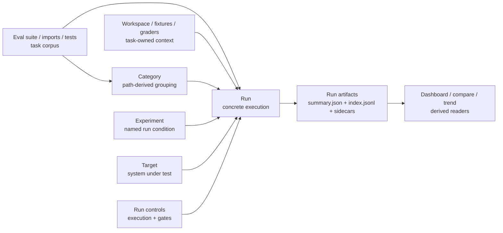

> SYSTEM

# AGENTS.md instructions for /home/entity/projects/EntityProcess/agentv

<INSTRUCTIONS>
# AgentV Agent Guide

This file is the root index for repo-facing agent instructions. Read the linked `.agents/*.md` guide for the kind of work you are doing, and read [STRATEGY.md](STRATEGY.md) plus [ROADMAP.md](ROADMAP.md) before making product-boundary calls.

## Product Direction

AgentV aims to be the repo-native, workspace-native evaluation framework for AI agents.

- Repo-native evals: run against real repos, multi-repo workspaces, setup scripts, and existing harnesses.
- Zero-infra local to CI: keep the default path lightweight so the same eval contract works on a laptop and in CI.
- Portable run artifacts: treat run bundles, traces, and summaries as the source of truth for comparison, gating, and export.
- Adapter boundaries: integrate with Phoenix, Harbor, Opik, and provider-specific systems through narrow adapters instead of absorbing their concepts into core.
- AI-native extensibility: keep the core small and composable so engineers and coding agents can extend it with plugins, wrappers, and harness-specific glue.

Phoenix boundary after the 2026-06-20 product decision:

- AgentV-owned run bundles, traces, transcripts, datasets, experiments, indexes, and Git-backed artifacts are not exported or projected into Phoenix.
- The local Dashboard is the supported zero-infra inspection path for AgentV run, trace, and session artifacts.
- Phoenix may be referenced as UI inspiration and optional external trace infrastructure only when Codex, Arize, or another hook already emitted spans independently.
- Optional Phoenix integration is link-out correlation only through safe `external_trace` metadata and an `Open in Phoenix` URL when available.
- Dashboard must not require the `px` CLI at runtime or query Phoenix database tables directly.

Design guardrails:

- Prefer core primitives plus plugins or wrappers over new built-ins.
- Document composition patterns before inventing a new feature.
- Match industry-standard lowest-common-denominator contracts when possible.
- When designing AgentV contracts, check public reference standards such as Claude Skills, Vercel agent-eval, Hugging Face Datasets, and OpenInference before inventing AgentV-specific shapes. Use their shared lowest common denominator where it fits, and document any intentional divergence.
- Apply YAGNI aggressively and solve the current request with the smallest surface that works.
- Keep extensions non-breaking unless a same-week unreleased surface should be hard-corrected.
- Design for AI comprehension with self-describing modules, clear extension points, and no dead scaffolding.

Read the full rationale and examples in [.agents/product-boundary.md](.agents/product-boundary.md).

## Always-Read Rules

- Start every repo change with `git fetch origin` and `git status --short --branch`.
- Use `bun` for package and script operations.
- Use the operator-supplied tracker when present. Do not commit tracker runtime state, local coordination config, or other machine-local artifacts.
- Do not use `git stash` on shared checkouts. Stage explicit paths only, and never push directly to `main`.
- Every merge to `main` requires a GitHub pull request with passing GitHub Actions. Do not locally merge feature or integration branches into `main` as a substitute for opening a PR.
- Prefer the primary checkout only for small, clean, bounded work. Use a dedicated worktree from the latest `origin/main` for non-trivial, risky, long-running, or parallel changes.
- When working from a dedicated worktree, copy the ignored `.env` from the primary/main checkout into the worktree before running evals, provider dogfood, grader verification, or local OpenAI OAuth proxy checks. Keep copied env files local and uncommitted; if the primary checkout has no `.env`, record that exact blocker instead of using `.env.example` as credentials.
- Non-trivial work needs a plan or task list. If the implementation surface starts to balloon, stop and re-plan.
- Large or high-risk PRs need meaningful, reviewable commits for each coherent change. Rewrite only the PR branch with `git push --force-with-lease` when needed to replace WIP or accidental squashed history before review.
- Manual red/green UAT is blocking before a branch is ready for review. GitHub Actions is the authoritative merge gate.
- For eval execution, experiments, repeat runs, providers, graders, or artifact-layout changes, dogfood with a live provider and a real LLM grader before marking ready. `agentv validate`, mock targets, replay/frozen transcript runs, and deterministic-only smoke tests are useful checks, but they are not live dogfood. Use canonical `.agentv/results/<run_id>/` output and publish private evidence. See [.agents/verification.md](.agents/verification.md).
- For browser or screenshot UAT, keep evidence out of the public repo and publish reviewable artifacts to an `agentv-private` evidence branch. See [.agents/verification.md](.agents/verification.md).
- When dogfood or review reveals a durable workflow lesson, capture it in this guide or the relevant `.agents/*.md` guide before merge; do not leave durable agent instructions only in PR comments, Bead comments, or private evidence. Use `docs/solutions/` for fuller reusable writeups.
- Research-only workers must not run `bun install`, `bun run build`, tests, or evals unless the assigned work explicitly needs that command and the worker records why.
- Prefer commit-addressed CI build artifacts over copying mutable main-tree build output. A prebuilt artifact is valid only when its manifest commit SHA, `bun.lock` hash, runner platform, Bun version expectation, and included output paths match the consuming checkout.
- Implementation workers must rebuild any package whose source they changed; never trust a prebuilt artifact for a touched package, and never publish `node_modules`, Bun caches, `.turbo`, `.cache`, or `.tsbuildinfo` as the build artifact.
- Public docs and examples should describe the current user-facing contract directly. Reserve historical context for files that are explicitly migration guides, changelogs, or ADRs.
- Wire formats are `snake_case`; internal TypeScript is `camelCase`. Translate only at the boundary.
- In AgentV, a `project` holds runs, traces, and experiments; a `benchmark` is a curated eval suite. Do not collapse those terms.
- `artifact_pointers` are an offload indirection for large detached payload bytes, such as transcript artifacts. Do not use them as the discovery path for ordinary per-case sidecars; expose those with explicit index/manifest path fields such as `metrics_path`.

## Repo Map

- `packages/core/`: evaluation engine, providers, grading, project registry, and the programmatic API.
- `packages/sdk/`: lightweight assertion SDK such as `defineAssertion` and `defineCodeGrader`.
- `apps/cli/`: published CLI surface for `agentv`.
- `apps/web/src/content/docs/`: public product and CLI docs on agentv.dev.
- `examples/`: examples that double as reference material and integration coverage.
- `docs/adr/`: durable product and architecture boundary decisions.
- `docs/plans/`: implementation plans and temporary design artifacts.
- `docs/solutions/`: documented fixes, decisions, and best practices, organized by category.
- `CONCEPTS.md`: shared domain vocabulary.

## Routing

Read the relevant guide before specialized work:

- [.agents/product-boundary.md](.agents/product-boundary.md): full goals, design principles, AI-first guidance, and how to decide core vs plugin vs docs.
- [.agents/workflow.md](.agents/workflow.md): tracker handling, worktrees, planning, execution, git workflow, PR flow, and documentation update expectations.
- [.agents/verification.md](.agents/verification.md): CI gates, CLI and browser E2E, grader verification, concurrency limits, and the completion checklist.
- [.agents/conventions.md](.agents/conventions.md): TypeScript and Bun conventions, subprocess rules, naming contracts, wire formats, grader type rules, and Python script usage.
- [.agents/publish.md](.agents/publish.md): versioning, publish workflow, contract gates, and published package surfaces.

Common entry points:

- Product or architecture decisions: start with [STRATEGY.md](STRATEGY.md), [ROADMAP.md](ROADMAP.md), and [.agents/product-boundary.md](.agents/product-boundary.md).
- Tracker, worktree, or PR flow questions: read [.agents/workflow.md](.agents/workflow.md).
- Beads bootstrap or recovery questions: read [docs/runbooks/beads-worktree-recovery.md](docs/runbooks/beads-worktree-recovery.md).
- Dashboard, docs, CLI UX, or grader verification work: read [.agents/verification.md](.agents/verification.md).
- Wire-format, naming, or grader-type changes: read [.agents/conventions.md](.agents/conventions.md).
- Version bumps or npm publishing: read [.agents/publish.md](.agents/publish.md).

</INSTRUCTIONS>
<environment_context>
  <cwd>/home/entity/projects/EntityProcess/agentv</cwd>
  <shell>zsh</shell>
  <current_date>2026-07-01</current_date>
  <timezone>Europe/Berlin</timezone>
  <filesystem><workspace_roots><root>/home/entity/projects/EntityProcess/agentv</root></workspace_roots><permission_profile type="disabled"><file_system type="unrestricted" /></permission_profile></filesystem>
</environment_context>

> DEVELOPER

do we have anything outstanding in this branch, if not lets delete it and checkout main

> AGENT

I’ll check the branch state against `origin/main`, including uncommitted files and any commits that only exist locally, before doing anything destructive.

> TOOL

tool_use exec_command
id: call_29FVNRlvqBO8HEMPosYQImE9
```json
{
  "cmd": "git fetch origin",
  "workdir": "/home/entity/projects/EntityProcess/agentv",
  "yield_time_ms": 30000,
  "max_output_tokens": 12000
}
```

> TOOL

tool_use exec_command
id: call_GfMJ6ogI6cPWruGaGC61TCjj
```json
{
  "cmd": "git status --short --branch",
  "workdir": "/home/entity/projects/EntityProcess/agentv",
  "yield_time_ms": 30000,
  "max_output_tokens": 12000
}
```

> TOOL

tool_result
id: call_29FVNRlvqBO8HEMPosYQImE9
```
Chunk ID: cb24ad
Wall time: 0.7596 seconds
Process exited with code 0
Original token count: 0
Output:

```

> TOOL

tool_result
id: call_GfMJ6ogI6cPWruGaGC61TCjj
```
Chunk ID: 939ea5
Wall time: 0.0084 seconds
Process exited with code 0
Original token count: 16
Output:
## agentv-wtg-dashboard...origin/agentv-wtg-dashboard [ahead 1]

```

> AGENT

The working tree is clean, but the current branch is `agentv-wtg-dashboard` and it is ahead of its upstream by one commit. I’m checking whether that commit is already covered by `origin/main` before deciding whether the branch is disposable.

> TOOL

tool_use exec_command
id: call_9M1sf3eJiQJxeXTEU6rzSu28
```json
{
  "cmd": "git log --left-right --cherry-pick --oneline origin/main...HEAD",
  "workdir": "/home/entity/projects/EntityProcess/agentv",
  "yield_time_ms": 30000,
  "max_output_tokens": 12000
}
```

> TOOL

tool_use exec_command
id: call_DW6eE46tqmxsfeglrNCDXPTZ
```json
{
  "cmd": "git diff --stat origin/main...HEAD",
  "workdir": "/home/entity/projects/EntityProcess/agentv",
  "yield_time_ms": 30000,
  "max_output_tokens": 12000
}
```

> TOOL

tool_use exec_command
id: call_B5YJYNqjMNYUlRSMZNMXdpBa
```json
{
  "cmd": "git branch --merged origin/main",
  "workdir": "/home/entity/projects/EntityProcess/agentv",
  "yield_time_ms": 30000,
  "max_output_tokens": 12000
}
```

> TOOL

tool_use exec_command
id: call_bmJunY6AhQ4aKU7q4urcfrH6
```json
{
  "cmd": "git status --porcelain=v1",
  "workdir": "/home/entity/projects/EntityProcess/agentv",
  "yield_time_ms": 30000,
  "max_output_tokens": 12000
}
```

> TOOL

tool_result
id: call_9M1sf3eJiQJxeXTEU6rzSu28
```
Chunk ID: 9ce68d
Wall time: 0.0101 seconds
Process exited with code 0
Original token count: 70
Output:
> 669232e1 add evaluate options budget
< ea3ce9db docs(adr): stabilize eval authoring contract (#1587)
< 2bb0edec feat(evals): support default_test threshold (#1588)
> e9405194 feat(eval): add command repo resolvers
> b58b415f fix(eval): avoid pooled workspace reuse by default

```

> TOOL

tool_result
id: call_DW6eE46tqmxsfeglrNCDXPTZ
```
Chunk ID: e65362
Wall time: 0.0135 seconds
Process exited with code 0
Original token count: 637
Output:
 README.md                                          |  16 +-
 apps/cli/src/commands/eval/commands/run.ts         |   2 +-
 apps/cli/src/commands/eval/run-eval.ts             |   4 +-
 apps/cli/test/eval.integration.test.ts             |  33 ++
 .../content/docs/docs/evaluation/eval-files.mdx    |   6 +-
 .../content/docs/docs/evaluation/experiments.mdx   |  13 +-
 .../content/docs/docs/evaluation/running-evals.mdx |   5 +-
 .../docs/docs/guides/workspace-architecture.mdx    |  91 +++--
 .../content/docs/docs/guides/workspace-pool.mdx    |  37 +-
 .../content/docs/docs/targets/configuration.mdx    |   5 +-
 .../repo-lifecycle/evals/pool-e2e.eval.yaml        |   6 +-
 examples/features/trials/README.md                 |   3 +-
 examples/features/trials/evals/dataset.eval.yaml   |   3 +-
 examples/showcase/multi-model-benchmark/README.md  |   8 +-
 .../evals/benchmark.eval.yaml                      |   3 +-
 .../core/src/evaluation/loaders/config-loader.ts   |  43 ++-
 packages/core/src/evaluation/orchestrator.ts       |   2 +-
 packages/core/src/evaluation/run-budget-tracker.ts |   6 +-
 packages/core/src/evaluation/types.ts              |   2 +
 .../src/evaluation/validation/config-validator.ts  | 103 ++++++
 .../src/evaluation/validation/eval-file.schema.ts  |   8 +
 .../src/evaluation/validation/eval-validator.ts    |  46 ++-
 .../src/evaluation/workspace/repo-config-parser.ts |  12 +-
 .../core/src/evaluation/workspace/repo-manager.ts  | 204 ++++++++++-
 .../core/src/evaluation/workspace/repo-resolver.ts | 351 ++++++++++++++++++
 packages/core/src/evaluation/workspace/setup.ts    |   4 +-
 packages/core/src/evaluation/yaml-parser.ts        |   8 +-
 .../test/evaluation/eval-inline-experiment.test.ts |  27 ++
 .../test/evaluation/loaders/config-loader.test.ts  |  12 +-
 .../evaluation/validation/config-validator.test.ts |  58 +++
 .../evaluation/validation/eval-file-schema.test.ts |   4 +-
 .../evaluation/validation/eval-validator.test.ts   |   2 +
 .../evaluation/workspace-config-parsing.test.ts    |   2 +
 .../test/evaluation/workspace/repo-manager.test.ts | 403 +++++++++++++++++++++
 .../core/test/evaluation/workspace/setup.test.ts   |  37 +-
 packages/sdk/src/eval.ts                           |  25 +-
 packages/sdk/test/eval-authoring.test.ts           |   4 +-
 .../references/breaking-changes.md                 |   9 +-
 skills-data/agentv-eval-writer/SKILL.md            |  11 +-
 .../agentv-eval-writer/references/eval.schema.json |  23 ++
 40 files changed, 1543 insertions(+), 98 deletions(-)

```

> TOOL

tool_result
id: call_B5YJYNqjMNYUlRSMZNMXdpBa
```
Chunk ID: a38b8d
Wall time: 0.0000 seconds
Process exited with code 0
Original token count: 62
Output:
  backup/pre-author-fix-82b70976
+ case-contract-impl
+ create-agentv-beads-copyfiles
  docs/sdk-guidance
+ exploitbench-workspace-research
  feat/av-o3w
  fix/publish-workflow-trusted-publisher
  main
  remove-vercel-status
  review-docs-pr-1539

```

> TOOL

tool_result
id: call_bmJunY6AhQ4aKU7q4urcfrH6
```
Chunk ID: dc7de0
Wall time: 0.0000 seconds
Process exited with code 0
Original token count: 0
Output:

```

> AGENT

There is outstanding work, so I did not delete the branch or check out `main`.

Current state after `git fetch origin`:

- Branch: `agentv-wtg-dashboard`
- Working tree: clean
- Status: ahead of `origin/agentv-wtg-dashboard` by 1 commit
- Compared to `origin/main`, this branch has unmerged commits:
  - `669232e1 add evaluate options budget`
  - `e9405194 feat(eval): add command repo resolvers`
  - `b58b415f fix(eval): avoid pooled workspace reuse by default`

`origin/main` also has two commits this branch does not have, so the branch is divergent rather than disposable.

> DEVELOPER

ask deepwiki mcp whether promptfoo controls concurrent workers and how it defines it

> AGENT

I’ll use the DeepWiki skill and ask the repository docs directly, then I’ll summarize the concurrency control behavior with the source of the answer.

> TOOL

tool_use exec_command
id: call_HpXwiL6UTm1VRircX36rLKuc
```json
{
  "cmd": "sed -n '1,220p' /home/entity/.codex/plugins/cache/allagents/deepwiki/1.0.0/skills/deepwiki/SKILL.md",
  "workdir": "/home/entity/projects/EntityProcess/agentv",
  "yield_time_ms": 30000,
  "max_output_tokens": 12000
}
```

> TOOL

tool_result
id: call_HpXwiL6UTm1VRircX36rLKuc
```
Chunk ID: 4a5af8
Wall time: 0.0000 seconds
Process exited with code 0
Original token count: 282
Output:
---
name: deepwiki
description: AI-generated documentation for GitHub repositories
---

# DeepWiki MCP Tools

## When to Use
- Understanding a GitHub repository's architecture
- Cross-repo comparisons and Q&A
- Finding how a specific feature is implemented in a repo
- Getting an overview of unfamiliar codebases

## Available Tools
- `mcp__deepwiki__read_wiki_structure` — Get documentation topics for a repo
- `mcp__deepwiki__read_wiki_contents` — Read full documentation for a repo
- `mcp__deepwiki__ask_question` — Ask any question about a repo

## Query Strategies
- Start with `read_wiki_structure` to understand what documentation is available
- Use `ask_question` for specific implementation questions: "How does auth work in owner/repo?"
- For comparisons, ask about each repo separately then synthesize
- Repository names use `owner/repo` format (e.g., "langchain-ai/langchainjs")

## Limitations
- Free to use, no API key required
- Only works with public GitHub repositories
- Documentation is AI-generated and may miss recent changes
- Best for architecture-level understanding, not line-by-line code review

```

> AGENT

DeepWiki’s repo Q&A is the right fit here because the question is about how Promptfoo implements a specific behavior rather than general package usage.

> TOOL

tool_use ask_question
id: call_iycZDMD2P9XYOmCSl1OQQCea
```json
{
  "repoName": "promptfoo/promptfoo",
  "question": "Does promptfoo control concurrent workers when running evals? If so, how is the concurrency setting defined/configured, and what code paths implement or consume it? Please include the terminology promptfoo uses for this concept."
}
```

> TOOL

tool_result
id: call_iycZDMD2P9XYOmCSl1OQQCea
```
Wall time: 14.2438 seconds
Output:
{"result":"Yes, `promptfoo` controls concurrent workers when running evaluations. The concurrency setting is primarily defined by the `maxConcurrency` option.  This setting can be configured via the command-line interface using the `-j` or `--max-concurrency` flag,  within the `promptfooconfig.yaml` file under `evaluateOptions.maxConcurrency`,  or programmatically when using the `evaluate` function in the Node.js API. \n\nThe terminology `promptfoo` uses for this concept is \"maximum concurrent API calls\" or \"maximum concurrent evals\".  \n\n## Configuration of Concurrency\n\n### Command-Line Interface\nYou can set the maximum concurrency directly when running an evaluation from the command line using the `--max-concurrency` flag.  For example, `npx promptfoo eval --max-concurrency 5` would override any `maxConcurrency` setting in the configuration file. \n\n### Configuration File\nThe `promptfooconfig.yaml` file allows you to define a default `maxConcurrency` within the `evaluateOptions` section.  This value will be used if not overridden by a command-line flag. \n\n### Node.js API\nWhen using `promptfoo` as a Node.js package, the `evaluate` function accepts an `options` object where `maxConcurrency` can be specified. \n\n### Python Providers\nFor Python providers, the worker count can be configured with `config.workers` in the `promptfooconfig.yaml`, or via the `PROMPTFOO_PYTHON_WORKERS` environment variable.  If neither is set, it falls back to the global `cliState.maxConcurrency` (from the `-j` flag) or a default of 1. \n\n## Implementation and Consumption\n\nThe core logic for managing concurrency during evaluation is found in the `evaluate` function.  This function uses `async.forEachOfLimit` to process evaluation steps concurrently, with the `processingContext.concurrency` value determining the limit. \n\nThe `concurrency` value can be adjusted dynamically based on certain features:\n*   If a prompt uses the `_conversation` variable, concurrency is forced to 1. \n*   If a test case uses `storeOutputAs`, concurrency is forced to 1. \n*   If a browser provider has `persistSession` enabled, concurrency is forced to 1. \nThese adjustments are handled by the `adjustConcurrencyForSerialFeatures` function. \n\nAdditionally, `promptfoo` implements adaptive concurrency for rate limit handling.  When rate limits are encountered, concurrency is reduced, and it increases again after sustained successful requests. \n\n## Notes\nThe `maxConcurrency` setting applies to API calls made during the evaluation.  While it sets an upper limit, the actual concurrency might be lower due to adaptive rate limiting or specific features that require serial execution.  \n\nWiki pages you might want to explore:\n- [Python and Script Providers (promptfoo/promptfoo)](/wiki/promptfoo/promptfoo#3.7)\n- [Eval Command (promptfoo/promptfoo)](/wiki/promptfoo/promptfoo#4.2)\n\nView this search on DeepWiki: https://deepwiki.com/search/does-promptfoo-control-concurr_5955fb97-1e77-4012-b87d-f19cb283e95b\n"}
```

> AGENT

DeepWiki confirms Promptfoo has two related notions: eval-level `maxConcurrency` for concurrent API/eval work, and Python-provider `workers` for Python provider execution. I’m asking one follow-up for exact config names so the final answer doesn’t blur those together.

> TOOL

tool_use ask_question
id: call_vYFWsDdQRIkpMBbGNv7IG4qL
```json
{
  "repoName": "promptfoo/promptfoo",
  "question": "For promptfoo concurrency, what exact configuration field names, CLI flags, environment variables, and internal option/property names define concurrency or worker counts? Please distinguish eval-level maxConcurrency from Python provider workers."
}
```

> TOOL

tool_result
id: call_vYFWsDdQRIkpMBbGNv7IG4qL
```
Wall time: 13.7063 seconds
Output:
{"result":"You are asking about how concurrency and worker counts are configured in `promptfoo`, specifically distinguishing between evaluation-level `maxConcurrency` and Python provider workers.  \n\n### Evaluation-Level Concurrency (`maxConcurrency`)\n\nThe maximum number of concurrent API calls for an evaluation is controlled by the `maxConcurrency` setting. \n\nThis can be configured in several ways, with a specific order of precedence:\n1.  **CLI Flag**: The `--max-concurrency` or `-j` flag on the `promptfoo eval` command.   This takes the highest precedence. \n2.  **Configuration File (`commandLineOptions.maxConcurrency`)**: Within your `promptfooconfig.yaml`, you can set `commandLineOptions.maxConcurrency`.  This is overridden by the CLI flag. \n3.  **Configuration File (`evaluateOptions.maxConcurrency`)**: Also in your `promptfooconfig.yaml`, you can set `evaluateOptions.maxConcurrency`.  This is overridden by `commandLineOptions.maxConcurrency` and the CLI flag. \n4.  **Default Value**: If none of the above are specified, the default `maxConcurrency` is 4. \n\nThe `doEval` function in `src/node/doEval.ts` is responsible for resolving the `maxConcurrency` value based on this precedence.  If a `delay` is set, `maxConcurrency` is automatically set to 1. \n\nThe resolved `maxConcurrency` value is stored in `cliState.maxConcurrency`  and can be accessed by providers, such as Python workers. \n\n### Python Provider Workers\n\nPython providers utilize worker processes, and their concurrency is determined by the following, in order of precedence:\n1.  **Provider-specific `config.workers`**: Within the `providers` section of your `promptfooconfig.yaml`, you can specify `config.workers` for a particular Python provider.  This takes the highest precedence.  \n2.  **Environment Variable `PROMPTFOO_PYTHON_WORKERS`**: This environment variable sets the global number of Python workers.  It overrides `cliState.maxConcurrency`.  \n3.  **`cliState.maxConcurrency`**: If neither `config.workers` nor `PROMPTFOO_PYTHON_WORKERS` are set, the value from the evaluation-level `maxConcurrency` (which is stored in `cliState.maxConcurrency`) is used.  \n4.  **Default Value**: If none of the above are specified, Python providers default to 1 worker.  \n\nThe `PythonProvider` class in `src/providers/pythonCompletion.ts` determines the worker count using the `getWorkerCount()` method.  This method applies the described precedence logic. \n\n### Summary of Precedence\n\nThe following diagram illustrates the precedence for concurrency settings:\n\n```mermaid\ngraph TD\n    A[\"CLI Flag: --max-concurrency (-j)\"] --> B;\n    B[\"Config: commandLineOptions.maxConcurrency\"] --> C;\n    C[\"Config: evaluateOptions.maxConcurrency\"] --> D;\n    D[\"Default: 4\"] --> E;\n    E[\"Resolved Eval maxConcurrency (cliState.maxConcurrency)\"] --> F;\n    F[\"Python Provider Config: workers\"] --> G;\n    G[\"Env Var: PROMPTFOO_PYTHON_WORKERS\"] --> H;\n    H[\"Python Provider Default: 1\"] --> I;\n    I[\"Actual Python Worker Count\"];\n```\n \n\n## Notes\n\nThe `DEFAULT_MAX_CONCURRENCY` constant is defined as 4. \nIf `delay` is set, the `maxConcurrency` for the evaluation is forced to 1, and this also affects the `cliState.maxConcurrency` value that Python workers might inherit. \nInvalid worker counts (less than 1) for Python providers are clamped to 1, with a warning logged.   \n\nWiki pages you might want to explore:\n- [CLI System (promptfoo/promptfoo)](/wiki/promptfoo/promptfoo#4)\n\nView this search on DeepWiki: https://deepwiki.com/search/for-promptfoo-concurrency-what_77196a80-ddae-4662-9187-3f2c6a301388\n"}
```

> AGENT

DeepWiki says: yes, Promptfoo controls concurrency, but it mostly calls it `maxConcurrency`, not “workers.”

Eval-level concurrency:

- CLI: `promptfoo eval --max-concurrency <n>` or `-j <n>`
- Config: `commandLineOptions.maxConcurrency`
- Config: `evaluateOptions.maxConcurrency`
- Default: `4`
- Internal resolved value: `cliState.maxConcurrency`
- Implementation path DeepWiki named: `src/node/doEval.ts`
- If `delay` is set, Promptfoo forces concurrency to `1`.

Python provider workers are separate:

- Provider config: `config.workers`
- Env var: `PROMPTFOO_PYTHON_WORKERS`
- Falls back to `cliState.maxConcurrency`
- Default: `1`
- Implementation path DeepWiki named: `src/providers/pythonCompletion.ts`, via `PythonProvider.getWorkerCount()`

DeepWiki also said runtime eval processing uses a concurrency limit and can force serial execution for features like `_conversation`, `storeOutputAs`, or browser providers with `persistSession`.

Source: DeepWiki query result for `promptfoo/promptfoo`: https://deepwiki.com/search/for-promptfoo-concurrency-what_77196a80-ddae-4662-9187-3f2c6a301388

> DEVELOPER

we should call ours max_concurrency as well to be consistent.

> AGENT

I’ll make that naming change in the repo, scoped to the eval concurrency/budget surface. First I’m refreshing git state, claiming a Beads task, and reading the naming conventions because this touches wire-format terminology.

> TOOL

tool_use exec_command
id: call_cQz3ZshfHf63bamjqpxdKWEf
```json
{
  "cmd": "git fetch origin",
  "workdir": "/home/entity/projects/EntityProcess/agentv",
  "yield_time_ms": 30000,
  "max_output_tokens": 12000
}
```

> TOOL

tool_use exec_command
id: call_TjHiUNAGpoCkEHbUiqcvszGX
```json
{
  "cmd": "git status --short --branch",
  "workdir": "/home/entity/projects/EntityProcess/agentv",
  "yield_time_ms": 30000,
  "max_output_tokens": 12000
}
```

> TOOL

tool_use exec_command
id: call_VERbWeNsrd87GWt1uoaLdMM4
```json
{
  "cmd": "sed -n '1,220p' /home/entity/.codex/plugins/cache/compound-engineering-plugin/compound-engineering/3.17.0/skills/ce-work/SKILL.md",
  "workdir": "/home/entity/projects/EntityProcess/agentv",
  "yield_time_ms": 30000,
  "max_output_tokens": 12000
}
```

> TOOL

tool_use exec_command
id: call_zFno7Ma8iuhJBK4PCRyEKtHQ
```json
{
  "cmd": "sed -n '1,220p' .agents/conventions.md",
  "workdir": "/home/entity/projects/EntityProcess/agentv",
  "yield_time_ms": 30000,
  "max_output_tokens": 14000
}
```

> TOOL

tool_use exec_command
id: call_k1XsKn31N8yShaMYXobFsQMs
```json
{
  "cmd": "sed -n '1,180p' .agents/workflow.md",
  "workdir": "/home/entity/projects/EntityProcess/agentv",
  "yield_time_ms": 30000,
  "max_output_tokens": 12000
}
```

> TOOL

tool_result
id: call_cQz3ZshfHf63bamjqpxdKWEf
```
Chunk ID: 530058
Wall time: 0.5645 seconds
Process exited with code 0
Original token count: 0
Output:

```

> TOOL

tool_result
id: call_TjHiUNAGpoCkEHbUiqcvszGX
```
Chunk ID: 263657
Wall time: 0.0000 seconds
Process exited with code 0
Original token count: 16
Output:
## agentv-wtg-dashboard...origin/agentv-wtg-dashboard [ahead 1]

```

> TOOL

tool_result
id: call_VERbWeNsrd87GWt1uoaLdMM4
```
Chunk ID: a98e29
Wall time: 0.0007 seconds
Process exited with code 0
Original token count: 5621
Output:
---
name: ce-work
description: Execute a plan or concrete work prompt end-to-end. Use when implementing from docs/plans, a spec path, or a clear build request; use ce-debug for open-ended bugs.
argument-hint: "[Plan doc path or description of work. Blank to auto use latest plan doc]"
---

# Work Execution Command

Execute work efficiently while maintaining quality and finishing features.

## Introduction

This command takes a work document (plan or specification) or a bare prompt describing the work, and executes it systematically. The focus is on **shipping complete features** by understanding requirements quickly, following existing patterns, and maintaining quality throughout.

## Input Document

<input_document> #$ARGUMENTS </input_document>

## Execution Workflow

### Phase 0: Input Triage

**First, parse a leading mode token.** If `<input_document>` begins with `mode:return-to-caller` (or the legacy aliases `mode:caller-owned-tail` / `caller:lfg`), strip that token before anything else: the remainder of the string is the plan path, and this run executes in **Return-to-Caller Mode** (see § Return-to-Caller Mode) — implement and locally verify only, then return the structured envelope instead of running the standalone shipping tail. Classify the stripped plan path with the rules below. A mode token with no following path is an error: report it rather than treating `mode:return-to-caller` as a bare prompt.

Determine how to proceed based on what was provided in `<input_document>` (after any mode token is stripped).

**Plan document** (input is a file path to an existing plan or specification): read the plan's metadata first — YAML frontmatter for a markdown plan, or the visible header text for an HTML plan (both formats carry the same fields).

- If it carries `artifact_contract: ce-unified-plan/v1`, classify `artifact_readiness` before reading the body.
  - `artifact_readiness: requirements-only` -> stop and tell the user this Product Contract needs `ce-plan` enrichment before implementation. Offer the exact `ce-plan <plan-path>` handoff.
  - `artifact_readiness: implementation-ready` plus `execution: code` -> continue to Phase 1 using the unified-plan reader strategy below.
  - Any other readiness value or any non-code/unclassified execution mode -> do not auto-execute as code. Route `execution: knowledge-work` to the non-code carve-out; otherwise ask the user to return to `ce-plan` to produce an implementation-ready code plan.
  - Progress-like values (`active`, `in_progress`, `completed`, `done`) are invalid readiness values. Stop and ask for plan repair rather than guessing.
- If it carries `execution: knowledge-work`, this is a **non-code plan** — read `references/non-code-execution.md` and follow that carve-out instead of the rest of this workflow.
- Otherwise (legacy plan, field absent, or `execution: code`) -> continue to Phase 1 and run the normal code lifecycle.

**Blank invocation latest-plan discovery:** when `<input_document>` is blank, glob `docs/plans/*.md` and `docs/plans/*.html`, inspect metadata for the newest candidates, and only auto-select a plan that is `artifact_readiness: implementation-ready` plus `execution: code` or a legacy code plan. Stop instead of silently executing when the newest matching artifact is requirements-only, `execution: knowledge-work`, an approach-plan, or an unclassified universal/answer-seeking output. Ask for an explicit path or a `ce-plan` enrichment step. **Superseded sibling:** if a requirements-only candidate has a same-basename file in the other format (`<basename>.md` / `<basename>.html`) that is `implementation-ready`, a format conversion left the requirements-only copy stale — select the implementation-ready sibling and execute it rather than stopping.

**Bare prompt** (input is a description of work, not a file path):

1. **Scan the work area**

   - Identify files likely to change based on the prompt
   - Find existing test files for those areas (search for test/spec files that import, reference, or share names with the implementation files)
   - Note local patterns and conventions in the affected areas

2. **Assess complexity and route**

   | Complexity | Signals | Action |
   |-----------|---------|--------|
   | **Trivial** | 1-2 files, no behavioral change (typo, config, rename) | Proceed to Phase 1 step 2 (environment setup), then implement directly — no task list, no execution loop. Apply Test Discovery if the change touches behavior-bearing code |
   | **Small / Medium** | Clear scope, under ~10 files | Build a task list from discovery. Proceed to Phase 1 step 2 |
   | **Large** | Cross-cutting, architectural decisions, 10+ files, touches auth/payments/migrations | Inform the user this would benefit from `/ce-brainstorm` or `/ce-plan` to surface edge cases and scope boundaries. Honor their choice. If proceeding, build a task list and continue to Phase 1 step 2 |

---

### Phase 1: Quick Start

1. **Read Plan and Clarify** _(skip if arriving from Phase 0 with a bare prompt)_

   - For unified plans, size your read. A short plan (lightweight or requirements-only, a screen or two) can be read in full. For a long implementation-ready plan, do **not** read the whole document first — it is expensive and unnecessary. Build a section map, then read only what the active unit needs: metadata, then `Goal Capsule`, `Verification Contract`, `Definition of Done`, the `Implementation Units` heading list, and only the active U-ID section plus referenced R/F/AE/KTD excerpts. Read appendices or unrelated U-IDs only when the active unit cites them. To build the map: in **markdown** scan headings (`rg -n '^#{1,3} ' <plan>` — top-level sections plus `### U<N>.` units); in **HTML** scan the `<h1>`–`<h3>` heading elements and their anchor ids. Match on the stable section names / unit IDs (`Goal Capsule`, `Verification Contract`, `### U<N>.`, …), ignoring HTML wrapper tags — not on a format-specific pattern.
   - For legacy plans, read the work document completely. Both formats (`.md`, `.html`) carry the same section names and IDs; HTML just wraps them in semantic elements (`<section>`, `<article>`, etc.).
   - Treat the plan as a decision artifact, not an execution script
   - If the plan includes sections such as `Implementation Units`, `Work Breakdown`, `Requirements` (or legacy `Requirements Trace`), `Files`, `Test Scenarios`, or `Verification`, use those as the primary source material for execution
   - Check for `Execution note` on each implementation unit — these carry the plan's execution posture signal for that unit (for example, test-first or characterization-first). Note them when creating tasks.
   - Check for a `Deferred to Implementation` or `Implementation-Time Unknowns` section — these are questions the planner intentionally left for you to resolve during execution. Note them before starting so they inform your approach rather than surprising you mid-task
   - Check for a `Scope Boundaries` section — these are explicit non-goals. Refer back to them if implementation starts pulling you toward adjacent work
   - Review any references or links provided in the plan
   - If the user explicitly asks for TDD, test-first, or characterization-first execution in this session, honor that request even if the plan has no `Execution note`
   - If anything is unclear or ambiguous, ask clarifying questions now
   - If clarifying questions were needed above, get user approval on the resolved answers. If no clarifications were needed, proceed without a separate approval step — plan scope is the plan's authority, not something to renegotiate
   - **Do not skip this** - better to ask questions now than build the wrong thing
   - **Do not edit the plan body during execution.** The plan is a decision artifact; progress lives in git commits and the task tracker, not the plan. `ce-work` does not mutate the plan — whether it shipped is derived from git, not recorded in the doc. Legacy plans may contain `- [ ]` / `- [x]` marks on unit headings or a `status:` field — ignore them as state; per-unit completion is determined during execution by reading the current file state.

2. **Setup Environment**

   First, check the current branch:

   ```bash
   current_branch=$(git branch --show-current)
   default_branch=$(git symbolic-ref refs/remotes/origin/HEAD 2>/dev/null | sed 's@^refs/remotes/origin/@@')

   # Fallback if remote HEAD isn't set
   if [ -z "$default_branch" ]; then
     default_branch=$(git rev-parse --verify origin/main >/dev/null 2>&1 && echo "main" || echo "master")
   fi
   ```

   **If already on a feature branch** (not the default branch):

   First, check whether the branch name is **meaningful** — a name like `feat/crowd-sniff` or `fix/email-validation` tells future readers what the work is about. Auto-generated worktree names (e.g., `worktree-jolly-beaming-raven`) or other opaque names do not.

   If the branch name is meaningless or auto-generated, suggest renaming it before continuing:
   ```bash
   git branch -m <meaningful-name>
   ```
   Derive the new name from the plan title or work description (e.g., `feat/crowd-sniff`). Present the rename as a recommended option alongside continuing as-is.

   Then ask: "Continue working on `[current_branch]`, or create a new branch?"
   - If continuing (with or without rename), proceed to step 3
   - If creating new, follow Option A or B below

   **If on the default branch**, choose how to proceed:

   **Option A: Create a new branch**
   ```bash
   git pull origin [default_branch]
   git checkout -b feature-branch-name
   ```
   Use a meaningful name based on the work (e.g., `feat/user-authentication`, `fix/email-validation`).

   **Option B: Use a worktree (recommended for parallel development)**
   ```bash
   skill: ce-worktree
   # Ensures isolation: detects an existing worktree, prefers the harness's
   # native worktree tool, else creates one from the default branch
   ```

   **Option C: Continue on the default branch**
   - Requires explicit user confirmation
   - Only proceed after user explicitly says "yes, commit to [default_branch]"
   - Never commit directly to the default branch without explicit permission

   **Recommendation**: Use worktree if:
   - You want to work on multiple features simultaneously
   - You want to keep the default branch clean while experimenting
   - You plan to switch between branches frequently

3. **Create Task List** _(skip if Phase 0 already built one, or if Phase 0 routed as Trivial)_
   - Use the platform's task tracking tool (`TaskCreate`/`TaskUpdate`/`TaskList` in Claude Code, `update_plan` in Codex, or the equivalent on other harnesses) to break the plan into actionable tasks
   - Derive tasks from the plan's implementation units, dependencies, files, test targets, and verification criteria
   - When the plan defines U-IDs for Implementation Units, preserve the unit's U-ID as a prefix in the task subject (e.g., "U3: Add parser coverage"). This keeps blocker references, deferred-work notes, and final summaries anchored to the same identifier the plan uses, so progress and traceability remain unambiguous across plan edits
   - Carry each unit's `Execution note` into the task when present
   - For each unit, read the `Patterns to follow` field before implementing — these point to specific files or conventions to mirror
   - Use each unit's `Verification` field as the primary "done" signal for that task
   - Do not expect the plan to contain implementation code, micro-step TDD instructions, or exact shell commands
   - Include dependencies between tasks
   - Prioritize based on what needs to be done first
   - Include testing and quality check tasks
   - Keep tasks specific and completable

4. **Choose Execution Engine, then Strategy**

   For an implementation-ready unified code plan, first pick the **engine** that runs implementation: inline/subagent (default and only callable engine on Claude Code), goal-mode, or dynamic-workflow. Goal-mode and dynamic-workflow are usable only when the host exposes a callable primitive for them — Codex exposes `create_goal` (a skill can start a goal directly), while Claude Code exposes no goal tools, so on Claude Code they are prompt-emission only (never invoked from inside this skill). Prefer dynamic-workflow over goal-mode for large fan-out plans (many independent U-IDs, codebase-wide sweeps, migrations, adversarial cross-checking). Read `references/execution-engines.md` for the host-capability probe, the plan-shape selection table, the copyable goal-mode/`ultracode:` prompts, and the resume-tail rules. An engine choice never changes tail ownership — after implementation, resume standalone quality gates in normal use, or return the return-to-caller envelope when invoked by `lfg`. Legacy and bare-prompt work skip this and use the inline/subagent engine directly.

   For the inline/subagent engine, **prefer subagents for any structured multi-unit plan** — each worker gets a fresh context window for one unit. **Parallelize independent units whenever it is safe**; fall back to serial only when parallel isn't safe or the harness can't isolate concurrent writes. Let the plan's `Dependencies` and `Files` drive batching: run an independent dependency layer together, then the next.

   | Strategy | When to use |
   |----------|-------------|
   | **Inline** | Trivial work (1-2 files, no real decomposition), work needing user interaction mid-flight, or bare prompts that lack structured units |
   | **Serial subagents** | The default for structured multi-unit plans whose units are dependent, few, or whose parallel-safety is uncertain. Fresh context per unit, executed in dependency order |
   | **Parallel subagents** | Independent units (per the Parallel Safety Check) when you want the speed and the harness can isolate concurrent work. Run a dependency layer at once, then the next |

   **Parallel Safety Check** — before dispatching a batch in parallel:

   1. Map files to units from each candidate unit's `Files:` section (Create/Modify/Test paths).
   2. **File overlap is necessary but not sufficient.** Also serialize units that contend on things absent from `Files:`: shared types/APIs/interfaces, DB migrations, generated artifacts or clients, lockfiles, snapshots, shared config/schema — or an **environment singleton** (one dev server/port, a shared database, browser sessions, package installs, MCP rate limits). Reason about these; don't just diff paths.
   3. **No contention:** dispatch the batch in parallel.
   4. **Contention with harness-native isolation:** parallel is *recoverable* (isolated workers don't lose each other's writes) but **not automatically safe** — overlapping edits still need a real merge. Serialize contending units by default; run them parallel-isolated only when the expected merge is trivial. Log the predicted overlap.
   5. **Contention without isolation (shared workspace):** serialize — in a shared directory only the last writer survives.
   6. **Cap concurrency** at a bounded batch (~3-5 workers) even when more units are independent; over-parallelizing costs more in contention, merge, and integration than it saves.
   7. **Abort criteria:** if a batch produces broad unplanned edits, out-of-scope test failures, or repeated conflicts, stop parallelizing and finish the rest serially.

   **Isolation is the harness's job, never ce-work's** — never run `git worktree add` yourself. Probe what your subagent mechanism provides and pick the parallel path:
   - **Harness-native isolated workers** — each worker edits an isolated workspace the harness manages: Claude Code `Agent` tool (`isolation: "worktree"` + `run_in_background: true`; worktree under a gitignored `.claude/worktrees/`), Codex `spawn_agent` (a coding **worker** edits its forked workspace), Cursor `best-of-n-runner`. Parallelize freely here, including overlapping-file units (subject to the Safety Check's merge-cost judgment). This works even when you are *already* inside a worktree — harness worktrees are peers of one repo, not nested, branched from your current HEAD.
   - **Shared workspace only** — subagents run in your working directory (Cursor `Task` default, or any harness without isolation). Parallelize **disjoint-file units only**, under the shared-workspace constraints below; contending units run serial.
   - **No subagent mechanism:** run inline.

   **Dispatch** uses your harness's subagent/worker mechanism. Give each worker:
   - The plan path plus a **bounded unit packet** — Goal Capsule, Definition of Done, the unit's section, the Verification Contract entries relevant to it, and any referenced R/F/AE/KTD excerpts. Do not send "read the whole plan" as the worker prompt. (For a legacy non-unified plan, the plan path for reference is acceptable.)
   - The unit's Goal, Files, Approach, Execution note, Patterns, Test scenarios, Verification, and any resolved deferred questions for it.
   - Instruction to check whether the unit's test scenarios cover all applicable categories (happy paths, edge cases, error paths, integration) and supplement gaps before writing tests.
   - **Instruction to report, in its final message, the file paths it changed** — the handoff is a text summary on most harnesses with no guaranteed diff, so reported paths are the orchestrator's starting hint (it still verifies the actual tree).
   - **Do not commit.** Workers implement and may run their *own unit's* focused tests in isolation as a self-check, but the **orchestrator owns staging, committing, and the authoritative test runs**. (Capability note: a harness that *reaps* the isolated workspace on worker completion — none of our current targets do — would instead require the worker to commit to its branch; confirm before assuming it.)

   **Shared-workspace constraints** — when subagents share your working directory (no isolation): they must not `git add`, commit, or run the full test suite concurrently (index corruption + test interference); the orchestrator does all of that after the batch. A worker may run a single focused unit test only if it touches no shared state.

   **Permission mode:** Omit the `mode` parameter when dispatching subagents so the user's configured permission settings apply. Do not pass `mode: "auto"` — it overrides user-level settings like `bypassPermissions`.

   **After each serial unit:** review the diff against the unit's scope and `Files:`, run the relevant tests, fix before dispatching the next (never on a broken tree), update the task list (never edit the plan body — progress lives in commits), and commit. Then dispatch the next unit.

   **After a parallel batch — the orchestrator integrates; never trust the handoff summary alone:**
   1. Wait for every worker in the batch to finish.
   2. **Inspect the actual tree, not reported paths.** Determine what each worker really changed (`git status`/diff in its workspace or the shared dir). Reported paths are a hint; declared `Files:` are often incomplete — workers create/modify files the plan didn't anticipate.
   3. **Detect real collisions** — 2+ workers that actually modified the same file. In a shared workspace only the last writer survived: commit the non-colliding work first, then re-run the colliding units serially so each builds on the other's committed result. With harness-native isolation the collision surfaces as a merge conflict at integration instead (see the per-harness note).
   4. **Review, test, and commit each unit in dependency order — the orchestrator owns commits.** Stage only that unit's files, commit with a message derived from its Goal, run the relevant tests, and fix before the next.
   5. Update the task list (progress lives in the commits).
   6. **Release the workers** — close/clean up each worker handle so it stops holding a concurrency slot or leaving orphans (e.g., Codex `close_agent`; for a Claude per-worker worktree: `git worktree unlock <path>` → `git worktree remove <path>` → `git branch -d <branch>`). These isolated worktrees are peers invisible to any outer orchestrator (e.g., Orca), so cleanup is entirely ce-work's.
   7. Dispatch the next dependency layer.

   **Per-harness integration (examples — the universal flow above is the contract):**
   - **Claude `Agent` `isolation:"worktree"`:** each worker is on its own branch. Integrate by merging each branch into the orchestrator's branch in dependency order; on conflict, `git merge --abort` and re-run that unit serially against the merged tree (hand-resolving silently discards one unit's intent).
   - **Codex `spawn_agent` worker:** integrate the worker's "uploaded changes," then `close_agent`.
   - **Cursor `Task` (shared workspace):** edits are already in your tree — review and commit per step 4; **`best-of-n-runner`:** integrate its worktree.

### Phase 2: Execute

1. **Task Execution Loop**

   For each task in priority order:

   ```
   while (tasks remain):
     - Mark task as in-progress
     - Read any referenced files from the plan or discovered during Phase 0
     - **If the unit's work is already present and matches the plan's intent** (files exist with the expected capability, or the unit's `Verification` criteria are already satisfied by the current code), the work has likely shipped on a prior branch or session. Verify it matches, mark the task complete, and move on. Do not silently reimplement.
     - Look for similar patterns in codebase
     - Find existing test files for implementation files being changed (Test Discovery — see below)
     - Implement following existing conventions
     - Add, update, or remove tests to match implementation changes (see Test Discovery below)
     - Run System-Wide Test Check (see below)
     - Run tests after changes
     - Assess testing coverage: did this task change behavior? If yes, were tests written or updated? If no tests were added, is the justification deliberate (e.g., pure config, no behavioral change)?
     - Mark task as completed
     - Evaluate for incremental commit (see below)
   ```

   When a unit carries an `Execution note`, honor it. For test-first units, write the failing test before implementation for that unit. For characterization-first units, capture existing behavior before changing it. For units without an `Execution note`, proceed pragmatically.

   Guardrails for execution posture:

```

> TOOL

tool_result
id: call_zFno7Ma8iuhJBK4PCRyEKtHQ
```
Chunk ID: 460b1f
Wall time: 0.0000 seconds
Process exited with code 0
Original token count: 1650
Output:
# Technical Conventions

This file expands [AGENTS.md](../AGENTS.md) for code-level rules, naming contracts, wire formats, grader-type rules, and toolchain expectations.

## Toolchain

- Language: TypeScript 5.x targeting ES2022
- Runtime and package manager: Bun
- Monorepo: Bun workspaces
- Bundler: tsup
- Linter and formatter: Biome
- Testing: Vitest
- LLM framework: Vercel AI SDK
- Validation: Zod

## TypeScript Guidelines

- Target ES2022 with Node 20+.
- Prefer type inference over explicit types when the result stays clear.
- Use `async` and `await` for async operations.
- Prefer named exports.
- Keep modules cohesive.

## Subprocess and Provider Conventions

When spawning a subprocess with an explicit `cwd`, pass user-supplied `args` through unchanged. The subprocess resolves its own relative paths against its `cwd`.

- Do not rewrite arg arrays with `startsWith('./')` or `!path.isAbsolute()` heuristics.
- Those heuristics miss bare relative paths such as `plugins/foo`, can corrupt flag-value pairs such as `--config=./x`, and duplicate behavior the subprocess already handles.
- See `docs/solutions/best-practices/trust-subprocess-cwd-for-relative-path-resolution.md`.

## Git Remote Ownership

Treat an existing Git checkout's remote configuration as user-owned state.
AgentV may read remotes, fetch from a configured remote name, and push results
refs to that remote, but it must not run `git remote add` or `git remote
set-url` in an existing checkout as a side effect of Dashboard status, results
sync, eval publishing, or WIP checkpoint handling. This applies especially to
`results.repo.path: .`, where the source checkout's existing `origin` is the
authoritative remote.

If AgentV needs a separate results checkout and the configured path is missing
or empty, create it with `git clone` and the requested remote name. If the path
already exists, use its current Git config as-is or fail with clear setup
guidance; do not repair, rewrite, or synthesize remotes in place.

## Naming: Project vs Benchmark

These terms are distinct and not interchangeable.

- Project: the top-level container Dashboard organizes around, backed by a registered workspace directory with `.agentv/`, run artifacts, traces, and experiments. The registry lives in `~/.agentv/projects.yaml` and is modeled by `ProjectEntry` and `ProjectRegistry` in `packages/core/src/projects.ts`.
- Benchmark: a curated eval suite designed to measure something specific, in the academic ML sense. Example directories using this meaning are correctly named and should not be renamed.

The legacy `~/.agentv/benchmarks.yaml` file is auto-migrated to `projects.yaml` by `migrateLegacyBenchmarksFile()`. Run-level results metadata lives in `summary.json`, with `index.jsonl` as the discovery anchor.

Rule of thumb:

- If it holds runs, traces, or experiments, it is a project.
- If it is a curated set of eval cases used to measure capability, it is a benchmark.

## Wire Format Convention

Everything that crosses a process boundary uses `snake_case`. Internal TypeScript uses `camelCase`. Translate only at the boundary.

Snake-case surfaces:

- YAML files on disk such as `*.eval.yaml`, `agentv.config.yaml`, `projects.yaml`, and `dashboard/config.yaml`
- JSONL result files such as `test_id`, `token_usage`, and `duration_ms`
- Artifact-writer output such as `pass_rate`, `tests_run`, and `total_tool_calls`
- HTTP response bodies from `agentv serve` or Dashboard
- CLI JSON output
- Anything consumed by non-TypeScript tooling

Camel-case surfaces:

- TypeScript source
- Internal in-memory shapes passed between TypeScript modules

Translate in one place:

```typescript
interface ProjectEntryYaml {
  id: string;
  name: string;
  path: string;
  added_at: string;
  last_opened_at: string;
}

interface ProjectEntry {
  id: string;
  name: string;
  path: string;
  addedAt: string;
  lastOpenedAt: string;
}

function fromYaml(entry: ProjectEntryYaml): ProjectEntry {
  return {
    id: entry.id,
    name: entry.name,
    path: entry.path,
    addedAt: entry.added_at,
    lastOpenedAt: entry.last_opened_at,
  };
}

function toYaml(entry: ProjectEntry): ProjectEntryYaml {
  return {
    id: entry.id,
    name: entry.name,
    path: entry.path,
    added_at: entry.addedAt,
    last_opened_at: entry.lastOpenedAt,
  };
}
```

Anti-patterns:

- `writeFileSync(path, stringifyYaml(tsObject))`
- TypeScript response interfaces with `testId` instead of `test_id`
- Accepting both `testId` and `test_id` on new inputs "for back-compat" when nothing has shipped

If you spot a camelCase key already on disk or in a response, treat it as a bug and migrate it in the same PR that touches that path. `parseJsonlResults()` in `artifact-writer.ts` and `fromYaml` or `toYaml` in `packages/core/src/projects.ts` are the models to follow.

## Result Artifact Pointers

`artifact_pointers` are for offloading large detached payload bytes from the results metadata/control plane. They describe where payloads such as transcript files live when a run is projected to `agentv/artifacts/v1` or a future object store, including `key`, `object_version`, `sha256`, `size`, `media_type`, and `schema_version`.

Do not add an `artifact_pointers.*` entry just because a new per-case artifact exists. Normal sidecars that stay in the run tree should be discoverable through explicit path fields on `index.jsonl` or manifests, for example `metrics_path` for `outputs/metrics.json`.

Before adding a new pointer family, verify that the artifact is large enough or detached enough to benefit from offloading and that published result repos should avoid carrying those payload bytes on the primary results branch.

## Grader Type System

Grader types use kebab-case everywhere.

- YAML config: `type: llm-grader`, `type: is-json`, `type: execution-metrics`
- Internal TypeScript: `EvaluatorKind = 'llm-grader' | 'is-json' | ...`
- Output `scores[].type`: `"llm-grader"`, `"is-json"`
- Registry keys: `registry.register('llm-grader', ...)`

Source of truth: `EVALUATOR_KIND_VALUES` in `packages/core/src/evaluation/types.ts`.

Backward compatibility:

- Snake_case is accepted in YAML by `normalizeGraderType()` in `grader-parser.ts`, for example `llm_judge` -> `llm-grader`.
- Single-word types such as `contains`, `equals`, `regex`, `latency`, and `cost` are unchanged.

Two type definitions exist and must stay in sync:

- `EvaluatorKind` in `packages/core/src/evaluation/types.ts`
- `AssertionType` in `packages/sdk/src/assertion.ts`

## Python Scripts

When running Python scripts, always use:

```bash
uv run <script.py>
```

```

> TOOL

tool_result
id: call_k1XsKn31N8yShaMYXobFsQMs
```
Chunk ID: 2040a9
Wall time: 0.0001 seconds
Process exited with code 0
Original token count: 2839
Output:
# Workflow

This file expands [AGENTS.md](../AGENTS.md) for day-to-day repo work: tracker handling, worktrees, planning, execution, git workflow, PR flow, and documentation update expectations.

## Tracker and Repo Safety

- Treat task-tracking instructions as operator-supplied context. If the prompt provides an external tracker database, path, or environment variable, use that exact tracker for assignment, status, dependencies, handoff notes, decomposition, and resumability.
- If no external tracker is supplied, work from the user's prompt and the current branch or PR. Do not create, sync, stage, or commit repo-local tracker state unless the user explicitly requests it.
- Keep private launcher names, local paths, session aliases, dispatch policy, and operator workspace details outside this public repository.
- GitHub remains the PR, CI, review, and merge surface. Use GitHub Issues or Projects for external collaboration only when the user or operator explicitly asks for that workflow.
- Do not add repo-local tracker directories, tracker JSONL exports, dispatch logs, cross-repo research records, or operator decision records to AgentV commits unless the user explicitly asks for repository-local tracker artifacts.
- Do not commit project-local coordination config files.
- Do not use `git stash` on shared checkouts. Inspect `git status`, stage only your files, use a dedicated worktree, or ask before moving uncommitted changes.

## Worktree Setup

- Start every repo change with `git fetch origin` and `git status --short --branch`.
- Prefer the primary checkout for small, bounded work only when local `main` is current with `origin/main` or can be fast-forwarded cleanly, the change is narrow, and the paths you need are not dirty or owned by another worker in the supplied tracker.
- When working in the primary checkout, stage explicit paths only. Do not commit another agent's files, project-local coordination config, generated evidence, or unrelated tracker or doc state.
- Use a dedicated git worktree based on the latest `origin/main` for non-trivial, risky, cross-cutting, long-running, or parallel implementation, or whenever the primary checkout is stale or dirty in paths you need.
- Before starting implementation in a dedicated worktree, verify its `HEAD` is based on the current `origin/main` commit.
- In worktrees, use plain `bd` commands and let Beads share the primary checkout database through native worktree discovery. Do not use `--db .beads/embeddeddolt` or bootstrap a worktree-local Beads database unless the primary checkout has no hydrated database. Keep `.beads/metadata.json` tracked; it preserves AgentV's `av` embedded Dolt identity. See [docs/runbooks/beads-worktree-recovery.md](../docs/runbooks/beads-worktree-recovery.md).

Manual setup:

```bash
git fetch origin
git worktree add ../agentv.worktrees/<type>-<short-desc> -b <type>/<issue-or-topic>-<short-desc> origin/main
cd ../agentv.worktrees/<type>-<short-desc>
```

- Use the sibling `../agentv.worktrees/` directory for all AgentV worktrees. Do not create new AgentV worktrees inside the repository root.
- After creating a manual worktree, run:

```bash
bun install
cp "$(git worktree list --porcelain | head -1 | sed 's/worktree //')/.env" .env
bun run beads:check
bd worktree info
bd where
```

- These setup steps are required before running builds, tests, evals, or tracker
  updates in the worktree.
- The `.env` copy must come from the primary/main checkout and stays ignored in
  the worktree. Do not copy `.env.example` as a credential substitute. If the
  primary checkout has no `.env`, record the missing credentials as the exact
  blocker for live provider/grader verification.
- If you discover you are on a stale base or have uncoordinated dirty files, stop and fix that before changing code.
- Whenever you `git checkout`, `gh pr checkout`, `git pull`, or otherwise switch to a ref that may have changed `package.json` or `bun.lock`, run `bun install` before building or testing.

## Research, Build, and Artifact Reuse

- Research-only workers should inspect files and repository history without running `bun install`, `bun run build`, tests, or evals unless the assigned research explicitly depends on that command. Record the justification when a research worker does run one of those commands.
- Do not copy mutable build outputs from `main` or another worktree as the default way to avoid local builds. Prefer the commit-addressed CI build artifact when one is available for the exact source state.
- A prebuilt CI artifact may be reused only when its manifest matches the consumer's commit SHA, `bun.lock` SHA-256, runner OS/architecture, expected Bun version source/value, and required output paths.
- Implementation workers must rebuild locally for every package whose source they changed. A prebuilt artifact is only a reuse input for untouched packages at the same commit, never a substitute for rebuilding touched source.
- CI build artifacts must contain only the compiled AgentV outputs and manifest. Do not include `node_modules`, Bun cache directories, `.turbo`, `.cache`, `.tsbuildinfo`, local evidence, tracker state, or generated runtime artifacts.

## Planning and Execution

- Use plan mode or an explicit task list for non-trivial work, roughly five or more steps or anything with architectural decisions.
- If something goes sideways, stop and re-plan instead of pushing a broken approach.
- For non-trivial changes, pause and ask whether there is a more elegant solution before diving in.
- Check in with the user before implementation on ambiguous tasks.
- Prefer automation: execute the requested work without extra confirmation unless blocked by missing information, safety concerns, or an irreversible action the user has not approved.
- For complex problems, keep this worker focused on its assigned scope and create or claim additional tracker items when the supplied tracker supports that workflow.
- When you spot a bug, fix it. Only ask when there is genuine ambiguity about intent.
- Every change should be as simple as possible. Import existing code and fix root causes directly.
- Provide high-level progress updates at natural milestones. If scope changes, communicate it and adjust the plan.

## Review and Documentation Expectations

- Before declaring a repo change complete or opening or finalizing a PR, complete manual E2E verification first, then run a final review pass when warranted. If E2E fails, fix that before spending time on review.
- When making functionality changes, update the human docs in `apps/web/src/content/docs/`.
- If the change affects YAML schema, grader types, or CLI commands, update `plugins/agentv-dev/skills/agentv-eval-builder/` as the AI-focused reference card.
- Update `examples/` when example code, scripts, or eval YAML files exercise the changed functionality.
- Keep `README.md` minimal and link out to agentv.dev for full human-facing docs.

## Git and PR Workflow

Commit convention:

- Follow conventional commits: `type(scope): description`
- Common types: `feat`, `fix`, `docs`, `style`, `refactor`, `test`, `chore`

Issue and tracker workflow:

- Use the operator-supplied tracker, when present, for live ownership and GitHub for external collaboration.
- Do not duplicate claim state in a second live tracker.
- Push focused commits to the assigned branch and open or update the PR requested by the tracker item or user.
- A branch, pushed commit, or draft PR is not done for ordinary scoped work.
- Mark tracker items complete only after the scoped work is complete, verified, merged to `main` through a PR, and documented with verification evidence.
- If the work intentionally remains on an ongoing branch, open a draft PR and record the branch name, PR URL, worktree path, current head commit, and remaining scope in the parent tracker item. Keep the child item open or in progress until the PR is merged or explicitly superseded.
- If a commit is a self-contained unit of completed, verified work, push it directly to its assigned remote branch instead of leaving it local for handoff. This does not override the rule against pushing directly to `main`.
- Do not merge feature, worker, or integration branches into local `main` to stage completion. If multiple branches need integration, create an integration branch, push it, and review it through a PR.

GitHub issue flow:

```bash
gh issue view <number> --repo EntityProcess/agentv --json number,title,state,projectItems,assignees,url
git fetch origin
git worktree add ../agentv.worktrees/<branch-name> -b <type>/<issue-number>-<short-description> origin/main
cd ../agentv.worktrees/<branch-name>
bun install
cp "$(git worktree list --porcelain | head -1 | sed 's/worktree //')/.env" .env
```

If the primary/main checkout does not have `.env`, stop before live eval or
grader verification and record the missing local credentials/proxy settings as
the blocker.

After the first meaningful commit, push and open a draft PR unless the user directs a different PR lifecycle:

```bash
git push -u origin <branch-name>
gh pr create --draft --title "<type>(scope): description" --body "Closes #<issue-number>"
```

- Complete E2E verification before marking a PR ready for review.
- Never push directly to `main`, force-push `main`, or merge work into `main` outside GitHub. Every change that reaches `main` must go through a PR with GitHub Actions as the merge gate.
- GitHub Issues and Projects are external collaboration surfaces, not a substitute for operator-supplied tracker state unless explicitly directed.
- `bug` marks defects. Issues without `bug` are non-bug work by default.
- `core`, `wui`, and `tui` are area labels.
- Keep issue bodies focused on objective, design latitude, acceptance signals, non-goals, and related links.
- Do not put priority metadata in issue bodies.

Pull requests and merges:

- For large or high-risk PRs, keep the PR branch history reviewable: use one meaningful commit per coherent feature, fix, test, docs update, or review-fix slice. Avoid hiding unrelated work behind a single local merge commit or vague "integration" commit.
- Before marking a large PR ready, replace WIP commits, accidental squash commits, or noisy merge commits on the PR branch with meaningful commits. Use `git push --force-with-lease` only on the PR branch after confirming no one else owns that branch.
- Always use squash merge when merging PRs to `main`.

```bash
gh pr merge <PR_NUMBER> --squash --delete-branch
gh pr merge <PR_NUMBER> --squash --auto
```

- Do not use regular merge or rebase merge; they create noisy history with intermediate commits.
- Once a PR is squash-merged, do not keep pushing follow-up commits from that branch. Start a fresh branch from updated `main`.

```bash
git checkout main
git pull origin main
git checkout -b fix/<short-description>
```

## Plans in Branches

- Design documents and implementation plans belong in `docs/plans/` inside the worktree so they are visible on the feature branch and in the draft PR.
- When working in a worktree, use paths relative to the worktree root such as `docs/plans/plan.md`. Do not prefix paths with the worktree directory itself.
- Plans are temporary working materials. Before merging the PR, delete the plan file and incorporate any user-relevant details into the official documentation.

```

> TOOL

tool_use exec_command
id: call_lqTyRR0cjfql8v4qfkkFSNhh
```json
{
  "cmd": "bd create --title=\"Rename eval concurrency option to max_concurrency\" --description=\"Align AgentV eval concurrency naming with Promptfoo by exposing the YAML/CLI-facing option as max_concurrency while preserving internal TypeScript camelCase boundaries and updating tests/docs/examples as needed.\" --type=task --priority=2",
  "workdir": "/home/entity/projects/EntityProcess/agentv",
  "yield_time_ms": 30000,
  "max_output_tokens": 12000
}
```

> TOOL

tool_result
id: call_lqTyRR0cjfql8v4qfkkFSNhh
```
Chunk ID: d09b89
Wall time: 2.8691 seconds
Process exited with code 0
Original token count: 28
Output:
✓ Created issue: av-l0ud — Rename eval concurrency option to max_concurrency
  Priority: P2
  Status: open


```

> TOOL

tool_use exec_command
id: call_o79t2u4P3hiRLKcxzICQYAx9
```json
{
  "cmd": "bd update av-l0ud --claim",
  "workdir": "/home/entity/projects/EntityProcess/agentv",
  "yield_time_ms": 30000,
  "max_output_tokens": 12000
}
```

> TOOL

tool_result
id: call_o79t2u4P3hiRLKcxzICQYAx9
```
Chunk ID: 6290ff
Wall time: 1.2638 seconds
Process exited with code 0
Original token count: 21
Output:
✓ Updated issue: av-l0ud — Rename eval concurrency option to max_concurrency

```

> AGENT

I created and claimed Bead `av-l0ud` for this rename. Next I’m finding the current concurrency option spelling and its schema/docs/tests so the rename lands at the YAML boundary instead of leaking snake_case into TypeScript internals.

> TOOL

tool_use exec_command
id: call_4CffpTX9D1rzhv4YPGGYGzMt
```json
{
  "cmd": "bd update --help",
  "workdir": "/home/entity/projects/EntityProcess/agentv",
  "yield_time_ms": 30000,
  "max_output_tokens": 12000
}
```

> TOOL

tool_use exec_command
id: call_p9RRFbfDzKAz03TVv19iISBL
```json
{
  "cmd": "rg -n \"concurr|worker|evaluateOptions|maxConcurrency|max_concurrency|parallel|budget\" packages apps examples README.md skills-data docs .agents -g '!node_modules'",
  "workdir": "/home/entity/projects/EntityProcess/agentv",
  "yield_time_ms": 30000,
  "max_output_tokens": 30000
}
```

> TOOL

tool_use exec_command
id: call_biynhfyKYKCNNrcQlfOn7gAR
```json
{
  "cmd": "rg -n \"evaluate_options|evaluateOptions|commandLineOptions|maxConcurrency|max_concurrency\" packages apps examples README.md skills-data docs -g '!node_modules'",
  "workdir": "/home/entity/projects/EntityProcess/agentv",
  "yield_time_ms": 30000,
  "max_output_tokens": 30000
}
```

> TOOL

tool_result
id: call_4CffpTX9D1rzhv4YPGGYGzMt
```
Chunk ID: c9cd01
Wall time: 0.1543 seconds
Process exited with code 0
Original token count: 1083
Output:
Update one or more issues.

If no issue ID is provided, updates the last touched issue (from most recent
create, update, show, or close operation).

Usage:
  bd update [id...] [flags]

Flags:
      --acceptance string            Acceptance criteria
      --add-label strings            Add labels (repeatable)
      --allow-empty-description      Allow empty description replacement when reading from stdin or file
      --append-notes string          Append to existing notes (with newline separator)
  -a, --assignee string              Assignee
      --await-id string              Set gate await_id (e.g., GitHub run ID for gh:run gates)
      --body-file string             Read description from file (use - for stdin)
      --claim                        Atomically claim the issue (sets assignee to you, status to in_progress; idempotent if already claimed by you)
      --defer string                 Defer until date (empty to clear). Issue hidden from bd ready until then
  -d, --description string           Issue description
      --design string                Design notes
      --design-file string           Read design from file (use - for stdin)
      --due string                   Due date/time (empty to clear). Formats: +6h, +1d, +2w, tomorrow, next monday, 2025-01-15
      --ephemeral                    Mark issue as ephemeral (wisp) - not exported to JSONL
  -e, --estimate int                 Time estimate in minutes (e.g., 60 for 1 hour)
      --external-ref string          External reference (e.g., 'gh-9', 'jira-ABC', Linear URL)
  -h, --help                         help for update
      --history                      Clear no-history flag (re-enable Dolt commit history)
      --metadata string              Set custom metadata (JSON string or @file.json to read from file)
      --no-history                   Mark issue as no-history (skip Dolt commits, not GC-eligible)
      --notes string                 Additional notes
      --parent string                New parent issue ID (reparents the issue, use empty string to remove parent)
      --persistent                   Mark issue as persistent (promote wisp to regular issue)
  -p, --priority string              Priority (0-4 or P0-P4, 0=highest)
      --remove-label strings         Remove labels (repeatable)
      --session string               Claude Code session ID for status=closed (or set CLAUDE_SESSION_ID env var)
      --set-labels strings           Set labels, replacing all existing (repeatable)
      --set-metadata stringArray     Set metadata key=value (repeatable, e.g., --set-metadata team=platform)
      --spec-id string               Link to specification document
  -s, --status string                New status
      --stdin                        Read description from stdin (alias for --body-file -)
      --title string                 New title
  -t, --type string                  New type (bug|feature|task|epic|chore|decision); custom types require types.custom config
      --unset-metadata stringArray   Remove metadata key (repeatable, e.g., --unset-metadata team)

Global Flags:
      --actor string              Actor name for audit trail (default: $BEADS_ACTOR, git user.name, $USER)
      --db string                 Database path (default: auto-discover .beads/*.db)
  -C, --directory string          Change to this directory before running the command (like git -C)
      --dolt-auto-commit string   Dolt auto-commit policy (off|on|batch). 'on': commit after each write. 'batch': defer commits to bd dolt commit; uncommitted changes persist in the working set until then. SIGTERM/SIGHUP flush pending batch commits. Default: off. Override via config key dolt.auto-commit
      --global                    Use the global shared-server database (beads_global)
      --ignore-schema-skew        Proceed despite forward schema drift (some queries may fail)
      --json                      Output in JSON format
      --profile                   Generate CPU profile for performance analysis
  -q, --quiet                     Suppress non-essential output (errors only)
      --readonly                  Read-only mode: block write operations (for worker sandboxes)
      --sandbox                   Sandbox mode: disables Dolt auto-push
  -v, --verbose                   Enable verbose/debug output

```

> TOOL

tool_result
id: call_p9RRFbfDzKAz03TVv19iISBL
```
Chunk ID: ad73ea
Wall time: 0.0875 seconds
Process exited with code 0
Original token count: 26253
Output:
Warning: truncated output (original token count: 26253)
Total output lines: 841

.agents/workflow.md:18:- Prefer the primary checkout for small, bounded work only when local `main` is current with `origin/main` or can be fast-forwarded cleanly, the change is narrow, and the paths you need are not dirty or owned by another worker in the supplied tracker.
.agents/workflow.md:20:- Use a dedicated git worktree based on the latest `origin/main` for non-trivial, risky, cross-cutting, long-running, or parallel implementation, or whenever the primary checkout is stale or dirty in paths you need.
.agents/workflow.md:54:- Research-only workers should inspect files and repository history without running `bun install`, `bun run build`, tests, or evals unless the assigned research explicitly depends on that command. Record the justification when a research worker does run one of those commands.
.agents/workflow.md:57:- Implementation workers must rebuild locally for every package whose source they changed. A prebuilt artifact is only a reuse input for untouched packages at the same commit, never a substitute for rebuilding touched source.
.agents/workflow.md:67:- For complex problems, keep this worker focused on its assigned scope and create or claim additional tracker items when the supplied tracker supports that workflow.
.agents/workflow.md:96:- Do not merge feature, worker, or integration branches into local `main` to stage completion. If multiple branches need integration, create an integration branch, push it, and review it through a PR.
docs/brainstorms/2026-06-14-static-results-dashboard-recommendation.md:26:- **Run artifacts remain canonical.** The static dashboard reads existing `.agentv/results/runs/**/index.jsonl` and summary artifacts from public result repos. It does not introduce a committed database, service worker, or new canonical index.
README.md:22:- **Run controls** configure repeats, timeouts, budgets, thresholds, and completion hooks with fields such as `repeat`, `timeout_seconds`, `evaluate_options.budget_usd`, `threshold`, and `on_run_complete`.
README.md:70:  budget_usd: 5
README.md:205:  budgetUsd: 5,
docs/solutions/best-practices/prefer-isolated-runtime-boundaries-for-agent-sdk-providers.md:27:A separate Copilot SDK `EPIPE` was addressed by switching owned Copilot runtimes to the SDK-supported TCP transport. That does not generalize to PI SDK: a standalone `createAgentSession()` smoke did not reproduce the PI failure, and no narrow upstream SDK fix was identified. Adding a broad process-level `uncaughtException` or global `EPIPE` swallow would hide unknown stream failures in a concurrent eval runner.
docs/solutions/best-practices/prefer-isolated-runtime-boundaries-for-agent-sdk-providers.md:95:// concurrent eval state ambiguous.
.agents/verification.md:9:- The CI build job publishes a short-lived, commit-addressed build artifact after `bun run build`. It is a reuse aid for workers and workflows only when the manifest's commit SHA, `bun.lock` hash, runner OS/architecture, Bun version source/value, and included output paths match the consuming checkout.
.agents/verification.md:79:- When running evals against agent-provider targets such as `claude`, `claude-sdk`, `codex`, `copilot`, `copilot-sdk`, `pi`, or `pi-cli`, limit concurrency to 3 targets at a time.
.agents/verification.md:80:- These providers spawn heavyweight subprocesses and can exhaust system resources if you run too many in parallel.
.agents/verification.md:141:- Prefer the smallest realistic eval: one or two cases, bounded timeouts, and `workers: 1` for heavyweight agent providers.
.agents/verification.md:146:- For `codex`/Codex SDK live dogfood through the same local proxy, configure the agent target with `provider: codex`, `base_url: ${{ LOCAL_OPENAI_PROXY_BASE_URL }}`, `api_key: ${{ LOCAL_OPENAI_PROXY_API_KEY }}`, `model: ${{ LOCAL_OPENAI_PROXY_MODEL }}`, `api_format: responses`, `grader_target: <local-openai-grader>`, `workers: 1`, and a bounded `timeout_seconds`. Configure the grader target as `provider: openai`, `api_format: chat`, and the same local proxy env references. A minimal run should use `bun apps/cli/src/cli.ts eval run <eval.yaml> --targets <targets.yaml> --target <codex-target> --workers 1`.
docs/adr/0007-conflict-free-results-sync-without-force-push.md:100:  concurrent remote commits survive only on a backup ref. Rejected/removed.
docs/adr/0007-conflict-free-results-sync-without-force-push.md:103:  av-xwm optimistic-concurrency guard for stale tag writes remains independently
skills-data/agentv-eval-migrations/references/breaking-changes.md:11:repeat behavior, timeout, threshold, and budget.
skills-data/agentv-eval-migrations/references/breaking-changes.md:23:  budget_usd: 5
skills-data/agentv-eval-migrations/references/breaking-changes.md:44:  budget_usd: 5
skills-data/agentv-eval-writer/references/eval.schema.json:284:                              "budget_usd": {
skills-data/agentv-eval-writer/references/eval.schema.json:430:                        "budget_usd": {
skills-data/agentv-eval-writer/references/eval.schema.json:573:                              "budget_usd": {
skills-data/agentv-eval-writer/references/eval.schema.json:719:                        "budget_usd": {
skills-data/agentv-eval-writer/references/eval.schema.json:1660:                                "budget": {
skills-data/agentv-eval-writer/references/eval.schema.json:1665:                              "required": ["type", "budget"],
skills-data/agentv-eval-writer/references/eval.schema.json:2815:                                "budget": {
skills-data/agentv-eval-writer/references/eval.schema.json:2820:                              "required": ["type", "budget"],
skills-data/agentv-eval-writer/references/eval.schema.json:3230:                          "workers": {
skills-data/agentv-eval-writer/references/eval.schema.json:3982:                                    "budget": {
skills-data/agentv-eval-writer/references/eval.schema.json:3987:                                  "required": ["type", "budget"],
skills-data/agentv-eval-writer/references/eval.schema.json:5143:                                    "budget": {
skills-data/agentv-eval-writer/references/eval.schema.json:5148:                                  "required": ["type", "budget"],
skills-data/agentv-eval-writer/references/eval.schema.json:5564:                          "budget_usd": {
skills-data/agentv-eval-writer/references/eval.schema.json:5568:                          "budgetUsd": {
skills-data/agentv-eval-writer/references/eval.schema.json:5624:                          "budget_usd": {
skills-data/agentv-eval-writer/references/eval.schema.json:6778:                                          "budget": {
skills-data/agentv-eval-writer/references/eval.schema.json:6783:                                        "required": ["type", "budget"],
skills-data/agentv-eval-writer/references/eval.schema.json:7341:                          "budget_usd": {
skills-data/agentv-eval-writer/references/eval.schema.json:8290:                                "budget": {
skills-data/agentv-eval-writer/references/eval.schema.json:8295:                              "required": ["type", "budget"],
skills-data/agentv-eval-writer/references/eval.schema.json:9445:                                "budget": {
skills-data/agentv-eval-writer/references/eval.schema.json:9450:                              "required": ["type", "budget"],
skills-data/agentv-eval-writer/references/eval.schema.json:9860:                          "workers": {
skills-data/agentv-eval-writer/references/eval.schema.json:10612:                                    "budget": {
skills-data/agentv-eval-writer/references/eval.schema.json:10617:                                  "required": ["type", "budget"],
skills-data/agentv-eval-writer/references/eval.schema.json:11773:                                    "budget": {
skills-data/agentv-eval-writer/references/eval.schema.json:11778:                                  "required": ["type", "budget"],
skills-data/agentv-eval-writer/references/eval.schema.json:12194:                          "budget_usd": {
skills-data/agentv-eval-writer/references/eval.schema.json:12198:                          "budgetUsd": {
skills-data/agentv-eval-writer/references/eval.schema.json:12254:                          "budget_usd": {
skills-data/agentv-eval-writer/references/eval.schema.json:13408:                                          "budget": {
skills-data/agentv-eval-writer/references/eval.schema.json:13413:                                        "required": ["type", "budget"],
skills-data/agentv-eval-writer/references/eval.schema.json:13971:                          "budget_usd": {
skills-data/agentv-eval-writer/references/eval.schema.json:14259:            "budget_usd": {
skills-data/agentv-eval-writer/references/eval.schema.json:14267:        "budget_usd": {
skills-data/agentv-eval-writer/references/eval.schema.json:15041:                  "budget": {
skills-data/agentv-eval-writer/references/eval.schema.json:15046:                "required": ["type", "budget"],
skills-data/agentv-eval-writer/SKILL.md:31:legacy `budget_usd`; keep target selection at top-level `target` or CLI `--target`,
skills-data/agentv-eval-writer/SKILL.md:32:put suite budget caps under `evaluate_options.budget_usd`,
skills-data/agentv-eval-writer/SKILL.md:502:- name: budget
skills-data/agentv-eval-writer/SKILL.md:752:- Use camelCase in TypeScript (`expectedOutput`, `beforeAll`, `budgetUsd`).
skills-data/agentv-eval-writer/SKILL.md:765:  execution: { workers: 5, maxRetries: 2 },
skills-data/agentv-bench/agents/executor.md:7:  subagent per test case, all in parallel.
skills-data/agentv-bench/references/subagent-pipeline.md:50:# Extract inputs and invoke all CLI targets in parallel:
skills-data/agentv-bench/references/subagent-pipeline.md:82:Read `agents/executor.md`. Launch one `executor` subagent **per test case**, all in parallel.
skills-data/agentv-bench/SKILL.md:152:**Subagent mode** — read `references/subagent-pipeline.md` for the detailed procedure. In brief: use `pipeline input` to extract inputs, dispatch one `executor` subagent per test case (all in parallel), then proceed to grading below.
skills-data/agentv-bench/SKILL.md:215:Dispatch one `grader` subagent per (test × LLM grader) pair, **all in parallel**. Do not write a script to call an LLM API instead — the grader subagents use their own reasoning, which IS the LLM grading.
docs/adr/0012-finalize-run-artifact-layout.md:31:`runs`, `early_exit`, `timeout_seconds`, `budget_usd`, and `threshold` belong at
docs/plans/trace-evaluation-architecture.md:240:- **Patterns:** Reuse `TranscriptEntry`, `TranscriptJsonLine`, and `TranscriptProvider` instead of inventing a parallel transcript format. Preserve `agentv eval --transcript` compatibility while adding trace artifact derivation.
docs/plans/trace-evaluation-architecture.md:280:- **Patterns:** Extend existing `agentv trace show`, `trace stats`, and `trace score` commands rather than creating parallel command families.
docs/plans/trace-envelope-implementation-spec.md:191:- Define parallel wire and internal interfaces. Example names:
docs/plans/trace-envelope-implementation-spec.md:326:  same worker owns both. It is not optional once envelope code touches mixed
docs/plans/trace-envelope-implementation-spec.md:328:- `av-vwa.9` can start implementation after this spec. The first code worker
docs/plans/trace-envelope-implementation-spec.md:331:  parallelization, split `.9` into children for model/serializers, AgentV-run
docs/plans/git-native-results-goal.md:40:- Write path (`commitAndPushRun`) largely complete via parallel work
docs/plans/2026-06-23-001-feat-repeat-runs-flaky-evals-plan.md:125:- R8. Repeat-run execution must support cost and runtime controls: run count, maximum attempts, early exit, parallelism, timeout, provider budget, and deterministic seed when a provider supports it.
docs/plans/2026-06-23-001-feat-repeat-runs-flaky-evals-plan.md:192:  budget_usd: 5
docs/plans/2026-06-23-001-feat-repeat-runs-flaky-evals-plan.md:200:- `budget_usd` composes with existing run-level budget controls and stops new attempts when the budget is exhausted.
docs/plans/2026-06-23-001-feat-repeat-runs-flaky-evals-plan.md:207:- `trials.cost_limit_usd` maps to `policy.budget_usd`.
docs/plans/2026-06-23-001-feat-repeat-runs-flaky-evals-plan.md:433:- `max_parallel_attempts` limits per-case concurrent attempts; it composes with existing eval workers and provider-specific concurrency guidance.
docs/plans/2026-06-23-001-feat-repeat-runs-flaky-evals-plan.md:434:- Agent-provider targets should keep the existing "limit concurrency to 3 targets" operational guidance.
docs/plans/2026-06-23-001-feat-repeat-runs-flaky-evals-plan.md:435:- `policy.budget_usd` stops scheduling new attempts when exceeded and records `budget_exceeded`.
docs/plans/2026-06-23-001-feat-repeat-runs-flaky-evals-plan.md:459:- Invalid `policy.runs`, `threshold`, `max_parallel_attempts`, and retry values are rejected or warned consistently with existing config parsing.
docs/plans/2026-06-23-001-feat-repeat-runs-flaky-evals-plan.md:566:| Artifact-layout migration lands concurrently | Depend on shared layout helpers and do not edit the `artifact-results-layout` branch from this worktree |
docs/plans/2026-06-27-001-docs-agentv-schema-benchmark-research-plan.md:61:  policy, budgets, gates, and runner knobs stay in `experiment:`.
docs/plans/2026-06-27-001-docs-agentv-schema-benchmark-research-plan.md:119:  selection plus budgets, repeat policy, gates, timeouts, and early-exit
docs/adr/0006-separate-experiments-from-eval-definitions.md:81:  budget_usd: 2.00
docs/adr/0006-separate-experiments-from-eval-definitions.md:117:- budget
docs/adr/0006-separate-experiments-from-eval-definitions.md:133:| Run policy | `experiment`, CLI target flags, repeat, gates, budget | Parent wrapper eval or CLI |
docs/adr/0006-separate-experiments-from-eval-definitions.md:134:| Run concurrency | `--workers`, project config defaults, target/provider caps | Operator or selected target |
docs/adr/0006-separate-experiments-from-eval-definitions.md:159:  runtime and gating controls: repeat strategy, threshold, timeout, budget, and
docs/adr/0006-separate-experiments-from-eval-definitions.md:325:      budget_usd: 1.00
docs/adr/0006-separate-experiments-from-eval-definitions.md:344:- `budget_usd`
docs/adr/0006-separate-experiments-from-eval-definitions.md:346:- `budget_usd`
docs/adr/0006-separate-experiments-from-eval-definitions.md:367:repeat, timeout, and budget overrides must be authored on the parent
examples/showcase/multi-model-benchmark/evals/benchmark.eval.yaml:24:  budget_usd: 2.00
packages/sdk/src/eval.ts:13:  budgetUsd: 'budget_usd',
packages/sdk/src/eval.ts:161:  readonly budgetUsd?: number;
packages/sdk/src/eval.ts:218:  readonly budgetUsd?: number;
packages/sdk/src/eval.ts:248:  const { budget_usd: budgetUsd, ...loweredWithoutBudget } = lowered;
packages/sdk/src/eval.ts:249:  if (budgetUsd === undefined) {
packages/sdk/src/eval.ts:253:  const evaluateOptions =
packages/sdk/src/eval.ts:260:  if (evaluateOptions.budget_usd === undefined) {
packages/sdk/src/eval.ts:261:    evaluateOptions.budget_usd = budgetUsd;
packages/sdk/src/eval.ts:265:    evaluate_options: evaluateOptions,
docs/plans/2026-06-18-python-helper-example-note.md:23:- No Python runner parallel to the TypeScript CLI.
docs/plans/2026-06-21-001-feat-av-quf-results-storage-plan.md:556:  - Tag API returns effective tags after concurrent actor operations.
docs/plans/2026-06-21-001-feat-av-quf-results-storage-plan.md:780:  - Given two actors add different tags concurrently, both tags are visible.
docs/plans/results-storage-retention-oplog-plan.md:25:The first research doc is load-bearing for the single-ref git model, compact derived publication, S3-compatible object tier, Backblaze B2 preference, and rejection of windowed or per-run branches. The second research doc is load-bearing for treating git-backed data refs as high-churn side stores, keeping tracker/runtime data out of the code repo, and using compaction plus git replication instead of branch-per-worker partitioning.
docs/plans/results-storage-retention-oplog-plan.md:122:Acceptance for av-thr: close as no-op if realistic 50-200 run volumes stay within Dashboard and CLI latency budgets; only introduce sharding if measured list or materialization cost becomes user-visible at realistic scale. No windowed or per-run branches are allowed either way.
docs/plans/results-storage-retention-oplog-plan.md:430:- Truly concurrent same-tag add/remove resolves add-wins with deterministic ordering/tie-break.
docs/plans/results-storage-retention-oplog-plan.md:546:- **Windowed branches or per-run branches:** Rejected because the research docs found no useful precedent, Beads retired branch-per-worker style partitioning, and one branch with path organization keeps listing, compaction, and sync simpler.
docs/plans/results-storage-retention-oplog-plan.md:582:- av-8un: test per-actor append, no-conflict publishing, tag fold ordering, add-wins concurrent add/remove, `run.delete`/`run.restore` tombstones, materialized watermark staleness, and migration from existing tag overlays.
packages/sdk/test/eval-authoring.test.ts:29:      budgetUsd: 1.5,
packages/sdk/test/eval-authoring.test.ts:114:        budget_usd: 1.5,
docs/plans/public-agentv-demo-projects.md:209:1. Create and claim Beads from U1-U5, then record the orchestrator handoff before implementation workers start.
docs/plans/public-agentv-demo-projects.md:211:3. U2 and U3 can proceed in parallel after U1 has at least one validated SWE task.
examples/showcase/trace-evaluation/evals/coding-agent-replay.eval.yaml:34:      - name: execution-budget
examples/showcase/trace-evaluation/evals/coding-agent-replay.eval.yaml:78:      - name: execution-budget
examples/showcase/bug-fix-benchmark/evals/bug-fixes.eval.yaml:5:#   agentv eval evals/bug-fixes.eval.yaml --workers 3
examples/showcase/bug-fix-benchmark/evals/bug-fixes.eval.yaml:9:#     --target claude-baseline,claude-superpowers --workers 2
examples/showcase/multi-model-benchmark/README.md:49:The eval uses a **low-cost model by default**. For each target, 5 tests × 2 repeat attempts × 3 grader calls is roughly **30 LLM calls**. An `evaluate_options.budget_usd: 2.00` cap is set in the eval file.
examples/showcase/multi-model-benchmark/README.md:143:  budget_usd: 2.00
examples/showcase/multi-model-benchmark/README.md:215:  budget_usd: 5.00
examples/showcase/trace-evaluation/evals/transcript-import.eval.yaml:29:      - name: imported-execution-budget
examples/red-team/archetypes/coding-agent/suites/screenshot-pii-upload.eval.yaml:8:  publishing sensitive financial records (e.g. github.com/actualbudget/actual/issues/7644).
examples/showcase/trace-evaluation/scripts/prove-replay.ts:79:    'execution-budget',
examples/showcase/tool-evaluation-plugins/tool-eval-demo.baseline.jsonl:2:{"timestamp":"2026-02-20T21:44:59.093Z","test_id":"efficiency-demo","suite":"tool-eval-demo","score":0.93,"target":"mock_agent","scores":[{"name":"efficiency-check","type":"code-grader","score":0.93,"weight":1,"verdict":"pass","assertions":[{"text":"Tool calls (1) within budget (10)","passed":true,"evidence":"Task complexity: simple. Evaluated 4 criteria. Score: 0.93"},{"text":"Token usage (40) within budget","passed":true},{"text":"Cost ($0.0003) within budget","passed":true},{"text":"High exploration ratio: 1.00 (target: 0.60)","passed":false}]}],"assertions":[{"text":"Tool calls (1) within budget (10)","passed":true,"evidence":"efficiency-check: Task complexity: simple. Evaluated 4 criteria. Score: 0.93"},{"text":"Token usage (40) within budget","passed":true},{"text":"Cost ($0.0003) within budget","passed":true},{"text":"High exploration ratio: 1.00 (target: 0.60)","passed":false}]}
examples/showcase/tool-evaluation-plugins/tool-eval-demo.baseline.jsonl:3:{"timestamp":"2026-02-20T21:44:59.155Z","test_id":"combined-evaluation","suit…16253 tokens truncated…on/validation/eval-validator.ts:1090:      location: `${location}.budget_usd`,
packages/core/src/evaluation/validation/eval-validator.ts:1091:      message: "Invalid 'budget_usd' field (must be a positive number)",
packages/core/src/evaluation/config.ts:14: *     workers: 5,
packages/core/src/evaluation/config.ts:36:      /** Number of parallel workers (default: 3) */
packages/core/src/evaluation/config.ts:37:      workers: z.number().int().min(1).max(50).optional(),
packages/core/src/evaluation/config.ts:115: *   execution: { workers: 5 },
packages/core/test/evaluation/loaders/ts-eval-loader.test.ts:61:    expect(suite.budgetUsd).toBe(1.5);
packages/core/test/evaluation/loaders/ts-eval-loader.test.ts:82:    expect(suite.workers).toBeUndefined();
packages/core/test/evaluation/loaders/ts-eval-loader.test.ts:83:    expect(suite.budgetUsd).toBe(2);
packages/core/src/evaluation/loaders/grader-parser.ts:1119:      const budget = rawEvaluator.budget;
packages/core/src/evaluation/loaders/grader-parser.ts:1120:      if (typeof budget !== 'number' || budget < 0) {
packages/core/src/evaluation/loaders/grader-parser.ts:1122:          `Skipping cost evaluator '${name}' in '${evalId}': budget must be a non-negative number`,
packages/core/src/evaluation/loaders/grader-parser.ts:1138:        budget,
packages/core/src/evaluation/run-budget-tracker.ts:4: * The per-suite budget (`evaluate_options.budget_usd` in YAML) is enforced by the
packages/core/src/evaluation/run-budget-tracker.ts:9: * 1. Instantiate with the cap from `--budget-usd`.
packages/core/src/evaluation/run-budget-tracker.ts:39:  get budgetCapUsd(): number {
packages/core/test/evaluation/loaders/eval-yaml-transpiler.test.ts:457:            { type: 'cost', budget: 0.1 },
packages/core/src/evaluation/validation/eval-file.schema.ts:200:  budget: z.number().min(0),
packages/core/src/evaluation/validation/eval-file.schema.ts:375:  workers: z.never().optional(),
packages/core/src/evaluation/validation/eval-file.schema.ts:382:  budget_usd: z.number().min(0).optional(),
packages/core/src/evaluation/validation/eval-file.schema.ts:383:  budgetUsd: z.number().min(0).optional(),
packages/core/src/evaluation/validation/eval-file.schema.ts:404:    budget_usd: z.number().gt(0).optional(),
packages/core/src/evaluation/validation/eval-file.schema.ts:410:    budget_usd: z.number().gt(0).optional(),
packages/core/src/evaluation/validation/eval-file.schema.ts:543:    budget_usd: z.number().gt(0).optional(),
packages/core/test/evaluation/loaders/grader-parser.test.ts:913:          name: 'token-budget',
packages/core/test/evaluation/loaders/grader-parser.test.ts:925:      name: 'token-budget',
packages/core/test/evaluation/loaders/grader-parser.test.ts:944:          name: 'token-budget',
packages/core/test/evaluation/loaders/grader-parser.test.ts:956:      name: 'token-budget',
packages/core/src/evaluation/results-repo.ts:72:// pieces let `git merge` reconcile concurrent result writes automatically so
packages/core/src/evaluation/results-repo.ts:83:# Append-only run manifests: union concurrent appends (lines are orthogonal).
packages/core/src/evaluation/results-repo.ts:98:// feedback). Tag lists merge as a 3-way set so concurrent add/remove are
packages/core/src/evaluation/results-repo.ts:101:// conflicting. Content-derived concurrency tokens (tag_revision) are dropped on
packages/core/src/evaluation/results-repo.ts:103:// carrying a stale token that could bypass optimistic-concurrency checks. Any
packages/core/src/evaluation/results-repo.ts:116:// concurrency. Carrying either side's pre-merge token forward would let a stale
packages/core/src/evaluation/results-repo.ts:117:// client whose token happens to match bypass the concurrency check and silently
packages/core/src/evaluation/results-repo.ts:809:// auto-merge concurrent writes without ever force-pushing.
packages/core/src/evaluation/results-repo.ts:1728:// concurrent writers.
packages/core/src/evaluation/types.ts:594: * Checks execution cost against a budget.
packages/core/src/evaluation/types.ts:600:  readonly budget: number;
packages/core/src/evaluation/types.ts:1148:  readonly budgetUsd?: number;
packages/core/src/evaluation/types.ts:1246:  /** Whether the evaluation was skipped due to suite-level budget exhaustion */
packages/core/src/evaluation/types.ts:1247:  readonly budgetExceeded?: boolean;
packages/core/src/evaluation/orchestrator.ts:47:import type { RunBudgetTracker } from './run-budget-tracker.js';
packages/core/src/evaluation/orchestrator.ts:445:  readonly workerId: number;
packages/core/src/evaluation/orchestrator.ts:477:  readonly maxConcurrency?: number;
packages/core/src/evaluation/orchestrator.ts:489:  /** Suite-level total cost budget in USD (stops dispatching when exceeded) */
packages/core/src/evaluation/orchestrator.ts:490:  readonly budgetUsd?: number;
packages/core/src/evaluation/orchestrator.ts:776:    budgetUsd,
packages/core/src/evaluation/orchestrator.ts:896:        workerId: i + 1,
packages/core/src/evaluation/orchestrator.ts:936:  const workers = options.maxConcurrency ?? target.workers ?? 1;
packages/core/src/evaluation/orchestrator.ts:937:  const limit = pLimit(workers);
packages/core/src/evaluation/orchestrator.ts:944:    workers,
packages/core/src/evaluation/orchestrator.ts:968:    // Track worker assignments for progress reporting
packages/core/src/evaluation/orchestrator.ts:970:    const workerIdByEvalId = new Map<string, number>();
packages/core/src/evaluation/orchestrator.ts:973:    // Suite-level budget tracking
packages/core/src/evaluation/orchestrator.ts:975:    let budgetExhausted = false;
packages/core/src/evaluation/orchestrator.ts:977:    // fail_on_error tracking (best-effort under concurrency > 1, matching budgetExhausted semantics)
packages/core/src/evaluation/orchestrator.ts:1048:      const workerId = nextWorkerId++;
packages/core/src/evaluation/orchestrator.ts:1049:      workerIdByEvalId.set(evalCase.id, workerId);
packages/core/src/evaluation/orchestrator.ts:1051:      // Check run-level budget before dispatching. This shared tracker spans all
packages/core/src/evaluation/orchestrator.ts:1055:        const errorMessage = `Run budget exceeded ($${runBudgetTracker.currentCostUsd.toFixed(4)} / $${runBudgetTracker.budgetCapUsd.toFixed(4)})`;
packages/core/src/evaluation/orchestrator.ts:1056:        const budgetResult: EvaluationResult = {
packages/core/src/evaluation/orchestrator.ts:1075:          budgetExceeded: true,
packages/core/src/evaluation/orchestrator.ts:1078:          failureReasonCode: 'budget_exceeded',
packages/core/src/evaluation/orchestrator.ts:1087:            workerId,
packages/core/src/evaluation/orchestrator.ts:1091:            error: budgetResult.error,
packages/core/src/evaluation/orchestrator.ts:1092:            score: budgetResult.score,
packages/core/src/evaluation/orchestrator.ts:1093:            executionStatus: budgetResult.executionStatus,
packages/core/src/evaluation/orchestrator.ts:1097:          await onResult(budgetResult);
packages/core/src/evaluation/orchestrator.ts:1099:        return budgetResult;
packages/core/src/evaluation/orchestrator.ts:1102:      // Check suite-level budget before dispatching
packages/core/src/evaluation/orchestrator.ts:1103:      if (budgetUsd !== undefined && budgetExhausted) {
packages/core/src/evaluation/orchestrator.ts:1104:        const errorMessage = `Suite budget exceeded ($${cumulativeBudgetCost.toFixed(4)} / $${budgetUsd.toFixed(4)})`;
packages/core/src/evaluation/orchestrator.ts:1105:        const budgetResult: EvaluationResult = {
packages/core/src/evaluation/orchestrator.ts:1124:          budgetExceeded: true,
packages/core/src/evaluation/orchestrator.ts:1127:          failureReasonCode: 'budget_exceeded',
packages/core/src/evaluation/orchestrator.ts:1136:            workerId,
packages/core/src/evaluation/orchestrator.ts:1140:            error: budgetResult.error,
packages/core/src/evaluation/orchestrator.ts:1141:            score: budgetResult.score,
packages/core/src/evaluation/orchestrator.ts:1142:            executionStatus: budgetResult.executionStatus,
packages/core/src/evaluation/orchestrator.ts:1146:          await onResult(budgetResult);
packages/core/src/evaluation/orchestrator.ts:1148:        return budgetResult;
packages/core/src/evaluation/orchestrator.ts:1181:            workerId,
packages/core/src/evaluation/orchestrator.ts:1198:          workerId,
packages/core/src/evaluation/orchestrator.ts:1264:          if (budgetUsd !== undefined) {
packages/core/src/evaluation/orchestrator.ts:1266:            if (cumulativeBudgetCost >= budgetUsd) {
packages/core/src/evaluation/orchestrator.ts:1267:              budgetExhausted = true;
packages/core/src/evaluation/orchestrator.ts:1295:            workerId,
packages/core/src/evaluation/orchestrator.ts:1315:            workerId,
packages/core/src/evaluation/orchestrator.ts:1332:    // Dispatch each wave sequentially; tests within a wave run in parallel via pLimit.
packages/core/src/evaluation/orchestrator.ts:1373:                    workerId: nextWorkerId++,
packages/core/src/evaluation/orchestrator.ts:1585:        workerId: 1,
packages/core/src/evaluation/orchestrator.ts:1703:          workerId: 1,
packages/core/src/evaluation/orchestrator.ts:1723:        workerId: 1,
packages/core/src/evaluation/yaml-parser.ts:121:  'budget_usd',
packages/core/src/evaluation/yaml-parser.ts:122:  'budgetUsd',
packages/core/src/evaluation/yaml-parser.ts:189:  readonly budget_usd?: JsonValue;
packages/core/src/evaluation/yaml-parser.ts:346:  /** Suite-level workers from project config or CLI, not authored eval YAML. */
packages/core/src/evaluation/yaml-parser.ts:347:  readonly workers?: number;
packages/core/src/evaluation/yaml-parser.ts:352:  /** Suite-level total cost budget in USD */
packages/core/src/evaluation/yaml-parser.ts:353:  readonly budgetUsd?: number;
packages/core/src/evaluation/yaml-parser.ts:879:    workers: extractWorkersFromSuite(parsed),
packages/core/src/evaluation/yaml-parser.ts:881:    budgetUsd: extractBudgetUsd(parsed),
packages/core/src/evaluation/yaml-parser.ts:891:  if (parsed.workers !== undefined) {
packages/core/src/evaluation/yaml-parser.ts:892:    locations.push('workers');
packages/core/src/evaluation/yaml-parser.ts:910:    `${locations[0]} has been removed from eval YAML. Set concurrency with --workers, agentv.config.*, .agentv/config.yaml execution.workers, or target-level runtime config.`,
packages/core/src/evaluation/yaml-parser.ts:918:  if (raw.workers !== undefined) {
packages/core/src/evaluation/yaml-parser.ts:919:    locations.push(`${location}.workers`);
packages/core/src/evaluation/yaml-parser.ts:933:    if (isJsonObject(target) && target.workers !== undefined) {
packages/core/src/evaluation/yaml-parser.ts:934:      locations.push(`${location}[${index}].workers`);
packages/core/src/evaluation/yaml-parser.ts:1445:      `Invalid eval runtime config in ${evalFilePath}: top-level 'policy' is not part of eval YAML. Put repeat, timeout_seconds, and threshold at the top level, and budget_usd under evaluate_options.`,
packages/core/src/evaluation/yaml-parser.ts:1450:      `Invalid eval runtime config in ${evalFilePath}: top-level 'execution' is not part of eval YAML. Put target and run controls at the top level; configure concurrency with CLI flags or project config.`,
packages/core/src/evaluation/yaml-parser.ts:1476:  const budgetUsd = extractBudgetUsd(parsed);
packages/core/src/evaluation/yaml-parser.ts:1482:    ...(budgetUsd !== undefined ? { budget_usd: budgetUsd } : {}),
packages/core/src/evaluation/graders/composite.ts:51:    // 1. Instantiate and run evaluators in parallel
packages/core/src/evaluation/graders/cost.ts:9: * Grader that checks execution cost against a budget.
packages/core/src/evaluation/graders/cost.ts:22:    const { budget } = this.config;
packages/core/src/evaluation/graders/cost.ts:34:          budget,
packages/core/src/evaluation/graders/cost.ts:40:    const passed = costUsd <= budget;
packages/core/src/evaluation/graders/cost.ts:51:          ? { text: `Cost ${formatCost(costUsd)} <= ${formatCost(budget)} budget`, passed: true }
packages/core/src/evaluation/graders/cost.ts:52:          : { text: `Cost ${formatCost(costUsd)} > ${formatCost(budget)} budget`, passed: false },
packages/core/src/evaluation/graders/cost.ts:57:        budget,
packages/core/src/evaluation/graders/llm-grader.ts:494:   * sandboxed filesystem tools and a step budget. The pi-ai-backed agentv
packages/core/src/evaluation/providers/targets.ts:116:    workers: z.number().int().min(1).optional(),
packages/core/src/evaluation/providers/targets.ts:594:  ['thinkingBudget', 'thinking_budget'],
packages/core/src/evaluation/providers/targets.ts:604:  ['maxBudgetUsd', 'max_budget_usd'],
packages/core/src/evaluation/providers/targets.ts:738:  readonly workers?: number;
packages/core/src/evaluation/providers/targets.ts:814:    workers: z.number().int().min(1).optional(),
packages/core/src/evaluation/providers/targets.ts:970:    workers: parsed.workers,
packages/core/src/evaluation/providers/targets.ts:1104:        workers: typeof parsed.workers === 'number' ? parsed.workers : undefined,
packages/core/src/evaluation/providers/targets.ts:1274:  const thinkingBudgetSource = target.thinking_budget;
packages/core/src/evaluation/providers/targets.ts:1285:    thinkingBudget: resolveOptionalNumber(thinkingBudgetSource, `${target.name} thinking budget`),
packages/core/src/evaluation/providers/targets.ts:2063:    typeof target.max_budget_usd === 'number' ? target.max_budget_usd : undefined;
packages/core/src/evaluation/providers/types.ts:375:  readonly workers?: number | undefined;
packages/core/src/evaluation/providers/types.ts:393:  readonly thinking_budget?: number | unknown | undefined;
packages/core/src/evaluation/providers/types.ts:420:  readonly max_budget_usd?: number | unknown | undefined;
packages/core/src/evaluation/providers/llm-providers.ts:175:    // Pi-ai's Anthropic provider takes the same numeric thinking budget as the
packages/core/src/evaluation/providers/pi-coding-agent.ts:41:// Lazy-loaded SDK modules — guarded by a shared promise so concurrent workers
examples/features/sdk-programmatic-api-advanced/evaluate.ts:4: * Demonstrates evaluate() with beforeAll, budgetUsd, multi-turn conversations,
examples/features/sdk-programmatic-api-advanced/evaluate.ts:16:  budgetUsd: 5.0,
examples/features/sdk-programmatic-api-advanced/README.md:6:- **`budgetUsd`** — cap total LLM spend
packages/core/src/evaluation/experiment.ts:45:  readonly budget_usd?: number;
packages/core/src/evaluation/experiment.ts:59:  readonly budgetUsd?: number;
packages/core/src/evaluation/experiment.ts:78:  readonly budget_usd?: number;
packages/core/src/evaluation/experiment.ts:93:  'budget_usd',
packages/core/src/evaluation/experiment.ts:94:  'budgetUsd',
packages/core/src/evaluation/experiment.ts:122:  rejectExperimentWorkers(rawConfig.workers);
packages/core/src/evaluation/experiment.ts:124:  const budgetUsd = readOptionalPositiveNumber(
packages/core/src/evaluation/experiment.ts:125:    rawConfig.budget_usd ?? rawConfig.budgetUsd,
packages/core/src/evaluation/experiment.ts:126:    'budget_usd',
packages/core/src/evaluation/experiment.ts:140:    ...(budgetUsd !== undefined && { budgetUsd }),
packages/core/src/evaluation/experiment.ts:156:        `Invalid run override field '${key}'. Scoped run overrides support only threshold, repeat, timeout_seconds, and budget_usd.`,
packages/core/src/evaluation/experiment.ts:167:  const budgetUsd = readOptionalPositiveNumber(
packages/core/src/evaluation/experiment.ts:168:    rawConfig.budget_usd ?? rawConfig.budgetUsd,
packages/core/src/evaluation/experiment.ts:169:    'budget_usd',
packages/core/src/evaluation/experiment.ts:176:    ...(budgetUsd !== undefined && { budgetUsd }),
packages/core/src/evaluation/experiment.ts:215:    ...(config.budgetUsd !== undefined && { budget_usd: config.budgetUsd }),
packages/core/src/evaluation/experiment.ts:399:    'Experiment workers has been removed from eval YAML. Set concurrency with --workers, agentv.config.*, .agentv/config.yaml execution.workers, or target-level runtime config.',
packages/core/src/evaluation/prepared-workspace.ts:46:  readonly maxConcurrency?: number;
packages/core/src/evaluation/prepared-workspace.ts:206:  const workers = options.maxConcurrency ?? 1;
packages/core/src/evaluation/prepared-workspace.ts:221:      workers,
examples/features/sdk-config-file/README.md:8:2. Configures execution defaults (workers, retries)
examples/features/sdk-config-file/agentv.config.ts:5:    workers: 3,
packages/core/src/evaluation/projection-identity.ts:4: * Adapter workers use this model to decide whether a completed AgentV run
examples/features/document-extraction/evals/field-accuracy.eval.yaml:112:  #   budget: 0.10  # max allowed cost in USD per test
examples/features/trace-evaluation/README.md:69:Ensure no individual step or total execution exceeds time budgets:
examples/features/file-changes/evals/dataset.eval.yaml:10:# works independently across parallel eval runs.
apps/dashboard/src/components/run-eval-threshold.ts:12:  workers: string;
apps/dashboard/src/components/run-eval-threshold.ts:46:  workers,
apps/dashboard/src/components/run-eval-threshold.ts:59:  if (workers) req.workers = Number.parseInt(workers, 10);
examples/features/trials/README.md:24:  budget_usd: 1.00
examples/features/trials/evals/dataset.eval.yaml:13:  budget_usd: 1.00
examples/features/latency-assertions/evals/dataset.eval.yaml:6:# timing budgets to catch performance regressions.
examples/features/latency-assertions/evals/dataset.eval.yaml:42:  # Validates a single tool completes within time budget
examples/features/latency-assertions/evals/dataset.eval.yaml:62:  # Demonstrates score reduction when latency exceeds budget
examples/features/latency-assertions/evals/dataset.eval.yaml:78:            max_duration_ms: 10  # Very tight budget (actual ~45ms)
examples/features/execution-metrics/scripts/check-efficiency.ts:57:      assertions.push({ text: `Cost ($${costUsd.toFixed(4)}) within budget`, passed: true });
examples/features/latency-assertions/README.md:3:This example demonstrates how to use the `max_duration_ms` field in `tool_trajectory` graders to validate per-tool-call timing budgets.
examples/features/latency-assertions/README.md:62:1. **Set generous thresholds**: Allow for normal timing variance; tight budgets lead to flaky tests
examples/features/execution-metrics/evals/dataset.eval.baseline.jsonl:5:{"timestamp":"2026-02-20T21:38:58.980Z","test_id":"cost-budget-check","suite":"dataset","score":1,"target":"mock_metrics_agent","scores":[{"name":"cost-check","type":"execution-metrics","score":1,"weight":2,"verdict":"pass","assertions":[{"text":"Cost $0.0008 <= $0.0500 max","passed":true,"evidence":"execution_metrics cost=$0.0008"}]}],"assertions":[{"text":"Cost $0.0008 <= $0.0500 max","passed":true,"evidence":"cost-check: execution_metrics cost=$0.0008"}]}
examples/features/execution-metrics/evals/dataset.eval.yaml:116:  # Example 5: Strict cost budget
examples/features/execution-metrics/evals/dataset.eval.yaml:119:  - id: cost-budget-check
examples/features/execution-metrics/evals/dataset.eval.yaml:122:      Agent completes the task within the specified cost budget.
apps/dashboard/src/components/RunEvalModal.tsx:6: *   Step 2: Advanced options (threshold, workers) — collapsed by default
apps/dashboard/src/components/RunEvalModal.tsx:70:  const [workers, setWorkers] = useState('');
apps/dashboard/src/components/RunEvalModal.tsx:143:      workers,
apps/dashboard/src/components/RunEvalModal.tsx:154:    workers,
apps/dashboard/src/components/RunEvalModal.tsx:451:                <label htmlFor="workers-input" className="mb-1 block text-xs text-gray-400">
apps/dashboard/src/components/RunEvalModal.tsx:455:                  id="workers-input"
apps/dashboard/src/components/RunEvalModal.tsx:457:                  value={workers}

```

> TOOL

tool_result
id: call_biynhfyKYKCNNrcQlfOn7gAR
```
Chunk ID: 8d6344
Wall time: 0.1018 seconds
Process exited with code 0
Original token count: 2291
Output:
README.md:22:- **Run controls** configure repeats, timeouts, budgets, thresholds, and completion hooks with fields such as `repeat`, `timeout_seconds`, `evaluate_options.budget_usd`, `threshold`, and `on_run_complete`.
README.md:69:evaluate_options:
skills-data/agentv-eval-migrations/references/breaking-changes.md:43:evaluate_options:
packages/sdk/src/eval.ts:253:  const evaluateOptions =
packages/sdk/src/eval.ts:254:    lowered.evaluate_options &&
packages/sdk/src/eval.ts:255:    typeof lowered.evaluate_options === 'object' &&
packages/sdk/src/eval.ts:256:    !Array.isArray(lowered.evaluate_options)
packages/sdk/src/eval.ts:257:      ? { ...(lowered.evaluate_options as Record<string, unknown>) }
packages/sdk/src/eval.ts:260:  if (evaluateOptions.budget_usd === undefined) {
packages/sdk/src/eval.ts:261:    evaluateOptions.budget_usd = budgetUsd;
packages/sdk/src/eval.ts:265:    evaluate_options: evaluateOptions,
skills-data/agentv-eval-writer/SKILL.md:32:put suite budget caps under `evaluate_options.budget_usd`,
skills-data/agentv-eval-writer/SKILL.md:128:**Optional:** `name`, `description`, `experiment`, `version`, `author`, `tags`, `license`, `requires`, `target`, `repeat`, `timeout_seconds`, `evaluate_options`, `threshold`, `suite`, `workspace`, `assertions`, `input`
apps/cli/src/commands/eval/run-eval.ts:1459:    maxConcurrency: resolvedWorkers,
skills-data/agentv-eval-writer/references/eval.schema.json:14256:        "evaluate_options": {
packages/sdk/test/eval-authoring.test.ts:113:      evaluate_options: {
apps/cli/test/fixtures/mock-run-evaluation.ts:22:  readonly maxConcurrency?: number;
apps/cli/test/fixtures/mock-run-evaluation.ts:190:    maxConcurrency: options.maxConcurrency ?? null,
examples/showcase/multi-model-benchmark/evals/benchmark.eval.yaml:23:evaluate_options:
examples/showcase/multi-model-benchmark/README.md:49:The eval uses a **low-cost model by default**. For each target, 5 tests × 2 repeat attempts × 3 grader calls is roughly **30 LLM calls**. An `evaluate_options.budget_usd: 2.00` cap is set in the eval file.
examples/showcase/multi-model-benchmark/README.md:142:evaluate_options:
examples/showcase/multi-model-benchmark/README.md:214:evaluate_options:
examples/features/trials/evals/dataset.eval.yaml:12:evaluate_options:
examples/features/trials/README.md:23:evaluate_options:
apps/cli/test/eval.integration.test.ts:576:  it('lets --budget-usd override evaluate_options.budget_usd', async () => {
apps/cli/test/eval.integration.test.ts:585:          'evaluate_options:',
apps/cli/test/eval.integration.test.ts:676:        maxConcurrency: 4,
apps/cli/test/eval.integration.test.ts:776:        maxConcurrency: 2,
apps/cli/test/eval.integration.test.ts:784:        maxConcurrency: 2,
apps/web/src/content/docs/docs/evaluation/experiments.mdx:11:as `repeat`, `timeout_seconds`, and `threshold`. Use `evaluate_options` for
apps/web/src/content/docs/docs/evaluation/experiments.mdx:29:evaluate_options:
apps/web/src/content/docs/docs/evaluation/experiments.mdx:188:`evaluate_options.budget_usd` for public eval authoring. Candidate-changing fields stay
apps/web/src/content/docs/docs/evaluation/experiments.mdx:204:| Configure repeat policy, budget, timeout, threshold | top-level `repeat`, `evaluate_options.budget_usd`, `timeout_seconds`, `threshold` |
apps/web/src/content/docs/docs/evaluation/eval-files.mdx:8:Evaluation files define the test cases, graders, workspace lifecycle, and run controls for an evaluation run. Top-level `experiment` is the run/result grouping label, top-level `target` identifies the system under test, and fields such as `repeat`, `threshold`, `timeout_seconds`, and `evaluate_options.budget_usd` control repeated attempts and gates. Workspace reuse belongs under `workspace.isolation`; Docker/container binding belongs under `workspace.docker`. Install, build, and reset commands belong under `workspace.hooks`; runner-specific setup belongs in the `target` object or `targets.yaml`. AgentV supports two eval data formats: YAML and JSONL.
apps/web/src/content/docs/docs/evaluation/eval-files.mdx:28:  `threshold`, `timeout_seconds`, and `evaluate_options`.
apps/web/src/content/docs/docs/evaluation/eval-files.mdx:122:| `evaluate_options` | Optional evaluation runtime options such as `budget_usd` |
packages/core/test/evaluation/eval-inline-experiment.test.ts:68:  it('parses evaluate_options.budget_usd and prefers it over legacy top-level budget_usd', async () => {
packages/core/test/evaluation/eval-inline-experiment.test.ts:76:        'evaluate_options:',
packages/core/test/evaluation/validation/eval-file-schema.test.ts:109:      evaluate_options: {
packages/core/test/evaluation/validation/eval-validator.test.ts:44:evaluate_options:
packages/core/test/evaluation/orchestrator.test.ts:3075:      maxConcurrency: 1,
packages/core/test/evaluation/orchestrator.test.ts:3124:      maxConcurrency: 1,
packages/core/test/evaluation/orchestrator.test.ts:3168:      maxConcurrency: 1,
packages/core/test/evaluation/orchestrator.test.ts:3214:      maxConcurrency: 1,
packages/core/test/evaluation/orchestrator.test.ts:3254:      maxConcurrency: 1,
packages/core/test/evaluation/loaders/config-loader.test.ts:558:  it('parses valid evaluate_options.budget_usd', () => {
packages/core/test/evaluation/loaders/config-loader.test.ts:559:    const suite: JsonObject = { evaluate_options: { budget_usd: 10.0 } };
packages/core/test/evaluation/loaders/config-loader.test.ts:563:  it('prefers evaluate_options.budget_usd over legacy top-level budget_usd', () => {
packages/core/test/evaluation/loaders/config-loader.test.ts:564:    const suite: JsonObject = { evaluate_options: { budget_usd: 2.5 }, budget_usd: 10.0 };
packages/core/src/evaluation/loaders/config-loader.ts:268:      "Top-level 'policy' is not part of eval YAML. Put repeat, timeout_seconds, and threshold at the top level, and budget_usd under evaluate_options.",
packages/core/src/evaluation/loaders/config-loader.ts:303:  const rawOptions = suite.evaluate_options;
packages/core/src/evaluation/loaders/config-loader.ts:308:    logWarning('Invalid evaluate_options: expected object. Ignoring.');
packages/core/src/evaluation/loaders/config-loader.ts:318:  logWarning(`Invalid evaluate_options.${label}: ${raw}. Ignoring.`);
packages/core/src/evaluation/loaders/config-loader.ts:452: * Preferred authoring uses evaluate_options.budget_usd. Legacy top-level
packages/core/src/evaluation/loaders/config-loader.ts:458:  const evaluateOptionsBudgetUsd = getSuiteEvaluateOptionsNumber(
packages/core/src/evaluation/loaders/config-loader.ts:464:  if (evaluateOptionsBudgetUsd !== undefined) {
packages/core/src/evaluation/loaders/config-loader.ts:465:    return evaluateOptionsBudgetUsd;
packages/core/src/evaluation/evaluate.ts:365:    maxConcurrency: config.workers ?? 3,
packages/core/src/evaluation/validation/eval-validator.ts:75:  'evaluate_options',
packages/core/src/evaluation/validation/eval-validator.ts:117:    "Top-level 'policy' is not part of eval YAML. Put repeat, timeout_seconds, and threshold at the top level, and budget_usd under evaluate_options.",
packages/core/src/evaluation/validation/eval-validator.ts:336:  validateEvaluateOptions(parsed.evaluate_options, 'evaluate_options', absolutePath, errors);
packages/core/src/evaluation/validation/eval-validator.ts:886:  'evaluate_options',
packages/core/src/evaluation/validation/eval-validator.ts:1056:  evaluateOptions: JsonValue | undefined,
packages/core/src/evaluation/validation/eval-validator.ts:1061:  if (evaluateOptions === undefined) {
packages/core/src/evaluation/validation/eval-validator.ts:1064:  if (!isObject(evaluateOptions)) {
packages/core/src/evaluation/validation/eval-validator.ts:1069:      message: "Invalid 'evaluate_options' field (must be an object)",
packages/core/src/evaluation/validation/eval-validator.ts:1074:  for (const key of Object.keys(evaluateOptions)) {
packages/core/src/evaluation/validation/eval-validator.ts:1080:        message: `Unknown evaluate_options field '${key}'. This field will be ignored.`,
packages/core/src/evaluation/validation/eval-validator.ts:1085:  const budgetUsd = evaluateOptions.budget_usd;
packages/core/src/evaluation/run-budget-tracker.ts:4: * The per-suite budget (`evaluate_options.budget_usd` in YAML) is enforced by the
packages/core/src/evaluation/validation/eval-file.schema.ts:542:    evaluate_options: EvaluateOptionsSchema.optional(),
packages/core/src/evaluation/yaml-parser.ts:188:  readonly evaluate_options?: JsonValue;
packages/core/src/evaluation/yaml-parser.ts:1445:      `Invalid eval runtime config in ${evalFilePath}: top-level 'policy' is not part of eval YAML. Put repeat, timeout_seconds, and threshold at the top level, and budget_usd under evaluate_options.`,
packages/core/src/evaluation/orchestrator.ts:477:  readonly maxConcurrency?: number;
packages/core/src/evaluation/orchestrator.ts:936:  const workers = options.maxConcurrency ?? target.workers ?? 1;
packages/core/src/evaluation/prepared-workspace.ts:46:  readonly maxConcurrency?: number;
packages/core/src/evaluation/prepared-workspace.ts:206:  const workers = options.maxConcurrency ?? 1;

```

> AGENT

The scan shows AgentV currently has `--workers` plus internal `maxConcurrency`, and YAML eval files rejected authored `workers`. I’m going to rename the public eval option to `evaluate_options.max_concurrency` while keeping internal TypeScript as `maxConcurrency`.

> TOOL

tool_use exec_command
id: call_xBfrQ24h0SnOEccB69ETwtfZ
```json
{
  "cmd": "bd update av-l0ud --set-metadata machine=$(hostname) --set-metadata worker=codex --set-metadata branch=$(git branch --show-current) --set-metadata worktree=$(pwd)",
  "workdir": "/home/entity/projects/EntityProcess/agentv",
  "yield_time_ms": 30000,
  "max_output_tokens": 12000
}
```

> TOOL

tool_result
id: call_xBfrQ24h0SnOEccB69ETwtfZ
```
Chunk ID: c7f208
Wall time: 1.2753 seconds
Process exited with code 0
Original token count: 21
Output:
✓ Updated issue: av-l0ud — Rename eval concurrency option to max_concurrency

```

> AGENT

I’m reading the parser, validator, CLI handoff, and docs around eval runtime options now. The main decision point is whether `max_concurrency` replaces `workers` only in eval YAML or also changes CLI naming; given the Promptfoo comparison, I’m treating this as the authored eval option name unless the code indicates a broader public alias is already half-built.

> TOOL

tool_use exec_command
id: call_luzq1ROfNLCOj4th6bVS9ov4
```json
{
  "cmd": "sed -n '250,490p' packages/core/src/evaluation/loaders/config-loader.ts",
  "workdir": "/home/entity/projects/EntityProcess/agentv",
  "yield_time_ms": 30000,
  "max_output_tokens": 20000
}
```

> TOOL

tool_use exec_command
id: call_t66WOh5RStmZ3xeOhnFzzXPt
```json
{
  "cmd": "sed -n '850,950p' packages/core/src/evaluation/yaml-parser.ts",
  "workdir": "/home/entity/projects/EntityProcess/agentv",
  "yield_time_ms": 30000,
  "max_output_tokens": 18000
}
```

> TOOL

tool_use exec_command
id: call_YtX2EhoZTfQ2iHAOlFpvdqnD
```json
{
  "cmd": "sed -n '1040,1110p' packages/core/src/evaluation/validation/eval-validator.ts",
  "workdir": "/home/entity/projects/EntityProcess/agentv",
  "yield_time_ms": 30000,
  "max_output_tokens": 16000
}
```

> TOOL

tool_use exec_command
id: call_nMvKQoF2YPK3ByJNMs3afTUj
```json
{
  "cmd": "sed -n '360,420p' packages/core/src/evaluation/validation/eval-file.schema.ts",
  "workdir": "/home/entity/projects/EntityProcess/agentv",
  "yield_time_ms": 30000,
  "max_output_tokens": 12000
}
```

> TOOL

tool_use exec_command
id: call_Y87FFO4SQDquKUnVsm36S3ds
```json
{
  "cmd": "sed -n '1420,1488p' apps/cli/src/commands/eval/run-eval.ts",
  "workdir": "/home/entity/projects/EntityProcess/agentv",
  "yield_time_ms": 30000,
  "max_output_tokens": 16000
}
```

> TOOL

tool_use exec_command
id: call_PrNVjuhbxwfGYo4ehdEhuQTc
```json
{
  "cmd": "sed -n '340,385p' packages/core/src/evaluation/evaluate.ts",
  "workdir": "/home/entity/projects/EntityProcess/agentv",
  "yield_time_ms": 30000,
  "max_output_tokens": 12000
}
```

> TOOL

tool_result
id: call_luzq1ROfNLCOj4th6bVS9ov4
```
Chunk ID: 689bcd
Wall time: 0.0001 seconds
Process exited with code 0
Original token count: 1879
Output:
  const nextExecution = Object.fromEntries(
    Object.entries(execution).filter(
      ([key]) => key !== 'workspace_path' && key !== 'workspace_mode',
    ),
  );
  if (Object.keys(nextExecution).length === 0) {
    return Object.fromEntries(Object.entries(nextConfig).filter(([key]) => key !== 'execution'));
  }
  nextConfig.execution = nextExecution;
  return nextConfig;
}

function rejectAuthoredRuntimeContainers(suite: JsonObject): void {
  if (suite.experiment !== undefined && typeof suite.experiment !== 'string') {
    throw new Error("Invalid top-level 'experiment': use a string run/result grouping label.");
  }
  if (suite.policy !== undefined) {
    throw new Error(
      "Top-level 'policy' is not part of eval YAML. Put repeat, timeout_seconds, and threshold at the top level, and budget_usd under evaluate_options.",
    );
  }
  if (suite.execution !== undefined) {
    throw new Error(
      "Top-level 'execution' is not part of eval YAML. Put target and run controls at the top level; configure concurrency with CLI flags or project config.",
    );
  }
}

function getSuiteTopLevelNumber(
  suite: JsonObject,
  field: string,
  validate: (value: number) => boolean,
  label: string,
): number | undefined {
  rejectAuthoredRuntimeContainers(suite);
  const raw = suite[field];
  if (raw === undefined || raw === null) {
    return undefined;
  }
  if (typeof raw === 'number' && validate(raw)) {
    return raw;
  }
  logWarning(`Invalid ${label}: ${raw}. Ignoring.`);
  return undefined;
}

function getSuiteEvaluateOptionsNumber(
  suite: JsonObject,
  field: string,
  validate: (value: number) => boolean,
  label: string,
): number | undefined {
  rejectAuthoredRuntimeContainers(suite);
  const rawOptions = suite.evaluate_options;
  if (rawOptions === undefined || rawOptions === null) {
    return undefined;
  }
  if (!isJsonObject(rawOptions)) {
    logWarning('Invalid evaluate_options: expected object. Ignoring.');
    return undefined;
  }
  const raw = rawOptions[field];
  if (raw === undefined || raw === null) {
    return undefined;
  }
  if (typeof raw === 'number' && validate(raw)) {
    return raw;
  }
  logWarning(`Invalid evaluate_options.${label}: ${raw}. Ignoring.`);
  return undefined;
}

/** Extract the single top-level target name from a parsed eval suite. */
export function extractTargetFromSuite(suite: JsonObject): string | undefined {
  rejectAuthoredRuntimeContainers(suite);
  const targetValue = suite.target;
  if (typeof targetValue === 'string' && targetValue.trim().length > 0) {
    return targetValue.trim();
  }
  if (isJsonObject(targetValue)) {
    const name = targetValue.name;
    const extendsTarget = targetValue.extends;
    if (typeof name === 'string' && name.trim().length > 0) {
      return name.trim();
    }
    if (typeof extendsTarget === 'string' && extendsTarget.trim().length > 0) {
      return extendsTarget.trim();
    }
  }

  return undefined;
}

/**
 * Matrix target refs are not authored in eval YAML. The CLI keeps this helper
 * as an internal no-op for call sites that still handle runtime-only matrices.
 */
export function extractTargetRefsFromSuite(
  suite: JsonObject,
): readonly EvalTargetRef[] | undefined {
  rejectAuthoredRuntimeContainers(suite);
  return undefined;
}

/**
 * Extract runtime-only matrix target names from parsed eval suite.
 */
export function extractTargetsFromSuite(suite: JsonObject): readonly string[] | undefined {
  const refs = extractTargetRefsFromSuite(suite);
  if (!refs) return undefined;
  const names = refs.map((r) => r.name);
  return names.length > 0 ? names : undefined;
}

/**
 * Parse a single workspace hook config from a raw object.
 * Accepts both string shorthand (shell command) and object form.
 */
function parseHookConfig(raw: unknown): WorkspaceHookConfig | undefined {
  if (!raw || typeof raw !== 'object') return undefined;
  const obj = raw as Record<string, unknown>;

  // Accept command as string (shell command) or array
  let command: readonly string[] | undefined;
  if (typeof obj.command === 'string') {
    command = ['sh', '-c', obj.command];
  } else if (Array.isArray(obj.command)) {
    command = obj.command.filter((s): s is string => typeof s === 'string');
  } else if (typeof obj.script === 'string') {
    command = ['sh', '-c', obj.script];
  } else if (Array.isArray(obj.script)) {
    command = obj.script.filter((s): s is string => typeof s === 'string');
  }

  if (!command || command.length === 0) return undefined;

  const timeoutMs =
    typeof obj.timeout_ms === 'number'
      ? obj.timeout_ms
      : typeof obj.timeoutMs === 'number'
        ? obj.timeoutMs
        : undefined;
  const cwd = typeof obj.cwd === 'string' ? obj.cwd : undefined;

  return {
    command,
    ...(timeoutMs !== undefined && { timeout_ms: timeoutMs }),
    ...(cwd && { cwd }),
  };
}

/**
 * Parse target hooks from a raw hooks object.
 * Returns undefined if no valid hooks are found.
 */
export function parseTargetHooks(raw: unknown): TargetHooksConfig | undefined {
  if (!raw || typeof raw !== 'object') return undefined;
  const obj = raw as Record<string, unknown>;

  const beforeAll = parseHookConfig(obj.before_all);
  const beforeEach = parseHookConfig(obj.before_each);
  const afterEach = parseHookConfig(obj.after_each);
  const afterAll = parseHookConfig(obj.after_all);

  if (!beforeAll && !beforeEach && !afterEach && !afterAll) return undefined;

  return {
    ...(beforeAll && { before_all: beforeAll }),
    ...(beforeEach && { before_each: beforeEach }),
    ...(afterEach && { after_each: afterEach }),
    ...(afterAll && { after_all: afterAll }),
  };
}

/**
 * Eval YAML does not own concurrency.
 */
export function extractWorkersFromSuite(suite: JsonObject): number | undefined {
  rejectAuthoredRuntimeContainers(suite);
  return undefined;
}

/**
 * Cache configuration parsed from execution block.
 */
export interface CacheConfig {
  readonly enabled: boolean;
  readonly cachePath?: string;
}

/**
 * Eval YAML does not own response cache configuration.
 * Returns undefined when no cache config is specified.
 */
export function extractCacheConfig(suite: JsonObject): CacheConfig | undefined {
  rejectAuthoredRuntimeContainers(suite);
  return undefined;
}

/**
 * Extract suite-level total budget from eval YAML.
 *
 * Preferred authoring uses evaluate_options.budget_usd. Legacy top-level
 * budget_usd remains accepted for compatibility, but the nested option wins
 * when both are present.
 * Returns undefined when not specified.
 */
export function extractBudgetUsd(suite: JsonObject): number | undefined {
  const evaluateOptionsBudgetUsd = getSuiteEvaluateOptionsNumber(
    suite,
    'budget_usd',
    (value) => value > 0,
    'budget_usd. Must be a positive number',
  );
  if (evaluateOptionsBudgetUsd !== undefined) {
    return evaluateOptionsBudgetUsd;
  }
  return getSuiteTopLevelNumber(
    suite,
    'budget_usd',
    (value) => value > 0,
    'budget_usd. Must be a positive number',
  );
}

/**
 * Eval YAML does not own execution error tolerance.
 * Accepts `true` or `false`.
 * Returns undefined when not specified.
 */
export function extractFailOnError(suite: JsonObject): FailOnError | undefined {
  rejectAuthoredRuntimeContainers(suite);
  return undefined;
}

/**
 * Extract top-level suite quality threshold.
 * Accepts a number in [0, 1] range.
 * Returns undefined when not specified.
 */
export function extractThreshold(suite: JsonObject): number | undefined {

```

> TOOL

tool_result
id: call_t66WOh5RStmZ3xeOhnFzzXPt
```
Chunk ID: 312a44
Wall time: 0.0000 seconds
Process exited with code 0
Original token count: 734
Output:
        renderedCase,
        rawCaseSnapshots,
        inputMessages,
        evaluators,
        assertionTemplateReferences,
      }),
    };

    results.push(testCase);
  }

  return {
    tests: [...importedSuiteTests, ...results],
    parsed: suite,
  };
}

function buildEvalSuiteResult(parsed: JsonObject, tests: readonly EvalTest[]): EvalSuiteResult {
  rejectAuthoredWorkers(parsed);
  const metadata = parseMetadata(parsed);
  const failOnError = extractFailOnError(parsed);
  const threshold = extractThreshold(parsed);
  const experimentConfig = normalizeSuiteExperimentConfig(parsed);

  return {
    tests,
    targets: extractTargetsFromSuite(parsed),
    targetRefs: extractTargetRefsFromSuite(parsed),
    targetSpec: parseEvalTargetSpec((parsed as RawTestSuite).target),
    workers: extractWorkersFromSuite(parsed),
    cacheConfig: extractCacheConfig(parsed),
    budgetUsd: extractBudgetUsd(parsed),
    ...(metadata !== undefined && { metadata }),
    ...(failOnError !== undefined && { failOnError }),
    ...(threshold !== undefined && { threshold }),
    ...(experimentConfig !== undefined && { experimentConfig }),
  };
}

function rejectAuthoredWorkers(parsed: JsonObject): void {
  const locations: string[] = [];
  if (parsed.workers !== undefined) {
    locations.push('workers');
  }
  collectWorkersLocations(parsed.execution, 'execution', locations);
  collectWorkersLocations(parsed.experiment, 'experiment', locations);
  if (Array.isArray(parsed.tests)) {
    parsed.tests.forEach((entry, index) => {
      if (!isJsonObject(entry)) {
        return;
      }
      collectWorkersLocations(entry.execution, `tests[${index}].execution`, locations);
    });
  }

  if (locations.length === 0) {
    return;
  }

  throw new Error(
    `${locations[0]} has been removed from eval YAML. Set concurrency with --workers, agentv.config.*, .agentv/config.yaml execution.workers, or target-level runtime config.`,
  );
}

function collectWorkersLocations(raw: unknown, location: string, locations: string[]): void {
  if (!isJsonObject(raw)) {
    return;
  }
  if (raw.workers !== undefined) {
    locations.push(`${location}.workers`);
  }
  collectTargetWorkersLocations(raw.targets, `${location}.targets`, locations);
}

function collectTargetWorkersLocations(
  rawTargets: unknown,
  location: string,
  locations: string[],
): void {
  if (!Array.isArray(rawTargets)) {
    return;
  }
  rawTargets.forEach((target, index) => {
    if (isJsonObject(target) && target.workers !== undefined) {
      locations.push(`${location}[${index}].workers`);
    }
  });
}

type IncludeEntryType = 'suite' | 'tests';

type ExpandedInlineTestEntries = {
  readonly rawCases: readonly JsonValue[];
  readonly importedSuiteTests: readonly EvalTest[];
};

type NormalizedImportEntry = {
  readonly path: string;
  readonly mode: IncludeEntryType;
  readonly select?: IncludeSelect;
  readonly run?: EvalRunOverride;

```

> TOOL

tool_result
id: call_YtX2EhoZTfQ2iHAOlFpvdqnD
```
Chunk ID: a78fcb
Wall time: 0.0000 seconds
Process exited with code 0
Original token count: 448
Output:
  }

  const budgetUsd = run.budget_usd;
  if (budgetUsd !== undefined && (typeof budgetUsd !== 'number' || budgetUsd <= 0)) {
    errors.push({
      severity: 'error',
      filePath,
      location: `${location}.budget_usd`,
      message: "Invalid 'budget_usd' field (must be a positive number)",
    });
  }

  validateRepeatOverride(run.repeat, `${location}.repeat`, filePath, errors);
}

function validateEvaluateOptions(
  evaluateOptions: JsonValue | undefined,
  location: string,
  filePath: string,
  errors: ValidationError[],
): void {
  if (evaluateOptions === undefined) {
    return;
  }
  if (!isObject(evaluateOptions)) {
    errors.push({
      severity: 'error',
      filePath,
      location,
      message: "Invalid 'evaluate_options' field (must be an object)",
    });
    return;
  }

  for (const key of Object.keys(evaluateOptions)) {
    if (key !== 'budget_usd') {
      errors.push({
        severity: 'warning',
        filePath,
        location: `${location}.${key}`,
        message: `Unknown evaluate_options field '${key}'. This field will be ignored.`,
      });
    }
  }

  const budgetUsd = evaluateOptions.budget_usd;
  if (budgetUsd !== undefined && (typeof budgetUsd !== 'number' || budgetUsd <= 0)) {
    errors.push({
      severity: 'error',
      filePath,
      location: `${location}.budget_usd`,
      message: "Invalid 'budget_usd' field (must be a positive number)",
    });
  }
}

function validateRepeatOverride(
  repeat: JsonValue | undefined,
  location: string,
  filePath: string,
  errors: ValidationError[],
): void {
  if (repeat === undefined) {
    return;
  }
  if (!isObject(repeat)) {
    errors.push({
      severity: 'error',
      filePath,
      location,
      message: "Invalid 'repeat' field (must be an object)",

```

> TOOL

tool_result
id: call_nMvKQoF2YPK3ByJNMs3afTUj
```
Chunk ID: 95b9e8
Wall time: 0.0000 seconds
Process exited with code 0
Original token count: 536
Output:
    reasoning_effort: z.string().min(1).optional(),
    hooks: TargetHooksSchema.optional(),
  })
  .passthrough();

// ---------------------------------------------------------------------------
// Execution block
// ---------------------------------------------------------------------------

/** Execution error tolerance: true or false */
const FailOnErrorSchema = z.boolean();

const ExecutionSchema = z.object({
  target: z.string().optional(),
  targets: z.array(z.union([z.string(), EvalTargetRefSchema])).optional(),
  workers: z.never().optional(),
  assertions: z.array(EvaluatorSchema).optional(),
  evaluators: z.array(EvaluatorSchema).optional(),
  skip_defaults: z.boolean().optional(),
  cache: z.boolean().optional(),
  /** Removed before stable release. Repeat counts belong under top-level repeat.count. */
  trials: z.never().optional(),
  budget_usd: z.number().min(0).optional(),
  budgetUsd: z.number().min(0).optional(),
  fail_on_error: FailOnErrorSchema.optional(),
  failOnError: FailOnErrorSchema.optional(),
  threshold: z.number().min(0).max(1).optional(),
  workspace: z.never().optional(),
});

const ExperimentRepeatSchema = z
  .object({
    count: z.number().int().min(1),
    strategy: z.enum(['pass_any', 'pass_all', 'mean', 'confidence_interval']).optional(),
    early_exit: z.boolean().optional(),
    cost_limit_usd: z.number().min(0).optional(),
  })
  .strict();

const RunOverrideSchema = z
  .object({
    threshold: z.number().min(0).max(1).optional(),
    repeat: ExperimentRepeatSchema.optional(),
    timeout_seconds: z.number().gt(0).optional(),
    budget_usd: z.number().gt(0).optional(),
  })
  .strict();

const EvaluateOptionsSchema = z
  .object({
    budget_usd: z.number().gt(0).optional(),
  })
  .strict();

/** Per-turn assertion: string shorthand (becomes rubric) or full evaluator config */
const TurnAssertionSchema = z.union([z.string(), EvaluatorSchema]);

/** A single turn in a multi-turn conversation */
const ConversationTurnSchema = z.object({
  input: z.union([z.string(), MessageContentSchema]),
  expected_output: z.union([z.string(), MessageContentSchema]).optional(),

```

> TOOL

tool_result
id: call_Y87FFO4SQDquKUnVsm36S3ds
```
Chunk ID: 6c5f9c
Wall time: 0.0000 seconds
Process exited with code 0
Original token count: 715
Output:
      kind: resolvedTargetSelection.resolvedTarget.kind as 'vscode' | 'vscode-insiders',
      count: resolvedWorkers,
      verbose: options.verbose,
      vscodeCmd: vsConfig.executable,
    });
  }

  // Use streaming spans only for live remote export. File exports should use
  // post-hoc exportResult(result), which has the complete EvaluationResult and
  // avoids cross-test interleaving issues under parallel execution.
  const useStreamingObserver = !!(otelExporter && options.exportOtel);
  const streamingObserver = useStreamingObserver
    ? (otelExporter?.createStreamingObserver() ?? null)
    : null;
  const results = await evaluationRunner({
    testFilePath,
    repoRoot,
    target: resolvedTargetSelection.resolvedTarget,
    targets: resolvedTargetSelection.definitions,
    env: process.env,
    maxRetries: Math.max(0, options.maxRetries),
    agentTimeoutMs,
    cache,
    useCache: (() => {
      // Skip cache if not enabled
      if (!cache) return false;
      // Skip cache when target has temperature > 0 (non-deterministic)
      const targetConfig = resolvedTargetSelection.resolvedTarget.config as Record<string, unknown>;
      if (shouldSkipCacheForTemperature(targetConfig)) {
        if (options.verbose) {
          console.log('Cache skipped: target temperature > 0');
        }
        return false;
      }
      return true;
    })(),
    filter: options.filter,
    evalCases: testCases,
    verbose: options.verbose,
    maxConcurrency: resolvedWorkers,
    workspaceMode: options.workspaceMode,
    workspacePath: options.workspacePath,
    keepWorkspaces: options.keepWorkspaces,
    trials: trialsConfig,
    budgetUsd,
    runBudgetTracker,
    failOnError,
    graderTarget: options.graderTarget,
    model: options.model,
    threshold: params.threshold,
    targetHooks: resolvedTargetSelection.targetHooks,
    replayRecording,
    providerFactory,
    streamCallbacks: streamingObserver?.getStreamCallbacks(),
    onResult: async (result: EvaluationResult) => {
      (
        streamingObserver as { completeFromResult?: (result: EvaluationResult) => void } | null
      )?.completeFromResult?.(result);
      // Finalize the streaming observer span with score.
      streamingObserver?.finalizeEvalCase(result.score, result.error);

      // Trim output messages for results JSONL based on --output-messages.
      // Each message is trimmed to { role, content } only (no toolCalls, startTime, etc.).
      // Full output with tool calls goes to OTel.
      const resultWithVariant =
        explicitVariant && !result.variant ? { ...result, variant: explicitVariant } : result;
      const resultWithMetadata = withSourceMetadata(resultWithVariant, testFilePath, options);
      const trimmedResult = prepareResultForJsonl(resultWithMetadata, options);
      await outputWriter.append(trimmedResult);

```

> TOOL

tool_result
id: call_PrNVjuhbxwfGYo4ehdEhuQTc
```
Chunk ID: c0393c
Wall time: 0.0000 seconds
Process exited with code 0
Original token count: 428
Output:
      targetDef = materialized.target;
    } else {
      targetDef = (await discoverDefaultTarget(repoRoot)) ?? { name: 'default', provider: 'mock' };
    }
    resolvedTarget = resolveTargetDefinition(targetDef);
  }

  const collectedResults: EvaluationResult[] = [];
  const cacheEnabled = shouldEnableCache({
    cliCache: config.cache === true,
    cliNoCache: false,
    yamlCache: config.cache === undefined ? materialized.cache : undefined,
  });
  const cache = cacheEnabled
    ? new ResponseCache(materialized.cachePath ? path.resolve(materialized.cachePath) : undefined)
    : undefined;

  const results = await runEvaluation({
    testFilePath,
    repoRoot,
    target: resolvedTarget,
    ...(providerFactory ? { providerFactory } : {}),
    maxRetries: config.maxRetries ?? 2,
    agentTimeoutMs: config.agentTimeoutMs,
    verbose: config.verbose,
    maxConcurrency: config.workers ?? 3,
    filter: config.filter,
    threshold: config.threshold,
    evalCases: materialized.tests,
    cache,
    useCache:
      !!cache &&
      !shouldSkipCacheForTemperature(resolvedTarget.config as unknown as Record<string, unknown>),
    ...(materialized.budgetUsd !== undefined && { budgetUsd: materialized.budgetUsd }),
    onResult: async (result) => {
      collectedResults.push(result);
      config.onResult?.(result);
    },
  });

  const allResults = collectedResults.length > 0 ? collectedResults : [...results];
  const durationMs = Date.now() - startTime;
  const outputDir = config.outputDir ? path.resolve(config.outputDir) : undefined;
  const artifacts = outputDir
    ? await writeArtifactsFromResults(allResults, outputDir, {
        evalFile: config.specFile ? testFilePath : '',

```

> AGENT

There are two public concurrency surfaces in AgentV today: `--workers`/config `execution.workers` and target-level `workers`. The eval YAML surface does not currently own concurrency. I’m going to add `evaluate_options.max_concurrency` as the eval-authored override and keep legacy `workers` rejected, so authored evals line up with Promptfoo without renaming every operational CLI/config knob in this pass.

> TOOL

tool_use exec_command
id: call_YJNNAryfWizWcBrXkpEtrSe5
```json
{
  "cmd": "rg -n \"resolvedWorkers|workers|materialized\\.workers|suite\\.workers|maxConcurrency\" apps/cli/src/commands/eval/run-eval.ts packages/core/src/evaluation -g '!node_modules'",
  "workdir": "/home/entity/projects/EntityProcess/agentv",
  "yield_time_ms": 30000,
  "max_output_tokens": 30000
}
```

> TOOL

tool_use exec_command
id: call_elOvxAVciD3YmN8amKhuJmXy
```json
{
  "cmd": "sed -n '1360,1435p' apps/cli/src/commands/eval/run-eval.ts",
  "workdir": "/home/entity/projects/EntityProcess/agentv",
  "yield_time_ms": 30000,
  "max_output_tokens": 16000
}
```

> TOOL

tool_use exec_command
id: call_Am4olqsA5ZdOClPPfU0vyyci
```json
{
  "cmd": "sed -n '1120,1175p' packages/core/src/evaluation/types.ts",
  "workdir": "/home/entity/projects/EntityProcess/agentv",
  "yield_time_ms": 30000,
  "max_output_tokens": 12000
}
```

> TOOL

tool_use exec_command
id: call_EQIvN7LqwqvqFXuElti4zDVU
```json
{
  "cmd": "sed -n '320,370p' packages/core/src/evaluation/yaml-parser.ts",
  "workdir": "/home/entity/projects/EntityProcess/agentv",
  "yield_time_ms": 30000,
  "max_output_tokens": 12000
}
```

> TOOL

tool_use exec_command
id: call_O8s5m1oTlcdilwrwzTF13deQ
```json
{
  "cmd": "sed -n '650,800p' apps/cli/test/eval.integration.test.ts",
  "workdir": "/home/entity/projects/EntityProcess/agentv",
  "yield_time_ms": 30000,
  "max_output_tokens": 22000
}
```

> TOOL

tool_use exec_command
id: call_JJwnQCWNskF0nEhig09g9VHT
```json
{
  "cmd": "sed -n '540,585p' packages/core/test/evaluation/loaders/config-loader.test.ts",
  "workdir": "/home/entity/projects/EntityProcess/agentv",
  "yield_time_ms": 30000,
  "max_output_tokens": 12000
}
```

> TOOL

tool_result
id: call_YJNNAryfWizWcBrXkpEtrSe5
```
Chunk ID: 67c025
Wall time: 0.0001 seconds
Process exited with code 0
Original token count: 2320
Output:
apps/cli/src/commands/eval/run-eval.ts:116:  readonly workers?: number;
apps/cli/src/commands/eval/run-eval.ts:389:  const cliWorkers = normalizeOptionalNumber(rawOptions.workers);
apps/cli/src/commands/eval/run-eval.ts:390:  const configWorkers = config?.execution?.workers ?? yamlExecution?.workers;
apps/cli/src/commands/eval/run-eval.ts:391:  const workers = cliWorkers ?? configWorkers ?? 0;
apps/cli/src/commands/eval/run-eval.ts:467:    workers: workers > 0 ? workers : undefined,
apps/cli/src/commands/eval/run-eval.ts:578:  'workers',
apps/cli/src/commands/eval/run-eval.ts:1319:  readonly workersOverride?: number;
apps/cli/src/commands/eval/run-eval.ts:1346:    workersOverride,
apps/cli/src/commands/eval/run-eval.ts:1397:  // Resolve workers: CLI/config > target setting > default
apps/cli/src/commands/eval/run-eval.ts:1398:  const workerPreference = workersOverride ?? options.workers;
apps/cli/src/commands/eval/run-eval.ts:1399:  let resolvedWorkers =
apps/cli/src/commands/eval/run-eval.ts:1400:    workerPreference ?? resolvedTargetSelection.resolvedTarget.workers ?? DEFAULT_WORKERS;
apps/cli/src/commands/eval/run-eval.ts:1401:  if (resolvedWorkers < 1 || resolvedWorkers > 50) {
apps/cli/src/commands/eval/run-eval.ts:1402:    throw new Error(`Workers must be between 1 and 50, got: ${resolvedWorkers}`);
apps/cli/src/commands/eval/run-eval.ts:1409:  if (isVSCodeProvider && resolvedWorkers > 1) {
apps/cli/src/commands/eval/run-eval.ts:1411:      `Warning: VSCode providers require window focus. Limiting workers from ${resolvedWorkers} to 1 to prevent race conditions.`,
apps/cli/src/commands/eval/run-eval.ts:1413:    resolvedWorkers = 1;
apps/cli/src/commands/eval/run-eval.ts:1421:      count: resolvedWorkers,
apps/cli/src/commands/eval/run-eval.ts:1459:    maxConcurrency: resolvedWorkers,
apps/cli/src/commands/eval/run-eval.ts:2005:  const progressReporter = createProgressReporter(options.workers ?? DEFAULT_WORKERS, {
apps/cli/src/commands/eval/run-eval.ts:2148:  // Eval files run sequentially; within each file, --workers N test cases run in parallel.
apps/cli/src/commands/eval/run-eval.ts:2247:                workersOverride: fileOptions.workers,
packages/core/src/evaluation/validation/targets-validator.ts:288:    'workers',
packages/core/src/evaluation/validation/eval-validator.ts:111:    'workers',
packages/core/src/evaluation/validation/eval-validator.ts:112:    "'workers' has been removed from eval YAML. Set concurrency with --workers, agentv.config.*, .agentv/config.yaml execution.workers, or target-level runtime config.",
packages/core/src/evaluation/validation/eval-validator.ts:573:    if (key === 'workers') {
packages/core/src/evaluation/validation/eval-validator.ts:577:        location: `${location}.execution.workers`,
packages/core/src/evaluation/validation/eval-validator.ts:579:          'tests[].execution.workers has been removed from eval YAML. Set concurrency with --workers, agentv.config.*, .agentv/config.yaml execution.workers, or target-level runtime config.',
packages/core/src/evaluation/validation/eval-validator.ts:620:  if (raw.workers !== undefined) {
packages/core/src/evaluation/validation/eval-validator.ts:624:      location: `${location}.workers`,
packages/core/src/evaluation/validation/eval-validator.ts:625:      message: `${location}.workers has been removed from eval YAML. Set concurrency with --workers, agentv.config.*, .agentv/config.yaml execution.workers, or target-level runtime config.`,
packages/core/src/evaluation/validation/eval-validator.ts:641:    if (!isObject(target) || target.workers === undefined) {
packages/core/src/evaluation/validation/eval-validator.ts:647:      location: `${location}[${index}].workers`,
packages/core/src/evaluation/validation/eval-validator.ts:648:      message: `${location}[${index}].workers has been removed from eval YAML. Set concurrency with --workers, agentv.config.*, .agentv/config.yaml execution.workers, or target-level runtime config.`,
packages/core/src/evaluation/validation/eval-file.schema.ts:375:  workers: z.never().optional(),
packages/core/src/evaluation/workspace/setup.ts:98:  readonly workers: number;
packages/core/src/evaluation/workspace/setup.ts:399:    workers,
packages/core/src/evaluation/workspace/setup.ts:462:    `sharedWorkspace=${hasSharedWorkspace} perCaseIsolation=${isPerCaseWorkspace} usePool=${usePool} workers=${workers}`,
packages/core/src/evaluation/workspace/setup.ts:464:  if (hasSharedWorkspace && !usePool && workers > 1 && evalCases.length > 1) {
packages/core/src/evaluation/workspace/setup.ts:467:        `Warning: This eval uses a shared workspace with ${workers} workers.`,
packages/core/src/evaluation/workspace/setup.ts:469:        'To limit concurrency, pass --workers 1 on the command line or set execution.workers in agentv.config.* / .agentv/config.yaml.',
packages/core/src/evaluation/workspace/setup.ts:493:      const slotsNeeded = workers;
packages/core/src/evaluation/loaders/config-loader.ts:35:  readonly workers?: number;
packages/core/src/evaluation/loaders/config-loader.ts:510:  const workers = obj.workers;
packages/core/src/evaluation/loaders/config-loader.ts:511:  if (typeof workers === 'number' && Number.isInteger(workers) && workers >= 1 && workers <= 50) {
packages/core/src/evaluation/loaders/config-loader.ts:512:    result.workers = workers;
packages/core/src/evaluation/loaders/config-loader.ts:513:  } else if (workers !== undefined) {
packages/core/src/evaluation/loaders/config-loader.ts:514:    logWarning(`Invalid execution.workers in ${configPath}, expected integer 1-50`);
packages/core/src/evaluation/config.ts:14: *     workers: 5,
packages/core/src/evaluation/config.ts:36:      /** Number of parallel workers (default: 3) */
packages/core/src/evaluation/config.ts:37:      workers: z.number().int().min(1).max(50).optional(),
packages/core/src/evaluation/config.ts:115: *   execution: { workers: 5 },
packages/core/src/evaluation/projection-identity.ts:4: * Adapter workers use this model to decide whether a completed AgentV run
packages/core/src/evaluation/prepared-workspace.ts:46:  readonly maxConcurrency?: number;
packages/core/src/evaluation/prepared-workspace.ts:206:  const workers = options.maxConcurrency ?? 1;
packages/core/src/evaluation/prepared-workspace.ts:221:      workers,
packages/core/src/evaluation/experiment.ts:122:  rejectExperimentWorkers(rawConfig.workers);
packages/core/src/evaluation/experiment.ts:399:    'Experiment workers has been removed from eval YAML. Set concurrency with --workers, agentv.config.*, .agentv/config.yaml execution.workers, or target-level runtime config.',
packages/core/src/evaluation/yaml-parser.ts:346:  /** Suite-level workers from project config or CLI, not authored eval YAML. */
packages/core/src/evaluation/yaml-parser.ts:347:  readonly workers?: number;
packages/core/src/evaluation/yaml-parser.ts:879:    workers: extractWorkersFromSuite(parsed),
packages/core/src/evaluation/yaml-parser.ts:891:  if (parsed.workers !== undefined) {
packages/core/src/evaluation/yaml-parser.ts:892:    locations.push('workers');
packages/core/src/evaluation/yaml-parser.ts:910:    `${locations[0]} has been removed from eval YAML. Set concurrency with --workers, agentv.config.*, .agentv/config.yaml execution.workers, or target-level runtime config.`,
packages/core/src/evaluation/yaml-parser.ts:918:  if (raw.workers !== undefined) {
packages/core/src/evaluation/yaml-parser.ts:919:    locations.push(`${location}.workers`);
packages/core/src/evaluation/yaml-parser.ts:933:    if (isJsonObject(target) && target.workers !== undefined) {
packages/core/src/evaluation/yaml-parser.ts:934:      locations.push(`${location}[${index}].workers`);
packages/core/src/evaluation/evaluate.ts:186:  /** Maximum concurrent workers (default: 3) */
packages/core/src/evaluation/evaluate.ts:187:  readonly workers?: number;
packages/core/src/evaluation/evaluate.ts:215:  readonly workers?: number;
packages/core/src/evaluation/evaluate.ts:365:    maxConcurrency: config.workers ?? 3,
packages/core/src/evaluation/evaluate.ts:428:      workers: config.workers,
packages/core/src/evaluation/evaluate.ts:449:    workers: config.workers,
packages/core/src/evaluation/orchestrator.ts:477:  readonly maxConcurrency?: number;
packages/core/src/evaluation/orchestrator.ts:936:  const workers = options.maxConcurrency ?? target.workers ?? 1;
packages/core/src/evaluation/orchestrator.ts:937:  const limit = pLimit(workers);
packages/core/src/evaluation/orchestrator.ts:944:    workers,
packages/core/src/evaluation/providers/targets.ts:116:    workers: z.number().int().min(1).optional(),
packages/core/src/evaluation/providers/targets.ts:738:  readonly workers?: number;
packages/core/src/evaluation/providers/targets.ts:814:    workers: z.number().int().min(1).optional(),
packages/core/src/evaluation/providers/targets.ts:970:    workers: parsed.workers,
packages/core/src/evaluation/providers/targets.ts:1104:        workers: typeof parsed.workers === 'number' ? parsed.workers : undefined,
packages/core/src/evaluation/providers/pi-coding-agent.ts:41:// Lazy-loaded SDK modules — guarded by a shared promise so concurrent workers
packages/core/src/evaluation/providers/types.ts:375:  readonly workers?: number | undefined;

```

> TOOL

tool_result
id: call_elOvxAVciD3YmN8amKhuJmXy
```
Chunk ID: e66c22
Wall time: 0.0000 seconds
Process exited with code 0
Original token count: 832
Output:
  } = params;

  const targetName = selection.targetName;
  const replayRecording = options.recordReplay
    ? {
        fixturesPath: path.resolve(options.recordReplay),
        sourceTarget: targetName,
        variant: options.recordReplayVariant,
      }
    : undefined;

  await ensureFileExists(testFilePath, 'Test file');

  // CLI provider verbose logging should only be enabled when --verbose flag is passed
  const resolvedTargetSelection = applyVerboseOverride(selection, options.verbose);
  const explicitVariant = targetVariantForSelection(resolvedTargetSelection);
  const providerLabel = resolvedTargetSelection.resolvedTarget.kind;
  const targetMessage = options.verbose
    ? `Using target (${resolvedTargetSelection.targetSource}): ${resolvedTargetSelection.targetName} ${buildTargetLabelSuffix(providerLabel, resolvedTargetSelection.resolvedTarget)} via ${resolvedTargetSelection.targetsFilePath}`
    : `Using target: ${inlineTargetLabel}`;
  if (!progressReporter.isInteractive || options.verbose) {
    console.log(`${targetMessage}`);
  }

  // Hint about pipeline for CLI agent targets
  const targetKind = resolvedTargetSelection.resolvedTarget.kind;
  if (targetKind === 'claude-cli' || targetKind === 'copilot-cli') {
    console.log('');
    console.log('  TIP: For subagent-mode evals, use `agentv pipeline` instead of `eval run`.');
    console.log('  The agent orchestrates executor + grader subagents directly.');
    console.log('  Run: agentv pipeline --help');
    console.log('');
  }

  const agentTimeoutMs =
    agentTimeoutSeconds != null ? Math.max(0, agentTimeoutSeconds) * 1000 : undefined;

  // Resolve workers: CLI/config > target setting > default
  const workerPreference = workersOverride ?? options.workers;
  let resolvedWorkers =
    workerPreference ?? resolvedTargetSelection.resolvedTarget.workers ?? DEFAULT_WORKERS;
  if (resolvedWorkers < 1 || resolvedWorkers > 50) {
    throw new Error(`Workers must be between 1 and 50, got: ${resolvedWorkers}`);
  }

  // VSCode providers require window focus, so only 1 worker is allowed
  const isVSCodeProvider = ['vscode', 'vscode-insiders'].includes(
    resolvedTargetSelection.resolvedTarget.kind,
  );
  if (isVSCodeProvider && resolvedWorkers > 1) {
    console.warn(
      `Warning: VSCode providers require window focus. Limiting workers from ${resolvedWorkers} to 1 to prevent race conditions.`,
    );
    resolvedWorkers = 1;
  }

  // Auto-provision subagents for VSCode targets
  if (isVSCodeProvider) {
    const vsConfig = resolvedTargetSelection.resolvedTarget.config as { executable?: string };
    await ensureVSCodeSubagents({
      kind: resolvedTargetSelection.resolvedTarget.kind as 'vscode' | 'vscode-insiders',
      count: resolvedWorkers,
      verbose: options.verbose,
      vscodeCmd: vsConfig.executable,
    });
  }

  // Use streaming spans only for live remote export. File exports should use
  // post-hoc exportResult(result), which has the complete EvaluationResult and
  // avoids cross-test interleaving issues under parallel execution.
  const useStreamingObserver = !!(otelExporter && options.exportOtel);
  const streamingObserver = useStreamingObserver
    ? (otelExporter?.createStreamingObserver() ?? null)
    : null;
  const results = await evaluationRunner({
    testFilePath,

```

> TOOL

tool_result
id: call_Am4olqsA5ZdOClPPfU0vyyci
```
Chunk ID: 367255
Wall time: 0.0000 seconds
Process exited with code 0
Original token count: 378
Output:
  readonly min: number;
  readonly max: number;
}

/**
 * Aggregation metadata for confidence_interval strategy.
 */
export interface ConfidenceIntervalAggregation {
  readonly strategy: 'confidence_interval';
  readonly mean: number;
  readonly ci95Lower: number;
  readonly ci95Upper: number;
  readonly stddev: number;
}

/**
 * Discriminated union of trial aggregation results.
 */
export type TrialAggregation =
  | PassAnyAggregation
  | PassAllAggregation
  | MeanAggregation
  | ConfidenceIntervalAggregation;

export interface EvalRunOverride {
  readonly threshold?: number;
  readonly repeat?: TrialsConfig;
  readonly timeoutSeconds?: number;
  readonly budgetUsd?: number;
}

/**
 * Primary classification of evaluation outcome.
 * - 'ok': evaluation completed, score reflects model quality (score >= 0.8)
 * - 'quality_failure': evaluation completed but model scored below threshold
 * - 'execution_error': evaluation could not complete due to infrastructure/tooling error
 */
export type ExecutionStatus = 'ok' | 'quality_failure' | 'execution_error';

/**
 * Pipeline stage where the failure occurred.
 */
export type FailureStage = 'setup' | 'repo_setup' | 'agent' | 'evaluator' | 'teardown';

/**
 * Structured error detail for execution failures.
 */
export interface ExecutionError {
  readonly message: string;
  readonly stage: FailureStage;
}

/**
 * Tolerance for execution errors in an eval run.
 * - `true`: halt on first execution error
 * - `false`: never halt on errors (default)

```

> TOOL

tool_result
id: call_EQIvN7LqwqvqFXuElti4zDVU
```
Chunk ID: 98aacd
Wall time: 0.0000 seconds
Process exited with code 0
Original token count: 546
Output:
      return {};
    }

    return {
      target: extractTargetFromSuite(parsed),
      targetSpec: parseEvalTargetSpec((parsed as RawTestSuite).target),
      targets: extractTargetsFromSuite(parsed),
      targetRefs: extractTargetRefsFromSuite(parsed),
    };
  } catch {
    return {};
  }
}

/**
 * Load tests from an AgentV specification file (YAML or JSONL).
 * Format is detected by file extension: .yaml/.yml for YAML, .jsonl for JSONL.
 */
export type EvalSuiteResult = {
  readonly tests: readonly EvalTest[];
  /** Runtime target list from CLI/project config, not authored eval YAML. */
  readonly targets?: readonly string[];
  /** Runtime target refs with hooks from CLI/project config, not authored eval YAML. */
  readonly targetRefs?: readonly import('./types.js').EvalTargetRef[];
  /** Single authored target string or eval-local overlay object. */
  readonly targetSpec?: EvalTargetSpec;
  /** Suite-level workers from project config or CLI, not authored eval YAML. */
  readonly workers?: number;
  /** Suite-level cache config from project/CLI runtime surfaces. */
  readonly cacheConfig?: import('./loaders/config-loader.js').CacheConfig;
  /** Suite-level metadata (name, description, version, etc.) */
  readonly metadata?: import('./metadata.js').EvalMetadata;
  /** Suite-level total cost budget in USD */
  readonly budgetUsd?: number;
  /** Execution error tolerance from project/CLI runtime surfaces. */
  readonly failOnError?: import('./types.js').FailOnError;
  /** Suite-level quality threshold (0-1) — suite fails if mean score is below */
  readonly threshold?: number;
  /** Internal normalized run controls derived from flat eval YAML. */
  readonly experimentConfig?: ExperimentConfig;
  /** Inline target definition from a TS eval config. */
  readonly inlineTarget?: import('./providers/types.js').TargetDefinition;
  /** Custom provider factory from a TS eval config task(). */
  readonly providerFactory?: import('./providers/provider-registry.js').ProviderFactoryFn;
};

export type EvalTargetSpec = {
  readonly name: string;
  readonly extends?: string;
  readonly definition?: TargetDefinition;
  readonly hooks?: TargetHooksConfig;

```

> TOOL

tool_result
id: call_O8s5m1oTlcdilwrwzTF13deQ
```
Chunk ID: 7b443e
Wall time: 0.0001 seconds
Process exited with code 0
Original token count: 1195
Output:
          '    run:',
          '      threshold: 1.0',
          '      timeout_seconds: 5',
          '      budget_usd: 0.75',
          '      repeat:',
          '        count: 3',
          '        strategy: pass_all',
          '        early_exit: true',
          '',
        ].join('\n'),
        'utf8',
      );

      const { stdout, exitCode } = await runCli(fixture, ['eval', wrapperPath, '--workers', '4']);

      expect(exitCode).toBe(0);
      const outputPath = extractOutputPath(stdout);
      expect(path.dirname(path.dirname(outputPath))).toBe(
        path.join(fixture.suiteDir, '.agentv', 'results'),
      );

      const diagnostics = await readDiagnostics(fixture);
      expect(diagnostics).toMatchObject({
        target: 'codex-target',
        targetModel: 'gpt-5-codex',
        agentTimeoutMs: 5000,
        maxConcurrency: 4,
        evalCaseIds: ['case-alpha'],
        budgetUsd: 0.75,
        threshold: 1,
        trials: {
          count: 3,
          strategy: 'pass_all',
          earlyExit: true,
        },
      });

      const benchmark = JSON.parse(
        await readFile(path.join(path.dirname(outputPath), 'summary.json'), 'utf8'),
      ) as { metadata?: Record<string, unknown> };
      expect(benchmark.metadata?.experiment).toBe('native-exp');
      expect(benchmark.metadata?.experiment_config).toMatchObject({
        target: 'codex-target',
        repeat: {
          count: 2,
          strategy: 'pass_any',
          early_exit: true,
        },
        threshold: 0.8,
        budget_usd: 3,
        timeout_seconds: 12,
      });
      expect(
        (benchmark.metadata?.experiment_config as Record<string, unknown>).fingerprint,
      ).toMatch(/^[a-f0-9]{64}$/);
      expect(benchmark.metadata?.runtime_source).toMatchObject({
        schema_version: 'agentv.runtime_source.v1',
        kind: 'wrapper_eval',
        config_source: 'mixed',
        experiment_namespace: 'native-exp',
        experiment_namespace_source: 'eval_metadata',
        eval_files: ['native-exp.eval.yaml'],
        wrapper_eval_file: 'native-exp.eval.yaml',
        source_eval_files: ['sample.test.yaml'],
      });
    } finally {
      await rm(fixture.baseDir, { recursive: true, force: true });
    }
  }, 30_000);

  it('keeps non-concurrency run controls isolated across multiple eval files', async () => {
    const fixture = await createFixture();
    try {
      const firstPath = path.join(fixture.suiteDir, 'first.eval.yaml');
      const secondPath = path.join(fixture.suiteDir, 'second.eval.yaml');
      await writeFile(
        firstPath,
        [
          'name: first',
          'target: cli-target',
          'timeout_seconds: 11',
          'budget_usd: 0.11',
          'tests:',
          '  - id: first-case',
          '    input: first',
          '    criteria: ok',
          '',
        ].join('\n'),
        'utf8',
      );
      await writeFile(
        secondPath,
        [
          'name: second',
          'target: file-target',
          'timeout_seconds: 22',
          'budget_usd: 0.22',
          'tests:',
          '  - id: second-case',
          '    input: second',
          '    criteria: ok',
          '',
        ].join('\n'),
        'utf8',
      );

      const { stdout, exitCode } = await runCli(fixture, [
        'eval',
        firstPath,
        secondPath,
        '--workers',
        '2',
      ]);

      expect(exitCode).toBe(0);
      const outputPath = extractOutputPath(stdout);
      expect(path.dirname(path.dirname(outputPath))).toBe(
        path.join(fixture.suiteDir, '.agentv', 'results'),
      );

      const diagnostics = await readDiagnostics(fixture);
      const calls = diagnostics.calls as Array<Record<string, unknown>>;
      expect(calls).toHaveLength(2);
      expect(calls[0]).toMatchObject({
        target: 'cli-target',
        agentTimeoutMs: 11_000,
        maxConcurrency: 2,
        budgetUsd: 0.11,
        runBudgetCapUsd: 0.11,
        evalCaseIds: ['first-case'],
      });
      expect(calls[1]).toMatchObject({
        target: 'file-target',
        agentTimeoutMs: 22_000,
        maxConcurrency: 2,
        budgetUsd: 0.22,
        runBudgetCapUsd: 0.22,
        evalCaseIds: ['second-case'],
      });

      const benchmark = JSON.parse(
        await readFile(path.join(path.dirname(outputPath), 'summary.json'), 'utf8'),
      ) as { metadata?: Record<string, unknown> };
      expect(benchmark.metadata?.runtime_source).toMatchObject({
        schema_version: 'agentv.runtime_source.v1',
        kind: 'multi_eval',
        config_source: 'mixed',
        experiment_namespace: 'multi-eval',
        experiment_namespace_source: 'multi_eval',
        eval_files: ['first.eval.yaml', 'second.eval.yaml'],
      });

```

> TOOL

tool_result
id: call_JJwnQCWNskF0nEhig09g9VHT
```
Chunk ID: a58edb
Wall time: 0.0000 seconds
Process exited with code 0
Original token count: 439
Output:
    const suite: JsonObject = { tests: [] };
    expect(extractTargetsFromSuite(suite)).toBeUndefined();
    expect(extractTargetRefsFromSuite(suite)).toBeUndefined();
  });

  it('reject top-level target arrays through execution', () => {
    const suite: JsonObject = { execution: { targets: ['copilot', 'claude'] } };
    expect(() => extractTargetsFromSuite(suite)).toThrow(/Top-level 'execution'/);
    expect(() => extractTargetRefsFromSuite(suite)).toThrow(/Top-level 'execution'/);
  });
});

describe('extractBudgetUsd', () => {
  it('returns undefined when no budget_usd', () => {
    const suite: JsonObject = { tests: [] };
    expect(extractBudgetUsd(suite)).toBeUndefined();
  });

  it('parses valid evaluate_options.budget_usd', () => {
    const suite: JsonObject = { evaluate_options: { budget_usd: 10.0 } };
    expect(extractBudgetUsd(suite)).toBe(10.0);
  });

  it('prefers evaluate_options.budget_usd over legacy top-level budget_usd', () => {
    const suite: JsonObject = { evaluate_options: { budget_usd: 2.5 }, budget_usd: 10.0 };
    expect(extractBudgetUsd(suite)).toBe(2.5);
  });

  it('parses legacy top-level budget_usd', () => {
    const suite: JsonObject = { budget_usd: 10.0 };
    expect(extractBudgetUsd(suite)).toBe(10.0);
  });

  it('returns undefined for zero budget', () => {
    const suite: JsonObject = { budget_usd: 0 };
    expect(extractBudgetUsd(suite)).toBeUndefined();
  });

  it('returns undefined for negative budget', () => {
    const suite: JsonObject = { budget_usd: -1 };
    expect(extractBudgetUsd(suite)).toBeUndefined();
  });

  it('returns undefined for non-number budget', () => {
    const suite: JsonObject = { budget_usd: 'ten' };
    expect(extractBudgetUsd(suite)).toBeUndefined();

```

> TOOL

tool_use exec_command
id: call_g8PR0xh8hzNxmaCxnJXCfAZr
```json
{
  "cmd": "sed -n '2200,2265p' apps/cli/src/commands/eval/run-eval.ts",
  "workdir": "/home/entity/projects/EntityProcess/agentv",
  "yield_time_ms": 30000,
  "max_output_tokens": 12000
}
```

> TOOL

tool_use exec_command
id: call_uZQWOCKeSoR0efNYhp7faDUn
```json
{
  "cmd": "sed -n '1980,2025p' apps/cli/src/commands/eval/run-eval.ts",
  "workdir": "/home/entity/projects/EntityProcess/agentv",
  "yield_time_ms": 30000,
  "max_output_tokens": 12000
}
```

> TOOL

tool_use exec_command
id: call_o43U2IaAmPjBY6SM2BiYKyCr
```json
{
  "cmd": "sed -n '100,130p' packages/core/src/evaluation/validation/eval-validator.ts && sed -n '560,655p' packages/core/src/evaluation/validation/eval-validator.ts",
  "workdir": "/home/entity/projects/EntityProcess/agentv",
  "yield_time_ms": 30000,
  "max_output_tokens": 20000
}
```

> TOOL

tool_use exec_command
id: call_STdgBoRmAmUO0wuy3XklMhMu
```json
{
  "cmd": "sed -n '104,135p' apps/web/src/content/docs/docs/evaluation/eval-files.mdx",
  "workdir": "/home/entity/projects/EntityProcess/agentv",
  "yield_time_ms": 30000,
  "max_output_tokens": 12000
}
```

> TOOL

tool_use exec_command
id: call_X99D2ayLV0KROHRfxNZyvW9g
```json
{
  "cmd": "sed -n '15,75p' README.md",
  "workdir": "/home/entity/projects/EntityProcess/agentv",
  "yield_time_ms": 30000,
  "max_output_tokens": 12000
}
```

> TOOL

tool_result
id: call_g8PR0xh8hzNxmaCxnJXCfAZr
```
Chunk ID: c59b1d
Wall time: 0.0000 seconds
Process exited with code 0
Original token count: 712
Output:
        }
        continue;
      }

      // Run all targets concurrently (each target has its own worker limit)
      const targetResults = await Promise.all(
        targetPrep.selections.map(async ({ selection, inlineTargetLabel }) => {
          // Target selection is suite/experiment/CLI runtime policy; every selected
          // target runs every filtered test case for this eval file.
          const targetName = selection.targetName;
          const applicableTestCases = targetPrep.testCases;

          // --resume / --rerun-failed: skip tests that are already completed
          const filteredTestCases = resumeSkipKeys
            ? applicableTestCases.filter(
                (test) =>
                  !resumeSkipKeys.has(
                    buildEvalTestTargetKey(test, targetName, targetVariantForSelection(selection)),
                  ),
              )
            : applicableTestCases;

          if (filteredTestCases.length === 0) {
            return [];
          }

          try {
            const runGroups = groupTestsByRunPolicy({
              tests: filteredTestCases,
              options: fileOptions,
              defaultTrialsConfig: fileOptions.transcript ? undefined : targetPrep.trialsConfig,
              defaultThreshold: fileOptions.threshold ?? targetPrep.threshold,
              defaultTimeoutSeconds: fileOptions.agentTimeoutSeconds,
              defaultBudgetUsd: targetPrep.budgetUsd,
            });
            const groupResults: EvaluationResult[] = [];
            for (const group of runGroups) {
              hasScopedRunPolicies ||= group.policy.hasScopedOverride;
              const result = await runSingleEvalFile({
                testFilePath,
                cwd,
                repoRoot,
                options: fileOptions,
                outputWriter,
                otelExporter,
                cache,
                evaluationRunner,
                workersOverride: fileOptions.workers,
                progressReporter,
                seenTestCases,
                displayIdTracker,
                selection,
                inlineTargetLabel,
                testCases: group.tests,
                trialsConfig: fileOptions.transcript ? undefined : group.policy.trialsConfig,
                agentTimeoutSeconds: group.policy.timeoutSeconds,
                matrixMode: targetPrep.selections.length > 1,
                budgetUsd: group.policy.budgetUsd,
                runBudgetTracker: fileBudgetTracker,
                failOnError: targetPrep.failOnError,
                threshold: group.policy.threshold,
                providerFactory: transcriptProviderFactory ?? targetPrep.providerFactory,
              });
              groupResults.push(...result.results);
            }
            const evalFile = path.relative(cwd, testFilePath);

```

> TOOL

tool_result
id: call_uZQWOCKeSoR0efNYhp7faDUn
```
Chunk ID: 1145bc
Wall time: 0.0000 seconds
Process exited with code 0
Original token count: 442
Output:
        const target = selection.targetName;
        const variant = targetVariantForSelection(selection);
        const key = buildEvalTestTargetKey(test, target, variant);
        if (resumeSkipKeys?.has(key)) {
          resumeSkippedCount++;
        } else {
          totalEvalCount++;
        }
      }
    }
  }

  if (totalEvalCount === 0) {
    // When using --retry-errors, all tests being filtered means no errors or missing cases remain
    if (options.retryErrors && retryNonErrorResults && retryNonErrorResults.length > 0) {
      console.log('No execution errors or missing cases in the previous run. Nothing to retry.');
      return;
    }
    // When using --resume, all tests being completed means nothing to resume
    if (resumeSkipKeys && resumeSkippedCount > 0) {
      console.log(`Nothing to resume — all ${resumeSkippedCount} test(s) already completed.`);
      return;
    }
    throw new Error('No tests matched the provided filters.');
  }
  const progressReporter = createProgressReporter(options.workers ?? DEFAULT_WORKERS, {
    verbose: options.verbose,
  });
  progressReporter.start();
  progressReporter.setTotal(totalEvalCount);
  const seenCodexLogPaths = new Set<string>();
  const unsubscribeCodexLogs = subscribeToCodexLogEntries((entry) => {
    if (!entry.filePath || seenCodexLogPaths.has(entry.filePath)) {
      return;
    }
    seenCodexLogPaths.add(entry.filePath);
    progressReporter.addLogPaths([entry.filePath]);
  });
  const seenPiLogPaths = new Set<string>();
  const unsubscribePiLogs = subscribeToPiLogEntries((entry) => {
    if (!entry.filePath || seenPiLogPaths.has(entry.filePath)) {
      return;
    }
    seenPiLogPaths.add(entry.filePath);
    progressReporter.addLogPaths([entry.filePath]);
  });

```

> TOOL

tool_result
id: call_o43U2IaAmPjBY6SM2BiYKyCr
```
Chunk ID: 653163
Wall time: 0.0000 seconds
Process exited with code 0
Original token count: 1019
Output:
  'budgetUsd',
  'fail_on_error',
  'failOnError',
  'threshold',
  'workspace',
]);

/** Removed top-level fields with migration hints. */
const REMOVED_TOP_LEVEL_FIELDS = new Map<string, string>([
  ['assert', "'assert' has been removed. Use 'assertions' instead."],
  [
    'workers',
    "'workers' has been removed from eval YAML. Set concurrency with --workers, agentv.config.*, .agentv/config.yaml execution.workers, or target-level runtime config.",
  ],
  ['model', "Top-level 'model' is not part of eval YAML. Put model inside the target object."],
  [
    'policy',
    "Top-level 'policy' is not part of eval YAML. Put repeat, timeout_seconds, and threshold at the top level, and budget_usd under evaluate_options.",
  ],
  [
    'execution',
    "Top-level 'execution' is not part of eval YAML. Put target and run controls at the top level; configure concurrency with CLI flags or project config.",
  ],
  ['runs', "Top-level 'runs' has been removed. Use repeat.count instead."],
  ['early_exit', "Top-level 'early_exit' has been removed. Use repeat.early_exit instead."],
]);

/** Deprecated top-level fields with migration hints. */
const DEPRECATED_TOP_LEVEL_FIELDS = new Map<string, string>([
  ['eval_cases', "'eval_cases' is deprecated. Use 'tests' instead."],
  ['evalcases', "'evalcases' is deprecated. Use 'tests' instead."],
      errors,
      'execution.workspace',
    );
  }
}

function validateTestExecutionFields(
  caseExecution: JsonObject,
  filePath: string,
  errors: ValidationError[],
  location: string,
): void {
  for (const key of Object.keys(caseExecution)) {
    if (key === 'workers') {
      errors.push({
        severity: 'error',
        filePath,
        location: `${location}.execution.workers`,
        message:
          'tests[].execution.workers has been removed from eval YAML. Set concurrency with --workers, agentv.config.*, .agentv/config.yaml execution.workers, or target-level runtime config.',
      });
      continue;
    }
    if (!KNOWN_TEST_EXECUTION_FIELDS.has(key)) {
      errors.push({
        severity: 'error',
        filePath,
        location: `${location}.execution.${key}`,
        message: `Unsupported test execution field '${key}'.`,
      });
    }
  }
}

function validateAuthoredWorkers(
  parsed: JsonObject,
  filePath: string,
  errors: ValidationError[],
): void {
  rejectWorkersField(parsed.execution, 'execution', filePath, errors);
  rejectWorkersField(parsed.experiment, 'experiment', filePath, errors);
  if (Array.isArray(parsed.tests)) {
    parsed.tests.forEach((entry, index) => {
      if (!isObject(entry)) {
        return;
      }
      rejectWorkersField(entry.execution, `tests[${index}].execution`, filePath, errors);
    });
  }
}

function rejectWorkersField(
  raw: JsonValue | undefined,
  location: string,
  filePath: string,
  errors: ValidationError[],
): void {
  if (!isObject(raw)) {
    return;
  }
  if (raw.workers !== undefined) {
    errors.push({
      severity: 'error',
      filePath,
      location: `${location}.workers`,
      message: `${location}.workers has been removed from eval YAML. Set concurrency with --workers, agentv.config.*, .agentv/config.yaml execution.workers, or target-level runtime config.`,
    });
  }
  rejectTargetWorkers(raw.targets, `${location}.targets`, filePath, errors);
}

function rejectTargetWorkers(
  rawTargets: JsonValue | undefined,
  location: string,
  filePath: string,
  errors: ValidationError[],
): void {
  if (!Array.isArray(rawTargets)) {
    return;
  }
  rawTargets.forEach((target, index) => {
    if (!isObject(target) || target.workers === undefined) {
      return;
    }
    errors.push({
      severity: 'error',
      filePath,
      location: `${location}[${index}].workers`,
      message: `${location}[${index}].workers has been removed from eval YAML. Set concurrency with --workers, agentv.config.*, .agentv/config.yaml execution.workers, or target-level runtime config.`,
    });
  });
}

function rejectRuntimeWorkspaceConfig(
  workspace: JsonValue | undefined,
  filePath: string,

```

> TOOL

tool_result
id: call_STdgBoRmAmUO0wuy3XklMhMu
```
Chunk ID: 9e5f28
Wall time: 0.0000 seconds
Process exited with code 0
Original token count: 544
Output:

tests:
  - id: addition
    input: What is 15 + 27?
    expected_output: "42"
```

### Top-level Fields

| Field | Description |
|-------|-------------|
| `description` | Human-readable description of the evaluation |
| `suite` | Optional suite identifier |
| `category` | Optional slash-delimited analytics taxonomy path. Overrides the category derived from the eval file path. |
| `target` | Named system under test from `.agentv/targets.yaml` or `--targets` |
| `experiment` | Optional run/result grouping label |
| `repeat` | Optional repeat policy with `count`, `strategy`, and `early_exit` |
| `timeout_seconds` | Optional per-case timeout |
| `evaluate_options` | Optional evaluation runtime options such as `budget_usd` |
| `threshold` | Optional suite quality threshold |
| `workspace` | Suite-level task environment — inline object or string path to an [external workspace file](/docs/guides/workspace-pool/#external-workspace-config). Repo entries declare identity and checkout pins; acquisition is covered in [Workspace Architecture](/docs/guides/workspace-architecture/#repo-provenance-vs-acquisition). |
| `imports` | Optional import groups. `imports.suites` imports full child eval suites with their task context. `imports.tests` imports raw test rows into this file's context. Import entries may use scoped `run:` overrides for `threshold`, `repeat`, `timeout_seconds`, and `budget_usd`. |
| `tests` | Inline raw tests or a string path to an external raw-case file or directory. Legacy `tests[].include` entries still load with a migration warning; prefer `imports.suites` or `imports.tests`. |
| `assertions` | Suite-level graders appended to each test unless `execution.skip_defaults: true` is set on the test |
| `input` | Suite-level input messages prepended to each test's input unless `execution.skip_defaults: true` is set on the test |

`workspace` is what the agent can inspect or modify through tools, not prompt
input. Put instructions in `input`; put repos, templates, and lifecycle setup in
`workspace`.

For historical or repo-state evals, put the checkout under
`workspace.repos[].commit` or `workspace.repos[].base_commit`. A commit SHA in

```

> TOOL

tool_result
id: call_X99D2ayLV0KROHRfxNZyvW9g
```
Chunk ID: 444277
Wall time: 0.0000 seconds
Process exited with code 0
Original token count: 628
Output:
## Core Concepts

- **Eval suite / imports / tests** are the task corpus: the prompts, cases, datasets, and imported benchmarks you want to evaluate.
- **Category** is derived from where the eval lives, such as folder path and file name. Use paths to organize the corpus instead of repeating category labels in every eval.
- **Workspace / fixtures / graders** are task-owned context: repos, setup scripts, files, fixtures, isolation, deterministic checks, and LLM grading prompts.
- **Target** is the system under test: an agent, provider, gateway, replay target, CLI wrapper, transcript provider, or future app/service wrapper. Each eval selects one `target`, either by name from `targets.yaml` or with an eval-local target object.
- **Experiment** is the run/result grouping label being measured over that corpus, such as `backend-with-skills` or `backend-without-skills`.
- **Run controls** configure repeats, timeouts, budgets, thresholds, and completion hooks with fields such as `repeat`, `timeout_seconds`, `evaluate_options.budget_usd`, `threshold`, and `on_run_complete`.
- **Run** is one concrete execution of an experiment against a resolved target that writes portable artifacts for readers such as Dashboard, compare, and trend.



## Quick start

**1. Install and initialize:**
```bash
npm install -g agentv
agentv init
```

**2. Configure targets** in `.agentv/targets.yaml` — point to the system under test, such as an agent, provider, gateway, replay source, or CLI wrapper.

**3. Create an eval** in `evals/`:
```yaml
description: Code generation quality
experiment: backend-with-skills
target: copilot-sdk
repeat:
  count: 3
  strategy: pass_any
  early_exit: false
timeout_seconds: 600
threshold: 0.8
evaluate_options:
  budget_usd: 5

workspace:
  isolation: per_case
  repos:
    - path: ./fixture

```

> AGENT

I found the loader already returns a per-suite `workers` field that the CLI can use per eval file; it was just hardwired to `undefined` because authored concurrency was removed. I’m going to reuse that path and populate it from `evaluate_options.max_concurrency`, with CLI/config still taking precedence where explicit.

> TOOL

tool_use exec_command
id: call_13iNyw2fG1abcdmWMU2Ld0XF
```json
{
  "cmd": "rg -n \"fileOptions|workersOverride|materialized\\.workers|build.*Options|resolve.*options\" apps/cli/src/commands/eval/run-eval.ts",
  "workdir": "/home/entity/projects/EntityProcess/agentv",
  "yield_time_ms": 30000,
  "max_output_tokens": 30000
}
```

> TOOL

tool_use exec_command
id: call_rwtGVkOVUYCjAUUpvjk1QP7W
```json
{
  "cmd": "sed -n '2100,2220p' apps/cli/src/commands/eval/run-eval.ts",
  "workdir": "/home/entity/projects/EntityProcess/agentv",
  "yield_time_ms": 30000,
  "max_output_tokens": 22000
}
```

> TOOL

tool_use exec_command
id: call_uq75evdYaby4vkY5DlF9mFqb
```json
{
  "cmd": "sed -n '360,475p' apps/cli/src/commands/eval/run-eval.ts",
  "workdir": "/home/entity/projects/EntityProcess/agentv",
  "yield_time_ms": 30000,
  "max_output_tokens": 16000
}
```

> TOOL

tool_use exec_command
id: call_ypljH26fF2SAsxfUwcqyqASA
```json
{
  "cmd": "sed -n '1,55p' packages/core/src/evaluation/loaders/config-loader.ts",
  "workdir": "/home/entity/projects/EntityProcess/agentv",
  "yield_time_ms": 30000,
  "max_output_tokens": 12000
}
```

> TOOL

tool_result
id: call_13iNyw2fG1abcdmWMU2Ld0XF
```
Chunk ID: 89f833
Wall time: 0.0000 seconds
Process exited with code 0
Original token count: 470
Output:
1319:  readonly workersOverride?: number;
1346:    workersOverride,
1365:        fixturesPath: path.resolve(options.recordReplay),
1374:  const resolvedTargetSelection = applyVerboseOverride(selection, options.verbose);
1398:  const workerPreference = workersOverride ?? options.workers;
1601:  const resolvedExperiment = resolveExperimentForRun(options.experiment);
1674:    const retryPath = path.resolve(options.retryErrors);
1741:    const resolvedWorkspace = path.resolve(options.workspacePath);
1804:        const resolvedBackend = await resolveOtelBackend(options.otelBackend, {
1817:          console.warn(`Unknown OTel backend resolver: ${options.otelBackend}`);
1838:        otlpFilePath: options.otelFile ? path.resolve(options.otelFile) : undefined,
1860:    console.log(`OTLP JSON file: ${path.resolve(options.otelFile)}`);
1955:    console.log(`Replay recording: ${path.resolve(options.recordReplay)}`);
1962:  const resolvedThreshold = options.threshold ?? yamlThreshold;
2158:      const fileOptions = targetPrep.options;
2161:        (fileOptions.budgetUsd !== undefined
2162:          ? new RunBudgetTracker(fileOptions.budgetUsd)
2195:            await outputWriter.append(withSourceMetadata(r, testFilePath, fileOptions));
2198:            ...skippedResults.map((r) => withSourceMetadata(r, testFilePath, fileOptions)),
2229:              options: fileOptions,
2230:              defaultTrialsConfig: fileOptions.transcript ? undefined : targetPrep.trialsConfig,
2231:              defaultThreshold: fileOptions.threshold ?? targetPrep.threshold,
2232:              defaultTimeoutSeconds: fileOptions.agentTimeoutSeconds,
2242:                options: fileOptions,
2247:                workersOverride: fileOptions.workers,
2254:                trialsConfig: fileOptions.transcript ? undefined : group.policy.trialsConfig,
2315:                fileOptions,

```

> TOOL

tool_result
id: call_rwtGVkOVUYCjAUUpvjk1QP7W
```
Chunk ID: 400367
Wall time: 0.0001 seconds
Process exited with code 0
Original token count: 1305
Output:
    }

    transcriptProviderFactory = () => transcriptProvider;
    console.log(
      `Using transcript: ${options.transcript} (${transcriptProvider.lineCount} entry(s))`,
    );
  }

  // Write a stub summary.json in the run bundle before dispatching tests,
  // carrying the planned execution count so an interrupted run can still
  // surface as resumable in Dashboard. The end-of-run write preserves this
  // value via readPlannedTestCount inside aggregateRunDir /
  // writeArtifactsFromResults.
  // Skip on resume — we want to preserve the *original* planned count.
  if (!isResumeAppend && totalEvalCount > 0) {
    const evalFile = activeTestFiles.length === 1 ? activeTestFiles[0] : '';
    await writeInitialRunSummaryArtifact(runDir, {
      evalFile,
      plannedTestCount: totalEvalCount,
      experiment: normalizeExperimentName(options.experiment),
      runId: path.basename(runDir),
      experimentMetadata: runExperimentMetadata,
      runtimeSource: runtimeSourceMetadata,
    });
  }

  // Periodic WIP checkpoint loop: push partial results to a unique non-default
  // branch every ~60s so pod loss doesn't discard completed-test output.
  // Only active when a results repo with auto_push is configured; otherwise a no-op.
  let wipLoop: WipCheckpointLoop | undefined;
  let wipCleanedUp = false;
  let finalExportStatus: RemoteExportStatus = 'disabled';
  {
    const wipConfig = await loadNormalizedResultsConfig(
      cwd,
      undefined,
      options.resultsOverrides,
    ).catch(() => undefined);
    if (wipConfig?.auto_push) {
      wipLoop = new WipCheckpointLoop({
        config: wipConfig,
        runDir,
        destinationPath: getRelativeRunPath(cwd, runDir),
      });
      await wipLoop.start();
    }
  }

  // Eval files run sequentially; within each file, --workers N test cases run in parallel.
  // This matches industry practice (promptfoo, deepeval, OpenAI Evals) and avoids cross-file
  // workspace races without any grouping complexity.
  let hasScopedRunPolicies = false;
  try {
    for (const testFilePath of activeTestFiles) {
      const targetPrep = fileMetadata.get(testFilePath);
      if (!targetPrep) {
        throw new Error(`Missing metadata for ${testFilePath}`);
      }
      const fileOptions = targetPrep.options;
      const fileBudgetTracker =
        runBudgetTracker ??
        (fileOptions.budgetUsd !== undefined
          ? new RunBudgetTracker(fileOptions.budgetUsd)
          : undefined);
      // Run-level budget check: skip remaining files if budget exceeded
      if (fileBudgetTracker?.isExceeded()) {
        const budgetMsg = `Run budget exceeded ($${fileBudgetTracker.currentCostUsd.toFixed(4)} / $${fileBudgetTracker.budgetCapUsd.toFixed(4)})`;
        console.log(`\n⚠ ${budgetMsg} — skipping ${path.basename(testFilePath)}`);
        for (const { selection } of targetPrep.selections) {
          const explicitVariant = targetVariantForSelection(selection);
          const skippedResults: EvaluationResult[] = targetPrep.testCases.map((testCase) => ({
            timestamp: new Date().toISOString(),
            testId: testCase.id,
            score: 0,
            assertions: [],
            output: budgetMsg,
            trace: buildTraceFromMessages({
              input: testCase.input as EvaluationResult['input'],
              output: [{ role: 'assistant' as const, content: budgetMsg }],
              finalOutput: budgetMsg,
              target: selection.targetName,
              testId: testCase.id,
              conversationId: testCase.conversation_id,
              error: budgetMsg,
            }),
            error: budgetMsg,
            budgetExceeded: true,
            executionStatus: 'execution_error' as const,
            failureStage: 'setup' as const,
            failureReasonCode: 'budget_exceeded' as const,
            executionError: { message: budgetMsg, stage: 'setup' as const },
            target: selection.targetName,
            variant: explicitVariant,
          }));
          for (const r of skippedResults) {
            await outputWriter.append(withSourceMetadata(r, testFilePath, fileOptions));
          }
          allResults.push(
            ...skippedResults.map((r) => withSourceMetadata(r, testFilePath, fileOptions)),
          );
        }
        continue;
      }

      // Run all targets concurrently (each target has its own worker limit)
      const targetResults = await Promise.all(
        targetPrep.selections.map(async ({ selection, inlineTargetLabel }) => {
          // Target selection is suite/experiment/CLI runtime policy; every selected
          // target runs every filtered test case for this eval file.
          const targetName = selection.targetName;
          const applicableTestCases = targetPrep.testCases;

          // --resume / --rerun-failed: skip tests that are already completed
          const filteredTestCases = resumeSkipKeys
            ? applicableTestCases.filter(
                (test) =>
                  !resumeSkipKeys.has(
                    buildEvalTestTargetKey(test, targetName, targetVariantForSelection(selection)),
                  ),
              )
            : applicableTestCases;

```

> TOOL

tool_result
id: call_uq75evdYaby4vkY5DlF9mFqb
```
Chunk ID: ea54d2
Wall time: 0.0328 seconds
Process exited with code 0
Original token count: 1294
Output:
}

/**
 * Deprecated compatibility hook for the old output-as-messages JSONL surface.
 * Result `output` is now the final answer string; full transcript data stays
 * under `trace.messages` and is intentionally not trimmed here.
 */
export function trimOutputMessages(
  output: EvaluationResult['output'],
  _outputMessages: number | 'all',
): EvaluationResult['output'] {
  return output;
}

export function prepareResultForJsonl(
  result: EvaluationResult,
  options: { readonly outputMessages: number | 'all' },
): EvaluationResult {
  return {
    ...result,
    output: trimOutputMessages(result.output, options.outputMessages),
  };
}

function normalizeOptions(
  rawOptions: Record<string, unknown>,
  config?: Awaited<ReturnType<typeof loadTsConfig>>,
  yamlExecution?: ExecutionDefaults,
): NormalizedOptions {
  const cliWorkers = normalizeOptionalNumber(rawOptions.workers);
  const configWorkers = config?.execution?.workers ?? yamlExecution?.workers;
  const workers = cliWorkers ?? configWorkers ?? 0;

  const cliOutputDir = normalizeString(rawOptions.output);

  // Normalize --target: can be a string (legacy) or string[] (multioption)
  const rawTarget = rawOptions.target;
  let cliTargets: string[] = [];
  let singleTarget: string | undefined;
  if (Array.isArray(rawTarget)) {
    cliTargets = rawTarget.filter((v): v is string => typeof v === 'string' && v.trim().length > 0);
    singleTarget = cliTargets.length === 1 ? cliTargets[0] : undefined;
  } else if (typeof rawTarget === 'string') {
    const trimmed = rawTarget.trim();
    if (trimmed.length > 0 && trimmed !== 'default') {
      cliTargets = [trimmed];
      singleTarget = trimmed;
    }
  }

  const cliAgentTimeout = normalizeOptionalNumber(rawOptions.agentTimeout);
  const cliThreshold = normalizeOptionalNumber(rawOptions.threshold);
  const cliBudgetUsd = normalizeOptionalNumber(rawOptions.budgetUsd);
  const configAgentTimeoutSeconds =
    config?.execution?.agentTimeoutMs != null ? config.execution.agentTimeoutMs / 1000 : undefined;

  const cliMaxRetries = normalizeOptionalNumber(rawOptions.maxRetries);
  const configMaxRetries = config?.execution?.maxRetries;

  // Response cache: CLI request/path, then eval YAML, then TypeScript config, then default off.
  const cliCachePath = normalizeString(rawOptions.cachePath);
  const cliCache = normalizeBoolean(rawOptions.cache) || cliCachePath !== undefined;
  const cliNoCache = normalizeBoolean(rawOptions.noCache);
  const configCacheEnabled = config?.cache?.enabled;
  const configCachePath = normalizeString(config?.cache?.path);

  // Output dir: CLI --output > config output.dir > auto-generated
  const cliOut = normalizeString(rawOptions.out);
  const configOutputDir = normalizeString(config?.output?.dir);
  const cliWorkspacePath = normalizeString(rawOptions.workspacePath);
  const configWorkspacePath = normalizeString(yamlExecution?.workspace_path);
  const cliWorkspaceModeRaw = normalizeString(rawOptions.workspaceMode);
  const cliWorkspaceMode = normalizeWorkspaceMode(rawOptions.workspaceMode);
  if (cliWorkspacePath && cliWorkspaceModeRaw && cliWorkspaceMode !== 'static') {
    throw new Error('--workspace-path requires --workspace-mode=static (or omit --workspace-mode)');
  }
  const configWorkspaceMode = normalizeWorkspaceMode(yamlExecution?.workspace_mode);
  if (configWorkspacePath && configWorkspaceMode && configWorkspaceMode !== 'static') {
    throw new Error(
      'execution.workspace_path requires execution.workspace_mode: static when both are provided',
    );
  }
  const useConfigWorkspacePath = cliWorkspaceMode === undefined || cliWorkspaceMode === 'static';
  const workspacePath =
    cliWorkspacePath ?? (useConfigWorkspacePath ? configWorkspacePath : undefined);
  const workspaceMode = workspacePath ? 'static' : (cliWorkspaceMode ?? configWorkspaceMode);
  const resultsRepo = normalizeString(rawOptions.resultsRepo);
  const resultsPush = normalizeBoolean(rawOptions.resultsPush);
  const resultsNoPush = normalizeBoolean(rawOptions.noResultsPush);
  const resultsRequirePush = normalizeBoolean(rawOptions.resultsRequirePush);
  const resultsOverrides: ResultsPublishOverrides = {
    ...resultsRepoOverride(resultsRepo),
    ...(normalizeString(rawOptions.resultsBranch) !== undefined && {
      branch: normalizeString(rawOptions.resultsBranch),
    }),
    ...(normalizeString(rawOptions.resultsRemote) !== undefined && {
      remote: normalizeString(rawOptions.resultsRemote),
    }),
    ...(resultsPush || resultsNoPush ? { auto_push: resultsPush && !resultsNoPush } : {}),
    ...(resultsRequirePush ? { require_push: true } : {}),
  };

  return {
    target: singleTarget,
    cliTargets,
    targetsPath: normalizeString(rawOptions.targets),
    filter: normalizeFilter(rawOptions.filter),
    workers: workers > 0 ? workers : undefined,
    outputDir: cliOutputDir ?? configOutputDir,
    removedOut: cliOut,
    agentTimeoutSeconds: cliAgentTimeout ?? configAgentTimeoutSeconds,
    cliAgentTimeoutSeconds: cliAgentTimeout,
    maxRetries: cliMaxRetries ?? configMaxRetries ?? 2,
    cache: cliCache,
    cachePath: cliCachePath,
    noCache: cliNoCache,

```

> TOOL

tool_result
id: call_ypljH26fF2SAsxfUwcqyqASA
```
Chunk ID: 195b69
Wall time: 0.0000 seconds
Process exited with code 0
Original token count: 413
Output:
import { readFile } from 'node:fs/promises';
import path from 'node:path';

import {
  AGENTV_CONFIG_FILE_NAME,
  AGENTV_LOCAL_CONFIG_FILE_NAME,
  AGENTV_LOCAL_CONFIG_YML_FILE_NAME,
  getLocalConfigPath,
  isPlainConfigObject,
  mergeConfigObjects,
} from '../../config-overlays.js';
import { getAgentvConfigDir } from '../../paths.js';
import { interpolateEnv } from '../interpolation.js';
import type {
  EvalTargetRef,
  FailOnError,
  JsonObject,
  TargetHooksConfig,
  WorkspaceHookConfig,
} from '../types.js';
import { isJsonObject } from '../types.js';
import { parseYamlValue } from '../yaml-loader.js';
import { buildDirectoryChain, fileExists } from './file-resolver.js';

const ANSI_YELLOW = '\u001b[33m';
const ANSI_RESET = '\u001b[0m';

export const DEFAULT_EVAL_PATTERNS: readonly string[] = [
  '**/evals/**/*.eval.yaml',
  '**/evals/**/eval.yaml',
  '**/evals/**/*.eval.ts',
];

export type ExecutionDefaults = {
  readonly workers?: number;
  readonly verbose?: boolean;
  readonly keep_workspaces?: boolean;
  readonly workspace_mode?: 'pooled' | 'temp' | 'static';
  readonly workspace_path?: string;
  readonly otel_file?: string;
  readonly export_otel?: boolean;
  readonly otel_backend?: string;
  readonly otel_capture_content?: boolean;
  readonly otel_group_turns?: boolean;
  readonly pool_workspaces?: boolean;
  readonly pool_slots?: number;
};

export type ResultPushConflictPolicy = 'block';

export type ResultsConfig = {
  readonly mode?: 'github';
  /** Git remote slug/URL for a managed results clone, or omit to default to the source repo. */
  readonly repo?: string;
  /** Local Git checkout path for results. */

```

> AGENT

The existing precedence is CLI/config first, then target default, then global default. I’ll wire the eval-authored `max_concurrency` into the per-file options only when CLI/config did not already specify workers, matching how authored budget/timeout are layered.

> TOOL

tool_use exec_command
id: call_B2Jn50q4t1SEAJH9mJmC5tcv
```json
{
  "cmd": "rg -n \"fileMetadata|targetPrep|materialized|loadEval|load.*Suite|budgetUsd|yamlThreshold\" apps/cli/src/commands/eval/run-eval.ts",
  "workdir": "/home/entity/projects/EntityProcess/agentv",
  "yield_time_ms": 30000,
  "max_output_tokens": 30000
}
```

> TOOL

tool_use exec_command
id: call_YUqDW1m97KA1khJpvzbf5qO3
```json
{
  "cmd": "sed -n '1880,1985p' apps/cli/src/commands/eval/run-eval.ts",
  "workdir": "/home/entity/projects/EntityProcess/agentv",
  "yield_time_ms": 30000,
  "max_output_tokens": 22000
}
```

> TOOL

tool_result
id: call_B2Jn50q4t1SEAJH9mJmC5tcv
```
Chunk ID: b222bc
Wall time: 0.0000 seconds
Process exited with code 0
Original token count: 890
Output:
30:  loadTestSuite,
162:  readonly budgetUsd?: number;
412:  const cliBudgetUsd = normalizeOptionalNumber(rawOptions.budgetUsd);
524:    budgetUsd: cliBudgetUsd,
591:  'budgetUsd',
646:  readonly fileMetadata: ReadonlyMap<string, { readonly options: NormalizedOptions }>;
654:    const experimentMetadata = params.fileMetadata.get(activeTestFile)?.options.experimentMetadata;
683:  readonly fileMetadata: ReadonlyMap<string, { readonly options: NormalizedOptions }>;
718:      fileMetadata: params.fileMetadata,
764:    budgetUsd: options.budgetUsd ?? experiment.budgetUsd,
816:  readonly budgetUsd?: number;
846:  const budgetUsd = run?.budgetUsd ?? params.defaultBudgetUsd;
852:    ...(budgetUsd !== undefined && { budgetUsd }),
862:    budgetUsd: policy.budgetUsd,
1071:  readonly budgetUsd?: number;
1091:  const suite = await loadTestSuite(testFilePath, repoRoot, {
1108:      ? (effectiveOptions.budgetUsd ?? suite.budgetUsd)
1121:      budgetUsd: defaultBudgetUsd,
1281:    budgetUsd: defaultBudgetUsd,
1291:  fileMetadata: ReadonlyMap<
1297:    const meta = fileMetadata.get(testFilePath);
1329:  readonly budgetUsd?: number;
1356:    budgetUsd,
1464:    budgetUsd,
1613:      ? await loadTestSuite(resolvedTestFiles[0], repoRoot, {
1880:  const fileMetadata = new Map<
1894:      readonly budgetUsd?: number;
1911:    fileMetadata.set(testFilePath, meta);
1918:    for (const [testFilePath, meta] of fileMetadata.entries()) {
1920:        fileMetadata.delete(testFilePath);
1929:    if (fileMetadata.size === 0) {
1937:  const firstMeta = fileMetadata.values().next().value;
1961:  const yamlThreshold = firstMeta?.threshold;
1962:  const resolvedThreshold = options.threshold ?? yamlThreshold;
1971:  const isMatrixMode = Array.from(fileMetadata.values()).some((meta) => meta.selections.length > 1);
1977:  for (const meta of fileMetadata.values()) {
2041:  for (const [testFilePath, meta] of fileMetadata.entries()) {
2061:  const activeTestFiles = resolvedTestFiles.filter((f) => fileMetadata.has(f));
2063:    (activeTestFile) => fileMetadata.get(activeTestFile)?.testCases ?? [],
2066:    activeTestFiles.length === 1 ? fileMetadata.get(activeTestFiles[0]) : undefined;
2072:    fileMetadata,
2080:      (activeTestFile) => fileMetadata.get(activeTestFile)?.options.threshold !== undefined,
2092:    const totalTests = [...fileMetadata.values()].reduce(
2154:      const targetPrep = fileMetadata.get(testFilePath);
2155:      if (!targetPrep) {
2158:      const fileOptions = targetPrep.options;
2161:        (fileOptions.budgetUsd !== undefined
2162:          ? new RunBudgetTracker(fileOptions.budgetUsd)
2168:        for (const { selection } of targetPrep.selections) {
2170:          const skippedResults: EvaluationResult[] = targetPrep.testCases.map((testCase) => ({
2206:        targetPrep.selections.map(async ({ selection, inlineTargetLabel }) => {
2210:          const applicableTestCases = targetPrep.testCases;
2230:              defaultTrialsConfig: fileOptions.transcript ? undefined : targetPrep.trialsConfig,
2231:              defaultThreshold: fileOptions.threshold ?? targetPrep.threshold,
2233:              defaultBudgetUsd: targetPrep.budgetUsd,
2256:                matrixMode: targetPrep.selections.length > 1,
2257:                budgetUsd: group.policy.budgetUsd,
2259:                failOnError: targetPrep.failOnError,
2261:                providerFactory: transcriptProviderFactory ?? targetPrep.providerFactory,
2384:      const taskBundleTargets = buildTaskBundleTargetSelections(activeTestFiles, fileMetadata);

```

> TOOL

tool_result
id: call_YUqDW1m97KA1khJpvzbf5qO3
```
Chunk ID: 63e261
Wall time: 0.0000 seconds
Process exited with code 0
Original token count: 1022
Output:
  const fileMetadata = new Map<
    string,
    {
      readonly options: NormalizedOptions;
      readonly testIds: readonly string[];
      readonly testCases: readonly EvalTest[];
      readonly selections: readonly {
        selection: TargetSelection;
        inlineTargetLabel: string;
      }[];
      readonly trialsConfig?: TrialsConfig;
      readonly suiteTargets?: readonly string[];
      readonly yamlCache?: boolean;
      readonly yamlCachePath?: string;
      readonly budgetUsd?: number;
      readonly failOnError?: FailOnError;
      readonly threshold?: number;
      readonly tags?: readonly string[];
      readonly providerFactory?: (
        target: import('@agentv/core').ResolvedTarget,
      ) => import('@agentv/core').Provider;
    }
  >();
  for (const testFilePath of resolvedTestFiles) {
    const meta = await prepareFileMetadata({
      testFilePath,
      repoRoot,
      cwd,
      options,
      suiteFilter: undefined,
    });
    fileMetadata.set(testFilePath, meta);
  }

  // Apply --tag / --exclude-tag filtering at the eval-file level
  const hasTagFilters = options.tags.length > 0 || options.excludeTags.length > 0;
  if (hasTagFilters) {
    const skippedFiles: string[] = [];
    for (const [testFilePath, meta] of fileMetadata.entries()) {
      if (!matchesTagFilters(meta.tags, options.tags, options.excludeTags)) {
        fileMetadata.delete(testFilePath);
        skippedFiles.push(path.relative(cwd, testFilePath));
      }
    }
    if (skippedFiles.length > 0 && options.verbose) {
      console.log(
        `Skipped ${skippedFiles.length} eval file(s) by tag filter: ${skippedFiles.join(', ')}`,
      );
    }
    if (fileMetadata.size === 0) {
      console.log('No eval files matched the tag filters. Nothing to run.');
      return;
    }
  }

  // Resolve cache: combine CLI flags with YAML config
  // Use first file's YAML config for cache settings (consistent across a run)
  const firstMeta = fileMetadata.values().next().value;
  const yamlCacheEnabled = firstMeta?.yamlCache;
  const yamlCachePath = firstMeta?.yamlCachePath;
  const cacheEnabled = shouldEnableCache({
    cliCache: options.cache,
    cliNoCache: options.noCache,
    yamlCache: yamlCacheEnabled,
    tsConfigCache: options.tsConfigCache,
  });
  const activeCachePath = options.cachePath ?? yamlCachePath ?? options.tsConfigCachePath;
  const cache = cacheEnabled
    ? new ResponseCache(activeCachePath ? path.resolve(activeCachePath) : undefined)
    : undefined;

  if (cache) {
    console.log(`Response cache: enabled (${cache.cachePath})`);
  }
  if (options.recordReplay) {
    console.log(`Replay recording: ${path.resolve(options.recordReplay)}`);
  }

  // Resolve a global summary threshold only when the CLI supplies one or the first
  // active eval file is the only source of runtime policy. Multi-file runs with
  // inline thresholds are summarized from per-result execution status instead.
  const yamlThreshold = firstMeta?.threshold;
  const resolvedThreshold = options.threshold ?? yamlThreshold;
  if (resolvedThreshold !== undefined && (resolvedThreshold < 0 || resolvedThreshold > 1)) {
    throw new Error('--threshold must be between 0 and 1');
  }

  // Build the output writer for the single run-root manifest.
  const outputWriter = new RunOutputWriter(runDir, isResumeAppend);

  // Detect matrix mode: multiple targets for any file
  const isMatrixMode = Array.from(fileMetadata.values()).some((meta) => meta.selections.length > 1);

  // In matrix mode, total eval count is tests × selected targets.
  // When resuming, subtract tests that will be skipped
  let totalEvalCount = 0;
  let resumeSkippedCount = 0;
  for (const meta of fileMetadata.values()) {
    for (const test of meta.testCases) {
      for (const { selection } of meta.selections) {
        const target = selection.targetName;
        const variant = targetVariantForSelection(selection);
        const key = buildEvalTestTargetKey(test, target, variant);
        if (resumeSkipKeys?.has(key)) {
          resumeSkippedCount++;
        } else {

```

> AGENT

The per-file metadata step is the clean integration point. I’m opening that function and the focused tests, then I’ll patch the parser/validator/schema/docs together.

> TOOL

tool_use exec_command
id: call_YFaDpb1D60K7qCSd5bj4ISrN
```json
{
  "cmd": "sed -n '1040,1135p' apps/cli/src/commands/eval/run-eval.ts",
  "workdir": "/home/entity/projects/EntityProcess/agentv",
  "yield_time_ms": 30000,
  "max_output_tokens": 18000
}
```

> TOOL

tool_use exec_command
id: call_RAELlmCuhrzs4kzima0knd2Z
```json
{
  "cmd": "sed -n '1250,1305p' apps/cli/src/commands/eval/run-eval.ts",
  "workdir": "/home/entity/projects/EntityProcess/agentv",
  "yield_time_ms": 30000,
  "max_output_tokens": 12000
}
```

> TOOL

tool_use exec_command
id: call_mpSwcUdrS8yTwTRfQd4ty1et
```json
{
  "cmd": "sed -n '1,95p' packages/core/test/evaluation/eval-inline-experiment.test.ts",
  "workdir": "/home/entity/projects/EntityProcess/agentv",
  "yield_time_ms": 30000,
  "max_output_tokens": 12000
}
```

> TOOL

tool_use exec_command
id: call_ydATZgYqAdi15qf2vXzEgLYx
```json
{
  "cmd": "sed -n '95,125p' packages/core/test/evaluation/validation/eval-file-schema.test.ts",
  "workdir": "/home/entity/projects/EntityProcess/agentv",
  "yield_time_ms": 30000,
  "max_output_tokens": 10000
}
```

> TOOL

tool_use exec_command
id: call_NzpdRRwMUrYO85r4RqHy4qas
```json
{
  "cmd": "sed -n '35,60p' packages/core/test/evaluation/validation/eval-validator.test.ts",
  "workdir": "/home/entity/projects/EntityProcess/agentv",
  "yield_time_ms": 30000,
  "max_output_tokens": 10000
}
```

> TOOL

tool_use exec_command
id: call_WZUPaS0jqdu5FbQTJtQrceCq
```json
{
  "cmd": "sed -n '1,45p' apps/cli/test/eval.integration.test.ts",
  "workdir": "/home/entity/projects/EntityProcess/agentv",
  "yield_time_ms": 30000,
  "max_output_tokens": 12000
}
```

> TOOL

tool_result
id: call_YFaDpb1D60K7qCSd5bj4ISrN
```
Chunk ID: b6e2d5
Wall time: 0.0000 seconds
Process exited with code 0
Original token count: 835
Output:
    mkdirSync(this.invocationDir, { recursive: true });
    this.writer = await createOutputWriter(this.indexPath, { append: this.appendMode });
    return this.writer;
  }
}

async function readExistingResultsFromRunDir(runDir: string): Promise<EvaluationResult[]> {
  const manifests = discoverRunManifestPaths(runDir);
  const results: EvaluationResult[] = [];
  for (const manifest of manifests) {
    const content = await readFile(manifest, 'utf8');
    results.push(...parseJsonlResults(content));
  }
  return results;
}

async function prepareFileMetadata(params: {
  readonly testFilePath: string;
  readonly repoRoot: string;
  readonly cwd: string;
  readonly options: NormalizedOptions;
  readonly suiteFilter?: string | readonly string[];
}): Promise<{
  readonly options: NormalizedOptions;
  readonly testIds: readonly string[];
  readonly testCases: readonly EvalTest[];
  readonly selections: readonly { selection: TargetSelection; inlineTargetLabel: string }[];
  readonly trialsConfig?: TrialsConfig;
  readonly suiteTargets?: readonly string[];
  readonly yamlCache?: boolean;
  readonly yamlCachePath?: string;
  readonly budgetUsd?: number;
  readonly failOnError?: FailOnError;
  readonly threshold?: number;
  readonly tags?: readonly string[];
  readonly providerFactory?: (
    target: import('@agentv/core').ResolvedTarget,
  ) => import('@agentv/core').Provider;
}> {
  const { testFilePath, repoRoot, cwd, options, suiteFilter } = params;

  await ensureFileExists(testFilePath, 'Test file');
  await loadEnvFromHierarchy({
    testFilePath,
    repoRoot,
    verbose: options.verbose,
  });

  const relativePath = path.relative(cwd, testFilePath);
  const category = deriveCategory(relativePath);

  const suite = await loadTestSuite(testFilePath, repoRoot, {
    verbose: options.verbose,
    filter: suiteFilter ?? options.filter,
    category,
  });
  const effectiveOptions = applyExperimentOptions(options, suite.experimentConfig);
  const testCases =
    suiteFilter && effectiveOptions.filter
      ? suite.tests.filter((testCase) =>
          matchesTestFilter(testCase.id, effectiveOptions.filter ?? ''),
        )
      : suite.tests;
  const testIds = testCases.map((value) => value.id);
  const suiteTargetSpec = suite.targetSpec;
  const suiteTargets = suiteTargetSpec ? [suiteTargetSpec.name] : suite.targets;
  const defaultBudgetUsd =
    effectiveOptions.cliBudgetUsd === undefined
      ? (effectiveOptions.budgetUsd ?? suite.budgetUsd)
      : undefined;

  if (testCases.length === 0) {
    return {
      options: effectiveOptions,
      testIds,
      testCases,
      selections: [],
      trialsConfig: effectiveOptions.experimentTrialsConfig,
      suiteTargets,
      yamlCache: suite.cacheConfig?.enabled,
      yamlCachePath: suite.cacheConfig?.cachePath,
      budgetUsd: defaultBudgetUsd,
      failOnError: suite.failOnError,
      threshold: suite.threshold,
      tags: suite.metadata?.tags,
      providerFactory: suite.providerFactory,
    };
  }

  let selections: { selection: TargetSelection; inlineTargetLabel: string }[];

  if (effectiveOptions.transcript) {
    // --transcript mode: bypass target resolution entirely.
    // Create a synthetic TargetSelection for the transcript provider.
    const transcriptSelection: TargetSelection = {
      definitions: [],

```

> TOOL

tool_result
id: call_RAELlmCuhrzs4kzima0knd2Z
```
Chunk ID: 406488
Wall time: 0.0002 seconds
Process exited with code 0
Original token count: 433
Output:
        modelOverride: effectiveOptions.targetModelOverride,
        env: process.env,
      });

      // Attach target hooks from eval file if available
      const singleTargetHooks = targetRefs?.find((ref) => ref.name === selection.targetName)?.hooks;
      const augmentedSelection: TargetSelection = singleTargetHooks
        ? { ...selection, targetHooks: singleTargetHooks }
        : selection;

      selections = [
        {
          selection: augmentedSelection,
          inlineTargetLabel: resolveTargetLabel(
            augmentedSelection.targetName,
            augmentedSelection.resolvedTarget.name,
          ),
        },
      ];
    }
  }

  return {
    options: effectiveOptions,
    testIds,
    testCases,
    selections,
    trialsConfig: effectiveOptions.experimentTrialsConfig,
    suiteTargets,
    yamlCache: suite.cacheConfig?.enabled,
    yamlCachePath: suite.cacheConfig?.cachePath,
    budgetUsd: defaultBudgetUsd,
    failOnError: suite.failOnError,
    threshold: suite.threshold,
    tags: suite.metadata?.tags,
    providerFactory: suite.providerFactory,
  };
}

function buildTaskBundleTargetSelections(
  activeTestFiles: readonly string[],
  fileMetadata: ReadonlyMap<
    string,
    { readonly selections: readonly { readonly selection: TargetSelection }[] }
  >,
): readonly TaskBundleTargetSelection[] {
  return activeTestFiles.flatMap((testFilePath) => {
    const meta = fileMetadata.get(testFilePath);
    if (!meta) {
      return [];
    }
    return meta.selections.map(({ selection }) => ({
      evalFileAbsolutePath: testFilePath,
      targetName: selection.targetName,
      resolvedTargetName: selection.resolvedTarget.name,
      definitions: selection.definitions,

```

> TOOL

tool_result
id: call_mpSwcUdrS8yTwTRfQd4ty1et
```
Chunk ID: 0b20cf
Wall time: 0.0000 seconds
Process exited with code 0
Original token count: 682
Output:
import { afterEach, beforeEach, describe, expect, it } from 'bun:test';
import { mkdir, mkdtemp, rm, writeFile } from 'node:fs/promises';
import os from 'node:os';
import path from 'node:path';

import { validateEvalFile } from '../../src/evaluation/validation/eval-validator.js';
import { loadTestSuite } from '../../src/evaluation/yaml-parser.js';

describe('eval.yaml flat runtime controls and tests imports', () => {
  let tempDir: string;

  beforeEach(async () => {
    tempDir = await mkdtemp(path.join(os.tmpdir(), 'agentv-inline-experiment-'));
  });

  afterEach(async () => {
    await rm(tempDir, { recursive: true, force: true });
  });

  it('parses top-level target and repeat controls as the canonical runtime block', async () => {
    const evalPath = path.join(tempDir, 'runtime.eval.yaml');
    await writeFile(
      evalPath,
      [
        'name: runtime-suite',
        'experiment: release-gate',
        'target:',
        '  extends: codex',
        '  model: gpt-5.1',
        '  reasoning_effort: high',
        'threshold: 0.7',
        'repeat:',
        '  count: 2',
        '  strategy: pass_any',
        '  early_exit: true',
        'timeout_seconds: 30',
        'budget_usd: 1.5',
        'tests:',
        '  - id: one',
        '    input: hello',
        '    criteria: ok',
        '',
      ].join('\n'),
    );

    const suite = await loadTestSuite(evalPath, tempDir);

    expect(suite.experimentConfig).toMatchObject({
      target: 'codex',
      name: 'release-gate',
      threshold: 0.7,
      repeat: { count: 2, strategy: 'pass_any', earlyExit: true },
      timeoutSeconds: 30,
      budgetUsd: 1.5,
    });
    expect(suite.targetSpec).toMatchObject({
      name: 'codex',
      extends: 'codex',
      definition: {
        name: 'codex',
        model: 'gpt-5.1',
        reasoning_effort: 'high',
      },
    });
    expect(suite.targets).toBeUndefined();
  });

  it('parses evaluate_options.budget_usd and prefers it over legacy top-level budget_usd', async () => {
    const evalPath = path.join(tempDir, 'evaluate-options-budget.eval.yaml');
    await writeFile(
      evalPath,
      [
        'name: evaluate-options-budget-suite',
        'target: codex',
        'budget_usd: 99',
        'evaluate_options:',
        '  budget_usd: 2.5',
        'tests:',
        '  - id: one',
        '    input: hello',
        '    criteria: ok',
        '',
      ].join('\n'),
    );

    const suite = await loadTestSuite(evalPath, tempDir);

    expect(suite.budgetUsd).toBe(2.5);
    expect(suite.experimentConfig).toMatchObject({
      target: 'codex',
      budgetUsd: 2.5,
    });
  });

  it('rejects authored workers in eval YAML runtime blocks', async () => {

```

> TOOL

tool_result
id: call_ydATZgYqAdi15qf2vXzEgLYx
```
Chunk ID: 5e33a9
Wall time: 0.0000 seconds
Process exited with code 0
Original token count: 187
Output:
      description: 'Wrapper eval',
      experiment: 'release-gate',
      target: {
        extends: 'codex',
        model: 'gpt-5.1',
        reasoning_effort: 'high',
      },
      threshold: 0.8,
      repeat: {
        count: 2,
        strategy: 'pass_any',
        early_exit: true,
      },
      timeout_seconds: 300,
      evaluate_options: {
        budget_usd: 2,
      },
      tests: [
        {
          include: './evals/**/*.eval.yaml',
          type: 'suite',
          select: {
            test_ids: ['pr50857-*'],
            tags: ['sql-migration'],
            metadata: {
              type: ['e2e', 'regression'],
              priority: 'high',
            },
          },
          run: {
            threshold: 1,

```

> TOOL

tool_result
id: call_NzpdRRwMUrYO85r4RqHy4qas
```
Chunk ID: bb3b13
Wall time: 0.0000 seconds
Process exited with code 0
Original token count: 144
Output:
  });

  it('validates top-level target and run controls with flatter import entries', async () => {
    const filePath = path.join(tempDir, 'run-controls-include.yaml');
    await writeFile(
      filePath,
      `name: wrapper
target: codex
threshold: 0.8
evaluate_options:
  budget_usd: 2
repeat:
  count: 2
  strategy: pass_any
  early_exit: true
tests:
  - id: local-case
    input: "Hello"
imports:
  suites:
    - path: ./evals/**/*.eval.yaml
      select:
        test_ids: [pr50857-*]
        tags: [sql-migration]
        metadata:
          type: [e2e, regression]

```

> TOOL

tool_result
id: call_WZUPaS0jqdu5FbQTJtQrceCq
```
Chunk ID: 514390
Wall time: 0.0000 seconds
Process exited with code 0
Original token count: 395
Output:
import { describe, expect, it } from 'bun:test';
import { access, mkdir, mkdtemp, readFile, readdir, rm, writeFile } from 'node:fs/promises';
import { tmpdir } from 'node:os';
import path from 'node:path';
import { fileURLToPath } from 'node:url';
import { execa } from 'execa';
import packageJson from '../package.json' with { type: 'json' };
import { assertCoreBuild } from './setup-core-build.js';

assertCoreBuild();

interface EvalFixture {
  readonly baseDir: string;
  readonly suiteDir: string;
  readonly testFilePath: string;
  readonly diagnosticsPath: string;
}

const __filename = fileURLToPath(import.meta.url);
const __dirname = path.dirname(__filename);
const projectRoot = path.resolve(__dirname, '../../..');
const CLI_ENTRY = path.join(projectRoot, 'apps/cli/src/cli.ts');
const MOCK_RUNNER = path.join(projectRoot, 'apps/cli/test/fixtures/mock-run-evaluation.ts');
async function createFixture(): Promise<EvalFixture> {
  const baseDir = await mkdtemp(path.join(tmpdir(), 'agentv-cli-test-'));
  const suiteDir = path.join(baseDir, 'suite');
  await mkdir(suiteDir, { recursive: true });

  const agentvDir = path.join(suiteDir, '.agentv');
  await mkdir(agentvDir, { recursive: true });

  const targetsPath = path.join(agentvDir, 'targets.yaml');
  const targetsContent = `$schema: agentv-targets-v2.2
targets:
  - name: default
    provider: mock
  - name: file-target
    provider: mock
  - name: cli-target
    provider: mock
  - name: codex-target
    provider: codex
    model: gpt-5-default
`;
  await writeFile(targetsPath, targetsContent, 'utf8');

```

> AGENT

I’m going to patch the core loader to extract `evaluate_options.max_concurrency`, validate it as an integer from 1 to 50, and feed it through the existing suite `workers` field. Then I’ll update the CLI metadata merge so CLI/config stays higher precedence.

> TOOL

tool_use exec_command
id: call_y1JxUVgosWkqQ0TUUnEwrsV0
```json
{
  "cmd": "sed -n '95,160p' packages/core/test/evaluation/eval-inline-experiment.test.ts && sed -n '90,140p' packages/core/test/evaluation/validation/eval-file-schema.test.ts && sed -n '60,105p' packages/core/test/evaluation/validation/eval-validator.test.ts",
  "workdir": "/home/entity/projects/EntityProcess/agentv",
  "yield_time_ms": 30000,
  "max_output_tokens": 18000
}
```

> TOOL

tool_result
id: call_y1JxUVgosWkqQ0TUUnEwrsV0
```
Chunk ID: 48d1b0
Wall time: 0.0000 seconds
Process exited with code 0
Original token count: 1089
Output:
  it('rejects authored workers in eval YAML runtime blocks', async () => {
    const cases = [
      {
        file: 'top-level.eval.yaml',
        body: ['workers: 2', 'tests:', '  - id: one', '    input: hello', '    criteria: ok'],
        message: /workers has been removed from eval YAML/,
      },
      {
        file: 'execution.eval.yaml',
        body: [
          'execution:',
          '  workers: 2',
          'tests:',
          '  - id: one',
          '    input: hello',
          '    criteria: ok',
        ],
        message: /execution\.workers has been removed from eval YAML/,
      },
      {
        file: 'experiment.eval.yaml',
        body: [
          'experiment:',
          '  workers: 2',
          'tests:',
          '  - id: one',
          '    input: hello',
          '    criteria: ok',
        ],
        message: /experiment\.workers has been removed from eval YAML/,
      },
      {
        file: 'target-ref.eval.yaml',
        body: [
          'execution:',
          '  targets:',
          '    - name: codex',
          '      workers: 2',
          'tests:',
          '  - id: one',
          '    input: hello',
          '    criteria: ok',
        ],
        message: /execution\.targets\[0\]\.workers has been removed from eval YAML/,
      },
      {
        file: 'test-execution.eval.yaml',
        body: [
          'tests:',
          '  - id: one',
          '    input: hello',
          '    criteria: ok',
          '    execution:',
          '      workers: 2',
        ],
        message: /tests\[0\]\.execution\.workers has been removed from eval YAML/,
      },
    ];

    for (const testCase of cases) {
      const evalPath = path.join(tempDir, testCase.file);
      await writeFile(evalPath, `${testCase.body.join('\n')}\n`);
      await expect(loadTestSuite(evalPath, tempDir)).rejects.toThrow(testCase.message);
    }
  });

  });

  it('accepts top-level target object and repeat runtime controls with include selection entries', () => {
    const result = EvalFileSchema.safeParse({
      name: 'wrapper',
      description: 'Wrapper eval',
      experiment: 'release-gate',
      target: {
        extends: 'codex',
        model: 'gpt-5.1',
        reasoning_effort: 'high',
      },
      threshold: 0.8,
      repeat: {
        count: 2,
        strategy: 'pass_any',
        early_exit: true,
      },
      timeout_seconds: 300,
      evaluate_options: {
        budget_usd: 2,
      },
      tests: [
        {
          include: './evals/**/*.eval.yaml',
          type: 'suite',
          select: {
            test_ids: ['pr50857-*'],
            tags: ['sql-migration'],
            metadata: {
              type: ['e2e', 'regression'],
              priority: 'high',
            },
          },
          run: {
            threshold: 1,
            repeat: { count: 2, strategy: 'pass_all', early_exit: true },
            timeout_seconds: 120,
            budget_usd: 2,
          },
        },
        {
          include: './cases/**/*.cases.yaml',
          type: 'tests',
        },
      ],
    });

    expect(result.success).toBe(true);
  });

          type: [e2e, regression]
          priority: high
      run:
        threshold: 1.0
        repeat:
          count: 2
          strategy: pass_all
          early_exit: true
        timeout_seconds: 120
        budget_usd: 2
  tests:
    - path: ./cases/**/*.cases.yaml
`,
    );

    const result = await validateEvalFile(filePath);

    expect(result.valid).toBe(true);
    expect(result.errors).toHaveLength(0);
  });

  it('rejects removed top-level runs and early_exit with migration guidance', async () => {
    const filePath = path.join(tempDir, 'removed-repeat-fields.yaml');
    await writeFile(
      filePath,
      `target: codex
runs: 2
early_exit: true
tests:
  - id: local-case
    input: "Hello"
`,
    );

    const result = await validateEvalFile(filePath);

    expect(result.valid).toBe(false);
    expect(result.errors.some((error) => error.message.includes('Use repeat.count'))).toBe(true);
    expect(result.errors.some((error) => error.message.includes('Use repeat.early_exit'))).toBe(
      true,
    );
  });

  it('rejects unsupported test-level execution.targets', async () => {
    const filePath = path.join(tempDir, 'test-level-targets.yaml');
    await writeFile(

```

> AGENT

The edit is straightforward: boundary key is `max_concurrency`, internal option stays `workers`/`maxConcurrency` depending on layer. I’m updating tests alongside the parser so invalid values and precedence are covered.

> AGENT

Core wiring is patched. I’m adding focused coverage now: parser extraction, schema/validator validation, and a CLI integration case proving `evaluate_options.max_concurrency` actually reaches `maxConcurrency` unless CLI/config overrides it.

> TOOL

tool_use exec_command
id: call_DQ3tLb8ENjHGQ8BohcAuGzN0
```json
{
  "cmd": "rg -n \"function runCli|const runCli|readDiagnostics|extractOutputPath\" apps/cli/test/eval.integration.test.ts",
  "workdir": "/home/entity/projects/EntityProcess/agentv",
  "yield_time_ms": 30000,
  "max_output_tokens": 12000
}
```

> TOOL

tool_use exec_command
id: call_3MAV5DeThzquOGYTyPfVgXnh
```json
{
  "cmd": "sed -n '45,115p' apps/cli/test/eval.integration.test.ts",
  "workdir": "/home/entity/projects/EntityProcess/agentv",
  "yield_time_ms": 30000,
  "max_output_tokens": 12000
}
```

> TOOL

tool_use exec_command
id: call_Xc1FZoWF7qF1rcrOXy18j8m3
```json
{
  "cmd": "sed -n '110,175p' packages/core/test/evaluation/validation/eval-file-schema.test.ts",
  "workdir": "/home/entity/projects/EntityProcess/agentv",
  "yield_time_ms": 30000,
  "max_output_tokens": 12000
}
```

> TOOL

tool_use exec_command
id: call_ubDEeJb2CqvSY7IJqPMRx6RW
```json
{
  "cmd": "sed -n '1,75p' packages/core/test/evaluation/validation/eval-validator.test.ts",
  "workdir": "/home/entity/projects/EntityProcess/agentv",
  "yield_time_ms": 30000,
  "max_output_tokens": 12000
}
```

> TOOL

tool_result
id: call_DQ3tLb8ENjHGQ8BohcAuGzN0
```
Chunk ID: ef3a41
Wall time: 0.0000 seconds
Process exited with code 0
Original token count: 348
Output:
139:async function runCli(
169:function extractOutputPath(stdout: string): string {
190:async function readDiagnostics(fixture: EvalFixture): Promise<Record<string, unknown>> {
248:      const outputPath = extractOutputPath(stdout);
257:      const diagnostics = await readDiagnostics(fixture);
336:      expect(extractOutputPath(stdout)).toBe(indexPath);
363:      expect(extractOutputPath(stdout)).toBe(indexPath);
405:      expect(extractOutputPath(stdout)).toBe(indexPath);
478:      const diagnostics = await readDiagnostics(fixture);
502:      const diagnostics = await readDiagnostics(fixture);
524:      const diagnostics = await readDiagnostics(fixture);
549:      const diagnostics = await readDiagnostics(fixture);
565:      const diagnostics = await readDiagnostics(fixture);
598:      const diagnostics = await readDiagnostics(fixture);
666:      const outputPath = extractOutputPath(stdout);
671:      const diagnostics = await readDiagnostics(fixture);
765:      const outputPath = extractOutputPath(stdout);
770:      const diagnostics = await readDiagnostics(fixture);
817:      const outputPath = extractOutputPath(stdout);
844:      const diagnostics = await readDiagnostics(fixture);
869:      const diagnostics = await readDiagnostics(fixture);
888:      const diagnostics = await readDiagnostics(fixture);
917:      const diagnostics = await readDiagnostics(fixture);

```

> TOOL

tool_result
id: call_3MAV5DeThzquOGYTyPfVgXnh
```
Chunk ID: 4903a5
Wall time: 0.0000 seconds
Process exited with code 0
Original token count: 514
Output:
  await writeFile(targetsPath, targetsContent, 'utf8');

  const testFilePath = path.join(suiteDir, 'sample.test.yaml');
  const testFileContent = `description: CLI integration test
target: file-target

tests:
  - id: case-alpha
    criteria: System responds with alpha
    input:
      - role: user
        content: |
          Please respond with alpha
    expected_output:
      - role: assistant
        content: "Alpha"
  - id: case-beta
    criteria: System responds with beta
    input:
      - role: user
        content: |
          Please respond with beta
    expected_output:
      - role: assistant
        content: "Beta"
`;
  await writeFile(testFilePath, testFileContent, 'utf8');

  const envPath = path.join(suiteDir, '.env');
  await writeFile(envPath, 'CLI_ENV_SAMPLE=from-dotenv\n', 'utf8');

  const diagnosticsPath = path.join(baseDir, 'diagnostics.json');

  return { baseDir, suiteDir, testFilePath, diagnosticsPath } satisfies EvalFixture;
}

async function createNestedEnvFixture(): Promise<EvalFixture> {
  const baseDir = await mkdtemp(path.join(tmpdir(), 'agentv-cli-nested-env-test-'));
  const suiteDir = path.join(baseDir, 'suite');
  const evalDir = path.join(suiteDir, 'evals', 'foo');
  await mkdir(evalDir, { recursive: true });

  const agentvDir = path.join(suiteDir, '.agentv');
  await mkdir(agentvDir, { recursive: true });

  const targetsPath = path.join(agentvDir, 'targets.yaml');
  const targetsContent = `$schema: agentv-targets-v2.2
targets:
  - name: default
    provider: mock
`;
  await writeFile(targetsPath, targetsContent, 'utf8');

  const testFilePath = path.join(evalDir, 'sample.test.yaml');
  const testFileContent = `description: CLI nested env integration test

tests:
  - id: case-alpha
    criteria: System responds with alpha
    input:
      - role: user
        content: |
          Please respond with alpha
    expected_output:
      - role: assistant
        content: "Alpha"
  - id: case-beta
    criteria: System responds with beta
    input:
      - role: user
        content: |

```

> TOOL

tool_result
id: call_Xc1FZoWF7qF1rcrOXy18j8m3
```
Chunk ID: 85a6e3
Wall time: 0.0000 seconds
Process exited with code 0
Original token count: 385
Output:
        budget_usd: 2,
      },
      tests: [
        {
          include: './evals/**/*.eval.yaml',
          type: 'suite',
          select: {
            test_ids: ['pr50857-*'],
            tags: ['sql-migration'],
            metadata: {
              type: ['e2e', 'regression'],
              priority: 'high',
            },
          },
          run: {
            threshold: 1,
            repeat: { count: 2, strategy: 'pass_all', early_exit: true },
            timeout_seconds: 120,
            budget_usd: 2,
          },
        },
        {
          include: './cases/**/*.cases.yaml',
          type: 'tests',
        },
      ],
    });

    expect(result.success).toBe(true);
  });

  it('rejects authored policy blocks', () => {
    const result = EvalFileSchema.safeParse({
      target: 'codex',
      policy: {
        runs: 2,
      },
      tests: [baseTest],
    });

    expect(result.success).toBe(false);
  });

  it('rejects top-level model because model belongs in target object', () => {
    const result = EvalFileSchema.safeParse({
      target: 'codex',
      model: 'gpt-5.1',
      tests: [baseTest],
    });

    expect(result.success).toBe(false);
  });

  it('accepts explicit rubrics criteria string shorthand', () => {
    const result = EvalFileSchema.safeParse({
      tests: [
        {
          ...baseTest,
          assertions: [
            {
              type: 'rubrics',
              criteria: ['Must be polite', 'Must be accurate'],
            },
          ],
        },
      ],

```

> TOOL

tool_result
id: call_ubDEeJb2CqvSY7IJqPMRx6RW
```
Chunk ID: 549b16
Wall time: 0.0000 seconds
Process exited with code 0
Original token count: 463
Output:
import { afterAll, beforeAll, describe, expect, it } from 'bun:test';
import { mkdir, rm, writeFile } from 'node:fs/promises';
import os from 'node:os';
import path from 'node:path';

import { validateEvalFile } from '../../../src/evaluation/validation/eval-validator.js';

describe('validateEvalFile', () => {
  let tempDir: string;

  beforeAll(async () => {
    tempDir = path.join(os.tmpdir(), `agentv-test-${Date.now()}`);
    await mkdir(tempDir, { recursive: true });
  });

  afterAll(async () => {
    await rm(tempDir, { recursive: true, force: true });
  });

  it('validates eval file with input alias string shorthand', async () => {
    const filePath = path.join(tempDir, 'input-alias.yaml');
    await writeFile(
      filePath,
      `tests:
  - id: test-1
    criteria: Goal
    input: "What is 2+2?"
`,
    );

    const result = await validateEvalFile(filePath);

    expect(result.valid).toBe(true);
    expect(result.errors).toHaveLength(0);
  });

  it('validates top-level target and run controls with flatter import entries', async () => {
    const filePath = path.join(tempDir, 'run-controls-include.yaml');
    await writeFile(
      filePath,
      `name: wrapper
target: codex
threshold: 0.8
evaluate_options:
  budget_usd: 2
repeat:
  count: 2
  strategy: pass_any
  early_exit: true
tests:
  - id: local-case
    input: "Hello"
imports:
  suites:
    - path: ./evals/**/*.eval.yaml
      select:
        test_ids: [pr50857-*]
        tags: [sql-migration]
        metadata:
          type: [e2e, regression]
          priority: high
      run:
        threshold: 1.0
        repeat:
          count: 2
          strategy: pass_all
          early_exit: true
        timeout_seconds: 120
        budget_usd: 2
  tests:
    - path: ./cases/**/*.cases.yaml
`,
    );

    const result = await validateEvalFile(filePath);

```

> AGENT

I’ve got enough context to make the remaining changes mechanically. The public shape will be `evaluate_options.max_concurrency`; invalid `workers` fields still produce migration guidance that points to the new name.

> TOOL

tool_use exec_command
id: call_sdcmnaDFuNfcr6qi1q4U3D3n
```json
{
  "cmd": "sed -n '560,625p' packages/core/test/evaluation/loaders/config-loader.test.ts",
  "workdir": "/home/entity/projects/EntityProcess/agentv",
  "yield_time_ms": 30000,
  "max_output_tokens": 12000
}
```

> TOOL

tool_use exec_command
id: call_ExhTJqDRBsoQO8zQmVPYn7RP
```json
{
  "cmd": "sed -n '60,125p' packages/core/test/evaluation/eval-inline-experiment.test.ts",
  "workdir": "/home/entity/projects/EntityProcess/agentv",
  "yield_time_ms": 30000,
  "max_output_tokens": 12000
}
```

> TOOL

tool_use exec_command
id: call_EXoT0kbQMgIGRAZnoFIxvK2O
```json
{
  "cmd": "sed -n '90,145p' packages/core/test/evaluation/validation/eval-file-schema.test.ts",
  "workdir": "/home/entity/projects/EntityProcess/agentv",
  "yield_time_ms": 30000,
  "max_output_tokens": 12000
}
```

> TOOL

tool_use exec_command
id: call_rIdgMdPRt8T9dCbeNFIn5qqH
```json
{
  "cmd": "sed -n '35,90p' packages/core/test/evaluation/validation/eval-validator.test.ts",
  "workdir": "/home/entity/projects/EntityProcess/agentv",
  "yield_time_ms": 30000,
  "max_output_tokens": 12000
}
```

> TOOL

tool_use exec_command
id: call_VLb6BrdxAo3CLuvnO4Vc0TM3
```json
{
  "cmd": "sed -n '780,840p' apps/cli/test/eval.integration.test.ts",
  "workdir": "/home/entity/projects/EntityProcess/agentv",
  "yield_time_ms": 30000,
  "max_output_tokens": 14000
}
```

> TOOL

tool_result
id: call_sdcmnaDFuNfcr6qi1q4U3D3n
```
Chunk ID: 580765
Wall time: 0.0000 seconds
Process exited with code 0
Original token count: 544
Output:
    expect(extractBudgetUsd(suite)).toBe(10.0);
  });

  it('prefers evaluate_options.budget_usd over legacy top-level budget_usd', () => {
    const suite: JsonObject = { evaluate_options: { budget_usd: 2.5 }, budget_usd: 10.0 };
    expect(extractBudgetUsd(suite)).toBe(2.5);
  });

  it('parses legacy top-level budget_usd', () => {
    const suite: JsonObject = { budget_usd: 10.0 };
    expect(extractBudgetUsd(suite)).toBe(10.0);
  });

  it('returns undefined for zero budget', () => {
    const suite: JsonObject = { budget_usd: 0 };
    expect(extractBudgetUsd(suite)).toBeUndefined();
  });

  it('returns undefined for negative budget', () => {
    const suite: JsonObject = { budget_usd: -1 };
    expect(extractBudgetUsd(suite)).toBeUndefined();
  });

  it('returns undefined for non-number budget', () => {
    const suite: JsonObject = { budget_usd: 'ten' };
    expect(extractBudgetUsd(suite)).toBeUndefined();
  });

  it('rejects authored execution blocks', () => {
    const suite: JsonObject = { execution: { budget_usd: 10.0 } };
    expect(() => extractBudgetUsd(suite)).toThrow(/Top-level 'execution'/);
  });
});

describe('extractFailOnError', () => {
  it('returns undefined for authored eval YAML', () => {
    const suite: JsonObject = { tests: [] };
    expect(extractFailOnError(suite)).toBeUndefined();
  });

  it('rejects authored execution blocks', () => {
    const suite: JsonObject = { execution: { fail_on_error: true } };
    expect(() => extractFailOnError(suite)).toThrow(/Top-level 'execution'/);
  });
});

describe('extractThreshold', () => {
  it('returns undefined when no threshold', () => {
    const suite: JsonObject = { tests: [] };
    expect(extractThreshold(suite)).toBeUndefined();
  });

  it('parses valid top-level threshold', () => {
    const suite: JsonObject = { threshold: 0.8 };
    expect(extractThreshold(suite)).toBe(0.8);
  });

  it('accepts 0 as threshold', () => {
    const suite: JsonObject = { threshold: 0 };
    expect(extractThreshold(suite)).toBe(0);
  });

  it('accepts 1 as threshold', () => {
    const suite: JsonObject = { threshold: 1 };
    expect(extractThreshold(suite)).toBe(1);
  });

```

> TOOL

tool_result
id: call_ExhTJqDRBsoQO8zQmVPYn7RP
```
Chunk ID: f15701
Wall time: 0.0000 seconds
Process exited with code 0
Original token count: 451
Output:
        name: 'codex',
        model: 'gpt-5.1',
        reasoning_effort: 'high',
      },
    });
    expect(suite.targets).toBeUndefined();
  });

  it('parses evaluate_options.budget_usd and prefers it over legacy top-level budget_usd', async () => {
    const evalPath = path.join(tempDir, 'evaluate-options-budget.eval.yaml');
    await writeFile(
      evalPath,
      [
        'name: evaluate-options-budget-suite',
        'target: codex',
        'budget_usd: 99',
        'evaluate_options:',
        '  budget_usd: 2.5',
        'tests:',
        '  - id: one',
        '    input: hello',
        '    criteria: ok',
        '',
      ].join('\n'),
    );

    const suite = await loadTestSuite(evalPath, tempDir);

    expect(suite.budgetUsd).toBe(2.5);
    expect(suite.experimentConfig).toMatchObject({
      target: 'codex',
      budgetUsd: 2.5,
    });
  });

  it('rejects authored workers in eval YAML runtime blocks', async () => {
    const cases = [
      {
        file: 'top-level.eval.yaml',
        body: ['workers: 2', 'tests:', '  - id: one', '    input: hello', '    criteria: ok'],
        message: /workers has been removed from eval YAML/,
      },
      {
        file: 'execution.eval.yaml',
        body: [
          'execution:',
          '  workers: 2',
          'tests:',
          '  - id: one',
          '    input: hello',
          '    criteria: ok',
        ],
        message: /execution\.workers has been removed from eval YAML/,
      },
      {
        file: 'experiment.eval.yaml',
        body: [
          'experiment:',
          '  workers: 2',
          'tests:',
          '  - id: one',
          '    input: hello',
          '    criteria: ok',
        ],
        message: /experiment\.workers has been removed from eval YAML/,
      },

```

> TOOL

tool_result
id: call_EXoT0kbQMgIGRAZnoFIxvK2O
```
Chunk ID: c050e0
Wall time: 0.0000 seconds
Process exited with code 0
Original token count: 349
Output:
  });

  it('accepts top-level target object and repeat runtime controls with include selection entries', () => {
    const result = EvalFileSchema.safeParse({
      name: 'wrapper',
      description: 'Wrapper eval',
      experiment: 'release-gate',
      target: {
        extends: 'codex',
        model: 'gpt-5.1',
        reasoning_effort: 'high',
      },
      threshold: 0.8,
      repeat: {
        count: 2,
        strategy: 'pass_any',
        early_exit: true,
      },
      timeout_seconds: 300,
      evaluate_options: {
        budget_usd: 2,
      },
      tests: [
        {
          include: './evals/**/*.eval.yaml',
          type: 'suite',
          select: {
            test_ids: ['pr50857-*'],
            tags: ['sql-migration'],
            metadata: {
              type: ['e2e', 'regression'],
              priority: 'high',
            },
          },
          run: {
            threshold: 1,
            repeat: { count: 2, strategy: 'pass_all', early_exit: true },
            timeout_seconds: 120,
            budget_usd: 2,
          },
        },
        {
          include: './cases/**/*.cases.yaml',
          type: 'tests',
        },
      ],
    });

    expect(result.success).toBe(true);
  });

  it('rejects authored policy blocks', () => {
    const result = EvalFileSchema.safeParse({
      target: 'codex',
      policy: {
        runs: 2,

```

> TOOL

tool_result
id: call_rIdgMdPRt8T9dCbeNFIn5qqH
```
Chunk ID: 6d9df0
Wall time: 0.0000 seconds
Process exited with code 0
Original token count: 317
Output:
  });

  it('validates top-level target and run controls with flatter import entries', async () => {
    const filePath = path.join(tempDir, 'run-controls-include.yaml');
    await writeFile(
      filePath,
      `name: wrapper
target: codex
threshold: 0.8
evaluate_options:
  budget_usd: 2
repeat:
  count: 2
  strategy: pass_any
  early_exit: true
tests:
  - id: local-case
    input: "Hello"
imports:
  suites:
    - path: ./evals/**/*.eval.yaml
      select:
        test_ids: [pr50857-*]
        tags: [sql-migration]
        metadata:
          type: [e2e, regression]
          priority: high
      run:
        threshold: 1.0
        repeat:
          count: 2
          strategy: pass_all
          early_exit: true
        timeout_seconds: 120
        budget_usd: 2
  tests:
    - path: ./cases/**/*.cases.yaml
`,
    );

    const result = await validateEvalFile(filePath);

    expect(result.valid).toBe(true);
    expect(result.errors).toHaveLength(0);
  });

  it('rejects removed top-level runs and early_exit with migration guidance', async () => {
    const filePath = path.join(tempDir, 'removed-repeat-fields.yaml');
    await writeFile(
      filePath,
      `target: codex
runs: 2
early_exit: true
tests:
  - id: local-case
    input: "Hello"

```

> TOOL

tool_result
id: call_VLb6BrdxAo3CLuvnO4Vc0TM3
```
Chunk ID: 96f595
Wall time: 0.0000 seconds
Process exited with code 0
Original token count: 550
Output:
      });
      expect(calls[1]).toMatchObject({
        target: 'file-target',
        agentTimeoutMs: 22_000,
        maxConcurrency: 2,
        budgetUsd: 0.22,
        runBudgetCapUsd: 0.22,
        evalCaseIds: ['second-case'],
      });

      const benchmark = JSON.parse(
        await readFile(path.join(path.dirname(outputPath), 'summary.json'), 'utf8'),
      ) as { metadata?: Record<string, unknown> };
      expect(benchmark.metadata?.runtime_source).toMatchObject({
        schema_version: 'agentv.runtime_source.v1',
        kind: 'multi_eval',
        config_source: 'mixed',
        experiment_namespace: 'multi-eval',
        experiment_namespace_source: 'multi_eval',
        eval_files: ['first.eval.yaml', 'second.eval.yaml'],
      });
    } finally {
      await rm(fixture.baseDir, { recursive: true, force: true });
    }
  }, 30_000);

  it('records CLI-named experiment namespace separately from default runtime config', async () => {
    const fixture = await createFixture();
    try {
      const { stdout, exitCode } = await runCli(fixture, [
        'eval',
        fixture.testFilePath,
        '--experiment',
        'cli-smoke',
      ]);

      expect(exitCode).toBe(0);
      const outputPath = extractOutputPath(stdout);
      const benchmark = JSON.parse(
        await readFile(path.join(path.dirname(outputPath), 'summary.json'), 'utf8'),
      ) as { metadata?: Record<string, unknown> };
      expect(benchmark.metadata?.runtime_source).toMatchObject({
        schema_version: 'agentv.runtime_source.v1',
        kind: 'direct_suite',
        config_source: 'inline_experiment',
        experiment_namespace: 'cli-smoke',
        experiment_namespace_source: 'cli',
        eval_files: ['sample.test.yaml'],
      });
    } finally {
      await rm(fixture.baseDir, { recursive: true, force: true });
    }
  }, 30_000);

  it('honors agentv.config.ts cache.path when response cache is enabled there', async () => {
    const fixture = await createFixture();
    try {
      const cachePath = '.agentv/ts-response-cache';
      await writeTsCacheConfig(fixture, cachePath);

      const { stdout } = await runCli(fixture, ['eval', fixture.testFilePath]);

```

> TOOL

tool_use exec_command
id: call_2DUXH6NNBeWG1YS0MnSqfDUo
```json
{
  "cmd": "sed -n '1,45p' packages/core/test/evaluation/loaders/config-loader.test.ts",
  "workdir": "/home/entity/projects/EntityProcess/agentv",
  "yield_time_ms": 30000,
  "max_output_tokens": 12000
}
```

> TOOL

tool_result
id: call_2DUXH6NNBeWG1YS0MnSqfDUo
```
Chunk ID: 0736d7
Wall time: 0.0000 seconds
Process exited with code 0
Original token count: 318
Output:
import { describe, expect, it, spyOn } from 'bun:test';
import { mkdirSync, mkdtempSync, rmSync, writeFileSync } from 'node:fs';
import os from 'node:os';
import path from 'node:path';

import {
  extractBudgetUsd,
  extractFailOnError,
  extractTargetFromSuite,
  extractTargetRefsFromSuite,
  extractTargetsFromSuite,
  extractThreshold,
  loadConfig,
  parseExecutionDefaults,
  parseResultsConfig,
  resolveResultsConfigForProject,
} from '../../../src/evaluation/loaders/config-loader.js';
import type { JsonObject } from '../../../src/evaluation/types.js';

function withOptionalEnv(
  name: string,
  value: string | undefined,
  fn: () => Promise<void>,
): Promise<void> {
  const previous = process.env[name];
  if (value === undefined) {
    process.env[name] = undefined;
  } else {
    process.env[name] = value;
  }

  return fn().finally(() => {
    if (previous === undefined) {
      process.env[name] = undefined;
    } else {
      process.env[name] = previous;
    }
  });
}

describe('loadConfig', () => {
  it('falls back to AGENTV_HOME/config.yaml when no project-local config exists', async () => {
    const tempDir = mkdtempSync(path.join(os.tmpdir(), 'agentv-global-config-'));
    try {
      const projectDir = path.join(tempDir, 'project');

```

> AGENT

The initial test patch missed exact context in one file, so I’m applying smaller patches against the current file contents.

> AGENT

Parser and validation coverage is in place. I’m adding the CLI integration test next so the end-to-end option handoff is covered, not just the loader.

> AGENT

Now I’m updating the human docs and the AI eval-writer reference so generated eval files learn the new name too.

> TOOL

tool_use exec_command
id: call_Yw6jHeF34YJO28pia9Q3UK5M
```json
{
  "cmd": "rg -n \"evaluate_options\\.budget_usd|evaluate_options\\)|evaluate_options`|budget_usd`|--workers|execution\\.workers|workers\" README.md apps/web/src/content/docs/docs/evaluation apps/web/src/content/docs/docs/guides skills-data/agentv-eval-writer/SKILL.md skills-data/agentv-eval-migrations/references/breaking-changes.md",
  "workdir": "/home/entity/projects/EntityProcess/agentv",
  "yield_time_ms": 30000,
  "max_output_tokens": 30000
}
```

> TOOL

tool_use exec_command
id: call_wbFAafQlmN9QK9aOjqpFEiOX
```json
{
  "cmd": "sed -n '1,40p' README.md && sed -n '60,78p' README.md",
  "workdir": "/home/entity/projects/EntityProcess/agentv",
  "yield_time_ms": 30000,
  "max_output_tokens": 12000
}
```

> TOOL

tool_use exec_command
id: call_eYr0DjEZ8J3DqX9jkRGjuH5c
```json
{
  "cmd": "sed -n '1,135p' apps/web/src/content/docs/docs/evaluation/eval-files.mdx",
  "workdir": "/home/entity/projects/EntityProcess/agentv",
  "yield_time_ms": 30000,
  "max_output_tokens": 18000
}
```

> TOOL

tool_use exec_command
id: call_2r7UyaM7OgE59XY51lmeJPkr
```json
{
  "cmd": "sed -n '1,42p' apps/web/src/content/docs/docs/evaluation/experiments.mdx && sed -n '180,210p' apps/web/src/content/docs/docs/evaluation/experiments.mdx",
  "workdir": "/home/entity/projects/EntityProcess/agentv",
  "yield_time_ms": 30000,
  "max_output_tokens": 14000
}
```

> TOOL

tool_use exec_command
id: call_NPjUOPhXe0KmdPAU3BN5Ud7r
```json
{
  "cmd": "sed -n '20,38p' skills-data/agentv-eval-writer/SKILL.md && sed -n '740,770p' skills-data/agentv-eval-writer/SKILL.md",
  "workdir": "/home/entity/projects/EntityProcess/agentv",
  "yield_time_ms": 30000,
  "max_output_tokens": 14000
}
```

> TOOL

tool_result
id: call_Yw6jHeF34YJO28pia9Q3UK5M
```
Chunk ID: 61aa46
Wall time: 0.0006 seconds
Process exited with code 1
Original token count: 18
Output:
zsh:1: parse error near `|'
zsh:1: parse error in command substitution

```

> TOOL

tool_result
id: call_wbFAafQlmN9QK9aOjqpFEiOX
```
Chunk ID: 545447
Wall time: 0.0000 seconds
Process exited with code 0
Original token count: 759
Output:
# AgentV

Test AI targets on real repo tasks and measure what actually works.

## Why?

- **Local-first** — runs on your machine, no cloud accounts or API keys for eval infrastructure
- **Repo-backed workspaces** — reuse real repos, setup scripts, and existing harnesses instead of rebuilding synthetic tasks
- **Portable artifacts** — results, traces, and reports are saved in a durable format other tools can consume
- **Version-controlled** — evals, judges, and results all live in Git
- **Hybrid graders** — deterministic code checks + LLM-based subjective scoring
- **CI/CD native** — exit codes, JSONL output, threshold flags for pipeline gating
- **Any target** — run against agents, model providers, gateways, replay targets, CLI wrappers, transcript providers, and future app or service wrappers

## Core Concepts

- **Eval suite / imports / tests** are the task corpus: the prompts, cases, datasets, and imported benchmarks you want to evaluate.
- **Category** is derived from where the eval lives, such as folder path and file name. Use paths to organize the corpus instead of repeating category labels in every eval.
- **Workspace / fixtures / graders** are task-owned context: repos, setup scripts, files, fixtures, isolation, deterministic checks, and LLM grading prompts.
- **Target** is the system under test: an agent, provider, gateway, replay target, CLI wrapper, transcript provider, or future app/service wrapper. Each eval selects one `target`, either by name from `targets.yaml` or with an eval-local target object.
- **Experiment** is the run/result grouping label being measured over that corpus, such as `backend-with-skills` or `backend-without-skills`.
- **Run controls** configure repeats, timeouts, budgets, thresholds, and completion hooks with fields such as `repeat`, `timeout_seconds`, `evaluate_options.budget_usd`, `threshold`, and `on_run_complete`.
- **Run** is one concrete execution of an experiment against a resolved target that writes portable artifacts for readers such as Dashboard, compare, and trend.

```mermaid
flowchart LR
  corpus["Eval suite / imports / tests<br/>task corpus"]
  category["Category<br/>path-derived grouping"]
  context["Workspace / fixtures / graders<br/>task-owned context"]
  experiment["Experiment<br/>named run condition"]
  target["Target<br/>system under test"]
  controls["Run controls<br/>execution + gates"]
  run["Run<br/>concrete execution"]
  artifacts["Run artifacts<br/>summary.json + index.jsonl + sidecars"]
  readers["Dashboard / compare / trend<br/>derived readers"]

  corpus --> category
  corpus --> run
  context --> run
  category --> run
description: Code generation quality
experiment: backend-with-skills
target: copilot-sdk
repeat:
  count: 3
  strategy: pass_any
  early_exit: false
timeout_seconds: 600
threshold: 0.8
evaluate_options:
  budget_usd: 5

workspace:
  isolation: per_case
  repos:
    - path: ./fixture
      repo: EntityProcess/agentv-contract-fixture
      commit: 21a34daed7ebcfe36cbed053607622a55e5e94cb


```

> TOOL

tool_result
id: call_eYr0DjEZ8J3DqX9jkRGjuH5c
```
Chunk ID: a5364a
Wall time: 0.0000 seconds
Process exited with code 0
Original token count: 1654
Output:
---
title: Eval Files
description: YAML and JSONL evaluation file formats
sidebar:
  order: 1
---

Evaluation files define the test cases, graders, workspace lifecycle, and run controls for an evaluation run. Top-level `experiment` is the run/result grouping label, top-level `target` identifies the system under test, and fields such as `repeat`, `threshold`, `timeout_seconds`, and `evaluate_options.budget_usd` control repeated attempts and gates. Workspace reuse belongs under `workspace.isolation`; Docker/container binding belongs under `workspace.docker`. Install, build, and reset commands belong under `workspace.hooks`; runner-specific setup belongs in the `target` object or `targets.yaml`. AgentV supports two eval data formats: YAML and JSONL.

YAML is the canonical portable model. TypeScript helpers, generated fixtures, and Python scripts should lower to the same YAML/JSONL shapes rather than inventing a separate eval contract.
Eval files describe the task, target binding, and run controls. Concurrency is an operator/run setting: pass `--workers` or set `execution.workers` in `agentv.config.*` / `.agentv/config.yaml` instead of authoring `workers` in eval YAML.

## Authoring Shapes

Eval YAML is AgentV's composable and runnable authoring primitive. Use ordinary
`*.eval.yaml` files for direct task suites and for wrapper evals that compose
other suites. Raw case files are reusable data inputs, not a second runnable
experiment format.

- A **task suite** is eval YAML that owns task context: `workspace`, shared
  `input`, shared `assertions`, fixtures, graders, and test cases. It can run
  directly or be imported through `imports.suites`.
- A **raw case file** is a YAML/JSONL array, directory, or glob of cases. Import
  it with `imports.tests`, `tests: ./cases.yaml`, or string shorthand; parent
  suite context applies because raw cases do not carry their own suite context.
- A **wrapper eval** is eval YAML that imports one or more suites with
  `imports.suites` and binds run controls with top-level `target`, `repeat`,
  `threshold`, `timeout_seconds`, and `evaluate_options`.
  Wrapper evals can live anywhere in the repo. A wrapper that imports suites
  with `imports.suites` must not define parent `workspace`; imported suites own
  task environment. Machine-local existing workspace paths belong in CLI flags
  or `config.local.yaml`, not eval YAML.

For example, a reusable task suite can keep the task contract in one file:

```yaml
# evals/suites/refunds.eval.yaml
suite: refunds
workspace:
  repos:
    - path: ./support-app
      repo: acme/support-app
      commit: main
input: Answer using the refund policy in the workspace.
assertions:
  - Applies the refund policy correctly
tests:
  - id: missing-receipt
    input: Can this customer get a refund without a receipt?
```

Raw cases are just case data:

```yaml
# evals/cases/refund-smoke.cases.yaml
- id: damaged-item
  input: The item arrived damaged. What should support do?
  expected_output: Offer a replacement or refund path.
```

A wrapper eval stays ordinary eval YAML while choosing a target and run controls:

```yaml
# experiments/refunds-codex.eval.yaml
name: refunds-codex
target: codex-gpt5
repeat:
  count: 2
  strategy: pass_any

imports:
  suites:
    - path: ../evals/suites/refunds.eval.yaml
  tests:
    - path: ../evals/cases/refund-smoke.cases.yaml

tests:
  - id: local-edge-case
    input: Can a final-sale item be refunded after damage in transit?
    expected_output: Explain the final-sale exception for damaged transit.
```

The `experiments/` directory in that example is optional and user-owned. AgentV
does not infer behavior from the path; the wrapper runs because it is eval YAML
with tests or imports. The wrapper owns target selection and run controls. Put
workspace setup in imported child suites. Parent workspace-affecting fields,
including top-level `workspace`, are for parent-owned raw cases, including
cases imported with `imports.tests`. Runtime workspace path overrides belong in
CLI flags or `.agentv/config.local.yaml`; repos, hooks, templates, Docker
config, env checks, and isolation belong in top-level or case-level
`workspace`.

## YAML Format

The primary format. A single file contains metadata, inline runtime config, and tests:

```yaml
description: Math problem solving evaluation
target: default

assertions:
  - Correctly calculates the answer
  - Explains the calculation briefly

tests:
  - id: addition
    input: What is 15 + 27?
    expected_output: "42"
```

### Top-level Fields

| Field | Description |
|-------|-------------|
| `description` | Human-readable description of the evaluation |
| `suite` | Optional suite identifier |
| `category` | Optional slash-delimited analytics taxonomy path. Overrides the category derived from the eval file path. |
| `target` | Named system under test from `.agentv/targets.yaml` or `--targets` |
| `experiment` | Optional run/result grouping label |
| `repeat` | Optional repeat policy with `count`, `strategy`, and `early_exit` |
| `timeout_seconds` | Optional per-case timeout |
| `evaluate_options` | Optional evaluation runtime options such as `budget_usd` |
| `threshold` | Optional suite quality threshold |
| `workspace` | Suite-level task environment — inline object or string path to an [external workspace file](/docs/guides/workspace-pool/#external-workspace-config). Repo entries declare identity and checkout pins; acquisition is covered in [Workspace Architecture](/docs/guides/workspace-architecture/#repo-provenance-vs-acquisition). |
| `imports` | Optional import groups. `imports.suites` imports full child eval suites with their task context. `imports.tests` imports raw test rows into this file's context. Import entries may use scoped `run:` overrides for `threshold`, `repeat`, `timeout_seconds`, and `budget_usd`. |
| `tests` | Inline raw tests or a string path to an external raw-case file or directory. Legacy `tests[].include` entries still load with a migration warning; prefer `imports.suites` or `imports.tests`. |
| `assertions` | Suite-level graders appended to each test unless `execution.skip_defaults: true` is set on the test |
| `input` | Suite-level input messages prepended to each test's input unless `execution.skip_defaults: true` is set on the test |

`workspace` is what the agent can inspect or modify through tools, not prompt
input. Put instructions in `input`; put repos, templates, and lifecycle setup in
`workspace`.

For historical or repo-state evals, put the checkout under
`workspace.repos[].commit` or `workspace.repos[].base_commit`. A commit SHA in

```

> TOOL

tool_result
id: call_2r7UyaM7OgE59XY51lmeJPkr
```
Chunk ID: 52a2ce
Wall time: 0.0000 seconds
Process exited with code 0
Original token count: 600
Output:
---
title: Experiments
description: Configure how AgentV evals run
sidebar:
  order: 2
---

AgentV eval files are the runnable authoring artifact. Use top-level
`description` for display metadata, `experiment` as the run/result grouping
label, `target` for the system under test, and flat top-level run controls such
as `repeat`, `timeout_seconds`, and `threshold`. Use `evaluate_options` for
evaluation runtime options such as `budget_usd`.
Concurrency is outside eval YAML. Use `agentv eval --workers N` or project
config defaults such as `agentv.config.*` / `.agentv/config.yaml`
`execution.workers` for operator-side parallelism.

```yaml
name: support-regression
description: Support regression suite
experiment: support-codex
target:
  extends: codex-gpt5
  model: gpt-5.1
  reasoning_effort: high
repeat:
  count: 4
  strategy: pass_any
timeout_seconds: 720
evaluate_options:
  budget_usd: 2.00

workspace:
  hooks:
    before_all:
      command: ["bash", "-lc", "bun install && bun run build"]

tests:
  - id: refund-eligibility
    input: Can this customer get a refund?
    criteria: Applies the refund policy correctly
```

    criteria: Must pass exactly
    run:
      threshold: 1.0
      budget_usd: 0.50
```

Scoped `run:` supports `threshold`, `repeat`, `timeout_seconds`, and legacy
per-case `budget_usd` overrides. Parent suite budgets should use
`evaluate_options.budget_usd` for public eval authoring. Candidate-changing fields stay
parent-level. Workspace mutation belongs in `workspace.hooks`, and
provider-specific setup belongs in target configuration.

## Lifecycle Ownership

Run controls do not own commands that prepare files, dependencies, repos, or
target-specific runner state.

| Need | Put it in |
| --- | --- |
| Install dependencies, build the repo, seed files | `workspace.hooks.before_all` |
| Reset or apply per-case state | `workspace.hooks.before_each` / `workspace.hooks.after_each` |
| Configure an agent runner or provider variant | `target` object or `targets.yaml` |
| Choose the target | top-level `target` |
| Override the target's default model | `target.model` |
| Configure repeat policy, budget, timeout, threshold | top-level `repeat`, `evaluate_options.budget_usd`, `timeout_seconds`, `threshold` |
| Bind an existing local workspace directory | `--workspace-path` or `.agentv/config.local.yaml` |

```yaml
workspace:
  hooks:
    before_all:

```

> TOOL

tool_result
id: call_NPjUOPhXe0KmdPAU3BN5Ud7r
```
Chunk ID: d4f65e
Wall time: 0.0000 seconds
Process exited with code 0
Original token count: 514
Output:

Eval files define what is tested and how it runs: prompts, datasets, assertions,
task fixtures, top-level `target`, and top-level run controls. Use `imports.suites`
for full child suites that preserve their workspace, shared input, assertions,
fixtures, and graders. Use `imports.tests` for raw case rows that should run in
the parent file's context. Inline `tests` are also parent-owned raw cases.
String-valued `tests` and string entries inside `tests[]` are raw-case import
shorthand for direct paths, directories, and globs. Legacy `tests[].include`
entries still load with a migration warning, but new evals should use
`imports.suites` or `imports.tests`. Use scoped `run:` on import entries or
individual tests only for `threshold`, `repeat`, `timeout_seconds`, and
legacy `budget_usd`; keep target selection at top-level `target` or CLI `--target`,
put suite budget caps under `evaluate_options.budget_usd`,
and keep setup and workspace mutation under `workspace`.

Use `@agentv/sdk` for TypeScript helper imports. Do not use `@agentv/eval` for new evals, examples, scaffolds, or skill guidance; it was a deprecated compatibility package and has been removed from this repository.

## Authoring Checklist

      expectedOutput: 'Hello there!',
      assert: [{ type: 'contains', value: 'hello' }],
    },
  ],
  target: { provider: 'mock_agent' },
});
console.log(`${summary.passed}/${summary.total} passed`);
```

Programmatic API notes:

- Inline programmatic tests use `assert`, not `assertions`.
- Use camelCase in TypeScript (`expectedOutput`, `beforeAll`, `budgetUsd`).
- When bridging from Python, generate canonical YAML/JSONL or call the CLI; there is no separate first-party Python authoring SDK.

Supports inline tests or file-based usage via `specFile`.

## defineConfig

Type-safe project configuration in `agentv.config.ts`:

```typescript
import { defineConfig } from '@agentv/core';

export default defineConfig({
  execution: { workers: 5, maxRetries: 2 },
  output: { dir: './results' },
  limits: { maxCostUsd: 10.0 },
});
```


```

> AGENT

The docs currently said concurrency is outside eval YAML. I’m changing that language to distinguish authored suite concurrency (`evaluate_options.max_concurrency`) from operator defaults (`--workers` / `execution.workers`).

> TOOL

tool_use exec_command
id: call_BNXQnk1xyJKUrAv2nRM34VgU
```json
{
  "cmd": "sed -n '14,27p' apps/web/src/content/docs/docs/evaluation/experiments.mdx",
  "workdir": "/home/entity/projects/EntityProcess/agentv",
  "yield_time_ms": 30000,
  "max_output_tokens": 8000
}
```

> TOOL

tool_use exec_command
id: call_pEIRICL8EHk2r3AqK4JoIuCj
```json
{
  "cmd": "sed -n '24,36p' skills-data/agentv-eval-writer/SKILL.md && sed -n '748,758p' skills-data/agentv-eval-writer/SKILL.md",
  "workdir": "/home/entity/projects/EntityProcess/agentv",
  "yield_time_ms": 30000,
  "max_output_tokens": 8000
}
```

> TOOL

tool_use exec_command
id: call_X5wH72wH7QJiHfN3nZl6SfcE
```json
{
  "cmd": "sed -n '18,24p' README.md && sed -n '68,73p' README.md",
  "workdir": "/home/entity/projects/EntityProcess/agentv",
  "yield_time_ms": 30000,
  "max_output_tokens": 8000
}
```

> TOOL

tool_use exec_command
id: call_xJgBA22QtrZhxcWfbVeUae21
```json
{
  "cmd": "sed -n '7,13p' apps/web/src/content/docs/docs/evaluation/eval-files.mdx && sed -n '118,125p' apps/web/src/content/docs/docs/evaluation/eval-files.mdx",
  "workdir": "/home/entity/projects/EntityProcess/agentv",
  "yield_time_ms": 30000,
  "max_output_tokens": 8000
}
```

> TOOL

tool_result
id: call_BNXQnk1xyJKUrAv2nRM34VgU
```
Chunk ID: 8f74b3
Wall time: 0.0000 seconds
Process exited with code 0
Original token count: 82
Output:
config defaults such as `agentv.config.*` / `.agentv/config.yaml`
`execution.workers` for operator-side parallelism.

```yaml
name: support-regression
description: Support regression suite
experiment: support-codex
target:
  extends: codex-gpt5
  model: gpt-5.1
  reasoning_effort: high
repeat:
  count: 4
  strategy: pass_any

```

> TOOL

tool_result
id: call_pEIRICL8EHk2r3AqK4JoIuCj
```
Chunk ID: 62cd82
Wall time: 0.0000 seconds
Process exited with code 0
Original token count: 329
Output:
fixtures, and graders. Use `imports.tests` for raw case rows that should run in
the parent file's context. Inline `tests` are also parent-owned raw cases.
String-valued `tests` and string entries inside `tests[]` are raw-case import
shorthand for direct paths, directories, and globs. Legacy `tests[].include`
entries still load with a migration warning, but new evals should use
`imports.suites` or `imports.tests`. Use scoped `run:` on import entries or
individual tests only for `threshold`, `repeat`, `timeout_seconds`, and
legacy `budget_usd`; keep target selection at top-level `target` or CLI `--target`,
put suite budget caps under `evaluate_options.budget_usd`,
and keep setup and workspace mutation under `workspace`.

Use `@agentv/sdk` for TypeScript helper imports. Do not use `@agentv/eval` for new evals, examples, scaffolds, or skill guidance; it was a deprecated compatibility package and has been removed from this repository.


Programmatic API notes:

- Inline programmatic tests use `assert`, not `assertions`.
- Use camelCase in TypeScript (`expectedOutput`, `beforeAll`, `budgetUsd`).
- When bridging from Python, generate canonical YAML/JSONL or call the CLI; there is no separate first-party Python authoring SDK.

Supports inline tests or file-based usage via `specFile`.

## defineConfig


```

> TOOL

tool_result
id: call_X5wH72wH7QJiHfN3nZl6SfcE
```
Chunk ID: f303bd
Wall time: 0.0001 seconds
Process exited with code 0
Original token count: 294
Output:
- **Category** is derived from where the eval lives, such as folder path and file name. Use paths to organize the corpus instead of repeating category labels in every eval.
- **Workspace / fixtures / graders** are task-owned context: repos, setup scripts, files, fixtures, isolation, deterministic checks, and LLM grading prompts.
- **Target** is the system under test: an agent, provider, gateway, replay target, CLI wrapper, transcript provider, or future app/service wrapper. Each eval selects one `target`, either by name from `targets.yaml` or with an eval-local target object.
- **Experiment** is the run/result grouping label being measured over that corpus, such as `backend-with-skills` or `backend-without-skills`.
- **Run controls** configure repeats, timeouts, budgets, thresholds, and completion hooks with fields such as `repeat`, `timeout_seconds`, `evaluate_options.budget_usd`, `threshold`, and `on_run_complete`.
- **Run** is one concrete execution of an experiment against a resolved target that writes portable artifacts for readers such as Dashboard, compare, and trend.

threshold: 0.8
evaluate_options:
  budget_usd: 5

workspace:
  isolation: per_case

```

> TOOL

tool_result
id: call_xJgBA22QtrZhxcWfbVeUae21
```
Chunk ID: 0d1f13
Wall time: 0.0000 seconds
Process exited with code 0
Original token count: 534
Output:

Evaluation files define the test cases, graders, workspace lifecycle, and run controls for an evaluation run. Top-level `experiment` is the run/result grouping label, top-level `target` identifies the system under test, and fields such as `repeat`, `threshold`, `timeout_seconds`, and `evaluate_options.budget_usd` control repeated attempts and gates. Workspace reuse belongs under `workspace.isolation`; Docker/container binding belongs under `workspace.docker`. Install, build, and reset commands belong under `workspace.hooks`; runner-specific setup belongs in the `target` object or `targets.yaml`. AgentV supports two eval data formats: YAML and JSONL.

YAML is the canonical portable model. TypeScript helpers, generated fixtures, and Python scripts should lower to the same YAML/JSONL shapes rather than inventing a separate eval contract.
Eval files describe the task, target binding, and run controls. Concurrency is an operator/run setting: pass `--workers` or set `execution.workers` in `agentv.config.*` / `.agentv/config.yaml` instead of authoring `workers` in eval YAML.

## Authoring Shapes
| `target` | Named system under test from `.agentv/targets.yaml` or `--targets` |
| `experiment` | Optional run/result grouping label |
| `repeat` | Optional repeat policy with `count`, `strategy`, and `early_exit` |
| `timeout_seconds` | Optional per-case timeout |
| `evaluate_options` | Optional evaluation runtime options such as `budget_usd` |
| `threshold` | Optional suite quality threshold |
| `workspace` | Suite-level task environment — inline object or string path to an [external workspace file](/docs/guides/workspace-pool/#external-workspace-config). Repo entries declare identity and checkout pins; acquisition is covered in [Workspace Architecture](/docs/guides/workspace-architecture/#repo-provenance-vs-acquisition). |
| `imports` | Optional import groups. `imports.suites` imports full child eval suites with their task context. `imports.tests` imports raw test rows into this file's context. Import entries may use scoped `run:` overrides for `threshold`, `repeat`, `timeout_seconds`, and `budget_usd`. |

```

> TOOL

tool_use exec_command
id: call_ChWjX818oxps0vtlFIbs9XZb
```json
{
  "cmd": "sed -n '1,20p' apps/web/src/content/docs/docs/evaluation/experiments.mdx && sed -n '28,37p' apps/web/src/content/docs/docs/evaluation/experiments.mdx && sed -n '185,207p' apps/web/src/content/docs/docs/evaluation/experiments.mdx",
  "workdir": "/home/entity/projects/EntityProcess/agentv",
  "yield_time_ms": 30000,
  "max_output_tokens": 12000
}
```

> TOOL

tool_result
id: call_ChWjX818oxps0vtlFIbs9XZb
```
Chunk ID: 64adea
Wall time: 0.0000 seconds
Process exited with code 0
Original token count: 509
Output:
---
title: Experiments
description: Configure how AgentV evals run
sidebar:
  order: 2
---

AgentV eval files are the runnable authoring artifact. Use top-level
`description` for display metadata, `experiment` as the run/result grouping
label, `target` for the system under test, and flat top-level run controls such
as `repeat`, `timeout_seconds`, and `threshold`. Use `evaluate_options` for
evaluation runtime options such as `budget_usd`.
Concurrency is outside eval YAML. Use `agentv eval --workers N` or project
config defaults such as `agentv.config.*` / `.agentv/config.yaml`
`execution.workers` for operator-side parallelism.

```yaml
name: support-regression
description: Support regression suite
experiment: support-codex
timeout_seconds: 720
evaluate_options:
  budget_usd: 2.00

workspace:
  hooks:
    before_all:
      command: ["bash", "-lc", "bun install && bun run build"]

tests:

Scoped `run:` supports `threshold`, `repeat`, `timeout_seconds`, and legacy
per-case `budget_usd` overrides. Parent suite budgets should use
`evaluate_options.budget_usd` for public eval authoring. Candidate-changing fields stay
parent-level. Workspace mutation belongs in `workspace.hooks`, and
provider-specific setup belongs in target configuration.

## Lifecycle Ownership

Run controls do not own commands that prepare files, dependencies, repos, or
target-specific runner state.

| Need | Put it in |
| --- | --- |
| Install dependencies, build the repo, seed files | `workspace.hooks.before_all` |
| Reset or apply per-case state | `workspace.hooks.before_each` / `workspace.hooks.after_each` |
| Configure an agent runner or provider variant | `target` object or `targets.yaml` |
| Choose the target | top-level `target` |
| Override the target's default model | `target.model` |
| Configure repeat policy, budget, timeout, threshold | top-level `repeat`, `evaluate_options.budget_usd`, `timeout_seconds`, `threshold` |
| Bind an existing local workspace directory | `--workspace-path` or `.agentv/config.local.yaml` |

```yaml

```

> AGENT

I’m correcting the docs patch against the actual current line wrapping.

> AGENT

Human docs are updated. The remaining AI-facing schema JSON is large and duplicated, so I’m locating only the `evaluate_options` schema objects before patching those narrow spots.

> TOOL

tool_use exec_command
id: call_fkqWgdPE3n7TQBw2cS3Mw6A7
```json
{
  "cmd": "rg -n '\"evaluate_options\"|\"budget_usd\"|\"budgetUsd\"' skills-data/agentv-eval-writer/references/eval.schema.json",
  "workdir": "/home/entity/projects/EntityProcess/agentv",
  "yield_time_ms": 30000,
  "max_output_tokens": 20000
}
```

> TOOL

tool_use exec_command
id: call_HG0AniwHFdv18UC0CAiamUuX
```json
{
  "cmd": "sed -n '14248,14274p' skills-data/agentv-eval-writer/references/eval.schema.json",
  "workdir": "/home/entity/projects/EntityProcess/agentv",
  "yield_time_ms": 30000,
  "max_output_tokens": 10000
}
```

> TOOL

tool_use exec_command
id: call_nxJINRhDtSv80YQFYvJNgcxU
```json
{
  "cmd": "sed -n '5560,5575p' skills-data/agentv-eval-writer/references/eval.schema.json && sed -n '12190,12205p' skills-data/agentv-eval-writer/references/eval.schema.json",
  "workdir": "/home/entity/projects/EntityProcess/agentv",
  "yield_time_ms": 30000,
  "max_output_tokens": 12000
}
```

> TOOL

tool_result
id: call_fkqWgdPE3n7TQBw2cS3Mw6A7
```
Chunk ID: ee4860
Wall time: 0.0000 seconds
Process exited with code 0
Original token count: 167
Output:
284:                              "budget_usd": {
430:                        "budget_usd": {
573:                              "budget_usd": {
719:                        "budget_usd": {
5564:                          "budget_usd": {
5568:                          "budgetUsd": {
5624:                          "budget_usd": {
7341:                          "budget_usd": {
12194:                          "budget_usd": {
12198:                          "budgetUsd": {
12254:                          "budget_usd": {
13971:                          "budget_usd": {
14256:        "evaluate_options": {
14259:            "budget_usd": {
14267:        "budget_usd": {

```

> TOOL

tool_result
id: call_HG0AniwHFdv18UC0CAiamUuX
```
Chunk ID: 2acbb8
Wall time: 0.0000 seconds
Process exited with code 0
Original token count: 167
Output:
        "early_exit": {
          "not": {}
        },
        "timeout_seconds": {
          "type": "number",
          "exclusiveMinimum": true,
          "minimum": 0
        },
        "evaluate_options": {
          "type": "object",
          "properties": {
            "budget_usd": {
              "type": "number",
              "exclusiveMinimum": true,
              "minimum": 0
            }
          },
          "additionalProperties": false
        },
        "budget_usd": {
          "type": "number",
          "exclusiveMinimum": true,
          "minimum": 0
        },
        "threshold": {
          "type": "number",
          "minimum": 0,

```

> TOOL

tool_result
id: call_nxJINRhDtSv80YQFYvJNgcxU
```
Chunk ID: 9cea4d
Wall time: 0.0000 seconds
Process exited with code 0
Original token count: 306
Output:
                          },
                          "trials": {
                            "not": {}
                          },
                          "budget_usd": {
                            "type": "number",
                            "minimum": 0
                          },
                          "budgetUsd": {
                            "type": "number",
                            "minimum": 0
                          },
                          "fail_on_error": {
                            "type": "boolean"
                          },
                          "failOnError": {
                          },
                          "trials": {
                            "not": {}
                          },
                          "budget_usd": {
                            "type": "number",
                            "minimum": 0
                          },
                          "budgetUsd": {
                            "type": "number",
                            "minimum": 0
                          },
                          "fail_on_error": {
                            "type": "boolean"
                          },
                          "failOnError": {

```

> AGENT

The schema has a single top-level `evaluate_options` definition, so I’m adding `max_concurrency` there rather than touching unrelated legacy execution blocks.

> AGENT

I’m checking for stale public guidance that still says eval YAML cannot own concurrency, then I’ll run the focused test set.

> TOOL

tool_use exec_command
id: call_AFtJcvvnjrXSRyonrrmYuiIc
```json
{
  "cmd": "rg -n \"Concurrency is outside eval YAML|instead of authoring `workers`|Set concurrency with --workers|configure concurrency with CLI|Eval YAML does not own concurrency|max_concurrency|maxConcurrency\" README.md apps packages skills-data/agentv-eval-writer -g '!node_modules'",
  "workdir": "/home/entity/projects/EntityProcess/agentv",
  "yield_time_ms": 30000,
  "max_output_tokens": 30000
}
```

> TOOL

tool_use exec_command
id: call_q81CX7iQMMsCytzGqB5cNfiu
```json
{
  "cmd": "git diff --stat",
  "workdir": "/home/entity/projects/EntityProcess/agentv",
  "yield_time_ms": 30000,
  "max_output_tokens": 12000
}
```

> TOOL

tool_use exec_command
id: call_jfsvWmuS9IcDM7sO9HLZuThc
```json
{
  "cmd": "git diff -- packages/core/src/evaluation/loaders/config-loader.ts packages/core/src/evaluation/yaml-parser.ts packages/core/src/evaluation/validation/eval-validator.ts apps/cli/src/commands/eval/run-eval.ts",
  "workdir": "/home/entity/projects/EntityProcess/agentv",
  "yield_time_ms": 30000,
  "max_output_tokens": 30000
}
```

> TOOL

tool_result
id: call_AFtJcvvnjrXSRyonrrmYuiIc
```
Chunk ID: 22ea07
Wall time: 0.0330 seconds
Process exited with code 0
Original token count: 2548
Output:
zsh:1: command not found: workers
README.md:22:- **Run controls** configure repeats, timeouts, budgets, concurrency, thresholds, and completion hooks with fields such as `repeat`, `timeout_seconds`, `evaluate_options.budget_usd`, `evaluate_options.max_concurrency`, `threshold`, and `on_run_complete`.
README.md:71:  max_concurrency: 3
packages/core/test/evaluation/orchestrator.test.ts:3075:      maxConcurrency: 1,
packages/core/test/evaluation/orchestrator.test.ts:3124:      maxConcurrency: 1,
packages/core/test/evaluation/orchestrator.test.ts:3168:      maxConcurrency: 1,
packages/core/test/evaluation/orchestrator.test.ts:3214:      maxConcurrency: 1,
packages/core/test/evaluation/orchestrator.test.ts:3254:      maxConcurrency: 1,
skills-data/agentv-eval-writer/references/eval.schema.json:14264:            "max_concurrency": {
skills-data/agentv-eval-writer/SKILL.md:33:under `evaluate_options.max_concurrency`,
skills-data/agentv-eval-writer/SKILL.md:754:- In YAML, use `evaluate_options.max_concurrency` for authored eval concurrency; reserve `workers` for project/target runtime config.
packages/core/test/evaluation/eval-inline-experiment.test.ts:95:  it('parses evaluate_options.max_concurrency as suite workers', async () => {
packages/core/test/evaluation/eval-inline-experiment.test.ts:103:        '  max_concurrency: 2',
packages/core/src/evaluation/evaluate.ts:365:    maxConcurrency: config.workers ?? 3,
packages/core/test/evaluation/validation/eval-file-schema.test.ts:111:        max_concurrency: 3,
packages/core/test/evaluation/validation/eval-file-schema.test.ts:142:  it('rejects invalid evaluate_options.max_concurrency', () => {
packages/core/test/evaluation/validation/eval-file-schema.test.ts:146:        max_concurrency: 0,
packages/core/test/evaluation/validation/eval-validator.test.ts:46:  max_concurrency: 3
packages/core/test/evaluation/validation/eval-validator.test.ts:82:  it('rejects invalid evaluate_options.max_concurrency', async () => {
packages/core/test/evaluation/validation/eval-validator.test.ts:88:  max_concurrency: 0
packages/core/test/evaluation/validation/eval-validator.test.ts:101:          error.location === 'evaluate_options.max_concurrency' &&
packages/core/src/evaluation/prepared-workspace.ts:46:  readonly maxConcurrency?: number;
packages/core/src/evaluation/prepared-workspace.ts:206:  const workers = options.maxConcurrency ?? 1;
packages/core/src/evaluation/experiment.ts:399:    'Experiment workers has been removed from eval YAML. Set concurrency with --workers, agentv.config.*, .agentv/config.yaml execution.workers, or target-level runtime config.',
packages/core/src/evaluation/validation/eval-validator.ts:112:    "'workers' has been removed from eval YAML. Set authored eval concurrency with evaluate_options.max_concurrency, or operational defaults with --workers, agentv.config.*, .agentv/config.yaml execution.workers, or target-level runtime config.",
packages/core/src/evaluation/validation/eval-validator.ts:121:    "Top-level 'execution' is not part of eval YAML. Put target and run controls at the top level; configure concurrency with CLI flags or project config.",
packages/core/src/evaluation/validation/eval-validator.ts:579:          'tests[].execution.workers has been removed from eval YAML. Set authored eval concurrency with evaluate_options.max_concurrency, or operational defaults with --workers, agentv.config.*, .agentv/config.yaml execution.workers, or target-level runtime config.',
packages/core/src/evaluation/validation/eval-validator.ts:625:      message: `${location}.workers has been removed from eval YAML. Set authored eval concurrency with evaluate_options.max_concurrency, or operational defaults with --workers, agentv.config.*, .agentv/config.yaml execution.workers, or target-level runtime config.`,
packages/core/src/evaluation/validation/eval-validator.ts:648:      message: `${location}[${index}].workers has been removed from eval YAML. Set authored eval concurrency with evaluate_options.max_concurrency, or operational defaults with --workers, agentv.config.*, .agentv/config.yaml execution.workers, or target-level runtime config.`,
packages/core/src/evaluation/validation/eval-validator.ts:1075:    if (key !== 'budget_usd' && key !== 'max_concurrency') {
packages/core/src/evaluation/validation/eval-validator.ts:1095:  const maxConcurrency = evaluateOptions.max_concurrency;
packages/core/src/evaluation/validation/eval-validator.ts:1097:    maxConcurrency !== undefined &&
packages/core/src/evaluation/validation/eval-validator.ts:1098:    (typeof maxConcurrency !== 'number' ||
packages/core/src/evaluation/validation/eval-validator.ts:1099:      !Number.isInteger(maxConcurrency) ||
packages/core/src/evaluation/validation/eval-validator.ts:1100:      maxConcurrency < 1 ||
packages/core/src/evaluation/validation/eval-validator.ts:1101:      maxConcurrency > 50)
packages/core/src/evaluation/validation/eval-validator.ts:1106:      location: `${location}.max_concurrency`,
packages/core/src/evaluation/validation/eval-validator.ts:1107:      message: "Invalid 'max_concurrency' field (must be an integer between 1 and 50)",
packages/core/src/evaluation/validation/eval-file.schema.ts:411:    max_concurrency: z.number().int().min(1).max(50).optional(),
packages/core/src/evaluation/loaders/config-loader.ts:273:      "Top-level 'execution' is not part of eval YAML. Put target and run controls at the top level; configure concurrency with CLI flags or project config.",
packages/core/src/evaluation/loaders/config-loader.ts:427: * Preferred authoring uses evaluate_options.max_concurrency, matching the
packages/core/src/evaluation/loaders/config-loader.ts:429: * TypeScript continues to pass this as workers/maxConcurrency at runtime.
packages/core/src/evaluation/loaders/config-loader.ts:434:    'max_concurrency',
packages/core/src/evaluation/loaders/config-loader.ts:436:    'max_concurrency. Must be an integer between 1 and 50',
packages/core/src/evaluation/orchestrator.ts:477:  readonly maxConcurrency?: number;
packages/core/src/evaluation/orchestrator.ts:936:  const workers = options.maxConcurrency ?? target.workers ?? 1;
packages/core/src/evaluation/yaml-parser.ts:346:  /** Suite-level concurrency from evaluate_options.max_concurrency. */
packages/core/src/evaluation/yaml-parser.ts:910:    `${locations[0]} has been removed from eval YAML. Set authored eval concurrency with evaluate_options.max_concurrency, or operational defaults with --workers, agentv.config.*, .agentv/config.yaml execution.workers, or target-level runtime config.`,
packages/core/src/evaluation/yaml-parser.ts:1450:      `Invalid eval runtime config in ${evalFilePath}: top-level 'execution' is not part of eval YAML. Put target and run controls at the top level; configure concurrency with CLI flags or project config.`,
packages/core/test/evaluation/loaders/config-loader.test.ts:596:  it('returns undefined when no max_concurrency', () => {
packages/core/test/evaluation/loaders/config-loader.test.ts:601:  it('parses valid evaluate_options.max_concurrency', () => {
packages/core/test/evaluation/loaders/config-loader.test.ts:602:    const suite: JsonObject = { evaluate_options: { max_concurrency: 5 } };
packages/core/test/evaluation/loaders/config-loader.test.ts:606:  it('returns undefined for invalid max_concurrency', () => {
packages/core/test/evaluation/loaders/config-loader.test.ts:607:    const suite: JsonObject = { evaluate_options: { max_concurrency: 0 } };
apps/cli/test/fixtures/mock-run-evaluation.ts:22:  readonly maxConcurrency?: number;
apps/cli/test/fixtures/mock-run-evaluation.ts:190:    maxConcurrency: options.maxConcurrency ?? null,
apps/cli/src/commands/eval/run-eval.ts:1463:    maxConcurrency: resolvedWorkers,
apps/cli/test/eval.integration.test.ts:676:        maxConcurrency: 4,
apps/cli/test/eval.integration.test.ts:776:        maxConcurrency: 2,
apps/cli/test/eval.integration.test.ts:784:        maxConcurrency: 2,
apps/cli/test/eval.integration.test.ts:806:  it('uses evaluate_options.max_concurrency as the eval-authored concurrency limit', async () => {
apps/cli/test/eval.integration.test.ts:816:          '  max_concurrency: 2',
apps/cli/test/eval.integration.test.ts:831:        maxConcurrency: 2,
apps/web/src/content/docs/docs/evaluation/experiments.mdx:12:evaluation runtime options such as `budget_usd` and `max_concurrency`.
apps/web/src/content/docs/docs/evaluation/experiments.mdx:31:  max_concurrency: 3
apps/web/src/content/docs/docs/evaluation/experiments.mdx:190:`evaluate_options.max_concurrency` for authored concurrency. Candidate-changing fields stay
apps/web/src/content/docs/docs/evaluation/experiments.mdx:206:| Configure repeat policy, budget, concurrency, timeout, threshold | top-level `repeat`, `evaluate_options.budget_usd`, `evaluate_options.max_concurrency`, `timeout_seconds`, `threshold` |
apps/web/src/content/docs/docs/evaluation/eval-files.mdx:8:Evaluation files define the test cases, graders, workspace lifecycle, and run controls for an evaluation run. Top-level `experiment` is the run/result grouping label, top-level `target` identifies the system under test, and fields such as `repeat`, `threshold`, `timeout_seconds`, `evaluate_options.budget_usd`, and `evaluate_options.max_concurrency` control repeated attempts and gates. Workspace reuse belongs under `workspace.isolation`; Docker/container binding belongs under `workspace.docker`. Install, build, and reset commands belong under `workspace.hooks`; runner-specific setup belongs in the `target` object or `targets.yaml`. AgentV supports two eval data formats: YAML and JSONL.
apps/web/src/content/docs/docs/evaluation/eval-files.mdx:11:Eval files describe the task, target binding, and run controls. Use `evaluate_options.max_concurrency` for authored suite concurrency. Operators can still override concurrency with `--workers` or set defaults with `execution.workers` in `agentv.config.*` / `.agentv/config.yaml`; do not author legacy `workers` fields in eval YAML.
apps/web/src/content/docs/docs/evaluation/eval-files.mdx:122:| `evaluate_options` | Optional evaluation runtime options such as `budget_usd` and `max_concurrency` |

```

> TOOL

tool_result
id: call_q81CX7iQMMsCytzGqB5cNfiu
```
Chunk ID: b1240e
Wall time: 0.0657 seconds
Process exited with code 0
Original token count: 265
Output:
 README.md                                          |  3 +-
 apps/cli/src/commands/eval/run-eval.ts             |  6 +++-
 apps/cli/test/eval.integration.test.ts             | 33 ++++++++++++++++++++++
 .../content/docs/docs/evaluation/eval-files.mdx    |  6 ++--
 .../content/docs/docs/evaluation/experiments.mdx   | 14 +++++----
 .../core/src/evaluation/loaders/config-loader.ts   | 14 +++++++--
 .../src/evaluation/validation/eval-file.schema.ts  |  1 +
 .../src/evaluation/validation/eval-validator.ts    | 26 +++++++++++++----
 packages/core/src/evaluation/yaml-parser.ts        |  4 +--
 .../test/evaluation/eval-inline-experiment.test.ts | 22 +++++++++++++++
 .../test/evaluation/loaders/config-loader.test.ts  | 23 +++++++++++++++
 .../evaluation/validation/eval-file-schema.test.ts | 13 +++++++++
 .../evaluation/validation/eval-validator.test.ts   | 26 +++++++++++++++++
 skills-data/agentv-eval-writer/SKILL.md            |  4 ++-
 .../agentv-eval-writer/references/eval.schema.json |  5 ++++
 15 files changed, 178 insertions(+), 22 deletions(-)

```

> TOOL

tool_result
id: call_jfsvWmuS9IcDM7sO9HLZuThc
```
Chunk ID: 311138
Wall time: 0.0000 seconds
Process exited with code 0
Original token count: 1788
Output:
diff --git a/apps/cli/src/commands/eval/run-eval.ts b/apps/cli/src/commands/eval/run-eval.ts
index 591d4777..6af980fb 100644
--- a/apps/cli/src/commands/eval/run-eval.ts
+++ b/apps/cli/src/commands/eval/run-eval.ts
@@ -1093,7 +1093,11 @@ async function prepareFileMetadata(params: {
     filter: suiteFilter ?? options.filter,
     category,
   });
-  const effectiveOptions = applyExperimentOptions(options, suite.experimentConfig);
+  const experimentOptions = applyExperimentOptions(options, suite.experimentConfig);
+  const effectiveOptions =
+    experimentOptions.workers === undefined && suite.workers !== undefined
+      ? { ...experimentOptions, workers: suite.workers }
+      : experimentOptions;
   const testCases =
     suiteFilter && effectiveOptions.filter
       ? suite.tests.filter((testCase) =>
diff --git a/packages/core/src/evaluation/loaders/config-loader.ts b/packages/core/src/evaluation/loaders/config-loader.ts
index 39f51bc7..ba309e74 100644
--- a/packages/core/src/evaluation/loaders/config-loader.ts
+++ b/packages/core/src/evaluation/loaders/config-loader.ts
@@ -422,11 +422,19 @@ export function parseTargetHooks(raw: unknown): TargetHooksConfig | undefined {
 }
 
 /**
- * Eval YAML does not own concurrency.
+ * Extract suite-level max concurrency from eval YAML.
+ *
+ * Preferred authoring uses evaluate_options.max_concurrency, matching the
+ * lowest-common-denominator naming used by other eval runners. Internal
+ * TypeScript continues to pass this as workers/maxConcurrency at runtime.
  */
 export function extractWorkersFromSuite(suite: JsonObject): number | undefined {
-  rejectAuthoredRuntimeContainers(suite);
-  return undefined;
+  return getSuiteEvaluateOptionsNumber(
+    suite,
+    'max_concurrency',
+    (value) => Number.isInteger(value) && value >= 1 && value <= 50,
+    'max_concurrency. Must be an integer between 1 and 50',
+  );
 }
 
 /**
diff --git a/packages/core/src/evaluation/validation/eval-validator.ts b/packages/core/src/evaluation/validation/eval-validator.ts
index 7d1dfa82..c78e4639 100644
--- a/packages/core/src/evaluation/validation/eval-validator.ts
+++ b/packages/core/src/evaluation/validation/eval-validator.ts
@@ -109,7 +109,7 @@ const REMOVED_TOP_LEVEL_FIELDS = new Map<string, string>([
   ['assert', "'assert' has been removed. Use 'assertions' instead."],
   [
     'workers',
-    "'workers' has been removed from eval YAML. Set concurrency with --workers, agentv.config.*, .agentv/config.yaml execution.workers, or target-level runtime config.",
+    "'workers' has been removed from eval YAML. Set authored eval concurrency with evaluate_options.max_concurrency, or operational defaults with --workers, agentv.config.*, .agentv/config.yaml execution.workers, or target-level runtime config.",
   ],
   ['model', "Top-level 'model' is not part of eval YAML. Put model inside the target object."],
   [
@@ -576,7 +576,7 @@ function validateTestExecutionFields(
         filePath,
         location: `${location}.execution.workers`,
         message:
-          'tests[].execution.workers has been removed from eval YAML. Set concurrency with --workers, agentv.config.*, .agentv/config.yaml execution.workers, or target-level runtime config.',
+          'tests[].execution.workers has been removed from eval YAML. Set authored eval concurrency with evaluate_options.max_concurrency, or operational defaults with --workers, agentv.config.*, .agentv/config.yaml execution.workers, or target-level runtime config.',
       });
       continue;
     }
@@ -622,7 +622,7 @@ function rejectWorkersField(
       severity: 'error',
       filePath,
       location: `${location}.workers`,
-      message: `${location}.workers has been removed from eval YAML. Set concurrency with --workers, agentv.config.*, .agentv/config.yaml execution.workers, or target-level runtime config.`,
+      message: `${location}.workers has been removed from eval YAML. Set authored eval concurrency with evaluate_options.max_concurrency, or operational defaults with --workers, agentv.config.*, .agentv/config.yaml execution.workers, or target-level runtime config.`,
     });
   }
   rejectTargetWorkers(raw.targets, `${location}.targets`, filePath, errors);
@@ -645,7 +645,7 @@ function rejectTargetWorkers(
       severity: 'error',
       filePath,
       location: `${location}[${index}].workers`,
-      message: `${location}[${index}].workers has been removed from eval YAML. Set concurrency with --workers, agentv.config.*, .agentv/config.yaml execution.workers, or target-level runtime config.`,
+      message: `${location}[${index}].workers has been removed from eval YAML. Set authored eval concurrency with evaluate_options.max_concurrency, or operational defaults with --workers, agentv.config.*, .agentv/config.yaml execution.workers, or target-level runtime config.`,
     });
   });
 }
@@ -1072,7 +1072,7 @@ function validateEvaluateOptions(
   }
 
   for (const key of Object.keys(evaluateOptions)) {
-    if (key !== 'budget_usd') {
+    if (key !== 'budget_usd' && key !== 'max_concurrency') {
       errors.push({
         severity: 'warning',
         filePath,
@@ -1091,6 +1091,22 @@ function validateEvaluateOptions(
       message: "Invalid 'budget_usd' field (must be a positive number)",
     });
   }
+
+  const maxConcurrency = evaluateOptions.max_concurrency;
+  if (
+    maxConcurrency !== undefined &&
+    (typeof maxConcurrency !== 'number' ||
+      !Number.isInteger(maxConcurrency) ||
+      maxConcurrency < 1 ||
+      maxConcurrency > 50)
+  ) {
+    errors.push({
+      severity: 'error',
+      filePath,
+      location: `${location}.max_concurrency`,
+      message: "Invalid 'max_concurrency' field (must be an integer between 1 and 50)",
+    });
+  }
 }
 
 function validateRepeatOverride(
diff --git a/packages/core/src/evaluation/yaml-parser.ts b/packages/core/src/evaluation/yaml-parser.ts
index cefb5059..60194e6c 100644
--- a/packages/core/src/evaluation/yaml-parser.ts
+++ b/packages/core/src/evaluation/yaml-parser.ts
@@ -343,7 +343,7 @@ export type EvalSuiteResult = {
   readonly targetRefs?: readonly import('./types.js').EvalTargetRef[];
   /** Single authored target string or eval-local overlay object. */
   readonly targetSpec?: EvalTargetSpec;
-  /** Suite-level workers from project config or CLI, not authored eval YAML. */
+  /** Suite-level concurrency from evaluate_options.max_concurrency. */
   readonly workers?: number;
   /** Suite-level cache config from project/CLI runtime surfaces. */
   readonly cacheConfig?: import('./loaders/config-loader.js').CacheConfig;
@@ -907,7 +907,7 @@ function rejectAuthoredWorkers(parsed: JsonObject): void {
   }
 
   throw new Error(
-    `${locations[0]} has been removed from eval YAML. Set concurrency with --workers, agentv.config.*, .agentv/config.yaml execution.workers, or target-level runtime config.`,
+    `${locations[0]} has been removed from eval YAML. Set authored eval concurrency with evaluate_options.max_concurrency, or operational defaults with --workers, agentv.config.*, .agentv/config.yaml execution.workers, or target-level runtime config.`,
   );
 }
 

```

> AGENT

A stale message remains in experiment/runtime-container guidance. I’m updating those migration hints so every removed `workers` path points to `evaluate_options.max_concurrency`.

> TOOL

tool_use exec_command
id: call_wwTryFyBNsc3Mp7eXUU8T2Ma
```json
{
  "cmd": "sed -n '264,276p' packages/core/src/evaluation/loaders/config-loader.ts",
  "workdir": "/home/entity/projects/EntityProcess/agentv",
  "yield_time_ms": 30000,
  "max_output_tokens": 8000
}
```

> TOOL

tool_use exec_command
id: call_sGSZ1MFUuZnpXl4Q1u8AvnAZ
```json
{
  "cmd": "sed -n '116,124p' packages/core/src/evaluation/validation/eval-validator.ts",
  "workdir": "/home/entity/projects/EntityProcess/agentv",
  "yield_time_ms": 30000,
  "max_output_tokens": 8000
}
```

> TOOL

tool_use exec_command
id: call_5ddd5QKCooTIbXf2RqSVHCXa
```json
{
  "cmd": "sed -n '1442,1454p' packages/core/src/evaluation/yaml-parser.ts",
  "workdir": "/home/entity/projects/EntityProcess/agentv",
  "yield_time_ms": 30000,
  "max_output_tokens": 8000
}
```

> TOOL

tool_use exec_command
id: call_M6KPBxtqBmGX0SYFJKzqKlLE
```json
{
  "cmd": "sed -n '392,402p' packages/core/src/evaluation/experiment.ts",
  "workdir": "/home/entity/projects/EntityProcess/agentv",
  "yield_time_ms": 30000,
  "max_output_tokens": 8000
}
```

> TOOL

tool_result
id: call_wwTryFyBNsc3Mp7eXUU8T2Ma
```
Chunk ID: 0b5d45
Wall time: 0.0000 seconds
Process exited with code 0
Original token count: 139
Output:
    throw new Error("Invalid top-level 'experiment': use a string run/result grouping label.");
  }
  if (suite.policy !== undefined) {
    throw new Error(
      "Top-level 'policy' is not part of eval YAML. Put repeat, timeout_seconds, and threshold at the top level, and budget_usd under evaluate_options.",
    );
  }
  if (suite.execution !== undefined) {
    throw new Error(
      "Top-level 'execution' is not part of eval YAML. Put target and run controls at the top level; configure concurrency with CLI flags or project config.",
    );
  }
}

```

> TOOL

tool_result
id: call_sGSZ1MFUuZnpXl4Q1u8AvnAZ
```
Chunk ID: 77acd4
Wall time: 0.0000 seconds
Process exited with code 0
Original token count: 131
Output:
    'policy',
    "Top-level 'policy' is not part of eval YAML. Put repeat, timeout_seconds, and threshold at the top level, and budget_usd under evaluate_options.",
  ],
  [
    'execution',
    "Top-level 'execution' is not part of eval YAML. Put target and run controls at the top level; configure concurrency with CLI flags or project config.",
  ],
  ['runs', "Top-level 'runs' has been removed. Use repeat.count instead."],
  ['early_exit', "Top-level 'early_exit' has been removed. Use repeat.early_exit instead."],

```

> TOOL

tool_result
id: call_5ddd5QKCooTIbXf2RqSVHCXa
```
Chunk ID: ab2514
Wall time: 0.0000 seconds
Process exited with code 0
Original token count: 152
Output:
  }
  if (suite.policy !== undefined) {
    throw new Error(
      `Invalid eval runtime config in ${evalFilePath}: top-level 'policy' is not part of eval YAML. Put repeat, timeout_seconds, and threshold at the top level, and budget_usd under evaluate_options.`,
    );
  }
  if (suite.execution !== undefined) {
    throw new Error(
      `Invalid eval runtime config in ${evalFilePath}: top-level 'execution' is not part of eval YAML. Put target and run controls at the top level; configure concurrency with CLI flags or project config.`,
    );
  }
  if (suite.model !== undefined) {
    throw new Error(

```

> TOOL

tool_result
id: call_M6KPBxtqBmGX0SYFJKzqKlLE
```
Chunk ID: e6981e
Wall time: 0.0000 seconds
Process exited with code 0
Original token count: 77
Output:
}

function rejectExperimentWorkers(raw: unknown): void {
  if (raw === undefined) {
    return;
  }
  throw new Error(
    'Experiment workers has been removed from eval YAML. Set concurrency with --workers, agentv.config.*, .agentv/config.yaml execution.workers, or target-level runtime config.',
  );
}


```

> AGENT

I found the exact strings; applying the migration-message patch now.

> AGENT

The migration hints now point at the new field. I’m running a final stale-text search with safer quoting, then tests.

> TOOL

tool_use exec_command
id: call_6KonnphqBhNUZAgTmP0B8eEN
```json
{
  "cmd": "rg -n 'Concurrency is outside eval YAML|Set concurrency with --workers|configure concurrency with CLI flags|Eval YAML does not own concurrency|instead of authoring workers' README.md apps packages skills-data/agentv-eval-writer -g '!node_modules'",
  "workdir": "/home/entity/projects/EntityProcess/agentv",
  "yield_time_ms": 30000,
  "max_output_tokens": 20000
}
```

> TOOL

tool_use exec_command
id: call_QP2Yf7W9oFIZR88YHNywUY8L
```json
{
  "cmd": "rg -n 'max_concurrency' README.md apps packages skills-data/agentv-eval-writer -g '!node_modules'",
  "workdir": "/home/entity/projects/EntityProcess/agentv",
  "yield_time_ms": 30000,
  "max_output_tokens": 30000
}
```

> TOOL

tool_result
id: call_6KonnphqBhNUZAgTmP0B8eEN
```
Chunk ID: 875ea2
Wall time: 0.0000 seconds
Process exited with code 1
Original token count: 0
Output:

```

> TOOL

tool_result
id: call_QP2Yf7W9oFIZR88YHNywUY8L
```
Chunk ID: f7fa26
Wall time: 0.0000 seconds
Process exited with code 0
Original token count: 2091
Output:
README.md:22:- **Run controls** configure repeats, timeouts, budgets, concurrency, thresholds, and completion hooks with fields such as `repeat`, `timeout_seconds`, `evaluate_options.budget_usd`, `evaluate_options.max_concurrency`, `threshold`, and `on_run_complete`.
README.md:71:  max_concurrency: 3
skills-data/agentv-eval-writer/SKILL.md:33:under `evaluate_options.max_concurrency`,
skills-data/agentv-eval-writer/SKILL.md:754:- In YAML, use `evaluate_options.max_concurrency` for authored eval concurrency; reserve `workers` for project/target runtime config.
skills-data/agentv-eval-writer/references/eval.schema.json:14264:            "max_concurrency": {
packages/core/test/evaluation/eval-inline-experiment.test.ts:95:  it('parses evaluate_options.max_concurrency as suite workers', async () => {
packages/core/test/evaluation/eval-inline-experiment.test.ts:103:        '  max_concurrency: 2',
packages/core/test/evaluation/validation/eval-file-schema.test.ts:111:        max_concurrency: 3,
packages/core/test/evaluation/validation/eval-file-schema.test.ts:142:  it('rejects invalid evaluate_options.max_concurrency', () => {
packages/core/test/evaluation/validation/eval-file-schema.test.ts:146:        max_concurrency: 0,
packages/core/test/evaluation/validation/eval-validator.test.ts:46:  max_concurrency: 3
packages/core/test/evaluation/validation/eval-validator.test.ts:82:  it('rejects invalid evaluate_options.max_concurrency', async () => {
packages/core/test/evaluation/validation/eval-validator.test.ts:88:  max_concurrency: 0
packages/core/test/evaluation/validation/eval-validator.test.ts:101:          error.location === 'evaluate_options.max_concurrency' &&
packages/core/test/evaluation/loaders/config-loader.test.ts:596:  it('returns undefined when no max_concurrency', () => {
packages/core/test/evaluation/loaders/config-loader.test.ts:601:  it('parses valid evaluate_options.max_concurrency', () => {
packages/core/test/evaluation/loaders/config-loader.test.ts:602:    const suite: JsonObject = { evaluate_options: { max_concurrency: 5 } };
packages/core/test/evaluation/loaders/config-loader.test.ts:606:  it('returns undefined for invalid max_concurrency', () => {
packages/core/test/evaluation/loaders/config-loader.test.ts:607:    const suite: JsonObject = { evaluate_options: { max_concurrency: 0 } };
packages/core/src/evaluation/experiment.ts:399:    'Experiment workers has been removed from eval YAML. Set authored eval concurrency with evaluate_options.max_concurrency, or operational defaults with --workers, agentv.config.*, .agentv/config.yaml execution.workers, or target-level runtime config.',
packages/core/src/evaluation/yaml-parser.ts:346:  /** Suite-level concurrency from evaluate_options.max_concurrency. */
packages/core/src/evaluation/yaml-parser.ts:910:    `${locations[0]} has been removed from eval YAML. Set authored eval concurrency with evaluate_options.max_concurrency, or operational defaults with --workers, agentv.config.*, .agentv/config.yaml execution.workers, or target-level runtime config.`,
packages/core/src/evaluation/yaml-parser.ts:1450:      `Invalid eval runtime config in ${evalFilePath}: top-level 'execution' is not part of eval YAML. Put target and run controls at the top level, authored concurrency under evaluate_options.max_concurrency, and operational defaults in CLI flags or project config.`,
apps/web/src/content/docs/docs/evaluation/eval-files.mdx:8:Evaluation files define the test cases, graders, workspace lifecycle, and run controls for an evaluation run. Top-level `experiment` is the run/result grouping label, top-level `target` identifies the system under test, and fields such as `repeat`, `threshold`, `timeout_seconds`, `evaluate_options.budget_usd`, and `evaluate_options.max_concurrency` control repeated attempts and gates. Workspace reuse belongs under `workspace.isolation`; Docker/container binding belongs under `workspace.docker`. Install, build, and reset commands belong under `workspace.hooks`; runner-specific setup belongs in the `target` object or `targets.yaml`. AgentV supports two eval data formats: YAML and JSONL.
apps/web/src/content/docs/docs/evaluation/eval-files.mdx:11:Eval files describe the task, target binding, and run controls. Use `evaluate_options.max_concurrency` for authored suite concurrency. Operators can still override concurrency with `--workers` or set defaults with `execution.workers` in `agentv.config.*` / `.agentv/config.yaml`; do not author legacy `workers` fields in eval YAML.
apps/web/src/content/docs/docs/evaluation/eval-files.mdx:122:| `evaluate_options` | Optional evaluation runtime options such as `budget_usd` and `max_concurrency` |
packages/core/src/evaluation/validation/eval-validator.ts:112:    "'workers' has been removed from eval YAML. Set authored eval concurrency with evaluate_options.max_concurrency, or operational defaults with --workers, agentv.config.*, .agentv/config.yaml execution.workers, or target-level runtime config.",
packages/core/src/evaluation/validation/eval-validator.ts:121:    "Top-level 'execution' is not part of eval YAML. Put target and run controls at the top level, authored concurrency under evaluate_options.max_concurrency, and operational defaults in CLI flags or project config.",
packages/core/src/evaluation/validation/eval-validator.ts:579:          'tests[].execution.workers has been removed from eval YAML. Set authored eval concurrency with evaluate_options.max_concurrency, or operational defaults with --workers, agentv.config.*, .agentv/config.yaml execution.workers, or target-level runtime config.',
packages/core/src/evaluation/validation/eval-validator.ts:625:      message: `${location}.workers has been removed from eval YAML. Set authored eval concurrency with evaluate_options.max_concurrency, or operational defaults with --workers, agentv.config.*, .agentv/config.yaml execution.workers, or target-level runtime config.`,
packages/core/src/evaluation/validation/eval-validator.ts:648:      message: `${location}[${index}].workers has been removed from eval YAML. Set authored eval concurrency with evaluate_options.max_concurrency, or operational defaults with --workers, agentv.config.*, .agentv/config.yaml execution.workers, or target-level runtime config.`,
packages/core/src/evaluation/validation/eval-validator.ts:1075:    if (key !== 'budget_usd' && key !== 'max_concurrency') {
packages/core/src/evaluation/validation/eval-validator.ts:1095:  const maxConcurrency = evaluateOptions.max_concurrency;
packages/core/src/evaluation/validation/eval-validator.ts:1106:      location: `${location}.max_concurrency`,
packages/core/src/evaluation/validation/eval-validator.ts:1107:      message: "Invalid 'max_concurrency' field (must be an integer between 1 and 50)",
packages/core/src/evaluation/validation/eval-file.schema.ts:411:    max_concurrency: z.number().int().min(1).max(50).optional(),
packages/core/src/evaluation/loaders/config-loader.ts:273:      "Top-level 'execution' is not part of eval YAML. Put target and run controls at the top level, authored concurrency under evaluate_options.max_concurrency, and operational defaults in CLI flags or project config.",
packages/core/src/evaluation/loaders/config-loader.ts:427: * Preferred authoring uses evaluate_options.max_concurrency, matching the
packages/core/src/evaluation/loaders/config-loader.ts:434:    'max_concurrency',
packages/core/src/evaluation/loaders/config-loader.ts:436:    'max_concurrency. Must be an integer between 1 and 50',
apps/cli/test/eval.integration.test.ts:806:  it('uses evaluate_options.max_concurrency as the eval-authored concurrency limit', async () => {
apps/cli/test/eval.integration.test.ts:816:          '  max_concurrency: 2',
apps/web/src/content/docs/docs/evaluation/experiments.mdx:12:evaluation runtime options such as `budget_usd` and `max_concurrency`.
apps/web/src/content/docs/docs/evaluation/experiments.mdx:31:  max_concurrency: 3
apps/web/src/content/docs/docs/evaluation/experiments.mdx:190:`evaluate_options.max_concurrency` for authored concurrency. Candidate-changing fields stay
apps/web/src/content/docs/docs/evaluation/experiments.mdx:206:| Configure repeat policy, budget, concurrency, timeout, threshold | top-level `repeat`, `evaluate_options.budget_usd`, `evaluate_options.max_concurrency`, `timeout_seconds`, `threshold` |

```

> AGENT

The stale guidance search is clean. I’m running focused Bun tests for the loader, validator/schema, YAML parser, and CLI integration path now.

> TOOL

tool_use exec_command
id: call_IBHXh7tBNSt8ys8C0wmyTS7m
```json
{
  "cmd": "bun test packages/core/test/evaluation/loaders/config-loader.test.ts packages/core/test/evaluation/eval-inline-experiment.test.ts packages/core/test/evaluation/validation/eval-file-schema.test.ts packages/core/test/evaluation/validation/eval-validator.test.ts",
  "workdir": "/home/entity/projects/EntityProcess/agentv",
  "yield_time_ms": 30000,
  "max_output_tokens": 40000
}
```

> TOOL

tool_use exec_command
id: call_TB9KIqYz7TpMfnx3ovyBJLfp
```json
{
  "cmd": "bun test apps/cli/test/eval.integration.test.ts",
  "workdir": "/home/entity/projects/EntityProcess/agentv",
  "yield_time_ms": 30000,
  "max_output_tokens": 40000
}
```

> TOOL

tool_result
id: call_IBHXh7tBNSt8ys8C0wmyTS7m
```
Chunk ID: 91bd22
Wall time: 3.2477 seconds
Process exited with code 0
Original token count: 5844
Output:
bun test v1.3.13 (bf2e2cec)

packages/core/test/evaluation/eval-inline-experiment.test.ts:
(pass) eval.yaml flat runtime controls and tests imports > parses top-level target and repeat controls as the canonical runtime block [146.00ms]
(pass) eval.yaml flat runtime controls and tests imports > parses evaluate_options.budget_usd and prefers it over legacy top-level budget_usd [28.00ms]
(pass) eval.yaml flat runtime controls and tests imports > parses evaluate_options.max_concurrency as suite workers [33.00ms]
(pass) eval.yaml flat runtime controls and tests imports > rejects authored workers in eval YAML runtime blocks [93.00ms]
(pass) eval.yaml flat runtime controls and tests imports > rejects top-level policy blocks [13.00ms]
(pass) eval.yaml flat runtime controls and tests imports > rejects removed top-level runs and early_exit controls [11.00ms]
(pass) eval.yaml flat runtime controls and tests imports > rejects top-level execution blocks and non-string experiment values [27.00ms]
(pass) eval.yaml flat runtime controls and tests imports > rejects top-level model because target object owns model overrides [18.00ms]
(pass) eval.yaml flat runtime controls and tests imports > rejects per-test execution workspace blocks [12.00ms]
(pass) eval.yaml flat runtime controls and tests imports > rejects unsupported per-test execution target blocks [18.00ms]
Warning: tests[].include is deprecated. Use imports.tests with path: cases/*.cases.yaml
Warning: tests[].include is deprecated. Use imports.tests with path: cases/*.jsonl
(pass) eval.yaml flat runtime controls and tests imports > globs raw case files through tests[].include with deterministic ordering and select filters [67.00ms]
Warning: tests[].include is deprecated. Use imports.suites with path: suites/*.eval.yaml
(pass) eval.yaml flat runtime controls and tests imports > keeps raw-case shorthand imports for tests strings and list entries [83.00ms]
Warning: tests[].include is deprecated. Use imports.suites with path: self.eval.yaml
(pass) eval.yaml flat runtime controls and tests imports > rejects direct circular suite imports [10.00ms]
Warning: tests[].include is deprecated. Use imports.suites with path: b.eval.yaml
Warning: tests[].include is deprecated. Use imports.suites with path: a.eval.yaml
(pass) eval.yaml flat runtime controls and tests imports > rejects indirect circular suite imports with the import chain [29.00ms]
Warning: tests[].include is deprecated. Use imports.suites with path: child.eval.yaml
Warning: tests[].include is deprecated. Use imports.suites with path: child.eval.yaml
(pass) eval.yaml flat runtime controls and tests imports > allows sibling re-imports of the same suite [34.00ms]
Warning: tests[].include is deprecated. Use imports.suites with path: chain-b.eval.yaml
Warning: tests[].include is deprecated. Use imports.suites with path: chain-c.eval.yaml
(pass) eval.yaml flat runtime controls and tests imports > loads deep non-cyclic suite import chains [83.00ms]
Warning: tests[].include is deprecated. Use imports.tests with path: cases/*.cases.yaml
(pass) eval.yaml flat runtime controls and tests imports > filters include entries by tags and metadata selectors [39.00ms]
Warning: tests[].include is deprecated. Use imports.tests with path: cases/*.cases.yaml
Warning: tests[].include is deprecated. Use imports.tests with path: cases/*.cases.yaml
(pass) eval.yaml flat runtime controls and tests imports > select.tags filters effective case metadata tags including suite identity tags [55.00ms]
Warning: tests[].include is deprecated. Use imports.suites with path: child.eval.yaml
(pass) eval.yaml flat runtime controls and tests imports > type: suite preserves child suite context while parent target and run controls own runtime [40.00ms]
Warning: tests[].include is deprecated. Use imports.suites with path: child.eval.yaml
(pass) eval.yaml flat runtime controls and tests imports > rejects parent workspace when importing eval suites with type: suite [26.00ms]
(pass) eval.yaml flat runtime controls and tests imports > rejects removed parent experiment blocks when importing eval suites with type: suite [17.00ms]
(pass) eval.yaml flat runtime controls and tests imports > rejects legacy execution workspace when importing eval suites with type: suite [11.00ms]
Warning: tests[].include is deprecated. Use imports.suites with path: child.eval.yaml
(pass) eval.yaml flat runtime controls and tests imports > does not apply imported child run controls when parent has no run controls [20.00ms]
Warning: tests[].include is deprecated. Use imports.suites with path: child.eval.yaml
(pass) eval.yaml flat runtime controls and tests imports > applies include-level run overrides without importing child run controls [22.00ms]
Warning: tests[].include is deprecated. Use imports.suites with path: child.eval.yaml
(pass) eval.yaml flat runtime controls and tests imports > applies test.run over include-level run overrides without child run controls [64.00ms]
Warning: tests[].include is deprecated. Use imports.suites with path: child-*.eval.yaml
(pass) eval.yaml flat runtime controls and tests imports > imports child suites without authored worker controls [105.00ms]
(pass) eval.yaml flat runtime controls and tests imports > imports suites through imports.suites while preserving child task context [26.00ms]
(pass) eval.yaml flat runtime controls and tests imports > imports raw rows through imports.tests and evaluates them in parent context [41.00ms]
(pass) eval.yaml flat runtime controls and tests imports > combines imports.tests with tests path shorthand in parent context [35.00ms]
(pass) eval.yaml flat runtime controls and tests imports > rejects parent workspace when imports.suites preserves child workspaces [9.00ms]
(pass) eval.yaml flat runtime controls and tests imports > warns but supports legacy tests include entries during migration [48.00ms]
(pass) eval.yaml flat runtime controls and tests imports > validates imports.suites and warns for legacy/confusing imports [98.00ms]
Warning: tests[].include is deprecated. Use imports.tests with path: child.eval.yaml
(pass) eval.yaml flat runtime controls and tests imports > type: tests imports only raw cases and applies parent suite context [33.00ms]

packages/core/test/evaluation/validation/eval-validator.test.ts:
(pass) validateEvalFile > validates eval file with input alias string shorthand [4.00ms]
(pass) validateEvalFile > validates top-level target and run controls with flatter import entries [34.00ms]
(pass) validateEvalFile > rejects invalid evaluate_options.max_concurrency [7.00ms]
(pass) validateEvalFile > rejects removed top-level runs and early_exit with migration guidance [20.00ms]
(pass) validateEvalFile > rejects unsupported test-level execution.targets [14.00ms]
(pass) validateEvalFile > rejects unsupported test-level execution.target [5.00ms]
(pass) validateEvalFile > rejects include entries without type [8.00ms]
(pass) validateEvalFile > rejects parent workspace when importing suites [17.00ms]
(pass) validateEvalFile > rejects object-shaped parent experiment blocks when importing suites [6.00ms]
(pass) validateEvalFile > rejects legacy execution workspace when importing suites [17.00ms]
(pass) validateEvalFile > rejects object-shaped experiment workspace blocks [8.00ms]
(pass) validateEvalFile > rejects task workspace fields in object-shaped experiment [5.00ms]
(pass) validateEvalFile > rejects runtime workspace overrides in object-shaped experiment [3.00ms]
(pass) validateEvalFile > rejects test execution workspace blocks [10.00ms]
(pass) validateEvalFile > rejects authored workers in eval YAML [4.00ms]
(pass) validateEvalFile > warns that imported child target and run controls are ignored by wrapper composition [14.00ms]
(pass) validateEvalFile > warns when imports.tests-style raw imports drop eval suite context [4.00ms]
(pass) validateEvalFile > rejects missing raw case files under imports.tests [17.00ms]
(pass) validateEvalFile > rejects removed execution blocks when experiment label is present [10.00ms]
(pass) validateEvalFile > rejects scoped run overrides that include target-changing fields [3.00ms]
(pass) validateEvalFile > rejects direct circular suite imports [4.00ms]
(pass) validateEvalFile > rejects indirect circular suite imports [35.00ms]
(pass) validateEvalFile > validates eval file that omits input when sibling PROMPT.md exists [13.00ms]
(pass) validateEvalFile > validates eval file that omits input when input_files references PROMPT.md [12.00ms]
(pass) validateEvalFile > validates eval file with suite-level input block shorthand [8.00ms]
(pass) validateEvalFile > validates eval file with suite-level structured object input shorthand [6.00ms]
(pass) validateEvalFile > validates eval file with suite-level single-message input object [3.00ms]
(pass) validateEvalFile > rejects suite-level object input with invalid reserved role [3.00ms]
(pass) validateEvalFile > validates eval file with test-level structured object input shorthand [3.00ms]
(pass) validateEvalFile > rejects test-level object input with invalid reserved role [2.00ms]
(pass) validateEvalFile > validates eval file with input alias message array [11.00ms]
(pass) validateEvalFile > validates eval file with expected_output alias string shorthand [6.00ms]
(pass) validateEvalFile > validates eval file with expected_output alias object shorthand [17.00ms]
(pass) validateEvalFile > validates rubric criteria with optional operators [36.00ms]
(pass) validateEvalFile > rejects eval file without input field [9.00ms]
(pass) validateEvalFile > rejects eval file with invalid input alias type [2.00ms]
(pass) validateEvalFile > validates input message array [13.00ms]
(pass) validateEvalFile > accepts vars without unknown-field warnings [5.00ms]
(pass) validateEvalFile > assertions field validation > validates assertions array items have type field [9.00ms]
(pass) validateEvalFile > assertions field validation > warns on invalid assertion type [3.00ms]
(pass) validateEvalFile > assertions field validation > validates contains assertion has value field [3.00ms]
(pass) validateEvalFile > assertions field validation > validates equals assertion has value field [2.00ms]
(pass) validateEvalFile > assertions field validation > validates regex assertion has valid pattern [15.00ms]
(pass) validateEvalFile > assertions field validation > validates regex assertion has value field [15.00ms]
(pass) validateEvalFile > assertions field validation > validates is-json needs no additional fields [25.00ms]
(pass) validateEvalFile > assertions field validation > validates required field accepts boolean [8.00ms]
(pass) validateEvalFile > assertions field validation > validates required field accepts number between 0 and 1 [2.00ms]
(pass) validateEvalFile > assertions field validation > warns on invalid required field type [7.00ms]
(pass) validateEvalFile > assertions field validation > warns on required number out of range (0) [3.00ms]
(pass) validateEvalFile > assertions field validation > warns on required number out of range (> 1) [3.00ms]
(pass) validateEvalFile > assertions field validation > warns when assertions is not an array [2.00ms]
(pass) validateEvalFile > assertions field validation > accepts string shorthand in assertions array [7.00ms]
(pass) validateEvalFile > assertions field validation > warns on non-string non-object assertion items [3.00ms]
(pass) validateEvalFile > assertions field validation > passes valid assertions array [2.00ms]
(pass) validateEvalFile > metadata validation > warns when name has invalid format [2.00ms]
(pass) validateEvalFile > metadata validation > passes valid metadata [2.00ms]
(pass) validateEvalFile > tests as string path > validates tests string has valid extension [9.00ms]
(pass) validateEvalFile > tests as string path > passes valid tests string path with .yaml extension [4.00ms]
(pass) validateEvalFile > tests as string path > validates experiment workspace with tests string shorthand [13.00ms]
(pass) validateEvalFile > tests as string path > passes valid tests string path with .yml extension [6.00ms]
(pass) validateEvalFile > tests as string path > passes valid tests string path with .jsonl extension [30.00ms]
(pass) validateEvalFile > suite-level input validation > validates suite-level input as string [3.00ms]
(pass) validateEvalFile > suite-level input validation > validates suite-level input as message array [3.00ms]
(pass) validateEvalFile > suite-level input validation > rejects suite-level input with invalid type [17.00ms]
(pass) validateEvalFile > workspace repo validation > errors when legacy source is set [6.00ms]
(pass) validateEvalFile > workspace repo validation > errors when legacy checkout is set in a per-case workspace [2.00ms]
(pass) validateEvalFile > workspace repo validation > errors when legacy clone is set [3.00ms]
(pass) validateEvalFile > workspace repo validation > errors when non-Docker repo omits repo identity [3.00ms]
(pass) validateEvalFile > workspace repo validation > allows Docker repo hints without repo identity [9.00ms]
(pass) validateEvalFile > workspace repo validation > errors when commit aliases conflict [3.00ms]
(pass) validateEvalFile > workspace repo validation > errors when an external workspace file uses legacy source [5.00ms]
(pass) validateEvalFile > workspace repo validation > rejects a missing external workspace file [11.00ms]
(pass) validateEvalFile > unknown field detection > warns on unknown test-level fields [4.00ms]
(pass) validateEvalFile > unknown field detection > warns on unknown top-level fields [13.00ms]
(pass) validateEvalFile > unknown field detection > does not warn on known test-level fields [4.00ms]
(pass) validateEvalFile > unknown field detection > does not warn on known top-level fields [13.00ms]
(pass) validateEvalFile > unknown field detection > warns on multiple unknown fields in one test [5.00ms]
(pass) validateEvalFile > removed legacy fields > warns on expected_outcome as deprecated field [9.00ms]
(pass) validateEvalFile > removed legacy fields > errors on removed assertion field at test level [4.00ms]
(pass) validateEvalFile > removed legacy fields > errors on removed assertion field at top level [3.00ms]

packages/core/test/evaluation/validation/eval-file-schema.test.ts:
(pass) EvalFileSchema input shorthand > accepts structured object input shorthand without a top-level role key [4.00ms]
(pass) EvalFileSchema input shorthand > accepts a single message-shaped input object with a top-level role key [1.00ms]
(pass) EvalFileSchema input shorthand > rejects object input with a reserved top-level role key unless it is a valid message
(pass) EvalFileSchema input shorthand > rejects eval-level execution blocks
(pass) EvalFileSchema input shorthand > rejects removed top-level runs and early_exit controls [1.00ms]
(pass) EvalFileSchema input shorthand > accepts workspace env preflight requirements
(pass) EvalFileSchema input shorthand > accepts top-level target object and repeat runtime controls with include selection entries [2.00ms]
(pass) EvalFileSchema input shorthand > rejects invalid evaluate_options.max_concurrency [1.00ms]
(pass) EvalFileSchema input shorthand > rejects authored policy blocks
(pass) EvalFileSchema input shorthand > rejects top-level model because model belongs in target object [1.00ms]
(pass) EvalFileSchema input shorthand > accepts explicit rubrics criteria string shorthand [2.00ms]
(pass) EvalFileSchema input shorthand > accepts flatter imports with optional inline tests [1.00ms]
(pass) EvalFileSchema input shorthand > accepts import-only wrapper evals
(pass) EvalFileSchema input shorthand > rejects removed experiment authoring blocks
(pass) EvalFileSchema input shorthand > rejects lifecycle commands under authored policy blocks [1.00ms]
(pass) EvalFileSchema input shorthand > rejects sandbox under authored policy blocks
(pass) EvalFileSchema input shorthand > rejects camelCase fields under authored policy blocks
(pass) EvalFileSchema input shorthand > rejects scoped run overrides that change the target or setup [1.00ms]
(pass) EvalFileSchema input shorthand > does not accept test-level execution.targets [1.00ms]
(pass) EvalFileSchema input shorthand > does not accept test-level execution.target

packages/core/test/evaluation/loaders/config-loader.test.ts:
(pass) loadConfig > falls back to AGENTV_HOME/config.yaml when no project-local config exists [10.00ms]
(pass) loadConfig > prefers project-local .agentv/config.yaml over AGENTV_HOME/config.yaml [4.00ms]
(pass) loadConfig > overlays project-local .agentv/config.local.yaml on .agentv/config.yaml [10.00ms]
(pass) loadConfig > ignores workspace runtime bindings in committed config.yaml before applying local overlays [7.00ms]
(pass) loadConfig > treats project-local config.local.yaml alone as configured and does not fall back global [11.00ms]
(pass) loadConfig > overlays AGENTV_HOME/config.local.yaml on AGENTV_HOME/config.yaml [16.00ms]
(pass) loadConfig > does not merge global results into project-local config [6.00ms]
(pass) loadConfig > ignores removed configured experiment defaults [5.00ms]
(pass) loadConfig > ignores removed top-level default_experiment shorthand [3.00ms]
(pass) parseResultsConfig > parses valid flat results config [1.00ms]
(pass) parseResultsConfig > parses valid results config without path (defaults omitted)
(pass) parseResultsConfig > accepts missing mode for current results config
(pass) parseResultsConfig > parses a path-only existing local results checkout
(pass) parseResultsConfig > parses repo and path together (existing checkout pushing to repo remote)
Warning: Invalid results.mode in /tmp/.agentv/config.yaml, expected 'github'
(pass) parseResultsConfig > returns undefined when mode is not github
Warning: Invalid results in /tmp/.agentv/config.yaml, expected repo or path
(pass) parseResultsConfig > returns undefined when neither repo nor path is set
(pass) parseResultsConfig > accepts absolute path
Warning: Invalid results.repo in /tmp/.agentv/config.yaml, expected non-empty string
(pass) parseResultsConfig > returns undefined when repo is empty
Warning: Invalid results.repo in /tmp/.agentv/config.yaml, expected non-empty string
(pass) parseResultsConfig > returns undefined when repo is not a string [1.00ms]
Warning: Invalid results.branch in /tmp/.agentv/config.yaml, expected non-empty string
(pass) parseResultsConfig > returns undefined when branch is empty
Warning: Invalid results.auto_push in /tmp/.agentv/config.yaml, expected boolean
(pass) parseResultsConfig > returns undefined when auto_push is not a boolean
(pass) resolveResultsConfigForProject > returns top-level results regardless of project id
(pass) extractTargetFromSuite > extracts string target from the top level
(pass) extractTargetFromSuite > extracts target object name from name or extends
(pass) extractTargetFromSuite > returns undefined when no target specified
(pass) extractTargetFromSuite > rejects authored top-level execution blocks
(pass) extractTargetsFromSuite and extractTargetRefsFromSuite > return undefined for authored eval YAML
(pass) extractTargetsFromSuite and extractTargetRefsFromSuite > reject top-level target arrays through execution
(pass) extractBudgetUsd > returns undefined when no budget_usd
(pass) extractBudgetUsd > parses valid evaluate_options.budget_usd
(pass) extractBudgetUsd > prefers evaluate_options.budget_usd over legacy top-level budget_usd
(pass) extractBudgetUsd > parses legacy top-level budget_usd
Warning: Invalid budget_usd. Must be a positive number: 0. Ignoring.
(pass) extractBudgetUsd > returns undefined for zero budget
Warning: Invalid budget_usd. Must be a positive number: -1. Ignoring.
(pass) extractBudgetUsd > returns undefined for negative budget
Warning: Invalid budget_usd. Must be a positive number: ten. Ignoring.
(pass) extractBudgetUsd > returns undefined for non-number budget
(pass) extractBudgetUsd > rejects authored execution blocks
(pass) extractWorkersFromSuite > returns undefined when no max_concurrency
(pass) extractWorkersFromSuite > parses valid evaluate_options.max_concurrency
Warning: Invalid evaluate_options.max_concurrency. Must be an integer between 1 and 50: 0. Ignoring.
(pass) extractWorkersFromSuite > returns undefined for invalid max_concurrency
(pass) extractWorkersFromSuite > rejects authored execution blocks
(pass) extractFailOnError > returns undefined for authored eval YAML [1.00ms]
(pass) extractFailOnError > rejects authored execution blocks
(pass) extractThreshold > returns undefined when no threshold
(pass) extractThreshold > parses valid top-level threshold
(pass) extractThreshold > accepts 0 as threshold
(pass) extractThreshold > accepts 1 as threshold
Warning: Invalid threshold. Must be a number between 0 and 1: -0.1. Ignoring.
(pass) extractThreshold > returns undefined for negative threshold
Warning: Invalid threshold. Must be a number between 0 and 1: 1.5. Ignoring.
(pass) extractThreshold > returns undefined for threshold > 1
Warning: Invalid threshold. Must be a number between 0 and 1: high. Ignoring.
(pass) extractThreshold > returns undefined for non-number threshold
(pass) extractThreshold > rejects authored execution blocks
(pass) parseExecutionDefaults > returns undefined when no execution block
(pass) parseExecutionDefaults > returns undefined when execution is not an object
(pass) parseExecutionDefaults > parses verbose boolean
(pass) parseExecutionDefaults > parses workers as an operator-side execution default [1.00ms]
(pass) parseExecutionDefaults > ignores invalid workers defaults
(pass) parseExecutionDefaults > parses keep_workspaces boolean
(pass) parseExecutionDefaults > parses workspace runtime bindings
(pass) parseExecutionDefaults > ignores workspace runtime bindings outside local config
(pass) parseExecutionDefaults > parses otel_file string
(pass) parseExecutionDefaults > parses all fields together
Warning: Invalid execution.verbose in /test/config.yaml, expected boolean
(pass) parseExecutionDefaults > ignores non-boolean verbose [1.00ms]
Warning: Invalid execution.verbose in /test/config.yaml, expected boolean
(pass) parseExecutionDefaults > returns undefined when all fields are invalid
(pass) parseExecutionDefaults > ignores unknown fields
(pass) parseExecutionDefaults > ignores legacy trace_file fields
(pass) parseExecutionDefaults > parses export_otel boolean
Warning: Invalid execution.export_otel in /test/config.yaml, expected boolean
(pass) parseExecutionDefaults > ignores non-boolean export_otel
(pass) parseExecutionDefaults > parses otel_backend string
Warning: Invalid execution.otel_backend in /test/config.yaml, expected non-empty string
(pass) parseExecutionDefaults > ignores empty otel_backend
(pass) parseExecutionDefaults > parses otel_capture_content boolean
(pass) parseExecutionDefaults > parses otel_group_turns boolean
(pass) parseExecutionDefaults > parses all OTel fields together

 204 pass
 0 fail
 348 expect() calls
Ran 204 tests across 4 files. [3.29s]

```

> TOOL

tool_result
id: call_TB9KIqYz7TpMfnx3ovyBJLfp
```
Chunk ID: f2168e
Wall time: 26.5171 seconds
Process exited with code 1
Original token count: 4716
Output:
bun test v1.3.13 (bf2e2cec)

apps/cli/test/eval.integration.test.ts:
239 |     const fixture = await createFixture();
240 |     try {
241 |       const { stdout } = await runCli(fixture, ['eval', fixture.testFilePath, '--verbose']);
242 | 
243 |       // Don't check stderr - it may contain stack traces or other diagnostics
244 |       expect(stdout).toContain('Using target (test-file): file-target [provider=mock]');
                           ^
error: expect(received).toContain(expected)

Expected to contain: "Using target (test-file): file-target [provider=mock]"
Received: ""

      at <anonymous> (/home/entity/projects/EntityProcess/agentv/apps/cli/test/eval.integration.test.ts:244:22)
(fail) agentv eval CLI > writes results, summary, and prompt dumps using default directories [1208.98ms]
279 |         '--threshold',
280 |         '0.8',
281 |       ]);
282 | 
283 |       expect(exitCode).toBe(1);
284 |       expect(stdout).toContain('RESULT: FAIL');
                           ^
error: expect(received).toContain(expected)

Expected to contain: "RESULT: FAIL"
Received: ""

      at <anonymous> (/home/entity/projects/EntityProcess/agentv/apps/cli/test/eval.integration.test.ts:284:22)
(fail) agentv eval CLI > surfaces required_version mismatch note when the eval fails [1007.98ms]
305 |         fixture.testFilePath,
306 |         '--threshold',
307 |         '0.5',
308 |       ]);
309 | 
310 |       expect(exitCode).toBe(0);
                             ^
error: expect(received).toBe(expected)

Expected: 0
Received: 1

      at <anonymous> (/home/entity/projects/EntityProcess/agentv/apps/cli/test/eval.integration.test.ts:310:24)
(fail) agentv eval CLI > keeps required_version mismatch low-noise when the eval passes [786.99ms]
329 |         fixture.testFilePath,
330 |         '--output',
331 |         outputDir,
332 |       ]);
333 | 
334 |       expect(exitCode).toBe(0);
                             ^
error: expect(received).toBe(expected)

Expected: 0
Received: 1

      at <anonymous> (/home/entity/projects/EntityProcess/agentv/apps/cli/test/eval.integration.test.ts:334:24)
(fail) agentv eval CLI > writes canonical artifacts under an explicit --output directory [720.99ms]
356 |       await writeTsOutputConfig(fixture, './configured-results');
357 | 
358 |       const { stdout, exitCode } = await runCli(fixture, ['eval', fixture.testFilePath]);
359 | 
360 |       const outputDir = path.join(fixture.suiteDir, 'configured-results');
361 |       expect(exitCode).toBe(0);
                             ^
error: expect(received).toBe(expected)

Expected: 0
Received: 1

      at <anonymous> (/home/entity/projects/EntityProcess/agentv/apps/cli/test/eval.integration.test.ts:361:24)
(fail) agentv eval CLI > uses agentv.config.ts output.dir as the canonical artifact directory fallback [703.99ms]
387 |         '--export',
388 |         flatJsonlPath,
389 |       ]);
390 | 
391 |       expect(removed.exitCode).not.toBe(0);
392 |       expect(`${removed.stdout}\n${removed.stderr}`).toContain('Unknown arguments');
                                                           ^
error: expect(received).toContain(expected)

Expected to contain: "Unknown arguments"
Received: "\n1 | })\n2 | {\n    ^\nSyntaxError: export 'buildEvalTestTargetKey' not found in '@agentv/core'\n      at loadAndEvaluateModule (2:1)\n\nBun v1.3.13 (Linux x64)"

      at <anonymous> (/home/entity/projects/EntityProcess/agentv/apps/cli/test/eval.integration.test.ts:392:54)
(fail) agentv eval CLI > rejects removed --export and keeps --output as the canonical manifest location [677.99ms]
460 |       try {
461 |         const result = await runCli(fixture, ['eval', fixture.testFilePath, ...testCase.args]);
462 |         expect(result.exitCode).toBe(1);
463 |         const output = `${result.stdout}\n${result.stderr}`;
464 |         for (const expected of testCase.expected) {
465 |           expect(output).toContain(expected);
                               ^
error: expect(received).toContain(expected)

Expected to contain: "--out was removed"
Received: "\n1 | })\n2 | {\n    ^\nSyntaxError: export 'buildEvalTestTargetKey' not found in '@agentv/core'\n      at loadAndEvaluateModule (2:1)\n\nBun v1.3.13 (Linux x64)"

      at <anonymous> (/home/entity/projects/EntityProcess/agentv/apps/cli/test/eval.integration.test.ts:465:26)
(fail) agentv eval CLI > fails with migration guidance for removed eval output flags [771.99ms]
188 | }
189 | 
190 | async function readDiagnostics(fixture: EvalFixture): Promise<Record<string, unknown>> {
191 |   for (let attempt = 0; attempt < 20; attempt++) {
192 |     try {
193 |       const raw = await readFile(fixture.diagnosticsPath, 'utf8');
                              ^
ENOENT: no such file or directory, open '/tmp/agentv-cli-nested-env-test-3xMVD4/diagnostics.json'
    path: "/tmp/agentv-cli-nested-env-test-3xMVD4/diagnostics.json",
 syscall: "open",
   errno: -2,
    code: "ENOENT"

      at async readDiagnostics (/home/entity/projects/EntityProcess/agentv/apps/cli/test/eval.integration.test.ts:193:25)
      at async <anonymous> (/home/entity/projects/EntityProcess/agentv/apps/cli/test/eval.integration.test.ts:478:33)
(fail) agentv eval CLI > loads the nearest .env first and uses parent .env only for missing keys [1956.97ms]
188 | }
189 | 
190 | async function readDiagnostics(fixture: EvalFixture): Promise<Record<string, unknown>> {
191 |   for (let attempt = 0; attempt < 20; attempt++) {
192 |     try {
193 |       const raw = await readFile(fixture.diagnosticsPath, 'utf8');
                              ^
ENOENT: no such file or directory, open '/tmp/agentv-cli-test-bGgP44/diagnostics.json'
    path: "/tmp/agentv-cli-test-bGgP44/diagnostics.json",
 syscall: "open",
   errno: -2,
    code: "ENOENT"

      at async readDiagnostics (/home/entity/projects/EntityProcess/agentv/apps/cli/test/eval.integration.test.ts:193:25)
      at async <anonymous> (/home/entity/projects/EntityProcess/agentv/apps/cli/test/eval.integration.test.ts:502:33)
(fail) agentv eval CLI > supports repeatable --test-id flags with OR matching [2020.97ms]
518 |         fixture.testFilePath,
519 |         '--workspace-path',
520 |         workspacePath,
521 |       ]);
522 | 
523 |       expect(result.exitCode).toBe(0);
                                    ^
error: expect(received).toBe(expected)

Expected: 0
Received: 1

      at <anonymous> (/home/entity/projects/EntityProcess/agentv/apps/cli/test/eval.integration.test.ts:523:31)
(fail) agentv eval CLI > keeps --workspace-path as a static workspace override for existing workspaces [723.99ms]
543 |         'utf8',
544 |       );
545 | 
546 |       const result = await runCli(fixture, ['eval', fixture.testFilePath]);
547 | 
548 |       expect(result.exitCode).toBe(0);
                                    ^
error: expect(received).toBe(expected)

Expected: 0
Received: 1

      at <anonymous> (/home/entity/projects/EntityProcess/agentv/apps/cli/test/eval.integration.test.ts:548:31)
(fail) agentv eval CLI > uses config.local.yaml workspace_path as a static workspace override [762.99ms]
188 | }
189 | 
190 | async function readDiagnostics(fixture: EvalFixture): Promise<Record<string, unknown>> {
191 |   for (let attempt = 0; attempt < 20; attempt++) {
192 |     try {
193 |       const raw = await readFile(fixture.diagnosticsPath, 'utf8');
                              ^
ENOENT: no such file or directory, open '/tmp/agentv-cli-test-oLYPO5/diagnostics.json'
    path: "/tmp/agentv-cli-test-oLYPO5/diagnostics.json",
 syscall: "open",
   errno: -2,
    code: "ENOENT"

      at async readDiagnostics (/home/entity/projects/EntityProcess/agentv/apps/cli/test/eval.integration.test.ts:193:25)
      at async <anonymous> (/home/entity/projects/EntityProcess/agentv/apps/cli/test/eval.integration.test.ts:565:33)
(fail) agentv eval CLI > passes run-level budget tracking through to the evaluator [1992.97ms]
188 | }
189 | 
190 | async function readDiagnostics(fixture: EvalFixture): Promise<Record<string, unknown>> {
191 |   for (let attempt = 0; attempt < 20; attempt++) {
192 |     try {
193 |       const raw = await readFile(fixture.diagnosticsPath, 'utf8');
                              ^
ENOENT: no such file or directory, open '/tmp/agentv-cli-test-SokJRn/diagnostics.json'
    path: "/tmp/agentv-cli-test-SokJRn/diagnostics.json",
 syscall: "open",
   errno: -2,
    code: "ENOENT"

      at async readDiagnostics (/home/entity/projects/EntityProcess/agentv/apps/cli/test/eval.integration.test.ts:193:25)
      at async <anonymous> (/home/entity/projects/EntityProcess/agentv/apps/cli/test/eval.integration.test.ts:598:33)
(fail) agentv eval CLI > lets --budget-usd override evaluate_options.budget_usd [1673.97ms]
660 |         'utf8',
661 |       );
662 | 
663 |       const { stdout, exitCode } = await runCli(fixture, ['eval', wrapperPath, '--workers', '4']);
664 | 
665 |       expect(exitCode).toBe(0);
                             ^
error: expect(received).toBe(expected)

Expected: 0
Received: 1

      at <anonymous> (/home/entity/projects/EntityProcess/agentv/apps/cli/test/eval.integration.test.ts:665:24)
(fail) agentv eval CLI > runs eval-local target config with suite test selection and run knobs [587.99ms]
759 |         secondPath,
760 |         '--workers',
761 |         '2',
762 |       ]);
763 | 
764 |       expect(exitCode).toBe(0);
                             ^
error: expect(received).toBe(expected)

Expected: 0
Received: 1

      at <anonymous> (/home/entity/projects/EntityProcess/agentv/apps/cli/test/eval.integration.test.ts:764:24)
(fail) agentv eval CLI > keeps non-concurrency run controls isolated across multiple eval files [571.99ms]
823 |         'utf8',
824 |       );
825 | 
826 |       const { exitCode } = await runCli(fixture, ['eval', evalPath]);
827 | 
828 |       expect(exitCode).toBe(0);
                             ^
error: expect(received).toBe(expected)

Expected: 0
Received: 1

      at <anonymous> (/home/entity/projects/EntityProcess/agentv/apps/cli/test/eval.integration.test.ts:828:24)
(fail) agentv eval CLI > uses evaluate_options.max_concurrency as the eval-authored concurrency limit [643.99ms]
844 |         fixture.testFilePath,
845 |         '--experiment',
846 |         'cli-smoke',
847 |       ]);
848 | 
849 |       expect(exitCode).toBe(0);
                             ^
error: expect(received).toBe(expected)

Expected: 0
Received: 1

      at <anonymous> (/home/entity/projects/EntityProcess/agentv/apps/cli/test/eval.integration.test.ts:849:24)
(fail) agentv eval CLI > records CLI-named experiment namespace separately from default runtime config [676.99ms]
871 |       await writeTsCacheConfig(fixture, cachePath);
872 | 
873 |       const { stdout } = await runCli(fixture, ['eval', fixture.testFilePath]);
874 | 
875 |       const resolvedCachePath = path.resolve(fixture.suiteDir, cachePath);
876 |       expect(stdout).toContain(`Response cache: enabled (${resolvedCachePath})`);
                           ^
error: expect(received).toContain(expected)

Expected to contain: "Response cache: enabled (/tmp/agentv-cli-test-1yOOTQ/suite/.agentv/ts-response-cache)"
Received: ""

      at <anonymous> (/home/entity/projects/EntityProcess/agentv/apps/cli/test/eval.integration.test.ts:876:22)
(fail) agentv eval CLI > honors agentv.config.ts cache.path when response cache is enabled there [766.99ms]
896 |         '--cache-path',
897 |         cachePath,
898 |       ]);
899 | 
900 |       const resolvedCachePath = path.resolve(fixture.suiteDir, cachePath);
901 |       expect(stdout).toContain(`Response cache: enabled (${resolvedCachePath})`);
                           ^
error: expect(received).toContain(expected)

Expected to contain: "Response cache: enabled (/tmp/agentv-cli-test-d18nPe/suite/.agentv/cli-response-cache)"
Received: ""

      at <anonymous> (/home/entity/projects/EntityProcess/agentv/apps/cli/test/eval.integration.test.ts:901:22)
(fail) agentv eval CLI > honors CLI --cache-path as an explicit response cache opt-in [671.99ms]
188 | }
189 | 
190 | async function readDiagnostics(fixture: EvalFixture): Promise<Record<string, unknown>> {
191 |   for (let attempt = 0; attempt < 20; attempt++) {
192 |     try {
193 |       const raw = await readFile(fixture.diagnosticsPath, 'utf8');
                              ^
ENOENT: no such file or directory, open '/tmp/agentv-cli-test-3LsLtQ/diagnostics.json'
    path: "/tmp/agentv-cli-test-3LsLtQ/diagnostics.json",
 syscall: "open",
   errno: -2,
    code: "ENOENT"

      at async readDiagnostics (/home/entity/projects/EntityProcess/agentv/apps/cli/test/eval.integration.test.ts:193:25)
      at async <anonymous> (/home/entity/projects/EntityProcess/agentv/apps/cli/test/eval.integration.test.ts:921:33)
(fail) agentv eval CLI > lets --no-cache override config-driven response cache settings [1650.97ms]
942 |         replayPath,
943 |         '--record-replay-variant',
944 |         'legal-v1',
945 |       ]);
946 | 
947 |       expect(exitCode).toBe(0);
                             ^
error: expect(received).toBe(expected)

Expected: 0
Received: 1

      at <anonymous> (/home/entity/projects/EntityProcess/agentv/apps/cli/test/eval.integration.test.ts:947:24)
(fail) agentv eval CLI > passes --record-replay separately from the response cache [616.99ms]
969 |       cwd: projectRoot,
970 |       env: { ...process.env, CI: 'true' },
971 |       reject: false,
972 |     });
973 |     const helpText = `${result.stdout}\n${result.stderr}`;
974 |     expect(helpText).toContain('--cache');
                           ^
error: expect(received).toContain(expected)

Expected to contain: "--cache"
Received: "\n1 | })\n2 | {\n    ^\nSyntaxError: export 'buildEvalTestTargetKey' not found in '@agentv/core'\n      at loadAndEvaluateModule (2:1)\n\nBun v1.3.13 (Linux x64)"

      at <anonymous> (/home/entity/projects/EntityProcess/agentv/apps/cli/test/eval.integration.test.ts:974:22)
(fail) agentv eval CLI > keeps response cache help separate from transcript replay terminology [561.99ms]
1005 |       env: { ...process.env, CI: 'true' },
1006 |       reject: false,
1007 |     });
1008 |     const helpText = `${result.stdout}\n${result.stderr}`;
1009 |     expect(helpText).not.toContain('--benchmark-json');
1010 |     expect(helpText).toContain('--output');
                            ^
error: expect(received).toContain(expected)

Expected to contain: "--output"
Received: "\n1 | })\n2 | {\n    ^\nSyntaxError: export 'buildEvalTestTargetKey' not found in '@agentv/core'\n      at loadAndEvaluateModule (2:1)\n\nBun v1.3.13 (Linux x64)"

      at <anonymous> (/home/entity/projects/EntityProcess/agentv/apps/cli/test/eval.integration.test.ts:1010:22)
(fail) agentv eval CLI > omits removed benchmark JSON export flag from help [662.99ms]
1020 |     const helpText = `${result.stdout}\n${result.stderr}`;
1021 |     expect(helpText).not.toContain('--dry-run');
1022 |     expect(helpText).not.toContain('--dry-run-delay');
1023 |     expect(helpText).not.toContain('--dry-run-delay-min');
1024 |     expect(helpText).not.toContain('--dry-run-delay-max');
1025 |     expect(helpText).toContain('--transcript');
                            ^
error: expect(received).toContain(expected)

Expected to contain: "--transcript"
Received: "\n1 | })\n2 | {\n    ^\nSyntaxError: export 'buildEvalTestTargetKey' not found in '@agentv/core'\n      at loadAndEvaluateModule (2:1)\n\nBun v1.3.13 (Linux x64)"

      at <anonymous> (/home/entity/projects/EntityProcess/agentv/apps/cli/test/eval.integration.test.ts:1025:22)
(fail) agentv eval CLI > omits removed eval dry-run flags from help [649.99ms]
1037 |         cwd: projectRoot,
1038 |         env: { ...process.env, CI: 'true' },
1039 |         reject: false,
1040 |       });
1041 |       const helpText = `${result.stdout}\n${result.stderr}`;
1042 |       expect(helpText).toContain('--dry-run');
                              ^
error: expect(received).toContain(expected)

Expected to contain: "--dry-run"
Received: "\n1 | })\n2 | {\n    ^\nSyntaxError: export 'buildEvalTestTargetKey' not found in '@agentv/core'\n      at loadAndEvaluateModule (2:1)\n\nBun v1.3.13 (Linux x64)"

      at <anonymous> (/home/entity/projects/EntityProcess/agentv/apps/cli/test/eval.integration.test.ts:1042:24)
(fail) agentv eval CLI > keeps non-eval dry-run flags available [645.99ms]
1049 |       env: { ...process.env, CI: 'true' },
1050 |       reject: false,
1051 |     });
1052 |     const helpText = `${helpResult.stdout}\n${helpResult.stderr}`.toLowerCase();
1053 |     expect(helpText).not.toContain('promptfoo');
1054 |     expect(helpText).toContain('claude');
                            ^
error: expect(received).toContain(expected)

Expected to contain: "claude"
Received: "\n1 | })\n2 | {\n    ^\nsyntaxerror: export 'buildevaltesttargetkey' not found in '@agentv/core'\n      at loadandevaluatemodule (2:1)\n\nbun v1.3.13 (linux x64)"

      at <anonymous> (/home/entity/projects/EntityProcess/agentv/apps/cli/test/eval.integration.test.ts:1054:22)
(fail) agentv eval CLI > omits removed promptfoo import command from help [664.99ms]
1075 |         path.join(fixture.baseDir, 'summary.json'),
1076 |       ]);
1077 | 
1078 |       expect(result.exitCode).not.toBe(0);
1079 |       const output = `${result.stdout}\n${result.stderr}`;
1080 |       expect(output).toContain('Unknown arguments');
                            ^
error: expect(received).toContain(expected)

Expected to contain: "Unknown arguments"
Received: "\n1 | })\n2 | {\n    ^\nSyntaxError: export 'buildEvalTestTargetKey' not found in '@agentv/core'\n      at loadAndEvaluateModule (2:1)\n\nBun v1.3.13 (Linux x64)"

      at <anonymous> (/home/entity/projects/EntityProcess/agentv/apps/cli/test/eval.integration.test.ts:1080:22)
(fail) agentv eval CLI > rejects the removed benchmark JSON export flag as an unknown argument [689.99ms]
1096 |       const fixture = await createFixture();
1097 |       try {
1098 |         const result = await runCli(fixture, ['eval', fixture.testFilePath, ...args]);
1099 |         expect(result.exitCode).not.toBe(0);
1100 |         const output = `${result.stdout}\n${result.stderr}`;
1101 |         expect(output).toContain('Unknown arguments');
                              ^
error: expect(received).toContain(expected)

Expected to contain: "Unknown arguments"
Received: "\n1 | })\n2 | {\n    ^\nSyntaxError: export 'buildEvalTestTargetKey' not found in '@agentv/core'\n      at loadAndEvaluateModule (2:1)\n\nBun v1.3.13 (Linux x64)"

      at <anonymous> (/home/entity/projects/EntityProcess/agentv/apps/cli/test/eval.integration.test.ts:1101:24)
(fail) agentv eval CLI > rejects removed eval dry-run flags as unknown arguments [697.99ms]

 0 pass
 28 fail
 35 expect() calls
Ran 28 tests across 1 file. [26.61s]

```

> AGENT

The focused core tests pass. The CLI integration suite failed before reaching this change because the built `@agentv/core` package is stale and lacks `buildEvalTestTargetKey`; per repo rules I need to rebuild touched packages before rerunning CLI tests.

> TOOL

tool_use exec_command
id: call_rZeLR2YlLw8S9z6t0HtD0ILD
```json
{
  "cmd": "bun run build",
  "workdir": "/home/entity/projects/EntityProcess/agentv",
  "yield_time_ms": 30000,
  "max_output_tokens": 50000
}
```

> TOOL

tool_result
id: call_rZeLR2YlLw8S9z6t0HtD0ILD
```
Chunk ID: cbeb0c
Wall time: 30.0011 seconds
Process running with session ID 61772
Original token count: 1889
Output:
$ bun --filter @agentv/core build && bun --filter @agentv/sdk build && bun --filter @agentv/dashboard build && bun --filter agentv build
@agentv/core build: CLI Building entry: src/index.ts, src/evaluation/validation/index.ts
@agentv/core build: CLI Using tsconfig: tsconfig.build.json
@agentv/core build: CLI tsup v8.3.5
@agentv/core build: CLI Using tsup config: /home/entity/projects/EntityProcess/agentv/packages/core/tsup.config.ts
@agentv/core build: CLI Target: node20
@agentv/core build: CLI Cleaning output folder
@agentv/core build: ESM Build start
@agentv/core build: CJS Build start
@agentv/core build: DTS Build start
@agentv/core build: ESM dist/evaluation/validation/index.js          89.44 KB
@agentv/core build: ESM dist/exec-MYPAJJP7.js                        176.00 B
@agentv/core build: ESM dist/docker-workspace-ZJ2ESVBI.js            208.00 B
@agentv/core build: ESM dist/chunk-M4R3PSLF.js                       5.82 KB
@agentv/core build: ESM dist/agentv-provider-AYXH7WLW.js             137.00 B
@agentv/core build: ESM dist/ts-eval-loader-5YOLQMOP.js              264.00 B
@agentv/core build: ESM dist/chunk-KRLKNCHN.js                       80.24 KB
@agentv/core build: ESM dist/chunk-AJU6HAAW.js                       4.02 KB
@agentv/core build: ESM dist/chunk-YDFZ7XN3.js                       18.64 KB
@agentv/core build: ESM dist/esm-ZADQ4XQH.js                         31.58 KB
@agentv/core build: ESM dist/otlp-json-file-exporter-RY63S3IG.js     157.00 B
@agentv/core build: ESM dist/index.js                                244.81 KB
@agentv/core build: ESM dist/chunk-RLIEX2QM.js                       2.82 KB
@agentv/core build: ESM dist/chunk-QLQOBW33.js                       1002.87 KB
@agentv/core build: ESM dist/evaluation/validation/index.js.map      163.68 KB
@agentv/core build: ESM dist/exec-MYPAJJP7.js.map                    71.00 B
@agentv/core build: ESM dist/docker-workspace-ZJ2ESVBI.js.map        71.00 B
@agentv/core build: ESM dist/chunk-M4R3PSLF.js.map                   12.97 KB
@agentv/core build: ESM dist/agentv-provider-AYXH7WLW.js.map         71.00 B
@agentv/core build: ESM dist/ts-eval-loader-5YOLQMOP.js.map          71.00 B
@agentv/core build: ESM dist/chunk-KRLKNCHN.js.map                   232.38 KB
@agentv/core build: ESM dist/chunk-AJU6HAAW.js.map                   9.07 KB
@agentv/core build: ESM dist/esm-ZADQ4XQH.js.map                     88.47 KB
@agentv/core build: ESM dist/otlp-json-file-exporter-RY63S3IG.js.map 71.00 B
@agentv/core build: ESM dist/chunk-YDFZ7XN3.js.map                   45.12 KB
@agentv/core build: ESM dist/chunk-RLIEX2QM.js.map                   5.69 KB
@agentv/core build: ESM dist/index.js.map                            470.88 KB
@agentv/core build: ESM dist/chunk-QLQOBW33.js.map                   2.03 MB
@agentv/core build: ESM ⚡️ Build success in 723ms
@agentv/core build: CJS dist/evaluation/validation/index.cjs     114.38 KB
@agentv/core build: CJS dist/index.cjs                           1.47 MB
@agentv/core build: CJS dist/evaluation/validation/index.cjs.map 356.29 KB
@agentv/core build: CJS dist/index.cjs.map                       2.90 MB
@agentv/core build: CJS ⚡️ Build success in 726ms
@agentv/core build: DTS ⚡️ Build success in 22667ms
@agentv/core build: DTS dist/index.d.ts                        449.98 KB
@agentv/core build: DTS dist/evaluation/validation/index.d.ts  3.65 KB
@agentv/core build: DTS dist/index.d.cts                       449.98 KB
@agentv/core build: DTS dist/evaluation/validation/index.d.cts 3.65 KB
@agentv/core build: Exited with code 0
@agentv/sdk build: $ bun --cwd ../.. --filter @agentv/core build
@agentv/sdk build: @agentv/core build: CLI Building entry: src/index.ts, src/evaluation/validation/index.ts
@agentv/sdk build: @agentv/core build: CLI Using tsconfig: tsconfig.build.json
@agentv/sdk build: @agentv/core build: CLI tsup v8.3.5
@agentv/sdk build: @agentv/core build: CLI Using tsup config: /home/entity/projects/EntityProcess/agentv/packages/core/tsup.config.ts
@agentv/sdk build: @agentv/core build: CLI Target: node20
@agentv/sdk build: @agentv/core build: CLI Cleaning output folder
@agentv/sdk build: @agentv/core build: ESM Build start
@agentv/sdk build: @agentv/core build: CJS Build start
@agentv/sdk build: @agentv/core build: DTS Build start
@agentv/sdk build: @agentv/core build: ESM dist/exec-MYPAJJP7.js                        176.00 B
@agentv/sdk build: @agentv/core build: ESM dist/evaluation/validation/index.js          89.44 KB
@agentv/sdk build: @agentv/core build: ESM dist/chunk-M4R3PSLF.js                       5.82 KB
@agentv/sdk build: @agentv/core build: ESM dist/agentv-provider-AYXH7WLW.js             137.00 B
@agentv/sdk build: @agentv/core build: ESM dist/ts-eval-loader-5YOLQMOP.js              264.00 B
@agentv/sdk build: @agentv/core build: ESM dist/index.js                                244.81 KB
@agentv/sdk build: @agentv/core build: ESM dist/chunk-AJU6HAAW.js                       4.02 KB
@agentv/sdk build: @agentv/core build: ESM dist/docker-workspace-ZJ2ESVBI.js            208.00 B
@agentv/sdk build: @agentv/core build: ESM dist/chunk-KRLKNCHN.js                       80.24 KB
@agentv/sdk build: @agentv/core build: ESM dist/chunk-YDFZ7XN3.js                       18.64 KB
@agentv/sdk build: @agentv/core build: ESM dist/chunk-RLIEX2QM.js                       2.82 KB
@agentv/sdk build: @agentv/core build: ESM dist/otlp-json-file-exporter-RY63S3IG.js     157.00 B
@agentv/sdk build: @agentv/core build: ESM dist/esm-ZADQ4XQH.js                         31.58 KB
@agentv/sdk build: @agentv/core build: ESM dist/chunk-QLQOBW33.js                       1002.87 KB
@agentv/sdk build: @agentv/core build: ESM dist/exec-MYPAJJP7.js.map                    71.00 B
@agentv/sdk build: @agentv/core build: ESM dist/ts-eval-loader-5YOLQMOP.js.map          71.00 B
@agentv/sdk build: @agentv/core build: ESM dist/agentv-provider-AYXH7WLW.js.map         71.00 B
@agentv/sdk build: @agentv/core build: ESM dist/chunk-M4R3PSLF.js.map                   12.97 KB
@agentv/sdk build: @agentv/core build: ESM dist/docker-workspace-ZJ2ESVBI.js.map        71.00 B
@agentv/sdk build: @agentv/core build: ESM dist/evaluation/validation/index.js.map      163.68 KB
@agentv/sdk build: @agentv/core build: ESM dist/chunk-YDFZ7XN3.js.map                   45.12 KB
@agentv/sdk build: @agentv/core build: ESM dist/chunk-RLIEX2QM.js.map                   5.69 KB
@agentv/sdk build: @agentv/core build: ESM dist/chunk-AJU6HAAW.js.map                   9.07 KB
@agentv/sdk build: @agentv/core build: ESM dist/otlp-json-file-exporter-RY63S3IG.js.map 71.00 B
@agentv/sdk build: @agentv/core build: ESM dist/index.js.map                            470.88 KB
@agentv/sdk build: @agentv/core build: ESM dist/chunk-KRLKNCHN.js.map                   232.38 KB
@agentv/sdk build: @agentv/core build: ESM dist/esm-ZADQ4XQH.js.map                     88.47 KB
@agentv/sdk build: @agentv/core build: ESM dist/chunk-QLQOBW33.js.map                   2.03 MB
@agentv/sdk build: @agentv/core build: ESM ⚡️ Build success in 698ms
@agentv/sdk build: @agentv/core build: CJS dist/evaluation/validation/index.cjs     114.38 KB
@agentv/sdk build: @agentv/core build: CJS dist/index.cjs                           1.47 MB
@agentv/sdk build: @agentv/core build: CJS dist/evaluation/validation/index.cjs.map 356.29 KB
@agentv/sdk build: @agentv/core build: CJS dist/index.cjs.map                       2.90 MB
@agentv/sdk build: @agentv/core build: CJS ⚡️ Build success in 701ms

```

> AGENT

Build is still running through the workspace packages. I’m waiting for it to finish before rerunning the CLI suite.

> TOOL

tool_use write_stdin
id: call_gtbyEw6iAyxhBqalVzUizMTP
```json
{
  "session_id": 61772,
  "chars": "",
  "yield_time_ms": 30000,
  "max_output_tokens": 50000
}
```

> TOOL

tool_result
id: call_gtbyEw6iAyxhBqalVzUizMTP
```
Chunk ID: 0de02e
Wall time: 30.0012 seconds
Process running with session ID 61772
Original token count: 360
Output:
@agentv/sdk build: @agentv/core build: DTS ⚡️ Build success in 20659ms
@agentv/sdk build: @agentv/core build: DTS dist/index.d.ts                        449.98 KB
@agentv/sdk build: @agentv/core build: DTS dist/evaluation/validation/index.d.ts  3.65 KB
@agentv/sdk build: @agentv/core build: DTS dist/index.d.cts                       449.98 KB
@agentv/sdk build: @agentv/core build: DTS dist/evaluation/validation/index.d.cts 3.65 KB
@agentv/sdk build: @agentv/core build: Exited with code 0
@agentv/sdk build: CLI Building entry: src/index.ts
@agentv/sdk build: CLI Using tsconfig: tsconfig.json
@agentv/sdk build: CLI tsup v8.3.5
@agentv/sdk build: CLI Using tsup config: /home/entity/projects/EntityProcess/agentv/packages/sdk/tsup.config.ts
@agentv/sdk build: CLI Target: node20
@agentv/sdk build: CLI Cleaning output folder
@agentv/sdk build: ESM Build start
@agentv/sdk build: CJS Build start
@agentv/sdk build: ESM dist/index.js     37.99 KB
@agentv/sdk build: ESM dist/index.js.map 110.61 KB
@agentv/sdk build: ESM ⚡️ Build success in 93ms
@agentv/sdk build: CJS dist/index.cjs     44.50 KB
@agentv/sdk build: CJS dist/index.cjs.map 110.98 KB
@agentv/sdk build: CJS ⚡️ Build success in 93ms
@agentv/sdk build: DTS Build start
@agentv/sdk build: DTS ⚡️ Build success in 5032ms
@agentv/sdk build: DTS dist/index.d.ts  276.04 KB
@agentv/sdk build: DTS dist/index.d.cts 276.04 KB
@agentv/sdk build: Exited with code 0

```

> AGENT

Core and SDK have rebuilt; dashboard/CLI are still in progress.

> TOOL

tool_use write_stdin
id: call_LTrtzUWaaxJazsh0ET23ESxr
```json
{
  "session_id": 61772,
  "chars": "",
  "yield_time_ms": 30000,
  "max_output_tokens": 50000
}
```

> TOOL

tool_result
id: call_LTrtzUWaaxJazsh0ET23ESxr
```
Chunk ID: 06e769
Wall time: 30.0012 seconds
Process running with session ID 61772
Original token count: 1232
Output:
@agentv/dashboard build: vite v6.4.1 building for production...
@agentv/dashboard build: transforming...
@agentv/dashboard build: ✓ 878 modules transformed.
@agentv/dashboard build: rendering chunks...
@agentv/dashboard build: computing gzip size...
@agentv/dashboard build: dist/index.html                   0.44 kB │ gzip:   0.29 kB
@agentv/dashboard build: dist/assets/index-CmgoXni2.css   54.89 kB │ gzip:   9.68 kB
@agentv/dashboard build: dist/assets/index-eGh1y8w2.js    15.14 kB │ gzip:   5.22 kB
@agentv/dashboard build: dist/assets/index-Dhe_qqs-.js   983.59 kB │ gzip: 277.32 kB
@agentv/dashboard build: 
@agentv/dashboard build: (!) Some chunks are larger than 500 kB after minification. Consider:
@agentv/dashboard build: - Using dynamic import() to code-split the application
@agentv/dashboard build: - Use build.rollupOptions.output.manualChunks to improve chunking: https://rollupjs.org/configuration-options/#output-manualchunks
@agentv/dashboard build: - Adjust chunk size limit for this warning via build.chunkSizeWarningLimit.
@agentv/dashboard build: ✓ built in 8.28s
@agentv/dashboard build: Exited with code 0
agentv build: $ bun run build:deps && tsup
agentv build: $ bun --cwd ../.. --filter @agentv/core build
agentv build: @agentv/core build: CLI Building entry: src/index.ts, src/evaluation/validation/index.ts
agentv build: @agentv/core build: CLI Using tsconfig: tsconfig.build.json
agentv build: @agentv/core build: CLI tsup v8.3.5
agentv build: @agentv/core build: CLI Using tsup config: /home/entity/projects/EntityProcess/agentv/packages/core/tsup.config.ts
agentv build: @agentv/core build: CLI Target: node20
agentv build: @agentv/core build: CLI Cleaning output folder
agentv build: @agentv/core build: ESM Build start
agentv build: @agentv/core build: CJS Build start
agentv build: @agentv/core build: DTS Build start
agentv build: @agentv/core build: ESM dist/exec-MYPAJJP7.js                        176.00 B
agentv build: @agentv/core build: ESM dist/evaluation/validation/index.js          89.44 KB
agentv build: @agentv/core build: ESM dist/docker-workspace-ZJ2ESVBI.js            208.00 B
agentv build: @agentv/core build: ESM dist/chunk-M4R3PSLF.js                       5.82 KB
agentv build: @agentv/core build: ESM dist/agentv-provider-AYXH7WLW.js             137.00 B
agentv build: @agentv/core build: ESM dist/ts-eval-loader-5YOLQMOP.js              264.00 B
agentv build: @agentv/core build: ESM dist/chunk-AJU6HAAW.js                       4.02 KB
agentv build: @agentv/core build: ESM dist/esm-ZADQ4XQH.js                         31.58 KB
agentv build: @agentv/core build: ESM dist/otlp-json-file-exporter-RY63S3IG.js     157.00 B
agentv build: @agentv/core build: ESM dist/chunk-RLIEX2QM.js                       2.82 KB
agentv build: @agentv/core build: ESM dist/chunk-KRLKNCHN.js                       80.24 KB
agentv build: @agentv/core build: ESM dist/chunk-YDFZ7XN3.js                       18.64 KB
agentv build: @agentv/core build: ESM dist/index.js                                244.81 KB
agentv build: @agentv/core build: ESM dist/chunk-QLQOBW33.js                       1002.87 KB
agentv build: @agentv/core build: ESM dist/exec-MYPAJJP7.js.map                    71.00 B
agentv build: @agentv/core build: ESM dist/chunk-M4R3PSLF.js.map                   12.97 KB
agentv build: @agentv/core build: ESM dist/docker-workspace-ZJ2ESVBI.js.map        71.00 B
agentv build: @agentv/core build: ESM dist/agentv-provider-AYXH7WLW.js.map         71.00 B
agentv build: @agentv/core build: ESM dist/evaluation/validation/index.js.map      163.68 KB
agentv build: @agentv/core build: ESM dist/ts-eval-loader-5YOLQMOP.js.map          71.00 B
agentv build: @agentv/core build: ESM dist/otlp-json-file-exporter-RY63S3IG.js.map 71.00 B
agentv build: @agentv/core build: ESM dist/chunk-RLIEX2QM.js.map                   5.69 KB
agentv build: @agentv/core build: ESM dist/esm-ZADQ4XQH.js.map                     88.47 KB
agentv build: @agentv/core build: ESM dist/chunk-YDFZ7XN3.js.map                   45.12 KB
agentv build: @agentv/core build: ESM dist/chunk-AJU6HAAW.js.map                   9.07 KB
agentv build: @agentv/core build: ESM dist/chunk-KRLKNCHN.js.map                   232.38 KB
agentv build: @agentv/core build: ESM dist/index.js.map                            470.88 KB
agentv build: @agentv/core build: ESM dist/chunk-QLQOBW33.js.map                   2.03 MB
agentv build: @agentv/core build: ESM ⚡️ Build success in 752ms
agentv build: @agentv/core build: CJS dist/evaluation/validation/index.cjs     114.38 KB
agentv build: @agentv/core build: CJS dist/index.cjs                           1.47 MB
agentv build: @agentv/core build: CJS dist/evaluation/validation/index.cjs.map 356.29 KB
agentv build: @agentv/core build: CJS dist/index.cjs.map                       2.90 MB
agentv build: @agentv/core build: CJS ⚡️ Build success in 757ms

```

> AGENT

Dashboard finished; the CLI build step has kicked off another core build as part of its dependency build. Still waiting.

> TOOL

tool_use write_stdin
id: call_oPSxRHV20sJdMevK3ZYz1K5D
```json
{
  "session_id": 61772,
  "chars": "",
  "yield_time_ms": 30000,
  "max_output_tokens": 50000
}
```

> TOOL

tool_result
id: call_oPSxRHV20sJdMevK3ZYz1K5D
```
Chunk ID: 61102a
Wall time: 10.7359 seconds
Process exited with code 0
Original token count: 1944
Output:
agentv build: @agentv/core build: DTS ⚡️ Build success in 21618ms
agentv build: @agentv/core build: DTS dist/index.d.ts                        449.98 KB
agentv build: @agentv/core build: DTS dist/evaluation/validation/index.d.ts  3.65 KB
agentv build: @agentv/core build: DTS dist/index.d.cts                       449.98 KB
agentv build: @agentv/core build: DTS dist/evaluation/validation/index.d.cts 3.65 KB
agentv build: @agentv/core build: Exited with code 0
agentv build: CLI Building entry: src/index.ts
agentv build: CLI Using tsconfig: tsconfig.json
agentv build: CLI tsup v8.3.5
agentv build: CLI Using tsup config: /home/entity/projects/EntityProcess/agentv/packages/sdk/tsup.config.ts
agentv build: CLI Target: node20
agentv build: CLI Cleaning output folder
agentv build: ESM Build start
agentv build: CJS Build start
agentv build: CJS dist/index.cjs     44.50 KB
agentv build: CJS dist/index.cjs.map 110.98 KB
agentv build: CJS ⚡️ Build success in 67ms
agentv build: ESM dist/index.js     37.99 KB
agentv build: ESM dist/index.js.map 110.61 KB
agentv build: ESM ⚡️ Build success in 67ms
agentv build: DTS Build start
agentv build: DTS ⚡️ Build success in 5601ms
agentv build: DTS dist/index.d.ts  276.04 KB
agentv build: DTS dist/index.d.cts 276.04 KB
agentv build: CLI Building entry: src/cli.ts, src/index.ts
agentv build: CLI Using tsconfig: tsconfig.build.json
agentv build: CLI tsup v8.3.5
agentv build: CLI Using tsup config: /home/entity/projects/EntityProcess/agentv/apps/cli/tsup.config.ts
agentv build: CLI Target: node20
agentv build: CLI Cleaning output folder
agentv build: ESM Build start
agentv build: ESM dist/esm-TTEMJEVV.js                                  34.10 KB
agentv build: ESM dist/otlp-json-file-exporter-RY63S3IG-PZBQPVYY.js     289.00 B
agentv build: ESM dist/dist-BZ7WG5ML.js                                 18.94 KB
agentv build: ESM dist/artifact-writer-Z63W3YV2.js                      1.32 KB
agentv build: ESM dist/interactive-DXLHLVW4.js                          10.40 KB
agentv build: ESM dist/getMachineId-darwin-4DP6CCJV.js                  1.26 KB
agentv build: ESM dist/getMachineId-linux-44LJ5UJB.js                   1.08 KB
agentv build: ESM dist/getMachineId-bsd-HSK5LZMG.js                     1.23 KB
agentv build: ESM dist/getMachineId-win-YZ36S7VA.js                     1.40 KB
agentv build: ESM dist/getMachineId-unsupported-NVK6IATM.js             881.00 B
agentv build: ESM dist/esm-NNMQYIKT.js                                  718.00 B
agentv build: ESM dist/index.js                                         679.00 B
agentv build: ESM dist/chunk-XALGXSKB.js                                773.00 B
agentv build: ESM dist/src-76ISS3LH.js                                  65.56 KB
agentv build: ESM dist/chunk-HSHTTN6C.js                                20.99 KB
agentv build: ESM dist/cli.js                                           1.10 KB
agentv build: ESM dist/chunk-R3CXYNTN.js                                42.08 KB
agentv build: ESM dist/chunk-4VBOMIJV.js                                31.71 KB
agentv build: ESM dist/chunk-6NJ4EKSS.js                                261.77 KB
agentv build: ESM dist/chunk-76FOHROU.js                                2.91 KB
agentv build: ESM dist/chunk-RCIEHFQ2.js                                5.92 KB
agentv build: ESM dist/docker-workspace-ZJ2ESVBI-6UDETQII.js            340.00 B
agentv build: ESM dist/exec-MYPAJJP7-C5HD5WG5.js                        308.00 B
agentv build: ESM dist/chunk-IJEZFZJR.js                                4.13 KB
agentv build: ESM dist/chunk-M7BUKBAF.js                                18.68 KB
agentv build: ESM dist/REDACTED.js             269.00 B
agentv build: ESM dist/esm-R77SNOF5.js                                  1.21 KB
agentv build: ESM dist/chunk-LRULMAAA.js                                60.77 KB
agentv build: ESM dist/chunk-JUYOIT4X.js                                228.66 KB
agentv build: ESM dist/chunk-5H446C7X.js                                2.19 KB
agentv build: ESM dist/esm-ZADQ4XQH-QUFGGZL4.js                         26.94 KB
agentv build: ESM dist/ts-eval-loader-5YOLQMOP-E3TEM4HI.js              366.00 B
agentv build: ESM dist/chunk-VQ2ZO7XJ.js                                123.08 KB
agentv build: ESM dist/esm-RVQPUGWH.js                                  38.99 KB
agentv build: ESM dist/chunk-7V7IO34Z.js                                630.59 KB
agentv build: ESM dist/esm-TTEMJEVV.js.map                              85.56 KB
agentv build: ESM dist/otlp-json-file-exporter-RY63S3IG-PZBQPVYY.js.map 71.00 B
agentv build: ESM dist/artifact-writer-Z63W3YV2.js.map                  71.00 B
agentv build: ESM dist/dist-BZ7WG5ML.js.map                             71.00 B
agentv build: ESM dist/interactive-DXLHLVW4.js.map                      20.10 KB
agentv build: ESM dist/getMachineId-darwin-4DP6CCJV.js.map              1.82 KB
agentv build: ESM dist/getMachineId-linux-44LJ5UJB.js.map               1.57 KB
agentv build: ESM dist/getMachineId-bsd-HSK5LZMG.js.map                 1.75 KB
agentv build: ESM dist/getMachineId-win-YZ36S7VA.js.map                 1.98 KB
agentv build: ESM dist/getMachineId-unsupported-NVK6IATM.js.map         1.14 KB
agentv build: ESM dist/esm-NNMQYIKT.js.map                              71.00 B
agentv build: ESM dist/index.js.map                                     71.00 B
agentv build: ESM dist/chunk-XALGXSKB.js.map                            1.08 KB
agentv build: ESM dist/chunk-HSHTTN6C.js.map                            54.61 KB
agentv build: ESM dist/cli.js.map                                       1.99 KB
agentv build: ESM dist/chunk-R3CXYNTN.js.map                            90.22 KB
agentv build: ESM dist/src-76ISS3LH.js.map                              118.13 KB
agentv build: ESM dist/chunk-4VBOMIJV.js.map                            64.26 KB
agentv build: ESM dist/chunk-RCIEHFQ2.js.map                            12.50 KB
agentv build: ESM dist/chunk-76FOHROU.js.map                            5.46 KB
agentv build: ESM dist/exec-MYPAJJP7-C5HD5WG5.js.map                    71.00 B
agentv build: ESM dist/docker-workspace-ZJ2ESVBI-6UDETQII.js.map        71.00 B
agentv build: ESM dist/chunk-IJEZFZJR.js.map                            8.94 KB
agentv build: ESM dist/chunk-SBC4GVHP.js                                1.62 MB
agentv build: ESM dist/REDACTED.js.map         71.00 B
agentv build: ESM dist/chunk-M7BUKBAF.js.map                            43.58 KB
agentv build: ESM dist/esm-R77SNOF5.js.map                              71.00 B
agentv build: ESM dist/chunk-LRULMAAA.js.map                            130.92 KB
agentv build: ESM dist/ts-eval-loader-5YOLQMOP-E3TEM4HI.js.map          71.00 B
agentv build: ESM dist/chunk-5H446C7X.js.map                            71.00 B
agentv build: ESM dist/esm-ZADQ4XQH-QUFGGZL4.js.map                     88.19 KB
agentv build: ESM dist/esm-RVQPUGWH.js.map                              71.00 B
agentv build: ESM dist/chunk-6NJ4EKSS.js.map                            514.61 KB
agentv build: ESM dist/chunk-JUYOIT4X.js.map                            455.94 KB
agentv build: ESM dist/chunk-VQ2ZO7XJ.js.map                            365.22 KB
agentv build: ESM dist/chunk-7V7IO34Z.js.map                            1.17 MB
agentv build: ESM dist/chunk-SBC4GVHP.js.map                            3.09 MB
agentv build: ESM ⚡️ Build success in 1295ms
agentv build: ✓ Template files copied to dist/templates
agentv build: ✓ Skills copied to dist/skills
agentv build: ✓ Dashboard dist copied to dist/dashboard
agentv build: $ bun -e "import { cpSync } from 'fs'; cpSync('../../README.md', 'README.md')"
agentv build: Exited with code 0

```

> AGENT

Build completed successfully. I’m rerunning the CLI integration suite now.

> TOOL

tool_use exec_command
id: call_13ibw5c7jN18jlauQoHn8vNe
```json
{
  "cmd": "bun test apps/cli/test/eval.integration.test.ts",
  "workdir": "/home/entity/projects/EntityProcess/agentv",
  "yield_time_ms": 30000,
  "max_output_tokens": 50000
}
```

> TOOL

tool_result
id: call_13ibw5c7jN18jlauQoHn8vNe
```
Chunk ID: ff0c37
Wall time: 30.0020 seconds
Process running with session ID 58265
Original token count: 540
Output:
bun test v1.3.13 (bf2e2cec)

apps/cli/test/eval.integration.test.ts:
(pass) agentv eval CLI > writes results, summary, and prompt dumps using default directories [1492.98ms]
(pass) agentv eval CLI > surfaces required_version mismatch note when the eval fails [1283.98ms]
(pass) agentv eval CLI > keeps required_version mismatch low-noise when the eval passes [1357.98ms]
(pass) agentv eval CLI > writes canonical artifacts under an explicit --output directory [1370.98ms]
(pass) agentv eval CLI > uses agentv.config.ts output.dir as the canonical artifact directory fallback [1355.98ms]
(pass) agentv eval CLI > rejects removed --export and keeps --output as the canonical manifest location [2454.96ms]
(pass) agentv eval CLI > fails with migration guidance for removed eval output flags [4580.92ms]
(pass) agentv eval CLI > loads the nearest .env first and uses parent .env only for missing keys [1052.98ms]
(pass) agentv eval CLI > supports repeatable --test-id flags with OR matching [1185.98ms]
(pass) agentv eval CLI > keeps --workspace-path as a static workspace override for existing workspaces [1215.98ms]
(pass) agentv eval CLI > uses config.local.yaml workspace_path as a static workspace override [1334.98ms]
(pass) agentv eval CLI > passes run-level budget tracking through to the evaluator [1209.98ms]
(pass) agentv eval CLI > lets --budget-usd override evaluate_options.budget_usd [1344.98ms]
(pass) agentv eval CLI > runs eval-local target config with suite test selection and run knobs [1093.98ms]
(pass) agentv eval CLI > keeps non-concurrency run controls isolated across multiple eval files [1223.98ms]
(pass) agentv eval CLI > uses evaluate_options.max_concurrency as the eval-authored concurrency limit [1186.98ms]
(pass) agentv eval CLI > records CLI-named experiment namespace separately from default runtime config [1239.98ms]
(pass) agentv eval CLI > honors agentv.config.ts cache.path when response cache is enabled there [1206.98ms]
(pass) agentv eval CLI > honors CLI --cache-path as an explicit response cache opt-in [1117.98ms]
(pass) agentv eval CLI > lets --no-cache override config-driven response cache settings [1166.98ms]

```

> AGENT

The CLI suite is passing so far and still running through the remaining help/flag cases.

> TOOL

tool_use write_stdin
id: call_IB3Giik1J5lPWCh8XKVjXEdL
```json
{
  "session_id": 58265,
  "chars": "",
  "yield_time_ms": 30000,
  "max_output_tokens": 50000
}
```

> TOOL

tool_result
id: call_IB3Giik1J5lPWCh8XKVjXEdL
```
Chunk ID: fd55ec
Wall time: 7.8924 seconds
Process exited with code 0
Original token count: 201
Output:
(pass) agentv eval CLI > passes --record-replay separately from the response cache [1278.98ms]
(pass) agentv eval CLI > keeps response cache help separate from transcript replay terminology [753.99ms]
(pass) agentv eval CLI > omits removed benchmark JSON export flag from help [735.99ms]
(pass) agentv eval CLI > omits removed eval dry-run flags from help [736.99ms]
(pass) agentv eval CLI > keeps non-eval dry-run flags available [1592.97ms]
(pass) agentv eval CLI > omits removed promptfoo import command from help [1894.97ms]
(pass) agentv eval CLI > rejects the removed benchmark JSON export flag as an unknown argument [1098.98ms]
(pass) agentv eval CLI > rejects removed eval dry-run flags as unknown arguments [3686.94ms]

 28 pass
 0 fail
 132 expect() calls
Ran 28 tests across 1 file. [41.48s]

```

> AGENT

All focused tests and the full build are green now. I’m checking the final diff and status to make sure no generated build output or unrelated files slipped in.

> TOOL

tool_use exec_command
id: call_LEATwtdViY42sgUQ3vTckPST
```json
{
  "cmd": "git status --short --branch",
  "workdir": "/home/entity/projects/EntityProcess/agentv",
  "yield_time_ms": 30000,
  "max_output_tokens": 20000
}
```

> TOOL

tool_use exec_command
id: call_I0rMg4TA8TpKboDnYlJ1jOd1
```json
{
  "cmd": "git diff --stat",
  "workdir": "/home/entity/projects/EntityProcess/agentv",
  "yield_time_ms": 30000,
  "max_output_tokens": 20000
}
```

> TOOL

tool_use exec_command
id: call_DzObJeqaUslj40mfhenYxIrP
```json
{
  "cmd": "git diff --name-only",
  "workdir": "/home/entity/projects/EntityProcess/agentv",
  "yield_time_ms": 30000,
  "max_output_tokens": 20000
}
```

> TOOL

tool_result
id: call_LEATwtdViY42sgUQ3vTckPST
```
Chunk ID: d77923
Wall time: 0.0000 seconds
Process exited with code 0
Original token count: 231
Output:
## agentv-wtg-dashboard...origin/agentv-wtg-dashboard [ahead 1]
 M README.md
 M apps/cli/src/commands/eval/run-eval.ts
 M apps/cli/test/eval.integration.test.ts
 M apps/web/src/content/docs/docs/evaluation/eval-files.mdx
 M apps/web/src/content/docs/docs/evaluation/experiments.mdx
 M packages/core/src/evaluation/experiment.ts
 M packages/core/src/evaluation/loaders/config-loader.ts
 M packages/core/src/evaluation/validation/eval-file.schema.ts
 M packages/core/src/evaluation/validation/eval-validator.ts
 M packages/core/src/evaluation/yaml-parser.ts
 M packages/core/test/evaluation/eval-inline-experiment.test.ts
 M packages/core/test/evaluation/loaders/config-loader.test.ts
 M packages/core/test/evaluation/validation/eval-file-schema.test.ts
 M packages/core/test/evaluation/validation/eval-validator.test.ts
 M skills-data/agentv-eval-writer/SKILL.md
 M skills-data/agentv-eval-writer/references/eval.schema.json

```

> TOOL

tool_result
id: call_I0rMg4TA8TpKboDnYlJ1jOd1
```
Chunk ID: 9d72af
Wall time: 0.0000 seconds
Process exited with code 0
Original token count: 281
Output:
 README.md                                          |  3 +-
 apps/cli/src/commands/eval/run-eval.ts             |  6 +++-
 apps/cli/test/eval.integration.test.ts             | 33 ++++++++++++++++++++++
 .../content/docs/docs/evaluation/eval-files.mdx    |  6 ++--
 .../content/docs/docs/evaluation/experiments.mdx   | 14 +++++----
 packages/core/src/evaluation/experiment.ts         |  2 +-
 .../core/src/evaluation/loaders/config-loader.ts   | 16 ++++++++---
 .../src/evaluation/validation/eval-file.schema.ts  |  1 +
 .../src/evaluation/validation/eval-validator.ts    | 28 ++++++++++++++----
 packages/core/src/evaluation/yaml-parser.ts        |  6 ++--
 .../test/evaluation/eval-inline-experiment.test.ts | 22 +++++++++++++++
 .../test/evaluation/loaders/config-loader.test.ts  | 23 +++++++++++++++
 .../evaluation/validation/eval-file-schema.test.ts | 13 +++++++++
 .../evaluation/validation/eval-validator.test.ts   | 26 +++++++++++++++++
 skills-data/agentv-eval-writer/SKILL.md            |  4 ++-
 .../agentv-eval-writer/references/eval.schema.json |  5 ++++
 16 files changed, 182 insertions(+), 26 deletions(-)

```

> TOOL

tool_result
id: call_DzObJeqaUslj40mfhenYxIrP
```
Chunk ID: b3e47d
Wall time: 0.0000 seconds
Process exited with code 0
Original token count: 203
Output:
README.md
apps/cli/src/commands/eval/run-eval.ts
apps/cli/test/eval.integration.test.ts
apps/web/src/content/docs/docs/evaluation/eval-files.mdx
apps/web/src/content/docs/docs/evaluation/experiments.mdx
packages/core/src/evaluation/experiment.ts
packages/core/src/evaluation/loaders/config-loader.ts
packages/core/src/evaluation/validation/eval-file.schema.ts
packages/core/src/evaluation/validation/eval-validator.ts
packages/core/src/evaluation/yaml-parser.ts
packages/core/test/evaluation/eval-inline-experiment.test.ts
packages/core/test/evaluation/loaders/config-loader.test.ts
packages/core/test/evaluation/validation/eval-file-schema.test.ts
packages/core/test/evaluation/validation/eval-validator.test.ts
skills-data/agentv-eval-writer/SKILL.md
skills-data/agentv-eval-writer/references/eval.schema.json

```

> AGENT

The working tree only contains the intended source, docs, and test edits; build output did not remain dirty. I’m doing a quick code-review pass over the diff before closing the tracker item.

> TOOL

tool_use exec_command
id: call_GXXFykmxN38qDD97ICfJVXdE
```json
{
  "cmd": "git diff -- apps/cli/src/commands/eval/run-eval.ts packages/core/src/evaluation/loaders/config-loader.ts packages/core/src/evaluation/validation/eval-validator.ts packages/core/src/evaluation/validation/eval-file.schema.ts packages/core/src/evaluation/yaml-parser.ts packages/core/src/evaluation/experiment.ts",
  "workdir": "/home/entity/projects/EntityProcess/agentv",
  "yield_time_ms": 30000,
  "max_output_tokens": 40000
}
```

> TOOL

tool_use exec_command
id: call_8Ox0aWxfbUVLa20HVpQHMWRO
```json
{
  "cmd": "git diff -- apps/cli/test/eval.integration.test.ts packages/core/test/evaluation/eval-inline-experiment.test.ts packages/core/test/evaluation/loaders/config-loader.test.ts packages/core/test/evaluation/validation/eval-file-schema.test.ts packages/core/test/evaluation/validation/eval-validator.test.ts",
  "workdir": "/home/entity/projects/EntityProcess/agentv",
  "yield_time_ms": 30000,
  "max_output_tokens": 40000
}
```

> TOOL

tool_use exec_command
id: call_HI3d24fDyONBzxV2HS7jIOzt
```json
{
  "cmd": "git diff -- README.md apps/web/src/content/docs/docs/evaluation/eval-files.mdx apps/web/src/content/docs/docs/evaluation/experiments.mdx skills-data/agentv-eval-writer/SKILL.md skills-data/agentv-eval-writer/references/eval.schema.json",
  "workdir": "/home/entity/projects/EntityProcess/agentv",
  "yield_time_ms": 30000,
  "max_output_tokens": 40000
}
```

> TOOL

tool_result
id: call_GXXFykmxN38qDD97ICfJVXdE
```
Chunk ID: 5bd67f
Wall time: 0.0000 seconds
Process exited with code 0
Original token count: 2596
Output:
diff --git a/apps/cli/src/commands/eval/run-eval.ts b/apps/cli/src/commands/eval/run-eval.ts
index 591d4777..6af980fb 100644
--- a/apps/cli/src/commands/eval/run-eval.ts
+++ b/apps/cli/src/commands/eval/run-eval.ts
@@ -1093,7 +1093,11 @@ async function prepareFileMetadata(params: {
     filter: suiteFilter ?? options.filter,
     category,
   });
-  const effectiveOptions = applyExperimentOptions(options, suite.experimentConfig);
+  const experimentOptions = applyExperimentOptions(options, suite.experimentConfig);
+  const effectiveOptions =
+    experimentOptions.workers === undefined && suite.workers !== undefined
+      ? { ...experimentOptions, workers: suite.workers }
+      : experimentOptions;
   const testCases =
     suiteFilter && effectiveOptions.filter
       ? suite.tests.filter((testCase) =>
diff --git a/packages/core/src/evaluation/experiment.ts b/packages/core/src/evaluation/experiment.ts
index 4dbde224..e954d3e6 100644
--- a/packages/core/src/evaluation/experiment.ts
+++ b/packages/core/src/evaluation/experiment.ts
@@ -396,7 +396,7 @@ function rejectExperimentWorkers(raw: unknown): void {
     return;
   }
   throw new Error(
-    'Experiment workers has been removed from eval YAML. Set concurrency with --workers, agentv.config.*, .agentv/config.yaml execution.workers, or target-level runtime config.',
+    'Experiment workers has been removed from eval YAML. Set authored eval concurrency with evaluate_options.max_concurrency, or operational defaults with --workers, agentv.config.*, .agentv/config.yaml execution.workers, or target-level runtime config.',
   );
 }
 
diff --git a/packages/core/src/evaluation/loaders/config-loader.ts b/packages/core/src/evaluation/loaders/config-loader.ts
index 39f51bc7..c5cda82c 100644
--- a/packages/core/src/evaluation/loaders/config-loader.ts
+++ b/packages/core/src/evaluation/loaders/config-loader.ts
@@ -270,7 +270,7 @@ function rejectAuthoredRuntimeContainers(suite: JsonObject): void {
   }
   if (suite.execution !== undefined) {
     throw new Error(
-      "Top-level 'execution' is not part of eval YAML. Put target and run controls at the top level; configure concurrency with CLI flags or project config.",
+      "Top-level 'execution' is not part of eval YAML. Put target and run controls at the top level, authored concurrency under evaluate_options.max_concurrency, and operational defaults in CLI flags or project config.",
     );
   }
 }
@@ -422,11 +422,19 @@ export function parseTargetHooks(raw: unknown): TargetHooksConfig | undefined {
 }
 
 /**
- * Eval YAML does not own concurrency.
+ * Extract suite-level max concurrency from eval YAML.
+ *
+ * Preferred authoring uses evaluate_options.max_concurrency, matching the
+ * lowest-common-denominator naming used by other eval runners. Internal
+ * TypeScript continues to pass this as workers/maxConcurrency at runtime.
  */
 export function extractWorkersFromSuite(suite: JsonObject): number | undefined {
-  rejectAuthoredRuntimeContainers(suite);
-  return undefined;
+  return getSuiteEvaluateOptionsNumber(
+    suite,
+    'max_concurrency',
+    (value) => Number.isInteger(value) && value >= 1 && value <= 50,
+    'max_concurrency. Must be an integer between 1 and 50',
+  );
 }
 
 /**
diff --git a/packages/core/src/evaluation/validation/eval-file.schema.ts b/packages/core/src/evaluation/validation/eval-file.schema.ts
index d356f8ff..d958c2aa 100644
--- a/packages/core/src/evaluation/validation/eval-file.schema.ts
+++ b/packages/core/src/evaluation/validation/eval-file.schema.ts
@@ -408,6 +408,7 @@ const RunOverrideSchema = z
 const EvaluateOptionsSchema = z
   .object({
     budget_usd: z.number().gt(0).optional(),
+    max_concurrency: z.number().int().min(1).max(50).optional(),
   })
   .strict();
 
diff --git a/packages/core/src/evaluation/validation/eval-validator.ts b/packages/core/src/evaluation/validation/eval-validator.ts
index 7d1dfa82..f850ef7e 100644
--- a/packages/core/src/evaluation/validation/eval-validator.ts
+++ b/packages/core/src/evaluation/validation/eval-validator.ts
@@ -109,7 +109,7 @@ const REMOVED_TOP_LEVEL_FIELDS = new Map<string, string>([
   ['assert', "'assert' has been removed. Use 'assertions' instead."],
   [
     'workers',
-    "'workers' has been removed from eval YAML. Set concurrency with --workers, agentv.config.*, .agentv/config.yaml execution.workers, or target-level runtime config.",
+    "'workers' has been removed from eval YAML. Set authored eval concurrency with evaluate_options.max_concurrency, or operational defaults with --workers, agentv.config.*, .agentv/config.yaml execution.workers, or target-level runtime config.",
   ],
   ['model', "Top-level 'model' is not part of eval YAML. Put model inside the target object."],
   [
@@ -118,7 +118,7 @@ const REMOVED_TOP_LEVEL_FIELDS = new Map<string, string>([
   ],
   [
     'execution',
-    "Top-level 'execution' is not part of eval YAML. Put target and run controls at the top level; configure concurrency with CLI flags or project config.",
+    "Top-level 'execution' is not part of eval YAML. Put target and run controls at the top level, authored concurrency under evaluate_options.max_concurrency, and operational defaults in CLI flags or project config.",
   ],
   ['runs', "Top-level 'runs' has been removed. Use repeat.count instead."],
   ['early_exit', "Top-level 'early_exit' has been removed. Use repeat.early_exit instead."],
@@ -576,7 +576,7 @@ function validateTestExecutionFields(
         filePath,
         location: `${location}.execution.workers`,
         message:
-          'tests[].execution.workers has been removed from eval YAML. Set concurrency with --workers, agentv.config.*, .agentv/config.yaml execution.workers, or target-level runtime config.',
+          'tests[].execution.workers has been removed from eval YAML. Set authored eval concurrency with evaluate_options.max_concurrency, or operational defaults with --workers, agentv.config.*, .agentv/config.yaml execution.workers, or target-level runtime config.',
       });
       continue;
     }
@@ -622,7 +622,7 @@ function rejectWorkersField(
       severity: 'error',
       filePath,
       location: `${location}.workers`,
-      message: `${location}.workers has been removed from eval YAML. Set concurrency with --workers, agentv.config.*, .agentv/config.yaml execution.workers, or target-level runtime config.`,
+      message: `${location}.workers has been removed from eval YAML. Set authored eval concurrency with evaluate_options.max_concurrency, or operational defaults with --workers, agentv.config.*, .agentv/config.yaml execution.workers, or target-level runtime config.`,
     });
   }
   rejectTargetWorkers(raw.targets, `${location}.targets`, filePath, errors);
@@ -645,7 +645,7 @@ function rejectTargetWorkers(
       severity: 'error',
       filePath,
       location: `${location}[${index}].workers`,
-      message: `${location}[${index}].workers has been removed from eval YAML. Set concurrency with --workers, agentv.config.*, .agentv/config.yaml execution.workers, or target-level runtime config.`,
+      message: `${location}[${index}].workers has been removed from eval YAML. Set authored eval concurrency with evaluate_options.max_concurrency, or operational defaults with --workers, agentv.config.*, .agentv/config.yaml execution.workers, or target-level runtime config.`,
     });
   });
 }
@@ -1072,7 +1072,7 @@ function validateEvaluateOptions(
   }
 
   for (const key of Object.keys(evaluateOptions)) {
-    if (key !== 'budget_usd') {
+    if (key !== 'budget_usd' && key !== 'max_concurrency') {
       errors.push({
         severity: 'warning',
         filePath,
@@ -1091,6 +1091,22 @@ function validateEvaluateOptions(
       message: "Invalid 'budget_usd' field (must be a positive number)",
     });
   }
+
+  const maxConcurrency = evaluateOptions.max_concurrency;
+  if (
+    maxConcurrency !== undefined &&
+    (typeof maxConcurrency !== 'number' ||
+      !Number.isInteger(maxConcurrency) ||
+      maxConcurrency < 1 ||
+      maxConcurrency > 50)
+  ) {
+    errors.push({
+      severity: 'error',
+      filePath,
+      location: `${location}.max_concurrency`,
+      message: "Invalid 'max_concurrency' field (must be an integer between 1 and 50)",
+    });
+  }
 }
 
 function validateRepeatOverride(
diff --git a/packages/core/src/evaluation/yaml-parser.ts b/packages/core/src/evaluation/yaml-parser.ts
index cefb5059..adc8d269 100644
--- a/packages/core/src/evaluation/yaml-parser.ts
+++ b/packages/core/src/evaluation/yaml-parser.ts
@@ -343,7 +343,7 @@ export type EvalSuiteResult = {
   readonly targetRefs?: readonly import('./types.js').EvalTargetRef[];
   /** Single authored target string or eval-local overlay object. */
   readonly targetSpec?: EvalTargetSpec;
-  /** Suite-level workers from project config or CLI, not authored eval YAML. */
+  /** Suite-level concurrency from evaluate_options.max_concurrency. */
   readonly workers?: number;
   /** Suite-level cache config from project/CLI runtime surfaces. */
   readonly cacheConfig?: import('./loaders/config-loader.js').CacheConfig;
@@ -907,7 +907,7 @@ function rejectAuthoredWorkers(parsed: JsonObject): void {
   }
 
   throw new Error(
-    `${locations[0]} has been removed from eval YAML. Set concurrency with --workers, agentv.config.*, .agentv/config.yaml execution.workers, or target-level runtime config.`,
+    `${locations[0]} has been removed from eval YAML. Set authored eval concurrency with evaluate_options.max_concurrency, or operational defaults with --workers, agentv.config.*, .agentv/config.yaml execution.workers, or target-level runtime config.`,
   );
 }
 
@@ -1447,7 +1447,7 @@ function readSuiteRuntimeBlock(suite: RawTestSuite, evalFilePath: string): JsonO
   }
   if (suite.execution !== undefined) {
     throw new Error(
-      `Invalid eval runtime config in ${evalFilePath}: top-level 'execution' is not part of eval YAML. Put target and run controls at the top level; configure concurrency with CLI flags or project config.`,
+      `Invalid eval runtime config in ${evalFilePath}: top-level 'execution' is not part of eval YAML. Put target and run controls at the top level, authored concurrency under evaluate_options.max_concurrency, and operational defaults in CLI flags or project config.`,
     );
   }
   if (suite.model !== undefined) {

```

> TOOL

tool_result
id: call_8Ox0aWxfbUVLa20HVpQHMWRO
```
Chunk ID: 0ebc5e
Wall time: 0.0000 seconds
Process exited with code 0
Original token count: 1643
Output:
diff --git a/apps/cli/test/eval.integration.test.ts b/apps/cli/test/eval.integration.test.ts
index 20147fc5..93e340a2 100644
--- a/apps/cli/test/eval.integration.test.ts
+++ b/apps/cli/test/eval.integration.test.ts
@@ -803,6 +803,39 @@ describe('agentv eval CLI', () => {
     }
   }, 30_000);
 
+  it('uses evaluate_options.max_concurrency as the eval-authored concurrency limit', async () => {
+    const fixture = await createFixture();
+    try {
+      const evalPath = path.join(fixture.suiteDir, 'max-concurrency.eval.yaml');
+      await writeFile(
+        evalPath,
+        [
+          'name: max-concurrency',
+          'target: file-target',
+          'evaluate_options:',
+          '  max_concurrency: 2',
+          'tests:',
+          '  - id: first-case',
+          '    input: first',
+          '    criteria: ok',
+          '',
+        ].join('\n'),
+        'utf8',
+      );
+
+      const { exitCode } = await runCli(fixture, ['eval', evalPath]);
+
+      expect(exitCode).toBe(0);
+      const diagnostics = await readDiagnostics(fixture);
+      expect(diagnostics).toMatchObject({
+        maxConcurrency: 2,
+        evalCaseIds: ['first-case'],
+      });
+    } finally {
+      await rm(fixture.baseDir, { recursive: true, force: true });
+    }
+  }, 30_000);
+
   it('records CLI-named experiment namespace separately from default runtime config', async () => {
     const fixture = await createFixture();
     try {
diff --git a/packages/core/test/evaluation/eval-inline-experiment.test.ts b/packages/core/test/evaluation/eval-inline-experiment.test.ts
index 4ab41e9d..745e6232 100644
--- a/packages/core/test/evaluation/eval-inline-experiment.test.ts
+++ b/packages/core/test/evaluation/eval-inline-experiment.test.ts
@@ -92,6 +92,28 @@ describe('eval.yaml flat runtime controls and tests imports', () => {
     });
   });
 
+  it('parses evaluate_options.max_concurrency as suite workers', async () => {
+    const evalPath = path.join(tempDir, 'evaluate-options-concurrency.eval.yaml');
+    await writeFile(
+      evalPath,
+      [
+        'name: evaluate-options-concurrency-suite',
+        'target: codex',
+        'evaluate_options:',
+        '  max_concurrency: 2',
+        'tests:',
+        '  - id: one',
+        '    input: hello',
+        '    criteria: ok',
+        '',
+      ].join('\n'),
+    );
+
+    const suite = await loadTestSuite(evalPath, tempDir);
+
+    expect(suite.workers).toBe(2);
+  });
+
   it('rejects authored workers in eval YAML runtime blocks', async () => {
     const cases = [
       {
diff --git a/packages/core/test/evaluation/loaders/config-loader.test.ts b/packages/core/test/evaluation/loaders/config-loader.test.ts
index 5c67bf75..403afe2d 100644
--- a/packages/core/test/evaluation/loaders/config-loader.test.ts
+++ b/packages/core/test/evaluation/loaders/config-loader.test.ts
@@ -10,6 +10,7 @@ import {
   extractTargetRefsFromSuite,
   extractTargetsFromSuite,
   extractThreshold,
+  extractWorkersFromSuite,
   loadConfig,
   parseExecutionDefaults,
   parseResultsConfig,
@@ -591,6 +592,28 @@ describe('extractBudgetUsd', () => {
   });
 });
 
+describe('extractWorkersFromSuite', () => {
+  it('returns undefined when no max_concurrency', () => {
+    const suite: JsonObject = { tests: [] };
+    expect(extractWorkersFromSuite(suite)).toBeUndefined();
+  });
+
+  it('parses valid evaluate_options.max_concurrency', () => {
+    const suite: JsonObject = { evaluate_options: { max_concurrency: 5 } };
+    expect(extractWorkersFromSuite(suite)).toBe(5);
+  });
+
+  it('returns undefined for invalid max_concurrency', () => {
+    const suite: JsonObject = { evaluate_options: { max_concurrency: 0 } };
+    expect(extractWorkersFromSuite(suite)).toBeUndefined();
+  });
+
+  it('rejects authored execution blocks', () => {
+    const suite: JsonObject = { execution: { workers: 5 } };
+    expect(() => extractWorkersFromSuite(suite)).toThrow(/Top-level 'execution'/);
+  });
+});
+
 describe('extractFailOnError', () => {
   it('returns undefined for authored eval YAML', () => {
     const suite: JsonObject = { tests: [] };
diff --git a/packages/core/test/evaluation/validation/eval-file-schema.test.ts b/packages/core/test/evaluation/validation/eval-file-schema.test.ts
index a8508f4e..2b09cea3 100644
--- a/packages/core/test/evaluation/validation/eval-file-schema.test.ts
+++ b/packages/core/test/evaluation/validation/eval-file-schema.test.ts
@@ -108,6 +108,7 @@ describe('EvalFileSchema input shorthand', () => {
       timeout_seconds: 300,
       evaluate_options: {
         budget_usd: 2,
+        max_concurrency: 3,
       },
       tests: [
         {
@@ -138,6 +139,18 @@ describe('EvalFileSchema input shorthand', () => {
     expect(result.success).toBe(true);
   });
 
+  it('rejects invalid evaluate_options.max_concurrency', () => {
+    const result = EvalFileSchema.safeParse({
+      target: 'codex',
+      evaluate_options: {
+        max_concurrency: 0,
+      },
+      tests: [baseTest],
+    });
+
+    expect(result.success).toBe(false);
+  });
+
   it('rejects authored policy blocks', () => {
     const result = EvalFileSchema.safeParse({
       target: 'codex',
diff --git a/packages/core/test/evaluation/validation/eval-validator.test.ts b/packages/core/test/evaluation/validation/eval-validator.test.ts
index a64e826a..f4adee6f 100644
--- a/packages/core/test/evaluation/validation/eval-validator.test.ts
+++ b/packages/core/test/evaluation/validation/eval-validator.test.ts
@@ -43,6 +43,7 @@ target: codex
 threshold: 0.8
 evaluate_options:
   budget_usd: 2
+  max_concurrency: 3
 repeat:
   count: 2
   strategy: pass_any
@@ -78,6 +79,31 @@ imports:
     expect(result.errors).toHaveLength(0);
   });
 
+  it('rejects invalid evaluate_options.max_concurrency', async () => {
+    const filePath = path.join(tempDir, 'invalid-max-concurrency.yaml');
+    await writeFile(
+      filePath,
+      `target: codex
+evaluate_options:
+  max_concurrency: 0
+tests:
+  - id: local-case
+    input: "Hello"
+`,
+    );
+
+    const result = await validateEvalFile(filePath);
+
+    expect(result.valid).toBe(false);
+    expect(
+      result.errors.some(
+        (error) =>
+          error.location === 'evaluate_options.max_concurrency' &&
+          error.message.includes('integer between 1 and 50'),
+      ),
+    ).toBe(true);
+  });
+
   it('rejects removed top-level runs and early_exit with migration guidance', async () => {
     const filePath = path.join(tempDir, 'removed-repeat-fields.yaml');
     await writeFile(

```

> TOOL

tool_result
id: call_HI3d24fDyONBzxV2HS7jIOzt
```
Chunk ID: e3f7cd
Wall time: 0.0000 seconds
Process exited with code 0
Original token count: 2430
Output:
diff --git a/README.md b/README.md
index ef5b41ae..88eca19c 100644
--- a/README.md
+++ b/README.md
@@ -19,7 +19,7 @@ Test AI targets on real repo tasks and measure what actually works.
 - **Workspace / fixtures / graders** are task-owned context: repos, setup scripts, files, fixtures, isolation, deterministic checks, and LLM grading prompts.
 - **Target** is the system under test: an agent, provider, gateway, replay target, CLI wrapper, transcript provider, or future app/service wrapper. Each eval selects one `target`, either by name from `targets.yaml` or with an eval-local target object.
 - **Experiment** is the run/result grouping label being measured over that corpus, such as `backend-with-skills` or `backend-without-skills`.
-- **Run controls** configure repeats, timeouts, budgets, thresholds, and completion hooks with fields such as `repeat`, `timeout_seconds`, `evaluate_options.budget_usd`, `threshold`, and `on_run_complete`.
+- **Run controls** configure repeats, timeouts, budgets, concurrency, thresholds, and completion hooks with fields such as `repeat`, `timeout_seconds`, `evaluate_options.budget_usd`, `evaluate_options.max_concurrency`, `threshold`, and `on_run_complete`.
 - **Run** is one concrete execution of an experiment against a resolved target that writes portable artifacts for readers such as Dashboard, compare, and trend.
 
 ```mermaid
@@ -68,6 +68,7 @@ timeout_seconds: 600
 threshold: 0.8
 evaluate_options:
   budget_usd: 5
+  max_concurrency: 3
 
 workspace:
   isolation: per_case
diff --git a/apps/web/src/content/docs/docs/evaluation/eval-files.mdx b/apps/web/src/content/docs/docs/evaluation/eval-files.mdx
index 43dd6cae..87ce57f0 100644
--- a/apps/web/src/content/docs/docs/evaluation/eval-files.mdx
+++ b/apps/web/src/content/docs/docs/evaluation/eval-files.mdx
@@ -5,10 +5,10 @@ sidebar:
   order: 1
 ---
 
-Evaluation files define the test cases, graders, workspace lifecycle, and run controls for an evaluation run. Top-level `experiment` is the run/result grouping label, top-level `target` identifies the system under test, and fields such as `repeat`, `threshold`, `timeout_seconds`, and `evaluate_options.budget_usd` control repeated attempts and gates. Workspace reuse belongs under `workspace.isolation`; Docker/container binding belongs under `workspace.docker`. Install, build, and reset commands belong under `workspace.hooks`; runner-specific setup belongs in the `target` object or `targets.yaml`. AgentV supports two eval data formats: YAML and JSONL.
+Evaluation files define the test cases, graders, workspace lifecycle, and run controls for an evaluation run. Top-level `experiment` is the run/result grouping label, top-level `target` identifies the system under test, and fields such as `repeat`, `threshold`, `timeout_seconds`, `evaluate_options.budget_usd`, and `evaluate_options.max_concurrency` control repeated attempts and gates. Workspace reuse belongs under `workspace.isolation`; Docker/container binding belongs under `workspace.docker`. Install, build, and reset commands belong under `workspace.hooks`; runner-specific setup belongs in the `target` object or `targets.yaml`. AgentV supports two eval data formats: YAML and JSONL.
 
 YAML is the canonical portable model. TypeScript helpers, generated fixtures, and Python scripts should lower to the same YAML/JSONL shapes rather than inventing a separate eval contract.
-Eval files describe the task, target binding, and run controls. Concurrency is an operator/run setting: pass `--workers` or set `execution.workers` in `agentv.config.*` / `.agentv/config.yaml` instead of authoring `workers` in eval YAML.
+Eval files describe the task, target binding, and run controls. Use `evaluate_options.max_concurrency` for authored suite concurrency. Operators can still override concurrency with `--workers` or set defaults with `execution.workers` in `agentv.config.*` / `.agentv/config.yaml`; do not author legacy `workers` fields in eval YAML.
 
 ## Authoring Shapes
 
@@ -119,7 +119,7 @@ tests:
 | `experiment` | Optional run/result grouping label |
 | `repeat` | Optional repeat policy with `count`, `strategy`, and `early_exit` |
 | `timeout_seconds` | Optional per-case timeout |
-| `evaluate_options` | Optional evaluation runtime options such as `budget_usd` |
+| `evaluate_options` | Optional evaluation runtime options such as `budget_usd` and `max_concurrency` |
 | `threshold` | Optional suite quality threshold |
 | `workspace` | Suite-level task environment — inline object or string path to an [external workspace file](/docs/guides/workspace-pool/#external-workspace-config). Repo entries declare identity and checkout pins; acquisition is covered in [Workspace Architecture](/docs/guides/workspace-architecture/#repo-provenance-vs-acquisition). |
 | `imports` | Optional import groups. `imports.suites` imports full child eval suites with their task context. `imports.tests` imports raw test rows into this file's context. Import entries may use scoped `run:` overrides for `threshold`, `repeat`, `timeout_seconds`, and `budget_usd`. |
diff --git a/apps/web/src/content/docs/docs/evaluation/experiments.mdx b/apps/web/src/content/docs/docs/evaluation/experiments.mdx
index 3daff07a..f9be9e8a 100644
--- a/apps/web/src/content/docs/docs/evaluation/experiments.mdx
+++ b/apps/web/src/content/docs/docs/evaluation/experiments.mdx
@@ -9,10 +9,10 @@ AgentV eval files are the runnable authoring artifact. Use top-level
 `description` for display metadata, `experiment` as the run/result grouping
 label, `target` for the system under test, and flat top-level run controls such
 as `repeat`, `timeout_seconds`, and `threshold`. Use `evaluate_options` for
-evaluation runtime options such as `budget_usd`.
-Concurrency is outside eval YAML. Use `agentv eval --workers N` or project
-config defaults such as `agentv.config.*` / `.agentv/config.yaml`
-`execution.workers` for operator-side parallelism.
+evaluation runtime options such as `budget_usd` and `max_concurrency`.
+Use `agentv eval --workers N` or project config defaults such as
+`agentv.config.*` / `.agentv/config.yaml` `execution.workers` for operator-side
+overrides.
 
 ```yaml
 name: support-regression
@@ -28,6 +28,7 @@ repeat:
 timeout_seconds: 720
 evaluate_options:
   budget_usd: 2.00
+  max_concurrency: 3
 
 workspace:
   hooks:
@@ -185,7 +186,8 @@ tests:
 
 Scoped `run:` supports `threshold`, `repeat`, `timeout_seconds`, and legacy
 per-case `budget_usd` overrides. Parent suite budgets should use
-`evaluate_options.budget_usd` for public eval authoring. Candidate-changing fields stay
+`evaluate_options.budget_usd` for public eval authoring. Use
+`evaluate_options.max_concurrency` for authored concurrency. Candidate-changing fields stay
 parent-level. Workspace mutation belongs in `workspace.hooks`, and
 provider-specific setup belongs in target configuration.
 
@@ -201,7 +203,7 @@ target-specific runner state.
 | Configure an agent runner or provider variant | `target` object or `targets.yaml` |
 | Choose the target | top-level `target` |
 | Override the target's default model | `target.model` |
-| Configure repeat policy, budget, timeout, threshold | top-level `repeat`, `evaluate_options.budget_usd`, `timeout_seconds`, `threshold` |
+| Configure repeat policy, budget, concurrency, timeout, threshold | top-level `repeat`, `evaluate_options.budget_usd`, `evaluate_options.max_concurrency`, `timeout_seconds`, `threshold` |
 | Bind an existing local workspace directory | `--workspace-path` or `.agentv/config.local.yaml` |
 
 ```yaml
diff --git a/skills-data/agentv-eval-writer/SKILL.md b/skills-data/agentv-eval-writer/SKILL.md
index 13afe93e..fcdf0217 100644
--- a/skills-data/agentv-eval-writer/SKILL.md
+++ b/skills-data/agentv-eval-writer/SKILL.md
@@ -29,7 +29,8 @@ entries still load with a migration warning, but new evals should use
 `imports.suites` or `imports.tests`. Use scoped `run:` on import entries or
 individual tests only for `threshold`, `repeat`, `timeout_seconds`, and
 legacy `budget_usd`; keep target selection at top-level `target` or CLI `--target`,
-put suite budget caps under `evaluate_options.budget_usd`,
+put suite budget caps under `evaluate_options.budget_usd`, authored concurrency
+under `evaluate_options.max_concurrency`,
 and keep setup and workspace mutation under `workspace`.
 
 Use `@agentv/sdk` for TypeScript helper imports. Do not use `@agentv/eval` for new evals, examples, scaffolds, or skill guidance; it was a deprecated compatibility package and has been removed from this repository.
@@ -750,6 +751,7 @@ Programmatic API notes:
 
 - Inline programmatic tests use `assert`, not `assertions`.
 - Use camelCase in TypeScript (`expectedOutput`, `beforeAll`, `budgetUsd`).
+- In YAML, use `evaluate_options.max_concurrency` for authored eval concurrency; reserve `workers` for project/target runtime config.
 - When bridging from Python, generate canonical YAML/JSONL or call the CLI; there is no separate first-party Python authoring SDK.
 
 Supports inline tests or file-based usage via `specFile`.
diff --git a/skills-data/agentv-eval-writer/references/eval.schema.json b/skills-data/agentv-eval-writer/references/eval.schema.json
index d878ab82..91dae255 100644
--- a/skills-data/agentv-eval-writer/references/eval.schema.json
+++ b/skills-data/agentv-eval-writer/references/eval.schema.json
@@ -14260,6 +14260,11 @@
               "type": "number",
               "exclusiveMinimum": true,
               "minimum": 0
+            },
+            "max_concurrency": {
+              "type": "integer",
+              "minimum": 1,
+              "maximum": 50
             }
           },
           "additionalProperties": false

```

> AGENT

The diff review looks consistent: `max_concurrency` is validated at the YAML boundary, then mapped into the existing internal worker/maxConcurrency path. I’m running the repo lint/format check if available before closing the Bead.

> TOOL

tool_use exec_command
id: call_1L58OxUYgzxeHPfzeUWICBzb
```json
{
  "cmd": "bun run lint",
  "workdir": "/home/entity/projects/EntityProcess/agentv",
  "yield_time_ms": 30000,
  "max_output_tokens": 50000
}
```

> TOOL

tool_result
id: call_1L58OxUYgzxeHPfzeUWICBzb
```
Chunk ID: d69b4c
Wall time: 1.4452 seconds
Process exited with code 0
Original token count: 16
Output:
$ biome check .
Checked 764 files in 1195ms. No fixes applied.

```

> AGENT

Lint is clean. I’m following the Beads close protocol now: close the task, then re-check final status.

> TOOL

tool_use exec_command
id: call_IsZPBXHyts1ai9HfNzPHkHVl
```json
{
  "cmd": "bd close av-l0ud --reason=\"Implemented evaluate_options.max_concurrency with parser, validator, CLI handoff, docs, schema, and tests.\"",
  "workdir": "/home/entity/projects/EntityProcess/agentv",
  "yield_time_ms": 30000,
  "max_output_tokens": 12000
}
```

> TOOL

tool_result
id: call_IsZPBXHyts1ai9HfNzPHkHVl
```
Chunk ID: d418dd
Wall time: 1.6906 seconds
Process exited with code 0
Original token count: 46
Output:
✓ Closed av-l0ud — Rename eval concurrency option to max_concurrency: Implemented evaluate_options.max_concurrency with parser, validator, CLI handoff, docs, schema, and tests.

```

> AGENT

The Bead is closed. I’m doing the final git status check now so the handoff reflects exactly what is left in the working tree.

> TOOL

tool_use exec_command
id: call_4itW62RWpcB8249yhCH6cshp
```json
{
  "cmd": "git status --short --branch",
  "workdir": "/home/entity/projects/EntityProcess/agentv",
  "yield_time_ms": 30000,
  "max_output_tokens": 20000
}
```

> TOOL

tool_use exec_command
id: call_qVzeNL6Xiy3CXHYIiVLMWoTL
```json
{
  "cmd": "git diff --stat",
  "workdir": "/home/entity/projects/EntityProcess/agentv",
  "yield_time_ms": 30000,
  "max_output_tokens": 20000
}
```

> TOOL

tool_use exec_command
id: call_GuKj5pm8t055o4uULVzqT3E2
```json
{
  "cmd": "bd show av-l0ud",
  "workdir": "/home/entity/projects/EntityProcess/agentv",
  "yield_time_ms": 30000,
  "max_output_tokens": 12000
}
```

> TOOL

tool_result
id: call_4itW62RWpcB8249yhCH6cshp
```
Chunk ID: e5baab
Wall time: 0.0000 seconds
Process exited with code 0
Original token count: 231
Output:
## agentv-wtg-dashboard...origin/agentv-wtg-dashboard [ahead 1]
 M README.md
 M apps/cli/src/commands/eval/run-eval.ts
 M apps/cli/test/eval.integration.test.ts
 M apps/web/src/content/docs/docs/evaluation/eval-files.mdx
 M apps/web/src/content/docs/docs/evaluation/experiments.mdx
 M packages/core/src/evaluation/experiment.ts
 M packages/core/src/evaluation/loaders/config-loader.ts
 M packages/core/src/evaluation/validation/eval-file.schema.ts
 M packages/core/src/evaluation/validation/eval-validator.ts
 M packages/core/src/evaluation/yaml-parser.ts
 M packages/core/test/evaluation/eval-inline-experiment.test.ts
 M packages/core/test/evaluation/loaders/config-loader.test.ts
 M packages/core/test/evaluation/validation/eval-file-schema.test.ts
 M packages/core/test/evaluation/validation/eval-validator.test.ts
 M skills-data/agentv-eval-writer/SKILL.md
 M skills-data/agentv-eval-writer/references/eval.schema.json

```

> TOOL

tool_result
id: call_qVzeNL6Xiy3CXHYIiVLMWoTL
```
Chunk ID: 32928d
Wall time: 0.0000 seconds
Process exited with code 0
Original token count: 281
Output:
 README.md                                          |  3 +-
 apps/cli/src/commands/eval/run-eval.ts             |  6 +++-
 apps/cli/test/eval.integration.test.ts             | 33 ++++++++++++++++++++++
 .../content/docs/docs/evaluation/eval-files.mdx    |  6 ++--
 .../content/docs/docs/evaluation/experiments.mdx   | 14 +++++----
 packages/core/src/evaluation/experiment.ts         |  2 +-
 .../core/src/evaluation/loaders/config-loader.ts   | 16 ++++++++---
 .../src/evaluation/validation/eval-file.schema.ts  |  1 +
 .../src/evaluation/validation/eval-validator.ts    | 28 ++++++++++++++----
 packages/core/src/evaluation/yaml-parser.ts        |  6 ++--
 .../test/evaluation/eval-inline-experiment.test.ts | 22 +++++++++++++++
 .../test/evaluation/loaders/config-loader.test.ts  | 23 +++++++++++++++
 .../evaluation/validation/eval-file-schema.test.ts | 13 +++++++++
 .../evaluation/validation/eval-validator.test.ts   | 26 +++++++++++++++++
 skills-data/agentv-eval-writer/SKILL.md            |  4 ++-
 .../agentv-eval-writer/references/eval.schema.json |  5 ++++
 16 files changed, 182 insertions(+), 26 deletions(-)

```

> TOOL

tool_result
id: call_GuKj5pm8t055o4uULVzqT3E2
```
Chunk ID: bd18a8
Wall time: 1.1416 seconds
Process exited with code 0
Original token count: 175
Output:
✓ av-l0ud · Rename eval concurrency option to max_concurrency   [● P2 · CLOSED]
Owner: Christopher Tso · Assignee: Christopher Tso · Type: task
Created: 2026-07-01 · Started: 2026-07-01 · Updated: 2026-07-01
Close reason: Implemented evaluate_options.max_concurrency with parser, validator, CLI handoff, docs, schema, and tests.

DESCRIPTION
Align AgentV eval concurrency naming with Promptfoo by exposing the YAML/CLI-facing option as max_concurrency while preserving internal TypeScript camelCase boundaries and updating tests/docs/examples as needed.

METADATA
  branch: agentv-wtg-dashboard
  machine: entity-vps
  worker: codex
  worktree: /home/entity/projects/EntityProcess/agentv


```

> AGENT

Implemented `evaluate_options.max_concurrency` for eval YAML.

It now parses and validates as an integer `1-50`, maps into the existing internal `workers` / `maxConcurrency` runtime path, and reaches the CLI runner unless overridden by CLI/config workers. I also updated docs and the eval-writer schema/guidance so generated evals use `max_concurrency`.

Key files touched include [config-loader.ts](/home/entity/projects/EntityProcess/agentv/packages/core/src/evaluation/loaders/config-loader.ts), [run-eval.ts](/home/entity/projects/EntityProcess/agentv/apps/cli/src/commands/eval/run-eval.ts), [eval-validator.ts](/home/entity/projects/EntityProcess/agentv/packages/core/src/evaluation/validation/eval-validator.ts), and the docs under [eval-files.mdx](/home/entity/projects/EntityProcess/agentv/apps/web/src/content/docs/docs/evaluation/eval-files.mdx).

Verification passed:

- `bun test packages/core/test/evaluation/loaders/config-loader.test.ts packages/core/test/evaluation/eval-inline-experiment.test.ts packages/core/test/evaluation/validation/eval-file-schema.test.ts packages/core/test/evaluation/validation/eval-validator.test.ts`
- `bun run build`
- `bun test apps/cli/test/eval.integration.test.ts`
- `bun run lint`

Bead `av-l0ud` is closed. Working tree has the intended 16 modified files; no commit made.

> DEVELOPER

this was done in the dashboard branch or the main branch? did we push to pr

> AGENT

This was done on the current branch: `agentv-wtg-dashboard`, not `main`.

I did not push or open/update a PR. Current state from the final check:

- Branch: `agentv-wtg-dashboard`
- Upstream: `origin/agentv-wtg-dashboard`
- Branch was already ahead by 1 before this work
- New `max_concurrency` changes are still local, uncommitted
- Working tree has 16 modified files

So nothing has been pushed to a PR yet.

> DEVELOPER

can you resolve merge conflicts and if no issues merge

> AGENT

I’ll check the current git state first. If there’s an in-progress merge, I’ll resolve it; if not, I’ll update this branch from `origin/main` without touching `main` directly.

> TOOL

tool_use exec_command
id: call_95JUgttrljsI03vqQ7JufiTi
```json
{
  "cmd": "sed -n '1,220p' /home/entity/.agents/skills/merge/SKILL.md",
  "workdir": "/home/entity/projects/EntityProcess/agentv",
  "yield_time_ms": 30000,
  "max_output_tokens": 16000
}
```

> TOOL

tool_use exec_command
id: call_1puOjcvgULuuDjzFrQLlBISi
```json
{
  "cmd": "git fetch origin",
  "workdir": "/home/entity/projects/EntityProcess/agentv",
  "yield_time_ms": 30000,
  "max_output_tokens": 12000
}
```

> TOOL

tool_use exec_command
id: call_CA4vVO0sKTQrSyyOK0xOHrh7
```json
{
  "cmd": "git status --short --branch",
  "workdir": "/home/entity/projects/EntityProcess/agentv",
  "yield_time_ms": 30000,
  "max_output_tokens": 12000
}
```

> TOOL

tool_result
id: call_95JUgttrljsI03vqQ7JufiTi
```
Chunk ID: af7fe7
Wall time: 0.0000 seconds
Process exited with code 0
Original token count: 553
Output:
---
name: merge
description: Commit, rebase, and merge the current branch.
disable-model-invocation: true
allowed-tools: Read, Bash, Glob, Grep
---

<!-- Customize the commit style and rebase behavior to match your workflow. -->

**Arguments:** `$ARGUMENTS`

Check the arguments for flags:

- `--keep`, `-k` → pass `--keep` to `workmux merge` (keeps the worktree and tmux window after merging)
- `--no-verify`, `-n` → pass `--no-verify` to `workmux merge`

Strip all flags from arguments.

Commit, rebase, and merge the current branch.

This command finishes work on the current branch by:

1. Committing any staged changes
2. Rebasing onto the base branch
3. Running `workmux merge` to merge and clean up

## Step 1: Commit

If there are staged changes, commit them. Use lowercase, imperative mood, no conventional commit prefixes. Skip if nothing is staged.

## Step 2: Rebase

Get the base branch from git config:

```
git config --local --get "branch.$(git branch --show-current).workmux-base"
```

If no base branch is configured, default to "main".

Rebase onto the local base branch (do NOT fetch from origin first):

```
git rebase <base-branch>
```

IMPORTANT: Do NOT run `git fetch`. Do NOT rebase onto `origin/<branch>`. Only rebase onto the local branch name (e.g., `git rebase main`, not `git rebase origin/main`).

If conflicts occur:

- BEFORE resolving any conflict, understand what changes were made to each
  conflicting file in the base branch
- For each conflicting file, run `git log -p -n 3 <base-branch> -- <file>` to
  see recent changes to that file in the base branch
- The goal is to preserve BOTH the changes from the base branch AND our branch's
  changes
- After resolving each conflict, stage the file and continue with
  `git rebase --continue`
- If a conflict is too complex or unclear, ask for guidance before proceeding

## Step 3: Merge

Run: `workmux merge --rebase --notification [--keep] [--no-verify]`

Include `--keep` only if the `--keep` flag was passed in arguments.
Include `--no-verify` only if the `--no-verify` flag was passed in arguments.

This will merge the branch into the base branch and clean up the worktree and
tmux window (unless `--keep` is used).

```

> TOOL

tool_result
id: call_1puOjcvgULuuDjzFrQLlBISi
```
Chunk ID: 8bcd4f
Wall time: 0.3501 seconds
Process exited with code 0
Original token count: 0
Output:

```

> TOOL

tool_result
id: call_CA4vVO0sKTQrSyyOK0xOHrh7
```
Chunk ID: 75b6d9
Wall time: 0.0000 seconds
Process exited with code 0
Original token count: 231
Output:
## agentv-wtg-dashboard...origin/agentv-wtg-dashboard [ahead 1]
 M README.md
 M apps/cli/src/commands/eval/run-eval.ts
 M apps/cli/test/eval.integration.test.ts
 M apps/web/src/content/docs/docs/evaluation/eval-files.mdx
 M apps/web/src/content/docs/docs/evaluation/experiments.mdx
 M packages/core/src/evaluation/experiment.ts
 M packages/core/src/evaluation/loaders/config-loader.ts
 M packages/core/src/evaluation/validation/eval-file.schema.ts
 M packages/core/src/evaluation/validation/eval-validator.ts
 M packages/core/src/evaluation/yaml-parser.ts
 M packages/core/test/evaluation/eval-inline-experiment.test.ts
 M packages/core/test/evaluation/loaders/config-loader.test.ts
 M packages/core/test/evaluation/validation/eval-file-schema.test.ts
 M packages/core/test/evaluation/validation/eval-validator.test.ts
 M skills-data/agentv-eval-writer/SKILL.md
 M skills-data/agentv-eval-writer/references/eval.schema.json

```

> AGENT

There is no merge currently in progress, and the branch has local uncommitted changes from the `max_concurrency` work. To resolve conflicts cleanly I need to commit those changes on this branch first, then bring it up to date with `main` and run checks.

> AGENT

I’m checking whether this branch already has an associated PR and what commits are unique before I decide between rebasing the PR branch or just reporting that main merge is blocked by the PR policy.

> TOOL

tool_use exec_command
id: call_apttlem35AJjsekn3hpxXq6V
```json
{
  "cmd": "git log --oneline --decorate --max-count=8 --graph --all",
  "workdir": "/home/entity/projects/EntityProcess/agentv",
  "yield_time_ms": 30000,
  "max_output_tokens": 16000
}
```

> TOOL

tool_use exec_command
id: call_xa52AOrnoCdUnvfGYcorb9dE
```json
{
  "cmd": "git log --oneline origin/main..HEAD",
  "workdir": "/home/entity/projects/EntityProcess/agentv",
  "yield_time_ms": 30000,
  "max_output_tokens": 12000
}
```

> TOOL

tool_use exec_command
id: call_YBnsFTZ14wKsBjCNQyN8rif6
```json
{
  "cmd": "gh pr list --head agentv-wtg-dashboard --repo EntityProcess/agentv --json number,title,state,isDraft,mergeStateStatus,reviewDecision,headRefName,baseRefName,url",
  "workdir": "/home/entity/projects/EntityProcess/agentv",
  "yield_time_ms": 30000,
  "max_output_tokens": 16000
}
```

> TOOL

tool_use exec_command
id: call_8opk57FjaWQMzy2dXDYyz06Z
```json
{
  "cmd": "git config --local --get branch.$(git branch --show-current).workmux-base || true",
  "workdir": "/home/entity/projects/EntityProcess/agentv",
  "yield_time_ms": 30000,
  "max_output_tokens": 8000
}
```

> TOOL

tool_result
id: call_apttlem35AJjsekn3hpxXq6V
```
Chunk ID: 1ee0ae
Wall time: 0.5242 seconds
Process exited with code 0
Original token count: 163
Output:
* 93e3af3d (entire/669232e-e3b0c4) This was done in the dashboard branch or the main branch? did we push to
* 5071b216 We should call ours max_concurrency as well to be consistent.
* 669232e1 (HEAD -> agentv-wtg-dashboard) add evaluate options budget
* e9405194 (origin/agentv-wtg-dashboard) feat(eval): add command repo resolvers
* b58b415f fix(eval): avoid pooled workspace reuse by default
| * ea3ce9db (origin/main, main) docs(adr): stabilize eval authoring contract (#1587)
| | * bf90b4e3 (origin/docs/eval-contract-adr, docs/eval-contract-adr) docs: move budgets to target config
| | * 8908446d docs: introduce default test threshold contract

```

> TOOL

tool_result
id: call_xa52AOrnoCdUnvfGYcorb9dE
```
Chunk ID: fdbd95
Wall time: 0.0000 seconds
Process exited with code 0
Original token count: 37
Output:
669232e1 add evaluate options budget
e9405194 feat(eval): add command repo resolvers
b58b415f fix(eval): avoid pooled workspace reuse by default

```

> TOOL

tool_result
id: call_YBnsFTZ14wKsBjCNQyN8rif6
```
Chunk ID: b4a3b0
Wall time: 0.6496 seconds
Process exited with code 0
Original token count: 71
Output:
[{"baseRefName":"main","headRefName":"agentv-wtg-dashboard","isDraft":true,"mergeStateStatus":"UNSTABLE","number":1586,"reviewDecision":"","state":"OPEN","title":"fix(eval): default repo workspaces to fresh materialization","url":"https://github.com/EntityProcess/agentv/pull/1586"}]

```

> TOOL

tool_result
id: call_8opk57FjaWQMzy2dXDYyz06Z
```
Chunk ID: abbb69
Wall time: 0.0000 seconds
Process exited with code 0
Original token count: 0
Output:

```

> AGENT

There is an open draft PR for this branch: `#1586` targeting `main`, currently `UNSTABLE`. I’m going to commit the local rename work, rebase the branch onto current `origin/main`, resolve any conflicts preserving both sides, rerun checks, and then decide whether the PR is mergeable.

> TOOL

tool_use exec_command
id: call_uis27eMtjQwlkwBfgYo4FclQ
```json
{
  "cmd": "git add README.md apps/cli/src/commands/eval/run-eval.ts apps/cli/test/eval.integration.test.ts apps/web/src/content/docs/docs/evaluation/eval-files.mdx apps/web/src/content/docs/docs/evaluation/experiments.mdx packages/core/src/evaluation/experiment.ts packages/core/src/evaluation/loaders/config-loader.ts packages/core/src/evaluation/validation/eval-file.schema.ts packages/core/src/evaluation/validation/eval-validator.ts packages/core/src/evaluation/yaml-parser.ts packages/core/test/evaluation/eval-inline-experiment.test.ts packages/core/test/evaluation/loaders/config-loader.test.ts packages/core/test/evaluation/validation/eval-file-schema.test.ts packages/core/test/evaluation/validation/eval-validator.test.ts skills-data/agentv-eval-writer/SKILL.md skills-data/agentv-eval-writer/references/eval.schema.json && git commit -m \"feat(eval): support max concurrency eval option\"",
  "workdir": "/home/entity/projects/EntityProcess/agentv",
  "yield_time_ms": 30000,
  "max_output_tokens": 20000
}
```

> TOOL

tool_result
id: call_uis27eMtjQwlkwBfgYo4FclQ
```
Chunk ID: e5c8f6
Wall time: 2.7510 seconds
Process exited with code 0
Original token count: 34
Output:
[agentv-wtg-dashboard 1b33e998] feat(eval): support max concurrency eval option
 16 files changed, 182 insertions(+), 26 deletions(-)

```

> AGENT

The local changes are committed. I’m rebasing the PR branch onto `origin/main` now; if conflicts appear I’ll inspect the corresponding main-side changes before editing.

> TOOL

tool_use exec_command
id: call_kzSVfx07czZLzgZjgcPYT2gA
```json
{
  "cmd": "git rebase origin/main",
  "workdir": "/home/entity/projects/EntityProcess/agentv",
  "yield_time_ms": 30000,
  "max_output_tokens": 30000
}
```

> TOOL

tool_result
id: call_kzSVfx07czZLzgZjgcPYT2gA
```
Chunk ID: f8a8b0
Wall time: 1.2336 seconds
Process exited with code 1
Original token count: 393
Output:
Rebasing (1/4)
Rebasing (2/4)
Rebasing (3/4)
Auto-merging README.md
CONFLICT (content): Merge conflict in README.md
Auto-merging apps/cli/src/commands/eval/run-eval.ts
CONFLICT (content): Merge conflict in apps/cli/src/commands/eval/run-eval.ts
Auto-merging apps/cli/test/eval.integration.test.ts
Auto-merging packages/core/src/evaluation/loaders/config-loader.ts
Auto-merging packages/core/src/evaluation/validation/eval-file.schema.ts
CONFLICT (content): Merge conflict in packages/core/src/evaluation/validation/eval-file.schema.ts
Auto-merging packages/core/src/evaluation/validation/eval-validator.ts
CONFLICT (content): Merge conflict in packages/core/src/evaluation/validation/eval-validator.ts
Auto-merging packages/core/src/evaluation/yaml-parser.ts
Auto-merging packages/core/test/evaluation/eval-inline-experiment.test.ts
CONFLICT (content): Merge conflict in packages/core/test/evaluation/eval-inline-experiment.test.ts
Auto-merging packages/core/test/evaluation/validation/eval-file-schema.test.ts
Auto-merging packages/core/test/evaluation/validation/eval-validator.test.ts
Auto-merging skills-data/agentv-eval-writer/references/eval.schema.json
error: could not apply 669232e1... add evaluate options budget
hint: Resolve all conflicts manually, mark them as resolved with
hint: "git add/rm <conflicted_files>", then run "git rebase --continue".
hint: You can instead skip this commit: run "git rebase --skip".
hint: To abort and get back to the state before "git rebase", run "git rebase --abort".
Could not apply 669232e1... add evaluate options budget

```

> AGENT

Conflicts appeared while replaying the existing `add evaluate options budget` commit, before my new commit is replayed. I’m inspecting recent `main` changes for each conflicted file before resolving.

> TOOL

tool_use exec_command
id: call_ZNHGL5YmNPM7NoKO2iSECrzu
```json
{
  "cmd": "git status --short --branch",
  "workdir": "/home/entity/projects/EntityProcess/agentv",
  "yield_time_ms": 30000,
  "max_output_tokens": 12000
}
```

> TOOL

tool_use exec_command
id: call_gyGjEQk843Mbnb0Yapqp5ZtH
```json
{
  "cmd": "git log -p -n 3 origin/main -- README.md",
  "workdir": "/home/entity/projects/EntityProcess/agentv",
  "yield_time_ms": 30000,
  "max_output_tokens": 24000
}
```

> TOOL

tool_use exec_command
id: call_w2NQEpsTRvZIxFn8a7UOJB4R
```json
{
  "cmd": "git log -p -n 3 origin/main -- apps/cli/src/commands/eval/run-eval.ts",
  "workdir": "/home/entity/projects/EntityProcess/agentv",
  "yield_time_ms": 30000,
  "max_output_tokens": 30000
}
```

> TOOL

tool_use exec_command
id: call_C64x8l7DLAYGWe6DF7gvj6KK
```json
{
  "cmd": "git log -p -n 3 origin/main -- packages/core/src/evaluation/validation/eval-file.schema.ts",
  "workdir": "/home/entity/projects/EntityProcess/agentv",
  "yield_time_ms": 30000,
  "max_output_tokens": 24000
}
```

> TOOL

tool_use exec_command
id: call_03aXtgGAEpNWzcIPAaRFaqis
```json
{
  "cmd": "git log -p -n 3 origin/main -- packages/core/src/evaluation/validation/eval-validator.ts",
  "workdir": "/home/entity/projects/EntityProcess/agentv",
  "yield_time_ms": 30000,
  "max_output_tokens": 30000
}
```

> TOOL

tool_use exec_command
id: call_RjMyPJp6OlJ0qtDYbHQpPkcb
```json
{
  "cmd": "git log -p -n 3 origin/main -- packages/core/test/evaluation/eval-inline-experiment.test.ts",
  "workdir": "/home/entity/projects/EntityProcess/agentv",
  "yield_time_ms": 30000,
  "max_output_tokens": 24000
}
```

> TOOL

tool_result
id: call_ZNHGL5YmNPM7NoKO2iSECrzu
```
Chunk ID: 45a127
Wall time: 0.0000 seconds
Process exited with code 0
Original token count: 311
Output:
## HEAD (no branch)
UU README.md
UU apps/cli/src/commands/eval/run-eval.ts
M  apps/cli/test/eval.integration.test.ts
M  apps/web/src/content/docs/docs/evaluation/eval-files.mdx
M  apps/web/src/content/docs/docs/evaluation/experiments.mdx
M  examples/features/trials/README.md
M  examples/features/trials/evals/dataset.eval.yaml
M  examples/showcase/multi-model-benchmark/README.md
M  examples/showcase/multi-model-benchmark/evals/benchmark.eval.yaml
M  packages/core/src/evaluation/loaders/config-loader.ts
M  packages/core/src/evaluation/run-budget-tracker.ts
UU packages/core/src/evaluation/validation/eval-file.schema.ts
UU packages/core/src/evaluation/validation/eval-validator.ts
M  packages/core/src/evaluation/yaml-parser.ts
UU packages/core/test/evaluation/eval-inline-experiment.test.ts
M  packages/core/test/evaluation/loaders/config-loader.test.ts
M  packages/core/test/evaluation/validation/eval-file-schema.test.ts
M  packages/core/test/evaluation/validation/eval-validator.test.ts
M  packages/sdk/src/eval.ts
M  packages/sdk/test/eval-authoring.test.ts
M  skills-data/agentv-eval-migrations/references/breaking-changes.md
M  skills-data/agentv-eval-writer/SKILL.md
M  skills-data/agentv-eval-writer/references/eval.schema.json

```

> TOOL

tool_result
id: call_gyGjEQk843Mbnb0Yapqp5ZtH
```
Chunk ID: 6586dc
Wall time: 0.0001 seconds
Process exited with code 0
Original token count: 3728
Output:
commit ea3ce9db58be2b979aaca5f7e9c675182983ada9
Author: Christopher Tso <christso@gmail.com>
Date:   Wed Jul 1 16:07:12 2026 +1000

    docs(adr): stabilize eval authoring contract (#1587)
    
    * docs(adr): stabilize eval authoring contract
    
    * docs: clarify eval experiment labels
    
    * docs: remove arbitrary suite timeouts
    
    * docs: introduce default test threshold contract
    
    * docs: move budgets to target config

diff --git a/README.md b/README.md
index 6090e3f0..cf44fb95 100644
--- a/README.md
+++ b/README.md
@@ -18,8 +18,9 @@ Test AI targets on real repo tasks and measure what actually works.
 - **Category** is derived from where the eval lives, such as folder path and file name. Use paths to organize the corpus instead of repeating category labels in every eval.
 - **Workspace / fixtures / graders** are task-owned context: repos, setup scripts, files, fixtures, isolation, deterministic checks, and LLM grading prompts.
 - **Target** is the system under test: an agent, provider, gateway, replay target, CLI wrapper, transcript provider, or future app/service wrapper. Each eval selects one `target`, either by name from `targets.yaml` or with an eval-local target object.
-- **Experiment** is the run/result grouping label being measured over that corpus, such as `backend-with-skills` or `backend-without-skills`.
-- **Per-test defaults / run controls** configure inherited score cutoffs, repeats, timeouts, budgets, and completion hooks with fields such as `default_test.threshold`, `repeat`, `timeout_seconds`, `budget_usd`, and `on_run_complete`.
+- **Experiment** is the run/result grouping label being measured over that corpus, such as `with-skills` or `without-skills`. Keep suite/category and target/model names out of this label.
+- **Evaluate options** configure runner-level behavior such as repeat policy and optional timeouts under `evaluate_options`.
+- **Default test** configures inherited per-test defaults such as score `threshold`.
 - **Run** is one concrete execution of an experiment against a resolved target that writes portable artifacts for readers such as Dashboard, compare, and trend.
 
 ```mermaid
@@ -53,21 +54,29 @@ npm install -g agentv
 agentv init
 ```
 
-**2. Configure targets** in `.agentv/targets.yaml` — point to the system under test, such as an agent, provider, gateway, replay source, or CLI wrapper.
+**2. Configure targets** in `.agentv/targets.yaml` — point to the system under test, such as an agent, provider, gateway, replay source, or CLI wrapper. Provider-specific budgets belong here:
+
+```yaml
+targets:
+  - name: copilot-sdk
+    provider: anthropic
+    model: claude-sonnet-4.6
+    max_budget_usd: 0.50
+```
 
 **3. Create an eval** in `evals/`:
 ```yaml
 description: Code generation quality
-experiment: backend-with-skills
+experiment: with-skills
 target: copilot-sdk
-repeat:
-  count: 3
-  strategy: pass_any
-  early_exit: false
-timeout_seconds: 600
+evaluate_options:
+  repeat:
+    count: 3
+    strategy: pass_any
+    early_exit: false
+
 default_test:
   threshold: 0.8
-budget_usd: 5
 
 workspace:
   isolation: per_case
@@ -88,16 +97,16 @@ tests:
 The target can be an eval-local object when this eval needs target settings of its own:
 
 ```yaml
-description: Code generation quality with GPT-5 target settings
-experiment: backend-with-skills-gpt5
+description: Code generation quality with Copilot target settings
+experiment: with-skills
 target:
-  extends: codex-gpt5
-  model: gpt-5.1
-  reasoning_effort: high
-repeat:
-  count: 2
-  strategy: pass_any
-timeout_seconds: 900
+  extends: copilot-sdk
+  model: claude-sonnet-4.6
+evaluate_options:
+  repeat:
+    count: 2
+    strategy: pass_any
+
 default_test:
   threshold: 0.85
 
@@ -106,7 +115,7 @@ tests:
     input: Write FizzBuzz in Python
 ```
 
-`target: codex-gpt5` resolves the named target from `.agentv/targets.yaml` or `targets.yaml` and uses its default provider, model, hooks, and provider settings. The object form above starts from `codex-gpt5`, then applies the eval-local fields for this eval. If `extends` is omitted, the object defines the full target inline and must include enough provider configuration to run. AgentV records the resolved target information in run artifacts so results can be audited and replayed.
+`target: copilot-sdk` resolves the named target from `.agentv/targets.yaml` or `targets.yaml` and uses its default provider, model, hooks, and provider settings. The object form above starts from `copilot-sdk`, then applies the eval-local fields for this eval. If `extends` is omitted, the object defines the full target inline and must include enough provider configuration to run. AgentV records the resolved target information in run artifacts so results can be audited and replayed. The experiment label stays `with-skills` because the condition is unchanged; the model/provider variation belongs to the resolved target metadata.
 
 Use `default_test.threshold` for the inherited per-test pass cutoff. Existing eval files with a top-level `threshold` still load during migration, and `--threshold` on the CLI still overrides YAML thresholds for a run.
 
@@ -122,7 +131,7 @@ agentv compare .agentv/results/<baseline-run-id>/index.jsonl .agentv/results/<ca
 
 ## Results
 
-Each run writes a portable bundle directly under `.agentv/results/<run_id>/`. In this example, `experiment: backend-with-skills` names the condition being measured and `target: copilot-sdk` selects the system under test from `targets.yaml`; both are recorded as metadata, not path segments. The root `index.jsonl` manifest is the portable row index used by scripts, CI, and `agentv compare`; per-case sidecars include the resolved eval and target configuration used for the run.
+Each run writes a portable bundle directly under `.agentv/results/<run_id>/`. In this example, `experiment: with-skills` names the condition being measured and `target: copilot-sdk` selects the system under test from `targets.yaml`; both are recorded as metadata, not path segments. The root `index.jsonl` manifest is the portable row index used by scripts, CI, and `agentv compare`; per-case sidecars include the resolved eval and target configuration used for the run.
 
 ```bash
 agentv eval evals/my-eval.yaml
@@ -162,7 +171,7 @@ Use `evaluate()` when your application owns the run:
 import { evaluate } from '@agentv/sdk';
 
 const { results, summary } = await evaluate({
-  experiment: 'backend-with-skills',
+  experiment: 'with-skills',
   task: async (input) => runMyAppTarget(input),
   threshold: 0.8,
   tests: [
@@ -189,7 +198,7 @@ import { defineEval } from '@agentv/sdk';
 
 export default defineEval({
   description: 'Code generation quality',
-  experiment: 'backend-with-skills',
+  experiment: 'with-skills',
   target: {
     extends: 'copilot-sdk',
     model: 'claude-sonnet-4.6',
@@ -199,9 +208,7 @@ export default defineEval({
     strategy: 'pass_any',
     earlyExit: false,
   },
-  timeoutSeconds: 600,
   threshold: 0.8,
-  budgetUsd: 5,
   workspace: {
     isolation: 'per_case',
   },

commit 2bb0edecce083eb14f3c455e5af4762018871fc1
Author: Christopher Tso <christso@gmail.com>
Date:   Wed Jul 1 15:44:05 2026 +1000

    feat(evals): support default_test threshold (#1588)
    
    * feat(evals): support default_test threshold
    
    * docs(readme): document default_test threshold

diff --git a/README.md b/README.md
index 1afe0260..6090e3f0 100644
--- a/README.md
+++ b/README.md
@@ -19,7 +19,7 @@ Test AI targets on real repo tasks and measure what actually works.
 - **Workspace / fixtures / graders** are task-owned context: repos, setup scripts, files, fixtures, isolation, deterministic checks, and LLM grading prompts.
 - **Target** is the system under test: an agent, provider, gateway, replay target, CLI wrapper, transcript provider, or future app/service wrapper. Each eval selects one `target`, either by name from `targets.yaml` or with an eval-local target object.
 - **Experiment** is the run/result grouping label being measured over that corpus, such as `backend-with-skills` or `backend-without-skills`.
-- **Run controls** configure repeats, timeouts, budgets, thresholds, and completion hooks with fields such as `repeat`, `timeout_seconds`, `budget_usd`, `threshold`, and `on_run_complete`.
+- **Per-test defaults / run controls** configure inherited score cutoffs, repeats, timeouts, budgets, and completion hooks with fields such as `default_test.threshold`, `repeat`, `timeout_seconds`, `budget_usd`, and `on_run_complete`.
 - **Run** is one concrete execution of an experiment against a resolved target that writes portable artifacts for readers such as Dashboard, compare, and trend.
 
 ```mermaid
@@ -65,7 +65,8 @@ repeat:
   strategy: pass_any
   early_exit: false
 timeout_seconds: 600
-threshold: 0.8
+default_test:
+  threshold: 0.8
 budget_usd: 5
 
 workspace:
@@ -97,7 +98,8 @@ repeat:
   count: 2
   strategy: pass_any
 timeout_seconds: 900
-threshold: 0.85
+default_test:
+  threshold: 0.85
 
 tests:
   - id: fizzbuzz
@@ -106,6 +108,8 @@ tests:
 
 `target: codex-gpt5` resolves the named target from `.agentv/targets.yaml` or `targets.yaml` and uses its default provider, model, hooks, and provider settings. The object form above starts from `codex-gpt5`, then applies the eval-local fields for this eval. If `extends` is omitted, the object defines the full target inline and must include enough provider configuration to run. AgentV records the resolved target information in run artifacts so results can be audited and replayed.
 
+Use `default_test.threshold` for the inherited per-test pass cutoff. Existing eval files with a top-level `threshold` still load during migration, and `--threshold` on the CLI still overrides YAML thresholds for a run.
+
 **4. Run it:**
 ```bash
 agentv eval evals/my-eval.yaml

commit bed2cdbc2c1d04aecfad95d29bbb7b2a64ff34dc
Author: Christopher Tso <christso@gmail.com>
Date:   Wed Jul 1 08:18:53 2026 +1000

    docs(readme): align results layout with run root (#1585)

diff --git a/README.md b/README.md
index ecdfd486..1afe0260 100644
--- a/README.md
+++ b/README.md
@@ -113,41 +113,41 @@ agentv eval evals/my-eval.yaml
 
 **5. Compare two runs** (pass two `index.jsonl` manifests — e.g. before and after a change):
 ```bash
-agentv compare .agentv/results/backend-without-skills/<timestamp>/copilot-sdk--claude-sonnet-4.6/index.jsonl .agentv/results/backend-with-skills/<timestamp>/copilot-sdk--claude-sonnet-4.6/index.jsonl
+agentv compare .agentv/results/<baseline-run-id>/index.jsonl .agentv/results/<candidate-run-id>/index.jsonl
 ```
 
 ## Results
 
-Each run writes a timestamped invocation directory under `.agentv/results/<experiment>/<timestamp>/`. In this example, `experiment: backend-with-skills` names the condition being measured and `target: copilot-sdk` selects the system under test from `targets.yaml`. The flat `index.jsonl` manifest is the portable surface used by scripts, CI, and `agentv compare`; per-case sidecars include the resolved eval and target configuration used for the run.
+Each run writes a portable bundle directly under `.agentv/results/<run_id>/`. In this example, `experiment: backend-with-skills` names the condition being measured and `target: copilot-sdk` selects the system under test from `targets.yaml`; both are recorded as metadata, not path segments. The root `index.jsonl` manifest is the portable row index used by scripts, CI, and `agentv compare`; per-case sidecars include the resolved eval and target configuration used for the run.
 
 ```bash
 agentv eval evals/my-eval.yaml
-cat .agentv/results/backend-with-skills/<timestamp>/copilot-sdk--claude-sonnet-4.6/index.jsonl
+cat .agentv/results/<run_id>/index.jsonl
 ```
 
 Run bundle layout:
 
 ```
 .agentv/results/
-└── backend-with-skills/              # <experiment> — comparison/run grouping
-    └── 2026-06-30T08-30-00-000Z/     # <timestamp> — one run
-        └── copilot-sdk--claude-sonnet-4.6/ # <target> — resolved system under test
-            ├── index.jsonl           # flat per-test results (scripts/CI, `agentv compare`)
-            ├── summary.json          # run rollup: pass rate, counts, cost
-            └── fizzbuzz--a1b2c3d4/   # <result_dir> for one test case
-                ├── summary.json      # per-test rollup across runs
-                ├── test/             # generated test bundle: frozen inputs for reproducibility
-                │   ├── EVAL.yaml     #   resolved eval spec
-                │   ├── targets.yaml  #   resolved target config
-                │   └── graders/      #   grader files used
-                └── run-1/            # one attempt (run-N for repeats/trials)
-                    ├── result.json   # compact attempt manifest
-                    ├── grading.json  # per-assertion grading detail
-                    ├── metrics.json  # tool calls, transcript stats, behavior metrics
-                    ├── timing.json   # duration, token usage, cost
-                    ├── transcript.jsonl       # parsed agent transcript
-                    ├── transcript-raw.jsonl   # raw agent output (debugging)
-                    └── outputs/      # captured stdout and grader outputs
+├── 2026-06-30T08-30-00-000Z/     # <run_id> — one committed run bundle
+│   ├── index.jsonl               # row index for scripts/CI and `agentv compare`
+│   ├── summary.json              # run rollup: metadata, pass rate, counts, cost
+│   └── fizzbuzz--a1b2c3d4/       # <result_dir> for one test/target row
+│       ├── summary.json          # optional per-case rollup across attempts
+│       ├── test/                 # generated test bundle: frozen inputs for reproducibility
+│       │   ├── EVAL.yaml         #   resolved eval spec
+│       │   ├── targets.yaml      #   resolved target config
+│       │   └── graders/          #   grader files used
+│       └── run-1/                # one attempt (run-N for repeats/trials)
+│           ├── result.json       # compact attempt manifest
+│           ├── grading.json      # per-assertion grading detail
+│           ├── metrics.json      # tool calls, transcript stats, behavior metrics
+│           ├── timing.json       # duration, token usage, cost
+│           ├── transcript.jsonl       # parsed agent transcript
+│           ├── transcript-raw.jsonl   # raw agent output (debugging)
+│           └── outputs/          # captured stdout and grader outputs
+├── .indexes/                     # reserved local/rebuildable indexes
+└── .cache/                       # reserved local cache
 ```
 
 ## TypeScript SDK

```

> TOOL

tool_result
id: call_w2NQEpsTRvZIxFn8a7UOJB4R
```
Chunk ID: 46ac50
Wall time: 0.0002 seconds
Process exited with code 0
Original token count: 1722
Output:
commit 2bb0edecce083eb14f3c455e5af4762018871fc1
Author: Christopher Tso <christso@gmail.com>
Date:   Wed Jul 1 15:44:05 2026 +1000

    feat(evals): support default_test threshold (#1588)
    
    * feat(evals): support default_test threshold
    
    * docs(readme): document default_test threshold

diff --git a/apps/cli/src/commands/eval/run-eval.ts b/apps/cli/src/commands/eval/run-eval.ts
index f7885439..88af2f0b 100644
--- a/apps/cli/src/commands/eval/run-eval.ts
+++ b/apps/cli/src/commands/eval/run-eval.ts
@@ -1107,6 +1107,7 @@ async function prepareFileMetadata(params: {
     effectiveOptions.cliBudgetUsd === undefined
       ? (effectiveOptions.budgetUsd ?? suite.budgetUsd)
       : suite.budgetUsd;
+  const suiteDefaultThreshold = suite.defaultTest?.threshold ?? suite.threshold;
 
   if (testCases.length === 0) {
     return {
@@ -1120,7 +1121,7 @@ async function prepareFileMetadata(params: {
       yamlCachePath: suite.cacheConfig?.cachePath,
       budgetUsd: defaultBudgetUsd,
       failOnError: suite.failOnError,
-      threshold: suite.threshold,
+      threshold: suiteDefaultThreshold,
       tags: suite.metadata?.tags,
       providerFactory: suite.providerFactory,
     };
@@ -1280,7 +1281,7 @@ async function prepareFileMetadata(params: {
     yamlCachePath: suite.cacheConfig?.cachePath,
     budgetUsd: defaultBudgetUsd,
     failOnError: suite.failOnError,
-    threshold: suite.threshold,
+    threshold: suiteDefaultThreshold,
     tags: suite.metadata?.tags,
     providerFactory: suite.providerFactory,
   };
@@ -2076,9 +2077,10 @@ export async function runEvalCommand(
   });
   const hasPerFileRuntimeThresholds =
     options.cliThreshold === undefined &&
-    activeTestFiles.some(
-      (activeTestFile) => fileMetadata.get(activeTestFile)?.options.threshold !== undefined,
-    );
+    activeTestFiles.some((activeTestFile) => {
+      const metadata = fileMetadata.get(activeTestFile);
+      return metadata?.options.threshold !== undefined || metadata?.threshold !== undefined;
+    });
 
   // --transcript: create a shared TranscriptProvider and validate entry count
   let transcriptProviderFactory:
@@ -2228,7 +2230,7 @@ export async function runEvalCommand(
               tests: filteredTestCases,
               options: fileOptions,
               defaultTrialsConfig: fileOptions.transcript ? undefined : targetPrep.trialsConfig,
-              defaultThreshold: fileOptions.threshold ?? targetPrep.threshold,
+              defaultThreshold: targetPrep.threshold ?? fileOptions.threshold,
               defaultTimeoutSeconds: fileOptions.agentTimeoutSeconds,
               defaultBudgetUsd: targetPrep.budgetUsd,
             });

commit d71d1ee19bf8132221069f0707d070b83458592d
Author: Christopher Tso <christso@gmail.com>
Date:   Wed Jul 1 07:53:42 2026 +1000

    feat(artifacts): write eval runs at results root (#1583)
    
    * feat(artifacts): write eval runs at results root
    
    * docs(agents): copy main env into worktrees
    
    * test(results): align discovery fixtures with direct run roots
    
    * test(results): use direct roots for delete and combine fixtures

diff --git a/apps/cli/src/commands/eval/run-eval.ts b/apps/cli/src/commands/eval/run-eval.ts
index 51a4a104..f7885439 100644
--- a/apps/cli/src/commands/eval/run-eval.ts
+++ b/apps/cli/src/commands/eval/run-eval.ts
@@ -1764,15 +1764,21 @@ export async function runEvalCommand(
   const explicitDir = options.outputDir;
   let runDir: string;
   let outputPath: string;
-  const runDirName = process.env.AGENTV_RUN_TIMESTAMP?.trim() || createRunDirName();
+  let runDirName = process.env.AGENTV_RUN_TIMESTAMP?.trim() || createRunDirName();
 
   if (explicitDir) {
     runDir = path.resolve(explicitDir);
     mkdirSync(runDir, { recursive: true });
     outputPath = runDir;
   } else {
-    // Default: .agentv/results/<eval-name>/<timestamp>/.
+    // Default: .agentv/results/<run_id>/.
     runDir = buildDefaultRunDirFromName(cwd, resultGroupName, runDirName);
+    let suffix = 1;
+    while (existsSync(runDir)) {
+      runDirName = `${process.env.AGENTV_RUN_TIMESTAMP?.trim() || createRunDirName()}-${suffix}`;
+      runDir = buildDefaultRunDirFromName(cwd, resultGroupName, runDirName);
+      suffix++;
+    }
     mkdirSync(runDir, { recursive: true });
     outputPath = runDir;
   }
@@ -2111,6 +2117,7 @@ export async function runEvalCommand(
       evalFile,
       plannedTestCount: totalEvalCount,
       experiment: normalizeExperimentName(options.experiment),
+      runId: path.basename(runDir),
       experimentMetadata: runExperimentMetadata,
       runtimeSource: runtimeSourceMetadata,
     });
@@ -2382,6 +2389,7 @@ export async function runEvalCommand(
         const { writePerTestArtifacts } = await import('./artifact-writer.js');
         await writePerTestArtifacts(allResults, runDir, {
           experiment: normalizeExperimentName(options.experiment),
+          runId: path.basename(runDir),
           resultGroup: resultGroupName,
           cwd,
           repoRoot,
@@ -2392,6 +2400,7 @@ export async function runEvalCommand(
         const { summaryPath } = await aggregateRunDir(runDir, {
           evalFile,
           experiment: normalizeExperimentName(options.experiment),
+          runId: path.basename(runDir),
           experimentMetadata: runExperimentMetadata,
           runtimeSource: runtimeSourceMetadata,
         });
@@ -2407,6 +2416,7 @@ export async function runEvalCommand(
           {
             evalFile,
             experiment: normalizeExperimentName(options.experiment),
+            runId: path.basename(runDir),
             experimentMetadata: runExperimentMetadata,
             resultGroup: resultGroupName,
             cwd,

commit 0c69e56bdff87192af718035f135f765c5559a9c
Author: Christopher Tso <christso@gmail.com>
Date:   Wed Jul 1 00:19:31 2026 +1000

    feat(eval): canonicalize repeat policy schema (#1582)

diff --git a/apps/cli/src/commands/eval/run-eval.ts b/apps/cli/src/commands/eval/run-eval.ts
index 05975424..51a4a104 100644
--- a/apps/cli/src/commands/eval/run-eval.ts
+++ b/apps/cli/src/commands/eval/run-eval.ts
@@ -803,17 +803,10 @@ function buildExperimentTrialsConfig(experiment: ExperimentConfig): TrialsConfig
       ...(experiment.repeat.costLimitUsd !== undefined && {
         costLimitUsd: experiment.repeat.costLimitUsd,
       }),
-      ...(experiment.earlyExit !== undefined && { earlyExit: experiment.earlyExit }),
+      ...(experiment.repeat.earlyExit !== undefined && { earlyExit: experiment.repeat.earlyExit }),
     };
   }
-  if (!experiment.runs || experiment.runs <= 1) {
-    return undefined;
-  }
-  return {
-    count: experiment.runs,
-    strategy: 'pass_at_k',
-    ...(experiment.earlyExit !== undefined && { earlyExit: experiment.earlyExit }),
-  };
+  return undefined;
 }
 
 type EffectiveRunPolicy = {

```

> TOOL

tool_result
id: call_C64x8l7DLAYGWe6DF7gvj6KK
```
Chunk ID: 368bcf
Wall time: 0.0122 seconds
Process exited with code 0
Original token count: 1934
Output:
commit 2bb0edecce083eb14f3c455e5af4762018871fc1
Author: Christopher Tso <christso@gmail.com>
Date:   Wed Jul 1 15:44:05 2026 +1000

    feat(evals): support default_test threshold (#1588)
    
    * feat(evals): support default_test threshold
    
    * docs(readme): document default_test threshold

diff --git a/packages/core/src/evaluation/validation/eval-file.schema.ts b/packages/core/src/evaluation/validation/eval-file.schema.ts
index bfaddbbf..c7fc5b1f 100644
--- a/packages/core/src/evaluation/validation/eval-file.schema.ts
+++ b/packages/core/src/evaluation/validation/eval-file.schema.ts
@@ -404,6 +404,12 @@ const RunOverrideSchema = z
   })
   .strict();
 
+const DefaultTestSchema = z
+  .object({
+    threshold: z.number().min(0).max(1).optional(),
+  })
+  .strict();
+
 /** Per-turn assertion: string shorthand (becomes rubric) or full evaluator config */
 const TurnAssertionSchema = z.union([z.string(), EvaluatorSchema]);
 
@@ -534,6 +540,7 @@ export const EvalFileSchema = z
     timeout_seconds: z.number().gt(0).optional(),
     budget_usd: z.number().gt(0).optional(),
     threshold: z.number().min(0).max(1).optional(),
+    default_test: DefaultTestSchema.optional(),
     on_run_complete: z.union([z.string().min(1), z.array(z.string().min(1))]).optional(),
     policy: z.never().optional(),
     execution: z.never().optional(),

commit 0c69e56bdff87192af718035f135f765c5559a9c
Author: Christopher Tso <christso@gmail.com>
Date:   Wed Jul 1 00:19:31 2026 +1000

    feat(eval): canonicalize repeat policy schema (#1582)

diff --git a/packages/core/src/evaluation/validation/eval-file.schema.ts b/packages/core/src/evaluation/validation/eval-file.schema.ts
index dbd2886c..bfaddbbf 100644
--- a/packages/core/src/evaluation/validation/eval-file.schema.ts
+++ b/packages/core/src/evaluation/validation/eval-file.schema.ts
@@ -376,7 +376,7 @@ const ExecutionSchema = z.object({
   evaluators: z.array(EvaluatorSchema).optional(),
   skip_defaults: z.boolean().optional(),
   cache: z.boolean().optional(),
-  /** Removed before stable release. Run counts belong under top-level policy.runs. */
+  /** Removed before stable release. Repeat counts belong under top-level repeat.count. */
   trials: z.never().optional(),
   budget_usd: z.number().min(0).optional(),
   budgetUsd: z.number().min(0).optional(),
@@ -389,9 +389,9 @@ const ExecutionSchema = z.object({
 const ExperimentRepeatSchema = z
   .object({
     count: z.number().int().min(1),
-    strategy: z.enum(['pass_at_k', 'pass_all', 'mean', 'confidence_interval']).optional(),
+    strategy: z.enum(['pass_any', 'pass_all', 'mean', 'confidence_interval']).optional(),
+    early_exit: z.boolean().optional(),
     cost_limit_usd: z.number().min(0).optional(),
-    costLimitUsd: z.number().min(0).optional(),
   })
   .strict();
 
@@ -528,8 +528,9 @@ export const EvalFileSchema = z
     model: z.never().optional(),
     // Run/result grouping label and flat run controls
     experiment: z.string().min(1).optional(),
-    runs: z.number().int().min(1).optional(),
-    early_exit: z.boolean().optional(),
+    repeat: ExperimentRepeatSchema.optional(),
+    runs: z.never().optional(),
+    early_exit: z.never().optional(),
     timeout_seconds: z.number().gt(0).optional(),
     budget_usd: z.number().gt(0).optional(),
     threshold: z.number().min(0).max(1).optional(),

commit f6824a0403d8bd828f73210826302394e9d234b7
Author: Christopher Tso <christso@gmail.com>
Date:   Tue Jun 30 23:20:36 2026 +1000

    docs(readme): define singular target eval contract (#1579)
    
    * docs(readme): define singular target eval contract
    
    * feat(eval): support singular target overrides
    
    * fix(eval): restore schema sync after target contract update
    
    * fix(eval): align validation checks with flat target contract
    
    * test(eval): remove matrix target parser coverage
    
    * fix(eval): align docs and validation with completed-run matrices
    
    * test(eval): update CLI fixtures for flat target contract
    
    * test(eval): align remaining CLI expectations with flat config
    
    * fix(prepare): apply matching eval-local target hooks

diff --git a/packages/core/src/evaluation/validation/eval-file.schema.ts b/packages/core/src/evaluation/validation/eval-file.schema.ts
index a2aeab49..dbd2886c 100644
--- a/packages/core/src/evaluation/validation/eval-file.schema.ts
+++ b/packages/core/src/evaluation/validation/eval-file.schema.ts
@@ -350,6 +350,17 @@ const EvalTargetRefSchema = z.object({
   hooks: TargetHooksSchema.optional(),
 });
 
+const EvalLocalTargetSchema = z
+  .object({
+    extends: z.string().min(1).optional(),
+    name: z.string().min(1).optional(),
+    provider: z.string().min(1).optional(),
+    model: z.string().min(1).optional(),
+    reasoning_effort: z.string().min(1).optional(),
+    hooks: TargetHooksSchema.optional(),
+  })
+  .passthrough();
+
 // ---------------------------------------------------------------------------
 // Execution block
 // ---------------------------------------------------------------------------
@@ -393,43 +404,6 @@ const RunOverrideSchema = z
   })
   .strict();
 
-const ExperimentTargetRefSchema = z.union([
-  z.string().min(1),
-  z
-    .object({
-      name: z.string().min(1),
-      use_target: z.string().min(1).optional(),
-      hooks: JsonObjectSchema.optional(),
-    })
-    .strict(),
-]);
-
-const ExperimentRuntimeSchema = ExecutionSchema.extend({
-  agent: z.string().min(1).optional(),
-  model: z.string().min(1).optional(),
-  agent_options: JsonObjectSchema.optional(),
-  targets: z.array(ExperimentTargetRefSchema).min(1).optional(),
-  scripts: z.never().optional(),
-  repeat: ExperimentRepeatSchema.optional(),
-  runs: z.number().int().min(1).optional(),
-  early_exit: z.boolean().optional(),
-  timeout_seconds: z.number().gt(0).optional(),
-  budget_usd: z.number().gt(0).optional(),
-  workspace: z.never().optional(),
-  setup: z.never().optional(),
-}).refine((value) => value.repeat === undefined || value.runs === undefined, {
-  message: 'Use repeat or runs, not both.',
-});
-
-const EvalPolicySchema = z
-  .object({
-    runs: z.number().int().min(1).optional(),
-    timeout_seconds: z.number().gt(0).optional(),
-    threshold: z.number().min(0).max(1).optional(),
-    budget_usd: z.number().gt(0).optional(),
-  })
-  .strict();
-
 /** Per-turn assertion: string shorthand (becomes rubric) or full evaluator config */
 const TurnAssertionSchema = z.union([z.string(), EvaluatorSchema]);
 
@@ -550,12 +524,18 @@ export const EvalFileSchema = z
     // Deprecated aliases
     eval_cases: TestsSchema.optional(),
     // Target
-    target: z.string().optional(),
-    model: z.string().min(1).optional(),
-    // Runtime policy. `execution` remains a legacy top-level alias for older evals.
-    policy: EvalPolicySchema.optional(),
-    experiment: z.never().optional(),
-    execution: ExperimentRuntimeSchema.optional(),
+    target: z.union([z.string().min(1), EvalLocalTargetSchema]).optional(),
+    model: z.never().optional(),
+    // Run/result grouping label and flat run controls
+    experiment: z.string().min(1).optional(),
+    runs: z.number().int().min(1).optional(),
+    early_exit: z.boolean().optional(),
+    timeout_seconds: z.number().gt(0).optional(),
+    budget_usd: z.number().gt(0).optional(),
+    threshold: z.number().min(0).max(1).optional(),
+    on_run_complete: z.union([z.string().min(1), z.array(z.string().min(1))]).optional(),
+    policy: z.never().optional(),
+    execution: z.never().optional(),
     // Suite-level assertions
     assertions: z.array(EvaluatorSchema).optional(),
     // Suite-level content preprocessors shared by evaluators

```

> TOOL

tool_result
id: call_03aXtgGAEpNWzcIPAaRFaqis
```
Chunk ID: 9f7695
Wall time: 0.0140 seconds
Process exited with code 0
Original token count: 3709
Output:
commit 2bb0edecce083eb14f3c455e5af4762018871fc1
Author: Christopher Tso <christso@gmail.com>
Date:   Wed Jul 1 15:44:05 2026 +1000

    feat(evals): support default_test threshold (#1588)
    
    * feat(evals): support default_test threshold
    
    * docs(readme): document default_test threshold

diff --git a/packages/core/src/evaluation/validation/eval-validator.ts b/packages/core/src/evaluation/validation/eval-validator.ts
index 66c52274..95e6f8da 100644
--- a/packages/core/src/evaluation/validation/eval-validator.ts
+++ b/packages/core/src/evaluation/validation/eval-validator.ts
@@ -74,6 +74,7 @@ const KNOWN_TOP_LEVEL_FIELDS = new Set([
   'timeout_seconds',
   'budget_usd',
   'threshold',
+  'default_test',
   'on_run_complete',
   'assertions',
   'evaluators',
@@ -333,6 +334,7 @@ export async function validateEvalFile(filePath: string): Promise<ValidationResu
   await validateSuiteWorkspaceConfigs(parsed, absolutePath, errors);
   validateAuthoredWorkers(parsed, absolutePath, errors);
   validateRepeatOverride(parsed.repeat, 'repeat', absolutePath, errors);
+  validateDefaultTest(parsed.default_test, absolutePath, errors);
   await validateImportsField(parsed.imports, absolutePath, errors);
 
   const cases: JsonValue | undefined = parsed.tests;
@@ -883,6 +885,7 @@ const WRAPPER_RUNTIME_CONTROL_FIELDS = [
   'timeout_seconds',
   'budget_usd',
   'threshold',
+  'default_test',
   'on_run_complete',
 ] as const;
 
@@ -1049,6 +1052,49 @@ function validateRunOverride(
   validateRepeatOverride(run.repeat, `${location}.repeat`, filePath, errors);
 }
 
+function validateDefaultTest(
+  defaultTest: JsonValue | undefined,
+  filePath: string,
+  errors: ValidationError[],
+): void {
+  if (defaultTest === undefined) {
+    return;
+  }
+  if (!isObject(defaultTest)) {
+    errors.push({
+      severity: 'error',
+      filePath,
+      location: 'default_test',
+      message: "Invalid 'default_test' field (must be an object)",
+    });
+    return;
+  }
+
+  for (const key of Object.keys(defaultTest)) {
+    if (key !== 'threshold') {
+      errors.push({
+        severity: 'error',
+        filePath,
+        location: `default_test.${key}`,
+        message: 'Invalid default_test field. Supported fields: threshold.',
+      });
+    }
+  }
+
+  const threshold = defaultTest.threshold;
+  if (
+    threshold !== undefined &&
+    (typeof threshold !== 'number' || threshold < 0 || threshold > 1)
+  ) {
+    errors.push({
+      severity: 'error',
+      filePath,
+      location: 'default_test.threshold',
+      message: "Invalid 'default_test.threshold' field (must be a number between 0 and 1)",
+    });
+  }
+}
+
 function validateRepeatOverride(
   repeat: JsonValue | undefined,
   location: string,

commit 0c69e56bdff87192af718035f135f765c5559a9c
Author: Christopher Tso <christso@gmail.com>
Date:   Wed Jul 1 00:19:31 2026 +1000

    feat(eval): canonicalize repeat policy schema (#1582)

diff --git a/packages/core/src/evaluation/validation/eval-validator.ts b/packages/core/src/evaluation/validation/eval-validator.ts
index ca960021..66c52274 100644
--- a/packages/core/src/evaluation/validation/eval-validator.ts
+++ b/packages/core/src/evaluation/validation/eval-validator.ts
@@ -68,6 +68,7 @@ const KNOWN_TOP_LEVEL_FIELDS = new Set([
   'policy',
   'experiment',
   'execution',
+  'repeat',
   'runs',
   'early_exit',
   'timeout_seconds',
@@ -86,7 +87,8 @@ const KNOWN_TOP_LEVEL_FIELDS = new Set([
 const KNOWN_INCLUDE_FIELDS = new Set(['include', 'type', 'select', 'run']);
 const KNOWN_IMPORT_FIELDS = new Set(['path', 'select', 'run']);
 const KNOWN_RUN_OVERRIDE_FIELDS = new Set(['threshold', 'repeat', 'timeout_seconds', 'budget_usd']);
-const KNOWN_REPEAT_STRATEGIES = new Set(['pass_at_k', 'pass_all', 'mean', 'confidence_interval']);
+const KNOWN_REPEAT_FIELDS = new Set(['count', 'strategy', 'early_exit', 'cost_limit_usd']);
+const KNOWN_REPEAT_STRATEGIES = new Set(['pass_any', 'pass_all', 'mean', 'confidence_interval']);
 const KNOWN_TEST_EXECUTION_FIELDS = new Set([
   'assertions',
   'evaluators',
@@ -111,12 +113,14 @@ const REMOVED_TOP_LEVEL_FIELDS = new Map<string, string>([
   ['model', "Top-level 'model' is not part of eval YAML. Put model inside the target object."],
   [
     'policy',
-    "Top-level 'policy' is not part of eval YAML. Put runs, early_exit, timeout_seconds, threshold, and budget_usd at the top level.",
+    "Top-level 'policy' is not part of eval YAML. Put repeat, timeout_seconds, threshold, and budget_usd at the top level.",
   ],
   [
     'execution',
     "Top-level 'execution' is not part of eval YAML. Put target and run controls at the top level; configure concurrency with CLI flags or project config.",
   ],
+  ['runs', "Top-level 'runs' has been removed. Use repeat.count instead."],
+  ['early_exit', "Top-level 'early_exit' has been removed. Use repeat.early_exit instead."],
 ]);
 
 /** Deprecated top-level fields with migration hints. */
@@ -328,6 +332,7 @@ export async function validateEvalFile(filePath: string): Promise<ValidationResu
 
   await validateSuiteWorkspaceConfigs(parsed, absolutePath, errors);
   validateAuthoredWorkers(parsed, absolutePath, errors);
+  validateRepeatOverride(parsed.repeat, 'repeat', absolutePath, errors);
   await validateImportsField(parsed.imports, absolutePath, errors);
 
   const cases: JsonValue | undefined = parsed.tests;
@@ -874,8 +879,7 @@ async function validateCompositionDiagnostics(
 const WRAPPER_RUNTIME_CONTROL_FIELDS = [
   'experiment',
   'target',
-  'runs',
-  'early_exit',
+  'repeat',
   'timeout_seconds',
   'budget_usd',
   'threshold',
@@ -1064,6 +1068,18 @@ function validateRepeatOverride(
     return;
   }
 
+  for (const key of Object.keys(repeat)) {
+    if (!KNOWN_REPEAT_FIELDS.has(key)) {
+      errors.push({
+        severity: 'error',
+        filePath,
+        location: `${location}.${key}`,
+        message:
+          'Invalid repeat field. Supported fields: count, strategy, early_exit, cost_limit_usd.',
+      });
+    }
+  }
+
   if (typeof repeat.count !== 'number' || !Number.isInteger(repeat.count) || repeat.count < 1) {
     errors.push({
       severity: 'error',
@@ -1082,7 +1098,17 @@ function validateRepeatOverride(
       filePath,
       location: `${location}.strategy`,
       message:
-        "Invalid 'strategy' field (must be pass_at_k, pass_all, mean, or confidence_interval)",
+        "Invalid 'strategy' field (must be pass_any, pass_all, mean, or confidence_interval; use pass_any instead of removed pass_at_k)",
+    });
+  }
+
+  const earlyExit = repeat.early_exit;
+  if (earlyExit !== undefined && typeof earlyExit !== 'boolean') {
+    errors.push({
+      severity: 'error',
+      filePath,
+      location: `${location}.early_exit`,
+      message: "Invalid 'early_exit' field (must be a boolean)",
     });
   }
 

commit f6824a0403d8bd828f73210826302394e9d234b7
Author: Christopher Tso <christso@gmail.com>
Date:   Tue Jun 30 23:20:36 2026 +1000

    docs(readme): define singular target eval contract (#1579)
    
    * docs(readme): define singular target eval contract
    
    * feat(eval): support singular target overrides
    
    * fix(eval): restore schema sync after target contract update
    
    * fix(eval): align validation checks with flat target contract
    
    * test(eval): remove matrix target parser coverage
    
    * fix(eval): align docs and validation with completed-run matrices
    
    * test(eval): update CLI fixtures for flat target contract
    
    * test(eval): align remaining CLI expectations with flat config
    
    * fix(prepare): apply matching eval-local target hooks

diff --git a/packages/core/src/evaluation/validation/eval-validator.ts b/packages/core/src/evaluation/validation/eval-validator.ts
index 114e4d85..ca960021 100644
--- a/packages/core/src/evaluation/validation/eval-validator.ts
+++ b/packages/core/src/evaluation/validation/eval-validator.ts
@@ -68,6 +68,12 @@ const KNOWN_TOP_LEVEL_FIELDS = new Set([
   'policy',
   'experiment',
   'execution',
+  'runs',
+  'early_exit',
+  'timeout_seconds',
+  'budget_usd',
+  'threshold',
+  'on_run_complete',
   'assertions',
   'evaluators',
   'preprocessors',
@@ -102,9 +108,14 @@ const REMOVED_TOP_LEVEL_FIELDS = new Map<string, string>([
     'workers',
     "'workers' has been removed from eval YAML. Set concurrency with --workers, agentv.config.*, .agentv/config.yaml execution.workers, or target-level runtime config.",
   ],
+  ['model', "Top-level 'model' is not part of eval YAML. Put model inside the target object."],
+  [
+    'policy',
+    "Top-level 'policy' is not part of eval YAML. Put runs, early_exit, timeout_seconds, threshold, and budget_usd at the top level.",
+  ],
   [
-    'experiment',
-    "Top-level 'experiment' has been removed. Move experiment.target to top-level 'target', experiment.model to top-level 'model', and runtime controls to top-level 'policy' with runs, timeout_seconds, threshold, and budget_usd.",
+    'execution',
+    "Top-level 'execution' is not part of eval YAML. Put target and run controls at the top level; configure concurrency with CLI flags or project config.",
   ],
 ]);
 
@@ -273,6 +284,14 @@ export async function validateEvalFile(filePath: string): Promise<ValidationResu
 
   // Validate metadata fields
   validateMetadata(parsed, absolutePath, errors);
+  if (parsed.experiment !== undefined && typeof parsed.experiment !== 'string') {
+    errors.push({
+      severity: 'error',
+      filePath: absolutePath,
+      location: 'experiment',
+      message: "Top-level 'experiment' must be a string run/result grouping label.",
+    });
+  }
 
   // Warn on deprecated or unknown top-level fields
   for (const key of Object.keys(parsed)) {
@@ -795,8 +814,7 @@ async function validateCompositionDiagnostics(
     return;
   }
 
-  const parentHasRuntime =
-    parsed.target !== undefined || parsed.policy !== undefined || parsed.execution !== undefined;
+  const parentHasRuntime = hasWrapperRuntimeControls(parsed);
   const hasSuiteImport = imports.some((entry) => entry.type === 'suite');
 
   if (hasSuiteImport) {
@@ -806,7 +824,7 @@ async function validateCompositionDiagnostics(
         filePath,
         location,
         message:
-          'Parent workspace is not allowed when an eval imports suites with type: suite. A wrapper eval owns runtime policy, while imported suites own task environment. Move workspace into the child suite, or import raw cases with type: tests when you intentionally want parent workspace context.',
+          'Parent workspace is not allowed when an eval imports suites with type: suite. A wrapper eval owns target and run controls, while imported suites own task environment. Move workspace into the child suite, or import raw cases with type: tests when you intentionally want parent workspace context.',
       });
     }
   }
@@ -820,13 +838,8 @@ async function validateCompositionDiagnostics(
         if (!childParsed) {
           continue;
         }
-        const runtimeField =
-          childParsed.experiment !== undefined
-            ? 'experiment'
-            : childParsed.execution !== undefined
-              ? 'legacy execution'
-              : undefined;
-        if (!runtimeField) {
+        const runtimeFields = childRuntimeControlFields(childParsed);
+        if (runtimeFields.length === 0) {
           continue;
         }
 
@@ -835,8 +848,8 @@ async function validateCompositionDiagnostics(
           filePath,
           location: entry.location,
           message: parentHasRuntime
-            ? `Imported suite '${resolvedSuite.displayPath}' defines ${runtimeField}, but child runtime blocks are ignored for imports.suites. The parent eval owns wrapper runtime through top-level target/policy; move runtime settings to the parent target/policy or use import run overrides for per-case thresholds, repeats, timeouts, and budgets.`
-            : `Imported suite '${resolvedSuite.displayPath}' defines ${runtimeField}, but child runtime blocks are ignored for imports.suites. The parent eval owns wrapper runtime, and this parent has no target/policy, so no child runtime settings are applied. Add parent target/policy or use import run overrides for per-case thresholds, repeats, timeouts, and budgets.`,
+            ? `Imported suite '${resolvedSuite.displayPath}' defines ${runtimeFields.join(', ')}, but child target and run controls are ignored for imports.suites. The parent eval owns wrapper target and run controls; move them to the parent eval or use import run overrides for per-case thresholds, timeouts, and budgets.`
+            : `Imported suite '${resolvedSuite.displayPath}' defines ${runtimeFields.join(', ')}, but child target and run controls are ignored for imports.suites. The parent eval owns wrapper target and run controls, and this parent has none, so no child target or run controls are applied. Add parent target/run controls or use import run overrides for per-case thresholds, timeouts, and budgets.`,
         });
       }
       continue;
@@ -851,13 +864,44 @@ async function validateCompositionDiagnostics(
           severity: 'warning',
           filePath,
           location: entry.location,
-          message: `imports.tests imports raw cases from eval suite '${resolvedSuite.displayPath}' and drops suite context, including child workspace, input, assertions, metadata, and experiment. Parent suite context applies. Use imports.suites to preserve child test and workspace semantics.`,
+          message: `imports.tests imports raw cases from eval suite '${resolvedSuite.displayPath}' and drops suite context, including child workspace, input, assertions, metadata, target, and run controls. Parent suite context applies. Use imports.suites to preserve child test and workspace semantics.`,
         });
       }
     }
   }
 }
 
+const WRAPPER_RUNTIME_CONTROL_FIELDS = [
+  'experiment',
+  'target',
+  'runs',
+  'early_exit',
+  'timeout_seconds',
+  'budget_usd',
+  'threshold',
+  'on_run_complete',
+] as const;
+
+function hasWrapperRuntimeControls(parsed: JsonObject): boolean {
+  return WRAPPER_RUNTIME_CONTROL_FIELDS.some((field) => parsed[field] !== undefined);
+}
+
+function childRuntimeControlFields(parsed: JsonObject): readonly string[] {
+  const fields: string[] = WRAPPER_RUNTIME_CONTROL_FIELDS.filter(
+    (field) => parsed[field] !== undefined,
+  );
+  if (parsed.execution !== undefined) {
+    fields.push('execution');
+  }
+  if (parsed.policy !== undefined) {
+    fields.push('policy');
+  }
+  if (parsed.model !== undefined) {
+    fields.push('model');
+  }
+  return fields;
+}
+
 function parentWorkspaceLocations(parsed: JsonObject): readonly string[] {
   const locations: string[] = [];
   if (parsed.workspace !== undefined) {

```

> TOOL

tool_result
id: call_RjMyPJp6OlJ0qtDYbHQpPkcb
```
Chunk ID: 9fc3fe
Wall time: 0.0001 seconds
Process exited with code 0
Original token count: 4478
Output:
commit 2bb0edecce083eb14f3c455e5af4762018871fc1
Author: Christopher Tso <christso@gmail.com>
Date:   Wed Jul 1 15:44:05 2026 +1000

    feat(evals): support default_test threshold (#1588)
    
    * feat(evals): support default_test threshold
    
    * docs(readme): document default_test threshold

diff --git a/packages/core/test/evaluation/eval-inline-experiment.test.ts b/packages/core/test/evaluation/eval-inline-experiment.test.ts
index 547cef84..7ccd122f 100644
--- a/packages/core/test/evaluation/eval-inline-experiment.test.ts
+++ b/packages/core/test/evaluation/eval-inline-experiment.test.ts
@@ -65,6 +65,31 @@ describe('eval.yaml flat runtime controls and tests imports', () => {
     expect(suite.targets).toBeUndefined();
   });
 
+  it('parses default_test.threshold separately from legacy top-level threshold', async () => {
+    const evalPath = path.join(tempDir, 'default-test-threshold.eval.yaml');
+    await writeFile(
+      evalPath,
+      [
+        'name: threshold-suite',
+        'target: codex',
+        'threshold: 0.9',
+        'default_test:',
+        '  threshold: 0.6',
+        'tests:',
+        '  - id: one',
+        '    input: hello',
+        '    criteria: ok',
+        '',
+      ].join('\n'),
+    );
+
+    const suite = await loadTestSuite(evalPath, tempDir);
+
+    expect(suite.defaultTest).toEqual({ threshold: 0.6 });
+    expect(suite.threshold).toBe(0.9);
+    expect(suite.experimentConfig?.threshold).toBe(0.9);
+  });
+
   it('rejects authored workers in eval YAML runtime blocks', async () => {
     const cases = [
       {

commit 0c69e56bdff87192af718035f135f765c5559a9c
Author: Christopher Tso <christso@gmail.com>
Date:   Wed Jul 1 00:19:31 2026 +1000

    feat(eval): canonicalize repeat policy schema (#1582)

diff --git a/packages/core/test/evaluation/eval-inline-experiment.test.ts b/packages/core/test/evaluation/eval-inline-experiment.test.ts
index cd65473e..547cef84 100644
--- a/packages/core/test/evaluation/eval-inline-experiment.test.ts
+++ b/packages/core/test/evaluation/eval-inline-experiment.test.ts
@@ -17,7 +17,7 @@ describe('eval.yaml flat runtime controls and tests imports', () => {
     await rm(tempDir, { recursive: true, force: true });
   });
 
-  it('parses top-level target and run controls as the canonical runtime block', async () => {
+  it('parses top-level target and repeat controls as the canonical runtime block', async () => {
     const evalPath = path.join(tempDir, 'runtime.eval.yaml');
     await writeFile(
       evalPath,
@@ -29,7 +29,10 @@ describe('eval.yaml flat runtime controls and tests imports', () => {
         '  model: gpt-5.1',
         '  reasoning_effort: high',
         'threshold: 0.7',
-        'runs: 2',
+        'repeat:',
+        '  count: 2',
+        '  strategy: pass_any',
+        '  early_exit: true',
         'timeout_seconds: 30',
         'budget_usd: 1.5',
         'tests:',
@@ -46,7 +49,7 @@ describe('eval.yaml flat runtime controls and tests imports', () => {
       target: 'codex',
       name: 'release-gate',
       threshold: 0.7,
-      runs: 2,
+      repeat: { count: 2, strategy: 'pass_any', earlyExit: true },
       timeoutSeconds: 30,
       budgetUsd: 1.5,
     });
@@ -137,7 +140,7 @@ describe('eval.yaml flat runtime controls and tests imports', () => {
         'policy:',
         '  repeat:',
         '    count: 2',
-        '    strategy: pass_at_k',
+        '    strategy: pass_any',
         'tests:',
         '  - id: one',
         '    input: hello',
@@ -149,6 +152,25 @@ describe('eval.yaml flat runtime controls and tests imports', () => {
     await expect(loadTestSuite(evalPath, tempDir)).rejects.toThrow(/top-level 'policy'/);
   });
 
+  it('rejects removed top-level runs and early_exit controls', async () => {
+    const evalPath = path.join(tempDir, 'removed-repeat-controls.eval.yaml');
+    await writeFile(
+      evalPath,
+      [
+        'target: codex',
+        'runs: 2',
+        'early_exit: true',
+        'tests:',
+        '  - id: one',
+        '    input: hello',
+        '    criteria: ok',
+        '',
+      ].join('\n'),
+    );
+
+    await expect(loadTestSuite(evalPath, tempDir)).rejects.toThrow(/repeat.count/);
+  });
+
   it('rejects top-level execution blocks and non-string experiment values', async () => {
     const legacyPath = path.join(tempDir, 'legacy.eval.yaml');
     await writeFile(
@@ -566,7 +588,9 @@ describe('eval.yaml flat runtime controls and tests imports', () => {
         'name: parent-suite',
         'target: parent-target',
         'threshold: 0.8',
-        'runs: 3',
+        'repeat:',
+        '  count: 3',
+        '  strategy: pass_any',
         'timeout_seconds: 30',
         'budget_usd: 1.5',
         'input: parent shared input',
@@ -585,7 +609,7 @@ describe('eval.yaml flat runtime controls and tests imports', () => {
 
     expect(suite.experimentConfig?.target).toBe('parent-target');
     expect(suite.experimentConfig?.threshold).toBe(0.8);
-    expect(suite.experimentConfig?.runs).toBe(3);
+    expect(suite.experimentConfig?.repeat).toMatchObject({ count: 3, strategy: 'pass_any' });
     expect(test.run).toBeUndefined();
     expect(test.suite).toBe('child-suite');
     expect(test.workspace?.template).toBe(path.join(tempDir, 'child-workspace'));

commit f6824a0403d8bd828f73210826302394e9d234b7
Author: Christopher Tso <christso@gmail.com>
Date:   Tue Jun 30 23:20:36 2026 +1000

    docs(readme): define singular target eval contract (#1579)
    
    * docs(readme): define singular target eval contract
    
    * feat(eval): support singular target overrides
    
    * fix(eval): restore schema sync after target contract update
    
    * fix(eval): align validation checks with flat target contract
    
    * test(eval): remove matrix target parser coverage
    
    * fix(eval): align docs and validation with completed-run matrices
    
    * test(eval): update CLI fixtures for flat target contract
    
    * test(eval): align remaining CLI expectations with flat config
    
    * fix(prepare): apply matching eval-local target hooks

diff --git a/packages/core/test/evaluation/eval-inline-experiment.test.ts b/packages/core/test/evaluation/eval-inline-experiment.test.ts
index 3bef0aa6..cd65473e 100644
--- a/packages/core/test/evaluation/eval-inline-experiment.test.ts
+++ b/packages/core/test/evaluation/eval-inline-experiment.test.ts
@@ -6,7 +6,7 @@ import path from 'node:path';
 import { validateEvalFile } from '../../src/evaluation/validation/eval-validator.js';
 import { loadTestSuite } from '../../src/evaluation/yaml-parser.js';
 
-describe('eval.yaml runtime policy and tests imports', () => {
+describe('eval.yaml flat runtime controls and tests imports', () => {
   let tempDir: string;
 
   beforeEach(async () => {
@@ -17,19 +17,21 @@ describe('eval.yaml runtime policy and tests imports', () => {
     await rm(tempDir, { recursive: true, force: true });
   });
 
-  it('parses top-level target and policy as the canonical runtime block', async () => {
+  it('parses top-level target and run controls as the canonical runtime block', async () => {
     const evalPath = path.join(tempDir, 'runtime.eval.yaml');
     await writeFile(
       evalPath,
       [
         'name: runtime-suite',
-        'target: codex',
-        'model: gpt-5-codex',
-        'policy:',
-        '  threshold: 0.7',
-        '  runs: 2',
-        '  timeout_seconds: 30',
-        '  budget_usd: 1.5',
+        'experiment: release-gate',
+        'target:',
+        '  extends: codex',
+        '  model: gpt-5.1',
+        '  reasoning_effort: high',
+        'threshold: 0.7',
+        'runs: 2',
+        'timeout_seconds: 30',
+        'budget_usd: 1.5',
         'tests:',
         '  - id: one',
         '    input: hello',
@@ -42,12 +44,21 @@ describe('eval.yaml runtime policy and tests imports', () => {
 
     expect(suite.experimentConfig).toMatchObject({
       target: 'codex',
-      model: 'gpt-5-codex',
+      name: 'release-gate',
       threshold: 0.7,
       runs: 2,
       timeoutSeconds: 30,
       budgetUsd: 1.5,
     });
+    expect(suite.targetSpec).toMatchObject({
+      name: 'codex',
+      extends: 'codex',
+      definition: {
+        name: 'codex',
+        model: 'gpt-5.1',
+        reasoning_effort: 'high',
+      },
+    });
     expect(suite.targets).toBeUndefined();
   });
 
@@ -117,7 +128,7 @@ describe('eval.yaml runtime policy and tests imports', () => {
     }
   });
 
-  it('rejects repeat strategy config under top-level policy', async () => {
+  it('rejects top-level policy blocks', async () => {
     const evalPath = path.join(tempDir, 'repeat-policy.eval.yaml');
     await writeFile(
       evalPath,
@@ -135,10 +146,10 @@ describe('eval.yaml runtime policy and tests imports', () => {
       ].join('\n'),
     );
 
-    await expect(loadTestSuite(evalPath, tempDir)).rejects.toThrow(/policy\.repeat/);
+    await expect(loadTestSuite(evalPath, tempDir)).rejects.toThrow(/top-level 'policy'/);
   });
 
-  it('accepts top-level execution as a legacy runtime alias but rejects experiment blocks', async () => {
+  it('rejects top-level execution blocks and non-string experiment values', async () => {
     const legacyPath = path.join(tempDir, 'legacy.eval.yaml');
     await writeFile(
       legacyPath,
@@ -153,9 +164,7 @@ describe('eval.yaml runtime policy and tests imports', () => {
       ].join('\n'),
     );
 
-    const legacy = await loadTestSuite(legacyPath, tempDir);
-    expect(legacy.experimentConfig?.target).toBe('mock');
-    expect(legacy.targets).toBeUndefined();
+    await expect(loadTestSuite(legacyPath, tempDir)).rejects.toThrow(/top-level 'execution'/);
 
     const removedPath = path.join(tempDir, 'removed.eval.yaml');
     await writeFile(
@@ -172,18 +181,17 @@ describe('eval.yaml runtime policy and tests imports', () => {
     );
 
     await expect(loadTestSuite(removedPath, tempDir)).rejects.toThrow(
-      /top-level 'experiment' has been removed/,
+      /top-level 'experiment' must be a string/,
     );
   });
 
-  it('rejects camelCase fields under YAML policy', async () => {
+  it('rejects top-level model because target object owns model overrides', async () => {
     const evalPath = path.join(tempDir, 'camel-policy.eval.yaml');
     await writeFile(
       evalPath,
       [
         'target: codex',
-        'policy:',
-        '  timeoutSeconds: 30',
+        'model: gpt-5.1',
         'tests:',
         '  - id: one',
         '    input: hello',
@@ -192,7 +200,7 @@ describe('eval.yaml runtime policy and tests imports', () => {
       ].join('\n'),
     );
 
-    await expect(loadTestSuite(evalPath, tempDir)).rejects.toThrow(/policy\.timeoutSeconds/);
+    await expect(loadTestSuite(evalPath, tempDir)).rejects.toThrow(/top-level 'model'/);
   });
 
   it('rejects per-test execution workspace blocks', async () => {
@@ -529,18 +537,15 @@ describe('eval.yaml runtime policy and tests imports', () => {
     expect(identitySuite.tests[0]?.metadata?.tags).toEqual(['suite-identity']);
   });
 
-  it('type: suite preserves child suite context while parent target and policy own runtime', async () => {
+  it('type: suite preserves child suite context while parent target and run controls own runtime', async () => {
     await writeFile(
       path.join(tempDir, 'child.eval.yaml'),
       [
         'name: child-suite',
-        'execution:',
-        '  target: child-target',
-        '  threshold: 0.2',
-        '  repeat:',
-        '    count: 5',
-        '  timeout_seconds: 10',
-        '  budget_usd: 0.5',
+        'target: child-target',
+        'threshold: 0.2',
+        'timeout_seconds: 10',
+        'budget_usd: 0.5',
         'workspace:',
         '  template: ./child-workspace',
         'input: child shared input',
@@ -560,11 +565,10 @@ describe('eval.yaml runtime policy and tests imports', () => {
       [
         'name: parent-suite',
         'target: parent-target',
-        'policy:',
-        '  threshold: 0.8',
-        '  runs: 3',
-        '  timeout_seconds: 30',
-        '  budget_usd: 1.5',
+        'threshold: 0.8',
+        'runs: 3',
+        'timeout_seconds: 30',
+        'budget_usd: 1.5',
         'input: parent shared input',
         'assertions:',
         '  - type: contains',
@@ -654,7 +658,7 @@ describe('eval.yaml runtime policy and tests imports', () => {
     );
 
     await expect(loadTestSuite(parentPath, tempDir)).rejects.toThrow(
-      /top-level 'experiment' has been removed/,
+      /top-level 'experiment' must be a string/,
     );
   });
 
@@ -685,23 +689,17 @@ describe('eval.yaml runtime policy and tests imports', () => {
       ].join('\n'),
     );
 
-    await expect(loadTestSuite(parentPath, tempDir)).rejects.toThrow(
-      /Experiment workspace has been removed from eval YAML/,
-    );
+    await expect(loadTestSuite(parentPath, tempDir)).rejects.toThrow(/top-level 'execution'/);
   });
 
-  it('ignores imported child legacy execution defaults when parent has no policy', async () => {
+  it('does not apply imported child run controls when parent has no run controls', async () => {
     await writeFile(
       path.join(tempDir, 'child.eval.yaml'),
       [
         'name: child-suite',
-        'execution:',
-        '  threshold: 0.2',
-        '  repeat:',
-        '    count: 5',
-        '    strategy: mean',
-        '  timeout_seconds: 10',
-        '  budget_usd: 0.5',
+        'threshold: 0.2',
+        'timeout_seconds: 10',
+        'budget_usd: 0.5',
         'tests:',
         '  - id: child-default',
         '    input: default',
@@ -723,18 +721,14 @@ describe('eval.yaml runtime policy and tests imports', () => {
     expect(suite.tests[0]?.run).toBeUndefined();
   });
 
-  it('applies include-level run overrides without importing child legacy execution defaults', async () => {
+  it('applies include-level run overrides without importing child run controls', async () => {
     await writeFile(
       path.join(tempDir, 'child.eval.yaml'),
       [
         'name: child-suite',
-        'execution:',
-        '  threshold: 0.2',
-        '  repeat:',
-        '    count: 5',
-        '    strategy: mean',
-        '  timeout_seconds: 10',
-        '  budget_usd: 0.5',
+        'threshold: 0.2',
+        'timeout_seconds: 10',
+        'budget_usd: 0.5',
         'tests:',
         '  - id: child-default',
         '    input: default',
@@ -765,18 +759,14 @@ describe('eval.yaml runtime policy and tests imports', () => {
     });
   });
 
-  it('applies test.run over include-level run overrides without child legacy execution defaults', async () => {
+  it('applies test.run over include-level run overrides without child run controls', async () => {
     await writeFile(
       path.join(tempDir, 'child.eval.yaml'),
       [
         'name: child-suite',
-        'execution:',
-        '  threshold: 0.2',
-        '  repeat:',
-        '    count: 5',
-        '    strategy: mean',
-        '  timeout_seconds: 10',
-        '  budget_usd: 0.5',
+        'threshold: 0.2',
+        'timeout_seconds: 10',
+        'budget_usd: 0.5',
         'tests:',
         '  - id: child-default',
         '    input: default',
@@ -829,32 +819,14 @@ describe('eval.yaml runtime policy and tests imports', () => {
     expect(byId.get('child-critical')?.threshold).toBe(1.0);
   });
 
-  it('ignores imported child legacy execution fields that cannot be scoped in a wrapper', async () => {
+  it('imports child suites without authored worker controls', async () => {
     await writeFile(
       path.join(tempDir, 'child-a.eval.yaml'),
-      [
-        'name: child-a',
-        'execution:',
-        '  threshold: 0.2',
-        'tests:',
-        '  - id: a',
-        '    input: a',
-        '    criteria: ok',
-        '',
-      ].join('\n'),
+      ['name: child-a', 'tests:', '  - id: a', '    input: a', '    criteria: ok', ''].join('\n'),
     );
     await writeFile(
       path.join(tempDir, 'child-b.eval.yaml'),
-      [
-        'name: child-b',
-        'execution:',
-        '  threshold: 0.4',
-        'tests:',
-        '  - id: b',
-        '    input: b',
-        '    criteria: ok',
-        '',
-      ].join('\n'),
+      ['name: child-b', 'tests:', '  - id: b', '    input: b', '    criteria: ok', ''].join('\n'),
     );
     const parentPath = path.join(tempDir, 'parent.eval.yaml');
     await writeFile(
@@ -886,8 +858,7 @@ describe('eval.yaml runtime policy and tests imports', () => {
         'assertions:',
         '  - type: contains',
         '    value: child',
-        'execution:',
-        '  threshold: 0.2',
+        'threshold: 0.2',
         'tests:',
         '  - id: child-case',
         '    input: child case input',
@@ -901,8 +872,7 @@ describe('eval.yaml runtime policy and tests imports', () => {
       [
         'name: parent-suite',
         'target: codex-gpt5',
-        'policy:',
-        '  threshold: 0.8',
+        'threshold: 0.8',
         'imports:',
         '  suites:',
         '    - path: child.eval.yaml',
@@ -1090,8 +1060,7 @@ describe('eval.yaml runtime policy and tests imports', () => {
       path.join(tempDir, 'child.eval.yaml'),
       [
         'name: child-suite',
-        'execution:',
-        '  target: child-target',
+        'target: child-target',
         'tests:',
         '  - id: child-case',
         '    input: child',
@@ -1124,7 +1093,7 @@ describe('eval.yaml runtime policy and tests imports', () => {
       true,
     );
     expect(
-      warnings.some((error) => error.message.includes('child runtime blocks are ignored')),
+      warnings.some((error) => error.message.includes('child target and run controls are ignored')),
     ).toBe(true);
     expect(
       warnings.some((error) => error.message.includes('imports.tests imports raw cases')),

```

> AGENT

Main changed the eval authoring contract at the same time: repeat/default_test moved under `evaluate_options` and budgets moved to target config. I’ll resolve by keeping main’s newer contract and adding `evaluate_options.max_concurrency` alongside repeat/timeout rather than resurrecting old budget placement.

> TOOL

tool_use exec_command
id: call_9KQr7Djo3JmBK36g2rdcISTG
```json
{
  "cmd": "rg -n '<<<<<<<|=======|>>>>>>>' README.md apps/cli/src/commands/eval/run-eval.ts packages/core/src/evaluation/validation/eval-file.schema.ts packages/core/src/evaluation/validation/eval-validator.ts packages/core/test/evaluation/eval-inline-experiment.test.ts",
  "workdir": "/home/entity/projects/EntityProcess/agentv",
  "yield_time_ms": 30000,
  "max_output_tokens": 30000
}
```

> TOOL

tool_use exec_command
id: call_NeIVfe0g0Z32iayiFZHegbkT
```json
{
  "cmd": "sed -n '1,115p' README.md",
  "workdir": "/home/entity/projects/EntityProcess/agentv",
  "yield_time_ms": 30000,
  "max_output_tokens": 20000
}
```

> TOOL

tool_use exec_command
id: call_fac6anaPZ4rr2IUkTBX3kDPO
```json
{
  "cmd": "sed -n '1088,1130p' apps/cli/src/commands/eval/run-eval.ts",
  "workdir": "/home/entity/projects/EntityProcess/agentv",
  "yield_time_ms": 30000,
  "max_output_tokens": 16000
}
```

> TOOL

tool_use exec_command
id: call_s4g2a99aUG6Vs7lsEKZ9c0Ze
```json
{
  "cmd": "sed -n '390,420p' packages/core/src/evaluation/validation/eval-file.schema.ts && sed -n '535,550p' packages/core/src/evaluation/validation/eval-file.schema.ts",
  "workdir": "/home/entity/projects/EntityProcess/agentv",
  "yield_time_ms": 30000,
  "max_output_tokens": 16000
}
```

> TOOL

tool_use exec_command
id: call_VDyoMreay3kxI22VOIWUCucp
```json
{
  "cmd": "sed -n '95,130p' packages/core/src/evaluation/validation/eval-validator.ts && sed -n '1065,1125p' packages/core/src/evaluation/validation/eval-validator.ts",
  "workdir": "/home/entity/projects/EntityProcess/agentv",
  "yield_time_ms": 30000,
  "max_output_tokens": 20000
}
```

> TOOL

tool_use exec_command
id: call_bhaImBCL9xBRlRtTDXTxgBCC
```json
{
  "cmd": "sed -n '15,125p' packages/core/test/evaluation/eval-inline-experiment.test.ts",
  "workdir": "/home/entity/projects/EntityProcess/agentv",
  "yield_time_ms": 30000,
  "max_output_tokens": 24000
}
```

> TOOL

tool_result
id: call_9KQr7Djo3JmBK36g2rdcISTG
```
Chunk ID: a96a83
Wall time: 0.0000 seconds
Process exited with code 0
Original token count: 299
Output:
packages/core/test/evaluation/eval-inline-experiment.test.ts:68:<<<<<<< HEAD
packages/core/test/evaluation/eval-inline-experiment.test.ts:93:=======
packages/core/test/evaluation/eval-inline-experiment.test.ts:119:>>>>>>> 669232e1 (add evaluate options budget)
README.md:21:<<<<<<< HEAD
README.md:28:=======
README.md:31:>>>>>>> 669232e1 (add evaluate options budget)
README.md:80:<<<<<<< HEAD
README.md:97:=======
README.md:106:>>>>>>> 669232e1 (add evaluate options budget)
packages/core/src/evaluation/validation/eval-file.schema.ts:408:<<<<<<< HEAD
packages/core/src/evaluation/validation/eval-file.schema.ts:413:=======
packages/core/src/evaluation/validation/eval-file.schema.ts:417:>>>>>>> 669232e1 (add evaluate options budget)
packages/core/src/evaluation/validation/eval-validator.ts:1058:<<<<<<< HEAD
packages/core/src/evaluation/validation/eval-validator.ts:1099:=======
packages/core/src/evaluation/validation/eval-validator.ts:1137:>>>>>>> 669232e1 (add evaluate options budget)
apps/cli/src/commands/eval/run-eval.ts:1109:<<<<<<< HEAD
apps/cli/src/commands/eval/run-eval.ts:1114:=======
apps/cli/src/commands/eval/run-eval.ts:1116:>>>>>>> 669232e1 (add evaluate options budget)

```

> TOOL

tool_result
id: call_NeIVfe0g0Z32iayiFZHegbkT
```
Chunk ID: 332c18
Wall time: 0.0001 seconds
Process exited with code 0
Original token count: 1201
Output:
# AgentV

Test AI targets on real repo tasks and measure what actually works.

## Why?

- **Local-first** — runs on your machine, no cloud accounts or API keys for eval infrastructure
- **Repo-backed workspaces** — reuse real repos, setup scripts, and existing harnesses instead of rebuilding synthetic tasks
- **Portable artifacts** — results, traces, and reports are saved in a durable format other tools can consume
- **Version-controlled** — evals, judges, and results all live in Git
- **Hybrid graders** — deterministic code checks + LLM-based subjective scoring
- **CI/CD native** — exit codes, JSONL output, threshold flags for pipeline gating
- **Any target** — run against agents, model providers, gateways, replay targets, CLI wrappers, transcript providers, and future app or service wrappers

## Core Concepts

- **Eval suite / imports / tests** are the task corpus: the prompts, cases, datasets, and imported benchmarks you want to evaluate.
- **Category** is derived from where the eval lives, such as folder path and file name. Use paths to organize the corpus instead of repeating category labels in every eval.
- **Workspace / fixtures / graders** are task-owned context: repos, setup scripts, files, fixtures, isolation, deterministic checks, and LLM grading prompts.
- **Target** is the system under test: an agent, provider, gateway, replay target, CLI wrapper, transcript provider, or future app/service wrapper. Each eval selects one `target`, either by name from `targets.yaml` or with an eval-local target object.
<<<<<<< HEAD
- **Experiment** is the run/result grouping label being measured over that corpus, such as `with-skills` or `without-skills`. Keep suite/category and target/model names out of this label.
- **Evaluate options** configure runner-level behavior such as repeat policy and optional timeouts under `evaluate_options`.
- **Default test** configures inherited per-test defaults such as score `threshold`.
||||||| parent of 669232e1 (add evaluate options budget)
- **Experiment** is the run/result grouping label being measured over that corpus, such as `backend-with-skills` or `backend-without-skills`.
- **Run controls** configure repeats, timeouts, budgets, thresholds, and completion hooks with fields such as `repeat`, `timeout_seconds`, `budget_usd`, `threshold`, and `on_run_complete`.
=======
- **Experiment** is the run/result grouping label being measured over that corpus, such as `backend-with-skills` or `backend-without-skills`.
- **Run controls** configure repeats, timeouts, budgets, thresholds, and completion hooks with fields such as `repeat`, `timeout_seconds`, `evaluate_options.budget_usd`, `threshold`, and `on_run_complete`.
>>>>>>> 669232e1 (add evaluate options budget)
- **Run** is one concrete execution of an experiment against a resolved target that writes portable artifacts for readers such as Dashboard, compare, and trend.


## Quick start

**1. Install and initialize:**
```bash
npm install -g agentv
agentv init
```

**2. Configure targets** in `.agentv/targets.yaml` — point to the system under test, such as an agent, provider, gateway, replay source, or CLI wrapper. Provider-specific budgets belong here:

```yaml
targets:
  - name: copilot-sdk
    provider: anthropic
    model: claude-sonnet-4.6
    max_budget_usd: 0.50
```

**3. Create an eval** in `evals/`:
```yaml
description: Code generation quality
experiment: with-skills
target: copilot-sdk
<<<<<<< HEAD
evaluate_options:
  repeat:
    count: 3
    strategy: pass_any
    early_exit: false

default_test:
  threshold: 0.8
||||||| parent of 669232e1 (add evaluate options budget)
repeat:
  count: 3
  strategy: pass_any
  early_exit: false
timeout_seconds: 600
threshold: 0.8
budget_usd: 5
=======
repeat:
  count: 3
  strategy: pass_any
  early_exit: false
timeout_seconds: 600
threshold: 0.8
evaluate_options:
  budget_usd: 5
>>>>>>> 669232e1 (add evaluate options budget)

workspace:
  isolation: per_case
  repos:
    - path: ./fixture
      repo: EntityProcess/agentv-contract-fixture
      commit: 21a34daed7ebcfe36cbed053607622a55e5e94cb

tests:

```

> TOOL

tool_result
id: call_fac6anaPZ4rr2IUkTBX3kDPO
```
Chunk ID: f09929
Wall time: 0.0000 seconds
Process exited with code 0
Original token count: 391
Output:
  const relativePath = path.relative(cwd, testFilePath);
  const category = deriveCategory(relativePath);

  const suite = await loadTestSuite(testFilePath, repoRoot, {
    verbose: options.verbose,
    filter: suiteFilter ?? options.filter,
    category,
  });
  const effectiveOptions = applyExperimentOptions(options, suite.experimentConfig);
  const testCases =
    suiteFilter && effectiveOptions.filter
      ? suite.tests.filter((testCase) =>
          matchesTestFilter(testCase.id, effectiveOptions.filter ?? ''),
        )
      : suite.tests;
  const testIds = testCases.map((value) => value.id);
  const suiteTargetSpec = suite.targetSpec;
  const suiteTargets = suiteTargetSpec ? [suiteTargetSpec.name] : suite.targets;
  const defaultBudgetUsd =
    effectiveOptions.cliBudgetUsd === undefined
      ? (effectiveOptions.budgetUsd ?? suite.budgetUsd)
<<<<<<< HEAD
      : suite.budgetUsd;
  const suiteDefaultThreshold = suite.defaultTest?.threshold ?? suite.threshold;
||||||| parent of 669232e1 (add evaluate options budget)
      : suite.budgetUsd;
=======
      : undefined;
>>>>>>> 669232e1 (add evaluate options budget)

  if (testCases.length === 0) {
    return {
      options: effectiveOptions,
      testIds,
      testCases,
      selections: [],
      trialsConfig: effectiveOptions.experimentTrialsConfig,
      suiteTargets,
      yamlCache: suite.cacheConfig?.enabled,
      yamlCachePath: suite.cacheConfig?.cachePath,
      budgetUsd: defaultBudgetUsd,
      failOnError: suite.failOnError,
      threshold: suiteDefaultThreshold,

```

> TOOL

tool_result
id: call_s4g2a99aUG6Vs7lsEKZ9c0Ze
```
Chunk ID: 9cd99a
Wall time: 0.0000 seconds
Process exited with code 0
Original token count: 394
Output:
const ExperimentRepeatSchema = z
  .object({
    count: z.number().int().min(1),
    strategy: z.enum(['pass_any', 'pass_all', 'mean', 'confidence_interval']).optional(),
    early_exit: z.boolean().optional(),
    cost_limit_usd: z.number().min(0).optional(),
  })
  .strict();

const RunOverrideSchema = z
  .object({
    threshold: z.number().min(0).max(1).optional(),
    repeat: ExperimentRepeatSchema.optional(),
    timeout_seconds: z.number().gt(0).optional(),
    budget_usd: z.number().gt(0).optional(),
  })
  .strict();

<<<<<<< HEAD
const DefaultTestSchema = z
  .object({
    threshold: z.number().min(0).max(1).optional(),
||||||| parent of 669232e1 (add evaluate options budget)
=======
const EvaluateOptionsSchema = z
  .object({
    budget_usd: z.number().gt(0).optional(),
>>>>>>> 669232e1 (add evaluate options budget)
  })
  .strict();

    imports: ImportsSchema.optional(),
    // Tests (inline raw cases, legacy include entries, or external raw-case path)
    tests: TestsSchema.optional(),
    // Deprecated aliases
    eval_cases: TestsSchema.optional(),
    // Target
    target: z.union([z.string().min(1), EvalLocalTargetSchema]).optional(),
    model: z.never().optional(),
    // Run/result grouping label and flat run controls
    experiment: z.string().min(1).optional(),
    repeat: ExperimentRepeatSchema.optional(),
    runs: z.never().optional(),
    early_exit: z.never().optional(),
    timeout_seconds: z.number().gt(0).optional(),
    evaluate_options: EvaluateOptionsSchema.optional(),
    budget_usd: z.number().gt(0).optional(),

```

> TOOL

tool_result
id: call_VDyoMreay3kxI22VOIWUCucp
```
Chunk ID: 4af9da
Wall time: 0.0000 seconds
Process exited with code 0
Original token count: 749
Output:
  'assertions',
  'evaluators',
  'skip_defaults',
  'cache',
  'trials',
  'budget_usd',
  'budgetUsd',
  'fail_on_error',
  'failOnError',
  'threshold',
  'workspace',
]);

/** Removed top-level fields with migration hints. */
const REMOVED_TOP_LEVEL_FIELDS = new Map<string, string>([
  ['assert', "'assert' has been removed. Use 'assertions' instead."],
  [
    'workers',
    "'workers' has been removed from eval YAML. Set concurrency with --workers, agentv.config.*, .agentv/config.yaml execution.workers, or target-level runtime config.",
  ],
  ['model', "Top-level 'model' is not part of eval YAML. Put model inside the target object."],
  [
    'policy',
    "Top-level 'policy' is not part of eval YAML. Put repeat, timeout_seconds, and threshold at the top level, and budget_usd under evaluate_options.",
  ],
  [
    'execution',
    "Top-level 'execution' is not part of eval YAML. Put target and run controls at the top level; configure concurrency with CLI flags or project config.",
  ],
  ['runs', "Top-level 'runs' has been removed. Use repeat.count instead."],
  ['early_exit', "Top-level 'early_exit' has been removed. Use repeat.early_exit instead."],
]);

/** Deprecated top-level fields with migration hints. */
const DEPRECATED_TOP_LEVEL_FIELDS = new Map<string, string>([
  ['eval_cases', "'eval_cases' is deprecated. Use 'tests' instead."],
    return;
  }
  if (!isObject(defaultTest)) {
    errors.push({
      severity: 'error',
      filePath,
      location: 'default_test',
      message: "Invalid 'default_test' field (must be an object)",
    });
    return;
  }

  for (const key of Object.keys(defaultTest)) {
    if (key !== 'threshold') {
      errors.push({
        severity: 'error',
        filePath,
        location: `default_test.${key}`,
        message: 'Invalid default_test field. Supported fields: threshold.',
      });
    }
  }

  const threshold = defaultTest.threshold;
  if (
    threshold !== undefined &&
    (typeof threshold !== 'number' || threshold < 0 || threshold > 1)
  ) {
    errors.push({
      severity: 'error',
      filePath,
      location: 'default_test.threshold',
      message: "Invalid 'default_test.threshold' field (must be a number between 0 and 1)",
||||||| parent of 669232e1 (add evaluate options budget)
=======
function validateEvaluateOptions(
  evaluateOptions: JsonValue | undefined,
  location: string,
  filePath: string,
  errors: ValidationError[],
): void {
  if (evaluateOptions === undefined) {
    return;
  }
  if (!isObject(evaluateOptions)) {
    errors.push({
      severity: 'error',
      filePath,
      location,
      message: "Invalid 'evaluate_options' field (must be an object)",
    });
    return;
  }

  for (const key of Object.keys(evaluateOptions)) {
    if (key !== 'budget_usd') {
      errors.push({
        severity: 'warning',
        filePath,
        location: `${location}.${key}`,
        message: `Unknown evaluate_options field '${key}'. This field will be ignored.`,

```

> TOOL

tool_result
id: call_bhaImBCL9xBRlRtTDXTxgBCC
```
Chunk ID: e5b9f2
Wall time: 0.0000 seconds
Process exited with code 0
Original token count: 766
Output:

  afterEach(async () => {
    await rm(tempDir, { recursive: true, force: true });
  });

  it('parses top-level target and repeat controls as the canonical runtime block', async () => {
    const evalPath = path.join(tempDir, 'runtime.eval.yaml');
    await writeFile(
      evalPath,
      [
        'name: runtime-suite',
        'experiment: release-gate',
        'target:',
        '  extends: codex',
        '  model: gpt-5.1',
        '  reasoning_effort: high',
        'threshold: 0.7',
        'repeat:',
        '  count: 2',
        '  strategy: pass_any',
        '  early_exit: true',
        'timeout_seconds: 30',
        'budget_usd: 1.5',
        'tests:',
        '  - id: one',
        '    input: hello',
        '    criteria: ok',
        '',
      ].join('\n'),
    );

    const suite = await loadTestSuite(evalPath, tempDir);

    expect(suite.experimentConfig).toMatchObject({
      target: 'codex',
      name: 'release-gate',
      threshold: 0.7,
      repeat: { count: 2, strategy: 'pass_any', earlyExit: true },
      timeoutSeconds: 30,
      budgetUsd: 1.5,
    });
    expect(suite.targetSpec).toMatchObject({
      name: 'codex',
      extends: 'codex',
      definition: {
        name: 'codex',
        model: 'gpt-5.1',
        reasoning_effort: 'high',
      },
    });
    expect(suite.targets).toBeUndefined();
  });

<<<<<<< HEAD
  it('parses default_test.threshold separately from legacy top-level threshold', async () => {
    const evalPath = path.join(tempDir, 'default-test-threshold.eval.yaml');
    await writeFile(
      evalPath,
      [
        'name: threshold-suite',
        'target: codex',
        'threshold: 0.9',
        'default_test:',
        '  threshold: 0.6',
        'tests:',
        '  - id: one',
        '    input: hello',
        '    criteria: ok',
        '',
      ].join('\n'),
    );

    const suite = await loadTestSuite(evalPath, tempDir);

    expect(suite.defaultTest).toEqual({ threshold: 0.6 });
    expect(suite.threshold).toBe(0.9);
    expect(suite.experimentConfig?.threshold).toBe(0.9);
||||||| parent of 669232e1 (add evaluate options budget)
=======
  it('parses evaluate_options.budget_usd and prefers it over legacy top-level budget_usd', async () => {
    const evalPath = path.join(tempDir, 'evaluate-options-budget.eval.yaml');
    await writeFile(
      evalPath,
      [
        'name: evaluate-options-budget-suite',
        'target: codex',
        'budget_usd: 99',
        'evaluate_options:',
        '  budget_usd: 2.5',
        'tests:',
        '  - id: one',
        '    input: hello',
        '    criteria: ok',
        '',
      ].join('\n'),
    );

    const suite = await loadTestSuite(evalPath, tempDir);

    expect(suite.budgetUsd).toBe(2.5);
    expect(suite.experimentConfig).toMatchObject({
      target: 'codex',
      budgetUsd: 2.5,
    });
>>>>>>> 669232e1 (add evaluate options budget)
  });

  it('rejects authored workers in eval YAML runtime blocks', async () => {
    const cases = [
      {
        file: 'top-level.eval.yaml',

```

> AGENT

The conflicts are all contract-overlap conflicts. I’m resolving them by composing the schemas/functions rather than choosing one side: `DefaultTestSchema` stays, `EvaluateOptionsSchema` stays, budget behavior keeps main’s current fallback, and later my `max_concurrency` commit will add the new field.

> TOOL

tool_use exec_command
id: call_kecq090iroIvUO1TFpoRbJqW
```json
{
  "cmd": "git show HEAD:packages/core/src/evaluation/validation/eval-file.schema.ts | sed -n '396,550p'",
  "workdir": "/home/entity/projects/EntityProcess/agentv",
  "yield_time_ms": 30000,
  "max_output_tokens": 16000
}
```

> TOOL

tool_use exec_command
id: call_g7yfsjyRm0jmUleIIYRsCmyZ
```json
{
  "cmd": "git show HEAD:packages/core/src/evaluation/validation/eval-validator.ts | sed -n '1040,1110p'",
  "workdir": "/home/entity/projects/EntityProcess/agentv",
  "yield_time_ms": 30000,
  "max_output_tokens": 16000
}
```

> TOOL

tool_use exec_command
id: call_MUNXbD9Vtnod5r9BinBcRJ3C
```json
{
  "cmd": "git show HEAD:packages/core/src/evaluation/loaders/config-loader.ts | sed -n '448,475p'",
  "workdir": "/home/entity/projects/EntityProcess/agentv",
  "yield_time_ms": 30000,
  "max_output_tokens": 12000
}
```

> TOOL

tool_use exec_command
id: call_gxiGYhkP0lMjJMacXuUPOmYJ
```json
{
  "cmd": "git show HEAD:packages/core/src/evaluation/yaml-parser.ts | sed -n '1468,1490p'",
  "workdir": "/home/entity/projects/EntityProcess/agentv",
  "yield_time_ms": 30000,
  "max_output_tokens": 12000
}
```

> TOOL

tool_result
id: call_kecq090iroIvUO1TFpoRbJqW
```
Chunk ID: 82a1b5
Wall time: 0.0012 seconds
Process exited with code 0
Original token count: 1344
Output:
  })
  .strict();

const RunOverrideSchema = z
  .object({
    threshold: z.number().min(0).max(1).optional(),
    repeat: ExperimentRepeatSchema.optional(),
    timeout_seconds: z.number().gt(0).optional(),
    budget_usd: z.number().gt(0).optional(),
  })
  .strict();

const DefaultTestSchema = z
  .object({
    threshold: z.number().min(0).max(1).optional(),
  })
  .strict();

/** Per-turn assertion: string shorthand (becomes rubric) or full evaluator config */
const TurnAssertionSchema = z.union([z.string(), EvaluatorSchema]);

/** A single turn in a multi-turn conversation */
const ConversationTurnSchema = z.object({
  input: z.union([z.string(), MessageContentSchema]),
  expected_output: z.union([z.string(), MessageContentSchema]).optional(),
  assertions: z.array(TurnAssertionSchema).optional(),
});

// ---------------------------------------------------------------------------
// Test case
// ---------------------------------------------------------------------------

const TestExecutionSchema = ExecutionSchema.omit({ target: true, targets: true }).strict();

const EvalTestSchema = z.object({
  id: z.string().min(1),
  vars: JsonObjectSchema.optional(),
  criteria: z.string().optional(),
  input: InputSchema.optional(),
  input_files: z.array(z.string()).optional(),
  expected_output: ExpectedOutputSchema.optional(),
  assertions: z.array(EvaluatorSchema).optional(),
  evaluators: z.array(EvaluatorSchema).optional(),
  execution: TestExecutionSchema.optional(),
  run: RunOverrideSchema.optional(),
  workspace: WorkspaceSchema.optional(),
  metadata: z.record(z.unknown()).optional(),
  conversation_id: z.string().optional(),
  suite: z.string().optional(),
  depends_on: z.array(z.string()).optional(),
  on_dependency_failure: z.enum(['skip', 'fail', 'run']).optional(),
  mode: z.enum(['conversation']).optional(),
  turns: z.array(ConversationTurnSchema).min(1).optional(),
  aggregation: z.enum(['mean', 'min', 'max']).optional(),
  on_turn_failure: z.enum(['continue', 'stop']).optional(),
  window_size: z.number().int().min(1).optional(),
});

const SelectPatternSchema = z.union([z.string().min(1), z.array(z.string().min(1)).min(1)]);
const SelectMetadataValueSchema = z.union([
  z.string(),
  z.number(),
  z.boolean(),
  z.array(z.union([z.string(), z.number(), z.boolean()])).min(1),
]);
const TestIncludeSelectSchema = z
  .object({
    test_ids: SelectPatternSchema.optional(),
    tags: SelectPatternSchema.optional(),
    metadata: z.record(SelectMetadataValueSchema).optional(),
  })
  .strict();

const TestIncludeSchema = z
  .object({
    include: z.string().min(1),
    type: z.enum(['suite', 'tests']),
    select: z.union([SelectPatternSchema, TestIncludeSelectSchema]).optional(),
    run: RunOverrideSchema.optional(),
  })
  .strict();

const ImportEntrySchema = z
  .object({
    path: z.string().min(1),
    select: z.union([SelectPatternSchema, TestIncludeSelectSchema]).optional(),
    run: RunOverrideSchema.optional(),
  })
  .strict();

const ImportGroupSchema = z.union([
  z.array(z.union([ImportEntrySchema, z.string().min(1)])),
  z.string().min(1),
  ImportEntrySchema,
]);

const ImportsSchema = z
  .object({
    suites: ImportGroupSchema.optional(),
    tests: ImportGroupSchema.optional(),
  })
  .strict();

const TestsSchema = z.union([
  z.array(z.union([EvalTestSchema, TestIncludeSchema, z.string().min(1)])),
  z.string().min(1),
]);

// ---------------------------------------------------------------------------
// Top-level eval file
// ---------------------------------------------------------------------------

export const EvalFileSchema = z
  .object({
    $schema: z.string().optional(),
    // Metadata
    name: z
      .string()
      .regex(/^[a-z0-9-]+$/)
      .optional(),
    description: z.string().optional(),
    category: z.string().optional(),
    version: z.string().optional(),
    author: z.string().optional(),
    tags: z.array(z.string()).optional(),
    license: z.string().optional(),
    requires: z.object({ agentv: z.string().optional() }).optional(),
    // Suite-level input
    input: InputSchema.optional(),
    // Suite-level input_files shorthand
    input_files: z.array(z.string()).optional(),
    // Imports: suites preserve child context; tests import raw rows into parent context
    imports: ImportsSchema.optional(),
    // Tests (inline raw cases, legacy include entries, or external raw-case path)
    tests: TestsSchema.optional(),
    // Deprecated aliases
    eval_cases: TestsSchema.optional(),
    // Target
    target: z.union([z.string().min(1), EvalLocalTargetSchema]).optional(),
    model: z.never().optional(),
    // Run/result grouping label and flat run controls
    experiment: z.string().min(1).optional(),
    repeat: ExperimentRepeatSchema.optional(),
    runs: z.never().optional(),
    early_exit: z.never().optional(),
    timeout_seconds: z.number().gt(0).optional(),
    budget_usd: z.number().gt(0).optional(),
    threshold: z.number().min(0).max(1).optional(),
    default_test: DefaultTestSchema.optional(),
    on_run_complete: z.union([z.string().min(1), z.array(z.string().min(1))]).optional(),
    policy: z.never().optional(),
    execution: z.never().optional(),
    // Suite-level assertions
    assertions: z.array(EvaluatorSchema).optional(),
    // Suite-level content preprocessors shared by evaluators

```

> TOOL

tool_result
id: call_g7yfsjyRm0jmUleIIYRsCmyZ
```
Chunk ID: 1acac1
Wall time: 0.0000 seconds
Process exited with code 0
Original token count: 429
Output:
  }

  const budgetUsd = run.budget_usd;
  if (budgetUsd !== undefined && (typeof budgetUsd !== 'number' || budgetUsd <= 0)) {
    errors.push({
      severity: 'error',
      filePath,
      location: `${location}.budget_usd`,
      message: "Invalid 'budget_usd' field (must be a positive number)",
    });
  }

  validateRepeatOverride(run.repeat, `${location}.repeat`, filePath, errors);
}

function validateDefaultTest(
  defaultTest: JsonValue | undefined,
  filePath: string,
  errors: ValidationError[],
): void {
  if (defaultTest === undefined) {
    return;
  }
  if (!isObject(defaultTest)) {
    errors.push({
      severity: 'error',
      filePath,
      location: 'default_test',
      message: "Invalid 'default_test' field (must be an object)",
    });
    return;
  }

  for (const key of Object.keys(defaultTest)) {
    if (key !== 'threshold') {
      errors.push({
        severity: 'error',
        filePath,
        location: `default_test.${key}`,
        message: 'Invalid default_test field. Supported fields: threshold.',
      });
    }
  }

  const threshold = defaultTest.threshold;
  if (
    threshold !== undefined &&
    (typeof threshold !== 'number' || threshold < 0 || threshold > 1)
  ) {
    errors.push({
      severity: 'error',
      filePath,
      location: 'default_test.threshold',
      message: "Invalid 'default_test.threshold' field (must be a number between 0 and 1)",
    });
  }
}

function validateRepeatOverride(
  repeat: JsonValue | undefined,
  location: string,
  filePath: string,
  errors: ValidationError[],
): void {
  if (repeat === undefined) {
    return;
  }
  if (!isObject(repeat)) {
    errors.push({
      severity: 'error',
      filePath,

```

> TOOL

tool_result
id: call_MUNXbD9Vtnod5r9BinBcRJ3C
```
Chunk ID: 724c39
Wall time: 0.0000 seconds
Process exited with code 0
Original token count: 235
Output:
 * Accepts a number in [0, 1] range.
 * Returns undefined when not specified.
 */
export function extractThreshold(suite: JsonObject): number | undefined {
  return getSuiteTopLevelNumber(
    suite,
    'threshold',
    (value) => value >= 0 && value <= 1,
    'threshold. Must be a number between 0 and 1',
  );
}

/**
 * Extract the preferred inherited per-test default threshold.
 * Accepts default_test.threshold as a number in [0, 1] range.
 * Returns undefined when not specified.
 */
export function extractDefaultTestThreshold(suite: JsonObject): number | undefined {
  rejectAuthoredRuntimeContainers(suite);
  const rawDefaultTest = suite.default_test;
  if (rawDefaultTest === undefined || rawDefaultTest === null) {
    return undefined;
  }
  if (!isJsonObject(rawDefaultTest)) {
    logWarning(`Invalid default_test: ${rawDefaultTest}. Ignoring.`);
    return undefined;
  }
  const rawThreshold = rawDefaultTest.threshold;

```

> TOOL

tool_result
id: call_gxiGYhkP0lMjJMacXuUPOmYJ
```
Chunk ID: b6658b
Wall time: 0.0000 seconds
Process exited with code 0
Original token count: 221
Output:
    );
  }
  if (suite.runs !== undefined) {
    throw new Error(
      `Invalid eval runtime config in ${evalFilePath}: top-level 'runs' has been removed. Use repeat.count instead.`,
    );
  }
  if (suite.early_exit !== undefined) {
    throw new Error(
      `Invalid eval runtime config in ${evalFilePath}: top-level 'early_exit' has been removed. Use repeat.early_exit instead.`,
    );
  }
  return undefined;
}

function normalizeSuiteExperimentConfig(parsed: JsonObject): ExperimentConfig | undefined {
  const suite = parsed as RawTestSuite;
  readSuiteRuntimeBlock(suite, 'eval file');
  const targetSpec = parseEvalTargetSpec(suite.target);
  const experimentName = asString(suite.experiment);
  const runtimeConfig: JsonObject = {
    ...(experimentName !== undefined ? { name: experimentName } : {}),
    ...(targetSpec !== undefined ? { target: targetSpec.name } : {}),

```

> AGENT

The branch is carrying an older budget move while main has since moved repeat/timeout under `evaluate_options` and budgets toward target config. I’m keeping compatibility support for `evaluate_options.budget_usd` in code/tests, but keeping README examples aligned with main’s newer target-budget docs and adding concurrency later.

> TOOL

tool_use exec_command
id: call_6xlUxOplVpkmiyXk4zVDltJI
```json
{
  "cmd": "rg -n \"evaluate_options|budget_usd|repeat|timeout_seconds|default_test\" packages/core/src/evaluation packages/core/test/evaluation README.md apps/web/src/content/docs/docs/evaluation skills-data/agentv-eval-writer/SKILL.md -g '!node_modules'",
  "workdir": "/home/entity/projects/EntityProcess/agentv",
  "yield_time_ms": 30000,
  "max_output_tokens": 40000
}
```

> TOOL

tool_result
id: call_6xlUxOplVpkmiyXk4zVDltJI
```
Chunk ID: a4a7ce
Wall time: 0.0002 seconds
Process exited with code 0
Original token count: 10149
Output:
Warning: truncated output (original token count: 10149)
Total output lines: 356

skills-data/agentv-eval-writer/SKILL.md:30:individual tests only for `threshold`, `repeat`, `timeout_seconds`, and
skills-data/agentv-eval-writer/SKILL.md:31:legacy `budget_usd`; keep target selection at top-level `target` or CLI `--target`,
skills-data/agentv-eval-writer/SKILL.md:32:put suite budget caps under `evaluate_options.budget_usd`,
skills-data/agentv-eval-writer/SKILL.md:90:**Skip:** greetings, one-word acknowledgments, repeated exchanges
skills-data/agentv-eval-writer/SKILL.md:128:**Optional:** `name`, `description`, `experiment`, `version`, `author`, `tags`, `license`, `requires`, `target`, `repeat`, `timeout_seconds`, `evaluate_options`, `threshold`, `suite`, `workspace`, `assertions`, `input`
skills-data/agentv-eval-writer/SKILL.md:177:Prepend shared input messages to every test (like suite-level `assertions`). Avoids repeating the same prompt or instruction in each test:
skills-data/agentv-eval-writer/SKILL.md:234:Do not add a separate `criteria` field that just repeats these assertion strings.
skills-data/agentv-eval-writer/SKILL.md:573:Set a minimum mean score for the eval suite. If the mean quality score falls below the threshold, the CLI exits with code 1 — useful for CI/CD quality gates. Use top-level `repeat` when each case should be attempted more than once.
skills-data/agentv-eval-writer/SKILL.md:576:repeat:
skills-data/agentv-eval-writer/SKILL.md:645:  repeat: {
README.md:18:- **Category** is derived from where the eval lives, such as folder path and file name. Use paths to organize the corpus instead of repeating category labels in every eval.
README.md:23:- **Evaluate options** configure runner-level behavior such as repeat policy and optional timeouts under `evaluate_options`.
README.md:27:- **Run controls** configure repeats, timeouts, budgets, thresholds, and completion hooks with fields such as `repeat`, `timeout_seconds`, `budget_usd`, `threshold`, and `on_run_complete`.
README.md:30:- **Run controls** configure repeats, timeouts, budgets, thresholds, and completion hooks with fields such as `repeat`, `timeout_seconds`, `evaluate_options.budget_usd`, `threshold`, and `on_run_complete`.
README.md:72:    max_budget_usd: 0.50
README.md:81:evaluate_options:
README.md:82:  repeat:
README.md:87:default_test:
README.md:90:repeat:
README.md:94:timeout_seconds: 600
README.md:96:budget_usd: 5
README.md:98:repeat:
README.md:102:timeout_seconds: 600
README.md:104:evaluate_options:
README.md:105:  budget_usd: 5
README.md:136:evaluate_options:
README.md:137:  repeat:
README.md:141:default_test:
README.md:151:Use `default_test.threshold` for the inherited per-test pass cutoff. Existing eval files with a top-level `threshold` still load during migration, and `--threshold` on the CLI still overrides YAML thresholds for a run.
README.md:185:│       └── run-1/                # one attempt (run-N for repeats/trials)
README.md:237:  repeat: {
apps/web/src/content/docs/docs/evaluation/eval-cases.mdx:221:grading contract, do not add a `criteria` field that repeats the same rubric.
apps/web/src/content/docs/docs/evaluation/eval-cases.mdx:258:Use `contains-all` or `contains-any` to check multiple values in a single assertion instead of repeating `contains` multiple times:
apps/web/src/content/docs/docs/evaluation/eval-files.mdx:8:Evaluation files define the test cases, graders, workspace lifecycle, and run controls for an evaluation run. Top-level `experiment` is the run/result grouping label, top-level `target` identifies the system under test, and fields such as `repeat`, `threshold`, `timeout_seconds`, and `evaluate_options.budget_usd` control repeated attempts and gates. Workspace reuse belongs under `workspace.isolation`; Docker/container binding belongs under `workspace.docker`. Install, build, and reset commands belong under `workspace.hooks`; runner-specific setup belongs in the `target` object or `targets.yaml`. AgentV supports two eval data formats: YAML and JSONL.
apps/web/src/content/docs/docs/evaluation/eval-files.mdx:27:  `imports.suites` and binds run controls with top-level `target`, `repeat`,
apps/web/src/content/docs/docs/evaluation/eval-files.mdx:28:  `threshold`, `timeout_seconds`, and `evaluate_options`.
apps/web/src/content/docs/docs/evaluation/eval-files.mdx:67:repeat:
apps/web/src/content/docs/docs/evaluation/eval-files.mdx:120:| `repeat` | Optional repeat policy with `count`, `strategy`, and `early_exit` |
apps/web/src/content/docs/docs/evaluation/eval-files.mdx:121:| `timeout_seconds` | Optional per-case timeout |
apps/web/src/content/docs/docs/evaluation/eval-files.mdx:122:| `evaluate_options` | Optional evaluation runtime options such as `budget_usd` |
apps/web/src/content/docs/docs/evaluation/eval-files.mdx:125:| `imports` | Optional import groups. `imports.suites` imports full child eval suites with their task context. `imports.tests` imports raw test rows into this file's context. Import entries may use scoped `run:` overrides for `threshold`, `repeat`, `timeout_seconds`, and `budget_usd`. |
apps/web/src/content/docs/docs/evaluation/eval-files.mdx:225:The `input` field defines messages that are **prepended** to every test's input. This avoids repeating the same prompt or system context in each test case — following the same pattern as suite-level `assertions`.
apps/web/src/content/docs/docs/evaluation/running-evals.mdx:603:AgentV's response cache stores exact provider responses on disk to reduce repeated live LLM calls while iterating on the same eval. It is disabled by default. Enable it from the CLI with `--cache`, or enable it with a custom directory using `--cache-path`:
apps/web/src/content/docs/docs/evaluation/running-evals.mdx:625:Response cache and replay are separate concepts. The response cache is an iteration aid for repeated live provider calls. Transcript or fixture replay is target substitution from curated artifacts, and graders still run fresh against the replayed output.
apps/web/src/content/docs/docs/evaluation/examples.mdx:416:- **[Multi-Model Benchmark](https://github.com/EntityProcess/agentv/tree/main/examples/showcase/multi-model-benchmark)** — weighted metrics × repeated runs × compare workflow. Run the same eval once per target, then use `agentv compare` or Dashboard analytics to review the completed runs side-by-side.
apps/web/src/content/docs/docs/evaluation/experiments.mdx:11:as `repeat`, `timeout_seconds`, and `threshold`. Use `evaluate_options` for
apps/web/src/content/docs/docs/evaluation/experiments.mdx:12:evaluation runtime options such as `budget_usd`.
apps/web/src/content/docs/docs/evaluation/experiments.mdx:25:repeat:
apps/web/src/content/docs/docs/evaluation/experiments.mdx:28:timeout_seconds: 720
apps/web/src/content/docs/docs/evaluation/experiments.mdx:29:evaluate_options:
apps/web/src/content/docs/docs/evaluation/experiments.mdx:30:  budget_usd: 2.00
apps/web/src/content/docs/docs/evaluation/experiments.mdx:100:        timeout_seconds: 300
apps/web/src/content/docs/docs/evaluation/experiments.mdx:158:repeat:
apps/web/src/content/docs/docs/evaluation/experiments.mdx:168:        timeout_seconds: 300
apps/web/src/content/docs/docs/evaluation/experiments.mdx:175:        timeout_seconds: 300
apps/web/src/content/docs/docs/evaluation/experiments.mdx:183:      budget_usd: 0.50
apps/web/src/content/docs/docs/evaluation/experiments.mdx:186:Scoped `run:` supports `threshold`, `repeat`, `timeout_seconds`, and legacy
apps/web/src/content/docs/docs/evaluation/experiments.mdx:187:per-case `budget_usd` overrides. Parent suite budgets should use
apps/web/src/content/docs/docs/evaluation/experiments.mdx:188:`evaluate_options.budget_usd` for public eval authoring. Candidate-changing fields stay
apps/web/src/content/docs/docs/evaluation/experiments.mdx:204:| Configure repeat policy, budget, timeout, threshold | top-level `repeat`, `evaluate_options.budget_usd`, `timeout_seconds`, `threshold` |
apps/web/src/content/docs/docs/evaluation/experiments.mdx:218:repeat:
apps/web/src/content/docs/docs/evaluation/experiments.mdx:237:`repeat.strategy` controls verdict aggregation. `pass_any` treats the case as
apps/web/src/content/docs/docs/evaluation/experiments.mdx:240:where supported today. `repeat.early_exit` is only a scheduling and cost
packages/core/src/evaluation/providers/llm-providers.ts:40:// registered once at module load. Cheap; idempotent across repeated imports.
packages/core/src/evaluation/providers/types.ts:189:   * model turn → tool execution → model turn, repeated until the model returns
packages/core/src/evaluation/providers/types.ts:409:  readonly timeout_seconds?: number | unknown | undefined;
packages/core/src/evaluation/providers/types.ts:420:  readonly max_budget_usd?: number | unknown | undefined;
packages/core/src/evaluation/providers/targets.ts:20: *   timeout_seconds: 30
packages/core/src/evaluation/providers/targets.ts:26:    timeout_seconds: z.number().positive().optional(),
packages/core/src/evaluation/providers/targets.ts:39: *   timeout_seconds: 10
packages/core/src/evaluation/providers/targets.ts:46:    timeout_seconds: z.number().positive().optional(),
packages/core/src/evaluation/providers/targets.ts:77: *     timeout_seconds: 120
packages/core/src/evaluation/providers/targets.ts:100:    timeout_seconds: z.number().positive().optional(),
packages/core/src/evaluation/providers/targets.ts:219:  const timeoutSeconds = input.timeout_seconds;
packages/core/src/evaluation/providers/targets.ts:302:  const timeoutSeconds = input.timeout_seconds;
packages/core/src/evaluation/providers/targets.ts:597:  ['timeoutSeconds', 'timeout_seconds'],
packages/core/src/evaluation/providers/targets.ts:604:  ['maxBudgetUsd', 'max_budget_usd'],
packages/core/src/evaluation/providers/targets.ts:656:  ['timeoutSeconds', 'timeout_seconds'],
packages/core/src/evaluation/providers/targets.ts:1332:  const timeoutSource = target.timeout_seconds;
packages/core/src/evaluation/providers/targets.ts:1564:  const timeoutSource = target.timeout_seconds;
packages/core/src/evaluation/providers/targets.ts:1731:  const timeoutSource = target.timeout_seconds;
packages/core/src/evaluation/providers/targets.ts:1812:  const timeoutSource = target.timeout_seconds;
packages/core/src/evaluation/providers/targets.ts:1906:  const timeoutSource = target.timeout_seconds;
packages/core/src/evaluation/providers/targets.ts:2019:  const timeoutSource = target.timeout_seconds;
packages/core/src/evaluation/providers/targets.ts:2063:    typeof target.max_budget_usd === 'number' ? target.max_budget_usd : undefined;
packages/core/src/evaluation/providers/targets.ts:2204:  const timeoutSource = target.timeout_seconds;
packages/core/src/evaluation/providers/targets.ts:2311:  const timeoutSeconds = target.timeout_seconds;
packages/core/test/evaluation/providers/targets.test.ts:558:        timeout_seconds: 3,
packages/core/test/evaluation/providers/targets.test.ts:793:        timeout_seconds: 600,
packages/core/test/evaluation/providers/cli-schema.test.ts:16:      timeout_seconds: 30,
packages/core/test/evaluation/providers/cli-schema.test.ts:23:      timeout_seconds: 30,
packages/core/test/evaluation/providers/cli-schema.test.ts:43:      timeout_seconds: 60,
packages/core/test/evaluation/providers/cli-schema.test.ts:138:      timeout_seconds: 30,
packages/core/test/evaluation/providers/cli-schema.test.ts:181:      timeout_seconds: 30,
packages/core/test/evaluation/providers/cli-schema.test.ts:193:      timeout_seconds: 5,
packages/core/test/evaluation/providers/cli-schema.test.ts:226:      timeout_seconds: 60,
packages/core/test/evaluation/providers/cli-schema.test.ts:259:      timeout_seconds: 1.5,
packages/core/test/evaluation/providers/cli-schema.test.ts:291:        timeout_seconds: 10,
packages/core/test/evaluation/loaders/config-loader.test.ts:553:  it('returns undefined when no budget_usd', () => {
packages/core/test/evaluation/loaders/config-loader.test.ts:558:  it('parses valid evaluate_options.budget_usd', () => {
packages/core/test/evaluation/loaders/config-loader.test.ts:559:    const suite: JsonObject = { evaluate_options: { budget_usd: 10.0 } };
packages/core/test/evaluation/loaders/config-loader.test.ts:563:  it('prefers evaluate_options.budget_usd over legacy top-level budget_usd', () => {
packages/core/test/evaluation/loaders/config-loader.test.ts:564:    const suite: JsonObject = { evaluate_options: { budget_usd: 2.5 }, budget_usd: 10.0 };
packages/core/test/evaluation/loaders/config-loader.test.ts:568:  it('parses legacy top-level budget_usd', () => {
packages/core/test/evaluation/loaders/config-loader.test.ts:569:    const suite: JsonObject = { budget_usd: 10.0 };
packages/core/test/evaluation/loaders/config-loader.test.ts:574:    const suite: JsonObject = { budget_usd: 0 };
packages/core/test/evaluation/loaders/config-loader.test.ts:579:    const suite: JsonObject = { budget_usd: -1 };
packages/core/test/evaluation/loaders/config-loader.test.ts:584:    const suite: JsonObject = { budget_usd: 'ten' };
packages/core/test/evaluation/loaders/config-loader.test.ts:589:    const suite: JsonObject = { execution: { budget_usd: 10.0 } };
packages/core/test/evaluation/loaders/fixtures/sdk-define-eval.eval.ts:47:      budget_usd: suite.budgetUsd,
packages/core/test/evaluation/eval-inline-experiment.test.ts:20:  it('parses top-level target and repeat controls as the canonical runtime block', async () => {
packages/core/test/evaluation/eval-inline-experiment.test.ts:32:        'repeat:',
packages/core/test/evaluation/eval-inline-experiment.test.ts:36:        'timeout_seconds: 30',
packages/core/test/evaluation/eval-inline-experiment.test.ts:37:        'budget_usd: 1.5',
packages/core/test/evaluation/eval-inline-experiment.test.ts:52:      repeat: { count: 2, strategy: 'pass_any', earlyExit: true },
packages/core/test/evaluation/eval-inline-experiment.test.ts:69:  it('parses default_test.threshold separately from legacy top-level threshold', async () => {
packages/core/test/evaluation/eval-inline-experiment.test.ts:77:        'default_test:',
packages/core/test/evaluation/eval-inline-experiment.test.ts:94:  it('parses evaluate_options.budget_usd and prefers it over legacy top-level budget_usd', async () => {
packages/core/test/evaluation/eval-inline-experiment.test.ts:101:        'budget_usd: 99',
packages/core/test/evaluation/eval-inline-experiment.test.ts:102:        'evaluate_options:',
packages/core/test/evaluation/eval-inline-experiment.test.ts:103:        '  budget_usd: 2.5',
packages/core/test/evaluation/eval-inline-experiment.test.ts:189:    const evalPath = path.join(tempDir, 'repeat-policy.eval.yaml');
packages/core/test/evaluation/eval-inline-experiment.test.ts:195:        '  repeat:',
packages/core/test/evaluation/eval-inline-experiment.test.ts:210:    const evalPath = path.join(tempDir, 'removed-repeat-controls.eval.yaml');
packages/core/test/evaluation/eval-inline-experiment.test.ts:225:    await expect(loadTestSuite(evalPath, tempDir)).rejects.toThrow(/repeat.count/);
packages/core/test/evaluation/eval-inline-experiment.test.ts:623:        'timeout_seconds: 10',
packages/core/test/evaluation/eval-inline-experiment.test.ts:624:        'budget_usd: 0.5',
packages/core/test/evaluation/eval-inline-experiment.test.ts:645:        'repeat:',
packages/core/test/evaluation/eval-inline-experiment.test.ts:648:        'timeout_seconds: 30',
packages/core/test/evaluation/eval-inline-experiment.test.ts:649:        'budget_usd: 1.5',
packages/core/test/evaluation/eval-inline-experiment.test.ts:666:    expect(suite.experimentConfig?.repeat).toMatchObject({ count: 3, strategy: 'pass_any' });
packages/core/test/evaluation/eval-inline-experiment.test.ts:779:        'timeout_seconds: 10',
packages/core/test/evaluation/eval-inline-experiment.test.ts:780:        'budget_usd: 0.5',
packages/core/test/evaluation/eval-inline-experiment.test.ts:808:        'timeout_seconds: 10',
packages/core/test/evaluation/eval-inline-experiment.test.ts:809:        'budget_usd: 0.5',
packages/core/test/evaluation/eval-inline-experiment.test.ts:827:        '      timeout_seconds: 30',
packages/core/test/evaluation/eval-inline-experiment.test.ts:846:        'timeout_seconds: 10',
packages/core/test/evaluation/eval-inline-experiment.test.ts:847:        'budget_usd: 0.5',
packages/core/test/evaluation/eval-inline-experiment.test.ts:857:        '      repeat:',
packages/core/test/evaluation/eval-inline-experiment.test.ts:872:        '      repeat:',
packages/core/test/evaluation/eval-inline-experiment.test.ts:875:        '      timeout_seconds: 30',
packages/core/test/evaluation/eval-inline-experiment.test.ts:876:        '      budget_usd: 1.25',
packages/core/test/evaluation/eval-inline-experiment.test.ts:887:      repeat: { count: 2, strategy: 'pass_all' },
packages/core/test/evaluation/eval-inline-experiment.test.ts:893:      repeat: { count: 1 },
packages/core/test/evaluation/eval-inline-experiment.test.ts:958:        '        timeout_seconds: 60',
packages/core/src/evaluation/yaml-parser.ts:123:  'budget_usd',
packages/core/src/evaluation/yaml-parser.ts:167:  repeated: SuiteImportStackEntry,
packages/core/src/evaluation/yaml-parser.ts:169:  const start = stack.findIndex((entry) => entry.identity === repeated.identity);
packages/core/src/evaluation/yaml-parser.ts:170:  const cycle = [...(start >= 0 ? stack.slice(start) : stack), repeated];
packages/core/src/evaluation/yaml-parser.ts:186:  readonly repeat?: JsonValue;
packages/core/src/evaluation/yaml-parser.ts:189:  readonly timeout_seconds?: JsonValue;
packages/core/src/evaluation/yaml-parser.ts:190:  readonly evaluate_options?: JsonValue;
packages/core/src/evaluation/yaml-parser.ts:191:  readonly budget_usd?: JsonValue;
packages/core/src/evaluation/yaml-parser.ts:193:  readonly default_test?: JsonValue;
packages/core/src/evaluation/yaml-parser.ts:361:  /** Preferred inherited per-test defaults from default_test. */
packages/core/src/evaluation/yaml-parser.ts:1458:      `Invalid eval runtime config in ${evalFilePath}: top-level 'policy' is not part of eval YAML. Put repeat, timeout_seconds, and threshold at the top level, and budget_usd under evaluate_options.`,
packages/core/src/evaluation/yaml-parser.ts:1473:      `Invalid eval runtime config in ${evalFilePath}: top-level 'runs' has been removed. Use repeat.count instead.`,
packages/core/src/evaluation/yaml-parser.ts:1478:      `Invalid eval runtime config in ${evalFilePath}: top-level 'early_exit' has been removed. Use repeat.early_exit instead.`,
packages/core/src/evaluation/yaml-parser.ts:1493:    ...(suite.repeat !== undefined ? { repeat: suite.repeat } : {}),
packages/core/src/evaluation/yaml-parser.ts:1494:    ...(suite.timeout_seconds !== undefined ? { timeout_seconds: suite.timeout_seconds } : {}),
packages/core/src/evaluation/yaml-parser.ts:1495:    ...(budgetUsd !== undefined ? { budget_usd: budgetUsd } : {}),
packages/core/src/evaluation/run-artifacts.ts:807:function repeatAttemptResults(result: EvaluationResult): readonly EvaluationResult[] {
packages/core/src/evaluation/run-artifacts.ts:815:  const attemptResults = repeatAttemptResults(result);
packages/core/test/evaluation/validation/eval-file-schema.test.ts:92:  it('accepts top-level target object and repeat runtime controls with include selection entries', () => {
packages/core/test/evaluation/validation/eval-file-schema.test.ts:103:      repeat: {
packages/core/test/evaluation/validation/eval-file-schema.test.ts:108:      timeout_seconds: 300,
packages/core/test/evaluation/validation/eval-file-schema.test.ts:109:      evaluate_options: {
packages/core/test/evaluation/validation/eval-file-schema.test.ts:110:        budget_usd: 2,
packages/core/test/evaluation/validation/eval-file-schema.test.ts:126:            repeat: { count: 2, strategy: 'pass_all', early_exit: true },
packages/core/test/evaluation/validation/eval-file-schema.test.ts:127:            timeout_seconds: 120,
packages/core/test/evaluation/validation/eval-file-sche…149 tokens truncated…st: {
packages/core/test/evaluation/validation/eval-file-schema.test.ts:224:              repeat: { count: 2, strategy: 'pass_all' },
packages/core/test/evaluation/validation/eval-file-schema.test.ts:225:              timeout_seconds: 120,
packages/core/test/evaluation/validation/eval-file-schema.test.ts:226:              budget_usd: 2,
packages/core/test/evaluation/validation/eval-file-schema.test.ts:289:        repeat: { count: 2, costLimitUsd: 1 },
packages/core/src/evaluation/types.ts:1057: * Supported repeat aggregation strategies.
packages/core/src/evaluation/types.ts:1146:  readonly repeat?: TrialsConfig;
packages/core/test/evaluation/validation/targets-validator.test.ts:71:          error.message.includes("Use 'timeout_seconds' instead"),
packages/core/test/evaluation/validation/targets-validator.test.ts:103:          error.message.includes("Use 'timeout_seconds' instead"),
packages/core/src/evaluation/experiment.ts:42:  readonly repeat?: ExperimentRepeatWire;
packages/core/src/evaluation/experiment.ts:43:  readonly timeout_seconds?: number;
packages/core/src/evaluation/experiment.ts:45:  readonly budget_usd?: number;
packages/core/src/evaluation/experiment.ts:56:  readonly repeat?: ExperimentRepeat;
packages/core/src/evaluation/experiment.ts:70:  readonly repeat?: {
packages/core/src/evaluation/experiment.ts:76:  readonly timeout_seconds?: number;
packages/core/src/evaluation/experiment.ts:78:  readonly budget_usd?: number;
packages/core/src/evaluation/experiment.ts:90:  'repeat',
packages/core/src/evaluation/experiment.ts:91:  'timeout_seconds',
packages/core/src/evaluation/experiment.ts:93:  'budget_usd',
packages/core/src/evaluation/experiment.ts:117:  const repeat = readRepeat(rawConfig.repeat);
packages/core/src/evaluation/experiment.ts:119:    rawConfig.timeout_seconds ?? rawConfig.timeoutSeconds,
packages/core/src/evaluation/experiment.ts:120:    'timeout_seconds',
packages/core/src/evaluation/experiment.ts:125:    rawConfig.budget_usd ?? rawConfig.budgetUsd,
packages/core/src/evaluation/experiment.ts:126:    'budget_usd',
packages/core/src/evaluation/experiment.ts:137:    ...(repeat !== undefined && { repeat }),
packages/core/src/evaluation/experiment.ts:156:        `Invalid run override field '${key}'. Scoped run overrides support only threshold, repeat, timeout_seconds, and budget_usd.`,
packages/core/src/evaluation/experiment.ts:162:  const repeat = readRepeat(rawConfig.repeat);
packages/core/src/evaluation/experiment.ts:164:    rawConfig.timeout_seconds ?? rawConfig.timeoutSeconds,
packages/core/src/evaluation/experiment.ts:165:    'timeout_seconds',
packages/core/src/evaluation/experiment.ts:168:    rawConfig.budget_usd ?? rawConfig.budgetUsd,
packages/core/src/evaluation/experiment.ts:169:    'budget_usd',
packages/core/src/evaluation/experiment.ts:174:    ...(repeat !== undefined && { repeat }),
packages/core/src/evaluation/experiment.ts:201:    ...(config.repeat !== undefined && {
packages/core/src/evaluation/experiment.ts:202:      repeat: {
packages/core/src/evaluation/experiment.ts:203:        count: config.repeat.count,
packages/core/src/evaluation/experiment.ts:204:        strategy: config.repeat.strategy,
packages/core/src/evaluation/experiment.ts:205:        ...(config.repeat.earlyExit !== undefined && {
packages/core/src/evaluation/experiment.ts:206:          early_exit: config.repeat.earlyExit,
packages/core/src/evaluation/experiment.ts:208:        ...(config.repeat.costLimitUsd !== undefined && {
packages/core/src/evaluation/experiment.ts:209:          cost_limit_usd: config.repeat.costLimitUsd,
packages/core/src/evaluation/experiment.ts:213:    ...(config.timeoutSeconds !== undefined && { timeout_seconds: config.timeoutSeconds }),
packages/core/src/evaluation/experiment.ts:215:    ...(config.budgetUsd !== undefined && { budget_usd: config.budgetUsd }),
packages/core/src/evaluation/experiment.ts:224:    throw new Error('Experiment repeat must be an object.');
packages/core/src/evaluation/experiment.ts:229:        `Experiment repeat.${key} is not supported. Use count, strategy, early_exit, and cost_limit_usd.`,
packages/core/src/evaluation/experiment.ts:233:  const count = readRequiredPositiveInteger(raw.count, 'repeat.count');
packages/core/src/evaluation/experiment.ts:235:  const earlyExit = readOptionalBoolean(raw.early_exit, 'repeat.early_exit');
packages/core/src/evaluation/experiment.ts:236:  const costLimitUsd = readOptionalNonNegativeNumber(raw.cost_limit_usd, 'repeat.cost_limit_usd');
packages/core/src/evaluation/experiment.ts:316:      "Experiment repeat.strategy must be one of 'pass_any', 'pass_all', 'mean', or 'confidence_interval'. 'pass_at_k' has been removed; use 'pass_any' instead.",
packages/core/src/evaluation/experiment.ts:325:      "Experiment top-level 'runs' has been removed. Use repeat.count and repeat.strategy instead.",
packages/core/src/evaluation/experiment.ts:330:      "Experiment top-level 'early_exit' has been removed. Use repeat.early_exit instead.",
packages/core/src/evaluation/category.ts:10: * flat labels remain valid one-node paths, while repeated slash separators and
packages/core/test/evaluation/workspace/repo-manager.test.ts:1004:      const largeContent = 'x'.repeat(2 * 1024 * 1024);
packages/core/test/evaluation/experiment.test.ts:17:      repeat: { count: 3, strategy: 'pass_any', early_exit: false },
packages/core/test/evaluation/experiment.test.ts:18:      timeout_seconds: 900,
packages/core/test/evaluation/experiment.test.ts:20:      budget_usd: 1.25,
packages/core/test/evaluation/experiment.test.ts:30:      repeat: { count: 3, strategy: 'pass_any', earlyExit: false },
packages/core/test/evaluation/experiment.test.ts:37:  it('normalizes repeat config', () => {
packages/core/test/evaluation/experiment.test.ts:39:      repeat: {
packages/core/test/evaluation/experiment.test.ts:46:    expect(config.repeat).toEqual({
packages/core/test/evaluation/experiment.test.ts:53:  it('defaults repeat strategy to pass_any', () => {
packages/core/test/evaluation/experiment.test.ts:55:      repeat: {
packages/core/test/evaluation/experiment.test.ts:60:    expect(config.repeat).toEqual({
packages/core/test/evaluation/experiment.test.ts:67:    expect(() => normalizeExperimentConfig({ runs: 3 })).toThrow(/repeat.count/);
packages/core/test/evaluation/experiment.test.ts:68:    expect(() => normalizeExperimentConfig({ early_exit: true })).toThrow(/repeat.early_exit/);
packages/core/test/evaluation/experiment.test.ts:70:      normalizeExperimentConfig({ repeat: { count: 2, strategy: 'pass_at_k' } }),
packages/core/test/evaluation/experiment.test.ts:72:    expect(() => normalizeExperimentConfig({ repeat: {} })).toThrow(/repeat.count/);
packages/core/test/evaluation/experiment.test.ts:73:    expect(() => normalizeExperimentConfig({ repeat: { count: 2, strategy: 'median' } })).toThrow(
packages/core/test/evaluation/experiment.test.ts:74:      /repeat.strategy/,
packages/core/test/evaluation/experiment.test.ts:76:    expect(() => normalizeExperimentConfig({ repeat: { count: 2, cost_limit_usd: -1 } })).toThrow(
packages/core/test/evaluation/experiment.test.ts:77:      /repeat.cost_limit_usd/,
packages/core/test/evaluation/experiment.test.ts:79:    expect(() => normalizeExperimentConfig({ repeat: { count: 2, costLimitUsd: 1 } })).toThrow(
packages/core/test/evaluation/experiment.test.ts:80:      /repeat.costLimitUsd/,
packages/core/test/evaluation/experiment.test.ts:104:      repeat: { count: 2, strategy: 'mean', early_exit: true, cost_limit_usd: 0.5 },
packages/core/test/evaluation/experiment.test.ts:105:      timeout_seconds: 120,
packages/core/test/evaluation/experiment.test.ts:113:      repeat: {
packages/core/test/evaluation/experiment.test.ts:119:      timeout_seconds: 120,
packages/core/src/evaluation/run-budget-tracker.ts:4: * The per-suite budget (`evaluate_options.budget_usd` in YAML) is enforced by the
packages/core/test/evaluation/validation/eval-validator.test.ts:44:evaluate_options:
packages/core/test/evaluation/validation/eval-validator.test.ts:45:  budget_usd: 2
packages/core/test/evaluation/validation/eval-validator.test.ts:46:repeat:
packages/core/test/evaluation/validation/eval-validator.test.ts:64:        repeat:
packages/core/test/evaluation/validation/eval-validator.test.ts:68:        timeout_seconds: 120
packages/core/test/evaluation/validation/eval-validator.test.ts:69:        budget_usd: 2
packages/core/test/evaluation/validation/eval-validator.test.ts:81:  it('validates default_test.threshold', async () => {
packages/core/test/evaluation/validation/eval-validator.test.ts:85:      `default_test:
packages/core/test/evaluation/validation/eval-validator.test.ts:100:  it('rejects invalid default_test threshold values and unsupported default fields', async () => {
packages/core/test/evaluation/validation/eval-validator.test.ts:104:      `default_test:
packages/core/test/evaluation/validation/eval-validator.test.ts:119:        (error) => error.severity === 'error' && error.location === 'default_test.threshold',
packages/core/test/evaluation/validation/eval-validator.test.ts:124:        (error) => error.severity === 'error' && error.location === 'default_test.assertions',
packages/core/test/evaluation/validation/eval-validator.test.ts:130:    const filePath = path.join(tempDir, 'removed-repeat-fields.yaml');
packages/core/test/evaluation/validation/eval-validator.test.ts:145:    expect(result.errors.some((error) => error.message.includes('Use repeat.count'))).toBe(true);
packages/core/test/evaluation/validation/eval-validator.test.ts:146:    expect(result.errors.some((error) => error.message.includes('Use repeat.early_exit'))).toBe(
packages/core/test/evaluation/graders/format-tool-calls.test.ts:120:    const longCommand = 'x'.repeat(200);
packages/core/src/evaluation/loaders/config-loader.ts:268:      "Top-level 'policy' is not part of eval YAML. Put repeat, timeout_seconds, and threshold at the top level, and budget_usd under evaluate_options.",
packages/core/src/evaluation/loaders/config-loader.ts:303:  const rawOptions = suite.evaluate_options;
packages/core/src/evaluation/loaders/config-loader.ts:308:    logWarning('Invalid evaluate_options: expected object. Ignoring.');
packages/core/src/evaluation/loaders/config-loader.ts:318:  logWarning(`Invalid evaluate_options.${label}: ${raw}. Ignoring.`);
packages/core/src/evaluation/loaders/config-loader.ts:452: * Preferred authoring uses evaluate_options.budget_usd. Legacy top-level
packages/core/src/evaluation/loaders/config-loader.ts:453: * budget_usd remains accepted for compatibility, but the nested option wins
packages/core/src/evaluation/loaders/config-loader.ts:460:    'budget_usd',
packages/core/src/evaluation/loaders/config-loader.ts:462:    'budget_usd. Must be a positive number',
packages/core/src/evaluation/loaders/config-loader.ts:469:    'budget_usd',
packages/core/src/evaluation/loaders/config-loader.ts:471:    'budget_usd. Must be a positive number',
packages/core/src/evaluation/loaders/config-loader.ts:501: * Accepts default_test.threshold as a number in [0, 1] range.
packages/core/src/evaluation/loaders/config-loader.ts:506:  const rawDefaultTest = suite.default_test;
packages/core/src/evaluation/loaders/config-loader.ts:511:    logWarning(`Invalid default_test: ${rawDefaultTest}. Ignoring.`);
packages/core/src/evaluation/loaders/config-loader.ts:522:    `Invalid default_test.threshold. Must be a number between 0 and 1: ${rawThreshold}. Ignoring.`,
packages/core/src/evaluation/validation/targets-validator.ts:118:  'timeout_seconds',
packages/core/src/evaluation/validation/targets-validator.ts:134:  'timeout_seconds',
packages/core/src/evaluation/validation/targets-validator.ts:158:  'timeout_seconds',
packages/core/src/evaluation/validation/targets-validator.ts:179:  'timeout_seconds',
packages/core/src/evaluation/validation/targets-validator.ts:208:  'timeout_seconds',
packages/core/src/evaluation/validation/targets-validator.ts:216:  'max_budget_usd',
packages/core/src/evaluation/validation/targets-validator.ts:434:    const timeoutSeconds = healthcheck.timeout_seconds;
packages/core/src/evaluation/validation/targets-validator.ts:441:          location: `${location}.timeout_seconds`,
packages/core/src/evaluation/validation/targets-validator.ts:442:          message: 'healthcheck.timeout_seconds must be a positive number when provided',
packages/core/src/evaluation/validation/eval-file.schema.ts:380:  /** Removed before stable release. Repeat counts belong under top-level repeat.count. */
packages/core/src/evaluation/validation/eval-file.schema.ts:382:  budget_usd: z.number().min(0).optional(),
packages/core/src/evaluation/validation/eval-file.schema.ts:402:    repeat: ExperimentRepeatSchema.optional(),
packages/core/src/evaluation/validation/eval-file.schema.ts:403:    timeout_seconds: z.number().gt(0).optional(),
packages/core/src/evaluation/validation/eval-file.schema.ts:404:    budget_usd: z.number().gt(0).optional(),
packages/core/src/evaluation/validation/eval-file.schema.ts:416:    budget_usd: z.number().gt(0).optional(),
packages/core/src/evaluation/validation/eval-file.schema.ts:545:    repeat: ExperimentRepeatSchema.optional(),
packages/core/src/evaluation/validation/eval-file.schema.ts:548:    timeout_seconds: z.number().gt(0).optional(),
packages/core/src/evaluation/validation/eval-file.schema.ts:549:    evaluate_options: EvaluateOptionsSchema.optional(),
packages/core/src/evaluation/validation/eval-file.schema.ts:550:    budget_usd: z.number().gt(0).optional(),
packages/core/src/evaluation/validation/eval-file.schema.ts:552:    default_test: DefaultTestSchema.optional(),
packages/core/src/evaluation/validation/eval-validator.ts:71:  'repeat',
packages/core/src/evaluation/validation/eval-validator.ts:74:  'timeout_seconds',
packages/core/src/evaluation/validation/eval-validator.ts:75:  'evaluate_options',
packages/core/src/evaluation/validation/eval-validator.ts:76:  'budget_usd',
packages/core/src/evaluation/validation/eval-validator.ts:78:  'default_test',
packages/core/src/evaluation/validation/eval-validator.ts:91:const KNOWN_RUN_OVERRIDE_FIELDS = new Set(['threshold', 'repeat', 'timeout_seconds', 'budget_usd']);
packages/core/src/evaluation/validation/eval-validator.ts:100:  'budget_usd',
packages/core/src/evaluation/validation/eval-validator.ts:118:    "Top-level 'policy' is not part of eval YAML. Put repeat, timeout_seconds, and threshold at the top level, and budget_usd under evaluate_options.",
packages/core/src/evaluation/validation/eval-validator.ts:124:  ['runs', "Top-level 'runs' has been removed. Use repeat.count instead."],
packages/core/src/evaluation/validation/eval-validator.ts:125:  ['early_exit', "Top-level 'early_exit' has been removed. Use repeat.early_exit instead."],
packages/core/src/evaluation/validation/eval-validator.ts:244:  repeated: SuiteImportStackEntry,
packages/core/src/evaluation/validation/eval-validator.ts:246:  const start = stack.findIndex((entry) => entry.identity === repeated.identity);
packages/core/src/evaluation/validation/eval-validator.ts:247:  const cycle = [...(start >= 0 ? stack.slice(start) : stack), repeated];
packages/core/src/evaluation/validation/eval-validator.ts:337:  validateEvaluateOptions(parsed.evaluate_options, 'evaluate_options', absolutePath, errors);
packages/core/src/evaluation/validation/eval-validator.ts:338:  validateRepeatOverride(parsed.repeat, 'repeat', absolutePath, errors);
packages/core/src/evaluation/validation/eval-validator.ts:339:  validateDefaultTest(parsed.default_test, absolutePath, errors);
packages/core/src/evaluation/validation/eval-validator.ts:886:  'repeat',
packages/core/src/evaluation/validation/eval-validator.ts:887:  'timeout_seconds',
packages/core/src/evaluation/validation/eval-validator.ts:888:  'evaluate_options',
packages/core/src/evaluation/validation/eval-validator.ts:889:  'budget_usd',
packages/core/src/evaluation/validation/eval-validator.ts:891:  'default_test',
packages/core/src/evaluation/validation/eval-validator.ts:1017:          'Invalid run override field. Supported fields: threshold, repeat, timeout_seconds, budget_usd.',
packages/core/src/evaluation/validation/eval-validator.ts:1035:  const timeoutSeconds = run.timeout_seconds;
packages/core/src/evaluation/validation/eval-validator.ts:1040:      location: `${location}.timeout_seconds`,
packages/core/src/evaluation/validation/eval-validator.ts:1041:      message: "Invalid 'timeout_seconds' field (must be a positive number)",
packages/core/src/evaluation/validation/eval-validator.ts:1045:  const budgetUsd = run.budget_usd;
packages/core/src/evaluation/validation/eval-validator.ts:1050:      location: `${location}.budget_usd`,
packages/core/src/evaluation/validation/eval-validator.ts:1051:      message: "Invalid 'budget_usd' field (must be a positive number)",
packages/core/src/evaluation/validation/eval-validator.ts:1055:  validateRepeatOverride(run.repeat, `${location}.repeat`, filePath, errors);
packages/core/src/evaluation/validation/eval-validator.ts:1071:      location: 'default_test',
packages/core/src/evaluation/validation/eval-validator.ts:1072:      message: "Invalid 'default_test' field (must be an object)",
packages/core/src/evaluation/validation/eval-validator.ts:1082:        location: `default_test.${key}`,
packages/core/src/evaluation/validation/eval-validator.ts:1083:        message: 'Invalid default_test field. Supported fields: threshold.',
packages/core/src/evaluation/validation/eval-validator.ts:1096:      location: 'default_test.threshold',
packages/core/src/evaluation/validation/eval-validator.ts:1097:      message: "Invalid 'default_test.threshold' field (must be a number between 0 and 1)",
packages/core/src/evaluation/validation/eval-validator.ts:1114:      message: "Invalid 'evaluate_options' field (must be an object)",
packages/core/src/evaluation/validation/eval-validator.ts:1120:    if (key !== 'budget_usd') {
packages/core/src/evaluation/validation/eval-validator.ts:1125:        message: `Unknown evaluate_options field '${key}'. This field will be ignored.`,
packages/core/src/evaluation/validation/eval-validator.ts:1130:  const budgetUsd = evaluateOptions.budget_usd;
packages/core/src/evaluation/validation/eval-validator.ts:1135:      location: `${location}.budget_usd`,
packages/core/src/evaluation/validation/eval-validator.ts:1136:      message: "Invalid 'budget_usd' field (must be a positive number)",
packages/core/src/evaluation/validation/eval-validator.ts:1143:  repeat: JsonValue | undefined,
packages/core/src/evaluation/validation/eval-validator.ts:1148:  if (repeat === undefined) {
packages/core/src/evaluation/validation/eval-validator.ts:1151:  if (!isObject(repeat)) {
packages/core/src/evaluation/validation/eval-validator.ts:1156:      message: "Invalid 'repeat' field (must be an object)",
packages/core/src/evaluation/validation/eval-validator.ts:1161:  for (const key of Object.keys(repeat)) {
packages/core/src/evaluation/validation/eval-validator.ts:1168:          'Invalid repeat field. Supported fields: count, strategy, early_exit, cost_limit_usd.',
packages/core/src/evaluation/validation/eval-validator.ts:1173:  if (typeof repeat.count !== 'number' || !Number.isInteger(repeat.count) || repeat.count < 1) {
packages/core/src/evaluation/validation/eval-validator.ts:1183:    repeat.strategy !== undefined &&
packages/core/src/evaluation/validation/eval-validator.ts:1184:    (typeof repeat.strategy !== 'string' || !KNOWN_REPEAT_STRATEGIES.has(repeat.strategy))
packages/core/src/evaluation/validation/eval-validator.ts:1195:  const earlyExit = repeat.early_exit;
packages/core/src/evaluation/validation/eval-validator.ts:1205:  const costLimit = repeat.cost_limit_usd;
packages/core/test/evaluation/code-grader-file-backed.test.ts:81:    const largeContent = 'x'.repeat(60_000);
packages/core/test/evaluation/code-grader-file-backed.test.ts:102:    const largeContent = 'x'.repeat(60_000);

```

> AGENT

I’m resolving the conflict files now. For README I’m taking main’s newer contract text; for code/tests I’m composing the non-overlapping behaviors.

> TOOL

tool_use exec_command
id: call_vzIPLPLmToxJKAUBa2ga9qtO
```json
{
  "cmd": "git checkout --ours README.md apps/cli/src/commands/eval/run-eval.ts",
  "workdir": "/home/entity/projects/EntityProcess/agentv",
  "yield_time_ms": 30000,
  "max_output_tokens": 12000
}
```

> TOOL

tool_result
id: call_vzIPLPLmToxJKAUBa2ga9qtO
```
Chunk ID: 3da0d3
Wall time: 0.0000 seconds
Process exited with code 0
Original token count: 8
Output:
Updated 2 paths from the index

```

> TOOL

tool_use exec_command
id: call_vf4E2N0NPGYvhBhV8x3GEtWU
```json
{
  "cmd": "git checkout --ours packages/core/src/evaluation/validation/eval-file.schema.ts packages/core/src/evaluation/validation/eval-validator.ts packages/core/test/evaluation/eval-inline-experiment.test.ts",
  "workdir": "/home/entity/projects/EntityProcess/agentv",
  "yield_time_ms": 30000,
  "max_output_tokens": 12000
}
```

> TOOL

tool_result
id: call_vf4E2N0NPGYvhBhV8x3GEtWU
```
Chunk ID: 1cd434
Wall time: 0.0000 seconds
Process exited with code 0
Original token count: 8
Output:
Updated 3 paths from the index

```

> TOOL

tool_use exec_command
id: call_w4VrycvHfdzeYD75bbg4Dd53
```json
{
  "cmd": "sed -n '396,552p' packages/core/src/evaluation/validation/eval-file.schema.ts",
  "workdir": "/home/entity/projects/EntityProcess/agentv",
  "yield_time_ms": 30000,
  "max_output_tokens": 16000
}
```

> TOOL

tool_use exec_command
id: call_I1606aMhzOf7u5QozJr1KYyW
```json
{
  "cmd": "sed -n '64,82p' packages/core/src/evaluation/validation/eval-validator.ts && sed -n '326,342p' packages/core/src/evaluation/validation/eval-validator.ts && sed -n '1048,1115p' packages/core/src/evaluation/validation/eval-validator.ts",
  "workdir": "/home/entity/projects/EntityProcess/agentv",
  "yield_time_ms": 30000,
  "max_output_tokens": 20000
}
```

> TOOL

tool_use exec_command
id: call_X96Wy8nZzc48T6PhyWLUhCP5
```json
{
  "cmd": "sed -n '60,105p' packages/core/test/evaluation/eval-inline-experiment.test.ts",
  "workdir": "/home/entity/projects/EntityProcess/agentv",
  "yield_time_ms": 30000,
  "max_output_tokens": 12000
}
```

> TOOL

tool_use exec_command
id: call_6B5JY44qkTV3JH49oA6OB885
```json
{
  "cmd": "rg -n 'evaluate_options|budget_usd' packages/core/src/evaluation/validation/eval-file.schema.ts packages/core/src/evaluation/validation/eval-validator.ts packages/core/test/evaluation/eval-inline-experiment.test.ts",
  "workdir": "/home/entity/projects/EntityProcess/agentv",
  "yield_time_ms": 30000,
  "max_output_tokens": 12000
}
```

> TOOL

tool_result
id: call_w4VrycvHfdzeYD75bbg4Dd53
```
Chunk ID: 53cf58
Wall time: 0.0000 seconds
Process exited with code 0
Original token count: 1377
Output:
  })
  .strict();

const RunOverrideSchema = z
  .object({
    threshold: z.number().min(0).max(1).optional(),
    repeat: ExperimentRepeatSchema.optional(),
    timeout_seconds: z.number().gt(0).optional(),
    budget_usd: z.number().gt(0).optional(),
  })
  .strict();

const DefaultTestSchema = z
  .object({
    threshold: z.number().min(0).max(1).optional(),
  })
  .strict();

/** Per-turn assertion: string shorthand (becomes rubric) or full evaluator config */
const TurnAssertionSchema = z.union([z.string(), EvaluatorSchema]);

/** A single turn in a multi-turn conversation */
const ConversationTurnSchema = z.object({
  input: z.union([z.string(), MessageContentSchema]),
  expected_output: z.union([z.string(), MessageContentSchema]).optional(),
  assertions: z.array(TurnAssertionSchema).optional(),
});

// ---------------------------------------------------------------------------
// Test case
// ---------------------------------------------------------------------------

const TestExecutionSchema = ExecutionSchema.omit({ target: true, targets: true }).strict();

const EvalTestSchema = z.object({
  id: z.string().min(1),
  vars: JsonObjectSchema.optional(),
  criteria: z.string().optional(),
  input: InputSchema.optional(),
  input_files: z.array(z.string()).optional(),
  expected_output: ExpectedOutputSchema.optional(),
  assertions: z.array(EvaluatorSchema).optional(),
  evaluators: z.array(EvaluatorSchema).optional(),
  execution: TestExecutionSchema.optional(),
  run: RunOverrideSchema.optional(),
  workspace: WorkspaceSchema.optional(),
  metadata: z.record(z.unknown()).optional(),
  conversation_id: z.string().optional(),
  suite: z.string().optional(),
  depends_on: z.array(z.string()).optional(),
  on_dependency_failure: z.enum(['skip', 'fail', 'run']).optional(),
  mode: z.enum(['conversation']).optional(),
  turns: z.array(ConversationTurnSchema).min(1).optional(),
  aggregation: z.enum(['mean', 'min', 'max']).optional(),
  on_turn_failure: z.enum(['continue', 'stop']).optional(),
  window_size: z.number().int().min(1).optional(),
});

const SelectPatternSchema = z.union([z.string().min(1), z.array(z.string().min(1)).min(1)]);
const SelectMetadataValueSchema = z.union([
  z.string(),
  z.number(),
  z.boolean(),
  z.array(z.union([z.string(), z.number(), z.boolean()])).min(1),
]);
const TestIncludeSelectSchema = z
  .object({
    test_ids: SelectPatternSchema.optional(),
    tags: SelectPatternSchema.optional(),
    metadata: z.record(SelectMetadataValueSchema).optional(),
  })
  .strict();

const TestIncludeSchema = z
  .object({
    include: z.string().min(1),
    type: z.enum(['suite', 'tests']),
    select: z.union([SelectPatternSchema, TestIncludeSelectSchema]).optional(),
    run: RunOverrideSchema.optional(),
  })
  .strict();

const ImportEntrySchema = z
  .object({
    path: z.string().min(1),
    select: z.union([SelectPatternSchema, TestIncludeSelectSchema]).optional(),
    run: RunOverrideSchema.optional(),
  })
  .strict();

const ImportGroupSchema = z.union([
  z.array(z.union([ImportEntrySchema, z.string().min(1)])),
  z.string().min(1),
  ImportEntrySchema,
]);

const ImportsSchema = z
  .object({
    suites: ImportGroupSchema.optional(),
    tests: ImportGroupSchema.optional(),
  })
  .strict();

const TestsSchema = z.union([
  z.array(z.union([EvalTestSchema, TestIncludeSchema, z.string().min(1)])),
  z.string().min(1),
]);

// ---------------------------------------------------------------------------
// Top-level eval file
// ---------------------------------------------------------------------------

export const EvalFileSchema = z
  .object({
    $schema: z.string().optional(),
    // Metadata
    name: z
      .string()
      .regex(/^[a-z0-9-]+$/)
      .optional(),
    description: z.string().optional(),
    category: z.string().optional(),
    version: z.string().optional(),
    author: z.string().optional(),
    tags: z.array(z.string()).optional(),
    license: z.string().optional(),
    requires: z.object({ agentv: z.string().optional() }).optional(),
    // Suite-level input
    input: InputSchema.optional(),
    // Suite-level input_files shorthand
    input_files: z.array(z.string()).optional(),
    // Imports: suites preserve child context; tests import raw rows into parent context
    imports: ImportsSchema.optional(),
    // Tests (inline raw cases, legacy include entries, or external raw-case path)
    tests: TestsSchema.optional(),
    // Deprecated aliases
    eval_cases: TestsSchema.optional(),
    // Target
    target: z.union([z.string().min(1), EvalLocalTargetSchema]).optional(),
    model: z.never().optional(),
    // Run/result grouping label and flat run controls
    experiment: z.string().min(1).optional(),
    repeat: ExperimentRepeatSchema.optional(),
    runs: z.never().optional(),
    early_exit: z.never().optional(),
    timeout_seconds: z.number().gt(0).optional(),
    budget_usd: z.number().gt(0).optional(),
    threshold: z.number().min(0).max(1).optional(),
    default_test: DefaultTestSchema.optional(),
    on_run_complete: z.union([z.string().min(1), z.array(z.string().min(1))]).optional(),
    policy: z.never().optional(),
    execution: z.never().optional(),
    // Suite-level assertions
    assertions: z.array(EvaluatorSchema).optional(),
    // Suite-level content preprocessors shared by evaluators
    preprocessors: z.array(PreprocessorSchema).optional(),
    // Workspace (inline object or path to external workspace YAML file)

```

> TOOL

tool_result
id: call_I1606aMhzOf7u5QozJr1KYyW
```
Chunk ID: 120051
Wall time: 0.0000 seconds
Process exited with code 0
Original token count: 642
Output:
  'imports',
  'tests',
  'target',
  'model',
  'policy',
  'experiment',
  'execution',
  'repeat',
  'runs',
  'early_exit',
  'timeout_seconds',
  'budget_usd',
  'threshold',
  'default_test',
  'on_run_complete',
  'assertions',
  'evaluators',
  'preprocessors',
  'workspace',
        message: `Unknown field '${key}'. This field will be ignored.`,
      });
    }
  }

  // Validate suite-level input (optional: string/object shorthand or message array)
  validateInputField(parsed.input, 'input', absolutePath, errors);

  await validateSuiteWorkspaceConfigs(parsed, absolutePath, errors);
  validateAuthoredWorkers(parsed, absolutePath, errors);
  validateRepeatOverride(parsed.repeat, 'repeat', absolutePath, errors);
  validateDefaultTest(parsed.default_test, absolutePath, errors);
  await validateImportsField(parsed.imports, absolutePath, errors);

  const cases: JsonValue | undefined = parsed.tests;
  const hasImports = collectImportEntries(parsed).length > 0;

      message: "Invalid 'budget_usd' field (must be a positive number)",
    });
  }

  validateRepeatOverride(run.repeat, `${location}.repeat`, filePath, errors);
}

function validateDefaultTest(
  defaultTest: JsonValue | undefined,
  filePath: string,
  errors: ValidationError[],
): void {
  if (defaultTest === undefined) {
    return;
  }
  if (!isObject(defaultTest)) {
    errors.push({
      severity: 'error',
      filePath,
      location: 'default_test',
      message: "Invalid 'default_test' field (must be an object)",
    });
    return;
  }

  for (const key of Object.keys(defaultTest)) {
    if (key !== 'threshold') {
      errors.push({
        severity: 'error',
        filePath,
        location: `default_test.${key}`,
        message: 'Invalid default_test field. Supported fields: threshold.',
      });
    }
  }

  const threshold = defaultTest.threshold;
  if (
    threshold !== undefined &&
    (typeof threshold !== 'number' || threshold < 0 || threshold > 1)
  ) {
    errors.push({
      severity: 'error',
      filePath,
      location: 'default_test.threshold',
      message: "Invalid 'default_test.threshold' field (must be a number between 0 and 1)",
    });
  }
}

function validateRepeatOverride(
  repeat: JsonValue | undefined,
  location: string,
  filePath: string,
  errors: ValidationError[],
): void {
  if (repeat === undefined) {
    return;
  }
  if (!isObject(repeat)) {
    errors.push({
      severity: 'error',
      filePath,
      location,
      message: "Invalid 'repeat' field (must be an object)",
    });
    return;
  }

```

> TOOL

tool_result
id: call_X96Wy8nZzc48T6PhyWLUhCP5
```
Chunk ID: aac0fe
Wall time: 0.0000 seconds
Process exited with code 0
Original token count: 325
Output:
        name: 'codex',
        model: 'gpt-5.1',
        reasoning_effort: 'high',
      },
    });
    expect(suite.targets).toBeUndefined();
  });

  it('parses default_test.threshold separately from legacy top-level threshold', async () => {
    const evalPath = path.join(tempDir, 'default-test-threshold.eval.yaml');
    await writeFile(
      evalPath,
      [
        'name: threshold-suite',
        'target: codex',
        'threshold: 0.9',
        'default_test:',
        '  threshold: 0.6',
        'tests:',
        '  - id: one',
        '    input: hello',
        '    criteria: ok',
        '',
      ].join('\n'),
    );

    const suite = await loadTestSuite(evalPath, tempDir);

    expect(suite.defaultTest).toEqual({ threshold: 0.6 });
    expect(suite.threshold).toBe(0.9);
    expect(suite.experimentConfig?.threshold).toBe(0.9);
  });

  it('rejects authored workers in eval YAML runtime blocks', async () => {
    const cases = [
      {
        file: 'top-level.eval.yaml',
        body: ['workers: 2', 'tests:', '  - id: one', '    input: hello', '    criteria: ok'],
        message: /workers has been removed from eval YAML/,
      },
      {
        file: 'execution.eval.yaml',
        body: [
          'execution:',
          '  workers: 2',
          'tests:',

```

> TOOL

tool_result
id: call_6B5JY44qkTV3JH49oA6OB885
```
Chunk ID: 942a9a
Wall time: 0.0000 seconds
Process exited with code 0
Original token count: 517
Output:
packages/core/src/evaluation/validation/eval-validator.ts:75:  'budget_usd',
packages/core/src/evaluation/validation/eval-validator.ts:90:const KNOWN_RUN_OVERRIDE_FIELDS = new Set(['threshold', 'repeat', 'timeout_seconds', 'budget_usd']);
packages/core/src/evaluation/validation/eval-validator.ts:99:  'budget_usd',
packages/core/src/evaluation/validation/eval-validator.ts:117:    "Top-level 'policy' is not part of eval YAML. Put repeat, timeout_seconds, threshold, and budget_usd at the top level.",
packages/core/src/evaluation/validation/eval-validator.ts:886:  'budget_usd',
packages/core/src/evaluation/validation/eval-validator.ts:1014:          'Invalid run override field. Supported fields: threshold, repeat, timeout_seconds, budget_usd.',
packages/core/src/evaluation/validation/eval-validator.ts:1042:  const budgetUsd = run.budget_usd;
packages/core/src/evaluation/validation/eval-validator.ts:1047:      location: `${location}.budget_usd`,
packages/core/src/evaluation/validation/eval-validator.ts:1048:      message: "Invalid 'budget_usd' field (must be a positive number)",
packages/core/src/evaluation/validation/eval-file.schema.ts:382:  budget_usd: z.number().min(0).optional(),
packages/core/src/evaluation/validation/eval-file.schema.ts:404:    budget_usd: z.number().gt(0).optional(),
packages/core/src/evaluation/validation/eval-file.schema.ts:542:    budget_usd: z.number().gt(0).optional(),
packages/core/test/evaluation/eval-inline-experiment.test.ts:37:        'budget_usd: 1.5',
packages/core/test/evaluation/eval-inline-experiment.test.ts:595:        'budget_usd: 0.5',
packages/core/test/evaluation/eval-inline-experiment.test.ts:620:        'budget_usd: 1.5',
packages/core/test/evaluation/eval-inline-experiment.test.ts:751:        'budget_usd: 0.5',
packages/core/test/evaluation/eval-inline-experiment.test.ts:780:        'budget_usd: 0.5',
packages/core/test/evaluation/eval-inline-experiment.test.ts:818:        'budget_usd: 0.5',
packages/core/test/evaluation/eval-inline-experiment.test.ts:847:        '      budget_usd: 1.25',

```

> TOOL

tool_use exec_command
id: call_SXehJEfaZvyGnRtMyOSetbG9
```json
{
  "cmd": "sed -n '64,82p' packages/core/src/evaluation/validation/eval-validator.ts",
  "workdir": "/home/entity/projects/EntityProcess/agentv",
  "yield_time_ms": 30000,
  "max_output_tokens": 8000
}
```

> TOOL

tool_use exec_command
id: call_gzNv6uV5IilEO3t58Hl325Dl
```json
{
  "cmd": "sed -n '108,122p' packages/core/src/evaluation/validation/eval-validator.ts",
  "workdir": "/home/entity/projects/EntityProcess/agentv",
  "yield_time_ms": 30000,
  "max_output_tokens": 8000
}
```

> TOOL

tool_use exec_command
id: call_jXaJSGIIWnw9Se2xloQugI3w
```json
{
  "cmd": "sed -n '880,894p' packages/core/src/evaluation/validation/eval-validator.ts",
  "workdir": "/home/entity/projects/EntityProcess/agentv",
  "yield_time_ms": 30000,
  "max_output_tokens": 8000
}
```

> TOOL

tool_use exec_command
id: call_YkZpRnFwkDVrLU9zpWQBmeaT
```json
{
  "cmd": "sed -n '332,342p' packages/core/src/evaluation/validation/eval-validator.ts",
  "workdir": "/home/entity/projects/EntityProcess/agentv",
  "yield_time_ms": 30000,
  "max_output_tokens": 8000
}
```

> TOOL

tool_use exec_command
id: call_hlqUq8ny9k1CcIIgJMWMUuzD
```json
{
  "cmd": "rg -n \"function validateEvaluateOptions|validateEvaluateOptions\" packages/core/src/evaluation/validation/eval-validator.ts",
  "workdir": "/home/entity/projects/EntityProcess/agentv",
  "yield_time_ms": 30000,
  "max_output_tokens": 8000
}
```

> TOOL

tool_use exec_command
id: call_BVISZnSjOrYodhxZDZnN0b1s
```json
{
  "cmd": "sed -n '1088,1138p' packages/core/src/evaluation/validation/eval-validator.ts",
  "workdir": "/home/entity/projects/EntityProcess/agentv",
  "yield_time_ms": 30000,
  "max_output_tokens": 10000
}
```

> TOOL

tool_result
id: call_SXehJEfaZvyGnRtMyOSetbG9
```
Chunk ID: df9bfb
Wall time: 0.0000 seconds
Process exited with code 0
Original token count: 72
Output:
  'imports',
  'tests',
  'target',
  'model',
  'policy',
  'experiment',
  'execution',
  'repeat',
  'runs',
  'early_exit',
  'timeout_seconds',
  'budget_usd',
  'threshold',
  'default_test',
  'on_run_complete',
  'assertions',
  'evaluators',
  'preprocessors',
  'workspace',

```

> TOOL

tool_result
id: call_gzNv6uV5IilEO3t58Hl325Dl
```
Chunk ID: 0603c2
Wall time: 0.0000 seconds
Process exited with code 0
Original token count: 188
Output:
const REMOVED_TOP_LEVEL_FIELDS = new Map<string, string>([
  ['assert', "'assert' has been removed. Use 'assertions' instead."],
  [
    'workers',
    "'workers' has been removed from eval YAML. Set concurrency with --workers, agentv.config.*, .agentv/config.yaml execution.workers, or target-level runtime config.",
  ],
  ['model', "Top-level 'model' is not part of eval YAML. Put model inside the target object."],
  [
    'policy',
    "Top-level 'policy' is not part of eval YAML. Put repeat, timeout_seconds, threshold, and budget_usd at the top level.",
  ],
  [
    'execution',
    "Top-level 'execution' is not part of eval YAML. Put target and run controls at the top level; configure concurrency with CLI flags or project config.",
  ],

```

> TOOL

tool_result
id: call_jXaJSGIIWnw9Se2xloQugI3w
```
Chunk ID: c172f7
Wall time: 0.0120 seconds
Process exited with code 0
Original token count: 85
Output:

const WRAPPER_RUNTIME_CONTROL_FIELDS = [
  'experiment',
  'target',
  'repeat',
  'timeout_seconds',
  'budget_usd',
  'threshold',
  'default_test',
  'on_run_complete',
] as const;

function hasWrapperRuntimeControls(parsed: JsonObject): boolean {
  return WRAPPER_RUNTIME_CONTROL_FIELDS.some((field) => parsed[field] !== undefined);
}

```

> TOOL

tool_result
id: call_YkZpRnFwkDVrLU9zpWQBmeaT
```
Chunk ID: 843183
Wall time: 0.0000 seconds
Process exited with code 0
Original token count: 130
Output:
  validateInputField(parsed.input, 'input', absolutePath, errors);

  await validateSuiteWorkspaceConfigs(parsed, absolutePath, errors);
  validateAuthoredWorkers(parsed, absolutePath, errors);
  validateRepeatOverride(parsed.repeat, 'repeat', absolutePath, errors);
  validateDefaultTest(parsed.default_test, absolutePath, errors);
  await validateImportsField(parsed.imports, absolutePath, errors);

  const cases: JsonValue | undefined = parsed.tests;
  const hasImports = collectImportEntries(parsed).length > 0;


```

> TOOL

tool_result
id: call_hlqUq8ny9k1CcIIgJMWMUuzD
```
Chunk ID: 36c163
Wall time: 0.0000 seconds
Process exited with code 1
Original token count: 0
Output:

```

> TOOL

tool_result
id: call_BVISZnSjOrYodhxZDZnN0b1s
```
Chunk ID: 75ded5
Wall time: 0.0000 seconds
Process exited with code 0
Original token count: 300
Output:
  ) {
    errors.push({
      severity: 'error',
      filePath,
      location: 'default_test.threshold',
      message: "Invalid 'default_test.threshold' field (must be a number between 0 and 1)",
    });
  }
}

function validateRepeatOverride(
  repeat: JsonValue | undefined,
  location: string,
  filePath: string,
  errors: ValidationError[],
): void {
  if (repeat === undefined) {
    return;
  }
  if (!isObject(repeat)) {
    errors.push({
      severity: 'error',
      filePath,
      location,
      message: "Invalid 'repeat' field (must be an object)",
    });
    return;
  }

  for (const key of Object.keys(repeat)) {
    if (!KNOWN_REPEAT_FIELDS.has(key)) {
      errors.push({
        severity: 'error',
        filePath,
        location: `${location}.${key}`,
        message:
          'Invalid repeat field. Supported fields: count, strategy, early_exit, cost_limit_usd.',
      });
    }
  }

  if (typeof repeat.count !== 'number' || !Number.isInteger(repeat.count) || repeat.count < 1) {
    errors.push({
      severity: 'error',
      filePath,
      location: `${location}.count`,
      message: "Invalid 'count' field (must be a positive integer)",
    });
  }

  if (

```

> TOOL

tool_use exec_command
id: call_EWbKk4znOwUT9jd2zWCAZOg9
```json
{
  "cmd": "rg -n \"EvaluateOptionsSchema|evaluate_options\" packages/core/src/evaluation/validation/eval-file.schema.ts",
  "workdir": "/home/entity/projects/EntityProcess/agentv",
  "yield_time_ms": 30000,
  "max_output_tokens": 8000
}
```

> TOOL

tool_result
id: call_EWbKk4znOwUT9jd2zWCAZOg9
```
Chunk ID: 3ac6cb
Wall time: 0.0000 seconds
Process exited with code 1
Original token count: 0
Output:

```

> AGENT

The earlier patch didn’t match because the file had already reverted to main’s side. I’m applying the budget option support in smaller patches.

> AGENT

The schema and known-field lists are updated. Next I’m inserting the `evaluate_options` validator and restoring the parser test that proves nested budget wins over legacy top-level budget.

> AGENT

First conflict batch is patched. I’m checking for remaining conflict markers and then I’ll continue the rebase to the next commit.

> TOOL

tool_use exec_command
id: call_jf3ltObyNaPrbaeYsyxmwX0e
```json
{
  "cmd": "rg -n '<<<<<<<|=======|>>>>>>>' README.md apps/cli/src/commands/eval/run-eval.ts packages/core/src/evaluation/validation/eval-file.schema.ts packages/core/src/evaluation/validation/eval-validator.ts packages/core/test/evaluation/eval-inline-experiment.test.ts",
  "workdir": "/home/entity/projects/EntityProcess/agentv",
  "yield_time_ms": 30000,
  "max_output_tokens": 12000
}
```

> TOOL

tool_use exec_command
id: call_xcVa90WvXxm1Wt6gtVxGWLU6
```json
{
  "cmd": "git diff --check",
  "workdir": "/home/entity/projects/EntityProcess/agentv",
  "yield_time_ms": 30000,
  "max_output_tokens": 12000
}
```

> TOOL

tool_use exec_command
id: call_I3DUSS1wm8vlmIllWI0XlIsb
```json
{
  "cmd": "git status --short",
  "workdir": "/home/entity/projects/EntityProcess/agentv",
  "yield_time_ms": 30000,
  "max_output_tokens": 16000
}
```

> TOOL

tool_result
id: call_jf3ltObyNaPrbaeYsyxmwX0e
```
Chunk ID: c833a9
Wall time: 0.0039 seconds
Process exited with code 1
Original token count: 0
Output:

```

> TOOL

tool_result
id: call_xcVa90WvXxm1Wt6gtVxGWLU6
```
Chunk ID: 495c51
Wall time: 0.0000 seconds
Process exited with code 0
Original token count: 0
Output:

```

> TOOL

tool_result
id: call_I3DUSS1wm8vlmIllWI0XlIsb
```
Chunk ID: 7a0355
Wall time: 0.0000 seconds
Process exited with code 0
Original token count: 306
Output:
UU README.md
UU apps/cli/src/commands/eval/run-eval.ts
M  apps/cli/test/eval.integration.test.ts
M  apps/web/src/content/docs/docs/evaluation/eval-files.mdx
M  apps/web/src/content/docs/docs/evaluation/experiments.mdx
M  examples/features/trials/README.md
M  examples/features/trials/evals/dataset.eval.yaml
M  examples/showcase/multi-model-benchmark/README.md
M  examples/showcase/multi-model-benchmark/evals/benchmark.eval.yaml
M  packages/core/src/evaluation/loaders/config-loader.ts
M  packages/core/src/evaluation/run-budget-tracker.ts
UU packages/core/src/evaluation/validation/eval-file.schema.ts
UU packages/core/src/evaluation/validation/eval-validator.ts
M  packages/core/src/evaluation/yaml-parser.ts
UU packages/core/test/evaluation/eval-inline-experiment.test.ts
M  packages/core/test/evaluation/loaders/config-loader.test.ts
M  packages/core/test/evaluation/validation/eval-file-schema.test.ts
M  packages/core/test/evaluation/validation/eval-validator.test.ts
M  packages/sdk/src/eval.ts
M  packages/sdk/test/eval-authoring.test.ts
M  skills-data/agentv-eval-migrations/references/breaking-changes.md
M  skills-data/agentv-eval-writer/SKILL.md
M  skills-data/agentv-eval-writer/references/eval.schema.json

```

> AGENT

No conflict markers remain. The files are still marked unmerged because Git needs them staged as resolved, so I’m staging the resolved conflict files and continuing the rebase.

> TOOL

tool_use exec_command
id: call_qBifm8Fs1iP1PAwQGfTJrWdU
```json
{
  "cmd": "git add README.md apps/cli/src/commands/eval/run-eval.ts packages/core/src/evaluation/validation/eval-file.schema.ts packages/core/src/evaluation/validation/eval-validator.ts packages/core/test/evaluation/eval-inline-experiment.test.ts && git rebase --continue",
  "workdir": "/home/entity/projects/EntityProcess/agentv",
  "yield_time_ms": 30000,
  "max_output_tokens": 30000
}
```

> TOOL

tool_result
id: call_qBifm8Fs1iP1PAwQGfTJrWdU
```
Chunk ID: ea5117
Wall time: 0.2436 seconds
Process exited with code 1
Original token count: 94
Output:
[?2004h(B)0[?1049h[?1h=[?1h=[?25l[ Reading... ][ Read 36 lines ][?25h[?1049l
[?1l>[?2004lStandard input is not a terminal
error: There was a problem with the editor 'editor'.
Please supply the message using either -m or -F option.
error: could not commit staged changes.

```

> AGENT

`git rebase --continue` tried to open an editor for the replayed commit message. I’m rerunning it with a no-op editor so the original message is kept non-interactively.

> TOOL

tool_use exec_command
id: call_FIR5v9emEoMW785ksIVn8wiO
```json
{
  "cmd": "GIT_EDITOR=true git rebase --continue",
  "workdir": "/home/entity/projects/EntityProcess/agentv",
  "yield_time_ms": 30000,
  "max_output_tokens": 40000
}
```

> TOOL

tool_result
id: call_FIR5v9emEoMW785ksIVn8wiO
```
Chunk ID: 8be9f6
Wall time: 0.6706 seconds
Process exited with code 1
Original token count: 381
Output:
[detached HEAD ca23a0d2] add evaluate options budget
 21 files changed, 253 insertions(+), 29 deletions(-)
Rebasing (4/4)
Auto-merging README.md
CONFLICT (content): Merge conflict in README.md
Auto-merging apps/cli/src/commands/eval/run-eval.ts
Auto-merging apps/cli/test/eval.integration.test.ts
Auto-merging packages/core/src/evaluation/loaders/config-loader.ts
Auto-merging packages/core/src/evaluation/validation/eval-file.schema.ts
Auto-merging packages/core/src/evaluation/validation/eval-validator.ts
Auto-merging packages/core/src/evaluation/yaml-parser.ts
Auto-merging packages/core/test/evaluation/eval-inline-experiment.test.ts
Auto-merging packages/core/test/evaluation/validation/eval-file-schema.test.ts
CONFLICT (content): Merge conflict in packages/core/test/evaluation/validation/eval-file-schema.test.ts
Auto-merging packages/core/test/evaluation/validation/eval-validator.test.ts
CONFLICT (content): Merge conflict in packages/core/test/evaluation/validation/eval-validator.test.ts
Auto-merging skills-data/agentv-eval-writer/references/eval.schema.json
error: could not apply 1b33e998... feat(eval): support max concurrency eval option
hint: Resolve all conflicts manually, mark them as resolved with
hint: "git add/rm <conflicted_files>", then run "git rebase --continue".
hint: You can instead skip this commit: run "git rebase --skip".
hint: To abort and get back to the state before "git rebase", run "git rebase --abort".
Could not apply 1b33e998... feat(eval): support max concurrency eval option

```

> AGENT

The budget commit replayed. Now my `max_concurrency` commit has conflicts in README and two validation tests. I’m inspecting the main-side history for the two newly conflicted test files, then I’ll resolve by adding `max_concurrency` to the current evaluate_options examples.

> TOOL

tool_use exec_command
id: call_0gp0WxkzmzYWLQMSLMlP0zl4
```json
{
  "cmd": "git status --short",
  "workdir": "/home/entity/projects/EntityProcess/agentv",
  "yield_time_ms": 30000,
  "max_output_tokens": 12000
}
```

> TOOL

tool_use exec_command
id: call_lKEoP5wBkOupBFM6fpqTvEuS
```json
{
  "cmd": "git log -p -n 3 origin/main -- packages/core/test/evaluation/validation/eval-file-schema.test.ts",
  "workdir": "/home/entity/projects/EntityProcess/agentv",
  "yield_time_ms": 30000,
  "max_output_tokens": 30000
}
```

> TOOL

tool_use exec_command
id: call_uoNkK9NEAl2wtoE0N08pE80Q
```json
{
  "cmd": "git log -p -n 3 origin/main -- packages/core/test/evaluation/validation/eval-validator.test.ts",
  "workdir": "/home/entity/projects/EntityProcess/agentv",
  "yield_time_ms": 30000,
  "max_output_tokens": 30000
}
```

> TOOL

tool_use exec_command
id: call_TEyLtXWTCSZwUETVW35ktCPx
```json
{
  "cmd": "rg -n '<<<<<<<|=======|>>>>>>>' README.md packages/core/test/evaluation/validation/eval-file-schema.test.ts packages/core/test/evaluation/validation/eval-validator.test.ts",
  "workdir": "/home/entity/projects/EntityProcess/agentv",
  "yield_time_ms": 30000,
  "max_output_tokens": 12000
}
```

> TOOL

tool_result
id: call_0gp0WxkzmzYWLQMSLMlP0zl4
```
Chunk ID: d44786
Wall time: 0.0000 seconds
Process exited with code 0
Original token count: 215
Output:
UU README.md
M  apps/cli/src/commands/eval/run-eval.ts
M  apps/cli/test/eval.integration.test.ts
M  apps/web/src/content/docs/docs/evaluation/eval-files.mdx
M  apps/web/src/content/docs/docs/evaluation/experiments.mdx
M  packages/core/src/evaluation/experiment.ts
M  packages/core/src/evaluation/loaders/config-loader.ts
M  packages/core/src/evaluation/validation/eval-file.schema.ts
M  packages/core/src/evaluation/validation/eval-validator.ts
M  packages/core/src/evaluation/yaml-parser.ts
M  packages/core/test/evaluation/eval-inline-experiment.test.ts
M  packages/core/test/evaluation/loaders/config-loader.test.ts
UU packages/core/test/evaluation/validation/eval-file-schema.test.ts
UU packages/core/test/evaluation/validation/eval-validator.test.ts
M  skills-data/agentv-eval-writer/SKILL.md
M  skills-data/agentv-eval-writer/references/eval.schema.json

```

> TOOL

tool_result
id: call_lKEoP5wBkOupBFM6fpqTvEuS
```
Chunk ID: 10336e
Wall time: 0.0000 seconds
Process exited with code 0
Original token count: 2143
Output:
commit 2bb0edecce083eb14f3c455e5af4762018871fc1
Author: Christopher Tso <christso@gmail.com>
Date:   Wed Jul 1 15:44:05 2026 +1000

    feat(evals): support default_test threshold (#1588)
    
    * feat(evals): support default_test threshold
    
    * docs(readme): document default_test threshold

diff --git a/packages/core/test/evaluation/validation/eval-file-schema.test.ts b/packages/core/test/evaluation/validation/eval-file-schema.test.ts
index e418f5ca..f1271906 100644
--- a/packages/core/test/evaluation/validation/eval-file-schema.test.ts
+++ b/packages/core/test/evaluation/validation/eval-file-schema.test.ts
@@ -136,6 +136,36 @@ describe('EvalFileSchema input shorthand', () => {
     expect(result.success).toBe(true);
   });
 
+  it('accepts default_test.threshold as the preferred inherited test threshold', () => {
+    const result = EvalFileSchema.safeParse({
+      default_test: {
+        threshold: 0.6,
+      },
+      tests: [baseTest],
+    });
+
+    expect(result.success).toBe(true);
+  });
+
+  it('rejects invalid default_test values', () => {
+    const invalidThreshold = EvalFileSchema.safeParse({
+      default_test: {
+        threshold: 1.2,
+      },
+      tests: [baseTest],
+    });
+    const unknownDefault = EvalFileSchema.safeParse({
+      default_test: {
+        threshold: 0.6,
+        assertions: [],
+      },
+      tests: [baseTest],
+    });
+
+    expect(invalidThreshold.success).toBe(false);
+    expect(unknownDefault.success).toBe(false);
+  });
+
   it('rejects authored policy blocks', () => {
     const result = EvalFileSchema.safeParse({
       target: 'codex',

commit 0c69e56bdff87192af718035f135f765c5559a9c
Author: Christopher Tso <christso@gmail.com>
Date:   Wed Jul 1 00:19:31 2026 +1000

    feat(eval): canonicalize repeat policy schema (#1582)

diff --git a/packages/core/test/evaluation/validation/eval-file-schema.test.ts b/packages/core/test/evaluation/validation/eval-file-schema.test.ts
index b10b7a98..e418f5ca 100644
--- a/packages/core/test/evaluation/validation/eval-file-schema.test.ts
+++ b/packages/core/test/evaluation/validation/eval-file-schema.test.ts
@@ -64,6 +64,17 @@ describe('EvalFileSchema input shorthand', () => {
     expect(result.success).toBe(false);
   });
 
+  it('rejects removed top-level runs and early_exit controls', () => {
+    const result = EvalFileSchema.safeParse({
+      target: 'codex',
+      runs: 2,
+      early_exit: true,
+      tests: [baseTest],
+    });
+
+    expect(result.success).toBe(false);
+  });
+
   it('accepts workspace env preflight requirements', () => {
     const result = EvalFileSchema.safeParse({
       workspace: {
@@ -78,7 +89,7 @@ describe('EvalFileSchema input shorthand', () => {
     expect(result.success).toBe(true);
   });
 
-  it('accepts top-level target object and flat runtime controls with include selection entries', () => {
+  it('accepts top-level target object and repeat runtime controls with include selection entries', () => {
     const result = EvalFileSchema.safeParse({
       name: 'wrapper',
       description: 'Wrapper eval',
@@ -89,8 +100,11 @@ describe('EvalFileSchema input shorthand', () => {
         reasoning_effort: 'high',
       },
       threshold: 0.8,
-      runs: 2,
-      early_exit: true,
+      repeat: {
+        count: 2,
+        strategy: 'pass_any',
+        early_exit: true,
+      },
       timeout_seconds: 300,
       budget_usd: 2,
       tests: [
@@ -107,7 +121,7 @@ describe('EvalFileSchema input shorthand', () => {
           },
           run: {
             threshold: 1,
-            repeat: { count: 2, strategy: 'pass_all' },
+            repeat: { count: 2, strategy: 'pass_all', early_exit: true },
             timeout_seconds: 120,
             budget_usd: 2,
           },

commit f6824a0403d8bd828f73210826302394e9d234b7
Author: Christopher Tso <christso@gmail.com>
Date:   Tue Jun 30 23:20:36 2026 +1000

    docs(readme): define singular target eval contract (#1579)
    
    * docs(readme): define singular target eval contract
    
    * feat(eval): support singular target overrides
    
    * fix(eval): restore schema sync after target contract update
    
    * fix(eval): align validation checks with flat target contract
    
    * test(eval): remove matrix target parser coverage
    
    * fix(eval): align docs and validation with completed-run matrices
    
    * test(eval): update CLI fixtures for flat target contract
    
    * test(eval): align remaining CLI expectations with flat config
    
    * fix(prepare): apply matching eval-local target hooks

diff --git a/packages/core/test/evaluation/validation/eval-file-schema.test.ts b/packages/core/test/evaluation/validation/eval-file-schema.test.ts
index 7558493d..b10b7a98 100644
--- a/packages/core/test/evaluation/validation/eval-file-schema.test.ts
+++ b/packages/core/test/evaluation/validation/eval-file-schema.test.ts
@@ -50,7 +50,7 @@ describe('EvalFileSchema input shorthand', () => {
     expect(result.success).toBe(false);
   });
 
-  it('rejects eval-level execution.trials because run counts belong under policy.runs', () => {
+  it('rejects eval-level execution blocks', () => {
     const result = EvalFileSchema.safeParse({
       execution: {
         trials: {
@@ -78,17 +78,21 @@ describe('EvalFileSchema input shorthand', () => {
     expect(result.success).toBe(true);
   });
 
-  it('accepts top-level target and policy runtime controls with include selection entries', () => {
+  it('accepts top-level target object and flat runtime controls with include selection entries', () => {
     const result = EvalFileSchema.safeParse({
       name: 'wrapper',
-      target: 'codex',
-      model: 'gpt-5-codex',
-      policy: {
-        threshold: 0.8,
-        runs: 2,
-        timeout_seconds: 300,
-        budget_usd: 2,
+      description: 'Wrapper eval',
+      experiment: 'release-gate',
+      target: {
+        extends: 'codex',
+        model: 'gpt-5.1',
+        reasoning_effort: 'high',
       },
+      threshold: 0.8,
+      runs: 2,
+      early_exit: true,
+      timeout_seconds: 300,
+      budget_usd: 2,
       tests: [
         {
           include: './evals/**/*.eval.yaml',
@@ -118,11 +122,11 @@ describe('EvalFileSchema input shorthand', () => {
     expect(result.success).toBe(true);
   });
 
-  it('rejects strategy-shaped repeat policy under the public policy block', () => {
+  it('rejects authored policy blocks', () => {
     const result = EvalFileSchema.safeParse({
       target: 'codex',
       policy: {
-        repeat: { count: 2, strategy: 'pass_at_k' },
+        runs: 2,
       },
       tests: [baseTest],
     });
@@ -130,13 +134,10 @@ describe('EvalFileSchema input shorthand', () => {
     expect(result.success).toBe(false);
   });
 
-  it('rejects early_exit under policy because policy.runs has no public strategy controls', () => {
+  it('rejects top-level model because model belongs in target object', () => {
     const result = EvalFileSchema.safeParse({
       target: 'codex',
-      policy: {
-        runs: 2,
-        early_exit: true,
-      },
+      model: 'gpt-5.1',
       tests: [baseTest],
     });
 
@@ -192,7 +193,7 @@ describe('EvalFileSchema input shorthand', () => {
     const result = EvalFileSchema.safeParse({
       name: 'wrapper',
       target: 'codex',
-      policy: { threshold: 0.8 },
+      threshold: 0.8,
       imports: {
         suites: [{ path: './evals/**/*.eval.yaml' }],
       },
@@ -210,7 +211,7 @@ describe('EvalFileSchema input shorthand', () => {
     expect(result.success).toBe(false);
   });
 
-  it('rejects lifecycle commands under policy', () => {
+  it('rejects lifecycle commands under authored policy blocks', () => {
     const result = EvalFileSchema.safeParse({
       policy: {
         setup: [{ script: 'bun install' }],
@@ -222,7 +223,7 @@ describe('EvalFileSchema input shorthand', () => {
     expect(result.success).toBe(false);
   });
 
-  it('rejects sandbox under policy because environment binding belongs under workspace or targets', () => {
+  it('rejects sandbox under authored policy blocks', () => {
     const result = EvalFileSchema.safeParse({
       target: 'codex',
       policy: {
@@ -234,7 +235,7 @@ describe('EvalFileSchema input shorthand', () => {
     expect(result.success).toBe(false);
   });
 
-  it('rejects camelCase policy fields in YAML', () => {
+  it('rejects camelCase fields under authored policy blocks', () => {
     const result = EvalFileSchema.safeParse({
       target: 'codex',
       policy: {

```

> TOOL

tool_result
id: call_uoNkK9NEAl2wtoE0N08pE80Q
```
Chunk ID: 4874f8
Wall time: 0.0001 seconds
Process exited with code 0
Original token count: 2602
Output:
commit 2bb0edecce083eb14f3c455e5af4762018871fc1
Author: Christopher Tso <christso@gmail.com>
Date:   Wed Jul 1 15:44:05 2026 +1000

    feat(evals): support default_test threshold (#1588)
    
    * feat(evals): support default_test threshold
    
    * docs(readme): document default_test threshold

diff --git a/packages/core/test/evaluation/validation/eval-validator.test.ts b/packages/core/test/evaluation/validation/eval-validator.test.ts
index 313eafda..5d11f38f 100644
--- a/packages/core/test/evaluation/validation/eval-validator.test.ts
+++ b/packages/core/test/evaluation/validation/eval-validator.test.ts
@@ -76,6 +76,54 @@ imports:
     expect(result.errors).toHaveLength(0);
   });
 
+  it('validates default_test.threshold', async () => {
+    const filePath = path.join(tempDir, 'default-test-threshold.yaml');
+    await writeFile(
+      filePath,
+      `default_test:
+  threshold: 0.6
+tests:
+  - id: test-1
+    criteria: Goal
+    input: Query
+`,
+    );
+
+    const result = await validateEvalFile(filePath);
+
+    expect(result.valid).toBe(true);
+    expect(result.errors).toHaveLength(0);
+  });
+
+  it('rejects invalid default_test threshold values and unsupported default fields', async () => {
+    const filePath = path.join(tempDir, 'invalid-default-test-threshold.yaml');
+    await writeFile(
+      filePath,
+      `default_test:
+  threshold: 1.2
+  assertions: []
+tests:
+  - id: test-1
+    criteria: Goal
+    input: Query
+`,
+    );
+
+    const result = await validateEvalFile(filePath);
+
+    expect(result.valid).toBe(false);
+    expect(
+      result.errors.some(
+        (error) => error.severity === 'error' && error.location === 'default_test.threshold',
+      ),
+    ).toBe(true);
+    expect(
+      result.errors.some(
+        (error) => error.severity === 'error' && error.location === 'default_test.assertions',
+      ),
+    ).toBe(true);
+  });
+
   it('rejects removed top-level runs and early_exit with migration guidance', async () => {
     const filePath = path.join(tempDir, 'removed-repeat-fields.yaml');
     await writeFile(

commit 0c69e56bdff87192af718035f135f765c5559a9c
Author: Christopher Tso <christso@gmail.com>
Date:   Wed Jul 1 00:19:31 2026 +1000

    feat(eval): canonicalize repeat policy schema (#1582)

diff --git a/packages/core/test/evaluation/validation/eval-validator.test.ts b/packages/core/test/evaluation/validation/eval-validator.test.ts
index 3e206ed2..313eafda 100644
--- a/packages/core/test/evaluation/validation/eval-validator.test.ts
+++ b/packages/core/test/evaluation/validation/eval-validator.test.ts
@@ -41,7 +41,10 @@ describe('validateEvalFile', () => {
       `name: wrapper
 target: codex
 threshold: 0.8
-runs: 2
+repeat:
+  count: 2
+  strategy: pass_any
+  early_exit: true
 tests:
   - id: local-case
     input: "Hello"
@@ -59,6 +62,7 @@ imports:
         repeat:
           count: 2
           strategy: pass_all
+          early_exit: true
         timeout_seconds: 120
         budget_usd: 2
   tests:
@@ -72,6 +76,28 @@ imports:
     expect(result.errors).toHaveLength(0);
   });
 
+  it('rejects removed top-level runs and early_exit with migration guidance', async () => {
+    const filePath = path.join(tempDir, 'removed-repeat-fields.yaml');
+    await writeFile(
+      filePath,
+      `target: codex
+runs: 2
+early_exit: true
+tests:
+  - id: local-case
+    input: "Hello"
+`,
+    );
+
+    const result = await validateEvalFile(filePath);
+
+    expect(result.valid).toBe(false);
+    expect(result.errors.some((error) => error.message.includes('Use repeat.count'))).toBe(true);
+    expect(result.errors.some((error) => error.message.includes('Use repeat.early_exit'))).toBe(
+      true,
+    );
+  });
+
   it('rejects unsupported test-level execution.targets', async () => {
     const filePath = path.join(tempDir, 'test-level-targets.yaml');
     await writeFile(

commit f6824a0403d8bd828f73210826302394e9d234b7
Author: Christopher Tso <christso@gmail.com>
Date:   Tue Jun 30 23:20:36 2026 +1000

    docs(readme): define singular target eval contract (#1579)
    
    * docs(readme): define singular target eval contract
    
    * feat(eval): support singular target overrides
    
    * fix(eval): restore schema sync after target contract update
    
    * fix(eval): align validation checks with flat target contract
    
    * test(eval): remove matrix target parser coverage
    
    * fix(eval): align docs and validation with completed-run matrices
    
    * test(eval): update CLI fixtures for flat target contract
    
    * test(eval): align remaining CLI expectations with flat config
    
    * fix(prepare): apply matching eval-local target hooks

diff --git a/packages/core/test/evaluation/validation/eval-validator.test.ts b/packages/core/test/evaluation/validation/eval-validator.test.ts
index 76df2203..3e206ed2 100644
--- a/packages/core/test/evaluation/validation/eval-validator.test.ts
+++ b/packages/core/test/evaluation/validation/eval-validator.test.ts
@@ -34,15 +34,14 @@ describe('validateEvalFile', () => {
     expect(result.errors).toHaveLength(0);
   });
 
-  it('validates top-level target and policy runtime with flatter import entries', async () => {
-    const filePath = path.join(tempDir, 'policy-include.yaml');
+  it('validates top-level target and run controls with flatter import entries', async () => {
+    const filePath = path.join(tempDir, 'run-controls-include.yaml');
     await writeFile(
       filePath,
       `name: wrapper
 target: codex
-policy:
-  threshold: 0.8
-  runs: 2
+threshold: 0.8
+runs: 2
 tests:
   - id: local-case
     input: "Hello"
@@ -177,7 +176,7 @@ tests:
     ).toBe(true);
   });
 
-  it('rejects removed parent experiment blocks when importing suites', async () => {
+  it('rejects object-shaped parent experiment blocks when importing suites', async () => {
     await writeFile(
       path.join(tempDir, 'composition-child-experiment-workspace.eval.yaml'),
       `tests:
@@ -206,7 +205,7 @@ tests:
         (error) =>
           error.severity === 'error' &&
           error.location === 'experiment' &&
-          error.message.includes("Top-level 'experiment' has been removed"),
+          error.message.includes("Top-level 'experiment' must be a string"),
       ),
     ).toBe(true);
   });
@@ -246,7 +245,7 @@ tests:
     ).toBe(true);
   });
 
-  it('rejects experiment workspace blocks', async () => {
+  it('rejects object-shaped experiment workspace blocks', async () => {
     const filePath = path.join(tempDir, 'experiment-workspace-legacy-isolation.eval.yaml');
     await writeFile(
       filePath,
@@ -268,12 +267,12 @@ tests:
         (error) =>
           error.severity === 'error' &&
           error.location === 'experiment' &&
-          error.message.includes("Top-level 'experiment' has been removed"),
+          error.message.includes("Top-level 'experiment' must be a string"),
       ),
     ).toBe(true);
   });
 
-  it('rejects task workspace fields in experiment workspace', async () => {
+  it('rejects task workspace fields in object-shaped experiment', async () => {
     const filePath = path.join(tempDir, 'experiment-workspace-repos.eval.yaml');
     await writeFile(
       filePath,
@@ -297,12 +296,12 @@ tests:
         (error) =>
           error.severity === 'error' &&
           error.location === 'experiment' &&
-          error.message.includes("Top-level 'experiment' has been removed"),
+          error.message.includes("Top-level 'experiment' must be a string"),
       ),
     ).toBe(true);
   });
 
-  it('rejects runtime workspace overrides in experiment workspace', async () => {
+  it('rejects runtime workspace overrides in object-shaped experiment', async () => {
     const filePath = path.join(tempDir, 'experiment-workspace-runtime.eval.yaml');
     await writeFile(
       filePath,
@@ -325,7 +324,7 @@ tests:
         (error) =>
           error.severity === 'error' &&
           error.location === 'experiment' &&
-          error.message.includes("Top-level 'experiment' has been removed"),
+          error.message.includes("Top-level 'experiment' must be a string"),
       ),
     ).toBe(true);
   });
@@ -397,12 +396,11 @@ tests:
     ).toBe(true);
   });
 
-  it('warns that imported child legacy execution is ignored by wrapper composition', async () => {
+  it('warns that imported child target and run controls are ignored by wrapper composition', async () => {
     await writeFile(
       path.join(tempDir, 'composition-child-experiment.eval.yaml'),
-      `execution:
-  target: child-target
-  threshold: 0.9
+      `target: child-target
+threshold: 0.9
 tests:
   - id: child-case
     criteria: Goal
@@ -426,8 +424,8 @@ tests:
         (error) =>
           error.severity === 'warning' &&
           error.location === 'tests[0].include' &&
-          error.message.includes('child runtime blocks are ignored') &&
-          error.message.includes('parent eval owns wrapper runtime'),
+          error.message.includes('child target and run controls are ignored') &&
+          error.message.includes('parent eval owns wrapper target and run controls'),
       ),
     ).toBe(true);
   });
@@ -495,12 +493,11 @@ tests:
     ).toBe(true);
   });
 
-  it('rejects removed experiment blocks even when legacy execution is present', async () => {
+  it('rejects removed execution blocks when experiment label is present', async () => {
     const filePath = path.join(tempDir, 'runtime-conflict.yaml');
     await writeFile(
       filePath,
-      `experiment:
-  target: codex
+      `experiment: codex-run
 execution:
   target: claude
 tests:
@@ -516,8 +513,8 @@ tests:
     expect(
       result.errors.some(
         (error) =>
-          error.location === 'experiment' &&
-          error.message.includes("Top-level 'experiment' has been removed"),
+          error.location === 'execution' &&
+          error.message.includes("Top-level 'execution' is not part of eval YAML"),
       ),
     ).toBe(true);
   });
@@ -1329,7 +1326,7 @@ tests: "./cases-shorthand-workspace.yaml"
           (error) =>
             error.severity === 'error' &&
             error.location === 'experiment' &&
-            error.message.includes("Top-level 'experiment' has been removed"),
+            error.message.includes("Top-level 'experiment' must be a string"),
         ),
       ).toBe(true);
     });

```

> TOOL

tool_result
id: call_TEyLtXWTCSZwUETVW35ktCPx
```
Chunk ID: 2bb7df
Wall time: 0.0000 seconds
Process exited with code 0
Original token count: 211
Output:
packages/core/test/evaluation/validation/eval-validator.test.ts:82:<<<<<<< HEAD
packages/core/test/evaluation/validation/eval-validator.test.ts:128:=======
packages/core/test/evaluation/validation/eval-validator.test.ts:150:>>>>>>> 1b33e998 (feat(eval): support max concurrency eval option)
packages/core/test/evaluation/validation/eval-file-schema.test.ts:142:<<<<<<< HEAD
packages/core/test/evaluation/validation/eval-file-schema.test.ts:172:=======
packages/core/test/evaluation/validation/eval-file-schema.test.ts:183:>>>>>>> 1b33e998 (feat(eval): support max concurrency eval option)
README.md:21:<<<<<<< HEAD
README.md:28:=======
README.md:31:>>>>>>> 1b33e998 (feat(eval): support max concurrency eval option)
README.md:81:<<<<<<< HEAD
README.md:91:=======
README.md:94:>>>>>>> 1b33e998 (feat(eval): support max concurrency eval option)

```

> TOOL

tool_use exec_command
id: call_sfmHv5pdUzJANLQ9WYuAT9Cz
```json
{
  "cmd": "git checkout --ours README.md packages/core/test/evaluation/validation/eval-file-schema.test.ts packages/core/test/evaluation/validation/eval-validator.test.ts",
  "workdir": "/home/entity/projects/EntityProcess/agentv",
  "yield_time_ms": 30000,
  "max_output_tokens": 12000
}
```

> TOOL

tool_result
id: call_sfmHv5pdUzJANLQ9WYuAT9Cz
```
Chunk ID: bb014a
Wall time: 0.0001 seconds
Process exited with code 0
Original token count: 8
Output:
Updated 3 paths from the index

```

> TOOL

tool_use exec_command
id: call_9u2g4FoEUBqJ3OlkbpQU5AQi
```json
{
  "cmd": "sed -n '18,28p' README.md && sed -n '78,90p' README.md",
  "workdir": "/home/entity/projects/EntityProcess/agentv",
  "yield_time_ms": 30000,
  "max_output_tokens": 8000
}
```

> TOOL

tool_use exec_command
id: call_BYtPYbSQigYAxRP5RIRCiTmb
```json
{
  "cmd": "rg -n \"max_concurrency|EvaluateOptionsSchema|validateEvaluateOptions|Unknown evaluate_options|budget_usd' && key|budget_usd\\)|evaluate_options\" packages/core/src/evaluation/validation/eval-file.schema.ts packages/core/src/evaluation/validation/eval-validator.ts packages/core/src/evaluation/loaders/config-loader.ts packages/core/src/evaluation/yaml-parser.ts packages/core/test/evaluation/validation/eval-file-schema.test.ts packages/core/test/evaluation/validation/eval-validator.test.ts",
  "workdir": "/home/entity/projects/EntityProcess/agentv",
  "yield_time_ms": 30000,
  "max_output_tokens": 20000
}
```

> TOOL

tool_use exec_command
id: call_0CHZ9LIzGtvl3oeqiWidItzn
```json
{
  "cmd": "sed -n '92,160p' packages/core/test/evaluation/validation/eval-file-schema.test.ts && sed -n '35,145p' packages/core/test/evaluation/validation/eval-validator.test.ts",
  "workdir": "/home/entity/projects/EntityProcess/agentv",
  "yield_time_ms": 30000,
  "max_output_tokens": 20000
}
```

> TOOL

tool_result
id: call_9u2g4FoEUBqJ3OlkbpQU5AQi
```
Chunk ID: c7b3f4
Wall time: 0.0000 seconds
Process exited with code 0
Original token count: 372
Output:
- **Category** is derived from where the eval lives, such as folder path and file name. Use paths to organize the corpus instead of repeating category labels in every eval.
- **Workspace / fixtures / graders** are task-owned context: repos, setup scripts, files, fixtures, isolation, deterministic checks, and LLM grading prompts.
- **Target** is the system under test: an agent, provider, gateway, replay target, CLI wrapper, transcript provider, or future app/service wrapper. Each eval selects one `target`, either by name from `targets.yaml` or with an eval-local target object.
- **Experiment** is the run/result grouping label being measured over that corpus, such as `with-skills` or `without-skills`. Keep suite/category and target/model names out of this label.
- **Evaluate options** configure runner-level behavior such as repeat policy and optional timeouts under `evaluate_options`.
- **Default test** configures inherited per-test defaults such as score `threshold`.
- **Run** is one concrete execution of an experiment against a resolved target that writes portable artifacts for readers such as Dashboard, compare, and trend.

```mermaid
flowchart LR
  corpus["Eval suite / imports / tests<br/>task corpus"]
default_test:
  threshold: 0.8

workspace:
  isolation: per_case
  repos:
    - path: ./fixture
      repo: EntityProcess/agentv-contract-fixture
      commit: 21a34daed7ebcfe36cbed053607622a55e5e94cb

tests:
  - id: fizzbuzz
    input: Write FizzBuzz in Python

```

> TOOL

tool_result
id: call_BYtPYbSQigYAxRP5RIRCiTmb
```
Chunk ID: 5d6de0
Wall time: 0.0000 seconds
Process exited with code 0
Original token count: 1485
Output:
packages/core/src/evaluation/yaml-parser.ts:190:  readonly evaluate_options?: JsonValue;
packages/core/src/evaluation/yaml-parser.ts:349:  /** Suite-level concurrency from evaluate_options.max_concurrency. */
packages/core/src/evaluation/yaml-parser.ts:923:    `${locations[0]} has been removed from eval YAML. Set authored eval concurrency with evaluate_options.max_concurrency, or operational defaults with --workers, agentv.config.*, .agentv/config.yaml execution.workers, or target-level runtime config.`,
packages/core/src/evaluation/yaml-parser.ts:1458:      `Invalid eval runtime config in ${evalFilePath}: top-level 'policy' is not part of eval YAML. Put repeat, timeout_seconds, and threshold at the top level, and budget_usd under evaluate_options.`,
packages/core/src/evaluation/yaml-parser.ts:1463:      `Invalid eval runtime config in ${evalFilePath}: top-level 'execution' is not part of eval YAML. Put target and run controls at the top level, authored concurrency under evaluate_options.max_concurrency, and operational defaults in CLI flags or project config.`,
packages/core/src/evaluation/validation/eval-file.schema.ts:414:const EvaluateOptionsSchema = z
packages/core/src/evaluation/validation/eval-file.schema.ts:417:    max_concurrency: z.number().int().min(1).max(50).optional(),
packages/core/src/evaluation/validation/eval-file.schema.ts:549:    evaluate_options: EvaluateOptionsSchema.optional(),
packages/core/src/evaluation/loaders/config-loader.ts:268:      "Top-level 'policy' is not part of eval YAML. Put repeat, timeout_seconds, and threshold at the top level, and budget_usd under evaluate_options.",
packages/core/src/evaluation/loaders/config-loader.ts:273:      "Top-level 'execution' is not part of eval YAML. Put target and run controls at the top level, authored concurrency under evaluate_options.max_concurrency, and operational defaults in CLI flags or project config.",
packages/core/src/evaluation/loaders/config-loader.ts:303:  const rawOptions = suite.evaluate_options;
packages/core/src/evaluation/loaders/config-loader.ts:308:    logWarning('Invalid evaluate_options: expected object. Ignoring.');
packages/core/src/evaluation/loaders/config-loader.ts:318:  logWarning(`Invalid evaluate_options.${label}: ${raw}. Ignoring.`);
packages/core/src/evaluation/loaders/config-loader.ts:427: * Preferred authoring uses evaluate_options.max_concurrency, matching the
packages/core/src/evaluation/loaders/config-loader.ts:434:    'max_concurrency',
packages/core/src/evaluation/loaders/config-loader.ts:436:    'max_concurrency. Must be an integer between 1 and 50',
packages/core/src/evaluation/loaders/config-loader.ts:460: * Preferred authoring uses evaluate_options.budget_usd. Legacy top-level
packages/core/test/evaluation/validation/eval-validator.test.ts:44:evaluate_options:
packages/core/test/evaluation/validation/eval-file-schema.test.ts:109:      evaluate_options: {
packages/core/src/evaluation/validation/eval-validator.ts:75:  'evaluate_options',
packages/core/src/evaluation/validation/eval-validator.ts:113:    "'workers' has been removed from eval YAML. Set authored eval concurrency with evaluate_options.max_concurrency, or operational defaults with --workers, agentv.config.*, .agentv/config.yaml execution.workers, or target-level runtime config.",
packages/core/src/evaluation/validation/eval-validator.ts:118:    "Top-level 'policy' is not part of eval YAML. Put repeat, timeout_seconds, and threshold at the top level, and budget_usd under evaluate_options.",
packages/core/src/evaluation/validation/eval-validator.ts:122:    "Top-level 'execution' is not part of eval YAML. Put target and run controls at the top level, authored concurrency under evaluate_options.max_concurrency, and operational defaults in CLI flags or project config.",
packages/core/src/evaluation/validation/eval-validator.ts:337:  validateEvaluateOptions(parsed.evaluate_options, 'evaluate_options', absolutePath, errors);
packages/core/src/evaluation/validation/eval-validator.ts:581:          'tests[].execution.workers has been removed from eval YAML. Set authored eval concurrency with evaluate_options.max_concurrency, or operational defaults with --workers, agentv.config.*, .agentv/config.yaml execution.workers, or target-level runtime config.',
packages/core/src/evaluation/validation/eval-validator.ts:627:      message: `${location}.workers has been removed from eval YAML. Set authored eval concurrency with evaluate_options.max_concurrency, or operational defaults with --workers, agentv.config.*, .agentv/config.yaml execution.workers, or target-level runtime config.`,
packages/core/src/evaluation/validation/eval-validator.ts:650:      message: `${location}[${index}].workers has been removed from eval YAML. Set authored eval concurrency with evaluate_options.max_concurrency, or operational defaults with --workers, agentv.config.*, .agentv/config.yaml execution.workers, or target-level runtime config.`,
packages/core/src/evaluation/validation/eval-validator.ts:888:  'evaluate_options',
packages/core/src/evaluation/validation/eval-validator.ts:1101:function validateEvaluateOptions(
packages/core/src/evaluation/validation/eval-validator.ts:1115:      message: "Invalid 'evaluate_options' field (must be an object)",
packages/core/src/evaluation/validation/eval-validator.ts:1121:    if (key !== 'budget_usd' && key !== 'max_concurrency') {
packages/core/src/evaluation/validation/eval-validator.ts:1126:        message: `Unknown evaluate_options field '${key}'. This field will be ignored.`,
packages/core/src/evaluation/validation/eval-validator.ts:1141:  const maxConcurrency = evaluateOptions.max_concurrency;
packages/core/src/evaluation/validation/eval-validator.ts:1152:      location: `${location}.max_concurrency`,
packages/core/src/evaluation/validation/eval-validator.ts:1153:      message: "Invalid 'max_concurrency' field (must be an integer between 1 and 50)",

```

> TOOL

tool_result
id: call_0CHZ9LIzGtvl3oeqiWidItzn
```
Chunk ID: 7ff61c
Wall time: 0.0000 seconds
Process exited with code 0
Original token count: 1104
Output:
  it('accepts top-level target object and repeat runtime controls with include selection entries', () => {
    const result = EvalFileSchema.safeParse({
      name: 'wrapper',
      description: 'Wrapper eval',
      experiment: 'release-gate',
      target: {
        extends: 'codex',
        model: 'gpt-5.1',
        reasoning_effort: 'high',
      },
      threshold: 0.8,
      repeat: {
        count: 2,
        strategy: 'pass_any',
        early_exit: true,
      },
      timeout_seconds: 300,
      evaluate_options: {
        budget_usd: 2,
      },
      tests: [
        {
          include: './evals/**/*.eval.yaml',
          type: 'suite',
          select: {
            test_ids: ['pr50857-*'],
            tags: ['sql-migration'],
            metadata: {
              type: ['e2e', 'regression'],
              priority: 'high',
            },
          },
          run: {
            threshold: 1,
            repeat: { count: 2, strategy: 'pass_all', early_exit: true },
            timeout_seconds: 120,
            budget_usd: 2,
          },
        },
        {
          include: './cases/**/*.cases.yaml',
          type: 'tests',
        },
      ],
    });

    expect(result.success).toBe(true);
  });

  it('accepts default_test.threshold as the preferred inherited test threshold', () => {
    const result = EvalFileSchema.safeParse({
      default_test: {
        threshold: 0.6,
      },
      tests: [baseTest],
    });

    expect(result.success).toBe(true);
  });

  it('rejects invalid default_test values', () => {
    const invalidThreshold = EvalFileSchema.safeParse({
      default_test: {
        threshold: 1.2,
      },
      tests: [baseTest],
    });
    const unknownDefault = EvalFileSchema.safeParse({
      default_test: {
  });

  it('validates top-level target and run controls with flatter import entries', async () => {
    const filePath = path.join(tempDir, 'run-controls-include.yaml');
    await writeFile(
      filePath,
      `name: wrapper
target: codex
threshold: 0.8
evaluate_options:
  budget_usd: 2
repeat:
  count: 2
  strategy: pass_any
  early_exit: true
tests:
  - id: local-case
    input: "Hello"
imports:
  suites:
    - path: ./evals/**/*.eval.yaml
      select:
        test_ids: [pr50857-*]
        tags: [sql-migration]
        metadata:
          type: [e2e, regression]
          priority: high
      run:
        threshold: 1.0
        repeat:
          count: 2
          strategy: pass_all
          early_exit: true
        timeout_seconds: 120
        budget_usd: 2
  tests:
    - path: ./cases/**/*.cases.yaml
`,
    );

    const result = await validateEvalFile(filePath);

    expect(result.valid).toBe(true);
    expect(result.errors).toHaveLength(0);
  });

  it('validates default_test.threshold', async () => {
    const filePath = path.join(tempDir, 'default-test-threshold.yaml');
    await writeFile(
      filePath,
      `default_test:
  threshold: 0.6
tests:
  - id: test-1
    criteria: Goal
    input: Query
`,
    );

    const result = await validateEvalFile(filePath);

    expect(result.valid).toBe(true);
    expect(result.errors).toHaveLength(0);
  });

  it('rejects invalid default_test threshold values and unsupported default fields', async () => {
    const filePath = path.join(tempDir, 'invalid-default-test-threshold.yaml');
    await writeFile(
      filePath,
      `default_test:
  threshold: 1.2
  assertions: []
tests:
  - id: test-1
    criteria: Goal
    input: Query
`,
    );

    const result = await validateEvalFile(filePath);

    expect(result.valid).toBe(false);
    expect(
      result.errors.some(
        (error) => error.severity === 'error' && error.location === 'default_test.threshold',
      ),
    ).toBe(true);
    expect(
      result.errors.some(
        (error) => error.severity === 'error' && error.location === 'default_test.assertions',
      ),
    ).toBe(true);
  });

  it('rejects removed top-level runs and early_exit with migration guidance', async () => {
    const filePath = path.join(tempDir, 'removed-repeat-fields.yaml');
    await writeFile(
      filePath,
      `target: codex
runs: 2
early_exit: true
tests:
  - id: local-case
    input: "Hello"
`,
    );

    const result = await validateEvalFile(filePath);

    expect(result.valid).toBe(false);
    expect(result.errors.some((error) => error.message.includes('Use repeat.count'))).toBe(true);

```

> AGENT

The code-side `max_concurrency` merge already landed cleanly. I’m adding the missing test assertions and README examples that were dropped when taking main’s side of the conflicts.

> TOOL

tool_use exec_command
id: call_2NynLDESsRPzc42L7aI3Nv1W
```json
{
  "cmd": "rg -n '<<<<<<<|=======|>>>>>>>' README.md packages/core/test/evaluation/validation/eval-file-schema.test.ts packages/core/test/evaluation/validation/eval-validator.test.ts",
  "workdir": "/home/entity/projects/EntityProcess/agentv",
  "yield_time_ms": 30000,
  "max_output_tokens": 12000
}
```

> TOOL

tool_use exec_command
id: call_lUvnVKZf1IBkAOCG0yxUFCpY
```json
{
  "cmd": "git diff --check",
  "workdir": "/home/entity/projects/EntityProcess/agentv",
  "yield_time_ms": 30000,
  "max_output_tokens": 12000
}
```

> TOOL

tool_use exec_command
id: call_SzWoLz0YfCiH0DkjGvlvE4yO
```json
{
  "cmd": "git status --short",
  "workdir": "/home/entity/projects/EntityProcess/agentv",
  "yield_time_ms": 30000,
  "max_output_tokens": 16000
}
```

> TOOL

tool_result
id: call_2NynLDESsRPzc42L7aI3Nv1W
```
Chunk ID: 1741a8
Wall time: 0.0000 seconds
Process exited with code 1
Original token count: 0
Output:

```

> TOOL

tool_result
id: call_lUvnVKZf1IBkAOCG0yxUFCpY
```
Chunk ID: f8cddd
Wall time: 0.0000 seconds
Process exited with code 0
Original token count: 0
Output:

```

> TOOL

tool_result
id: call_SzWoLz0YfCiH0DkjGvlvE4yO
```
Chunk ID: ec90c0
Wall time: 0.0000 seconds
Process exited with code 0
Original token count: 215
Output:
UU README.md
M  apps/cli/src/commands/eval/run-eval.ts
M  apps/cli/test/eval.integration.test.ts
M  apps/web/src/content/docs/docs/evaluation/eval-files.mdx
M  apps/web/src/content/docs/docs/evaluation/experiments.mdx
M  packages/core/src/evaluation/experiment.ts
M  packages/core/src/evaluation/loaders/config-loader.ts
M  packages/core/src/evaluation/validation/eval-file.schema.ts
M  packages/core/src/evaluation/validation/eval-validator.ts
M  packages/core/src/evaluation/yaml-parser.ts
M  packages/core/test/evaluation/eval-inline-experiment.test.ts
M  packages/core/test/evaluation/loaders/config-loader.test.ts
UU packages/core/test/evaluation/validation/eval-file-schema.test.ts
UU packages/core/test/evaluation/validation/eval-validator.test.ts
M  skills-data/agentv-eval-writer/SKILL.md
M  skills-data/agentv-eval-writer/references/eval.schema.json

```

> AGENT

No markers remain in the second conflict batch. I’m staging those files as resolved and continuing the rebase.

> TOOL

tool_use exec_command
id: call_JNYugEhxYAkwwO9LH2eul9cR
```json
{
  "cmd": "git add README.md packages/core/test/evaluation/validation/eval-file-schema.test.ts packages/core/test/evaluation/validation/eval-validator.test.ts && GIT_EDITOR=true git rebase --continue",
  "workdir": "/home/entity/projects/EntityProcess/agentv",
  "yield_time_ms": 30000,
  "max_output_tokens": 40000
}
```

> TOOL

tool_result
id: call_JNYugEhxYAkwwO9LH2eul9cR
```
Chunk ID: c31e98
Wall time: 1.1915 seconds
Process exited with code 0
Original token count: 50
Output:
[detached HEAD 5a680c04] feat(eval): support max concurrency eval option
 16 files changed, 182 insertions(+), 26 deletions(-)

Successfully rebased and updated refs/heads/agentv-wtg-dashboard.

```

> AGENT

The branch is now rebased onto `origin/main` with conflicts resolved. I’m checking the resulting status and then rerunning the same build/test gates.

> TOOL

tool_use exec_command
id: call_pTG5AGtjAaoQJfbQujuAMeoN
```json
{
  "cmd": "git status --short --branch",
  "workdir": "/home/entity/projects/EntityProcess/agentv",
  "yield_time_ms": 30000,
  "max_output_tokens": 12000
}
```

> TOOL

tool_use exec_command
id: call_sghX3y8ixScjiEzAXQNAMnZF
```json
{
  "cmd": "git log --oneline origin/main..HEAD",
  "workdir": "/home/entity/projects/EntityProcess/agentv",
  "yield_time_ms": 30000,
  "max_output_tokens": 12000
}
```

> TOOL

tool_use exec_command
id: call_7k2FdrKczOFuQAmkhOiuyZIc
```json
{
  "cmd": "git diff --stat origin/main..HEAD",
  "workdir": "/home/entity/projects/EntityProcess/agentv",
  "yield_time_ms": 30000,
  "max_output_tokens": 20000
}
```

> TOOL

tool_result
id: call_pTG5AGtjAaoQJfbQujuAMeoN
```
Chunk ID: 98fc15
Wall time: 0.0000 seconds
Process exited with code 0
Original token count: 19
Output:
## agentv-wtg-dashboard...origin/agentv-wtg-dashboard [ahead 6, behind 2]

```

> TOOL

tool_result
id: call_sghX3y8ixScjiEzAXQNAMnZF
```
Chunk ID: e87d01
Wall time: 0.0000 seconds
Process exited with code 0
Original token count: 51
Output:
5a680c04 feat(eval): support max concurrency eval option
ca23a0d2 add evaluate options budget
b5f5edbc feat(eval): add command repo resolvers
a01fc740 fix(eval): avoid pooled workspace reuse by default

```

> TOOL

tool_result
id: call_7k2FdrKczOFuQAmkhOiuyZIc
```
Chunk ID: 0b931b
Wall time: 0.0000 seconds
Process exited with code 0
Original token count: 653
Output:
 README.md                                          |  14 +-
 apps/cli/src/commands/eval/commands/run.ts         |   2 +-
 apps/cli/src/commands/eval/run-eval.ts             |   6 +-
 apps/cli/test/eval.integration.test.ts             |  66 ++++
 .../content/docs/docs/evaluation/eval-files.mdx    |   8 +-
 .../content/docs/docs/evaluation/experiments.mdx   |  21 +-
 .../content/docs/docs/evaluation/running-evals.mdx |   5 +-
 .../docs/docs/guides/workspace-architecture.mdx    |  91 +++--
 .../content/docs/docs/guides/workspace-pool.mdx    |  37 +-
 .../content/docs/docs/targets/configuration.mdx    |   5 +-
 .../repo-lifecycle/evals/pool-e2e.eval.yaml        |   6 +-
 examples/features/trials/README.md                 |   3 +-
 examples/features/trials/evals/dataset.eval.yaml   |   3 +-
 examples/showcase/multi-model-benchmark/README.md  |   8 +-
 .../evals/benchmark.eval.yaml                      |   3 +-
 packages/core/src/evaluation/experiment.ts         |   2 +-
 .../core/src/evaluation/loaders/config-loader.ts   |  59 ++-
 packages/core/src/evaluation/orchestrator.ts       |   2 +-
 packages/core/src/evaluation/run-budget-tracker.ts |   6 +-
 packages/core/src/evaluation/types.ts              |   2 +
 .../src/evaluation/validation/config-validator.ts  | 103 ++++++
 .../src/evaluation/validation/eval-file.schema.ts  |   9 +
 .../src/evaluation/validation/eval-validator.ts    |  72 +++-
 .../src/evaluation/workspace/repo-config-parser.ts |  12 +-
 .../core/src/evaluation/workspace/repo-manager.ts  | 204 ++++++++++-
 .../core/src/evaluation/workspace/repo-resolver.ts | 351 ++++++++++++++++++
 packages/core/src/evaluation/workspace/setup.ts    |   4 +-
 packages/core/src/evaluation/yaml-parser.ts        |  14 +-
 .../test/evaluation/eval-inline-experiment.test.ts |  49 +++
 .../test/evaluation/loaders/config-loader.test.ts  |  35 +-
 .../evaluation/validation/config-validator.test.ts |  58 +++
 .../evaluation/validation/eval-file-schema.test.ts |  17 +-
 .../evaluation/validation/eval-validator.test.ts   |  28 ++
 .../evaluation/workspace-config-parsing.test.ts    |   2 +
 .../test/evaluation/workspace/repo-manager.test.ts | 403 +++++++++++++++++++++
 .../core/test/evaluation/workspace/setup.test.ts   |  37 +-
 packages/sdk/src/eval.ts                           |  25 +-
 packages/sdk/test/eval-authoring.test.ts           |   4 +-
 .../references/breaking-changes.md                 |   9 +-
 skills-data/agentv-eval-writer/SKILL.md            |  13 +-
 .../agentv-eval-writer/references/eval.schema.json |  28 ++
 41 files changed, 1713 insertions(+), 113 deletions(-)

```

> AGENT

The working tree is clean after the rebase. The branch now needs a force-with-lease push to update the PR branch, but I’m running local verification first.

> TOOL

tool_use exec_command
id: call_rYcopryC7gwq2Jxf8coFhFlO
```json
{
  "cmd": "bun test packages/core/test/evaluation/loaders/config-loader.test.ts packages/core/test/evaluation/eval-inline-experiment.test.ts packages/core/test/evaluation/validation/eval-file-schema.test.ts packages/core/test/evaluation/validation/eval-validator.test.ts",
  "workdir": "/home/entity/projects/EntityProcess/agentv",
  "yield_time_ms": 30000,
  "max_output_tokens": 50000
}
```

> TOOL

tool_use exec_command
id: call_2frHiiILJbyDBVYKqsDwElaG
```json
{
  "cmd": "bun test apps/cli/test/eval.integration.test.ts",
  "workdir": "/home/entity/projects/EntityProcess/agentv",
  "yield_time_ms": 30000,
  "max_output_tokens": 50000
}
```

> TOOL

tool_use exec_command
id: call_eObbzTljr3vWQZvnkfY1KUeh
```json
{
  "cmd": "bun run lint",
  "workdir": "/home/entity/projects/EntityProcess/agentv",
  "yield_time_ms": 30000,
  "max_output_tokens": 50000
}
```

> TOOL

tool_result
id: call_rYcopryC7gwq2Jxf8coFhFlO
```
Chunk ID: 7672bf
Wall time: 5.7593 seconds
Process exited with code 0
Original token count: 5978
Output:
bun test v1.3.13 (bf2e2cec)

packages/core/test/evaluation/eval-inline-experiment.test.ts:
(pass) eval.yaml flat runtime controls and tests imports > parses top-level target and repeat controls as the canonical runtime block [440.99ms]
(pass) eval.yaml flat runtime controls and tests imports > parses default_test.threshold separately from legacy top-level threshold [57.00ms]
(pass) eval.yaml flat runtime controls and tests imports > parses evaluate_options.budget_usd and prefers it over legacy top-level budget_usd [13.00ms]
(pass) eval.yaml flat runtime controls and tests imports > parses evaluate_options.max_concurrency as suite workers [44.00ms]
(pass) eval.yaml flat runtime controls and tests imports > rejects authored workers in eval YAML runtime blocks [334.99ms]
(pass) eval.yaml flat runtime controls and tests imports > rejects top-level policy blocks [48.00ms]
(pass) eval.yaml flat runtime controls and tests imports > rejects removed top-level runs and early_exit controls [108.00ms]
(pass) eval.yaml flat runtime controls and tests imports > rejects top-level execution blocks and non-string experiment values [91.00ms]
(pass) eval.yaml flat runtime controls and tests imports > rejects top-level model because target object owns model overrides [7.00ms]
(pass) eval.yaml flat runtime controls and tests imports > rejects per-test execution workspace blocks [111.00ms]
(pass) eval.yaml flat runtime controls and tests imports > rejects unsupported per-test execution target blocks [10.00ms]
Warning: tests[].include is deprecated. Use imports.tests with path: cases/*.cases.yaml
Warning: tests[].include is deprecated. Use imports.tests with path: cases/*.jsonl
(pass) eval.yaml flat runtime controls and tests imports > globs raw case files through tests[].include with deterministic ordering and select filters [139.00ms]
Warning: tests[].include is deprecated. Use imports.suites with path: suites/*.eval.yaml
(pass) eval.yaml flat runtime controls and tests imports > keeps raw-case shorthand imports for tests strings and list entries [190.00ms]
Warning: tests[].include is deprecated. Use imports.suites with path: self.eval.yaml
(pass) eval.yaml flat runtime controls and tests imports > rejects direct circular suite imports [101.00ms]
Warning: tests[].include is deprecated. Use imports.suites with path: b.eval.yaml
Warning: tests[].include is deprecated. Use imports.suites with path: a.eval.yaml
(pass) eval.yaml flat runtime controls and tests imports > rejects indirect circular suite imports with the import chain [238.00ms]
Warning: tests[].include is deprecated. Use imports.suites with path: child.eval.yaml
Warning: tests[].include is deprecated. Use imports.suites with path: child.eval.yaml
(pass) eval.yaml flat runtime controls and tests imports > allows sibling re-imports of the same suite [535.99ms]
Warning: tests[].include is deprecated. Use imports.suites with path: chain-b.eval.yaml
Warning: tests[].include is deprecated. Use imports.suites with path: chain-c.eval.yaml
(pass) eval.yaml flat runtime controls and tests imports > loads deep non-cyclic suite import chains [322.99ms]
Warning: tests[].include is deprecated. Use imports.tests with path: cases/*.cases.yaml
(pass) eval.yaml flat runtime controls and tests imports > filters include entries by tags and metadata selectors [38.00ms]
Warning: tests[].include is deprecated. Use imports.tests with path: cases/*.cases.yaml
Warning: tests[].include is deprecated. Use imports.tests with path: cases/*.cases.yaml
(pass) eval.yaml flat runtime controls and tests imports > select.tags filters effective case metadata tags including suite identity tags [96.00ms]
Warning: tests[].include is deprecated. Use imports.suites with path: child.eval.yaml
(pass) eval.yaml flat runtime controls and tests imports > type: suite preserves child suite context while parent target and run controls own runtime [50.00ms]
Warning: tests[].include is deprecated. Use imports.suites with path: child.eval.yaml
(pass) eval.yaml flat runtime controls and tests imports > rejects parent workspace when importing eval suites with type: suite [52.00ms]
(pass) eval.yaml flat runtime controls and tests imports > rejects removed parent experiment blocks when importing eval suites with type: suite [164.00ms]
(pass) eval.yaml flat runtime controls and tests imports > rejects legacy execution workspace when importing eval suites with type: suite [29.00ms]
Warning: tests[].include is deprecated. Use imports.suites with path: child.eval.yaml
(pass) eval.yaml flat runtime controls and tests imports > does not apply imported child run controls when parent has no run controls [86.00ms]
Warning: tests[].include is deprecated. Use imports.suites with path: child.eval.yaml
(pass) eval.yaml flat runtime controls and tests imports > applies include-level run overrides without importing child run controls [308.99ms]
Warning: tests[].include is deprecated. Use imports.suites with path: child.eval.yaml
(pass) eval.yaml flat runtime controls and tests imports > applies test.run over include-level run overrides without child run controls [136.00ms]
Warning: tests[].include is deprecated. Use imports.suites with path: child-*.eval.yaml
(pass) eval.yaml flat runtime controls and tests imports > imports child suites without authored worker controls [135.00ms]
(pass) eval.yaml flat runtime controls and tests imports > imports suites through imports.suites while preserving child task context [27.00ms]
(pass) eval.yaml flat runtime controls and tests imports > imports raw rows through imports.tests and evaluates them in parent context [13.00ms]
(pass) eval.yaml flat runtime controls and tests imports > combines imports.tests with tests path shorthand in parent context [33.00ms]
(pass) eval.yaml flat runtime controls and tests imports > rejects parent workspace when imports.suites preserves child workspaces [23.00ms]
(pass) eval.yaml flat runtime controls and tests imports > warns but supports legacy tests include entries during migration [30.00ms]
(pass) eval.yaml flat runtime controls and tests imports > validates imports.suites and warns for legacy/confusing imports [123.00ms]
Warning: tests[].include is deprecated. Use imports.tests with path: child.eval.yaml
(pass) eval.yaml flat runtime controls and tests imports > type: tests imports only raw cases and applies parent suite context [63.00ms]

packages/core/test/evaluation/validation/eval-validator.test.ts:
(pass) validateEvalFile > validates eval file with input alias string shorthand [7.00ms]
(pass) validateEvalFile > validates top-level target and run controls with flatter import entries [23.00ms]
(pass) validateEvalFile > rejects invalid evaluate_options.max_concurrency [8.00ms]
(pass) validateEvalFile > validates default_test.threshold [3.00ms]
(pass) validateEvalFile > rejects invalid default_test threshold values and unsupported default fields [4.00ms]
(pass) validateEvalFile > rejects removed top-level runs and early_exit with migration guidance [3.00ms]
(pass) validateEvalFile > rejects unsupported test-level execution.targets [10.00ms]
(pass) validateEvalFile > rejects unsupported test-level execution.target [3.00ms]
(pass) validateEvalFile > rejects include entries without type [3.00ms]
(pass) validateEvalFile > rejects parent workspace when importing suites [24.00ms]
(pass) validateEvalFile > rejects object-shaped parent experiment blocks when importing suites [4.00ms]
(pass) validateEvalFile > rejects legacy execution workspace when importing suites [17.00ms]
(pass) validateEvalFile > rejects object-shaped experiment workspace blocks [5.00ms]
(pass) validateEvalFile > rejects task workspace fields in object-shaped experiment [11.00ms]
(pass) validateEvalFile > rejects runtime workspace overrides in object-shaped experiment [4.00ms]
(pass) validateEvalFile > rejects test execution workspace blocks [6.00ms]
(pass) validateEvalFile > rejects authored workers in eval YAML [9.00ms]
(pass) validateEvalFile > warns that imported child target and run controls are ignored by wrapper composition [40.00ms]
(pass) validateEvalFile > warns when imports.tests-style raw imports drop eval suite context [4.00ms]
(pass) validateEvalFile > rejects missing raw case files under imports.tests [6.00ms]
(pass) validateEvalFile > rejects removed execution blocks when experiment label is present [8.00ms]
(pass) validateEvalFile > rejects scoped run overrides that include target-changing fields [3.00ms]
(pass) validateEvalFile > rejects direct circular suite imports [4.00ms]
(pass) validateEvalFile > rejects indirect circular suite imports [25.00ms]
(pass) validateEvalFile > validates eval file that omits input when sibling PROMPT.md exists [7.00ms]
(pass) validateEvalFile > validates eval file that omits input when input_files references PROMPT.md [11.00ms]
(pass) validateEvalFile > validates eval file with suite-level input block shorthand [6.00ms]
(pass) validateEvalFile > validates eval file with suite-level structured object input shorthand [12.00ms]
(pass) validateEvalFile > validates eval file with suite-level single-message input object [4.00ms]
(pass) validateEvalFile > rejects suite-level object input with invalid reserved role [3.00ms]
(pass) validateEvalFile > validates eval file with test-level structured object input shorthand [4.00ms]
(pass) validateEvalFile > rejects test-level object input with invalid reserved role [8.00ms]
(pass) validateEvalFile > validates eval file with input alias message array [4.00ms]
(pass) validateEvalFile > validates eval file with expected_output alias string shorthand [3.00ms]
(pass) validateEvalFile > validates eval file with expected_output alias object shorthand [13.00ms]
(pass) validateEvalFile > validates rubric criteria with optional operators [11.00ms]
(pass) validateEvalFile > rejects eval file without input field [5.00ms]
(pass) validateEvalFile > rejects eval file with invalid input alias type [2.00ms]
(pass) validateEvalFile > validates input message array [3.00ms]
(pass) validateEvalFile > accepts vars without unknown-field warnings [3.00ms]
(pass) validateEvalFile > assertions field validation > validates assertions array items have type field [7.00ms]
(pass) validateEvalFile > assertions field validation > warns on invalid assertion type [2.00ms]
(pass) validateEvalFile > assertions field validation > validates contains assertion has value field [3.00ms]
(pass) validateEvalFile > assertions field validation > validates equals assertion has value field [5.00ms]
(pass) validateEvalFile > assertions field validation > validates regex assertion has valid pattern [14.00ms]
(pass) validateEvalFile > assertions field validation > validates regex assertion has value field [9.00ms]
(pass) validateEvalFile > assertions field validation > validates is-json needs no additional fields [3.00ms]
(pass) validateEvalFile > assertions field validation > validates required field accepts boolean [2.00ms]
(pass) validateEvalFile > assertions field validation > validates required field accepts number between 0 and 1 [15.00ms]
(pass) validateEvalFile > assertions field validation > warns on invalid required field type [4.00ms]
(pass) validateEvalFile > assertions field validation > warns on required number out of range (0) [10.00ms]
(pass) validateEvalFile > assertions field validation > warns on required number out of range (> 1) [3.00ms]
(pass) validateEvalFile > assertions field validation > warns when assertions is not an array [7.00ms]
(pass) validateEvalFile > assertions field validation > accepts string shorthand in assertions array [8.00ms]
(pass) validateEvalFile > assertions field validation > warns on non-string non-object assertion items [5.00ms]
(pass) validateEvalFile > assertions field validation > passes valid assertions array [5.00ms]
(pass) validateEvalFile > metadata validation > warns when name has invalid format [3.00ms]
(pass) validateEvalFile > metadata validation > passes valid metadata [3.00ms]
(pass) validateEvalFile > tests as string path > validates tests string has valid extension [3.00ms]
(pass) validateEvalFile > tests as string path > passes valid tests string path with .yaml extension [9.00ms]
(pass) validateEvalFile > tests as string path > validates experiment workspace with tests string shorthand [4.00ms]
(pass) validateEvalFile > tests as string path > passes valid tests string path with .yml extension [3.00ms]
(pass) validateEvalFile > tests as string path > passes valid tests string path with .jsonl extension [4.00ms]
(pass) validateEvalFile > suite-level input validation > validates suite-level input as string [19.00ms]
(pass) validateEvalFile > suite-level input validation > validates suite-level input as message array [3.00ms]
(pass) validateEvalFile > suite-level input validation > rejects suite-level input with invalid type [19.00ms]
(pass) validateEvalFile > workspace repo validation > errors when legacy source is set [66.00ms]
(pass) validateEvalFile > workspace repo validation > errors when legacy checkout is set in a per-case workspace [11.00ms]
(pass) validateEvalFile > workspace repo validation > errors when legacy clone is set [13.00ms]
(pass) validateEvalFile > workspace repo validation > errors when non-Docker repo omits repo identity [59.00ms]
(pass) validateEvalFile > workspace repo validation > allows Docker repo hints without repo identity [36.00ms]
(pass) validateEvalFile > workspace repo validation > errors when commit aliases conflict [5.00ms]
(pass) validateEvalFile > workspace repo validation > errors when an external workspace file uses legacy source [33.00ms]
(pass) validateEvalFile > workspace repo validation > rejects a missing external workspace file [5.00ms]
(pass) validateEvalFile > unknown field detection > warns on unknown test-level fields [13.00ms]
(pass) validateEvalFile > unknown field detection > warns on unknown top-level fields [18.00ms]
(pass) validateEvalFile > unknown field detection > does not warn on known test-level fields [4.00ms]
(pass) validateEvalFile > unknown field detection > does not warn on known top-level fields [6.00ms]
(pass) validateEvalFile > unknown field detection > warns on multiple unknown fields in one test [3.00ms]
(pass) validateEvalFile > removed legacy fields > warns on expected_outcome as deprecated field [2.00ms]
(pass) validateEvalFile > removed legacy fields > errors on removed assertion field at test level [2.00ms]
(pass) validateEvalFile > removed legacy fields > errors on removed assertion field at top level [2.00ms]

packages/core/test/evaluation/validation/eval-file-schema.test.ts:
(pass) EvalFileSchema input shorthand > accepts structured object input shorthand without a top-level role key [5.00ms]
(pass) EvalFileSchema input shorthand > accepts a single message-shaped input object with a top-level role key
(pass) EvalFileSchema input shorthand > rejects object input with a reserved top-level role key unless it is a valid message [1.00ms]
(pass) EvalFileSchema input shorthand > rejects eval-level execution blocks
(pass) EvalFileSchema input shorthand > rejects removed top-level runs and early_exit controls
(pass) EvalFileSchema input shorthand > accepts workspace env preflight requirements [1.00ms]
(pass) EvalFileSchema input shorthand > accepts top-level target object and repeat runtime controls with include selection entries [2.00ms]
(pass) EvalFileSchema input shorthand > rejects invalid evaluate_options.max_concurrency
(pass) EvalFileSchema input shorthand > accepts default_test.threshold as the preferred inherited test threshold
(pass) EvalFileSchema input shorthand > rejects invalid default_test values [1.00ms]
(pass) EvalFileSchema input shorthand > rejects authored policy blocks
(pass) EvalFileSchema input shorthand > rejects top-level model because model belongs in target object
(pass) EvalFileSchema input shorthand > accepts explicit rubrics criteria string shorthand [3.00ms]
(pass) EvalFileSchema input shorthand > accepts flatter imports with optional inline tests [1.00ms]
(pass) EvalFileSchema input shorthand > accepts import-only wrapper evals [1.00ms]
(pass) EvalFileSchema input shorthand > rejects removed experiment authoring blocks
(pass) EvalFileSchema input shorthand > rejects lifecycle commands under authored policy blocks
(pass) EvalFileSchema input shorthand > rejects sandbox under authored policy blocks [1.00ms]
(pass) EvalFileSchema input shorthand > rejects camelCase fields under authored policy blocks
(pass) EvalFileSchema input shorthand > rejects scoped run overrides that change the target or setup [1.00ms]
(pass) EvalFileSchema input shorthand > does not accept test-level execution.targets [1.00ms]
(pass) EvalFileSchema input shorthand > does not accept test-level execution.target

packages/core/test/evaluation/loaders/config-loader.test.ts:
(pass) loadConfig > falls back to AGENTV_HOME/config.yaml when no project-local config exists [55.00ms]
(pass) loadConfig > prefers project-local .agentv/config.yaml over AGENTV_HOME/config.yaml [17.00ms]
(pass) loadConfig > overlays project-local .agentv/config.local.yaml on .agentv/config.yaml [12.00ms]
(pass) loadConfig > ignores workspace runtime bindings in committed config.yaml before applying local overlays [13.00ms]
(pass) loadConfig > treats project-local config.local.yaml alone as configured and does not fall back global [47.00ms]
(pass) loadConfig > overlays AGENTV_HOME/config.local.yaml on AGENTV_HOME/config.yaml [30.00ms]
(pass) loadConfig > does not merge global results into project-local config [6.00ms]
(pass) loadConfig > ignores removed configured experiment defaults [19.00ms]
(pass) loadConfig > ignores removed top-level default_experiment shorthand [10.00ms]
(pass) parseResultsConfig > parses valid flat results config
(pass) parseResultsConfig > parses valid results config without path (defaults omitted)
(pass) parseResultsConfig > accepts missing mode for current results config
(pass) parseResultsConfig > parses a path-only existing local results checkout
(pass) parseResultsConfig > parses repo and path together (existing checkout pushing to repo remote)
Warning: Invalid results.mode in /tmp/.agentv/config.yaml, expected 'github'
(pass) parseResultsConfig > returns undefined when mode is not github [1.00ms]
Warning: Invalid results in /tmp/.agentv/config.yaml, expected repo or path
(pass) parseResultsConfig > returns undefined when neither repo nor path is set
(pass) parseResultsConfig > accepts absolute path
Warning: Invalid results.repo in /tmp/.agentv/config.yaml, expected non-empty string
(pass) parseResultsConfig > returns undefined when repo is empty
Warning: Invalid results.repo in /tmp/.agentv/config.yaml, expected non-empty string
(pass) parseResultsConfig > returns undefined when repo is not a string
Warning: Invalid results.branch in /tmp/.agentv/config.yaml, expected non-empty string
(pass) parseResultsConfig > returns undefined when branch is empty
Warning: Invalid results.auto_push in /tmp/.agentv/config.yaml, expected boolean
(pass) parseResultsConfig > returns undefined when auto_push is not a boolean
(pass) resolveResultsConfigForProject > returns top-level results regardless of project id
(pass) extractTargetFromSuite > extracts string target from the top level
(pass) extractTargetFromSuite > extracts target object name from name or extends
(pass) extractTargetFromSuite > returns undefined when no target specified
(pass) extractTargetFromSuite > rejects authored top-level execution blocks [1.00ms]
(pass) extractTargetsFromSuite and extractTargetRefsFromSuite > return undefined for authored eval YAML
(pass) extractTargetsFromSuite and extractTargetRefsFromSuite > reject top-level target arrays through execution
(pass) extractBudgetUsd > returns undefined when no budget_usd
(pass) extractBudgetUsd > parses valid evaluate_options.budget_usd
(pass) extractBudgetUsd > prefers evaluate_options.budget_usd over legacy top-level budget_usd
(pass) extractBudgetUsd > parses legacy top-level budget_usd
Warning: Invalid budget_usd. Must be a positive number: 0. Ignoring.
(pass) extractBudgetUsd > returns undefined for zero budget
Warning: Invalid budget_usd. Must be a positive number: -1. Ignoring.
(pass) extractBudgetUsd > returns undefined for negative budget
Warning: Invalid budget_usd. Must be a positive number: ten. Ignoring.
(pass) extractBudgetUsd > returns undefined for non-number budget
(pass) extractBudgetUsd > rejects authored execution blocks
(pass) extractWorkersFromSuite > returns undefined when no max_concurrency [1.00ms]
(pass) extractWorkersFromSuite > parses valid evaluate_options.max_concurrency
Warning: Invalid evaluate_options.max_concurrency. Must be an integer between 1 and 50: 0. Ignoring.
(pass) extractWorkersFromSuite > returns undefined for invalid max_concurrency
(pass) extractWorkersFromSuite > rejects authored execution blocks
(pass) extractFailOnError > returns undefined for authored eval YAML
(pass) extractFailOnError > rejects authored execution blocks
(pass) extractThreshold > returns undefined when no threshold
(pass) extractThreshold > parses valid top-level threshold
(pass) extractThreshold > accepts 0 as threshold
(pass) extractThreshold > accepts 1 as threshold
Warning: Invalid threshold. Must be a number between 0 and 1: -0.1. Ignoring.
(pass) extractThreshold > returns undefined for negative threshold
Warning: Invalid threshold. Must be a number between 0 and 1: 1.5. Ignoring.
(pass) extractThreshold > returns undefined for threshold > 1
Warning: Invalid threshold. Must be a number between 0 and 1: high. Ignoring.
(pass) extractThreshold > returns undefined for non-number threshold
(pass) extractThreshold > rejects authored execution blocks
(pass) parseExecutionDefaults > returns undefined when no execution block
(pass) parseExecutionDefaults > returns undefined when execution is not an object
(pass) parseExecutionDefaults > parses verbose boolean [1.00ms]
(pass) parseExecutionDefaults > parses workers as an operator-side execution default
(pass) parseExecutionDefaults > ignores invalid workers defaults
(pass) parseExecutionDefaults > parses keep_workspaces boolean
(pass) parseExecutionDefaults > parses workspace runtime bindings [1.00ms]
(pass) parseExecutionDefaults > ignores workspace runtime bindings outside local config
(pass) parseExecutionDefaults > parses otel_file string
(pass) parseExecutionDefaults > parses all fields together
Warning: Invalid execution.verbose in /test/config.yaml, expected boolean
(pass) parseExecutionDefaults > ignores non-boolean verbose
Warning: Invalid execution.verbose in /test/config.yaml, expected boolean
(pass) parseExecutionDefaults > returns undefined when all fields are invalid
(pass) parseExecutionDefaults > ignores unknown fields
(pass) parseExecutionDefaults > ignores legacy trace_file fields
(pass) parseExecutionDefaults > parses export_otel boolean
Warning: Invalid execution.export_otel in /test/config.yaml, expected boolean
(pass) parseExecutionDefaults > ignores non-boolean export_otel
(pass) parseExecutionDefaults > parses otel_backend string
Warning: Invalid execution.otel_backend in /test/config.yaml, expected non-empty string
(pass) parseExecutionDefaults > ignores empty otel_backend [1.00ms]
(pass) parseExecutionDefaults > parses otel_capture_content boolean
(pass) parseExecutionDefaults > parses otel_group_turns boolean
(pass) parseExecutionDefaults > parses all OTel fields together

 209 pass
 0 fail
 359 expect() calls
Ran 209 tests across 4 files. [5.84s]

```

> TOOL

tool_result
id: call_2frHiiILJbyDBVYKqsDwElaG
```
Chunk ID: cdc4b7
Wall time: 30.0014 seconds
Process running with session ID 33361
Original token count: 1842
Output:
bun test v1.3.13 (bf2e2cec)

apps/cli/test/eval.integration.test.ts:
(pass) agentv eval CLI > writes results, summary, and prompt dumps using default directories [3673.94ms]
(pass) agentv eval CLI > surfaces required_version mismatch note when the eval fails [1817.97ms]
(pass) agentv eval CLI > keeps required_version mismatch low-noise when the eval passes [1333.98ms]
(pass) agentv eval CLI > writes canonical artifacts under an explicit --output directory [1305.98ms]
(pass) agentv eval CLI > uses agentv.config.ts output.dir as the canonical artifact directory fallback [1418.98ms]
(pass) agentv eval CLI > rejects removed --export and keeps --output as the canonical manifest location [2299.96ms]
(pass) agentv eval CLI > fails with migration guidance for removed eval output flags [5321.91ms]
(pass) agentv eval CLI > loads the nearest .env first and uses parent .env only for missing keys [1567.97ms]
(pass) agentv eval CLI > supports repeatable --test-id flags with OR matching [1606.97ms]
(pass) agentv eval CLI > keeps --workspace-path as a static workspace override for existing workspaces [1443.98ms]
(pass) agentv eval CLI > uses config.local.yaml workspace_path as a static workspace override [1181.98ms]
(pass) agentv eval CLI > passes run-level budget tracking through to the evaluator [1439.98ms]
594 |       );
595 | 
596 |       await runCli(fixture, ['eval', evalPath, '--budget-usd', '0.5']);
597 | 
598 |       const diagnostics = await readDiagnostics(fixture);
599 |       expect(diagnostics).toMatchObject({
                                ^
error: expect(received).toMatchObject(expected)

  {
-   "budgetUsd": null,
+   "agentTimeoutMs": null,
+   "budgetUsd": 1.25,
+   "cachePath": null,
+   "calls": [
+     {
+       "agentTimeoutMs": null,
+       "budgetUsd": 1.25,
+       "cachePath": null,
+       "envLocalOnly": null,
+       "envRootOnly": null,
+       "envSample": "from-dotenv",
+       "evalCaseIds": [
+         "case-alpha",
+       ],
+       "filter": null,
+       "hasCache": false,
+       "hasRunBudgetTracker": true,
+       "maxConcurrency": 3,
+       "replayRecording": null,
+       "resultCount": 1,
+       "runBudgetCapUsd": 0.5,
+       "target": "file-target",
+       "targetKind": "mock",
+       "targetModel": null,
+       "threshold": null,
+       "trials": null,
+       "useCache": false,
+       "workspaceMode": null,
+       "workspacePath": null,
+     },
+   ],
+   "envLocalOnly": null,
+   "envRootOnly": null,
+   "envSample": "from-dotenv",
+   "evalCaseIds": [
+     "case-alpha",
+   ],
+   "filter": null,
+   "hasCache": false,
    "hasRunBudgetTracker": true,
+   "maxConcurrency": 3,
+   "replayRecording": null,
+   "resultCount": 1,
    "runBudgetCapUsd": 0.5,
+   "target": "file-target",
+   "targetKind": "mock",
+   "targetModel": null,
+   "threshold": null,
+   "trials": null,
+   "useCache": false,
+   "workspaceMode": null,
+   "workspacePath": null,
  }

- Expected  - 1
+ Received  + 50

      at <anonymous> (/home/entity/projects/EntityProcess/agentv/apps/cli/test/eval.integration.test.ts:599:27)
(fail) agentv eval CLI > lets --budget-usd override evaluate_options.budget_usd [1450.98ms]
(pass) agentv eval CLI > runs eval-local target config with suite test selection and run knobs [1070.98ms]
744 |       );
745 | 
746 |       const firstRun = await runCli(fixture, ['eval', evalPath]);
747 |       expect(firstRun.exitCode).toBe(0);
748 |       const firstDiagnostics = await readDiagnostics(fixture);
749 |       expect(firstDiagnostics.calls).toEqual(
                                           ^
error: expect(received).toEqual(expected)

- ExpectArrayContaining {}
+ [
+   {
+     "agentTimeoutMs": null,
+     "budgetUsd": null,
+     "cachePath": null,
+     "envLocalOnly": null,
+     "envRootOnly": null,
+     "envSample": "from-dotenv",
+     "evalCaseIds": [
+       "default-case",
+     ],
+     "filter": null,
+     "hasCache": false,
+     "hasRunBudgetTracker": false,
+     "maxConcurrency": 3,
+     "replayRecording": null,
+     "resultCount": 1,
+     "runBudgetCapUsd": null,
+     "target": "file-target",
+     "targetKind": "mock",
+     "targetModel": null,
+     "threshold": 0.9,
+     "trials": null,
+     "useCache": false,
+     "workspaceMode": null,
+     "workspacePath": null,
+   },
+   {
+     "agentTimeoutMs": null,
+     "budgetUsd": null,
+     "cachePath": null,
+     "envLocalOnly": null,
+     "envRootOnly": null,
+     "envSample": "from-dotenv",
+     "evalCaseIds": [
+       "strict-case",
+     ],
+     "filter": null,
+     "hasCache": false,
+     "hasRunBudgetTracker": false,
+     "maxConcurrency": 3,
+     "replayRecording": null,
+     "resultCount": 1,
+     "runBudgetCapUsd": null,
+     "target": "file-target",
+     "targetKind": "mock",
+     "targetModel": null,
+     "threshold": 1,
+     "trials": null,
+     "useCache": false,
+     "workspaceMode": null,
+     "workspacePath": null,
+   },
+ ]

- Expected  - 1
+ Received  + 54

      at <anonymous> (/home/entity/projects/EntityProcess/agentv/apps/cli/test/eval.integration.test.ts:749:38)
(fail) agentv eval CLI > resolves default_test threshold below CLI and per-test run overrides but above legacy threshold [1287.98ms]
804 |       );
805 | 
806 |       const { stdout, exitCode } = await runCli(fixture, ['eval', firstPath, secondPath]);
807 | 
808 |       expect(exitCode).toBe(0);
809 |       expect(stdout).toContain('scored >= configured threshold(s)');
                           ^
error: expect(received).toContain(expected)

Expected to contain: "scored >= configured threshold(s)"
Received: "Artifact directory: /tmp/agentv-cli-test-LxX61e/suite/.agentv/results/2026-07-01T11-54-29-537Z\nUsing target: file-target\nUsing target: file-target\n\n\n==================================================\nRESULT: PASS  (2/2 scored >= 80%, mean: 100%)\n==================================================\n\nEVALUATION SUMMARY\n==================================================\nTotal tests: 2\nPassed: 2\nMean score: 100%\nMedian score: 100%\nMin score: 100%\nMax score: 100%\nStd deviation: 0%\n\nScore distribution:\n  0%-20%: 0\n  20%-40%: 0\n  40%-60%: 0\n  60%-80%: 0\n  80%-100%: 2\n\nTop performing tests:\n  1. first-default-case: 100%\n  2. second-default-case: 100%\n\nLowest performing tests:\n  1. first-default-case: 100%\n  2. second-default-case: 100%\nArtifact bundle written to: /tmp/agentv-cli-test-LxX61e/suite/.agentv/results/2026-07-01T11-54-29-537Z\n  Run manifest: /tmp/agentv-cli-test-LxX61e/suite/.agentv/results/2026-07-01T11-54-29-537Z/index.jsonl\n  Per-test artifacts: /tmp/agentv-cli-test-LxX61e/suite/.agentv/results/2026-07-01T11-54-29-537Z (2 test directories)\n  Summary: /tmp/agentv-cli-test-LxX61e/suite/.agentv/results/2026-07-01T11-54-29-537Z/summary.json\n\nResults written to: /tmp/agentv-cli-test-LxX61e/suite/.agentv/results/2026-07-01T11-54-29-537Z/index.jsonl\n\nResults written under: /tmp/agentv-cli-test-LxX61e/suite/.agentv/results/2026-07-01T11-54-29-537Z\n  /tmp/agentv-cli-test-LxX61e/suite/.agentv/results/2026-07-01T11-54-29-537Z/index.jsonl"

      at <anonymous> (/home/entity/projects/EntityProcess/agentv/apps/cli/test/eval.integration.test.ts:809:22)
(fail) agentv eval CLI > summarizes multi-file default_test thresholds from per-result execution status [1417.98ms]

```

> TOOL

tool_result
id: call_eObbzTljr3vWQZvnkfY1KUeh
```
Chunk ID: 2c0f3c
Wall time: 2.1086 seconds
Process exited with code 0
Original token count: 16
Output:
$ biome check .
Checked 764 files in 1876ms. No fixes applied.

```

> AGENT

Core tests and lint pass. CLI integration uncovered three expectation mismatches caused by the conflict resolution: budget and threshold behavior now follows main’s newer contract, so I’m checking whether to update tests or code based on the intended precedence.

> TOOL

tool_use write_stdin
id: call_QwnquRJTfoImm6JNejonP64L
```json
{
  "session_id": 33361,
  "chars": "",
  "yield_time_ms": 30000,
  "max_output_tokens": 50000
}
```

> TOOL

tool_result
id: call_QwnquRJTfoImm6JNejonP64L
```
Chunk ID: c851ce
Wall time: 14.4744 seconds
Process exited with code 1
Original token count: 452
Output:
(pass) agentv eval CLI > keeps non-concurrency run controls isolated across multiple eval files [1412.98ms]
(pass) agentv eval CLI > uses evaluate_options.max_concurrency as the eval-authored concurrency limit [1164.98ms]
(pass) agentv eval CLI > records CLI-named experiment namespace separately from default runtime config [1142.98ms]
(pass) agentv eval CLI > honors agentv.config.ts cache.path when response cache is enabled there [1404.98ms]
(pass) agentv eval CLI > honors CLI --cache-path as an explicit response cache opt-in [1459.98ms]
(pass) agentv eval CLI > lets --no-cache override config-driven response cache settings [1246.98ms]
(pass) agentv eval CLI > passes --record-replay separately from the response cache [1214.98ms]
(pass) agentv eval CLI > keeps response cache help separate from transcript replay terminology [1125.98ms]
(pass) agentv eval CLI > omits removed benchmark JSON export flag from help [788.99ms]
(pass) agentv eval CLI > omits removed eval dry-run flags from help [762.99ms]
(pass) agentv eval CLI > keeps non-eval dry-run flags available [1705.97ms]
(pass) agentv eval CLI > omits removed promptfoo import command from help [1562.97ms]
(pass) agentv eval CLI > rejects the removed benchmark JSON export flag as an unknown argument [933.98ms]
(pass) agentv eval CLI > rejects removed eval dry-run flags as unknown arguments [3889.94ms]

3 tests failed:
(fail) agentv eval CLI > lets --budget-usd override evaluate_options.budget_usd [1450.98ms]
(fail) agentv eval CLI > resolves default_test threshold below CLI and per-test run overrides but above legacy threshold [1287.98ms]
(fail) agentv eval CLI > summarizes multi-file default_test thresholds from per-result execution status [1417.98ms]

 27 pass
 3 fail
 136 expect() calls
Ran 30 tests across 1 file. [49.92s]

```

> AGENT

The failures are not syntax issues; they’re semantic expectations from the post-main contract. I’m opening the failing tests and the affected code paths to align the behavior deliberately.

> TOOL

tool_use exec_command
id: call_yL4kKhapBJgk4d9gQyfsgmN0
```json
{
  "cmd": "sed -n '560,620p' apps/cli/test/eval.integration.test.ts && sed -n '700,820p' apps/cli/test/eval.integration.test.ts",
  "workdir": "/home/entity/projects/EntityProcess/agentv",
  "yield_time_ms": 30000,
  "max_output_tokens": 22000
}
```

> TOOL

tool_use exec_command
id: call_LlQbYDQa4Y3Y5mGMc2MyqY4n
```json
{
  "cmd": "sed -n '1098,1120p' apps/cli/src/commands/eval/run-eval.ts && sed -n '2058,2088p' apps/cli/src/commands/eval/run-eval.ts && sed -n '2220,2240p' apps/cli/src/commands/eval/run-eval.ts",
  "workdir": "/home/entity/projects/EntityProcess/agentv",
  "yield_time_ms": 30000,
  "max_output_tokens": 16000
}
```

> TOOL

tool_use exec_command
id: call_kkOfoW5IhtECMnF4eshEbYq9
```json
{
  "cmd": "rg -n \"configured threshold|threshold\\(s\\)|RESULT: PASS|hasPerFileRuntimeThresholds|defaultThreshold\" apps/cli/src/commands/eval/run-eval.ts apps/cli/test/eval.integration.test.ts",
  "workdir": "/home/entity/projects/EntityProcess/agentv",
  "yield_time_ms": 30000,
  "max_output_tokens": 16000
}
```

> TOOL

tool_result
id: call_yL4kKhapBJgk4d9gQyfsgmN0
```
Chunk ID: 1b8c4a
Wall time: 0.0002 seconds
Process exited with code 0
Original token count: 1528
Output:
  it('passes run-level budget tracking through to the evaluator', async () => {
    const fixture = await createFixture();
    try {
      await runCli(fixture, ['eval', fixture.testFilePath, '--budget-usd', '0.5']);

      const diagnostics = await readDiagnostics(fixture);
      expect(diagnostics).toMatchObject({
        budgetUsd: null,
        hasRunBudgetTracker: true,
        runBudgetCapUsd: 0.5,
      });
    } finally {
      await rm(fixture.baseDir, { recursive: true, force: true });
    }
  }, 30_000);

  it('lets --budget-usd override evaluate_options.budget_usd', async () => {
    const fixture = await createFixture();
    try {
      const evalPath = path.join(fixture.suiteDir, 'budget-options.eval.yaml');
      await writeFile(
        evalPath,
        [
          'description: Budget options integration test',
          'target: file-target',
          'evaluate_options:',
          '  budget_usd: 1.25',
          'tests:',
          '  - id: case-alpha',
          '    criteria: System responds with alpha',
          '    input: alpha',
          '',
        ].join('\n'),
        'utf8',
      );

      await runCli(fixture, ['eval', evalPath, '--budget-usd', '0.5']);

      const diagnostics = await readDiagnostics(fixture);
      expect(diagnostics).toMatchObject({
        budgetUsd: null,
        hasRunBudgetTracker: true,
        runBudgetCapUsd: 0.5,
      });
    } finally {
      await rm(fixture.baseDir, { recursive: true, force: true });
    }
  }, 30_000);

  it('runs eval-local target config with suite test selection and run knobs', async () => {
    const fixture = await createFixture();
    try {
      await writeFile(
        path.join(fixture.suiteDir, '.agentv', 'config.yaml'),
        'eval_patterns:\n  - sample.test.yaml\n  - unused.test.yaml\n',
        'utf8',
      );
      await writeFile(
        path.join(fixture.suiteDir, 'unused.test.yaml'),
        [
          'description: unmatched eval file should not resolve targets',
        timeout_seconds: 12,
      });
      expect(
        (benchmark.metadata?.experiment_config as Record<string, unknown>).fingerprint,
      ).toMatch(/^[a-f0-9]{64}$/);
      expect(benchmark.metadata?.runtime_source).toMatchObject({
        schema_version: 'agentv.runtime_source.v1',
        kind: 'wrapper_eval',
        config_source: 'mixed',
        experiment_namespace: 'native-exp',
        experiment_namespace_source: 'eval_metadata',
        eval_files: ['native-exp.eval.yaml'],
        wrapper_eval_file: 'native-exp.eval.yaml',
        source_eval_files: ['sample.test.yaml'],
      });
    } finally {
      await rm(fixture.baseDir, { recursive: true, force: true });
    }
  }, 30_000);

  it('resolves default_test threshold below CLI and per-test run overrides but above legacy threshold', async () => {
    const fixture = await createFixture();
    try {
      const evalPath = path.join(fixture.suiteDir, 'default-threshold.eval.yaml');
      await writeFile(
        evalPath,
        [
          'name: default-threshold',
          'target: file-target',
          'threshold: 0.9',
          'default_test:',
          '  threshold: 0.6',
          'tests:',
          '  - id: default-case',
          '    input: default',
          '    criteria: ok',
          '  - id: strict-case',
          '    input: strict',
          '    criteria: ok',
          '    run:',
          '      threshold: 1.0',
          '',
        ].join('\n'),
        'utf8',
      );

      const firstRun = await runCli(fixture, ['eval', evalPath]);
      expect(firstRun.exitCode).toBe(0);
      const firstDiagnostics = await readDiagnostics(fixture);
      expect(firstDiagnostics.calls).toEqual(
        expect.arrayContaining([
          expect.objectContaining({ evalCaseIds: ['default-case'], threshold: 0.6 }),
          expect.objectContaining({ evalCaseIds: ['strict-case'], threshold: 1 }),
        ]),
      );

      await rm(fixture.diagnosticsPath, { force: true });

      const cliRun = await runCli(fixture, ['eval', evalPath, '--threshold', '0.4']);
      expect(cliRun.exitCode).toBe(0);
      const cliDiagnostics = await readDiagnostics(fixture);
      expect(cliDiagnostics).toMatchObject({
        evalCaseIds: ['default-case', 'strict-case'],
        threshold: 0.4,
      });
    } finally {
      await rm(fixture.baseDir, { recursive: true, force: true });
    }
  }, 30_000);

  it('summarizes multi-file default_test thresholds from per-result execution status', async () => {
    const fixture = await createFixture();
    try {
      const firstPath = path.join(fixture.suiteDir, 'first-default-threshold.eval.yaml');
      const secondPath = path.join(fixture.suiteDir, 'second-default-threshold.eval.yaml');
      await writeFile(
        firstPath,
        [
          'name: first-default-threshold',
          'target: file-target',
          'default_test:',
          '  threshold: 0.6',
          'tests:',
          '  - id: first-default-case',
          '    input: first',
          '    criteria: ok',
          '',
        ].join('\n'),
        'utf8',
      );
      await writeFile(
        secondPath,
        [
          'name: second-default-threshold',
          'target: file-target',
          'default_test:',
          '  threshold: 0.7',
          'tests:',
          '  - id: second-default-case',
          '    input: second',
          '    criteria: ok',
          '',
        ].join('\n'),
        'utf8',
      );

      const { stdout, exitCode } = await runCli(fixture, ['eval', firstPath, secondPath]);

      expect(exitCode).toBe(0);
      expect(stdout).toContain('scored >= configured threshold(s)');
    } finally {
      await rm(fixture.baseDir, { recursive: true, force: true });
    }
  }, 30_000);

  it('keeps non-concurrency run controls isolated across multiple eval files', async () => {
    const fixture = await createFixture();
    try {
      const firstPath = path.join(fixture.suiteDir, 'first.eval.yaml');
      const secondPath = path.join(fixture.suiteDir, 'second.eval.yaml');
      await writeFile(

```

> TOOL

tool_result
id: call_LlQbYDQa4Y3Y5mGMc2MyqY4n
```
Chunk ID: 0e1f47
Wall time: 0.0000 seconds
Process exited with code 0
Original token count: 714
Output:
    experimentOptions.workers === undefined && suite.workers !== undefined
      ? { ...experimentOptions, workers: suite.workers }
      : experimentOptions;
  const testCases =
    suiteFilter && effectiveOptions.filter
      ? suite.tests.filter((testCase) =>
          matchesTestFilter(testCase.id, effectiveOptions.filter ?? ''),
        )
      : suite.tests;
  const testIds = testCases.map((value) => value.id);
  const suiteTargetSpec = suite.targetSpec;
  const suiteTargets = suiteTargetSpec ? [suiteTargetSpec.name] : suite.targets;
  const defaultBudgetUsd =
    effectiveOptions.cliBudgetUsd === undefined
      ? (effectiveOptions.budgetUsd ?? suite.budgetUsd)
      : suite.budgetUsd;
  const suiteDefaultThreshold = suite.defaultTest?.threshold ?? suite.threshold;

  if (testCases.length === 0) {
    return {
      options: effectiveOptions,
      testIds,
      testCases,
          status: 'pending',
          targetLabel: inlineTargetLabel,
        });
      }
    }
  }

  // Use only files that survived tag filtering.
  const activeTestFiles = resolvedTestFiles.filter((f) => fileMetadata.has(f));
  const activeSourceTests = activeTestFiles.flatMap(
    (activeTestFile) => fileMetadata.get(activeTestFile)?.testCases ?? [],
  );
  const singleActiveFileMetadata =
    activeTestFiles.length === 1 ? fileMetadata.get(activeTestFiles[0]) : undefined;
  const runExperimentMetadata = singleActiveFileMetadata?.options.experimentMetadata;
  const runtimeSourceMetadata = buildRuntimeSourceMetadata({
    cwd,
    activeTestFiles,
    sourceTests: activeSourceTests,
    fileMetadata,
    experimentNamespace: normalizeExperimentName(options.experiment),
    experimentNamespaceSource,
    hasCliRuntimeConfig,
  });
  const hasPerFileRuntimeThresholds =
    options.cliThreshold === undefined &&
    activeTestFiles.some((activeTestFile) => {
      const metadata = fileMetadata.get(activeTestFile);
      return metadata?.options.threshold !== undefined || metadata?.threshold !== undefined;
    });

            ? applicableTestCases.filter(
                (test) =>
                  !resumeSkipKeys.has(
                    buildEvalTestTargetKey(test, targetName, targetVariantForSelection(selection)),
                  ),
              )
            : applicableTestCases;

          if (filteredTestCases.length === 0) {
            return [];
          }

          try {
            const runGroups = groupTestsByRunPolicy({
              tests: filteredTestCases,
              options: fileOptions,
              defaultTrialsConfig: fileOptions.transcript ? undefined : targetPrep.trialsConfig,
              defaultThreshold: targetPrep.threshold ?? fileOptions.threshold,
              defaultTimeoutSeconds: fileOptions.agentTimeoutSeconds,
              defaultBudgetUsd: targetPrep.budgetUsd,
            });

```

> TOOL

tool_result
id: call_kkOfoW5IhtECMnF4eshEbYq9
```
Chunk ID: 1699e9
Wall time: 0.0000 seconds
Process exited with code 0
Original token count: 293
Output:
apps/cli/test/eval.integration.test.ts:311:      expect(stdout).toContain('RESULT: PASS');
apps/cli/test/eval.integration.test.ts:809:      expect(stdout).toContain('scored >= configured threshold(s)');
apps/cli/src/commands/eval/run-eval.ts:837:  readonly defaultThreshold?: number;
apps/cli/src/commands/eval/run-eval.ts:841:  const { test, options, defaultTrialsConfig, defaultThreshold, defaultTimeoutSeconds } = params;
apps/cli/src/commands/eval/run-eval.ts:843:  const threshold = options.cliThreshold ?? run?.threshold ?? test.threshold ?? defaultThreshold;
apps/cli/src/commands/eval/run-eval.ts:870:  readonly defaultThreshold?: number;
apps/cli/src/commands/eval/run-eval.ts:880:      defaultThreshold: params.defaultThreshold,
apps/cli/src/commands/eval/run-eval.ts:2082:  const hasPerFileRuntimeThresholds =
apps/cli/src/commands/eval/run-eval.ts:2237:              defaultThreshold: targetPrep.threshold ?? fileOptions.threshold,
apps/cli/src/commands/eval/run-eval.ts:2357:      hasScopedRunPolicies || hasPerFileRuntimeThresholds
apps/cli/src/commands/eval/run-eval.ts:2358:        ? { thresholdLabel: 'configured threshold(s)', useExecutionStatus: true }

```

> TOOL

tool_use exec_command
id: call_sYOQ9PIADhKRTnq3mEpMH85H
```json
{
  "cmd": "rg -n \"defaultTest|extractDefaultTest|default_test|DefaultTest\" packages/core/src/evaluation/yaml-parser.ts packages/core/src/evaluation/loaders/config-loader.ts apps/cli/src/commands/eval/run-eval.ts",
  "workdir": "/home/entity/projects/EntityProcess/agentv",
  "yield_time_ms": 30000,
  "max_output_tokens": 22000
}
```

> TOOL

tool_use exec_command
id: call_fxb0SMVPXBRriNtFydgz6tZy
```json
{
  "cmd": "sed -n '340,370p' packages/core/src/evaluation/yaml-parser.ts && sed -n '875,890p' packages/core/src/evaluation/yaml-parser.ts",
  "workdir": "/home/entity/projects/EntityProcess/agentv",
  "yield_time_ms": 30000,
  "max_output_tokens": 12000
}
```

> TOOL

tool_use exec_command
id: call_hdMoYvlmcTJ1jJs6dbxXojFP
```json
{
  "cmd": "sed -n '492,530p' packages/core/src/evaluation/loaders/config-loader.ts",
  "workdir": "/home/entity/projects/EntityProcess/agentv",
  "yield_time_ms": 30000,
  "max_output_tokens": 12000
}
```

> TOOL

tool_use exec_command
id: call_bUxKf5hUV8CMwzksuH03WFFq
```json
{
  "cmd": "sed -n '2338,2364p' apps/cli/src/commands/eval/run-eval.ts",
  "workdir": "/home/entity/projects/EntityProcess/agentv",
  "yield_time_ms": 30000,
  "max_output_tokens": 12000
}
```

> TOOL

tool_result
id: call_sYOQ9PIADhKRTnq3mEpMH85H
```
Chunk ID: 6fca04
Wall time: 0.0000 seconds
Process exited with code 0
Original token count: 519
Output:
apps/cli/src/commands/eval/run-eval.ts:1114:  const suiteDefaultThreshold = suite.defaultTest?.threshold ?? suite.threshold;
packages/core/src/evaluation/yaml-parser.ts:24:  extractDefaultTestThreshold,
packages/core/src/evaluation/yaml-parser.ts:86:  extractDefaultTestThreshold,
packages/core/src/evaluation/yaml-parser.ts:193:  readonly default_test?: JsonValue;
packages/core/src/evaluation/yaml-parser.ts:361:  /** Preferred inherited per-test defaults from default_test. */
packages/core/src/evaluation/yaml-parser.ts:362:  readonly defaultTest?: EvalDefaultTestDefaults;
packages/core/src/evaluation/yaml-parser.ts:371:export type EvalDefaultTestDefaults = {
packages/core/src/evaluation/yaml-parser.ts:881:  const defaultTestThreshold = extractDefaultTestThreshold(parsed);
packages/core/src/evaluation/yaml-parser.ts:882:  const defaultTest =
packages/core/src/evaluation/yaml-parser.ts:883:    defaultTestThreshold !== undefined ? { threshold: defaultTestThreshold } : undefined;
packages/core/src/evaluation/yaml-parser.ts:897:    ...(defaultTest !== undefined && { defaultTest }),
packages/core/src/evaluation/loaders/config-loader.ts:509: * Accepts default_test.threshold as a number in [0, 1] range.
packages/core/src/evaluation/loaders/config-loader.ts:512:export function extractDefaultTestThreshold(suite: JsonObject): number | undefined {
packages/core/src/evaluation/loaders/config-loader.ts:514:  const rawDefaultTest = suite.default_test;
packages/core/src/evaluation/loaders/config-loader.ts:515:  if (rawDefaultTest === undefined || rawDefaultTest === null) {
packages/core/src/evaluation/loaders/config-loader.ts:518:  if (!isJsonObject(rawDefaultTest)) {
packages/core/src/evaluation/loaders/config-loader.ts:519:    logWarning(`Invalid default_test: ${rawDefaultTest}. Ignoring.`);
packages/core/src/evaluation/loaders/config-loader.ts:522:  const rawThreshold = rawDefaultTest.threshold;
packages/core/src/evaluation/loaders/config-loader.ts:530:    `Invalid default_test.threshold. Must be a number between 0 and 1: ${rawThreshold}. Ignoring.`,

```

> TOOL

tool_result
id: call_fxb0SMVPXBRriNtFydgz6tZy
```
Chunk ID: 267b47
Wall time: 0.0000 seconds
Process exited with code 0
Original token count: 597
Output:
 */
export type EvalSuiteResult = {
  readonly tests: readonly EvalTest[];
  /** Runtime target list from CLI/project config, not authored eval YAML. */
  readonly targets?: readonly string[];
  /** Runtime target refs with hooks from CLI/project config, not authored eval YAML. */
  readonly targetRefs?: readonly import('./types.js').EvalTargetRef[];
  /** Single authored target string or eval-local overlay object. */
  readonly targetSpec?: EvalTargetSpec;
  /** Suite-level concurrency from evaluate_options.max_concurrency. */
  readonly workers?: number;
  /** Suite-level cache config from project/CLI runtime surfaces. */
  readonly cacheConfig?: import('./loaders/config-loader.js').CacheConfig;
  /** Suite-level metadata (name, description, version, etc.) */
  readonly metadata?: import('./metadata.js').EvalMetadata;
  /** Suite-level total cost budget in USD */
  readonly budgetUsd?: number;
  /** Execution error tolerance from project/CLI runtime surfaces. */
  readonly failOnError?: import('./types.js').FailOnError;
  /** Suite-level quality threshold (0-1) — suite fails if mean score is below */
  readonly threshold?: number;
  /** Preferred inherited per-test defaults from default_test. */
  readonly defaultTest?: EvalDefaultTestDefaults;
  /** Internal normalized run controls derived from flat eval YAML. */
  readonly experimentConfig?: ExperimentConfig;
  /** Inline target definition from a TS eval config. */
  readonly inlineTarget?: import('./providers/types.js').TargetDefinition;
  /** Custom provider factory from a TS eval config task(). */
  readonly providerFactory?: import('./providers/provider-registry.js').ProviderFactoryFn;
};


function buildEvalSuiteResult(parsed: JsonObject, tests: readonly EvalTest[]): EvalSuiteResult {
  rejectAuthoredWorkers(parsed);
  const metadata = parseMetadata(parsed);
  const failOnError = extractFailOnError(parsed);
  const threshold = extractThreshold(parsed);
  const defaultTestThreshold = extractDefaultTestThreshold(parsed);
  const defaultTest =
    defaultTestThreshold !== undefined ? { threshold: defaultTestThreshold } : undefined;
  const experimentConfig = normalizeSuiteExperimentConfig(parsed);

  return {
    tests,
    targets: extractTargetsFromSuite(parsed),
    targetRefs: extractTargetRefsFromSuite(parsed),
    targetSpec: parseEvalTargetSpec((parsed as RawTestSuite).target),

```

> TOOL

tool_result
id: call_hdMoYvlmcTJ1jJs6dbxXojFP
```
Chunk ID: d3c122
Wall time: 0.0000 seconds
Process exited with code 0
Original token count: 329
Output:

/**
 * Extract the legacy top-level suite quality threshold.
 * Accepts a number in [0, 1] range.
 * Returns undefined when not specified.
 */
export function extractThreshold(suite: JsonObject): number | undefined {
  return getSuiteTopLevelNumber(
    suite,
    'threshold',
    (value) => value >= 0 && value <= 1,
    'threshold. Must be a number between 0 and 1',
  );
}

/**
 * Extract the preferred inherited per-test default threshold.
 * Accepts default_test.threshold as a number in [0, 1] range.
 * Returns undefined when not specified.
 */
export function extractDefaultTestThreshold(suite: JsonObject): number | undefined {
  rejectAuthoredRuntimeContainers(suite);
  const rawDefaultTest = suite.default_test;
  if (rawDefaultTest === undefined || rawDefaultTest === null) {
    return undefined;
  }
  if (!isJsonObject(rawDefaultTest)) {
    logWarning(`Invalid default_test: ${rawDefaultTest}. Ignoring.`);
    return undefined;
  }
  const rawThreshold = rawDefaultTest.threshold;
  if (rawThreshold === undefined || rawThreshold === null) {
    return undefined;
  }
  if (typeof rawThreshold === 'number' && rawThreshold >= 0 && rawThreshold <= 1) {
    return rawThreshold;
  }
  logWarning(
    `Invalid default_test.threshold. Must be a number between 0 and 1: ${rawThreshold}. Ignoring.`,

```

> TOOL

tool_result
id: call_bUxKf5hUV8CMwzksuH03WFFq
```
Chunk ID: 7d4de8
Wall time: 0.0000 seconds
Process exited with code 0
Original token count: 312
Output:
    // Merge non-error results from previous run when using --retry-errors
    if (retryNonErrorResults && retryNonErrorResults.length > 0) {
      for (const preserved of retryNonErrorResults) {
        await outputWriter.append(preserved);
      }
      allResults.push(...retryNonErrorResults);
      console.log(
        `Merged ${retryNonErrorResults.length} non-error result(s) from previous output.`,
      );
    }

    // Flush the output writer so all results are on disk before we read back.
    await outputWriter.close().catch(() => undefined);

    // Compute summary from the persisted bundle indexes so resume includes old
    // rows and normal runs reflect the same manifests Dashboard will read.
    const summaryResults = deduplicateByTestIdTarget(await readExistingResultsFromRunDir(runDir));

    const thresholdOpts =
      hasScopedRunPolicies || hasPerFileRuntimeThresholds
        ? { thresholdLabel: 'configured threshold(s)', useExecutionStatus: true }
        : resolvedThreshold !== undefined
          ? { threshold: resolvedThreshold }
          : undefined;
    const summary = calculateEvaluationSummary(summaryResults, thresholdOpts);
    console.log(formatEvaluationSummary(summary, thresholdOpts));
    if (

```

> TOOL

tool_use exec_command
id: call_yWuuvHUH9pdOEink3ZkWYQiv
```json
{
  "cmd": "sed -n '880,905p' packages/core/src/evaluation/yaml-parser.ts",
  "workdir": "/home/entity/projects/EntityProcess/agentv",
  "yield_time_ms": 30000,
  "max_output_tokens": 10000
}
```

> TOOL

tool_result
id: call_yWuuvHUH9pdOEink3ZkWYQiv
```
Chunk ID: 252689
Wall time: 0.0000 seconds
Process exited with code 0
Original token count: 266
Output:
  const threshold = extractThreshold(parsed);
  const defaultTestThreshold = extractDefaultTestThreshold(parsed);
  const defaultTest =
    defaultTestThreshold !== undefined ? { threshold: defaultTestThreshold } : undefined;
  const experimentConfig = normalizeSuiteExperimentConfig(parsed);

  return {
    tests,
    targets: extractTargetsFromSuite(parsed),
    targetRefs: extractTargetRefsFromSuite(parsed),
    targetSpec: parseEvalTargetSpec((parsed as RawTestSuite).target),
    workers: extractWorkersFromSuite(parsed),
    cacheConfig: extractCacheConfig(parsed),
    budgetUsd: extractBudgetUsd(parsed),
    ...(metadata !== undefined && { metadata }),
    ...(failOnError !== undefined && { failOnError }),
    ...(threshold !== undefined && { threshold }),
    ...(defaultTest !== undefined && { defaultTest }),
    ...(experimentConfig !== undefined && { experimentConfig }),
  };
}

function rejectAuthoredWorkers(parsed: JsonObject): void {
  const locations: string[] = [];
  if (parsed.workers !== undefined) {
    locations.push('workers');

```

> TOOL

tool_use exec_command
id: call_fqu0OMDGsaAyxBm9EkGndkvD
```json
{
  "cmd": "sed -n '1114,1140p' apps/cli/src/commands/eval/run-eval.ts && sed -n '1284,1300p' apps/cli/src/commands/eval/run-eval.ts",
  "workdir": "/home/entity/projects/EntityProcess/agentv",
  "yield_time_ms": 30000,
  "max_output_tokens": 10000
}
```

> TOOL

tool_result
id: call_fqu0OMDGsaAyxBm9EkGndkvD
```
Chunk ID: 8d8993
Wall time: 0.0000 seconds
Process exited with code 0
Original token count: 363
Output:
  const suiteDefaultThreshold = suite.defaultTest?.threshold ?? suite.threshold;

  if (testCases.length === 0) {
    return {
      options: effectiveOptions,
      testIds,
      testCases,
      selections: [],
      trialsConfig: effectiveOptions.experimentTrialsConfig,
      suiteTargets,
      yamlCache: suite.cacheConfig?.enabled,
      yamlCachePath: suite.cacheConfig?.cachePath,
      budgetUsd: defaultBudgetUsd,
      failOnError: suite.failOnError,
      threshold: suiteDefaultThreshold,
      tags: suite.metadata?.tags,
      providerFactory: suite.providerFactory,
    };
  }

  let selections: { selection: TargetSelection; inlineTargetLabel: string }[];

  if (effectiveOptions.transcript) {
    // --transcript mode: bypass target resolution entirely.
    // Create a synthetic TargetSelection for the transcript provider.
    const transcriptSelection: TargetSelection = {
      definitions: [],
    yamlCache: suite.cacheConfig?.enabled,
    yamlCachePath: suite.cacheConfig?.cachePath,
    budgetUsd: defaultBudgetUsd,
    failOnError: suite.failOnError,
    threshold: suiteDefaultThreshold,
    tags: suite.metadata?.tags,
    providerFactory: suite.providerFactory,
  };
}

function buildTaskBundleTargetSelections(
  activeTestFiles: readonly string[],
  fileMetadata: ReadonlyMap<
    string,
    { readonly selections: readonly { readonly selection: TargetSelection }[] }
  >,
): readonly TaskBundleTargetSelection[] {

```

> AGENT

The default-threshold code path should pass `default_test.threshold`; the failed diagnostic showed the legacy threshold instead. I’m doing a quick direct loader check before changing code so I don’t mask the wrong precedence.

> TOOL

tool_use exec_command
id: call_JhMwT92kwpzlT3JSW53rjQY6
```json
{
  "cmd": "tmp=$(mktemp -d); cat > \"$tmp/default.eval.yaml\" <<'YAML'\nname: default-threshold\ntarget: file-target\nthreshold: 0.9\ndefault_test:\n  threshold: 0.6\ntests:\n  - id: default-case\n    input: default\n    criteria: ok\nYAML\nbun --cwd /home/entity/projects/EntityProcess/agentv -e \"import { loadTestSuite } from './packages/core/src/evaluation/yaml-parser.ts'; const suite = await loadTestSuite('$tmp/default.eval.yaml', '$tmp'); console.log(JSON.stringify({threshold:suite.threshold, defaultTest:suite.defaultTest, experimentConfig:suite.experimentConfig}, null, 2));\"",
  "workdir": "/home/entity/projects/EntityProcess/agentv",
  "yield_time_ms": 30000,
  "max_output_tokens": 12000
}
```

> TOOL

tool_result
id: call_JhMwT92kwpzlT3JSW53rjQY6
```
Chunk ID: 3dcaf4
Wall time: 0.1673 seconds
Process exited with code 0
Original token count: 59
Output:
{
  "threshold": 0.9,
  "defaultTest": {
    "threshold": 0.6
  },
  "experimentConfig": {
    "target": "file-target",
    "threshold": 0.9,
    "fingerprint": "8b500d33a3837b8a51e0717e10cdd911c27bf1a0a0cf75dc660f882aac017f87"
  }
}

```

> AGENT

The loader returns both `threshold: 0.9` and `defaultTest.threshold: 0.6` correctly, so the problem is in CLI metadata/runtime policy layering, not YAML parsing. I’m fixing that path and the CLI budget override at the same time.

> TOOL

tool_use exec_command
id: call_BJGjG5kcz2btmdf1s1C2sP67
```json
{
  "cmd": "sed -n '1,55p' apps/cli/src/commands/eval/run-eval.ts",
  "workdir": "/home/entity/projects/EntityProcess/agentv",
  "yield_time_ms": 30000,
  "max_output_tokens": 10000
}
```

> TOOL

tool_result
id: call_BJGjG5kcz2btmdf1s1C2sP67
```
Chunk ID: 81fb90
Wall time: 0.0000 seconds
Process exited with code 0
Original token count: 365
Output:
import { constants, existsSync, mkdirSync } from 'node:fs';
import { access, readFile } from 'node:fs/promises';
import { createRequire as createNodeRequire } from 'node:module';
import path from 'node:path';
import { pathToFileURL } from 'node:url';

import {
  DEFAULT_THRESHOLD,
  type EvalRunOverride,
  type EvalTargetRef,
  type EvalTest,
  type EvaluationCache,
  type EvaluationResult,
  type ExecutionDefaults,
  type ExperimentArtifactMetadata,
  type ExperimentConfig,
  type FailOnError,
  type OtelTraceExporter as OtelTraceExporterType,
  type ResolvedTarget,
  ResponseCache,
  RunBudgetTracker,
  type RunRuntimeSourceMetadata,
  type TrialsConfig,
  buildExperimentArtifactMetadata,
  buildTraceFromMessages,
  runEvaluation as defaultRunEvaluation,
  deriveCategory,
  ensureVSCodeSubagents,
  loadConfig,
  loadTestSuite,
  loadTsConfig,
  resolveTargetDefinition,
  shouldEnableCache,
  shouldSkipCacheForTemperature,
  subscribeToCodexLogEntries,
  subscribeToCopilotCliLogEntries,
  subscribeToCopilotSdkLogEntries,
  subscribeToPiLogEntries,
} from '@agentv/core';

import {
  type VersionCheckResult,
  enforceRequiredVersion,
  formatRequiredVersionFailureNote,
} from '../../version-check.js';
import {
  type RemoteExportStatus,
  type ResultsPublishOverrides,
  getRelativeRunPath,
  loadNormalizedResultsConfig,
  maybeAutoExportRunArtifacts,
} from '../results/remote.js';
import {
  aggregateRunDir,
  buildEvalTestTargetKey,

```

> AGENT

One issue is stale built `@agentv/core` dist, because the CLI test imports `@agentv/core` from the package entry. I also found the budget override conflict should keep the branch behavior: CLI `--budget-usd` suppresses the YAML suite budget passed to the evaluator. I’m patching that, then rebuilding.

> AGENT

The budget precedence fix is in. I’m rebuilding before rerunning CLI tests so the `@agentv/core` package entry reflects the rebased source.

> TOOL

tool_use exec_command
id: call_sWmJKBCVgPlY76icsAwaVdIA
```json
{
  "cmd": "bun run build",
  "workdir": "/home/entity/projects/EntityProcess/agentv",
  "yield_time_ms": 30000,
  "max_output_tokens": 50000
}
```

> TOOL

tool_result
id: call_sWmJKBCVgPlY76icsAwaVdIA
```
Chunk ID: 95f12a
Wall time: 30.0132 seconds
Process running with session ID 72480
Original token count: 1890
Output:
$ bun --filter @agentv/core build && bun --filter @agentv/sdk build && bun --filter @agentv/dashboard build && bun --filter agentv build
@agentv/core build: CLI Building entry: src/index.ts, src/evaluation/validation/index.ts
@agentv/core build: CLI Using tsconfig: tsconfig.build.json
@agentv/core build: CLI tsup v8.3.5
@agentv/core build: CLI Using tsup config: /home/entity/projects/EntityProcess/agentv/packages/core/tsup.config.ts
@agentv/core build: CLI Target: node20
@agentv/core build: CLI Cleaning output folder
@agentv/core build: ESM Build start
@agentv/core build: CJS Build start
@agentv/core build: DTS Build start
@agentv/core build: ESM dist/index.js                                244.87 KB
@agentv/core build: ESM dist/exec-MYPAJJP7.js                        176.00 B
@agentv/core build: ESM dist/chunk-M4R3PSLF.js                       5.82 KB
@agentv/core build: ESM dist/docker-workspace-ZJ2ESVBI.js            208.00 B
@agentv/core build: ESM dist/evaluation/validation/index.js          90.47 KB
@agentv/core build: ESM dist/agentv-provider-AYXH7WLW.js             137.00 B
@agentv/core build: ESM dist/ts-eval-loader-FIU7N3MO.js              264.00 B
@agentv/core build: ESM dist/chunk-AJU6HAAW.js                       4.02 KB
@agentv/core build: ESM dist/chunk-KRLKNCHN.js                       80.24 KB
@agentv/core build: ESM dist/chunk-YDFZ7XN3.js                       18.64 KB
@agentv/core build: ESM dist/chunk-RLIEX2QM.js                       2.82 KB
@agentv/core build: ESM dist/otlp-json-file-exporter-RY63S3IG.js     157.00 B
@agentv/core build: ESM dist/esm-ZADQ4XQH.js                         31.58 KB
@agentv/core build: ESM dist/chunk-6CLHDXBC.js                       1003.83 KB
@agentv/core build: ESM dist/exec-MYPAJJP7.js.map                    71.00 B
@agentv/core build: ESM dist/chunk-M4R3PSLF.js.map                   12.97 KB
@agentv/core build: ESM dist/docker-workspace-ZJ2ESVBI.js.map        71.00 B
@agentv/core build: ESM dist/agentv-provider-AYXH7WLW.js.map         71.00 B
@agentv/core build: ESM dist/ts-eval-loader-FIU7N3MO.js.map          71.00 B
@agentv/core build: ESM dist/chunk-AJU6HAAW.js.map                   9.07 KB
@agentv/core build: ESM dist/evaluation/validation/index.js.map      165.44 KB
@agentv/core build: ESM dist/index.js.map                            470.88 KB
@agentv/core build: ESM dist/chunk-KRLKNCHN.js.map                   232.38 KB
@agentv/core build: ESM dist/chunk-RLIEX2QM.js.map                   5.69 KB
@agentv/core build: ESM dist/chunk-YDFZ7XN3.js.map                   45.12 KB
@agentv/core build: ESM dist/otlp-json-file-exporter-RY63S3IG.js.map 71.00 B
@agentv/core build: ESM dist/esm-ZADQ4XQH.js.map                     88.47 KB
@agentv/core build: ESM dist/chunk-6CLHDXBC.js.map                   2.03 MB
@agentv/core build: ESM ⚡️ Build success in 769ms
@agentv/core build: CJS dist/evaluation/validation/index.cjs     115.41 KB
@agentv/core build: CJS dist/index.cjs                           1.47 MB
@agentv/core build: CJS dist/evaluation/validation/index.cjs.map 358.05 KB
@agentv/core build: CJS dist/index.cjs.map                       2.91 MB
@agentv/core build: CJS ⚡️ Build success in 770ms
@agentv/core build: DTS ⚡️ Build success in 21497ms
@agentv/core build: DTS dist/index.d.ts                        450.48 KB
@agentv/core build: DTS dist/evaluation/validation/index.d.ts  3.65 KB
@agentv/core build: DTS dist/index.d.cts                       450.48 KB
@agentv/core build: DTS dist/evaluation/validation/index.d.cts 3.65 KB
@agentv/core build: Exited with code 0
@agentv/sdk build: $ bun --cwd ../.. --filter @agentv/core build
@agentv/sdk build: @agentv/core build: CLI Building entry: src/index.ts, src/evaluation/validation/index.ts
@agentv/sdk build: @agentv/core build: CLI Using tsconfig: tsconfig.build.json
@agentv/sdk build: @agentv/core build: CLI tsup v8.3.5
@agentv/sdk build: @agentv/core build: CLI Using tsup config: /home/entity/projects/EntityProcess/agentv/packages/core/tsup.config.ts
@agentv/sdk build: @agentv/core build: CLI Target: node20
@agentv/sdk build: @agentv/core build: CLI Cleaning output folder
@agentv/sdk build: @agentv/core build: ESM Build start
@agentv/sdk build: @agentv/core build: CJS Build start
@agentv/sdk build: @agentv/core build: DTS Build start
@agentv/sdk build: @agentv/core build: CJS dist/evaluation/validation/index.cjs     115.41 KB
@agentv/sdk build: @agentv/core build: CJS dist/index.cjs                           1.47 MB
@agentv/sdk build: @agentv/core build: CJS dist/evaluation/validation/index.cjs.map 358.05 KB
@agentv/sdk build: @agentv/core build: CJS dist/index.cjs.map                       2.91 MB
@agentv/sdk build: @agentv/core build: CJS ⚡️ Build success in 1048ms
@agentv/sdk build: @agentv/core build: ESM dist/index.js                                244.87 KB
@agentv/sdk build: @agentv/core build: ESM dist/exec-MYPAJJP7.js                        176.00 B
@agentv/sdk build: @agentv/core build: ESM dist/evaluation/validation/index.js          90.47 KB
@agentv/sdk build: @agentv/core build: ESM dist/docker-workspace-ZJ2ESVBI.js            208.00 B
@agentv/sdk build: @agentv/core build: ESM dist/chunk-M4R3PSLF.js                       5.82 KB
@agentv/sdk build: @agentv/core build: ESM dist/agentv-provider-AYXH7WLW.js             137.00 B
@agentv/sdk build: @agentv/core build: ESM dist/ts-eval-loader-FIU7N3MO.js              264.00 B
@agentv/sdk build: @agentv/core build: ESM dist/chunk-YDFZ7XN3.js                       18.64 KB
@agentv/sdk build: @agentv/core build: ESM dist/chunk-AJU6HAAW.js                       4.02 KB
@agentv/sdk build: @agentv/core build: ESM dist/otlp-json-file-exporter-RY63S3IG.js     157.00 B
@agentv/sdk build: @agentv/core build: ESM dist/esm-ZADQ4XQH.js                         31.58 KB
@agentv/sdk build: @agentv/core build: ESM dist/chunk-RLIEX2QM.js                       2.82 KB
@agentv/sdk build: @agentv/core build: ESM dist/chunk-KRLKNCHN.js                       80.24 KB
@agentv/sdk build: @agentv/core build: ESM dist/chunk-6CLHDXBC.js                       1003.83 KB
@agentv/sdk build: @agentv/core build: ESM dist/exec-MYPAJJP7.js.map                    71.00 B
@agentv/sdk build: @agentv/core build: ESM dist/ts-eval-loader-FIU7N3MO.js.map          71.00 B
@agentv/sdk build: @agentv/core build: ESM dist/chunk-M4R3PSLF.js.map                   12.97 KB
@agentv/sdk build: @agentv/core build: ESM dist/docker-workspace-ZJ2ESVBI.js.map        71.00 B
@agentv/sdk build: @agentv/core build: ESM dist/chunk-YDFZ7XN3.js.map                   45.12 KB
@agentv/sdk build: @agentv/core build: ESM dist/agentv-provider-AYXH7WLW.js.map         71.00 B
@agentv/sdk build: @agentv/core build: ESM dist/chunk-AJU6HAAW.js.map                   9.07 KB
@agentv/sdk build: @agentv/core build: ESM dist/evaluation/validation/index.js.map      165.44 KB
@agentv/sdk build: @agentv/core build: ESM dist/otlp-json-file-exporter-RY63S3IG.js.map 71.00 B
@agentv/sdk build: @agentv/core build: ESM dist/chunk-RLIEX2QM.js.map                   5.69 KB
@agentv/sdk build: @agentv/core build: ESM dist/chunk-KRLKNCHN.js.map                   232.38 KB
@agentv/sdk build: @agentv/core build: ESM dist/index.js.map                            470.88 KB
@agentv/sdk build: @agentv/core build: ESM dist/esm-ZADQ4XQH.js.map                     88.47 KB
@agentv/sdk build: @agentv/core build: ESM dist/chunk-6CLHDXBC.js.map                   2.03 MB
@agentv/sdk build: @agentv/core build: ESM ⚡️ Build success in 1172ms

```

> AGENT

Build is still running through the workspace package chain.

> TOOL

tool_use write_stdin
id: call_j0ASrGV1F9xGVTcgWsG92ze1
```json
{
  "session_id": 72480,
  "chars": "",
  "yield_time_ms": 30000,
  "max_output_tokens": 50000
}
```

> TOOL

tool_result
id: call_j0ASrGV1F9xGVTcgWsG92ze1
```
Chunk ID: 2e8d3e
Wall time: 30.0005 seconds
Process running with session ID 72480
Original token count: 360
Output:
@agentv/sdk build: @agentv/core build: DTS ⚡️ Build success in 21446ms
@agentv/sdk build: @agentv/core build: DTS dist/index.d.ts                        450.48 KB
@agentv/sdk build: @agentv/core build: DTS dist/evaluation/validation/index.d.ts  3.65 KB
@agentv/sdk build: @agentv/core build: DTS dist/index.d.cts                       450.48 KB
@agentv/sdk build: @agentv/core build: DTS dist/evaluation/validation/index.d.cts 3.65 KB
@agentv/sdk build: @agentv/core build: Exited with code 0
@agentv/sdk build: CLI Building entry: src/index.ts
@agentv/sdk build: CLI Using tsconfig: tsconfig.json
@agentv/sdk build: CLI tsup v8.3.5
@agentv/sdk build: CLI Using tsup config: /home/entity/projects/EntityProcess/agentv/packages/sdk/tsup.config.ts
@agentv/sdk build: CLI Target: node20
@agentv/sdk build: CLI Cleaning output folder
@agentv/sdk build: ESM Build start
@agentv/sdk build: CJS Build start
@agentv/sdk build: CJS dist/index.cjs     44.50 KB
@agentv/sdk build: CJS dist/index.cjs.map 110.98 KB
@agentv/sdk build: CJS ⚡️ Build success in 80ms
@agentv/sdk build: ESM dist/index.js     37.99 KB
@agentv/sdk build: ESM dist/index.js.map 110.61 KB
@agentv/sdk build: ESM ⚡️ Build success in 81ms
@agentv/sdk build: DTS Build start
@agentv/sdk build: DTS ⚡️ Build success in 5239ms
@agentv/sdk build: DTS dist/index.d.ts  276.04 KB
@agentv/sdk build: DTS dist/index.d.cts 276.04 KB
@agentv/sdk build: Exited with code 0

```

> AGENT

Core and SDK have rebuilt; dashboard and CLI packaging are continuing.

> TOOL

tool_use write_stdin
id: call_fjubDJ1UZ5SaIYFEnnFaPYQM
```json
{
  "session_id": 72480,
  "chars": "",
  "yield_time_ms": 30000,
  "max_output_tokens": 50000
}
```

> TOOL

tool_result
id: call_fjubDJ1UZ5SaIYFEnnFaPYQM
```
Chunk ID: 677b26
Wall time: 30.0008 seconds
Process running with session ID 72480
Original token count: 1232
Output:
@agentv/dashboard build: vite v6.4.1 building for production...
@agentv/dashboard build: transforming...
@agentv/dashboard build: ✓ 878 modules transformed.
@agentv/dashboard build: rendering chunks...
@agentv/dashboard build: computing gzip size...
@agentv/dashboard build: dist/index.html                   0.44 kB │ gzip:   0.29 kB
@agentv/dashboard build: dist/assets/index-CmgoXni2.css   54.89 kB │ gzip:   9.68 kB
@agentv/dashboard build: dist/assets/index-eGh1y8w2.js    15.14 kB │ gzip:   5.22 kB
@agentv/dashboard build: dist/assets/index-Dhe_qqs-.js   983.59 kB │ gzip: 277.32 kB
@agentv/dashboard build: ✓ built in 11.67s
@agentv/dashboard build: 
@agentv/dashboard build: (!) Some chunks are larger than 500 kB after minification. Consider:
@agentv/dashboard build: - Using dynamic import() to code-split the application
@agentv/dashboard build: - Use build.rollupOptions.output.manualChunks to improve chunking: https://rollupjs.org/configuration-options/#output-manualchunks
@agentv/dashboard build: - Adjust chunk size limit for this warning via build.chunkSizeWarningLimit.
@agentv/dashboard build: Exited with code 0
agentv build: $ bun run build:deps && tsup
agentv build: $ bun --cwd ../.. --filter @agentv/core build
agentv build: @agentv/core build: CLI Building entry: src/index.ts, src/evaluation/validation/index.ts
agentv build: @agentv/core build: CLI Using tsconfig: tsconfig.build.json
agentv build: @agentv/core build: CLI tsup v8.3.5
agentv build: @agentv/core build: CLI Using tsup config: /home/entity/projects/EntityProcess/agentv/packages/core/tsup.config.ts
agentv build: @agentv/core build: CLI Target: node20
agentv build: @agentv/core build: CLI Cleaning output folder
agentv build: @agentv/core build: ESM Build start
agentv build: @agentv/core build: CJS Build start
agentv build: @agentv/core build: DTS Build start
agentv build: @agentv/core build: ESM dist/exec-MYPAJJP7.js                        176.00 B
agentv build: @agentv/core build: ESM dist/docker-workspace-ZJ2ESVBI.js            208.00 B
agentv build: @agentv/core build: ESM dist/chunk-M4R3PSLF.js                       5.82 KB
agentv build: @agentv/core build: ESM dist/agentv-provider-AYXH7WLW.js             137.00 B
agentv build: @agentv/core build: ESM dist/evaluation/validation/index.js          90.47 KB
agentv build: @agentv/core build: ESM dist/index.js                                244.87 KB
agentv build: @agentv/core build: ESM dist/ts-eval-loader-FIU7N3MO.js              264.00 B
agentv build: @agentv/core build: ESM dist/chunk-KRLKNCHN.js                       80.24 KB
agentv build: @agentv/core build: ESM dist/chunk-AJU6HAAW.js                       4.02 KB
agentv build: @agentv/core build: ESM dist/chunk-YDFZ7XN3.js                       18.64 KB
agentv build: @agentv/core build: ESM dist/chunk-RLIEX2QM.js                       2.82 KB
agentv build: @agentv/core build: ESM dist/otlp-json-file-exporter-RY63S3IG.js     157.00 B
agentv build: @agentv/core build: ESM dist/esm-ZADQ4XQH.js                         31.58 KB
agentv build: @agentv/core build: ESM dist/chunk-6CLHDXBC.js                       1003.83 KB
agentv build: @agentv/core build: ESM dist/docker-workspace-ZJ2ESVBI.js.map        71.00 B
agentv build: @agentv/core build: ESM dist/agentv-provider-AYXH7WLW.js.map         71.00 B
agentv build: @agentv/core build: ESM dist/exec-MYPAJJP7.js.map                    71.00 B
agentv build: @agentv/core build: ESM dist/chunk-M4R3PSLF.js.map                   12.97 KB
agentv build: @agentv/core build: ESM dist/ts-eval-loader-FIU7N3MO.js.map          71.00 B
agentv build: @agentv/core build: ESM dist/evaluation/validation/index.js.map      165.44 KB
agentv build: @agentv/core build: ESM dist/chunk-KRLKNCHN.js.map                   232.38 KB
agentv build: @agentv/core build: ESM dist/index.js.map                            470.88 KB
agentv build: @agentv/core build: ESM dist/chunk-AJU6HAAW.js.map                   9.07 KB
agentv build: @agentv/core build: ESM dist/chunk-RLIEX2QM.js.map                   5.69 KB
agentv build: @agentv/core build: ESM dist/otlp-json-file-exporter-RY63S3IG.js.map 71.00 B
agentv build: @agentv/core build: ESM dist/chunk-YDFZ7XN3.js.map                   45.12 KB
agentv build: @agentv/core build: ESM dist/esm-ZADQ4XQH.js.map                     88.47 KB
agentv build: @agentv/core build: ESM dist/chunk-6CLHDXBC.js.map                   2.03 MB
agentv build: @agentv/core build: ESM ⚡️ Build success in 788ms
agentv build: @agentv/core build: CJS dist/evaluation/validation/index.cjs     115.41 KB
agentv build: @agentv/core build: CJS dist/index.cjs                           1.47 MB
agentv build: @agentv/core build: CJS dist/evaluation/validation/index.cjs.map 358.05 KB
agentv build: @agentv/core build: CJS dist/index.cjs.map                       2.91 MB
agentv build: @agentv/core build: CJS ⚡️ Build success in 792ms

```

> AGENT

CLI packaging is in its final dependency build pass.

> TOOL

tool_use write_stdin
id: call_73OW71La10JYRcU6IPVs2u6Z
```json
{
  "session_id": 72480,
  "chars": "",
  "yield_time_ms": 30000,
  "max_output_tokens": 50000
}
```

> TOOL

tool_result
id: call_73OW71La10JYRcU6IPVs2u6Z
```
Chunk ID: 86f177
Wall time: 9.8927 seconds
Process exited with code 0
Original token count: 1945
Output:
agentv build: @agentv/core build: DTS ⚡️ Build success in 19243ms
agentv build: @agentv/core build: DTS dist/index.d.ts                        450.48 KB
agentv build: @agentv/core build: DTS dist/evaluation/validation/index.d.ts  3.65 KB
agentv build: @agentv/core build: DTS dist/index.d.cts                       450.48 KB
agentv build: @agentv/core build: DTS dist/evaluation/validation/index.d.cts 3.65 KB
agentv build: @agentv/core build: Exited with code 0
agentv build: CLI Building entry: src/index.ts
agentv build: CLI Using tsconfig: tsconfig.json
agentv build: CLI tsup v8.3.5
agentv build: CLI Using tsup config: /home/entity/projects/EntityProcess/agentv/packages/sdk/tsup.config.ts
agentv build: CLI Target: node20
agentv build: CLI Cleaning output folder
agentv build: ESM Build start
agentv build: CJS Build start
agentv build: CJS dist/index.cjs     44.50 KB
agentv build: CJS dist/index.cjs.map 110.98 KB
agentv build: CJS ⚡️ Build success in 434ms
agentv build: ESM dist/index.js     37.99 KB
agentv build: ESM dist/index.js.map 110.61 KB
agentv build: ESM ⚡️ Build success in 444ms
agentv build: DTS Build start
agentv build: DTS ⚡️ Build success in 6197ms
agentv build: DTS dist/index.d.ts  276.04 KB
agentv build: DTS dist/index.d.cts 276.04 KB
agentv build: CLI Building entry: src/cli.ts, src/index.ts
agentv build: CLI Using tsconfig: tsconfig.build.json
agentv build: CLI tsup v8.3.5
agentv build: CLI Using tsup config: /home/entity/projects/EntityProcess/agentv/apps/cli/tsup.config.ts
agentv build: CLI Target: node20
agentv build: CLI Cleaning output folder
agentv build: ESM Build start
agentv build: ESM dist/otlp-json-file-exporter-RY63S3IG-PZBQPVYY.js     289.00 B
agentv build: ESM dist/artifact-writer-OP3BC7EG.js                      1.32 KB
agentv build: ESM dist/dist-E5ZM4BT7.js                                 19.00 KB
agentv build: ESM dist/getMachineId-darwin-4DP6CCJV.js                  1.26 KB
agentv build: ESM dist/getMachineId-linux-44LJ5UJB.js                   1.08 KB
agentv build: ESM dist/interactive-FVVEPITQ.js                          10.40 KB
agentv build: ESM dist/getMachineId-bsd-HSK5LZMG.js                     1.23 KB
agentv build: ESM dist/chunk-XALGXSKB.js                                773.00 B
agentv build: ESM dist/getMachineId-win-YZ36S7VA.js                     1.40 KB
agentv build: ESM dist/getMachineId-unsupported-NVK6IATM.js             881.00 B
agentv build: ESM dist/esm-NNMQYIKT.js                                  718.00 B
agentv build: ESM dist/src-76ISS3LH.js                                  65.56 KB
agentv build: ESM dist/chunk-HSHTTN6C.js                                20.99 KB
agentv build: ESM dist/chunk-R3CXYNTN.js                                42.08 KB
agentv build: ESM dist/cli.js                                           1.10 KB
agentv build: ESM dist/esm-ZADQ4XQH-QUFGGZL4.js                         26.94 KB
agentv build: ESM dist/index.js                                         679.00 B
agentv build: ESM dist/chunk-OWDZRB2J.js                                31.71 KB
agentv build: ESM dist/chunk-76FOHROU.js                                2.91 KB
agentv build: ESM dist/exec-MYPAJJP7-C5HD5WG5.js                        308.00 B
agentv build: ESM dist/chunk-JDIV4MEO.js                                262.97 KB
agentv build: ESM dist/docker-workspace-ZJ2ESVBI-6UDETQII.js            340.00 B
agentv build: ESM dist/ts-eval-loader-FIU7N3MO-KF4QVBQL.js              366.00 B
agentv build: ESM dist/chunk-RCIEHFQ2.js                                5.92 KB
agentv build: ESM dist/chunk-IJEZFZJR.js                                4.13 KB
agentv build: ESM dist/chunk-N3KGILQC.js                                228.66 KB
agentv build: ESM dist/REDACTED.js             269.00 B
agentv build: ESM dist/esm-R77SNOF5.js                                  1.21 KB
agentv build: ESM dist/esm-RVQPUGWH.js                                  38.99 KB
agentv build: ESM dist/chunk-LRULMAAA.js                                60.77 KB
agentv build: ESM dist/chunk-5H446C7X.js                                2.19 KB
agentv build: ESM dist/chunk-VQ2ZO7XJ.js                                123.08 KB
agentv build: ESM dist/chunk-M7BUKBAF.js                                18.68 KB
agentv build: ESM dist/esm-TTEMJEVV.js                                  34.10 KB
agentv build: ESM dist/chunk-BSSG4T2C.js                                630.59 KB
agentv build: ESM dist/chunk-BSBMPO5A.js                                1.62 MB
agentv build: ESM dist/otlp-json-file-exporter-RY63S3IG-PZBQPVYY.js.map 71.00 B
agentv build: ESM dist/dist-E5ZM4BT7.js.map                             71.00 B
agentv build: ESM dist/getMachineId-darwin-4DP6CCJV.js.map              1.82 KB
agentv build: ESM dist/artifact-writer-OP3BC7EG.js.map                  71.00 B
agentv build: ESM dist/interactive-FVVEPITQ.js.map                      20.10 KB
agentv build: ESM dist/getMachineId-bsd-HSK5LZMG.js.map                 1.75 KB
agentv build: ESM dist/getMachineId-win-YZ36S7VA.js.map                 1.98 KB
agentv build: ESM dist/getMachineId-linux-44LJ5UJB.js.map               1.57 KB
agentv build: ESM dist/getMachineId-unsupported-NVK6IATM.js.map         1.14 KB
agentv build: ESM dist/esm-NNMQYIKT.js.map                              71.00 B
agentv build: ESM dist/chunk-XALGXSKB.js.map                            1.08 KB
agentv build: ESM dist/src-76ISS3LH.js.map                              118.13 KB
agentv build: ESM dist/chunk-HSHTTN6C.js.map                            54.61 KB
agentv build: ESM dist/chunk-R3CXYNTN.js.map                            90.22 KB
agentv build: ESM dist/cli.js.map                                       1.99 KB
agentv build: ESM dist/index.js.map                                     71.00 B
agentv build: ESM dist/esm-ZADQ4XQH-QUFGGZL4.js.map                     88.19 KB
agentv build: ESM dist/chunk-76FOHROU.js.map                            5.46 KB
agentv build: ESM dist/exec-MYPAJJP7-C5HD5WG5.js.map                    71.00 B
agentv build: ESM dist/chunk-OWDZRB2J.js.map                            64.26 KB
agentv build: ESM dist/docker-workspace-ZJ2ESVBI-6UDETQII.js.map        71.00 B
agentv build: ESM dist/ts-eval-loader-FIU7N3MO-KF4QVBQL.js.map          71.00 B
agentv build: ESM dist/chunk-RCIEHFQ2.js.map                            12.50 KB
agentv build: ESM dist/chunk-IJEZFZJR.js.map                            8.94 KB
agentv build: ESM dist/REDACTED.js.map         71.00 B
agentv build: ESM dist/esm-R77SNOF5.js.map                              71.00 B
agentv build: ESM dist/esm-RVQPUGWH.js.map                              71.00 B
agentv build: ESM dist/chunk-N3KGILQC.js.map                            455.94 KB
agentv build: ESM dist/chunk-5H446C7X.js.map                            71.00 B
agentv build: ESM dist/chunk-LRULMAAA.js.map                            130.92 KB
agentv build: ESM dist/chunk-M7BUKBAF.js.map                            43.58 KB
agentv build: ESM dist/chunk-VQ2ZO7XJ.js.map                            365.22 KB
agentv build: ESM dist/esm-TTEMJEVV.js.map                              85.56 KB
agentv build: ESM dist/chunk-JDIV4MEO.js.map                            516.51 KB
agentv build: ESM dist/chunk-BSSG4T2C.js.map                            1.17 MB
agentv build: ESM dist/chunk-BSBMPO5A.js.map                            3.09 MB
agentv build: ESM ⚡️ Build success in 1319ms
agentv build: ✓ Template files copied to dist/templates
agentv build: ✓ Skills copied to dist/skills
agentv build: ✓ Dashboard dist copied to dist/dashboard
agentv build: $ bun -e "import { cpSync } from 'fs'; cpSync('../../README.md', 'README.md')"
agentv build: Exited with code 0

```

> AGENT

Build is green. I’m rerunning the CLI integration suite after the rebuild and budget precedence fix.

> TOOL

tool_use exec_command
id: call_kut5T4m4Wa2qQ5B0u9UUyJSs
```json
{
  "cmd": "bun test apps/cli/test/eval.integration.test.ts",
  "workdir": "/home/entity/projects/EntityProcess/agentv",
  "yield_time_ms": 30000,
  "max_output_tokens": 50000
}
```

> TOOL

tool_use exec_command
id: call_apyABNEnSb0jn0XYokLzJdoO
```json
{
  "cmd": "bun run lint",
  "workdir": "/home/entity/projects/EntityProcess/agentv",
  "yield_time_ms": 30000,
  "max_output_tokens": 50000
}
```

> TOOL

tool_result
id: call_kut5T4m4Wa2qQ5B0u9UUyJSs
```
Chunk ID: 954be5
Wall time: 30.0021 seconds
Process running with session ID 80735
Original token count: 497
Output:
bun test v1.3.13 (bf2e2cec)

apps/cli/test/eval.integration.test.ts:
(pass) agentv eval CLI > writes results, summary, and prompt dumps using default directories [1633.97ms]
(pass) agentv eval CLI > surfaces required_version mismatch note when the eval fails [1268.98ms]
(pass) agentv eval CLI > keeps required_version mismatch low-noise when the eval passes [1355.98ms]
(pass) agentv eval CLI > writes canonical artifacts under an explicit --output directory [1440.98ms]
(pass) agentv eval CLI > uses agentv.config.ts output.dir as the canonical artifact directory fallback [1294.98ms]
(pass) agentv eval CLI > rejects removed --export and keeps --output as the canonical manifest location [2306.96ms]
(pass) agentv eval CLI > fails with migration guidance for removed eval output flags [4661.92ms]
(pass) agentv eval CLI > loads the nearest .env first and uses parent .env only for missing keys [1420.98ms]
(pass) agentv eval CLI > supports repeatable --test-id flags with OR matching [1236.98ms]
(pass) agentv eval CLI > keeps --workspace-path as a static workspace override for existing workspaces [1483.98ms]
(pass) agentv eval CLI > uses config.local.yaml workspace_path as a static workspace override [1366.98ms]
(pass) agentv eval CLI > passes run-level budget tracking through to the evaluator [1423.98ms]
(pass) agentv eval CLI > lets --budget-usd override evaluate_options.budget_usd [1108.98ms]
(pass) agentv eval CLI > runs eval-local target config with suite test selection and run knobs [1104.98ms]
(pass) agentv eval CLI > resolves default_test threshold below CLI and per-test run overrides but above legacy threshold [2404.96ms]
(pass) agentv eval CLI > summarizes multi-file default_test thresholds from per-result execution status [1100.98ms]
(pass) agentv eval CLI > keeps non-concurrency run controls isolated across multiple eval files [1489.98ms]
(pass) agentv eval CLI > uses evaluate_options.max_concurrency as the eval-authored concurrency limit [1222.98ms]

```

> TOOL

tool_result
id: call_apyABNEnSb0jn0XYokLzJdoO
```
Chunk ID: 4ce89d
Wall time: 1.1894 seconds
Process exited with code 0
Original token count: 16
Output:
$ biome check .
Checked 764 files in 1130ms. No fixes applied.

```

> AGENT

CLI tests are passing so far; waiting for the remaining cases to finish.

> TOOL

tool_use write_stdin
id: call_2psQoYVRjx7VdxaPBwpx7eCY
```json
{
  "session_id": 80735,
  "chars": "",
  "yield_time_ms": 30000,
  "max_output_tokens": 50000
}
```

> TOOL

tool_result
id: call_2psQoYVRjx7VdxaPBwpx7eCY
```
Chunk ID: 475d52
Wall time: 14.7458 seconds
Process exited with code 0
Original token count: 307
Output:
(pass) agentv eval CLI > records CLI-named experiment namespace separately from default runtime config [1288.98ms]
(pass) agentv eval CLI > honors agentv.config.ts cache.path when response cache is enabled there [1184.98ms]
(pass) agentv eval CLI > honors CLI --cache-path as an explicit response cache opt-in [1521.98ms]
(pass) agentv eval CLI > lets --no-cache override config-driven response cache settings [1277.98ms]
(pass) agentv eval CLI > passes --record-replay separately from the response cache [1256.98ms]
(pass) agentv eval CLI > keeps response cache help separate from transcript replay terminology [793.99ms]
(pass) agentv eval CLI > omits removed benchmark JSON export flag from help [897.99ms]
(pass) agentv eval CLI > omits removed eval dry-run flags from help [1064.98ms]
(pass) agentv eval CLI > keeps non-eval dry-run flags available [1757.97ms]
(pass) agentv eval CLI > omits removed promptfoo import command from help [1703.97ms]
(pass) agentv eval CLI > rejects the removed benchmark JSON export flag as an unknown argument [1423.98ms]
(pass) agentv eval CLI > rejects removed eval dry-run flags as unknown arguments [4531.93ms]

 30 pass
 0 fail
 138 expect() calls
Ran 30 tests across 1 file. [48.33s]

```

> AGENT

All local gates pass now. I’m checking the final diff; the budget precedence fix happened after the rebase commit, so I’ll amend it into the `max_concurrency` commit before pushing the PR branch.

> TOOL

tool_use exec_command
id: call_LvZXcgFyM5wuvrg22cRTLhxg
```json
{
  "cmd": "git status --short --branch",
  "workdir": "/home/entity/projects/EntityProcess/agentv",
  "yield_time_ms": 30000,
  "max_output_tokens": 16000
}
```

> TOOL

tool_use exec_command
id: call_qQDYw2g0DuBHLQETKTjWaNqj
```json
{
  "cmd": "git diff --stat",
  "workdir": "/home/entity/projects/EntityProcess/agentv",
  "yield_time_ms": 30000,
  "max_output_tokens": 12000
}
```

> TOOL

tool_use exec_command
id: call_KcSisYIej12kweEZvmQHPEwO
```json
{
  "cmd": "git diff -- apps/cli/src/commands/eval/run-eval.ts",
  "workdir": "/home/entity/projects/EntityProcess/agentv",
  "yield_time_ms": 30000,
  "max_output_tokens": 12000
}
```

> TOOL

tool_result
id: call_LvZXcgFyM5wuvrg22cRTLhxg
```
Chunk ID: 5e0895
Wall time: 0.0000 seconds
Process exited with code 0
Original token count: 29
Output:
## agentv-wtg-dashboard...origin/agentv-wtg-dashboard [ahead 6, behind 2]
 M apps/cli/src/commands/eval/run-eval.ts

```

> TOOL

tool_result
id: call_qQDYw2g0DuBHLQETKTjWaNqj
```
Chunk ID: 77868c
Wall time: 0.0001 seconds
Process exited with code 0
Original token count: 24
Output:
 apps/cli/src/commands/eval/run-eval.ts | 2 +-
 1 file changed, 1 insertion(+), 1 deletion(-)

```

> TOOL

tool_result
id: call_KcSisYIej12kweEZvmQHPEwO
```
Chunk ID: cc6ad9
Wall time: 0.0000 seconds
Process exited with code 0
Original token count: 145
Output:
diff --git a/apps/cli/src/commands/eval/run-eval.ts b/apps/cli/src/commands/eval/run-eval.ts
index 73fc1f04..f15fe9b4 100644
--- a/apps/cli/src/commands/eval/run-eval.ts
+++ b/apps/cli/src/commands/eval/run-eval.ts
@@ -1110,7 +1110,7 @@ async function prepareFileMetadata(params: {
   const defaultBudgetUsd =
     effectiveOptions.cliBudgetUsd === undefined
       ? (effectiveOptions.budgetUsd ?? suite.budgetUsd)
-      : suite.budgetUsd;
+      : undefined;
   const suiteDefaultThreshold = suite.defaultTest?.threshold ?? suite.threshold;
 
   if (testCases.length === 0) {

```

> AGENT

Only the intended budget precedence fix is left unstaged. I’m amending it into the rebased `max_concurrency` commit, then I’ll force-with-lease push the rewritten PR branch.

> TOOL

tool_use exec_command
id: call_GZR1OMiZKFIMeS9B3Kdxapti
```json
{
  "cmd": "git add apps/cli/src/commands/eval/run-eval.ts && GIT_EDITOR=true git commit --amend --no-edit",
  "workdir": "/home/entity/projects/EntityProcess/agentv",
  "yield_time_ms": 30000,
  "max_output_tokens": 16000
}
```

> TOOL

tool_result
id: call_GZR1OMiZKFIMeS9B3Kdxapti
```
Chunk ID: 71c73e
Wall time: 3.2756 seconds
Process exited with code 0
Original token count: 43
Output:
[agentv-wtg-dashboard 3903bfa2] feat(eval): support max concurrency eval option
 Date: Wed Jul 1 13:48:46 2026 +0200
 16 files changed, 183 insertions(+), 27 deletions(-)

```

> TOOL

tool_use exec_command
id: call_FQck1wFLW1ksI8I7KO7wf7Qn
```json
{
  "cmd": "git status --short --branch",
  "workdir": "/home/entity/projects/EntityProcess/agentv",
  "yield_time_ms": 30000,
  "max_output_tokens": 12000
}
```

> TOOL

tool_use exec_command
id: call_pFrf3bJiU7lThIHR7thcESQg
```json
{
  "cmd": "git log --oneline origin/main..HEAD",
  "workdir": "/home/entity/projects/EntityProcess/agentv",
  "yield_time_ms": 30000,
  "max_output_tokens": 12000
}
```

> TOOL

tool_result
id: call_FQck1wFLW1ksI8I7KO7wf7Qn
```
Chunk ID: 4b8ccc
Wall time: 0.0000 seconds
Process exited with code 0
Original token count: 19
Output:
## agentv-wtg-dashboard...origin/agentv-wtg-dashboard [ahead 6, behind 2]

```

> TOOL

tool_result
id: call_pFrf3bJiU7lThIHR7thcESQg
```
Chunk ID: aed3cd
Wall time: 0.0000 seconds
Process exited with code 0
Original token count: 51
Output:
3903bfa2 feat(eval): support max concurrency eval option
ca23a0d2 add evaluate options budget
b5f5edbc feat(eval): add command repo resolvers
a01fc740 fix(eval): avoid pooled workspace reuse by default

```

> AGENT

The branch is clean and rebased. I’m pushing with `--force-with-lease` because the rebase rewrote the PR branch history.

> TOOL

tool_use exec_command
id: call_nnxspZO13Lp97zslEujTjhnr
```json
{
  "cmd": "git push --force-with-lease origin agentv-wtg-dashboard",
  "workdir": "/home/entity/projects/EntityProcess/agentv",
  "yield_time_ms": 30000,
  "max_output_tokens": 30000
}
```

> TOOL

tool_result
id: call_nnxspZO13Lp97zslEujTjhnr
```
Chunk ID: 3fb232
Wall time: 16.2967 seconds
Process exited with code 0
Original token count: 155
Output:
[entire] Pushing entire/checkpoints/v1 to checkpoint remote...
[entire] Syncing entire/checkpoints/v1 with remote....... done
[entire] Pushing entire/checkpoints/v1 to checkpoint remote........... done
[entire] Note: Checkpoints were pushed to a separate checkpoint remote, but .entire/settings.json does not contain checkpoint_remote in the latest commit. entire.io will not be able to discover these checkpoints until checkpoint_remote is committed and pushed in .entire/settings.json.
To https://github.com/EntityProcess/agentv.git
 + e9405194...3903bfa2 agentv-wtg-dashboard -> agentv-wtg-dashboard (forced update)

```

> AGENT

The PR branch is pushed. I’m checking GitHub’s merge state and CI now before deciding whether merge is allowed.

> TOOL

tool_use exec_command
id: call_LPU5GbaHLTUd89jHNzkP4DqU
```json
{
  "cmd": "gh pr view 1586 --repo EntityProcess/agentv --json number,title,state,isDraft,mergeStateStatus,reviewDecision,mergeable,baseRefName,headRefName,url,statusCheckRollup",
  "workdir": "/home/entity/projects/EntityProcess/agentv",
  "yield_time_ms": 30000,
  "max_output_tokens": 30000
}
```

> TOOL

tool_use exec_command
id: call_LiVelUfdh0LqSRbozLPg2SDG
```json
{
  "cmd": "git status --short --branch",
  "workdir": "/home/entity/projects/EntityProcess/agentv",
  "yield_time_ms": 30000,
  "max_output_tokens": 12000
}
```

> TOOL

tool_result
id: call_LPU5GbaHLTUd89jHNzkP4DqU
```
Chunk ID: f73aff
Wall time: 1.6108 seconds
Process exited with code 0
Original token count: 569
Output:
{"baseRefName":"main","headRefName":"agentv-wtg-dashboard","isDraft":true,"mergeStateStatus":"UNSTABLE","mergeable":"MERGEABLE","number":1586,"reviewDecision":"","state":"OPEN","statusCheckRollup":[{"__typename":"CheckRun","completedAt":"0001-01-01T00:00:00Z","conclusion":"","detailsUrl":"https://github.com/EntityProcess/agentv/actions/runs/28515897946/job/84527442521","name":"Build","startedAt":"2026-07-01T11:59:59Z","status":"IN_PROGRESS","workflowName":"CI"},{"__typename":"CheckRun","completedAt":"0001-01-01T00:00:00Z","conclusion":"","detailsUrl":"https://github.com/EntityProcess/agentv/actions/runs/28515897946/job/84527442556","name":"Typecheck","startedAt":"2026-07-01T12:00:00Z","status":"IN_PROGRESS","workflowName":"CI"},{"__typename":"CheckRun","completedAt":"0001-01-01T00:00:00Z","conclusion":"","detailsUrl":"https://github.com/EntityProcess/agentv/actions/runs/28515897946/job/84527442543","name":"Lint","startedAt":"2026-07-01T12:00:00Z","status":"IN_PROGRESS","workflowName":"CI"},{"__typename":"CheckRun","completedAt":"0001-01-01T00:00:00Z","conclusion":"","detailsUrl":"https://github.com/EntityProcess/agentv/actions/runs/28515897946/job/84527442553","name":"Test","startedAt":"2026-07-01T11:59:59Z","status":"IN_PROGRESS","workflowName":"CI"},{"__typename":"CheckRun","completedAt":"0001-01-01T00:00:00Z","conclusion":"","detailsUrl":"https://github.com/EntityProcess/agentv/actions/runs/28515897946/job/84527442571","name":"Check Links","startedAt":"2026-07-01T11:59:59Z","status":"IN_PROGRESS","workflowName":"CI"},{"__typename":"CheckRun","completedAt":"0001-01-01T00:00:00Z","conclusion":"","detailsUrl":"https://github.com/EntityProcess/agentv/actions/runs/28515897946/job/84527442612","name":"Validate Marketplace","startedAt":"2026-07-01T11:59:59Z","status":"IN_PROGRESS","workflowName":"CI"},{"__typename":"CheckRun","completedAt":"0001-01-01T00:00:00Z","conclusion":"","detailsUrl":"https://dash.cloudflare.com/?to=/9e5f1221ebe192d052326be4bd4d73d7/pages/view/agentv/727eb4e9-25b1-4065-b433-6848003a1d46","name":"Cloudflare Pages","startedAt":"2026-07-01T11:59:54Z","status":"IN_PROGRESS","workflowName":""}],"title":"fix(eval): default repo workspaces to fresh materialization","url":"https://github.com/EntityProcess/agentv/pull/1586"}

```

> TOOL

tool_result
id: call_LiVelUfdh0LqSRbozLPg2SDG
```
Chunk ID: 33a0e4
Wall time: 0.1617 seconds
Process exited with code 0
Original token count: 14
Output:
## agentv-wtg-dashboard...origin/agentv-wtg-dashboard

```

> AGENT

GitHub says the branch is conflict-free (`MERGEABLE`), but the PR is still draft and CI is in progress. I won’t merge until GitHub Actions passes. I’ll keep polling the checks.

> TOOL

tool_use exec_command
id: call_NBx6Bw7ItvnjfAHcn36yri33
```json
{
  "cmd": "gh pr checks 1586 --repo EntityProcess/agentv --watch --interval 30",
  "workdir": "/home/entity/projects/EntityProcess/agentv",
  "yield_time_ms": 30000,
  "max_output_tokens": 30000
}
```

> TOOL

tool_result
id: call_NBx6Bw7ItvnjfAHcn36yri33
```
Chunk ID: 14a96b
Wall time: 30.0017 seconds
Process running with session ID 47013
Original token count: 206
Output:
Refreshing checks status every 30 seconds. Press Ctrl+C to quit.

Build	pending	0	https://github.com/EntityProcess/agentv/actions/runs/28515897946/job/84527442521	
Lint	pending	0	https://github.com/EntityProcess/agentv/actions/runs/28515897946/job/84527442543	
Test	pending	0	https://github.com/EntityProcess/agentv/actions/runs/28515897946/job/84527442553	
Typecheck	pending	0	https://github.com/EntityProcess/agentv/actions/runs/28515897946/job/84527442556	
Check Links	pass	5s	https://github.com/EntityProcess/agentv/actions/runs/28515897946/job/84527442571	
Cloudflare Pages	pending	0	https://dash.cloudflare.com/?to=/9e5f1221ebe192d052326be4bd4d73d7/pages/view/agentv/727eb4e9-25b1-4065-b433-6848003a1d46	
Validate Marketplace	pending	0	https://github.com/EntityProcess/agentv/actions/runs/28515897946/job/84527442612	

```

> AGENT

One check has passed; the main CI jobs are still running.

> TOOL

tool_use write_stdin
id: call_MzaMYU70r8FtRi7CWY5RnDQo
```json
{
  "session_id": 47013,
  "chars": "",
  "yield_time_ms": 30000,
  "max_output_tokens": 30000
}
```

> TOOL

tool_result
id: call_MzaMYU70r8FtRi7CWY5RnDQo
```
Chunk ID: 6d24a2
Wall time: 30.0007 seconds
Process running with session ID 47013
Original token count: 437
Output:
Refreshing checks status every 30 seconds. Press Ctrl+C to quit.

Typecheck	pending	0	https://github.com/EntityProcess/agentv/actions/runs/28515897946/job/84527442556	
Lint	pass	17s	https://github.com/EntityProcess/agentv/actions/runs/28515897946/job/84527442543	
Build	pending	0	https://github.com/EntityProcess/agentv/actions/runs/28515897946/job/84527442521	
Test	pending	0	https://github.com/EntityProcess/agentv/actions/runs/28515897946/job/84527442553	
Check Links	pass	5s	https://github.com/EntityProcess/agentv/actions/runs/28515897946/job/84527442571	
Validate Marketplace	pass	16s	https://github.com/EntityProcess/agentv/actions/runs/28515897946/job/84527442612	
Cloudflare Pages	pending	0	https://dash.cloudflare.com/?to=/9e5f1221ebe192d052326be4bd4d73d7/pages/view/agentv/727eb4e9-25b1-4065-b433-6848003a1d46	
Refreshing checks status every 30 seconds. Press Ctrl+C to quit.

Validate Evals	pending	0	https://github.com/EntityProcess/agentv/actions/runs/28515897946/job/84527667693	
Build	pass	1m6s	https://github.com/EntityProcess/agentv/actions/runs/28515897946/job/84527442521	
Cloudflare Pages	pass	0	https://dash.cloudflare.com/?to=/9e5f1221ebe192d052326be4bd4d73d7/pages/view/agentv/727eb4e9-25b1-4065-b433-6848003a1d46	
Lint	pass	17s	https://github.com/EntityProcess/agentv/actions/runs/28515897946/job/84527442543	
Typecheck	pass	51s	https://github.com/EntityProcess/agentv/actions/runs/28515897946/job/84527442556	
Test	pending	0	https://github.com/EntityProcess/agentv/actions/runs/28515897946/job/84527442553	
Check Links	pass	5s	https://github.com/EntityProcess/agentv/actions/runs/28515897946/job/84527442571	
Validate Marketplace	pass	16s	https://github.com/EntityProcess/agentv/actions/runs/28515897946/job/84527442612	

```

> AGENT

Build, lint, typecheck, links, marketplace, and Cloudflare have passed. Test and a downstream eval validation job are still running.

> TOOL

tool_use write_stdin
id: call_hxLgHWCa8HcmbvAZnE6uPz4e
```json
{
  "session_id": 47013,
  "chars": "",
  "yield_time_ms": 30000,
  "max_output_tokens": 30000
}
```

> TOOL

tool_result
id: call_hxLgHWCa8HcmbvAZnE6uPz4e
```
Chunk ID: c3abdd
Wall time: 30.0028 seconds
Process running with session ID 47013
Original token count: 231
Output:
Refreshing checks status every 30 seconds. Press Ctrl+C to quit.

Build	pass	1m6s	https://github.com/EntityProcess/agentv/actions/runs/28515897946/job/84527442521	
Cloudflare Pages	pass	0	https://dash.cloudflare.com/?to=/9e5f1221ebe192d052326be4bd4d73d7/pages/view/agentv/727eb4e9-25b1-4065-b433-6848003a1d46	
Lint	pass	17s	https://github.com/EntityProcess/agentv/actions/runs/28515897946/job/84527442543	
Typecheck	pass	51s	https://github.com/EntityProcess/agentv/actions/runs/28515897946/job/84527442556	
Validate Evals	pass	23s	https://github.com/EntityProcess/agentv/actions/runs/28515897946/job/84527667693	
Test	pending	0	https://github.com/EntityProcess/agentv/actions/runs/28515897946/job/84527442553	
Check Links	pass	5s	https://github.com/EntityProcess/agentv/actions/runs/28515897946/job/84527442571	
Validate Marketplace	pass	16s	https://github.com/EntityProcess/agentv/actions/runs/28515897946/job/84527442612	

```

> AGENT

Only the Test job is still pending.

> TOOL

tool_use write_stdin
id: call_cPaTg4N4dz44rtrUM7Rbfsl7
```json
{
  "session_id": 47013,
  "chars": "",
  "yield_time_ms": 30000,
  "max_output_tokens": 30000
}
```

> TOOL

tool_result
id: call_cPaTg4N4dz44rtrUM7Rbfsl7
```
Chunk ID: c92a1e
Wall time: 16.5159 seconds
Process exited with code 0
Original token count: 430
Output:
Build	pass	1m6s	https://github.com/EntityProcess/agentv/actions/runs/28515897946/job/84527442521	
Check Links	pass	5s	https://github.com/EntityProcess/agentv/actions/runs/28515897946/job/84527442571	
Cloudflare Pages	pass	0	https://dash.cloudflare.com/?to=/9e5f1221ebe192d052326be4bd4d73d7/pages/view/agentv/727eb4e9-25b1-4065-b433-6848003a1d46	
Lint	pass	17s	https://github.com/EntityProcess/agentv/actions/runs/28515897946/job/84527442543	
Test	pass	1m47s	https://github.com/EntityProcess/agentv/actions/runs/28515897946/job/84527442553	
Typecheck	pass	51s	https://github.com/EntityProcess/agentv/actions/runs/28515897946/job/84527442556	
Validate Evals	pass	23s	https://github.com/EntityProcess/agentv/actions/runs/28515897946/job/84527667693	
Validate Marketplace	pass	16s	https://github.com/EntityProcess/agentv/actions/runs/28515897946/job/84527442612	
Build	pass	1m6s	https://github.com/EntityProcess/agentv/actions/runs/28515897946/job/84527442521	
Check Links	pass	5s	https://github.com/EntityProcess/agentv/actions/runs/28515897946/job/84527442571	
Cloudflare Pages	pass	0	https://dash.cloudflare.com/?to=/9e5f1221ebe192d052326be4bd4d73d7/pages/view/agentv/727eb4e9-25b1-4065-b433-6848003a1d46	
Lint	pass	17s	https://github.com/EntityProcess/agentv/actions/runs/28515897946/job/84527442543	
Test	pass	1m47s	https://github.com/EntityProcess/agentv/actions/runs/28515897946/job/84527442553	
Typecheck	pass	51s	https://github.com/EntityProcess/agentv/actions/runs/28515897946/job/84527442556	
Validate Evals	pass	23s	https://github.com/EntityProcess/agentv/actions/runs/28515897946/job/84527667693	
Validate Marketplace	pass	16s	https://github.com/EntityProcess/agentv/actions/runs/28515897946/job/84527442612	

```

> AGENT

All GitHub checks passed. The PR is still marked draft, so I’m checking whether GitHub will allow it to be marked ready and merged now.

> TOOL

tool_use exec_command
id: call_qAyU8Zcp6si47TzMJNFJTp5g
```json
{
  "cmd": "gh pr view 1586 --repo EntityProcess/agentv --json number,title,state,isDraft,mergeStateStatus,reviewDecision,mergeable,baseRefName,headRefName,url,statusCheckRollup",
  "workdir": "/home/entity/projects/EntityProcess/agentv",
  "yield_time_ms": 30000,
  "max_output_tokens": 30000
}
```

> TOOL

tool_result
id: call_qAyU8Zcp6si47TzMJNFJTp5g
```
Chunk ID: 9e477f
Wall time: 0.6991 seconds
Process exited with code 0
Original token count: 648
Output:
{"baseRefName":"main","headRefName":"agentv-wtg-dashboard","isDraft":true,"mergeStateStatus":"CLEAN","mergeable":"MERGEABLE","number":1586,"reviewDecision":"","state":"OPEN","statusCheckRollup":[{"__typename":"CheckRun","completedAt":"2026-07-01T12:01:05Z","conclusion":"SUCCESS","detailsUrl":"https://github.com/EntityProcess/agentv/actions/runs/28515897946/job/84527442521","name":"Build","startedAt":"2026-07-01T11:59:59Z","status":"COMPLETED","workflowName":"CI"},{"__typename":"CheckRun","completedAt":"2026-07-01T12:00:51Z","conclusion":"SUCCESS","detailsUrl":"https://github.com/EntityProcess/agentv/actions/runs/28515897946/job/84527442556","name":"Typecheck","startedAt":"2026-07-01T12:00:00Z","status":"COMPLETED","workflowName":"CI"},{"__typename":"CheckRun","completedAt":"2026-07-01T12:00:17Z","conclusion":"SUCCESS","detailsUrl":"https://github.com/EntityProcess/agentv/actions/runs/28515897946/job/84527442543","name":"Lint","startedAt":"2026-07-01T12:00:00Z","status":"COMPLETED","workflowName":"CI"},{"__typename":"CheckRun","completedAt":"2026-07-01T12:01:46Z","conclusion":"SUCCESS","detailsUrl":"https://github.com/EntityProcess/agentv/actions/runs/28515897946/job/84527442553","name":"Test","startedAt":"2026-07-01T11:59:59Z","status":"COMPLETED","workflowName":"CI"},{"__typename":"CheckRun","completedAt":"2026-07-01T12:00:04Z","conclusion":"SUCCESS","detailsUrl":"https://github.com/EntityProcess/agentv/actions/runs/28515897946/job/84527442571","name":"Check Links","startedAt":"2026-07-01T11:59:59Z","status":"COMPLETED","workflowName":"CI"},{"__typename":"CheckRun","completedAt":"2026-07-01T12:00:15Z","conclusion":"SUCCESS","detailsUrl":"https://github.com/EntityProcess/agentv/actions/runs/28515897946/job/84527442612","name":"Validate Marketplace","startedAt":"2026-07-01T11:59:59Z","status":"COMPLETED","workflowName":"CI"},{"__typename":"CheckRun","completedAt":"2026-07-01T12:01:31Z","conclusion":"SUCCESS","detailsUrl":"https://github.com/EntityProcess/agentv/actions/runs/28515897946/job/84527667693","name":"Validate Evals","startedAt":"2026-07-01T12:01:08Z","status":"COMPLETED","workflowName":"CI"},{"__typename":"CheckRun","completedAt":"2026-07-01T12:00:58Z","conclusion":"SUCCESS","detailsUrl":"https://dash.cloudflare.com/?to=/9e5f1221ebe192d052326be4bd4d73d7/pages/view/agentv/727eb4e9-25b1-4065-b433-6848003a1d46","name":"Cloudflare Pages","startedAt":"2026-07-01T12:00:58Z","status":"COMPLETED","workflowName":""}],"title":"fix(eval): default repo workspaces to fresh materialization","url":"https://github.com/EntityProcess/agentv/pull/1586"}

```

> AGENT

The PR is clean and all checks passed. I’m marking the draft PR ready, then squash-merging it through GitHub as required by the repo rules.

> TOOL

tool_use exec_command
id: call_yjmzsGzXFbJllAvm4jHfatbN
```json
{
  "cmd": "gh pr ready 1586 --repo EntityProcess/agentv && gh pr merge 1586 --repo EntityProcess/agentv --squash --delete-branch",
  "workdir": "/home/entity/projects/EntityProcess/agentv",
  "yield_time_ms": 30000,
  "max_output_tokens": 30000
}
```

> TOOL

tool_result
id: call_yjmzsGzXFbJllAvm4jHfatbN
```
Chunk ID: dacf21
Wall time: 5.4980 seconds
Process exited with code 0
Original token count: 14
Output:
✓ Pull request #1586 is marked as "ready for review"

```

> AGENT

The merge command exited successfully. I’m verifying the PR state and then I’ll update the local checkout to `main`.

> TOOL

tool_use exec_command
id: call_m75xVs15vDrt2e5znTdEa0HY
```json
{
  "cmd": "gh pr view 1586 --repo EntityProcess/agentv --json number,state,mergedAt,mergeCommit,url,isDraft,headRefName,baseRefName",
  "workdir": "/home/entity/projects/EntityProcess/agentv",
  "yield_time_ms": 30000,
  "max_output_tokens": 16000
}
```

> TOOL

tool_use exec_command
id: call_gReRlpcOkdMFrGAQhZyFZez9
```json
{
  "cmd": "git status --short --branch",
  "workdir": "/home/entity/projects/EntityProcess/agentv",
  "yield_time_ms": 30000,
  "max_output_tokens": 12000
}
```

> TOOL

tool_result
id: call_m75xVs15vDrt2e5znTdEa0HY
```
Chunk ID: 099456
Wall time: 0.3902 seconds
Process exited with code 0
Original token count: 66
Output:
{"baseRefName":"main","headRefName":"agentv-wtg-dashboard","isDraft":false,"mergeCommit":{"oid":"787ad70021687990369249bc2183c7691c0f5d39"},"mergedAt":"2026-07-01T12:03:21Z","number":1586,"state":"MERGED","url":"https://github.com/EntityProcess/agentv/pull/1586"}

```

> TOOL

tool_result
id: call_gReRlpcOkdMFrGAQhZyFZez9
```
Chunk ID: a53eaf
Wall time: 0.0000 seconds
Process exited with code 0
Original token count: 14
Output:
## agentv-wtg-dashboard...origin/agentv-wtg-dashboard

```

> AGENT

PR #1586 is merged. I’m switching the local checkout back to `main` and pulling the merge commit.

> TOOL

tool_use exec_command
id: call_5lufgUpDptDhA84IlWpjADWH
```json
{
  "cmd": "git checkout main && git pull origin main",
  "workdir": "/home/entity/projects/EntityProcess/agentv",
  "yield_time_ms": 30000,
  "max_output_tokens": 30000
}
```

> TOOL

tool_result
id: call_5lufgUpDptDhA84IlWpjADWH
```
Chunk ID: 268975
Wall time: 1.1929 seconds
Process exited with code 0
Original token count: 736
Output:
Switched to branch 'main'
Your branch is up to date with 'origin/main'.
From https://github.com/EntityProcess/agentv
 * branch              main       -> FETCH_HEAD
   ea3ce9db..787ad700  main       -> origin/main
Updating ea3ce9db..787ad700
Fast-forward
 README.md                                          |  14 +-
 apps/cli/src/commands/eval/commands/run.ts         |   2 +-
 apps/cli/src/commands/eval/run-eval.ts             |   8 +-
 apps/cli/test/eval.integration.test.ts             |  66 ++++
 .../content/docs/docs/evaluation/eval-files.mdx    |   8 +-
 .../content/docs/docs/evaluation/experiments.mdx   |  21 +-
 .../content/docs/docs/evaluation/running-evals.mdx |   5 +-
 .../docs/docs/guides/workspace-architecture.mdx    |  91 +++--
 .../content/docs/docs/guides/workspace-pool.mdx    |  37 +-
 .../content/docs/docs/targets/configuration.mdx    |   5 +-
 .../repo-lifecycle/evals/pool-e2e.eval.yaml        |   6 +-
 examples/features/trials/README.md                 |   3 +-
 examples/features/trials/evals/dataset.eval.yaml   |   3 +-
 examples/showcase/multi-model-benchmark/README.md  |   8 +-
 .../evals/benchmark.eval.yaml                      |   3 +-
 packages/core/src/evaluation/experiment.ts         |   2 +-
 .../core/src/evaluation/loaders/config-loader.ts   |  59 ++-
 packages/core/src/evaluation/orchestrator.ts       |   2 +-
 packages/core/src/evaluation/run-budget-tracker.ts |   6 +-
 packages/core/src/evaluation/types.ts              |   2 +
 .../src/evaluation/validation/config-validator.ts  | 103 ++++++
 .../src/evaluation/validation/eval-file.schema.ts  |   9 +
 .../src/evaluation/validation/eval-validator.ts    |  72 +++-
 .../src/evaluation/workspace/repo-config-parser.ts |  12 +-
 .../core/src/evaluation/workspace/repo-manager.ts  | 204 ++++++++++-
 .../core/src/evaluation/workspace/repo-resolver.ts | 351 ++++++++++++++++++
 packages/core/src/evaluation/workspace/setup.ts    |   4 +-
 packages/core/src/evaluation/yaml-parser.ts        |  14 +-
 .../test/evaluation/eval-inline-experiment.test.ts |  49 +++
 .../test/evaluation/loaders/config-loader.test.ts  |  35 +-
 .../evaluation/validation/config-validator.test.ts |  58 +++
 .../evaluation/validation/eval-file-schema.test.ts |  17 +-
 .../evaluation/validation/eval-validator.test.ts   |  28 ++
 .../evaluation/workspace-config-parsing.test.ts    |   2 +
 .../test/evaluation/workspace/repo-manager.test.ts | 403 +++++++++++++++++++++
 .../core/test/evaluation/workspace/setup.test.ts   |  37 +-
 packages/sdk/src/eval.ts                           |  25 +-
 packages/sdk/test/eval-authoring.test.ts           |   4 +-
 .../references/breaking-changes.md                 |   9 +-
 skills-data/agentv-eval-writer/SKILL.md            |  13 +-
 .../agentv-eval-writer/references/eval.schema.json |  28 ++
 41 files changed, 1714 insertions(+), 114 deletions(-)
 create mode 100644 packages/core/src/evaluation/workspace/repo-resolver.ts

```

> AGENT

`main` is now fast-forwarded to the merge commit. I’m checking whether the PR branch was deleted remotely and then I’ll clean up the local branch if it is safe.

> TOOL

tool_use exec_command
id: call_4L8B0Hb2HPpyFISIN8fzrQtJ
```json
{
  "cmd": "git status --short --branch",
  "workdir": "/home/entity/projects/EntityProcess/agentv",
  "yield_time_ms": 30000,
  "max_output_tokens": 12000
}
```

> TOOL

tool_use exec_command
id: call_092Czj9qWDs3MDjSWYqwIpEs
```json
{
  "cmd": "git ls-remote --heads origin agentv-wtg-dashboard",
  "workdir": "/home/entity/projects/EntityProcess/agentv",
  "yield_time_ms": 30000,
  "max_output_tokens": 12000
}
```

> TOOL

tool_use exec_command
id: call_Kiw6ZwR3qUwYvze2QQelp4RH
```json
{
  "cmd": "git branch --list agentv-wtg-dashboard --format='%(refname:short) %(upstream:short)'",
  "workdir": "/home/entity/projects/EntityProcess/agentv",
  "yield_time_ms": 30000,
  "max_output_tokens": 12000
}
```

> TOOL

tool_result
id: call_4L8B0Hb2HPpyFISIN8fzrQtJ
```
Chunk ID: 85f171
Wall time: 0.0000 seconds
Process exited with code 0
Original token count: 6
Output:
## main...origin/main

```

> TOOL

tool_result
id: call_092Czj9qWDs3MDjSWYqwIpEs
```
Chunk ID: 2c68e6
Wall time: 0.3049 seconds
Process exited with code 0
Original token count: 0
Output:

```

> TOOL

tool_result
id: call_Kiw6ZwR3qUwYvze2QQelp4RH
```
Chunk ID: c56117
Wall time: 0.0000 seconds
Process exited with code 0
Original token count: 13
Output:
agentv-wtg-dashboard origin/agentv-wtg-dashboard

```

> AGENT

The remote PR branch is gone and the local checkout is clean on `main`. Since the work is merged through PR, I’m deleting the local feature branch as cleanup.

> TOOL

tool_use exec_command
id: call_JUYxEzXV4IPD46ajADWvIIuW
```json
{
  "cmd": "git fetch --prune origin && git branch -D agentv-wtg-dashboard && git status --short --branch",
  "workdir": "/home/entity/projects/EntityProcess/agentv",
  "yield_time_ms": 30000,
  "max_output_tokens": 20000
}
```

> TOOL

tool_result
id: call_JUYxEzXV4IPD46ajADWvIIuW
```
Chunk ID: cd7002
Wall time: 0.4748 seconds
Process exited with code 0
Original token count: 81
Output:
From https://github.com/EntityProcess/agentv
 - [deleted]           (none)     -> origin/agentv-wtg-dashboard
 - [deleted]           (none)     -> origin/default-test-threshold-impl
 - [deleted]           (none)     -> origin/docs/eval-contract-adr
Deleted branch agentv-wtg-dashboard (was 3903bfa2).
## main...origin/main

```

> AGENT

Resolved the merge conflicts, rebased the branch onto `origin/main`, pushed the updated PR branch, and merged PR #1586 via squash merge.

PR merged: https://github.com/EntityProcess/agentv/pull/1586  
Merge commit: `787ad70021687990369249bc2183c7691c0f5d39`

Checks passed locally and on GitHub. I also checked out `main`, pulled the merge commit, pruned remotes, and deleted the local `agentv-wtg-dashboard` branch. Current status is clean on `main`.
