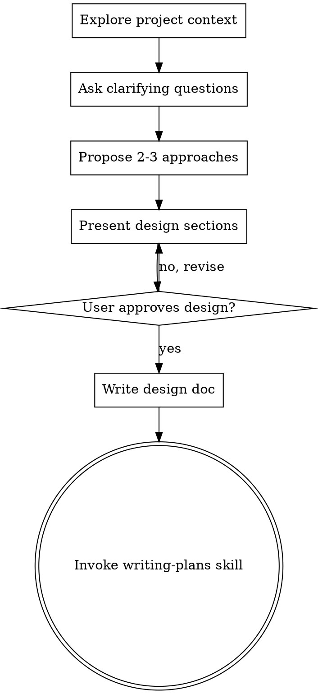
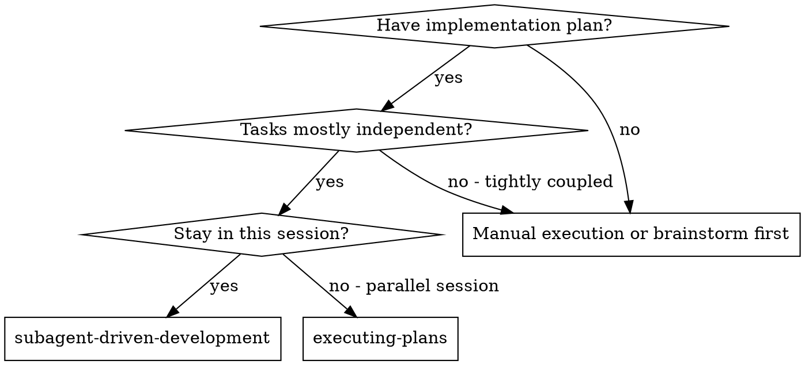
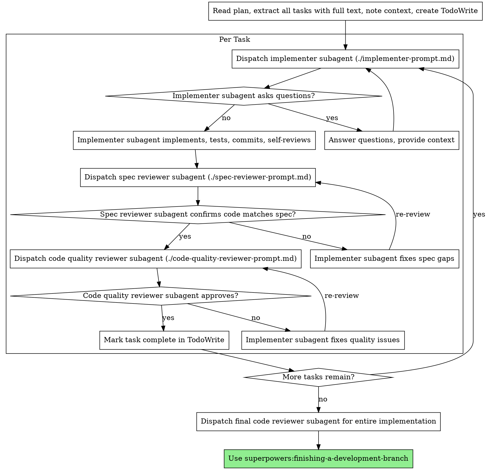

> DEVELOPER

for CONTAINER_MAX_LIFETIME_SECONDS in sidecar container, does it mean it will be deleted even if user is still interacting with the container?

> AGENT

**Yes, `CONTAINER_MAX_LIFETIME_SECONDS` is a hard ceiling — the container will be forcefully removed even if the user is still interacting with it.**

Here's how it works:

1. **Background cleanup loop** (`main.py:22-34`): Runs every **60 seconds** and calls `container_manager.cleanup_expired()`.

2. **`cleanup_expired()`** (`container_manager.py:216-226`): Compares each container's `created_at` timestamp against `now - max_lifetime_seconds`. Any container older than the cutoff is stopped and removed unconditionally — there's no check for active requests or ongoing user interaction.

3. With the current setting of `600` (10 minutes), any sidecar container that has existed for more than 10 minutes will be killed on the next cleanup cycle, regardless of whether a query is in-flight.

There is no activity-based TTL or "last used" tracking — it's purely wall-clock time since container creation. If you want containers to stay alive while users are active, you'd need to either:

- **Increase the value** to something generous enough for typical sessions.
- **Add idle-based tracking** — update a `last_activity` timestamp on each request and check that instead of (or in addition to) `created_at`.

> DEVELOPER

add idle-based tracking so active sessions don't get killed

> SYSTEM

Base directory for this skill: /Users/cyyeh/.claude/plugins/cache/superpowers-marketplace/superpowers/4.3.1/skills/brainstorming

# Brainstorming Ideas Into Designs

## Overview

Help turn ideas into fully formed designs and specs through natural collaborative dialogue.

Start by understanding the current project context, then ask questions one at a time to refine the idea. Once you understand what you're building, present the design and get user approval.

<HARD-GATE>
Do NOT invoke any implementation skill, write any code, scaffold any project, or take any implementation action until you have presented a design and the user has approved it. This applies to EVERY project regardless of perceived simplicity.
</HARD-GATE>

## Anti-Pattern: "This Is Too Simple To Need A Design"

Every project goes through this process. A todo list, a single-function utility, a config change — all of them. "Simple" projects are where unexamined assumptions cause the most wasted work. The design can be short (a few sentences for truly simple projects), but you MUST present it and get approval.

## Checklist

You MUST create a task for each of these items and complete them in order:

1. **Explore project context** — check files, docs, recent commits
2. **Ask clarifying questions** — one at a time, understand purpose/constraints/success criteria
3. **Propose 2-3 approaches** — with trade-offs and your recommendation
4. **Present design** — in sections scaled to their complexity, get user approval after each section
5. **Write design doc** — save to `docs/plans/YYYY-MM-DD-<topic>-design.md` and commit
6. **Transition to implementation** — invoke writing-plans skill to create implementation plan

## Process Flow



**The terminal state is invoking writing-plans.** Do NOT invoke frontend-design, mcp-builder, or any other implementation skill. The ONLY skill you invoke after brainstorming is writing-plans.

## The Process

**Understanding the idea:**
- Check out the current project state first (files, docs, recent commits)
- Ask questions one at a time to refine the idea
- Prefer multiple choice questions when possible, but open-ended is fine too
- Only one question per message - if a topic needs more exploration, break it into multiple questions
- Focus on understanding: purpose, constraints, success criteria

**Exploring approaches:**
- Propose 2-3 different approaches with trade-offs
- Present options conversationally with your recommendation and reasoning
- Lead with your recommended option and explain why

**Presenting the design:**
- Once you believe you understand what you're building, present the design
- Scale each section to its complexity: a few sentences if straightforward, up to 200-300 words if nuanced
- Ask after each section whether it looks right so far
- Cover: architecture, components, data flow, error handling, testing
- Be ready to go back and clarify if something doesn't make sense

## After the Design

**Documentation:**
- Write the validated design to `docs/plans/YYYY-MM-DD-<topic>-design.md`
- Use elements-of-style:writing-clearly-and-concisely skill if available
- Commit the design document to git

**Implementation:**
- Invoke the writing-plans skill to create a detailed implementation plan
- Do NOT invoke any other skill. writing-plans is the next step.

## Key Principles

- **One question at a time** - Don't overwhelm with multiple questions
- **Multiple choice preferred** - Easier to answer than open-ended when possible
- **YAGNI ruthlessly** - Remove unnecessary features from all designs
- **Explore alternatives** - Always propose 2-3 approaches before settling
- **Incremental validation** - Present design, get approval before moving on
- **Be flexible** - Go back and clarify when something doesn't make sense

> AGENT

Here's the design:

## Design: Idle-Based Container Lifecycle

**Overview**: Add a `last_activity` timestamp to containers. The cleanup loop checks both idle time and absolute age. Active containers survive; idle ones get reaped early.

### Changes

**`ContainerInfo`** — add `last_activity: datetime` field, initialized to `created_at`.

**`ContainerManager`** — add a `touch(session_id)` method that updates `last_activity` to now. Update `cleanup_expired()` to kill a container if **either** condition is true:
- `now - last_activity > idle_timeout` (idle too long)
- `now - created_at > max_lifetime` (absolute cap, safety net)

**`ContainerConfig`** — add `idle_timeout_seconds: int` (default 300 = 5 min).

**`agent.py`** — call `container_manager.touch(stable_session)` when `create()` returns an existing container (i.e., the session already had one). This resets idle on each new query.

**`config.py`** — add `CONTAINER_IDLE_TIMEOUT_SECONDS` env var.

**`.env.example`** — add `CONTAINER_IDLE_TIMEOUT_SECONDS=300`, bump `CONTAINER_MAX_LIFETIME_SECONDS` to `3600` (1 hour).

**Tests** — add tests for idle-based expiry vs max-lifetime expiry.

### Defaults
- `CONTAINER_IDLE_TIMEOUT_SECONDS=300` (5 min idle → kill)
- `CONTAINER_MAX_LIFETIME_SECONDS=3600` (1 hour absolute cap)

Does this design look right?

> DEVELOPER

yes

> SYSTEM

Base directory for this skill: /Users/cyyeh/.claude/plugins/cache/superpowers-marketplace/superpowers/4.3.1/skills/writing-plans

# Writing Plans

## Overview

Write comprehensive implementation plans assuming the engineer has zero context for our codebase and questionable taste. Document everything they need to know: which files to touch for each task, code, testing, docs they might need to check, how to test it. Give them the whole plan as bite-sized tasks. DRY. YAGNI. TDD. Frequent commits.

Assume they are a skilled developer, but know almost nothing about our toolset or problem domain. Assume they don't know good test design very well.

**Announce at start:** "I'm using the writing-plans skill to create the implementation plan."

**Context:** This should be run in a dedicated worktree (created by brainstorming skill).

**Save plans to:** `docs/plans/YYYY-MM-DD-<feature-name>.md`

## Bite-Sized Task Granularity

**Each step is one action (2-5 minutes):**
- "Write the failing test" - step
- "Run it to make sure it fails" - step
- "Implement the minimal code to make the test pass" - step
- "Run the tests and make sure they pass" - step
- "Commit" - step

## Plan Document Header

**Every plan MUST start with this header:**

```markdown
# [Feature Name] Implementation Plan

> **For Claude:** REQUIRED SUB-SKILL: Use superpowers:executing-plans to implement this plan task-by-task.

**Goal:** [One sentence describing what this builds]

**Architecture:** [2-3 sentences about approach]

**Tech Stack:** [Key technologies/libraries]

---
```

## Task Structure

````markdown
### Task N: [Component Name]

**Files:**
- Create: `exact/path/to/file.py`
- Modify: `exact/path/to/existing.py:123-145`
- Test: `tests/exact/path/to/test.py`

**Step 1: Write the failing test**

```python
def test_specific_behavior():
    result = function(input)
    assert result == expected
```

**Step 2: Run test to verify it fails**

Run: `pytest tests/path/test.py::test_name -v`
Expected: FAIL with "function not defined"

**Step 3: Write minimal implementation**

```python
def function(input):
    return expected
```

**Step 4: Run test to verify it passes**

Run: `pytest tests/path/test.py::test_name -v`
Expected: PASS

**Step 5: Commit**

```bash
git add tests/path/test.py src/path/file.py
git commit -m "feat: add specific feature"
```
````

## Remember
- Exact file paths always
- Complete code in plan (not "add validation")
- Exact commands with expected output
- Reference relevant skills with @ syntax
- DRY, YAGNI, TDD, frequent commits

## Execution Handoff

After saving the plan, offer execution choice:

**"Plan complete and saved to `docs/plans/<filename>.md`. Two execution options:**

**1. Subagent-Driven (this session)** - I dispatch fresh subagent per task, review between tasks, fast iteration

**2. Parallel Session (separate)** - Open new session with executing-plans, batch execution with checkpoints

**Which approach?"**

**If Subagent-Driven chosen:**
- **REQUIRED SUB-SKILL:** Use superpowers:subagent-driven-development
- Stay in this session
- Fresh subagent per task + code review

**If Parallel Session chosen:**
- Guide them to open new session in worktree
- **REQUIRED SUB-SKILL:** New session uses superpowers:executing-plans

> AGENT

Plan complete and saved to `docs/plans/2026-02-27-idle-based-container-lifecycle.md`. Two execution options:

**1. Subagent-Driven (this session)** — I dispatch a fresh subagent per task, review between tasks, fast iteration.

**2. Parallel Session (separate)** — Open a new session with executing-plans, batch execution with checkpoints.

Which approach?

> DEVELOPER

what if after user comes back and asks a new question after container is killed? could he still asks a new question and pass past conversation history to newly created container?

> AGENT

**Yes, it works fine.** Here's why:

1. **Conversation history lives in the frontend**, not in the container. The frontend (`AgentContext.tsx`) accumulates messages in React state and sends the full `conversation_history` array with every request.

2. **Each request is stateless from the container's perspective.** When `stream_chat()` is called, it:
   - Calls `container_manager.create()` which spins up a **new** container if the old one was killed (or returns the existing one if still alive)
   - Sends the full `conversation_history` + new message in the POST payload to the sidecar
   - The sidecar processes it as a fresh request with full context

3. **The DuckDB database session also survives** — it's managed by the backend's `session_manager`, not the container. The container just connects to it via MCP.

So when a user comes back after the container was killed: the frontend sends the request with full history, a new container is created, and it gets the entire conversation context. The only cost is the container startup latency (10-30s for gVisor).

No changes needed for the idle-tracking feature. Ready to implement — subagent-driven or parallel session?

> DEVELOPER

ok, subagent

> SYSTEM

Base directory for this skill: /Users/cyyeh/.claude/plugins/cache/superpowers-marketplace/superpowers/4.3.1/skills/subagent-driven-development

# Subagent-Driven Development

Execute plan by dispatching fresh subagent per task, with two-stage review after each: spec compliance review first, then code quality review.

**Core principle:** Fresh subagent per task + two-stage review (spec then quality) = high quality, fast iteration

## When to Use



**vs. Executing Plans (parallel session):**
- Same session (no context switch)
- Fresh subagent per task (no context pollution)
- Two-stage review after each task: spec compliance first, then code quality
- Faster iteration (no human-in-loop between tasks)

## The Process



## Prompt Templates

- `./implementer-prompt.md` - Dispatch implementer subagent
- `./spec-reviewer-prompt.md` - Dispatch spec compliance reviewer subagent
- `./code-quality-reviewer-prompt.md` - Dispatch code quality reviewer subagent

## Example Workflow

```
You: I'm using Subagent-Driven Development to execute this plan.

[Read plan file once: docs/plans/feature-plan.md]
[Extract all 5 tasks with full text and context]
[Create TodoWrite with all tasks]

Task 1: Hook installation script

[Get Task 1 text and context (already extracted)]
[Dispatch implementation subagent with full task text + context]

Implementer: "Before I begin - should the hook be installed at user or system level?"

You: "User level (~/.config/superpowers/hooks/)"

Implementer: "Got it. Implementing now..."
[Later] Implementer:
  - Implemented install-hook command
  - Added tests, 5/5 passing
  - Self-review: Found I missed --force flag, added it
  - Committed

[Dispatch spec compliance reviewer]
Spec reviewer: ✅ Spec compliant - all requirements met, nothing extra

[Get git SHAs, dispatch code quality reviewer]
Code reviewer: Strengths: Good test coverage, clean. Issues: None. Approved.

[Mark Task 1 complete]

Task 2: Recovery modes

[Get Task 2 text and context (already extracted)]
[Dispatch implementation subagent with full task text + context]

Implementer: [No questions, proceeds]
Implementer:
  - Added verify/repair modes
  - 8/8 tests passing
  - Self-review: All good
  - Committed

[Dispatch spec compliance reviewer]
Spec reviewer: ❌ Issues:
  - Missing: Progress reporting (spec says "report every 100 items")
  - Extra: Added --json flag (not requested)

[Implementer fixes issues]
Implementer: Removed --json flag, added progress reporting

[Spec reviewer reviews again]
Spec reviewer: ✅ Spec compliant now

[Dispatch code quality reviewer]
Code reviewer: Strengths: Solid. Issues (Important): Magic number (100)

[Implementer fixes]
Implementer: Extracted PROGRESS_INTERVAL constant

[Code reviewer reviews again]
Code reviewer: ✅ Approved

[Mark Task 2 complete]

...

[After all tasks]
[Dispatch final code-reviewer]
Final reviewer: All requirements met, ready to merge

Done!
```

## Advantages

**vs. Manual execution:**
- Subagents follow TDD naturally
- Fresh context per task (no confusion)
- Parallel-safe (subagents don't interfere)
- Subagent can ask questions (before AND during work)

**vs. Executing Plans:**
- Same session (no handoff)
- Continuous progress (no waiting)
- Review checkpoints automatic

**Efficiency gains:**
- No file reading overhead (controller provides full text)
- Controller curates exactly what context is needed
- Subagent gets complete information upfront
- Questions surfaced before work begins (not after)

**Quality gates:**
- Self-review catches issues before handoff
- Two-stage review: spec compliance, then code quality
- Review loops ensure fixes actually work
- Spec compliance prevents over/under-building
- Code quality ensures implementation is well-built

**Cost:**
- More subagent invocations (implementer + 2 reviewers per task)
- Controller does more prep work (extracting all tasks upfront)
- Review loops add iterations
- But catches issues early (cheaper than debugging later)

## Red Flags

**Never:**
- Start implementation on main/master branch without explicit user consent
- Skip reviews (spec compliance OR code quality)
- Proceed with unfixed issues
- Dispatch multiple implementation subagents in parallel (conflicts)
- Make subagent read plan file (provide full text instead)
- Skip scene-setting context (subagent needs to understand where task fits)
- Ignore subagent questions (answer before letting them proceed)
- Accept "close enough" on spec compliance (spec reviewer found issues = not done)
- Skip review loops (reviewer found issues = implementer fixes = review again)
- Let implementer self-review replace actual review (both are needed)
- **Start code quality review before spec compliance is ✅** (wrong order)
- Move to next task while either review has open issues

**If subagent asks questions:**
- Answer clearly and completely
- Provide additional context if needed
- Don't rush them into implementation

**If reviewer finds issues:**
- Implementer (same subagent) fixes them
- Reviewer reviews again
- Repeat until approved
- Don't skip the re-review

**If subagent fails task:**
- Dispatch fix subagent with specific instructions
- Don't try to fix manually (context pollution)

## Integration

**Required workflow skills:**
- **superpowers:using-git-worktrees** - REQUIRED: Set up isolated workspace before starting
- **superpowers:writing-plans** - Creates the plan this skill executes
- **superpowers:requesting-code-review** - Code review template for reviewer subagents
- **superpowers:finishing-a-development-branch** - Complete development after all tasks

**Subagents should use:**
- **superpowers:test-driven-development** - Subagents follow TDD for each task

**Alternative workflow:**
- **superpowers:executing-plans** - Use for parallel session instead of same-session execution

> AGENT

Everything looks clean. All implementation is done:

**Summary of changes:**

1. **`container_manager.py`** — Added `idle_timeout_seconds` to `ContainerConfig`, `last_activity` field + `__post_init__` to `ContainerInfo`, `touch()` method on `ContainerManager`, updated `cleanup_expired()` to check both idle timeout and max lifetime
2. **`config.py`** — Added `CONTAINER_IDLE_TIMEOUT_SECONDS` env var
3. **`agent.py`** — Added `container_manager.touch(stable_session)` after container creation
4. **`.env.example`** — Updated `CONTAINER_MAX_LIFETIME_SECONDS=3600`, added `CONTAINER_IDLE_TIMEOUT_SECONDS=300`
5. **`.env`** — Same updates
6. **`test_container_manager.py`** — 6 new tests (18 total, all passing), updated fixture/defaults

Shall I commit?

> DEVELOPER

create new branch and commit and push

> AGENT

Done. Branch `feature/idle-based-container-lifecycle` pushed. You can create a PR at:
https://github.com/cyyeh/duckdb-data-agent/pull/new/feature/idle-based-container-lifecycle

> DEVELOPER

what's relationship between session timeout and container timeout

> AGENT

Here's how they relate:

**Two independent things, same session ID:**

| | **Session** (SessionManager) | **Container** (ContainerManager) |
|---|---|---|
| **What it is** | DuckDB database instance | Docker sidecar running the Claude Agent SDK |
| **Keyed by** | `X-Session-ID` header | Same `X-Session-ID` header |
| **Idle tracking** | `last_seen_at` (updated on every `get_or_create` / `touch`) | `last_activity` (updated via `touch()` on each query) |
| **Idle TTL** | 300s hardcoded in `cleanup_stale(ttl_seconds=300)` | `CONTAINER_IDLE_TIMEOUT_SECONDS` (your `.env`: 70s) |
| **Hard cap** | None | `CONTAINER_MAX_LIFETIME_SECONDS` (your `.env`: 100s) |
| **On cleanup** | Closes DuckDB connection, keeps `.duckdb` file on disk | Stops and removes the Docker container |

**Key relationship:** They share the same session ID (`stable_session`), but have **independent lifetimes**. The session (DuckDB) can outlive the container, and vice versa.

**What this means in practice:**
- Container dies (idle/max lifetime) → next request spins up a **new** container, which reconnects to the **same** DuckDB session via MCP. No data loss.
- Session dies (300s idle) → DuckDB connection closed, but the `.duckdb` file stays on disk. Next request creates a new session + new DuckDB connection. Uploaded data is preserved.

**Potential mismatch with your current values:** Your `CONTAINER_IDLE_TIMEOUT_SECONDS=70` is shorter than the session TTL of 300s. So the container will get killed more aggressively than the session — the user will see container spin-up latency on the next query, but their data is safe.

> DEVELOPER

but sometimes when I ask a new question I got session id xxx not found, what does that mean

> AGENT

The error isn't coming from the backend code. It's most likely coming from the **sidecar's MCP client** when it tries to connect to the MCP SSE endpoint. Here's what happens:

**The race condition:**

1. User is idle for a while
2. Background cleanup runs every 60s (`main.py:24`) — it kills:
   - **Session** if `last_seen_at > 300s` ago (closes DuckDB connection)
   - **Container** if idle > `CONTAINER_IDLE_TIMEOUT_SECONDS`
3. User sends a new question
4. `stream_chat()` creates a **new container** → container connects to MCP at `{BACKEND_BASE_URL}/mcp/sse?session_id={stable_session}`
5. `mcp_sse.py:176` calls `session_manager.get_or_create(session_id)` → this **recreates** the session with a fresh DuckDB connection

So the backend side should auto-recreate (`get_or_create`). The "session not found" error is likely coming from the **sidecar container** when it tries to use its MCP connection during the brief window where the old container was killed but the new one hasn't fully established its MCP session yet.

Can you reproduce the exact error message? It would help narrow down whether it's:
- The sidecar's MCP client getting disconnected mid-stream
- The heartbeat returning 404 (which the frontend silently ignores)
- Something from the Claude Agent SDK itself

> DEVELOPER

[Image: image/png]

> AGENT

**That's the problem.** Line 224: `resume: body.session_id`.

Here's what's happening:

1. **First request** — No `session_id` yet, SDK creates a new conversation, returns a `session_id` (e.g. `def5b9af-...`)
2. **Second request** — Frontend sends back that `session_id`. The sidecar passes it as `resume: body.session_id` to the Claude Agent SDK
3. **But the container was killed and recreated** between requests — the new container has no memory of the old SDK conversation
4. The SDK tries to resume session `def5b9af-...`, can't find it → **"No conversation found with session ID"**

This is the **SDK's `resume` feature** — it tries to continue an existing agent conversation. But when the container is destroyed, that conversation state is gone.

This is **not related to idle-based tracking** — it would happen any time a container is recycled (whether by max lifetime, idle timeout, or manual restart). The fix would be to either:

1. **Don't use `resume` after container recreation** — detect that the container is new and skip the `resume` flag
2. **Catch the error and retry without `resume`** — fallback to a fresh conversation if resume fails

Want me to fix this?

> DEVELOPER

how do you detect if the container is new?

> AGENT

So you could check `container_manager.get(stable_session)` before calling `create()` — if it's `None`, the container is new, so don't pass `session_id` to the sidecar (which means `resume` won't be set).

**But that's fragile.** There's a race: the container could exist but the SDK process inside it might have crashed/restarted, losing its conversation state. The `resume` would still fail even though the container is "old."

**The more robust approach is option 2: catch it in the sidecar.** Have the sidecar try with `resume`, and if the SDK throws "No conversation found", retry without it. This handles all failure cases — new container, restarted process, corrupted state — without needing coordination from the backend.

Want me to implement the sidecar retry approach?

> DEVELOPER

with option2, if we start new container, is previous conversation history sent to new container?

> AGENT

Here's the full picture:

**With `resume` (current behavior):**
- The SDK's `resume` flag tells it to **continue an existing internal conversation** — the SDK keeps its own message history in memory
- So `body.message` (line 198) is treated as the next turn, and the SDK already has all prior turns
- This is why it works seamlessly on the 2nd, 3rd, etc. messages within the same container

**Without `resume` (after retry on "No conversation found"):**
- The SDK starts a **fresh conversation** with no prior context
- `body.message` is just the new user message (e.g. "hi")
- The conversation history is **lost** from the SDK's perspective

So the answer is: **no, with option 2 the conversation history is NOT properly passed to the new container.** The `_build_message_with_history` function only prepends history when editing a message, not on normal follow-up questions. And the `conversation_history` field in the payload is only used for Langfuse metadata.

This means for a proper fix, when `resume` fails, you'd also need to reconstruct the conversation context — either by:

1. **Prepending history into the message** (like `_build_message_with_history` does for edits) on retry
2. **Always sending full history in the payload** and having the sidecar pass it to the SDK as initial messages when `resume` isn't available

Which direction interests you?

> DEVELOPER

what's the differences between the 2 options

> AGENT

**Option 1: Prepend history as text in the message**

- Reuses the existing `_build_message_with_history` pattern
- The SDK sees one big user message: "Previous conversation:\n User: ...\n Assistant: ...\n---\nMy new message: hi"
- Simple to implement — a few lines in `agent.py`
- Downside: The model sees flat text, not structured turns. It works but is less precise — the model is "told about" the history rather than "experiencing" it

**Option 2: Send structured history, sidecar passes to SDK as messages**

- The backend sends the `conversation_history` array to the sidecar
- The sidecar, when `resume` fails, reconstructs the conversation as proper SDK messages (user/assistant turns)
- The model sees real structured conversation turns — better quality reasoning
- Downside: The Claude Agent SDK `query()` takes a single `prompt` string — it may not support seeding with prior messages. Would need to check the SDK API

The practical question is whether option 2 is even possible with the SDK. If `query()` doesn't accept an initial message history (only `prompt` + `resume`), then option 1 is the only viable path.

Want me to check the Claude Agent SDK API to see if it supports passing initial conversation messages?

> DEVELOPER

let's go with both options 2

> TOOL

[Request interrupted by user]

> DEVELOPER

let's go with option2 with Prepend history as text in the message

> TOOL

[Request interrupted by user for tool use]
