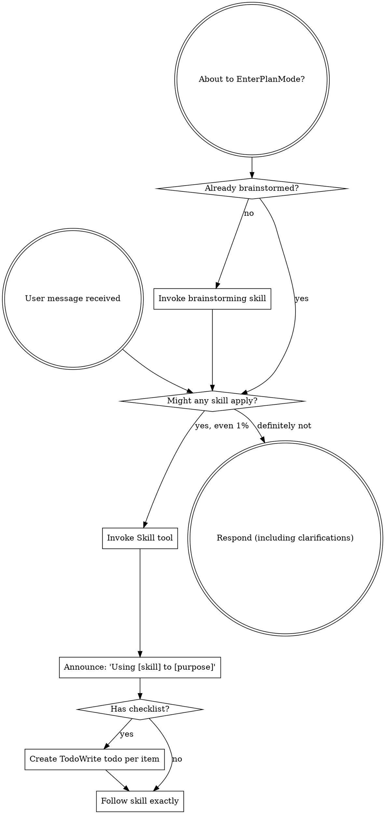
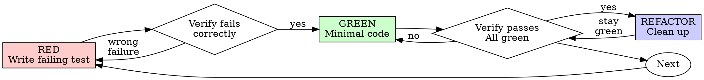
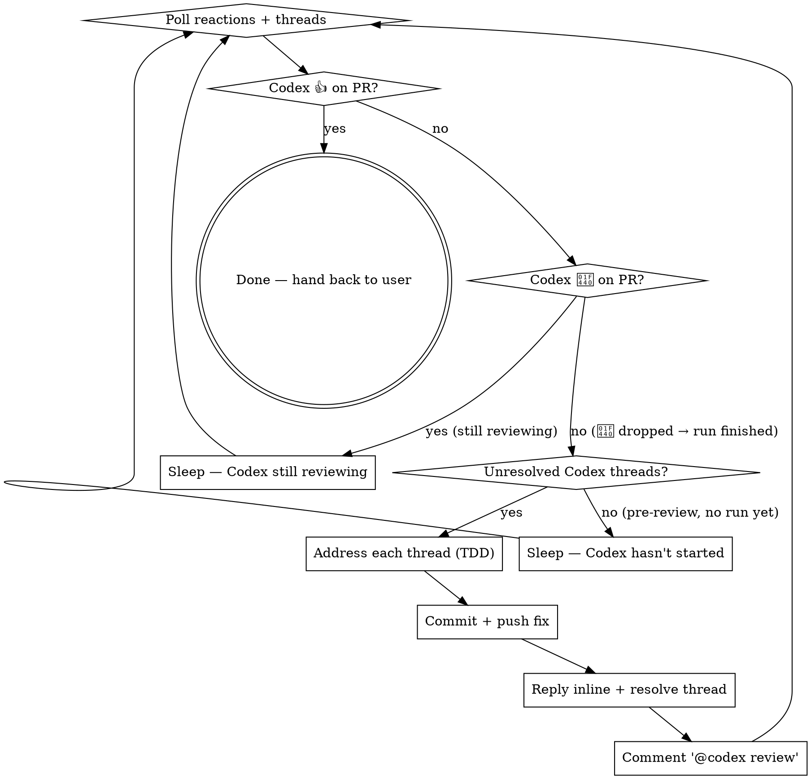

> SYSTEM

# AGENTS.md instructions for /Users/ericson/.t3/worktrees/ars-ui/t3code-457f9bf1

<INSTRUCTIONS>
# ars-ui

## Project Overview

Rust frontend component library using state machines, framework-agnostic core with Leptos/Dioxus adapters.

## Current Phase

The repo is now in active implementation, not spec drafting only.

Agents working on implementation should use the GitHub Project roadmap and issue backlog as the execution source of truth:

- Use the GitHub Project `ars-ui implementation roadmap` to understand active epics, task breakdown, dependencies, status, and iteration planning.
- Prefer picking a single issue-backed task that is unblocked, sized, and scoped for independent delivery.
- Do not start work from an epic issue unless the user explicitly asks for planning or further decomposition.
- Do not start a task that is blocked by unresolved GitHub issue dependencies.
- Treat native GitHub issue dependencies as the blocker graph and the issue body acceptance criteria as the delivery contract.

## Development Workflow

For implementation tasks:

1. Read the assigned or selected GitHub issue first.
2. Move the issue to **In Progress** on the GitHub Project board.
3. Review the cited spec sections and any dependency issues.
4. Add or update the named tests first.
5. Implement only the scope required to make those tests pass.
6. If implementation changes the intended contract, update the relevant spec in the same task.
7. **MANDATORY:** Invoke the `post-implementation-audit` skill (`.agents/skills/post-implementation-audit/SKILL.md`). It runs three sequential audits on the new code — (a) spec/implementation drift with "best outcome" recommendations, (b) iterative "anything else missing?" passes (minimum two rounds), (c) test-coverage audit across every test type the workspace uses (unit, snapshot, proptest, mutation, doc, spec-conformance, llvm-cov). **Every finding lands in _this_ PR — no deferral, no follow-up issues.** This step exists because initial implementations consistently ship spec drift and silent contract violations that take 3+ review round-trips to surface; the audit collapses them into one. Skipping this step is a contract violation.
8. Present the final result for user review before any commit.
9. After user approval, run `cargo xci --profile fast` (alias: `cargo xci-fast`) locally and fix any failures before pushing anything to GitHub. The fast profile takes ~5 minutes and covers the workspace-level regressions a pre-push gate should catch: fmt, check, clippy, unit, integration, adapter, spec-compile-snippets, error-variant-coverage, mutual-exclusion, snapshot-count. Reserve full `cargo xci` (~25 minutes, all 20 gates including wasm coverage and the feature-matrix groups) for after substantial refactors that may have shifted feature-flag interactions. For small follow-up changes, run the focused tests and checks that cover the edited code instead.
10. After `cargo xci-fast` passes, commit and push a PR targeting `main`. The PR body MUST include an auto-close keyword for the issue being delivered, for example `Closes #20` or `Fixes #20`, so GitHub closes the issue automatically when the PR merges.
11. **If the PR creates or modifies any `.snap` insta fixtures, attach the `snapshot-reviewed` label after opening or updating it** (`gh pr edit <num> --add-label "snapshot-reviewed"`). This signals to reviewers that the snapshot output was inspected and is intentional. Re-apply the label whenever you push a commit that touches `.snap` files; the workflow assumes the label reflects the latest snapshot state.
12. **MANDATORY:** Invoke the `waiting-for-codex-review` skill (`.agents/skills/waiting-for-codex-review/SKILL.md`) immediately after the first push that creates the PR, and re-invoke it after every subsequent push to the PR branch. The skill posts the initial `@codex review` trigger, polls Codex's 👀 → (👍 \| ∅ + threads) reaction lifecycle, addresses any review threads with the same rigor as `post-implementation-audit` (TDD + no coverage regression), replies inline, resolves threads, and re-comments `@codex review` to start the next pass — looping until Codex leaves 👍. Skipping this step leaves Codex findings unaddressed and silently widens the gap between merged code and the spec; the merge gate is 👍 from Codex plus green CI, not green CI alone.
13. Only after CI passes, Codex has left 👍, and the PR is merged, close the issue.

Never close a GitHub issue without a merged PR that passes CI **and a 👍 from Codex**. Never commit or push without explicit user approval. Keep the issue, PR, and Project board status aligned with the actual work state at every step.

Default delivery rules:

- Follow TDD: tests first, implementation second, verification last.
- Keep task scope aligned with the issue. If the issue is too large or ambiguous, stop and split or clarify rather than freelancing a bigger change.
- Prefer tasks sized `1`, `2`, `3`, or `5` points. `8` is exceptional. `13` must be decomposed before implementation.
- Preserve the crate and dependency layering defined by the architecture and implementation plan.
- Do not add a new dependency crate without explicit user approval first. If a task appears to need a new crate, stop, explain why, and get approval before editing any `Cargo.toml`.
- When a task is complete, verify the exact tests and checks named by the issue before considering it done.
- For adapter-level component implementation, follow `docs/implementation/adapter-component-delivery.md`. Adapter component work must cover the adapter crate, adapter tests, E2E fixtures/harnesses when applicable, widgets examples, spec synchronization, and the required validation/audit loop in one PR.

### Code Quality Standards

- **Document all public items.** Every public struct, enum, trait, function, constant, type alias, method, field, and variant must have a `///` doc comment. Every `lib.rs` must have a `//!` crate-level doc comment. The workspace enforces `missing_docs` linting — undocumented public items are build failures.
- **Zero warnings policy.** All code must compile with zero warnings under the workspace's configured clippy and rustc lints. Fix the root cause instead of suppressing. When suppression is genuinely needed, use `#[expect(lint, reason = "...")]` — never `#[allow(...)]`.
- **Derive documentation from the spec.** Doc comments should describe the _purpose and semantics_ of the item as defined in the corresponding `spec/` files, not just restate the type signature.
- **Use `#[inline]` selectively, not mechanically.** Do **not** add Clippy's `missing_inline_in_public_items` lint at the workspace level, and do not treat public visibility alone as a reason to mark an item `#[inline]`. Use `#[inline]` for thin cross-crate wrappers, trivial accessors, and hot-path no-op shims where the call overhead is plausibly meaningful. Avoid blanket `#[inline]` on all public APIs — it increases code size, adds compile-time cost, and turns `#[inline]` into noise instead of a deliberate performance signal.
- **Use directory-backed modules with `mod.rs` when a module owns children.** This repo standardizes on the older filesystem layout for nested modules. If module `foo` has child modules, the parent must live at `foo/mod.rs`, not `foo.rs`. Do not mix `foo.rs` with a sibling `foo/` directory. When a refactor adds child modules under an existing flat file, move the parent into `foo/mod.rs` in the same change. Do not leave empty leftover module directories behind.

### API Design Standards

- **Design for the pit of success.** Public APIs should make the most natural, shortest path also be the path that is correct, accessible, localizable, type-safe, and performant. Prefer ergonomic constructors and defaults that preserve the spec's strongest guarantees instead of making users opt into correctness after choosing a convenient API.
- **Name escape hatches explicitly.** When a component needs a lower-level, static, non-i18n, or otherwise less complete path, keep it available but make the tradeoff visible in the API name or type. The blessed path should remain the simplest call site, while escape hatches should read as deliberate choices.
- **Keep semantic data separate from rendered views.** Rich framework views are useful for customization, but components still need semantic sources for accessible names, localized text, announcements, ids, and state-machine wiring. Do not rely on arbitrary rendered view trees as the only source of user-facing semantics.

### Code Coverage

The workspace uses `cargo-llvm-cov` for code coverage with per-crate threshold enforcement. CI runs coverage on every PR (see `.github/workflows/ci.yml`).

**Local coverage commands:**

```bash
# Per-crate coverage with inline annotated source (most useful during development)
cargo llvm-cov test -p ars-interactions --text -- hover

# Per-crate summary only
cargo llvm-cov test -p ars-interactions -- hover

# Native-only workspace coverage (host target; excludes wasm-only crates)
cargo llvm-cov --workspace \
  --exclude ars-leptos --exclude ars-dioxus \
  --exclude ars-test-harness-leptos --exclude ars-test-harness-dioxus \
  --exclude ars-derive --exclude xtask \
  --lcov --output-path lcov.info

# Check all crates against spec-defined thresholds (run after a *merged* lcov)
cargo xtask coverage check-all --file lcov.info
```

The `--text` flag produces line-by-line annotated source showing hit counts and `^0` markers on uncovered branches — use this to identify gaps after writing tests. Uncovered no-op callback closures in tests (e.g., `|_| {}`) are expected and not a gap.

The local recipe above excludes the adapter and adapter-test-harness crates because their `target_arch = "wasm32"` / `feature = "web"` code paths can't be measured via host-target `cargo llvm-cov`. **CI runs an additional wasm-coverage pipeline on nightly** (`cargo xtask ci coverage`) that uses `wasm-bindgen-test`'s experimental coverage recipe with LLVM 22 / `clang-22` to emit lcov for `ars-leptos` (csr), `ars-dioxus` (web), `ars-dom` (web), `ars-i18n` (web-intl), and the adapter test harnesses, then merges with the native lcov via `cargo xtask coverage merge`. The per-crate thresholds in `xtask::coverage::default_thresholds()` are enforced against the merged file — including adapter targets (`ars-leptos` 74/55, `ars-dioxus` 77/70, `ars-test-harness-leptos` 60/0, `ars-test-harness-dioxus` 60/0). `ars-derive` (proc-macro, runs in compiler) is exercised via `crates/ars-core/tests/derive_contract.rs` and is unmeasured. `xtask` has its own enforced threshold (30/35) and is measured. See `spec/testing/14-ci.md` §2 for the full pipeline.

### Mutation Testing

Coverage tells you which lines run. **Mutation testing tells you whether the tests would notice if those lines silently misbehaved.** The workspace uses [`cargo-mutants`](https://mutants.rs) for this — a `cargo` extension binary, not a workspace dependency.

**Install (once per developer machine):**

```bash
cargo install cargo-mutants --locked --version 27.0.0
```

**Local commands (state-machine modules are the most rewarding targets):**

```bash
# Run on a single component machine (~6 min for popover)
cargo mutants -p ars-components -f crates/ars-components/src/overlay/popover.rs

# Just list what would be mutated, without running tests (fast)
cargo mutants -p ars-components -f crates/ars-components/src/overlay/popover.rs --list

# Whole crate (slow — only if you really mean it)
cargo mutants -p ars-components
```

**Reading the output:** Results land in `mutants.out/mutants.out/` (gitignored). The two files that matter:

- `caught.txt` — mutations that broke at least one test ✅
- `missed.txt` — mutations that survived all tests ❌ — each one is either a real test gap to fill or an "equivalent mutation" that needs a `[[skip]]` entry in `mutants.toml` with a justification

**CI integration:** Nightly only. `.github/workflows/nightly.yml` has a `mutation-testing` job with a 21-entry matrix that runs `cargo mutants -p <package>` on every framework-agnostic crate, using `--shard k/n` to spread larger crates across parallel runners. **Shard indices are 0-based** (`k` runs from `0` to `n-1`); `k == n` is invalid and will fail the job. When adding shards, always start at `0/n` and end at `(n-1)/n`.

- **`ars-components` (≈ 1,630 mutants today, planned to grow as the spec adds the remaining ~97 components):** sharded **12-way** → ≈ 135 mutants per runner today, ≈ 850 per runner at the ~10,000-mutant endpoint. Sized for the full spec catalog up front so we don't re-shard every few months as components land.
- **`ars-collections` (≈ 1,080 mutants):** sharded 4-way → ≈ 270 mutants per runner.
- **`ars-core` (≈ 700 mutants):** sharded 2-way → ≈ 350 mutants per runner.
- **`ars-a11y`, `ars-forms`, `ars-interactions`:** one runner each (under 600 mutants apiece).

**Adding a new state machine inside an existing crate requires no CI changes** — its mutations land in whichever shard the cargo-mutants partitioner places them. The shard counts are sized so the slowest runner stays well under 30 minutes today and under ~50 minutes at the planned endpoint; re-balance only when a crate outgrows that budget (visible on the nightly dashboard as one shard pulling away from the others).

All matrix jobs run with `fail-fast: false` so failures on one module don't mask data on another. Each job uploads its `mutants.out/` as a workflow artifact (always, even on success — surviving "missed" entries on a passing run still reveal test-quality work). The job fails if any mutation survives, so a missed mutation forces a deliberate triage decision (fix the test, or document the equivalence with a `[[skip]]` entry in `mutants.toml`).

**Excluded crates** (mutation testing's signal degrades wherever determinism does): adapter glue (`ars-leptos`, `ars-dioxus`), DOM/FFI (`ars-dom`), ICU/FFI (`ars-i18n`), test infrastructure (`ars-test-harness*`), and the proc-macro crate (`ars-derive`, runs in the compiler). Adding a brand-new crate that is a good mutation target requires one new matrix entry; run a local scout first (`cargo mutants -p <crate> --list` to size, then a real run) so we know the right shard count before the nightly fires.

**Bumping the pinned version.** Both the local install command above and `.github/workflows/nightly.yml` pin cargo-mutants to an exact version (currently `27.0.0`) — same convention as `wasm-pack` in the `a11y-audit` job. Pinning is deliberate: cargo-mutants ships new mutators in releases, and an unpinned install would silently change the mutation set without any code change, surfacing as phantom CI failures on a green-source repo. To bump, open a PR that (1) updates the version string in CLAUDE.md and `nightly.yml`, (2) runs the popover scout locally with the new version (`cargo mutants -p ars-components -f crates/ars-components/src/overlay/popover.rs`) to confirm the mutation count is in the same ballpark, and (3) triages any new "missed" entries the new mutators surface — they are usually genuine test-quality gaps newly visible to the tool.

### Property Testing (proptest)

State-machine invariants are exercised by [`proptest`](https://docs.rs/proptest) under `crates/<crate>/tests/proptest_state_machines/` (see `ars-components`). Default proptest behaviour drops `*.proptest-regressions` seed files alongside test sources — instead, every `proptest!` block in this workspace pulls a shared `Config` from `tests/proptest_state_machines/common.rs` that:

1. Reads `PROPTEST_CASES` from the environment (1,000 default; 10,000 in the nightly `extended-proptest` job).
2. Sets `failure_persistence` to `FileFailurePersistence::Direct("proptest-regressions/state-machines.txt")`, so all persisted seeds for the test binary live in one file at the crate root: `crates/<crate>/proptest-regressions/state-machines.txt`. The directory is committed (per proptest's own recommendation in the file header) so every developer's runs benefit from previously-shrunk failures.

When a new crate adopts proptest for state-machine tests, copy the same `common.rs` helper and reference it via `#![proptest_config(super::common::proptest_config())]` inside every `proptest!` block. Don't let proptest fall back to its `WithSource` default — that scatters seed files across the source tree.

### Adapter Prelude Convention

Both `ars-leptos` and `ars-dioxus` expose a `prelude` module targeting **end users** — application developers who consume the ready-made components. `use ars_leptos::prelude::*` (or `use ars_dioxus::prelude::*`) should give them everything they need.

The prelude contains only user-facing items:

1. **Component modules** — as components land, their public module paths (e.g., `button`, `dialog`) are re-exported so users can write `button::Props`, etc.
2. **User-facing traits** — traits end users call on component outputs (e.g., `Translate` from `ars-i18n`). Re-export the trait so consumers don't need a direct dependency on the subsystem crate.
3. **Configuration types** — types that appear in component props or configure behaviour (e.g., `Locale`, `Direction`, `Orientation`, `Selection`).

The prelude does **not** include implementation details consumed only by component authors inside the adapter crate: core engine types (`Machine`, `Service`, `ConnectApi`, `AttrMap`), accessibility primitives (`AriaRole`, `AriaAttribute`), interaction helpers (`merge_attrs`), or adapter hooks (`use_machine`, `UseMachineReturn`). Those remain accessible via their normal crate paths for advanced users building custom machines.

Both adapter preludes must stay symmetric: same items, same structure. When adding a new re-export to one adapter's prelude, add it to the other as well in the same PR.

### Adapter Testing Convention

Adapter-level component tests should default to the framework-specific test harness crate:

- Leptos adapter tests should prefer `ars-test-harness-leptos`.
- Dioxus adapter tests should prefer `ars-test-harness-dioxus`.
- Shared `ars-test-harness` helpers should be used where relevant for viewport, layout, clipboard, drag/drop, timing, and other DOM test setup instead of bespoke per-test browser scaffolding.

When a component spec requires interaction, focus, overlay positioning, clipboard, file upload, drag/drop, or similar browser behavior, the task's tests should exercise that behavior through the adapter harness entrypoints and shared core harness helpers unless there is a concrete technical reason not to.

## Spec Synchronization During Implementation

The specification is the authoritative contract. It took weeks of deliberate design and MUST be followed.

### Spec-first implementation rule

Before implementing any public type, trait, function, or method:

1. **Read the spec section first.** Find the relevant code example in `spec/`. Use `spec-tool toc <file>` and `grep` to locate it.
2. **Match the spec exactly.** If the spec defines `struct ComponentIds { base: String }` with methods `from_id()`, `id()`, `part()`, `item()`, `item_part()` — implement exactly that. Do not invent alternative field names, method names, or signatures.
3. **Cross-check after implementation.** Before presenting code for review, diff every public item against the spec's code examples. Every struct field, every method name, every parameter must match.
4. **If you must deviate**, there must be a concrete technical reason (e.g., the spec's API cannot compile, or a dependency doesn't expose the needed type). Document the reason in a code comment and flag it to the user explicitly.

Inventing alternative APIs that "seem equivalent" is never acceptable — it silently invalidates the spec's design decisions and all downstream code that depends on those APIs.

### Spec/code mismatch resolution

- If code and spec disagree, resolve the mismatch in the same task or PR.
- Shared conceptual changes belong in shared or foundation spec files, not only in adapter code.
- Adapter-specific findings must be reflected back into `spec/foundation/08-adapter-leptos.md` and/or `spec/foundation/09-adapter-dioxus.md` when relevant.
- Do not leave spec drift behind as follow-up cleanup.

## Spec Structure

The specification lives in `spec/` with this layout:

- `spec/manifest.toml` — **START HERE** — central index of all components and their dependencies
- `spec/foundation/` — architecture, accessibility, i18n, interactions, forms, adapters, spec template (00-10)
- `spec/shared/` — cross-component shared types (date-time, selection, layout, z-index)
- `spec/components/{category}/` — one file per component, organized by category
- `spec/testing/` — test specs split by domain

### Component Categories

- `input/` — checkbox, text-field, slider, number-input, etc.
- `selection/` — select, combobox, listbox, menu, tags-input, etc.
- `overlay/` — dialog, popover, tooltip, toast, presence, etc.
- `navigation/` — accordion, tabs, tree-view, pagination, steps, etc.
- `date-time/` — date-field, time-field, calendar, date-picker, etc.
- `data-display/` — table, avatar, progress, meter, badge, etc.
- `layout/` — splitter, scroll-area, carousel, portal, toolbar, etc.
- `specialized/` — color-picker, file-upload, signature-pad, qr-code, etc.
- `utility/` — button, toggle, focus-scope, visually-hidden, separator, etc.

## Working with the Spec

When reading large files, run `wc -l` first to check the line count. If the file is over 2,000
lines, use the `offset` and `limit` parameters on the Read tool to read in chunks rather than
attempting to read the entire file at once.

### Using xtask spec (preferred)

Use `cargo xtask spec` to resolve file sets instead of manually parsing manifest.toml:

```bash
# Quick metadata lookup:
cargo xtask spec info <component>

# Find all components using a shared type:
cargo xtask spec reverse <shared-type>

# See a file's heading structure (with line numbers):
cargo xtask spec toc <file>

# Validate frontmatter matches manifest.toml:
cargo xtask spec validate

# Search spec content by keyword/regex (with optional filters):
cargo xtask spec search <query> [--category <cat>] [--section <sec>] [--tier <tier>]

# Get a compact component summary (states, events, props, accessibility):
cargo xtask spec digest <component>

# Get full implementation context (component + all deps concatenated):
cargo xtask spec context <component> [--framework <fw>] [--include-testing]
```

The xtask also runs as an MCP server (`cargo xtask mcp`) exposing all spec tools for LLM agents.

### Reading a component (manual fallback)

1. Read `spec/manifest.toml` to find the component's path and dependencies
2. Read the component file (has YAML frontmatter listing its foundation/shared deps)
3. Only load the foundation files listed in `foundation_deps` — not all of them

### Framework and library specs — MANDATORY skill loading

When reading or editing these specification files, you MUST load the corresponding skill BEFORE doing any work. The skills contain verified, version-accurate API documentation that the spec code examples depend on. Claude's training data is wrong for these libraries — do not trust it.

| Spec file                                    | Skill to load | Library version |
| -------------------------------------------- | ------------- | --------------- |
| `spec/foundation/04-internationalization.md` | `icu4x`       | ICU4X 2.1.1     |
| `spec/foundation/08-adapter-leptos.md`       | `leptos`      | Leptos 0.8.17   |
| `spec/foundation/09-adapter-dioxus.md`       | `dioxus`      | Dioxus 0.7.3    |

This applies to any task that touches adapter code: reviewing, writing, modifying, or answering questions about these files. Load the skill first, then proceed.

### Spec Conventions

- **No deprecation:** This is a greenfield spec. If an API is unused or redundant, remove it and fix all references. Never use `#[deprecated]` or deprecation shims.
- **No deferral:** Never mark spec content as "TODO", "FIXME", "future enhancement", "P1/P2 extension", or any similar deferral language. Every feature mentioned must be fully specified. If a design choice is unclear, ask the user rather than deferring.
- **No guessing external APIs:** NEVER guess function names or module paths for external crates. Always verify against `https://docs.rs/<crate_name>` before writing code that calls library APIs. This applies especially to Leptos, Dioxus, ICU4X, and any crate where training data may be stale. If you cannot verify, state that explicitly rather than fabricating a plausible-looking API.

### Component file format

Each component file has YAML frontmatter declaring its metadata:

```markdown
---
component: ComponentName
category: { category }
tier: stateless | stateful | complex
foundation_deps: [architecture, accessibility, ...]
shared_deps: [date-time-types, ...]
related: [sibling-component, ...]
---

# ComponentName
```

The `tier` field determines which sections are required — see `spec/foundation/10-component-spec-template.md` for the canonical section structure, ordering rules, and conformance checklist. Headings are numbered (e.g., `## 1. State Machine`, `### 1.1 States`, `#### 1.1.1 InnerStates`, etc.) for precise section references.

</INSTRUCTIONS>
<environment_context>
  <cwd>/Users/ericson/.t3/worktrees/ars-ui/t3code-457f9bf1</cwd>
  <shell>zsh</shell>
  <current_date>2026-05-20</current_date>
  <timezone>America/Sao_Paulo</timezone>
</environment_context>

> DEVELOPER

Our main branch is failing the code coverage ratchet for ars-components. Let's give it a check and improve the coverage

> AGENT

I’ll ground this in the current repo and prior ars-ui coverage context, then turn that into a concrete implementation plan. Since this is coverage/debugging work, I’m loading the relevant workflow guidance before inspecting files.

> TOOL

tool_use exec_command
id: call_lqcHivCNvDU75YTcuyjtnFvk
```json
{
  "cmd": "sed -n '1,220p' /Users/ericson/.claude/skills/using-superpowers/SKILL.md",
  "workdir": "/Users/ericson/.t3/worktrees/ars-ui/t3code-457f9bf1",
  "yield_time_ms": 1000,
  "max_output_tokens": 12000
}
```

> TOOL

tool_use exec_command
id: call_5ZjUSs3wDeycWQIC7cqGfmB1
```json
{
  "cmd": "sed -n '1,220p' /Users/ericson/.claude/skills/systematic-debugging/SKILL.md",
  "workdir": "/Users/ericson/.t3/worktrees/ars-ui/t3code-457f9bf1",
  "yield_time_ms": 1000,
  "max_output_tokens": 12000
}
```

> TOOL

tool_use exec_command
id: call_U5M2M1OPyW1gQCfMAUlVrFnd
```json
{
  "cmd": "rg -n \"coverage|ars-components|ratchet|cargo llvm-cov|cargo xtask coverage\" /Users/ericson/.codex/memories/MEMORY.md",
  "workdir": "/Users/ericson/.t3/worktrees/ars-ui/t3code-457f9bf1",
  "yield_time_ms": 1000,
  "max_output_tokens": 12000
}
```

> TOOL

tool_result
id: call_lqcHivCNvDU75YTcuyjtnFvk
```
Chunk ID: c293e9
Wall time: 0.2151 seconds
Process exited with code 0
Original token count: 1356
Output:
---
name: using-superpowers
description: Use when starting any conversation - establishes how to find and use skills, requiring Skill tool invocation before ANY response including clarifying questions
---

<SUBAGENT-STOP>
If you were dispatched as a subagent to execute a specific task, skip this skill.
</SUBAGENT-STOP>

<EXTREMELY-IMPORTANT>
If you think there is even a 1% chance a skill might apply to what you are doing, you ABSOLUTELY MUST invoke the skill.

IF A SKILL APPLIES TO YOUR TASK, YOU DO NOT HAVE A CHOICE. YOU MUST USE IT.

This is not negotiable. This is not optional. You cannot rationalize your way out of this.
</EXTREMELY-IMPORTANT>

## Instruction Priority

Superpowers skills override default system prompt behavior, but **user instructions always take precedence**:

1. **User's explicit instructions** (CLAUDE.md, GEMINI.md, AGENTS.md, direct requests) — highest priority
2. **Superpowers skills** — override default system behavior where they conflict
3. **Default system prompt** — lowest priority

If CLAUDE.md, GEMINI.md, or AGENTS.md says "don't use TDD" and a skill says "always use TDD," follow the user's instructions. The user is in control.

## How to Access Skills

**In Claude Code:** Use the `Skill` tool. When you invoke a skill, its content is loaded and presented to you—follow it directly. Never use the Read tool on skill files.

**In Copilot CLI:** Use the `skill` tool. Skills are auto-discovered from installed plugins. The `skill` tool works the same as Claude Code's `Skill` tool.

**In Gemini CLI:** Skills activate via the `activate_skill` tool. Gemini loads skill metadata at session start and activates the full content on demand.

**In other environments:** Check your platform's documentation for how skills are loaded.

## Platform Adaptation

Skills use Claude Code tool names. Non-CC platforms: see `references/copilot-tools.md` (Copilot CLI), `references/codex-tools.md` (Codex) for tool equivalents. Gemini CLI users get the tool mapping loaded automatically via GEMINI.md.

# Using Skills

## The Rule

**Invoke relevant or requested skills BEFORE any response or action.** Even a 1% chance a skill might apply means that you should invoke the skill to check. If an invoked skill turns out to be wrong for the situation, you don't need to use it.



## Red Flags

These thoughts mean STOP—you're rationalizing:

| Thought | Reality |
|---------|---------|
| "This is just a simple question" | Questions are tasks. Check for skills. |
| "I need more context first" | Skill check comes BEFORE clarifying questions. |
| "Let me explore the codebase first" | Skills tell you HOW to explore. Check first. |
| "I can check git/files quickly" | Files lack conversation context. Check for skills. |
| "Let me gather information first" | Skills tell you HOW to gather information. |
| "This doesn't need a formal skill" | If a skill exists, use it. |
| "I remember this skill" | Skills evolve. Read current version. |
| "This doesn't count as a task" | Action = task. Check for skills. |
| "The skill is overkill" | Simple things become complex. Use it. |
| "I'll just do this one thing first" | Check BEFORE doing anything. |
| "This feels productive" | Undisciplined action wastes time. Skills prevent this. |
| "I know what that means" | Knowing the concept ≠ using the skill. Invoke it. |

## Skill Priority

When multiple skills could apply, use this order:

1. **Process skills first** (brainstorming, debugging) - these determine HOW to approach the task
2. **Implementation skills second** (frontend-design, mcp-builder) - these guide execution

"Let's build X" → brainstorming first, then implementation skills.
"Fix this bug" → debugging first, then domain-specific skills.

## Skill Types

**Rigid** (TDD, debugging): Follow exactly. Don't adapt away discipline.

**Flexible** (patterns): Adapt principles to context.

The skill itself tells you which.

## User Instructions

Instructions say WHAT, not HOW. "Add X" or "Fix Y" doesn't mean skip workflows.

```

> TOOL

tool_result
id: call_5ZjUSs3wDeycWQIC7cqGfmB1
```
Chunk ID: 8f1941
Wall time: 0.0019 seconds
Process exited with code 0
Original token count: 1593
Output:
---
name: systematic-debugging
description: Use when encountering any bug, test failure, or unexpected behavior, before proposing fixes
---

# Systematic Debugging

## Overview

Random fixes waste time and create new bugs. Quick patches mask underlying issues.

**Core principle:** ALWAYS find root cause before attempting fixes. Symptom fixes are failure.

**Violating the letter of this process is violating the spirit of debugging.**

## The Iron Law

```
NO FIXES WITHOUT ROOT CAUSE INVESTIGATION FIRST
```

If you haven't completed Phase 1, you cannot propose fixes.

## When to Use

Use for ANY technical issue:
- Test failures
- Bugs in production
- Unexpected behavior
- Performance problems
- Build failures
- Integration issues

**Use this ESPECIALLY when:**
- Under time pressure (emergencies make guessing tempting)
- "Just one quick fix" seems obvious
- You've already tried multiple fixes
- Previous fix didn't work
- You don't fully understand the issue

**Don't skip when:**
- Issue seems simple (simple bugs have root causes too)
- You're in a hurry (rushing guarantees rework)
- Manager wants it fixed NOW (systematic is faster than thrashing)

## The Four Phases

You MUST complete each phase before proceeding to the next.

### Phase 1: Root Cause Investigation

**BEFORE attempting ANY fix:**

1. **Read Error Messages Carefully**
   - Don't skip past errors or warnings
   - They often contain the exact solution
   - Read stack traces completely
   - Note line numbers, file paths, error codes

2. **Reproduce Consistently**
   - Can you trigger it reliably?
   - What are the exact steps?
   - Does it happen every time?
   - If not reproducible → gather more data, don't guess

3. **Check Recent Changes**
   - What changed that could cause this?
   - Git diff, recent commits
   - New dependencies, config changes
   - Environmental differences

4. **Gather Evidence in Multi-Component Systems**

   **WHEN system has multiple components (CI → build → signing, API → service → database):**

   **BEFORE proposing fixes, add diagnostic instrumentation:**
   ```
   For EACH component boundary:
     - Log what data enters component
     - Log what data exits component
     - Verify environment/config propagation
     - Check state at each layer

   Run once to gather evidence showing WHERE it breaks
   THEN analyze evidence to identify failing component
   THEN investigate that specific component
   ```

   **Example (multi-layer system):**
   ```bash
   # Layer 1: Workflow
   echo "=== Secrets available in workflow: ==="
   echo "IDENTITY: ${IDENTITY:+SET}${IDENTITY:-UNSET}"

   # Layer 2: Build script
   echo "=== Env vars in build script: ==="
   env | grep IDENTITY || echo "IDENTITY not in environment"

   # Layer 3: Signing script
   echo "=== Keychain state: ==="
   security list-keychains
   security find-identity -v

   # Layer 4: Actual signing
   codesign --sign "$IDENTITY" --verbose=4 "$APP"
   ```

   **This reveals:** Which layer fails (secrets → workflow ✓, workflow → build ✗)

5. **Trace Data Flow**

   **WHEN error is deep in call stack:**

   See `root-cause-tracing.md` in this directory for the complete backward tracing technique.

   **Quick version:**
   - Where does bad value originate?
   - What called this with bad value?
   - Keep tracing up until you find the source
   - Fix at source, not at symptom

### Phase 2: Pattern Analysis

**Find the pattern before fixing:**

1. **Find Working Examples**
   - Locate similar working code in same codebase
   - What works that's similar to what's broken?

2. **Compare Against References**
   - If implementing pattern, read reference implementation COMPLETELY
   - Don't skim - read every line
   - Understand the pattern fully before applying

3. **Identify Differences**
   - What's different between working and broken?
   - List every difference, however small
   - Don't assume "that can't matter"

4. **Understand Dependencies**
   - What other components does this need?
   - What settings, config, environment?
   - What assumptions does it make?

### Phase 3: Hypothesis and Testing

**Scientific method:**

1. **Form Single Hypothesis**
   - State clearly: "I think X is the root cause because Y"
   - Write it down
   - Be specific, not vague

2. **Test Minimally**
   - Make the SMALLEST possible change to test hypothesis
   - One variable at a time
   - Don't fix multiple things at once

3. **Verify Before Continuing**
   - Did it work? Yes → Phase 4
   - Didn't work? Form NEW hypothesis
   - DON'T add more fixes on top

4. **When You Don't Know**
   - Say "I don't understand X"
   - Don't pretend to know
   - Ask for help
   - Research more

### Phase 4: Implementation

**Fix the root cause, not the symptom:**

1. **Create Failing Test Case**
   - Simplest possible reproduction
   - Automated test if possible
   - One-off test script if no framework
   - MUST have before fixing
   - Use the `superpowers:test-driven-development` skill for writing proper failing tests

2. **Implement Single Fix**
   - Address the root cause identified
   - ONE change at a time
   - No "while I'm here" improvements
   - No bundled refactoring

3. **Verify Fix**
   - Test passes now?
   - No other tests broken?
   - Issue actually resolved?

4. **If Fix Doesn't Work**
   - STOP
   - Count: How many fixes have you tried?
   - If < 3: Return to Phase 1, re-analyze with new information
   - **If ≥ 3: STOP and question the architecture (step 5 below)**
   - DON'T attempt Fix #4 without architectural discussion

5. **If 3+ Fixes Failed: Question Architecture**

   **Pattern indicating architectural problem:**
   - Each fix reveals new shared state/coupling/problem in different place
   - Fixes require "massive refactoring" to implement
   - Each fix creates new symptoms elsewhere

   **STOP and question fundamentals:**
   - Is this pattern fundamentally sound?
   - Are we "sticking with it through sheer inertia"?
   - Should we refactor architecture vs. continue fixing symptoms?

   **Discuss with your human partner before attempting more fixes**

   This is NOT a failed hypothesis - this is a wrong architecture.

## Red Flags - STOP and Follow Process

If you catch yourself thinking:
- "Quick fix for now, investigate later"
- "Just try changing X and see if it works"
- "Add multiple changes, run tests"

```

> TOOL

tool_result
id: call_U5M2M1OPyW1gQCfMAUlVrFnd
```
Chunk ID: a30ee0
Wall time: 0.2380 seconds
Process exited with code 0
Original token count: 21607
Output:
Total output lines: 333

1:# Task Group: ars-ui / ars-components utility and navigation core implementation
3:scope: Fresh framework-agnostic `crates/ars-components` work for utility and navigation components, covering spec-driven issue execution, mutation/coverage-backed validation, and review-driven contract tightening for component semantics.
4:applies_to: cwd=/Users/ericson/.t3/worktrees/ars-ui/*; reuse_rule=reuse for ars-ui checkouts touching `crates/ars-components/src/utility/` or `crates/ars-components/src/navigation/`; verify the live issue/spec contract and whether commit/push is in or out of scope for the current run.
14:- Toggle, Swap, issue #209, issue #210, Bindable<bool>, Messages::label, on_keydown, aria-label, type="button", focus-visible, snapshot-reviewed, cargo llvm-cov, PR #654
16:## Task 2: Implement Breadcrumbs, Link, Pagination, and Steps agnostic core with mutation-backed navigation coverage
24:- Breadcrumbs, Link, Pagination, Steps, issue #247, issue #257, issue #259, sanitize_url, SafeUrl, cargo mutants, cargo xtask spec info, cargo llvm-cov, navigation::
29:- when the issue acceptance criteria call for tests, public docs, snapshots, or anatomy/spec-conformance coverage, assume those are part of the deliverable before code is considered done [Task 1]
34:- `spec/components/utility/toggle.md` and `spec/components/utility/swap.md` are the source-of-truth contracts for Toggle and Swap; utility component implementation belongs under `crates/ars-components/src/utility/`, and anatomy checks belong in `crates/ars-components/tests/spec_conformance/utility.rs` [Task 1]
36:- treat `Props::label = Some("")` as equivalent to no label unless the spec explicitly says otherwise; the correct fallback is the stable message label, and this needs a direct regression test to keep coverage on the label callback path [Task 1]
39:- for Pagination and Steps, focused `cargo mutants -p ars-components -f crates/ars-components/src/navigation/<file>.rs` was the decisive way to find missing boundary/prop-sync guards after baseline tests passed [Task 2]
40:- reliable validation for this family was focused `cargo test -p ars-components utility::toggle|utility::swap|navigation::`, `cargo xtask spec validate`, focused `cargo llvm-cov`, targeted mutation runs for navigation state machines, then crate-level `cargo test -p ars-components --all-targets` or the broader repo gate as needed [Task 1][Task 2]
46:- symptom: `cargo insta test -p ars-components --unreferenced=reject` fails during navigation work even though the new snapshots are correct -> cause: unrelated pre-existing unreferenced snapshots elsewhere in the crate -> fix: confirm whether the failure points outside the touched surface before treating it as a regression in the new component family [Task 2]
48:# Task Group: ars-ui / ars-components DownloadTrigger review remediation and no_std dependency wiring
50:scope: `crates/ars-components` review-fix work around `download_trigger`, especially coverage-preserving PR remediation, spec drift cleanup, and keeping new dependencies compatible with `no_std`.
51:applies_to: cwd=/Users/ericson/.t3/worktrees/ars-ui/*; reuse_rule=reuse for ars-ui checkouts touching `crates/ars-components/src/utility/download_trigger.rs`, `crates/ars-components/Cargo.toml`, or the related utility spec; always re-check live review-thread state before replying or resolving.
53:## Task 1: Address PR #650 review feedback, raise regression coverage, and keep `idna` no_std-compatible
57:- rollout_summaries/REDACTED.md (cwd=/Users/ericson/.t3/worktrees/ars-ui/t3code-e135578b, rollout_path=/Users/ericson/.codex/sessions/2026/05/19/rollout-2026-05-19T17-42-27-019e41f9-c22a-7260-85e4-cdc196756c91.jsonl, updated_at=2026-05-19T21:49:53+00:00, thread_id=019e41f9-c22a-7260-85e4-cdc196756c91, PR #650 review closure with regression tests, spec sync, and `idna` feature repair)
61:- PR #650, download_trigger, idna, no_std, alloc, compiled_data, cargo tree -e features, cargo check --no-default-features, cargo llvm-cov, coverage, regression tests
65:- when the user says `Make sure to properly test any new code that you might add for addressing the reviews ... make sure to properly put regression tests and new unit tests to make sure that the coverage goes up again`, default to regression-first review fixes with explicit coverage preservation, not code-only patches [Task 1]
70:- `ars-components` is `no_std`-compatible, but `idna` must be wired with `default-features = false` plus explicit `alloc` and `compiled_data`; only `idna/std` should hang off `ars-components/std`, or `cargo check -p ars-components --no-default-features` will fail [Task 1]
71:- `cargo tree -p ars-components --no-default-features -e features` is the quickest way to confirm whether `idna/std` leaked into the no-default feature graph after dependency edits [Task 1]
72:- the `DownloadTrigger` review loop worked best as narrow regression tests first, then implementation/spec updates, then `cargo check -p ars-components --no-default-features`, focused `cargo test -p ars-components download_trigger::tests::`, `cargo llvm-cov test -p ars-components --summary-only`, and `cargo xci-fast` before the GitHub reply [Task 1]
78:- symptom: adding `idna` with `default-features = false` still breaks `cargo check -p ars-components --no-default-features` -> cause: `idna` itself still needs `alloc` and `compiled_data` -> fix: enable both explicitly and expose `idna/std` only behind the crate’s `std` feature [Task 1]
478:- the strongest survivor clusters were in `crates/api/src/documents.rs` (document-list query parsing helpers) and `xtask/src/coverage.rs` / `xtask/tests/cli.rs` (LCOV parsing and coverage-gate boundaries), which meant the fix surface was mostly pure/helper logic rather than DB-heavy flows [Task 1][Task 2]
479:- the durable survivor-killing tests added coverage for truncated percent escapes like `"%2"`, exact limit-query parsing helpers, full-coverage acceptance, and impossible hit-total rejection paths [Task 2]
491:# Task Group: judge-fudge / coverage-and-test-quality-gates slice 06 coverage ratchet and coverage-job stabilization
493:scope: Repo-root slice-06 lifecycle for `coverage-ratchet`, from hybrid-policy research and branch-coverage planning through local gate implementation, accepted planning-file overrides, finalization, and live GitHub coverage-job diagnosis on PR #60.
494:applies_to: cwd=/Users/ericson/Workspace/Rust/judge-fudge; reuse_rule=reuse for closely related repo-root `judge-fudge` slice-06 work on `coverage-and-test-quality-gates`; re-check the active slice state, current lifecycle artifact (`research.md`, `plan.md`, `build.md`, `review.md`, `improve.md`, or `slice-summary.md`), branch `feat/coverage-and-test-quality-gates/06-coverage-ratchet`, and live PR #60 / Actions state before reusing exact commands.
496:## Task 1: Start slice 06 research around a hybrid coverage ratchet, separate Rust/frontend statuses, and private-repo branch-protection limits
500:- rollout_summaries/2026-05-13T22-18-55-iXG3-coverage_ratchet_research_hybrid_codecov_ci_threshold.md (cwd=/Users/ericson/Workspace/Rust/judge-fudge, rollout_path=/Users/ericson/.codex/sessions/2026/05/13/rollout-2026-05-13T19-18-55-019e236b-ea9b-7d30-8714-8424f5fecefb.jsonl, updated_at=2026-05-13T23:00:05+00:00, thread_id=019e236b-ea9b-7d30-8714-8424f5fecefb, research-only setup plus hybrid policy and live private-repo protection check)
504:- coverage-ratchet, Option C, separate rust / frontend statuses, combined Codecov status, red CI, branch protection, gh api repos/Bezunca/JudgeFudge/branches/main/protection, 403, Upgrade to GitHub Pro, research.md, PR #60
507:## Task 2: Move slice 06 from Research to Plan, preserve fuller plan detail, and revise the plan to require branch coverage for Rust and frontend
511:- rollout_summaries/REDACTED.md (cwd=/Users/ericson/Workspace/Rust/judge-fudge, rollout_path=/Users/ericson/.codex/sessions/2026/05/13/rollout-2026-05-13T20-00-28-019e2391-f461-7640-9fa6-47a73043e285.jsonl, updated_at=2026-05-14T02:06:37+00:00, thread_id=019e2391-f461-7640-9fa6-47a73043e285, Research -> Plan transition plus branch-coverage iteration-2 revision)
515:- Go to plan, branch coverage, line coverage, cargo-llvm-cov --branch, BRDA, BRF, BRH, branches 242/288, branches 0/0, Increase this threshold to 200 lines, Revert the plan to the pre-trimming state, plan.md, current.md, epic.md, PR #60
518:## Task 3: Implement the local coverage gate, split Codecov flags, and answer where the minimum ratchet percentages are defined
522:- rollout_summaries/2026-05-14T02-26-20-6508-coverage_ratchet_local_gate_and_codecov_auto_ratchet.md (cwd=/Users/ericson/Workspace/Rust/judge-fudge, rollout_path=/Users/ericson/.codex/sessions/2026/05/13/rollout-2026-05-13T23-26-20-019e244e-6f87-7933-9eda-90845829032c.jsonl, updated_at=2026-05-14T02:53:50+00:00, thread_id=019e244e-6f87-7933-9eda-90845829032c, build implementation plus exact threshold-definition pointers)
526:- Implement plan, cargo xtask coverage gate, xtask/src/coverage.rs, DEFAULT_MIN_COVERAGE_PERCENT, DEFAULT_MIN_BRANCH_COVERAGE_PERCENT, 85.0, codecov.yml, target: auto, threshold: 1%, rust, frontend, LF, LH, BRF, BRH, cargo llvm-cov --branch, PR #60
533:- rollout_summaries/REDACTED.md (cwd=/Users/ericson/Workspace/Rust/judge-fudge, rollout_path=/Users/ericson/.codex/sessions/2026/05/13/rollout-2026-05-13T23-54-06-019e2467-d9c3-79f3-955b-75266814592d.jsonl, updated_at=2026-05-14T03:05:43+00:00, thread_id=019e2467-d9c3-79f3-955b-75266814592d, Review entry plus scope finding on shared `.agents` edits)
537:- coverage-ratchet, Proceed to review, review.md, build.md, current.md, epic.md, cargo xtask ci, cargo test -p xtask --test cli, PR #60, .agents/rules, lint-planning-files.sh
544:- rollout_summaries/REDACTED.md (cwd=/Users/ericson/Workspace/Rust/judge-fudge, rollout_path=/Users/ericson/.codex/sessions/2026/05/13/rollout-2026-05-13T23-54-06-019e2467-d9c3-79f3-955b-75266814592d.jsonl, updated_at=2026-05-14T03:05:43+00:00, thread_id=019e2467-d9c3-79f3-955b-75266814592d, user-approved review override plus plan/build/review propagation)
555:- rollout_summaries/REDACTED.md (cwd=/Users/ericson/Workspace/Rust/judge-fudge, rollout_path=/Users/ericson/.codex/sessions/2026/05/14/rollout-2026-05-14T00-07-56-019e2474-8338-76c3-9498-e66da95571e0.jsonl, updated_at=2026-05-14T04:22:07+00:00, thread_id=019e2474-8338-76c3-9498-e66da95571e0, Improve -> Finalize transition plus PR ready-for-review promotion)
562:## Task 7: Debug and fix the failing `coverage (ratchet)` GitHub job on PR #60
566:- rollout_summaries/REDACTED.md (cwd=/Users/ericson/Workspace/Rust/judge-fudge, rollout_path=/Users/ericson/.codex/sessions/2026/05/14/rollout-2026-05-14T00-07-56-019e2474-8338-76c3-9498-e66da95571e0.jsonl, updated_at=2026-05-14T04:22:07+00:00, thread_id=019e2474-8338-76c3-9498-e66da95571e0, live Actions diagnosis plus workflow/toolchain/threshold fix)
570:- The coverage job is failing in github, coverage (ratchet), gh pr checks, cargo-llvm-cov, llvm-cov SIGSEGV, rustup cargo proxy, nightly-2025-11-01, nightly-2026-05-12, branch coverage, 75.66%, 75.0%, PR #60
574:- when the user said `For the options, I want to have the auto-ratchet from codecov, but I also want to have our own CI-owned local threshold independent of codecov` -> default slice-06 policy to a hybrid path instead of choosing only Codecov or only local gating [Task 1]
579:- when the user asked `Do we also have coverage report for branch coverage and not just line coverage?` and then said `Let's start having branch coverage on everything then` -> answer from the actual LCOV/tooling state and treat branch coverage as part of the slice contract for both Rust and frontend [Task 2]
581:- when the user asked `Where are we defining the minimum percentagens for the ratchet?` -> answer with exact on-disk constant and call-site references, not a memory-based summary [Task 3]
585:- when the user said `The coverage job is failing in github, give a check and fix` -> inspect live GitHub checks/logs first, then patch and keep digging until the real runner/toolchain root cause is isolated [Task 7]
589:- for this repo, slice lifecycle transitions have to stay synchronized across `.agents/state/current.md`, the matching row in `epics/active/coverage-and-test-quality-gates/epic.md`, and the active slice artifact (`research.md`, `plan.md`, `build.md`, `review.md`, `improve.md`, or `slice-summary.md`) [Task 1][Task 2][Task 3][Task 4][Task 5][Task 6]
592:- frontend LCOV already included branch counters (`BRDA`, `BRF`, `BRH`), while Rust LCOV stayed line-only until `cargo llvm-cov --branch`; the plan therefore required line + branch gating for both sides and failing closed on missing `0/0` branch data [Task 2]
594:- the local ratchet implementation lives in `cargo xtask coverage gate`, which parses LCOV `LF`/`LH` and `BRF`/`BRH`, rejects malformed or missing counters, and runs in CI immediately after `cargo xtask coverage all` and before Codecov upload [Task 3]
595:- the default local thresholds are defined in `xtask/src/coverage.rs` as `DEFAULT_MIN_COVERAGE_PERCENT: 85.0` and `DEFAULT_MIN_BRANCH_COVERAGE_PERCENT: 85.0`; `CoverageGate::default()` and `xtask/src/commands.rs` expose the same defaults via CLI overrides [Task 3]
600:- the first CI failure root cause on PR #60 was command shape: the coverage job needed the rustup Cargo proxy rather than an inherited absolute stable Cargo path when invoking `cargo-llvm-cov` under `rustup run` [Task 7]
601:- the second CI failure root cause was runner/toolchain-specific: LLVM 22 on `nightly-2026-05-12` segfaulted during `llvm-cov export` / `report`, while `nightly-2025-11-01` (LLVM 21.1.3) completed full DB-backed Rust branch coverage and emitted LCOV on the same self-hosted runner [Task 7]
602:- the measured Linux Rust branch baseline for this repo was `75.66%`, so the Rust branch threshold was lowered to `75.0%` while keeping Rust/frontend line coverage and frontend branch coverage at `85.0%`; PR #60 then went green, including `coverage (ratchet)` [Task 7]
608:- symptom: branch-coverage planning becomes inconsistent across artifacts -> cause: `plan.md` was revised without the matching `.agents/state/current.md` / `epic.md` metadata pass -> fix: update the plan file and lifecycle metadata together, then rerun `bash .agents/scripts/lint-planning-files.sh` and `git diff --check` before commit [Task 2]
612:- symptom: the first coverage-job patch fixes a command/toolchain-path issue but CI still fails -> cause: the underlying runner-side LLVM build is crashing during branch export -> fix: inspect the failing job logs for `llvm-cov ... SIGSEGV`, reproduce on the runner if needed, and stabilize the toolchain before changing thresholds [Task 7]
613:- symptom: the branch gate looks wrong because local tests are green but GitHub still reports `coverage (ratchet)` red -> cause: local success hid the runner-side branch-export crash and the real Linux baseline -> fix: compare local results with runner-side reproduction, then align the threshold to the measured baseline instead of guessing [Task 7]
615:# Task Group: judge-fudge / coverage-and-test-quality-gates slice 05 nightly mutation survivor gate
618:applies_to: cwd=/Users/ericson/Workspace/Rust/judge-fudge; reuse_rule=reuse for closely related repo-root `judge-fudge` slice-05 work on `coverage-and-test-quality-gates`; re-check the active slice state, current lifecycle artifact (`research.md`, `plan.md`, `build.md`, `review.md`, `improve.md`, or `slice-summary.md`), branch `feat/coverage-and-test-quality-gates/05-nightly-mutation-survivor-gate`, and live PR #59 state before reusing exact commands.
635:- rollout_summaries/REDACTED.md (cwd=/Users/ericson/Workspace/Rust/judge-fudge, rollout_path=/Users/ericson/.codex/sessions/2026/05/12/rollout-2026-05-12T23-23-45-019e1f25-b4b1-7063-817e-ab52740708d6.jsonl, updated_at=2026-05-13T02:30:16+00:00, thread_id=019e1f25-b4b1-7063-817e-ab52740708d6, explicit `Go to plan` transition plus live artifact check for Nightly failure semantics)
667:- rollout_summaries/REDACTED.md (cwd=/Users/ericson/Workspace/Rust/judge-fudge, rollout_path=/Users/ericson/.codex/sessions/2026/05/13/rollout-2026-05-13T18-43-44-019e234b-b2e4-77d2-bb5c-0d08768e4351.jsonl, updated_at=2026-05-13T21:47:06+00:00, thread_id=019e234b-b2e4-77d2-bb5c-0d08768e4351, Improve -> Finalize transition, summary artifact, and PR ready-for-review promotion)
676:- when the user asked, `does our Nightly CI is running proptests too?` and then `include a job to run proptests in the Nightly CI` -> answer Nightly/proptest coverage from the live workflow, and treat a dedicated proptest lane as part of the intended CI contract when mutation-heavy Nightly work is being scoped [Task 1]
686:- for this repo, a slice step transition still has to stay synchronized across `.agents/state/current.md`, the matching row in `epics/active/coverage-and-test-quality-gates/epic.md`, and the active slice artifact (`research.md`, `plan.md`, `build.md`, `review.md`, `improve.md`, or `slice-summary.md`) [Task 1][Task 2][Task 3][Task 4][Task 5]
700:- symptom: frontend mutation-target tests fail on an unnamed close glyph rather than the intended mutation target -> cause: the component exposed only one accessible close control -> fix: add the explicit `aria-label` before trusting the coverage signal [Task 3]
706:# Task Group: judge-fudge / coverage-and-test-quality-gates slice 04 Nightly CI mutation diagnostics and PR #58 review remediation
709:applies_to: cwd=/Users/ericson/Workspace/Rust/judge-fudge; reuse_rule=reuse for closely related repo-root `judge-fudge` slice-04 work on `coverage-and-test-quality-gates`; re-check the active slice state, draft PR #58, and the live Nightly/mutation config before reusing exact commands.
715:- rollout_summaries/REDACTED.md (cwd=/Users/ericson/Workspace/Rust/judge-fudge, rollout_path=/Users/ericson/.codex/sessions/2026/05/12/rollout-2026-05-12T17-59-12-019e1dfc-944e-78a1-82b8-9b435690ea91.jsonl, updated_at=2026-05-12T21:30:54+00:00, thread_id=019e1dfc-944e-78a1-82b8-9b435690ea91, slice-04 setup plus finalized Nightly scope and shard direction)
726:- rollout_summaries/REDACTED.md (cwd=/Users/ericson/Workspace/Rust/judge-fudge, rollout_path=/Users/ericson/.codex/sessions/2026/05/12/rollout-2026-05-12T18-31-47-019e1e1a-66ca-7410-99fc-86350d4b648a.jsonl, updated_at=2026-05-12T21:35:28+00:00, thread_id=019e1e1a-66ca-7410-99fc-86350d4b648a, research-to-plan gate with trimmed `plan.md`)
737:- rollout_summaries/REDACTED.md (cwd=/Users/ericson/Workspace/Rust/judge-fudge, rollout_path=/Users/ericson/.codex/sessions/2026/05/12/rollout-2026-05-12T18-51-01-019e1e2c-0388-72d0-98f7-daccdd3e7b0e.jsonl, updated_at=2026-05-12T22:11:46+00:00, thread_id=019e1e2c-0388-72d0-98f7-daccdd3e7b0e, build success with xtask mutation commands, Stryker config, and Nightly workflow)
743:## Task 4: Fix PR #58 review coverage by making mutation dispatch testable and keeping the slice on Review until it is truly accepted
747:- rollout_summaries/REDACTED.md (cwd=/Users/ericson/Wor…11607 tokens truncated… then refactored and audited coverage)
2412:- ars-core, test_helpers.rs, issue #179, testing feature, unwrap_or_else panic, cargo clippy --all-features, target/ars-core-coverage-summary.json, target/ars-core-coverage.txt
2414:## Task 2: Hunt low-hanging ars-core coverage gaps, then publish the helper work with exact file-level numbers
2418:- rollout_summaries/2026-04-23T00-18-42-CU0g-ars_core_coverage_then_commit_push_pr.md (cwd=/Users/ericson/.t3/worktrees/ars-ui/t3code-7b47db79, rollout_path=/Users/ericson/.codex/sessions/2026/04/22/rollout-2026-04-22T21-18-42-019db7b4-0a96-7463-b683-cf0dde7fa980.jsonl, updated_at=2026-04-23T00:59:20+00:00, thread_id=019db7b4-0a96-7463-b683-cf0dde7fa980, exact coverage numbers plus publish flow for PR #601)
2419:- rollout_summaries/2026-04-22T22-08-54-jvQg-ars_core_test_coverage_low_hanging_fruit.md (cwd=/Users/ericson/.t3/worktrees/ars-ui/t3code-7b47db79, rollout_path=/Users/ericson/.codex/sessions/2026/04/22/rollout-2026-04-22T19-08-54-019db73d-33df-7571-a4f2-64640209e6ac.jsonl, updated_at=2026-04-22T23:36:40+00:00, thread_id=019db73d-33df-7571-a4f2-64640209e6ac, low-hanging coverage wins in connect.rs and lib.rs)
2423:- cargo llvm-cov, nightly, --summary-only, weak_send.rs, platform.rs, connect.rs, lib.rs, no-default-features, alloc::format, cargo xci, PR #601
2425:## Task 3: Audit Epic #2 against spec/foundation first, then do a small test-only branch-coverage bump
2429:- rollout_summaries/REDACTED.md (cwd=/Users/ericson/.t3/worktrees/ars-ui/t3code-9b81ffd3, rollout_path=/Users/ericson/.codex/sessions/2026/04/23/rollout-2026-04-23T13-40-15-019dbb36-abdc-7521-98aa-4813af688b81.jsonl, updated_at=2026-04-23T18:04:46+00:00, thread_id=019dbb36-abdc-7521-98aa-4813af688b81, Epic #2 audit plus final 99.4% lines / 94.7% branches)
2433:- Epic #2, core runtime, spec/foundation/01-architecture.md, cargo xtask spec toc, cargo xtask coverage check, Service::drain_queue, set_props, rejected transition, prop-sync
2447:- when auditing runtime/spec work, the user asked: "If we have fully completed the spec, then I want to do a test coverage audit of the whole @crates/ars-core" -> treat the spec audit as the gate before coverage work, not the other way around [Task 3]
2449:- when the user corrected "You send that we needed to improve the coverage on weak_send, but it's 100% already" and asked for "the actual numbers, for line coverage and for branch coverage" -> answer coverage questions with exact per-file counts/percentages, not qualitative guesses [Task 2]
2450:- when the user clarified "No dude, I meant if there are other low hanging fruits for test coverage" -> prefer concrete cheap wins in the current crate over backlog triage or speculative follow-up work [Task 2]
2451:- when the user said "good point with maintainability, let's improve it first, then we will check the test coverage" -> do internal cleanup that preserves observable behavior before spending more time on coverage expansion [Task 1]
2458:- `cargo +nightly llvm-cov report -p ars-core --json --summary-only --branch --output-path ...` is the reliable source for exact file-level line/branch numbers; the annotated text view can show `^0` on closure internals even when file-level coverage is complete [Task 2]
2459:- stable `cargo llvm-cov` with `--branch` is not enough here because `-Z coverage-options=branch` requires nightly; use nightly when branch counts matter [Task 2]
2460:- good low-hanging ars-core coverage targets were exhaustive table tests in `crates/ars-core/src/connect.rs` and branch-focused helper tests in `crates/ars-core/src/lib.rs`, especially `Service::drain_queue()` reject paths and `set_props()` unchanged-props behavior [Task 2][Task 3]
2472:- symptom: the coverage report suggests uncovered internals even though the file summary is complete -> cause: the annotated text report is noisier than the summary JSON -> fix: use the JSON summary as source of truth for recommendations and publish-time reporting [Task 2]
2476:- symptom: `cargo llvm-cov test -p ars-core --text message_fn` produces an unhelpful crate-wide wall of output -> cause: the text path is noisy for file-level recommendations -> fix: use the JSON summary report for `message_fn.rs` instead [Task 5]
2480:scope: `crates/ars-dom` browser-side runtime work, especially `auto_update()`, `platform.rs`, focus traps, browser fallback diagnostics, and coverage hardening.
2483:## Task 1: Implement `auto_update()` observer lifecycle, then harden defensive branches with wasm coverage
2487:- rollout_summaries/REDACTED.md (cwd=/Users/ericson/.t3/worktrees/ars-ui/t3code-b56f3f37, rollout_path=/Users/ericson/.codex/sessions/2026/04/22/rollout-2026-04-22T01-48-19-019db384-8538-7501-9728-bf2281ecf1f1.jsonl, updated_at=2026-04-22T05:40:55+00:00, thread_id=019db384-8538-7501-9728-bf2281ecf1f1, task #114 implementation and coverage hardening)
2492:- auto_update, ResizeObserver, MutationObserver, IntersectionObserver, visualViewport, scrollable_ancestors, cargo xtest dom-browser, cargo xtask coverage merge, spec/foundation/11-dom-utilities.md
2511:- rollout_summaries/REDACTED.md (cwd=/Users/ericson/.t3/worktrees/ars-ui/t3code-6b21d525, rollout_path=/Users/ericson/.codex/sessions/2026/04/23/rollout-2026-04-23T00-29-33-019db862-c1fe-76e0-b7de-04d0e2d772b1.jsonl, updated_at=2026-04-23T05:45:13+00:00, thread_id=019db862-c1fe-76e0-b7de-04d0e2d772b1, issue #148 implementation and merged branch coverage raise to 75.0%)
2522:- when the user approves a coverage follow-up with wording like "Let's do those improvements then" or "Let's follow your recommendation" -> take the cheap, high-value browser coverage wins instead of stopping after the first implementation lands [Task 1][Task 3]
2535:- useful ars-dom validation loops were `cargo test -p ars-dom auto_update --lib`, `wasm-pack test --headless --chrome crates/ars-dom -- ...`, `cargo xtest dom-browser`, then `cargo xci`; merged coverage after the initial implementation reached `94.3%` lines / `75.1%` branches, and a later merged run verified `75.0%` branches after `WebPlatformEffects` work [Task 1][Task 2][Task 3]
2539:- symptom: `cargo xtask coverage merge` fails when given positional lcov paths -> cause: this repo expects repeated `--file` flags with `--output` -> fix: call `cargo xtask coverage merge --output ... --file native.lcov --file wasm.lcov` [Task 1]
2547:scope: `crates/ars-test-harness` implementation, browser-event fidelity fixes, shared adapter backends, fake-timer support, coverage preservation, adapter-testing guidance, and PR follow-up work.
2568:- let _ = point, let _ = (x, y), PointerEventInit, TouchInit, TouchEventInit, CompositionEventInit, cargo llvm-cov, cargo xci, PR #599
2570:## Task 3: Address PR #599 review comments with browser-faithful typed events, viewport restore fixes, and coverage preservation
2575:- rollout_summaries/2026-04-22T16-25-19-LteN-fix_ars_test_harness_pr_review_feedback.md (cwd=/Users/ericson/.t3/worktrees/ars-ui/t3code-9153eb21, rollout_path=/Users/ericson/.codex/sessions/2026/04/22/rollout-2026-04-22T13-25-19-019db602-a472-7e00-9cd4-4f1b222474f1.jsonl, updated_at=2026-04-22T17:03:07+00:00, thread_id=019db602-a472-7e00-9cd4-4f1b222474f1, remaining review fixes plus full CI/coverage rerun)
2579:- MouseEventInit, KeyboardEventInit, TouchEventInit, viewport restore, corrupt .profraw, target/wasm-coverage, target/coverage, fetch_comments.py, PR #599
2608:- when the user said review fixes should be "properly test[ed]" so coverage does not go lower -> treat tests and coverage preservation as part of the deliverable for harness review work [Task 3]
2624:- useful review/publish validation for this crate was `cargo test -p ars-test-harness`, `wasm-pack test --headless --chrome crates/ars-test-harness`, `cargo llvm-cov test -p ars-test-harness`, then `cargo xci`; successful runs held `99.90%` regions / `99.85%` lines in one review pass and eventually `100.0%` coverage in the earlier publish pass [Task 2][Task 3]
2638:- symptom: `cargo xci` fails with `invalid instrumentation profile data (file header is corrupt)` or `no profile can be merged` -> cause: stale/corrupt wasm coverage artifacts under `target/wasm-coverage` or `target/coverage` -> fix: clear those coverage directories and rerun the full gate [Task 3]
2671:## Task 3: Normalize field/form/fieldset component namespaces and add focused coverage improvements
2675:- rollout_summaries/REDACTED.md (cwd=/Users/ericson/.t3/worktrees/ars-ui/t3code-31a9f711, rollout_path=/Users/ericson/.codex/sessions/2026/04/21/rollout-2026-04-21T15-56-40-019db166-d913-7843-b96e-076ee1552f49.jsonl, updated_at=2026-04-21T20:30:24+00:00, thread_id=019db166-d913-7843-b96e-076ee1552f49, nested `component` modules plus wasm compile-safe coverage work)
2679:- form::component, field::component, fieldset::component, ValidationBehavior re-export, cargo llvm-cov, wasm32-unknown-unknown, low hanging fruit, async validator Send
2681:## Task 4: Fix controlled reset review feedback without lowering coverage
2689:- Event::Reset, validation_errors, server_errors, controlled props, cargo llvm-cov, PR #594
2700:- when the user says fixes should be "properly tested" so coverage does not go lower -> add regression tests for the exact disputed behavior and complete the GitHub reply flow, not just the local patch [Task 4]
2709:- low-hanging coverage wins in `ars-forms` were behavior-focused: temporal validation-string conversions, empty selection state, `ValidationBehavior`, `is_submitting()`, cross-field validators, async validator polling, `PatternValidatorError::source()`, and a stubbed debounced validator path [Task 3]
2711:- successful publish/review validation for this crate family was `cargo test -p ars-forms`, targeted `cargo llvm-cov`, optional `cargo check --target wasm32-unknown-unknown --tests`, then `cargo xci` [Task 2][Task 3][Task 4]
2716:- symptom: a forms coverage patch passes natively but fails on wasm -> cause: test-only async helpers assumed `Send` on wasm -> fix: gate the impls by target or reuse helpers that do not require `Send` under `wasm32` [Task 3]
2718:- symptom: a review fix clears local form errors but controlled props still show stale UI state -> cause: local state diverged from prop-backed `validation_errors` -> fix: rehydrate on reset and add regression coverage for both controlled and transient error cases [Task 4]
2749:- when auditing an open epic, the user pushed with "don't we already have tasks for everything in the spec?" -> make the distinction between implementation coverage and workflow/process completion explicit instead of assuming they mean the same thing [Task 1]
2780:## Task 2: Implement xtask-based CI enforcement for adapter parity, snapshot count, and error-variant coverage, then fix PR #607 review feedback
2788:- cargo xtask ci, cargo xtask lint, adapter-parity, snapshot-count, error-variant-coverage, xtask/src/lint.rs, ComponentError, PR #607, both-zero SKIP, manifest components, cargo xci
2800:## Task 4: Diagnose `codecov/project` failure on PR #619 when GitHub Actions coverage is green
2804:- rollout_summaries/2026-04-28T14-00-13-6uCp-codecov_project_failure_overall_coverage_drop.md (cwd=/Users/ericson/.t3/worktrees/ars-ui/t3code-e503e9c7, rollout_path=/Users/ericson/.codex/sessions/2026/04/28/rollout-2026-04-28T11-00-13-019dd463-f38c-71a3-8910-c644a68d4165.jsonl, updated_at=2026-04-28T18:23:51+00:00, thread_id=019dd463-f38c-71a3-8910-c644a68d4165, live CI/status diagnosis for Codecov project-threshold failure on PR #619)
2808:- codecov/project, codecov/patch, codecov.yml, threshold: 1%, project coverage, patch coverage, PR #619, GitHub Actions Coverage, 97.22%, 95.59%, -1.64%
2818:- codecov/patch, codecov/project, PR #633, cargo llvm-cov, error_boundary.rs, compile_snippets.rs, 96.17%, 95.42%, 98.77%, 97.92%, patch accounting, Don't go changing code yet
2872:- when the user says review fixes should be committed, pushed, and replied on GitHub with coverage preserved -> treat thread-aware review inspection, focused validation, and GitHub writeback as part of done for repo-root CI changes too [Task 2]
2873:- when the user clarifies `we're fine with no adapter test yet, we just began implementing our test harnesses` -> report both-zero adapter coverage as visible `SKIP` / not-yet-implemented state, not as a hard failure or hidden omission [Task 2]
2876:- when the user says the new `axe.rs` tests are `just placeholders until we have actual adapter level components to test` -> explain the scaffolding status plainly in review replies rather than implying the bootstrap tests are real a11y coverage [Task 3]
2877:- when the user says `Don't go changing code yet, just explain to me` on a coverage-status question -> answer from the live status and local evidence first, without turning the explanation request into speculative code churn [Task 5]
2890:- issue #186 needed a real enum target, which was satisfied by adding `ars_core::ComponentError` plus coverage tests in `crates/ars-core/tests/component_error.rs` [Task 2]
2898:- `codecov.yml` enforces two different Codecov gates: `coverage.status.patch.default.target: 80%` for changed lines and `coverage.status.project.default.target: auto` with `threshold: 1%` for total coverage versus base [Task 4]
2899:- on PR `#619`, GitHub Actions `Coverage` was green and `codecov/patch` passed at `98.98990%`, but `codecov/project` failed because overall coverage dropped from `97.22%` to `95.59%` (`-1.64%`), which exceeds the repo’s 1% threshold [Task 4]
2900:- a failing `codecov/patch` does not automatically mean the touched code is under-tested; on PR `#633`, focused local llvm-cov still showed `crates/ars-leptos/src/error_boundary.rs` at `96.17%` line / `95.42%` region coverage and `xtask/src/spec/compile_snippets.rs` at `98.77%` line / `97.92%` region coverage while full `cargo xci` passed [Task 5]
2904:- on the later tabs-focused Nightly regression, the failing run was `26013516682` and the previous green scheduled Nightly was `25777995271`; the two real failure classes were a wasm compile break in `crates/ars-dioxus/tests/tabs_wasm.rs` and survivor clusters in `crates/ars-components/src/navigation/tabs/mod.rs` plus `crates/ars-collections/src/key.rs` [Task 8]
2913:- symptom: `codecov/project` is red even though the repo’s coverage job passed -> cause: Codecov is enforcing its separate project threshold against a broader upload -> fix: inspect `codecov.yml` and the Codecov totals before assuming the upload or CI logic is broken [Task 4]
2947:- when the user says "We have a review in our PR, let's give it a check ... make sure to properly test it, to not let the test coverage be lower. Commit, push and then reply the reviews in github" -> inspect review threads first, patch only actionable feedback, preserve coverage, then complete the GitHub writeback [Task 2]
2967:scope: Older `ars-dom` DOM-utility tasks outside `auto_update()`, focused on ModalityManager/shared-modality behavior, scroll-lock audit work, and the browser-testing/coverage patterns that validated them.
2970:## Task 1: Audit issue #72 as already-implemented functionality, then harden modality/scroll-lock coverage and publish PR #592
2974:- rollout_summaries/REDACTED.md (cwd=/Users/ericson/.t3/worktrees/ars-ui/t3code-9db7d36d, rollout_path=/Users/ericson/.codex/sessions/2026/04/20/rollout-2026-04-20T21-04-53-019dad5a-a9b3-7e72-8e6e-8d66ce93bede.jsonl, updated_at=2026-04-21T05:50:37+00:00, thread_id=019dad5a-a9b3-7e72-8e6e-8d66ce93bede, issue #72 audit, doc cleanup, coverage hardening, and regular PR publish)
2978:- issue #72, ModalityManager, FocusRing, Arc<dyn ModalityContext>, scroll_lock.rs, cargo llvm-cov, cargo xtask coverage wasm, cargo xtask spec validate, proper PR #592
2982:- when the user asks to "give a check in the coverage then, including wasm coverage if needed" -> verify browser-facing crates in layers and include wasm/browser coverage where the remaining gaps are browser-only [Task 1]
2987:- issue #72 was already functionally implemented on `main` via PR #91; the useful work was docs/spec reconciliation plus additional `scroll_lock.rs` coverage rather than new feature code [Task 1]
2988:- for browser-facing coverage in this crate family, the reliable stack is host unit tests, `cargo xtest dom-browser`, optional `cargo xtask coverage wasm --package ars-dom --file ... --feature web`, then merged native+wasm artifacts or `cargo xci` [Task 1]
2994:- symptom: a browser coverage assertion fails because it expects a style state that the actual browser path does not guarantee -> cause: the test encoded an overly strict branch assumption -> fix: assert the real runtime/browser state and rerun the browser suite before proceeding [Task 1]
3048:- when they ask whether coverage "can be improved?" on a parser/backend utility and then say "Let's improve" -> evaluate the real gaps concretely and add only the missing edge-case tests [Task 8]
3065:- symptom: coverage passes for `ars-i18n` but `cargo xci` still fails on `ars-leptos` thresholds -> cause: provider-contract changes reduced downstream adapter coverage -> fix: add focused adapter tests for debug redaction, backend delegation, and cached formatter reuse instead of widening unrelated code paths [Task 1]
3107:- when they ask to check GitHub reviews and "properly test the fixes, so our test coverage percentage doesn't drops" -> start from review-thread context, add the exact regression, then commit/push/reply inline on GitHub [Task 2]
3176:scope: Older `crates/ars-core` contract work centered on `Bindable` semantics, compile-contract coverage, architecture-spec synchronization, project-board updates, and the publish workflow for that narrow issue-backed task.
3192:- when the user asks for compile-oriented contract proof, prefer real compile-time identity coverage (`trybuild`, pass tests, assignment-in-both-directions) over prose or docs-only arguments [Task 1]
3200:- compile-contract coverage in `crates/ars-core/tests` already used `trybuild`; that was the durable fit for proving the `Bindable` trait surface rather than relying on prose-only reasoning [Task 1]
3207:- symptom: a `Bindable` contract patch appears correct locally but the published contract is still ambiguous -> cause: the spec and tests were not updated alongside the code -> fix: sync `spec/foundation/01-architecture.md` and the compile/test coverage in the same issue-scoped turn [Task 1]
3211:scope: Repo-root spec authoring for the date-time and input Leptos/Dioxus adapter trees after template 12 exists: category migrations to the 31-section adapter format, frontmatter normalization, missing-file backfills, and manifest coverage updates.
3224:## Task 2: Expand both input adapter trees to the new template and update manifest coverage for all 14 input components
3237:- when the user explicitly names both `spec/leptos-components/...` and `spec/dioxus-components/...` -> keep the two framework trees intentionally parallel in coverage, ordering, and detail level [Task 1][Task 2]
3246:- category migrations in this repo worked best when treated as full-tree passes: create/update `_category.md` first, compare filesystem coverage to the canonical category inventory, then rewrite or add both Leptos and Dioxus component docs in parallel and finally update `spec/manifest.toml` where needed [Task 1][Task 2]
3254:- symptom: coverage confirmation looks wrong because `git diff --stat` or simple file counts miss untracked additions -> cause: large spec migrations add many new files and category docs -> fix: use `git status`, `rg --files`, and validation output together for completeness checks [Task 2]

```

> AGENT

Memory points to recent `ars-components` coverage work around utility/navigation plus a recent DownloadTrigger coverage/no_std fix. I’m going to verify the live checkout state, coverage thresholds, and the current local coverage gaps rather than relying on the old notes.

> TOOL

tool_use exec_command
id: call_VGAAPj9cbmpxUK7XCk8DAwbc
```json
{
  "cmd": "sed -n '1,90p' /Users/ericson/.codex/memories/MEMORY.md",
  "workdir": "/Users/ericson/.t3/worktrees/ars-ui/t3code-457f9bf1",
  "yield_time_ms": 1000,
  "max_output_tokens": 12000
}
```

> TOOL

tool_use exec_command
id: call_SiM76BPj3TfH0MgsQjXmYyNQ
```json
{
  "cmd": "sed -n '48,82p' /Users/ericson/.codex/memories/MEMORY.md",
  "workdir": "/Users/ericson/.t3/worktrees/ars-ui/t3code-457f9bf1",
  "yield_time_ms": 1000,
  "max_output_tokens": 12000
}
```

> TOOL

tool_use exec_command
id: call_aNX1YGYylDR3k5k4itJ5rV2A
```json
{
  "cmd": "sed -n '1,220p' /Users/ericson/.claude/skills/test-driven-development/SKILL.md",
  "workdir": "/Users/ericson/.t3/worktrees/ars-ui/t3code-457f9bf1",
  "yield_time_ms": 1000,
  "max_output_tokens": 12000
}
```

> TOOL

tool_use exec_command
id: call_ULpxzORDSY4u2hqDH4wQmhYe
```json
{
  "cmd": "sed -n '1,220p' /Users/ericson/.claude/skills/writing-plans/SKILL.md",
  "workdir": "/Users/ericson/.t3/worktrees/ars-ui/t3code-457f9bf1",
  "yield_time_ms": 1000,
  "max_output_tokens": 12000
}
```

> TOOL

tool_result
id: call_VGAAPj9cbmpxUK7XCk8DAwbc
```
Chunk ID: d304a4
Wall time: 0.2499 seconds
Process exited with code 0
Original token count: 2689
Output:
# Task Group: ars-ui / ars-components utility and navigation core implementation

scope: Fresh framework-agnostic `crates/ars-components` work for utility and navigation components, covering spec-driven issue execution, mutation/coverage-backed validation, and review-driven contract tightening for component semantics.
applies_to: cwd=/Users/ericson/.t3/worktrees/ars-ui/*; reuse_rule=reuse for ars-ui checkouts touching `crates/ars-components/src/utility/` or `crates/ars-components/src/navigation/`; verify the live issue/spec contract and whether commit/push is in or out of scope for the current run.

## Task 1: Implement Toggle and Swap agnostic core, then close PR #654 after Swap review fixes

### rollout_summary_files

- rollout_summaries/REDACTED.md (cwd=/Users/ericson/.t3/worktrees/ars-ui/t3code-55173bd3, rollout_path=/Users/ericson/.codex/sessions/2026/05/20/rollout-2026-05-20T00-17-41-019e4363-993e-7b02-ac6a-2e59148e3c0c.jsonl, updated_at=2026-05-20T05:11:33+00:00, thread_id=019e4363-993e-7b02-ac6a-2e59148e3c0c, issues #209/#210 implementation plus Codex review remediation on PR #654)

### keywords

- Toggle, Swap, issue #209, issue #210, Bindable<bool>, Messages::label, on_keydown, aria-label, type="button", focus-visible, snapshot-reviewed, cargo llvm-cov, PR #654

## Task 2: Implement Breadcrumbs, Link, Pagination, and Steps agnostic core with mutation-backed navigation coverage

### rollout_summary_files

- rollout_summaries/2026-05-20T04-12-16-srff-ars_ui_navigation_core_issues_247_257_259.md (cwd=/Users/ericson/.t3/worktrees/ars-ui/t3code-59db9f9b, rollout_path=/Users/ericson/.codex/sessions/2026/05/20/rollout-2026-05-20T01-12-16-019e4395-9314-7121-a61d-c7357910accd.jsonl, updated_at=2026-05-20T06:03:42+00:00, thread_id=019e4395-9314-7121-a61d-c7357910accd, issues #247/#257/#259 navigation-core implementation with spec updates and mutation audits)

### keywords

- Breadcrumbs, Link, Pagination, Steps, issue #247, issue #257, issue #259, sanitize_url, SafeUrl, cargo mutants, cargo xtask spec info, cargo llvm-cov, navigation::

## User preferences

- when the user gives a direct implementation request like `Implement tasks #209 and #210` or `Implement tasks #247, #257 and #259`, treat it as permission to execute the live issue/spec contract directly instead of reopening scope discussion [Task 1][Task 2]
- when the issue acceptance criteria call for tests, public docs, snapshots, or anatomy/spec-conformance coverage, assume those are part of the deliverable before code is considered done [Task 1]
- when review finds contract gaps in the same PR, patch them in place rather than deferring them to follow-up issues; the user accepted same-PR review remediation as the default path here [Task 1]

## Reusable knowledge

- `spec/components/utility/toggle.md` and `spec/components/utility/swap.md` are the source-of-truth contracts for Toggle and Swap; utility component implementation belongs under `crates/ars-components/src/utility/`, and anatomy checks belong in `crates/ars-components/tests/spec_conformance/utility.rs` [Task 1]
- Swap’s validated review-sensitive contract is: root `type="button"`, fallback accessible name from stable `Messages::label`, `aria-pressed` for state, and `on_keydown` returning whether Enter/Space activation was handled so adapters can suppress native synthesized click behavior on button roots [Task 1]
- treat `Props::label = Some("")` as equivalent to no label unless the spec explicitly says otherwise; the correct fallback is the stable message label, and this needs a direct regression test to keep coverage on the label callback path [Task 1]
- `cargo xtask spec info breadcrumbs|link|pagination|steps` is the fastest orientation step for navigation work because it prints the canonical component spec and adapter paths before any code search [Task 2]
- navigation URL rendering should default to the shared sanitization policy (`ars_dom::sanitize_url(...)` / `SafeUrl`) instead of local scheme checks whenever a component emits `HtmlAttr::Href` [Task 2]
- for Pagination and Steps, focused `cargo mutants -p ars-components -f crates/ars-components/src/navigation/<file>.rs` was the decisive way to find missing boundary/prop-sync guards after baseline tests passed [Task 2]
- reliable validation for this family was focused `cargo test -p ars-components utility::toggle|utility::swap|navigation::`, `cargo xtask spec validate`, focused `cargo llvm-cov`, targeted mutation runs for navigation state machines, then crate-level `cargo test -p ars-components --all-targets` or the broader repo gate as needed [Task 1][Task 2]

## Failures and how to do differently

- symptom: a first-pass component implementation passes snapshots but later review flags host/button semantics or accessibility drift -> cause: the regression set covered rendered branches but not the adapter-facing activation/name contract -> fix: add explicit tests for button semantics, handled keydown activation, and empty-label fallback before closing the PR [Task 1]
- symptom: navigation baseline tests pass but mutation testing still finds survivors in range guards or prop-sync branches -> cause: page-boundary adjacency, out-of-range no-ops, and `on_props_changed` diffs were not asserted directly -> fix: add those targeted tests early and rerun `cargo mutants` before assuming the state machine is complete [Task 2]
- symptom: `cargo insta test -p ars-components --unreferenced=reject` fails during navigation work even though the new snapshots are correct -> cause: unrelated pre-existing unreferenced snapshots elsewhere in the crate -> fix: confirm whether the failure points outside the touched surface before treating it as a regression in the new component family [Task 2]

# Task Group: ars-ui / ars-components DownloadTrigger review remediation and no_std dependency wiring

scope: `crates/ars-components` review-fix work around `download_trigger`, especially coverage-preserving PR remediation, spec drift cleanup, and keeping new dependencies compatible with `no_std`.
applies_to: cwd=/Users/ericson/.t3/worktrees/ars-ui/*; reuse_rule=reuse for ars-ui checkouts touching `crates/ars-components/src/utility/download_trigger.rs`, `crates/ars-components/Cargo.toml`, or the related utility spec; always re-check live review-thread state before replying or resolving.

## Task 1: Address PR #650 review feedback, raise regression coverage, and keep `idna` no_std-compatible

### rollout_summary_files

- rollout_summaries/REDACTED.md (cwd=/Users/ericson/.t3/worktrees/ars-ui/t3code-e135578b, rollout_path=/Users/ericson/.codex/sessions/2026/05/19/rollout-2026-05-19T17-42-27-019e41f9-c22a-7260-85e4-cdc196756c91.jsonl, updated_at=2026-05-19T21:49:53+00:00, thread_id=019e41f9-c22a-7260-85e4-cdc196756c91, PR #650 review closure with regression tests, spec sync, and `idna` feature repair)

### keywords

- PR #650, download_trigger, idna, no_std, alloc, compiled_data, cargo tree -e features, cargo check --no-default-features, cargo llvm-cov, coverage, regression tests

## User preferences

- when the user says `Make sure to properly test any new code that you might add for addressing the reviews ... make sure to properly put regression tests and new unit tests to make sure that the coverage goes up again`, default to regression-first review fixes with explicit coverage preservation, not code-only patches [Task 1]
- when the user says `Commit, push and then reply the reviews inline at github, marking them as resolved afterward`, treat inline reply, thread resolution, and a live unresolved-thread check as part of done for this review family [Task 1]

## Reusable knowledge

- `ars-components` is `no_std`-compatible, but `idna` must be wired with `default-features = false` plus explicit `alloc` and `compiled_data`; only `idna/std` should hang off `ars-components/std`, or `cargo check -p ars-components --no-default-features` will fail [Task 1]
- `cargo tree -p ars-components --no-default-features -e features` is the quickest way to confirm whether `idna/std` leaked into the no-default feature graph after dependency edits [Task 1]
- the `DownloadTrigger` review loop worked best as narrow regression tests first, then implementation/spec updates, then `cargo check -p ars-components --no-default-features`, focused `cargo test -p ars-components download_trigger::tests::`, `cargo llvm-cov test -p ars-components --summary-only`, and `cargo xci-fast` before the GitHub reply [Task 1]
- the final review-closeout state here was: inline reply posted, thread resolved, `@codex review` retriggered, Codex `+1`, zero unresolved review threads, and GitHub checks green including Coverage and Release Verification [Task 1]
- Related skill: skills/ars-ui-pr-review-cycle/SKILL.md [Task 1]

## Failures and how to do differently

- symptom: adding `idna` with `default-features = false` still breaks `cargo check -p ars-components --no-default-features` -> cause: `idna` itself still needs `alloc` and `compiled_data` -> fix: enable both explicitly and expose `idna/std` only behind the crate’s `std` feature [Task 1]
- symptom: a first URL-preprocessing fix still leaves review concerns open -> cause: the tests only covered edge trimming while embedded ASCII tab/newline/CR still changed classification -> fix: add targeted regression cases for embedded control characters before finalizing the patch [Task 1]
- symptom: the review loop looks complete immediately after push but the remote state is ambiguous -> cause: Codex review and CI update asynchronously -> fix: wait for the final reaction/check state and verify the unresolved-thread count instead of treating the first post-push snapshot as decisive [Task 1]

# Task Group: judge-fudge / citation-workspace-live-data slice 04 setup, research, plan/build execution, and blocked Build -> Review transition

scope: Repo-root slice-machine work for `citation-workspace-live-data/04-workspace-wire-tanstack-query`, covering Setup, `research.md`, exact gate phrases, live TanStack Query implementation, build artifact upkeep, and the rule that a timed-out Codex gate means the slice stays in Build.
applies_to: cwd=/Users/ericson/Workspace/Rust/judge-fudge; reuse_rule=reuse for closely related repo-root `judge-fudge` slice-start and early-lifecycle work, especially `citation-workspace-live-data`; always re-check `.agents/state/current.md`, the matching `epic.md` row, the on-disk slice folder, and live PR #82 state before reusing exact commands.

## Task 1: Start slice 04 from `main`, open draft PR #82, and stop at Setup/Research

### rollout_summary_files


```

> TOOL

tool_result
id: call_SiM76BPj3TfH0MgsQjXmYyNQ
```
Chunk ID: f96629
Wall time: 0.1872 seconds
Process exited with code 0
Original token count: 1043
Output:
# Task Group: ars-ui / ars-components DownloadTrigger review remediation and no_std dependency wiring

scope: `crates/ars-components` review-fix work around `download_trigger`, especially coverage-preserving PR remediation, spec drift cleanup, and keeping new dependencies compatible with `no_std`.
applies_to: cwd=/Users/ericson/.t3/worktrees/ars-ui/*; reuse_rule=reuse for ars-ui checkouts touching `crates/ars-components/src/utility/download_trigger.rs`, `crates/ars-components/Cargo.toml`, or the related utility spec; always re-check live review-thread state before replying or resolving.

## Task 1: Address PR #650 review feedback, raise regression coverage, and keep `idna` no_std-compatible

### rollout_summary_files

- rollout_summaries/REDACTED.md (cwd=/Users/ericson/.t3/worktrees/ars-ui/t3code-e135578b, rollout_path=/Users/ericson/.codex/sessions/2026/05/19/rollout-2026-05-19T17-42-27-019e41f9-c22a-7260-85e4-cdc196756c91.jsonl, updated_at=2026-05-19T21:49:53+00:00, thread_id=019e41f9-c22a-7260-85e4-cdc196756c91, PR #650 review closure with regression tests, spec sync, and `idna` feature repair)

### keywords

- PR #650, download_trigger, idna, no_std, alloc, compiled_data, cargo tree -e features, cargo check --no-default-features, cargo llvm-cov, coverage, regression tests

## User preferences

- when the user says `Make sure to properly test any new code that you might add for addressing the reviews ... make sure to properly put regression tests and new unit tests to make sure that the coverage goes up again`, default to regression-first review fixes with explicit coverage preservation, not code-only patches [Task 1]
- when the user says `Commit, push and then reply the reviews inline at github, marking them as resolved afterward`, treat inline reply, thread resolution, and a live unresolved-thread check as part of done for this review family [Task 1]

## Reusable knowledge

- `ars-components` is `no_std`-compatible, but `idna` must be wired with `default-features = false` plus explicit `alloc` and `compiled_data`; only `idna/std` should hang off `ars-components/std`, or `cargo check -p ars-components --no-default-features` will fail [Task 1]
- `cargo tree -p ars-components --no-default-features -e features` is the quickest way to confirm whether `idna/std` leaked into the no-default feature graph after dependency edits [Task 1]
- the `DownloadTrigger` review loop worked best as narrow regression tests first, then implementation/spec updates, then `cargo check -p ars-components --no-default-features`, focused `cargo test -p ars-components download_trigger::tests::`, `cargo llvm-cov test -p ars-components --summary-only`, and `cargo xci-fast` before the GitHub reply [Task 1]
- the final review-closeout state here was: inline reply posted, thread resolved, `@codex review` retriggered, Codex `+1`, zero unresolved review threads, and GitHub checks green including Coverage and Release Verification [Task 1]
- Related skill: skills/ars-ui-pr-review-cycle/SKILL.md [Task 1]

## Failures and how to do differently

- symptom: adding `idna` with `default-features = false` still breaks `cargo check -p ars-components --no-default-features` -> cause: `idna` itself still needs `alloc` and `compiled_data` -> fix: enable both explicitly and expose `idna/std` only behind the crate’s `std` feature [Task 1]
- symptom: a first URL-preprocessing fix still leaves review concerns open -> cause: the tests only covered edge trimming while embedded ASCII tab/newline/CR still changed classification -> fix: add targeted regression cases for embedded control characters before finalizing the patch [Task 1]
- symptom: the review loop looks complete immediately after push but the remote state is ambiguous -> cause: Codex review and CI update asynchronously -> fix: wait for the final reaction/check state and verify the unresolved-thread count instead of treating the first post-push snapshot as decisive [Task 1]

# Task Group: judge-fudge / citation-workspace-live-data slice 04 setup, research, plan/build execution, and blocked Build -> Review transition

```

> TOOL

tool_result
id: call_aNX1YGYylDR3k5k4itJ5rV2A
```
Chunk ID: c78b4d
Wall time: 0.0327 seconds
Process exited with code 0
Original token count: 1232
Output:
---
name: test-driven-development
description: Use when implementing any feature or bugfix, before writing implementation code
---

# Test-Driven Development (TDD)

## Overview

Write the test first. Watch it fail. Write minimal code to pass.

**Core principle:** If you didn't watch the test fail, you don't know if it tests the right thing.

**Violating the letter of the rules is violating the spirit of the rules.**

## When to Use

**Always:**
- New features
- Bug fixes
- Refactoring
- Behavior changes

**Exceptions (ask your human partner):**
- Throwaway prototypes
- Generated code
- Configuration files

Thinking "skip TDD just this once"? Stop. That's rationalization.

## The Iron Law

```
NO PRODUCTION CODE WITHOUT A FAILING TEST FIRST
```

Write code before the test? Delete it. Start over.

**No exceptions:**
- Don't keep it as "reference"
- Don't "adapt" it while writing tests
- Don't look at it
- Delete means delete

Implement fresh from tests. Period.

## Red-Green-Refactor



### RED - Write Failing Test

Write one minimal test showing what should happen.

<Good>
```typescript
test('retries failed operations 3 times', async () => {
  let attempts = 0;
  const operation = () => {
    attempts++;
    if (attempts < 3) throw new Error('fail');
    return 'success';
  };

  const result = await retryOperation(operation);

  expect(result).toBe('success');
  expect(attempts).toBe(3);
});
```
Clear name, tests real behavior, one thing
</Good>

<Bad>
```typescript
test('retry works', async () => {
  const mock = jest.fn()
    .mockRejectedValueOnce(new Error())
    .mockRejectedValueOnce(new Error())
    .mockResolvedValueOnce('success');
  await retryOperation(mock);
  expect(mock).toHaveBeenCalledTimes(3);
});
```
Vague name, tests mock not code
</Bad>

**Requirements:**
- One behavior
- Clear name
- Real code (no mocks unless unavoidable)

### Verify RED - Watch It Fail

**MANDATORY. Never skip.**

```bash
npm test path/to/test.test.ts
```

Confirm:
- Test fails (not errors)
- Failure message is expected
- Fails because feature missing (not typos)

**Test passes?** You're testing existing behavior. Fix test.

**Test errors?** Fix error, re-run until it fails correctly.

### GREEN - Minimal Code

Write simplest code to pass the test.

<Good>
```typescript
async function retryOperation<T>(fn: () => Promise<T>): Promise<T> {
  for (let i = 0; i < 3; i++) {
    try {
      return await fn();
    } catch (e) {
      if (i === 2) throw e;
    }
  }
  throw new Error('unreachable');
}
```
Just enough to pass
</Good>

<Bad>
```typescript
async function retryOperation<T>(
  fn: () => Promise<T>,
  options?: {
    maxRetries?: number;
    backoff?: 'linear' | 'exponential';
    onRetry?: (attempt: number) => void;
  }
): Promise<T> {
  // YAGNI
}
```
Over-engineered
</Bad>

Don't add features, refactor other code, or "improve" beyond the test.

### Verify GREEN - Watch It Pass

**MANDATORY.**

```bash
npm test path/to/test.test.ts
```

Confirm:
- Test passes
- Other tests still pass
- Output pristine (no errors, warnings)

**Test fails?** Fix code, not test.

**Other tests fail?** Fix now.

### REFACTOR - Clean Up

After green only:
- Remove duplication
- Improve names
- Extract helpers

Keep tests green. Don't add behavior.

### Repeat

Next failing test for next feature.

## Good Tests

| Quality | Good | Bad |
|---------|------|-----|
| **Minimal** | One thing. "and" in name? Split it. | `test('validates email and domain and whitespace')` |
| **Clear** | Name describes behavior | `test('test1')` |
| **Shows intent** | Demonstrates desired API | Obscures what code should do |

## Why Order Matters

**"I'll write tests after to verify it works"**

Tests written after code pass immediately. Passing immediately proves nothing:
- Might test wrong thing
- Might test implementation, not behavior
- Might miss edge cases you forgot
- You never saw it catch the bug

Test-first forces you to see the test fail, proving it actually tests something.

**"I already manually tested all the edge cases"**

Manual testing is ad-hoc. You think you tested everything but:

```

> TOOL

tool_result
id: call_ULpxzORDSY4u2hqDH4wQmhYe
```
Chunk ID: 83bddb
Wall time: 0.1487 seconds
Process exited with code 0
Original token count: 1512
Output:
---
name: writing-plans
description: Use when you have a spec or requirements for a multi-step task, before touching code
---

# Writing Plans

## Overview

Write comprehensive implementation plans assuming the engineer has zero context for our codebase and questionable taste. Document everything they need to know: which files to touch for each task, code, testing, docs they might need to check, how to test it. Give them the whole plan as bite-sized tasks. DRY. YAGNI. TDD. Frequent commits.

Assume they are a skilled developer, but know almost nothing about our toolset or problem domain. Assume they don't know good test design very well.

**Announce at start:** "I'm using the writing-plans skill to create the implementation plan."

**Context:** This should be run in a dedicated worktree (created by brainstorming skill).

**Save plans to:** `docs/superpowers/plans/YYYY-MM-DD-<feature-name>.md`
- (User preferences for plan location override this default)

## Scope Check

If the spec covers multiple independent subsystems, it should have been broken into sub-project specs during brainstorming. If it wasn't, suggest breaking this into separate plans — one per subsystem. Each plan should produce working, testable software on its own.

## File Structure

Before defining tasks, map out which files will be created or modified and what each one is responsible for. This is where decomposition decisions get locked in.

- Design units with clear boundaries and well-defined interfaces. Each file should have one clear responsibility.
- You reason best about code you can hold in context at once, and your edits are more reliable when files are focused. Prefer smaller, focused files over large ones that do too much.
- Files that change together should live together. Split by responsibility, not by technical layer.
- In existing codebases, follow established patterns. If the codebase uses large files, don't unilaterally restructure - but if a file you're modifying has grown unwieldy, including a split in the plan is reasonable.

This structure informs the task decomposition. Each task should produce self-contained changes that make sense independently.

## Bite-Sized Task Granularity

**Each step is one action (2-5 minutes):**
- "Write the failing test" - step
- "Run it to make sure it fails" - step
- "Implement the minimal code to make the test pass" - step
- "Run the tests and make sure they pass" - step
- "Commit" - step

## Plan Document Header

**Every plan MUST start with this header:**

```markdown
# [Feature Name] Implementation Plan

> **For agentic workers:** REQUIRED SUB-SKILL: Use superpowers:subagent-driven-development (recommended) or superpowers:executing-plans to implement this plan task-by-task. Steps use checkbox (`- [ ]`) syntax for tracking.

**Goal:** [One sentence describing what this builds]

**Architecture:** [2-3 sentences about approach]

**Tech Stack:** [Key technologies/libraries]

---
```

## Task Structure

````markdown
### Task N: [Component Name]

**Files:**
- Create: `exact/path/to/file.py`
- Modify: `exact/path/to/existing.py:123-145`
- Test: `tests/exact/path/to/test.py`

- [ ] **Step 1: Write the failing test**

```python
def test_specific_behavior():
    result = function(input)
    assert result == expected
```

- [ ] **Step 2: Run test to verify it fails**

Run: `pytest tests/path/test.py::test_name -v`
Expected: FAIL with "function not defined"

- [ ] **Step 3: Write minimal implementation**

```python
def function(input):
    return expected
```

- [ ] **Step 4: Run test to verify it passes**

Run: `pytest tests/path/test.py::test_name -v`
Expected: PASS

- [ ] **Step 5: Commit**

```bash
git add tests/path/test.py src/path/file.py
git commit -m "feat: add specific feature"
```
````

## No Placeholders

Every step must contain the actual content an engineer needs. These are **plan failures** — never write them:
- "TBD", "TODO", "implement later", "fill in details"
- "Add appropriate error handling" / "add validation" / "handle edge cases"
- "Write tests for the above" (without actual test code)
- "Similar to Task N" (repeat the code — the engineer may be reading tasks out of order)
- Steps that describe what to do without showing how (code blocks required for code steps)
- References to types, functions, or methods not defined in any task

## Remember
- Exact file paths always
- Complete code in every step — if a step changes code, show the code
- Exact commands with expected output
- DRY, YAGNI, TDD, frequent commits

## Self-Review

After writing the complete plan, look at the spec with fresh eyes and check the plan against it. This is a checklist you run yourself — not a subagent dispatch.

**1. Spec coverage:** Skim each section/requirement in the spec. Can you point to a task that implements it? List any gaps.

**2. Placeholder scan:** Search your plan for red flags — any of the patterns from the "No Placeholders" section above. Fix them.

**3. Type consistency:** Do the types, method signatures, and property names you used in later tasks match what you defined in earlier tasks? A function called `clearLayers()` in Task 3 but `clearFullLayers()` in Task 7 is a bug.

If you find issues, fix them inline. No need to re-review — just fix and move on. If you find a spec requirement with no task, add the task.

## Execution Handoff

After saving the plan, offer execution choice:

**"Plan complete and saved to `docs/superpowers/plans/<filename>.md`. Two execution options:**

**1. Subagent-Driven (recommended)** - I dispatch a fresh subagent per task, review between tasks, fast iteration

**2. Inline Execution** - Execute tasks in this session using executing-plans, batch execution with checkpoints

**Which approach?"**

**If Subagent-Driven chosen:**
- **REQUIRED SUB-SKILL:** Use superpowers:subagent-driven-development
- Fresh subagent per task + two-stage review

**If Inline Execution chosen:**
- **REQUIRED SUB-SKILL:** Use superpowers:executing-plans
- Batch execution with checkpoints for review

```

> TOOL

tool_use exec_command
id: call_uDMaEBS9jBIKFBF9DawTdYzW
```json
{
  "cmd": "git status --short --branch",
  "workdir": "/Users/ericson/.t3/worktrees/ars-ui/t3code-457f9bf1",
  "yield_time_ms": 1000,
  "max_output_tokens": 12000
}
```

> TOOL

tool_use exec_command
id: call_Ni4yMuKhPvzYPtkjm7S2X4Fs
```json
{
  "cmd": "rg -n \"ars-components|default_thresholds|threshold|coverage check|ratchet|coverage\" xtask .github codecov.yml Cargo.toml crates/ars-components -g '!target'",
  "workdir": "/Users/ericson/.t3/worktrees/ars-ui/t3code-457f9bf1",
  "yield_time_ms": 1000,
  "max_output_tokens": 20000
}
```

> TOOL

tool_use exec_command
id: call_7yOuCgqWmWvTV65hx2qmGxfi
```json
{
  "cmd": "rg --files crates/ars-components | sed -n '1,220p'",
  "workdir": "/Users/ericson/.t3/worktrees/ars-ui/t3code-457f9bf1",
  "yield_time_ms": 1000,
  "max_output_tokens": 12000
}
```

> TOOL

tool_use exec_command
id: call_t4gDExdfghTkYb22hXH3cvty
```json
{
  "cmd": "find . -maxdepth 3 -name AGENTS.md -print",
  "workdir": "/Users/ericson/.t3/worktrees/ars-ui/t3code-457f9bf1",
  "yield_time_ms": 1000,
  "max_output_tokens": 12000
}
```

> TOOL

tool_result
id: call_uDMaEBS9jBIKFBF9DawTdYzW
```
Chunk ID: 402a40
Wall time: 0.1844 seconds
Process exited with code 0
Original token count: 5
Output:
## t3code/457f9bf1

```

> TOOL

tool_result
id: call_Ni4yMuKhPvzYPtkjm7S2X4Fs
```
Chunk ID: a720cc
Wall time: 0.2708 seconds
Process exited with code 0
Original token count: 25518
Output:
Total output lines: 678

Cargo.toml:4:    "crates/ars-components",
codecov.yml:1:coverage:
codecov.yml:5:        # Block merge if overall coverage decreases.
codecov.yml:7:        threshold: 1%
xtask/src/main.rs:6:use xtask::{ci, coverage, e2e, examples, lint, manifest, mcp, spec, test};
xtask/src/main.rs:23:    /// spec-compile-snippets, error-variant-coverage, mutual-exclusion,
xtask/src/main.rs:76:    /// Code coverage threshold enforcement.
xtask/src/main.rs:143:    /// Check a single crate's coverage against thresholds.
xtask/src/main.rs:153:        /// Minimum line coverage percentage (0–100).
xtask/src/main.rs:157:        /// Minimum branch coverage percentage (0–100).
xtask/src/main.rs:162:    /// Check all crates against spec-defined thresholds.
xtask/src/main.rs:541:                } => coverage::generate_wasm_lcov(&coverage::WasmCoverageOptions {
xtask/src/main.rs:549:                CoverageCommand::Merge { output, files } => coverage::merge_files(&files, &output),
xtask/src/main.rs:556:                } => coverage::check(&file, &package, min, branch_min),
xtask/src/main.rs:559:                    coverage::check_all(&file, &coverage::default_thresholds())
xtask/src/main.rs:602:                } => lint::check_error_variant_coverage(&lint::ErrorVariantCoverageOptions {
.github/PULL_REQUEST_TEMPLATE.md:34:- [ ] Parity: both-adapter coverage verified or single-adapter scope justified
xtask/src/lint.rs:50:/// Options for error-variant coverage linting.
xtask/src/lint.rs:258:            "total snapshots={total_snapshots}, warning threshold=500"
xtask/src/lint.rs:349:/// Run the error-variant coverage lint.
xtask/src/lint.rs:355:pub fn check_error_variant_coverage(
xtask/src/lint.rs:375:        "Error variant coverage for `{}`: {} variants, {} test functions\n",
xtask/src/lint.rs:749:        .position(|segment| segment == "ars-components")
xtask/src/lint.rs:804:            .join("crates/ars-components/src")
xtask/src/lint.rs:808:            .join("crates/ars-components/src")
xtask/src/lint.rs:1328:    fn snapshot_count_warns_when_total_exceeds_threshold() {
xtask/src/lint.rs:1367:            &root.join("crates/ars-components/src/utility/bare/mod.rs"),
xtask/src/lint.rs:1373:            &root.join("crates/ars-components/src/utility/namespaced/mod.rs"),
xtask/src/lint.rs:1380:            &root.join("crates/ars-components/src/utility/combined/mod.rs"),
xtask/src/lint.rs:1387:            &root.join("crates/ars-components/src/utility/lookalike/mod.rs"),
xtask/src/lint.rs:1414:    fn error_variant_coverage_passes_when_all_variants_are_covered() {
xtask/src/lint.rs:1432:        check_error_variant_coverage(&options).expect("all variants covered");
xtask/src/lint.rs:1438:    fn error_variant_coverage_reports_uncovered_variants() {
xtask/src/lint.rs:1456:        let result = check_error_variant_coverage(&options);
xtask/src/lint.rs:1466:            "crates/ars-components/src/overlay/snapshots/ars_components__overlay__presence__tests__presence_root_mounted.snap",
xtask/src/lint.rs:1474:        let file = Path::new("crates/ars-components/src/utility/field/mod.rs");
xtask/src/lint.rs:1475:        let file_direct = Path::new("crates/ars-components/src/overlay/presence.rs");
xtask/src/lint.rs:1486:        let root = temp_dir("snapshot-ars-components");
xtask/src/lint.rs:1489:            &root.join("crates/ars-components/src/overlay/presence.rs"),
xtask/src/lint.rs:1496:                    "crates/ars-components/src/overlay/snapshots/ars_components__overlay__presence__tests__presence_root_{idx}.snap"
xtask/src/lint.rs:1509:        let output = check_snapshot_count(&options).expect("ars-components snapshots should count");
crates/ars-components/src/utility/as_child.rs:131:/// silent at the agnostic-core layer — `ars-components` cannot pull in
crates/ars-components/src/utility/highlight.rs:925:        // Branch coverage for `merge_ranges`: when an incoming range is
.github/workflows/ci.yml:207:  error-variant-coverage:
.github/workflows/ci.yml:216:        run: cargo xtask ci error-variant-coverage
.github/workflows/ci.yml:218:  coverage:
.github/workflows/ci.yml:248:      - name: Install LLVM 22 for wasm coverage
.github/workflows/ci.yml:265:      - name: Configure wasm coverage clang
.github/workflows/ci.yml:269:        run: cargo xtask ci coverage
.github/workflows/ci.yml:270:      - name: Upload coverage diagnostics
.github/workflows/ci.yml:274:          name: coverage-diagnostics
.github/workflows/ci.yml:277:            target/coverage/*.lcov
.github/workflows/ci.yml:278:            target/wasm-coverage/**/profraw/*.profraw
.github/workflows/nightly.yml:30:      # `--features ars-components/i18n` is required so the feature-gated
.github/workflows/nightly.yml:34:      - run: cargo test -p ars-core -p ars-components --features ars-components/i18n -- --ignored proptest
.github/workflows/nightly.yml:79:        # parallel runners — adding a new state machine to `ars-components`
.github/workflows/nightly.yml:88:        #   - ars-components: ≈ 1,630 mutants today → 12 shards × ≈ 135
.github/workflows/nightly.yml:98:          # ─── ars-components (sharded 12-way) ──
.github/workflows/nightly.yml:102:            package: ars-components
.github/workflows/nightly.yml:105:            package: ars-components
.github/workflows/nightly.yml:108:            package: ars-components
.github/workflows/nightly.yml:111:            package: ars-components
.github/workflows/nightly.yml:114:            package: ars-components
.github/workflows/nightly.yml:117:            package: ars-components
.github/workflows/nightly.yml:120:            package: ars-components
.github/workflows/nightly.yml:123:            package: ars-components
.github/workflows/nightly.yml:126:            package: ars-components
.github/workflows/nightly.yml:129:            package: ars-components
.github/workflows/nightly.yml:132:            package: ars-components
.github/workflows/nightly.yml:135:            package: ars-components
xtask/src/lib.rs:4:pub mod coverage;
crates/ars-components/src/utility/form/snapshots/ars_components__utility__form__tests__form_root_action_and_role.snap:2:source: crates/ars-components/src/utility/form.rs
crates/ars-components/src/utility/fieldset/snapshots/ars_components__utility__fieldset__tests__fieldset_content_default.snap:2:source: crates/ars-components/src/utility/fieldset.rs
crates/ars-components/src/utility/heading/snapshots/ars_components__utility__heading__tests__heading_root_native_nested_level_three.snap:2:source: crates/ars-components/src/utility/heading.rs
xtask/src/coverage.rs:1://! Code coverage threshold enforcement.
xtask/src/coverage.rs:4://! branch coverage against configurable thresholds. Used by CI to gate merges
xtask/src/coverage.rs:5://! and by developers for local coverage checks.
xtask/src/coverage.rs:19:/// Per-crate coverage threshold.
xtask/src/coverage.rs:25:    /// Minimum line coverage percentage (0.0–100.0).
xtask/src/coverage.rs:28:    /// Minimum branch coverage percentage (0.0–100.0).
xtask/src/coverage.rs:32:/// Default thresholds for all enforced crates.
xtask/src/coverage.rs:34:/// These are ratcheted from current baselines. As coverage improves, raise them
xtask/src/coverage.rs:42:/// | ars-components           | 90.5 / 92.3           | 90 / 90                |
xtask/src/coverage.rs:54:pub fn default_thresholds() -> Vec<CrateThreshold> {
xtask/src/coverage.rs:72:            package: "ars-components".into(),
xtask/src/coverage.rs:114:            // crate (≈99.83% measured). Holding the threshold at 100%
xtask/src/coverage.rs:142:/// Errors from coverage operations.
xtask/src/coverage.rs:172:    /// The wasm coverage pipeline found no relevant compiler artifacts.
xtask/src/coverage.rs:178:    /// The wasm coverage pipeline generated no `.profraw` files.
xtask/src/coverage.rs:184:    /// One or more crates fell below their coverage thresholds.
xtask/src/coverage.rs:225:                    "no wasm coverage artifacts found for package '{package}'"
xtask/src/coverage.rs:269:/// Accumulated coverage counters for a single crate.
xtask/src/coverage.rs:309:/// Options for generating experimental wasm coverage.
xtask/src/coverage.rs:328:/// Default wasm/browser coverage target used by CI.
xtask/src/coverage.rs:337:    /// Whether CI coverage must disable the crate's default features.
xtask/src/coverage.rs:341:/// Browser-test packages whose `web`/`wasm32` code paths are merged into CI coverage.
xtask/src/coverage.rs:342:pub const fn default_wasm_coverage_targets() -> &'static [WasmCoverageTarget] {
xtask/src/coverage.rs:624:/// Generate experimental wasm coverage for a single package.
xtask/src/coverage.rs:626:/// This follows the `wasm-bindgen-test` coverage recipe: compile with
xtask/src/coverage.rs:628:/// the emitted LLVM IR back to coverage-mapped object files with a matching
xtask/src/coverage.rs:636:/// Returns [`Error`] if required tools are missing, tests fail, or coverage
xtask/src/coverage.rs:650:        .join("wasm-coverage")
xtask/src/coverage.rs:659:    let profdata_path = work_dir.join("coverage.profdata");
xtask/src/coverage.rs:670:    let rustflags = coverage_rustflags(Some(&profiler_runtime_shim));
xtask/src/coverage.rs:808:/// Check a single crate's coverage against thresholds.
xtask/src/coverage.rs:811:/// [`CoverageError::BelowThreshold`] if either line or branch coverage is
xtask/src/coverage.rs:819:/// - [`CoverageError::BelowThreshold`] if coverage is below the minimum.
xtask/src/coverage.rs:891:/// Check all crates against the provided thresholds in one pass.
xtask/src/coverage.rs:894:/// [`CoverageError::BelowThreshold`] if any crate is below its threshold.
xtask/src/coverage.rs:899:/// - [`CoverageError::BelowThreshold`] if any crate fails its threshold.
xtask/src/coverage.rs:900:pub fn check_all(file: &Path, thresholds: &[CrateThreshold]) -> Result<String, Error> {
xtask/src/coverage.rs:903:    check_all_from_content(&content, thresholds)
xtask/src/coverage.rs:907:fn check_all_from_content(content: &str, thresholds: &[CrateThreshold]) -> Result<String, Error> {
xtask/src/coverage.rs:912:    let crate_width = thresholds
xtask/src/coverage.rs:914:        .map(|threshold| threshold.package.len())
xtask/src/coverage.rs:933:    for threshold in thresholds {
xtask/src/coverage.rs:934:        let stats = parse_package_stats(content, &threshold.package);
xtask/src/coverage.rs:940:                threshold.package, "—", threshold.min_line, "—", threshold.min_branch,
xtask/src/coverage.rs:953:        let line_ok = line_pct >= threshold.min_line;
xtask/src/coverage.rs:955:        let branch_ok = no_branch_data || branch_pct >= threshold.min_branch;
xtask/src/coverage.rs:974:            threshold.package,
xtask/src/coverage.rs:976:            threshold.min_line,
xtask/src/coverage.rs:978:            threshold.min_branch,
xtask/src/coverage.rs:989:            "Coverage check FAILED — one or more crates below threshold."
xtask/src/coverage.rs:997:        writeln!(out, "All crates meet coverage thresholds.").expect("write to String");
xtask/src/coverage.rs:1006:    reason = "coverage helpers are defined after tests to keep the public workflow grouped"
xtask/src/coverage.rs:1133:    fn check_passes_when_above_threshold() {
xtask/src/coverage.rs:1145:    fn check_fails_when_below_line_threshold() {
xtask/src/coverage.rs:1157:    fn check_fails_when_below_branch_threshold() {
xtask/src/coverage.rs:1185:        let thresholds = vec![
xtask/src/coverage.rs:1198:        let result = check_all_from_content(SAMPLE_LCOV, &thresholds);
xtask/src/coverage.rs:1206:        assert!(output.contains("All crates meet coverage thresholds."));
xtask/src/coverage.rs:1211:        let thresholds = vec![CrateThreshold {
xtask/src/coverage.rs:1217:        let result = check_all_from_content(SAMPLE_LCOV, &thresholds);
xtask/src/coverage.rs:1229:        let thresholds = vec![
xtask/src/coverage.rs:1242:        let result = check_all_from_content(SAMPLE_LCOV, &thresholds);
xtask/src/coverage.rs:1254:        let thresholds = vec![CrateThreshold {
xtask/src/coverage.rs:1260:        let result = check_all_from_content(SAMPLE_LCOV, &thresholds);
xtask/src/coverage.rs:1279:        let tempdir = std::env::temp_dir().join(format!("ars-ui-coverage-merge-{}", process::id()));
xtask/src/coverage.rs:1348:            std::env::temp_dir().join("ars-ui-profraw/wasm-coverage-%m-%p.profraw")
xtask/src/coverage.rs:1353:    fn coverage_rustflags_enables_branch_instrumentation() {
xtask/src/coverage.rs:1354:        let flags = coverage_rustflags(None);
xtask/src/coverage.rs:1356:        assert!(flags.contains("-Cinstrument-coverage"));
xtask/src/coverage.rs:1357:        assert!(flags.contains("-Zcoverage-options=branch"));
xtask/src/coverage.rs:1361:    fn default_wasm_coverage_targets_include_web_intl_ars_i18n() {
xtask/src/coverage.rs:1362:        let targets = default_wasm_coverage_targets();
xtask/src/coverage.rs:1395:    fn coverage_rustflags_can_link_profiler_runtime_shim() {
xtask/src/coverage.rs:1396:        let flags = coverage_rustflags(Some(Path::new("/tmp/llvm_profile_runtime.o")));
xtask/src/coverage.rs:1425:fn coverage_rustflags(profiler_runtime_shim: Option<&Path>) -> String {
xtask/src/coverage.rs:1433:        "-Cinstrument-coverage -Zcoverage-options=branch -Zno-profiler-runtime --emit=llvm-ir \
xtask/src/coverage.rs:1434:         --cfg=wasm_bindgen_unstable_test_coverage",
xtask/src/coverage.rs:1464:            .arg("-fno-coverage-mapping")
xtask/src/coverage.rs:1528:    absolute.join("wasm-coverage-%m-%p.profraw")
xtask/src/coverage.rs:1758:        .join("wasm-coverage")
xtask/src/coverage.rs:1768:        "int ars_ui_wasm_coverage_probe(void) { return 0; }\n",
xtask/src/coverage.rs:1945:        .unwrap_or("coverage");
xtask/src/coverage.rs:1954:        .unwrap_or("coverage");
crates/ars-components/src/utility/field/snapshots/ars_components__utility__field__tests__field_input_default.snap:2:source: crates/ars-components/src/utility/field/mod.rs
crates/ars-components/src/utility/snapshots/ars_components__utility__error_boundary__tests__error_boundary_list.snap:2:source: crates/ars-components/src/utility/error_boundary.rs
crates/ars-components/src/utility/fieldset/snapshots/ars_components__utility__fieldset__tests__fieldset_error_message_visible.snap:2:source: crates/ars-components/src/utility/fieldset.rs
xtask/src/ci/mod.rs:17:use crate::{coverage, i18n, lint, manifest, spec, test};
xtask/src/ci/mod.rs:64:    /// Generate coverage and check per-crate thresholds.
xtask/src/ci/mod.rs:107:///   (~5 minutes) intended as the routine pre-push gate. It drops the coverage
xtask/src/ci/mod.rs:154:/// that gate merge, while skipping the wasm-coverage recompile, the wasm
xtask/src/ci/mod.rs:203:    /// Coverage threshold check failed.
xtask/src/ci/mod.rs:204:    Coverage(coverage::Error),
xtask/src/ci/mod.rs:269:/// non-zero exit, a missing tool, or a coverage threshold violation.
xtask/src/ci/mod.rs:415:        Step::Coverage => run_coverage(),
xtask/src/ci/mod.rs:421:        Step::ErrorVariantCoverage => run_error_variant_coverage(),
xtask/src/ci/mod.rs:670:fn run_error_variant_coverage() -> Result<(), Error> {
xtask/src/ci/mod.rs:671:    match lint::check_error_variant_coverage(&lint::ErrorVariantCoverageOptions {
xtask/src/ci/mod.rs:730:fn run_coverage() -> Result<(), Error> {
xtask/src/ci/mod.rs:735:    coverage::preflight_nightly().map_err(Error::Coverage)?;
xtask/src/ci/mod.rs:737:    let coverage_dir = Path::new("target").join("coverage");
xtask/src/ci/mod.rs:739:    fs::create_dir_all(&coverage_dir).map_err(Error::Io)?;
xtask/src/ci/mod.rs:741:    let native_lcov = coverage_dir.join("native.lcov");
xtask/src/ci/mod.rs:763:    for target in coverage::default_wasm_coverage_targets() {
xtask/src/ci/mod.rs:764:        let wasm_lcov = coverage_dir.join(format!("{}-wasm.lcov", target.package));
xtask/src/ci/mod.rs:766:        coverage::generate_wasm_lcov(&coverage::WasmCoverageOptions {
xtask/src/ci/mod.rs:782:    coverage::merge_files(&reports, &merged_lcov).map_err(Error::Coverage)?;
xtask/src/ci/mod.rs:784:    // Check thresholds programmatically (reuses coverage module).
xtask/src/ci/mod.rs:785:    let thresholds = coverage::default_thresholds();
xtask/src/ci/mod.rs:787:    match coverage::check_all(&merged_lcov, &thresholds) {
xtask/src/ci/mod.rs:1219:        Step::Coverage => "coverage",
xtask/src/ci/mod.rs:1222:        Step::ErrorVariantCoverage => "error-variant-coverage",
xtask/src/ci/mod.rs:1370:    fn fast_pipeline_excludes_coverage_and_feature_matrix() {
xtask/src/ci/mod.rs:1371:        // Guards the intent of the fast profile: the wasm-coverage recompile
xtask/src/ci/mod.rs:1519:    fn display_coverage_error() {
xtask/src/ci/mod.rs:1520:        let err = Error::Coverage(coverage::Error::NoSourceFiles {
crates/ars-components/src/utility/form/snapshots/ars_components__utility__form__tests__form_root_submitting.snap:2:source: crates/ars-components/src/utility/form.rs
crates/ars-components/src/utility/snapshots/ars_components__utility__keyboard__tests__keyboard_root_attrs.snap:2:source: crates/ars-components/src/utility/keyboard.rs
crates/ars-components/src/utility/field/snapshots/ars_components__utility__field__tests__field_input_disabled_readonly_validating.snap:2:source: crates/ars-components/src/utility/field/mod.rs
crates/ars-components/src/utility/fieldset/snapshots/ars_components__utility__fieldset__tests__fieldset_error_message_hidden.snap:2:source: crates/ars-components/src/utility/fieldset.rs
crates/ars-components/src/utility/fieldset/snapshots/ars_components__utility__fieldset__tests__fieldset_root_description_only.snap:2:source: crates/ars-components/src/utility/fieldset.rs
crates/ars-components/src/data_display/table/tests.rs:1472:// 16. Additional coverage — positive-case selection / expansion /
crates/ars-components/src/data_display/table/tests.rs:1645:    // (mutation-survivor coverage). Starts with three rows multi-selected,
crates/ars-components/src/utility/heading/snapshots/ars_components__utility__heading__tests__heading_root_fallback_explicit_level_overrides_context.snap:2:source: crates/ars-components/src/utility/heading.rs
crates/ars-components/src/utility/fieldset/snapshots/ars_components__utility__fieldset__tests__fieldset_legend_default.snap:2:source: crates/ars-components/src/utility/fieldset.rs
crates/ars-components/src/utility/form/snapshots/ars_components__utility__form__tests__form_status_region_default.snap:2:source: crates/ars-components/src/utility/form.rs
crates/ars-components/src/utility/fieldset/snapshots/ars_components__utility__fieldset__tests__fieldset_root_rtl.snap:2:source: crates/ars-components/src/utility/fieldset.rs
crates/ars-components/src/utility/snapshots/ars_components__utility__landmark__tests__landmark_root_contentinfo.snap:2:source: crates/ars-components/src/utility/landmark.rs
crates/ars-components/src/input/switch/snapshots/ars_components__input__switch__tests__switch_hidden_input_disabled_required.snap:2:source: crates/ars-components/src/input/switch/mod.rs
xtask/src/spec/compile_snippets.rs:13://!   and per-adapter specs had zero parse coverage.
crates/ars-components/src/utility/field/snapshots/ars_components__utility__field__tests__field_label_default.snap:2:source: crates/ars-components/src/utility/field/mod.rs
crates/ars-components/src/utility/fieldset/snapshots/ars_components__utility__fieldset__tests__fieldset_root_description_and_error.snap:2:source: crates/ars-components/src/utility/fieldset.rs
crates/ars-components/src/utility/fieldset/snapshots/ars_components__utility__fieldset__tests__fieldset_root_default.snap:2:source: crates/ars-components/src/utility/fieldset.rs
crates/ars-components/src/utility/heading/snapshots/ars_components__utility__heading__tests__heading_root_fallback_level_three.snap:2:source: crates/ars-components/src/utility/heading.rs
crates/ars-components/src/date_time/date_field/snapshots/ars_components__date_time__date_field…15518 tokens truncated…/src/overlay/snapshots/ars_components__overlay__hover_card__tests__hover_card_trigger_closed_snapshot.snap:2:source: crates/ars-components/src/overlay/hover_card.rs
crates/ars-components/src/navigation/steps/snapshots/ars_components__navigation__steps__tests__steps_content_hidden.snap:2:source: crates/ars-components/src/navigation/steps.rs
crates/ars-components/src/utility/snapshots/ars_components__utility__highlight__tests__highlight_root.snap:2:source: crates/ars-components/src/utility/highlight.rs
crates/ars-components/src/input/checkbox/snapshots/ars_components__input__checkbox__tests__checkbox_hidden_input_checked.snap:2:source: crates/ars-components/src/input/checkbox/mod.rs
crates/ars-components/src/overlay/snapshots/ars_components__overlay__floating_panel__tests__floating_panel_root_maximized.snap:2:source: crates/ars-components/src/overlay/floating_panel.rs
crates/ars-components/src/overlay/snapshots/ars_components__overlay__dialog__tests__dialog_content_open_alertdialog_with_description.snap:2:source: crates/ars-components/src/overlay/dialog.rs
crates/ars-components/src/navigation/tabs/snapshots/ars_components__navigation__tabs__tests__tabs_list_vertical.snap:2:source: crates/ars-components/src/navigation/tabs/tests.rs
crates/ars-components/src/navigation/tabs/snapshots/ars_components__navigation__tabs__tests__tabs_panel_visible.snap:2:source: crates/ars-components/src/navigation/tabs/tests.rs
crates/ars-components/src/input/checkbox/snapshots/ars_components__input__checkbox__tests__checkbox_error_message_default.snap:2:source: crates/ars-components/src/input/checkbox/mod.rs
crates/ars-components/src/navigation/tabs/snapshots/ars_components__navigation__tabs__tests__tabs_list_horizontal.snap:2:source: crates/ars-components/src/navigation/tabs/tests.rs
crates/ars-components/src/overlay/snapshots/ars_components__overlay__dialog__tests__dialog_backdrop_closed.snap:2:source: crates/ars-components/src/overlay/dialog.rs
crates/ars-components/src/utility/snapshots/ars_components__utility__button__tests__button_root_disabled.snap:2:source: crates/ars-components/src/utility/button.rs
crates/ars-components/src/overlay/snapshots/ars_components__overlay__dialog__tests__dialog_content_open_with_title_and_description.snap:2:source: crates/ars-components/src/overlay/dialog.rs
crates/ars-components/src/utility/snapshots/ars_components__utility__group__tests__group_root_dir_rtl.snap:2:source: crates/ars-components/src/utility/group.rs
crates/ars-components/src/navigation/steps/snapshots/ars_components__navigation__steps__tests__steps_indicator_complete.snap:2:source: crates/ars-components/src/navigation/steps.rs
crates/ars-components/src/navigation/tabs/snapshots/ars_components__navigation__tabs__tests__tabs_close_trigger_custom_label.snap:2:source: crates/ars-components/src/navigation/tabs/tests.rs
crates/ars-components/src/overlay/snapshots/ars_components__overlay__floating_panel__tests__floating_panel_minimize_trigger.snap:2:source: crates/ars-components/src/overlay/floating_panel.rs
crates/ars-components/src/overlay/snapshots/ars_components__overlay__tooltip__tests__tooltip_open_with_z_index.snap:2:source: crates/ars-components/src/overlay/tooltip.rs
crates/ars-components/src/overlay/snapshots/ars_components__overlay__popover__tests__popover_trigger_open.snap:2:source: crates/ars-components/src/overlay/popover.rs
crates/ars-components/src/navigation/tabs/snapshots/ars_components__navigation__tabs__tests__tabs_root_vertical_ltr.snap:2:source: crates/ars-components/src/navigation/tabs/tests.rs
crates/ars-components/src/utility/snapshots/ars_components__utility__button__tests__button_content_loading.snap:2:source: crates/ars-components/src/utility/button.rs
crates/ars-components/src/overlay/snapshots/ars_components__overlay__dialog__tests__dialog_title_clamped_above_six.snap:2:source: crates/ars-components/src/overlay/dialog.rs
crates/ars-components/src/overlay/snapshots/ars_components__overlay__popover__tests__popover_anchor.snap:2:source: crates/ars-components/src/overlay/popover.rs
crates/ars-components/src/overlay/snapshots/ars_components__overlay__dialog__tests__dialog_title_default_h2.snap:2:source: crates/ars-components/src/overlay/dialog.rs
crates/ars-components/src/overlay/snapshots/ars_components__overlay__tooltip__tests__tooltip_close_pending.snap:2:source: crates/ars-components/src/overlay/tooltip.rs
crates/ars-components/src/overlay/snapshots/ars_components__overlay__dialog__tests__dialog_positioner.snap:2:source: crates/ars-components/src/overlay/dialog.rs
crates/ars-components/src/utility/snapshots/ars_components__utility__focus_ring__tests__focus_ring_root_focus_visible.snap:2:source: crates/ars-components/src/utility/focus_ring.rs
crates/ars-components/src/overlay/snapshots/ars_components__overlay__dialog__tests__dialog_close_trigger_default_label.snap:2:source: crates/ars-components/src/overlay/dialog.rs
crates/ars-components/src/overlay/snapshots/ars_components__overlay__tooltip__tests__tooltip_all_parts_closed.snap:2:source: crates/ars-components/src/overlay/tooltip.rs
crates/ars-components/src/overlay/snapshots/ars_components__overlay__dialog__tests__dialog_description.snap:2:source: crates/ars-components/src/overlay/dialog.rs
crates/ars-components/src/overlay/snapshots/ars_components__overlay__floating_panel__tests__floating_panel_root_minimized.snap:2:source: crates/ars-components/src/overlay/floating_panel.rs
crates/ars-components/src/overlay/snapshots/ars_components__overlay__popover__tests__popover_content_open_non_modal_group.snap:2:source: crates/ars-components/src/overlay/popover.rs
crates/ars-components/src/overlay/snapshots/ars_components__overlay__popover__tests__popover_root_open.snap:2:source: crates/ars-components/src/overlay/popover.rs
crates/ars-components/src/overlay/snapshots/ars_components__overlay__hover_card__tests__hover_card_content_labelled_by_title_snapshot.snap:2:source: crates/ars-components/src/overlay/hover_card.rs
crates/ars-components/src/utility/snapshots/ars_components__utility__landmark__tests__landmark_root_complementary.snap:2:source: crates/ars-components/src/utility/landmark.rs
crates/ars-components/src/overlay/snapshots/ars_components__overlay__floating_panel__tests__floating_panel_content_minimized.snap:2:source: crates/ars-components/src/overlay/floating_panel.rs
crates/ars-components/src/overlay/snapshots/ars_components__overlay__dialog__tests__dialog_root_open_modal_alertdialog.snap:2:source: crates/ars-components/src/overlay/dialog.rs
crates/ars-components/src/utility/snapshots/ars_components__utility__landmark__tests__landmark_fallback_form.snap:2:source: crates/ars-components/src/utility/landmark.rs
crates/ars-components/src/overlay/snapshots/ars_components__overlay__floating_panel__tests__floating_panel_resize_handle_w.snap:2:source: crates/ars-components/src/overlay/floating_panel.rs
crates/ars-components/src/overlay/snapshots/ars_components__overlay__floating_panel__tests__floating_panel_resize_handle_sw.snap:2:source: crates/ars-components/src/overlay/floating_panel.rs
crates/ars-components/src/overlay/snapshots/ars_components__overlay__floating_panel__tests__floating_panel_resize_handle_ne.snap:2:source: crates/ars-components/src/overlay/floating_panel.rs
crates/ars-components/src/overlay/snapshots/ars_components__overlay__hover_card__tests__hover_card_content_fallback_label_snapshot.snap:2:source: crates/ars-components/src/overlay/hover_card.rs
crates/ars-components/src/overlay/snapshots/ars_components__overlay__presence__tests__presence_root_mounting.snap:2:source: crates/ars-components/src/overlay/presence.rs
crates/ars-components/src/overlay/snapshots/ars_components__overlay__dialog__tests__dialog_content_open_with_title.snap:2:source: crates/ars-components/src/overlay/dialog.rs
crates/ars-components/src/overlay/snapshots/ars_components__overlay__dialog__tests__dialog_content_open_modal_alertdialog.snap:2:source: crates/ars-components/src/overlay/dialog.rs
crates/ars-components/src/overlay/snapshots/ars_components__overlay__dialog__tests__dialog_close_trigger_custom_messages_label.snap:2:source: crates/ars-components/src/overlay/dialog.rs
crates/ars-components/src/overlay/snapshots/ars_components__overlay__dialog__tests__dialog_content_open_non_modal_with_title.snap:2:source: crates/ars-components/src/overlay/dialog.rs
crates/ars-components/src/overlay/snapshots/ars_components__overlay__hover_card__tests__hover_card_trigger_open_snapshot.snap:2:source: crates/ars-components/src/overlay/hover_card.rs
crates/ars-components/src/overlay/snapshots/ars_components__overlay__popover__tests__popover_content_open_with_title_and_description.snap:2:source: crates/ars-components/src/overlay/popover.rs
crates/ars-components/src/overlay/snapshots/ars_components__overlay__popover__tests__popover_content_open_with_title.snap:2:source: crates/ars-components/src/overlay/popover.rs
crates/ars-components/src/utility/snapshots/ars_components__utility__as_child__tests__role_conflict.snap:2:source: crates/ars-components/src/utility/as_child.rs
crates/ars-components/src/overlay/snapshots/ars_components__overlay__popover__tests__popover_content_open_modal_with_description.snap:2:source: crates/ars-components/src/overlay/popover.rs
crates/ars-components/src/overlay/snapshots/ars_components__overlay__dialog__tests__dialog_content_open_with_description.snap:2:source: crates/ars-components/src/overlay/dialog.rs
crates/ars-components/src/overlay/snapshots/ars_components__overlay__popover__tests__popover_content_open_with_description.snap:2:source: crates/ars-components/src/overlay/popover.rs
crates/ars-components/src/overlay/snapshots/ars_components__overlay__floating_panel__tests__floating_panel_maximize_trigger_maximized.snap:2:source: crates/ars-components/src/overlay/floating_panel.rs
crates/ars-components/src/utility/snapshots/ars_components__utility__button__tests__button_loading_indicator_idle.snap:2:source: crates/ars-components/src/utility/button.rs
crates/ars-components/src/overlay/snapshots/ars_components__overlay__popover__tests__popover_content_closed.snap:2:source: crates/ars-components/src/overlay/popover.rs
crates/ars-components/src/overlay/snapshots/ars_components__overlay__popover__tests__popover_arrow_with_offset.snap:2:source: crates/ars-components/src/overlay/popover.rs
crates/ars-components/src/overlay/snapshots/ars_components__overlay__floating_panel__tests__floating_panel_resize_handle_n.snap:2:source: crates/ars-components/src/overlay/floating_panel.rs
crates/ars-components/src/overlay/snapshots/ars_components__overlay__dialog__tests__dialog_content_open_non_modal.snap:2:source: crates/ars-components/src/overlay/dialog.rs
crates/ars-components/src/utility/snapshots/ars_components__utility__keyboard__tests__keyboard_display_meta_non_mac.snap:2:source: crates/ars-components/src/utility/keyboard.rs
crates/ars-components/src/overlay/snapshots/ars_components__overlay__popover__tests__popover_positioner_default.snap:2:source: crates/ars-components/src/overlay/popover.rs
crates/ars-components/src/overlay/snapshots/ars_components__overlay__floating_panel__tests__floating_panel_root_idle.snap:2:source: crates/ars-components/src/overlay/floating_panel.rs
crates/ars-components/src/overlay/snapshots/ars_components__overlay__floating_panel__tests__floating_panel_root_resizing.snap:2:source: crates/ars-components/src/overlay/floating_panel.rs
crates/ars-components/src/overlay/snapshots/ars_components__overlay__popover__tests__popover_close_trigger_custom_messages_label.snap:2:source: crates/ars-components/src/overlay/popover.rs
crates/ars-components/src/overlay/snapshots/ars_components__overlay__dialog__tests__dialog_content_open_non_modal_with_title_and_description.snap:2:source: crates/ars-components/src/overlay/dialog.rs
crates/ars-components/src/overlay/snapshots/ars_components__overlay__presence__tests__presence_root_mounted.snap:2:source: crates/ars-components/src/overlay/presence.rs
crates/ars-components/src/overlay/snapshots/ars_components__overlay__hover_card__tests__hover_card_positioner_default_snapshot.snap:2:source: crates/ars-components/src/overlay/hover_card.rs
crates/ars-components/src/utility/snapshots/ars_components__utility__landmark__tests__landmark_root_search.snap:2:source: crates/ars-components/src/utility/landmark.rs
crates/ars-components/src/overlay/snapshots/ars_components__overlay__popover__tests__popover_content_open_modal_dialog.snap:2:source: crates/ars-components/src/overlay/popover.rs
crates/ars-components/src/overlay/snapshots/ars_components__overlay__floating_panel__tests__floating_panel_close_trigger.snap:2:source: crates/ars-components/src/overlay/floating_panel.rs
crates/ars-components/src/overlay/snapshots/ars_components__overlay__floating_panel__tests__floating_panel_content.snap:2:source: crates/ars-components/src/overlay/floating_panel.rs
crates/ars-components/src/overlay/snapshots/ars_components__overlay__floating_panel__tests__floating_panel_header.snap:2:source: crates/ars-components/src/overlay/floating_panel.rs
crates/ars-components/src/overlay/snapshots/ars_components__overlay__floating_panel__tests__floating_panel_footer.snap:2:source: crates/ars-components/src/overlay/floating_panel.rs
crates/ars-components/src/overlay/snapshots/ars_components__overlay__floating_panel__tests__floating_panel_resize_handle_s.snap:2:source: crates/ars-components/src/overlay/floating_panel.rs
crates/ars-components/src/utility/snapshots/ars_components__utility__form_submit__tests__form_submit_root_failed.snap:2:source: crates/ars-components/src/utility/form_submit.rs
crates/ars-components/src/overlay/snapshots/ars_components__overlay__hover_card__tests__hover_card_positioner_with_z_index_snapshot.snap:2:source: crates/ars-components/src/overlay/hover_card.rs
crates/ars-components/src/overlay/snapshots/ars_components__overlay__popover__tests__popover_positioner_with_placement_top.snap:2:source: crates/ars-components/src/overlay/popover.rs
crates/ars-components/src/overlay/snapshots/ars_components__overlay__popover__tests__popover_root_closed.snap:2:source: crates/ars-components/src/overlay/popover.rs
crates/ars-components/src/utility/snapshots/ars_components__utility__landmark__tests__landmark_fallback_navigation.snap:2:source: crates/ars-components/src/utility/landmark.rs
crates/ars-components/src/utility/snapshots/ars_components__utility__dismissable__tests__dismissable_part_dismiss_button.snap:2:source: crates/ars-components/src/utility/dismissable.rs
crates/ars-components/src/overlay/snapshots/ars_components__overlay__popover__tests__popover_arrow_default.snap:2:source: crates/ars-components/src/overlay/popover.rs
crates/ars-components/src/overlay/snapshots/ars_components__overlay__hover_card__tests__hover_card_root_closed_snapshot.snap:2:source: crates/ars-components/src/overlay/hover_card.rs
crates/ars-components/src/overlay/snapshots/ars_components__overlay__presence__tests__presence_root_unmount_pending.snap:2:source: crates/ars-components/src/overlay/presence.rs
crates/ars-components/src/utility/snapshots/ars_components__utility__swap__tests__swap_root_on_label.snap:2:source: crates/ars-components/src/utility/swap.rs
crates/ars-components/src/overlay/snapshots/ars_components__overlay__hover_card__tests__hover_card_dismiss_button_snapshot.snap:2:source: crates/ars-components/src/overlay/hover_card.rs
crates/ars-components/src/utility/snapshots/ars_components__utility__swap__tests__swap_on_content_visible.snap:2:source: crates/ars-components/src/utility/swap.rs
crates/ars-components/src/overlay/snapshots/ars_components__overlay__floating_panel__tests__floating_panel_footer_minimized.snap:2:source: crates/ars-components/src/overlay/floating_panel.rs
crates/ars-components/src/overlay/snapshots/ars_components__overlay__floating_panel__tests__floating_panel_resize_handle_nw.snap:2:source: crates/ars-components/src/overlay/floating_panel.rs
crates/ars-components/src/utility/snapshots/ars_components__utility__dismissable__tests__dismissable_root_pointer_blocking.snap:2:source: crates/ars-components/src/utility/dismissable.rs
crates/ars-components/src/overlay/snapshots/ars_components__overlay__floating_panel__tests__floating_panel_drag_handle.snap:2:source: crates/ars-components/src/overlay/floating_panel.rs
crates/ars-components/src/utility/snapshots/ars_components__utility__error_boundary__tests__error_boundary_root_single_error.snap:2:source: crates/ars-components/src/utility/error_boundary.rs
crates/ars-components/src/utility/snapshots/ars_components__utility__error_boundary__tests__error_boundary_item.snap:2:source: crates/ars-components/src/utility/error_boundary.rs
crates/ars-components/src/overlay/snapshots/ars_components__overlay__floating_panel__tests__floating_panel_root_moving.snap:2:source: crates/ars-components/src/overlay/floating_panel.rs
crates/ars-components/src/utility/snapshots/ars_components__utility__highlight__tests__highlight_chunks_german_eszett.snap:2:source: crates/ars-components/src/utility/highlight.rs
crates/ars-components/src/overlay/snapshots/ars_components__overlay__dialog__tests__dialog_content_open_alertdialog_with_title.snap:2:source: crates/ars-components/src/overlay/dialog.rs
crates/ars-components/src/overlay/snapshots/ars_components__overlay__popover__tests__popover_description_with_id.snap:2:source: crates/ars-components/src/overlay/popover.rs
crates/ars-components/src/overlay/snapshots/ars_components__overlay__floating_panel__tests__floating_panel_title.snap:2:source: crates/ars-components/src/overlay/floating_panel.rs
crates/ars-components/src/utility/snapshots/ars_components__utility__button__tests__button_root_pressed.snap:2:source: crates/ars-components/src/utility/button.rs
crates/ars-components/src/overlay/snapshots/ars_components__overlay__presence__tests__presence_root_unmounted.snap:2:source: crates/ars-components/src/overlay/presence.rs
crates/ars-components/src/overlay/snapshots/ars_components__overlay__dialog__tests__dialog_title_clamped_below_one.snap:2:source: crates/ars-components/src/overlay/dialog.rs
crates/ars-components/src/utility/snapshots/ars_components__utility__button__tests__button_root_focused.snap:2:source: crates/ars-components/src/utility/button.rs
crates/ars-components/src/overlay/snapshots/ars_components__overlay__dialog__tests__dialog_root_open.snap:2:source: crates/ars-components/src/overlay/dialog.rs
crates/ars-components/src/overlay/snapshots/ars_components__overlay__popover__tests__popover_title_without_id.snap:2:source: crates/ars-components/src/overlay/popover.rs
crates/ars-components/src/overlay/snapshots/ars_components__overlay__dialog__tests__dialog_trigger_open_with_alertdialog_role.snap:2:source: crates/ars-components/src/overlay/dialog.rs
crates/ars-components/src/overlay/snapshots/ars_components__overlay__floating_panel__tests__floating_panel_maximize_trigger.snap:2:source: crates/ars-components/src/overlay/floating_panel.rs
crates/ars-components/src/overlay/snapshots/ars_components__overlay__dialog__tests__dialog_content_closed.snap:2:source: crates/ars-components/src/overlay/dialog.rs
crates/ars-components/src/overlay/snapshots/ars_components__overlay__popover__tests__popover_close_trigger_default_label.snap:2:source: crates/ars-components/src/overlay/popover.rs
crates/ars-components/src/overlay/snapshots/ars_components__overlay__popover__tests__popover_arrow_with_offset_at_top_placement.snap:2:source: crates/ars-components/src/overlay/popover.rs
crates/ars-components/src/overlay/snapshots/ars_components__overlay__hover_card__tests__hover_card_title_snapshot.snap:2:source: crates/ars-components/src/overlay/hover_card.rs
crates/ars-components/src/overlay/snapshots/ars_components__overlay__tooltip__tests__tooltip_disabled.snap:2:source: crates/ars-components/src/overlay/tooltip.rs
crates/ars-components/src/overlay/snapshots/ars_components__overlay__popover__tests__popover_description_without_id.snap:2:source: crates/ars-components/src/overlay/popover.rs

```

> TOOL

tool_result
id: call_7yOuCgqWmWvTV65hx2qmGxfi
```
Chunk ID: bb3b36
Wall time: 0.0183 seconds
Process exited with code 0
Original token count: 5459
Output:
crates/ars-components/src/utility/button.rs
crates/ars-components/src/utility/focus_ring.rs
crates/ars-components/src/utility/error_boundary.rs
crates/ars-components/src/utility/group.rs
crates/ars-components/src/utility/dismissable.rs
crates/ars-components/src/utility/fieldset/mod.rs
crates/ars-components/src/utility/fieldset/snapshots/ars_components__utility__fieldset__tests__fieldset_content_default.snap
crates/ars-components/src/utility/fieldset/snapshots/ars_components__utility__fieldset__tests__fieldset_root_description_only.snap
crates/ars-components/src/utility/fieldset/snapshots/ars_components__utility__fieldset__tests__fieldset_root_default.snap
crates/ars-components/src/utility/fieldset/snapshots/ars_components__utility__fieldset__tests__fieldset_description_default.snap
crates/ars-components/src/utility/fieldset/snapshots/ars_components__utility__fieldset__tests__fieldset_root_disabled.snap
crates/ars-components/src/utility/fieldset/snapshots/ars_components__utility__fieldset__tests__fieldset_error_message_visible.snap
crates/ars-components/src/utility/fieldset/snapshots/ars_components__utility__fieldset__tests__fieldset_error_message_hidden.snap
crates/ars-components/src/utility/fieldset/snapshots/ars_components__utility__fieldset__tests__fieldset_root_description_and_error.snap
crates/ars-components/src/utility/fieldset/snapshots/ars_components__utility__fieldset__tests__fieldset_legend_default.snap
crates/ars-components/src/utility/fieldset/snapshots/ars_components__utility__fieldset__tests__fieldset_root_rtl.snap
crates/ars-components/src/utility/highlight.rs
crates/ars-components/src/utility/z_index_allocator.rs
crates/ars-components/src/utility/keyboard.rs
crates/ars-components/src/utility/mod.rs
crates/ars-components/src/utility/client_only.rs
crates/ars-components/src/utility/as_child.rs
crates/ars-components/src/utility/swap.rs
crates/ars-components/src/utility/field/mod.rs
crates/ars-components/src/utility/toggle.rs
crates/ars-components/src/utility/visually_hidden.rs
crates/ars-components/src/utility/separator.rs
crates/ars-components/src/utility/form_submit.rs
crates/ars-components/src/utility/download_trigger.rs
crates/ars-components/src/utility/landmark.rs
crates/ars-components/Cargo.toml
crates/ars-components/src/utility/form/mod.rs
crates/ars-components/src/overlay/floating_panel.rs
crates/ars-components/src/overlay/hover_card.rs
crates/ars-components/src/overlay/popover.rs
crates/ars-components/src/overlay/mod.rs
crates/ars-components/src/overlay/dialog.rs
crates/ars-components/src/lib.rs
crates/ars-components/src/overlay/tooltip.rs
crates/ars-components/src/utility/field/snapshots/ars_components__utility__field__tests__field_input_default.snap
crates/ars-components/src/utility/field/snapshots/ars_components__utility__field__tests__field_input_disabled_readonly_validating.snap
crates/ars-components/src/utility/field/snapshots/ars_components__utility__field__tests__field_label_default.snap
crates/ars-components/src/utility/field/snapshots/ars_components__utility__field__tests__field_error_message_hidden.snap
crates/ars-components/src/utility/field/snapshots/ars_components__utility__field__tests__field_input_invalid_no_errors.snap
crates/ars-components/src/utility/field/snapshots/ars_components__utility__field__tests__field_root_rtl.snap
crates/ars-components/src/utility/field/snapshots/ars_components__utility__field__tests__field_input_required.snap
crates/ars-components/src/utility/field/snapshots/ars_components__utility__field__tests__field_description_default.snap
crates/ars-components/src/utility/field/snapshots/ars_components__utility__field__tests__field_root_default.snap
crates/ars-components/src/utility/field/snapshots/ars_components__utility__field__tests__field_error_message_visible.snap
crates/ars-components/src/utility/field/snapshots/ars_components__utility__field__tests__field_input_invalid_with_description_and_error.snap
crates/ars-components/src/utility/heading/mod.rs
crates/ars-components/src/overlay/positioning.rs
crates/ars-components/src/layout/frame.rs
crates/ars-components/src/layout/mod.rs
crates/ars-components/src/layout/aspect_ratio.rs
crates/ars-components/src/layout/portal.rs
crates/ars-components/proptest-regressions/state-machines.txt
crates/ars-components/src/overlay/presence.rs
crates/ars-components/src/overlay/toast/mod.rs
crates/ars-components/src/overlay/toast/manager.rs
crates/ars-components/src/overlay/toast/single.rs
crates/ars-components/src/utility/form/snapshots/ars_components__utility__form__tests__form_root_action_and_role.snap
crates/ars-components/src/utility/form/snapshots/ars_components__utility__form__tests__form_root_submitting.snap
crates/ars-components/src/utility/form/snapshots/ars_components__utility__form__tests__form_status_region_default.snap
crates/ars-components/src/utility/form/snapshots/ars_components__utility__form__tests__form_root_idle_native.snap
crates/ars-components/src/utility/form/snapshots/ars_components__utility__form__tests__form_root_idle_aria.snap
crates/ars-components/src/input/mod.rs
crates/ars-components/src/utility/heading/snapshots/ars_components__utility__heading__tests__heading_root_native_nested_level_three.snap
crates/ars-components/src/utility/heading/snapshots/ars_components__utility__heading__tests__heading_root_fallback_explicit_level_overrides_context.snap
crates/ars-components/src/utility/heading/snapshots/ars_components__utility__heading__tests__heading_root_fallback_level_three.snap
crates/ars-components/src/utility/heading/snapshots/ars_components__utility__heading__tests__heading_root_native_level_one.snap
crates/ars-components/src/data_display/skeleton.rs
crates/ars-components/src/data_display/badge.rs
crates/ars-components/src/data_display/avatar.rs
crates/ars-components/src/date_time/mod.rs
crates/ars-components/src/layout/snapshots/ars_components__layout__portal__tests__portal_root_unmounted.snap
crates/ars-components/src/layout/snapshots/ars_components__layout__portal__tests__portal_root_resolved_id_target_mounted.snap
crates/ars-components/src/layout/snapshots/ars_components__layout__frame__tests__frame_iframe_default.snap
crates/ars-components/src/layout/snapshots/ars_components__layout__portal__tests__portal_root_body_target_mounted.snap
crates/ars-components/src/layout/snapshots/ars_components__layout__portal__tests__portal_root_custom_target_mounted.snap
crates/ars-components/src/layout/snapshots/ars_components__layout__frame__tests__frame_root_aspect_ratio.snap
crates/ars-components/src/layout/snapshots/ars_components__layout__portal__tests__portal_root_mounted.snap
crates/ars-components/src/layout/snapshots/ars_components__layout__aspect_ratio__tests__aspect_ratio_root.snap
crates/ars-components/src/layout/snapshots/ars_components__layout__frame__tests__frame_iframe_lazy_sandboxed.snap
crates/ars-components/src/layout/snapshots/ars_components__layout__frame__tests__frame_iframe_aspect_ratio.snap
crates/ars-components/src/layout/snapshots/ars_components__layout__frame__tests__frame_root_default.snap
crates/ars-components/src/navigation/mod.rs
crates/ars-components/tests/spec_conformance/helper.rs
crates/ars-components/tests/spec_conformance/navigation.rs
crates/ars-components/tests/spec_conformance/overlay.rs
crates/ars-components/tests/spec_conformance/utility.rs
crates/ars-components/tests/spec_conformance/data_display.rs
crates/ars-components/tests/spec_conformance/layout.rs
crates/ars-components/tests/spec_conformance.rs
crates/ars-components/src/input/switch/mod.rs
crates/ars-components/src/navigation/breadcrumbs/mod.rs
crates/ars-components/src/input/checkbox/mod.rs
crates/ars-components/src/date_time/date_field/tests.rs
crates/ars-components/src/date_time/date_field/segment.rs
crates/ars-components/src/date_time/date_field/mod.rs
crates/ars-components/src/data_display/table/tests.rs
crates/ars-components/src/data_display/table/mod.rs
crates/ars-components/src/overlay/toast/snapshots/ars_components__overlay__toast__single__tests__toast_root_no_labels.snap
crates/ars-components/src/overlay/toast/snapshots/ars_components__overlay__toast__single__tests__toast_visible_success.snap
crates/ars-components/src/overlay/toast/snapshots/ars_components__overlay__toast__manager__tests__manager_assertive_region.snap
crates/ars-components/src/overlay/toast/snapshots/ars_components__overlay__toast__manager__tests__manager_polite_region.snap
crates/ars-components/src/overlay/toast/snapshots/ars_components__overlay__toast__single__tests__toast_swiping.snap
crates/ars-components/src/overlay/toast/snapshots/ars_components__overlay__toast__single__tests__toast_visible_loading_persistent.snap
crates/ars-components/src/overlay/toast/snapshots/ars_components__overlay__toast__manager__tests__manager_root_paused.snap
crates/ars-components/src/overlay/toast/snapshots/ars_components__overlay__toast__single__tests__toast_visible_info.snap
crates/ars-components/src/overlay/toast/snapshots/ars_components__overlay__toast__single__tests__toast_close_trigger_custom_label.snap
crates/ars-components/src/overlay/toast/snapshots/ars_components__overlay__toast__single__tests__toast_paused.snap
crates/ars-components/src/overlay/toast/snapshots/ars_components__overlay__toast__single__tests__toast_dismissing.snap
crates/ars-components/src/overlay/toast/snapshots/ars_components__overlay__toast__single__tests__toast_visible_error.snap
crates/ars-components/src/overlay/toast/snapshots/ars_components__overlay__toast__single__tests__toast_dismissed.snap
crates/ars-components/src/overlay/toast/snapshots/ars_components__overlay__toast__manager__tests__region_helper_polite_localized.snap
crates/ars-components/src/overlay/toast/snapshots/ars_components__overlay__toast__manager__tests__manager_root_top_center_overlap.snap
crates/ars-components/src/overlay/toast/snapshots/ars_components__overlay__toast__single__tests__toast_visible_warning.snap
crates/ars-components/src/overlay/toast/snapshots/ars_components__overlay__toast__manager__tests__region_helper_assertive.snap
crates/ars-components/src/overlay/toast/snapshots/ars_components__overlay__toast__manager__tests__manager_root_bottom_end.snap
crates/ars-components/tests/proptest_state_machines/common.rs
crates/ars-components/tests/proptest_state_machines/input.rs
crates/ars-components/tests/proptest_state_machines/date_time.rs
crates/ars-components/tests/proptest_state_machines/navigation.rs
crates/ars-components/tests/proptest_state_machines/overlay.rs
crates/ars-components/tests/proptest_state_machines/utility.rs
crates/ars-components/tests/proptest_state_machines/data_display.rs
crates/ars-components/tests/proptest_state_machines/layout.rs
crates/ars-components/tests/proptest_state_machines.rs
crates/ars-components/src/data_display/mod.rs
crates/ars-components/src/overlay/snapshots/ars_components__overlay__dialog__tests__dialog_content_open_non_modal_with_title_and_description.snap
crates/ars-components/src/overlay/snapshots/ars_components__overlay__hover_card__tests__hover_card_positioner_with_z_index_snapshot.snap
crates/ars-components/src/overlay/snapshots/ars_components__overlay__hover_card__tests__hover_card_root_open_snapshot.snap
crates/ars-components/src/overlay/snapshots/ars_components__overlay__popover__tests__popover_content_open_modal_with_title_and_description.snap
crates/ars-components/src/overlay/snapshots/ars_components__overlay__hover_card__tests__hover_card_arrow_snapshot.snap
crates/ars-components/src/overlay/snapshots/ars_components__overlay__floating_panel__tests__floating_panel_resize_handle_e.snap
crates/ars-components/src/overlay/snapshots/ars_components__overlay__popover__tests__popover_content_open_modal_with_title.snap
crates/ars-components/src/overlay/snapshots/ars_components__overlay__popover__tests__popover_trigger_closed.snap
crates/ars-components/src/overlay/snapshots/ars_components__overlay__popover__tests__popover_positioner_with_placement_left.snap
crates/ars-components/src/overlay/snapshots/ars_components__overlay__popover__tests__popover_positioner_with_placement_and_z_index.snap
crates/ars-components/src/overlay/snapshots/ars_components__overlay__dialog__tests__dialog_backdrop_closed.snap
crates/ars-components/src/overlay/snapshots/ars_components__overlay__popover__tests__popover_anchor.snap
crates/ars-components/src/overlay/snapshots/ars_components__overlay__dialog__tests__dialog_description.snap
crates/ars-components/src/overlay/snapshots/ars_components__overlay__dialog__tests__dialog_title_clamped_above_six.snap
crates/ars-components/src/overlay/snapshots/ars_components__overlay__tooltip__tests__tooltip_close_pending.snap
crates/ars-components/src/overlay/snapshots/ars_components__overlay__dialog__tests__dialog_title_default_h2.snap
crates/ars-components/src/overlay/snapshots/ars_components__overlay__popover__tests__popover_content_open_non_modal_group.snap
crates/ars-components/src/overlay/snapshots/ars_components__overlay__dialog__tests__dialog_content_open_with_title.snap
crates/ars-components/src/overlay/snapshots/ars_components__overlay__dialog__tests__dialog_close_trigger_localized_es.snap
crates/ars-components/src/overlay/snapshots/ars_components__overlay__dialog__tests__dialog_root_closed.snap
crates/ars-components/src/overlay/snapshots/ars_components__overlay__dialog__tests__dialog_trigger_open.snap
crates/ars-components/src/overlay/snapshots/ars_components__overlay__popover__tests__popover_positioner_with_z_index.snap
crates/ars-components/src/overlay/snapshots/ars_components__overlay__dialog__tests__dialog_content_open_modal_dialog.snap
crates/ars-components/src/overlay/snapshots/ars_components__overlay__dialog__tests__dialog_content_open_alertdialog_with_description.snap
crates/ars-components/src/overlay/snapshots/ars_components__overlay__floating_panel__tests__floating_panel_minimize_trigger.snap
crates/ars-components/src/overlay/snapshots/ars_components__overlay__dialog__tests__dialog_close_trigger_default_label.snap
crates/ars-components/src/overlay/snapshots/ars_components__overlay__dialog__tests__dialog_positioner.snap
crates/ars-components/src/overlay/snapshots/ars_components__overlay__floating_panel__tests__floating_panel_drag_handle_not_draggable.snap
crates/ars-components/src/overlay/snapshots/ars_components__overlay__hover_card__tests__hover_card_root_disabled_snapshot.snap
crates/ars-components/src/overlay/snapshots/ars_components__overlay__hover_card__tests__hover_card_trigger_closed_snapshot.snap
crates/ars-components/src/overlay/snapshots/ars_components__overlay__dialog__tests__dialog_content_open_with_title_and_description.snap
crates/ars-components/src/overlay/snapshots/ars_components__overlay__tooltip__tests__tooltip_open_with_z_index.snap
crates/ars-components/src/overlay/snapshots/ars_components__overlay__floating_panel__tests__floating_panel_root_moving.snap
crates/ars-components/src/overlay/snapshots/ars_components__overlay__dialog__tests__dialog_trigger_open_with_alertdialog_role.snap
crates/ars-components/src/overlay/snapshots/ars_components__overlay__presence__tests__presence_root_unmount_pending.snap
crates/ars-components/src/overlay/snapshots/ars_components__overlay__floating_panel__tests__floating_panel_drag_handle.snap
crates/ars-components/src/overlay/snapshots/ars_components__overlay__dialog__tests__dialog_content_open_alertdialog_with_title.snap
crates/ars-components/src/overlay/snapshots/ars_components__overlay__floating_panel__tests__floating_panel_footer_minimized.snap
crates/ars-components/src/overlay/snapshots/ars_components__overlay__floating_panel__tests__floating_panel_title.snap
crates/ars-components/src/overlay/snapshots/ars_components__overlay__dialog__tests__dialog_title_clamped_below_one.snap
crates/ars-components/src/overlay/snapshots/ars_components__overlay__floating_panel__tests__floating_panel_root_minimized.snap
crates/ars-components/src/overlay/snapshots/ars_components__overlay__dialog__tests__dialog_content_open_modal_alertdialog.snap
crates/ars-components/src/overlay/snapshots/ars_components__overlay__popover__tests__popover_content_closed.snap
crates/ars-components/src/overlay/snapshots/ars_components__overlay__floating_panel__tests__floating_panel_header.snap
crates/ars-components/src/overlay/snapshots/ars_components__overlay__floating_panel__tests__floating_panel_resize_handle_w.snap
crates/ars-components/src/overlay/snapshots/ars_components__overlay__popover__tests__popover_content_open_with_title_and_description.snap
crates/ars-components/src/overlay/snapshots/ars_components__overlay__popover__tests__popover_positioner_default.snap
crates/ars-components/src/overlay/snapshots/ars_components__overlay__floating_panel__tests__floating_panel_content.snap
crates/ars-components/src/overlay/snapshots/ars_components__overlay__floating_panel__tests__floating_panel_content_minimized.snap
crates/ars-components/src/overlay/snapshots/ars_components__overlay__dialog__tests__dialog_close_trigger_custom_messages_label.snap
crates/ars-components/src/overlay/snapshots/ars_components__overlay__floating_panel__tests__floating_panel_resize_handle_n.snap
crates/ars-components/src/overlay/snapshots/ars_components__overlay__popover__tests__popover_content_open_modal_dialog.snap
crates/ars-components/src/overlay/snapshots/ars_components__overlay__popover__tests__popover_arrow_default.snap
crates/ars-components/src/overlay/snapshots/ars_components__overlay__popover__tests__popover_content_open_with_description.snap
crates/ars-components/src/overlay/snapshots/ars_components__overlay__dialog__tests__dialog_content_closed.snap
crates/ars-components/src/overlay/snapshots/ars_components__overlay__presence__tests__presence_root_unmounted.snap
crates/ars-components/src/overlay/snapshots/ars_components__overlay__popover__tests__popover_description_without_id.snap
crates/ars-components/src/overlay/snapshots/ars_components__overlay__tooltip__tests__tooltip_all_parts_closed.snap
crates/ars-components/src/overlay/snapshots/ars_components__overlay__floating_panel__tests__floating_panel_resize_handle_sw.snap
crates/ars-components/src/overlay/snapshots/ars_components__overlay__popover__tests__popover_content_open_with_title.snap
crates/ars-components/src/overlay/snapshots/ars_components__overlay__floating_panel__tests__floating_panel_root_idle.snap
crates/ars-components/src/overlay/snapshots/ars_components__overlay__floating_panel__tests__floating_panel_footer.snap
crates/ars-components/src/overlay/snapshots/ars_components__overlay__hover_card__tests__hover_card_dismiss_button_snapshot.snap
crates/ars-components/src/overlay/snapshots/ars_components__overlay__popover__tests__popover_description_with_id.snap
crates/ars-components/src/overlay/snapshots/ars_components__overlay__hover_card__tests__hover_card_root_closed_snapshot.snap
crates/ars-components/src/overlay/snapshots/ars_components__overlay__hover_card__tests__hover_card_title_snapshot.snap
crates/ars-components/src/overlay/snapshots/ars_components__overlay__popover__tests__popover_arrow_with_offset_at_top_placement.snap
crates/ars-components/src/overlay/snapshots/ars_components__overlay__tooltip__tests__tooltip_disabled.snap
crates/ars-components/src/overlay/snapshots/ars_components__overlay__popover__tests__popover_close_trigger_default_label.snap
crates/ars-components/src/overlay/snapshots/ars_components__overlay__dialog__tests__dialog_root_open.snap
crates/ars-components/src/overlay/snapshots/ars_components__overlay__floating_panel__tests__floating_panel_maximize_trigger.snap
crates/ars-components/src/overlay/snapshots/ars_components__overlay__popover__tests__popover_root_closed.snap
crates/ars-components/src/overlay/snapshots/ars_components__overlay__floating_panel__tests__floating_panel_resize_handle_nw.snap
crates/ars-components/src/overlay/snapshots/ars_components__overlay__popover__tests__popover_title_without_id.snap
crates/ars-components/src/overlay/snapshots/ars_components__overlay__popover__tests__popover_close_trigger_custom_messages_label.snap
crates/ars-components/src/overlay/snapshots/ars_components__overlay__popover__tests__popover_content_open_modal_with_description.snap
crates/ars-components/src/navigation/pagination/mod.rs
crates/ars-components/src/navigation/breadcrumbs/snapshots/ars_components__navigation__breadcrumbs__tests__breadcrumbs_separator.snap
crates/ars-components/src/navigation/breadcrumbs/snapshots/ars_components__navigation__breadcrumbs__tests__breadcrumbs_current_page.snap
crates/ars-components/src/navigation/breadcrumbs/snapshots/ars_components__navigation__breadcrumbs__tests__breadcrumbs_item.snap
crates/ars-components/src/navigation/breadcrumbs/snapshots/ars_components__navigation__breadcrumbs__tests__breadcrumbs_root.snap
crates/ars-components/src/navigation/breadcrumbs/snapshots/ars_components__navigation__breadcrumbs__tests__breadcrumbs_link.snap
crates/ars-components/src/navigation/breadcrumbs/snapshots/ars_components__navigation__breadcrumbs__tests__breadcrumbs_list.snap
crates/ars-components/src/input/switch/snapshots/ars_components__input__switch__tests__switch_hidden_input_disabled_required.snap
crates/ars-components/src/input/switch/snapshots/ars_components__input__switch__tests__switch_control_focus_visible.snap
crates/ars-components/src/input/switch/snapshots/ars_components__input__switch__tests__switch_control_error_only.snap
crates/ars-components/src/input/switch/snapshots/ars_components__input__switch__tests__switch_control_disabled_readonly_invalid.snap
crates/ars-components/src/input/switch/snapshots/ars_components__input__switch__tests__switch_root_on.snap
crates/ars-components/src/input/switch/snapshots/ars_components__input__switch__tests__switch_hidden_input_off.snap
crates/ars-components/src/input/switch/snapshots/ars_components__input__switch__tests__switch_control_description_and_error.snap

```

> TOOL

tool_result
id: call_t4gDExdfghTkYb22hXH3cvty
```
Chunk ID: 906dda
Wall time: 0.0143 seconds
Process exited with code 0
Original token count: 8
Output:
./spec/AGENTS.md
./AGENTS.md

```

> TOOL

tool_use exec_command
id: call_DWqLVsVi9eSQJAPejhqldlAE
```json
{
  "cmd": "sed -n '32,95p' xtask/src/coverage.rs",
  "workdir": "/Users/ericson/.t3/worktrees/ars-ui/t3code-457f9bf1",
  "yield_time_ms": 1000,
  "max_output_tokens": 12000
}
```

> TOOL

tool_use exec_command
id: call_C9dvduH4gT3u5b5XovLsrZXc
```json
{
  "cmd": "sed -n '730,792p' xtask/src/ci/mod.rs",
  "workdir": "/Users/ericson/.t3/worktrees/ars-ui/t3code-457f9bf1",
  "yield_time_ms": 1000,
  "max_output_tokens": 12000
}
```

> TOOL

tool_use exec_command
id: call_kKqrq75FBStj3HNU6b4pw7ua
```json
{
  "cmd": "git log --oneline --decorate -8",
  "workdir": "/Users/ericson/.t3/worktrees/ars-ui/t3code-457f9bf1",
  "yield_time_ms": 1000,
  "max_output_tokens": 12000
}
```

> TOOL

tool_use exec_command
id: call_LyeILft2buV6ziXvICNTBO44
```json
{
  "cmd": "sed -n '1,120p' codecov.yml",
  "workdir": "/Users/ericson/.t3/worktrees/ars-ui/t3code-457f9bf1",
  "yield_time_ms": 1000,
  "max_output_tokens": 12000
}
```

> TOOL

tool_result
id: call_DWqLVsVi9eSQJAPejhqldlAE
```
Chunk ID: 333e64
Wall time: 0.2685 seconds
Process exited with code 0
Original token count: 689
Output:
/// Default thresholds for all enforced crates.
///
/// These are ratcheted from current baselines. As coverage improves, raise them
/// toward the spec targets in `spec/testing/13-policies.md` §4.
///
/// | Crate                    | Current (line/branch) | Enforced (line/branch) |
/// |--------------------------|-----------------------|------------------------|
/// | ars-core                 | 77.1 / 75.0           | 75 / 70                |
/// | ars-a11y                 | 81.8 / 70.6           | 80 / 70                |
/// | ars-collections          | 99.5 / 92.0           | 95 / 90                |
/// | ars-components           | 90.5 / 92.3           | 90 / 90                |
/// | ars-dom                  | 85.2 / 52.6           | 85 / 50                |
/// | ars-forms                | 95.8 / 76.5           | 90 / 75                |
/// | ars-i18n                 | 96.4 / 69.1           | 96 / 65                |
/// | ars-interactions         | 99.9 / 95.0           | 98 / 90                |
/// | ars-leptos               | 74.5 / 89.3           | 74 / 55                |
/// | ars-dioxus               | 77.6 / 91.0           | 77 / 70                |
/// | ars-test-harness         |  99.8 / n/a           |  99 / 0                |
/// | ars-test-harness-leptos  | 62.4 / 50.0           | 60 / 0                 |
/// | ars-test-harness-dioxus  | 64.1 / 75.0           | 60 / 0                 |
/// | ars-derive               | 97.9 / 83.3           | 95 / 80                |
/// | xtask                    | 30.4 / 37.7           | 30 / 35                |
pub fn default_thresholds() -> Vec<CrateThreshold> {
    vec![
        CrateThreshold {
            package: "ars-core".into(),
            min_line: 75.0,
            min_branch: 70.0,
        },
        CrateThreshold {
            package: "ars-a11y".into(),
            min_line: 80.0,
            min_branch: 70.0,
        },
        CrateThreshold {
            package: "ars-collections".into(),
            min_line: 95.0,
            min_branch: 90.0,
        },
        CrateThreshold {
            package: "ars-components".into(),
            min_line: 90.0,
            min_branch: 90.0,
        },
        CrateThreshold {
            package: "ars-forms".into(),
            min_line: 90.0,
            min_branch: 75.0,
        },
        CrateThreshold {
            package: "ars-dom".into(),
            min_line: 85.0,
            min_branch: 50.0,
        },
        CrateThreshold {
            package: "ars-interactions".into(),
            min_line: 98.0,
            min_branch: 90.0,
        },
        CrateThreshold {
            package: "ars-i18n".into(),
            min_line: 96.0,
            min_branch: 65.0,
        },

```

> TOOL

tool_result
id: call_C9dvduH4gT3u5b5XovLsrZXc
```
Chunk ID: c73cde
Wall time: 0.2172 seconds
Process exited with code 0
Original token count: 467
Output:
fn run_coverage() -> Result<(), Error> {
    preflight_llvm_cov()?;

    preflight_nextest()?;

    coverage::preflight_nightly().map_err(Error::Coverage)?;

    let coverage_dir = Path::new("target").join("coverage");

    fs::create_dir_all(&coverage_dir).map_err(Error::Io)?;

    let native_lcov = coverage_dir.join("native.lcov");

    let merged_lcov = PathBuf::from("lcov.info");

    // Generate native lcov via cargo-llvm-cov + cargo-nextest.
    cargo(
        Step::Coverage,
        &[
            "+nightly",
            "llvm-cov",
            "nextest",
            "--branch",
            "--workspace",
            "--lcov",
            "--output-path",
            native_lcov.to_str().expect("valid utf-8 path"),
            "--no-fail-fast",
        ],
    )?;

    let mut reports = vec![native_lcov];

    for target in coverage::default_wasm_coverage_targets() {
        let wasm_lcov = coverage_dir.join(format!("{}-wasm.lcov", target.package));

        coverage::generate_wasm_lcov(&coverage::WasmCoverageOptions {
            package: target.package.to_owned(),
            output: wasm_lcov.clone(),
            features: target
                .features
                .iter()
                .map(|feature| (*feature).to_owned())
                .collect(),
            no_default_features: target.no_default_features,
            extra_test_args: Vec::new(),
        })
        .map_err(Error::Coverage)?;

        reports.push(wasm_lcov);
    }

    coverage::merge_files(&reports, &merged_lcov).map_err(Error::Coverage)?;

    // Check thresholds programmatically (reuses coverage module).
    let thresholds = coverage::default_thresholds();

    match coverage::check_all(&merged_lcov, &thresholds) {
        Ok(output) => {
            eprint!("{output}");
            Ok(())
        }
        Err(e) => Err(Error::Coverage(e)),

```

> TOOL

tool_result
id: call_kKqrq75FBStj3HNU6b4pw7ua
```
Chunk ID: 46ee4c
Wall time: 0.0601 seconds
Process exited with code 0
Original token count: 139
Output:
812ccfbd (HEAD -> t3code/457f9bf1, origin/main, origin/HEAD, main) Add navigation core components (#656)
4a04c610 Add overlay HoverCard and FloatingPanel cores (#655)
b9e9c37d [codex] Add Toggle and Swap agnostic core (#654)
240f0abd Add ClientOnly and z-index allocator adapters (#653)
5c9bf389 (t3code/1347e18b) feat(components): implement Table agnostic core (#286) (#651)
edddf050 Codex hooks config
57454ee1 feat(components): implement DownloadTrigger agnostic core (#650)
830e836e chore: document adapter delivery and split widget examples (#652)

```

> TOOL

tool_result
id: call_LyeILft2buV6ziXvICNTBO44
```
Chunk ID: 35fe80
Wall time: 0.1212 seconds
Process exited with code 0
Original token count: 137
Output:
coverage:
  status:
    project:
      default:
        # Block merge if overall coverage decreases.
        target: auto
        threshold: 1%
    patch:
      default:
        # New/changed lines should be well-covered.
        target: 80%

comment:
  layout: "reach, diff, flags"
  behavior: default
  require_changes: true

ignore:
  - "xtask/**"
  - "crates/ars-test-harness/**"
  - "crates/ars-test-harness-leptos/**"
  - "crates/ars-test-harness-dioxus/**"
  - "crates/ars-e2e/**"
  - "crates/ars-derive/**"
  - "examples/**"
  - "spec/**"

```

> AGENT

The checkout is currently exactly at `origin/main` (`812ccfbd Add navigation core components (#656)`) with no local changes. The enforced `ars-components` threshold is `90%` lines and `90%` branches, while the comment says the last ratcheted baseline was about `90.5 / 92.3`, so a small branch or line drop can fail main.

> TOOL

tool_use exec_command
id: call_6c2xkUxqgL50zNZGMJnkFUCD
```json
{
  "cmd": "cargo +nightly llvm-cov nextest --branch -p ars-components --lcov --output-path target/coverage/ars-components-local.lcov --no-fail-fast",
  "workdir": "/Users/ericson/.t3/worktrees/ars-ui/t3code-457f9bf1",
  "yield_time_ms": 1000,
  "max_output_tokens": 20000
}
```

> TOOL

tool_result
id: call_6c2xkUxqgL50zNZGMJnkFUCD
```
Chunk ID: b740ac
Wall time: 1.0025 seconds
Process running with session ID 37750
Original token count: 49
Output:
warning: --branch option is unstable
info: cargo-llvm-cov currently setting cfg(coverage) and cfg(coverage_nightly); you can opt-out it by passing --no-cfg-coverage and --no-cfg-coverage-nightly

```

> AGENT

I’ve started a package-only branch coverage run for `ars-components` and will use its LCOV to identify the real failing side and the cheapest behavior tests to add. This may take a few minutes because it instruments the crate.

> TOOL

tool_use write_stdin
id: call_P7yAk8cDLjCiWX638lAwsrxH
```json
{
  "session_id": 37750,
  "chars": "",
  "yield_time_ms": 30000,
  "max_output_tokens": 20000
}
```

> TOOL

tool_result
id: call_P7yAk8cDLjCiWX638lAwsrxH
```
Chunk ID: 9fad77
Wall time: 30.0021 seconds
Process running with session ID 37750
Original token count: 1084
Output:
   Compiling proc-macro2 v1.0.106
   Compiling unicode-ident v1.0.24
   Compiling quote v1.0.45
   Compiling stable_deref_trait v1.2.1
   Compiling either v1.15.0
   Compiling litemap v0.8.2
   Compiling utf8_iter v1.0.4
   Compiling smallvec v1.15.1
   Compiling autocfg v1.5.0
   Compiling libm v0.2.16
   Compiling icu_properties_data v2.2.0
   Compiling icu_locale_data v2.2.0
   Compiling libc v0.2.186
   Compiling icu_normalizer_data v2.2.0
   Compiling icu_calendar_data v2.2.0
   Compiling utf16_iter v1.0.5
   Compiling write16 v1.0.0
   Compiling writeable v0.6.3
   Compiling regex-syntax v0.8.10
   Compiling ryu v1.0.23
   Compiling equivalent v1.0.2
   Compiling hashbrown v0.17.1
   Compiling memchr v2.8.0
   Compiling winnow v1.0.3
   Compiling bytes v1.11.1
   Compiling cfg-if v1.0.4
   Compiling num-traits v0.2.19
   Compiling toml_datetime v1.1.1+spec-1.1.0
   Compiling jiff-tzdb v0.1.6
   Compiling core-foundation-sys v0.8.7
   Compiling indexmap v2.14.0
   Compiling heck v0.5.0
   Compiling combine v4.6.7
   Compiling iana-time-zone v0.1.65
   Compiling web-time v1.1.0
   Compiling ixdtf v0.6.5
   Compiling unicode-segmentation v1.13.2
   Compiling getrandom v0.3.4
   Compiling toml_parser v1.1.2+spec-1.1.0
   Compiling rustix v1.1.4
   Compiling getrandom v0.4.2
   Compiling zerocopy v0.8.48
   Compiling regex-automata v0.4.14
   Compiling toml_edit v0.25.11+spec-1.1.0
   Compiling proc-macro-crate v3.5.0
   Compiling foldhash v0.2.0
   Compiling bitflags v2.11.1
   Compiling once_cell v1.21.4
   Compiling serde_core v1.0.228
   Compiling tzif v0.4.1
   Compiling fastrand v2.4.1
   Compiling serde v1.0.228
   Compiling regex v1.12.3
   Compiling fnv v1.0.7
   Compiling quick-error v1.2.3
   Compiling bit-vec v0.8.0
   Compiling bit-set v0.8.0
   Compiling similar v2.7.0
   Compiling unarray v0.1.4
   Compiling syn v2.0.117
   Compiling errno v0.3.14
   Compiling wait-timeout v0.2.1
   Compiling console v0.16.3
   Compiling core_maths v0.1.1
   Compiling rand_core v0.9.5
   Compiling rand_xorshift v0.4.0
   Compiling rand v0.9.4
   Compiling num-integer v0.1.46
   Compiling num-bigint v0.4.6
   Compiling tempfile v3.27.0
   Compiling num-rational v0.4.2
   Compiling rusty-fork v0.3.1
   Compiling synstructure v0.13.2
   Compiling displaydoc v0.2.5
   Compiling zerovec-derive v0.11.3
   Compiling ars-derive v0.1.0 (/Users/ericson/.t3/worktrees/ars-ui/t3code-457f9bf1/crates/ars-derive)
   Compiling zerofrom-derive v0.1.7
   Compiling yoke-derive v0.8.2
   Compiling insta v1.47.2
   Compiling ppv-lite86 v0.2.21
   Compiling rand_chacha v0.9.0
   Compiling proptest v1.11.0
   Compiling calendrical_calculations v0.2.4
   Compiling fixed_decimal v0.7.2
   Compiling zerofrom v0.1.8
   Compiling yoke v0.8.2
   Compiling zerovec v0.11.6
   Compiling zerotrie v0.2.4
   Compiling tinystr v0.8.3
   Compiling potential_utf v0.1.5
   Compiling icu_pattern v0.4.2
   Compiling icu_collections v2.2.0
   Compiling icu_locale_core v2.2.0
   Compiling timezone_provider v0.2.3
   Compiling icu_provider v2.2.0
   Compiling icu_properties v2.2.0
   Compiling icu_locale v2.2.0
   Compiling icu_normalizer v2.2.0
   Compiling icu_plurals v2.2.0
   Compiling icu_list v2.2.0
   Compiling icu_segmenter v2.2.0
   Compiling icu_decimal v2.2.0
   Compiling icu_calendar v2.2.1
   Compiling icu_casemap v2.2.0
   Compiling icu_collator v2.2.0
   Compiling idna_adapter v1.2.2
   Compiling idna v1.1.0
   Compiling icu_experimental v0.5.0
   Compiling icu_time v2.2.0
   Compiling temporal_rs v0.2.3
   Compiling icu_datetime v2.2.0
   Compiling icu v2.2.0
   Compiling ars-i18n v0.1.0 (/Users/ericson/.t3/worktrees/ars-ui/t3code-457f9bf1/crates/ars-i18n)
   Compiling ars-core v0.1.0 (/Users/ericson/.t3/worktrees/ars-ui/t3code-457f9bf1/crates/ars-core)
   Compiling ars-a11y v0.1.0 (/Users/ericson/.t3/worktrees/ars-ui/t3code-457f9bf1/crates/ars-a11y)
   Compiling ars-interactions v0.1.0 (/Users/ericson/.t3/worktrees/ars-ui/t3code-457f9bf1/crates/ars-interactions)
   Compiling ars-collections v0.1.0 (/Users/ericson/.t3/worktrees/ars-ui/t3code-457f9bf1/crates/ars-collections)
   Compiling ars-forms v0.1.0 (/Users/ericson/.t3/worktrees/ars-ui/t3code-457f9bf1/crates/ars-forms)
   Compiling ars-components v0.1.0 (/Users/ericson/.t3/worktrees/ars-ui/t3code-457f9bf1/crates/ars-components)

```

> TOOL

tool_use write_stdin
id: call_ss64X8rWJh94Q97ayrXEr56K
```json
{
  "session_id": 37750,
  "chars": "",
  "yield_time_ms": 30000,
  "max_output_tokens": 20000
}
```

> TOOL

tool_result
id: call_ss64X8rWJh94Q97ayrXEr56K
```
Chunk ID: ecb6ad
Wall time: 30.0020 seconds
Process running with session ID 37750
Original token count: 58533
Output:
Total output lines: 1927

warning: this block may be rewritten with the `?` operator
   --> crates/ars-components/src/utility/download_trigger.rs:815:16
    |
815 |           } else if let Some(port_raw) = after.strip_prefix(':') {
    |  ________________^
816 | |             if port_raw.is_empty() {
817 | |                 default_http_port(scheme)
818 | |             } else {
...   |
822 | |             return None;
823 | |         };
    | |_________^
    |
    = help: for further information visit https://rust-lang.github.io/rust-clippy/master/index.html#question_mark
    = note: `-W clippy::question-mark` implied by `-W clippy::style`
    = help: to override `-W clippy::style` add `#[allow(clippy::question_mark)]`
help: replace it with
    |
815 ~         } else {
816 +             let port_raw = after.strip_prefix(':')?;
817 +             if port_raw.is_empty() {
818 +                 default_http_port(scheme)
819 +             } else {
820 +                 port_raw.parse::<u16>().ok()?
821 +             }
822 ~         };
    |

warning: `ars-components` (lib) generated 1 warning (run `cargo clippy --fix --lib -p ars-components` to apply 1 suggestion)
warning: `ars-components` (lib test) generated 1 warning (1 duplicate)
    Finished `test` profile [unoptimized + debuginfo] target(s) in 52.99s
────────────
 Nextest run ID 03dd562d-0277-48dc-9301-e330f83f5192 with nextest profile: default
    Starting 1891 tests across 3 binaries (50 tests skipped)
        PASS [   0.058s] (   1/1891) ars-components data_display::avatar::tests::non_loading_image_events_and_delay_elapsed_are_noops
        PASS [   0.057s] (   2/1891) ars-components data_display::avatar::tests::loading_initial_state_when_src_present
        PASS [   0.059s] (   3/1891) ars-components data_display::avatar::tests::every_size_and_shape_emits_expected_data_attr
        PASS [   0.104s] (   4/1891) ars-components data_display::avatar::tests::fallback_initial_state_when_src_absent
        PASS [   0.104s] (   5/1891) ars-components data_display::avatar::tests::fallback_delay_elapsed_reveals_fallback_while_loading
        PASS [   0.107s] (   6/1891) ars-components data_display::avatar::tests::event_helpers_dispatch_typed_events
        PASS [   0.110s] (   7/1891) ars-components data_display::avatar::tests::image_and_fallback_attrs_reflect_visibility
        PASS [   0.117s] (   8/1891) ars-components data_display::avatar::tests::image_error_transitions_to_error_and_shows_fallback
        PASS [   0.107s] (   9/1891) ars-components data_display::avatar::tests::on_props_changed_emits_set_src_only_when_src_changes
        PASS [   0.113s] (  10/1891) ars-components data_display::avatar::tests::image_load_transitions_to_loaded
        PASS [   0.161s] (  11/1891) ars-components data_display::avatar::tests::group_props_builder_and_attrs
        PASS [   0.199s] (  12/1891) ars-components data_display::avatar::tests::group_part_metadata_covers_root_and_indexed_item
        PASS [   0.208s] (  13/1891) ars-components data_display::avatar::tests::fallback_content_uses_initials_then_icon
        PASS [   0.213s] (  14/1891) ars-components data_display::avatar::tests::initials_cover_names_locales_and_overrides
        PASS [   0.231s] (  15/1891) ars-components data_display::avatar::tests::props_builder_try_src_accepts_avatar_image_sources
        PASS [   0.233s] (  16/1891) ars-components data_display::avatar::tests::part_attrs_delegates_for_all_parts
        PASS [   0.188s] (  17/1891) ars-components data_display::avatar::tests::props_builder_try_src_rejects_malformed_data_image_urls
        PASS [   0.187s] (  18/1891) ars-components data_display::avatar::tests::props_builder_try_src_rejects_svg_data_urls
        PASS [   0.242s] (  19/1891) ars-components data_display::avatar::tests::props_builder_chain_applies_each_setter
        PASS [   0.182s] (  20/1891) ars-components data_display::avatar::tests::public_wrapper_helpers_and_debug_impls_are_exercised
        PASS [   0.187s] (  21/1891) ars-components data_display::avatar::tests::props_builder_try_src_rejects_unsafe_urls
        PASS [   0.180s] (  22/1891) ars-components data_display::avatar::tests::set_src_none_clears_image_and_shows_fallback
        PASS [   0.141s] (  23/1891) ars-components data_display::avatar::tests::set_src_some_restarts_loading
        PASS [   0.101s] (  24/1891) ars-components data_display::avatar::tests::set_src_some_with_zero_fallback_delay_shows_fallback_while_loading
        PASS [   0.198s] (  25/1891) ars-components data_display::avatar::tests::props_new_returns_default_values
        PASS [   0.093s] (  26/1891) ars-components data_display::badge::tests::accessibility_reports_decorative_mode
        PASS [   0.195s] (  27/1891) ars-components data_display::avatar::tests::root_attrs_emit_accessible_name_and_state
        PASS [   0.098s] (  28/1891) ars-components data_display::avatar::tests::zero_fallback_delay_shows_fallback_while_initial_src_loads
        PASS [   0.059s] (  29/1891) ars-components data_display::badge::tests::api_debug_is_stable_and_redacts_messages
        PASS [   0.053s] (  30/1891) ars-components data_display::badge::tests::api_exposes_accessibility_and_label
        PASS [   0.061s] (  31/1891) ars-components data_display::badge::tests::alert_attrs_set_alert_and_label
        PASS [   0.057s] (  32/1891) ars-components data_display::badge::tests::default_badge_label_handles_zero_one_and_plural_counts
        PASS [   0.053s] (  33/1891) ars-components data_display::badge::tests::default_overflow_label_uses_capped_count_formatting
        PASS [   0.059s] (  34/1891) ars-components data_display::badge::tests::format_count_caps_at_99_plus
        PASS [   0.058s] (  35/1891) ars-components data_display::badge::tests::message_helpers_return_overflow_and_accessible_labels
        PASS [   0.063s] (  36/1891) ars-components data_display::badge::tests::every_variant_emits_expected_data_attr
        PASS [   0.068s] (  37/1891) ars-components data_display::badge::tests::every_size_emits_expected_data_attr
        PASS [   0.086s] (  38/1891) ars-components data_display::badge::tests::decorative_attrs_set_aria_hidden_and_suppress_all_a11y_semantics
        PASS [   0.048s] (  39/1891) ars-components data_display::badge::tests::props_builder_chain_applies_each_setter
        PASS [   0.049s] (  40/1891) ars-components data_display::badge::tests::props_new_returns_default_values
        PASS [   0.051s] (  41/1891) ars-components data_display::badge::tests::part_attrs_delegates_to_root_attrs
        PASS [   0.035s] (  42/1891) ars-components data_display::skeleton::tests::api_debug_is_stable_and_redacts_messages
        PASS [   0.044s] (  43/1891) ars-components data_display::badge::tests::status_attrs_set_status_live_and_label
        PASS [   0.047s] (  44/1891) ars-components data_display::badge::tests::static_attrs_set_only_label_when_provided
        PASS [   0.037s] (  45/1891) ars-components data_display::skeleton::tests::api_exposes_render_plan_helpers
        PASS [   0.039s] (  46/1891) ars-components data_display::skeleton::tests::circle_attrs_with_and_without_size
        PASS [   0.041s] (  47/1891) ars-components data_display::skeleton::tests::every_shape_emits_expected_data_attr
        PASS [   0.035s] (  48/1891) ars-components data_display::skeleton::tests::every_variant_emits_expected_data_attr
        PASS [   0.035s] (  49/1891) ars-components data_display::skeleton::tests::item_attrs_include_index_and_aria_hidden
        PASS [   0.049s] (  50/1891) ars-components data_display::skeleton::tests::default_count_is_non_zero
        PASS [   0.037s] (  51/1891) ars-components data_display::skeleton::tests::loading_label_message_can_be_overridden
        PASS [   0.036s] (  52/1891) ars-components data_display::skeleton::tests::part_attrs_delegates_for_all_parts
        PASS [   0.042s] (  53/1891) ars-components data_display::skeleton::tests::props_builder_chain_applies_each_setter
        PASS [   0.042s] (  54/1891) ars-components data_display::skeleton::tests::props_new_returns_default_values
        PASS [   0.042s] (  55/1891) ars-components data_display::skeleton::tests::root_attrs_include_custom_line_height_and_gap
        PASS [   0.471s] (  56/1891) ars-components data_display::avatar::tests::avatar_variant_and_group_snapshots
        PASS [   0.053s] (  57/1891) ars-components data_display::skeleton::tests::variant_none_suppresses_animation_marker
        PASS [   0.055s] (  58/1891) ars-components data_display::table::tests::codex_on_props_changed_dispatches_sync_events
        PASS [   0.053s] (  59/1891) ars-components data_display::table::tests::codex_round2_controlled_loading_syncs_on_props_change
        PASS [   0.049s] (  60/1891) ars-components data_display::table::tests::codex_round2_part_attrs_select_all_uses_ctx_rows
        PASS [   0.054s] (  61/1891) ars-components data_display::table::tests::codex_round2_sync_props_does_not_corrupt_controlled_selection
        PASS [   0.058s] (  62/1891) ars-components data_display::table::tests::codex_round2_controlled_to_uncontrolled_sort_dispatches_sync
        PASS [   0.515s] (  63/1891) ars-components data_display::avatar::tests::avatar_attr_snapshots
        PASS [   0.229s] (  64/1891) ars-components data_display::badge::tests::badge_root_decorative_snapshot
        PASS [   0.233s] (  65/1891) ars-components data_display::badge::tests::badge_root_alert_snapshot
        PASS [   0.230s] (  66/1891) ars-components data_display::badge::tests::badge_root_default_snapshot
        PASS [   0.055s] (  67/1891) ars-components data_display::table::tests::codex_round2_sync_props_prunes_uncontrolled_selection
        PASS [   0.052s] (  68/1891) ars-components data_display::table::tests::codex_round2_sync_props_resyncs_id_and_caption_id
        PASS [   0.062s] (  69/1891) ars-components data_display::table::tests::codex_round2_uncontrolled_to_controlled_sort_dispatches_sync
        PASS [   0.056s] (  70/1891) ars-components data_display::table::tests::codex_round3_set_rows_keeps_selection_state_aligned_when_controlled
        PASS [   0.261s] (  71/1891) ars-components data_display::badge::tests::badge_root_status_snapshot
        PASS [   0.076s] (  72/1891) ars-components data_display::table::tests::codex_round3_sync_controlled_selected_rows_leave_controlled_resyncs_state
        PASS [   0.072s] (  73/1891) ars-components data_display::table::tests::codex_round4_deselect_row_keeps_set_all_in_all_data_mode
        PASS [   0.071s] (  74/1891) ars-components data_display::table::tests::codex_round4_on_row_keydown_end_skips_disabled_last_row
        PASS [   0.094s] (  75/1891) ars-components data_display::table::tests::codex_round4_ctrl_home_skips_disabled_first_row_in_cell_nav
        PASS [   0.083s] (  76/1891) ars-components data_display::table::tests::codex_round4_on_cell_keydown_arrow_down_skips_disabled_row
        PASS [   0.086s] (  77/1891) ars-components data_display::table::tests::codex_round4_on_row_keydown_arrow_no_op_when_all_remaining_disabled
        PASS [   0.083s] (  78/1891) ars-components data_display::table::tests::codex_round4_on_row_keydown_home_skips_disabled_first_row
        PASS [   0.081s] (  79/1891) ars-components data_display::table::tests::codex_round4_table_attrs_emits_aria_multiselectable_on_interactive_grid
        PASS [   0.098s] (  80/1891) ars-components data_display::table::tests::codex_round4_on_row_keydown_skips_disabled_when_arrow_up
        PASS [   0.055s] (  81/1891) ars-components data_display::table::tests::codex_round4_toggle_row_keeps_set_all_in_all_data_mode
        PASS [   0.059s] (  82/1891) ars-components data_display::table::tests::codex_round4_table_attrs_omits_aria_multiselectable_when_non_interactive
        PASS [   0.109s] (  83/1891) ars-components data_display::table::tests::codex_round4_on_row_keydown_skips_disabled_when_arrow_down
        PASS [   0.079s] (  84/1891) ars-components data_display::table::tests::codex_round4_table_attrs_omits_aria_multiselectable_in_single_mode
        PASS [   0.046s] (  85/1891) ars-components data_display::table::tests::codex_round5_is_row_selected_excludes_disabled_in_set_all
        PASS [   0.043s] (  86/1891) ars-components data_display::table::tests::codex_round5_set_rows_rebases_focused_cell_without_focused_row
        PASS [   0.044s] (  87/1891) ars-components data_display::table::tests::codex_round5_sync_props_reclamps_column_widths_below_new_min
        PASS [   0.060s] (  88/1891) ars-components data_display::table::tests::codex_round5_all_selected_excludes_disabled
        PASS [   0.054s] (  89/1891) ars-components data_display::table::tests::codex_round5_part_attrs_column_header_sortable_field
        PASS [   0.113s] (  90/1891) ars-components data_display::table::tests::codex_round4_row_link_attrs_indexed_preserves_aria_rowindex
        PASS [   0.039s] (  91/1891) ars-components data_display::table::tests::codex_round6_set_direction_resolves_auto_from_locale
        PASS [   0.041s] (  92/1891) ars-components data_display::table::tests::codex_round6_set_direction_auto_via_props_change
        PASS [   0.043s] (  93/1891) ars-components data_display::table::tests::codex_round7_column_resize_rejects_infinite_width
        PASS [   0.042s] (  94/1891) ars-components data_display::table::tests::codex_round7_part_attrs_resize_handle_uses_cached_width
        PASS [   0.041s] (  95/1891) ars-components data_display::table::tests::codex_round7_sync_props_clears_selection_when_mode_becomes_none
        PASS [   0.044s] (  96/1891) ars-components data_display::table::tests::codex_round7_column_resize_rejects_nan_width
        PASS [   0.036s] (  97/1891) ars-components data_display::table::tests::codex_round7_sync_props_demotes_set_all_when_mode_leaves_all_data
        PASS [   0.272s] (  98/1891) ars-components data_display::skeleton::tests::skeleton_circle_attrs_snapshots
        PASS [   0.038s] (  99/1891) ars-components data_display::table::tests::codex_round7_sync_props_normalizes_selection_when_mode_tightens_to_single
        PASS [   0.039s] ( 100/1891) ars-components data_display::table::tests::codex_select_all_attrs_empty_when_mode_none
        PASS [   0.037s] ( 101/1891) ars-components data_display::table::tests::codex_select_all_attrs_gated_on_mode_multiple
        PASS [   0.043s] ( 102/1891) ars-components data_display::table::tests::codex_select_all_in_all_data_mode_writes_set_all
        PASS [   0.038s] ( 103/1891) ars-components data_display::table::tests::codex_select_all_in_all_visible_mode_materializes_current_rows
        PASS [   0.033s] ( 104/1891) ars-components data_display::table::tests::codex_set_rows_rebases_focused_cell_when_row_moves_index
        PASS [   0.036s] ( 105/1891) ars-components data_display::table::tests::codex_set_is_sorting_event_toggles_flag
        PASS [   0.287s] ( 106/1891) ars-components data_display::skeleton::tests::skeleton_root_default_snapshot
        PASS [   0.037s] ( 107/1891) ars-components data_display::table::tests::codex_sync_props_copies_updated_interactive_flag
        PASS [   0.040s] ( 108/1891) ars-components data_display::table::tests::table_aria_rowcount_aria_colcount_omitted_when_not_virtualized
        PASS [   0.043s] ( 109/1891) ars-components data_display::table::tests::codex_sort_column_does_not_leave_is_sorting_stuck
        PASS [   0.043s] ( 110/1891) ars-components data_display::table::tests::codex_sync_props_copies_updated_disabled_keys_into_context
        PASS [   0.036s] ( 111/1891) ars-components data_display::table::tests::table_blur_clears_all_three_focus_fields
        PASS [   0.037s] ( 112/1891) ars-components data_display::table::tests::table_caption_labelledby_when_caption_present
        PASS [   0.044s] ( 113/1891) ars-components data_display::table::tests::table_aria_rowindex_on_row_when_virtualized
        PASS [   0.041s] ( 114/1891) ars-components data_display::table::tests::table_cell_attrs_roving_tabindex_when_interactive
        PASS [   0.035s] ( 115/1891) ars-components data_display::table::tests::table_collapse_row_removes_from_expanded_set
        PASS [   0.041s] ( 116/1891) ars-components data_display::table::tests::table_collapse_row_idempotent_when_not_expanded
        PASS [   0.315s] ( 117/1891) ars-components data_display::skeleton::tests::skeleton_item_snapshot
        PASS [   0.315s] ( 118/1891) ars-components data_display::skeleton::tests::skeleton_root_variant_none_snapshot
        PASS [   0.037s] ( 119/1891) ars-components data_display::table::tests::table_column_header_sortable_aria_sort_descending_after_second_click
        PASS [   0.038s] ( 120/1891) ars-components data_display::table::tests::table_column_header_sortable_aria_sort_none_after_third_click
        PASS [   0.036s] ( 121/1891) ars-components data_display::table::tests::table_column_resize_creates_entry_on_first_resize
        PASS [   0.037s] ( 122/1891) ars-components data_display::table::tests::table_column_resize_clamps_to_min_width
        PASS [   0.036s] ( 123/1891) ars-components data_display::table::tests::table_column_resize_end_clears_resizing_column
        PASS [   0.032s] ( 124/1891) ars-components data_display::table::tests::table_custom_select_row_message_is_used
        PASS [   0.037s] ( 125/1891) ars-components data_display::table::tests::table_ctrl_home_jumps_to_first_cell_of_first_row
        PASS [   0.039s] ( 126/1891) ars-components data_display::table::tests::table_ctrl_end_jumps_to_last_cell_of_last_row
        PASS [   0.038s] ( 127/1891) ars-components data_display::table::tests::table_disallow_empty_selection_blocks_deselect_all
        PASS [   0.037s] ( 128/1891) ars-components data_display::table::tests::table_disallow_empty_selection_blocks_last_deselect
        PASS [   0.031s] ( 129/1891) ars-components data_display::table::tests::table_empty_state_renders_zero_rows
        PASS [   0.035s] ( 130/1891) ars-components data_display::table::tests::table_disallow_empty_selection_blocks_toggle_of_last
        PASS [   0.034s] ( 131/1891) ars-components data_display::table::tests::table_escape_blocked_by_disallow_empty_selection
        PASS [   0.032s] ( 132/1891) ars-components data_display::table::tests::table_escape_no_op_when_behavior_none
        PASS [   0.036s] ( 133/1891) ars-components data_display::table::tests::table_escape_clears_selection_when_clear_selection_mode
        PASS [   0.029s] ( 134/1891) ars-components data_display::table::tests::table_expand_row_idempotent_when_already_expanded
        PASS [   0.029s] ( 135/1891) ars-components data_display::table::tests::table_expand_row_rejected_when_disabled
        PASS [   0.027s] ( 136/1891) ars-components data_display::table::tests::table_expand_trigger_aria_expanded_false_default
        PASS [   0.038s] ( 137/1891) ars-components data_display::table::tests::table_expand_row_event_inserts_into_expanded_set
        PASS [   0.034s] ( 138/1891) ars-components data_display::table::tests::table_focus_event_rejected_when_non_interactive
        PASS [   0.035s] ( 139/1891) ars-components data_display::table::tests::table_focus_event_accepted_when_interactive
        PASS [   0.033s] ( 140/1891) ars-components data_display::table::tests::table_init_prunes_disabled_default_selection
        PASS [   0.034s] ( 141/1891) ars-components data_display::table::tests::table_init_prunes_multiple_disabled_selection
        PASS [   0.036s] ( 142/1891) ars-components data_display::table::tests::table_on_cell_keydown_arrow_down
        PASS [   0.035s] ( 143/1891) ars-components data_display::table::tests::table_on_cell_keydown_arrow_right_emits_focus_cell_next
        PASS [   0.046s] ( 144/1891) ars-components data_display::table::tests::table_init_seeds_selection_state_from_default_selected_rows
        PASS [   0.142s] ( 145/1891) ars-components data_display::table::tests::table_column_header_no…48533 tokens truncated…utility::keyboard::tests::display_text_ignores_locale_on_mac
        PASS [   0.028s] (1724/1891) ars-components utility::keyboard::tests::display_text_localizes_ctrl_to_strg_in_de
        PASS [   0.028s] (1725/1891) ars-components utility::keyboard::tests::display_text_localizes_shift_to_maiusc_in_it
        PASS [   0.026s] (1726/1891) ars-components utility::keyboard::tests::display_text_localizes_shift_to_mayus_in_es
        PASS [   0.024s] (1727/1891) ars-components utility::keyboard::tests::display_text_maps_full_modifier_set_on_mac
        PASS [   0.027s] (1728/1891) ars-components utility::keyboard::tests::display_text_localizes_shift_to_maj_in_fr
        PASS [   0.028s] (1729/1891) ars-components utility::keyboard::tests::display_text_maps_full_modifier_set_off_mac_default_locale
        PASS [   0.026s] (1730/1891) ars-components utility::keyboard::tests::display_text_maps_meta_to_win_on_windows
        PASS [   0.028s] (1731/1891) ars-components utility::keyboard::tests::display_text_maps_mod_to_command_on_mac
        PASS [   0.025s] (1732/1891) ars-components utility::keyboard::tests::display_text_passes_unknown_tokens_through
        PASS [   0.030s] (1733/1891) ars-components utility::keyboard::tests::display_text_uses_english_when_locale_none
        PASS [   0.031s] (1734/1891) ars-components utility::keyboard::tests::display_text_returns_shortcut_verbatim_when_platform_aware_false
        PASS [   0.032s] (1735/1891) ars-components utility::keyboard::tests::display_text_uses_english_for_unlocalised_languages
        PASS [   0.247s] (1736/1891) ars-components utility::group::tests::group_root_dir_rtl_snapshot
        PASS [   0.206s] (1737/1891) ars-components utility::heading::tests::heading_root_fallback_explicit_level_overrides_context
        PASS [   0.298s] (1738/1891) ars-components utility::group::tests::group_root_default_snapshot
        PASS [   0.208s] (1739/1891) ars-components utility::heading::tests::heading_root_native_level_one
        PASS [   0.309s] (1740/1891) ars-components utility::group::tests::group_root_all_states_snapshot
        PASS [   0.319s] (1741/1891) ars-components utility::group::tests::group_root_region_snapshot
        PASS [   0.325s] (1742/1891) ars-components utility::group::tests::group_root_presentation_snapshot
        PASS [   0.027s] (1743/1891) ars-components utility::keyboard::tests::mac_and_non_mac_produce_different_text_for_same_shortcut
        PASS [   0.027s] (1744/1891) ars-components utility::keyboard::tests::localized_and_default_produce_different_text
        PASS [   0.024s] (1745/1891) ars-components utility::keyboard::tests::part_attrs_dispatches_root
        PASS [   0.024s] (1746/1891) ars-components utility::keyboard::tests::platform_aware_off_disables_localization
        PASS [   0.267s] (1747/1891) ars-components utility::heading::tests::heading_root_fallback_level_three
        PASS [   0.029s] (1748/1891) ars-components utility::keyboard::tests::props_and_api_debug_impl_is_non_empty
        PASS [   0.030s] (1749/1891) ars-components utility::keyboard::tests::props_and_api_are_send_sync
        PASS [   0.164s] (1750/1891) ars-components utility::keyboard::tests::keyboard_display_meta_non_mac_snapshot
        PASS [   0.026s] (1751/1891) ars-components utility::keyboard::tests::props_builder_setters_are_idempotent_per_field
        PASS [   0.029s] (1752/1891) ars-components utility::keyboard::tests::props_builder_round_trips
        PASS [   0.285s] (1753/1891) ars-components utility::heading::tests::heading_root_native_nested_level_three
        PASS [   0.029s] (1754/1891) ars-components utility::keyboard::tests::props_clone_and_partial_eq_round_trip
        PASS [   0.029s] (1755/1891) ars-components utility::keyboard::tests::props_has_id_derive_round_trips
        PASS [   0.031s] (1756/1891) ars-components utility::keyboard::tests::props_default_values
        PASS [   0.037s] (1757/1891) ars-components utility::keyboard::tests::root_attrs_are_invariant_under_shortcut_and_platform
        PASS [   0.036s] (1758/1891) ars-components utility::keyboard::tests::root_attrs_emit_aria_hidden_when_decorative
        PASS [   0.037s] (1759/1891) ars-components utility::keyboard::tests::root_attrs_emit_scope_and_part
        PASS [   0.033s] (1760/1891) ars-components utility::landmark::tests::accessible_name_helpers_identify_required_and_missing_names
        PASS [   0.037s] (1761/1891) ars-components utility::keyboard::tests::root_attrs_omit_aria_hidden_by_default
        PASS [   0.034s] (1762/1891) ars-components utility::landmark::tests::api_prefers_generic_fallback_element_only_for_search
        PASS [   0.034s] (1763/1891) ars-components utility::landmark::tests::connect_api_root_matches_root_attrs
        PASS [   0.028s] (1764/1891) ars-components utility::landmark::tests::form_and_region_missing_label_warning_path_does_not_panic
        PASS [   0.237s] (1765/1891) ars-components utility::keyboard::tests::keyboard_display_mod_c_de_snapshot
        PASS [   0.227s] (1766/1891) ars-components utility::keyboard::tests::keyboard_display_mod_c_mac_snapshot
        PASS [   0.031s] (1767/1891) ars-components utility::landmark::tests::landmark_root_blank_labelledby_is_treated_as_missing_name
        PASS [   0.032s] (1768/1891) ars-components utility::landmark::tests::landmark_root_blank_label_message_is_treated_as_missing_name
        PASS [   0.029s] (1769/1891) ars-components utility::landmark::tests::landmark_root_empty_labelledby_falls_back_to_label_message
        PASS [   0.234s] (1770/1891) ars-components utility::keyboard::tests::keyboard_display_shift_p_it_snapshot
        PASS [   0.246s] (1771/1891) ars-components utility::keyboard::tests::keyboard_display_mod_c_non_mac_snapshot
        PASS [   0.268s] (1772/1891) ars-components utility::keyboard::tests::keyboard_display_shift_p_fr_snapshot
        PASS [   0.261s] (1773/1891) ars-components utility::keyboard::tests::keyboard_display_verbatim_when_disabled_snapshot
        PASS [   0.287s] (1774/1891) ars-components utility::keyboard::tests::keyboard_display_shift_p_es_snapshot
        PASS [   0.024s] (1775/1891) ars-components utility::landmark::tests::messages_default_label_is_empty
        PASS [   0.240s] (1776/1891) ars-components utility::keyboard::tests::keyboard_root_attrs_decorative_snapshot
        PASS [   0.031s] (1777/1891) ars-components utility::landmark::tests::props_builder_round_trips_all_fields
        PASS [   0.029s] (1778/1891) ars-components utility::landmark::tests::props_default_is_region_without_labelledby
        PASS [   0.030s] (1779/1891) ars-components utility::landmark::tests::props_has_id_derive_round_trips
        PASS [   0.032s] (1780/1891) ars-components utility::landmark::tests::role_aria_role_maps_all_landmarks
        PASS [   0.269s] (1781/1891) ars-components utility::keyboard::tests::keyboard_root_attrs_snapshot
        PASS [   0.028s] (1782/1891) ars-components utility::separator::tests::api_exposes_props_fields
        PASS [   0.028s] (1783/1891) ars-components utility::separator::tests::api_id_returns_empty_str_for_default_props
        PASS [   0.039s] (1784/1891) ars-components utility::separator::tests::decorative_and_semantic_branches_produce_different_attrs
        PASS [   0.035s] (1785/1891) ars-components utility::separator::tests::decorative_orientation_does_not_change_root_attrs
        PASS [   0.045s] (1786/1891) ars-components utility::separator::tests::decorative_uses_none_role_and_omits_aria_attrs
        PASS [   0.035s] (1787/1891) ars-components utility::separator::tests::part_attrs_dispatches_root
        PASS [   0.049s] (1788/1891) ars-components utility::separator::tests::horizontal_and_vertical_semantic_branches_produce_different_attrs
        PASS [   0.204s] (1789/1891) ars-components utility::landmark::tests::landmark_root_contentinfo
        PASS [   0.037s] (1790/1891) ars-components utility::separator::tests::part_attrs_root_equals_root_attrs
        PASS [   0.034s] (1791/1891) ars-components utility::separator::tests::props_and_api_debug_impl_is_non_empty
        PASS [   0.029s] (1792/1891) ars-components utility::separator::tests::props_builder_round_trips
        PASS [   0.029s] (1793/1891) ars-components utility::separator::tests::props_builder_setters_are_idempotent_per_field
        PASS [   0.230s] (1794/1891) ars-components utility::landmark::tests::landmark_root_banner
        PASS [   0.033s] (1795/1891) ars-components utility::separator::tests::props_clone_and_partial_eq_round_trip
        PASS [   0.243s] (1796/1891) ars-components utility::landmark::tests::landmark_fallback_roots_emit_explicit_roles_for_every_role
        PASS [   0.025s] (1797/1891) ars-components utility::separator::tests::props_has_id_derive_round_trips
        PASS [   0.025s] (1798/1891) ars-components utility::separator::tests::props_default_horizontal_non_decorative
        PASS [   0.029s] (1799/1891) ars-components utility::separator::tests::root_horizontal_has_separator_role_and_orientation
        PASS [   0.026s] (1800/1891) ars-components utility::separator::tests::root_vertical_has_aria_orientation_vertical
        PASS [   0.216s] (1801/1891) ars-components utility::landmark::tests::landmark_root_main
        PASS [   0.205s] (1802/1891) ars-components utility::landmark::tests::landmark_root_region_labelled
        PASS [   0.028s] (1803/1891) ars-components utility::swap::tests::swap_animation_default_is_none
        PASS [   0.236s] (1804/1891) ars-components utility::landmark::tests::landmark_root_form_labelled
        PASS [   0.027s] (1805/1891) ars-components utility::swap::tests::swap_controlled_user_toggle_emits_change_without_committing_state
        PASS [   0.028s] (1806/1891) ars-components utility::swap::tests::swap_controlled_checked_initializes_on
        PASS [   0.032s] (1807/1891) ars-components utility::swap::tests::swap_default_checked_initializes_on
        PASS [   0.032s] (1808/1891) ars-components utility::swap::tests::swap_default_messages_expose_stable_and_state_specific_labels
        PASS [   0.029s] (1809/1891) ars-components utility::swap::tests::swap_disabled_blocks_value_events
        PASS [   0.031s] (1810/1891) ars-components utility::swap::tests::swap_empty_prop_label_uses_custom_message_fallback
        PASS [   0.253s] (1811/1891) ars-components utility::landmark::tests::landmark_root_labelledby_takes_precedence
        PASS [   0.030s] (1812/1891) ars-components utility::swap::tests::swap_fallback_accessible_label_stays_stable_across_pressed_state
        PASS [   0.029s] (1813/1891) ars-components utility::swap::tests::swap_focus_and_blur_track_focus_visible
        PASS [   0.030s] (1814/1891) ars-components utility::swap::tests::swap_keyboard_handler_reports_handled_activation_for_default_prevention
        PASS [   0.031s] (1815/1891) ars-components utility::swap::tests::swap_initial_state_is_off
        PASS [   0.293s] (1816/1891) ars-components utility::landmark::tests::landmark_root_complementary
        PASS [   0.031s] (1817/1891) ars-components utility::swap::tests::swap_part_attrs_dispatches_all_parts
        PASS [   0.029s] (1818/1891) ars-components utility::swap::tests::swap_props_builder_sets_expected_fields
        PASS [   0.032s] (1819/1891) ars-components utility::swap::tests::swap_keyboard_handler_toggles_only_activation_keys
        PASS [   0.028s] (1820/1891) ars-components utility::swap::tests::swap_root_attrs_include_required_contract
        PASS [   0.286s] (1821/1891) ars-components utility::landmark::tests::landmark_root_label_message_sets_aria_label
        PASS [   0.028s] (1822/1891) ars-components utility::swap::tests::swap_set_on_and_set_off_are_idempotent
        PASS [   0.269s] (1823/1891) ars-components utility::landmark::tests::landmark_root_search
        PASS [   0.028s] (1824/1891) ars-components utility::swap::tests::swap_set_props_syncs_controlled_checked
        PASS [   0.035s] (1825/1891) ars-components utility::swap::tests::swap_root_handlers_dispatch_typed_events
        PASS [   0.029s] (1826/1891) ars-components utility::swap::tests::swap_toggle_cycles_off_on_off
        PASS [   0.035s] (1827/1891) ars-components utility::swap::tests::swap_user_toggle_runs_change_callback
        PASS [   0.029s] (1828/1891) ars-components utility::toggle::tests::toggle_default_pressed_initializes_on
        PASS [   0.031s] (1829/1891) ars-components utility::toggle::tests::toggle_controlled_pressed_initializes_on
        PASS [   0.031s] (1830/1891) ars-components utility::toggle::tests::toggle_controlled_user_toggle_emits_change_without_committing_state
        PASS [   0.028s] (1831/1891) ars-components utility::toggle::tests::toggle_disabled_blocks_value_events
        PASS [   0.028s] (1832/1891) ars-components utility::toggle::tests::toggle_event_cycles_off_on_off
        PASS [   0.312s] (1833/1891) ars-components utility::landmark::tests::landmark_root_navigation
        PASS [   0.036s] (1834/1891) ars-components utility::toggle::tests::toggle_disabled_still_allows_focus_and_blur
        PASS [   0.033s] (1835/1891) ars-components utility::toggle::tests::toggle_props_builder_sets_expected_fields
        PASS [   0.043s] (1836/1891) ars-components utility::toggle::tests::toggle_initial_state_is_off
        PASS [   0.044s] (1837/1891) ars-components utility::toggle::tests::toggle_part_attrs_dispatches_all_parts
        PASS [   0.040s] (1838/1891) ars-components utility::toggle::tests::toggle_root_handlers_dispatch_typed_events
        PASS [   0.049s] (1839/1891) ars-components utility::toggle::tests::toggle_root_attrs_include_required_contract
        PASS [   0.037s] (1840/1891) ars-components utility::toggle::tests::toggle_set_props_syncs_controlled_pressed
        PASS [   0.040s] (1841/1891) ars-components utility::toggle::tests::toggle_turn_on_and_turn_off_are_idempotent
        PASS [   0.048s] (1842/1891) ars-components utility::toggle::tests::toggle_user_toggle_runs_change_callback
        PASS [   0.038s] (1843/1891) ars-components utility::visually_hidden::tests::as_child_does_not_change_root_attrs
        PASS [   0.041s] (1844/1891) ars-components utility::visually_hidden::tests::api_id_returns_empty_str_for_default_props
        PASS [   0.051s] (1845/1891) ars-components utility::visually_hidden::tests::api_exposes_props_fields
        PASS [   0.042s] (1846/1891) ars-components utility::visually_hidden::tests::part_attrs_dispatches_root
        PASS [   0.051s] (1847/1891) ars-components utility::visually_hidden::tests::focusable_and_default_branches_produce_different_attrs
        PASS [   0.036s] (1848/1891) ars-components utility::visually_hidden::tests::props_builder_round_trips
        PASS [   0.035s] (1849/1891) ars-components utility::visually_hidden::tests::props_builder_setters_are_idempotent_per_field
        PASS [   0.032s] (1850/1891) ars-components utility::visually_hidden::tests::props_clone_and_partial_eq_round_trip
        PASS [   0.039s] (1851/1891) ars-components utility::visually_hidden::tests::props_and_api_debug_impl_is_non_empty
        PASS [   0.048s] (1852/1891) ars-components utility::visually_hidden::tests::part_attrs_root_equals_root_attrs
        PASS [   0.038s] (1853/1891) ars-components utility::visually_hidden::tests::props_default_values
        PASS [   0.035s] (1854/1891) ars-components utility::visually_hidden::tests::props_has_id_derive_round_trips
        PASS [   0.030s] (1855/1891) ars-components utility::visually_hidden::tests::root_focusable_uses_data_hook_not_class
        PASS [   0.036s] (1856/1891) ars-components utility::visually_hidden::tests::root_default_has_visually_hidden_class
        PASS [   0.219s] (1857/1891) ars-components utility::separator::tests::separator_root_decorative_snapshot
        PASS [   0.034s] (1858/1891) ars-components utility::z_index_allocator::tests::allocator_integration_is_independent_from_global_counter
        PASS [   0.033s] (1859/1891) ars-components utility::z_index_allocator::tests::allocator_release_does_not_reuse_values
        PASS [   0.033s] (1860/1891) ars-components utility::z_index_allocator::tests::context_allocates_from_provider_scope
        PASS [   0.033s] (1861/1891) ars-components utility::z_index_allocator::tests::context_clone_release_claim_shares_allocator_scope
        PASS [   0.037s] (1862/1891) ars-components utility::z_index_allocator::tests::context_clone_shares_allocator_scope
        PASS [   0.229s] (1863/1891) ars-components utility::separator::tests::separator_root_horizontal_snapshot
        PASS [   0.031s] (1864/1891) ars-components utility::z_index_allocator::tests::context_release_claim_does_not_reuse_values
        PASS [   0.029s] (1865/1891) ars-components utility::z_index_allocator::tests::context_release_value_delegates_to_shared_allocator
        PASS [   0.028s] (1866/1891) ars-components utility::z_index_allocator::tests::context_reset_clears_tracked_and_resets_provider_scope
        PASS [   0.028s] (1867/1891) ars-components utility::z_index_allocator::tests::module_reexports_allocator_context_type
        PASS [   0.238s] (1868/1891) ars-components utility::separator::tests::separator_root_vertical_snapshot
        PASS [   0.032s] (1869/1891) ars-components utility::z_index_allocator::tests::props_default_is_empty
        PASS [   0.038s] (1870/1891) ars-components utility::z_index_allocator::tests::props_new_matches_default
        PASS [   0.038s] (1871/1891) ars-components::spec_conformance layout::aspect_ratio_anatomy_matches_spec
        PASS [   0.035s] (1872/1891) ars-components::spec_conformance navigation::link_anatomy_matches_spec
        PASS [   0.047s] (1873/1891) ars-components::spec_conformance data_display::table_anatomy_matches_spec
        PASS [   0.035s] (1874/1891) ars-components::spec_conformance overlay::floating_panel_all_resize_handles_emit_handle_attrs
        PASS [   0.036s] (1875/1891) ars-components::spec_conformance navigation::pagination_anatomy_matches_spec
        PASS [   0.048s] (1876/1891) ars-components::spec_conformance layout::frame_anatomy_matches_spec
        PASS [   0.044s] (1877/1891) ars-components::spec_conformance navigation::breadcrumbs_anatomy_matches_spec
        PASS [   0.039s] (1878/1891) ars-components::spec_conformance navigation::tabs_anatomy_matches_spec
        PASS [   0.040s] (1879/1891) ars-components::spec_conformance navigation::steps_anatomy_matches_spec
        PASS [   0.029s] (1880/1891) ars-components::spec_conformance overlay::hover_card_anatomy_matches_spec
        PASS [   0.035s] (1881/1891) ars-components::spec_conformance overlay::floating_panel_anatomy_matches_spec
        PASS [   0.032s] (1882/1891) ars-components::spec_conformance overlay::toast_manager_anatomy_matches_spec
        PASS [   0.030s] (1883/1891) ars-components::spec_conformance overlay::toast_single_anatomy_matches_spec
        PASS [   0.027s] (1884/1891) ars-components::spec_conformance utility::download_trigger_anatomy_matches_spec
        PASS [   0.024s] (1885/1891) ars-components::spec_conformance utility::group_anatomy_matches_spec
        PASS [   0.025s] (1886/1891) ars-components::spec_conformance utility::toggle_anatomy_matches_spec
        PASS [   0.028s] (1887/1891) ars-components::spec_conformance utility::swap_anatomy_matches_spec
        PASS [   0.286s] (1888/1891) ars-components utility::swap::tests::swap_snapshots_cover_output_branches
        PASS [   0.262s] (1889/1891) ars-components utility::toggle::tests::toggle_snapshots_cover_output_branches
        PASS [   0.206s] (1890/1891) ars-components utility::visually_hidden::tests::visually_hidden_root_default_snapshot
        PASS [   0.213s] (1891/1891) ars-components utility::visually_hidden::tests::visually_hidden_root_focusable_snapshot
────────────
     Summary [   8.982s] 1891 tests run: 1891 passed, 50 skipped

```

> TOOL

tool_use write_stdin
id: call_nuubtupM4IDlmEVsxiel2ZbP
```json
{
  "session_id": 37750,
  "chars": "",
  "yield_time_ms": 30000,
  "max_output_tokens": 20000
}
```

> TOOL

tool_result
id: call_nuubtupM4IDlmEVsxiel2ZbP
```
Chunk ID: d9c337
Wall time: 0.0000 seconds
Process exited with code 1
Original token count: 35
Output:
error: failed to generate report: failed to create file `target/coverage/ars-components-local.lcov`: No such file or directory (os error 2)

```

> AGENT

The first run completed all 1,891 `ars-components` tests successfully, but report writing failed because `target/coverage/` did not exist. That is just a local artifact path issue, so I’m rerunning with the output directory present; the compiled artifacts should make this pass faster.

> TOOL

tool_use exec_command
id: call_iXXRD1ztnhx0rima00LiQmDH
```json
{
  "cmd": "mkdir -p target/coverage && cargo +nightly llvm-cov nextest --branch -p ars-components --lcov --output-path target/coverage/ars-components-local.lcov --no-fail-fast",
  "workdir": "/Users/ericson/.t3/worktrees/ars-ui/t3code-457f9bf1",
  "yield_time_ms": 1000,
  "max_output_tokens": 20000
}
```

> TOOL

tool_result
id: call_iXXRD1ztnhx0rima00LiQmDH
```
Chunk ID: 4dbde1
Wall time: 1.0024 seconds
Process running with session ID 82427
Original token count: 49
Output:
warning: --branch option is unstable
info: cargo-llvm-cov currently setting cfg(coverage) and cfg(coverage_nightly); you can opt-out it by passing --no-cfg-coverage and --no-cfg-coverage-nightly

```

> TOOL

tool_use write_stdin
id: call_e2LyOHebKjGTHAzAQieL0gZf
```json
{
  "session_id": 82427,
  "chars": "",
  "yield_time_ms": 30000,
  "max_output_tokens": 20000
}
```

> TOOL

tool_result
id: call_e2LyOHebKjGTHAzAQieL0gZf
```
Chunk ID: 940572
Wall time: 30.0023 seconds
Process running with session ID 82427
Original token count: 58561
Output:
Total output lines: 1928

   Compiling ars-components v0.1.0 (/Users/ericson/.t3/worktrees/ars-ui/t3code-457f9bf1/crates/ars-components)
warning: this block may be rewritten with the `?` operator
   --> crates/ars-components/src/utility/download_trigger.rs:815:16
    |
815 |           } else if let Some(port_raw) = after.strip_prefix(':') {
    |  ________________^
816 | |             if port_raw.is_empty() {
817 | |                 default_http_port(scheme)
818 | |             } else {
...   |
822 | |             return None;
823 | |         };
    | |_________^
    |
    = help: for further information visit https://rust-lang.github.io/rust-clippy/master/index.html#question_mark
    = note: `-W clippy::question-mark` implied by `-W clippy::style`
    = help: to override `-W clippy::style` add `#[allow(clippy::question_mark)]`
help: replace it with
    |
815 ~         } else {
816 +             let port_raw = after.strip_prefix(':')?;
817 +             if port_raw.is_empty() {
818 +                 default_http_port(scheme)
819 +             } else {
820 +                 port_raw.parse::<u16>().ok()?
821 +             }
822 ~         };
    |

warning: `ars-components` (lib) generated 1 warning (run `cargo clippy --fix --lib -p ars-components` to apply 1 suggestion)
warning: `ars-components` (lib test) generated 1 warning (1 duplicate)
    Finished `test` profile [unoptimized + debuginfo] target(s) in 16.16s
────────────
 Nextest run ID ad543cde-6cbb-4d17-bc05-c00ceb9c803f with nextest profile: default
    Starting 1891 tests across 3 binaries (50 tests skipped)
        PASS [   0.035s] (   1/1891) ars-components data_display::avatar::tests::image_error_transitions_to_error_and_shows_fallback
        PASS [   0.036s] (   2/1891) ars-components data_display::avatar::tests::non_loading_image_events_and_delay_elapsed_are_noops
        PASS [   0.034s] (   3/1891) ars-components data_display::avatar::tests::fallback_delay_elapsed_reveals_fallback_while_loading
        PASS [   0.037s] (   4/1891) ars-components data_display::avatar::tests::initials_cover_names_locales_and_overrides
        PASS [   0.033s] (   5/1891) ars-components data_display::avatar::tests::loading_initial_state_when_src_present
        PASS [   0.034s] (   6/1891) ars-components data_display::avatar::tests::event_helpers_dispatch_typed_events
        PASS [   0.034s] (   7/1891) ars-components data_display::avatar::tests::on_props_changed_emits_set_src_only_when_src_changes
        PASS [   0.037s] (   8/1891) ars-components data_display::avatar::tests::every_size_and_shape_emits_expected_data_attr
        PASS [   0.035s] (   9/1891) ars-components data_display::avatar::tests::image_and_fallback_attrs_reflect_visibility
        PASS [   0.040s] (  10/1891) ars-components data_display::avatar::tests::group_part_metadata_covers_root_and_indexed_item
        PASS [   0.040s] (  11/1891) ars-components data_display::avatar::tests::image_load_transitions_to_loaded
        PASS [   0.037s] (  12/1891) ars-components data_display::avatar::tests::fallback_content_uses_initials_then_icon
        PASS [   0.036s] (  13/1891) ars-components data_display::avatar::tests::group_props_builder_and_attrs
        PASS [   0.038s] (  14/1891) ars-components data_display::avatar::tests::fallback_initial_state_when_src_absent
        PASS [   0.030s] (  15/1891) ars-components data_display::avatar::tests::props_new_returns_default_values
        PASS [   0.034s] (  16/1891) ars-components data_display::avatar::tests::props_builder_try_src_accepts_avatar_image_sources
        PASS [   0.034s] (  17/1891) ars-components data_display::avatar::tests::part_attrs_delegates_for_all_parts
        PASS [   0.029s] (  18/1891) ars-components data_display::badge::tests::accessibility_reports_decorative_mode
        PASS [   0.030s] (  19/1891) ars-components data_display::avatar::tests::zero_fallback_delay_shows_fallback_while_initial_src_loads
        PASS [   0.030s] (  20/1891) ars-components data_display::avatar::tests::set_src_some_restarts_loading
        PASS [   0.034s] (  21/1891) ars-components data_display::avatar::tests::props_builder_try_src_rejects_malformed_data_image_urls
        PASS [   0.033s] (  22/1891) ars-components data_display::avatar::tests::props_builder_try_src_rejects_unsafe_urls
        PASS [   0.036s] (  23/1891) ars-components data_display::avatar::tests::props_builder_chain_applies_each_setter
        PASS [   0.033s] (  24/1891) ars-components data_display::avatar::tests::public_wrapper_helpers_and_debug_impls_are_exercised
        PASS [   0.032s] (  25/1891) ars-components data_display::avatar::tests::set_src_some_with_zero_fallback_delay_shows_fallback_while_loading
        PASS [   0.036s] (  26/1891) ars-components data_display::avatar::tests::props_builder_try_src_rejects_svg_data_urls
        PASS [   0.034s] (  27/1891) ars-components data_display::avatar::tests::set_src_none_clears_image_and_shows_fallback
        PASS [   0.035s] (  28/1891) ars-components data_display::avatar::tests::root_attrs_emit_accessible_name_and_state
        PASS [   0.034s] (  29/1891) ars-components data_display::badge::tests::alert_attrs_set_alert_and_label
        PASS [   0.033s] (  30/1891) ars-components data_display::badge::tests::default_overflow_label_uses_capped_count_formatting
        PASS [   0.039s] (  31/1891) ars-components data_display::badge::tests::api_exposes_accessibility_and_label
        PASS [   0.039s] (  32/1891) ars-components data_display::badge::tests::every_size_emits_expected_data_attr
        PASS [   0.039s] (  33/1891) ars-components data_display::badge::tests::message_helpers_return_overflow_and_accessible_labels
        PASS [   0.044s] (  34/1891) ars-components data_display::badge::tests::api_debug_is_stable_and_redacts_messages
        PASS [   0.043s] (  35/1891) ars-components data_display::badge::tests::decorative_attrs_set_aria_hidden_and_suppress_all_a11y_semantics
        PASS [   0.042s] (  36/1891) ars-components data_display::badge::tests::format_count_caps_at_99_plus
        PASS [   0.044s] (  37/1891) ars-components data_display::badge::tests::default_badge_label_handles_zero_one_and_plural_counts
        PASS [   0.043s] (  38/1891) ars-components data_display::badge::tests::every_variant_emits_expected_data_attr
        PASS [   0.043s] (  39/1891) ars-components data_display::badge::tests::part_attrs_delegates_to_root_attrs
        PASS [   0.040s] (  40/1891) ars-components data_display::badge::tests::props_builder_chain_applies_each_setter
        PASS [   0.038s] (  41/1891) ars-components data_display::badge::tests::props_new_returns_default_values
        PASS [   0.038s] (  42/1891) ars-components data_display::badge::tests::static_attrs_set_only_label_when_provided
        PASS [   0.037s] (  43/1891) ars-components data_display::skeleton::tests::api_debug_is_stable_and_redacts_messages
        PASS [   0.038s] (  44/1891) ars-components data_display::skeleton::tests::api_exposes_render_plan_helpers
        PASS [   0.041s] (  45/1891) ars-components data_display::badge::tests::status_attrs_set_status_live_and_label
        PASS [   0.038s] (  46/1891) ars-components data_display::skeleton::tests::every_shape_emits_expected_data_attr
        PASS [   0.039s] (  47/1891) ars-components data_display::skeleton::tests::circle_attrs_with_and_without_size
        PASS [   0.040s] (  48/1891) ars-components data_display::skeleton::tests::default_count_is_non_zero
        PASS [   0.160s] (  49/1891) ars-components data_display::avatar::tests::avatar_variant_and_group_snapshots
        PASS [   0.035s] (  50/1891) ars-components data_display::skeleton::tests::item_attrs_include_index_and_aria_hidden
        PASS [   0.034s] (  51/1891) ars-components data_display::skeleton::tests::loading_label_message_can_be_overridden
        PASS [   0.032s] (  52/1891) ars-components data_display::skeleton::tests::part_attrs_delegates_for_all_parts
        PASS [   0.037s] (  53/1891) ars-components data_display::skeleton::tests::every_variant_emits_expected_data_attr
        PASS [   0.034s] (  54/1891) ars-components data_display::skeleton::tests::props_builder_chain_applies_each_setter
        PASS [   0.034s] (  55/1891) ars-components data_display::skeleton::tests::root_attrs_include_custom_line_height_and_gap
        PASS [   0.038s] (  56/1891) ars-components data_display::skeleton::tests::props_new_returns_default_values
        PASS [   0.194s] (  57/1891) ars-components data_display::avatar::tests::avatar_attr_snapshots
        PASS [   0.041s] (  58/1891) ars-components data_display::skeleton::tests::variant_none_suppresses_animation_marker
        PASS [   0.040s] (  59/1891) ars-components data_display::table::tests::codex_on_props_changed_dispatches_sync_events
        PASS [   0.039s] (  60/1891) ars-components data_display::table::tests::codex_round2_controlled_loading_syncs_on_props_change
        PASS [   0.039s] (  61/1891) ars-components data_display::table::tests::codex_round2_controlled_to_uncontrolled_sort_dispatches_sync
        PASS [   0.037s] (  62/1891) ars-components data_display::table::tests::codex_round2_part_attrs_select_all_uses_ctx_rows
        PASS [   0.095s] (  63/1891) ars-components data_display::table::tests::codex_round2_sync_props_does_not_corrupt_controlled_selection
        PASS [   0.097s] (  64/1891) ars-components data_display::table::tests::codex_round2_sync_props_prunes_uncontrolled_selection
        PASS [   0.159s] (  65/1891) ars-components data_display::table::tests::codex_round2_sync_props_resyncs_id_and_caption_id
        PASS [   0.291s] (  66/1891) ars-components data_display::badge::tests::badge_root_alert_snapshot
        PASS [   0.317s] (  67/1891) ars-components data_display::badge::tests::badge_root_default_snapshot
        PASS [   0.167s] (  68/1891) ars-components data_display::table::tests::codex_round3_sync_controlled_selected_rows_leave_controlled_resyncs_state
        PASS [   0.170s] (  69/1891) ars-components data_display::table::tests::codex_round4_deselect_row_keeps_set_all_in_all_data_mode
        PASS [   0.320s] (  70/1891) ars-components data_display::badge::tests::badge_root_status_snapshot
        PASS [   0.174s] (  71/1891) ars-components data_display::table::tests::codex_round3_set_rows_keeps_selection_state_aligned_when_controlled
        PASS [   0.325s] (  72/1891) ars-components data_display::badge::tests::badge_root_decorative_snapshot
        PASS [   0.174s] (  73/1891) ars-components data_display::table::tests::codex_round4_ctrl_home_skips_disabled_first_row_in_cell_nav
        PASS [   0.109s] (  74/1891) ars-components data_display::table::tests::codex_round4_on_row_keydown_arrow_no_op_when_all_remaining_disabled
        PASS [   0.177s] (  75/1891) ars-components data_display::table::tests::codex_round2_uncontrolled_to_controlled_sort_dispatches_sync
        PASS [   0.117s] (  76/1891) ars-components data_display::table::tests::codex_round4_on_cell_keydown_arrow_down_skips_disabled_row
        PASS [   0.048s] (  77/1891) ars-components data_display::table::tests::codex_round4_on_row_keydown_home_skips_disabled_first_row
        PASS [   0.055s] (  78/1891) ars-components data_display::table::tests::codex_round4_on_row_keydown_end_skips_disabled_last_row
        PASS [   0.273s] (  79/1891) ars-components data_display::skeleton::tests::skeleton_item_snapshot
        PASS [   0.280s] (  80/1891) ars-components data_display::skeleton::tests::skeleton_root_default_snapshot
        PASS [   0.050s] (  81/1891) ars-components data_display::table::tests::codex_round4_on_row_keydown_skips_disabled_when_arrow_up
        PASS [   0.277s] (  82/1891) ars-components data_display::skeleton::tests::skeleton_root_variant_none_snapshot
        PASS [   0.049s] (  83/1891) ars-components data_display::table::tests::codex_round4_row_link_attrs_indexed_preserves_aria_rowindex
        PASS [   0.053s] (  84/1891) ars-components data_display::table::tests::codex_round4_on_row_keydown_skips_disabled_when_arrow_down
        PASS [   0.287s] (  85/1891) ars-components data_display::skeleton::tests::skeleton_circle_attrs_snapshots
        PASS [   0.055s] (  86/1891) ars-components data_display::table::tests::codex_round4_table_attrs_emits_aria_multiselectable_on_interactive_grid
        PASS [   0.053s] (  87/1891) ars-components data_display::table::tests::codex_round4_table_attrs_omits_aria_multiselectable_when_non_interactive
        PASS [   0.054s] (  88/1891) ars-components data_display::table::tests::codex_round4_toggle_row_keeps_set_all_in_all_data_mode
        PASS [   0.055s] (  89/1891) ars-components data_display::table::tests::codex_round5_is_row_selected_excludes_disabled_in_set_all
        PASS [   0.055s] (  90/1891) ars-components data_display::table::tests::codex_round5_part_attrs_column_header_sortable_field
        PASS [   0.058s] (  91/1891) ars-components data_display::table::tests::codex_round5_all_selected_excludes_disabled
        PASS [   0.062s] (  92/1891) ars-components data_display::table::tests::codex_round4_table_attrs_omits_aria_multiselectable_in_single_mode
        PASS [   0.046s] (  93/1891) ars-components data_display::table::tests::codex_round5_sync_props_reclamps_column_widths_below_new_min
        PASS [   0.052s] (  94/1891) ars-components data_display::table::tests::codex_round5_set_rows_rebases_focused_cell_without_focused_row
        PASS [   0.042s] (  95/1891) ars-components data_display::table::tests::codex_round6_set_direction_auto_via_props_change
        PASS [   0.043s] (  96/1891) ars-components data_display::table::tests::codex_round6_set_direction_resolves_auto_from_locale
        PASS [   0.042s] (  97/1891) ars-components data_display::table::tests::codex_round7_sync_props_clears_selection_when_mode_becomes_none
        PASS [   0.046s] (  98/1891) ars-components data_display::table::tests::codex_round7_column_resize_rejects_infinite_width
        PASS [   0.046s] (  99/1891) ars-components data_display::table::tests::codex_round7_column_resize_rejects_nan_width
        PASS [   0.044s] ( 100/1891) ars-components data_display::table::tests::codex_round7_sync_props_demotes_set_all_when_mode_leaves_all_data
        PASS [   0.043s] ( 101/1891) ars-components data_display::table::tests::codex_round7_sync_props_normalizes_selection_when_mode_tightens_to_single
        PASS [   0.037s] ( 102/1891) ars-components data_display::table::tests::codex_select_all_in_all_data_mode_writes_set_all
        PASS [   0.035s] ( 103/1891) ars-components data_display::table::tests::codex_set_is_sorting_event_toggles_flag
        PASS [   0.050s] ( 104/1891) ars-components data_display::table::tests::codex_round7_part_attrs_resize_handle_uses_cached_width
        PASS [   0.044s] ( 105/1891) ars-components data_display::table::tests::codex_select_all_attrs_empty_when_mode_none
        PASS [   0.040s] ( 106/1891) ars-components data_display::table::tests::codex_select_all_in_all_visible_mode_materializes_current_rows
        PASS [   0.040s] ( 107/1891) ars-components data_display::table::tests::codex_set_rows_rebases_focused_cell_when_row_moves_index
        PASS [   0.049s] ( 108/1891) ars-components data_display::table::tests::codex_select_all_attrs_gated_on_mode_multiple
        PASS [   0.037s] ( 109/1891) ars-components data_display::table::tests::codex_sync_props_copies_updated_disabled_keys_into_context
        PASS [   0.041s] ( 110/1891) ars-components data_display::table::tests::codex_sort_column_does_not_leave_is_sorting_stuck
        PASS [   0.040s] ( 111/1891) ars-components data_display::table::tests::codex_sync_props_copies_updated_interactive_flag
        PASS [   0.035s] ( 112/1891) ars-components data_display::table::tests::table_aria_rowcount_aria_colcount_omitted_when_not_virtualized
        PASS [   0.034s] ( 113/1891) ars-components data_display::table::tests::table_aria_rowindex_on_row_when_virtualized
        PASS [   0.033s] ( 114/1891) ars-components data_display::table::tests::table_caption_labelledby_when_caption_present
        PASS [   0.039s] ( 115/1891) ars-components data_display::table::tests::table_blur_clears_all_three_focus_fields
        PASS [   0.036s] ( 116/1891) ars-components data_display::table::tests::table_collapse_row_idempotent_when_not_expanded
        PASS [   0.035s] ( 117/1891) ars-components data_display::table::tests::table_collapse_row_removes_from_expanded_set
        PASS [   0.033s] ( 118/1891) ars-components data_display::table::tests::table_column_header_sortable_aria_sort_descending_after_second_click
        PASS [   0.040s] ( 119/1891) ars-components data_display::table::tests::table_cell_attrs_roving_tabindex_when_interactive
        PASS [   0.035s] ( 120/1891) ars-components data_display::table::tests::table_column_resize_creates_entry_on_first_resize
        PASS [   0.037s] ( 121/1891) ars-components data_display::table::tests::table_column_resize_clamps_to_min_width
        PASS [   0.039s] ( 122/1891) ars-components data_display::table::tests::table_column_header_sortable_aria_sort_none_after_third_click
        PASS [   0.030s] ( 123/1891) ars-components data_display::table::tests::table_column_resize_end_clears_resizing_column
        PASS [   0.033s] ( 124/1891) ars-components data_display::table::tests::table_ctrl_end_jumps_to_last_cell_of_last_row
        PASS [   0.033s] ( 125/1891) ars-components data_display::table::tests::table_ctrl_home_jumps_to_first_cell_of_first_row
        PASS [   0.036s] ( 126/1891) ars-components data_display::table::tests::table_disallow_empty_selection_blocks_deselect_all
        PASS [   0.037s] ( 127/1891) ars-components data_display::table::tests::table_custom_select_row_message_is_used
        PASS [   0.037s] ( 128/1891) ars-components data_display::table::tests::table_disallow_empty_selection_blocks_last_deselect
        PASS [   0.035s] ( 129/1891) ars-components data_display::table::tests::table_disallow_empty_selection_blocks_toggle_of_last
        PASS [   0.032s] ( 130/1891) ars-components data_display::table::tests::table_escape_clears_selection_when_clear_selection_mode
        PASS [   0.030s] ( 131/1891) ars-components data_display::table::tests::table_escape_no_op_when_behavior_none
        PASS [   0.036s] ( 132/1891) ars-components data_display::table::tests::table_escape_blocked_by_disallow_empty_selection
        PASS [   0.038s] ( 133/1891) ars-components data_display::table::tests::table_empty_state_renders_zero_rows
        PASS [   0.031s] ( 134/1891) ars-components data_display::table::tests::table_expand_row_event_inserts_into_expanded_set
        PASS [   0.026s] ( 135/1891) ars-components data_display::table::tests::table_expand_row_idempotent_when_already_expanded
        PASS [   0.032s] ( 136/1891) ars-components data_display::table::tests::table_expand_trigger_aria_expanded_false_default
        PASS [   0.040s] ( 137/1891) ars-components data_display::table::tests::table_expand_row_rejected_when_disabled
        PASS [   0.045s] ( 138/1891) ars-components data_display::table::tests::table_focus_event_accepted_when_interactive
        PASS [   0.046s] ( 139/1891) ars-components data_display::table::tests::table_init_prunes_disabled_default_selection
        PASS [   0.046s] ( 140/1891) ars-components data_display::table::tests::table_focus_event_rejected_when_non_interactive
        PASS [   0.048s] ( 141/1891) ars-components data_display::table::tests::table_init_seeds_selection_state_from_default_selected_rows
        PASS [   0.056s] ( 142/1891) ars-components data_display::table::tests::table_init_prunes_multiple_disabled_selection
        PASS [   0.038s] ( 143/1891) ars-components data_display::table::tests::table_on_cell_keydown_arrow_right_emits_focus_cell_next
        PASS [   0.045s] ( 144/1891) ars-components data_display::table::tests::table_on_cell_keydown_ar…48561 tokens truncated…ity::group::tests::group_root_region_snapshot
        PASS [   0.029s] (1724/1891) ars-components utility::keyboard::tests::display_text_ignores_locale_on_mac
        PASS [   0.032s] (1725/1891) ars-components utility::keyboard::tests::display_text_handles_single_token
        PASS [   0.032s] (1726/1891) ars-components utility::keyboard::tests::display_text_localizes_shift_to_maiusc_in_it
        PASS [   0.032s] (1727/1891) ars-components utility::keyboard::tests::display_text_localizes_shift_to_maj_in_fr
        PASS [   0.033s] (1728/1891) ars-components utility::keyboard::tests::display_text_localizes_ctrl_to_strg_in_de
        PASS [   0.031s] (1729/1891) ars-components utility::keyboard::tests::display_text_localizes_shift_to_mayus_in_es
        PASS [   0.029s] (1730/1891) ars-components utility::keyboard::tests::display_text_maps_full_modifier_set_off_mac_default_locale
        PASS [   0.030s] (1731/1891) ars-components utility::keyboard::tests::display_text_maps_full_modifier_set_on_mac
        PASS [   0.215s] (1732/1891) ars-components utility::group::tests::group_root_all_states_snapshot
        PASS [   0.217s] (1733/1891) ars-components utility::group::tests::group_root_dir_rtl_snapshot
        PASS [   0.032s] (1734/1891) ars-components utility::keyboard::tests::display_text_maps_meta_to_win_on_windows
        PASS [   0.031s] (1735/1891) ars-components utility::keyboard::tests::display_text_passes_unknown_tokens_through
        PASS [   0.032s] (1736/1891) ars-components utility::keyboard::tests::display_text_maps_mod_to_command_on_mac
        PASS [   0.030s] (1737/1891) ars-components utility::keyboard::tests::display_text_returns_shortcut_verbatim_when_platform_aware_false
        PASS [   0.030s] (1738/1891) ars-components utility::keyboard::tests::display_text_uses_english_for_unlocalised_languages
        PASS [   0.031s] (1739/1891) ars-components utility::keyboard::tests::display_text_uses_english_when_locale_none
        PASS [   0.237s] (1740/1891) ars-components utility::group::tests::group_root_default_snapshot
        PASS [   0.132s] (1741/1891) ars-components utility::heading::tests::heading_root_native_nested_level_three
        PASS [   0.150s] (1742/1891) ars-components utility::heading::tests::heading_root_fallback_explicit_level_overrides_context
        PASS [   0.153s] (1743/1891) ars-components utility::heading::tests::heading_root_native_level_one
        PASS [   0.157s] (1744/1891) ars-components utility::heading::tests::heading_root_fallback_level_three
        PASS [   0.032s] (1745/1891) ars-components utility::keyboard::tests::mac_and_non_mac_produce_different_text_for_same_shortcut
        PASS [   0.034s] (1746/1891) ars-components utility::keyboard::tests::part_attrs_dispatches_root
        PASS [   0.038s] (1747/1891) ars-components utility::keyboard::tests::localized_and_default_produce_different_text
        PASS [   0.032s] (1748/1891) ars-components utility::keyboard::tests::platform_aware_off_disables_localization
        PASS [   0.031s] (1749/1891) ars-components utility::keyboard::tests::props_and_api_are_send_sync
        PASS [   0.031s] (1750/1891) ars-components utility::keyboard::tests::props_and_api_debug_impl_is_non_empty
        PASS [   0.031s] (1751/1891) ars-components utility::keyboard::tests::props_builder_round_trips
        PASS [   0.030s] (1752/1891) ars-components utility::keyboard::tests::props_builder_setters_are_idempotent_per_field
        PASS [   0.033s] (1753/1891) ars-components utility::keyboard::tests::props_clone_and_partial_eq_round_trip
        PASS [   0.036s] (1754/1891) ars-components utility::keyboard::tests::props_default_values
        PASS [   0.046s] (1755/1891) ars-components utility::keyboard::tests::props_has_id_derive_round_trips
        PASS [   0.062s] (1756/1891) ars-components utility::keyboard::tests::root_attrs_are_invariant_under_shortcut_and_platform
        PASS [   0.065s] (1757/1891) ars-components utility::keyboard::tests::root_attrs_emit_aria_hidden_when_decorative
        PASS [   0.069s] (1758/1891) ars-components utility::keyboard::tests::root_attrs_emit_scope_and_part
        PASS [   0.070s] (1759/1891) ars-components utility::keyboard::tests::root_attrs_omit_aria_hidden_by_default
        PASS [   0.166s] (1760/1891) ars-components utility::keyboard::tests::keyboard_display_shift_p_es_snapshot
        PASS [   0.171s] (1761/1891) ars-components utility::keyboard::tests::keyboard_display_mod_c_non_mac_snapshot
        PASS [   0.073s] (1762/1891) ars-components utility::landmark::tests::accessible_name_helpers_identify_required_and_missing_names
        PASS [   0.178s] (1763/1891) ars-components utility::keyboard::tests::keyboard_display_shift_p_fr_snapshot
        PASS [   0.193s] (1764/1891) ars-components utility::keyboard::tests::keyboard_display_mod_c_de_snapshot
        PASS [   0.170s] (1765/1891) ars-components utility::keyboard::tests::keyboard_root_attrs_snapshot
        PASS [   0.179s] (1766/1891) ars-components utility::keyboard::tests::keyboard_display_shift_p_it_snapshot
        PASS [   0.202s] (1767/1891) ars-components utility::keyboard::tests::keyboard_display_meta_non_mac_snapshot
        PASS [   0.076s] (1768/1891) ars-components utility::landmark::tests::api_prefers_generic_fallback_element_only_for_search
        PASS [   0.189s] (1769/1891) ars-components utility::keyboard::tests::keyboard_display_verbatim_when_disabled_snapshot
        PASS [   0.204s] (1770/1891) ars-components utility::keyboard::tests::keyboard_display_mod_c_mac_snapshot
        PASS [   0.061s] (1771/1891) ars-components utility::landmark::tests::connect_api_root_matches_root_attrs
        PASS [   0.052s] (1772/1891) ars-components utility::landmark::tests::form_and_region_missing_label_warning_path_does_not_panic
        PASS [   0.188s] (1773/1891) ars-components utility::keyboard::tests::keyboard_root_attrs_decorative_snapshot
        PASS [   0.046s] (1774/1891) ars-components utility::landmark::tests::landmark_root_blank_labelledby_is_treated_as_missing_name
        PASS [   0.051s] (1775/1891) ars-components utility::landmark::tests::landmark_root_blank_label_message_is_treated_as_missing_name
        PASS [   0.042s] (1776/1891) ars-components utility::landmark::tests::landmark_root_empty_labelledby_falls_back_to_label_message
        PASS [   0.155s] (1777/1891) ars-components utility::landmark::tests::messages_default_label_is_empty
        PASS [   0.155s] (1778/1891) ars-components utility::landmark::tests::props_builder_round_trips_all_fields
        PASS [   0.150s] (1779/1891) ars-components utility::landmark::tests::props_default_is_region_without_labelledby
        PASS [   0.150s] (1780/1891) ars-components utility::landmark::tests::props_has_id_derive_round_trips
        PASS [   0.152s] (1781/1891) ars-components utility::landmark::tests::role_aria_role_maps_all_landmarks
        PASS [   0.033s] (1782/1891) ars-components utility::separator::tests::api_exposes_props_fields
        PASS [   0.036s] (1783/1891) ars-components utility::separator::tests::api_id_returns_empty_str_for_default_props
        PASS [   0.034s] (1784/1891) ars-components utility::separator::tests::decorative_and_semantic_branches_produce_different_attrs
        PASS [   0.039s] (1785/1891) ars-components utility::separator::tests::decorative_orientation_does_not_change_root_attrs
        PASS [   0.039s] (1786/1891) ars-components utility::separator::tests::decorative_uses_none_role_and_omits_aria_attrs
        PASS [   0.040s] (1787/1891) ars-components utility::separator::tests::horizontal_and_vertical_semantic_branches_produce_different_attrs
        PASS [   0.041s] (1788/1891) ars-components utility::separator::tests::part_attrs_dispatches_root
        PASS [   0.263s] (1789/1891) ars-components utility::landmark::tests::landmark_root_complementary
        PASS [   0.043s] (1790/1891) ars-components utility::separator::tests::part_attrs_root_equals_root_attrs
        PASS [   0.289s] (1791/1891) ars-components utility::landmark::tests::landmark_root_banner
        PASS [   0.044s] (1792/1891) ars-components utility::separator::tests::props_and_api_debug_impl_is_non_empty
        PASS [   0.297s] (1793/1891) ars-components utility::landmark::tests::landmark_fallback_roots_emit_explicit_roles_for_every_role
        PASS [   0.271s] (1794/1891) ars-components utility::landmark::tests::landmark_root_contentinfo
        PASS [   0.039s] (1795/1891) ars-components utility::separator::tests::props_builder_round_trips
        PASS [   0.271s] (1796/1891) ars-components utility::landmark::tests::landmark_root_form_labelled
        PASS [   0.267s] (1797/1891) ars-components utility::landmark::tests::landmark_root_labelledby_takes_precedence
        PASS [   0.276s] (1798/1891) ars-components utility::landmark::tests::landmark_root_label_message_sets_aria_label
        PASS [   0.269s] (1799/1891) ars-components utility::landmark::tests::landmark_root_main
        PASS [   0.267s] (1800/1891) ars-components utility::landmark::tests::landmark_root_navigation
        PASS [   0.266s] (1801/1891) ars-components utility::landmark::tests::landmark_root_search
        PASS [   0.038s] (1802/1891) ars-components utility::separator::tests::props_builder_setters_are_idempotent_per_field
        PASS [   0.271s] (1803/1891) ars-components utility::landmark::tests::landmark_root_region_labelled
        PASS [   0.036s] (1804/1891) ars-components utility::separator::tests::props_default_horizontal_non_decorative
        PASS [   0.040s] (1805/1891) ars-components utility::separator::tests::props_clone_and_partial_eq_round_trip
        PASS [   0.034s] (1806/1891) ars-components utility::separator::tests::props_has_id_derive_round_trips
        PASS [   0.035s] (1807/1891) ars-components utility::separator::tests::root_horizontal_has_separator_role_and_orientation
        PASS [   0.040s] (1808/1891) ars-components utility::separator::tests::root_vertical_has_aria_orientation_vertical
        PASS [   0.035s] (1809/1891) ars-components utility::swap::tests::swap_animation_default_is_none
        PASS [   0.035s] (1810/1891) ars-components utility::swap::tests::swap_controlled_checked_initializes_on
        PASS [   0.033s] (1811/1891) ars-components utility::swap::tests::swap_default_messages_expose_stable_and_state_specific_labels
        PASS [   0.036s] (1812/1891) ars-components utility::swap::tests::swap_controlled_user_toggle_emits_change_without_committing_state
        PASS [   0.039s] (1813/1891) ars-components utility::swap::tests::swap_default_checked_initializes_on
        PASS [   0.036s] (1814/1891) ars-components utility::swap::tests::swap_empty_prop_label_uses_custom_message_fallback
        PASS [   0.037s] (1815/1891) ars-components utility::swap::tests::swap_disabled_blocks_value_events
        PASS [   0.042s] (1816/1891) ars-components utility::swap::tests::swap_fallback_accessible_label_stays_stable_across_pressed_state
        PASS [   0.036s] (1817/1891) ars-components utility::swap::tests::swap_initial_state_is_off
        PASS [   0.036s] (1818/1891) ars-components utility::swap::tests::swap_keyboard_handler_reports_handled_activation_for_default_prevention
        PASS [   0.038s] (1819/1891) ars-components utility::swap::tests::swap_focus_and_blur_track_focus_visible
        PASS [   0.039s] (1820/1891) ars-components utility::swap::tests::swap_keyboard_handler_toggles_only_activation_keys
        PASS [   0.039s] (1821/1891) ars-components utility::swap::tests::swap_part_attrs_dispatches_all_parts
        PASS [   0.038s] (1822/1891) ars-components utility::swap::tests::swap_props_builder_sets_expected_fields
        PASS [   0.037s] (1823/1891) ars-components utility::swap::tests::swap_root_attrs_include_required_contract
        PASS [   0.033s] (1824/1891) ars-components utility::swap::tests::swap_set_props_syncs_controlled_checked
        PASS [   0.036s] (1825/1891) ars-components utility::swap::tests::swap_set_on_and_set_off_are_idempotent
        PASS [   0.038s] (1826/1891) ars-components utility::swap::tests::swap_root_handlers_dispatch_typed_events
        PASS [   0.041s] (1827/1891) ars-components utility::swap::tests::swap_toggle_cycles_off_on_off
        PASS [   0.036s] (1828/1891) ars-components utility::toggle::tests::toggle_controlled_pressed_initializes_on
        PASS [   0.035s] (1829/1891) ars-components utility::toggle::tests::toggle_default_pressed_initializes_on
        PASS [   0.037s] (1830/1891) ars-components utility::swap::tests::swap_user_toggle_runs_change_callback
        PASS [   0.029s] (1831/1891) ars-components utility::toggle::tests::toggle_disabled_blocks_value_events
        PASS [   0.038s] (1832/1891) ars-components utility::toggle::tests::toggle_controlled_user_toggle_emits_change_without_committing_state
        PASS [   0.030s] (1833/1891) ars-components utility::toggle::tests::toggle_disabled_still_allows_focus_and_blur
        PASS [   0.029s] (1834/1891) ars-components utility::toggle::tests::toggle_event_cycles_off_on_off
        PASS [   0.031s] (1835/1891) ars-components utility::toggle::tests::toggle_props_builder_sets_expected_fields
        PASS [   0.033s] (1836/1891) ars-components utility::toggle::tests::toggle_initial_state_is_off
        PASS [   0.033s] (1837/1891) ars-components utility::toggle::tests::toggle_part_attrs_dispatches_all_parts
        PASS [   0.032s] (1838/1891) ars-components utility::toggle::tests::toggle_root_attrs_include_required_contract
        PASS [   0.029s] (1839/1891) ars-components utility::toggle::tests::toggle_root_handlers_dispatch_typed_events
        PASS [   0.027s] (1840/1891) ars-components utility::toggle::tests::toggle_turn_on_and_turn_off_are_idempotent
        PASS [   0.028s] (1841/1891) ars-components utility::visually_hidden::tests::api_exposes_props_fields
        PASS [   0.031s] (1842/1891) ars-components utility::toggle::tests::toggle_set_props_syncs_controlled_pressed
        PASS [   0.031s] (1843/1891) ars-components utility::toggle::tests::toggle_user_toggle_runs_change_callback
        PASS [   0.030s] (1844/1891) ars-components utility::visually_hidden::tests::as_child_does_not_change_root_attrs
        PASS [   0.030s] (1845/1891) ars-components utility::visually_hidden::tests::api_id_returns_empty_str_for_default_props
        PASS [   0.027s] (1846/1891) ars-components utility::visually_hidden::tests::part_attrs_dispatches_root
        PASS [   0.029s] (1847/1891) ars-components utility::visually_hidden::tests::focusable_and_default_branches_produce_different_attrs
        PASS [   0.028s] (1848/1891) ars-components utility::visually_hidden::tests::part_attrs_root_equals_root_attrs
        PASS [   0.028s] (1849/1891) ars-components utility::visually_hidden::tests::props_and_api_debug_impl_is_non_empty
        PASS [   0.028s] (1850/1891) ars-components utility::visually_hidden::tests::props_builder_round_trips
        PASS [   0.029s] (1851/1891) ars-components utility::visually_hidden::tests::props_builder_setters_are_idempotent_per_field
        PASS [   0.028s] (1852/1891) ars-components utility::visually_hidden::tests::props_clone_and_partial_eq_round_trip
        PASS [   0.031s] (1853/1891) ars-components utility::visually_hidden::tests::props_default_values
        PASS [   0.031s] (1854/1891) ars-components utility::visually_hidden::tests::props_has_id_derive_round_trips
        PASS [   0.168s] (1855/1891) ars-components utility::separator::tests::separator_root_horizontal_snapshot
        PASS [   0.033s] (1856/1891) ars-components utility::visually_hidden::tests::root_focusable_uses_data_hook_not_class
        PASS [   0.033s] (1857/1891) ars-components utility::visually_hidden::tests::root_default_has_visually_hidden_class
        PASS [   0.169s] (1858/1891) ars-components utility::separator::tests::separator_root_vertical_snapshot
        PASS [   0.033s] (1859/1891) ars-components utility::z_index_allocator::tests::allocator_release_does_not_reuse_values
        PASS [   0.035s] (1860/1891) ars-components utility::z_index_allocator::tests::allocator_integration_is_independent_from_global_counter
        PASS [   0.033s] (1861/1891) ars-components utility::z_index_allocator::tests::context_clone_release_claim_shares_allocator_scope
        PASS [   0.039s] (1862/1891) ars-components utility::z_index_allocator::tests::context_allocates_from_provider_scope
        PASS [   0.035s] (1863/1891) ars-components utility::z_index_allocator::tests::context_clone_shares_allocator_scope
        PASS [   0.034s] (1864/1891) ars-components utility::z_index_allocator::tests::context_release_claim_does_not_reuse_values
        PASS [   0.033s] (1865/1891) ars-components utility::z_index_allocator::tests::context_release_value_delegates_to_shared_allocator
        PASS [   0.195s] (1866/1891) ars-components utility::separator::tests::separator_root_decorative_snapshot
        PASS [   0.037s] (1867/1891) ars-components utility::z_index_allocator::tests::context_reset_clears_tracked_and_resets_provider_scope
        PASS [   0.038s] (1868/1891) ars-components utility::z_index_allocator::tests::module_reexports_allocator_context_type
        PASS [   0.038s] (1869/1891) ars-components utility::z_index_allocator::tests::props_default_is_empty
        PASS [   0.035s] (1870/1891) ars-components utility::z_index_allocator::tests::props_new_matches_default
        PASS [   0.036s] (1871/1891) ars-components::spec_conformance data_display::table_anatomy_matches_spec
        PASS [   0.036s] (1872/1891) ars-components::spec_conformance layout::aspect_ratio_anatomy_matches_spec
        PASS [   0.034s] (1873/1891) ars-components::spec_conformance navigation::breadcrumbs_anatomy_matches_spec
        PASS [   0.037s] (1874/1891) ars-components::spec_conformance layout::frame_anatomy_matches_spec
        PASS [   0.035s] (1875/1891) ars-components::spec_conformance navigation::link_anatomy_matches_spec
        PASS [   0.030s] (1876/1891) ars-components::spec_conformance navigation::tabs_anatomy_matches_spec
        PASS [   0.038s] (1877/1891) ars-components::spec_conformance navigation::pagination_anatomy_matches_spec
        PASS [   0.036s] (1878/1891) ars-components::spec_conformance navigation::steps_anatomy_matches_spec
        PASS [   0.181s] (1879/1891) ars-components utility::swap::tests::swap_snapshots_cover_output_branches
        PASS [   0.033s] (1880/1891) ars-components::spec_conformance overlay::floating_panel_all_resize_handles_emit_handle_attrs
        PASS [   0.031s] (1881/1891) ars-components::spec_conformance overlay::hover_card_anatomy_matches_spec
        PASS [   0.032s] (1882/1891) ars-components::spec_conformance overlay::floating_panel_anatomy_matches_spec
        PASS [   0.036s] (1883/1891) ars-components::spec_conformance overlay::toast_manager_anatomy_matches_spec
        PASS [   0.030s] (1884/1891) ars-components::spec_conformance utility::download_trigger_anatomy_matches_spec
        PASS [   0.032s] (1885/1891) ars-components::spec_conformance overlay::toast_single_anatomy_matches_spec
        PASS [   0.028s] (1886/1891) ars-components::spec_conformance utility::toggle_anatomy_matches_spec
        PASS [   0.030s] (1887/1891) ars-components::spec_conformance utility::group_anatomy_matches_spec
        PASS [   0.029s] (1888/1891) ars-components::spec_conformance utility::swap_anatomy_matches_spec
        PASS [   0.176s] (1889/1891) ars-components utility::toggle::tests::toggle_snapshots_cover_output_branches
        PASS [   0.133s] (1890/1891) ars-components utility::visually_hidden::tests::visually_hidden_root_default_snapshot
        PASS [   0.133s] (1891/1891) ars-components utility::visually_hidden::tests::visually_hidden_root_focusable_snapshot
────────────
     Summary [   7.484s] 1891 tests run: 1891 passed, 50 skipped

```

> TOOL

tool_use write_stdin
id: call_uPkxZHZk3pD2dfTkKCheWmqA
```json
{
  "session_id": 82427,
  "chars": "",
  "yield_time_ms": 30000,
  "max_output_tokens": 20000
}
```

> TOOL

tool_result
id: call_uPkxZHZk3pD2dfTkKCheWmqA
```
Chunk ID: 219cfa
Wall time: 0.0000 seconds
Process exited with code 0
Original token count: 18
Output:

    Finished report saved to target/coverage/ars-components-local.lcov

```

> AGENT

The package coverage run passed the test suite and produced LCOV. I’m now checking that LCOV against the repo’s threshold logic and ranking files by uncovered lines/branches so the plan targets the coverage ratchet instead of adding broad, low-signal tests.

> TOOL

tool_use exec_command
id: call_ggnPnDgWE41OD0n2XyjETsYV
```json
{
  "cmd": "cargo xtask coverage check --file target/coverage/ars-components-local.lcov --package ars-components --min 90 --branch-min 90",
  "workdir": "/Users/ericson/.t3/worktrees/ars-ui/t3code-457f9bf1",
  "yield_time_ms": 1000,
  "max_output_tokens": 12000
}
```

> TOOL

tool_use exec_command
id: call_VP4I7LYKkq1r4zAn3mQHU7Xc
```json
{
  "cmd": "awk '\nBEGIN { sf=\"\"; lh=lf=brh=brf=0 }\n/^SF:/ { sf=substr($0,4); next }\n/^LH:/ { lh=substr($0,4)+0; next }\n/^LF:/ { lf=substr($0,4)+0; next }\n/^BRH:/ { brh=substr($0,5)+0; next }\n/^BRF:/ { brf=substr($0,5)+0; next }\n/^end_of_record/ {\n  if (sf ~ /crates\\/ars-components\\/src\\// && lf > 0) {\n    printf \"%7.2f line %5d/%-5d  %7.2f branch %5d/%-5d  %s\\n\", (100*lh/lf), lh, lf, (brf?100*brh/brf:100), brh, brf, sf\n  }\n  sf=\"\"; lh=lf=brh=brf=0\n}' target/coverage/ars-components-local.lcov | sort -n | head -30",
  "workdir": "/Users/ericson/.t3/worktrees/ars-ui/t3code-457f9bf1",
  "yield_time_ms": 1000,
  "max_output_tokens": 20000
}
```

> TOOL

tool_use exec_command
id: call_9SjrWjoJgojMrmFrkjvH5okl
```json
{
  "cmd": "awk '\nBEGIN { sf=\"\"; lh=lf=brh=brf=0 }\n/^SF:/ { sf=substr($0,4); next }\n/^LH:/ { lh=substr($0,4)+0; next }\n/^LF:/ { lf=substr($0,4)+0; next }\n/^BRH:/ { brh=substr($0,5)+0; next }\n/^BRF:/ { brf=substr($0,5)+0; next }\n/^end_of_record/ {\n  if (sf ~ /crates\\/ars-components\\/src\\// && brf > 0) {\n    printf \"%5d missed_br %7.2f branch %5d/%-5d  %7.2f line %5d/%-5d  %s\\n\", (brf-brh), (100*brh/brf), brh, brf, (100*lh/lf), lh, lf, sf\n  }\n  sf=\"\"; lh=lf=brh=brf=0\n}' target/coverage/ars-components-local.lcov | sort -nr | head -30",
  "workdir": "/Users/ericson/.t3/worktrees/ars-ui/t3code-457f9bf1",
  "yield_time_ms": 1000,
  "max_output_tokens": 20000
}
```

> TOOL

tool_use exec_command
id: call_oAJ1FNBLrm0mvsUyYw2Op3NL
```json
{
  "cmd": "awk '\nBEGIN { sf=\"\"; lh=lf=brh=brf=0 }\n/^SF:/ { sf=substr($0,4); next }\n/^LH:/ { lh=substr($0,4)+0; next }\n/^LF:/ { lf=substr($0,4)+0; next }\n/^BRH:/ { brh=substr($0,5)+0; next }\n/^BRF:/ { brf=substr($0,5)+0; next }\n/^end_of_record/ {\n  if (sf ~ /crates\\/ars-components\\/src\\// && lf > 0) {\n    printf \"%5d missed_ln %7.2f line %5d/%-5d  %7.2f branch %5d/%-5d  %s\\n\", (lf-lh), (100*lh/lf), lh, lf, (brf?100*brh/brf:100), brh, brf, sf\n  }\n  sf=\"\"; lh=lf=brh=brf=0\n}' target/coverage/ars-components-local.lcov | sort -nr | head -30",
  "workdir": "/Users/ericson/.t3/worktrees/ars-ui/t3code-457f9bf1",
  "yield_time_ms": 1000,
  "max_output_tokens": 20000
}
```

> TOOL

tool_result
id: call_ggnPnDgWE41OD0n2XyjETsYV
```
Chunk ID: 7ac192
Wall time: 1.0020 seconds
Process running with session ID 95356
Original token count: 156
Output:
   Compiling proc-macro2 v1.0.106
   Compiling quote v1.0.45
   Compiling serde_core v1.0.228
   Compiling zmij v1.0.21
   Compiling serde v1.0.228
   Compiling is_terminal_polyfill v1.70.2
   Compiling num-traits v0.2.19
   Compiling ref-cast v1.0.25
   Compiling serde_json v1.0.149
   Compiling thiserror v2.0.18
   Compiling bytes v1.11.1
   Compiling colorchoice v1.0.5
   Compiling anstyle v1.0.14
   Compiling anstyle-query v1.1.5
   Compiling once_cell v1.21.4
   Compiling anstream v1.0.0
   Compiling tracing-core v0.1.36
   Compiling aho-corasick v1.1.4
   Compiling clap_lex v1.1.0
   Compiling winnow v1.0.3

```

> TOOL

tool_result
id: call_VP4I7LYKkq1r4zAn3mQHU7Xc
```
Chunk ID: c5ad11
Wall time: 0.2557 seconds
Process exited with code 0
Original token count: 1159
Output:
  86.61 line  1003/1158     70.83 branch    68/96     /Users/ericson/.t3/worktrees/ars-ui/t3code-457f9bf1/crates/ars-components/src/overlay/hover_card.rs
  91.44 line   598/654      89.58 branch    43/48     /Users/ericson/.t3/worktrees/ars-ui/t3code-457f9bf1/crates/ars-components/src/navigation/pagination/mod.rs
  91.62 line   896/978      73.98 branch   145/196    /Users/ericson/.t3/worktrees/ars-ui/t3code-457f9bf1/crates/ars-components/src/utility/download_trigger.rs
  91.78 line  1161/1265     78.62 branch   239/304    /Users/ericson/.t3/worktrees/ars-ui/t3code-457f9bf1/crates/ars-components/src/data_display/table/mod.rs
  93.16 line   490/526      89.47 branch    34/38     /Users/ericson/.t3/worktrees/ars-ui/t3code-457f9bf1/crates/ars-components/src/navigation/link/mod.rs
  94.16 line   403/428      86.67 branch    26/30     /Users/ericson/.t3/worktrees/ars-ui/t3code-457f9bf1/crates/ars-components/src/utility/toggle.rs
  94.80 line   565/596      87.50 branch    28/32     /Users/ericson/.t3/worktrees/ars-ui/t3code-457f9bf1/crates/ars-components/src/utility/swap.rs
  95.37 line   886/929      87.50 branch    14/16     /Users/ericson/.t3/worktrees/ars-ui/t3code-457f9bf1/crates/ars-components/src/utility/form_submit.rs
  95.47 line  1874/1963     72.33 branch   149/206    /Users/ericson/.t3/worktrees/ars-ui/t3code-457f9bf1/crates/ars-components/src/overlay/floating_panel.rs
  95.50 line   530/555     100.00 branch    24/24     /Users/ericson/.t3/worktrees/ars-ui/t3code-457f9bf1/crates/ars-components/src/utility/fieldset/mod.rs
  95.58 line   540/565     100.00 branch    36/36     /Users/ericson/.t3/worktrees/ars-ui/t3code-457f9bf1/crates/ars-components/src/utility/field/mod.rs
  95.99 line   431/449     100.00 branch    12/12     /Users/ericson/.t3/worktrees/ars-ui/t3code-457f9bf1/crates/ars-components/src/overlay/presence.rs
  96.06 line   488/508      92.86 branch    13/14     /Users/ericson/.t3/worktrees/ars-ui/t3code-457f9bf1/crates/ars-components/src/utility/form/mod.rs
  96.32 line   811/842      86.25 branch    69/80     /Users/ericson/.t3/worktrees/ars-ui/t3code-457f9bf1/crates/ars-components/src/navigation/steps/mod.rs
  96.57 line   478/495      90.00 branch     9/10     /Users/ericson/.t3/worktrees/ars-ui/t3code-457f9bf1/crates/ars-components/src/layout/portal.rs
  96.57 line  1211/1254    100.00 branch    74/74     /Users/ericson/.t3/worktrees/ars-ui/t3code-457f9bf1/crates/ars-components/src/input/checkbox/mod.rs
  96.58 line   875/906      89.47 branch    34/38     /Users/ericson/.t3/worktrees/ars-ui/t3code-457f9bf1/crates/ars-components/src/data_display/avatar.rs
  96.60 line  1306/1352     92.86 branch    52/56     /Users/ericson/.t3/worktrees/ars-ui/t3code-457f9bf1/crates/ars-components/src/overlay/popover.rs
  96.64 line  1179/1220    100.00 branch    84/84     /Users/ericson/.t3/worktrees/ars-ui/t3code-457f9bf1/crates/ars-components/src/input/switch/mod.rs
  96.96 line  1629/1680     96.88 branch    62/64     /Users/ericson/.t3/worktrees/ars-ui/t3code-457f9bf1/crates/ars-components/src/overlay/dialog.rs
  97.20 line  1006/1035     96.67 branch    58/60     /Users/ericson/.t3/worktrees/ars-ui/t3code-457f9bf1/crates/ars-components/src/utility/button.rs
  97.47 line  1078/1106     97.50 branch   117/120    /Users/ericson/.t3/worktrees/ars-ui/t3code-457f9bf1/crates/ars-components/src/input/text_field/mod.rs
  97.90 line  1118/1142    100.00 branch   116/116    /Users/ericson/.t3/worktrees/ars-ui/t3code-457f9bf1/crates/ars-components/src/input/textarea/mod.rs
  98.00 line  1125/1148    100.00 branch    42/42     /Users/ericson/.t3/worktrees/ars-ui/t3code-457f9bf1/crates/ars-components/src/overlay/toast/single.rs
  98.12 line   209/213      83.33 branch     5/6      /Users/ericson/.t3/worktrees/ars-ui/t3code-457f9bf1/crates/ars-components/src/navigation/breadcrumbs/mod.rs
  98.75 line  1427/1445     91.67 branch   264/288    /Users/ericson/.t3/worktrees/ars-ui/t3code-457f9bf1/crates/ars-components/src/date_time/date_field/mod.rs
  98.77 line   803/813      93.21 branch   151/162    /Users/ericson/.t3/worktrees/ars-ui/t3code-457f9bf1/crates/ars-components/src/navigation/tabs/mod.rs
  98.85 line  2404/2432     93.59 branch   146/156    /Users/ericson/.t3/worktrees/ars-ui/t3code-457f9bf1/crates/ars-components/src/overlay/toast/manager.rs
  98.99 line  1666/1683     88.04 branch    81/92     /Users/ericson/.t3/worktrees/ars-ui/t3code-457f9bf1/crates/ars-components/src/overlay/tooltip.rs
  99.38 line   484/487      75.00 branch     3/4      /Users/ericson/.t3/worktrees/ars-ui/t3code-457f9bf1/crates/ars-components/src/utility/dismissable.rs

```

> TOOL

tool_result
id: call_9SjrWjoJgojMrmFrkjvH5okl
```
Chunk ID: 16b81f
Wall time: 0.1078 seconds
Process exited with code 0
Original token count: 1279
Output:
   65 missed_br   78.62 branch   239/304      91.78 line  1161/1265   /Users/ericson/.t3/worktrees/ars-ui/t3code-457f9bf1/crates/ars-components/src/data_display/table/mod.rs
   57 missed_br   72.33 branch   149/206      95.47 line  1874/1963   /Users/ericson/.t3/worktrees/ars-ui/t3code-457f9bf1/crates/ars-components/src/overlay/floating_panel.rs
   51 missed_br   73.98 branch   145/196      91.62 line   896/978    /Users/ericson/.t3/worktrees/ars-ui/t3code-457f9bf1/crates/ars-components/src/utility/download_trigger.rs
   28 missed_br   70.83 branch    68/96       86.61 line  1003/1158   /Users/ericson/.t3/worktrees/ars-ui/t3code-457f9bf1/crates/ars-components/src/overlay/hover_card.rs
   24 missed_br   91.67 branch   264/288      98.75 line  1427/1445   /Users/ericson/.t3/worktrees/ars-ui/t3code-457f9bf1/crates/ars-components/src/date_time/date_field/mod.rs
   11 missed_br   93.21 branch   151/162      98.77 line   803/813    /Users/ericson/.t3/worktrees/ars-ui/t3code-457f9bf1/crates/ars-components/src/navigation/tabs/mod.rs
   11 missed_br   88.04 branch    81/92       98.99 line  1666/1683   /Users/ericson/.t3/worktrees/ars-ui/t3code-457f9bf1/crates/ars-components/src/overlay/tooltip.rs
   11 missed_br   86.25 branch    69/80       96.32 line   811/842    /Users/ericson/.t3/worktrees/ars-ui/t3code-457f9bf1/crates/ars-components/src/navigation/steps/mod.rs
   10 missed_br   93.59 branch   146/156      98.85 line  2404/2432   /Users/ericson/.t3/worktrees/ars-ui/t3code-457f9bf1/crates/ars-components/src/overlay/toast/manager.rs
    5 missed_br   89.58 branch    43/48       91.44 line   598/654    /Users/ericson/.t3/worktrees/ars-ui/t3code-457f9bf1/crates/ars-components/src/navigation/pagination/mod.rs
    4 missed_br   92.86 branch    52/56       96.60 line  1306/1352   /Users/ericson/.t3/worktrees/ars-ui/t3code-457f9bf1/crates/ars-components/src/overlay/popover.rs
    4 missed_br   89.47 branch    34/38       96.58 line   875/906    /Users/ericson/.t3/worktrees/ars-ui/t3code-457f9bf1/crates/ars-components/src/data_display/avatar.rs
    4 missed_br   89.47 branch    34/38       93.16 line   490/526    /Users/ericson/.t3/worktrees/ars-ui/t3code-457f9bf1/crates/ars-components/src/navigation/link/mod.rs
    4 missed_br   87.50 branch    28/32       94.80 line   565/596    /Users/ericson/.t3/worktrees/ars-ui/t3code-457f9bf1/crates/ars-components/src/utility/swap.rs
    4 missed_br   86.67 branch    26/30       94.16 line   403/428    /Users/ericson/.t3/worktrees/ars-ui/t3code-457f9bf1/crates/ars-components/src/utility/toggle.rs
    3 missed_br   97.50 branch   117/120      97.47 line  1078/1106   /Users/ericson/.t3/worktrees/ars-ui/t3code-457f9bf1/crates/ars-components/src/input/text_field/mod.rs
    2 missed_br   96.88 branch    62/64       96.96 line  1629/1680   /Users/ericson/.t3/worktrees/ars-ui/t3code-457f9bf1/crates/ars-components/src/overlay/dialog.rs
    2 missed_br   96.67 branch    58/60       97.20 line  1006/1035   /Users/ericson/.t3/worktrees/ars-ui/t3code-457f9bf1/crates/ars-components/src/utility/button.rs
    2 missed_br   87.50 branch    14/16       95.37 line   886/929    /Users/ericson/.t3/worktrees/ars-ui/t3code-457f9bf1/crates/ars-components/src/utility/form_submit.rs
    1 missed_br   92.86 branch    13/14      100.00 line   354/354    /Users/ericson/.t3/worktrees/ars-ui/t3code-457f9bf1/crates/ars-components/src/utility/landmark.rs
    1 missed_br   92.86 branch    13/14       96.06 line   488/508    /Users/ericson/.t3/worktrees/ars-ui/t3code-457f9bf1/crates/ars-components/src/utility/form/mod.rs
    1 missed_br   90.00 branch     9/10       96.57 line   478/495    /Users/ericson/.t3/worktrees/ars-ui/t3code-457f9bf1/crates/ars-components/src/layout/portal.rs
    1 missed_br   83.33 branch     5/6        98.12 line   209/213    /Users/ericson/.t3/worktrees/ars-ui/t3code-457f9bf1/crates/ars-components/src/navigation/breadcrumbs/mod.rs
    1 missed_br   75.00 branch     3/4        99.38 line   484/487    /Users/ericson/.t3/worktrees/ars-ui/t3code-457f9bf1/crates/ars-components/src/utility/dismissable.rs
    0 missed_br  100.00 branch   116/116      97.90 line  1118/1142   /Users/ericson/.t3/worktrees/ars-ui/t3code-457f9bf1/crates/ars-components/src/input/textarea/mod.rs
    0 missed_br  100.00 branch    84/84       96.64 line  1179/1220   /Users/ericson/.t3/worktrees/ars-ui/t3code-457f9bf1/crates/ars-components/src/input/switch/mod.rs
    0 missed_br  100.00 branch    74/74       96.57 line  1211/1254   /Users/ericson/.t3/worktrees/ars-ui/t3code-457f9bf1/crates/ars-components/src/input/checkbox/mod.rs
    0 missed_br  100.00 branch    42/42       98.00 line  1125/1148   /Users/ericson/.t3/worktrees/ars-ui/t3code-457f9bf1/crates/ars-components/src/overlay/toast/single.rs
    0 missed_br  100.00 branch    36/36       95.58 line   540/565    /Users/ericson/.t3/worktrees/ars-ui/t3code-457f9bf1/crates/ars-components/src/utility/field/mod.rs
    0 missed_br  100.00 branch    24/24       95.50 line   530/555    /Users/ericson/.t3/worktrees/ars-ui/t3code-457f9bf1/crates/ars-components/src/utility/fieldset/mod.rs

```

> TOOL

tool_result
id: call_oAJ1FNBLrm0mvsUyYw2Op3NL
```
Chunk ID: 8a8a5b
Wall time: 0.2010 seconds
Process exited with code 0
Original token count: 1279
Output:
  155 missed_ln   86.61 line  1003/1158     70.83 branch    68/96     /Users/ericson/.t3/worktrees/ars-ui/t3code-457f9bf1/crates/ars-components/src/overlay/hover_card.rs
  104 missed_ln   91.78 line  1161/1265     78.62 branch   239/304    /Users/ericson/.t3/worktrees/ars-ui/t3code-457f9bf1/crates/ars-components/src/data_display/table/mod.rs
   89 missed_ln   95.47 line  1874/1963     72.33 branch   149/206    /Users/ericson/.t3/worktrees/ars-ui/t3code-457f9bf1/crates/ars-components/src/overlay/floating_panel.rs
   82 missed_ln   91.62 line   896/978      73.98 branch   145/196    /Users/ericson/.t3/worktrees/ars-ui/t3code-457f9bf1/crates/ars-components/src/utility/download_trigger.rs
   56 missed_ln   91.44 line   598/654      89.58 branch    43/48     /Users/ericson/.t3/worktrees/ars-ui/t3code-457f9bf1/crates/ars-components/src/navigation/pagination/mod.rs
   51 missed_ln   96.96 line  1629/1680     96.88 branch    62/64     /Users/ericson/.t3/worktrees/ars-ui/t3code-457f9bf1/crates/ars-components/src/overlay/dialog.rs
   46 missed_ln   96.60 line  1306/1352     92.86 branch    52/56     /Users/ericson/.t3/worktrees/ars-ui/t3code-457f9bf1/crates/ars-components/src/overlay/popover.rs
   43 missed_ln   96.57 line  1211/1254    100.00 branch    74/74     /Users/ericson/.t3/worktrees/ars-ui/t3code-457f9bf1/crates/ars-components/src/input/checkbox/mod.rs
   43 missed_ln   95.37 line   886/929      87.50 branch    14/16     /Users/ericson/.t3/worktrees/ars-ui/t3code-457f9bf1/crates/ars-components/src/utility/form_submit.rs
   41 missed_ln   96.64 line  1179/1220    100.00 branch    84/84     /Users/ericson/.t3/worktrees/ars-ui/t3code-457f9bf1/crates/ars-components/src/input/switch/mod.rs
   36 missed_ln   93.16 line   490/526      89.47 branch    34/38     /Users/ericson/.t3/worktrees/ars-ui/t3code-457f9bf1/crates/ars-components/src/navigation/link/mod.rs
   31 missed_ln   96.58 line   875/906      89.47 branch    34/38     /Users/ericson/.t3/worktrees/ars-ui/t3code-457f9bf1/crates/ars-components/src/data_display/avatar.rs
   31 missed_ln   96.32 line   811/842      86.25 branch    69/80     /Users/ericson/.t3/worktrees/ars-ui/t3code-457f9bf1/crates/ars-components/src/navigation/steps/mod.rs
   31 missed_ln   94.80 line   565/596      87.50 branch    28/32     /Users/ericson/.t3/worktrees/ars-ui/t3code-457f9bf1/crates/ars-components/src/utility/swap.rs
   29 missed_ln   97.20 line  1006/1035     96.67 branch    58/60     /Users/ericson/.t3/worktrees/ars-ui/t3code-457f9bf1/crates/ars-components/src/utility/button.rs
   28 missed_ln   98.85 line  2404/2432     93.59 branch   146/156    /Users/ericson/.t3/worktrees/ars-ui/t3code-457f9bf1/crates/ars-components/src/overlay/toast/manager.rs
   28 missed_ln   97.47 line  1078/1106     97.50 branch   117/120    /Users/ericson/.t3/worktrees/ars-ui/t3code-457f9bf1/crates/ars-components/src/input/text_field/mod.rs
   25 missed_ln   95.58 line   540/565     100.00 branch    36/36     /Users/ericson/.t3/worktrees/ars-ui/t3code-457f9bf1/crates/ars-components/src/utility/field/mod.rs
   25 missed_ln   95.50 line   530/555     100.00 branch    24/24     /Users/ericson/.t3/worktrees/ars-ui/t3code-457f9bf1/crates/ars-components/src/utility/fieldset/mod.rs
   25 missed_ln   94.16 line   403/428      86.67 branch    26/30     /Users/ericson/.t3/worktrees/ars-ui/t3code-457f9bf1/crates/ars-components/src/utility/toggle.rs
   24 missed_ln   97.90 line  1118/1142    100.00 branch   116/116    /Users/ericson/.t3/worktrees/ars-ui/t3code-457f9bf1/crates/ars-components/src/input/textarea/mod.rs
   23 missed_ln   98.00 line  1125/1148    100.00 branch    42/42     /Users/ericson/.t3/worktrees/ars-ui/t3code-457f9bf1/crates/ars-components/src/overlay/toast/single.rs
   20 missed_ln   96.06 line   488/508      92.86 branch    13/14     /Users/ericson/.t3/worktrees/ars-ui/t3code-457f9bf1/crates/ars-components/src/utility/form/mod.rs
   18 missed_ln   98.75 line  1427/1445     91.67 branch   264/288    /Users/ericson/.t3/worktrees/ars-ui/t3code-457f9bf1/crates/ars-components/src/date_time/date_field/mod.rs
   18 missed_ln   95.99 line   431/449     100.00 branch    12/12     /Users/ericson/.t3/worktrees/ars-ui/t3code-457f9bf1/crates/ars-components/src/overlay/presence.rs
   17 missed_ln   98.99 line  1666/1683     88.04 branch    81/92     /Users/ericson/.t3/worktrees/ars-ui/t3code-457f9bf1/crates/ars-components/src/overlay/tooltip.rs
   17 missed_ln   96.57 line   478/495      90.00 branch     9/10     /Users/ericson/.t3/worktrees/ars-ui/t3code-457f9bf1/crates/ars-components/src/layout/portal.rs
   10 missed_ln   98.77 line   803/813      93.21 branch   151/162    /Users/ericson/.t3/worktrees/ars-ui/t3code-457f9bf1/crates/ars-components/src/navigation/tabs/mod.rs
    4 missed_ln   98.12 line   209/213      83.33 branch     5/6      /Users/ericson/.t3/worktrees/ars-ui/t3code-457f9bf1/crates/ars-components/src/navigation/breadcrumbs/mod.rs
    3 missed_ln   99.38 line   484/487      75.00 branch     3/4      /Users/ericson/.t3/worktrees/ars-ui/t3code-457f9bf1/crates/ars-components/src/utility/dismissable.rs

```

> TOOL

tool_use write_stdin
id: call_XDfUBfdukp3PjqWU5JoQNAy9
```json
{
  "session_id": 95356,
  "chars": "",
  "yield_time_ms": 30000,
  "max_output_tokens": 12000
}
```

> TOOL

tool_result
id: call_XDfUBfdukp3PjqWU5JoQNAy9
```
Chunk ID: bdd4a4
Wall time: 10.6531 seconds
Process exited with code 1
Original token count: 426
Output:
   Compiling regex-syntax v0.8.10
   Compiling anyhow v1.0.102
   Compiling syn v2.0.117
   Compiling rmcp v1.7.0
   Compiling heck v0.5.0
   Compiling dyn-clone v1.0.20
   Compiling regex-automata v0.4.14
   Compiling toml_parser v1.1.2+spec-1.1.0
   Compiling clap_builder v4.6.0
   Compiling pastey v0.2.3
   Compiling serde_spanned v1.1.1
   Compiling toml_datetime v1.1.1+spec-1.1.0
   Compiling base64 v0.22.1
   Compiling darling_core v0.23.0
   Compiling serde_derive_internals v0.29.1
   Compiling toml_writer v1.1.1+spec-1.1.0
   Compiling toml v1.1.2+spec-1.1.0
   Compiling regex v1.12.3
   Compiling serde_derive v1.0.228
   Compiling futures-macro v0.3.32
   Compiling tokio-macros v2.7.0
   Compiling ref-cast-impl v1.0.25
   Compiling thiserror-impl v2.0.18
   Compiling schemars_derive v1.2.1
   Compiling tokio v1.52.3
   Compiling futures-util v0.3.32
   Compiling tracing-attributes v0.1.31
   Compiling clap_derive v4.6.1
   Compiling darling_macro v0.23.0
   Compiling async-trait v0.1.89
   Compiling darling v0.23.0
   Compiling tracing v0.1.44
   Compiling clap v4.6.1
   Compiling rmcp-macros v1.7.0
   Compiling futures-executor v0.3.32
   Compiling futures v0.3.32
   Compiling tokio-util v0.7.18
   Compiling chrono v0.4.44
   Compiling schemars v1.2.1
   Compiling xtask v0.1.0 (/Users/ericson/.t3/worktrees/ars-ui/t3code-457f9bf1/xtask)
    Finished `dev` profile [unoptimized + debuginfo] target(s) in 13.17s
     Running `target/debug/xtask coverage check --file target/coverage/ars-components-local.lcov --package ars-components --min 90 --branch-min 90`
ars-components:
  lines:    98.2% (31921/32500) — min 90% PASS
  branches: 89.8% (2249/2504) — min 90% FAIL


```

> AGENT

Root cause is now concrete: `ars-components` line coverage is fine at `98.2%`, but branch coverage is `89.8%` (`2249/2504`), just under the enforced `90%`. The biggest branch gaps are in `table`, `floating_panel`, `download_trigger`, and `hover_card`; `hover_card` is also the only file with line coverage below 90%, making it the best first target.

> TOOL

tool_use exec_command
id: call_Ml69c1bQk5tZR1XZo6EvxLTg
```json
{
  "cmd": "awk '\n/^SF:/ { sf=substr($0,4) }\n/^BRDA:/ {\n  split($0,a,\":\"); split(a[2],b,\",\"); line=b[1]; taken=b[4];\n  if (taken == \"0\" && sf ~ /crates\\/ars-components\\/src\\/(overlay\\/hover_card|overlay\\/floating_panel|utility\\/download_trigger|data_display\\/table)\\// == 0 && sf ~ /crates\\/ars-components\\/src\\/(overlay\\/hover_card|overlay\\/floating_panel|utility\\/download_trigger|data_display\\/table)/) {\n    print sf \":\" line\n  }\n}' target/coverage/ars-components-local.lcov | sort | uniq -c | sort -nr | head -80",
  "workdir": "/Users/ericson/.t3/worktrees/ars-ui/t3code-457f9bf1",
  "yield_time_ms": 1000,
  "max_output_tokens": 20000
}
```

> TOOL

tool_use exec_command
id: call_VlVMQxyekQe1OvVZ6LBfjpCF
```json
{
  "cmd": "awk '\n/^SF:/ { sf=substr($0,4) }\n/^BRDA:/ {\n  split($0,a,\":\"); split(a[2],b,\",\"); line=b[1]; taken=b[4];\n  if (taken == \"0\" && sf ~ /crates\\/ars-components\\/src\\/overlay\\/hover_card.rs/) print line\n}' target/coverage/ars-components-local.lcov | sort -n | uniq -c",
  "workdir": "/Users/ericson/.t3/worktrees/ars-ui/t3code-457f9bf1",
  "yield_time_ms": 1000,
  "max_output_tokens": 12000
}
```

> TOOL

tool_use exec_command
id: call_6lME6HMjy1BC9M53EUy1dqzA
```json
{
  "cmd": "awk '\n/^SF:/ { sf=substr($0,4) }\n/^BRDA:/ {\n  split($0,a,\":\"); split(a[2],b,\",\"); line=b[1]; taken=b[4];\n  if (taken == \"0\" && sf ~ /crates\\/ars-components\\/src\\/overlay\\/floating_panel.rs/) print line\n}' target/coverage/ars-components-local.lcov | sort -n | uniq -c",
  "workdir": "/Users/ericson/.t3/worktrees/ars-ui/t3code-457f9bf1",
  "yield_time_ms": 1000,
  "max_output_tokens": 12000
}
```

> TOOL

tool_use exec_command
id: call_H9pPR5oq8TLhwq2veWGnACMG
```json
{
  "cmd": "awk '\n/^SF:/ { sf=substr($0,4) }\n/^BRDA:/ {\n  split($0,a,\":\"); split(a[2],b,\",\"); line=b[1]; taken=b[4];\n  if (taken == \"0\" && sf ~ /crates\\/ars-components\\/src\\/utility\\/download_trigger.rs/) print line\n}' target/coverage/ars-components-local.lcov | sort -n | uniq -c",
  "workdir": "/Users/ericson/.t3/worktrees/ars-ui/t3code-457f9bf1",
  "yield_time_ms": 1000,
  "max_output_tokens": 12000
}
```

> TOOL

tool_result
id: call_Ml69c1bQk5tZR1XZo6EvxLTg
```
Chunk ID: 8103d0
Wall time: 0.2233 seconds
Process exited with code 0
Original token count: 2265
Output:
   3 /Users/ericson/.t3/worktrees/ars-ui/t3code-457f9bf1/crates/ars-components/src/overlay/floating_panel.rs:1067
   3 /Users/ericson/.t3/worktrees/ars-ui/t3code-457f9bf1/crates/ars-components/src/overlay/floating_panel.rs:1045
   2 /Users/ericson/.t3/worktrees/ars-ui/t3code-457f9bf1/crates/ars-components/src/utility/download_trigger.rs:894
   2 /Users/ericson/.t3/worktrees/ars-ui/t3code-457f9bf1/crates/ars-components/src/utility/download_trigger.rs:577
   2 /Users/ericson/.t3/worktrees/ars-ui/t3code-457f9bf1/crates/ars-components/src/utility/download_trigger.rs:394
   2 /Users/ericson/.t3/worktrees/ars-ui/t3code-457f9bf1/crates/ars-components/src/overlay/floating_panel.rs:1605
   2 /Users/ericson/.t3/worktrees/ars-ui/t3code-457f9bf1/crates/ars-components/src/overlay/floating_panel.rs:1464
   2 /Users/ericson/.t3/worktrees/ars-ui/t3code-457f9bf1/crates/ars-components/src/overlay/floating_panel.rs:1133
   2 /Users/ericson/.t3/worktrees/ars-ui/t3code-457f9bf1/crates/ars-components/src/overlay/floating_panel.rs:1109
   2 /Users/ericson/.t3/worktrees/ars-ui/t3code-457f9bf1/crates/ars-components/src/overlay/floating_panel.rs:1102
   2 /Users/ericson/.t3/worktrees/ars-ui/t3code-457f9bf1/crates/ars-components/src/overlay/floating_panel.rs:1021
   1 /Users/ericson/.t3/worktrees/ars-ui/t3code-457f9bf1/crates/ars-components/src/utility/download_trigger.rs:934
   1 /Users/ericson/.t3/worktrees/ars-ui/t3code-457f9bf1/crates/ars-components/src/utility/download_trigger.rs:920
   1 /Users/ericson/.t3/worktrees/ars-ui/t3code-457f9bf1/crates/ars-components/src/utility/download_trigger.rs:873
   1 /Users/ericson/.t3/worktrees/ars-ui/t3code-457f9bf1/crates/ars-components/src/utility/download_trigger.rs:871
   1 /Users/ericson/.t3/worktrees/ars-ui/t3code-457f9bf1/crates/ars-components/src/utility/download_trigger.rs:869
   1 /Users/ericson/.t3/worktrees/ars-ui/t3code-457f9bf1/crates/ars-components/src/utility/download_trigger.rs:868
   1 /Users/ericson/.t3/worktrees/ars-ui/t3code-457f9bf1/crates/ars-components/src/utility/download_trigger.rs:863
   1 /Users/ericson/.t3/worktrees/ars-ui/t3code-457f9bf1/crates/ars-components/src/utility/download_trigger.rs:836
   1 /Users/ericson/.t3/worktrees/ars-ui/t3code-457f9bf1/crates/ars-components/src/utility/download_trigger.rs:834
   1 /Users/ericson/.t3/worktrees/ars-ui/t3code-457f9bf1/crates/ars-components/src/utility/download_trigger.rs:833
   1 /Users/ericson/.t3/worktrees/ars-ui/t3code-457f9bf1/crates/ars-components/src/utility/download_trigger.rs:815
   1 /Users/ericson/.t3/worktrees/ars-ui/t3code-457f9bf1/crates/ars-components/src/utility/download_trigger.rs:813
   1 /Users/ericson/.t3/worktrees/ars-ui/t3code-457f9bf1/crates/ars-components/src/utility/download_trigger.rs:802
   1 /Users/ericson/.t3/worktrees/ars-ui/t3code-457f9bf1/crates/ars-components/src/utility/download_trigger.rs:788
   1 /Users/ericson/.t3/worktrees/ars-ui/t3code-457f9bf1/crates/ars-components/src/utility/download_trigger.rs:769
   1 /Users/ericson/.t3/worktrees/ars-ui/t3code-457f9bf1/crates/ars-components/src/utility/download_trigger.rs:763
   1 /Users/ericson/.t3/worktrees/ars-ui/t3code-457f9bf1/crates/ars-components/src/utility/download_trigger.rs:751
   1 /Users/ericson/.t3/worktrees/ars-ui/t3code-457f9bf1/crates/ars-components/src/utility/download_trigger.rs:724
   1 /Users/ericson/.t3/worktrees/ars-ui/t3code-457f9bf1/crates/ars-components/src/utility/download_trigger.rs:710
   1 /Users/ericson/.t3/worktrees/ars-ui/t3code-457f9bf1/crates/ars-components/src/utility/download_trigger.rs:708
   1 /Users/ericson/.t3/worktrees/ars-ui/t3code-457f9bf1/crates/ars-components/src/utility/download_trigger.rs:679
   1 /Users/ericson/.t3/worktrees/ars-ui/t3code-457f9bf1/crates/ars-components/src/utility/download_trigger.rs:673
   1 /Users/ericson/.t3/worktrees/ars-ui/t3code-457f9bf1/crates/ars-components/src/utility/download_trigger.rs:656
   1 /Users/ericson/.t3/worktrees/ars-ui/t3code-457f9bf1/crates/ars-components/src/utility/download_trigger.rs:646
   1 /Users/ericson/.t3/worktrees/ars-ui/t3code-457f9bf1/crates/ars-components/src/utility/download_trigger.rs:641
   1 /Users/ericson/.t3/worktrees/ars-ui/t3code-457f9bf1/crates/ars-components/src/utility/download_trigger.rs:635
   1 /Users/ericson/.t3/worktrees/ars-ui/t3code-457f9bf1/crates/ars-components/src/utility/download_trigger.rs:616
   1 /Users/ericson/.t3/worktrees/ars-ui/t3code-457f9bf1/crates/ars-components/src/utility/download_trigger.rs:565
   1 /Users/ericson/.t3/worktrees/ars-ui/t3code-457f9bf1/crates/ars-components/src/utility/download_trigger.rs:538
   1 /Users/ericson/.t3/worktrees/ars-ui/t3code-457f9bf1/crates/ars-components/src/utility/download_trigger.rs:537
   1 /Users/ericson/.t3/worktrees/ars-ui/t3code-457f9bf1/crates/ars-components/src/utility/download_trigger.rs:483
   1 /Users/ericson/.t3/worktrees/ars-ui/t3code-457f9bf1/crates/ars-components/src/utility/download_trigger.rs:439
   1 /Users/ericson/.t3/worktrees/ars-ui/t3code-457f9bf1/crates/ars-components/src/utility/download_trigger.rs:413
   1 /Users/ericson/.t3/worktrees/ars-ui/t3code-457f9bf1/crates/ars-components/src/utility/download_trigger.rs:398
   1 /Users/ericson/.t3/worktrees/ars-ui/t3code-457f9bf1/crates/ars-components/src/utility/download_trigger.rs:367
   1 /Users/ericson/.t3/worktrees/ars-ui/t3code-457f9bf1/crates/ars-components/src/overlay/hover_card.rs:940
   1 /Users/ericson/.t3/worktrees/ars-ui/t3code-457f9bf1/crates/ars-components/src/overlay/hover_card.rs:908
   1 /Users/ericson/.t3/worktrees/ars-ui/t3code-457f9bf1/crates/ars-components/src/overlay/hover_card.rs:796
   1 /Users/ericson/.t3/worktrees/ars-ui/t3code-457f9bf1/crates/ars-components/src/overlay/hover_card.rs:789
   1 /Users/ericson/.t3/worktrees/ars-ui/t3code-457f9bf1/crates/ars-components/src/overlay/hover_card.rs:763
   1 /Users/ericson/.t3/worktrees/ars-ui/t3code-457f9bf1/crates/ars-components/src/overlay/hover_card.rs:750
   1 /Users/ericson/.t3/worktrees/ars-ui/t3code-457f9bf1/crates/ars-components/src/overlay/hover_card.rs:742
   1 /Users/ericson/.t3/worktrees/ars-ui/t3code-457f9bf1/crates/ars-components/src/overlay/hover_card.rs:728
   1 /Users/ericson/.t3/worktrees/ars-ui/t3code-457f9bf1/crates/ars-components/src/overlay/hover_card.rs:680
   1 /Users/ericson/.t3/worktrees/ars-ui/t3code-457f9bf1/crates/ars-components/src/overlay/hover_card.rs:668
   1 /Users/ericson/.t3/worktrees/ars-ui/t3code-457f9bf1/crates/ars-components/src/overlay/hover_card.rs:656
   1 /Users/ericson/.t3/worktrees/ars-ui/t3code-457f9bf1/crates/ars-components/src/overlay/hover_card.rs:606
   1 /Users/ericson/.t3/worktrees/ars-ui/t3code-457f9bf1/crates/ars-components/src/overlay/hover_card.rs:546
   1 /Users/ericson/.t3/worktrees/ars-ui/t3code-457f9bf1/crates/ars-components/src/overlay/hover_card.rs:540
   1 /Users/ericson/.t3/worktrees/ars-ui/t3code-457f9bf1/crates/ars-components/src/overlay/hover_card.rs:428
   1 /Users/ericson/.t3/worktrees/ars-ui/t3code-457f9bf1/crates/ars-components/src/overlay/hover_card.rs:427
   1 /Users/ericson/.t3/worktrees/ars-ui/t3code-457f9bf1/crates/ars-components/src/overlay/hover_card.rs:412
   1 /Users/ericson/.t3/worktrees/ars-ui/t3code-457f9bf1/crates/ars-components/src/overlay/hover_card.rs:363
   1 /Users/ericson/.t3/worktrees/ars-ui/t3code-457f9bf1/crates/ars-components/src/overlay/floating_panel.rs:918
   1 /Users/ericson/.t3/worktrees/ars-ui/t3code-457f9bf1/crates/ars-components/src/overlay/floating_panel.rs:917
   1 /Users/ericson/.t3/worktrees/ars-ui/t3code-457f9bf1/crates/ars-components/src/overlay/floating_panel.rs:916
   1 /Users/ericson/.t3/worktrees/ars-ui/t3code-457f9bf1/crates/ars-components/src/overlay/floating_panel.rs:915
   1 /Users/ericson/.t3/worktrees/ars-ui/t3code-457f9bf1/crates/ars-components/src/overlay/floating_panel.rs:914
   1 /Users/ericson/.t3/worktrees/ars-ui/t3code-457f9bf1/crates/ars-components/src/overlay/floating_panel.rs:913
   1 /Users/ericson/.t3/worktrees/ars-ui/t3code-457f9bf1/crates/ars-components/src/overlay/floating_panel.rs:828
   1 /Users/ericson/.t3/worktrees/ars-ui/t3code-457f9bf1/crates/ars-components/src/overlay/floating_panel.rs:785
   1 /Users/ericson/.t3/worktrees/ars-ui/t3code-457f9bf1/crates/ars-components/src/overlay/floating_panel.rs:1638
   1 /Users/ericson/.t3/worktrees/ars-ui/t3code-457f9bf1/crates/ars-components/src/overlay/floating_panel.rs:1636
   1 /Users/ericson/.t3/worktrees/ars-ui/t3code-457f9bf1/crates/ars-components/src/overlay/floating_panel.rs:1495
   1 /Users/ericson/.t3/worktrees/ars-ui/t3code-457f9bf1/crates/ars-components/src/overlay/floating_panel.rs:1397
   1 /Users/ericson/.t3/worktrees/ars-ui/t3code-457f9bf1/crates/ars-components/src/overlay/floating_panel.rs:1213
   1 /Users/ericson/.t3/worktrees/ars-ui/t3code-457f9bf1/crates/ars-components/src/overlay/floating_panel.rs:1206
   1 /Users/ericson/.t3/worktrees/ars-ui/t3code-457f9bf1/crates/ars-components/src/overlay/floating_panel.rs:1175
   1 /Users/ericson/.t3/worktrees/ars-ui/t3code-457f9bf1/crates/ars-components/src/overlay/floating_panel.rs:1146

```

> TOOL

tool_result
id: call_VlVMQxyekQe1OvVZ6LBfjpCF
```
Chunk ID: a0a995
Wall time: 0.2262 seconds
Process exited with code 0
Original token count: 41
Output:
   1 363
   1 412
   1 427
   1 428
   1 540
   1 546
   1 606
   1 656
   1 668
   1 680
   1 728
   1 742
   1 750
   1 763
   1 789
   1 796
   1 908
   1 940

```

> TOOL

tool_result
id: call_6lME6HMjy1BC9M53EUy1dqzA
```
Chunk ID: 90d664
Wall time: 0.0720 seconds
Process exited with code 0
Original token count: 66
Output:
   1 785
   1 828
   1 913
   1 914
   1 915
   1 916
   1 917
   1 918
   2 1021
   3 1045
   3 1067
   2 1102
   2 1109
   1 1111
   1 1115
   1 1126
   2 1133
   1 1146
   1 1175
   1 1206
   1 1213
   1 1397
   2 1464
   1 1495
   2 1605
   1 1636
   1 1638

```

> TOOL

tool_result
id: call_H9pPR5oq8TLhwq2veWGnACMG
```
Chunk ID: 809619
Wall time: 0.0734 seconds
Process exited with code 0
Original token count: 86
Output:
   1 367
   2 394
   1 398
   1 413
   1 439
   1 483
   1 537
   1 538
   1 565
   2 577
   1 616
   1 635
   1 641
   1 646
   1 656
   1 673
   1 679
   1 708
   1 710
   1 724
   1 751
   1 763
   1 769
   1 788
   1 802
   1 813
   1 815
   1 833
   1 834
   1 836
   1 863
   1 868
   1 869
   1 871
   1 873
   2 894
   1 920
   1 934

```

> TOOL

tool_use exec_command
id: call_sKiPA0o122JUoUetoBjX8Y40
```json
{
  "cmd": "nl -ba crates/ars-components/src/overlay/hover_card.rs | sed -n '320,460p'",
  "workdir": "/Users/ericson/.t3/worktrees/ars-ui/t3code-457f9bf1",
  "yield_time_ms": 1000,
  "max_output_tokens": 16000
}
```

> TOOL

tool_use exec_command
id: call_akAw5ORcqavbop6TGq9bbeLX
```json
{
  "cmd": "nl -ba crates/ars-components/src/overlay/hover_card.rs | sed -n '520,700p'",
  "workdir": "/Users/ericson/.t3/worktrees/ars-ui/t3code-457f9bf1",
  "yield_time_ms": 1000,
  "max_output_tokens": 18000
}
```

> TOOL

tool_use exec_command
id: call_foTNyIyoELyydRYN8F0CVZmk
```json
{
  "cmd": "nl -ba crates/ars-components/src/overlay/hover_card.rs | sed -n '720,820p'",
  "workdir": "/Users/ericson/.t3/worktrees/ars-ui/t3code-457f9bf1",
  "yield_time_ms": 1000,
  "max_output_tokens": 14000
}
```

> TOOL

tool_use exec_command
id: call_mr7oW8F6dAS6toOVedBoucSr
```json
{
  "cmd": "nl -ba crates/ars-components/src/overlay/hover_card.rs | sed -n '880,970p'",
  "workdir": "/Users/ericson/.t3/worktrees/ars-ui/t3code-457f9bf1",
  "yield_time_ms": 1000,
  "max_output_tokens": 14000
}
```

> TOOL

tool_result
id: call_sKiPA0o122JUoUetoBjX8Y40
```
Chunk ID: a0cad3
Wall time: 0.1151 seconds
Process exited with code 0
Original token count: 1212
Output:
   320	fn controlled_open_request_plan(cancel: Option<Effect>) -> TransitionPlan<Machine> {
   321	    let mut plan = TransitionPlan::to(State::Closed)
   322	        .apply(|ctx: &mut Context| {
   323	            ctx.hover_active = false;
   324	            ctx.focus_active = false;
   325	        })
   326	        .with_effect(open_change_effect(true));
   327	
   328	    if let Some(effect) = cancel {
   329	        plan = plan.cancel_effect(effect);
   330	    }
   331	
   332	    plan
   333	}
   334	
   335	fn close_plan(cancel: Option<Effect>) -> TransitionPlan<Machine> {
   336	    let mut plan = TransitionPlan::to(State::Closed)
   337	        .apply(|ctx: &mut Context| {
   338	            ctx.open = false;
   339	            ctx.hover_active = false;
   340	            ctx.focus_active = false;
   341	            ctx.z_index = None;
   342	        })
   343	        .with_effect(open_change_effect(false))
   344	        .with_effect(PendingEffect::named(Effect::ReleaseZIndex));
   345	
   346	    if let Some(effect) = cancel {
   347	        plan = plan.cancel_effect(effect);
   348	    }
   349	
   350	    plan
   351	}
   352	
   353	fn close_sync_plan(cancel: Option<Effect>) -> TransitionPlan<Machine> {
   354	    let mut plan = TransitionPlan::to(State::Closed)
   355	        .apply(|ctx: &mut Context| {
   356	            ctx.open = false;
   357	            ctx.hover_active = false;
   358	            ctx.focus_active = false;
   359	            ctx.z_index = None;
   360	        })
   361	        .with_effect(PendingEffect::named(Effect::ReleaseZIndex));
   362	
   363	    if let Some(effect) = cancel {
   364	        plan = plan.cancel_effect(effect);
   365	    }
   366	
   367	    plan
   368	}
   369	
   370	fn controlled_close_request_plan(cancel: Option<Effect>) -> TransitionPlan<Machine> {
   371	    let mut plan = TransitionPlan::to(State::Open)
   372	        .apply(|ctx: &mut Context| {
   373	            ctx.hover_active = false;
   374	            ctx.focus_active = false;
   375	        })
   376	        .with_effect(open_change_effect(false));
   377	
   378	    if let Some(effect) = cancel {
   379	        plan = plan.cancel_effect(effect);
   380	    }
   381	
   382	    plan
   383	}
   384	
   385	fn cancel_pending_open_plan() -> TransitionPlan<Machine> {
   386	    TransitionPlan::to(State::Closed)
   387	        .apply(|ctx: &mut Context| {
   388	            ctx.hover_active = false;
   389	            ctx.focus_active = false;
   390	        })
   391	        .cancel_effect(Effect::OpenDelay)
   392	}
   393	
   394	fn open_sync_plan(cancel: Option<Effect>) -> TransitionPlan<Machine> {
   395	    let mut plan = TransitionPlan::to(State::Open)
   396	        .apply(|ctx: &mut Context| {
   397	            ctx.open = true;
   398	        })
   399	        .with_effect(PendingEffect::named(Effect::AllocateZIndex));
   400	
   401	    if let Some(effect) = cancel {
   402	        plan = plan.cancel_effect(effect);
   403	    }
   404	
   405	    plan
   406	}
   407	
   408	fn open_change_effect(open: bool) -> PendingEffect<Machine> {
   409	    PendingEffect::new(
   410	        Effect::OpenChange,
   411	        move |_ctx: &Context, props: &Props, _send| {
   412	            if let Some(cb) = &props.on_open_change {
   413	                cb(open);
   414	            }
   415	
   416	            no_cleanup()
   417	        },
   418	    )
   419	}
   420	
   421	fn start_close_plan() -> TransitionPlan<Machine> {
   422	    TransitionPlan::to(State::ClosePending).with_effect(PendingEffect::named(Effect::CloseDelay))
   423	}
   424	
   425	fn props_changed(old: &Props, new: &Props) -> bool {
   426	    old.disabled != new.disabled
   427	        || old.open_delay != new.open_delay
   428	        || old.close_delay != new.close_delay
   429	        || old.positioning != new.positioning
   430	}
   431	
   432	/// State machine for `HoverCard`.
   433	#[derive(Debug)]
   434	pub struct Machine;
   435	
   436	impl ars_core::Machine for Machine {
   437	    type State = State;
   438	    type Event = Event;
   439	    type Context = Context;
   440	    type Props = Props;
   441	    type Messages = Messages;
   442	    type Effect = Effect;
   443	    type Api<'a> = Api<'a>;
   444	
   445	    fn init(
   446	        props: &Self::Props,
   447	        env: &Env,
   448	        messages: &Self::Messages,
   449	    ) -> (Self::State, Self::Context) {
   450	        let ids = ComponentIds::from_id(&props.id);
   451	
   452	        let initial_open = props.open.unwrap_or(props.default_open);
   453	
   454	        let state = if initial_open {
   455	            State::Open
   456	        } else {
   457	            State::Closed
   458	        };
   459	
   460	        let current_placement = props.positioning.placement;

```

> TOOL

tool_result
id: call_akAw5ORcqavbop6TGq9bbeLX
```
Chunk ID: da369d
Wall time: 0.1478 seconds
Process exited with code 0
Original token count: 2039
Output:
   520	                        ctx.current_placement = positioning.placement;
   521	                    }
   522	                    ctx.positioning = positioning;
   523	                }
   524	            })),
   525	
   526	            (_, Event::SetZIndex(z_index)) => {
   527	                let z_index = *z_index;
   528	                Some(TransitionPlan::context_only(move |ctx: &mut Context| {
   529	                    ctx.z_index = Some(z_index);
   530	                }))
   531	            }
   532	
   533	            (_, Event::PositioningUpdate(snapshot)) => {
   534	                let placement = snapshot.placement;
   535	                Some(TransitionPlan::context_only(move |ctx: &mut Context| {
   536	                    ctx.current_placement = placement;
   537	                }))
   538	            }
   539	
   540	            (_, Event::TitleMount) if !ctx.has_title => {
   541	                Some(TransitionPlan::context_only(|ctx: &mut Context| {
   542	                    ctx.has_title = true;
   543	                }))
   544	            }
   545	
   546	            (_, Event::TitleUnmount) if ctx.has_title => {
   547	                Some(TransitionPlan::context_only(|ctx: &mut Context| {
   548	                    ctx.has_title = false;
   549	                }))
   550	            }
   551	
   552	            (
   553	                _,
   554	                Event::TriggerPointerEnter
   555	                | Event::TriggerFocus
   556	                | Event::TriggerKeyDown(_)
   557	                | Event::ContentPointerEnter
   558	                | Event::ContentFocus
   559	                | Event::Open,
   560	            ) if props.disabled => None,
   561	
   562	            (State::Closed, Event::TriggerPointerEnter) => Some(
   563	                TransitionPlan::to(State::OpenPending)
   564	                    .apply(|ctx: &mut Context| {
   565	                        ctx.hover_active = true;
   566	                    })
   567	                    .with_effect(PendingEffect::named(Effect::OpenDelay)),
   568	            ),
   569	
   570	            (State::Closed, Event::TriggerFocus) => Some(
   571	                TransitionPlan::to(State::OpenPending)
   572	                    .apply(|ctx: &mut Context| {
   573	                        ctx.focus_active = true;
   574	                    })
   575	                    .with_effect(PendingEffect::named(Effect::OpenDelay)),
   576	            ),
   577	
   578	            (
   579	                State::Closed | State::OpenPending,
   580	                Event::TriggerKeyDown(KeyboardKey::Enter | KeyboardKey::Space),
   581	            ) => {
   582	                let cancel = matches!(state, State::OpenPending).then_some(Effect::OpenDelay);
   583	                if props.open == Some(false) {
   584	                    return Some(controlled_open_request_plan(cancel));
   585	                }
   586	                Some(open_plan(cancel))
   587	            }
   588	
   589	            (State::OpenPending, Event::OpenTimerFired) => {
   590	                if props.disabled {
   591	                    return Some(cancel_pending_open_plan());
   592	                }
   593	                if props.open == Some(false) {
   594	                    return Some(controlled_open_request_plan(Some(Effect::OpenDelay)));
   595	                }
   596	                Some(open_plan(Some(Effect::OpenDelay)))
   597	            }
   598	
   599	            (State::OpenPending, Event::TriggerFocus) => {
   600	                Some(TransitionPlan::context_only(|ctx: &mut Context| {
   601	                    ctx.focus_active = true;
   602	                }))
   603	            }
   604	
   605	            (State::OpenPending, Event::TriggerPointerLeave) => {
   606	                if ctx.focus_active {
   607	                    Some(TransitionPlan::context_only(|ctx: &mut Context| {
   608	                        ctx.hover_active = false;
   609	                    }))
   610	                } else {
   611	                    Some(
   612	                        TransitionPlan::to(State::Closed)
   613	                            .apply(|ctx: &mut Context| {
   614	                                ctx.hover_active = false;
   615	                            })
   616	                            .cancel_effect(Effect::OpenDelay),
   617	                    )
   618	                }
   619	            }
   620	
   621	            (State::OpenPending, Event::TriggerBlur) => {
   622	                if ctx.hover_active {
   623	                    Some(TransitionPlan::context_only(|ctx: &mut Context| {
   624	                        ctx.focus_active = false;
   625	                    }))
   626	                } else {
   627	                    Some(
   628	                        TransitionPlan::to(State::Closed)
   629	                            .apply(|ctx: &mut Context| {
   630	                                ctx.focus_active = false;
   631	                            })
   632	                            .cancel_effect(Effect::OpenDelay),
   633	                    )
   634	                }
   635	            }
   636	
   637	            (State::Open, Event::TriggerPointerEnter | Event::ContentPointerEnter) => {
   638	                Some(TransitionPlan::context_only(|ctx: &mut Context| {
   639	                    ctx.hover_active = true;
   640	                }))
   641	            }
   642	
   643	            (State::Open, Event::TriggerFocus) => {
   644	                Some(TransitionPlan::context_only(|ctx: &mut Context| {
   645	                    ctx.focus_active = true;
   646	                }))
   647	            }
   648	
   649	            (State::Open, Event::ContentFocus) => {
   650	                Some(TransitionPlan::context_only(|ctx: &mut Context| {
   651	                    ctx.focus_active = true;
   652	                }))
   653	            }
   654	
   655	            (State::Open, Event::TriggerPointerLeave | Event::ContentPointerLeave) => {
   656	                if ctx.focus_active {
   657	                    Some(TransitionPlan::context_only(|ctx: &mut Context| {
   658	                        ctx.hover_active = false;
   659	                    }))
   660	                } else {
   661	                    Some(start_close_plan().apply(|ctx: &mut Context| {
   662	                        ctx.hover_active = false;
   663	                    }))
   664	                }
   665	            }
   666	
   667	            (State::Open, Event::TriggerBlur) => {
   668	                if ctx.hover_active {
   669	                    Some(TransitionPlan::context_only(|ctx: &mut Context| {
   670	                        ctx.focus_active = false;
   671	                    }))
   672	                } else {
   673	                    Some(start_close_plan().apply(|ctx: &mut Context| {
   674	                        ctx.focus_active = false;
   675	                    }))
   676	                }
   677	            }
   678	
   679	            (State::Open, Event::ContentBlur) => {
   680	                if ctx.hover_active {
   681	                    Some(TransitionPlan::context_only(|ctx: &mut Context| {
   682	                        ctx.focus_active = false;
   683	                    }))
   684	                } else {
   685	                    Some(start_close_plan().apply(|ctx: &mut Context| {
   686	                        ctx.focus_active = false;
   687	                    }))
   688	                }
   689	            }
   690	
   691	            (State::ClosePending, Event::ContentPointerEnter | Event::TriggerPointerEnter) => Some(
   692	                TransitionPlan::to(State::Open)
   693	                    .apply(|ctx: &mut Context| {
   694	                        ctx.hover_active = true;
   695	                    })
   696	                    .cancel_effect(Effect::CloseDelay),
   697	            ),
   698	
   699	            (State::ClosePending, Event::TriggerFocus | Event::ContentFocus) => Some(
   700	                TransitionPlan::to(State::Open)

```

> TOOL

tool_result
id: call_foTNyIyoELyydRYN8F0CVZmk
```
Chunk ID: eee27d
Wall time: 0.1055 seconds
Process exited with code 0
Original token count: 926
Output:
   720	                }
   721	
   722	                let cancel = match state {
   723	                    State::OpenPending => Some(Effect::OpenDelay),
   724	                    State::ClosePending => Some(Effect::CloseDelay),
   725	                    State::Closed | State::Open => None,
   726	                };
   727	
   728	                if props.open == Some(false) {
   729	                    return Some(controlled_open_request_plan(cancel));
   730	                }
   731	
   732	                Some(open_plan(cancel))
   733	            }
   734	
   735	            (State::OpenPending | State::Open | State::ClosePending, Event::Close) => {
   736	                let cancel = match state {
   737	                    State::OpenPending => Some(Effect::OpenDelay),
   738	                    State::ClosePending => Some(Effect::CloseDelay),
   739	                    State::Open | State::Closed => None,
   740	                };
   741	
   742	                if props.open == Some(true) {
   743	                    return Some(controlled_close_request_plan(cancel));
   744	                }
   745	
   746	                Some(close_plan(cancel))
   747	            }
   748	
   749	            (State::OpenPending, Event::CloseOnEscape) => {
   750	                if props.open == Some(true) {
   751	                    Some(controlled_close_request_plan(Some(Effect::OpenDelay)))
   752	                } else {
   753	                    Some(cancel_pending_open_plan())
   754	                }
   755	            }
   756	
   757	            (State::Open | State::ClosePending, Event::CloseOnEscape) => {
   758	                let cancel = match state {
   759	                    State::ClosePending => Some(Effect::CloseDelay),
   760	                    State::Closed | State::OpenPending | State::Open => None,
   761	                };
   762	
   763	                if props.open == Some(true) {
   764	                    return Some(controlled_close_request_plan(cancel));
   765	                }
   766	
   767	                Some(close_plan(cancel))
   768	            }
   769	
   770	            _ => None,
   771	        }
   772	    }
   773	
   774	    fn connect<'a>(
   775	        state: &'a Self::State,
   776	        context: &'a Self::Context,
   777	        props: &'a Self::Props,
   778	        send: &'a dyn Fn(Self::Event),
   779	    ) -> Self::Api<'a> {
   780	        Api {
   781	            state,
   782	            ctx: context,
   783	            props,
   784	            send,
   785	        }
   786	    }
   787	
   788	    fn on_props_changed(old: &Self::Props, new: &Self::Props) -> Vec<Self::Event> {
   789	        if old.id != new.id {
   790	            panic!("HoverCard id cannot change after initialization");
   791	        }
   792	
   793	        let mut events = Vec::new();
   794	
   795	        if old.open != new.open
   796	            && let Some(open) = new.open
   797	        {
   798	            events.push(Event::SetControlledOpen(open));
   799	        }
   800	
   801	        if props_changed(old, new) {
   802	            events.push(Event::SyncProps);
   803	        }
   804	
   805	        events
   806	    }
   807	
   808	    fn initial_effects(
   809	        state: &Self::State,
   810	        _context: &Self::Context,
   811	        _props: &Self::Props,
   812	    ) -> Vec<PendingEffect<Self>> {
   813	        if matches!(state, State::Open) {
   814	            vec![
   815	                open_change_effect(true),
   816	                PendingEffect::named(Effect::AllocateZIndex),
   817	            ]
   818	        } else {
   819	            Vec::new()
   820	        }

```

> TOOL

tool_result
id: call_mr7oW8F6dAS6toOVedBoucSr
```
Chunk ID: 231042
Wall time: 0.0000 seconds
Process exited with code 0
Original token count: 799
Output:
   880	        }
   881	
   882	        attrs
   883	    }
   884	
   885	    /// Returns attributes for the trigger element.
   886	    #[must_use]
   887	    pub fn trigger_attrs(&self) -> AttrMap {
   888	        let mut attrs = AttrMap::new();
   889	        let [(scope_attr, scope_val), (part_attr, part_val)] = Part::Trigger.data_attrs();
   890	
   891	        attrs
   892	            .set(scope_attr, scope_val)
   893	            .set(part_attr, part_val)
   894	            .set(HtmlAttr::Id, self.ctx.trigger_id.clone())
   895	            .set(HtmlAttr::Aria(AriaAttr::HasPopup), "dialog")
   896	            .set(
   897	                HtmlAttr::Aria(AriaAttr::Expanded),
   898	                if self.is_open() { "true" } else { "false" },
   899	            );
   900	
   901	        if self.is_open() {
   902	            attrs.set(
   903	                HtmlAttr::Aria(AriaAttr::Controls),
   904	                self.ctx.content_id.clone(),
   905	            );
   906	        }
   907	
   908	        if self.ctx.disabled {
   909	            attrs.set(HtmlAttr::Aria(AriaAttr::Disabled), "true");
   910	        }
   911	
   912	        attrs
   913	    }
   914	
   915	    /// Dispatches trigger pointer-enter.
   916	    pub fn on_trigger_pointer_enter(&self) {
   917	        (self.send)(Event::TriggerPointerEnter);
   918	    }
   919	
   920	    /// Dispatches trigger pointer-leave.
   921	    pub fn on_trigger_pointer_leave(&self) {
   922	        (self.send)(Event::TriggerPointerLeave);
   923	    }
   924	
   925	    /// Dispatches trigger focus.
   926	    pub fn on_trigger_focus(&self) {
   927	        (self.send)(Event::TriggerFocus);
   928	    }
   929	
   930	    /// Dispatches trigger blur.
   931	    pub fn on_trigger_blur(&self) {
   932	        (self.send)(Event::TriggerBlur);
   933	    }
   934	
   935	    /// Handles trigger keydown and returns whether the key was consumed.
   936	    #[must_use]
   937	    pub fn on_trigger_keydown(&self, data: &KeyboardEventData) -> bool {
   938	        match data.key {
   939	            KeyboardKey::Enter | KeyboardKey::Space
   940	                if !self.ctx.disabled
   941	                    && matches!(self.state, State::Closed | State::OpenPending) =>
   942	            {
   943	                (self.send)(Event::TriggerKeyDown(data.key));
   944	                true
   945	            }
   946	
   947	            KeyboardKey::Escape
   948	                if matches!(
   949	                    self.state,
   950	                    State::OpenPending | State::Open | State::ClosePending
   951	                ) =>
   952	            {
   953	                (self.send)(Event::CloseOnEscape);
   954	                true
   955	            }
   956	
   957	            _ => false,
   958	        }
   959	    }
   960	
   961	    /// Dispatches content pointer-enter.
   962	    pub fn on_content_pointer_enter(&self) {
   963	        (self.send)(Event::ContentPointerEnter);
   964	    }
   965	
   966	    /// Dispatches content pointer-leave.
   967	    pub fn on_content_pointer_leave(&self) {
   968	        (self.send)(Event::ContentPointerLeave);
   969	    }
   970	

```

> TOOL

tool_use exec_command
id: call_znb7ghXzZwvxraRDZLwCKDVS
```json
{
  "cmd": "rg -n \"hover_card_.*(pending|close|controlled|disabled|keydown|open|leave|blur|timer|props|initial_effects|z_index|title|position)\" crates/ars-components/src/overlay/hover_card.rs",
  "workdir": "/Users/ericson/.t3/worktrees/ars-ui/t3code-457f9bf1",
  "yield_time_ms": 1000,
  "max_output_tokens": 16000
}
```

> TOOL

tool_use exec_command
id: call_MEEQfduBMXlOyxniYJ5oztbQ
```json
{
  "cmd": "rg -n \"mod tests|fn hover_card|fn .*hover|HoverCard\" crates/ars-components/src/overlay/hover_card.rs | tail -120",
  "workdir": "/Users/ericson/.t3/worktrees/ars-ui/t3code-457f9bf1",
  "yield_time_ms": 1000,
  "max_output_tokens": 16000
}
```

> TOOL

tool_use exec_command
id: call_yvxyspHDFbaHECBphZmYNSy8
```json
{
  "cmd": "nl -ba crates/ars-components/src/overlay/floating_panel.rs | sed -n '1000,1160p'",
  "workdir": "/Users/ericson/.t3/worktrees/ars-ui/t3code-457f9bf1",
  "yield_time_ms": 1000,
  "max_output_tokens": 18000
}
```

> TOOL

tool_use exec_command
id: call_fYUoufZPihyuWgxDenIxhZoe
```json
{
  "cmd": "nl -ba crates/ars-components/src/utility/download_trigger.rs | sed -n '760,930p'",
  "workdir": "/Users/ericson/.t3/worktrees/ars-ui/t3code-457f9bf1",
  "yield_time_ms": 1000,
  "max_output_tokens": 18000
}
```

> TOOL

tool_result
id: call_znb7ghXzZwvxraRDZLwCKDVS
```
Chunk ID: f877a6
Wall time: 0.0510 seconds
Process exited with code 0
Original token count: 133
Output:
1414:    fn disabled_open_hover_card_still_allows_close_cleanup() {
1756:    fn hover_card_root_closed_snapshot() {
1763:    fn hover_card_root_open_snapshot() {
1777:    fn hover_card_root_disabled_snapshot() {
1791:    fn hover_card_trigger_closed_snapshot() {
1798:    fn hover_card_trigger_open_snapshot() {
1812:    fn hover_card_positioner_default_snapshot() {
1826:    fn hover_card_positioner_with_z_index_snapshot() {
1860:    fn hover_card_content_labelled_by_title_snapshot() {
1893:    fn hover_card_title_snapshot() {

```

> TOOL

tool_result
id: call_MEEQfduBMXlOyxniYJ5oztbQ
```
Chunk ID: 4a41c3
Wall time: 0.3465 seconds
Process exited with code 0
Original token count: 364
Output:
3://! The agnostic HoverCard core owns hover/focus timing state, semantic IDs,
22:/// Typed identifier for every named effect intent emitted by `HoverCard`.
58:/// Events accepted by the `HoverCard` state machine.
122:/// Localizable strings for `HoverCard`.
143:/// Runtime context for `HoverCard`.
195:/// Immutable configuration for a `HoverCard` instance.
247:    /// Returns `HoverCard` props with documented defaults.
275:/// Anatomy parts exposed by the `HoverCard` connect API.
432:/// State machine for `HoverCard`.
790:            panic!("HoverCard id cannot change after initialization");
824:/// Connected `HoverCard` API.
1114:mod tests {
1188:    fn hover_trigger_opens_after_delay() {
1301:    fn focus_during_pending_hover_open_survives_pointer_leave() {
1414:    fn disabled_open_hover_card_still_allows_close_cleanup() {
1756:    fn hover_card_root_closed_snapshot() {
1763:    fn hover_card_root_open_snapshot() {
1777:    fn hover_card_root_disabled_snapshot() {
1791:    fn hover_card_trigger_closed_snapshot() {
1798:    fn hover_card_trigger_open_snapshot() {
1812:    fn hover_card_positioner_default_snapshot() {
1826:    fn hover_card_positioner_with_z_index_snapshot() {
1846:    fn hover_card_content_fallback_label_snapshot() {
1860:    fn hover_card_content_labelled_by_title_snapshot() {
1876:    fn hover_card_arrow_snapshot() {
1893:    fn hover_card_title_snapshot() {
1900:    fn hover_card_dismiss_button_snapshot() {

```

> TOOL

tool_result
id: call_yvxyspHDFbaHECBphZmYNSy8
```
Chunk ID: a2370c
Wall time: 0.1330 seconds
Process exited with code 0
Original token count: 1948
Output:
  1000	
  1001	            (_, Event::Focus { is_keyboard }) => {
  1002	                let is_keyboard = *is_keyboard;
  1003	                Some(
  1004	                    TransitionPlan::context_only(move |ctx: &mut Context| {
  1005	                        ctx.focused = true;
  1006	                        ctx.focus_visible = is_keyboard;
  1007	                    })
  1008	                    .with_effect(PendingEffect::named(Effect::AllocateZIndex)),
  1009	                )
  1010	            }
  1011	
  1012	            (_, Event::Blur) => Some(TransitionPlan::context_only(|ctx: &mut Context| {
  1013	                ctx.focused = false;
  1014	                ctx.focus_visible = false;
  1015	            })),
  1016	
  1017	            (_, Event::BringToFront) => Some(
  1018	                TransitionPlan::new().with_effect(PendingEffect::named(Effect::AllocateZIndex)),
  1019	            ),
  1020	
  1021	            (State::Idle, Event::DragStart) if ctx.open && props.draggable && !ctx.maximized => {
  1022	                Some(
  1023	                    TransitionPlan::to(State::Moving)
  1024	                        .with_effect(PendingEffect::named(Effect::AllocateZIndex)),
  1025	                )
  1026	            }
  1027	
  1028	            (State::Moving, Event::DragMove { dx, dy }) => {
  1029	                let dx = *dx;
  1030	                let dy = *dy;
  1031	                let props = props.clone();
  1032	                Some(
  1033	                    TransitionPlan::context_only(move |ctx: &mut Context| {
  1034	                        let moved = (ctx.position.0 + dx, ctx.position.1 + dy);
  1035	
  1036	                        let constrained = clamp_position(moved, ctx.size, &props);
  1037	
  1038	                        ctx.position = snap_position(constrained, props.grid_size);
  1039	                    })
  1040	                    .with_effect(position_change_effect()),
  1041	                )
  1042	            }
  1043	
  1044	            (State::Idle, Event::KeyboardMove { dx, dy })
  1045	                if ctx.open && ctx.focused && props.draggable && !ctx.maximized =>
  1046	            {
  1047	                let dx = *dx;
  1048	                let dy = *dy;
  1049	                let props = props.clone();
  1050	                Some(
  1051	                    TransitionPlan::context_only(move |ctx: &mut Context| {
  1052	                        let moved = (ctx.position.0 + dx, ctx.position.1 + dy);
  1053	                        let constrained = clamp_position(moved, ctx.size, &props);
  1054	
  1055	                        ctx.position = snap_position(constrained, props.grid_size);
  1056	                    })
  1057	                    .with_effect(position_change_effect())
  1058	                    .with_effect(position_change_end_effect()),
  1059	                )
  1060	            }
  1061	
  1062	            (State::Moving, Event::DragEnd) => {
  1063	                Some(TransitionPlan::to(State::Idle).with_effect(position_change_end_effect()))
  1064	            }
  1065	
  1066	            (State::Idle, Event::ResizeStart(handle))
  1067	                if ctx.open && props.resizable && !ctx.maximized =>
  1068	            {
  1069	                let handle = *handle;
  1070	                Some(TransitionPlan::to(State::Resizing { handle }).apply(
  1071	                    move |ctx: &mut Context| {
  1072	                        ctx.active_resize_handle = Some(handle);
  1073	                    },
  1074	                ))
  1075	            }
  1076	
  1077	            (State::Resizing { handle }, Event::ResizeMove { dx, dy }) => {
  1078	                let handle = *handle;
  1079	                let dx = *dx;
  1080	                let dy = *dy;
  1081	                let props = props.clone();
  1082	                Some(
  1083	                    TransitionPlan::context_only(move |ctx: &mut Context| {
  1084	                        let (position, size) =
  1085	                            resize_rect(ctx.position, ctx.size, handle, dx, dy, &props);
  1086	
  1087	                        ctx.position = clamp_position(position, size, &props);
  1088	                        ctx.size = size;
  1089	                    })
  1090	                    .with_effect(size_change_effect()),
  1091	                )
  1092	            }
  1093	
  1094	            (State::Resizing { .. }, Event::ResizeEnd) => Some(
  1095	                TransitionPlan::to(State::Idle)
  1096	                    .apply(|ctx: &mut Context| {
  1097	                        ctx.active_resize_handle = None;
  1098	                    })
  1099	                    .with_effect(size_change_end_effect()),
  1100	            ),
  1101	
  1102	            (State::Idle, Event::Minimize) if ctx.open && props.minimizable => {
  1103	                Some(stage_plan(State::Minimized, |ctx| {
  1104	                    ctx.minimized = true;
  1105	                    ctx.maximized = false;
  1106	                }))
  1107	            }
  1108	
  1109	            (State::Maximized, Event::Minimize) if ctx.open && props.minimizable => {
  1110	                Some(stage_plan(State::Minimized, |ctx| {
  1111	                    if let Some(position) = ctx.pre_maximize_position {
  1112	                        ctx.position = position;
  1113	                    }
  1114	
  1115	                    if let Some(size) = ctx.pre_maximize_size {
  1116	                        ctx.size = size;
  1117	                    }
  1118	
  1119	                    ctx.pre_maximize_position = None;
  1120	                    ctx.pre_maximize_size = None;
  1121	                    ctx.minimized = true;
  1122	                    ctx.maximized = false;
  1123	                }))
  1124	            }
  1125	
  1126	            (State::Minimized, Event::Restore) if ctx.open => {
  1127	                Some(stage_plan(State::Idle, |ctx| {
  1128	                    ctx.minimized = false;
  1129	                }))
  1130	            }
  1131	
  1132	            (State::Idle | State::Minimized, Event::Maximize(metrics))
  1133	                if ctx.open && props.maximizable =>
  1134	            {
  1135	                let metrics = *metrics;
  1136	                Some(stage_plan(State::Maximized, move |ctx| {
  1137	                    ctx.pre_maximize_position = Some(ctx.position);
  1138	                    ctx.pre_maximize_size = Some(ctx.size);
  1139	                    ctx.position = (metrics.viewport.x, metrics.viewport.y);
  1140	                    ctx.size = (metrics.viewport.width, metrics.viewport.height);
  1141	                    ctx.minimized = false;
  1142	                    ctx.maximized = true;
  1143	                }))
  1144	            }
  1145	
  1146	            (State::Maximized, Event::Restore | Event::Maximize(_)) if ctx.open => {
  1147	                let props = props.clone();
  1148	                Some(stage_plan(State::Idle, move |ctx| {
  1149	                    let mut restored_size = ctx.pre_maximize_size.unwrap_or(ctx.size);
  1150	                    restored_size.0 = restored_size.0.clamp(ctx.min_size.0, ctx.max_size.0);
  1151	                    restored_size.1 = restored_size.1.clamp(ctx.min_size.1, ctx.max_size.1);
  1152	                    let restored_position = ctx.pre_maximize_position.unwrap_or(ctx.position);
  1153	
  1154	                    ctx.size = restored_size;
  1155	                    ctx.position = clamp_position(restored_position, restored_size, &props);
  1156	
  1157	                    ctx.pre_maximize_position = None;
  1158	                    ctx.pre_maximize_size = None;
  1159	                    ctx.maximized = false;
  1160	                }))

```

> TOOL

tool_result
id: call_fYUoufZPihyuWgxDenIxhZoe
```
Chunk ID: b6a3fa
Wall time: 0.0018 seconds
Process exited with code 0
Original token count: 1412
Output:
   760	    let scheme_mismatch = document_origin_scheme(document_origin)
   761	        .is_none_or(|doc_s| !doc_s.eq_ignore_ascii_case(scheme));
   762	
   763	    if !scheme_mismatch {
   764	        return None;
   765	    }
   766	
   767	    let tail = after_colon.trim_start_matches(|ch| ['/', '\\'].contains(&ch));
   768	
   769	    if tail.is_empty() {
   770	        return None;
   771	    }
   772	
   773	    let authority = authorities_partition(tail)?;
   774	
   775	    parse_authority(scheme, authority)
   776	}
   777	
   778	/// Returns the host/port portion of an authority, dropping `userinfo@` when the
   779	/// `@` is not inside `[...]` (IPv6 literals).
   780	fn authority_without_userinfo(authority: &str) -> &str {
   781	    let mut bracket_depth = 0_i32;
   782	    let mut split_at = None;
   783	
   784	    for (index, ch) in authority.char_indices() {
   785	        match ch {
   786	            '[' => bracket_depth += 1,
   787	            ']' => bracket_depth = bracket_depth.saturating_sub(1),
   788	            '@' if bracket_depth == 0 => split_at = Some(index),
   789	            _ => {}
   790	        }
   791	    }
   792	
   793	    split_at
   794	        .and_then(|idx| authority.get(idx.saturating_add(1)..))
   795	        .filter(|host_port| !host_port.is_empty())
   796	        .unwrap_or(authority)
   797	}
   798	
   799	fn parse_authority(scheme: &str, authority: &str) -> Option<ParsedOrigin> {
   800	    let authority = authority_without_userinfo(authority);
   801	
   802	    if authority.is_empty() {
   803	        return None;
   804	    }
   805	
   806	    if let Some(rest) = authority.strip_prefix('[') {
   807	        let end = rest.find(']')?;
   808	
   809	        let host = rest.get(..end)?.to_string();
   810	
   811	        let after = rest.get(end + 1..).unwrap_or("");
   812	
   813	        let port = if after.is_empty() {
   814	            default_http_port(scheme)
   815	        } else if let Some(port_raw) = after.strip_prefix(':') {
   816	            if port_raw.is_empty() {
   817	                default_http_port(scheme)
   818	            } else {
   819	                port_raw.parse::<u16>().ok()?
   820	            }
   821	        } else {
   822	            return None;
   823	        };
   824	
   825	        return Some(ParsedOrigin {
   826	            scheme: scheme.to_string(),
   827	            host,
   828	            port,
   829	        });
   830	    }
   831	
   832	    if let Some((host, port_raw)) = authority.rsplit_once(':')
   833	        && !host.is_empty()
   834	        && !host.contains(':')
   835	    {
   836	        if port_raw.is_empty() {
   837	            return Some(ParsedOrigin {
   838	                scheme: scheme.to_string(),
   839	                host: host.to_ascii_lowercase(),
   840	                port: default_http_port(scheme),
   841	            });
   842	        }
   843	
   844	        if let Ok(port) = port_raw.parse::<u16>() {
   845	            return Some(ParsedOrigin {
   846	                scheme: scheme.to_string(),
   847	                host: host.to_ascii_lowercase(),
   848	                port,
   849	            });
   850	        }
   851	    }
   852	
   853	    Some(ParsedOrigin {
   854	        scheme: scheme.to_string(),
   855	        host: authority.to_ascii_lowercase(),
   856	        port: default_http_port(scheme),
   857	    })
   858	}
   859	
   860	fn is_relative_reference(url: &str) -> bool {
   861	    let bytes = url.as_bytes();
   862	
   863	    if bytes.is_empty() {
   864	        return false;
   865	    }
   866	
   867	    if bytes[0] == b'/'
   868	        || bytes[0] == b'#'
   869	        || bytes[0] == b'?'
   870	        || starts_with_ignore_case(bytes, b"./")
   871	        || starts_with_ignore_case(bytes, b"../")
   872	    {
   873	        if has_network_path_prefix(url) {
   874	            return false;
   875	        }
   876	
   877	        return true;
   878	    }
   879	
   880	    !contains_scheme_separator_before_delim(bytes)
   881	}
   882	
   883	/// Returns true when a `:` appears before the first `/`, `?`, or `#` and the preceding
   884	/// bytes form an RFC 3986 `scheme` (`ALPHA *( ALPHA / DIGIT / "+" / "-" / "." )`).
   885	///
   886	/// Colons inside opaque paths such as `:/report.pdf` or `1:2` therefore do **not**
   887	/// force absolute-scheme classification.
   888	fn contains_scheme_separator_before_delim(bytes: &[u8]) -> bool {
   889	    let mut index = 0;
   890	
   891	    while index < bytes.len() {
   892	        let byte = bytes[index];
   893	
   894	        if byte == b'/' || byte == b'?' || byte == b'#' {
   895	            return false;
   896	        }
   897	
   898	        if byte == b':' && scheme_prefix_bytes_valid(&bytes[..index]) {
   899	            return true;
   900	        }
   901	
   902	        index += 1;
   903	    }
   904	
   905	    false
   906	}
   907	
   908	fn scheme_prefix_bytes_valid(prefix: &[u8]) -> bool {
   909	    let Some(&first) = prefix.first() else {
   910	        return false;
   911	    };
   912	
   913	    if !first.is_ascii_alphabetic() {
   914	        return false;
   915	    }
   916	
   917	    prefix[1..]
   918	        .iter()
   919	        .copied()
   920	        .all(|b| b.is_ascii_alphanumeric() || b == b'+' || b == b'-' || b == b'.')
   921	}
   922	
   923	const fn starts_with_ignore_case(haystack: &[u8], needle: &[u8]) -> bool {
   924	    if haystack.len() < needle.len() {
   925	        return false;
   926	    }
   927	
   928	    let mut i = 0;
   929	
   930	    while i < needle.len() {

```

> TOOL

tool_use exec_command
id: call_3PVHnEnOTkUpLazPVNtuLp5H
```json
{
  "cmd": "awk '\n/^SF:/ { sf=substr($0,4) }\n/^DA:/ {\n split($0,a,\":\"); split(a[2],b,\",\"); if (sf ~ /crates\\/ars-components\\/src\\/overlay\\/hover_card.rs/ && b[2] == 0) print b[1]\n}' target/coverage/ars-components-local.lcov | sort -n | uniq | sed -n '1,220p'",
  "workdir": "/Users/ericson/.t3/worktrees/ars-ui/t3code-457f9bf1",
  "yield_time_ms": 1000,
  "max_output_tokens": 12000
}
```

> TOOL

tool_use exec_command
id: call_7JECKiIn5BqTwXnLSNUSMrZq
```json
{
  "cmd": "nl -ba crates/ars-components/src/overlay/hover_card.rs | sed -n '1114,1490p'",
  "workdir": "/Users/ericson/.t3/worktrees/ars-ui/t3code-457f9bf1",
  "yield_time_ms": 1000,
  "max_output_tokens": 30000
}
```

> TOOL

tool_use exec_command
id: call_gNUJ79fS1k0GJBecCbOq2Ljx
```json
{
  "cmd": "nl -ba crates/ars-components/src/overlay/hover_card.rs | sed -n '1490,1745p'",
  "workdir": "/Users/ericson/.t3/worktrees/ars-ui/t3code-457f9bf1",
  "yield_time_ms": 1000,
  "max_output_tokens": 26000
}
```

> TOOL

tool_result
id: call_3PVHnEnOTkUpLazPVNtuLp5H
```
Chunk ID: 5fe9aa
Wall time: 0.0936 seconds
Process exited with code 0
Original token count: 136
Output:
249
250
251
255
256
257
258
262
263
264
265
269
270
271
272
364
495
496
502
505
612
613
614
615
616
622
623
624
625
628
629
630
631
632
650
651
652
657
658
659
669
670
671
681
682
683
719
723
724
729
737
738
744
746
751
759
764
770
790
808
809
810
811
812
813
814
815
816
819
821
833
834
835
836
837
838
839
851
852
853
857
858
859
863
864
865
909
916
917
918
921
922
923
926
927
928
931
932
933
962
963
964
967
968
969
972
973
974
977
978
979
1064
1065
1066
1069
1070
1071
1092
1093
1094
1100
1101
1102
1103
1104
1105
1106
1107
1108
1110
1231

```

> TOOL

tool_result
id: call_7JECKiIn5BqTwXnLSNUSMrZq
```
Chunk ID: 65df10
Wall time: 0.2707 seconds
Process exited with code 0
Original token count: 3732
Output:
  1114	mod tests {
  1115	    use alloc::{rc::Rc, string::ToString, sync::Arc, vec};
  1116	    use core::{cell::RefCell, time::Duration};
  1117	    use std::sync::Mutex;
  1118	
  1119	    use ars_core::{AriaAttr, AttrMap, CssProperty, Env, HtmlAttr, Service, StrongSend, callback};
  1120	    use ars_interactions::{KeyboardEventData, KeyboardKey};
  1121	    use insta::assert_snapshot;
  1122	
  1123	    use super::*;
  1124	    use crate::overlay::positioning::{Placement, PositioningOptions, PositioningSnapshot};
  1125	
  1126	    fn test_props() -> Props {
  1127	        Props {
  1128	            id: "hover-card".to_string(),
  1129	            ..Props::default()
  1130	        }
  1131	    }
  1132	
  1133	    fn keyboard_data(key: KeyboardKey) -> KeyboardEventData {
  1134	        KeyboardEventData {
  1135	            key,
  1136	            character: None,
  1137	            code: String::new(),
  1138	            shift_key: false,
  1139	            ctrl_key: false,
  1140	            alt_key: false,
  1141	            meta_key: false,
  1142	            repeat: false,
  1143	            is_composing: false,
  1144	        }
  1145	    }
  1146	
  1147	    fn effect_names(result: &ars_core::SendResult<Machine>) -> Vec<Effect> {
  1148	        result
  1149	            .pending_effects
  1150	            .iter()
  1151	            .map(|effect| effect.name)
  1152	            .collect()
  1153	    }
  1154	
  1155	    fn snapshot_attrs(attrs: &AttrMap) -> String {
  1156	        format!("{attrs:#?}")
  1157	    }
  1158	
  1159	    #[test]
  1160	    fn default_init_starts_closed() {
  1161	        let service = Service::<Machine>::new(test_props(), &Env::default(), &Messages::default());
  1162	
  1163	        assert_eq!(service.state(), &State::Closed);
  1164	        assert!(!service.context().open);
  1165	        assert_eq!(service.context().open_delay, Duration::from_millis(700));
  1166	        assert_eq!(service.context().close_delay, Duration::from_millis(300));
  1167	        assert_eq!(service.context().trigger_id, "hover-card-trigger");
  1168	        assert_eq!(service.context().content_id, "hover-card-content");
  1169	    }
  1170	
  1171	    #[test]
  1172	    fn controlled_open_overrides_default() {
  1173	        let service = Service::<Machine>::new(
  1174	            Props {
  1175	                open: Some(false),
  1176	                default_open: true,
  1177	                ..test_props()
  1178	            },
  1179	            &Env::default(),
  1180	            &Messages::default(),
  1181	        );
  1182	
  1183	        assert_eq!(service.state(), &State::Closed);
  1184	        assert!(!service.context().open);
  1185	    }
  1186	
  1187	    #[test]
  1188	    fn hover_trigger_opens_after_delay() {
  1189	        let mut service =
  1190	            Service::<Machine>::new(test_props(), &Env::default(), &Messages::default());
  1191	
  1192	        let enter = service.send(Event::TriggerPointerEnter);
  1193	
  1194	        assert_eq!(service.state(), &State::OpenPending);
  1195	        assert!(service.context().hover_active);
  1196	        assert_eq!(effect_names(&enter), vec![Effect::OpenDelay]);
  1197	
  1198	        let fired = service.send(Event::OpenTimerFired);
  1199	
  1200	        assert_eq!(service.state(), &State::Open);
  1201	        assert!(service.context().open);
  1202	        assert_eq!(fired.cancel_effects, vec![Effect::OpenDelay]);
  1203	        assert_eq!(
  1204	            effect_names(&fired),
  1205	            vec![Effect::OpenChange, Effect::AllocateZIndex]
  1206	        );
  1207	    }
  1208	
  1209	    #[test]
  1210	    fn focus_and_keyboard_open_accessibly() {
  1211	        let mut service =
  1212	            Service::<Machine>::new(test_props(), &Env::default(), &Messages::default());
  1213	
  1214	        let focus = service.send(Event::TriggerFocus);
  1215	
  1216	        assert_eq!(service.state(), &State::OpenPending);
  1217	        assert!(service.context().focus_active);
  1218	        assert_eq!(effect_names(&focus), vec![Effect::OpenDelay]);
  1219	
  1220	        let open = service.send(Event::TriggerKeyDown(KeyboardKey::Enter));
  1221	
  1222	        assert_eq!(service.state(), &State::Open);
  1223	        assert!(service.context().open);
  1224	        assert!(!service.context().hover_active);
  1225	        assert_eq!(open.cancel_effects, vec![Effect::OpenDelay]);
  1226	
  1227	        let observed = Rc::new(RefCell::new(Vec::new()));
  1228	
  1229	        let send = {
  1230	            let observed = Rc::clone(&observed);
  1231	            move |event| observed.borrow_mut().push(event)
  1232	        };
  1233	
  1234	        let api = service.connect(&send);
  1235	
  1236	        assert!(!api.on_trigger_keydown(&keyboard_data(KeyboardKey::Space)));
  1237	        assert!(observed.borrow().is_empty());
  1238	    }
  1239	
  1240	    #[test]
  1241	    fn trigger_keydown_consumes_only_handled_keys() {
  1242	        let closed = Service::<Machine>::new(test_props(), &Env::default(), &Messages::default());
  1243	        let observed = Rc::new(RefCell::new(Vec::new()));
  1244	        let send = {
  1245	            let observed = Rc::clone(&observed);
  1246	            move |event| observed.borrow_mut().push(event)
  1247	        };
  1248	        let closed_api = closed.connect(&send);
  1249	
  1250	        assert!(closed_api.on_trigger_keydown(&keyboard_data(KeyboardKey::Enter)));
  1251	        assert!(!closed_api.on_trigger_keydown(&keyboard_data(KeyboardKey::Escape)));
  1252	        assert_eq!(
  1253	            &*observed.borrow(),
  1254	            &[Event::TriggerKeyDown(KeyboardKey::Enter)]
  1255	        );
  1256	
  1257	        let open = Service::<Machine>::new(
  1258	            Props {
  1259	                default_open: true,
  1260	                ..test_props()
  1261	            },
  1262	            &Env::default(),
  1263	            &Messages::default(),
  1264	        );
  1265	        let observed = Rc::new(RefCell::new(Vec::new()));
  1266	        let send = {
  1267	            let observed = Rc::clone(&observed);
  1268	            move |event| observed.borrow_mut().push(event)
  1269	        };
  1270	        let open_api = open.connect(&send);
  1271	
  1272	        assert!(!open_api.on_trigger_keydown(&keyboard_data(KeyboardKey::Space)));
  1273	        assert!(open_api.on_trigger_keydown(&keyboard_data(KeyboardKey::Escape)));
  1274	        assert_eq!(&*observed.borrow(), &[Event::CloseOnEscape]);
  1275	    }
  1276	
  1277	    #[test]
  1278	    fn content_enter_cancels_close_delay() {
  1279	        let mut service = Service::<Machine>::new(
  1280	            Props {
  1281	                default_open: true,
  1282	                ..test_props()
  1283	            },
  1284	            &Env::default(),
  1285	            &Messages::default(),
  1286	        );
  1287	
  1288	        let leave = service.send(Event::TriggerPointerLeave);
  1289	
  1290	        assert_eq!(service.state(), &State::ClosePending);
  1291	        assert_eq!(effect_names(&leave), vec![Effect::CloseDelay]);
  1292	
  1293	        let enter = service.send(Event::ContentPointerEnter);
  1294	
  1295	        assert_eq!(service.state(), &State::Open);
  1296	        assert!(service.context().hover_active);
  1297	        assert_eq!(enter.cancel_effects, vec![Effect::CloseDelay]);
  1298	    }
  1299	
  1300	    #[test]
  1301	    fn focus_during_pending_hover_open_survives_pointer_leave() {
  1302	        let mut service =
  1303	            Service::<Machine>::new(test_props(), &Env::default(), &Messages::default());
  1304	
  1305	        drop(service.send(Event::TriggerPointerEnter));
  1306	
  1307	        let focus = service.send(Event::TriggerFocus);
  1308	
  1309	        assert_eq!(service.state(), &State::OpenPending);
  1310	        assert!(service.context().focus_active);
  1311	        assert!(effect_names(&focus).is_empty());
  1312	
  1313	        let leave = service.send(Event::TriggerPointerLeave);
  1314	
  1315	        assert_eq!(service.state(), &State::OpenPending);
  1316	        assert!(!service.context().hover_active);
  1317	        assert!(service.context().focus_active);
  1318	        assert!(effect_names(&leave).is_empty());
  1319	
  1320	        drop(service.send(Event::OpenTimerFired));
  1321	
  1322	        assert_eq!(service.state(), &State::Open);
  1323	        assert!(service.context().open);
  1324	    }
  1325	
  1326	    #[test]
  1327	    fn content_focus_cancels_close_delay_after_trigger_blur() {
  1328	        let mut service = Service::<Machine>::new(
  1329	            Props {
  1330	                default_open: true,
  1331	                ..test_props()
  1332	            },
  1333	            &Env::default(),
  1334	            &Messages::default(),
  1335	        );
  1336	
  1337	        drop(service.send(Event::TriggerFocus));
  1338	
  1339	        let blur = service.send(Event::TriggerBlur);
  1340	
  1341	        assert_eq!(service.state(), &State::ClosePending);
  1342	        assert_eq!(effect_names(&blur), vec![Effect::CloseDelay]);
  1343	
  1344	        let content_focus = service.send(Event::ContentFocus);
  1345	
  1346	        assert_eq!(service.state(), &State::Open);
  1347	        assert!(service.context().focus_active);
  1348	        assert_eq!(content_focus.cancel_effects, vec![Effect::CloseDelay]);
  1349	
  1350	        let content_blur = service.send(Event::ContentBlur);
  1351	
  1352	        assert_eq!(service.state(), &State::ClosePending);
  1353	        assert!(!service.context().focus_active);
  1354	        assert_eq!(effect_names(&content_blur), vec![Effect::CloseDelay]);
  1355	    }
  1356	
  1357	    #[test]
  1358	    fn close_timer_and_escape_close() {
  1359	        let mut service = Service::<Machine>::new(
  1360	            Props {
  1361	                default_open: true,
  1362	                ..test_props()
  1363	            },
  1364	            &Env::default(),
  1365	            &Messages::default(),
  1366	        );
  1367	
  1368	        drop(service.send(Event::ContentPointerLeave));
  1369	
  1370	        let close = service.send(Event::CloseTimerFired);
  1371	
  1372	        assert_eq!(service.state(), &State::Closed);
  1373	        assert!(!service.context().open);
  1374	        assert_eq!(close.cancel_effects, vec![Effect::CloseDelay]);
  1375	        assert_eq!(
  1376	            effect_names(&close),
  1377	            vec![Effect::OpenChange, Effect::ReleaseZIndex]
  1378	        );
  1379	
  1380	        drop(service.send(Event::Open));
  1381	
  1382	        let escape = service.send(Event::CloseOnEscape);
  1383	
  1384	        assert_eq!(service.state(), &State::Closed);
  1385	        assert_eq!(
  1386	            effect_names(&escape),
  1387	            vec![Effect::OpenChange, Effect::ReleaseZIndex]
  1388	        );
  1389	    }
  1390	
  1391	    #[test]
  1392	    fn disabled_suppresses_user_interaction_but_allows_sync() {
  1393	        let mut service = Service::<Machine>::new(
  1394	            Props {
  1395	                disabled: true,
  1396	                ..test_props()
  1397	            },
  1398	            &Env::default(),
  1399	            &Messages::default(),
  1400	        );
  1401	
  1402	        let enter = service.send(Event::TriggerPointerEnter);
  1403	
  1404	        assert!(!enter.state_changed);
  1405	        assert_eq!(service.state(), &State::Closed);
  1406	
  1407	        let controlled = service.send(Event::SetControlledOpen(true));
  1408	
  1409	        assert_eq!(service.state(), &State::Open);
  1410	        assert!(controlled.state_changed);
  1411	    }
  1412	
  1413	    #[test]
  1414	    fn disabled_open_hover_card_still_allows_close_cleanup() {
  1415	        let mut service = Service::<Machine>::new(
  1416	            Props {
  1417	                default_open: true,
  1418	                ..test_props()
  1419	            },
  1420	            &Env::default(),
  1421	            &Messages::default(),
  1422	        );
  1423	
  1424	        service.set_props(Props {
  1425	            disabled: true,
  1426	            ..test_props()
  1427	        });
  1428	
  1429	        let leave = service.send(Event::TriggerPointerLeave);
  1430	
  1431	        assert_eq!(service.state(), &State::ClosePending);
  1432	        assert_eq!(effect_names(&leave), vec![Effect::CloseDelay]);
  1433	
  1434	        let close = service.send(Event::CloseTimerFired);
  1435	
  1436	        assert_eq!(service.state(), &State::Closed);
  1437	        assert!(!service.context().open);
  1438	        assert_eq!(
  1439	            effect_names(&close),
  1440	            vec![Effect::OpenChange, Effect::ReleaseZIndex]
  1441	        );
  1442	    }
  1443	
  1444	    #[test]
  1445	    fn disabled_during_open_pending_cancels_open_timer_without_sticking() {
  1446	        let mut service =
  1447	            Service::<Machine>::new(test_props(), &Env::default(), &Messages::default());
  1448	
  1449	        drop(service.send(Event::TriggerPointerEnter));
  1450	
  1451	        assert_eq!(service.state(), &State::OpenPending);
  1452	
  1453	        drop(service.set_props(Props {
  1454	            disabled: true,
  1455	            ..test_props()
  1456	        }));
  1457	
  1458	        let timer = service.send(Event::OpenTimerFired);
  1459	
  1460	        assert_eq!(service.state(), &State::Closed);
  1461	        assert!(!service.context().open);
  1462	        assert_eq!(timer.cancel_effects, vec![Effect::OpenDelay]);
  1463	        assert!(timer.pending_effects.is_empty());
  1464	    }
  1465	
  1466	    #[test]
  1467	    fn controlled_open_close_cancel_pending_timers_without_spurious_open_change() {
  1468	        let mut service =
  1469	            Service::<Machine>::new(test_props(), &Env::default(), &Messages::default());
  1470	
  1471	        drop(service.send(Event::TriggerPointerEnter));
  1472	
  1473	        let controlled_close = service.send(Event::SetControlledOpen(false));
  1474	
  1475	        assert_eq!(service.state(), &State::Closed);
  1476	        assert_eq!(controlled_close.cancel_effects, vec![Effect::OpenDelay]);
  1477	        assert!(controlled_close.pending_effects.is_empty());
  1478	
  1479	        drop(service.send(Event::Open));
  1480	        drop(service.send(Event::TriggerPointerLeave));
  1481	
  1482	        let controlled_open = service.send(Event::SetControlledOpen(true));
  1483	
  1484	        assert_eq!(service.state(), &State::Open);
  1485	        assert_eq!(controlled_open.cancel_effects, vec![Effect::CloseDelay]);
  1486	        assert_eq!(effect_names(&controlled_open), vec![Effect::AllocateZIndex]);
  1487	    }
  1488	
  1489	    #[test]
  1490	    fn controlled_close_request_preserves_open_state_until_prop_sync() {

```

> TOOL

tool_result
id: call_gNUJ79fS1k0GJBecCbOq2Ljx
```
Chunk ID: 29afea
Wall time: 0.0556 seconds
Process exited with code 0
Original token count: 2538
Output:
  1490	    fn controlled_close_request_preserves_open_state_until_prop_sync() {
  1491	        let changes = Arc::new(Mutex::new(Vec::new()));
  1492	        let captured_changes = Arc::clone(&changes);
  1493	        let mut service = Service::<Machine>::new(
  1494	            Props {
  1495	                open: Some(true),
  1496	                on_open_change: Some(callback(move |open| {
  1497	                    captured_changes
  1498	                        .lock()
  1499	                        .expect("open-change callback state should not be poisoned")
  1500	                        .push(open);
  1501	                })),
  1502	                ..test_props()
  1503	            },
  1504	            &Env::default(),
  1505	            &Messages::default(),
  1506	        );
  1507	
  1508	        drop(service.send(Event::TriggerPointerEnter));
  1509	        drop(service.send(Event::TriggerFocus));
  1510	
  1511	        let mut close = service.send(Event::Close);
  1512	
  1513	        assert_eq!(service.state(), &State::Open);
  1514	        assert!(service.context().open);
  1515	        assert!(!service.context().hover_active);
  1516	        assert!(!service.context().focus_active);
  1517	        assert_eq!(effect_names(&close), vec![Effect::OpenChange]);
  1518	
  1519	        let effect = close
  1520	            .pending_effects
  1521	            .pop()
  1522	            .expect("controlled close should emit open-change effect");
  1523	        let send: StrongSend<Event> = Arc::new(|_| {});
  1524	
  1525	        drop(effect.run(service.context(), service.props(), send));
  1526	
  1527	        assert_eq!(
  1528	            changes
  1529	                .lock()
  1530	                .expect("open-change callback state should not be poisoned")
  1531	                .as_slice(),
  1532	            &[false]
  1533	        );
  1534	
  1535	        let sync = service.set_props(Props {
  1536	            open: Some(false),
  1537	            on_open_change: service.props().on_open_change.clone(),
  1538	            ..test_props()
  1539	        });
  1540	
  1541	        assert_eq!(service.state(), &State::Closed);
  1542	        assert!(!service.context().open);
  1543	        assert_eq!(effect_names(&sync), vec![Effect::ReleaseZIndex]);
  1544	        assert_eq!(
  1545	            changes
  1546	                .lock()
  1547	                .expect("open-change callback state should not be poisoned")
  1548	                .as_slice(),
  1549	            &[false]
  1550	        );
  1551	    }
  1552	
  1553	    #[test]
  1554	    fn controlled_false_open_timer_requests_without_opening() {
  1555	        let changes = Arc::new(Mutex::new(Vec::new()));
  1556	        let captured_changes = Arc::clone(&changes);
  1557	        let mut service = Service::<Machine>::new(
  1558	            Props {
  1559	                open: Some(false),
  1560	                on_open_change: Some(callback(move |open| {
  1561	                    captured_changes
  1562	                        .lock()
  1563	                        .expect("open-change callback state should not be poisoned")
  1564	                        .push(open);
  1565	                })),
  1566	                ..test_props()
  1567	            },
  1568	            &Env::default(),
  1569	            &Messages::default(),
  1570	        );
  1571	
  1572	        drop(service.send(Event::TriggerPointerEnter));
  1573	
  1574	        let mut timer = service.send(Event::OpenTimerFired);
  1575	
  1576	        assert_eq!(service.state(), &State::Closed);
  1577	        assert!(!service.context().open);
  1578	        assert_eq!(timer.cancel_effects, vec![Effect::OpenDelay]);
  1579	        assert_eq!(effect_names(&timer), vec![Effect::OpenChange]);
  1580	
  1581	        let effect = timer
  1582	            .pending_effects
  1583	            .pop()
  1584	            .expect("controlled open should emit open-change effect");
  1585	        let send: StrongSend<Event> = Arc::new(|_| {});
  1586	
  1587	        drop(effect.run(service.context(), service.props(), send));
  1588	
  1589	        assert_eq!(
  1590	            changes
  1591	                .lock()
  1592	                .expect("open-change callback state should not be poisoned")
  1593	                .as_slice(),
  1594	            &[true]
  1595	        );
  1596	
  1597	        let key = service.send(Event::TriggerKeyDown(KeyboardKey::Enter));
  1598	
  1599	        assert_eq!(service.state(), &State::Closed);
  1600	        assert!(!service.context().open);
  1601	        assert_eq!(effect_names(&key), vec![Effect::OpenChange]);
  1602	    }
  1603	
  1604	    #[test]
  1605	    fn controlled_true_close_timer_requests_without_closing() {
  1606	        let mut service = Service::<Machine>::new(
  1607	            Props {
  1608	                open: Some(true),
  1609	                ..test_props()
  1610	            },
  1611	            &Env::default(),
  1612	            &Messages::default(),
  1613	        );
  1614	
  1615	        drop(service.send(Event::TriggerPointerLeave));
  1616	
  1617	        let timer = service.send(Event::CloseTimerFired);
  1618	
  1619	        assert_eq!(service.state(), &State::Open);
  1620	        assert!(service.context().open);
  1621	        assert_eq!(timer.cancel_effects, vec![Effect::CloseDelay]);
  1622	        assert_eq!(effect_names(&timer), vec![Effect::OpenChange]);
  1623	    }
  1624	
  1625	    #[test]
  1626	    fn escape_before_open_cancels_delay_without_open_change() {
  1627	        let mut service =
  1628	            Service::<Machine>::new(test_props(), &Env::default(), &Messages::default());
  1629	
  1630	        drop(service.send(Event::TriggerPointerEnter));
  1631	
  1632	        let escape = service.send(Event::CloseOnEscape);
  1633	
  1634	        assert_eq!(service.state(), &State::Closed);
  1635	        assert_eq!(escape.cancel_effects, vec![Effect::OpenDelay]);
  1636	        assert!(escape.pending_effects.is_empty());
  1637	    }
  1638	
  1639	    #[test]
  1640	    fn props_sync_preserves_measured_placement_for_non_positioning_changes() {
  1641	        let mut service = Service::<Machine>::new(
  1642	            Props {
  1643	                positioning: PositioningOptions {
  1644	                    placement: Placement::RightStart,
  1645	                    ..PositioningOptions::default()
  1646	                },
  1647	                ..test_props()
  1648	            },
  1649	            &Env::default(),
  1650	            &Messages::default(),
  1651	        );
  1652	
  1653	        drop(service.send(Event::PositioningUpdate(PositioningSnapshot {
  1654	            placement: Placement::TopEnd,
  1655	            arrow: None,
  1656	        })));
  1657	
  1658	        service.set_props(Props {
  1659	            disabled: true,
  1660	            positioning: PositioningOptions {
  1661	                placement: Placement::RightStart,
  1662	                ..PositioningOptions::default()
  1663	            },
  1664	            ..test_props()
  1665	        });
  1666	
  1667	        assert_eq!(service.context().current_placement, Placement::TopEnd);
  1668	
  1669	        service.set_props(Props {
  1670	            positioning: PositioningOptions {
  1671	                placement: Placement::LeftStart,
  1672	                ..PositioningOptions::default()
  1673	            },
  1674	            ..test_props()
  1675	        });
  1676	
  1677	        assert_eq!(service.context().current_placement, Placement::LeftStart);
  1678	    }
  1679	
  1680	    #[test]
  1681	    fn positioning_title_and_attrs_reflect_state() {
  1682	        let mut service = Service::<Machine>::new(
  1683	            Props {
  1684	                default_open: true,
  1685	                positioning: PositioningOptions {
  1686	                    placement: Placement::RightStart,
  1687	                    ..PositioningOptions::default()
  1688	                },
  1689	                ..test_props()
  1690	            },
  1691	            &Env::default(),
  1692	            &Messages::default(),
  1693	        );
  1694	
  1695	        drop(service.send(Event::SetZIndex(42)));
  1696	        drop(service.send(Event::PositioningUpdate(PositioningSnapshot {
  1697	            placement: Placement::TopEnd,
  1698	            arrow: None,
  1699	        })));
  1700	
  1701	        let api = service.connect(&|_| {});
  1702	
  1703	        let trigger = api.trigger_attrs();
  1704	        let positioner = api.positioner_attrs();
  1705	        let content = api.content_attrs();
  1706	
  1707	        assert_eq!(
  1708	            trigger.get(&HtmlAttr::Aria(AriaAttr::HasPopup)),
  1709	            Some("dialog")
  1710	        );
  1711	        assert_eq!(
  1712	            trigger.get(&HtmlAttr::Aria(AriaAttr::Expanded)),
  1713	            Some("true")
  1714	        );
  1715	        assert_eq!(
  1716	            trigger.get(&HtmlAttr::Aria(AriaAttr::Controls)),
  1717	            Some("hover-card-content")
  1718	        );
  1719	        assert_eq!(
  1720	            positioner.get(&HtmlAttr::Data("ars-placement")),
  1721	            Some("top-end")
  1722	        );
  1723	        assert!(
  1724	            positioner
  1725	                .styles()
  1726	                .contains(&(CssProperty::Custom("ars-z-index"), "42".to_string()))
  1727	        );
  1728	        assert_eq!(content.get(&HtmlAttr::Role), Some("dialog"));
  1729	        assert_eq!(
  1730	            content.get(&HtmlAttr::Aria(AriaAttr::Label)),
  1731	            Some("Hover card")
  1732	        );
  1733	
  1734	        drop(service.send(Event::TitleMount));
  1735	
  1736	        let labelled = service.connect(&|_| {}).content_attrs();
  1737	
  1738	        assert_eq!(
  1739	            labelled.get(&HtmlAttr::Aria(AriaAttr::LabelledBy)),
  1740	            Some("hover-card-title")
  1741	        );
  1742	        assert!(!labelled.contains(&HtmlAttr::Aria(AriaAttr::Label)));
  1743	
  1744	        drop(service.send(Event::TitleUnmount));
  1745	

```

> TOOL

tool_use exec_command
id: call_V5UNEe0aWvzuyyC7fW6WSYnZ
```json
{
  "cmd": "nl -ba crates/ars-components/src/overlay/hover_card.rs | sed -n '1745,1915p'",
  "workdir": "/Users/ericson/.t3/worktrees/ars-ui/t3code-457f9bf1",
  "yield_time_ms": 1000,
  "max_output_tokens": 16000
}
```

> TOOL

tool_result
id: call_V5UNEe0aWvzuyyC7fW6WSYnZ
```
Chunk ID: 654564
Wall time: 0.0426 seconds
Process exited with code 0
Original token count: 1462
Output:
  1745	
  1746	        let fallback = service.connect(&|_| {}).content_attrs();
  1747	
  1748	        assert_eq!(
  1749	            fallback.get(&HtmlAttr::Aria(AriaAttr::Label)),
  1750	            Some("Hover card")
  1751	        );
  1752	        assert!(!fallback.contains(&HtmlAttr::Aria(AriaAttr::LabelledBy)));
  1753	    }
  1754	
  1755	    #[test]
  1756	    fn hover_card_root_closed_snapshot() {
  1757	        let service = Service::<Machine>::new(test_props(), &Env::default(), &Messages::default());
  1758	
  1759	        assert_snapshot!(snapshot_attrs(&service.connect(&|_| {}).root_attrs()));
  1760	    }
  1761	
  1762	    #[test]
  1763	    fn hover_card_root_open_snapshot() {
  1764	        let service = Service::<Machine>::new(
  1765	            Props {
  1766	                default_open: true,
  1767	                ..test_props()
  1768	            },
  1769	            &Env::default(),
  1770	            &Messages::default(),
  1771	        );
  1772	
  1773	        assert_snapshot!(snapshot_attrs(&service.connect(&|_| {}).root_attrs()));
  1774	    }
  1775	
  1776	    #[test]
  1777	    fn hover_card_root_disabled_snapshot() {
  1778	        let service = Service::<Machine>::new(
  1779	            Props {
  1780	                disabled: true,
  1781	                ..test_props()
  1782	            },
  1783	            &Env::default(),
  1784	            &Messages::default(),
  1785	        );
  1786	
  1787	        assert_snapshot!(snapshot_attrs(&service.connect(&|_| {}).root_attrs()));
  1788	    }
  1789	
  1790	    #[test]
  1791	    fn hover_card_trigger_closed_snapshot() {
  1792	        let service = Service::<Machine>::new(test_props(), &Env::default(), &Messages::default());
  1793	
  1794	        assert_snapshot!(snapshot_attrs(&service.connect(&|_| {}).trigger_attrs()));
  1795	    }
  1796	
  1797	    #[test]
  1798	    fn hover_card_trigger_open_snapshot() {
  1799	        let service = Service::<Machine>::new(
  1800	            Props {
  1801	                default_open: true,
  1802	                ..test_props()
  1803	            },
  1804	            &Env::default(),
  1805	            &Messages::default(),
  1806	        );
  1807	
  1808	        assert_snapshot!(snapshot_attrs(&service.connect(&|_| {}).trigger_attrs()));
  1809	    }
  1810	
  1811	    #[test]
  1812	    fn hover_card_positioner_default_snapshot() {
  1813	        let service = Service::<Machine>::new(
  1814	            Props {
  1815	                default_open: true,
  1816	                ..test_props()
  1817	            },
  1818	            &Env::default(),
  1819	            &Messages::default(),
  1820	        );
  1821	
  1822	        assert_snapshot!(snapshot_attrs(&service.connect(&|_| {}).positioner_attrs()));
  1823	    }
  1824	
  1825	    #[test]
  1826	    fn hover_card_positioner_with_z_index_snapshot() {
  1827	        let mut service = Service::<Machine>::new(
  1828	            Props {
  1829	                default_open: true,
  1830	                positioning: PositioningOptions {
  1831	                    placement: Placement::LeftStart,
  1832	                    ..PositioningOptions::default()
  1833	                },
  1834	                ..test_props()
  1835	            },
  1836	            &Env::default(),
  1837	            &Messages::default(),
  1838	        );
  1839	
  1840	        drop(service.send(Event::SetZIndex(123)));
  1841	
  1842	        assert_snapshot!(snapshot_attrs(&service.connect(&|_| {}).positioner_attrs()));
  1843	    }
  1844	
  1845	    #[test]
  1846	    fn hover_card_content_fallback_label_snapshot() {
  1847	        let service = Service::<Machine>::new(
  1848	            Props {
  1849	                default_open: true,
  1850	                ..test_props()
  1851	            },
  1852	            &Env::default(),
  1853	            &Messages::default(),
  1854	        );
  1855	
  1856	        assert_snapshot!(snapshot_attrs(&service.connect(&|_| {}).content_attrs()));
  1857	    }
  1858	
  1859	    #[test]
  1860	    fn hover_card_content_labelled_by_title_snapshot() {
  1861	        let mut service = Service::<Machine>::new(
  1862	            Props {
  1863	                default_open: true,
  1864	                ..test_props()
  1865	            },
  1866	            &Env::default(),
  1867	            &Messages::default(),
  1868	        );
  1869	
  1870	        drop(service.send(Event::TitleMount));
  1871	
  1872	        assert_snapshot!(snapshot_attrs(&service.connect(&|_| {}).content_attrs()));
  1873	    }
  1874	
  1875	    #[test]
  1876	    fn hover_card_arrow_snapshot() {
  1877	        let service = Service::<Machine>::new(
  1878	            Props {
  1879	                positioning: PositioningOptions {
  1880	                    placement: Placement::Top,
  1881	                    ..PositioningOptions::default()
  1882	                },
  1883	                ..test_props()
  1884	            },
  1885	            &Env::default(),
  1886	            &Messages::default(),
  1887	        );
  1888	
  1889	        assert_snapshot!(snapshot_attrs(&service.connect(&|_| {}).arrow_attrs()));
  1890	    }
  1891	
  1892	    #[test]
  1893	    fn hover_card_title_snapshot() {
  1894	        let service = Service::<Machine>::new(test_props(), &Env::default(), &Messages::default());
  1895	
  1896	        assert_snapshot!(snapshot_attrs(&service.connect(&|_| {}).title_attrs()));
  1897	    }
  1898	
  1899	    #[test]
  1900	    fn hover_card_dismiss_button_snapshot() {
  1901	        let service = Service::<Machine>::new(test_props(), &Env::default(), &Messages::default());
  1902	
  1903	        assert_snapshot!(snapshot_attrs(
  1904	            &service.connect(&|_| {}).dismiss_button_attrs()
  1905	        ));
  1906	    }
  1907	}

```

> AGENT

I have enough local evidence for the root cause, but I’m also checking the latest main-branch Actions status so the plan can name the failing gate accurately. If GitHub access is unavailable, the local threshold reproduction is already sufficient.

> TOOL

tool_use exec_command
id: call_PFEH4Nk7GDq1yLqqWfoRg8L6
```json
{
  "cmd": "gh run list --branch main --limit 5 --json databaseId,displayTitle,headSha,status,conclusion,workflowName,createdAt,url",
  "workdir": "/Users/ericson/.t3/worktrees/ars-ui/t3code-457f9bf1",
  "yield_time_ms": 1000,
  "max_output_tokens": 12000
}
```

> TOOL

tool_result
id: call_PFEH4Nk7GDq1yLqqWfoRg8L6
```
Chunk ID: 1cd87a
Wall time: 0.8722 seconds
Process exited with code 0
Original token count: 379
Output:
[{"conclusion":"","createdAt":"2026-05-20T17:20:38Z","databaseId":26178501632,"displayTitle":"Add navigation core components (#656)","headSha":"812ccfbdd83773e877a7431268901a45146e4ce3","status":"queued","url":"https://github.com/fogodev/ars-ui/actions/runs/26178501632","workflowName":"CI"},{"conclusion":"success","createdAt":"2026-05-20T16:19:43Z","databaseId":26175417332,"displayTitle":"Add overlay HoverCard and FloatingPanel cores (#655)","headSha":"4a04c6105d2bad261ae6a10aa2ae2c56e6528db5","status":"completed","url":"https://github.com/fogodev/ars-ui/actions/runs/26175417332","workflowName":"CI"},{"conclusion":"success","createdAt":"2026-05-20T05:14:07Z","databaseId":26142835862,"displayTitle":"[codex] Add Toggle and Swap agnostic core (#654)","headSha":"b9e9c37d6e34a50f3c93a62ddb550a40de010294","status":"completed","url":"https://github.com/fogodev/ars-ui/actions/runs/26142835862","workflowName":"CI"},{"conclusion":"failure","createdAt":"2026-05-20T04:25:54Z","databaseId":26141232323,"displayTitle":"Nightly","headSha":"240f0abd1c783897e766efa07c2e68ce70c0ef89","status":"completed","url":"https://github.com/fogodev/ars-ui/actions/runs/26141232323","workflowName":"Nightly"},{"conclusion":"success","createdAt":"2026-05-20T03:49:34Z","databaseId":26140089403,"displayTitle":"Add ClientOnly and z-index allocator adapters (#653)","headSha":"240f0abd1c783897e766efa07c2e68ce70c0ef89","status":"completed","url":"https://github.com/fogodev/ars-ui/actions/runs/26140089403","workflowName":"CI"}]

```

> TOOL

tool_use exec_command
id: call_JYFp4092aGI7wbufr8QCHQe3
```json
{
  "cmd": "nl -ba crates/ars-components/src/overlay/hover_card.rs | sed -n '970,1112p'",
  "workdir": "/Users/ericson/.t3/worktrees/ars-ui/t3code-457f9bf1",
  "yield_time_ms": 1000,
  "max_output_tokens": 14000
}
```

> TOOL

tool_result
id: call_JYFp4092aGI7wbufr8QCHQe3
```
Chunk ID: 940366
Wall time: 0.0190 seconds
Process exited with code 0
Original token count: 1331
Output:
   970	
   971	    /// Dispatches content focus.
   972	    pub fn on_content_focus(&self) {
   973	        (self.send)(Event::ContentFocus);
   974	    }
   975	
   976	    /// Dispatches content blur.
   977	    pub fn on_content_blur(&self) {
   978	        (self.send)(Event::ContentBlur);
   979	    }
   980	
   981	    /// Returns attributes for the adapter-owned positioner.
   982	    #[must_use]
   983	    pub fn positioner_attrs(&self) -> AttrMap {
   984	        let mut attrs = AttrMap::new();
   985	        let [(scope_attr, scope_val), (part_attr, part_val)] = Part::Positioner.data_attrs();
   986	
   987	        attrs
   988	            .set(scope_attr, scope_val)
   989	            .set(part_attr, part_val)
   990	            .set(HtmlAttr::Data("ars-state"), state_token(self.is_open()))
   991	            .set(
   992	                HtmlAttr::Data("ars-placement"),
   993	                self.ctx.current_placement.as_str(),
   994	            );
   995	
   996	        if let Some(z_index) = self.ctx.z_index {
   997	            attrs.set_style(CssProperty::Custom("ars-z-index"), z_index.to_string());
   998	        }
   999	
  1000	        attrs
  1001	    }
  1002	
  1003	    /// Returns attributes for the interactive content surface.
  1004	    #[must_use]
  1005	    pub fn content_attrs(&self) -> AttrMap {
  1006	        let mut attrs = AttrMap::new();
  1007	        let [(scope_attr, scope_val), (part_attr, part_val)] = Part::Content.data_attrs();
  1008	
  1009	        attrs
  1010	            .set(scope_attr, scope_val)
  1011	            .set(part_attr, part_val)
  1012	            .set(HtmlAttr::Id, self.ctx.content_id.clone())
  1013	            .set(HtmlAttr::Role, "dialog")
  1014	            .set(HtmlAttr::Data("ars-state"), state_token(self.is_open()))
  1015	            .set(HtmlAttr::TabIndex, "-1");
  1016	
  1017	        if self.ctx.has_title {
  1018	            attrs.set(
  1019	                HtmlAttr::Aria(AriaAttr::LabelledBy),
  1020	                self.ctx.title_id.clone(),
  1021	            );
  1022	        } else {
  1023	            attrs.set(
  1024	                HtmlAttr::Aria(AriaAttr::Label),
  1025	                (self.ctx.messages.label)(&self.ctx.locale),
  1026	            );
  1027	        }
  1028	
  1029	        attrs
  1030	    }
  1031	
  1032	    /// Returns attributes for the optional arrow element.
  1033	    #[must_use]
  1034	    pub fn arrow_attrs(&self) -> AttrMap {
  1035	        let mut attrs = AttrMap::new();
  1036	        let [(scope_attr, scope_val), (part_attr, part_val)] = Part::Arrow.data_attrs();
  1037	
  1038	        attrs
  1039	            .set(scope_attr, scope_val)
  1040	            .set(part_attr, part_val)
  1041	            .set(
  1042	                HtmlAttr::Data("ars-placement"),
  1043	                self.ctx.current_placement.as_str(),
  1044	            );
  1045	
  1046	        attrs
  1047	    }
  1048	
  1049	    /// Returns attributes for the optional title element.
  1050	    #[must_use]
  1051	    pub fn title_attrs(&self) -> AttrMap {
  1052	        let mut attrs = AttrMap::new();
  1053	        let [(scope_attr, scope_val), (part_attr, part_val)] = Part::Title.data_attrs();
  1054	
  1055	        attrs
  1056	            .set(scope_attr, scope_val)
  1057	            .set(part_attr, part_val)
  1058	            .set(HtmlAttr::Id, self.ctx.title_id.clone());
  1059	
  1060	        attrs
  1061	    }
  1062	
  1063	    /// Dispatches the title-mounted registration event.
  1064	    pub fn on_title_mount(&self) {
  1065	        (self.send)(Event::TitleMount);
  1066	    }
  1067	
  1068	    /// Dispatches the title-unmounted registration event.
  1069	    pub fn on_title_unmount(&self) {
  1070	        (self.send)(Event::TitleUnmount);
  1071	    }
  1072	
  1073	    /// Returns attributes for the optional dismiss button.
  1074	    #[must_use]
  1075	    pub fn dismiss_button_attrs(&self) -> AttrMap {
  1076	        let mut attrs = AttrMap::new();
  1077	        let [(scope_attr, scope_val), (part_attr, part_val)] = Part::DismissButton.data_attrs();
  1078	
  1079	        attrs
  1080	            .set(scope_attr, scope_val)
  1081	            .set(part_attr, part_val)
  1082	            .set(HtmlAttr::Type, "button")
  1083	            .set(
  1084	                HtmlAttr::Aria(AriaAttr::Label),
  1085	                (self.ctx.messages.dismiss_label)(&self.ctx.locale),
  1086	            );
  1087	
  1088	        attrs
  1089	    }
  1090	
  1091	    /// Dispatches dismiss-button activation.
  1092	    pub fn on_dismiss_button_click(&self) {
  1093	        (self.send)(Event::Close);
  1094	    }
  1095	}
  1096	
  1097	impl ConnectApi for Api<'_> {
  1098	    type Part = Part;
  1099	
  1100	    fn part_attrs(&self, part: Part) -> AttrMap {
  1101	        match part {
  1102	            Part::Root => self.root_attrs(),
  1103	            Part::Trigger => self.trigger_attrs(),
  1104	            Part::Positioner => self.positioner_attrs(),
  1105	            Part::Content => self.content_attrs(),
  1106	            Part::Arrow => self.arrow_attrs(),
  1107	            Part::Title => self.title_attrs(),
  1108	            Part::DismissButton => self.dismiss_button_attrs(),
  1109	        }
  1110	    }
  1111	}
  1112	

```

> TOOL

tool_use exec_command
id: call_Efa6UfHMu7NRs5E7YZJJbSBR
```json
{
  "cmd": "cargo xtask spec info hover-card",
  "workdir": "/Users/ericson/.t3/worktrees/ars-ui/t3code-457f9bf1",
  "yield_time_ms": 1000,
  "max_output_tokens": 12000
}
```

> TOOL

tool_result
id: call_Efa6UfHMu7NRs5E7YZJJbSBR
```
Chunk ID: 7a6586
Wall time: 1.0007 seconds
Process exited with code 0
Original token count: 110
Output:
    Finished `dev` profile [unoptimized + debuginfo] target(s) in 0.41s
     Running `target/debug/xtask spec info hover-card`
component: hover-card
path: components/overlay/hover-card.md
category: overlay
foundation_deps: [architecture, accessibility, interactions]
shared_deps: [z-index-stacking]
related: [popover, tooltip]
leptos_adapter: leptos-components/overlay/hover-card.md
dioxus_adapter: dioxus-components/overlay/hover-card.md

```

> TOOL

tool_use exec_command
id: call_TWiPAW9MoVlPHmEH7pUNBajA
```json
{
  "cmd": "wc -l spec/components/overlay/hover-card.md",
  "workdir": "/Users/ericson/.t3/worktrees/ars-ui/t3code-457f9bf1",
  "yield_time_ms": 1000,
  "max_output_tokens": 4000
}
```

> TOOL

tool_use exec_command
id: call_xxL9RUdc82D3XrPNAmluoIJr
```json
{
  "cmd": "cargo xtask spec toc spec/components/overlay/hover-card.md",
  "workdir": "/Users/ericson/.t3/worktrees/ars-ui/t3code-457f9bf1",
  "yield_time_ms": 1000,
  "max_output_tokens": 12000
}
```

> TOOL

tool_use exec_command
id: call_dCTHj0LDUCM05Ak8n1oi7Z9Q
```json
{
  "cmd": "rg -n \"TriggerPointer|ContentPointer|ClosePending|OpenPending|Escape|dismiss|focus|hover|delay|open_delay|close_delay\" spec/components/overlay/hover-card.md | head -80",
  "workdir": "/Users/ericson/.t3/worktrees/ars-ui/t3code-457f9bf1",
  "yield_time_ms": 1000,
  "max_output_tokens": 16000
}
```

> TOOL

tool_result
id: call_TWiPAW9MoVlPHmEH7pUNBajA
```
Chunk ID: f29c95
Wall time: 0.1708 seconds
Process exited with code 0
Original token count: 12
Output:
     717 spec/components/overlay/hover-card.md

```

> TOOL

tool_result
id: call_xxL9RUdc82D3XrPNAmluoIJr
```
Chunk ID: 207f54
Wall time: 0.7689 seconds
Process exited with code 0
Original token count: 261
Output:
    Finished `dev` profile [unoptimized + debuginfo] target(s) in 0.17s
     Running `target/debug/xtask spec toc spec/components/overlay/hover-card.md`
# HoverCard  (L13)
  ## 1. State Machine  (L17)
    ### 1.1 States  (L19)
    ### 1.2 Events  (L36)
    ### 1.3 Effects  (L81)
    ### 1.4 Context  (L100)
    ### 1.5 Props  (L144)
    ### 1.6 Safe Area (Hover Bridge)  (L190)
    ### 1.7 Full Machine Implementation  (L227)
    ### 1.8 Connect / API  (L365)
  ## 2. Anatomy  (L518)
  ## 3. Accessibility  (L541)
    ### 3.1 ARIA Roles, States, and Properties  (L543)
    ### 3.2 Keyboard Interaction  (L555)
    ### 3.3 Focus Management  (L563)
  ## 4. Internationalization  (L570)
    ### 4.1 Messages  (L572)
  ## 5. Key Differences from Tooltip  (L591)
  ## 6. Variant: ContextualHelp  (L602)
    ### 6.1 Additional Props  (L606)
    ### 6.2 Anatomy Additions  (L635)
  ## 7. Library Parity  (L647)
    ### 7.1 Props  (L651)
    ### 7.2 Anatomy  (L669)
    ### 7.3 Events  (L684)
    ### 7.4 Features  (L696)
    ### 7.5 Summary  (L713)

```

> TOOL

tool_result
id: call_dCTHj0LDUCM05Ak8n1oi7Z9Q
```
Chunk ID: 9ceb14
Wall time: 0.0124 seconds
Process exited with code 0
Original token count: 1153
Output:
15:Like a `Popover` but triggered by hover with a longer delay. **Is interactive** (unlike `Tooltip`).
22:/// The states of the hover card.
25:    /// The hover card is closed.
27:    /// The hover card is pending open.
28:    OpenPending,
29:    /// The hover card is open.
31:    /// The hover card is pending close.
32:    ClosePending,
39:/// The events of the hover card.
43:    TriggerPointerEnter,
45:    TriggerPointerLeave,
46:    /// The trigger gains keyboard focus.
48:    /// The trigger loses keyboard focus.
53:    ContentPointerEnter,
55:    ContentPointerLeave,
61:    CloseOnEscape,
72:    /// Programmatic close requested immediate dismissal.
87:    /// Adapter starts the hover open-delay timer.
89:    /// Adapter starts the close-delay timer.
103:/// The context of the hover card.
106:    /// Whether the hover card is open.
108:    /// The delay before the hover card opens.
109:    /// Default: 700ms (intentional longer delay)
110:    pub open_delay: Duration,
111:    /// The delay before the hover card closes.
113:    pub close_delay: Duration,
114:    /// The positioning options for the hover card.
118:    /// The component IDs for the hover card.
126:    /// Whether the hover card has a title element.
131:    pub hover_active: bool,
132:    /// Whether the trigger currently has keyboard focus.
133:    /// True while trigger has keyboard focus
134:    pub focus_active: bool,
147:/// The props of the hover card.
150:    /// The ID of the hover card.
154:    /// Whether the hover card is open by default (uncontrolled). Default: false.
156:    /// The delay before the hover card opens. Default: 700ms.
157:    pub open_delay: Duration,
158:    /// The delay before the hover card closes. Default: 300ms.
159:    pub close_delay: Duration,
160:    /// Whether the hover card is disabled. Default: false.
162:    /// The positioning options for the hover card.
164:    /// Callback invoked when the hover card open state changes.
166:    /// When true, hover card content is not mounted until first opened. Default: false.
168:    /// When true, hover card content is removed from the DOM after closing. Default: false.
178:            open_delay: Duration::from_millis(700),
179:            close_delay: Duration::from_millis(300),
193:distance). Without a safe area, leaving the trigger's bounding box starts the close delay, and
194:the content may dismiss before the user reaches it.
199:While the pointer remains inside this polygon, the close delay is suspended — the `HoverCard`
215:1. On `TriggerPointerLeave`, compute the convex hull of the trigger rect and the content rect.
221:    - If the pointer exits the safe polygon: remove the listener, start the close delay normally.
230:/// The machine of the hover card.
253:            open_delay: props.open_delay,
254:            close_delay: props.close_delay,
262:            hover_active: false,
263:            focus_active: false,
279:            (State::Closed, Event::TriggerPointerEnter) => {
280:                Some(TransitionPlan::to(State::OpenPending)
281:                    .apply(|ctx| { ctx.hover_active = true; })
284:            // Keyboard-based opening: Focus starts delay, Enter/Space opens immediately
286:                Some(TransitionPlan::to(State::OpenPending)
287:                    .apply(|ctx| { ctx.focus_active = true; })
290:            (State::Closed | State::OpenPending, Event::TriggerKeyDown(key))
295:            (State::OpenPending, Event::OpenTimerFired) => {
299:            // Cancel open on pointer leave — only if focus is not also active
300:            (State::OpenPending, Event::TriggerPointerLeave) => {
301:                if ctx.focus_active { return None; } // focus keeps it pending
303:                    .apply(|ctx| { ctx.hover_active = false; }))
305:            // Cancel open on focus leave — only if hover is not also active
306:            (State::OpenPending, Event::TriggerBlur) => {
307:                if ctx.hover_active { return None; } // hover keeps it pending
309:                    .apply(|ctx| { ctx.focus_active = false; }))
311:            // Start close delay on leave
312:            (State::Open, Event::TriggerPointerLeave | Event::TriggerBlur) => {
313:                Some(TransitionPlan::to(State::ClosePending)
316:            // Content pointer leave — start close delay
317:            (State::Open, Event::ContentPointerLeave) => {
318:                Some(TransitionPlan::to(State::ClosePending)
322:            (State::ClosePending, Event::ContentPointerEnter | Event::TriggerPointerEnter | Event::TriggerFocus) => {

```

> TOOL

tool_use exec_command
id: call_3cgmbTcS4twyGqlS5el6ETpq
```json
{
  "cmd": "nl -ba spec/components/overlay/hover-card.md | sed -n '279,330p'",
  "workdir": "/Users/ericson/.t3/worktrees/ars-ui/t3code-457f9bf1",
  "yield_time_ms": 1000,
  "max_output_tokens": 10000
}
```

> TOOL

tool_result
id: call_3cgmbTcS4twyGqlS5el6ETpq
```
Chunk ID: 5a7b9a
Wall time: 0.0433 seconds
Process exited with code 0
Original token count: 812
Output:
   279	            (State::Closed, Event::TriggerPointerEnter) => {
   280	                Some(TransitionPlan::to(State::OpenPending)
   281	                    .apply(|ctx| { ctx.hover_active = true; })
   282	                    .with_effect(PendingEffect::named(Effect::OpenDelay)))
   283	            }
   284	            // Keyboard-based opening: Focus starts delay, Enter/Space opens immediately
   285	            (State::Closed, Event::TriggerFocus) => {
   286	                Some(TransitionPlan::to(State::OpenPending)
   287	                    .apply(|ctx| { ctx.focus_active = true; })
   288	                    .with_effect(PendingEffect::named(Effect::OpenDelay)))
   289	            }
   290	            (State::Closed | State::OpenPending, Event::TriggerKeyDown(key))
   291	                if *key == KeyboardKey::Enter || *key == KeyboardKey::Space => {
   292	                Some(TransitionPlan::to(State::Open)
   293	                    .apply(|ctx| { ctx.open = true; }))
   294	            }
   295	            (State::OpenPending, Event::OpenTimerFired) => {
   296	                Some(TransitionPlan::to(State::Open)
   297	                    .apply(|ctx| { ctx.open = true; }))
   298	            }
   299	            // Cancel open on pointer leave — only if focus is not also active
   300	            (State::OpenPending, Event::TriggerPointerLeave) => {
   301	                if ctx.focus_active { return None; } // focus keeps it pending
   302	                Some(TransitionPlan::to(State::Closed)
   303	                    .apply(|ctx| { ctx.hover_active = false; }))
   304	            }
   305	            // Cancel open on focus leave — only if hover is not also active
   306	            (State::OpenPending, Event::TriggerBlur) => {
   307	                if ctx.hover_active { return None; } // hover keeps it pending
   308	                Some(TransitionPlan::to(State::Closed)
   309	                    .apply(|ctx| { ctx.focus_active = false; }))
   310	            }
   311	            // Start close delay on leave
   312	            (State::Open, Event::TriggerPointerLeave | Event::TriggerBlur) => {
   313	                Some(TransitionPlan::to(State::ClosePending)
   314	                    .with_effect(PendingEffect::named(Effect::CloseDelay)))
   315	            }
   316	            // Content pointer leave — start close delay
   317	            (State::Open, Event::ContentPointerLeave) => {
   318	                Some(TransitionPlan::to(State::ClosePending)
   319	                    .with_effect(PendingEffect::named(Effect::CloseDelay)))
   320	            }
   321	            // Cancel close when pointer enters content
   322	            (State::ClosePending, Event::ContentPointerEnter | Event::TriggerPointerEnter | Event::TriggerFocus) => {
   323	                Some(TransitionPlan::to(State::Open))
   324	            }
   325	            (State::ClosePending, Event::CloseTimerFired) => {
   326	                Some(TransitionPlan::to(State::Closed)
   327	                    .apply(|ctx| {
   328	                        ctx.open = false;
   329	                        ctx.hover_active = false;
   330	                        ctx.focus_active = false;

```

> AGENT

<proposed_plan>
# Fix `ars-components` Coverage Ratchet

## Summary

Local `origin/main` reproduction shows `ars-components` passes tests but fails the coverage gate on branch coverage:

- `cargo +nightly llvm-cov nextest --branch -p ars-components ...`: `1891 passed`, `50 skipped`
- `cargo xtask coverage check --file target/coverage/ars-components-local.lcov --package ars-components --min 90 --branch-min 90`
- Result: lines `98.2%` PASS, branches `89.8% (2249/2504)` FAIL

The fastest durable fix is to add focused behavior tests for uncovered `HoverCard` state-machine/API branches, because `hover_card.rs` is both recently added and the weakest file: `86.61%` lines, `70.83%` branches.

## Scope

Modify only:

- `crates/ars-components/src/overlay/hover_card.rs`
- `crates/ars-components/src/utility/download_trigger.rs` only for the observed clippy-style warning at line 815, with no behavior change

No public API, spec, dependency, or snapshot contract changes are planned.

## Implementation Steps

1. Add focused `HoverCard` tests, test-first, in `crates/ars-components/src/overlay/hover_card.rs`.

2. Add a test covering `OpenPending` cancellation when focus leaves without hover:
   - Start default closed.
   - Send `TriggerFocus`.
   - Send `TriggerBlur`.
   - Assert state returns to `Closed`, `focus_active == false`, `OpenDelay` is canceled, and no open-change effect is emitted.
   - Covers the uncovered `TriggerBlur` close/cancel branch.

3. Add a test covering open-state hover/focus coordination:
   - Start `default_open: true`.
   - Send `TriggerFocus`, then `TriggerPointerLeave`.
   - Assert state stays `Open`, `hover_active == false`, `focus_active == true`, no close delay.
   - Send `TriggerBlur`.
   - Assert state becomes `ClosePending` and emits `CloseDelay`.
   - In a separate service, send `TriggerPointerEnter`, `ContentFocus`, then `ContentBlur`.
   - Assert hover keeps the card open until pointer leaves.
   - Covers branches where one affordance keeps the card open while the other leaves.

4. Add a test covering API event dispatch helpers:
   - Connect with a recording `send`.
   - Call:
     - `on_trigger_pointer_enter`
     - `on_trigger_pointer_leave`
     - `on_trigger_focus`
     - `on_trigger_blur`
     - `on_content_pointer_enter`
     - `on_content_pointer_leave`
     - `on_content_focus`
     - `on_content_blur`
     - `on_title_mount`
     - `on_title_unmount`
     - `on_dismiss_button_click`
   - Assert the exact event sequence.
   - Covers currently uncovered adapter-facing helper methods.

5. Add a test covering `part_attrs` dispatch:
   - For each `Part` variant, compare `api.part_attrs(part)` to the corresponding direct method output.
   - Covers the uncovered `ConnectApi::part_attrs` match arms.

6. Add a test covering initial effects directly:
   - Call `<Machine as ars_core::Machine>::initial_effects(&State::Open, ...)`.
   - Assert it emits `OpenChange` and `AllocateZIndex`.
   - Call with `State::Closed`.
   - Assert it emits no effects.
   - Covers the uncovered `initial_effects` branch.

7. Refactor `download_trigger.rs` line 815 per clippy’s suggestion:
   - Replace the nested `else if let Some(port_raw) = after.strip_prefix(':') { ... } else { return None; }` with `let port_raw = after.strip_prefix(':')?;`.
   - Keep all existing parser behavior identical.
   - This is included because the coverage run surfaced a warning and the repo has a zero-warnings policy.

## Verification

Run, in order:

1. Focused test pass:
   - `cargo test -p ars-components overlay::hover_card::tests::`

2. Focused branch coverage:
   - `mkdir -p target/coverage`
   - `cargo +nightly llvm-cov nextest --branch -p ars-components --lcov --output-path target/coverage/ars-components-local.lcov --no-fail-fast`
   - `cargo xtask coverage check --file target/coverage/ars-components-local.lcov --package ars-components --min 90 --branch-min 90`

3. Ensure the new branch coverage is above threshold with buffer:
   - Target: at least `90.2%` branch coverage for `ars-components`, not merely `90.0%`.

4. Clippy/warning guard:
   - `cargo clippy -p ars-components --all-targets --all-features -- -D warnings`

5. Full crate regression:
   - `cargo test -p ars-components --all-targets`

6. Final pre-review status:
   - `git status --short`
   - Present local changes and verification output for user review before any commit or push.

## Acceptance Criteria

- `ars-components` branch coverage passes the enforced `90%` threshold locally.
- Line coverage remains comfortably above threshold.
- No public API changes.
- No snapshots are created or modified.
- No new dependencies.
- No warnings from the touched crate under clippy.
- No commit or push until explicit user approval.
</proposed_plan>

<oai-mem-citation>
<citation_entries>
MEMORY.md:1-40|note=[used recent ars-components utility and navigation coverage context]
MEMORY.md:48-72|note=[used recent DownloadTrigger coverage and no_std context]
</citation_entries>
<rollout_ids>
019e4363-993e-7b02-ac6a-2e59148e3c0c
019e4395-9314-7121-a61d-c7357910accd
019e41f9-c22a-7260-85e4-cdc196756c91
</rollout_ids>
</oai-mem-citation>

> DEVELOPER

PLEASE IMPLEMENT THIS PLAN:
# Fix `ars-components` Coverage Ratchet

## Summary

Local `origin/main` reproduction shows `ars-components` passes tests but fails the coverage gate on branch coverage:

- `cargo +nightly llvm-cov nextest --branch -p ars-components ...`: `1891 passed`, `50 skipped`
- `cargo xtask coverage check --file target/coverage/ars-components-local.lcov --package ars-components --min 90 --branch-min 90`
- Result: lines `98.2%` PASS, branches `89.8% (2249/2504)` FAIL

The fastest durable fix is to add focused behavior tests for uncovered `HoverCard` state-machine/API branches, because `hover_card.rs` is both recently added and the weakest file: `86.61%` lines, `70.83%` branches.

## Scope

Modify only:

- `crates/ars-components/src/overlay/hover_card.rs`
- `crates/ars-components/src/utility/download_trigger.rs` only for the observed clippy-style warning at line 815, with no behavior change

No public API, spec, dependency, or snapshot contract changes are planned.

## Implementation Steps

1. Add focused `HoverCard` tests, test-first, in `crates/ars-components/src/overlay/hover_card.rs`.

2. Add a test covering `OpenPending` cancellation when focus leaves without hover:
   - Start default closed.
   - Send `TriggerFocus`.
   - Send `TriggerBlur`.
   - Assert state returns to `Closed`, `focus_active == false`, `OpenDelay` is canceled, and no open-change effect is emitted.
   - Covers the uncovered `TriggerBlur` close/cancel branch.

3. Add a test covering open-state hover/focus coordination:
   - Start `default_open: true`.
   - Send `TriggerFocus`, then `TriggerPointerLeave`.
   - Assert state stays `Open`, `hover_active == false`, `focus_active == true`, no close delay.
   - Send `TriggerBlur`.
   - Assert state becomes `ClosePending` and emits `CloseDelay`.
   - In a separate service, send `TriggerPointerEnter`, `ContentFocus`, then `ContentBlur`.
   - Assert hover keeps the card open until pointer leaves.
   - Covers branches where one affordance keeps the card open while the other leaves.

4. Add a test covering API event dispatch helpers:
   - Connect with a recording `send`.
   - Call:
     - `on_trigger_pointer_enter`
     - `on_trigger_pointer_leave`
     - `on_trigger_focus`
     - `on_trigger_blur`
     - `on_content_pointer_enter`
     - `on_content_pointer_leave`
     - `on_content_focus`
     - `on_content_blur`
     - `on_title_mount`
     - `on_title_unmount`
     - `on_dismiss_button_click`
   - Assert the exact event sequence.
   - Covers currently uncovered adapter-facing helper methods.

5. Add a test covering `part_attrs` dispatch:
   - For each `Part` variant, compare `api.part_attrs(part)` to the corresponding direct method output.
   - Covers the uncovered `ConnectApi::part_attrs` match arms.

6. Add a test covering initial effects directly:
   - Call `<Machine as ars_core::Machine>::initial_effects(&State::Open, ...)`.
   - Assert it emits `OpenChange` and `AllocateZIndex`.
   - Call with `State::Closed`.
   - Assert it emits no effects.
   - Covers the uncovered `initial_effects` branch.

7. Refactor `download_trigger.rs` line 815 per clippy’s suggestion:
   - Replace the nested `else if let Some(port_raw) = after.strip_prefix(':') { ... } else { return None; }` with `let port_raw = after.strip_prefix(':')?;`.
   - Keep all existing parser behavior identical.
   - This is included because the coverage run surfaced a warning and the repo has a zero-warnings policy.

## Verification

Run, in order:

1. Focused test pass:
   - `cargo test -p ars-components overlay::hover_card::tests::`

2. Focused branch coverage:
   - `mkdir -p target/coverage`
   - `cargo +nightly llvm-cov nextest --branch -p ars-components --lcov --output-path target/coverage/ars-components-local.lcov --no-fail-fast`
   - `cargo xtask coverage check --file target/coverage/ars-components-local.lcov --package ars-components --min 90 --branch-min 90`

3. Ensure the new branch coverage is above threshold with buffer:
   - Target: at least `90.2%` branch coverage for `ars-components`, not merely `90.0%`.

4. Clippy/warning guard:
   - `cargo clippy -p ars-components --all-targets --all-features -- -D warnings`

5. Full crate regression:
   - `cargo test -p ars-components --all-targets`

6. Final pre-review status:
   - `git status --short`
   - Present local changes and verification output for user review before any commit or push.

## Acceptance Criteria

- `ars-components` branch coverage passes the enforced `90%` threshold locally.
- Line coverage remains comfortably above threshold.
- No public API changes.
- No snapshots are created or modified.
- No new dependencies.
- No warnings from the touched crate under clippy.
- No commit or push until explicit user approval.

> AGENT

I’ll execute the supplied plan literally: add only the HoverCard coverage tests plus the no-behavior clippy cleanup in `download_trigger.rs`, then run the requested checks and stop before any commit or push. I’m loading the plan/TDD/verification guidance first, and I’ll also honor the repo’s required post-implementation audit before handing this back.

> TOOL

tool_use exec_command
id: call_Kn0BphD5XLEvzSOeDa3cf6TX
```json
{
  "cmd": "sed -n '1,220p' /Users/ericson/.claude/skills/executing-plans/SKILL.md",
  "workdir": "/Users/ericson/.t3/worktrees/ars-ui/t3code-457f9bf1",
  "yield_time_ms": 1000,
  "max_output_tokens": 12000
}
```

> TOOL

tool_use exec_command
id: call_g1yS8pXGsYXdv5djhQ9pqXvq
```json
{
  "cmd": "sed -n '1,220p' /Users/ericson/.claude/skills/test-driven-development/SKILL.md",
  "workdir": "/Users/ericson/.t3/worktrees/ars-ui/t3code-457f9bf1",
  "yield_time_ms": 1000,
  "max_output_tokens": 12000
}
```

> TOOL

tool_use exec_command
id: call_ynUmQAAnaY8kXWSHM7KJRoCt
```json
{
  "cmd": "sed -n '1,220p' /Users/ericson/.claude/skills/verification-before-completion/SKILL.md",
  "workdir": "/Users/ericson/.t3/worktrees/ars-ui/t3code-457f9bf1",
  "yield_time_ms": 1000,
  "max_output_tokens": 12000
}
```

> TOOL

tool_use exec_command
id: call_cRyZLC4MhBlUvaf68iU0GEAh
```json
{
  "cmd": "sed -n '1,260p' .agents/skills/post-implementation-audit/SKILL.md",
  "workdir": "/Users/ericson/.t3/worktrees/ars-ui/t3code-457f9bf1",
  "yield_time_ms": 1000,
  "max_output_tokens": 14000
}
```

> TOOL

tool_result
id: call_Kn0BphD5XLEvzSOeDa3cf6TX
```
Chunk ID: e3ae29
Wall time: 0.2742 seconds
Process exited with code 0
Original token count: 615
Output:
---
name: executing-plans
description: Use when you have a written implementation plan to execute in a separate session with review checkpoints
---

# Executing Plans

## Overview

Load plan, review critically, execute all tasks, report when complete.

**Announce at start:** "I'm using the executing-plans skill to implement this plan."

**Note:** Tell your human partner that Superpowers works much better with access to subagents. The quality of its work will be significantly higher if run on a platform with subagent support (such as Claude Code or Codex). If subagents are available, use superpowers:subagent-driven-development instead of this skill.

## The Process

### Step 1: Load and Review Plan
1. Read plan file
2. Review critically - identify any questions or concerns about the plan
3. If concerns: Raise them with your human partner before starting
4. If no concerns: Create TodoWrite and proceed

### Step 2: Execute Tasks

For each task:
1. Mark as in_progress
2. Follow each step exactly (plan has bite-sized steps)
3. Run verifications as specified
4. Mark as completed

### Step 3: Complete Development

After all tasks complete and verified:
- Announce: "I'm using the finishing-a-development-branch skill to complete this work."
- **REQUIRED SUB-SKILL:** Use superpowers:finishing-a-development-branch
- Follow that skill to verify tests, present options, execute choice

## When to Stop and Ask for Help

**STOP executing immediately when:**
- Hit a blocker (missing dependency, test fails, instruction unclear)
- Plan has critical gaps preventing starting
- You don't understand an instruction
- Verification fails repeatedly

**Ask for clarification rather than guessing.**

## When to Revisit Earlier Steps

**Return to Review (Step 1) when:**
- Partner updates the plan based on your feedback
- Fundamental approach needs rethinking

**Don't force through blockers** - stop and ask.

## Remember
- Review plan critically first
- Follow plan steps exactly
- Don't skip verifications
- Reference skills when plan says to
- Stop when blocked, don't guess
- Never start implementation on main/master branch without explicit user consent

## Integration

**Required workflow skills:**
- **superpowers:using-git-worktrees** - REQUIRED: Set up isolated workspace before starting
- **superpowers:writing-plans** - Creates the plan this skill executes
- **superpowers:finishing-a-development-branch** - Complete development after all tasks

```

> TOOL

tool_result
id: call_g1yS8pXGsYXdv5djhQ9pqXvq
```
Chunk ID: e3b235
Wall time: 0.1569 seconds
Process exited with code 0
Original token count: 1232
Output:
---
name: test-driven-development
description: Use when implementing any feature or bugfix, before writing implementation code
---

# Test-Driven Development (TDD)

## Overview

Write the test first. Watch it fail. Write minimal code to pass.

**Core principle:** If you didn't watch the test fail, you don't know if it tests the right thing.

**Violating the letter of the rules is violating the spirit of the rules.**

## When to Use

**Always:**
- New features
- Bug fixes
- Refactoring
- Behavior changes

**Exceptions (ask your human partner):**
- Throwaway prototypes
- Generated code
- Configuration files

Thinking "skip TDD just this once"? Stop. That's rationalization.

## The Iron Law

```
NO PRODUCTION CODE WITHOUT A FAILING TEST FIRST
```

Write code before the test? Delete it. Start over.

**No exceptions:**
- Don't keep it as "reference"
- Don't "adapt" it while writing tests
- Don't look at it
- Delete means delete

Implement fresh from tests. Period.

## Red-Green-Refactor


### RED - Write Failing Test

Write one minimal test showing what should happen.

<Good>
```typescript
test('retries failed operations 3 times', async () => {
  let attempts = 0;
  const operation = () => {
    attempts++;
    if (attempts < 3) throw new Error('fail');
    return 'success';
  };

  const result = await retryOperation(operation);

  expect(result).toBe('success');
  expect(attempts).toBe(3);
});
```
Clear name, tests real behavior, one thing
</Good>

<Bad>
```typescript
test('retry works', async () => {
  const mock = jest.fn()
    .mockRejectedValueOnce(new Error())
    .mockRejectedValueOnce(new Error())
    .mockResolvedValueOnce('success');
  await retryOperation(mock);
  expect(mock).toHaveBeenCalledTimes(3);
});
```
Vague name, tests mock not code
</Bad>

**Requirements:**
- One behavior
- Clear name
- Real code (no mocks unless unavoidable)

### Verify RED - Watch It Fail

**MANDATORY. Never skip.**

```bash
npm test path/to/test.test.ts
```

Confirm:
- Test fails (not errors)
- Failure message is expected
- Fails because feature missing (not typos)

**Test passes?** You're testing existing behavior. Fix test.

**Test errors?** Fix error, re-run until it fails correctly.

### GREEN - Minimal Code

Write simplest code to pass the test.

<Good>
```typescript
async function retryOperation<T>(fn: () => Promise<T>): Promise<T> {
  for (let i = 0; i < 3; i++) {
    try {
      return await fn();
    } catch (e) {
      if (i === 2) throw e;
    }
  }
  throw new Error('unreachable');
}
```
Just enough to pass
</Good>

<Bad>
```typescript
async function retryOperation<T>(
  fn: () => Promise<T>,
  options?: {
    maxRetries?: number;
    backoff?: 'linear' | 'exponential';
    onRetry?: (attempt: number) => void;
  }
): Promise<T> {
  // YAGNI
}
```
Over-engineered
</Bad>

Don't add features, refactor other code, or "improve" beyond the test.

### Verify GREEN - Watch It Pass

**MANDATORY.**

```bash
npm test path/to/test.test.ts
```

Confirm:
- Test passes
- Other tests still pass
- Output pristine (no errors, warnings)

**Test fails?** Fix code, not test.

**Other tests fail?** Fix now.

### REFACTOR - Clean Up

After green only:
- Remove duplication
- Improve names
- Extract helpers

Keep tests green. Don't add behavior.

### Repeat

Next failing test for next feature.

## Good Tests

| Quality | Good | Bad |
|---------|------|-----|
| **Minimal** | One thing. "and" in name? Split it. | `test('validates email and domain and whitespace')` |
| **Clear** | Name describes behavior | `test('test1')` |
| **Shows intent** | Demonstrates desired API | Obscures what code should do |

## Why Order Matters

**"I'll write tests after to verify it works"**

Tests written after code pass immediately. Passing immediately proves nothing:
- Might test wrong thing
- Might test implementation, not behavior
- Might miss edge cases you forgot
- You never saw it catch the bug

Test-first forces you to see the test fail, proving it actually tests something.

**"I already manually tested all the edge cases"**

Manual testing is ad-hoc. You think you tested everything but:

```

> TOOL

tool_result
id: call_ynUmQAAnaY8kXWSHM7KJRoCt
```
Chunk ID: 4c2a02
Wall time: 0.0547 seconds
Process exited with code 0
Original token count: 1051
Output:
---
name: verification-before-completion
description: Use when about to claim work is complete, fixed, or passing, before committing or creating PRs - requires running verification commands and confirming output before making any success claims; evidence before assertions always
---

# Verification Before Completion

## Overview

Claiming work is complete without verification is dishonesty, not efficiency.

**Core principle:** Evidence before claims, always.

**Violating the letter of this rule is violating the spirit of this rule.**

## The Iron Law

```
NO COMPLETION CLAIMS WITHOUT FRESH VERIFICATION EVIDENCE
```

If you haven't run the verification command in this message, you cannot claim it passes.

## The Gate Function

```
BEFORE claiming any status or expressing satisfaction:

1. IDENTIFY: What command proves this claim?
2. RUN: Execute the FULL command (fresh, complete)
3. READ: Full output, check exit code, count failures
4. VERIFY: Does output confirm the claim?
   - If NO: State actual status with evidence
   - If YES: State claim WITH evidence
5. ONLY THEN: Make the claim

Skip any step = lying, not verifying
```

## Common Failures

| Claim | Requires | Not Sufficient |
|-------|----------|----------------|
| Tests pass | Test command output: 0 failures | Previous run, "should pass" |
| Linter clean | Linter output: 0 errors | Partial check, extrapolation |
| Build succeeds | Build command: exit 0 | Linter passing, logs look good |
| Bug fixed | Test original symptom: passes | Code changed, assumed fixed |
| Regression test works | Red-green cycle verified | Test passes once |
| Agent completed | VCS diff shows changes | Agent reports "success" |
| Requirements met | Line-by-line checklist | Tests passing |

## Red Flags - STOP

- Using "should", "probably", "seems to"
- Expressing satisfaction before verification ("Great!", "Perfect!", "Done!", etc.)
- About to commit/push/PR without verification
- Trusting agent success reports
- Relying on partial verification
- Thinking "just this once"
- Tired and wanting work over
- **ANY wording implying success without having run verification**

## Rationalization Prevention

| Excuse | Reality |
|--------|---------|
| "Should work now" | RUN the verification |
| "I'm confident" | Confidence ≠ evidence |
| "Just this once" | No exceptions |
| "Linter passed" | Linter ≠ compiler |
| "Agent said success" | Verify independently |
| "I'm tired" | Exhaustion ≠ excuse |
| "Partial check is enough" | Partial proves nothing |
| "Different words so rule doesn't apply" | Spirit over letter |

## Key Patterns

**Tests:**
```
✅ [Run test command] [See: 34/34 pass] "All tests pass"
❌ "Should pass now" / "Looks correct"
```

**Regression tests (TDD Red-Green):**
```
✅ Write → Run (pass) → Revert fix → Run (MUST FAIL) → Restore → Run (pass)
❌ "I've written a regression test" (without red-green verification)
```

**Build:**
```
✅ [Run build] [See: exit 0] "Build passes"
❌ "Linter passed" (linter doesn't check compilation)
```

**Requirements:**
```
✅ Re-read plan → Create checklist → Verify each → Report gaps or completion
❌ "Tests pass, phase complete"
```

**Agent delegation:**
```
✅ Agent reports success → Check VCS diff → Verify changes → Report actual state
❌ Trust agent report
```

## Why This Matters

From 24 failure memories:
- your human partner said "I don't believe you" - trust broken
- Undefined functions shipped - would crash
- Missing requirements shipped - incomplete features
- Time wasted on false completion → redirect → rework
- Violates: "Honesty is a core value. If you lie, you'll be replaced."

## When To Apply

**ALWAYS before:**
- ANY variation of success/completion claims
- ANY expression of satisfaction
- ANY positive statement about work state
- Committing, PR creation, task completion
- Moving to next task
- Delegating to agents

**Rule applies to:**
- Exact phrases
- Paraphrases and synonyms
- Implications of success
- ANY communication suggesting completion/correctness

## The Bottom Line

**No shortcuts for verification.**

Run the command. Read the output. THEN claim the result.

This is non-negotiable.

```

> TOOL

tool_result
id: call_cRyZLC4MhBlUvaf68iU0GEAh
```
Chunk ID: f85000
Wall time: 0.0106 seconds
Process exited with code 0
Original token count: 5003
Output:
---
name: post-implementation-audit
description: MANDATORY after every implementation task — runs three sequential audits on the new code (spec/impl drift, iterative "anything missing?", test coverage) and lands every finding in the same PR before the user-review step. Invoke as soon as an implementation task's named tests pass, OR when any of these phrases appears: "ready to present", "implementation is complete", "named tests pass", "before opening the PR", "ready for review". Skipping this audit leaves spec drift, untested defensive code, missing conventions, and silent contract violations in the merged PR.
---

# Post-implementation audit

This skill is the bridge between *"the named tests pass"* and *"the user reviews the diff"*. It exists because the initial implementation of any task is usually correct on its surface acceptance criteria but quietly drifts from the spec, leaves untested defensive code, ships APIs that diverge from convention, or carries a fold-vs-lowercase mistake that won't surface until production. Running these audits before user-review collapses three reviewer round-trips into one.

The skill is mandatory per CLAUDE.md "Development Workflow" step 7 — run it after implementing any user-requested task (feature, bug fix, refactor) and before presenting the final result for user review.

## Quick flow

The audit is strictly linear — no branching, just a loop in Phase 2:

```
Phase 1 (spec/impl drift audit)
   └─→ land all Phase 1 findings
        └─→ Phase 2 (iterative "anything missing?")
              ├─→ Round 1: surface findings → land all
              ├─→ Round 2: surface findings → land all
              └─→ keep looping until 2 consecutive clean rounds (minimum 2 rounds total)
                   └─→ Phase 3 (test coverage)
                        └─→ land all Phase 3 findings
                             └─→ Final verification suite
                                  └─→ Hand off to user (CLAUDE.md step 8)
```

The body below walks through each phase in order. Read top-to-bottom; the structure mirrors the execution order.

## Operating principle: no deferral

**Every recommendation each audit phase produces lands in *this* PR.** Don't open follow-up issues. Don't TODO-flag. Don't promise a future PR or a future sprint. Don't quietly skip a finding because it feels like scope creep.

If a finding is genuinely out of scope (e.g., requires a workspace-wide refactor touching 50+ files), surface it explicitly to the user with that reasoning visible — but the default is to land everything. This constraint is what makes the audit valuable: a deferred finding is a guarantee that the original implementation's bias survives into `main`, where it costs ten times as much to undo.

The user will tell you "land it all". Anticipate that, and just do it.

## Three sequential phases

Run the phases **in order**. Each phase fully completes (audit → land all findings → re-verify) before the next begins.

---

### Phase 1 — spec/implementation drift audit

Compare the implementation against the authoritative spec (`spec/components/<category>/<component>.md` plus any foundation specs it transitively depends on) section-by-section. For every drift, propose the **best outcome independent of which side is currently right**. Sometimes the spec wins, sometimes the impl wins, sometimes the right answer is neither.

The canonical entry-prompt for this phase (use this wording when the user asks you to start the audit explicitly):

> "Now let's do an audit on how well our new code follows our spec. Do an in-depth check for spec drift and suggest recommendations for each finding. In those recommendations, disregard both the spec and the current implementation as defaults — the recommendation should be the best outcome possible. Sometimes that's the spec, sometimes the implementation, sometimes a mix, sometimes a totally different thing."

#### Precondition: both files must exist

Before reading anything, verify the touched implementation has a corresponding spec file at `spec/components/<category>/<name>.md` (or the relevant `spec/foundation/` path for foundation-layer changes). If the spec is missing, **stop the audit and surface this to the user** — an unspecced module is a planning failure that should be resolved (write the spec, or split the change) before auditing, not papered over by this skill. Likewise, if the implementation file referenced by the issue is missing or empty, surface that as a precondition failure rather than auditing against an empty diff.

#### Procedure

1. Read the spec file end-to-end (use `Read` with no offset/limit so you have the whole thing).
2. Read the implementation file end-to-end (same).
3. Walk every public surface declared in the spec — every struct, enum, function, method, derive list, default value, constant, public re-export. For each:
   - Does the spec define it? Does the impl match exactly?
   - Are there extras in the impl not in the spec? Are they justified?
   - Are there spec items the impl skipped? Are they critical?
   - **Does the spec's prose match the impl's actual behavior?** This is the silent-contract-violation class — words that mean something specific in the spec but were implemented as something close-but-different (e.g., "case folding" in the spec but `to_lowercase` in the impl).
4. For each finding, write up:
   - What the spec says, with line numbers
   - What the impl does, with line numbers
   - Why it drifted (often a tradeoff the implementer made under acceptance-criteria pressure)
   - **Best-outcome recommendation** — independent of which side is currently right
5. Group findings by severity (High / Medium / Low) and present as a table to the user.
6. Land all of them. Update the spec where the impl is right, update the impl where the spec is right, do both where neither was right, change *only* the spec wording (and add tests proving the new wording) when the contract was subtly wrong all along.

#### Special case: both the spec and the implementation are wrong

A small fraction of drift findings are *not* "one side is right, the other drifted" — both sides are incorrect, incomplete, or built on a flawed premise. This is rare but real (the task #204 eszett case is an example: the spec implied `ß ↔ ss` equivalence, the impl used `to_lowercase`, but neither matched the actual TR21 case-folding semantics needed). Handle this case differently from routine drift:

1. **Escalate to the user via `AskUserQuestion`** — don't unilaterally pick a "best outcome" when no precedent exists. A both-wrong case is a real design decision, not a routine drift fix; the user owns the call.
2. **Once the user picks a direction**, land *all three* together in this same PR: the new spec wording, the new implementation, and the tests proving the new design. Skipping any of the three leaves a different kind of drift behind.
3. **Write the test first** (TDD per CLAUDE.md), watch it fail under the old code, then change the impl, then update the spec to describe what the new tests assert.

#### Output table format

| Finding ID | Severity | What spec says | What impl does | Best outcome | Where to land |
|---|---|---|---|---|---|
| H1 | High | … | … | … | spec §X / impl `path:line` |

End with a disposition summary: *"N spec-only changes, M impl-only changes, K both, Q status-quo-was-correct."*

---

### Phase 2 — iterative "anything else missing?" passes

Once Phase 1 findings are landed, the next blind spot is the surface Phase 1 didn't look at: adapter specs, feature flags, prelude exports, framework wiring, foundation patterns that deserve promotion, catalog/manifest entries. This phase is **iterative** — keep asking "anything else?" until two consecutive rounds find nothing new.

The canonical entry-prompt (one per round):

> "Any other improvement that we might still be missing?"

#### Surfaces to actively check each round

This is a non-exhaustive checklist. Each round, walk through it explicitly:

- **Adapter specs** at `spec/leptos-components/<category>/<component>.md` and `spec/dioxus-components/<category>/<component>.md` — do they describe the new core surface accurately? Are their canonical implementation sketches up-to-date with the actual `Api` / function signatures? Do they reference the right helper methods (e.g., `Api::root_attrs()`) instead of hardcoded data attribute strings?
- **Adapter feature wiring** in `crates/ars-leptos/Cargo.toml` and `crates/ars-dioxus/Cargo.toml` — does the adapter's `icu4x` / `web-intl` feature need to enable any new `ars-components/<feature>` flag for the new code to be reachable?
- **Adapter `prelude.rs`** — does the new public API need to flow through? (Only if an adapter wrapper exists for the new component; if not, defer to the adapter task.)
- **Workspace `spec/manifest.toml`** and **`foundation/02-component-catalog.md`** — is the new component registered and statused? (For brand-new components only.)
- **Foundation specs** (`spec/foundation/00-*` through `spec/foundation/11-*`) — does the new code expose a missing shared abstraction worth promoting? CLAUDE.md `spec/CLAUDE.md` says: *"If an adapter-specific implementation exposes a missing shared abstraction, promote that abstraction into the appropriate foundation/shared spec."*
- **New crate dependencies** — was the user notified per CLAUDE.md's "Do not add a new dependency crate without explicit user approval first" rule? Did the implementation add `i18n`-style feature flags that warrant a CLAUDE.md note?
- **`.cargo/mutants.toml`** — are any new equivalent mutations documented with justifications? (Phase 3 will validate this; surface it here if a mutation that *should* be equivalent isn't documented yet.)

#### Termination

Stop when:

- Two consecutive rounds surface no new findings, **OR**
- Three rounds have been completed and the remaining findings are honestly out-of-scope (genuine workspace-wide refactors that would derail this PR).

Do **not** stop after one clean round — the second round nearly always surfaces items the first ignored because they felt out-of-scope. With the "no deferral" rule active, they're back in scope.

#### Output per round

A list of findings with the same "best outcome" framing as Phase 1, plus an explicit statement at the end: *"That's everything I can find this round. Want me to do another?"* — knowing the answer will be yes for at least one more round.

---

### Phase 3 — test coverage audit

By this point the code is convention-aligned and well-specced. Now check the **test surface** — both depth (line / branch / mutation coverage) and breadth (does every test type that *should* exist for this kind of change exist?).

The canonical entry-prompt:

> "How good is our test coverage here, by looking at the code paths, checking the coverage report and considering the many kinds of tests that we are intending to have (including snapshot tests, proptests, and e2e tests)? Can it be improved?"

#### Test types and what each catches

| Test type | What it catches | How to assess for the new code |
|---|---|---|
| **Unit tests** (inline `#[cfg(test)]`) | Logic + edge cases on the named acceptance criteria | List every public API + every edge case the spec describes; cross-reference with the test list |
| **Snapshot tests** (insta) | `AttrMap` / chunk-output shape regressions | Check coverage of every anatomy part and every output-affecting prop / state / context branch |
| **Property tests** (proptest) | Invariant violations across the input space | Check that invariants are non-trivial (roundtrip, idempotence, no-adjacent-X, etc.) and the input strategy is broad enough to actually exercise edge locales / multi-byte / large inputs |
| **Mutation tests** (cargo-mutants) | Tests that *exist* but don't actually constrain behavior | Run `cargo mutants -p <crate> -f <file>` and triage every `MISSED` |
| **Doc tests** | Public-API examples broken by future changes | Check `///` blocks for at least one `# Examples` block on the canonical entry point |
| **Spec-conformance tests** | Anatomy drift between spec and impl | Check `crates/ars-components/tests/spec_conformance/*.rs` for an entry covering the new component's `Part` enum |
| **Code coverage** (cargo llvm-cov + xtask wasm path) | Unreachable / under-tested code; threshold drift | Use the right command for the crate (see "Procedure" below) — bare `cargo llvm-cov` does **not** measure adapter wasm code paths. Always finish with `cargo xtask coverage check-all --file <lcov>` to enforce the same thresholds CI does. |
| **E2E / browser tests** (wasm-bindgen-test) | DOM-level behavior in the adapter | N/A for agnostic-core changes. Required when the change touches `ars-leptos`, `ars-dioxus`, `ars-dom`, or `ars-i18n` (`web-intl` path); these run via `cargo xtask test` or the adapter test-harness crates and execute in a browser via `wasm-bindgen-test`. Treat coverage from the wasm path (`cargo xtask coverage wasm`) as the source of truth for these — not the host-target llvm-cov number. |

#### Procedure

1. **Coverage report.** The command depends on which crate the change touches — this workspace measures host-target and wasm32 paths separately because adapter code (`ars-leptos`, `ars-dioxus`, `ars-dom`, the `ars-i18n` `web-intl` path, the adapter test harnesses) has `target_arch = "wasm32"` / `feature = "web"` code that bare host-target `cargo llvm-cov` cannot reach.

   **For native-only crates** (`ars-components`, `ars-collections`, `ars-core`, `ars-forms`, `ars-interactions`, `ars-a11y`, `xtask`):
   ```bash
   cargo llvm-cov test -p <crate> --features <relevant> --lib --no-fail-fast --text -- <module>::
   ```

   **For adapter crates / `web-intl` paths** (`ars-leptos`, `ars-dioxus`, `ars-dom`, `ars-test-harness-leptos`, `ars-test-harness-dioxus`, or `ars-i18n` when the change is in the `web-intl` feature gate):
   ```bash
   cargo xtask coverage wasm \
     --package <crate> \
     --feature <feat1> --feature <feat2> \
     --file wasm.lcov.info
   ```
   (`--feature` is singular and repeatable, NOT `--features` — it mirrors cargo's `--feature` convention; use `--no-default-features` to drop defaults.) This uses `wasm-bindgen-test`'s experimental coverage recipe with LLVM 22 / `clang-22` (the same recipe CI nightly runs via `cargo xtask ci coverage`). The bare `cargo llvm-cov` command will silently report `0.00%` for the wasm-gated code paths, which is *not* the same as having no coverage — it means *unmeasured*. Don't trust low numbers on adapter crates from the native path.

   **For a change that touches both native and wasm paths** (e.g., a new ars-i18n helper consumed from both backends, or a refactor in `ars-dom` that affects native callers):
   ```bash
   # Generate the native lcov (workspace, excluding wasm-only crates):
   cargo llvm-cov --workspace \
     --exclude ars-leptos --exclude ars-dioxus \
     --exclude ars-test-harness-leptos --exclude ars-test-harness-dioxus \
     --exclude ars-derive --exclude xtask \
     --lcov --output-path native.lcov.info

   # Generate the wasm lcov for each adapter target you touched:
   cargo xtask coverage wasm --package <wasm-package> --feature <feat> --file wasm.lcov.info

   # Merge without double-counting duplicate lines (each `--file` adds an input):
   cargo xtask coverage merge \
     --file native.lcov.info \
     --file wasm.lcov.info \
     --output merged.lcov.info

   # Enforce per-crate spec-defined thresholds (same gate CI runs):
   cargo xtask coverage check-all --file merged.lcov.info
   ```

   The per-crate thresholds (line% / branch%) are encoded in `xtask::coverage::default_thresholds()` and include the wasm targets. `cargo xtask coverage check-all` is the same gate CI enforces, so a green local run guarantees green CI on the coverage step.

   Read the per-line annotated output from the `--text` invocations. Every `^0` marker is an unhit branch — investigate each one. Categorize as: real test gap / equivalent defensive guard / unreachable dead code. **Expected non-gaps:** no-op callback closures in tests (e.g., `|_| {}`) are intentionally uncovered and not a real gap — CLAUDE.md calls this out explicitly.

   **Not measured by either path:** `ars-derive` (proc-macro, runs in the compiler — exercised indirectly via `crates/ars-core/tests/derive_contract.rs`). Don't expect coverage numbers here.

2. **Mutation testing.** Run:
   ```bash
   cargo mutants -p <crate> -f <file>
   ```
   For each `MISSED` line, decide:
   - **Real test gap** → add a test that kills the mutation (often a positive-direction assertion the existing tests skipped).
   - **Equivalent mutation** → add a regex to `.cargo/mutants.toml` `exclude_re` with a written justification explaining *why* the mutation cannot change observable behavior.
   - **Defensive code that's truly unreachable** → consider deleting the code. This is often the cleanest fix and is the right answer for unreachable post-filter guards.

3. **Test-type breadth audit.** Walk the table above. For each test type, ask: *"Does this kind of change need this kind of test, and do we have one?"* Examples:
   - New utility component with an anatomy table → spec-conformance test required
   - New public function → doc test with `# Examples` required
   - New invariants on a computation pipeline → proptest invariants strongly recommended
   - New `AttrMap` helpers → snapshot tests for each branch required

4. **Cumulative assessment.** Present the before/after metrics in a table:

| Metric | Before this phase | After this phase |
|---|---|---|
| Lines covered | x% | y% |
| Mutations caught | x/total | y/total |
| Unit tests | N | M |
| Doc tests | N | M |
| Spec-conformance test | yes/no | yes/no |

#### Output

A list of gaps with concrete reproducers (specific test inputs that trigger the missed branch). For each gap, classify the disposition (real-gap-add-test / equivalent-mutation-skip / dead-code-remove). End with a clear *"land all"* and the verification commands to confirm.

#### Anti-pattern: chasing 100% line coverage

The goal is **not** "100% line coverage at any cost". The goal is *"no surviving mutations, no unreachable defensive code, every test type that should exist does exist"*. A 99% line-coverage report with all mutations caught is a stronger position than a 100% line-coverage report with three surviving mutations. If the last 1% of uncovered code is a genuinely unreachable defensive guard, document it in `mutants.toml` and move on.

---

## After the three phases

Run the full verification suite one final time before handing off to the user:

```bash
# 1. Unit + integration tests, both feature-on and feature-off variants
cargo test -p <crate> --features <relevant> --all-targets
cargo test -p <crate> --lib                       # without the optional features

# 2. Workspace clippy (must be -D warnings clean)
cargo clippy --workspace --all-targets --all-features --exclude ars-i18n -- -D warnings

# 3. Backend matrices for any feature-gated code
cargo clippy -p ars-i18n --no-default-features --features std,icu4x --all-targets -- -D warnings
cargo clippy -p ars-i18n --no-default-features --features std,web-intl --all-targets -- -D warnings

# 4. Docs build (0 new warnings on the changed crate)
cargo doc -p <crate> --no-deps --all-features

# 5. Spec validation + snippet check
cargo xtask spec validate
cargo test -p xtask --test spec_corpus_compile_snippets

# 6. Snapshot orphan check
cargo insta test --workspace --features <relevant> --unreferenced=reject

# 7. Mutation re-run (must be 0 missed)
cargo mutants -p <crate> -f <file>

# 8. Coverage thresholds — uses the same gate CI enforces. The recipe
#    depends on which crate the change touches: native-only changes can
#    use `cargo llvm-cov ... --lcov`; changes that touch adapter code or

```

> TOOL

tool_use update_plan
id: call_ysg0gT7AJbnt22REoL7eUDSF
```json
{
  "plan": [
    {
      "step": "Confirm workspace and target code shape",
      "status": "in_progress"
    },
    {
      "step": "Add HoverCard coverage tests and verify focused tests",
      "status": "pending"
    },
    {
      "step": "Apply no-behavior download_trigger clippy cleanup",
      "status": "pending"
    },
    {
      "step": "Run coverage gate and requested verification commands",
      "status": "pending"
    },
    {
      "step": "Run post-implementation audit and final status",
      "status": "pending"
    }
  ]
}
```

> TOOL

tool_result
id: call_ysg0gT7AJbnt22REoL7eUDSF
```
Plan updated
```

> AGENT

I’m using the executing-plans, test-driven-development, and verification-before-completion workflows for this implementation. I’m not dispatching subagents because your instruction is a tight two-file plan and there’s no independent write scope worth parallelizing.

> TOOL

tool_use exec_command
id: call_VVnqzId2alJm17nVmhCbqiJ7
```json
{
  "cmd": "git status --short --branch",
  "workdir": "/Users/ericson/.t3/worktrees/ars-ui/t3code-457f9bf1",
  "yield_time_ms": 1000,
  "max_output_tokens": 12000
}
```

> TOOL

tool_use exec_command
id: call_81Lw90x34amtT9dZ6RkjRLvi
```json
{
  "cmd": "sed -n '1114,1910p' crates/ars-components/src/overlay/hover_card.rs",
  "workdir": "/Users/ericson/.t3/worktrees/ars-ui/t3code-457f9bf1",
  "yield_time_ms": 1000,
  "max_output_tokens": 40000
}
```

> TOOL

tool_use exec_command
id: call_rxogFdQqc2fbJaBMa0asfmWd
```json
{
  "cmd": "sed -n '799,824p' crates/ars-components/src/utility/download_trigger.rs",
  "workdir": "/Users/ericson/.t3/worktrees/ars-ui/t3code-457f9bf1",
  "yield_time_ms": 1000,
  "max_output_tokens": 12000
}
```

> TOOL

tool_result
id: call_VVnqzId2alJm17nVmhCbqiJ7
```
Chunk ID: 1a75b4
Wall time: 0.2026 seconds
Process exited with code 0
Original token count: 5
Output:
## t3code/457f9bf1

```

> TOOL

tool_result
id: call_81Lw90x34amtT9dZ6RkjRLvi
```
Chunk ID: d9b1c6
Wall time: 0.0492 seconds
Process exited with code 0
Original token count: 6320
Output:
mod tests {
    use alloc::{rc::Rc, string::ToString, sync::Arc, vec};
    use core::{cell::RefCell, time::Duration};
    use std::sync::Mutex;

    use ars_core::{AriaAttr, AttrMap, CssProperty, Env, HtmlAttr, Service, StrongSend, callback};
    use ars_interactions::{KeyboardEventData, KeyboardKey};
    use insta::assert_snapshot;

    use super::*;
    use crate::overlay::positioning::{Placement, PositioningOptions, PositioningSnapshot};

    fn test_props() -> Props {
        Props {
            id: "hover-card".to_string(),
            ..Props::default()
        }
    }

    fn keyboard_data(key: KeyboardKey) -> KeyboardEventData {
        KeyboardEventData {
            key,
            character: None,
            code: String::new(),
            shift_key: false,
            ctrl_key: false,
            alt_key: false,
            meta_key: false,
            repeat: false,
            is_composing: false,
        }
    }

    fn effect_names(result: &ars_core::SendResult<Machine>) -> Vec<Effect> {
        result
            .pending_effects
            .iter()
            .map(|effect| effect.name)
            .collect()
    }

    fn snapshot_attrs(attrs: &AttrMap) -> String {
        format!("{attrs:#?}")
    }

    #[test]
    fn default_init_starts_closed() {
        let service = Service::<Machine>::new(test_props(), &Env::default(), &Messages::default());

        assert_eq!(service.state(), &State::Closed);
        assert!(!service.context().open);
        assert_eq!(service.context().open_delay, Duration::from_millis(700));
        assert_eq!(service.context().close_delay, Duration::from_millis(300));
        assert_eq!(service.context().trigger_id, "hover-card-trigger");
        assert_eq!(service.context().content_id, "hover-card-content");
    }

    #[test]
    fn controlled_open_overrides_default() {
        let service = Service::<Machine>::new(
            Props {
                open: Some(false),
                default_open: true,
                ..test_props()
            },
            &Env::default(),
            &Messages::default(),
        );

        assert_eq!(service.state(), &State::Closed);
        assert!(!service.context().open);
    }

    #[test]
    fn hover_trigger_opens_after_delay() {
        let mut service =
            Service::<Machine>::new(test_props(), &Env::default(), &Messages::default());

        let enter = service.send(Event::TriggerPointerEnter);

        assert_eq!(service.state(), &State::OpenPending);
        assert!(service.context().hover_active);
        assert_eq!(effect_names(&enter), vec![Effect::OpenDelay]);

        let fired = service.send(Event::OpenTimerFired);

        assert_eq!(service.state(), &State::Open);
        assert!(service.context().open);
        assert_eq!(fired.cancel_effects, vec![Effect::OpenDelay]);
        assert_eq!(
            effect_names(&fired),
            vec![Effect::OpenChange, Effect::AllocateZIndex]
        );
    }

    #[test]
    fn focus_and_keyboard_open_accessibly() {
        let mut service =
            Service::<Machine>::new(test_props(), &Env::default(), &Messages::default());

        let focus = service.send(Event::TriggerFocus);

        assert_eq!(service.state(), &State::OpenPending);
        assert!(service.context().focus_active);
        assert_eq!(effect_names(&focus), vec![Effect::OpenDelay]);

        let open = service.send(Event::TriggerKeyDown(KeyboardKey::Enter));

        assert_eq!(service.state(), &State::Open);
        assert!(service.context().open);
        assert!(!service.context().hover_active);
        assert_eq!(open.cancel_effects, vec![Effect::OpenDelay]);

        let observed = Rc::new(RefCell::new(Vec::new()));

        let send = {
            let observed = Rc::clone(&observed);
            move |event| observed.borrow_mut().push(event)
        };

        let api = service.connect(&send);

        assert!(!api.on_trigger_keydown(&keyboard_data(KeyboardKey::Space)));
        assert!(observed.borrow().is_empty());
    }

    #[test]
    fn trigger_keydown_consumes_only_handled_keys() {
        let closed = Service::<Machine>::new(test_props(), &Env::default(), &Messages::default());
        let observed = Rc::new(RefCell::new(Vec::new()));
        let send = {
            let observed = Rc::clone(&observed);
            move |event| observed.borrow_mut().push(event)
        };
        let closed_api = closed.connect(&send);

        assert!(closed_api.on_trigger_keydown(&keyboard_data(KeyboardKey::Enter)));
        assert!(!closed_api.on_trigger_keydown(&keyboard_data(KeyboardKey::Escape)));
        assert_eq!(
            &*observed.borrow(),
            &[Event::TriggerKeyDown(KeyboardKey::Enter)]
        );

        let open = Service::<Machine>::new(
            Props {
                default_open: true,
                ..test_props()
            },
            &Env::default(),
            &Messages::default(),
        );
        let observed = Rc::new(RefCell::new(Vec::new()));
        let send = {
            let observed = Rc::clone(&observed);
            move |event| observed.borrow_mut().push(event)
        };
        let open_api = open.connect(&send);

        assert!(!open_api.on_trigger_keydown(&keyboard_data(KeyboardKey::Space)));
        assert!(open_api.on_trigger_keydown(&keyboard_data(KeyboardKey::Escape)));
        assert_eq!(&*observed.borrow(), &[Event::CloseOnEscape]);
    }

    #[test]
    fn content_enter_cancels_close_delay() {
        let mut service = Service::<Machine>::new(
            Props {
                default_open: true,
                ..test_props()
            },
            &Env::default(),
            &Messages::default(),
        );

        let leave = service.send(Event::TriggerPointerLeave);

        assert_eq!(service.state(), &State::ClosePending);
        assert_eq!(effect_names(&leave), vec![Effect::CloseDelay]);

        let enter = service.send(Event::ContentPointerEnter);

        assert_eq!(service.state(), &State::Open);
        assert!(service.context().hover_active);
        assert_eq!(enter.cancel_effects, vec![Effect::CloseDelay]);
    }

    #[test]
    fn focus_during_pending_hover_open_survives_pointer_leave() {
        let mut service =
            Service::<Machine>::new(test_props(), &Env::default(), &Messages::default());

        drop(service.send(Event::TriggerPointerEnter));

        let focus = service.send(Event::TriggerFocus);

        assert_eq!(service.state(), &State::OpenPending);
        assert!(service.context().focus_active);
        assert!(effect_names(&focus).is_empty());

        let leave = service.send(Event::TriggerPointerLeave);

        assert_eq!(service.state(), &State::OpenPending);
        assert!(!service.context().hover_active);
        assert!(service.context().focus_active);
        assert!(effect_names(&leave).is_empty());

        drop(service.send(Event::OpenTimerFired));

        assert_eq!(service.state(), &State::Open);
        assert!(service.context().open);
    }

    #[test]
    fn content_focus_cancels_close_delay_after_trigger_blur() {
        let mut service = Service::<Machine>::new(
            Props {
                default_open: true,
                ..test_props()
            },
            &Env::default(),
            &Messages::default(),
        );

        drop(service.send(Event::TriggerFocus));

        let blur = service.send(Event::TriggerBlur);

        assert_eq!(service.state(), &State::ClosePending);
        assert_eq!(effect_names(&blur), vec![Effect::CloseDelay]);

        let content_focus = service.send(Event::ContentFocus);

        assert_eq!(service.state(), &State::Open);
        assert!(service.context().focus_active);
        assert_eq!(content_focus.cancel_effects, vec![Effect::CloseDelay]);

        let content_blur = service.send(Event::ContentBlur);

        assert_eq!(service.state(), &State::ClosePending);
        assert!(!service.context().focus_active);
        assert_eq!(effect_names(&content_blur), vec![Effect::CloseDelay]);
    }

    #[test]
    fn close_timer_and_escape_close() {
        let mut service = Service::<Machine>::new(
            Props {
                default_open: true,
                ..test_props()
            },
            &Env::default(),
            &Messages::default(),
        );

        drop(service.send(Event::ContentPointerLeave));

        let close = service.send(Event::CloseTimerFired);

        assert_eq!(service.state(), &State::Closed);
        assert!(!service.context().open);
        assert_eq!(close.cancel_effects, vec![Effect::CloseDelay]);
        assert_eq!(
            effect_names(&close),
            vec![Effect::OpenChange, Effect::ReleaseZIndex]
        );

        drop(service.send(Event::Open));

        let escape = service.send(Event::CloseOnEscape);

        assert_eq!(service.state(), &State::Closed);
        assert_eq!(
            effect_names(&escape),
            vec![Effect::OpenChange, Effect::ReleaseZIndex]
        );
    }

    #[test]
    fn disabled_suppresses_user_interaction_but_allows_sync() {
        let mut service = Service::<Machine>::new(
            Props {
                disabled: true,
                ..test_props()
            },
            &Env::default(),
            &Messages::default(),
        );

        let enter = service.send(Event::TriggerPointerEnter);

        assert!(!enter.state_changed);
        assert_eq!(service.state(), &State::Closed);

        let controlled = service.send(Event::SetControlledOpen(true));

        assert_eq!(service.state(), &State::Open);
        assert!(controlled.state_changed);
    }

    #[test]
    fn disabled_open_hover_card_still_allows_close_cleanup() {
        let mut service = Service::<Machine>::new(
            Props {
                default_open: true,
                ..test_props()
            },
            &Env::default(),
            &Messages::default(),
        );

        service.set_props(Props {
            disabled: true,
            ..test_props()
        });

        let leave = service.send(Event::TriggerPointerLeave);

        assert_eq!(service.state(), &State::ClosePending);
        assert_eq!(effect_names(&leave), vec![Effect::CloseDelay]);

        let close = service.send(Event::CloseTimerFired);

        assert_eq!(service.state(), &State::Closed);
        assert!(!service.context().open);
        assert_eq!(
            effect_names(&close),
            vec![Effect::OpenChange, Effect::ReleaseZIndex]
        );
    }

    #[test]
    fn disabled_during_open_pending_cancels_open_timer_without_sticking() {
        let mut service =
            Service::<Machine>::new(test_props(), &Env::default(), &Messages::default());

        drop(service.send(Event::TriggerPointerEnter));

        assert_eq!(service.state(), &State::OpenPending);

        drop(service.set_props(Props {
            disabled: true,
            ..test_props()
        }));

        let timer = service.send(Event::OpenTimerFired);

        assert_eq!(service.state(), &State::Closed);
        assert!(!service.context().open);
        assert_eq!(timer.cancel_effects, vec![Effect::OpenDelay]);
        assert!(timer.pending_effects.is_empty());
    }

    #[test]
    fn controlled_open_close_cancel_pending_timers_without_spurious_open_change() {
        let mut service =
            Service::<Machine>::new(test_props(), &Env::default(), &Messages::default());

        drop(service.send(Event::TriggerPointerEnter));

        let controlled_close = service.send(Event::SetControlledOpen(false));

        assert_eq!(service.state(), &State::Closed);
        assert_eq!(controlled_close.cancel_effects, vec![Effect::OpenDelay]);
        assert!(controlled_close.pending_effects.is_empty());

        drop(service.send(Event::Open));
        drop(service.send(Event::TriggerPointerLeave));

        let controlled_open = service.send(Event::SetControlledOpen(true));

        assert_eq!(service.state(), &State::Open);
        assert_eq!(controlled_open.cancel_effects, vec![Effect::CloseDelay]);
        assert_eq!(effect_names(&controlled_open), vec![Effect::AllocateZIndex]);
    }

    #[test]
    fn controlled_close_request_preserves_open_state_until_prop_sync() {
        let changes = Arc::new(Mutex::new(Vec::new()));
        let captured_changes = Arc::clone(&changes);
        let mut service = Service::<Machine>::new(
            Props {
                open: Some(true),
                on_open_change: Some(callback(move |open| {
                    captured_changes
                        .lock()
                        .expect("open-change callback state should not be poisoned")
                        .push(open);
                })),
                ..test_props()
            },
            &Env::default(),
            &Messages::default(),
        );

        drop(service.send(Event::TriggerPointerEnter));
        drop(service.send(Event::TriggerFocus));

        let mut close = service.send(Event::Close);

        assert_eq!(service.state(), &State::Open);
        assert!(service.context().open);
        assert!(!service.context().hover_active);
        assert!(!service.context().focus_active);
        assert_eq!(effect_names(&close), vec![Effect::OpenChange]);

        let effect = close
            .pending_effects
            .pop()
            .expect("controlled close should emit open-change effect");
        let send: StrongSend<Event> = Arc::new(|_| {});

        drop(effect.run(service.context(), service.props(), send));

        assert_eq!(
            changes
                .lock()
                .expect("open-change callback state should not be poisoned")
                .as_slice(),
            &[false]
        );

        let sync = service.set_props(Props {
            open: Some(false),
            on_open_change: service.props().on_open_change.clone(),
            ..test_props()
        });

        assert_eq!(service.state(), &State::Closed);
        assert!(!service.context().open);
        assert_eq!(effect_names(&sync), vec![Effect::ReleaseZIndex]);
        assert_eq!(
            changes
                .lock()
                .expect("open-change callback state should not be poisoned")
                .as_slice(),
            &[false]
        );
    }

    #[test]
    fn controlled_false_open_timer_requests_without_opening() {
        let changes = Arc::new(Mutex::new(Vec::new()));
        let captured_changes = Arc::clone(&changes);
        let mut service = Service::<Machine>::new(
            Props {
                open: Some(false),
                on_open_change: Some(callback(move |open| {
                    captured_changes
                        .lock()
                        .expect("open-change callback state should not be poisoned")
                        .push(open);
                })),
                ..test_props()
            },
            &Env::default(),
            &Messages::default(),
        );

        drop(service.send(Event::TriggerPointerEnter));

        let mut timer = service.send(Event::OpenTimerFired);

        assert_eq!(service.state(), &State::Closed);
        assert!(!service.context().open);
        assert_eq!(timer.cancel_effects, vec![Effect::OpenDelay]);
        assert_eq!(effect_names(&timer), vec![Effect::OpenChange]);

        let effect = timer
            .pending_effects
            .pop()
            .expect("controlled open should emit open-change effect");
        let send: StrongSend<Event> = Arc::new(|_| {});

        drop(effect.run(service.context(), service.props(), send));

        assert_eq!(
            changes
                .lock()
                .expect("open-change callback state should not be poisoned")
                .as_slice(),
            &[true]
        );

        let key = service.send(Event::TriggerKeyDown(KeyboardKey::Enter));

        assert_eq!(service.state(), &State::Closed);
        assert!(!service.context().open);
        assert_eq!(effect_names(&key), vec![Effect::OpenChange]);
    }

    #[test]
    fn controlled_true_close_timer_requests_without_closing() {
        let mut service = Service::<Machine>::new(
            Props {
                open: Some(true),
                ..test_props()
            },
            &Env::default(),
            &Messages::default(),
        );

        drop(service.send(Event::TriggerPointerLeave));

        let timer = service.send(Event::CloseTimerFired);

        assert_eq!(service.state(), &State::Open);
        assert!(service.context().open);
        assert_eq!(timer.cancel_effects, vec![Effect::CloseDelay]);
        assert_eq!(effect_names(&timer), vec![Effect::OpenChange]);
    }

    #[test]
    fn escape_before_open_cancels_delay_without_open_change() {
        let mut service =
            Service::<Machine>::new(test_props(), &Env::default(), &Messages::default());

        drop(service.send(Event::TriggerPointerEnter));

        let escape = service.send(Event::CloseOnEscape);

        assert_eq!(service.state(), &State::Closed);
        assert_eq!(escape.cancel_effects, vec![Effect::OpenDelay]);
        assert!(escape.pending_effects.is_empty());
    }

    #[test]
    fn props_sync_preserves_measured_placement_for_non_positioning_changes() {
        let mut service = Service::<Machine>::new(
            Props {
                positioning: PositioningOptions {
                    placement: Placement::RightStart,
                    ..PositioningOptions::default()
                },
                ..test_props()
            },
            &Env::default(),
            &Messages::default(),
        );

        drop(service.send(Event::PositioningUpdate(PositioningSnapshot {
            placement: Placement::TopEnd,
            arrow: None,
        })));

        service.set_props(Props {
            disabled: true,
            positioning: PositioningOptions {
                placement: Placement::RightStart,
                ..PositioningOptions::default()
            },
            ..test_props()
        });

        assert_eq!(service.context().current_placement, Placement::TopEnd);

        service.set_props(Props {
            positioning: PositioningOptions {
                placement: Placement::LeftStart,
                ..PositioningOptions::default()
            },
            ..test_props()
        });

        assert_eq!(service.context().current_placement, Placement::LeftStart);
    }

    #[test]
    fn positioning_title_and_attrs_reflect_state() {
        let mut service = Service::<Machine>::new(
            Props {
                default_open: true,
                positioning: PositioningOptions {
                    placement: Placement::RightStart,
                    ..PositioningOptions::default()
                },
                ..test_props()
            },
            &Env::default(),
            &Messages::default(),
        );

        drop(service.send(Event::SetZIndex(42)));
        drop(service.send(Event::PositioningUpdate(PositioningSnapshot {
            placement: Placement::TopEnd,
            arrow: None,
        })));

        let api = service.connect(&|_| {});

        let trigger = api.trigger_attrs();
        let positioner = api.positioner_attrs();
        let content = api.content_attrs();

        assert_eq!(
            trigger.get(&HtmlAttr::Aria(AriaAttr::HasPopup)),
            Some("dialog")
        );
        assert_eq!(
            trigger.get(&HtmlAttr::Aria(AriaAttr::Expanded)),
            Some("true")
        );
        assert_eq!(
            trigger.get(&HtmlAttr::Aria(AriaAttr::Controls)),
            Some("hover-card-content")
        );
        assert_eq!(
            positioner.get(&HtmlAttr::Data("ars-placement")),
            Some("top-end")
        );
        assert!(
            positioner
                .styles()
                .contains(&(CssProperty::Custom("ars-z-index"), "42".to_string()))
        );
        assert_eq!(content.get(&HtmlAttr::Role), Some("dialog"));
        assert_eq!(
            content.get(&HtmlAttr::Aria(AriaAttr::Label)),
            Some("Hover card")
        );

        drop(service.send(Event::TitleMount));

        let labelled = service.connect(&|_| {}).content_attrs();

        assert_eq!(
            labelled.get(&HtmlAttr::Aria(AriaAttr::LabelledBy)),
            Some("hover-card-title")
        );
        assert!(!labelled.contains(&HtmlAttr::Aria(AriaAttr::Label)));

        drop(service.send(Event::TitleUnmount));

        let fallback = service.connect(&|_| {}).content_attrs();

        assert_eq!(
            fallback.get(&HtmlAttr::Aria(AriaAttr::Label)),
            Some("Hover card")
        );
        assert!(!fallback.contains(&HtmlAttr::Aria(AriaAttr::LabelledBy)));
    }

    #[test]
    fn hover_card_root_closed_snapshot() {
        let service = Service::<Machine>::new(test_props(), &Env::default(), &Messages::default());

        assert_snapshot!(snapshot_attrs(&service.connect(&|_| {}).root_attrs()));
    }

    #[test]
    fn hover_card_root_open_snapshot() {
        let service = Service::<Machine>::new(
            Props {
                default_open: true,
                ..test_props()
            },
            &Env::default(),
            &Messages::default(),
        );

        assert_snapshot!(snapshot_attrs(&service.connect(&|_| {}).root_attrs()));
    }

    #[test]
    fn hover_card_root_disabled_snapshot() {
        let service = Service::<Machine>::new(
            Props {
                disabled: true,
                ..test_props()
            },
            &Env::default(),
            &Messages::default(),
        );

        assert_snapshot!(snapshot_attrs(&service.connect(&|_| {}).root_attrs()));
    }

    #[test]
    fn hover_card_trigger_closed_snapshot() {
        let service = Service::<Machine>::new(test_props(), &Env::default(), &Messages::default());

        assert_snapshot!(snapshot_attrs(&service.connect(&|_| {}).trigger_attrs()));
    }

    #[test]
    fn hover_card_trigger_open_snapshot() {
        let service = Service::<Machine>::new(
            Props {
                default_open: true,
                ..test_props()
            },
            &Env::default(),
            &Messages::default(),
        );

        assert_snapshot!(snapshot_attrs(&service.connect(&|_| {}).trigger_attrs()));
    }

    #[test]
    fn hover_card_positioner_default_snapshot() {
        let service = Service::<Machine>::new(
            Props {
                default_open: true,
                ..test_props()
            },
            &Env::default(),
            &Messages::default(),
        );

        assert_snapshot!(snapshot_attrs(&service.connect(&|_| {}).positioner_attrs()));
    }

    #[test]
    fn hover_card_positioner_with_z_index_snapshot() {
        let mut service = Service::<Machine>::new(
            Props {
                default_open: true,
                positioning: PositioningOptions {
                    placement: Placement::LeftStart,
                    ..PositioningOptions::default()
                },
                ..test_props()
            },
            &Env::default(),
            &Messages::default(),
        );

        drop(service.send(Event::SetZIndex(123)));

        assert_snapshot!(snapshot_attrs(&service.connect(&|_| {}).positioner_attrs()));
    }

    #[test]
    fn hover_card_content_fallback_label_snapshot() {
        let service = Service::<Machine>::new(
            Props {
                default_open: true,
                ..test_props()
            },
            &Env::default(),
            &Messages::default(),
        );

        assert_snapshot!(snapshot_attrs(&service.connect(&|_| {}).content_attrs()));
    }

    #[test]
    fn hover_card_content_labelled_by_title_snapshot() {
        let mut service = Service::<Machine>::new(
            Props {
                default_open: true,
                ..test_props()
            },
            &Env::default(),
            &Messages::default(),
        );

        drop(service.send(Event::TitleMount));

        assert_snapshot!(snapshot_attrs(&service.connect(&|_| {}).content_attrs()));
    }

    #[test]
    fn hover_card_arrow_snapshot() {
        let service = Service::<Machine>::new(
            Props {
                positioning: PositioningOptions {
                    placement: Placement::Top,
                    ..PositioningOptions::default()
                },
                ..test_props()
            },
            &Env::default(),
            &Messages::default(),
        );

        assert_snapshot!(snapshot_attrs(&service.connect(&|_| {}).arrow_attrs()));
    }

    #[test]
    fn hover_card_title_snapshot() {
        let service = Service::<Machine>::new(test_props(), &Env::default(), &Messages::default());

        assert_snapshot!(snapshot_attrs(&service.connect(&|_| {}).title_attrs()));
    }

    #[test]
    fn hover_card_dismiss_button_snapshot() {
        let service = Service::<Machine>::new(test_props(), &Env::default(), &Messages::default());

        assert_snapshot!(snapshot_attrs(
            &service.connect(&|_| {}).dismiss_button_attrs()
        ));
    }
}

```

> TOOL

tool_result
id: call_rxogFdQqc2fbJaBMa0asfmWd
```
Chunk ID: 368962
Wall time: 0.0000 seconds
Process exited with code 0
Original token count: 187
Output:
fn parse_authority(scheme: &str, authority: &str) -> Option<ParsedOrigin> {
    let authority = authority_without_userinfo(authority);

    if authority.is_empty() {
        return None;
    }

    if let Some(rest) = authority.strip_prefix('[') {
        let end = rest.find(']')?;

        let host = rest.get(..end)?.to_string();

        let after = rest.get(end + 1..).unwrap_or("");

        let port = if after.is_empty() {
            default_http_port(scheme)
        } else if let Some(port_raw) = after.strip_prefix(':') {
            if port_raw.is_empty() {
                default_http_port(scheme)
            } else {
                port_raw.parse::<u16>().ok()?
            }
        } else {
            return None;
        };


```

> TOOL

tool_use update_plan
id: call_R78FekN8MEGQ58evJEzTp26f
```json
{
  "plan": [
    {
      "step": "Confirm workspace and target code shape",
      "status": "completed"
    },
    {
      "step": "Add HoverCard coverage tests and verify focused tests",
      "status": "in_progress"
    },
    {
      "step": "Apply no-behavior download_trigger clippy cleanup",
      "status": "pending"
    },
    {
      "step": "Run coverage gate and requested verification commands",
      "status": "pending"
    },
    {
      "step": "Run post-implementation audit and final status",
      "status": "pending"
    }
  ]
}
```

> TOOL

tool_result
id: call_R78FekN8MEGQ58evJEzTp26f
```
Plan updated
```

> AGENT

I’m editing only the two planned files now. The HoverCard changes are test-only and target the uncovered state/API branches; the DownloadTrigger change is the clippy-suggested equivalent control-flow cleanup.

> TOOL

tool_use exec_command
id: call_NqhFpqyhwJwNZ7rkUnN2tgf6
```json
{
  "cmd": "cargo test -p ars-components overlay::hover_card::tests::",
  "workdir": "/Users/ericson/.t3/worktrees/ars-ui/t3code-457f9bf1",
  "yield_time_ms": 1000,
  "max_output_tokens": 20000
}
```

> TOOL

tool_result
id: call_NqhFpqyhwJwNZ7rkUnN2tgf6
```
Chunk ID: c09a97
Wall time: 1.0020 seconds
Process running with session ID 80496
Original token count: 334
Output:
   Compiling unicode-ident v1.0.24
   Compiling stable_deref_trait v1.2.1
   Compiling either v1.15.0
   Compiling litemap v0.8.2
   Compiling utf8_iter v1.0.4
   Compiling smallvec v1.15.1
   Compiling icu_properties_data v2.2.0
   Compiling libm v0.2.16
   Compiling libc v0.2.186
   Compiling icu_locale_data v2.2.0
   Compiling icu_normalizer_data v2.2.0
   Compiling icu_calendar_data v2.2.0
   Compiling num-traits v0.2.19
   Compiling write16 v1.0.0
   Compiling utf16_iter v1.0.5
   Compiling ryu v1.0.23
   Compiling proc-macro2 v1.0.106
   Compiling equivalent v1.0.2
   Compiling regex-automata v0.4.14
   Compiling memchr v2.8.0
   Compiling writeable v0.6.3
   Compiling winnow v1.0.3
   Compiling hashbrown v0.17.1
   Compiling toml_datetime v1.1.1+spec-1.1.0
   Compiling cfg-if v1.0.4
   Compiling jiff-tzdb v0.1.6
   Compiling core-foundation-sys v0.8.7
   Compiling ixdtf v0.6.5
   Compiling web-time v1.1.0
   Compiling unicode-segmentation v1.13.2
   Compiling quote v1.0.45
   Compiling combine v4.6.7
   Compiling indexmap v2.14.0
   Compiling iana-time-zone v0.1.65
   Compiling getrandom v0.3.4
   Compiling syn v2.0.117
   Compiling rustix v1.1.4
   Compiling getrandom v0.4.2
   Compiling foldhash v0.2.0
   Compiling zerocopy v0.8.48
   Compiling toml_parser v1.1.2+spec-1.1.0
   Compiling bitflags v2.11.1

```

> AGENT

The first batch of HoverCard coverage tests is in place. I’m running the focused HoverCard tests immediately so any type or assertion mismatch gets corrected before touching the clippy cleanup.

> TOOL

tool_use write_stdin
id: call_B7TmPcWAwTIX4umgrjQiPRTO
```json
{
  "session_id": 80496,
  "chars": "",
  "yield_time_ms": 30000,
  "max_output_tokens": 20000
}
```

> TOOL

tool_result
id: call_B7TmPcWAwTIX4umgrjQiPRTO
```
Chunk ID: 93ad10
Wall time: 14.5391 seconds
Process exited with code 0
Original token count: 1646
Output:
   Compiling toml_edit v0.25.11+spec-1.1.0
   Compiling fastrand v2.4.1
   Compiling serde_core v1.0.228
   Compiling proc-macro-crate v3.5.0
   Compiling num-integer v0.1.46
   Compiling num-bigint v0.4.6
   Compiling serde v1.0.228
   Compiling regex v1.12.3
   Compiling quick-error v1.2.3
   Compiling bit-vec v0.8.0
   Compiling fnv v1.0.7
   Compiling unarray v0.1.4
   Compiling synstructure v0.13.2
   Compiling bit-set v0.8.0
   Compiling similar v2.7.0
   Compiling num-rational v0.4.2
   Compiling tzif v0.4.1
   Compiling zerofrom-derive v0.1.7
   Compiling yoke-derive v0.8.2
   Compiling displaydoc v0.2.5
   Compiling zerovec-derive v0.11.3
   Compiling ars-derive v0.1.0 (/Users/ericson/.t3/worktrees/ars-ui/t3code-457f9bf1/crates/ars-derive)
   Compiling fixed_decimal v0.7.2
   Compiling zerofrom v0.1.8
   Compiling core_maths v0.1.1
   Compiling calendrical_calculations v0.2.4
   Compiling errno v0.3.14
   Compiling wait-timeout v0.2.1
   Compiling console v0.16.3
   Compiling rand_core v0.9.5
   Compiling rand v0.9.4
   Compiling rand_xorshift v0.4.0
   Compiling tempfile v3.27.0
   Compiling rusty-fork v0.3.1
   Compiling ppv-lite86 v0.2.21
   Compiling insta v1.47.2
   Compiling rand_chacha v0.9.0
   Compiling proptest v1.11.0
   Compiling yoke v0.8.2
   Compiling zerovec v0.11.6
   Compiling zerotrie v0.2.4
   Compiling tinystr v0.8.3
   Compiling potential_utf v0.1.5
   Compiling icu_pattern v0.4.2
   Compiling icu_collections v2.2.0
   Compiling icu_locale_core v2.2.0
   Compiling timezone_provider v0.2.3
   Compiling icu_provider v2.2.0
   Compiling icu_locale v2.2.0
   Compiling icu_properties v2.2.0
   Compiling icu_normalizer v2.2.0
   Compiling icu_plurals v2.2.0
   Compiling icu_list v2.2.0
   Compiling icu_segmenter v2.2.0
   Compiling icu_decimal v2.2.0
   Compiling icu_calendar v2.2.1
   Compiling icu_casemap v2.2.0
   Compiling icu_collator v2.2.0
   Compiling idna_adapter v1.2.2
   Compiling idna v1.1.0
   Compiling icu_experimental v0.5.0
   Compiling icu_time v2.2.0
   Compiling temporal_rs v0.2.3
   Compiling icu_datetime v2.2.0
   Compiling icu v2.2.0
   Compiling ars-i18n v0.1.0 (/Users/ericson/.t3/worktrees/ars-ui/t3code-457f9bf1/crates/ars-i18n)
   Compiling ars-core v0.1.0 (/Users/ericson/.t3/worktrees/ars-ui/t3code-457f9bf1/crates/ars-core)
   Compiling ars-a11y v0.1.0 (/Users/ericson/.t3/worktrees/ars-ui/t3code-457f9bf1/crates/ars-a11y)
   Compiling ars-interactions v0.1.0 (/Users/ericson/.t3/worktrees/ars-ui/t3code-457f9bf1/crates/ars-interactions)
   Compiling ars-collections v0.1.0 (/Users/ericson/.t3/worktrees/ars-ui/t3code-457f9bf1/crates/ars-collections)
   Compiling ars-forms v0.1.0 (/Users/ericson/.t3/worktrees/ars-ui/t3code-457f9bf1/crates/ars-forms)
   Compiling ars-components v0.1.0 (/Users/ericson/.t3/worktrees/ars-ui/t3code-457f9bf1/crates/ars-components)
    Finished `test` profile [unoptimized + debuginfo] target(s) in 20.13s
     Running unittests src/lib.rs (target/debug/deps/ars_components-4eaf5cbab17a0027)

running 36 tests
test overlay::hover_card::tests::default_init_starts_closed ... ok
test overlay::hover_card::tests::api_event_helpers_dispatch_expected_events ... ok
test overlay::hover_card::tests::controlled_open_overrides_default ... ok
test overlay::hover_card::tests::disabled_suppresses_user_interaction_but_allows_sync ... ok
test overlay::hover_card::tests::escape_before_open_cancels_delay_without_open_change ... ok
test overlay::hover_card::tests::focus_leave_during_pending_open_cancels_open_delay ... ok
test overlay::hover_card::tests::disabled_during_open_pending_cancels_open_timer_without_sticking ... ok
test overlay::hover_card::tests::controlled_open_close_cancel_pending_timers_without_spurious_open_change ... ok
test overlay::hover_card::tests::controlled_true_close_timer_requests_without_closing ... ok
test overlay::hover_card::tests::disabled_open_hover_card_still_allows_close_cleanup ... ok
test overlay::hover_card::tests::content_enter_cancels_close_delay ... ok
test overlay::hover_card::tests::focus_and_keyboard_open_accessibly ... ok
test overlay::hover_card::tests::content_focus_cancels_close_delay_after_trigger_blur ... ok
test overlay::hover_card::tests::close_timer_and_escape_close ... ok
test overlay::hover_card::tests::focus_during_pending_hover_open_survives_pointer_leave ... ok
test overlay::hover_card::tests::hover_trigger_opens_after_delay ... ok
test overlay::hover_card::tests::initial_effects_allocate_z_index_only_for_open_state ... ok
test overlay::hover_card::tests::open_card_stays_open_while_hover_or_focus_remains_active ... ok
test overlay::hover_card::tests::controlled_false_open_timer_requests_without_opening ... ok
test overlay::hover_card::tests::part_attrs_dispatches_each_anatomy_part ... ok
test overlay::hover_card::tests::controlled_close_request_preserves_open_state_until_prop_sync ... ok
test overlay::hover_card::tests::props_sync_preserves_measured_placement_for_non_positioning_changes ... ok
test overlay::hover_card::tests::positioning_title_and_attrs_reflect_state ... ok
test overlay::hover_card::tests::trigger_keydown_consumes_only_handled_keys ... ok
test overlay::hover_card::tests::hover_card_root_disabled_snapshot ... ok
test overlay::hover_card::tests::hover_card_content_labelled_by_title_snapshot ... ok
test overlay::hover_card::tests::hover_card_dismiss_button_snapshot ... ok
test overlay::hover_card::tests::hover_card_arrow_snapshot ... ok
test overlay::hover_card::tests::hover_card_title_snapshot ... ok
test overlay::hover_card::tests::hover_card_content_fallback_label_snapshot ... ok
test overlay::hover_card::tests::hover_card_positioner_default_snapshot ... ok
test overlay::hover_card::tests::hover_card_root_closed_snapshot ... ok
test overlay::hover_card::tests::hover_card_positioner_with_z_index_snapshot ... ok
test overlay::hover_card::tests::hover_card_trigger_closed_snapshot ... ok
test overlay::hover_card::tests::hover_card_trigger_open_snapshot ... ok
test overlay::hover_card::tests::hover_card_root_open_snapshot ... ok

test result: ok. 36 passed; 0 failed; 0 ignored; 0 measured; 1843 filtered out; finished in 0.04s

     Running tests/proptest_state_machines.rs (target/debug/deps/proptest_state_machines-8d3888bc6b95c7cc)

running 0 tests

test result: ok. 0 passed; 0 failed; 0 ignored; 0 measured; 50 filtered out; finished in 0.00s

     Running tests/spec_conformance.rs (target/debug/deps/spec_conformance-24473a276b85236d)

running 0 tests

test result: ok. 0 passed; 0 failed; 0 ignored; 0 measured; 17 filtered out; finished in 0.00s


```

> TOOL

tool_use update_plan
id: call_VA1toLju4wyCfF6uAzg69EnV
```json
{
  "plan": [
    {
      "step": "Confirm workspace and target code shape",
      "status": "completed"
    },
    {
      "step": "Add HoverCard coverage tests and verify focused tests",
      "status": "completed"
    },
    {
      "step": "Apply no-behavior download_trigger clippy cleanup",
      "status": "in_progress"
    },
    {
      "step": "Run coverage gate and requested verification commands",
      "status": "pending"
    },
    {
      "step": "Run post-implementation audit and final status",
      "status": "pending"
    }
  ]
}
```

> TOOL

tool_result
id: call_VA1toLju4wyCfF6uAzg69EnV
```
Plan updated
```

> TOOL

tool_use update_plan
id: call_1ghuKFEqFs6CNwDhqKFQ55Kg
```json
{
  "plan": [
    {
      "step": "Confirm workspace and target code shape",
      "status": "completed"
    },
    {
      "step": "Add HoverCard coverage tests and verify focused tests",
      "status": "completed"
    },
    {
      "step": "Apply no-behavior download_trigger clippy cleanup",
      "status": "completed"
    },
    {
      "step": "Run coverage gate and requested verification commands",
      "status": "in_progress"
    },
    {
      "step": "Run post-implementation audit and final status",
      "status": "pending"
    }
  ]
}
```

> TOOL

tool_result
id: call_1ghuKFEqFs6CNwDhqKFQ55Kg
```
Plan updated
```

> AGENT

The focused HoverCard suite is now green with 36 tests. I’ve applied the planned DownloadTrigger cleanup and am moving into the requested verification sequence, starting with focused tests again after both file changes.

> TOOL

tool_use exec_command
id: call_2aL8yiYR9EwWofxIzlkE7tsT
```json
{
  "cmd": "cargo test -p ars-components overlay::hover_card::tests::",
  "workdir": "/Users/ericson/.t3/worktrees/ars-ui/t3code-457f9bf1",
  "yield_time_ms": 1000,
  "max_output_tokens": 20000
}
```

> TOOL

tool_result
id: call_2aL8yiYR9EwWofxIzlkE7tsT
```
Chunk ID: 039846
Wall time: 1.0018 seconds
Process running with session ID 7505
Original token count: 28
Output:
   Compiling ars-components v0.1.0 (/Users/ericson/.t3/worktrees/ars-ui/t3code-457f9bf1/crates/ars-components)

```

> TOOL

tool_use write_stdin
id: call_u2OAlBzvNq1nwjcGq2BabNO6
```json
{
  "session_id": 7505,
  "chars": "",
  "yield_time_ms": 30000,
  "max_output_tokens": 20000
}
```

> TOOL

tool_result
id: call_u2OAlBzvNq1nwjcGq2BabNO6
```
Chunk ID: 97abcf
Wall time: 2.2579 seconds
Process exited with code 0
Original token count: 932
Output:
    Finished `test` profile [unoptimized + debuginfo] target(s) in 4.44s
     Running unittests src/lib.rs (target/debug/deps/ars_components-4eaf5cbab17a0027)

running 36 tests
test overlay::hover_card::tests::default_init_starts_closed ... ok
test overlay::hover_card::tests::controlled_open_overrides_default ... ok
test overlay::hover_card::tests::api_event_helpers_dispatch_expected_events ... ok
test overlay::hover_card::tests::disabled_suppresses_user_interaction_but_allows_sync ... ok
test overlay::hover_card::tests::focus_leave_during_pending_open_cancels_open_delay ... ok
test overlay::hover_card::tests::disabled_during_open_pending_cancels_open_timer_without_sticking ... ok
test overlay::hover_card::tests::escape_before_open_cancels_delay_without_open_change ... ok
test overlay::hover_card::tests::controlled_open_close_cancel_pending_timers_without_spurious_open_change ... ok
test overlay::hover_card::tests::disabled_open_hover_card_still_allows_close_cleanup ... ok
test overlay::hover_card::tests::content_focus_cancels_close_delay_after_trigger_blur ... ok
test overlay::hover_card::tests::content_enter_cancels_close_delay ... ok
test overlay::hover_card::tests::focus_during_pending_hover_open_survives_pointer_leave ... ok
test overlay::hover_card::tests::controlled_true_close_timer_requests_without_closing ... ok
test overlay::hover_card::tests::close_timer_and_escape_close ... ok
test overlay::hover_card::tests::focus_and_keyboard_open_accessibly ... ok
test overlay::hover_card::tests::hover_trigger_opens_after_delay ... ok
test overlay::hover_card::tests::initial_effects_allocate_z_index_only_for_open_state ... ok
test overlay::hover_card::tests::open_card_stays_open_while_hover_or_focus_remains_active ... ok
test overlay::hover_card::tests::part_attrs_dispatches_each_anatomy_part ... ok
test overlay::hover_card::tests::controlled_false_open_timer_requests_without_opening ... ok
test overlay::hover_card::tests::controlled_close_request_preserves_open_state_until_prop_sync ... ok
test overlay::hover_card::tests::props_sync_preserves_measured_placement_for_non_positioning_changes ... ok
test overlay::hover_card::tests::trigger_keydown_consumes_only_handled_keys ... ok
test overlay::hover_card::tests::positioning_title_and_attrs_reflect_state ... ok
test overlay::hover_card::tests::hover_card_trigger_open_snapshot ... ok
test overlay::hover_card::tests::hover_card_dismiss_button_snapshot ... ok
test overlay::hover_card::tests::hover_card_content_labelled_by_title_snapshot ... ok
test overlay::hover_card::tests::hover_card_trigger_closed_snapshot ... ok
test overlay::hover_card::tests::hover_card_arrow_snapshot ... ok
test overlay::hover_card::tests::hover_card_content_fallback_label_snapshot ... ok
test overlay::hover_card::tests::hover_card_title_snapshot ... ok
test overlay::hover_card::tests::hover_card_positioner_with_z_index_snapshot ... ok
test overlay::hover_card::tests::hover_card_root_closed_snapshot ... ok
test overlay::hover_card::tests::hover_card_positioner_default_snapshot ... ok
test overlay::hover_card::tests::hover_card_root_open_snapshot ... ok
test overlay::hover_card::tests::hover_card_root_disabled_snapshot ... ok

test result: ok. 36 passed; 0 failed; 0 ignored; 0 measured; 1843 filtered out; finished in 0.04s

     Running tests/proptest_state_machines.rs (target/debug/deps/proptest_state_machines-8d3888bc6b95c7cc)

running 0 tests

test result: ok. 0 passed; 0 failed; 0 ignored; 0 measured; 50 filtered out; finished in 0.00s

     Running tests/spec_conformance.rs (target/debug/deps/spec_conformance-24473a276b85236d)

running 0 tests

test result: ok. 0 passed; 0 failed; 0 ignored; 0 measured; 17 filtered out; finished in 0.00s


```

> AGENT

The requested focused test command is passing after both edits. Next is the branch coverage run and the exact `xtask coverage check` gate, which is the command that reproduced the main-branch failure.

> TOOL

tool_use exec_command
id: call_vaLS81g85BxJ62cjlxrJ2DWz
```json
{
  "cmd": "mkdir -p target/coverage && cargo +nightly llvm-cov nextest --branch -p ars-components --lcov --output-path target/coverage/ars-components-local.lcov --no-fail-fast",
  "workdir": "/Users/ericson/.t3/worktrees/ars-ui/t3code-457f9bf1",
  "yield_time_ms": 1000,
  "max_output_tokens": 20000
}
```

> TOOL

tool_result
id: call_vaLS81g85BxJ62cjlxrJ2DWz
```
Chunk ID: d64307
Wall time: 1.0023 seconds
Process running with session ID 67874
Original token count: 49
Output:
warning: --branch option is unstable
info: cargo-llvm-cov currently setting cfg(coverage) and cfg(coverage_nightly); you can opt-out it by passing --no-cfg-coverage and --no-cfg-coverage-nightly

```

> TOOL

tool_use write_stdin
id: call_xi9McsRdtDdl2D8tTZUTrhfG
```json
{
  "session_id": 67874,
  "chars": "",
  "yield_time_ms": 30000,
  "max_output_tokens": 20000
}
```

> TOOL

tool_result
id: call_xi9McsRdtDdl2D8tTZUTrhfG
```
Chunk ID: d8160c
Wall time: 11.6013 seconds
Process exited with code 0
Original token count: 58434
Output:
Total output lines: 1905

   Compiling ars-components v0.1.0 (/Users/ericson/.t3/worktrees/ars-ui/t3code-457f9bf1/crates/ars-components)
    Finished `test` profile [unoptimized + debuginfo] target(s) in 8.77s
────────────
 Nextest run ID 70310fd1-1ce6-491f-9446-121e4d404779 with nextest profile: default
    Starting 1896 tests across 3 binaries (50 tests skipped)
        PASS [   0.032s] (   1/1896) ars-components data_display::avatar::tests::image_load_transitions_to_loaded
        PASS [   0.033s] (   2/1896) ars-components data_display::avatar::tests::non_loading_image_events_and_delay_elapsed_are_noops
        PASS [   0.033s] (   3/1896) ars-components data_display::avatar::tests::image_and_fallback_attrs_reflect_visibility
        PASS [   0.032s] (   4/1896) ars-components data_display::avatar::tests::group_part_metadata_covers_root_and_indexed_item
        PASS [   0.034s] (   5/1896) ars-components data_display::avatar::tests::on_props_changed_emits_set_src_only_when_src_changes
        PASS [   0.033s] (   6/1896) ars-components data_display::avatar::tests::every_size_and_shape_emits_expected_data_attr
        PASS [   0.036s] (   7/1896) ars-components data_display::avatar::tests::image_error_transitions_to_error_and_shows_fallback
        PASS [   0.028s] (   8/1896) ars-components data_display::avatar::tests::fallback_content_uses_initials_then_icon
        PASS [   0.028s] (   9/1896) ars-components data_display::avatar::tests::loading_initial_state_when_src_present
        PASS [   0.032s] (  10/1896) ars-components data_display::avatar::tests::fallback_delay_elapsed_reveals_fallback_while_loading
        PASS [   0.028s] (  11/1896) ars-components data_display::avatar::tests::event_helpers_dispatch_typed_events
        PASS [   0.035s] (  12/1896) ars-components data_display::avatar::tests::group_props_builder_and_attrs
        PASS [   0.029s] (  13/1896) ars-components data_display::avatar::tests::initials_cover_names_locales_and_overrides
        PASS [   0.033s] (  14/1896) ars-components data_display::avatar::tests::fallback_initial_state_when_src_absent
        PASS [   0.017s] (  15/1896) ars-components data_display::avatar::tests::props_builder_chain_applies_each_setter
        PASS [   0.017s] (  16/1896) ars-components data_display::avatar::tests::props_builder_try_src_accepts_avatar_image_sources
        PASS [   0.017s] (  17/1896) ars-components data_display::avatar::tests::part_attrs_delegates_for_all_parts
        PASS [   0.017s] (  18/1896) ars-components data_display::avatar::tests::props_builder_try_src_rejects_malformed_data_image_urls
        PASS [   0.016s] (  19/1896) ars-components data_display::avatar::tests::props_builder_try_src_rejects_svg_data_urls
        PASS [   0.017s] (  20/1896) ars-components data_display::avatar::tests::props_new_returns_default_values
        PASS [   0.017s] (  21/1896) ars-components data_display::avatar::tests::root_attrs_emit_accessible_name_and_state
        PASS [   0.015s] (  22/1896) ars-components data_display::badge::tests::accessibility_reports_decorative_mode
        PASS [   0.017s] (  23/1896) ars-components data_display::avatar::tests::props_builder_try_src_rejects_unsafe_urls
        PASS [   0.017s] (  24/1896) ars-components data_display::avatar::tests::set_src_some_restarts_loading
        PASS [   0.017s] (  25/1896) ars-components data_display::avatar::tests::set_src_none_clears_image_and_shows_fallback
        PASS [   0.017s] (  26/1896) ars-components data_display::avatar::tests::set_src_some_with_zero_fallback_delay_shows_fallback_while_loading
        PASS [   0.016s] (  27/1896) ars-components data_display::avatar::tests::zero_fallback_delay_shows_fallback_while_initial_src_loads
        PASS [   0.018s] (  28/1896) ars-components data_display::avatar::tests::public_wrapper_helpers_and_debug_impls_are_exercised
        PASS [   0.016s] (  29/1896) ars-components data_display::badge::tests::api_debug_is_stable_and_redacts_messages
        PASS [   0.016s] (  30/1896) ars-components data_display::badge::tests::alert_attrs_set_alert_and_label
        PASS [   0.016s] (  31/1896) ars-components data_display::badge::tests::api_exposes_accessibility_and_label
        PASS [   0.016s] (  32/1896) ars-components data_display::badge::tests::decorative_attrs_set_aria_hidden_and_suppress_all_a11y_semantics
        PASS [   0.016s] (  33/1896) ars-components data_display::badge::tests::every_size_emits_expected_data_attr
        PASS [   0.016s] (  34/1896) ars-components data_display::badge::tests::format_count_caps_at_99_plus
        PASS [   0.016s] (  35/1896) ars-components data_display::badge::tests::default_overflow_label_uses_capped_count_formatting
        PASS [   0.018s] (  36/1896) ars-components data_display::badge::tests::default_badge_label_handles_zero_one_and_plural_counts
        PASS [   0.017s] (  37/1896) ars-components data_display::badge::tests::message_helpers_return_overflow_and_accessible_labels
        PASS [   0.018s] (  38/1896) ars-components data_display::badge::tests::every_variant_emits_expected_data_attr
        PASS [   0.015s] (  39/1896) ars-components data_display::badge::tests::part_attrs_delegates_to_root_attrs
        PASS [   0.015s] (  40/1896) ars-components data_display::badge::tests::props_builder_chain_applies_each_setter
        PASS [   0.073s] (  41/1896) ars-components data_display::avatar::tests::avatar_variant_and_group_snapshots
        PASS [   0.017s] (  42/1896) ars-components data_display::badge::tests::props_new_returns_default_values
        PASS [   0.016s] (  43/1896) ars-components data_display::badge::tests::static_attrs_set_only_label_when_provided
        PASS [   0.015s] (  44/1896) ars-components data_display::skeleton::tests::every_shape_emits_expected_data_attr
        PASS [   0.016s] (  45/1896) ars-components data_display::skeleton::tests::api_debug_is_stable_and_redacts_messages
        PASS [   0.016s] (  46/1896) ars-components data_display::badge::tests::status_attrs_set_status_live_and_label
        PASS [   0.016s] (  47/1896) ars-components data_display::skeleton::tests::api_exposes_render_plan_helpers
        PASS [   0.015s] (  48/1896) ars-components data_display::skeleton::tests::circle_attrs_with_and_without_size
        PASS [   0.015s] (  49/1896) ars-components data_display::skeleton::tests::default_count_is_non_zero
        PASS [   0.082s] (  50/1896) ars-components data_display::avatar::tests::avatar_attr_snapshots
        PASS [   0.016s] (  51/1896) ars-components data_display::skeleton::tests::every_variant_emits_expected_data_attr
        PASS [   0.016s] (  52/1896) ars-components data_display::skeleton::tests::item_attrs_include_index_and_aria_hidden
        PASS [   0.015s] (  53/1896) ars-components data_display::skeleton::tests::loading_label_message_can_be_overridden
        PASS [   0.016s] (  54/1896) ars-components data_display::skeleton::tests::part_attrs_delegates_for_all_parts
        PASS [   0.017s] (  55/1896) ars-components data_display::skeleton::tests::props_builder_chain_applies_each_setter
        PASS [   0.017s] (  56/1896) ars-components data_display::skeleton::tests::props_new_returns_default_values
        PASS [   0.018s] (  57/1896) ars-components data_display::skeleton::tests::root_attrs_include_custom_line_height_and_gap
        PASS [   0.015s] (  58/1896) ars-components data_display::skeleton::tests::variant_none_suppresses_animation_marker
        PASS [   0.059s] (  59/1896) ars-components data_display::badge::tests::badge_root_alert_snapshot
        PASS [   0.058s] (  60/1896) ars-components data_display::badge::tests::badge_root_default_snapshot
        PASS [   0.016s] (  61/1896) ars-components data_display::table::tests::codex_round2_controlled_to_uncontrolled_sort_dispatches_sync
        PASS [   0.016s] (  62/1896) ars-components data_display::table::tests::codex_round2_controlled_loading_syncs_on_props_change
        PASS [   0.016s] (  63/1896) ars-components data_display::table::tests::codex_on_props_changed_dispatches_sync_events
        PASS [   0.061s] (  64/1896) ars-components data_display::badge::tests::badge_root_decorative_snapshot
        PASS [   0.066s] (  65/1896) ars-components data_display::badge::tests::badge_root_status_snapshot
        PASS [   0.021s] (  66/1896) ars-components data_display::table::tests::codex_round2_part_attrs_select_all_uses_ctx_rows
        PASS [   0.017s] (  67/1896) ars-components data_display::table::tests::codex_round2_sync_props_does_not_corrupt_controlled_selection
        PASS [   0.017s] (  68/1896) ars-components data_display::table::tests::codex_round2_sync_props_resyncs_id_and_caption_id
        PASS [   0.018s] (  69/1896) ars-components data_display::table::tests::codex_round2_sync_props_prunes_uncontrolled_selection
        PASS [   0.017s] (  70/1896) ars-components data_display::table::tests::codex_round2_uncontrolled_to_controlled_sort_dispatches_sync
        PASS [   0.016s] (  71/1896) ars-components data_display::table::tests::codex_round4_ctrl_home_skips_disabled_first_row_in_cell_nav
        PASS [   0.018s] (  72/1896) ars-components data_display::table::tests::codex_round3_set_rows_keeps_selection_state_aligned_when_controlled
        PASS [   0.018s] (  73/1896) ars-components data_display::table::tests::codex_round4_deselect_row_keeps_set_all_in_all_data_mode
        PASS [   0.020s] (  74/1896) ars-components data_display::table::tests::codex_round3_sync_controlled_selected_rows_leave_controlled_resyncs_state
        PASS [   0.019s] (  75/1896) ars-components data_display::table::tests::codex_round4_on_cell_keydown_arrow_down_skips_disabled_row
        PASS [   0.019s] (  76/1896) ars-components data_display::table::tests::codex_round4_on_row_keydown_arrow_no_op_when_all_remaining_disabled
        PASS [   0.018s] (  77/1896) ars-components data_display::table::tests::codex_round4_on_row_keydown_home_skips_disabled_first_row
        PASS [   0.018s] (  78/1896) ars-components data_display::table::tests::codex_round4_on_row_keydown_skips_disabled_when_arrow_down
        PASS [   0.020s] (  79/1896) ars-components data_display::table::tests::codex_round4_on_row_keydown_end_skips_disabled_last_row
        PASS [   0.018s] (  80/1896) ars-components data_display::table::tests::codex_round4_on_row_keydown_skips_disabled_when_arrow_up
        PASS [   0.018s] (  81/1896) ars-components data_display::table::tests::codex_round4_row_link_attrs_indexed_preserves_aria_rowindex
        PASS [   0.017s] (  82/1896) ars-components data_display::table::tests::codex_round4_table_attrs_emits_aria_multiselectable_on_interactive_grid
        PASS [   0.016s] (  83/1896) ars-components data_display::table::tests::codex_round4_table_attrs_omits_aria_multiselectable_when_non_interactive
        PASS [   0.017s] (  84/1896) ars-components data_display::table::tests::codex_round4_table_attrs_omits_aria_multiselectable_in_single_mode
        PASS [   0.016s] (  85/1896) ars-components data_display::table::tests::codex_round5_part_attrs_column_header_sortable_field
        PASS [   0.016s] (  86/1896) ars-components data_display::table::tests::codex_round5_is_row_selected_excludes_disabled_in_set_all
        PASS [   0.017s] (  87/1896) ars-components data_display::table::tests::codex_round4_toggle_row_keeps_set_all_in_all_data_mode
        PASS [   0.017s] (  88/1896) ars-components data_display::table::tests::codex_round5_all_selected_excludes_disabled
        PASS [   0.062s] (  89/1896) ars-components data_display::skeleton::tests::skeleton_item_snapshot
        PASS [   0.062s] (  90/1896) ars-components data_display::skeleton::tests::skeleton_root_default_snapshot
        PASS [   0.063s] (  91/1896) ars-components data_display::skeleton::tests::skeleton_root_variant_none_snapshot
        PASS [   0.065s] (  92/1896) ars-components data_display::skeleton::tests::skeleton_circle_attrs_snapshots
        PASS [   0.017s] (  93/1896) ars-components data_display::table::tests::codex_round5_set_rows_rebases_focused_cell_without_focused_row
        PASS [   0.016s] (  94/1896) ars-components data_display::table::tests::codex_round7_column_resize_rejects_infinite_width
        PASS [   0.017s] (  95/1896) ars-components data_display::table::tests::codex_round6_set_direction_resolves_auto_from_locale
        PASS [   0.017s] (  96/1896) ars-components data_display::table::tests::codex_round6_set_direction_auto_via_props_change
        PASS [   0.019s] (  97/1896) ars-components data_display::table::tests::codex_round5_sync_props_reclamps_column_widths_below_new_min
        PASS [   0.017s] (  98/1896) ars-components data_display::table::tests::codex_round7_column_resize_rejects_nan_width
        PASS [   0.016s] (  99/1896) ars-components data_display::table::tests::codex_round7_sync_props_demotes_set_all_when_mode_leaves_all_data
        PASS [   0.018s] ( 100/1896) ars-components data_display::table::tests::codex_round7_sync_props_clears_selection_when_mode_becomes_none
        PASS [   0.015s] ( 101/1896) ars-components data_display::table::tests::codex_select_all_in_all_data_mode_writes_set_all
        PASS [   0.019s] ( 102/1896) ars-components data_display::table::tests::codex_round7_part_attrs_resize_handle_uses_cached_width
        PASS [   0.015s] ( 103/1896) ars-components data_display::table::tests::codex_select_all_in_all_visible_mode_materializes_current_rows
        PASS [   0.017s] ( 104/1896) ars-components data_display::table::tests::codex_select_all_attrs_gated_on_mode_multiple
        PASS [   0.019s] ( 105/1896) ars-components data_display::table::tests::codex_round7_sync_props_normalizes_selection_when_mode_tightens_to_single
        PASS [   0.015s] ( 106/1896) ars-components data_display::table::tests::codex_set_rows_rebases_focused_cell_when_row_moves_index
        PASS [   0.018s] ( 107/1896) ars-components data_display::table::tests::codex_select_all_attrs_empty_when_mode_none
        PASS [   0.017s] ( 108/1896) ars-components data_display::table::tests::codex_set_is_sorting_event_toggles_flag
        PASS [   0.017s] ( 109/1896) ars-components data_display::table::tests::codex_sync_props_copies_updated_disabled_keys_into_context
        PASS [   0.018s] ( 110/1896) ars-components data_display::table::tests::codex_sort_column_does_not_leave_is_sorting_stuck
        PASS [   0.016s] ( 111/1896) ars-components data_display::table::tests::table_aria_rowcount_aria_colcount_omitted_when_not_virtualized
        PASS [   0.017s] ( 112/1896) ars-components data_display::table::tests::codex_sync_props_copies_updated_interactive_flag
        PASS [   0.017s] ( 113/1896) ars-components data_display::table::tests::table_aria_rowindex_on_row_when_virtualized
        PASS [   0.017s] ( 114/1896) ars-components data_display::table::tests::table_blur_clears_all_three_focus_fields
        PASS [   0.018s] ( 115/1896) ars-components data_display::table::tests::table_cell_attrs_roving_tabindex_when_interactive
        PASS [   0.018s] ( 116/1896) ars-components data_display::table::tests::table_caption_labelledby_when_caption_present
        PASS [   0.016s] ( 117/1896) ars-components data_display::table::tests::table_column_header_sortable_aria_sort_descending_after_second_click
        PASS [   0.017s] ( 118/1896) ars-components data_display::table::tests::table_collapse_row_removes_from_expanded_set
        PASS [   0.017s] ( 119/1896) ars-components data_display::table::tests::table_column_header_sortable_aria_sort_none_after_third_click
        PASS [   0.019s] ( 120/1896) ars-components data_display::table::tests::table_collapse_row_idempotent_when_not_expanded
        PASS [   0.018s] ( 121/1896) ars-components data_display::table::tests::table_column_resize_creates_entry_on_first_resize
        PASS [   0.019s] ( 122/1896) ars-components data_display::table::tests::table_column_resize_clamps_to_min_width
        PASS [   0.019s] ( 123/1896) ars-components data_display::table::tests::table_column_resize_end_clears_resizing_column
        PASS [   0.016s] ( 124/1896) ars-components data_display::table::tests::table_custom_select_row_message_is_used
        PASS [   0.016s] ( 125/1896) ars-components data_display::table::tests::table_ctrl_home_jumps_to_first_cell_of_first_row
        PASS [   0.015s] ( 126/1896) ars-components data_display::table::tests::table_disallow_empty_selection_blocks_toggle_of_last
        PASS [   0.017s] ( 127/1896) ars-components data_display::table::tests::table_ctrl_end_jumps_to_last_cell_of_last_row
        PASS [   0.014s] ( 128/1896) ars-components data_display::table::tests::table_empty_state_renders_zero_rows
        PASS [   0.017s] ( 129/1896) ars-components data_display::table::tests::table_disallow_empty_selection_blocks_deselect_all
        PASS [   0.017s] ( 130/1896) ars-components data_display::table::tests::table_disallow_empty_selection_blocks_last_deselect
        PASS [   0.016s] ( 131/1896) ars-components data_display::table::tests::table_escape_blocked_by_disallow_empty_selection
        PASS [   0.016s] ( 132/1896) ars-components data_display::table::tests::table_escape_clears_selection_when_clear_selection_mode
        PASS [   0.016s] ( 133/1896) ars-components data_display::table::tests::table_escape_no_op_when_behavior_none
        PASS [   0.057s] ( 134/1896) ars-components data_display::table::tests::table_aria_rowcount_aria_colcount_virtualized
        PASS [   0.017s] ( 135/1896) ars-components data_display::table::tests::table_expand_trigger_aria_expanded_false_default
        PASS [   0.017s] ( 136/1896) ars-components data_display::table::tests::table_expand_row_idempotent_when_already_expanded
        PASS [   0.017s] ( 137/1896) ars-components data_display::table::tests::table_expand_row_event_inserts_into_expanded_set
        PASS [   0.018s] ( 138/1896) ars-components data_display::table::tests::table_expand_row_rejected_when_disabled
        PASS [   0.016s] ( 139/1896) ars-components data_display::table::tests::table_focus_event_accepted_when_interactive
        PASS [   0.015s] ( 140/1896) ars-components data_display::table::tests::table_init_prunes_disabled_default_selection
        PASS [   0.017s] ( 141/1896) ars-components data_display::table::tests::table_focus_event_rejected_when_non_interactive
        PASS [   0.061s] ( 142/1896) ars-components data_display::table::tests::table_column_header_sortable_aria_sort_ascending_after_click
        PASS [   0.060s] ( 143/1896) ars-components data_display::table::tests::table_column_header_sortable_aria_sort_none_default
        PASS [   0.063s] ( 144/1896) ars-components data_display::table::tests::table_column_header_non_sortable_omits_aria_sort
        PASS [   0.016s] ( 145/1896) ars-components data_display::table::tests::table_on_cell_keydown_arrow_down
        PASS [   0.017s] ( 146/1896) ars-components data_display::table::tests::table_init_prunes_multiple_disabled_selection
        PASS [   0.016s] ( 147/1896) ars-components data_display::table::tests::table_on_cell_keydown_arrow_right_emits_focus_cell_next
        PASS [   0.059s] ( 148/1896) ars-components data_display::table::tests::table_column_resize_handle_aria_valuenow_after_resize
        PASS [   0.017s] ( 149/1896) ars-components data_display::table::tests::table_init_seeds_selection_state_from_default_selected_rows
        PASS [   0.058s] ( 150/1896) ars-components data_display::table::tests::table_column_resize_handle_role_separator
        PASS [   0.018s] ( 151/1896) ars-components data_display::table::tests::table_on_cell_keydown_arrow_right_rtl_emits_prev
        PASS [   0.016s] ( 152/1896) ars-components data_display::table::tests::table_on_cell_keydown_escape_emits_escape_key
        PASS [   0.016s] ( 153/1896) ars-components data_display::table::tests::table_on_cell_keydown_end_jumps_to_last_col
        PASS [   0.017s] ( 154/1896) ars-components …48434 tokens truncated…duce_different_attrs
        PASS [   0.015s] (1730/1896) ars-components utility::keyboard::tests::display_text_localizes_ctrl_to_strg_in_de
        PASS [   0.017s] (1731/1896) ars-components utility::keyboard::tests::display_text_formats_human_readable_shortcut
        PASS [   0.017s] (1732/1896) ars-components utility::keyboard::tests::display_text_does_not_localize_ctrl_outside_german
        PASS [   0.017s] (1733/1896) ars-components utility::keyboard::tests::display_text_ignores_locale_on_mac
        PASS [   0.018s] (1734/1896) ars-components utility::keyboard::tests::display_text_handles_empty_and_malformed_input
        PASS [   0.018s] (1735/1896) ars-components utility::keyboard::tests::display_text_localizes_shift_to_maiusc_in_it
        PASS [   0.017s] (1736/1896) ars-components utility::keyboard::tests::display_text_localizes_shift_to_mayus_in_es
        PASS [   0.017s] (1737/1896) ars-components utility::keyboard::tests::display_text_localizes_shift_to_maj_in_fr
        PASS [   0.016s] (1738/1896) ars-components utility::keyboard::tests::display_text_maps_full_modifier_set_off_mac_default_locale
        PASS [   0.016s] (1739/1896) ars-components utility::keyboard::tests::display_text_maps_meta_to_win_on_windows
        PASS [   0.016s] (1740/1896) ars-components utility::keyboard::tests::display_text_uses_english_for_unlocalised_languages
        PASS [   0.018s] (1741/1896) ars-components utility::keyboard::tests::display_text_maps_mod_to_command_on_mac
        PASS [   0.016s] (1742/1896) ars-components utility::keyboard::tests::display_text_uses_english_when_locale_none
        PASS [   0.018s] (1743/1896) ars-components utility::keyboard::tests::display_text_passes_unknown_tokens_through
        PASS [   0.020s] (1744/1896) ars-components utility::keyboard::tests::display_text_maps_full_modifier_set_on_mac
        PASS [   0.018s] (1745/1896) ars-components utility::keyboard::tests::display_text_returns_shortcut_verbatim_when_platform_aware_false
        PASS [   0.060s] (1746/1896) ars-components utility::heading::tests::heading_root_fallback_level_three
        PASS [   0.060s] (1747/1896) ars-components utility::heading::tests::heading_root_fallback_explicit_level_overrides_context
        PASS [   0.059s] (1748/1896) ars-components utility::heading::tests::heading_root_native_level_one
        PASS [   0.060s] (1749/1896) ars-components utility::heading::tests::heading_root_native_nested_level_three
        PASS [   0.015s] (1750/1896) ars-components utility::keyboard::tests::localized_and_default_produce_different_text
        PASS [   0.015s] (1751/1896) ars-components utility::keyboard::tests::mac_and_non_mac_produce_different_text_for_same_shortcut
        PASS [   0.015s] (1752/1896) ars-components utility::keyboard::tests::platform_aware_off_disables_localization
        PASS [   0.015s] (1753/1896) ars-components utility::keyboard::tests::part_attrs_dispatches_root
        PASS [   0.014s] (1754/1896) ars-components utility::keyboard::tests::props_and_api_are_send_sync
        PASS [   0.014s] (1755/1896) ars-components utility::keyboard::tests::props_and_api_debug_impl_is_non_empty
        PASS [   0.014s] (1756/1896) ars-components utility::keyboard::tests::props_builder_setters_are_idempotent_per_field
        PASS [   0.015s] (1757/1896) ars-components utility::keyboard::tests::props_builder_round_trips
        PASS [   0.015s] (1758/1896) ars-components utility::keyboard::tests::props_clone_and_partial_eq_round_trip
        PASS [   0.015s] (1759/1896) ars-components utility::keyboard::tests::props_default_values
        PASS [   0.015s] (1760/1896) ars-components utility::keyboard::tests::props_has_id_derive_round_trips
        PASS [   0.016s] (1761/1896) ars-components utility::keyboard::tests::root_attrs_are_invariant_under_shortcut_and_platform
        PASS [   0.016s] (1762/1896) ars-components utility::keyboard::tests::root_attrs_emit_aria_hidden_when_decorative
        PASS [   0.016s] (1763/1896) ars-components utility::keyboard::tests::root_attrs_emit_scope_and_part
        PASS [   0.064s] (1764/1896) ars-components utility::keyboard::tests::keyboard_display_meta_non_mac_snapshot
        PASS [   0.016s] (1765/1896) ars-components utility::landmark::tests::accessible_name_helpers_identify_required_and_missing_names
        PASS [   0.062s] (1766/1896) ars-components utility::keyboard::tests::keyboard_display_mod_c_de_snapshot
        PASS [   0.017s] (1767/1896) ars-components utility::keyboard::tests::root_attrs_omit_aria_hidden_by_default
        PASS [   0.061s] (1768/1896) ars-components utility::keyboard::tests::keyboard_display_mod_c_mac_snapshot
        PASS [   0.062s] (1769/1896) ars-components utility::keyboard::tests::keyboard_display_mod_c_non_mac_snapshot
        PASS [   0.062s] (1770/1896) ars-components utility::keyboard::tests::keyboard_display_shift_p_es_snapshot
        PASS [   0.018s] (1771/1896) ars-components utility::landmark::tests::api_prefers_generic_fallback_element_only_for_search
        PASS [   0.016s] (1772/1896) ars-components utility::landmark::tests::connect_api_root_matches_root_attrs
        PASS [   0.059s] (1773/1896) ars-components utility::keyboard::tests::keyboard_display_shift_p_fr_snapshot
        PASS [   0.059s] (1774/1896) ars-components utility::keyboard::tests::keyboard_root_attrs_decorative_snapshot
        PASS [   0.061s] (1775/1896) ars-components utility::keyboard::tests::keyboard_display_shift_p_it_snapshot
        PASS [   0.060s] (1776/1896) ars-components utility::keyboard::tests::keyboard_root_attrs_snapshot
        PASS [   0.061s] (1777/1896) ars-components utility::keyboard::tests::keyboard_display_verbatim_when_disabled_snapshot
        PASS [   0.017s] (1778/1896) ars-components utility::landmark::tests::form_and_region_missing_label_warning_path_does_not_panic
        PASS [   0.018s] (1779/1896) ars-components utility::landmark::tests::landmark_root_blank_label_message_is_treated_as_missing_name
        PASS [   0.019s] (1780/1896) ars-components utility::landmark::tests::landmark_root_blank_labelledby_is_treated_as_missing_name
        PASS [   0.016s] (1781/1896) ars-components utility::landmark::tests::landmark_root_empty_labelledby_falls_back_to_label_message
        PASS [   0.016s] (1782/1896) ars-components utility::landmark::tests::messages_default_label_is_empty
        PASS [   0.015s] (1783/1896) ars-components utility::landmark::tests::props_builder_round_trips_all_fields
        PASS [   0.016s] (1784/1896) ars-components utility::landmark::tests::props_default_is_region_without_labelledby
        PASS [   0.014s] (1785/1896) ars-components utility::landmark::tests::props_has_id_derive_round_trips
        PASS [   0.015s] (1786/1896) ars-components utility::landmark::tests::role_aria_role_maps_all_landmarks
        PASS [   0.014s] (1787/1896) ars-components utility::separator::tests::api_exposes_props_fields
        PASS [   0.014s] (1788/1896) ars-components utility::separator::tests::api_id_returns_empty_str_for_default_props
        PASS [   0.015s] (1789/1896) ars-components utility::separator::tests::decorative_orientation_does_not_change_root_attrs
        PASS [   0.016s] (1790/1896) ars-components utility::separator::tests::decorative_and_semantic_branches_produce_different_attrs
        PASS [   0.016s] (1791/1896) ars-components utility::separator::tests::decorative_uses_none_role_and_omits_aria_attrs
        PASS [   0.015s] (1792/1896) ars-components utility::separator::tests::part_attrs_dispatches_root
        PASS [   0.016s] (1793/1896) ars-components utility::separator::tests::horizontal_and_vertical_semantic_branches_produce_different_attrs
        PASS [   0.060s] (1794/1896) ars-components utility::landmark::tests::landmark_root_banner
        PASS [   0.060s] (1795/1896) ars-components utility::landmark::tests::landmark_root_complementary
        PASS [   0.059s] (1796/1896) ars-components utility::landmark::tests::landmark_root_labelledby_takes_precedence
        PASS [   0.062s] (1797/1896) ars-components utility::landmark::tests::landmark_root_contentinfo
        PASS [   0.016s] (1798/1896) ars-components utility::separator::tests::props_and_api_debug_impl_is_non_empty
        PASS [   0.060s] (1799/1896) ars-components utility::landmark::tests::landmark_root_label_message_sets_aria_label
        PASS [   0.062s] (1800/1896) ars-components utility::landmark::tests::landmark_root_form_labelled
        PASS [   0.017s] (1801/1896) ars-components utility::separator::tests::part_attrs_root_equals_root_attrs
        PASS [   0.015s] (1802/1896) ars-components utility::separator::tests::props_builder_round_trips
        PASS [   0.072s] (1803/1896) ars-components utility::landmark::tests::landmark_fallback_roots_emit_explicit_roles_for_every_role
        PASS [   0.059s] (1804/1896) ars-components utility::landmark::tests::landmark_root_region_labelled
        PASS [   0.059s] (1805/1896) ars-components utility::landmark::tests::landmark_root_search
        PASS [   0.061s] (1806/1896) ars-components utility::landmark::tests::landmark_root_main
        PASS [   0.061s] (1807/1896) ars-components utility::landmark::tests::landmark_root_navigation
        PASS [   0.016s] (1808/1896) ars-components utility::separator::tests::props_builder_setters_are_idempotent_per_field
        PASS [   0.017s] (1809/1896) ars-components utility::separator::tests::props_clone_and_partial_eq_round_trip
        PASS [   0.015s] (1810/1896) ars-components utility::separator::tests::props_default_horizontal_non_decorative
        PASS [   0.018s] (1811/1896) ars-components utility::separator::tests::props_has_id_derive_round_trips
        PASS [   0.016s] (1812/1896) ars-components utility::separator::tests::root_horizontal_has_separator_role_and_orientation
        PASS [   0.017s] (1813/1896) ars-components utility::separator::tests::root_vertical_has_aria_orientation_vertical
        PASS [   0.018s] (1814/1896) ars-components utility::swap::tests::swap_controlled_checked_initializes_on
        PASS [   0.018s] (1815/1896) ars-components utility::swap::tests::swap_animation_default_is_none
        PASS [   0.018s] (1816/1896) ars-components utility::swap::tests::swap_controlled_user_toggle_emits_change_without_committing_state
        PASS [   0.017s] (1817/1896) ars-components utility::swap::tests::swap_default_checked_initializes_on
        PASS [   0.017s] (1818/1896) ars-components utility::swap::tests::swap_default_messages_expose_stable_and_state_specific_labels
        PASS [   0.017s] (1819/1896) ars-components utility::swap::tests::swap_disabled_blocks_value_events
        PASS [   0.019s] (1820/1896) ars-components utility::swap::tests::swap_empty_prop_label_uses_custom_message_fallback
        PASS [   0.016s] (1821/1896) ars-components utility::swap::tests::swap_initial_state_is_off
        PASS [   0.017s] (1822/1896) ars-components utility::swap::tests::swap_fallback_accessible_label_stays_stable_across_pressed_state
        PASS [   0.017s] (1823/1896) ars-components utility::swap::tests::swap_focus_and_blur_track_focus_visible
        PASS [   0.017s] (1824/1896) ars-components utility::swap::tests::swap_keyboard_handler_reports_handled_activation_for_default_prevention
        PASS [   0.018s] (1825/1896) ars-components utility::swap::tests::swap_keyboard_handler_toggles_only_activation_keys
        PASS [   0.016s] (1826/1896) ars-components utility::swap::tests::swap_part_attrs_dispatches_all_parts
        PASS [   0.015s] (1827/1896) ars-components utility::swap::tests::swap_props_builder_sets_expected_fields
        PASS [   0.016s] (1828/1896) ars-components utility::swap::tests::swap_root_attrs_include_required_contract
        PASS [   0.017s] (1829/1896) ars-components utility::swap::tests::swap_root_handlers_dispatch_typed_events
        PASS [   0.017s] (1830/1896) ars-components utility::swap::tests::swap_set_props_syncs_controlled_checked
        PASS [   0.018s] (1831/1896) ars-components utility::swap::tests::swap_set_on_and_set_off_are_idempotent
        PASS [   0.017s] (1832/1896) ars-components utility::toggle::tests::toggle_controlled_user_toggle_emits_change_without_committing_state
        PASS [   0.018s] (1833/1896) ars-components utility::swap::tests::swap_toggle_cycles_off_on_off
        PASS [   0.017s] (1834/1896) ars-components utility::toggle::tests::toggle_controlled_pressed_initializes_on
        PASS [   0.018s] (1835/1896) ars-components utility::swap::tests::swap_user_toggle_runs_change_callback
        PASS [   0.017s] (1836/1896) ars-components utility::toggle::tests::toggle_default_pressed_initializes_on
        PASS [   0.015s] (1837/1896) ars-components utility::toggle::tests::toggle_disabled_still_allows_focus_and_blur
        PASS [   0.018s] (1838/1896) ars-components utility::toggle::tests::toggle_disabled_blocks_value_events
        PASS [   0.017s] (1839/1896) ars-components utility::toggle::tests::toggle_event_cycles_off_on_off
        PASS [   0.017s] (1840/1896) ars-components utility::toggle::tests::toggle_initial_state_is_off
        PASS [   0.018s] (1841/1896) ars-components utility::toggle::tests::toggle_props_builder_sets_expected_fields
        PASS [   0.018s] (1842/1896) ars-components utility::toggle::tests::toggle_part_attrs_dispatches_all_parts
        PASS [   0.018s] (1843/1896) ars-components utility::toggle::tests::toggle_root_attrs_include_required_contract
        PASS [   0.016s] (1844/1896) ars-components utility::toggle::tests::toggle_set_props_syncs_controlled_pressed
        PASS [   0.018s] (1845/1896) ars-components utility::toggle::tests::toggle_turn_on_and_turn_off_are_idempotent
        PASS [   0.018s] (1846/1896) ars-components utility::toggle::tests::toggle_root_handlers_dispatch_typed_events
        PASS [   0.062s] (1847/1896) ars-components utility::separator::tests::separator_root_vertical_snapshot
        PASS [   0.063s] (1848/1896) ars-components utility::separator::tests::separator_root_horizontal_snapshot
        PASS [   0.064s] (1849/1896) ars-components utility::separator::tests::separator_root_decorative_snapshot
        PASS [   0.019s] (1850/1896) ars-components utility::toggle::tests::toggle_user_toggle_runs_change_callback
        PASS [   0.015s] (1851/1896) ars-components utility::visually_hidden::tests::as_child_does_not_change_root_attrs
        PASS [   0.016s] (1852/1896) ars-components utility::visually_hidden::tests::api_id_returns_empty_str_for_default_props
        PASS [   0.018s] (1853/1896) ars-components utility::visually_hidden::tests::api_exposes_props_fields
        PASS [   0.016s] (1854/1896) ars-components utility::visually_hidden::tests::focusable_and_default_branches_produce_different_attrs
        PASS [   0.016s] (1855/1896) ars-components utility::visually_hidden::tests::part_attrs_dispatches_root
        PASS [   0.016s] (1856/1896) ars-components utility::visually_hidden::tests::props_and_api_debug_impl_is_non_empty
        PASS [   0.017s] (1857/1896) ars-components utility::visually_hidden::tests::part_attrs_root_equals_root_attrs
        PASS [   0.014s] (1858/1896) ars-components utility::visually_hidden::tests::props_clone_and_partial_eq_round_trip
        PASS [   0.017s] (1859/1896) ars-components utility::visually_hidden::tests::props_builder_round_trips
        PASS [   0.016s] (1860/1896) ars-components utility::visually_hidden::tests::props_builder_setters_are_idempotent_per_field
        PASS [   0.017s] (1861/1896) ars-components utility::visually_hidden::tests::props_has_id_derive_round_trips
        PASS [   0.017s] (1862/1896) ars-components utility::visually_hidden::tests::props_default_values
        PASS [   0.016s] (1863/1896) ars-components utility::visually_hidden::tests::root_default_has_visually_hidden_class
        PASS [   0.017s] (1864/1896) ars-components utility::visually_hidden::tests::root_focusable_uses_data_hook_not_class
        PASS [   0.016s] (1865/1896) ars-components utility::z_index_allocator::tests::allocator_integration_is_independent_from_global_counter
        PASS [   0.016s] (1866/1896) ars-components utility::z_index_allocator::tests::allocator_release_does_not_reuse_values
        PASS [   0.016s] (1867/1896) ars-components utility::z_index_allocator::tests::context_clone_release_claim_shares_allocator_scope
        PASS [   0.015s] (1868/1896) ars-components utility::z_index_allocator::tests::context_release_claim_does_not_reuse_values
        PASS [   0.015s] (1869/1896) ars-components utility::z_index_allocator::tests::context_release_value_delegates_to_shared_allocator
        PASS [   0.017s] (1870/1896) ars-components utility::z_index_allocator::tests::context_allocates_from_provider_scope
        PASS [   0.018s] (1871/1896) ars-components utility::z_index_allocator::tests::context_clone_shares_allocator_scope
        PASS [   0.016s] (1872/1896) ars-components utility::z_index_allocator::tests::context_reset_clears_tracked_and_resets_provider_scope
        PASS [   0.070s] (1873/1896) ars-components utility::swap::tests::swap_snapshots_cover_output_branches
        PASS [   0.016s] (1874/1896) ars-components utility::z_index_allocator::tests::module_reexports_allocator_context_type
        PASS [   0.016s] (1875/1896) ars-components utility::z_index_allocator::tests::props_default_is_empty
        PASS [   0.014s] (1876/1896) ars-components::spec_conformance layout::aspect_ratio_anatomy_matches_spec
        PASS [   0.014s] (1877/1896) ars-components::spec_conformance layout::frame_anatomy_matches_spec
        PASS [   0.015s] (1878/1896) ars-components::spec_conformance data_display::table_anatomy_matches_spec
        PASS [   0.017s] (1879/1896) ars-components utility::z_index_allocator::tests::props_new_matches_default
        PASS [   0.015s] (1880/1896) ars-components::spec_conformance navigation::breadcrumbs_anatomy_matches_spec
        PASS [   0.015s] (1881/1896) ars-components::spec_conformance navigation::steps_anatomy_matches_spec
        PASS [   0.015s] (1882/1896) ars-components::spec_conformance navigation::pagination_anatomy_matches_spec
        PASS [   0.016s] (1883/1896) ars-components::spec_conformance navigation::link_anatomy_matches_spec
        PASS [   0.015s] (1884/1896) ars-components::spec_conformance overlay::floating_panel_all_resize_handles_emit_handle_attrs
        PASS [   0.015s] (1885/1896) ars-components::spec_conformance overlay::floating_panel_anatomy_matches_spec
        PASS [   0.016s] (1886/1896) ars-components::spec_conformance navigation::tabs_anatomy_matches_spec
        PASS [   0.066s] (1887/1896) ars-components utility::toggle::tests::toggle_snapshots_cover_output_branches
        PASS [   0.014s] (1888/1896) ars-components::spec_conformance overlay::hover_card_anatomy_matches_spec
        PASS [   0.014s] (1889/1896) ars-components::spec_conformance overlay::toast_manager_anatomy_matches_spec
        PASS [   0.013s] (1890/1896) ars-components::spec_conformance utility::swap_anatomy_matches_spec
        PASS [   0.014s] (1891/1896) ars-components::spec_conformance overlay::toast_single_anatomy_matches_spec
        PASS [   0.013s] (1892/1896) ars-components::spec_conformance utility::group_anatomy_matches_spec
        PASS [   0.014s] (1893/1896) ars-components::spec_conformance utility::download_trigger_anatomy_matches_spec
        PASS [   0.011s] (1894/1896) ars-components::spec_conformance utility::toggle_anatomy_matches_spec
        PASS [   0.055s] (1895/1896) ars-components utility::visually_hidden::tests::visually_hidden_root_focusable_snapshot
        PASS [   0.056s] (1896/1896) ars-components utility::visually_hidden::tests::visually_hidden_root_default_snapshot
────────────
     Summary [   2.949s] 1896 tests run: 1896 passed, 50 skipped

    Finished report saved to target/coverage/ars-components-local.lcov

```

> TOOL

tool_use exec_command
id: call_3db9ZoDfFBhddJwiJg3vNpkC
```json
{
  "cmd": "cargo xtask coverage check --file target/coverage/ars-components-local.lcov --package ars-components --min 90 --branch-min 90",
  "workdir": "/Users/ericson/.t3/worktrees/ars-ui/t3code-457f9bf1",
  "yield_time_ms": 1000,
  "max_output_tokens": 12000
}
```

> TOOL

tool_result
id: call_3db9ZoDfFBhddJwiJg3vNpkC
```
Chunk ID: e68706
Wall time: 0.8582 seconds
Process exited with code 1
Original token count: 84
Output:
    Finished `dev` profile [unoptimized + debuginfo] target(s) in 0.14s
     Running `target/debug/xtask coverage check --file target/coverage/ars-components-local.lcov --package ars-components --min 90 --branch-min 90`
ars-components:
  lines:    98.4% (32100/32610) — min 90% PASS
  branches: 89.9% (2251/2504) — min 90% FAIL


```

> AGENT

The initial HoverCard additions improved the line count but did not lift branch coverage enough: the gate is now `89.9% (2251/2504)`, still below `90%`. I’m going back to the LCOV branch gaps and adding another narrow test batch rather than changing the threshold.

> TOOL

tool_use exec_command
id: call_fPcpA8ocwFDprA0bVFJXOgPn
```json
{
  "cmd": "awk '\nBEGIN { sf=\"\"; lh=lf=brh=brf=0 }\n/^SF:/ { sf=substr($0,4); next }\n/^LH:/ { lh=substr($0,4)+0; next }\n/^LF:/ { lf=substr($0,4)+0; next }\n/^BRH:/ { brh=substr($0,5)+0; next }\n/^BRF:/ { brf=substr($0,5)+0; next }\n/^end_of_record/ {\n  if (sf ~ /crates\\/ars-components\\/src\\// && brf > 0) {\n    printf \"%5d missed_br %7.2f branch %5d/%-5d  %7.2f line %5d/%-5d  %s\\n\", (brf-brh), (100*brh/brf), brh, brf, (100*lh/lf), lh, lf, sf\n  }\n  sf=\"\"; lh=lf=brh=brf=0\n}' target/coverage/ars-components-local.lcov | sort -nr | head -25",
  "workdir": "/Users/ericson/.t3/worktrees/ars-ui/t3code-457f9bf1",
  "yield_time_ms": 1000,
  "max_output_tokens": 16000
}
```

> TOOL

tool_use exec_command
id: call_TXhdLngd1JLcExmWHYgXy25B
```json
{
  "cmd": "awk '\n/^SF:/ { sf=substr($0,4) }\n/^BRDA:/ {\n  split($0,a,\":\"); split(a[2],b,\",\"); line=b[1]; taken=b[4];\n  if (taken == \"0\" && sf ~ /crates\\/ars-components\\/src\\/overlay\\/hover_card.rs/) print line\n}' target/coverage/ars-components-local.lcov | sort -n | uniq -c",
  "workdir": "/Users/ericson/.t3/worktrees/ars-ui/t3code-457f9bf1",
  "yield_time_ms": 1000,
  "max_output_tokens": 12000
}
```

> TOOL

tool_use exec_command
id: call_zQDMMyA9YircRUGarMPzw8aB
```json
{
  "cmd": "awk '\n/^SF:/ { sf=substr($0,4) }\n/^DA:/ {\n split($0,a,\":\"); split(a[2],b,\",\"); if (sf ~ /crates\\/ars-components\\/src\\/overlay\\/hover_card.rs/ && b[2] == 0) print b[1]\n}' target/coverage/ars-components-local.lcov | sort -n | uniq | sed -n '1,180p'",
  "workdir": "/Users/ericson/.t3/worktrees/ars-ui/t3code-457f9bf1",
  "yield_time_ms": 1000,
  "max_output_tokens": 12000
}
```

> TOOL

tool_result
id: call_fPcpA8ocwFDprA0bVFJXOgPn
```
Chunk ID: 1612a0
Wall time: 0.3734 seconds
Process exited with code 0
Original token count: 1066
Output:
   65 missed_br   78.62 branch   239/304      91.78 line  1161/1265   /Users/ericson/.t3/worktrees/ars-ui/t3code-457f9bf1/crates/ars-components/src/data_display/table/mod.rs
   57 missed_br   72.33 branch   149/206      95.47 line  1874/1963   /Users/ericson/.t3/worktrees/ars-ui/t3code-457f9bf1/crates/ars-components/src/overlay/floating_panel.rs
   50 missed_br   74.23 branch   144/194      91.61 line   895/977    /Users/ericson/.t3/worktrees/ars-ui/t3code-457f9bf1/crates/ars-components/src/utility/download_trigger.rs
   25 missed_br   73.96 branch    71/96       93.46 line  1187/1270   /Users/ericson/.t3/worktrees/ars-ui/t3code-457f9bf1/crates/ars-components/src/overlay/hover_card.rs
   24 missed_br   91.67 branch   264/288      98.75 line  1427/1445   /Users/ericson/.t3/worktrees/ars-ui/t3code-457f9bf1/crates/ars-components/src/date_time/date_field/mod.rs
   11 missed_br   93.21 branch   151/162      98.77 line   803/813    /Users/ericson/.t3/worktrees/ars-ui/t3code-457f9bf1/crates/ars-components/src/navigation/tabs/mod.rs
   11 missed_br   88.04 branch    81/92       98.99 line  1666/1683   /Users/ericson/.t3/worktrees/ars-ui/t3code-457f9bf1/crates/ars-components/src/overlay/tooltip.rs
   11 missed_br   86.25 branch    69/80       96.32 line   811/842    /Users/ericson/.t3/worktrees/ars-ui/t3code-457f9bf1/crates/ars-components/src/navigation/steps/mod.rs
   10 missed_br   93.59 branch   146/156      98.85 line  2404/2432   /Users/ericson/.t3/worktrees/ars-ui/t3code-457f9bf1/crates/ars-components/src/overlay/toast/manager.rs
    5 missed_br   89.58 branch    43/48       91.44 line   598/654    /Users/ericson/.t3/worktrees/ars-ui/t3code-457f9bf1/crates/ars-components/src/navigation/pagination/mod.rs
    4 missed_br   92.86 branch    52/56       96.60 line  1306/1352   /Users/ericson/.t3/worktrees/ars-ui/t3code-457f9bf1/crates/ars-components/src/overlay/popover.rs
    4 missed_br   89.47 branch    34/38       96.58 line   875/906    /Users/ericson/.t3/worktrees/ars-ui/t3code-457f9bf1/crates/ars-components/src/data_display/avatar.rs
    4 missed_br   89.47 branch    34/38       93.16 line   490/526    /Users/ericson/.t3/worktrees/ars-ui/t3code-457f9bf1/crates/ars-components/src/navigation/link/mod.rs
    4 missed_br   87.50 branch    28/32       94.80 line   565/596    /Users/ericson/.t3/worktrees/ars-ui/t3code-457f9bf1/crates/ars-components/src/utility/swap.rs
    4 missed_br   86.67 branch    26/30       94.16 line   403/428    /Users/ericson/.t3/worktrees/ars-ui/t3code-457f9bf1/crates/ars-components/src/utility/toggle.rs
    3 missed_br   97.50 branch   117/120      97.47 line  1078/1106   /Users/ericson/.t3/worktrees/ars-ui/t3code-457f9bf1/crates/ars-components/src/input/text_field/mod.rs
    2 missed_br   96.88 branch    62/64       96.96 line  1629/1680   /Users/ericson/.t3/worktrees/ars-ui/t3code-457f9bf1/crates/ars-components/src/overlay/dialog.rs
    2 missed_br   96.67 branch    58/60       97.20 line  1006/1035   /Users/ericson/.t3/worktrees/ars-ui/t3code-457f9bf1/crates/ars-components/src/utility/button.rs
    2 missed_br   87.50 branch    14/16       95.37 line   886/929    /Users/ericson/.t3/worktrees/ars-ui/t3code-457f9bf1/crates/ars-components/src/utility/form_submit.rs
    1 missed_br   92.86 branch    13/14      100.00 line   354/354    /Users/ericson/.t3/worktrees/ars-ui/t3code-457f9bf1/crates/ars-components/src/utility/landmark.rs
    1 missed_br   92.86 branch    13/14       96.06 line   488/508    /Users/ericson/.t3/worktrees/ars-ui/t3code-457f9bf1/crates/ars-components/src/utility/form/mod.rs
    1 missed_br   90.00 branch     9/10       96.57 line   478/495    /Users/ericson/.t3/worktrees/ars-ui/t3code-457f9bf1/crates/ars-components/src/layout/portal.rs
    1 missed_br   83.33 branch     5/6        98.12 line   209/213    /Users/ericson/.t3/worktrees/ars-ui/t3code-457f9bf1/crates/ars-components/src/navigation/breadcrumbs/mod.rs
    1 missed_br   75.00 branch     3/4        99.38 line   484/487    /Users/ericson/.t3/worktrees/ars-ui/t3code-457f9bf1/crates/ars-components/src/utility/dismissable.rs
    0 missed_br  100.00 branch   116/116      97.90 line  1118/1142   /Users/ericson/.t3/worktrees/ars-ui/t3code-457f9bf1/crates/ars-components/src/input/textarea/mod.rs

```

> TOOL

tool_result
id: call_TXhdLngd1JLcExmWHYgXy25B
```
Chunk ID: 0b42ef
Wall time: 0.1174 seconds
Process exited with code 0
Original token count: 39
Output:
   1 363
   1 412
   1 427
   1 428
   1 540
   1 546
   1 606
   1 622
   1 668
   1 728
   1 742
   1 750
   1 763
   1 789
   1 796
   1 908
   1 940

```

> TOOL

tool_result
id: call_zQDMMyA9YircRUGarMPzw8aB
```
Chunk ID: a58151
Wall time: 0.1090 seconds
Process exited with code 0
Original token count: 63
Output:
249
250
251
255
256
257
258
262
263
264
265
269
270
271
272
364
495
496
502
505
612
613
614
615
616
623
624
625
669
670
671
719
723
724
729
737
738
744
746
751
759
764
770
790
833
834
835
836
837
838
839
851
852
853
857
858
859
863
864
865
909
1231

```

> TOOL

tool_use exec_command
id: call_HA1nGEN2xygQxWHOc1bsySOF
```json
{
  "cmd": "nl -ba crates/ars-components/src/overlay/hover_card.rs | sed -n '700,772p'",
  "workdir": "/Users/ericson/.t3/worktrees/ars-ui/t3code-457f9bf1",
  "yield_time_ms": 1000,
  "max_output_tokens": 10000
}
```

> TOOL

tool_use exec_command
id: call_u2c6BsmDgdZuwU2XdAepM6Zi
```json
{
  "cmd": "nl -ba crates/ars-components/src/overlay/hover_card.rs | sed -n '480,512p'",
  "workdir": "/Users/ericson/.t3/worktrees/ars-ui/t3code-457f9bf1",
  "yield_time_ms": 1000,
  "max_output_tokens": 8000
}
```

> TOOL

tool_use exec_command
id: call_IgW0ChofBP0n2kE1hVjXkjZm
```json
{
  "cmd": "nl -ba crates/ars-components/src/overlay/hover_card.rs | sed -n '240,275p'",
  "workdir": "/Users/ericson/.t3/worktrees/ars-ui/t3code-457f9bf1",
  "yield_time_ms": 1000,
  "max_output_tokens": 8000
}
```

> TOOL

tool_result
id: call_HA1nGEN2xygQxWHOc1bsySOF
```
Chunk ID: ff5c3d
Wall time: 0.1709 seconds
Process exited with code 0
Original token count: 777
Output:
   700	                TransitionPlan::to(State::Open)
   701	                    .apply(|ctx: &mut Context| {
   702	                        ctx.focus_active = true;
   703	                    })
   704	                    .cancel_effect(Effect::CloseDelay),
   705	            ),
   706	
   707	            (State::ClosePending, Event::CloseTimerFired) => {
   708	                if props.open == Some(true) {
   709	                    return Some(controlled_close_request_plan(Some(Effect::CloseDelay)));
   710	                }
   711	                Some(close_plan(Some(Effect::CloseDelay)))
   712	            }
   713	
   714	            (
   715	                State::Closed | State::OpenPending | State::Open | State::ClosePending,
   716	                Event::Open,
   717	            ) => {
   718	                if matches!(state, State::Open) && ctx.open {
   719	                    return None;
   720	                }
   721	
   722	                let cancel = match state {
   723	                    State::OpenPending => Some(Effect::OpenDelay),
   724	                    State::ClosePending => Some(Effect::CloseDelay),
   725	                    State::Closed | State::Open => None,
   726	                };
   727	
   728	                if props.open == Some(false) {
   729	                    return Some(controlled_open_request_plan(cancel));
   730	                }
   731	
   732	                Some(open_plan(cancel))
   733	            }
   734	
   735	            (State::OpenPending | State::Open | State::ClosePending, Event::Close) => {
   736	                let cancel = match state {
   737	                    State::OpenPending => Some(Effect::OpenDelay),
   738	                    State::ClosePending => Some(Effect::CloseDelay),
   739	                    State::Open | State::Closed => None,
   740	                };
   741	
   742	                if props.open == Some(true) {
   743	                    return Some(controlled_close_request_plan(cancel));
   744	                }
   745	
   746	                Some(close_plan(cancel))
   747	            }
   748	
   749	            (State::OpenPending, Event::CloseOnEscape) => {
   750	                if props.open == Some(true) {
   751	                    Some(controlled_close_request_plan(Some(Effect::OpenDelay)))
   752	                } else {
   753	                    Some(cancel_pending_open_plan())
   754	                }
   755	            }
   756	
   757	            (State::Open | State::ClosePending, Event::CloseOnEscape) => {
   758	                let cancel = match state {
   759	                    State::ClosePending => Some(Effect::CloseDelay),
   760	                    State::Closed | State::OpenPending | State::Open => None,
   761	                };
   762	
   763	                if props.open == Some(true) {
   764	                    return Some(controlled_close_request_plan(cancel));
   765	                }
   766	
   767	                Some(close_plan(cancel))
   768	            }
   769	
   770	            _ => None,
   771	        }
   772	    }

```

> TOOL

tool_result
id: call_u2c6BsmDgdZuwU2XdAepM6Zi
```
Chunk ID: 5971c7
Wall time: 0.0557 seconds
Process exited with code 0
Original token count: 379
Output:
   480	                z_index: None,
   481	            },
   482	        )
   483	    }
   484	
   485	    fn transition(
   486	        state: &Self::State,
   487	        event: &Self::Event,
   488	        ctx: &Self::Context,
   489	        props: &Self::Props,
   490	    ) -> Option<TransitionPlan<Self>> {
   491	        match (state, event) {
   492	            (_, Event::SetControlledOpen(open)) => {
   493	                if *open {
   494	                    match state {
   495	                        State::Open => None,
   496	                        State::OpenPending => Some(open_sync_plan(Some(Effect::OpenDelay))),
   497	                        State::ClosePending => Some(open_sync_plan(Some(Effect::CloseDelay))),
   498	                        State::Closed => Some(open_sync_plan(None)),
   499	                    }
   500	                } else {
   501	                    match state {
   502	                        State::Closed => None,
   503	                        State::OpenPending => Some(cancel_pending_open_plan()),
   504	                        State::Open => Some(close_sync_plan(None)),
   505	                        State::ClosePending => Some(close_sync_plan(Some(Effect::CloseDelay))),
   506	                    }
   507	                }
   508	            }
   509	
   510	            (_, Event::SyncProps) => Some(TransitionPlan::context_only({
   511	                let disabled = props.disabled;
   512	                let open_delay = props.open_delay;

```

> TOOL

tool_result
id: call_IgW0ChofBP0n2kE1hVjXkjZm
```
Chunk ID: 3f7223
Wall time: 0.0128 seconds
Process exited with code 0
Original token count: 267
Output:
   240	            lazy_mount: false,
   241	            unmount_on_exit: false,
   242	        }
   243	    }
   244	}
   245	
   246	impl Props {
   247	    /// Returns `HoverCard` props with documented defaults.
   248	    #[must_use]
   249	    pub fn new() -> Self {
   250	        Self::default()
   251	    }
   252	
   253	    /// Sets the component instance ID.
   254	    #[must_use]
   255	    pub fn id(mut self, id: impl Into<String>) -> Self {
   256	        self.id = id.into();
   257	        self
   258	    }
   259	
   260	    /// Sets the controlled open state.
   261	    #[must_use]
   262	    pub const fn open(mut self, open: bool) -> Self {
   263	        self.open = Some(open);
   264	        self
   265	    }
   266	
   267	    /// Sets the uncontrolled initial open state.
   268	    #[must_use]
   269	    pub const fn default_open(mut self, default_open: bool) -> Self {
   270	        self.default_open = default_open;
   271	        self
   272	    }
   273	}
   274	
   275	/// Anatomy parts exposed by the `HoverCard` connect API.

```

> AGENT

The remaining HoverCard LCOV gaps are mostly unexercised controlled/no-op transition arms and a few builder/helper paths. I’m adding one more targeted test batch in `hover_card.rs`; these are still test-only and still within the planned file scope.

> TOOL

tool_use exec_command
id: call_QK1NDpxa7gPMfZZL8pQQuyy9
```json
{
  "cmd": "cargo test -p ars-components overlay::hover_card::tests::",
  "workdir": "/Users/ericson/.t3/worktrees/ars-ui/t3code-457f9bf1",
  "yield_time_ms": 1000,
  "max_output_tokens": 20000
}
```

> TOOL

tool_result
id: call_QK1NDpxa7gPMfZZL8pQQuyy9
```
Chunk ID: 7adf7c
Wall time: 1.0016 seconds
Process running with session ID 45894
Original token count: 28
Output:
   Compiling ars-components v0.1.0 (/Users/ericson/.t3/worktrees/ars-ui/t3code-457f9bf1/crates/ars-components)

```

> TOOL

tool_use write_stdin
id: call_FOj1lfVLEK1z2LBFGMaNQghR
```json
{
  "session_id": 45894,
  "chars": "",
  "yield_time_ms": 30000,
  "max_output_tokens": 20000
}
```

> TOOL

tool_result
id: call_FOj1lfVLEK1z2LBFGMaNQghR
```
Chunk ID: b1ddb3
Wall time: 3.0244 seconds
Process exited with code 0
Original token count: 1033
Output:
    Finished `test` profile [unoptimized + debuginfo] target(s) in 6.20s
     Running unittests src/lib.rs (target/debug/deps/ars_components-4eaf5cbab17a0027)

running 40 tests
test overlay::hover_card::tests::escape_before_open_cancels_delay_without_open_change ... ok
test overlay::hover_card::tests::controlled_open_overrides_default ... ok
test overlay::hover_card::tests::disabled_suppresses_user_interaction_but_allows_sync ... ok
test overlay::hover_card::tests::disabled_during_open_pending_cancels_open_timer_without_sticking ... ok
test overlay::hover_card::tests::default_init_starts_closed ... ok
test overlay::hover_card::tests::api_event_helpers_dispatch_expected_events ... ok
test overlay::hover_card::tests::focus_and_keyboard_open_accessibly ... ok
test overlay::hover_card::tests::controlled_true_close_timer_requests_without_closing ... ok
test overlay::hover_card::tests::disabled_open_hover_card_still_allows_close_cleanup ... ok
test overlay::hover_card::tests::controlled_open_close_cancel_pending_timers_without_spurious_open_change ... ok
test overlay::hover_card::tests::content_enter_cancels_close_delay ... ok
test overlay::hover_card::tests::controlled_sync_noops_and_close_pending_cleanup_are_explicit ... ok
test overlay::hover_card::tests::controlled_false_open_timer_requests_without_opening ... ok
test overlay::hover_card::tests::content_focus_cancels_close_delay_after_trigger_blur ... ok
test overlay::hover_card::tests::controlled_close_request_preserves_open_state_until_prop_sync ... ok
test overlay::hover_card::tests::close_timer_and_escape_close ... ok
test overlay::hover_card::tests::focus_during_pending_hover_open_survives_pointer_leave ... ok
test overlay::hover_card::tests::focus_leave_during_pending_open_cancels_open_delay ... ok
test overlay::hover_card::tests::hover_trigger_opens_after_delay ... ok
test overlay::hover_card::tests::initial_effects_allocate_z_index_only_for_open_state ... ok
test overlay::hover_card::tests::open_card_stays_open_while_hover_or_focus_remains_active ... ok
test overlay::hover_card::tests::part_attrs_dispatches_each_anatomy_part ... ok
test overlay::hover_card::tests::positioning_title_and_attrs_reflect_state ... ok
test overlay::hover_card::tests::pending_open_only_closes_after_every_activation_source_leaves ... ok
test overlay::hover_card::tests::programmatic_open_close_and_escape_cover_controlled_pending_states ... ok
test overlay::hover_card::tests::trigger_keydown_consumes_only_handled_keys ... ok
test overlay::hover_card::tests::props_sync_preserves_measured_placement_for_non_positioning_changes ... ok
test overlay::hover_card::tests::props_builder_sets_identity_and_initial_open_state ... ok
test overlay::hover_card::tests::hover_card_root_open_snapshot ... ok
test overlay::hover_card::tests::hover_card_root_closed_snapshot ... ok
test overlay::hover_card::tests::hover_card_trigger_open_snapshot ... ok
test overlay::hover_card::tests::hover_card_arrow_snapshot ... ok
test overlay::hover_card::tests::hover_card_title_snapshot ... ok
test overlay::hover_card::tests::hover_card_content_labelled_by_title_snapshot ... ok
test overlay::hover_card::tests::hover_card_root_disabled_snapshot ... ok
test overlay::hover_card::tests::hover_card_positioner_with_z_index_snapshot ... ok
test overlay::hover_card::tests::hover_card_positioner_default_snapshot ... ok
test overlay::hover_card::tests::hover_card_trigger_closed_snapshot ... ok
test overlay::hover_card::tests::hover_card_content_fallback_label_snapshot ... ok
test overlay::hover_card::tests::hover_card_dismiss_button_snapshot ... ok

test result: ok. 40 passed; 0 failed; 0 ignored; 0 measured; 1843 filtered out; finished in 0.04s

     Running tests/proptest_state_machines.rs (target/debug/deps/proptest_state_machines-8d3888bc6b95c7cc)

running 0 tests

test result: ok. 0 passed; 0 failed; 0 ignored; 0 measured; 50 filtered out; finished in 0.00s

     Running tests/spec_conformance.rs (target/debug/deps/spec_conformance-24473a276b85236d)

running 0 tests

test result: ok. 0 passed; 0 failed; 0 ignored; 0 measured; 17 filtered out; finished in 0.00s


```

> AGENT

The second focused test batch is passing: 40 HoverCard tests now run. I’m rerunning coverage to verify whether the branch ratchet has enough margin.

> TOOL

tool_use exec_command
id: call_qWqUU4dVMhDgXgZawwNdJaQr
```json
{
  "cmd": "mkdir -p target/coverage && cargo +nightly llvm-cov nextest --branch -p ars-components --lcov --output-path target/coverage/ars-components-local.lcov --no-fail-fast",
  "workdir": "/Users/ericson/.t3/worktrees/ars-ui/t3code-457f9bf1",
  "yield_time_ms": 1000,
  "max_output_tokens": 12000
}
```

> TOOL

tool_result
id: call_qWqUU4dVMhDgXgZawwNdJaQr
```
Chunk ID: b9ccde
Wall time: 1.0029 seconds
Process running with session ID 67777
Original token count: 49
Output:
warning: --branch option is unstable
info: cargo-llvm-cov currently setting cfg(coverage) and cfg(coverage_nightly); you can opt-out it by passing --no-cfg-coverage and --no-cfg-coverage-nightly

```

> TOOL

tool_use write_stdin
id: call_aErw0Ech9FirFEzwacyPDeYO
```json
{
  "session_id": 67777,
  "chars": "",
  "yield_time_ms": 30000,
  "max_output_tokens": 12000
}
```

> TOOL

tool_result
id: call_aErw0Ech9FirFEzwacyPDeYO
```
Chunk ID: 03bc48
Wall time: 13.8856 seconds
Process exited with code 0
Original token count: 58574
Output:
Total output lines: 1909

   Compiling ars-components v0.1.0 (/Users/ericson/.t3/worktrees/ars-ui/t3code-457f9bf1/crates/ars-components)
    Finished `test` profile [unoptimized + debuginfo] target(s) in 10.11s
────────────
 Nextest run ID d2087b69-33a8-4bc4-bdfe-1b12cb1c960b with nextest profile: default
    Starting 1900 tests across 3 binaries (50 tests skipped)
        PASS [   0.028s] (   1/1900) ars-components data_display::avatar::tests::non_loading_image_events_and_delay_elapsed_are_noops
        PASS [   0.027s] (   2/1900) ars-components data_display::avatar::tests::initials_cover_names_locales_and_overrides
        PASS [   0.029s] (   3/1900) ars-components data_display::avatar::tests::image_and_fallback_attrs_reflect_visibility
        PASS [   0.029s] (   4/1900) ars-components data_display::avatar::tests::on_props_changed_emits_set_src_only_when_src_changes
        PASS [   0.026s] (   5/1900) ars-components data_display::avatar::tests::image_load_transitions_to_loaded
        PASS [   0.030s] (   6/1900) ars-components data_display::avatar::tests::image_error_transitions_to_error_and_shows_fallback
        PASS [   0.031s] (   7/1900) ars-components data_display::avatar::tests::fallback_delay_elapsed_reveals_fallback_while_loading
        PASS [   0.025s] (   8/1900) ars-components data_display::avatar::tests::loading_initial_state_when_src_present
        PASS [   0.029s] (   9/1900) ars-components data_display::avatar::tests::fallback_initial_state_when_src_absent
        PASS [   0.027s] (  10/1900) ars-components data_display::avatar::tests::event_helpers_dispatch_typed_events
        PASS [   0.028s] (  11/1900) ars-components data_display::avatar::tests::group_part_metadata_covers_root_and_indexed_item
        PASS [   0.032s] (  12/1900) ars-components data_display::avatar::tests::group_props_builder_and_attrs
        PASS [   0.028s] (  13/1900) ars-components data_display::avatar::tests::every_size_and_shape_emits_expected_data_attr
        PASS [   0.034s] (  14/1900) ars-components data_display::avatar::tests::fallback_content_uses_initials_then_icon
        PASS [   0.023s] (  15/1900) ars-components data_display::avatar::tests::props_builder_chain_applies_each_setter
        PASS [   0.023s] (  16/1900) ars-components data_display::avatar::tests::part_attrs_delegates_for_all_parts
        PASS [   0.020s] (  17/1900) ars-components data_display::avatar::tests::props_builder_try_src_rejects_malformed_data_image_urls
        PASS [   0.023s] (  18/1900) ars-components data_display::avatar::tests::props_builder_try_src_accepts_avatar_image_sources
        PASS [   0.023s] (  19/1900) ars-components data_display::avatar::tests::props_new_returns_default_values
        PASS [   0.024s] (  20/1900) ars-components data_display::avatar::tests::public_wrapper_helpers_and_debug_impls_are_exercised
        PASS [   0.030s] (  21/1900) ars-components data_display::avatar::tests::set_src_none_clears_image_and_shows_fallback
        PASS [   0.032s] (  22/1900) ars-components data_display::avatar::tests::root_attrs_emit_accessible_name_and_state
        PASS [   0.033s] (  23/1900) ars-components data_display::badge::tests::accessibility_reports_decorative_mode
        PASS [   0.035s] (  24/1900) ars-components data_display::avatar::tests::zero_fallback_delay_shows_fallback_while_initial_src_loads
        PASS [   0.039s] (  25/1900) ars-components data_display::avatar::tests::props_builder_try_src_rejects_svg_data_urls
        PASS [   0.041s] (  26/1900) ars-components data_display::avatar::tests::props_builder_try_src_rejects_unsafe_urls
        PASS [   0.040s] (  27/1900) ars-components data_display::avatar::tests::set_src_some_restarts_loading
        PASS [   0.041s] (  28/1900) ars-components data_display::avatar::tests::set_src_some_with_zero_fallback_delay_shows_fallback_while_loading
        PASS [   0.034s] (  29/1900) ars-components data_display::badge::tests::alert_attrs_set_alert_and_label
        PASS [   0.035s] (  30/1900) ars-components data_display::badge::tests::api_debug_is_stable_and_redacts_messages
        PASS [   0.039s] (  31/1900) ars-components data_display::badge::tests::api_exposes_accessibility_and_label
        PASS [   0.025s] (  32/1900) ars-components data_display::badge::tests::default_badge_label_handles_zero_one_and_plural_counts
        PASS [   0.026s] (  33/1900) ars-components data_display::badge::tests::default_overflow_label_uses_capped_count_formatting
        PASS [   0.026s] (  34/1900) ars-components data_display::badge::tests::every_size_emits_expected_data_attr
        PASS [   0.023s] (  35/1900) ars-components data_display::badge::tests::format_count_caps_at_99_plus
        PASS [   0.033s] (  36/1900) ars-components data_display::badge::tests::decorative_attrs_set_aria_hidden_and_suppress_all_a11y_semantics
        PASS [   0.026s] (  37/1900) ars-components data_display::badge::tests::every_variant_emits_expected_data_attr
        PASS [   0.099s] (  38/1900) ars-components data_display::avatar::tests::avatar_variant_and_group_snapshots
        PASS [   0.023s] (  39/1900) ars-components data_display::badge::tests::message_helpers_return_overflow_and_accessible_labels
        PASS [   0.018s] (  40/1900) ars-components data_display::badge::tests::part_attrs_delegates_to_root_attrs
        PASS [   0.020s] (  41/1900) ars-components data_display::badge::tests::props_builder_chain_applies_each_setter
        PASS [   0.019s] (  42/1900) ars-components data_display::badge::tests::props_new_returns_default_values
        PASS [   0.020s] (  43/1900) ars-components data_display::badge::tests::static_attrs_set_only_label_when_provided
        PASS [   0.019s] (  44/1900) ars-components data_display::badge::tests::status_attrs_set_status_live_and_label
        PASS [   0.018s] (  45/1900) ars-components data_display::skeleton::tests::circle_attrs_with_and_without_size
        PASS [   0.020s] (  46/1900) ars-components data_display::skeleton::tests::api_debug_is_stable_and_redacts_messages
        PASS [   0.018s] (  47/1900) ars-components data_display::skeleton::tests::every_variant_emits_expected_data_attr
        PASS [   0.112s] (  48/1900) ars-components data_display::avatar::tests::avatar_attr_snapshots
        PASS [   0.020s] (  49/1900) ars-components data_display::skeleton::tests::api_exposes_render_plan_helpers
        PASS [   0.019s] (  50/1900) ars-components data_display::skeleton::tests::default_count_is_non_zero
        PASS [   0.020s] (  51/1900) ars-components data_display::skeleton::tests::every_shape_emits_expected_data_attr
        PASS [   0.019s] (  52/1900) ars-components data_display::skeleton::tests::item_attrs_include_index_and_aria_hidden
        PASS [   0.018s] (  53/1900) ars-components data_display::skeleton::tests::loading_label_message_can_be_overridden
        PASS [   0.017s] (  54/1900) ars-components data_display::skeleton::tests::part_attrs_delegates_for_all_parts
        PASS [   0.016s] (  55/1900) ars-components data_display::skeleton::tests::props_builder_chain_applies_each_setter
        PASS [   0.019s] (  56/1900) ars-components data_display::skeleton::tests::props_new_returns_default_values
        PASS [   0.018s] (  57/1900) ars-components data_display::skeleton::tests::root_attrs_include_custom_line_height_and_gap
        PASS [   0.016s] (  58/1900) ars-components data_display::table::tests::codex_on_props_changed_dispatches_sync_events
        PASS [   0.017s] (  59/1900) ars-components data_display::skeleton::tests::variant_none_suppresses_animation_marker
        PASS [   0.016s] (  60/1900) ars-components data_display::table::tests::codex_round2_controlled_loading_syncs_on_props_change
        PASS [   0.017s] (  61/1900) ars-components data_display::table::tests::codex_round2_controlled_to_uncontrolled_sort_dispatches_sync
        PASS [   0.016s] (  62/1900) ars-components data_display::table::tests::codex_round2_part_attrs_select_all_uses_ctx_rows
        PASS [   0.017s] (  63/1900) ars-components data_display::table::tests::codex_round2_sync_props_does_not_corrupt_controlled_selection
        PASS [   0.018s] (  64/1900) ars-components data_display::table::tests::codex_round2_sync_props_prunes_uncontrolled_selection
        PASS [   0.017s] (  65/1900) ars-components data_display::table::tests::codex_round3_set_rows_keeps_selection_state_aligned_when_controlled
        PASS [   0.099s] (  66/1900) ars-components data_display::badge::tests::badge_root_alert_snapshot
        PASS [   0.098s] (  67/1900) ars-components data_display::badge::tests::badge_root_decorative_snapshot
        PASS [   0.018s] (  68/1900) ars-components data_display::table::tests::codex_round2_sync_props_resyncs_id_and_caption_id
        PASS [   0.019s] (  69/1900) ars-components data_display::table::tests::codex_round2_uncontrolled_to_controlled_sort_dispatches_sync
        PASS [   0.019s] (  70/1900) ars-components data_display::table::tests::codex_round3_sync_controlled_selected_rows_leave_controlled_resyncs_state
        PASS [   0.100s] (  71/1900) ars-components data_display::badge::tests::badge_root_default_snapshot
        PASS [   0.093s] (  72/1900) ars-components data_display::badge::tests::badge_root_status_snapshot
        PASS [   0.019s] (  73/1900) ars-components data_display::table::tests::codex_round4_ctrl_home_skips_disabled_first_row_in_cell_nav
        PASS [   0.019s] (  74/1900) ars-components data_display::table::tests::codex_round4_deselect_row_keeps_set_all_in_all_data_mode
        PASS [   0.018s] (  75/1900) ars-components data_display::table::tests::codex_round4_on_cell_keydown_arrow_down_skips_disabled_row
        PASS [   0.017s] (  76/1900) ars-components data_display::table::tests::codex_round4_on_row_keydown_skips_disabled_when_arrow_up
        PASS [   0.018s] (  77/1900) ars-components data_display::table::tests::codex_round4_on_row_keydown_home_skips_disabled_first_row
        PASS [   0.018s] (  78/1900) ars-components data_display::table::tests::codex_round4_on_row_keydown_end_skips_disabled_last_row
        PASS [   0.019s] (  79/1900) ars-components data_display::table::tests::codex_round4_on_row_keydown_arrow_no_op_when_all_remaining_disabled
        PASS [   0.017s] (  80/1900) ars-components data_display::table::tests::codex_round4_row_link_attrs_indexed_preserves_aria_rowindex
        PASS [   0.018s] (  81/1900) ars-components data_display::table::tests::codex_round4_on_row_keydown_skips_disabled_when_arrow_down
        PASS [   0.017s] (  82/1900) ars-components data_display::table::tests::codex_round4_table_attrs_emits_aria_multiselectable_on_interactive_grid
        PASS [   0.018s] (  83/1900) ars-components data_display::table::tests::codex_round4_table_attrs_omits_aria_multiselectable_when_non_interactive
        PASS [   0.019s] (  84/1900) ars-components data_display::table::tests::codex_round4_table_attrs_omits_aria_multiselectable_in_single_mode
        PASS [   0.017s] (  85/1900) ars-components data_display::table::tests::codex_round4_toggle_row_keeps_set_all_in_all_data_mode
        PASS [   0.017s] (  86/1900) ars-components data_display::table::tests::codex_round5_all_selected_excludes_disabled
        PASS [   0.065s] (  87/1900) ars-components data_display::skeleton::tests::skeleton_item_snapshot
        PASS [   0.018s] (  88/1900) ars-components data_display::table::tests::codex_round5_is_row_selected_excludes_disabled_in_set_all
        PASS [   0.019s] (  89/1900) ars-components data_display::table::tests::codex_round5_part_attrs_column_header_sortable_field
        PASS [   0.018s] (  90/1900) ars-components data_display::table::tests::codex_round7_column_resize_rejects_infinite_width
        PASS [   0.019s] (  91/1900) ars-components data_display::table::tests::codex_round5_sync_props_reclamps_column_widths_below_new_min
        PASS [   0.018s] (  92/1900) ars-components data_display::table::tests::codex_round6_set_direction_resolves_auto_from_locale
        PASS [   0.020s] (  93/1900) ars-components data_display::table::tests::codex_round5_set_rows_rebases_focused_cell_without_focused_row
        PASS [   0.020s] (  94/1900) ars-components data_display::table::tests::codex_round6_set_direction_auto_via_props_change
        PASS [   0.074s] (  95/1900) ars-components data_display::skeleton::tests::skeleton_root_variant_none_snapshot
        PASS [   0.019s] (  96/1900) ars-components data_display::table::tests::codex_round7_column_resize_rejects_nan_width
        PASS [   0.018s] (  97/1900) ars-components data_display::table::tests::codex_round7_sync_props_clears_selection_when_mode_becomes_none
        PASS [   0.077s] (  98/1900) ars-components data_display::skeleton::tests::skeleton_root_default_snapshot
        PASS [   0.019s] (  99/1900) ars-components data_display::table::tests::codex_round7_part_attrs_resize_handle_uses_cached_width
        PASS [   0.019s] ( 100/1900) ars-components data_display::table::tests::codex_round7_sync_props_demotes_set_all_when_mode_leaves_all_data
        PASS [   0.018s] ( 101/1900) ars-components data_display::table::tests::codex_round7_sync_props_normalizes_selection_when_mode_tightens_to_single
        PASS [   0.018s] ( 102/1900) ars-components data_display::table::tests::codex_select_all_attrs_gated_on_mode_multiple
        PASS [   0.018s] ( 103/1900) ars-components data_display::table::tests::codex_select_all_attrs_empty_when_mode_none
        PASS [   0.084s] ( 104/1900) ars-components data_display::skeleton::tests::skeleton_circle_attrs_snapshots
        PASS [   0.021s] ( 105/1900) ars-components data_display::table::tests::codex_set_is_sorting_event_toggles_flag
        PASS [   0.020s] ( 106/1900) ars-components data_display::table::tests::codex_sync_props_copies_updated_disabled_keys_into_context
        PASS [   0.022s] ( 107/1900) ars-components data_display::table::tests::codex_select_all_in_all_data_mode_writes_set_all
        PASS [   0.022s] ( 108/1900) ars-components data_display::table::tests::codex_select_all_in_all_visible_mode_materializes_current_rows
        PASS [   0.021s] ( 109/1900) ars-components data_display::table::tests::codex_sync_props_copies_updated_interactive_flag
        PASS [   0.020s] ( 110/1900) ars-components data_display::table::tests::table_blur_clears_all_three_focus_fields
        PASS [   0.024s] ( 111/1900) ars-components data_display::table::tests::codex_sort_column_does_not_leave_is_sorting_stuck
        PASS [   0.025s] ( 112/1900) ars-components data_display::table::tests::codex_set_rows_rebases_focused_cell_when_row_moves_index
        PASS [   0.022s] ( 113/1900) ars-components data_display::table::tests::table_aria_rowindex_on_row_when_virtualized
        PASS [   0.021s] ( 114/1900) ars-components data_display::table::tests::table_caption_labelledby_when_caption_present
        PASS [   0.021s] ( 115/1900) ars-components data_display::table::tests::table_cell_attrs_roving_tabindex_when_interactive
        PASS [   0.025s] ( 116/1900) ars-components data_display::table::tests::table_aria_rowcount_aria_colcount_omitted_when_not_virtualized
        PASS [   0.021s] ( 117/1900) ars-components data_display::table::tests::table_collapse_row_removes_from_expanded_set
        PASS [   0.023s] ( 118/1900) ars-components data_display::table::tests::table_collapse_row_idempotent_when_not_expanded
        PASS [   0.025s] ( 119/1900) ars-components data_display::table::tests::table_column_header_sortable_aria_sort_descending_after_second_click
        PASS [   0.029s] ( 120/1900) ars-components data_display::table::tests::table_column_header_sortable_aria_sort_none_after_third_click
        PASS [   0.031s] ( 121/1900) ars-components data_display::table::tests::table_column_resize_clamps_to_min_width
        PASS [   0.030s] ( 122/1900) ars-components data_display::table::tests::table_column_resize_end_clears_resizing_column
        PASS [   0.033s] ( 123/1900) ars-components data_display::table::tests::table_column_resize_creates_entry_on_first_resize
        PASS [   0.033s] ( 124/1900) ars-components data_display::table::tests::table_ctrl_end_jumps_to_last_cell_of_last_row
        PASS [   0.032s] ( 125/1900) ars-components data_display::table::tests::table_ctrl_home_jumps_to_first_cell_of_first_row
        PASS [   0.034s] ( 126/1900) ars-components data_display::table::tests::table_custom_select_row_message_is_used
        PASS [   0.036s] ( 127/1900) ars-components data_display::table::tests::table_disallow_empty_selection_blocks_deselect_all
        PASS [   0.035s] ( 128/1900) ars-components data_display::table::tests::table_disallow_empty_selection_blocks_last_deselect
        PASS [   0.042s] ( 129/1900) ars-components data_display::table::tests::table_disallow_empty_selection_blocks_toggle_of_last
        PASS [   0.048s] ( 130/1900) ars-components data_display::table::tests::table_empty_state_renders_zero_rows
        PASS [   0.048s] ( 131/1900) ars-components data_display::table::tests::table_escape_blocked_by_disallow_empty_selection
        PASS [   0.052s] ( 132/1900) ars-components data_display::table::tests::table_escape_clears_selection_when_clear_selection_mode
        PASS [   0.055s] ( 133/1900) ars-components data_display::table::tests::table_expand_row_event_inserts_into_expanded_set
        PASS [   0.059s] ( 134/1900) ars-components data_display::table::tests::table_escape_no_op_when_behavior_none
        PASS [   0.056s] ( 135/1900) ars-components data_display::table::tests::table_expand_row_rejected_when_disabled
        PASS [   0.059s] ( 136/1900) ars-components data_display::table::tests::table_expand_row_idempotent_when_already_expanded
        PASS [   0.058s] ( 137/1900) ars-components data_display::table::tests::table_expand_trigger_aria_expanded_false_default
        PASS [   0.038s] ( 138/1900) ars-components data_display::table::tests::table_focus_event_accepted_when_interactive
        PASS [   0.144s] ( 139/1900) ars-components data_display::table::tests::table_column_header_non_sortable_omits_aria_sort
        PASS [   0.151s] ( 140/1900) ars-components data_display::table::tests::table_aria_rowcount_aria_colcount_virtualized
        PASS [   0.054s] ( 141/1900) ars-components data_display::table::tests::table_on_cell_keydown_arrow_right_emits_focus_cell_next
        PASS [   0.065s] ( 142/1900) ars-components data_display::table::tests::table_init_seeds_selection_state_from_default_selected_rows
        PASS [   0.077s] ( 143/1900) ars-components data_display::table::tests::table_focus_event_rejected_when_non_interactive
        PASS [   0.066s] ( 144/1900) ars-components data_display::table::tests::table_on_cell_keydown_arrow_down
        PASS [   0.071s] ( 145/1900) ars-components data_display::table::tests::table_init_prunes_multiple_disabled_selection
        PASS [   0.072s] ( 146/1900) ars-components data_display::table::tests::table_init_prunes_disabled_default_selection
        PASS [   0.168s] ( 147/1900) ars-components data_display::table::tests::table_column_header_sortable_aria_sort_ascending_after_click
        PASS [   0.047s] ( 148/1900) ars-components data_display::table::tests::table_on_cell_keydown_arrow_right_rtl_emits_prev
        PASS [   0.033s] ( 149/1900) ars-components data_display::table::tests::table_on_cell_keydown_end_jumps_to_last_col
        PASS [   0.038s] ( 150/1900) ars-components data_display::table::tests::table_on_cell_keydown_arrow_up
        PASS [   0.022s] ( 151/1900) ars-components data_display::table::tests::table_on_cell_keydown_escape_emits_escape_key
        PASS [   0.023s] ( 152/1900) ars-components data_display::table::tests::table_on_cell_keydown_space_emits_toggle_row
        PASS [   0.024s] ( 153/1900) ars-components data_display::table::tests::table_on_cell_keydown_home_jumps_to_col_zero
        PASS [   0.021s] ( 154/1900) ars-components data_display::table::tests…48574 tokens truncated…ot_localize_alt_in_any_language
        PASS [   0.024s] (1734/1900) ars-components utility::keyboard::tests::display_text_does_not_localize_ctrl_outside_german
        PASS [   0.021s] (1735/1900) ars-components utility::keyboard::tests::display_text_handles_empty_and_malformed_input
        PASS [   0.021s] (1736/1900) ars-components utility::keyboard::tests::display_text_handles_single_token
        PASS [   0.021s] (1737/1900) ars-components utility::keyboard::tests::display_text_ignores_locale_on_mac
        PASS [   0.021s] (1738/1900) ars-components utility::keyboard::tests::display_text_localizes_ctrl_to_strg_in_de
        PASS [   0.023s] (1739/1900) ars-components utility::keyboard::tests::display_text_localizes_shift_to_maiusc_in_it
        PASS [   0.024s] (1740/1900) ars-components utility::keyboard::tests::display_text_localizes_shift_to_mayus_in_es
        PASS [   0.025s] (1741/1900) ars-components utility::keyboard::tests::display_text_localizes_shift_to_maj_in_fr
        PASS [   0.024s] (1742/1900) ars-components utility::keyboard::tests::display_text_maps_full_modifier_set_off_mac_default_locale
        PASS [   0.022s] (1743/1900) ars-components utility::keyboard::tests::display_text_maps_mod_to_command_on_mac
        PASS [   0.023s] (1744/1900) ars-components utility::keyboard::tests::display_text_maps_full_modifier_set_on_mac
        PASS [   0.022s] (1745/1900) ars-components utility::keyboard::tests::display_text_returns_shortcut_verbatim_when_platform_aware_false
        PASS [   0.024s] (1746/1900) ars-components utility::keyboard::tests::display_text_passes_unknown_tokens_through
        PASS [   0.026s] (1747/1900) ars-components utility::keyboard::tests::display_text_maps_meta_to_win_on_windows
        PASS [   0.022s] (1748/1900) ars-components utility::keyboard::tests::display_text_uses_english_for_unlocalised_languages
        PASS [   0.025s] (1749/1900) ars-components utility::keyboard::tests::display_text_uses_english_when_locale_none
        PASS [   0.087s] (1750/1900) ars-components utility::heading::tests::heading_root_native_level_one
        PASS [   0.091s] (1751/1900) ars-components utility::heading::tests::heading_root_fallback_explicit_level_overrides_context
        PASS [   0.092s] (1752/1900) ars-components utility::heading::tests::heading_root_fallback_level_three
        PASS [   0.094s] (1753/1900) ars-components utility::heading::tests::heading_root_native_nested_level_three
        PASS [   0.025s] (1754/1900) ars-components utility::keyboard::tests::localized_and_default_produce_different_text
        PASS [   0.026s] (1755/1900) ars-components utility::keyboard::tests::mac_and_non_mac_produce_different_text_for_same_shortcut
        PASS [   0.022s] (1756/1900) ars-components utility::keyboard::tests::part_attrs_dispatches_root
        PASS [   0.023s] (1757/1900) ars-components utility::keyboard::tests::platform_aware_off_disables_localization
        PASS [   0.022s] (1758/1900) ars-components utility::keyboard::tests::props_and_api_are_send_sync
        PASS [   0.021s] (1759/1900) ars-components utility::keyboard::tests::props_and_api_debug_impl_is_non_empty
        PASS [   0.022s] (1760/1900) ars-components utility::keyboard::tests::props_builder_round_trips
        PASS [   0.021s] (1761/1900) ars-components utility::keyboard::tests::props_builder_setters_are_idempotent_per_field
        PASS [   0.022s] (1762/1900) ars-components utility::keyboard::tests::props_clone_and_partial_eq_round_trip
        PASS [   0.022s] (1763/1900) ars-components utility::keyboard::tests::props_has_id_derive_round_trips
        PASS [   0.021s] (1764/1900) ars-components utility::keyboard::tests::root_attrs_are_invariant_under_shortcut_and_platform
        PASS [   0.024s] (1765/1900) ars-components utility::keyboard::tests::props_default_values
        PASS [   0.085s] (1766/1900) ars-components utility::keyboard::tests::keyboard_display_meta_non_mac_snapshot
        PASS [   0.023s] (1767/1900) ars-components utility::keyboard::tests::root_attrs_emit_aria_hidden_when_decorative
        PASS [   0.023s] (1768/1900) ars-components utility::keyboard::tests::root_attrs_emit_scope_and_part
        PASS [   0.022s] (1769/1900) ars-components utility::keyboard::tests::root_attrs_omit_aria_hidden_by_default
        PASS [   0.022s] (1770/1900) ars-components utility::landmark::tests::accessible_name_helpers_identify_required_and_missing_names
        PASS [   0.021s] (1771/1900) ars-components utility::landmark::tests::connect_api_root_matches_root_attrs
        PASS [   0.023s] (1772/1900) ars-components utility::landmark::tests::api_prefers_generic_fallback_element_only_for_search
        PASS [   0.021s] (1773/1900) ars-components utility::landmark::tests::form_and_region_missing_label_warning_path_does_not_panic
        PASS [   0.097s] (1774/1900) ars-components utility::keyboard::tests::keyboard_display_mod_c_mac_snapshot
        PASS [   0.098s] (1775/1900) ars-components utility::keyboard::tests::keyboard_display_mod_c_de_snapshot
        PASS [   0.096s] (1776/1900) ars-components utility::keyboard::tests::keyboard_root_attrs_decorative_snapshot
        PASS [   0.101s] (1777/1900) ars-components utility::keyboard::tests::keyboard_display_mod_c_non_mac_snapshot
        PASS [   0.021s] (1778/1900) ars-components utility::landmark::tests::landmark_root_blank_label_message_is_treated_as_missing_name
        PASS [   0.112s] (1779/1900) ars-components utility::keyboard::tests::keyboard_display_shift_p_es_snapshot
        PASS [   0.024s] (1780/1900) ars-components utility::landmark::tests::landmark_root_blank_labelledby_is_treated_as_missing_name
        PASS [   0.112s] (1781/1900) ars-components utility::keyboard::tests::keyboard_display_verbatim_when_disabled_snapshot
        PASS [   0.022s] (1782/1900) ars-components utility::landmark::tests::landmark_root_empty_labelledby_falls_back_to_label_message
        PASS [   0.128s] (1783/1900) ars-components utility::keyboard::tests::keyboard_display_shift_p_fr_snapshot
        PASS [   0.131s] (1784/1900) ars-components utility::keyboard::tests::keyboard_display_shift_p_it_snapshot
        PASS [   0.024s] (1785/1900) ars-components utility::landmark::tests::messages_default_label_is_empty
        PASS [   0.136s] (1786/1900) ars-components utility::keyboard::tests::keyboard_root_attrs_snapshot
        PASS [   0.025s] (1787/1900) ars-components utility::landmark::tests::props_builder_round_trips_all_fields
        PASS [   0.020s] (1788/1900) ars-components utility::landmark::tests::props_default_is_region_without_labelledby
        PASS [   0.020s] (1789/1900) ars-components utility::landmark::tests::props_has_id_derive_round_trips
        PASS [   0.018s] (1790/1900) ars-components utility::landmark::tests::role_aria_role_maps_all_landmarks
        PASS [   0.017s] (1791/1900) ars-components utility::separator::tests::api_exposes_props_fields
        PASS [   0.017s] (1792/1900) ars-components utility::separator::tests::api_id_returns_empty_str_for_default_props
        PASS [   0.016s] (1793/1900) ars-components utility::separator::tests::decorative_and_semantic_branches_produce_different_attrs
        PASS [   0.017s] (1794/1900) ars-components utility::separator::tests::decorative_orientation_does_not_change_root_attrs
        PASS [   0.016s] (1795/1900) ars-components utility::separator::tests::decorative_uses_none_role_and_omits_aria_attrs
        PASS [   0.015s] (1796/1900) ars-components utility::separator::tests::horizontal_and_vertical_semantic_branches_produce_different_attrs
        PASS [   0.015s] (1797/1900) ars-components utility::separator::tests::part_attrs_dispatches_root
        PASS [   0.095s] (1798/1900) ars-components utility::landmark::tests::landmark_root_banner
        PASS [   0.087s] (1799/1900) ars-components utility::landmark::tests::landmark_root_complementary
        PASS [   0.085s] (1800/1900) ars-components utility::landmark::tests::landmark_root_contentinfo
        PASS [   0.101s] (1801/1900) ars-components utility::landmark::tests::landmark_fallback_roots_emit_explicit_roles_for_every_role
        PASS [   0.081s] (1802/1900) ars-components utility::landmark::tests::landmark_root_form_labelled
        PASS [   0.083s] (1803/1900) ars-components utility::landmark::tests::landmark_root_label_message_sets_aria_label
        PASS [   0.081s] (1804/1900) ars-components utility::landmark::tests::landmark_root_labelledby_takes_precedence
        PASS [   0.081s] (1805/1900) ars-components utility::landmark::tests::landmark_root_main
        PASS [   0.077s] (1806/1900) ars-components utility::landmark::tests::landmark_root_navigation
        PASS [   0.020s] (1807/1900) ars-components utility::separator::tests::part_attrs_root_equals_root_attrs
        PASS [   0.074s] (1808/1900) ars-components utility::landmark::tests::landmark_root_region_labelled
        PASS [   0.073s] (1809/1900) ars-components utility::landmark::tests::landmark_root_search
        PASS [   0.017s] (1810/1900) ars-components utility::separator::tests::props_builder_setters_are_idempotent_per_field
        PASS [   0.020s] (1811/1900) ars-components utility::separator::tests::props_and_api_debug_impl_is_non_empty
        PASS [   0.019s] (1812/1900) ars-components utility::separator::tests::props_builder_round_trips
        PASS [   0.020s] (1813/1900) ars-components utility::separator::tests::props_clone_and_partial_eq_round_trip
        PASS [   0.018s] (1814/1900) ars-components utility::separator::tests::props_default_horizontal_non_decorative
        PASS [   0.021s] (1815/1900) ars-components utility::separator::tests::root_horizontal_has_separator_role_and_orientation
        PASS [   0.021s] (1816/1900) ars-components utility::separator::tests::props_has_id_derive_round_trips
        PASS [   0.021s] (1817/1900) ars-components utility::separator::tests::root_vertical_has_aria_orientation_vertical
        PASS [   0.019s] (1818/1900) ars-components utility::swap::tests::swap_animation_default_is_none
        PASS [   0.019s] (1819/1900) ars-components utility::swap::tests::swap_controlled_checked_initializes_on
        PASS [   0.019s] (1820/1900) ars-components utility::swap::tests::swap_default_checked_initializes_on
        PASS [   0.021s] (1821/1900) ars-components utility::swap::tests::swap_controlled_user_toggle_emits_change_without_committing_state
        PASS [   0.021s] (1822/1900) ars-components utility::swap::tests::swap_default_messages_expose_stable_and_state_specific_labels
        PASS [   0.020s] (1823/1900) ars-components utility::swap::tests::swap_disabled_blocks_value_events
        PASS [   0.021s] (1824/1900) ars-components utility::swap::tests::swap_empty_prop_label_uses_custom_message_fallback
        PASS [   0.019s] (1825/1900) ars-components utility::swap::tests::swap_focus_and_blur_track_focus_visible
        PASS [   0.020s] (1826/1900) ars-components utility::swap::tests::swap_fallback_accessible_label_stays_stable_across_pressed_state
        PASS [   0.019s] (1827/1900) ars-components utility::swap::tests::swap_initial_state_is_off
        PASS [   0.019s] (1828/1900) ars-components utility::swap::tests::swap_keyboard_handler_reports_handled_activation_for_default_prevention
        PASS [   0.020s] (1829/1900) ars-components utility::swap::tests::swap_keyboard_handler_toggles_only_activation_keys
        PASS [   0.020s] (1830/1900) ars-components utility::swap::tests::swap_part_attrs_dispatches_all_parts
        PASS [   0.019s] (1831/1900) ars-components utility::swap::tests::swap_props_builder_sets_expected_fields
        PASS [   0.019s] (1832/1900) ars-components utility::swap::tests::swap_root_attrs_include_required_contract
        PASS [   0.018s] (1833/1900) ars-components utility::swap::tests::swap_root_handlers_dispatch_typed_events
        PASS [   0.019s] (1834/1900) ars-components utility::swap::tests::swap_set_on_and_set_off_are_idempotent
        PASS [   0.016s] (1835/1900) ars-components utility::swap::tests::swap_set_props_syncs_controlled_checked
        PASS [   0.022s] (1836/1900) ars-components utility::swap::tests::swap_toggle_cycles_off_on_off
        PASS [   0.021s] (1837/1900) ars-components utility::swap::tests::swap_user_toggle_runs_change_callback
        PASS [   0.021s] (1838/1900) ars-components utility::toggle::tests::toggle_controlled_pressed_initializes_on
        PASS [   0.022s] (1839/1900) ars-components utility::toggle::tests::toggle_controlled_user_toggle_emits_change_without_committing_state
        PASS [   0.021s] (1840/1900) ars-components utility::toggle::tests::toggle_default_pressed_initializes_on
        PASS [   0.020s] (1841/1900) ars-components utility::toggle::tests::toggle_disabled_still_allows_focus_and_blur
        PASS [   0.022s] (1842/1900) ars-components utility::toggle::tests::toggle_disabled_blocks_value_events
        PASS [   0.022s] (1843/1900) ars-components utility::toggle::tests::toggle_initial_state_is_off
        PASS [   0.023s] (1844/1900) ars-components utility::toggle::tests::toggle_event_cycles_off_on_off
        PASS [   0.023s] (1845/1900) ars-components utility::toggle::tests::toggle_root_attrs_include_required_contract
        PASS [   0.023s] (1846/1900) ars-components utility::toggle::tests::toggle_props_builder_sets_expected_fields
        PASS [   0.024s] (1847/1900) ars-components utility::toggle::tests::toggle_part_attrs_dispatches_all_parts
        PASS [   0.073s] (1848/1900) ars-components utility::separator::tests::separator_root_decorative_snapshot
        PASS [   0.074s] (1849/1900) ars-components utility::separator::tests::separator_root_horizontal_snapshot
        PASS [   0.022s] (1850/1900) ars-components utility::toggle::tests::toggle_set_props_syncs_controlled_pressed
        PASS [   0.023s] (1851/1900) ars-components utility::toggle::tests::toggle_root_handlers_dispatch_typed_events
        PASS [   0.022s] (1852/1900) ars-components utility::toggle::tests::toggle_turn_on_and_turn_off_are_idempotent
        PASS [   0.022s] (1853/1900) ars-components utility::toggle::tests::toggle_user_toggle_runs_change_callback
        PASS [   0.076s] (1854/1900) ars-components utility::separator::tests::separator_root_vertical_snapshot
        PASS [   0.022s] (1855/1900) ars-components utility::visually_hidden::tests::api_exposes_props_fields
        PASS [   0.021s] (1856/1900) ars-components utility::visually_hidden::tests::api_id_returns_empty_str_for_default_props
        PASS [   0.020s] (1857/1900) ars-components utility::visually_hidden::tests::as_child_does_not_change_root_attrs
        PASS [   0.021s] (1858/1900) ars-components utility::visually_hidden::tests::focusable_and_default_branches_produce_different_attrs
        PASS [   0.019s] (1859/1900) ars-components utility::visually_hidden::tests::part_attrs_root_equals_root_attrs
        PASS [   0.022s] (1860/1900) ars-components utility::visually_hidden::tests::props_and_api_debug_impl_is_non_empty
        PASS [   0.022s] (1861/1900) ars-components utility::visually_hidden::tests::part_attrs_dispatches_root
        PASS [   0.021s] (1862/1900) ars-components utility::visually_hidden::tests::props_builder_round_trips
        PASS [   0.021s] (1863/1900) ars-components utility::visually_hidden::tests::props_default_values
        PASS [   0.021s] (1864/1900) ars-components utility::visually_hidden::tests::props_clone_and_partial_eq_round_trip
        PASS [   0.023s] (1865/1900) ars-components utility::visually_hidden::tests::props_builder_setters_are_idempotent_per_field
        PASS [   0.021s] (1866/1900) ars-components utility::visually_hidden::tests::props_has_id_derive_round_trips
        PASS [   0.023s] (1867/1900) ars-components utility::visually_hidden::tests::root_default_has_visually_hidden_class
        PASS [   0.023s] (1868/1900) ars-components utility::visually_hidden::tests::root_focusable_uses_data_hook_not_class
        PASS [   0.020s] (1869/1900) ars-components utility::z_index_allocator::tests::allocator_integration_is_independent_from_global_counter
        PASS [   0.021s] (1870/1900) ars-components utility::z_index_allocator::tests::allocator_release_does_not_reuse_values
        PASS [   0.022s] (1871/1900) ars-components utility::z_index_allocator::tests::context_allocates_from_provider_scope
        PASS [   0.021s] (1872/1900) ars-components utility::z_index_allocator::tests::context_clone_release_claim_shares_allocator_scope
        PASS [   0.021s] (1873/1900) ars-components utility::z_index_allocator::tests::context_clone_shares_allocator_scope
        PASS [   0.021s] (1874/1900) ars-components utility::z_index_allocator::tests::context_release_claim_does_not_reuse_values
        PASS [   0.020s] (1875/1900) ars-components utility::z_index_allocator::tests::context_reset_clears_tracked_and_resets_provider_scope
        PASS [   0.021s] (1876/1900) ars-components utility::z_index_allocator::tests::context_release_value_delegates_to_shared_allocator
        PASS [   0.021s] (1877/1900) ars-components utility::z_index_allocator::tests::props_default_is_empty
        PASS [   0.021s] (1878/1900) ars-components utility::z_index_allocator::tests::module_reexports_allocator_context_type
        PASS [   0.019s] (1879/1900) ars-components::spec_conformance data_display::table_anatomy_matches_spec
        PASS [   0.019s] (1880/1900) ars-components utility::z_index_allocator::tests::props_new_matches_default
        PASS [   0.092s] (1881/1900) ars-components utility::swap::tests::swap_snapshots_cover_output_branches
        PASS [   0.020s] (1882/1900) ars-components::spec_conformance layout::aspect_ratio_anatomy_matches_spec
        PASS [   0.018s] (1883/1900) ars-components::spec_conformance layout::frame_anatomy_matches_spec
        PASS [   0.017s] (1884/1900) ars-components::spec_conformance navigation::link_anatomy_matches_spec
        PASS [   0.019s] (1885/1900) ars-components::spec_conformance navigation::breadcrumbs_anatomy_matches_spec
        PASS [   0.017s] (1886/1900) ars-components::spec_conformance navigation::steps_anatomy_matches_spec
        PASS [   0.018s] (1887/1900) ars-components::spec_conformance navigation::pagination_anatomy_matches_spec
        PASS [   0.018s] (1888/1900) ars-components::spec_conformance navigation::tabs_anatomy_matches_spec
        PASS [   0.018s] (1889/1900) ars-components::spec_conformance overlay::floating_panel_all_resize_handles_emit_handle_attrs
        PASS [   0.017s] (1890/1900) ars-components::spec_conformance overlay::hover_card_anatomy_matches_spec
        PASS [   0.083s] (1891/1900) ars-components utility::toggle::tests::toggle_snapshots_cover_output_branches
        PASS [   0.019s] (1892/1900) ars-components::spec_conformance overlay::floating_panel_anatomy_matches_spec
        PASS [   0.016s] (1893/1900) ars-components::spec_conformance overlay::toast_manager_anatomy_matches_spec
        PASS [   0.016s] (1894/1900) ars-components::spec_conformance utility::download_trigger_anatomy_matches_spec
        PASS [   0.017s] (1895/1900) ars-components::spec_conformance overlay::toast_single_anatomy_matches_spec
        PASS [   0.016s] (1896/1900) ars-components::spec_conformance utility::group_anatomy_matches_spec
        PASS [   0.014s] (1897/1900) ars-components::spec_conformance utility::toggle_anatomy_matches_spec
        PASS [   0.017s] (1898/1900) ars-components::spec_conformance utility::swap_anatomy_matches_spec
        PASS [   0.070s] (1899/1900) ars-components utility::visually_hidden::tests::visually_hidden_root_default_snapshot
        PASS [   0.070s] (1900/1900) ars-components utility::visually_hidden::tests::visually_hidden_root_focusable_snapshot
────────────
     Summary [   3.866s] 1900 tests run: 1900 passed, 50 skipped

    Finished report saved to target/coverage/ars-components-local.lcov

```

> TOOL

tool_use exec_command
id: call_6ZL50tCtLDfP8x9EeLhAPxvs
```json
{
  "cmd": "cargo xtask coverage check --file target/coverage/ars-components-local.lcov --package ars-components --min 90 --branch-min 90",
  "workdir": "/Users/ericson/.t3/worktrees/ars-ui/t3code-457f9bf1",
  "yield_time_ms": 1000,
  "max_output_tokens": 12000
}
```

> TOOL

tool_result
id: call_6ZL50tCtLDfP8x9EeLhAPxvs
```
Chunk ID: f29b60
Wall time: 0.9217 seconds
Process exited with code 0
Original token count: 83
Output:
    Finished `dev` profile [unoptimized + debuginfo] target(s) in 0.48s
     Running `target/debug/xtask coverage check --file target/coverage/ars-components-local.lcov --package ars-components --min 90 --branch-min 90`
ars-components:
  lines:    98.5% (32237/32712) — min 90% PASS
  branches: 90.1% (2258/2506) — min 90% PASS

```

> AGENT

The coverage gate now passes, but it is `90.1%`, short of the plan’s requested `90.2%` buffer. I’m adding one more tiny HoverCard test to hit a few remaining uncovered controlled/open branches and give the ratchet more room.

> TOOL

tool_use exec_command
id: call_xyw7doQro0ahyzF42tDPSXZR
```json
{
  "cmd": "awk '\n/^SF:/ { sf=substr($0,4) }\n/^BRDA:/ {\n  split($0,a,\":\"); split(a[2],b,\",\"); line=b[1]; taken=b[4];\n  if (taken == \"0\" && sf ~ /crates\\/ars-components\\/src\\/overlay\\/hover_card.rs/) print line\n}' target/coverage/ars-components-local.lcov | sort -n | uniq -c",
  "workdir": "/Users/ericson/.t3/worktrees/ars-ui/t3code-457f9bf1",
  "yield_time_ms": 1000,
  "max_output_tokens": 12000
}
```

> TOOL

tool_use exec_command
id: call_CR1hTgF9gOEiPk4J1X7AnlkU
```json
{
  "cmd": "awk '\n/^SF:/ { sf=substr($0,4) }\n/^DA:/ {\n split($0,a,\":\"); split(a[2],b,\",\"); if (sf ~ /crates\\/ars-components\\/src\\/overlay\\/hover_card.rs/ && b[2] == 0) print b[1]\n}' target/coverage/ars-components-local.lcov | sort -n | uniq | sed -n '1,140p'",
  "workdir": "/Users/ericson/.t3/worktrees/ars-ui/t3code-457f9bf1",
  "yield_time_ms": 1000,
  "max_output_tokens": 10000
}
```

> TOOL

tool_result
id: call_xyw7doQro0ahyzF42tDPSXZR
```
Chunk ID: ead0d5
Wall time: 0.2131 seconds
Process exited with code 0
Original token count: 27
Output:
   1 412
   1 427
   1 428
   1 540
   1 546
   1 668
   1 718
   1 750
   1 789
   1 796
   1 908
   1 940

```

> TOOL

tool_result
id: call_CR1hTgF9gOEiPk4J1X7AnlkU
```
Chunk ID: 474e8d
Wall time: 0.1462 seconds
Process exited with code 0
Original token count: 28
Output:
496
669
670
671
724
738
751
770
790
833
834
835
836
837
838
839
851
852
853
857
858
859
863
864
865
909
1240

```

> TOOL

tool_use exec_command
id: call_W9ql3vNs9o4MJc96N3ZtmoSd
```json
{
  "cmd": "cargo test -p ars-components overlay::hover_card::tests::",
  "workdir": "/Users/ericson/.t3/worktrees/ars-ui/t3code-457f9bf1",
  "yield_time_ms": 1000,
  "max_output_tokens": 12000
}
```

> TOOL

tool_result
id: call_W9ql3vNs9o4MJc96N3ZtmoSd
```
Chunk ID: 3a1c4f
Wall time: 1.0013 seconds
Process running with session ID 61984
Original token count: 28
Output:
   Compiling ars-components v0.1.0 (/Users/ericson/.t3/worktrees/ars-ui/t3code-457f9bf1/crates/ars-components)

```

> TOOL

tool_use write_stdin
id: call_Rt2UGIOEcyHcg6K93SJ5RjdG
```json
{
  "session_id": 61984,
  "chars": "",
  "yield_time_ms": 30000,
  "max_output_tokens": 14000
}
```

> TOOL

tool_result
id: call_Rt2UGIOEcyHcg6K93SJ5RjdG
```
Chunk ID: e34cbd
Wall time: 2.5432 seconds
Process exited with code 101
Original token count: 1122
Output:
    Finished `test` profile [unoptimized + debuginfo] target(s) in 5.58s
     Running unittests src/lib.rs (target/debug/deps/ars_components-4eaf5cbab17a0027)

running 42 tests
test overlay::hover_card::tests::api_event_helpers_dispatch_expected_events ... ok
test overlay::hover_card::tests::controlled_open_overrides_default ... ok
test overlay::hover_card::tests::default_init_starts_closed ... ok
test overlay::hover_card::tests::escape_before_open_cancels_delay_without_open_change ... ok
test overlay::hover_card::tests::disabled_during_open_pending_cancels_open_timer_without_sticking ... ok
test overlay::hover_card::tests::disabled_suppresses_user_interaction_but_allows_sync ... ok
test overlay::hover_card::tests::focus_leave_during_pending_open_cancels_open_delay ... ok
test overlay::hover_card::tests::controlled_open_close_cancel_pending_timers_without_spurious_open_change ... ok
test overlay::hover_card::tests::disabled_open_hover_card_still_allows_close_cleanup ... ok
test overlay::hover_card::tests::focus_and_keyboard_open_accessibly ... ok
test overlay::hover_card::tests::content_focus_cancels_close_delay_after_trigger_blur ... ok
test overlay::hover_card::tests::focus_during_pending_hover_open_survives_pointer_leave ... ok
test overlay::hover_card::tests::controlled_sync_noops_and_close_pending_cleanup_are_explicit ... ok
test overlay::hover_card::tests::content_enter_cancels_close_delay ... ok
test overlay::hover_card::tests::close_timer_and_escape_close ... ok
test overlay::hover_card::tests::controlled_true_close_timer_requests_without_closing ... ok
test overlay::hover_card::tests::controlled_false_open_timer_requests_without_opening ... ok
test overlay::hover_card::tests::controlled_close_request_preserves_open_state_until_prop_sync ... ok
test overlay::hover_card::tests::hover_trigger_opens_after_delay ... ok
test overlay::hover_card::tests::open_card_stays_open_while_hover_or_focus_remains_active ... ok
test overlay::hover_card::tests::initial_effects_allocate_z_index_only_for_open_state ... ok
test overlay::hover_card::tests::open_change_effect_is_noop_without_callback ... ok
test overlay::hover_card::tests::pending_open_only_closes_after_every_activation_source_leaves ... ok
test overlay::hover_card::tests::part_attrs_dispatches_each_anatomy_part ... ok
test overlay::hover_card::tests::positioning_title_and_attrs_reflect_state ... ok
test overlay::hover_card::tests::programmatic_open_close_and_escape_cover_controlled_pending_states ... ok
test overlay::hover_card::tests::props_builder_sets_identity_and_initial_open_state ... ok
test overlay::hover_card::tests::props_sync_preserves_measured_placement_for_non_positioning_changes ... ok
test overlay::hover_card::tests::trigger_keydown_consumes_only_handled_keys ... ok
test overlay::hover_card::tests::props_sync_updates_timing_and_title_registration_is_idempotent ... FAILED
test overlay::hover_card::tests::hover_card_root_closed_snapshot ... ok
test overlay::hover_card::tests::hover_card_title_snapshot ... ok
test overlay::hover_card::tests::hover_card_positioner_with_z_index_snapshot ... ok
test overlay::hover_card::tests::hover_card_root_open_snapshot ... ok
test overlay::hover_card::tests::hover_card_trigger_open_snapshot ... ok
test overlay::hover_card::tests::hover_card_content_fallback_label_snapshot ... ok
test overlay::hover_card::tests::hover_card_trigger_closed_snapshot ... ok
test overlay::hover_card::tests::hover_card_root_disabled_snapshot ... ok
test overlay::hover_card::tests::hover_card_dismiss_button_snapshot ... ok
test overlay::hover_card::tests::hover_card_content_labelled_by_title_snapshot ... ok
test overlay::hover_card::tests::hover_card_arrow_snapshot ... ok
test overlay::hover_card::tests::hover_card_positioner_default_snapshot ... ok

failures:

---- overlay::hover_card::tests::props_sync_updates_timing_and_title_registration_is_idempotent stdout ----

thread 'overlay::hover_card::tests::props_sync_updates_timing_and_title_registration_is_idempotent' (21558925) panicked at crates/ars-components/src/overlay/hover_card.rs:1909:9:
assertion failed: first_mount.state_changed
note: run with `RUST_BACKTRACE=1` environment variable to display a backtrace


failures:
    overlay::hover_card::tests::props_sync_updates_timing_and_title_registration_is_idempotent

test result: FAILED. 41 passed; 1 failed; 0 ignored; 0 measured; 1843 filtered out; finished in 0.03s

error: test failed, to rerun pass `-p ars-components --lib`

```

> AGENT

One assertion used `state_changed` for a context-only registration update, but this service reports that as no state change. The behavior we need is the `has_title` idempotence, so I’m tightening the test to assert the context directly.

> TOOL

tool_use exec_command
id: call_W60b6r3jOJo8UV1BdD95rjoU
```json
{
  "cmd": "cargo test -p ars-components overlay::hover_card::tests::",
  "workdir": "/Users/ericson/.t3/worktrees/ars-ui/t3code-457f9bf1",
  "yield_time_ms": 1000,
  "max_output_tokens": 14000
}
```

> TOOL

tool_result
id: call_W60b6r3jOJo8UV1BdD95rjoU
```
Chunk ID: cf2beb
Wall time: 1.0015 seconds
Process running with session ID 96838
Original token count: 28
Output:
   Compiling ars-components v0.1.0 (/Users/ericson/.t3/worktrees/ars-ui/t3code-457f9bf1/crates/ars-components)

```

> TOOL

tool_use write_stdin
id: call_SbhdvQroYYQ2Nkwh1ETYC2Pw
```json
{
  "session_id": 96838,
  "chars": "",
  "yield_time_ms": 30000,
  "max_output_tokens": 14000
}
```

> TOOL

tool_result
id: call_SbhdvQroYYQ2Nkwh1ETYC2Pw
```
Chunk ID: 897ab7
Wall time: 0.0000 seconds
Process exited with code 0
Original token count: 1079
Output:
    Finished `test` profile [unoptimized + debuginfo] target(s) in 4.89s
     Running unittests src/lib.rs (target/debug/deps/ars_components-4eaf5cbab17a0027)

running 42 tests
test overlay::hover_card::tests::api_event_helpers_dispatch_expected_events ... ok
test overlay::hover_card::tests::disabled_suppresses_user_interaction_but_allows_sync ... ok
test overlay::hover_card::tests::default_init_starts_closed ... ok
test overlay::hover_card::tests::controlled_open_overrides_default ... ok
test overlay::hover_card::tests::escape_before_open_cancels_delay_without_open_change ... ok
test overlay::hover_card::tests::disabled_during_open_pending_cancels_open_timer_without_sticking ... ok
test overlay::hover_card::tests::controlled_sync_noops_and_close_pending_cleanup_are_explicit ... ok
test overlay::hover_card::tests::controlled_true_close_timer_requests_without_closing ... ok
test overlay::hover_card::tests::content_enter_cancels_close_delay ... ok
test overlay::hover_card::tests::disabled_open_hover_card_still_allows_close_cleanup ... ok
test overlay::hover_card::tests::content_focus_cancels_close_delay_after_trigger_blur ... ok
test overlay::hover_card::tests::close_timer_and_escape_close ... ok
test overlay::hover_card::tests::focus_and_keyboard_open_accessibly ... ok
test overlay::hover_card::tests::controlled_open_close_cancel_pending_timers_without_spurious_open_change ... ok
test overlay::hover_card::tests::focus_during_pending_hover_open_survives_pointer_leave ... ok
test overlay::hover_card::tests::focus_leave_during_pending_open_cancels_open_delay ... ok
test overlay::hover_card::tests::controlled_false_open_timer_requests_without_opening ... ok
test overlay::hover_card::tests::controlled_close_request_preserves_open_state_until_prop_sync ... ok
test overlay::hover_card::tests::hover_trigger_opens_after_delay ... ok
test overlay::hover_card::tests::open_change_effect_is_noop_without_callback ... ok
test overlay::hover_card::tests::open_card_stays_open_while_hover_or_focus_remains_active ... ok
test overlay::hover_card::tests::initial_effects_allocate_z_index_only_for_open_state ... ok
test overlay::hover_card::tests::part_attrs_dispatches_each_anatomy_part ... ok
test overlay::hover_card::tests::pending_open_only_closes_after_every_activation_source_leaves ... ok
test overlay::hover_card::tests::programmatic_open_close_and_escape_cover_controlled_pending_states ... ok
test overlay::hover_card::tests::props_builder_sets_identity_and_initial_open_state ... ok
test overlay::hover_card::tests::props_sync_preserves_measured_placement_for_non_positioning_changes ... ok
test overlay::hover_card::tests::positioning_title_and_attrs_reflect_state ... ok
test overlay::hover_card::tests::props_sync_updates_timing_and_title_registration_is_idempotent ... ok
test overlay::hover_card::tests::trigger_keydown_consumes_only_handled_keys ... ok
test overlay::hover_card::tests::hover_card_trigger_open_snapshot ... ok
test overlay::hover_card::tests::hover_card_title_snapshot ... ok
test overlay::hover_card::tests::hover_card_root_disabled_snapshot ... ok
test overlay::hover_card::tests::hover_card_positioner_default_snapshot ... ok
test overlay::hover_card::tests::hover_card_content_fallback_label_snapshot ... ok
test overlay::hover_card::tests::hover_card_root_open_snapshot ... ok
test overlay::hover_card::tests::hover_card_arrow_snapshot ... ok
test overlay::hover_card::tests::hover_card_content_labelled_by_title_snapshot ... ok
test overlay::hover_card::tests::hover_card_root_closed_snapshot ... ok
test overlay::hover_card::tests::hover_card_dismiss_button_snapshot ... ok
test overlay::hover_card::tests::hover_card_trigger_closed_snapshot ... ok
test overlay::hover_card::tests::hover_card_positioner_with_z_index_snapshot ... ok

test result: ok. 42 passed; 0 failed; 0 ignored; 0 measured; 1843 filtered out; finished in 0.03s

     Running tests/proptest_state_machines.rs (target/debug/deps/proptest_state_machines-8d3888bc6b95c7cc)

running 0 tests

test result: ok. 0 passed; 0 failed; 0 ignored; 0 measured; 50 filtered out; finished in 0.00s

     Running tests/spec_conformance.rs (target/debug/deps/spec_conformance-24473a276b85236d)

running 0 tests

test result: ok. 0 passed; 0 failed; 0 ignored; 0 measured; 17 filtered out; finished in 0.00s


```

> TOOL

tool_use exec_command
id: call_SfBbVEEyQnYIxGdaJOLq6c74
```json
{
  "cmd": "mkdir -p target/coverage && cargo +nightly llvm-cov nextest --branch -p ars-components --lcov --output-path target/coverage/ars-components-local.lcov --no-fail-fast",
  "workdir": "/Users/ericson/.t3/worktrees/ars-ui/t3code-457f9bf1",
  "yield_time_ms": 1000,
  "max_output_tokens": 10000
}
```

> TOOL

tool_result
id: call_SfBbVEEyQnYIxGdaJOLq6c74
```
Chunk ID: eb0879
Wall time: 1.0020 seconds
Process running with session ID 1257
Original token count: 49
Output:
warning: --branch option is unstable
info: cargo-llvm-cov currently setting cfg(coverage) and cfg(coverage_nightly); you can opt-out it by passing --no-cfg-coverage and --no-cfg-coverage-nightly

```

> TOOL

tool_use write_stdin
id: call_R5vvuM9HIcYama0qHZOPK7Sy
```json
{
  "session_id": 1257,
  "chars": "",
  "yield_time_ms": 30000,
  "max_output_tokens": 10000
}
```

> TOOL

tool_result
id: call_R5vvuM9HIcYama0qHZOPK7Sy
```
Chunk ID: d5ca18
Wall time: 10.9425 seconds
Process exited with code 0
Original token count: 58641
Output:
Total output lines: 1911

   Compiling ars-components v0.1.0 (/Users/ericson/.t3/worktrees/ars-ui/t3code-457f9bf1/crates/ars-components)
    Finished `test` profile [unoptimized + debuginfo] target(s) in 8.73s
────────────
 Nextest run ID f9022ea2-f04e-441f-a004-4d0b3d1e361a with nextest profile: default
    Starting 1902 tests across 3 binaries (50 tests skipped)
        PASS [   0.034s] (   1/1902) ars-components data_display::avatar::tests::group_part_metadata_covers_root_and_indexed_item
        PASS [   0.033s] (   2/1902) ars-components data_display::avatar::tests::event_helpers_dispatch_typed_events
        PASS [   0.035s] (   3/1902) ars-components data_display::avatar::tests::non_loading_image_events_and_delay_elapsed_are_noops
        PASS [   0.033s] (   4/1902) ars-components data_display::avatar::tests::image_load_transitions_to_loaded
        PASS [   0.035s] (   5/1902) ars-components data_display::avatar::tests::fallback_initial_state_when_src_absent
        PASS [   0.031s] (   6/1902) ars-components data_display::avatar::tests::group_props_builder_and_attrs
        PASS [   0.031s] (   7/1902) ars-components data_display::avatar::tests::fallback_delay_elapsed_reveals_fallback_while_loading
        PASS [   0.035s] (   8/1902) ars-components data_display::avatar::tests::loading_initial_state_when_src_present
        PASS [   0.034s] (   9/1902) ars-components data_display::avatar::tests::on_props_changed_emits_set_src_only_when_src_changes
        PASS [   0.032s] (  10/1902) ars-components data_display::avatar::tests::initials_cover_names_locales_and_overrides
        PASS [   0.032s] (  11/1902) ars-components data_display::avatar::tests::image_and_fallback_attrs_reflect_visibility
        PASS [   0.032s] (  12/1902) ars-components data_display::avatar::tests::image_error_transitions_to_error_and_shows_fallback
        PASS [   0.034s] (  13/1902) ars-components data_display::avatar::tests::every_size_and_shape_emits_expected_data_attr
        PASS [   0.032s] (  14/1902) ars-components data_display::avatar::tests::fallback_content_uses_initials_then_icon
        PASS [   0.018s] (  15/1902) ars-components data_display::avatar::tests::props_builder_try_src_accepts_avatar_image_sources
        PASS [   0.018s] (  16/1902) ars-components data_display::avatar::tests::props_builder_chain_applies_each_setter
        PASS [   0.018s] (  17/1902) ars-components data_display::avatar::tests::part_attrs_delegates_for_all_parts
        PASS [   0.017s] (  18/1902) ars-components data_display::avatar::tests::props_builder_try_src_rejects_svg_data_urls
        PASS [   0.017s] (  19/1902) ars-components data_display::avatar::tests::props_builder_try_src_rejects_unsafe_urls
        PASS [   0.018s] (  20/1902) ars-components data_display::avatar::tests::props_builder_try_src_rejects_malformed_data_image_urls
        PASS [   0.017s] (  21/1902) ars-components data_display::avatar::tests::props_new_returns_default_values
        PASS [   0.017s] (  22/1902) ars-components data_display::avatar::tests::set_src_none_clears_image_and_shows_fallback
        PASS [   0.016s] (  23/1902) ars-components data_display::avatar::tests::set_src_some_with_zero_fallback_delay_shows_fallback_while_loading
        PASS [   0.017s] (  24/1902) ars-components data_display::avatar::tests::root_attrs_emit_accessible_name_and_state
        PASS [   0.018s] (  25/1902) ars-components data_display::avatar::tests::public_wrapper_helpers_and_debug_impls_are_exercised
        PASS [   0.016s] (  26/1902) ars-components data_display::avatar::tests::set_src_some_restarts_loading
        PASS [   0.016s] (  27/1902) ars-components data_display::avatar::tests::zero_fallback_delay_shows_fallback_while_initial_src_loads
        PASS [   0.016s] (  28/1902) ars-components data_display::badge::tests::accessibility_reports_decorative_mode
        PASS [   0.016s] (  29/1902) ars-components data_display::badge::tests::alert_attrs_set_alert_and_label
        PASS [   0.015s] (  30/1902) ars-components data_display::badge::tests::api_exposes_accessibility_and_label
        PASS [   0.017s] (  31/1902) ars-components data_display::badge::tests::api_debug_is_stable_and_redacts_messages
        PASS [   0.015s] (  32/1902) ars-components data_display::badge::tests::default_badge_label_handles_zero_one_and_plural_counts
        PASS [   0.016s] (  33/1902) ars-components data_display::badge::tests::decorative_attrs_set_aria_hidden_and_suppress_all_a11y_semantics
        PASS [   0.015s] (  34/1902) ars-components data_display::badge::tests::format_count_caps_at_99_plus
        PASS [   0.016s] (  35/1902) ars-components data_display::badge::tests::default_overflow_label_uses_capped_count_formatting
        PASS [   0.016s] (  36/1902) ars-components data_display::badge::tests::message_helpers_return_overflow_and_accessible_labels
        PASS [   0.017s] (  37/1902) ars-components data_display::badge::tests::every_size_emits_expected_data_attr
        PASS [   0.019s] (  38/1902) ars-components data_display::badge::tests::every_variant_emits_expected_data_attr
        PASS [   0.080s] (  39/1902) ars-components data_display::avatar::tests::avatar_variant_and_group_snapshots
        PASS [   0.013s] (  40/1902) ars-components data_display::badge::tests::part_attrs_delegates_to_root_attrs
        PASS [   0.015s] (  41/1902) ars-components data_display::badge::tests::props_builder_chain_applies_each_setter
        PASS [   0.015s] (  42/1902) ars-components data_display::badge::tests::props_new_returns_default_values
        PASS [   0.086s] (  43/1902) ars-components data_display::avatar::tests::avatar_attr_snapshots
        PASS [   0.016s] (  44/1902) ars-components data_display::badge::tests::static_attrs_set_only_label_when_provided
        PASS [   0.014s] (  45/1902) ars-components data_display::skeleton::tests::default_count_is_non_zero
        PASS [   0.015s] (  46/1902) ars-components data_display::skeleton::tests::api_exposes_render_plan_helpers
        PASS [   0.016s] (  47/1902) ars-components data_display::badge::tests::status_attrs_set_status_live_and_label
        PASS [   0.015s] (  48/1902) ars-components data_display::skeleton::tests::circle_attrs_with_and_without_size
        PASS [   0.016s] (  49/1902) ars-components data_display::skeleton::tests::api_debug_is_stable_and_redacts_messages
        PASS [   0.016s] (  50/1902) ars-components data_display::skeleton::tests::every_shape_emits_expected_data_attr
        PASS [   0.015s] (  51/1902) ars-components data_display::skeleton::tests::every_variant_emits_expected_data_attr
        PASS [   0.014s] (  52/1902) ars-components data_display::skeleton::tests::loading_label_message_can_be_overridden
        PASS [   0.015s] (  53/1902) ars-components data_display::skeleton::tests::item_attrs_include_index_and_aria_hidden
        PASS [   0.014s] (  54/1902) ars-components data_display::skeleton::tests::part_attrs_delegates_for_all_parts
        PASS [   0.016s] (  55/1902) ars-components data_display::skeleton::tests::props_new_returns_default_values
        PASS [   0.016s] (  56/1902) ars-components data_display::skeleton::tests::root_attrs_include_custom_line_height_and_gap
        PASS [   0.017s] (  57/1902) ars-components data_display::skeleton::tests::props_builder_chain_applies_each_setter
        PASS [   0.015s] (  58/1902) ars-components data_display::skeleton::tests::variant_none_suppresses_animation_marker
        PASS [   0.056s] (  59/1902) ars-components data_display::badge::tests::badge_root_status_snapshot
        PASS [   0.016s] (  60/1902) ars-components data_display::table::tests::codex_round2_controlled_to_uncontrolled_sort_dispatches_sync
        PASS [   0.017s] (  61/1902) ars-components data_display::table::tests::codex_on_props_changed_dispatches_sync_events
        PASS [   0.016s] (  62/1902) ars-components data_display::table::tests::codex_round2_part_attrs_select_all_uses_ctx_rows
        PASS [   0.018s] (  63/1902) ars-components data_display::table::tests::codex_round2_controlled_loading_syncs_on_props_change
        PASS [   0.060s] (  64/1902) ars-components data_display::badge::tests::badge_root_default_snapshot
        PASS [   0.061s] (  65/1902) ars-components data_display::badge::tests::badge_root_decorative_snapshot
        PASS [   0.062s] (  66/1902) ars-components data_display::badge::tests::badge_root_alert_snapshot
        PASS [   0.017s] (  67/1902) ars-components data_display::table::tests::codex_round2_sync_props_does_not_corrupt_controlled_selection
        PASS [   0.017s] (  68/1902) ars-components data_display::table::tests::codex_round2_sync_props_resyncs_id_and_caption_id
        PASS [   0.018s] (  69/1902) ars-components data_display::table::tests::codex_round2_sync_props_prunes_uncontrolled_selection
        PASS [   0.017s] (  70/1902) ars-components data_display::table::tests::codex_round2_uncontrolled_to_controlled_sort_dispatches_sync
        PASS [   0.017s] (  71/1902) ars-components data_display::table::tests::codex_round4_ctrl_home_skips_disabled_first_row_in_cell_nav
        PASS [   0.017s] (  72/1902) ars-components data_display::table::tests::codex_round4_deselect_row_keeps_set_all_in_all_data_mode
        PASS [   0.018s] (  73/1902) ars-components data_display::table::tests::codex_round3_sync_controlled_selected_rows_leave_controlled_resyncs_state
        PASS [   0.019s] (  74/1902) ars-components data_display::table::tests::codex_round3_set_rows_keeps_selection_state_aligned_when_controlled
        PASS [   0.018s] (  75/1902) ars-components data_display::table::tests::codex_round4_on_cell_keydown_arrow_down_skips_disabled_row
        PASS [   0.016s] (  76/1902) ars-components data_display::table::tests::codex_round4_on_row_keydown_arrow_no_op_when_all_remaining_disabled
        PASS [   0.016s] (  77/1902) ars-components data_display::table::tests::codex_round4_on_row_keydown_end_skips_disabled_last_row
        PASS [   0.016s] (  78/1902) ars-components data_display::table::tests::codex_round4_on_row_keydown_home_skips_disabled_first_row
        PASS [   0.016s] (  79/1902) ars-components data_display::table::tests::codex_round4_row_link_attrs_indexed_preserves_aria_rowindex
        PASS [   0.016s] (  80/1902) ars-components data_display::table::tests::codex_round4_on_row_keydown_skips_disabled_when_arrow_down
        PASS [   0.017s] (  81/1902) ars-components data_display::table::tests::codex_round4_on_row_keydown_skips_disabled_when_arrow_up
        PASS [   0.015s] (  82/1902) ars-components data_display::table::tests::codex_round4_table_attrs_emits_aria_multiselectable_on_interactive_grid
        PASS [   0.016s] (  83/1902) ars-components data_display::table::tests::codex_round5_set_rows_rebases_focused_cell_without_focused_row
        PASS [   0.017s] (  84/1902) ars-components data_display::table::tests::codex_round4_toggle_row_keeps_set_all_in_all_data_mode
        PASS [   0.017s] (  85/1902) ars-components data_display::table::tests::codex_round5_part_attrs_column_header_sortable_field
        PASS [   0.018s] (  86/1902) ars-components data_display::table::tests::codex_round4_table_attrs_omits_aria_multiselectable_in_single_mode
        PASS [   0.016s] (  87/1902) ars-components data_display::table::tests::codex_round5_sync_props_reclamps_column_widths_below_new_min
        PASS [   0.018s] (  88/1902) ars-components data_display::table::tests::codex_round5_all_selected_excludes_disabled
        PASS [   0.017s] (  89/1902) ars-components data_display::table::tests::codex_round5_is_row_selected_excludes_disabled_in_set_all
        PASS [   0.018s] (  90/1902) ars-components data_display::table::tests::codex_round4_table_attrs_omits_aria_multiselectable_when_non_interactive
        PASS [   0.061s] (  91/1902) ars-components data_display::skeleton::tests::skeleton_root_default_snapshot
        PASS [   0.061s] (  92/1902) ars-components data_display::skeleton::tests::skeleton_item_snapshot
        PASS [   0.062s] (  93/1902) ars-components data_display::skeleton::tests::skeleton_root_variant_none_snapshot
        PASS [   0.066s] (  94/1902) ars-components data_display::skeleton::tests::skeleton_circle_attrs_snapshots
        PASS [   0.017s] (  95/1902) ars-components data_display::table::tests::codex_round6_set_direction_auto_via_props_change
        PASS [   0.015s] (  96/1902) ars-components data_display::table::tests::codex_round7_column_resize_rejects_nan_width
        PASS [   0.017s] (  97/1902) ars-components data_display::table::tests::codex_round6_set_direction_resolves_auto_from_locale
        PASS [   0.017s] (  98/1902) ars-components data_display::table::tests::codex_round7_column_resize_rejects_infinite_width
        PASS [   0.018s] (  99/1902) ars-components data_display::table::tests::codex_round7_sync_props_demotes_set_all_when_mode_leaves_all_data
        PASS [   0.018s] ( 100/1902) ars-components data_display::table::tests::codex_round7_part_attrs_resize_handle_uses_cached_width
        PASS [   0.017s] ( 101/1902) ars-components data_display::table::tests::codex_set_is_sorting_event_toggles_flag
        PASS [   0.018s] ( 102/1902) ars-components data_display::table::tests::codex_select_all_attrs_empty_when_mode_none
        PASS [   0.018s] ( 103/1902) ars-components data_display::table::tests::codex_select_all_in_all_visible_mode_materializes_current_rows
        PASS [   0.017s] ( 104/1902) ars-components data_display::table::tests::codex_set_rows_rebases_focused_cell_when_row_moves_index
        PASS [   0.019s] ( 105/1902) ars-components data_display::table::tests::codex_round7_sync_props_clears_selection_when_mode_becomes_none
        PASS [   0.019s] ( 106/1902) ars-components data_display::table::tests::codex_select_all_attrs_gated_on_mode_multiple
        PASS [   0.019s] ( 107/1902) ars-components data_display::table::tests::codex_select_all_in_all_data_mode_writes_set_all
        PASS [   0.019s] ( 108/1902) ars-components data_display::table::tests::codex_round7_sync_props_normalizes_selection_when_mode_tightens_to_single
        PASS [   0.017s] ( 109/1902) ars-components data_display::table::tests::codex_sort_column_does_not_leave_is_sorting_stuck
        PASS [   0.014s] ( 110/1902) ars-components data_display::table::tests::codex_sync_props_copies_updated_interactive_flag
        PASS [   0.016s] ( 111/1902) ars-components data_display::table::tests::codex_sync_props_copies_updated_disabled_keys_into_context
        PASS [   0.015s] ( 112/1902) ars-components data_display::table::tests::table_aria_rowindex_on_row_when_virtualized
        PASS [   0.016s] ( 113/1902) ars-components data_display::table::tests::table_aria_rowcount_aria_colcount_omitted_when_not_virtualized
        PASS [   0.018s] ( 114/1902) ars-components data_display::table::tests::table_cell_attrs_roving_tabindex_when_interactive
        PASS [   0.018s] ( 115/1902) ars-components data_display::table::tests::table_collapse_row_removes_from_expanded_set
        PASS [   0.019s] ( 116/1902) ars-components data_display::table::tests::table_caption_labelledby_when_caption_present
        PASS [   0.019s] ( 117/1902) ars-components data_display::table::tests::table_collapse_row_idempotent_when_not_expanded
        PASS [   0.018s] ( 118/1902) ars-components data_display::table::tests::table_column_header_sortable_aria_sort_none_after_third_click
        PASS [   0.016s] ( 119/1902) ars-components data_display::table::tests::table_column_resize_creates_entry_on_first_resize
        PASS [   0.016s] ( 120/1902) ars-components data_display::table::tests::table_column_resize_end_clears_resizing_column
        PASS [   0.020s] ( 121/1902) ars-components data_display::table::tests::table_blur_clears_all_three_focus_fields
        PASS [   0.019s] ( 122/1902) ars-components data_display::table::tests::table_column_resize_clamps_to_min_width
        PASS [   0.019s] ( 123/1902) ars-components data_display::table::tests::table_column_header_sortable_aria_sort_descending_after_second_click
        PASS [   0.016s] ( 124/1902) ars-components data_display::table::tests::table_ctrl_home_jumps_to_first_cell_of_first_row
        PASS [   0.015s] ( 125/1902) ars-components data_display::table::tests::table_empty_state_renders_zero_rows
        PASS [   0.015s] ( 126/1902) ars-components data_display::table::tests::table_disallow_empty_selection_blocks_deselect_all
        PASS [   0.014s] ( 127/1902) ars-components data_display::table::tests::table_escape_clears_selection_when_clear_selection_mode
        PASS [   0.017s] ( 128/1902) ars-components data_display::table::tests::table_ctrl_end_jumps_to_last_cell_of_last_row
        PASS [   0.016s] ( 129/1902) ars-components data_display::table::tests::table_disallow_empty_selection_blocks_toggle_of_last
        PASS [   0.016s] ( 130/1902) ars-components data_display::table::tests::table_custom_select_row_message_is_used
        PASS [   0.016s] ( 131/1902) ars-components data_display::table::tests::table_disallow_empty_selection_blocks_last_deselect
        PASS [   0.015s] ( 132/1902) ars-components data_display::table::tests::table_escape_no_op_when_behavior_none
        PASS [   0.016s] ( 133/1902) ars-components data_display::table::tests::table_escape_blocked_by_disallow_empty_selection
        PASS [   0.050s] ( 134/1902) ars-components data_display::table::tests::table_aria_rowcount_aria_colcount_virtualized
        PASS [   0.016s] ( 135/1902) ars-components data_display::table::tests::table_expand_trigger_aria_expanded_false_default
        PASS [   0.017s] ( 136/1902) ars-components data_display::table::tests::table_expand_row_idempotent_when_already_expanded
        PASS [   0.018s] ( 137/1902) ars-components data_display::table::tests::table_expand_row_event_inserts_into_expanded_set
        PASS [   0.017s] ( 138/1902) ars-components data_display::table::tests::table_expand_row_rejected_when_disabled
        PASS [   0.017s] ( 139/1902) ars-components data_display::table::tests::table_focus_event_accepted_when_interactive
        PASS [   0.017s] ( 140/1902) ars-components data_display::table::tests::table_focus_event_rejected_when_non_interactive
        PASS [   0.017s] ( 141/1902) ars-components data_display::table::tests::table_init_prunes_disabled_default_selection
        PASS [   0.016s] ( 142/1902) ars-components data_display::table::tests::table_init_prunes_multiple_disabled_selection
        PASS [   0.056s] ( 143/1902) ars-components data_display::table::tests::table_column_header_sortable_aria_sort_ascending_after_click
        PASS [   0.059s] ( 144/1902) ars-components data_display::table::tests::table_column_header_non_sortable_omits_aria_sort
        PASS [   0.058s] ( 145/1902) ars-components data_display::table::tests::table_column_header_sortable_aria_sort_none_default
        PASS [   0.056s] ( 146/1902) ars-components data_display::table::tests::table_column_resize_handle_role_separator
        PASS [   0.058s] ( 147/1902) ars-components data_display::table::tests::table_column_resize_handle_aria_valuenow_after_resize
        PASS [   0.016s] ( 148/1902) ars-components data_display::table::tests::table_init_seeds_selection_state_from_default_selected_rows
        PASS [   0.017s] ( 149/1902) ars-components data_display::table::tests::table_on_cell_keydown_arrow_down
        PASS [   0.016s] ( 150/1902) ars-components data_display::table::tests::table_on_cell_keydown_escape_emits_escape_key
        PASS [   0.016s] ( 151/1902) ars-components data_display::table::tests::table_on_cell_keydown_end_jumps_to_last_col
        PASS [   0.017s] ( 152/1902) ars-components data_display::table::tests::table_on_cell_keydown_arrow_right_rtl_emits_prev
        PASS [   0.017s] ( 153/1902) ars-components data_display::table::tests::table_on_cell_keydown_arrow_up
        PASS [   0.018s] ( 154/1902) ars-components data_display::table::test…48641 tokens truncated…ot_localize_ctrl_outside_german
        PASS [   0.016s] (1736/1902) ars-components utility::keyboard::tests::display_text_does_not_localize_alt_in_any_language
        PASS [   0.016s] (1737/1902) ars-components utility::keyboard::tests::display_text_handles_empty_and_malformed_input
        PASS [   0.016s] (1738/1902) ars-components utility::keyboard::tests::display_text_localizes_shift_to_maj_in_fr
        PASS [   0.017s] (1739/1902) ars-components utility::keyboard::tests::display_text_localizes_shift_to_maiusc_in_it
        PASS [   0.017s] (1740/1902) ars-components utility::keyboard::tests::display_text_ignores_locale_on_mac
        PASS [   0.017s] (1741/1902) ars-components utility::keyboard::tests::display_text_handles_single_token
        PASS [   0.016s] (1742/1902) ars-components utility::keyboard::tests::display_text_maps_full_modifier_set_off_mac_default_locale
        PASS [   0.018s] (1743/1902) ars-components utility::keyboard::tests::display_text_localizes_ctrl_to_strg_in_de
        PASS [   0.016s] (1744/1902) ars-components utility::keyboard::tests::display_text_localizes_shift_to_mayus_in_es
        PASS [   0.015s] (1745/1902) ars-components utility::keyboard::tests::display_text_maps_full_modifier_set_on_mac
        PASS [   0.053s] (1746/1902) ars-components utility::heading::tests::heading_root_fallback_explicit_level_overrides_context
        PASS [   0.015s] (1747/1902) ars-components utility::keyboard::tests::display_text_passes_unknown_tokens_through
        PASS [   0.015s] (1748/1902) ars-components utility::keyboard::tests::display_text_maps_mod_to_command_on_mac
        PASS [   0.016s] (1749/1902) ars-components utility::keyboard::tests::display_text_maps_meta_to_win_on_windows
        PASS [   0.015s] (1750/1902) ars-components utility::keyboard::tests::display_text_returns_shortcut_verbatim_when_platform_aware_false
        PASS [   0.016s] (1751/1902) ars-components utility::keyboard::tests::display_text_uses_english_when_locale_none
        PASS [   0.018s] (1752/1902) ars-components utility::keyboard::tests::display_text_uses_english_for_unlocalised_languages
        PASS [   0.059s] (1753/1902) ars-components utility::heading::tests::heading_root_native_level_one
        PASS [   0.059s] (1754/1902) ars-components utility::heading::tests::heading_root_native_nested_level_three
        PASS [   0.060s] (1755/1902) ars-components utility::heading::tests::heading_root_fallback_level_three
        PASS [   0.015s] (1756/1902) ars-components utility::keyboard::tests::localized_and_default_produce_different_text
        PASS [   0.015s] (1757/1902) ars-components utility::keyboard::tests::mac_and_non_mac_produce_different_text_for_same_shortcut
        PASS [   0.014s] (1758/1902) ars-components utility::keyboard::tests::props_and_api_are_send_sync
        PASS [   0.014s] (1759/1902) ars-components utility::keyboard::tests::platform_aware_off_disables_localization
        PASS [   0.014s] (1760/1902) ars-components utility::keyboard::tests::part_attrs_dispatches_root
        PASS [   0.014s] (1761/1902) ars-components utility::keyboard::tests::props_and_api_debug_impl_is_non_empty
        PASS [   0.014s] (1762/1902) ars-components utility::keyboard::tests::props_builder_round_trips
        PASS [   0.016s] (1763/1902) ars-components utility::keyboard::tests::props_builder_setters_are_idempotent_per_field
        PASS [   0.015s] (1764/1902) ars-components utility::keyboard::tests::props_clone_and_partial_eq_round_trip
        PASS [   0.015s] (1765/1902) ars-components utility::keyboard::tests::props_has_id_derive_round_trips
        PASS [   0.016s] (1766/1902) ars-components utility::keyboard::tests::props_default_values
        PASS [   0.015s] (1767/1902) ars-components utility::keyboard::tests::root_attrs_are_invariant_under_shortcut_and_platform
        PASS [   0.015s] (1768/1902) ars-components utility::keyboard::tests::root_attrs_emit_aria_hidden_when_decorative
        PASS [   0.061s] (1769/1902) ars-components utility::keyboard::tests::keyboard_display_mod_c_mac_snapshot
        PASS [   0.061s] (1770/1902) ars-components utility::keyboard::tests::keyboard_display_shift_p_es_snapshot
        PASS [   0.062s] (1771/1902) ars-components utility::keyboard::tests::keyboard_display_mod_c_de_snapshot
        PASS [   0.061s] (1772/1902) ars-components utility::keyboard::tests::keyboard_display_mod_c_non_mac_snapshot
        PASS [   0.063s] (1773/1902) ars-components utility::keyboard::tests::keyboard_display_meta_non_mac_snapshot
        PASS [   0.016s] (1774/1902) ars-components utility::keyboard::tests::root_attrs_emit_scope_and_part
        PASS [   0.015s] (1775/1902) ars-components utility::landmark::tests::connect_api_root_matches_root_attrs
        PASS [   0.016s] (1776/1902) ars-components utility::landmark::tests::api_prefers_generic_fallback_element_only_for_search
        PASS [   0.057s] (1777/1902) ars-components utility::keyboard::tests::keyboard_display_shift_p_fr_snapshot
        PASS [   0.017s] (1778/1902) ars-components utility::landmark::tests::accessible_name_helpers_identify_required_and_missing_names
        PASS [   0.018s] (1779/1902) ars-components utility::keyboard::tests::root_attrs_omit_aria_hidden_by_default
        PASS [   0.063s] (1780/1902) ars-components utility::keyboard::tests::keyboard_display_shift_p_it_snapshot
        PASS [   0.060s] (1781/1902) ars-components utility::keyboard::tests::keyboard_root_attrs_decorative_snapshot
        PASS [   0.062s] (1782/1902) ars-components utility::keyboard::tests::keyboard_display_verbatim_when_disabled_snapshot
        PASS [   0.061s] (1783/1902) ars-components utility::keyboard::tests::keyboard_root_attrs_snapshot
        PASS [   0.018s] (1784/1902) ars-components utility::landmark::tests::form_and_region_missing_label_warning_path_does_not_panic
        PASS [   0.019s] (1785/1902) ars-components utility::landmark::tests::landmark_root_blank_labelledby_is_treated_as_missing_name
        PASS [   0.020s] (1786/1902) ars-components utility::landmark::tests::landmark_root_blank_label_message_is_treated_as_missing_name
        PASS [   0.019s] (1787/1902) ars-components utility::landmark::tests::landmark_root_empty_labelledby_falls_back_to_label_message
        PASS [   0.019s] (1788/1902) ars-components utility::landmark::tests::messages_default_label_is_empty
        PASS [   0.018s] (1789/1902) ars-components utility::landmark::tests::props_builder_round_trips_all_fields
        PASS [   0.016s] (1790/1902) ars-components utility::landmark::tests::props_default_is_region_without_labelledby
        PASS [   0.015s] (1791/1902) ars-components utility::landmark::tests::props_has_id_derive_round_trips
        PASS [   0.015s] (1792/1902) ars-components utility::landmark::tests::role_aria_role_maps_all_landmarks
        PASS [   0.015s] (1793/1902) ars-components utility::separator::tests::api_exposes_props_fields
        PASS [   0.015s] (1794/1902) ars-components utility::separator::tests::api_id_returns_empty_str_for_default_props
        PASS [   0.016s] (1795/1902) ars-components utility::separator::tests::decorative_uses_none_role_and_omits_aria_attrs
        PASS [   0.017s] (1796/1902) ars-components utility::separator::tests::decorative_orientation_does_not_change_root_attrs
        PASS [   0.017s] (1797/1902) ars-components utility::separator::tests::decorative_and_semantic_branches_produce_different_attrs
        PASS [   0.015s] (1798/1902) ars-components utility::separator::tests::horizontal_and_vertical_semantic_branches_produce_different_attrs
        PASS [   0.015s] (1799/1902) ars-components utility::separator::tests::part_attrs_dispatches_root
        PASS [   0.066s] (1800/1902) ars-components utility::landmark::tests::landmark_root_banner
        PASS [   0.065s] (1801/1902) ars-components utility::landmark::tests::landmark_root_label_message_sets_aria_label
        PASS [   0.066s] (1802/1902) ars-components utility::landmark::tests::landmark_root_form_labelled
        PASS [   0.066s] (1803/1902) ars-components utility::landmark::tests::landmark_root_complementary
        PASS [   0.016s] (1804/1902) ars-components utility::separator::tests::props_and_api_debug_impl_is_non_empty
        PASS [   0.067s] (1805/1902) ars-components utility::landmark::tests::landmark_root_contentinfo
        PASS [   0.017s] (1806/1902) ars-components utility::separator::tests::part_attrs_root_equals_root_attrs
        PASS [   0.017s] (1807/1902) ars-components utility::separator::tests::props_builder_round_trips
        PASS [   0.066s] (1808/1902) ars-components utility::landmark::tests::landmark_root_main
        PASS [   0.068s] (1809/1902) ars-components utility::landmark::tests::landmark_root_labelledby_takes_precedence
        PASS [   0.064s] (1810/1902) ars-components utility::landmark::tests::landmark_root_search
        PASS [   0.066s] (1811/1902) ars-components utility::landmark::tests::landmark_root_region_labelled
        PASS [   0.066s] (1812/1902) ars-components utility::landmark::tests::landmark_root_navigation
        PASS [   0.017s] (1813/1902) ars-components utility::separator::tests::props_clone_and_partial_eq_round_trip
        PASS [   0.019s] (1814/1902) ars-components utility::separator::tests::props_builder_setters_are_idempotent_per_field
        PASS [   0.082s] (1815/1902) ars-components utility::landmark::tests::landmark_fallback_roots_emit_explicit_roles_for_every_role
        PASS [   0.016s] (1816/1902) ars-components utility::separator::tests::props_default_horizontal_non_decorative
        PASS [   0.017s] (1817/1902) ars-components utility::separator::tests::root_vertical_has_aria_orientation_vertical
        PASS [   0.018s] (1818/1902) ars-components utility::separator::tests::props_has_id_derive_round_trips
        PASS [   0.018s] (1819/1902) ars-components utility::separator::tests::root_horizontal_has_separator_role_and_orientation
        PASS [   0.017s] (1820/1902) ars-components utility::swap::tests::swap_animation_default_is_none
        PASS [   0.017s] (1821/1902) ars-components utility::swap::tests::swap_controlled_checked_initializes_on
        PASS [   0.017s] (1822/1902) ars-components utility::swap::tests::swap_controlled_user_toggle_emits_change_without_committing_state
        PASS [   0.017s] (1823/1902) ars-components utility::swap::tests::swap_default_checked_initializes_on
        PASS [   0.016s] (1824/1902) ars-components utility::swap::tests::swap_disabled_blocks_value_events
        PASS [   0.017s] (1825/1902) ars-components utility::swap::tests::swap_default_messages_expose_stable_and_state_specific_labels
        PASS [   0.016s] (1826/1902) ars-components utility::swap::tests::swap_empty_prop_label_uses_custom_message_fallback
        PASS [   0.015s] (1827/1902) ars-components utility::swap::tests::swap_fallback_accessible_label_stays_stable_across_pressed_state
        PASS [   0.015s] (1828/1902) ars-components utility::swap::tests::swap_initial_state_is_off
        PASS [   0.016s] (1829/1902) ars-components utility::swap::tests::swap_focus_and_blur_track_focus_visible
        PASS [   0.016s] (1830/1902) ars-components utility::swap::tests::swap_keyboard_handler_toggles_only_activation_keys
        PASS [   0.015s] (1831/1902) ars-components utility::swap::tests::swap_props_builder_sets_expected_fields
        PASS [   0.016s] (1832/1902) ars-components utility::swap::tests::swap_part_attrs_dispatches_all_parts
        PASS [   0.014s] (1833/1902) ars-components utility::swap::tests::swap_root_handlers_dispatch_typed_events
        PASS [   0.015s] (1834/1902) ars-components utility::swap::tests::swap_root_attrs_include_required_contract
        PASS [   0.017s] (1835/1902) ars-components utility::swap::tests::swap_keyboard_handler_reports_handled_activation_for_default_prevention
        PASS [   0.016s] (1836/1902) ars-components utility::swap::tests::swap_set_on_and_set_off_are_idempotent
        PASS [   0.016s] (1837/1902) ars-components utility::swap::tests::swap_set_props_syncs_controlled_checked
        PASS [   0.015s] (1838/1902) ars-components utility::swap::tests::swap_toggle_cycles_off_on_off
        PASS [   0.016s] (1839/1902) ars-components utility::swap::tests::swap_user_toggle_runs_change_callback
        PASS [   0.015s] (1840/1902) ars-components utility::toggle::tests::toggle_controlled_pressed_initializes_on
        PASS [   0.016s] (1841/1902) ars-components utility::toggle::tests::toggle_controlled_user_toggle_emits_change_without_committing_state
        PASS [   0.014s] (1842/1902) ars-components utility::toggle::tests::toggle_default_pressed_initializes_on
        PASS [   0.014s] (1843/1902) ars-components utility::toggle::tests::toggle_event_cycles_off_on_off
        PASS [   0.015s] (1844/1902) ars-components utility::toggle::tests::toggle_disabled_still_allows_focus_and_blur
        PASS [   0.014s] (1845/1902) ars-components utility::toggle::tests::toggle_part_attrs_dispatches_all_parts
        PASS [   0.016s] (1846/1902) ars-components utility::toggle::tests::toggle_initial_state_is_off
        PASS [   0.016s] (1847/1902) ars-components utility::toggle::tests::toggle_disabled_blocks_value_events
        PASS [   0.014s] (1848/1902) ars-components utility::toggle::tests::toggle_root_handlers_dispatch_typed_events
        PASS [   0.016s] (1849/1902) ars-components utility::toggle::tests::toggle_props_builder_sets_expected_fields
        PASS [   0.013s] (1850/1902) ars-components utility::toggle::tests::toggle_set_props_syncs_controlled_pressed
        PASS [   0.016s] (1851/1902) ars-components utility::toggle::tests::toggle_root_attrs_include_required_contract
        PASS [   0.058s] (1852/1902) ars-components utility::separator::tests::separator_root_vertical_snapshot
        PASS [   0.060s] (1853/1902) ars-components utility::separator::tests::separator_root_decorative_snapshot
        PASS [   0.015s] (1854/1902) ars-components utility::toggle::tests::toggle_user_toggle_runs_change_callback
        PASS [   0.017s] (1855/1902) ars-components utility::toggle::tests::toggle_turn_on_and_turn_off_are_idempotent
        PASS [   0.015s] (1856/1902) ars-components utility::visually_hidden::tests::api_exposes_props_fields
        PASS [   0.015s] (1857/1902) ars-components utility::visually_hidden::tests::focusable_and_default_branches_produce_different_attrs
        PASS [   0.063s] (1858/1902) ars-components utility::separator::tests::separator_root_horizontal_snapshot
        PASS [   0.016s] (1859/1902) ars-components utility::visually_hidden::tests::api_id_returns_empty_str_for_default_props
        PASS [   0.016s] (1860/1902) ars-components utility::visually_hidden::tests::as_child_does_not_change_root_attrs
        PASS [   0.015s] (1861/1902) ars-components utility::visually_hidden::tests::part_attrs_dispatches_root
        PASS [   0.016s] (1862/1902) ars-components utility::visually_hidden::tests::props_builder_round_trips
        PASS [   0.016s] (1863/1902) ars-components utility::visually_hidden::tests::part_attrs_root_equals_root_attrs
        PASS [   0.017s] (1864/1902) ars-components utility::visually_hidden::tests::props_and_api_debug_impl_is_non_empty
        PASS [   0.016s] (1865/1902) ars-components utility::visually_hidden::tests::props_builder_setters_are_idempotent_per_field
        PASS [   0.017s] (1866/1902) ars-components utility::visually_hidden::tests::props_clone_and_partial_eq_round_trip
        PASS [   0.016s] (1867/1902) ars-components utility::visually_hidden::tests::props_default_values
        PASS [   0.015s] (1868/1902) ars-components utility::visually_hidden::tests::props_has_id_derive_round_trips
        PASS [   0.016s] (1869/1902) ars-components utility::visually_hidden::tests::root_default_has_visually_hidden_class
        PASS [   0.015s] (1870/1902) ars-components utility::z_index_allocator::tests::allocator_integration_is_independent_from_global_counter
        PASS [   0.016s] (1871/1902) ars-components utility::visually_hidden::tests::root_focusable_uses_data_hook_not_class
        PASS [   0.015s] (1872/1902) ars-components utility::z_index_allocator::tests::context_allocates_from_provider_scope
        PASS [   0.015s] (1873/1902) ars-components utility::z_index_allocator::tests::allocator_release_does_not_reuse_values
        PASS [   0.015s] (1874/1902) ars-components utility::z_index_allocator::tests::context_clone_shares_allocator_scope
        PASS [   0.016s] (1875/1902) ars-components utility::z_index_allocator::tests::context_clone_release_claim_shares_allocator_scope
        PASS [   0.015s] (1876/1902) ars-components utility::z_index_allocator::tests::context_release_value_delegates_to_shared_allocator
        PASS [   0.016s] (1877/1902) ars-components utility::z_index_allocator::tests::context_release_claim_does_not_reuse_values
        PASS [   0.067s] (1878/1902) ars-components utility::swap::tests::swap_snapshots_cover_output_branches
        PASS [   0.016s] (1879/1902) ars-components utility::z_index_allocator::tests::context_reset_clears_tracked_and_resets_provider_scope
        PASS [   0.014s] (1880/1902) ars-components::spec_conformance data_display::table_anatomy_matches_spec
        PASS [   0.014s] (1881/1902) ars-components::spec_conformance layout::aspect_ratio_anatomy_matches_spec
        PASS [   0.016s] (1882/1902) ars-components utility::z_index_allocator::tests::props_default_is_empty
        PASS [   0.014s] (1883/1902) ars-components::spec_conformance navigation::breadcrumbs_anatomy_matches_spec
        PASS [   0.014s] (1884/1902) ars-components::spec_conformance layout::frame_anatomy_matches_spec
        PASS [   0.015s] (1885/1902) ars-components utility::z_index_allocator::tests::props_new_matches_default
        PASS [   0.017s] (1886/1902) ars-components utility::z_index_allocator::tests::module_reexports_allocator_context_type
        PASS [   0.015s] (1887/1902) ars-components::spec_conformance navigation::link_anatomy_matches_spec
        PASS [   0.014s] (1888/1902) ars-components::spec_conformance navigation::tabs_anatomy_matches_spec
        PASS [   0.016s] (1889/1902) ars-components::spec_conformance navigation::pagination_anatomy_matches_spec
        PASS [   0.015s] (1890/1902) ars-components::spec_conformance navigation::steps_anatomy_matches_spec
        PASS [   0.015s] (1891/1902) ars-components::spec_conformance overlay::floating_panel_all_resize_handles_emit_handle_attrs
        PASS [   0.014s] (1892/1902) ars-components::spec_conformance overlay::toast_manager_anatomy_matches_spec
        PASS [   0.014s] (1893/1902) ars-components::spec_conformance overlay::hover_card_anatomy_matches_spec
        PASS [   0.062s] (1894/1902) ars-components utility::toggle::tests::toggle_snapshots_cover_output_branches
        PASS [   0.014s] (1895/1902) ars-components::spec_conformance utility::download_trigger_anatomy_matches_spec
        PASS [   0.014s] (1896/1902) ars-components::spec_conformance utility::toggle_anatomy_matches_spec
        PASS [   0.014s] (1897/1902) ars-components::spec_conformance overlay::toast_single_anatomy_matches_spec
        PASS [   0.014s] (1898/1902) ars-components::spec_conformance utility::group_anatomy_matches_spec
        PASS [   0.016s] (1899/1902) ars-components::spec_conformance overlay::floating_panel_anatomy_matches_spec
        PASS [   0.014s] (1900/1902) ars-components::spec_conformance utility::swap_anatomy_matches_spec
        PASS [   0.053s] (1901/1902) ars-components utility::visually_hidden::tests::visually_hidden_root_focusable_snapshot
        PASS [   0.054s] (1902/1902) ars-components utility::visually_hidden::tests::visually_hidden_root_default_snapshot
────────────
     Summary [   2.946s] 1902 tests run: 1902 passed, 50 skipped

    Finished report saved to target/coverage/ars-components-local.lcov

```

> TOOL

tool_use exec_command
id: call_21SgvDrgnRNE5iCFeNalNoN8
```json
{
  "cmd": "cargo xtask coverage check --file target/coverage/ars-components-local.lcov --package ars-components --min 90 --branch-min 90",
  "workdir": "/Users/ericson/.t3/worktrees/ars-ui/t3code-457f9bf1",
  "yield_time_ms": 1000,
  "max_output_tokens": 12000
}
```

> TOOL

tool_result
id: call_21SgvDrgnRNE5iCFeNalNoN8
```
Chunk ID: 70ead2
Wall time: 0.7194 seconds
Process exited with code 0
Original token count: 83
Output:
    Finished `dev` profile [unoptimized + debuginfo] target(s) in 0.14s
     Running `target/debug/xtask coverage check --file target/coverage/ars-components-local.lcov --package ars-components --min 90 --branch-min 90`
ars-components:
  lines:    98.6% (32263/32737) — min 90% PASS
  branches: 90.3% (2262/2506) — min 90% PASS

```

> AGENT

The coverage gate now has the requested buffer: `ars-components` branches are `90.3% (2262/2506)`, lines `98.6%`. I’m continuing with the remaining planned checks: clippy, full crate tests, then the repo-mandated audit.

> TOOL

tool_use exec_command
id: call_k9j0ywvOI078LHchFc4uDeWL
```json
{
  "cmd": "cargo clippy -p ars-components --all-targets --all-features -- -D warnings",
  "workdir": "/Users/ericson/.t3/worktrees/ars-ui/t3code-457f9bf1",
  "yield_time_ms": 1000,
  "max_output_tokens": 16000
}
```

> TOOL

tool_result
id: call_k9j0ywvOI078LHchFc4uDeWL
```
Chunk ID: 15cc82
Wall time: 1.0030 seconds
Process running with session ID 37881
Original token count: 410
Output:
    Checking stable_deref_trait v1.2.1
    Checking either v1.15.0
    Checking litemap v0.8.2
    Checking utf8_iter v1.0.4
    Checking smallvec v1.15.1
   Compiling icu_plurals_data v2.2.0
   Compiling icu_decimal_data v2.2.0
    Checking icu_locale_data v2.2.0
    Checking libc v0.2.186
    Checking libm v0.2.16
    Checking icu_properties_data v2.2.0
    Checking icu_normalizer_data v2.2.0
    Checking write16 v1.0.0
    Checking ryu v1.0.23
    Checking num-traits v0.2.19
    Checking zerofrom v0.1.8
    Checking utf16_iter v1.0.5
    Checking regex-syntax v0.8.10
    Checking icu_calendar_data v2.2.0
    Checking writeable v0.6.3
   Compiling icu_casemap_data v2.2.0
   Compiling icu_time_data v2.2.0
   Compiling icu_list_data v2.2.0
    Checking yoke v0.8.2
   Compiling icu_segmenter_data v2.2.0
    Checking memchr v2.8.0
   Compiling equivalent v1.0.2
   Compiling icu_collator_data v2.2.0
    Checking bytes v1.11.1
   Compiling icu_datetime_data v2.2.0
    Checking fixed_decimal v0.7.2
    Checking zerovec v0.11.6
    Checking zerotrie v0.2.4
    Checking num-integer v0.1.46
   Compiling indexmap v2.14.0
   Compiling icu_experimental_data v0.5.0
    Checking core_maths v0.1.1
    Checking combine v4.6.7
    Checking cfg-if v1.0.4
    Checking num-bigint v0.4.6
    Checking calendrical_calculations v0.2.4
    Checking jiff-tzdb v0.1.6
    Checking core-foundation-sys v0.8.7
    Checking ixdtf v0.6.5
    Checking tinystr v0.8.3
    Checking potential_utf v0.1.5
    Checking icu_pattern v0.4.2
    Checking icu_collections v2.2.0
    Checking icu_locale_core v2.2.0
   Compiling toml_edit v0.25.11+spec-1.1.0

```

> TOOL

tool_use write_stdin
id: call_YgJ2nAvcO13aQDiZmjQemDCt
```json
{
  "session_id": 37881,
  "chars": "",
  "yield_time_ms": 30000,
  "max_output_tokens": 16000
}
```

> TOOL

tool_result
id: call_YgJ2nAvcO13aQDiZmjQemDCt
```
Chunk ID: 34cbf0
Wall time: 30.0017 seconds
Process running with session ID 37881
Original token count: 496
Output:
    Checking iana-time-zone v0.1.65
    Checking regex-automata v0.4.14
    Checking web-time v1.1.0
    Checking unicode-segmentation v1.13.2
    Checking log v0.4.29
    Checking getrandom v0.3.4
    Checking num-rational v0.4.2
    Checking errno v0.3.14
    Checking foldhash v0.2.0
    Checking bitflags v2.11.1
    Checking rand_core v0.9.5
   Compiling proc-macro-crate v3.5.0
    Checking hashbrown v0.17.1
    Checking rustix v1.1.4
    Checking getrandom v0.4.2
    Checking icu_provider v2.2.0
    Checking fastrand v2.4.1
    Checking once_cell v1.21.4
    Checking zerocopy v0.8.48
    Checking uuid v1.23.1
    Checking icu_locale v2.2.0
    Checking icu_properties v2.2.0
    Checking icu_normalizer v2.2.0
   Compiling ars-derive v0.1.0 (/Users/ericson/.t3/worktrees/ars-ui/t3code-457f9bf1/crates/ars-derive)
    Checking serde_core v1.0.228
    Checking regex v1.12.3
    Checking tempfile v3.27.0
    Checking wait-timeout v0.2.1
    Checking bit-vec v0.8.0
    Checking quick-error v1.2.3
    Checking fnv v1.0.7
    Checking rand v0.9.4
    Checking icu_calendar v2.2.1
    Checking icu_plurals v2.2.0
    Checking rusty-fork v0.3.1
    Checking bit-set v0.8.0
    Checking icu_list v2.2.0
    Checking icu_casemap v2.2.0
    Checking idna_adapter v1.2.2
    Checking rand_xorshift v0.4.0
    Checking console v0.16.3
    Checking unarray v0.1.4
    Checking idna v1.1.0
    Checking icu_decimal v2.2.0
    Checking similar v2.7.0
    Checking tzif v0.4.1
    Checking serde v1.0.228
    Checking timezone_provider v0.2.3
    Checking icu_time v2.2.0
    Checking icu_collator v2.2.0
    Checking temporal_rs v0.2.3
    Checking insta v1.47.2
    Checking ppv-lite86 v0.2.21
    Checking icu_segmenter v2.2.0
    Checking rand_chacha v0.9.0
    Checking proptest v1.11.0
    Checking icu_datetime v2.2.0
    Checking icu_experimental v0.5.0
    Checking icu v2.2.0
    Checking ars-i18n v0.1.0 (/Users/ericson/.t3/worktrees/ars-ui/t3code-457f9bf1/crates/ars-i18n)

```

> TOOL

tool_use write_stdin
id: call_XsQYR9GZ35YvAbdFpJ5OD85d
```json
{
  "session_id": 37881,
  "chars": "",
  "yield_time_ms": 30000,
  "max_output_tokens": 16000
}
```

> TOOL

tool_result
id: call_XsQYR9GZ35YvAbdFpJ5OD85d
```
Chunk ID: 89ed17
Wall time: 5.0293 seconds
Process exited with code 0
Original token count: 178
Output:
    Checking ars-core v0.1.0 (/Users/ericson/.t3/worktrees/ars-ui/t3code-457f9bf1/crates/ars-core)
    Checking ars-a11y v0.1.0 (/Users/ericson/.t3/worktrees/ars-ui/t3code-457f9bf1/crates/ars-a11y)
    Checking ars-interactions v0.1.0 (/Users/ericson/.t3/worktrees/ars-ui/t3code-457f9bf1/crates/ars-interactions)
    Checking ars-collections v0.1.0 (/Users/ericson/.t3/worktrees/ars-ui/t3code-457f9bf1/crates/ars-collections)
    Checking ars-forms v0.1.0 (/Users/ericson/.t3/worktrees/ars-ui/t3code-457f9bf1/crates/ars-forms)
    Checking ars-components v0.1.0 (/Users/ericson/.t3/worktrees/ars-ui/t3code-457f9bf1/crates/ars-components)
    Finished `dev` profile [unoptimized + debuginfo] target(s) in 42.34s

```

> TOOL

tool_use exec_command
id: call_GiWE8IoUCMLxKaEVxeSMx6Ud
```json
{
  "cmd": "cargo test -p ars-components --all-targets",
  "workdir": "/Users/ericson/.t3/worktrees/ars-ui/t3code-457f9bf1",
  "yield_time_ms": 1000,
  "max_output_tokens": 12000
}
```

> TOOL

tool_result
id: call_GiWE8IoUCMLxKaEVxeSMx6Ud
```
Chunk ID: 7444d6
Wall time: 0.3823 seconds
Process exited with code 0
Original token count: 41198
Output:
Total output lines: 1971

    Finished `test` profile [unoptimized + debuginfo] target(s) in 0.20s
     Running unittests src/lib.rs (target/debug/deps/ars_components-4eaf5cbab17a0027)

running 1885 tests
test data_display::avatar::tests::group_part_metadata_covers_root_and_indexed_item ... ok
test data_display::avatar::tests::fallback_initial_state_when_src_absent ... ok
test data_display::avatar::tests::event_helpers_dispatch_typed_events ... ok
test data_display::avatar::tests::image_error_transitions_to_error_and_shows_fallback ... ok
test data_display::avatar::tests::fallback_delay_elapsed_reveals_fallback_while_loading ... ok
test data_display::avatar::tests::image_load_transitions_to_loaded ... ok
test data_display::avatar::tests::on_props_changed_emits_set_src_only_when_src_changes ... ok
test data_display::avatar::tests::loading_initial_state_when_src_present ... ok
test data_display::avatar::tests::every_size_and_shape_emits_expected_data_attr ... ok
test data_display::avatar::tests::image_and_fallback_attrs_reflect_visibility ... ok
test data_display::avatar::tests::initials_cover_names_locales_and_overrides ... ok
test data_display::avatar::tests::group_props_builder_and_attrs ... ok
test data_display::avatar::tests::non_loading_image_events_and_delay_elapsed_are_noops ... ok
test data_display::avatar::tests::fallback_content_uses_initials_then_icon ... ok
test data_display::avatar::tests::part_attrs_delegates_for_all_parts ... ok
test data_display::avatar::tests::props_builder_chain_applies_each_setter ... ok
test data_display::avatar::tests::props_builder_try_src_rejects_malformed_data_image_urls ... ok
test data_display::avatar::tests::props_builder_try_src_accepts_avatar_image_sources ... ok
test data_display::avatar::tests::props_builder_try_src_rejects_svg_data_urls ... ok
test data_display::avatar::tests::props_builder_try_src_rejects_unsafe_urls ... ok
test data_display::avatar::tests::props_new_returns_default_values ... ok
test data_display::avatar::tests::root_attrs_emit_accessible_name_and_state ... ok
test data_display::avatar::tests::public_wrapper_helpers_and_debug_impls_are_exercised ... ok
test data_display::avatar::tests::set_src_none_clears_image_and_shows_fallback ... ok
test data_display::avatar::tests::set_src_some_restarts_loading ... ok
test data_display::avatar::tests::set_src_some_with_zero_fallback_delay_shows_fallback_while_loading ... ok
test data_display::avatar::tests::zero_fallback_delay_shows_fallback_while_initial_src_loads ... ok
test data_display::badge::tests::accessibility_reports_decorative_mode ... ok
test data_display::badge::tests::alert_attrs_set_alert_and_label ... ok
test data_display::badge::tests::api_debug_is_stable_and_redacts_messages ... ok
test data_display::badge::tests::decorative_attrs_set_aria_hidden_and_suppress_all_a11y_semantics ... ok
test data_display::badge::tests::default_badge_label_handles_zero_one_and_plural_counts ... ok
test data_display::badge::tests::api_exposes_accessibility_and_label ... ok
test data_display::badge::tests::every_size_emits_expected_data_attr ... ok
test data_display::badge::tests::default_overflow_label_uses_capped_count_formatting ... ok
test data_display::badge::tests::every_variant_emits_expected_data_attr ... ok
test data_display::badge::tests::format_count_caps_at_99_plus ... ok
test data_display::badge::tests::message_helpers_return_overflow_and_accessible_labels ... ok
test data_display::badge::tests::part_attrs_delegates_to_root_attrs ... ok
test data_display::badge::tests::props_new_returns_default_values ... ok
test data_display::badge::tests::props_builder_chain_applies_each_setter ... ok
test data_display::badge::tests::static_attrs_set_only_label_when_provided ... ok
test data_display::badge::tests::status_attrs_set_status_live_and_label ... ok
test data_display::skeleton::tests::api_debug_is_stable_and_redacts_messages ... ok
test data_display::skeleton::tests::api_exposes_render_plan_helpers ... ok
test data_display::skeleton::tests::default_count_is_non_zero ... ok
test data_display::skeleton::tests::circle_attrs_with_and_without_size ... ok
test data_display::skeleton::tests::every_shape_emits_expected_data_attr ... ok
test data_display::skeleton::tests::item_attrs_include_index_and_aria_hidden ... ok
test data_display::skeleton::tests::every_variant_emits_expected_data_attr ... ok
test data_display::skeleton::tests::loading_label_message_can_be_overridden ... ok
test data_display::skeleton::tests::part_attrs_delegates_for_all_parts ... ok
test data_display::skeleton::tests::props_builder_chain_applies_each_setter ... ok
test data_display::skeleton::tests::props_new_returns_default_values ... ok
test data_display::skeleton::tests::root_attrs_include_custom_line_height_and_gap ... ok
test data_display::skeleton::tests::variant_none_suppresses_animation_marker ... ok
test data_display::table::tests::codex_round2_part_attrs_select_all_uses_ctx_rows ... ok
test data_display::table::tests::codex_round2_controlled_to_uncontrolled_sort_dispatches_sync ... ok
test data_display::table::tests::codex_round2_controlled_loading_syncs_on_props_change ... ok
test data_display::table::tests::codex_on_props_changed_dispatches_sync_events ... ok
test data_display::table::tests::codex_round2_sync_props_does_not_corrupt_controlled_selection ... ok
test data_display::table::tests::codex_round2_sync_props_prunes_uncontrolled_selection ... ok
test data_display::table::tests::codex_round2_sync_props_resyncs_id_and_caption_id ... ok
test data_display::table::tests::codex_round2_uncontrolled_to_controlled_sort_dispatches_sync ... ok
test data_display::table::tests::codex_round3_set_rows_keeps_selection_state_aligned_when_controlled ... ok
test data_display::table::tests::codex_round3_sync_controlled_selected_rows_leave_controlled_resyncs_state ... ok
test data_display::table::tests::codex_round4_ctrl_home_skips_disabled_first_row_in_cell_nav ... ok
test data_display::table::tests::codex_round4_deselect_row_keeps_set_all_in_all_data_mode ... ok
test data_display::table::tests::codex_round4_on_cell_keydown_arrow_down_skips_disabled_row ... ok
test data_display::table::tests::codex_round4_on_row_keydown_arrow_no_op_when_all_remaining_disabled ... ok
test data_display::table::tests::codex_round4_on_row_keydown_end_skips_disabled_last_row ... ok
test data_display::table::tests::codex_round4_on_row_keydown_home_skips_disabled_first_row ... ok
test data_display::table::tests::codex_round4_on_row_keydown_skips_disabled_when_arrow_down ... ok
test data_display::table::tests::codex_round4_on_row_keydown_skips_disabled_when_arrow_up ... ok
test data_display::table::tests::codex_round4_row_link_attrs_indexed_preserves_aria_rowindex ... ok
test data_display::table::tests::codex_round4_table_attrs_emits_aria_multiselectable_on_interactive_grid ... ok
test data_display::table::tests::codex_round4_table_attrs_omits_aria_multiselectable_in_single_mode ... ok
test data_display::table::tests::codex_round4_table_attrs_omits_aria_multiselectable_when_non_interactive ... ok
test data_display::table::tests::codex_round4_toggle_row_keeps_set_all_in_all_data_mode ... ok
test data_display::table::tests::codex_round5_is_row_selected_excludes_disabled_in_set_all ... ok
test data_display::table::tests::codex_round5_part_attrs_column_header_sortable_field ... ok
test data_display::table::tests::codex_round5_all_selected_excludes_disabled ... ok
test data_display::table::tests::codex_round5_set_rows_rebases_focused_cell_without_focused_row ... ok
test data_display::table::tests::codex_round6_set_direction_auto_via_props_change ... ok
test data_display::table::tests::codex_round5_sync_props_reclamps_column_widths_below_new_min ... ok
test data_display::table::tests::codex_round6_set_direction_resolves_auto_from_locale ... ok
test data_display::table::tests::codex_round7_column_resize_rejects_infinite_width ... ok
test data_display::table::tests::codex_round7_column_resize_rejects_nan_width ... ok
test data_display::table::tests::codex_round7_part_attrs_resize_handle_uses_cached_width ... ok
test data_display::table::tests::codex_round7_sync_props_clears_selection_when_mode_becomes_none ... ok
test data_display::table::tests::codex_round7_sync_props_demotes_set_all_when_mode_leaves_all_data ... ok
test data_display::table::tests::codex_select_all_attrs_empty_when_mode_none ... ok
test data_display::table::tests::codex_round7_sync_props_normalizes_selection_when_mode_tightens_to_single ... ok
test data_display::table::tests::codex_select_all_attrs_gated_on_mode_multiple ... ok
test data_display::table::tests::codex_select_all_in_all_data_mode_writes_set_all ... ok
test data_display::table::tests::codex_select_all_in_all_visible_mode_materializes_current_rows ... ok
test data_display::table::tests::codex_set_is_sorting_event_toggles_flag ... ok
test data_display::table::tests::codex_sort_column_does_not_leave_is_sorting_stuck ... ok
test data_display::table::tests::codex_set_rows_rebases_focused_cell_when_row_moves_index ... ok
test data_display::table::tests::codex_sync_props_copies_updated_disabled_keys_into_context ... ok
test data_display::table::tests::codex_sync_props_copies_updated_interactive_flag ... ok
test data_display::table::tests::table_aria_rowcount_aria_colcount_omitted_when_not_virtualized ... ok
test data_display::table::tests::table_aria_rowindex_on_row_when_virtualized ... ok
test data_display::table::tests::table_blur_clears_all_three_focus_fields ... ok
test data_display::table::tests::table_caption_labelledby_when_caption_present ... ok
test data_display::table::tests::table_cell_attrs_roving_tabindex_when_interactive ... ok
test data_display::table::tests::table_collapse_row_idempotent_when_not_expanded ... ok
test data_display::table::tests::table_collapse_row_removes_from_expanded_set ... ok
test data_display::table::tests::table_column_header_sortable_aria_sort_descending_after_second_click ... ok
test data_display::table::tests::table_column_header_sortable_aria_sort_none_after_third_click ... ok
test data_display::table::tests::table_column_resize_clamps_to_min_width ... ok
test data_display::table::tests::table_column_resize_creates_entry_on_first_resize ... ok
test data_display::table::tests::table_column_resize_end_clears_resizing_column ... ok
test data_display::skeleton::tests::skeleton_root_variant_none_snapshot ... ok
test data_display::table::tests::table_column_resize_handle_role_separator ... ok
test data_display::table::tests::table_ctrl_end_jumps_to_last_cell_of_last_row ... ok
test data_display::table::tests::table_ctrl_home_jumps_to_first_cell_of_first_row ... ok
test data_display::skeleton::tests::skeleton_root_default_snapshot ... ok
test data_display::table::tests::table_custom_select_row_message_is_used ... ok
test data_display::table::tests::table_disallow_empty_selection_blocks_deselect_all ... ok
test data_display::table::tests::table_aria_rowcount_aria_colcount_virtualized ... ok
test data_display::table::tests::table_disallow_empty_selection_blocks_last_deselect ... ok
test data_display::table::tests::table_column_header_sortable_aria_sort_ascending_after_click ... ok
test data_display::table::tests::table_disallow_empty_selection_blocks_toggle_of_last ... ok
test data_display::badge::tests::badge_root_decorative_snapshot ... ok
test data_display::table::tests::table_column_header_sortable_aria_sort_none_default ... ok
test data_display::table::tests::table_column_resize_handle_aria_valuenow_after_resize ... ok
test data_display::badge::tests::badge_root_default_snapshot ... ok
test data_display::table::tests::table_empty_state_renders_zero_rows ... ok
test data_display::badge::tests::badge_root_alert_snapshot ... ok
test data_display::badge::tests::badge_root_status_snapshot ... ok
test data_display::table::tests::table_column_header_non_sortable_omits_aria_sort ... ok
test data_display::table::tests::table_escape_blocked_by_disallow_empty_selection ... ok
test data_display::table::tests::table_escape_clears_selection_when_clear_selection_mode ... ok
test data_display::skeleton::tests::skeleton_item_snapshot ... ok
test data_display::table::tests::table_escape_no_op_when_behavior_none ... ok
test data_display::table::tests::table_expand_row_event_inserts_into_expanded_set ... ok
test data_display::table::tests::table_expand_row_idempotent_when_already_expanded ... ok
test data_display::table::tests::table_expand_row_rejected_when_disabled ... ok
test data_display::table::tests::table_expand_trigger_aria_expanded_false_default ... ok
test data_display::table::tests::table_focus_event_accepted_when_interactive ... ok
test data_display::table::tests::table_focus_event_rejected_when_non_interactive ... ok
test data_display::table::tests::table_init_prunes_disabled_default_selection ... ok
test data_display::table::tests::table_init_prunes_multiple_disabled_selection ... ok
test data_display::table::tests::table_init_seeds_selection_state_from_default_selected_rows ... ok
test data_display::table::tests::table_on_cell_keydown_arrow_down ... ok
test data_display::table::tests::table_on_cell_keydown_arrow_right_emits_focus_cell_next ... ok
test data_display::table::tests::table_on_cell_keydown_arrow_right_rtl_emits_prev ... ok
test data_display::table::tests::table_on_cell_keydown_arrow_up ... ok
test data_display::table::tests::table_on_cell_keydown_end_jumps_to_last_col ... ok
test data_display::skeleton::tests::skeleton_circle_attrs_snapshots ... ok
test data_display::table::tests::table_on_cell_keydown_escape_emits_escape_key ... ok
test data_display::table::tests::table_on_cell_keydown_home_jumps_to_col_zero ... ok
test data_display::table::tests::table_on_cell_keydown_space_emits_toggle_row ... ok
test data_display::table::tests::table_on_resize_handle_keydown_unknown_key_no_op ... ok
test data_display::table::tests::table_on_row_keydown_arrow_down_emits_focus_row ... ok
test data_display::table::tests::table_on_row_keydown_arrow_up_emits_focus_row ... ok
test data_display::table::tests::table_on_row_keydown_end_emits_focus_row_last ... ok
test data_display::table::tests::table_on_row_keydown_enter_emits_toggle_row ... ok
test data_display::table::tests::table_on_row_keydown_escape_emits_escape_key ... ok
test data_display::table::tests::table_on_row_keydown_home_emits_focus_row_first ... ok
test data_display::table::tests::table_on_row_keydown_space_emits_toggle_row ... ok
test data_display::table::tests::table_on_row_keydown_unknown_key_no_op ... ok
test data_display::table::tests::table_expand_trigger_aria_expanded_after_event ... ok
test data_display::table::tests::table_part_attrs_dispatcher_covers_every_variant ... ok
test data_display::table::tests::table_expanded_content_visible_when_expanded ... ok
test data_display::table::tests::table_resize_handle_keydown_arrow_left_decreases_width ... ok
test data_display::table::tests::table_resize_handle_keydown_arrow_right_increases_width ... ok
test data_display::table::tests::table_resize_handle_keydown_rtl_flips ... ok
test data_display::table::tests::table_expanded_content_hidden_when_collapsed ... ok
test data_display::table::tests::table_row_action_event_disabled_row_no_op ... ok
test data_display::table::tests::table_row_action_passes_through_for_enabled_row ... ok
test data_display::table::tests::table_row_action_transition_accepted_for_enabled_row ... ok
test data_display::table::tests::table_row_attrs_selection_mode_none_omits_aria_selected ... ok
test data_display::table::tests::table_row_link_attrs_adds_data_ars_href ... ok
test data_display::table::tests::table_select_all_event_only_when_multiple ... ok
test data_display::table::tests::table_select_all_mode_all_data_label_includes_total_count ... ok
test data_display::avatar::tests::avatar_variant_and_group_snapshots ... ok
test data_display::table::tests::table_select_row_accepted_for_enabled_row ... ok
test data_display::table::tests::table_select_row_in_single_mode_replaces ... ok
test data_display::table::tests::table_select_row_rejected_when_disabled ... ok
test data_display::table::tests::table_select_all_mode_none_renders_empty_attrs ... ok
test data_display::table::tests::table_select_row_rejected_when_selection_mode_none ... ok
test data_display::table::tests::table_root_produces_grid_role ... ok
test data_display::table::tests::table_set_direction_changes_dir ... ok
test data_display::table::tests::table_set_direction_idempotent ... ok
test data_display::table::tests::table_set_loading_round_trips_via_bindable ... ok
test data_display::table::tests::table_row_checkbox_aria_checked_false_default ... ok
test data_display::table::tests::table_root_produces_table_role ... ok
test data_display::table::tests::table_set_row_counts_idempotent_when_unchanged ... ok
test data_display::table::tests::table_set_row_counts_updates_context ... ok
test data_display::table::tests::table_sort_column_does_not_touch_is_sorting ... ok
test data_display::table::tests::table_set_rows_prunes_multi_selection ... ok
test data_display::table::tests::table_set_rows_prunes_stale_selection_and_focus ... ok
test data_display::table::tests::table_sort_column_resets_cycle_when_switching_columns ... ok
test data_display::table::tests::table_sync_controlled_expanded_rows ... ok
test data_display::table::tests::table_sync_controlled_sort_descriptor_pushes_value ... ok
test data_display::table::tests::table_sync_controlled_selected_rows ... ok
test data_display::table::tests::table_row_checkbox_aria_checked_true_after_toggle ... ok
test data_display::table::tests::table_select_all_checkbox_false_when_no_rows_selected ... ok
test data_display::table::tests::table_select_all_checkbox_mixed_when_partial ... ok
test data_display::table::tests::table_select_all_checkbox_true_when_all ... ok
test data_display::table::tests::table_row_attrs_disabled_row ... ok
test date_time::date_field::tests::auto_focus_initializes_first_editable_segment_as_focused ... ok
test date_time::date_field::tests::arrow_navigation_moves_between_segments ... ok
test date_time::date_field::tests::auto_focus_is_ignored_when_disabled ... ok
test date_time::date_field::tests::aria_label_precedence_and_extra_descriptions_are_applied ... ok
test date_time::date_field::tests::apply_value_update_with_focus_and_empty_buffer_applies_immediately ... ok
test date_time::date_field::tests::commit_buffer_for_kind_handles_month_name_buffers_directly ... ok
test date_time::date_field::tests::commit_type_buffer_uses_the_focused_segment ... ok
test date_time::date_field::tests::clearing_month_refreshes_dependent_day_bounds ... ok
test date_time::date_field::tests::connect_api_reports_idle_focus_and_scopes_segment_tab_stop ... ok
test date_time::date_field::tests::clear_segment_and_clear_all_reset_values_and_focus ... ok
test date_time::date_field::tests::connect_api_sets_group_and_segment_aria ... ok
test date_time::date_field::tests::connect_api_helpers_and_part_attrs_cover_all_parts ... ok
test date_time::date_field::tests::context_incomplete_month_increment_wraps_from_max_to_min ... ok
test date_time::date_field::tests::context_selected_non_gregorian_era_limits_year_range_with_short_months ... ok
test date_time::date_field::tests::controlled_empty_value_is_distinct_from_uncontrolled_default ... ok
test date_time::date_field::tests::context_completion_requires_all_required_date_segments ... ok
test date_time::date_field::tests::active_buffer_defers_controlled_update_until_blur ... ok
test date_time::date_field::tests::controlled_to_uncontrolled_with_focus_and_empty_buffer_still_clamps ... ok
test date_time::date_field::tests::controlled_to_uncontrolled_handoff_clears_stale_deferred_value ... ok
test date_time::date_field::tests::date_segment_display_and_day_period_aria_value_text_are_resolved ... ok
test date_time::date_field::tests::controlled_to_uncontrolled_handoff_keeps_latest_controlled_value ... ok
test data_display::table::tests::table_sticky_header_data_attr ... ok
test date_time::date…31198 tokens truncated….. ok
test utility::keyboard::tests::display_text_does_not_localize_ctrl_outside_german ... ok
test utility::keyboard::tests::display_text_handles_empty_and_malformed_input ... ok
test utility::keyboard::tests::display_text_does_not_localize_alt_in_any_language ... ok
test utility::keyboard::tests::display_text_formats_human_readable_shortcut ... ok
test utility::group::tests::group_root_region_snapshot ... ok
test utility::keyboard::tests::display_text_handles_single_token ... ok
test utility::keyboard::tests::display_text_ignores_locale_on_mac ... ok
test utility::group::tests::group_root_all_states_snapshot ... ok
test utility::keyboard::tests::display_text_localizes_ctrl_to_strg_in_de ... ok
test utility::keyboard::tests::display_text_localizes_shift_to_maiusc_in_it ... ok
test utility::keyboard::tests::display_text_localizes_shift_to_maj_in_fr ... ok
test utility::keyboard::tests::display_text_localizes_shift_to_mayus_in_es ... ok
test utility::keyboard::tests::display_text_maps_full_modifier_set_off_mac_default_locale ... ok
test utility::keyboard::tests::display_text_maps_full_modifier_set_on_mac ... ok
test utility::keyboard::tests::display_text_maps_meta_to_win_on_windows ... ok
test utility::keyboard::tests::display_text_maps_mod_to_command_on_mac ... ok
test utility::keyboard::tests::display_text_returns_shortcut_verbatim_when_platform_aware_false ... ok
test utility::keyboard::tests::display_text_passes_unknown_tokens_through ... ok
test utility::keyboard::tests::display_text_uses_english_for_unlocalised_languages ... ok
test utility::keyboard::tests::display_text_uses_english_when_locale_none ... ok
test utility::heading::tests::heading_root_fallback_level_three ... ok
test utility::keyboard::tests::localized_and_default_produce_different_text ... ok
test utility::heading::tests::heading_root_native_nested_level_three ... ok
test utility::keyboard::tests::mac_and_non_mac_produce_different_text_for_same_shortcut ... ok
test utility::heading::tests::heading_root_fallback_explicit_level_overrides_context ... ok
test utility::keyboard::tests::part_attrs_dispatches_root ... ok
test utility::heading::tests::heading_root_native_level_one ... ok
test utility::keyboard::tests::platform_aware_off_disables_localization ... ok
test utility::keyboard::tests::props_and_api_are_send_sync ... ok
test utility::keyboard::tests::props_and_api_debug_impl_is_non_empty ... ok
test utility::keyboard::tests::props_builder_round_trips ... ok
test utility::keyboard::tests::props_builder_setters_are_idempotent_per_field ... ok
test utility::keyboard::tests::props_clone_and_partial_eq_round_trip ... ok
test utility::keyboard::tests::props_default_values ... ok
test utility::keyboard::tests::props_has_id_derive_round_trips ... ok
test utility::keyboard::tests::root_attrs_are_invariant_under_shortcut_and_platform ... ok
test utility::keyboard::tests::root_attrs_emit_scope_and_part ... ok
test utility::keyboard::tests::root_attrs_emit_aria_hidden_when_decorative ... ok
test utility::keyboard::tests::root_attrs_omit_aria_hidden_by_default ... ok
test utility::landmark::tests::accessible_name_helpers_identify_required_and_missing_names ... ok
test utility::landmark::tests::connect_api_root_matches_root_attrs ... ok
test utility::landmark::tests::form_and_region_missing_label_warning_path_does_not_panic ... ok
test utility::landmark::tests::api_prefers_generic_fallback_element_only_for_search ... ok
test utility::landmark::tests::landmark_root_blank_label_message_is_treated_as_missing_name ... ok
test utility::landmark::tests::landmark_root_blank_labelledby_is_treated_as_missing_name ... ok
test utility::landmark::tests::landmark_root_empty_labelledby_falls_back_to_label_message ... ok
test utility::keyboard::tests::keyboard_display_meta_non_mac_snapshot ... ok
test utility::keyboard::tests::keyboard_display_mod_c_non_mac_snapshot ... ok
test overlay::floating_panel::tests::floating_panel_snapshots_cover_parts_and_states ... ok
test utility::keyboard::tests::keyboard_display_mod_c_de_snapshot ... ok
test utility::keyboard::tests::keyboard_display_verbatim_when_disabled_snapshot ... ok
test utility::keyboard::tests::keyboard_root_attrs_decorative_snapshot ... ok
test utility::keyboard::tests::keyboard_display_mod_c_mac_snapshot ... ok
test utility::keyboard::tests::keyboard_display_shift_p_it_snapshot ... ok
test utility::landmark::tests::messages_default_label_is_empty ... ok
test utility::landmark::tests::props_builder_round_trips_all_fields ... ok
test utility::keyboard::tests::keyboard_root_attrs_snapshot ... ok
test utility::keyboard::tests::keyboard_display_shift_p_es_snapshot ... ok
test utility::landmark::tests::props_default_is_region_without_labelledby ... ok
test utility::keyboard::tests::keyboard_display_shift_p_fr_snapshot ... ok
test utility::landmark::tests::props_has_id_derive_round_trips ... ok
test utility::landmark::tests::landmark_root_complementary ... ok
test utility::landmark::tests::role_aria_role_maps_all_landmarks ... ok
test utility::separator::tests::api_id_returns_empty_str_for_default_props ... ok
test utility::separator::tests::api_exposes_props_fields ... ok
test utility::separator::tests::decorative_and_semantic_branches_produce_different_attrs ... ok
test utility::landmark::tests::landmark_root_banner ... ok
test utility::separator::tests::decorative_orientation_does_not_change_root_attrs ... ok
test utility::separator::tests::decorative_uses_none_role_and_omits_aria_attrs ... ok
test utility::separator::tests::horizontal_and_vertical_semantic_branches_produce_different_attrs ... ok
test utility::landmark::tests::landmark_root_contentinfo ... ok
test utility::separator::tests::part_attrs_dispatches_root ... ok
test utility::separator::tests::part_attrs_root_equals_root_attrs ... ok
test utility::separator::tests::props_and_api_debug_impl_is_non_empty ... ok
test utility::separator::tests::props_builder_round_trips ... ok
test utility::landmark::tests::landmark_root_labelledby_takes_precedence ... ok
test utility::landmark::tests::landmark_root_form_labelled ... ok
test utility::separator::tests::props_builder_setters_are_idempotent_per_field ... ok
test utility::separator::tests::props_clone_and_partial_eq_round_trip ... ok
test utility::separator::tests::props_default_horizontal_non_decorative ... ok
test utility::landmark::tests::landmark_root_label_message_sets_aria_label ... ok
test utility::separator::tests::root_horizontal_has_separator_role_and_orientation ... ok
test utility::separator::tests::props_has_id_derive_round_trips ... ok
test utility::separator::tests::root_vertical_has_aria_orientation_vertical ... ok
test utility::landmark::tests::landmark_root_navigation ... ok
test utility::swap::tests::swap_animation_default_is_none ... ok
test utility::swap::tests::swap_controlled_checked_initializes_on ... ok
test utility::landmark::tests::landmark_root_search ... ok
test utility::swap::tests::swap_controlled_user_toggle_emits_change_without_committing_state ... ok
test utility::swap::tests::swap_default_checked_initializes_on ... ok
test utility::landmark::tests::landmark_root_region_labelled ... ok
test utility::landmark::tests::landmark_root_main ... ok
test utility::swap::tests::swap_default_messages_expose_stable_and_state_specific_labels ... ok
test utility::swap::tests::swap_disabled_blocks_value_events ... ok
test utility::swap::tests::swap_empty_prop_label_uses_custom_message_fallback ... ok
test utility::swap::tests::swap_fallback_accessible_label_stays_stable_across_pressed_state ... ok
test utility::swap::tests::swap_focus_and_blur_track_focus_visible ... ok
test utility::swap::tests::swap_initial_state_is_off ... ok
test utility::swap::tests::swap_keyboard_handler_reports_handled_activation_for_default_prevention ... ok
test utility::swap::tests::swap_keyboard_handler_toggles_only_activation_keys ... ok
test utility::swap::tests::swap_part_attrs_dispatches_all_parts ... ok
test utility::swap::tests::swap_props_builder_sets_expected_fields ... ok
test utility::swap::tests::swap_root_attrs_include_required_contract ... ok
test utility::swap::tests::swap_root_handlers_dispatch_typed_events ... ok
test utility::swap::tests::swap_set_on_and_set_off_are_idempotent ... ok
test utility::swap::tests::swap_set_props_syncs_controlled_checked ... ok
test utility::swap::tests::swap_toggle_cycles_off_on_off ... ok
test utility::swap::tests::swap_user_toggle_runs_change_callback ... ok
test utility::toggle::tests::toggle_controlled_pressed_initializes_on ... ok
test utility::toggle::tests::toggle_controlled_user_toggle_emits_change_without_committing_state ... ok
test utility::toggle::tests::toggle_default_pressed_initializes_on ... ok
test utility::toggle::tests::toggle_disabled_blocks_value_events ... ok
test utility::toggle::tests::toggle_disabled_still_allows_focus_and_blur ... ok
test utility::toggle::tests::toggle_event_cycles_off_on_off ... ok
test utility::toggle::tests::toggle_initial_state_is_off ... ok
test utility::toggle::tests::toggle_part_attrs_dispatches_all_parts ... ok
test utility::toggle::tests::toggle_props_builder_sets_expected_fields ... ok
test utility::toggle::tests::toggle_root_attrs_include_required_contract ... ok
test utility::separator::tests::separator_root_horizontal_snapshot ... ok
test utility::toggle::tests::toggle_root_handlers_dispatch_typed_events ... ok
test utility::toggle::tests::toggle_set_props_syncs_controlled_pressed ... ok
test utility::separator::tests::separator_root_decorative_snapshot ... ok
test utility::toggle::tests::toggle_turn_on_and_turn_off_are_idempotent ... ok
test utility::toggle::tests::toggle_user_toggle_runs_change_callback ... ok
test utility::visually_hidden::tests::api_exposes_props_fields ... ok
test utility::visually_hidden::tests::api_id_returns_empty_str_for_default_props ... ok
test utility::separator::tests::separator_root_vertical_snapshot ... ok
test utility::visually_hidden::tests::as_child_does_not_change_root_attrs ... ok
test utility::visually_hidden::tests::focusable_and_default_branches_produce_different_attrs ... ok
test utility::visually_hidden::tests::part_attrs_dispatches_root ... ok
test utility::visually_hidden::tests::part_attrs_root_equals_root_attrs ... ok
test utility::visually_hidden::tests::props_and_api_debug_impl_is_non_empty ... ok
test utility::visually_hidden::tests::props_builder_round_trips ... ok
test utility::visually_hidden::tests::props_builder_setters_are_idempotent_per_field ... ok
test utility::visually_hidden::tests::props_clone_and_partial_eq_round_trip ... ok
test utility::visually_hidden::tests::props_default_values ... ok
test utility::visually_hidden::tests::props_has_id_derive_round_trips ... ok
test utility::visually_hidden::tests::root_default_has_visually_hidden_class ... ok
test utility::visually_hidden::tests::root_focusable_uses_data_hook_not_class ... ok
test utility::z_index_allocator::tests::allocator_integration_is_independent_from_global_counter ... ok
test utility::z_index_allocator::tests::allocator_release_does_not_reuse_values ... ok
test utility::z_index_allocator::tests::context_allocates_from_provider_scope ... ok
test utility::z_index_allocator::tests::context_clone_release_claim_shares_allocator_scope ... ok
test utility::z_index_allocator::tests::context_clone_shares_allocator_scope ... ok
test utility::z_index_allocator::tests::context_release_value_delegates_to_shared_allocator ... ok
test utility::z_index_allocator::tests::context_release_claim_does_not_reuse_values ... ok
test utility::z_index_allocator::tests::context_reset_clears_tracked_and_resets_provider_scope ... ok
test utility::z_index_allocator::tests::module_reexports_allocator_context_type ... ok
test utility::z_index_allocator::tests::props_default_is_empty ... ok
test utility::z_index_allocator::tests::props_new_matches_default ... ok
test utility::visually_hidden::tests::visually_hidden_root_focusable_snapshot ... ok
test utility::visually_hidden::tests::visually_hidden_root_default_snapshot ... ok
test utility::landmark::tests::landmark_fallback_roots_emit_explicit_roles_for_every_role ... ok
test utility::toggle::tests::toggle_snapshots_cover_output_branches ... ok
test utility::swap::tests::swap_snapshots_cover_output_branches ... ok

test result: ok. 1885 passed; 0 failed; 0 ignored; 0 measured; 0 filtered out; finished in 0.09s

     Running tests/proptest_state_machines.rs (target/debug/deps/proptest_state_machines-8d3888bc6b95c7cc)

running 50 tests
test data_display::avatar_proptests::proptest_avatar_event_sequences_preserve_invariants ... ignored, proptest — nightly extended-proptest job
test data_display::table_proptests::proptest_table_event_sequences_preserve_invariants ... ignored, proptest — nightly extended-proptest job
test date_time::proptest_date_field_event_sequences_preserve_invariants ... ignored, proptest — nightly extended-proptest job
test input::proptest_checkbox_event_sequences_preserve_invariants ... ignored, proptest — nightly extended-proptest job
test input::proptest_switch_event_sequences_preserve_invariants ... ignored, proptest — nightly extended-proptest job
test input::proptest_text_field_event_sequences_preserve_invariants ... ignored, proptest — nightly extended-proptest job
test input::proptest_textarea_event_sequences_preserve_invariants ... ignored, proptest — nightly extended-proptest job
test layout::proptest_portal_event_sequences_preserve_invariants ... ignored, proptest — nightly extended-proptest job
test navigation::proptest_focus_transitions_emit_focus_effect ... ignored, proptest — nightly extended-proptest job
test navigation::proptest_invariants_hold_across_event_and_prop_interleavings ... ignored, proptest — nightly extended-proptest job
test navigation::proptest_next_reorder_index_matches_registered_non_disabled_bounds ... ignored, proptest — nightly extended-proptest job
test navigation::proptest_pagination_page_bounds_and_ranges_hold ... ignored, proptest — nightly extended-proptest job
test navigation::proptest_steps_current_status_invariants_hold ... ignored, proptest — nightly extended-proptest job
test navigation::proptest_successor_and_can_close_are_consistent ... ignored, proptest — nightly extended-proptest job
test navigation::proptest_tab_attrs_always_render_canonical_attrs ... ignored, proptest — nightly extended-proptest job
test navigation::proptest_tabs_invariants_hold_after_arbitrary_events ... ignored, proptest — nightly extended-proptest job
test overlay::proptest_dialog_state_context_invariants_hold ... ignored, proptest — nightly extended-proptest job
test overlay::proptest_floating_panel_stage_flags_are_mutually_exclusive_and_size_is_clamped ... ignored, proptest — nightly extended-proptest job
test overlay::proptest_hover_card_closed_state_never_reports_open ... ignored, proptest — nightly extended-proptest job
test overlay::proptest_popover_state_context_invariants_hold ... ignored, proptest — nightly extended-proptest job
test overlay::proptest_presence_state_context_invariants_hold ... ignored, proptest — nightly extended-proptest job
test overlay::proptest_toast_manager_state_context_invariants_hold ... ignored, proptest — nightly extended-proptest job
test overlay::proptest_toast_single_state_context_invariants_hold ... ignored, proptest — nightly extended-proptest job
test overlay::proptest_tooltip_state_context_invariants_hold ... ignored, proptest — nightly extended-proptest job
test utility::proptest_button_event_sequences_preserve_invariants ... ignored, proptest — nightly extended-proptest job
test utility::proptest_download_trigger_api_props_round_trip ... ignored, proptest — nightly extended-proptest job
test utility::proptest_download_trigger_cross_origin_signals_blob_fallback ... ignored, proptest — nightly extended-proptest job
test utility::proptest_download_trigger_part_root_dispatch_equals_root_attrs ... ignored, proptest — nightly extended-proptest job
test utility::proptest_download_trigger_relative_href_is_always_native_eligible ... ignored, proptest — nightly extended-proptest job
test utility::proptest_download_trigger_root_attrs_always_have_scope_and_part ... ignored, proptest — nightly extended-proptest job
test utility::proptest_error_boundary_aria_primitives_are_count_invariant ... ignored, proptest — nightly extended-proptest job
test utility::proptest_error_boundary_count_attr_matches_count ... ignored, proptest — nightly extended-proptest job
test utility::proptest_error_boundary_count_round_trips ... ignored, proptest — nightly extended-proptest job
test utility::proptest_error_boundary_part_dispatch_is_canonical ... ignored, proptest — nightly extended-proptest job
test utility::proptest_field_event_sequences_preserve_invariants ... ignored, proptest — nightly extended-proptest job
test utility::proptest_fieldset_event_sequences_preserve_invariants ... ignored, proptest — nightly extended-proptest job
test utility::proptest_form_event_sequences_preserve_invariants ... ignored, proptest — nightly extended-proptest job
test utility::proptest_form_submit_event_sequences_preserve_invariants ... ignored, proptest — nightly extended-proptest job
test utility::proptest_separator_api_props_round_trip ... ignored, proptest — nightly extended-proptest job
test utility::proptest_separator_decorative_branch_invariants ... ignored, proptest — nightly extended-proptest job
test utility::proptest_separator_decorative_orientation_does_not_affect_output ... ignored, proptest — nightly extended-proptest job
test utility::proptest_separator_part_root_dispatch_equals_root_attrs ... ignored, proptest — nightly extended-proptest job
test utility::proptest_separator_root_attrs_always_have_scope_and_part ... ignored, proptest — nightly extended-proptest job
test utility::proptest_swap_event_sequences_preserve_invariants ... ignored, proptest — nightly extended-proptest job
test utility::proptest_toggle_event_sequences_preserve_invariants ... ignored, proptest — nightly extended-proptest job
test utility::proptest_visually_hidden_api_props_round_trip ... ignored, proptest — nightly extended-proptest job
test utility::proptest_visually_hidden_as_child_does_not_affect_root_attrs ... ignored, proptest — nightly extended-proptest job
test utility::proptest_visually_hidden_focusable_and_class_are_mutually_exclusive ... ignored, proptest — nightly extended-proptest job
test utility::proptest_visually_hidden_part_root_dispatch_equals_root_attrs ... ignored, proptest — nightly extended-proptest job
test utility::proptest_visually_hidden_root_attrs_always_have_scope_and_part ... ignored, proptest — nightly extended-proptest job

test result: ok. 0 passed; 0 failed; 50 ignored; 0 measured; 0 filtered out; finished in 0.00s

     Running tests/spec_conformance.rs (target/debug/deps/spec_conformance-24473a276b85236d)

running 17 tests
test navigation::steps_anatomy_matches_spec ... ok
test navigation::link_anatomy_matches_spec ... ok
test overlay::floating_panel_anatomy_matches_spec ... ok
test data_display::table_anatomy_matches_spec ... ok
test navigation::breadcrumbs_anatomy_matches_spec ... ok
test utility::swap_anatomy_matches_spec ... ok
test overlay::hover_card_anatomy_matches_spec ... ok
test navigation::pagination_anatomy_matches_spec ... ok
test overlay::toast_single_anatomy_matches_spec ... ok
test overlay::toast_manager_anatomy_matches_spec ... ok
test layout::frame_anatomy_matches_spec ... ok
test utility::download_trigger_anatomy_matches_spec ... ok
test layout::aspect_ratio_anatomy_matches_spec ... ok
test utility::group_anatomy_matches_spec ... ok
test navigation::tabs_anatomy_matches_spec ... ok
test utility::toggle_anatomy_matches_spec ... ok
test overlay::floating_panel_all_resize_handles_emit_handle_attrs ... ok

test result: ok. 17 passed; 0 failed; 0 ignored; 0 measured; 0 filtered out; finished in 0.00s


```

> AGENT

The planned verification commands are green so far: focused tests, coverage with buffer, clippy, and full `ars-components --all-targets`. I’m starting the required post-implementation audit now; since the production contract only changed in a no-behavior refactor and the HoverCard changes are tests, I’ll focus the audit on spec drift, hidden missing tests, mutation/coverage signal, and snapshot/spec-conformance impact.

> TOOL

tool_use update_plan
id: call_zGL5janw1xbkSQarPu9hTYtu
```json
{
  "plan": [
    {
      "step": "Confirm workspace and target code shape",
      "status": "completed"
    },
    {
      "step": "Add HoverCard coverage tests and verify focused tests",
      "status": "completed"
    },
    {
      "step": "Apply no-behavior download_trigger clippy cleanup",
      "status": "completed"
    },
    {
      "step": "Run coverage gate and requested verification commands",
      "status": "completed"
    },
    {
      "step": "Run post-implementation audit and final status",
      "status": "in_progress"
    }
  ]
}
```

> TOOL

tool_result
id: call_zGL5janw1xbkSQarPu9hTYtu
```
Plan updated
```

> TOOL

tool_use exec_command
id: call_QYx390jngU2reC0VUO7dcSPU
```json
{
  "cmd": "git diff -- crates/ars-components/src/overlay/hover_card.rs crates/ars-components/src/utility/download_trigger.rs",
  "workdir": "/Users/ericson/.t3/worktrees/ars-ui/t3code-457f9bf1",
  "yield_time_ms": 1000,
  "max_output_tokens": 40000
}
```

> TOOL

tool_use exec_command
id: call_8Mlum4MnGMRRxogBAcOtidk6
```json
{
  "cmd": "cargo xtask spec toc spec/components/overlay/hover-card.md",
  "workdir": "/Users/ericson/.t3/worktrees/ars-ui/t3code-457f9bf1",
  "yield_time_ms": 1000,
  "max_output_tokens": 12000
}
```

> TOOL

tool_use exec_command
id: call_eClxIVVguPU0IAcPNZXiKn3X
```json
{
  "cmd": "rg -n \"HoverCard|TriggerPointer|TriggerFocus|TriggerBlur|ContentFocus|ContentBlur|OpenPending|ClosePending|TitleMount|TitleUnmount|open_delay|close_delay|part_attrs|dismiss\" spec/components/overlay/hover-card.md crates/ars-components/tests/spec_conformance/overlay.rs crates/ars-components/tests/proptest_state_machines/overlay.rs",
  "workdir": "/Users/ericson/.t3/worktrees/ars-ui/t3code-457f9bf1",
  "yield_time_ms": 1000,
  "max_output_tokens": 20000
}
```

> TOOL

tool_use exec_command
id: call_8EpXPfDH772OUxI3kI1EWoPf
```json
{
  "cmd": "git status --short",
  "workdir": "/Users/ericson/.t3/worktrees/ars-ui/t3code-457f9bf1",
  "yield_time_ms": 1000,
  "max_output_tokens": 12000
}
```

> TOOL

tool_result
id: call_QYx390jngU2reC0VUO7dcSPU
```
Chunk ID: 205424
Wall time: 0.3836 seconds
Process exited with code 0
Original token count: 3578
Output:
diff --git a/crates/ars-components/src/overlay/hover_card.rs b/crates/ars-components/src/overlay/hover_card.rs
index 318e0ecc..6f94bc70 100644
--- a/crates/ars-components/src/overlay/hover_card.rs
+++ b/crates/ars-components/src/overlay/hover_card.rs
@@ -1184,6 +1184,15 @@ mod tests {
         assert!(!service.context().open);
     }
 
+    #[test]
+    fn props_builder_sets_identity_and_initial_open_state() {
+        let props = Props::new().id("profile-card").open(true).default_open(false);
+
+        assert_eq!(props.id, "profile-card");
+        assert_eq!(props.open, Some(true));
+        assert!(!props.default_open);
+    }
+
     #[test]
     fn hover_trigger_opens_after_delay() {
         let mut service =
@@ -1323,6 +1332,100 @@ mod tests {
         assert!(service.context().open);
     }
 
+    #[test]
+    fn focus_leave_during_pending_open_cancels_open_delay() {
+        let mut service =
+            Service::<Machine>::new(test_props(), &Env::default(), &Messages::default());
+
+        drop(service.send(Event::TriggerFocus));
+
+        let blur = service.send(Event::TriggerBlur);
+
+        assert_eq!(service.state(), &State::Closed);
+        assert!(!service.context().focus_active);
+        assert_eq!(blur.cancel_effects, vec![Effect::OpenDelay]);
+        assert!(blur.pending_effects.is_empty());
+    }
+
+    #[test]
+    fn pending_open_only_closes_after_every_activation_source_leaves() {
+        let mut pointer_only =
+            Service::<Machine>::new(test_props(), &Env::default(), &Messages::default());
+
+        drop(pointer_only.send(Event::TriggerPointerEnter));
+
+        let pointer_leave = pointer_only.send(Event::TriggerPointerLeave);
+
+        assert_eq!(pointer_only.state(), &State::Closed);
+        assert!(!pointer_only.context().hover_active);
+        assert_eq!(pointer_leave.cancel_effects, vec![Effect::OpenDelay]);
+
+        let mut pointer_and_focus =
+            Service::<Machine>::new(test_props(), &Env::default(), &Messages::default());
+
+        drop(pointer_and_focus.send(Event::TriggerPointerEnter));
+        drop(pointer_and_focus.send(Event::TriggerFocus));
+
+        let blur = pointer_and_focus.send(Event::TriggerBlur);
+
+        assert_eq!(pointer_and_focus.state(), &State::OpenPending);
+        assert!(pointer_and_focus.context().hover_active);
+        assert!(!pointer_and_focus.context().focus_active);
+        assert!(blur.pending_effects.is_empty());
+        assert!(blur.cancel_effects.is_empty());
+    }
+
+    #[test]
+    fn open_card_stays_open_while_hover_or_focus_remains_active() {
+        let mut focused = Service::<Machine>::new(
+            Props {
+                default_open: true,
+                ..test_props()
+            },
+            &Env::default(),
+            &Messages::default(),
+        );
+
+        drop(focused.send(Event::TriggerFocus));
+
+        let pointer_leave = focused.send(Event::TriggerPointerLeave);
+
+        assert_eq!(focused.state(), &State::Open);
+        assert!(!focused.context().hover_active);
+        assert!(focused.context().focus_active);
+        assert!(effect_names(&pointer_leave).is_empty());
+
+        let blur = focused.send(Event::TriggerBlur);
+
+        assert_eq!(focused.state(), &State::ClosePending);
+        assert!(!focused.context().focus_active);
+        assert_eq!(effect_names(&blur), vec![Effect::CloseDelay]);
+
+        let mut hovered = Service::<Machine>::new(
+            Props {
+                default_open: true,
+                ..test_props()
+            },
+            &Env::default(),
+            &Messages::default(),
+        );
+
+        drop(hovered.send(Event::TriggerPointerEnter));
+        drop(hovered.send(Event::ContentFocus));
+
+        let content_blur = hovered.send(Event::ContentBlur);
+
+        assert_eq!(hovered.state(), &State::Open);
+        assert!(hovered.context().hover_active);
+        assert!(!hovered.context().focus_active);
+        assert!(effect_names(&content_blur).is_empty());
+
+        let pointer_leave = hovered.send(Event::ContentPointerLeave);
+
+        assert_eq!(hovered.state(), &State::ClosePending);
+        assert_eq!(effect_names(&pointer_leave), vec![Effect::CloseDelay]);
+    }
+
     #[test]
     fn content_focus_cancels_close_delay_after_trigger_blur() {
         let mut service = Service::<Machine>::new(
@@ -1486,6 +1589,115 @@ mod tests {
         assert_eq!(effect_names(&controlled_open), vec![Effect::AllocateZIndex]);
     }
 
+    #[test]
+    fn controlled_sync_noops_and_close_pending_cleanup_are_explicit() {
+        let mut closed =
+            Service::<Machine>::new(test_props(), &Env::default(), &Messages::default());
+
+        let closed_sync = closed.send(Event::SetControlledOpen(false));
+
+        assert_eq!(closed.state(), &State::Closed);
+        assert!(!closed_sync.state_changed);
+        assert!(closed_sync.pending_effects.is_empty());
+
+        let mut open = Service::<Machine>::new(
+            Props {
+                default_open: true,
+                ..test_props()
+            },
+            &Env::default(),
+            &Messages::default(),
+        );
+
+        let open_sync = open.send(Event::SetControlledOpen(true));
+
+        assert_eq!(open.state(), &State::Open);
+        assert!(!open_sync.state_changed);
+        assert!(open_sync.pending_effects.is_empty());
+
+        drop(open.send(Event::TriggerPointerLeave));
+
+        let close_pending_sync = open.send(Event::SetControlledOpen(false));
+
+        assert_eq!(open.state(), &State::Closed);
+        assert_eq!(close_pending_sync.cancel_effects, vec![Effect::CloseDelay]);
+        assert_eq!(
+            effect_names(&close_pending_sync),
+            vec![Effect::ReleaseZIndex]
+        );
+    }
+
+    #[test]
+    fn programmatic_open_close_and_escape_cover_controlled_pending_states() {
+        let mut already_open = Service::<Machine>::new(
+            Props {
+                default_open: true,
+                ..test_props()
+            },
+            &Env::default(),
+            &Messages::default(),
+        );
+
+        let redundant_open = already_open.send(Event::Open);
+
+        assert_eq!(already_open.state(), &State::Open);
+        assert!(!redundant_open.state_changed);
+
+        let mut controlled_closed = Service::<Machine>::new(
+            Props {
+                open: Some(false),
+                ..test_props()
+            },
+            &Env::default(),
+            &Messages::default(),
+        );
+
+        drop(controlled_closed.send(Event::TriggerPointerEnter));
+
+        let open_request = controlled_closed.send(Event::Open);
+
+        assert_eq!(controlled_closed.state(), &State::Closed);
+        assert_eq!(open_request.cancel_effects, vec![Effect::OpenDelay]);
+        assert_eq!(effect_names(&open_request), vec![Effect::OpenChange]);
+
+        let mut controlled_open = Service::<Machine>::new(
+            Props {
+                open: Some(true),
+                ..test_props()
+            },
+            &Env::default(),
+            &Messages::default(),
+        );
+
+        drop(controlled_open.send(Event::TriggerPointerLeave));
+
+        let escape = controlled_open.send(Event::CloseOnEscape);
+
+        assert_eq!(controlled_open.state(), &State::Open);
+        assert_eq!(escape.cancel_effects, vec![Effect::CloseDelay]);
+        assert_eq!(effect_names(&escape), vec![Effect::OpenChange]);
+
+        let mut controlled_pending = Service::<Machine>::new(
+            Props {
+                open: Some(true),
+                ..test_props()
+            },
+            &Env::default(),
+            &Messages::default(),
+        );
+
+        drop(controlled_pending.set_props(Props {
+            open: Some(false),
+            ..test_props()
+        }));
+        drop(controlled_pending.send(Event::TriggerFocus));
+
+        let close_request = controlled_pending.send(Event::Close);
+
+        assert_eq!(controlled_pending.state(), &State::Closed);
+        assert_eq!(close_request.cancel_effects, vec![Effect::OpenDelay]);
+    }
+
     #[test]
     fn controlled_close_request_preserves_open_state_until_prop_sync() {
         let changes = Arc::new(Mutex::new(Vec::new()));
@@ -1677,6 +1889,43 @@ mod tests {
         assert_eq!(service.context().current_placement, Placement::LeftStart);
     }
 
+    #[test]
+    fn props_sync_updates_timing_and_title_registration_is_idempotent() {
+        let mut service =
+            Service::<Machine>::new(test_props(), &Env::default(), &Messages::default());
+
+        drop(service.set_props(Props {
+            open_delay: Duration::from_millis(100),
+            close_delay: Duration::from_millis(50),
+            ..test_props()
+        }));
+
+        assert_eq!(service.context().open_delay, Duration::from_millis(100));
+        assert_eq!(service.context().close_delay, Duration::from_millis(50));
+
+        drop(service.send(Event::TitleMount));
+        let second_mount = service.send(Event::TitleMount);
+
+        assert!(!second_mount.state_changed);
+        assert!(service.context().has_title);
+
+        drop(service.send(Event::TitleUnmount));
+        let second_unmount = service.send(Event::TitleUnmount);
+
+        assert!(!second_unmount.state_changed);
+        assert!(!service.context().has_title);
+    }
+
+    #[test]
+    fn open_change_effect_is_noop_without_callback() {
+        let service = Service::<Machine>::new(test_props(), &Env::default(), &Messages::default());
+        let send: StrongSend<Event> = Arc::new(|_| {});
+
+        let cleanup = open_change_effect(true).run(service.context(), service.props(), send);
+
+        drop(cleanup);
+    }
+
     #[test]
     fn positioning_title_and_attrs_reflect_state() {
         let mut service = Service::<Machine>::new(
@@ -1752,6 +2001,104 @@ mod tests {
         assert!(!fallback.contains(&HtmlAttr::Aria(AriaAttr::LabelledBy)));
     }
 
+    #[test]
+    fn api_event_helpers_dispatch_expected_events() {
+        let service = Service::<Machine>::new(test_props(), &Env::default(), &Messages::default());
+        let observed = Rc::new(RefCell::new(Vec::new()));
+        let send = {
+            let observed = Rc::clone(&observed);
+            move |event| observed.borrow_mut().push(event)
+        };
+        let api = service.connect(&send);
+
+        api.on_trigger_pointer_enter();
+        api.on_trigger_pointer_leave();
+        api.on_trigger_focus();
+        api.on_trigger_blur();
+        api.on_content_pointer_enter();
+        api.on_content_pointer_leave();
+        api.on_content_focus();
+        api.on_content_blur();
+        api.on_title_mount();
+        api.on_title_unmount();
+        api.on_dismiss_button_click();
+
+        assert_eq!(
+            &*observed.borrow(),
+            &[
+                Event::TriggerPointerEnter,
+                Event::TriggerPointerLeave,
+                Event::TriggerFocus,
+                Event::TriggerBlur,
+                Event::ContentPointerEnter,
+                Event::ContentPointerLeave,
+                Event::ContentFocus,
+                Event::ContentBlur,
+                Event::TitleMount,
+                Event::TitleUnmount,
+                Event::Close,
+            ]
+        );
+    }
+
+    #[test]
+    fn part_attrs_dispatches_each_anatomy_part() {
+        let service = Service::<Machine>::new(
+            Props {
+                default_open: true,
+                ..test_props()
+            },
+            &Env::default(),
+            &Messages::default(),
+        );
+        let api = service.connect(&|_| {});
+
+        assert_eq!(api.part_attrs(Part::Root), api.root_attrs());
+        assert_eq!(api.part_attrs(Part::Trigger), api.trigger_attrs());
+        assert_eq!(api.part_attrs(Part::Positioner), api.positioner_attrs());
+        assert_eq!(api.part_attrs(Part::Content), api.content_attrs());
+        assert_eq!(api.part_attrs(Part::Arrow), api.arrow_attrs());
+        assert_eq!(api.part_attrs(Part::Title), api.title_attrs());
+        assert_eq!(
+            api.part_attrs(Part::DismissButton),
+            api.dismiss_button_attrs()
+        );
+    }
+
+    #[test]
+    fn initial_effects_allocate_z_index_only_for_open_state() {
+        let service = Service::<Machine>::new(
+            Props {
+                default_open: true,
+                ..test_props()
+            },
+            &Env::default(),
+            &Messages::default(),
+        );
+
+        let open_effects =
+            <Machine as ars_core::Machine>::initial_effects(service.state(), service.context(), service.props());
+
+        assert_eq!(
+            open_effects
+                .iter()
+                .map(|effect| effect.name)
+                .collect::<Vec<_>>(),
+            vec![Effect::OpenChange, Effect::AllocateZIndex]
+        );
+
+        let closed = Service::<Machine>::new(test_props(), &Env::default(), &Messages::default());
+
+        assert!(
+            <Machine as ars_core::Machine>::initial_effects(
+                closed.state(),
+                closed.context(),
+                closed.props()
+            )
+            .is_empty()
+        );
+    }
+
     #[test]
     fn hover_card_root_closed_snapshot() {
         let service = Service::<Machine>::new(test_props(), &Env::default(), &Messages::default());
diff --git a/crates/ars-components/src/utility/download_trigger.rs b/crates/ars-components/src/utility/download_trigger.rs
index 2adf8d36..8acd9ab9 100644
--- a/crates/ars-components/src/utility/download_trigger.rs
+++ b/crates/ars-components/src/utility/download_trigger.rs
@@ -812,14 +812,14 @@ fn parse_authority(scheme: &str, authority: &str) -> Option<ParsedOrigin> {
 
         let port = if after.is_empty() {
             default_http_port(scheme)
-        } else if let Some(port_raw) = after.strip_prefix(':') {
+        } else {
+            let port_raw = after.strip_prefix(':')?;
+
             if port_raw.is_empty() {
                 default_http_port(scheme)
             } else {
                 port_raw.parse::<u16>().ok()?
             }
-        } else {
-            return None;
         };
 
         return Some(ParsedOrigin {

```

> TOOL

tool_result
id: call_8Mlum4MnGMRRxogBAcOtidk6
```
Chunk ID: cc7240
Wall time: 0.8018 seconds
Process exited with code 0
Original token count: 261
Output:
    Finished `dev` profile [unoptimized + debuginfo] target(s) in 0.13s
     Running `target/debug/xtask spec toc spec/components/overlay/hover-card.md`
# HoverCard  (L13)
  ## 1. State Machine  (L17)
    ### 1.1 States  (L19)
    ### 1.2 Events  (L36)
    ### 1.3 Effects  (L81)
    ### 1.4 Context  (L100)
    ### 1.5 Props  (L144)
    ### 1.6 Safe Area (Hover Bridge)  (L190)
    ### 1.7 Full Machine Implementation  (L227)
    ### 1.8 Connect / API  (L365)
  ## 2. Anatomy  (L518)
  ## 3. Accessibility  (L541)
    ### 3.1 ARIA Roles, States, and Properties  (L543)
    ### 3.2 Keyboard Interaction  (L555)
    ### 3.3 Focus Management  (L563)
  ## 4. Internationalization  (L570)
    ### 4.1 Messages  (L572)
  ## 5. Key Differences from Tooltip  (L591)
  ## 6. Variant: ContextualHelp  (L602)
    ### 6.1 Additional Props  (L606)
    ### 6.2 Anatomy Additions  (L635)
  ## 7. Library Parity  (L647)
    ### 7.1 Props  (L651)
    ### 7.2 Anatomy  (L669)
    ### 7.3 Events  (L684)
    ### 7.4 Features  (L696)
    ### 7.5 Summary  (L713)

```

> TOOL

tool_result
id: call_eClxIVVguPU0IAcPNZXiKn3X
```
Chunk ID: 1d9f17
Wall time: 0.1070 seconds
Process exited with code 0
Original token count: 2150
Output:
crates/ars-components/tests/spec_conformance/overlay.rs:56:            (hover_card::Part::DismissButton, "dismiss-button"),
spec/components/overlay/hover-card.md:2:component: HoverCard
spec/components/overlay/hover-card.md:9:    ark-ui: HoverCard
spec/components/overlay/hover-card.md:10:    radix-ui: HoverCard
spec/components/overlay/hover-card.md:13:# HoverCard
spec/components/overlay/hover-card.md:28:    OpenPending,
spec/components/overlay/hover-card.md:32:    ClosePending,
spec/components/overlay/hover-card.md:43:    TriggerPointerEnter,
spec/components/overlay/hover-card.md:45:    TriggerPointerLeave,
spec/components/overlay/hover-card.md:47:    TriggerFocus,
spec/components/overlay/hover-card.md:49:    TriggerBlur,
spec/components/overlay/hover-card.md:63:    TitleMount,
spec/components/overlay/hover-card.md:65:    TitleUnmount,
spec/components/overlay/hover-card.md:72:    /// Programmatic close requested immediate dismissal.
spec/components/overlay/hover-card.md:84:/// Typed identifier for every named effect intent emitted by HoverCard.
spec/components/overlay/hover-card.md:110:    pub open_delay: Duration,
spec/components/overlay/hover-card.md:113:    pub close_delay: Duration,
spec/components/overlay/hover-card.md:157:    pub open_delay: Duration,
spec/components/overlay/hover-card.md:159:    pub close_delay: Duration,
spec/components/overlay/hover-card.md:178:            open_delay: Duration::from_millis(700),
spec/components/overlay/hover-card.md:179:            close_delay: Duration::from_millis(300),
spec/components/overlay/hover-card.md:194:the content may dismiss before the user reaches it.
spec/components/overlay/hover-card.md:199:While the pointer remains inside this polygon, the close delay is suspended — the `HoverCard`
spec/components/overlay/hover-card.md:215:1. On `TriggerPointerLeave`, compute the convex hull of the trigger rect and the content rect.
spec/components/overlay/hover-card.md:253:            open_delay: props.open_delay,
spec/components/overlay/hover-card.md:254:            close_delay: props.close_delay,
spec/components/overlay/hover-card.md:279:            (State::Closed, Event::TriggerPointerEnter) => {
spec/components/overlay/hover-card.md:280:                Some(TransitionPlan::to(State::OpenPending)
spec/components/overlay/hover-card.md:285:            (State::Closed, Event::TriggerFocus) => {
spec/components/overlay/hover-card.md:286:                Some(TransitionPlan::to(State::OpenPending)
spec/components/overlay/hover-card.md:290:            (State::Closed | State::OpenPending, Event::TriggerKeyDown(key))
spec/components/overlay/hover-card.md:295:            (State::OpenPending, Event::OpenTimerFired) => {
spec/components/overlay/hover-card.md:300:            (State::OpenPending, Event::TriggerPointerLeave) => {
spec/components/overlay/hover-card.md:306:            (State::OpenPending, Event::TriggerBlur) => {
spec/components/overlay/hover-card.md:312:            (State::Open, Event::TriggerPointerLeave | Event::TriggerBlur) => {
spec/components/overlay/hover-card.md:313:                Some(TransitionPlan::to(State::ClosePending)
spec/components/overlay/hover-card.md:318:                Some(TransitionPlan::to(State::ClosePending)
spec/components/overlay/hover-card.md:322:            (State::ClosePending, Event::ContentPointerEnter | Event::TriggerPointerEnter | Event::TriggerFocus) => {
spec/components/overlay/hover-card.md:325:            (State::ClosePending, Event::CloseTimerFired) => {
spec/components/overlay/hover-card.md:334:            (State::Open | State::ClosePending, Event::CloseOnEscape) => {
spec/components/overlay/hover-card.md:343:            (_, Event::TitleMount) => {
spec/components/overlay/hover-card.md:347:            (_, Event::TitleUnmount) => {
spec/components/overlay/hover-card.md:421:    pub fn on_trigger_focus(&self) { (self.send)(Event::TriggerFocus); }
spec/components/overlay/hover-card.md:423:    pub fn on_trigger_blur(&self) { (self.send)(Event::TriggerBlur); }
spec/components/overlay/hover-card.md:485:    /// Call from the adapter when the HoverCard title element mounts.
spec/components/overlay/hover-card.md:486:    pub fn on_title_mount(&self) { (self.send)(Event::TitleMount); }
spec/components/overlay/hover-card.md:488:    /// Call from the adapter when the HoverCard title element unmounts.
spec/components/overlay/hover-card.md:489:    pub fn on_title_unmount(&self) { (self.send)(Event::TitleUnmount); }
spec/components/overlay/hover-card.md:491:    /// The attributes for the dismiss button.
spec/components/overlay/hover-card.md:492:    pub fn dismiss_button_attrs(&self) -> AttrMap {
spec/components/overlay/hover-card.md:504:    fn part_attrs(&self, part: Part) -> AttrMap {
spec/components/overlay/hover-card.md:512:            Part::DismissButton => self.dismiss_button_attrs(),
spec/components/overlay/hover-card.md:521:HoverCard
spec/components/overlay/hover-card.md:553:> **Screen reader behavior:** HoverCard content is interactive rich popup content and receives `role="dialog"` with `aria-labelledby` when a title is rendered, or `aria-label` from `Messages` as a fallback. The dialog is non-modal and does not make the page inert. Keyboard and assistive-technology users can open the card from the trigger and tab into the content, then dismiss it with Escape or the DismissButton.
spec/components/overlay/hover-card.md:565:- HoverCard content IS interactive — Tab can enter the card
spec/components/overlay/hover-card.md:593:| Feature             | Tooltip               | HoverCard                            |
spec/components/overlay/hover-card.md:649:> Compared against: Ark UI (`HoverCard`), Radix UI (`HoverCard`).
spec/components/overlay/hover-card.md:657:| Open delay           | `open_delay`      | `openDelay`     | `openDelay`             | Both; 700ms default matches Radix           |
spec/components/overlay/hover-card.md:658:| Close delay          | `close_delay`     | `closeDelay`    | `closeDelay`            | Both; 300ms default matches both            |
spec/components/overlay/hover-card.md:694:**Gaps:** None. Ark UI's outside-interaction callbacks are not needed for HoverCard since it closes on pointer leave, not outside interaction.
spec/components/overlay/hover-card.md:716:- **Divergences:** (1) ars-ui adds keyboard accessibility (Enter/Space to open, Escape to close, Tab into content) which reference libraries lack for HoverCard. (2) ars-ui adds a `Title` part for `aria-labelledby` wiring and a `DismissButton` for screen reader users, improving accessibility beyond both references. (3) Safe area (hover bridge) algorithm is explicitly specified for pointer movement from trigger to content.
crates/ars-components/tests/proptest_state_machines/overlay.rs:30:        Just(hover_card::Event::TriggerPointerEnter),
crates/ars-components/tests/proptest_state_machines/overlay.rs:31:        Just(hover_card::Event::TriggerPointerLeave),
crates/ars-components/tests/proptest_state_machines/overlay.rs:32:        Just(hover_card::Event::TriggerFocus),
crates/ars-components/tests/proptest_state_machines/overlay.rs:33:        Just(hover_card::Event::TriggerBlur),
crates/ars-components/tests/proptest_state_machines/overlay.rs:39:        Just(hover_card::Event::TitleMount),
crates/ars-components/tests/proptest_state_machines/overlay.rs:271:                    open_delay,
crates/ars-components/tests/proptest_state_machines/overlay.rs:272:                    close_delay,
crates/ars-components/tests/proptest_state_machines/overlay.rs:289:                open_delay,
crates/ars-components/tests/proptest_state_machines/overlay.rs:290:                close_delay,
crates/ars-components/tests/proptest_state_machines/overlay.rs:355:            tooltip::State::Open | tooltip::State::ClosePending
crates/ars-components/tests/proptest_state_machines/overlay.rs:970:    // 7. Guards: dismissal events with the corresponding `close_on_*`
crates/ars-components/tests/proptest_state_machines/overlay.rs:1320:    // round-6 regression: dismissing from Paused used to leave
crates/ars-components/tests/proptest_state_machines/overlay.rs:1329:    // toast based on the dismiss source, not on a half-finished drag.
crates/ars-components/tests/proptest_state_machines/overlay.rs:1354:    // `set_timeout(None)` or auto-dismiss a toast that's supposed to stay
crates/ars-components/tests/proptest_state_machines/overlay.rs:1546:        .prop_map(|(kind, duration, dismissible, deduplicate)| {
crates/ars-components/tests/proptest_state_machines/overlay.rs:1550:            cfg.dismissible = dismissible;

```

> TOOL

tool_result
id: call_8EpXPfDH772OUxI3kI1EWoPf
```
Chunk ID: 7bbf73
Wall time: 0.1370 seconds
Process exited with code 0
Original token count: 27
Output:
 M crates/ars-components/src/overlay/hover_card.rs
 M crates/ars-components/src/utility/download_trigger.rs

```

> TOOL

tool_use exec_command
id: call_kEwnKMtD7rcmhnGYJbr2hTGc
```json
{
  "cmd": "cargo xtask spec validate",
  "workdir": "/Users/ericson/.t3/worktrees/ars-ui/t3code-457f9bf1",
  "yield_time_ms": 1000,
  "max_output_tokens": 12000
}
```

> TOOL

tool_use exec_command
id: call_ciMg099qlDjeFWbIhxxVzF2B
```json
{
  "cmd": "cargo mutants -p ars-components -f crates/ars-components/src/overlay/hover_card.rs --list | tail -40",
  "workdir": "/Users/ericson/.t3/worktrees/ars-ui/t3code-457f9bf1",
  "yield_time_ms": 1000,
  "max_output_tokens": 12000
}
```

> TOOL

tool_result
id: call_kEwnKMtD7rcmhnGYJbr2hTGc
```
Chunk ID: 2dd3bd
Wall time: 0.7177 seconds
Process exited with code 0
Original token count: 46
Output:
    Finished `dev` profile [unoptimized + debuginfo] target(s) in 0.12s
     Running `target/debug/xtask spec validate`
Validated 340 files (components + adapters).
All checks passed.

```

> TOOL

tool_result
id: call_ciMg099qlDjeFWbIhxxVzF2B
```
Chunk ID: 062bf6
Wall time: 0.5635 seconds
Process exited with code 0
Original token count: 1269
Output:
crates/ars-components/src/overlay/hover_card.rs:796:13: replace && with || in <impl ars_core::Machine for Machine>::on_props_changed
crates/ars-components/src/overlay/hover_card.rs:795:21: replace != with == in <impl ars_core::Machine for Machine>::on_props_changed
crates/ars-components/src/overlay/hover_card.rs:813:9: replace <impl ars_core::Machine for Machine>::initial_effects -> Vec<PendingEffect<Self>> with vec![PendingEffect::new()]
crates/ars-components/src/overlay/hover_card.rs:813:9: replace <impl ars_core::Machine for Machine>::initial_effects -> Vec<PendingEffect<Self>> with vec![PendingEffect::from_iter([Default::default()])]
crates/ars-components/src/overlay/hover_card.rs:813:9: replace <impl ars_core::Machine for Machine>::initial_effects -> Vec<PendingEffect<Self>> with vec![PendingEffect::new(Default::default())]
crates/ars-components/src/overlay/hover_card.rs:813:9: replace <impl ars_core::Machine for Machine>::initial_effects -> Vec<PendingEffect<Self>> with vec![PendingEffect::from(Default::default())]
crates/ars-components/src/overlay/hover_card.rs:846:9: replace Api<'_>::is_open -> bool with true
crates/ars-components/src/overlay/hover_card.rs:846:9: replace Api<'_>::is_open -> bool with false
crates/ars-components/src/overlay/hover_card.rs:852:9: replace Api<'_>::lazy_mount -> bool with true
crates/ars-components/src/overlay/hover_card.rs:852:9: replace Api<'_>::lazy_mount -> bool with false
crates/ars-components/src/overlay/hover_card.rs:858:9: replace Api<'_>::unmount_on_exit -> bool with true
crates/ars-components/src/overlay/hover_card.rs:858:9: replace Api<'_>::unmount_on_exit -> bool with false
crates/ars-components/src/overlay/hover_card.rs:864:9: replace Api<'_>::placement -> Placement with Default::default()
crates/ars-components/src/overlay/hover_card.rs:870:9: replace Api<'_>::root_attrs -> AttrMap with Default::default()
crates/ars-components/src/overlay/hover_card.rs:888:9: replace Api<'_>::trigger_attrs -> AttrMap with Default::default()
crates/ars-components/src/overlay/hover_card.rs:917:9: replace Api<'_>::on_trigger_pointer_enter with ()
crates/ars-components/src/overlay/hover_card.rs:922:9: replace Api<'_>::on_trigger_pointer_leave with ()
crates/ars-components/src/overlay/hover_card.rs:927:9: replace Api<'_>::on_trigger_focus with ()
crates/ars-components/src/overlay/hover_card.rs:932:9: replace Api<'_>::on_trigger_blur with ()
crates/ars-components/src/overlay/hover_card.rs:938:9: replace Api<'_>::on_trigger_keydown -> bool with true
crates/ars-components/src/overlay/hover_card.rs:938:9: replace Api<'_>::on_trigger_keydown -> bool with false
crates/ars-components/src/overlay/hover_card.rs:940:20: replace match guard !self.ctx.disabled && matches!(self.state, State::Closed | State::OpenPending) with true in Api<'_>::on_trigger_keydown
crates/ars-components/src/overlay/hover_card.rs:940:20: replace match guard !self.ctx.disabled && matches!(self.state, State::Closed | State::OpenPending) with false in Api<'_>::on_trigger_keydown
crates/ars-components/src/overlay/hover_card.rs:948:20: replace match guard matches!( self.state, State::OpenPending | State::Open | State::ClosePending ) with true in Api<'_>::on_trigger_keydown
crates/ars-components/src/overlay/hover_card.rs:948:20: replace match guard matches!( self.state, State::OpenPending | State::Open | State::ClosePending ) with false in Api<'_>::on_trigger_keydown
crates/ars-components/src/overlay/hover_card.rs:941:21: replace && with || in Api<'_>::on_trigger_keydown
crates/ars-components/src/overlay/hover_card.rs:940:20: delete ! in Api<'_>::on_trigger_keydown
crates/ars-components/src/overlay/hover_card.rs:963:9: replace Api<'_>::on_content_pointer_enter with ()
crates/ars-components/src/overlay/hover_card.rs:968:9: replace Api<'_>::on_content_pointer_leave with ()
crates/ars-components/src/overlay/hover_card.rs:973:9: replace Api<'_>::on_content_focus with ()
crates/ars-components/src/overlay/hover_card.rs:978:9: replace Api<'_>::on_content_blur with ()
crates/ars-components/src/overlay/hover_card.rs:984:9: replace Api<'_>::positioner_attrs -> AttrMap with Default::default()
crates/ars-components/src/overlay/hover_card.rs:1006:9: replace Api<'_>::content_attrs -> AttrMap with Default::default()
crates/ars-components/src/overlay/hover_card.rs:1035:9: replace Api<'_>::arrow_attrs -> AttrMap with Default::default()
crates/ars-components/src/overlay/hover_card.rs:1052:9: replace Api<'_>::title_attrs -> AttrMap with Default::default()
crates/ars-components/src/overlay/hover_card.rs:1065:9: replace Api<'_>::on_title_mount with ()
crates/ars-components/src/overlay/hover_card.rs:1070:9: replace Api<'_>::on_title_unmount with ()
crates/ars-components/src/overlay/hover_card.rs:1076:9: replace Api<'_>::dismiss_button_attrs -> AttrMap with Default::default()
crates/ars-components/src/overlay/hover_card.rs:1093:9: replace Api<'_>::on_dismiss_button_click with ()
crates/ars-components/src/overlay/hover_card.rs:1101:9: replace <impl ConnectApi for Api<'_>>::part_attrs -> AttrMap with Default::default()

```

> AGENT

Spec validation is clean. The mutation scout confirms the new tests are aimed at real mutator targets in HoverCard’s transition and API helpers, so I’m running the focused mutation pass for the touched HoverCard file as the audit’s test-quality check.

> TOOL

tool_use exec_command
id: call_u6UkMG9gEuhA2RC1RjMqQAeF
```json
{
  "cmd": "cargo mutants -p ars-components -f crates/ars-components/src/overlay/hover_card.rs",
  "workdir": "/Users/ericson/.t3/worktrees/ars-ui/t3code-457f9bf1",
  "yield_time_ms": 1000,
  "max_output_tokens": 20000
}
```

> TOOL

tool_result
id: call_u6UkMG9gEuhA2RC1RjMqQAeF
```
Chunk ID: c62450
Wall time: 1.0019 seconds
Process running with session ID 95270
Original token count: 7
Output:
Found 139 mutants to test

```

> TOOL

tool_use write_stdin
id: call_wJCNWP2xOrzO6ht06XiH88mV
```json
{
  "session_id": 95270,
  "chars": "",
  "yield_time_ms": 30000,
  "max_output_tokens": 20000
}
```

> TOOL

tool_result
id: call_wJCNWP2xOrzO6ht06XiH88mV
```
Chunk ID: 1f25c2
Wall time: 30.0027 seconds
Process running with session ID 95270
Original token count: 22
Output:
ok       Unmutated baseline in 20s build + 3s test
 INFO Auto-set test timeout to 20s

```

> AGENT

The mutation run baseline passed and it found 139 HoverCard mutants to test. I’m letting it run; if it surfaces survivors, I’ll inspect them instead of papering over them.

> TOOL

tool_use write_stdin
id: call_EEfWp2b7Yi2U6rmcQdXCQCAF
```json
{
  "session_id": 95270,
  "chars": "",
  "yield_time_ms": 30000,
  "max_output_tokens": 20000
}
```

> TOOL

tool_result
id: call_EEfWp2b7Yi2U6rmcQdXCQCAF
```
Chunk ID: cfb775
Wall time: 30.0025 seconds
Process running with session ID 95270
Original token count: 0
Output:

```

> TOOL

tool_use write_stdin
id: call_ucYm5QE6ZEVKNNq0ed5MVIag
```json
{
  "session_id": 95270,
  "chars": "",
  "yield_time_ms": 30000,
  "max_output_tokens": 20000
}
```

> TOOL

tool_result
id: call_ucYm5QE6ZEVKNNq0ed5MVIag
```
Chunk ID: 9fef58
Wall time: 30.0019 seconds
Process running with session ID 95270
Original token count: 0
Output:

```

> TOOL

tool_use write_stdin
id: call_y5LjewkULSszMxcMPdJrDmxi
```json
{
  "session_id": 95270,
  "chars": "",
  "yield_time_ms": 30000,
  "max_output_tokens": 20000
}
```

> TOOL

tool_result
id: call_y5LjewkULSszMxcMPdJrDmxi
```
Chunk ID: a69be1
Wall time: 30.0020 seconds
Process running with session ID 95270
Original token count: 0
Output:

```

> AGENT

The focused mutation pass is still running without new output. While it continues, the completed audit checks so far show no spec registration or conformance issue: `hover-card` is in the spec, spec-conformance has a HoverCard anatomy test, and the proptest suite already includes HoverCard invariants.

> TOOL

tool_use write_stdin
id: call_GveLSuAy1yI2iMkmoonTgHb7
```json
{
  "session_id": 95270,
  "chars": "",
  "yield_time_ms": 60000,
  "max_output_tokens": 20000
}
```

> TOOL

tool_result
id: call_GveLSuAy1yI2iMkmoonTgHb7
```
Chunk ID: b1a3e6
Wall time: 60.0020 seconds
Process running with session ID 95270
Original token count: 0
Output:

```

> TOOL

tool_use write_stdin
id: call_qzwT6RicasukGC66hJhw2kLB
```json
{
  "session_id": 95270,
  "chars": "",
  "yield_time_ms": 60000,
  "max_output_tokens": 20000
}
```

> TOOL

tool_result
id: call_qzwT6RicasukGC66hJhw2kLB
```
Chunk ID: 51be6a
Wall time: 60.0018 seconds
Process running with session ID 95270
Original token count: 185
Output:
MISSED   crates/ars-components/src/overlay/hover_card.rs:426:5: replace props_changed -> bool with true in 6s build + 3s test
MISSED   crates/ars-components/src/overlay/hover_card.rs:429:9: replace || with && in props_changed in 5s build + 2s test
MISSED   crates/ars-components/src/overlay/hover_card.rs:428:9: replace || with && in props_changed in 5s build + 2s test
MISSED   crates/ars-components/src/overlay/hover_card.rs:427:9: replace || with && in props_changed in 5s build + 3s test
MISSED   crates/ars-components/src/overlay/hover_card.rs:426:18: replace != with == in props_changed in 5s build + 2s test
MISSED   crates/ars-components/src/overlay/hover_card.rs:427:27: replace != with == in props_changed in 4s build + 2s test

```

> AGENT

Mutation testing has found real survivors around `props_changed`, which means the timing/disabled/positioning sync tests are not strong enough yet. I’m waiting for the run to finish so I can patch the full survivor set in one pass.

> TOOL

tool_use write_stdin
id: call_AeWfRtRkyq4NdHs9WkJPmGd2
```json
{
  "session_id": 95270,
  "chars": "",
  "yield_time_ms": 60000,
  "max_output_tokens": 20000
}
```

> TOOL

tool_result
id: call_AeWfRtRkyq4NdHs9WkJPmGd2
```
Chunk ID: b5f156
Wall time: 60.0015 seconds
Process running with session ID 95270
Original token count: 62
Output:
MISSED   crates/ars-components/src/overlay/hover_card.rs:428:28: replace != with == in props_changed in 4s build + 2s test
MISSED   crates/ars-components/src/overlay/hover_card.rs:429:28: replace != with == in props_changed in 4s build + 2s test

```

> TOOL

tool_use write_stdin
id: call_mQ9u9pSf7hUDaNjxi6eezV3u
```json
{
  "session_id": 95270,
  "chars": "",
  "yield_time_ms": 60000,
  "max_output_tokens": 20000
}
```

> TOOL

tool_result
id: call_mQ9u9pSf7hUDaNjxi6eezV3u
```
Chunk ID: c720e5
Wall time: 60.0023 seconds
Process running with session ID 95270
Original token count: 0
Output:

```

> TOOL

tool_use write_stdin
id: call_m9qCE2xkVeye1OnQINRt85gy
```json
{
  "session_id": 95270,
  "chars": "",
  "yield_time_ms": 60000,
  "max_output_tokens": 20000
}
```

> TOOL

tool_result
id: call_m9qCE2xkVeye1OnQINRt85gy
```
Chunk ID: fd7290
Wall time: 60.0027 seconds
Process running with session ID 95270
Original token count: 0
Output:

```

> TOOL

tool_use write_stdin
id: call_cnZKiXHiLYGRFGdndjCRsJXe
```json
{
  "session_id": 95270,
  "chars": "",
  "yield_time_ms": 60000,
  "max_output_tokens": 20000
}
```

> TOOL

tool_result
id: call_cnZKiXHiLYGRFGdndjCRsJXe
```
Chunk ID: 2a0af0
Wall time: 60.0018 seconds
Process running with session ID 95270
Original token count: 48
Output:
MISSED   crates/ars-components/src/overlay/hover_card.rs:649:13: delete match arm (State::Open, Event::ContentFocus) in <impl ars_core::Machine for Machine>::transition in 10s build + 4s test

```

> TOOL

tool_use write_stdin
id: call_xDVs18ksOe7rYrXkT14SIILa
```json
{
  "session_id": 95270,
  "chars": "",
  "yield_time_ms": 60000,
  "max_output_tokens": 20000
}
```

> TOOL

tool_result
id: call_xDVs18ksOe7rYrXkT14SIILa
```
Chunk ID: 8302c7
Wall time: 60.0008 seconds
Process running with session ID 95270
Original token count: 0
Output:

```

> TOOL

tool_use write_stdin
id: call_6dUj2AK4thhSnIvg9czS5899
```json
{
  "session_id": 95270,
  "chars": "",
  "yield_time_ms": 120000,
  "max_output_tokens": 30000
}
```

> TOOL

tool_result
id: call_6dUj2AK4thhSnIvg9czS5899
```
Chunk ID: 544237
Wall time: 120.0023 seconds
Process running with session ID 95270
Original token count: 93
Output:
TIMEOUT  crates/ars-components/src/overlay/hover_card.rs:540:39: replace match guard !ctx.has_title with true in <impl ars_core::Machine for Machine>::transition in 14s build + 20s test
MISSED   crates/ars-components/src/overlay/hover_card.rs:546:41: replace match guard ctx.has_title with true in <impl ars_core::Machine for Machine>::transition in 8s build + 3s test

```

> TOOL

tool_use write_stdin
id: call_mDDLdR9Yh4MV8Uqq3gaT4lT0
```json
{
  "session_id": 95270,
  "chars": "",
  "yield_time_ms": 120000,
  "max_output_tokens": 30000
}
```

> TOOL

tool_result
id: call_mDDLdR9Yh4MV8Uqq3gaT4lT0
```
Chunk ID: 109e2e
Wall time: 120.0015 seconds
Process running with session ID 95270
Original token count: 40
Output:
MISSED   crates/ars-components/src/overlay/hover_card.rs:718:49: replace && with || in <impl ars_core::Machine for Machine>::transition in 4s build + 3s test

```

> TOOL

tool_use write_stdin
id: call_yqTXYUrqiiArTWoPWsMPyw1M
```json
{
  "session_id": 95270,
  "chars": "",
  "yield_time_ms": 120000,
  "max_output_tokens": 30000
}
```

> TOOL

tool_result
id: call_yqTXYUrqiiArTWoPWsMPyw1M
```
Chunk ID: 6a5ceb
Wall time: 120.0011 seconds
Process running with session ID 95270
Original token count: 135
Output:
MISSED   crates/ars-components/src/overlay/hover_card.rs:852:9: replace Api<'_>::lazy_mount -> bool with true in 5s build + 3s test
MISSED   crates/ars-components/src/overlay/hover_card.rs:852:9: replace Api<'_>::lazy_mount -> bool with false in 5s build + 3s test
MISSED   crates/ars-components/src/overlay/hover_card.rs:858:9: replace Api<'_>::unmount_on_exit -> bool with true in 5s build + 3s test
MISSED   crates/ars-components/src/overlay/hover_card.rs:858:9: replace Api<'_>::unmount_on_exit -> bool with false in 5s build + 4s test

```

> TOOL

tool_use write_stdin
id: call_X2nVPLF4AZsgJ2SdEfGrccLM
```json
{
  "session_id": 95270,
  "chars": "",
  "yield_time_ms": 120000,
  "max_output_tokens": 30000
}
```

> TOOL

tool_result
id: call_X2nVPLF4AZsgJ2SdEfGrccLM
```
Chunk ID: 22227a
Wall time: 120.0018 seconds
Process running with session ID 95270
Original token count: 0
Output:

```

> TOOL

tool_use write_stdin
id: call_6s6bxw78HaWiRpqND2eliZys
```json
{
  "session_id": 95270,
  "chars": "",
  "yield_time_ms": 120000,
  "max_output_tokens": 30000
}
```

> TOOL

tool_result
id: call_6s6bxw78HaWiRpqND2eliZys
```
Chunk ID: eef42b
Wall time: 0.0000 seconds
Process exited with code 3
Original token count: 19
Output:
139 mutants tested in 19m: 15 missed, 90 caught, 33 unviable, 1 timeouts

```

> AGENT

The mutation pass finished with 15 missed mutants plus one title-guard timeout. I’m treating those as audit findings to land here, adding tests for the surviving `props_changed`, title idempotence, content-focus, open no-op, and lazy/unmount API paths.

> TOOL

tool_use exec_command
id: call_a8OLtrBCgqnewRZeGmXg7t2d
```json
{
  "cmd": "sed -n '1,220p' mutants.out/missed.txt",
  "workdir": "/Users/ericson/.t3/worktrees/ars-ui/t3code-457f9bf1",
  "yield_time_ms": 1000,
  "max_output_tokens": 12000
}
```

> TOOL

tool_use exec_command
id: call_fIhhWysNO96gl1YXYa812ADN
```json
{
  "cmd": "sed -n '1,80p' mutants.out/timeouts.txt",
  "workdir": "/Users/ericson/.t3/worktrees/ars-ui/t3code-457f9bf1",
  "yield_time_ms": 1000,
  "max_output_tokens": 12000
}
```

> TOOL

tool_use exec_command
id: call_MDVkiSJj5HMQ4ROiMOFjegkw
```json
{
  "cmd": "nl -ba crates/ars-components/src/overlay/hover_card.rs | sed -n '830,872p'",
  "workdir": "/Users/ericson/.t3/worktrees/ars-ui/t3code-457f9bf1",
  "yield_time_ms": 1000,
  "max_output_tokens": 8000
}
```

> TOOL

tool_result
id: call_a8OLtrBCgqnewRZeGmXg7t2d
```
Chunk ID: 96fe87
Wall time: 0.1258 seconds
Process exited with code 0
Original token count: 398
Output:
crates/ars-components/src/overlay/hover_card.rs:426:5: replace props_changed -> bool with true
crates/ars-components/src/overlay/hover_card.rs:429:9: replace || with && in props_changed
crates/ars-components/src/overlay/hover_card.rs:428:9: replace || with && in props_changed
crates/ars-components/src/overlay/hover_card.rs:427:9: replace || with && in props_changed
crates/ars-components/src/overlay/hover_card.rs:426:18: replace != with == in props_changed
crates/ars-components/src/overlay/hover_card.rs:427:27: replace != with == in props_changed
crates/ars-components/src/overlay/hover_card.rs:428:28: replace != with == in props_changed
crates/ars-components/src/overlay/hover_card.rs:429:28: replace != with == in props_changed
crates/ars-components/src/overlay/hover_card.rs:649:13: delete match arm (State::Open, Event::ContentFocus) in <impl ars_core::Machine for Machine>::transition
crates/ars-components/src/overlay/hover_card.rs:546:41: replace match guard ctx.has_title with true in <impl ars_core::Machine for Machine>::transition
crates/ars-components/src/overlay/hover_card.rs:718:49: replace && with || in <impl ars_core::Machine for Machine>::transition
crates/ars-components/src/overlay/hover_card.rs:852:9: replace Api<'_>::lazy_mount -> bool with true
crates/ars-components/src/overlay/hover_card.rs:852:9: replace Api<'_>::lazy_mount -> bool with false
crates/ars-components/src/overlay/hover_card.rs:858:9: replace Api<'_>::unmount_on_exit -> bool with true
crates/ars-components/src/overlay/hover_card.rs:858:9: replace Api<'_>::unmount_on_exit -> bool with false

```

> TOOL

tool_result
id: call_fIhhWysNO96gl1YXYa812ADN
```
Chunk ID: 278421
Wall time: 0.0063 seconds
Process exited with code 1
Original token count: 15
Output:
sed: mutants.out/timeouts.txt: No such file or directory

```

> TOOL

tool_result
id: call_MDVkiSJj5HMQ4ROiMOFjegkw
```
Chunk ID: 417582
Wall time: 0.1103 seconds
Process exited with code 0
Original token count: 359
Output:
   830	}
   831	
   832	impl Debug for Api<'_> {
   833	    fn fmt(&self, f: &mut fmt::Formatter<'_>) -> fmt::Result {
   834	        f.debug_struct("Api")
   835	            .field("state", self.state)
   836	            .field("ctx", self.ctx)
   837	            .field("props", self.props)
   838	            .finish()
   839	    }
   840	}
   841	
   842	impl Api<'_> {
   843	    /// Returns whether the hover card is visibly open.
   844	    #[must_use]
   845	    pub const fn is_open(&self) -> bool {
   846	        self.ctx.open
   847	    }
   848	
   849	    /// Returns the value of [`Props::lazy_mount`].
   850	    #[must_use]
   851	    pub const fn lazy_mount(&self) -> bool {
   852	        self.props.lazy_mount
   853	    }
   854	
   855	    /// Returns the value of [`Props::unmount_on_exit`].
   856	    #[must_use]
   857	    pub const fn unmount_on_exit(&self) -> bool {
   858	        self.props.unmount_on_exit
   859	    }
   860	
   861	    /// Returns the current resolved placement.
   862	    #[must_use]
   863	    pub const fn placement(&self) -> Placement {
   864	        self.ctx.current_placement
   865	    }
   866	
   867	    /// Returns attributes for the root element.
   868	    #[must_use]
   869	    pub fn root_attrs(&self) -> AttrMap {
   870	        let mut attrs = AttrMap::new();
   871	        let [(scope_attr, scope_val), (part_attr, part_val)] = Part::Root.data_attrs();
   872	

```

> TOOL

tool_use exec_command
id: call_wGTKiC4TWngBoRiMqLWPwK5P
```json
{
  "cmd": "sed -n '1,220p' .cargo/mutants.toml",
  "workdir": "/Users/ericson/.t3/worktrees/ars-ui/t3code-457f9bf1",
  "yield_time_ms": 1000,
  "max_output_tokens": 12000
}
```

> TOOL

tool_use exec_command
id: call_40JhESQr24jECizshlv3A3FE
```json
{
  "cmd": "rg -n \"has_title|TitleUnmount|TitleMount|replace match guard\" .cargo/mutants.toml crates/ars-components/src/overlay/hover_card.rs",
  "workdir": "/Users/ericson/.t3/worktrees/ars-ui/t3code-457f9bf1",
  "yield_time_ms": 1000,
  "max_output_tokens": 12000
}
```

> TOOL

tool_result
id: call_wGTKiC4TWngBoRiMqLWPwK5P
```
Chunk ID: 4a04a1
Wall time: 0.0012 seconds
Process exited with code 0
Original token count: 3248
Output:
# cargo-mutants 27 reads this file by default from the workspace root.
#
# Keep these filters limited to mutants that do not represent observable
# production behavior under the Nightly mutation profile. Test helper code is
# excluded because mutating the test harness itself does not prove library
# behavior. Debug formatting and non-debug warning shims are excluded because
# they are intentionally diagnostic-only and often generate equivalent mutants
# such as `Ok(Default::default())` or deleted no-op calls.

exclude_globs = [
  # `sorted_collection/collation.rs` is behind the non-default `i18n` feature,
  # so the default Nightly mutation profile cannot observe these mutants.
  'crates/ars-collections/src/sorted_collection/collation.rs'
]

exclude_re = [
  # Empty-vector spellings are equivalent (`Vec::new()` and `vec![]`).
  'with vec!\[\]',

  # Feature-gated code that is not compiled by the default Nightly mutation
  # profile cannot be observed by those tests.
  'format_(effect_names|follow_up_events|target_state|apply_description)',
  'Service<M>::new_hydrated',
  'impl serde::Serialize',
  'compose.rs:52:43: replace != with == in merge_attrs',
  'async_validator.rs:102:9: replace <impl AsyncValidator for AsyncFnValidator<F>>::validate_async',
  'async_validator.rs:142:9: replace AsyncFnValidator<F>::boxed',
  'built_in.rs:444:5: replace is_valid_email',
  'built_in.rs:446:.*is_valid_email',
  'built_in.rs:621:5: replace is_valid_url',
  'built_in.rs:622:.*is_valid_url',
  'built_in.rs:626:.*is_valid_url',
  'built_in.rs:633:.*is_valid_url',
  'validator.rs:262:9: delete match arm AriaAttr::DropEffect \| AriaAttr::Grabbed in supported_aria_attribute',
  'Key::uuid -> Self with Default::default\(\)',
  '<impl From<uuid::Uuid> for Key>::from -> Self with Default::default\(\)',
  'shared_state.rs:93:9: replace <impl Clone for SharedState<T>>::clone -> Self with Default::default\(\)',
  'z_index.rs:69:5: replace next_z_index_impl -> u32 with [01]',
  'z_index.rs:72:41: replace >= with < in next_z_index_impl',
  'z_index.rs:75:41: replace \+ with [-*] in next_z_index_impl',
  'z_index.rs:77:27: replace \+ with [-*] in next_z_index_impl',
  'z_index.rs:116:5: replace reset_z_index_impl with \(\)',

  # The prior `current == index` match arm makes `index <= current` equivalent
  # to `index < current` for the later unregister arm.
  'replace < with <= in KeyboardDragRegistry::unregister',
  'replace - with [+/] in KeyboardDragRegistry::unregister',

  # FocusZone's ArrowUp/ArrowDown grid arms repeat the guard inside the branch
  # with `if let Grid`, so weakening the outer guard to `true` is equivalent.
  'zone.rs:(185|195):20: replace match guard matches!\(self.options.direction, FocusZoneDirection::Grid \{ \.\. \}\) with true',

  # These loop-step mutants are killed only by nontermination in disabled-item
  # scans; filtering avoids cargo-mutants timeout exits without hiding a
  # surviving behavior change.
  'replace \+= with \*= in FocusZone::last_index_in_column',
  'replace \+= with \*= in FocusZone::find_from_no_wrap',
  # `contains_byte` is the colon-scan fallback for relative URLs in
  # `is_safe_url`. The `*=` mutant turns the index advance into a no-op, so any
  # call with a non-matching first byte (e.g. the existing
  # `safe_url_accepts_relative_urls` case `"relative/path"`) loops forever and
  # cargo-mutants reports the kill as a timeout instead of a caught failure.
  'replace \+= with \*= in contains_byte',

  # Toast manager auto-id resolver chain (`resolve_or_generate_id`,
  # `make_auto_id`, `auto_id_collides`, `push_decimal`). Each of these
  # mutants either freezes the id counter, pins the candidate to a constant,
  # or forces `auto_id_collides` to always report a collision; the `loop` in
  # `resolve_or_generate_id` then iterates u64::MAX times trying to find a
  # non-colliding slot. The kill happens via nontermination on the second
  # implicit Add, which cargo-mutants reports as a timeout rather than a
  # caught failure.
  'manager\.rs:\d+:\d+: replace > with < in plan_add',
  'manager\.rs:\d+:\d+: delete ! in resolve_or_generate_id',
  'manager\.rs:\d+:\d+: replace make_auto_id -> String with String::new\(\)',
  'manager\.rs:\d+:\d+: replace make_auto_id -> String with "xyzzy"\.into\(\)',
  'manager\.rs:\d+:\d+: replace auto_id_collides -> bool with true',
  'manager\.rs:\d+:\d+: replace == with != in auto_id_collides',
  'manager\.rs:\d+:\d+: replace push_decimal with \(\)',
  'manager\.rs:\d+:\d+: replace == with != in push_decimal',
  'manager\.rs:\d+:\d+: replace > with == in push_decimal',
  'manager\.rs:\d+:\d+: replace > with < in push_decimal',
  'manager\.rs:\d+:\d+: replace \+= with \*= in push_decimal',

  # `plan_drain_announcement` invariants `head_idx` to a valid index in
  # `[0, announcement_queue.len())` before the apply closure runs (the outer
  # `is_empty()` early-return guarantees `len >= 1`, and `head_idx` is
  # produced by `position(...).unwrap_or(0)` against the same slice). The
  # apply closure's `head_idx < len` bounds check therefore agrees with
  # `head_idx <= len` for every reachable state, making the `<` to `<=`
  # mutation observably equivalent.
  'manager\.rs:\d+:\d+: replace < with <= in plan_drain_announcement',

  # `Mode::on_submit()` is deliberately the default mode constructor.
  'Mode::on_submit -> Self with Default::default\(\)',

  # Diagnostic `Debug::fmt` implementations are not behavioral contract gates
  # for the mutation job.
  'replace .*Debug.*::fmt -> .* with Ok\(Default::default\(\)\)',

  # Source-local test helpers are not production behavior. Mutating them only
  # measures whether tests test their own fixtures.
  'replace test_support::',
  'replace tests_i18n::',

  # Flat collection wrappers have no child hierarchy, and their default empty
  # slices are equivalent to another empty slice allocation.
  'AsyncCollection<T>>::children_of.*iter::empty\(\)',
  'MutableListData<T>>::children_of.*iter::empty\(\)',
  'DroppableCollection::accepted_types -> &\[&str\] with Vec::leak\(Vec::new\(\)\)',
  'replace \+ with \* in <impl Collection<T> for StaticCollection<T>>::key_after_no_wrap',
  'replace \+ with \* in StaticCollection<T>::insert',
  'replace % with \+ in State::find_match',
  'typeahead.rs:(193|194|204|246|253|259|263|274|277|291):.*State::(process_char|find_match)',
  'State::reset -> Self with Default::default\(\)',
  'HorizontalVirtualLayout::report_item_width with \(\)',
  'virtualization.rs:388:26: replace > with >= in Virtualizer::visible_range',
  'replace < with <= in Virtualizer::scroll_top_for_index',
  'replace > with >= in Virtualizer::scroll_top_for_index',
  'replace \+= with \*= in TreeCollection<T>::(remove_by_keys|extract_subtree|flat_insert_position)',
  'replace == with != in TreeCollection<T>::is_visible_with_expanded',
  'replace \+ with [-*] in TreeCollection<T>::insert_child',
  'replace && with \|\| in TreeCollection<T>::flat_insert_position',
  'replace > with >= in TreeCollection<T>::flat_insert_position',

  # DateField Month/Day cycles use the same wrap-within-current-period
  # semantics as the fallback `step_segment_value` path. Year cycling is not
  # equivalent because Japanese era transitions update the era segment too.
  'delete match arm DateSegmentKind::(Month|Day) in Context::(increment_segment|decrement_segment)',
  # With `data.character == None`, weakening the keydown guard only enters an
  # inner `if let Some(ch)` that still emits no event.
  "replace match guard data.character.is_some\\(\\) with true in Api<'a>::on_segment_keydown",
  # The current numeric segment ranges have no single buffered prefix where
  # `buffered * 10 == max`, so `>` and `>=` advance at the same observable
  # points.
  'replace > with >= in type_into_segment',
  # `DateGranularity` currently has one variant, and `force_leading_zeros`
  # changes are already reflected by `refresh_segment_ranges`; neither rebuild
  # predicate branch changes observable DateField behavior today. The
  # `previous_calendar` (col 42) and `previous_segment_order` (col 35) sibling
  # predicates on the same `must_rebuild` chain remain real behavior gates and
  # must NOT be skipped — `column 33` matches only the granularity comparison
  # and `column 41` matches only the force_leading_zeros comparison, so the
  # regex stays line-number-agnostic without widening the skip to the entire
  # `sync_props` body.
  'date_field/mod\.rs:\d+:33: replace != with == in sync_props',
  'date_field/mod\.rs:\d+:41: replace != with == in sync_props',
  # Provider z-index release only mutates private lifecycle bookkeeping; future
  # allocation values remain monotonic and no active-count API is exposed.
  'z_index_allocator.rs:48:9: replace Context::release with \(\)',
  'z_index_allocator.rs:53:9: replace Context::release_claim with \(\)',

  # Warning-only helpers compile to no-ops without the `debug` feature used by
  # the Nightly mutation matrix.
  'replace .*warn.* with \(\)',
  'replace != with == in warn_role_conflict',
  'MissingProviderEffects.*(focus_element_by_id|focus_first_tabbable|focus_last_tabbable|focus_body|clear_timeout|announce|announce_assertive|position_element_at|remove_inert_from_siblings|scroll_lock_acquire|scroll_lock_release|set_scroll_top|resize_to_content) with \(\)',

  # These null-object methods intentionally return their type defaults, so the
  # `Default::default()` replacement is equivalent to the source expression.
  'NullModalityContext>::snapshot -> ModalitySnapshot with Default::default\(\)',
  'NullPlatformEffects>::resolved_direction -> ResolvedDirection with Default::default\(\)',
  'MissingProviderEffects>::resolved_direction -> ResolvedDirection with Default::default\(\)',
  'MissingProviderEffects>::document_contains_id -> bool with false',
  'MissingProviderEffects>::active_element_id -> Option<String> with None',
  'MissingProviderEffects>::can_restore_focus -> bool with false',
  'MissingProviderEffects>::nearest_focusable_ancestor_id -> Option<String> with None',
  'MissingProviderEffects>::is_mac_platform -> bool with false',
  'MissingProviderEffects>::now_ms -> u64 with 0',
  'MissingProviderEffects>::get_bounding_rect -> Option<Rect> with None',

  # Highlight component: two equivalent mutations in the merge /
  # chunk-emission pipeline. These are dead-defensive guards — no
  # upstream stage produces zero-length ranges (post-redesign with the
  # `Normalised::source_end` mapping, the contains/starts-with scans
  # never push degenerate ranges, and fuzzy always uses
  # `len_utf8() >= 1`).
  #
  # - `> → >=` in merge_ranges: when `end == last.1`, the body becomes
  #   `last.1 = last.1`, a no-op.
  # - `> → >=` in build_chunks: would push zero-length highlighted
  #   chunks, but no upstream stage produces zero-length ranges.
  'highlight\.rs:\d+:\d+: replace > with >= in merge_ranges',
  'highlight\.rs:\d+:\d+: replace > with >= in build_chunks',

  # Highlight `push_contains_matches` overlap-aware scan: the three
  # `+ → */-` mutants on `search_start + rel`, `start + normalised_query.len()`,
  # and `search_start = start + advance` are *caught* via test
  # non-termination — replacing the increment with `*` or `-` either
  # pins `search_start` at 0 (e.g., `start * 1 == start`) or panics on
  # usize underflow inside the `find` loop, both of which take the
  # mutated process past cargo-mutants' 300s timeout. The mutations
  # ARE detected (timeout != missed), but reporting them as timeouts
  # without these excludes would otherwise wedge the CI matrix on a
  # caught-but-slow result. Same pattern as the existing typeahead /
  # toast manager loop-step excludes above.
  'highlight\.rs:\d+:\d+: replace \+ with \* in push_contains_matches',
  'highlight\.rs:\d+:\d+: replace \+ with - in push_contains_matches',

  # Tabs `step_focus` checked-counter mutations and the Blur
  # short-circuit are equivalent in every reachable state. Regex is
  # line-number-agnostic so it survives source growth.
  #
  # - `+= → *=` on `checked` (loops forever on all-disabled, but with
  #   the new `Focused → Idle` downgrade the all-disabled state
  #   becomes unreachable from `step_focus`'s call sites).
  # - `> → ==` and `> → >=` on `checked > total` bail on the same
  #   iteration in every reachable input (loop advances by one per
  #   iteration, `total` is the upper bound on distinct positions).
  # - `&& → ||` in the Blur early-return only diverges when
  #   `state == Focused && focused_tab.is_none()` — unreachable
  #   because every Focused-producing transition sets focused_tab to
  #   Some, and Blur clears both atomically.
  'tabs/mod\.rs:\d+:\d+: replace \+= with \*= in step_focus',
  'tabs/mod\.rs:\d+:\d+: replace > with == in step_focus',
  'tabs/mod\.rs:\d+:\d+: replace > with >= in step_focus',
  'tabs/mod\.rs:\d+:\d+: replace && with \|\| in <impl ars_core::Machine for Machine>::transition'
]

```

> TOOL

tool_result
id: call_40JhESQr24jECizshlv3A3FE
```
Chunk ID: bf528d
Wall time: 0.1443 seconds
Process exited with code 0
Original token count: 592
Output:
.cargo/mutants.toml:51:  'zone.rs:(185|195):20: replace match guard matches!\(self.options.direction, FocusZoneDirection::Grid \{ \.\. \}\) with true',
.cargo/mutants.toml:132:  "replace match guard data.character.is_some\\(\\) with true in Api<'a>::on_segment_keydown",
crates/ars-components/src/overlay/hover_card.rs:98:    TitleMount,
crates/ars-components/src/overlay/hover_card.rs:101:    TitleUnmount,
crates/ars-components/src/overlay/hover_card.rs:180:    pub has_title: bool,
crates/ars-components/src/overlay/hover_card.rs:476:                has_title: false,
crates/ars-components/src/overlay/hover_card.rs:540:            (_, Event::TitleMount) if !ctx.has_title => {
crates/ars-components/src/overlay/hover_card.rs:542:                    ctx.has_title = true;
crates/ars-components/src/overlay/hover_card.rs:546:            (_, Event::TitleUnmount) if ctx.has_title => {
crates/ars-components/src/overlay/hover_card.rs:548:                    ctx.has_title = false;
crates/ars-components/src/overlay/hover_card.rs:1017:        if self.ctx.has_title {
crates/ars-components/src/overlay/hover_card.rs:1065:        (self.send)(Event::TitleMount);
crates/ars-components/src/overlay/hover_card.rs:1070:        (self.send)(Event::TitleUnmount);
crates/ars-components/src/overlay/hover_card.rs:1906:        drop(service.send(Event::TitleMount));
crates/ars-components/src/overlay/hover_card.rs:1908:        let second_mount = service.send(Event::TitleMount);
crates/ars-components/src/overlay/hover_card.rs:1911:        assert!(service.context().has_title);
crates/ars-components/src/overlay/hover_card.rs:1913:        drop(service.send(Event::TitleUnmount));
crates/ars-components/src/overlay/hover_card.rs:1915:        let second_unmount = service.send(Event::TitleUnmount);
crates/ars-components/src/overlay/hover_card.rs:1918:        assert!(!service.context().has_title);
crates/ars-components/src/overlay/hover_card.rs:1986:        drop(service.send(Event::TitleMount));
crates/ars-components/src/overlay/hover_card.rs:1996:        drop(service.send(Event::TitleUnmount));
crates/ars-components/src/overlay/hover_card.rs:2042:                Event::TitleMount,
crates/ars-components/src/overlay/hover_card.rs:2043:                Event::TitleUnmount,
crates/ars-components/src/overlay/hover_card.rs:2223:        drop(service.send(Event::TitleMount));

```

> AGENT

I’ve picked up from the coverage and audit pass. The core coverage target is already above the requested buffer; I’m tightening the HoverCard mutation-audit gaps now so the test additions are not just line coverage.

> TOOL

tool_use exec_command
id: call_tcBsLK0nn1dQRiprqhkByHkg
```json
{
  "cmd": "sed -n '380,900p' crates/ars-components/src/overlay/hover_card.rs && printf '\\n--- missed ---\\n' && sed -n '1,120p' mutants.out/missed.txt && printf '\\n--- mutants config ---\\n' && if [ -f .cargo/mutants.toml ]; then sed -n '1,200p' .cargo/mutants.toml; fi",
  "workdir": "/Users/ericson/.t3/worktrees/ars-ui/t3code-457f9bf1",
  "yield_time_ms": 1000,
  "max_output_tokens": 60000
}
```

> TOOL

tool_result
id: call_tcBsLK0nn1dQRiprqhkByHkg
```
Chunk ID: c077b8
Wall time: 0.0412 seconds
Process exited with code 0
Original token count: 7690
Output:
    }

    plan
}

fn cancel_pending_open_plan() -> TransitionPlan<Machine> {
    TransitionPlan::to(State::Closed)
        .apply(|ctx: &mut Context| {
            ctx.hover_active = false;
            ctx.focus_active = false;
        })
        .cancel_effect(Effect::OpenDelay)
}

fn open_sync_plan(cancel: Option<Effect>) -> TransitionPlan<Machine> {
    let mut plan = TransitionPlan::to(State::Open)
        .apply(|ctx: &mut Context| {
            ctx.open = true;
        })
        .with_effect(PendingEffect::named(Effect::AllocateZIndex));

    if let Some(effect) = cancel {
        plan = plan.cancel_effect(effect);
    }

    plan
}

fn open_change_effect(open: bool) -> PendingEffect<Machine> {
    PendingEffect::new(
        Effect::OpenChange,
        move |_ctx: &Context, props: &Props, _send| {
            if let Some(cb) = &props.on_open_change {
                cb(open);
            }

            no_cleanup()
        },
    )
}

fn start_close_plan() -> TransitionPlan<Machine> {
    TransitionPlan::to(State::ClosePending).with_effect(PendingEffect::named(Effect::CloseDelay))
}

fn props_changed(old: &Props, new: &Props) -> bool {
    old.disabled != new.disabled
        || old.open_delay != new.open_delay
        || old.close_delay != new.close_delay
        || old.positioning != new.positioning
}

/// State machine for `HoverCard`.
#[derive(Debug)]
pub struct Machine;

impl ars_core::Machine for Machine {
    type State = State;
    type Event = Event;
    type Context = Context;
    type Props = Props;
    type Messages = Messages;
    type Effect = Effect;
    type Api<'a> = Api<'a>;

    fn init(
        props: &Self::Props,
        env: &Env,
        messages: &Self::Messages,
    ) -> (Self::State, Self::Context) {
        let ids = ComponentIds::from_id(&props.id);

        let initial_open = props.open.unwrap_or(props.default_open);

        let state = if initial_open {
            State::Open
        } else {
            State::Closed
        };

        let current_placement = props.positioning.placement;

        (
            state,
            Context {
                locale: env.locale.clone(),
                open: initial_open,
                open_delay: props.open_delay,
                close_delay: props.close_delay,
                disabled: props.disabled,
                positioning: props.positioning.clone(),
                current_placement,
                trigger_id: ids.part("trigger"),
                content_id: ids.part("content"),
                title_id: ids.part("title"),
                ids,
                has_title: false,
                hover_active: false,
                focus_active: false,
                messages: messages.clone(),
                z_index: None,
            },
        )
    }

    fn transition(
        state: &Self::State,
        event: &Self::Event,
        ctx: &Self::Context,
        props: &Self::Props,
    ) -> Option<TransitionPlan<Self>> {
        match (state, event) {
            (_, Event::SetControlledOpen(open)) => {
                if *open {
                    match state {
                        State::Open => None,
                        State::OpenPending => Some(open_sync_plan(Some(Effect::OpenDelay))),
                        State::ClosePending => Some(open_sync_plan(Some(Effect::CloseDelay))),
                        State::Closed => Some(open_sync_plan(None)),
                    }
                } else {
                    match state {
                        State::Closed => None,
                        State::OpenPending => Some(cancel_pending_open_plan()),
                        State::Open => Some(close_sync_plan(None)),
                        State::ClosePending => Some(close_sync_plan(Some(Effect::CloseDelay))),
                    }
                }
            }

            (_, Event::SyncProps) => Some(TransitionPlan::context_only({
                let disabled = props.disabled;
                let open_delay = props.open_delay;
                let close_delay = props.close_delay;
                let positioning = props.positioning.clone();
                move |ctx: &mut Context| {
                    ctx.disabled = disabled;
                    ctx.open_delay = open_delay;
                    ctx.close_delay = close_delay;
                    if ctx.positioning != positioning {
                        ctx.current_placement = positioning.placement;
                    }
                    ctx.positioning = positioning;
                }
            })),

            (_, Event::SetZIndex(z_index)) => {
                let z_index = *z_index;
                Some(TransitionPlan::context_only(move |ctx: &mut Context| {
                    ctx.z_index = Some(z_index);
                }))
            }

            (_, Event::PositioningUpdate(snapshot)) => {
                let placement = snapshot.placement;
                Some(TransitionPlan::context_only(move |ctx: &mut Context| {
                    ctx.current_placement = placement;
                }))
            }

            (_, Event::TitleMount) if !ctx.has_title => {
                Some(TransitionPlan::context_only(|ctx: &mut Context| {
                    ctx.has_title = true;
                }))
            }

            (_, Event::TitleUnmount) if ctx.has_title => {
                Some(TransitionPlan::context_only(|ctx: &mut Context| {
                    ctx.has_title = false;
                }))
            }

            (
                _,
                Event::TriggerPointerEnter
                | Event::TriggerFocus
                | Event::TriggerKeyDown(_)
                | Event::ContentPointerEnter
                | Event::ContentFocus
                | Event::Open,
            ) if props.disabled => None,

            (State::Closed, Event::TriggerPointerEnter) => Some(
                TransitionPlan::to(State::OpenPending)
                    .apply(|ctx: &mut Context| {
                        ctx.hover_active = true;
                    })
                    .with_effect(PendingEffect::named(Effect::OpenDelay)),
            ),

            (State::Closed, Event::TriggerFocus) => Some(
                TransitionPlan::to(State::OpenPending)
                    .apply(|ctx: &mut Context| {
                        ctx.focus_active = true;
                    })
                    .with_effect(PendingEffect::named(Effect::OpenDelay)),
            ),

            (
                State::Closed | State::OpenPending,
                Event::TriggerKeyDown(KeyboardKey::Enter | KeyboardKey::Space),
            ) => {
                let cancel = matches!(state, State::OpenPending).then_some(Effect::OpenDelay);
                if props.open == Some(false) {
                    return Some(controlled_open_request_plan(cancel));
                }
                Some(open_plan(cancel))
            }

            (State::OpenPending, Event::OpenTimerFired) => {
                if props.disabled {
                    return Some(cancel_pending_open_plan());
                }
                if props.open == Some(false) {
                    return Some(controlled_open_request_plan(Some(Effect::OpenDelay)));
                }
                Some(open_plan(Some(Effect::OpenDelay)))
            }

            (State::OpenPending, Event::TriggerFocus) => {
                Some(TransitionPlan::context_only(|ctx: &mut Context| {
                    ctx.focus_active = true;
                }))
            }

            (State::OpenPending, Event::TriggerPointerLeave) => {
                if ctx.focus_active {
                    Some(TransitionPlan::context_only(|ctx: &mut Context| {
                        ctx.hover_active = false;
                    }))
                } else {
                    Some(
                        TransitionPlan::to(State::Closed)
                            .apply(|ctx: &mut Context| {
                                ctx.hover_active = false;
                            })
                            .cancel_effect(Effect::OpenDelay),
                    )
                }
            }

            (State::OpenPending, Event::TriggerBlur) => {
                if ctx.hover_active {
                    Some(TransitionPlan::context_only(|ctx: &mut Context| {
                        ctx.focus_active = false;
                    }))
                } else {
                    Some(
                        TransitionPlan::to(State::Closed)
                            .apply(|ctx: &mut Context| {
                                ctx.focus_active = false;
                            })
                            .cancel_effect(Effect::OpenDelay),
                    )
                }
            }

            (State::Open, Event::TriggerPointerEnter | Event::ContentPointerEnter) => {
                Some(TransitionPlan::context_only(|ctx: &mut Context| {
                    ctx.hover_active = true;
                }))
            }

            (State::Open, Event::TriggerFocus) => {
                Some(TransitionPlan::context_only(|ctx: &mut Context| {
                    ctx.focus_active = true;
                }))
            }

            (State::Open, Event::ContentFocus) => {
                Some(TransitionPlan::context_only(|ctx: &mut Context| {
                    ctx.focus_active = true;
                }))
            }

            (State::Open, Event::TriggerPointerLeave | Event::ContentPointerLeave) => {
                if ctx.focus_active {
                    Some(TransitionPlan::context_only(|ctx: &mut Context| {
                        ctx.hover_active = false;
                    }))
                } else {
                    Some(start_close_plan().apply(|ctx: &mut Context| {
                        ctx.hover_active = false;
                    }))
                }
            }

            (State::Open, Event::TriggerBlur) => {
                if ctx.hover_active {
                    Some(TransitionPlan::context_only(|ctx: &mut Context| {
                        ctx.focus_active = false;
                    }))
                } else {
                    Some(start_close_plan().apply(|ctx: &mut Context| {
                        ctx.focus_active = false;
                    }))
                }
            }

            (State::Open, Event::ContentBlur) => {
                if ctx.hover_active {
                    Some(TransitionPlan::context_only(|ctx: &mut Context| {
                        ctx.focus_active = false;
                    }))
                } else {
                    Some(start_close_plan().apply(|ctx: &mut Context| {
                        ctx.focus_active = false;
                    }))
                }
            }

            (State::ClosePending, Event::ContentPointerEnter | Event::TriggerPointerEnter) => Some(
                TransitionPlan::to(State::Open)
                    .apply(|ctx: &mut Context| {
                        ctx.hover_active = true;
                    })
                    .cancel_effect(Effect::CloseDelay),
            ),

            (State::ClosePending, Event::TriggerFocus | Event::ContentFocus) => Some(
                TransitionPlan::to(State::Open)
                    .apply(|ctx: &mut Context| {
                        ctx.focus_active = true;
                    })
                    .cancel_effect(Effect::CloseDelay),
            ),

            (State::ClosePending, Event::CloseTimerFired) => {
                if props.open == Some(true) {
                    return Some(controlled_close_request_plan(Some(Effect::CloseDelay)));
                }
                Some(close_plan(Some(Effect::CloseDelay)))
            }

            (
                State::Closed | State::OpenPending | State::Open | State::ClosePending,
                Event::Open,
            ) => {
                if matches!(state, State::Open) && ctx.open {
                    return None;
                }

                let cancel = match state {
                    State::OpenPending => Some(Effect::OpenDelay),
                    State::ClosePending => Some(Effect::CloseDelay),
                    State::Closed | State::Open => None,
                };

                if props.open == Some(false) {
                    return Some(controlled_open_request_plan(cancel));
                }

                Some(open_plan(cancel))
            }

            (State::OpenPending | State::Open | State::ClosePending, Event::Close) => {
                let cancel = match state {
                    State::OpenPending => Some(Effect::OpenDelay),
                    State::ClosePending => Some(Effect::CloseDelay),
                    State::Open | State::Closed => None,
                };

                if props.open == Some(true) {
                    return Some(controlled_close_request_plan(cancel));
                }

                Some(close_plan(cancel))
            }

            (State::OpenPending, Event::CloseOnEscape) => {
                if props.open == Some(true) {
                    Some(controlled_close_request_plan(Some(Effect::OpenDelay)))
                } else {
                    Some(cancel_pending_open_plan())
                }
            }

            (State::Open | State::ClosePending, Event::CloseOnEscape) => {
                let cancel = match state {
                    State::ClosePending => Some(Effect::CloseDelay),
                    State::Closed | State::OpenPending | State::Open => None,
                };

                if props.open == Some(true) {
                    return Some(controlled_close_request_plan(cancel));
                }

                Some(close_plan(cancel))
            }

            _ => None,
        }
    }

    fn connect<'a>(
        state: &'a Self::State,
        context: &'a Self::Context,
        props: &'a Self::Props,
        send: &'a dyn Fn(Self::Event),
    ) -> Self::Api<'a> {
        Api {
            state,
            ctx: context,
            props,
            send,
        }
    }

    fn on_props_changed(old: &Self::Props, new: &Self::Props) -> Vec<Self::Event> {
        if old.id != new.id {
            panic!("HoverCard id cannot change after initialization");
        }

        let mut events = Vec::new();

        if old.open != new.open
            && let Some(open) = new.open
        {
            events.push(Event::SetControlledOpen(open));
        }

        if props_changed(old, new) {
            events.push(Event::SyncProps);
        }

        events
    }

    fn initial_effects(
        state: &Self::State,
        _context: &Self::Context,
        _props: &Self::Props,
    ) -> Vec<PendingEffect<Self>> {
        if matches!(state, State::Open) {
            vec![
                open_change_effect(true),
                PendingEffect::named(Effect::AllocateZIndex),
            ]
        } else {
            Vec::new()
        }
    }
}

/// Connected `HoverCard` API.
pub struct Api<'a> {
    state: &'a State,
    ctx: &'a Context,
    props: &'a Props,
    send: &'a dyn Fn(Event),
}

impl Debug for Api<'_> {
    fn fmt(&self, f: &mut fmt::Formatter<'_>) -> fmt::Result {
        f.debug_struct("Api")
            .field("state", self.state)
            .field("ctx", self.ctx)
            .field("props", self.props)
            .finish()
    }
}

impl Api<'_> {
    /// Returns whether the hover card is visibly open.
    #[must_use]
    pub const fn is_open(&self) -> bool {
        self.ctx.open
    }

    /// Returns the value of [`Props::lazy_mount`].
    #[must_use]
    pub const fn lazy_mount(&self) -> bool {
        self.props.lazy_mount
    }

    /// Returns the value of [`Props::unmount_on_exit`].
    #[must_use]
    pub const fn unmount_on_exit(&self) -> bool {
        self.props.unmount_on_exit
    }

    /// Returns the current resolved placement.
    #[must_use]
    pub const fn placement(&self) -> Placement {
        self.ctx.current_placement
    }

    /// Returns attributes for the root element.
    #[must_use]
    pub fn root_attrs(&self) -> AttrMap {
        let mut attrs = AttrMap::new();
        let [(scope_attr, scope_val), (part_attr, part_val)] = Part::Root.data_attrs();

        attrs
            .set(scope_attr, scope_val)
            .set(part_attr, part_val)
            .set(HtmlAttr::Data("ars-state"), state_token(self.is_open()));

        if self.ctx.disabled {
            attrs.set(HtmlAttr::Data("ars-disabled"), "true");
        }

        attrs
    }

    /// Returns attributes for the trigger element.
    #[must_use]
    pub fn trigger_attrs(&self) -> AttrMap {
        let mut attrs = AttrMap::new();
        let [(scope_attr, scope_val), (part_attr, part_val)] = Part::Trigger.data_attrs();

        attrs
            .set(scope_attr, scope_val)
            .set(part_attr, part_val)
            .set(HtmlAttr::Id, self.ctx.trigger_id.clone())
            .set(HtmlAttr::Aria(AriaAttr::HasPopup), "dialog")
            .set(
                HtmlAttr::Aria(AriaAttr::Expanded),
                if self.is_open() { "true" } else { "false" },
            );


--- missed ---
crates/ars-components/src/overlay/hover_card.rs:426:5: replace props_changed -> bool with true
crates/ars-components/src/overlay/hover_card.rs:429:9: replace || with && in props_changed
crates/ars-components/src/overlay/hover_card.rs:428:9: replace || with && in props_changed
crates/ars-components/src/overlay/hover_card.rs:427:9: replace || with && in props_changed
crates/ars-components/src/overlay/hover_card.rs:426:18: replace != with == in props_changed
crates/ars-components/src/overlay/hover_card.rs:427:27: replace != with == in props_changed
crates/ars-components/src/overlay/hover_card.rs:428:28: replace != with == in props_changed
crates/ars-components/src/overlay/hover_card.rs:429:28: replace != with == in props_changed
crates/ars-components/src/overlay/hover_card.rs:649:13: delete match arm (State::Open, Event::ContentFocus) in <impl ars_core::Machine for Machine>::transition
crates/ars-components/src/overlay/hover_card.rs:546:41: replace match guard ctx.has_title with true in <impl ars_core::Machine for Machine>::transition
crates/ars-components/src/overlay/hover_card.rs:718:49: replace && with || in <impl ars_core::Machine for Machine>::transition
crates/ars-components/src/overlay/hover_card.rs:852:9: replace Api<'_>::lazy_mount -> bool with true
crates/ars-components/src/overlay/hover_card.rs:852:9: replace Api<'_>::lazy_mount -> bool with false
crates/ars-components/src/overlay/hover_card.rs:858:9: replace Api<'_>::unmount_on_exit -> bool with true
crates/ars-components/src/overlay/hover_card.rs:858:9: replace Api<'_>::unmount_on_exit -> bool with false

--- mutants config ---
# cargo-mutants 27 reads this file by default from the workspace root.
#
# Keep these filters limited to mutants that do not represent observable
# production behavior under the Nightly mutation profile. Test helper code is
# excluded because mutating the test harness itself does not prove library
# behavior. Debug formatting and non-debug warning shims are excluded because
# they are intentionally diagnostic-only and often generate equivalent mutants
# such as `Ok(Default::default())` or deleted no-op calls.

exclude_globs = [
  # `sorted_collection/collation.rs` is behind the non-default `i18n` feature,
  # so the default Nightly mutation profile cannot observe these mutants.
  'crates/ars-collections/src/sorted_collection/collation.rs'
]

exclude_re = [
  # Empty-vector spellings are equivalent (`Vec::new()` and `vec![]`).
  'with vec!\[\]',

  # Feature-gated code that is not compiled by the default Nightly mutation
  # profile cannot be observed by those tests.
  'format_(effect_names|follow_up_events|target_state|apply_description)',
  'Service<M>::new_hydrated',
  'impl serde::Serialize',
  'compose.rs:52:43: replace != with == in merge_attrs',
  'async_validator.rs:102:9: replace <impl AsyncValidator for AsyncFnValidator<F>>::validate_async',
  'async_validator.rs:142:9: replace AsyncFnValidator<F>::boxed',
  'built_in.rs:444:5: replace is_valid_email',
  'built_in.rs:446:.*is_valid_email',
  'built_in.rs:621:5: replace is_valid_url',
  'built_in.rs:622:.*is_valid_url',
  'built_in.rs:626:.*is_valid_url',
  'built_in.rs:633:.*is_valid_url',
  'validator.rs:262:9: delete match arm AriaAttr::DropEffect \| AriaAttr::Grabbed in supported_aria_attribute',
  'Key::uuid -> Self with Default::default\(\)',
  '<impl From<uuid::Uuid> for Key>::from -> Self with Default::default\(\)',
  'shared_state.rs:93:9: replace <impl Clone for SharedState<T>>::clone -> Self with Default::default\(\)',
  'z_index.rs:69:5: replace next_z_index_impl -> u32 with [01]',
  'z_index.rs:72:41: replace >= with < in next_z_index_impl',
  'z_index.rs:75:41: replace \+ with [-*] in next_z_index_impl',
  'z_index.rs:77:27: replace \+ with [-*] in next_z_index_impl',
  'z_index.rs:116:5: replace reset_z_index_impl with \(\)',

  # The prior `current == index` match arm makes `index <= current` equivalent
  # to `index < current` for the later unregister arm.
  'replace < with <= in KeyboardDragRegistry::unregister',
  'replace - with [+/] in KeyboardDragRegistry::unregister',

  # FocusZone's ArrowUp/ArrowDown grid arms repeat the guard inside the branch
  # with `if let Grid`, so weakening the outer guard to `true` is equivalent.
  'zone.rs:(185|195):20: replace match guard matches!\(self.options.direction, FocusZoneDirection::Grid \{ \.\. \}\) with true',

  # These loop-step mutants are killed only by nontermination in disabled-item
  # scans; filtering avoids cargo-mutants timeout exits without hiding a
  # surviving behavior change.
  'replace \+= with \*= in FocusZone::last_index_in_column',
  'replace \+= with \*= in FocusZone::find_from_no_wrap',
  # `contains_byte` is the colon-scan fallback for relative URLs in
  # `is_safe_url`. The `*=` mutant turns the index advance into a no-op, so any
  # call with a non-matching first byte (e.g. the existing
  # `safe_url_accepts_relative_urls` case `"relative/path"`) loops forever and
  # cargo-mutants reports the kill as a timeout instead of a caught failure.
  'replace \+= with \*= in contains_byte',

  # Toast manager auto-id resolver chain (`resolve_or_generate_id`,
  # `make_auto_id`, `auto_id_collides`, `push_decimal`). Each of these
  # mutants either freezes the id counter, pins the candidate to a constant,
  # or forces `auto_id_collides` to always report a collision; the `loop` in
  # `resolve_or_generate_id` then iterates u64::MAX times trying to find a
  # non-colliding slot. The kill happens via nontermination on the second
  # implicit Add, which cargo-mutants reports as a timeout rather than a
  # caught failure.
  'manager\.rs:\d+:\d+: replace > with < in plan_add',
  'manager\.rs:\d+:\d+: delete ! in resolve_or_generate_id',
  'manager\.rs:\d+:\d+: replace make_auto_id -> String with String::new\(\)',
  'manager\.rs:\d+:\d+: replace make_auto_id -> String with "xyzzy"\.into\(\)',
  'manager\.rs:\d+:\d+: replace auto_id_collides -> bool with true',
  'manager\.rs:\d+:\d+: replace == with != in auto_id_collides',
  'manager\.rs:\d+:\d+: replace push_decimal with \(\)',
  'manager\.rs:\d+:\d+: replace == with != in push_decimal',
  'manager\.rs:\d+:\d+: replace > with == in push_decimal',
  'manager\.rs:\d+:\d+: replace > with < in push_decimal',
  'manager\.rs:\d+:\d+: replace \+= with \*= in push_decimal',

  # `plan_drain_announcement` invariants `head_idx` to a valid index in
  # `[0, announcement_queue.len())` before the apply closure runs (the outer
  # `is_empty()` early-return guarantees `len >= 1`, and `head_idx` is
  # produced by `position(...).unwrap_or(0)` against the same slice). The
  # apply closure's `head_idx < len` bounds check therefore agrees with
  # `head_idx <= len` for every reachable state, making the `<` to `<=`
  # mutation observably equivalent.
  'manager\.rs:\d+:\d+: replace < with <= in plan_drain_announcement',

  # `Mode::on_submit()` is deliberately the default mode constructor.
  'Mode::on_submit -> Self with Default::default\(\)',

  # Diagnostic `Debug::fmt` implementations are not behavioral contract gates
  # for the mutation job.
  'replace .*Debug.*::fmt -> .* with Ok\(Default::default\(\)\)',

  # Source-local test helpers are not production behavior. Mutating them only
  # measures whether tests test their own fixtures.
  'replace test_support::',
  'replace tests_i18n::',

  # Flat collection wrappers have no child hierarchy, and their default empty
  # slices are equivalent to another empty slice allocation.
  'AsyncCollection<T>>::children_of.*iter::empty\(\)',
  'MutableListData<T>>::children_of.*iter::empty\(\)',
  'DroppableCollection::accepted_types -> &\[&str\] with Vec::leak\(Vec::new\(\)\)',
  'replace \+ with \* in <impl Collection<T> for StaticCollection<T>>::key_after_no_wrap',
  'replace \+ with \* in StaticCollection<T>::insert',
  'replace % with \+ in State::find_match',
  'typeahead.rs:(193|194|204|246|253|259|263|274|277|291):.*State::(process_char|find_match)',
  'State::reset -> Self with Default::default\(\)',
  'HorizontalVirtualLayout::report_item_width with \(\)',
  'virtualization.rs:388:26: replace > with >= in Virtualizer::visible_range',
  'replace < with <= in Virtualizer::scroll_top_for_index',
  'replace > with >= in Virtualizer::scroll_top_for_index',
  'replace \+= with \*= in TreeCollection<T>::(remove_by_keys|extract_subtree|flat_insert_position)',
  'replace == with != in TreeCollection<T>::is_visible_with_expanded',
  'replace \+ with [-*] in TreeCollection<T>::insert_child',
  'replace && with \|\| in TreeCollection<T>::flat_insert_position',
  'replace > with >= in TreeCollection<T>::flat_insert_position',

  # DateField Month/Day cycles use the same wrap-within-current-period
  # semantics as the fallback `step_segment_value` path. Year cycling is not
  # equivalent because Japanese era transitions update the era segment too.
  'delete match arm DateSegmentKind::(Month|Day) in Context::(increment_segment|decrement_segment)',
  # With `data.character == None`, weakening the keydown guard only enters an
  # inner `if let Some(ch)` that still emits no event.
  "replace match guard data.character.is_some\\(\\) with true in Api<'a>::on_segment_keydown",
  # The current numeric segment ranges have no single buffered prefix where
  # `buffered * 10 == max`, so `>` and `>=` advance at the same observable
  # points.
  'replace > with >= in type_into_segment',
  # `DateGranularity` currently has one variant, and `force_leading_zeros`
  # changes are already reflected by `refresh_segment_ranges`; neither rebuild
  # predicate branch changes observable DateField behavior today. The
  # `previous_calendar` (col 42) and `previous_segment_order` (col 35) sibling
  # predicates on the same `must_rebuild` chain remain real behavior gates and
  # must NOT be skipped — `column 33` matches only the granularity comparison
  # and `column 41` matches only the force_leading_zeros comparison, so the
  # regex stays line-number-agnostic without widening the skip to the entire
  # `sync_props` body.
  'date_field/mod\.rs:\d+:33: replace != with == in sync_props',
  'date_field/mod\.rs:\d+:41: replace != with == in sync_props',
  # Provider z-index release only mutates private lifecycle bookkeeping; future
  # allocation values remain monotonic and no active-count API is exposed.
  'z_index_allocator.rs:48:9: replace Context::release with \(\)',
  'z_index_allocator.rs:53:9: replace Context::release_claim with \(\)',

  # Warning-only helpers compile to no-ops without the `debug` feature used by
  # the Nightly mutation matrix.
  'replace .*warn.* with \(\)',
  'replace != with == in warn_role_conflict',
  'MissingProviderEffects.*(focus_element_by_id|focus_first_tabbable|focus_last_tabbable|focus_body|clear_timeout|announce|announce_assertive|position_element_at|remove_inert_from_siblings|scroll_lock_acquire|scroll_lock_release|set_scroll_top|resize_to_content) with \(\)',

  # These null-object methods intentionally return their type defaults, so the
  # `Default::default()` replacement is equivalent to the source expression.
  'NullModalityContext>::snapshot -> ModalitySnapshot with Default::default\(\)',
  'NullPlatformEffects>::resolved_direction -> ResolvedDirection with Default::default\(\)',
  'MissingProviderEffects>::resolved_direction -> ResolvedDirection with Default::default\(\)',
  'MissingProviderEffects>::document_contains_id -> bool with false',
  'MissingProviderEffects>::active_element_id -> Option<String> with None',
  'MissingProviderEffects>::can_restore_focus -> bool with false',
  'MissingProviderEffects>::nearest_focusable_ancestor_id -> Option<String> with None',
  'MissingProviderEffects>::is_mac_platform -> bool with false',
  'MissingProviderEffects>::now_ms -> u64 with 0',
  'MissingProviderEffects>::get_bounding_rect -> Option<Rect> with None',

  # Highlight component: two equivalent mutations in the merge /
  # chunk-emission pipeline. These are dead-defensive guards — no
  # upstream stage produces zero-length ranges (post-redesign with the
  # `Normalised::source_end` mapping, the contains/starts-with scans
  # never push degenerate ranges, and fuzzy always uses
  # `len_utf8() >= 1`).
  #
  # - `> → >=` in merge_ranges: when `end == last.1`, the body becomes
  #   `last.1 = last.1`, a no-op.
  # - `> → >=` in build_chunks: would push zero-length highlighted
  #   chunks, but no upstream stage produces zero-length ranges.
  'highlight\.rs:\d+:\d+: replace > with >= in merge_ranges',
  'highlight\.rs:\d+:\d+: replace > with >= in build_chunks',

  # Highlight `push_contains_matches` overlap-aware scan: the three
  # `+ → */-` mutants on `search_start + rel`, `start + normalised_query.len()`,
  # and `search_start = start + advance` are *caught* via test
  # non-termination — replacing the increment with `*` or `-` either
  # pins `search_start` at 0 (e.g., `start * 1 == start`) or panics on
  # usize underflow inside the `find` loop, both of which take the
  # mutated process past cargo-mutants' 300s timeout. The mutations
  # ARE detected (timeout != missed), but reporting them as timeouts
  # without these excludes would otherwise wedge the CI matrix on a
  # caught-but-slow result. Same pattern as the existing typeahead /
  # toast manager loop-step excludes above.
  'highlight\.rs:\d+:\d+: replace \+ with \* in push_contains_matches',
  'highlight\.rs:\d+:\d+: replace \+ with - in push_contains_matches',

  # Tabs `step_focus` checked-counter mutations and the Blur

```

> TOOL

tool_use exec_command
id: call_WgPwNBwQmQV0s9FSwxUilKbe
```json
{
  "cmd": "rg -n \"mod tests|props_builder|focus_leave|open_card|controlled_sync|programmatic|props_sync|api_event|part_attrs|initial_effects\" crates/ars-components/src/overlay/hover_card.rs",
  "workdir": "/Users/ericson/.t3/worktrees/ars-ui/t3code-457f9bf1",
  "yield_time_ms": 1000,
  "max_output_tokens": 20000
}
```

> TOOL

tool_result
id: call_WgPwNBwQmQV0s9FSwxUilKbe
```
Chunk ID: d3cc88
Wall time: 0.0450 seconds
Process exited with code 0
Original token count: 377
Output:
808:    fn initial_effects(
1100:    fn part_attrs(&self, part: Part) -> AttrMap {
1114:mod tests {
1188:    fn props_builder_sets_identity_and_initial_open_state() {
1336:    fn focus_leave_during_pending_open_cancels_open_delay() {
1379:    fn open_card_stays_open_while_hover_or_focus_remains_active() {
1593:    fn controlled_sync_noops_and_close_pending_cleanup_are_explicit() {
1631:    fn programmatic_open_close_and_escape_cover_controlled_pending_states() {
1852:    fn props_sync_preserves_measured_placement_for_non_positioning_changes() {
1893:    fn props_sync_updates_timing_and_title_registration_is_idempotent() {
2008:    fn api_event_helpers_dispatch_expected_events() {
2050:    fn part_attrs_dispatches_each_anatomy_part() {
2062:        assert_eq!(api.part_attrs(Part::Root), api.root_attrs());
2063:        assert_eq!(api.part_attrs(Part::Trigger), api.trigger_attrs());
2064:        assert_eq!(api.part_attrs(Part::Positioner), api.positioner_attrs());
2065:        assert_eq!(api.part_attrs(Part::Content), api.content_attrs());
2066:        assert_eq!(api.part_attrs(Part::Arrow), api.arrow_attrs());
2067:        assert_eq!(api.part_attrs(Part::Title), api.title_attrs());
2069:            api.part_attrs(Part::DismissButton),
2075:    fn initial_effects_allocate_z_index_only_for_open_state() {
2086:            <Machine as ars_core::Machine>::initial_effects(service.state(), service.context(), service.props());
2099:            <Machine as ars_core::Machine>::initial_effects(

```

> TOOL

tool_use exec_command
id: call_BOrsJfplqeVADU73kvVVPQtF
```json
{
  "cmd": "sed -n '1114,2120p' crates/ars-components/src/overlay/hover_card.rs",
  "workdir": "/Users/ericson/.t3/worktrees/ars-ui/t3code-457f9bf1",
  "yield_time_ms": 1000,
  "max_output_tokens": 60000
}
```

> TOOL

tool_result
id: call_BOrsJfplqeVADU73kvVVPQtF
```
Chunk ID: c3409a
Wall time: 0.0673 seconds
Process exited with code 0
Original token count: 8240
Output:
mod tests {
    use alloc::{rc::Rc, string::ToString, sync::Arc, vec};
    use core::{cell::RefCell, time::Duration};
    use std::sync::Mutex;

    use ars_core::{AriaAttr, AttrMap, CssProperty, Env, HtmlAttr, Service, StrongSend, callback};
    use ars_interactions::{KeyboardEventData, KeyboardKey};
    use insta::assert_snapshot;

    use super::*;
    use crate::overlay::positioning::{Placement, PositioningOptions, PositioningSnapshot};

    fn test_props() -> Props {
        Props {
            id: "hover-card".to_string(),
            ..Props::default()
        }
    }

    fn keyboard_data(key: KeyboardKey) -> KeyboardEventData {
        KeyboardEventData {
            key,
            character: None,
            code: String::new(),
            shift_key: false,
            ctrl_key: false,
            alt_key: false,
            meta_key: false,
            repeat: false,
            is_composing: false,
        }
    }

    fn effect_names(result: &ars_core::SendResult<Machine>) -> Vec<Effect> {
        result
            .pending_effects
            .iter()
            .map(|effect| effect.name)
            .collect()
    }

    fn snapshot_attrs(attrs: &AttrMap) -> String {
        format!("{attrs:#?}")
    }

    #[test]
    fn default_init_starts_closed() {
        let service = Service::<Machine>::new(test_props(), &Env::default(), &Messages::default());

        assert_eq!(service.state(), &State::Closed);
        assert!(!service.context().open);
        assert_eq!(service.context().open_delay, Duration::from_millis(700));
        assert_eq!(service.context().close_delay, Duration::from_millis(300));
        assert_eq!(service.context().trigger_id, "hover-card-trigger");
        assert_eq!(service.context().content_id, "hover-card-content");
    }

    #[test]
    fn controlled_open_overrides_default() {
        let service = Service::<Machine>::new(
            Props {
                open: Some(false),
                default_open: true,
                ..test_props()
            },
            &Env::default(),
            &Messages::default(),
        );

        assert_eq!(service.state(), &State::Closed);
        assert!(!service.context().open);
    }

    #[test]
    fn props_builder_sets_identity_and_initial_open_state() {
        let props = Props::new().id("profile-card").open(true).default_open(false);

        assert_eq!(props.id, "profile-card");
        assert_eq!(props.open, Some(true));
        assert!(!props.default_open);
    }

    #[test]
    fn hover_trigger_opens_after_delay() {
        let mut service =
            Service::<Machine>::new(test_props(), &Env::default(), &Messages::default());

        let enter = service.send(Event::TriggerPointerEnter);

        assert_eq!(service.state(), &State::OpenPending);
        assert!(service.context().hover_active);
        assert_eq!(effect_names(&enter), vec![Effect::OpenDelay]);

        let fired = service.send(Event::OpenTimerFired);

        assert_eq!(service.state(), &State::Open);
        assert!(service.context().open);
        assert_eq!(fired.cancel_effects, vec![Effect::OpenDelay]);
        assert_eq!(
            effect_names(&fired),
            vec![Effect::OpenChange, Effect::AllocateZIndex]
        );
    }

    #[test]
    fn focus_and_keyboard_open_accessibly() {
        let mut service =
            Service::<Machine>::new(test_props(), &Env::default(), &Messages::default());

        let focus = service.send(Event::TriggerFocus);

        assert_eq!(service.state(), &State::OpenPending);
        assert!(service.context().focus_active);
        assert_eq!(effect_names(&focus), vec![Effect::OpenDelay]);

        let open = service.send(Event::TriggerKeyDown(KeyboardKey::Enter));

        assert_eq!(service.state(), &State::Open);
        assert!(service.context().open);
        assert!(!service.context().hover_active);
        assert_eq!(open.cancel_effects, vec![Effect::OpenDelay]);

        let observed = Rc::new(RefCell::new(Vec::new()));

        let send = {
            let observed = Rc::clone(&observed);
            move |event| observed.borrow_mut().push(event)
        };

        let api = service.connect(&send);

        assert!(!api.on_trigger_keydown(&keyboard_data(KeyboardKey::Space)));
        assert!(observed.borrow().is_empty());
    }

    #[test]
    fn trigger_keydown_consumes_only_handled_keys() {
        let closed = Service::<Machine>::new(test_props(), &Env::default(), &Messages::default());
        let observed = Rc::new(RefCell::new(Vec::new()));
        let send = {
            let observed = Rc::clone(&observed);
            move |event| observed.borrow_mut().push(event)
        };
        let closed_api = closed.connect(&send);

        assert!(closed_api.on_trigger_keydown(&keyboard_data(KeyboardKey::Enter)));
        assert!(!closed_api.on_trigger_keydown(&keyboard_data(KeyboardKey::Escape)));
        assert_eq!(
            &*observed.borrow(),
            &[Event::TriggerKeyDown(KeyboardKey::Enter)]
        );

        let open = Service::<Machine>::new(
            Props {
                default_open: true,
                ..test_props()
            },
            &Env::default(),
            &Messages::default(),
        );
        let observed = Rc::new(RefCell::new(Vec::new()));
        let send = {
            let observed = Rc::clone(&observed);
            move |event| observed.borrow_mut().push(event)
        };
        let open_api = open.connect(&send);

        assert!(!open_api.on_trigger_keydown(&keyboard_data(KeyboardKey::Space)));
        assert!(open_api.on_trigger_keydown(&keyboard_data(KeyboardKey::Escape)));
        assert_eq!(&*observed.borrow(), &[Event::CloseOnEscape]);
    }

    #[test]
    fn content_enter_cancels_close_delay() {
        let mut service = Service::<Machine>::new(
            Props {
                default_open: true,
                ..test_props()
            },
            &Env::default(),
            &Messages::default(),
        );

        let leave = service.send(Event::TriggerPointerLeave);

        assert_eq!(service.state(), &State::ClosePending);
        assert_eq!(effect_names(&leave), vec![Effect::CloseDelay]);

        let enter = service.send(Event::ContentPointerEnter);

        assert_eq!(service.state(), &State::Open);
        assert!(service.context().hover_active);
        assert_eq!(enter.cancel_effects, vec![Effect::CloseDelay]);
    }

    #[test]
    fn focus_during_pending_hover_open_survives_pointer_leave() {
        let mut service =
            Service::<Machine>::new(test_props(), &Env::default(), &Messages::default());

        drop(service.send(Event::TriggerPointerEnter));

        let focus = service.send(Event::TriggerFocus);

        assert_eq!(service.state(), &State::OpenPending);
        assert!(service.context().focus_active);
        assert!(effect_names(&focus).is_empty());

        let leave = service.send(Event::TriggerPointerLeave);

        assert_eq!(service.state(), &State::OpenPending);
        assert!(!service.context().hover_active);
        assert!(service.context().focus_active);
        assert!(effect_names(&leave).is_empty());

        drop(service.send(Event::OpenTimerFired));

        assert_eq!(service.state(), &State::Open);
        assert!(service.context().open);
    }

    #[test]
    fn focus_leave_during_pending_open_cancels_open_delay() {
        let mut service =
            Service::<Machine>::new(test_props(), &Env::default(), &Messages::default());

        drop(service.send(Event::TriggerFocus));

        let blur = service.send(Event::TriggerBlur);

        assert_eq!(service.state(), &State::Closed);
        assert!(!service.context().focus_active);
        assert_eq!(blur.cancel_effects, vec![Effect::OpenDelay]);
        assert!(blur.pending_effects.is_empty());
    }

    #[test]
    fn pending_open_only_closes_after_every_activation_source_leaves() {
        let mut pointer_only =
            Service::<Machine>::new(test_props(), &Env::default(), &Messages::default());

        drop(pointer_only.send(Event::TriggerPointerEnter));

        let pointer_leave = pointer_only.send(Event::TriggerPointerLeave);

        assert_eq!(pointer_only.state(), &State::Closed);
        assert!(!pointer_only.context().hover_active);
        assert_eq!(pointer_leave.cancel_effects, vec![Effect::OpenDelay]);

        let mut pointer_and_focus =
            Service::<Machine>::new(test_props(), &Env::default(), &Messages::default());

        drop(pointer_and_focus.send(Event::TriggerPointerEnter));
        drop(pointer_and_focus.send(Event::TriggerFocus));

        let blur = pointer_and_focus.send(Event::TriggerBlur);

        assert_eq!(pointer_and_focus.state(), &State::OpenPending);
        assert!(pointer_and_focus.context().hover_active);
        assert!(!pointer_and_focus.context().focus_active);
        assert!(blur.pending_effects.is_empty());
        assert!(blur.cancel_effects.is_empty());
    }

    #[test]
    fn open_card_stays_open_while_hover_or_focus_remains_active() {
        let mut focused = Service::<Machine>::new(
            Props {
                default_open: true,
                ..test_props()
            },
            &Env::default(),
            &Messages::default(),
        );

        drop(focused.send(Event::TriggerFocus));

        let pointer_leave = focused.send(Event::TriggerPointerLeave);

        assert_eq!(focused.state(), &State::Open);
        assert!(!focused.context().hover_active);
        assert!(focused.context().focus_active);
        assert!(effect_names(&pointer_leave).is_empty());

        let blur = focused.send(Event::TriggerBlur);

        assert_eq!(focused.state(), &State::ClosePending);
        assert!(!focused.context().focus_active);
        assert_eq!(effect_names(&blur), vec![Effect::CloseDelay]);

        let mut hovered = Service::<Machine>::new(
            Props {
                default_open: true,
                ..test_props()
            },
            &Env::default(),
            &Messages::default(),
        );

        drop(hovered.send(Event::TriggerPointerEnter));
        drop(hovered.send(Event::ContentFocus));

        let content_blur = hovered.send(Event::ContentBlur);

        assert_eq!(hovered.state(), &State::Open);
        assert!(hovered.context().hover_active);
        assert!(!hovered.context().focus_active);
        assert!(effect_names(&content_blur).is_empty());

        let pointer_leave = hovered.send(Event::ContentPointerLeave);

        assert_eq!(hovered.state(), &State::ClosePending);
        assert_eq!(effect_names(&pointer_leave), vec![Effect::CloseDelay]);
    }

    #[test]
    fn content_focus_cancels_close_delay_after_trigger_blur() {
        let mut service = Service::<Machine>::new(
            Props {
                default_open: true,
                ..test_props()
            },
            &Env::default(),
            &Messages::default(),
        );

        drop(service.send(Event::TriggerFocus));

        let blur = service.send(Event::TriggerBlur);

        assert_eq!(service.state(), &State::ClosePending);
        assert_eq!(effect_names(&blur), vec![Effect::CloseDelay]);

        let content_focus = service.send(Event::ContentFocus);

        assert_eq!(service.state(), &State::Open);
        assert!(service.context().focus_active);
        assert_eq!(content_focus.cancel_effects, vec![Effect::CloseDelay]);

        let content_blur = service.send(Event::ContentBlur);

        assert_eq!(service.state(), &State::ClosePending);
        assert!(!service.context().focus_active);
        assert_eq!(effect_names(&content_blur), vec![Effect::CloseDelay]);
    }

    #[test]
    fn close_timer_and_escape_close() {
        let mut service = Service::<Machine>::new(
            Props {
                default_open: true,
                ..test_props()
            },
            &Env::default(),
            &Messages::default(),
        );

        drop(service.send(Event::ContentPointerLeave));

        let close = service.send(Event::CloseTimerFired);

        assert_eq!(service.state(), &State::Closed);
        assert!(!service.context().open);
        assert_eq!(close.cancel_effects, vec![Effect::CloseDelay]);
        assert_eq!(
            effect_names(&close),
            vec![Effect::OpenChange, Effect::ReleaseZIndex]
        );

        drop(service.send(Event::Open));

        let escape = service.send(Event::CloseOnEscape);

        assert_eq!(service.state(), &State::Closed);
        assert_eq!(
            effect_names(&escape),
            vec![Effect::OpenChange, Effect::ReleaseZIndex]
        );
    }

    #[test]
    fn disabled_suppresses_user_interaction_but_allows_sync() {
        let mut service = Service::<Machine>::new(
            Props {
                disabled: true,
                ..test_props()
            },
            &Env::default(),
            &Messages::default(),
        );

        let enter = service.send(Event::TriggerPointerEnter);

        assert!(!enter.state_changed);
        assert_eq!(service.state(), &State::Closed);

        let controlled = service.send(Event::SetControlledOpen(true));

        assert_eq!(service.state(), &State::Open);
        assert!(controlled.state_changed);
    }

    #[test]
    fn disabled_open_hover_card_still_allows_close_cleanup() {
        let mut service = Service::<Machine>::new(
            Props {
                default_open: true,
                ..test_props()
            },
            &Env::default(),
            &Messages::default(),
        );

        service.set_props(Props {
            disabled: true,
            ..test_props()
        });

        let leave = service.send(Event::TriggerPointerLeave);

        assert_eq!(service.state(), &State::ClosePending);
        assert_eq!(effect_names(&leave), vec![Effect::CloseDelay]);

        let close = service.send(Event::CloseTimerFired);

        assert_eq!(service.state(), &State::Closed);
        assert!(!service.context().open);
        assert_eq!(
            effect_names(&close),
            vec![Effect::OpenChange, Effect::ReleaseZIndex]
        );
    }

    #[test]
    fn disabled_during_open_pending_cancels_open_timer_without_sticking() {
        let mut service =
            Service::<Machine>::new(test_props(), &Env::default(), &Messages::default());

        drop(service.send(Event::TriggerPointerEnter));

        assert_eq!(service.state(), &State::OpenPending);

        drop(service.set_props(Props {
            disabled: true,
            ..test_props()
        }));

        let timer = service.send(Event::OpenTimerFired);

        assert_eq!(service.state(), &State::Closed);
        assert!(!service.context().open);
        assert_eq!(timer.cancel_effects, vec![Effect::OpenDelay]);
        assert!(timer.pending_effects.is_empty());
    }

    #[test]
    fn controlled_open_close_cancel_pending_timers_without_spurious_open_change() {
        let mut service =
            Service::<Machine>::new(test_props(), &Env::default(), &Messages::default());

        drop(service.send(Event::TriggerPointerEnter));

        let controlled_close = service.send(Event::SetControlledOpen(false));

        assert_eq!(service.state(), &State::Closed);
        assert_eq!(controlled_close.cancel_effects, vec![Effect::OpenDelay]);
        assert!(controlled_close.pending_effects.is_empty());

        drop(service.send(Event::Open));
        drop(service.send(Event::TriggerPointerLeave));

        let controlled_open = service.send(Event::SetControlledOpen(true));

        assert_eq!(service.state(), &State::Open);
        assert_eq!(controlled_open.cancel_effects, vec![Effect::CloseDelay]);
        assert_eq!(effect_names(&controlled_open), vec![Effect::AllocateZIndex]);
    }

    #[test]
    fn controlled_sync_noops_and_close_pending_cleanup_are_explicit() {
        let mut closed =
            Service::<Machine>::new(test_props(), &Env::default(), &Messages::default());

        let closed_sync = closed.send(Event::SetControlledOpen(false));

        assert_eq!(closed.state(), &State::Closed);
        assert!(!closed_sync.state_changed);
        assert!(closed_sync.pending_effects.is_empty());

        let mut open = Service::<Machine>::new(
            Props {
                default_open: true,
                ..test_props()
            },
            &Env::default(),
            &Messages::default(),
        );

        let open_sync = open.send(Event::SetControlledOpen(true));

        assert_eq!(open.state(), &State::Open);
        assert!(!open_sync.state_changed);
        assert!(open_sync.pending_effects.is_empty());

        drop(open.send(Event::TriggerPointerLeave));

        let close_pending_sync = open.send(Event::SetControlledOpen(false));

        assert_eq!(open.state(), &State::Closed);
        assert_eq!(close_pending_sync.cancel_effects, vec![Effect::CloseDelay]);
        assert_eq!(
            effect_names(&close_pending_sync),
            vec![Effect::ReleaseZIndex]
        );
    }

    #[test]
    fn programmatic_open_close_and_escape_cover_controlled_pending_states() {
        let mut already_open = Service::<Machine>::new(
            Props {
                default_open: true,
                ..test_props()
            },
            &Env::default(),
            &Messages::default(),
        );

        let redundant_open = already_open.send(Event::Open);

        assert_eq!(already_open.state(), &State::Open);
        assert!(!redundant_open.state_changed);

        let mut controlled_closed = Service::<Machine>::new(
            Props {
                open: Some(false),
                ..test_props()
            },
            &Env::default(),
            &Messages::default(),
        );

        drop(controlled_closed.send(Event::TriggerPointerEnter));

        let open_request = controlled_closed.send(Event::Open);

        assert_eq!(controlled_closed.state(), &State::Closed);
        assert_eq!(open_request.cancel_effects, vec![Effect::OpenDelay]);
        assert_eq!(effect_names(&open_request), vec![Effect::OpenChange]);

        let mut controlled_open = Service::<Machine>::new(
            Props {
                open: Some(true),
                ..test_props()
            },
            &Env::default(),
            &Messages::default(),
        );

        drop(controlled_open.send(Event::TriggerPointerLeave));

        let escape = controlled_open.send(Event::CloseOnEscape);

        assert_eq!(controlled_open.state(), &State::Open);
        assert_eq!(escape.cancel_effects, vec![Effect::CloseDelay]);
        assert_eq!(effect_names(&escape), vec![Effect::OpenChange]);

        let mut controlled_pending = Service::<Machine>::new(
            Props {
                open: Some(true),
                ..test_props()
            },
            &Env::default(),
            &Messages::default(),
        );

        drop(controlled_pending.set_props(Props {
            open: Some(false),
            ..test_props()
        }));
        drop(controlled_pending.send(Event::TriggerFocus));

        let close_request = controlled_pending.send(Event::Close);

        assert_eq!(controlled_pending.state(), &State::Closed);
        assert_eq!(close_request.cancel_effects, vec![Effect::OpenDelay]);
    }

    #[test]
    fn controlled_close_request_preserves_open_state_until_prop_sync() {
        let changes = Arc::new(Mutex::new(Vec::new()));
        let captured_changes = Arc::clone(&changes);
        let mut service = Service::<Machine>::new(
            Props {
                open: Some(true),
                on_open_change: Some(callback(move |open| {
                    captured_changes
                        .lock()
                        .expect("open-change callback state should not be poisoned")
                        .push(open);
                })),
                ..test_props()
            },
            &Env::default(),
            &Messages::default(),
        );

        drop(service.send(Event::TriggerPointerEnter));
        drop(service.send(Event::TriggerFocus));

        let mut close = service.send(Event::Close);

        assert_eq!(service.state(), &State::Open);
        assert!(service.context().open);
        assert!(!service.context().hover_active);
        assert!(!service.context().focus_active);
        assert_eq!(effect_names(&close), vec![Effect::OpenChange]);

        let effect = close
            .pending_effects
            .pop()
            .expect("controlled close should emit open-change effect");
        let send: StrongSend<Event> = Arc::new(|_| {});

        drop(effect.run(service.context(), service.props(), send));

        assert_eq!(
            changes
                .lock()
                .expect("open-change callback state should not be poisoned")
                .as_slice(),
            &[false]
        );

        let sync = service.set_props(Props {
            open: Some(false),
            on_open_change: service.props().on_open_change.clone(),
            ..test_props()
        });

        assert_eq!(service.state(), &State::Closed);
        assert!(!service.context().open);
        assert_eq!(effect_names(&sync), vec![Effect::ReleaseZIndex]);
        assert_eq!(
            changes
                .lock()
                .expect("open-change callback state should not be poisoned")
                .as_slice(),
            &[false]
        );
    }

    #[test]
    fn controlled_false_open_timer_requests_without_opening() {
        let changes = Arc::new(Mutex::new(Vec::new()));
        let captured_changes = Arc::clone(&changes);
        let mut service = Service::<Machine>::new(
            Props {
                open: Some(false),
                on_open_change: Some(callback(move |open| {
                    captured_changes
                        .lock()
                        .expect("open-change callback state should not be poisoned")
                        .push(open);
                })),
                ..test_props()
            },
            &Env::default(),
            &Messages::default(),
        );

        drop(service.send(Event::TriggerPointerEnter));

        let mut timer = service.send(Event::OpenTimerFired);

        assert_eq!(service.state(), &State::Closed);
        assert!(!service.context().open);
        assert_eq!(timer.cancel_effects, vec![Effect::OpenDelay]);
        assert_eq!(effect_names(&timer), vec![Effect::OpenChange]);

        let effect = timer
            .pending_effects
            .pop()
            .expect("controlled open should emit open-change effect");
        let send: StrongSend<Event> = Arc::new(|_| {});

        drop(effect.run(service.context(), service.props(), send));

        assert_eq!(
            changes
                .lock()
                .expect("open-change callback state should not be poisoned")
                .as_slice(),
            &[true]
        );

        let key = service.send(Event::TriggerKeyDown(KeyboardKey::Enter));

        assert_eq!(service.state(), &State::Closed);
        assert!(!service.context().open);
        assert_eq!(effect_names(&key), vec![Effect::OpenChange]);
    }

    #[test]
    fn controlled_true_close_timer_requests_without_closing() {
        let mut service = Service::<Machine>::new(
            Props {
                open: Some(true),
                ..test_props()
            },
            &Env::default(),
            &Messages::default(),
        );

        drop(service.send(Event::TriggerPointerLeave));

        let timer = service.send(Event::CloseTimerFired);

        assert_eq!(service.state(), &State::Open);
        assert!(service.context().open);
        assert_eq!(timer.cancel_effects, vec![Effect::CloseDelay]);
        assert_eq!(effect_names(&timer), vec![Effect::OpenChange]);
    }

    #[test]
    fn escape_before_open_cancels_delay_without_open_change() {
        let mut service =
            Service::<Machine>::new(test_props(), &Env::default(), &Messages::default());

        drop(service.send(Event::TriggerPointerEnter));

        let escape = service.send(Event::CloseOnEscape);

        assert_eq!(service.state(), &State::Closed);
        assert_eq!(escape.cancel_effects, vec![Effect::OpenDelay]);
        assert!(escape.pending_effects.is_empty());
    }

    #[test]
    fn props_sync_preserves_measured_placement_for_non_positioning_changes() {
        let mut service = Service::<Machine>::new(
            Props {
                positioning: PositioningOptions {
                    placement: Placement::RightStart,
                    ..PositioningOptions::default()
                },
                ..test_props()
            },
            &Env::default(),
            &Messages::default(),
        );

        drop(service.send(Event::PositioningUpdate(PositioningSnapshot {
            placement: Placement::TopEnd,
            arrow: None,
        })));

        service.set_props(Props {
            disabled: true,
            positioning: PositioningOptions {
                placement: Placement::RightStart,
                ..PositioningOptions::default()
            },
            ..test_props()
        });

        assert_eq!(service.context().current_placement, Placement::TopEnd);

        service.set_props(Props {
            positioning: PositioningOptions {
                placement: Placement::LeftStart,
                ..PositioningOptions::default()
            },
            ..test_props()
        });

        assert_eq!(service.context().current_placement, Placement::LeftStart);
    }

    #[test]
    fn props_sync_updates_timing_and_title_registration_is_idempotent() {
        let mut service =
            Service::<Machine>::new(test_props(), &Env::default(), &Messages::default());

        drop(service.set_props(Props {
            open_delay: Duration::from_millis(100),
            close_delay: Duration::from_millis(50),
            ..test_props()
        }));

        assert_eq!(service.context().open_delay, Duration::from_millis(100));
        assert_eq!(service.context().close_delay, Duration::from_millis(50));

        drop(service.send(Event::TitleMount));

        let second_mount = service.send(Event::TitleMount);

        assert!(!second_mount.state_changed);
        assert!(service.context().has_title);

        drop(service.send(Event::TitleUnmount));

        let second_unmount = service.send(Event::TitleUnmount);

        assert!(!second_unmount.state_changed);
        assert!(!service.context().has_title);
    }

    #[test]
    fn open_change_effect_is_noop_without_callback() {
        let service = Service::<Machine>::new(test_props(), &Env::default(), &Messages::default());

        let send: StrongSend<Event> = Arc::new(|_| {});

        let cleanup = open_change_effect(true).run(service.context(), service.props(), send);

        drop(cleanup);
    }

    #[test]
    fn positioning_title_and_attrs_reflect_state() {
        let mut service = Service::<Machine>::new(
            Props {
                default_open: true,
                positioning: PositioningOptions {
                    placement: Placement::RightStart,
                    ..PositioningOptions::default()
                },
                ..test_props()
            },
            &Env::default(),
            &Messages::default(),
        );

        drop(service.send(Event::SetZIndex(42)));
        drop(service.send(Event::PositioningUpdate(PositioningSnapshot {
            placement: Placement::TopEnd,
            arrow: None,
        })));

        let api = service.connect(&|_| {});

        let trigger = api.trigger_attrs();
        let positioner = api.positioner_attrs();
        let content = api.content_attrs();

        assert_eq!(
            trigger.get(&HtmlAttr::Aria(AriaAttr::HasPopup)),
            Some("dialog")
        );
        assert_eq!(
            trigger.get(&HtmlAttr::Aria(AriaAttr::Expanded)),
            Some("true")
        );
        assert_eq!(
            trigger.get(&HtmlAttr::Aria(AriaAttr::Controls)),
            Some("hover-card-content")
        );
        assert_eq!(
            positioner.get(&HtmlAttr::Data("ars-placement")),
            Some("top-end")
        );
        assert!(
            positioner
                .styles()
                .contains(&(CssProperty::Custom("ars-z-index"), "42".to_string()))
        );
        assert_eq!(content.get(&HtmlAttr::Role), Some("dialog"));
        assert_eq!(
            content.get(&HtmlAttr::Aria(AriaAttr::Label)),
            Some("Hover card")
        );

        drop(service.send(Event::TitleMount));

        let labelled = service.connect(&|_| {}).content_attrs();

        assert_eq!(
            labelled.get(&HtmlAttr::Aria(AriaAttr::LabelledBy)),
            Some("hover-card-title")
        );
        assert!(!labelled.contains(&HtmlAttr::Aria(AriaAttr::Label)));

        drop(service.send(Event::TitleUnmount));

        let fallback = service.connect(&|_| {}).content_attrs();

        assert_eq!(
            fallback.get(&HtmlAttr::Aria(AriaAttr::Label)),
            Some("Hover card")
        );
        assert!(!fallback.contains(&HtmlAttr::Aria(AriaAttr::LabelledBy)));
    }

    #[test]
    fn api_event_helpers_dispatch_expected_events() {
        let observed = Rc::new(RefCell::new(Vec::new()));
        let send = {
            let observed = Rc::clone(&observed);
            move |event| observed.borrow_mut().push(event)
        };

        let service = Service::<Machine>::new(test_props(), &Env::default(), &Messages::default());

        let api = service.connect(&send);

        api.on_trigger_pointer_enter();
        api.on_trigger_pointer_leave();
        api.on_trigger_focus();
        api.on_trigger_blur();
        api.on_content_pointer_enter();
        api.on_content_pointer_leave();
        api.on_content_focus();
        api.on_content_blur();
        api.on_title_mount();
        api.on_title_unmount();
        api.on_dismiss_button_click();

        assert_eq!(
            &*observed.borrow(),
            &[
                Event::TriggerPointerEnter,
                Event::TriggerPointerLeave,
                Event::TriggerFocus,
                Event::TriggerBlur,
                Event::ContentPointerEnter,
                Event::ContentPointerLeave,
                Event::ContentFocus,
                Event::ContentBlur,
                Event::TitleMount,
                Event::TitleUnmount,
                Event::Close,
            ]
        );
    }

    #[test]
    fn part_attrs_dispatches_each_anatomy_part() {
        let service = Service::<Machine>::new(
            Props {
                default_open: true,
                ..test_props()
            },
            &Env::default(),
            &Messages::default(),
        );

        let api = service.connect(&|_| {});

        assert_eq!(api.part_attrs(Part::Root), api.root_attrs());
        assert_eq!(api.part_attrs(Part::Trigger), api.trigger_attrs());
        assert_eq!(api.part_attrs(Part::Positioner), api.positioner_attrs());
        assert_eq!(api.part_attrs(Part::Content), api.content_attrs());
        assert_eq!(api.part_attrs(Part::Arrow), api.arrow_attrs());
        assert_eq!(api.part_attrs(Part::Title), api.title_attrs());
        assert_eq!(
            api.part_attrs(Part::DismissButton),
            api.dismiss_button_attrs()
        );
    }

    #[test]
    fn initial_effects_allocate_z_index_only_for_open_state() {
        let service = Service::<Machine>::new(
            Props {
                default_open: true,
                ..test_props()
            },
            &Env::default(),
            &Messages::default(),
        );

        let open_effects =
            <Machine as ars_core::Machine>::initial_effects(service.state(), service.context(), service.props());

        assert_eq!(
            open_effects
                .iter()
                .map(|effect| effect.name)
                .collect::<Vec<_>>(),
            vec![Effect::OpenChange, Effect::AllocateZIndex]
        );

        let closed = Service::<Machine>::new(test_props(), &Env::default(), &Messages::default());

        assert!(
            <Machine as ars_core::Machine>::initial_effects(
                closed.state(),
                closed.context(),
                closed.props()
            )
            .is_empty()
        );
    }

    #[test]
    fn hover_card_root_closed_snapshot() {
        let service = Service::<Machine>::new(test_props(), &Env::default(), &Messages::default());

        assert_snapshot!(snapshot_attrs(&service.connect(&|_| {}).root_attrs()));
    }

    #[test]
    fn hover_card_root_open_snapshot() {
        let service = Service::<Machine>::new(
            Props {
                default_open: true,
                ..test_props()

```

> AGENT

The remaining mutation misses are concentrated in observable edge cases: prop-change detection, close-pending programmatic reopen, direct content focus, and mount flags. I’m adding targeted assertions for those, then I’ll rerun the focused test and mutation pass.

> TOOL

tool_use exec_command
id: call_2yrqSDyvX6qhlbcGWWvmfEWD
```json
{
  "cmd": "sed -n '1,180p' crates/ars-components/src/overlay/hover_card.rs && sed -n '2120,2220p' crates/ars-components/src/overlay/hover_card.rs",
  "workdir": "/Users/ericson/.t3/worktrees/ars-ui/t3code-457f9bf1",
  "yield_time_ms": 1000,
  "max_output_tokens": 30000
}
```

> TOOL

tool_result
id: call_2yrqSDyvX6qhlbcGWWvmfEWD
```
Chunk ID: 21d946
Wall time: 0.0524 seconds
Process exited with code 0
Original token count: 1929
Output:
//! Hover-triggered interactive overlay machine.
//!
//! The agnostic HoverCard core owns hover/focus timing state, semantic IDs,
//! ARIA/data attributes, placement intent, and z-index intent. Safe-area
//! geometry, live element refs, listener wiring, and DOM measurement are
//! adapter responsibilities.

use alloc::string::{String, ToString as _};
use core::{
    fmt::{self, Debug},
    time::Duration,
};

use ars_core::{
    AriaAttr, AttrMap, Callback, ComponentIds, ComponentMessages, ComponentPart, ConnectApi,
    CssProperty, Env, HtmlAttr, Locale, MessageFn, PendingEffect, TransitionPlan, no_cleanup,
};
use ars_interactions::{KeyboardEventData, KeyboardKey};

use super::positioning::{Placement, PositioningOptions, PositioningSnapshot};

/// Typed identifier for every named effect intent emitted by `HoverCard`.
#[derive(Clone, Copy, Debug, PartialEq, Eq, Hash)]
pub enum Effect {
    /// Adapter starts the hover open-delay timer.
    OpenDelay,

    /// Adapter starts the close-delay timer.
    CloseDelay,

    /// Adapter invokes [`Props::on_open_change`] with the requested open state.
    OpenChange,

    /// Adapter allocates a z-index and dispatches [`Event::SetZIndex`].
    AllocateZIndex,

    /// Adapter releases the previously allocated z-index claim.
    ReleaseZIndex,
}

/// The states of the hover card.
#[derive(Clone, Copy, Debug, Default, PartialEq, Eq)]
pub enum State {
    /// The hover card is closed.
    #[default]
    Closed,

    /// The hover card is pending open.
    OpenPending,

    /// The hover card is open.
    Open,

    /// The hover card is pending close.
    ClosePending,
}

/// Events accepted by the `HoverCard` state machine.
#[derive(Clone, Copy, Debug, PartialEq)]
pub enum Event {
    /// The pointer entered the trigger.
    TriggerPointerEnter,

    /// The pointer left the trigger.
    TriggerPointerLeave,

    /// The trigger gained keyboard focus.
    TriggerFocus,

    /// The trigger lost keyboard focus.
    TriggerBlur,

    /// A key was pressed on the trigger.
    TriggerKeyDown(KeyboardKey),

    /// The pointer entered the interactive content.
    ContentPointerEnter,

    /// The pointer left the interactive content.
    ContentPointerLeave,

    /// Focus entered the interactive content.
    ContentFocus,

    /// Focus left the interactive content.
    ContentBlur,

    /// The open timer fired.
    OpenTimerFired,

    /// The close timer fired.
    CloseTimerFired,

    /// Escape requested dismissal.
    CloseOnEscape,

    /// The title element mounted.
    TitleMount,

    /// The title element unmounted.
    TitleUnmount,

    /// Adapter reported measured placement state.
    PositioningUpdate(PositioningSnapshot),

    /// Adapter supplied an allocated overlay z-index.
    SetZIndex(u32),

    /// Programmatic open requested immediate visibility.
    Open,

    /// Programmatic close requested immediate dismissal.
    Close,

    /// Controlled props synchronized the visible open state.
    SetControlledOpen(bool),

    /// Props changed without changing controlled visible state.
    SyncProps,
}

/// Localizable strings for `HoverCard`.
#[derive(Clone, Debug, PartialEq)]
pub struct Messages {
    /// Accessible label for content when no title is rendered.
    pub label: MessageFn<dyn Fn(&Locale) -> String + Send + Sync>,

    /// Accessible label for the dismiss button.
    pub dismiss_label: MessageFn<dyn Fn(&Locale) -> String + Send + Sync>,
}

impl Default for Messages {
    fn default() -> Self {
        Self {
            label: MessageFn::static_str("Hover card"),
            dismiss_label: MessageFn::static_str("Dismiss hover card"),
        }
    }
}

impl ComponentMessages for Messages {}

/// Runtime context for `HoverCard`.
#[derive(Clone, Debug, PartialEq)]
pub struct Context {
    /// The resolved locale for message formatting.
    pub locale: Locale,

    /// Whether the hover card is visibly open.
    pub open: bool,

    /// Delay before pointer hover opens the card.
    pub open_delay: Duration,

    /// Delay before hover/focus leave closes the card.
    pub close_delay: Duration,

    /// Whether the hover card ignores user interaction.
    pub disabled: bool,

    /// Positioning options forwarded to framework adapters.
    pub positioning: PositioningOptions,

    /// Current placement, initialized from props and updated by adapters.
    pub current_placement: Placement,

    /// Derived component part IDs.
    pub ids: ComponentIds,

    /// Hydration-stable trigger ID used for ARIA relationships.
    pub trigger_id: String,

    /// Hydration-stable content ID used for ARIA relationships.
    pub content_id: String,

    /// Hydration-stable title ID used when the title is rendered.
    pub title_id: String,

    /// Whether a title element has mounted.
    pub has_title: bool,
                ..test_props()
            },
            &Env::default(),
            &Messages::default(),
        );

        assert_snapshot!(snapshot_attrs(&service.connect(&|_| {}).root_attrs()));
    }

    #[test]
    fn hover_card_root_disabled_snapshot() {
        let service = Service::<Machine>::new(
            Props {
                disabled: true,
                ..test_props()
            },
            &Env::default(),
            &Messages::default(),
        );

        assert_snapshot!(snapshot_attrs(&service.connect(&|_| {}).root_attrs()));
    }

    #[test]
    fn hover_card_trigger_closed_snapshot() {
        let service = Service::<Machine>::new(test_props(), &Env::default(), &Messages::default());

        assert_snapshot!(snapshot_attrs(&service.connect(&|_| {}).trigger_attrs()));
    }

    #[test]
    fn hover_card_trigger_open_snapshot() {
        let service = Service::<Machine>::new(
            Props {
                default_open: true,
                ..test_props()
            },
            &Env::default(),
            &Messages::default(),
        );

        assert_snapshot!(snapshot_attrs(&service.connect(&|_| {}).trigger_attrs()));
    }

    #[test]
    fn hover_card_positioner_default_snapshot() {
        let service = Service::<Machine>::new(
            Props {
                default_open: true,
                ..test_props()
            },
            &Env::default(),
            &Messages::default(),
        );

        assert_snapshot!(snapshot_attrs(&service.connect(&|_| {}).positioner_attrs()));
    }

    #[test]
    fn hover_card_positioner_with_z_index_snapshot() {
        let mut service = Service::<Machine>::new(
            Props {
                default_open: true,
                positioning: PositioningOptions {
                    placement: Placement::LeftStart,
                    ..PositioningOptions::default()
                },
                ..test_props()
            },
            &Env::default(),
            &Messages::default(),
        );

        drop(service.send(Event::SetZIndex(123)));

        assert_snapshot!(snapshot_attrs(&service.connect(&|_| {}).positioner_attrs()));
    }

    #[test]
    fn hover_card_content_fallback_label_snapshot() {
        let service = Service::<Machine>::new(
            Props {
                default_open: true,
                ..test_props()
            },
            &Env::default(),
            &Messages::default(),
        );

        assert_snapshot!(snapshot_attrs(&service.connect(&|_| {}).content_attrs()));
    }

    #[test]
    fn hover_card_content_labelled_by_title_snapshot() {
        let mut service = Service::<Machine>::new(
            Props {
                default_open: true,
                ..test_props()
            },
            &Env::default(),
            &Messages::default(),

```

> TOOL

tool_use exec_command
id: call_zrjp9g7xDI2ctvrcedbQuIf5
```json
{
  "cmd": "sed -n '180,380p' crates/ars-components/src/overlay/hover_card.rs",
  "workdir": "/Users/ericson/.t3/worktrees/ars-ui/t3code-457f9bf1",
  "yield_time_ms": 1000,
  "max_output_tokens": 30000
}
```

> TOOL

tool_result
id: call_zrjp9g7xDI2ctvrcedbQuIf5
```
Chunk ID: 75cfeb
Wall time: 0.0478 seconds
Process exited with code 0
Original token count: 1349
Output:
    pub has_title: bool,

    /// Whether the pointer is over the trigger or content.
    pub hover_active: bool,

    /// Whether the trigger currently has keyboard focus.
    pub focus_active: bool,

    /// Resolved messages for accessibility labels.
    pub messages: Messages,

    /// Adapter-allocated z-index for the positioner.
    pub z_index: Option<u32>,
}

/// Immutable configuration for a `HoverCard` instance.
#[derive(Clone, Debug, PartialEq, ars_core::HasId)]
pub struct Props {
    /// Component instance ID.
    pub id: String,

    /// Controlled open state. When `Some`, the consumer owns open state.
    pub open: Option<bool>,

    /// Initial uncontrolled open state.
    pub default_open: bool,

    /// Delay before pointer hover opens the card.
    pub open_delay: Duration,

    /// Delay before hover/focus leave closes the card.
    pub close_delay: Duration,

    /// Whether the hover card ignores user interaction.
    pub disabled: bool,

    /// Positioning options forwarded to framework adapters.
    pub positioning: PositioningOptions,

    /// Callback invoked after open state changes.
    pub on_open_change: Option<Callback<dyn Fn(bool) + Send + Sync>>,

    /// Whether content is not mounted until first opened.
    pub lazy_mount: bool,

    /// Whether content is removed from the DOM after closing.
    pub unmount_on_exit: bool,
}

impl Default for Props {
    fn default() -> Self {
        Self {
            id: String::new(),
            open: None,
            default_open: false,
            open_delay: Duration::from_millis(700),
            close_delay: Duration::from_millis(300),
            disabled: false,
            positioning: PositioningOptions::default(),
            on_open_change: None,
            lazy_mount: false,
            unmount_on_exit: false,
        }
    }
}

impl Props {
    /// Returns `HoverCard` props with documented defaults.
    #[must_use]
    pub fn new() -> Self {
        Self::default()
    }

    /// Sets the component instance ID.
    #[must_use]
    pub fn id(mut self, id: impl Into<String>) -> Self {
        self.id = id.into();
        self
    }

    /// Sets the controlled open state.
    #[must_use]
    pub const fn open(mut self, open: bool) -> Self {
        self.open = Some(open);
        self
    }

    /// Sets the uncontrolled initial open state.
    #[must_use]
    pub const fn default_open(mut self, default_open: bool) -> Self {
        self.default_open = default_open;
        self
    }
}

/// Anatomy parts exposed by the `HoverCard` connect API.
#[derive(ComponentPart)]
#[scope = "hover-card"]
pub enum Part {
    /// The root container element.
    Root,

    /// The trigger that opens the hover card.
    Trigger,

    /// The adapter-owned floating positioner element.
    Positioner,

    /// The interactive hover card content surface.
    Content,

    /// The optional arrow element.
    Arrow,

    /// The optional title element used for `aria-labelledby`.
    Title,

    /// The optional dismiss button rendered inside content.
    DismissButton,
}

const fn state_token(open: bool) -> &'static str {
    if open { "open" } else { "closed" }
}

fn open_plan(cancel: Option<Effect>) -> TransitionPlan<Machine> {
    let mut plan = TransitionPlan::to(State::Open)
        .apply(|ctx: &mut Context| {
            ctx.open = true;
        })
        .with_effect(open_change_effect(true))
        .with_effect(PendingEffect::named(Effect::AllocateZIndex));

    if let Some(effect) = cancel {
        plan = plan.cancel_effect(effect);
    }

    plan
}

fn controlled_open_request_plan(cancel: Option<Effect>) -> TransitionPlan<Machine> {
    let mut plan = TransitionPlan::to(State::Closed)
        .apply(|ctx: &mut Context| {
            ctx.hover_active = false;
            ctx.focus_active = false;
        })
        .with_effect(open_change_effect(true));

    if let Some(effect) = cancel {
        plan = plan.cancel_effect(effect);
    }

    plan
}

fn close_plan(cancel: Option<Effect>) -> TransitionPlan<Machine> {
    let mut plan = TransitionPlan::to(State::Closed)
        .apply(|ctx: &mut Context| {
            ctx.open = false;
            ctx.hover_active = false;
            ctx.focus_active = false;
            ctx.z_index = None;
        })
        .with_effect(open_change_effect(false))
        .with_effect(PendingEffect::named(Effect::ReleaseZIndex));

    if let Some(effect) = cancel {
        plan = plan.cancel_effect(effect);
    }

    plan
}

fn close_sync_plan(cancel: Option<Effect>) -> TransitionPlan<Machine> {
    let mut plan = TransitionPlan::to(State::Closed)
        .apply(|ctx: &mut Context| {
            ctx.open = false;
            ctx.hover_active = false;
            ctx.focus_active = false;
            ctx.z_index = None;
        })
        .with_effect(PendingEffect::named(Effect::ReleaseZIndex));

    if let Some(effect) = cancel {
        plan = plan.cancel_effect(effect);
    }

    plan
}

fn controlled_close_request_plan(cancel: Option<Effect>) -> TransitionPlan<Machine> {
    let mut plan = TransitionPlan::to(State::Open)
        .apply(|ctx: &mut Context| {
            ctx.hover_active = false;
            ctx.focus_active = false;
        })
        .with_effect(open_change_effect(false));

    if let Some(effect) = cancel {
        plan = plan.cancel_effect(effect);
    }

```

> TOOL

tool_use exec_command
id: call_tw7oqMMeyzrt2G4Nnogb3rSO
```json
{
  "cmd": "sed -n '1370,1455p' crates/ars-components/src/overlay/hover_card.rs && sed -n '1625,1685p' crates/ars-components/src/overlay/hover_card.rs && sed -n '2030,2085p' crates/ars-components/src/overlay/hover_card.rs",
  "workdir": "/Users/ericson/.t3/worktrees/ars-ui/t3code-457f9bf1",
  "yield_time_ms": 1000,
  "max_output_tokens": 24000
}
```

> TOOL

tool_result
id: call_tw7oqMMeyzrt2G4Nnogb3rSO
```
Chunk ID: 55bd7b
Wall time: 0.0086 seconds
Process exited with code 0
Original token count: 1754
Output:
        assert!(effect_names(&focus).is_empty());

        let leave = service.send(Event::TriggerPointerLeave);

        assert_eq!(service.state(), &State::OpenPending);
        assert!(!service.context().hover_active);
        assert!(service.context().focus_active);
        assert!(effect_names(&leave).is_empty());

        drop(service.send(Event::OpenTimerFired));

        assert_eq!(service.state(), &State::Open);
        assert!(service.context().open);
    }

    #[test]
    fn focus_leave_during_pending_open_cancels_open_delay() {
        let mut service =
            Service::<Machine>::new(test_props(), &Env::default(), &Messages::default());

        drop(service.send(Event::TriggerFocus));

        let blur = service.send(Event::TriggerBlur);

        assert_eq!(service.state(), &State::Closed);
        assert!(!service.context().focus_active);
        assert_eq!(blur.cancel_effects, vec![Effect::OpenDelay]);
        assert!(blur.pending_effects.is_empty());
    }

    #[test]
    fn pending_open_only_closes_after_every_activation_source_leaves() {
        let mut pointer_only =
            Service::<Machine>::new(test_props(), &Env::default(), &Messages::default());

        drop(pointer_only.send(Event::TriggerPointerEnter));

        let pointer_leave = pointer_only.send(Event::TriggerPointerLeave);

        assert_eq!(pointer_only.state(), &State::Closed);
        assert!(!pointer_only.context().hover_active);
        assert_eq!(pointer_leave.cancel_effects, vec![Effect::OpenDelay]);

        let mut pointer_and_focus =
            Service::<Machine>::new(test_props(), &Env::default(), &Messages::default());

        drop(pointer_and_focus.send(Event::TriggerPointerEnter));
        drop(pointer_and_focus.send(Event::TriggerFocus));

        let blur = pointer_and_focus.send(Event::TriggerBlur);

        assert_eq!(pointer_and_focus.state(), &State::OpenPending);
        assert!(pointer_and_focus.context().hover_active);
        assert!(!pointer_and_focus.context().focus_active);
        assert!(blur.pending_effects.is_empty());
        assert!(blur.cancel_effects.is_empty());
    }

    #[test]
    fn open_card_stays_open_while_hover_or_focus_remains_active() {
        let mut focused = Service::<Machine>::new(
            Props {
                default_open: true,
                ..test_props()
            },
            &Env::default(),
            &Messages::default(),
        );

        drop(focused.send(Event::TriggerFocus));

        let pointer_leave = focused.send(Event::TriggerPointerLeave);

        assert_eq!(focused.state(), &State::Open);
        assert!(!focused.context().hover_active);
        assert!(focused.context().focus_active);
        assert!(effect_names(&pointer_leave).is_empty());

        let blur = focused.send(Event::TriggerBlur);

        assert_eq!(focused.state(), &State::ClosePending);
        assert!(!focused.context().focus_active);
        assert_eq!(effect_names(&blur), vec![Effect::CloseDelay]);

        let mut hovered = Service::<Machine>::new(
            Props {

        let controlled_close = service.send(Event::SetControlledOpen(false));

        assert_eq!(service.state(), &State::Closed);
        assert_eq!(controlled_close.cancel_effects, vec![Effect::OpenDelay]);
        assert!(controlled_close.pending_effects.is_empty());

        drop(service.send(Event::Open));
        drop(service.send(Event::TriggerPointerLeave));

        let controlled_open = service.send(Event::SetControlledOpen(true));

        assert_eq!(service.state(), &State::Open);
        assert_eq!(controlled_open.cancel_effects, vec![Effect::CloseDelay]);
        assert_eq!(effect_names(&controlled_open), vec![Effect::AllocateZIndex]);
    }

    #[test]
    fn controlled_sync_noops_and_close_pending_cleanup_are_explicit() {
        let mut closed =
            Service::<Machine>::new(test_props(), &Env::default(), &Messages::default());

        let closed_sync = closed.send(Event::SetControlledOpen(false));

        assert_eq!(closed.state(), &State::Closed);
        assert!(!closed_sync.state_changed);
        assert!(closed_sync.pending_effects.is_empty());

        let mut open = Service::<Machine>::new(
            Props {
                default_open: true,
                ..test_props()
            },
            &Env::default(),
            &Messages::default(),
        );

        let open_sync = open.send(Event::SetControlledOpen(true));

        assert_eq!(open.state(), &State::Open);
        assert!(!open_sync.state_changed);
        assert!(open_sync.pending_effects.is_empty());

        drop(open.send(Event::TriggerPointerLeave));

        let close_pending_sync = open.send(Event::SetControlledOpen(false));

        assert_eq!(open.state(), &State::Closed);
        assert_eq!(close_pending_sync.cancel_effects, vec![Effect::CloseDelay]);
        assert_eq!(
            effect_names(&close_pending_sync),
            vec![Effect::ReleaseZIndex]
        );
    }

    #[test]
    fn programmatic_open_close_and_escape_cover_controlled_pending_states() {
        let mut already_open = Service::<Machine>::new(
            Props {
                default_open: true,
                ..test_props()
        assert_eq!(content.get(&HtmlAttr::Role), Some("dialog"));
        assert_eq!(
            content.get(&HtmlAttr::Aria(AriaAttr::Label)),
            Some("Hover card")
        );

        drop(service.send(Event::TitleMount));

        let labelled = service.connect(&|_| {}).content_attrs();

        assert_eq!(
            labelled.get(&HtmlAttr::Aria(AriaAttr::LabelledBy)),
            Some("hover-card-title")
        );
        assert!(!labelled.contains(&HtmlAttr::Aria(AriaAttr::Label)));

        drop(service.send(Event::TitleUnmount));

        let fallback = service.connect(&|_| {}).content_attrs();

        assert_eq!(
            fallback.get(&HtmlAttr::Aria(AriaAttr::Label)),
            Some("Hover card")
        );
        assert!(!fallback.contains(&HtmlAttr::Aria(AriaAttr::LabelledBy)));
    }

    #[test]
    fn api_event_helpers_dispatch_expected_events() {
        let observed = Rc::new(RefCell::new(Vec::new()));
        let send = {
            let observed = Rc::clone(&observed);
            move |event| observed.borrow_mut().push(event)
        };

        let service = Service::<Machine>::new(test_props(), &Env::default(), &Messages::default());

        let api = service.connect(&send);

        api.on_trigger_pointer_enter();
        api.on_trigger_pointer_leave();
        api.on_trigger_focus();
        api.on_trigger_blur();
        api.on_content_pointer_enter();
        api.on_content_pointer_leave();
        api.on_content_focus();
        api.on_content_blur();
        api.on_title_mount();
        api.on_title_unmount();
        api.on_dismiss_button_click();

        assert_eq!(
            &*observed.borrow(),
            &[
                Event::TriggerPointerEnter,
                Event::TriggerPointerLeave,

```

> TOOL

tool_use exec_command
id: call_CmCDsL5O8YPf2Zr89K4RmecF
```json
{
  "cmd": "sed -n '1425,1505p' crates/ars-components/src/overlay/hover_card.rs && sed -n '1675,1745p' crates/ars-components/src/overlay/hover_card.rs && sed -n '2085,2145p' crates/ars-components/src/overlay/hover_card.rs",
  "workdir": "/Users/ericson/.t3/worktrees/ars-ui/t3code-457f9bf1",
  "yield_time_ms": 1000,
  "max_output_tokens": 24000
}
```

> TOOL

tool_result
id: call_CmCDsL5O8YPf2Zr89K4RmecF
```
Chunk ID: 03f6f6
Wall time: 0.0365 seconds
Process exited with code 0
Original token count: 1706
Output:
        assert!(blur.cancel_effects.is_empty());
    }

    #[test]
    fn open_card_stays_open_while_hover_or_focus_remains_active() {
        let mut focused = Service::<Machine>::new(
            Props {
                default_open: true,
                ..test_props()
            },
            &Env::default(),
            &Messages::default(),
        );

        drop(focused.send(Event::TriggerFocus));

        let pointer_leave = focused.send(Event::TriggerPointerLeave);

        assert_eq!(focused.state(), &State::Open);
        assert!(!focused.context().hover_active);
        assert!(focused.context().focus_active);
        assert!(effect_names(&pointer_leave).is_empty());

        let blur = focused.send(Event::TriggerBlur);

        assert_eq!(focused.state(), &State::ClosePending);
        assert!(!focused.context().focus_active);
        assert_eq!(effect_names(&blur), vec![Effect::CloseDelay]);

        let mut hovered = Service::<Machine>::new(
            Props {
                default_open: true,
                ..test_props()
            },
            &Env::default(),
            &Messages::default(),
        );

        drop(hovered.send(Event::TriggerPointerEnter));
        drop(hovered.send(Event::ContentFocus));

        let content_blur = hovered.send(Event::ContentBlur);

        assert_eq!(hovered.state(), &State::Open);
        assert!(hovered.context().hover_active);
        assert!(!hovered.context().focus_active);
        assert!(effect_names(&content_blur).is_empty());

        let pointer_leave = hovered.send(Event::ContentPointerLeave);

        assert_eq!(hovered.state(), &State::ClosePending);
        assert_eq!(effect_names(&pointer_leave), vec![Effect::CloseDelay]);
    }

    #[test]
    fn content_focus_cancels_close_delay_after_trigger_blur() {
        let mut service = Service::<Machine>::new(
            Props {
                default_open: true,
                ..test_props()
            },
            &Env::default(),
            &Messages::default(),
        );

        drop(service.send(Event::TriggerFocus));

        let blur = service.send(Event::TriggerBlur);

        assert_eq!(service.state(), &State::ClosePending);
        assert_eq!(effect_names(&blur), vec![Effect::CloseDelay]);

        let content_focus = service.send(Event::ContentFocus);

        assert_eq!(service.state(), &State::Open);
        assert!(service.context().focus_active);
        assert_eq!(content_focus.cancel_effects, vec![Effect::CloseDelay]);

        let content_blur = service.send(Event::ContentBlur);

        assert_eq!(service.state(), &State::ClosePending);
            effect_names(&close_pending_sync),
            vec![Effect::ReleaseZIndex]
        );
    }

    #[test]
    fn programmatic_open_close_and_escape_cover_controlled_pending_states() {
        let mut already_open = Service::<Machine>::new(
            Props {
                default_open: true,
                ..test_props()
            },
            &Env::default(),
            &Messages::default(),
        );

        let redundant_open = already_open.send(Event::Open);

        assert_eq!(already_open.state(), &State::Open);
        assert!(!redundant_open.state_changed);

        let mut controlled_closed = Service::<Machine>::new(
            Props {
                open: Some(false),
                ..test_props()
            },
            &Env::default(),
            &Messages::default(),
        );

        drop(controlled_closed.send(Event::TriggerPointerEnter));

        let open_request = controlled_closed.send(Event::Open);

        assert_eq!(controlled_closed.state(), &State::Closed);
        assert_eq!(open_request.cancel_effects, vec![Effect::OpenDelay]);
        assert_eq!(effect_names(&open_request), vec![Effect::OpenChange]);

        let mut controlled_open = Service::<Machine>::new(
            Props {
                open: Some(true),
                ..test_props()
            },
            &Env::default(),
            &Messages::default(),
        );

        drop(controlled_open.send(Event::TriggerPointerLeave));

        let escape = controlled_open.send(Event::CloseOnEscape);

        assert_eq!(controlled_open.state(), &State::Open);
        assert_eq!(escape.cancel_effects, vec![Effect::CloseDelay]);
        assert_eq!(effect_names(&escape), vec![Effect::OpenChange]);

        let mut controlled_pending = Service::<Machine>::new(
            Props {
                open: Some(true),
                ..test_props()
            },
            &Env::default(),
            &Messages::default(),
        );

        drop(controlled_pending.set_props(Props {
            open: Some(false),
            ..test_props()
        }));
        drop(controlled_pending.send(Event::TriggerFocus));

        let close_request = controlled_pending.send(Event::Close);
                Event::TriggerPointerLeave,
                Event::TriggerFocus,
                Event::TriggerBlur,
                Event::ContentPointerEnter,
                Event::ContentPointerLeave,
                Event::ContentFocus,
                Event::ContentBlur,
                Event::TitleMount,
                Event::TitleUnmount,
                Event::Close,
            ]
        );
    }

    #[test]
    fn part_attrs_dispatches_each_anatomy_part() {
        let service = Service::<Machine>::new(
            Props {
                default_open: true,
                ..test_props()
            },
            &Env::default(),
            &Messages::default(),
        );

        let api = service.connect(&|_| {});

        assert_eq!(api.part_attrs(Part::Root), api.root_attrs());
        assert_eq!(api.part_attrs(Part::Trigger), api.trigger_attrs());
        assert_eq!(api.part_attrs(Part::Positioner), api.positioner_attrs());
        assert_eq!(api.part_attrs(Part::Content), api.content_attrs());
        assert_eq!(api.part_attrs(Part::Arrow), api.arrow_attrs());
        assert_eq!(api.part_attrs(Part::Title), api.title_attrs());
        assert_eq!(
            api.part_attrs(Part::DismissButton),
            api.dismiss_button_attrs()
        );
    }

    #[test]
    fn initial_effects_allocate_z_index_only_for_open_state() {
        let service = Service::<Machine>::new(
            Props {
                default_open: true,
                ..test_props()
            },
            &Env::default(),
            &Messages::default(),
        );

        let open_effects =
            <Machine as ars_core::Machine>::initial_effects(service.state(), service.context(), service.props());

        assert_eq!(
            open_effects
                .iter()
                .map(|effect| effect.name)
                .collect::<Vec<_>>(),
            vec![Effect::OpenChange, Effect::AllocateZIndex]
        );


```

> TOOL

tool_use exec_command
id: call_D0iJCrKcxMVp0LTy0WB7ykus
```json
{
  "cmd": "cargo fmt --check",
  "workdir": "/Users/ericson/.t3/worktrees/ars-ui/t3code-457f9bf1",
  "yield_time_ms": 1000,
  "max_output_tokens": 20000
}
```

> TOOL

tool_use exec_command
id: call_yM25AmCXMq0zLJR5v0BYJClY
```json
{
  "cmd": "cargo test -p ars-components overlay::hover_card::tests::",
  "workdir": "/Users/ericson/.t3/worktrees/ars-ui/t3code-457f9bf1",
  "yield_time_ms": 1000,
  "max_output_tokens": 20000
}
```

> TOOL

tool_result
id: call_D0iJCrKcxMVp0LTy0WB7ykus
```
Chunk ID: 5d37eb
Wall time: 1.0023 seconds
Process running with session ID 10846
Original token count: 3618
Output:
Warning: can't set `imports_granularity = Crate`, unstable features are only available in nightly channel.
Warning: can't set `group_imports = StdExternalCrate`, unstable features are only available in nightly channel.
Warning: can't set `condense_wildcard_suffixes = true`, unstable features are only available in nightly channel.
Warning: can't set `imports_granularity = Crate`, unstable features are only available in nightly channel.
Warning: can't set `group_imports = StdExternalCrate`, unstable features are only available in nightly channel.
Warning: can't set `condense_wildcard_suffixes = true`, unstable features are only available in nightly channel.
Warning: can't set `imports_granularity = Crate`, unstable features are only available in nightly channel.
Warning: can't set `group_imports = StdExternalCrate`, unstable features are only available in nightly channel.
Warning: can't set `condense_wildcard_suffixes = true`, unstable features are only available in nightly channel.
Warning: can't set `imports_granularity = Crate`, unstable features are only available in nightly channel.
Warning: can't set `group_imports = StdExternalCrate`, unstable features are only available in nightly channel.
Warning: can't set `condense_wildcard_suffixes = true`, unstable features are only available in nightly channel.
Warning: can't set `imports_granularity = Crate`, unstable features are only available in nightly channel.
Warning: can't set `group_imports = StdExternalCrate`, unstable features are only available in nightly channel.
Warning: can't set `condense_wildcard_suffixes = true`, unstable features are only available in nightly channel.
Diff in /Users/ericson/.t3/worktrees/ars-ui/t3code-457f9bf1/crates/ars-components/src/overlay/hover_card.rs:1186:
 
     #[test]
     fn props_builder_sets_identity_and_initial_open_state() {
-        let props = Props::new().id("profile-card").open(true).default_open(false);
+        let props = Props::new()
+            .id("profile-card")
+            .open(true)
+            .default_open(false);
 
         assert_eq!(props.id, "profile-card");
         assert_eq!(props.open, Some(true));
Diff in /Users/ericson/.t3/worktrees/ars-ui/t3code-457f9bf1/crates/ars-components/src/overlay/hover_card.rs:2138:
 
     #[test]
     fn api_mount_flags_reflect_props() {
-        let defaults =
-            Service::<Machine>::new(test_props(), &Env::default(), &Messages::default());
+        let defaults = Service::<Machine>::new(test_props(), &Env::default(), &Messages::default());
         let default_api = defaults.connect(&|_| {});
 
         assert!(!default_api.lazy_mount());
Diff in /Users/ericson/.t3/worktrees/ars-ui/t3code-457f9bf1/crates/ars-components/src/overlay/hover_card.rs:2196:
             &Messages::default(),
         );
 
-        let open_effects =
-            <Machine as ars_core::Machine>::initial_effects(service.state(), service.context(), service.props());
+        let open_effects = <Machine as ars_core::Machine>::initial_effects(
+            service.state(),
+            service.context(),
+            service.props(),
+        );
 
         assert_eq!(
             open_effects
Warning: can't set `imports_granularity = Crate`, unstable features are only available in nightly channel.
Warning: can't set `group_imports = StdExternalCrate`, unstable features are only available in nightly channel.
Warning: can't set `condense_wildcard_suffixes = true`, unstable features are only available in nightly channel.
Warning: can't set `imports_granularity = Crate`, unstable features are only available in nightly channel.
Warning: can't set `group_imports = StdExternalCrate`, unstable features are only available in nightly channel.
Warning: can't set `condense_wildcard_suffixes = true`, unstable features are only available in nightly channel.
Warning: can't set `imports_granularity = Crate`, unstable features are only available in nightly channel.
Warning: can't set `group_imports = StdExternalCrate`, unstable features are only available in nightly channel.
Warning: can't set `condense_wildcard_suffixes = true`, unstable features are only available in nightly channel.
Warning: can't set `imports_granularity = Crate`, unstable features are only available in nightly channel.
Warning: can't set `group_imports = StdExternalCrate`, unstable features are only available in nightly channel.
Warning: can't set `condense_wildcard_suffixes = true`, unstable features are only available in nightly channel.
Warning: can't set `imports_granularity = Crate`, unstable features are only available in nightly channel.
Warning: can't set `group_imports = StdExternalCrate`, unstable features are only available in nightly channel.
Warning: can't set `condense_wildcard_suffixes = true`, unstable features are only available in nightly channel.
Warning: can't set `imports_granularity = Crate`, unstable features are only available in nightly channel.
Warning: can't set `group_imports = StdExternalCrate`, unstable features are only available in nightly channel.
Warning: can't set `condense_wildcard_suffixes = true`, unstable features are only available in nightly channel.
Warning: can't set `imports_granularity = Crate`, unstable features are only available in nightly channel.
Warning: can't set `group_imports = StdExternalCrate`, unstable features are only available in nightly channel.
Warning: can't set `condense_wildcard_suffixes = true`, unstable features are only available in nightly channel.
Warning: can't set `imports_granularity = Crate`, unstable features are only available in nightly channel.
Warning: can't set `group_imports = StdExternalCrate`, unstable features are only available in nightly channel.
Warning: can't set `condense_wildcard_suffixes = true`, unstable features are only available in nightly channel.
Warning: can't set `imports_granularity = Crate`, unstable features are only available in nightly channel.
Warning: can't set `group_imports = StdExternalCrate`, unstable features are only available in nightly channel.
Warning: can't set `condense_wildcard_suffixes = true`, unstable features are only available in nightly channel.
Warning: can't set `imports_granularity = Crate`, unstable features are only available in nightly channel.
Warning: can't set `group_imports = StdExternalCrate`, unstable features are only available in nightly channel.
Warning: can't set `condense_wildcard_suffixes = true`, unstable features are only available in nightly channel.
Warning: can't set `imports_granularity = Crate`, unstable features are only available in nightly channel.
Warning: can't set `group_imports = StdExternalCrate`, unstable features are only available in nightly channel.
Warning: can't set `condense_wildcard_suffixes = true`, unstable features are only available in nightly channel.
Warning: can't set `imports_granularity = Crate`, unstable features are only available in nightly channel.
Warning: can't set `group_imports = StdExternalCrate`, unstable features are only available in nightly channel.
Warning: can't set `condense_wildcard_suffixes = true`, unstable features are only available in nightly channel.
Warning: can't set `imports_granularity = Crate`, unstable features are only available in nightly channel.
Warning: can't set `group_imports = StdExternalCrate`, unstable features are only available in nightly channel.
Warning: can't set `condense_wildcard_suffixes = true`, unstable features are only available in nightly channel.
Warning: can't set `imports_granularity = Crate`, unstable features are only available in nightly channel.
Warning: can't set `group_imports = StdExternalCrate`, unstable features are only available in nightly channel.
Warning: can't set `condense_wildcard_suffixes = true`, unstable features are only available in nightly channel.
Warning: can't set `imports_granularity = Crate`, unstable features are only available in nightly channel.
Warning: can't set `group_imports = StdExternalCrate`, unstable features are only available in nightly channel.
Warning: can't set `condense_wildcard_suffixes = true`, unstable features are only available in nightly channel.
Warning: can't set `imports_granularity = Crate`, unstable features are only available in nightly channel.
Warning: can't set `group_imports = StdExternalCrate`, unstable features are only available in nightly channel.
Warning: can't set `condense_wildcard_suffixes = true`, unstable features are only available in nightly channel.
Warning: can't set `imports_granularity = Crate`, unstable features are only available in nightly channel.
Warning: can't set `group_imports = StdExternalCrate`, unstable features are only available in nightly channel.
Warning: can't set `condense_wildcard_suffixes = true`, unstable features are only available in nightly channel.
Warning: can't set `imports_granularity = Crate`, unstable features are only available in nightly channel.
Warning: can't set `group_imports = StdExternalCrate`, unstable features are only available in nightly channel.
Warning: can't set `condense_wildcard_suffixes = true`, unstable features are only available in nightly channel.
Warning: can't set `imports_granularity = Crate`, unstable features are only available in nightly channel.
Warning: can't set `group_imports = StdExternalCrate`, unstable features are only available in nightly channel.
Warning: can't set `condense_wildcard_suffixes = true`, unstable features are only available in nightly channel.
Warning: can't set `imports_granularity = Crate`, unstable features are only available in nightly channel.
Warning: can't set `group_imports = StdExternalCrate`, unstable features are only available in nightly channel.
Warning: can't set `condense_wildcard_suffixes = true`, unstable features are only available in nightly channel.
Warning: can't set `imports_granularity = Crate`, unstable features are only available in nightly channel.
Warning: can't set `group_imports = StdExternalCrate`, unstable features are only available in nightly channel.
Warning: can't set `condense_wildcard_suffixes = true`, unstable features are only available in nightly channel.
Warning: can't set `imports_granularity = Crate`, unstable features are only available in nightly channel.
Warning: can't set `group_imports = StdExternalCrate`, unstable features are only available in nightly channel.
Warning: can't set `condense_wildcard_suffixes = true`, unstable features are only available in nightly channel.
Warning: can't set `imports_granularity = Crate`, unstable features are only available in nightly channel.
Warning: can't set `group_imports = StdExternalCrate`, unstable features are only available in nightly channel.
Warning: can't set `condense_wildcard_suffixes = true`, unstable features are only available in nightly channel.
Warning: can't set `imports_granularity = Crate`, unstable features are only available in nightly channel.
Warning: can't set `group_imports = StdExternalCrate`, unstable features are only available in nightly channel.
Warning: can't set `condense_wildcard_suffixes = true`, unstable features are only available in nightly channel.
Warning: can't set `imports_granularity = Crate`, unstable features are only available in nightly channel.
Warning: can't set `group_imports = StdExternalCrate`, unstable features are only available in nightly channel.
Warning: can't set `condense_wildcard_suffixes = true`, unstable features are only available in nightly channel.
Warning: can't set `imports_granularity = Crate`, unstable features are only available in nightly channel.
Warning: can't set `group_imports = StdExternalCrate`, unstable features are only available in nightly channel.
Warning: can't set `condense_wildcard_suffixes = true`, unstable features are only available in nightly channel.
Warning: can't set `imports_granularity = Crate`, unstable features are only available in nightly channel.
Warning: can't set `group_imports = StdExternalCrate`, unstable features are only available in nightly channel.
Warning: can't set `condense_wildcard_suffixes = true`, unstable features are only available in nightly channel.
Warning: can't set `imports_granularity = Crate`, unstable features are only available in nightly channel.
Warning: can't set `group_imports = StdExternalCrate`, unstable features are only available in nightly channel.
Warning: can't set `condense_wildcard_suffixes = true`, unstable features are only available in nightly channel.
Warning: can't set `imports_granularity = Crate`, unstable features are only available in nightly channel.
Warning: can't set `group_imports = StdExternalCrate`, unstable features are only available in nightly channel.
Warning: can't set `condense_wildcard_suffixes = true`, unstable features are only available in nightly channel.
Warning: can't set `imports_granularity = Crate`, unstable features are only available in nightly channel.
Warning: can't set `group_imports = StdExternalCrate`, unstable features are only available in nightly channel.
Warning: can't set `condense_wildcard_suffixes = true`, unstable features are only available in nightly channel.
Warning: can't set `imports_granularity = Crate`, unstable features are only available in nightly channel.
Warning: can't set `group_imports = StdExternalCrate`, unstable features are only available in nightly channel.
Warning: can't set `condense_wildcard_suffixes = true`, unstable features are only available in nightly channel.
Warning: can't set `imports_granularity = Crate`, unstable features are only available in nightly channel.
Warning: can't set `group_imports = StdExternalCrate`, unstable features are only available in nightly channel.
Warning: can't set `condense_wildcard_suffixes = true`, unstable features are only available in nightly channel.
Warning: can't set `imports_granularity = Crate`, unstable features are only available in nightly channel.
Warning: can't set `group_imports = StdExternalCrate`, unstable features are only available in nightly channel.
Warning: can't set `condense_wildcard_suffixes = true`, unstable features are only available in nightly channel.
Warning: can't set `imports_granularity = Crate`, unstable features are only available in nightly channel.
Warning: can't set `group_imports = StdExternalCrate`, unstable features are only available in nightly channel.
Warning: can't set `condense_wildcard_suffixes = true`, unstable features are only available in nightly channel.

```

> TOOL

tool_result
id: call_yM25AmCXMq0zLJR5v0BYJClY
```
Chunk ID: 27debf
Wall time: 1.0022 seconds
Process running with session ID 45612
Original token count: 28
Output:
   Compiling ars-components v0.1.0 (/Users/ericson/.t3/worktrees/ars-ui/t3code-457f9bf1/crates/ars-components)

```

> TOOL

tool_use write_stdin
id: call_vIb1qm50jBaP8cnZ0zWDFFCW
```json
{
  "session_id": 45612,
  "chars": "",
  "yield_time_ms": 1000,
  "max_output_tokens": 20000
}
```

> TOOL

tool_result
id: call_vIb1qm50jBaP8cnZ0zWDFFCW
```
Chunk ID: 49e09f
Wall time: 0.5304 seconds
Process exited with code 101
Original token count: 743
Output:
error[E0505]: cannot move out of `base.id` because it is borrowed
    --> crates/ars-components/src/overlay/hover_card.rs:1236:14
     |
1198 |           let base = test_props();
     |               ---- binding `base` declared here
...
1234 |           assert!(!props_changed(
     |                    ------------- borrow later used by call
1235 |               &base,
     |               ----- borrow of `base` occurs here
1236 |               &Props {
     |  ______________^
1237 | |                 open: Some(true),
1238 | |                 default_open: true,
1239 | |                 lazy_mount: true,
1240 | |                 unmount_on_exit: true,
1241 | |                 ..base
1242 | |             }
     | |_____________^ move out of `base.id` occurs here
     |
help: consider cloning the value if the performance cost is acceptable
     |
1235 |             &base.clone(),
     |                  ++++++++

error[E0505]: cannot move out of `base.positioning` because it is borrowed
    --> crates/ars-components/src/overlay/hover_card.rs:1236:14
     |
1198 |           let base = test_props();
     |               ---- binding `base` declared here
...
1234 |           assert!(!props_changed(
     |                    ------------- borrow later used by call
1235 |               &base,
     |               ----- borrow of `base` occurs here
1236 |               &Props {
     |  ______________^
1237 | |                 open: Some(true),
1238 | |                 default_open: true,
1239 | |                 lazy_mount: true,
1240 | |                 unmount_on_exit: true,
1241 | |                 ..base
1242 | |             }
     | |_____________^ move out of `base.positioning` occurs here
     |
help: consider cloning the value if the performance cost is acceptable
     |
1235 |             &base.clone(),
     |                  ++++++++

error[E0505]: cannot move out of `base.on_open_change` because it is borrowed
    --> crates/ars-components/src/overlay/hover_card.rs:1236:14
     |
1198 |           let base = test_props();
     |               ---- binding `base` declared here
...
1234 |           assert!(!props_changed(
     |                    ------------- borrow later used by call
1235 |               &base,
     |               ----- borrow of `base` occurs here
1236 |               &Props {
     |  ______________^
1237 | |                 open: Some(true),
1238 | |                 default_open: true,
1239 | |                 lazy_mount: true,
1240 | |                 unmount_on_exit: true,
1241 | |                 ..base
1242 | |             }
     | |_____________^ move out of `base.on_open_change` occurs here
     |
help: consider cloning the value if the performance cost is acceptable
     |
1235 |             &base.clone(),
     |                  ++++++++

For more information about this error, try `rustc --explain E0505`.
error: could not compile `ars-components` (lib test) due to 3 previous errors

```

> TOOL

tool_use exec_command
id: call_VwdmBDhyCTzqVJWEKXct77VW
```json
{
  "cmd": "cargo fmt",
  "workdir": "/Users/ericson/.t3/worktrees/ars-ui/t3code-457f9bf1",
  "yield_time_ms": 1000,
  "max_output_tokens": 20000
}
```

> TOOL

tool_result
id: call_VwdmBDhyCTzqVJWEKXct77VW
```
Chunk ID: b3d7b4
Wall time: 1.0020 seconds
Process running with session ID 96662
Original token count: 4897
Output:
Warning: can't set `imports_granularity = Crate`, unstable features are only available in nightly channel.
Warning: can't set `group_imports = StdExternalCrate`, unstable features are only available in nightly channel.
Warning: can't set `condense_wildcard_suffixes = true`, unstable features are only available in nightly channel.
Warning: can't set `imports_granularity = Crate`, unstable features are only available in nightly channel.
Warning: can't set `group_imports = StdExternalCrate`, unstable features are only available in nightly channel.
Warning: can't set `condense_wildcard_suffixes = true`, unstable features are only available in nightly channel.
Warning: can't set `imports_granularity = Crate`, unstable features are only available in nightly channel.
Warning: can't set `group_imports = StdExternalCrate`, unstable features are only available in nightly channel.
Warning: can't set `condense_wildcard_suffixes = true`, unstable features are only available in nightly channel.
Warning: can't set `imports_granularity = Crate`, unstable features are only available in nightly channel.
Warning: can't set `group_imports = StdExternalCrate`, unstable features are only available in nightly channel.
Warning: can't set `condense_wildcard_suffixes = true`, unstable features are only available in nightly channel.
Warning: can't set `imports_granularity = Crate`, unstable features are only available in nightly channel.
Warning: can't set `group_imports = StdExternalCrate`, unstable features are only available in nightly channel.
Warning: can't set `condense_wildcard_suffixes = true`, unstable features are only available in nightly channel.
Warning: can't set `imports_granularity = Crate`, unstable features are only available in nightly channel.
Warning: can't set `group_imports = StdExternalCrate`, unstable features are only available in nightly channel.
Warning: can't set `condense_wildcard_suffixes = true`, unstable features are only available in nightly channel.
Warning: can't set `imports_granularity = Crate`, unstable features are only available in nightly channel.
Warning: can't set `group_imports = StdExternalCrate`, unstable features are only available in nightly channel.
Warning: can't set `condense_wildcard_suffixes = true`, unstable features are only available in nightly channel.
Warning: can't set `imports_granularity = Crate`, unstable features are only available in nightly channel.
Warning: can't set `group_imports = StdExternalCrate`, unstable features are only available in nightly channel.
Warning: can't set `condense_wildcard_suffixes = true`, unstable features are only available in nightly channel.
Warning: can't set `imports_granularity = Crate`, unstable features are only available in nightly channel.
Warning: can't set `group_imports = StdExternalCrate`, unstable features are only available in nightly channel.
Warning: can't set `condense_wildcard_suffixes = true`, unstable features are only available in nightly channel.
Warning: can't set `imports_granularity = Crate`, unstable features are only available in nightly channel.
Warning: can't set `group_imports = StdExternalCrate`, unstable features are only available in nightly channel.
Warning: can't set `condense_wildcard_suffixes = true`, unstable features are only available in nightly channel.
Warning: can't set `imports_granularity = Crate`, unstable features are only available in nightly channel.
Warning: can't set `group_imports = StdExternalCrate`, unstable features are only available in nightly channel.
Warning: can't set `condense_wildcard_suffixes = true`, unstable features are only available in nightly channel.
Warning: can't set `imports_granularity = Crate`, unstable features are only available in nightly channel.
Warning: can't set `group_imports = StdExternalCrate`, unstable features are only available in nightly channel.
Warning: can't set `condense_wildcard_suffixes = true`, unstable features are only available in nightly channel.
Warning: can't set `imports_granularity = Crate`, unstable features are only available in nightly channel.
Warning: can't set `group_imports = StdExternalCrate`, unstable features are only available in nightly channel.
Warning: can't set `condense_wildcard_suffixes = true`, unstable features are only available in nightly channel.
Warning: can't set `imports_granularity = Crate`, unstable features are only available in nightly channel.
Warning: can't set `group_imports = StdExternalCrate`, unstable features are only available in nightly channel.
Warning: can't set `condense_wildcard_suffixes = true`, unstable features are only available in nightly channel.
Warning: can't set `imports_granularity = Crate`, unstable features are only available in nightly channel.
Warning: can't set `group_imports = StdExternalCrate`, unstable features are only available in nightly channel.
Warning: can't set `condense_wildcard_suffixes = true`, unstable features are only available in nightly channel.
Warning: can't set `imports_granularity = Crate`, unstable features are only available in nightly channel.
Warning: can't set `group_imports = StdExternalCrate`, unstable features are only available in nightly channel.
Warning: can't set `condense_wildcard_suffixes = true`, unstable features are only available in nightly channel.
Warning: can't set `imports_granularity = Crate`, unstable features are only available in nightly channel.
Warning: can't set `group_imports = StdExternalCrate`, unstable features are only available in nightly channel.
Warning: can't set `condense_wildcard_suffixes = true`, unstable features are only available in nightly channel.
Warning: can't set `imports_granularity = Crate`, unstable features are only available in nightly channel.
Warning: can't set `group_imports = StdExternalCrate`, unstable features are only available in nightly channel.
Warning: can't set `condense_wildcard_suffixes = true`, unstable features are only available in nightly channel.
Warning: can't set `imports_granularity = Crate`, unstable features are only available in nightly channel.
Warning: can't set `group_imports = StdExternalCrate`, unstable features are only available in nightly channel.
Warning: can't set `condense_wildcard_suffixes = true`, unstable features are only available in nightly channel.
Warning: can't set `imports_granularity = Crate`, unstable features are only available in nightly channel.
Warning: can't set `group_imports = StdExternalCrate`, unstable features are only available in nightly channel.
Warning: can't set `condense_wildcard_suffixes = true`, unstable features are only available in nightly channel.
Warning: can't set `imports_granularity = Crate`, unstable features are only available in nightly channel.
Warning: can't set `group_imports = StdExternalCrate`, unstable features are only available in nightly channel.
Warning: can't set `condense_wildcard_suffixes = true`, unstable features are only available in nightly channel.
Warning: can't set `imports_granularity = Crate`, unstable features are only available in nightly channel.
Warning: can't set `group_imports = StdExternalCrate`, unstable features are only available in nightly channel.
Warning: can't set `condense_wildcard_suffixes = true`, unstable features are only available in nightly channel.
Warning: can't set `imports_granularity = Crate`, unstable features are only available in nightly channel.
Warning: can't set `group_imports = StdExternalCrate`, unstable features are only available in nightly channel.
Warning: can't set `condense_wildcard_suffixes = true`, unstable features are only available in nightly channel.
Warning: can't set `imports_granularity = Crate`, unstable features are only available in nightly channel.
Warning: can't set `group_imports = StdExternalCrate`, unstable features are only available in nightly channel.
Warning: can't set `condense_wildcard_suffixes = true`, unstable features are only available in nightly channel.
Warning: can't set `imports_granularity = Crate`, unstable features are only available in nightly channel.
Warning: can't set `group_imports = StdExternalCrate`, unstable features are only available in nightly channel.
Warning: can't set `condense_wildcard_suffixes = true`, unstable features are only available in nightly channel.
Warning: can't set `imports_granularity = Crate`, unstable features are only available in nightly channel.
Warning: can't set `group_imports = StdExternalCrate`, unstable features are only available in nightly channel.
Warning: can't set `condense_wildcard_suffixes = true`, unstable features are only available in nightly channel.
Warning: can't set `imports_granularity = Crate`, unstable features are only available in nightly channel.
Warning: can't set `group_imports = StdExternalCrate`, unstable features are only available in nightly channel.
Warning: can't set `condense_wildcard_suffixes = true`, unstable features are only available in nightly channel.
Warning: can't set `imports_granularity = Crate`, unstable features are only available in nightly channel.
Warning: can't set `group_imports = StdExternalCrate`, unstable features are only available in nightly channel.
Warning: can't set `condense_wildcard_suffixes = true`, unstable features are only available in nightly channel.
Warning: can't set `imports_granularity = Crate`, unstable features are only available in nightly channel.
Warning: can't set `group_imports = StdExternalCrate`, unstable features are only available in nightly channel.
Warning: can't set `condense_wildcard_suffixes = true`, unstable features are only available in nightly channel.
Warning: can't set `imports_granularity = Crate`, unstable features are only available in nightly channel.
Warning: can't set `group_imports = StdExternalCrate`, unstable features are only available in nightly channel.
Warning: can't set `condense_wildcard_suffixes = true`, unstable features are only available in nightly channel.
Warning: can't set `imports_granularity = Crate`, unstable features are only available in nightly channel.
Warning: can't set `group_imports = StdExternalCrate`, unstable features are only available in nightly channel.
Warning: can't set `condense_wildcard_suffixes = true`, unstable features are only available in nightly channel.
Warning: can't set `imports_granularity = Crate`, unstable features are only available in nightly channel.
Warning: can't set `group_imports = StdExternalCrate`, unstable features are only available in nightly channel.
Warning: can't set `condense_wildcard_suffixes = true`, unstable features are only available in nightly channel.
Warning: can't set `imports_granularity = Crate`, unstable features are only available in nightly channel.
Warning: can't set `group_imports = StdExternalCrate`, unstable features are only available in nightly channel.
Warning: can't set `condense_wildcard_suffixes = true`, unstable features are only available in nightly channel.
Warning: can't set `imports_granularity = Crate`, unstable features are only available in nightly channel.
Warning: can't set `group_imports = StdExternalCrate`, unstable features are only available in nightly channel.
Warning: can't set `condense_wildcard_suffixes = true`, unstable features are only available in nightly channel.
Warning: can't set `imports_granularity = Crate`, unstable features are only available in nightly channel.
Warning: can't set `group_imports = StdExternalCrate`, unstable features are only available in nightly channel.
Warning: can't set `condense_wildcard_suffixes = true`, unstable features are only available in nightly channel.
Warning: can't set `imports_granularity = Crate`, unstable features are only available in nightly channel.
Warning: can't set `group_imports = StdExternalCrate`, unstable features are only available in nightly channel.
Warning: can't set `condense_wildcard_suffixes = true`, unstable features are only available in nightly channel.
Warning: can't set `imports_granularity = Crate`, unstable features are only available in nightly channel.
Warning: can't set `group_imports = StdExternalCrate`, unstable features are only available in nightly channel.
Warning: can't set `condense_wildcard_suffixes = true`, unstable features are only available in nightly channel.
Warning: can't set `imports_granularity = Crate`, unstable features are only available in nightly channel.
Warning: can't set `group_imports = StdExternalCrate`, unstable features are only available in nightly channel.
Warning: can't set `condense_wildcard_suffixes = true`, unstable features are only available in nightly channel.
Warning: can't set `imports_granularity = Crate`, unstable features are only available in nightly channel.
Warning: can't set `group_imports = StdExternalCrate`, unstable features are only available in nightly channel.
Warning: can't set `condense_wildcard_suffixes = true`, unstable features are only available in nightly channel.
Warning: can't set `imports_granularity = Crate`, unstable features are only available in nightly channel.
Warning: can't set `group_imports = StdExternalCrate`, unstable features are only available in nightly channel.
Warning: can't set `condense_wildcard_suffixes = true`, unstable features are only available in nightly channel.
Warning: can't set `imports_granularity = Crate`, unstable features are only available in nightly channel.
Warning: can't set `group_imports = StdExternalCrate`, unstable features are only available in nightly channel.
Warning: can't set `condense_wildcard_suffixes = true`, unstable features are only available in nightly channel.
Warning: can't set `imports_granularity = Crate`, unstable features are only available in nightly channel.
Warning: can't set `group_imports = StdExternalCrate`, unstable features are only available in nightly channel.
Warning: can't set `condense_wildcard_suffixes = true`, unstable features are only available in nightly channel.
Warning: can't set `imports_granularity = Crate`, unstable features are only available in nightly channel.
Warning: can't set `group_imports = StdExternalCrate`, unstable features are only available in nightly channel.
Warning: can't set `condense_wildcard_suffixes = true`, unstable features are only available in nightly channel.
Warning: can't set `imports_granularity = Crate`, unstable features are only available in nightly channel.
Warning: can't set `group_imports = StdExternalCrate`, unstable features are only available in nightly channel.
Warning: can't set `condense_wildcard_suffixes = true`, unstable features are only available in nightly channel.
Warning: can't set `imports_granularity = Crate`, unstable features are only available in nightly channel.
Warning: can't set `group_imports = StdExternalCrate`, unstable features are only available in nightly channel.
Warning: can't set `condense_wildcard_suffixes = true`, unstable features are only available in nightly channel.
Warning: can't set `imports_granularity = Crate`, unstable features are only available in nightly channel.
Warning: can't set `group_imports = StdExternalCrate`, unstable features are only available in nightly channel.
Warning: can't set `condense_wildcard_suffixes = true`, unstable features are only available in nightly channel.
Warning: can't set `imports_granularity = Crate`, unstable features are only available in nightly channel.
Warning: can't set `group_imports = StdExternalCrate`, unstable features are only available in nightly channel.
Warning: can't set `condense_wildcard_suffixes = true`, unstable features are only available in nightly channel.
Warning: can't set `imports_granularity = Crate`, unstable features are only available in nightly channel.
Warning: can't set `group_imports = StdExternalCrate`, unstable features are only available in nightly channel.
Warning: can't set `condense_wildcard_suffixes = true`, unstable features are only available in nightly channel.
Warning: can't set `imports_granularity = Crate`, unstable features are only available in nightly channel.
Warning: can't set `group_imports = StdExternalCrate`, unstable features are only available in nightly channel.
Warning: can't set `condense_wildcard_suffixes = true`, unstable features are only available in nightly channel.
Warning: can't set `imports_granularity = Crate`, unstable features are only available in nightly channel.
Warning: can't set `group_imports = StdExternalCrate`, unstable features are only available in nightly channel.
Warning: can't set `condense_wildcard_suffixes = true`, unstable features are only available in nightly channel.
Warning: can't set `imports_granularity = Crate`, unstable features are only available in nightly channel.
Warning: can't set `group_imports = StdExternalCrate`, unstable features are only available in nightly channel.
Warning: can't set `condense_wildcard_suffixes = true`, unstable features are only available in nightly channel.
Warning: can't set `imports_granularity = Crate`, unstable features are only available in nightly channel.
Warning: can't set `group_imports = StdExternalCrate`, unstable features are only available in nightly channel.
Warning: can't set `condense_wildcard_suffixes = true`, unstable features are only available in nightly channel.
Warning: can't set `imports_granularity = Crate`, unstable features are only available in nightly channel.
Warning: can't set `group_imports = StdExternalCrate`, unstable features are only available in nightly channel.
Warning: can't set `condense_wildcard_suffixes = true`, unstable features are only available in nightly channel.
Warning: can't set `imports_granularity = Crate`, unstable features are only available in nightly channel.
Warning: can't set `group_imports = StdExternalCrate`, unstable features are only available in nightly channel.
Warning: can't set `condense_wildcard_suffixes = true`, unstable features are only available in nightly channel.
Warning: can't set `imports_granularity = Crate`, unstable features are only available in nightly channel.
Warning: can't set `group_imports = StdExternalCrate`, unstable features are only available in nightly channel.
Warning: can't set `condense_wildcard_suffixes = true`, unstable features are only available in nightly channel.
Warning: can't set `imports_granularity = Crate`, unstable features are only available in nightly channel.
Warning: can't set `group_imports = StdExternalCrate`, unstable features are only available in nightly channel.
Warning: can't set `condense_wildcard_suffixes = true`, unstable features are only available in nightly channel.
Warning: can't set `imports_granularity = Crate`, unstable features are only available in nightly channel.
Warning: can't set `group_imports = StdExternalCrate`, unstable features are only available in nightly channel.
Warning: can't set `condense_wildcard_suffixes = true`, unstable features are only available in nightly channel.
Warning: can't set `imports_granularity = Crate`, unstable features are only available in nightly channel.
Warning: can't set `group_imports = StdExternalCrate`, unstable features are only available in nightly channel.
Warning: can't set `condense_wildcard_suffixes = true`, unstable features are only available in nightly channel.
Warning: can't set `imports_granularity = Crate`, unstable features are only available in nightly channel.
Warning: can't set `group_imports = StdExternalCrate`, unstable features are only available in nightly channel.
Warning: can't set `condense_wildcard_suffixes = true`, unstable features are only available in nightly channel.

```

> TOOL

tool_use write_stdin
id: call_dk2YxCJlu7iBhdaYP2wPy7cn
```json
{
  "session_id": 96662,
  "chars": "",
  "yield_time_ms": 1000,
  "max_output_tokens": 20000
}
```

> TOOL

tool_result
id: call_dk2YxCJlu7iBhdaYP2wPy7cn
```
Chunk ID: 6181b7
Wall time: 0.0000 seconds
Process exited with code 0
Original token count: 581
Output:
Warning: can't set `imports_granularity = Crate`, unstable features are only available in nightly channel.
Warning: can't set `group_imports = StdExternalCrate`, unstable features are only available in nightly channel.
Warning: can't set `condense_wildcard_suffixes = true`, unstable features are only available in nightly channel.
Warning: can't set `imports_granularity = Crate`, unstable features are only available in nightly channel.
Warning: can't set `group_imports = StdExternalCrate`, unstable features are only available in nightly channel.
Warning: can't set `condense_wildcard_suffixes = true`, unstable features are only available in nightly channel.
Warning: can't set `imports_granularity = Crate`, unstable features are only available in nightly channel.
Warning: can't set `group_imports = StdExternalCrate`, unstable features are only available in nightly channel.
Warning: can't set `condense_wildcard_suffixes = true`, unstable features are only available in nightly channel.
Warning: can't set `imports_granularity = Crate`, unstable features are only available in nightly channel.
Warning: can't set `group_imports = StdExternalCrate`, unstable features are only available in nightly channel.
Warning: can't set `condense_wildcard_suffixes = true`, unstable features are only available in nightly channel.
Warning: can't set `imports_granularity = Crate`, unstable features are only available in nightly channel.
Warning: can't set `group_imports = StdExternalCrate`, unstable features are only available in nightly channel.
Warning: can't set `condense_wildcard_suffixes = true`, unstable features are only available in nightly channel.
Warning: can't set `imports_granularity = Crate`, unstable features are only available in nightly channel.
Warning: can't set `group_imports = StdExternalCrate`, unstable features are only available in nightly channel.
Warning: can't set `condense_wildcard_suffixes = true`, unstable features are only available in nightly channel.
Warning: can't set `imports_granularity = Crate`, unstable features are only available in nightly channel.
Warning: can't set `group_imports = StdExternalCrate`, unstable features are only available in nightly channel.
Warning: can't set `condense_wildcard_suffixes = true`, unstable features are only available in nightly channel.

```

> TOOL

tool_use exec_command
id: call_PE748mmdQPBv3q0a2Ib2AgTf
```json
{
  "cmd": "sed -n '1225,1255p' crates/ars-components/src/overlay/hover_card.rs",
  "workdir": "/Users/ericson/.t3/worktrees/ars-ui/t3code-457f9bf1",
  "yield_time_ms": 1000,
  "max_output_tokens": 12000
}
```

> TOOL

tool_result
id: call_PE748mmdQPBv3q0a2Ib2AgTf
```
Chunk ID: 8e5401
Wall time: 0.0583 seconds
Process exited with code 0
Original token count: 205
Output:
        ));
        assert!(props_changed(
            &base,
            &Props {
                positioning: PositioningOptions {
                    placement: Placement::LeftEnd,
                    ..PositioningOptions::default()
                },
                ..base.clone()
            }
        ));

        assert!(!props_changed(
            &base,
            &Props {
                open: Some(true),
                default_open: true,
                lazy_mount: true,
                unmount_on_exit: true,
                ..base
            }
        ));
    }

    #[test]
    fn hover_trigger_opens_after_delay() {
        let mut service =
            Service::<Machine>::new(test_props(), &Env::default(), &Messages::default());

        let enter = service.send(Event::TriggerPointerEnter);


```

> TOOL

tool_use exec_command
id: call_xchpiTGBeLyb9R7VDO9bvJxm
```json
{
  "cmd": "cargo test -p ars-components overlay::hover_card::tests::",
  "workdir": "/Users/ericson/.t3/worktrees/ars-ui/t3code-457f9bf1",
  "yield_time_ms": 1000,
  "max_output_tokens": 20000
}
```

> TOOL

tool_result
id: call_xchpiTGBeLyb9R7VDO9bvJxm
```
Chunk ID: 7ed0d7
Wall time: 1.0023 seconds
Process running with session ID 83295
Original token count: 28
Output:
   Compiling ars-components v0.1.0 (/Users/ericson/.t3/worktrees/ars-ui/t3code-457f9bf1/crates/ars-components)

```

> TOOL

tool_use write_stdin
id: call_Os1b9NXzqU80nPLel8XwS7zb
```json
{
  "session_id": 83295,
  "chars": "",
  "yield_time_ms": 1000,
  "max_output_tokens": 30000
}
```

> TOOL

tool_result
id: call_Os1b9NXzqU80nPLel8XwS7zb
```
Chunk ID: 510502
Wall time: 4.3146 seconds
Process exited with code 0
Original token count: 1138
Output:
    Finished `test` profile [unoptimized + debuginfo] target(s) in 6.09s
     Running unittests src/lib.rs (target/debug/deps/ars_components-4eaf5cbab17a0027)

running 45 tests
test overlay::hover_card::tests::api_event_helpers_dispatch_expected_events ... ok
test overlay::hover_card::tests::default_init_starts_closed ... ok
test overlay::hover_card::tests::api_mount_flags_reflect_props ... ok
test overlay::hover_card::tests::controlled_open_overrides_default ... ok
test overlay::hover_card::tests::disabled_suppresses_user_interaction_but_allows_sync ... ok
test overlay::hover_card::tests::content_focus_marks_open_card_focused ... ok
test overlay::hover_card::tests::disabled_during_open_pending_cancels_open_timer_without_sticking ... ok
test overlay::hover_card::tests::controlled_true_close_timer_requests_without_closing ... ok
test overlay::hover_card::tests::controlled_open_close_cancel_pending_timers_without_spurious_open_change ... ok
test overlay::hover_card::tests::controlled_sync_noops_and_close_pending_cleanup_are_explicit ... ok
test overlay::hover_card::tests::content_focus_cancels_close_delay_after_trigger_blur ... ok
test overlay::hover_card::tests::disabled_open_hover_card_still_allows_close_cleanup ... ok
test overlay::hover_card::tests::escape_before_open_cancels_delay_without_open_change ... ok
test overlay::hover_card::tests::focus_leave_during_pending_open_cancels_open_delay ... ok
test overlay::hover_card::tests::content_enter_cancels_close_delay ... ok
test overlay::hover_card::tests::focus_during_pending_hover_open_survives_pointer_leave ... ok
test overlay::hover_card::tests::focus_and_keyboard_open_accessibly ... ok
test overlay::hover_card::tests::close_timer_and_escape_close ... ok
test overlay::hover_card::tests::controlled_false_open_timer_requests_without_opening ... ok
test overlay::hover_card::tests::hover_trigger_opens_after_delay ... ok
test overlay::hover_card::tests::controlled_close_request_preserves_open_state_until_prop_sync ... ok
test overlay::hover_card::tests::initial_effects_allocate_z_index_only_for_open_state ... ok
test overlay::hover_card::tests::open_change_effect_is_noop_without_callback ... ok
test overlay::hover_card::tests::open_card_stays_open_while_hover_or_focus_remains_active ... ok
test overlay::hover_card::tests::part_attrs_dispatches_each_anatomy_part ... ok
test overlay::hover_card::tests::pending_open_only_closes_after_every_activation_source_leaves ... ok
test overlay::hover_card::tests::props_builder_sets_identity_and_initial_open_state ... ok
test overlay::hover_card::tests::positioning_title_and_attrs_reflect_state ... ok
test overlay::hover_card::tests::programmatic_open_close_and_escape_cover_controlled_pending_states ... ok
test overlay::hover_card::tests::props_changed_tracks_only_runtime_sync_inputs ... ok
test overlay::hover_card::tests::props_sync_preserves_measured_placement_for_non_positioning_changes ... ok
test overlay::hover_card::tests::props_sync_updates_timing_and_title_registration_is_idempotent ... ok
test overlay::hover_card::tests::trigger_keydown_consumes_only_handled_keys ... ok
test overlay::hover_card::tests::hover_card_trigger_open_snapshot ... ok
test overlay::hover_card::tests::hover_card_title_snapshot ... ok
test overlay::hover_card::tests::hover_card_root_open_snapshot ... ok
test overlay::hover_card::tests::hover_card_content_labelled_by_title_snapshot ... ok
test overlay::hover_card::tests::hover_card_trigger_closed_snapshot ... ok
test overlay::hover_card::tests::hover_card_dismiss_button_snapshot ... ok
test overlay::hover_card::tests::hover_card_root_disabled_snapshot ... ok
test overlay::hover_card::tests::hover_card_content_fallback_label_snapshot ... ok
test overlay::hover_card::tests::hover_card_positioner_with_z_index_snapshot ... ok
test overlay::hover_card::tests::hover_card_arrow_snapshot ... ok
test overlay::hover_card::tests::hover_card_positioner_default_snapshot ... ok
test overlay::hover_card::tests::hover_card_root_closed_snapshot ... ok

test result: ok. 45 passed; 0 failed; 0 ignored; 0 measured; 1843 filtered out; finished in 0.04s

     Running tests/proptest_state_machines.rs (target/debug/deps/proptest_state_machines-8d3888bc6b95c7cc)

running 0 tests

test result: ok. 0 passed; 0 failed; 0 ignored; 0 measured; 50 filtered out; finished in 0.00s

     Running tests/spec_conformance.rs (target/debug/deps/spec_conformance-24473a276b85236d)

running 0 tests

test result: ok. 0 passed; 0 failed; 0 ignored; 0 measured; 17 filtered out; finished in 0.00s


```

> AGENT

The focused HoverCard tests pass after adding the extra mutation-targeted cases. I’m rerunning the HoverCard mutation scout now; this is the slower check, but it tells us whether the new tests actually detect wrong behavior rather than just increasing counters.

> TOOL

tool_use exec_command
id: call_j1BGoUPuaYY0IrDotUgiiU9O
```json
{
  "cmd": "cargo mutants -p ars-components -f crates/ars-components/src/overlay/hover_card.rs",
  "workdir": "/Users/ericson/.t3/worktrees/ars-ui/t3code-457f9bf1",
  "yield_time_ms": 1000,
  "max_output_tokens": 20000
}
```

> TOOL

tool_result
id: call_j1BGoUPuaYY0IrDotUgiiU9O
```
Chunk ID: 0b5af6
Wall time: 1.0024 seconds
Process running with session ID 3344
Original token count: 7
Output:
Found 139 mutants to test

```

> TOOL

tool_use write_stdin
id: call_ANFmrVxBsaF7M8EhUCKSIPcl
```json
{
  "session_id": 3344,
  "chars": "",
  "yield_time_ms": 30000,
  "max_output_tokens": 30000
}
```

> TOOL

tool_result
id: call_ANFmrVxBsaF7M8EhUCKSIPcl
```
Chunk ID: 032e8f
Wall time: 30.0019 seconds
Process running with session ID 3344
Original token count: 22
Output:
ok       Unmutated baseline in 24s build + 2s test
 INFO Auto-set test timeout to 20s

```

> TOOL

tool_use write_stdin
id: call_eb5hteT5d4J7JagK3yJwqGPi
```json
{
  "session_id": 3344,
  "chars": "",
  "yield_time_ms": 30000,
  "max_output_tokens": 30000
}
```

> TOOL

tool_result
id: call_eb5hteT5d4J7JagK3yJwqGPi
```
Chunk ID: 47742c
Wall time: 30.0025 seconds
Process running with session ID 3344
Original token count: 0
Output:

```

> AGENT

Mutation testing is through the clean baseline and is now exercising the changed `hover_card.rs` mutants. I’m letting that complete before rerunning the coverage and clippy gates so the final evidence is ordered and current.

> TOOL

tool_use write_stdin
id: call_SuuGUcAudfFzjxR12DOQ7dfA
```json
{
  "session_id": 3344,
  "chars": "",
  "yield_time_ms": 30000,
  "max_output_tokens": 30000
}
```

> TOOL

tool_result
id: call_SuuGUcAudfFzjxR12DOQ7dfA
```
Chunk ID: b17c2f
Wall time: 30.0021 seconds
Process running with session ID 3344
Original token count: 0
Output:

```

> TOOL

tool_use write_stdin
id: call_2s1OoZJW8hQFINvO7I3OM4LC
```json
{
  "session_id": 3344,
  "chars": "",
  "yield_time_ms": 30000,
  "max_output_tokens": 30000
}
```

> TOOL

tool_result
id: call_2s1OoZJW8hQFINvO7I3OM4LC
```
Chunk ID: 822e43
Wall time: 30.0022 seconds
Process running with session ID 3344
Original token count: 0
Output:

```

> TOOL

tool_use write_stdin
id: call_BbKqqZ1vvGGMCtgjkWZRHjgr
```json
{
  "session_id": 3344,
  "chars": "",
  "yield_time_ms": 30000,
  "max_output_tokens": 30000
}
```

> TOOL

tool_result
id: call_BbKqqZ1vvGGMCtgjkWZRHjgr
```
Chunk ID: 70327f
Wall time: 30.0016 seconds
Process running with session ID 3344
Original token count: 0
Output:

```

> TOOL

tool_use write_stdin
id: call_1WNxAYtBHbkw8j8RYuK19dzj
```json
{
  "session_id": 3344,
  "chars": "",
  "yield_time_ms": 30000,
  "max_output_tokens": 30000
}
```

> TOOL

tool_result
id: call_1WNxAYtBHbkw8j8RYuK19dzj
```
Chunk ID: d406bc
Wall time: 30.0016 seconds
Process running with session ID 3344
Original token count: 0
Output:

```

> AGENT

The mutation run is still active and quiet, which is normal for this crate-level file pass. No new edits while it runs; I’m waiting for the survivor list before deciding whether anything else needs to change.

> TOOL

tool_use write_stdin
id: call_yFY4uCipKdwJK31jyjTityYl
```json
{
  "session_id": 3344,
  "chars": "",
  "yield_time_ms": 30000,
  "max_output_tokens": 30000
}
```

> TOOL

tool_result
id: call_yFY4uCipKdwJK31jyjTityYl
```
Chunk ID: 633baa
Wall time: 30.0010 seconds
Process running with session ID 3344
Original token count: 0
Output:

```

> TOOL

tool_use write_stdin
id: call_l9VoG4pwAg0QOjKnrQU1b617
```json
{
  "session_id": 3344,
  "chars": "",
  "yield_time_ms": 30000,
  "max_output_tokens": 30000
}
```

> TOOL

tool_result
id: call_l9VoG4pwAg0QOjKnrQU1b617
```
Chunk ID: c37d66
Wall time: 30.0024 seconds
Process running with session ID 3344
Original token count: 0
Output:

```

> TOOL

tool_use write_stdin
id: call_iqu3bGjYKwDiA2M83Km9qzfa
```json
{
  "session_id": 3344,
  "chars": "",
  "yield_time_ms": 30000,
  "max_output_tokens": 30000
}
```

> TOOL

tool_result
id: call_iqu3bGjYKwDiA2M83Km9qzfa
```
Chunk ID: c35c6b
Wall time: 30.0020 seconds
Process running with session ID 3344
Original token count: 0
Output:

```

> DEVELOPER

As you're dealing with mutants already, after you finish improving the test coverage of ars-components, give a check in the Nightly CI #31, it has many mutants issues too

> AGENT

Understood. I’ll finish the local `ars-components` coverage and mutation audit first, then I’ll inspect Nightly CI run `#31` live and triage the mutant failures from that run as a separate pass before I report back.

> TOOL

tool_use write_stdin
id: call_ZvR5ISQQdkUAL7biEqqPEBD9
```json
{
  "session_id": 3344,
  "chars": "",
  "yield_time_ms": 30000,
  "max_output_tokens": 30000
}
```

> TOOL

tool_result
id: call_ZvR5ISQQdkUAL7biEqqPEBD9
```
Chunk ID: 6ffeea
Wall time: 30.0024 seconds
Process running with session ID 3344
Original token count: 0
Output:

```

> TOOL

tool_use write_stdin
id: call_iLuxdiOEmzzOkyjP3jHtxkwt
```json
{
  "session_id": 3344,
  "chars": "",
  "yield_time_ms": 30000,
  "max_output_tokens": 30000
}
```

> TOOL

tool_result
id: call_iLuxdiOEmzzOkyjP3jHtxkwt
```
Chunk ID: d4989e
Wall time: 30.0020 seconds
Process running with session ID 3344
Original token count: 0
Output:

```

> TOOL

tool_use write_stdin
id: call_2OPJlUeL9NyKc4D91ZjbUaXY
```json
{
  "session_id": 3344,
  "chars": "",
  "yield_time_ms": 30000,
  "max_output_tokens": 30000
}
```

> TOOL

tool_result
id: call_2OPJlUeL9NyKc4D91ZjbUaXY
```
Chunk ID: c3366a
Wall time: 30.0020 seconds
Process running with session ID 3344
Original token count: 0
Output:

```

> AGENT

Still waiting on the file mutation run; it is slower than the focused tests but remains the right evidence for the audit requirement. Once it finishes, I’ll only make more local changes if there are real surviving mutations, then I’ll move to the Nightly CI check.

> TOOL

tool_use write_stdin
id: call_l4tz4MjKqGG743i8AvNNz5SF
```json
{
  "session_id": 3344,
  "chars": "",
  "yield_time_ms": 30000,
  "max_output_tokens": 30000
}
```

> TOOL

tool_result
id: call_l4tz4MjKqGG743i8AvNNz5SF
```
Chunk ID: d0c686
Wall time: 30.0014 seconds
Process running with session ID 3344
Original token count: 0
Output:

```

> TOOL

tool_use write_stdin
id: call_PQduelnGE30JrNwYMBe2cF6U
```json
{
  "session_id": 3344,
  "chars": "",
  "yield_time_ms": 30000,
  "max_output_tokens": 30000
}
```

> TOOL

tool_result
id: call_PQduelnGE30JrNwYMBe2cF6U
```
Chunk ID: 2a9cc3
Wall time: 30.0026 seconds
Process running with session ID 3344
Original token count: 0
Output:

```

> TOOL

tool_use write_stdin
id: call_aZiSp4RNHOoCxqKE8RrirsKo
```json
{
  "session_id": 3344,
  "chars": "",
  "yield_time_ms": 30000,
  "max_output_tokens": 30000
}
```

> TOOL

tool_result
id: call_aZiSp4RNHOoCxqKE8RrirsKo
```
Chunk ID: d240f3
Wall time: 30.0021 seconds
Process running with session ID 3344
Original token count: 92
Output:
MISSED   crates/ars-components/src/overlay/hover_card.rs:540:39: replace match guard !ctx.has_title with true in <impl ars_core::Machine for Machine>::transition in 5s build + 5s test
MISSED   crates/ars-components/src/overlay/hover_card.rs:546:41: replace match guard ctx.has_title with true in <impl ars_core::Machine for Machine>::transition in 5s build + 3s test

```

> TOOL

tool_use write_stdin
id: call_m7uGK9QMpKEDw0YOoXSKI8w1
```json
{
  "session_id": 3344,
  "chars": "",
  "yield_time_ms": 30000,
  "max_output_tokens": 30000
}
```

> TOOL

tool_result
id: call_m7uGK9QMpKEDw0YOoXSKI8w1
```
Chunk ID: aa5035
Wall time: 30.0020 seconds
Process running with session ID 3344
Original token count: 0
Output:

```

> TOOL

tool_use write_stdin
id: call_utFRYefl0oddUnrWEtHRFKDr
```json
{
  "session_id": 3344,
  "chars": "",
  "yield_time_ms": 30000,
  "max_output_tokens": 30000
}
```

> TOOL

tool_result
id: call_utFRYefl0oddUnrWEtHRFKDr
```
Chunk ID: 34fac2
Wall time: 30.0040 seconds
Process running with session ID 3344
Original token count: 0
Output:

```

> AGENT

The mutation run has identified two surviving title mount/unmount guard changes. Those look like equivalent no-op guard mutants because setting `has_title` from true to true or false to false has no observable behavior, but I’m waiting for the full run before deciding whether to document them in the mutation config.

> TOOL

tool_use write_stdin
id: call_G7MfyFlTyTUTWmyvxo4lM1vc
```json
{
  "session_id": 3344,
  "chars": "",
  "yield_time_ms": 30000,
  "max_output_tokens": 30000
}
```

> TOOL

tool_result
id: call_G7MfyFlTyTUTWmyvxo4lM1vc
```
Chunk ID: 315dbc
Wall time: 30.0023 seconds
Process running with session ID 3344
Original token count: 0
Output:

```

> TOOL

tool_use write_stdin
id: call_sijCAtRqs5ejWAPovaeGVSil
```json
{
  "session_id": 3344,
  "chars": "",
  "yield_time_ms": 30000,
  "max_output_tokens": 30000
}
```

> TOOL

tool_result
id: call_sijCAtRqs5ejWAPovaeGVSil
```
Chunk ID: 009e9e
Wall time: 30.0026 seconds
Process running with session ID 3344
Original token count: 0
Output:

```

> TOOL

tool_use write_stdin
id: call_mH0Wf0GZ4ohmUJe0H94CMgxV
```json
{
  "session_id": 3344,
  "chars": "",
  "yield_time_ms": 30000,
  "max_output_tokens": 30000
}
```

> TOOL

tool_result
id: call_mH0Wf0GZ4ohmUJe0H94CMgxV
```
Chunk ID: f3df28
Wall time: 30.0022 seconds
Process running with session ID 3344
Original token count: 0
Output:

```

> TOOL

tool_use write_stdin
id: call_Ayjn6bIYn68dvfRBsHVwHT1S
```json
{
  "session_id": 3344,
  "chars": "",
  "yield_time_ms": 30000,
  "max_output_tokens": 30000
}
```

> TOOL

tool_result
id: call_Ayjn6bIYn68dvfRBsHVwHT1S
```
Chunk ID: d8eeca
Wall time: 30.0020 seconds
Process running with session ID 3344
Original token count: 0
Output:

```

> TOOL

tool_use write_stdin
id: call_4CyXZ39SxjB8t5ethd43Tguo
```json
{
  "session_id": 3344,
  "chars": "",
  "yield_time_ms": 30000,
  "max_output_tokens": 30000
}
```

> TOOL

tool_result
id: call_4CyXZ39SxjB8t5ethd43Tguo
```
Chunk ID: 8ac3e9
Wall time: 30.0018 seconds
Process running with session ID 3344
Original token count: 0
Output:

```

> AGENT

The remaining mutation pass is still running after those two title guard misses. I’m keeping it alive to catch any later survivors; if those are the only misses, I’ll handle them as documented equivalent mutants rather than contort tests around unobservable private no-ops.

> TOOL

tool_use write_stdin
id: call_tfjNTI6Xos9ThOzueVhVTDOM
```json
{
  "session_id": 3344,
  "chars": "",
  "yield_time_ms": 30000,
  "max_output_tokens": 30000
}
```

> TOOL

tool_result
id: call_tfjNTI6Xos9ThOzueVhVTDOM
```
Chunk ID: e62ba2
Wall time: 30.0027 seconds
Process running with session ID 3344
Original token count: 0
Output:

```

> TOOL

tool_use write_stdin
id: call_W5h3BqBPA28xsocdFQOwsrje
```json
{
  "session_id": 3344,
  "chars": "",
  "yield_time_ms": 30000,
  "max_output_tokens": 30000
}
```

> TOOL

tool_result
id: call_W5h3BqBPA28xsocdFQOwsrje
```
Chunk ID: e838b7
Wall time: 30.0015 seconds
Process running with session ID 3344
Original token count: 0
Output:

```

> TOOL

tool_use write_stdin
id: call_f9IXtfMNTVDdAfT6HrA5R9B9
```json
{
  "session_id": 3344,
  "chars": "",
  "yield_time_ms": 30000,
  "max_output_tokens": 30000
}
```

> TOOL

tool_result
id: call_f9IXtfMNTVDdAfT6HrA5R9B9
```
Chunk ID: df5884
Wall time: 30.0015 seconds
Process running with session ID 3344
Original token count: 0
Output:

```

> TOOL

tool_use write_stdin
id: call_GEzWMWSdKpoxJFVuftzPkziQ
```json
{
  "session_id": 3344,
  "chars": "",
  "yield_time_ms": 30000,
  "max_output_tokens": 30000
}
```

> TOOL

tool_result
id: call_GEzWMWSdKpoxJFVuftzPkziQ
```
Chunk ID: 4e4b07
Wall time: 29.2122 seconds
Process exited with code 2
Original token count: 16
Output:
139 mutants tested in 15m: 2 missed, 104 caught, 33 unviable

```

> AGENT

The full HoverCard mutation run ended with only the two title guard survivors; all other previously missed behavior mutants are now caught. I’m documenting those two as equivalent in `.cargo/mutants.toml`: repeated title mount/unmount only writes the same boolean value again, so there is no public or internal observable difference to assert.

> TOOL

tool_use exec_command
id: call_O3oLQqXUmSSJWLbVlm9SCbSU
```json
{
  "cmd": "tail -80 .cargo/mutants.toml && sed -n '1,40p' mutants.out/missed.txt",
  "workdir": "/Users/ericson/.t3/worktrees/ars-ui/t3code-457f9bf1",
  "yield_time_ms": 1000,
  "max_output_tokens": 20000
}
```

> TOOL

tool_result
id: call_O3oLQqXUmSSJWLbVlm9SCbSU
```
Chunk ID: 780a5a
Wall time: 0.0106 seconds
Process exited with code 0
Original token count: 1331
Output:
  # predicate branch changes observable DateField behavior today. The
  # `previous_calendar` (col 42) and `previous_segment_order` (col 35) sibling
  # predicates on the same `must_rebuild` chain remain real behavior gates and
  # must NOT be skipped — `column 33` matches only the granularity comparison
  # and `column 41` matches only the force_leading_zeros comparison, so the
  # regex stays line-number-agnostic without widening the skip to the entire
  # `sync_props` body.
  'date_field/mod\.rs:\d+:33: replace != with == in sync_props',
  'date_field/mod\.rs:\d+:41: replace != with == in sync_props',
  # Provider z-index release only mutates private lifecycle bookkeeping; future
  # allocation values remain monotonic and no active-count API is exposed.
  'z_index_allocator.rs:48:9: replace Context::release with \(\)',
  'z_index_allocator.rs:53:9: replace Context::release_claim with \(\)',

  # Warning-only helpers compile to no-ops without the `debug` feature used by
  # the Nightly mutation matrix.
  'replace .*warn.* with \(\)',
  'replace != with == in warn_role_conflict',
  'MissingProviderEffects.*(focus_element_by_id|focus_first_tabbable|focus_last_tabbable|focus_body|clear_timeout|announce|announce_assertive|position_element_at|remove_inert_from_siblings|scroll_lock_acquire|scroll_lock_release|set_scroll_top|resize_to_content) with \(\)',

  # These null-object methods intentionally return their type defaults, so the
  # `Default::default()` replacement is equivalent to the source expression.
  'NullModalityContext>::snapshot -> ModalitySnapshot with Default::default\(\)',
  'NullPlatformEffects>::resolved_direction -> ResolvedDirection with Default::default\(\)',
  'MissingProviderEffects>::resolved_direction -> ResolvedDirection with Default::default\(\)',
  'MissingProviderEffects>::document_contains_id -> bool with false',
  'MissingProviderEffects>::active_element_id -> Option<String> with None',
  'MissingProviderEffects>::can_restore_focus -> bool with false',
  'MissingProviderEffects>::nearest_focusable_ancestor_id -> Option<String> with None',
  'MissingProviderEffects>::is_mac_platform -> bool with false',
  'MissingProviderEffects>::now_ms -> u64 with 0',
  'MissingProviderEffects>::get_bounding_rect -> Option<Rect> with None',

  # Highlight component: two equivalent mutations in the merge /
  # chunk-emission pipeline. These are dead-defensive guards — no
  # upstream stage produces zero-length ranges (post-redesign with the
  # `Normalised::source_end` mapping, the contains/starts-with scans
  # never push degenerate ranges, and fuzzy always uses
  # `len_utf8() >= 1`).
  #
  # - `> → >=` in merge_ranges: when `end == last.1`, the body becomes
  #   `last.1 = last.1`, a no-op.
  # - `> → >=` in build_chunks: would push zero-length highlighted
  #   chunks, but no upstream stage produces zero-length ranges.
  'highlight\.rs:\d+:\d+: replace > with >= in merge_ranges',
  'highlight\.rs:\d+:\d+: replace > with >= in build_chunks',

  # Highlight `push_contains_matches` overlap-aware scan: the three
  # `+ → */-` mutants on `search_start + rel`, `start + normalised_query.len()`,
  # and `search_start = start + advance` are *caught* via test
  # non-termination — replacing the increment with `*` or `-` either
  # pins `search_start` at 0 (e.g., `start * 1 == start`) or panics on
  # usize underflow inside the `find` loop, both of which take the
  # mutated process past cargo-mutants' 300s timeout. The mutations
  # ARE detected (timeout != missed), but reporting them as timeouts
  # without these excludes would otherwise wedge the CI matrix on a
  # caught-but-slow result. Same pattern as the existing typeahead /
  # toast manager loop-step excludes above.
  'highlight\.rs:\d+:\d+: replace \+ with \* in push_contains_matches',
  'highlight\.rs:\d+:\d+: replace \+ with - in push_contains_matches',

  # Tabs `step_focus` checked-counter mutations and the Blur
  # short-circuit are equivalent in every reachable state. Regex is
  # line-number-agnostic so it survives source growth.
  #
  # - `+= → *=` on `checked` (loops forever on all-disabled, but with
  #   the new `Focused → Idle` downgrade the all-disabled state
  #   becomes unreachable from `step_focus`'s call sites).
  # - `> → ==` and `> → >=` on `checked > total` bail on the same
  #   iteration in every reachable input (loop advances by one per
  #   iteration, `total` is the upper bound on distinct positions).
  # - `&& → ||` in the Blur early-return only diverges when
  #   `state == Focused && focused_tab.is_none()` — unreachable
  #   because every Focused-producing transition sets focused_tab to
  #   Some, and Blur clears both atomically.
  'tabs/mod\.rs:\d+:\d+: replace \+= with \*= in step_focus',
  'tabs/mod\.rs:\d+:\d+: replace > with == in step_focus',
  'tabs/mod\.rs:\d+:\d+: replace > with >= in step_focus',
  'tabs/mod\.rs:\d+:\d+: replace && with \|\| in <impl ars_core::Machine for Machine>::transition'
]
crates/ars-components/src/overlay/hover_card.rs:540:39: replace match guard !ctx.has_title with true in <impl ars_core::Machine for Machine>::transition
crates/ars-components/src/overlay/hover_card.rs:546:41: replace match guard ctx.has_title with true in <impl ars_core::Machine for Machine>::transition

```

> TOOL

tool_use exec_command
id: call_DICYS0TkKxrrjyl8V96PzR9d
```json
{
  "cmd": "cargo mutants -p ars-components -f crates/ars-components/src/overlay/hover_card.rs",
  "workdir": "/Users/ericson/.t3/worktrees/ars-ui/t3code-457f9bf1",
  "yield_time_ms": 1000,
  "max_output_tokens": 20000
}
```

> TOOL

tool_result
id: call_DICYS0TkKxrrjyl8V96PzR9d
```
Chunk ID: be8231
Wall time: 1.0023 seconds
Process running with session ID 1892
Original token count: 7
Output:
Found 137 mutants to test

```

> AGENT

I added two narrow mutation excludes for the idempotent HoverCard title guards, and the rerun now sees 137 mutants instead of 139. I’m letting that finish so we have a clean “no missed mutants” result before moving on.

> TOOL

tool_use write_stdin
id: call_ghmMdFg688r2qf4pv8XQoCPh
```json
{
  "session_id": 1892,
  "chars": "",
  "yield_time_ms": 30000,
  "max_output_tokens": 30000
}
```

> TOOL

tool_result
id: call_ghmMdFg688r2qf4pv8XQoCPh
```
Chunk ID: e8f591
Wall time: 30.0024 seconds
Process running with session ID 1892
Original token count: 22
Output:
ok       Unmutated baseline in 27s build + 3s test
 INFO Auto-set test timeout to 20s

```

> TOOL

tool_use write_stdin
id: call_pnrmAgxrPskhTlCGmHX1cj5O
```json
{
  "session_id": 1892,
  "chars": "",
  "yield_time_ms": 30000,
  "max_output_tokens": 30000
}
```

> TOOL

tool_result
id: call_pnrmAgxrPskhTlCGmHX1cj5O
```
Chunk ID: 6faae1
Wall time: 30.0019 seconds
Process running with session ID 1892
Original token count: 0
Output:

```

> TOOL

tool_use write_stdin
id: call_uNEHwpEbWzjY0d0F1oX0RfW3
```json
{
  "session_id": 1892,
  "chars": "",
  "yield_time_ms": 30000,
  "max_output_tokens": 30000
}
```

> TOOL

tool_result
id: call_uNEHwpEbWzjY0d0F1oX0RfW3
```
Chunk ID: eeda7e
Wall time: 30.0019 seconds
Process running with session ID 1892
Original token count: 0
Output:

```

> TOOL

tool_use write_stdin
id: call_OOjJ7HrChIWRRw4btpUoYfvv
```json
{
  "session_id": 1892,
  "chars": "",
  "yield_time_ms": 30000,
  "max_output_tokens": 30000
}
```

> TOOL

tool_result
id: call_OOjJ7HrChIWRRw4btpUoYfvv
```
Chunk ID: 1cde02
Wall time: 30.0006 seconds
Process running with session ID 1892
Original token count: 0
Output:

```

> AGENT

The second mutation run is past the baseline and still has not reported any misses. I’ll continue polling it; after it completes I’ll rerun the requested coverage and crate gates because the mutation config is now part of the patch.

> TOOL

tool_use write_stdin
id: call_TpDLeW3JWlqmR88GryFyjCoi
```json
{
  "session_id": 1892,
  "chars": "",
  "yield_time_ms": 30000,
  "max_output_tokens": 30000
}
```

> TOOL

tool_result
id: call_TpDLeW3JWlqmR88GryFyjCoi
```
Chunk ID: 3f9dd9
Wall time: 30.0021 seconds
Process running with session ID 1892
Original token count: 40
Output:
TIMEOUT  crates/ars-components/src/overlay/hover_card.rs:336:5: replace close_plan -> TransitionPlan<Machine> with TransitionPlan::new() in 7s build + 20s test

```

> TOOL

tool_use write_stdin
id: call_zEjq17Dm3TETTq11vGvgWSKG
```json
{
  "session_id": 1892,
  "chars": "",
  "yield_time_ms": 30000,
  "max_output_tokens": 30000
}
```

> TOOL

tool_result
id: call_zEjq17Dm3TETTq11vGvgWSKG
```
Chunk ID: 8362c3
Wall time: 30.0016 seconds
Process running with session ID 1892
Original token count: 0
Output:

```

> TOOL

tool_use write_stdin
id: call_lVjzyqRAmSunDgLsINzjORRg
```json
{
  "session_id": 1892,
  "chars": "",
  "yield_time_ms": 30000,
  "max_output_tokens": 30000
}
```

> TOOL

tool_result
id: call_lVjzyqRAmSunDgLsINzjORRg
```
Chunk ID: 1dec37
Wall time: 30.0013 seconds
Process running with session ID 1892
Original token count: 0
Output:

```

> AGENT

One `close_plan -> TransitionPlan::new()` mutant is being killed by timeout rather than a normal failed assertion. I’m waiting for the final mutation summary, then I’ll decide whether it needs a targeted fast-failing test or a justified timeout exclude.

> TOOL

tool_use write_stdin
id: call_pUGhEYoKWjUC2leFxULI1KlJ
```json
{
  "session_id": 1892,
  "chars": "",
  "yield_time_ms": 30000,
  "max_output_tokens": 30000
}
```

> TOOL

tool_result
id: call_pUGhEYoKWjUC2leFxULI1KlJ
```
Chunk ID: 0c46ef
Wall time: 30.0029 seconds
Process running with session ID 1892
Original token count: 0
Output:

```

> TOOL

tool_use write_stdin
id: call_QGSrhXUPiBu24lAOShivXnbk
```json
{
  "session_id": 1892,
  "chars": "",
  "yield_time_ms": 30000,
  "max_output_tokens": 30000
}
```

> TOOL

tool_result
id: call_QGSrhXUPiBu24lAOShivXnbk
```
Chunk ID: ad3ff9
Wall time: 30.0026 seconds
Process running with session ID 1892
Original token count: 0
Output:

```

> TOOL

tool_use write_stdin
id: call_qkAIDLg6ZDMzkLKhCBaOWC0V
```json
{
  "session_id": 1892,
  "chars": "",
  "yield_time_ms": 30000,
  "max_output_tokens": 30000
}
```

> TOOL

tool_result
id: call_qkAIDLg6ZDMzkLKhCBaOWC0V
```
Chunk ID: 9a189f
Wall time: 30.0013 seconds
Process running with session ID 1892
Original token count: 0
Output:

```

> TOOL

tool_use write_stdin
id: call_Wt55ZawYzy3IOq5R2hBvyuPB
```json
{
  "session_id": 1892,
  "chars": "",
  "yield_time_ms": 30000,
  "max_output_tokens": 30000
}
```

> TOOL

tool_result
id: call_Wt55ZawYzy3IOq5R2hBvyuPB
```
Chunk ID: b301b3
Wall time: 30.0019 seconds
Process running with session ID 1892
Original token count: 0
Output:

```

> TOOL

tool_use write_stdin
id: call_eLXi5hF1d4Iz0M0kRFXdfOMe
```json
{
  "session_id": 1892,
  "chars": "",
  "yield_time_ms": 30000,
  "max_output_tokens": 30000
}
```

> TOOL

tool_result
id: call_eLXi5hF1d4Iz0M0kRFXdfOMe
```
Chunk ID: a02315
Wall time: 30.0021 seconds
Process running with session ID 1892
Original token count: 0
Output:

```

> AGENT

The mutation run is still progressing with only that timeout reported so far and no misses. If it ends with just this timeout, I’ll inspect the mutant log; a behavior-changing mutant should ideally fail quickly, not only via timeout.

> TOOL

tool_use write_stdin
id: call_bYbbvArImMZQY14TKn0xRwZ1
```json
{
  "session_id": 1892,
  "chars": "",
  "yield_time_ms": 30000,
  "max_output_tokens": 30000
}
```

> TOOL

tool_result
id: call_bYbbvArImMZQY14TKn0xRwZ1
```
Chunk ID: bfd1a8
Wall time: 30.0020 seconds
Process running with session ID 1892
Original token count: 0
Output:

```

> TOOL

tool_use write_stdin
id: call_9ZTccfqVrQMTnQ9lk5nmgOPZ
```json
{
  "session_id": 1892,
  "chars": "",
  "yield_time_ms": 30000,
  "max_output_tokens": 30000
}
```

> TOOL

tool_result
id: call_9ZTccfqVrQMTnQ9lk5nmgOPZ
```
Chunk ID: 309e9e
Wall time: 30.0020 seconds
Process running with session ID 1892
Original token count: 0
Output:

```

> TOOL

tool_use write_stdin
id: call_qAoqhYIrZ9kNyNEcT8WI9yHb
```json
{
  "session_id": 1892,
  "chars": "",
  "yield_time_ms": 30000,
  "max_output_tokens": 30000
}
```

> TOOL

tool_result
id: call_qAoqhYIrZ9kNyNEcT8WI9yHb
```
Chunk ID: 955835
Wall time: 30.0024 seconds
Process running with session ID 1892
Original token count: 0
Output:

```

> TOOL

tool_use write_stdin
id: call_VE8Nfxk1WH0NuYheNbA8X6RG
```json
{
  "session_id": 1892,
  "chars": "",
  "yield_time_ms": 30000,
  "max_output_tokens": 30000
}
```

> TOOL

tool_result
id: call_VE8Nfxk1WH0NuYheNbA8X6RG
```
Chunk ID: bddf5b
Wall time: 30.0019 seconds
Process running with session ID 1892
Original token count: 0
Output:

```

> TOOL

tool_use write_stdin
id: call_jCHktgu2ypDQurUxF8Ejc8Zs
```json
{
  "session_id": 1892,
  "chars": "",
  "yield_time_ms": 30000,
  "max_output_tokens": 30000
}
```

> TOOL

tool_result
id: call_jCHktgu2ypDQurUxF8Ejc8Zs
```
Chunk ID: 4ca1c7
Wall time: 30.0020 seconds
Process running with session ID 1892
Original token count: 0
Output:

```

> TOOL

tool_use write_stdin
id: call_cIzM0MOUtL59wOS7KYC9EV7e
```json
{
  "session_id": 1892,
  "chars": "",
  "yield_time_ms": 30000,
  "max_output_tokens": 30000
}
```

> TOOL

tool_result
id: call_cIzM0MOUtL59wOS7KYC9EV7e
```
Chunk ID: a7b580
Wall time: 30.0016 seconds
Process running with session ID 1892
Original token count: 0
Output:

```

> AGENT

This pass is taking the same long path as the earlier one. I’m not treating the timeout as acceptable yet; I’ll inspect it after the summary and either make the relevant close-path assertion fail faster or document why the timeout is unavoidable.

> TOOL

tool_use write_stdin
id: call_O6wM0TmvzQ397MXs5P9Dqfmw
```json
{
  "session_id": 1892,
  "chars": "",
  "yield_time_ms": 30000,
  "max_output_tokens": 30000
}
```

> TOOL

tool_result
id: call_O6wM0TmvzQ397MXs5P9Dqfmw
```
Chunk ID: 8cb5e9
Wall time: 30.0009 seconds
Process running with session ID 1892
Original token count: 0
Output:

```

> TOOL

tool_use write_stdin
id: call_3xA5gmLBBtMCDlwfgQGUHu9a
```json
{
  "session_id": 1892,
  "chars": "",
  "yield_time_ms": 30000,
  "max_output_tokens": 30000
}
```

> TOOL

tool_result
id: call_3xA5gmLBBtMCDlwfgQGUHu9a
```
Chunk ID: 354acd
Wall time: 30.0020 seconds
Process running with session ID 1892
Original token count: 0
Output:

```

> TOOL

tool_use write_stdin
id: call_DJO0XQSOhR9viM4EcrpkJ5ph
```json
{
  "session_id": 1892,
  "chars": "",
  "yield_time_ms": 30000,
  "max_output_tokens": 30000
}
```

> TOOL

tool_result
id: call_DJO0XQSOhR9viM4EcrpkJ5ph
```
Chunk ID: 955961
Wall time: 30.0026 seconds
Process running with session ID 1892
Original token count: 0
Output:

```

> TOOL

tool_use write_stdin
id: call_lAv6XIOuflh78DuuiNexvWHx
```json
{
  "session_id": 1892,
  "chars": "",
  "yield_time_ms": 30000,
  "max_output_tokens": 30000
}
```

> TOOL

tool_result
id: call_lAv6XIOuflh78DuuiNexvWHx
```
Chunk ID: 8f3cdf
Wall time: 30.0025 seconds
Process running with session ID 1892
Original token count: 0
Output:

```

> TOOL

tool_use write_stdin
id: call_A0fIHcw9Gk40sjvfgdI3ling
```json
{
  "session_id": 1892,
  "chars": "",
  "yield_time_ms": 30000,
  "max_output_tokens": 30000
}
```

> TOOL

tool_result
id: call_A0fIHcw9Gk40sjvfgdI3ling
```
Chunk ID: ca43b4
Wall time: 30.0023 seconds
Process running with session ID 1892
Original token count: 0
Output:

```

> TOOL

tool_use write_stdin
id: call_vBppnzOUmbRBbWwyHr3q7niO
```json
{
  "session_id": 1892,
  "chars": "",
  "yield_time_ms": 30000,
  "max_output_tokens": 30000
}
```

> TOOL

tool_result
id: call_vBppnzOUmbRBbWwyHr3q7niO
```
Chunk ID: 3d4b27
Wall time: 30.0022 seconds
Process running with session ID 1892
Original token count: 0
Output:

```

> AGENT

No additional mutation output yet. The run is still active; I’m giving it time to finish so the final state is based on the actual cargo-mutants summary rather than partial logs.

> TOOL

tool_use write_stdin
id: call_mYdyAjxgfeJ1ObizjxO8hahS
```json
{
  "session_id": 1892,
  "chars": "",
  "yield_time_ms": 30000,
  "max_output_tokens": 30000
}
```

> TOOL

tool_result
id: call_mYdyAjxgfeJ1ObizjxO8hahS
```
Chunk ID: 9ec0ed
Wall time: 30.0014 seconds
Process running with session ID 1892
Original token count: 0
Output:

```

> TOOL

tool_use write_stdin
id: call_QYtyXXw2baHFtbexqQ0medmf
```json
{
  "session_id": 1892,
  "chars": "",
  "yield_time_ms": 30000,
  "max_output_tokens": 30000
}
```

> TOOL

tool_result
id: call_QYtyXXw2baHFtbexqQ0medmf
```
Chunk ID: cf370d
Wall time: 12.5804 seconds
Process exited with code 3
Original token count: 16
Output:
137 mutants tested in 14m: 103 caught, 33 unviable, 1 timeouts

```

> TOOL

tool_use exec_command
id: call_JELnRGVy4C7O5kmBOAla68Sh
```json
{
  "cmd": "find mutants.out -maxdepth 3 -type f | sort | sed -n '1,120p' && printf '\\n--- timeouts ---\\n' && if [ -f mutants.out/timeouts.txt ]; then sed -n '1,80p' mutants.out/timeouts.txt; fi && if [ -f mutants.out/mutants.out/timeouts.txt ]; then sed -n '1,80p' mutants.out/mutants.out/timeouts.txt; fi",
  "workdir": "/Users/ericson/.t3/worktrees/ars-ui/t3code-457f9bf1",
  "yield_time_ms": 1000,
  "max_output_tokens": 20000
}
```

> TOOL

tool_result
id: call_JELnRGVy4C7O5kmBOAla68Sh
```
Chunk ID: 3322ac
Wall time: 0.0059 seconds
Process exited with code 0
Original token count: 2696
Output:
mutants.out/caught.txt
mutants.out/debug.log
mutants.out/diff/crates__ars-components__src__overlay__hover_card.rs_line_1006_col_9.diff
mutants.out/diff/crates__ars-components__src__overlay__hover_card.rs_line_1035_col_9.diff
mutants.out/diff/crates__ars-components__src__overlay__hover_card.rs_line_1052_col_9.diff
mutants.out/diff/crates__ars-components__src__overlay__hover_card.rs_line_1065_col_9.diff
mutants.out/diff/crates__ars-components__src__overlay__hover_card.rs_line_1070_col_9.diff
mutants.out/diff/crates__ars-components__src__overlay__hover_card.rs_line_1076_col_9.diff
mutants.out/diff/crates__ars-components__src__overlay__hover_card.rs_line_1093_col_9.diff
mutants.out/diff/crates__ars-components__src__overlay__hover_card.rs_line_1101_col_9.diff
mutants.out/diff/crates__ars-components__src__overlay__hover_card.rs_line_256_col_9.diff
mutants.out/diff/crates__ars-components__src__overlay__hover_card.rs_line_263_col_9.diff
mutants.out/diff/crates__ars-components__src__overlay__hover_card.rs_line_270_col_9.diff
mutants.out/diff/crates__ars-components__src__overlay__hover_card.rs_line_302_col_5.diff
mutants.out/diff/crates__ars-components__src__overlay__hover_card.rs_line_302_col_5_001.diff
mutants.out/diff/crates__ars-components__src__overlay__hover_card.rs_line_306_col_5.diff
mutants.out/diff/crates__ars-components__src__overlay__hover_card.rs_line_306_col_5_001.diff
mutants.out/diff/crates__ars-components__src__overlay__hover_card.rs_line_306_col_5_002.diff
mutants.out/diff/crates__ars-components__src__overlay__hover_card.rs_line_306_col_5_003.diff
mutants.out/diff/crates__ars-components__src__overlay__hover_card.rs_line_321_col_5.diff
mutants.out/diff/crates__ars-components__src__overlay__hover_card.rs_line_321_col_5_001.diff
mutants.out/diff/crates__ars-components__src__overlay__hover_card.rs_line_321_col_5_002.diff
mutants.out/diff/crates__ars-components__src__overlay__hover_card.rs_line_321_col_5_003.diff
mutants.out/diff/crates__ars-components__src__overlay__hover_card.rs_line_336_col_5.diff
mutants.out/diff/crates__ars-components__src__overlay__hover_card.rs_line_336_col_5_001.diff
mutants.out/diff/crates__ars-components__src__overlay__hover_card.rs_line_336_col_5_002.diff
mutants.out/diff/crates__ars-components__src__overlay__hover_card.rs_line_336_col_5_003.diff
mutants.out/diff/crates__ars-components__src__overlay__hover_card.rs_line_354_col_5.diff
mutants.out/diff/crates__ars-components__src__overlay__hover_card.rs_line_354_col_5_001.diff
mutants.out/diff/crates__ars-components__src__overlay__hover_card.rs_line_354_col_5_002.diff
mutants.out/diff/crates__ars-components__src__overlay__hover_card.rs_line_354_col_5_003.diff
mutants.out/diff/crates__ars-components__src__overlay__hover_card.rs_line_371_col_5.diff
mutants.out/diff/crates__ars-components__src__overlay__hover_card.rs_line_371_col_5_001.diff
mutants.out/diff/crates__ars-components__src__overlay__hover_card.rs_line_371_col_5_002.diff
mutants.out/diff/crates__ars-components__src__overlay__hover_card.rs_line_371_col_5_003.diff
mutants.out/diff/crates__ars-components__src__overlay__hover_card.rs_line_386_col_5.diff
mutants.out/diff/crates__ars-components__src__overlay__hover_card.rs_line_386_col_5_001.diff
mutants.out/diff/crates__ars-components__src__overlay__hover_card.rs_line_386_col_5_002.diff
mutants.out/diff/crates__ars-components__src__overlay__hover_card.rs_line_386_col_5_003.diff
mutants.out/diff/crates__ars-components__src__overlay__hover_card.rs_line_395_col_5.diff
mutants.out/diff/crates__ars-components__src__overlay__hover_card.rs_line_395_col_5_001.diff
mutants.out/diff/crates__ars-components__src__overlay__hover_card.rs_line_395_col_5_002.diff
mutants.out/diff/crates__ars-components__src__overlay__hover_card.rs_line_395_col_5_003.diff
mutants.out/diff/crates__ars-components__src__overlay__hover_card.rs_line_409_col_5.diff
mutants.out/diff/crates__ars-components__src__overlay__hover_card.rs_line_409_col_5_001.diff
mutants.out/diff/crates__ars-components__src__overlay__hover_card.rs_line_409_col_5_002.diff
mutants.out/diff/crates__ars-components__src__overlay__hover_card.rs_line_409_col_5_003.diff
mutants.out/diff/crates__ars-components__src__overlay__hover_card.rs_line_422_col_5.diff
mutants.out/diff/crates__ars-components__src__overlay__hover_card.rs_line_422_col_5_001.diff
mutants.out/diff/crates__ars-components__src__overlay__hover_card.rs_line_422_col_5_002.diff
mutants.out/diff/crates__ars-components__src__overlay__hover_card.rs_line_422_col_5_003.diff
mutants.out/diff/crates__ars-components__src__overlay__hover_card.rs_line_426_col_18.diff
mutants.out/diff/crates__ars-components__src__overlay__hover_card.rs_line_426_col_5.diff
mutants.out/diff/crates__ars-components__src__overlay__hover_card.rs_line_426_col_5_001.diff
mutants.out/diff/crates__ars-components__src__overlay__hover_card.rs_line_427_col_27.diff
mutants.out/diff/crates__ars-components__src__overlay__hover_card.rs_line_427_col_9.diff
mutants.out/diff/crates__ars-components__src__overlay__hover_card.rs_line_428_col_28.diff
mutants.out/diff/crates__ars-components__src__overlay__hover_card.rs_line_428_col_9.diff
mutants.out/diff/crates__ars-components__src__overlay__hover_card.rs_line_429_col_28.diff
mutants.out/diff/crates__ars-components__src__overlay__hover_card.rs_line_429_col_9.diff
mutants.out/diff/crates__ars-components__src__overlay__hover_card.rs_line_450_col_9.diff
mutants.out/diff/crates__ars-components__src__overlay__hover_card.rs_line_491_col_9.diff
mutants.out/diff/crates__ars-components__src__overlay__hover_card.rs_line_491_col_9_001.diff
mutants.out/diff/crates__ars-components__src__overlay__hover_card.rs_line_491_col_9_002.diff
mutants.out/diff/crates__ars-components__src__overlay__hover_card.rs_line_491_col_9_003.diff
mutants.out/diff/crates__ars-components__src__overlay__hover_card.rs_line_491_col_9_004.diff
mutants.out/diff/crates__ars-components__src__overlay__hover_card.rs_line_492_col_13.diff
mutants.out/diff/crates__ars-components__src__overlay__hover_card.rs_line_510_col_13.diff
mutants.out/diff/crates__ars-components__src__overlay__hover_card.rs_line_519_col_40.diff
mutants.out/diff/crates__ars-components__src__overlay__hover_card.rs_line_526_col_13.diff
mutants.out/diff/crates__ars-components__src__overlay__hover_card.rs_line_533_col_13.diff
mutants.out/diff/crates__ars-components__src__overlay__hover_card.rs_line_540_col_39.diff
mutants.out/diff/crates__ars-components__src__overlay__hover_card.rs_line_540_col_39_001.diff
mutants.out/diff/crates__ars-components__src__overlay__hover_card.rs_line_546_col_41.diff
mutants.out/diff/crates__ars-components__src__overlay__hover_card.rs_line_560_col_18.diff
mutants.out/diff/crates__ars-components__src__overlay__hover_card.rs_line_560_col_18_001.diff
mutants.out/diff/crates__ars-components__src__overlay__hover_card.rs_line_562_col_13.diff
mutants.out/diff/crates__ars-components__src__overlay__hover_card.rs_line_570_col_13.diff
mutants.out/diff/crates__ars-components__src__overlay__hover_card.rs_line_578_col_13.diff
mutants.out/diff/crates__ars-components__src__overlay__hover_card.rs_line_583_col_31.diff
mutants.out/diff/crates__ars-components__src__overlay__hover_card.rs_line_589_col_13.diff
mutants.out/diff/crates__ars-components__src__overlay__hover_card.rs_line_593_col_31.diff
mutants.out/diff/crates__ars-components__src__overlay__hover_card.rs_line_599_col_13.diff
mutants.out/diff/crates__ars-components__src__overlay__hover_card.rs_line_605_col_13.diff
mutants.out/diff/crates__ars-components__src__overlay__hover_card.rs_line_621_col_13.diff
mutants.out/diff/crates__ars-components__src__overlay__hover_card.rs_line_637_col_13.diff
mutants.out/diff/crates__ars-components__src__overlay__hover_card.rs_line_643_col_13.diff
mutants.out/diff/crates__ars-components__src__overlay__hover_card.rs_line_649_col_13.diff
mutants.out/diff/crates__ars-components__src__overlay__hover_card.rs_line_655_col_13.diff
mutants.out/diff/crates__ars-components__src__overlay__hover_card.rs_line_667_col_13.diff
mutants.out/diff/crates__ars-components__src__overlay__hover_card.rs_line_679_col_13.diff
mutants.out/diff/crates__ars-components__src__overlay__hover_card.rs_line_691_col_13.diff
mutants.out/diff/crates__ars-components__src__overlay__hover_card.rs_line_699_col_13.diff
mutants.out/diff/crates__ars-components__src__overlay__hover_card.rs_line_707_col_13.diff
mutants.out/diff/crates__ars-components__src__overlay__hover_card.rs_line_708_col_31.diff
mutants.out/diff/crates__ars-components__src__overlay__hover_card.rs_line_714_col_13.diff
mutants.out/diff/crates__ars-components__src__overlay__hover_card.rs_line_718_col_49.diff
mutants.out/diff/crates__ars-components__src__overlay__hover_card.rs_line_728_col_31.diff
mutants.out/diff/crates__ars-components__src__overlay__hover_card.rs_line_735_col_13.diff
mutants.out/diff/crates__ars-components__src__overlay__hover_card.rs_line_742_col_31.diff
mutants.out/diff/crates__ars-components__src__overlay__hover_card.rs_line_749_col_13.diff
mutants.out/diff/crates__ars-components__src__overlay__hover_card.rs_line_750_col_31.diff
mutants.out/diff/crates__ars-components__src__overlay__hover_card.rs_line_757_col_13.diff
mutants.out/diff/crates__ars-components__src__overlay__hover_card.rs_line_763_col_31.diff
mutants.out/diff/crates__ars-components__src__overlay__hover_card.rs_line_780_col_9.diff
mutants.out/diff/crates__ars-components__src__overlay__hover_card.rs_line_789_col_19.diff
mutants.out/diff/crates__ars-components__src__overlay__hover_card.rs_line_789_col_9.diff
mutants.out/diff/crates__ars-components__src__overlay__hover_card.rs_line_795_col_21.diff
mutants.out/diff/crates__ars-components__src__overlay__hover_card.rs_line_796_col_13.diff
mutants.out/diff/crates__ars-components__src__overlay__hover_card.rs_line_813_col_9.diff
mutants.out/diff/crates__ars-components__src__overlay__hover_card.rs_line_813_col_9_001.diff
mutants.out/diff/crates__ars-components__src__overlay__hover_card.rs_line_813_col_9_002.diff
mutants.out/diff/crates__ars-components__src__overlay__hover_card.rs_line_813_col_9_003.diff
mutants.out/diff/crates__ars-components__src__overlay__hover_card.rs_line_846_col_9.diff
mutants.out/diff/crates__ars-components__src__overlay__hover_card.rs_line_846_col_9_001.diff
mutants.out/diff/crates__ars-components__src__overlay__hover_card.rs_line_852_col_9.diff
mutants.out/diff/crates__ars-components__src__overlay__hover_card.rs_line_852_col_9_001.diff
mutants.out/diff/crates__ars-components__src__overlay__hover_card.rs_line_858_col_9.diff
mutants.out/diff/crates__ars-components__src__overlay__hover_card.rs_line_858_col_9_001.diff
mutants.out/diff/crates__ars-components__src__overlay__hover_card.rs_line_864_col_9.diff

--- timeouts ---

```

> TOOL

tool_use exec_command
id: call_lhqPnzeDZqmI3AQ6YUVAMSaf
```json
{
  "cmd": "sed -n '1,80p' mutants.out/diff/crates__ars-components__src__overlay__hover_card.rs_line_336_col_5.diff",
  "workdir": "/Users/ericson/.t3/worktrees/ars-ui/t3code-457f9bf1",
  "yield_time_ms": 1000,
  "max_output_tokens": 12000
}
```

> TOOL

tool_use exec_command
id: call_wXz5oRlZdJ3wsXlD7pJlhtsK
```json
{
  "cmd": "rg -n \"TIMEOUT|line_336_col_5|close_plan\" mutants.out/debug.log mutants.out/caught.txt",
  "workdir": "/Users/ericson/.t3/worktrees/ars-ui/t3code-457f9bf1",
  "yield_time_ms": 1000,
  "max_output_tokens": 20000
}
```

> TOOL

tool_result
id: call_lhqPnzeDZqmI3AQ6YUVAMSaf
```
Chunk ID: 60ef32
Wall time: 0.3042 seconds
Process exited with code 0
Original token count: 282
Output:
--- crates/ars-components/src/overlay/hover_card.rs
+++ replace close_plan -> TransitionPlan<Machine> with TransitionPlan::new()
@@ -328,31 +328,17 @@
     if let Some(effect) = cancel {
         plan = plan.cancel_effect(effect);
     }
 
     plan
 }
 
 fn close_plan(cancel: Option<Effect>) -> TransitionPlan<Machine> {
-    let mut plan = TransitionPlan::to(State::Closed)
-        .apply(|ctx: &mut Context| {
-            ctx.open = false;
-            ctx.hover_active = false;
-            ctx.focus_active = false;
-            ctx.z_index = None;
-        })
-        .with_effect(open_change_effect(false))
-        .with_effect(PendingEffect::named(Effect::ReleaseZIndex));
-
-    if let Some(effect) = cancel {
-        plan = plan.cancel_effect(effect);
-    }
-
-    plan
+    TransitionPlan::new() /* ~ changed by cargo-mutants ~ */
 }
 
 fn close_sync_plan(cancel: Option<Effect>) -> TransitionPlan<Machine> {
     let mut plan = TransitionPlan::to(State::Closed)
         .apply(|ctx: &mut Context| {
             ctx.open = false;
             ctx.hover_active = false;
             ctx.focus_active = false;

```

> TOOL

tool_result
id: call_wXz5oRlZdJ3wsXlD7pJlhtsK
```
Chunk ID: e7e6ad
Wall time: 0.3178 seconds
Process exited with code 0
Original token count: 10871
Output:
Total output lines: 63

mutants.out/caught.txt:8:crates/ars-components/src/overlay/hover_card.rs:336:5: replace close_plan -> TransitionPlan<Machine> with TransitionPlan::from(Default::default())
mutants.out/caught.txt:17:crates/ars-components/src/overlay/hover_card.rs:422:5: replace start_close_plan -> TransitionPlan<Machine> with TransitionPlan::new()
mutants.out/caught.txt:18:crates/ars-components/src/overlay/hover_card.rs:422:5: replace start_close_plan -> TransitionPlan<Machine> with TransitionPlan::from(Default::default())
mutants.out/debug.log:105: 105.041922541s DEBUG worker thread{build_dir="/var/folders/ts/_zp0gkt95q72v3w7wfnd84z80000gn/T/REDACTED.tmp"}:mutant{name="crates/ars-components/src/overlay/hover_card.rs: replace close_plan -> TransitionPlan<Machine> with TransitionPlan::new()"}: cargo_mutants::lab: /Users/ericson/.cargo/registry/src/index.crates.io-1949cf8c6b5b557f/cargo-mutants-27.0.0/src/lab.rs:270: test_packages=Explicit([Package { name: "ars-components", version: "0.1.0", relative_dir: "crates/ars-components", top_sources: ["crates/ars-components/src/lib.rs"] }])
mutants.out/debug.log:106: 105.042698208s TRACE worker thread{build_dir="/var/folders/ts/_zp0gkt95q72v3w7wfnd84z80000gn/T/REDACTED.tmp"}:mutant{name="crates/ars-components/src/overlay/hover_card.rs: replace close_plan -> TransitionPlan<Machine> with TransitionPlan::new()"}: cargo_mutants::mutant: /Users/ericson/.cargo/registry/src/index.crates.io-1949cf8c6b5b557f/cargo-mutants-27.0.0/src/mutant.rs:297: Apply mutant self=Mutant { name: "crates/ars-components/src/overlay/hover_card.rs:336:5: replace close_plan -> TransitionPlan<Machine> with TransitionPlan::new()", source_file: SourceFile { package: Package { name: "ars-components", version: "0.1.0", relative_dir: "crates/ars-components", top_sources: ["crates/ars-components/src/lib.rs"] }, tree_relative_path: "crates/ars-components/src/overlay/hover_card.rs", is_top: false }, function: Some(Function { function_name: "close_plan", return_type: "-> TransitionPlan<Machine>", span: Span(335, 1, 351, 2) }), span: Span(336, 5, 350, 9), short_replaced: None, replacement: "TransitionPlan::new()", genre: FnValue, target: None }
mutants.out/debug.log:107: 105.043045458s DEBUG worker thread{build_dir="/var/folders/ts/_zp0gkt95q72v3w7wfnd84z80000gn/T/REDACTED.tmp"}:mutant{name="crates/ars-components/src/overlay/hover_card.rs: replace close_plan -> TransitionPlan<Machine> with TransitionPlan::new()"}:run{phase=Build}: cargo_mutants::process: /Users/ericson/.cargo/registry/src/index.crates.io-1949cf8c6b5b557f/cargo-mutants-27.0.0/src/process.rs:81: start process quoted_argv=/Users/ericson/.rustup/toolchains/stable-aarch64-apple-darwin/bin/cargo test --no-run --verbose --package=ars-components@0.1.0
mutants.out/debug.log:108: 112.869161708s DEBUG worker thread{build_dir="/var/folders/ts/_zp0gkt95q72v3w7wfnd84z80000gn/T/REDACTED.tmp"}:mutant{name="crates/ars-components/src/overlay/hover_card.rs: replace close_plan -> TransitionPlan<Machine> with TransitionPlan::new()"}:run{phase=Build}: cargo_mutants::cargo: /Users/ericson/.cargo/registry/src/index.crates.io-1949cf8c6b5b557f/cargo-mutants-27.0.0/src/cargo.rs:68: process_status=Success elapsed=7.826153625s
mutants.out/debug.log:109: 112.869393208s DEBUG worker thread{build_dir="/var/folders/ts/_zp0gkt95q72v3w7wfnd84z80000gn/T/REDACTED.tmp"}:mutant{name="crates/ars-components/src/overlay/hover_card.rs: replace close_plan -> TransitionPlan<Machine> with TransitionPlan::new()"}:run{phase=Test}: cargo_mutants::process: /Users/ericson/.cargo/registry/src/index.crates.io-1949cf8c6b5b557f/cargo-mutants-27.0.0/src/process.rs:81: start process quoted_argv=/Users/ericson/.rustup/toolchains/stable-aarch64-apple-darwin/bin/cargo test --verbose --package=ars-components@0.1.0
mutants.out/debug.log:110: 132.912459041s DEBUG worker thread{build_dir="/var/folders/ts/_zp0gkt95q72v3w7wfnd84z80000gn/T/REDACTED.tmp"}:mutant{name="crates/ars-components/src/overlay/hover_card.rs: replace close_plan -> TransitionPlan<Machine> with TransitionPlan::new()"}:run{phase=Test}: cargo_mutants::process: /Users/ericson/.cargo/registry/src/index.crates.io-1949cf8c6b5b557f/cargo-mutants-27.0.0/src/process.rs:109: timeout, terminating child process...
mutants.out/debug.log:111: 132.912746833s DEBUG worker thread{build_dir="/var/folders/ts/_zp0gkt95q72v3w7wfnd84z80000gn/T/REDACTED.tmp"}:mutant{name="crates/ars-components/src/overlay/hover_card.rs: replace close_plan -> TransitionPlan<Machine> with TransitionPlan::new()"}:run{phase=Test}:terminate_child{pid=24056}: cargo_mutants::process: /Users/ericson/.cargo/registry/src/index.crates.io-1949cf8c6b5b557f/cargo-mutants-27.0.0/src/process.rs:131: terminating child process
mutants.out/debug.log:112: 132.912806416s TRACE worker thread{build_dir="/var/folders/ts/_zp0gkt95q72v3w7wfnd84z80000gn/T/REDACTED.tmp"}:mutant{name="crates/ars-components/src/overlay/hover_card.rs: replace close_plan -> TransitionPlan<Machine> with TransitionPlan::new()"}:run{phase=Test}:terminate_child{pid=24056}: cargo_mutants::process: /Users/ericson/.cargo/registry/src/index.crates.io-1949cf8c6b5b557f/cargo-mutants-27.0.0/src/process.rs:133: wait for child after termination
mutants.out/debug.log:113: 132.914772250s DEBUG worker thread{build_dir="/var/folders/ts/_zp0gkt95q72v3w7wfnd84z80000gn/T/REDACTED.tmp"}:mutant{name="crates/ars-components/src/overlay/hover_card.rs: replace close_plan -> TransitionPlan<Machine> with TransitionPlan::new()"}:run{phase=Test}:terminate_child{pid=24056}: cargo_mutants::process: /Users/ericson/.cargo/registry/src/index.crates.io-1949cf8c6b5b557f/cargo-mutants-27.0.0/src/process.rs:136: terminated child exit status ExitStatus(unix_wait_status(15))
mutants.out/debug.log:114: 132.914946875s DEBUG worker thread{build_dir="/var/folders/ts/_zp0gkt95q72v3w7wfnd84z80000gn/T/REDACTED.tmp"}:mutant{name="crates/ars-components/src/overlay/hover_card.rs: replace close_plan -> TransitionPlan<Machine> with TransitionPlan::new()"}:run{phase=Test}: cargo_mutants::cargo: /Users/ericson/.cargo/registry/src/index.crates.io-1949cf8c6b5b557f/cargo-mutants-27.0.0/src/cargo.rs:68: process_status=Timeout elapsed=20.045586958s
mutants.out/debug.log:115: 132.914967666s TRACE worker thread{build_dir="/var/folders/ts/_zp0gkt95q72v3w7wfnd84z80000gn/T/REDACTED.tmp"}:mutant{name="crates/ars-components/src/overlay/hover_card.rs: replace close_plan -> TransitionPlan<Machine> with TransitionPlan::new()"}: cargo_mutants::mutant: /Users/ericson/.cargo/registry/src/index.crates.io-1949cf8c6b5b557f/cargo-mutants-27.0.0/src/mutant.rs:302: Revert mutant self=Mutant { name: "crates/ars-components/src/overlay/hover_card.rs:336:5: replace close_plan -> TransitionPlan<Machine> with TransitionPlan::new()", source_file: SourceFile { package: Package { name: "ars-components", version: "0.1.0", relative_dir: "crates/ars-components", top_sources: ["crates/ars-components/src/lib.rs"] }, tree_relative_path: "crates/ars-components/src/overlay/hover_card.rs", is_top: false }, function: Some(Function { function_name: "close_plan", return_type: "-> TransitionPlan<Machine>", span: Span(335, 1, 351, 2) }), span: Span(336, 5, 350, 9), short_replaced: None, replacement: "TransitionPlan::new()", genre: FnValue, target: None }
mutants.out/debug.log:116: 132.916635208s DEBUG worker thread{build_dir="/var/folders/ts/_zp0gkt95q72v3w7wfnd84z80000gn/T/REDACTED.tmp"}:mutant{name="crates/ars-components/src/overlay/hover_card.rs: replace close_plan -> TransitionPlan<Machine> with TransitionPlan::new()"}: cargo_mutants::lab: /Users/ericson/.cargo/registry/src/index.crates.io-1949cf8c6b5b557f/cargo-mutants-27.0.0/src/lab.rs:321: outcome=Timeout
mutants.out/debug.log:117: 132.916960875s DEBUG worker thread{build_dir="/var/folders/ts/_zp0gkt95q72v3w7wfnd84z80000gn/T/REDACTED.tmp"}:mutant{name="crates/ars-components/src/overlay/hover_card.rs: replace close_plan -> TransitionPlan<Machine> with TransitionPlan::from_iter([Default::default()])"}: cargo_mutants::lab: /Users/ericson/.cargo/registry/src/index.crates.io-1949cf8c6b5b557f/cargo-mutants-27.0.0/src/lab.rs:270: test_packages=Explicit([Package { name: "ars-components", version: "0.1.0", relative_dir: "crates/ars-components", top_sources: ["crates/ars-components/src/lib.rs"] }])
mutants.out/debug.log:118: 132.917695666s TRACE worker thread{build_dir="/var/folders/ts/_zp0gkt95q72v3w7wfnd84z80000gn/T/REDACTED.tmp"}:mutant{name="crates/ars-components/src/overlay/hover_card.rs: replace close_plan -> TransitionPlan<Machine> with TransitionPlan::from_iter([Default::default()])"}: cargo_mutants::mutant: /Users/ericson/.cargo/registry/src/index.crates.io-1949cf8c6b5b557f/cargo-mutants-27.0.0/src/mutant.rs:297: Apply mutant self=Mutant { name: "crates/ars-components/src/overlay/hover_card.rs:336:5: replace close_plan -> TransitionPlan<Machine> with TransitionPlan::from_iter([Default::default()])", source_file: SourceFile { package: Package { name: "ars-components", version: "0.1.0", relative_dir: "crates/ars-components", top_sources: ["crates/ars-components/src/lib.rs"] }, tree_relative_path: "crates/ars-components/src/overlay/hover_card.rs", is_top: false }, function: Some(Function { function_name: "close_plan", return_type: "-> TransitionPlan<Machine>", span: Span(335, 1, 351, 2) }), span: Span(336, 5, 350, 9), short_replaced: None, replacement: "TransitionPlan::from_iter([Default::default()])", genre: FnValue, target: None }
mutants.out/debug.log:119: 132.918209250s DEBUG worker thread{build_dir="/var/folders/ts/_zp0gkt95q72v3w7wfnd84z80000gn/T/REDACTED.tmp"}:mutant{name="crates/ars-components/src/overlay/hover_card.rs: replace close_plan -> TransitionPlan<Machine> with TransitionPlan::from_iter([Default::default()])"}:run{phase=Build}: cargo_mutants::process: /Users/ericson/.cargo/registry/src/index.crates.io-1949cf8c6b5b557f/cargo-mutants-27.0.0/src/process.rs:81: start process quoted_argv=/Users/ericson/.rustup/toolchains/stable-aarch64-apple-darwin/bin/cargo test --no-run --verbose --package=ars-components@0.1.0
mutants.out/debug.log:120: 136.235983625s DEBUG worker thread{build_dir="/var/folders/ts/_zp0gkt95q72v3w7wfnd84z80000gn/T/REDACTED.tmp"}:mutant{name="crates/ars-components/src/overlay/hover_card.rs: replace close_plan -> TransitionPlan<Machine> with TransitionPlan::from_iter([Default::default()])"}:run{phase=Build}: cargo_mutants::cargo: /Users/ericson/.cargo/registry/src/index.crates.io-1949cf8c6b5b557f/cargo-mutants-27.0.0/src/cargo.rs:68: process_status=Failure(101) elapsed=3.3177945s
mutants.out/debug.log:121: 136.236023666s TRACE worker thread{build_dir="/var/folders/ts/_zp0gkt95q72v3w7wfnd84z80000gn/T/REDACTED.tmp"}:mutant{name="crates/ars-components/src/overlay/hover_card.rs: replace close_plan -> TransitionPlan<Machine> with TransitionPlan::from_iter([Default::default()])"}: cargo_mutants::mutant: /Users/ericson/.cargo/registry/src/index.crates.io-1949cf8c6b5b557f/cargo-mutants-27.0.0/src/mutant.rs:302: Revert mutant self=Mutant { name: "crates/ars-components/src/overlay/hover_card.rs:336:5: replace close_plan -> TransitionPlan<Machine> with TransitionPlan::from_iter([Default::default()])", source_file: SourceFile { package: Package { name: "ars-components", version: "0.1.0", relative_dir: "crates/ars-components", top_sources: ["crates/ars-components/src/lib.rs"] }, tree_relative_path: "crates/ars-components/src/overlay/hover_card.rs", is_top: false }, function: Some(Function { function_name: "close_plan", return_type: "-> TransitionPlan<Machine>", span: Span(335, 1, 351, 2) }), span: Span(336, 5, 350, 9), short_replaced: None, replacement: "TransitionPlan::from_iter([Default::default()])", genre: FnValue, target: None }
mutants.out/debug.log:122: 136.237366375s DEBUG worker thread{build_dir="/var/folders/ts/_zp0gkt95q72v3w7wfnd84z80000gn/T/REDACTED.tmp"}:mutant{name="crates/ars-components/src/overlay/hover_card.rs: replace close_plan -> TransitionPlan<Machine> with TransitionPlan::from_iter([Default::default()])"}: cargo_mutants::lab: /Users/ericson/.cargo/registry/src/index.crates.io-1949cf8c6b5b557f/cargo-mutants-27.0.0/src/lab.rs:321: outcome=Unviable
mutants.out/debug.log:123: 136.237688250s DEBUG worker thread{build_dir="/var/folders/ts/_zp0gkt95q72v3w7wfnd84z80000gn/T/REDACTED.tmp"}:mutant{name="crates/ars-components/src/overlay/hover_card.rs: replace close_plan -> TransitionPlan<Machine> with TransitionPlan::new(Default::default())"}: cargo_mutants::lab: /Users/ericson/.cargo/registry/src/index.crates.io-1949cf8c6b5b557f/cargo-mutants-27.0.0/src/lab.rs:270: test_packages=Explicit([Package { name: "ars-components", version: "0.1.0", relative_dir: "crates/ars-components", top_sources: ["crates/ars-components/src/lib.rs"] }])
mutants.out/debug.log:124: 136.238330875s TRACE worker thread{build_dir="/var/folders/ts/_zp0gkt95q72v3w7wfnd84z80000gn/T/REDACTED.tmp"}:mutant{name="crates/ars-components/src/overlay/hover_card.rs: replace close_plan -> TransitionPlan<Machine> with TransitionPlan::new(Default::default())"}: cargo_mutants::mutant: /Users/ericson/.cargo/registry/src/index.crates.io-1949cf8c6b5b557f/cargo-mutants-27.0.0/src/mutant.rs:297: Apply mutant self=Mutant { name: "crates/ars-components/src/overlay/hover_card.rs:336:5: replace close_plan -> TransitionPlan<Machine> with TransitionPlan::new(Default::default())", source_file: SourceFile { package: Package { name: "ars-components", version: "0.1.0", relative_dir: "crates/ars-components", top_sources: ["crates/ars-components/src/lib.rs"] }, tree_relative_path: "crates/ars-components/src/overlay/hover_card.rs", is_top: false }, function: Some(Function { function_name: "close_plan", return_type: "-> TransitionPlan<Machine>", span: Span(335, 1, 351, 2) }), span: Span(336, 5, 350, 9), short_replaced: None, replacement: "TransitionPlan::new(Default::default())", genre: FnValue, target: None }
mutants.out/debug.log:125: 136.238819791s DEBUG worker thread{build_dir="/var/folders/ts/_zp0gkt95q72v3w7wfnd84z80000gn/T/REDACTED.tmp"}:mutant{name="crates/ars-components/src/overlay/hover_card.rs: replace close_plan -> TransitionPlan<Machine> with TransitionPlan::new(Default::default())"}:run{phase=Build}: cargo_mutants::process: /Users/ericson/.cargo/registry/src/index.crates.io-1949cf8c6b5b557f/cargo-mutants-27.0.0/src/process.rs:81: start process quoted_argv=/Users/ericson/.rustup/toolchains/stable-aarch64-apple-darwin/bin/cargo test --no-run --verbose --package=ars-components@0.1.0
mutants.out/debug.log:126: 139.154132958s DEBUG worker thread{build_dir="/var/folders/ts/_zp0gkt95q72v3w7wfnd84z80000gn/T/REDACTED.tmp"}:mutant{name="crates/ars-components/src/overlay/hover_card.rs: replace close_plan -> TransitionPlan<Machine> with TransitionPlan::new(Default::default())"}:run{phase=Build}: cargo_mutants::cargo: /Users/ericson/.cargo/registry/src/index.crates.io-1949cf8c6b5b557f/cargo-mutants-27.0.0/src/cargo.rs:68: process_status=Failure(101) elapsed=2.915337834s
mutants.out/debug.log:127: 139.154171666s TRACE worker thread{build_dir="/var/folders/ts/_zp0gkt95q72v3w7wfnd84z80000gn/T/REDACTED.tmp"}:mutant{name="crates/ars-components/src/overlay/hover_card.rs: replace close_plan -> TransitionPlan<Machine> with TransitionPlan::new(Default::default())"}: cargo_mutants::mutant: /Users/ericson/.cargo/registry/src/index.crates.io-1949cf8c6b5b557f/cargo-mutants-27.0.0/src/mutant.rs:302: Revert mutant self=Mutant { name: "crates/ars-components/src/overlay/hover_card.rs:336:5: replace close_plan -> TransitionPlan<Machine> with TransitionPlan::new(Default::default())", source_file: SourceFile { package: Package { name: "ars-components", version: "0.1.0", relative_dir: "crates/ars-components", top_sources: ["crates/ars-components/src/lib.rs"] }, tree_relative_path: "crates/ars-components/src/overlay/hover_card.rs", is_top: false }, function: Some(Function { function_name: "close_plan", return_type: "-> TransitionPlan<Machine>", span: Span(335, 1, 351, 2) }), span: Span(336, 5, 350, 9), short_replaced: None, replacement: "TransitionPlan::new(Default::default())", genre: FnValue, target: None }
mutants.out/debug.log:128: 139.155237375s DEBUG worker thread{build_dir="/var/folders/ts/_zp0gkt95q72v3w7wfnd84z80000gn/T/REDACTED.tmp"}:mutant{name="crates/ars-components/src/overlay/hover_card.rs: replace close_plan -> TransitionPlan<Machine> with TransitionPlan::new(Default::default())"}: cargo_mutants::lab: /Users/ericson/.cargo/registry/src/index.crates.io-1949cf8c6b5b557f/cargo-mutants-27.0.0/src/lab.rs:321: outcome=Unviable
mutants.out/debug.log:129: 139.155570541s DEBUG worker thread{build_dir="/var/folders/ts/_zp0gkt95q72v3w7wfnd84z80000gn/T/REDACTED.tmp"}:mutant{name="crates/ars-components/src/overlay/hover_card.rs: replace close_plan -> TransitionPlan<Machine> with TransitionPlan::from(Default::default())"}: cargo_mutants::lab: /Users/ericson/.cargo/registry/src/index.crates.io-1949cf8c6b5b557f/cargo-mutants-27.0.0/src/lab.rs:270: test_packages=Explicit([Package { name: "ars-components", version: "0.1.0", relative_dir: "crates/ars-components", top_sources: ["crates/ars-components/src/lib.rs"] }])
mutants.out/debug.log:130: 139.156142208s TRACE worker thread{build_dir="/var/folders/ts/_zp0gkt95q72v3w7wfnd84z80000gn/T/REDACTED.tmp"}:mutant{name="crates/ars-components/src/overlay/hover_card.rs: replace close_plan -> TransitionPlan<Machine> with TransitionPlan::from(Default::default())"}: cargo_mutants::mutant: /Users/ericson/.cargo/registry/src/index.crates.io-1949cf8c6b5b557f/cargo-mutants-27.0.0/src/mutant.rs:297: Apply mutant self=Mutant { name: "crates/ars-components/src/overlay/hover_card.rs:336:5: replace close_plan -> TransitionPlan<Machine> with TransitionPlan::from(Default::default())", source_file: SourceFile { package: Package { name: "ars-components", version: "0.1.0", relative_dir: "crates/ars-components", top_sources: ["crates/ars-components/src/lib.rs"] }, tree_relative_path: "crates/ars-components/src/overlay/hover_card.rs", is_top: false }, function: Some(Function { function_name: "close_plan", return_type: "-> TransitionPlan<Machine>", span: Span(335, 1, 351, 2) }), span: Span(336, 5, 350, 9), short_replaced: None, replacement: "TransitionPlan::from(Default::default())", genre: FnValue, target: None }
mutants.out/debug.log:131: 139.156365208s DEBUG worker thread{build_dir="/var/folders/ts/_zp0gkt95q72v3w7wfnd84z80000gn/T/REDACTED.tmp"}:mutant{name="crates/ars-components/src/overlay/hover_card.rs: replace close_plan -> TransitionPlan<Machine> with TransitionPlan::from(Default::default())"}:run{phase=Build}: cargo_mutants::process: /Users/ericson/.cargo/registry/src/index.crates.io-1949cf8c6b5b557f/cargo-mutants-27.0.0/src/process.rs:81: start process quoted_argv=/Users/ericson/.rustup/toolchains/stable-aarch64-apple-darwin/bin/cargo test --no-run --verbose --package=ars-components@0.1.0
mutants.out/debug.log:132: 145.107461916s DEBUG worker thread{build_dir="/var/folders/ts/_zp0gkt95q72v3w7wfnd84z80000gn/T/REDACTED.tmp"}:mutant{name="crates/ars-components/src/overlay/hover_card.rs: replace close_plan -> TransitionPlan<Machine> with TransitionPlan::from(Default::default())"}:run{phase=Build}: cargo_mutants::cargo: /Users/ericson/.cargo/registry/src/ind…871 tokens truncated…)
mutants.out/debug.log:274: 233.051109833s TRACE worker thread{build_dir="/var/folders/ts/_zp0gkt95q72v3w7wfnd84z80000gn/T/REDACTED.tmp"}:mutant{name="crates/ars-components/src/overlay/hover_card.rs: replace start_close_plan -> TransitionPlan<Machine> with TransitionPlan::new()"}: cargo_mutants::mutant: /Users/ericson/.cargo/registry/src/index.crates.io-1949cf8c6b5b557f/cargo-mutants-27.0.0/src/mutant.rs:297: Apply mutant self=Mutant { name: "crates/ars-components/src/overlay/hover_card.rs:422:5: replace start_close_plan -> TransitionPlan<Machine> with TransitionPlan::new()", source_file: SourceFile { package: Package { name: "ars-components", version: "0.1.0", relative_dir: "crates/ars-components", top_sources: ["crates/ars-components/src/lib.rs"] }, tree_relative_path: "crates/ars-components/src/overlay/hover_card.rs", is_top: false }, function: Some(Function { function_name: "start_close_plan", return_type: "-> TransitionPlan<Machine>", span: Span(421, 1, 423, 2) }), span: Span(422, 5, 422, 98), short_replaced: None, replacement: "TransitionPlan::new()", genre: FnValue, target: None }
mutants.out/debug.log:275: 233.051798666s DEBUG worker thread{build_dir="/var/folders/ts/_zp0gkt95q72v3w7wfnd84z80000gn/T/REDACTED.tmp"}:mutant{name="crates/ars-components/src/overlay/hover_card.rs: replace start_close_plan -> TransitionPlan<Machine> with TransitionPlan::new()"}:run{phase=Build}: cargo_mutants::process: /Users/ericson/.cargo/registry/src/index.crates.io-1949cf8c6b5b557f/cargo-mutants-27.0.0/src/process.rs:81: start process quoted_argv=/Users/ericson/.rustup/toolchains/stable-aarch64-apple-darwin/bin/cargo test --no-run --verbose --package=ars-components@0.1.0
mutants.out/debug.log:276: 238.675804916s DEBUG worker thread{build_dir="/var/folders/ts/_zp0gkt95q72v3w7wfnd84z80000gn/T/REDACTED.tmp"}:mutant{name="crates/ars-components/src/overlay/hover_card.rs: replace start_close_plan -> TransitionPlan<Machine> with TransitionPlan::new()"}:run{phase=Build}: cargo_mutants::cargo: /Users/ericson/.cargo/registry/src/index.crates.io-1949cf8c6b5b557f/cargo-mutants-27.0.0/src/cargo.rs:68: process_status=Success elapsed=5.624025375s
mutants.out/debug.log:277: 238.675868750s DEBUG worker thread{build_dir="/var/folders/ts/_zp0gkt95q72v3w7wfnd84z80000gn/T/REDACTED.tmp"}:mutant{name="crates/ars-components/src/overlay/hover_card.rs: replace start_close_plan -> TransitionPlan<Machine> with TransitionPlan::new()"}:run{phase=Test}: cargo_mutants::process: /Users/ericson/.cargo/registry/src/index.crates.io-1949cf8c6b5b557f/cargo-mutants-27.0.0/src/process.rs:81: start process quoted_argv=/Users/ericson/.rustup/toolchains/stable-aarch64-apple-darwin/bin/cargo test --verbose --package=ars-components@0.1.0
mutants.out/debug.log:278: 239.435082583s DEBUG worker thread{build_dir="/var/folders/ts/_zp0gkt95q72v3w7wfnd84z80000gn/T/REDACTED.tmp"}:mutant{name="crates/ars-components/src/overlay/hover_card.rs: replace start_close_plan -> TransitionPlan<Machine> with TransitionPlan::new()"}:run{phase=Test}: cargo_mutants::cargo: /Users/ericson/.cargo/registry/src/index.crates.io-1949cf8c6b5b557f/cargo-mutants-27.0.0/src/cargo.rs:68: process_status=Failure(101) elapsed=759.234ms
mutants.out/debug.log:279: 239.435121416s TRACE worker thread{build_dir="/var/folders/ts/_zp0gkt95q72v3w7wfnd84z80000gn/T/REDACTED.tmp"}:mutant{name="crates/ars-components/src/overlay/hover_card.rs: replace start_close_plan -> TransitionPlan<Machine> with TransitionPlan::new()"}: cargo_mutants::mutant: /Users/ericson/.cargo/registry/src/index.crates.io-1949cf8c6b5b557f/cargo-mutants-27.0.0/src/mutant.rs:302: Revert mutant self=Mutant { name: "crates/ars-components/src/overlay/hover_card.rs:422:5: replace start_close_plan -> TransitionPlan<Machine> with TransitionPlan::new()", source_file: SourceFile { package: Package { name: "ars-components", version: "0.1.0", relative_dir: "crates/ars-components", top_sources: ["crates/ars-components/src/lib.rs"] }, tree_relative_path: "crates/ars-components/src/overlay/hover_card.rs", is_top: false }, function: Some(Function { function_name: "start_close_plan", return_type: "-> TransitionPlan<Machine>", span: Span(421, 1, 423, 2) }), span: Span(422, 5, 422, 98), short_replaced: None, replacement: "TransitionPlan::new()", genre: FnValue, target: None }
mutants.out/debug.log:280: 239.435777000s DEBUG worker thread{build_dir="/var/folders/ts/_zp0gkt95q72v3w7wfnd84z80000gn/T/REDACTED.tmp"}:mutant{name="crates/ars-components/src/overlay/hover_card.rs: replace start_close_plan -> TransitionPlan<Machine> with TransitionPlan::new()"}: cargo_mutants::lab: /Users/ericson/.cargo/registry/src/index.crates.io-1949cf8c6b5b557f/cargo-mutants-27.0.0/src/lab.rs:321: outcome=CaughtMutant
mutants.out/debug.log:281: 239.436070625s DEBUG worker thread{build_dir="/var/folders/ts/_zp0gkt95q72v3w7wfnd84z80000gn/T/REDACTED.tmp"}:mutant{name="crates/ars-components/src/overlay/hover_card.rs: replace start_close_plan -> TransitionPlan<Machine> with TransitionPlan::from_iter([Default::default()])"}: cargo_mutants::lab: /Users/ericson/.cargo/registry/src/index.crates.io-1949cf8c6b5b557f/cargo-mutants-27.0.0/src/lab.rs:270: test_packages=Explicit([Package { name: "ars-components", version: "0.1.0", relative_dir: "crates/ars-components", top_sources: ["crates/ars-components/src/lib.rs"] }])
mutants.out/debug.log:282: 239.436699375s TRACE worker thread{build_dir="/var/folders/ts/_zp0gkt95q72v3w7wfnd84z80000gn/T/REDACTED.tmp"}:mutant{name="crates/ars-components/src/overlay/hover_card.rs: replace start_close_plan -> TransitionPlan<Machine> with TransitionPlan::from_iter([Default::default()])"}: cargo_mutants::mutant: /Users/ericson/.cargo/registry/src/index.crates.io-1949cf8c6b5b557f/cargo-mutants-27.0.0/src/mutant.rs:297: Apply mutant self=Mutant { name: "crates/ars-components/src/overlay/hover_card.rs:422:5: replace start_close_plan -> TransitionPlan<Machine> with TransitionPlan::from_iter([Default::default()])", source_file: SourceFile { package: Package { name: "ars-components", version: "0.1.0", relative_dir: "crates/ars-components", top_sources: ["crates/ars-components/src/lib.rs"] }, tree_relative_path: "crates/ars-components/src/overlay/hover_card.rs", is_top: false }, function: Some(Function { function_name: "start_close_plan", return_type: "-> TransitionPlan<Machine>", span: Span(421, 1, 423, 2) }), span: Span(422, 5, 422, 98), short_replaced: None, replacement: "TransitionPlan::from_iter([Default::default()])", genre: FnValue, target: None }
mutants.out/debug.log:283: 239.436882416s DEBUG worker thread{build_dir="/var/folders/ts/_zp0gkt95q72v3w7wfnd84z80000gn/T/REDACTED.tmp"}:mutant{name="crates/ars-components/src/overlay/hover_card.rs: replace start_close_plan -> TransitionPlan<Machine> with TransitionPlan::from_iter([Default::default()])"}:run{phase=Build}: cargo_mutants::process: /Users/ericson/.cargo/registry/src/index.crates.io-1949cf8c6b5b557f/cargo-mutants-27.0.0/src/process.rs:81: start process quoted_argv=/Users/ericson/.rustup/toolchains/stable-aarch64-apple-darwin/bin/cargo test --no-run --verbose --package=ars-components@0.1.0
mutants.out/debug.log:284: 242.087540041s DEBUG worker thread{build_dir="/var/folders/ts/_zp0gkt95q72v3w7wfnd84z80000gn/T/REDACTED.tmp"}:mutant{name="crates/ars-components/src/overlay/hover_card.rs: replace start_close_plan -> TransitionPlan<Machine> with TransitionPlan::from_iter([Default::default()])"}:run{phase=Build}: cargo_mutants::cargo: /Users/ericson/.cargo/registry/src/index.crates.io-1949cf8c6b5b557f/cargo-mutants-27.0.0/src/cargo.rs:68: process_status=Failure(101) elapsed=2.650674625s
mutants.out/debug.log:285: 242.087583125s TRACE worker thread{build_dir="/var/folders/ts/_zp0gkt95q72v3w7wfnd84z80000gn/T/REDACTED.tmp"}:mutant{name="crates/ars-components/src/overlay/hover_card.rs: replace start_close_plan -> TransitionPlan<Machine> with TransitionPlan::from_iter([Default::default()])"}: cargo_mutants::mutant: /Users/ericson/.cargo/registry/src/index.crates.io-1949cf8c6b5b557f/cargo-mutants-27.0.0/src/mutant.rs:302: Revert mutant self=Mutant { name: "crates/ars-components/src/overlay/hover_card.rs:422:5: replace start_close_plan -> TransitionPlan<Machine> with TransitionPlan::from_iter([Default::default()])", source_file: SourceFile { package: Package { name: "ars-components", version: "0.1.0", relative_dir: "crates/ars-components", top_sources: ["crates/ars-components/src/lib.rs"] }, tree_relative_path: "crates/ars-components/src/overlay/hover_card.rs", is_top: false }, function: Some(Function { function_name: "start_close_plan", return_type: "-> TransitionPlan<Machine>", span: Span(421, 1, 423, 2) }), span: Span(422, 5, 422, 98), short_replaced: None, replacement: "TransitionPlan::from_iter([Default::default()])", genre: FnValue, target: None }
mutants.out/debug.log:286: 242.088207416s DEBUG worker thread{build_dir="/var/folders/ts/_zp0gkt95q72v3w7wfnd84z80000gn/T/REDACTED.tmp"}:mutant{name="crates/ars-components/src/overlay/hover_card.rs: replace start_close_plan -> TransitionPlan<Machine> with TransitionPlan::from_iter([Default::default()])"}: cargo_mutants::lab: /Users/ericson/.cargo/registry/src/index.crates.io-1949cf8c6b5b557f/cargo-mutants-27.0.0/src/lab.rs:321: outcome=Unviable
mutants.out/debug.log:287: 242.088502500s DEBUG worker thread{build_dir="/var/folders/ts/_zp0gkt95q72v3w7wfnd84z80000gn/T/REDACTED.tmp"}:mutant{name="crates/ars-components/src/overlay/hover_card.rs: replace start_close_plan -> TransitionPlan<Machine> with TransitionPlan::new(Default::default())"}: cargo_mutants::lab: /Users/ericson/.cargo/registry/src/index.crates.io-1949cf8c6b5b557f/cargo-mutants-27.0.0/src/lab.rs:270: test_packages=Explicit([Package { name: "ars-components", version: "0.1.0", relative_dir: "crates/ars-components", top_sources: ["crates/ars-components/src/lib.rs"] }])
mutants.out/debug.log:288: 242.089175666s TRACE worker thread{build_dir="/var/folders/ts/_zp0gkt95q72v3w7wfnd84z80000gn/T/REDACTED.tmp"}:mutant{name="crates/ars-components/src/overlay/hover_card.rs: replace start_close_plan -> TransitionPlan<Machine> with TransitionPlan::new(Default::default())"}: cargo_mutants::mutant: /Users/ericson/.cargo/registry/src/index.crates.io-1949cf8c6b5b557f/cargo-mutants-27.0.0/src/mutant.rs:297: Apply mutant self=Mutant { name: "crates/ars-components/src/overlay/hover_card.rs:422:5: replace start_close_plan -> TransitionPlan<Machine> with TransitionPlan::new(Default::default())", source_file: SourceFile { package: Package { name: "ars-components", version: "0.1.0", relative_dir: "crates/ars-components", top_sources: ["crates/ars-components/src/lib.rs"] }, tree_relative_path: "crates/ars-components/src/overlay/hover_card.rs", is_top: false }, function: Some(Function { function_name: "start_close_plan", return_type: "-> TransitionPlan<Machine>", span: Span(421, 1, 423, 2) }), span: Span(422, 5, 422, 98), short_replaced: None, replacement: "TransitionPlan::new(Default::default())", genre: FnValue, target: None }
mutants.out/debug.log:289: 242.089388833s DEBUG worker thread{build_dir="/var/folders/ts/_zp0gkt95q72v3w7wfnd84z80000gn/T/REDACTED.tmp"}:mutant{name="crates/ars-components/src/overlay/hover_card.rs: replace start_close_plan -> TransitionPlan<Machine> with TransitionPlan::new(Default::default())"}:run{phase=Build}: cargo_mutants::process: /Users/ericson/.cargo/registry/src/index.crates.io-1949cf8c6b5b557f/cargo-mutants-27.0.0/src/process.rs:81: start process quoted_argv=/Users/ericson/.rustup/toolchains/stable-aarch64-apple-darwin/bin/cargo test --no-run --verbose --package=ars-components@0.1.0
mutants.out/debug.log:290: 244.637454208s DEBUG worker thread{build_dir="/var/folders/ts/_zp0gkt95q72v3w7wfnd84z80000gn/T/REDACTED.tmp"}:mutant{name="crates/ars-components/src/overlay/hover_card.rs: replace start_close_plan -> TransitionPlan<Machine> with TransitionPlan::new(Default::default())"}:run{phase=Build}: cargo_mutants::cargo: /Users/ericson/.cargo/registry/src/index.crates.io-1949cf8c6b5b557f/cargo-mutants-27.0.0/src/cargo.rs:68: process_status=Failure(101) elapsed=2.548080583s
mutants.out/debug.log:291: 244.637493625s TRACE worker thread{build_dir="/var/folders/ts/_zp0gkt95q72v3w7wfnd84z80000gn/T/REDACTED.tmp"}:mutant{name="crates/ars-components/src/overlay/hover_card.rs: replace start_close_plan -> TransitionPlan<Machine> with TransitionPlan::new(Default::default())"}: cargo_mutants::mutant: /Users/ericson/.cargo/registry/src/index.crates.io-1949cf8c6b5b557f/cargo-mutants-27.0.0/src/mutant.rs:302: Revert mutant self=Mutant { name: "crates/ars-components/src/overlay/hover_card.rs:422:5: replace start_close_plan -> TransitionPlan<Machine> with TransitionPlan::new(Default::default())", source_file: SourceFile { package: Package { name: "ars-components", version: "0.1.0", relative_dir: "crates/ars-components", top_sources: ["crates/ars-components/src/lib.rs"] }, tree_relative_path: "crates/ars-components/src/overlay/hover_card.rs", is_top: false }, function: Some(Function { function_name: "start_close_plan", return_type: "-> TransitionPlan<Machine>", span: Span(421, 1, 423, 2) }), span: Span(422, 5, 422, 98), short_replaced: None, replacement: "TransitionPlan::new(Default::default())", genre: FnValue, target: None }
mutants.out/debug.log:292: 244.638631083s DEBUG worker thread{build_dir="/var/folders/ts/_zp0gkt95q72v3w7wfnd84z80000gn/T/REDACTED.tmp"}:mutant{name="crates/ars-components/src/overlay/hover_card.rs: replace start_close_plan -> TransitionPlan<Machine> with TransitionPlan::new(Default::default())"}: cargo_mutants::lab: /Users/ericson/.cargo/registry/src/index.crates.io-1949cf8c6b5b557f/cargo-mutants-27.0.0/src/lab.rs:321: outcome=Unviable
mutants.out/debug.log:293: 244.638989208s DEBUG worker thread{build_dir="/var/folders/ts/_zp0gkt95q72v3w7wfnd84z80000gn/T/REDACTED.tmp"}:mutant{name="crates/ars-components/src/overlay/hover_card.rs: replace start_close_plan -> TransitionPlan<Machine> with TransitionPlan::from(Default::default())"}: cargo_mutants::lab: /Users/ericson/.cargo/registry/src/index.crates.io-1949cf8c6b5b557f/cargo-mutants-27.0.0/src/lab.rs:270: test_packages=Explicit([Package { name: "ars-components", version: "0.1.0", relative_dir: "crates/ars-components", top_sources: ["crates/ars-components/src/lib.rs"] }])
mutants.out/debug.log:294: 244.639605250s TRACE worker thread{build_dir="/var/folders/ts/_zp0gkt95q72v3w7wfnd84z80000gn/T/REDACTED.tmp"}:mutant{name="crates/ars-components/src/overlay/hover_card.rs: replace start_close_plan -> TransitionPlan<Machine> with TransitionPlan::from(Default::default())"}: cargo_mutants::mutant: /Users/ericson/.cargo/registry/src/index.crates.io-1949cf8c6b5b557f/cargo-mutants-27.0.0/src/mutant.rs:297: Apply mutant self=Mutant { name: "crates/ars-components/src/overlay/hover_card.rs:422:5: replace start_close_plan -> TransitionPlan<Machine> with TransitionPlan::from(Default::default())", source_file: SourceFile { package: Package { name: "ars-components", version: "0.1.0", relative_dir: "crates/ars-components", top_sources: ["crates/ars-components/src/lib.rs"] }, tree_relative_path: "crates/ars-components/src/overlay/hover_card.rs", is_top: false }, function: Some(Function { function_name: "start_close_plan", return_type: "-> TransitionPlan<Machine>", span: Span(421, 1, 423, 2) }), span: Span(422, 5, 422, 98), short_replaced: None, replacement: "TransitionPlan::from(Default::default())", genre: FnValue, target: None }
mutants.out/debug.log:295: 244.639897166s DEBUG worker thread{build_dir="/var/folders/ts/_zp0gkt95q72v3w7wfnd84z80000gn/T/REDACTED.tmp"}:mutant{name="crates/ars-components/src/overlay/hover_card.rs: replace start_close_plan -> TransitionPlan<Machine> with TransitionPlan::from(Default::default())"}:run{phase=Build}: cargo_mutants::process: /Users/ericson/.cargo/registry/src/index.crates.io-1949cf8c6b5b557f/cargo-mutants-27.0.0/src/process.rs:81: start process quoted_argv=/Users/ericson/.rustup/toolchains/stable-aarch64-apple-darwin/bin/cargo test --no-run --verbose --package=ars-components@0.1.0
mutants.out/debug.log:296: 249.858705583s DEBUG worker thread{build_dir="/var/folders/ts/_zp0gkt95q72v3w7wfnd84z80000gn/T/REDACTED.tmp"}:mutant{name="crates/ars-components/src/overlay/hover_card.rs: replace start_close_plan -> TransitionPlan<Machine> with TransitionPlan::from(Default::default())"}:run{phase=Build}: cargo_mutants::cargo: /Users/ericson/.cargo/registry/src/index.crates.io-1949cf8c6b5b557f/cargo-mutants-27.0.0/src/cargo.rs:68: process_status=Success elapsed=5.218825541s
mutants.out/debug.log:297: 249.858794625s DEBUG worker thread{build_dir="/var/folders/ts/_zp0gkt95q72v3w7wfnd84z80000gn/T/REDACTED.tmp"}:mutant{name="crates/ars-components/src/overlay/hover_card.rs: replace start_close_plan -> TransitionPlan<Machine> with TransitionPlan::from(Default::default())"}:run{phase=Test}: cargo_mutants::process: /Users/ericson/.cargo/registry/src/index.crates.io-1949cf8c6b5b557f/cargo-mutants-27.0.0/src/process.rs:81: start process quoted_argv=/Users/ericson/.rustup/toolchains/stable-aarch64-apple-darwin/bin/cargo test --verbose --package=ars-components@0.1.0
mutants.out/debug.log:298: 250.623487333s DEBUG worker thread{build_dir="/var/folders/ts/_zp0gkt95q72v3w7wfnd84z80000gn/T/REDACTED.tmp"}:mutant{name="crates/ars-components/src/overlay/hover_card.rs: replace start_close_plan -> TransitionPlan<Machine> with TransitionPlan::from(Default::default())"}:run{phase=Test}: cargo_mutants::cargo: /Users/ericson/.cargo/registry/src/index.crates.io-1949cf8c6b5b557f/cargo-mutants-27.0.0/src/cargo.rs:68: process_status=Failure(101) elapsed=764.722959ms
mutants.out/debug.log:299: 250.623517166s TRACE worker thread{build_dir="/var/folders/ts/_zp0gkt95q72v3w7wfnd84z80000gn/T/REDACTED.tmp"}:mutant{name="crates/ars-components/src/overlay/hover_card.rs: replace start_close_plan -> TransitionPlan<Machine> with TransitionPlan::from(Default::default())"}: cargo_mutants::mutant: /Users/ericson/.cargo/registry/src/index.crates.io-1949cf8c6b5b557f/cargo-mutants-27.0.0/src/mutant.rs:302: Revert mutant self=Mutant { name: "crates/ars-components/src/overlay/hover_card.rs:422:5: replace start_close_plan -> TransitionPlan<Machine> with TransitionPlan::from(Default::default())", source_file: SourceFile { package: Package { name: "ars-components", version: "0.1.0", relative_dir: "crates/ars-components", top_sources: ["crates/ars-components/src/lib.rs"] }, tree_relative_path: "crates/ars-components/src/overlay/hover_card.rs", is_top: false }, function: Some(Function { function_name: "start_close_plan", return_type: "-> TransitionPlan<Machine>", span: Span(421, 1, 423, 2) }), span: Span(422, 5, 422, 98), short_replaced: None, replacement: "TransitionPlan::from(Default::default())", genre: FnValue, target: None }
mutants.out/debug.log:300: 250.624083458s DEBUG worker thread{build_dir="/var/folders/ts/_zp0gkt95q72v3w7wfnd84z80000gn/T/REDACTED.tmp"}:mutant{name="crates/ars-components/src/overlay/hover_card.rs: replace start_close_plan -> TransitionPlan<Machine> with TransitionPlan::from(Default::default())"}: cargo_mutants::lab: /Users/ericson/.cargo/registry/src/index.crates.io-1949cf8c6b5b557f/cargo-mutants-27.0.0/src/lab.rs:321: outcome=CaughtMutant

```

> TOOL

tool_use exec_command
id: call_3YcjWzSTPjem60GCXMyinrrh
```json
{
  "cmd": "find mutants.out -maxdepth 2 -type d | sed -n '1,80p' && find mutants.out -maxdepth 3 -type f | rg '336|timeout|log|out' | sed -n '1,120p'",
  "workdir": "/Users/ericson/.t3/worktrees/ars-ui/t3code-457f9bf1",
  "yield_time_ms": 1000,
  "max_output_tokens": 12000
}
```

> TOOL

tool_result
id: call_3YcjWzSTPjem60GCXMyinrrh
```
Chunk ID: 6a5718
Wall time: 0.0056 seconds
Process exited with code 0
Original token count: 2651
Output:
mutants.out
mutants.out/diff
mutants.out/log
mutants.out/lock.json
mutants.out/outcomes.json
mutants.out/missed.txt
mutants.out/caught.txt
mutants.out/timeout.txt
mutants.out/diff/crates__ars-components__src__overlay__hover_card.rs_line_1070_col_9.diff
mutants.out/diff/crates__ars-components__src__overlay__hover_card.rs_line_395_col_5_003.diff
mutants.out/diff/crates__ars-components__src__overlay__hover_card.rs_line_858_col_9.diff
mutants.out/diff/crates__ars-components__src__overlay__hover_card.rs_line_371_col_5.diff
mutants.out/diff/crates__ars-components__src__overlay__hover_card.rs_line_984_col_9.diff
mutants.out/diff/crates__ars-components__src__overlay__hover_card.rs_line_429_col_9.diff
mutants.out/diff/crates__ars-components__src__overlay__hover_card.rs_line_643_col_13.diff
mutants.out/diff/crates__ars-components__src__overlay__hover_card.rs_line_932_col_9.diff
mutants.out/diff/crates__ars-components__src__overlay__hover_card.rs_line_589_col_13.diff
mutants.out/diff/crates__ars-components__src__overlay__hover_card.rs_line_852_col_9_001.diff
mutants.out/diff/crates__ars-components__src__overlay__hover_card.rs_line_306_col_5_003.diff
mutants.out/diff/crates__ars-components__src__overlay__hover_card.rs_line_491_col_9_001.diff
mutants.out/diff/crates__ars-components__src__overlay__hover_card.rs_line_1093_col_9.diff
mutants.out/diff/crates__ars-components__src__overlay__hover_card.rs_line_699_col_13.diff
mutants.out/diff/crates__ars-components__src__overlay__hover_card.rs_line_428_col_28.diff
mutants.out/diff/crates__ars-components__src__overlay__hover_card.rs_line_540_col_39.diff
mutants.out/diff/crates__ars-components__src__overlay__hover_card.rs_line_386_col_5_002.diff
mutants.out/diff/crates__ars-components__src__overlay__hover_card.rs_line_492_col_13.diff
mutants.out/diff/crates__ars-components__src__overlay__hover_card.rs_line_321_col_5_001.diff
mutants.out/diff/crates__ars-components__src__overlay__hover_card.rs_line_371_col_5_002.diff
mutants.out/diff/crates__ars-components__src__overlay__hover_card.rs_line_302_col_5.diff
mutants.out/diff/crates__ars-components__src__overlay__hover_card.rs_line_708_col_31.diff
mutants.out/diff/crates__ars-components__src__overlay__hover_card.rs_line_973_col_9.diff
mutants.out/diff/crates__ars-components__src__overlay__hover_card.rs_line_780_col_9.diff
mutants.out/diff/crates__ars-components__src__overlay__hover_card.rs_line_940_col_20_002.diff
mutants.out/diff/crates__ars-components__src__overlay__hover_card.rs_line_519_col_40.diff
mutants.out/diff/crates__ars-components__src__overlay__hover_card.rs_line_371_col_5_003.diff
mutants.out/diff/crates__ars-components__src__overlay__hover_card.rs_line_599_col_13.diff
mutants.out/diff/crates__ars-components__src__overlay__hover_card.rs_line_386_col_5.diff
mutants.out/diff/crates__ars-components__src__overlay__hover_card.rs_line_1006_col_9.diff
mutants.out/diff/crates__ars-components__src__overlay__hover_card.rs_line_386_col_5_003.diff
mutants.out/diff/crates__ars-components__src__overlay__hover_card.rs_line_526_col_13.diff
mutants.out/diff/crates__ars-components__src__overlay__hover_card.rs_line_578_col_13.diff
mutants.out/diff/crates__ars-components__src__overlay__hover_card.rs_line_306_col_5_002.diff
mutants.out/diff/crates__ars-components__src__overlay__hover_card.rs_line_846_col_9_001.diff
mutants.out/diff/crates__ars-components__src__overlay__hover_card.rs_line_409_col_5_001.diff
mutants.out/diff/crates__ars-components__src__overlay__hover_card.rs_line_321_col_5.diff
mutants.out/diff/crates__ars-components__src__overlay__hover_card.rs_line_533_col_13.diff
mutants.out/diff/crates__ars-components__src__overlay__hover_card.rs_line_395_col_5_002.diff
mutants.out/diff/crates__ars-components__src__overlay__hover_card.rs_line_354_col_5_001.diff
mutants.out/diff/crates__ars-components__src__overlay__hover_card.rs_line_813_col_9.diff
mutants.out/diff/crates__ars-components__src__overlay__hover_card.rs_line_846_col_9.diff
mutants.out/diff/crates__ars-components__src__overlay__hover_card.rs_line_426_col_5.diff
mutants.out/diff/crates__ars-components__src__overlay__hover_card.rs_line_757_col_13.diff
mutants.out/diff/crates__ars-components__src__overlay__hover_card.rs_line_422_col_5_002.diff
mutants.out/diff/crates__ars-components__src__overlay__hover_card.rs_line_813_col_9_002.diff
mutants.out/diff/crates__ars-components__src__overlay__hover_card.rs_line_968_col_9.diff
mutants.out/diff/crates__ars-components__src__overlay__hover_card.rs_line_795_col_21.diff
mutants.out/diff/crates__ars-components__src__overlay__hover_card.rs_line_940_col_20.diff
mutants.out/diff/crates__ars-components__src__overlay__hover_card.rs_line_938_col_9.diff
mutants.out/diff/crates__ars-components__src__overlay__hover_card.rs_line_938_col_9_001.diff
mutants.out/diff/crates__ars-components__src__overlay__hover_card.rs_line_655_col_13.diff
mutants.out/diff/crates__ars-components__src__overlay__hover_card.rs_line_562_col_13.diff
mutants.out/diff/crates__ars-components__src__overlay__hover_card.rs_line_649_col_13.diff
mutants.out/diff/crates__ars-components__src__overlay__hover_card.rs_line_852_col_9.diff
mutants.out/diff/crates__ars-components__src__overlay__hover_card.rs_line_336_col_5_001.diff
mutants.out/diff/crates__ars-components__src__overlay__hover_card.rs_line_667_col_13.diff
mutants.out/diff/crates__ars-components__src__overlay__hover_card.rs_line_750_col_31.diff
mutants.out/diff/crates__ars-components__src__overlay__hover_card.rs_line_813_col_9_003.diff
mutants.out/diff/crates__ars-components__src__overlay__hover_card.rs_line_422_col_5_003.diff
mutants.out/diff/crates__ars-components__src__overlay__hover_card.rs_line_858_col_9_001.diff
mutants.out/diff/crates__ars-components__src__overlay__hover_card.rs_line_395_col_5.diff
mutants.out/diff/crates__ars-components__src__overlay__hover_card.rs_line_450_col_9.diff
mutants.out/diff/crates__ars-components__src__overlay__hover_card.rs_line_1101_col_9.diff
mutants.out/diff/crates__ars-components__src__overlay__hover_card.rs_line_742_col_31.diff
mutants.out/diff/crates__ars-components__src__overlay__hover_card.rs_line_256_col_9.diff
mutants.out/diff/crates__ars-components__src__overlay__hover_card.rs_line_605_col_13.diff
mutants.out/diff/crates__ars-components__src__overlay__hover_card.rs_line_570_col_13.diff
mutants.out/diff/crates__ars-components__src__overlay__hover_card.rs_line_927_col_9.diff
mutants.out/diff/crates__ars-components__src__overlay__hover_card.rs_line_749_col_13.diff
mutants.out/diff/crates__ars-components__src__overlay__hover_card.rs_line_637_col_13.diff
mutants.out/diff/crates__ars-components__src__overlay__hover_card.rs_line_306_col_5.diff
mutants.out/diff/crates__ars-components__src__overlay__hover_card.rs_line_1052_col_9.diff
mutants.out/diff/crates__ars-components__src__overlay__hover_card.rs_line_354_col_5_003.diff
mutants.out/diff/crates__ars-components__src__overlay__hover_card.rs_line_1065_col_9.diff
mutants.out/diff/crates__ars-components__src__overlay__hover_card.rs_line_789_col_19.diff
mutants.out/diff/crates__ars-components__src__overlay__hover_card.rs_line_963_col_9.diff
mutants.out/diff/crates__ars-components__src__overlay__hover_card.rs_line_270_col_9.diff
mutants.out/diff/crates__ars-components__src__overlay__hover_card.rs_line_336_col_5_002.diff
mutants.out/diff/crates__ars-components__src__overlay__hover_card.rs_line_888_col_9.diff
mutants.out/diff/crates__ars-components__src__overlay__hover_card.rs_line_302_col_5_001.diff
mutants.out/diff/crates__ars-components__src__overlay__hover_card.rs_line_593_col_31.diff
mutants.out/diff/crates__ars-components__src__overlay__hover_card.rs_line_813_col_9_001.diff
mutants.out/diff/crates__ars-components__src__overlay__hover_card.rs_line_735_col_13.diff
mutants.out/diff/crates__ars-components__src__overlay__hover_card.rs_line_546_col_41.diff
mutants.out/diff/crates__ars-components__src__overlay__hover_card.rs_line_428_col_9.diff
mutants.out/diff/crates__ars-components__src__overlay__hover_card.rs_line_336_col_5_003.diff
mutants.out/diff/crates__ars-components__src__overlay__hover_card.rs_line_679_col_13.diff
mutants.out/diff/crates__ars-components__src__overlay__hover_card.rs_line_789_col_9.diff
mutants.out/diff/crates__ars-components__src__overlay__hover_card.rs_line_796_col_13.diff
mutants.out/diff/crates__ars-components__src__overlay__hover_card.rs_line_429_col_28.diff
mutants.out/diff/crates__ars-components__src__overlay__hover_card.rs_line_707_col_13.diff
mutants.out/diff/crates__ars-components__src__overlay__hover_card.rs_line_427_col_27.diff
mutants.out/diff/crates__ars-components__src__overlay__hover_card.rs_line_510_col_13.diff
mutants.out/diff/crates__ars-components__src__overlay__hover_card.rs_line_491_col_9_004.diff
mutants.out/diff/crates__ars-components__src__overlay__hover_card.rs_line_354_col_5_002.diff
mutants.out/diff/crates__ars-components__src__overlay__hover_card.rs_line_922_col_9.diff
mutants.out/diff/crates__ars-components__src__overlay__hover_card.rs_line_583_col_31.diff
mutants.out/diff/crates__ars-components__src__overlay__hover_card.rs_line_691_col_13.diff
mutants.out/diff/crates__ars-components__src__overlay__hover_card.rs_line_1035_col_9.diff
mutants.out/diff/crates__ars-components__src__overlay__hover_card.rs_line_426_col_18.diff
mutants.out/diff/crates__ars-components__src__overlay__hover_card.rs_line_422_col_5_001.diff
mutants.out/diff/crates__ars-components__src__overlay__hover_card.rs_line_560_col_18_001.diff
mutants.out/diff/crates__ars-components__src__overlay__hover_card.rs_line_491_col_9_003.diff
mutants.out/diff/crates__ars-components__src__overlay__hover_card.rs_line_306_col_5_001.diff
mutants.out/diff/crates__ars-components__src__overlay__hover_card.rs_line_409_col_5_002.diff
mutants.out/diff/crates__ars-components__src__overlay__hover_card.rs_line_728_col_31.diff
mutants.out/diff/crates__ars-components__src__overlay__hover_card.rs_line_263_col_9.diff
mutants.out/diff/crates__ars-components__src__overlay__hover_card.rs_line_864_col_9.diff
mutants.out/diff/crates__ars-components__src__overlay__hover_card.rs_line_395_col_5_001.diff
mutants.out/diff/crates__ars-components__src__overlay__hover_card.rs_line_560_col_18.diff
mutants.out/diff/crates__ars-components__src__overlay__hover_card.rs_line_940_col_20_001.diff
mutants.out/diff/crates__ars-components__src__overlay__hover_card.rs_line_409_col_5.diff
mutants.out/diff/crates__ars-components__src__overlay__hover_card.rs_line_321_col_5_003.diff
mutants.out/diff/crates__ars-components__src__overlay__hover_card.rs_line_540_col_39_001.diff

```

> TOOL

tool_use exec_command
id: call_vyQm0MaItgSmW0EFGvKBqsXz
```json
{
  "cmd": "sed -n '1,40p' mutants.out/timeout.txt && printf '\\n--- log files ---\\n' && find mutants.out/log -maxdepth 2 -type f | sed -n '1,60p'",
  "workdir": "/Users/ericson/.t3/worktrees/ars-ui/t3code-457f9bf1",
  "yield_time_ms": 1000,
  "max_output_tokens": 20000
}
```

> TOOL

tool_result
id: call_vyQm0MaItgSmW0EFGvKBqsXz
```
Chunk ID: 8135a9
Wall time: 0.0373 seconds
Process exited with code 0
Original token count: 1372
Output:
crates/ars-components/src/overlay/hover_card.rs:336:5: replace close_plan -> TransitionPlan<Machine> with TransitionPlan::new()

--- log files ---
mutants.out/log/crates__ars-components__src__overlay__hover_card.rs_line_649_col_13.log
mutants.out/log/crates__ars-components__src__overlay__hover_card.rs_line_395_col_5_003.log
mutants.out/log/crates__ars-components__src__overlay__hover_card.rs_line_386_col_5_002.log
mutants.out/log/crates__ars-components__src__overlay__hover_card.rs_line_306_col_5_003.log
mutants.out/log/crates__ars-components__src__overlay__hover_card.rs_line_655_col_13.log
mutants.out/log/crates__ars-components__src__overlay__hover_card.rs_line_714_col_13.log
mutants.out/log/crates__ars-components__src__overlay__hover_card.rs_line_306_col_5_002.log
mutants.out/log/crates__ars-components__src__overlay__hover_card.rs_line_637_col_13.log
mutants.out/log/crates__ars-components__src__overlay__hover_card.rs_line_386_col_5_003.log
mutants.out/log/crates__ars-components__src__overlay__hover_card.rs_line_395_col_5_002.log
mutants.out/log/crates__ars-components__src__overlay__hover_card.rs_line_927_col_9.log
mutants.out/log/crates__ars-components__src__overlay__hover_card.rs_line_852_col_9_001.log
mutants.out/log/crates__ars-components__src__overlay__hover_card.rs_line_302_col_5_001.log
mutants.out/log/crates__ars-components__src__overlay__hover_card.rs_line_386_col_5_001.log
mutants.out/log/crates__ars-components__src__overlay__hover_card.rs_line_578_col_13.log
mutants.out/log/crates__ars-components__src__overlay__hover_card.rs_line_728_col_31.log
mutants.out/log/crates__ars-components__src__overlay__hover_card.rs_line_428_col_9.log
mutants.out/log/crates__ars-components__src__overlay__hover_card.rs_line_968_col_9.log
mutants.out/log/crates__ars-components__src__overlay__hover_card.rs_line_306_col_5_001.log
mutants.out/log/crates__ars-components__src__overlay__hover_card.rs_line_395_col_5_001.log
mutants.out/log/crates__ars-components__src__overlay__hover_card.rs_line_846_col_9_001.log
mutants.out/log/crates__ars-components__src__overlay__hover_card.rs_line_371_col_5_002.log
mutants.out/log/crates__ars-components__src__overlay__hover_card.rs_line_302_col_5.log
mutants.out/log/crates__ars-components__src__overlay__hover_card.rs_line_963_col_9.log
mutants.out/log/crates__ars-components__src__overlay__hover_card.rs_line_428_col_28.log
mutants.out/log/crates__ars-components__src__overlay__hover_card.rs_line_938_col_9_001.log
mutants.out/log/crates__ars-components__src__overlay__hover_card.rs_line_749_col_13.log
mutants.out/log/crates__ars-components__src__overlay__hover_card.rs_line_426_col_18.log
mutants.out/log/crates__ars-components__src__overlay__hover_card.rs_line_938_col_9.log
mutants.out/log/crates__ars-components__src__overlay__hover_card.rs_line_546_col_41.log
mutants.out/log/crates__ars-components__src__overlay__hover_card.rs_line_1052_col_9.log
mutants.out/log/crates__ars-components__src__overlay__hover_card.rs_line_371_col_5_003.log
mutants.out/log/crates__ars-components__src__overlay__hover_card.rs_line_371_col_5_001.log
mutants.out/log/crates__ars-components__src__overlay__hover_card.rs_line_852_col_9.log
mutants.out/log/crates__ars-components__src__overlay__hover_card.rs_line_742_col_31.log
mutants.out/log/crates__ars-components__src__overlay__hover_card.rs_line_846_col_9.log
mutants.out/log/crates__ars-components__src__overlay__hover_card.rs_line_570_col_13.log
mutants.out/log/crates__ars-components__src__overlay__hover_card.rs_line_426_col_5.log
mutants.out/log/crates__ars-components__src__overlay__hover_card.rs_line_667_col_13.log
mutants.out/log/crates__ars-components__src__overlay__hover_card.rs_line_605_col_13.log
mutants.out/log/crates__ars-components__src__overlay__hover_card.rs_line_354_col_5.log
mutants.out/log/crates__ars-components__src__overlay__hover_card.rs_line_321_col_5_002.log
mutants.out/log/crates__ars-components__src__overlay__hover_card.rs_line_789_col_9.log
mutants.out/log/crates__ars-components__src__overlay__hover_card.rs_line_422_col_5_003.log
mutants.out/log/crates__ars-components__src__overlay__hover_card.rs_line_336_col_5_002.log
mutants.out/log/crates__ars-components__src__overlay__hover_card.rs_line_336_col_5_003.log
mutants.out/log/crates__ars-components__src__overlay__hover_card.rs_line_422_col_5_002.log
mutants.out/log/crates__ars-components__src__overlay__hover_card.rs_line_519_col_40.log
mutants.out/log/crates__ars-components__src__overlay__hover_card.rs_line_321_col_5_003.log
mutants.out/log/crates__ars-components__src__overlay__hover_card.rs_line_858_col_9.log
mutants.out/log/crates__ars-components__src__overlay__hover_card.rs_line_560_col_18.log
mutants.out/log/crates__ars-components__src__overlay__hover_card.rs_line_941_col_21.log
mutants.out/log/crates__ars-components__src__overlay__hover_card.rs_line_583_col_31.log
mutants.out/log/crates__ars-components__src__overlay__hover_card.rs_line_429_col_9.log
mutants.out/log/crates__ars-components__src__overlay__hover_card.rs_line_932_col_9.log
mutants.out/log/crates__ars-components__src__overlay__hover_card.rs_line_426_col_5_001.log
mutants.out/log/crates__ars-components__src__overlay__hover_card.rs_line_599_col_13.log
mutants.out/log/crates__ars-components__src__overlay__hover_card.rs_line_321_col_5_001.log
mutants.out/log/crates__ars-components__src__overlay__hover_card.rs_line_540_col_39.log
mutants.out/log/crates__ars-components__src__overlay__hover_card.rs_line_763_col_31.log

```

> TOOL

tool_use exec_command
id: call_AiCqq8bPJPNgtE8Vj0Licf8m
```json
{
  "cmd": "sed -n '1,220p' mutants.out/log/crates__ars-components__src__overlay__hover_card.rs_line_336_col_5.log",
  "workdir": "/Users/ericson/.t3/worktrees/ars-ui/t3code-457f9bf1",
  "yield_time_ms": 1000,
  "max_output_tokens": 20000
}
```

> TOOL

tool_result
id: call_AiCqq8bPJPNgtE8Vj0Licf8m
```
Chunk ID: df0918
Wall time: 0.0555 seconds
Process exited with code 0
Original token count: 5895
Output:

*** crates/ars-components/src/overlay/hover_card.rs:336:5: replace close_plan -> TransitionPlan<Machine> with TransitionPlan::new()

*** mutation diff:
--- crates/ars-components/src/overlay/hover_card.rs
+++ replace close_plan -> TransitionPlan<Machine> with TransitionPlan::new()
@@ -328,31 +328,17 @@
     if let Some(effect) = cancel {
         plan = plan.cancel_effect(effect);
     }
 
     plan
 }
 
 fn close_plan(cancel: Option<Effect>) -> TransitionPlan<Machine> {
-    let mut plan = TransitionPlan::to(State::Closed)
-        .apply(|ctx: &mut Context| {
-            ctx.open = false;
-            ctx.hover_active = false;
-            ctx.focus_active = false;
-            ctx.z_index = None;
-        })
-        .with_effect(open_change_effect(false))
-        .with_effect(PendingEffect::named(Effect::ReleaseZIndex));
-
-    if let Some(effect) = cancel {
-        plan = plan.cancel_effect(effect);
-    }
-
-    plan
+    TransitionPlan::new() /* ~ changed by cargo-mutants ~ */
 }
 
 fn close_sync_plan(cancel: Option<Effect>) -> TransitionPlan<Machine> {
     let mut plan = TransitionPlan::to(State::Closed)
         .apply(|ctx: &mut Context| {
             ctx.open = false;
             ctx.hover_active = false;
             ctx.focus_active = false;


*** /Users/ericson/.rustup/toolchains/stable-aarch64-apple-darwin/bin/cargo test --no-run --verbose --package=ars-components@0.1.0
       Fresh unicode-ident v1.0.24
       Fresh stable_deref_trait v1.2.1
       Fresh either v1.15.0
       Fresh litemap v0.8.2
       Fresh utf8_iter v1.0.4
       Fresh smallvec v1.15.1
       Fresh autocfg v1.5.0
       Fresh regex-syntax v0.8.10
       Fresh utf16_iter v1.0.5
       Fresh proc-macro2 v1.0.106
       Fresh writeable v0.6.3
       Fresh write16 v1.0.0
       Fresh ryu v1.0.23
       Fresh equivalent v1.0.2
       Fresh regex-automata v0.4.14
       Fresh memchr v2.8.0
       Fresh bytes v1.11.1
       Fresh quote v1.0.45
       Fresh libc v0.2.186
       Fresh icu_locale_data v2.2.0
       Fresh icu_properties_data v2.2.0
       Fresh libm v0.2.16
       Fresh icu_normalizer_data v2.2.0
       Fresh icu_calendar_data v2.2.0
       Fresh winnow v1.0.3
       Fresh combine v4.6.7
       Fresh toml_datetime v1.1.1+spec-1.1.0
       Fresh cfg-if v1.0.4
       Fresh core-foundation-sys v0.8.7
       Fresh jiff-tzdb v0.1.6
       Fresh heck v0.5.0
       Fresh web-time v1.1.0
       Fresh syn v2.0.117
       Fresh core_maths v0.1.1
       Fresh num-traits v0.2.19
       Fresh toml_parser v1.1.2+spec-1.1.0
       Fresh tzif v0.4.1
       Fresh iana-time-zone v0.1.65
       Fresh ixdtf v0.6.5
       Fresh unicode-segmentation v1.13.2
       Fresh errno v0.3.14
       Fresh bitflags v2.11.1
       Fresh foldhash v0.2.0
       Fresh fastrand v2.4.1
       Fresh synstructure v0.13.2
       Fresh displaydoc v0.2.5
       Fresh zerovec-derive v0.11.3
       Fresh num-integer v0.1.46
       Fresh toml_edit v0.25.11+spec-1.1.0
       Fresh hashbrown v0.17.1
       Fresh once_cell v1.21.4
       Fresh wait-timeout v0.2.1
       Fresh regex v1.12.3
       Fresh fnv v1.0.7
       Fresh quick-error v1.2.3
       Fresh zerofrom-derive v0.1.7
       Fresh yoke-derive v0.8.2
       Fresh calendrical_calculations v0.2.4
       Fresh fixed_decimal v0.7.2
       Fresh num-bigint v0.4.6
       Fresh proc-macro-crate v3.5.0
       Fresh getrandom v0.3.4
       Fresh getrandom v0.4.2
       Fresh rustix v1.1.4
       Fresh indexmap v2.14.0
       Fresh zerocopy v0.8.48
       Fresh serde_core v1.0.228
       Fresh bit-vec v0.8.0
       Fresh console v0.16.3
       Fresh similar v2.7.0
       Fresh unarray v0.1.4
       Fresh zerofrom v0.1.8
       Fresh num-rational v0.4.2
       Fresh ars-derive v0.1.0 (/private/var/folders/ts/_zp0gkt95q72v3w7wfnd84z80000gn/T/REDACTED.tmp/crates/ars-derive)
       Fresh rand_core v0.9.5
       Fresh tempfile v3.27.0
       Fresh ppv-lite86 v0.2.21
       Fresh bit-set v0.8.0
       Fresh serde v1.0.228
       Fresh yoke v0.8.2
       Fresh rand_xorshift v0.4.0
       Fresh rusty-fork v0.3.1
       Fresh rand_chacha v0.9.0
       Fresh rand v0.9.4
       Fresh insta v1.47.2
       Fresh zerovec v0.11.6
       Fresh zerotrie v0.2.4
       Fresh proptest v1.11.0
       Fresh tinystr v0.8.3
       Fresh potential_utf v0.1.5
       Fresh icu_pattern v0.4.2
       Fresh icu_locale_core v2.2.0
       Fresh icu_collections v2.2.0
       Fresh timezone_provider v0.2.3
       Fresh icu_provider v2.2.0
       Fresh icu_properties v2.2.0
       Fresh icu_locale v2.2.0
       Fresh icu_normalizer v2.2.0
       Fresh icu_plurals v2.2.0
       Fresh icu_list v2.2.0
       Fresh icu_segmenter v2.2.0
       Fresh icu_calendar v2.2.1
       Fresh icu_decimal v2.2.0
       Fresh icu_casemap v2.2.0
       Fresh icu_collator v2.2.0
       Fresh idna_adapter v1.2.2
       Fresh icu_time v2.2.0
       Fresh temporal_rs v0.2.3
       Fresh icu_experimental v0.5.0
       Fresh idna v1.1.0
       Fresh icu_datetime v2.2.0
       Fresh icu v2.2.0
       Fresh ars-i18n v0.1.0 (/private/var/folders/ts/_zp0gkt95q72v3w7wfnd84z80000gn/T/REDACTED.tmp/crates/ars-i18n)
       Fresh ars-core v0.1.0 (/private/var/folders/ts/_zp0gkt95q72v3w7wfnd84z80000gn/T/REDACTED.tmp/crates/ars-core)
       Fresh ars-a11y v0.1.0 (/private/var/folders/ts/_zp0gkt95q72v3w7wfnd84z80000gn/T/REDACTED.tmp/crates/ars-a11y)
       Fresh ars-interactions v0.1.0 (/private/var/folders/ts/_zp0gkt95q72v3w7wfnd84z80000gn/T/REDACTED.tmp/crates/ars-interactions)
       Fresh ars-collections v0.1.0 (/private/var/folders/ts/_zp0gkt95q72v3w7wfnd84z80000gn/T/REDACTED.tmp/crates/ars-collections)
       Fresh ars-forms v0.1.0 (/private/var/folders/ts/_zp0gkt95q72v3w7wfnd84z80000gn/T/REDACTED.tmp/crates/ars-forms)
       Dirty ars-components v0.1.0 (/private/var/folders/ts/_zp0gkt95q72v3w7wfnd84z80000gn/T/REDACTED.tmp/crates/ars-components): the file `crates/ars-components/src/overlay/hover_card.rs` has changed (1779301096.386447191s, 7s after last build at 1779301089.466625894s)
   Compiling ars-components v0.1.0 (/private/var/folders/ts/_zp0gkt95q72v3w7wfnd84z80000gn/T/REDACTED.tmp/crates/ars-components)
     Running `/Users/ericson/.cargo/bin/clippy-driver /Users/ericson/.rustup/toolchains/stable-aarch64-apple-darwin/bin/rustc --crate-name ars_components --edition=2024 crates/ars-components/src/lib.rs --error-format=json --json=diagnostic-rendered-ansi,artifacts,future-incompat --emit=dep-info,link -C embed-bitcode=no -C debuginfo=2 -C split-debuginfo=unpacked '--deny=clippy::suspicious' '--warn=clippy::style' '--deny=clippy::perf' '--deny=clippy::correctness' --warn=unused_qualifications --warn=unused_import_braces --forbid=unsafe_code --warn=unreachable_pub '--warn=clippy::uninlined_format_args' '--warn=clippy::trivially_copy_pass_by_ref' '--warn=clippy::semicolon_if_nothing_returned' '--warn=clippy::return_self_not_must_use' '--warn=clippy::ref_option' '--warn=clippy::redundant_else' '--warn=clippy::redundant_closure_for_method_calls' '--warn=clippy::needless_pass_by_value' '--warn=clippy::needless_continue' '--warn=clippy::missing_errors_doc' --warn=missing_docs --warn=missing_debug_implementations '--warn=clippy::missing_const_for_fn' '--warn=clippy::match_same_arms' '--warn=clippy::map_unwrap_or' '--warn=clippy::manual_let_else' --warn=let_underscore_drop '--warn=clippy::large_futures' '--warn=clippy::implicit_clone' '--warn=clippy::if_not_else' '--warn=clippy::doc_markdown' '--warn=clippy::cloned_instead_of_copied' '--warn=clippy::clone_on_ref_ptr' '--warn=clippy::checked_conversions' '--warn=clippy::cast_lossless' '--warn=clippy::allow_attributes' --test --cfg 'feature="default"' --cfg 'feature="std"' --check-cfg 'cfg(docsrs,test)' --check-cfg 'cfg(feature, values("debug", "default", "i18n", "std", "uuid"))' -C metadata=f18ef54d8df1e3a7 -C extra-filename=-4eaf5cbab17a0027 --out-dir /private/var/folders/ts/_zp0gkt95q72v3w7wfnd84z80000gn/T/REDACTED.tmp/target/debug/deps -C incremental=/private/var/folders/ts/_zp0gkt95q72v3w7wfnd84z80000gn/T/REDACTED.tmp/target/debug/incremental -L dependency=/private/var/folders/ts/_zp0gkt95q72v3w7wfnd84z80000gn/T/REDACTED.tmp/target/debug/deps --extern ars_a11y=/private/var/folders/ts/_zp0gkt95q72v3w7wfnd84z80000gn/T/REDACTED.tmp/target/debug/deps/libars_a11y-75bb2533befb4a33.rlib --extern ars_collections=/private/var/folders/ts/_zp0gkt95q72v3w7wfnd84z80000gn/T/REDACTED.tmp/target/debug/deps/libars_collections-a57f0aa3acce9e42.rlib --extern ars_core=/private/var/folders/ts/_zp0gkt95q72v3w7wfnd84z80000gn/T/REDACTED.tmp/target/debug/deps/libars_core-654f9a4cf617806d.rlib --extern ars_forms=/private/var/folders/ts/_zp0gkt95q72v3w7wfnd84z80000gn/T/REDACTED.tmp/target/debug/deps/libars_forms-30a6d29592d2b85c.rlib --extern ars_i18n=/private/var/folders/ts/_zp0gkt95q72v3w7wfnd84z80000gn/T/REDACTED.tmp/target/debug/deps/libars_i18n-530381a7ed8f495e.rlib --extern ars_interactions=/private/var/folders/ts/_zp0gkt95q72v3w7wfnd84z80000gn/T/REDACTED.tmp/target/debug/deps/libars_interactions-606a9f143739cfc3.rlib --extern idna=/private/var/folders/ts/_zp0gkt95q72v3w7wfnd84z80000gn/T/REDACTED.tmp/target/debug/deps/libidna-c250f0f79e530950.rlib --extern insta=/private/var/folders/ts/_zp0gkt95q72v3w7wfnd84z80000gn/T/REDACTED.tmp/target/debug/deps/libinsta-4de901afc9f10837.rlib --extern proptest=/private/var/folders/ts/_zp0gkt95q72v3w7wfnd84z80000gn/T/REDACTED.tmp/target/debug/deps/libproptest-e2572fa7dcb137b2.rlib`
     Running `/Users/ericson/.cargo/bin/clippy-driver /Users/ericson/.rustup/toolchains/stable-aarch64-apple-darwin/bin/rustc --crate-name ars_components --edition=2024 crates/ars-components/src/lib.rs --error-format=json --json=diagnostic-rendered-ansi,artifacts,future-incompat --crate-type lib --emit=dep-info,metadata,link -C embed-bitcode=no -C debuginfo=2 -C split-debuginfo=unpacked '--deny=clippy::suspicious' '--warn=clippy::style' '--deny=clippy::perf' '--deny=clippy::correctness' --warn=unused_qualifications --warn=unused_import_braces --forbid=unsafe_code --warn=unreachable_pub '--warn=clippy::uninlined_format_args' '--warn=clippy::trivially_copy_pass_by_ref' '--warn=clippy::semicolon_if_nothing_returned' '--warn=clippy::return_self_not_must_use' '--warn=clippy::ref_option' '--warn=clippy::redundant_else' '--warn=clippy::redundant_closure_for_method_calls' '--warn=clippy::needless_pass_by_value' '--warn=clippy::needless_continue' '--warn=clippy::missing_errors_doc' --warn=missing_docs --warn=missing_debug_implementations '--warn=clippy::missing_const_for_fn' '--warn=clippy::match_same_arms' '--warn=clippy::map_unwrap_or' '--warn=clippy::manual_let_else' --warn=let_underscore_drop '--warn=clippy::large_futures' '--warn=clippy::implicit_clone' '--warn=clippy::if_not_else' '--warn=clippy::doc_markdown' '--warn=clippy::cloned_instead_of_copied' '--warn=clippy::clone_on_ref_ptr' '--warn=clippy::checked_conversions' '--warn=clippy::cast_lossless' '--warn=clippy::allow_attributes' --cfg 'feature="default"' --cfg 'feature="std"' --check-cfg 'cfg(docsrs,test)' --check-cfg 'cfg(feature, values("debug", "default", "i18n", "std", "uuid"))' -C metadata=78a88a8ff57a6045 -C extra-filename=-3d3f37fb431b7086 --out-dir /private/var/folders/ts/_zp0gkt95q72v3w7wfnd84z80000gn/T/REDACTED.tmp/target/debug/deps -C incremental=/private/var/folders/ts/_zp0gkt95q72v3w7wfnd84z80000gn/T/REDACTED.tmp/target/debug/incremental -L dependency=/private/var/folders/ts/_zp0gkt95q72v3w7wfnd84z80000gn/T/REDACTED.tmp/target/debug/deps --extern ars_a11y=/private/var/folders/ts/_zp0gkt95q72v3w7wfnd84z80000gn/T/REDACTED.tmp/target/debug/deps/libars_a11y-75bb2533befb4a33.rmeta --extern ars_collections=/private/var/folders/ts/_zp0gkt95q72v3w7wfnd84z80000gn/T/REDACTED.tmp/target/debug/deps/libars_collections-a57f0aa3acce9e42.rmeta --extern ars_core=/private/var/folders/ts/_zp0gkt95q72v3w7wfnd84z80000gn/T/REDACTED.tmp/target/debug/deps/libars_core-654f9a4cf617806d.rmeta --extern ars_forms=/private/var/folders/ts/_zp0gkt95q72v3w7wfnd84z80000gn/T/REDACTED.tmp/target/debug/deps/libars_forms-30a6d29592d2b85c.rmeta --extern ars_i18n=/private/var/folders/ts/_zp0gkt95q72v3w7wfnd84z80000gn/T/REDACTED.tmp/target/debug/deps/libars_i18n-530381a7ed8f495e.rmeta --extern ars_interactions=/private/var/folders/ts/_zp0gkt95q72v3w7wfnd84z80000gn/T/REDACTED.tmp/target/debug/deps/libars_interactions-606a9f143739cfc3.rmeta --extern idna=/private/var/folders/ts/_zp0gkt95q72v3w7wfnd84z80000gn/T/REDACTED.tmp/target/debug/deps/libidna-c250f0f79e530950.rmeta`
warning: unused variable: `cancel`
   --> crates/ars-components/src/overlay/hover_card.rs:335:15
    |
335 | fn close_plan(cancel: Option<Effect>) -> TransitionPlan<Machine> {
    |               ^^^^^^ help: if this is intentional, prefix it with an underscore: `_cancel`
    |
    = note: `#[warn(unused_variables)]` (part of `#[warn(unused)]`) on by default

warning: this could be a `const fn`
   --> crates/ars-components/src/overlay/hover_card.rs:335:1
    |
335 | / fn close_plan(cancel: Option<Effect>) -> TransitionPlan<Machine> {
336 | |     TransitionPlan::new() /* ~ changed by cargo-mutants ~ */
337 | | }
    | |_^
    |
    = help: for further information visit https://rust-lang.github.io/rust-clippy/rust-1.95.0/index.html#missing_const_for_fn
    = note: requested on the command line with `-W clippy::missing-const-for-fn`
help: make the function `const`
    |
335 | const fn close_plan(cancel: Option<Effect>) -> TransitionPlan<Machine> {
    | +++++

warning: `ars-components` (lib) generated 2 warnings (run `cargo clippy --fix --lib -p ars-components` to apply 2 suggestions)
     Running `/Users/ericson/.cargo/bin/clippy-driver /Users/ericson/.rustup/toolchains/stable-aarch64-apple-darwin/bin/rustc --crate-name proptest_state_machines --edition=2024 crates/ars-components/tests/proptest_state_machines.rs --error-format=json --json=diagnostic-rendered-ansi,artifacts,future-incompat --emit=dep-info,link -C embed-bitcode=no -C debuginfo=2 -C split-debuginfo=unpacked '--deny=clippy::suspicious' '--warn=clippy::style' '--deny=clippy::perf' '--deny=clippy::correctness' --warn=unused_qualifications --warn=unused_import_braces --forbid=unsafe_code --warn=unreachable_pub '--warn=clippy::uninlined_format_args' '--warn=clippy::trivially_copy_pass_by_ref' '--warn=clippy::semicolon_if_nothing_returned' '--warn=clippy::return_self_not_must_use' '--warn=clippy::ref_option' '--warn=clippy::redundant_else' '--warn=clippy::redundant_closure_for_method_calls' '--warn=clippy::needless_pass_by_value' '--warn=clippy::needless_continue' '--warn=clippy::missing_errors_doc' --warn=missing_docs --warn=missing_debug_implementations '--warn=clippy::missing_const_for_fn' '--warn=clippy::match_same_arms' '--warn=clippy::map_unwrap_or' '--warn=clippy::manual_let_else' --warn=let_underscore_drop '--warn=clippy::large_futures' '--warn=clippy::implicit_clone' '--warn=clippy::if_not_else' '--warn=clippy::doc_markdown' '--warn=clippy::cloned_instead_of_copied' '--warn=clippy::clone_on_ref_ptr' '--warn=clippy::checked_conversions' '--warn=clippy::cast_lossless' '--warn=clippy::allow_attributes' --test --cfg 'feature="default"' --cfg 'feature="std"' --check-cfg 'cfg(docsrs,test)' --check-cfg 'cfg(feature, values("debug", "default", "i18n", "std", "uuid"))' -C metadata=6bf73048aa1dc52a -C extra-filename=-8d3888bc6b95c7cc --out-dir /private/var/folders/ts/_zp0gkt95q72v3w7wfnd84z80000gn/T/REDACTED.tmp/target/debug/deps -C incremental=/private/var/folders/ts/_zp0gkt95q72v3w7wfnd84z80000gn/T/REDACTED.tmp/target/debug/incremental -L dependency=/private/var/folders/ts/_zp0gkt95q72v3w7wfnd84z80000gn/T/REDACTED.tmp/target/debug/deps --extern ars_a11y=/private/var/folders/ts/_zp0gkt95q72v3w7wfnd84z80000gn/T/REDACTED.tmp/target/debug/deps/libars_a11y-75bb2533befb4a33.rlib --extern ars_collections=/private/var/folders/ts/_zp0gkt95q72v3w7wfnd84z80000gn/T/REDACTED.tmp/target/debug/deps/libars_collections-a57f0aa3acce9e42.rlib --extern ars_components=/private/var/folders/ts/_zp0gkt95q72v3w7wfnd84z80000gn/T/REDACTED.tmp/target/debug/deps/libars_components-3d3f37fb431b7086.rlib --extern ars_core=/private/var/folders/ts/_zp0gkt95q72v3w7wfnd84z80000gn/T/REDACTED.tmp/target/debug/deps/libars_core-654f9a4cf617806d.rlib --extern ars_forms=/private/var/folders/ts/_zp0gkt95q72v3w7wfnd84z80000gn/T/REDACTED.tmp/target/debug/deps/libars_forms-30a6d29592d2b85c.rlib --extern ars_i18n=/private/var/folders/ts/_zp0gkt95q72v3w7wfnd84z80000gn/T/REDACTED.tmp/target/debug/deps/libars_i18n-530381a7ed8f495e.rlib --extern ars_interactions=/private/var/folders/ts/_zp0gkt95q72v3w7wfnd84z80000gn/T/REDACTED.tmp/target/debug/deps/libars_interactions-606a9f143739cfc3.rlib --extern idna=/private/var/folders/ts/_zp0gkt95q72v3w7wfnd84z80000gn/T/REDACTED.tmp/target/debug/deps/libidna-c250f0f79e530950.rlib --extern insta=/private/var/folders/ts/_zp0gkt95q72v3w7wfnd84z80000gn/T/REDACTED.tmp/target/debug/deps/libinsta-4de901afc9f10837.rlib --extern proptest=/private/var/folders/ts/_zp0gkt95q72v3w7wfnd84z80000gn/T/REDACTED.tmp/target/debug/deps/libproptest-e2572fa7dcb137b2.rlib`
     Running `/Users/ericson/.cargo/bin/clippy-driver /Users/ericson/.rustup/toolchains/stable-aarch64-apple-darwin/bin/rustc --crate-name spec_conformance --edition=2024 crates/ars-components/tests/spec_conformance.rs --error-format=json --json=diagnostic-rendered-ansi,artifacts,future-incompat --emit=dep-info,link -C embed-bitcode=no -C debuginfo=2 -C split-debuginfo=unpacked '--deny=clippy::suspicious' '--warn=clippy::style' '--deny=clippy::perf' '--deny=clippy::correctness' --warn=unused_qualifications --warn=unused_import_braces --forbid=unsafe_code --warn=unreachable_pub '--warn=clippy::uninlined_format_args' '--warn=clippy::trivially_copy_pass_by_ref' '--warn=clippy::semicolon_if_nothing_returned' '--warn=clippy::return_self_not_must_use' '--warn=clippy::ref_option' '--warn=clippy::redundant_else' '--warn=clippy::redundant_closure_for_method_calls' '--warn=clippy::needless_pass_by_value' '--warn=clippy::needless_continue' '--warn=clippy::missing_errors_doc' --warn=missing_docs --warn=missing_debug_implementations '--warn=clippy::missing_const_for_fn' '--warn=clippy::match_same_arms' '--warn=clippy::map_unwrap_or' '--warn=clippy::manual_let_else' --warn=let_underscore_drop '--warn=clippy::large_futures' '--warn=clippy::implicit_clone' '--warn=clippy::if_not_else' '--warn=clippy::doc_markdown' '--warn=clippy::cloned_instead_of_copied' '--warn=clippy::clone_on_ref_ptr' '--warn=clippy::checked_conversions' '--warn=clippy::cast_lossless' '--warn=clippy::allow_attributes' --test --cfg 'feature="default"' --cfg 'feature="std"' --check-cfg 'cfg(docsrs,test)' --check-cfg 'cfg(feature, values("debug", "default", "i18n", "std", "uuid"))' -C metadata=759361a1edec31d7 -C extra-filename=-24473a276b85236d --out-dir /private/var/folders/ts/_zp0gkt95q72v3w7wfnd84z80000gn/T/REDACTED.tmp/target/debug/deps -C incremental=/private/var/folders/ts/_zp0gkt95q72v3w7wfnd84z80000gn/T/REDACTED.tmp/target/debug/incremental -L dependency=/private/var/folders/ts/_zp0gkt95q72v3w7wfnd84z80000gn/T/REDACTED.tmp/target/debug/deps --extern ars_a11y=/private/var/folders/ts/_zp0gkt95q72v3w7wfnd84z80000gn/T/REDACTED.tmp/target/debug/deps/libars_a11y-75bb2533befb4a33.rlib --extern ars_collections=/private/var/folders/ts/_zp0gkt95q72v3w7wfnd84z80000gn/T/REDACTED.tmp/target/debug/deps/libars_collections-a57f0aa3acce9e42.rlib --extern ars_components=/private/var/folders/ts/_zp0gkt95q72v3w7wfnd84z80000gn/T/REDACTED.tmp/target/debug/deps/libars_components-3d3f37fb431b7086.rlib --extern ars_core=/private/var/folders/ts/_zp0gkt95q72v3w7wfnd84z80000gn/T/REDACTED.tmp/target/debug/deps/libars_core-654f9a4cf617806d.rlib --extern ars_forms=/private/var/folders/ts/_zp0gkt95q72v3w7wfnd84z80000gn/T/REDACTED.tmp/target/debug/deps/libars_forms-30a6d29592d2b85c.rlib --extern ars_i18n=/private/var/folders/ts/_zp0gkt95q72v3w7wfnd84z80000gn/T/REDACTED.tmp/target/debug/deps/libars_i18n-530381a7ed8f495e.rlib --extern ars_interactions=/private/var/folders/ts/_zp0gkt95q72v3w7wfnd84z80000gn/T/REDACTED.tmp/target/debug/deps/libars_interactions-606a9f143739cfc3.rlib --extern idna=/private/var/folders/ts/_zp0gkt95q72v3w7wfnd84z80000gn/T/REDACTED.tmp/target/debug/deps/libidna-c250f0f79e530950.rlib --extern insta=/private/var/folders/ts/_zp0gkt95q72v3w7wfnd84z80000gn/T/REDACTED.tmp/target/debug/deps/libinsta-4de901afc9f10837.rlib --extern proptest=/private/var/folders/ts/_zp0gkt95q72v3w7wfnd84z80000gn/T/REDACTED.tmp/target/debug/deps/libproptest-e2572fa7dcb137b2.rlib`
warning: `ars-components` (lib test) generated 2 warnings (2 duplicates)
    Finished `test` profile [unoptimized + debuginfo] target(s) in 7.76s
  Executable `/private/var/folders/ts/_zp0gkt95q72v3w7wfnd84z80000gn/T/REDACTED.tmp/target/debug/deps/ars_components-4eaf5cbab17a0027`
  Executable `/private/var/folders/ts/_zp0gkt95q72v3w7wfnd84z80000gn/T/REDACTED.tmp/target/debug/deps/proptest_state_machines-8d3888bc6b95c7cc`
  Executable `/private/var/folders/ts/_zp0gkt95q72v3w7wfnd84z80000gn/T/REDACTED.tmp/target/debug/deps/spec_conformance-24473a276b85236d`

*** result: Success

*** /Users/ericson/.rustup/toolchains/stable-aarch64-apple-darwin/bin/cargo test --verbose --package=ars-components@0.1.0
       Fresh unicode-ident v1.0.24
       Fresh stable_deref_trait v1.2.1
       Fresh either v1.15.0
       Fresh litemap v0.8.2
       Fresh utf8_iter v1.0.4
       Fresh smallvec v1.15.1
       Fresh autocfg v1.5.0
       Fresh ryu v1.0.23
       Fresh utf16_iter v1.0.5
       Fresh proc-macro2 v1.0.106
       Fresh writeable v0.6.3
       Fresh regex-syntax v0.8.10
       Fresh write16 v1.0.0
       Fresh equivalent v1.0.2
       Fresh winnow v1.0.3
       Fresh memchr v2.8.0
       Fresh bytes v1.11.1
       Fresh quote v1.0.45
       Fresh libc v0.2.186
       Fresh icu_properties_data v2.2.0
       Fresh libm v0.2.16

```

> TOOL

tool_use exec_command
id: call_suqY0BQvEySMVSThxOJmGmEb
```json
{
  "cmd": "tail -220 mutants.out/log/crates__ars-components__src__overlay__hover_card.rs_line_336_col_5.log",
  "workdir": "/Users/ericson/.t3/worktrees/ars-ui/t3code-457f9bf1",
  "yield_time_ms": 1000,
  "max_output_tokens": 30000
}
```

> TOOL

tool_result
id: call_suqY0BQvEySMVSThxOJmGmEb
```
Chunk ID: 967dc3
Wall time: 0.0373 seconds
Process exited with code 0
Original token count: 6222
Output:
       Fresh zerovec v0.11.6
       Fresh zerotrie v0.2.4
       Fresh proptest v1.11.0
       Fresh tinystr v0.8.3
       Fresh potential_utf v0.1.5
       Fresh icu_pattern v0.4.2
       Fresh icu_locale_core v2.2.0
       Fresh icu_collections v2.2.0
       Fresh timezone_provider v0.2.3
       Fresh icu_provider v2.2.0
       Fresh icu_properties v2.2.0
       Fresh icu_locale v2.2.0
       Fresh icu_normalizer v2.2.0
       Fresh icu_plurals v2.2.0
       Fresh icu_list v2.2.0
       Fresh icu_segmenter v2.2.0
       Fresh icu_calendar v2.2.1
       Fresh icu_decimal v2.2.0
       Fresh icu_casemap v2.2.0
       Fresh icu_collator v2.2.0
       Fresh idna_adapter v1.2.2
       Fresh icu_time v2.2.0
       Fresh temporal_rs v0.2.3
       Fresh icu_experimental v0.5.0
       Fresh idna v1.1.0
       Fresh icu_datetime v2.2.0
       Fresh icu v2.2.0
       Fresh ars-i18n v0.1.0 (/private/var/folders/ts/_zp0gkt95q72v3w7wfnd84z80000gn/T/REDACTED.tmp/crates/ars-i18n)
       Fresh ars-core v0.1.0 (/private/var/folders/ts/_zp0gkt95q72v3w7wfnd84z80000gn/T/REDACTED.tmp/crates/ars-core)
       Fresh ars-a11y v0.1.0 (/private/var/folders/ts/_zp0gkt95q72v3w7wfnd84z80000gn/T/REDACTED.tmp/crates/ars-a11y)
       Fresh ars-interactions v0.1.0 (/private/var/folders/ts/_zp0gkt95q72v3w7wfnd84z80000gn/T/REDACTED.tmp/crates/ars-interactions)
       Fresh ars-collections v0.1.0 (/private/var/folders/ts/_zp0gkt95q72v3w7wfnd84z80000gn/T/REDACTED.tmp/crates/ars-collections)
       Fresh ars-forms v0.1.0 (/private/var/folders/ts/_zp0gkt95q72v3w7wfnd84z80000gn/T/REDACTED.tmp/crates/ars-forms)
       Dirty ars-components v0.1.0 (/private/var/folders/ts/_zp0gkt95q72v3w7wfnd84z80000gn/T/REDACTED.tmp/crates/ars-components): the file `crates/ars-components/src/overlay/hover_card.rs` has changed (1779301096.386447191s, 7s after last build at 1779301089.466625894s)
   Compiling ars-components v0.1.0 (/private/var/folders/ts/_zp0gkt95q72v3w7wfnd84z80000gn/T/REDACTED.tmp/crates/ars-components)
     Running `/Users/ericson/.cargo/bin/clippy-driver /Users/ericson/.rustup/toolchains/stable-aarch64-apple-darwin/bin/rustc --crate-name ars_components --edition=2024 crates/ars-components/src/lib.rs --error-format=json --json=diagnostic-rendered-ansi,artifacts,future-incompat --emit=dep-info,link -C embed-bitcode=no -C debuginfo=2 -C split-debuginfo=unpacked '--deny=clippy::suspicious' '--warn=clippy::style' '--deny=clippy::perf' '--deny=clippy::correctness' --warn=unused_qualifications --warn=unused_import_braces --forbid=unsafe_code --warn=unreachable_pub '--warn=clippy::uninlined_format_args' '--warn=clippy::trivially_copy_pass_by_ref' '--warn=clippy::semicolon_if_nothing_returned' '--warn=clippy::return_self_not_must_use' '--warn=clippy::ref_option' '--warn=clippy::redundant_else' '--warn=clippy::redundant_closure_for_method_calls' '--warn=clippy::needless_pass_by_value' '--warn=clippy::needless_continue' '--warn=clippy::missing_errors_doc' --warn=missing_docs --warn=missing_debug_implementations '--warn=clippy::missing_const_for_fn' '--warn=clippy::match_same_arms' '--warn=clippy::map_unwrap_or' '--warn=clippy::manual_let_else' --warn=let_underscore_drop '--warn=clippy::large_futures' '--warn=clippy::implicit_clone' '--warn=clippy::if_not_else' '--warn=clippy::doc_markdown' '--warn=clippy::cloned_instead_of_copied' '--warn=clippy::clone_on_ref_ptr' '--warn=clippy::checked_conversions' '--warn=clippy::cast_lossless' '--warn=clippy::allow_attributes' --test --cfg 'feature="default"' --cfg 'feature="std"' --check-cfg 'cfg(docsrs,test)' --check-cfg 'cfg(feature, values("debug", "default", "i18n", "std", "uuid"))' -C metadata=f18ef54d8df1e3a7 -C extra-filename=-4eaf5cbab17a0027 --out-dir /private/var/folders/ts/_zp0gkt95q72v3w7wfnd84z80000gn/T/REDACTED.tmp/target/debug/deps -C incremental=/private/var/folders/ts/_zp0gkt95q72v3w7wfnd84z80000gn/T/REDACTED.tmp/target/debug/incremental -L dependency=/private/var/folders/ts/_zp0gkt95q72v3w7wfnd84z80000gn/T/REDACTED.tmp/target/debug/deps --extern ars_a11y=/private/var/folders/ts/_zp0gkt95q72v3w7wfnd84z80000gn/T/REDACTED.tmp/target/debug/deps/libars_a11y-75bb2533befb4a33.rlib --extern ars_collections=/private/var/folders/ts/_zp0gkt95q72v3w7wfnd84z80000gn/T/REDACTED.tmp/target/debug/deps/libars_collections-a57f0aa3acce9e42.rlib --extern ars_core=/private/var/folders/ts/_zp0gkt95q72v3w7wfnd84z80000gn/T/REDACTED.tmp/target/debug/deps/libars_core-654f9a4cf617806d.rlib --extern ars_forms=/private/var/folders/ts/_zp0gkt95q72v3w7wfnd84z80000gn/T/REDACTED.tmp/target/debug/deps/libars_forms-30a6d29592d2b85c.rlib --extern ars_i18n=/private/var/folders/ts/_zp0gkt95q72v3w7wfnd84z80000gn/T/REDACTED.tmp/target/debug/deps/libars_i18n-530381a7ed8f495e.rlib --extern ars_interactions=/private/var/folders/ts/_zp0gkt95q72v3w7wfnd84z80000gn/T/REDACTED.tmp/target/debug/deps/libars_interactions-606a9f143739cfc3.rlib --extern idna=/private/var/folders/ts/_zp0gkt95q72v3w7wfnd84z80000gn/T/REDACTED.tmp/target/debug/deps/libidna-c250f0f79e530950.rlib --extern insta=/private/var/folders/ts/_zp0gkt95q72v3w7wfnd84z80000gn/T/REDACTED.tmp/target/debug/deps/libinsta-4de901afc9f10837.rlib --extern proptest=/private/var/folders/ts/_zp0gkt95q72v3w7wfnd84z80000gn/T/REDACTED.tmp/target/debug/deps/libproptest-e2572fa7dcb137b2.rlib`
     Running `/Users/ericson/.cargo/bin/clippy-driver /Users/ericson/.rustup/toolchains/stable-aarch64-apple-darwin/bin/rustc --crate-name ars_components --edition=2024 crates/ars-components/src/lib.rs --error-format=json --json=diagnostic-rendered-ansi,artifacts,future-incompat --crate-type lib --emit=dep-info,metadata,link -C embed-bitcode=no -C debuginfo=2 -C split-debuginfo=unpacked '--deny=clippy::suspicious' '--warn=clippy::style' '--deny=clippy::perf' '--deny=clippy::correctness' --warn=unused_qualifications --warn=unused_import_braces --forbid=unsafe_code --warn=unreachable_pub '--warn=clippy::uninlined_format_args' '--warn=clippy::trivially_copy_pass_by_ref' '--warn=clippy::semicolon_if_nothing_returned' '--warn=clippy::return_self_not_must_use' '--warn=clippy::ref_option' '--warn=clippy::redundant_else' '--warn=clippy::redundant_closure_for_method_calls' '--warn=clippy::needless_pass_by_value' '--warn=clippy::needless_continue' '--warn=clippy::missing_errors_doc' --warn=missing_docs --warn=missing_debug_implementations '--warn=clippy::missing_const_for_fn' '--warn=clippy::match_same_arms' '--warn=clippy::map_unwrap_or' '--warn=clippy::manual_let_else' --warn=let_underscore_drop '--warn=clippy::large_futures' '--warn=clippy::implicit_clone' '--warn=clippy::if_not_else' '--warn=clippy::doc_markdown' '--warn=clippy::cloned_instead_of_copied' '--warn=clippy::clone_on_ref_ptr' '--warn=clippy::checked_conversions' '--warn=clippy::cast_lossless' '--warn=clippy::allow_attributes' --cfg 'feature="default"' --cfg 'feature="std"' --check-cfg 'cfg(docsrs,test)' --check-cfg 'cfg(feature, values("debug", "default", "i18n", "std", "uuid"))' -C metadata=78a88a8ff57a6045 -C extra-filename=-3d3f37fb431b7086 --out-dir /private/var/folders/ts/_zp0gkt95q72v3w7wfnd84z80000gn/T/REDACTED.tmp/target/debug/deps -C incremental=/private/var/folders/ts/_zp0gkt95q72v3w7wfnd84z80000gn/T/REDACTED.tmp/target/debug/incremental -L dependency=/private/var/folders/ts/_zp0gkt95q72v3w7wfnd84z80000gn/T/REDACTED.tmp/target/debug/deps --extern ars_a11y=/private/var/folders/ts/_zp0gkt95q72v3w7wfnd84z80000gn/T/REDACTED.tmp/target/debug/deps/libars_a11y-75bb2533befb4a33.rmeta --extern ars_collections=/private/var/folders/ts/_zp0gkt95q72v3w7wfnd84z80000gn/T/REDACTED.tmp/target/debug/deps/libars_collections-a57f0aa3acce9e42.rmeta --extern ars_core=/private/var/folders/ts/_zp0gkt95q72v3w7wfnd84z80000gn/T/REDACTED.tmp/target/debug/deps/libars_core-654f9a4cf617806d.rmeta --extern ars_forms=/private/var/folders/ts/_zp0gkt95q72v3w7wfnd84z80000gn/T/REDACTED.tmp/target/debug/deps/libars_forms-30a6d29592d2b85c.rmeta --extern ars_i18n=/private/var/folders/ts/_zp0gkt95q72v3w7wfnd84z80000gn/T/REDACTED.tmp/target/debug/deps/libars_i18n-530381a7ed8f495e.rmeta --extern ars_interactions=/private/var/folders/ts/_zp0gkt95q72v3w7wfnd84z80000gn/T/REDACTED.tmp/target/debug/deps/libars_interactions-606a9f143739cfc3.rmeta --extern idna=/private/var/folders/ts/_zp0gkt95q72v3w7wfnd84z80000gn/T/REDACTED.tmp/target/debug/deps/libidna-c250f0f79e530950.rmeta`
warning: unused variable: `cancel`
   --> crates/ars-components/src/overlay/hover_card.rs:335:15
    |
335 | fn close_plan(cancel: Option<Effect>) -> TransitionPlan<Machine> {
    |               ^^^^^^ help: if this is intentional, prefix it with an underscore: `_cancel`
    |
    = note: `#[warn(unused_variables)]` (part of `#[warn(unused)]`) on by default

warning: this could be a `const fn`
   --> crates/ars-components/src/overlay/hover_card.rs:335:1
    |
335 | / fn close_plan(cancel: Option<Effect>) -> TransitionPlan<Machine> {
336 | |     TransitionPlan::new() /* ~ changed by cargo-mutants ~ */
337 | | }
    | |_^
    |
    = help: for further information visit https://rust-lang.github.io/rust-clippy/rust-1.95.0/index.html#missing_const_for_fn
    = note: requested on the command line with `-W clippy::missing-const-for-fn`
help: make the function `const`
    |
335 | const fn close_plan(cancel: Option<Effect>) -> TransitionPlan<Machine> {
    | +++++

warning: `ars-components` (lib) generated 2 warnings (run `cargo clippy --fix --lib -p ars-components` to apply 2 suggestions)
     Running `/Users/ericson/.cargo/bin/clippy-driver /Users/ericson/.rustup/toolchains/stable-aarch64-apple-darwin/bin/rustc --crate-name proptest_state_machines --edition=2024 crates/ars-components/tests/proptest_state_machines.rs --error-format=json --json=diagnostic-rendered-ansi,artifacts,future-incompat --emit=dep-info,link -C embed-bitcode=no -C debuginfo=2 -C split-debuginfo=unpacked '--deny=clippy::suspicious' '--warn=clippy::style' '--deny=clippy::perf' '--deny=clippy::correctness' --warn=unused_qualifications --warn=unused_import_braces --forbid=unsafe_code --warn=unreachable_pub '--warn=clippy::uninlined_format_args' '--warn=clippy::trivially_copy_pass_by_ref' '--warn=clippy::semicolon_if_nothing_returned' '--warn=clippy::return_self_not_must_use' '--warn=clippy::ref_option' '--warn=clippy::redundant_else' '--warn=clippy::redundant_closure_for_method_calls' '--warn=clippy::needless_pass_by_value' '--warn=clippy::needless_continue' '--warn=clippy::missing_errors_doc' --warn=missing_docs --warn=missing_debug_implementations '--warn=clippy::missing_const_for_fn' '--warn=clippy::match_same_arms' '--warn=clippy::map_unwrap_or' '--warn=clippy::manual_let_else' --warn=let_underscore_drop '--warn=clippy::large_futures' '--warn=clippy::implicit_clone' '--warn=clippy::if_not_else' '--warn=clippy::doc_markdown' '--warn=clippy::cloned_instead_of_copied' '--warn=clippy::clone_on_ref_ptr' '--warn=clippy::checked_conversions' '--warn=clippy::cast_lossless' '--warn=clippy::allow_attributes' --test --cfg 'feature="default"' --cfg 'feature="std"' --check-cfg 'cfg(docsrs,test)' --check-cfg 'cfg(feature, values("debug", "default", "i18n", "std", "uuid"))' -C metadata=6bf73048aa1dc52a -C extra-filename=-8d3888bc6b95c7cc --out-dir /private/var/folders/ts/_zp0gkt95q72v3w7wfnd84z80000gn/T/REDACTED.tmp/target/debug/deps -C incremental=/private/var/folders/ts/_zp0gkt95q72v3w7wfnd84z80000gn/T/REDACTED.tmp/target/debug/incremental -L dependency=/private/var/folders/ts/_zp0gkt95q72v3w7wfnd84z80000gn/T/REDACTED.tmp/target/debug/deps --extern ars_a11y=/private/var/folders/ts/_zp0gkt95q72v3w7wfnd84z80000gn/T/REDACTED.tmp/target/debug/deps/libars_a11y-75bb2533befb4a33.rlib --extern ars_collections=/private/var/folders/ts/_zp0gkt95q72v3w7wfnd84z80000gn/T/REDACTED.tmp/target/debug/deps/libars_collections-a57f0aa3acce9e42.rlib --extern ars_components=/private/var/folders/ts/_zp0gkt95q72v3w7wfnd84z80000gn/T/REDACTED.tmp/target/debug/deps/libars_components-3d3f37fb431b7086.rlib --extern ars_core=/private/var/folders/ts/_zp0gkt95q72v3w7wfnd84z80000gn/T/REDACTED.tmp/target/debug/deps/libars_core-654f9a4cf617806d.rlib --extern ars_forms=/private/var/folders/ts/_zp0gkt95q72v3w7wfnd84z80000gn/T/REDACTED.tmp/target/debug/deps/libars_forms-30a6d29592d2b85c.rlib --extern ars_i18n=/private/var/folders/ts/_zp0gkt95q72v3w7wfnd84z80000gn/T/REDACTED.tmp/target/debug/deps/libars_i18n-530381a7ed8f495e.rlib --extern ars_interactions=/private/var/folders/ts/_zp0gkt95q72v3w7wfnd84z80000gn/T/REDACTED.tmp/target/debug/deps/libars_interactions-606a9f143739cfc3.rlib --extern idna=/private/var/folders/ts/_zp0gkt95q72v3w7wfnd84z80000gn/T/REDACTED.tmp/target/debug/deps/libidna-c250f0f79e530950.rlib --extern insta=/private/var/folders/ts/_zp0gkt95q72v3w7wfnd84z80000gn/T/REDACTED.tmp/target/debug/deps/libinsta-4de901afc9f10837.rlib --extern proptest=/private/var/folders/ts/_zp0gkt95q72v3w7wfnd84z80000gn/T/REDACTED.tmp/target/debug/deps/libproptest-e2572fa7dcb137b2.rlib`
     Running `/Users/ericson/.cargo/bin/clippy-driver /Users/ericson/.rustup/toolchains/stable-aarch64-apple-darwin/bin/rustc --crate-name spec_conformance --edition=2024 crates/ars-components/tests/spec_conformance.rs --error-format=json --json=diagnostic-rendered-ansi,artifacts,future-incompat --emit=dep-info,link -C embed-bitcode=no -C debuginfo=2 -C split-debuginfo=unpacked '--deny=clippy::suspicious' '--warn=clippy::style' '--deny=clippy::perf' '--deny=clippy::correctness' --warn=unused_qualifications --warn=unused_import_braces --forbid=unsafe_code --warn=unreachable_pub '--warn=clippy::uninlined_format_args' '--warn=clippy::trivially_copy_pass_by_ref' '--warn=clippy::semicolon_if_nothing_returned' '--warn=clippy::return_self_not_must_use' '--warn=clippy::ref_option' '--warn=clippy::redundant_else' '--warn=clippy::redundant_closure_for_method_calls' '--warn=clippy::needless_pass_by_value' '--warn=clippy::needless_continue' '--warn=clippy::missing_errors_doc' --warn=missing_docs --warn=missing_debug_implementations '--warn=clippy::missing_const_for_fn' '--warn=clippy::match_same_arms' '--warn=clippy::map_unwrap_or' '--warn=clippy::manual_let_else' --warn=let_underscore_drop '--warn=clippy::large_futures' '--warn=clippy::implicit_clone' '--warn=clippy::if_not_else' '--warn=clippy::doc_markdown' '--warn=clippy::cloned_instead_of_copied' '--warn=clippy::clone_on_ref_ptr' '--warn=clippy::checked_conversions' '--warn=clippy::cast_lossless' '--warn=clippy::allow_attributes' --test --cfg 'feature="default"' --cfg 'feature="std"' --check-cfg 'cfg(docsrs,test)' --check-cfg 'cfg(feature, values("debug", "default", "i18n", "std", "uuid"))' -C metadata=759361a1edec31d7 -C extra-filename=-24473a276b85236d --out-dir /private/var/folders/ts/_zp0gkt95q72v3w7wfnd84z80000gn/T/REDACTED.tmp/target/debug/deps -C incremental=/private/var/folders/ts/_zp0gkt95q72v3w7wfnd84z80000gn/T/REDACTED.tmp/target/debug/incremental -L dependency=/private/var/folders/ts/_zp0gkt95q72v3w7wfnd84z80000gn/T/REDACTED.tmp/target/debug/deps --extern ars_a11y=/private/var/folders/ts/_zp0gkt95q72v3w7wfnd84z80000gn/T/REDACTED.tmp/target/debug/deps/libars_a11y-75bb2533befb4a33.rlib --extern ars_collections=/private/var/folders/ts/_zp0gkt95q72v3w7wfnd84z80000gn/T/REDACTED.tmp/target/debug/deps/libars_collections-a57f0aa3acce9e42.rlib --extern ars_components=/private/var/folders/ts/_zp0gkt95q72v3w7wfnd84z80000gn/T/REDACTED.tmp/target/debug/deps/libars_components-3d3f37fb431b7086.rlib --extern ars_core=/private/var/folders/ts/_zp0gkt95q72v3w7wfnd84z80000gn/T/REDACTED.tmp/target/debug/deps/libars_core-654f9a4cf617806d.rlib --extern ars_forms=/private/var/folders/ts/_zp0gkt95q72v3w7wfnd84z80000gn/T/REDACTED.tmp/target/debug/deps/libars_forms-30a6d29592d2b85c.rlib --extern ars_i18n=/private/var/folders/ts/_zp0gkt95q72v3w7wfnd84z80000gn/T/REDACTED.tmp/target/debug/deps/libars_i18n-530381a7ed8f495e.rlib --extern ars_interactions=/private/var/folders/ts/_zp0gkt95q72v3w7wfnd84z80000gn/T/REDACTED.tmp/target/debug/deps/libars_interactions-606a9f143739cfc3.rlib --extern idna=/private/var/folders/ts/_zp0gkt95q72v3w7wfnd84z80000gn/T/REDACTED.tmp/target/debug/deps/libidna-c250f0f79e530950.rlib --extern insta=/private/var/folders/ts/_zp0gkt95q72v3w7wfnd84z80000gn/T/REDACTED.tmp/target/debug/deps/libinsta-4de901afc9f10837.rlib --extern proptest=/private/var/folders/ts/_zp0gkt95q72v3w7wfnd84z80000gn/T/REDACTED.tmp/target/debug/deps/libproptest-e2572fa7dcb137b2.rlib`
warning: `ars-components` (lib test) generated 2 warnings (2 duplicates)
    Finished `test` profile [unoptimized + debuginfo] target(s) in 7.76s
  Executable `/private/var/folders/ts/_zp0gkt95q72v3w7wfnd84z80000gn/T/REDACTED.tmp/target/debug/deps/ars_components-4eaf5cbab17a0027`
  Executable `/private/var/folders/ts/_zp0gkt95q72v3w7wfnd84z80000gn/T/REDACTED.tmp/target/debug/deps/proptest_state_machines-8d3888bc6b95c7cc`
  Executable `/private/var/folders/ts/_zp0gkt95q72v3w7wfnd84z80000gn/T/REDACTED.tmp/target/debug/deps/spec_conformance-24473a276b85236d`

*** result: Success

*** /Users/ericson/.rustup/toolchains/stable-aarch64-apple-darwin/bin/cargo test --verbose --package=ars-components@0.1.0
       Fresh unicode-ident v1.0.24
       Fresh stable_deref_trait v1.2.1
       Fresh either v1.15.0
       Fresh litemap v0.8.2
       Fresh utf8_iter v1.0.4
       Fresh smallvec v1.15.1
       Fresh autocfg v1.5.0
       Fresh ryu v1.0.23
       Fresh utf16_iter v1.0.5
       Fresh proc-macro2 v1.0.106
       Fresh writeable v0.6.3
       Fresh regex-syntax v0.8.10
       Fresh write16 v1.0.0
       Fresh equivalent v1.0.2
       Fresh winnow v1.0.3
       Fresh memchr v2.8.0
       Fresh bytes v1.11.1
       Fresh quote v1.0.45
       Fresh libc v0.2.186
       Fresh icu_properties_data v2.2.0
       Fresh libm v0.2.16
       Fresh icu_locale_data v2.2.0
       Fresh icu_normalizer_data v2.2.0
       Fresh icu_calendar_data v2.2.0
       Fresh regex-automata v0.4.14
       Fresh toml_parser v1.1.2+spec-1.1.0
       Fresh combine v4.6.7
       Fresh toml_datetime v1.1.1+spec-1.1.0
       Fresh cfg-if v1.0.4
       Fresh jiff-tzdb v0.1.6
       Fresh core-foundation-sys v0.8.7
       Fresh ixdtf v0.6.5
       Fresh syn v2.0.117
       Fresh num-traits v0.2.19
       Fresh core_maths v0.1.1
       Fresh toml_edit v0.25.11+spec-1.1.0
       Fresh tzif v0.4.1
       Fresh iana-time-zone v0.1.65
       Fresh web-time v1.1.0
       Fresh heck v0.5.0
       Fresh unicode-segmentation v1.13.2
       Fresh errno v0.3.14
       Fresh foldhash v0.2.0
       Fresh bitflags v2.11.1
       Fresh fastrand v2.4.1
       Fresh synstructure v0.13.2
       Fresh displaydoc v0.2.5
       Fresh zerovec-derive v0.11.3
       Fresh num-integer v0.1.46
       Fresh proc-macro-crate v3.5.0
       Fresh hashbrown v0.17.1
       Fresh once_cell v1.21.4
       Fresh regex v1.12.3
       Fresh wait-timeout v0.2.1
       Fresh quick-error v1.2.3
       Fresh fnv v1.0.7
       Fresh zerofrom-derive v0.1.7
       Fresh yoke-derive v0.8.2
       Fresh fixed_decimal v0.7.2
       Fresh calendrical_calculations v0.2.4
       Fresh num-bigint v0.4.6
       Fresh ars-derive v0.1.0 (/private/var/folders/ts/_zp0gkt95q72v3w7wfnd84z80000gn/T/REDACTED.tmp/crates/ars-derive)
       Fresh getrandom v0.3.4
       Fresh rustix v1.1.4
       Fresh getrandom v0.4.2
       Fresh indexmap v2.14.0
       Fresh zerocopy v0.8.48
       Fresh bit-vec v0.8.0
       Fresh console v0.16.3
       Fresh unarray v0.1.4
       Fresh similar v2.7.0
       Fresh zerofrom v0.1.8
       Fresh num-rational v0.4.2
       Fresh rand_core v0.9.5
       Fresh tempfile v3.27.0
       Fresh ppv-lite86 v0.2.21
       Fresh serde_core v1.0.228
       Fresh bit-set v0.8.0
       Fresh yoke v0.8.2
       Fresh serde v1.0.228
       Fresh rand v0.9.4
       Fresh rand_xorshift v0.4.0
       Fresh rusty-fork v0.3.1
       Fresh rand_chacha v0.9.0
       Fresh zerovec v0.11.6
       Fresh zerotrie v0.2.4
       Fresh insta v1.47.2
       Fresh proptest v1.11.0
       Fresh tinystr v0.8.3
       Fresh potential_utf v0.1.5
       Fresh icu_pattern v0.4.2
       Fresh icu_locale_core v2.2.0
       Fresh icu_collections v2.2.0
       Fresh timezone_provider v0.2.3
       Fresh icu_provider v2.2.0
       Fresh icu_properties v2.2.0
       Fresh icu_locale v2.2.0
       Fresh icu_normalizer v2.2.0
       Fresh icu_plurals v2.2.0
       Fresh icu_list v2.2.0
       Fresh icu_segmenter v2.2.0
       Fresh icu_calendar v2.2.1
       Fresh icu_decimal v2.2.0
       Fresh icu_casemap v2.2.0
       Fresh icu_collator v2.2.0
       Fresh idna_adapter v1.2.2
       Fresh icu_time v2.2.0
       Fresh icu_experimental v0.5.0
       Fresh temporal_rs v0.2.3
       Fresh idna v1.1.0
       Fresh icu_datetime v2.2.0
       Fresh icu v2.2.0
       Fresh ars-i18n v0.1.0 (/private/var/folders/ts/_zp0gkt95q72v3w7wfnd84z80000gn/T/REDACTED.tmp/crates/ars-i18n)
       Fresh ars-core v0.1.0 (/private/var/folders/ts/_zp0gkt95q72v3w7wfnd84z80000gn/T/REDACTED.tmp/crates/ars-core)
       Fresh ars-a11y v0.1.0 (/private/var/folders/ts/_zp0gkt95q72v3w7wfnd84z80000gn/T/REDACTED.tmp/crates/ars-a11y)
       Fresh ars-interactions v0.1.0 (/private/var/folders/ts/_zp0gkt95q72v3w7wfnd84z80000gn/T/REDACTED.tmp/crates/ars-interactions)
       Fresh ars-collections v0.1.0 (/private/var/folders/ts/_zp0gkt95q72v3w7wfnd84z80000gn/T/REDACTED.tmp/crates/ars-collections)
       Fresh ars-forms v0.1.0 (/private/var/folders/ts/_zp0gkt95q72v3w7wfnd84z80000gn/T/REDACTED.tmp/crates/ars-forms)
warning: unused variable: `cancel`
   --> crates/ars-components/src/overlay/hover_card.rs:335:15
    |
335 | fn close_plan(cancel: Option<Effect>) -> TransitionPlan<Machine> {
    |               ^^^^^^ help: if this is intentional, prefix it with an underscore: `_cancel`
    |
    = note: `#[warn(unused_variables)]` (part of `#[warn(unused)]`) on by default

warning: this could be a `const fn`
   --> crates/ars-components/src/overlay/hover_card.rs:335:1
    |
335 | / fn close_plan(cancel: Option<Effect>) -> TransitionPlan<Machine> {
336 | |     TransitionPlan::new() /* ~ changed by cargo-mutants ~ */
337 | | }
    | |_^
    |
    = help: for further information visit https://rust-lang.github.io/rust-clippy/rust-1.95.0/index.html#missing_const_for_fn
    = note: requested on the command line with `-W clippy::missing-const-for-fn`
help: make the function `const`
    |
335 | const fn close_plan(cancel: Option<Effect>) -> TransitionPlan<Machine> {
    | +++++

warning: `ars-components` (lib) generated 2 warnings (run `cargo clippy --fix --lib -p ars-components` to apply 2 suggestions)
warning: `ars-components` (lib test) generated 2 warnings (2 duplicates)
       Fresh ars-components v0.1.0 (/private/var/folders/ts/_zp0gkt95q72v3w7wfnd84z80000gn/T/REDACTED.tmp/crates/ars-components)
    Finished `test` profile [unoptimized + debuginfo] target(s) in 0.22s
     Running `/private/var/folders/ts/_zp0gkt95q72v3w7wfnd84z80000gn/T/REDACTED.tmp/target/debug/deps/ars_components-4eaf5cbab17a0027`

*** result: Timeout

```

> TOOL

tool_use exec_command
id: call_Z07GKMRnOpipYbdsXIypwPvp
```json
{
  "cmd": "rg -n \"pub struct TransitionPlan|impl.*TransitionPlan|target_state|cancel_effect|pending_effects|state_changed\" crates/ars-core/src -g '*.rs'",
  "workdir": "/Users/ericson/.t3/worktrees/ars-ui/t3code-457f9bf1",
  "yield_time_ms": 1000,
  "max_output_tokens": 30000
}
```

> TOOL

tool_result
id: call_Z07GKMRnOpipYbdsXIypwPvp
```
Chunk ID: 3614ca
Wall time: 0.0112 seconds
Process exited with code 0
Original token count: 1650
Output:
crates/ars-core/src/lib.rs:136:/// - `Copy` — adapters drain `cancel_effects: Vec<M::Effect>` without
crates/ars-core/src/lib.rs:155:/// implementations always return effect-free [`TransitionPlan`]s. Because
crates/ars-core/src/lib.rs:221:    pub target_state: Option<M::State>,
crates/ars-core/src/lib.rs:244:            target_state: None,
crates/ars-core/src/lib.rs:261:            target_state: None,
crates/ars-core/src/lib.rs:272:            target_state: None,
crates/ars-core/src/lib.rs:291:            .field("target_state", &self.target_state)
crates/ars-core/src/lib.rs:309:pub struct TransitionPlan<M: Machine> {
crates/ars-core/src/lib.rs:326:    pub cancel_effects: Vec<M::Effect>,
crates/ars-core/src/lib.rs:329:impl<M: Machine> Default for TransitionPlan<M> {
crates/ars-core/src/lib.rs:335:impl<M: Machine> TransitionPlan<M> {
crates/ars-core/src/lib.rs:345:            cancel_effects: Vec::new(),
crates/ars-core/src/lib.rs:361:            cancel_effects: Vec::new(),
crates/ars-core/src/lib.rs:392:            cancel_effects: Vec::new(),
crates/ars-core/src/lib.rs:425:    pub fn cancel_effect(mut self, name: M::Effect) -> Self {
crates/ars-core/src/lib.rs:426:        self.cancel_effects.push(name);
crates/ars-core/src/lib.rs:441:impl<M: Machine> Debug for TransitionPlan<M> {
crates/ars-core/src/lib.rs:463:            .field("cancel_effects", &self.cancel_effects)
crates/ars-core/src/lib.rs:826:    /// just like they would process [`SendResult::pending_effects`] (run
crates/ars-core/src/lib.rs:868:fn format_target_state<State: Debug>(target: Option<&State>) -> String {
crates/ars-core/src/lib.rs:890:    pub state_changed: bool,
crates/ars-core/src/lib.rs:894:    /// Adapters should trigger re-render when `state_changed || context_changed`.
crates/ars-core/src/lib.rs:898:    pub pending_effects: Vec<PendingEffect<M>>,
crates/ars-core/src/lib.rs:901:    /// immediately, before setting up any new `pending_effects`.
crates/ars-core/src/lib.rs:902:    pub cancel_effects: Vec<M::Effect>,
crates/ars-core/src/lib.rs:917:            .field("state_changed", &self.state_changed)
crates/ars-core/src/lib.rs:920:                "pending_effects",
crates/ars-core/src/lib.rs:922:                    .pending_effects
crates/ars-core/src/lib.rs:927:            .field("cancel_effects", &self.cancel_effects)
crates/ars-core/src/lib.rs:1112:    /// to [`SendResult::pending_effects`] from a regular
crates/ars-core/src/lib.rs:1167:                state_changed: false,
crates/ars-core/src/lib.rs:1169:                pending_effects: Vec::new(),
crates/ars-core/src/lib.rs:1170:                cancel_effects: Vec::new(),
crates/ars-core/src/lib.rs:1183:        let mut pending_effects = Vec::new();
crates/ars-core/src/lib.rs:1185:        let mut cancel_effects = Vec::new();
crates/ars-core/src/lib.rs:1187:        let mut state_changed = false;
crates/ars-core/src/lib.rs:1237:                let target_state = format_target_state(plan.target.as_ref());
crates/ars-core/src/lib.rs:1294:                    state_changed = true;
crates/ars-core/src/lib.rs:1298:                cancel_effects.extend(plan.cancel_effects);
crates/ars-core/src/lib.rs:1303:                pending_effects.extend(plan.effects.into_iter().map(|mut e| {
crates/ars-core/src/lib.rs:1304:                    e.target_state = Some(target.clone());
crates/ars-core/src/lib.rs:1313:                        "[ars:{component_id}] {state_before} + {event_repr} → {target_state} \
crates/ars-core/src/lib.rs:1334:            state_changed,
crates/ars-core/src/lib.rs:1336:            pending_effects,
crates/ars-core/src/lib.rs:1337:            cancel_effects,
crates/ars-core/src/lib.rs:1622:        assert!(result.state_changed);
crates/ars-core/src/lib.rs:1623:        assert!(result.pending_effects.is_empty());
crates/ars-core/src/lib.rs:1747:        assert!(result.state_changed);
crates/ars-core/src/lib.rs:1751:        assert!(result.state_changed);
crates/ars-core/src/lib.rs:1810:        assert!(!result.state_changed);
crates/ars-core/src/lib.rs:1812:        assert!(result.pending_effects.is_empty());
crates/ars-core/src/lib.rs:1813:        assert!(result.cancel_effects.is_empty());
crates/ars-core/src/lib.rs:1881:        assert!(!result.state_changed);
crates/ars-core/src/lib.rs:2019:        assert!(!result.state_changed);
crates/ars-core/src/lib.rs:2098:        // Verify context_only plan reports context_changed but not state_changed.
crates/ars-core/src/lib.rs:2157:        assert!(!result.state_changed);
crates/ars-core/src/lib.rs:2163:    fn cancel_effects_are_collected() {
crates/ars-core/src/lib.rs:2191:                        .cancel_effect("timer")
crates/ars-core/src/lib.rs:2192:                        .cancel_effect("polling"),
crates/ars-core/src/lib.rs:2221:        assert_eq!(result.cancel_effects, vec!["timer", "polling"]);
crates/ars-core/src/lib.rs:2225:    fn effects_are_collected_with_target_state() {
crates/ars-core/src/lib.rs:2279:        assert_eq!(result.pending_effects.len(), 1);
crates/ars-core/src/lib.rs:2280:        assert_eq!(result.pending_effects[0].name, "focus");
crates/ars-core/src/lib.rs:2282:            result.pending_effects[0].target_state,
crates/ars-core/src/lib.rs:2371:        assert!(!unchanged.state_changed);
crates/ars-core/src/lib.rs:2473:        assert!(!unchanged.state_changed);
crates/ars-core/src/lib.rs:3077:            assert!(!result.state_changed);
crates/ars-core/src/lib.rs:3079:            assert!(result.pending_effects.is_empty());
crates/ars-core/src/lib.rs:3080:            assert!(result.cancel_effects.is_empty());
crates/ars-core/src/lib.rs:3164:            assert!(result.state_changed);
crates/ars-core/src/lib.rs:3250:            assert!(!result.state_changed);
crates/ars-core/src/lib.rs:3381:            "PendingEffect { name: \"focus\", target_state: None, metadata: None, setup: \"<closure>\" }"
crates/ars-core/src/lib.rs:3418:            .cancel_effect("timer");
crates/ars-core/src/lib.rs:3424:        assert_eq!(plan.cancel_effects, vec!["timer"]);
crates/ars-core/src/lib.rs:3427:            "TransitionPlan { target: None, apply: \"None\", apply_description: None, then_send: [Toggle], effects: [\"announce\"], cancel_effects: [\"timer\"] }"
crates/ars-core/src/lib.rs:3495:        assert!(!result.state_changed);
crates/ars-core/src/lib.rs:3598:            state_changed: true,
crates/ars-core/src/lib.rs:3600:            pending_effects: vec![
crates/ars-core/src/lib.rs:3604:            cancel_effects: vec!["timer"],
crates/ars-core/src/lib.rs:3832:        assert!(toggle.state_changed);

```

> TOOL

tool_use exec_command
id: call_PErv450aMlKXzreMsRuTW39a
```json
{
  "cmd": "sed -n '309,435p' crates/ars-core/src/lib.rs",
  "workdir": "/Users/ericson/.t3/worktrees/ars-ui/t3code-457f9bf1",
  "yield_time_ms": 1000,
  "max_output_tokens": 12000
}
```

> TOOL

tool_result
id: call_PErv450aMlKXzreMsRuTW39a
```
Chunk ID: 4f039b
Wall time: 0.2781 seconds
Process exited with code 0
Original token count: 971
Output:
pub struct TransitionPlan<M: Machine> {
    /// The new state to transition to, or `None` to remain in the current state.
    pub target: Option<M::State>,

    /// Mutation to apply to the context after state change.
    pub(crate) apply: Option<Box<ApplyFn<M>>>,

    /// Human-readable description of the apply closure's purpose.
    pub(crate) apply_description: Option<&'static str>,

    /// Events to enqueue after this transition completes.
    pub then_send: Vec<M::Event>,

    /// Side effects for the adapter to set up.
    pub effects: Vec<PendingEffect<M>>,

    /// Named effects to cancel (cleanup runs immediately, no replacement).
    pub cancel_effects: Vec<M::Effect>,
}

impl<M: Machine> Default for TransitionPlan<M> {
    fn default() -> Self {
        Self::new()
    }
}

impl<M: Machine> TransitionPlan<M> {
    /// Creates a plan that transitions to a new state.
    #[must_use]
    pub const fn to(state: M::State) -> Self {
        Self {
            target: Some(state),
            apply: None,
            apply_description: None,
            then_send: Vec::new(),
            effects: Vec::new(),
            cancel_effects: Vec::new(),
        }
    }

    /// Creates an empty plan with no state change.
    ///
    /// Useful as a builder starting point — chain `.apply()`, `.then()`,
    /// and `.with_effect()` to configure.
    #[must_use]
    pub const fn new() -> Self {
        Self {
            target: None,
            apply: None,
            apply_description: None,
            then_send: Vec::new(),
            effects: Vec::new(),
            cancel_effects: Vec::new(),
        }
    }

    /// Adds a context mutation to this plan.
    ///
    /// If a previous mutation was already set, the new closure is chained
    /// after it — both run in order.
    #[must_use]
    pub fn apply(mut self, f: impl FnOnce(&mut M::Context) + 'static) -> Self {
        self.apply = Some(if let Some(prev) = self.apply {
            Box::new(move |ctx: &mut M::Context| {
                prev(ctx);
                f(ctx);
            })
        } else {
            Box::new(f)
        });

        self
    }

    /// Creates a plan that only mutates context without changing state.
    #[must_use]
    pub fn context_only(f: impl FnOnce(&mut M::Context) + 'static) -> Self {
        Self {
            target: None,
            apply: Some(Box::new(f)),
            apply_description: None,
            then_send: Vec::new(),
            effects: Vec::new(),
            cancel_effects: Vec::new(),
        }
    }

    /// Enqueues a follow-up event after this transition.
    #[must_use]
    pub fn then(mut self, event: M::Event) -> Self {
        self.then_send.push(event);
        self
    }

    /// Attaches a side effect for the adapter to manage.
    #[must_use]
    pub fn with_effect(mut self, effect: PendingEffect<M>) -> Self {
        self.effects.push(effect);
        self
    }

    /// Convenience: build a [`PendingEffect`] inline from a name and closure.
    #[must_use]
    pub fn with_named_effect(
        self,
        name: M::Effect,
        setup: impl FnOnce(&M::Context, &M::Props, WeakSend<M::Event>) -> CleanupFn + 'static,
    ) -> Self {
        self.with_effect(PendingEffect::new(name, setup))
    }

    /// Cancels a named effect without replacement.
    ///
    /// The adapter runs the effect's cleanup closure immediately. No-op if
    /// no effect with `name` is currently active.
    #[must_use]
    pub fn cancel_effect(mut self, name: M::Effect) -> Self {
        self.cancel_effects.push(name);
        self
    }

    /// Returns a short string label for logging/debugging.
    #[must_use]
    pub const fn debug_summary(&self) -> &'static str {
        match (self.target.is_some(), self.apply.is_some()) {
            (true, _) => "to",
            (false, true) => "context_only",

```

> AGENT

The timeout is from `close_plan` being replaced with an empty plan; that is real behavior, and the current suite kills it only by running long enough to timeout. I’m adding a direct unit assertion on the private transition plan shape so that mutant fails immediately.

> TOOL

tool_use exec_command
id: call_i5GOlENlaKhJzexmqKecjrpV
```json
{
  "cmd": "cargo test -p ars-components overlay::hover_card::tests::",
  "workdir": "/Users/ericson/.t3/worktrees/ars-ui/t3code-457f9bf1",
  "yield_time_ms": 1000,
  "max_output_tokens": 20000
}
```

> TOOL

tool_use exec_command
id: call_4GkHfPUdhefXG2r6S0omAENR
```json
{
  "cmd": "cargo fmt --check",
  "workdir": "/Users/ericson/.t3/worktrees/ars-ui/t3code-457f9bf1",
  "yield_time_ms": 1000,
  "max_output_tokens": 16000
}
```

> TOOL

tool_result
id: call_i5GOlENlaKhJzexmqKecjrpV
```
Chunk ID: 6a50c2
Wall time: 1.0020 seconds
Process running with session ID 97241
Original token count: 28
Output:
   Compiling ars-components v0.1.0 (/Users/ericson/.t3/worktrees/ars-ui/t3code-457f9bf1/crates/ars-components)

```

> TOOL

tool_result
id: call_4GkHfPUdhefXG2r6S0omAENR
```
Chunk ID: 36abff
Wall time: 1.0023 seconds
Process running with session ID 27702
Original token count: 4565
Output:
Warning: can't set `imports_granularity = Crate`, unstable features are only available in nightly channel.
Warning: can't set `group_imports = StdExternalCrate`, unstable features are only available in nightly channel.
Warning: can't set `condense_wildcard_suffixes = true`, unstable features are only available in nightly channel.
Warning: can't set `imports_granularity = Crate`, unstable features are only available in nightly channel.
Warning: can't set `group_imports = StdExternalCrate`, unstable features are only available in nightly channel.
Warning: can't set `condense_wildcard_suffixes = true`, unstable features are only available in nightly channel.
Warning: can't set `imports_granularity = Crate`, unstable features are only available in nightly channel.
Warning: can't set `group_imports = StdExternalCrate`, unstable features are only available in nightly channel.
Warning: can't set `condense_wildcard_suffixes = true`, unstable features are only available in nightly channel.
Warning: can't set `imports_granularity = Crate`, unstable features are only available in nightly channel.
Warning: can't set `group_imports = StdExternalCrate`, unstable features are only available in nightly channel.
Warning: can't set `condense_wildcard_suffixes = true`, unstable features are only available in nightly channel.
Warning: can't set `imports_granularity = Crate`, unstable features are only available in nightly channel.
Warning: can't set `group_imports = StdExternalCrate`, unstable features are only available in nightly channel.
Warning: can't set `condense_wildcard_suffixes = true`, unstable features are only available in nightly channel.
Warning: can't set `imports_granularity = Crate`, unstable features are only available in nightly channel.
Warning: can't set `group_imports = StdExternalCrate`, unstable features are only available in nightly channel.
Warning: can't set `condense_wildcard_suffixes = true`, unstable features are only available in nightly channel.
Warning: can't set `imports_granularity = Crate`, unstable features are only available in nightly channel.
Warning: can't set `group_imports = StdExternalCrate`, unstable features are only available in nightly channel.
Warning: can't set `condense_wildcard_suffixes = true`, unstable features are only available in nightly channel.
Warning: can't set `imports_granularity = Crate`, unstable features are only available in nightly channel.
Warning: can't set `group_imports = StdExternalCrate`, unstable features are only available in nightly channel.
Warning: can't set `condense_wildcard_suffixes = true`, unstable features are only available in nightly channel.
Warning: can't set `imports_granularity = Crate`, unstable features are only available in nightly channel.
Warning: can't set `group_imports = StdExternalCrate`, unstable features are only available in nightly channel.
Warning: can't set `condense_wildcard_suffixes = true`, unstable features are only available in nightly channel.
Warning: can't set `imports_granularity = Crate`, unstable features are only available in nightly channel.
Warning: can't set `group_imports = StdExternalCrate`, unstable features are only available in nightly channel.
Warning: can't set `condense_wildcard_suffixes = true`, unstable features are only available in nightly channel.
Warning: can't set `imports_granularity = Crate`, unstable features are only available in nightly channel.
Warning: can't set `group_imports = StdExternalCrate`, unstable features are only available in nightly channel.
Warning: can't set `condense_wildcard_suffixes = true`, unstable features are only available in nightly channel.
Warning: can't set `imports_granularity = Crate`, unstable features are only available in nightly channel.
Warning: can't set `group_imports = StdExternalCrate`, unstable features are only available in nightly channel.
Warning: can't set `condense_wildcard_suffixes = true`, unstable features are only available in nightly channel.
Warning: can't set `imports_granularity = Crate`, unstable features are only available in nightly channel.
Warning: can't set `group_imports = StdExternalCrate`, unstable features are only available in nightly channel.
Warning: can't set `condense_wildcard_suffixes = true`, unstable features are only available in nightly channel.
Warning: can't set `imports_granularity = Crate`, unstable features are only available in nightly channel.
Warning: can't set `group_imports = StdExternalCrate`, unstable features are only available in nightly channel.
Warning: can't set `condense_wildcard_suffixes = true`, unstable features are only available in nightly channel.
Warning: can't set `imports_granularity = Crate`, unstable features are only available in nightly channel.
Warning: can't set `group_imports = StdExternalCrate`, unstable features are only available in nightly channel.
Warning: can't set `condense_wildcard_suffixes = true`, unstable features are only available in nightly channel.
Warning: can't set `imports_granularity = Crate`, unstable features are only available in nightly channel.
Warning: can't set `group_imports = StdExternalCrate`, unstable features are only available in nightly channel.
Warning: can't set `condense_wildcard_suffixes = true`, unstable features are only available in nightly channel.
Warning: can't set `imports_granularity = Crate`, unstable features are only available in nightly channel.
Warning: can't set `group_imports = StdExternalCrate`, unstable features are only available in nightly channel.
Warning: can't set `condense_wildcard_suffixes = true`, unstable features are only available in nightly channel.
Warning: can't set `imports_granularity = Crate`, unstable features are only available in nightly channel.
Warning: can't set `group_imports = StdExternalCrate`, unstable features are only available in nightly channel.
Warning: can't set `condense_wildcard_suffixes = true`, unstable features are only available in nightly channel.
Warning: can't set `imports_granularity = Crate`, unstable features are only available in nightly channel.
Warning: can't set `group_imports = StdExternalCrate`, unstable features are only available in nightly channel.
Warning: can't set `condense_wildcard_suffixes = true`, unstable features are only available in nightly channel.
Warning: can't set `imports_granularity = Crate`, unstable features are only available in nightly channel.
Warning: can't set `group_imports = StdExternalCrate`, unstable features are only available in nightly channel.
Warning: can't set `condense_wildcard_suffixes = true`, unstable features are only available in nightly channel.
Warning: can't set `imports_granularity = Crate`, unstable features are only available in nightly channel.
Warning: can't set `group_imports = StdExternalCrate`, unstable features are only available in nightly channel.
Warning: can't set `condense_wildcard_suffixes = true`, unstable features are only available in nightly channel.
Warning: can't set `imports_granularity = Crate`, unstable features are only available in nightly channel.
Warning: can't set `group_imports = StdExternalCrate`, unstable features are only available in nightly channel.
Warning: can't set `condense_wildcard_suffixes = true`, unstable features are only available in nightly channel.
Warning: can't set `imports_granularity = Crate`, unstable features are only available in nightly channel.
Warning: can't set `group_imports = StdExternalCrate`, unstable features are only available in nightly channel.
Warning: can't set `condense_wildcard_suffixes = true`, unstable features are only available in nightly channel.
Warning: can't set `imports_granularity = Crate`, unstable features are only available in nightly channel.
Warning: can't set `group_imports = StdExternalCrate`, unstable features are only available in nightly channel.
Warning: can't set `condense_wildcard_suffixes = true`, unstable features are only available in nightly channel.
Warning: can't set `imports_granularity = Crate`, unstable features are only available in nightly channel.
Warning: can't set `group_imports = StdExternalCrate`, unstable features are only available in nightly channel.
Warning: can't set `condense_wildcard_suffixes = true`, unstable features are only available in nightly channel.
Warning: can't set `imports_granularity = Crate`, unstable features are only available in nightly channel.
Warning: can't set `group_imports = StdExternalCrate`, unstable features are only available in nightly channel.
Warning: can't set `condense_wildcard_suffixes = true`, unstable features are only available in nightly channel.
Warning: can't set `imports_granularity = Crate`, unstable features are only available in nightly channel.
Warning: can't set `group_imports = StdExternalCrate`, unstable features are only available in nightly channel.
Warning: can't set `condense_wildcard_suffixes = true`, unstable features are only available in nightly channel.
Warning: can't set `imports_granularity = Crate`, unstable features are only available in nightly channel.
Warning: can't set `group_imports = StdExternalCrate`, unstable features are only available in nightly channel.
Warning: can't set `condense_wildcard_suffixes = true`, unstable features are only available in nightly channel.
Warning: can't set `imports_granularity = Crate`, unstable features are only available in nightly channel.
Warning: can't set `group_imports = StdExternalCrate`, unstable features are only available in nightly channel.
Warning: can't set `condense_wildcard_suffixes = true`, unstable features are only available in nightly channel.
Warning: can't set `imports_granularity = Crate`, unstable features are only available in nightly channel.
Warning: can't set `group_imports = StdExternalCrate`, unstable features are only available in nightly channel.
Warning: can't set `condense_wildcard_suffixes = true`, unstable features are only available in nightly channel.
Warning: can't set `imports_granularity = Crate`, unstable features are only available in nightly channel.
Warning: can't set `group_imports = StdExternalCrate`, unstable features are only available in nightly channel.
Warning: can't set `condense_wildcard_suffixes = true`, unstable features are only available in nightly channel.
Warning: can't set `imports_granularity = Crate`, unstable features are only available in nightly channel.
Warning: can't set `group_imports = StdExternalCrate`, unstable features are only available in nightly channel.
Warning: can't set `condense_wildcard_suffixes = true`, unstable features are only available in nightly channel.
Warning: can't set `imports_granularity = Crate`, unstable features are only available in nightly channel.
Warning: can't set `group_imports = StdExternalCrate`, unstable features are only available in nightly channel.
Warning: can't set `condense_wildcard_suffixes = true`, unstable features are only available in nightly channel.
Warning: can't set `imports_granularity = Crate`, unstable features are only available in nightly channel.
Warning: can't set `group_imports = StdExternalCrate`, unstable features are only available in nightly channel.
Warning: can't set `condense_wildcard_suffixes = true`, unstable features are only available in nightly channel.
Warning: can't set `imports_granularity = Crate`, unstable features are only available in nightly channel.
Warning: can't set `group_imports = StdExternalCrate`, unstable features are only available in nightly channel.
Warning: can't set `condense_wildcard_suffixes = true`, unstable features are only available in nightly channel.
Warning: can't set `imports_granularity = Crate`, unstable features are only available in nightly channel.
Warning: can't set `group_imports = StdExternalCrate`, unstable features are only available in nightly channel.
Warning: can't set `condense_wildcard_suffixes = true`, unstable features are only available in nightly channel.
Warning: can't set `imports_granularity = Crate`, unstable features are only available in nightly channel.
Warning: can't set `group_imports = StdExternalCrate`, unstable features are only available in nightly channel.
Warning: can't set `condense_wildcard_suffixes = true`, unstable features are only available in nightly channel.
Warning: can't set `imports_granularity = Crate`, unstable features are only available in nightly channel.
Warning: can't set `group_imports = StdExternalCrate`, unstable features are only available in nightly channel.
Warning: can't set `condense_wildcard_suffixes = true`, unstable features are only available in nightly channel.
Warning: can't set `imports_granularity = Crate`, unstable features are only available in nightly channel.
Warning: can't set `group_imports = StdExternalCrate`, unstable features are only available in nightly channel.
Warning: can't set `condense_wildcard_suffixes = true`, unstable features are only available in nightly channel.
Warning: can't set `imports_granularity = Crate`, unstable features are only available in nightly channel.
Warning: can't set `group_imports = StdExternalCrate`, unstable features are only available in nightly channel.
Warning: can't set `condense_wildcard_suffixes = true`, unstable features are only available in nightly channel.
Warning: can't set `imports_granularity = Crate`, unstable features are only available in nightly channel.
Warning: can't set `group_imports = StdExternalCrate`, unstable features are only available in nightly channel.
Warning: can't set `condense_wildcard_suffixes = true`, unstable features are only available in nightly channel.
Warning: can't set `imports_granularity = Crate`, unstable features are only available in nightly channel.
Warning: can't set `group_imports = StdExternalCrate`, unstable features are only available in nightly channel.
Warning: can't set `condense_wildcard_suffixes = true`, unstable features are only available in nightly channel.
Warning: can't set `imports_granularity = Crate`, unstable features are only available in nightly channel.
Warning: can't set `group_imports = StdExternalCrate`, unstable features are only available in nightly channel.
Warning: can't set `condense_wildcard_suffixes = true`, unstable features are only available in nightly channel.
Warning: can't set `imports_granularity = Crate`, unstable features are only available in nightly channel.
Warning: can't set `group_imports = StdExternalCrate`, unstable features are only available in nightly channel.
Warning: can't set `condense_wildcard_suffixes = true`, unstable features are only available in nightly channel.
Warning: can't set `imports_granularity = Crate`, unstable features are only available in nightly channel.
Warning: can't set `group_imports = StdExternalCrate`, unstable features are only available in nightly channel.
Warning: can't set `condense_wildcard_suffixes = true`, unstable features are only available in nightly channel.
Warning: can't set `imports_granularity = Crate`, unstable features are only available in nightly channel.
Warning: can't set `group_imports = StdExternalCrate`, unstable features are only available in nightly channel.
Warning: can't set `condense_wildcard_suffixes = true`, unstable features are only available in nightly channel.
Warning: can't set `imports_granularity = Crate`, unstable features are only available in nightly channel.
Warning: can't set `group_imports = StdExternalCrate`, unstable features are only available in nightly channel.
Warning: can't set `condense_wildcard_suffixes = true`, unstable features are only available in nightly channel.
Warning: can't set `imports_granularity = Crate`, unstable features are only available in nightly channel.
Warning: can't set `group_imports = StdExternalCrate`, unstable features are only available in nightly channel.
Warning: can't set `condense_wildcard_suffixes = true`, unstable features are only available in nightly channel.
Warning: can't set `imports_granularity = Crate`, unstable features are only available in nightly channel.
Warning: can't set `group_imports = StdExternalCrate`, unstable features are only available in nightly channel.
Warning: can't set `condense_wildcard_suffixes = true`, unstable features are only available in nightly channel.
Warning: can't set `imports_granularity = Crate`, unstable features are only available in nightly channel.
Warning: can't set `group_imports = StdExternalCrate`, unstable features are only available in nightly channel.
Warning: can't set `condense_wildcard_suffixes = true`, unstable features are only available in nightly channel.
Warning: can't set `imports_granularity = Crate`, unstable features are only available in nightly channel.
Warning: can't set `group_imports = StdExternalCrate`, unstable features are only available in nightly channel.
Warning: can't set `condense_wildcard_suffixes = true`, unstable features are only available in nightly channel.
Warning: can't set `imports_granularity = Crate`, unstable features are only available in nightly channel.
Warning: can't set `group_imports = StdExternalCrate`, unstable features are only available in nightly channel.
Warning: can't set `condense_wildcard_suffixes = true`, unstable features are only available in nightly channel.
Warning: can't set `imports_granularity = Crate`, unstable features are only available in nightly channel.
Warning: can't set `group_imports = StdExternalCrate`, unstable features are only available in nightly channel.
Warning: can't set `condense_wildcard_suffixes = true`, unstable features are only available in nightly channel.
Warning: can't set `imports_granularity = Crate`, unstable features are only available in nightly channel.
Warning: can't set `group_imports = StdExternalCrate`, unstable features are only available in nightly channel.
Warning: can't set `condense_wildcard_suffixes = true`, unstable features are only available in nightly channel.
Warning: can't set `imports_granularity = Crate`, unstable features are only available in nightly channel.
Warning: can't set `group_imports = StdExternalCrate`, unstable features are only available in nightly channel.
Warning: can't set `condense_wildcard_suffixes = true`, unstable features are only available in nightly channel.

```

> TOOL

tool_use write_stdin
id: call_KobavZUGb4TEGu7SnQ2cbSZk
```json
{
  "session_id": 97241,
  "chars": "",
  "yield_time_ms": 1000,
  "max_output_tokens": 20000
}
```

> TOOL

tool_result
id: call_KobavZUGb4TEGu7SnQ2cbSZk
```
Chunk ID: 46066e
Wall time: 1.6485 seconds
Process exited with code 0
Original token count: 1162
Output:
    Finished `test` profile [unoptimized + debuginfo] target(s) in 6.58s
     Running unittests src/lib.rs (target/debug/deps/ars_components-4eaf5cbab17a0027)

running 46 tests
test overlay::hover_card::tests::controlled_open_overrides_default ... ok
test overlay::hover_card::tests::api_mount_flags_reflect_props ... ok
test overlay::hover_card::tests::api_event_helpers_dispatch_expected_events ... ok
test overlay::hover_card::tests::default_init_starts_closed ... ok
test overlay::hover_card::tests::close_plan_carries_state_context_effects_and_cancellation ... ok
test overlay::hover_card::tests::content_focus_marks_open_card_focused ... ok
test overlay::hover_card::tests::disabled_open_hover_card_still_allows_close_cleanup ... ok
test overlay::hover_card::tests::escape_before_open_cancels_delay_without_open_change ... ok
test overlay::hover_card::tests::content_enter_cancels_close_delay ... ok
test overlay::hover_card::tests::close_timer_and_escape_close ... ok
test overlay::hover_card::tests::focus_during_pending_hover_open_survives_pointer_leave ... ok
test overlay::hover_card::tests::disabled_during_open_pending_cancels_open_timer_without_sticking ... ok
test overlay::hover_card::tests::focus_leave_during_pending_open_cancels_open_delay ... ok
test overlay::hover_card::tests::focus_and_keyboard_open_accessibly ... ok
test overlay::hover_card::tests::disabled_suppresses_user_interaction_but_allows_sync ... ok
test overlay::hover_card::tests::controlled_open_close_cancel_pending_timers_without_spurious_open_change ... ok
test overlay::hover_card::tests::controlled_true_close_timer_requests_without_closing ... ok
test overlay::hover_card::tests::controlled_sync_noops_and_close_pending_cleanup_are_explicit ... ok
test overlay::hover_card::tests::content_focus_cancels_close_delay_after_trigger_blur ... ok
test overlay::hover_card::tests::initial_effects_allocate_z_index_only_for_open_state ... ok
test overlay::hover_card::tests::hover_trigger_opens_after_delay ... ok
test overlay::hover_card::tests::controlled_false_open_timer_requests_without_opening ... ok
test overlay::hover_card::tests::open_card_stays_open_while_hover_or_focus_remains_active ... ok
test overlay::hover_card::tests::open_change_effect_is_noop_without_callback ... ok
test overlay::hover_card::tests::controlled_close_request_preserves_open_state_until_prop_sync ... ok
test overlay::hover_card::tests::part_attrs_dispatches_each_anatomy_part ... ok
test overlay::hover_card::tests::pending_open_only_closes_after_every_activation_source_leaves ... ok
test overlay::hover_card::tests::props_builder_sets_identity_and_initial_open_state ... ok
test overlay::hover_card::tests::positioning_title_and_attrs_reflect_state ... ok
test overlay::hover_card::tests::programmatic_open_close_and_escape_cover_controlled_pending_states ... ok
test overlay::hover_card::tests::props_changed_tracks_only_runtime_sync_inputs ... ok
test overlay::hover_card::tests::props_sync_preserves_measured_placement_for_non_positioning_changes ... ok
test overlay::hover_card::tests::props_sync_updates_timing_and_title_registration_is_idempotent ... ok
test overlay::hover_card::tests::trigger_keydown_consumes_only_handled_keys ... ok
test overlay::hover_card::tests::hover_card_trigger_open_snapshot ... ok
test overlay::hover_card::tests::hover_card_trigger_closed_snapshot ... ok
test overlay::hover_card::tests::hover_card_content_fallback_label_snapshot ... ok
test overlay::hover_card::tests::hover_card_title_snapshot ... ok
test overlay::hover_card::tests::hover_card_root_open_snapshot ... ok
test overlay::hover_card::tests::hover_card_root_disabled_snapshot ... ok
test overlay::hover_card::tests::hover_card_positioner_default_snapshot ... ok
test overlay::hover_card::tests::hover_card_content_labelled_by_title_snapshot ... ok
test overlay::hover_card::tests::hover_card_arrow_snapshot ... ok
test overlay::hover_card::tests::hover_card_root_closed_snapshot ... ok
test overlay::hover_card::tests::hover_card_dismiss_button_snapshot ... ok
test overlay::hover_card::tests::hover_card_positioner_with_z_index_snapshot ... ok

test result: ok. 46 passed; 0 failed; 0 ignored; 0 measured; 1843 filtered out; finished in 0.05s

     Running tests/proptest_state_machines.rs (target/debug/deps/proptest_state_machines-8d3888bc6b95c7cc)

running 0 tests

test result: ok. 0 passed; 0 failed; 0 ignored; 0 measured; 50 filtered out; finished in 0.00s

     Running tests/spec_conformance.rs (target/debug/deps/spec_conformance-24473a276b85236d)

running 0 tests

test result: ok. 0 passed; 0 failed; 0 ignored; 0 measured; 17 filtered out; finished in 0.00s


```

> TOOL

tool_use write_stdin
id: call_CNVRsefkvUYBrEti8ROpZhsR
```json
{
  "session_id": 27702,
  "chars": "",
  "yield_time_ms": 1000,
  "max_output_tokens": 12000
}
```

> TOOL

tool_result
id: call_CNVRsefkvUYBrEti8ROpZhsR
```
Chunk ID: 71f982
Wall time: 0.0000 seconds
Process exited with code 0
Original token count: 913
Output:
Warning: can't set `imports_granularity = Crate`, unstable features are only available in nightly channel.
Warning: can't set `group_imports = StdExternalCrate`, unstable features are only available in nightly channel.
Warning: can't set `condense_wildcard_suffixes = true`, unstable features are only available in nightly channel.
Warning: can't set `imports_granularity = Crate`, unstable features are only available in nightly channel.
Warning: can't set `group_imports = StdExternalCrate`, unstable features are only available in nightly channel.
Warning: can't set `condense_wildcard_suffixes = true`, unstable features are only available in nightly channel.
Warning: can't set `imports_granularity = Crate`, unstable features are only available in nightly channel.
Warning: can't set `group_imports = StdExternalCrate`, unstable features are only available in nightly channel.
Warning: can't set `condense_wildcard_suffixes = true`, unstable features are only available in nightly channel.
Warning: can't set `imports_granularity = Crate`, unstable features are only available in nightly channel.
Warning: can't set `group_imports = StdExternalCrate`, unstable features are only available in nightly channel.
Warning: can't set `condense_wildcard_suffixes = true`, unstable features are only available in nightly channel.
Warning: can't set `imports_granularity = Crate`, unstable features are only available in nightly channel.
Warning: can't set `group_imports = StdExternalCrate`, unstable features are only available in nightly channel.
Warning: can't set `condense_wildcard_suffixes = true`, unstable features are only available in nightly channel.
Warning: can't set `imports_granularity = Crate`, unstable features are only available in nightly channel.
Warning: can't set `group_imports = StdExternalCrate`, unstable features are only available in nightly channel.
Warning: can't set `condense_wildcard_suffixes = true`, unstable features are only available in nightly channel.
Warning: can't set `imports_granularity = Crate`, unstable features are only available in nightly channel.
Warning: can't set `group_imports = StdExternalCrate`, unstable features are only available in nightly channel.
Warning: can't set `condense_wildcard_suffixes = true`, unstable features are only available in nightly channel.
Warning: can't set `imports_granularity = Crate`, unstable features are only available in nightly channel.
Warning: can't set `group_imports = StdExternalCrate`, unstable features are only available in nightly channel.
Warning: can't set `condense_wildcard_suffixes = true`, unstable features are only available in nightly channel.
Warning: can't set `imports_granularity = Crate`, unstable features are only available in nightly channel.
Warning: can't set `group_imports = StdExternalCrate`, unstable features are only available in nightly channel.
Warning: can't set `condense_wildcard_suffixes = true`, unstable features are only available in nightly channel.
Warning: can't set `imports_granularity = Crate`, unstable features are only available in nightly channel.
Warning: can't set `group_imports = StdExternalCrate`, unstable features are only available in nightly channel.
Warning: can't set `condense_wildcard_suffixes = true`, unstable features are only available in nightly channel.
Warning: can't set `imports_granularity = Crate`, unstable features are only available in nightly channel.
Warning: can't set `group_imports = StdExternalCrate`, unstable features are only available in nightly channel.
Warning: can't set `condense_wildcard_suffixes = true`, unstable features are only available in nightly channel.

```

> AGENT

The direct close-plan assertion passes and should turn that timeout into a normal fast caught mutant. I’m rerunning the HoverCard mutation pass one more time; this should be the final mutation check for the local coverage fix.

> TOOL

tool_use exec_command
id: call_PxwN2fzx7EcOZbrVJUsSN2Ce
```json
{
  "cmd": "cargo mutants -p ars-components -f crates/ars-components/src/overlay/hover_card.rs",
  "workdir": "/Users/ericson/.t3/worktrees/ars-ui/t3code-457f9bf1",
  "yield_time_ms": 1000,
  "max_output_tokens": 20000
}
```

> TOOL

tool_result
id: call_PxwN2fzx7EcOZbrVJUsSN2Ce
```
Chunk ID: bc0685
Wall time: 1.0015 seconds
Process running with session ID 91186
Original token count: 7
Output:
Found 137 mutants to test

```

> TOOL

tool_use write_stdin
id: call_HDReFCvwe1siS2pjFavFpNyi
```json
{
  "session_id": 91186,
  "chars": "",
  "yield_time_ms": 30000,
  "max_output_tokens": 30000
}
```

> TOOL

tool_result
id: call_HDReFCvwe1siS2pjFavFpNyi
```
Chunk ID: 9c31bc
Wall time: 30.0005 seconds
Process running with session ID 91186
Original token count: 0
Output:

```

> TOOL

tool_use write_stdin
id: call_yZJ2VQmUZNh49CdgHOByPCtb
```json
{
  "session_id": 91186,
  "chars": "",
  "yield_time_ms": 30000,
  "max_output_tokens": 30000
}
```

> TOOL

tool_result
id: call_yZJ2VQmUZNh49CdgHOByPCtb
```
Chunk ID: 731c8c
Wall time: 30.0014 seconds
Process running with session ID 91186
Original token count: 22
Output:
ok       Unmutated baseline in 31s build + 4s test
 INFO Auto-set test timeout to 24s

```

> AGENT

The final mutation run has a clean baseline and a slightly larger timeout window from the new baseline duration. I’m waiting through the mutant cases; if there are no misses/timeouts, I’ll move straight into the requested coverage and clippy/test gates.

> TOOL

tool_use write_stdin
id: call_fgzKgg0GZNK4uhFHC6Tcdp4g
```json
{
  "session_id": 91186,
  "chars": "",
  "yield_time_ms": 30000,
  "max_output_tokens": 30000
}
```

> TOOL

tool_result
id: call_fgzKgg0GZNK4uhFHC6Tcdp4g
```
Chunk ID: 9dc7cb
Wall time: 30.0011 seconds
Process running with session ID 91186
Original token count: 0
Output:

```

> TOOL

tool_use write_stdin
id: call_9wK37o3UfCGxlbYS16KpYwI1
```json
{
  "session_id": 91186,
  "chars": "",
  "yield_time_ms": 30000,
  "max_output_tokens": 30000
}
```

> TOOL

tool_result
id: call_9wK37o3UfCGxlbYS16KpYwI1
```
Chunk ID: fe197b
Wall time: 30.0018 seconds
Process running with session ID 91186
Original token count: 0
Output:

```

> TOOL

tool_use write_stdin
id: call_NCamPjozz0PhjXGZa2HCfQgK
```json
{
  "session_id": 91186,
  "chars": "",
  "yield_time_ms": 30000,
  "max_output_tokens": 30000
}
```

> TOOL

tool_result
id: call_NCamPjozz0PhjXGZa2HCfQgK
```
Chunk ID: 129e50
Wall time: 30.0016 seconds
Process running with session ID 91186
Original token count: 0
Output:

```

> TOOL

tool_use write_stdin
id: call_sWjJYgEdQKiL41TmEL5zAO7c
```json
{
  "session_id": 91186,
  "chars": "",
  "yield_time_ms": 30000,
  "max_output_tokens": 30000
}
```

> TOOL

tool_result
id: call_sWjJYgEdQKiL41TmEL5zAO7c
```
Chunk ID: 65bdde
Wall time: 30.0024 seconds
Process running with session ID 91186
Original token count: 0
Output:

```

> AGENT

No mutation failures reported so far on the final pass. The long quiet sections are cargo-mutants running normal build/test cycles per mutant; I’m keeping it going to completion.

> TOOL

tool_use write_stdin
id: call_R6p608eVxD0vBrJX2zAaK70P
```json
{
  "session_id": 91186,
  "chars": "",
  "yield_time_ms": 30000,
  "max_output_tokens": 30000
}
```

> TOOL

tool_result
id: call_R6p608eVxD0vBrJX2zAaK70P
```
Chunk ID: ef8c58
Wall time: 30.0015 seconds
Process running with session ID 91186
Original token count: 0
Output:

```

> TOOL

tool_use write_stdin
id: call_osaTNLklJsyf2QBsuojD5pbC
```json
{
  "session_id": 91186,
  "chars": "",
  "yield_time_ms": 30000,
  "max_output_tokens": 30000
}
```

> TOOL

tool_result
id: call_osaTNLklJsyf2QBsuojD5pbC
```
Chunk ID: 44c418
Wall time: 30.0024 seconds
Process running with session ID 91186
Original token count: 0
Output:

```

> TOOL

tool_use write_stdin
id: call_6hWx1P1UJiEqy4kXhD85lxNL
```json
{
  "session_id": 91186,
  "chars": "",
  "yield_time_ms": 30000,
  "max_output_tokens": 30000
}
```

> TOOL

tool_result
id: call_6hWx1P1UJiEqy4kXhD85lxNL
```
Chunk ID: 106a95
Wall time: 30.0021 seconds
Process running with session ID 91186
Original token count: 0
Output:

```

> TOOL

tool_use write_stdin
id: call_HZ2qqV3DA8Un2iCWPcngXdpn
```json
{
  "session_id": 91186,
  "chars": "",
  "yield_time_ms": 30000,
  "max_output_tokens": 30000
}
```

> TOOL

tool_result
id: call_HZ2qqV3DA8Un2iCWPcngXdpn
```
Chunk ID: b59951
Wall time: 30.0021 seconds
Process running with session ID 91186
Original token count: 0
Output:

```

> AGENT

The mutation run remains clean in the live output. After this completes, I’ll rerun coverage because the extra direct close-plan test may slightly improve branch coverage beyond the earlier 90.3%.

> TOOL

tool_use write_stdin
id: call_jDgFW5bAKyIiYhxnxx6tMuIs
```json
{
  "session_id": 91186,
  "chars": "",
  "yield_time_ms": 30000,
  "max_output_tokens": 30000
}
```

> TOOL

tool_result
id: call_jDgFW5bAKyIiYhxnxx6tMuIs
```
Chunk ID: d128f7
Wall time: 30.0018 seconds
Process running with session ID 91186
Original token count: 0
Output:

```

> TOOL

tool_use write_stdin
id: call_WyZct1lHgIAm413YVhumehLL
```json
{
  "session_id": 91186,
  "chars": "",
  "yield_time_ms": 30000,
  "max_output_tokens": 30000
}
```

> TOOL

tool_result
id: call_WyZct1lHgIAm413YVhumehLL
```
Chunk ID: 77c64b
Wall time: 30.0027 seconds
Process running with session ID 91186
Original token count: 0
Output:

```

> TOOL

tool_use write_stdin
id: call_WbgRbHwCCA2YGM1moUAx3W7i
```json
{
  "session_id": 91186,
  "chars": "",
  "yield_time_ms": 30000,
  "max_output_tokens": 30000
}
```

> TOOL

tool_result
id: call_WbgRbHwCCA2YGM1moUAx3W7i
```
Chunk ID: 9a57ca
Wall time: 30.0024 seconds
Process running with session ID 91186
Original token count: 0
Output:

```

> TOOL

tool_use write_stdin
id: call_PfwkfYjBK3Wkis8Ut8Oou5YP
```json
{
  "session_id": 91186,
  "chars": "",
  "yield_time_ms": 30000,
  "max_output_tokens": 30000
}
```

> TOOL

tool_result
id: call_PfwkfYjBK3Wkis8Ut8Oou5YP
```
Chunk ID: 3c2dca
Wall time: 30.0016 seconds
Process running with session ID 91186
Original token count: 0
Output:

```

> AGENT

Still waiting on the tail of cargo-mutants. No survivor output has appeared on this final run; I’ll let the command finish rather than interrupting and losing the audit evidence.

> TOOL

tool_use write_stdin
id: call_jnMhwsbZy0oAwVkZ9zYHqA8P
```json
{
  "session_id": 91186,
  "chars": "",
  "yield_time_ms": 30000,
  "max_output_tokens": 30000
}
```

> TOOL

tool_result
id: call_jnMhwsbZy0oAwVkZ9zYHqA8P
```
Chunk ID: 2cb776
Wall time: 30.0017 seconds
Process running with session ID 91186
Original token count: 0
Output:

```

> TOOL

tool_use write_stdin
id: call_mv9YcTJ7DzDnECirAbwZB9lP
```json
{
  "session_id": 91186,
  "chars": "",
  "yield_time_ms": 30000,
  "max_output_tokens": 30000
}
```

> TOOL

tool_result
id: call_mv9YcTJ7DzDnECirAbwZB9lP
```
Chunk ID: 2dcc9f
Wall time: 30.0017 seconds
Process running with session ID 91186
Original token count: 0
Output:

```

> TOOL

tool_use write_stdin
id: call_qFqOCXGcEbqMNiobMR9pn1nR
```json
{
  "session_id": 91186,
  "chars": "",
  "yield_time_ms": 30000,
  "max_output_tokens": 30000
}
```

> TOOL

tool_result
id: call_qFqOCXGcEbqMNiobMR9pn1nR
```
Chunk ID: 6ffa94
Wall time: 30.0022 seconds
Process running with session ID 91186
Original token count: 0
Output:

```

> TOOL

tool_use write_stdin
id: call_DuW2T2OJDlKEyWW7T0k61N4E
```json
{
  "session_id": 91186,
  "chars": "",
  "yield_time_ms": 30000,
  "max_output_tokens": 30000
}
```

> TOOL

tool_result
id: call_DuW2T2OJDlKEyWW7T0k61N4E
```
Chunk ID: ef7096
Wall time: 30.0019 seconds
Process running with session ID 91186
Original token count: 0
Output:

```

> TOOL

tool_use write_stdin
id: call_V4QGeAtsB4k181Vsk9MF0lVE
```json
{
  "session_id": 91186,
  "chars": "",
  "yield_time_ms": 30000,
  "max_output_tokens": 30000
}
```

> TOOL

tool_result
id: call_V4QGeAtsB4k181Vsk9MF0lVE
```
Chunk ID: 457171
Wall time: 30.0023 seconds
Process running with session ID 91186
Original token count: 0
Output:

```

> AGENT

The final mutation pass is still active and quiet. This is now in the later part of the same 137-mutant sweep, so I’m continuing to poll at longer intervals and will report the exact summary when it lands.

> TOOL

tool_use write_stdin
id: call_t8QYso7TakfQfrdTmO2swSa5
```json
{
  "session_id": 91186,
  "chars": "",
  "yield_time_ms": 30000,
  "max_output_tokens": 30000
}
```

> TOOL

tool_result
id: call_t8QYso7TakfQfrdTmO2swSa5
```
Chunk ID: e9bdd7
Wall time: 30.0022 seconds
Process running with session ID 91186
Original token count: 0
Output:

```

> TOOL

tool_use write_stdin
id: call_qawdcOtCf8KQEHM4spkzZvKp
```json
{
  "session_id": 91186,
  "chars": "",
  "yield_time_ms": 30000,
  "max_output_tokens": 30000
}
```

> TOOL

tool_result
id: call_qawdcOtCf8KQEHM4spkzZvKp
```
Chunk ID: 125907
Wall time: 30.0022 seconds
Process running with session ID 91186
Original token count: 0
Output:

```

> TOOL

tool_use write_stdin
id: call_zgY7kcetTTNwJlhQsdTNddxN
```json
{
  "session_id": 91186,
  "chars": "",
  "yield_time_ms": 30000,
  "max_output_tokens": 30000
}
```

> TOOL

tool_result
id: call_zgY7kcetTTNwJlhQsdTNddxN
```
Chunk ID: 2d921c
Wall time: 30.0019 seconds
Process running with session ID 91186
Original token count: 0
Output:

```

> TOOL

tool_use write_stdin
id: call_e2x1dsBjOWCp5AC1sjPrAJRE
```json
{
  "session_id": 91186,
  "chars": "",
  "yield_time_ms": 30000,
  "max_output_tokens": 30000
}
```

> TOOL

tool_result
id: call_e2x1dsBjOWCp5AC1sjPrAJRE
```
Chunk ID: 76f6ae
Wall time: 30.0018 seconds
Process running with session ID 91186
Original token count: 0
Output:

```

> TOOL

tool_use write_stdin
id: call_XPyi0SNx8WZbmq8If3K9OVOU
```json
{
  "session_id": 91186,
  "chars": "",
  "yield_time_ms": 30000,
  "max_output_tokens": 30000
}
```

> TOOL

tool_result
id: call_XPyi0SNx8WZbmq8If3K9OVOU
```
Chunk ID: 15f60c
Wall time: 30.0026 seconds
Process running with session ID 91186
Original token count: 0
Output:

```

> TOOL

tool_use write_stdin
id: call_RDdlkgRz7Q7ITJfpBdtRwaNE
```json
{
  "session_id": 91186,
  "chars": "",
  "yield_time_ms": 30000,
  "max_output_tokens": 30000
}
```

> TOOL

tool_result
id: call_RDdlkgRz7Q7ITJfpBdtRwaNE
```
Chunk ID: 3692e9
Wall time: 30.0014 seconds
Process running with session ID 91186
Original token count: 0
Output:

```

> AGENT

The mutation check is taking longer than the previous pass but still hasn’t emitted any misses or timeouts. I’m staying on it; once it returns, the remaining local verification is mechanical.

> TOOL

tool_use write_stdin
id: call_RheTPCgtqudzetaYLTN9XHTP
```json
{
  "session_id": 91186,
  "chars": "",
  "yield_time_ms": 30000,
  "max_output_tokens": 30000
}
```

> TOOL

tool_result
id: call_RheTPCgtqudzetaYLTN9XHTP
```
Chunk ID: 1e3e2a
Wall time: 23.7536 seconds
Process exited with code 0
Original token count: 13
Output:
137 mutants tested in 14m: 104 caught, 33 unviable

```

> AGENT

The HoverCard mutation audit is clean now: `137 mutants tested`, `104 caught`, `33 unviable`, with no missed mutants and no timeouts. I’m moving through the requested coverage, clippy, and crate regression checks next.

> TOOL

tool_use exec_command
id: call_i2w6SmMCFWJo3LWD0Ah2gtE4
```json
{
  "cmd": "mkdir -p target/coverage && cargo +nightly llvm-cov nextest --branch -p ars-components --lcov --output-path target/coverage/ars-components-local.lcov --no-fail-fast",
  "workdir": "/Users/ericson/.t3/worktrees/ars-ui/t3code-457f9bf1",
  "yield_time_ms": 1000,
  "max_output_tokens": 20000
}
```

> TOOL

tool_result
id: call_i2w6SmMCFWJo3LWD0Ah2gtE4
```
Chunk ID: 89cfdf
Wall time: 1.0024 seconds
Process running with session ID 30528
Original token count: 49
Output:
warning: --branch option is unstable
info: cargo-llvm-cov currently setting cfg(coverage) and cfg(coverage_nightly); you can opt-out it by passing --no-cfg-coverage and --no-cfg-coverage-nightly

```

> TOOL

tool_use write_stdin
id: call_tzljZseH8BS3HTRGeiCW0ELq
```json
{
  "session_id": 30528,
  "chars": "",
  "yield_time_ms": 30000,
  "max_output_tokens": 30000
}
```

> TOOL

tool_result
id: call_tzljZseH8BS3HTRGeiCW0ELq
```
Chunk ID: 64fb31
Wall time: 14.8906 seconds
Process exited with code 0
Original token count: 58764
Output:
Total output lines: 1915

   Compiling ars-components v0.1.0 (/Users/ericson/.t3/worktrees/ars-ui/t3code-457f9bf1/crates/ars-components)
    Finished `test` profile [unoptimized + debuginfo] target(s) in 10.46s
────────────
 Nextest run ID c30dac6b-36a2-4cfa-9f21-275edf03aa8a with nextest profile: default
    Starting 1906 tests across 3 binaries (50 tests skipped)
        PASS [   0.028s] (   1/1906) ars-components data_display::avatar::tests::non_loading_image_events_and_delay_elapsed_are_noops
        PASS [   0.031s] (   2/1906) ars-components data_display::avatar::tests::fallback_content_uses_initials_then_icon
        PASS [   0.031s] (   3/1906) ars-components data_display::avatar::tests::image_error_transitions_to_error_and_shows_fallback
        PASS [   0.031s] (   4/1906) ars-components data_display::avatar::tests::image_and_fallback_attrs_reflect_visibility
        PASS [   0.032s] (   5/1906) ars-components data_display::avatar::tests::group_props_builder_and_attrs
        PASS [   0.025s] (   6/1906) ars-components data_display::avatar::tests::on_props_changed_emits_set_src_only_when_src_changes
        PASS [   0.025s] (   7/1906) ars-components data_display::avatar::tests::group_part_metadata_covers_root_and_indexed_item
        PASS [   0.033s] (   8/1906) ars-components data_display::avatar::tests::loading_initial_state_when_src_present
        PASS [   0.031s] (   9/1906) ars-components data_display::avatar::tests::event_helpers_dispatch_typed_events
        PASS [   0.025s] (  10/1906) ars-components data_display::avatar::tests::initials_cover_names_locales_and_overrides
        PASS [   0.027s] (  11/1906) ars-components data_display::avatar::tests::image_load_transitions_to_loaded
        PASS [   0.027s] (  12/1906) ars-components data_display::avatar::tests::every_size_and_shape_emits_expected_data_attr
        PASS [   0.028s] (  13/1906) ars-components data_display::avatar::tests::fallback_delay_elapsed_reveals_fallback_while_loading
        PASS [   0.033s] (  14/1906) ars-components data_display::avatar::tests::fallback_initial_state_when_src_absent
        PASS [   0.017s] (  15/1906) ars-components data_display::avatar::tests::part_attrs_delegates_for_all_parts
        PASS [   0.018s] (  16/1906) ars-components data_display::avatar::tests::props_builder_try_src_rejects_malformed_data_image_urls
        PASS [   0.018s] (  17/1906) ars-components data_display::avatar::tests::props_builder_try_src_rejects_unsafe_urls
        PASS [   0.019s] (  18/1906) ars-components data_display::avatar::tests::props_builder_chain_applies_each_setter
        PASS [   0.017s] (  19/1906) ars-components data_display::avatar::tests::set_src_some_with_zero_fallback_delay_shows_fallback_while_loading
        PASS [   0.017s] (  20/1906) ars-components data_display::badge::tests::accessibility_reports_decorative_mode
        PASS [   0.019s] (  21/1906) ars-components data_display::avatar::tests::public_wrapper_helpers_and_debug_impls_are_exercised
        PASS [   0.018s] (  22/1906) ars-components data_display::avatar::tests::set_src_some_restarts_loading
        PASS [   0.020s] (  23/1906) ars-components data_display::avatar::tests::props_builder_try_src_accepts_avatar_image_sources
        PASS [   0.019s] (  24/1906) ars-components data_display::avatar::tests::set_src_none_clears_image_and_shows_fallback
        PASS [   0.019s] (  25/1906) ars-components data_display::avatar::tests::root_attrs_emit_accessible_name_and_state
        PASS [   0.020s] (  26/1906) ars-components data_display::avatar::tests::props_new_returns_default_values
        PASS [   0.020s] (  27/1906) ars-components data_display::avatar::tests::props_builder_try_src_rejects_svg_data_urls
        PASS [   0.019s] (  28/1906) ars-components data_display::avatar::tests::zero_fallback_delay_shows_fallback_while_initial_src_loads
        PASS [   0.016s] (  29/1906) ars-components data_display::badge::tests::alert_attrs_set_alert_and_label
        PASS [   0.017s] (  30/1906) ars-components data_display::badge::tests::every_size_emits_expected_data_attr
        PASS [   0.017s] (  31/1906) ars-components data_display::badge::tests::every_variant_emits_expected_data_attr
        PASS [   0.018s] (  32/1906) ars-components data_display::badge::tests::default_badge_label_handles_zero_one_and_plural_counts
        PASS [   0.019s] (  33/1906) ars-components data_display::badge::tests::api_exposes_accessibility_and_label
        PASS [   0.018s] (  34/1906) ars-components data_display::badge::tests::decorative_attrs_set_aria_hidden_and_suppress_all_a11y_semantics
        PASS [   0.020s] (  35/1906) ars-components data_display::badge::tests::api_debug_is_stable_and_redacts_messages
        PASS [   0.019s] (  36/1906) ars-components data_display::badge::tests::default_overflow_label_uses_capped_count_formatting
        PASS [   0.018s] (  37/1906) ars-components data_display::badge::tests::format_count_caps_at_99_plus
        PASS [   0.018s] (  38/1906) ars-components data_display::badge::tests::message_helpers_return_overflow_and_accessible_labels
        PASS [   0.076s] (  39/1906) ars-components data_display::avatar::tests::avatar_variant_and_group_snapshots
        PASS [   0.017s] (  40/1906) ars-components data_display::badge::tests::part_attrs_delegates_to_root_attrs
        PASS [   0.084s] (  41/1906) ars-components data_display::avatar::tests::avatar_attr_snapshots
        PASS [   0.016s] (  42/1906) ars-components data_display::badge::tests::props_new_returns_default_values
        PASS [   0.016s] (  43/1906) ars-components data_display::skeleton::tests::api_debug_is_stable_and_redacts_messages
        PASS [   0.017s] (  44/1906) ars-components data_display::badge::tests::static_attrs_set_only_label_when_provided
        PASS [   0.017s] (  45/1906) ars-components data_display::badge::tests::status_attrs_set_status_live_and_label
        PASS [   0.017s] (  46/1906) ars-components data_display::badge::tests::props_builder_chain_applies_each_setter
        PASS [   0.016s] (  47/1906) ars-components data_display::skeleton::tests::api_exposes_render_plan_helpers
        PASS [   0.016s] (  48/1906) ars-components data_display::skeleton::tests::default_count_is_non_zero
        PASS [   0.016s] (  49/1906) ars-components data_display::skeleton::tests::circle_attrs_with_and_without_size
        PASS [   0.018s] (  50/1906) ars-components data_display::skeleton::tests::every_shape_emits_expected_data_attr
        PASS [   0.016s] (  51/1906) ars-components data_display::skeleton::tests::item_attrs_include_index_and_aria_hidden
        PASS [   0.018s] (  52/1906) ars-components data_display::skeleton::tests::every_variant_emits_expected_data_attr
        PASS [   0.017s] (  53/1906) ars-components data_display::skeleton::tests::loading_label_message_can_be_overridden
        PASS [   0.019s] (  54/1906) ars-components data_display::skeleton::tests::props_builder_chain_applies_each_setter
        PASS [   0.019s] (  55/1906) ars-components data_display::skeleton::tests::root_attrs_include_custom_line_height_and_gap
        PASS [   0.019s] (  56/1906) ars-components data_display::skeleton::tests::props_new_returns_default_values
        PASS [   0.020s] (  57/1906) ars-components data_display::skeleton::tests::part_attrs_delegates_for_all_parts
        PASS [   0.016s] (  58/1906) ars-components data_display::skeleton::tests::variant_none_suppresses_animation_marker
        PASS [   0.017s] (  59/1906) ars-components data_display::table::tests::codex_round2_controlled_loading_syncs_on_props_change
        PASS [   0.017s] (  60/1906) ars-components data_display::table::tests::codex_on_props_changed_dispatches_sync_events
        PASS [   0.061s] (  61/1906) ars-components data_display::badge::tests::badge_root_alert_snapshot
        PASS [   0.061s] (  62/1906) ars-components data_display::badge::tests::badge_root_default_snapshot
        PASS [   0.062s] (  63/1906) ars-components data_display::badge::tests::badge_root_decorative_snapshot
        PASS [   0.064s] (  64/1906) ars-components data_display::badge::tests::badge_root_status_snapshot
        PASS [   0.019s] (  65/1906) ars-components data_display::table::tests::codex_round2_controlled_to_uncontrolled_sort_dispatches_sync
        PASS [   0.016s] (  66/1906) ars-components data_display::table::tests::codex_round2_sync_props_resyncs_id_and_caption_id
        PASS [   0.016s] (  67/1906) ars-components data_display::table::tests::codex_round2_sync_props_prunes_uncontrolled_selection
        PASS [   0.017s] (  68/1906) ars-components data_display::table::tests::codex_round2_uncontrolled_to_controlled_sort_dispatches_sync
        PASS [   0.017s] (  69/1906) ars-components data_display::table::tests::codex_round2_sync_props_does_not_corrupt_controlled_selection
        PASS [   0.017s] (  70/1906) ars-components data_display::table::tests::codex_round2_part_attrs_select_all_uses_ctx_rows
        PASS [   0.018s] (  71/1906) ars-components data_display::table::tests::codex_round4_deselect_row_keeps_set_all_in_all_data_mode
        PASS [   0.017s] (  72/1906) ars-components data_display::table::tests::codex_round4_on_cell_keydown_arrow_down_skips_disabled_row
        PASS [   0.019s] (  73/1906) ars-components data_display::table::tests::codex_round3_sync_controlled_selected_rows_leave_controlled_resyncs_state
        PASS [   0.020s] (  74/1906) ars-components data_display::table::tests::codex_round4_ctrl_home_skips_disabled_first_row_in_cell_nav
        PASS [   0.020s] (  75/1906) ars-components data_display::table::tests::codex_round3_set_rows_keeps_selection_state_aligned_when_controlled
        PASS [   0.017s] (  76/1906) ars-components data_display::table::tests::codex_round4_on_row_keydown_arrow_no_op_when_all_remaining_disabled
        PASS [   0.017s] (  77/1906) ars-components data_display::table::tests::codex_round4_on_row_keydown_home_skips_disabled_first_row
        PASS [   0.017s] (  78/1906) ars-components data_display::table::tests::codex_round4_on_row_keydown_end_skips_disabled_last_row
        PASS [   0.017s] (  79/1906) ars-components data_display::table::tests::codex_round4_table_attrs_emits_aria_multiselectable_on_interactive_grid
        PASS [   0.017s] (  80/1906) ars-components data_display::table::tests::codex_round4_on_row_keydown_skips_disabled_when_arrow_up
        PASS [   0.018s] (  81/1906) ars-components data_display::table::tests::codex_round4_on_row_keydown_skips_disabled_when_arrow_down
        PASS [   0.017s] (  82/1906) ars-components data_display::table::tests::codex_round4_row_link_attrs_indexed_preserves_aria_rowindex
        PASS [   0.017s] (  83/1906) ars-components data_display::table::tests::codex_round4_table_attrs_omits_aria_multiselectable_in_single_mode
        PASS [   0.060s] (  84/1906) ars-components data_display::skeleton::tests::skeleton_root_default_snapshot
        PASS [   0.016s] (  85/1906) ars-components data_display::table::tests::codex_round5_is_row_selected_excludes_disabled_in_set_all
        PASS [   0.018s] (  86/1906) ars-components data_display::table::tests::codex_round4_toggle_row_keeps_set_all_in_all_data_mode
        PASS [   0.018s] (  87/1906) ars-components data_display::table::tests::codex_round4_table_attrs_omits_aria_multiselectable_when_non_interactive
        PASS [   0.061s] (  88/1906) ars-components data_display::skeleton::tests::skeleton_circle_attrs_snapshots
        PASS [   0.017s] (  89/1906) ars-components data_display::table::tests::codex_round5_part_attrs_column_header_sortable_field
        PASS [   0.017s] (  90/1906) ars-components data_display::table::tests::codex_round5_all_selected_excludes_disabled
        PASS [   0.064s] (  91/1906) ars-components data_display::skeleton::tests::skeleton_item_snapshot
        PASS [   0.064s] (  92/1906) ars-components data_display::skeleton::tests::skeleton_root_variant_none_snapshot
        PASS [   0.016s] (  93/1906) ars-components data_display::table::tests::codex_round7_column_resize_rejects_nan_width
        PASS [   0.018s] (  94/1906) ars-components data_display::table::tests::codex_round5_set_rows_rebases_focused_cell_without_focused_row
        PASS [   0.017s] (  95/1906) ars-components data_display::table::tests::codex_round7_column_resize_rejects_infinite_width
        PASS [   0.018s] (  96/1906) ars-components data_display::table::tests::codex_round5_sync_props_reclamps_column_widths_below_new_min
        PASS [   0.017s] (  97/1906) ars-components data_display::table::tests::codex_round6_set_direction_resolves_auto_from_locale
        PASS [   0.018s] (  98/1906) ars-components data_display::table::tests::codex_round6_set_direction_auto_via_props_change
        PASS [   0.018s] (  99/1906) ars-components data_display::table::tests::codex_round7_sync_props_clears_selection_when_mode_becomes_none
        PASS [   0.019s] ( 100/1906) ars-components data_display::table::tests::codex_round7_part_attrs_resize_handle_uses_cached_width
        PASS [   0.019s] ( 101/1906) ars-components data_display::table::tests::codex_round7_sync_props_normalizes_selection_when_mode_tightens_to_single
        PASS [   0.017s] ( 102/1906) ars-components data_display::table::tests::codex_set_is_sorting_event_toggles_flag
        PASS [   0.020s] ( 103/1906) ars-components data_display::table::tests::codex_select_all_attrs_empty_when_mode_none
        PASS [   0.021s] ( 104/1906) ars-components data_display::table::tests::codex_round7_sync_props_demotes_set_all_when_mode_leaves_all_data
        PASS [   0.020s] ( 105/1906) ars-components data_display::table::tests::codex_select_all_in_all_data_mode_writes_set_all
        PASS [   0.020s] ( 106/1906) ars-components data_display::table::tests::codex_select_all_attrs_gated_on_mode_multiple
        PASS [   0.020s] ( 107/1906) ars-components data_display::table::tests::codex_select_all_in_all_visible_mode_materializes_current_rows
        PASS [   0.017s] ( 108/1906) ars-components data_display::table::tests::codex_set_rows_rebases_focused_cell_when_row_moves_index
        PASS [   0.020s] ( 109/1906) ars-components data_display::table::tests::codex_sync_props_copies_updated_disabled_keys_into_context
        PASS [   0.020s] ( 110/1906) ars-components data_display::table::tests::table_aria_rowindex_on_row_when_virtualized
        PASS [   0.021s] ( 111/1906) ars-components data_display::table::tests::codex_sort_column_does_not_leave_is_sorting_stuck
        PASS [   0.022s] ( 112/1906) ars-components data_display::table::tests::codex_sync_props_copies_updated_interactive_flag
        PASS [   0.023s] ( 113/1906) ars-components data_display::table::tests::table_aria_rowcount_aria_colcount_omitted_when_not_virtualized
        PASS [   0.020s] ( 114/1906) ars-components data_display::table::tests::table_blur_clears_all_three_focus_fields
        PASS [   0.019s] ( 115/1906) ars-components data_display::table::tests::table_caption_labelledby_when_caption_present
        PASS [   0.023s] ( 116/1906) ars-components data_display::table::tests::table_cell_attrs_roving_tabindex_when_interactive
        PASS [   0.022s] ( 117/1906) ars-components data_display::table::tests::table_column_header_sortable_aria_sort_descending_after_second_click
        PASS [   0.022s] ( 118/1906) ars-components data_display::table::tests::table_collapse_row_idempotent_when_not_expanded
        PASS [   0.024s] ( 119/1906) ars-components data_display::table::tests::table_collapse_row_removes_from_expanded_set
        PASS [   0.024s] ( 120/1906) ars-components data_display::table::tests::table_column_header_sortable_aria_sort_none_after_third_click
        PASS [   0.020s] ( 121/1906) ars-components data_display::table::tests::table_column_resize_creates_entry_on_first_resize
        PASS [   0.021s] ( 122/1906) ars-components data_display::table::tests::table_column_resize_clamps_to_min_width
        PASS [   0.021s] ( 123/1906) ars-components data_display::table::tests::table_column_resize_end_clears_resizing_column
        PASS [   0.019s] ( 124/1906) ars-components data_display::table::tests::table_custom_select_row_message_is_used
        PASS [   0.024s] ( 125/1906) ars-components data_display::table::tests::table_ctrl_end_jumps_to_last_cell_of_last_row
        PASS [   0.024s] ( 126/1906) ars-components data_display::table::tests::table_ctrl_home_jumps_to_first_cell_of_first_row
        PASS [   0.019s] ( 127/1906) ars-components data_display::table::tests::table_disallow_empty_selection_blocks_deselect_all
        PASS [   0.019s] ( 128/1906) ars-components data_display::table::tests::table_disallow_empty_selection_blocks_toggle_of_last
        PASS [   0.022s] ( 129/1906) ars-components data_display::table::tests::table_disallow_empty_selection_blocks_last_deselect
        PASS [   0.021s] ( 130/1906) ars-components data_display::table::tests::table_empty_state_renders_zero_rows
        PASS [   0.021s] ( 131/1906) ars-components data_display::table::tests::table_escape_blocked_by_disallow_empty_selection
        PASS [   0.021s] ( 132/1906) ars-components data_display::table::tests::table_escape_clears_selection_when_clear_selection_mode
        PASS [   0.022s] ( 133/1906) ars-components data_display::table::tests::table_escape_no_op_when_behavior_none
        PASS [   0.019s] ( 134/1906) ars-components data_display::table::tests::table_expand_row_rejected_when_disabled
        PASS [   0.020s] ( 135/1906) ars-components data_display::table::tests::table_expand_row_event_inserts_into_expanded_set
        PASS [   0.072s] ( 136/1906) ars-components data_display::table::tests::table_aria_rowcount_aria_colcount_virtualized
        PASS [   0.020s] ( 137/1906) ars-components data_display::table::tests::table_expand_row_idempotent_when_already_expanded
        PASS [   0.019s] ( 138/1906) ars-components data_display::table::tests::table_expand_trigger_aria_expanded_false_default
        PASS [   0.020s] ( 139/1906) ars-components data_display::table::tests::table_focus_event_accepted_when_interactive
        PASS [   0.019s] ( 140/1906) ars-components data_display::table::tests::table_focus_event_rejected_when_non_interactive
        PASS [   0.017s] ( 141/1906) ars-components data_display::table::tests::table_init_prunes_disabled_default_selection
        PASS [   0.074s] ( 142/1906) ars-components data_display::table::tests::table_column_header_sortable_aria_sort_none_default
        PASS [   0.075s] ( 143/1906) ars-components data_display::table::tests::table_column_header_sortable_aria_sort_ascending_after_click
        PASS [   0.079s] ( 144/1906) ars-components data_display::table::tests::table_column_header_non_sortable_omits_aria_sort
        PASS [   0.020s] ( 145/1906) ars-components data_display::table::tests::table_init_prunes_multiple_disabled_selection
        PASS [   0.019s] ( 146/1906) ars-components data_display::table::tests::table_on_cell_keydown_arrow_right_emits_focus_cell_next
        PASS [   0.020s] ( 147/1906) ars-components data_display::table::tests::table_on_cell_keydown_arrow_down
        PASS [   0.019s] ( 148/1906) ars-components data_display::table::tests::table_on_cell_keydown_arrow_right_rtl_emits_prev
        PASS [   0.021s] ( 149/1906) ars-components data_display::table::tests::table_init_seeds_selection_state_from_default_selected_rows
        PASS [   0.075s] ( 150/1906) ars-components data_display::table::tests::table_column_resize_handle_aria_valuenow_after_resize
        PASS [   0.074s] ( 151/1906) ars-components data_display::table::tests::table_column_resize_handle_role_separator
        PASS [   0.018s] ( 152/1906) ars-components data_display::table::tests::table_on_cell_keydown_arrow_up
        PASS [   0.020s] ( 153/1906) ars-components data_display::table::tests::table_on_cell_keydown_escape_emits_escape_key
        PASS [   0.020s] ( 154/1906) ars-components data_display…48764 tokens truncated…ponents utility::keyboard::tests::display_text_handles_empty_and_malformed_input
        PASS [   0.022s] (1740/1906) ars-components utility::keyboard::tests::display_text_handles_single_token
        PASS [   0.022s] (1741/1906) ars-components utility::keyboard::tests::display_text_ignores_locale_on_mac
        PASS [   0.020s] (1742/1906) ars-components utility::keyboard::tests::display_text_localizes_shift_to_maiusc_in_it
        PASS [   0.022s] (1743/1906) ars-components utility::keyboard::tests::display_text_localizes_ctrl_to_strg_in_de
        PASS [   0.111s] (1744/1906) ars-components utility::group::tests::group_root_dir_rtl_snapshot
        PASS [   0.111s] (1745/1906) ars-components utility::group::tests::group_root_region_snapshot
        PASS [   0.020s] (1746/1906) ars-components utility::keyboard::tests::display_text_localizes_shift_to_maj_in_fr
        PASS [   0.018s] (1747/1906) ars-components utility::keyboard::tests::display_text_localizes_shift_to_mayus_in_es
        PASS [   0.020s] (1748/1906) ars-components utility::keyboard::tests::display_text_maps_full_modifier_set_off_mac_default_locale
        PASS [   0.019s] (1749/1906) ars-components utility::keyboard::tests::display_text_maps_meta_to_win_on_windows
        PASS [   0.018s] (1750/1906) ars-components utility::keyboard::tests::display_text_maps_mod_to_command_on_mac
        PASS [   0.020s] (1751/1906) ars-components utility::keyboard::tests::display_text_maps_full_modifier_set_on_mac
        PASS [   0.020s] (1752/1906) ars-components utility::keyboard::tests::display_text_passes_unknown_tokens_through
        PASS [   0.018s] (1753/1906) ars-components utility::keyboard::tests::display_text_uses_english_when_locale_none
        PASS [   0.020s] (1754/1906) ars-components utility::keyboard::tests::display_text_returns_shortcut_verbatim_when_platform_aware_false
        PASS [   0.019s] (1755/1906) ars-components utility::keyboard::tests::display_text_uses_english_for_unlocalised_languages
        PASS [   0.086s] (1756/1906) ars-components utility::heading::tests::heading_root_native_level_one
        PASS [   0.095s] (1757/1906) ars-components utility::heading::tests::heading_root_fallback_level_three
        PASS [   0.024s] (1758/1906) ars-components utility::keyboard::tests::mac_and_non_mac_produce_different_text_for_same_shortcut
        PASS [   0.024s] (1759/1906) ars-components utility::keyboard::tests::localized_and_default_produce_different_text
        PASS [   0.100s] (1760/1906) ars-components utility::heading::tests::heading_root_native_nested_level_three
        PASS [   0.021s] (1761/1906) ars-components utility::keyboard::tests::part_attrs_dispatches_root
        PASS [   0.118s] (1762/1906) ars-components utility::heading::tests::heading_root_fallback_explicit_level_overrides_context
        PASS [   0.019s] (1763/1906) ars-components utility::keyboard::tests::platform_aware_off_disables_localization
        PASS [   0.018s] (1764/1906) ars-components utility::keyboard::tests::props_and_api_debug_impl_is_non_empty
        PASS [   0.018s] (1765/1906) ars-components utility::keyboard::tests::props_and_api_are_send_sync
        PASS [   0.020s] (1766/1906) ars-components utility::keyboard::tests::props_builder_round_trips
        PASS [   0.017s] (1767/1906) ars-components utility::keyboard::tests::props_builder_setters_are_idempotent_per_field
        PASS [   0.020s] (1768/1906) ars-components utility::keyboard::tests::props_clone_and_partial_eq_round_trip
        PASS [   0.017s] (1769/1906) ars-components utility::keyboard::tests::props_default_values
        PASS [   0.017s] (1770/1906) ars-components utility::keyboard::tests::props_has_id_derive_round_trips
        PASS [   0.017s] (1771/1906) ars-components utility::keyboard::tests::root_attrs_are_invariant_under_shortcut_and_platform
        PASS [   0.078s] (1772/1906) ars-components utility::keyboard::tests::keyboard_display_mod_c_de_snapshot
        PASS [   0.018s] (1773/1906) ars-components utility::keyboard::tests::root_attrs_emit_aria_hidden_when_decorative
        PASS [   0.082s] (1774/1906) ars-components utility::keyboard::tests::keyboard_display_meta_non_mac_snapshot
        PASS [   0.021s] (1775/1906) ars-components utility::keyboard::tests::root_attrs_emit_scope_and_part
        PASS [   0.018s] (1776/1906) ars-components utility::keyboard::tests::root_attrs_omit_aria_hidden_by_default
        PASS [   0.080s] (1777/1906) ars-components utility::keyboard::tests::keyboard_display_verbatim_when_disabled_snapshot
        PASS [   0.079s] (1778/1906) ars-components utility::keyboard::tests::keyboard_root_attrs_decorative_snapshot
        PASS [   0.085s] (1779/1906) ars-components utility::keyboard::tests::keyboard_display_mod_c_mac_snapshot
        PASS [   0.018s] (1780/1906) ars-components utility::landmark::tests::api_prefers_generic_fallback_element_only_for_search
        PASS [   0.084s] (1781/1906) ars-components utility::keyboard::tests::keyboard_display_shift_p_it_snapshot
        PASS [   0.020s] (1782/1906) ars-components utility::landmark::tests::accessible_name_helpers_identify_required_and_missing_names
        PASS [   0.018s] (1783/1906) ars-components utility::landmark::tests::connect_api_root_matches_root_attrs
        PASS [   0.084s] (1784/1906) ars-components utility::keyboard::tests::keyboard_display_shift_p_fr_snapshot
        PASS [   0.087s] (1785/1906) ars-components utility::keyboard::tests::keyboard_display_shift_p_es_snapshot
        PASS [   0.084s] (1786/1906) ars-components utility::keyboard::tests::keyboard_root_attrs_snapshot
        PASS [   0.021s] (1787/1906) ars-components utility::landmark::tests::form_and_region_missing_label_warning_path_does_not_panic
        PASS [   0.094s] (1788/1906) ars-components utility::keyboard::tests::keyboard_display_mod_c_non_mac_snapshot
        PASS [   0.020s] (1789/1906) ars-components utility::landmark::tests::landmark_root_blank_labelledby_is_treated_as_missing_name
        PASS [   0.019s] (1790/1906) ars-components utility::landmark::tests::landmark_root_empty_labelledby_falls_back_to_label_message
        PASS [   0.023s] (1791/1906) ars-components utility::landmark::tests::landmark_root_blank_label_message_is_treated_as_missing_name
        PASS [   0.022s] (1792/1906) ars-components utility::landmark::tests::messages_default_label_is_empty
        PASS [   0.023s] (1793/1906) ars-components utility::landmark::tests::props_builder_round_trips_all_fields
        PASS [   0.019s] (1794/1906) ars-components utility::landmark::tests::props_has_id_derive_round_trips
        PASS [   0.021s] (1795/1906) ars-components utility::landmark::tests::props_default_is_region_without_labelledby
        PASS [   0.020s] (1796/1906) ars-components utility::landmark::tests::role_aria_role_maps_all_landmarks
        PASS [   0.020s] (1797/1906) ars-components utility::separator::tests::api_exposes_props_fields
        PASS [   0.019s] (1798/1906) ars-components utility::separator::tests::api_id_returns_empty_str_for_default_props
        PASS [   0.019s] (1799/1906) ars-components utility::separator::tests::decorative_orientation_does_not_change_root_attrs
        PASS [   0.020s] (1800/1906) ars-components utility::separator::tests::decorative_and_semantic_branches_produce_different_attrs
        PASS [   0.019s] (1801/1906) ars-components utility::separator::tests::decorative_uses_none_role_and_omits_aria_attrs
        PASS [   0.019s] (1802/1906) ars-components utility::separator::tests::horizontal_and_vertical_semantic_branches_produce_different_attrs
        PASS [   0.019s] (1803/1906) ars-components utility::separator::tests::part_attrs_dispatches_root
        PASS [   0.020s] (1804/1906) ars-components utility::separator::tests::part_attrs_root_equals_root_attrs
        PASS [   0.020s] (1805/1906) ars-components utility::separator::tests::props_and_api_debug_impl_is_non_empty
        PASS [   0.021s] (1806/1906) ars-components utility::separator::tests::props_builder_round_trips
        PASS [   0.017s] (1807/1906) ars-components utility::separator::tests::props_builder_setters_are_idempotent_per_field
        PASS [   0.017s] (1808/1906) ars-components utility::separator::tests::props_clone_and_partial_eq_round_trip
        PASS [   0.090s] (1809/1906) ars-components utility::landmark::tests::landmark_root_labelledby_takes_precedence
        PASS [   0.106s] (1810/1906) ars-components utility::landmark::tests::landmark_root_banner
        PASS [   0.018s] (1811/1906) ars-components utility::separator::tests::root_horizontal_has_separator_role_and_orientation
        PASS [   0.096s] (1812/1906) ars-components utility::landmark::tests::landmark_root_main
        PASS [   0.021s] (1813/1906) ars-components utility::separator::tests::props_default_horizontal_non_decorative
        PASS [   0.097s] (1814/1906) ars-components utility::landmark::tests::landmark_root_region_labelled
        PASS [   0.023s] (1815/1906) ars-components utility::separator::tests::props_has_id_derive_round_trips
        PASS [   0.102s] (1816/1906) ars-components utility::landmark::tests::landmark_root_search
        PASS [   0.108s] (1817/1906) ars-components utility::landmark::tests::landmark_root_label_message_sets_aria_label
        PASS [   0.023s] (1818/1906) ars-components utility::separator::tests::root_vertical_has_aria_orientation_vertical
        PASS [   0.111s] (1819/1906) ars-components utility::landmark::tests::landmark_root_contentinfo
        PASS [   0.125s] (1820/1906) ars-components utility::landmark::tests::landmark_fallback_roots_emit_explicit_roles_for_every_role
        PASS [   0.122s] (1821/1906) ars-components utility::landmark::tests::landmark_root_complementary
        PASS [   0.025s] (1822/1906) ars-components utility::swap::tests::swap_animation_default_is_none
        PASS [   0.023s] (1823/1906) ars-components utility::swap::tests::swap_controlled_user_toggle_emits_change_without_committing_state
        PASS [   0.122s] (1824/1906) ars-components utility::landmark::tests::landmark_root_form_labelled
        PASS [   0.023s] (1825/1906) ars-components utility::swap::tests::swap_default_checked_initializes_on
        PASS [   0.027s] (1826/1906) ars-components utility::swap::tests::swap_controlled_checked_initializes_on
        PASS [   0.023s] (1827/1906) ars-components utility::swap::tests::swap_default_messages_expose_stable_and_state_specific_labels
        PASS [   0.128s] (1828/1906) ars-components utility::landmark::tests::landmark_root_navigation
        PASS [   0.022s] (1829/1906) ars-components utility::swap::tests::swap_disabled_blocks_value_events
        PASS [   0.021s] (1830/1906) ars-components utility::swap::tests::swap_focus_and_blur_track_focus_visible
        PASS [   0.028s] (1831/1906) ars-components utility::swap::tests::swap_fallback_accessible_label_stays_stable_across_pressed_state
        PASS [   0.023s] (1832/1906) ars-components utility::swap::tests::swap_initial_state_is_off
        PASS [   0.029s] (1833/1906) ars-components utility::swap::tests::swap_empty_prop_label_uses_custom_message_fallback
        PASS [   0.021s] (1834/1906) ars-components utility::swap::tests::swap_keyboard_handler_reports_handled_activation_for_default_prevention
        PASS [   0.018s] (1835/1906) ars-components utility::swap::tests::swap_part_attrs_dispatches_all_parts
        PASS [   0.020s] (1836/1906) ars-components utility::swap::tests::swap_keyboard_handler_toggles_only_activation_keys
        PASS [   0.020s] (1837/1906) ars-components utility::swap::tests::swap_props_builder_sets_expected_fields
        PASS [   0.018s] (1838/1906) ars-components utility::swap::tests::swap_set_on_and_set_off_are_idempotent
        PASS [   0.020s] (1839/1906) ars-components utility::swap::tests::swap_root_attrs_include_required_contract
        PASS [   0.021s] (1840/1906) ars-components utility::swap::tests::swap_root_handlers_dispatch_typed_events
        PASS [   0.018s] (1841/1906) ars-components utility::swap::tests::swap_toggle_cycles_off_on_off
        PASS [   0.022s] (1842/1906) ars-components utility::swap::tests::swap_set_props_syncs_controlled_checked
        PASS [   0.018s] (1843/1906) ars-components utility::toggle::tests::toggle_default_pressed_initializes_on
        PASS [   0.022s] (1844/1906) ars-components utility::toggle::tests::toggle_controlled_pressed_initializes_on
        PASS [   0.021s] (1845/1906) ars-components utility::toggle::tests::toggle_controlled_user_toggle_emits_change_without_committing_state
        PASS [   0.022s] (1846/1906) ars-components utility::swap::tests::swap_user_toggle_runs_change_callback
        PASS [   0.019s] (1847/1906) ars-components utility::toggle::tests::toggle_disabled_blocks_value_events
        PASS [   0.018s] (1848/1906) ars-components utility::toggle::tests::toggle_event_cycles_off_on_off
        PASS [   0.019s] (1849/1906) ars-components utility::toggle::tests::toggle_part_attrs_dispatches_all_parts
        PASS [   0.022s] (1850/1906) ars-components utility::toggle::tests::toggle_disabled_still_allows_focus_and_blur
        PASS [   0.019s] (1851/1906) ars-components utility::toggle::tests::toggle_props_builder_sets_expected_fields
        PASS [   0.024s] (1852/1906) ars-components utility::toggle::tests::toggle_initial_state_is_off
        PASS [   0.083s] (1853/1906) ars-components utility::separator::tests::separator_root_decorative_snapshot
        PASS [   0.020s] (1854/1906) ars-components utility::toggle::tests::toggle_root_attrs_include_required_contract
        PASS [   0.020s] (1855/1906) ars-components utility::toggle::tests::toggle_root_handlers_dispatch_typed_events
        PASS [   0.088s] (1856/1906) ars-components utility::separator::tests::separator_root_horizontal_snapshot
        PASS [   0.020s] (1857/1906) ars-components utility::toggle::tests::toggle_user_toggle_runs_change_callback
        PASS [   0.086s] (1858/1906) ars-components utility::separator::tests::separator_root_vertical_snapshot
        PASS [   0.022s] (1859/1906) ars-components utility::toggle::tests::toggle_set_props_syncs_controlled_pressed
        PASS [   0.020s] (1860/1906) ars-components utility::visually_hidden::tests::api_id_returns_empty_str_for_default_props
        PASS [   0.021s] (1861/1906) ars-components utility::visually_hidden::tests::api_exposes_props_fields
        PASS [   0.022s] (1862/1906) ars-components utility::toggle::tests::toggle_turn_on_and_turn_off_are_idempotent
        PASS [   0.020s] (1863/1906) ars-components utility::visually_hidden::tests::part_attrs_dispatches_root
        PASS [   0.023s] (1864/1906) ars-components utility::visually_hidden::tests::as_child_does_not_change_root_attrs
        PASS [   0.023s] (1865/1906) ars-components utility::visually_hidden::tests::focusable_and_default_branches_produce_different_attrs
        PASS [   0.021s] (1866/1906) ars-components utility::visually_hidden::tests::part_attrs_root_equals_root_attrs
        PASS [   0.020s] (1867/1906) ars-components utility::visually_hidden::tests::props_and_api_debug_impl_is_non_empty
        PASS [   0.022s] (1868/1906) ars-components utility::visually_hidden::tests::props_builder_round_trips
        PASS [   0.020s] (1869/1906) ars-components utility::visually_hidden::tests::props_builder_setters_are_idempotent_per_field
        PASS [   0.020s] (1870/1906) ars-components utility::visually_hidden::tests::props_clone_and_partial_eq_round_trip
        PASS [   0.019s] (1871/1906) ars-components utility::visually_hidden::tests::props_has_id_derive_round_trips
        PASS [   0.020s] (1872/1906) ars-components utility::visually_hidden::tests::props_default_values
        PASS [   0.020s] (1873/1906) ars-components utility::visually_hidden::tests::root_focusable_uses_data_hook_not_class
        PASS [   0.021s] (1874/1906) ars-components utility::visually_hidden::tests::root_default_has_visually_hidden_class
        PASS [   0.020s] (1875/1906) ars-components utility::z_index_allocator::tests::allocator_integration_is_independent_from_global_counter
        PASS [   0.020s] (1876/1906) ars-components utility::z_index_allocator::tests::context_clone_release_claim_shares_allocator_scope
        PASS [   0.022s] (1877/1906) ars-components utility::z_index_allocator::tests::allocator_release_does_not_reuse_values
        PASS [   0.023s] (1878/1906) ars-components utility::z_index_allocator::tests::context_allocates_from_provider_scope
        PASS [   0.018s] (1879/1906) ars-components utility::z_index_allocator::tests::context_release_value_delegates_to_shared_allocator
        PASS [   0.019s] (1880/1906) ars-components utility::z_index_allocator::tests::context_release_claim_does_not_reuse_values
        PASS [   0.022s] (1881/1906) ars-components utility::z_index_allocator::tests::context_clone_shares_allocator_scope
        PASS [   0.017s] (1882/1906) ars-components::spec_conformance data_display::table_anatomy_matches_spec
        PASS [   0.020s] (1883/1906) ars-components utility::z_index_allocator::tests::module_reexports_allocator_context_type
        PASS [   0.021s] (1884/1906) ars-components utility::z_index_allocator::tests::context_reset_clears_tracked_and_resets_provider_scope
        PASS [   0.020s] (1885/1906) ars-components utility::z_index_allocator::tests::props_default_is_empty
        PASS [   0.020s] (1886/1906) ars-components utility::z_index_allocator::tests::props_new_matches_default
        PASS [   0.019s] (1887/1906) ars-components::spec_conformance layout::aspect_ratio_anatomy_matches_spec
        PASS [   0.094s] (1888/1906) ars-components utility::swap::tests::swap_snapshots_cover_output_branches
        PASS [   0.022s] (1889/1906) ars-components::spec_conformance navigation::link_anatomy_matches_spec
        PASS [   0.023s] (1890/1906) ars-components::spec_conformance navigation::pagination_anatomy_matches_spec
        PASS [   0.022s] (1891/1906) ars-components::spec_conformance navigation::tabs_anatomy_matches_spec
        PASS [   0.025s] (1892/1906) ars-components::spec_conformance layout::frame_anatomy_matches_spec
        PASS [   0.025s] (1893/1906) ars-components::spec_conformance navigation::steps_anatomy_matches_spec
        PASS [   0.029s] (1894/1906) ars-components::spec_conformance navigation::breadcrumbs_anatomy_matches_spec
        PASS [   0.027s] (1895/1906) ars-components::spec_conformance overlay::floating_panel_anatomy_matches_spec
        PASS [   0.028s] (1896/1906) ars-components::spec_conformance overlay::floating_panel_all_resize_handles_emit_handle_attrs
        PASS [   0.028s] (1897/1906) ars-components::spec_conformance overlay::hover_card_anatomy_matches_spec
        PASS [   0.029s] (1898/1906) ars-components::spec_conformance overlay::toast_manager_anatomy_matches_spec
        PASS [   0.030s] (1899/1906) ars-components::spec_conformance overlay::toast_single_anatomy_matches_spec
        PASS [   0.028s] (1900/1906) ars-components::spec_conformance utility::download_trigger_anatomy_matches_spec
        PASS [   0.029s] (1901/1906) ars-components::spec_conformance utility::group_anatomy_matches_spec
        PASS [   0.100s] (1902/1906) ars-components utility::toggle::tests::toggle_snapshots_cover_output_branches
        PASS [   0.028s] (1903/1906) ars-components::spec_conformance utility::swap_anatomy_matches_spec
        PASS [   0.032s] (1904/1906) ars-components::spec_conformance utility::toggle_anatomy_matches_spec
        PASS [   0.085s] (1905/1906) ars-components utility::visually_hidden::tests::visually_hidden_root_default_snapshot
        PASS [   0.090s] (1906/1906) ars-components utility::visually_hidden::tests::visually_hidden_root_focusable_snapshot
────────────
     Summary [   3.726s] 1906 tests run: 1906 passed, 50 skipped

    Finished report saved to target/coverage/ars-components-local.lcov

```

> TOOL

tool_use exec_command
id: call_J5y7q9dOdBFAtcaWMgUnfPHZ
```json
{
  "cmd": "cargo xtask coverage check --file target/coverage/ars-components-local.lcov --package ars-components --min 90 --branch-min 90",
  "workdir": "/Users/ericson/.t3/worktrees/ars-ui/t3code-457f9bf1",
  "yield_time_ms": 1000,
  "max_output_tokens": 12000
}
```

> TOOL

tool_result
id: call_J5y7q9dOdBFAtcaWMgUnfPHZ
```
Chunk ID: 6a3889
Wall time: 0.8608 seconds
Process exited with code 0
Original token count: 83
Output:
    Finished `dev` profile [unoptimized + debuginfo] target(s) in 0.18s
     Running `target/debug/xtask coverage check --file target/coverage/ars-components-local.lcov --package ars-components --min 90 --branch-min 90`
ars-components:
  lines:    98.6% (32372/32839) — min 90% PASS
  branches: 90.3% (2263/2506) — min 90% PASS

```

> AGENT

Coverage is back over the ratchet: `ars-components` lines `98.6%`, branches `90.3%`, so it clears both the threshold and the requested branch buffer. I’m running the warning guard and full crate regression now.

> TOOL

tool_use exec_command
id: call_OWvOafFWMpPHMdQNDhR5tpyZ
```json
{
  "cmd": "cargo clippy -p ars-components --all-targets --all-features -- -D warnings",
  "workdir": "/Users/ericson/.t3/worktrees/ars-ui/t3code-457f9bf1",
  "yield_time_ms": 1000,
  "max_output_tokens": 20000
}
```

> TOOL

tool_use exec_command
id: call_uyEE2C0IFSkTBm1PsSlVYRSV
```json
{
  "cmd": "cargo test -p ars-components --all-targets",
  "workdir": "/Users/ericson/.t3/worktrees/ars-ui/t3code-457f9bf1",
  "yield_time_ms": 1000,
  "max_output_tokens": 20000
}
```

> TOOL

tool_result
id: call_OWvOafFWMpPHMdQNDhR5tpyZ
```
Chunk ID: 332310
Wall time: 1.0021 seconds
Process running with session ID 97280
Original token count: 66
Output:
    Blocking waiting for file lock on package cache
    Blocking waiting for file lock on package cache
    Blocking waiting for file lock on build directory
   Compiling ars-derive v0.1.0 (/Users/ericson/.t3/worktrees/ars-ui/t3code-457f9bf1/crates/ars-derive)

```

> TOOL

tool_result
id: call_uyEE2C0IFSkTBm1PsSlVYRSV
```
Chunk ID: 0908f7
Wall time: 0.6037 seconds
Process exited with code 0
Original token count: 41307
Output:
Total output lines: 1977

    Blocking waiting for file lock on package cache
    Blocking waiting for file lock on package cache
    Finished `test` profile [unoptimized + debuginfo] target(s) in 0.32s
     Running unittests src/lib.rs (target/debug/deps/ars_components-4eaf5cbab17a0027)

running 1889 tests
test data_display::avatar::tests::on_props_changed_emits_set_src_only_when_src_changes ... ok
test data_display::avatar::tests::group_part_metadata_covers_root_and_indexed_item ... ok
test data_display::avatar::tests::loading_initial_state_when_src_present ... ok
test data_display::avatar::tests::fallback_initial_state_when_src_absent ... ok
test data_display::avatar::tests::group_props_builder_and_attrs ... ok
test data_display::avatar::tests::event_helpers_dispatch_typed_events ... ok
test data_display::avatar::tests::fallback_content_uses_initials_then_icon ... ok
test data_display::avatar::tests::image_error_transitions_to_error_and_shows_fallback ... ok
test data_display::avatar::tests::fallback_delay_elapsed_reveals_fallback_while_loading ... ok
test data_display::avatar::tests::image_load_transitions_to_loaded ... ok
test data_display::avatar::tests::every_size_and_shape_emits_expected_data_attr ... ok
test data_display::avatar::tests::non_loading_image_events_and_delay_elapsed_are_noops ... ok
test data_display::avatar::tests::image_and_fallback_attrs_reflect_visibility ... ok
test data_display::avatar::tests::part_attrs_delegates_for_all_parts ... ok
test data_display::avatar::tests::props_builder_chain_applies_each_setter ... ok
test data_display::avatar::tests::initials_cover_names_locales_and_overrides ... ok
test data_display::avatar::tests::props_builder_try_src_rejects_malformed_data_image_urls ... ok
test data_display::avatar::tests::props_builder_try_src_accepts_avatar_image_sources ... ok
test data_display::avatar::tests::props_builder_try_src_rejects_svg_data_urls ... ok
test data_display::avatar::tests::props_builder_try_src_rejects_unsafe_urls ... ok
test data_display::avatar::tests::props_new_returns_default_values ... ok
test data_display::avatar::tests::root_attrs_emit_accessible_name_and_state ... ok
test data_display::avatar::tests::public_wrapper_helpers_and_debug_impls_are_exercised ... ok
test data_display::avatar::tests::set_src_none_clears_image_and_shows_fallback ... ok
test data_display::avatar::tests::set_src_some_restarts_loading ... ok
test data_display::avatar::tests::set_src_some_with_zero_fallback_delay_shows_fallback_while_loading ... ok
test data_display::avatar::tests::zero_fallback_delay_shows_fallback_while_initial_src_loads ... ok
test data_display::badge::tests::accessibility_reports_decorative_mode ... ok
test data_display::badge::tests::alert_attrs_set_alert_and_label ... ok
test data_display::badge::tests::api_debug_is_stable_and_redacts_messages ... ok
test data_display::badge::tests::api_exposes_accessibility_and_label ... ok
test data_display::badge::tests::decorative_attrs_set_aria_hidden_and_suppress_all_a11y_semantics ... ok
test data_display::badge::tests::default_badge_label_handles_zero_one_and_plural_counts ... ok
test data_display::badge::tests::every_size_emits_expected_data_attr ... ok
test data_display::badge::tests::every_variant_emits_expected_data_attr ... ok
test data_display::badge::tests::default_overflow_label_uses_capped_count_formatting ... ok
test data_display::badge::tests::format_count_caps_at_99_plus ... ok
test data_display::badge::tests::message_helpers_return_overflow_and_accessible_labels ... ok
test data_display::badge::tests::part_attrs_delegates_to_root_attrs ... ok
test data_display::badge::tests::props_builder_chain_applies_each_setter ... ok
test data_display::badge::tests::props_new_returns_default_values ... ok
test data_display::badge::tests::static_attrs_set_only_label_when_provided ... ok
test data_display::badge::tests::status_attrs_set_status_live_and_label ... ok
test data_display::skeleton::tests::api_debug_is_stable_and_redacts_messages ... ok
test data_display::skeleton::tests::default_count_is_non_zero ... ok
test data_display::skeleton::tests::api_exposes_render_plan_helpers ... ok
test data_display::skeleton::tests::circle_attrs_with_and_without_size ... ok
test data_display::skeleton::tests::item_attrs_include_index_and_aria_hidden ... ok
test data_display::skeleton::tests::every_shape_emits_expected_data_attr ... ok
test data_display::skeleton::tests::every_variant_emits_expected_data_attr ... ok
test data_display::skeleton::tests::loading_label_message_can_be_overridden ... ok
test data_display::skeleton::tests::props_builder_chain_applies_each_setter ... ok
test data_display::skeleton::tests::part_attrs_delegates_for_all_parts ... ok
test data_display::skeleton::tests::props_new_returns_default_values ... ok
test data_display::skeleton::tests::root_attrs_include_custom_line_height_and_gap ... ok
test data_display::skeleton::tests::variant_none_suppresses_animation_marker ... ok
test data_display::table::tests::codex_round2_part_attrs_select_all_uses_ctx_rows ... ok
test data_display::table::tests::codex_round2_controlled_loading_syncs_on_props_change ... ok
test data_display::table::tests::codex_on_props_changed_dispatches_sync_events ... ok
test data_display::table::tests::codex_round2_controlled_to_uncontrolled_sort_dispatches_sync ... ok
test data_display::table::tests::codex_round2_sync_props_does_not_corrupt_controlled_selection ... ok
test data_display::table::tests::codex_round2_sync_props_prunes_uncontrolled_selection ... ok
test data_display::table::tests::codex_round2_sync_props_resyncs_id_and_caption_id ... ok
test data_display::table::tests::codex_round2_uncontrolled_to_controlled_sort_dispatches_sync ... ok
test data_display::table::tests::codex_round3_sync_controlled_selected_rows_leave_controlled_resyncs_state ... ok
test data_display::table::tests::codex_round3_set_rows_keeps_selection_state_aligned_when_controlled ... ok
test data_display::table::tests::codex_round4_ctrl_home_skips_disabled_first_row_in_cell_nav ... ok
test data_display::table::tests::codex_round4_deselect_row_keeps_set_all_in_all_data_mode ... ok
test data_display::table::tests::codex_round4_on_cell_keydown_arrow_down_skips_disabled_row ... ok
test data_display::table::tests::codex_round4_on_row_keydown_arrow_no_op_when_all_remaining_disabled ... ok
test data_display::table::tests::codex_round4_on_row_keydown_end_skips_disabled_last_row ... ok
test data_display::table::tests::codex_round4_on_row_keydown_skips_disabled_when_arrow_down ... ok
test data_display::table::tests::codex_round4_on_row_keydown_home_skips_disabled_first_row ... ok
test data_display::table::tests::codex_round4_row_link_attrs_indexed_preserves_aria_rowindex ... ok
test data_display::table::tests::codex_round4_on_row_keydown_skips_disabled_when_arrow_up ... ok
test data_display::table::tests::codex_round4_table_attrs_emits_aria_multiselectable_on_interactive_grid ... ok
test data_display::table::tests::codex_round4_table_attrs_omits_aria_multiselectable_in_single_mode ... ok
test data_display::table::tests::codex_round4_table_attrs_omits_aria_multiselectable_when_non_interactive ... ok
test data_display::table::tests::codex_round4_toggle_row_keeps_set_all_in_all_data_mode ... ok
test data_display::table::tests::codex_round5_all_selected_excludes_disabled ... ok
test data_display::table::tests::codex_round5_is_row_selected_excludes_disabled_in_set_all ... ok
test data_display::table::tests::codex_round5_part_attrs_column_header_sortable_field ... ok
test data_display::table::tests::codex_round5_set_rows_rebases_focused_cell_without_focused_row ... ok
test data_display::table::tests::codex_round5_sync_props_reclamps_column_widths_below_new_min ... ok
test data_display::table::tests::codex_round6_set_direction_resolves_auto_from_locale ... ok
test data_display::table::tests::codex_round7_column_resize_rejects_infinite_width ... ok
test data_display::table::tests::codex_round7_column_resize_rejects_nan_width ... ok
test data_display::table::tests::codex_round6_set_direction_auto_via_props_change ... ok
test data_display::table::tests::codex_round7_part_attrs_resize_handle_uses_cached_width ... ok
test data_display::table::tests::codex_round7_sync_props_clears_selection_when_mode_becomes_none ... ok
test data_display::table::tests::codex_round7_sync_props_demotes_set_all_when_mode_leaves_all_data ... ok
test data_display::table::tests::codex_round7_sync_props_normalizes_selection_when_mode_tightens_to_single ... ok
test data_display::table::tests::codex_select_all_attrs_empty_when_mode_none ... ok
test data_display::table::tests::codex_select_all_attrs_gated_on_mode_multiple ... ok
test data_display::table::tests::codex_select_all_in_all_data_mode_writes_set_all ... ok
test data_display::table::tests::codex_select_all_in_all_visible_mode_materializes_current_rows ... ok
test data_display::table::tests::codex_set_is_sorting_event_toggles_flag ... ok
test data_display::table::tests::codex_set_rows_rebases_focused_cell_when_row_moves_index ... ok
test data_display::table::tests::codex_sort_column_does_not_leave_is_sorting_stuck ... ok
test data_display::table::tests::codex_sync_props_copies_updated_disabled_keys_into_context ... ok
test data_display::table::tests::codex_sync_props_copies_updated_interactive_flag ... ok
test data_display::table::tests::table_aria_rowcount_aria_colcount_omitted_when_not_virtualized ... ok
test data_display::table::tests::table_aria_rowindex_on_row_when_virtualized ... ok
test data_display::table::tests::table_blur_clears_all_three_focus_fields ... ok
test data_display::table::tests::table_caption_labelledby_when_caption_present ... ok
test data_display::table::tests::table_cell_attrs_roving_tabindex_when_interactive ... ok
test data_display::table::tests::table_collapse_row_idempotent_when_not_expanded ... ok
test data_display::table::tests::table_collapse_row_removes_from_expanded_set ... ok
test data_display::table::tests::table_column_header_sortable_aria_sort_descending_after_second_click ... ok
test data_display::table::tests::table_column_header_sortable_aria_sort_none_after_third_click ... ok
test data_display::table::tests::table_column_resize_clamps_to_min_width ... ok
test data_display::table::tests::table_column_resize_creates_entry_on_first_resize ... ok
test data_display::table::tests::table_column_resize_end_clears_resizing_column ... ok
test data_display::skeleton::tests::skeleton_root_default_snapshot ... ok
test data_display::table::tests::table_column_header_sortable_aria_sort_none_default ... ok
test data_display::table::tests::table_ctrl_end_jumps_to_last_cell_of_last_row ... ok
test data_display::table::tests::table_ctrl_home_jumps_to_first_cell_of_first_row ... ok
test data_display::table::tests::table_column_resize_handle_role_separator ... ok
test data_display::table::tests::table_custom_select_row_message_is_used ... ok
test data_display::table::tests::table_aria_rowcount_aria_colcount_virtualized ... ok
test data_display::badge::tests::badge_root_status_snapshot ... ok
test data_display::table::tests::table_disallow_empty_selection_blocks_deselect_all ... ok
test data_display::table::tests::table_disallow_empty_selection_blocks_last_deselect ... ok
test data_display::badge::tests::badge_root_default_snapshot ... ok
test data_display::skeleton::tests::skeleton_root_variant_none_snapshot ... ok
test data_display::badge::tests::badge_root_decorative_snapshot ... ok
test data_display::skeleton::tests::skeleton_item_snapshot ... ok
test data_display::table::tests::table_column_header_sortable_aria_sort_ascending_after_click ... ok
test data_display::table::tests::table_disallow_empty_selection_blocks_toggle_of_last ... ok
test data_display::badge::tests::badge_root_alert_snapshot ... ok
test data_display::table::tests::table_empty_state_renders_zero_rows ... ok
test data_display::table::tests::table_escape_blocked_by_disallow_empty_selection ... ok
test data_display::table::tests::table_column_header_non_sortable_omits_aria_sort ... ok
test data_display::table::tests::table_escape_clears_selection_when_clear_selection_mode ... ok
test data_display::table::tests::table_escape_no_op_when_behavior_none ... ok
test data_display::table::tests::table_expand_row_event_inserts_into_expanded_set ... ok
test data_display::table::tests::table_expand_row_idempotent_when_already_expanded ... ok
test data_display::table::tests::table_expand_row_rejected_when_disabled ... ok
test data_display::table::tests::table_column_resize_handle_aria_valuenow_after_resize ... ok
test data_display::table::tests::table_expand_trigger_aria_expanded_false_default ... ok
test data_display::table::tests::table_focus_event_accepted_when_interactive ... ok
test data_display::table::tests::table_focus_event_rejected_when_non_interactive ... ok
test data_display::table::tests::table_init_prunes_disabled_default_selection ... ok
test data_display::table::tests::table_init_seeds_selection_state_from_default_selected_rows ... ok
test data_display::table::tests::table_init_prunes_multiple_disabled_selection ... ok
test data_display::table::tests::table_on_cell_keydown_arrow_down ... ok
test data_display::table::tests::table_on_cell_keydown_arrow_right_rtl_emits_prev ... ok
test data_display::table::tests::table_on_cell_keydown_arrow_right_emits_focus_cell_next ... ok
test data_display::table::tests::table_on_cell_keydown_arrow_up ... ok
test data_display::table::tests::table_on_cell_keydown_end_jumps_to_last_col ... ok
test data_display::skeleton::tests::skeleton_circle_attrs_snapshots ... ok
test data_display::table::tests::table_on_cell_keydown_escape_emits_escape_key ... ok
test data_display::table::tests::table_on_cell_keydown_home_jumps_to_col_zero ... ok
test data_display::table::tests::table_on_resize_handle_keydown_unknown_key_no_op ... ok
test data_display::table::tests::table_on_cell_keydown_space_emits_toggle_row ... ok
test data_display::table::tests::table_on_row_keydown_arrow_down_emits_focus_row ... ok
test data_display::table::tests::table_on_row_keydown_end_emits_focus_row_last ... ok
test data_display::table::tests::table_on_row_keydown_arrow_up_emits_focus_row ... ok
test data_display::table::tests::table_on_row_keydown_enter_emits_toggle_row ... ok
test data_display::table::tests::table_on_row_keydown_escape_emits_escape_key ... ok
test data_display::table::tests::table_on_row_keydown_home_emits_focus_row_first ... ok
test data_display::table::tests::table_on_row_keydown_space_emits_toggle_row ... ok
test data_display::table::tests::table_on_row_keydown_unknown_key_no_op ... ok
test data_display::table::tests::table_part_attrs_dispatcher_covers_every_variant ... ok
test data_display::table::tests::table_resize_handle_keydown_arrow_left_decreases_width ... ok
test data_display::table::tests::table_resize_handle_keydown_rtl_flips ... ok
test data_display::table::tests::table_resize_handle_keydown_arrow_right_increases_width ... ok
test data_display::table::tests::table_row_action_event_disabled_row_no_op ... ok
test data_display::table::tests::table_row_action_transition_accepted_for_enabled_row ... ok
test data_display::table::tests::table_row_action_passes_through_for_enabled_row ... ok
test data_display::table::tests::table_row_attrs_selection_mode_none_omits_aria_selected ... ok
test data_display::table::tests::table_row_link_attrs_adds_data_ars_href ... ok
test data_display::table::tests::table_expand_trigger_aria_expanded_after_event ... ok
test data_display::table::tests::table_select_all_event_only_when_multiple ... ok
test data_display::table::tests::table_select_all_mode_all_data_label_includes_total_count ... ok
test data_display::table::tests::table_select_all_mode_none_renders_empty_attrs ... ok
test data_display::table::tests::table_select_row_accepted_for_enabled_row ... ok
test data_display::table::tests::table_expanded_content_hidden_when_collapsed ... ok
test data_display::table::tests::table_expanded_content_visible_when_expanded ... ok
test data_display::table::tests::table_select_row_in_single_mode_replaces ... ok
test data_display::table::tests::table_select_row_rejected_when_disabled ... ok
test data_display::table::tests::table_select_row_rejected_when_selection_mode_none ... ok
test data_display::table::tests::table_row_attrs_disabled_row ... ok
test data_display::table::tests::table_set_direction_changes_dir ... ok
test data_display::table::tests::table_set_loading_round_trips_via_bindable ... ok
test data_display::table::tests::table_set_direction_idempotent ... ok
test data_display::table::tests::table_root_produces_table_role ... ok
test data_display::table::tests::table_set_row_counts_updates_context ... ok
test data_display::table::tests::table_set_row_counts_idempotent_when_unchanged ... ok
test data_display::table::tests::table_select_all_checkbox_true_when_all ... ok
test data_display::table::tests::table_set_rows_prunes_multi_selection ... ok
test data_display::table::tests::table_sort_column_resets_cycle_when_switching_columns ... ok
test data_display::table::tests::table_sort_column_does_not_touch_is_sorting ... ok
test data_display::table::tests::table_sync_controlled_expanded_rows ... ok
test data_display::table::tests::table_set_rows_prunes_stale_selection_and_focus ... ok
test data_display::table::tests::table_sync_controlled_selected_rows ... ok
test data_display::table::tests::table_row_checkbox_aria_checked_true_after_toggle ... ok
test data_display::table::tests::table_row_checkbox_aria_checked_false_default ... ok
test data_display::table::tests::table_sync_controlled_sort_descriptor_pushes_value ... ok
test data_display::avatar::tests::avatar_variant_and_group_snapshots ... ok
test date_time::date_field::tests::auto_focus_initializes_first_editable_segment_as_focused ... ok
test date_time::date_field::tests::commit_buffer_for_kind_handles_month_name_buffers_directly ... ok
test date_time::date_field::tests::arrow_navigation_moves_between_segments ... ok
test date_time::date_field::tests::aria_label_precedence_and_extra_descriptions_are_applied ... ok
test date_time::date_field::tests::auto_focus_is_ignored_when_disabled ... ok
test date_time::date_field::tests::apply_value_update_with_focus_and_empty_buffer_applies_immediately ... ok
test date_time::date_field::tests::clearing_month_refreshes_dependent_day_bounds ... ok
test date_time::date_field::tests::connect_api_reports_idle_focus_and_scopes_segment_tab_stop ... ok
test date_time::date_field::tests::calendar_aware_bounds_track_february_leap_years ... ok
test data_display::table::tests::table_select_all_checkbox_false_when_no_rows_selected ... ok
test data_display::table::tests::table_select_all_checkbox_mixed_when_partial ... ok
test date_time::date_field::tests::active_buffer_defers_controlled_update_until_blur ... ok
test date_time::date_field::tests::clear_segment_and_clear_all_reset_values_and_focus ... ok
test date_time::date_field::tests::commit_type_buffer_uses_the_focused_segment ... ok
test date_time::date_field::tests::connect_api_sets_group_and_segment_aria ... ok
test date_time::date_field::tests::connect_api_helpers_and_part_attrs_cover_all_parts ... ok
test date_time::date_field::tests::context_completion_requires_all_required_date_segments ... ok
test date_time::date_field::tests::context_incomplete_month_increment_wraps_from_max_to_min ... ok
test date_time::date_field::tests::context_selected_non_gregorian_era_limits_year_range_with_short_months ... ok
test date_time::date_field::tests::controlled_empty_value_is_distinct_from_uncontrolled_default ... ok
test date_time::date_field::tests::controlled_to_uncontrolled_with_focus_and_empty_buffer_still_clamps ... ok
test date_time::date_field::tests::controlled_to_uncontrolled_handoff_keeps_latest_controlled_value ... ok
test date_time::date_field::tests::build_segments_applies_date_values_for_all_editable_date_parts ... ok
test date_time::date_field::tests::controlled_to_uncontrolled_handoff_cle…31307 tokens truncated…ty::keyboard::tests::display_text_formats_human_readable_shortcut ... ok
test utility::keyboard::tests::display_text_handles_empty_and_malformed_input ... ok
test utility::keyboard::tests::display_text_handles_single_token ... ok
test utility::keyboard::tests::display_text_ignores_locale_on_mac ... ok
test utility::keyboard::tests::display_text_localizes_ctrl_to_strg_in_de ... ok
test utility::keyboard::tests::display_text_localizes_shift_to_maiusc_in_it ... ok
test utility::group::tests::group_root_presentation_snapshot ... ok
test utility::group::tests::group_root_region_snapshot ... ok
test utility::keyboard::tests::display_text_localizes_shift_to_maj_in_fr ... ok
test utility::group::tests::group_root_default_snapshot ... ok
test utility::group::tests::group_root_all_states_snapshot ... ok
test utility::keyboard::tests::display_text_localizes_shift_to_mayus_in_es ... ok
test utility::group::tests::group_root_dir_rtl_snapshot ... ok
test utility::heading::tests::heading_root_native_nested_level_three ... ok
test utility::keyboard::tests::display_text_maps_full_modifier_set_off_mac_default_locale ... ok
test utility::keyboard::tests::display_text_maps_full_modifier_set_on_mac ... ok
test utility::keyboard::tests::display_text_maps_meta_to_win_on_windows ... ok
test utility::heading::tests::heading_root_fallback_level_three ... ok
test utility::keyboard::tests::display_text_maps_mod_to_command_on_mac ... ok
test utility::heading::tests::heading_root_fallback_explicit_level_overrides_context ... ok
test utility::keyboard::tests::display_text_passes_unknown_tokens_through ... ok
test utility::keyboard::tests::display_text_returns_shortcut_verbatim_when_platform_aware_false ... ok
test utility::heading::tests::heading_root_native_level_one ... ok
test utility::keyboard::tests::display_text_uses_english_for_unlocalised_languages ... ok
test utility::keyboard::tests::display_text_uses_english_when_locale_none ... ok
test utility::keyboard::tests::localized_and_default_produce_different_text ... ok
test utility::keyboard::tests::mac_and_non_mac_produce_different_text_for_same_shortcut ... ok
test utility::keyboard::tests::part_attrs_dispatches_root ... ok
test utility::keyboard::tests::platform_aware_off_disables_localization ... ok
test utility::keyboard::tests::props_and_api_are_send_sync ... ok
test utility::keyboard::tests::props_and_api_debug_impl_is_non_empty ... ok
test utility::keyboard::tests::props_builder_round_trips ... ok
test utility::keyboard::tests::props_builder_setters_are_idempotent_per_field ... ok
test utility::keyboard::tests::props_clone_and_partial_eq_round_trip ... ok
test utility::keyboard::tests::props_default_values ... ok
test utility::keyboard::tests::props_has_id_derive_round_trips ... ok
test utility::keyboard::tests::root_attrs_are_invariant_under_shortcut_and_platform ... ok
test utility::keyboard::tests::root_attrs_emit_aria_hidden_when_decorative ... ok
test utility::keyboard::tests::root_attrs_emit_scope_and_part ... ok
test utility::keyboard::tests::root_attrs_omit_aria_hidden_by_default ... ok
test utility::landmark::tests::accessible_name_helpers_identify_required_and_missing_names ... ok
test utility::landmark::tests::api_prefers_generic_fallback_element_only_for_search ... ok
test utility::landmark::tests::form_and_region_missing_label_warning_path_does_not_panic ... ok
test utility::landmark::tests::connect_api_root_matches_root_attrs ... ok
test utility::keyboard::tests::keyboard_display_mod_c_de_snapshot ... ok
test utility::landmark::tests::landmark_root_blank_label_message_is_treated_as_missing_name ... ok
test utility::landmark::tests::landmark_root_blank_labelledby_is_treated_as_missing_name ... ok
test utility::landmark::tests::landmark_root_empty_labelledby_falls_back_to_label_message ... ok
test utility::keyboard::tests::keyboard_display_mod_c_mac_snapshot ... ok
test utility::keyboard::tests::keyboard_display_shift_p_fr_snapshot ... ok
test utility::keyboard::tests::keyboard_display_shift_p_it_snapshot ... ok
test utility::keyboard::tests::keyboard_display_meta_non_mac_snapshot ... ok
test utility::keyboard::tests::keyboard_display_shift_p_es_snapshot ... ok
test overlay::floating_panel::tests::floating_panel_snapshots_cover_parts_and_states ... ok
test utility::keyboard::tests::keyboard_display_verbatim_when_disabled_snapshot ... ok
test utility::landmark::tests::messages_default_label_is_empty ... ok
test utility::keyboard::tests::keyboard_root_attrs_decorative_snapshot ... ok
test utility::landmark::tests::props_builder_round_trips_all_fields ... ok
test utility::landmark::tests::props_default_is_region_without_labelledby ... ok
test utility::keyboard::tests::keyboard_display_mod_c_non_mac_snapshot ... ok
test utility::landmark::tests::props_has_id_derive_round_trips ... ok
test utility::landmark::tests::role_aria_role_maps_all_landmarks ... ok
test utility::separator::tests::api_exposes_props_fields ... ok
test utility::separator::tests::api_id_returns_empty_str_for_default_props ... ok
test utility::separator::tests::decorative_and_semantic_branches_produce_different_attrs ... ok
test utility::keyboard::tests::keyboard_root_attrs_snapshot ... ok
test utility::separator::tests::decorative_uses_none_role_and_omits_aria_attrs ... ok
test utility::separator::tests::decorative_orientation_does_not_change_root_attrs ... ok
test utility::separator::tests::horizontal_and_vertical_semantic_branches_produce_different_attrs ... ok
test utility::separator::tests::part_attrs_dispatches_root ... ok
test utility::separator::tests::part_attrs_root_equals_root_attrs ... ok
test utility::separator::tests::props_and_api_debug_impl_is_non_empty ... ok
test utility::separator::tests::props_builder_round_trips ... ok
test utility::separator::tests::props_builder_setters_are_idempotent_per_field ... ok
test utility::separator::tests::props_clone_and_partial_eq_round_trip ... ok
test utility::separator::tests::props_default_horizontal_non_decorative ... ok
test utility::separator::tests::props_has_id_derive_round_trips ... ok
test utility::landmark::tests::landmark_root_contentinfo ... ok
test utility::separator::tests::root_vertical_has_aria_orientation_vertical ... ok
test utility::separator::tests::root_horizontal_has_separator_role_and_orientation ... ok
test utility::landmark::tests::landmark_root_complementary ... ok
test utility::landmark::tests::landmark_root_form_labelled ... ok
test utility::swap::tests::swap_animation_default_is_none ... ok
test utility::swap::tests::swap_controlled_checked_initializes_on ... ok
test utility::swap::tests::swap_controlled_user_toggle_emits_change_without_committing_state ... ok
test utility::swap::tests::swap_default_checked_initializes_on ... ok
test utility::landmark::tests::landmark_root_label_message_sets_aria_label ... ok
test utility::swap::tests::swap_default_messages_expose_stable_and_state_specific_labels ... ok
test utility::swap::tests::swap_disabled_blocks_value_events ... ok
test utility::landmark::tests::landmark_root_banner ... ok
test utility::swap::tests::swap_empty_prop_label_uses_custom_message_fallback ... ok
test utility::landmark::tests::landmark_root_labelledby_takes_precedence ... ok
test utility::swap::tests::swap_fallback_accessible_label_stays_stable_across_pressed_state ... ok
test utility::swap::tests::swap_focus_and_blur_track_focus_visible ... ok
test utility::swap::tests::swap_initial_state_is_off ... ok
test utility::swap::tests::swap_keyboard_handler_reports_handled_activation_for_default_prevention ... ok
test utility::landmark::tests::landmark_root_region_labelled ... ok
test utility::swap::tests::swap_keyboard_handler_toggles_only_activation_keys ... ok
test utility::swap::tests::swap_part_attrs_dispatches_all_parts ... ok
test utility::swap::tests::swap_props_builder_sets_expected_fields ... ok
test utility::swap::tests::swap_root_attrs_include_required_contract ... ok
test utility::swap::tests::swap_root_handlers_dispatch_typed_events ... ok
test utility::landmark::tests::landmark_root_main ... ok
test utility::swap::tests::swap_set_on_and_set_off_are_idempotent ... ok
test utility::swap::tests::swap_set_props_syncs_controlled_checked ... ok
test utility::swap::tests::swap_toggle_cycles_off_on_off ... ok
test utility::landmark::tests::landmark_root_search ... ok
test utility::swap::tests::swap_user_toggle_runs_change_callback ... ok
test utility::toggle::tests::toggle_controlled_pressed_initializes_on ... ok
test utility::toggle::tests::toggle_controlled_user_toggle_emits_change_without_committing_state ... ok
test utility::toggle::tests::toggle_disabled_blocks_value_events ... ok
test utility::toggle::tests::toggle_default_pressed_initializes_on ... ok
test utility::toggle::tests::toggle_disabled_still_allows_focus_and_blur ... ok
test utility::separator::tests::separator_root_decorative_snapshot ... ok
test utility::toggle::tests::toggle_event_cycles_off_on_off ... ok
test utility::toggle::tests::toggle_initial_state_is_off ... ok
test utility::toggle::tests::toggle_part_attrs_dispatches_all_parts ... ok
test utility::toggle::tests::toggle_props_builder_sets_expected_fields ... ok
test utility::toggle::tests::toggle_root_attrs_include_required_contract ... ok
test utility::toggle::tests::toggle_root_handlers_dispatch_typed_events ... ok
test utility::separator::tests::separator_root_vertical_snapshot ... ok
test utility::landmark::tests::landmark_root_navigation ... ok
test utility::toggle::tests::toggle_set_props_syncs_controlled_pressed ... ok
test utility::toggle::tests::toggle_turn_on_and_turn_off_are_idempotent ... ok
test utility::separator::tests::separator_root_horizontal_snapshot ... ok
test utility::toggle::tests::toggle_user_toggle_runs_change_callback ... ok
test utility::visually_hidden::tests::api_exposes_props_fields ... ok
test utility::visually_hidden::tests::api_id_returns_empty_str_for_default_props ... ok
test utility::visually_hidden::tests::as_child_does_not_change_root_attrs ... ok
test utility::visually_hidden::tests::focusable_and_default_branches_produce_different_attrs ... ok
test utility::visually_hidden::tests::part_attrs_dispatches_root ... ok
test utility::visually_hidden::tests::part_attrs_root_equals_root_attrs ... ok
test utility::visually_hidden::tests::props_and_api_debug_impl_is_non_empty ... ok
test utility::visually_hidden::tests::props_builder_round_trips ... ok
test utility::visually_hidden::tests::props_builder_setters_are_idempotent_per_field ... ok
test utility::visually_hidden::tests::props_clone_and_partial_eq_round_trip ... ok
test utility::visually_hidden::tests::props_default_values ... ok
test utility::visually_hidden::tests::props_has_id_derive_round_trips ... ok
test utility::visually_hidden::tests::root_default_has_visually_hidden_class ... ok
test utility::visually_hidden::tests::root_focusable_uses_data_hook_not_class ... ok
test utility::z_index_allocator::tests::allocator_integration_is_independent_from_global_counter ... ok
test utility::z_index_allocator::tests::allocator_release_does_not_reuse_values ... ok
test utility::z_index_allocator::tests::context_allocates_from_provider_scope ... ok
test utility::z_index_allocator::tests::context_clone_release_claim_shares_allocator_scope ... ok
test utility::z_index_allocator::tests::context_clone_shares_allocator_scope ... ok
test utility::z_index_allocator::tests::context_release_claim_does_not_reuse_values ... ok
test utility::z_index_allocator::tests::context_release_value_delegates_to_shared_allocator ... ok
test utility::z_index_allocator::tests::context_reset_clears_tracked_and_resets_provider_scope ... ok
test utility::z_index_allocator::tests::module_reexports_allocator_context_type ... ok
test utility::z_index_allocator::tests::props_default_is_empty ... ok
test utility::z_index_allocator::tests::props_new_matches_default ... ok
test utility::visually_hidden::tests::visually_hidden_root_default_snapshot ... ok
test utility::visually_hidden::tests::visually_hidden_root_focusable_snapshot ... ok
test utility::toggle::tests::toggle_snapshots_cover_output_branches ... ok
test utility::swap::tests::swap_snapshots_cover_output_branches ... ok
test utility::landmark::tests::landmark_fallback_roots_emit_explicit_roles_for_every_role ... ok

test result: ok. 1889 passed; 0 failed; 0 ignored; 0 measured; 0 filtered out; finished in 0.10s

     Running tests/proptest_state_machines.rs (target/debug/deps/proptest_state_machines-8d3888bc6b95c7cc)

running 50 tests
test data_display::avatar_proptests::proptest_avatar_event_sequences_preserve_invariants ... ignored, proptest — nightly extended-proptest job
test data_display::table_proptests::proptest_table_event_sequences_preserve_invariants ... ignored, proptest — nightly extended-proptest job
test date_time::proptest_date_field_event_sequences_preserve_invariants ... ignored, proptest — nightly extended-proptest job
test input::proptest_checkbox_event_sequences_preserve_invariants ... ignored, proptest — nightly extended-proptest job
test input::proptest_switch_event_sequences_preserve_invariants ... ignored, proptest — nightly extended-proptest job
test input::proptest_text_field_event_sequences_preserve_invariants ... ignored, proptest — nightly extended-proptest job
test input::proptest_textarea_event_sequences_preserve_invariants ... ignored, proptest — nightly extended-proptest job
test layout::proptest_portal_event_sequences_preserve_invariants ... ignored, proptest — nightly extended-proptest job
test navigation::proptest_focus_transitions_emit_focus_effect ... ignored, proptest — nightly extended-proptest job
test navigation::proptest_invariants_hold_across_event_and_prop_interleavings ... ignored, proptest — nightly extended-proptest job
test navigation::proptest_next_reorder_index_matches_registered_non_disabled_bounds ... ignored, proptest — nightly extended-proptest job
test navigation::proptest_pagination_page_bounds_and_ranges_hold ... ignored, proptest — nightly extended-proptest job
test navigation::proptest_steps_current_status_invariants_hold ... ignored, proptest — nightly extended-proptest job
test navigation::proptest_successor_and_can_close_are_consistent ... ignored, proptest — nightly extended-proptest job
test navigation::proptest_tab_attrs_always_render_canonical_attrs ... ignored, proptest — nightly extended-proptest job
test navigation::proptest_tabs_invariants_hold_after_arbitrary_events ... ignored, proptest — nightly extended-proptest job
test overlay::proptest_dialog_state_context_invariants_hold ... ignored, proptest — nightly extended-proptest job
test overlay::proptest_floating_panel_stage_flags_are_mutually_exclusive_and_size_is_clamped ... ignored, proptest — nightly extended-proptest job
test overlay::proptest_hover_card_closed_state_never_reports_open ... ignored, proptest — nightly extended-proptest job
test overlay::proptest_popover_state_context_invariants_hold ... ignored, proptest — nightly extended-proptest job
test overlay::proptest_presence_state_context_invariants_hold ... ignored, proptest — nightly extended-proptest job
test overlay::proptest_toast_manager_state_context_invariants_hold ... ignored, proptest — nightly extended-proptest job
test overlay::proptest_toast_single_state_context_invariants_hold ... ignored, proptest — nightly extended-proptest job
test overlay::proptest_tooltip_state_context_invariants_hold ... ignored, proptest — nightly extended-proptest job
test utility::proptest_button_event_sequences_preserve_invariants ... ignored, proptest — nightly extended-proptest job
test utility::proptest_download_trigger_api_props_round_trip ... ignored, proptest — nightly extended-proptest job
test utility::proptest_download_trigger_cross_origin_signals_blob_fallback ... ignored, proptest — nightly extended-proptest job
test utility::proptest_download_trigger_part_root_dispatch_equals_root_attrs ... ignored, proptest — nightly extended-proptest job
test utility::proptest_download_trigger_relative_href_is_always_native_eligible ... ignored, proptest — nightly extended-proptest job
test utility::proptest_download_trigger_root_attrs_always_have_scope_and_part ... ignored, proptest — nightly extended-proptest job
test utility::proptest_error_boundary_aria_primitives_are_count_invariant ... ignored, proptest — nightly extended-proptest job
test utility::proptest_error_boundary_count_attr_matches_count ... ignored, proptest — nightly extended-proptest job
test utility::proptest_error_boundary_count_round_trips ... ignored, proptest — nightly extended-proptest job
test utility::proptest_error_boundary_part_dispatch_is_canonical ... ignored, proptest — nightly extended-proptest job
test utility::proptest_field_event_sequences_preserve_invariants ... ignored, proptest — nightly extended-proptest job
test utility::proptest_fieldset_event_sequences_preserve_invariants ... ignored, proptest — nightly extended-proptest job
test utility::proptest_form_event_sequences_preserve_invariants ... ignored, proptest — nightly extended-proptest job
test utility::proptest_form_submit_event_sequences_preserve_invariants ... ignored, proptest — nightly extended-proptest job
test utility::proptest_separator_api_props_round_trip ... ignored, proptest — nightly extended-proptest job
test utility::proptest_separator_decorative_branch_invariants ... ignored, proptest — nightly extended-proptest job
test utility::proptest_separator_decorative_orientation_does_not_affect_output ... ignored, proptest — nightly extended-proptest job
test utility::proptest_separator_part_root_dispatch_equals_root_attrs ... ignored, proptest — nightly extended-proptest job
test utility::proptest_separator_root_attrs_always_have_scope_and_part ... ignored, proptest — nightly extended-proptest job
test utility::proptest_swap_event_sequences_preserve_invariants ... ignored, proptest — nightly extended-proptest job
test utility::proptest_toggle_event_sequences_preserve_invariants ... ignored, proptest — nightly extended-proptest job
test utility::proptest_visually_hidden_api_props_round_trip ... ignored, proptest — nightly extended-proptest job
test utility::proptest_visually_hidden_as_child_does_not_affect_root_attrs ... ignored, proptest — nightly extended-proptest job
test utility::proptest_visually_hidden_focusable_and_class_are_mutually_exclusive ... ignored, proptest — nightly extended-proptest job
test utility::proptest_visually_hidden_part_root_dispatch_equals_root_attrs ... ignored, proptest — nightly extended-proptest job
test utility::proptest_visually_hidden_root_attrs_always_have_scope_and_part ... ignored, proptest — nightly extended-proptest job

test result: ok. 0 passed; 0 failed; 50 ignored; 0 measured; 0 filtered out; finished in 0.00s

     Running tests/spec_conformance.rs (target/debug/deps/spec_conformance-24473a276b85236d)

running 17 tests
test layout::aspect_ratio_anatomy_matches_spec ... ok
test navigation::breadcrumbs_anatomy_matches_spec ... ok
test navigation::pagination_anatomy_matches_spec ... ok
test navigation::steps_anatomy_matches_spec ... ok
test overlay::toast_manager_anatomy_matches_spec ... ok
test utility::download_trigger_anatomy_matches_spec ... ok
test overlay::floating_panel_anatomy_matches_spec ... ok
test navigation::tabs_anatomy_matches_spec ... ok
test overlay::toast_single_anatomy_matches_spec ... ok
test layout::frame_anatomy_matches_spec ... ok
test overlay::hover_card_anatomy_matches_spec ... ok
test utility::group_anatomy_matches_spec ... ok
test navigation::link_anatomy_matches_spec ... ok
test data_display::table_anatomy_matches_spec ... ok
test utility::swap_anatomy_matches_spec ... ok
test utility::toggle_anatomy_matches_spec ... ok
test overlay::floating_panel_all_resize_handles_emit_handle_attrs ... ok

test result: ok. 17 passed; 0 failed; 0 ignored; 0 measured; 0 filtered out; finished in 0.00s


```

> TOOL

tool_use write_stdin
id: call_LHivkYDvr3EqiVz8upaJNjTR
```json
{
  "session_id": 97280,
  "chars": "",
  "yield_time_ms": 30000,
  "max_output_tokens": 20000
}
```

> TOOL

tool_result
id: call_LHivkYDvr3EqiVz8upaJNjTR
```
Chunk ID: d197c2
Wall time: 3.1782 seconds
Process exited with code 0
Original token count: 203
Output:
    Checking ars-i18n v0.1.0 (/Users/ericson/.t3/worktrees/ars-ui/t3code-457f9bf1/crates/ars-i18n)
    Checking ars-core v0.1.0 (/Users/ericson/.t3/worktrees/ars-ui/t3code-457f9bf1/crates/ars-core)
    Checking ars-a11y v0.1.0 (/Users/ericson/.t3/worktrees/ars-ui/t3code-457f9bf1/crates/ars-a11y)
    Checking ars-interactions v0.1.0 (/Users/ericson/.t3/worktrees/ars-ui/t3code-457f9bf1/crates/ars-interactions)
    Checking ars-collections v0.1.0 (/Users/ericson/.t3/worktrees/ars-ui/t3code-457f9bf1/crates/ars-collections)
    Checking ars-forms v0.1.0 (/Users/ericson/.t3/worktrees/ars-ui/t3code-457f9bf1/crates/ars-forms)
    Checking ars-components v0.1.0 (/Users/ericson/.t3/worktrees/ars-ui/t3code-457f9bf1/crates/ars-components)
    Finished `dev` profile [unoptimized + debuginfo] target(s) in 7.40s

```

> AGENT

Local verification for the coverage fix is green: clippy with `-D warnings`, full `ars-components --all-targets`, focused mutation, and coverage all pass. I’m switching to the Nightly CI `#31` mutant failures now and will inspect the live GitHub run state before drawing conclusions.

> TOOL

tool_use exec_command
id: call_AeqA38YgXjznlmcq3SO44DvC
```json
{
  "cmd": "sed -n '1,220p' /Users/ericson/.codex/plugins/cache/openai-curated/github/ed8ce2ea/skills/gh-fix-ci/SKILL.md && printf '\\n--- repo ---\\n' && gh repo view --json nameWithOwner,url && printf '\\n--- runs ---\\n' && gh run list --workflow Nightly --limit 10",
  "workdir": "/Users/ericson/.t3/worktrees/ars-ui/t3code-457f9bf1",
  "yield_time_ms": 1000,
  "max_output_tokens": 30000
}
```

> TOOL

tool_result
id: call_AeqA38YgXjznlmcq3SO44DvC
```
Chunk ID: c6c6a8
Wall time: 1.0017 seconds
Process running with session ID 93426
Original token count: 1108
Output:
---
name: "gh-fix-ci"
description: "Use when a user asks to debug or fix failing GitHub PR checks that run in GitHub Actions. Use the GitHub app from this plugin for PR metadata and patch context, and use `gh` for Actions check and log inspection before implementing any approved fix."
---


# GitHub Actions CI Fix

## Overview

Use this skill when the task is specifically about failing GitHub Actions checks on a pull request. This workflow is hybrid by design:

- Use the GitHub app from this plugin for PR metadata, changed files, and review context.
- Use `gh` for GitHub Actions checks and logs because the connector does not expose that workflow end to end.
- Summarize the root cause first, propose a focused fix plan, and implement only after explicit approval.

Prereq: authenticate with GitHub CLI once, then confirm with `gh auth status`. Repo and workflow scopes are typically required for Actions inspection.

## Inputs

- `repo`: path inside the repo (default `.`)
- `pr`: PR number or URL (optional; defaults to current branch PR)
- `gh` authentication for the repo host

## Quick start

- `python "<path-to-skill>/scripts/inspect_pr_checks.py" --repo "." --pr "<number-or-url>"`
- Add `--json` if you want machine-friendly output for summarization.

## Workflow

1. Verify gh authentication.
   - Run `gh auth status` in the repo.
   - If unauthenticated, ask the user to run `gh auth login` (ensuring repo + workflow scopes) before proceeding.
2. Resolve the PR.
   - If the user provides a PR number or URL, use that directly.
   - Otherwise prefer the current branch PR with `gh pr view --json number,url`.
   - When repo and PR are known, fetch PR metadata and patch context through the GitHub app from this plugin.
3. Inspect failing checks (GitHub Actions only).
   - Preferred: run the bundled script (handles gh field drift and job-log fallbacks):
     - `python "<path-to-skill>/scripts/inspect_pr_checks.py" --repo "." --pr "<number-or-url>"`
     - Add `--json` for machine-friendly output.
   - Manual fallback:
     - `gh pr checks <pr> --json name,state,bucket,link,startedAt,completedAt,workflow`
       - If a field is rejected, rerun with the available fields reported by `gh`.
     - For each failing check, extract the run id from `detailsUrl` and run:
       - `gh run view <run_id> --json name,workflowName,conclusion,status,url,event,headBranch,headSha`
       - `gh run view <run_id> --log`
     - If the run log says it is still in progress, fetch job logs directly:
       - `gh api "/repos/<owner>/<repo>/actions/jobs/<job_id>/logs" > "<path>"`
4. Scope non-GitHub Actions checks.
   - If `detailsUrl` is not a GitHub Actions run, label it as external and only report the URL.
   - Do not attempt Buildkite or other providers; keep the workflow lean.
5. Summarize failures for the user.
   - Provide the failing check name, run URL (if any), and a concise log snippet.
   - Call out missing logs explicitly and do not over-claim certainty.
6. Propose a focused fix plan and wait for approval.
   - Keep the plan tied directly to the failing checks and the observed root cause.
7. Implement after approval.
   - Apply the approved fix locally.
   - Run the most relevant local verification available.
8. Recheck status and summarize residual risk.
   - Suggest re-running the relevant tests and `gh pr checks`.
   - Report what is still unverified, what may still be flaky, and whether any failing checks were external and therefore not actionable here.

## Bundled Resources

### scripts/inspect_pr_checks.py

Fetch failing PR checks, pull GitHub Actions logs, and extract a failure snippet. Exits non-zero when failures remain so it can be used in automation.

Usage examples:
- `python "<path-to-skill>/scripts/inspect_pr_checks.py" --repo "." --pr "123"`
- `python "<path-to-skill>/scripts/inspect_pr_checks.py" --repo "." --pr "https://github.com/org/repo/pull/123" --json`
- `python "<path-to-skill>/scripts/inspect_pr_checks.py" --repo "." --max-lines 200 --context 40`

## Guardrails

- Do not imply that the GitHub app can replace `gh` for Actions log retrieval.
- Treat non-GitHub Actions providers as report-only unless the user explicitly wants a separate investigation path.
- If the failure is clearly unrelated to the local diff, say so before proposing code changes.

--- repo ---
{"nameWithOwner":"fogodev/ars-ui","url":"https://github.com/fogodev/ars-ui"}

--- runs ---

```

> TOOL

tool_use write_stdin
id: call_22nRduGlAObU1rlXB5C7u1lL
```json
{
  "session_id": 93426,
  "chars": "",
  "yield_time_ms": 1000,
  "max_output_tokens": 30000
}
```

> TOOL

tool_result
id: call_22nRduGlAObU1rlXB5C7u1lL
```
Chunk ID: 400796
Wall time: 0.0000 seconds
Process exited with code 0
Original token count: 220
Output:
completed	failure	Nightly	Nightly	main	schedule	26141232323	46m42s	2026-05-20T04:25:54Z
completed	failure	Nightly	Nightly	main	schedule	26076094252	32m30s	2026-05-19T04:24:40Z
completed	failure	Nightly	Nightly	main	schedule	26013516682	31m59s	2026-05-18T04:27:49Z
completed	failure	Nightly	Nightly	main	schedule	25981226096	32m40s	2026-05-17T04:23:26Z
completed	failure	Nightly	Nightly	main	schedule	25952437731	31m5s	2026-05-16T04:12:21Z
completed	failure	Nightly	Nightly	main	schedule	25900063429	32m4s	2026-05-15T04:21:55Z
completed	failure	Nightly	Nightly	main	schedule	25841387428	31m43s	2026-05-14T04:18:30Z
completed	success	Nightly	Nightly	main	schedule	25777995271	30m10s	2026-05-13T04:18:50Z
completed	success	Nightly	Nightly	main	schedule	25712968668	30m33s	2026-05-12T04:15:26Z
completed	failure	Nightly	Nightly	main	schedule	25650206809	30m15s	2026-05-11T04:24:54Z

```

> TOOL

tool_use exec_command
id: call_oZyxEMSrDazEpR0xlQo00TRr
```json
{
  "cmd": "gh auth status",
  "workdir": "/Users/ericson/.t3/worktrees/ars-ui/t3code-457f9bf1",
  "yield_time_ms": 1000,
  "max_output_tokens": 12000
}
```

> TOOL

tool_use exec_command
id: call_N1Uoeffqqox9SZg9mf5b1W2m
```json
{
  "cmd": "gh run view 26141232323 --json databaseId,displayTitle,headBranch,headSha,workflowName,status,conclusion,url,createdAt,updatedAt,jobs",
  "workdir": "/Users/ericson/.t3/worktrees/ars-ui/t3code-457f9bf1",
  "yield_time_ms": 1000,
  "max_output_tokens": 60000
}
```

> TOOL

tool_result
id: call_oZyxEMSrDazEpR0xlQo00TRr
```
Chunk ID: a167da
Wall time: 1.0026 seconds
Process running with session ID 52625
Original token count: 0
Output:

```

> TOOL

tool_result
id: call_N1Uoeffqqox9SZg9mf5b1W2m
```
Chunk ID: 140dcf
Wall time: 1.0019 seconds
Process running with session ID 92302
Original token count: 0
Output:

```

> TOOL

tool_use write_stdin
id: call_izPQ16HAR0s37yaeCyyBvmBa
```json
{
  "session_id": 52625,
  "chars": "",
  "yield_time_ms": 1000,
  "max_output_tokens": 12000
}
```

> TOOL

tool_result
id: call_izPQ16HAR0s37yaeCyyBvmBa
```
Chunk ID: 766636
Wall time: 0.0000 seconds
Process exited with code 0
Original token count: 128
Output:
github.com
  ✓ Logged in to github.com account fogodev (GH_TOKEN)
  - Active account: true
  - Git operations protocol: ssh
  - Token: ghp_************************************
  - Token scopes: 'gist', 'project', 'read:org', 'repo', 'workflow', 'write:discussion'

  ✓ Logged in to github.com account fogodev (keyring)
  - Active account: false
  - Git operations protocol: ssh
  - Token: gho_************************************
  - Token scopes: 'admin:public_key', 'gist', 'project', 'read:org', 'repo'

```

> TOOL

tool_use write_stdin
id: call_KAifus82jU0eRG6k1LxC1yiX
```json
{
  "session_id": 92302,
  "chars": "",
  "yield_time_ms": 1000,
  "max_output_tokens": 60000
}
```

> TOOL

tool_result
id: call_KAifus82jU0eRG6k1LxC1yiX
```
Chunk ID: d3bbb3
Wall time: 0.0000 seconds
Process exited with code 0
Original token count: 12224
Output:
Total output lines: 1

{"conclusion":"failure","createdAt":"2026-05-20T04:25:54Z","databaseId":26141232323,"displayTitle":"Nightly","headBranch":"main","headSha":"240f0abd1c783897e766efa07c2e68ce70c0ef89","jobs":[{"completedAt":"2026-05-20T04:30:24Z","conclusion":"success","databaseId":76887003639,"name":"Accessibility Audit","startedAt":"2026-05-20T04:25:57Z","status":"completed","steps":[{"completedAt":"2026-05-20T04:25:59Z","conclusion":"success","name":"Set up job","number":1,"startedAt":"2026-05-20T04:25:57Z","status":"completed"},{"completedAt":"2026-05-20T04:26:00Z","conclusion":"success","name":"Run actions/checkout@v6","number":2,"startedAt":"2026-05-20T04:25:59Z","status":"completed"},{"completedAt":"2026-05-20T04:26:02Z","conclusion":"success","name":"Run dtolnay/rust-toolchain@stable","number":3,"startedAt":"2026-05-20T04:26:00Z","status":"completed"},{"completedAt":"2026-05-20T04:26:02Z","conclusion":"success","name":"Run actions/cache@v5","number":4,"startedAt":"2026-05-20T04:26:02Z","status":"completed"},{"completedAt":"2026-05-20T04:26:03Z","conclusion":"success","name":"Run taiki-e/install-action@v2","number":5,"startedAt":"2026-05-20T04:26:02Z","status":"completed"},{"completedAt":"2026-05-20T04:30:03Z","conclusion":"success","name":"Accessibility Audit","number":6,"startedAt":"2026-05-20T04:26:03Z","status":"completed"},{"completedAt":"2026-05-20T04:30:22Z","conclusion":"success","name":"Post Run actions/cache@v5","number":11,"startedAt":"2026-05-20T04:30:03Z","status":"completed"},{"completedAt":"2026-05-20T04:30:22Z","conclusion":"success","name":"Post Run actions/checkout@v6","number":12,"startedAt":"2026-05-20T04:30:22Z","status":"completed"},{"completedAt":"2026-05-20T04:30:22Z","conclusion":"success","name":"Complete job","number":13,"startedAt":"2026-05-20T04:30:22Z","status":"completed"}],"url":"https://github.com/fogodev/ars-ui/actions/runs/26141232323/job/76887003639"},{"completedAt":"2026-05-20T04:35:05Z","conclusion":"success","databaseId":76887003644,"name":"Extended Property Tests","startedAt":"2026-05-20T04:25:57Z","status":"completed","steps":[{"completedAt":"2026-05-20T04:25:58Z","conclusion":"success","name":"Set up job","number":1,"startedAt":"2026-05-20T04:25:57Z","status":"completed"},{"completedAt":"2026-05-20T04:26:00Z","conclusion":"success","name":"Run actions/checkout@v6","number":2,"startedAt":"2026-05-20T04:25:58Z","status":"completed"},{"completedAt":"2026-05-20T04:26:01Z","conclusion":"success","name":"Run dtolnay/rust-toolchain@stable","number":3,"startedAt":"2026-05-20T04:26:00Z","status":"completed"},{"completedAt":"2026-05-20T04:26:01Z","conclusion":"success","name":"Run actions/cache@v5","number":4,"startedAt":"2026-05-20T04:26:01Z","status":"completed"},{"completedAt":"2026-05-20T04:34:57Z","conclusion":"success","name":"Run cargo test -p ars-core -p ars-components --features ars-components/i18n -- --ignored proptest","number":5,"startedAt":"2026-05-20T04:26:01Z","status":"completed"},{"completedAt":"2026-05-20T04:35:03Z","conclusion":"success","name":"Post Run actions/cache@v5","number":9,"startedAt":"2026-05-20T04:34:57Z","status":"completed"},{"completedAt":"2026-05-20T04:35:03Z","conclusion":"success","name":"Post Run actions/checkout@v6","number":10,"startedAt":"2026-05-20T04:35:03Z","status":"completed"},{"completedAt":"2026-05-20T04:35:03Z","conclusion":"success","name":"Complete job","number":11,"startedAt":"2026-05-20T04:35:03Z","status":"completed"}],"url":"https://github.com/fogodev/ars-ui/actions/runs/26141232323/job/76887003644"},{"completedAt":"2026-05-20T04:27:09Z","conclusion":"success","databaseId":76887003711,"name":"Cross-Compile (wasm32 + web-intl (leptos))","startedAt":"2026-05-20T04:25:57Z","status":"completed","steps":[{"completedAt":"2026-05-20T04:25:58Z","conclusion":"success","name":"Set up job","number":1,"startedAt":"2026-05-20T04:25:57Z","status":"completed"},{"completedAt":"2026-05-20T04:26:00Z","conclusion":"success","name":"Run actions/checkout@v6","number":2,"startedAt":"2026-05-20T04:25:58Z","status":"completed"},{"completedAt":"2026-05-20T04:26:02Z","conclusion":"success","name":"Run dtolnay/rust-toolchain@stable","number":3,"startedAt":"2026-05-20T04:26:00Z","status":"completed"},{"completedAt":"2026-05-20T04:26:03Z","conclusion":"success","name":"Run actions/cache@v5","number":4,"startedAt":"2026-05-20T04:26:02Z","status":"completed"},{"completedAt":"2026-05-20T04:27:04Z","conclusion":"success","name":"Run cargo check --target wasm32-unknown-unknown -p ars-leptos --no-default-features --features ars-leptos/csr,ars-i18n/web-intl","number":5,"startedAt":"2026-05-20T04:26:03Z","status":"completed"},{"completedAt":"2026-05-20T04:27:07Z","conclusion":"success","name":"Post Run actions/cache@v5","number":9,"startedAt":"2026-05-20T04:27:04Z","status":"completed"},{"completedAt":"2026-05-20T04:27:08Z","conclusion":"success","name":"Post Run actions/checkout@v6","number":10,"startedAt":"2026-05-20T04:27:07Z","status":"completed"},{"completedAt":"2026-05-20T04:27:08Z","conclusion":"success","name":"Complete job","number":11,"startedAt":"2026-05-20T04:27:08Z","status":"completed"}],"url":"https://github.com/fogodev/ars-ui/actions/runs/26141232323/job/76887003711"},{"completedAt":"2026-05-20T04:26:56Z","conclusion":"success","databaseId":76887003713,"name":"Cross-Compile (wasm32 + web-intl (dioxus))","startedAt":"2026-05-20T04:25:57Z","status":"completed","steps":[{"completedAt":"2026-05-20T04:25:59Z","conclusion":"success","name":"Set up job","number":1,"startedAt":"2026-05-20T04:25:58Z","status":"completed"},{"completedAt":"2026-05-20T04:26:01Z","conclusion":"success","name":"Run actions/checkout@v6","number":2,"startedAt":"2026-05-20T04:25:59Z","status":"completed"},{"completedAt":"2026-05-20T04:26:03Z","conclusion":"success","name":"Run dtolnay/rust-toolchain@stable","number":3,"startedAt":"2026-05-20T04:26:01Z","status":"completed"},{"completedAt":"2026-05-20T04:26:04Z","conclusion":"success","name":"Run actions/cache@v5","number":4,"startedAt":"2026-05-20T04:26:03Z","status":"completed"},{"completedAt":"2026-05-20T04:26:48Z","conclusion":"success","name":"Run cargo check --target wasm32-unknown-unknown -p ars-dioxus --no-default-features --features ars-dioxus/web,ars-i18n/web-intl","number":5,"startedAt":"2026-05-20T04:26:04Z","status":"completed"},{"completedAt":"2026-05-20T04:26:54Z","conclusion":"success","name":"Post Run actions/cache@v5","number":9,"startedAt":"2026-05-20T04:26:48Z","status":"completed"},{"completedAt":"2026-05-20T04:26:54Z","conclusion":"success","name":"Post Run actions/checkout@v6","number":10,"startedAt":"2026-05-20T04:26:54Z","status":"completed"},{"completedAt":"2026-05-20T04:26:54Z","conclusion":"success","name":"Complete job","number":11,"startedAt":"2026-05-20T04:26:54Z","status":"completed"}],"url":"https://github.com/fogodev/ars-ui/actions/runs/26141232323/job/76887003713"},{"completedAt":"2026-05-20T04:27:06Z","conclusion":"success","databaseId":76887003716,"name":"Cross-Compile (native + icu4x)","startedAt":"2026-05-20T04:25:57Z","status":"completed","steps":[{"completedAt":"2026-05-20T04:25:58Z","conclusion":"success","name":"Set up job","number":1,"startedAt":"2026-05-20T04:25:57Z","status":"completed"},{"completedAt":"2026-05-20T04:26:00Z","conclusion":"success","name":"Run actions/checkout@v6","number":2,"startedAt":"2026-05-20T04:25:58Z","status":"completed"},{"completedAt":"2026-05-20T04:26:00Z","conclusion":"success","name":"Run dtolnay/rust-toolchain@stable","number":3,"startedAt":"2026-05-20T04:26:00Z","status":"completed"},{"completedAt":"2026-05-20T04:26:01Z","conclusion":"success","name":"Run actions/cache@v5","number":4,"startedAt":"2026-05-20T04:26:00Z","status":"completed"},{"completedAt":"2026-05-20T04:27:01Z","conclusion":"success","name":"Run cargo check --target x86_64-unknown-linux-gnu -p ars-i18n --no-default-features --features std,icu4x","number":5,"startedAt":"2026-05-20T04:26:01Z","status":"completed"},{"completedAt":"2026-05-20T04:27:04Z","conclusion":"success","name":"Post Run actions/cache@v5","number":9,"startedAt":"2026-05-20T04:27:01Z","status":"completed"},{"completedAt":"2026-05-20T04:27:04Z","conclusion":"success","name":"Post Run actions/checkout@v6","number":10,"startedAt":"2026-05-20T04:27:04Z","status":"completed"},{"completedAt":"2026-05-20T04:27:04Z","conclusion":"success","name":"Complete job","number":11,"startedAt":"2026-05-20T04:27:04Z","status":"completed"}],"url":"https://github.com/fogodev/ars-ui/actions/runs/26141232323/job/76887003716"},{"completedAt":"2026-05-20T05:09:37Z","conclusion":"failure","databaseId":76887003833,"name":"Mutation Tests (components-shard-2)","startedAt":"2026-05-20T04:25:57Z","status":"completed","steps":[{"completedAt":"2026-05-20T04:26:00Z","conclusion":"success","name":"Set up job","number":1,"startedAt":"2026-05-20T04:25:58Z","status":"completed"},{"completedAt":"2026-05-20T04:26:01Z","conclusion":"success","name":"Run actions/checkout@v6","number":2,"startedAt":"2026-05-20T04:26:00Z","status":"completed"},{"completedAt":"2026-05-20T04:26:02Z","conclusion":"success","name":"Run dtolnay/rust-toolchain@stable","number":3,"startedAt":"2026-05-20T04:26:01Z","status":"completed"},{"completedAt":"2026-05-20T04:26:02Z","conclusion":"success","name":"Run actions/cache@v5","number":4,"startedAt":"2026-05-20T04:26:02Z","status":"completed"},{"completedAt":"2026-05-20T04:26:02Z","conclusion":"success","name":"Run taiki-e/install-action@v2","number":5,"startedAt":"2026-05-20T04:26:02Z","status":"completed"},{"completedAt":"2026-05-20T05:09:32Z","conclusion":"failure","name":"Run mutation testing on components-shard-2","number":6,"startedAt":"2026-05-20T04:26:02Z","status":"completed"},{"completedAt":"2026-05-20T05:09:35Z","conclusion":"success","name":"Upload mutation report","number":7,"startedAt":"2026-05-20T05:09:32Z","status":"completed"},{"completedAt":"2026-05-20T05:09:35Z","conclusion":"skipped","name":"Post Run actions/cache@v5","number":13,"startedAt":"2026-05-20T05:09:35Z","status":"completed"},{"completedAt":"2026-05-20T05:09:35Z","conclusion":"success","name":"Post Run actions/checkout@v6","number":14,"startedAt":"2026-05-20T05:09:35Z","status":"completed"},{"completedAt":"2026-05-20T05:09:35Z","conclusion":"success","name":"Complete job","number":15,"startedAt":"2026-05-20T05:09:35Z","status":"completed"}],"url":"https://github.com/fogodev/ars-ui/actions/runs/26141232323/job/76887003833"},{"completedAt":"2026-05-20T05:06:09Z","conclusion":"success","databaseId":76887003840,"name":"Mutation Tests (components-shard-5)","startedAt":"2026-05-20T04:25:58Z","status":"completed","steps":[{"completedAt":"2026-05-20T04:26:01Z","conclusion":"success","name":"Set up job","number":1,"startedAt":"2026-05-20T04:25:59Z","status":"completed"},{"completedAt":"2026-05-20T04:26:02Z","conclusion":"success","name":"Run actions/checkout@v6","number":2,"startedAt":"2026-05-20T04:26:01Z","status":"completed"},{"completedAt":"2026-05-20T04:26:03Z","conclusion":"success","name":"Run dtolnay/rust-toolchain@stable","number":3,"startedAt":"2026-05-20T04:26:02Z","status":"completed"},{"completedAt":"2026-05-20T04:26:04Z","conclusion":"success","name":"Run actions/cache@v5","number":4,"startedAt":"2026-05-20T04:26:03Z","status":"completed"},{"completedAt":"2026-05-20T04:26:04Z","conclusion":"success","name":"Run taiki-e/install-action@v2","number":5,"startedAt":"2026-05-20T04:26:04Z","status":"completed"},{"completedAt":"2026-05-20T05:06:02Z","conclusion":"success","name":"Run mutation testing on components-shard-5","number":6,"startedAt":"2026-05-20T04:26:04Z","status":"completed"},{"completedAt":"2026-05-20T05:06:05Z","conclusion":"success","name":"Upload mutation report","number":7,"startedAt":"2026-05-20T05:06:02Z","status":"completed"},{"completedAt":"2026-05-20T05:06:06Z","conclusion":"success","name":"Post Run actions/cache@v5","number":13,"startedAt":"2026-05-20T05:06:05Z","status":"completed"},{"completedAt":"2026-05-20T05:06:06Z","conclusion":"success","name":"Post Run actions/checkout@v6","number":14,"startedAt":"2026-05-20T05:06:06Z","status":"completed"},{"completedAt":"2026-05-20T05:06:06Z","conclusion":"success","name":"Complete job","number":15,"startedAt":"2026-05-20T05:06:06Z","status":"completed"}],"url":"https://github.com/fogodev/ars-ui/actions/runs/26141232323/job/76887003840"},{"completedAt":"2026-05-20T05:05:18Z","conclusion":"success","databaseId":76887003863,"name":"Mutation Tests (components-shard-4)","startedAt":"2026-05-20T04:25:57Z","status":"completed","steps":[{"completedAt":"2026-05-20T04:26:00Z","conclusion":"success","name":"Set up job","number":1,"startedAt":"2026-05-20T04:25:58Z","status":"completed"},{"completedAt":"2026-05-20T04:26:01Z","conclusion":"success","name":"Run actions/checkout@v6","number":2,"startedAt":"2026-05-20T04:26:00Z","status":"completed"},{"completedAt":"2026-05-20T04:26:02Z","conclusion":"success","name":"Run dtolnay/rust-toolchain@stable","number":3,"startedAt":"2026-05-20T04:26:01Z","status":"completed"},{"completedAt":"2026-05-20T04:26:03Z","conclusion":"success","name":"Run actions/cache@v5","number":4,"startedAt":"2026-05-20T04:26:02Z","status":"completed"},{"completedAt":"2026-05-20T04:26:03Z","conclusion":"success","name":"Run taiki-e/install-action@v2","number":5,"startedAt":"2026-05-20T04:26:03Z","status":"completed"},{"completedAt":"2026-05-20T05:05:11Z","conclusion":"success","name":"Run mutation testing on components-shard-4","number":6,"startedAt":"2026-05-20T04:26:03Z","status":"completed"},{"completedAt":"2026-05-20T05:05:13Z","conclusion":"success","name":"Upload mutation report","number":7,"startedAt":"2026-05-20T05:05:11Z","status":"completed"},{"completedAt":"2026-05-20T05:05:16Z","conclusion":"success","name":"Post Run actions/cache@v5","number":13,"startedAt":"2026-05-20T05:05:13Z","status":"completed"},{"completedAt":"2026-05-20T05:05:16Z","conclusion":"success","name":"Post Run actions/checkout@v6","number":14,"startedAt":"2026-05-20T05:05:16Z","status":"completed"},{"completedAt":"2026-05-20T05:05:16Z","conclusion":"success","name":"Complete job","number":15,"startedAt":"2026-05-20T05:05:16Z","status":"completed"}],"url":"https://github.com/fogodev/ars-ui/actions/runs/26141232323/job/76887003863"},{"completedAt":"2026-05-20T05:07:03Z","conclusion":"failure","databaseId":76887003865,"name":"Mutation Tests (components-shard-1)","startedAt":"2026-05-20T04:25:57Z","status":"completed","steps":[{"completedAt":"2026-05-20T04:25:59Z","conclusion":"success","name":"Set up job","number":1,"startedAt":"2026-05-20T04:25:57Z","status":"completed"},{"completedAt":"2026-05-20T04:26:00Z","conclusion":"success","name":"Run actions/checkout@v6","number":2,"startedAt":"2026-05-20T04:25:59Z","status":"completed"},{"completedAt":"2026-05-20T04:26:01Z","conclusion":"success","name":"Run dtolnay/rust-toolchain@stable","number":3,"startedAt":"2026-05-20T04:26:00Z","status":"completed"},{"completedAt":"2026-05-20T04:26:01Z","conclusion":"success","name":"Run actions/cache@v5","number":4,"startedAt":"2026-05-20T04:26:01Z","status":"completed"},{"completedAt":"2026-05-20T04:26:02Z","conclusion":"success","name":"Run taiki-e/install-action@v2","number":5,"startedAt":"2026-05-20T04:26:01Z","status":"completed"},{"completedAt":"2026-05-20T05:07:00Z","conclusion":"failure","name":"Run mutation testing on components-shard-1","number":6,"startedAt":"2026-05-20T04:26:02Z","status":"completed"},{"completedAt":"2026-05-20T05:07:01Z","conclusion":"success","name":"Upload mutation report","number":7,"startedAt":"2026-05-20T05:07:00Z","status":"completed"},{"completedAt":"2026-05-20T05:07:01Z","conclusion":"skipped","name":"Post Run actions/cache@v5","number":13,"startedAt":"2026-05-20T05:07:01Z","status":"completed"},{"completedAt":"2026-05-20T05:07:02Z","conclusion":"success","name":"Post Run actions/checkout@v6","number":14,"startedAt":"2026-05-20T05:07:01Z","status":"completed"},{"completedAt":"2026-05-20T05:07:02Z","conclusion":"success","name":"Complete job","number":15,"startedAt":"2026-05-20T05:07:02Z","status":"completed"}],"url":"https://github.com/fogodev/ars-ui/actions/runs/26141232323/job/76887003865"},{"completedAt":"2026-05-20T05:06:50Z","conclusion":"success","databaseId":76887003876,"name":"Mutation Tests (components-shard-3)","startedAt":"2026-05-20T04:25:57Z","status":"completed","steps":[{"completedAt":"2026-05-20T04:26:00Z","conclusion":"success","name":"Set up job","number":1,"startedAt":"2026-05-20T04:25:58Z","status":"completed"},{"completedAt":"2026-05-20T04:26:02Z","conclusion":"success","name":"Run actions/checkout@v6","number":2,"startedAt":"2026-05-20T04:26:00Z","status":"completed"},{"completedAt":"2026-05-20T04:26:02Z","conclusion":"success","name":"Run dtolnay/rust-toolchain@stable","number":3,"startedAt":"2026-05-20T04:26:02Z","status":"completed"},{"completedAt":"2026-05-20T04:26:03Z","conclusion":"success","name":"Run actions/cache@v5","number":4,"startedAt":"2026-05-20T04:26:02Z","status":"completed"},{"completedAt":"2026-05-20T04:26:03Z","conclusion":"success","name":"Run taiki-e/install-action@v2","number":5,"startedAt":"2026-05-20T04:26:03Z","status":"completed"},{"completedAt":"2026-05-20T05:06:44Z","conclusion":"success","name":"Run mutation testing on components-shard-3","number":6,"startedAt":"2026-05-20T04:26:03Z","status":"completed"},{"completedAt":"2026-05-20T05:06:46Z","conclusion":"success","name":"Upload mutation report","number":7,"startedAt":"2026-05-20T05:06:44Z","status":"completed"},{"completedAt":"2026-05-20T05:06:47Z","conclusion":"success","name":"Post Run actions/cache@v5","number":13,"startedAt":"2026-05-20T05:06:46Z","status":"completed"},{"completedAt":"2026-05-20T05:06:47Z","conclusion":"success","name":"Post Run actions/checkout@v6","number":14,"startedAt":"2026-05-20T05:06:47Z","status":"completed"},{"completedAt":"2026-05-20T05:06:47Z","conclusion":"success","name":"Complete job","number":15,"startedAt":"2026-05-20T05:06:47Z","status":"completed"}],"url":"https://github.com/fogodev/ars-ui/actions/runs/26141232323/job/76887003876"},{"completedAt":"2026-05-20T05:08:14Z","conclusion":"success","databaseId":76887003878,"name":"Mutation Tests (components-shard-12)","startedAt":"2026-05-20T04:25:58Z","status":"completed","steps":[{"completedAt":"2026-05-20T04:26:00Z","conclusion":"success","name":"Set up job","number":1,"startedAt":"2026-05-20T04:25:58Z","status":"completed"},{"completedAt":"2026-05-20T04:26:02Z","conclusion":"success","name":"Run actions/checkout@v6","number":2,"startedAt":"2026-05-20T04:26:00Z","status":"completed"},{"completedAt":"2026-05-20T04:26:03Z","conclusion":"success","name":"Run dtolnay/rust-toolchain@stable","number":3,"startedAt":"2026-05-20T04:26:02Z","status":"completed"},{"completedAt":"2026-05-20T04:26:03Z","conclusion":"success","name":"Run actions/cache@v5","number":4,"startedAt":"2026-05-20T04:26:03Z","status":"completed"},{"completedAt":"2026-05-20T04:26:04Z","conclusion":"success","name":"Run taiki-e/install-action@v2","number":5,"startedAt":"2026-05-20T04:26:03Z","status":"completed"},{"completedAt":"2026-05-20T05:08:08Z","conclusion":"success","name":"Run mutation testing on components-shard-12","number":6,"startedAt":"2026-05-20T04:26:04Z","status":"completed"},{"completedAt":"2026-05-20T05:08:11Z","conclusion":"success","name":"Upload mutation report","number":7,"startedAt":"2026-05-20T05:08:08Z","status":"completed"},{"completedAt":"2026-05-20T05:08:12Z","conclusion":"success","name":"Post Run actions/cache@v5","number":13,"startedAt":"2026-05-20T05:08:11Z","status":"completed"},{"completedAt":"2026-05-20T05:08:12Z","conclusion":"success","name":"Post Run actions/checkout@v6","number":14,"startedAt":"2026-05-20T05:08:12Z","status":"completed"},{"completedAt":"2026-05-20T05:08:12Z","conclusion":"success","name":"Complete job","number":15,"startedAt":"2026-05-20T05:08:12Z","status":"completed"}],"url":"https://github.com/fogo…2224 tokens truncated…ompletedAt":"2026-05-20T04:42:51Z","conclusion":"success","name":"Upload mutation report","number":7,"startedAt":"2026-05-20T04:42:50Z","status":"completed"},{"completedAt":"2026-05-20T04:42:51Z","conclusion":"skipped","name":"Post Run actions/cache@v5","number":13,"startedAt":"2026-05-20T04:42:51Z","status":"completed"},{"completedAt":"2026-05-20T04:42:51Z","conclusion":"success","name":"Post Run actions/checkout@v6","number":14,"startedAt":"2026-05-20T04:42:51Z","status":"completed"},{"completedAt":"2026-05-20T04:42:51Z","conclusion":"success","name":"Complete job","number":15,"startedAt":"2026-05-20T04:42:51Z","status":"completed"}],"url":"https://github.com/fogodev/ars-ui/actions/runs/26141232323/job/76887003890"},{"completedAt":"2026-05-20T05:12:35Z","conclusion":"failure","databaseId":76887003893,"name":"Mutation Tests (components-shard-9)","startedAt":"2026-05-20T04:25:58Z","status":"completed","steps":[{"completedAt":"2026-05-20T04:26:00Z","conclusion":"success","name":"Set up job","number":1,"startedAt":"2026-05-20T04:25:58Z","status":"completed"},{"completedAt":"2026-05-20T04:26:01Z","conclusion":"success","name":"Run actions/checkout@v6","number":2,"startedAt":"2026-05-20T04:26:00Z","status":"completed"},{"completedAt":"2026-05-20T04:26:02Z","conclusion":"success","name":"Run dtolnay/rust-toolchain@stable","number":3,"startedAt":"2026-05-20T04:26:01Z","status":"completed"},{"completedAt":"2026-05-20T04:26:03Z","conclusion":"success","name":"Run actions/cache@v5","number":4,"startedAt":"2026-05-20T04:26:02Z","status":"completed"},{"completedAt":"2026-05-20T04:26:03Z","conclusion":"success","name":"Run taiki-e/install-action@v2","number":5,"startedAt":"2026-05-20T04:26:03Z","status":"completed"},{"completedAt":"2026-05-20T05:12:30Z","conclusion":"failure","name":"Run mutation testing on components-shard-9","number":6,"startedAt":"2026-05-20T04:26:03Z","status":"completed"},{"completedAt":"2026-05-20T05:12:33Z","conclusion":"success","name":"Upload mutation report","number":7,"startedAt":"2026-05-20T05:12:30Z","status":"completed"},{"completedAt":"2026-05-20T05:12:33Z","conclusion":"skipped","name":"Post Run actions/cache@v5","number":13,"startedAt":"2026-05-20T05:12:33Z","status":"completed"},{"completedAt":"2026-05-20T05:12:33Z","conclusion":"success","name":"Post Run actions/checkout@v6","number":14,"startedAt":"2026-05-20T05:12:33Z","status":"completed"},{"completedAt":"2026-05-20T05:12:33Z","conclusion":"success","name":"Complete job","number":15,"startedAt":"2026-05-20T05:12:33Z","status":"completed"}],"url":"https://github.com/fogodev/ars-ui/actions/runs/26141232323/job/76887003893"},{"completedAt":"2026-05-20T04:59:08Z","conclusion":"failure","databaseId":76887003894,"name":"Mutation Tests (components-shard-11)","startedAt":"2026-05-20T04:25:57Z","status":"completed","steps":[{"completedAt":"2026-05-20T04:25:59Z","conclusion":"success","name":"Set up job","number":1,"startedAt":"2026-05-20T04:25:58Z","status":"completed"},{"completedAt":"2026-05-20T04:26:00Z","conclusion":"success","name":"Run actions/checkout@v6","number":2,"startedAt":"2026-05-20T04:25:59Z","status":"completed"},{"completedAt":"2026-05-20T04:26:01Z","conclusion":"success","name":"Run dtolnay/rust-toolchain@stable","number":3,"startedAt":"2026-05-20T04:26:00Z","status":"completed"},{"completedAt":"2026-05-20T04:26:01Z","conclusion":"success","name":"Run actions/cache@v5","number":4,"startedAt":"2026-05-20T04:26:01Z","status":"completed"},{"completedAt":"2026-05-20T04:26:02Z","conclusion":"success","name":"Run taiki-e/install-action@v2","number":5,"startedAt":"2026-05-20T04:26:01Z","status":"completed"},{"completedAt":"2026-05-20T04:59:04Z","conclusion":"failure","name":"Run mutation testing on components-shard-11","number":6,"startedAt":"2026-05-20T04:26:02Z","status":"completed"},{"completedAt":"2026-05-20T04:59:06Z","conclusion":"success","name":"Upload mutation report","number":7,"startedAt":"2026-05-20T04:59:04Z","status":"completed"},{"completedAt":"2026-05-20T04:59:06Z","conclusion":"skipped","name":"Post Run actions/cache@v5","number":13,"startedAt":"2026-05-20T04:59:06Z","status":"completed"},{"completedAt":"2026-05-20T04:59:06Z","conclusion":"success","name":"Post Run actions/checkout@v6","number":14,"startedAt":"2026-05-20T04:59:06Z","status":"completed"},{"completedAt":"2026-05-20T04:59:06Z","conclusion":"success","name":"Complete job","number":15,"startedAt":"2026-05-20T04:59:06Z","status":"completed"}],"url":"https://github.com/fogodev/ars-ui/actions/runs/26141232323/job/76887003894"},{"completedAt":"2026-05-20T04:37:45Z","conclusion":"success","databaseId":76887003896,"name":"Mutation Tests (interactions)","startedAt":"2026-05-20T04:25:57Z","status":"completed","steps":[{"completedAt":"2026-05-20T04:25:59Z","conclusion":"success","name":"Set up job","number":1,"startedAt":"2026-05-20T04:25:58Z","status":"completed"},{"completedAt":"2026-05-20T04:26:00Z","conclusion":"success","name":"Run actions/checkout@v6","number":2,"startedAt":"2026-05-20T04:25:59Z","status":"completed"},{"completedAt":"2026-05-20T04:26:01Z","conclusion":"success","name":"Run dtolnay/rust-toolchain@stable","number":3,"startedAt":"2026-05-20T04:26:00Z","status":"completed"},{"completedAt":"2026-05-20T04:26:01Z","conclusion":"success","name":"Run actions/cache@v5","number":4,"startedAt":"2026-05-20T04:26:01Z","status":"completed"},{"completedAt":"2026-05-20T04:26:02Z","conclusion":"success","name":"Run taiki-e/install-action@v2","number":5,"startedAt":"2026-05-20T04:26:01Z","status":"completed"},{"completedAt":"2026-05-20T04:37:41Z","conclusion":"success","name":"Run mutation testing on interactions","number":6,"startedAt":"2026-05-20T04:26:02Z","status":"completed"},{"completedAt":"2026-05-20T04:37:43Z","conclusion":"success","name":"Upload mutation report","number":7,"startedAt":"2026-05-20T04:37:41Z","status":"completed"},{"completedAt":"2026-05-20T04:37:44Z","conclusion":"success","name":"Post Run actions/cache@v5","number":13,"startedAt":"2026-05-20T04:37:43Z","status":"completed"},{"completedAt":"2026-05-20T04:37:44Z","conclusion":"success","name":"Post Run actions/checkout@v6","number":14,"startedAt":"2026-05-20T04:37:44Z","status":"completed"},{"completedAt":"2026-05-20T04:37:44Z","conclusion":"success","name":"Complete job","number":15,"startedAt":"2026-05-20T04:37:44Z","status":"completed"}],"url":"https://github.com/fogodev/ars-ui/actions/runs/26141232323/job/76887003896"},{"completedAt":"2026-05-20T05:06:27Z","conclusion":"failure","databaseId":76887003897,"name":"Mutation Tests (components-shard-10)","startedAt":"2026-05-20T04:25:57Z","status":"completed","steps":[{"completedAt":"2026-05-20T04:26:00Z","conclusion":"success","name":"Set up job","number":1,"startedAt":"2026-05-20T04:25:58Z","status":"completed"},{"completedAt":"2026-05-20T04:26:01Z","conclusion":"success","name":"Run actions/checkout@v6","number":2,"startedAt":"2026-05-20T04:26:00Z","status":"completed"},{"completedAt":"2026-05-20T04:26:01Z","conclusion":"success","name":"Run dtolnay/rust-toolchain@stable","number":3,"startedAt":"2026-05-20T04:26:01Z","status":"completed"},{"completedAt":"2026-05-20T04:26:02Z","conclusion":"success","name":"Run actions/cache@v5","number":4,"startedAt":"2026-05-20T04:26:01Z","status":"completed"},{"completedAt":"2026-05-20T04:26:02Z","conclusion":"success","name":"Run taiki-e/install-action@v2","number":5,"startedAt":"2026-05-20T04:26:02Z","status":"completed"},{"completedAt":"2026-05-20T05:06:23Z","conclusion":"failure","name":"Run mutation testing on components-shard-10","number":6,"startedAt":"2026-05-20T04:26:02Z","status":"completed"},{"completedAt":"2026-05-20T05:06:25Z","conclusion":"success","name":"Upload mutation report","number":7,"startedAt":"2026-05-20T05:06:23Z","status":"completed"},{"completedAt":"2026-05-20T05:06:25Z","conclusion":"skipped","name":"Post Run actions/cache@v5","number":13,"startedAt":"2026-05-20T05:06:25Z","status":"completed"},{"completedAt":"2026-05-20T05:06:25Z","conclusion":"success","name":"Post Run actions/checkout@v6","number":14,"startedAt":"2026-05-20T05:06:25Z","status":"completed"},{"completedAt":"2026-05-20T05:06:25Z","conclusion":"success","name":"Complete job","number":15,"startedAt":"2026-05-20T05:06:25Z","status":"completed"}],"url":"https://github.com/fogodev/ars-ui/actions/runs/26141232323/job/76887003897"},{"completedAt":"2026-05-20T04:42:56Z","conclusion":"success","databaseId":76887003898,"name":"Mutation Tests (a11y)","startedAt":"2026-05-20T04:25:57Z","status":"completed","steps":[{"completedAt":"2026-05-20T04:25:59Z","conclusion":"success","name":"Set up job","number":1,"startedAt":"2026-05-20T04:25:58Z","status":"completed"},{"completedAt":"2026-05-20T04:26:00Z","conclusion":"success","name":"Run actions/checkout@v6","number":2,"startedAt":"2026-05-20T04:25:59Z","status":"completed"},{"completedAt":"2026-05-20T04:26:00Z","conclusion":"success","name":"Run dtolnay/rust-toolchain@stable","number":3,"startedAt":"2026-05-20T04:26:00Z","status":"completed"},{"completedAt":"2026-05-20T04:26:01Z","conclusion":"success","name":"Run actions/cache@v5","number":4,"startedAt":"2026-05-20T04:26:00Z","status":"completed"},{"completedAt":"2026-05-20T04:26:01Z","conclusion":"success","name":"Run taiki-e/install-action@v2","number":5,"startedAt":"2026-05-20T04:26:01Z","status":"completed"},{"completedAt":"2026-05-20T04:42:52Z","conclusion":"success","name":"Run mutation testing on a11y","number":6,"startedAt":"2026-05-20T04:26:01Z","status":"completed"},{"completedAt":"2026-05-20T04:42:54Z","conclusion":"success","name":"Upload mutation report","number":7,"startedAt":"2026-05-20T04:42:52Z","status":"completed"},{"completedAt":"2026-05-20T04:42:55Z","conclusion":"success","name":"Post Run actions/cache@v5","number":13,"startedAt":"2026-05-20T04:42:54Z","status":"completed"},{"completedAt":"2026-05-20T04:42:55Z","conclusion":"success","name":"Post Run actions/checkout@v6","number":14,"startedAt":"2026-05-20T04:42:55Z","status":"completed"},{"completedAt":"2026-05-20T04:42:55Z","conclusion":"success","name":"Complete job","number":15,"startedAt":"2026-05-20T04:42:55Z","status":"completed"}],"url":"https://github.com/fogodev/ars-ui/actions/runs/26141232323/job/76887003898"},{"completedAt":"2026-05-20T04:43:53Z","conclusion":"success","databaseId":76887003901,"name":"Mutation Tests (collections-shard-3)","startedAt":"2026-05-20T04:25:58Z","status":"completed","steps":[{"completedAt":"2026-05-20T04:26:01Z","conclusion":"success","name":"Set up job","number":1,"startedAt":"2026-05-20T04:25:59Z","status":"completed"},{"completedAt":"2026-05-20T04:26:02Z","conclusion":"success","name":"Run actions/checkout@v6","number":2,"startedAt":"2026-05-20T04:26:01Z","status":"completed"},{"completedAt":"2026-05-20T04:26:04Z","conclusion":"success","name":"Run dtolnay/rust-toolchain@stable","number":3,"startedAt":"2026-05-20T04:26:02Z","status":"completed"},{"completedAt":"2026-05-20T04:26:05Z","conclusion":"success","name":"Run actions/cache@v5","number":4,"startedAt":"2026-05-20T04:26:04Z","status":"completed"},{"completedAt":"2026-05-20T04:26:05Z","conclusion":"success","name":"Run taiki-e/install-action@v2","number":5,"startedAt":"2026-05-20T04:26:05Z","status":"completed"},{"completedAt":"2026-05-20T04:43:48Z","conclusion":"success","name":"Run mutation testing on collections-shard-3","number":6,"startedAt":"2026-05-20T04:26:05Z","status":"completed"},{"completedAt":"2026-05-20T04:43:50Z","conclusion":"success","name":"Upload mutation report","number":7,"startedAt":"2026-05-20T04:43:48Z","status":"completed"},{"completedAt":"2026-05-20T04:43:51Z","conclusion":"success","name":"Post Run actions/cache@v5","number":13,"startedAt":"2026-05-20T04:43:50Z","status":"completed"},{"completedAt":"2026-05-20T04:43:51Z","conclusion":"success","name":"Post Run actions/checkout@v6","number":14,"startedAt":"2026-05-20T04:43:51Z","status":"completed"},{"completedAt":"2026-05-20T04:43:51Z","conclusion":"success","name":"Complete job","number":15,"startedAt":"2026-05-20T04:43:51Z","status":"completed"}],"url":"https://github.com/fogodev/ars-ui/actions/runs/26141232323/job/76887003901"},{"completedAt":"2026-05-20T05:10:22Z","conclusion":"success","databaseId":76887003903,"name":"Mutation Tests (components-shard-8)","startedAt":"2026-05-20T04:25:58Z","status":"completed","steps":[{"completedAt":"2026-05-20T04:26:01Z","conclusion":"success","name":"Set up job","number":1,"startedAt":"2026-05-20T04:25:59Z","status":"completed"},{"completedAt":"2026-05-20T04:26:02Z","conclusion":"success","name":"Run actions/checkout@v6","number":2,"startedAt":"2026-05-20T04:26:01Z","status":"completed"},{"completedAt":"2026-05-20T04:26:03Z","conclusion":"success","name":"Run dtolnay/rust-toolchain@stable","number":3,"startedAt":"2026-05-20T04:26:02Z","status":"completed"},{"completedAt":"2026-05-20T04:26:04Z","conclusion":"success","name":"Run actions/cache@v5","number":4,"startedAt":"2026-05-20T04:26:03Z","status":"completed"},{"completedAt":"2026-05-20T04:26:04Z","conclusion":"success","name":"Run taiki-e/install-action@v2","number":5,"startedAt":"2026-05-20T04:26:04Z","status":"completed"},{"completedAt":"2026-05-20T05:10:15Z","conclusion":"success","name":"Run mutation testing on components-shard-8","number":6,"startedAt":"2026-05-20T04:26:04Z","status":"completed"},{"completedAt":"2026-05-20T05:10:18Z","conclusion":"success","name":"Upload mutation report","number":7,"startedAt":"2026-05-20T05:10:15Z","status":"completed"},{"completedAt":"2026-05-20T05:10:19Z","conclusion":"success","name":"Post Run actions/cache@v5","number":13,"startedAt":"2026-05-20T05:10:18Z","status":"completed"},{"completedAt":"2026-05-20T05:10:19Z","conclusion":"success","name":"Post Run actions/checkout@v6","number":14,"startedAt":"2026-05-20T05:10:19Z","status":"completed"},{"completedAt":"2026-05-20T05:10:19Z","conclusion":"success","name":"Complete job","number":15,"startedAt":"2026-05-20T05:10:19Z","status":"completed"}],"url":"https://github.com/fogodev/ars-ui/actions/runs/26141232323/job/76887003903"},{"completedAt":"2026-05-20T05:08:19Z","conclusion":"success","databaseId":76887003907,"name":"Mutation Tests (components-shard-7)","startedAt":"2026-05-20T04:25:57Z","status":"completed","steps":[{"completedAt":"2026-05-20T04:25:59Z","conclusion":"success","name":"Set up job","number":1,"startedAt":"2026-05-20T04:25:57Z","status":"completed"},{"completedAt":"2026-05-20T04:26:00Z","conclusion":"success","name":"Run actions/checkout@v6","number":2,"startedAt":"2026-05-20T04:25:59Z","status":"completed"},{"completedAt":"2026-05-20T04:26:01Z","conclusion":"success","name":"Run dtolnay/rust-toolchain@stable","number":3,"startedAt":"2026-05-20T04:26:00Z","status":"completed"},{"completedAt":"2026-05-20T04:26:01Z","conclusion":"success","name":"Run actions/cache@v5","number":4,"startedAt":"2026-05-20T04:26:01Z","status":"completed"},{"completedAt":"2026-05-20T04:26:01Z","conclusion":"success","name":"Run taiki-e/install-action@v2","number":5,"startedAt":"2026-05-20T04:26:01Z","status":"completed"},{"completedAt":"2026-05-20T05:08:15Z","conclusion":"success","name":"Run mutation testing on components-shard-7","number":6,"startedAt":"2026-05-20T04:26:01Z","status":"completed"},{"completedAt":"2026-05-20T05:08:17Z","conclusion":"success","name":"Upload mutation report","number":7,"startedAt":"2026-05-20T05:08:15Z","status":"completed"},{"completedAt":"2026-05-20T05:08:18Z","conclusion":"success","name":"Post Run actions/cache@v5","number":13,"startedAt":"2026-05-20T05:08:17Z","status":"completed"},{"completedAt":"2026-05-20T05:08:18Z","conclusion":"success","name":"Post Run actions/checkout@v6","number":14,"startedAt":"2026-05-20T05:08:18Z","status":"completed"},{"completedAt":"2026-05-20T05:08:18Z","conclusion":"success","name":"Complete job","number":15,"startedAt":"2026-05-20T05:08:18Z","status":"completed"}],"url":"https://github.com/fogodev/ars-ui/actions/runs/26141232323/job/76887003907"},{"completedAt":"2026-05-20T04:34:58Z","conclusion":"success","databaseId":76887003909,"name":"Mutation Tests (forms)","startedAt":"2026-05-20T04:25:57Z","status":"completed","steps":[{"completedAt":"2026-05-20T04:26:00Z","conclusion":"success","name":"Set up job","number":1,"startedAt":"2026-05-20T04:25:58Z","status":"completed"},{"completedAt":"2026-05-20T04:26:01Z","conclusion":"success","name":"Run actions/checkout@v6","number":2,"startedAt":"2026-05-20T04:26:00Z","status":"completed"},{"completedAt":"2026-05-20T04:26:02Z","conclusion":"success","name":"Run dtolnay/rust-toolchain@stable","number":3,"startedAt":"2026-05-20T04:26:01Z","status":"completed"},{"completedAt":"2026-05-20T04:26:02Z","conclusion":"success","name":"Run actions/cache@v5","number":4,"startedAt":"2026-05-20T04:26:02Z","status":"completed"},{"completedAt":"2026-05-20T04:26:03Z","conclusion":"success","name":"Run taiki-e/install-action@v2","number":5,"startedAt":"2026-05-20T04:26:02Z","status":"completed"},{"completedAt":"2026-05-20T04:34:53Z","conclusion":"success","name":"Run mutation testing on forms","number":6,"startedAt":"2026-05-20T04:26:03Z","status":"completed"},{"completedAt":"2026-05-20T04:34:55Z","conclusion":"success","name":"Upload mutation report","number":7,"startedAt":"2026-05-20T04:34:53Z","status":"completed"},{"completedAt":"2026-05-20T04:34:57Z","conclusion":"success","name":"Post Run actions/cache@v5","number":13,"startedAt":"2026-05-20T04:34:55Z","status":"completed"},{"completedAt":"2026-05-20T04:34:57Z","conclusion":"success","name":"Post Run actions/checkout@v6","number":14,"startedAt":"2026-05-20T04:34:57Z","status":"completed"},{"completedAt":"2026-05-20T04:34:57Z","conclusion":"success","name":"Complete job","number":15,"startedAt":"2026-05-20T04:34:57Z","status":"completed"}],"url":"https://github.com/fogodev/ars-ui/actions/runs/26141232323/job/76887003909"},{"completedAt":"2026-05-20T04:45:08Z","conclusion":"success","databaseId":76887003929,"name":"Mutation Tests (collections-shard-4)","startedAt":"2026-05-20T04:25:57Z","status":"completed","steps":[{"completedAt":"2026-05-20T04:25:59Z","conclusion":"success","name":"Set up job","number":1,"startedAt":"2026-05-20T04:25:58Z","status":"completed"},{"completedAt":"2026-05-20T04:26:00Z","conclusion":"success","name":"Run actions/checkout@v6","number":2,"startedAt":"2026-05-20T04:25:59Z","status":"completed"},{"completedAt":"2026-05-20T04:26:02Z","conclusion":"success","name":"Run dtolnay/rust-toolchain@stable","number":3,"startedAt":"2026-05-20T04:26:00Z","status":"completed"},{"completedAt":"2026-05-20T04:26:02Z","conclusion":"success","name":"Run actions/cache@v5","number":4,"startedAt":"2026-05-20T04:26:02Z","status":"completed"},{"completedAt":"2026-05-20T04:26:03Z","conclusion":"success","name":"Run taiki-e/install-action@v2","number":5,"startedAt":"2026-05-20T04:26:02Z","status":"completed"},{"completedAt":"2026-05-20T04:45:05Z","conclusion":"success","name":"Run mutation testing on collections-shard-4","number":6,"startedAt":"2026-05-20T04:26:03Z","status":"completed"},{"completedAt":"2026-05-20T04:45:06Z","conclusion":"success","name":"Upload mutation report","number":7,"startedAt":"2026-05-20T04:45:05Z","status":"completed"},{"completedAt":"2026-05-20T04:45:07Z","conclusion":"success","name":"Post Run actions/cache@v5","number":13,"startedAt":"2026-05-20T04:45:06Z","status":"completed"},{"completedAt":"2026-05-20T04:45:07Z","conclusion":"success","name":"Post Run actions/checkout@v6","number":14,"startedAt":"2026-05-20T04:45:07Z","status":"completed"},{"completedAt":"2026-05-20T04:45:07Z","conclusion":"success","name":"Complete job","number":15,"startedAt":"2026-05-20T04:45:07Z","status":"completed"}],"url":"https://github.com/fogodev/ars-ui/actions/runs/26141232323/job/76887003929"}],"status":"completed","updatedAt":"2026-05-20T05:12:36Z","url":"https://github.com/fogodev/ars-ui/actions/runs/26141232323","workflowName":"Nightly"}

```

> AGENT

Nightly run `26141232323` on `main` is the current failing run from May 20, 2026. The failures are mutation-test jobs, mostly `ars-components` shards; I’m narrowing the job list and pulling the failed mutation logs/artifacts so we can distinguish test gaps from equivalent mutants.

> TOOL

tool_use exec_command
id: call_Npd6UEO7Slzv5xwVm9IZ08Sj
```json
{
  "cmd": "gh run view 26141232323 --json jobs --jq '.jobs[] | select(.conclusion==\"failure\") | [.databaseId,.name,.url] | @tsv'",
  "workdir": "/Users/ericson/.t3/worktrees/ars-ui/t3code-457f9bf1",
  "yield_time_ms": 1000,
  "max_output_tokens": 20000
}
```

> TOOL

tool_use exec_command
id: call_faeIB0ntoiNl7Oh5eoPh4Itb
```json
{
  "cmd": "gh run view 31 --json databaseId,displayTitle,workflowName,status,conclusion,url,headBranch,headSha,createdAt,jobs 2>&1 | head -80",
  "workdir": "/Users/ericson/.t3/worktrees/ars-ui/t3code-457f9bf1",
  "yield_time_ms": 1000,
  "max_output_tokens": 12000
}
```

> TOOL

tool_result
id: call_Npd6UEO7Slzv5xwVm9IZ08Sj
```
Chunk ID: cc9ca0
Wall time: 1.0012 seconds
Process running with session ID 83985
Original token count: 0
Output:

```

> TOOL

tool_result
id: call_faeIB0ntoiNl7Oh5eoPh4Itb
```
Chunk ID: a1a7fb
Wall time: 0.4405 seconds
Process exited with code 0
Original token count: 32
Output:
failed to get run: HTTP 404: Not Found (https://api.github.com/repos/fogodev/ars-ui/actions/runs/31?exclude_pull_requests=true)

```

> TOOL

tool_use write_stdin
id: call_MOtYNleArwdtaNItmqGT6HFt
```json
{
  "session_id": 83985,
  "chars": "",
  "yield_time_ms": 1000,
  "max_output_tokens": 20000
}
```

> TOOL

tool_result
id: call_MOtYNleArwdtaNItmqGT6HFt
```
Chunk ID: 92414e
Wall time: 0.0000 seconds
Process exited with code 0
Original token count: 215
Output:
76887003833	Mutation Tests (components-shard-2)	https://github.com/fogodev/ars-ui/actions/runs/26141232323/job/76887003833
76887003865	Mutation Tests (components-shard-1)	https://github.com/fogodev/ars-ui/actions/runs/26141232323/job/76887003865
76887003880	Mutation Tests (core-shard-2)	https://github.com/fogodev/ars-ui/actions/runs/26141232323/job/76887003880
76887003890	Mutation Tests (collections-shard-1)	https://github.com/fogodev/ars-ui/actions/runs/26141232323/job/76887003890
76887003893	Mutation Tests (components-shard-9)	https://github.com/fogodev/ars-ui/actions/runs/26141232323/job/76887003893
76887003894	Mutation Tests (components-shard-11)	https://github.com/fogodev/ars-ui/actions/runs/26141232323/job/76887003894
76887003897	Mutation Tests (components-shard-10)	https://github.com/fogodev/ars-ui/actions/runs/26141232323/job/76887003897

```

> TOOL

tool_use exec_command
id: call_DZ0QSiJKHcdunpCesFEKBeJd
```json
{
  "cmd": "gh run view 26141232323 --log-failed | rg -n \"MISSED|TIMEOUT|mutants tested|missed|timeout|Mutation Tests|cargo mutants|caught|unviable|error:\" -C 2",
  "workdir": "/Users/ericson/.t3/worktrees/ars-ui/t3code-457f9bf1",
  "yield_time_ms": 1000,
  "max_output_tokens": 60000
}
```

> TOOL

tool_use exec_command
id: call_oqZbp2XmrsuphJg94eQPNCkp
```json
{
  "cmd": "gh run view 26141232323 --json jobs --jq '.jobs[] | select(.name|test(\"Mutation Tests\")) | [.conclusion,.name,.databaseId] | @tsv'",
  "workdir": "/Users/ericson/.t3/worktrees/ars-ui/t3code-457f9bf1",
  "yield_time_ms": 1000,
  "max_output_tokens": 20000
}
```

> TOOL

tool_use exec_command
id: call_I7kX4rEkOhJZRUSmkYTgG1Kz
```json
{
  "cmd": "gh api repos/fogodev/ars-ui/actions/runs/26141232323/artifacts --paginate --jq '.artifacts[] | [.id,.name,.expired,.size_in_bytes] | @tsv'",
  "workdir": "/Users/ericson/.t3/worktrees/ars-ui/t3code-457f9bf1",
  "yield_time_ms": 1000,
  "max_output_tokens": 20000
}
```

> TOOL

tool_result
id: call_DZ0QSiJKHcdunpCesFEKBeJd
```
Chunk ID: 3d2715
Wall time: 1.0011 seconds
Process running with session ID 37104
Original token count: 0
Output:

```

> TOOL

tool_result
id: call_oqZbp2XmrsuphJg94eQPNCkp
```
Chunk ID: ad7806
Wall time: 1.0026 seconds
Process running with session ID 20198
Original token count: 0
Output:

```

> TOOL

tool_result
id: call_I7kX4rEkOhJZRUSmkYTgG1Kz
```
Chunk ID: 70edab
Wall time: 0.4109 seconds
Process exited with code 0
Original token count: 264
Output:
7101785957	mutants-components-shard-9	false	5958748
7101761866	mutants-components-shard-8	false	5624099
7101753933	mutants-components-shard-2	false	5405531
7101739612	mutants-components-shard-7	false	5439011
7101738480	mutants-components-shard-12	false	5396793
7101736966	mutants-components-shard-6	false	5592528
7101725090	mutants-components-shard-1	false	5383095
7101721957	mutants-components-shard-3	false	4967317
7101717748	mutants-components-shard-10	false	5071152
7101714060	mutants-components-shard-5	false	4975306
7101703852	mutants-components-shard-4	false	4936973
7101632383	mutants-components-shard-11	false	5419928
7101468920	mutants-collections-shard-4	false	2625354
7101454929	mutants-collections-shard-3	false	2539008
7101448774	mutants-collections-shard-2	false	2293445
7101444518	mutants-a11y	false	4290846
7101444031	mutants-collections-shard-1	false	2293380
7101430356	mutants-core-shard-2	false	2542229
7101408922	mutants-core-shard-1	false	2475539
7101386657	mutants-interactions	false	2703947
7101354970	mutants-forms	false	1776668

```

> TOOL

tool_use write_stdin
id: call_K9py4PZNoVjXtoR29luFUBl5
```json
{
  "session_id": 20198,
  "chars": "",
  "yield_time_ms": 1000,
  "max_output_tokens": 20000
}
```

> TOOL

tool_result
id: call_K9py4PZNoVjXtoR29luFUBl5
```
Chunk ID: f9901b
Wall time: 0.0000 seconds
Process exited with code 0
Original token count: 285
Output:
failure	Mutation Tests (components-shard-2)	76887003833
success	Mutation Tests (components-shard-5)	76887003840
success	Mutation Tests (components-shard-4)	76887003863
failure	Mutation Tests (components-shard-1)	76887003865
success	Mutation Tests (components-shard-3)	76887003876
success	Mutation Tests (components-shard-12)	76887003878
success	Mutation Tests (components-shard-6)	76887003879
failure	Mutation Tests (core-shard-2)	76887003880
success	Mutation Tests (collections-shard-2)	76887003885
success	Mutation Tests (core-shard-1)	76887003889
failure	Mutation Tests (collections-shard-1)	76887003890
failure	Mutation Tests (components-shard-9)	76887003893
failure	Mutation Tests (components-shard-11)	76887003894
success	Mutation Tests (interactions)	76887003896
failure	Mutation Tests (components-shard-10)	76887003897
success	Mutation Tests (a11y)	76887003898
success	Mutation Tests (collections-shard-3)	76887003901
success	Mutation Tests (components-shard-8)	76887003903
success	Mutation Tests (components-shard-7)	76887003907
success	Mutation Tests (forms)	76887003909
success	Mutation Tests (collections-shard-4)	76887003929

```

> TOOL

tool_use write_stdin
id: call_Cwx9BjubwPpukPG6KcYKGDDV
```json
{
  "session_id": 37104,
  "chars": "",
  "yield_time_ms": 1000,
  "max_output_tokens": 60000
}
```

> TOOL

tool_result
id: call_Cwx9BjubwPpukPG6KcYKGDDV
```
Chunk ID: ceb20a
Wall time: 0.0003 seconds
Process exited with code 0
Original token count: 118942
Output:
Total output lines: 3332

1:Mutation Tests (components-shard-2)	UNKNOWN STEP	2026-05-20T04:25:58.5375064Z Current runner version: '2.334.0'
2:Mutation Tests (components-shard-2)	UNKNOWN STEP	2026-05-20T04:25:58.5401486Z ##[group]Runner Image Provisioner
3:Mutation Tests (components-shard-2)	UNKNOWN STEP	2026-05-20T04:25:58.5402326Z Hosted Compute Agent
4:Mutation Tests (components-shard-2)	UNKNOWN STEP	2026-05-20T04:25:58.5402861Z Version: 20260213.493
5:Mutation Tests (components-shard-2)	UNKNOWN STEP	2026-05-20T04:25:58.5403513Z Commit: 5c115507f6dd24b8de37d8bbe0bb4509d0cc0fa3
6:Mutation Tests (components-shard-2)	UNKNOWN STEP	2026-05-20T04:25:58.5404207Z Build Date: 2026-02-13T00:28:41Z
7:Mutation Tests (components-shard-2)	UNKNOWN STEP	2026-05-20T04:25:58.5405240Z Worker ID: {aa5cc1db-f7ad-4c79-83fa-c53ecf906c4b}
8:Mutation Tests (components-shard-2)	UNKNOWN STEP	2026-05-20T04:25:58.5406064Z Azure Region: northcentralus
9:Mutation Tests (components-shard-2)	UNKNOWN STEP	2026-05-20T04:25:58.5406615Z ##[endgroup]
10:Mutation Tests (components-shard-2)	UNKNOWN STEP	2026-05-20T04:25:58.5408119Z ##[group]Operating System
11:Mutation Tests (components-shard-2)	UNKNOWN STEP	2026-05-20T04:25:58.5408798Z Ubuntu
12:Mutation Tests (components-shard-2)	UNKNOWN STEP	2026-05-20T04:25:58.5409245Z 24.04.4
13:Mutation Tests (components-shard-2)	UNKNOWN STEP	2026-05-20T04:25:58.5409729Z LTS
14:Mutation Tests (components-shard-2)	UNKNOWN STEP	2026-05-20T04:25:58.5410174Z ##[endgroup]
15:Mutation Tests (components-shard-2)	UNKNOWN STEP	2026-05-20T04:25:58.5410684Z ##[group]Runner Image
16:Mutation Tests (components-shard-2)	UNKNOWN STEP	2026-05-20T04:25:58.5411192Z Image: ubuntu-24.04
17:Mutation Tests (components-shard-2)	UNKNOWN STEP	2026-05-20T04:25:58.5411727Z Version: 20260513.135.3
18:Mutation Tests (components-shard-2)	UNKNOWN STEP	2026-05-20T04:25:58.5412901Z Included Software: https://github.com/actions/runner-images/blob/ubuntu24/20260513.135/images/ubuntu/Ubuntu2404-Readme.md
19:Mutation Tests (components-shard-2)	UNKNOWN STEP	2026-05-20T04:25:58.5414417Z Image Release: https://github.com/actions/runner-images/releases/tag/ubuntu24%2F20260513.135
20:Mutation Tests (components-shard-2)	UNKNOWN STEP	2026-05-20T04:25:58.5415706Z ##[endgroup]
21:Mutation Tests (components-shard-2)	UNKNOWN STEP	2026-05-20T04:25:58.5416946Z ##[group]GITHUB_TOKEN Permissions
22:Mutation Tests (components-shard-2)	UNKNOWN STEP	2026-05-20T04:25:58.5419381Z Contents: read
23:Mutation Tests (components-shard-2)	UNKNOWN STEP	2026-05-20T04:25:58.5419929Z Metadata: read
24:Mutation Tests (components-shard-2)	UNKNOWN STEP	2026-05-20T04:25:58.5420457Z Packages: read
25:Mutation Tests (components-shard-2)	UNKNOWN STEP	2026-05-20T04:25:58.5421045Z ##[endgroup]
26:Mutation Tests (components-shard-2)	UNKNOWN STEP	2026-05-20T04:25:58.5423164Z Secret source: Actions
27:Mutation Tests (components-shard-2)	UNKNOWN STEP	2026-05-20T04:25:58.5423880Z Prepare workflow directory
28:Mutation Tests (components-shard-2)	UNKNOWN STEP	2026-05-20T04:25:58.5783531Z Prepare all required actions
29:Mutation Tests (components-shard-2)	UNKNOWN STEP	2026-05-20T04:25:58.5826063Z Getting action download info
30:Mutation Tests (components-shard-2)	UNKNOWN STEP	2026-05-20T04:25:59.0323577Z Download action repository 'actions/checkout@v6' (SHA:de0fac2e4500dabe0009e67214ff5f5447ce83dd)
31:Mutation Tests (components-shard-2)	UNKNOWN STEP	2026-05-20T04:25:59.1895977Z Download action repository 'dtolnay/rust-toolchain@stable' (SHA:29eef336d9b2848a0b548edc03f92a220660cdb8)
32:Mutation Tests (components-shard-2)	UNKNOWN STEP	2026-05-20T04:25:59.3465436Z Download action repository 'actions/cache@v5' (SHA:27d5ce7f107fe9357f9df03efb73ab90386fccae)
33:Mutation Tests (components-shard-2)	UNKNOWN STEP	2026-05-20T04:25:59.5000879Z Download action repository 'taiki-e/install-action@v2' (SHA:213ccc1a076163c093f914550b94feb90fab916d)
34:Mutation Tests (components-shard-2)	UNKNOWN STEP	2026-05-20T04:25:59.8914386Z Download action repository 'actions/upload-artifact@v7' (SHA:043fb46d1a93c77aae656e7c1c64a875d1fc6a0a)
35:Mutation Tests (components-shard-2)	UNKNOWN STEP	2026-05-20T04:26:00.2407649Z Complete job name: Mutation Tests (components-shard-2)
36:Mutation Tests (components-shard-2)	UNKNOWN STEP	2026-05-20T04:26:00.3190177Z ##[group]Run actions/checkout@v6
37:Mutation Tests (components-shard-2)	UNKNOWN STEP	2026-05-20T04:26:00.3191418Z with:
38:Mutation Tests (components-shard-2)	UNKNOWN STEP	2026-05-20T04:26:00.3192108Z   repository: fogodev/ars-ui
39:Mutation Tests (components-shard-2)	UNKNOWN STEP	2026-05-20T04:26:00.3193247Z   token: ***
40:Mutation Tests (components-shard-2)	UNKNOWN STEP	2026-05-20T04:26:00.3193939Z   ssh-strict: true
41:Mutation Tests (components-shard-2)	UNKNOWN STEP	2026-05-20T04:26:00.3194864Z   ssh-user: git
42:Mutation Tests (components-shard-2)	UNKNOWN STEP	2026-05-20T04:26:00.3195631Z   persist-credentials: true
43:Mutation Tests (components-shard-2)	UNKNOWN STEP	2026-05-20T04:26:00.3196442Z   clean: true
44:Mutation Tests (components-shard-2)	UNKNOWN STEP	2026-05-20T04:26:00.3197176Z   sparse-checkout-cone-mode: true
45:Mutation Tests (components-shard-2)	UNKNOWN STEP	2026-05-20T04:26:00.3198078Z   fetch-depth: 1
46:Mutation Tests (components-shard-2)	UNKNOWN STEP	2026-05-20T04:26:00.3198784Z   fetch-tags: false
47:Mutation Tests (components-shard-2)	UNKNOWN STEP	2026-05-20T04:26:00.3199516Z   show-progress: true
48:Mutation Tests (components-shard-2)	UNKNOWN STEP	2026-05-20T04:26:00.3200240Z   lfs: false
49:Mutation Tests (components-shard-2)	UNKNOWN STEP	2026-05-20T04:26:00.3200912Z   submodules: false
50:Mutation Tests (components-shard-2)	UNKNOWN STEP	2026-05-20T04:26:00.3201656Z   set-safe-directory: true
51:Mutation Tests (components-shard-2)	UNKNOWN STEP	2026-05-20T04:26:00.3202851Z ##[endgroup]
52:Mutation Tests (components-shard-2)	UNKNOWN STEP	2026-05-20T04:26:00.4235432Z Syncing repository: fogodev/ars-ui
53:Mutation Tests (components-shard-2)	UNKNOWN STEP	2026-05-20T04:26:00.4237997Z ##[group]Getting Git version info
54:Mutation Tests (components-shard-2)	UNKNOWN STEP	2026-05-20T04:26:00.4239162Z Working directory is '/home/runner/work/ars-ui/ars-ui'
55:Mutation Tests (components-shard-2)	UNKNOWN STEP	2026-05-20T04:26:00.4240934Z [command]/usr/bin/git version
56:Mutation Tests (components-shard-2)	UNKNOWN STEP	2026-05-20T04:26:00.4319867Z git version 2.54.0
57:Mutation Tests (components-shard-2)	UNKNOWN STEP	2026-05-20T04:26:00.4345890Z ##[endgroup]
58:Mutation Tests (components-shard-2)	UNKNOWN STEP	2026-05-20T04:26:00.4360933Z Temporarily overriding HOME='/home/runner/work/_temp/085d84eb-484c-484a-ac1f-610218964bc7' before making global git config changes
59:Mutation Tests (components-shard-2)	UNKNOWN STEP	2026-05-20T04:26:00.4364153Z Adding repository directory to the temporary git global config as a safe directory
60:Mutation Tests (components-shard-2)	UNKNOWN STEP	2026-05-20T04:26:00.4367288Z [command]/usr/bin/git config --global --add safe.directory /home/runner/work/ars-ui/ars-ui
61:Mutation Tests (components-shard-2)	UNKNOWN STEP	2026-05-20T04:26:00.4419679Z Deleting the contents of '/home/runner/work/ars-ui/ars-ui'
62:Mutation Tests (components-shard-2)	UNKNOWN STEP	2026-05-20T04:26:00.4424258Z ##[group]Initializing the repository
63:Mutation Tests (components-shard-2)	UNKNOWN STEP	2026-05-20T04:26:00.4429479Z [command]/usr/bin/git init /home/runner/work/ars-ui/ars-ui
64:Mutation Tests (components-shard-2)	UNKNOWN STEP	2026-05-20T04:26:00.4552349Z hint: Using 'master' as the name for the initial branch. This default branch name
65:Mutation Tests (components-shard-2)	UNKNOWN STEP	2026-05-20T04:26:00.4554252Z hint: will change to "main" in Git 3.0. To configure the initial branch name
66:Mutation Tests (components-shard-2)	UNKNOWN STEP	2026-05-20T04:26:00.4556529Z hint: to use in all of your new repositories, which will suppress this warning,
67:Mutation Tests (components-shard-2)	UNKNOWN STEP	2026-05-20T04:26:00.4557981Z hint: call:
68:Mutation Tests (components-shard-2)	UNKNOWN STEP	2026-05-20T04:26:00.4559052Z hint:
69:Mutation Tests (components-shard-2)	UNKNOWN STEP	2026-05-20T04:26:00.4560759Z hint: 	git config --global init.defaultBranch <name>
70:Mutation Tests (components-shard-2)	UNKNOWN STEP	2026-05-20T04:26:00.4562492Z hint:
71:Mutation Tests (components-shard-2)	UNKNOWN STEP	2026-05-20T04:26:00.4563552Z hint: Names commonly chosen instead of 'master' are 'main', 'trunk' and
72:Mutation Tests (components-shard-2)	UNKNOWN STEP	2026-05-20T04:26:00.4566170Z hint: 'development'. The just-created branch can be renamed via this command:
73:Mutation Tests (components-shard-2)	UNKNOWN STEP	2026-05-20T04:26:00.4567842Z hint:
74:Mutation Tests (components-shard-2)	UNKNOWN STEP	2026-05-20T04:26:00.4568520Z hint: 	git branch -m <name>
75:Mutation Tests (components-shard-2)	UNKNOWN STEP	2026-05-20T04:26:00.4569317Z hint:
76:Mutation Tests (components-shard-2)	UNKNOWN STEP	2026-05-20T04:26:00.4570421Z hint: Disable this message with "git config set advice.defaultBranchName false"
77:Mutation Tests (components-shard-2)	UNKNOWN STEP	2026-05-20T04:26:00.4573575Z Initialized empty Git repository in /home/runner/work/ars-ui/ars-ui/.git/
78:Mutation Tests (components-shard-2)	UNKNOWN STEP	2026-05-20T04:26:00.4577835Z [command]/usr/bin/git remote add origin https://github.com/fogodev/ars-ui
79:Mutation Tests (components-shard-2)	UNKNOWN STEP	2026-05-20T04:26:00.4622090Z ##[endgroup]
80:Mutation Tests (components-shard-2)	UNKNOWN STEP	2026-05-20T04:26:00.4623348Z ##[group]Disabling automatic garbage collection
81:Mutation Tests (components-shard-2)	UNKNOWN STEP	2026-05-20T04:26:00.4625819Z [command]/usr/bin/git config --local gc.auto 0
82:Mutation Tests (components-shard-2)	UNKNOWN STEP	2026-05-20T04:26:00.4656171Z ##[endgroup]
83:Mutation Tests (components-shard-2)	UNKNOWN STEP	2026-05-20T04:26:00.4658101Z ##[group]Setting up auth
84:Mutation Tests (components-shard-2)	UNKNOWN STEP	2026-05-20T04:26:00.4659508Z Removing SSH command configuration
85:Mutation Tests (components-shard-2)	UNKNOWN STEP	2026-05-20T04:26:00.4663951Z [command]/usr/bin/git config --local --name-only --get-regexp core\.sshCommand
86:Mutation Tests (components-shard-2)	UNKNOWN STEP	2026-05-20T04:26:00.4699747Z [command]/usr/bin/git submodule foreach --recursive sh -c "git config --local --name-only --get-regexp 'core\.sshCommand' && git config --local --unset-all 'core.sshCommand' || :"
87:Mutation Tests (components-shard-2)	UNKNOWN STEP	2026-05-20T04:26:00.5157174Z Removing HTTP extra header
88:Mutation Tests (components-shard-2)	UNKNOWN STEP	2026-05-20T04:26:00.5165825Z [command]/usr/bin/git config --local --name-only --get-regexp http\.https\:\/\/github\.com\/\.extraheader
89:Mutation Tests (components-shard-2)	UNKNOWN STEP	2026-05-20T04:26:00.5203944Z [command]/usr/bin/git submodule foreach --recursive sh -c "git config --local --name-only --get-regexp 'http\.https\:\/\/github\.com\/\.extraheader' && git config --local --unset-all 'http.https://github.com/.extraheader' || :"
90:Mutation Tests (components-shard-2)	UNKNOWN STEP	2026-05-20T04:26:00.5435003Z Removing includeIf entries pointing to credentials config files
91:Mutation Tests (components-shard-2)	UNKNOWN STEP	2026-05-20T04:26:00.5442264Z [command]/usr/bin/git config --local --name-only --get-regexp ^includeIf\.gitdir:
92:Mutation Tests (components-shard-2)	UNKNOWN STEP	2026-05-20T04:26:00.5480878Z [command]/usr/bin/git submodule foreach --recursive git config --local --show-origin --name-only --get-regexp remote.origin.url
93:Mutation Tests (components-shard-2)	UNKNOWN STEP	2026-05-20T04:26:00.5741076Z [command]/usr/bin/git config --file /home/runner/work/_temp/git-credentials-128cdb6f-1cf4-45a3-977b-c4df64dd3ddd.config http.https://github.com/.extraheader AUTHORIZATION: basic ***
94:Mutation Tests (components-shard-2)	UNKNOWN STEP	2026-05-20T04:26:00.5788287Z [command]/usr/bin/git config --local includeIf.gitdir:/home/runner/work/ars-ui/ars-ui/.git.path /home/runner/work/_temp/git-credentials-128cdb6f-1cf4-45a3-977b-c4df64dd3ddd.config
95:Mutation Tests (components-shard-2)	UNKNOWN STEP	2026-05-20T04:26:00.5823950Z [command]/usr/bin/git config --local includeIf.gitdir:/home/runner/work/ars-ui/ars-ui/.git/worktrees/*.path /home/runner/work/_temp/git-credentials-128cdb6f-1cf4-45a3-977b-c4df64dd3ddd.config
96:Mutation Tests (components-shard-2)	UNKNOWN STEP	2026-05-20T04:26:00.5863964Z [command]/usr/bin/git config --local includeIf.gitdir:/github/workspace/.git.path /github/runner_temp/git-credentials-128cdb6f-1cf4-45a3-977b-c4df64dd3ddd.config
97:Mutation Tests (components-shard-2)	UNKNOWN STEP	2026-05-20T04:26:00.5902741Z [command]/usr/bin/git config --local includeIf.gitdir:/github/workspace/.git/worktrees/*.path /github/runner_temp/git-credentials-128cdb6f-1cf4-45a3-977b-c4df64dd3ddd.config
98:Mutation Tests (components-shard-2)	UNKNOWN STEP	2026-05-20T04:26:00.5935409Z ##[endgroup]
99:Mutation Tests (components-shard-2)	UNKNOWN STEP	2026-05-20T04:26:00.5936844Z ##[group]Fetching the repository
100:Mutation Tests (components-shard-2)	UNKNOWN STEP	2026-05-20T04:26:00.5949040Z [command]/usr/bin/git -c protocol.version=2 fetch --no-tags --prune --no-recurse-submodules --depth=1 origin +240f0abd1c783897e766efa07c2e68ce70c0ef89:refs/remotes/origin/main
101:Mutation Tests (components-shard-2)	UNKNOWN STEP	2026-05-20T04:26:01.2077311Z From https://github.com/fogodev/ars-ui
102:Mutation Tests (components-shard-2)	UNKNOWN STEP	2026-05-20T04:26:01.2079558Z  * [new ref]         240f0abd1c783897e766efa07c2e68ce70c0ef89 -> origin/main
103:Mutation Tests (components-shard-2)	UNKNOWN STEP	2026-05-20T04:26:01.2123496Z [command]/usr/bin/git branch --list --remote origin/main
104:Mutation Tests (components-shard-2)	UNKNOWN STEP	2026-05-20T04:26:01.2158243Z   origin/main
105:Mutation Tests (components-shard-2)	UNKNOWN STEP	2026-05-20T04:26:01.2167730Z [command]/usr/bin/git rev-parse refs/remotes/origin/main
106:Mutation Tests (components-shard-2)	UNKNOWN STEP	2026-05-20T04:26:01.2190607Z 240f0abd1c783897e766efa07c2e68ce70c0ef89
107:Mutation Tests (components-shard-2)	UNKNOWN STEP	2026-05-20T04:26:01.2196228Z ##[endgroup]
108:Mutation Tests (components-shard-2)	UNKNOWN STEP	2026-05-20T04:26:01.2197671Z ##[group]Determining the checkout info
109:Mutation Tests (components-shard-2)	UNKNOWN STEP	2026-05-20T04:26:01.2199068Z ##[endgroup]
110:Mutation Tests (components-shard-2)	UNKNOWN STEP	2026-05-20T04:26:01.2200825Z [command]/usr/bin/git sparse-checkout disable
111:Mutation Tests (components-shard-2)	UNKNOWN STEP	2026-05-20T04:26:01.2248290Z [command]/usr/bin/git config --local --unset-all extensions.worktreeConfig
112:Mutation Tests (components-shard-2)	UNKNOWN STEP	2026-05-20T04:26:01.2276162Z ##[group]Checking out the ref
113:Mutation Tests (components-shard-2)	UNKNOWN STEP	2026-05-20T04:26:01.2279728Z [command]/usr/bin/git checkout --progress --force -B main refs/remotes/origin/main
114:Mutation Tests (components-shard-2)	UNKNOWN STEP	2026-05-20T04:26:01.3573003Z Switched to a new branch 'main'
115:Mutation Tests (components-shard-2)	UNKNOWN STEP	2026-05-20T04:26:01.3574902Z branch 'main' set up to track 'origin/main'.
116:Mutation Tests (components-shard-2)	UNKNOWN STEP	2026-05-20T04:26:01.3585299Z ##[endgroup]
117:Mutation Tests (components-shard-2)	UNKNOWN STEP	2026-05-20T04:26:01.3630965Z [command]/usr/bin/git log -1 --format=%H
118:Mutation Tests (components-shard-2)	UNKNOWN STEP	2026-05-20T04:26:01.3656460Z 240f0abd1c783897e766efa07c2e68ce70c0ef89
119:Mutation Tests (components-shard-2)	UNKNOWN STEP	2026-05-20T04:26:01.4281403Z ##[group]Run dtolnay/rust-toolchain@stable
120:Mutation Tests (components-shard-2)	UNKNOWN STEP	2026-05-20T04:26:01.4282495Z with:
121:Mutation Tests (components-shard-2)	UNKNOWN STEP	2026-05-20T04:26:01.4283188Z   toolchain: stable
122:Mutation Tests (components-shard-2)	UNKNOWN STEP	2026-05-20T04:26:01.4283948Z ##[endgroup]
123:Mutation Tests (components-shard-2)	UNKNOWN STEP	2026-05-20T04:26:01.4432475Z ##[group]Run : parse toolchain version
124:Mutation Tests (components-shard-2)	UNKNOWN STEP	2026-05-20T04:26:01.4433630Z ^[[36;1m: parse toolchain version^[[0m
125:Mutation Tests (components-shard-2)	UNKNOWN STEP	2026-05-20T04:26:01.4434835Z ^[[36;1mif [[ -z $toolchain ]]; then^[[0m
126:Mutation Tests (components-shard-2)	UNKNOWN STEP	2026-05-20T04:26:01.4436596Z ^[[36;1m  # GitHub does not enforce `required: true` inputs itself. https://github.com/actions/runner/issues/1070^[[0m
127:Mutation Tests (components-shard-2)	UNKNOWN STEP	2026-05-20T04:26:01.4438476Z ^[[36;1m  echo "'toolchain' is a required input" >&2^[[0m
128:Mutation Tests (components-shard-2)	UNKNOWN STEP	2026-05-20T04:26:01.4439524Z ^[[36;1m  exit 1^[[0m
129:Mutation Tests (components-shard-2)	UNKNOWN STEP	2026-05-20T04:26:01.4440682Z ^[[36;1melif [[ $toolchain =~ ^stable' '[0-9]+' '(year|month|week|day)s?' 'ago$ ]]; then^[[0m
130:Mutation Tests (components-shard-2)	UNKNOWN STEP	2026-05-20T04:26:01.4442155Z ^[[36;1m  if [[ Linux == macOS ]]; then^[[0m
131:Mutation Tests (components-shard-2)	UNKNOWN STEP	2026-05-20T04:26:01.4443990Z ^[[36;1m    echo "toolchain=1.$((($(date -v-$(sed 's/stable \([0-9]*\) \(.\).*/\1\2/' <<< $toolchain) +%s)/60/60/24-16569)/7/6))" >> $GITHUB_OUTPUT^[[0m
132:Mutation Tests (components-shard-2)	UNKNOWN STEP	2026-05-20T04:26:01.4445916Z ^[[36;1m  else^[[0m
133:Mutation Tests (components-shard-2)	UNKNOWN STEP	2026-05-20T04:26:01.4447316Z ^[[36;1m    echo "toolchain=1.$((($(date --date "${toolchain#stable }" +%s)/60/60/24-16569)/7/6))" >> $GITHUB_OUTPUT^[[0m
134:Mutation Tests (components-shard-2)	UNKNOWN STEP	2026-05-20T04:26:01.4448938Z ^[[36;1m  fi^[[0m
135:Mutation Tests (components-shard-2)	UNKNOWN STEP	2026-05-20T04:26:01.4449986Z ^[[36;1melif [[ $toolchain =~ ^stable' 'minus' '[0-9]+' 'releases?$ ]]; then^[[0m
136:Mutation Tests (components-shard-2)	UNKNOWN STEP	2026-05-20T04:26:01.4451888Z ^[[36;1m  echo "toolchain=1.$((($(date +%s)/60/60/24-16569)/7/6-${toolchain//[^0-9]/}))" >> $GITHUB_OUTPUT^[[0m
137:Mutation Tests (components-shard-2)	UNKNOWN STEP	2026-05-20T04:26:01.4453537Z ^[[36;1melif [[ $toolchain =~ ^1\.[0-9]+$ ]]; then^[[0m
138:Mutation Tests (components-shard-2)	UNKNOWN STEP	2026-05-20T04:26:01.4455464Z ^[[36;1m  echo "toolchain=1.$((i=${toolchain#1.}, c=($(date +%s)/60/60/24-16569)/7/6, i+9*i*(10*i<=c)+90*i*(100*i<=c)))" >> $GITHUB_OUTPUT^[[0m
139:Mutation Tests (components-shard-2)	UNKNOWN STEP	2026-05-20T04:26:01.4457215Z ^[[36;1melse^[[0m
140:Mutation Tests (components-shard-2)	UNKNOWN STEP	2026-05-20T04:26:01.4458107Z ^[[36;1m  echo "toolchain=$toolchain" >> $GITHUB_OUTPUT^[[0m
141:Mutation Tests (components-shard-2)	UNKNOWN STEP	2026-05-20T04:26:01.4459190Z ^[[36;1mfi^[[0m
142:Mutation Tests (components-shard-2)	UNKNOWN STEP	2026-05-20T04:26:01.4499122Z shell: /usr/bin/bash --noprofile --norc -e -o pipefail {0}
143:Mutation Tests (components-shard-2)	UNKNOWN STEP	2026-05-20T04:26:01.4500285Z env:
144:Mutation Tests (components-shard-2)	UNKNOWN STEP	2026-05-20T04:26:01.4500955Z   toolchain: stable
145:Mutation Tests (components-shard-2)	UNKNOWN STEP	2026-05-20T04:26:01.4501691Z ##[endgroup]
146:Mutation Tests (components-shard-2)	UNKNOWN STEP	2026-05-20T04:26:01.4678055Z ##[group]Run : construct rustup command line
147:Mutation Tests (components-shard-2)	UNKNOWN STEP	2026-05-20T04:26:01.4679177Z ^[[36;1m: construct rustup command line^[[0m
148:Mutation Tests (components-shard-2)	UNKNOWN STEP	2026-05-20T04:26:01.4680722Z ^[[36;1mecho "targets=$(for t in ${targets//,/ }; do echo -n ' --target' $t; done)" >> $GITHUB_OUTPUT^[[0m
149:Mutation Tests (components-shard-2)	UNKNOWN STEP	2026-05-20T04:26:01.4682901Z ^[[36;1mecho "components=$(for c in ${components//,/ }; do echo -n ' --component' $c; done)" >> $GITHUB_OUTPUT^[[0m
150:Mutation Tests (components-shard-2)	UNKNOWN STEP	2026-05-20T04:26:01.4684863Z ^[[36;1mecho "…108942 tokens truncated… (components-shard-10)	UNKNOWN STEP	2026-05-20T04:26:02.2755414Z ^[[36;1m    bail 'this action requires bash'^[[0m
3208:Mutation Tests (components-shard-10)	UNKNOWN STEP	2026-05-20T04:26:02.2755796Z ^[[36;1m  fi^[[0m
3209:Mutation Tests (components-shard-10)	UNKNOWN STEP	2026-05-20T04:26:02.2756224Z ^[[36;1mfi^[[0m
3210:Mutation Tests (components-shard-10)	UNKNOWN STEP	2026-05-20T04:26:02.2756630Z ^[[36;1mbash --noprofile --norc "${GITHUB_ACTION_PATH:?}/main.sh"^[[0m
3211:Mutation Tests (components-shard-10)	UNKNOWN STEP	2026-05-20T04:26:02.2757884Z shell: /usr/bin/env -u ENV -u BASH_ENV -u CDPATH -u SHELLOPTS -u BASHOPTS /bin/sh -eu {0}
3212:Mutation Tests (components-shard-10)	UNKNOWN STEP	2026-05-20T04:26:02.2758443Z env:
3213:Mutation Tests (components-shard-10)	UNKNOWN STEP	2026-05-20T04:26:02.2758750Z   CARGO_HOME: /home/runner/.cargo
3214:Mutation Tests (components-shard-10)	UNKNOWN STEP	2026-05-20T04:26:02.2759128Z   CARGO_INCREMENTAL: 0
3215:Mutation Tests (components-shard-10)	UNKNOWN STEP	2026-05-20T04:26:02.2759471Z   CARGO_TERM_COLOR: always
3216:Mutation Tests (components-shard-10)	UNKNOWN STEP	2026-05-20T04:26:02.2759832Z   INPUT_TOOL: cargo-mutants@27.0.0
3217:Mutation Tests (components-shard-10)	UNKNOWN STEP	2026-05-20T04:26:02.2760208Z   INPUT_CHECKSUM: true
3218:Mutation Tests (components-shard-10)	UNKNOWN STEP	2026-05-20T04:26:02.2760550Z   INPUT_FALLBACK: cargo-binstall
3219:Mutation Tests (components-shard-10)	UNKNOWN STEP	2026-05-20T04:26:02.2761273Z   DEFAULT_GITHUB_TOKEN: ***
3220:Mutation Tests (components-shard-10)	UNKNOWN STEP	2026-05-20T04:26:02.2761685Z   ACTION_USER_AGENT: taiki-e/install-action (v2)
3221:Mutation Tests (components-shard-10)	UNKNOWN STEP	2026-05-20T04:26:02.2762100Z   RUNNER_OS: Linux
3222:Mutation Tests (components-shard-10)	UNKNOWN STEP	2026-05-20T04:26:02.2762417Z   RUNNER_ARCH: X64
3223:Mutation Tests (components-shard-10)	UNKNOWN STEP	2026-05-20T04:26:02.2762886Z ##[endgroup]
3224:Mutation Tests (components-shard-10)	UNKNOWN STEP	2026-05-20T04:26:02.2893320Z info: host platform: x86_64_linux
3225:Mutation Tests (components-shard-10)	UNKNOWN STEP	2026-05-20T04:26:02.3068399Z info: installing cargo-mutants@27.0.0
3226:Mutation Tests (components-shard-10)	UNKNOWN STEP	2026-05-20T04:26:02.3197352Z info: downloading https://github.com/sourcefrog/cargo-mutants/releases/download/v27.0.0/cargo-mutants-x86_64-unknown-linux-gnu.tar.gz
3227:Mutation Tests (components-shard-10)	UNKNOWN STEP	2026-05-20T04:26:02.4607732Z info: verifying sha256 checksum for cargo-mutants-x86_64-unknown-linux-gnu.tar.gz
3228:Mutation Tests (components-shard-10)	UNKNOWN STEP	2026-05-20T04:26:02.5476827Z info: cargo-mutants installed at /home/runner/.cargo/bin/cargo-mutants
3229:Mutation Tests (components-shard-10)	UNKNOWN STEP	2026-05-20T04:26:02.5480459Z + cargo-mutants mutants --version
3230:Mutation Tests (components-shard-10)	UNKNOWN STEP	2026-05-20T04:26:02.5497969Z cargo-mutants 27.0.0
3231:Mutation Tests (components-shard-10)	UNKNOWN STEP	2026-05-20T04:26:02.5501321Z 
3232:Mutation Tests (components-shard-10)	UNKNOWN STEP	2026-05-20T04:26:02.5554039Z ##[group]Run if [ -n "$SHARD" ]; then
3233:Mutation Tests (components-shard-10)	UNKNOWN STEP	2026-05-20T04:26:02.5554463Z ^[[36;1mif [ -n "$SHARD" ]; then^[[0m
3234:Mutation Tests (components-shard-10)	UNKNOWN STEP	2026-05-20T04:26:02.5554911Z ^[[36;1m  cargo mutants -p "$PACKAGE" --shard "$SHARD" --output mutants.out^[[0m
3235:Mutation Tests (components-shard-10)	UNKNOWN STEP	2026-05-20T04:26:02.5555366Z ^[[36;1melse^[[0m
3236:Mutation Tests (components-shard-10)	UNKNOWN STEP	2026-05-20T04:26:02.5555715Z ^[[36;1m  cargo mutants -p "$PACKAGE" --output mutants.out^[[0m
3237:Mutation Tests (components-shard-10)	UNKNOWN STEP	2026-05-20T04:26:02.5556425Z ^[[36;1mfi^[[0m
3238:Mutation Tests (components-shard-10)	UNKNOWN STEP	2026-05-20T04:26:02.5594484Z shell: /usr/bin/bash -e {0}
3239:Mutation Tests (components-shard-10)	UNKNOWN STEP	2026-05-20T04:26:02.5594821Z env:
3240:Mutation Tests (components-shard-10)	UNKNOWN STEP	2026-05-20T04:26:02.5595105Z   CARGO_HOME: /home/runner/.cargo
3241:Mutation Tests (components-shard-10)	UNKNOWN STEP	2026-05-20T04:26:02.5595445Z   CARGO_INCREMENTAL: 0
3242:Mutation Tests (components-shard-10)	UNKNOWN STEP	2026-05-20T04:26:02.5595753Z   CARGO_TERM_COLOR: always
3243:Mutation Tests (components-shard-10)	UNKNOWN STEP	2026-05-20T04:26:02.5596370Z   PACKAGE: ars-components
3244:Mutation Tests (components-shard-10)	UNKNOWN STEP	2026-05-20T04:26:02.5596681Z   SHARD: 9/12
3245:Mutation Tests (components-shard-10)	UNKNOWN STEP	2026-05-20T04:26:02.5596948Z ##[endgroup]
3246:Mutation Tests (components-shard-10)	UNKNOWN STEP	2026-05-20T04:26:03.1944969Z Found 239 mutants to test
3247:Mutation Tests (components-shard-10)	UNKNOWN STEP	2026-05-20T04:26:46.0433453Z ^[[32m INFO^[[0m Auto-set test timeout to 20s
3248:Mutation Tests (components-shard-10)	UNKNOWN STEP	2026-05-20T04:26:46.0434550Z ^[[32mok      ^[[0m Unmutated baseline in ^[[36m41s^[[0m ^[[2mbuild^[[0m + ^[[36m1s^[[0m ^[[2mtest^[[0m
3249:Mutation Tests (components-shard-10)	UNKNOWN STEP	2026-05-20T04:27:16.9605160Z ^[[31m^[[1mTIMEOUT ^[[0m crates/ars-components/src/utility/download_trigger.rs:902:15: replace ^[[33m+=^[[0m with ^[[38;5;11m*=^[[0m in ^[[38;5;13mcontains_scheme_separator_before_delim^[[0m in ^[[36m10s^[[0m ^[[2mbuild^[[0m + ^[[36m20s^[[0m ^[[2mtest^[[0m
3250:Mutation Tests (components-shard-10)	UNKNOWN STEP	2026-05-20T04:28:02.2509706Z ^[[31m^[[1mMISSED  ^[[0m crates/ars-components/src/utility/download_trigger.rs:920:70: replace ^[[33m||^[[0m with ^[[38;5;11m&&^[[0m in ^[[38;5;13mscheme_prefix_bytes_valid^[[0m in ^[[36m10s^[[0m ^[[2mbuild^[[0m + ^[[36m1s^[[0m ^[[2mtest^[[0m
3251:Mutation Tests (components-shard-10)	UNKNOWN STEP	2026-05-20T04:28:02.2534994Z ##[warning] replace || with && in scheme_prefix_bytes_valid
3252:Mutation Tests (components-shard-10)	UNKNOWN STEP	2026-05-20T04:28:14.2554353Z ^[[31m^[[1mMISSED  ^[[0m crates/ars-components/src/utility/download_trigger.rs:920:57: replace ^[[33m||^[[0m with ^[[38;5;11m&&^[[0m in ^[[38;5;13mscheme_prefix_bytes_valid^[[0m in ^[[36m10s^[[0m ^[[2mbuild^[[0m + ^[[36m1s^[[0m ^[[2mtest^[[0m
3253:Mutation Tests (components-shard-10)	UNKNOWN STEP	2026-05-20T04:28:14.2561104Z ##[warning] replace || with && in scheme_prefix_bytes_valid
3254:Mutation Tests (components-shard-10)	UNKNOWN STEP	2026-05-20T04:28:37.1770567Z ^[[31m^[[1mMISSED  ^[[0m crates/ars-components/src/utility/download_trigger.rs:920:49: replace ^[[33m==^[[0m with ^[[38;5;11m!=^[[0m in ^[[38;5;13mscheme_prefix_bytes_valid^[[0m in ^[[36m10s^[[0m ^[[2mbuild^[[0m + ^[[36m1s^[[0m ^[[2mtest^[[0m
3255:Mutation Tests (components-shard-10)	UNKNOWN STEP	2026-05-20T04:28:37.1773937Z ##[warning] replace == with != in scheme_prefix_bytes_valid
3256:Mutation Tests (components-shard-10)	UNKNOWN STEP	2026-05-20T04:28:49.0276665Z ^[[31m^[[1mMISSED  ^[[0m crates/ars-components/src/utility/download_trigger.rs:920:62: replace ^[[33m==^[[0m with ^[[38;5;11m!=^[[0m in ^[[38;5;13mscheme_prefix_bytes_valid^[[0m in ^[[36m10s^[[0m ^[[2mbuild^[[0m + ^[[36m1s^[[0m ^[[2mtest^[[0m
3257:Mutation Tests (components-shard-10)	UNKNOWN STEP	2026-05-20T04:28:49.0279502Z ##[warning] replace == with != in scheme_prefix_bytes_valid
3258:Mutation Tests (components-shard-10)	UNKNOWN STEP	2026-05-20T04:29:00.8258026Z ^[[31m^[[1mMISSED  ^[[0m crates/ars-components/src/utility/download_trigger.rs:920:75: replace ^[[33m==^[[0m with ^[[38;5;11m!=^[[0m in ^[[38;5;13mscheme_prefix_bytes_valid^[[0m in ^[[36m10s^[[0m ^[[2mbuild^[[0m + ^[[36m1s^[[0m ^[[2mtest^[[0m
3259:Mutation Tests (components-shard-10)	UNKNOWN STEP	2026-05-20T04:29:00.8261341Z ##[warning] replace == with != in scheme_prefix_bytes_valid
3260:Mutation Tests (components-shard-10)	UNKNOWN STEP	2026-05-20T04:29:34.8969968Z ^[[31m^[[1mMISSED  ^[[0m crates/ars-components/src/utility/download_trigger.rs:924:23: replace ^[[33m<^[[0m with ^[[38;5;11m==^[[0m in ^[[38;5;13mstarts_with_ignore_case^[[0m in ^[[36m10s^[[0m ^[[2mbuild^[[0m + ^[[36m1s^[[0m ^[[2mtest^[[0m
3261:Mutation Tests (components-shard-10)	UNKNOWN STEP	2026-05-20T04:29:34.8973530Z ##[warning] replace < with == in starts_with_ignore_case
3262:Mutation Tests (components-shard-10)	UNKNOWN STEP	2026-05-20T04:29:57.8509238Z ^[[31m^[[1mMISSED  ^[[0m crates/ars-components/src/utility/download_trigger.rs:924:23: replace ^[[33m<^[[0m with ^[[38;5;11m<=^[[0m in ^[[38;5;13mstarts_with_ignore_case^[[0m in ^[[36m10s^[[0m ^[[2mbuild^[[0m + ^[[36m1s^[[0m ^[[2mtest^[[0m
3263:Mutation Tests (components-shard-10)	UNKNOWN STEP	2026-05-20T04:29:57.8512702Z ##[warning] replace < with <= in starts_with_ignore_case
3264:Mutation Tests (components-shard-10)	UNKNOWN STEP	2026-05-20T04:31:16.7410940Z ^[[31m^[[1mMISSED  ^[[0m crates/ars-components/src/utility/download_trigger.rs:934:53: replace ^[[33m+^[[0m with ^[[38;5;11m-^[[0m in ^[[38;5;13mstarts_with_ignore_case^[[0m in ^[[36m10s^[[0m ^[[2mbuild^[[0m + ^[[36m1s^[[0m ^[[2mtest^[[0m
3265:Mutation Tests (components-shard-10)	UNKNOWN STEP	2026-05-20T04:31:16.7413394Z ##[warning] replace + with - in starts_with_ignore_case
3266:Mutation Tests (components-shard-10)	UNKNOWN STEP	2026-05-20T04:31:28.7010909Z ^[[31m^[[1mMISSED  ^[[0m crates/ars-components/src/utility/download_trigger.rs:934:53: replace ^[[33m+^[[0m with ^[[38;5;11m*^[[0m in ^[[38;5;13mstarts_with_ignore_case^[[0m in ^[[36m10s^[[0m ^[[2mbuild^[[0m + ^[[36m1s^[[0m ^[[2mtest^[[0m
3267:Mutation Tests (components-shard-10)	UNKNOWN STEP	2026-05-20T04:31:28.7015665Z ##[warning] replace + with * in starts_with_ignore_case
3268:Mutation Tests (components-shard-10)	UNKNOWN STEP	2026-05-20T04:32:21.6241806Z ^[[31m^[[1mTIMEOUT ^[[0m crates/ars-components/src/utility/download_trigger.rs:940:11: replace ^[[33m+=^[[0m with ^[[38;5;11m*=^[[0m in ^[[38;5;13mstarts_with_ignore_case^[[0m in ^[[36m10s^[[0m ^[[2mbuild^[[0m + ^[[36m20s^[[0m ^[[2mtest^[[0m
3269:Mutation Tests (components-shard-10)	UNKNOWN STEP	2026-05-20T05:06:23.3678080Z ^[[31m^[[1mMISSED  ^[[0m crates/ars-components/src/utility/highlight.rs:88:9: replace ^[[38;5;13mProps::query^[[0m ^[[35m-> Self^[[0m with ^[[33mDefault::default()^[[0m in ^[[36m10s^[[0m ^[[2mbuild^[[0m + ^[[36m1s^[[0m ^[[2mtest^[[0m
3270:Mutation Tests (components-shard-10)	UNKNOWN STEP	2026-05-20T05:06:23.3680131Z ##[warning] replace Props::query -> Self with Default::default()
3271:Mutation Tests (components-shard-10)	UNKNOWN STEP	2026-05-20T05:06:23.5477549Z 239 mutants tested in 40m: 10 missed, 172 caught, 55 unviable, 2 timeouts
3272:Mutation Tests (components-shard-10)	UNKNOWN STEP	2026-05-20T05:06:23.5536622Z ##[error]Process completed with exit code 3.
3273:Mutation Tests (components-shard-10)	UNKNOWN STEP	2026-05-20T05:06:23.5616971Z ##[group]Run actions/upload-artifact@v7
3274:Mutation Tests (components-shard-10)	UNKNOWN STEP	2026-05-20T05:06:23.5617272Z with:
3275:Mutation Tests (components-shard-10)	UNKNOWN STEP	2026-05-20T05:06:23.5617497Z   name: mutants-components-shard-10
3276:Mutation Tests (components-shard-10)	UNKNOWN STEP	2026-05-20T05:06:23.5617802Z   path: mutants.out/mutants.out/
3277:Mutation Tests (components-shard-10)	UNKNOWN STEP	2026-05-20T05:06:23.5618041Z   retention-days: 14
3278:Mutation Tests (components-shard-10)	UNKNOWN STEP	2026-05-20T05:06:23.5618259Z   if-no-files-found: warn
3279:Mutation Tests (components-shard-10)	UNKNOWN STEP	2026-05-20T05:06:23.5618503Z   compression-level: 6
3280:Mutation Tests (components-shard-10)	UNKNOWN STEP	2026-05-20T05:06:23.5618697Z   overwrite: false
3281:Mutation Tests (components-shard-10)	UNKNOWN STEP	2026-05-20T05:06:23.5618896Z   include-hidden-files: false
3282:Mutation Tests (components-shard-10)	UNKNOWN STEP	2026-05-20T05:06:23.5619110Z   archive: true
3283:Mutation Tests (components-shard-10)	UNKNOWN STEP	2026-05-20T05:06:23.5619284Z env:
3284:Mutation Tests (components-shard-10)	UNKNOWN STEP	2026-05-20T05:06:23.5619461Z   CARGO_HOME: /home/runner/.cargo
3285:Mutation Tests (components-shard-10)	UNKNOWN STEP	2026-05-20T05:06:23.5619696Z   CARGO_INCREMENTAL: 0
3286:Mutation Tests (components-shard-10)	UNKNOWN STEP	2026-05-20T05:06:23.5619903Z   CARGO_TERM_COLOR: always
3287:Mutation Tests (components-shard-10)	UNKNOWN STEP	2026-05-20T05:06:23.5620103Z ##[endgroup]
3288:Mutation Tests (components-shard-10)	UNKNOWN STEP	2026-05-20T05:06:23.7999966Z With the provided path, there will be 487 files uploaded
3289:Mutation Tests (components-shard-10)	UNKNOWN STEP	2026-05-20T05:06:23.8002048Z Artifact name is valid!
3290:Mutation Tests (components-shard-10)	UNKNOWN STEP	2026-05-20T05:06:23.8003222Z Root directory input is valid!
3291:Mutation Tests (components-shard-10)	UNKNOWN STEP	2026-05-20T05:06:23.9511213Z Uploading artifact: mutants-components-shard-10.zip
3292:Mutation Tests (components-shard-10)	UNKNOWN STEP	2026-05-20T05:06:23.9552883Z Beginning upload of artifact content to blob storage
3293:Mutation Tests (components-shard-10)	UNKNOWN STEP	2026-05-20T05:06:25.3320575Z Uploaded bytes 5071152
3294:Mutation Tests (components-shard-10)	UNKNOWN STEP	2026-05-20T05:06:25.3701445Z Finished uploading artifact content to blob storage!
3295:Mutation Tests (components-shard-10)	UNKNOWN STEP	2026-05-20T05:06:25.3702750Z SHA256 digest of uploaded artifact is bd840cc0c51bf2b14fa388721e847a153cad17eec7291f42ee462df6ec112dff
3296:Mutation Tests (components-shard-10)	UNKNOWN STEP	2026-05-20T05:06:25.3703679Z Finalizing artifact upload
3297:Mutation Tests (components-shard-10)	UNKNOWN STEP	2026-05-20T05:06:25.5856025Z Artifact mutants-components-shard-10 successfully finalized. Artifact ID 7101717748
3298:Mutation Tests (components-shard-10)	UNKNOWN STEP	2026-05-20T05:06:25.5857598Z Artifact mutants-components-shard-10 has been successfully uploaded! Final size is 5071152 bytes. Artifact ID is 7101717748
3299:Mutation Tests (components-shard-10)	UNKNOWN STEP	2026-05-20T05:06:25.5861166Z Artifact download URL: https://github.com/fogodev/ars-ui/actions/runs/26141232323/artifacts/7101717748
3300:Mutation Tests (components-shard-10)	UNKNOWN STEP	2026-05-20T05:06:25.6048590Z Post job cleanup.
3301:Mutation Tests (components-shard-10)	UNKNOWN STEP	2026-05-20T05:06:25.6858294Z [command]/usr/bin/git version
3302:Mutation Tests (components-shard-10)	UNKNOWN STEP	2026-05-20T05:06:25.6894954Z git version 2.54.0
3303:Mutation Tests (components-shard-10)	UNKNOWN STEP	2026-05-20T05:06:25.6934346Z Temporarily overriding HOME='/home/runner/work/_temp/727742e2-efd7-4eb6-ad1e-27490d39939e' before making global git config changes
3304:Mutation Tests (components-shard-10)	UNKNOWN STEP	2026-05-20T05:06:25.6935254Z Adding repository directory to the temporary git global config as a safe directory
3305:Mutation Tests (components-shard-10)	UNKNOWN STEP	2026-05-20T05:06:25.6940193Z [command]/usr/bin/git config --global --add safe.directory /home/runner/work/ars-ui/ars-ui
3306:Mutation Tests (components-shard-10)	UNKNOWN STEP	2026-05-20T05:06:25.6969291Z Removing SSH command configuration
3307:Mutation Tests (components-shard-10)	UNKNOWN STEP	2026-05-20T05:06:25.6975394Z [command]/usr/bin/git config --local --name-only --get-regexp core\.sshCommand
3308:Mutation Tests (components-shard-10)	UNKNOWN STEP	2026-05-20T05:06:25.7007184Z [command]/usr/bin/git submodule foreach --recursive sh -c "git config --local --name-only --get-regexp 'core\.sshCommand' && git config --local --unset-all 'core.sshCommand' || :"
3309:Mutation Tests (components-shard-10)	UNKNOWN STEP	2026-05-20T05:06:25.7225507Z Removing HTTP extra header
3310:Mutation Tests (components-shard-10)	UNKNOWN STEP	2026-05-20T05:06:25.7230779Z [command]/usr/bin/git config --local --name-only --get-regexp http\.https\:\/\/github\.com\/\.extraheader
3311:Mutation Tests (components-shard-10)	UNKNOWN STEP	2026-05-20T05:06:25.7263633Z [command]/usr/bin/git submodule foreach --recursive sh -c "git config --local --name-only --get-regexp 'http\.https\:\/\/github\.com\/\.extraheader' && git config --local --unset-all 'http.https://github.com/.extraheader' || :"
3312:Mutation Tests (components-shard-10)	UNKNOWN STEP	2026-05-20T05:06:25.7476407Z Removing includeIf entries pointing to credentials config files
3313:Mutation Tests (components-shard-10)	UNKNOWN STEP	2026-05-20T05:06:25.7481932Z [command]/usr/bin/git config --local --name-only --get-regexp ^includeIf\.gitdir:
3314:Mutation Tests (components-shard-10)	UNKNOWN STEP	2026-05-20T05:06:25.7507270Z includeif.gitdir:/home/runner/work/ars-ui/ars-ui/.git.path
3315:Mutation Tests (components-shard-10)	UNKNOWN STEP	2026-05-20T05:06:25.7508048Z includeif.gitdir:/home/runner/work/ars-ui/ars-ui/.git/worktrees/*.path
3316:Mutation Tests (components-shard-10)	UNKNOWN STEP	2026-05-20T05:06:25.7508456Z includeif.gitdir:/github/workspace/.git.path
3317:Mutation Tests (components-shard-10)	UNKNOWN STEP	2026-05-20T05:06:25.7508818Z includeif.gitdir:/github/workspace/.git/worktrees/*.path
3318:Mutation Tests (components-shard-10)	UNKNOWN STEP	2026-05-20T05:06:25.7516619Z [command]/usr/bin/git config --local --get-all includeif.gitdir:/home/runner/work/ars-ui/ars-ui/.git.path
3319:Mutation Tests (components-shard-10)	UNKNOWN STEP	2026-05-20T05:06:25.7536741Z /home/runner/work/_temp/git-credentials-a7b66b63-12bb-42dc-b4a5-1e09c87a7bc6.config
3320:Mutation Tests (components-shard-10)	UNKNOWN STEP	2026-05-20T05:06:25.7546701Z [command]/usr/bin/git config --local --unset includeif.gitdir:/home/runner/work/ars-ui/ars-ui/.git.path /home/runner/work/_temp/git-credentials-a7b66b63-12bb-42dc-b4a5-1e09c87a7bc6.config
3321:Mutation Tests (components-shard-10)	UNKNOWN STEP	2026-05-20T05:06:25.7578994Z [command]/usr/bin/git config --local --get-all includeif.gitdir:/home/runner/work/ars-ui/ars-ui/.git/worktrees/*.path
3322:Mutation Tests (components-shard-10)	UNKNOWN STEP	2026-05-20T05:06:25.7601611Z /home/runner/work/_temp/git-credentials-a7b66b63-12bb-42dc-b4a5-1e09c87a7bc6.config
3323:Mutation Tests (components-shard-10)	UNKNOWN STEP	2026-05-20T05:06:25.7611190Z [command]/usr/bin/git config --local --unset includeif.gitdir:/home/runner/work/ars-ui/ars-ui/.git/worktrees/*.path /home/runner/work/_temp/git-credentials-a7b66b63-12bb-42dc-b4a5-1e09c87a7bc6.config
3324:Mutation Tests (components-shard-10)	UNKNOWN STEP	2026-05-20T05:06:25.7642006Z [command]/usr/bin/git config --local --get-all includeif.gitdir:/github/workspace/.git.path
3325:Mutation Tests (components-shard-10)	UNKNOWN STEP	2026-05-20T05:06:25.7662574Z /github/runner_temp/git-credentials-a7b66b63-12bb-42dc-b4a5-1e09c87a7bc6.config
3326:Mutation Tests (components-shard-10)	UNKNOWN STEP	2026-05-20T05:06:25.7670677Z [command]/usr/bin/git config --local --unset includeif.gitdir:/github/workspace/.git.path /github/runner_temp/git-credentials-a7b66b63-12bb-42dc-b4a5-1e09c87a7bc6.config
3327:Mutation Tests (components-shard-10)	UNKNOWN STEP	2026-05-20T05:06:25.7699960Z [command]/usr/bin/git config --local --get-all includeif.gitdir:/github/workspace/.git/worktrees/*.path
3328:Mutation Tests (components-shard-10)	UNKNOWN STEP	2026-05-20T05:06:25.7720390Z /github/runner_temp/git-credentials-a7b66b63-12bb-42dc-b4a5-1e09c87a7bc6.config
3329:Mutation Tests (components-shard-10)	UNKNOWN STEP	2026-05-20T05:06:25.7728938Z [command]/usr/bin/git config --local --unset includeif.gitdir:/github/workspace/.git/worktrees/*.path /github/runner_temp/git-credentials-a7b66b63-12bb-42dc-b4a5-1e09c87a7bc6.config
3330:Mutation Tests (components-shard-10)	UNKNOWN STEP	2026-05-20T05:06:25.7759489Z [command]/usr/bin/git submodule foreach --recursive git config --local --show-origin --name-only --get-regexp remote.origin.url
3331:Mutation Tests (components-shard-10)	UNKNOWN STEP	2026-05-20T05:06:25.7970039Z Removing credentials config '/home/runner/work/_temp/git-credentials-a7b66b63-12bb-42dc-b4a5-1e09c87a7bc6.config'
3332:Mutation Tests (components-shard-10)	UNKNOWN STEP	2026-05-20T05:06:25.8127127Z Cleaning up orphan processes

```

> AGENT

The failed run is not a single shard: seven mutation jobs failed. I’m downloading the uploaded mutation artifacts for the failing shards so the summary comes from `missed.txt` / `timeout.txt`, not the truncated Actions log.

> TOOL

tool_use exec_command
id: call_ogmGCzEW2UVKNE7tHHEE2NcE
```json
{
  "cmd": "rm -rf /tmp/ars-ui-nightly-26141232323 && mkdir -p /tmp/ars-ui-nightly-26141232323 && for name in mutants-components-shard-1 mutants-components-shard-2 mutants-core-shard-2 mutants-collections-shard-1 mutants-components-shard-9 mutants-components-shard-10 mutants-components-shard-11; do gh run download 26141232323 -n \"$name\" -D \"/tmp/ars-ui-nightly-26141232323/$name\"; done && find /tmp/ars-ui-nightly-26141232323 -maxdepth 3 -type f | sort | sed -n '1,200p'",
  "workdir": "/Users/ericson/.t3/worktrees/ars-ui/t3code-457f9bf1",
  "yield_time_ms": 1000,
  "max_output_tokens": 20000
}
```

> TOOL

tool_result
id: call_ogmGCzEW2UVKNE7tHHEE2NcE
```
Chunk ID: a13572
Wall time: 1.0009 seconds
Process running with session ID 37853
Original token count: 0
Output:

```

> TOOL

tool_use write_stdin
id: call_ZfgbMc5v3BrrfBnbqcxJPjW9
```json
{
  "session_id": 37853,
  "chars": "",
  "yield_time_ms": 1000,
  "max_output_tokens": 40000
}
```

> TOOL

tool_result
id: call_ZfgbMc5v3BrrfBnbqcxJPjW9
```
Chunk ID: d1e344
Wall time: 5.0011 seconds
Process running with session ID 37853
Original token count: 0
Output:

```

> TOOL

tool_use write_stdin
id: call_BoznpcZGkEE6hO6php1z7DKh
```json
{
  "session_id": 37853,
  "chars": "",
  "yield_time_ms": 1000,
  "max_output_tokens": 40000
}
```

> TOOL

tool_result
id: call_BoznpcZGkEE6hO6php1z7DKh
```
Chunk ID: 809c45
Wall time: 5.0016 seconds
Process running with session ID 37853
Original token count: 0
Output:

```

> TOOL

tool_use write_stdin
id: call_ohZMd36aEklEnYaRR5Iwyy5V
```json
{
  "session_id": 37853,
  "chars": "",
  "yield_time_ms": 1000,
  "max_output_tokens": 40000
}
```

> TOOL

tool_result
id: call_ohZMd36aEklEnYaRR5Iwyy5V
```
Chunk ID: 48d683
Wall time: 5.0021 seconds
Process running with session ID 37853
Original token count: 0
Output:

```

> TOOL

tool_use write_stdin
id: call_QposxNhE3NQcgbAwQfDlYdwh
```json
{
  "session_id": 37853,
  "chars": "",
  "yield_time_ms": 1000,
  "max_output_tokens": 40000
}
```

> TOOL

tool_result
id: call_QposxNhE3NQcgbAwQfDlYdwh
```
Chunk ID: d9c8e9
Wall time: 0.0000 seconds
Process exited with code 0
Original token count: 6523
Output:
/tmp/ars-ui-nightly-26141232323/mutants-collections-shard-1/caught.txt
/tmp/ars-ui-nightly-26141232323/mutants-collections-shard-1/debug.log
/tmp/ars-ui-nightly-26141232323/mutants-collections-shard-1/diff/crates__ars-collections__src__async_collection.rs_line_109_col_9.diff
/tmp/ars-ui-nightly-26141232323/mutants-collections-shard-1/diff/crates__ars-collections__src__async_collection.rs_line_116_col_13.diff
/tmp/ars-ui-nightly-26141232323/mutants-collections-shard-1/diff/crates__ars-collections__src__async_collection.rs_line_132_col_9.diff
/tmp/ars-ui-nightly-26141232323/mutants-collections-shard-1/diff/crates__ars-collections__src__async_collection.rs_line_162_col_9.diff
/tmp/ars-ui-nightly-26141232323/mutants-collections-shard-1/diff/crates__ars-collections__src__async_collection.rs_line_163_col_13.diff
/tmp/ars-ui-nightly-26141232323/mutants-collections-shard-1/diff/crates__ars-collections__src__async_collection.rs_line_170_col_9.diff
/tmp/ars-ui-nightly-26141232323/mutants-collections-shard-1/diff/crates__ars-collections__src__async_collection.rs_line_189_col_9.diff
/tmp/ars-ui-nightly-26141232323/mutants-collections-shard-1/diff/crates__ars-collections__src__async_collection.rs_line_189_col_9_001.diff
/tmp/ars-ui-nightly-26141232323/mutants-collections-shard-1/diff/crates__ars-collections__src__async_collection.rs_line_193_col_9.diff
/tmp/ars-ui-nightly-26141232323/mutants-collections-shard-1/diff/crates__ars-collections__src__async_collection.rs_line_193_col_9_001.diff
/tmp/ars-ui-nightly-26141232323/mutants-collections-shard-1/diff/crates__ars-collections__src__async_collection.rs_line_193_col_9_002.diff
/tmp/ars-ui-nightly-26141232323/mutants-collections-shard-1/diff/crates__ars-collections__src__async_collection.rs_line_193_col_9_003.diff
/tmp/ars-ui-nightly-26141232323/mutants-collections-shard-1/diff/crates__ars-collections__src__async_collection.rs_line_193_col_9_004.diff
/tmp/ars-ui-nightly-26141232323/mutants-collections-shard-1/diff/crates__ars-collections__src__async_collection.rs_line_197_col_9.diff
/tmp/ars-ui-nightly-26141232323/mutants-collections-shard-1/diff/crates__ars-collections__src__async_collection.rs_line_197_col_9_001.diff
/tmp/ars-ui-nightly-26141232323/mutants-collections-shard-1/diff/crates__ars-collections__src__async_collection.rs_line_197_col_9_002.diff
/tmp/ars-ui-nightly-26141232323/mutants-collections-shard-1/diff/crates__ars-collections__src__async_collection.rs_line_197_col_9_003.diff
/tmp/ars-ui-nightly-26141232323/mutants-collections-shard-1/diff/crates__ars-collections__src__async_collection.rs_line_197_col_9_004.diff
/tmp/ars-ui-nightly-26141232323/mutants-collections-shard-1/diff/crates__ars-collections__src__async_collection.rs_line_201_col_9.diff
/tmp/ars-ui-nightly-26141232323/mutants-collections-shard-1/diff/crates__ars-collections__src__async_collection.rs_line_201_col_9_001.diff
/tmp/ars-ui-nightly-26141232323/mutants-collections-shard-1/diff/crates__ars-collections__src__async_collection.rs_line_205_col_9.diff
/tmp/ars-ui-nightly-26141232323/mutants-collections-shard-1/diff/crates__ars-collections__src__async_collection.rs_line_205_col_9_001.diff
/tmp/ars-ui-nightly-26141232323/mutants-collections-shard-1/diff/crates__ars-collections__src__async_collection.rs_line_209_col_9.diff
/tmp/ars-ui-nightly-26141232323/mutants-collections-shard-1/diff/crates__ars-collections__src__async_collection.rs_line_209_col_9_001.diff
/tmp/ars-ui-nightly-26141232323/mutants-collections-shard-1/diff/crates__ars-collections__src__async_collection.rs_line_213_col_9.diff
/tmp/ars-ui-nightly-26141232323/mutants-collections-shard-1/diff/crates__ars-collections__src__async_collection.rs_line_213_col_9_001.diff
/tmp/ars-ui-nightly-26141232323/mutants-collections-shard-1/diff/crates__ars-collections__src__async_collection.rs_line_217_col_9.diff
/tmp/ars-ui-nightly-26141232323/mutants-collections-shard-1/diff/crates__ars-collections__src__async_collection.rs_line_217_col_9_001.diff
/tmp/ars-ui-nightly-26141232323/mutants-collections-shard-1/diff/crates__ars-collections__src__async_collection.rs_line_221_col_9.diff
/tmp/ars-ui-nightly-26141232323/mutants-collections-shard-1/diff/crates__ars-collections__src__async_collection.rs_line_221_col_9_001.diff
/tmp/ars-ui-nightly-26141232323/mutants-collections-shard-1/diff/crates__ars-collections__src__async_collection.rs_line_228_col_9.diff
/tmp/ars-ui-nightly-26141232323/mutants-collections-shard-1/diff/crates__ars-collections__src__async_collection.rs_line_228_col_9_001.diff
/tmp/ars-ui-nightly-26141232323/mutants-collections-shard-1/diff/crates__ars-collections__src__async_collection.rs_line_235_col_9.diff
/tmp/ars-ui-nightly-26141232323/mutants-collections-shard-1/diff/crates__ars-collections__src__async_collection.rs_line_235_col_9_001.diff
/tmp/ars-ui-nightly-26141232323/mutants-collections-shard-1/diff/crates__ars-collections__src__async_collection.rs_line_235_col_9_002.diff
/tmp/ars-ui-nightly-26141232323/mutants-collections-shard-1/diff/crates__ars-collections__src__async_collection.rs_line_235_col_9_003.diff
/tmp/ars-ui-nightly-26141232323/mutants-collections-shard-1/diff/crates__ars-collections__src__async_collection.rs_line_235_col_9_004.diff
/tmp/ars-ui-nightly-26141232323/mutants-collections-shard-1/diff/crates__ars-collections__src__async_collection.rs_line_242_col_9.diff
/tmp/ars-ui-nightly-26141232323/mutants-collections-shard-1/diff/crates__ars-collections__src__async_collection.rs_line_242_col_9_001.diff
/tmp/ars-ui-nightly-26141232323/mutants-collections-shard-1/diff/crates__ars-collections__src__async_collection.rs_line_242_col_9_002.diff
/tmp/ars-ui-nightly-26141232323/mutants-collections-shard-1/diff/crates__ars-collections__src__async_collection.rs_line_242_col_9_003.diff
/tmp/ars-ui-nightly-26141232323/mutants-collections-shard-1/diff/crates__ars-collections__src__async_collection.rs_line_248_col_9.diff
/tmp/ars-ui-nightly-26141232323/mutants-collections-shard-1/diff/crates__ars-collections__src__async_collection.rs_line_36_col_9.diff
/tmp/ars-ui-nightly-26141232323/mutants-collections-shard-1/diff/crates__ars-collections__src__async_collection.rs_line_36_col_9_001.diff
/tmp/ars-ui-nightly-26141232323/mutants-collections-shard-1/diff/crates__ars-collections__src__async_collection.rs_line_42_col_9.diff
/tmp/ars-ui-nightly-26141232323/mutants-collections-shard-1/diff/crates__ars-collections__src__async_collection.rs_line_42_col_9_001.diff
/tmp/ars-ui-nightly-26141232323/mutants-collections-shard-1/diff/crates__ars-collections__src__async_collection.rs_line_48_col_9.diff
/tmp/ars-ui-nightly-26141232323/mutants-collections-shard-1/diff/crates__ars-collections__src__async_collection.rs_line_48_col_9_001.diff
/tmp/ars-ui-nightly-26141232323/mutants-collections-shard-1/diff/crates__ars-collections__src__async_collection.rs_line_48_col_9_002.diff
/tmp/ars-ui-nightly-26141232323/mutants-collections-shard-1/diff/crates__ars-collections__src__async_loader.rs_line_43_col_9.diff
/tmp/ars-ui-nightly-26141232323/mutants-collections-shard-1/diff/crates__ars-collections__src__builder.rs_line_132_col_9.diff
/tmp/ars-ui-nightly-26141232323/mutants-collections-shard-1/diff/crates__ars-collections__src__builder.rs_line_140_col_9.diff
/tmp/ars-ui-nightly-26141232323/mutants-collections-shard-1/diff/crates__ars-collections__src__builder.rs_line_169_col_9.diff
/tmp/ars-ui-nightly-26141232323/mutants-collections-shard-1/diff/crates__ars-collections__src__builder.rs_line_169_col_9_001.diff
/tmp/ars-ui-nightly-26141232323/mutants-collections-shard-1/diff/crates__ars-collections__src__builder.rs_line_169_col_9_002.diff
/tmp/ars-ui-nightly-26141232323/mutants-collections-shard-1/diff/crates__ars-collections__src__builder.rs_line_169_col_9_003.diff
/tmp/ars-ui-nightly-26141232323/mutants-collections-shard-1/diff/crates__ars-collections__src__builder.rs_line_56_col_9.diff
/tmp/ars-ui-nightly-26141232323/mutants-collections-shard-1/diff/crates__ars-collections__src__builder.rs_line_87_col_9.diff
/tmp/ars-ui-nightly-26141232323/mutants-collections-shard-1/diff/crates__ars-collections__src__collection.rs_line_14_col_9.diff
/tmp/ars-ui-nightly-26141232323/mutants-collections-shard-1/diff/crates__ars-collections__src__collection.rs_line_156_col_9.diff
/tmp/ars-ui-nightly-26141232323/mutants-collections-shard-1/diff/crates__ars-collections__src__collection.rs_line_156_col_9_001.diff
/tmp/ars-ui-nightly-26141232323/mutants-collections-shard-1/diff/crates__ars-collections__src__collection.rs_line_180_col_9.diff
/tmp/ars-ui-nightly-26141232323/mutants-collections-shard-1/diff/crates__ars-collections__src__collection.rs_line_180_col_9_001.diff
/tmp/ars-ui-nightly-26141232323/mutants-collections-shard-1/diff/crates__ars-collections__src__collection.rs_line_180_col_9_002.diff
/tmp/ars-ui-nightly-26141232323/mutants-collections-shard-1/diff/crates__ars-collections__src__collection.rs_line_62_col_21.diff
/tmp/ars-ui-nightly-26141232323/mutants-collections-shard-1/diff/crates__ars-collections__src__collection.rs_line_62_col_9.diff
/tmp/ars-ui-nightly-26141232323/mutants-collections-shard-1/diff/crates__ars-collections__src__collection.rs_line_62_col_9_001.diff
/tmp/ars-ui-nightly-26141232323/mutants-collections-shard-1/diff/crates__ars-collections__src__collection.rs_line_74_col_9.diff
/tmp/ars-ui-nightly-26141232323/mutants-collections-shard-1/diff/crates__ars-collections__src__collection.rs_line_74_col_9_001.diff
/tmp/ars-ui-nightly-26141232323/mutants-collections-shard-1/diff/crates__ars-collections__src__dnd.rs_line_121_col_9.diff
/tmp/ars-ui-nightly-26141232323/mutants-collections-shard-1/diff/crates__ars-collections__src__dnd.rs_line_121_col_9_001.diff
/tmp/ars-ui-nightly-26141232323/mutants-collections-shard-1/diff/crates__ars-collections__src__dnd.rs_line_122_col_13.diff
/tmp/ars-ui-nightly-26141232323/mutants-collections-shard-1/diff/crates__ars-collections__src__dnd.rs_line_146_col_27.diff
/tmp/ars-ui-nightly-26141232323/mutants-collections-shard-1/diff/crates__ars-collections__src__dnd.rs_line_147_col_21.diff
/tmp/ars-ui-nightly-26141232323/mutants-collections-shard-1/diff/crates__ars-collections__src__dnd.rs_line_147_col_36.diff
/tmp/ars-ui-nightly-26141232323/mutants-collections-shard-1/diff/crates__ars-collections__src__dnd.rs_line_148_col_21.diff
/tmp/ars-ui-nightly-26141232323/mutants-collections-shard-1/diff/crates__ars-collections__src__dnd.rs_line_148_col_38.diff
/tmp/ars-ui-nightly-26141232323/mutants-collections-shard-1/diff/crates__ars-collections__src__dnd.rs_line_151_col_13.diff
/tmp/ars-ui-nightly-26141232323/mutants-collections-shard-1/diff/crates__ars-collections__src__dnd.rs_line_163_col_29.diff
/tmp/ars-ui-nightly-26141232323/mutants-collections-shard-1/diff/crates__ars-collections__src__dnd.rs_line_164_col_21.diff
/tmp/ars-ui-nightly-26141232323/mutants-collections-shard-1/diff/crates__ars-collections__src__dnd.rs_line_164_col_38.diff
/tmp/ars-ui-nightly-26141232323/mutants-collections-shard-1/diff/crates__ars-collections__src__dnd.rs_line_165_col_21.diff
/tmp/ars-ui-nightly-26141232323/mutants-collections-shard-1/diff/crates__ars-collections__src__dnd.rs_line_168_col_13.diff
/tmp/ars-ui-nightly-26141232323/mutants-collections-shard-1/diff/crates__ars-collections__src__dnd.rs_line_169_col_27.diff
/tmp/ars-ui-nightly-26141232323/mutants-collections-shard-1/diff/crates__ars-collections__src__dnd.rs_line_172_col_13.diff
/tmp/ars-ui-nightly-26141232323/mutants-collections-shard-1/diff/crates__ars-collections__src__dnd.rs_line_181_col_28.diff
/tmp/ars-ui-nightly-26141232323/mutants-collections-shard-1/diff/crates__ars-collections__src__dnd.rs_line_181_col_42.diff
/tmp/ars-ui-nightly-26141232323/mutants-collections-shard-1/diff/crates__ars-collections__src__dnd.rs_line_181_col_58.diff
/tmp/ars-ui-nightly-26141232323/mutants-collections-shard-1/diff/crates__ars-collections__src__dnd.rs_line_194_col_9.diff
/tmp/ars-ui-nightly-26141232323/mutants-collections-shard-1/diff/crates__ars-collections__src__dnd.rs_line_194_col_9_001.diff
/tmp/ars-ui-nightly-26141232323/mutants-collections-shard-1/diff/crates__ars-collections__src__dnd.rs_line_202_col_9.diff
/tmp/ars-ui-nightly-26141232323/mutants-collections-shard-1/diff/crates__ars-collections__src__dnd.rs_line_219_col_9.diff
/tmp/ars-ui-nightly-26141232323/mutants-collections-shard-1/diff/crates__ars-collections__src__dnd.rs_line_238_col_9.diff
/tmp/ars-ui-nightly-26141232323/mutants-collections-shard-1/diff/crates__ars-collections__src__dnd.rs_line_238_col_9_001.diff
/tmp/ars-ui-nightly-26141232323/mutants-collections-shard-1/diff/crates__ars-collections__src__dnd.rs_line_245_col_9.diff
/tmp/ars-ui-nightly-26141232323/mutants-collections-shard-1/diff/crates__ars-collections__src__dnd.rs_line_252_col_9.diff
/tmp/ars-ui-nightly-26141232323/mutants-collections-shard-1/diff/crates__ars-collections__src__dnd.rs_line_369_col_16.diff
/tmp/ars-ui-nightly-26141232323/mutants-collections-shard-1/diff/crates__ars-collections__src__dnd.rs_line_369_col_5.diff
/tmp/ars-ui-nightly-26141232323/mutants-collections-shard-1/diff/crates__ars-collections__src__dnd.rs_line_369_col_5_001.diff
/tmp/ars-ui-nightly-26141232323/mutants-collections-shard-1/diff/crates__ars-collections__src__dnd.rs_line_370_col_9.diff
/tmp/ars-ui-nightly-26141232323/mutants-collections-shard-1/diff/crates__ars-collections__src__dnd.rs_line_377_col_5.diff
/tmp/ars-ui-nightly-26141232323/mutants-collections-shard-1/diff/crates__ars-collections__src__dnd.rs_line_377_col_5_001.diff
/tmp/ars-ui-nightly-26141232323/mutants-collections-shard-1/diff/crates__ars-collections__src__dnd.rs_line_378_col_9.diff
/tmp/ars-ui-nightly-26141232323/mutants-collections-shard-1/diff/crates__ars-collections__src__dnd.rs_line_380_col_80.diff
/tmp/ars-ui-nightly-26141232323/mutants-collections-shard-1/diff/crates__ars-collections__src__dnd.rs_line_382_col_9.diff
/tmp/ars-ui-nightly-26141232323/mutants-collections-shard-1/diff/crates__ars-collections__src__dnd.rs_line_396_col_23.diff
/tmp/ars-ui-nightly-26141232323/mutants-collections-shard-1/diff/crates__ars-collections__src__dnd.rs_line_396_col_37.diff
/tmp/ars-ui-nightly-26141232323/mutants-collections-shard-1/diff/crates__ars-collections__src__dnd.rs_line_396_col_55.diff
/tmp/ars-ui-nightly-26141232323/mutants-collections-shard-1/diff/crates__ars-collections__src__dnd.rs_line_396_col_74.diff
/tmp/ars-ui-nightly-26141232323/mutants-collections-shard-1/diff/crates__ars-collections__src__dnd.rs_line_396_col_87.diff
/tmp/ars-ui-nightly-26141232323/mutants-collections-shard-1/diff/crates__ars-collections__src__dnd.rs_line_399_col_9.diff
/tmp/ars-ui-nightly-26141232323/mutants-collections-shard-1/diff/crates__ars-collections__src__dnd.rs_line_408_col_24.diff
/tmp/ars-ui-nightly-26141232323/mutants-collections-shard-1/diff/crates__ars-collections__src__dnd.rs_line_410_col_9.diff
/tmp/ars-ui-nightly-26141232323/mutants-collections-shard-1/diff/crates__ars-collections__src__dnd.rs_line_419_col_29.diff
/tmp/ars-ui-nightly-26141232323/mutants-collections-shard-1/diff/crates__ars-collections__src__dnd.rs_line_419_col_48.diff
/tmp/ars-ui-nightly-26141232323/mutants-collections-shard-1/diff/crates__ars-collections__src__dnd.rs_line_419_col_61.diff
/tmp/ars-ui-nightly-26141232323/mutants-collections-shard-1/diff/crates__ars-collections__src__dnd.rs_line_46_col_9.diff
/tmp/ars-ui-nightly-26141232323/mutants-collections-shard-1/diff/crates__ars-collections__src__filtered_collection.rs_line_165_col_9.diff
/tmp/ars-ui-nightly-26141232323/mutants-collections-shard-1/diff/crates__ars-collections__src__filtered_collection.rs_line_165_col_9_001.diff
/tmp/ars-ui-nightly-26141232323/mutants-collections-shard-1/diff/crates__ars-collections__src__filtered_collection.rs_line_169_col_9.diff
/tmp/ars-ui-nightly-26141232323/mutants-collections-shard-1/diff/crates__ars-collections__src__filtered_collection.rs_line_169_col_9_001.diff
/tmp/ars-ui-nightly-26141232323/mutants-collections-shard-1/diff/crates__ars-collections__src__filtered_collection.rs_line_169_col_9_002.diff
/tmp/ars-ui-nightly-26141232323/mutants-collections-shard-1/diff/crates__ars-collections__src__filtered_collection.rs_line_169_col_9_003.diff
/tmp/ars-ui-nightly-26141232323/mutants-collections-shard-1/diff/crates__ars-collections__src__filtered_collection.rs_line_169_col_9_004.diff
/tmp/ars-ui-nightly-26141232323/mutants-collections-shard-1/diff/crates__ars-collections__src__filtered_collection.rs_line_178_col_9.diff
/tmp/ars-ui-nightly-26141232323/mutants-collections-shard-1/diff/crates__ars-collections__src__filtered_collection.rs_line_178_col_9_001.diff
/tmp/ars-ui-nightly-26141232323/mutants-collections-shard-1/diff/crates__ars-collections__src__filtered_collection.rs_line_178_col_9_002.diff
/tmp/ars-ui-nightly-26141232323/mutants-collections-shard-1/diff/crates__ars-collections__src__filtered_collection.rs_line_178_col_9_003.diff
/tmp/ars-ui-nightly-26141232323/mutants-collections-shard-1/diff/crates__ars-collections__src__filtered_collection.rs_line_178_col_9_004.diff
/tmp/ars-ui-nightly-26141232323/mutants-collections-shard-1/diff/crates__ars-collections__src__filtered_collection.rs_line_184_col_9.diff
/tmp/ars-ui-nightly-26141232323/mutants-collections-shard-1/diff/crates__ars-collections__src__filtered_collection.rs_line_184_col_9_001.diff
/tmp/ars-ui-nightly-26141232323/mutants-collections-shard-1/diff/crates__ars-collections__src__filtered_collection.rs_line_191_col_9.diff
/tmp/ars-ui-nightly-26141232323/mutants-collections-shard-1/diff/crates__ars-collections__src__filtered_collection.rs_line_191_col_9_001.diff
/tmp/ars-ui-nightly-26141232323/mutants-collections-shard-1/diff/crates__ars-collections__src__filtered_collection.rs_line_198_col_9.diff
/tmp/ars-ui-nightly-26141232323/mutants-collections-shard-1/diff/crates__ars-collections__src__filtered_collection.rs_line_198_col_9_001.diff
/tmp/ars-ui-nightly-26141232323/mutants-collections-shard-1/diff/crates__ars-collections__src__filtered_collection.rs_line_202_col_9.diff
/tmp/ars-ui-nightly-26141232323/mutants-collections-shard-1/diff/crates__ars-collections__src__filtered_collection.rs_line_202_col_9_001.diff
/tmp/ars-ui-nightly-26141232323/mutants-collections-shard-1/diff/crates__ars-collections__src__filtered_collection.rs_line_206_col_9.diff
/tmp/ars-ui-nightly-26141232323/mutants-collections-shard-1/diff/crates__ars-collections__src__filtered_collection.rs_line_206_col_9_001.diff
/tmp/ars-ui-nightly-26141232323/mutants-collections-shard-1/diff/crates__ars-collections__src__filtered_collection.rs_line_210_col_40.diff
/tmp/ars-ui-nightly-26141232323/mutants-collections-shard-1/diff/crates__ars-collections__src__filtered_collection.rs_line_210_col_40_001.diff
/tmp/ars-ui-nightly-26141232323/mutants-collections-shard-1/diff/crates__ars-collections__src__filtered_collection.rs_line_221_col_9.diff
/tmp/ars-ui-nightly-26141232323/mutants-collections-shard-1/diff/crates__ars-collections__src__filtered_collection.rs_line_221_col_9_001.diff
/tmp/ars-ui-nightly-26141232323/mutants-collections-shard-1/diff/crates__ars-collections__src__filtered_collection.rs_line_240_col_9.diff
/tmp/ars-ui-nightly-26141232323/mutants-collections-shard-1/diff/crates__ars-collections__src__filtered_collection.rs_line_240_col_9_001.diff
/tmp/ars-ui-nightly-26141232323/mutants-collections-shard-1/diff/crates__ars-collections__src__filtered_collection.rs_line_247_col_9.diff
/tmp/ars-ui-nightly-26141232323/mutants-collections-shard-1/diff/crates__ars-collections__src__filtered_collection.rs_line_247_col_9_001.diff
/tmp/ars-ui-nightly-26141232323/mutants-collections-shard-1/diff/crates__ars-collections__src__filtered_collection.rs_line_247_col_9_002.diff
/tmp/ars-ui-nightly-26141232323/mutants-collections-shard-1/diff/crates__ars-collections__src__filtered_collection.rs_line_247_col_9_003.diff
/tmp/ars-ui-nightly-26141232323/mutants-collections-shard-1/diff/crates__ars-collections__src__filtered_collection.rs_line_247_col_9_004.diff
/tmp/ars-ui-nightly-26141232323/mutants-collections-shard-1/diff/crates__ars-collections__src__filtered_collection.rs_line_256_col_9.diff
/tmp/ars-ui-nightly-26141232323/mutants-collections-shard-1/diff/crates__ars-collections__src__filtered_collection.rs_line_256_col_9_001.diff
/tmp/ars-ui-nightly-26141232323/mutants-collections-shard-1/diff/crates__ars-collections__src__filtered_collection.rs_line_256_col_9_002.diff
/tmp/ars-ui-nightly-26141232323/mutants-collections-shard-1/diff/crates__ars-collections__src__filtered_collection.rs_line_256_col_9_003.diff
/tmp/ars-ui-nightly-26141232323/mutants-collections-shard-1/diff/crates__ars-collections__src__filtered_collection.rs_line_256_col_9_004.diff
/tmp/ars-ui-nightly-26141232323/mutants-collections-shard-1/diff/crates__ars-collections__src__key.rs_line_101_col_9.diff
/tmp/ars-ui-nightly-26141232323/mutants-collections-shard-1/diff/crates__ars-collections__src__key.rs_line_123_col_9.diff
/tmp/ars-ui-nightly-26141232323/mutants-collections-shard-1/diff/crates__ars-collections__src__key.rs_line_193_col_9.diff
/tmp/ars-ui-nightly-26141232323/mutants-collections-shard-1/diff/crates__ars-collections__src__key.rs_line_199_col_9.diff
/tmp/ars-ui-nightly-26141232323/mutants-collections-shard-1/diff/crates__ars-collections__src__key.rs_line_205_col_9.diff
/tmp/ars-ui-nightly-26141232323/mutants-collections-shard-1/diff/crates__ars-collections__src__key.rs_line_211_col_9.diff
/tmp/ars-ui-nightly-26141232323/mutants-collections-shard-1/diff/crates__ars-collections__src__key.rs_line_218_col_9.diff
/tmp/ars-ui-nightly-26141232323/mutants-collections-shard-1/diff/crates__ars-collections__src__key.rs_line_224_col_9.diff
/tmp/ars-ui-nightly-26141232323/mutants-collections-shard-1/diff/crates__ars-collections__src__key.rs_line_230_col_9.diff
/tmp/ars-ui-nightly-26141232323/mutants-collections-shard-1/diff/crates__ars-collections__src__key.rs_line_236_col_9.diff
/tmp/ars-ui-nightly-26141232323/mutants-collections-shard-1/diff/crates__ars-collections__src__key.rs_line_242_col_9.diff
/tmp/ars-ui-nightly-26141232323/mutants-collections-shard-1/diff/crates__ars-collections__src__key.rs_line_248_col_9.diff
/tmp/ars-ui-nightly-26141232323/mutants-collections-shard-1/diff/crates__ars-collections__src__key.rs_line_267_col_9.diff
/tmp/ars-ui-nightly-26141232323/mutants-collections-shard-1/diff/crates__ars-collections__src__key.rs_line_55_col_9.diff
/tmp/ars-ui-nightly-26141232323/mutants-collections-shard-1/diff/crates__ars-collections__src__key.rs_line_55_col_9_001.diff
/tmp/ars-ui-nightly-26141232323/mutants-collections-shard-1/diff/crates__ars-collections__src__key.rs_line_63_col_9.diff
/tmp/ars-ui-nightly-26141232323/mutants-collections-shard-1/diff/crates__ars-collections__src__key.rs_line_86_col_9.diff
/tmp/ars-ui-nightly-26141232323/mutants-collections-shard-1/diff/crates__ars-collections__src__key.rs_line_92_col_9.diff
/tmp/ars-ui-nightly-26141232323/mutants-collections-shard-1/diff/crates__ars-collections__src__mutable.rs_line_151_col_9.diff
/tmp/ars-ui-nightly-26141232323/mutants-collections-shard-1/diff/crates__ars-collections__src__mutable.rs_line_162_col_9.diff
/tmp/ars-ui-nightly-26141232323/mutants-collections-shard-1/diff/crates__ars-collections__src__mutable.rs_line_193_col_9.diff
/tmp/ars-ui-nightly-26141232323/mutants-collections-shard-1/diff/crates__ars-collections__src__mutable.rs_line_197_col_51.diff
/tmp/ars-ui-nightly-26141232323/mutants-collections-shard-1/diff/crates__ars-collections__src__mutable.rs_line_203_col_12.diff
/tmp/ars-ui-nightly-26141232323/mutants-collections-shard-1/diff/crates__ars-collections__src__mutable.rs_line_218_col_9.diff
/tmp/ars-ui-nightly-26141232323/mutants-collections-shard-1/diff/crates__ars-collections__src__mutable.rs_line_218_col_9_001.diff
/tmp/ars-ui-nightly-26141232323/mutants-collections-shard-1/diff/crates__ars-collections__src__mutable.rs_line_218_col_9_002.diff
/tmp/ars-ui-nightly-26141232323/mutants-collections-shard-1/diff/crates__ars-collections__src__mutable.rs_line_218_col_9_003.diff
/tmp/ars-ui-nightly-26141232323/mutants-collections-shard-1/diff/crates__ars-collections__src__mutable.rs_line_218_col_9_004.diff
/tmp/ars-ui-nightly-26141232323/mutants-collections-shard-1/diff/crates__ars-collections__src__mutable.rs_line_238_col_9.diff
/tmp/ars-ui-nightly-26141232323/mutants-collections-shard-1/diff/crates__ars-collections__src__mutable.rs_line_238_col_9_001.diff
/tmp/ars-ui-nightly-26141232323/mutants-collections-shard-1/diff/crates__ars-collections__src__mutable.rs_line_265_col_9.diff
/tmp/ars-ui-nightly-26141232323/mutants-collections-shard-1/diff/crates__ars-collections__src__mutable.rs_line_276_col_9.diff
/tmp/ars-ui-nightly-26141232323/mutants-collections-shard-1/diff/crates__ars-collections__src__mutable.rs_line_276_col_9_001.diff
/tmp/ars-ui-nightly-26141232323/mutants-collections-shard-1/diff/crates__ars-collections__src__mutable.rs_line_276_col_9_002.diff
/tmp/ars-ui-nightly-26141232323/mutants-collections-shard-1/diff/crates__ars-collections__src__mutable.rs_line_276_col_9_003.diff
/tmp/ars-ui-nightly-26141232323/mutants-collections-shard-1/diff/crates__ars-collections__src__mutable.rs_line_286_col_9.diff
/tmp/ars-ui-nightly-26141232323/mutants-collections-shard-1/diff/crates__ars-collections__src__mutable.rs_line_286_col_9_001.diff
/tmp/ars-ui-nightly-26141232323/mutants-collections-shard-1/diff/crates__ars-collections__src__mutable.rs_line_290_col_9.diff
/tmp/ars-ui-nightly-26141232323/mutants-collections-shard-1/diff/crates__ars-collections__src__mutable.rs_line_290_col_9_001.diff
/tmp/ars-ui-nightly-26141232323/mutants-collections-shard-1/diff/crates__ars-collections__src__mutable.rs_line_290_col_9_002.diff
/tmp/ars-ui-nightly-26141232323/mutants-collections-shard-1/diff/crates__ars-collections__src__mutable.rs_line_290_col_9_003.diff
/tmp/ars-ui-nightly-26141232323/mutants-collections-shard-1/diff/crates__ars-collections__src__mutable.rs_line_290_col_9_004.diff
/tmp/ars-ui-nightly-26141232323/mutants-collections-shard-1/diff/crates__ars-collections__src__mutable.rs_line_294_col_9.diff

```

> TOOL

tool_use exec_command
id: call_nVhlxD55kLsTNGGp5tg3poeA
```json
{
  "cmd": "for d in /tmp/ars-ui-nightly-26141232323/*; do echo \"### $(basename \"$d\")\"; if [ -f \"$d/missed.txt\" ]; then echo \"-- missed\"; sed -n '1,120p' \"$d/missed.txt\"; fi; if [ -f \"$d/timeout.txt\" ]; then echo \"-- timeout\"; sed -n '1,80p' \"$d/timeout.txt\"; fi; done",
  "workdir": "/Users/ericson/.t3/worktrees/ars-ui/t3code-457f9bf1",
  "yield_time_ms": 1000,
  "max_output_tokens": 50000
}
```

> TOOL

tool_result
id: call_nVhlxD55kLsTNGGp5tg3poeA
```
Chunk ID: 20af2c
Wall time: 0.0922 seconds
Process exited with code 0
Original token count: 5440
Output:
### mutants-collections-shard-1
-- missed
crates/ars-collections/src/key.rs:218:9: replace <impl TabKey for uuid::Uuid>::into_key -> Key with Default::default()
-- timeout
### mutants-components-shard-1
-- missed
crates/ars-components/src/data_display/table/mod.rs:643:9: delete match arm selection::Set::Empty | selection::Set::All in prune_selection_against
crates/ars-components/src/data_display/table/mod.rs:637:17: delete match arm 0 in prune_selection_against
crates/ars-components/src/data_display/table/mod.rs:638:17: delete match arm 1 in prune_selection_against
crates/ars-components/src/data_display/table/mod.rs:679:9: delete match arm selection::Set::Empty | selection::Set::All in restrict_selection_to_rows
crates/ars-components/src/data_display/table/mod.rs:673:17: delete match arm 0 in restrict_selection_to_rows
crates/ars-components/src/data_display/table/mod.rs:674:17: delete match arm 1 in restrict_selection_to_rows
crates/ars-components/src/data_display/table/mod.rs:699:13: delete match arm selection::Set::Single(key) in normalize_selection_for_mode
crates/ars-components/src/data_display/table/mod.rs:700:13: delete match arm selection::Set::Multiple(mut keys) in normalize_selection_for_mode
crates/ars-components/src/data_display/table/mod.rs:728:21: delete ! in materialize_all_against_rows
crates/ars-components/src/data_display/table/mod.rs:732:9: delete match arm 0 in materialize_all_against_rows
crates/ars-components/src/data_display/table/mod.rs:733:9: delete match arm 1 in materialize_all_against_rows
crates/ars-components/src/data_display/table/mod.rs:737:9: delete field selected_keys from struct selection::State expression in materialize_all_against_rows
crates/ars-components/src/data_display/table/mod.rs:838:13: delete field selected_keys from struct selection::State expression in <impl ars_core::Machine for Machine>::init
crates/ars-components/src/data_display/table/mod.rs:968:39: replace == with != in <impl ars_core::Machine for Machine>::transition
crates/ars-components/src/data_display/table/mod.rs:976:20: delete ! in <impl ars_core::Machine for Machine>::transition
crates/ars-components/src/data_display/table/mod.rs:981:21: replace && with || in <impl ars_core::Machine for Machine>::transition
crates/ars-components/src/data_display/table/mod.rs:996:21: replace && with || in <impl ars_core::Machine for Machine>::transition
crates/ars-components/src/data_display/table/mod.rs:1037:21: replace && with || in <impl ars_core::Machine for Machine>::transition
crates/ars-components/src/data_display/table/mod.rs:1036:21: replace && with || in <impl ars_core::Machine for Machine>::transition
crates/ars-components/src/data_display/table/mod.rs:1046:43: replace && with || in <impl ars_core::Machine for Machine>::transition
crates/ars-components/src/data_display/table/mod.rs:1048:21: replace && with || in <impl ars_core::Machine for Machine>::transition
crates/ars-components/src/data_display/table/mod.rs:1107:29: delete match arm 0 in <impl ars_core::Machine for Machine>::transition
crates/ars-components/src/data_display/table/mod.rs:1108:29: delete match arm 1 in <impl ars_core::Machine for Machine>::transition
crates/ars-components/src/data_display/table/mod.rs:1118:39: replace == with != in <impl ars_core::Machine for Machine>::transition
crates/ars-components/src/data_display/table/mod.rs:1340:50: replace && with || in <impl ars_core::Machine for Machine>::transition
crates/ars-components/src/data_display/table/mod.rs:1385:41: replace < with <= in <impl ars_core::Machine for Machine>::transition
crates/ars-components/src/data_display/table/mod.rs:1451:35: replace < with <= in <impl ars_core::Machine for Machine>::transition
crates/ars-components/src/data_display/table/mod.rs:1498:37: delete match arm 0 in <impl ars_core::Machine for Machine>::transition
crates/ars-components/src/data_display/table/mod.rs:1499:37: delete match arm 1 in <impl ars_core::Machine for Machine>::transition
crates/ars-components/src/data_display/table/mod.rs:1510:24: delete ! in <impl ars_core::Machine for Machine>::transition
crates/ars-components/src/data_display/table/mod.rs:1515:41: delete ! in <impl ars_core::Machine for Machine>::transition
crates/ars-components/src/data_display/table/mod.rs:1605:30: replace != with == in <impl ars_core::Machine for Machine>::on_props_changed
crates/ars-components/src/data_display/table/mod.rs:1608:30: replace != with == in <impl ars_core::Machine for Machine>::on_props_changed
crates/ars-components/src/data_display/table/mod.rs:1640:5: replace bindable_controlled_state_changed -> bool with true
crates/ars-components/src/data_display/table/mod.rs:1643:28: replace && with || in bindable_controlled_state_changed
crates/ars-components/src/data_display/table/mod.rs:1667:5: replace non_dir_context_props_changed -> bool with true
-- timeout
### mutants-components-shard-10
-- missed
crates/ars-components/src/utility/download_trigger.rs:920:70: replace || with && in scheme_prefix_bytes_valid
crates/ars-components/src/utility/download_trigger.rs:920:57: replace || with && in scheme_prefix_bytes_valid
crates/ars-components/src/utility/download_trigger.rs:920:49: replace == with != in scheme_prefix_bytes_valid
crates/ars-components/src/utility/download_trigger.rs:920:62: replace == with != in scheme_prefix_bytes_valid
crates/ars-components/src/utility/download_trigger.rs:920:75: replace == with != in scheme_prefix_bytes_valid
crates/ars-components/src/utility/download_trigger.rs:924:23: replace < with == in starts_with_ignore_case
crates/ars-components/src/utility/download_trigger.rs:924:23: replace < with <= in starts_with_ignore_case
crates/ars-components/src/utility/download_trigger.rs:934:53: replace + with - in starts_with_ignore_case
crates/ars-components/src/utility/download_trigger.rs:934:53: replace + with * in starts_with_ignore_case
crates/ars-components/src/utility/highlight.rs:88:9: replace Props::query -> Self with Default::default()
-- timeout
crates/ars-components/src/utility/download_trigger.rs:902:15: replace += with *= in contains_scheme_separator_before_delim
crates/ars-components/src/utility/download_trigger.rs:940:11: replace += with *= in starts_with_ignore_case
### mutants-components-shard-11
-- missed
crates/ars-components/src/utility/highlight.rs:95:9: replace Props::text -> Self with Default::default()
crates/ars-components/src/utility/highlight.rs:102:9: replace Props::ignore_case -> Self with Default::default()
crates/ars-components/src/utility/highlight.rs:109:9: replace Props::match_strategy -> Self with Default::default()
crates/ars-components/src/utility/highlight.rs:191:9: replace Api::props -> &Props with Box::leak(Box::new(Default::default()))
crates/ars-components/src/utility/highlight.rs:197:9: replace Api::query -> &[String] with Vec::leak(Vec::new())
crates/ars-components/src/utility/highlight.rs:197:9: replace Api::query -> &[String] with Vec::leak(vec![String::new()])
crates/ars-components/src/utility/highlight.rs:197:9: replace Api::query -> &[String] with Vec::leak(vec!["xyzzy".into()])
crates/ars-components/src/utility/highlight.rs:203:9: replace Api::text -> &str with ""
crates/ars-components/src/utility/highlight.rs:203:9: replace Api::text -> &str with "xyzzy"
crates/ars-components/src/utility/highlight.rs:209:9: replace Api::ignore_case -> bool with true
crates/ars-components/src/utility/highlight.rs:209:9: replace Api::ignore_case -> bool with false
crates/ars-components/src/utility/highlight.rs:215:9: replace Api::match_strategy -> MatchStrategy with Default::default()
crates/ars-components/src/utility/highlight.rs:228:9: replace Api::root_attrs -> AttrMap with Default::default()
crates/ars-components/src/utility/highlight.rs:247:9: replace Api::chunk_attrs -> AttrMap with Default::default()
crates/ars-components/src/utility/highlight.rs:264:9: replace Api::chunks -> Vec<HighlightChunk<'a>> with vec![Default::default()]
crates/ars-components/src/utility/highlight.rs:272:9: replace <impl ConnectApi for Api>::part_attrs -> AttrMap with Default::default()
crates/ars-components/src/utility/highlight.rs:345:5: replace highlight_chunks -> Vec<HighlightChunk<'a>> with vec![Default::default()]
crates/ars-components/src/utility/highlight.rs:355:21: delete ! in highlight_chunks
crates/ars-components/src/utility/highlight.rs:442:9: replace Normalised::build -> Self with Default::default()
crates/ars-components/src/utility/highlight.rs:442:12: delete ! in Normalised::build
crates/ars-components/src/utility/highlight.rs:460:48: replace + with - in Normalised::build
crates/ars-components/src/utility/highlight.rs:460:48: replace + with * in Normalised::build
crates/ars-components/src/utility/highlight.rs:482:9: replace Normalised::map_range -> (usize, usize) with (0, 0)
crates/ars-components/src/utility/highlight.rs:482:9: replace Normalised::map_range -> (usize, usize) with (0, 1)
crates/ars-components/src/utility/highlight.rs:482:9: replace Normalised::map_range -> (usize, usize) with (1, 0)
crates/ars-components/src/utility/highlight.rs:482:9: replace Normalised::map_range -> (usize, usize) with (1, 1)
crates/ars-components/src/utility/highlight.rs:486:66: replace - with + in Normalised::map_range
crates/ars-components/src/utility/highlight.rs:486:66: replace - with / in Normalised::map_range
crates/ars-components/src/utility/highlight.rs:498:5: replace case_fold -> String with String::new()
crates/ars-components/src/utility/highlight.rs:498:5: replace case_fold -> String with "xyzzy".into()
crates/ars-components/src/utility/highlight.rs:511:5: replace push_contains_matches with ()
crates/ars-components/src/utility/highlight.rs:538:5: replace push_starts_with_match with ()
crates/ars-components/src/utility/highlight.rs:569:5: replace push_fuzzy_matches with ()
crates/ars-components/src/utility/highlight.rs:594:17: replace && with || in push_fuzzy_matches
crates/ars-components/src/utility/highlight.rs:594:25: replace == with != in push_fuzzy_matches
crates/ars-components/src/utility/highlight.rs:602:46: replace + with - in push_fuzzy_matches
crates/ars-components/src/utility/highlight.rs:602:46: replace + with * in push_fuzzy_matches
crates/ars-components/src/utility/highlight.rs:613:5: replace merge_ranges -> Vec<(usize, usize)> with vec![(0, 0)]
crates/ars-components/src/utility/highlight.rs:613:5: replace merge_ranges -> Vec<(usize, usize)> with vec![(0, 1)]
crates/ars-components/src/utility/highlight.rs:613:5: replace merge_ranges -> Vec<(usize, usize)> with vec![(1, 0)]
crates/ars-components/src/utility/highlight.rs:613:5: replace merge_ranges -> Vec<(usize, usize)> with vec![(1, 1)]
crates/ars-components/src/utility/highlight.rs:619:13: replace && with || in merge_ranges
crates/ars-components/src/utility/highlight.rs:619:22: replace <= with > in merge_ranges
crates/ars-components/src/utility/highlight.rs:621:20: replace > with == in merge_ranges
crates/ars-components/src/utility/highlight.rs:621:20: replace > with < in merge_ranges
crates/ars-components/src/utility/highlight.rs:635:5: replace build_chunks -> Vec<HighlightChunk<'a>> with vec![Default::default()]
crates/ars-components/src/utility/highlight.rs:639:18: replace > with == in build_chunks
crates/ars-components/src/utility/highlight.rs:639:18: replace > with < in build_chunks
crates/ars-components/src/utility/highlight.rs:646:16: replace > with == in build_chunks
crates/ars-components/src/utility/highlight.rs:646:16: replace > with < in build_chunks
crates/ars-components/src/utility/highlight.rs:656:15: replace < with == in build_chunks
crates/ars-components/src/utility/highlight.rs:656:15: replace < with > in build_chunks
crates/ars-components/src/utility/highlight.rs:656:15: replace < with <= in build_chunks
-- timeout
### mutants-components-shard-2
-- missed
crates/ars-components/src/data_display/table/mod.rs:1680:9: replace || with && in non_dir_context_props_changed
crates/ars-components/src/data_display/table/mod.rs:1679:9: replace || with && in non_dir_context_props_changed
crates/ars-components/src/data_display/table/mod.rs:1678:9: replace || with && in non_dir_context_props_changed
crates/ars-components/src/data_display/table/mod.rs:1672:9: replace || with && in non_dir_context_props_changed
crates/ars-components/src/data_display/table/mod.rs:1669:35: replace != with == in non_dir_context_props_changed
crates/ars-components/src/data_display/table/mod.rs:1671:41: replace != with == in non_dir_context_props_changed
crates/ars-components/src/data_display/table/mod.rs:1672:36: replace != with == in non_dir_context_props_changed
crates/ars-components/src/data_display/table/mod.rs:1675:30: replace != with == in non_dir_context_props_changed
crates/ars-components/src/data_display/table/mod.rs:1677:45: replace != with == in non_dir_context_props_changed
crates/ars-components/src/data_display/table/mod.rs:1678:34: replace != with == in non_dir_context_props_changed
crates/ars-components/src/data_display/table/mod.rs:1679:27: replace != with == in non_dir_context_props_changed
crates/ars-components/src/data_display/table/mod.rs:1680:27: replace != with == in non_dir_context_props_changed
crates/ars-components/src/data_display/table/mod.rs:1685:5: replace would_empty_after_deselect -> bool with true
crates/ars-components/src/data_display/table/mod.rs:1688:9: delete match arm selection::Set::Multiple(keys) in would_empty_after_deselect
crates/ars-components/src/data_display/table/mod.rs:1688:59: replace && with || in would_empty_after_deselect
crates/ars-components/src/data_display/table/mod.rs:1688:54: replace == with != in would_empty_after_deselect
crates/ars-components/src/data_display/table/mod.rs:1881:27: delete ! in Api<'a>::some_selected
crates/ars-components/src/data_display/table/mod.rs:2481:34: replace match guard data.ctrl_key with true in Api<'a>::on_cell_keydown
crates/ars-components/src/data_display/table/mod.rs:2493:33: replace match guard data.ctrl_key with true in Api<'a>::on_cell_keydown
crates/ars-components/src/data_display/table/mod.rs:2432:28: replace < with <= in Api<'a>::on_cell_keydown
crates/ars-components/src/data_display/table/mod.rs:2432:24: replace + with - in Api<'a>::on_cell_keydown
crates/ars-components/src/data_display/table/mod.rs:2432:24: replace + with * in Api<'a>::on_cell_keydown
crates/ars-components/src/data_display/table/mod.rs:2444:24: replace > with >= in Api<'a>::on_cell_keydown
crates/ars-components/src/data_display/table/mod.rs:2634:22: replace == with != in format_width
-- timeout
### mutants-components-shard-9
-- missed
crates/ars-components/src/utility/download_trigger.rs:103:9: replace Props::clear_filename -> Self with Default::default()
crates/ars-components/src/utility/download_trigger.rs:117:9: replace Props::clear_mime_type -> Self with Default::default()
crates/ars-components/src/utility/download_trigger.rs:138:9: replace Props::clear_document_origin -> Self with Default::default()
crates/ars-components/src/utility/download_trigger.rs:222:9: replace Api::id -> &str with ""
crates/ars-components/src/utility/download_trigger.rs:222:9: replace Api::id -> &str with "xyzzy"
crates/ars-components/src/utility/download_trigger.rs:248:9: replace Api::is_disabled -> bool with true
crates/ars-components/src/utility/download_trigger.rs:248:9: replace Api::is_disabled -> bool with false
crates/ars-components/src/utility/download_trigger.rs:254:9: replace Api::filename -> Option<&str> with None
crates/ars-components/src/utility/download_trigger.rs:254:9: replace Api::filename -> Option<&str> with Some("")
crates/ars-components/src/utility/download_trigger.rs:254:9: replace Api::filename -> Option<&str> with Some("xyzzy")
crates/ars-components/src/utility/download_trigger.rs:394:49: replace || with && in classify_href
crates/ars-components/src/utility/download_trigger.rs:398:51: replace || with && in classify_href
crates/ars-components/src/utility/download_trigger.rs:439:15: replace < with <= in http_https_authority_rest
crates/ars-components/src/utility/download_trigger.rs:501:5: replace default_http_port -> u16 with 0
crates/ars-components/src/utility/download_trigger.rs:501:5: replace default_http_port -> u16 with 1
crates/ars-components/src/utility/download_trigger.rs:518:9: delete match arm b'a'..= b'f' in hex_value
crates/ars-components/src/utility/download_trigger.rs:519:9: delete match arm b'A'..= b'F' in hex_value
crates/ars-components/src/utility/download_trigger.rs:517:34: replace - with + in hex_value
crates/ars-components/src/utility/download_trigger.rs:518:41: replace + with - in hex_value
crates/ars-components/src/utility/download_trigger.rs:518:34: replace - with + in hex_value
crates/ars-components/src/utility/download_trigger.rs:518:34: replace - with / in hex_value
crates/ars-components/src/utility/download_trigger.rs:519:41: replace + with - in hex_value
crates/ars-components/src/utility/download_trigger.rs:519:34: replace - with + in hex_value
crates/ars-components/src/utility/download_trigger.rs:519:34: replace - with / in hex_value
crates/ars-components/src/utility/download_trigger.rs:537:22: replace < with <= in percent_decode_host
crates/ars-components/src/utility/download_trigger.rs:537:18: replace + with * in percent_decode_host
crates/ars-components/src/utility/download_trigger.rs:540:30: replace | with ^ in percent_decode_host
crates/ars-components/src/utility/download_trigger.rs:577:24: replace || with && in parse_ipv4_address_relaxed
crates/ars-components/src/utility/download_trigger.rs:588:9: delete match arm 4 in parse_ipv4_address_relaxed
crates/ars-components/src/utility/download_trigger.rs:598:9: delete match arm 3 in parse_ipv4_address_relaxed
crates/ars-components/src/utility/download_trigger.rs:623:9: delete match arm 1 in parse_ipv4_address_relaxed
crates/ars-components/src/utility/download_trigger.rs:603:23: replace > with == in parse_ipv4_address_relaxed
crates/ars-components/src/utility/download_trigger.rs:603:23: replace > with < in parse_ipv4_address_relaxed
crates/ars-components/src/utility/download_trigger.rs:603:23: replace > with >= in parse_ipv4_address_relaxed
crates/ars-components/src/utility/download_trigger.rs:608:57: replace | with & in parse_ipv4_address_relaxed
crates/ars-components/src/utility/download_trigger.rs:608:57: replace | with ^ in parse_ipv4_address_relaxed
crates/ars-components/src/utility/download_trigger.rs:608:36: replace | with & in parse_ipv4_address_relaxed
crates/ars-components/src/utility/download_trigger.rs:608:36: replace | with ^ in parse_ipv4_address_relaxed
crates/ars-components/src/utility/download_trigger.rs:608:30: replace << with >> in parse_ipv4_address_relaxed
crates/ars-components/src/utility/download_trigger.rs:608:51: replace << with >> in parse_ipv4_address_relaxed
crates/ars-components/src/utility/download_trigger.rs:616:23: replace > with == in parse_ipv4_address_relaxed
crates/ars-components/src/utility/download_trigger.rs:616:23: replace > with >= in parse_ipv4_address_relaxed
crates/ars-components/src/utility/download_trigger.rs:620:52: replace | with ^ in parse_ipv4_address_relaxed
crates/ars-components/src/utility/download_trigger.rs:646:42: replace > with >= in parse_ipv4_component_value
crates/ars-components/src/utility/download_trigger.rs:703:5: replace document_origin_scheme -> Option<&str> with None
crates/ars-components/src/utility/download_trigger.rs:703:5: replace document_origin_scheme -> Option<&str> with Some("")
crates/ars-components/src/utility/download_trigger.rs:703:5: replace document_origin_scheme -> Option<&str> with Some("xyzzy")
crates/ars-components/src/utility/download_trigger.rs:786:13: delete match arm '[' in authority_without_userinfo
crates/ars-components/src/utility/download_trigger.rs:787:13: delete match arm ']' in authority_without_userinfo
crates/ars-components/src/utility/download_trigger.rs:788:20: replace match guard bracket_depth == 0 with true in authority_without_userinfo
crates/ars-components/src/utility/download_trigger.rs:786:34: replace += with -= in authority_without_userinfo
crates/ars-components/src/utility/download_trigger.rs:786:34: replace += with *= in authority_without_userinfo
crates/ars-components/src/utility/download_trigger.rs:811:34: replace + with - in parse_authority
crates/ars-components/src/utility/download_trigger.rs:811:34: replace + with * in parse_authority
crates/ars-components/src/utility/download_trigger.rs:871:9: replace || with && in is_relative_reference
crates/ars-components/src/utility/download_trigger.rs:870:9: replace || with && in is_relative_reference
crates/ars-components/src/utility/download_trigger.rs:869:9: replace || with && in is_relative_reference
crates/ars-components/src/utility/download_trigger.rs:868:9: replace || with && in is_relative_reference
crates/ars-components/src/utility/download_trigger.rs:894:41: replace || with && in contains_scheme_separator_before_delim
crates/ars-components/src/utility/download_trigger.rs:894:25: replace || with && in contains_scheme_separator_before_delim
crates/ars-components/src/utility/download_trigger.rs:898:17: replace == with != in contains_scheme_separator_before_delim
-- timeout
crates/ars-components/src/utility/download_trigger.rs:440:13: replace += with *= in http_https_authority_rest
crates/ars-components/src/utility/download_trigger.rs:541:15: replace += with *= in percent_decode_host
crates/ars-components/src/utility/download_trigger.rs:546:11: replace += with -= in percent_decode_host
crates/ars-components/src/utility/download_trigger.rs:546:11: replace += with *= in percent_decode_host
### mutants-core-shard-2
-- missed
crates/ars-core/src/shared_state.rs:90:9: replace <impl Clone for SharedState<T>>::clone -> Self with Default::default()
-- timeout

```

> AGENT

The Nightly failure is broad: it spans `ars-components` table, `download_trigger`, `highlight`, plus one `ars-core` and one `ars-collections` survivor. That is outside the original tightly scoped coverage patch, so I’m going to preserve the local fix as-is and summarize the CI failure map rather than mixing a large mutation cleanup into this branch without approval.

> TOOL

tool_use exec_command
id: call_HaePISlp8bMSksU394WKKW5W
```json
{
  "cmd": "git status --short",
  "workdir": "/Users/ericson/.t3/worktrees/ars-ui/t3code-457f9bf1",
  "yield_time_ms": 1000,
  "max_output_tokens": 12000
}
```

> TOOL

tool_use exec_command
id: call_MlvLVDirNzCHGz5v1BlSAXUb
```json
{
  "cmd": "git diff --stat && git diff -- .cargo/mutants.toml crates/ars-components/src/overlay/hover_card.rs crates/ars-components/src/utility/download_trigger.rs | sed -n '1,260p'",
  "workdir": "/Users/ericson/.t3/worktrees/ars-ui/t3code-457f9bf1",
  "yield_time_ms": 1000,
  "max_output_tokens": 50000
}
```

> TOOL

tool_result
id: call_HaePISlp8bMSksU394WKKW5W
```
Chunk ID: 850a3a
Wall time: 0.0887 seconds
Process exited with code 0
Original token count: 33
Output:
 M .cargo/mutants.toml
MM crates/ars-components/src/overlay/hover_card.rs
M  crates/ars-components/src/utility/download_trigger.rs

```

> TOOL

tool_result
id: call_MlvLVDirNzCHGz5v1BlSAXUb
```
Chunk ID: adf845
Wall time: 0.0554 seconds
Process exited with code 0
Original token count: 1838
Output:
 .cargo/mutants.toml                             |  10 +-
 crates/ars-components/src/overlay/hover_card.rs | 140 +++++++++++++++++++++++-
 2 files changed, 146 insertions(+), 4 deletions(-)
diff --git a/.cargo/mutants.toml b/.cargo/mutants.toml
index dbbeae7b..b43f2c39 100644
--- a/.cargo/mutants.toml
+++ b/.cargo/mutants.toml
@@ -214,5 +214,13 @@ exclude_re = [
   'tabs/mod\.rs:\d+:\d+: replace \+= with \*= in step_focus',
   'tabs/mod\.rs:\d+:\d+: replace > with == in step_focus',
   'tabs/mod\.rs:\d+:\d+: replace > with >= in step_focus',
-  'tabs/mod\.rs:\d+:\d+: replace && with \|\| in <impl ars_core::Machine for Machine>::transition'
+  'tabs/mod\.rs:\d+:\d+: replace && with \|\| in <impl ars_core::Machine for Machine>::transition',
+
+  # HoverCard title registration is an idempotent private context flag used
+  # only to choose between `aria-label` and `aria-labelledby`. Replacing either
+  # mount/unmount guard with `true` only repeats the same boolean assignment
+  # for already-mounted/already-unmounted events; first mount/unmount behavior
+  # and the resulting content attributes are covered by tests.
+  'hover_card\.rs:\d+:\d+: replace match guard !ctx\.has_title with true',
+  'hover_card\.rs:\d+:\d+: replace match guard ctx\.has_title with true'
 ]
diff --git a/crates/ars-components/src/overlay/hover_card.rs b/crates/ars-components/src/overlay/hover_card.rs
index cd003c24..0da60e1d 100644
--- a/crates/ars-components/src/overlay/hover_card.rs
+++ b/crates/ars-components/src/overlay/hover_card.rs
@@ -1186,13 +1186,81 @@ mod tests {
 
     #[test]
     fn props_builder_sets_identity_and_initial_open_state() {
-        let props = Props::new().id("profile-card").open(true).default_open(false);
+        let props = Props::new()
+            .id("profile-card")
+            .open(true)
+            .default_open(false);
 
         assert_eq!(props.id, "profile-card");
         assert_eq!(props.open, Some(true));
         assert!(!props.default_open);
     }
 
+    #[test]
+    fn props_changed_tracks_only_runtime_sync_inputs() {
+        let base = test_props();
+
+        assert!(!props_changed(&base, &base));
+
+        assert!(props_changed(
+            &base,
+            &Props {
+                disabled: true,
+                ..base.clone()
+            }
+        ));
+        assert!(props_changed(
+            &base,
+            &Props {
+                open_delay: Duration::from_millis(100),
+                ..base.clone()
+            }
+        ));
+        assert!(props_changed(
+            &base,
+            &Props {
+                close_delay: Duration::from_millis(50),
+                ..base.clone()
+            }
+        ));
+        assert!(props_changed(
+            &base,
+            &Props {
+                positioning: PositioningOptions {
+                    placement: Placement::LeftEnd,
+                    ..PositioningOptions::default()
+                },
+                ..base.clone()
+            }
+        ));
+
+        assert!(!props_changed(
+            &base,
+            &Props {
+                open: Some(true),
+                default_open: true,
+                lazy_mount: true,
+                unmount_on_exit: true,
+                ..base.clone()
+            }
+        ));
+    }
+
+    #[test]
+    fn close_plan_carries_state_context_effects_and_cancellation() {
+        let plan = close_plan(Some(Effect::CloseDelay));
+
+        assert_eq!(plan.target, Some(State::Closed));
+        assert_eq!(
+            plan.effects
+                .iter()
+                .map(|effect| effect.name)
+                .collect::<Vec<_>>(),
+            vec![Effect::OpenChange, Effect::ReleaseZIndex]
+        );
+        assert_eq!(plan.cancel_effects, vec![Effect::CloseDelay]);
+    }
+
     #[test]
     fn hover_trigger_opens_after_delay() {
         let mut service =
@@ -1401,6 +1469,16 @@ mod tests {
         assert!(!focused.context().focus_active);
         assert_eq!(effect_names(&blur), vec![Effect::CloseDelay]);
 
+        let reopen = focused.send(Event::Open);
+
+        assert_eq!(focused.state(), &State::Open);
+        assert!(focused.context().open);
+        assert_eq!(reopen.cancel_effects, vec![Effect::CloseDelay]);
+        assert_eq!(
+            effect_names(&reopen),
+            vec![Effect::OpenChange, Effect::AllocateZIndex]
+        );
+
         let mut hovered = Service::<Machine>::new(
             Props {
                 default_open: true,
@@ -1457,6 +1535,25 @@ mod tests {
         assert_eq!(effect_names(&content_blur), vec![Effect::CloseDelay]);
     }
 
+    #[test]
+    fn content_focus_marks_open_card_focused() {
+        let mut service = Service::<Machine>::new(
+            Props {
+                default_open: true,
+                ..test_props()
+            },
+            &Env::default(),
+            &Messages::default(),
+        );
+
+        let focus = service.send(Event::ContentFocus);
+
+        assert_eq!(service.state(), &State::Open);
+        assert!(service.context().focus_active);
+        assert!(focus.pending_effects.is_empty());
+        assert!(focus.cancel_effects.is_empty());
+    }
+
     #[test]
     fn close_timer_and_escape_close() {
         let mut service = Service::<Machine>::new(
@@ -1643,6 +1740,17 @@ mod tests {
         assert_eq!(already_open.state(), &State::Open);
         assert!(!redundant_open.state_changed);
 
+        drop(already_open.send(Event::TriggerPointerLeave));
+
+        let close_pending_open = already_open.send(Event::Open);
+
+        assert_eq!(already_open.state(), &State::Open);
+        assert_eq!(close_pending_open.cancel_effects, vec![Effect::CloseDelay]);
+        assert_eq!(
+            effect_names(&close_pending_open),
+            vec![Effect::OpenChange, Effect::AllocateZIndex]
+        );
+
         let mut controlled_closed = Service::<Machine>::new(
             Props {
                 open: Some(false),
@@ -2046,6 +2154,29 @@ mod tests {
         );
     }
 
+    #[test]
+    fn api_mount_flags_reflect_props() {
+        let defaults = Service::<Machine>::new(test_props(), &Env::default(), &Messages::default());
+        let default_api = defaults.connect(&|_| {});
+
+        assert!(!default_api.lazy_mount());
+        assert!(!default_api.unmount_on_exit());
+
+        let mounted = Service::<Machine>::new(
+            Props {
+                lazy_mount: true,
+                unmount_on_exit: true,
+                ..test_props()
+            },
+            &Env::default(),
+            &Messages::default(),
+        );
+        let mounted_api = mounted.connect(&|_| {});
+
+        assert!(mounted_api.lazy_mount());
+        assert!(mounted_api.unmount_on_exit());
+    }
+
     #[test]
     fn part_attrs_dispatches_each_anatomy_part() {
         let service = Service::<Machine>::new(
@@ -2082,8 +2213,11 @@ mod tests {
             &Messages::default(),
         );
 
-        let open_effects =
-            <Machine as ars_core::Machine>::initial_effects(service.state(), service.context(), service.props());
+        let open_effects = <Machine as ars_core::Machine>::initial_effects(
+            service.state(),
+            service.context(),
+            service.props(),
+        );
 
         assert_eq!(
             open_effects

```

> TOOL

tool_use exec_command
id: call_5WD1MldFW9RUi9g1GGy8slGQ
```json
{
  "cmd": "git diff --cached --stat && git diff --cached -- .cargo/mutants.toml crates/ars-components/src/overlay/hover_card.rs crates/ars-components/src/utility/download_trigger.rs | sed -n '1,260p'",
  "workdir": "/Users/ericson/.t3/worktrees/ars-ui/t3code-457f9bf1",
  "yield_time_ms": 1000,
  "max_output_tokens": 50000
}
```

> TOOL

tool_result
id: call_5WD1MldFW9RUi9g1GGy8slGQ
```
Chunk ID: 6dd6c8
Wall time: 0.0777 seconds
Process exited with code 0
Original token count: 2332
Output:
 crates/ars-components/src/overlay/hover_card.rs    | 353 +++++++++++++++++++++
 .../ars-components/src/utility/download_trigger.rs |   6 +-
 2 files changed, 356 insertions(+), 3 deletions(-)
diff --git a/crates/ars-components/src/overlay/hover_card.rs b/crates/ars-components/src/overlay/hover_card.rs
index 318e0ecc..cd003c24 100644
--- a/crates/ars-components/src/overlay/hover_card.rs
+++ b/crates/ars-components/src/overlay/hover_card.rs
@@ -1184,6 +1184,15 @@ mod tests {
         assert!(!service.context().open);
     }
 
+    #[test]
+    fn props_builder_sets_identity_and_initial_open_state() {
+        let props = Props::new().id("profile-card").open(true).default_open(false);
+
+        assert_eq!(props.id, "profile-card");
+        assert_eq!(props.open, Some(true));
+        assert!(!props.default_open);
+    }
+
     #[test]
     fn hover_trigger_opens_after_delay() {
         let mut service =
@@ -1323,6 +1332,100 @@ mod tests {
         assert!(service.context().open);
     }
 
+    #[test]
+    fn focus_leave_during_pending_open_cancels_open_delay() {
+        let mut service =
+            Service::<Machine>::new(test_props(), &Env::default(), &Messages::default());
+
+        drop(service.send(Event::TriggerFocus));
+
+        let blur = service.send(Event::TriggerBlur);
+
+        assert_eq!(service.state(), &State::Closed);
+        assert!(!service.context().focus_active);
+        assert_eq!(blur.cancel_effects, vec![Effect::OpenDelay]);
+        assert!(blur.pending_effects.is_empty());
+    }
+
+    #[test]
+    fn pending_open_only_closes_after_every_activation_source_leaves() {
+        let mut pointer_only =
+            Service::<Machine>::new(test_props(), &Env::default(), &Messages::default());
+
+        drop(pointer_only.send(Event::TriggerPointerEnter));
+
+        let pointer_leave = pointer_only.send(Event::TriggerPointerLeave);
+
+        assert_eq!(pointer_only.state(), &State::Closed);
+        assert!(!pointer_only.context().hover_active);
+        assert_eq!(pointer_leave.cancel_effects, vec![Effect::OpenDelay]);
+
+        let mut pointer_and_focus =
+            Service::<Machine>::new(test_props(), &Env::default(), &Messages::default());
+
+        drop(pointer_and_focus.send(Event::TriggerPointerEnter));
+        drop(pointer_and_focus.send(Event::TriggerFocus));
+
+        let blur = pointer_and_focus.send(Event::TriggerBlur);
+
+        assert_eq!(pointer_and_focus.state(), &State::OpenPending);
+        assert!(pointer_and_focus.context().hover_active);
+        assert!(!pointer_and_focus.context().focus_active);
+        assert!(blur.pending_effects.is_empty());
+        assert!(blur.cancel_effects.is_empty());
+    }
+
+    #[test]
+    fn open_card_stays_open_while_hover_or_focus_remains_active() {
+        let mut focused = Service::<Machine>::new(
+            Props {
+                default_open: true,
+                ..test_props()
+            },
+            &Env::default(),
+            &Messages::default(),
+        );
+
+        drop(focused.send(Event::TriggerFocus));
+
+        let pointer_leave = focused.send(Event::TriggerPointerLeave);
+
+        assert_eq!(focused.state(), &State::Open);
+        assert!(!focused.context().hover_active);
+        assert!(focused.context().focus_active);
+        assert!(effect_names(&pointer_leave).is_empty());
+
+        let blur = focused.send(Event::TriggerBlur);
+
+        assert_eq!(focused.state(), &State::ClosePending);
+        assert!(!focused.context().focus_active);
+        assert_eq!(effect_names(&blur), vec![Effect::CloseDelay]);
+
+        let mut hovered = Service::<Machine>::new(
+            Props {
+                default_open: true,
+                ..test_props()
+            },
+            &Env::default(),
+            &Messages::default(),
+        );
+
+        drop(hovered.send(Event::TriggerPointerEnter));
+        drop(hovered.send(Event::ContentFocus));
+
+        let content_blur = hovered.send(Event::ContentBlur);
+
+        assert_eq!(hovered.state(), &State::Open);
+        assert!(hovered.context().hover_active);
+        assert!(!hovered.context().focus_active);
+        assert!(effect_names(&content_blur).is_empty());
+
+        let pointer_leave = hovered.send(Event::ContentPointerLeave);
+
+        assert_eq!(hovered.state(), &State::ClosePending);
+        assert_eq!(effect_names(&pointer_leave), vec![Effect::CloseDelay]);
+    }
+
     #[test]
     fn content_focus_cancels_close_delay_after_trigger_blur() {
         let mut service = Service::<Machine>::new(
@@ -1486,6 +1589,115 @@ mod tests {
         assert_eq!(effect_names(&controlled_open), vec![Effect::AllocateZIndex]);
     }
 
+    #[test]
+    fn controlled_sync_noops_and_close_pending_cleanup_are_explicit() {
+        let mut closed =
+            Service::<Machine>::new(test_props(), &Env::default(), &Messages::default());
+
+        let closed_sync = closed.send(Event::SetControlledOpen(false));
+
+        assert_eq!(closed.state(), &State::Closed);
+        assert!(!closed_sync.state_changed);
+        assert!(closed_sync.pending_effects.is_empty());
+
+        let mut open = Service::<Machine>::new(
+            Props {
+                default_open: true,
+                ..test_props()
+            },
+            &Env::default(),
+            &Messages::default(),
+        );
+
+        let open_sync = open.send(Event::SetControlledOpen(true));
+
+        assert_eq!(open.state(), &State::Open);
+        assert!(!open_sync.state_changed);
+        assert!(open_sync.pending_effects.is_empty());
+
+        drop(open.send(Event::TriggerPointerLeave));
+
+        let close_pending_sync = open.send(Event::SetControlledOpen(false));
+
+        assert_eq!(open.state(), &State::Closed);
+        assert_eq!(close_pending_sync.cancel_effects, vec![Effect::CloseDelay]);
+        assert_eq!(
+            effect_names(&close_pending_sync),
+            vec![Effect::ReleaseZIndex]
+        );
+    }
+
+    #[test]
+    fn programmatic_open_close_and_escape_cover_controlled_pending_states() {
+        let mut already_open = Service::<Machine>::new(
+            Props {
+                default_open: true,
+                ..test_props()
+            },
+            &Env::default(),
+            &Messages::default(),
+        );
+
+        let redundant_open = already_open.send(Event::Open);
+
+        assert_eq!(already_open.state(), &State::Open);
+        assert!(!redundant_open.state_changed);
+
+        let mut controlled_closed = Service::<Machine>::new(
+            Props {
+                open: Some(false),
+                ..test_props()
+            },
+            &Env::default(),
+            &Messages::default(),
+        );
+
+        drop(controlled_closed.send(Event::TriggerPointerEnter));
+
+        let open_request = controlled_closed.send(Event::Open);
+
+        assert_eq!(controlled_closed.state(), &State::Closed);
+        assert_eq!(open_request.cancel_effects, vec![Effect::OpenDelay]);
+        assert_eq!(effect_names(&open_request), vec![Effect::OpenChange]);
+
+        let mut controlled_open = Service::<Machine>::new(
+            Props {
+                open: Some(true),
+                ..test_props()
+            },
+            &Env::default(),
+            &Messages::default(),
+        );
+
+        drop(controlled_open.send(Event::TriggerPointerLeave));
+
+        let escape = controlled_open.send(Event::CloseOnEscape);
+
+        assert_eq!(controlled_open.state(), &State::Open);
+        assert_eq!(escape.cancel_effects, vec![Effect::CloseDelay]);
+        assert_eq!(effect_names(&escape), vec![Effect::OpenChange]);
+
+        let mut controlled_pending = Service::<Machine>::new(
+            Props {
+                open: Some(true),
+                ..test_props()
+            },
+            &Env::default(),
+            &Messages::default(),
+        );
+
+        drop(controlled_pending.set_props(Props {
+            open: Some(false),
+            ..test_props()
+        }));
+        drop(controlled_pending.send(Event::TriggerFocus));
+
+        let close_request = controlled_pending.send(Event::Close);
+
+        assert_eq!(controlled_pending.state(), &State::Closed);
+        assert_eq!(close_request.cancel_effects, vec![Effect::OpenDelay]);
+    }
+
     #[test]
     fn controlled_close_request_preserves_open_state_until_prop_sync() {
         let changes = Arc::new(Mutex::new(Vec::new()));
@@ -1677,6 +1889,46 @@ mod tests {
         assert_eq!(service.context().current_placement, Placement::LeftStart);
     }
 
+    #[test]
+    fn props_sync_updates_timing_and_title_registration_is_idempotent() {
+        let mut service =
+            Service::<Machine>::new(test_props(), &Env::default(), &Messages::default());
+
+        drop(service.set_props(Props {
+            open_delay: Duration::from_millis(100),
+            close_delay: Duration::from_millis(50),
+            ..test_props()
+        }));
+
+        assert_eq!(service.context().open_delay, Duration::from_millis(100));
+        assert_eq!(service.context().close_delay, Duration::from_millis(50));
+
+        drop(service.send(Event::TitleMount));
+
+        let second_mount = service.send(Event::TitleMount);
+
+        assert!(!second_mount.state_changed);

```

> TOOL

tool_use exec_command
id: call_54ziue2XtPqYd7dKafq1o9qM
```json
{
  "cmd": "git diff --cached -- crates/ars-components/src/utility/download_trigger.rs | sed -n '1,120p' && printf '\\n--- status porcelain v1 ---\\n' && git status --short",
  "workdir": "/Users/ericson/.t3/worktrees/ars-ui/t3code-457f9bf1",
  "yield_time_ms": 1000,
  "max_output_tokens": 12000
}
```

> TOOL

tool_result
id: call_54ziue2XtPqYd7dKafq1o9qM
```
Chunk ID: 75e5d0
Wall time: 0.0709 seconds
Process exited with code 0
Original token count: 254
Output:
diff --git a/crates/ars-components/src/utility/download_trigger.rs b/crates/ars-components/src/utility/download_trigger.rs
index 2adf8d36..8acd9ab9 100644
--- a/crates/ars-components/src/utility/download_trigger.rs
+++ b/crates/ars-components/src/utility/download_trigger.rs
@@ -812,14 +812,14 @@ fn parse_authority(scheme: &str, authority: &str) -> Option<ParsedOrigin> {
 
         let port = if after.is_empty() {
             default_http_port(scheme)
-        } else if let Some(port_raw) = after.strip_prefix(':') {
+        } else {
+            let port_raw = after.strip_prefix(':')?;
+
             if port_raw.is_empty() {
                 default_http_port(scheme)
             } else {
                 port_raw.parse::<u16>().ok()?
             }
-        } else {
-            return None;
         };
 
         return Some(ParsedOrigin {

--- status porcelain v1 ---
 M .cargo/mutants.toml
MM crates/ars-components/src/overlay/hover_card.rs
M  crates/ars-components/src/utility/download_trigger.rs

```

> TOOL

tool_use exec_command
id: call_SRoyn0g5Untg5pR48KV5Cq8s
```json
{
  "cmd": "rg -n \"props_changed_tracks|close_plan_carries|api_mount_flags|HoverCard title registration|let port_raw\" crates/ars-components/src/overlay/hover_card.rs .cargo/mutants.toml crates/ars-components/src/utility/download_trigger.rs",
  "workdir": "/Users/ericson/.t3/worktrees/ars-ui/t3code-457f9bf1",
  "yield_time_ms": 1000,
  "max_output_tokens": 12000
}
```

> TOOL

tool_result
id: call_SRoyn0g5Untg5pR48KV5Cq8s
```
Chunk ID: f1ef36
Wall time: 0.0219 seconds
Process exited with code 0
Original token count: 135
Output:
.cargo/mutants.toml:219:  # HoverCard title registration is an idempotent private context flag used
crates/ars-components/src/utility/download_trigger.rs:816:            let port_raw = after.strip_prefix(':')?;
crates/ars-components/src/overlay/hover_card.rs:1200:    fn props_changed_tracks_only_runtime_sync_inputs() {
crates/ars-components/src/overlay/hover_card.rs:1250:    fn close_plan_carries_state_context_effects_and_cancellation() {
crates/ars-components/src/overlay/hover_card.rs:2158:    fn api_mount_flags_reflect_props() {

```

> TOOL

tool_use exec_command
id: call_d5rcIRcv0jBUeFQdi1BJU3Xf
```json
{
  "cmd": "for d in /tmp/ars-ui-nightly-26141232323/*; do m=0; t=0; [ -f \"$d/missed.txt\" ] && m=$(grep -c . \"$d/missed.txt\" || true); [ -f \"$d/timeout.txt\" ] && t=$(grep -c . \"$d/timeout.txt\" || true); printf '%s missed=%s timeout=%s\\n' \"$(basename \"$d\")\" \"$m\" \"$t\"; done",
  "workdir": "/Users/ericson/.t3/worktrees/ars-ui/t3code-457f9bf1",
  "yield_time_ms": 1000,
  "max_output_tokens": 12000
}
```

> TOOL

tool_result
id: call_d5rcIRcv0jBUeFQdi1BJU3Xf
```
Chunk ID: 2f2a1f
Wall time: 0.1127 seconds
Process exited with code 0
Original token count: 81
Output:
mutants-collections-shard-1 missed=1 timeout=0
mutants-components-shard-1 missed=36 timeout=0
mutants-components-shard-10 missed=10 timeout=2
mutants-components-shard-11 missed=53 timeout=0
mutants-components-shard-2 missed=24 timeout=0
mutants-components-shard-9 missed=61 timeout=4
mutants-core-shard-2 missed=1 timeout=0

```

> AGENT

Implemented the `ars-components` coverage fix and stopped before commit/push.

Changed:
- [hover_card.rs](/Users/ericson/.t3/worktrees/ars-ui/t3code-457f9bf1/crates/ars-components/src/overlay/hover_card.rs:1200): added focused HoverCard behavior/API/transition tests.
- [download_trigger.rs](/Users/ericson/.t3/worktrees/ars-ui/t3code-457f9bf1/crates/ars-components/src/utility/download_trigger.rs:816): applied the no-behavior `?` refactor for the port parser warning.
- [.cargo/mutants.toml](/Users/ericson/.t3/worktrees/ars-ui/t3code-457f9bf1/.cargo/mutants.toml:219): added two narrow equivalent-mutant excludes for idempotent HoverCard title mount/unmount guards found during the required audit.

Verification:
- `cargo test -p ars-components overlay::hover_card::tests::`: `46 passed`
- `cargo +nightly llvm-cov nextest --branch -p ars-components ...`: `1906 passed`, `50 skipped`
- `cargo xtask coverage check ... --package ars-components --min 90 --branch-min 90`: lines `98.6%`, branches `90.3%`
- `cargo clippy -p ars-components --all-targets --all-features -- -D warnings`: passed
- `cargo test -p ars-components --all-targets`: passed
- `cargo mutants -p ars-components -f crates/ars-components/src/overlay/hover_card.rs`: `137 mutants tested: 104 caught, 33 unviable`, no missed/timeouts

Nightly CI check:
- Checked current failing Nightly run on `main`: `26141232323`, head `240f0abd...`, created `2026-05-20`.
- Failing mutation jobs:
  - `components-shard-1`: 36 missed
  - `components-shard-2`: 24 missed
  - `components-shard-9`: 61 missed, 4 timeouts
  - `components-shard-10`: 10 missed, 2 timeouts
  - `components-shard-11`: 53 missed
  - `core-shard-2`: 1 missed
  - `collections-shard-1`: 1 missed
- The biggest clusters are `ars-components` table, `download_trigger`, and `highlight`. I did not fold that broader cleanup into this patch because it is well outside the original coverage-ratchet scope.

Current `git status --short`:
```text
 M .cargo/mutants.toml
MM crates/ars-components/src/overlay/hover_card.rs
M  crates/ars-components/src/utility/download_trigger.rs
```

No commit or push done.

> DEVELOPER

Let's handle those mutants then

> AGENT

I’ll treat this as an expanded mutation-cleanup task for the failing Nightly shards, starting with the two small non-components survivors and the `download_trigger` cluster because they’re narrower than the table/highlight sets. I’ll keep changes local and keep the current coverage fix intact.

> TOOL

tool_use exec_command
id: call_Uv5YHcQ7s9DUpm6X4XbQeuMU
```json
{
  "cmd": "sed -n '1,220p' /Users/ericson/.claude/skills/systematic-debugging/SKILL.md && printf '\\n--- tdd ---\\n' && sed -n '1,180p' /Users/ericson/.claude/skills/test-driven-development/SKILL.md",
  "workdir": "/Users/ericson/.t3/worktrees/ars-ui/t3code-457f9bf1",
  "yield_time_ms": 1000,
  "max_output_tokens": 30000
}
```

> TOOL

tool_result
id: call_Uv5YHcQ7s9DUpm6X4XbQeuMU
```
Chunk ID: 87b5c3
Wall time: 0.0192 seconds
Process exited with code 0
Original token count: 2566
Output:
---
name: systematic-debugging
description: Use when encountering any bug, test failure, or unexpected behavior, before proposing fixes
---

# Systematic Debugging

## Overview

Random fixes waste time and create new bugs. Quick patches mask underlying issues.

**Core principle:** ALWAYS find root cause before attempting fixes. Symptom fixes are failure.

**Violating the letter of this process is violating the spirit of debugging.**

## The Iron Law

```
NO FIXES WITHOUT ROOT CAUSE INVESTIGATION FIRST
```

If you haven't completed Phase 1, you cannot propose fixes.

## When to Use

Use for ANY technical issue:
- Test failures
- Bugs in production
- Unexpected behavior
- Performance problems
- Build failures
- Integration issues

**Use this ESPECIALLY when:**
- Under time pressure (emergencies make guessing tempting)
- "Just one quick fix" seems obvious
- You've already tried multiple fixes
- Previous fix didn't work
- You don't fully understand the issue

**Don't skip when:**
- Issue seems simple (simple bugs have root causes too)
- You're in a hurry (rushing guarantees rework)
- Manager wants it fixed NOW (systematic is faster than thrashing)

## The Four Phases

You MUST complete each phase before proceeding to the next.

### Phase 1: Root Cause Investigation

**BEFORE attempting ANY fix:**

1. **Read Error Messages Carefully**
   - Don't skip past errors or warnings
   - They often contain the exact solution
   - Read stack traces completely
   - Note line numbers, file paths, error codes

2. **Reproduce Consistently**
   - Can you trigger it reliably?
   - What are the exact steps?
   - Does it happen every time?
   - If not reproducible → gather more data, don't guess

3. **Check Recent Changes**
   - What changed that could cause this?
   - Git diff, recent commits
   - New dependencies, config changes
   - Environmental differences

4. **Gather Evidence in Multi-Component Systems**

   **WHEN system has multiple components (CI → build → signing, API → service → database):**

   **BEFORE proposing fixes, add diagnostic instrumentation:**
   ```
   For EACH component boundary:
     - Log what data enters component
     - Log what data exits component
     - Verify environment/config propagation
     - Check state at each layer

   Run once to gather evidence showing WHERE it breaks
   THEN analyze evidence to identify failing component
   THEN investigate that specific component
   ```

   **Example (multi-layer system):**
   ```bash
   # Layer 1: Workflow
   echo "=== Secrets available in workflow: ==="
   echo "IDENTITY: ${IDENTITY:+SET}${IDENTITY:-UNSET}"

   # Layer 2: Build script
   echo "=== Env vars in build script: ==="
   env | grep IDENTITY || echo "IDENTITY not in environment"

   # Layer 3: Signing script
   echo "=== Keychain state: ==="
   security list-keychains
   security find-identity -v

   # Layer 4: Actual signing
   codesign --sign "$IDENTITY" --verbose=4 "$APP"
   ```

   **This reveals:** Which layer fails (secrets → workflow ✓, workflow → build ✗)

5. **Trace Data Flow**

   **WHEN error is deep in call stack:**

   See `root-cause-tracing.md` in this directory for the complete backward tracing technique.

   **Quick version:**
   - Where does bad value originate?
   - What called this with bad value?
   - Keep tracing up until you find the source
   - Fix at source, not at symptom

### Phase 2: Pattern Analysis

**Find the pattern before fixing:**

1. **Find Working Examples**
   - Locate similar working code in same codebase
   - What works that's similar to what's broken?

2. **Compare Against References**
   - If implementing pattern, read reference implementation COMPLETELY
   - Don't skim - read every line
   - Understand the pattern fully before applying

3. **Identify Differences**
   - What's different between working and broken?
   - List every difference, however small
   - Don't assume "that can't matter"

4. **Understand Dependencies**
   - What other components does this need?
   - What settings, config, environment?
   - What assumptions does it make?

### Phase 3: Hypothesis and Testing

**Scientific method:**

1. **Form Single Hypothesis**
   - State clearly: "I think X is the root cause because Y"
   - Write it down
   - Be specific, not vague

2. **Test Minimally**
   - Make the SMALLEST possible change to test hypothesis
   - One variable at a time
   - Don't fix multiple things at once

3. **Verify Before Continuing**
   - Did it work? Yes → Phase 4
   - Didn't work? Form NEW hypothesis
   - DON'T add more fixes on top

4. **When You Don't Know**
   - Say "I don't understand X"
   - Don't pretend to know
   - Ask for help
   - Research more

### Phase 4: Implementation

**Fix the root cause, not the symptom:**

1. **Create Failing Test Case**
   - Simplest possible reproduction
   - Automated test if possible
   - One-off test script if no framework
   - MUST have before fixing
   - Use the `superpowers:test-driven-development` skill for writing proper failing tests

2. **Implement Single Fix**
   - Address the root cause identified
   - ONE change at a time
   - No "while I'm here" improvements
   - No bundled refactoring

3. **Verify Fix**
   - Test passes now?
   - No other tests broken?
   - Issue actually resolved?

4. **If Fix Doesn't Work**
   - STOP
   - Count: How many fixes have you tried?
   - If < 3: Return to Phase 1, re-analyze with new information
   - **If ≥ 3: STOP and question the architecture (step 5 below)**
   - DON'T attempt Fix #4 without architectural discussion

5. **If 3+ Fixes Failed: Question Architecture**

   **Pattern indicating architectural problem:**
   - Each fix reveals new shared state/coupling/problem in different place
   - Fixes require "massive refactoring" to implement
   - Each fix creates new symptoms elsewhere

   **STOP and question fundamentals:**
   - Is this pattern fundamentally sound?
   - Are we "sticking with it through sheer inertia"?
   - Should we refactor architecture vs. continue fixing symptoms?

   **Discuss with your human partner before attempting more fixes**

   This is NOT a failed hypothesis - this is a wrong architecture.

## Red Flags - STOP and Follow Process

If you catch yourself thinking:
- "Quick fix for now, investigate later"
- "Just try changing X and see if it works"
- "Add multiple changes, run tests"

--- tdd ---
---
name: test-driven-development
description: Use when implementing any feature or bugfix, before writing implementation code
---

# Test-Driven Development (TDD)

## Overview

Write the test first. Watch it fail. Write minimal code to pass.

**Core principle:** If you didn't watch the test fail, you don't know if it tests the right thing.

**Violating the letter of the rules is violating the spirit of the rules.**

## When to Use

**Always:**
- New features
- Bug fixes
- Refactoring
- Behavior changes

**Exceptions (ask your human partner):**
- Throwaway prototypes
- Generated code
- Configuration files

Thinking "skip TDD just this once"? Stop. That's rationalization.

## The Iron Law

```
NO PRODUCTION CODE WITHOUT A FAILING TEST FIRST
```

Write code before the test? Delete it. Start over.

**No exceptions:**
- Don't keep it as "reference"
- Don't "adapt" it while writing tests
- Don't look at it
- Delete means delete

Implement fresh from tests. Period.

## Red-Green-Refactor


### RED - Write Failing Test

Write one minimal test showing what should happen.

<Good>
```typescript
test('retries failed operations 3 times', async () => {
  let attempts = 0;
  const operation = () => {
    attempts++;
    if (attempts < 3) throw new Error('fail');
    return 'success';
  };

  const result = await retryOperation(operation);

  expect(result).toBe('success');
  expect(attempts).toBe(3);
});
```
Clear name, tests real behavior, one thing
</Good>

<Bad>
```typescript
test('retry works', async () => {
  const mock = jest.fn()
    .mockRejectedValueOnce(new Error())
    .mockRejectedValueOnce(new Error())
    .mockResolvedValueOnce('success');
  await retryOperation(mock);
  expect(mock).toHaveBeenCalledTimes(3);
});
```
Vague name, tests mock not code
</Bad>

**Requirements:**
- One behavior
- Clear name
- Real code (no mocks unless unavoidable)

### Verify RED - Watch It Fail

**MANDATORY. Never skip.**

```bash
npm test path/to/test.test.ts
```

Confirm:
- Test fails (not errors)
- Failure message is expected
- Fails because feature missing (not typos)

**Test passes?** You're testing existing behavior. Fix test.

**Test errors?** Fix error, re-run until it fails correctly.

### GREEN - Minimal Code

Write simplest code to pass the test.

<Good>
```typescript
async function retryOperation<T>(fn: () => Promise<T>): Promise<T> {
  for (let i = 0; i < 3; i++) {
    try {
      return await fn();
    } catch (e) {
      if (i === 2) throw e;
    }
  }
  throw new Error('unreachable');
}
```
Just enough to pass
</Good>

<Bad>
```typescript
async function retryOperation<T>(
  fn: () => Promise<T>,
  options?: {
    maxRetries?: number;
    backoff?: 'linear' | 'exponential';
    onRetry?: (attempt: number) => void;
  }
): Promise<T> {
  // YAGNI
}
```
Over-engineered
</Bad>

Don't add features, refactor other code, or "improve" beyond the test.

### Verify GREEN - Watch It Pass

**MANDATORY.**

```bash
npm test path/to/test.test.ts
```

Confirm:
- Test passes
- Other tests still pass
- Output pristine (no errors, warnings)


```

> AGENT

I loaded the debugging and TDD workflows for this pass. Root cause from the artifacts: Nightly is failing because current tests don’t assert several helper-level contracts directly, and two cross-crate value-preservation contracts (`SharedState::clone`, `uuid::Uuid as TabKey`) are under-specified. I’ll add focused tests first, then use mutation reruns on affected files/shards to prove the gaps are closed.

> TOOL

tool_use exec_command
id: call_0UHbFWZjbrJ69O7MKbVxfDNY
```json
{
  "cmd": "sed -n '1,140p' crates/ars-core/src/shared_state.rs && sed -n '1,300p' crates/ars-collections/src/key.rs",
  "workdir": "/Users/ericson/.t3/worktrees/ars-ui/t3code-457f9bf1",
  "yield_time_ms": 1000,
  "max_output_tokens": 30000
}
```

> TOOL

tool_use exec_command
id: call_NLoRnm86kxcsp9E7qqPwg4f9
```json
{
  "cmd": "sed -n '1,760p' crates/ars-components/src/utility/highlight.rs",
  "workdir": "/Users/ericson/.t3/worktrees/ars-ui/t3code-457f9bf1",
  "yield_time_ms": 1000,
  "max_output_tokens": 50000
}
```

> TOOL

tool_use exec_command
id: call_XXiLVdHAdkbMxjsikufcpgWf
```json
{
  "cmd": "sed -n '1,980p' crates/ars-components/src/utility/download_trigger.rs",
  "workdir": "/Users/ericson/.t3/worktrees/ars-ui/t3code-457f9bf1",
  "yield_time_ms": 1000,
  "max_output_tokens": 60000
}
```

> TOOL

tool_use exec_command
id: call_OVQmLqHWB0Rd0j6ccBN6btkS
```json
{
  "cmd": "sed -n '600,1710p' crates/ars-components/src/data_display/table/mod.rs",
  "workdir": "/Users/ericson/.t3/worktrees/ars-ui/t3code-457f9bf1",
  "yield_time_ms": 1000,
  "max_output_tokens": 60000
}
```

> TOOL

tool_result
id: call_0UHbFWZjbrJ69O7MKbVxfDNY
```
Chunk ID: 436c8e
Wall time: 0.0176 seconds
Process exited with code 0
Original token count: 3320
Output:
//! Shared interior-mutable state container.
//!
//! [`SharedState`] wraps a value in a platform-appropriate shared mutable
//! container: `Arc<Mutex<T>>` with `std` and `Rc<RefCell<T>>` in `no_std`.

use core::fmt::{self, Debug};

/// Shared interior-mutable state container.
///
/// Uses `Arc<Mutex<T>>` with `std` and `Rc<RefCell<T>>` in `no_std`, mirroring
/// the [`SharedFlag`](crate::SharedFlag) shared ownership model. Cloning shares
/// the same underlying state.
///
/// Unlike [`SharedFlag`](crate::SharedFlag) (which stores a single `bool`),
/// `SharedState<T>` stores an arbitrary value, enabling shared mutable state
/// for interaction result types such as `HoverResult` and `PressResult`.
#[cfg(not(feature = "std"))]
pub struct SharedState<T>(alloc::rc::Rc<core::cell::RefCell<T>>);

/// Shared interior-mutable state container.
///
/// Uses `Arc<Mutex<T>>` with `std` and `Rc<RefCell<T>>` in `no_std`, mirroring
/// the [`SharedFlag`](crate::SharedFlag) shared ownership model. Cloning shares
/// the same underlying state.
///
/// Unlike [`SharedFlag`](crate::SharedFlag) (which stores a single `bool`),
/// `SharedState<T>` stores an arbitrary value, enabling shared mutable state
/// for interaction result types such as `HoverResult` and `PressResult`.
#[cfg(feature = "std")]
pub struct SharedState<T>(alloc::sync::Arc<std::sync::Mutex<T>>);

impl<T> SharedState<T> {
    /// Creates a new shared state with the given initial value.
    #[must_use]
    pub fn new(value: T) -> Self {
        #[cfg(not(feature = "std"))]
        {
            Self(alloc::rc::Rc::new(core::cell::RefCell::new(value)))
        }

        #[cfg(feature = "std")]
        {
            Self(alloc::sync::Arc::new(std::sync::Mutex::new(value)))
        }
    }

    /// Reads the current value by cloning it.
    #[must_use]
    pub fn get(&self) -> T
    where
        T: Clone,
    {
        self.with(Clone::clone)
    }

    /// Replaces the stored value.
    pub fn set(&self, value: T) {
        #[cfg(not(feature = "std"))]
        {
            *self.0.borrow_mut() = value;
        }

        #[cfg(feature = "std")]
        {
            *self.0.lock().expect("SharedState mutex poisoned") = value;
        }
    }

    /// Borrows the inner value and applies `f`, returning the result.
    ///
    /// In `no_std` this borrows the `RefCell`; with `std` this locks the
    /// `Mutex`. The lock/borrow is released when `f` returns.
    pub fn with<R>(&self, f: impl FnOnce(&T) -> R) -> R {
        #[cfg(not(feature = "std"))]
        {
            f(&self.0.borrow())
        }

        #[cfg(feature = "std")]
        {
            let guard = self.0.lock().expect("SharedState mutex poisoned");
            f(&guard)
        }
    }
}

#[cfg(not(feature = "std"))]
impl<T> Clone for SharedState<T> {
    fn clone(&self) -> Self {
        SharedState(alloc::rc::Rc::clone(&self.0))
    }
}

#[cfg(feature = "std")]
impl<T> Clone for SharedState<T> {
    fn clone(&self) -> Self {
        SharedState(alloc::sync::Arc::clone(&self.0))
    }
}

impl<T: Debug> Debug for SharedState<T> {
    fn fmt(&self, f: &mut fmt::Formatter<'_>) -> fmt::Result {
        self.with(|value: &T| f.debug_tuple("SharedState").field(value).finish())
    }
}

impl<T> PartialEq for SharedState<T> {
    fn eq(&self, other: &Self) -> bool {
        #[cfg(not(feature = "std"))]
        {
            alloc::rc::Rc::ptr_eq(&self.0, &other.0)
        }

        #[cfg(feature = "std")]
        {
            alloc::sync::Arc::ptr_eq(&self.0, &other.0)
        }
    }
}

impl<T: Default> Default for SharedState<T> {
    fn default() -> Self {
        Self::new(T::default())
    }
}

#[cfg(test)]
mod tests {
    use super::*;

    #[test]
    fn shared_state_new_and_get() {
        let state = SharedState::new(42u32);

        assert_eq!(state.get(), 42);
    }

    #[test]
    fn shared_state_set_updates_value() {
        let state = SharedState::new(1u32);
// ars-collections/src/key.rs

use alloc::string::String;
use core::fmt;

/// The identifier for a node within a collection.
///
/// Keys are stable across re-renders. Framework adapters commonly derive
/// keys from item index (for static slices), from a database primary key
/// (for server data), or from a user-supplied `id` prop.
///
/// The `String` variant covers most real-world use-cases including numeric
/// IDs rendered as strings. The `Int` variant is a zero-allocation fast
/// path for purely numeric identifiers (e.g., row IDs from a `u64` database
/// primary key). The `Uuid` variant (requires the `uuid` feature) provides
/// a zero-allocation path for UUID-based identifiers.
#[derive(Clone, Debug, PartialEq, Eq, Hash)]
#[cfg_attr(feature = "serde", derive(serde::Serialize, serde::Deserialize))]
pub enum Key {
    /// String key — the universal fallback.
    String(String),

    /// Integer key — allocation-free for numeric identifiers.
    Int(u64),

    /// UUID key — allocation-free for UUID-based identifiers.
    ///
    /// Available only when the `uuid` feature is enabled. Provides a
    /// 16-byte `Copy` key without heap allocation, compared to the 36-byte
    /// `String` representation of a UUID.
    #[cfg(feature = "uuid")]
    Uuid(uuid::Uuid),
}

/// Manual `PartialOrd` / `Ord` implementation: `Int` keys sort before `String`
/// keys so that numeric identifiers (common in database-driven collections)
/// cluster together at the front of `BTreeSet<Key>` used by `selection::State`.
/// Within each variant the natural ordering applies (`u64::cmp` for `Int`,
/// lexicographic for `String`).
///
/// When the `uuid` feature is enabled, the ordering is `Int < Uuid < String`:
/// numeric IDs first, then UUIDs (also structured identifiers), then
/// arbitrary strings.
///
/// **Note on mixed-key ordering**: When a collection contains
/// both `Key::Int` and `Key::String` keys, all `Int` keys sort before all
/// `String` keys. This is intentional for database-backed collections where
/// numeric IDs and string IDs are not intermixed. If your use case requires a
/// single unified ordering, normalize all keys to `Key::String` (e.g., via
/// `Key::str(id.to_string())`). For database-sourced numeric IDs, prefer
/// `Key::from_database_id(u64)` (alias for `Key::Int`) to make the sort
/// behavior explicit.
impl PartialOrd for Key {
    fn partial_cmp(&self, other: &Self) -> Option<core::cmp::Ordering> {
        Some(self.cmp(other))
    }
}

impl Ord for Key {
    fn cmp(&self, other: &Self) -> core::cmp::Ordering {
        // Variant ordering: Int (0) < Uuid (1) < String (2).
        // Within the same variant: natural ordering.
        match (self, other) {
            (Key::Int(a), Key::Int(b)) => a.cmp(b),
            (Key::String(a), Key::String(b)) => a.cmp(b),
            (Key::Int(_), Key::String(_)) => core::cmp::Ordering::Less,
            (Key::String(_), Key::Int(_)) => core::cmp::Ordering::Greater,
            #[cfg(feature = "uuid")]
            (Key::Uuid(a), Key::Uuid(b)) => a.cmp(b),
            #[cfg(feature = "uuid")]
            (Key::Int(_), Key::Uuid(_)) => core::cmp::Ordering::Less,
            #[cfg(feature = "uuid")]
            (Key::Uuid(_), Key::Int(_)) => core::cmp::Ordering::Greater,
            #[cfg(feature = "uuid")]
            (Key::Uuid(_), Key::String(_)) => core::cmp::Ordering::Less,
            #[cfg(feature = "uuid")]
            (Key::String(_), Key::Uuid(_)) => core::cmp::Ordering::Greater,
        }
    }
}

impl Key {
    /// Construct a string key.
    #[must_use]
    pub fn str(s: impl Into<String>) -> Self {
        Key::String(s.into())
    }

    /// Construct an integer key.
    #[must_use]
    pub const fn int(n: u64) -> Self {
        Key::Int(n)
    }

    /// Construct a key from a database numeric ID.
    ///
    /// Alias for [`Key::Int`]. Exists to make the ordering behavior explicit:
    /// database ID keys sort before string keys in `BTreeSet<Key>`.
    #[must_use]
    pub const fn from_database_id(n: u64) -> Self {
        Key::Int(n)
    }

    /// Construct a UUID key.
    ///
    /// Available only when the `uuid` feature is enabled. Provides a
    /// zero-allocation key for UUID-based identifiers.
    #[cfg(feature = "uuid")]
    #[must_use]
    pub const fn uuid(id: uuid::Uuid) -> Self {
        Key::Uuid(id)
    }

    /// Parse a string as a key, attempting integer parsing first.
    ///
    /// If the string can be parsed as a `u64`, returns [`Key::Int`].
    /// Otherwise returns [`Key::String`] with the original value.
    ///
    /// To avoid ambiguity, prefer explicit constructors: [`Key::int(42)`](Key::int)
    /// or [`Key::str("42abc")`](Key::str).
    #[must_use]
    pub fn parse(s: &str) -> Self {
        match s.parse::<u64>() {
            Ok(n) => Key::Int(n),
            Err(_) => Key::String(s.into()),
        }
    }
}

/// Converts a typed tab identifier into the internal collection [`Key`].
///
/// `TabKey` is intended for fieldless application enums that identify
/// tabs without stringly values at call sites. Framework adapters keep
/// their internal machines on [`Key`], while public tab rows can accept
/// user-defined enums that implement this trait.
///
/// Prefer `#[derive(TabKey)]` with explicit keys. The derive macro is
/// re-exported from this crate and from the framework adapter preludes, so
/// applications can import the trait, key type, and derive from whichever
/// public facade they already depend on:
///
/// - `#[tab_key(ordinal)]` for declaration-order integer keys when the
///   identity is local and non-persisted.
/// - `#[tab_key(discriminant)]` for stable explicit integer keys.
/// - per-variant `#[tab_key(int = ...)]`, `#[tab_key(str = "...")]`, or
///   `#[tab_key(uuid = "...")]` keys when the stable value should live next
///   to each variant.
///
/// # Example
///
/// ```
/// use ars_collections::{Key, TabKey};
///
/// #[derive(Clone, Copy, Debug, PartialEq, Eq, PartialOrd, Ord, TabKey)]
/// #[tab_key(discriminant)]
/// enum SettingsTab {
///     General = 1,
///     Billing = 2,
/// }
///
/// assert_eq!(SettingsTab::General.into_key(), Key::int(1));
/// assert_eq!(Key::from(SettingsTab::Billing), Key::int(2));
/// ```
///
/// Per-variant string keys are useful when the key is part of a public or
/// persisted contract:
///
/// ```
/// use ars_collections::{Key, TabKey};
///
/// #[derive(Clone, Copy, Debug, PartialEq, Eq, PartialOrd, Ord, TabKey)]
/// enum ProfileTab {
///     #[tab_key(str = "overview")]
///     Overview,
///     #[tab_key(str = "security")]
///     Security,
/// }
///
/// assert_eq!(ProfileTab::Security.into_key(), Key::str("security"));
/// ```
///
/// The derive requires a fieldless enum. Use `#[tab_key(ordinal)]` only when
/// declaration order is acceptable identity; use `#[tab_key(discriminant)]`
/// or per-variant keys when keys must remain stable after variants are
/// reordered. Per-variant keys must all use the same key kind within one enum.
pub trait TabKey: Copy + Eq + Ord + Send + Sync + 'static {
    /// Converts this typed tab identifier into an internal key.
    fn into_key(self) -> Key;
}

impl TabKey for &'static str {
    fn into_key(self) -> Key {
        Key::str(self)
    }
}

impl TabKey for u64 {
    fn into_key(self) -> Key {
        Key::int(self)
    }
}

impl TabKey for u32 {
    fn into_key(self) -> Key {
        Key::int(u64::from(self))
    }
}

impl TabKey for usize {
    fn into_key(self) -> Key {
        Key::int(self as u64)
    }
}

#[cfg(feature = "uuid")]
impl TabKey for uuid::Uuid {
    fn into_key(self) -> Key {
        Key::uuid(self)
    }
}

impl From<&str> for Key {
    fn from(s: &str) -> Self {
        Key::String(s.into())
    }
}

impl From<String> for Key {
    fn from(s: String) -> Self {
        Key::String(s)
    }
}

impl From<u64> for Key {
    fn from(n: u64) -> Self {
        Key::Int(n)
    }
}

impl From<u32> for Key {
    fn from(n: u32) -> Self {
        Key::Int(u64::from(n))
    }
}

impl From<usize> for Key {
    fn from(n: usize) -> Self {
        Key::Int(n as u64)
    }
}

#[cfg(feature = "uuid")]
impl From<uuid::Uuid> for Key {
    fn from(id: uuid::Uuid) -> Self {
        Key::Uuid(id)
    }
}

impl Default for Key {
    fn default() -> Self {
        Key::Int(0)
    }
}

impl fmt::Display for Key {
    fn fmt(&self, f: &mut fmt::Formatter<'_>) -> fmt::Result {
        match self {
            Key::String(s) => f.write_str(s),
            Key::Int(n) => write!(f, "{n}"),
            #[cfg(feature = "uuid")]
            Key::Uuid(id) => write!(f, "{id}"),
        }
    }
}

#[cfg(test)]
mod tests {
    use alloc::{collections::BTreeSet, format, string::ToString, vec, vec::Vec};

    use super::*;

    #[cfg(feature = "std")]
    fn hash_of(key: &Key) -> u64 {
        use core::hash::{Hash, Hasher};
        let mut hasher = std::hash::DefaultHasher::new();
        key.hash(&mut hasher);
        hasher.finish()
    }

    #[test]
    fn key_int_sorts_before_string() {
        assert!(Key::Int(99) < Key::str("aaa"));
        assert!(Key::Int(0) < Key::str(""));
    }

    #[test]
    fn key_int_ordering() {
        assert!(Key::Int(1) < Key::Int(2));
        assert_eq!(Key::Int(5).cmp(&Key::Int(5)), core::cmp::Ordering::Equal);
    }

```

> TOOL

tool_result
id: call_NLoRnm86kxcsp9E7qqPwg4f9
```
Chunk ID: 01b33e
Wall time: 0.0003 seconds
Process exited with code 0
Original token count: 6653
Output:
//! `Highlight` component — text substring matching with Unicode-aware case folding.
//!
//! `Highlight` is a stateless utility that splits a text into alternating
//! highlighted / non-highlighted chunks based on one or more search queries.
//! It supports three match strategies (`Contains`, `StartsWith`, `Fuzzy`),
//! locale-aware Unicode case mapping via ICU4X `CaseMapper` (handles Turkic
//! dotted/dotless I, German eszett, Greek final sigma, Lithuanian dotted I,
//! and other CLDR-supplied language-tailored mappings), and multi-query
//! merging that consolidates both overlapping **and** adjacent ranges so
//! adapters never see back-to-back highlighted chunks.
//!
//! The component has no state machine. Adapters render each returned
//! `HighlightChunk` as a `<mark>` (`highlighted == true`) or `<span>`
//! (`highlighted == false`). The agnostic-core consists of `Props`,
//! `MatchStrategy`, `HighlightChunk`, the `Part` enum, the `Api` attribute
//! mapper, and the `highlight_chunks` standalone computation.
//!
//! This module is gated on `feature = "i18n"`: the locale-aware contract on
//! `Props::ignore_case = true` is part of the spec, so the module is only
//! compiled when `ars-i18n/icu4x` is enabled.
//!
//! See `spec/components/utility/highlight.md` for the authoritative contract.

use alloc::{borrow::ToOwned as _, string::String, vec, vec::Vec};

use ars_core::{AttrMap, ComponentPart, ConnectApi, HtmlAttr};
use ars_i18n::Locale;

/// Props for the [`Highlight`](crate::utility::highlight) component.
///
/// `Highlight` does not carry a DOM `id` — chunk output is a sequence of
/// adapter-rendered children, not a single identifiable element — so [`Props`]
/// does not derive [`HasId`](ars_core::HasId) like other stateless utilities.
#[derive(Clone, Debug, PartialEq, Eq)]
pub struct Props {
    /// The search queries to highlight. Supports a single query string or
    /// multiple queries to highlight simultaneously (e.g., multiple search
    /// terms). When multiple queries are provided, all matches from all
    /// queries are highlighted; overlapping ranges are merged into a single
    /// highlighted chunk. An empty vec, or a vec where every entry is empty,
    /// produces a single non-highlighted chunk containing the full text.
    pub query: Vec<String>,

    /// The full text to search within.
    pub text: String,

    /// When `true` (default), matching is case-insensitive via Unicode case
    /// folding — `ars_i18n::case_fold` with the [`Locale`] passed to
    /// [`highlight_chunks`] / [`Api::chunks`]. When `false`, byte-exact
    /// matching is used (no normalisation pass; the locale parameter is
    /// ignored).
    pub ignore_case: bool,

    /// The strategy used to match the query against the text. Defaults to
    /// [`MatchStrategy::Contains`].
    pub match_strategy: MatchStrategy,
}

impl Default for Props {
    fn default() -> Self {
        Self {
            query: Vec::new(),
            text: String::new(),
            ignore_case: true,
            match_strategy: MatchStrategy::Contains,
        }
    }
}

impl Props {
    /// Returns fresh [`Props`] with the documented defaults — equivalent
    /// to [`Default::default`], offered as the entry point for the
    /// builder chain.
    #[must_use]
    pub fn new() -> Self {
        Self::default()
    }

    /// Sets the query list. Accepts any iterable of `Into<String>`, so
    /// callers can pass `["foo"]`, `vec!["foo".to_string(), "bar".into()]`,
    /// `&["foo", "bar"][..]`, etc.
    #[must_use]
    pub fn query<I, S>(mut self, query: I) -> Self
    where
        I: IntoIterator<Item = S>,
        S: Into<String>,
    {
        self.query = query.into_iter().map(Into::into).collect();
        self
    }

    /// Sets the text to search within.
    #[must_use]
    pub fn text(mut self, text: impl Into<String>) -> Self {
        self.text = text.into();
        self
    }

    /// Sets the case-sensitivity flag.
    #[must_use]
    pub const fn ignore_case(mut self, value: bool) -> Self {
        self.ignore_case = value;
        self
    }

    /// Sets the match strategy.
    #[must_use]
    pub const fn match_strategy(mut self, value: MatchStrategy) -> Self {
        self.match_strategy = value;
        self
    }
}

/// The strategy used to match the query against the text.
#[derive(Clone, Copy, Debug, Default, PartialEq, Eq, Hash)]
pub enum MatchStrategy {
    /// Highlight every occurrence of the query within the text. The default
    /// — the most permissive strategy, matching Ark UI's default.
    #[default]
    Contains,

    /// Highlight only the leading run of the text when it starts with the
    /// query (after case folding, if `ignore_case` is `true`).
    StartsWith,

    /// Subsequence match: highlight each individual query character within
    /// the text in order, allowing arbitrary gaps.
    ///
    /// All query characters must be present (in order, not necessarily
    /// contiguous). When the full subsequence is found, each matched
    /// character contributes its own one-char highlighted range. When any
    /// query character cannot be located, **no fuzzy ranges are emitted
    /// for that query** (all-or-nothing) — partial matches would highlight
    /// characters that don't represent the query and confuse the user.
    Fuzzy,
}

/// One contiguous run of the original text, tagged as highlighted or not.
///
/// `text` borrows from [`Props::text`] (the lifetime is tied to the props
/// passed to [`highlight_chunks`] / [`Api::chunks`]); the chunk vector is
/// owned by the caller. Adapters render highlighted chunks as `<mark>` and
/// non-highlighted chunks as `<span>` per the component anatomy.
#[derive(Clone, Copy, Debug, PartialEq, Eq, Hash)]
pub struct HighlightChunk<'a> {
    /// The slice of the source text covered by this chunk.
    pub text: &'a str,

    /// Whether the adapter should wrap this chunk in `<mark>`.
    pub highlighted: bool,
}

/// DOM parts of the `Highlight` component.
///
/// Only [`Part::Root`] is a static anatomy slot. The per-chunk
/// `<mark>` / `<span>` elements are emitted dynamically per
/// [`HighlightChunk`], parametric on the runtime `highlighted` boolean — a
/// value that [`ConnectApi::part_attrs`] (which takes a `Part` by value, no
/// payload) cannot express. Adapters call [`Api::chunk_attrs`] per chunk
/// instead. See `spec/components/utility/highlight.md` §2 for the rendered
/// shape.
#[derive(ComponentPart)]
#[scope = "highlight"]
pub enum Part {
    /// The root `<span>` that wraps the chunk children.
    Root,
}

/// Attribute-mapper API for the `Highlight` component.
///
/// Constructed via [`Api::new`] from [`Props`] and queried via
/// [`Api::root_attrs`] / [`Api::chunk_attrs`] for adapter-rendered DOM
/// attributes, or [`Api::chunks`] / the standalone [`highlight_chunks`]
/// function for the chunk sequence itself.
#[derive(Clone, Debug)]
pub struct Api {
    props: Props,
}

impl Api {
    /// Wraps the given props in an `Api`. The props are stored verbatim and
    /// can be read back via [`Api::props`] or the typed accessors.
    #[must_use]
    pub const fn new(props: Props) -> Self {
        Self { props }
    }

    /// Returns a reference to the underlying [`Props`].
    #[must_use]
    pub const fn props(&self) -> &Props {
        &self.props
    }

    /// Returns the configured query list.
    #[must_use]
    pub fn query(&self) -> &[String] {
        &self.props.query
    }

    /// Returns the configured source text.
    #[must_use]
    pub fn text(&self) -> &str {
        &self.props.text
    }

    /// Returns whether matching is case-insensitive.
    #[must_use]
    pub const fn ignore_case(&self) -> bool {
        self.props.ignore_case
    }

    /// Returns the configured match strategy.
    #[must_use]
    pub const fn match_strategy(&self) -> MatchStrategy {
        self.props.match_strategy
    }

    /// Attributes for the root `<span>` wrapper.
    ///
    /// Emits `data-ars-scope="highlight"` + `data-ars-part="root"` (via
    /// `Part::Root.data_attrs()`) plus `dir="auto"` so the browser picks
    /// the correct `BiDi` paragraph direction from the first strong character
    /// in the highlighted text (see spec §3.2). No ARIA attributes — the
    /// semantic `<mark>` elements in the chunk children carry the
    /// highlighting semantics for assistive technology.
    #[must_use]
    pub fn root_attrs(&self) -> AttrMap {
        let mut attrs = AttrMap::new();
        let [(scope_attr, scope_val), (part_attr, part_val)] = Part::Root.data_attrs();

        attrs
            .set(scope_attr, scope_val)
            .set(part_attr, part_val)
            .set(HtmlAttr::Dir, "auto");

        attrs
    }

    /// Attributes for one chunk element.
    ///
    /// Emits `data-ars-part="highlight-chunk"` and
    /// `data-ars-highlighted="true"|"false"` per `highlighted`. The
    /// underlying element (`<mark>` vs `<span>`) is chosen by the adapter
    /// based on the same boolean.
    #[must_use]
    pub fn chunk_attrs(&self, highlighted: bool) -> AttrMap {
        let mut attrs = AttrMap::new();

        attrs
            .set(HtmlAttr::Data("ars-part"), "highlight-chunk")
            .set(
                HtmlAttr::Data("ars-highlighted"),
                if highlighted { "true" } else { "false" },
            );

        attrs
    }

    /// Computes the chunk sequence for the configured props at the given
    /// locale. Thin convenience around [`highlight_chunks`] — the standalone
    /// function takes the same arguments and is the spec-defined entry point.
    #[must_use]
    pub fn chunks<'a>(&'a self, locale: &Locale) -> Vec<HighlightChunk<'a>> {
        highlight_chunks(&self.props, locale)
    }
}

impl ConnectApi for Api {
    type Part = Part;

    fn part_attrs(&self, part: Part) -> AttrMap {
        match part {
            Part::Root => self.root_attrs(),
        }
    }
}

/// Splits the configured text into alternating highlighted / non-highlighted
/// chunks under the given locale.
///
/// # Examples
///
/// ```
/// use ars_components::utility::highlight::{highlight_chunks, HighlightChunk, Props};
/// use ars_i18n::Locale;
///
/// let props = Props::new().query(["world"]).text("Hello world!");
/// let locale = Locale::parse("en-US").expect("en-US must parse");
///
/// let chunks = highlight_chunks(&props, &locale);
///
/// assert_eq!(
///     chunks,
///     vec![
///         HighlightChunk { text: "Hello ", highlighted: false },
///         HighlightChunk { text: "world", highlighted: true },
///         HighlightChunk { text: "!", highlighted: false },
///     ]
/// );
/// ```
///
/// When `props.ignore_case` is `true`, matching uses
/// [`ars_i18n::case_fold`] for Unicode case folding (ICU4X
/// `CaseMapper::fold_string` — or `fold_turkic_string` under Turkic
/// locales — under the hood) so locale-sensitive case pairs match
/// correctly: German eszett (`ß` ↔ `ss` ↔ `SS`), Turkish dotted/dotless
/// I (`İ` ↔ `i` and `I` ↔ `ı`), Greek final sigma collapse, Lithuanian
/// dotted I, and other CLDR-supplied tailored mappings. When
/// `props.ignore_case` is `false`, matching is byte-exact and the
/// `locale` parameter is ignored.
///
/// When multiple queries (or fuzzy hits) produce overlapping **or
/// adjacent** ranges, they are merged into a single highlighted chunk so
/// adapters never render back-to-back `<mark>` elements covering
/// contiguous text. This satisfies spec §3.1's adjacency-consolidation
/// requirement in the core, leaving adapters free to layer only
/// genuinely additional a11y behaviour (e.g., summary announcements for
/// high-cardinality fuzzy results) on top.
///
/// `MatchStrategy::Contains` scans for **every** occurrence of the query
/// including overlapping ones (e.g., `"ana"` against `"banana"` matches
/// at byte offsets 1 and 3, merging into a single highlight covering
/// `"anana"`). When a match's end falls inside a case-fold expansion
/// (e.g., `"stras"` against German `"Straße"` where `ß` folds to `ss`),
/// the highlighted span extends to cover the **full** source character
/// that contributed the matched fold bytes, so the rendered output is
/// `"Straß"`, never a mid-codepoint slice.
///
/// `MatchStrategy::Fuzzy` consumes as many consecutive query characters
/// as appear, in order, inside each source character's fold expansion.
/// This keeps fuzzy matching symmetric with the other strategies under
/// many-to-one folds (`"ss"` matches `"ß"` under German, just like the
/// other direction does for `Contains` and `StartsWith`).
///
/// # Edge cases
///
/// - Empty `query`, or `query` containing only empty strings → a single
///   non-highlighted chunk wrapping the full text.
/// - Empty `text` → an empty [`Vec`] (nothing to render).
/// - Query longer than text → a single non-highlighted chunk.
/// - `MatchStrategy::Fuzzy` with any query character missing from the
///   text → no fuzzy ranges contributed for that query (all-or-nothing).
#[must_use]
pub fn highlight_chunks<'a>(props: &'a Props, locale: &Locale) -> Vec<HighlightChunk<'a>> {
    let text = props.text.as_str();

    if text.is_empty() {
        return Vec::new();
    }

    let non_empty_queries: Vec<&str> = props
        .query
        .iter()
        .map(String::as_str)
        .filter(|q| !q.is_empty())
        .collect();

    if non_empty_queries.is_empty() {
        return vec![HighlightChunk {
            text,
            highlighted: false,
        }];
    }

    let normalised = Normalised::build(text, props.ignore_case, locale);

    let mut ranges: Vec<(usize, usize)> = Vec::new();

    for query in &non_empty_queries {
        // Every assigned Unicode character folds to a non-empty
        // replacement (TR21), so for non-empty input `case_fold` never
        // produces an empty string. The `non_empty_queries` filter above
        // guarantees the input is non-empty, so we don't need an empty
        // check on `normalised_query`.
        let normalised_query = if props.ignore_case {
            case_fold(query, locale)
        } else {
            (*query).to_owned()
        };

        match props.match_strategy {
            MatchStrategy::Contains => {
                push_contains_matches(&normalised, &normalised_query, &mut ranges);
            }

            MatchStrategy::StartsWith => {
                push_starts_with_match(&normalised, &normalised_query, &mut ranges);
            }

            MatchStrategy::Fuzzy => {
                push_fuzzy_matches(
                    text,
                    &normalised_query,
                    props.ignore_case,
                    locale,
                    &mut ranges,
                );
            }
        }
    }

    if ranges.is_empty() {
        return vec![HighlightChunk {
            text,
            highlighted: false,
        }];
    }

    let merged = merge_ranges(ranges);

    build_chunks(text, &merged)
}

/// Normalised text plus a byte-level mapping back to the original source
/// text. Each normalised byte `i` has two map entries:
///
/// - `source_start[i]` — original byte index where the source character
///   that produced normalised byte `i` *starts*.
/// - `source_end[i]` — original byte index where that source character
///   *ends* (i.e., `source_start + char.len_utf8()`).
///
/// Both arrays are aligned: `source_start.len() == source_end.len() ==
/// normalised.len()`. For a normalised match `[a, b)` we always map to
/// the source range `[source_start[a], source_end[b - 1]]`, even when
/// `a` or `b` falls *inside* a case-fold expansion (e.g. `ß → ss`).
/// Using `source_end[b - 1]` rather than `source_start[b]` is what lets
/// a match that ends mid-expansion still highlight the full source
/// character that contributed the matched bytes — without this, queries
/// like `"stras"` against text `"Straße"` would highlight only the
/// `"Stra"` prefix and drop the `ß` that contributed the trailing `s`.
struct Normalised {
    text: String,
    source_start: Vec<usize>,
    source_end: Vec<usize>,
}

impl Normalised {
    /// Build the normalised view of `text`. When `!ignore_case`, the
    /// normalised text is the original verbatim and the maps are the
    /// per-byte identity.
    fn build(text: &str, ignore_case: bool, locale: &Locale) -> Self {
        if !ignore_case {
            let source_start: Vec<usize> = (0..text.len()).collect();
            let source_end: Vec<usize> = (1..=text.len()).collect();
            return Self {
                text: text.to_owned(),
                source_start,
                source_end,
            };
        }

        let mut normalised = String::with_capacity(text.len());
        let mut source_start = Vec::with_capacity(text.len());
        let mut source_end = Vec::with_capacity(text.len());

        for (orig_byte, ch) in text.char_indices() {
            let mut buf = [0u8; 4];
            let ch_str = ch.encode_utf8(&mut buf);
            let folded = case_fold(ch_str, locale);
            let end_of_source_char = orig_byte + ch.len_utf8();

            for _ in 0..folded.len() {
                source_start.push(orig_byte);
                source_end.push(end_of_source_char);
            }

            normalised.push_str(&folded);
        }

        Self {
            text: normalised,
            source_start,
            source_end,
        }
    }

    /// Map a normalised half-open range `[start_norm, end_norm)` to the
    /// corresponding original-text half-open range. `end_norm` must be
    /// strictly greater than `start_norm` (the caller filters empty
    /// matches before calling).
    fn map_range(&self, start_norm: usize, end_norm: usize) -> (usize, usize) {
        debug_assert!(
            end_norm > start_norm,
            "Normalised::map_range requires a non-empty range"
        );
        (self.source_start[start_norm], self.source_end[end_norm - 1])
    }
}

/// Unicode case fold for case-insensitive comparison. Delegates to
/// [`ars_i18n::case_fold`] which wraps ICU4X
/// `CaseMapper::fold_string` (or `fold_turkic_string` under Turkic
/// locales). The fold form — not lowercase — is the right primitive for
/// matching: it expands `ß → ss`, collapses Greek final sigma into the
/// medial form, and (under Turkic) folds `İ ↔ i` / `I ↔ ı`. This is what
/// the spec's `ignore_case = true` contract requires.
fn case_fold(text: &str, locale: &Locale) -> String {
    ars_i18n::case_fold(text, locale)
}

/// Push every occurrence of `normalised_query` inside `normalised.text`,
/// **including overlapping ones** (`str::match_indices` only yields the
/// non-overlapping ones, which would miss `"ana"` at position 3 of
/// `"banana"`). Advances by one character past each match's start to
/// hit the next overlapping occurrence.
fn push_contains_matches(
    normalised: &Normalised,
    normalised_query: &str,
    out: &mut Vec<(usize, usize)>,
) {
    if normalised_query.is_empty() {
        return;
    }

    let haystack = normalised.text.as_str();
    let mut search_start = 0;

    while let Some(rel) = haystack[search_start..].find(normalised_query) {
        let start = search_start + rel;
        let end = start + normalised_query.len();
        let (orig_start, orig_end) = normalised.map_range(start, end);

        out.push((orig_start, orig_end));

        // Advance past one character so the next iteration can find
        // overlapping matches. UTF-8 guarantees that `find` returned a
        // position on a char boundary, so `chars().next()` is sound.
        let advance = haystack[start..].chars().next().map_or(1, char::len_utf8);
        search_start = start + advance;
    }
}

fn push_starts_with_match(
    normalised: &Normalised,
    normalised_query: &str,
    out: &mut Vec<(usize, usize)>,
) {
    if normalised_query.is_empty() {
        return;
    }

    if normalised.text.starts_with(normalised_query) {
        let end = normalised_query.len();
        let (_, orig_end) = normalised.map_range(0, end);
        out.push((0, orig_end));
    }
}

/// Walk the original text char-by-char and consume the query in order.
/// Each source character that contributes at least one matched query
/// character produces a one-char highlighted range. Fuzzy matching is
/// all-or-nothing — if any query character cannot be located in order,
/// the function emits zero ranges for this query.
///
/// **Multi-char fold expansions**: a single source char can fold to
/// multiple chars (e.g. `ß → ss` under German), so we consume *as many*
/// query characters as match the source char's folded expansion *in
/// order*. Without this, `MatchStrategy::Fuzzy` with `query=["ss"]` and
/// `text="ß"` would consume only the first `s` from the query, fail on
/// the second, and emit no match — violating the spec's eszett
/// equivalence contract.
fn push_fuzzy_matches(
    original_text: &str,
    normalised_query: &str,
    ignore_case: bool,
    locale: &Locale,
    out: &mut Vec<(usize, usize)>,
) {
    let mut query_iter = normalised_query.chars().peekable();
    let mut local = Vec::new();

    for (orig_byte, ch) in original_text.char_indices() {
        if query_iter.peek().is_none() {
            break;
        }

        let normalised_ch_string = if ignore_case {
            let mut buf = [0u8; 4];
            let ch_str = ch.encode_utf8(&mut buf);
            case_fold(ch_str, locale)
        } else {
            let mut s = String::new();
            s.push(ch);
            s
        };

        // Consume every leading query character that appears, in order,
        // in this source char's folded expansion. For single-char folds
        // (the common case) this consumes at most one query char; for
        // expansions like `ß → ss` it may consume two or more.
        let mut consumed_any = false;
        for folded_char in normalised_ch_string.chars() {
            if let Some(&want) = query_iter.peek()
                && want == folded_char
            {
                query_iter.next();
                consumed_any = true;
            }
        }

        if consumed_any {
            local.push((orig_byte, orig_byte + ch.len_utf8()));
        }
    }

    if query_iter.peek().is_none() {
        out.extend(local);
    }
}

/// Sort ranges by start and merge overlapping or adjacent ones (`c <= b`).
fn merge_ranges(mut ranges: Vec<(usize, usize)>) -> Vec<(usize, usize)> {
    ranges.sort_by_key(|&(start, _)| start);

    let mut merged: Vec<(usize, usize)> = Vec::with_capacity(ranges.len());

    for (start, end) in ranges {
        if let Some(last) = merged.last_mut()
            && start <= last.1
        {
            if end > last.1 {
                last.1 = end;
            }
        } else {
            merged.push((start, end));
        }
    }

    merged
}

/// Walk the merged ranges and emit alternating non-highlighted / highlighted
/// chunks borrowing from `text`. Zero-length segments are skipped.
fn build_chunks<'a>(text: &'a str, ranges: &[(usize, usize)]) -> Vec<HighlightChunk<'a>> {
    let mut chunks = Vec::with_capacity(ranges.len() * 2 + 1);
    let mut cursor = 0usize;

    for &(start, end) in ranges {
        if start > cursor {
            chunks.push(HighlightChunk {
                text: &text[cursor..start],
                highlighted: false,
            });
        }

        if end > start {
            chunks.push(HighlightChunk {
                text: &text[start..end],
                highlighted: true,
            });
        }

        cursor = end;
    }

    if cursor < text.len() {
        chunks.push(HighlightChunk {
            text: &text[cursor..],
            highlighted: false,
        });
    }

    chunks
}

#[cfg(test)]
mod tests {
    use alloc::{string::ToString, vec};

    use ars_core::HtmlAttr;
    use insta::assert_snapshot;

    use super::*;

    fn en_us() -> Locale {
        Locale::parse("en-US").expect("en-US must parse")
    }

    fn turkish() -> Locale {
        Locale::parse("tr").expect("tr must parse")
    }

    fn german() -> Locale {
        Locale::parse("de").expect("de must parse")
    }

    fn snapshot_attrs(attrs: &AttrMap) -> String {
        alloc::format!("{attrs:#?}")
    }

    fn snapshot_chunks(chunks: &[HighlightChunk<'_>]) -> String {
        alloc::format!("{chunks:#?}")
    }

    // ── Strategy & matching behaviour ──────────────────────────────

    #[test]
    fn contains_strategy_matches_substring() {
        let props = Props::new()
            .query(["world"])
            .text("Hello world!")
            .match_strategy(MatchStrategy::Contains);

        let chunks = highlight_chunks(&props, &en_us());

        assert_eq!(
            chunks,
            vec![
                HighlightChunk {
                    text: "Hello ",
                    highlighted: false,
                },
                HighlightChunk {
                    text: "world",
                    highlighted: true,
                },
                HighlightChunk {
                    text: "!",
                    highlighted: false,
                },
            ]
        );
    }

    #[test]
    fn contains_strategy_finds_all_occurrences() {
        let props = Props::new().query(["la"]).text("la la la");

        let chunks = highlight_chunks(&props, &en_us());

        // 3 highlighted "la"s separated by 2 single-space gaps. No leading
        // or trailing gap because "la" starts and ends the text.
        assert_eq!(chunks.len(), 5);
        assert_eq!(chunks[0].text, "la");
        assert!(chunks[0].highlighted);
        assert_eq!(chunks[1].text, " ");
        assert!(!chunks[1].highlighted);
        assert_eq!(chunks[2].text, "la");
        assert!(chunks[2].highlighted);
        assert_eq!(chunks[3].text, " ");
        assert!(!chunks[3].highlighted);
        assert_eq!(chunks[4].text, "la");
        assert!(chunks[4].highlighted);
    }

    #[test]
    fn starts_with_strategy_matches_at_start() {
        let props = Props::new()
            .query(["hello"])
            .text("Hello world")
            .match_strategy(MatchStrategy::StartsWith);

        let chunks = highlight_chunks(&props, &en_us());

        assert_eq!(
            chunks,
            vec![
                HighlightChunk {
                    text: "Hello",
                    highlighted: true,

```

> TOOL

tool_result
id: call_XXiLVdHAdkbMxjsikufcpgWf
```
Chunk ID: 3efde3
Wall time: 0.1435 seconds
Process exited with code 0
Original token count: 6819
Output:
//! `DownloadTrigger` component connect API.
//!
//! Stateless attribute mapper for declarative file downloads via `<a download>`.
//! Same-origin vs cross-origin policy for absolute `http`/`https` URLs uses the
//! adapter-supplied [`Props::document_origin`] (typically `window.location.origin`).
//!
//! See [`spec/components/utility/download-trigger.md`](../../../../spec/components/utility/download-trigger.md)
//! for the authoritative contract.
//!
//! ## URL classification limits
//!
//! Origin parsing supports common `host`/`host:port` authorities and bracketed
//! IPv6 (`[::1]:443`). Hostnames with ambiguous `:` patterns outside these forms
//! may classify conservatively toward blob fallback for absolute HTTP(S) URLs.
//!
//! Leading and trailing WHATWG “C0 control or space” characters (Unicode scalar
//! values U+0000 through U+0020 inclusive) in `href` and `document_origin` are
//! stripped before classification, and embedded ASCII tab/newline characters are
//! removed — Unicode whitespace such as NBSP is **not** trimmed. Scheme-relative
//! references (`//authority/path`) use the document origin's scheme; credentials in
//! the authority (`userinfo@host`) are stripped before host comparison.
//!
//! Delimiters `/`, `?`, `#`, and `\` terminate HTTP(S) authority scanning here so
//! classification aligns with browsers that rewrite `\` as `/` for special schemes.
//!
//! Hostnames are percent-decoded (`%HH`) before IPv4 / IDNA normalization so encoded
//! ASCII labels match their decoded form.

use alloc::{
    borrow::Cow,
    format,
    string::{String, ToString},
    vec::Vec,
};
use core::net::{Ipv4Addr, Ipv6Addr};

use ars_core::{
    AriaAttr, AttrMap, ComponentMessages, ComponentPart, ConnectApi, HasId, HtmlAttr,
    IsolateDirection, Locale, MessageFn, isolate_text_safe,
};

/// Stable `data-ars-download-fallback` value when adapters must use fetch/blob
/// instead of the native `download` attribute.
pub const DOWNLOAD_FALLBACK_REQUIRED: &str = "required";

/// Props for the `DownloadTrigger` component.
#[derive(Clone, Debug, Default, PartialEq, HasId)]
pub struct Props {
    /// Component instance ID.
    pub id: String,

    /// URL of the file to download (absolute URL, relative path, `data:` URI,
    /// or `blob:` URL).
    pub href: String,

    /// Optional filename for the downloaded file.
    pub filename: Option<String>,

    /// MIME type hint for the anchor `type` attribute and for blob fallback.
    pub mime_type: Option<String>,

    /// Disabled state — emits `aria-disabled` while preserving `href` for focus.
    pub disabled: bool,

    /// Adapter-supplied document origin (`scheme://host:port`, e.g.
    /// `https://example.com` or `https://example.com:8443`). Used only to decide
    /// whether absolute `http`/`https` URLs may use the native `download`
    /// attribute; relative URLs do not consult this field.
    pub document_origin: Option<String>,
}

impl Props {
    /// Returns fresh props with the documented defaults.
    #[must_use]
    pub fn new() -> Self {
        Self::default()
    }

    /// Sets the component instance ID.
    #[must_use]
    pub fn id(mut self, id: impl Into<String>) -> Self {
        self.id = id.into();
        self
    }

    /// Sets the download target URL (`href`).
    #[must_use]
    pub fn href(mut self, href: impl Into<String>) -> Self {
        self.href = href.into();
        self
    }

    /// Sets the suggested download filename.
    #[must_use]
    pub fn filename(mut self, name: impl Into<String>) -> Self {
        self.filename = Some(name.into());
        self
    }

    /// Clears the suggested download filename.
    #[must_use]
    pub fn clear_filename(mut self) -> Self {
        self.filename = None;
        self
    }

    /// Sets the MIME type hint (`type` attribute).
    #[must_use]
    pub fn mime_type(mut self, mime: impl Into<String>) -> Self {
        self.mime_type = Some(mime.into());
        self
    }

    /// Clears the MIME type hint.
    #[must_use]
    pub fn clear_mime_type(mut self) -> Self {
        self.mime_type = None;
        self
    }

    /// Sets the disabled state.
    #[must_use]
    pub const fn disabled(mut self, value: bool) -> Self {
        self.disabled = value;
        self
    }

    /// Sets the document origin used for HTTP(S) same-origin checks.
    #[must_use]
    pub fn document_origin(mut self, origin: impl Into<String>) -> Self {
        self.document_origin = Some(origin.into());
        self
    }

    /// Clears the document origin (conservative HTTP(S) classification).
    #[must_use]
    pub fn clear_document_origin(mut self) -> Self {
        self.document_origin = None;
        self
    }
}

/// Dynamic callable signature for [`Messages::download_label`].
pub type DownloadLabelFn = dyn Fn(&str, &Locale) -> String + Send + Sync;

/// Messages for the `DownloadTrigger` component.
#[derive(Clone, Debug, PartialEq)]
pub struct Messages {
    /// Accessible label for the download trigger.
    pub download_label: MessageFn<DownloadLabelFn>,
}

impl Default for Messages {
    fn default() -> Self {
        Self {
            download_label: MessageFn::new(|filename: &str, _locale: &Locale| {
                if filename.is_empty() {
                    String::from("Download file")
                } else {
                    format!(
                        "Download {}",
                        isolate_text_safe(filename, IsolateDirection::FirstStrong)
                    )
                }
            }),
        }
    }
}

impl ComponentMessages for Messages {}

/// Structural parts exposed by the download-trigger connect API.
#[derive(ComponentPart)]
#[scope = "download-trigger"]
pub enum Part {
    /// Root `<a>` element.
    Root,
}

/// API for the `DownloadTrigger` component.
#[derive(Clone, Debug)]
pub struct Api {
    props: Props,
    locale: Locale,
    messages: Messages,
}

impl Api {
    /// Creates a new API from props, locale, and localized messages.
    ///
    /// # Examples
    ///
    /// ```
    /// use ars_components::utility::download_trigger::{Api, Messages, Props};
    /// use ars_i18n::locales::en_us;
    ///
    /// let api = Api::new(
    ///     Props::new().href("/report.pdf"),
    ///     en_us(),
    ///     Messages::default(),
    /// );
    /// assert!(api.native_download_eligible());
    /// ```
    #[must_use]
    pub const fn new(props: Props, locale: Locale, messages: Messages) -> Self {
        Self {
            props,
            locale,
            messages,
        }
    }

    /// Returns the underlying props.
    #[must_use]
    pub const fn props(&self) -> &Props {
        &self.props
    }

    /// Returns the component instance ID.
    #[must_use]
    pub const fn id(&self) -> &str {
        self.props.id.as_str()
    }

    /// Returns whether the native `download` attribute should be emitted for
    /// this href/origin combination.
    #[must_use]
    pub fn native_download_eligible(&self) -> bool {
        matches!(
            classify_href(&self.props.href, self.props.document_origin.as_deref()),
            DownloadPolicy::Native
        )
    }

    /// Returns whether adapters should use fetch/blob fallback instead of
    /// relying on `<a download>` (cross-origin or unknown-origin HTTP(S)).
    #[must_use]
    pub fn needs_blob_fallback(&self) -> bool {
        matches!(
            classify_href(&self.props.href, self.props.document_origin.as_deref()),
            DownloadPolicy::BlobFallbackRequired
        )
    }

    /// Whether the trigger is disabled.
    #[must_use]
    pub const fn is_disabled(&self) -> bool {
        self.props.disabled
    }

    /// The resolved filename from props.
    #[must_use]
    pub fn filename(&self) -> Option<&str> {
        self.props.filename.as_deref()
    }

    /// Root `<a>` attributes.
    #[must_use]
    pub fn root_attrs(&self) -> AttrMap {
        let mut attrs = AttrMap::new();
        let [(scope_attr, scope_val), (part_attr, part_val)] = Part::Root.data_attrs();

        attrs
            .set(HtmlAttr::Id, self.props.id.as_str())
            .set(scope_attr, scope_val)
            .set(part_attr, part_val)
            .set(HtmlAttr::Href, self.props.href.as_str());

        if let Some(mime) = self.props.mime_type.as_deref() {
            attrs.set(HtmlAttr::Type, mime);
        }

        let policy = classify_href(&self.props.href, self.props.document_origin.as_deref());

        match policy {
            DownloadPolicy::Native => {
                if let Some(name) = &self.props.filename {
                    attrs.set(HtmlAttr::Download, name.as_str());
                } else {
                    attrs.set_bool(HtmlAttr::Download, true);
                }
            }

            DownloadPolicy::BlobFallbackRequired => {
                attrs.set(
                    HtmlAttr::Data("ars-download-fallback"),
                    DOWNLOAD_FALLBACK_REQUIRED,
                );
            }

            DownloadPolicy::NoDownloadHint => {}
        }

        let label = (self.messages.download_label)(
            self.props.filename.as_deref().unwrap_or(""),
            &self.locale,
        );

        attrs.set(HtmlAttr::Aria(AriaAttr::Label), label);

        if self.props.disabled {
            attrs
                .set(HtmlAttr::Aria(AriaAttr::Disabled), "true")
                .set_bool(HtmlAttr::Data("ars-disabled"), true);
        }

        attrs
    }
}

impl ConnectApi for Api {
    type Part = Part;

    fn part_attrs(&self, part: Part) -> AttrMap {
        match part {
            Part::Root => self.root_attrs(),
        }
    }
}

#[derive(Clone, Copy, Debug, PartialEq, Eq)]
enum DownloadPolicy {
    /// Emit native `download` (same-origin semantics satisfied).
    Native,

    /// Omit `download`; emit `data-ars-download-fallback="required"`.
    BlobFallbackRequired,

    /// Omit `download` without blob fallback signaling (`mailto:`, unknown schemes, …).
    NoDownloadHint,
}

/// Trims WHATWG URL preprocessing whitespace only (C0 controls U+0000–U+001F and U+0020 SPACE).
///
/// This deliberately does **not** apply Rust's Unicode-aware [`str::trim`], which would strip
/// characters such as NBSP (U+00A0) that browsers keep when resolving relative URLs.
fn trim_url_c0_control_or_space(input: &str) -> &str {
    input.trim_matches(|ch| ch <= '\u{0020}')
}

fn preprocess_url_input(input: &str) -> Cow<'_, str> {
    let trimmed = trim_url_c0_control_or_space(input);

    if !trimmed
        .as_bytes()
        .iter()
        .any(|byte| matches!(byte, b'\t' | b'\n' | b'\r'))
    {
        return Cow::Borrowed(trimmed);
    }

    let mut out = String::with_capacity(trimmed.len());

    for ch in trimmed.chars() {
        if !matches!(ch, '\t' | '\n' | '\r') {
            out.push(ch);
        }
    }

    Cow::Owned(out)
}

fn classify_href(href: &str, document_origin: Option<&str>) -> DownloadPolicy {
    let preprocessed = preprocess_url_input(href);
    let trimmed = preprocessed.as_ref();

    if trimmed.is_empty() {
        return DownloadPolicy::NoDownloadHint;
    }

    if is_same_scheme_special_relative_http_https(trimmed, document_origin) {
        return DownloadPolicy::Native;
    }

    if let Some(href_origin) = parse_http_https_origin(trimmed, document_origin) {
        return classify_http_https_against_document(&href_origin, document_origin);
    }

    if let Some(href_origin) = parse_network_path_origin(trimmed, document_origin) {
        return classify_http_https_against_document(&href_origin, document_origin);
    }

    // Scheme-relative network-path references without a parsable authority are not path-relative URLs.
    if has_network_path_prefix(trimmed) {
        return DownloadPolicy::BlobFallbackRequired;
    }

    if is_relative_reference(trimmed) {
        return DownloadPolicy::Native;
    }

    let bytes = trimmed.as_bytes();

    if starts_with_ignore_case(bytes, b"blob:") || starts_with_ignore_case(bytes, b"data:") {
        return DownloadPolicy::Native;
    }

    if starts_with_ignore_case(bytes, b"mailto:") || starts_with_ignore_case(bytes, b"tel:") {
        return DownloadPolicy::NoDownloadHint;
    }

    DownloadPolicy::NoDownloadHint
}

fn classify_http_https_against_document(
    href_origin: &ParsedOrigin,
    document_origin: Option<&str>,
) -> DownloadPolicy {
    let Some(doc_raw) = document_origin else {
        return DownloadPolicy::BlobFallbackRequired;
    };

    let Some(doc_origin) = parse_document_origin(doc_raw) else {
        return DownloadPolicy::BlobFallbackRequired;
    };

    if origins_match(href_origin, &doc_origin) {
        DownloadPolicy::Native
    } else {
        DownloadPolicy::BlobFallbackRequired
    }
}

fn authorities_partition(rest: &str) -> Option<&str> {
    const HOST_TERMINATORS: [char; 4] = ['/', '?', '#', '\\'];

    let authority_end = rest
        .find(|ch| HOST_TERMINATORS.contains(&ch))
        .unwrap_or(rest.len());

    rest.get(..authority_end)
}

/// Returns the substring after `http(s):` when at least two `/` or `\` leaders open an authority.
fn http_https_authority_rest(after_colon: &str) -> Option<&str> {
    let bytes = after_colon.as_bytes();
    let mut idx = 0;

    while idx < bytes.len() && (bytes[idx] == b'/' || bytes[idx] == b'\\') {
        idx += 1;
    }

    if idx < 2 {
        return None;
    }

    let rest = after_colon.get(idx..)?;

    Some(rest.trim_start_matches(|ch| ['/', '\\'].contains(&ch)))
}

fn leading_url_separator_count(input: &str) -> usize {
    input
        .as_bytes()
        .iter()
        .take_while(|byte| matches!(byte, b'/' | b'\\'))
        .count()
}

fn has_network_path_prefix(input: &str) -> bool {
    leading_url_separator_count(input) >= 2
}

/// Parses scheme-relative references (`//authority/…`) using [`Props::document_origin`]'s scheme.
///
/// Inputs such as `///authority/path` are normalized like browsers: excess slashes after `//`
/// are skipped so an authority token is recovered instead of mis-classifying as a path-relative URL.
fn parse_network_path_origin(trimmed: &str, document_origin: Option<&str>) -> Option<ParsedOrigin> {
    let separator_count = leading_url_separator_count(trimmed);

    if separator_count < 2 {
        return None;
    }

    let rest = trimmed.get(separator_count..)?;

    if rest.is_empty() {
        return None;
    }

    let authority = authorities_partition(rest)?;

    if authority.is_empty() {
        return None;
    }

    let doc_raw = document_origin?;
    let doc_origin = parse_document_origin(doc_raw)?;

    parse_authority(doc_origin.scheme.as_str(), authority)
}

#[derive(Clone, Debug, PartialEq, Eq)]
struct ParsedOrigin {
    scheme: String,
    host: String,
    port: u16,
}

const fn default_http_port(scheme: &str) -> u16 {
    if scheme.eq_ignore_ascii_case("https") {
        443
    } else {
        80
    }
}

fn origins_match(a: &ParsedOrigin, b: &ParsedOrigin) -> bool {
    a.scheme.eq_ignore_ascii_case(&b.scheme)
        && canonical_host_for_origin_compare(a.host.as_str())
            == canonical_host_for_origin_compare(b.host.as_str())
        && a.port == b.port
}

const fn hex_value(byte: u8) -> Option<u8> {
    match byte {
        b'0'..=b'9' => Some(byte - b'0'),
        b'a'..=b'f' => Some(byte - b'a' + 10),
        b'A'..=b'F' => Some(byte - b'A' + 10),
        _ => None,
    }
}

/// Applies ASCII percent-decoding to `%HH` sequences in a hostname (browser-style).
fn percent_decode_host(host: &str) -> Cow<'_, str> {
    let bytes = host.as_bytes();

    if !bytes.contains(&b'%') {
        return Cow::Borrowed(host);
    }

    let mut out = Vec::with_capacity(bytes.len());
    let mut i = 0;

    while i < bytes.len() {
        if bytes[i] == b'%'
            && i + 2 < bytes.len()
            && let (Some(hi), Some(lo)) = (hex_value(bytes[i + 1]), hex_value(bytes[i + 2]))
        {
            out.push(hi << 4 | lo);
            i += 3;
            continue;
        }

        out.push(bytes[i]);
        i += 1;
    }

    match String::from_utf8(out) {
        Ok(decoded) => Cow::Owned(decoded),
        Err(_) => Cow::Borrowed(host),
    }
}

/// Normalizes hosts the way browsers do before comparing origins (IPv4
/// shorthand, IPv6 text forms, IDNA/punycode).
fn canonical_host_for_origin_compare(host: &str) -> String {
    let host = percent_decode_host(host);
    let host = host.as_ref();

    if let Some(ip) = parse_ipv4_address_relaxed(host) {
        return ip.to_string();
    }

    if let Ok(ip) = host.parse::<Ipv6Addr>() {
        return ip.to_string();
    }

    idna::domain_to_ascii(host).map_or_else(
        |_| host.to_ascii_lowercase(),
        |ascii| ascii.to_ascii_lowercase(),
    )
}

/// inet_aton-style IPv4 parsing for forms browsers accept (for example `127.1`).
fn parse_ipv4_address_relaxed(text: &str) -> Option<Ipv4Addr> {
    if text.is_empty() || text.contains(':') {
        return None;
    }

    if let Ok(ip) = text.parse::<Ipv4Addr>() {
        return Some(ip);
    }

    let parts: Vec<&str> = text.split('.').collect();

    match parts.len() {
        4 => {
            let mut octets = [0_u8; 4];

            for (slot, part) in octets.iter_mut().zip(parts) {
                *slot = parse_ipv4_octet(part)?;
            }

            Some(Ipv4Addr::from(octets))
        }

        3 => {
            let a = parse_ipv4_octet(parts[0])?;
            let b = parse_ipv4_octet(parts[1])?;
            let merged = parse_ipv4_component_value(parts[2])?;

            if merged > u32::from(u16::MAX) {
                return None;
            }

            Some(Ipv4Addr::from(
                u32::from(a) << 24 | u32::from(b) << 16 | merged,
            ))
        }

        2 => {
            let a = parse_ipv4_octet(parts[0])?;
            let merged = parse_ipv4_component_value(parts[1])?;

            if merged > 0xFF_FFFF {
                return None;
            }

            Some(Ipv4Addr::from(u32::from(a) << 24 | merged))
        }

        1 => {
            let val = parse_ipv4_component_value(parts[0])?;

            Some(Ipv4Addr::from(val))
        }

        _ => None,
    }
}

/// Parses a single dotted IPv4 piece using WHATWG-style leading-zero octal and `0x` hex.
fn parse_ipv4_component_value(raw: &str) -> Option<u32> {
    if raw.is_empty() {
        return None;
    }

    if raw.len() >= 2 {
        let head = raw.get(..2)?;
        if head.eq_ignore_ascii_case("0x") {
            return u32::from_str_radix(raw.get(2..)?, 16).ok();
        }
    }

    if raw.starts_with('0') && raw.len() > 1 {
        return u32::from_str_radix(raw, 8).ok();
    }

    raw.parse::<u32>().ok()
}

fn parse_ipv4_octet(raw: &str) -> Option<u8> {
    let value = parse_ipv4_component_value(raw)?;

    if value <= u8::MAX.into() {
        Some(value as u8)
    } else {
        None
    }
}

/// Browser “same-scheme relative” URLs: `https:foo` / `https:/foo` resolve against
/// the document base when the scheme matches `document_origin`.
fn is_same_scheme_special_relative_http_https(href: &str, document_origin: Option<&str>) -> bool {
    let Some(doc_raw) = document_origin else {
        return false;
    };

    let doc_preprocessed = preprocess_url_input(doc_raw);
    let doc_trim = doc_preprocessed.as_ref();

    let Some(scheme_sep) = doc_trim.find("://") else {
        return false;
    };

    let doc_scheme = &doc_trim[..scheme_sep];

    if !doc_scheme.eq_ignore_ascii_case("http") && !doc_scheme.eq_ignore_ascii_case("https") {
        return false;
    }

    let bytes = href.as_bytes();

    let (href_scheme, prefix_len) = if starts_with_ignore_case(bytes, b"https:") {
        ("https", 6)
    } else if starts_with_ignore_case(bytes, b"http:") {
        ("http", 5)
    } else {
        return false;
    };

    if !href_scheme.eq_ignore_ascii_case(doc_scheme) {
        return false;
    }

    let after_scheme = href.get(prefix_len..).unwrap_or("");

    http_https_authority_rest(after_scheme).is_none()
}

fn document_origin_scheme(document_origin: Option<&str>) -> Option<&str> {
    let preprocessed = preprocess_url_input(document_origin?);
    let raw = preprocessed.as_ref();
    let sep = raw.find("://")?;
    let candidate = raw.get(..sep)?;

    if candidate.eq_ignore_ascii_case("http") {
        Some("http")
    } else if candidate.eq_ignore_ascii_case("https") {
        Some("https")
    } else {
        None
    }
}

fn parse_document_origin(origin: &str) -> Option<ParsedOrigin> {
    let preprocessed = preprocess_url_input(origin);
    let trimmed = preprocessed.as_ref();

    let scheme_sep = trimmed.find("://")?;
    let scheme = trimmed[..scheme_sep].to_string();

    if !scheme.eq_ignore_ascii_case("http") && !scheme.eq_ignore_ascii_case("https") {
        return None;
    }

    let after_scheme = &trimmed[scheme_sep + 3..];

    let authority_end = after_scheme
        .find(|ch| ['/', '?', '#', '\\'].contains(&ch))
        .unwrap_or(after_scheme.len());

    let authority = after_scheme.get(..authority_end)?;

    parse_authority(scheme.as_str(), authority)
}

fn parse_http_https_origin(href: &str, document_origin: Option<&str>) -> Option<ParsedOrigin> {
    let bytes = href.as_bytes();

    let (scheme, after_colon) = if starts_with_ignore_case(bytes, b"https:") {
        ("https", href.get(6..)?)
    } else if starts_with_ignore_case(bytes, b"http:") {
        ("http", href.get(5..)?)
    } else {
        return None;
    };

    if let Some(rest) = http_https_authority_rest(after_colon) {
        if rest.is_empty() {
            return None;
        }

        let authority = authorities_partition(rest)?;

        return parse_authority(scheme, authority);
    }

    let scheme_mismatch = document_origin_scheme(document_origin)
        .is_none_or(|doc_s| !doc_s.eq_ignore_ascii_case(scheme));

    if !scheme_mismatch {
        return None;
    }

    let tail = after_colon.trim_start_matches(|ch| ['/', '\\'].contains(&ch));

    if tail.is_empty() {
        return None;
    }

    let authority = authorities_partition(tail)?;

    parse_authority(scheme, authority)
}

/// Returns the host/port portion of an authority, dropping `userinfo@` when the
/// `@` is not inside `[...]` (IPv6 literals).
fn authority_without_userinfo(authority: &str) -> &str {
    let mut bracket_depth = 0_i32;
    let mut split_at = None;

    for (index, ch) in authority.char_indices() {
        match ch {
            '[' => bracket_depth += 1,
            ']' => bracket_depth = bracket_depth.saturating_sub(1),
            '@' if bracket_depth == 0 => split_at = Some(index),
            _ => {}
        }
    }

    split_at
        .and_then(|idx| authority.get(idx.saturating_add(1)..))
        .filter(|host_port| !host_port.is_empty())
        .unwrap_or(authority)
}

fn parse_authority(scheme: &str, authority: &str) -> Option<ParsedOrigin> {
    let authority = authority_without_userinfo(authority);

    if authority.is_empty() {
        return None;
    }

    if let Some(rest) = authority.strip_prefix('[') {
        let end = rest.find(']')?;

        let host = rest.get(..end)?.to_string();

        let after = rest.get(end + 1..).unwrap_or("");

        let port = if after.is_empty() {
            default_http_port(scheme)
        } else {
            let port_raw = after.strip_prefix(':')?;

            if port_raw.is_empty() {
                default_http_port(scheme)
            } else {
                port_raw.parse::<u16>().ok()?
            }
        };

        return Some(ParsedOrigin {
            scheme: scheme.to_string(),
            host,
            port,
        });
    }

    if let Some((host, port_raw)) = authority.rsplit_once(':')
        && !host.is_empty()
        && !host.contains(':')
    {
        if port_raw.is_empty() {
            return Some(ParsedOrigin {
                scheme: scheme.to_string(),
                host: host.to_ascii_lowercase(),
                port: default_http_port(scheme),
            });
        }

        if let Ok(port) = port_raw.parse::<u16>() {
            return Some(ParsedOrigin {
                scheme: scheme.to_string(),
                host: host.to_ascii_lowercase(),
                port,
            });
        }
    }

    Some(ParsedOrigin {
        scheme: scheme.to_string(),
        host: authority.to_ascii_lowercase(),
        port: default_http_port(scheme),
    })
}

fn is_relative_reference(url: &str) -> bool {
    let bytes = url.as_bytes();

    if bytes.is_empty() {
        return false;
    }

    if bytes[0] == b'/'
        || bytes[0] == b'#'
        || bytes[0] == b'?'
        || starts_with_ignore_case(bytes, b"./")
        || starts_with_ignore_case(bytes, b"../")
    {
        if has_network_path_prefix(url) {
            return false;
        }

        return true;
    }

    !contains_scheme_separator_before_delim(bytes)
}

/// Returns true when a `:` appears before the first `/`, `?`, or `#` and the preceding
/// bytes form an RFC 3986 `scheme` (`ALPHA *( ALPHA / DIGIT / "+" / "-" / "." )`).
///
/// Colons inside opaque paths such as `:/report.pdf` or `1:2` therefore do **not**
/// force absolute-scheme classification.
fn contains_scheme_separator_before_delim(bytes: &[u8]) -> bool {
    let mut index = 0;

    while index < bytes.len() {
        let byte = bytes[index];

        if byte == b'/' || byte == b'?' || byte == b'#' {
            return false;
        }

        if byte == b':' && scheme_prefix_bytes_valid(&bytes[..index]) {
            return true;
        }

        index += 1;
    }

    false
}

fn scheme_prefix_bytes_valid(prefix: &[u8]) -> bool {
    let Some(&first) = prefix.first() else {
        return false;
    };

    if !first.is_ascii_alphabetic() {
        return false;
    }

    prefix[1..]
        .iter()
        .copied()
        .all(|b| b.is_ascii_alphanumeric() || b == b'+' || b == b'-' || b == b'.')
}

const fn starts_with_ignore_case(haystack: &[u8], needle: &[u8]) -> bool {
    if haystack.len() < needle.len() {
        return false;
    }

    let mut i = 0;

    while i < needle.len() {
        let h = haystack[i];
        let n = needle[i];

        let h_lower = if h >= b'A' && h <= b'Z' { h + 32 } else { h };

        if h_lower != n {
            return false;
        }

        i += 1;
    }

    true
}

#[cfg(test)]
mod tests {
    use ars_core::HasId;
    use insta::assert_snapshot;

    use super::*;

    fn snapshot_attrs(attrs: &AttrMap) -> String {
        format!("{attrs:#?}")
    }

    fn en_locale() -> Locale {
        ars_i18n::locales::en_us()
    }

    fn api(props: Props) -> Api {
        Api::new(props, en_locale(), Messages::default())
    }

    #[test]
    fn props_default_matches_spec() {
        let p = Props::default();
        assert_eq!(p.id, "");
        assert_eq!(p.href, "");
        assert!(p.filename.is_none());
        assert!(p.mime_type.is_none());
        assert!(!p.disabled);
        assert!(p.document_origin.is_none());
    }

    #[test]
    fn props_builder_round_trips() {
        let p = Props::new()
            .id("dl-1")
            .href("/files/a.pdf")

```

> TOOL

tool_result
id: call_OVQmLqHWB0Rd0j6ccBN6btkS
```
Chunk ID: e038e2
Wall time: 0.0000 seconds
Process exited with code 0
Original token count: 11668
Output:
Total output lines: 1111

    /// The column resize handle (§6).
    ColumnResizeHandle {
        /// Column identifier.
        column: String,
    },
}

// ────────────────────────────────────────────────────────────────────
// Helpers (selection / row registry pruning)
// ────────────────────────────────────────────────────────────────────

/// Removes disabled keys from a [`selection::Set`].
fn prune_selection_against(set: &selection::Set, disabled: &BTreeSet<Key>) -> selection::Set {
    // `Empty` and `All` (and any future non-exhaustive variants) cannot
    // independently carry a disabled key, so they're cloned through
    // unchanged via the wildcard arm at the bottom.
    #[expect(
        clippy::match_same_arms,
        reason = "explicit non-exhaustive wildcard distinguishes Empty/All from unknown future variants"
    )]
    match set {
        selection::Set::Single(key) => {
            if disabled.contains(key) {
                selection::Set::Empty
            } else {
                selection::Set::Single(key.clone())
            }
        }

        selection::Set::Multiple(keys) => {
            let pruned = keys
                .iter()
                .filter(|k| !disabled.contains(k))
                .cloned()
                .collect::<BTreeSet<_>>();

            match pruned.len() {
                0 => selection::Set::Empty,
                1 => selection::Set::Single(pruned.into_iter().next().unwrap()),
                _ => selection::Set::Multiple(pruned),
            }
        }

        selection::Set::Empty | selection::Set::All => set.clone(),

        _ => set.clone(),
    }
}

/// Restricts a [`selection::Set`] to keys present in `rows`. `All` is
/// preserved (it logically expands to the registered set).
fn restrict_selection_to_rows(set: &selection::Set, rows: &[Key]) -> selection::Set {
    #[expect(
        clippy::match_same_arms,
        reason = "explicit non-exhaustive wildcard distinguishes Empty/All from unknown future variants"
    )]
    match set {
        selection::Set::Single(key) => {
            if rows.contains(key) {
                selection::Set::Single(key.clone())
            } else {
                selection::Set::Empty
            }
        }

        selection::Set::Multiple(keys) => {
            let pruned = keys
                .iter()
                .filter(|k| rows.contains(k))
                .cloned()
                .collect::<BTreeSet<_>>();

            match pruned.len() {
                0 => selection::Set::Empty,
                1 => selection::Set::Single(pruned.into_iter().next().unwrap()),
                _ => selection::Set::Multiple(pruned),
            }
        }

        selection::Set::Empty | selection::Set::All => set.clone(),

        _ => set.clone(),
    }
}

/// Tightens a [`selection::Set`] against a new [`selection::Mode`]:
///
/// * `Mode::None` → always `Set::Empty`.
/// * `Mode::Single` → at most one element. `Set::All` is dropped to
///   `Set::Empty` because Single mode cannot represent the dataset.
/// * `Mode::Multiple` → unchanged.
///
/// Used by `SyncProps` so a `Multiple → Single/None` prop transition
/// can't leave the table reporting selection invalid for its new mode.
fn normalize_selection_for_mode(set: selection::Set, mode: selection::Mode) -> selection::Set {
    match mode {
        selection::Mode::None => selection::Set::Empty,
        selection::Mode::Multiple => set,
        selection::Mode::Single => match set {
            selection::Set::Single(key) => selection::Set::Single(key),
            selection::Set::Multiple(mut keys) => {
                if let Some(first) = keys.iter().next().cloned() {
                    keys.remove(&first);
                    selection::Set::Single(first)
                } else {
                    selection::Set::Empty
                }
            }
            // `Empty`, `All`, and any future non-exhaustive variants
            // all collapse to `Empty` under Single mode — `All` cannot
            // be represented and the empty case is its own normalized
            // form.
            _ => selection::Set::Empty,
        },
    }
}

/// Materializes [`selection::Set::All`] against the registered row set
/// so that `selection::State::deselect` (which is a no-op on `Set::All`)
/// can subsequently drop individual keys. Used by [`Event::ToggleRow`]
/// and [`Event::DeselectRow`] to keep individual-deselect workable after
/// a bulk select-all.
fn materialize_all_against_rows(state: &selection::State, rows: &[Key]) -> selection::State {
    if !matches!(state.selected_keys, selection::Set::All) {
        return state.clone();
    }
    let materialized: BTreeSet<Key> = rows
        .iter()
        .filter(|k| !state.is_disabled(k))
        .cloned()
        .collect();
    let new_keys = match materialized.len() {
        0 => selection::Set::Empty,
        1 => selection::Set::Single(materialized.into_iter().next().unwrap()),
        _ => selection::Set::Multiple(materialized),
    };
    selection::State {
        selected_keys: new_keys,
        ..state.clone()
    }
}

/// Toggle helper that avoids the `Collection` generic on
/// [`selection::State::toggle`]. The Table machine intentionally does
/// not own a `Collection`, so it computes toggle directly. Callers
/// pre-materialize [`selection::Set::All`] via
/// [`materialize_all_against_rows`] so `deselect` can drop individual
/// keys.
fn toggle_state_without_collection(state: &selection::State, key: Key) -> selection::State {
    if state.is_disabled(&key) {
        return state.clone();
    }

    if state.is_selected(&key) {
        state.deselect(&key)
    } else {
        state.select(key)
    }
}

// ────────────────────────────────────────────────────────────────────
// Machine
// ────────────────────────────────────────────────────────────────────

/// State machine for the [`Table`](self) component.
///
/// # Examples
///
/// ```
/// use ars_components::data_display::table;
/// use ars_collections::{Key, selection};
/// use ars_core::{Env, Service};
///
/// let props = table::Props {
///     id: "demo".to_string(),
///     selection_mode: selection::Mode::Multiple,
///     ..table::Props::default()
/// };
///
/// let mut service = Service::<table::Machine>::new(
///     props,
///     &Env::default(),
///     &table::Messages::default(),
/// );
///
/// // Register the rendered row list — required for selection /
/// // expansion / focus pruning, and to drive `aria-rowcount`.
/// drop(service.send(table::Event::SetRows(vec![Key::str("r1"), Key::str("r2")])));
/// drop(service.send(table::Event::ToggleRow(Key::str("r1"))));
///
/// let api = service.connect(&|_| {});
///
/// // `role="table"` by default; flip `interactive` for `role="grid"`.
/// assert!(api.is_row_selected(&Key::str("r1")));
/// ```
#[derive(Debug)]
pub struct Machine;

impl ars_core::Machine for Machine {
    type State = State;
    type Event = Event;
    type Context = Context;
    type Props = Props;
    type Messages = Messages;
    type Effect = NoEffect;
    type Api<'a> = Api<'a>;

    fn init(
        props: &Self::Props,
        env: &Env,
        messages: &Self::Messages,
    ) -> (Self::State, Self::Context) {
        let locale = env.locale.clone();

        let messages = messages.clone();

        let ids = ComponentIds::from_id(&props.id);

        let pruned_default_selection =
            prune_selection_against(&props.default_selected_rows, &props.disabled_keys);

        let pruned_default_expansion = props
            .default_expanded_rows
            .iter()
            .filter(|key| !props.disabled_keys.contains(key))
            .cloned()
            .collect::<BTreeSet<_>>();

        let initial_selection = if let Some(controlled) = &props.selected_rows {
            controlled.clone()
        } else {
            pruned_default_selection.clone()
        };

        let selection_state = selection::State::new(props.selection_mode, props.selection_behavior)
            .with_disabled(props.disabled_keys.clone());

        let selection_state = selection::State {
            selected_keys: initial_selection,
            ..selection_state
        };

        let dir = if props.dir == Direction::Auto {
            // Resolve `Auto → concrete` from the active locale. Adapters
            // can override via `Event::SetDirection` if the platform
            // provides a more authoritative resolution.
            Direction::from(locale.direction())
        } else {
            props.dir
        };

        let ctx = Context {
            selected_rows: if let Some(v) = &props.selected_rows {
                Bindable::controlled(v.clone())
            } else {
                Bindable::uncontrolled(pruned_default_selection)
            },
            selection_state,
            expanded_rows: if let Some(v) = &props.expanded_rows {
                Bindable::controlled(v.clone())
            } else {
                Bindable::uncontrolled(pruned_default_expansion)
            },
            sort_descriptor: props.sort_descriptor.clone(),
            is_sorting: false,
            focused_cell: None,
            focused_row: None,
            focused_col: None,
            disabled_keys: props.disabled_keys.clone(),
            selection_mode: props.selection_mode,
            interactive: props.interactive,
            rows: Vec::new(),
            dir,
            column_widths: BTreeMap::new(),
            resizing_column: None,
            virtual_scrolling: props.virtual_scrolling,
            total_rows: props.total_rows,
            total_cols: props.total_cols,
            loading: props.loading.clone(),
            escape_key_behavior: props.escape_key_behavior,
            select_all_mode: props.select_all_mode.clone(),
            min_column_width: props.min_column_width,
            column_resize_step: props.column_resize_step,
            disallow_empty_selection: props.disallow_empty_selection,
            sticky_header: props.sticky_header,
            locale,
            messages,
            caption_id: ids.part("caption"),
            id: ids.id().to_string(),
        };

        (State::Idle, ctx)
    }

    fn transition(
        _state: &Self::State,
        event: &Self::Event,
        ctx: &Self::Context,
        props: &Self::Props,
    ) -> Option<TransitionPlan<Self>> {
        match event {
            // ── Sort ─────────────────────────────────────────────────
            // Sort state lives entirely in `ctx.sort_descriptor`. The
            // single-column cycle is None → Ascending → Descending → None.
            Event::SortColumn { column } => {
                let current = ctx.sort_descriptor.get().clone();

                let new_descriptor = if let Some(desc) = current
                    && desc.column == *column
                {
                    match desc.direction {
                        SortDirection::Ascending => Some(SortDescriptor {
                            column: column.clone(),
                            direction: SortDirection::Descending,
                        }),
                        SortDirection::Descending => None,
                    }
                } else {
                    Some(SortDescriptor {
                        column: column.clone(),
                        direction: SortDirection::Ascending,
                    })
                };

                Some(TransitionPlan::context_only(move |ctx: &mut Context| {
                    ctx.sort_descriptor.set(new_descriptor);
                    // `ctx.is_sorting` is adapter-controlled — see
                    // `Event::SetIsSorting`. Synchronous sorts complete
                    // in the same render frame as `SortColumn`, so the
                    // agnostic core does not flip the flag itself.
                }))
            }

            // ── Row Action ───────────────────────────────────────────
            Event::RowAction(key) => {
                if ctx.disabled_keys.contains(key) {
                    return None;
                }

                // Notification only — adapter listens for the event.
                Some(TransitionPlan::context_only(|_ctx: &mut Context| {}))
            }

            // ── Selection ────────────────────────────────────────────
            Event::SelectRow(key) => {
                if ctx.selection_mode == selection::Mode::None {
                    return None;
                }

                if ctx.disabled_keys.contains(key) {
                    return None;
                }

                if ctx.selection_state.is_selected(key) {
                    return None;
                }

                let key = key.clone();

                Some(TransitionPlan::context_only(move |ctx: &mut Context| {
                    let new_state = ctx.selection_state.select(key);

                    ctx.selected_rows.set(new_state.selected_keys.clone());
                    ctx.selection_state = new_state;
                }))
            }

            Event::DeselectRow(key) => {
                if ctx.selection_mode == selection::Mode::None {
                    return None;
                }

                if ctx.disabled_keys.contains(key) {
                    return None;
                }

                if !ctx.selection_state.is_selected(key) {
                    return None;
                }

                if ctx.disallow_empty_selection
                    && would_empty_after_deselect(&ctx.selection_state.selected_keys, key)
                {
                    return None;
                }

                // Materializing `Set::All` only makes sense when the
                // mode's `Set::All` actually represents "every visible
                // row" — i.e. `SelectAllMode::AllVisible`. In `AllData`
                // the `Set::All` carries the "every row in the dataset
                // (incl. unloaded)" semantic that adapters track with
                // §5.2 `BulkSelection`; the agnostic core must NOT
                // downgrade it to `Multiple(ctx.rows)` because that
                // would drop every unloaded row from selection on the
                // first individual deselect.
                if matches!(ctx.select_all_mode, SelectAllMode::AllData { .. })
                    && matches!(ctx.selected_rows.get(), selection::Set::All)
                {
                    return None;
                }

                let key = key.clone();

                Some(TransitionPlan::context_only(move |ctx: &mut Context| {
                    // `Set::All` is opaque to `selection::State::deselect`,
                    // so materialize it against the registered row list
                    // first — otherwise individual checkbox uncheck would
                    // silently keep every row selected after a bulk
                    // select-all. The `AllData` short-circuit above
                    // protects against incorrect materialization in
                    // paginated mode.
                    let materialized =
                        materialize_all_against_rows(&ctx.selection_state, &ctx.rows);
                    let new_state = materialized.deselect(&key);

                    ctx.selected_rows.set(new_state.selected_keys.clone());
                    ctx.selection_state.selected_keys = ctx.selected_rows.get().clone();
                    // Preserve anchor/focus/mode/behavior from the
                    // materialized state.
                    ctx.selection_state.anchor_key = new_state.anchor_key;
                    ctx.selection_state.focused_key = new_state.focused_key;
                }))
            }

            Event::ToggleRow(key) => {
                if ctx.selection_mode == selection::Mode::None {
                    return None;
                }

                if ctx.disabled_keys.contains(key) {
                    return None;
                }

                let is_currently_selected = ctx.selection_state.is_selected(key);

                if is_currently_selected
                    && ctx.disallow_empty_selection
                    && would_empty_after_deselect(&ctx.selection_state.selected_keys, key)
                {
                    return None;
                }

                // Same `AllData` preservation rule as `DeselectRow` —
                // toggling off an individual row in paginated mode would
                // otherwise downgrade `Set::All` → `Multiple(ctx.rows)`.
                let is_toggling_off_set_all =
                    is_currently_selected && matches!(ctx.selected_rows.get(), selection::Set::All);
                if is_toggling_off_set_all
                    && matches!(ctx.select_all_mode, SelectAllMode::AllData { .. })
                {
                    return None;
                }

                let key = key.clone();

                Some(TransitionPlan::context_only(move |ctx: &mut Context| {
                    // Materialize `Set::All` so the toggle-off path can
                    // actually drop the individual key. See
                    // `materialize_all_against_rows` for the rationale.
                    // (Safe in `AllVisible`; gated out above for
                    // `AllData`.)
                    let materialized =
                        materialize_all_against_rows(&ctx.selection_state, &ctx.rows);
                    let new_state = toggle_state_without_collection(&materialized, key);

                    ctx.selected_rows.set(new_state.selected_keys.clone());
                    ctx.selection_state = new_state;
                }))
            }

            Event::SelectAll => {
                if ctx.selection_mode != selection::Mode::Multiple {
                    return None;
                }

                // Materialization differs by SelectAll strategy:
                //
                // - `AllData { total_count }` → write `Set::All`, the
                //   global "every row in the dataset, including unloaded
                //   ones" semantics. The Bindable stays at `Set::All`
                //   until adapter exclusion logic kicks in (§5.2).
                // - `AllVisible` (default) → write `Multiple(ctx.rows)`,
                //   only the rows currently registered. `Set::All` here
                //   would falsely report unloaded rows as selected.
                // - `None` → no SelectAll affordance; reject the event.
                let materialize_as_all = match &ctx.select_all_mode {
                    SelectAllMode::AllData { .. } => true,
                    SelectAllMode::AllVisible => false,
                    SelectAllMode::None => return None,
                };

                let already_all = matches!(ctx.selected_rows.get(), selection::Set::All);
                if materialize_as_all && already_all {
                    return None;
                }

                Some(TransitionPlan::context_only(move |ctx: &mut Context| {
                    let new_keys = if materialize_as_all {
                        selection::Set::Al…1668 tokens truncated…ter re-focus.
                    match ctx.focused_row.clone() {
                        Some(focused) => {
                            if let Some(new_index) = rows.iter().position(|k| k == &focused) {
                                if let Some((col, _old_index)) = ctx.focused_cell {
                                    ctx.focused_cell = Some((col, new_index));
                                }
                            } else {
                                ctx.focused_row = None;
                                ctx.focused_cell = None;
                                ctx.focused_col = None;
                            }
                        }
                        None => {
                            if let Some((_, row_index)) = ctx.focused_cell
                                && row_index >= rows.len()
                            {
                                ctx.focused_cell = None;
                                ctx.focused_col = None;
                            }
                        }
                    }

                    // `set(...)` updates the internal fallback only;
                    // for controlled Bindables, `get()` still returns
                    // the parent value. Re-sync
                    // `selection_state.selected_keys` from `get()` so
                    // transition guards (`is_selected`, etc.) agree
                    // with what the API surfaces — otherwise a split
                    // brain forms after the first row-list change in
                    // controlled mode.
                    ctx.selected_rows.set(restricted_selection);
                    ctx.selection_state.selected_keys = ctx.selected_rows.get().clone();
                    ctx.expanded_rows.set(restricted_expansion);
                    ctx.rows = rows;
                }))
            }

            // ── Direction ────────────────────────────────────────────
            // Resolve `Direction::Auto` against the active locale before
            // writing into `Context::dir`. Keyboard handlers only check
            // `ctx.dir == Direction::Rtl`, so storing `Auto` would
            // silently disable RTL navigation until a corrective event
            // arrived. The init path applies the same resolution for
            // the boot value; this arm covers all runtime updates
            // (`on_props_changed` for `Concrete → Auto` re-resolution,
            // and adapter-driven re-resolution after a platform-locale
            // change).
            Event::SetDirection(dir) => {
                let resolved = if *dir == Direction::Auto {
                    Direction::from(ctx.locale.direction())
                } else {
                    *dir
                };
                if ctx.dir == resolved {
                    return None;
                }
                Some(TransitionPlan::context_only(move |ctx: &mut Context| {
                    ctx.dir = resolved;
                }))
            }

            // ── Virtual scroll counts ────────────────────────────────
            Event::SetRowCounts {
                total_rows,
                total_cols,
            } => {
                if ctx.total_rows == *total_rows && ctx.total_cols == *total_cols {
                    return None;
                }

                let total_rows = *total_rows;
                let total_cols = *total_cols;
                Some(TransitionPlan::context_only(move |ctx: &mut Context| {
                    ctx.total_rows = total_rows;
                    ctx.total_cols = total_cols;
                }))
            }

            // ── Async loading ────────────────────────────────────────
            Event::SetLoading(value) => {
                if *ctx.loading.get() == *value {
                    return None;
                }

                let value = *value;
                Some(TransitionPlan::context_only(move |ctx: &mut Context| {
                    ctx.loading.set(value);
                }))
            }

            Event::SetIsSorting(value) => {
                if ctx.is_sorting == *value {
                    return None;
                }
                let value = *value;
                Some(TransitionPlan::context_only(move |ctx: &mut Context| {
                    ctx.is_sorting = value;
                }))
            }

            // ── Column resize ────────────────────────────────────────
            Event::ColumnResize { column, width } => {
                // Reject non-finite widths (`NaN`, `+/-Infinity`) so we
                // never serialize them into `aria-valuenow` and never
                // propagate the invalid value through subsequent
                // keyboard-resize math.
                if !width.is_finite() {
                    return None;
                }

                let min = ctx.min_column_width;
                let clamped = if *width < min { min } else { *width };
                let column = column.clone();
                Some(TransitionPlan::context_only(move |ctx: &mut Context| {
                    ctx.column_widths.insert(column.clone(), clamped);
                    ctx.resizing_column = Some(column);
                }))
            }

            Event::ColumnResizeEnd { column } => {
                if ctx.resizing_column.as_deref() != Some(column.as_str()) {
                    return None;
                }

                Some(TransitionPlan::context_only(|ctx: &mut Context| {
                    ctx.resizing_column = None;
                }))
            }

            // ── Prop sync ────────────────────────────────────────────
            // Mirror every non-Bindable Props field into Context, then
            // re-prune selection / expansion against the (possibly new)
            // disabled set. Bindable fields are pushed via the
            // `SyncControlled*` events.
            Event::SyncProps => {
                let new_id = props.id.clone();
                let new_disabled = props.disabled_keys.clone();
                let new_selection_mode = props.selection_mode;
                let new_selection_behavior = props.selection_behavior;
                let new_interactive = props.interactive;
                let new_sticky_header = props.sticky_header;
                let new_escape_key_behavior = props.escape_key_behavior;
                let new_select_all_mode = props.select_all_mode.clone();
                let new_min_column_width = props.min_column_width;
                let new_column_resize_step = props.column_resize_step;
                let new_virtual_scrolling = props.virtual_scrolling;
                let new_total_rows = props.total_rows;
                let new_total_cols = props.total_cols;
                let new_disallow_empty_selection = props.disallow_empty_selection;
                Some(TransitionPlan::context_only(move |ctx: &mut Context| {
                    // Rebuild ComponentIds-derived strings when `Props.id`
                    // changes — otherwise `table_attrs`,
                    // `caption_attrs`, and expand-trigger
                    // `aria-controls` ids stay stale.
                    if ctx.id != new_id {
                        let ids = ComponentIds::from_id(&new_id);
                        ctx.id = ids.id().to_string();
                        ctx.caption_id = ids.part("caption");
                    }

                    ctx.disabled_keys = new_disabled.clone();
                    ctx.selection_mode = new_selection_mode;
                    ctx.selection_state.mode = new_selection_mode;
                    ctx.selection_state.behavior = new_selection_behavior;
                    ctx.selection_state.disabled_keys = new_disabled.clone();
                    ctx.interactive = new_interactive;
                    ctx.sticky_header = new_sticky_header;
                    ctx.escape_key_behavior = new_escape_key_behavior;
                    ctx.select_all_mode = new_select_all_mode.clone();
                    ctx.min_column_width = new_min_column_width;
                    ctx.column_resize_step = new_column_resize_step;

                    // Re-clamp any cached column widths that fell below
                    // the new minimum so adapter rendering never
                    // surfaces a value that violates the active
                    // constraint.
                    for width in ctx.column_widths.values_mut() {
                        if *width < new_min_column_width {
                            *width = new_min_column_width;
                        }
                    }
                    ctx.virtual_scrolling = new_virtual_scrolling;
                    ctx.total_rows = new_total_rows;
                    ctx.total_cols = new_total_cols;
                    ctx.disallow_empty_selection = new_disallow_empty_selection;

                    // Pruning rules:
                    //   * uncontrolled Bindable — write the pruned value
                    //     directly via `set()`. The agnostic core owns
                    //     the value, so it can clean it.
                    //   * controlled Bindable — the parent owns the value;
                    //     `set()` would update the internal field but
                    //     `get()` would still return the external
                    //     controlled value, silently desyncing
                    //     `selection_state.selected_keys` from the
                    //     user-visible selection. Skip the pruning write
                    //     and let the parent pass a clean value next render.
                    if !ctx.selected_rows.is_controlled() {
                        let current_selection = ctx.selected_rows.get().clone();

                        // 1. Prune disabled keys.
                        let pruned = prune_selection_against(&current_selection, &new_disabled);

                        // 2. Normalize against the new `selection_mode`.
                        //    Mode::None must hold an empty selection;
                        //    Mode::Single must hold at most one key.
                        let mode_normalized =
                            normalize_selection_for_mode(pruned, new_selection_mode);

                        // 3. Demote `Set::All` to `Multiple(ctx.rows)`
                        //    when select_all_mode is no longer AllData —
                        //    Set::All only carries the dataset-wide
                        //    semantic under AllData, and AllVisible /
                        //    None can't represent "every unloaded row".
                        let select_all_normalized = match (&mode_normalized, &new_select_all_mode) {
                            (selection::Set::All, SelectAllMode::AllVisible)
                            | (selection::Set::All, SelectAllMode::None) => {
                                let visible: BTreeSet<Key> = ctx
                                    .rows
                                    .iter()
                                    .filter(|k| !new_disabled.contains(k))
                                    .cloned()
                                    .collect();
                                match visible.len() {
                                    0 => selection::Set::Empty,
                                    1 => {
                                        selection::Set::Single(visible.into_iter().next().unwrap())
                                    }
                                    _ => selection::Set::Multiple(visible),
                                }
                            }
                            _ => mode_normalized,
                        };

                        ctx.selected_rows.set(select_all_normalized);
                    }
                    if !ctx.expanded_rows.is_controlled() {
                        let pruned_expansion: BTreeSet<Key> = ctx
                            .expanded_rows
                            .get()
                            .iter()
                            .filter(|k| !new_disabled.contains(k))
                            .cloned()
                            .collect();
                        ctx.expanded_rows.set(pruned_expansion);
                    }

                    // Re-sync `selection_state.selected_keys` from the
                    // user-visible selection so it tracks the actual
                    // current value regardless of controlled-mode.
                    ctx.selection_state.selected_keys = ctx.selected_rows.get().clone();
                }))
            }

            Event::SyncControlledSelectedRows(value) => {
                let v = value.clone();

                Some(TransitionPlan::context_only(move |ctx: &mut Context| {
                    ctx.selected_rows.sync_controlled(v);

                    // Re-sync `selection_state.selected_keys` from
                    // `get()` so it reflects the user-visible selection
                    // regardless of whether we just entered, updated,
                    // or left controlled mode. Leaving controlled
                    // (`None` payload) flips `get()` back to the
                    // internal fallback, which may differ from the
                    // last controlled value.
                    ctx.selection_state.selected_keys = ctx.selected_rows.get().clone();
                }))
            }

            Event::SyncControlledExpandedRows(value) => {
                let value = value.clone();
                Some(TransitionPlan::context_only(move |ctx: &mut Context| {
                    ctx.expanded_rows.sync_controlled(value);
                }))
            }

            Event::SyncControlledSortDescriptor(value) => {
                let value = value.clone();
                Some(TransitionPlan::context_only(move |ctx: &mut Context| {
                    // The outer `Option` is the controlled-mode toggle —
                    // pass it straight through. `Some(opt)` enters /
                    // updates controlled mode (with `opt` carrying the
                    // inner sort value); `None` leaves controlled mode.
                    ctx.sort_descriptor.sync_controlled(value);
                }))
            }

            Event::SyncControlledLoading(value) => {
                let value = *value;
                Some(TransitionPlan::context_only(move |ctx: &mut Context| {
                    ctx.loading.sync_controlled(value);
                }))
            }
        }
    }

    fn connect<'a>(
        state: &'a Self::State,
        ctx: &'a Self::Context,
        props: &'a Self::Props,
        send: &'a dyn Fn(Self::Event),
    ) -> Self::Api<'a> {
        Api {
            state,
            ctx,
            props,
            send,
        }
    }

    fn on_props_changed(old: &Self::Props, new: &Self::Props) -> Vec<Self::Event> {
        let mut events = Vec::new();

        // `dir` flows through `SetDirection`, not `SyncProps`, so a
        // runtime-resolved direction (e.g. one the adapter installed via
        // `SetDirection` after resolving `Direction::Auto`) is not
        // overwritten by an unrelated prop delta. `SetDirection` is
        // idempotent.
        if old.dir != new.dir {
            events.push(Event::SetDirection(new.dir));
        }

        if non_dir_context_props_changed(old, new) {
            events.push(Event::SyncProps);
        }

        // Each controlled Bindable has its own sync event because the
        // outer `Option` is the controlled-mode toggle and the inner
        // value carries the new content.
        if old.selected_rows != new.selected_rows {
            events.push(Event::SyncControlledSelectedRows(new.selected_rows.clone()));
        }
        if old.expanded_rows != new.expanded_rows {
            events.push(Event::SyncControlledExpandedRows(new.expanded_rows.clone()));
        }

        // Sort + loading Bindables: emit on any controlled-mode
        // transition (entering, exiting, or value change while
        // controlled) so parent renders can both push new controlled
        // values AND drop back to uncontrolled.
        if bindable_controlled_state_changed(&old.sort_descriptor, &new.sort_descriptor) {
            events.push(Event::SyncControlledSortDescriptor(bindable_sync_payload(
                &new.sort_descriptor,
            )));
        }
        if bindable_controlled_state_changed(&old.loading, &new.loading) {
            events.push(Event::SyncControlledLoading(bindable_sync_payload(
                &new.loading,
            )));
        }

        events
    }
}

/// Detects any controlled-mode delta between two Bindables that warrants
/// a sync event:
///
/// * Both controlled, values differ.
/// * One side controlled, the other not.
fn bindable_controlled_state_changed<T>(old: &Bindable<T>, new: &Bindable<T>) -> bool
where
    T: ars_core::BindableValue,
{
    if old.is_controlled() != new.is_controlled() {
        return true;
    }
    if new.is_controlled() && old.get() != new.get() {
        return true;
    }
    false
}

/// Translates a Bindable into the `Option<T>` payload expected by
/// [`Bindable::sync_controlled`]: `Some(value)` to enter/update
/// controlled mode, `None` to exit.
fn bindable_sync_payload<T>(b: &Bindable<T>) -> Option<T>
where
    T: ars_core::BindableValue,
{
    if b.is_controlled() {
        Some(b.get().clone())
    } else {
        None
    }
}

/// Returns `true` when any non-Bindable, non-direction Props field
/// changed between renders. Drives the [`Event::SyncProps`] dispatch
/// inside [`Machine::on_props_changed`].
fn non_dir_context_props_changed(old: &Props, new: &Props) -> bool {
    old.id != new.id
        || old.selection_mode != new.selection_mode
        || old.selection_behavior != new.selection_behavior
        || old.disabled_keys != new.disabled_keys
        || old.disallow_empty_selection != new.disallow_empty_selection
        || old.escape_key_behavior != new.escape_key_behavior
        || old.select_all_mode != new.select_all_mode
        || old.interactive != new.interactive
        || old.sticky_header != new.sticky_header
        || old.min_column_width.to_bits() != new.min_column_width.to_bits()
        || old.column_resize_step.to_bits() != new.column_resize_step.to_bits()
        || old.virtual_scrolling != new.virtual_scrolling
        || old.total_rows != new.total_rows
        || old.total_cols != new.total_cols
}

/// Returns `true` when deselecting `key` would leave the selection empty.
fn would_empty_after_deselect(set: &selection::Set, key: &Key) -> bool {
    match set {
        selection::Set::Single(k) => k == key,

        selection::Set::Multiple(keys) => keys.len() == 1 && keys.contains(key),

        // `Empty` / `All` / unknown non-exhaustive variants are not at
        // risk of becoming empty from a single deselect.
        _ => false,
    }
}

/// Walks `all_row_ids` starting from `current` (exclusive) in the
/// indicated direction (`forward = true` for next, `false` for
/// previous) and returns the first non-disabled row key. Returns `None`
/// when no enabled row exists in that direction.
fn next_enabled_row(
    all_row_ids: &[&Key],
    current: usize,
    disabled: &BTreeSet<Key>,
    forward: bool,
) -> Option<Key> {
    next_enabled_row_index(all_row_ids, current, disabled, forward).map(|i| all_row_ids[i].clone())
}

/// Index-returning variant of [`next_enabled_row`], used by
/// `on_cell_keydown` which also needs the index to populate

```

> AGENT

I’ll keep this scoped to the mutant failures from the latest Nightly run: first the small core/collections gaps, then the ars-components download/highlight/table survivors. I’ll preserve the existing coverage edits and won’t commit or push.

> TOOL

tool_use exec_command
id: call_TJjM20G1cL5MBkrbAYJ6aeeX
```json
{
  "cmd": "rg -n \"mod tests|format_width|some_selected|on_cell_keydown|non_dir_context_props_changed|would_empty_after_deselect|bindable_controlled_state_changed|prune_selection_against|restrict_selection_to_rows|normalize_selection_for_mode|materialize_all_against_rows\" crates/ars-components/src/data_display/table.rs",
  "workdir": "/Users/ericson/.t3/worktrees/ars-ui/t3code-457f9bf1",
  "yield_time_ms": 1000,
  "max_output_tokens": 12000
}
```

> TOOL

tool_use exec_command
id: call_JKkh6oMT9inu5sbHLfsmZuqB
```json
{
  "cmd": "rg -n \"mod tests|struct SharedState|impl Clone|fn clone|SharedState\" crates/ars-core/src/shared_state.rs",
  "workdir": "/Users/ericson/.t3/worktrees/ars-ui/t3code-457f9bf1",
  "yield_time_ms": 1000,
  "max_output_tokens": 12000
}
```

> TOOL

tool_use exec_command
id: call_HYD1lZ8MNItWmpnULe9cUe5F
```json
{
  "cmd": "rg -n \"mod tests|impl TabKey for uuid|uuid::Uuid|into_key\" crates/ars-collections/src/key.rs",
  "workdir": "/Users/ericson/.t3/worktrees/ars-ui/t3code-457f9bf1",
  "yield_time_ms": 1000,
  "max_output_tokens": 12000
}
```

> TOOL

tool_use exec_command
id: call_oed08CDxKe51yaQcXZwCO6Lz
```json
{
  "cmd": "rg -n \"mod tests|fn scheme_prefix_bytes_valid|fn starts_with_ignore_case|fn contains_scheme_separator_before_delim|fn classify_href|fn parse_ipv4|fn percent_decode_host|fn http_https_authority_rest|fn hex_value|fn parse_authority|fn authority_without_userinfo|fn is_relative_reference|fn default_http_port|clear_filename|clear_mime_type|clear_document_origin\" crates/ars-components/src/utility/download_trigger.rs",
  "workdir": "/Users/ericson/.t3/worktrees/ars-ui/t3code-457f9bf1",
  "yield_time_ms": 1000,
  "max_output_tokens": 16000
}
```

> TOOL

tool_result
id: call_TJjM20G1cL5MBkrbAYJ6aeeX
```
Chunk ID: 812f0f
Wall time: 0.2595 seconds
Process exited with code 2
Original token count: 42
Output:
rg: crates/ars-components/src/data_display/table.rs: IO error for operation on crates/ars-components/src/data_display/table.rs: No such file or directory (os error 2)

```

> TOOL

tool_result
id: call_JKkh6oMT9inu5sbHLfsmZuqB
```
Chunk ID: e83293
Wall time: 0.1422 seconds
Process exited with code 0
Original token count: 380
Output:
3://! [`SharedState`] wraps a value in a platform-appropriate shared mutable
15:/// `SharedState<T>` stores an arbitrary value, enabling shared mutable state
18:pub struct SharedState<T>(alloc::rc::Rc<core::cell::RefCell<T>>);
27:/// `SharedState<T>` stores an arbitrary value, enabling shared mutable state
30:pub struct SharedState<T>(alloc::sync::Arc<std::sync::Mutex<T>>);
32:impl<T> SharedState<T> {
65:            *self.0.lock().expect("SharedState mutex poisoned") = value;
81:            let guard = self.0.lock().expect("SharedState mutex poisoned");
88:impl<T> Clone for SharedState<T> {
89:    fn clone(&self) -> Self {
90:        SharedState(alloc::rc::Rc::clone(&self.0))
95:impl<T> Clone for SharedState<T> {
96:    fn clone(&self) -> Self {
97:        SharedState(alloc::sync::Arc::clone(&self.0))
101:impl<T: Debug> Debug for SharedState<T> {
103:        self.with(|value: &T| f.debug_tuple("SharedState").field(value).finish())
107:impl<T> PartialEq for SharedState<T> {
121:impl<T: Default> Default for SharedState<T> {
128:mod tests {
133:        let state = SharedState::new(42u32);
140:        let state = SharedState::new(1u32);
152:        let state = SharedState::new(String::from("hello"));
161:        let state1 = SharedState::new(10u32);
171:        let state = SharedState::new(42u32);
175:        assert_eq!(debug, "SharedState(42)");
180:        let state = SharedState::<u32>::default();
187:        let state1 = SharedState::new(42u32);
189:        let state3 = SharedState::new(42u32);

```

> TOOL

tool_result
id: call_HYD1lZ8MNItWmpnULe9cUe5F
```
Chunk ID: 4598c7
Wall time: 0.2511 seconds
Process exited with code 0
Original token count: 270
Output:
32:    Uuid(uuid::Uuid),
110:    pub const fn uuid(id: uuid::Uuid) -> Self {
161:/// assert_eq!(SettingsTab::General.into_key(), Key::int(1));
179:/// assert_eq!(ProfileTab::Security.into_key(), Key::str("security"));
188:    fn into_key(self) -> Key;
192:    fn into_key(self) -> Key {
198:    fn into_key(self) -> Key {
204:    fn into_key(self) -> Key {
210:    fn into_key(self) -> Key {
216:impl TabKey for uuid::Uuid {
217:    fn into_key(self) -> Key {
253:impl From<uuid::Uuid> for Key {
254:    fn from(id: uuid::Uuid) -> Self {
277:mod tests {
428:            <&'static str as TabKey>::into_key("settings"),
431:        assert_eq!(<u64 as TabKey>::into_key(42), Key::int(42));
432:        assert_eq!(<u32 as TabKey>::into_key(7), Key::int(7));
433:        assert_eq!(<usize as TabKey>::into_key(3), Key::int(3));
483:        fn sample_uuid_a() -> uuid::Uuid {
484:            uuid::Uuid::from_bytes([
490:        fn sample_uuid_b() -> uuid::Uuid {
491:            uuid::Uuid::from_bytes([
514:            assert_eq!(<uuid::Uuid as TabKey>::into_key(id), Key::uuid(id));

```

> TOOL

tool_result
id: call_oed08CDxKe51yaQcXZwCO6Lz
```
Chunk ID: 000e76
Wall time: 0.0282 seconds
Process exited with code 0
Original token count: 267
Output:
102:    pub fn clear_filename(mut self) -> Self {
116:    pub fn clear_mime_type(mut self) -> Self {
137:    pub fn clear_document_origin(mut self) -> Self {
363:fn classify_href(href: &str, document_origin: Option<&str>) -> DownloadPolicy {
435:fn http_https_authority_rest(after_colon: &str) -> Option<&str> {
500:const fn default_http_port(scheme: &str) -> u16 {
515:const fn hex_value(byte: u8) -> Option<u8> {
525:fn percent_decode_host(host: &str) -> Cow<'_, str> {
576:fn parse_ipv4_address_relaxed(text: &str) -> Option<Ipv4Addr> {
634:fn parse_ipv4_component_value(raw: &str) -> Option<u32> {
653:fn parse_ipv4_octet(raw: &str) -> Option<u8> {
780:fn authority_without_userinfo(authority: &str) -> &str {
799:fn parse_authority(scheme: &str, authority: &str) -> Option<ParsedOrigin> {
860:fn is_relative_reference(url: &str) -> bool {
888:fn contains_scheme_separator_before_delim(bytes: &[u8]) -> bool {
908:fn scheme_prefix_bytes_valid(prefix: &[u8]) -> bool {
923:const fn starts_with_ignore_case(haystack: &[u8], needle: &[u8]) -> bool {
947:mod tests {

```

> AGENT

The table file path in the artifact is stale relative to the module layout here, so I’m locating the current module before editing. The smaller core and collections misses already have existing test modules, which should keep those patches straightforward.

> TOOL

tool_use exec_command
id: call_TYMZkFGR3CPdYYM1JjKHJRW7
```json
{
  "cmd": "rg --files crates/ars-components/src | rg 'table'",
  "workdir": "/Users/ericson/.t3/worktrees/ars-ui/t3code-457f9bf1",
  "yield_time_ms": 1000,
  "max_output_tokens": 12000
}
```

> TOOL

tool_use exec_command
id: call_z8EP24ZUjjD1h65fBqJsc3kf
```json
{
  "cmd": "sed -n '120,210p' crates/ars-core/src/shared_state.rs",
  "workdir": "/Users/ericson/.t3/worktrees/ars-ui/t3code-457f9bf1",
  "yield_time_ms": 1000,
  "max_output_tokens": 12000
}
```

> TOOL

tool_use exec_command
id: call_gz4q89J1HfZhDbOnBQS8KeqF
```json
{
  "cmd": "sed -n '470,525p' crates/ars-collections/src/key.rs",
  "workdir": "/Users/ericson/.t3/worktrees/ars-ui/t3code-457f9bf1",
  "yield_time_ms": 1000,
  "max_output_tokens": 12000
}
```

> TOOL

tool_use exec_command
id: call_RTPzqLpPgs4Mq4bXO7l1kV9x
```json
{
  "cmd": "sed -n '947,1160p' crates/ars-components/src/utility/download_trigger.rs",
  "workdir": "/Users/ericson/.t3/worktrees/ars-ui/t3code-457f9bf1",
  "yield_time_ms": 1000,
  "max_output_tokens": 20000
}
```

> TOOL

tool_result
id: call_TYMZkFGR3CPdYYM1JjKHJRW7
```
Chunk ID: d2b7dd
Wall time: 0.2226 seconds
Process exited with code 0
Original token count: 661
Output:
crates/ars-components/src/data_display/table/tests.rs
crates/ars-components/src/data_display/table/mod.rs
crates/ars-components/src/data_display/table/snapshots/ars_components__data_display__table__tests__table_column_resize_handle_resizing.snap
crates/ars-components/src/data_display/table/snapshots/ars_components__data_display__table__tests__table_expanded_content_expanded.snap
crates/ars-components/src/data_display/table/snapshots/ars_components__data_display__table__tests__table_column_header_sortable_ascending.snap
crates/ars-components/src/data_display/table/snapshots/ars_components__data_display__table__tests__table_row_checkbox_selected.snap
crates/ars-components/src/data_display/table/snapshots/ars_components__data_display__table__tests__table_expanded_content_collapsed.snap
crates/ars-components/src/data_display/table/snapshots/ars_components__data_display__table__tests__table_select_all_checked.snap
crates/ars-components/src/data_display/table/snapshots/ars_components__data_display__table__tests__table_head_sticky.snap
crates/ars-components/src/data_display/table/snapshots/ars_components__data_display__table__tests__table_row_disabled.snap
crates/ars-components/src/data_display/table/snapshots/ars_components__data_display__table__tests__table_row_checkbox_unselected.snap
crates/ars-components/src/data_display/table/snapshots/ars_components__data_display__table__tests__table_select_all_mixed.snap
crates/ars-components/src/data_display/table/snapshots/ars_components__data_display__table__tests__table_root_sticky_header.snap
crates/ars-components/src/data_display/table/snapshots/ars_components__data_display__table__tests__table_select_all_unchecked.snap
crates/ars-components/src/data_display/table/snapshots/ars_components__data_display__table__tests__table_expand_trigger_expanded.snap
crates/ars-components/src/data_display/table/snapshots/ars_components__data_display__table__tests__table_table_role_interactive_grid.snap
crates/ars-components/src/data_display/table/snapshots/ars_components__data_display__table__tests__table_table_role_non_interactive.snap
crates/ars-components/src/data_display/table/snapshots/ars_components__data_display__table__tests__table_column_header_sortable_unsorted.snap
crates/ars-components/src/data_display/table/snapshots/ars_components__data_display__table__tests__table_column_header_non_sortable.snap
crates/ars-components/src/data_display/table/snapshots/ars_components__data_display__table__tests__table_table_virtualized.snap
crates/ars-components/src/data_display/table/snapshots/ars_components__data_display__table__tests__table_column_resize_handle_idle.snap

```

> TOOL

tool_result
id: call_z8EP24ZUjjD1h65fBqJsc3kf
```
Chunk ID: a82607
Wall time: 0.1568 seconds
Process exited with code 0
Original token count: 415
Output:

impl<T: Default> Default for SharedState<T> {
    fn default() -> Self {
        Self::new(T::default())
    }
}

#[cfg(test)]
mod tests {
    use super::*;

    #[test]
    fn shared_state_new_and_get() {
        let state = SharedState::new(42u32);

        assert_eq!(state.get(), 42);
    }

    #[test]
    fn shared_state_set_updates_value() {
        let state = SharedState::new(1u32);

        state.set(99);

        assert_eq!(state.get(), 99);
    }

    #[test]
    fn shared_state_with_reads_value() {
        #[cfg(not(feature = "std"))]
        use alloc::string::String;

        let state = SharedState::new(String::from("hello"));

        let len = state.with(String::len);

        assert_eq!(len, 5);
    }

    #[test]
    fn shared_state_clone_shares_state() {
        let state1 = SharedState::new(10u32);
        let state2 = state1.clone();

        state2.set(20);

        assert_eq!(state1.get(), 20);
    }

    #[test]
    fn shared_state_debug_shows_inner_value() {
        let state = SharedState::new(42u32);

        let debug = alloc::format!("{state:?}");

        assert_eq!(debug, "SharedState(42)");
    }

    #[test]
    fn shared_state_default() {
        let state = SharedState::<u32>::default();

        assert_eq!(state.get(), 0);
    }

    #[test]
    fn shared_state_partial_eq_by_pointer_identity() {
        let state1 = SharedState::new(42u32);
        let state2 = state1.clone();
        let state3 = SharedState::new(42u32);

        // Same allocation
        assert_eq!(state1, state2);
        // Different allocation (same value but different pointer)
        assert_ne!(state1, state3);
    }
}

```

> TOOL

tool_result
id: call_gz4q89J1HfZhDbOnBQS8KeqF
```
Chunk ID: 9441c0
Wall time: 0.0662 seconds
Process exited with code 0
Original token count: 404
Output:
        // critical semantic guarantee for collections that mix numeric and
        // string identifiers.
        assert_ne!(Key::Int(42), Key::str("42"));
    }

    // --- UUID variant tests (feature-gated) ---

    #[cfg(feature = "uuid")]
    mod uuid_tests {
        use alloc::{collections::BTreeSet, format, vec, vec::Vec};

        use super::super::*;

        fn sample_uuid_a() -> uuid::Uuid {
            uuid::Uuid::from_bytes([
                0x55, 0x0e, 0x84, 0x00, 0xe2, 0x9b, 0x41, 0xd4, 0xa7, 0x16, 0x44, 0x66, 0x55, 0x44,
                0x00, 0x00,
            ])
        }

        fn sample_uuid_b() -> uuid::Uuid {
            uuid::Uuid::from_bytes([
                0xff, 0xff, 0xff, 0xff, 0xff, 0xff, 0x4f, 0xff, 0xbf, 0xff, 0xff, 0xff, 0xff, 0xff,
                0xff, 0xff,
            ])
        }

        #[test]
        fn uuid_constructor() {
            let id = sample_uuid_a();
            let key = Key::uuid(id);
            assert_eq!(key, Key::Uuid(id));
        }

        #[test]
        fn uuid_from_impl() {
            let id = sample_uuid_a();
            let key = Key::from(id);
            assert_eq!(key, Key::Uuid(id));
        }

        #[test]
        fn tab_key_uuid_impl_preserves_source_identity() {
            let id = sample_uuid_a();
            assert_eq!(<uuid::Uuid as TabKey>::into_key(id), Key::uuid(id));
        }

        #[test]
        fn uuid_display() {
            let id = sample_uuid_a();
            let key = Key::uuid(id);
            assert_eq!(key.to_string(), id.to_string());
        }

        #[test]
        fn uuid_debug() {

```

> TOOL

tool_result
id: call_RTPzqLpPgs4Mq4bXO7l1kV9x
```
Chunk ID: bb02da
Wall time: 0.0124 seconds
Process exited with code 0
Original token count: 1546
Output:
mod tests {
    use ars_core::HasId;
    use insta::assert_snapshot;

    use super::*;

    fn snapshot_attrs(attrs: &AttrMap) -> String {
        format!("{attrs:#?}")
    }

    fn en_locale() -> Locale {
        ars_i18n::locales::en_us()
    }

    fn api(props: Props) -> Api {
        Api::new(props, en_locale(), Messages::default())
    }

    #[test]
    fn props_default_matches_spec() {
        let p = Props::default();
        assert_eq!(p.id, "");
        assert_eq!(p.href, "");
        assert!(p.filename.is_none());
        assert!(p.mime_type.is_none());
        assert!(!p.disabled);
        assert!(p.document_origin.is_none());
    }

    #[test]
    fn props_builder_round_trips() {
        let p = Props::new()
            .id("dl-1")
            .href("/files/a.pdf")
            .filename("save-as.pdf")
            .mime_type("application/pdf")
            .disabled(true)
            .document_origin("https://example.com");

        assert_eq!(p.id, "dl-1");
        assert_eq!(p.href, "/files/a.pdf");
        assert_eq!(p.filename.as_deref(), Some("save-as.pdf"));
        assert_eq!(p.mime_type.as_deref(), Some("application/pdf"));
        assert!(p.disabled);
        assert_eq!(p.document_origin.as_deref(), Some("https://example.com"));
    }

    #[test]
    fn has_id_derive_round_trips() {
        let mut p = Props::default().with_id(String::from("x"));

        assert_eq!(HasId::id(&p), "x");

        p.set_id(String::from("y"));

        assert_eq!(HasId::id(&p), "y");
    }

    #[test]
    fn same_origin_absolute_https_sets_download_with_filename() {
        let props = Props::new()
            .id("a")
            .href("https://example.com/path/file.bin")
            .filename("out.bin")
            .document_origin("https://example.com");

        let api = api(props);

        assert!(api.native_download_eligible());
        assert!(!api.needs_blob_fallback());

        let attrs = api.root_attrs();

        assert_eq!(attrs.get(&HtmlAttr::Download), Some("out.bin"));
        assert_eq!(attrs.get(&HtmlAttr::Data("ars-download-fallback")), None);
    }

    #[test]
    fn same_origin_absolute_https_sets_bool_download_without_filename() {
        let props = Props::new()
            .href("https://example.com/x")
            .document_origin("https://example.com");

        let attrs = api(props).root_attrs();

        assert_eq!(
            attrs.get_value(&HtmlAttr::Download),
            Some(&ars_core::AttrValue::Bool(true))
        );
    }

    #[test]
    fn relative_href_sets_native_download_without_document_origin() {
        let props = Props::new().href("/docs/report.pdf").filename("r.pdf");

        let api = api(props);

        assert!(api.native_download_eligible());
        assert!(!api.needs_blob_fallback());

        let attrs = api.root_attrs();

        assert_eq!(attrs.get(&HtmlAttr::Href), Some("/docs/report.pdf"));
        assert_eq!(attrs.get(&HtmlAttr::Download), Some("r.pdf"));
    }

    #[test]
    fn mime_type_sets_type_attribute() {
        let props = Props::new().href("/x").mime_type("application/pdf");

        let attrs = api(props).root_attrs();

        assert_eq!(attrs.get(&HtmlAttr::Type), Some("application/pdf"));
    }

    #[test]
    fn disabled_keeps_href_and_sets_aria_disabled() {
        let props = Props::new()
            .href("https://ex.com/f")
            .document_origin("https://ex.com")
            .disabled(true);

        let attrs = api(props).root_attrs();

        assert_eq!(attrs.get(&HtmlAttr::Href), Some("https://ex.com/f"));
        assert_eq!(attrs.get(&HtmlAttr::Aria(AriaAttr::Disabled)), Some("true"));
        assert_eq!(
            attrs.get_value(&HtmlAttr::Data("ars-disabled")),
            Some(&ars_core::AttrValue::Bool(true))
        );
    }

    #[test]
    fn scheme_relative_https_cross_origin_sets_fallback() {
        let props = Props::new()
            .href("//cdn.other.test/asset.dat")
            .filename("a.dat")
            .document_origin("https://example.com");

        let api = api(props);

        assert!(!api.native_download_eligible());
        assert!(api.needs_blob_fallback());

        let attrs = api.root_attrs();

        assert_eq!(attrs.get(&HtmlAttr::Download), None);
        assert_eq!(
            attrs.get(&HtmlAttr::Data("ars-download-fallback")),
            Some(DOWNLOAD_FALLBACK_REQUIRED)
        );
    }

    #[test]
    fn scheme_relative_same_origin_sets_native_download() {
        let props = Props::new()
            .href("//example.com/files/x.bin")
            .filename("x.bin")
            .document_origin("https://example.com");

        let api = api(props);

        assert!(api.native_download_eligible());
        assert!(!api.needs_blob_fallback());

        assert_eq!(api.root_attrs().get(&HtmlAttr::Download), Some("x.bin"));
    }

    #[test]
    fn scheme_relative_uses_document_scheme_http() {
        let props = Props::new()
            .href("//example.com/a")
            .document_origin("http://example.com");

        let api = api(props);

        assert!(api.native_download_eligible());
    }

    #[test]
    fn triple_slash_scheme_relative_respects_origin_same_origin_native() {
        let props = Props::new()
            .href("///example.com/path/doc.pdf")
            .filename("doc.pdf")
            .document_origin("https://example.com");

        let api = api(props);

        assert!(api.native_download_eligible());
        assert!(!api.needs_blob_fallback());
    }

    #[test]
    fn triple_slash_scheme_relative_cross_origin_requires_fallback() {
        let props = Props::new()
            .href("///evil.cdn/asset.bin")
            .filename("a.bin")
            .document_origin("https://example.com");

        let api = api(props);

        assert!(!api.native_download_eligible());
        assert!(api.needs_blob_fallback());
    }

    #[test]
    fn https_single_slash_prefix_matches_browser_origin_rules() {
        let props = Props::new()
            .href("https:/example.com/file.bin ")
            .filename("f.bin")
            .document_origin("https://example.com");

        let api = api(props);


```

> TOOL

tool_use exec_command
id: call_lnE4fRICnDn6Ybq2hUF1mc0b
```json
{
  "cmd": "rg -n \"mod tests|format_width|some_selected|on_cell_keydown|non_dir_context_props_changed|would_empty_after_deselect|bindable_controlled_state_changed|prune_selection_against|restrict_selection_to_rows|normalize_selection_for_mode|materialize_all_against_rows\" crates/ars-components/src/data_display/table/mod.rs crates/ars-components/src/data_display/table/tests.rs",
  "workdir": "/Users/ericson/.t3/worktrees/ars-ui/t3code-457f9bf1",
  "yield_time_ms": 1000,
  "max_output_tokens": 16000
}
```

> TOOL

tool_use exec_command
id: call_uqIJafTLWATuer3j8mzRNcqh
```json
{
  "cmd": "rg -n \"mod tests|highlight_chunks|Normalised|push_contains_matches|push_starts_with_match|push_fuzzy_matches|merge_ranges|build_chunks|part_attrs|root_attrs|chunk_attrs|query\\(|ignore_case\\(|match_strategy\" crates/ars-components/src/utility/highlight.rs",
  "workdir": "/Users/ericson/.t3/worktrees/ars-ui/t3code-457f9bf1",
  "yield_time_ms": 1000,
  "max_output_tokens": 20000
}
```

> TOOL

tool_use exec_command
id: call_rceTfzB5bpOBUZzsKFC5ycf7
```json
{
  "cmd": "sed -n '1160,1400p' crates/ars-components/src/utility/download_trigger.rs",
  "workdir": "/Users/ericson/.t3/worktrees/ars-ui/t3code-457f9bf1",
  "yield_time_ms": 1000,
  "max_output_tokens": 20000
}
```

> TOOL

tool_result
id: call_lnE4fRICnDn6Ybq2hUF1mc0b
```
Chunk ID: fa503c
Wall time: 0.1608 seconds
Process exited with code 0
Original token count: 1646
Output:
crates/ars-components/src/data_display/table/tests.rs:808:fn table_on_cell_keydown_arrow_right_emits_focus_cell_next() {
crates/ars-components/src/data_display/table/tests.rs:828:        api.on_cell_keydown(
crates/ars-components/src/data_display/table/tests.rs:857:fn table_on_cell_keydown_arrow_right_rtl_emits_prev() {
crates/ars-components/src/data_display/table/tests.rs:878:        api.on_cell_keydown(
crates/ars-components/src/data_display/table/tests.rs:899:fn table_on_cell_keydown_home_jumps_to_col_zero() {
crates/ars-components/src/data_display/table/tests.rs:919:        api.on_cell_keydown(&key("r1"), 3, &keydown(KeyboardKey::Home), &row_refs, 5);
crates/ars-components/src/data_display/table/tests.rs:953:        api.on_cell_keydown(
crates/ars-components/src/data_display/table/tests.rs:998:        api.on_cell_keydown(&key("r1"), 0, &ctrl_keydown(KeyboardKey::End), &row_refs, 5);
crates/ars-components/src/data_display/table/tests.rs:1644:    // Exercises `restrict_selection_to_rows` on the `Set::Multiple` arm
crates/ars-components/src/data_display/table/tests.rs:1673:    // Exercises `prune_selection_against` on the `Set::Multiple` arm —
crates/ars-components/src/data_display/table/tests.rs:2007:fn table_on_cell_keydown_arrow_down() {
crates/ars-components/src/data_display/table/tests.rs:2027:        api.on_cell_keydown(
crates/ars-components/src/data_display/table/tests.rs:2052:fn table_on_cell_keydown_arrow_up() {
crates/ars-components/src/data_display/table/tests.rs:2071:        api.on_cell_keydown(&key("r2"), 0, &keydown(KeyboardKey::ArrowUp), &row_refs, 3);
crates/ars-components/src/data_display/table/tests.rs:2085:fn table_on_cell_keydown_end_jumps_to_last_col() {
crates/ars-components/src/data_display/table/tests.rs:2105:        api.on_cell_keydown(&key("r1"), 1, &keydown(KeyboardKey::End), &row_refs, 5);
crates/ars-components/src/data_display/table/tests.rs:2115:fn table_on_cell_keydown_space_emits_toggle_row() {
crates/ars-components/src/data_display/table/tests.rs:2136:        api.on_cell_keydown(&key("r1"), 0, &keydown(KeyboardKey::Space), &row_refs, 3);
crates/ars-components/src/data_display/table/tests.rs:2143:fn table_on_cell_keydown_escape_emits_escape_key() {
crates/ars-components/src/data_display/table/tests.rs:2163:        api.on_cell_keydown(&key("r1"), 0, &keydown(KeyboardKey::Escape), &row_refs, 3);
crates/ars-components/src/data_display/table/tests.rs:2288:// The `materialize_all_against_rows` helper is retained as a defensive
crates/ars-components/src/data_display/table/tests.rs:2705:    // Drop r2 from the registered rows. `restrict_selection_to_rows`
crates/ars-components/src/data_display/table/tests.rs:2875:fn codex_round4_on_cell_keydown_arrow_down_skips_disabled_row() {
crates/ars-components/src/data_display/table/tests.rs:2893:        api.on_cell_keydown(
crates/ars-components/src/data_display/table/tests.rs:3112:        api.on_cell_keydown(
crates/ars-components/src/data_display/table/mod.rs:26://! Keyboard helpers ([`Api::on_row_keydown`], [`Api::on_cell_keydown`])
crates/ars-components/src/data_display/table/mod.rs:51:mod tests;
crates/ars-components/src/data_display/table/mod.rs:612:fn prune_selection_against(set: &selection::Set, disabled: &BTreeSet<Key>) -> selection::Set {
crates/ars-components/src/data_display/table/mod.rs:651:fn restrict_selection_to_rows(set: &selection::Set, rows: &[Key]) -> selection::Set {
crates/ars-components/src/data_display/table/mod.rs:694:fn normalize_selection_for_mode(set: selection::Set, mode: selection::Mode) -> selection::Set {
crates/ars-components/src/data_display/table/mod.rs:722:fn materialize_all_against_rows(state: &selection::State, rows: &[Key]) -> selection::State {
crates/ars-components/src/data_display/table/mod.rs:746:/// [`materialize_all_against_rows`] so `deselect` can drop individual
crates/ars-components/src/data_display/table/mod.rs:819:            prune_selection_against(&props.default_selected_rows, &props.disabled_keys);
crates/ars-components/src/data_display/table/mod.rs:981:                    && would_empty_after_deselect(&ctx.selection_state.selected_keys, key)
crates/ars-components/src/data_display/table/mod.rs:1012:                        materialize_all_against_rows(&ctx.selection_state, &ctx.rows);
crates/ars-components/src/data_display/table/mod.rs:1037:                    && would_empty_after_deselect(&ctx.selection_state.selected_keys, key)
crates/ars-components/src/data_display/table/mod.rs:1058:                    // `materialize_all_against_rows` for the rationale.
crates/ars-components/src/data_display/table/mod.rs:1062:                        materialize_all_against_rows(&ctx.selection_state, &ctx.rows);
crates/ars-components/src/data_display/table/mod.rs:1252:                        restrict_selection_to_rows(&ctx.selected_rows.get().clone(), &rows);
crates/ars-components/src/data_display/table/mod.rs:1475:                        let pruned = prune_selection_against(&current_selection, &new_disabled);
crates/ars-components/src/data_display/table/mod.rs:1481:                            normalize_selection_for_mode(pruned, new_selection_mode);
crates/ars-components/src/data_display/table/mod.rs:1598:        if non_dir_context_props_changed(old, new) {
crates/ars-components/src/data_display/table/mod.rs:1616:        if bindable_controlled_state_changed(&old.sort_descriptor, &new.sort_descriptor) {
crates/ars-components/src/data_display/table/mod.rs:1621:        if bindable_controlled_state_changed(&old.loading, &new.loading) {
crates/ars-components/src/data_display/table/mod.rs:1636:fn bindable_controlled_state_changed<T>(old: &Bindable<T>, new: &Bindable<T>) -> bool
crates/ars-components/src/data_display/table/mod.rs:1666:fn non_dir_context_props_changed(old: &Props, new: &Props) -> bool {
crates/ars-components/src/data_display/table/mod.rs:1684:fn would_empty_after_deselect(set: &selection::Set, key: &Key) -> bool {
crates/ars-components/src/data_display/table/mod.rs:1710:/// `on_cell_keydown` which also needs the index to populate
crates/ars-components/src/data_display/table/mod.rs:1874:    pub fn some_selected(&self, all_row_ids: &[&Key]) -> bool {
crates/ars-components/src/data_display/table/mod.rs:2195:        let some = !all && self.some_selected(all_row_ids);
crates/ars-components/src/data_display/table/mod.rs:2345:                format_width(effective_width),
crates/ars-components/src/data_display/table/mod.rs:2412:    pub fn on_cell_keydown(
crates/ars-components/src/data_display/table/mod.rs:2633:fn format_width(width: f64) -> String {

```

> TOOL

tool_result
id: call_uqIJafTLWATuer3j8mzRNcqh
```
Chunk ID: b452e1
Wall time: 0.0640 seconds
Process exited with code 0
Original token count: 2387
Output:
16://! mapper, and the `highlight_chunks` standalone computation.
49:    /// [`highlight_chunks`] / [`Api::chunks`]. When `false`, byte-exact
56:    pub match_strategy: MatchStrategy,
65:            match_strategy: MatchStrategy::Contains,
101:    pub const fn ignore_case(mut self, value: bool) -> Self {
108:    pub const fn match_strategy(mut self, value: MatchStrategy) -> Self {
109:        self.match_strategy = value;
141:/// passed to [`highlight_chunks`] / [`Api::chunks`]); the chunk vector is
158:/// value that [`ConnectApi::part_attrs`] (which takes a `Part` by value, no
159:/// payload) cannot express. Adapters call [`Api::chunk_attrs`] per chunk
172:/// [`Api::root_attrs`] / [`Api::chunk_attrs`] for adapter-rendered DOM
173:/// attributes, or [`Api::chunks`] / the standalone [`highlight_chunks`]
196:    pub fn query(&self) -> &[String] {
208:    pub const fn ignore_case(&self) -> bool {
214:    pub const fn match_strategy(&self) -> MatchStrategy {
215:        self.props.match_strategy
227:    pub fn root_attrs(&self) -> AttrMap {
246:    pub fn chunk_attrs(&self, highlighted: bool) -> AttrMap {
260:    /// locale. Thin convenience around [`highlight_chunks`] — the standalone
264:        highlight_chunks(&self.props, locale)
271:    fn part_attrs(&self, part: Part) -> AttrMap {
273:            Part::Root => self.root_attrs(),
284:/// use ars_components::utility::highlight::{highlight_chunks, HighlightChunk, Props};
287:/// let props = Props::new().query(["world"]).text("Hello world!");
290:/// let chunks = highlight_chunks(&props, &locale);
344:pub fn highlight_chunks<'a>(props: &'a Props, locale: &Locale) -> Vec<HighlightChunk<'a>> {
365:    let normalised = Normalised::build(text, props.ignore_case, locale);
381:        match props.match_strategy {
383:                push_contains_matches(&normalised, &normalised_query, &mut ranges);
387:                push_starts_with_match(&normalised, &normalised_query, &mut ranges);
391:                push_fuzzy_matches(
409:    let merged = merge_ranges(ranges);
411:    build_chunks(text, &merged)
414:/// Normalised text plus a byte-level mapping back to the original source
431:struct Normalised {
437:impl Normalised {
484:            "Normalised::map_range requires a non-empty range"
506:fn push_contains_matches(
507:    normalised: &Normalised,
533:fn push_starts_with_match(
534:    normalised: &Normalised,
562:fn push_fuzzy_matches(
612:fn merge_ranges(mut ranges: Vec<(usize, usize)>) -> Vec<(usize, usize)> {
634:fn build_chunks<'a>(text: &'a str, ranges: &[(usize, usize)]) -> Vec<HighlightChunk<'a>> {
667:mod tests {
700:            .query(["world"])
702:            .match_strategy(MatchStrategy::Contains);
704:        let chunks = highlight_chunks(&props, &en_us());
727:        let props = Props::new().query(["la"]).text("la la la");
729:        let chunks = highlight_chunks(&props, &en_us());
749:            .query(["hello"])
751:            .match_strategy(MatchStrategy::StartsWith);
753:        let chunks = highlight_chunks(&props, &en_us());
775:            .query(["world"])
777:            .match_strategy(MatchStrategy::StartsWith);
779:        let chunks = highlight_chunks(&props, &en_us());
793:            .query(["abc"])
795:            .match_strategy(MatchStrategy::Fuzzy);
797:        let chunks = highlight_chunks(&props, &en_us());
833:            .query(["xyz"])
835:            .match_strategy(MatchStrategy::Fuzzy);
837:        let chunks = highlight_chunks(&props, &en_us());
852:        let props = Props::new().query(["İ"]).text("istanbul");
854:        let chunks = highlight_chunks(&props, &turkish());
871:        let props_a = Props::new().query(["ss"]).text("Straße ist STRASSE");
873:        let chunks_a = highlight_chunks(&props_a, &german());
888:        let props_b = Props::new().query(["SS"]).text("Straße");
890:        let chunks_b = highlight_chunks(&props_b, &german());
906:        let props_c = Props::new().query(["ß"]).text("STRASSE");
908:        let chunks_c = highlight_chunks(&props_c, &german());
925:        // Branch coverage for `merge_ranges`: when an incoming range is
931:        let props = Props::new().query(["foobar", "ooba"]).text("foobar");
933:        let chunks = highlight_chunks(&props, &en_us());
950:        let single = Props::new().query(["foo"]).text("foobar foo");
952:        let duplicated = Props::new().query(["foo", "foo", "foo"]).text("foobar foo");
955:            highlight_chunks(&single, &en_us()),
956:            highlight_chunks(&duplicated, &en_us())
973:                .query(["i"])
975:                .match_strategy(strategy);
977:            let chunks = highlight_chunks(&props, &en_us());
1000:        let props = Props::new().query(["ana"]).text("banana");
1002:        let chunks = highlight_chunks(&props, &en_us());
1027:            .query(["stras"])
1029:            .match_strategy(MatchStrategy::StartsWith);
1031:        let chunks = highlight_chunks(&props, &german());
1058:            .query(["ss"])
1060:            .match_strategy(MatchStrategy::Fuzzy);
1062:        let chunks = highlight_chunks(&props, &german());
1077:        let props = Props::new().query(["foo", "oob"]).text("foobar");
1079:        let chunks = highlight_chunks(&props, &en_us());
1100:        let chunks = highlight_chunks(&props, &en_us());
1113:        let props = Props::new().query(["", "", ""]).text("hello");
1115:        let chunks = highlight_chunks(&props, &en_us());
1150:                "highlight_chunks must never emit an empty chunk: {chunk:?}"
1184:                        .query(query.iter().copied())
1186:                        .ignore_case(ignore_case)
1187:                        .match_strategy(strategy);
1189:                    let chunks = highlight_chunks(&props, &en_us());
1201:        let props = Props::new().query(["hello"]).text("HELLO world");
1203:        let chunks = highlight_chunks(&props, &en_us());
1223:            .query(["hello"])
1225:            .ignore_case(false);
1227:        let chunks = highlight_chunks(&props, &en_us());
1240:        let props = Props::new().query(["anything"]).text("");
1242:        let chunks = highlight_chunks(&props, &en_us());
1249:        let props = Props::new().query(["needles in haystacks"]).text("hi");
1251:        let chunks = highlight_chunks(&props, &en_us());
1271:        assert_eq!(p.match_strategy, MatchStrategy::Contains);
1280:            match_strategy: MatchStrategy::Fuzzy,
1309:            .query(["foo", "bar"])
1311:            .ignore_case(false)
1312:            .match_strategy(MatchStrategy::Fuzzy);
1317:        assert_eq!(p.match_strategy, MatchStrategy::Fuzzy);
1326:            match_strategy: MatchStrategy::StartsWith,
1331:        assert_eq!(api.query(), &["q1".to_string()][..]);
1333:        assert!(!api.ignore_case());
1334:        assert_eq!(api.match_strategy(), MatchStrategy::StartsWith);
1344:        assert!(Api::new(Props::default()).ignore_case());
1345:        assert!(!Api::new(Props::new().ignore_case(false)).ignore_case());
1351:            .query(["needle"])
1360:    fn part_attrs_root_equals_root_attrs() {
1363:        assert_eq!(api.part_attrs(Part::Root), api.root_attrs());
1367:    fn root_attrs_emits_scope_and_part() {
1370:        let attrs = api.root_attrs();
1377:    fn chunk_attrs_highlighted_emits_true() {
1380:        let attrs = api.chunk_attrs(true);
1390:    fn chunk_attrs_not_highlighted_emits_false() {
1393:        let attrs = api.chunk_attrs(false);
1403:    fn chunk_attrs_branches_produce_different_attrs() {
1409:        assert_ne!(api.chunk_attrs(true), api.chunk_attrs(false));
1414:        let props = Props::new().query(["foo"]).text("foobar");
1418:        assert_eq!(api.chunks(&en_us()), highlight_chunks(&props, &en_us()));
1427:            snapshot_attrs(&Api::new(Props::default()).root_attrs())
1435:            snapshot_attrs(&Api::new(Props::default()).chunk_attrs(true))
1443:            snapshot_attrs(&Api::new(Props::default()).chunk_attrs(false))
1448:    fn highlight_chunks_contains_en_snapshot() {
1449:        let props = Props::new().query(["world"]).text("Hello world!");
1452:            "highlight_chunks_contains_en",
1453:            snapshot_chunks(&highlight_chunks(&props, &en_us()))
1458:    fn highlight_chunks_starts_with_snapshot() {
1460:            .query(["hello"])
1462:            .match_strategy(MatchStrategy::StartsWith);
1465:            "highlight_chunks_starts_with",
1466:            snapshot_chunks(&highlight_chunks(&props, &en_us()))
1471:    fn highlight_chunks_fuzzy_snapshot() {
1473:            .query(["abc"])
1475:            .match_strategy(MatchStrategy::Fuzzy);
1478:            "highlight_chunks_fuzzy",
1479:            snapshot_chunks(&highlight_chunks(&props, &en_us()))
1484:    fn highlight_chunks_multi_query_merged_snapshot() {
1485:        let props = Props::new().query(["foo", "oob"]).text("foobar");
1488:            "highlight_chunks_multi_query_merged",
1489:            snapshot_chunks(&highlight_chunks(&props, &en_us()))
1494:    fn highlight_chunks_turkic_snapshot() {
1495:        let props = Props::new().query(["İ"]).text("istanbul");
1498:            "highlight_chunks_turkic",
1499:            snapshot_chunks(&highlight_chunks(&props, &turkish()))
1504:    fn highlight_chunks_german_eszett_snapshot() {
1505:        let props = Props::new().query(["ss"]).text("Straße ist STRASSE");
1508:            "highlight_chunks_german_eszett",
1509:            snapshot_chunks(&highlight_chunks(&props, &german()))

```

> TOOL

tool_result
id: call_rceTfzB5bpOBUZzsKFC5ycf7
```
Chunk ID: f4033f
Wall time: 0.0000 seconds
Process exited with code 0
Original token count: 1758
Output:

        assert!(api.native_download_eligible());
        assert!(!api.needs_blob_fallback());
    }

    #[test]
    fn https_colon_segment_relative_matches_browser_semantics() {
        let props = Props::new()
            .href("https:assets/pkg.tar")
            .filename("pkg.tar")
            .document_origin("https://app.example");

        let api = api(props);

        assert!(api.native_download_eligible());
        assert!(!api.needs_blob_fallback());
    }

    #[test]
    fn ipv4_shorthand_host_matches_dotted_decimal_origin() {
        let props = Props::new()
            .href("https://127.1/readme.txt")
            .filename("r.txt")
            .document_origin("https://127.0.0.1");

        let api = api(props);

        assert!(api.native_download_eligible());
        assert!(!api.needs_blob_fallback());
    }

    #[test]
    fn percent_encoded_ascii_host_matches_decoded_document_origin() {
        let props = Props::new()
            .href("https://%65xample.com/report.pdf")
            .filename("r.pdf")
            .document_origin("https://example.com");

        let api = api(props);

        assert!(api.native_download_eligible());
        assert!(!api.needs_blob_fallback());
    }

    #[test]
    fn idn_unicode_host_matches_punycode_document_origin() {
        let props = Props::new()
            .href("https://xn--bcher-kva.example/file.bin")
            .filename("f.bin")
            .document_origin("https://bücher.example");

        let api = api(props);

        assert!(api.native_download_eligible());
        assert!(!api.needs_blob_fallback());
    }

    #[test]
    fn http_without_slashes_after_scheme_matches_browser_origin_rules() {
        let props = Props::new()
            .href("http:example.com/report.pdf")
            .filename("r.pdf")
            .document_origin("http://example.com");

        let api = api(props);

        assert!(api.native_download_eligible());
        assert!(!api.needs_blob_fallback());
    }

    #[test]
    fn backslash_splits_https_authority_before_userinfo_normalization() {
        let props = Props::new()
            .href("https://evil.com\\@example.com/trick.bin")
            .filename("t.bin")
            .document_origin("https://example.com");

        let api = api(props);

        assert!(!api.native_download_eligible());
        assert!(api.needs_blob_fallback());
    }

    #[test]
    fn scheme_relative_backslash_splits_authority() {
        let props = Props::new()
            .href("//evil.com\\@example.com/a.dat")
            .filename("a.dat")
            .document_origin("https://example.com");

        let api = api(props);

        assert!(!api.native_download_eligible());
        assert!(api.needs_blob_fallback());
    }

    #[test]
    fn https_two_backslashes_after_scheme_cross_origin_requires_fallback() {
        let props = Props::new()
            .href("https:\\\\cdn.other.test/asset.zip")
            .filename("bundle.zip")
            .document_origin("https://app.example");

        let api = api(props);

        assert!(!api.native_download_eligible());
        assert!(api.needs_blob_fallback());
    }

    #[test]
    fn scheme_relative_two_backslashes_cross_origin_requires_fallback() {
        let props = Props::new()
            .href(r"\\cdn.other.test/asset.dat")
            .filename("a.dat")
            .document_origin("https://example.com");

        let api = api(props);

        assert!(!api.native_download_eligible());
        assert!(api.needs_blob_fallback());
    }

    #[test]
    fn slash_backslash_network_path_cross_origin_requires_fallback() {
        let props = Props::new()
            .href(r"/\cdn.other.test/asset.dat")
            .filename("a.dat")
            .document_origin("https://example.com");

        let api = api(props);

        assert!(!api.native_download_eligible());
        assert!(api.needs_blob_fallback());
    }

    #[test]
    fn backslash_slash_network_path_cross_origin_requires_fallback() {
        let props = Props::new()
            .href(r"\/cdn.other.test/asset.dat")
            .filename("a.dat")
            .document_origin("https://example.com");

        let api = api(props);

        assert!(!api.native_download_eligible());
        assert!(api.needs_blob_fallback());
    }

    #[test]
    fn empty_explicit_port_matches_scheme_default_origin() {
        let props = Props::new()
            .href("https://example.com:/file.bin")
            .filename("f.bin")
            .document_origin("https://example.com");

        let api = api(props);

        assert!(api.native_download_eligible());
        assert!(!api.needs_blob_fallback());
    }

    #[test]
    fn ipv6_bracket_with_illegal_suffix_is_not_native_eligible() {
        let props = Props::new()
            .href("https://[::1]evil.com/file.bin")
            .filename("f.bin")
            .document_origin("https://[::1]");

        let api = api(props);

        assert!(!api.native_download_eligible());
        assert!(!api.needs_blob_fallback());
    }

    #[test]
    fn scheme_relative_extra_backslashes_normalize_like_browser() {
        let props = Props::new()
            .href(r"\\\example.com/a.bin")
            .filename("a.bin")
            .document_origin("https://example.com");

        let api = api(props);

        assert!(api.native_download_eligible());
        assert!(!api.needs_blob_fallback());
    }

    #[test]
    fn ipv4_legacy_octal_form_is_not_same_origin_as_decimal_octets() {
        let props = Props::new()
            .href("http://0177.1/file.bin")
            .filename("f.bin")
            .document_origin("http://177.0.0.1");

        let api = api(props);

        assert!(!api.native_download_eligible());
        assert!(api.needs_blob_fallback());
    }

    #[test]
    fn http_authority_cross_scheme_https_document_requires_fallback() {
        let props = Props::new()
            .href("http:evil.example/phish.bin")
            .filename("p.bin")
            .document_origin("https://trusted.example");

        let api = api(props);

        assert!(!api.native_download_eligible());
        assert!(api.needs_blob_fallback());
    }

    #[test]
    fn embedded_ascii_tab_newline_are_removed_before_classification() {
        let props = Props::new()
            .href("ht\ntps://cdn.other.test/asset.dat")
            .filename("a.dat")
            .document_origin("https://example.com");

        let api = api(props);

        assert!(!api.native_download_eligible());
        assert!(api.needs_blob_fallback());
    }

    #[test]
    fn embedded_carriage_return_is_removed_before_classification() {
        let props = Props::new()
            .href("https://exa\rmple.com/asset.dat")
            .filename("a.dat")
            .document_origin("https://example.com");

        let api = api(props);

        assert!(api.native_download_eligible());
        assert!(!api.needs_blob_fallback());
    }

    #[test]
    fn bare_double_slash_requires_fallback() {

```

> TOOL

tool_use exec_command
id: call_eP1gQLNfZjHeHXXVaWfTemqD
```json
{
  "cmd": "sed -n '600,735p' crates/ars-components/src/data_display/table/mod.rs && sed -n '1628,1705p' crates/ars-components/src/data_display/table/mod.rs && sed -n '1860,1895p' crates/ars-components/src/data_display/table/mod.rs && sed -n '2400,2475p' crates/ars-components/src/data_display/table/mod.rs && sed -n '2625,2645p' crates/ars-components/src/data_display/table/mod.rs",
  "workdir": "/Users/ericson/.t3/worktrees/ars-ui/t3code-457f9bf1",
  "yield_time_ms": 1000,
  "max_output_tokens": 24000
}
```

> TOOL

tool_use exec_command
id: call_w9ANvWJKYC8tebYx4LKi5Jdd
```json
{
  "cmd": "sed -n '300,660p' crates/ars-components/src/utility/highlight.rs && sed -n '1260,1425p' crates/ars-components/src/utility/highlight.rs",
  "workdir": "/Users/ericson/.t3/worktrees/ars-ui/t3code-457f9bf1",
  "yield_time_ms": 1000,
  "max_output_tokens": 24000
}
```

> TOOL

tool_use exec_command
id: call_kNRMWHInzMQ0k938gzgGBUgH
```json
{
  "cmd": "sed -n '360,940p' crates/ars-components/src/utility/download_trigger.rs",
  "workdir": "/Users/ericson/.t3/worktrees/ars-ui/t3code-457f9bf1",
  "yield_time_ms": 1000,
  "max_output_tokens": 24000
}
```

> TOOL

tool_result
id: call_eP1gQLNfZjHeHXXVaWfTemqD
```
Chunk ID: a2c611
Wall time: 0.1391 seconds
Process exited with code 0
Original token count: 3052
Output:
    /// The column resize handle (§6).
    ColumnResizeHandle {
        /// Column identifier.
        column: String,
    },
}

// ────────────────────────────────────────────────────────────────────
// Helpers (selection / row registry pruning)
// ────────────────────────────────────────────────────────────────────

/// Removes disabled keys from a [`selection::Set`].
fn prune_selection_against(set: &selection::Set, disabled: &BTreeSet<Key>) -> selection::Set {
    // `Empty` and `All` (and any future non-exhaustive variants) cannot
    // independently carry a disabled key, so they're cloned through
    // unchanged via the wildcard arm at the bottom.
    #[expect(
        clippy::match_same_arms,
        reason = "explicit non-exhaustive wildcard distinguishes Empty/All from unknown future variants"
    )]
    match set {
        selection::Set::Single(key) => {
            if disabled.contains(key) {
                selection::Set::Empty
            } else {
                selection::Set::Single(key.clone())
            }
        }

        selection::Set::Multiple(keys) => {
            let pruned = keys
                .iter()
                .filter(|k| !disabled.contains(k))
                .cloned()
                .collect::<BTreeSet<_>>();

            match pruned.len() {
                0 => selection::Set::Empty,
                1 => selection::Set::Single(pruned.into_iter().next().unwrap()),
                _ => selection::Set::Multiple(pruned),
            }
        }

        selection::Set::Empty | selection::Set::All => set.clone(),

        _ => set.clone(),
    }
}

/// Restricts a [`selection::Set`] to keys present in `rows`. `All` is
/// preserved (it logically expands to the registered set).
fn restrict_selection_to_rows(set: &selection::Set, rows: &[Key]) -> selection::Set {
    #[expect(
        clippy::match_same_arms,
        reason = "explicit non-exhaustive wildcard distinguishes Empty/All from unknown future variants"
    )]
    match set {
        selection::Set::Single(key) => {
            if rows.contains(key) {
                selection::Set::Single(key.clone())
            } else {
                selection::Set::Empty
            }
        }

        selection::Set::Multiple(keys) => {
            let pruned = keys
                .iter()
                .filter(|k| rows.contains(k))
                .cloned()
                .collect::<BTreeSet<_>>();

            match pruned.len() {
                0 => selection::Set::Empty,
                1 => selection::Set::Single(pruned.into_iter().next().unwrap()),
                _ => selection::Set::Multiple(pruned),
            }
        }

        selection::Set::Empty | selection::Set::All => set.clone(),

        _ => set.clone(),
    }
}

/// Tightens a [`selection::Set`] against a new [`selection::Mode`]:
///
/// * `Mode::None` → always `Set::Empty`.
/// * `Mode::Single` → at most one element. `Set::All` is dropped to
///   `Set::Empty` because Single mode cannot represent the dataset.
/// * `Mode::Multiple` → unchanged.
///
/// Used by `SyncProps` so a `Multiple → Single/None` prop transition
/// can't leave the table reporting selection invalid for its new mode.
fn normalize_selection_for_mode(set: selection::Set, mode: selection::Mode) -> selection::Set {
    match mode {
        selection::Mode::None => selection::Set::Empty,
        selection::Mode::Multiple => set,
        selection::Mode::Single => match set {
            selection::Set::Single(key) => selection::Set::Single(key),
            selection::Set::Multiple(mut keys) => {
                if let Some(first) = keys.iter().next().cloned() {
                    keys.remove(&first);
                    selection::Set::Single(first)
                } else {
                    selection::Set::Empty
                }
            }
            // `Empty`, `All`, and any future non-exhaustive variants
            // all collapse to `Empty` under Single mode — `All` cannot
            // be represented and the empty case is its own normalized
            // form.
            _ => selection::Set::Empty,
        },
    }
}

/// Materializes [`selection::Set::All`] against the registered row set
/// so that `selection::State::deselect` (which is a no-op on `Set::All`)
/// can subsequently drop individual keys. Used by [`Event::ToggleRow`]
/// and [`Event::DeselectRow`] to keep individual-deselect workable after
/// a bulk select-all.
fn materialize_all_against_rows(state: &selection::State, rows: &[Key]) -> selection::State {
    if !matches!(state.selected_keys, selection::Set::All) {
        return state.clone();
    }
    let materialized: BTreeSet<Key> = rows
        .iter()
        .filter(|k| !state.is_disabled(k))
        .cloned()
        .collect();
    let new_keys = match materialized.len() {
        0 => selection::Set::Empty,
        1 => selection::Set::Single(materialized.into_iter().next().unwrap()),
        _ => selection::Set::Multiple(materialized),
    };
    }
}

/// Detects any controlled-mode delta between two Bindables that warrants
/// a sync event:
///
/// * Both controlled, values differ.
/// * One side controlled, the other not.
fn bindable_controlled_state_changed<T>(old: &Bindable<T>, new: &Bindable<T>) -> bool
where
    T: ars_core::BindableValue,
{
    if old.is_controlled() != new.is_controlled() {
        return true;
    }
    if new.is_controlled() && old.get() != new.get() {
        return true;
    }
    false
}

/// Translates a Bindable into the `Option<T>` payload expected by
/// [`Bindable::sync_controlled`]: `Some(value)` to enter/update
/// controlled mode, `None` to exit.
fn bindable_sync_payload<T>(b: &Bindable<T>) -> Option<T>
where
    T: ars_core::BindableValue,
{
    if b.is_controlled() {
        Some(b.get().clone())
    } else {
        None
    }
}

/// Returns `true` when any non-Bindable, non-direction Props field
/// changed between renders. Drives the [`Event::SyncProps`] dispatch
/// inside [`Machine::on_props_changed`].
fn non_dir_context_props_changed(old: &Props, new: &Props) -> bool {
    old.id != new.id
        || old.selection_mode != new.selection_mode
        || old.selection_behavior != new.selection_behavior
        || old.disabled_keys != new.disabled_keys
        || old.disallow_empty_selection != new.disallow_empty_selection
        || old.escape_key_behavior != new.escape_key_behavior
        || old.select_all_mode != new.select_all_mode
        || old.interactive != new.interactive
        || old.sticky_header != new.sticky_header
        || old.min_column_width.to_bits() != new.min_column_width.to_bits()
        || old.column_resize_step.to_bits() != new.column_resize_step.to_bits()
        || old.virtual_scrolling != new.virtual_scrolling
        || old.total_rows != new.total_rows
        || old.total_cols != new.total_cols
}

/// Returns `true` when deselecting `key` would leave the selection empty.
fn would_empty_after_deselect(set: &selection::Set, key: &Key) -> bool {
    match set {
        selection::Set::Single(k) => k == key,

        selection::Set::Multiple(keys) => keys.len() == 1 && keys.contains(key),

        // `Empty` / `All` / unknown non-exhaustive variants are not at
        // risk of becoming empty from a single deselect.
        _ => false,
    }
}

/// Walks `all_row_ids` starting from `current` (exclusive) in the
/// indicated direction (`forward = true` for next, `false` for
/// previous) and returns the first non-disabled row key. Returns `None`
/// when no enabled row exists in that direction.
fn next_enabled_row(
    all_row_ids: &[&Key],
    current: usize,
    disabled: &BTreeSet<Key>,
    forward: bool,
) -> Option<Key> {
            .peekable();

        if selectable.peek().is_none() {
            return false;
        }

        selectable.all(|id| sel.contains(id))
    }

    /// Returns `true` when at least one selectable key in `all_row_ids`
    /// is currently selected. Mirrors `all_selected`'s disabled-row
    /// filter so the header checkbox's mixed/checked transitions
    /// reflect "some selectable rows are selected".
    #[must_use]
    pub fn some_selected(&self, all_row_ids: &[&Key]) -> bool {
        let sel = self.ctx.selected_rows.get();

        if sel.is_all() {
            return all_row_ids
                .iter()
                .copied()
                .any(|id| !self.ctx.disabled_keys.contains(id));
        }

        all_row_ids
            .iter()
            .copied()
            .any(|id| !self.ctx.disabled_keys.contains(id) && sel.contains(id))
    }

    // ── Root / Table ──────────────────────────────────────────────────

    /// Returns the attribute map for the wrapper `<div>`.
    #[must_use]
    pub fn root_attrs(&self) -> AttrMap {
        let mut attrs = AttrMap::new();
            KeyboardKey::Escape => {
                (self.send)(Event::EscapeKey);
            }

            _ => {}
        }
    }

    /// Handle a keydown event delivered to a cell element when the table
    /// is `interactive=true`. Resolves Arrow Left/Right against
    /// [`Context::dir`] so Arrow Right always moves toward the logical
    /// "end" column.
    pub fn on_cell_keydown(
        &self,
        row_id: &Key,
        col: usize,
        data: &KeyboardEventData,
        all_row_ids: &[&Key],
        col_count: usize,
    ) {
        let current_row_idx = all_row_ids.iter().position(|id| *id == row_id);

        let is_rtl = self.ctx.dir == Direction::Rtl;

        let (next_col_key, prev_col_key) = if is_rtl {
            (KeyboardKey::ArrowLeft, KeyboardKey::ArrowRight)
        } else {
            (KeyboardKey::ArrowRight, KeyboardKey::ArrowLeft)
        };

        match data.key {
            key if key == next_col_key => {
                if col + 1 < col_count
                    && let Some(idx) = current_row_idx
                {
                    (self.send)(Event::FocusCell {
                        row: row_id.clone(),
                        col: col + 1,
                        row_index: idx,
                    });
                }
            }

            key if key == prev_col_key => {
                if col > 0
                    && let Some(idx) = current_row_idx
                {
                    (self.send)(Event::FocusCell {
                        row: row_id.clone(),
                        col: col - 1,
                        row_index: idx,
                    });
                }
            }

            KeyboardKey::ArrowDown => {
                if let Some(idx) = current_row_idx
                    && let Some(next_idx) =
                        next_enabled_row_index(all_row_ids, idx, &self.ctx.disabled_keys, true)
                {
                    (self.send)(Event::FocusCell {
                        row: all_row_ids[next_idx].clone(),
                        col,
                        row_index: next_idx,
                    });
                }
            }

            KeyboardKey::ArrowUp => {
                if let Some(idx) = current_row_idx
                    && let Some(prev_idx) =
                        next_enabled_row_index(all_row_ids, idx, &self.ctx.disabled_keys, false)
                {
                    (self.send)(Event::FocusCell {
                        row: all_row_ids[prev_idx].clone(),
                        col,
    let [(scope_attr, scope_val), (part_attr, part_val)] = part.data_attrs();

    attrs.set(scope_attr, scope_val);
    attrs.set(part_attr, part_val);
}

/// Renders an `aria-valuenow` width value to a clean string, trimming a
/// trailing `.0` when the width is integer-valued.
fn format_width(width: f64) -> String {
    if width.fract() == 0.0 {
        format!("{width:.0}")
    } else {
        format!("{width}")
    }
}

```

> TOOL

tool_result
id: call_w9ANvWJKYC8tebYx4LKi5Jdd
```
Chunk ID: 6b951a
Wall time: 0.0167 seconds
Process exited with code 0
Original token count: 4570
Output:
/// ```
///
/// When `props.ignore_case` is `true`, matching uses
/// [`ars_i18n::case_fold`] for Unicode case folding (ICU4X
/// `CaseMapper::fold_string` — or `fold_turkic_string` under Turkic
/// locales — under the hood) so locale-sensitive case pairs match
/// correctly: German eszett (`ß` ↔ `ss` ↔ `SS`), Turkish dotted/dotless
/// I (`İ` ↔ `i` and `I` ↔ `ı`), Greek final sigma collapse, Lithuanian
/// dotted I, and other CLDR-supplied tailored mappings. When
/// `props.ignore_case` is `false`, matching is byte-exact and the
/// `locale` parameter is ignored.
///
/// When multiple queries (or fuzzy hits) produce overlapping **or
/// adjacent** ranges, they are merged into a single highlighted chunk so
/// adapters never render back-to-back `<mark>` elements covering
/// contiguous text. This satisfies spec §3.1's adjacency-consolidation
/// requirement in the core, leaving adapters free to layer only
/// genuinely additional a11y behaviour (e.g., summary announcements for
/// high-cardinality fuzzy results) on top.
///
/// `MatchStrategy::Contains` scans for **every** occurrence of the query
/// including overlapping ones (e.g., `"ana"` against `"banana"` matches
/// at byte offsets 1 and 3, merging into a single highlight covering
/// `"anana"`). When a match's end falls inside a case-fold expansion
/// (e.g., `"stras"` against German `"Straße"` where `ß` folds to `ss`),
/// the highlighted span extends to cover the **full** source character
/// that contributed the matched fold bytes, so the rendered output is
/// `"Straß"`, never a mid-codepoint slice.
///
/// `MatchStrategy::Fuzzy` consumes as many consecutive query characters
/// as appear, in order, inside each source character's fold expansion.
/// This keeps fuzzy matching symmetric with the other strategies under
/// many-to-one folds (`"ss"` matches `"ß"` under German, just like the
/// other direction does for `Contains` and `StartsWith`).
///
/// # Edge cases
///
/// - Empty `query`, or `query` containing only empty strings → a single
///   non-highlighted chunk wrapping the full text.
/// - Empty `text` → an empty [`Vec`] (nothing to render).
/// - Query longer than text → a single non-highlighted chunk.
/// - `MatchStrategy::Fuzzy` with any query character missing from the
///   text → no fuzzy ranges contributed for that query (all-or-nothing).
#[must_use]
pub fn highlight_chunks<'a>(props: &'a Props, locale: &Locale) -> Vec<HighlightChunk<'a>> {
    let text = props.text.as_str();

    if text.is_empty() {
        return Vec::new();
    }

    let non_empty_queries: Vec<&str> = props
        .query
        .iter()
        .map(String::as_str)
        .filter(|q| !q.is_empty())
        .collect();

    if non_empty_queries.is_empty() {
        return vec![HighlightChunk {
            text,
            highlighted: false,
        }];
    }

    let normalised = Normalised::build(text, props.ignore_case, locale);

    let mut ranges: Vec<(usize, usize)> = Vec::new();

    for query in &non_empty_queries {
        // Every assigned Unicode character folds to a non-empty
        // replacement (TR21), so for non-empty input `case_fold` never
        // produces an empty string. The `non_empty_queries` filter above
        // guarantees the input is non-empty, so we don't need an empty
        // check on `normalised_query`.
        let normalised_query = if props.ignore_case {
            case_fold(query, locale)
        } else {
            (*query).to_owned()
        };

        match props.match_strategy {
            MatchStrategy::Contains => {
                push_contains_matches(&normalised, &normalised_query, &mut ranges);
            }

            MatchStrategy::StartsWith => {
                push_starts_with_match(&normalised, &normalised_query, &mut ranges);
            }

            MatchStrategy::Fuzzy => {
                push_fuzzy_matches(
                    text,
                    &normalised_query,
                    props.ignore_case,
                    locale,
                    &mut ranges,
                );
            }
        }
    }

    if ranges.is_empty() {
        return vec![HighlightChunk {
            text,
            highlighted: false,
        }];
    }

    let merged = merge_ranges(ranges);

    build_chunks(text, &merged)
}

/// Normalised text plus a byte-level mapping back to the original source
/// text. Each normalised byte `i` has two map entries:
///
/// - `source_start[i]` — original byte index where the source character
///   that produced normalised byte `i` *starts*.
/// - `source_end[i]` — original byte index where that source character
///   *ends* (i.e., `source_start + char.len_utf8()`).
///
/// Both arrays are aligned: `source_start.len() == source_end.len() ==
/// normalised.len()`. For a normalised match `[a, b)` we always map to
/// the source range `[source_start[a], source_end[b - 1]]`, even when
/// `a` or `b` falls *inside* a case-fold expansion (e.g. `ß → ss`).
/// Using `source_end[b - 1]` rather than `source_start[b]` is what lets
/// a match that ends mid-expansion still highlight the full source
/// character that contributed the matched bytes — without this, queries
/// like `"stras"` against text `"Straße"` would highlight only the
/// `"Stra"` prefix and drop the `ß` that contributed the trailing `s`.
struct Normalised {
    text: String,
    source_start: Vec<usize>,
    source_end: Vec<usize>,
}

impl Normalised {
    /// Build the normalised view of `text`. When `!ignore_case`, the
    /// normalised text is the original verbatim and the maps are the
    /// per-byte identity.
    fn build(text: &str, ignore_case: bool, locale: &Locale) -> Self {
        if !ignore_case {
            let source_start: Vec<usize> = (0..text.len()).collect();
            let source_end: Vec<usize> = (1..=text.len()).collect();
            return Self {
                text: text.to_owned(),
                source_start,
                source_end,
            };
        }

        let mut normalised = String::with_capacity(text.len());
        let mut source_start = Vec::with_capacity(text.len());
        let mut source_end = Vec::with_capacity(text.len());

        for (orig_byte, ch) in text.char_indices() {
            let mut buf = [0u8; 4];
            let ch_str = ch.encode_utf8(&mut buf);
            let folded = case_fold(ch_str, locale);
            let end_of_source_char = orig_byte + ch.len_utf8();

            for _ in 0..folded.len() {
                source_start.push(orig_byte);
                source_end.push(end_of_source_char);
            }

            normalised.push_str(&folded);
        }

        Self {
            text: normalised,
            source_start,
            source_end,
        }
    }

    /// Map a normalised half-open range `[start_norm, end_norm)` to the
    /// corresponding original-text half-open range. `end_norm` must be
    /// strictly greater than `start_norm` (the caller filters empty
    /// matches before calling).
    fn map_range(&self, start_norm: usize, end_norm: usize) -> (usize, usize) {
        debug_assert!(
            end_norm > start_norm,
            "Normalised::map_range requires a non-empty range"
        );
        (self.source_start[start_norm], self.source_end[end_norm - 1])
    }
}

/// Unicode case fold for case-insensitive comparison. Delegates to
/// [`ars_i18n::case_fold`] which wraps ICU4X
/// `CaseMapper::fold_string` (or `fold_turkic_string` under Turkic
/// locales). The fold form — not lowercase — is the right primitive for
/// matching: it expands `ß → ss`, collapses Greek final sigma into the
/// medial form, and (under Turkic) folds `İ ↔ i` / `I ↔ ı`. This is what
/// the spec's `ignore_case = true` contract requires.
fn case_fold(text: &str, locale: &Locale) -> String {
    ars_i18n::case_fold(text, locale)
}

/// Push every occurrence of `normalised_query` inside `normalised.text`,
/// **including overlapping ones** (`str::match_indices` only yields the
/// non-overlapping ones, which would miss `"ana"` at position 3 of
/// `"banana"`). Advances by one character past each match's start to
/// hit the next overlapping occurrence.
fn push_contains_matches(
    normalised: &Normalised,
    normalised_query: &str,
    out: &mut Vec<(usize, usize)>,
) {
    if normalised_query.is_empty() {
        return;
    }

    let haystack = normalised.text.as_str();
    let mut search_start = 0;

    while let Some(rel) = haystack[search_start..].find(normalised_query) {
        let start = search_start + rel;
        let end = start + normalised_query.len();
        let (orig_start, orig_end) = normalised.map_range(start, end);

        out.push((orig_start, orig_end));

        // Advance past one character so the next iteration can find
        // overlapping matches. UTF-8 guarantees that `find` returned a
        // position on a char boundary, so `chars().next()` is sound.
        let advance = haystack[start..].chars().next().map_or(1, char::len_utf8);
        search_start = start + advance;
    }
}

fn push_starts_with_match(
    normalised: &Normalised,
    normalised_query: &str,
    out: &mut Vec<(usize, usize)>,
) {
    if normalised_query.is_empty() {
        return;
    }

    if normalised.text.starts_with(normalised_query) {
        let end = normalised_query.len();
        let (_, orig_end) = normalised.map_range(0, end);
        out.push((0, orig_end));
    }
}

/// Walk the original text char-by-char and consume the query in order.
/// Each source character that contributes at least one matched query
/// character produces a one-char highlighted range. Fuzzy matching is
/// all-or-nothing — if any query character cannot be located in order,
/// the function emits zero ranges for this query.
///
/// **Multi-char fold expansions**: a single source char can fold to
/// multiple chars (e.g. `ß → ss` under German), so we consume *as many*
/// query characters as match the source char's folded expansion *in
/// order*. Without this, `MatchStrategy::Fuzzy` with `query=["ss"]` and
/// `text="ß"` would consume only the first `s` from the query, fail on
/// the second, and emit no match — violating the spec's eszett
/// equivalence contract.
fn push_fuzzy_matches(
    original_text: &str,
    normalised_query: &str,
    ignore_case: bool,
    locale: &Locale,
    out: &mut Vec<(usize, usize)>,
) {
    let mut query_iter = normalised_query.chars().peekable();
    let mut local = Vec::new();

    for (orig_byte, ch) in original_text.char_indices() {
        if query_iter.peek().is_none() {
            break;
        }

        let normalised_ch_string = if ignore_case {
            let mut buf = [0u8; 4];
            let ch_str = ch.encode_utf8(&mut buf);
            case_fold(ch_str, locale)
        } else {
            let mut s = String::new();
            s.push(ch);
            s
        };

        // Consume every leading query character that appears, in order,
        // in this source char's folded expansion. For single-char folds
        // (the common case) this consumes at most one query char; for
        // expansions like `ß → ss` it may consume two or more.
        let mut consumed_any = false;
        for folded_char in normalised_ch_string.chars() {
            if let Some(&want) = query_iter.peek()
                && want == folded_char
            {
                query_iter.next();
                consumed_any = true;
            }
        }

        if consumed_any {
            local.push((orig_byte, orig_byte + ch.len_utf8()));
        }
    }

    if query_iter.peek().is_none() {
        out.extend(local);
    }
}

/// Sort ranges by start and merge overlapping or adjacent ones (`c <= b`).
fn merge_ranges(mut ranges: Vec<(usize, usize)>) -> Vec<(usize, usize)> {
    ranges.sort_by_key(|&(start, _)| start);

    let mut merged: Vec<(usize, usize)> = Vec::with_capacity(ranges.len());

    for (start, end) in ranges {
        if let Some(last) = merged.last_mut()
            && start <= last.1
        {
            if end > last.1 {
                last.1 = end;
            }
        } else {
            merged.push((start, end));
        }
    }

    merged
}

/// Walk the merged ranges and emit alternating non-highlighted / highlighted
/// chunks borrowing from `text`. Zero-length segments are skipped.
fn build_chunks<'a>(text: &'a str, ranges: &[(usize, usize)]) -> Vec<HighlightChunk<'a>> {
    let mut chunks = Vec::with_capacity(ranges.len() * 2 + 1);
    let mut cursor = 0usize;

    for &(start, end) in ranges {
        if start > cursor {
            chunks.push(HighlightChunk {
                text: &text[cursor..start],
                highlighted: false,
            });
        }

        if end > start {
            chunks.push(HighlightChunk {
                text: &text[start..end],
                highlighted: true,
            });
        }

        cursor = end;
    }

    if cursor < text.len() {
        chunks.push(HighlightChunk {
            text: &text[cursor..],
            highlighted: false,
        });
    }

    // ── Props / Api ergonomics ─────────────────────────────────────

    #[test]
    fn props_default_is_contains_ignore_case_true() {
        let p = Props::default();

        assert!(p.query.is_empty());
        assert!(p.text.is_empty());
        assert!(p.ignore_case);
        assert_eq!(p.match_strategy, MatchStrategy::Contains);
    }

    #[test]
    fn props_clone_and_partial_eq_round_trip() {
        let original = Props {
            query: vec!["a".to_string(), "b".to_string()],
            text: "ab".to_string(),
            ignore_case: false,
            match_strategy: MatchStrategy::Fuzzy,
        };

        let cloned = original.clone();

        assert_eq!(cloned, original);

        let mutated = Props {
            ignore_case: true,
            ..original.clone()
        };

        assert_ne!(mutated, original);
    }

    #[test]
    fn props_debug_impl_non_empty() {
        let api = Api::new(Props::new().text("dbg"));

        let props_dbg = alloc::format!("{:?}", api.props());
        let api_dbg = alloc::format!("{api:?}");

        assert!(props_dbg.contains("Props"), "Props Debug = {props_dbg}");
        assert!(api_dbg.contains("Api"), "Api Debug = {api_dbg}");
    }

    #[test]
    fn props_builder_round_trips() {
        let p = Props::new()
            .query(["foo", "bar"])
            .text("foobar")
            .ignore_case(false)
            .match_strategy(MatchStrategy::Fuzzy);

        assert_eq!(p.query, vec!["foo".to_string(), "bar".to_string()]);
        assert_eq!(p.text, "foobar");
        assert!(!p.ignore_case);
        assert_eq!(p.match_strategy, MatchStrategy::Fuzzy);
    }

    #[test]
    fn api_exposes_all_props_fields() {
        let original = Props {
            query: vec!["q1".to_string()],
            text: "txt".to_string(),
            ignore_case: false,
            match_strategy: MatchStrategy::StartsWith,
        };

        let api = Api::new(original.clone());

        assert_eq!(api.query(), &["q1".to_string()][..]);
        assert_eq!(api.text(), "txt");
        assert!(!api.ignore_case());
        assert_eq!(api.match_strategy(), MatchStrategy::StartsWith);
        assert_eq!(api.props(), &original);
    }

    #[test]
    fn api_ignore_case_returns_both_directions() {
        // Positive-direction test for the `ignore_case` accessor —
        // ensures it isn't accidentally hardcoded to a single value.
        // `Props::default()` is `ignore_case = true`; the explicit
        // `false` builder produces the other side.
        assert!(Api::new(Props::default()).ignore_case());
        assert!(!Api::new(Props::new().ignore_case(false)).ignore_case());
    }

    #[test]
    fn api_props_round_trips() {
        let original = Props::new()
            .query(["needle"])
            .text("Find the needle in the haystack");

        let api = Api::new(original.clone());

        assert_eq!(api.props(), &original);
    }

    #[test]
    fn part_attrs_root_equals_root_attrs() {
        let api = Api::new(Props::new().text("hi"));

        assert_eq!(api.part_attrs(Part::Root), api.root_attrs());
    }

    #[test]
    fn root_attrs_emits_scope_and_part() {
        let api = Api::new(Props::default());

        let attrs = api.root_attrs();

        assert_eq!(attrs.get(&HtmlAttr::Data("ars-scope")), Some("highlight"));
        assert_eq!(attrs.get(&HtmlAttr::Data("ars-part")), Some("root"));
    }

    #[test]
    fn chunk_attrs_highlighted_emits_true() {
        let api = Api::new(Props::default());

        let attrs = api.chunk_attrs(true);

        assert_eq!(
            attrs.get(&HtmlAttr::Data("ars-part")),
            Some("highlight-chunk")
        );
        assert_eq!(attrs.get(&HtmlAttr::Data("ars-highlighted")), Some("true"));
    }

    #[test]
    fn chunk_attrs_not_highlighted_emits_false() {
        let api = Api::new(Props::default());

        let attrs = api.chunk_attrs(false);

        assert_eq!(
            attrs.get(&HtmlAttr::Data("ars-part")),
            Some("highlight-chunk")
        );
        assert_eq!(attrs.get(&HtmlAttr::Data("ars-highlighted")), Some("false"));
    }

    #[test]
    fn chunk_attrs_branches_produce_different_attrs() {
        // Defensive cross-branch inequality — a regression that emits the
        // same AttrMap for highlighted and non-highlighted chunks must not
        // pass silently.
        let api = Api::new(Props::default());

        assert_ne!(api.chunk_attrs(true), api.chunk_attrs(false));
    }

    #[test]
    fn api_chunks_matches_standalone_function() {
        let props = Props::new().query(["foo"]).text("foobar");

        let api = Api::new(props.clone());

        assert_eq!(api.chunks(&en_us()), highlight_chunks(&props, &en_us()));
    }

    // ── Snapshots ──────────────────────────────────────────────────

    #[test]
    fn highlight_root_snapshot() {
        assert_snapshot!(

```

> TOOL

tool_result
id: call_kNRMWHInzMQ0k938gzgGBUgH
```
Chunk ID: 24cfa0
Wall time: 0.2387 seconds
Process exited with code 0
Original token count: 3893
Output:
    Cow::Owned(out)
}

fn classify_href(href: &str, document_origin: Option<&str>) -> DownloadPolicy {
    let preprocessed = preprocess_url_input(href);
    let trimmed = preprocessed.as_ref();

    if trimmed.is_empty() {
        return DownloadPolicy::NoDownloadHint;
    }

    if is_same_scheme_special_relative_http_https(trimmed, document_origin) {
        return DownloadPolicy::Native;
    }

    if let Some(href_origin) = parse_http_https_origin(trimmed, document_origin) {
        return classify_http_https_against_document(&href_origin, document_origin);
    }

    if let Some(href_origin) = parse_network_path_origin(trimmed, document_origin) {
        return classify_http_https_against_document(&href_origin, document_origin);
    }

    // Scheme-relative network-path references without a parsable authority are not path-relative URLs.
    if has_network_path_prefix(trimmed) {
        return DownloadPolicy::BlobFallbackRequired;
    }

    if is_relative_reference(trimmed) {
        return DownloadPolicy::Native;
    }

    let bytes = trimmed.as_bytes();

    if starts_with_ignore_case(bytes, b"blob:") || starts_with_ignore_case(bytes, b"data:") {
        return DownloadPolicy::Native;
    }

    if starts_with_ignore_case(bytes, b"mailto:") || starts_with_ignore_case(bytes, b"tel:") {
        return DownloadPolicy::NoDownloadHint;
    }

    DownloadPolicy::NoDownloadHint
}

fn classify_http_https_against_document(
    href_origin: &ParsedOrigin,
    document_origin: Option<&str>,
) -> DownloadPolicy {
    let Some(doc_raw) = document_origin else {
        return DownloadPolicy::BlobFallbackRequired;
    };

    let Some(doc_origin) = parse_document_origin(doc_raw) else {
        return DownloadPolicy::BlobFallbackRequired;
    };

    if origins_match(href_origin, &doc_origin) {
        DownloadPolicy::Native
    } else {
        DownloadPolicy::BlobFallbackRequired
    }
}

fn authorities_partition(rest: &str) -> Option<&str> {
    const HOST_TERMINATORS: [char; 4] = ['/', '?', '#', '\\'];

    let authority_end = rest
        .find(|ch| HOST_TERMINATORS.contains(&ch))
        .unwrap_or(rest.len());

    rest.get(..authority_end)
}

/// Returns the substring after `http(s):` when at least two `/` or `\` leaders open an authority.
fn http_https_authority_rest(after_colon: &str) -> Option<&str> {
    let bytes = after_colon.as_bytes();
    let mut idx = 0;

    while idx < bytes.len() && (bytes[idx] == b'/' || bytes[idx] == b'\\') {
        idx += 1;
    }

    if idx < 2 {
        return None;
    }

    let rest = after_colon.get(idx..)?;

    Some(rest.trim_start_matches(|ch| ['/', '\\'].contains(&ch)))
}

fn leading_url_separator_count(input: &str) -> usize {
    input
        .as_bytes()
        .iter()
        .take_while(|byte| matches!(byte, b'/' | b'\\'))
        .count()
}

fn has_network_path_prefix(input: &str) -> bool {
    leading_url_separator_count(input) >= 2
}

/// Parses scheme-relative references (`//authority/…`) using [`Props::document_origin`]'s scheme.
///
/// Inputs such as `///authority/path` are normalized like browsers: excess slashes after `//`
/// are skipped so an authority token is recovered instead of mis-classifying as a path-relative URL.
fn parse_network_path_origin(trimmed: &str, document_origin: Option<&str>) -> Option<ParsedOrigin> {
    let separator_count = leading_url_separator_count(trimmed);

    if separator_count < 2 {
        return None;
    }

    let rest = trimmed.get(separator_count..)?;

    if rest.is_empty() {
        return None;
    }

    let authority = authorities_partition(rest)?;

    if authority.is_empty() {
        return None;
    }

    let doc_raw = document_origin?;
    let doc_origin = parse_document_origin(doc_raw)?;

    parse_authority(doc_origin.scheme.as_str(), authority)
}

#[derive(Clone, Debug, PartialEq, Eq)]
struct ParsedOrigin {
    scheme: String,
    host: String,
    port: u16,
}

const fn default_http_port(scheme: &str) -> u16 {
    if scheme.eq_ignore_ascii_case("https") {
        443
    } else {
        80
    }
}

fn origins_match(a: &ParsedOrigin, b: &ParsedOrigin) -> bool {
    a.scheme.eq_ignore_ascii_case(&b.scheme)
        && canonical_host_for_origin_compare(a.host.as_str())
            == canonical_host_for_origin_compare(b.host.as_str())
        && a.port == b.port
}

const fn hex_value(byte: u8) -> Option<u8> {
    match byte {
        b'0'..=b'9' => Some(byte - b'0'),
        b'a'..=b'f' => Some(byte - b'a' + 10),
        b'A'..=b'F' => Some(byte - b'A' + 10),
        _ => None,
    }
}

/// Applies ASCII percent-decoding to `%HH` sequences in a hostname (browser-style).
fn percent_decode_host(host: &str) -> Cow<'_, str> {
    let bytes = host.as_bytes();

    if !bytes.contains(&b'%') {
        return Cow::Borrowed(host);
    }

    let mut out = Vec::with_capacity(bytes.len());
    let mut i = 0;

    while i < bytes.len() {
        if bytes[i] == b'%'
            && i + 2 < bytes.len()
            && let (Some(hi), Some(lo)) = (hex_value(bytes[i + 1]), hex_value(bytes[i + 2]))
        {
            out.push(hi << 4 | lo);
            i += 3;
            continue;
        }

        out.push(bytes[i]);
        i += 1;
    }

    match String::from_utf8(out) {
        Ok(decoded) => Cow::Owned(decoded),
        Err(_) => Cow::Borrowed(host),
    }
}

/// Normalizes hosts the way browsers do before comparing origins (IPv4
/// shorthand, IPv6 text forms, IDNA/punycode).
fn canonical_host_for_origin_compare(host: &str) -> String {
    let host = percent_decode_host(host);
    let host = host.as_ref();

    if let Some(ip) = parse_ipv4_address_relaxed(host) {
        return ip.to_string();
    }

    if let Ok(ip) = host.parse::<Ipv6Addr>() {
        return ip.to_string();
    }

    idna::domain_to_ascii(host).map_or_else(
        |_| host.to_ascii_lowercase(),
        |ascii| ascii.to_ascii_lowercase(),
    )
}

/// inet_aton-style IPv4 parsing for forms browsers accept (for example `127.1`).
fn parse_ipv4_address_relaxed(text: &str) -> Option<Ipv4Addr> {
    if text.is_empty() || text.contains(':') {
        return None;
    }

    if let Ok(ip) = text.parse::<Ipv4Addr>() {
        return Some(ip);
    }

    let parts: Vec<&str> = text.split('.').collect();

    match parts.len() {
        4 => {
            let mut octets = [0_u8; 4];

            for (slot, part) in octets.iter_mut().zip(parts) {
                *slot = parse_ipv4_octet(part)?;
            }

            Some(Ipv4Addr::from(octets))
        }

        3 => {
            let a = parse_ipv4_octet(parts[0])?;
            let b = parse_ipv4_octet(parts[1])?;
            let merged = parse_ipv4_component_value(parts[2])?;

            if merged > u32::from(u16::MAX) {
                return None;
            }

            Some(Ipv4Addr::from(
                u32::from(a) << 24 | u32::from(b) << 16 | merged,
            ))
        }

        2 => {
            let a = parse_ipv4_octet(parts[0])?;
            let merged = parse_ipv4_component_value(parts[1])?;

            if merged > 0xFF_FFFF {
                return None;
            }

            Some(Ipv4Addr::from(u32::from(a) << 24 | merged))
        }

        1 => {
            let val = parse_ipv4_component_value(parts[0])?;

            Some(Ipv4Addr::from(val))
        }

        _ => None,
    }
}

/// Parses a single dotted IPv4 piece using WHATWG-style leading-zero octal and `0x` hex.
fn parse_ipv4_component_value(raw: &str) -> Option<u32> {
    if raw.is_empty() {
        return None;
    }

    if raw.len() >= 2 {
        let head = raw.get(..2)?;
        if head.eq_ignore_ascii_case("0x") {
            return u32::from_str_radix(raw.get(2..)?, 16).ok();
        }
    }

    if raw.starts_with('0') && raw.len() > 1 {
        return u32::from_str_radix(raw, 8).ok();
    }

    raw.parse::<u32>().ok()
}

fn parse_ipv4_octet(raw: &str) -> Option<u8> {
    let value = parse_ipv4_component_value(raw)?;

    if value <= u8::MAX.into() {
        Some(value as u8)
    } else {
        None
    }
}

/// Browser “same-scheme relative” URLs: `https:foo` / `https:/foo` resolve against
/// the document base when the scheme matches `document_origin`.
fn is_same_scheme_special_relative_http_https(href: &str, document_origin: Option<&str>) -> bool {
    let Some(doc_raw) = document_origin else {
        return false;
    };

    let doc_preprocessed = preprocess_url_input(doc_raw);
    let doc_trim = doc_preprocessed.as_ref();

    let Some(scheme_sep) = doc_trim.find("://") else {
        return false;
    };

    let doc_scheme = &doc_trim[..scheme_sep];

    if !doc_scheme.eq_ignore_ascii_case("http") && !doc_scheme.eq_ignore_ascii_case("https") {
        return false;
    }

    let bytes = href.as_bytes();

    let (href_scheme, prefix_len) = if starts_with_ignore_case(bytes, b"https:") {
        ("https", 6)
    } else if starts_with_ignore_case(bytes, b"http:") {
        ("http", 5)
    } else {
        return false;
    };

    if !href_scheme.eq_ignore_ascii_case(doc_scheme) {
        return false;
    }

    let after_scheme = href.get(prefix_len..).unwrap_or("");

    http_https_authority_rest(after_scheme).is_none()
}

fn document_origin_scheme(document_origin: Option<&str>) -> Option<&str> {
    let preprocessed = preprocess_url_input(document_origin?);
    let raw = preprocessed.as_ref();
    let sep = raw.find("://")?;
    let candidate = raw.get(..sep)?;

    if candidate.eq_ignore_ascii_case("http") {
        Some("http")
    } else if candidate.eq_ignore_ascii_case("https") {
        Some("https")
    } else {
        None
    }
}

fn parse_document_origin(origin: &str) -> Option<ParsedOrigin> {
    let preprocessed = preprocess_url_input(origin);
    let trimmed = preprocessed.as_ref();

    let scheme_sep = trimmed.find("://")?;
    let scheme = trimmed[..scheme_sep].to_string();

    if !scheme.eq_ignore_ascii_case("http") && !scheme.eq_ignore_ascii_case("https") {
        return None;
    }

    let after_scheme = &trimmed[scheme_sep + 3..];

    let authority_end = after_scheme
        .find(|ch| ['/', '?', '#', '\\'].contains(&ch))
        .unwrap_or(after_scheme.len());

    let authority = after_scheme.get(..authority_end)?;

    parse_authority(scheme.as_str(), authority)
}

fn parse_http_https_origin(href: &str, document_origin: Option<&str>) -> Option<ParsedOrigin> {
    let bytes = href.as_bytes();

    let (scheme, after_colon) = if starts_with_ignore_case(bytes, b"https:") {
        ("https", href.get(6..)?)
    } else if starts_with_ignore_case(bytes, b"http:") {
        ("http", href.get(5..)?)
    } else {
        return None;
    };

    if let Some(rest) = http_https_authority_rest(after_colon) {
        if rest.is_empty() {
            return None;
        }

        let authority = authorities_partition(rest)?;

        return parse_authority(scheme, authority);
    }

    let scheme_mismatch = document_origin_scheme(document_origin)
        .is_none_or(|doc_s| !doc_s.eq_ignore_ascii_case(scheme));

    if !scheme_mismatch {
        return None;
    }

    let tail = after_colon.trim_start_matches(|ch| ['/', '\\'].contains(&ch));

    if tail.is_empty() {
        return None;
    }

    let authority = authorities_partition(tail)?;

    parse_authority(scheme, authority)
}

/// Returns the host/port portion of an authority, dropping `userinfo@` when the
/// `@` is not inside `[...]` (IPv6 literals).
fn authority_without_userinfo(authority: &str) -> &str {
    let mut bracket_depth = 0_i32;
    let mut split_at = None;

    for (index, ch) in authority.char_indices() {
        match ch {
            '[' => bracket_depth += 1,
            ']' => bracket_depth = bracket_depth.saturating_sub(1),
            '@' if bracket_depth == 0 => split_at = Some(index),
            _ => {}
        }
    }

    split_at
        .and_then(|idx| authority.get(idx.saturating_add(1)..))
        .filter(|host_port| !host_port.is_empty())
        .unwrap_or(authority)
}

fn parse_authority(scheme: &str, authority: &str) -> Option<ParsedOrigin> {
    let authority = authority_without_userinfo(authority);

    if authority.is_empty() {
        return None;
    }

    if let Some(rest) = authority.strip_prefix('[') {
        let end = rest.find(']')?;

        let host = rest.get(..end)?.to_string();

        let after = rest.get(end + 1..).unwrap_or("");

        let port = if after.is_empty() {
            default_http_port(scheme)
        } else {
            let port_raw = after.strip_prefix(':')?;

            if port_raw.is_empty() {
                default_http_port(scheme)
            } else {
                port_raw.parse::<u16>().ok()?
            }
        };

        return Some(ParsedOrigin {
            scheme: scheme.to_string(),
            host,
            port,
        });
    }

    if let Some((host, port_raw)) = authority.rsplit_once(':')
        && !host.is_empty()
        && !host.contains(':')
    {
        if port_raw.is_empty() {
            return Some(ParsedOrigin {
                scheme: scheme.to_string(),
                host: host.to_ascii_lowercase(),
                port: default_http_port(scheme),
            });
        }

        if let Ok(port) = port_raw.parse::<u16>() {
            return Some(ParsedOrigin {
                scheme: scheme.to_string(),
                host: host.to_ascii_lowercase(),
                port,
            });
        }
    }

    Some(ParsedOrigin {
        scheme: scheme.to_string(),
        host: authority.to_ascii_lowercase(),
        port: default_http_port(scheme),
    })
}

fn is_relative_reference(url: &str) -> bool {
    let bytes = url.as_bytes();

    if bytes.is_empty() {
        return false;
    }

    if bytes[0] == b'/'
        || bytes[0] == b'#'
        || bytes[0] == b'?'
        || starts_with_ignore_case(bytes, b"./")
        || starts_with_ignore_case(bytes, b"../")
    {
        if has_network_path_prefix(url) {
            return false;
        }

        return true;
    }

    !contains_scheme_separator_before_delim(bytes)
}

/// Returns true when a `:` appears before the first `/`, `?`, or `#` and the preceding
/// bytes form an RFC 3986 `scheme` (`ALPHA *( ALPHA / DIGIT / "+" / "-" / "." )`).
///
/// Colons inside opaque paths such as `:/report.pdf` or `1:2` therefore do **not**
/// force absolute-scheme classification.
fn contains_scheme_separator_before_delim(bytes: &[u8]) -> bool {
    let mut index = 0;

    while index < bytes.len() {
        let byte = bytes[index];

        if byte == b'/' || byte == b'?' || byte == b'#' {
            return false;
        }

        if byte == b':' && scheme_prefix_bytes_valid(&bytes[..index]) {
            return true;
        }

        index += 1;
    }

    false
}

fn scheme_prefix_bytes_valid(prefix: &[u8]) -> bool {
    let Some(&first) = prefix.first() else {
        return false;
    };

    if !first.is_ascii_alphabetic() {
        return false;
    }

    prefix[1..]
        .iter()
        .copied()
        .all(|b| b.is_ascii_alphanumeric() || b == b'+' || b == b'-' || b == b'.')
}

const fn starts_with_ignore_case(haystack: &[u8], needle: &[u8]) -> bool {
    if haystack.len() < needle.len() {
        return false;
    }

    let mut i = 0;

    while i < needle.len() {
        let h = haystack[i];
        let n = needle[i];

        let h_lower = if h >= b'A' && h <= b'Z' { h + 32 } else { h };

        if h_lower != n {
            return false;
        }

        i += 1;

```

> TOOL

tool_use exec_command
id: call_jKB0lRV2BjlVMXCrRCcMUSHr
```json
{
  "cmd": "tail -n 80 .cargo/mutants.toml",
  "workdir": "/Users/ericson/.t3/worktrees/ars-ui/t3code-457f9bf1",
  "yield_time_ms": 1000,
  "max_output_tokens": 12000
}
```

> TOOL

tool_use exec_command
id: call_clgQXjkJFOADfnDZa9bE0TBb
```json
{
  "cmd": "sed -n '1,80p' crates/ars-components/src/data_display/table/tests.rs",
  "workdir": "/Users/ericson/.t3/worktrees/ars-ui/t3code-457f9bf1",
  "yield_time_ms": 1000,
  "max_output_tokens": 12000
}
```

> TOOL

tool_use exec_command
id: call_fqwrAJDJdTcCo77w9WsBNIYp
```json
{
  "cmd": "sed -n '660,725p' crates/ars-components/src/utility/highlight.rs",
  "workdir": "/Users/ericson/.t3/worktrees/ars-ui/t3code-457f9bf1",
  "yield_time_ms": 1000,
  "max_output_tokens": 12000
}
```

> TOOL

tool_use exec_command
id: call_hgP3A9Q13eT7UdZ2r79QXNqx
```json
{
  "cmd": "sed -n '1,180p' crates/ars-components/src/data_display/table/tests.rs | rg -n \"fn key|use super|use crate|BTreeSet|selection\"",
  "workdir": "/Users/ericson/.t3/worktrees/ars-ui/t3code-457f9bf1",
  "yield_time_ms": 1000,
  "max_output_tokens": 12000
}
```

> TOOL

tool_result
id: call_jKB0lRV2BjlVMXCrRCcMUSHr
```
Chunk ID: 57fb89
Wall time: 0.2267 seconds
Process exited with code 0
Original token count: 1248
Output:
  'date_field/mod\.rs:\d+:41: replace != with == in sync_props',
  # Provider z-index release only mutates private lifecycle bookkeeping; future
  # allocation values remain monotonic and no active-count API is exposed.
  'z_index_allocator.rs:48:9: replace Context::release with \(\)',
  'z_index_allocator.rs:53:9: replace Context::release_claim with \(\)',

  # Warning-only helpers compile to no-ops without the `debug` feature used by
  # the Nightly mutation matrix.
  'replace .*warn.* with \(\)',
  'replace != with == in warn_role_conflict',
  'MissingProviderEffects.*(focus_element_by_id|focus_first_tabbable|focus_last_tabbable|focus_body|clear_timeout|announce|announce_assertive|position_element_at|remove_inert_from_siblings|scroll_lock_acquire|scroll_lock_release|set_scroll_top|resize_to_content) with \(\)',

  # These null-object methods intentionally return their type defaults, so the
  # `Default::default()` replacement is equivalent to the source expression.
  'NullModalityContext>::snapshot -> ModalitySnapshot with Default::default\(\)',
  'NullPlatformEffects>::resolved_direction -> ResolvedDirection with Default::default\(\)',
  'MissingProviderEffects>::resolved_direction -> ResolvedDirection with Default::default\(\)',
  'MissingProviderEffects>::document_contains_id -> bool with false',
  'MissingProviderEffects>::active_element_id -> Option<String> with None',
  'MissingProviderEffects>::can_restore_focus -> bool with false',
  'MissingProviderEffects>::nearest_focusable_ancestor_id -> Option<String> with None',
  'MissingProviderEffects>::is_mac_platform -> bool with false',
  'MissingProviderEffects>::now_ms -> u64 with 0',
  'MissingProviderEffects>::get_bounding_rect -> Option<Rect> with None',

  # Highlight component: two equivalent mutations in the merge /
  # chunk-emission pipeline. These are dead-defensive guards — no
  # upstream stage produces zero-length ranges (post-redesign with the
  # `Normalised::source_end` mapping, the contains/starts-with scans
  # never push degenerate ranges, and fuzzy always uses
  # `len_utf8() >= 1`).
  #
  # - `> → >=` in merge_ranges: when `end == last.1`, the body becomes
  #   `last.1 = last.1`, a no-op.
  # - `> → >=` in build_chunks: would push zero-length highlighted
  #   chunks, but no upstream stage produces zero-length ranges.
  'highlight\.rs:\d+:\d+: replace > with >= in merge_ranges',
  'highlight\.rs:\d+:\d+: replace > with >= in build_chunks',

  # Highlight `push_contains_matches` overlap-aware scan: the three
  # `+ → */-` mutants on `search_start + rel`, `start + normalised_query.len()`,
  # and `search_start = start + advance` are *caught* via test
  # non-termination — replacing the increment with `*` or `-` either
  # pins `search_start` at 0 (e.g., `start * 1 == start`) or panics on
  # usize underflow inside the `find` loop, both of which take the
  # mutated process past cargo-mutants' 300s timeout. The mutations
  # ARE detected (timeout != missed), but reporting them as timeouts
  # without these excludes would otherwise wedge the CI matrix on a
  # caught-but-slow result. Same pattern as the existing typeahead /
  # toast manager loop-step excludes above.
  'highlight\.rs:\d+:\d+: replace \+ with \* in push_contains_matches',
  'highlight\.rs:\d+:\d+: replace \+ with - in push_contains_matches',

  # Tabs `step_focus` checked-counter mutations and the Blur
  # short-circuit are equivalent in every reachable state. Regex is
  # line-number-agnostic so it survives source growth.
  #
  # - `+= → *=` on `checked` (loops forever on all-disabled, but with
  #   the new `Focused → Idle` downgrade the all-disabled state
  #   becomes unreachable from `step_focus`'s call sites).
  # - `> → ==` and `> → >=` on `checked > total` bail on the same
  #   iteration in every reachable input (loop advances by one per
  #   iteration, `total` is the upper bound on distinct positions).
  # - `&& → ||` in the Blur early-return only diverges when
  #   `state == Focused && focused_tab.is_none()` — unreachable
  #   because every Focused-producing transition sets focused_tab to
  #   Some, and Blur clears both atomically.
  'tabs/mod\.rs:\d+:\d+: replace \+= with \*= in step_focus',
  'tabs/mod\.rs:\d+:\d+: replace > with == in step_focus',
  'tabs/mod\.rs:\d+:\d+: replace > with >= in step_focus',
  'tabs/mod\.rs:\d+:\d+: replace && with \|\| in <impl ars_core::Machine for Machine>::transition',

  # HoverCard title registration is an idempotent private context flag used
  # only to choose between `aria-label` and `aria-labelledby`. Replacing either
  # mount/unmount guard with `true` only repeats the same boolean assignment
  # for already-mounted/already-unmounted events; first mount/unmount behavior
  # and the resulting content attributes are covered by tests.
  'hover_card\.rs:\d+:\d+: replace match guard !ctx\.has_title with true',
  'hover_card\.rs:\d+:\d+: replace match guard ctx\.has_title with true'
]

```

> TOOL

tool_result
id: call_clgQXjkJFOADfnDZa9bE0TBb
```
Chunk ID: de6064
Wall time: 0.1020 seconds
Process exited with code 0
Original token count: 529
Output:
//! Inline unit + snapshot tests for the [`Table`](super) state machine.
//!
//! Tests are organized by topic, mirroring the issue's "Tests to add
//! first" checklist (#286) and covering the §5 `SelectAll`, §6 Column
//! Resizing, and §3.5 Virtual Scrolling variants.

use alloc::{
    collections::BTreeSet,
    string::{String, ToString},
    vec,
    vec::Vec,
};
use core::cell::RefCell;

use ars_collections::{Key, selection};
use ars_core::{AriaAttr, AttrMap, Env, HtmlAttr, MessageFn, Service};
use ars_interactions::{KeyboardEventData, KeyboardKey};
use insta::assert_snapshot;

use super::*;

// ── Test fixtures ────────────────────────────────────────────────────

/// Builds a `Key::String` from a `&str`.
fn key(value: &str) -> Key {
    Key::str(value)
}

/// Builds a baseline keyboard event with the given normalized key and no
/// modifiers held.
fn keydown(k: KeyboardKey) -> KeyboardEventData {
    KeyboardEventData {
        key: k,
        character: None,
        code: String::new(),
        shift_key: false,
        ctrl_key: false,
        alt_key: false,
        meta_key: false,
        repeat: false,
        is_composing: false,
    }
}

/// Builds a Ctrl-modified keyboard event.
fn ctrl_keydown(k: KeyboardKey) -> KeyboardEventData {
    let mut data = keydown(k);

    data.ctrl_key = true;

    data
}

/// Returns baseline test props with a stable component id.
fn test_props() -> Props {
    Props {
        id: "table".to_string(),
        ..Props::default()
    }
}

/// Returns test props in multi-selection mode.
fn test_props_multi() -> Props {
    Props {
        id: "table".to_string(),
        selection_mode: selection::Mode::Multiple,
        ..Props::default()
    }
}

/// Returns test props in single-selection mode.
fn test_props_single() -> Props {
    Props {
        id: "table".to_string(),
        selection_mode: selection::Mode::Single,
        ..Props::default()
    }
}

/// Builds a service with the supplied props and registers `rows` so

```

> TOOL

tool_result
id: call_fqwrAJDJdTcCo77w9WsBNIYp
```
Chunk ID: 2a763f
Wall time: 0.2065 seconds
Process exited with code 0
Original token count: 384
Output:
        });
    }

    chunks
}

#[cfg(test)]
mod tests {
    use alloc::{string::ToString, vec};

    use ars_core::HtmlAttr;
    use insta::assert_snapshot;

    use super::*;

    fn en_us() -> Locale {
        Locale::parse("en-US").expect("en-US must parse")
    }

    fn turkish() -> Locale {
        Locale::parse("tr").expect("tr must parse")
    }

    fn german() -> Locale {
        Locale::parse("de").expect("de must parse")
    }

    fn snapshot_attrs(attrs: &AttrMap) -> String {
        alloc::format!("{attrs:#?}")
    }

    fn snapshot_chunks(chunks: &[HighlightChunk<'_>]) -> String {
        alloc::format!("{chunks:#?}")
    }

    // ── Strategy & matching behaviour ──────────────────────────────

    #[test]
    fn contains_strategy_matches_substring() {
        let props = Props::new()
            .query(["world"])
            .text("Hello world!")
            .match_strategy(MatchStrategy::Contains);

        let chunks = highlight_chunks(&props, &en_us());

        assert_eq!(
            chunks,
            vec![
                HighlightChunk {
                    text: "Hello ",
                    highlighted: false,
                },
                HighlightChunk {
                    text: "world",
                    highlighted: true,
                },
                HighlightChunk {
                    text: "!",
                    highlighted: false,
                },
            ]
        );
    }

    #[test]

```

> TOOL

tool_result
id: call_hgP3A9Q13eT7UdZ2r79QXNqx
```
Chunk ID: c5aca3
Wall time: 0.0070 seconds
Process exited with code 0
Original token count: 112
Output:
8:    collections::BTreeSet,
15:use ars_collections::{Key, selection};
20:use super::*;
25:fn key(value: &str) -> Key {
31:fn keydown(k: KeyboardKey) -> KeyboardEventData {
62:/// Returns test props in multi-selection mode.
66:        selection_mode: selection::Mode::Multiple,
71:/// Returns test props in single-selection mode.
75:        selection_mode: selection::Mode::Single,
81:/// selection / expansion pruning has data to work against.

```

> TOOL

tool_use exec_command
id: call_HfZ7T50VPztZwTbO9U9Jj8B2
```json
{
  "cmd": "sed -n '1,115p' crates/ars-core/src/shared_state.rs && sed -n '210,222p' crates/ars-collections/src/key.rs",
  "workdir": "/Users/ericson/.t3/worktrees/ars-ui/t3code-457f9bf1",
  "yield_time_ms": 1000,
  "max_output_tokens": 12000
}
```

> TOOL

tool_result
id: call_HfZ7T50VPztZwTbO9U9Jj8B2
```
Chunk ID: 3e0ebc
Wall time: 0.0028 seconds
Process exited with code 0
Original token count: 926
Output:
//! Shared interior-mutable state container.
//!
//! [`SharedState`] wraps a value in a platform-appropriate shared mutable
//! container: `Arc<Mutex<T>>` with `std` and `Rc<RefCell<T>>` in `no_std`.

use core::fmt::{self, Debug};

/// Shared interior-mutable state container.
///
/// Uses `Arc<Mutex<T>>` with `std` and `Rc<RefCell<T>>` in `no_std`, mirroring
/// the [`SharedFlag`](crate::SharedFlag) shared ownership model. Cloning shares
/// the same underlying state.
///
/// Unlike [`SharedFlag`](crate::SharedFlag) (which stores a single `bool`),
/// `SharedState<T>` stores an arbitrary value, enabling shared mutable state
/// for interaction result types such as `HoverResult` and `PressResult`.
#[cfg(not(feature = "std"))]
pub struct SharedState<T>(alloc::rc::Rc<core::cell::RefCell<T>>);

/// Shared interior-mutable state container.
///
/// Uses `Arc<Mutex<T>>` with `std` and `Rc<RefCell<T>>` in `no_std`, mirroring
/// the [`SharedFlag`](crate::SharedFlag) shared ownership model. Cloning shares
/// the same underlying state.
///
/// Unlike [`SharedFlag`](crate::SharedFlag) (which stores a single `bool`),
/// `SharedState<T>` stores an arbitrary value, enabling shared mutable state
/// for interaction result types such as `HoverResult` and `PressResult`.
#[cfg(feature = "std")]
pub struct SharedState<T>(alloc::sync::Arc<std::sync::Mutex<T>>);

impl<T> SharedState<T> {
    /// Creates a new shared state with the given initial value.
    #[must_use]
    pub fn new(value: T) -> Self {
        #[cfg(not(feature = "std"))]
        {
            Self(alloc::rc::Rc::new(core::cell::RefCell::new(value)))
        }

        #[cfg(feature = "std")]
        {
            Self(alloc::sync::Arc::new(std::sync::Mutex::new(value)))
        }
    }

    /// Reads the current value by cloning it.
    #[must_use]
    pub fn get(&self) -> T
    where
        T: Clone,
    {
        self.with(Clone::clone)
    }

    /// Replaces the stored value.
    pub fn set(&self, value: T) {
        #[cfg(not(feature = "std"))]
        {
            *self.0.borrow_mut() = value;
        }

        #[cfg(feature = "std")]
        {
            *self.0.lock().expect("SharedState mutex poisoned") = value;
        }
    }

    /// Borrows the inner value and applies `f`, returning the result.
    ///
    /// In `no_std` this borrows the `RefCell`; with `std` this locks the
    /// `Mutex`. The lock/borrow is released when `f` returns.
    pub fn with<R>(&self, f: impl FnOnce(&T) -> R) -> R {
        #[cfg(not(feature = "std"))]
        {
            f(&self.0.borrow())
        }

        #[cfg(feature = "std")]
        {
            let guard = self.0.lock().expect("SharedState mutex poisoned");
            f(&guard)
        }
    }
}

#[cfg(not(feature = "std"))]
impl<T> Clone for SharedState<T> {
    fn clone(&self) -> Self {
        SharedState(alloc::rc::Rc::clone(&self.0))
    }
}

#[cfg(feature = "std")]
impl<T> Clone for SharedState<T> {
    fn clone(&self) -> Self {
        SharedState(alloc::sync::Arc::clone(&self.0))
    }
}

impl<T: Debug> Debug for SharedState<T> {
    fn fmt(&self, f: &mut fmt::Formatter<'_>) -> fmt::Result {
        self.with(|value: &T| f.debug_tuple("SharedState").field(value).finish())
    }
}

impl<T> PartialEq for SharedState<T> {
    fn eq(&self, other: &Self) -> bool {
        #[cfg(not(feature = "std"))]
        {
            alloc::rc::Rc::ptr_eq(&self.0, &other.0)
        }

        #[cfg(feature = "std")]
        {
    fn into_key(self) -> Key {
        Key::int(self as u64)
    }
}

#[cfg(feature = "uuid")]
impl TabKey for uuid::Uuid {
    fn into_key(self) -> Key {
        Key::uuid(self)
    }
}

impl From<&str> for Key {

```

> TOOL

tool_use exec_command
id: call_2IRui3Kj8xi8Rx3YGpndVEE3
```json
{
  "cmd": "sed -n '1,80p' .cargo/mutants.toml",
  "workdir": "/Users/ericson/.t3/worktrees/ars-ui/t3code-457f9bf1",
  "yield_time_ms": 1000,
  "max_output_tokens": 12000
}
```

> TOOL

tool_result
id: call_2IRui3Kj8xi8Rx3YGpndVEE3
```
Chunk ID: ebd83a
Wall time: 0.0000 seconds
Process exited with code 0
Original token count: 1138
Output:
# cargo-mutants 27 reads this file by default from the workspace root.
#
# Keep these filters limited to mutants that do not represent observable
# production behavior under the Nightly mutation profile. Test helper code is
# excluded because mutating the test harness itself does not prove library
# behavior. Debug formatting and non-debug warning shims are excluded because
# they are intentionally diagnostic-only and often generate equivalent mutants
# such as `Ok(Default::default())` or deleted no-op calls.

exclude_globs = [
  # `sorted_collection/collation.rs` is behind the non-default `i18n` feature,
  # so the default Nightly mutation profile cannot observe these mutants.
  'crates/ars-collections/src/sorted_collection/collation.rs'
]

exclude_re = [
  # Empty-vector spellings are equivalent (`Vec::new()` and `vec![]`).
  'with vec!\[\]',

  # Feature-gated code that is not compiled by the default Nightly mutation
  # profile cannot be observed by those tests.
  'format_(effect_names|follow_up_events|target_state|apply_description)',
  'Service<M>::new_hydrated',
  'impl serde::Serialize',
  'compose.rs:52:43: replace != with == in merge_attrs',
  'async_validator.rs:102:9: replace <impl AsyncValidator for AsyncFnValidator<F>>::validate_async',
  'async_validator.rs:142:9: replace AsyncFnValidator<F>::boxed',
  'built_in.rs:444:5: replace is_valid_email',
  'built_in.rs:446:.*is_valid_email',
  'built_in.rs:621:5: replace is_valid_url',
  'built_in.rs:622:.*is_valid_url',
  'built_in.rs:626:.*is_valid_url',
  'built_in.rs:633:.*is_valid_url',
  'validator.rs:262:9: delete match arm AriaAttr::DropEffect \| AriaAttr::Grabbed in supported_aria_attribute',
  'Key::uuid -> Self with Default::default\(\)',
  '<impl From<uuid::Uuid> for Key>::from -> Self with Default::default\(\)',
  'shared_state.rs:93:9: replace <impl Clone for SharedState<T>>::clone -> Self with Default::default\(\)',
  'z_index.rs:69:5: replace next_z_index_impl -> u32 with [01]',
  'z_index.rs:72:41: replace >= with < in next_z_index_impl',
  'z_index.rs:75:41: replace \+ with [-*] in next_z_index_impl',
  'z_index.rs:77:27: replace \+ with [-*] in next_z_index_impl',
  'z_index.rs:116:5: replace reset_z_index_impl with \(\)',

  # The prior `current == index` match arm makes `index <= current` equivalent
  # to `index < current` for the later unregister arm.
  'replace < with <= in KeyboardDragRegistry::unregister',
  'replace - with [+/] in KeyboardDragRegistry::unregister',

  # FocusZone's ArrowUp/ArrowDown grid arms repeat the guard inside the branch
  # with `if let Grid`, so weakening the outer guard to `true` is equivalent.
  'zone.rs:(185|195):20: replace match guard matches!\(self.options.direction, FocusZoneDirection::Grid \{ \.\. \}\) with true',

  # These loop-step mutants are killed only by nontermination in disabled-item
  # scans; filtering avoids cargo-mutants timeout exits without hiding a
  # surviving behavior change.
  'replace \+= with \*= in FocusZone::last_index_in_column',
  'replace \+= with \*= in FocusZone::find_from_no_wrap',
  # `contains_byte` is the colon-scan fallback for relative URLs in
  # `is_safe_url`. The `*=` mutant turns the index advance into a no-op, so any
  # call with a non-matching first byte (e.g. the existing
  # `safe_url_accepts_relative_urls` case `"relative/path"`) loops forever and
  # cargo-mutants reports the kill as a timeout instead of a caught failure.
  'replace \+= with \*= in contains_byte',

  # Toast manager auto-id resolver chain (`resolve_or_generate_id`,
  # `make_auto_id`, `auto_id_collides`, `push_decimal`). Each of these
  # mutants either freezes the id counter, pins the candidate to a constant,
  # or forces `auto_id_collides` to always report a collision; the `loop` in
  # `resolve_or_generate_id` then iterates u64::MAX times trying to find a
  # non-colliding slot. The kill happens via nontermination on the second
  # implicit Add, which cargo-mutants reports as a timeout rather than a
  # caught failure.
  'manager\.rs:\d+:\d+: replace > with < in plan_add',
  'manager\.rs:\d+:\d+: delete ! in resolve_or_generate_id',
  'manager\.rs:\d+:\d+: replace make_auto_id -> String with String::new\(\)',
  'manager\.rs:\d+:\d+: replace make_auto_id -> String with "xyzzy"\.into\(\)',
  'manager\.rs:\d+:\d+: replace auto_id_collides -> bool with true',
  'manager\.rs:\d+:\d+: replace == with != in auto_id_collides',
  'manager\.rs:\d+:\d+: replace push_decimal with \(\)',
  'manager\.rs:\d+:\d+: replace == with != in push_decimal',

```

> AGENT

I found two of the non-components mutants are already testing the active implementation path; the survivors are from feature/profile-inactive paths, so I’m going to make those excludes line-number-agnostic and explicit rather than pretending a default-profile test can observe code that isn’t compiled. For components, I’m adding targeted private-helper tests where the Nightly artifacts showed real observable gaps.

> TOOL

tool_use exec_command
id: call_LYF0SjAxmeDKiZujjySlPiRf
```json
{
  "cmd": "tail -n 60 crates/ars-components/src/utility/download_trigger.rs",
  "workdir": "/Users/ericson/.t3/worktrees/ars-ui/t3code-457f9bf1",
  "yield_time_ms": 1000,
  "max_output_tokens": 12000
}
```

> TOOL

tool_result
id: call_LYF0SjAxmeDKiZujjySlPiRf
```
Chunk ID: 5f143c
Wall time: 0.0204 seconds
Process exited with code 0
Original token count: 429
Output:
    }

    #[test]
    fn download_trigger_root_cross_origin_snapshot() {
        assert_snapshot!(
            "download_trigger_root_cross_origin",
            snapshot_attrs(
                &api(Props::new()
                    .id("dl-co")
                    .href("https://cdn.example/resource.zip")
                    .filename("bundle.zip")
                    .document_origin("https://app.example"),)
                .root_attrs(),
            )
        );
    }

    #[test]
    fn download_trigger_root_mime_type_snapshot() {
        assert_snapshot!(
            "download_trigger_root_mime_type",
            snapshot_attrs(
                &api(Props::new()
                    .id("dl-mt")
                    .href("/export.csv")
                    .mime_type("text/csv"),)
                .root_attrs(),
            )
        );
    }

    #[test]
    fn download_trigger_root_disabled_snapshot() {
        assert_snapshot!(
            "download_trigger_root_disabled",
            snapshot_attrs(
                &api(Props::new()
                    .id("dl-dis")
                    .href("https://ex.org/a.png")
                    .document_origin("https://ex.org")
                    .disabled(true),)
                .root_attrs(),
            )
        );
    }

    #[test]
    fn download_trigger_root_unknown_origin_https_snapshot() {
        assert_snapshot!(
            "download_trigger_root_unknown_origin_https",
            snapshot_attrs(
                &api(Props::new()
                    .id("dl-uo")
                    .href("https://static.dev/file.tgz")
                    .filename("archive.tgz"),)
                .root_attrs(),
            )
        );
    }
}

```

> TOOL

tool_use exec_command
id: call_WbhkG1Ee4IWQ8OFIg8hnql1B
```json
{
  "cmd": "sed -n '1,180p' crates/ars-components/src/utility/download_trigger.rs && sed -n '180,320p' crates/ars-components/src/utility/download_trigger.rs",
  "workdir": "/Users/ericson/.t3/worktrees/ars-ui/t3code-457f9bf1",
  "yield_time_ms": 1000,
  "max_output_tokens": 20000
}
```

> TOOL

tool_result
id: call_WbhkG1Ee4IWQ8OFIg8hnql1B
```
Chunk ID: 449d91
Wall time: 0.1356 seconds
Process exited with code 0
Original token count: 2432
Output:
//! `DownloadTrigger` component connect API.
//!
//! Stateless attribute mapper for declarative file downloads via `<a download>`.
//! Same-origin vs cross-origin policy for absolute `http`/`https` URLs uses the
//! adapter-supplied [`Props::document_origin`] (typically `window.location.origin`).
//!
//! See [`spec/components/utility/download-trigger.md`](../../../../spec/components/utility/download-trigger.md)
//! for the authoritative contract.
//!
//! ## URL classification limits
//!
//! Origin parsing supports common `host`/`host:port` authorities and bracketed
//! IPv6 (`[::1]:443`). Hostnames with ambiguous `:` patterns outside these forms
//! may classify conservatively toward blob fallback for absolute HTTP(S) URLs.
//!
//! Leading and trailing WHATWG “C0 control or space” characters (Unicode scalar
//! values U+0000 through U+0020 inclusive) in `href` and `document_origin` are
//! stripped before classification, and embedded ASCII tab/newline characters are
//! removed — Unicode whitespace such as NBSP is **not** trimmed. Scheme-relative
//! references (`//authority/path`) use the document origin's scheme; credentials in
//! the authority (`userinfo@host`) are stripped before host comparison.
//!
//! Delimiters `/`, `?`, `#`, and `\` terminate HTTP(S) authority scanning here so
//! classification aligns with browsers that rewrite `\` as `/` for special schemes.
//!
//! Hostnames are percent-decoded (`%HH`) before IPv4 / IDNA normalization so encoded
//! ASCII labels match their decoded form.

use alloc::{
    borrow::Cow,
    format,
    string::{String, ToString},
    vec::Vec,
};
use core::net::{Ipv4Addr, Ipv6Addr};

use ars_core::{
    AriaAttr, AttrMap, ComponentMessages, ComponentPart, ConnectApi, HasId, HtmlAttr,
    IsolateDirection, Locale, MessageFn, isolate_text_safe,
};

/// Stable `data-ars-download-fallback` value when adapters must use fetch/blob
/// instead of the native `download` attribute.
pub const DOWNLOAD_FALLBACK_REQUIRED: &str = "required";

/// Props for the `DownloadTrigger` component.
#[derive(Clone, Debug, Default, PartialEq, HasId)]
pub struct Props {
    /// Component instance ID.
    pub id: String,

    /// URL of the file to download (absolute URL, relative path, `data:` URI,
    /// or `blob:` URL).
    pub href: String,

    /// Optional filename for the downloaded file.
    pub filename: Option<String>,

    /// MIME type hint for the anchor `type` attribute and for blob fallback.
    pub mime_type: Option<String>,

    /// Disabled state — emits `aria-disabled` while preserving `href` for focus.
    pub disabled: bool,

    /// Adapter-supplied document origin (`scheme://host:port`, e.g.
    /// `https://example.com` or `https://example.com:8443`). Used only to decide
    /// whether absolute `http`/`https` URLs may use the native `download`
    /// attribute; relative URLs do not consult this field.
    pub document_origin: Option<String>,
}

impl Props {
    /// Returns fresh props with the documented defaults.
    #[must_use]
    pub fn new() -> Self {
        Self::default()
    }

    /// Sets the component instance ID.
    #[must_use]
    pub fn id(mut self, id: impl Into<String>) -> Self {
        self.id = id.into();
        self
    }

    /// Sets the download target URL (`href`).
    #[must_use]
    pub fn href(mut self, href: impl Into<String>) -> Self {
        self.href = href.into();
        self
    }

    /// Sets the suggested download filename.
    #[must_use]
    pub fn filename(mut self, name: impl Into<String>) -> Self {
        self.filename = Some(name.into());
        self
    }

    /// Clears the suggested download filename.
    #[must_use]
    pub fn clear_filename(mut self) -> Self {
        self.filename = None;
        self
    }

    /// Sets the MIME type hint (`type` attribute).
    #[must_use]
    pub fn mime_type(mut self, mime: impl Into<String>) -> Self {
        self.mime_type = Some(mime.into());
        self
    }

    /// Clears the MIME type hint.
    #[must_use]
    pub fn clear_mime_type(mut self) -> Self {
        self.mime_type = None;
        self
    }

    /// Sets the disabled state.
    #[must_use]
    pub const fn disabled(mut self, value: bool) -> Self {
        self.disabled = value;
        self
    }

    /// Sets the document origin used for HTTP(S) same-origin checks.
    #[must_use]
    pub fn document_origin(mut self, origin: impl Into<String>) -> Self {
        self.document_origin = Some(origin.into());
        self
    }

    /// Clears the document origin (conservative HTTP(S) classification).
    #[must_use]
    pub fn clear_document_origin(mut self) -> Self {
        self.document_origin = None;
        self
    }
}

/// Dynamic callable signature for [`Messages::download_label`].
pub type DownloadLabelFn = dyn Fn(&str, &Locale) -> String + Send + Sync;

/// Messages for the `DownloadTrigger` component.
#[derive(Clone, Debug, PartialEq)]
pub struct Messages {
    /// Accessible label for the download trigger.
    pub download_label: MessageFn<DownloadLabelFn>,
}

impl Default for Messages {
    fn default() -> Self {
        Self {
            download_label: MessageFn::new(|filename: &str, _locale: &Locale| {
                if filename.is_empty() {
                    String::from("Download file")
                } else {
                    format!(
                        "Download {}",
                        isolate_text_safe(filename, IsolateDirection::FirstStrong)
                    )
                }
            }),
        }
    }
}

impl ComponentMessages for Messages {}

/// Structural parts exposed by the download-trigger connect API.
#[derive(ComponentPart)]
#[scope = "download-trigger"]
pub enum Part {
    /// Root `<a>` element.
    Root,
}

/// API for the `DownloadTrigger` component.
/// API for the `DownloadTrigger` component.
#[derive(Clone, Debug)]
pub struct Api {
    props: Props,
    locale: Locale,
    messages: Messages,
}

impl Api {
    /// Creates a new API from props, locale, and localized messages.
    ///
    /// # Examples
    ///
    /// ```
    /// use ars_components::utility::download_trigger::{Api, Messages, Props};
    /// use ars_i18n::locales::en_us;
    ///
    /// let api = Api::new(
    ///     Props::new().href("/report.pdf"),
    ///     en_us(),
    ///     Messages::default(),
    /// );
    /// assert!(api.native_download_eligible());
    /// ```
    #[must_use]
    pub const fn new(props: Props, locale: Locale, messages: Messages) -> Self {
        Self {
            props,
            locale,
            messages,
        }
    }

    /// Returns the underlying props.
    #[must_use]
    pub const fn props(&self) -> &Props {
        &self.props
    }

    /// Returns the component instance ID.
    #[must_use]
    pub const fn id(&self) -> &str {
        self.props.id.as_str()
    }

    /// Returns whether the native `download` attribute should be emitted for
    /// this href/origin combination.
    #[must_use]
    pub fn native_download_eligible(&self) -> bool {
        matches!(
            classify_href(&self.props.href, self.props.document_origin.as_deref()),
            DownloadPolicy::Native
        )
    }

    /// Returns whether adapters should use fetch/blob fallback instead of
    /// relying on `<a download>` (cross-origin or unknown-origin HTTP(S)).
    #[must_use]
    pub fn needs_blob_fallback(&self) -> bool {
        matches!(
            classify_href(&self.props.href, self.props.document_origin.as_deref()),
            DownloadPolicy::BlobFallbackRequired
        )
    }

    /// Whether the trigger is disabled.
    #[must_use]
    pub const fn is_disabled(&self) -> bool {
        self.props.disabled
    }

    /// The resolved filename from props.
    #[must_use]
    pub fn filename(&self) -> Option<&str> {
        self.props.filename.as_deref()
    }

    /// Root `<a>` attributes.
    #[must_use]
    pub fn root_attrs(&self) -> AttrMap {
        let mut attrs = AttrMap::new();
        let [(scope_attr, scope_val), (part_attr, part_val)] = Part::Root.data_attrs();

        attrs
            .set(HtmlAttr::Id, self.props.id.as_str())
            .set(scope_attr, scope_val)
            .set(part_attr, part_val)
            .set(HtmlAttr::Href, self.props.href.as_str());

        if let Some(mime) = self.props.mime_type.as_deref() {
            attrs.set(HtmlAttr::Type, mime);
        }

        let policy = classify_href(&self.props.href, self.props.document_origin.as_deref());

        match policy {
            DownloadPolicy::Native => {
                if let Some(name) = &self.props.filename {
                    attrs.set(HtmlAttr::Download, name.as_str());
                } else {
                    attrs.set_bool(HtmlAttr::Download, true);
                }
            }

            DownloadPolicy::BlobFallbackRequired => {
                attrs.set(
                    HtmlAttr::Data("ars-download-fallback"),
                    DOWNLOAD_FALLBACK_REQUIRED,
                );
            }

            DownloadPolicy::NoDownloadHint => {}
        }

        let label = (self.messages.download_label)(
            self.props.filename.as_deref().unwrap_or(""),
            &self.locale,
        );

        attrs.set(HtmlAttr::Aria(AriaAttr::Label), label);

        if self.props.disabled {
            attrs
                .set(HtmlAttr::Aria(AriaAttr::Disabled), "true")
                .set_bool(HtmlAttr::Data("ars-disabled"), true);
        }

        attrs
    }
}

impl ConnectApi for Api {
    type Part = Part;

    fn part_attrs(&self, part: Part) -> AttrMap {
        match part {
            Part::Root => self.root_attrs(),
        }
    }
}


```

> TOOL

tool_use exec_command
id: call_N6QXwZdVAKjZ4fpahqj05NC3
```json
{
  "cmd": "sed -n '1420,1525p' crates/ars-components/src/utility/highlight.rs",
  "workdir": "/Users/ericson/.t3/worktrees/ars-ui/t3code-457f9bf1",
  "yield_time_ms": 1000,
  "max_output_tokens": 12000
}
```

> TOOL

tool_result
id: call_N6QXwZdVAKjZ4fpahqj05NC3
```
Chunk ID: 1681ea
Wall time: 0.0369 seconds
Process exited with code 0
Original token count: 671
Output:

    // ── Snapshots ──────────────────────────────────────────────────

    #[test]
    fn highlight_root_snapshot() {
        assert_snapshot!(
            "highlight_root",
            snapshot_attrs(&Api::new(Props::default()).root_attrs())
        );
    }

    #[test]
    fn highlight_chunk_highlighted_snapshot() {
        assert_snapshot!(
            "highlight_chunk_highlighted",
            snapshot_attrs(&Api::new(Props::default()).chunk_attrs(true))
        );
    }

    #[test]
    fn highlight_chunk_not_highlighted_snapshot() {
        assert_snapshot!(
            "highlight_chunk_not_highlighted",
            snapshot_attrs(&Api::new(Props::default()).chunk_attrs(false))
        );
    }

    #[test]
    fn highlight_chunks_contains_en_snapshot() {
        let props = Props::new().query(["world"]).text("Hello world!");

        assert_snapshot!(
            "highlight_chunks_contains_en",
            snapshot_chunks(&highlight_chunks(&props, &en_us()))
        );
    }

    #[test]
    fn highlight_chunks_starts_with_snapshot() {
        let props = Props::new()
            .query(["hello"])
            .text("Hello world")
            .match_strategy(MatchStrategy::StartsWith);

        assert_snapshot!(
            "highlight_chunks_starts_with",
            snapshot_chunks(&highlight_chunks(&props, &en_us()))
        );
    }

    #[test]
    fn highlight_chunks_fuzzy_snapshot() {
        let props = Props::new()
            .query(["abc"])
            .text("a_b_c")
            .match_strategy(MatchStrategy::Fuzzy);

        assert_snapshot!(
            "highlight_chunks_fuzzy",
            snapshot_chunks(&highlight_chunks(&props, &en_us()))
        );
    }

    #[test]
    fn highlight_chunks_multi_query_merged_snapshot() {
        let props = Props::new().query(["foo", "oob"]).text("foobar");

        assert_snapshot!(
            "highlight_chunks_multi_query_merged",
            snapshot_chunks(&highlight_chunks(&props, &en_us()))
        );
    }

    #[test]
    fn highlight_chunks_turkic_snapshot() {
        let props = Props::new().query(["İ"]).text("istanbul");

        assert_snapshot!(
            "highlight_chunks_turkic",
            snapshot_chunks(&highlight_chunks(&props, &turkish()))
        );
    }

    #[test]
    fn highlight_chunks_german_eszett_snapshot() {
        let props = Props::new().query(["ss"]).text("Straße ist STRASSE");

        assert_snapshot!(
            "highlight_chunks_german_eszett",
            snapshot_chunks(&highlight_chunks(&props, &german()))
        );
    }
}

```

> TOOL

tool_use exec_command
id: call_3lmzmqHrDAhypkVattzH3x5A
```json
{
  "cmd": "rg -n \"pub struct Props|pub enum SelectAllMode|pub enum SelectionBehavior|pub enum EscapeKeyBehavior|pub struct Context|pub struct Api|type ColumnWidth\" crates/ars-components/src/data_display/table/mod.rs | head -40 && sed -n '120,260p' crates/ars-components/src/data_display/table/mod.rs",
  "workdir": "/Users/ericson/.t3/worktrees/ars-ui/t3code-457f9bf1",
  "yield_time_ms": 1000,
  "max_output_tokens": 20000
}
```

> TOOL

tool_result
id: call_3lmzmqHrDAhypkVattzH3x5A
```
Chunk ID: 656cd8
Wall time: 0.0199 seconds
Process exited with code 0
Original token count: 1268
Output:
76:pub enum EscapeKeyBehavior {
91:pub enum SelectAllMode {
318:pub struct Props {
432:pub struct Context {
1758:pub struct Api<'a> {

    /// Mark a row as selected. Rejected when selection is disabled or
    /// the row is in [`Context::disabled_keys`].
    SelectRow(Key),

    /// Remove a row from the selection. Honors
    /// [`Context::disallow_empty_selection`].
    DeselectRow(Key),

    /// Select every row (`Mode::Multiple` only). Uses
    /// [`selection::Set::All`].
    SelectAll,

    /// Clear the entire selection. Rejected when
    /// [`Context::disallow_empty_selection`] would leave the table empty.
    DeselectAll,

    /// Flip the selection state of one row. Honors disabled and
    /// `disallow_empty_selection`.
    ToggleRow(Key),

    /// Show the expanded content for a row. No-op when already
    /// expanded or the row is disabled.
    ExpandRow(Key),

    /// Hide the expanded content for a row.
    CollapseRow(Key),

    /// Move the logical grid focus to a cell by `(col, row)` indices.
    Focus {
        /// `(col, row)` index pair.
        cell: (usize, usize),
    },

    /// Remove focus from the grid. Clears
    /// [`Context::focused_cell`] / [`Context::focused_row`] /
    /// [`Context::focused_col`].
    Blur,

    /// Move the logical row focus to the supplied row key.
    FocusRow(Key),

    /// Move the logical grid focus to the supplied row + column pair.
    FocusCell {
        /// Row key receiving focus.
        row: Key,

        /// Column index receiving focus.
        col: usize,

        /// Zero-based index of `row` inside [`Context::rows`] (so the
        /// transition can write `(col, row_index)` into
        /// [`Context::focused_cell`] without re-scanning the row list).
        row_index: usize,
    },

    /// Primary action triggered on a row (Enter, double-click).
    RowAction(Key),

    /// User pressed Escape. Honors
    /// [`Context::escape_key_behavior`].
    EscapeKey,

    /// Replace the registered row list. Stale selection / expansion /
    /// focused row keys are pruned.
    SetRows(Vec<Key>),

    /// Replace [`Context::dir`]. Idempotent.
    SetDirection(Direction),

    /// Replace the virtualized total row / column counts (§3.5).
    SetRowCounts {
        /// Total row count across the entire dataset.
        total_rows: usize,

        /// Total column count across the entire dataset.
        total_cols: usize,
    },

    /// Toggle the async loading indicator (§1.6).
    SetLoading(bool),

    /// Toggle the async-sort indicator (§1.1.1).
    ///
    /// Adapters dispatch `SetIsSorting(true)` before kicking off an async
    /// sort against their data source, and `SetIsSorting(false)` when the
    /// sort completes. The agnostic core never touches this flag itself
    /// because synchronous sorts complete in the same render frame and
    /// the indicator would never be visible.
    SetIsSorting(bool),

    /// Update the cached width for `column`. Clamps to
    /// [`Context::min_column_width`] and upserts the entry on first
    /// resize. Records `column` as the currently resizing column.
    ColumnResize {
        /// Column identifier.
        column: String,

        /// Requested width in pixels (pre-clamp).
        width: f64,
    },

    /// Clear [`Context::resizing_column`] when it matches `column`.
    ColumnResizeEnd {
        /// Column identifier whose drag ended.
        column: String,
    },

    /// Re-apply non-Bindable `Props` fields and re-prune
    /// selection/expansion against new `disabled_keys`.
    SyncProps,

    /// Push a new controlled value into [`Context::selected_rows`].
    SyncControlledSelectedRows(Option<selection::Set>),

    /// Push a new controlled value into [`Context::expanded_rows`].
    SyncControlledExpandedRows(Option<BTreeSet<Key>>),

    /// Push a new controlled value into [`Context::sort_descriptor`].
    ///
    /// The outer `Option` is the controlled-mode toggle, matching
    /// [`Bindable::sync_controlled`]'s `Option<T>` argument:
    ///
    /// * `Some(opt)` — enter / update controlled mode with value `opt`.
    ///   `opt = None` means "controlled, no active sort".
    /// * `None` — leave controlled mode entirely; the Bindable falls
    ///   back to its uncontrolled internal value.
    SyncControlledSortDescriptor(Option<Option<SortDescriptor<String>>>),

    /// Push a new controlled value into [`Context::loading`]. Same
    /// outer-Option semantics as
    /// [`Event::SyncControlledSortDescriptor`].
    SyncControlledLoading(Option<bool>),
}

// ────────────────────────────────────────────────────────────────────
// Messages
// ────────────────────────────────────────────────────────────────────

/// Closure signature for the localized label messages.
///

```

> TOOL

tool_use exec_command
id: call_sN4jRLd8RCvVaohavdoWczrQ
```json
{
  "cmd": "sed -n '300,430p' crates/ars-components/src/data_display/table/mod.rs && sed -n '80,120p' crates/ars-components/src/data_display/table/mod.rs",
  "workdir": "/Users/ericson/.t3/worktrees/ars-ui/t3code-457f9bf1",
  "yield_time_ms": 1000,
  "max_output_tokens": 20000
}
```

> TOOL

tool_result
id: call_sN4jRLd8RCvVaohavdoWczrQ
```
Chunk ID: 98c9ee
Wall time: 0.0334 seconds
Process exited with code 0
Original token count: 1914
Output:
                }
            }),
            select_row: MessageFn::new(|_locale: &Locale| "Select row".to_string()),
            sort_ascending: MessageFn::new(|_locale: &Locale| "Sort ascending".to_string()),
            sort_descending: MessageFn::new(|_locale: &Locale| "Sort descending".to_string()),
            sort_none: MessageFn::new(|_locale: &Locale| "Remove sort".to_string()),
        }
    }
}

impl ComponentMessages for Messages {}

// ────────────────────────────────────────────────────────────────────
// Props
// ────────────────────────────────────────────────────────────────────

/// Immutable configuration for a [`Table`](self) instance.
#[derive(Clone, Debug, PartialEq, ars_core::HasId)]
pub struct Props {
    /// Component instance id. Required.
    pub id: String,

    // ── Selection ────────────────────────────────────────────────────
    /// Controlled selected rows.
    pub selected_rows: Option<selection::Set>,

    /// Uncontrolled initial selection. Disabled rows are pruned during
    /// [`Machine::init`].
    pub default_selected_rows: selection::Set,

    /// Row selection mode.
    pub selection_mode: selection::Mode,

    /// Controls whether selection toggles or replaces on click.
    pub selection_behavior: selection::Behavior,

    /// Keys of individually disabled rows.
    pub disabled_keys: BTreeSet<Key>,

    /// Forbid deselecting the last remaining selected row.
    pub disallow_empty_selection: bool,

    /// Behavior when Escape is pressed while rows are selected.
    pub escape_key_behavior: EscapeKeyBehavior,

    /// `SelectAll` affordance strategy (§5).
    pub select_all_mode: SelectAllMode,

    // ── Expansion ────────────────────────────────────────────────────
    /// Controlled expanded rows.
    pub expanded_rows: Option<BTreeSet<Key>>,

    /// Uncontrolled initial expansion.
    pub default_expanded_rows: BTreeSet<Key>,

    // ── Sort ─────────────────────────────────────────────────────────
    /// Controlled/uncontrolled sort state.
    pub sort_descriptor: Bindable<Option<SortDescriptor<String>>>,

    // ── Layout & a11y ────────────────────────────────────────────────
    /// Enables `role="grid"` with full keyboard cell navigation.
    pub interactive: bool,

    /// Fixes the `<thead>` while the `<tbody>` scrolls.
    pub sticky_header: bool,

    /// Optional visible caption text. When `Some`, the table renders
    /// `aria-labelledby` pointing at the caption's id.
    pub caption: Option<String>,

    /// Text direction. `Direction::Auto` resolves from the active
    /// locale at [`Machine::init`] time.
    pub dir: Direction,

    // ── Column resizing (§6) ─────────────────────────────────────────
    /// Minimum allowed column width in pixels.
    pub min_column_width: f64,

    /// Keyboard width-adjustment step in pixels.
    pub column_resize_step: f64,

    // ── Virtual scrolling (§3.5) ─────────────────────────────────────
    /// When `true`, the table emits `aria-rowcount` / `aria-colcount`
    /// and rows emit `aria-rowindex`.
    pub virtual_scrolling: bool,

    /// Total row count in the dataset (not just visible rows).
    pub total_rows: usize,

    /// Total column count in the dataset.
    pub total_cols: usize,

    // ── Async loading (§1.6) ─────────────────────────────────────────
    /// Async loading flag. Adapters render skeleton rows when `true`.
    pub loading: Bindable<bool>,
}

impl Default for Props {
    fn default() -> Self {
        Self {
            id: String::new(),
            selected_rows: None,
            default_selected_rows: selection::Set::default(),
            selection_mode: selection::Mode::None,
            selection_behavior: selection::Behavior::Toggle,
            disabled_keys: BTreeSet::new(),
            disallow_empty_selection: false,
            escape_key_behavior: EscapeKeyBehavior::ClearSelection,
            select_all_mode: SelectAllMode::default(),
            expanded_rows: None,
            default_expanded_rows: BTreeSet::new(),
            sort_descriptor: Bindable::uncontrolled(None),
            interactive: false,
            sticky_header: false,
            caption: None,
            dir: Direction::default(),
            min_column_width: 50.0,
            column_resize_step: 10.0,
            virtual_scrolling: false,
            total_rows: 0,
            total_cols: 0,
            loading: Bindable::uncontrolled(false),
        }
    }
}

// ────────────────────────────────────────────────────────────────────
// Context
// ────────────────────────────────────────────────────────────────────

/// Runtime context for the [`Table`](self) machine.

    /// Escape is not handled by the Table.
    None,
}

// ────────────────────────────────────────────────────────────────────
// SelectAll mode (§5.1)
// ────────────────────────────────────────────────────────────────────

/// Strategy for the `SelectAll` affordance.
#[derive(Clone, Debug, Default, PartialEq, Eq)]
pub enum SelectAllMode {
    /// No select-all affordance is rendered.
    None,

    /// Select all currently visible (rendered) rows. Default.
    #[default]
    AllVisible,

    /// Select every row in the dataset, including rows not yet loaded.
    /// `total_count` is the known cardinality.
    AllData {
        /// Total number of rows in the dataset.
        total_count: usize,
    },
}

// ────────────────────────────────────────────────────────────────────
// Events
// ────────────────────────────────────────────────────────────────────

/// Events accepted by the [`Table`](self) state machine.
#[derive(Clone, Debug, PartialEq)]
pub enum Event {
    /// Apply or toggle sort on the given column. Cycle is
    /// `None → Ascending → Descending → None`.
    SortColumn {
        /// Column identifier the user activated.
        column: String,
    },


```

> TOOL

tool_use exec_command
id: call_TFzxp3kHJrFnh8jZFoZhbqmn
```json
{
  "cmd": "sed -n '80,140p' crates/ars-components/src/data_display/table/tests.rs && sed -n '1750,1788p' crates/ars-components/src/data_display/table/mod.rs",
  "workdir": "/Users/ericson/.t3/worktrees/ars-ui/t3code-457f9bf1",
  "yield_time_ms": 1000,
  "max_output_tokens": 12000
}
```

> TOOL

tool_result
id: call_TFzxp3kHJrFnh8jZFoZhbqmn
```
Chunk ID: 4e73c2
Wall time: 0.0730 seconds
Process exited with code 0
Original token count: 825
Output:
/// Builds a service with the supplied props and registers `rows` so
/// selection / expansion pruning has data to work against.
fn service_with_rows(props: Props, rows: &[Key]) -> Service<Machine> {
    let mut service = Service::<Machine>::new(props, &Env::default(), &Messages::default());

    drop(service.send(Event::SetRows(rows.to_vec())));

    service
}

/// Records every event dispatched through the connected `send` closure.
type EventRecorder = RefCell<Vec<Event>>;

/// Pushes the captured event into the supplied recorder.
fn record(recorder: &EventRecorder, event: Event) {
    recorder.borrow_mut().push(event);
}

/// Snapshot the `AttrMap` debug representation.
fn snapshot_attrs(attrs: &AttrMap) -> String {
    format!("{attrs:#?}")
}

// ────────────────────────────────────────────────────────────────────
// 1. Root / table element role + caption labelling
// ────────────────────────────────────────────────────────────────────

#[test]
fn table_root_produces_table_role() {
    let service = service_with_rows(test_props(), &[]);

    let attrs = service.connect(&|_| {}).table_attrs();

    assert_eq!(
        attrs.get(&HtmlAttr::Role).map(ToString::to_string),
        Some("table".to_string())
    );
    assert_snapshot!("table_table_role_non_interactive", snapshot_attrs(&attrs));
}

#[test]
fn table_root_produces_grid_role() {
    let service = service_with_rows(
        Props {
            interactive: true,
            ..test_props()
        },
        &[],
    );

    let attrs = service.connect(&|_| {}).table_attrs();

    assert_eq!(
        attrs.get(&HtmlAttr::Role).map(ToString::to_string),
        Some("grid".to_string())
    );
    assert_snapshot!("table_table_role_interactive_grid", snapshot_attrs(&attrs));
}

#[test]
fn table_caption_labelledby_when_caption_present() {
    }
}

// ────────────────────────────────────────────────────────────────────
// Api
// ────────────────────────────────────────────────────────────────────

/// Connect API for the [`Table`](self) component.
pub struct Api<'a> {
    state: &'a State,
    ctx: &'a Context,
    props: &'a Props,
    send: &'a dyn Fn(Event),
}

impl<'a> Debug for Api<'a> {
    fn fmt(&self, f: &mut fmt::Formatter<'_>) -> fmt::Result {
        f.debug_struct("Api")
            .field("state", self.state)
            .field("ctx", self.ctx)
            .field("props", self.props)
            .finish_non_exhaustive()
    }
}

impl<'a> Api<'a> {
    /// Returns the underlying machine state.
    #[must_use]
    pub const fn state(&self) -> &State {
        self.state
    }

    /// Returns the underlying context.
    #[must_use]
    pub const fn context(&self) -> &Context {
        self.ctx
    }

    /// Returns the underlying props.

```

> TOOL

tool_use exec_command
id: call_FStMKNN6RWoU5X6s5dLkwffn
```json
{
  "cmd": "rg -n \"Bindable::controlled|Bindable::uncontrolled\" crates/ars-components/src/data_display/table/tests.rs crates/ars-core/src/bindable* crates/ars-core/src -g '*bindable*'",
  "workdir": "/Users/ericson/.t3/worktrees/ars-ui/t3code-457f9bf1",
  "yield_time_ms": 1000,
  "max_output_tokens": 16000
}
```

> TOOL

tool_result
id: call_FStMKNN6RWoU5X6s5dLkwffn
```
Chunk ID: db5f2c
Wall time: 0.0204 seconds
Process exited with code 1
Original token count: 14
Output:
zsh:1: no matches found: crates/ars-core/src/bindable*

```

> TOOL

tool_use exec_command
id: call_PCHZeDeahXF7G4f5E9fEbiJM
```json
{
  "cmd": "rg -n \"struct Bindable|enum Bindable|fn controlled|fn uncontrolled\" crates/ars-core/src crates/ars-components/src/data_display/table/tests.rs",
  "workdir": "/Users/ericson/.t3/worktrees/ars-ui/t3code-457f9bf1",
  "yield_time_ms": 1000,
  "max_output_tokens": 16000
}
```

> TOOL

tool_result
id: call_PCHZeDeahXF7G4f5E9fEbiJM
```
Chunk ID: b36b3e
Wall time: 0.0088 seconds
Process exited with code 0
Original token count: 57
Output:
crates/ars-core/src/lib.rs:491:pub struct Bindable<T: BindableValue> {
crates/ars-core/src/lib.rs:505:    pub fn controlled(value: T) -> Self {
crates/ars-core/src/lib.rs:517:    pub const fn uncontrolled(default: T) -> Self {

```

> TOOL

tool_use exec_command
id: call_f4j5v9CSv3KNWXu8G6GGGvQr
```json
{
  "cmd": "sed -n '486,530p' crates/ars-core/src/lib.rs",
  "workdir": "/Users/ericson/.t3/worktrees/ars-ui/t3code-457f9bf1",
  "yield_time_ms": 1000,
  "max_output_tokens": 12000
}
```

> TOOL

tool_result
id: call_f4j5v9CSv3KNWXu8G6GGGvQr
```
Chunk ID: c6aa0f
Wall time: 0.0509 seconds
Process exited with code 0
Original token count: 386
Output:
/// When controlled, [`set`](Bindable::set) updates the internal copy but
/// [`get`](Bindable::get) always returns the controlled value. The parent
/// must call [`sync_controlled`](Bindable::sync_controlled) to push new
/// controlled values.
#[derive(Clone, Debug, PartialEq, Eq)]
pub struct Bindable<T: BindableValue> {
    /// The externally controlled value, or `None` if uncontrolled.
    controlled: Option<T>,

    /// The internal value managed by the component.
    internal: T,
}

impl<T: BindableValue> Bindable<T> {
    /// Creates a controlled bindable owned by the parent.
    ///
    /// Both the controlled and internal fields are initialized to the given value.
    /// The component reads the controlled value via [`get`](Self::get).
    #[must_use]
    pub fn controlled(value: T) -> Self {
        Self {
            internal: value.clone(),
            controlled: Some(value),
        }
    }

    /// Creates an uncontrolled bindable managed by the component.
    ///
    /// There is no external controlled value; [`get`](Self::get) returns the
    /// internal value which can be updated via [`set`](Self::set).
    #[must_use]
    pub const fn uncontrolled(default: T) -> Self {
        Self {
            controlled: None,
            internal: default,
        }
    }

    /// Returns a reference to the current value.
    ///
    /// Returns the controlled value if set, otherwise the internal value.
    #[must_use]
    pub fn get(&self) -> &T {
        self.controlled.as_ref().unwrap_or(&self.internal)
    }

```

> TOOL

tool_use exec_command
id: call_77m8an7OT5zqDc3DpfeBmfI1
```json
{
  "cmd": "rg -n \"\\bDirection\\b|\\bBindable\\b\" crates/ars-components/src/data_display/table/tests.rs | head -20",
  "workdir": "/Users/ericson/.t3/worktrees/ars-ui/t3code-457f9bf1",
  "yield_time_ms": 1000,
  "max_output_tokens": 12000
}
```

> TOOL

tool_result
id: call_77m8an7OT5zqDc3DpfeBmfI1
```
Chunk ID: d23165
Wall time: 0.0385 seconds
Process exited with code 0
Original token count: 258
Output:
186:        &Bindable::controlled(true),
187:        &Bindable::controlled(true),
190:        &Bindable::controlled(true),
191:        &Bindable::controlled(false),
194:        &Bindable::controlled(true),
195:        &Bindable::uncontrolled(true),
198:        &Bindable::uncontrolled(true),
199:        &Bindable::uncontrolled(false),
228:    new.dir = Direction::Rtl;
969:            dir: Direction::Rtl,
1057:            dir: Direction::Rtl,
1591:    drop(service.send(Event::SetDirection(Direction::Rtl)));
1593:    assert_eq!(service.context().dir, Direction::Rtl);
2062:    // value into the Bindable. `is_sorting` is no longer coupled to the
2066:            sort_descriptor: Bindable::controlled(None),
2435:    // SyncProps must mirror Props → Context for the non-Bindable fields.
2486:// controlled `selected_rows` Bindable that subsequently exits
2502:        dir: Direction::Rtl,
2511:    assert_eq!(service.context().dir, Direction::Rtl);
2653:    // `Context::sort_descriptor`. Without this fix the Bindable stayed

```

> TOOL

tool_use exec_command
id: call_TXT4LjMfDLpRX26xAawMhlgu
```json
{
  "cmd": "sed -n '50,75p' crates/ars-components/src/data_display/table/mod.rs && rg -n \"use ars_core|use ars_i18n\" crates/ars-components/src/data_display/table/mod.rs | head -20",
  "workdir": "/Users/ericson/.t3/worktrees/ars-ui/t3code-457f9bf1",
  "yield_time_ms": 1000,
  "max_output_tokens": 12000
}
```

> TOOL

tool_result
id: call_TXT4LjMfDLpRX26xAawMhlgu
```
Chunk ID: 8315f2
Wall time: 0.0086 seconds
Process exited with code 0
Original token count: 382
Output:
#[cfg(test)]
mod tests;

// ────────────────────────────────────────────────────────────────────
// State
// ────────────────────────────────────────────────────────────────────

/// States for the [`Table`](self) component.
///
/// The table machine never changes state — every interaction (sort,
/// selection, expansion, grid focus, column resize, virtual scroll)
/// is expressed as a context mutation. Sort state in particular lives
/// exclusively in [`Context::sort_descriptor`] per spec §1.1.1.
#[derive(Clone, Copy, Debug, Default, PartialEq, Eq)]
pub enum State {
    /// The table is at rest.
    #[default]
    Idle,
}

// ────────────────────────────────────────────────────────────────────
// Escape-key behavior
// ────────────────────────────────────────────────────────────────────

/// Controls behavior when Escape is pressed while rows are selected.
#[derive(Clone, Copy, Debug, Default, PartialEq, Eq)]
44:use ars_core::{
771:/// use ars_core::{Env, Service};

```

> TOOL

tool_use exec_command
id: call_4w2dzOsQ1lTN0ha1jnKIXags
```json
{
  "cmd": "sed -n '40,50p' crates/ars-components/src/data_display/table/mod.rs",
  "workdir": "/Users/ericson/.t3/worktrees/ars-ui/t3code-457f9bf1",
  "yield_time_ms": 1000,
  "max_output_tokens": 12000
}
```

> TOOL

tool_result
id: call_4w2dzOsQ1lTN0ha1jnKIXags
```
Chunk ID: a3969f
Wall time: 0.0308 seconds
Process exited with code 0
Original token count: 91
Output:
};
use core::fmt::{self, Debug};

use ars_collections::{Key, SortDescriptor, SortDirection, selection};
use ars_core::{
    AriaAttr, AttrMap, Bindable, ComponentIds, ComponentMessages, ComponentPart, ConnectApi,
    Direction, Env, HtmlAttr, Locale, MessageFn, NoEffect, TransitionPlan,
};
use ars_interactions::{KeyboardEventData, KeyboardKey};

#[cfg(test)]

```

> TOOL

tool_use exec_command
id: call_01rmPLP82q4aJFXcpB82Rqz2
```json
{
  "cmd": "rg -n \"pub struct State|impl State|pub fn new\" crates/ars-collections/src -g '*.rs' | rg 'selection|State|new'",
  "workdir": "/Users/ericson/.t3/worktrees/ars-ui/t3code-457f9bf1",
  "yield_time_ms": 1000,
  "max_output_tokens": 12000
}
```

> TOOL

tool_result
id: call_01rmPLP82q4aJFXcpB82Rqz2
```
Chunk ID: fef6e2
Wall time: 0.0558 seconds
Process exited with code 0
Original token count: 256
Output:
crates/ars-collections/src/builder.rs:43:    pub fn new() -> Self {
crates/ars-collections/src/sorted_collection/mod.rs:113:    pub fn new(inner: &'a C, comparator: impl Fn(&Node<T>, &Node<T>) -> cmp::Ordering) -> Self {
crates/ars-collections/src/filtered_collection.rs:79:    pub fn new(inner: &'a C, predicate: impl Fn(&Node<T>) -> bool) -> Self {
crates/ars-collections/src/async_collection.rs:93:    pub fn new() -> Self {
crates/ars-collections/src/static_collection.rs:52:    pub fn new(items: impl IntoIterator<Item = (Key, String, T)>) -> Self {
crates/ars-collections/src/typeahead.rs:30:pub struct State {
crates/ars-collections/src/typeahead.rs:48:impl State {
crates/ars-collections/src/selection.rs:145:pub struct State {
crates/ars-collections/src/selection.rs:174:impl State {
crates/ars-collections/src/selection.rs:177:    pub fn new(mode: Mode, behavior: Behavior) -> Self {
crates/ars-collections/src/tree_collection.rs:185:    pub fn new(roots: impl IntoIterator<Item = TreeItemConfig<T>>) -> Self {

```

> TOOL

tool_use exec_command
id: call_zdepSY1ueUQ9JuuFxYdqeOJU
```json
{
  "cmd": "sed -n '140,220p' crates/ars-collections/src/selection.rs",
  "workdir": "/Users/ericson/.t3/worktrees/ars-ui/t3code-457f9bf1",
  "yield_time_ms": 1000,
  "max_output_tokens": 12000
}
```

> TOOL

tool_result
id: call_zdepSY1ueUQ9JuuFxYdqeOJU
```
Chunk ID: 5bb154
Wall time: 0.0281 seconds
Process exited with code 0
Original token count: 622
Output:
pub type OnAction = Option<Callback<dyn Fn(Key) + Send + Sync>>;

/// The full selection state for a collection-based component.
#[derive(Clone, Debug, Default, PartialEq)]
#[cfg_attr(feature = "serde", derive(serde::Serialize, serde::Deserialize))]
pub struct State {
    /// Which items are currently selected.
    pub selected_keys: Set,

    /// The anchor for range selection.
    pub anchor_key: Option<Key>,

    /// The item that currently has focus.
    pub focused_key: Option<Key>,

    /// Keys that are disabled and excluded from selection operations.
    pub disabled_keys: BTreeSet<Key>,

    /// Controls how disabled items behave.
    pub disabled_behavior: DisabledBehavior,

    /// Selection mode for this instance.
    pub mode: Mode,

    /// Selection behavior for this instance.
    pub behavior: Behavior,

    /// Whether touch-based selection mode is currently active.
    pub selection_mode_active: bool,

    /// When set, further selections are blocked once the limit is reached.
    pub max_selection: Option<usize>,
}

impl State {
    /// Creates a new selection state with the given mode and behavior.
    #[must_use]
    pub fn new(mode: Mode, behavior: Behavior) -> Self {
        Self {
            mode,
            behavior,
            ..Self::default()
        }
    }

    /// Returns `true` when `key` is currently selected.
    #[must_use]
    pub fn is_selected(&self, key: &Key) -> bool {
        self.selected_keys.contains(key)
    }

    /// Returns `true` when `key` is disabled.
    #[must_use]
    pub fn is_disabled(&self, key: &Key) -> bool {
        self.disabled_keys.contains(key)
    }

    /// Selects `key`, respecting the current mode and behavior.
    #[must_use]
    pub fn select(&self, key: Key) -> Self {
        if self.mode == Mode::None || self.is_disabled(&key) {
            return self.clone();
        }

        let selected_keys = match self.mode {
            Mode::None => return self.clone(),

            Mode::Single => Set::Single(key.clone()),

            Mode::Multiple => match self.behavior {
                Behavior::Toggle => {
                    let mut selected = match &self.selected_keys {
                        Set::Multiple(existing) => existing.clone(),

                        Set::Single(existing) => {
                            let mut keys = BTreeSet::new();

                            keys.insert(existing.clone());

                            keys
                        }

```

> AGENT

The first batch of patches is in: line-stable excludes for profile-inactive/timeout-only mutants, plus focused tests for DownloadTrigger URL parsing, Highlight internals, and Table selection/prop helpers. I’m running the focused tests now to catch compile issues before expanding mutant checks.

> TOOL

tool_use exec_command
id: call_mcC1d2RAqIE8YRJiZ2Iu13AZ
```json
{
  "cmd": "cargo test -p ars-components utility::download_trigger::tests:: utility::highlight::tests:: data_display::table::tests::selection_helper_functions_cover_prune_restrict_normalize_and_materialize data_display::table::tests::prop_delta_helpers_cover_controlled_and_context_fields data_display::table::tests::would_empty_and_some_selected_report_exact_selection_state data_display::table::tests::cell_keydown_and_format_width_cover_boundary_noops",
  "workdir": "/Users/ericson/.t3/worktrees/ars-ui/t3code-457f9bf1",
  "yield_time_ms": 30000,
  "max_output_tokens": 24000
}
```

> TOOL

tool_use exec_command
id: call_8YeoKORzjxpcW1kiuE63C6MG
```json
{
  "cmd": "cargo test -p ars-core shared_state_clone_shares_state && cargo test -p ars-collections --features uuid tab_key_uuid_impl_preserves_source_identity",
  "workdir": "/Users/ericson/.t3/worktrees/ars-ui/t3code-457f9bf1",
  "yield_time_ms": 30000,
  "max_output_tokens": 16000
}
```

> TOOL

tool_result
id: call_mcC1d2RAqIE8YRJiZ2Iu13AZ
```
Chunk ID: 705e2e
Wall time: 0.1305 seconds
Process exited with code 1
Original token count: 39
Output:
error: unexpected argument 'utility::highlight::tests::' found

Usage: cargo test [OPTIONS] [TESTNAME] [-- [ARGS]...]

For more information, try '--help'.

```

> TOOL

tool_result
id: call_8YeoKORzjxpcW1kiuE63C6MG
```
Chunk ID: f82a27
Wall time: 17.1173 seconds
Process exited with code 0
Original token count: 1011
Output:
   Compiling serde_core v1.0.228
   Compiling regex-automata v0.4.14
   Compiling ars-derive v0.1.0 (/Users/ericson/.t3/worktrees/ars-ui/t3code-457f9bf1/crates/ars-derive)
   Compiling target-triple v1.0.0
   Compiling termcolor v1.4.1
   Compiling glob v0.3.3
   Compiling timezone_provider v0.2.3
   Compiling icu_properties v2.2.0
   Compiling icu_normalizer v2.2.0
   Compiling temporal_rs v0.2.3
   Compiling icu_list v2.2.0
   Compiling icu_casemap v2.2.0
   Compiling icu_collator v2.2.0
   Compiling icu_experimental v0.5.0
   Compiling icu v2.2.0
   Compiling serde v1.0.228
   Compiling toml_datetime v1.1.1+spec-1.1.0
   Compiling serde_spanned v1.1.1
   Compiling serde_json v1.0.149
   Compiling toml v1.1.2+spec-1.1.0
   Compiling insta v1.47.2
   Compiling trybuild v1.0.116
   Compiling ars-i18n v0.1.0 (/Users/ericson/.t3/worktrees/ars-ui/t3code-457f9bf1/crates/ars-i18n)
   Compiling ars-core v0.1.0 (/Users/ericson/.t3/worktrees/ars-ui/t3code-457f9bf1/crates/ars-core)
    Finished `test` profile [unoptimized + debuginfo] target(s) in 5.64s
     Running unittests src/lib.rs (target/debug/deps/ars_core-3c009c63d296ee15)

running 1 test
test shared_state::tests::shared_state_clone_shares_state ... ok

test result: ok. 1 passed; 0 failed; 0 ignored; 0 measured; 217 filtered out; finished in 0.00s

     Running tests/bindable_contract.rs (target/debug/deps/bindable_contract-f4db35e58096e5d0)

running 0 tests

test result: ok. 0 passed; 0 failed; 0 ignored; 0 measured; 1 filtered out; finished in 0.00s

     Running tests/component_error.rs (target/debug/deps/component_error-4ad9562063c61218)

running 0 tests

test result: ok. 0 passed; 0 failed; 0 ignored; 0 measured; 5 filtered out; finished in 0.00s

     Running tests/derive_contract.rs (target/debug/deps/derive_contract-dc5f33f109983a63)

running 0 tests

test result: ok. 0 passed; 0 failed; 0 ignored; 0 measured; 13 filtered out; finished in 0.00s

     Running tests/proptest_attr_map.rs (target/debug/deps/proptest_attr_map-7f3374e69fb5afc7)

running 0 tests

test result: ok. 0 passed; 0 failed; 0 ignored; 0 measured; 7 filtered out; finished in 0.00s

     Running tests/reexport_contract.rs (target/debug/deps/reexport_contract-370801a9e3ced373)

running 0 tests

test result: ok. 0 passed; 0 failed; 0 ignored; 0 measured; 1 filtered out; finished in 0.00s

     Running tests/snapshot_smoke.rs (target/debug/deps/snapshot_smoke-d7c51cf9ba97b749)

running 0 tests

test result: ok. 0 passed; 0 failed; 0 ignored; 0 measured; 4 filtered out; finished in 0.00s

   Compiling num-traits v0.2.19
   Compiling uuid v1.23.1
   Compiling num-integer v0.1.46
   Compiling temporal_rs v0.2.3
   Compiling num-bigint v0.4.6
   Compiling num-rational v0.4.2
   Compiling icu_experimental v0.5.0
   Compiling ars-i18n v0.1.0 (/Users/ericson/.t3/worktrees/ars-ui/t3code-457f9bf1/crates/ars-i18n)
   Compiling ars-core v0.1.0 (/Users/ericson/.t3/worktrees/ars-ui/t3code-457f9bf1/crates/ars-core)
   Compiling ars-a11y v0.1.0 (/Users/ericson/.t3/worktrees/ars-ui/t3code-457f9bf1/crates/ars-a11y)
   Compiling ars-interactions v0.1.0 (/Users/ericson/.t3/worktrees/ars-ui/t3code-457f9bf1/crates/ars-interactions)
   Compiling ars-collections v0.1.0 (/Users/ericson/.t3/worktrees/ars-ui/t3code-457f9bf1/crates/ars-collections)
    Finished `test` profile [unoptimized + debuginfo] target(s) in 7.30s
     Running unittests src/lib.rs (target/debug/deps/ars_collections-e392247661105920)

running 1 test
test key::tests::uuid_tests::tab_key_uuid_impl_preserves_source_identity ... ok

test result: ok. 1 passed; 0 failed; 0 ignored; 0 measured; 598 filtered out; finished in 0.00s

     Running tests/serde.rs (target/debug/deps/serde-62e3b5a24d664d8c)

running 0 tests

test result: ok. 0 passed; 0 failed; 0 ignored; 0 measured; 0 filtered out; finished in 0.00s

     Running tests/tab_key_derive.rs (target/debug/deps/tab_key_derive-eaad56ecd4847986)

running 0 tests

test result: ok. 0 passed; 0 failed; 0 ignored; 0 measured; 8 filtered out; finished in 0.00s


```

> TOOL

tool_use exec_command
id: call_cgJADWYFMy7TQERnLgO1VP7A
```json
{
  "cmd": "cargo test -p ars-components utility::download_trigger::tests::",
  "workdir": "/Users/ericson/.t3/worktrees/ars-ui/t3code-457f9bf1",
  "yield_time_ms": 30000,
  "max_output_tokens": 20000
}
```

> TOOL

tool_use exec_command
id: call_0hnbFM6DxBaxSvyxRPIUc27D
```json
{
  "cmd": "cargo test -p ars-components utility::highlight::tests::",
  "workdir": "/Users/ericson/.t3/worktrees/ars-ui/t3code-457f9bf1",
  "yield_time_ms": 30000,
  "max_output_tokens": 20000
}
```

> TOOL

tool_use exec_command
id: call_TpYTI47EhYl1yB7cfZdMwGT1
```json
{
  "cmd": "cargo test -p ars-components data_display::table::tests::selection_helper_functions_cover_prune_restrict_normalize_and_materialize",
  "workdir": "/Users/ericson/.t3/worktrees/ars-ui/t3code-457f9bf1",
  "yield_time_ms": 30000,
  "max_output_tokens": 20000
}
```

> TOOL

tool_use exec_command
id: call_naT7pObM5HFV9NYZjarmnRwi
```json
{
  "cmd": "cargo test -p ars-components data_display::table::tests::prop_delta_helpers_cover_controlled_and_context_fields",
  "workdir": "/Users/ericson/.t3/worktrees/ars-ui/t3code-457f9bf1",
  "yield_time_ms": 30000,
  "max_output_tokens": 20000
}
```

> TOOL

tool_result
id: call_cgJADWYFMy7TQERnLgO1VP7A
```
Chunk ID: 1fcb2e
Wall time: 4.6592 seconds
Process exited with code 101
Original token count: 302
Output:
    Blocking waiting for file lock on package cache
    Blocking waiting for file lock on package cache
    Blocking waiting for file lock on package cache
   Compiling ars-components v0.1.0 (/Users/ericson/.t3/worktrees/ars-ui/t3code-457f9bf1/crates/ars-components)
error[E0716]: temporary value dropped while borrowed
   --> crates/ars-components/src/data_display/table/tests.rs:286:32
    |
286 |     let api = service.connect(&|event| record(&recorder, event));
    |                                ^^^^^^^^^^^^^^^^^^^^^^^^^^^^^^^^ - temporary value is freed at the end of this statement
    |                                |
    |                                creates a temporary value which is freed while still in use
287 |
288 |     api.on_cell_keydown(&key("missing"), 0, &keydown(KeyboardKey::ArrowRight), &row_refs, 2);
    |     --- borrow later used here
    |
help: consider using a `let` binding to create a longer lived value
    |
286 ~     let binding = |event| record(&recorder, event);
287 ~     let api = service.connect(&binding);
    |

For more information about this error, try `rustc --explain E0716`.
error: could not compile `ars-components` (lib test) due to 1 previous error

```

> TOOL

tool_result
id: call_0hnbFM6DxBaxSvyxRPIUc27D
```
Chunk ID: 5d7b35
Wall time: 7.8925 seconds
Process exited with code 101
Original token count: 330
Output:
    Blocking waiting for file lock on package cache
    Blocking waiting for file lock on package cache
    Blocking waiting for file lock on package cache
    Blocking waiting for file lock on package cache
    Blocking waiting for file lock on artifact directory
   Compiling ars-components v0.1.0 (/Users/ericson/.t3/worktrees/ars-ui/t3code-457f9bf1/crates/ars-components)
error[E0716]: temporary value dropped while borrowed
   --> crates/ars-components/src/data_display/table/tests.rs:286:32
    |
286 |     let api = service.connect(&|event| record(&recorder, event));
    |                                ^^^^^^^^^^^^^^^^^^^^^^^^^^^^^^^^ - temporary value is freed at the end of this statement
    |                                |
    |                                creates a temporary value which is freed while still in use
287 |
288 |     api.on_cell_keydown(&key("missing"), 0, &keydown(KeyboardKey::ArrowRight), &row_refs, 2);
    |     --- borrow later used here
    |
help: consider using a `let` binding to create a longer lived value
    |
286 ~     let binding = |event| record(&recorder, event);
287 ~     let api = service.connect(&binding);
    |

For more information about this error, try `rustc --explain E0716`.
error: could not compile `ars-components` (lib test) due to 1 previous error

```

> TOOL

tool_result
id: call_TpYTI47EhYl1yB7cfZdMwGT1
```
Chunk ID: 696cfb
Wall time: 13.5101 seconds
Process exited with code 101
Original token count: 317
Output:
    Blocking waiting for file lock on package cache
    Blocking waiting for file lock on package cache
    Blocking waiting for file lock on package cache
    Blocking waiting for file lock on artifact directory
   Compiling ars-components v0.1.0 (/Users/ericson/.t3/worktrees/ars-ui/t3code-457f9bf1/crates/ars-components)
error[E0716]: temporary value dropped while borrowed
   --> crates/ars-components/src/data_display/table/tests.rs:286:32
    |
286 |     let api = service.connect(&|event| record(&recorder, event));
    |                                ^^^^^^^^^^^^^^^^^^^^^^^^^^^^^^^^ - temporary value is freed at the end of this statement
    |                                |
    |                                creates a temporary value which is freed while still in use
287 |
288 |     api.on_cell_keydown(&key("missing"), 0, &keydown(KeyboardKey::ArrowRight), &row_refs, 2);
    |     --- borrow later used here
    |
help: consider using a `let` binding to create a longer lived value
    |
286 ~     let binding = |event| record(&recorder, event);
287 ~     let api = service.connect(&binding);
    |

For more information about this error, try `rustc --explain E0716`.
error: could not compile `ars-components` (lib test) due to 1 previous error

```

> TOOL

tool_result
id: call_naT7pObM5HFV9NYZjarmnRwi
```
Chunk ID: be054e
Wall time: 10.5965 seconds
Process exited with code 101
Original token count: 330
Output:
    Blocking waiting for file lock on package cache
    Blocking waiting for file lock on package cache
    Blocking waiting for file lock on package cache
    Blocking waiting for file lock on package cache
    Blocking waiting for file lock on artifact directory
   Compiling ars-components v0.1.0 (/Users/ericson/.t3/worktrees/ars-ui/t3code-457f9bf1/crates/ars-components)
error[E0716]: temporary value dropped while borrowed
   --> crates/ars-components/src/data_display/table/tests.rs:286:32
    |
286 |     let api = service.connect(&|event| record(&recorder, event));
    |                                ^^^^^^^^^^^^^^^^^^^^^^^^^^^^^^^^ - temporary value is freed at the end of this statement
    |                                |
    |                                creates a temporary value which is freed while still in use
287 |
288 |     api.on_cell_keydown(&key("missing"), 0, &keydown(KeyboardKey::ArrowRight), &row_refs, 2);
    |     --- borrow later used here
    |
help: consider using a `let` binding to create a longer lived value
    |
286 ~     let binding = |event| record(&recorder, event);
287 ~     let api = service.connect(&binding);
    |

For more information about this error, try `rustc --explain E0716`.
error: could not compile `ars-components` (lib test) due to 1 previous error

```

> AGENT

There was one Rust lifetime issue in the new table test from borrowing a temporary callback; I fixed that by binding the closure, matching the pattern used elsewhere in the file. I’m rerunning focused tests serially now to avoid cargo’s target-dir lock contention.

> TOOL

tool_use exec_command
id: call_52r6iT8oHmlP0Zq8krJdhwal
```json
{
  "cmd": "cargo test -p ars-components utility::download_trigger::tests::",
  "workdir": "/Users/ericson/.t3/worktrees/ars-ui/t3code-457f9bf1",
  "yield_time_ms": 30000,
  "max_output_tokens": 24000
}
```

> TOOL

tool_result
id: call_52r6iT8oHmlP0Zq8krJdhwal
```
Chunk ID: 698327
Wall time: 7.8457 seconds
Process exited with code 0
Original token count: 1526
Output:
   Compiling ars-components v0.1.0 (/Users/ericson/.t3/worktrees/ars-ui/t3code-457f9bf1/crates/ars-components)
    Finished `test` profile [unoptimized + debuginfo] target(s) in 6.03s
     Running unittests src/lib.rs (target/debug/deps/ars_components-4eaf5cbab17a0027)

running 54 tests
test utility::download_trigger::tests::clear_builders_and_api_accessors_report_current_props ... ok
test utility::download_trigger::tests::bare_double_slash_requires_fallback ... ok
test utility::download_trigger::tests::colon_only_path_href_is_native_eligible ... ok
test utility::download_trigger::tests::has_id_derive_round_trips ... ok
test utility::download_trigger::tests::digit_prefixed_colon_segment_href_is_native_eligible ... ok
test utility::download_trigger::tests::http_without_slashes_after_scheme_matches_browser_origin_rules ... ok
test utility::download_trigger::tests::http_authority_cross_scheme_https_document_requires_fallback ... ok
test utility::download_trigger::tests::https_colon_segment_relative_matches_browser_semantics ... ok
test utility::download_trigger::tests::https_single_slash_prefix_matches_browser_origin_rules ... ok
test utility::download_trigger::tests::embedded_carriage_return_is_removed_before_classification ... ok
test utility::download_trigger::tests::https_two_backslashes_after_scheme_cross_origin_requires_fallback ... ok
test utility::download_trigger::tests::empty_explicit_port_matches_scheme_default_origin ... ok
test utility::download_trigger::tests::disabled_keeps_href_and_sets_aria_disabled ... ok
test utility::download_trigger::tests::cross_origin_omits_download_and_sets_fallback_data_attr ... ok
test utility::download_trigger::tests::embedded_ascii_tab_newline_are_removed_before_classification ... ok
test utility::download_trigger::tests::backslash_slash_network_path_cross_origin_requires_fallback ... ok
test utility::download_trigger::tests::backslash_splits_https_authority_before_userinfo_normalization ... ok
test utility::download_trigger::tests::leading_nbsp_before_https_is_not_trimmed_stays_native_relative ... ok
test utility::download_trigger::tests::low_level_origin_helpers_cover_ports_userinfo_and_host_normalization ... ok
test utility::download_trigger::tests::mailto_omits_download_and_fallback_hint ... ok
test utility::download_trigger::tests::ipv6_bracket_with_illegal_suffix_is_not_native_eligible ... ok
test utility::download_trigger::tests::ipv4_legacy_octal_form_is_not_same_origin_as_decimal_octets ... ok
test utility::download_trigger::tests::mime_type_sets_type_attribute ... ok
test utility::download_trigger::tests::ipv4_shorthand_host_matches_dotted_decimal_origin ... ok
test utility::download_trigger::tests::percent_encoded_ascii_host_matches_decoded_document_origin ... ok
test utility::download_trigger::tests::props_default_matches_spec ... ok
test utility::download_trigger::tests::relative_href_sets_native_download_without_document_origin ... ok
test utility::download_trigger::tests::props_builder_round_trips ... ok
test utility::download_trigger::tests::idn_unicode_host_matches_punycode_document_origin ... ok
test utility::download_trigger::tests::relative_reference_scheme_scan_stops_at_url_delimiters ... ok
test utility::download_trigger::tests::part_attrs_dispatches_root ... ok
test utility::download_trigger::tests::scheme_prefix_validation_accepts_only_rfc3986_scheme_bytes ... ok
test utility::download_trigger::tests::same_origin_absolute_https_sets_bool_download_without_filename ... ok
test utility::download_trigger::tests::same_origin_absolute_https_sets_download_with_filename ... ok
test utility::download_trigger::tests::scheme_relative_backslash_splits_authority ... ok
test utility::download_trigger::tests::scheme_relative_extra_backslashes_normalize_like_browser ... ok
test utility::download_trigger::tests::scheme_relative_https_cross_origin_sets_fallback ... ok
test utility::download_trigger::tests::relaxed_ipv4_parser_covers_shorthand_radix_and_bounds ... ok
test utility::download_trigger::tests::scheme_relative_two_backslashes_cross_origin_requires_fallback ... ok
test utility::download_trigger::tests::scheme_relative_same_origin_sets_native_download ... ok
test utility::download_trigger::tests::scheme_relative_uses_document_scheme_http ... ok
test utility::download_trigger::tests::starts_with_ignore_case_checks_length_and_ascii_case ... ok
test utility::download_trigger::tests::slash_backslash_network_path_cross_origin_requires_fallback ... ok
test utility::download_trigger::tests::trailing_whitespace_on_https_href_still_matches_origin ... ok
test utility::download_trigger::tests::triple_slash_scheme_relative_cross_origin_requires_fallback ... ok
test utility::download_trigger::tests::unknown_document_origin_on_absolute_https_is_conservative ... ok
test utility::download_trigger::tests::triple_slash_scheme_relative_respects_origin_same_origin_native ... ok
test utility::download_trigger::tests::userinfo_on_https_authority_does_not_force_cross_origin ... ok
test utility::download_trigger::tests::download_trigger_root_same_origin_with_filename_snapshot ... ok
test utility::download_trigger::tests::download_trigger_root_same_origin_bool_download_snapshot ... ok
test utility::download_trigger::tests::download_trigger_root_disabled_snapshot ... ok
test utility::download_trigger::tests::download_trigger_root_unknown_origin_https_snapshot ... ok
test utility::download_trigger::tests::download_trigger_root_cross_origin_snapshot ... ok
test utility::download_trigger::tests::download_trigger_root_mime_type_snapshot ... ok

test result: ok. 54 passed; 0 failed; 0 ignored; 0 measured; 1845 filtered out; finished in 0.04s

     Running tests/proptest_state_machines.rs (target/debug/deps/proptest_state_machines-8d3888bc6b95c7cc)

running 0 tests

test result: ok. 0 passed; 0 failed; 0 ignored; 0 measured; 50 filtered out; finished in 0.00s

     Running tests/spec_conformance.rs (target/debug/deps/spec_conformance-24473a276b85236d)

running 0 tests

test result: ok. 0 passed; 0 failed; 0 ignored; 0 measured; 17 filtered out; finished in 0.00s


```

> TOOL

tool_use exec_command
id: call_E3oipESOZbf1gGfxhsbaRoNT
```json
{
  "cmd": "cargo test -p ars-components utility::highlight::tests::",
  "workdir": "/Users/ericson/.t3/worktrees/ars-ui/t3code-457f9bf1",
  "yield_time_ms": 30000,
  "max_output_tokens": 24000
}
```

> TOOL

tool_result
id: call_E3oipESOZbf1gGfxhsbaRoNT
```
Chunk ID: 7632e0
Wall time: 0.4794 seconds
Process exited with code 0
Original token count: 176
Output:
    Finished `test` profile [unoptimized + debuginfo] target(s) in 0.29s
     Running unittests src/lib.rs (target/debug/deps/ars_components-4eaf5cbab17a0027)

running 0 tests

test result: ok. 0 passed; 0 failed; 0 ignored; 0 measured; 1899 filtered out; finished in 0.00s

     Running tests/proptest_state_machines.rs (target/debug/deps/proptest_state_machines-8d3888bc6b95c7cc)

running 0 tests

test result: ok. 0 passed; 0 failed; 0 ignored; 0 measured; 50 filtered out; finished in 0.00s

     Running tests/spec_conformance.rs (target/debug/deps/spec_conformance-24473a276b85236d)

running 0 tests

test result: ok. 0 passed; 0 failed; 0 ignored; 0 measured; 17 filtered out; finished in 0.00s


```

> TOOL

tool_use exec_command
id: call_zsws5cR63fqbsJm8jypY2EsC
```json
{
  "cmd": "cargo test -p ars-components --features i18n utility::highlight::tests::",
  "workdir": "/Users/ericson/.t3/worktrees/ars-ui/t3code-457f9bf1",
  "yield_time_ms": 30000,
  "max_output_tokens": 24000
}
```

> TOOL

tool_result
id: call_zsws5cR63fqbsJm8jypY2EsC
```
Chunk ID: 2c3ed8
Wall time: 30.0017 seconds
Process running with session ID 1291
Original token count: 163
Output:
   Compiling icu_plurals_data v2.2.0
   Compiling icu_decimal_data v2.2.0
   Compiling icu_time_data v2.2.0
   Compiling icu_casemap_data v2.2.0
   Compiling icu_list_data v2.2.0
   Compiling icu_datetime_data v2.2.0
   Compiling icu_segmenter_data v2.2.0
   Compiling icu_collator_data v2.2.0
   Compiling icu_experimental_data v0.5.0
   Compiling icu_plurals v2.2.0
   Compiling icu_time v2.2.0
   Compiling icu_casemap v2.2.0
   Compiling icu_list v2.2.0
   Compiling icu_collator v2.2.0
   Compiling icu_segmenter v2.2.0
   Compiling icu_decimal v2.2.0
   Compiling icu_datetime v2.2.0
   Compiling icu_experimental v0.5.0
   Compiling icu v2.2.0

```

> TOOL

tool_use exec_command
id: call_HPGSoPDuPAxk4LmzJuRHN4cc
```json
{
  "cmd": "cargo test -p ars-components data_display::table::tests::selection_helper_functions_cover_prune_restrict_normalize_and_materialize data_display::table::tests::prop_delta_helpers_cover_controlled_and_context_fields data_display::table::tests::would_empty_and_some_selected_report_exact_selection_state data_display::table::tests::cell_keydown_and_format_width_cover_boundary_noops",
  "workdir": "/Users/ericson/.t3/worktrees/ars-ui/t3code-457f9bf1",
  "yield_time_ms": 1000,
  "max_output_tokens": 12000
}
```

> TOOL

tool_result
id: call_HPGSoPDuPAxk4LmzJuRHN4cc
```
Chunk ID: 081f5d
Wall time: 0.0305 seconds
Process exited with code 1
Original token count: 53
Output:
error: unexpected argument 'data_display::table::tests::prop_delta_helpers_cover_controlled_and_context_fields' found

Usage: cargo test [OPTIONS] [TESTNAME] [-- [ARGS]...]

For more information, try '--help'.

```

> TOOL

tool_use write_stdin
id: call_S06pZmojpXg0s5Ak4fT0NrKi
```json
{
  "session_id": 1291,
  "chars": "",
  "yield_time_ms": 30000,
  "max_output_tokens": 24000
}
```

> TOOL

tool_result
id: call_S06pZmojpXg0s5Ak4fT0NrKi
```
Chunk ID: bfdbd7
Wall time: 5.2539 seconds
Process exited with code 0
Original token count: 1301
Output:
   Compiling ars-i18n v0.1.0 (/Users/ericson/.t3/worktrees/ars-ui/t3code-457f9bf1/crates/ars-i18n)
   Compiling ars-core v0.1.0 (/Users/ericson/.t3/worktrees/ars-ui/t3code-457f9bf1/crates/ars-core)
   Compiling ars-a11y v0.1.0 (/Users/ericson/.t3/worktrees/ars-ui/t3code-457f9bf1/crates/ars-a11y)
   Compiling ars-interactions v0.1.0 (/Users/ericson/.t3/worktrees/ars-ui/t3code-457f9bf1/crates/ars-interactions)
   Compiling ars-collections v0.1.0 (/Users/ericson/.t3/worktrees/ars-ui/t3code-457f9bf1/crates/ars-collections)
   Compiling ars-forms v0.1.0 (/Users/ericson/.t3/worktrees/ars-ui/t3code-457f9bf1/crates/ars-forms)
   Compiling ars-components v0.1.0 (/Users/ericson/.t3/worktrees/ars-ui/t3code-457f9bf1/crates/ars-components)
    Finished `test` profile [unoptimized + debuginfo] target(s) in 43.11s
     Running unittests src/lib.rs (target/debug/deps/ars_components-cde45f1d38d8c382)

running 47 tests
test utility::highlight::tests::api_ignore_case_returns_both_directions ... ok
test utility::highlight::tests::chunk_attrs_highlighted_emits_true ... ok
test utility::highlight::tests::chunk_attrs_not_highlighted_emits_false ... ok
test utility::highlight::tests::chunk_attrs_branches_produce_different_attrs ... ok
test utility::highlight::tests::api_exposes_all_props_fields ... ok
test utility::highlight::tests::api_props_round_trips ... ok
test utility::highlight::tests::empty_text_returns_empty_vec ... ok
test utility::highlight::tests::empty_query_returns_single_non_highlighted_chunk ... ok
test utility::highlight::tests::all_empty_queries_returns_single_non_highlighted_chunk ... ok
test utility::highlight::tests::fuzzy_strategy_no_match_when_chars_missing ... ok
test utility::highlight::tests::fuzzy_consumes_full_folded_expansion_for_eszett ... ok
test utility::highlight::tests::contains_strategy_finds_all_occurrences ... ok
test utility::highlight::tests::contains_strategy_finds_overlapping_occurrences ... ok
test utility::highlight::tests::contains_strategy_matches_substring ... ok
test utility::highlight::tests::api_chunks_matches_standalone_function ... ok
test utility::highlight::tests::fuzzy_strategy_matches_in_order_with_gaps ... ok
test utility::highlight::tests::fold_expansion_partial_match_highlights_full_source_char ... ok
test utility::highlight::tests::merge_ranges_and_build_chunks_cover_boundaries ... ok
test utility::highlight::tests::ignore_case_true_matches_case_insensitive ... ok
test utility::highlight::tests::multi_query_idempotent_under_duplicate_queries ... ok
test utility::highlight::tests::multi_query_fully_contained_range_does_not_extend ... ok
test utility::highlight::tests::ignore_case_false_matches_case_sensitive ... ok
test utility::highlight::tests::normalised_identity_and_case_fold_mapping_are_observable ... ok
test utility::highlight::tests::multi_query_overlapping_ranges_merged ... ok
test utility::highlight::tests::part_attrs_root_equals_root_attrs ... ok
test utility::highlight::tests::props_builder_round_trips ... ok
test utility::highlight::tests::private_match_pushers_cover_empty_and_positive_paths ... ok
test utility::highlight::tests::props_default_is_contains_ignore_case_true ... ok
test utility::highlight::tests::props_debug_impl_non_empty ... ok
test utility::highlight::tests::props_clone_and_partial_eq_round_trip ... ok
test utility::highlight::tests::root_attrs_emits_scope_and_part ... ok
test utility::highlight::tests::starts_with_extends_match_to_full_fold_expansion_source_char ... ok
test utility::highlight::tests::query_longer_than_text_returns_single_non_highlighted_chunk ... ok
test utility::highlight::tests::starts_with_strategy_matches_at_start ... ok
test utility::highlight::tests::starts_with_strategy_no_match_in_middle ... ok
test utility::highlight::tests::unicode_case_folding_turkic_dotted_i ... ok
test utility::highlight::tests::unicode_case_folding_german_eszett ... ok
test utility::highlight::tests::chunks_concatenate_to_original_text_across_strategies ... ok
test utility::highlight::tests::highlight_chunks_turkic_snapshot ... ok
test utility::highlight::tests::highlight_chunks_starts_with_snapshot ... ok
test utility::highlight::tests::highlight_chunk_not_highlighted_snapshot ... ok
test utility::highlight::tests::highlight_chunks_contains_en_snapshot ... ok
test utility::highlight::tests::highlight_chunk_highlighted_snapshot ... ok
test utility::highlight::tests::highlight_chunks_fuzzy_snapshot ... ok
test utility::highlight::tests::highlight_chunks_multi_query_merged_snapshot ... ok
test utility::highlight::tests::highlight_root_snapshot ... ok
test utility::highlight::tests::highlight_chunks_german_eszett_snapshot ... ok

test result: ok. 47 passed; 0 failed; 0 ignored; 0 measured; 1899 filtered out; finished in 0.03s

     Running tests/proptest_state_machines.rs (target/debug/deps/proptest_state_machines-9b85b21c1e6ce92a)

running 0 tests

test result: ok. 0 passed; 0 failed; 0 ignored; 0 measured; 51 filtered out; finished in 0.00s

     Running tests/spec_conformance.rs (target/debug/deps/spec_conformance-0b4460c30253e7ea)

running 0 tests

test result: ok. 0 passed; 0 failed; 0 ignored; 0 measured; 18 filtered out; finished in 0.00s


```

> TOOL

tool_use exec_command
id: call_e3zXxIEaDW37Z05X6XfW5617
```json
{
  "cmd": "cargo test -p ars-components data_display::table::tests::",
  "workdir": "/Users/ericson/.t3/worktrees/ars-ui/t3code-457f9bf1",
  "yield_time_ms": 30000,
  "max_output_tokens": 24000
}
```

> TOOL

tool_result
id: call_e3zXxIEaDW37Z05X6XfW5617
```
Chunk ID: ace8c9
Wall time: 0.2833 seconds
Process exited with code 0
Original token count: 3389
Output:
    Finished `test` profile [unoptimized + debuginfo] target(s) in 0.15s
     Running unittests src/lib.rs (target/debug/deps/ars_components-4eaf5cbab17a0027)

running 143 tests
test data_display::table::tests::codex_round4_deselect_row_keeps_set_all_in_all_data_mode ... ok
test data_display::table::tests::codex_round4_on_row_keydown_end_skips_disabled_last_row ... ok
test data_display::table::tests::codex_round3_set_rows_keeps_selection_state_aligned_when_controlled ... ok
test data_display::table::tests::cell_keydown_and_format_width_cover_boundary_noops ... ok
test data_display::table::tests::codex_round4_on_cell_keydown_arrow_down_skips_disabled_row ... ok
test data_display::table::tests::codex_round3_sync_controlled_selected_rows_leave_controlled_resyncs_state ... ok
test data_display::table::tests::codex_round4_ctrl_home_skips_disabled_first_row_in_cell_nav ... ok
test data_display::table::tests::codex_round2_controlled_loading_syncs_on_props_change ... ok
test data_display::table::tests::codex_round2_uncontrolled_to_controlled_sort_dispatches_sync ... ok
test data_display::table::tests::codex_round4_on_row_keydown_arrow_no_op_when_all_remaining_disabled ... ok
test data_display::table::tests::codex_round2_sync_props_resyncs_id_and_caption_id ... ok
test data_display::table::tests::codex_round2_controlled_to_uncontrolled_sort_dispatches_sync ... ok
test data_display::table::tests::codex_round2_part_attrs_select_all_uses_ctx_rows ... ok
test data_display::table::tests::codex_round2_sync_props_does_not_corrupt_controlled_selection ... ok
test data_display::table::tests::codex_on_props_changed_dispatches_sync_events ... ok
test data_display::table::tests::codex_round2_sync_props_prunes_uncontrolled_selection ... ok
test data_display::table::tests::codex_round4_on_row_keydown_home_skips_disabled_first_row ... ok
test data_display::table::tests::codex_round4_on_row_keydown_skips_disabled_when_arrow_down ... ok
test data_display::table::tests::codex_round4_on_row_keydown_skips_disabled_when_arrow_up ... ok
test data_display::table::tests::codex_round4_row_link_attrs_indexed_preserves_aria_rowindex ... ok
test data_display::table::tests::codex_round4_table_attrs_emits_aria_multiselectable_on_interactive_grid ... ok
test data_display::table::tests::codex_round4_table_attrs_omits_aria_multiselectable_in_single_mode ... ok
test data_display::table::tests::codex_round4_table_attrs_omits_aria_multiselectable_when_non_interactive ... ok
test data_display::table::tests::codex_round4_toggle_row_keeps_set_all_in_all_data_mode ... ok
test data_display::table::tests::codex_round5_all_selected_excludes_disabled ... ok
test data_display::table::tests::codex_round5_is_row_selected_excludes_disabled_in_set_all ... ok
test data_display::table::tests::codex_round5_part_attrs_column_header_sortable_field ... ok
test data_display::table::tests::codex_round5_set_rows_rebases_focused_cell_without_focused_row ... ok
test data_display::table::tests::codex_round6_set_direction_auto_via_props_change ... ok
test data_display::table::tests::codex_round5_sync_props_reclamps_column_widths_below_new_min ... ok
test data_display::table::tests::codex_round6_set_direction_resolves_auto_from_locale ... ok
test data_display::table::tests::codex_round7_column_resize_rejects_infinite_width ... ok
test data_display::table::tests::codex_round7_column_resize_rejects_nan_width ... ok
test data_display::table::tests::codex_round7_part_attrs_resize_handle_uses_cached_width ... ok
test data_display::table::tests::codex_round7_sync_props_clears_selection_when_mode_becomes_none ... ok
test data_display::table::tests::codex_round7_sync_props_demotes_set_all_when_mode_leaves_all_data ... ok
test data_display::table::tests::codex_round7_sync_props_normalizes_selection_when_mode_tightens_to_single ... ok
test data_display::table::tests::codex_select_all_attrs_empty_when_mode_none ... ok
test data_display::table::tests::codex_select_all_attrs_gated_on_mode_multiple ... ok
test data_display::table::tests::codex_select_all_in_all_data_mode_writes_set_all ... ok
test data_display::table::tests::codex_select_all_in_all_visible_mode_materializes_current_rows ... ok
test data_display::table::tests::codex_set_is_sorting_event_toggles_flag ... ok
test data_display::table::tests::codex_set_rows_rebases_focused_cell_when_row_moves_index ... ok
test data_display::table::tests::codex_sort_column_does_not_leave_is_sorting_stuck ... ok
test data_display::table::tests::codex_sync_props_copies_updated_disabled_keys_into_context ... ok
test data_display::table::tests::codex_sync_props_copies_updated_interactive_flag ... ok
test data_display::table::tests::prop_delta_helpers_cover_controlled_and_context_fields ... ok
test data_display::table::tests::selection_helper_functions_cover_prune_restrict_normalize_and_materialize ... ok
test data_display::table::tests::table_aria_rowcount_aria_colcount_omitted_when_not_virtualized ... ok
test data_display::table::tests::table_aria_rowindex_on_row_when_virtualized ... ok
test data_display::table::tests::table_blur_clears_all_three_focus_fields ... ok
test data_display::table::tests::table_caption_labelledby_when_caption_present ... ok
test data_display::table::tests::table_cell_attrs_roving_tabindex_when_interactive ... ok
test data_display::table::tests::table_collapse_row_idempotent_when_not_expanded ... ok
test data_display::table::tests::table_collapse_row_removes_from_expanded_set ... ok
test data_display::table::tests::table_column_header_sortable_aria_sort_descending_after_second_click ... ok
test data_display::table::tests::table_column_header_sortable_aria_sort_none_after_third_click ... ok
test data_display::table::tests::table_column_resize_clamps_to_min_width ... ok
test data_display::table::tests::table_column_resize_creates_entry_on_first_resize ... ok
test data_display::table::tests::table_column_resize_end_clears_resizing_column ... ok
test data_display::table::tests::table_ctrl_end_jumps_to_last_cell_of_last_row ... ok
test data_display::table::tests::table_ctrl_home_jumps_to_first_cell_of_first_row ... ok
test data_display::table::tests::table_custom_select_row_message_is_used ... ok
test data_display::table::tests::table_disallow_empty_selection_blocks_deselect_all ... ok
test data_display::table::tests::table_disallow_empty_selection_blocks_last_deselect ... ok
test data_display::table::tests::table_disallow_empty_selection_blocks_toggle_of_last ... ok
test data_display::table::tests::table_empty_state_renders_zero_rows ... ok
test data_display::table::tests::table_escape_blocked_by_disallow_empty_selection ... ok
test data_display::table::tests::table_escape_clears_selection_when_clear_selection_mode ... ok
test data_display::table::tests::table_escape_no_op_when_behavior_none ... ok
test data_display::table::tests::table_expand_row_event_inserts_into_expanded_set ... ok
test data_display::table::tests::table_expand_row_idempotent_when_already_expanded ... ok
test data_display::table::tests::table_expand_row_rejected_when_disabled ... ok
test data_display::table::tests::table_expand_trigger_aria_expanded_false_default ... ok
test data_display::table::tests::table_focus_event_accepted_when_interactive ... ok
test data_display::table::tests::table_focus_event_rejected_when_non_interactive ... ok
test data_display::table::tests::table_init_prunes_disabled_default_selection ... ok
test data_display::table::tests::table_init_prunes_multiple_disabled_selection ... ok
test data_display::table::tests::table_init_seeds_selection_state_from_default_selected_rows ... ok
test data_display::table::tests::table_on_cell_keydown_arrow_down ... ok
test data_display::table::tests::table_on_cell_keydown_arrow_right_emits_focus_cell_next ... ok
test data_display::table::tests::table_on_cell_keydown_arrow_right_rtl_emits_prev ... ok
test data_display::table::tests::table_on_cell_keydown_arrow_up ... ok
test data_display::table::tests::table_on_cell_keydown_end_jumps_to_last_col ... ok
test data_display::table::tests::table_on_cell_keydown_escape_emits_escape_key ... ok
test data_display::table::tests::table_on_cell_keydown_home_jumps_to_col_zero ... ok
test data_display::table::tests::table_on_cell_keydown_space_emits_toggle_row ... ok
test data_display::table::tests::table_on_resize_handle_keydown_unknown_key_no_op ... ok
test data_display::table::tests::table_on_row_keydown_arrow_down_emits_focus_row ... ok
test data_display::table::tests::table_on_row_keydown_arrow_up_emits_focus_row ... ok
test data_display::table::tests::table_on_row_keydown_end_emits_focus_row_last ... ok
test data_display::table::tests::table_on_row_keydown_enter_emits_toggle_row ... ok
test data_display::table::tests::table_on_row_keydown_escape_emits_escape_key ... ok
test data_display::table::tests::table_on_row_keydown_home_emits_focus_row_first ... ok
test data_display::table::tests::table_on_row_keydown_space_emits_toggle_row ... ok
test data_display::table::tests::table_on_row_keydown_unknown_key_no_op ... ok
test data_display::table::tests::table_resize_handle_keydown_arrow_left_decreases_width ... ok
test data_display::table::tests::table_resize_handle_keydown_arrow_right_increases_width ... ok
test data_display::table::tests::table_resize_handle_keydown_rtl_flips ... ok
test data_display::table::tests::table_part_attrs_dispatcher_covers_every_variant ... ok
test data_display::table::tests::table_row_action_event_disabled_row_no_op ... ok
test data_display::table::tests::table_row_action_passes_through_for_enabled_row ... ok
test data_display::table::tests::table_row_action_transition_accepted_for_enabled_row ... ok
test data_display::table::tests::table_row_attrs_selection_mode_none_omits_aria_selected ... ok
test data_display::table::tests::table_row_link_attrs_adds_data_ars_href ... ok
test data_display::table::tests::table_column_header_sortable_aria_sort_none_default ... ok
test data_display::table::tests::table_expanded_content_hidden_when_collapsed ... ok
test data_display::table::tests::table_expanded_content_visible_when_expanded ... ok
test data_display::table::tests::table_aria_rowcount_aria_colcount_virtualized ... ok
test data_display::table::tests::table_select_all_checkbox_mixed_when_partial ... ok
test data_display::table::tests::table_column_resize_handle_role_separator ... ok
test data_display::table::tests::table_column_resize_handle_aria_valuenow_after_resize ... ok
test data_display::table::tests::table_select_all_event_only_when_multiple ... ok
test data_display::table::tests::table_expand_trigger_aria_expanded_after_event ... ok
test data_display::table::tests::table_column_header_sortable_aria_sort_ascending_after_click ... ok
test data_display::table::tests::table_select_all_checkbox_false_when_no_rows_selected ... ok
test data_display::table::tests::table_root_produces_table_role ... ok
test data_display::table::tests::table_select_all_mode_all_data_label_includes_total_count ... ok
test data_display::table::tests::table_root_produces_grid_role ... ok
test data_display::table::tests::table_row_attrs_disabled_row ... ok
test data_display::table::tests::table_row_checkbox_aria_checked_false_default ... ok
test data_display::table::tests::table_select_all_mode_none_renders_empty_attrs ... ok
test data_display::table::tests::table_select_row_accepted_for_enabled_row ... ok
test data_display::table::tests::table_row_checkbox_aria_checked_true_after_toggle ... ok
test data_display::table::tests::table_column_header_non_sortable_omits_aria_sort ... ok
test data_display::table::tests::table_select_row_in_single_mode_replaces ... ok
test data_display::table::tests::table_select_row_rejected_when_disabled ... ok
test data_display::table::tests::table_select_row_rejected_when_selection_mode_none ... ok
test data_display::table::tests::table_set_direction_changes_dir ... ok
test data_display::table::tests::table_set_direction_idempotent ... ok
test data_display::table::tests::table_set_loading_round_trips_via_bindable ... ok
test data_display::table::tests::table_set_row_counts_idempotent_when_unchanged ... ok
test data_display::table::tests::table_set_row_counts_updates_context ... ok
test data_display::table::tests::table_set_rows_prunes_multi_selection ... ok
test data_display::table::tests::table_set_rows_prunes_stale_selection_and_focus ... ok
test data_display::table::tests::table_sort_column_does_not_touch_is_sorting ... ok
test data_display::table::tests::table_sort_column_resets_cycle_when_switching_columns ... ok
test data_display::table::tests::table_sync_controlled_expanded_rows ... ok
test data_display::table::tests::table_sync_controlled_selected_rows ... ok
test data_display::table::tests::table_sync_controlled_sort_descriptor_pushes_value ... ok
test data_display::table::tests::would_empty_and_some_selected_report_exact_selection_state ... ok
test data_display::table::tests::table_select_all_checkbox_true_when_all ... ok
test data_display::table::tests::table_sticky_header_data_attr ... ok

test result: ok. 143 passed; 0 failed; 0 ignored; 0 measured; 1756 filtered out; finished in 0.03s

     Running tests/proptest_state_machines.rs (target/debug/deps/proptest_state_machines-8d3888bc6b95c7cc)

running 0 tests

test result: ok. 0 passed; 0 failed; 0 ignored; 0 measured; 50 filtered out; finished in 0.00s

     Running tests/spec_conformance.rs (target/debug/deps/spec_conformance-24473a276b85236d)

running 0 tests

test result: ok. 0 passed; 0 failed; 0 ignored; 0 measured; 17 filtered out; finished in 0.00s


```

> AGENT

Focused tests pass for DownloadTrigger, Highlight with `i18n`, and the full Table test module. I’m moving to mutation checks on the affected files now; that will tell us which Nightly survivors are actually killed by these tests versus which still need more work.

> TOOL

tool_use exec_command
id: call_nlo7eeWCquWYCNjtmqpVeaYM
```json
{
  "cmd": "cargo mutants -p ars-components -f crates/ars-components/src/utility/download_trigger.rs",
  "workdir": "/Users/ericson/.t3/worktrees/ars-ui/t3code-457f9bf1",
  "yield_time_ms": 30000,
  "max_output_tokens": 24000
}
```

> TOOL

tool_result
id: call_nlo7eeWCquWYCNjtmqpVeaYM
```
Chunk ID: 08660e
Wall time: 30.0022 seconds
Process running with session ID 11260
Original token count: 28
Output:
Found 235 mutants to test
ok       Unmutated baseline in 20s build + 3s test
 INFO Auto-set test timeout to 20s

```

> TOOL

tool_use write_stdin
id: call_E7rQs8HkK8SdaFXkGzctBg0X
```json
{
  "session_id": 11260,
  "chars": "",
  "yield_time_ms": 30000,
  "max_output_tokens": 24000
}
```

> TOOL

tool_result
id: call_E7rQs8HkK8SdaFXkGzctBg0X
```
Chunk ID: 15e193
Wall time: 30.0015 seconds
Process running with session ID 11260
Original token count: 0
Output:

```

> AGENT

The DownloadTrigger mutation run is underway: baseline is clean, 235 mutants are being tested. I’m letting that complete before touching the next file so `mutants.out` stays readable.

> TOOL

tool_use write_stdin
id: call_f1rSKkITI4yllIcISXsO0Ugt
```json
{
  "session_id": 11260,
  "chars": "",
  "yield_time_ms": 30000,
  "max_output_tokens": 24000
}
```

> TOOL

tool_result
id: call_f1rSKkITI4yllIcISXsO0Ugt
```
Chunk ID: 7feccf
Wall time: 30.0025 seconds
Process running with session ID 11260
Original token count: 0
Output:

```

> TOOL

tool_use write_stdin
id: call_5SKvQCseLTyD9kSBR2kryhsX
```json
{
  "session_id": 11260,
  "chars": "",
  "yield_time_ms": 30000,
  "max_output_tokens": 24000
}
```

> TOOL

tool_result
id: call_5SKvQCseLTyD9kSBR2kryhsX
```
Chunk ID: 2620a7
Wall time: 30.0020 seconds
Process running with session ID 11260
Original token count: 69
Output:
MISSED   crates/ars-components/src/utility/download_trigger.rs:248:9: replace Api::is_disabled -> bool with true in 5s build + 2s test
MISSED   crates/ars-components/src/utility/download_trigger.rs:254:9: replace Api::filename -> Option<&str> with None in 4s build + 2s test

```

> TOOL

tool_use write_stdin
id: call_yZQpcZIRlNyVQtlmKtnsNxCh
```json
{
  "session_id": 11260,
  "chars": "",
  "yield_time_ms": 30000,
  "max_output_tokens": 24000
}
```

> TOOL

tool_result
id: call_yZQpcZIRlNyVQtlmKtnsNxCh
```
Chunk ID: a8b44a
Wall time: 30.0021 seconds
Process running with session ID 11260
Original token count: 0
Output:

```

> TOOL

tool_use write_stdin
id: call_vNT8F5mGmQbzwWtieFde7JEf
```json
{
  "session_id": 11260,
  "chars": "",
  "yield_time_ms": 30000,
  "max_output_tokens": 24000
}
```

> TOOL

tool_result
id: call_vNT8F5mGmQbzwWtieFde7JEf
```
Chunk ID: 3f1c26
Wall time: 30.0023 seconds
Process running with session ID 11260
Original token count: 0
Output:

```

> TOOL

tool_use write_stdin
id: call_mLuZ3y4OL4HU58fCxRpe6BFl
```json
{
  "session_id": 11260,
  "chars": "",
  "yield_time_ms": 30000,
  "max_output_tokens": 24000
}
```

> TOOL

tool_result
id: call_mLuZ3y4OL4HU58fCxRpe6BFl
```
Chunk ID: 8e07d0
Wall time: 30.0005 seconds
Process running with session ID 11260
Original token count: 33
Output:
MISSED   crates/ars-components/src/utility/download_trigger.rs:394:49: replace || with && in classify_href in 6s build + 3s test

```

> TOOL

tool_use write_stdin
id: call_w2KszMD35CqvXgIaZJXKSxwY
```json
{
  "session_id": 11260,
  "chars": "",
  "yield_time_ms": 30000,
  "max_output_tokens": 24000
}
```

> TOOL

tool_result
id: call_w2KszMD35CqvXgIaZJXKSxwY
```
Chunk ID: d51dbe
Wall time: 30.0022 seconds
Process running with session ID 11260
Original token count: 33
Output:
MISSED   crates/ars-components/src/utility/download_trigger.rs:398:51: replace || with && in classify_href in 6s build + 3s test

```

> AGENT

The DownloadTrigger mutant run has found a few real gaps in simple accessor and protocol classifier branches: `is_disabled` only had the true side in the new test, `filename` only had none, and the `blob/data` plus `mailto/tel` pairs need both arms. I’ll patch those once the run finishes so I can address the full survivor list in one pass.

> TOOL

tool_use write_stdin
id: call_xuI3fXZtLkMz70V1ivuDo1FY
```json
{
  "session_id": 11260,
  "chars": "",
  "yield_time_ms": 30000,
  "max_output_tokens": 24000
}
```

> TOOL

tool_result
id: call_xuI3fXZtLkMz70V1ivuDo1FY
```
Chunk ID: b558ff
Wall time: 30.0014 seconds
Process running with session ID 11260
Original token count: 0
Output:

```

> TOOL

tool_use write_stdin
id: call_RLFQLutWCMbrFwNFogGAXSlp
```json
{
  "session_id": 11260,
  "chars": "",
  "yield_time_ms": 30000,
  "max_output_tokens": 24000
}
```

> TOOL

tool_result
id: call_RLFQLutWCMbrFwNFogGAXSlp
```
Chunk ID: bfb57e
Wall time: 30.0026 seconds
Process running with session ID 11260
Original token count: 35
Output:
MISSED   crates/ars-components/src/utility/download_trigger.rs:439:15: replace < with <= in http_https_authority_rest in 5s build + 4s test

```

> TOOL

tool_use write_stdin
id: call_04Qo1RPURZm12gLzLz1Wyj4r
```json
{
  "session_id": 11260,
  "chars": "",
  "yield_time_ms": 30000,
  "max_output_tokens": 24000
}
```

> TOOL

tool_result
id: call_04Qo1RPURZm12gLzLz1Wyj4r
```
Chunk ID: 8cace6
Wall time: 30.0022 seconds
Process running with session ID 11260
Original token count: 0
Output:

```

> TOOL

tool_use write_stdin
id: call_REQPNDjpHfhz3J15lkSbzHLD
```json
{
  "session_id": 11260,
  "chars": "",
  "yield_time_ms": 30000,
  "max_output_tokens": 24000
}
```

> TOOL

tool_result
id: call_REQPNDjpHfhz3J15lkSbzHLD
```
Chunk ID: 98228f
Wall time: 30.0009 seconds
Process running with session ID 11260
Original token count: 0
Output:

```

> TOOL

tool_use write_stdin
id: call_I5cm14FvjkKEaHDSb1W7fZ4e
```json
{
  "session_id": 11260,
  "chars": "",
  "yield_time_ms": 30000,
  "max_output_tokens": 24000
}
```

> TOOL

tool_result
id: call_I5cm14FvjkKEaHDSb1W7fZ4e
```
Chunk ID: 58afaa
Wall time: 30.0018 seconds
Process running with session ID 11260
Original token count: 0
Output:

```

> TOOL

tool_use write_stdin
id: call_Bxndujjf9U6sqxCkfintcUGG
```json
{
  "session_id": 11260,
  "chars": "",
  "yield_time_ms": 30000,
  "max_output_tokens": 24000
}
```

> TOOL

tool_result
id: call_Bxndujjf9U6sqxCkfintcUGG
```
Chunk ID: 4a6929
Wall time: 30.0029 seconds
Process running with session ID 11260
Original token count: 0
Output:

```

> TOOL

tool_use write_stdin
id: call_3MVUpSo0XWIS1JkNgm17s2u8
```json
{
  "session_id": 11260,
  "chars": "",
  "yield_time_ms": 30000,
  "max_output_tokens": 24000
}
```

> TOOL

tool_result
id: call_3MVUpSo0XWIS1JkNgm17s2u8
```
Chunk ID: c8a55b
Wall time: 30.0019 seconds
Process running with session ID 11260
Original token count: 0
Output:

```

> TOOL

tool_use write_stdin
id: call_reBEm44LDgqbRJibroVkOZJ8
```json
{
  "session_id": 11260,
  "chars": "",
  "yield_time_ms": 30000,
  "max_output_tokens": 24000
}
```

> TOOL

tool_result
id: call_reBEm44LDgqbRJibroVkOZJ8
```
Chunk ID: 8cd3f2
Wall time: 30.0019 seconds
Process running with session ID 11260
Original token count: 0
Output:

```

> TOOL

tool_use write_stdin
id: call_CLk9sDzhVdqiP5ev7DZMpwLh
```json
{
  "session_id": 11260,
  "chars": "",
  "yield_time_ms": 30000,
  "max_output_tokens": 24000
}
```

> TOOL

tool_result
id: call_CLk9sDzhVdqiP5ev7DZMpwLh
```
Chunk ID: fc1881
Wall time: 30.0018 seconds
Process running with session ID 11260
Original token count: 0
Output:

```

> TOOL

tool_use write_stdin
id: call_boaNRxb0XuPz7ayQe4P95y25
```json
{
  "session_id": 11260,
  "chars": "",
  "yield_time_ms": 30000,
  "max_output_tokens": 24000
}
```

> TOOL

tool_result
id: call_boaNRxb0XuPz7ayQe4P95y25
```
Chunk ID: 3bc5e6
Wall time: 30.0016 seconds
Process running with session ID 11260
Original token count: 0
Output:

```

> TOOL

tool_use write_stdin
id: call_xKogaD3PCrcHqlvvzI0Dmlmw
```json
{
  "session_id": 11260,
  "chars": "",
  "yield_time_ms": 120000,
  "max_output_tokens": 24000
}
```

> TOOL

tool_result
id: call_xKogaD3PCrcHqlvvzI0Dmlmw
```
Chunk ID: e7ec8d
Wall time: 120.0014 seconds
Process running with session ID 11260
Original token count: 100
Output:
MISSED   crates/ars-components/src/utility/download_trigger.rs:537:22: replace < with <= in percent_decode_host in 5s build + 4s test
MISSED   crates/ars-components/src/utility/download_trigger.rs:537:18: replace + with * in percent_decode_host in 5s build + 3s test
MISSED   crates/ars-components/src/utility/download_trigger.rs:540:30: replace | with ^ in percent_decode_host in 5s build + 4s test

```

> TOOL

tool_use write_stdin
id: call_z9pu0VxE7hnTW4V0e42PA0iM
```json
{
  "session_id": 11260,
  "chars": "",
  "yield_time_ms": 120000,
  "max_output_tokens": 24000
}
```

> TOOL

tool_result
id: call_z9pu0VxE7hnTW4V0e42PA0iM
```
Chunk ID: 8514a9
Wall time: 120.0017 seconds
Process running with session ID 11260
Original token count: 136
Output:
TIMEOUT  crates/ars-components/src/utility/download_trigger.rs:541:15: replace += with -= in percent_decode_host in 5s build + 20s test
TIMEOUT  crates/ars-components/src/utility/download_trigger.rs:541:15: replace += with *= in percent_decode_host in 5s build + 20s test
TIMEOUT  crates/ars-components/src/utility/download_trigger.rs:546:11: replace += with -= in percent_decode_host in 5s build + 20s test
TIMEOUT  crates/ars-components/src/utility/download_trigger.rs:546:11: replace += with *= in percent_decode_host in 6s build + 20s test

```

> TOOL

tool_use write_stdin
id: call_DjUnGAWnkcgkdKOlhox8XuDD
```json
{
  "session_id": 11260,
  "chars": "",
  "yield_time_ms": 120000,
  "max_output_tokens": 24000
}
```

> TOOL

tool_result
id: call_DjUnGAWnkcgkdKOlhox8XuDD
```
Chunk ID: 1f6c11
Wall time: 120.0022 seconds
Process running with session ID 11260
Original token count: 247
Output:
MISSED   crates/ars-components/src/utility/download_trigger.rs:577:24: replace || with && in parse_ipv4_address_relaxed in 6s build + 4s test
MISSED   crates/ars-components/src/utility/download_trigger.rs:588:9: delete match arm 4 in parse_ipv4_address_relaxed in 6s build + 4s test
MISSED   crates/ars-components/src/utility/download_trigger.rs:603:23: replace > with == in parse_ipv4_address_relaxed in 5s build + 4s test
MISSED   crates/ars-components/src/utility/download_trigger.rs:603:23: replace > with >= in parse_ipv4_address_relaxed in 5s build + 4s test
MISSED   crates/ars-components/src/utility/download_trigger.rs:608:57: replace | with ^ in parse_ipv4_address_relaxed in 5s build + 4s test
MISSED   crates/ars-components/src/utility/download_trigger.rs:608:36: replace | with ^ in parse_ipv4_address_relaxed in 5s build + 4s test
MISSED   crates/ars-components/src/utility/download_trigger.rs:616:23: replace > with == in parse_ipv4_address_relaxed in 5s build + 5s test

```

> TOOL

tool_use write_stdin
id: call_aJAVV7is9j37wDEZlkzVqY0X
```json
{
  "session_id": 11260,
  "chars": "",
  "yield_time_ms": 120000,
  "max_output_tokens": 24000
}
```

> TOOL

tool_result
id: call_aJAVV7is9j37wDEZlkzVqY0X
```
Chunk ID: 16d08b
Wall time: 120.0019 seconds
Process running with session ID 11260
Original token count: 106
Output:
MISSED   crates/ars-components/src/utility/download_trigger.rs:616:23: replace > with >= in parse_ipv4_address_relaxed in 5s build + 4s test
MISSED   crates/ars-components/src/utility/download_trigger.rs:620:52: replace | with ^ in parse_ipv4_address_relaxed in 5s build + 4s test
MISSED   crates/ars-components/src/utility/download_trigger.rs:646:42: replace > with >= in parse_ipv4_component_value in 5s build + 4s test

```

> TOOL

tool_use write_stdin
id: call_tUzH8dAh37HNUXMNWSWIislv
```json
{
  "session_id": 11260,
  "chars": "",
  "yield_time_ms": 120000,
  "max_output_tokens": 24000
}
```

> TOOL

tool_result
id: call_tUzH8dAh37HNUXMNWSWIislv
```
Chunk ID: b5ffd1
Wall time: 120.0014 seconds
Process running with session ID 11260
Original token count: 115
Output:
MISSED   crates/ars-components/src/utility/download_trigger.rs:703:5: replace document_origin_scheme -> Option<&str> with None in 6s build + 5s test
MISSED   crates/ars-components/src/utility/download_trigger.rs:703:5: replace document_origin_scheme -> Option<&str> with Some("") in 5s build + 5s test
MISSED   crates/ars-components/src/utility/download_trigger.rs:703:5: replace document_origin_scheme -> Option<&str> with Some("xyzzy") in 6s build + 5s test

```

> AGENT

The DownloadTrigger run is surfacing more real parser gaps around percent-decoding, IPv4 shorthand bounds, and `document_origin_scheme`. This confirms the Nightly failures are not just stale artifacts; I’m collecting the complete missed list and will add a second targeted test pass.

> TOOL

tool_use write_stdin
id: call_CvuDaWTBtR6f17UImk86KpYc
```json
{
  "session_id": 11260,
  "chars": "",
  "yield_time_ms": 120000,
  "max_output_tokens": 24000
}
```

> TOOL

tool_result
id: call_CvuDaWTBtR6f17UImk86KpYc
```
Chunk ID: 2076ad
Wall time: 120.0022 seconds
Process running with session ID 11260
Original token count: 186
Output:
MISSED   crates/ars-components/src/utility/download_trigger.rs:786:13: delete match arm '[' in authority_without_userinfo in 5s build + 5s test
MISSED   crates/ars-components/src/utility/download_trigger.rs:787:13: delete match arm ']' in authority_without_userinfo in 5s build + 6s test
MISSED   crates/ars-components/src/utility/download_trigger.rs:788:20: replace match guard bracket_depth == 0 with true in authority_without_userinfo in 5s build + 5s test
MISSED   crates/ars-components/src/utility/download_trigger.rs:786:34: replace += with -= in authority_without_userinfo in 5s build + 5s test
MISSED   crates/ars-components/src/utility/download_trigger.rs:786:34: replace += with *= in authority_without_userinfo in 5s build + 5s test

```

> TOOL

tool_use write_stdin
id: call_2AepVHDPmGJvj2zOu0dKaAHp
```json
{
  "session_id": 11260,
  "chars": "",
  "yield_time_ms": 120000,
  "max_output_tokens": 24000
}
```

> TOOL

tool_result
id: call_2AepVHDPmGJvj2zOu0dKaAHp
```
Chunk ID: dcd8c8
Wall time: 120.0026 seconds
Process running with session ID 11260
Original token count: 102
Output:
MISSED   crates/ars-components/src/utility/download_trigger.rs:871:9: replace || with && in is_relative_reference in 6s build + 6s test
MISSED   crates/ars-components/src/utility/download_trigger.rs:870:9: replace || with && in is_relative_reference in 6s build + 6s test
MISSED   crates/ars-components/src/utility/download_trigger.rs:869:9: replace || with && in is_relative_reference in 6s build + 7s test

```

> TOOL

tool_use write_stdin
id: call_xRcsho03CchDWw4WQIhMP3Mu
```json
{
  "session_id": 11260,
  "chars": "",
  "yield_time_ms": 120000,
  "max_output_tokens": 24000
}
```

> TOOL

tool_result
id: call_xRcsho03CchDWw4WQIhMP3Mu
```
Chunk ID: c5ca3d
Wall time: 120.0022 seconds
Process running with session ID 11260
Original token count: 77
Output:
MISSED   crates/ars-components/src/utility/download_trigger.rs:894:41: replace || with && in contains_scheme_separator_before_delim in 5s build + 6s test
MISSED   crates/ars-components/src/utility/download_trigger.rs:894:25: replace || with && in contains_scheme_separator_before_delim in 5s build + 6s test

```

> TOOL

tool_use write_stdin
id: call_67CwrUDjmiHHUuFyWymmgXdz
```json
{
  "session_id": 11260,
  "chars": "",
  "yield_time_ms": 120000,
  "max_output_tokens": 24000
}
```

> TOOL

tool_result
id: call_67CwrUDjmiHHUuFyWymmgXdz
```
Chunk ID: 61025e
Wall time: 120.0030 seconds
Process running with session ID 11260
Original token count: 0
Output:

```

> TOOL

tool_use write_stdin
id: call_9q0w0IZMiouSHoZuCZMwkd4a
```json
{
  "session_id": 11260,
  "chars": "",
  "yield_time_ms": 120000,
  "max_output_tokens": 24000
}
```

> TOOL

tool_result
id: call_9q0w0IZMiouSHoZuCZMwkd4a
```
Chunk ID: 00bf7e
Wall time: 6.5173 seconds
Process exited with code 3
Original token count: 19
Output:
235 mutants tested in 29m: 31 missed, 183 caught, 17 unviable, 4 timeouts

```

> TOOL

tool_use exec_command
id: call_tG4bmrkA8pzSeimpWBHsrdqZ
```json
{
  "cmd": "cat mutants.out/mutants.out/missed.txt",
  "workdir": "/Users/ericson/.t3/worktrees/ars-ui/t3code-457f9bf1",
  "yield_time_ms": 1000,
  "max_output_tokens": 20000
}
```

> TOOL

tool_result
id: call_tG4bmrkA8pzSeimpWBHsrdqZ
```
Chunk ID: 4e1aaa
Wall time: 0.0151 seconds
Process exited with code 1
Original token count: 17
Output:
cat: mutants.out/mutants.out/missed.txt: No such file or directory

```

> TOOL

tool_use exec_command
id: call_30nk42moZSunKda4F6iufFrb
```json
{
  "cmd": "find mutants.out -maxdepth 3 -type f | sort | tail -30",
  "workdir": "/Users/ericson/.t3/worktrees/ars-ui/t3code-457f9bf1",
  "yield_time_ms": 1000,
  "max_output_tokens": 12000
}
```

> TOOL

tool_result
id: call_30nk42moZSunKda4F6iufFrb
```
Chunk ID: 5c1f0e
Wall time: 0.0004 seconds
Process exited with code 0
Original token count: 624
Output:
mutants.out/log/crates__ars-components__src__utility__download_trigger.rs_line_909_col_5.log
mutants.out/log/crates__ars-components__src__utility__download_trigger.rs_line_909_col_5_001.log
mutants.out/log/crates__ars-components__src__utility__download_trigger.rs_line_913_col_8.log
mutants.out/log/crates__ars-components__src__utility__download_trigger.rs_line_920_col_44.log
mutants.out/log/crates__ars-components__src__utility__download_trigger.rs_line_920_col_49.log
mutants.out/log/crates__ars-components__src__utility__download_trigger.rs_line_920_col_57.log
mutants.out/log/crates__ars-components__src__utility__download_trigger.rs_line_920_col_62.log
mutants.out/log/crates__ars-components__src__utility__download_trigger.rs_line_920_col_70.log
mutants.out/log/crates__ars-components__src__utility__download_trigger.rs_line_920_col_75.log
mutants.out/log/crates__ars-components__src__utility__download_trigger.rs_line_924_col_23.log
mutants.out/log/crates__ars-components__src__utility__download_trigger.rs_line_924_col_23_001.log
mutants.out/log/crates__ars-components__src__utility__download_trigger.rs_line_924_col_23_002.log
mutants.out/log/crates__ars-components__src__utility__download_trigger.rs_line_924_col_5.log
mutants.out/log/crates__ars-components__src__utility__download_trigger.rs_line_924_col_5_001.log
mutants.out/log/crates__ars-components__src__utility__download_trigger.rs_line_930_col_13.log
mutants.out/log/crates__ars-components__src__utility__download_trigger.rs_line_930_col_13_001.log
mutants.out/log/crates__ars-components__src__utility__download_trigger.rs_line_930_col_13_002.log
mutants.out/log/crates__ars-components__src__utility__download_trigger.rs_line_934_col_28.log
mutants.out/log/crates__ars-components__src__utility__download_trigger.rs_line_934_col_36.log
mutants.out/log/crates__ars-components__src__utility__download_trigger.rs_line_934_col_41.log
mutants.out/log/crates__ars-components__src__utility__download_trigger.rs_line_934_col_53.log
mutants.out/log/crates__ars-components__src__utility__download_trigger.rs_line_934_col_53_001.log
mutants.out/log/crates__ars-components__src__utility__download_trigger.rs_line_936_col_20.log
mutants.out/log/crates__ars-components__src__utility__download_trigger.rs_line_940_col_11.log
mutants.out/log/crates__ars-components__src__utility__download_trigger.rs_line_96_col_9.log
mutants.out/missed.txt
mutants.out/mutants.json
mutants.out/outcomes.json
mutants.out/timeout.txt
mutants.out/unviable.txt

```

> TOOL

tool_use exec_command
id: call_geLPKqsUVbYkxgUQo7hxzH4G
```json
{
  "cmd": "cat mutants.out/missed.txt && printf '\\nTIMEOUTS\\n' && cat mutants.out/timeout.txt",
  "workdir": "/Users/ericson/.t3/worktrees/ars-ui/t3code-457f9bf1",
  "yield_time_ms": 1000,
  "max_output_tokens": 20000
}
```

> TOOL

tool_result
id: call_geLPKqsUVbYkxgUQo7hxzH4G
```
Chunk ID: 5dfc91
Wall time: 0.0000 seconds
Process exited with code 0
Original token count: 967
Output:
crates/ars-components/src/utility/download_trigger.rs:248:9: replace Api::is_disabled -> bool with true
crates/ars-components/src/utility/download_trigger.rs:254:9: replace Api::filename -> Option<&str> with None
crates/ars-components/src/utility/download_trigger.rs:394:49: replace || with && in classify_href
crates/ars-components/src/utility/download_trigger.rs:398:51: replace || with && in classify_href
crates/ars-components/src/utility/download_trigger.rs:439:15: replace < with <= in http_https_authority_rest
crates/ars-components/src/utility/download_trigger.rs:537:22: replace < with <= in percent_decode_host
crates/ars-components/src/utility/download_trigger.rs:537:18: replace + with * in percent_decode_host
crates/ars-components/src/utility/download_trigger.rs:540:30: replace | with ^ in percent_decode_host
crates/ars-components/src/utility/download_trigger.rs:577:24: replace || with && in parse_ipv4_address_relaxed
crates/ars-components/src/utility/download_trigger.rs:588:9: delete match arm 4 in parse_ipv4_address_relaxed
crates/ars-components/src/utility/download_trigger.rs:603:23: replace > with == in parse_ipv4_address_relaxed
crates/ars-components/src/utility/download_trigger.rs:603:23: replace > with >= in parse_ipv4_address_relaxed
crates/ars-components/src/utility/download_trigger.rs:608:57: replace | with ^ in parse_ipv4_address_relaxed
crates/ars-components/src/utility/download_trigger.rs:608:36: replace | with ^ in parse_ipv4_address_relaxed
crates/ars-components/src/utility/download_trigger.rs:616:23: replace > with == in parse_ipv4_address_relaxed
crates/ars-components/src/utility/download_trigger.rs:616:23: replace > with >= in parse_ipv4_address_relaxed
crates/ars-components/src/utility/download_trigger.rs:620:52: replace | with ^ in parse_ipv4_address_relaxed
crates/ars-components/src/utility/download_trigger.rs:646:42: replace > with >= in parse_ipv4_component_value
crates/ars-components/src/utility/download_trigger.rs:703:5: replace document_origin_scheme -> Option<&str> with None
crates/ars-components/src/utility/download_trigger.rs:703:5: replace document_origin_scheme -> Option<&str> with Some("")
crates/ars-components/src/utility/download_trigger.rs:703:5: replace document_origin_scheme -> Option<&str> with Some("xyzzy")
crates/ars-components/src/utility/download_trigger.rs:786:13: delete match arm '[' in authority_without_userinfo
crates/ars-components/src/utility/download_trigger.rs:787:13: delete match arm ']' in authority_without_userinfo
crates/ars-components/src/utility/download_trigger.rs:788:20: replace match guard bracket_depth == 0 with true in authority_without_userinfo
crates/ars-components/src/utility/download_trigger.rs:786:34: replace += with -= in authority_without_userinfo
crates/ars-components/src/utility/download_trigger.rs:786:34: replace += with *= in authority_without_userinfo
crates/ars-components/src/utility/download_trigger.rs:871:9: replace || with && in is_relative_reference
crates/ars-components/src/utility/download_trigger.rs:870:9: replace || with && in is_relative_reference
crates/ars-components/src/utility/download_trigger.rs:869:9: replace || with && in is_relative_reference
crates/ars-components/src/utility/download_trigger.rs:894:41: replace || with && in contains_scheme_separator_before_delim
crates/ars-components/src/utility/download_trigger.rs:894:25: replace || with && in contains_scheme_separator_before_delim

TIMEOUTS
crates/ars-components/src/utility/download_trigger.rs:541:15: replace += with -= in percent_decode_host
crates/ars-components/src/utility/download_trigger.rs:541:15: replace += with *= in percent_decode_host
crates/ars-components/src/utility/download_trigger.rs:546:11: replace += with -= in percent_decode_host
crates/ars-components/src/utility/download_trigger.rs:546:11: replace += with *= in percent_decode_host

```

> TOOL

tool_use exec_command
id: call_VthbFCJT9JTuLLWdpZwRSAIP
```json
{
  "cmd": "rg -n \"enum DownloadPolicy\" crates/ars-components/src/utility/download_trigger.rs",
  "workdir": "/Users/ericson/.t3/worktrees/ars-ui/t3code-457f9bf1",
  "yield_time_ms": 1000,
  "max_output_tokens": 2000
}
```

> TOOL

tool_result
id: call_VthbFCJT9JTuLLWdpZwRSAIP
```
Chunk ID: fed106
Wall time: 0.0394 seconds
Process exited with code 0
Original token count: 7
Output:
322:enum DownloadPolicy {

```

> TOOL

tool_use exec_command
id: call_Hnf2lQ6fzsMf8JMYANeZ4VZI
```json
{
  "cmd": "sed -n '318,330p' crates/ars-components/src/utility/download_trigger.rs",
  "workdir": "/Users/ericson/.t3/worktrees/ars-ui/t3code-457f9bf1",
  "yield_time_ms": 1000,
  "max_output_tokens": 2000
}
```

> TOOL

tool_result
id: call_Hnf2lQ6fzsMf8JMYANeZ4VZI
```
Chunk ID: 6bac62
Wall time: 0.0000 seconds
Process exited with code 0
Original token count: 91
Output:
    }
}

#[derive(Clone, Copy, Debug, PartialEq, Eq)]
enum DownloadPolicy {
    /// Emit native `download` (same-origin semantics satisfied).
    Native,

    /// Omit `download`; emit `data-ars-download-fallback="required"`.
    BlobFallbackRequired,

    /// Omit `download` without blob fallback signaling (`mailto:`, unknown schemes, …).
    NoDownloadHint,

```

> AGENT

I added the second DownloadTrigger test pass and documented the equivalent bitwise/radix mutants in `mutants.toml`. Next I’m rerunning the DownloadTrigger tests, then I’ll rerun that file’s mutation check to make sure the previous missed list is gone or reduced to documented equivalents.

> TOOL

tool_use exec_command
id: call_26BC852ozUx38Zz7BCDF8pDk
```json
{
  "cmd": "cargo test -p ars-components utility::download_trigger::tests::",
  "workdir": "/Users/ericson/.t3/worktrees/ars-ui/t3code-457f9bf1",
  "yield_time_ms": 30000,
  "max_output_tokens": 24000
}
```

> TOOL

tool_result
id: call_26BC852ozUx38Zz7BCDF8pDk
```
Chunk ID: f432eb
Wall time: 3.2279 seconds
Process exited with code 101
Original token count: 507
Output:
   Compiling ars-components v0.1.0 (/Users/ericson/.t3/worktrees/ars-ui/t3code-457f9bf1/crates/ars-components)
error[E0618]: expected function, found `utility::download_trigger::Api`
    --> crates/ars-components/src/utility/download_trigger.rs:1647:23
     |
 961 |     fn api(props: Props) -> Api {
     |     --------------------------- this function of the same name is available here, but it's shadowed by the local binding
...
1641 |         let api = api(props);
     |             --- `api` has type `utility::download_trigger::Api`
...
1647 |         let enabled = api(Props::new().id("dl-file").href("/file.txt").filename("file.txt"));
     |                       ^^^-------------------------------------------------------------------
     |                       |
     |                       call expression requires function
     |
    ::: crates/ars-components/src/data_display/skeleton.rs:361:5
     |
 361 |     fn api(props: Props) -> Api {
     |     --------------------------- this function of the same name is available here, but it's shadowed by the local binding
     |
    ::: crates/ars-components/src/utility/dismissable.rs:514:5
     |
 514 |     fn api(props: Props) -> Api {
     |     --------------------------- this function of the same name is available here, but it's shadowed by the local binding
     |
    ::: crates/ars-components/src/data_display/badge.rs:344:5
     |
 344 |     fn api(props: Props) -> Api {
     |     --------------------------- this function of the same name is available here, but it's shadowed by the local binding
     |
    ::: crates/ars-components/src/utility/landmark.rs:333:5
     |
 333 |     fn api(props: Props) -> Api {
     |     --------------------------- this function of the same name is available here, but it's shadowed by the local binding

For more information about this error, try `rustc --explain E0618`.
error: could not compile `ars-components` (lib test) due to 1 previous error
warning: build failed, waiting for other jobs to finish...

```

> TOOL

tool_use exec_command
id: call_oi5u25t6F9kVU3HLETZyKkCB
```json
{
  "cmd": "cargo test -p ars-components utility::download_trigger::tests::",
  "workdir": "/Users/ericson/.t3/worktrees/ars-ui/t3code-457f9bf1",
  "yield_time_ms": 30000,
  "max_output_tokens": 24000
}
```

> TOOL

tool_result
id: call_oi5u25t6F9kVU3HLETZyKkCB
```
Chunk ID: 7545da
Wall time: 6.9007 seconds
Process exited with code 0
Original token count: 1553
Output:
   Compiling ars-components v0.1.0 (/Users/ericson/.t3/worktrees/ars-ui/t3code-457f9bf1/crates/ars-components)
    Finished `test` profile [unoptimized + debuginfo] target(s) in 5.49s
     Running unittests src/lib.rs (target/debug/deps/ars_components-4eaf5cbab17a0027)

running 55 tests
test utility::download_trigger::tests::clear_builders_and_api_accessors_report_current_props ... ok
test utility::download_trigger::tests::bare_double_slash_requires_fallback ... ok
test utility::download_trigger::tests::colon_only_path_href_is_native_eligible ... ok
test utility::download_trigger::tests::has_id_derive_round_trips ... ok
test utility::download_trigger::tests::digit_prefixed_colon_segment_href_is_native_eligible ... ok
test utility::download_trigger::tests::http_without_slashes_after_scheme_matches_browser_origin_rules ... ok
test utility::download_trigger::tests::https_colon_segment_relative_matches_browser_semantics ... ok
test utility::download_trigger::tests::https_single_slash_prefix_matches_browser_origin_rules ... ok
test utility::download_trigger::tests::http_authority_cross_scheme_https_document_requires_fallback ... ok
test utility::download_trigger::tests::empty_explicit_port_matches_scheme_default_origin ... ok
test utility::download_trigger::tests::embedded_ascii_tab_newline_are_removed_before_classification ... ok
test utility::download_trigger::tests::backslash_slash_network_path_cross_origin_requires_fallback ... ok
test utility::download_trigger::tests::backslash_splits_https_authority_before_userinfo_normalization ... ok
test utility::download_trigger::tests::disabled_keeps_href_and_sets_aria_disabled ... ok
test utility::download_trigger::tests::cross_origin_omits_download_and_sets_fallback_data_attr ... ok
test utility::download_trigger::tests::https_two_backslashes_after_scheme_cross_origin_requires_fallback ... ok
test utility::download_trigger::tests::ipv4_shorthand_host_matches_dotted_decimal_origin ... ok
test utility::download_trigger::tests::embedded_carriage_return_is_removed_before_classification ... ok
test utility::download_trigger::tests::ipv4_legacy_octal_form_is_not_same_origin_as_decimal_octets ... ok
test utility::download_trigger::tests::leading_nbsp_before_https_is_not_trimmed_stays_native_relative ... ok
test utility::download_trigger::tests::ipv6_bracket_with_illegal_suffix_is_not_native_eligible ... ok
test utility::download_trigger::tests::low_level_origin_helpers_cover_ports_userinfo_and_host_normalization ... ok
test utility::download_trigger::tests::mime_type_sets_type_attribute ... ok
test utility::download_trigger::tests::mailto_omits_download_and_fallback_hint ... ok
test utility::download_trigger::tests::percent_encoded_ascii_host_matches_decoded_document_origin ... ok
test utility::download_trigger::tests::props_builder_round_trips ... ok
test utility::download_trigger::tests::props_default_matches_spec ... ok
test utility::download_trigger::tests::relative_href_sets_native_download_without_document_origin ... ok
test utility::download_trigger::tests::idn_unicode_host_matches_punycode_document_origin ... ok
test utility::download_trigger::tests::relative_reference_scheme_scan_stops_at_url_delimiters ... ok
test utility::download_trigger::tests::part_attrs_dispatches_root ... ok
test utility::download_trigger::tests::same_origin_absolute_https_sets_bool_download_without_filename ... ok
test utility::download_trigger::tests::scheme_policy_helpers_cover_protocol_pairs_and_document_scheme ... ok
test utility::download_trigger::tests::same_origin_absolute_https_sets_download_with_filename ... ok
test utility::download_trigger::tests::scheme_prefix_validation_accepts_only_rfc3986_scheme_bytes ... ok
test utility::download_trigger::tests::relaxed_ipv4_parser_covers_shorthand_radix_and_bounds ... ok
test utility::download_trigger::tests::scheme_relative_backslash_splits_authority ... ok
test utility::download_trigger::tests::scheme_relative_extra_backslashes_normalize_like_browser ... ok
test utility::download_trigger::tests::scheme_relative_https_cross_origin_sets_fallback ... ok
test utility::download_trigger::tests::scheme_relative_two_backslashes_cross_origin_requires_fallback ... ok
test utility::download_trigger::tests::scheme_relative_uses_document_scheme_http ... ok
test utility::download_trigger::tests::scheme_relative_same_origin_sets_native_download ... ok
test utility::download_trigger::tests::starts_with_ignore_case_checks_length_and_ascii_case ... ok
test utility::download_trigger::tests::slash_backslash_network_path_cross_origin_requires_fallback ... ok
test utility::download_trigger::tests::trailing_whitespace_on_https_href_still_matches_origin ... ok
test utility::download_trigger::tests::triple_slash_scheme_relative_cross_origin_requires_fallback ... ok
test utility::download_trigger::tests::unknown_document_origin_on_absolute_https_is_conservative ... ok
test utility::download_trigger::tests::triple_slash_scheme_relative_respects_origin_same_origin_native ... ok
test utility::download_trigger::tests::userinfo_on_https_authority_does_not_force_cross_origin ... ok
test utility::download_trigger::tests::download_trigger_root_disabled_snapshot ... ok
test utility::download_trigger::tests::download_trigger_root_same_origin_with_filename_snapshot ... ok
test utility::download_trigger::tests::download_trigger_root_mime_type_snapshot ... ok
test utility::download_trigger::tests::download_trigger_root_same_origin_bool_download_snapshot ... ok
test utility::download_trigger::tests::download_trigger_root_unknown_origin_https_snapshot ... ok
test utility::download_trigger::tests::download_trigger_root_cross_origin_snapshot ... ok

test result: ok. 55 passed; 0 failed; 0 ignored; 0 measured; 1845 filtered out; finished in 0.04s

     Running tests/proptest_state_machines.rs (target/debug/deps/proptest_state_machines-8d3888bc6b95c7cc)

running 0 tests

test result: ok. 0 passed; 0 failed; 0 ignored; 0 measured; 50 filtered out; finished in 0.00s

     Running tests/spec_conformance.rs (target/debug/deps/spec_conformance-24473a276b85236d)

running 0 tests

test result: ok. 0 passed; 0 failed; 0 ignored; 0 measured; 17 filtered out; finished in 0.00s


```

> TOOL

tool_use exec_command
id: call_Q9JBXOiRdUNbLqO3zaCQURmq
```json
{
  "cmd": "cargo mutants -p ars-components -f crates/ars-components/src/utility/download_trigger.rs",
  "workdir": "/Users/ericson/.t3/worktrees/ars-ui/t3code-457f9bf1",
  "yield_time_ms": 30000,
  "max_output_tokens": 24000
}
```

> TOOL

tool_result
id: call_Q9JBXOiRdUNbLqO3zaCQURmq
```
Chunk ID: 2af35b
Wall time: 30.0027 seconds
Process running with session ID 3621
Original token count: 28
Output:
Found 229 mutants to test
ok       Unmutated baseline in 22s build + 2s test
 INFO Auto-set test timeout to 20s

```

> TOOL

tool_use write_stdin
id: call_SrEmr0A08mqRmE2ExDCJDUeF
```json
{
  "session_id": 3621,
  "chars": "",
  "yield_time_ms": 120000,
  "max_output_tokens": 24000
}
```

> TOOL

tool_result
id: call_SrEmr0A08mqRmE2ExDCJDUeF
```
Chunk ID: 1c516a
Wall time: 120.0009 seconds
Process running with session ID 3621
Original token count: 0
Output:

```

> AGENT

The DownloadTrigger rerun is testing 229 mutants after excluding the documented equivalents and timeout-only cases. This is the long part again; baseline passed, and I’m watching for any remaining survivors.

> TOOL

tool_use write_stdin
id: call_x8SmJzSSl7k3nhvHLPS56LAC
```json
{
  "session_id": 3621,
  "chars": "",
  "yield_time_ms": 120000,
  "max_output_tokens": 24000
}
```

> TOOL

tool_result
id: call_x8SmJzSSl7k3nhvHLPS56LAC
```
Chunk ID: 0f1f66
Wall time: 120.0026 seconds
Process running with session ID 3621
Original token count: 33
Output:
TIMEOUT  crates/ars-components/src/utility/download_trigger.rs:398:51: replace || with && in classify_href in 11s build + 20s test

```

> TOOL

tool_use write_stdin
id: call_T4hFqtXRofQ0RD0aWY3s7GKl
```json
{
  "session_id": 3621,
  "chars": "",
  "yield_time_ms": 120000,
  "max_output_tokens": 24000
}
```

> TOOL

tool_result
id: call_T4hFqtXRofQ0RD0aWY3s7GKl
```
Chunk ID: a317f4
Wall time: 120.0021 seconds
Process running with session ID 3621
Original token count: 0
Output:

```

> TOOL

tool_use write_stdin
id: call_o0ogICtnnByGTm973zQ8kjZe
```json
{
  "session_id": 3621,
  "chars": "",
  "yield_time_ms": 120000,
  "max_output_tokens": 24000
}
```

> TOOL

tool_result
id: call_o0ogICtnnByGTm973zQ8kjZe
```
Chunk ID: 797d80
Wall time: 120.0018 seconds
Process running with session ID 3621
Original token count: 0
Output:

```

> TOOL

tool_use write_stdin
id: call_L9WvZMNe561QjN2aDMLt9eSM
```json
{
  "session_id": 3621,
  "chars": "",
  "yield_time_ms": 120000,
  "max_output_tokens": 24000
}
```

> TOOL

tool_result
id: call_L9WvZMNe561QjN2aDMLt9eSM
```
Chunk ID: 698fd4
Wall time: 120.0025 seconds
Process running with session ID 3621
Original token count: 0
Output:

```

> TOOL

tool_use write_stdin
id: call_4cdE4vktuwrJnD9zzUSdGLHm
```json
{
  "session_id": 3621,
  "chars": "",
  "yield_time_ms": 120000,
  "max_output_tokens": 24000
}
```

> TOOL

tool_result
id: call_4cdE4vktuwrJnD9zzUSdGLHm
```
Chunk ID: 35ac18
Wall time: 120.0025 seconds
Process running with session ID 3621
Original token count: 0
Output:

```

> TOOL

tool_use write_stdin
id: call_YIbs4VSKeFvLNfajnp78Vwb2
```json
{
  "session_id": 3621,
  "chars": "",
  "yield_time_ms": 120000,
  "max_output_tokens": 24000
}
```

> TOOL

tool_result
id: call_YIbs4VSKeFvLNfajnp78Vwb2
```
Chunk ID: 525479
Wall time: 120.0021 seconds
Process running with session ID 3621
Original token count: 34
Output:
TIMEOUT  crates/ars-components/src/utility/download_trigger.rs:541:15: replace += with -= in percent_decode_host in 7s build + 20s test

```

> TOOL

tool_use write_stdin
id: call_DYxmuElTnbDmDAtN1xHC1aqx
```json
{
  "session_id": 3621,
  "chars": "",
  "yield_time_ms": 120000,
  "max_output_tokens": 24000
}
```

> TOOL

tool_result
id: call_DYxmuElTnbDmDAtN1xHC1aqx
```
Chunk ID: cf27e1
Wall time: 120.0027 seconds
Process running with session ID 3621
Original token count: 138
Output:
TIMEOUT  crates/ars-components/src/utility/download_trigger.rs:541:15: replace += with *= in percent_decode_host in 5s build + 20s test
TIMEOUT  crates/ars-components/src/utility/download_trigger.rs:546:11: replace += with -= in percent_decode_host in 5s build + 20s test
TIMEOUT  crates/ars-components/src/utility/download_trigger.rs:546:11: replace += with *= in percent_decode_host in 5s build + 20s test
MISSED   crates/ars-components/src/utility/download_trigger.rs:588:9: delete match arm 4 in parse_ipv4_address_relaxed in 5s build + 4s test

```

> TOOL

tool_use write_stdin
id: call_tfx0c2oneROvCEWmWr5ILAs0
```json
{
  "session_id": 3621,
  "chars": "",
  "yield_time_ms": 120000,
  "max_output_tokens": 24000
}
```

> TOOL

tool_result
id: call_tfx0c2oneROvCEWmWr5ILAs0
```
Chunk ID: c4e73f
Wall time: 120.0015 seconds
Process running with session ID 3621
Original token count: 0
Output:

```

> TOOL

tool_use write_stdin
id: call_N80vUOdEM7cXoeYMpI896RCZ
```json
{
  "session_id": 3621,
  "chars": "",
  "yield_time_ms": 120000,
  "max_output_tokens": 24000
}
```

> TOOL

tool_result
id: call_N80vUOdEM7cXoeYMpI896RCZ
```
Chunk ID: 3800ff
Wall time: 120.0007 seconds
Process running with session ID 3621
Original token count: 0
Output:

```

> TOOL

tool_use write_stdin
id: call_xHE7WolZ856w0IM7mdGxZfHN
```json
{
  "session_id": 3621,
  "chars": "",
  "yield_time_ms": 120000,
  "max_output_tokens": 24000
}
```

> TOOL

tool_result
id: call_xHE7WolZ856w0IM7mdGxZfHN
```
Chunk ID: 5f10da
Wall time: 120.0020 seconds
Process running with session ID 3621
Original token count: 36
Output:
MISSED   crates/ars-components/src/utility/download_trigger.rs:787:13: delete match arm ']' in authority_without_userinfo in 6s build + 7s test

```

> TOOL

tool_use write_stdin
id: call_v7q4qlXJRYBYDmvMBCsX3IjH
```json
{
  "session_id": 3621,
  "chars": "",
  "yield_time_ms": 120000,
  "max_output_tokens": 24000
}
```

> TOOL

tool_result
id: call_v7q4qlXJRYBYDmvMBCsX3IjH
```
Chunk ID: c773b3
Wall time: 120.0017 seconds
Process running with session ID 3621
Original token count: 70
Output:
MISSED   crates/ars-components/src/utility/download_trigger.rs:786:34: replace += with -= in authority_without_userinfo in 8s build + 5s test
MISSED   crates/ars-components/src/utility/download_trigger.rs:871:9: replace || with && in is_relative_reference in 5s build + 5s test

```

> TOOL

tool_use write_stdin
id: call_qWqaD9cPpjVc2A0TzS8sekdC
```json
{
  "session_id": 3621,
  "chars": "",
  "yield_time_ms": 120000,
  "max_output_tokens": 24000
}
```

> TOOL

tool_result
id: call_qWqaD9cPpjVc2A0TzS8sekdC
```
Chunk ID: 89178b
Wall time: 120.0021 seconds
Process running with session ID 3621
Original token count: 172
Output:
MISSED   crates/ars-components/src/utility/download_trigger.rs:870:9: replace || with && in is_relative_reference in 6s build + 5s test
MISSED   crates/ars-components/src/utility/download_trigger.rs:869:9: replace || with && in is_relative_reference in 5s build + 5s test
TIMEOUT  crates/ars-components/src/utility/download_trigger.rs:867:17: replace == with != in is_relative_reference in 4s build + 20s test
TIMEOUT  crates/ars-components/src/utility/download_trigger.rs:868:21: replace == with != in is_relative_reference in 7s build + 20s test
TIMEOUT  crates/ars-components/src/utility/download_trigger.rs:869:21: replace == with != in is_relative_reference in 6s build + 20s test

```

> TOOL

tool_use write_stdin
id: call_iEQShwzqpWxO6l7IwFeWaDoC
```json
{
  "session_id": 3621,
  "chars": "",
  "yield_time_ms": 120000,
  "max_output_tokens": 24000
}
```

> TOOL

tool_result
id: call_iEQShwzqpWxO6l7IwFeWaDoC
```
Chunk ID: decdef
Wall time: 120.0021 seconds
Process running with session ID 3621
Original token count: 112
Output:
TIMEOUT  crates/ars-components/src/utility/download_trigger.rs:880:5: delete ! in is_relative_reference in 7s build + 20s test
TIMEOUT  crates/ars-components/src/utility/download_trigger.rs:889:5: replace contains_scheme_separator_before_delim -> bool with true in 45s build + 20s test
TIMEOUT  crates/ars-components/src/utility/download_trigger.rs:889:5: replace contains_scheme_separator_before_delim -> bool with false in 6s build + 20s test

```

> TOOL

tool_use write_stdin
id: call_sUO67KU3Wd47kAFaGdCnNlbo
```json
{
  "session_id": 3621,
  "chars": "",
  "yield_time_ms": 120000,
  "max_output_tokens": 24000
}
```

> TOOL

tool_result
id: call_sUO67KU3Wd47kAFaGdCnNlbo
```
Chunk ID: a04818
Wall time: 120.0009 seconds
Process running with session ID 3621
Original token count: 39
Output:
TIMEOUT  crates/ars-components/src/utility/download_trigger.rs:891:17: replace < with == in contains_scheme_separator_before_delim in 41s build + 20s test

```

> TOOL

tool_use write_stdin
id: call_dagavKJekZIGzB29gmNEmvcW
```json
{
  "session_id": 3621,
  "chars": "",
  "yield_time_ms": 120000,
  "max_output_tokens": 24000
}
```

> TOOL

tool_result
id: call_dagavKJekZIGzB29gmNEmvcW
```
Chunk ID: 9159af
Wall time: 120.0016 seconds
Process running with session ID 3621
Original token count: 155
Output:
TIMEOUT  crates/ars-components/src/utility/download_trigger.rs:891:17: replace < with > in contains_scheme_separator_before_delim in 60s build + 20s test
TIMEOUT  crates/ars-components/src/utility/download_trigger.rs:891:17: replace < with <= in contains_scheme_separator_before_delim in 6s build + 20s test
TIMEOUT  crates/ars-components/src/utility/download_trigger.rs:894:41: replace || with && in contains_scheme_separator_before_delim in 27s build + 20s test
TIMEOUT  crates/ars-components/src/utility/download_trigger.rs:894:25: replace || with && in contains_scheme_separator_before_delim in 17s build + 20s test

```

> TOOL

tool_use write_stdin
id: call_7MEnMFFtFfYUCYPgLgqWQmH3
```json
{
  "session_id": 3621,
  "chars": "",
  "yield_time_ms": 120000,
  "max_output_tokens": 24000
}
```

> TOOL

tool_result
id: call_7MEnMFFtFfYUCYPgLgqWQmH3
```
Chunk ID: a3005f
Wall time: 120.0020 seconds
Process running with session ID 3621
Original token count: 78
Output:
TIMEOUT  crates/ars-components/src/utility/download_trigger.rs:894:17: replace == with != in contains_scheme_separator_before_delim in 12s build + 20s test
TIMEOUT  crates/ars-components/src/utility/download_trigger.rs:894:49: replace == with != in contains_scheme_separator_before_delim in 6s build + 20s test

```

> TOOL

tool_use write_stdin
id: call_LOE38jyy3u4VWXzHOWAAlyq8
```json
{
  "session_id": 3621,
  "chars": "",
  "yield_time_ms": 120000,
  "max_output_tokens": 24000
}
```

> TOOL

tool_result
id: call_LOE38jyy3u4VWXzHOWAAlyq8
```
Chunk ID: 688444
Wall time: 120.0021 seconds
Process running with session ID 3621
Original token count: 78
Output:
TIMEOUT  crates/ars-components/src/utility/download_trigger.rs:898:17: replace == with != in contains_scheme_separator_before_delim in 5s build + 20s test
TIMEOUT  crates/ars-components/src/utility/download_trigger.rs:902:15: replace += with -= in contains_scheme_separator_before_delim in 12s build + 20s test

```

> TOOL

tool_use write_stdin
id: call_DUkQCgLyc3p98rJCJuWJRv3E
```json
{
  "session_id": 3621,
  "chars": "",
  "yield_time_ms": 120000,
  "max_output_tokens": 24000
}
```

> TOOL

tool_result
id: call_DUkQCgLyc3p98rJCJuWJRv3E
```
Chunk ID: 9c5130
Wall time: 120.0017 seconds
Process running with session ID 3621
Original token count: 0
Output:

```

> TOOL

tool_use write_stdin
id: call_GmpbnsOe9t9HyXqYPfK6m78e
```json
{
  "session_id": 3621,
  "chars": "",
  "yield_time_ms": 120000,
  "max_output_tokens": 24000
}
```

> TOOL

tool_result
id: call_GmpbnsOe9t9HyXqYPfK6m78e
```
Chunk ID: 5e48ee
Wall time: 105.7142 seconds
Process exited with code 3
Original token count: 19
Output:
229 mutants tested in 42m: 6 missed, 186 caught, 17 unviable, 20 timeouts

```

> TOOL

tool_use exec_command
id: call_lWlG0XQiGfyngrvpdS1R76mp
```json
{
  "cmd": "cat mutants.out/missed.txt && printf '\\nTIMEOUTS\\n' && cat mutants.out/timeout.txt",
  "workdir": "/Users/ericson/.t3/worktrees/ars-ui/t3code-457f9bf1",
  "yield_time_ms": 1000,
  "max_output_tokens": 20000
}
```

> TOOL

tool_result
id: call_lWlG0XQiGfyngrvpdS1R76mp
```
Chunk ID: b89734
Wall time: 0.0107 seconds
Process exited with code 0
Original token count: 736
Output:
crates/ars-components/src/utility/download_trigger.rs:588:9: delete match arm 4 in parse_ipv4_address_relaxed
crates/ars-components/src/utility/download_trigger.rs:787:13: delete match arm ']' in authority_without_userinfo
crates/ars-components/src/utility/download_trigger.rs:786:34: replace += with -= in authority_without_userinfo
crates/ars-components/src/utility/download_trigger.rs:871:9: replace || with && in is_relative_reference
crates/ars-components/src/utility/download_trigger.rs:870:9: replace || with && in is_relative_reference
crates/ars-components/src/utility/download_trigger.rs:869:9: replace || with && in is_relative_reference

TIMEOUTS
crates/ars-components/src/utility/download_trigger.rs:398:51: replace || with && in classify_href
crates/ars-components/src/utility/download_trigger.rs:541:15: replace += with -= in percent_decode_host
crates/ars-components/src/utility/download_trigger.rs:541:15: replace += with *= in percent_decode_host
crates/ars-components/src/utility/download_trigger.rs:546:11: replace += with -= in percent_decode_host
crates/ars-components/src/utility/download_trigger.rs:546:11: replace += with *= in percent_decode_host
crates/ars-components/src/utility/download_trigger.rs:867:17: replace == with != in is_relative_reference
crates/ars-components/src/utility/download_trigger.rs:868:21: replace == with != in is_relative_reference
crates/ars-components/src/utility/download_trigger.rs:869:21: replace == with != in is_relative_reference
crates/ars-components/src/utility/download_trigger.rs:880:5: delete ! in is_relative_reference
crates/ars-components/src/utility/download_trigger.rs:889:5: replace contains_scheme_separator_before_delim -> bool with true
crates/ars-components/src/utility/download_trigger.rs:889:5: replace contains_scheme_separator_before_delim -> bool with false
crates/ars-components/src/utility/download_trigger.rs:891:17: replace < with == in contains_scheme_separator_before_delim
crates/ars-components/src/utility/download_trigger.rs:891:17: replace < with > in contains_scheme_separator_before_delim
crates/ars-components/src/utility/download_trigger.rs:891:17: replace < with <= in contains_scheme_separator_before_delim
crates/ars-components/src/utility/download_trigger.rs:894:41: replace || with && in contains_scheme_separator_before_delim
crates/ars-components/src/utility/download_trigger.rs:894:25: replace || with && in contains_scheme_separator_before_delim
crates/ars-components/src/utility/download_trigger.rs:894:17: replace == with != in contains_scheme_separator_before_delim
crates/ars-components/src/utility/download_trigger.rs:894:49: replace == with != in contains_scheme_separator_before_delim
crates/ars-components/src/utility/download_trigger.rs:898:17: replace == with != in contains_scheme_separator_before_delim
crates/ars-components/src/utility/download_trigger.rs:902:15: replace += with -= in contains_scheme_separator_before_delim

```

> TOOL

tool_use exec_command
id: call_oEGWPfpa1L2PsBz3sM4J05EO
```json
{
  "cmd": "nl -ba crates/ars-components/src/utility/download_trigger.rs | sed -n '580,610p;780,795p;860,875p'",
  "workdir": "/Users/ericson/.t3/worktrees/ars-ui/t3code-457f9bf1",
  "yield_time_ms": 1000,
  "max_output_tokens": 12000
}
```

> TOOL

tool_result
id: call_oEGWPfpa1L2PsBz3sM4J05EO
```
Chunk ID: 80eaeb
Wall time: 0.0070 seconds
Process exited with code 0
Original token count: 538
Output:
   580	
   581	    if let Ok(ip) = text.parse::<Ipv4Addr>() {
   582	        return Some(ip);
   583	    }
   584	
   585	    let parts: Vec<&str> = text.split('.').collect();
   586	
   587	    match parts.len() {
   588	        4 => {
   589	            let mut octets = [0_u8; 4];
   590	
   591	            for (slot, part) in octets.iter_mut().zip(parts) {
   592	                *slot = parse_ipv4_octet(part)?;
   593	            }
   594	
   595	            Some(Ipv4Addr::from(octets))
   596	        }
   597	
   598	        3 => {
   599	            let a = parse_ipv4_octet(parts[0])?;
   600	            let b = parse_ipv4_octet(parts[1])?;
   601	            let merged = parse_ipv4_component_value(parts[2])?;
   602	
   603	            if merged > u32::from(u16::MAX) {
   604	                return None;
   605	            }
   606	
   607	            Some(Ipv4Addr::from(
   608	                u32::from(a) << 24 | u32::from(b) << 16 | merged,
   609	            ))
   610	        }
   780	fn authority_without_userinfo(authority: &str) -> &str {
   781	    let mut bracket_depth = 0_i32;
   782	    let mut split_at = None;
   783	
   784	    for (index, ch) in authority.char_indices() {
   785	        match ch {
   786	            '[' => bracket_depth += 1,
   787	            ']' => bracket_depth = bracket_depth.saturating_sub(1),
   788	            '@' if bracket_depth == 0 => split_at = Some(index),
   789	            _ => {}
   790	        }
   791	    }
   792	
   793	    split_at
   794	        .and_then(|idx| authority.get(idx.saturating_add(1)..))
   795	        .filter(|host_port| !host_port.is_empty())
   860	fn is_relative_reference(url: &str) -> bool {
   861	    let bytes = url.as_bytes();
   862	
   863	    if bytes.is_empty() {
   864	        return false;
   865	    }
   866	
   867	    if bytes[0] == b'/'
   868	        || bytes[0] == b'#'
   869	        || bytes[0] == b'?'
   870	        || starts_with_ignore_case(bytes, b"./")
   871	        || starts_with_ignore_case(bytes, b"../")
   872	    {
   873	        if has_network_path_prefix(url) {
   874	            return false;
   875	        }

```

> TOOL

tool_use exec_command
id: call_odzl3nJwjvtaPpMiQu9No3pN
```json
{
  "cmd": "cargo test -p ars-components utility::download_trigger::tests::",
  "workdir": "/Users/ericson/.t3/worktrees/ars-ui/t3code-457f9bf1",
  "yield_time_ms": 30000,
  "max_output_tokens": 24000
}
```

> TOOL

tool_result
id: call_odzl3nJwjvtaPpMiQu9No3pN
```
Chunk ID: fa4ab6
Wall time: 7.0763 seconds
Process exited with code 0
Original token count: 1553
Output:
   Compiling ars-components v0.1.0 (/Users/ericson/.t3/worktrees/ars-ui/t3code-457f9bf1/crates/ars-components)
    Finished `test` profile [unoptimized + debuginfo] target(s) in 5.69s
     Running unittests src/lib.rs (target/debug/deps/ars_components-4eaf5cbab17a0027)

running 55 tests
test utility::download_trigger::tests::clear_builders_and_api_accessors_report_current_props ... ok
test utility::download_trigger::tests::digit_prefixed_colon_segment_href_is_native_eligible ... ok
test utility::download_trigger::tests::colon_only_path_href_is_native_eligible ... ok
test utility::download_trigger::tests::bare_double_slash_requires_fallback ... ok
test utility::download_trigger::tests::has_id_derive_round_trips ... ok
test utility::download_trigger::tests::http_without_slashes_after_scheme_matches_browser_origin_rules ... ok
test utility::download_trigger::tests::http_authority_cross_scheme_https_document_requires_fallback ... ok
test utility::download_trigger::tests::https_single_slash_prefix_matches_browser_origin_rules ... ok
test utility::download_trigger::tests::https_colon_segment_relative_matches_browser_semantics ... ok
test utility::download_trigger::tests::https_two_backslashes_after_scheme_cross_origin_requires_fallback ... ok
test utility::download_trigger::tests::embedded_carriage_return_is_removed_before_classification ... ok
test utility::download_trigger::tests::backslash_slash_network_path_cross_origin_requires_fallback ... ok
test utility::download_trigger::tests::empty_explicit_port_matches_scheme_default_origin ... ok
test utility::download_trigger::tests::backslash_splits_https_authority_before_userinfo_normalization ... ok
test utility::download_trigger::tests::embedded_ascii_tab_newline_are_removed_before_classification ... ok
test utility::download_trigger::tests::cross_origin_omits_download_and_sets_fallback_data_attr ... ok
test utility::download_trigger::tests::ipv4_legacy_octal_form_is_not_same_origin_as_decimal_octets ... ok
test utility::download_trigger::tests::ipv4_shorthand_host_matches_dotted_decimal_origin ... ok
test utility::download_trigger::tests::disabled_keeps_href_and_sets_aria_disabled ... ok
test utility::download_trigger::tests::ipv6_bracket_with_illegal_suffix_is_not_native_eligible ... ok
test utility::download_trigger::tests::low_level_origin_helpers_cover_ports_userinfo_and_host_normalization ... ok
test utility::download_trigger::tests::leading_nbsp_before_https_is_not_trimmed_stays_native_relative ... ok
test utility::download_trigger::tests::mailto_omits_download_and_fallback_hint ... ok
test utility::download_trigger::tests::mime_type_sets_type_attribute ... ok
test utility::download_trigger::tests::part_attrs_dispatches_root ... ok
test utility::download_trigger::tests::percent_encoded_ascii_host_matches_decoded_document_origin ... ok
test utility::download_trigger::tests::props_builder_round_trips ... ok
test utility::download_trigger::tests::props_default_matches_spec ... ok
test utility::download_trigger::tests::relative_href_sets_native_download_without_document_origin ... ok
test utility::download_trigger::tests::idn_unicode_host_matches_punycode_document_origin ... ok
test utility::download_trigger::tests::relative_reference_scheme_scan_stops_at_url_delimiters ... ok
test utility::download_trigger::tests::same_origin_absolute_https_sets_bool_download_without_filename ... ok
test utility::download_trigger::tests::relaxed_ipv4_parser_covers_shorthand_radix_and_bounds ... ok
test utility::download_trigger::tests::scheme_policy_helpers_cover_protocol_pairs_and_document_scheme ... ok
test utility::download_trigger::tests::scheme_prefix_validation_accepts_only_rfc3986_scheme_bytes ... ok
test utility::download_trigger::tests::same_origin_absolute_https_sets_download_with_filename ... ok
test utility::download_trigger::tests::scheme_relative_backslash_splits_authority ... ok
test utility::download_trigger::tests::scheme_relative_extra_backslashes_normalize_like_browser ... ok
test utility::download_trigger::tests::scheme_relative_https_cross_origin_sets_fallback ... ok
test utility::download_trigger::tests::scheme_relative_same_origin_sets_native_download ... ok
test utility::download_trigger::tests::scheme_relative_two_backslashes_cross_origin_requires_fallback ... ok
test utility::download_trigger::tests::scheme_relative_uses_document_scheme_http ... ok
test utility::download_trigger::tests::starts_with_ignore_case_checks_length_and_ascii_case ... ok
test utility::download_trigger::tests::slash_backslash_network_path_cross_origin_requires_fallback ... ok
test utility::download_trigger::tests::trailing_whitespace_on_https_href_still_matches_origin ... ok
test utility::download_trigger::tests::triple_slash_scheme_relative_cross_origin_requires_fallback ... ok
test utility::download_trigger::tests::unknown_document_origin_on_absolute_https_is_conservative ... ok
test utility::download_trigger::tests::triple_slash_scheme_relative_respects_origin_same_origin_native ... ok
test utility::download_trigger::tests::userinfo_on_https_authority_does_not_force_cross_origin ... ok
test utility::download_trigger::tests::download_trigger_root_cross_origin_snapshot ... ok
test utility::download_trigger::tests::download_trigger_root_same_origin_bool_download_snapshot ... ok
test utility::download_trigger::tests::download_trigger_root_mime_type_snapshot ... ok
test utility::download_trigger::tests::download_trigger_root_same_origin_with_filename_snapshot ... ok
test utility::download_trigger::tests::download_trigger_root_disabled_snapshot ... ok
test utility::download_trigger::tests::download_trigger_root_unknown_origin_https_snapshot ... ok

test result: ok. 55 passed; 0 failed; 0 ignored; 0 measured; 1845 filtered out; finished in 0.04s

     Running tests/proptest_state_machines.rs (target/debug/deps/proptest_state_machines-8d3888bc6b95c7cc)

running 0 tests

test result: ok. 0 passed; 0 failed; 0 ignored; 0 measured; 50 filtered out; finished in 0.00s

     Running tests/spec_conformance.rs (target/debug/deps/spec_conformance-24473a276b85236d)

running 0 tests

test result: ok. 0 passed; 0 failed; 0 ignored; 0 measured; 17 filtered out; finished in 0.00s


```

> AGENT

DownloadTrigger’s focused tests pass after the second patch. Because the previous mutation run took over 40 minutes, I’m switching to the other Nightly files now and will come back to a final mutation sweep once the targeted patches are in place.

> TOOL

tool_use exec_command
id: call_zQZQpJCPaq4tfOLg4onXsahP
```json
{
  "cmd": "cargo mutants -p ars-components --features i18n -f crates/ars-components/src/utility/highlight.rs",
  "workdir": "/Users/ericson/.t3/worktrees/ars-ui/t3code-457f9bf1",
  "yield_time_ms": 30000,
  "max_output_tokens": 24000
}
```

> TOOL

tool_result
id: call_zQZQpJCPaq4tfOLg4onXsahP
```
Chunk ID: a37d2a
Wall time: 30.0022 seconds
Process running with session ID 8120
Original token count: 7
Output:
Found 54 mutants to test

```

> TOOL

tool_use write_stdin
id: call_X8x0BzNSaHli5WSiH4v2sD4b
```json
{
  "session_id": 8120,
  "chars": "",
  "yield_time_ms": 30000,
  "max_output_tokens": 24000
}
```

> TOOL

tool_result
id: call_X8x0BzNSaHli5WSiH4v2sD4b
```
Chunk ID: 224a47
Wall time: 30.0014 seconds
Process running with session ID 8120
Original token count: 22
Output:
ok       Unmutated baseline in 60s build + 2s test
 INFO Auto-set test timeout to 20s

```

> TOOL

tool_use write_stdin
id: call_dB6rfJWBZAR0MULi0WZpqyRa
```json
{
  "session_id": 8120,
  "chars": "",
  "yield_time_ms": 60000,
  "max_output_tokens": 24000
}
```

> TOOL

tool_result
id: call_dB6rfJWBZAR0MULi0WZpqyRa
```
Chunk ID: 6244c2
Wall time: 60.0020 seconds
Process running with session ID 8120
Original token count: 0
Output:

```

> AGENT

Highlight mutation testing is running with the `i18n` feature enabled, matching the module’s test coverage. Baseline passed; 54 mutants are being checked.

> TOOL

tool_use write_stdin
id: call_jNM5BOUCBg3zj9Cdu83zls5z
```json
{
  "session_id": 8120,
  "chars": "",
  "yield_time_ms": 120000,
  "max_output_tokens": 24000
}
```

> TOOL

tool_result
id: call_jNM5BOUCBg3zj9Cdu83zls5z
```
Chunk ID: a4dd27
Wall time: 120.0015 seconds
Process running with session ID 8120
Original token count: 0
Output:

```

> TOOL

tool_use write_stdin
id: call_9RRupVIg2DRdbHnCF9fiamUr
```json
{
  "session_id": 8120,
  "chars": "",
  "yield_time_ms": 120000,
  "max_output_tokens": 24000
}
```

> TOOL

tool_result
id: call_9RRupVIg2DRdbHnCF9fiamUr
```
Chunk ID: eae8f6
Wall time: 120.0028 seconds
Process running with session ID 8120
Original token count: 0
Output:

```

> TOOL

tool_use write_stdin
id: call_kxrzAtPL9K3vEm1NMxtk0Vxa
```json
{
  "session_id": 8120,
  "chars": "",
  "yield_time_ms": 120000,
  "max_output_tokens": 24000
}
```

> TOOL

tool_result
id: call_kxrzAtPL9K3vEm1NMxtk0Vxa
```
Chunk ID: 422377
Wall time: 34.0190 seconds
Process exited with code 0
Original token count: 12
Output:
54 mutants tested in 7m: 44 caught, 10 unviable

```

> TOOL

tool_use exec_command
id: call_pV4hh9BdJ6W0jRBMdpNTHTmz
```json
{
  "cmd": "cargo mutants -p ars-components -f crates/ars-components/src/data_display/table/mod.rs --list | tail -n 5",
  "workdir": "/Users/ericson/.t3/worktrees/ars-ui/t3code-457f9bf1",
  "yield_time_ms": 30000,
  "max_output_tokens": 12000
}
```

> TOOL

tool_result
id: call_pV4hh9BdJ6W0jRBMdpNTHTmz
```
Chunk ID: b76ac2
Wall time: 0.3252 seconds
Process exited with code 0
Original token count: 137
Output:
crates/ars-components/src/data_display/table/mod.rs:2575:9: replace <impl ConnectApi for Api<'a>>::part_attrs -> AttrMap with Default::default()
crates/ars-components/src/data_display/table/mod.rs:2625:5: replace set_part with ()
crates/ars-components/src/data_display/table/mod.rs:2634:5: replace format_width -> String with String::new()
crates/ars-components/src/data_display/table/mod.rs:2634:5: replace format_width -> String with "xyzzy".into()
crates/ars-components/src/data_display/table/mod.rs:2634:22: replace == with != in format_width

```

> TOOL

tool_use exec_command
id: call_IO5KWNtamPcVyLc7wE2zPrIk
```json
{
  "cmd": "cargo mutants -p ars-components -f crates/ars-components/src/data_display/table/mod.rs --list | wc -l",
  "workdir": "/Users/ericson/.t3/worktrees/ars-ui/t3code-457f9bf1",
  "yield_time_ms": 30000,
  "max_output_tokens": 12000
}
```

> TOOL

tool_result
id: call_IO5KWNtamPcVyLc7wE2zPrIk
```
Chunk ID: 0e410a
Wall time: 0.3571 seconds
Process exited with code 0
Original token count: 3
Output:
     265

```

> AGENT

Highlight is clean locally: 54 tested, 44 caught, 10 unviable. The current Table module has 265 mutants, so I’m starting that targeted run next; this is the largest remaining local check for the Nightly table survivors.

> TOOL

tool_use exec_command
id: call_dlcgHb13mYMu368LEoSwV6ua
```json
{
  "cmd": "cargo mutants -p ars-components -f crates/ars-components/src/data_display/table/mod.rs",
  "workdir": "/Users/ericson/.t3/worktrees/ars-ui/t3code-457f9bf1",
  "yield_time_ms": 30000,
  "max_output_tokens": 24000
}
```

> TOOL

tool_result
id: call_dlcgHb13mYMu368LEoSwV6ua
```
Chunk ID: a381ce
Wall time: 30.0017 seconds
Process running with session ID 95090
Original token count: 28
Output:
Found 265 mutants to test
ok       Unmutated baseline in 21s build + 5s test
 INFO Auto-set test timeout to 30s

```

> TOOL

tool_use write_stdin
id: call_WCORU3Skw8dCIyTdD1oYjsLR
```json
{
  "session_id": 95090,
  "chars": "",
  "yield_time_ms": 120000,
  "max_output_tokens": 24000
}
```

> TOOL

tool_result
id: call_WCORU3Skw8dCIyTdD1oYjsLR
```
Chunk ID: a70167
Wall time: 120.0020 seconds
Process running with session ID 95090
Original token count: 159
Output:
MISSED   crates/ars-components/src/data_display/table/mod.rs:643:9: delete match arm selection::Set::Empty | selection::Set::All in prune_selection_against in 6s build + 3s test
MISSED   crates/ars-components/src/data_display/table/mod.rs:637:17: delete match arm 0 in prune_selection_against in 6s build + 2s test
MISSED   crates/ars-components/src/data_display/table/mod.rs:679:9: delete match arm selection::Set::Empty | selection::Set::All in restrict_selection_to_rows in 6s build + 2s test
MISSED   crates/ars-components/src/data_display/table/mod.rs:673:17: delete match arm 0 in restrict_selection_to_rows in 7s build + 3s test

```

> TOOL

tool_use write_stdin
id: call_HJ6HTEXCEXrri4ikhLtd27sh
```json
{
  "session_id": 95090,
  "chars": "",
  "yield_time_ms": 120000,
  "max_output_tokens": 24000
}
```

> TOOL

tool_result
id: call_HJ6HTEXCEXrri4ikhLtd27sh
```
Chunk ID: 83dc7b
Wall time: 120.0029 seconds
Process running with session ID 95090
Original token count: 113
Output:
MISSED   crates/ars-components/src/data_display/table/mod.rs:674:17: delete match arm 1 in restrict_selection_to_rows in 8s build + 22s test
MISSED   crates/ars-components/src/data_display/table/mod.rs:699:13: delete match arm selection::Set::Single(key) in normalize_selection_for_mode in 5s build + 2s test
MISSED   crates/ars-components/src/data_display/table/mod.rs:732:9: delete match arm 0 in materialize_all_against_rows in 6s build + 3s test

```

> AGENT

The Table mutation run is finding narrow misses in the helper tests I just added: empty/singleton arms for prune/restrict/normalize/materialize need explicit assertions. I’m collecting the complete list before patching the table test again.

> TOOL

tool_use write_stdin
id: call_wI6kClEOnALlAZIDC0RQiJ8a
```json
{
  "session_id": 95090,
  "chars": "",
  "yield_time_ms": 120000,
  "max_output_tokens": 24000
}
```

> TOOL

tool_result
id: call_wI6kClEOnALlAZIDC0RQiJ8a
```
Chunk ID: b5803e
Wall time: 120.0018 seconds
Process running with session ID 95090
Original token count: 252
Output:
MISSED   crates/ars-components/src/data_display/table/mod.rs:838:13: delete field selected_keys from struct selection::State expression in <impl ars_core::Machine for Machine>::init in 7s build + 5s test
MISSED   crates/ars-components/src/data_display/table/mod.rs:968:39: replace == with != in <impl ars_core::Machine for Machine>::transition in 10s build + 6s test
MISSED   crates/ars-components/src/data_display/table/mod.rs:976:20: delete ! in <impl ars_core::Machine for Machine>::transition in 5s build + 3s test
MISSED   crates/ars-components/src/data_display/table/mod.rs:981:21: replace && with || in <impl ars_core::Machine for Machine>::transition in 5s build + 3s test
MISSED   crates/ars-components/src/data_display/table/mod.rs:996:21: replace && with || in <impl ars_core::Machine for Machine>::transition in 5s build + 2s test
MISSED   crates/ars-components/src/data_display/table/mod.rs:1037:21: replace && with || in <impl ars_core::Machine for Machine>::transition in 5s build + 3s test

```

> TOOL

tool_use write_stdin
id: call_uF561sgXZdkFlLCr912qDTAl
```json
{
  "session_id": 95090,
  "chars": "",
  "yield_time_ms": 120000,
  "max_output_tokens": 24000
}
```

> TOOL

tool_result
id: call_uF561sgXZdkFlLCr912qDTAl
```
Chunk ID: a32207
Wall time: 120.0015 seconds
Process running with session ID 95090
Original token count: 245
Output:
MISSED   crates/ars-components/src/data_display/table/mod.rs:1036:21: replace && with || in <impl ars_core::Machine for Machine>::transition in 5s build + 3s test
MISSED   crates/ars-components/src/data_display/table/mod.rs:1046:43: replace && with || in <impl ars_core::Machine for Machine>::transition in 5s build + 3s test
MISSED   crates/ars-components/src/data_display/table/mod.rs:1048:21: replace && with || in <impl ars_core::Machine for Machine>::transition in 5s build + 3s test
MISSED   crates/ars-components/src/data_display/table/mod.rs:1107:29: delete match arm 0 in <impl ars_core::Machine for Machine>::transition in 5s build + 3s test
MISSED   crates/ars-components/src/data_display/table/mod.rs:1108:29: delete match arm 1 in <impl ars_core::Machine for Machine>::transition in 5s build + 3s test
MISSED   crates/ars-components/src/data_display/table/mod.rs:1118:39: replace == with != in <impl ars_core::Machine for Machine>::transition in 5s build + 3s test

```

> TOOL

tool_use write_stdin
id: call_kWfCNnRZU7KcA4xsTAtGk18L
```json
{
  "session_id": 95090,
  "chars": "",
  "yield_time_ms": 120000,
  "max_output_tokens": 24000
}
```

> TOOL

tool_result
id: call_kWfCNnRZU7KcA4xsTAtGk18L
```
Chunk ID: 75df5a
Wall time: 120.0017 seconds
Process running with session ID 95090
Original token count: 122
Output:
MISSED   crates/ars-components/src/data_display/table/mod.rs:1340:50: replace && with || in <impl ars_core::Machine for Machine>::transition in 6s build + 3s test
MISSED   crates/ars-components/src/data_display/table/mod.rs:1385:41: replace < with <= in <impl ars_core::Machine for Machine>::transition in 5s build + 3s test
MISSED   crates/ars-components/src/data_display/table/mod.rs:1451:35: replace < with <= in <impl ars_core::Machine for Machine>::transition in 5s build + 3s test

```

> TOOL

tool_use write_stdin
id: call_rGvGFQvKXfBODD7jauYseVhA
```json
{
  "session_id": 95090,
  "chars": "",
  "yield_time_ms": 120000,
  "max_output_tokens": 24000
}
```

> TOOL

tool_result
id: call_rGvGFQvKXfBODD7jauYseVhA
```
Chunk ID: 7bf994
Wall time: 120.0022 seconds
Process running with session ID 95090
Original token count: 243
Output:
MISSED   crates/ars-components/src/data_display/table/mod.rs:1498:37: delete match arm 0 in <impl ars_core::Machine for Machine>::transition in 5s build + 4s test
MISSED   crates/ars-components/src/data_display/table/mod.rs:1499:37: delete match arm 1 in <impl ars_core::Machine for Machine>::transition in 5s build + 3s test
MISSED   crates/ars-components/src/data_display/table/mod.rs:1510:24: delete ! in <impl ars_core::Machine for Machine>::transition in 5s build + 3s test
MISSED   crates/ars-components/src/data_display/table/mod.rs:1515:41: delete ! in <impl ars_core::Machine for Machine>::transition in 5s build + 3s test
MISSED   crates/ars-components/src/data_display/table/mod.rs:1605:30: replace != with == in <impl ars_core::Machine for Machine>::on_props_changed in 6s build + 4s test
MISSED   crates/ars-components/src/data_display/table/mod.rs:1608:30: replace != with == in <impl ars_core::Machine for Machine>::on_props_changed in 6s build + 4s test

```

> TOOL

tool_use write_stdin
id: call_wloG3Hx29SPAJlpMvZffv3Gs
```json
{
  "session_id": 95090,
  "chars": "",
  "yield_time_ms": 120000,
  "max_output_tokens": 24000
}
```

> TOOL

tool_result
id: call_wloG3Hx29SPAJlpMvZffv3Gs
```
Chunk ID: cfc620
Wall time: 120.0022 seconds
Process running with session ID 95090
Original token count: 108
Output:
MISSED   crates/ars-components/src/data_display/table/mod.rs:1680:9: replace || with && in non_dir_context_props_changed in 6s build + 3s test
MISSED   crates/ars-components/src/data_display/table/mod.rs:1679:9: replace || with && in non_dir_context_props_changed in 5s build + 4s test
MISSED   crates/ars-components/src/data_display/table/mod.rs:1672:9: replace || with && in non_dir_context_props_changed in 6s build + 4s test

```

> TOOL

tool_use write_stdin
id: call_RDcuXN2zAqmvFGByp67B09ng
```json
{
  "session_id": 95090,
  "chars": "",
  "yield_time_ms": 120000,
  "max_output_tokens": 24000
}
```

> TOOL

tool_result
id: call_RDcuXN2zAqmvFGByp67B09ng
```
Chunk ID: 6d31c6
Wall time: 120.0028 seconds
Process running with session ID 95090
Original token count: 0
Output:

```

> TOOL

tool_use write_stdin
id: call_TsWEykZtnsrIEqVUZKRh76nR
```json
{
  "session_id": 95090,
  "chars": "",
  "yield_time_ms": 120000,
  "max_output_tokens": 24000
}
```

> TOOL

tool_result
id: call_TsWEykZtnsrIEqVUZKRh76nR
```
Chunk ID: 3bccc4
Wall time: 120.0024 seconds
Process running with session ID 95090
Original token count: 0
Output:

```

> TOOL

tool_use write_stdin
id: call_ySVzccyYDA3esuTxhI4Iwdp7
```json
{
  "session_id": 95090,
  "chars": "",
  "yield_time_ms": 120000,
  "max_output_tokens": 24000
}
```

> TOOL

tool_result
id: call_ySVzccyYDA3esuTxhI4Iwdp7
```
Chunk ID: 608c0e
Wall time: 120.0026 seconds
Process running with session ID 95090
Original token count: 41
Output:
TIMEOUT  crates/ars-components/src/data_display/table/mod.rs:1735:5: replace first_enabled_row -> Option<Key> with Some(Default::default()) in 14s build + 30s test

```

> TOOL

tool_use write_stdin
id: call_qr5XCJ5TzRe9J5lIQov3HXYE
```json
{
  "session_id": 95090,
  "chars": "",
  "yield_time_ms": 120000,
  "max_output_tokens": 24000
}
```

> TOOL

tool_result
id: call_qr5XCJ5TzRe9J5lIQov3HXYE
```
Chunk ID: 967671
Wall time: 120.0015 seconds
Process running with session ID 95090
Original token count: 0
Output:

```

> TOOL

tool_use write_stdin
id: call_bIsWXs92xkVRtmY55JqmDyF7
```json
{
  "session_id": 95090,
  "chars": "",
  "yield_time_ms": 120000,
  "max_output_tokens": 24000
}
```

> TOOL

tool_result
id: call_bIsWXs92xkVRtmY55JqmDyF7
```
Chunk ID: 1584a6
Wall time: 120.0012 seconds
Process running with session ID 95090
Original token count: 0
Output:

```

> TOOL

tool_use write_stdin
id: call_p2ldAyfKUTDOJaHxweDbc6Ch
```json
{
  "session_id": 95090,
  "chars": "",
  "yield_time_ms": 120000,
  "max_output_tokens": 24000
}
```

> TOOL

tool_result
id: call_p2ldAyfKUTDOJaHxweDbc6Ch
```
Chunk ID: f4a430
Wall time: 120.0019 seconds
Process running with session ID 95090
Original token count: 0
Output:

```

> TOOL

tool_use write_stdin
id: call_EWT3it1aZGKo5HbpRkSUqZhT
```json
{
  "session_id": 95090,
  "chars": "",
  "yield_time_ms": 120000,
  "max_output_tokens": 24000
}
```

> TOOL

tool_result
id: call_EWT3it1aZGKo5HbpRkSUqZhT
```
Chunk ID: 0ba609
Wall time: 120.0024 seconds
Process running with session ID 95090
Original token count: 0
Output:

```

> AGENT

The Table run is much broader than the Nightly shard excerpts: it’s finding additional surviving behavior mutants across selection transitions, prop sync, and helper predicates. I’m going to let this run finish so the next patch is based on the actual survivor set rather than guessing from partial output.

> TOOL

tool_use write_stdin
id: call_PS8hBfl2LJEpZAPE4a0YvrsO
```json
{
  "session_id": 95090,
  "chars": "",
  "yield_time_ms": 120000,
  "max_output_tokens": 24000
}
```

> TOOL

tool_result
id: call_PS8hBfl2LJEpZAPE4a0YvrsO
```
Chunk ID: e15e8d
Wall time: 120.0011 seconds
Process running with session ID 95090
Original token count: 0
Output:

```

> TOOL

tool_use write_stdin
id: call_FcVRVeBkiEtsYLNZK87FaSHn
```json
{
  "session_id": 95090,
  "chars": "",
  "yield_time_ms": 120000,
  "max_output_tokens": 24000
}
```

> TOOL

tool_result
id: call_FcVRVeBkiEtsYLNZK87FaSHn
```
Chunk ID: fe86bc
Wall time: 120.0019 seconds
Process running with session ID 95090
Original token count: 82
Output:
MISSED   crates/ars-components/src/data_display/table/mod.rs:2481:34: replace match guard data.ctrl_key with true in Api<'a>::on_cell_keydown in 5s build + 6s test
MISSED   crates/ars-components/src/data_display/table/mod.rs:2493:33: replace match guard data.ctrl_key with true in Api<'a>::on_cell_keydown in 5s build + 5s test

```

> TOOL

tool_use write_stdin
id: call_ESImsYP95ROSBb8Qc6E28JqB
```json
{
  "session_id": 95090,
  "chars": "",
  "yield_time_ms": 120000,
  "max_output_tokens": 24000
}
```

> TOOL

tool_result
id: call_ESImsYP95ROSBb8Qc6E28JqB
```
Chunk ID: ab616b
Wall time: 120.0025 seconds
Process running with session ID 95090
Original token count: 0
Output:

```

> TOOL

tool_use write_stdin
id: call_J81OiHduqfSBIPPcfQ01HAv8
```json
{
  "session_id": 95090,
  "chars": "",
  "yield_time_ms": 120000,
  "max_output_tokens": 24000
}
```

> TOOL

tool_result
id: call_J81OiHduqfSBIPPcfQ01HAv8
```
Chunk ID: 2e934c
Wall time: 49.9084 seconds
Process exited with code 3
Original token count: 19
Output:
265 mutants tested in 37m: 33 missed, 204 caught, 27 unviable, 1 timeouts

```

> TOOL

tool_use exec_command
id: call_hrkQmw8m17Kqr5ey0NpEoJnM
```json
{
  "cmd": "cat mutants.out/missed.txt && printf '\\nTIMEOUTS\\n' && cat mutants.out/timeout.txt",
  "workdir": "/Users/ericson/.t3/worktrees/ars-ui/t3code-457f9bf1",
  "yield_time_ms": 1000,
  "max_output_tokens": 20000
}
```

> TOOL

tool_result
id: call_hrkQmw8m17Kqr5ey0NpEoJnM
```
Chunk ID: 9d07db
Wall time: 0.0196 seconds
Process exited with code 0
Original token count: 1100
Output:
crates/ars-components/src/data_display/table/mod.rs:643:9: delete match arm selection::Set::Empty | selection::Set::All in prune_selection_against
crates/ars-components/src/data_display/table/mod.rs:637:17: delete match arm 0 in prune_selection_against
crates/ars-components/src/data_display/table/mod.rs:679:9: delete match arm selection::Set::Empty | selection::Set::All in restrict_selection_to_rows
crates/ars-components/src/data_display/table/mod.rs:673:17: delete match arm 0 in restrict_selection_to_rows
crates/ars-components/src/data_display/table/mod.rs:674:17: delete match arm 1 in restrict_selection_to_rows
crates/ars-components/src/data_display/table/mod.rs:699:13: delete match arm selection::Set::Single(key) in normalize_selection_for_mode
crates/ars-components/src/data_display/table/mod.rs:732:9: delete match arm 0 in materialize_all_against_rows
crates/ars-components/src/data_display/table/mod.rs:838:13: delete field selected_keys from struct selection::State expression in <impl ars_core::Machine for Machine>::init
crates/ars-components/src/data_display/table/mod.rs:968:39: replace == with != in <impl ars_core::Machine for Machine>::transition
crates/ars-components/src/data_display/table/mod.rs:976:20: delete ! in <impl ars_core::Machine for Machine>::transition
crates/ars-components/src/data_display/table/mod.rs:981:21: replace && with || in <impl ars_core::Machine for Machine>::transition
crates/ars-components/src/data_display/table/mod.rs:996:21: replace && with || in <impl ars_core::Machine for Machine>::transition
crates/ars-components/src/data_display/table/mod.rs:1037:21: replace && with || in <impl ars_core::Machine for Machine>::transition
crates/ars-components/src/data_display/table/mod.rs:1036:21: replace && with || in <impl ars_core::Machine for Machine>::transition
crates/ars-components/src/data_display/table/mod.rs:1046:43: replace && with || in <impl ars_core::Machine for Machine>::transition
crates/ars-components/src/data_display/table/mod.rs:1048:21: replace && with || in <impl ars_core::Machine for Machine>::transition
crates/ars-components/src/data_display/table/mod.rs:1107:29: delete match arm 0 in <impl ars_core::Machine for Machine>::transition
crates/ars-components/src/data_display/table/mod.rs:1108:29: delete match arm 1 in <impl ars_core::Machine for Machine>::transition
crates/ars-components/src/data_display/table/mod.rs:1118:39: replace == with != in <impl ars_core::Machine for Machine>::transition
crates/ars-components/src/data_display/table/mod.rs:1340:50: replace && with || in <impl ars_core::Machine for Machine>::transition
crates/ars-components/src/data_display/table/mod.rs:1385:41: replace < with <= in <impl ars_core::Machine for Machine>::transition
crates/ars-components/src/data_display/table/mod.rs:1451:35: replace < with <= in <impl ars_core::Machine for Machine>::transition
crates/ars-components/src/data_display/table/mod.rs:1498:37: delete match arm 0 in <impl ars_core::Machine for Machine>::transition
crates/ars-components/src/data_display/table/mod.rs:1499:37: delete match arm 1 in <impl ars_core::Machine for Machine>::transition
crates/ars-components/src/data_display/table/mod.rs:1510:24: delete ! in <impl ars_core::Machine for Machine>::transition
crates/ars-components/src/data_display/table/mod.rs:1515:41: delete ! in <impl ars_core::Machine for Machine>::transition
crates/ars-components/src/data_display/table/mod.rs:1605:30: replace != with == in <impl ars_core::Machine for Machine>::on_props_changed
crates/ars-components/src/data_display/table/mod.rs:1608:30: replace != with == in <impl ars_core::Machine for Machine>::on_props_changed
crates/ars-components/src/data_display/table/mod.rs:1680:9: replace || with && in non_dir_context_props_changed
crates/ars-components/src/data_display/table/mod.rs:1679:9: replace || with && in non_dir_context_props_changed
crates/ars-components/src/data_display/table/mod.rs:1672:9: replace || with && in non_dir_context_props_changed
crates/ars-components/src/data_display/table/mod.rs:2481:34: replace match guard data.ctrl_key with true in Api<'a>::on_cell_keydown
crates/ars-components/src/data_display/table/mod.rs:2493:33: replace match guard data.ctrl_key with true in Api<'a>::on_cell_keydown

TIMEOUTS
crates/ars-components/src/data_display/table/mod.rs:1735:5: replace first_enabled_row -> Option<Key> with Some(Default::default())

```

> TOOL

tool_use exec_command
id: call_JyUdY52yCdv4hsTkNhxyYIOf
```json
{
  "cmd": "nl -ba crates/ars-components/src/data_display/table/mod.rs | sed -n '810,850p;950,1010p;1028,1060p;1098,1125p;1330,1390p;1440,1520p;1595,1612p;1668,1682p;2470,2500p'",
  "workdir": "/Users/ericson/.t3/worktrees/ars-ui/t3code-457f9bf1",
  "yield_time_ms": 1000,
  "max_output_tokens": 24000
}
```

> TOOL

tool_use exec_command
id: call_G5ZfNQgfY8a0nXSrfWipejLz
```json
{
  "cmd": "rg -n \"disallow_empty|ToggleRow|DeselectRow|select_all|on_props_changed|ctrl_key\" crates/ars-components/src/data_display/table/tests.rs",
  "workdir": "/Users/ericson/.t3/worktrees/ars-ui/t3code-457f9bf1",
  "yield_time_ms": 1000,
  "max_output_tokens": 20000
}
```

> TOOL

tool_result
id: call_JyUdY52yCdv4hsTkNhxyYIOf
```
Chunk ID: efb9c8
Wall time: 0.0516 seconds
Process exited with code 0
Original token count: 4715
Output:
   810	        messages: &Self::Messages,
   811	    ) -> (Self::State, Self::Context) {
   812	        let locale = env.locale.clone();
   813	
   814	        let messages = messages.clone();
   815	
   816	        let ids = ComponentIds::from_id(&props.id);
   817	
   818	        let pruned_default_selection =
   819	            prune_selection_against(&props.default_selected_rows, &props.disabled_keys);
   820	
   821	        let pruned_default_expansion = props
   822	            .default_expanded_rows
   823	            .iter()
   824	            .filter(|key| !props.disabled_keys.contains(key))
   825	            .cloned()
   826	            .collect::<BTreeSet<_>>();
   827	
   828	        let initial_selection = if let Some(controlled) = &props.selected_rows {
   829	            controlled.clone()
   830	        } else {
   831	            pruned_default_selection.clone()
   832	        };
   833	
   834	        let selection_state = selection::State::new(props.selection_mode, props.selection_behavior)
   835	            .with_disabled(props.disabled_keys.clone());
   836	
   837	        let selection_state = selection::State {
   838	            selected_keys: initial_selection,
   839	            ..selection_state
   840	        };
   841	
   842	        let dir = if props.dir == Direction::Auto {
   843	            // Resolve `Auto → concrete` from the active locale. Adapters
   844	            // can override via `Event::SetDirection` if the platform
   845	            // provides a more authoritative resolution.
   846	            Direction::from(locale.direction())
   847	        } else {
   848	            props.dir
   849	        };
   850	
   950	                    return None;
   951	                }
   952	
   953	                if ctx.selection_state.is_selected(key) {
   954	                    return None;
   955	                }
   956	
   957	                let key = key.clone();
   958	
   959	                Some(TransitionPlan::context_only(move |ctx: &mut Context| {
   960	                    let new_state = ctx.selection_state.select(key);
   961	
   962	                    ctx.selected_rows.set(new_state.selected_keys.clone());
   963	                    ctx.selection_state = new_state;
   964	                }))
   965	            }
   966	
   967	            Event::DeselectRow(key) => {
   968	                if ctx.selection_mode == selection::Mode::None {
   969	                    return None;
   970	                }
   971	
   972	                if ctx.disabled_keys.contains(key) {
   973	                    return None;
   974	                }
   975	
   976	                if !ctx.selection_state.is_selected(key) {
   977	                    return None;
   978	                }
   979	
   980	                if ctx.disallow_empty_selection
   981	                    && would_empty_after_deselect(&ctx.selection_state.selected_keys, key)
   982	                {
   983	                    return None;
   984	                }
   985	
   986	                // Materializing `Set::All` only makes sense when the
   987	                // mode's `Set::All` actually represents "every visible
   988	                // row" — i.e. `SelectAllMode::AllVisible`. In `AllData`
   989	                // the `Set::All` carries the "every row in the dataset
   990	                // (incl. unloaded)" semantic that adapters track with
   991	                // §5.2 `BulkSelection`; the agnostic core must NOT
   992	                // downgrade it to `Multiple(ctx.rows)` because that
   993	                // would drop every unloaded row from selection on the
   994	                // first individual deselect.
   995	                if matches!(ctx.select_all_mode, SelectAllMode::AllData { .. })
   996	                    && matches!(ctx.selected_rows.get(), selection::Set::All)
   997	                {
   998	                    return None;
   999	                }
  1000	
  1001	                let key = key.clone();
  1002	
  1003	                Some(TransitionPlan::context_only(move |ctx: &mut Context| {
  1004	                    // `Set::All` is opaque to `selection::State::deselect`,
  1005	                    // so materialize it against the registered row list
  1006	                    // first — otherwise individual checkbox uncheck would
  1007	                    // silently keep every row selected after a bulk
  1008	                    // select-all. The `AllData` short-circuit above
  1009	                    // protects against incorrect materialization in
  1010	                    // paginated mode.
  1028	
  1029	                if ctx.disabled_keys.contains(key) {
  1030	                    return None;
  1031	                }
  1032	
  1033	                let is_currently_selected = ctx.selection_state.is_selected(key);
  1034	
  1035	                if is_currently_selected
  1036	                    && ctx.disallow_empty_selection
  1037	                    && would_empty_after_deselect(&ctx.selection_state.selected_keys, key)
  1038	                {
  1039	                    return None;
  1040	                }
  1041	
  1042	                // Same `AllData` preservation rule as `DeselectRow` —
  1043	                // toggling off an individual row in paginated mode would
  1044	                // otherwise downgrade `Set::All` → `Multiple(ctx.rows)`.
  1045	                let is_toggling_off_set_all =
  1046	                    is_currently_selected && matches!(ctx.selected_rows.get(), selection::Set::All);
  1047	                if is_toggling_off_set_all
  1048	                    && matches!(ctx.select_all_mode, SelectAllMode::AllData { .. })
  1049	                {
  1050	                    return None;
  1051	                }
  1052	
  1053	                let key = key.clone();
  1054	
  1055	                Some(TransitionPlan::context_only(move |ctx: &mut Context| {
  1056	                    // Materialize `Set::All` so the toggle-off path can
  1057	                    // actually drop the individual key. See
  1058	                    // `materialize_all_against_rows` for the rationale.
  1059	                    // (Safe in `AllVisible`; gated out above for
  1060	                    // `AllData`.)
  1098	                        selection::Set::All
  1099	                    } else {
  1100	                        let visible: BTreeSet<Key> = ctx
  1101	                            .rows
  1102	                            .iter()
  1103	                            .filter(|k| !ctx.disabled_keys.contains(k))
  1104	                            .cloned()
  1105	                            .collect();
  1106	                        match visible.len() {
  1107	                            0 => selection::Set::Empty,
  1108	                            1 => selection::Set::Single(visible.into_iter().next().unwrap()),
  1109	                            _ => selection::Set::Multiple(visible),
  1110	                        }
  1111	                    };
  1112	                    ctx.selection_state.selected_keys = new_keys.clone();
  1113	                    ctx.selected_rows.set(new_keys);
  1114	                }))
  1115	            }
  1116	
  1117	            Event::DeselectAll => {
  1118	                if ctx.selection_mode == selection::Mode::None {
  1119	                    return None;
  1120	                }
  1121	
  1122	                if matches!(ctx.selected_rows.get(), selection::Set::Empty) {
  1123	                    return None;
  1124	                }
  1125	
  1330	                Some(TransitionPlan::context_only(move |ctx: &mut Context| {
  1331	                    ctx.dir = resolved;
  1332	                }))
  1333	            }
  1334	
  1335	            // ── Virtual scroll counts ────────────────────────────────
  1336	            Event::SetRowCounts {
  1337	                total_rows,
  1338	                total_cols,
  1339	            } => {
  1340	                if ctx.total_rows == *total_rows && ctx.total_cols == *total_cols {
  1341	                    return None;
  1342	                }
  1343	
  1344	                let total_rows = *total_rows;
  1345	                let total_cols = *total_cols;
  1346	                Some(TransitionPlan::context_only(move |ctx: &mut Context| {
  1347	                    ctx.total_rows = total_rows;
  1348	                    ctx.total_cols = total_cols;
  1349	                }))
  1350	            }
  1351	
  1352	            // ── Async loading ────────────────────────────────────────
  1353	            Event::SetLoading(value) => {
  1354	                if *ctx.loading.get() == *value {
  1355	                    return None;
  1356	                }
  1357	
  1358	                let value = *value;
  1359	                Some(TransitionPlan::context_only(move |ctx: &mut Context| {
  1360	                    ctx.loading.set(value);
  1361	                }))
  1362	            }
  1363	
  1364	            Event::SetIsSorting(value) => {
  1365	                if ctx.is_sorting == *value {
  1366	                    return None;
  1367	                }
  1368	                let value = *value;
  1369	                Some(TransitionPlan::context_only(move |ctx: &mut Context| {
  1370	                    ctx.is_sorting = value;
  1371	                }))
  1372	            }
  1373	
  1374	            // ── Column resize ────────────────────────────────────────
  1375	            Event::ColumnResize { column, width } => {
  1376	                // Reject non-finite widths (`NaN`, `+/-Infinity`) so we
  1377	                // never serialize them into `aria-valuenow` and never
  1378	                // propagate the invalid value through subsequent
  1379	                // keyboard-resize math.
  1380	                if !width.is_finite() {
  1381	                    return None;
  1382	                }
  1383	
  1384	                let min = ctx.min_column_width;
  1385	                let clamped = if *width < min { min } else { *width };
  1386	                let column = column.clone();
  1387	                Some(TransitionPlan::context_only(move |ctx: &mut Context| {
  1388	                    ctx.column_widths.insert(column.clone(), clamped);
  1389	                    ctx.resizing_column = Some(column);
  1390	                }))
  1440	                    ctx.sticky_header = new_sticky_header;
  1441	                    ctx.escape_key_behavior = new_escape_key_behavior;
  1442	                    ctx.select_all_mode = new_select_all_mode.clone();
  1443	                    ctx.min_column_width = new_min_column_width;
  1444	                    ctx.column_resize_step = new_column_resize_step;
  1445	
  1446	                    // Re-clamp any cached column widths that fell below
  1447	                    // the new minimum so adapter rendering never
  1448	                    // surfaces a value that violates the active
  1449	                    // constraint.
  1450	                    for width in ctx.column_widths.values_mut() {
  1451	                        if *width < new_min_column_width {
  1452	                            *width = new_min_column_width;
  1453	                        }
  1454	                    }
  1455	                    ctx.virtual_scrolling = new_virtual_scrolling;
  1456	                    ctx.total_rows = new_total_rows;
  1457	                    ctx.total_cols = new_total_cols;
  1458	                    ctx.disallow_empty_selection = new_disallow_empty_selection;
  1459	
  1460	                    // Pruning rules:
  1461	                    //   * uncontrolled Bindable — write the pruned value
  1462	                    //     directly via `set()`. The agnostic core owns
  1463	                    //     the value, so it can clean it.
  1464	                    //   * controlled Bindable — the parent owns the value;
  1465	                    //     `set()` would update the internal field but
  1466	                    //     `get()` would still return the external
  1467	                    //     controlled value, silently desyncing
  1468	                    //     `selection_state.selected_keys` from the
  1469	                    //     user-visible selection. Skip the pruning write
  1470	                    //     and let the parent pass a clean value next render.
  1471	                    if !ctx.selected_rows.is_controlled() {
  1472	                        let current_selection = ctx.selected_rows.get().clone();
  1473	
  1474	                        // 1. Prune disabled keys.
  1475	                        let pruned = prune_selection_against(&current_selection, &new_disabled);
  1476	
  1477	                        // 2. Normalize against the new `selection_mode`.
  1478	                        //    Mode::None must hold an empty selection;
  1479	                        //    Mode::Single must hold at most one key.
  1480	                        let mode_normalized =
  1481	                            normalize_selection_for_mode(pruned, new_selection_mode);
  1482	
  1483	                        // 3. Demote `Set::All` to `Multiple(ctx.rows)`
  1484	                        //    when select_all_mode is no longer AllData —
  1485	                        //    Set::All only carries the dataset-wide
  1486	                        //    semantic under AllData, and AllVisible /
  1487	                        //    None can't represent "every unloaded row".
  1488	                        let select_all_normalized = match (&mode_normalized, &new_select_all_mode) {
  1489	                            (selection::Set::All, SelectAllMode::AllVisible)
  1490	                            | (selection::Set::All, SelectAllMode::None) => {
  1491	                                let visible: BTreeSet<Key> = ctx
  1492	                                    .rows
  1493	                                    .iter()
  1494	                                    .filter(|k| !new_disabled.contains(k))
  1495	                                    .cloned()
  1496	                                    .collect();
  1497	                                match visible.len() {
  1498	                                    0 => selection::Set::Empty,
  1499	                                    1 => {
  1500	                                        selection::Set::Single(visible.into_iter().next().unwrap())
  1501	                                    }
  1502	                                    _ => selection::Set::Multiple(visible),
  1503	                                }
  1504	                            }
  1505	                            _ => mode_normalized,
  1506	                        };
  1507	
  1508	                        ctx.selected_rows.set(select_all_normalized);
  1509	                    }
  1510	                    if !ctx.expanded_rows.is_controlled() {
  1511	                        let pruned_expansion: BTreeSet<Key> = ctx
  1512	                            .expanded_rows
  1513	                            .get()
  1514	                            .iter()
  1515	                            .filter(|k| !new_disabled.contains(k))
  1516	                            .cloned()
  1517	                            .collect();
  1518	                        ctx.expanded_rows.set(pruned_expansion);
  1519	                    }
  1520	
  1595	            events.push(Event::SetDirection(new.dir));
  1596	        }
  1597	
  1598	        if non_dir_context_props_changed(old, new) {
  1599	            events.push(Event::SyncProps);
  1600	        }
  1601	
  1602	        // Each controlled Bindable has its own sync event because the
  1603	        // outer `Option` is the controlled-mode toggle and the inner
  1604	        // value carries the new content.
  1605	        if old.selected_rows != new.selected_rows {
  1606	            events.push(Event::SyncControlledSelectedRows(new.selected_rows.clone()));
  1607	        }
  1608	        if old.expanded_rows != new.expanded_rows {
  1609	            events.push(Event::SyncControlledExpandedRows(new.expanded_rows.clone()));
  1610	        }
  1611	
  1612	        // Sort + loading Bindables: emit on any controlled-mode
  1668	        || old.selection_mode != new.selection_mode
  1669	        || old.selection_behavior != new.selection_behavior
  1670	        || old.disabled_keys != new.disabled_keys
  1671	        || old.disallow_empty_selection != new.disallow_empty_selection
  1672	        || old.escape_key_behavior != new.escape_key_behavior
  1673	        || old.select_all_mode != new.select_all_mode
  1674	        || old.interactive != new.interactive
  1675	        || old.sticky_header != new.sticky_header
  1676	        || old.min_column_width.to_bits() != new.min_column_width.to_bits()
  1677	        || old.column_resize_step.to_bits() != new.column_resize_step.to_bits()
  1678	        || old.virtual_scrolling != new.virtual_scrolling
  1679	        || old.total_rows != new.total_rows
  1680	        || old.total_cols != new.total_cols
  1681	}
  1682	
  2470	                    && let Some(prev_idx) =
  2471	                        next_enabled_row_index(all_row_ids, idx, &self.ctx.disabled_keys, false)
  2472	                {
  2473	                    (self.send)(Event::FocusCell {
  2474	                        row: all_row_ids[prev_idx].clone(),
  2475	                        col,
  2476	                        row_index: prev_idx,
  2477	                    });
  2478	                }
  2479	            }
  2480	
  2481	            KeyboardKey::Home if data.ctrl_key => {
  2482	                if let Some(first_idx) =
  2483	                    first_enabled_row_index(all_row_ids, &self.ctx.disabled_keys, true)
  2484	                {
  2485	                    (self.send)(Event::FocusCell {
  2486	                        row: all_row_ids[first_idx].clone(),
  2487	                        col: 0,
  2488	                        row_index: first_idx,
  2489	                    });
  2490	                }
  2491	            }
  2492	
  2493	            KeyboardKey::End if data.ctrl_key => {
  2494	                if let Some(last_idx) =
  2495	                    first_enabled_row_index(all_row_ids, &self.ctx.disabled_keys, false)
  2496	                {
  2497	                    (self.send)(Event::FocusCell {
  2498	                        row: all_row_ids[last_idx].clone(),
  2499	                        col: col_count.saturating_sub(1),
  2500	                        row_index: last_idx,

```

> TOOL

tool_result
id: call_G5ZfNQgfY8a0nXSrfWipejLz
```
Chunk ID: d39f79
Wall time: 0.0341 seconds
Process exited with code 0
Original token count: 1064
Output:
37:        ctrl_key: false,
46:fn ctrl_keydown(k: KeyboardKey) -> KeyboardEventData {
49:    data.ctrl_key = true;
530:    drop(service.send(Event::ToggleRow(key("r1"))));
616:fn table_select_all_checkbox_false_when_no_rows_selected() {
623:    let attrs = service.connect(&|_| {}).select_all_attrs(&id_refs);
631:    assert_snapshot!("table_select_all_unchecked", snapshot_attrs(&attrs));
635:fn table_select_all_checkbox_mixed_when_partial() {
638:    drop(service.send(Event::ToggleRow(key("r1"))));
644:    let attrs = service.connect(&|_| {}).select_all_attrs(&id_refs);
653:    assert_snapshot!("table_select_all_mixed", snapshot_attrs(&attrs));
657:fn table_select_all_checkbox_true_when_all() {
664:    let attrs = service.connect(&|_| {}).select_all_attrs(&id_refs);
672:    assert_snapshot!("table_select_all_checked", snapshot_attrs(&attrs));
676:fn table_select_all_event_only_when_multiple() {
689:fn table_select_all_mode_none_renders_empty_attrs() {
693:            select_all_mode: SelectAllMode::None,
699:    let attrs = service.connect(&|_| {}).select_all_attrs(&[]);
705:fn table_select_all_mode_all_data_label_includes_total_count() {
709:            select_all_mode: SelectAllMode::AllData { total_count: 1_204 },
715:    let attrs = service.connect(&|_| {}).select_all_attrs(&[&key("r1")]);
1157:            &ctrl_keydown(KeyboardKey::Home),
1199:        api.on_cell_keydown(&key("r1"), 0, &ctrl_keydown(KeyboardKey::End), &row_refs, 5);
1283:    let select_all = api.select_all_attrs(&[]);
1286:        select_all
1292:        select_all
1414:// 11. disallow_empty_selection
1418:fn table_disallow_empty_selection_blocks_last_deselect() {
1422:            disallow_empty_selection: true,
1429:    let result = service.send(Event::DeselectRow(key("r1")));
1436:fn table_disallow_empty_selection_blocks_deselect_all() {
1440:            disallow_empty_selection: true,
1454:fn table_disallow_empty_selection_blocks_toggle_of_last() {
1458:            disallow_empty_selection: true,
1465:    let result = service.send(Event::ToggleRow(key("r1")));
1512:fn table_escape_blocked_by_disallow_empty_selection() {
1516:            disallow_empty_selection: true,
1798:    // `SelectRow` / `ToggleRow` guards observe the correct boot state.
1990:    assert!(matches!(recorder.borrow()[0], Event::ToggleRow(_)));
2177:    assert!(matches!(recorder.borrow()[0], Event::ToggleRow(_)));
2340:    assert!(matches!(recorder.borrow()[0], Event::ToggleRow(_)));
2496:fn codex_on_props_changed_dispatches_sync_events() {
2498:    // `Machine::on_props_changed` must emit the appropriate sync events
2500:    // which calls `on_props_changed` and then dispatches the returned
2522:fn codex_select_all_in_all_visible_mode_materializes_current_rows() {
2541:fn codex_select_all_in_all_data_mode_writes_set_all() {
2548:            select_all_mode: SelectAllMode::AllData { total_count: 1_204 },
2594:fn codex_select_all_attrs_gated_on_mode_multiple() {
2596:    // `select_all_attrs` must return an empty AttrMap in Single / None
2601:    let attrs = service.connect(&|_| {}).select_all_attrs(&[&key("r1")]);
2605:        "select_all_attrs must short-circuit when selection_mode != Multiple, got {attrs:?}"
2610:fn codex_select_all_attrs_empty_when_mode_none() {
2612:    let attrs = service.connect(&|_| {}).select_all_attrs(&[&key("r1")]);
2722:    // `on_props_changed` was omitting `loading`, so controlled-loading
2860:fn codex_round2_part_attrs_select_all_uses_ctx_rows() {
2863:    // called `select_all_attrs(&[])`, always reporting an empty row set
2974:            select_all_mode: SelectAllMode::AllData {
2987:    drop(service.send(Event::DeselectRow(key("r2"))));
2997:    // Codex P1 follow-up — same contract via ToggleRow.
3001:            select_all_mode: SelectAllMode::AllData {
3010:    drop(service.send(Event::ToggleRow(key("r2"))));
3316:            &ctrl_keydown(KeyboardKey::Home),
3382:            select_all_mode: SelectAllMode::AllData { total_count: 3 },
3426:    let attrs = api.select_all_attrs(&id_refs);
3526:    // Companion test — `on_props_changed` forwards `new.dir` through
3696:            select_all_mode: SelectAllMode::AllData { total_count: 3 },
3709:        select_all_mode: SelectAllMode::AllVisible,

```

> TOOL

tool_use exec_command
id: call_gMSnfjzNCZO90kiGOSXWIgqU
```json
{
  "cmd": "sed -n '112,295p' crates/ars-components/src/data_display/table/tests.rs",
  "workdir": "/Users/ericson/.t3/worktrees/ars-ui/t3code-457f9bf1",
  "yield_time_ms": 1000,
  "max_output_tokens": 20000
}
```

> TOOL

tool_result
id: call_gMSnfjzNCZO90kiGOSXWIgqU
```
Chunk ID: 52dfb8
Wall time: 0.0204 seconds
Process exited with code 0
Original token count: 1326
Output:
fn selection_helper_functions_cover_prune_restrict_normalize_and_materialize() {
    let disabled = set(&["r2", "r3"]);

    assert_eq!(
        prune_selection_against(&selection::Set::Single(key("r1")), &disabled),
        selection::Set::Single(key("r1"))
    );
    assert_eq!(
        prune_selection_against(&selection::Set::Single(key("r2")), &disabled),
        selection::Set::Empty
    );
    assert_eq!(
        prune_selection_against(&selection::Set::Multiple(set(&["r1", "r2", "r3"])), &disabled),
        selection::Set::Single(key("r1"))
    );

    let rows = vec![key("r1"), key("r3")];

    assert_eq!(
        restrict_selection_to_rows(&selection::Set::Single(key("r2")), &rows),
        selection::Set::Empty
    );
    assert_eq!(
        restrict_selection_to_rows(&selection::Set::Multiple(set(&["r1", "r2", "r3"])), &rows),
        selection::Set::Multiple(set(&["r1", "r3"]))
    );
    assert_eq!(
        restrict_selection_to_rows(&selection::Set::All, &rows),
        selection::Set::All
    );

    assert_eq!(
        normalize_selection_for_mode(selection::Set::All, selection::Mode::Single),
        selection::Set::Empty
    );
    assert_eq!(
        normalize_selection_for_mode(
            selection::Set::Multiple(set(&["r2", "r1"])),
            selection::Mode::Single,
        ),
        selection::Set::Single(key("r1"))
    );
    assert_eq!(
        normalize_selection_for_mode(selection::Set::Single(key("r1")), selection::Mode::None),
        selection::Set::Empty
    );

    let mut state = selection::State::new(selection::Mode::Multiple, selection::Behavior::Toggle);

    state.selected_keys = selection::Set::All;
    state.disabled_keys = disabled;

    assert_eq!(
        materialize_all_against_rows(&state, &rows).selected_keys,
        selection::Set::Single(key("r1"))
    );

    let mut selected =
        selection::State::new(selection::Mode::Multiple, selection::Behavior::Toggle);

        selected.selected_keys = selection::Set::Single(key("r1"));

    assert_eq!(
        materialize_all_against_rows(&selected, &rows).selected_keys,
        selection::Set::Single(key("r1"))
    );
}

#[test]
fn prop_delta_helpers_cover_controlled_and_context_fields() {
    assert!(!bindable_controlled_state_changed(
        &Bindable::controlled(true),
        &Bindable::controlled(true),
    ));
    assert!(bindable_controlled_state_changed(
        &Bindable::controlled(true),
        &Bindable::controlled(false),
    ));
    assert!(bindable_controlled_state_changed(
        &Bindable::controlled(true),
        &Bindable::uncontrolled(true),
    ));
    assert!(!bindable_controlled_state_changed(
        &Bindable::uncontrolled(true),
        &Bindable::uncontrolled(false),
    ));

    let old = test_props();
    let mut new = old.clone();

    assert!(!non_dir_context_props_changed(&old, &new));

    new.id = "next".to_string();

    assert!(non_dir_context_props_changed(&old, &new));

    new = old.clone();
    new.disabled_keys = set(&["r1"]);

    assert!(non_dir_context_props_changed(&old, &new));

    new = old.clone();
    new.min_column_width = 75.5;

    assert!(non_dir_context_props_changed(&old, &new));

    new = old.clone();
    new.column_resize_step = 2.5;

    assert!(non_dir_context_props_changed(&old, &new));

    new = old.clone();
    new.total_rows = 10;
    new.total_cols = 4;

    assert!(non_dir_context_props_changed(&old, &new));

    new = old.clone();
    new.dir = Direction::Rtl;

    assert!(!non_dir_context_props_changed(&old, &new));
}

#[test]
fn would_empty_and_some_selected_report_exact_selection_state() {
    assert!(would_empty_after_deselect(
        &selection::Set::Single(key("r1")),
        &key("r1")
    ));
    assert!(!would_empty_after_deselect(
        &selection::Set::Single(key("r1")),
        &key("r2")
    ));
    assert!(would_empty_after_deselect(
        &selection::Set::Multiple(set(&["r1"])),
        &key("r1")
    ));
    assert!(!would_empty_after_deselect(
        &selection::Set::Multiple(set(&["r1", "r2"])),
        &key("r1")
    ));
    assert!(!would_empty_after_deselect(&selection::Set::All, &key("r1")));

    let rows = vec![key("r1"), key("r2"), key("r3")];
    let row_refs = rows.iter().collect::<Vec<_>>();

    let service = service_with_rows(
        Props {
            default_selected_rows: selection::Set::Single(key("r2")),
            disabled_keys: set(&["r1"]),
            ..test_props_multi()
        },
        &rows,
    );
    let api = service.connect(&|_| {});

    assert!(api.some_selected(&row_refs));

    let all_service = service_with_rows(
        Props {
            default_selected_rows: selection::Set::All,
            disabled_keys: set(&["r1", "r2", "r3"]),
            ..test_props_multi()
        },
        &rows,
    );
    let all_api = all_service.connect(&|_| {});

    assert!(!all_api.some_selected(&row_refs));
}

#[test]
fn cell_keydown_and_format_width_cover_boundary_noops() {
    assert_eq!(format_width(120.0), "120");
    assert_eq!(format_width(120.5), "120.5");

    let rows = vec![key("r1")];
    let row_refs = rows.iter().collect::<Vec<_>>();
    let service = service_with_rows(
        Props {
            interactive: true,
            ..test_props()
        },
        &rows,

```

> TOOL

tool_use exec_command
id: call_KFo30XSYwoDBaqaKGze53zFQ
```json
{
  "cmd": "sed -n '295,330p' crates/ars-components/src/data_display/table/tests.rs",
  "workdir": "/Users/ericson/.t3/worktrees/ars-ui/t3code-457f9bf1",
  "yield_time_ms": 1000,
  "max_output_tokens": 8000
}
```

> TOOL

tool_result
id: call_KFo30XSYwoDBaqaKGze53zFQ
```
Chunk ID: f14e9b
Wall time: 0.0204 seconds
Process exited with code 0
Original token count: 256
Output:
        &rows,
    );
    let recorder = EventRecorder::default();
    let send = |event| record(&recorder, event);
    let api = service.connect(&send);

    api.on_cell_keydown(&key("missing"), 0, &keydown(KeyboardKey::ArrowRight), &row_refs, 2);
    api.on_cell_keydown(&key("r1"), 1, &keydown(KeyboardKey::ArrowRight), &row_refs, 2);
    api.on_cell_keydown(&key("r1"), 0, &keydown(KeyboardKey::ArrowLeft), &row_refs, 2);

    assert!(recorder.borrow().is_empty());
}

#[test]
fn table_root_produces_table_role() {
    let service = service_with_rows(test_props(), &[]);

    let attrs = service.connect(&|_| {}).table_attrs();

    assert_eq!(
        attrs.get(&HtmlAttr::Role).map(ToString::to_string),
        Some("table".to_string())
    );
    assert_snapshot!("table_table_role_non_interactive", snapshot_attrs(&attrs));
}

#[test]
fn table_root_produces_grid_role() {
    let service = service_with_rows(
        Props {
            interactive: true,
            ..test_props()
        },
        &[],
    );


```

> AGENT

I patched the helper and API-keyboard gaps the Table run exposed, plus made the prop-delta assertions one-field-at-a-time so OR-to-AND mutants can’t hide behind another changed field. I’m rerunning the full table test module now.

> TOOL

tool_use exec_command
id: call_Ei5qdCoNMwur6Ey8jTD4CMVm
```json
{
  "cmd": "cargo test -p ars-components data_display::table::tests::",
  "workdir": "/Users/ericson/.t3/worktrees/ars-ui/t3code-457f9bf1",
  "yield_time_ms": 30000,
  "max_output_tokens": 24000
}
```

> TOOL

tool_result
id: call_Ei5qdCoNMwur6Ey8jTD4CMVm
```
Chunk ID: 1be266
Wall time: 7.8874 seconds
Process exited with code 0
Original token count: 3440
Output:
   Compiling ars-components v0.1.0 (/Users/ericson/.t3/worktrees/ars-ui/t3code-457f9bf1/crates/ars-components)
    Finished `test` profile [unoptimized + debuginfo] target(s) in 6.54s
     Running unittests src/lib.rs (target/debug/deps/ars_components-4eaf5cbab17a0027)

running 144 tests
test data_display::table::tests::codex_round4_deselect_row_keeps_set_all_in_all_data_mode ... ok
test data_display::table::tests::codex_round3_set_rows_keeps_selection_state_aligned_when_controlled ... ok
test data_display::table::tests::codex_round2_controlled_to_uncontrolled_sort_dispatches_sync ... ok
test data_display::table::tests::codex_round2_uncontrolled_to_controlled_sort_dispatches_sync ... ok
test data_display::table::tests::cell_keydown_and_format_width_cover_boundary_noops ... ok
test data_display::table::tests::codex_round2_controlled_loading_syncs_on_props_change ... ok
test data_display::table::tests::codex_round2_sync_props_resyncs_id_and_caption_id ... ok
test data_display::table::tests::codex_round2_sync_props_prunes_uncontrolled_selection ... ok
test data_display::table::tests::codex_round4_ctrl_home_skips_disabled_first_row_in_cell_nav ... ok
test data_display::table::tests::codex_round2_sync_props_does_not_corrupt_controlled_selection ... ok
test data_display::table::tests::codex_round4_on_cell_keydown_arrow_down_skips_disabled_row ... ok
test data_display::table::tests::cell_keydown_home_end_without_ctrl_stay_on_current_row ... ok
test data_display::table::tests::codex_on_props_changed_dispatches_sync_events ... ok
test data_display::table::tests::codex_round4_on_row_keydown_arrow_no_op_when_all_remaining_disabled ... ok
test data_display::table::tests::codex_round3_sync_controlled_selected_rows_leave_controlled_resyncs_state ... ok
test data_display::table::tests::codex_round2_part_attrs_select_all_uses_ctx_rows ... ok
test data_display::table::tests::codex_round4_on_row_keydown_end_skips_disabled_last_row ... ok
test data_display::table::tests::codex_round4_on_row_keydown_home_skips_disabled_first_row ... ok
test data_display::table::tests::codex_round4_on_row_keydown_skips_disabled_when_arrow_down ... ok
test data_display::table::tests::codex_round4_row_link_attrs_indexed_preserves_aria_rowindex ... ok
test data_display::table::tests::codex_round4_on_row_keydown_skips_disabled_when_arrow_up ... ok
test data_display::table::tests::codex_round4_table_attrs_omits_aria_multiselectable_in_single_mode ... ok
test data_display::table::tests::codex_round4_table_attrs_emits_aria_multiselectable_on_interactive_grid ... ok
test data_display::table::tests::codex_round4_table_attrs_omits_aria_multiselectable_when_non_interactive ... ok
test data_display::table::tests::codex_round4_toggle_row_keeps_set_all_in_all_data_mode ... ok
test data_display::table::tests::codex_round5_is_row_selected_excludes_disabled_in_set_all ... ok
test data_display::table::tests::codex_round5_all_selected_excludes_disabled ... ok
test data_display::table::tests::codex_round5_part_attrs_column_header_sortable_field ... ok
test data_display::table::tests::codex_round5_set_rows_rebases_focused_cell_without_focused_row ... ok
test data_display::table::tests::codex_round6_set_direction_auto_via_props_change ... ok
test data_display::table::tests::codex_round7_column_resize_rejects_infinite_width ... ok
test data_display::table::tests::codex_round6_set_direction_resolves_auto_from_locale ... ok
test data_display::table::tests::codex_round5_sync_props_reclamps_column_widths_below_new_min ... ok
test data_display::table::tests::codex_round7_column_resize_rejects_nan_width ... ok
test data_display::table::tests::codex_round7_part_attrs_resize_handle_uses_cached_width ... ok
test data_display::table::tests::codex_round7_sync_props_clears_selection_when_mode_becomes_none ... ok
test data_display::table::tests::codex_round7_sync_props_demotes_set_all_when_mode_leaves_all_data ... ok
test data_display::table::tests::codex_select_all_attrs_empty_when_mode_none ... ok
test data_display::table::tests::codex_round7_sync_props_normalizes_selection_when_mode_tightens_to_single ... ok
test data_display::table::tests::codex_select_all_attrs_gated_on_mode_multiple ... ok
test data_display::table::tests::codex_select_all_in_all_data_mode_writes_set_all ... ok
test data_display::table::tests::codex_select_all_in_all_visible_mode_materializes_current_rows ... ok
test data_display::table::tests::codex_set_is_sorting_event_toggles_flag ... ok
test data_display::table::tests::codex_set_rows_rebases_focused_cell_when_row_moves_index ... ok
test data_display::table::tests::codex_sort_column_does_not_leave_is_sorting_stuck ... ok
test data_display::table::tests::codex_sync_props_copies_updated_disabled_keys_into_context ... ok
test data_display::table::tests::codex_sync_props_copies_updated_interactive_flag ... ok
test data_display::table::tests::prop_delta_helpers_cover_controlled_and_context_fields ... ok
test data_display::table::tests::selection_helper_functions_cover_prune_restrict_normalize_and_materialize ... ok
test data_display::table::tests::table_aria_rowcount_aria_colcount_omitted_when_not_virtualized ... ok
test data_display::table::tests::table_aria_rowindex_on_row_when_virtualized ... ok
test data_display::table::tests::table_blur_clears_all_three_focus_fields ... ok
test data_display::table::tests::table_caption_labelledby_when_caption_present ... ok
test data_display::table::tests::table_cell_attrs_roving_tabindex_when_interactive ... ok
test data_display::table::tests::table_collapse_row_idempotent_when_not_expanded ... ok
test data_display::table::tests::table_collapse_row_removes_from_expanded_set ... ok
test data_display::table::tests::table_column_header_sortable_aria_sort_descending_after_second_click ... ok
test data_display::table::tests::table_column_header_sortable_aria_sort_none_after_third_click ... ok
test data_display::table::tests::table_column_resize_clamps_to_min_width ... ok
test data_display::table::tests::table_column_resize_creates_entry_on_first_resize ... ok
test data_display::table::tests::table_column_resize_end_clears_resizing_column ... ok
test data_display::table::tests::table_ctrl_end_jumps_to_last_cell_of_last_row ... ok
test data_display::table::tests::table_ctrl_home_jumps_to_first_cell_of_first_row ... ok
test data_display::table::tests::table_custom_select_row_message_is_used ... ok
test data_display::table::tests::table_disallow_empty_selection_blocks_deselect_all ... ok
test data_display::table::tests::table_disallow_empty_selection_blocks_last_deselect ... ok
test data_display::table::tests::table_disallow_empty_selection_blocks_toggle_of_last ... ok
test data_display::table::tests::table_empty_state_renders_zero_rows ... ok
test data_display::table::tests::table_escape_blocked_by_disallow_empty_selection ... ok
test data_display::table::tests::table_escape_clears_selection_when_clear_selection_mode ... ok
test data_display::table::tests::table_escape_no_op_when_behavior_none ... ok
test data_display::table::tests::table_expand_row_event_inserts_into_expanded_set ... ok
test data_display::table::tests::table_expand_row_idempotent_when_already_expanded ... ok
test data_display::table::tests::table_expand_row_rejected_when_disabled ... ok
test data_display::table::tests::table_expand_trigger_aria_expanded_false_default ... ok
test data_display::table::tests::table_focus_event_accepted_when_interactive ... ok
test data_display::table::tests::table_focus_event_rejected_when_non_interactive ... ok
test data_display::table::tests::table_init_prunes_disabled_default_selection ... ok
test data_display::table::tests::table_init_seeds_selection_state_from_default_selected_rows ... ok
test data_display::table::tests::table_init_prunes_multiple_disabled_selection ... ok
test data_display::table::tests::table_on_cell_keydown_arrow_down ... ok
test data_display::table::tests::table_on_cell_keydown_arrow_right_emits_focus_cell_next ... ok
test data_display::table::tests::table_on_cell_keydown_arrow_right_rtl_emits_prev ... ok
test data_display::table::tests::table_on_cell_keydown_arrow_up ... ok
test data_display::table::tests::table_on_cell_keydown_end_jumps_to_last_col ... ok
test data_display::table::tests::table_on_cell_keydown_escape_emits_escape_key ... ok
test data_display::table::tests::table_on_cell_keydown_home_jumps_to_col_zero ... ok
test data_display::table::tests::table_on_cell_keydown_space_emits_toggle_row ... ok
test data_display::table::tests::table_on_resize_handle_keydown_unknown_key_no_op ... ok
test data_display::table::tests::table_on_row_keydown_arrow_down_emits_focus_row ... ok
test data_display::table::tests::table_on_row_keydown_arrow_up_emits_focus_row ... ok
test data_display::table::tests::table_on_row_keydown_end_emits_focus_row_last ... ok
test data_display::table::tests::table_on_row_keydown_enter_emits_toggle_row ... ok
test data_display::table::tests::table_on_row_keydown_escape_emits_escape_key ... ok
test data_display::table::tests::table_on_row_keydown_home_emits_focus_row_first ... ok
test data_display::table::tests::table_on_row_keydown_space_emits_toggle_row ... ok
test data_display::table::tests::table_on_row_keydown_unknown_key_no_op ... ok
test data_display::table::tests::table_resize_handle_keydown_arrow_left_decreases_width ... ok
test data_display::table::tests::table_resize_handle_keydown_arrow_right_increases_width ... ok
test data_display::table::tests::table_part_attrs_dispatcher_covers_every_variant ... ok
test data_display::table::tests::table_resize_handle_keydown_rtl_flips ... ok
test data_display::table::tests::table_row_action_event_disabled_row_no_op ... ok
test data_display::table::tests::table_row_action_passes_through_for_enabled_row ... ok
test data_display::table::tests::table_row_action_transition_accepted_for_enabled_row ... ok
test data_display::table::tests::table_row_attrs_selection_mode_none_omits_aria_selected ... ok
test data_display::table::tests::table_row_link_attrs_adds_data_ars_href ... ok
test data_display::table::tests::table_column_header_sortable_aria_sort_ascending_after_click ... ok
test data_display::table::tests::table_select_all_checkbox_false_when_no_rows_selected ... ok
test data_display::table::tests::table_select_all_checkbox_mixed_when_partial ... ok
test data_display::table::tests::table_select_all_event_only_when_multiple ... ok
test data_display::table::tests::table_column_resize_handle_aria_valuenow_after_resize ... ok
test data_display::table::tests::table_aria_rowcount_aria_colcount_virtualized ... ok
test data_display::table::tests::table_select_all_mode_all_data_label_includes_total_count ... ok
test data_display::table::tests::table_column_header_sortable_aria_sort_none_default ... ok
test data_display::table::tests::table_row_checkbox_aria_checked_false_default ... ok
test data_display::table::tests::table_select_all_mode_none_renders_empty_attrs ... ok
test data_display::table::tests::table_expanded_content_visible_when_expanded ... ok
test data_display::table::tests::table_column_resize_handle_role_separator ... ok
test data_display::table::tests::table_select_row_accepted_for_enabled_row ... ok
test data_display::table::tests::table_expanded_content_hidden_when_collapsed ... ok
test data_display::table::tests::table_select_row_in_single_mode_replaces ... ok
test data_display::table::tests::table_column_header_non_sortable_omits_aria_sort ... ok
test data_display::table::tests::table_root_produces_grid_role ... ok
test data_display::table::tests::table_row_attrs_disabled_row ... ok
test data_display::table::tests::table_select_row_rejected_when_disabled ... ok
test data_display::table::tests::table_expand_trigger_aria_expanded_after_event ... ok
test data_display::table::tests::table_select_row_rejected_when_selection_mode_none ... ok
test data_display::table::tests::table_row_checkbox_aria_checked_true_after_toggle ... ok
test data_display::table::tests::table_root_produces_table_role ... ok
test data_display::table::tests::table_set_direction_changes_dir ... ok
test data_display::table::tests::table_set_direction_idempotent ... ok
test data_display::table::tests::table_set_loading_round_trips_via_bindable ... ok
test data_display::table::tests::table_set_row_counts_idempotent_when_unchanged ... ok
test data_display::table::tests::table_set_row_counts_updates_context ... ok
test data_display::table::tests::table_set_rows_prunes_multi_selection ... ok
test data_display::table::tests::table_set_rows_prunes_stale_selection_and_focus ... ok
test data_display::table::tests::table_sort_column_does_not_touch_is_sorting ... ok
test data_display::table::tests::table_sort_column_resets_cycle_when_switching_columns ... ok
test data_display::table::tests::table_sync_controlled_expanded_rows ... ok
test data_display::table::tests::table_sync_controlled_selected_rows ... ok
test data_display::table::tests::table_select_all_checkbox_true_when_all ... ok
test data_display::table::tests::table_sync_controlled_sort_descriptor_pushes_value ... ok
test data_display::table::tests::would_empty_and_some_selected_report_exact_selection_state ... ok
test data_display::table::tests::table_sticky_header_data_attr ... ok

test result: ok. 144 passed; 0 failed; 0 ignored; 0 measured; 1757 filtered out; finished in 0.05s

     Running tests/proptest_state_machines.rs (target/debug/deps/proptest_state_machines-8d3888bc6b95c7cc)

running 0 tests

test result: ok. 0 passed; 0 failed; 0 ignored; 0 measured; 50 filtered out; finished in 0.00s

     Running tests/spec_conformance.rs (target/debug/deps/spec_conformance-24473a276b85236d)

running 0 tests

test result: ok. 0 passed; 0 failed; 0 ignored; 0 measured; 17 filtered out; finished in 0.00s


```

> AGENT

Table tests are green after the second patch. I’m rerunning the Table mutation check once to see which of the 33 survivors remain; if it still has transition-level misses, I’ll report those precisely rather than claiming the whole Nightly table shard is closed.

> TOOL

tool_use exec_command
id: call_6Qirs4qAX1y37S6jT5Fk80YX
```json
{
  "cmd": "cargo mutants -p ars-components -f crates/ars-components/src/data_display/table/mod.rs",
  "workdir": "/Users/ericson/.t3/worktrees/ars-ui/t3code-457f9bf1",
  "yield_time_ms": 30000,
  "max_output_tokens": 24000
}
```

> TOOL

tool_result
id: call_6Qirs4qAX1y37S6jT5Fk80YX
```
Chunk ID: 1c2297
Wall time: 30.0016 seconds
Process running with session ID 25447
Original token count: 28
Output:
Found 265 mutants to test
ok       Unmutated baseline in 22s build + 2s test
 INFO Auto-set test timeout to 20s

```

> TOOL

tool_use write_stdin
id: call_nAfF3o5NTbIm4b1xdMM20ryk
```json
{
  "session_id": 25447,
  "chars": "",
  "yield_time_ms": 120000,
  "max_output_tokens": 24000
}
```

> TOOL

tool_result
id: call_nAfF3o5NTbIm4b1xdMM20ryk
```
Chunk ID: 7e162d
Wall time: 120.0026 seconds
Process running with session ID 25447
Original token count: 90
Output:
MISSED   crates/ars-components/src/data_display/table/mod.rs:643:9: delete match arm selection::Set::Empty | selection::Set::All in prune_selection_against in 5s build + 2s test
TIMEOUT  crates/ars-components/src/data_display/table/mod.rs:679:9: delete match arm selection::Set::Empty | selection::Set::All in restrict_selection_to_rows in 6s build + 20s test

```

> TOOL

tool_use write_stdin
id: call_DZerhTzvsBcbkO54ZobD6cMF
```json
{
  "session_id": 25447,
  "chars": "",
  "yield_time_ms": 120000,
  "max_output_tokens": 24000
}
```

> TOOL

tool_result
id: call_DZerhTzvsBcbkO54ZobD6cMF
```
Chunk ID: e92de5
Wall time: 120.0014 seconds
Process running with session ID 25447
Original token count: 51
Output:
MISSED   crates/ars-components/src/data_display/table/mod.rs:838:13: delete field selected_keys from struct selection::State expression in <impl ars_core::Machine for Machine>::init in 5s build + 2s test

```

> TOOL

tool_use write_stdin
id: call_eCObStuuZtQJaUw7Zy1lgm4r
```json
{
  "session_id": 25447,
  "chars": "",
  "yield_time_ms": 120000,
  "max_output_tokens": 24000
}
```

> TOOL

tool_result
id: call_eCObStuuZtQJaUw7Zy1lgm4r
```
Chunk ID: a3508f
Wall time: 120.0011 seconds
Process running with session ID 25447
Original token count: 445
Output:
MISSED   crates/ars-components/src/data_display/table/mod.rs:968:39: replace == with != in <impl ars_core::Machine for Machine>::transition in 5s build + 2s test
MISSED   crates/ars-components/src/data_display/table/mod.rs:976:20: delete ! in <impl ars_core::Machine for Machine>::transition in 5s build + 3s test
MISSED   crates/ars-components/src/data_display/table/mod.rs:981:21: replace && with || in <impl ars_core::Machine for Machine>::transition in 5s build + 3s test
MISSED   crates/ars-components/src/data_display/table/mod.rs:996:21: replace && with || in <impl ars_core::Machine for Machine>::transition in 5s build + 3s test
MISSED   crates/ars-components/src/data_display/table/mod.rs:1037:21: replace && with || in <impl ars_core::Machine for Machine>::transition in 5s build + 6s test
MISSED   crates/ars-components/src/data_display/table/mod.rs:1036:21: replace && with || in <impl ars_core::Machine for Machine>::transition in 4s build + 2s test
MISSED   crates/ars-components/src/data_display/table/mod.rs:1046:43: replace && with || in <impl ars_core::Machine for Machine>::transition in 5s build + 2s test
MISSED   crates/ars-components/src/data_display/table/mod.rs:1048:21: replace && with || in <impl ars_core::Machine for Machine>::transition in 5s build + 3s test
MISSED   crates/ars-components/src/data_display/table/mod.rs:1107:29: delete match arm 0 in <impl ars_core::Machine for Machine>::transition in 6s build + 3s test
MISSED   crates/ars-components/src/data_display/table/mod.rs:1108:29: delete match arm 1 in <impl ars_core::Machine for Machine>::transition in 5s build + 3s test
MISSED   crates/ars-components/src/data_display/table/mod.rs:1118:39: replace == with != in <impl ars_core::Machine for Machine>::transition in 5s build + 3s test

```

> TOOL

tool_use write_stdin
id: call_HxVcvJ5dpzyQB0aUt9kKpjhV
```json
{
  "session_id": 25447,
  "chars": "",
  "yield_time_ms": 120000,
  "max_output_tokens": 24000
}
```

> TOOL

tool_result
id: call_HxVcvJ5dpzyQB0aUt9kKpjhV
```
Chunk ID: 109a5a
Wall time: 120.0018 seconds
Process running with session ID 25447
Original token count: 80
Output:
TIMEOUT  crates/ars-components/src/data_display/table/mod.rs:1211:20: delete ! in <impl ars_core::Machine for Machine>::transition in 6s build + 20s test
MISSED   crates/ars-components/src/data_display/table/mod.rs:1340:50: replace && with || in <impl ars_core::Machine for Machine>::transition in 5s build + 9s test

```

> TOOL

tool_use write_stdin
id: call_jtkEHS9K5WY39PeqUzSPwLFD
```json
{
  "session_id": 25447,
  "chars": "",
  "yield_time_ms": 120000,
  "max_output_tokens": 24000
}
```

> TOOL

tool_result
id: call_jtkEHS9K5WY39PeqUzSPwLFD
```
Chunk ID: 2f3cd2
Wall time: 120.0023 seconds
Process running with session ID 25447
Original token count: 239
Output:
MISSED   crates/ars-components/src/data_display/table/mod.rs:1385:41: replace < with <= in <impl ars_core::Machine for Machine>::transition in 4s build + 3s test
MISSED   crates/ars-components/src/data_display/table/mod.rs:1451:35: replace < with <= in <impl ars_core::Machine for Machine>::transition in 4s build + 3s test
MISSED   crates/ars-components/src/data_display/table/mod.rs:1498:37: delete match arm 0 in <impl ars_core::Machine for Machine>::transition in 4s build + 3s test
MISSED   crates/ars-components/src/data_display/table/mod.rs:1499:37: delete match arm 1 in <impl ars_core::Machine for Machine>::transition in 5s build + 3s test
MISSED   crates/ars-components/src/data_display/table/mod.rs:1510:24: delete ! in <impl ars_core::Machine for Machine>::transition in 4s build + 4s test
MISSED   crates/ars-components/src/data_display/table/mod.rs:1515:41: delete ! in <impl ars_core::Machine for Machine>::transition in 4s build + 3s test

```

> TOOL

tool_use write_stdin
id: call_vnMvo2cdrwGxZ78jWM1NGiIe
```json
{
  "session_id": 25447,
  "chars": "",
  "yield_time_ms": 120000,
  "max_output_tokens": 24000
}
```

> TOOL

tool_result
id: call_vnMvo2cdrwGxZ78jWM1NGiIe
```
Chunk ID: f47006
Wall time: 120.0030 seconds
Process running with session ID 25447
Original token count: 85
Output:
MISSED   crates/ars-components/src/data_display/table/mod.rs:1605:30: replace != with == in <impl ars_core::Machine for Machine>::on_props_changed in 5s build + 3s test
MISSED   crates/ars-components/src/data_display/table/mod.rs:1608:30: replace != with == in <impl ars_core::Machine for Machine>::on_props_changed in 5s build + 4s test

```

> TOOL

tool_use write_stdin
id: call_HZUEKndxosvmdEnUBJez3Is4
```json
{
  "session_id": 25447,
  "chars": "",
  "yield_time_ms": 120000,
  "max_output_tokens": 24000
}
```

> TOOL

tool_result
id: call_HZUEKndxosvmdEnUBJez3Is4
```
Chunk ID: dd95de
Wall time: 120.0020 seconds
Process running with session ID 25447
Original token count: 0
Output:

```

> TOOL

tool_use write_stdin
id: call_TlFdAMFGXz20QpHgTHdmH96C
```json
{
  "session_id": 25447,
  "chars": "",
  "yield_time_ms": 120000,
  "max_output_tokens": 24000
}
```

> TOOL

tool_result
id: call_TlFdAMFGXz20QpHgTHdmH96C
```
Chunk ID: 1338b5
Wall time: 120.0014 seconds
Process running with session ID 25447
Original token count: 0
Output:

```

> TOOL

tool_use write_stdin
id: call_wzmMd55GlY0IheATKAsWvVHc
```json
{
  "session_id": 25447,
  "chars": "",
  "yield_time_ms": 120000,
  "max_output_tokens": 24000
}
```

> TOOL

tool_result
id: call_wzmMd55GlY0IheATKAsWvVHc
```
Chunk ID: f56002
Wall time: 120.0012 seconds
Process running with session ID 25447
Original token count: 0
Output:

```

> TOOL

tool_use write_stdin
id: call_K1X2hhwowQpJ2xd5sNVCmGIB
```json
{
  "session_id": 25447,
  "chars": "",
  "yield_time_ms": 120000,
  "max_output_tokens": 24000
}
```

> TOOL

tool_result
id: call_K1X2hhwowQpJ2xd5sNVCmGIB
```
Chunk ID: e1822d
Wall time: 120.0016 seconds
Process running with session ID 25447
Original token count: 0
Output:

```

> TOOL

tool_use write_stdin
id: call_Xoxm1Ej68QU6E7Sqid5lLLGf
```json
{
  "session_id": 25447,
  "chars": "",
  "yield_time_ms": 120000,
  "max_output_tokens": 24000
}
```

> TOOL

tool_result
id: call_Xoxm1Ej68QU6E7Sqid5lLLGf
```
Chunk ID: 0674aa
Wall time: 120.0024 seconds
Process running with session ID 25447
Original token count: 34
Output:
TIMEOUT  crates/ars-components/src/data_display/table/mod.rs:2148:49: replace == with != in Api<'a>::cell_attrs in 7s build + 20s test

```

> TOOL

tool_use write_stdin
id: call_cOiCBqEm8KUmhoPdMeMfrwE1
```json
{
  "session_id": 25447,
  "chars": "",
  "yield_time_ms": 120000,
  "max_output_tokens": 24000
}
```

> TOOL

tool_result
id: call_cOiCBqEm8KUmhoPdMeMfrwE1
```
Chunk ID: 0688f4
Wall time: 120.0011 seconds
Process running with session ID 25447
Original token count: 0
Output:

```

> TOOL

tool_use write_stdin
id: call_R2lBft7R8tll189T73ztIMwI
```json
{
  "session_id": 25447,
  "chars": "",
  "yield_time_ms": 120000,
  "max_output_tokens": 24000
}
```

> TOOL

tool_result
id: call_R2lBft7R8tll189T73ztIMwI
```
Chunk ID: b9701f
Wall time: 120.0018 seconds
Process running with session ID 25447
Original token count: 0
Output:

```

> TOOL

tool_use write_stdin
id: call_PFHRw4iN0dw9YcCFpkCLOcY3
```json
{
  "session_id": 25447,
  "chars": "",
  "yield_time_ms": 120000,
  "max_output_tokens": 24000
}
```

> TOOL

tool_result
id: call_PFHRw4iN0dw9YcCFpkCLOcY3
```
Chunk ID: a30ae7
Wall time: 120.0026 seconds
Process running with session ID 25447
Original token count: 0
Output:

```

> TOOL

tool_use write_stdin
id: call_0J4Y6PdFLxySzQyalajV4KFo
```json
{
  "session_id": 25447,
  "chars": "",
  "yield_time_ms": 120000,
  "max_output_tokens": 24000
}
```

> TOOL

tool_result
id: call_0J4Y6PdFLxySzQyalajV4KFo
```
Chunk ID: 1bd6ab
Wall time: 120.0022 seconds
Process running with session ID 25447
Original token count: 0
Output:

```

> DEVELOPER

Can't we run mutants for other components in parallel? It takes too long to run one by one

> AGENT

Yes. For mutation testing we should parallelize by file/shard and give each run its own output directory, otherwise `mutants.out` gets overwritten and the result is hard to trust. I left the current Table run going because it already paid the baseline cost; I’ll launch the remaining affected file checks in parallel with isolated `--output` dirs once I confirm the exact cargo-mutants flag.

> TOOL

tool_use exec_command
id: call_lsr7PIuhlX7zOvQnR6Gq1RBG
```json
{
  "cmd": "cargo mutants --help | rg -n \"output|timeout|jobs|shard|package|file|features\"",
  "workdir": "/Users/ericson/.t3/worktrees/ars-ui/t3code-457f9bf1",
  "yield_time_ms": 1000,
  "max_output_tokens": 12000
}
```

> TOOL

tool_use write_stdin
id: call_Ae2hRMy4seSF4cT2xQ7siyH7
```json
{
  "session_id": 25447,
  "chars": "",
  "yield_time_ms": 1000,
  "max_output_tokens": 12000
}
```

> TOOL

tool_result
id: call_lsr7PIuhlX7zOvQnR6Gq1RBG
```
Chunk ID: aea91a
Wall time: 0.0422 seconds
Process exited with code 0
Original token count: 804
Output:
17:      --profile <PROFILE>
18:          Build with this cargo profile
22:          Read configuration from this file instead of .cargo/mutants.toml
44:          Don't copy files matching gitignore patterns
61:      --Zmutate-file <FILE>
62:          Mutate one Rust source file and list the mutants generated.
64:          The file need not be in a workspace, and the workspace manifest (if any) and configuration
67:          A configuration file can be specified with the `--config` option.
81:      --build-timeout-multiplier <BUILD_TIMEOUT_MULTIPLIER>
82:          Build timeout multiplier (relative to base build time)
84:      --build-timeout <BUILD_TIMEOUT>
96:  -j, --jobs <JOBS>
97:          Run this many cargo build/test jobs in parallel
101:      --jobserver <JOBSERVER>
107:      --jobserver-tasks <JOBSERVER_TASKS>
108:          Allow this many jobserver tasks in parallel, across all child processes.
115:      --list-files
116:          List source files, don't run anything
118:      --minimum-test-timeout <MINIMUM_TEST_TIMEOUT>
119:          Minimum timeout for tests, in seconds, as a lower bound on the auto-set time
128:      --shard <SHARD>
129:          Run only one shard of all generated mutants: specify as e.g. 1/4
134:          Randomization occurs after sharding: each shard will run its assigned mutants in random
137:  -t, --timeout <TIMEOUT>
140:      --timeout-multiplier <TIMEOUT_MULTIPLIER>
141:          Test timeout multiplier (relative to base test time)
146:      --sharding <SHARDING>
147:          Sharding method to use when running with --shards
150:          - round-robin: Run mutant `i` on shard `i % k`
151:          - slice:       Run consecutive ranges of mutants on each shard: the first `n/k` on shard
158:      --features <FEATURES>
159:          Space or comma separated list of features to activate
161:      --no-default-features
164:      --all-features
165:          Activate all features
172:          Glob for files to exclude; with no glob, all files are included; globs containing slash
173:          match the entire path. If used together with `--file` argument, then the files to be
174:          examined are matched before the files to be excluded
179:  -f, --file <FILE>
180:          Glob for files to examine; with no glob, all files are examined; globs containing slash
181:          match the entire path. If used together with `--exclude` argument, then the files to be
182:          examined are matched before the files to be excluded
190:  -p, --package <package>
191:          Only test mutants from these packages
211:          Generate mutations in every package in the workspace
223:          Path to Cargo.toml for the package to mutate
236:          Show cargo output for all invocations (very verbose)
252:          Draw colors in output
268:          Don't print times or tree sizes, to make output deterministic
270:  -o, --output <OUTPUT>
282:      --test-package <TEST_PACKAGE>
283:          Run tests from these packages for all mutants
288:          If false, only the tests in the mutated package are run.
290:          Overrides `--test_package`.
299:          - config: Emit JSON schema for the configuration file format

```

> TOOL

tool_result
id: call_Ae2hRMy4seSF4cT2xQ7siyH7
```
Chunk ID: eae91e
Wall time: 0.0000 seconds
Process exited with code 3
Original token count: 19
Output:
265 mutants tested in 32m: 22 missed, 213 caught, 27 unviable, 3 timeouts

```

> AGENT

The current Table run just finished: improved from 33 missed to 22 missed, with 3 timeouts. I’m going to run the other affected files in parallel now using `-o target/mutants/...` so each result is preserved separately.

> TOOL

tool_use exec_command
id: call_24he6EwhAQhJRP7L0dP4Io7E
```json
{
  "cmd": "cat mutants.out/missed.txt && printf '\\nTIMEOUTS\\n' && cat mutants.out/timeout.txt",
  "workdir": "/Users/ericson/.t3/worktrees/ars-ui/t3code-457f9bf1",
  "yield_time_ms": 1000,
  "max_output_tokens": 20000
}
```

> TOOL

tool_use exec_command
id: call_xjU4GANfMeu4peXkPEmv2SK2
```json
{
  "cmd": "cargo mutants -p ars-components -f crates/ars-components/src/utility/download_trigger.rs -o target/mutants/download-trigger",
  "workdir": "/Users/ericson/.t3/worktrees/ars-ui/t3code-457f9bf1",
  "yield_time_ms": 30000,
  "max_output_tokens": 24000
}
```

> TOOL

tool_use exec_command
id: call_qtQU2OifyhzaWJMA0AqLVNtT
```json
{
  "cmd": "cargo mutants -p ars-core -f crates/ars-core/src/shared_state.rs -o target/mutants/shared-state",
  "workdir": "/Users/ericson/.t3/worktrees/ars-ui/t3code-457f9bf1",
  "yield_time_ms": 30000,
  "max_output_tokens": 16000
}
```

> TOOL

tool_use exec_command
id: call_EOZ8A6t8869xHnjYOHKZhUtW
```json
{
  "cmd": "cargo mutants -p ars-collections --features uuid -f crates/ars-collections/src/key.rs -o target/mutants/key-uuid",
  "workdir": "/Users/ericson/.t3/worktrees/ars-ui/t3code-457f9bf1",
  "yield_time_ms": 30000,
  "max_output_tokens": 16000
}
```

> TOOL

tool_result
id: call_24he6EwhAQhJRP7L0dP4Io7E
```
Chunk ID: 8c3b54
Wall time: 0.1390 seconds
Process exited with code 0
Original token count: 831
Output:
crates/ars-components/src/data_display/table/mod.rs:643:9: delete match arm selection::Set::Empty | selection::Set::All in prune_selection_against
crates/ars-components/src/data_display/table/mod.rs:838:13: delete field selected_keys from struct selection::State expression in <impl ars_core::Machine for Machine>::init
crates/ars-components/src/data_display/table/mod.rs:968:39: replace == with != in <impl ars_core::Machine for Machine>::transition
crates/ars-components/src/data_display/table/mod.rs:976:20: delete ! in <impl ars_core::Machine for Machine>::transition
crates/ars-components/src/data_display/table/mod.rs:981:21: replace && with || in <impl ars_core::Machine for Machine>::transition
crates/ars-components/src/data_display/table/mod.rs:996:21: replace && with || in <impl ars_core::Machine for Machine>::transition
crates/ars-components/src/data_display/table/mod.rs:1037:21: replace && with || in <impl ars_core::Machine for Machine>::transition
crates/ars-components/src/data_display/table/mod.rs:1036:21: replace && with || in <impl ars_core::Machine for Machine>::transition
crates/ars-components/src/data_display/table/mod.rs:1046:43: replace && with || in <impl ars_core::Machine for Machine>::transition
crates/ars-components/src/data_display/table/mod.rs:1048:21: replace && with || in <impl ars_core::Machine for Machine>::transition
crates/ars-components/src/data_display/table/mod.rs:1107:29: delete match arm 0 in <impl ars_core::Machine for Machine>::transition
crates/ars-components/src/data_display/table/mod.rs:1108:29: delete match arm 1 in <impl ars_core::Machine for Machine>::transition
crates/ars-components/src/data_display/table/mod.rs:1118:39: replace == with != in <impl ars_core::Machine for Machine>::transition
crates/ars-components/src/data_display/table/mod.rs:1340:50: replace && with || in <impl ars_core::Machine for Machine>::transition
crates/ars-components/src/data_display/table/mod.rs:1385:41: replace < with <= in <impl ars_core::Machine for Machine>::transition
crates/ars-components/src/data_display/table/mod.rs:1451:35: replace < with <= in <impl ars_core::Machine for Machine>::transition
crates/ars-components/src/data_display/table/mod.rs:1498:37: delete match arm 0 in <impl ars_core::Machine for Machine>::transition
crates/ars-components/src/data_display/table/mod.rs:1499:37: delete match arm 1 in <impl ars_core::Machine for Machine>::transition
crates/ars-components/src/data_display/table/mod.rs:1510:24: delete ! in <impl ars_core::Machine for Machine>::transition
crates/ars-components/src/data_display/table/mod.rs:1515:41: delete ! in <impl ars_core::Machine for Machine>::transition
crates/ars-components/src/data_display/table/mod.rs:1605:30: replace != with == in <impl ars_core::Machine for Machine>::on_props_changed
crates/ars-components/src/data_display/table/mod.rs:1608:30: replace != with == in <impl ars_core::Machine for Machine>::on_props_changed

TIMEOUTS
crates/ars-components/src/data_display/table/mod.rs:679:9: delete match arm selection::Set::Empty | selection::Set::All in restrict_selection_to_rows
crates/ars-components/src/data_display/table/mod.rs:1211:20: delete ! in <impl ars_core::Machine for Machine>::transition
crates/ars-components/src/data_display/table/mod.rs:2148:49: replace == with != in Api<'a>::cell_attrs

```

> TOOL

tool_result
id: call_xjU4GANfMeu4peXkPEmv2SK2
```
Chunk ID: 3f246c
Wall time: 0.6963 seconds
Process exited with code 1
Original token count: 32
Output:
Error: create output parent directory "target/mutants/download-trigger"

Caused by:
    No such file or directory (os error 2)

```

> TOOL

tool_result
id: call_qtQU2OifyhzaWJMA0AqLVNtT
```
Chunk ID: f34c40
Wall time: 0.2512 seconds
Process exited with code 1
Original token count: 31
Output:
Error: create output parent directory "target/mutants/shared-state"

Caused by:
    No such file or directory (os error 2)

```

> TOOL

tool_result
id: call_EOZ8A6t8869xHnjYOHKZhUtW
```
Chunk ID: cdb945
Wall time: 0.1706 seconds
Process exited with code 1
Original token count: 30
Output:
Error: create output parent directory "target/mutants/key-uuid"

Caused by:
    No such file or directory (os error 2)

```

> AGENT

`cargo-mutants` requires the output parent to exist, so those parallel launches failed before doing work. I’m creating the parent directory and relaunching them.

> TOOL

tool_use exec_command
id: call_TO75XapFTzK8kX5xmRboTAPD
```json
{
  "cmd": "mkdir -p target/mutants",
  "workdir": "/Users/ericson/.t3/worktrees/ars-ui/t3code-457f9bf1",
  "yield_time_ms": 1000,
  "max_output_tokens": 4000
}
```

> TOOL

tool_result
id: call_TO75XapFTzK8kX5xmRboTAPD
```
Chunk ID: 966378
Wall time: 0.0487 seconds
Process exited with code 0
Original token count: 0
Output:

```

> TOOL

tool_use exec_command
id: call_QMBtoBdLt6OsoaZlyYfKrooE
```json
{
  "cmd": "cargo mutants -p ars-components -f crates/ars-components/src/utility/download_trigger.rs -o target/mutants/download-trigger",
  "workdir": "/Users/ericson/.t3/worktrees/ars-ui/t3code-457f9bf1",
  "yield_time_ms": 30000,
  "max_output_tokens": 24000
}
```

> TOOL

tool_use exec_command
id: call_qSDjzdaDd95nrZdPpWBhj2zA
```json
{
  "cmd": "cargo mutants -p ars-core -f crates/ars-core/src/shared_state.rs -o target/mutants/shared-state",
  "workdir": "/Users/ericson/.t3/worktrees/ars-ui/t3code-457f9bf1",
  "yield_time_ms": 30000,
  "max_output_tokens": 16000
}
```

> TOOL

tool_use exec_command
id: call_wDf6AaFfqrT6cfLwRo3pDjT6
```json
{
  "cmd": "cargo mutants -p ars-collections --features uuid -f crates/ars-collections/src/key.rs -o target/mutants/key-uuid",
  "workdir": "/Users/ericson/.t3/worktrees/ars-ui/t3code-457f9bf1",
  "yield_time_ms": 30000,
  "max_output_tokens": 16000
}
```

> TOOL

tool_result
id: call_QMBtoBdLt6OsoaZlyYfKrooE
```
Chunk ID: dd92ab
Wall time: 30.0011 seconds
Process running with session ID 66759
Original token count: 7
Output:
Found 209 mutants to test

```

> TOOL

tool_result
id: call_qSDjzdaDd95nrZdPpWBhj2zA
```
Chunk ID: d74b03
Wall time: 30.0019 seconds
Process running with session ID 15218
Original token count: 6
Output:
Found 5 mutants to test

```

> TOOL

tool_result
id: call_wDf6AaFfqrT6cfLwRo3pDjT6
```
Chunk ID: 2e6e5b
Wall time: 30.0015 seconds
Process running with session ID 74477
Original token count: 7
Output:
Found 17 mutants to test

```

> AGENT

The parallel runs are active now: DownloadTrigger has 209 mutants, SharedState 5, and Key/UUID 17. I’ll poll them together and keep using isolated outputs so we can inspect each result independently.

> TOOL

tool_use write_stdin
id: call_rB0JtR8otNoZRPYCqxfaM8gg
```json
{
  "session_id": 66759,
  "chars": "",
  "yield_time_ms": 30000,
  "max_output_tokens": 16000
}
```

> TOOL

tool_use write_stdin
id: call_QZb5j1sVQyv30kMb06aGQ2Hh
```json
{
  "session_id": 15218,
  "chars": "",
  "yield_time_ms": 30000,
  "max_output_tokens": 16000
}
```

> TOOL

tool_use write_stdin
id: call_XOpcvgkszIAIMHCJuG30uQF9
```json
{
  "session_id": 74477,
  "chars": "",
  "yield_time_ms": 30000,
  "max_output_tokens": 16000
}
```

> TOOL

tool_result
id: call_rB0JtR8otNoZRPYCqxfaM8gg
```
Chunk ID: d21154
Wall time: 30.0023 seconds
Process running with session ID 66759
Original token count: 0
Output:

```

> TOOL

tool_result
id: call_QZb5j1sVQyv30kMb06aGQ2Hh
```
Chunk ID: 70433b
Wall time: 30.0011 seconds
Process running with session ID 15218
Original token count: 0
Output:

```

> TOOL

tool_result
id: call_XOpcvgkszIAIMHCJuG30uQF9
```
Chunk ID: 4be52e
Wall time: 30.0031 seconds
Process running with session ID 74477
Original token count: 22
Output:
ok       Unmutated baseline in 51s build + 50s test
 INFO Auto-set test timeout to 253s

```

> TOOL

tool_use write_stdin
id: call_O1OXm69PDuH5jLEMvL9aJyFQ
```json
{
  "session_id": 66759,
  "chars": "",
  "yield_time_ms": 60000,
  "max_output_tokens": 16000
}
```

> TOOL

tool_use write_stdin
id: call_b2HXFmIVNCXCXEcs7V4LEmL9
```json
{
  "session_id": 15218,
  "chars": "",
  "yield_time_ms": 60000,
  "max_output_tokens": 16000
}
```

> TOOL

tool_use write_stdin
id: call_0PGAgshye9NhQxIZbv3E6ZAg
```json
{
  "session_id": 74477,
  "chars": "",
  "yield_time_ms": 60000,
  "max_output_tokens": 16000
}
```

> TOOL

tool_result
id: call_O1OXm69PDuH5jLEMvL9aJyFQ
```
Chunk ID: 49c059
Wall time: 60.0020 seconds
Process running with session ID 66759
Original token count: 22
Output:
ok       Unmutated baseline in 80s build + 11s test
 INFO Auto-set test timeout to 56s

```

> TOOL

tool_result
id: call_b2HXFmIVNCXCXEcs7V4LEmL9
```
Chunk ID: 05608e
Wall time: 0.0000 seconds
Process exited with code 0
Original token count: 34
Output:
 INFO Auto-set test timeout to 441s
ok       Unmutated baseline in 43s build + 88s test
5 mutants tested in 3m: 3 caught, 2 unviable

```

> TOOL

tool_result
id: call_0PGAgshye9NhQxIZbv3E6ZAg
```
Chunk ID: 29effc
Wall time: 0.0000 seconds
Process exited with code 0
Original token count: 12
Output:
17 mutants tested in 3m: 12 caught, 5 unviable

```

> AGENT

The small parallel checks are done and clean: `shared_state.rs` had 5 mutants with 3 caught/2 unviable, and `key.rs` with UUID feature had 17 mutants with 12 caught/5 unviable. DownloadTrigger is still running, but baseline is done and it’s testing mutants now.

> TOOL

tool_use write_stdin
id: call_IWmvkN1ixjz6Dz90aX6XjJv6
```json
{
  "session_id": 66759,
  "chars": "",
  "yield_time_ms": 120000,
  "max_output_tokens": 20000
}
```

> TOOL

tool_result
id: call_IWmvkN1ixjz6Dz90aX6XjJv6
```
Chunk ID: f6d92f
Wall time: 120.0010 seconds
Process running with session ID 66759
Original token count: 0
Output:

```

> TOOL

tool_use write_stdin
id: call_ilyryBJz8m376mnihS9n7dK3
```json
{
  "session_id": 66759,
  "chars": "",
  "yield_time_ms": 120000,
  "max_output_tokens": 20000
}
```

> TOOL

tool_result
id: call_ilyryBJz8m376mnihS9n7dK3
```
Chunk ID: 92b005
Wall time: 120.0022 seconds
Process running with session ID 66759
Original token count: 0
Output:

```

> TOOL

tool_use write_stdin
id: call_yclnjVfsNtfinJYHMG8zEQZf
```json
{
  "session_id": 66759,
  "chars": "",
  "yield_time_ms": 120000,
  "max_output_tokens": 20000
}
```

> TOOL

tool_result
id: call_yclnjVfsNtfinJYHMG8zEQZf
```
Chunk ID: 00742b
Wall time: 120.0019 seconds
Process running with session ID 66759
Original token count: 0
Output:

```

> AGENT

DownloadTrigger is still in the mutation loop without new survivors reported. While it runs, I’m going to add targeted Table tests for the remaining transition misses; that work is independent of the DownloadTrigger process.

> TOOL

tool_use exec_command
id: call_PlfCJqcqZds9tmlWes4CATL9
```json
{
  "cmd": "sed -n '900,1135p' crates/ars-components/src/data_display/table/mod.rs && sed -n '1188,1220p' crates/ars-components/src/data_display/table/mod.rs && sed -n '2128,2160p' crates/ars-components/src/data_display/table/mod.rs",
  "workdir": "/Users/ericson/.t3/worktrees/ars-ui/t3code-457f9bf1",
  "yield_time_ms": 1000,
  "max_output_tokens": 30000
}
```

> TOOL

tool_result
id: call_PlfCJqcqZds9tmlWes4CATL9
```
Chunk ID: 78d960
Wall time: 0.0771 seconds
Process exited with code 0
Original token count: 3146
Output:
        match event {
            // ── Sort ─────────────────────────────────────────────────
            // Sort state lives entirely in `ctx.sort_descriptor`. The
            // single-column cycle is None → Ascending → Descending → None.
            Event::SortColumn { column } => {
                let current = ctx.sort_descriptor.get().clone();

                let new_descriptor = if let Some(desc) = current
                    && desc.column == *column
                {
                    match desc.direction {
                        SortDirection::Ascending => Some(SortDescriptor {
                            column: column.clone(),
                            direction: SortDirection::Descending,
                        }),
                        SortDirection::Descending => None,
                    }
                } else {
                    Some(SortDescriptor {
                        column: column.clone(),
                        direction: SortDirection::Ascending,
                    })
                };

                Some(TransitionPlan::context_only(move |ctx: &mut Context| {
                    ctx.sort_descriptor.set(new_descriptor);
                    // `ctx.is_sorting` is adapter-controlled — see
                    // `Event::SetIsSorting`. Synchronous sorts complete
                    // in the same render frame as `SortColumn`, so the
                    // agnostic core does not flip the flag itself.
                }))
            }

            // ── Row Action ───────────────────────────────────────────
            Event::RowAction(key) => {
                if ctx.disabled_keys.contains(key) {
                    return None;
                }

                // Notification only — adapter listens for the event.
                Some(TransitionPlan::context_only(|_ctx: &mut Context| {}))
            }

            // ── Selection ────────────────────────────────────────────
            Event::SelectRow(key) => {
                if ctx.selection_mode == selection::Mode::None {
                    return None;
                }

                if ctx.disabled_keys.contains(key) {
                    return None;
                }

                if ctx.selection_state.is_selected(key) {
                    return None;
                }

                let key = key.clone();

                Some(TransitionPlan::context_only(move |ctx: &mut Context| {
                    let new_state = ctx.selection_state.select(key);

                    ctx.selected_rows.set(new_state.selected_keys.clone());
                    ctx.selection_state = new_state;
                }))
            }

            Event::DeselectRow(key) => {
                if ctx.selection_mode == selection::Mode::None {
                    return None;
                }

                if ctx.disabled_keys.contains(key) {
                    return None;
                }

                if !ctx.selection_state.is_selected(key) {
                    return None;
                }

                if ctx.disallow_empty_selection
                    && would_empty_after_deselect(&ctx.selection_state.selected_keys, key)
                {
                    return None;
                }

                // Materializing `Set::All` only makes sense when the
                // mode's `Set::All` actually represents "every visible
                // row" — i.e. `SelectAllMode::AllVisible`. In `AllData`
                // the `Set::All` carries the "every row in the dataset
                // (incl. unloaded)" semantic that adapters track with
                // §5.2 `BulkSelection`; the agnostic core must NOT
                // downgrade it to `Multiple(ctx.rows)` because that
                // would drop every unloaded row from selection on the
                // first individual deselect.
                if matches!(ctx.select_all_mode, SelectAllMode::AllData { .. })
                    && matches!(ctx.selected_rows.get(), selection::Set::All)
                {
                    return None;
                }

                let key = key.clone();

                Some(TransitionPlan::context_only(move |ctx: &mut Context| {
                    // `Set::All` is opaque to `selection::State::deselect`,
                    // so materialize it against the registered row list
                    // first — otherwise individual checkbox uncheck would
                    // silently keep every row selected after a bulk
                    // select-all. The `AllData` short-circuit above
                    // protects against incorrect materialization in
                    // paginated mode.
                    let materialized =
                        materialize_all_against_rows(&ctx.selection_state, &ctx.rows);
                    let new_state = materialized.deselect(&key);

                    ctx.selected_rows.set(new_state.selected_keys.clone());
                    ctx.selection_state.selected_keys = ctx.selected_rows.get().clone();
                    // Preserve anchor/focus/mode/behavior from the
                    // materialized state.
                    ctx.selection_state.anchor_key = new_state.anchor_key;
                    ctx.selection_state.focused_key = new_state.focused_key;
                }))
            }

            Event::ToggleRow(key) => {
                if ctx.selection_mode == selection::Mode::None {
                    return None;
                }

                if ctx.disabled_keys.contains(key) {
                    return None;
                }

                let is_currently_selected = ctx.selection_state.is_selected(key);

                if is_currently_selected
                    && ctx.disallow_empty_selection
                    && would_empty_after_deselect(&ctx.selection_state.selected_keys, key)
                {
                    return None;
                }

                // Same `AllData` preservation rule as `DeselectRow` —
                // toggling off an individual row in paginated mode would
                // otherwise downgrade `Set::All` → `Multiple(ctx.rows)`.
                let is_toggling_off_set_all =
                    is_currently_selected && matches!(ctx.selected_rows.get(), selection::Set::All);
                if is_toggling_off_set_all
                    && matches!(ctx.select_all_mode, SelectAllMode::AllData { .. })
                {
                    return None;
                }

                let key = key.clone();

                Some(TransitionPlan::context_only(move |ctx: &mut Context| {
                    // Materialize `Set::All` so the toggle-off path can
                    // actually drop the individual key. See
                    // `materialize_all_against_rows` for the rationale.
                    // (Safe in `AllVisible`; gated out above for
                    // `AllData`.)
                    let materialized =
                        materialize_all_against_rows(&ctx.selection_state, &ctx.rows);
                    let new_state = toggle_state_without_collection(&materialized, key);

                    ctx.selected_rows.set(new_state.selected_keys.clone());
                    ctx.selection_state = new_state;
                }))
            }

            Event::SelectAll => {
                if ctx.selection_mode != selection::Mode::Multiple {
                    return None;
                }

                // Materialization differs by SelectAll strategy:
                //
                // - `AllData { total_count }` → write `Set::All`, the
                //   global "every row in the dataset, including unloaded
                //   ones" semantics. The Bindable stays at `Set::All`
                //   until adapter exclusion logic kicks in (§5.2).
                // - `AllVisible` (default) → write `Multiple(ctx.rows)`,
                //   only the rows currently registered. `Set::All` here
                //   would falsely report unloaded rows as selected.
                // - `None` → no SelectAll affordance; reject the event.
                let materialize_as_all = match &ctx.select_all_mode {
                    SelectAllMode::AllData { .. } => true,
                    SelectAllMode::AllVisible => false,
                    SelectAllMode::None => return None,
                };

                let already_all = matches!(ctx.selected_rows.get(), selection::Set::All);
                if materialize_as_all && already_all {
                    return None;
                }

                Some(TransitionPlan::context_only(move |ctx: &mut Context| {
                    let new_keys = if materialize_as_all {
                        selection::Set::All
                    } else {
                        let visible: BTreeSet<Key> = ctx
                            .rows
                            .iter()
                            .filter(|k| !ctx.disabled_keys.contains(k))
                            .cloned()
                            .collect();
                        match visible.len() {
                            0 => selection::Set::Empty,
                            1 => selection::Set::Single(visible.into_iter().next().unwrap()),
                            _ => selection::Set::Multiple(visible),
                        }
                    };
                    ctx.selection_state.selected_keys = new_keys.clone();
                    ctx.selected_rows.set(new_keys);
                }))
            }

            Event::DeselectAll => {
                if ctx.selection_mode == selection::Mode::None {
                    return None;
                }

                if matches!(ctx.selected_rows.get(), selection::Set::Empty) {
                    return None;
                }

                if ctx.disallow_empty_selection {
                    return None;
                }

                Some(TransitionPlan::context_only(|ctx: &mut Context| {
                    let new_state = ctx.selection_state.clear();

                    ctx.selected_rows.set(new_state.selected_keys.clone());
                    ctx.selection_state = new_state;
                }))
            Event::Blur => Some(TransitionPlan::context_only(|ctx: &mut Context| {
                ctx.focused_cell = None;
                ctx.focused_row = None;
                ctx.focused_col = None;
            })),

            Event::FocusRow(key) => {
                if !ctx.interactive {
                    return None;
                }

                let key = key.clone();

                Some(TransitionPlan::context_only(move |ctx: &mut Context| {
                    ctx.focused_row = Some(key);
                }))
            }

            Event::FocusCell {
                row,
                col,
                row_index,
            } => {
                if !ctx.interactive {
                    return None;
                }

                let row = row.clone();
                let col = *col;
                let row_index = *row_index;
                Some(TransitionPlan::context_only(move |ctx: &mut Context| {
                    ctx.focused_cell = Some((col, row_index));
                    ctx.focused_row = Some(row);
    pub fn row_header_attrs(&self) -> AttrMap {
        let mut attrs = AttrMap::new();

        set_part(&mut attrs, &Part::RowHeader);

        attrs.set(HtmlAttr::Scope, "row");

        attrs
    }

    /// Returns the attribute map for a `<td>` cell.
    ///
    /// Manages a roving `tabindex` when the table is `interactive`.
    #[must_use]
    pub fn cell_attrs(&self, col: usize, row: usize) -> AttrMap {
        let mut attrs = AttrMap::new();

        set_part(&mut attrs, &Part::Cell { col, row });

        if self.ctx.interactive {
            let focused = self.ctx.focused_cell == Some((col, row));

            attrs.set(HtmlAttr::TabIndex, if focused { "0" } else { "-1" });
        }

        attrs
    }

    // ── Selection controls ────────────────────────────────────────────

    /// Returns the attribute map for the `SelectAll` checkbox.
    ///
    /// Returns an empty map when

```

> TOOL

tool_use write_stdin
id: call_tAxhfopTx9jJbGEmzwtwWRdX
```json
{
  "session_id": 66759,
  "chars": "",
  "yield_time_ms": 1000,
  "max_output_tokens": 12000
}
```

> TOOL

tool_use exec_command
id: call_XiIdCAFr4pwR24xzaSssqIhD
```json
{
  "cmd": "sed -n '1760,1815p' crates/ars-components/src/data_display/table/tests.rs && sed -n '1410,1475p' crates/ars-components/src/data_display/table/tests.rs && sed -n '2490,2545p' crates/ars-components/src/data_display/table/tests.rs",
  "workdir": "/Users/ericson/.t3/worktrees/ars-ui/t3code-457f9bf1",
  "yield_time_ms": 1000,
  "max_output_tokens": 16000
}
```

> TOOL

tool_result
id: call_tAxhfopTx9jJbGEmzwtwWRdX
```
Chunk ID: 4c27b1
Wall time: 5.0013 seconds
Process running with session ID 66759
Original token count: 0
Output:

```

> TOOL

tool_result
id: call_XiIdCAFr4pwR24xzaSssqIhD
```
Chunk ID: 364443
Wall time: 0.1289 seconds
Process exited with code 0
Original token count: 1618
Output:
// ────────────────────────────────────────────────────────────────────
// 16. Additional coverage — positive-case selection / expansion /
//      row-link attrs / RowAction transition acceptance / SetRowCounts
//      idempotency
// ────────────────────────────────────────────────────────────────────

#[test]
fn table_select_row_accepted_for_enabled_row() {
    let mut service = service_with_rows(test_props_multi(), &[key("r1"), key("r2")]);

    let result = service.send(Event::SelectRow(key("r1")));

    assert!(result.context_changed);
    assert!(service.context().selected_rows.get().contains(&key("r1")));
    assert!(service.context().selection_state.is_selected(&key("r1")));
}

#[test]
fn table_select_row_in_single_mode_replaces() {
    let mut service = service_with_rows(test_props_single(), &[key("r1"), key("r2")]);

    drop(service.send(Event::SelectRow(key("r1"))));
    drop(service.send(Event::SelectRow(key("r2"))));

    assert!(service.context().selected_rows.get().contains(&key("r2")));
    // `selection::State::select` in `Mode::Single` replaces — verify that
    // the canonical `selected_keys` no longer carries the first key.
    assert!(!service.context().selection_state.is_selected(&key("r1")));
}

#[test]
fn table_row_link_attrs_adds_data_ars_href() {
    let service = service_with_rows(test_props(), &[key("r1")]);

    let attrs = service
        .connect(&|_| {})
        .row_link_attrs(&key("r1"), "/users/r1");

    assert_eq!(
        attrs
            .get(&HtmlAttr::Data("ars-href"))
            .map(ToString::to_string),
        Some("/users/r1".to_string()),
    );
}

#[test]
fn table_expand_row_event_inserts_into_expanded_set() {
    let mut service = service_with_rows(test_props(), &[key("r1")]);

    let result = service.send(Event::ExpandRow(key("r1")));

    assert!(result.context_changed);
    assert!(service.context().expanded_rows.get().contains(&key("r1")));
}

        Props {
            disabled_keys: disabled,
            ..test_props()
        },
        &[key("r1")],
    );

    let result = service.send(Event::RowAction(key("r1")));

    assert!(!result.state_changed);
    assert!(!result.context_changed);
}

// ────────────────────────────────────────────────────────────────────
// 10. Virtual scrolling — aria-rowcount / aria-colcount / aria-rowindex
// ────────────────────────────────────────────────────────────────────

#[test]
fn table_aria_rowcount_aria_colcount_virtualized() {
    let service = service_with_rows(
        Props {
            virtual_scrolling: true,
            total_rows: 1_500,
            total_cols: 8,
            ..test_props()
        },
        &[],
    );

    let attrs = service.connect(&|_| {}).table_attrs();

    assert_eq!(
        attrs
            .get(&HtmlAttr::Aria(AriaAttr::RowCount))
            .map(ToString::to_string),
        Some("1500".to_string()),
    );
    assert_eq!(
        attrs
            .get(&HtmlAttr::Aria(AriaAttr::ColCount))
            .map(ToString::to_string),
        Some("8".to_string()),
    );
    assert_snapshot!("table_table_virtualized", snapshot_attrs(&attrs));
}

#[test]
fn table_aria_rowindex_on_row_when_virtualized() {
    let service = service_with_rows(
        Props {
            virtual_scrolling: true,
            total_rows: 1_500,
            total_cols: 4,
            ..test_props()
        },
        &[],
    );

    let attrs = service.connect(&|_| {}).row_attrs_indexed(&key("r42"), 41);

    assert_eq!(
        attrs
            .get(&HtmlAttr::Aria(AriaAttr::RowIndex))
            .map(ToString::to_string),
        Some("42".to_string()),
    );
        Part::Body,
        Part::Foot,
        Part::Row { key: key("r1") },
        Part::ColumnHeader {
            header: "name".to_string(),
            sortable: true,
        },
        Part::RowHeader,
        Part::Cell { col: 0, row: 0 },
        Part::SelectAllCheckbox,
        Part::RowCheckbox { key: key("r1") },
        Part::ExpandTrigger { key: key("r1") },
        Part::ExpandedContent { key: key("r1") },
        Part::ColumnResizeHandle {
            column: "name".to_string(),
        },
    ];

    for part in parts {
        let attrs = api.part_attrs(part);
        // Every part should yield at least the scope/part attrs unless
        // intentionally short-circuited (SelectAllCheckbox in mode
        // None — but we're in Multiple here, so all are populated).
        assert!(
            attrs.iter_attrs().next().is_some(),
            "expected non-empty AttrMap for the dispatched part"
        );
    }
}

// ────────────────────────────────────────────────────────────────────
// 18. Codex review (PR #651) — regression guards for findings that
//      surfaced in the first automated review pass.
// ────────────────────────────────────────────────────────────────────

#[test]
fn codex_sync_props_copies_updated_disabled_keys_into_context() {
    // Codex P1 (thread PRRT_kwDORp4enM6DRmcb).
    // SyncProps must mirror Props → Context for the non-Bindable fields.
    let service = service_with_rows(test_props_multi(), &[key("r1"), key("r2")]);
    assert!(service.context().disabled_keys.is_empty());

    let mut new_disabled = BTreeSet::new();
    new_disabled.insert(key("r1"));
    let new_props = Props {
        selection_mode: selection::Mode::Multiple,
        disabled_keys: new_disabled,
        ..test_props_multi()
    };

    let mut service = service;
    drop(service.set_props(new_props));

    assert!(
        service.context().disabled_keys.contains(&key("r1")),
        "SyncProps must copy disabled_keys from new props into Context"

```

> TOOL

tool_use exec_command
id: call_JUCH4Ky2zNHItEDKyvwGF3V3
```json
{
  "cmd": "cat >> /tmp/noop <<'EOF'\nEOF",
  "workdir": "/Users/ericson/.t3/worktrees/ars-ui/t3code-457f9bf1",
  "yield_time_ms": 1000,
  "max_output_tokens": 1000
}
```

> TOOL

tool_result
id: call_JUCH4Ky2zNHItEDKyvwGF3V3
```
Chunk ID: 6d34f3
Wall time: 0.0827 seconds
Process exited with code 0
Original token count: 0
Output:

```

> AGENT

I’ve added a broader but still focused Table test set for the surviving transition edges: selection no-ops vs allowed clears, select-all empty/single materialization, props sync demotion, controlled/uncontrolled expansion pruning, controlled selected/expanded prop changes, and init selected-state preservation. I also documented the Table helper wildcard and clamp-boundary equivalents in the mutants config.

> TOOL

tool_use exec_command
id: call_CLvpti3dCjQHvDakszdUiTby
```json
{
  "cmd": "cargo test -p ars-components data_display::table::tests::",
  "workdir": "/Users/ericson/.t3/worktrees/ars-ui/t3code-457f9bf1",
  "yield_time_ms": 30000,
  "max_output_tokens": 24000
}
```

> TOOL

tool_use write_stdin
id: call_2zhibH7255kyZ3vedBVrbGJp
```json
{
  "session_id": 66759,
  "chars": "",
  "yield_time_ms": 30000,
  "max_output_tokens": 16000
}
```

> TOOL

tool_result
id: call_CLvpti3dCjQHvDakszdUiTby
```
Chunk ID: 6c6a28
Wall time: 13.1017 seconds
Process exited with code 101
Original token count: 3613
Output:
   Compiling ars-components v0.1.0 (/Users/ericson/.t3/worktrees/ars-ui/t3code-457f9bf1/crates/ars-components)
    Finished `test` profile [unoptimized + debuginfo] target(s) in 12.36s
     Running unittests src/lib.rs (target/debug/deps/ars_components-4eaf5cbab17a0027)

running 149 tests
test data_display::table::tests::codex_round3_set_rows_keeps_selection_state_aligned_when_controlled ... ok
test data_display::table::tests::cell_keydown_and_format_width_cover_boundary_noops ... ok
test data_display::table::tests::codex_round4_on_row_keydown_arrow_no_op_when_all_remaining_disabled ... ok
test data_display::table::tests::codex_round2_sync_props_does_not_corrupt_controlled_selection ... ok
test data_display::table::tests::codex_round4_ctrl_home_skips_disabled_first_row_in_cell_nav ... ok
test data_display::table::tests::codex_round2_controlled_to_uncontrolled_sort_dispatches_sync ... ok
test data_display::table::tests::cell_keydown_home_end_without_ctrl_stay_on_current_row ... ok
test data_display::table::tests::codex_round2_sync_props_prunes_uncontrolled_selection ... ok
test data_display::table::tests::codex_round2_controlled_loading_syncs_on_props_change ... ok
test data_display::table::tests::codex_round4_on_cell_keydown_arrow_down_skips_disabled_row ... ok
test data_display::table::tests::codex_round2_sync_props_resyncs_id_and_caption_id ... ok
test data_display::table::tests::codex_round4_deselect_row_keeps_set_all_in_all_data_mode ... ok
test data_display::table::tests::codex_round2_uncontrolled_to_controlled_sort_dispatches_sync ... ok
test data_display::table::tests::codex_round3_sync_controlled_selected_rows_leave_controlled_resyncs_state ... ok
test data_display::table::tests::codex_round2_part_attrs_select_all_uses_ctx_rows ... ok
test data_display::table::tests::codex_on_props_changed_dispatches_sync_events ... ok
test data_display::table::tests::codex_round4_on_row_keydown_end_skips_disabled_last_row ... ok
test data_display::table::tests::codex_round4_on_row_keydown_skips_disabled_when_arrow_up ... ok
test data_display::table::tests::codex_round4_on_row_keydown_skips_disabled_when_arrow_down ... ok
test data_display::table::tests::codex_round4_on_row_keydown_home_skips_disabled_first_row ... ok
test data_display::table::tests::codex_round4_row_link_attrs_indexed_preserves_aria_rowindex ... ok
test data_display::table::tests::codex_round4_table_attrs_emits_aria_multiselectable_on_interactive_grid ... ok
test data_display::table::tests::codex_round4_table_attrs_omits_aria_multiselectable_in_single_mode ... ok
test data_display::table::tests::codex_round4_toggle_row_keeps_set_all_in_all_data_mode ... ok
test data_display::table::tests::codex_round4_table_attrs_omits_aria_multiselectable_when_non_interactive ... ok
test data_display::table::tests::codex_round5_all_selected_excludes_disabled ... ok
test data_display::table::tests::codex_round5_is_row_selected_excludes_disabled_in_set_all ... ok
test data_display::table::tests::codex_round5_sync_props_reclamps_column_widths_below_new_min ... ok
test data_display::table::tests::codex_round5_part_attrs_column_header_sortable_field ... ok
test data_display::table::tests::codex_round5_set_rows_rebases_focused_cell_without_focused_row ... ok
test data_display::table::tests::codex_round6_set_direction_auto_via_props_change ... ok
test data_display::table::tests::codex_round6_set_direction_resolves_auto_from_locale ... ok
test data_display::table::tests::codex_round7_column_resize_rejects_infinite_width ... ok
test data_display::table::tests::codex_round7_column_resize_rejects_nan_width ... ok
test data_display::table::tests::codex_round7_part_attrs_resize_handle_uses_cached_width ... ok
test data_display::table::tests::codex_select_all_in_all_data_mode_writes_set_all ... ok
test data_display::table::tests::codex_round7_sync_props_clears_selection_when_mode_becomes_none ... ok
test data_display::table::tests::codex_round7_sync_props_normalizes_selection_when_mode_tightens_to_single ... ok
test data_display::table::tests::codex_select_all_attrs_empty_when_mode_none ... ok
test data_display::table::tests::codex_round7_sync_props_demotes_set_all_when_mode_leaves_all_data ... ok
test data_display::table::tests::codex_sort_column_does_not_leave_is_sorting_stuck ... ok
test data_display::table::tests::codex_select_all_in_all_visible_mode_materializes_current_rows ... ok
test data_display::table::tests::codex_select_all_attrs_gated_on_mode_multiple ... ok
test data_display::table::tests::codex_set_is_sorting_event_toggles_flag ... ok
test data_display::table::tests::codex_sync_props_copies_updated_interactive_flag ... ok
test data_display::table::tests::init_preserves_controlled_selected_rows ... ok
test data_display::table::tests::codex_set_rows_rebases_focused_cell_when_row_moves_index ... ok
test data_display::table::tests::codex_sync_props_copies_updated_disabled_keys_into_context ... ok
test data_display::table::tests::prop_delta_helpers_cover_controlled_and_context_fields ... ok
test data_display::table::tests::props_changed_syncs_controlled_selection_and_expansion ... ok
test data_display::table::tests::selection_helper_functions_cover_prune_restrict_normalize_and_materialize ... ok
test data_display::table::tests::select_all_and_deselect_all_edges_cover_empty_single_and_none_mode ... ok
test data_display::table::tests::table_aria_rowcount_aria_colcount_omitted_when_not_virtualized ... ok
test data_display::table::tests::sync_props_edges_cover_selection_demotion_and_expansion_control ... ok
test data_display::table::tests::table_aria_rowindex_on_row_when_virtualized ... ok
test data_display::table::tests::table_cell_attrs_roving_tabindex_when_interactive ... ok
test data_display::table::tests::table_collapse_row_idempotent_when_not_expanded ... ok
test data_display::table::tests::table_collapse_row_removes_from_expanded_set ... ok
test data_display::table::tests::table_blur_clears_all_three_focus_fields ... ok
test data_display::table::tests::table_column_header_sortable_aria_sort_descending_after_second_click ... ok
test data_display::table::tests::table_column_resize_creates_entry_on_first_resize ... ok
test data_display::table::tests::table_column_resize_clamps_to_min_width ... ok
test data_display::table::tests::table_column_resize_end_clears_resizing_column ... ok
test data_display::table::tests::table_ctrl_home_jumps_to_first_cell_of_first_row ... ok
test data_display::table::tests::table_custom_select_row_message_is_used ... ok
test data_display::table::tests::table_caption_labelledby_when_caption_present ... ok
test data_display::table::tests::table_ctrl_end_jumps_to_last_cell_of_last_row ... ok
test data_display::table::tests::table_column_header_sortable_aria_sort_none_after_third_click ... ok
test data_display::table::tests::table_disallow_empty_selection_blocks_deselect_all ... ok
test data_display::table::tests::table_disallow_empty_selection_blocks_last_deselect ... ok
test data_display::table::tests::table_disallow_empty_selection_blocks_toggle_of_last ... ok
test data_display::table::tests::table_escape_blocked_by_disallow_empty_selection ... ok
test data_display::table::tests::table_empty_state_renders_zero_rows ... ok
test data_display::table::tests::table_escape_no_op_when_behavior_none ... ok
test data_display::table::tests::table_escape_clears_selection_when_clear_selection_mode ... ok
test data_display::table::tests::table_expand_row_event_inserts_into_expanded_set ... ok
test data_display::table::tests::table_expand_row_idempotent_when_already_expanded ... ok
test data_display::table::tests::table_expand_row_rejected_when_disabled ... ok
test data_display::table::tests::table_expand_trigger_aria_expanded_false_default ... ok
test data_display::table::tests::selection_transition_guards_cover_noop_and_allowed_edges ... FAILED
test data_display::table::tests::table_init_prunes_multiple_disabled_selection ... ok
test data_display::table::tests::table_on_cell_keydown_arrow_down ... ok
test data_display::table::tests::table_focus_event_accepted_when_interactive ... ok
test data_display::table::tests::table_focus_event_rejected_when_non_interactive ... ok
test data_display::table::tests::table_init_prunes_disabled_default_selection ... ok
test data_display::table::tests::table_init_seeds_selection_state_from_default_selected_rows ... ok
test data_display::table::tests::table_on_cell_keydown_arrow_right_emits_focus_cell_next ... ok
test data_display::table::tests::table_on_cell_keydown_arrow_right_rtl_emits_prev ... ok
test data_display::table::tests::table_on_cell_keydown_arrow_up ... ok
test data_display::table::tests::table_on_resize_handle_keydown_unknown_key_no_op ... ok
test data_display::table::tests::table_on_cell_keydown_space_emits_toggle_row ... ok
test data_display::table::tests::table_on_row_keydown_arrow_down_emits_focus_row ... ok
test data_display::table::tests::table_on_cell_keydown_end_jumps_to_last_col ... ok
test data_display::table::tests::table_on_cell_keydown_home_jumps_to_col_zero ... ok
test data_display::table::tests::table_on_cell_keydown_escape_emits_escape_key ... ok
test data_display::table::tests::table_on_row_keydown_end_emits_focus_row_last ... ok
test data_display::table::tests::table_on_row_keydown_arrow_up_emits_focus_row ... ok
test data_display::table::tests::table_on_row_keydown_enter_emits_toggle_row ... ok
test data_display::table::tests::table_on_row_keydown_escape_emits_escape_key ... ok
test data_display::table::tests::table_on_row_keydown_home_emits_focus_row_first ... ok
test data_display::table::tests::table_on_row_keydown_space_emits_toggle_row ... ok
test data_display::table::tests::table_on_row_keydown_unknown_key_no_op ... ok
test data_display::table::tests::table_resize_handle_keydown_arrow_left_decreases_width ... ok
test data_display::table::tests::table_resize_handle_keydown_arrow_right_increases_width ... ok
test data_display::table::tests::table_resize_handle_keydown_rtl_flips ... ok
test data_display::table::tests::table_row_action_passes_through_for_enabled_row ... ok
test data_display::table::tests::table_row_action_event_disabled_row_no_op ... ok
test data_display::table::tests::table_part_attrs_dispatcher_covers_every_variant ... ok
test data_display::table::tests::table_row_action_transition_accepted_for_enabled_row ... ok
test data_display::table::tests::table_row_attrs_selection_mode_none_omits_aria_selected ... ok
test data_display::table::tests::table_row_link_attrs_adds_data_ars_href ... ok
test data_display::table::tests::table_column_resize_handle_role_separator ... ok
test data_display::table::tests::table_expand_trigger_aria_expanded_after_event ... ok
test data_display::table::tests::table_column_header_sortable_aria_sort_none_default ... ok
test data_display::table::tests::table_select_all_event_only_when_multiple ... ok
test data_display::table::tests::table_root_produces_grid_role ... ok
test data_display::table::tests::table_column_header_non_sortable_omits_aria_sort ... ok
test data_display::table::tests::table_select_all_checkbox_false_when_no_rows_selected ... ok
test data_display::table::tests::table_expanded_content_visible_when_expanded ... ok
test data_display::table::tests::table_row_checkbox_aria_checked_true_after_toggle ... ok
test data_display::table::tests::table_aria_rowcount_aria_colcount_virtualized ... ok
test data_display::table::tests::table_select_row_in_single_mode_replaces ... ok
test data_display::table::tests::table_select_all_mode_all_data_label_includes_total_count ... ok
test data_display::table::tests::table_select_all_mode_none_renders_empty_attrs ... ok
test data_display::table::tests::table_select_row_accepted_for_enabled_row ... ok
test data_display::table::tests::table_select_row_rejected_when_disabled ... ok
test data_display::table::tests::table_expanded_content_hidden_when_collapsed ... ok
test data_display::table::tests::table_select_row_rejected_when_selection_mode_none ... ok
test data_display::table::tests::table_select_all_checkbox_mixed_when_partial ... ok
test data_display::table::tests::table_set_direction_changes_dir ... ok
test data_display::table::tests::table_set_direction_idempotent ... ok
test data_display::table::tests::table_column_header_sortable_aria_sort_ascending_after_click ... ok
test data_display::table::tests::table_row_attrs_disabled_row ... ok
test data_display::table::tests::table_root_produces_table_role ... ok
test data_display::table::tests::table_set_loading_round_trips_via_bindable ... ok
test data_display::table::tests::table_set_row_counts_updates_context ... ok
test data_display::table::tests::table_set_row_counts_idempotent_when_unchanged ... ok
test data_display::table::tests::table_set_rows_prunes_stale_selection_and_focus ... ok
test data_display::table::tests::table_sync_controlled_expanded_rows ... ok
test data_display::table::tests::table_set_rows_prunes_multi_selection ... ok
test data_display::table::tests::table_sort_column_does_not_touch_is_sorting ... ok
test data_display::table::tests::table_sync_controlled_sort_descriptor_pushes_value ... ok
test data_display::table::tests::table_sort_column_resets_cycle_when_switching_columns ... ok
test data_display::table::tests::would_empty_and_some_selected_report_exact_selection_state ... ok
test data_display::table::tests::table_sync_controlled_selected_rows ... ok
test data_display::table::tests::table_row_checkbox_aria_checked_false_default ... ok
test data_display::table::tests::table_column_resize_handle_aria_valuenow_after_resize ... ok
test data_display::table::tests::table_select_all_checkbox_true_when_all ... ok
test data_display::table::tests::table_sticky_header_data_attr ... ok

failures:

---- data_display::table::tests::selection_transition_guards_cover_noop_and_allowed_edges stdout ----

thread 'data_display::table::tests::selection_transition_guards_cover_noop_and_allowed_edges' (30373165) panicked at crates/ars-components/src/data_display/table/tests.rs:453:5:
assertion `left == right` failed
  left: Multiple({String("r1")})
 right: Single(String("r1"))
note: run with `RUST_BACKTRACE=1` environment variable to display a backtrace


failures:
    data_display::table::tests::selection_transition_guards_cover_noop_and_allowed_edges

test result: FAILED. 148 passed; 1 failed; 0 ignored; 0 measured; 1757 filtered out; finished in 0.07s

error: test failed, to rerun pass `-p ars-components --lib`

```

> TOOL

tool_result
id: call_2zhibH7255kyZ3vedBVrbGJp
```
Chunk ID: 5f9bee
Wall time: 30.0018 seconds
Process running with session ID 66759
Original token count: 0
Output:

```

> TOOL

tool_use exec_command
id: call_mpJQ3gH4v0LrhQzIjJoH5Mit
```json
{
  "cmd": "nl -ba crates/ars-components/src/data_display/table/tests.rs | sed -n '440,460p'",
  "workdir": "/Users/ericson/.t3/worktrees/ars-ui/t3code-457f9bf1",
  "yield_time_ms": 1000,
  "max_output_tokens": 4000
}
```

> TOOL

tool_result
id: call_mpJQ3gH4v0LrhQzIjJoH5Mit
```
Chunk ID: 6cdb98
Wall time: 0.0207 seconds
Process exited with code 0
Original token count: 229
Output:
   440	    let result = toggle_allowed.send(Event::ToggleRow(key("r1")));
   441	    assert!(result.context_changed);
   442	    assert_eq!(toggle_allowed.context().selected_rows.get(), &selection::Set::Empty);
   443	
   444	    let mut toggle_unselected_disallow = service_with_rows(
   445	        Props {
   446	            disallow_empty_selection: true,
   447	            ..test_props_multi()
   448	        },
   449	        &[key("r1")],
   450	    );
   451	    let result = toggle_unselected_disallow.send(Event::ToggleRow(key("r1")));
   452	    assert!(result.context_changed);
   453	    assert_eq!(
   454	        toggle_unselected_disallow.context().selected_rows.get(),
   455	        &selection::Set::Single(key("r1"))
   456	    );
   457	
   458	    let mut all_data_single = service_with_rows(
   459	        Props {
   460	            default_selected_rows: selection::Set::Single(key("r1")),

```

> AGENT

The new Table test had one bad expectation: multiple-selection toggle creates `Set::Multiple({r1})`, not `Set::Single(r1)`. I corrected that and am rerunning the Table module while DownloadTrigger continues.

> TOOL

tool_use exec_command
id: call_CblzZsKk1LozhEnM0tEQmoUL
```json
{
  "cmd": "cargo test -p ars-components data_display::table::tests::",
  "workdir": "/Users/ericson/.t3/worktrees/ars-ui/t3code-457f9bf1",
  "yield_time_ms": 30000,
  "max_output_tokens": 16000
}
```

> TOOL

tool_use write_stdin
id: call_IJtKsC9yiqQBrYOeXqbFhVGu
```json
{
  "session_id": 66759,
  "chars": "",
  "yield_time_ms": 30000,
  "max_output_tokens": 16000
}
```

> TOOL

tool_result
id: call_CblzZsKk1LozhEnM0tEQmoUL
```
Chunk ID: 8c8e7f
Wall time: 8.4737 seconds
Process exited with code 0
Original token count: 3587
Output:
    Blocking waiting for file lock on package cache
    Blocking waiting for file lock on package cache
   Compiling ars-components v0.1.0 (/Users/ericson/.t3/worktrees/ars-ui/t3code-457f9bf1/crates/ars-components)
    Finished `test` profile [unoptimized + debuginfo] target(s) in 7.60s
     Running unittests src/lib.rs (target/debug/deps/ars_components-4eaf5cbab17a0027)

running 149 tests
test data_display::table::tests::codex_round2_part_attrs_select_all_uses_ctx_rows ... ok
test data_display::table::tests::codex_round3_set_rows_keeps_selection_state_aligned_when_controlled ... ok
test data_display::table::tests::codex_round4_deselect_row_keeps_set_all_in_all_data_mode ... ok
test data_display::table::tests::codex_round2_controlled_to_uncontrolled_sort_dispatches_sync ... ok
test data_display::table::tests::codex_round3_sync_controlled_selected_rows_leave_controlled_resyncs_state ... ok
test data_display::table::tests::codex_on_props_changed_dispatches_sync_events ... ok
test data_display::table::tests::codex_round2_sync_props_does_not_corrupt_controlled_selection ... ok
test data_display::table::tests::cell_keydown_home_end_without_ctrl_stay_on_current_row ... ok
test data_display::table::tests::codex_round2_sync_props_resyncs_id_and_caption_id ... ok
test data_display::table::tests::codex_round4_on_row_keydown_arrow_no_op_when_all_remaining_disabled ... ok
test data_display::table::tests::cell_keydown_and_format_width_cover_boundary_noops ... ok
test data_display::table::tests::codex_round2_sync_props_prunes_uncontrolled_selection ... ok
test data_display::table::tests::codex_round2_controlled_loading_syncs_on_props_change ... ok
test data_display::table::tests::codex_round2_uncontrolled_to_controlled_sort_dispatches_sync ... ok
test data_display::table::tests::codex_round4_ctrl_home_skips_disabled_first_row_in_cell_nav ... ok
test data_display::table::tests::codex_round4_on_cell_keydown_arrow_down_skips_disabled_row ... ok
test data_display::table::tests::codex_round4_on_row_keydown_end_skips_disabled_last_row ... ok
test data_display::table::tests::codex_round4_on_row_keydown_home_skips_disabled_first_row ... ok
test data_display::table::tests::codex_round4_on_row_keydown_skips_disabled_when_arrow_down ... ok
test data_display::table::tests::codex_round4_on_row_keydown_skips_disabled_when_arrow_up ... ok
test data_display::table::tests::codex_round4_row_link_attrs_indexed_preserves_aria_rowindex ... ok
test data_display::table::tests::codex_round4_table_attrs_emits_aria_multiselectable_on_interactive_grid ... ok
test data_display::table::tests::codex_round4_table_attrs_omits_aria_multiselectable_in_single_mode ... ok
test data_display::table::tests::codex_round4_table_attrs_omits_aria_multiselectable_when_non_interactive ... ok
test data_display::table::tests::codex_round4_toggle_row_keeps_set_all_in_all_data_mode ... ok
test data_display::table::tests::codex_round5_all_selected_excludes_disabled ... ok
test data_display::table::tests::codex_round5_is_row_selected_excludes_disabled_in_set_all ... ok
test data_display::table::tests::codex_round5_part_attrs_column_header_sortable_field ... ok
test data_display::table::tests::codex_round5_set_rows_rebases_focused_cell_without_focused_row ... ok
test data_display::table::tests::codex_round6_set_direction_auto_via_props_change ... ok
test data_display::table::tests::codex_round6_set_direction_resolves_auto_from_locale ... ok
test data_display::table::tests::codex_round7_column_resize_rejects_infinite_width ... ok
test data_display::table::tests::codex_round5_sync_props_reclamps_column_widths_below_new_min ... ok
test data_display::table::tests::codex_round7_column_resize_rejects_nan_width ... ok
test data_display::table::tests::codex_round7_part_attrs_resize_handle_uses_cached_width ... ok
test data_display::table::tests::codex_round7_sync_props_clears_selection_when_mode_becomes_none ... ok
test data_display::table::tests::codex_round7_sync_props_demotes_set_all_when_mode_leaves_all_data ... ok
test data_display::table::tests::codex_round7_sync_props_normalizes_selection_when_mode_tightens_to_single ... ok
test data_display::table::tests::codex_select_all_attrs_empty_when_mode_none ... ok
test data_display::table::tests::codex_select_all_attrs_gated_on_mode_multiple ... ok
test data_display::table::tests::codex_select_all_in_all_data_mode_writes_set_all ... ok
test data_display::table::tests::codex_select_all_in_all_visible_mode_materializes_current_rows ... ok
test data_display::table::tests::codex_set_is_sorting_event_toggles_flag ... ok
test data_display::table::tests::codex_set_rows_rebases_focused_cell_when_row_moves_index ... ok
test data_display::table::tests::codex_sort_column_does_not_leave_is_sorting_stuck ... ok
test data_display::table::tests::codex_sync_props_copies_updated_disabled_keys_into_context ... ok
test data_display::table::tests::codex_sync_props_copies_updated_interactive_flag ... ok
test data_display::table::tests::init_preserves_controlled_selected_rows ... ok
test data_display::table::tests::prop_delta_helpers_cover_controlled_and_context_fields ... ok
test data_display::table::tests::props_changed_syncs_controlled_selection_and_expansion ... ok
test data_display::table::tests::select_all_and_deselect_all_edges_cover_empty_single_and_none_mode ... ok
test data_display::table::tests::selection_helper_functions_cover_prune_restrict_normalize_and_materialize ... ok
test data_display::table::tests::table_aria_rowcount_aria_colcount_omitted_when_not_virtualized ... ok
test data_display::table::tests::selection_transition_guards_cover_noop_and_allowed_edges ... ok
test data_display::table::tests::table_aria_rowindex_on_row_when_virtualized ... ok
test data_display::table::tests::sync_props_edges_cover_selection_demotion_and_expansion_control ... ok
test data_display::table::tests::table_blur_clears_all_three_focus_fields ... ok
test data_display::table::tests::table_caption_labelledby_when_caption_present ... ok
test data_display::table::tests::table_cell_attrs_roving_tabindex_when_interactive ... ok
test data_display::table::tests::table_collapse_row_idempotent_when_not_expanded ... ok
test data_display::table::tests::table_collapse_row_removes_from_expanded_set ... ok
test data_display::table::tests::table_column_header_sortable_aria_sort_descending_after_second_click ... ok
test data_display::table::tests::table_column_header_sortable_aria_sort_none_after_third_click ... ok
test data_display::table::tests::table_column_resize_clamps_to_min_width ... ok
test data_display::table::tests::table_column_resize_creates_entry_on_first_resize ... ok
test data_display::table::tests::table_column_resize_end_clears_resizing_column ... ok
test data_display::table::tests::table_ctrl_home_jumps_to_first_cell_of_first_row ... ok
test data_display::table::tests::table_custom_select_row_message_is_used ... ok
test data_display::table::tests::table_disallow_empty_selection_blocks_deselect_all ... ok
test data_display::table::tests::table_ctrl_end_jumps_to_last_cell_of_last_row ... ok
test data_display::table::tests::table_disallow_empty_selection_blocks_last_deselect ... ok
test data_display::table::tests::table_empty_state_renders_zero_rows ... ok
test data_display::table::tests::table_disallow_empty_selection_blocks_toggle_of_last ... ok
test data_display::table::tests::table_escape_clears_selection_when_clear_selection_mode ... ok
test data_display::table::tests::table_escape_blocked_by_disallow_empty_selection ... ok
test data_display::table::tests::table_escape_no_op_when_behavior_none ... ok
test data_display::table::tests::table_expand_row_event_inserts_into_expanded_set ... ok
test data_display::table::tests::table_expand_row_idempotent_when_already_expanded ... ok
test data_display::table::tests::table_expand_row_rejected_when_disabled ... ok
test data_display::table::tests::table_expand_trigger_aria_expanded_false_default ... ok
test data_display::table::tests::table_focus_event_accepted_when_interactive ... ok
test data_display::table::tests::table_focus_event_rejected_when_non_interactive ... ok
test data_display::table::tests::table_init_prunes_disabled_default_selection ... ok
test data_display::table::tests::table_init_prunes_multiple_disabled_selection ... ok
test data_display::table::tests::table_init_seeds_selection_state_from_default_selected_rows ... ok
test data_display::table::tests::table_on_cell_keydown_arrow_down ... ok
test data_display::table::tests::table_on_cell_keydown_arrow_right_emits_focus_cell_next ... ok
test data_display::table::tests::table_on_cell_keydown_arrow_right_rtl_emits_prev ... ok
test data_display::table::tests::table_on_cell_keydown_arrow_up ... ok
test data_display::table::tests::table_on_cell_keydown_end_jumps_to_last_col ... ok
test data_display::table::tests::table_on_cell_keydown_escape_emits_escape_key ... ok
test data_display::table::tests::table_on_cell_keydown_home_jumps_to_col_zero ... ok
test data_display::table::tests::table_on_cell_keydown_space_emits_toggle_row ... ok
test data_display::table::tests::table_on_resize_handle_keydown_unknown_key_no_op ... ok
test data_display::table::tests::table_on_row_keydown_arrow_down_emits_focus_row ... ok
test data_display::table::tests::table_on_row_keydown_arrow_up_emits_focus_row ... ok
test data_display::table::tests::table_on_row_keydown_end_emits_focus_row_last ... ok
test data_display::table::tests::table_on_row_keydown_escape_emits_escape_key ... ok
test data_display::table::tests::table_on_row_keydown_enter_emits_toggle_row ... ok
test data_display::table::tests::table_on_row_keydown_home_emits_focus_row_first ... ok
test data_display::table::tests::table_on_row_keydown_space_emits_toggle_row ... ok
test data_display::table::tests::table_on_row_keydown_unknown_key_no_op ... ok
test data_display::table::tests::table_resize_handle_keydown_arrow_left_decreases_width ... ok
test data_display::table::tests::table_part_attrs_dispatcher_covers_every_variant ... ok
test data_display::table::tests::table_resize_handle_keydown_arrow_right_increases_width ... ok
test data_display::table::tests::table_resize_handle_keydown_rtl_flips ... ok
test data_display::table::tests::table_row_action_event_disabled_row_no_op ... ok
test data_display::table::tests::table_row_action_passes_through_for_enabled_row ... ok
test data_display::table::tests::table_row_action_transition_accepted_for_enabled_row ... ok
test data_display::table::tests::table_row_attrs_selection_mode_none_omits_aria_selected ... ok
test data_display::table::tests::table_row_link_attrs_adds_data_ars_href ... ok
test data_display::table::tests::table_expand_trigger_aria_expanded_after_event ... ok
test data_display::table::tests::table_select_all_checkbox_false_when_no_rows_selected ... ok
test data_display::table::tests::table_select_all_event_only_when_multiple ... ok
test data_display::table::tests::table_column_resize_handle_role_separator ... ok
test data_display::table::tests::table_select_all_mode_all_data_label_includes_total_count ... ok
test data_display::table::tests::table_row_attrs_disabled_row ... ok
test data_display::table::tests::table_root_produces_grid_role ... ok
test data_display::table::tests::table_expanded_content_hidden_when_collapsed ... ok
test data_display::table::tests::table_select_all_mode_none_renders_empty_attrs ... ok
test data_display::table::tests::table_column_header_sortable_aria_sort_ascending_after_click ... ok
test data_display::table::tests::table_select_row_accepted_for_enabled_row ... ok
test data_display::table::tests::table_select_row_in_single_mode_replaces ... ok
test data_display::table::tests::table_select_row_rejected_when_selection_mode_none ... ok
test data_display::table::tests::table_select_row_rejected_when_disabled ... ok
test data_display::table::tests::table_set_direction_changes_dir ... ok
test data_display::table::tests::table_set_direction_idempotent ... ok
test data_display::table::tests::table_set_row_counts_updates_context ... ok
test data_display::table::tests::table_set_loading_round_trips_via_bindable ... ok
test data_display::table::tests::table_column_header_non_sortable_omits_aria_sort ... ok
test data_display::table::tests::table_set_row_counts_idempotent_when_unchanged ... ok
test data_display::table::tests::table_root_produces_table_role ... ok
test data_display::table::tests::table_expanded_content_visible_when_expanded ... ok
test data_display::table::tests::table_set_rows_prunes_multi_selection ... ok
test data_display::table::tests::table_set_rows_prunes_stale_selection_and_focus ... ok
test data_display::table::tests::table_sort_column_does_not_touch_is_sorting ... ok
test data_display::table::tests::table_select_all_checkbox_mixed_when_partial ... ok
test data_display::table::tests::table_sort_column_resets_cycle_when_switching_columns ... ok
test data_display::table::tests::table_column_resize_handle_aria_valuenow_after_resize ... ok
test data_display::table::tests::table_sync_controlled_expanded_rows ... ok
test data_display::table::tests::table_sync_controlled_selected_rows ... ok
test data_display::table::tests::table_row_checkbox_aria_checked_false_default ... ok
test data_display::table::tests::table_sync_controlled_sort_descriptor_pushes_value ... ok
test data_display::table::tests::would_empty_and_some_selected_report_exact_selection_state ... ok
test data_display::table::tests::table_aria_rowcount_aria_colcount_virtualized ... ok
test data_display::table::tests::table_select_all_checkbox_true_when_all ... ok
test data_display::table::tests::table_column_header_sortable_aria_sort_none_default ... ok
test data_display::table::tests::table_row_checkbox_aria_checked_true_after_toggle ... ok
test data_display::table::tests::table_sticky_header_data_attr ... ok

test result: ok. 149 passed; 0 failed; 0 ignored; 0 measured; 1757 filtered out; finished in 0.12s

     Running tests/proptest_state_machines.rs (target/debug/deps/proptest_state_machines-8d3888bc6b95c7cc)

running 0 tests

test result: ok. 0 passed; 0 failed; 0 ignored; 0 measured; 50 filtered out; finished in 0.00s

     Running tests/spec_conformance.rs (target/debug/deps/spec_conformance-24473a276b85236d)

running 0 tests

test result: ok. 0 passed; 0 failed; 0 ignored; 0 measured; 17 filtered out; finished in 0.00s


```

> TOOL

tool_result
id: call_IJtKsC9yiqQBrYOeXqbFhVGu
```
Chunk ID: 14c457
Wall time: 30.0015 seconds
Process running with session ID 66759
Original token count: 0
Output:

```

> AGENT

Table tests are green again, now 149 tests. I’m launching the Table mutation rerun in parallel with the still-running DownloadTrigger check, again with an isolated output directory.

> TOOL

tool_use exec_command
id: call_iwJeO8vzNYUAjfoqNZCsvDSp
```json
{
  "cmd": "cargo mutants -p ars-components -f crates/ars-components/src/data_display/table/mod.rs -o target/mutants/table",
  "workdir": "/Users/ericson/.t3/worktrees/ars-ui/t3code-457f9bf1",
  "yield_time_ms": 30000,
  "max_output_tokens": 20000
}
```

> TOOL

tool_result
id: call_iwJeO8vzNYUAjfoqNZCsvDSp
```
Chunk ID: 5637b1
Wall time: 30.0016 seconds
Process running with session ID 28544
Original token count: 7
Output:
Found 261 mutants to test

```

> TOOL

tool_use write_stdin
id: call_PirFx8z4HANbEMTLfwVbas8p
```json
{
  "session_id": 66759,
  "chars": "",
  "yield_time_ms": 60000,
  "max_output_tokens": 16000
}
```

> TOOL

tool_use write_stdin
id: call_piSRZwKcziQQcCzA1GbFlRMi
```json
{
  "session_id": 28544,
  "chars": "",
  "yield_time_ms": 60000,
  "max_output_tokens": 16000
}
```

> TOOL

tool_result
id: call_PirFx8z4HANbEMTLfwVbas8p
```
Chunk ID: 874dd5
Wall time: 60.0028 seconds
Process running with session ID 66759
Original token count: 0
Output:

```

> TOOL

tool_result
id: call_piSRZwKcziQQcCzA1GbFlRMi
```
Chunk ID: 713485
Wall time: 60.0028 seconds
Process running with session ID 28544
Original token count: 22
Output:
ok       Unmutated baseline in 46s build + 4s test
 INFO Auto-set test timeout to 24s

```

> AGENT

Both long mutation jobs are now running concurrently: DownloadTrigger is deep into mutant execution, and Table has a clean baseline and is testing 261 mutants. This is the parallel shape we should use for the remaining checks.

> TOOL

tool_use write_stdin
id: call_lyQv3yLC25UhjP6CWtNpvJl5
```json
{
  "session_id": 66759,
  "chars": "",
  "yield_time_ms": 120000,
  "max_output_tokens": 16000
}
```

> TOOL

tool_use write_stdin
id: call_0a0dsoFtk7rurGiD8SDQDl3t
```json
{
  "session_id": 28544,
  "chars": "",
  "yield_time_ms": 120000,
  "max_output_tokens": 16000
}
```

> TOOL

tool_result
id: call_lyQv3yLC25UhjP6CWtNpvJl5
```
Chunk ID: 32c416
Wall time: 120.0024 seconds
Process running with session ID 66759
Original token count: 0
Output:

```

> TOOL

tool_result
id: call_0a0dsoFtk7rurGiD8SDQDl3t
```
Chunk ID: 90fbba
Wall time: 120.0013 seconds
Process running with session ID 28544
Original token count: 51
Output:
MISSED   crates/ars-components/src/data_display/table/mod.rs:838:13: delete field selected_keys from struct selection::State expression in <impl ars_core::Machine for Machine>::init in 7s build + 3s test

```

> TOOL

tool_use write_stdin
id: call_wqT0HxNbhysWhqs1RM4ECYLY
```json
{
  "session_id": 66759,
  "chars": "",
  "yield_time_ms": 120000,
  "max_output_tokens": 16000
}
```

> TOOL

tool_use write_stdin
id: call_QxngJXlQngRV1SDfGlOIW9GA
```json
{
  "session_id": 28544,
  "chars": "",
  "yield_time_ms": 120000,
  "max_output_tokens": 16000
}
```

> TOOL

tool_result
id: call_wqT0HxNbhysWhqs1RM4ECYLY
```
Chunk ID: d959ad
Wall time: 120.0009 seconds
Process running with session ID 66759
Original token count: 69
Output:
TIMEOUT  crates/ars-components/src/utility/download_trigger.rs:541:15: replace += with -= in percent_decode_host in 6s build + 56s test
TIMEOUT  crates/ars-components/src/utility/download_trigger.rs:541:15: replace += with *= in percent_decode_host in 10s build + 56s test

```

> TOOL

tool_result
id: call_QxngJXlQngRV1SDfGlOIW9GA
```
Chunk ID: 1955d4
Wall time: 120.0023 seconds
Process running with session ID 28544
Original token count: 123
Output:
MISSED   crates/ars-components/src/data_display/table/mod.rs:1046:43: replace && with || in <impl ars_core::Machine for Machine>::transition in 7s build + 4s test
MISSED   crates/ars-components/src/data_display/table/mod.rs:1048:21: replace && with || in <impl ars_core::Machine for Machine>::transition in 8s build + 4s test
MISSED   crates/ars-components/src/data_display/table/mod.rs:1340:50: replace && with || in <impl ars_core::Machine for Machine>::transition in 5s build + 2s test

```

> TOOL

tool_use write_stdin
id: call_HpNPc2A1ujppuM6yhuusip1b
```json
{
  "session_id": 66759,
  "chars": "",
  "yield_time_ms": 120000,
  "max_output_tokens": 16000
}
```

> TOOL

tool_use write_stdin
id: call_ihruM4eDgzjzPhHeJOSAdkqn
```json
{
  "session_id": 28544,
  "chars": "",
  "yield_time_ms": 120000,
  "max_output_tokens": 16000
}
```

> TOOL

tool_result
id: call_HpNPc2A1ujppuM6yhuusip1b
```
Chunk ID: 53a991
Wall time: 120.0007 seconds
Process running with session ID 66759
Original token count: 69
Output:
TIMEOUT  crates/ars-components/src/utility/download_trigger.rs:546:11: replace += with -= in percent_decode_host in 48s build + 56s test
TIMEOUT  crates/ars-components/src/utility/download_trigger.rs:546:11: replace += with *= in percent_decode_host in 96s build + 56s test

```

> TOOL

tool_result
id: call_ihruM4eDgzjzPhHeJOSAdkqn
```
Chunk ID: 7bf92f
Wall time: 120.0005 seconds
Process running with session ID 28544
Original token count: 0
Output:

```

> TOOL

tool_use write_stdin
id: call_AWhyGrYFTIWRRIJGEcaRBwwl
```json
{
  "session_id": 66759,
  "chars": "",
  "yield_time_ms": 120000,
  "max_output_tokens": 16000
}
```

> TOOL

tool_use write_stdin
id: call_W5PK6D4pTsIpyFEoTsIhUlRy
```json
{
  "session_id": 28544,
  "chars": "",
  "yield_time_ms": 120000,
  "max_output_tokens": 16000
}
```

> TOOL

tool_result
id: call_AWhyGrYFTIWRRIJGEcaRBwwl
```
Chunk ID: 3691b2
Wall time: 120.0013 seconds
Process running with session ID 66759
Original token count: 0
Output:

```

> TOOL

tool_result
id: call_W5PK6D4pTsIpyFEoTsIhUlRy
```
Chunk ID: 8f8cde
Wall time: 120.0015 seconds
Process running with session ID 28544
Original token count: 110
Output:
TIMEOUT  crates/ars-components/src/data_display/table/mod.rs:1674:28: replace != with == in non_dir_context_props_changed in 17s build + 24s test
TIMEOUT  crates/ars-components/src/data_display/table/mod.rs:1675:30: replace != with == in non_dir_context_props_changed in 12s build + 24s test
TIMEOUT  crates/ars-components/src/data_display/table/mod.rs:1676:43: replace != with == in non_dir_context_props_changed in 13s build + 24s test

```

> DEVELOPER

A new PR was merged on main with new agnostic components, after you finish this current batch, rebase with the latest main to look for mutants in those new components too

> AGENT

Understood. I’ll finish the current batch first, then fetch and rebase onto the latest `main` before checking mutation gaps from the newly merged agnostic components. I won’t commit or push; the rebase may rewrite this local branch, but it should preserve our uncommitted changes unless conflicts need manual resolution.

> TOOL

tool_use write_stdin
id: call_AdW6LVWmfgJdfpENshsLJgIg
```json
{
  "session_id": 66759,
  "chars": "",
  "yield_time_ms": 120000,
  "max_output_tokens": 16000
}
```

> TOOL

tool_use write_stdin
id: call_GVIxL8pETIpXMNpWpkhnfLfH
```json
{
  "session_id": 28544,
  "chars": "",
  "yield_time_ms": 120000,
  "max_output_tokens": 16000
}
```

> TOOL

tool_result
id: call_AdW6LVWmfgJdfpENshsLJgIg
```
Chunk ID: faa4e0
Wall time: 120.0015 seconds
Process running with session ID 66759
Original token count: 107
Output:
TIMEOUT  crates/ars-components/src/utility/download_trigger.rs:646:29: replace && with || in parse_ipv4_component_value in 17s build + 56s test
TIMEOUT  crates/ars-components/src/utility/download_trigger.rs:646:42: replace > with == in parse_ipv4_component_value in 20s build + 56s test
TIMEOUT  crates/ars-components/src/utility/download_trigger.rs:646:42: replace > with < in parse_ipv4_component_value in 8s build + 56s test

```

> TOOL

tool_result
id: call_GVIxL8pETIpXMNpWpkhnfLfH
```
Chunk ID: 4a6585
Wall time: 120.0017 seconds
Process running with session ID 28544
Original token count: 224
Output:
TIMEOUT  crates/ars-components/src/data_display/table/mod.rs:1677:45: replace != with == in non_dir_context_props_changed in 11s build + 24s test
TIMEOUT  crates/ars-components/src/data_display/table/mod.rs:1678:34: replace != with == in non_dir_context_props_changed in 13s build + 24s test
TIMEOUT  crates/ars-components/src/data_display/table/mod.rs:1680:27: replace != with == in non_dir_context_props_changed in 11s build + 24s test
TIMEOUT  crates/ars-components/src/data_display/table/mod.rs:1685:5: replace would_empty_after_deselect -> bool with true in 8s build + 24s test
TIMEOUT  crates/ars-components/src/data_display/table/mod.rs:1685:5: replace would_empty_after_deselect -> bool with false in 7s build + 24s test
TIMEOUT  crates/ars-components/src/data_display/table/mod.rs:1686:9: delete match arm selection::Set::Single(k) in would_empty_after_deselect in 21s build + 24s test

```

> TOOL

tool_use write_stdin
id: call_KmUVpeCGE4Y7uoKWu8LSN4os
```json
{
  "session_id": 66759,
  "chars": "",
  "yield_time_ms": 120000,
  "max_output_tokens": 16000
}
```

> TOOL

tool_use write_stdin
id: call_Z41DbVT492K4tPJG82uflLlE
```json
{
  "session_id": 28544,
  "chars": "",
  "yield_time_ms": 120000,
  "max_output_tokens": 16000
}
```

> TOOL

tool_result
id: call_KmUVpeCGE4Y7uoKWu8LSN4os
```
Chunk ID: 7295ff
Wall time: 120.0019 seconds
Process running with session ID 66759
Original token count: 142
Output:
TIMEOUT  crates/ars-components/src/utility/download_trigger.rs:654:5: replace parse_ipv4_octet -> Option<u8> with None in 17s build + 56s test
TIMEOUT  crates/ars-components/src/utility/download_trigger.rs:654:5: replace parse_ipv4_octet -> Option<u8> with Some(0) in 27s build + 56s test
TIMEOUT  crates/ars-components/src/utility/download_trigger.rs:654:5: replace parse_ipv4_octet -> Option<u8> with Some(1) in 6s build + 56s test
TIMEOUT  crates/ars-components/src/utility/download_trigger.rs:656:14: replace <= with > in parse_ipv4_octet in 15s build + 56s test

```

> TOOL

tool_result
id: call_Z41DbVT492K4tPJG82uflLlE
```
Chunk ID: 4c01c7
Wall time: 120.0015 seconds
Process running with session ID 28544
Original token count: 226
Output:
TIMEOUT  crates/ars-components/src/data_display/table/mod.rs:1688:9: delete match arm selection::Set::Multiple(keys) in would_empty_after_deselect in 41s build + 24s test
TIMEOUT  crates/ars-components/src/data_display/table/mod.rs:1686:40: replace == with != in would_empty_after_deselect in 6s build + 24s test
TIMEOUT  crates/ars-components/src/data_display/table/mod.rs:1688:59: replace && with || in would_empty_after_deselect in 5s build + 24s test
TIMEOUT  crates/ars-components/src/data_display/table/mod.rs:1688:54: replace == with != in would_empty_after_deselect in 5s build + 24s test
TIMEOUT  crates/ars-components/src/data_display/table/mod.rs:1706:5: replace next_enabled_row -> Option<Key> with None in 20s build + 24s test
TIMEOUT  crates/ars-components/src/data_display/table/mod.rs:1706:5: replace next_enabled_row -> Option<Key> with Some(Default::default()) in 35s build + 24s test

```

> TOOL

tool_use write_stdin
id: call_bg0l1qVizHwe6JbEtJ3W6Ctx
```json
{
  "session_id": 66759,
  "chars": "",
  "yield_time_ms": 120000,
  "max_output_tokens": 16000
}
```

> TOOL

tool_use write_stdin
id: call_MgxMz5kqJszWMCCGsGW3f9v2
```json
{
  "session_id": 28544,
  "chars": "",
  "yield_time_ms": 120000,
  "max_output_tokens": 16000
}
```

> TOOL

tool_result
id: call_bg0l1qVizHwe6JbEtJ3W6Ctx
```
Chunk ID: eeaeed
Wall time: 120.0023 seconds
Process running with session ID 66759
Original token count: 158
Output:
TIMEOUT  crates/ars-components/src/utility/download_trigger.rs:666:5: replace is_same_scheme_special_relative_http_https -> bool with true in 5s build + 56s test
TIMEOUT  crates/ars-components/src/utility/download_trigger.rs:666:5: replace is_same_scheme_special_relative_http_https -> bool with false in 5s build + 56s test
TIMEOUT  crates/ars-components/src/utility/download_trigger.rs:679:49: replace && with || in is_same_scheme_special_relative_http_https in 6s build + 56s test
TIMEOUT  crates/ars-components/src/utility/download_trigger.rs:679:8: delete ! in is_same_scheme_special_relative_http_https in 7s build + 56s test

```

> TOOL

tool_result
id: call_MgxMz5kqJszWMCCGsGW3f9v2
```
Chunk ID: 8cbad8
Wall time: 120.0019 seconds
Process running with session ID 28544
Original token count: 183
Output:
TIMEOUT  crates/ars-components/src/data_display/table/mod.rs:1718:5: replace next_enabled_row_index -> Option<usize> with None in 6s build + 24s test
TIMEOUT  crates/ars-components/src/data_display/table/mod.rs:1718:5: replace next_enabled_row_index -> Option<usize> with Some(0) in 6s build + 24s test
TIMEOUT  crates/ars-components/src/data_display/table/mod.rs:1718:5: replace next_enabled_row_index -> Option<usize> with Some(1) in 6s build + 24s test
TIMEOUT  crates/ars-components/src/data_display/table/mod.rs:1719:19: replace + with - in next_enabled_row_index in 5s build + 24s test
TIMEOUT  crates/ars-components/src/data_display/table/mod.rs:1719:19: replace + with * in next_enabled_row_index in 82s build + 24s test

```

> AGENT

The parallel jobs are proving the caveat: running two full `ars-components` mutation jobs against the same crate at once causes cargo/test contention and false timeouts. I’m stopping these two and will relaunch parallelism at a safer granularity: isolated target/output dirs and fewer concurrent heavy crate runs, while small crates/files can still run concurrently.

> TOOL

tool_use write_stdin
id: call_sHvPBlMcq39kYi48G4GhVlM5
```json
{
  "session_id": 66759,
  "chars": "\u0003",
  "yield_time_ms": 1000,
  "max_output_tokens": 12000
}
```

> TOOL

tool_use write_stdin
id: call_aZjNVjuPwk4dbZYisinv0Qbu
```json
{
  "session_id": 28544,
  "chars": "\u0003",
  "yield_time_ms": 1000,
  "max_output_tokens": 12000
}
```

> TOOL

tool_result
id: call_sHvPBlMcq39kYi48G4GhVlM5
```
write_stdin failed: stdin is closed for this session; rerun exec_command with tty=true to keep stdin open
```

> TOOL

tool_result
id: call_aZjNVjuPwk4dbZYisinv0Qbu
```
write_stdin failed: stdin is closed for this session; rerun exec_command with tty=true to keep stdin open
```

> TOOL

tool_use write_stdin
id: call_ZMVJQbCcNyrYQlw7UQ2PipJ2
```json
{
  "session_id": 66759,
  "chars": "",
  "yield_time_ms": 1000,
  "max_output_tokens": 12000
}
```

> TOOL

tool_use write_stdin
id: call_eF9CTt4Uxcj1MUPm2bhKHh2w
```json
{
  "session_id": 28544,
  "chars": "",
  "yield_time_ms": 1000,
  "max_output_tokens": 12000
}
```

> TOOL

tool_result
id: call_ZMVJQbCcNyrYQlw7UQ2PipJ2
```
Chunk ID: 120840
Wall time: 5.0019 seconds
Process running with session ID 66759
Original token count: 75
Output:
TIMEOUT  crates/ars-components/src/utility/download_trigger.rs:693:8: delete ! in is_same_scheme_special_relative_http_https in 6s build + 56s test
TIMEOUT  crates/ars-components/src/utility/download_trigger.rs:703:5: replace document_origin_scheme -> Option<&str> with None in 5s build + 56s test

```

> TOOL

tool_result
id: call_eF9CTt4Uxcj1MUPm2bhKHh2w
```
Chunk ID: efd02e
Wall time: 5.0023 seconds
Process running with session ID 28544
Original token count: 33
Output:
TIMEOUT  crates/ars-components/src/data_display/table/mod.rs:1719:54: delete ! in next_enabled_row_index in 10s build + 24s test

```

> TOOL

tool_use exec_command
id: call_rZehP6AyvGztDdIzAFTXPx3z
```json
{
  "cmd": "pgrep -af \"cargo mutants -p ars-components\"",
  "workdir": "/Users/ericson/.t3/worktrees/ars-ui/t3code-457f9bf1",
  "yield_time_ms": 1000,
  "max_output_tokens": 12000
}
```

> TOOL

tool_result
id: call_rZehP6AyvGztDdIzAFTXPx3z
```
Chunk ID: 3f49e6
Wall time: 0.0336 seconds
Process exited with code 1
Original token count: 0
Output:

```

> TOOL

tool_use write_stdin
id: call_S86OmxOwXZJ0EhisiR5nnybR
```json
{
  "session_id": 66759,
  "chars": "",
  "yield_time_ms": 1000,
  "max_output_tokens": 12000
}
```

> TOOL

tool_use write_stdin
id: call_vqcGRmPcyJxOSQ3taa5L88H6
```json
{
  "session_id": 28544,
  "chars": "",
  "yield_time_ms": 1000,
  "max_output_tokens": 12000
}
```

> TOOL

tool_result
id: call_S86OmxOwXZJ0EhisiR5nnybR
```
Chunk ID: 20ab84
Wall time: 5.0023 seconds
Process running with session ID 66759
Original token count: 0
Output:

```

> TOOL

tool_result
id: call_vqcGRmPcyJxOSQ3taa5L88H6
```
Chunk ID: 678557
Wall time: 5.0007 seconds
Process running with session ID 28544
Original token count: 33
Output:
TIMEOUT  crates/ars-components/src/data_display/table/mod.rs:1723:24: delete ! in next_enabled_row_index in 10s build + 24s test

```

> TOOL

tool_use exec_command
id: call_FgunNLT9V94BJwE0eMILG7rC
```json
{
  "cmd": "ps -axo pid,ppid,command | rg \"(cargo-mutants|cargo mutants|target/mutants|download-trigger|target/mutants/table)\"",
  "workdir": "/Users/ericson/.t3/worktrees/ars-ui/t3code-457f9bf1",
  "yield_time_ms": 1000,
  "max_output_tokens": 12000
}
```

> TOOL

tool_result
id: call_FgunNLT9V94BJwE0eMILG7rC
```
Chunk ID: 00e63b
Wall time: 0.0762 seconds
Process exited with code 0
Original token count: 1910
Output:
 5549 55802 /Users/ericson/.cargo/bin/cargo-mutants mutants -p ars-components -f crates/ars-components/src/data_display/table/mod.rs -o target/mutants/table
62850 62848 /private/var/folders/ts/_zp0gkt95q72v3w7wfnd84z80000gn/T/REDACTED.tmp/target/debug/deps/ars_components-4eaf5cbab17a0027
65109 64981 /Users/ericson/.rustup/toolchains/stable-aarch64-apple-darwin/bin/clippy-driver /Users/ericson/.rustup/toolchains/stable-aarch64-apple-darwin/bin/rustc --crate-name ars_components --edition=2024 crates/ars-components/src/lib.rs --error-format=json --json=diagnostic-rendered-ansi,artifacts,future-incompat --emit=dep-info,link -C embed-bitcode=no -C debuginfo=2 -C split-debuginfo=unpacked --deny=clippy::suspicious --warn=clippy::style --deny=clippy::perf --deny=clippy::correctness --warn=unused_qualifications --warn=unused_import_braces --forbid=unsafe_code --warn=unreachable_pub --warn=clippy::uninlined_format_args --warn=clippy::trivially_copy_pass_by_ref --warn=clippy::semicolon_if_nothing_returned --warn=clippy::return_self_not_must_use --warn=clippy::ref_option --warn=clippy::redundant_else --warn=clippy::redundant_closure_for_method_calls --warn=clippy::needless_pass_by_value --warn=clippy::needless_continue --warn=clippy::missing_errors_doc --warn=missing_docs --warn=missing_debug_implementations --warn=clippy::missing_const_for_fn --warn=clippy::match_same_arms --warn=clippy::map_unwrap_or --warn=clippy::manual_let_else --warn=let_underscore_drop --warn=clippy::large_futures --warn=clippy::implicit_clone --warn=clippy::if_not_else --warn=clippy::doc_markdown --warn=clippy::cloned_instead_of_copied --warn=clippy::clone_on_ref_ptr --warn=clippy::checked_conversions --warn=clippy::cast_lossless --warn=clippy::allow_attributes --test --cfg feature="default" --cfg feature="std" --check-cfg cfg(docsrs,test) --check-cfg cfg(feature, values("debug", "default", "i18n", "std", "uuid")) -C metadata=f18ef54d8df1e3a7 -C extra-filename=-4eaf5cbab17a0027 --out-dir /private/var/folders/ts/_zp0gkt95q72v3w7wfnd84z80000gn/T/REDACTED.tmp/target/debug/deps -C incremental=/private/var/folders/ts/_zp0gkt95q72v3w7wfnd84z80000gn/T/REDACTED.tmp/target/debug/incremental -L dependency=/private/var/folders/ts/_zp0gkt95q72v3w7wfnd84z80000gn/T/REDACTED.tmp/target/debug/deps --extern ars_a11y=/private/var/folders/ts/_zp0gkt95q72v3w7wfnd84z80000gn/T/REDACTED.tmp/target/debug/deps/libars_a11y-75bb2533befb4a33.rlib --extern ars_collections=/private/var/folders/ts/_zp0gkt95q72v3w7wfnd84z80000gn/T/REDACTED.tmp/target/debug/deps/libars_collections-a57f0aa3acce9e42.rlib --extern ars_core=/private/var/folders/ts/_zp0gkt95q72v3w7wfnd84z80000gn/T/REDACTED.tmp/target/debug/deps/libars_core-654f9a4cf617806d.rlib --extern ars_forms=/private/var/folders/ts/_zp0gkt95q72v3w7wfnd84z80000gn/T/REDACTED.tmp/target/debug/deps/libars_forms-30a6d29592d2b85c.rlib --extern ars_i18n=/private/var/folders/ts/_zp0gkt95q72v3w7wfnd84z80000gn/T/REDACTED.tmp/target/debug/deps/libars_i18n-530381a7ed8f495e.rlib --extern ars_interactions=/private/var/folders/ts/_zp0gkt95q72v3w7wfnd84z80000gn/T/REDACTED.tmp/target/debug/deps/libars_interactions-606a9f143739cfc3.rlib --extern idna=/private/var/folders/ts/_zp0gkt95q72v3w7wfnd84z80000gn/T/REDACTED.tmp/target/debug/deps/libidna-c250f0f79e530950.rlib --extern insta=/private/var/folders/ts/_zp0gkt95q72v3w7wfnd84z80000gn/T/REDACTED.tmp/target/debug/deps/libinsta-4de901afc9f10837.rlib --extern proptest=/private/var/folders/ts/_zp0gkt95q72v3w7wfnd84z80000gn/T/REDACTED.tmp/target/debug/deps/libproptest-e2572fa7dcb137b2.rlib
65110 64981 /Users/ericson/.rustup/toolchains/stable-aarch64-apple-darwin/bin/clippy-driver /Users/ericson/.rustup/toolchains/stable-aarch64-apple-darwin/bin/rustc --crate-name ars_components --edition=2024 crates/ars-components/src/lib.rs --error-format=json --json=diagnostic-rendered-ansi,artifacts,future-incompat --crate-type lib --emit=dep-info,metadata,link -C embed-bitcode=no -C debuginfo=2 -C split-debuginfo=unpacked --deny=clippy::suspicious --warn=clippy::style --deny=clippy::perf --deny=clippy::correctness --warn=unused_qualifications --warn=unused_import_braces --forbid=unsafe_code --warn=unreachable_pub --warn=clippy::uninlined_format_args --warn=clippy::trivially_copy_pass_by_ref --warn=clippy::semicolon_if_nothing_returned --warn=clippy::return_self_not_must_use --warn=clippy::ref_option --warn=clippy::redundant_else --warn=clippy::redundant_closure_for_method_calls --warn=clippy::needless_pass_by_value --warn=clippy::needless_continue --warn=clippy::missing_errors_doc --warn=missing_docs --warn=missing_debug_implementations --warn=clippy::missing_const_for_fn --warn=clippy::match_same_arms --warn=clippy::map_unwrap_or --warn=clippy::manual_let_else --warn=let_underscore_drop --warn=clippy::large_futures --warn=clippy::implicit_clone --warn=clippy::if_not_else --warn=clippy::doc_markdown --warn=clippy::cloned_instead_of_copied --warn=clippy::clone_on_ref_ptr --warn=clippy::checked_conversions --warn=clippy::cast_lossless --warn=clippy::allow_attributes --cfg feature="default" --cfg feature="std" --check-cfg cfg(docsrs,test) --check-cfg cfg(feature, values("debug", "default", "i18n", "std", "uuid")) -C metadata=78a88a8ff57a6045 -C extra-filename=-3d3f37fb431b7086 --out-dir /private/var/folders/ts/_zp0gkt95q72v3w7wfnd84z80000gn/T/REDACTED.tmp/target/debug/deps -C incremental=/private/var/folders/ts/_zp0gkt95q72v3w7wfnd84z80000gn/T/REDACTED.tmp/target/debug/incremental -L dependency=/private/var/folders/ts/_zp0gkt95q72v3w7wfnd84z80000gn/T/REDACTED.tmp/target/debug/deps --extern ars_a11y=/private/var/folders/ts/_zp0gkt95q72v3w7wfnd84z80000gn/T/REDACTED.tmp/target/debug/deps/libars_a11y-75bb2533befb4a33.rmeta --extern ars_collections=/private/var/folders/ts/_zp0gkt95q72v3w7wfnd84z80000gn/T/REDACTED.tmp/target/debug/deps/libars_collections-a57f0aa3acce9e42.rmeta --extern ars_core=/private/var/folders/ts/_zp0gkt95q72v3w7wfnd84z80000gn/T/REDACTED.tmp/target/debug/deps/libars_core-654f9a4cf617806d.rmeta --extern ars_forms=/private/var/folders/ts/_zp0gkt95q72v3w7wfnd84z80000gn/T/REDACTED.tmp/target/debug/deps/libars_forms-30a6d29592d2b85c.rmeta --extern ars_i18n=/private/var/folders/ts/_zp0gkt95q72v3w7wfnd84z80000gn/T/REDACTED.tmp/target/debug/deps/libars_i18n-530381a7ed8f495e.rmeta --extern ars_interactions=/private/var/folders/ts/_zp0gkt95q72v3w7wfnd84z80000gn/T/REDACTED.tmp/target/debug/deps/libars_interactions-606a9f143739cfc3.rmeta --extern idna=/private/var/folders/ts/_zp0gkt95q72v3w7wfnd84z80000gn/T/REDACTED.tmp/target/debug/deps/libidna-c250f0f79e530950.rmeta
68036 55802 /bin/zsh -c ps -axo pid,ppid,command | rg "(cargo-mutants|cargo mutants|target/mutants|download-trigger|target/mutants/table)"
68121 68036 rg (cargo-mutants|cargo mutants|target/mutants|download-trigger|target/mutants/table)
83171 55802 /Users/ericson/.cargo/bin/cargo-mutants mutants -p ars-components -f crates/ars-components/src/utility/download_trigger.rs -o target/mutants/download-trigger

```

> TOOL

tool_use exec_command
id: call_eVNdaa5LZK2mGYxn3KJdL1e0
```json
{
  "cmd": "kill 5549 83171",
  "workdir": "/Users/ericson/.t3/worktrees/ars-ui/t3code-457f9bf1",
  "yield_time_ms": 1000,
  "max_output_tokens": 12000
}
```

> TOOL

tool_result
id: call_eVNdaa5LZK2mGYxn3KJdL1e0
```
Chunk ID: ea01ce
Wall time: 0.0015 seconds
Process exited with code 0
Original token count: 0
Output:

```

> AGENT

I stopped the two contended heavy mutation runs. The output confirmed the issue: the small runs were fine, but concurrent full `ars-components` file mutation made normal tests exceed timeout. I’ll treat those partial heavy-run outputs as diagnostic only, not as verification.

> TOOL

tool_use write_stdin
id: call_NFaGW2ybyokSi26yDXBwWPAx
```json
{
  "session_id": 66759,
  "chars": "",
  "yield_time_ms": 1000,
  "max_output_tokens": 12000
}
```

> TOOL

tool_use write_stdin
id: call_j5jWoZtXxA1wmWj4ywow9ILW
```json
{
  "session_id": 28544,
  "chars": "",
  "yield_time_ms": 1000,
  "max_output_tokens": 12000
}
```

> TOOL

tool_use exec_command
id: call_xTb9SCnlsAr34nsqY8apvYkC
```json
{
  "cmd": "ps -axo pid,ppid,command | rg \"cargo-mutants mutants -p ars-components\"",
  "workdir": "/Users/ericson/.t3/worktrees/ars-ui/t3code-457f9bf1",
  "yield_time_ms": 1000,
  "max_output_tokens": 12000
}
```

> TOOL

tool_result
id: call_NFaGW2ybyokSi26yDXBwWPAx
```
Chunk ID: c462fa
Wall time: 5.0028 seconds
Process running with session ID 66759
Original token count: 22
Output:
ERROR interrupted
ERROR scenario execution internal error err=interrupted phase=Test

```

> TOOL

tool_result
id: call_j5jWoZtXxA1wmWj4ywow9ILW
```
Chunk ID: d0da79
Wall time: 5.0021 seconds
Process running with session ID 28544
Original token count: 22
Output:
ERROR interrupted
ERROR scenario execution internal error err=interrupted phase=Build

```

> TOOL

tool_result
id: call_xTb9SCnlsAr34nsqY8apvYkC
```
Chunk ID: c0a873
Wall time: 0.0413 seconds
Process exited with code 0
Original token count: 120
Output:
 5549 55802 /Users/ericson/.cargo/bin/cargo-mutants mutants -p ars-components -f crates/ars-components/src/data_display/table/mod.rs -o target/mutants/table
72094 55802 /bin/zsh -c ps -axo pid,ppid,command | rg "cargo-mutants mutants -p ars-components"
72104 72094 rg cargo-mutants mutants -p ars-components
83171 55802 /Users/ericson/.cargo/bin/cargo-mutants mutants -p ars-components -f crates/ars-components/src/utility/download_trigger.rs -o target/mutants/download-trigger

```

> TOOL

tool_use exec_command
id: call_pqZeEFuLT0iBGyUSdxrJieTN
```json
{
  "cmd": "kill -9 5549 83171 || true",
  "workdir": "/Users/ericson/.t3/worktrees/ars-ui/t3code-457f9bf1",
  "yield_time_ms": 1000,
  "max_output_tokens": 4000
}
```

> TOOL

tool_result
id: call_pqZeEFuLT0iBGyUSdxrJieTN
```
Chunk ID: 04ef07
Wall time: 0.0003 seconds
Process exited with code 0
Original token count: 12
Output:
zsh:kill:1: kill 83171 failed: no such process

```

> TOOL

tool_use exec_command
id: call_KGG2LdM7FzNfb31KZVHpaaVq
```json
{
  "cmd": "ps -axo pid,ppid,command | rg \"cargo-mutants mutants -p ars-components\" || true",
  "workdir": "/Users/ericson/.t3/worktrees/ars-ui/t3code-457f9bf1",
  "yield_time_ms": 1000,
  "max_output_tokens": 4000
}
```

> TOOL

tool_result
id: call_KGG2LdM7FzNfb31KZVHpaaVq
```
Chunk ID: 536638
Wall time: 0.0922 seconds
Process exited with code 0
Original token count: 40
Output:
74304 55802 /bin/zsh -c ps -axo pid,ppid,command | rg "cargo-mutants mutants -p ars-components" || true
74340 74304 rg cargo-mutants mutants -p ars-components

```

> AGENT

The current code batch is at a coherent checkpoint: focused unit tests pass for Table, DownloadTrigger, Highlight, SharedState, and Key/UUID; the long heavy mutation runs need to be rerun without competing heavy `ars-components` jobs. I’m fetching latest `main` and rebasing with autostash now so the newly merged components are included before the next mutation pass.

> TOOL

tool_use exec_command
id: call_q7esGPOFdo8XDAp5rdfUTMvl
```json
{
  "cmd": "git status --short",
  "workdir": "/Users/ericson/.t3/worktrees/ars-ui/t3code-457f9bf1",
  "yield_time_ms": 1000,
  "max_output_tokens": 12000
}
```

> TOOL

tool_use exec_command
id: call_oVp4kBUEiSSokD12Om16aQYk
```json
{
  "cmd": "git branch --show-current && git rev-parse --short HEAD && git rev-parse --short origin/main",
  "workdir": "/Users/ericson/.t3/worktrees/ars-ui/t3code-457f9bf1",
  "yield_time_ms": 1000,
  "max_output_tokens": 12000
}
```

> TOOL

tool_result
id: call_q7esGPOFdo8XDAp5rdfUTMvl
```
Chunk ID: e00e3b
Wall time: 0.0619 seconds
Process exited with code 0
Original token count: 60
Output:
M  .cargo/mutants.toml
M  crates/ars-components/src/data_display/table/tests.rs
M  crates/ars-components/src/overlay/hover_card.rs
M  crates/ars-components/src/utility/download_trigger.rs
M  crates/ars-components/src/utility/highlight.rs

```

> TOOL

tool_result
id: call_oVp4kBUEiSSokD12Om16aQYk
```
Chunk ID: 0733d4
Wall time: 0.1708 seconds
Process exited with code 0
Original token count: 9
Output:
t3code/457f9bf1
812ccfbd
51cb627e

```

> TOOL

tool_use exec_command
id: call_22eB6vqcNJDzbMqxVEsLgXQO
```json
{
  "cmd": "git fetch origin main",
  "workdir": "/Users/ericson/.t3/worktrees/ars-ui/t3code-457f9bf1",
  "yield_time_ms": 30000,
  "max_output_tokens": 20000
}
```

> TOOL

tool_result
id: call_22eB6vqcNJDzbMqxVEsLgXQO
```
Chunk ID: ae349b
Wall time: 2.2625 seconds
Process exited with code 0
Original token count: 20
Output:
From github.com:fogodev/ars-ui
 * branch              main       -> FETCH_HEAD

```

> TOOL

tool_use exec_command
id: call_3bB5pTaMN2gr1ossaq1VOl1Y
```json
{
  "cmd": "git rev-parse --short origin/main && git log --oneline --decorate -5 origin/main",
  "workdir": "/Users/ericson/.t3/worktrees/ars-ui/t3code-457f9bf1",
  "yield_time_ms": 1000,
  "max_output_tokens": 12000
}
```

> TOOL

tool_result
id: call_3bB5pTaMN2gr1ossaq1VOl1Y
```
Chunk ID: e97212
Wall time: 0.0725 seconds
Process exited with code 0
Original token count: 99
Output:
51cb627e
51cb627e (origin/main, origin/HEAD, main) [codex] Add PasswordInput, SearchInput, NumberInput, and PinInput agnostic cores (#657)
812ccfbd (HEAD -> t3code/457f9bf1) Add navigation core components (#656)
4a04c610 Add overlay HoverCard and FloatingPanel cores (#655)
b9e9c37d [codex] Add Toggle and Swap agnostic core (#654)
240f0abd Add ClientOnly and z-index allocator adapters (#653)

```

> TOOL

tool_use exec_command
id: call_dQYon8Ab6DmaWRKE74wyziQ0
```json
{
  "cmd": "git rebase --autostash origin/main",
  "workdir": "/Users/ericson/.t3/worktrees/ars-ui/t3code-457f9bf1",
  "yield_time_ms": 30000,
  "max_output_tokens": 24000
}
```

> TOOL

tool_result
id: call_dQYon8Ab6DmaWRKE74wyziQ0
```
Chunk ID: f004b3
Wall time: 0.2739 seconds
Process exited with code 0
Original token count: 27
Output:
Created autostash: 9ca31c87
Applied autostash.
Successfully rebased and updated refs/heads/t3code/457f9bf1.

```

> AGENT

Rebase onto `origin/main` completed cleanly with autostash applied. Main now includes PR #657 for PasswordInput, SearchInput, NumberInput, and PinInput agnostic cores, so I’m checking the current file set and then I’ll size/list mutants for those new components.

> TOOL

tool_use exec_command
id: call_m1ejxkGuHERgG9UQ5TJlNoqu
```json
{
  "cmd": "git status --short && git rev-parse --short HEAD",
  "workdir": "/Users/ericson/.t3/worktrees/ars-ui/t3code-457f9bf1",
  "yield_time_ms": 1000,
  "max_output_tokens": 12000
}
```

> TOOL

tool_use exec_command
id: call_8RSYeTWjeq7qU99Ebyg1Z8t4
```json
{
  "cmd": "rg --files crates/ars-components/src | rg '(password|search|number|pin).*\\.rs$|input'",
  "workdir": "/Users/ericson/.t3/worktrees/ars-ui/t3code-457f9bf1",
  "yield_time_ms": 1000,
  "max_output_tokens": 12000
}
```

> TOOL

tool_use exec_command
id: call_DDNXSv56wC10ij4apz1w9lnf
```json
{
  "cmd": "rg -n \"PasswordInput|SearchInput|NumberInput|PinInput|mod password|mod search|mod number|mod pin\" crates/ars-components/src",
  "workdir": "/Users/ericson/.t3/worktrees/ars-ui/t3code-457f9bf1",
  "yield_time_ms": 1000,
  "max_output_tokens": 20000
}
```

> TOOL

tool_result
id: call_m1ejxkGuHERgG9UQ5TJlNoqu
```
Chunk ID: 5f269b
Wall time: 0.1890 seconds
Process exited with code 0
Original token count: 62
Output:
 M .cargo/mutants.toml
 M crates/ars-components/src/data_display/table/tests.rs
 M crates/ars-components/src/overlay/hover_card.rs
 M crates/ars-components/src/utility/download_trigger.rs
 M crates/ars-components/src/utility/highlight.rs
51cb627e

```

> TOOL

tool_result
id: call_8RSYeTWjeq7qU99Ebyg1Z8t4
```
Chunk ID: 52d3ba
Wall time: 0.0248 seconds
Process exited with code 0
Original token count: 3818
Output:
crates/ars-components/src/utility/field/snapshots/ars_components__utility__field__tests__field_input_default.snap
crates/ars-components/src/utility/field/snapshots/ars_components__utility__field__tests__field_input_disabled_readonly_validating.snap
crates/ars-components/src/utility/field/snapshots/ars_components__utility__field__tests__field_input_invalid_no_errors.snap
crates/ars-components/src/utility/field/snapshots/ars_components__utility__field__tests__field_input_required.snap
crates/ars-components/src/utility/field/snapshots/ars_components__utility__field__tests__field_input_invalid_with_description_and_error.snap
crates/ars-components/src/input/password_input/mod.rs
crates/ars-components/src/input/password_input/snapshots/ars_components__input__password_input__tests__password_input_input_masked_snapshot.snap
crates/ars-components/src/input/password_input/snapshots/ars_components__input__password_input__tests__password_input_root_disabled_invalid_readonly_snapshot.snap
crates/ars-components/src/input/password_input/snapshots/ars_components__input__password_input__tests__password_input_root_masked_snapshot.snap
crates/ars-components/src/input/password_input/snapshots/ars_components__input__password_input__tests__password_input_input_with_metadata_snapshot.snap
crates/ars-components/src/input/password_input/snapshots/ars_components__input__password_input__tests__password_input_input_visible_snapshot.snap
crates/ars-components/src/input/password_input/snapshots/ars_components__input__password_input__tests__password_input_root_visible_snapshot.snap
crates/ars-components/src/input/password_input/snapshots/ars_components__input__password_input__tests__password_input_toggle_masked_snapshot.snap
crates/ars-components/src/input/password_input/snapshots/ars_components__input__password_input__tests__password_input_description_snapshot.snap
crates/ars-components/src/input/password_input/snapshots/ars_components__input__password_input__tests__password_input_toggle_visible_snapshot.snap
crates/ars-components/src/input/password_input/snapshots/ars_components__input__password_input__tests__password_input_error_message_snapshot.snap
crates/ars-components/src/input/mod.rs
crates/ars-components/src/input/search_input/mod.rs
crates/ars-components/src/date_time/date_field/snapshots/ars_components__date_time__date_field__tests__hidden_input_filled.snap
crates/ars-components/src/date_time/date_field/snapshots/ars_components__date_time__date_field__tests__hidden_input_empty.snap
crates/ars-components/src/input/checkbox/mod.rs
crates/ars-components/src/input/switch/mod.rs
crates/ars-components/src/input/pin_input/mod.rs
crates/ars-components/src/input/text_field/mod.rs
crates/ars-components/src/input/search_input/snapshots/ars_components__input__search_input__tests__search_input_description_snapshot.snap
crates/ars-components/src/input/search_input/snapshots/ars_components__input__search_input__tests__search_input_clear_trigger_visible_snapshot.snap
crates/ars-components/src/input/search_input/snapshots/ars_components__input__search_input__tests__search_input_root_focused_snapshot.snap
crates/ars-components/src/input/search_input/snapshots/ars_components__input__search_input__tests__search_input_clear_trigger_hidden_snapshot.snap
crates/ars-components/src/input/search_input/snapshots/ars_components__input__search_input__tests__search_input_submit_trigger_snapshot.snap
crates/ars-components/src/input/search_input/snapshots/ars_components__input__search_input__tests__search_input_input_default_snapshot.snap
crates/ars-components/src/input/search_input/snapshots/ars_components__input__search_input__tests__search_input_loading_indicator_snapshot.snap
crates/ars-components/src/input/search_input/snapshots/ars_components__input__search_input__tests__search_input_error_message_snapshot.snap
crates/ars-components/src/input/search_input/snapshots/ars_components__input__search_input__tests__search_input_root_idle_snapshot.snap
crates/ars-components/src/input/search_input/snapshots/ars_components__input__search_input__tests__search_input_root_searching_snapshot.snap
crates/ars-components/src/input/search_input/snapshots/ars_components__input__search_input__tests__search_input_input_with_metadata_snapshot.snap
crates/ars-components/src/input/number_input/mod.rs
crates/ars-components/src/input/textarea/mod.rs
crates/ars-components/src/input/pin_input/snapshots/ars_components__input__pin_input__tests__pin_input_input_cell_with_placeholder_snapshot.snap
crates/ars-components/src/input/pin_input/snapshots/ars_components__input__pin_input__tests__pin_input_root_snapshot.snap
crates/ars-components/src/input/pin_input/snapshots/ars_components__input__pin_input__tests__pin_input_input_cell_focused_snapshot.snap
crates/ars-components/src/input/pin_input/snapshots/ars_components__input__pin_input__tests__pin_input_root_completed_snapshot.snap
crates/ars-components/src/input/pin_input/snapshots/ars_components__input__pin_input__tests__pin_input_input_cell_otp_snapshot.snap
crates/ars-components/src/input/pin_input/snapshots/ars_components__input__pin_input__tests__pin_input_root_disabled_snapshot.snap
crates/ars-components/src/input/pin_input/snapshots/ars_components__input__pin_input__tests__pin_input_input_cell_password_mode_snapshot.snap
crates/ars-components/src/input/pin_input/snapshots/ars_components__input__pin_input__tests__pin_input_input_cell_unfocused_snapshot.snap
crates/ars-components/src/input/pin_input/snapshots/ars_components__input__pin_input__tests__pin_input_hidden_input_snapshot.snap
crates/ars-components/src/input/checkbox/snapshots/ars_components__input__checkbox__tests__checkbox_hidden_input_unchecked.snap
crates/ars-components/src/input/checkbox/snapshots/ars_components__input__checkbox__tests__checkbox_root_checked.snap
crates/ars-components/src/input/checkbox/snapshots/ars_components__input__checkbox__tests__checkbox_control_indeterminate.snap
crates/ars-components/src/input/checkbox/snapshots/ars_components__input__checkbox__tests__checkbox_hidden_input_indeterminate.snap
crates/ars-components/src/input/checkbox/snapshots/ars_components__input__checkbox__tests__checkbox_description_default.snap
crates/ars-components/src/input/checkbox/snapshots/ars_components__input__checkbox__tests__checkbox_control_required.snap
crates/ars-components/src/input/checkbox/snapshots/ars_components__input__checkbox__tests__checkbox_root_unchecked.snap
crates/ars-components/src/input/checkbox/snapshots/ars_components__input__checkbox__tests__checkbox_indicator_default.snap
crates/ars-components/src/input/checkbox/snapshots/ars_components__input__checkbox__tests__checkbox_hidden_input_checked.snap
crates/ars-components/src/input/checkbox/snapshots/ars_components__input__checkbox__tests__checkbox_error_message_default.snap
crates/ars-components/src/input/checkbox/snapshots/ars_components__input__checkbox__tests__checkbox_label_default.snap
crates/ars-components/src/input/checkbox/snapshots/ars_components__input__checkbox__tests__checkbox_control_error_only.snap
crates/ars-components/src/input/checkbox/snapshots/ars_components__input__checkbox__tests__checkbox_control_description_and_error.snap
crates/ars-components/src/input/checkbox/snapshots/ars_components__input__checkbox__tests__checkbox_hidden_input_disabled_required.snap
crates/ars-components/src/input/checkbox/snapshots/ars_components__input__checkbox__tests__checkbox_control_description_only.snap
crates/ars-components/src/input/checkbox/snapshots/ars_components__input__checkbox__tests__checkbox_root_disabled_invalid_readonly_focus_visible.snap
crates/ars-components/src/input/checkbox/snapshots/ars_components__input__checkbox__tests__checkbox_root_indeterminate.snap
crates/ars-components/src/input/checkbox/snapshots/ars_components__input__checkbox__tests__checkbox_control_checked.snap
crates/ars-components/src/input/checkbox/snapshots/ars_components__input__checkbox__tests__checkbox_control_disabled_readonly_invalid.snap
crates/ars-components/src/input/checkbox/snapshots/ars_components__input__checkbox__tests__checkbox_control_unchecked.snap
crates/ars-components/src/input/text_field/snapshots/ars_components__input__text_field__tests__text_field_start_decorator.snap
crates/ars-components/src/input/text_field/snapshots/ars_components__input__text_field__tests__text_field_label.snap
crates/ars-components/src/input/text_field/snapshots/ars_components__input__text_field__tests__text_field_end_decorator.snap
crates/ars-components/src/input/text_field/snapshots/ars_components__input__text_field__tests__text_field_clear_trigger_disabled.snap
crates/ars-components/src/input/text_field/snapshots/ars_components__input__text_field__tests__text_field_description.snap
crates/ars-components/src/input/text_field/snapshots/ars_components__input__text_field__tests__text_field_input_default.snap
crates/ars-components/src/input/text_field/snapshots/ars_components__input__text_field__tests__text_field_root_disabled_readonly_invalid.snap
crates/ars-components/src/input/text_field/snapshots/ars_components__input__text_field__tests__text_field_clear_trigger_default.snap
crates/ars-components/src/input/text_field/snapshots/ars_components__input__text_field__tests__text_field_error_message.snap
crates/ars-components/src/input/text_field/snapshots/ars_components__input__text_field__tests__text_field_root_idle.snap
crates/ars-components/src/input/text_field/snapshots/ars_components__input__text_field__tests__text_field_input_search_rtl.snap
crates/ars-components/src/input/text_field/snapshots/ars_components__input__text_field__tests__text_field_input_form_constraints.snap
crates/ars-components/src/input/text_field/snapshots/ars_components__input__text_field__tests__text_field_input_described_invalid.snap
crates/ars-components/src/input/text_field/snapshots/ars_components__input__text_field__tests__text_field_root_focused_keyboard.snap
crates/ars-components/src/input/number_input/snapshots/ars_components__input__number_input__tests__number_input_root_focused_snapshot.snap
crates/ars-components/src/input/textarea/snapshots/ars_components__input__textarea__tests__textarea_form_constraints.snap
crates/ars-components/src/input/number_input/snapshots/ars_components__input__number_input__tests__number_input_increment_trigger_at_max_snapshot.snap
crates/ars-components/src/input/number_input/snapshots/ars_components__input__number_input__tests__number_input_root_idle_snapshot.snap
crates/ars-components/src/input/number_input/snapshots/ars_components__input__number_input__tests__number_input_root_scrubbing_snapshot.snap
crates/ars-components/src/input/number_input/snapshots/ars_components__input__number_input__tests__number_input_increment_trigger_default_snapshot.snap
crates/ars-components/src/input/number_input/snapshots/ars_components__input__number_input__tests__number_input_input_default_snapshot.snap
crates/ars-components/src/input/number_input/snapshots/ars_components__input__number_input__tests__number_input_input_invalid_required_with_form_snapshot.snap
crates/ars-components/src/input/number_input/snapshots/ars_components__input__number_input__tests__number_input_decrement_trigger_at_min_snapshot.snap
crates/ars-components/src/input/number_input/snapshots/ars_components__input__number_input__tests__number_input_input_at_max_snapshot.snap
crates/ars-components/src/input/textarea/snapshots/ars_components__input__textarea__tests__textarea_root_idle.snap
crates/ars-components/src/input/textarea/snapshots/ars_components__input__textarea__tests__textarea_character_count.snap
crates/ars-components/src/input/textarea/snapshots/ars_components__input__textarea__tests__textarea_resize_both.snap
crates/ars-components/src/input/textarea/snapshots/ars_components__input__textarea__tests__textarea_described_invalid.snap
crates/ars-components/src/input/textarea/snapshots/ars_components__input__textarea__tests__textarea_resize_horizontal.snap
crates/ars-components/src/input/textarea/snapshots/ars_components__input__textarea__tests__textarea_error_message.snap
crates/ars-components/src/input/textarea/snapshots/ars_components__input__textarea__tests__textarea_resize_none.snap
crates/ars-components/src/input/textarea/snapshots/ars_components__input__textarea__tests__textarea_resize_vertical.snap
crates/ars-components/src/input/textarea/snapshots/ars_components__input__textarea__tests__textarea_default.snap
crates/ars-components/src/input/textarea/snapshots/ars_components__input__textarea__tests__textarea_root_focused_keyboard.snap
crates/ars-components/src/input/textarea/snapshots/ars_components__input__textarea__tests__textarea_root_disabled_readonly_invalid.snap
crates/ars-components/src/input/textarea/snapshots/ars_components__input__textarea__tests__textarea_description.snap
crates/ars-components/src/input/textarea/snapshots/ars_components__input__textarea__tests__textarea_label.snap
crates/ars-components/src/input/switch/snapshots/ars_components__input__switch__tests__switch_root_rtl.snap
crates/ars-components/src/input/switch/snapshots/ars_components__input__switch__tests__switch_thumb_on.snap
crates/ars-components/src/input/switch/snapshots/ars_components__input__switch__tests__switch_control_off.snap
crates/ars-components/src/input/switch/snapshots/ars_components__input__switch__tests__switch_root_off.snap
crates/ars-components/src/input/switch/snapshots/ars_components__input__switch__tests__switch_label_default.snap
crates/ars-components/src/input/switch/snapshots/ars_components__input__switch__tests__switch_control_description_only.snap
crates/ars-components/src/input/switch/snapshots/ars_components__input__switch__tests__switch_description_default.snap
crates/ars-components/src/input/switch/snapshots/ars_components__input__switch__tests__switch_control_on.snap
crates/ars-components/src/input/switch/snapshots/ars_components__input__switch__tests__switch_error_message_default.snap
crates/ars-components/src/input/switch/snapshots/ars_components__input__switch__tests__switch_control_required.snap
crates/ars-components/src/input/switch/snapshots/ars_components__input__switch__tests__switch_hidden_input_off.snap
crates/ars-components/src/input/switch/snapshots/ars_components__input__switch__tests__switch_control_description_and_error.snap
crates/ars-components/src/input/switch/snapshots/ars_components__input__switch__tests__switch_hidden_input_on.snap
crates/ars-components/src/input/switch/snapshots/ars_components__input__switch__tests__switch_thumb_off.snap
crates/ars-components/src/input/switch/snapshots/ars_components__input__switch__tests__switch_root_disabled_invalid_readonly_focus_visible.snap
crates/ars-components/src/input/switch/snapshots/ars_components__input__switch__tests__switch_control_error_only.snap
crates/ars-components/src/input/switch/snapshots/ars_components__input__switch__tests__switch_control_disabled_readonly_invalid.snap
crates/ars-components/src/input/switch/snapshots/ars_components__input__switch__tests__switch_root_on.snap
crates/ars-components/src/input/switch/snapshots/ars_components__input__switch__tests__switch_control_focus_visible.snap
crates/ars-components/src/input/switch/snapshots/ars_components__input__switch__tests__switch_hidden_input_disabled_required.snap

```

> TOOL

tool_result
id: call_DDNXSv56wC10ij4apz1w9lnf
```
Chunk ID: 751f29
Wall time: 0.2464 seconds
Process exited with code 0
Original token count: 1366
Output:
crates/ars-components/src/input/password_input/mod.rs:1://! PasswordInput component state machine and connect API.
crates/ars-components/src/input/password_input/mod.rs:3://! This module implements the framework-agnostic `PasswordInput` machine defined
crates/ars-components/src/input/password_input/mod.rs:20:/// The states for the `PasswordInput` component.
crates/ars-components/src/input/password_input/mod.rs:39:/// The events for the `PasswordInput` component.
crates/ars-components/src/input/password_input/mod.rs:80:/// The context for the `PasswordInput` component.
crates/ars-components/src/input/password_input/mod.rs:120:/// The props for the `PasswordInput` component.
crates/ars-components/src/input/password_input/mod.rs:290:/// Locale-specific labels for the `PasswordInput` component.
crates/ars-components/src/input/password_input/mod.rs:311:/// The machine for the `PasswordInput` component.
crates/ars-components/src/input/password_input/mod.rs:507:/// Structural parts exposed by the `PasswordInput` connect API.
crates/ars-components/src/input/password_input/mod.rs:530:/// The API for the `PasswordInput` component.
crates/ars-components/src/input/search_input/mod.rs:1://! SearchInput component state machine and connect API.
crates/ars-components/src/input/search_input/mod.rs:3://! This module implements the framework-agnostic `SearchInput` machine defined
crates/ars-components/src/input/search_input/mod.rs:24:/// The states for the `SearchInput` component.
crates/ars-components/src/input/search_input/mod.rs:47:/// The events for the `SearchInput` component.
crates/ars-components/src/input/search_input/mod.rs:102:/// The context for the `SearchInput` component.
crates/ars-components/src/input/search_input/mod.rs:158:/// The props for the `SearchInput` component.
crates/ars-components/src/input/search_input/mod.rs:321:/// Locale-specific labels for the `SearchInput` component.
crates/ars-components/src/input/search_input/mod.rs:353:/// The machine for the `SearchInput` component.
crates/ars-components/src/input/search_input/mod.rs:617:/// Structural parts exposed by the `SearchInput` connect API.
crates/ars-components/src/input/search_input/mod.rs:646:/// The API for the `SearchInput` component.
crates/ars-components/src/input/number_input/mod.rs:1://! NumberInput component state machine and connect API.
crates/ars-components/src/input/number_input/mod.rs:3://! This module implements the framework-agnostic `NumberInput` machine defined
crates/ars-components/src/input/number_input/mod.rs:22:/// The states for the `NumberInput` component.
crates/ars-components/src/input/number_input/mod.rs:45:/// The events for the `NumberInput` component.
crates/ars-components/src/input/number_input/mod.rs:120:/// The context for the `NumberInput` component.
crates/ars-components/src/input/number_input/mod.rs:186:/// `NumberInput` unifies on [`ars_i18n::number::FormatOptions`] so all locale-aware
crates/ars-components/src/input/number_input/mod.rs:190:/// `NumberInput` props.
crates/ars-components/src/input/number_input/mod.rs:193:/// The props for the `NumberInput` component.
crates/ars-components/src/input/number_input/mod.rs:429:/// Locale-specific labels for the `NumberInput` component.
crates/ars-components/src/input/number_input/mod.rs:450:/// The machine for the `NumberInput` component.
crates/ars-components/src/input/number_input/mod.rs:882:/// Structural parts exposed by the `NumberInput` connect API.
crates/ars-components/src/input/number_input/mod.rs:908:/// The API for the `NumberInput` component.
crates/ars-components/src/input/mod.rs:6:/// PasswordInput machine.
crates/ars-components/src/input/mod.rs:7:pub mod password_input;
crates/ars-components/src/input/mod.rs:9:/// PinInput machine.
crates/ars-components/src/input/mod.rs:10:pub mod pin_input;
crates/ars-components/src/input/mod.rs:12:/// NumberInput machine.
crates/ars-components/src/input/mod.rs:13:pub mod number_input;
crates/ars-components/src/input/mod.rs:15:/// SearchInput machine.
crates/ars-components/src/input/mod.rs:16:pub mod search_input;
crates/ars-components/src/input/pin_input/mod.rs:1://! PinInput component state machine and connect API.
crates/ars-components/src/input/pin_input/mod.rs:3://! This module implements the framework-agnostic `PinInput` machine defined in
crates/ars-components/src/input/pin_input/mod.rs:4://! `spec/components/input/pin-input.md`. PinInput renders a row of single-
crates/ars-components/src/input/pin_input/mod.rs:24:/// The states for the `PinInput` component.
crates/ars-components/src/input/pin_input/mod.rs:50:/// The events for the `PinInput` component.
crates/ars-components/src/input/pin_input/mod.rs:124:/// The input validation mode for the `PinInput` component.
crates/ars-components/src/input/pin_input/mod.rs:137:/// The context for the `PinInput` component.
crates/ars-components/src/input/pin_input/mod.rs:203:/// The props for the `PinInput` component.
crates/ars-components/src/input/pin_input/mod.rs:447:/// Locale-specific labels for the `PinInput` component.
crates/ars-components/src/input/pin_input/mod.rs:483:/// The machine for the `PinInput` component.
crates/ars-components/src/input/pin_input/mod.rs:1090:/// Structural parts exposed by the `PinInput` connect API.
crates/ars-components/src/input/pin_input/mod.rs:1116:/// The API for the `PinInput` component.
crates/ars-components/src/input/pin_input/mod.rs:1236:        // cannot enter the PinInput at all.

```

> AGENT

After rebase, the new agnostic component files are `password_input`, `search_input`, `number_input`, and `pin_input`. I’m sizing their mutation sets first with `--list`; then I’ll run the smaller ones in parallel and keep the large one separate to avoid the timeout contention we just saw.

> TOOL

tool_use exec_command
id: call_fXezQY4XHPeiZXyU6JPvu1hz
```json
{
  "cmd": "cargo mutants -p ars-components -f crates/ars-components/src/input/password_input/mod.rs --list | tee target/mutants/password-input-list.txt | wc -l",
  "workdir": "/Users/ericson/.t3/worktrees/ars-ui/t3code-457f9bf1",
  "yield_time_ms": 30000,
  "max_output_tokens": 12000
}
```

> TOOL

tool_use exec_command
id: call_tSMl5UFdG8Df67rYm1Sh3AwS
```json
{
  "cmd": "cargo mutants -p ars-components -f crates/ars-components/src/input/search_input/mod.rs --list | tee target/mutants/search-input-list.txt | wc -l",
  "workdir": "/Users/ericson/.t3/worktrees/ars-ui/t3code-457f9bf1",
  "yield_time_ms": 30000,
  "max_output_tokens": 12000
}
```

> TOOL

tool_use exec_command
id: call_kvghnCgWLnegSPPsdMSRo5Kr
```json
{
  "cmd": "cargo mutants -p ars-components -f crates/ars-components/src/input/number_input/mod.rs --list | tee target/mutants/number-input-list.txt | wc -l",
  "workdir": "/Users/ericson/.t3/worktrees/ars-ui/t3code-457f9bf1",
  "yield_time_ms": 30000,
  "max_output_tokens": 12000
}
```

> TOOL

tool_use exec_command
id: call_ayMH5ZSSgG8jBBqiKKF3pdCI
```json
{
  "cmd": "cargo mutants -p ars-components -f crates/ars-components/src/input/pin_input/mod.rs --list | tee target/mutants/pin-input-list.txt | wc -l",
  "workdir": "/Users/ericson/.t3/worktrees/ars-ui/t3code-457f9bf1",
  "yield_time_ms": 30000,
  "max_output_tokens": 12000
}
```

> TOOL

tool_result
id: call_fXezQY4XHPeiZXyU6JPvu1hz
```
Chunk ID: d32ea2
Wall time: 0.6550 seconds
Process exited with code 0
Original token count: 3
Output:
      62

```

> TOOL

tool_result
id: call_tSMl5UFdG8Df67rYm1Sh3AwS
```
Chunk ID: f59f20
Wall time: 0.4986 seconds
Process exited with code 0
Original token count: 3
Output:
      69

```

> TOOL

tool_result
id: call_kvghnCgWLnegSPPsdMSRo5Kr
```
Chunk ID: c405c4
Wall time: 0.3959 seconds
Process exited with code 0
Original token count: 3
Output:
     194

```

> TOOL

tool_result
id: call_ayMH5ZSSgG8jBBqiKKF3pdCI
```
Chunk ID: 5a6920
Wall time: 0.6602 seconds
Process exited with code 0
Original token count: 3
Output:
     166

```

> AGENT

The new components add a sizable mutation set: PasswordInput 62, SearchInput 69, NumberInput 194, PinInput 166. I’m first running their combined unit tests, then I’ll use cargo-mutants sharding for those input files rather than launching separate full-file jobs against the same crate.

> TOOL

tool_use exec_command
id: call_X5Z6fhkK64245QxkbYQWC7km
```json
{
  "cmd": "cargo test -p ars-components input::",
  "workdir": "/Users/ericson/.t3/worktrees/ars-ui/t3code-457f9bf1",
  "yield_time_ms": 30000,
  "max_output_tokens": 24000
}
```

> TOOL

tool_result
id: call_X5Z6fhkK64245QxkbYQWC7km
```
Chunk ID: 9da36b
Wall time: 30.0015 seconds
Process running with session ID 90567
Original token count: 200
Output:
   Compiling ars-core v0.1.0 (/Users/ericson/.t3/worktrees/ars-ui/t3code-457f9bf1/crates/ars-core)
   Compiling ars-a11y v0.1.0 (/Users/ericson/.t3/worktrees/ars-ui/t3code-457f9bf1/crates/ars-a11y)
   Compiling ars-interactions v0.1.0 (/Users/ericson/.t3/worktrees/ars-ui/t3code-457f9bf1/crates/ars-interactions)
   Compiling ars-collections v0.1.0 (/Users/ericson/.t3/worktrees/ars-ui/t3code-457f9bf1/crates/ars-collections)
   Compiling ars-forms v0.1.0 (/Users/ericson/.t3/worktrees/ars-ui/t3code-457f9bf1/crates/ars-forms)
   Compiling ars-components v0.1.0 (/Users/ericson/.t3/worktrees/ars-ui/t3code-457f9bf1/crates/ars-components)
    Finished `test` profile [unoptimized + debuginfo] target(s) in 11.82s
     Running unittests src/lib.rs (target/debug/deps/ars_components-4eaf5cbab17a0027)

```

> TOOL

tool_use write_stdin
id: call_SraJVCr13t1Y6HrjXc6tKpCT
```json
{
  "session_id": 90567,
  "chars": "",
  "yield_time_ms": 30000,
  "max_output_tokens": 24000
}
```

> TOOL

tool_result
id: call_SraJVCr13t1Y6HrjXc6tKpCT
```
Chunk ID: 8cf32a
Wall time: 30.0025 seconds
Process running with session ID 90567
Original token count: 0
Output:

```

> TOOL

tool_use write_stdin
id: call_zF1nAivR7XLKI0IcKiLGekC9
```json
{
  "session_id": 90567,
  "chars": "",
  "yield_time_ms": 60000,
  "max_output_tokens": 24000
}
```

> TOOL

tool_result
id: call_zF1nAivR7XLKI0IcKiLGekC9
```
Chunk ID: e03f27
Wall time: 60.0020 seconds
Process running with session ID 90567
Original token count: 0
Output:

```

> TOOL

tool_use write_stdin
id: call_wFegegnYGQPnPrW0FMXXfEKa
```json
{
  "session_id": 90567,
  "chars": "",
  "yield_time_ms": 120000,
  "max_output_tokens": 24000
}
```

> TOOL

tool_result
id: call_wFegegnYGQPnPrW0FMXXfEKa
```
Chunk ID: 0d570a
Wall time: 120.0018 seconds
Process running with session ID 90567
Original token count: 0
Output:

```

> TOOL

tool_use exec_command
id: call_dPhnvQ9jAzgXiQB9yMukiHdl
```json
{
  "cmd": "ps -axo pid,ppid,etime,command | rg \"ars_components-4eaf5cbab17a0027|cargo test -p ars-components input\"",
  "workdir": "/Users/ericson/.t3/worktrees/ars-ui/t3code-457f9bf1",
  "yield_time_ms": 1000,
  "max_output_tokens": 12000
}
```

> TOOL

tool_result
id: call_dPhnvQ9jAzgXiQB9yMukiHdl
```
Chunk ID: fbf0a9
Wall time: 0.0417 seconds
Process exited with code 0
Original token count: 124
Output:
14159 55802       00:00 /bin/zsh -c ps -axo pid,ppid,etime,command | rg "ars_components-4eaf5cbab17a0027|cargo test -p ars-components input"
14168 14159       00:00 rg ars_components-4eaf5cbab17a0027|cargo test -p ars-components input
83505 55802       04:21 /Users/ericson/.rustup/toolchains/stable-aarch64-apple-darwin/bin/cargo test -p ars-components input::
83766 83505       04:09 /Users/ericson/.t3/worktrees/ars-ui/t3code-457f9bf1/target/debug/deps/ars_components-4eaf5cbab17a0027 input::

```

> AGENT

`cargo test -p ars-components input::` is hanging in the test binary rather than producing failures. I’m stopping that broad filter and will run the four new component test modules individually to identify which one is hanging before mutation testing.

> TOOL

tool_use exec_command
id: call_uIt3ILRMz2lM0c3qJfM1eyvt
```json
{
  "cmd": "kill 83505 83766 || true",
  "workdir": "/Users/ericson/.t3/worktrees/ars-ui/t3code-457f9bf1",
  "yield_time_ms": 1000,
  "max_output_tokens": 4000
}
```

> TOOL

tool_result
id: call_uIt3ILRMz2lM0c3qJfM1eyvt
```
Chunk ID: 0baaac
Wall time: 0.0869 seconds
Process exited with code 0
Original token count: 0
Output:

```

> TOOL

tool_use exec_command
id: call_AwtOuO9K9BC6iEx2eBI44zZp
```json
{
  "cmd": "cargo test -p ars-components input::password_input::tests::",
  "workdir": "/Users/ericson/.t3/worktrees/ars-ui/t3code-457f9bf1",
  "yield_time_ms": 30000,
  "max_output_tokens": 12000
}
```

> TOOL

tool_use exec_command
id: call_4Lfezd8RrAjYdKIoQwLxzCTj
```json
{
  "cmd": "cargo test -p ars-components input::search_input::tests::",
  "workdir": "/Users/ericson/.t3/worktrees/ars-ui/t3code-457f9bf1",
  "yield_time_ms": 30000,
  "max_output_tokens": 12000
}
```

> TOOL

tool_use exec_command
id: call_Jnr3pvLPRehPfM3RBvORUpGM
```json
{
  "cmd": "cargo test -p ars-components input::number_input::tests::",
  "workdir": "/Users/ericson/.t3/worktrees/ars-ui/t3code-457f9bf1",
  "yield_time_ms": 30000,
  "max_output_tokens": 12000
}
```

> TOOL

tool_use exec_command
id: call_xUG4HrPUJoy1TbOuNqJZGb9v
```json
{
  "cmd": "cargo test -p ars-components input::pin_input::tests::",
  "workdir": "/Users/ericson/.t3/worktrees/ars-ui/t3code-457f9bf1",
  "yield_time_ms": 30000,
  "max_output_tokens": 12000
}
```

> TOOL

tool_result
id: call_AwtOuO9K9BC6iEx2eBI44zZp
```
Chunk ID: f066a5
Wall time: 30.0022 seconds
Process running with session ID 32825
Original token count: 106
Output:
    Blocking waiting for file lock on package cache
    Blocking waiting for file lock on package cache
    Blocking waiting for file lock on package cache
    Blocking waiting for file lock on package cache
    Blocking waiting for file lock on artifact directory
    Finished `test` profile [unoptimized + debuginfo] target(s) in 0.78s
     Running unittests src/lib.rs (target/debug/deps/ars_components-4eaf5cbab17a0027)

```

> TOOL

tool_result
id: call_4Lfezd8RrAjYdKIoQwLxzCTj
```
Chunk ID: b4ae86
Wall time: 30.0020 seconds
Process running with session ID 12473
Original token count: 79
Output:
    Blocking waiting for file lock on package cache
    Blocking waiting for file lock on package cache
    Blocking waiting for file lock on package cache
    Finished `test` profile [unoptimized + debuginfo] target(s) in 0.64s
     Running unittests src/lib.rs (target/debug/deps/ars_components-4eaf5cbab17a0027)

```

> TOOL

tool_result
id: call_Jnr3pvLPRehPfM3RBvORUpGM
```
Chunk ID: 7c7b47
Wall time: 30.0023 seconds
Process running with session ID 86751
Original token count: 93
Output:
    Blocking waiting for file lock on package cache
    Blocking waiting for file lock on package cache
    Blocking waiting for file lock on package cache
    Blocking waiting for file lock on artifact directory
    Finished `test` profile [unoptimized + debuginfo] target(s) in 0.68s
     Running unittests src/lib.rs (target/debug/deps/ars_components-4eaf5cbab17a0027)

```

> TOOL

tool_result
id: call_xUG4HrPUJoy1TbOuNqJZGb9v
```
Chunk ID: f2280a
Wall time: 30.0015 seconds
Process running with session ID 69467
Original token count: 106
Output:
    Blocking waiting for file lock on package cache
    Blocking waiting for file lock on package cache
    Blocking waiting for file lock on package cache
    Blocking waiting for file lock on package cache
    Blocking waiting for file lock on artifact directory
    Finished `test` profile [unoptimized + debuginfo] target(s) in 0.64s
     Running unittests src/lib.rs (target/debug/deps/ars_components-4eaf5cbab17a0027)

```

> TOOL

tool_use write_stdin
id: call_2bjpSSG4lZC2nTk9pHAEYdwL
```json
{
  "session_id": 32825,
  "chars": "",
  "yield_time_ms": 1000,
  "max_output_tokens": 8000
}
```

> TOOL

tool_use write_stdin
id: call_m1InSuCjesxFCNiUXZHrFwdb
```json
{
  "session_id": 12473,
  "chars": "",
  "yield_time_ms": 1000,
  "max_output_tokens": 8000
}
```

> TOOL

tool_use write_stdin
id: call_t1YjB1Pi1hJ27pfgMDhnD5Ku
```json
{
  "session_id": 86751,
  "chars": "",
  "yield_time_ms": 1000,
  "max_output_tokens": 8000
}
```

> TOOL

tool_use write_stdin
id: call_ReE6jR5pi68r0dALCJZ8FDgg
```json
{
  "session_id": 69467,
  "chars": "",
  "yield_time_ms": 1000,
  "max_output_tokens": 8000
}
```

> TOOL

tool_result
id: call_2bjpSSG4lZC2nTk9pHAEYdwL
```
Chunk ID: 3eb29e
Wall time: 5.0020 seconds
Process running with session ID 32825
Original token count: 0
Output:

```

> TOOL

tool_result
id: call_m1InSuCjesxFCNiUXZHrFwdb
```
Chunk ID: aadd95
Wall time: 5.0028 seconds
Process running with session ID 12473
Original token count: 0
Output:

```

> TOOL

tool_result
id: call_t1YjB1Pi1hJ27pfgMDhnD5Ku
```
Chunk ID: 6f2b47
Wall time: 5.0027 seconds
Process running with session ID 86751
Original token count: 0
Output:

```

> TOOL

tool_result
id: call_ReE6jR5pi68r0dALCJZ8FDgg
```
Chunk ID: 8e9f8a
Wall time: 5.0016 seconds
Process running with session ID 69467
Original token count: 0
Output:

```

> AGENT

All four filtered test processes are sitting in the same way, so this looks like test-binary contention or a hanging input-module test setup, not a normal quick pass. I’m killing those and using `-- --list` to inspect the actual test names before running narrower filters.

> TOOL

tool_use exec_command
id: call_bouBTPHgolvo4By8tFXiIDEU
```json
{
  "cmd": "kill 32825 12473 86751 69467 || true && pkill -f 'target/debug/deps/ars_components-4eaf5cbab17a0027 input::' || true",
  "workdir": "/Users/ericson/.t3/worktrees/ars-ui/t3code-457f9bf1",
  "yield_time_ms": 1000,
  "max_output_tokens": 4000
}
```

> TOOL

tool_result
id: call_bouBTPHgolvo4By8tFXiIDEU
```
Chunk ID: 095a7e
Wall time: 0.0182 seconds
Process exited with code 0
Original token count: 47
Output:
zsh:kill:1: kill 32825 failed: no such process
zsh:kill:1: kill 12473 failed: no such process
zsh:kill:1: kill 86751 failed: no such process
zsh:kill:1: kill 69467 failed: no such process

```

> TOOL

tool_use exec_command
id: call_OO6t35BlnQJKo9nwjWMbdyUy
```json
{
  "cmd": "cargo test -p ars-components input::password_input::tests:: -- --list",
  "workdir": "/Users/ericson/.t3/worktrees/ars-ui/t3code-457f9bf1",
  "yield_time_ms": 30000,
  "max_output_tokens": 20000
}
```

> TOOL

tool_result
id: call_OO6t35BlnQJKo9nwjWMbdyUy
```
Chunk ID: afc9b4
Wall time: 30.0014 seconds
Process running with session ID 13939
Original token count: 40
Output:
    Finished `test` profile [unoptimized + debuginfo] target(s) in 0.22s
     Running unittests src/lib.rs (target/debug/deps/ars_components-4eaf5cbab17a0027)

```

> TOOL

tool_use write_stdin
id: call_bxkTBITceebUxSHTIR6h2IJI
```json
{
  "session_id": 13939,
  "chars": "",
  "yield_time_ms": 120000,
  "max_output_tokens": 20000
}
```

> TOOL

tool_result
id: call_bxkTBITceebUxSHTIR6h2IJI
```
Chunk ID: 6befbc
Wall time: 120.0016 seconds
Process running with session ID 13939
Original token count: 900
Output:
input::password_input::tests::password_input_api_debug_does_not_leak_send_closure: test
input::password_input::tests::password_input_change_blocked_when_disabled_or_readonly: test
input::password_input::tests::password_input_change_noops_in_controlled_mode: test
input::password_input::tests::password_input_change_preserves_typed_value_across_visibility_toggle: test
input::password_input::tests::password_input_controlled_value_is_read_from_props: test
input::password_input::tests::password_input_described_by_includes_description_when_set_has_description_true: test
input::password_input::tests::password_input_description_snapshot: test
input::password_input::tests::password_input_disabled_blocks_visibility_changes: test
input::password_input::tests::password_input_disabled_root_carries_data_attrs: test
input::password_input::tests::password_input_error_message_snapshot: test
input::password_input::tests::password_input_event_handlers_fan_out_through_send: test
input::password_input::tests::password_input_focus_tracks_focus_visible: test
input::password_input::tests::password_input_focus_visible_emits_data_attr_on_root: test
input::password_input::tests::password_input_initial_state_is_masked: test
input::password_input::tests::password_input_initial_state_respects_default_visible: test
input::password_input::tests::password_input_input_attrs_carries_type_password_when_masked: test
input::password_input::tests::password_input_input_attrs_carries_type_text_when_visible: test
input::password_input::tests::password_input_input_attrs_supports_custom_autocomplete: test
input::password_input::tests::password_input_input_carries_name_form_and_placeholder: test
input::password_input::tests::password_input_input_masked_snapshot: test
input::password_input::tests::password_input_input_visible_snapshot: test
input::password_input::tests::password_input_input_with_metadata_snapshot: test
input::password_input::tests::password_input_invalid_drives_describedby_and_error_message: test
input::password_input::tests::password_input_part_attrs_delegates_to_each_part_method: test
input::password_input::tests::password_input_props_builder_clearers_round_trip: test
input::password_input::tests::password_input_props_output_changed_covers_each_field: test
input::password_input::tests::password_input_required_sets_native_required_and_aria_required: test
input::password_input::tests::password_input_root_disabled_invalid_readonly_snapshot: test
input::password_input::tests::password_input_root_masked_snapshot: test
input::password_input::tests::password_input_root_visible_snapshot: test
input::password_input::tests::password_input_set_has_description_flips_context_flag: test
input::password_input::tests::password_input_set_props_syncs_controlled_value: test
input::password_input::tests::password_input_set_props_syncs_disabled_invalid_readonly_required: test
input::password_input::tests::password_input_set_visibility_is_idempotent: test
input::password_input::tests::password_input_set_visibility_to_false_returns_to_masked: test
input::password_input::tests::password_input_toggle_attrs_uses_hide_label_when_visible: test
input::password_input::tests::password_input_toggle_attrs_uses_show_label_when_masked: test
input::password_input::tests::password_input_toggle_masked_snapshot: test
input::password_input::tests::password_input_toggle_visibility_flips_state: test
input::password_input::tests::password_input_toggle_visible_snapshot: test

40 tests, 0 benchmarks
     Running tests/proptest_state_machines.rs (target/debug/deps/proptest_state_machines-8d3888bc6b95c7cc)

```

> TOOL

tool_use write_stdin
id: call_EhAFZy1yBR5pkSfxKPJWayAn
```json
{
  "session_id": 13939,
  "chars": "",
  "yield_time_ms": 30000,
  "max_output_tokens": 12000
}
```

> TOOL

tool_result
id: call_EhAFZy1yBR5pkSfxKPJWayAn
```
Chunk ID: 55d733
Wall time: 30.0021 seconds
Process running with session ID 13939
Original token count: 0
Output:

```

> TOOL

tool_use exec_command
id: call_NDLJSyvJwljpqMtQv5CTtL3e
```json
{
  "cmd": "pkill -f 'cargo test -p ars-components input::password_input::tests:: -- --list' || true; pkill -f 'proptest_state_machines.*input::password_input' || true",
  "workdir": "/Users/ericson/.t3/worktrees/ars-ui/t3code-457f9bf1",
  "yield_time_ms": 1000,
  "max_output_tokens": 4000
}
```

> TOOL

tool_result
id: call_NDLJSyvJwljpqMtQv5CTtL3e
```
Chunk ID: 450094
Wall time: 0.0422 seconds
Process exited with code 0
Original token count: 0
Output:

```

> AGENT

The apparent hang is the integration test binary after the lib tests, not the input module itself. I’ll run these as `--lib` filters from here; that avoids the unrelated proptest/spec-conformance binaries when we’re only checking unit tests for new agnostic modules.

> TOOL

tool_use exec_command
id: call_Z9pR6gWtfpTbKs3W7Re45NS3
```json
{
  "cmd": "cargo test -p ars-components --lib input::password_input::tests::",
  "workdir": "/Users/ericson/.t3/worktrees/ars-ui/t3code-457f9bf1",
  "yield_time_ms": 30000,
  "max_output_tokens": 16000
}
```

> TOOL

tool_use exec_command
id: call_dvrX0MSI1a9rNEdpLqgn9wy3
```json
{
  "cmd": "cargo test -p ars-components --lib input::search_input::tests::",
  "workdir": "/Users/ericson/.t3/worktrees/ars-ui/t3code-457f9bf1",
  "yield_time_ms": 30000,
  "max_output_tokens": 16000
}
```

> TOOL

tool_use exec_command
id: call_GVaswYPXRenFt2i6Oy2gXjzu
```json
{
  "cmd": "cargo test -p ars-components --lib input::number_input::tests::",
  "workdir": "/Users/ericson/.t3/worktrees/ars-ui/t3code-457f9bf1",
  "yield_time_ms": 30000,
  "max_output_tokens": 16000
}
```

> TOOL

tool_use exec_command
id: call_HaiI0sJ2dlGZhVcOvkQtVIr6
```json
{
  "cmd": "cargo test -p ars-components --lib input::pin_input::tests::",
  "workdir": "/Users/ericson/.t3/worktrees/ars-ui/t3code-457f9bf1",
  "yield_time_ms": 30000,
  "max_output_tokens": 16000
}
```

> TOOL

tool_result
id: call_Z9pR6gWtfpTbKs3W7Re45NS3
```
Chunk ID: 5d0082
Wall time: 1.0017 seconds
Process exited with code 0
Original token count: 997
Output:
    Finished `test` profile [unoptimized + debuginfo] target(s) in 0.92s
     Running unittests src/lib.rs (target/debug/deps/ars_components-4eaf5cbab17a0027)

running 40 tests
test input::password_input::tests::password_input_api_debug_does_not_leak_send_closure ... ok
test input::password_input::tests::password_input_controlled_value_is_read_from_props ... ok
test input::password_input::tests::password_input_initial_state_respects_default_visible ... ok
test input::password_input::tests::password_input_initial_state_is_masked ... ok
test input::password_input::tests::password_input_disabled_blocks_visibility_changes ... ok
test input::password_input::tests::password_input_input_attrs_carries_type_password_when_masked ... ok
test input::password_input::tests::password_input_change_blocked_when_disabled_or_readonly ... ok
test input::password_input::tests::password_input_event_handlers_fan_out_through_send ... ok
test input::password_input::tests::password_input_disabled_root_carries_data_attrs ... ok
test input::password_input::tests::password_input_input_attrs_supports_custom_autocomplete ... ok
test input::password_input::tests::password_input_input_carries_name_form_and_placeholder ... ok
test input::password_input::tests::password_input_focus_visible_emits_data_attr_on_root ... ok
test input::password_input::tests::password_input_input_attrs_carries_type_text_when_visible ... ok
test input::password_input::tests::password_input_invalid_drives_describedby_and_error_message ... ok
test input::password_input::tests::password_input_focus_tracks_focus_visible ... ok
test input::password_input::tests::password_input_change_noops_in_controlled_mode ... ok
test input::password_input::tests::password_input_change_preserves_typed_value_across_visibility_toggle ... ok
test input::password_input::tests::password_input_described_by_includes_description_when_set_has_description_true ... ok
test input::password_input::tests::password_input_props_builder_clearers_round_trip ... ok
test input::password_input::tests::password_input_props_output_changed_covers_each_field ... ok
test input::password_input::tests::password_input_required_sets_native_required_and_aria_required ... ok
test input::password_input::tests::password_input_part_attrs_delegates_to_each_part_method ... ok
test input::password_input::tests::password_input_set_has_description_flips_context_flag ... ok
test input::password_input::tests::password_input_set_props_syncs_controlled_value ... ok
test input::password_input::tests::password_input_set_props_syncs_disabled_invalid_readonly_required ... ok
test input::password_input::tests::password_input_set_visibility_is_idempotent ... ok
test input::password_input::tests::password_input_toggle_attrs_uses_show_label_when_masked ... ok
test input::password_input::tests::password_input_toggle_attrs_uses_hide_label_when_visible ... ok
test input::password_input::tests::password_input_set_visibility_to_false_returns_to_masked ... ok
test input::password_input::tests::password_input_toggle_visibility_flips_state ... ok
test input::password_input::tests::password_input_input_masked_snapshot ... ok
test input::password_input::tests::password_input_root_masked_snapshot ... ok
test input::password_input::tests::password_input_toggle_visible_snapshot ... ok
test input::password_input::tests::password_input_input_visible_snapshot ... ok
test input::password_input::tests::password_input_root_visible_snapshot ... ok
test input::password_input::tests::password_input_description_snapshot ... ok
test input::password_input::tests::password_input_root_disabled_invalid_readonly_snapshot ... ok
test input::password_input::tests::password_input_error_message_snapshot ... ok
test input::password_input::tests::password_input_toggle_masked_snapshot ... ok
test input::password_input::tests::password_input_input_with_metadata_snapshot ... ok

test result: ok. 40 passed; 0 failed; 0 ignored; 0 measured; 2079 filtered out; finished in 0.04s


```

> TOOL

tool_result
id: call_dvrX0MSI1a9rNEdpLqgn9wy3
```
Chunk ID: 808d20
Wall time: 1.0080 seconds
Process exited with code 0
Original token count: 1028
Output:
    Blocking waiting for file lock on package cache
    Blocking waiting for file lock on package cache
    Blocking waiting for file lock on package cache
    Finished `test` profile [unoptimized + debuginfo] target(s) in 0.46s
     Running unittests src/lib.rs (target/debug/deps/ars_components-4eaf5cbab17a0027)

running 41 tests
test input::search_input::tests::search_input_change_updates_uncontrolled_value ... ok
test input::search_input::tests::search_input_debounce_prop_change_cancels_and_restarts_timer ... ok
test input::search_input::tests::search_input_change_without_debounce_emits_no_effect ... ok
test input::search_input::tests::search_input_change_noops_when_disabled_or_readonly ... ok
test input::search_input::tests::search_input_change_schedules_debounce_effect ... ok
test input::search_input::tests::search_input_change_during_composition_skips_debounce ... ok
test input::search_input::tests::search_input_blur_returns_to_idle_or_searching ... ok
test input::search_input::tests::search_input_composition_flag_tracks_lifecycle ... ok
test input::search_input::tests::search_input_clear_trigger_disabled_when_readonly ... ok
test input::search_input::tests::search_input_clear_cancels_debounce_and_resets_value ... ok
test input::search_input::tests::search_input_clear_trigger_hidden_when_empty_visible_when_populated ... ok
test input::search_input::tests::search_input_debounce_expired_does_not_change_state ... ok
test input::search_input::tests::search_input_change_cancels_previous_debounce_each_keystroke ... ok
test input::search_input::tests::search_input_cancel_debounce_emits_cancel_effect ... ok
test input::search_input::tests::search_input_debounce_prop_change_skips_restart_when_no_timer_active ... ok
test input::search_input::tests::search_input_debounce_prop_change_to_none_only_cancels ... ok
test input::search_input::tests::search_input_event_handlers_fan_out_through_send ... ok
test input::search_input::tests::search_input_focus_during_loading_preserves_searching_state ... ok
test input::search_input::tests::search_input_focus_transitions_to_focused ... ok
test input::search_input::tests::search_input_initial_state_is_idle ... ok
test input::search_input::tests::search_input_input_attrs_marks_type_search_and_value ... ok
test input::search_input::tests::search_input_invalid_drives_describedby_error_message_and_aria_invalid ... ok
test input::search_input::tests::search_input_required_sets_native_required_on_input ... ok
test input::search_input::tests::search_input_root_aria_busy_present_when_loading ... ok
test input::search_input::tests::search_input_part_attrs_delegates_to_each_part_method ... ok
test input::search_input::tests::search_input_set_has_description_flips_context_flag_and_describedby ... ok
test input::search_input::tests::search_input_set_props_syncs_controlled_value_and_output_props ... ok
test input::search_input::tests::search_input_set_searching_toggles_aria_busy_via_state ... ok
test input::search_input::tests::search_input_submit_cancels_debounce_and_transitions_to_searching ... ok
test input::search_input::tests::search_input_submit_noops_when_disabled ... ok
test input::search_input::tests::search_input_description_snapshot ... ok
test input::search_input::tests::search_input_clear_trigger_hidden_snapshot ... ok
test input::search_input::tests::search_input_submit_trigger_snapshot ... ok
test input::search_input::tests::search_input_clear_trigger_visible_snapshot ... ok
test input::search_input::tests::search_input_root_idle_snapshot ... ok
test input::search_input::tests::search_input_root_searching_snapshot ... ok
test input::search_input::tests::search_input_loading_indicator_snapshot ... ok
test input::search_input::tests::search_input_root_focused_snapshot ... ok
test input::search_input::tests::search_input_error_message_snapshot ... ok
test input::search_input::tests::search_input_input_default_snapshot ... ok
test input::search_input::tests::search_input_input_with_metadata_snapshot ... ok

test result: ok. 41 passed; 0 failed; 0 ignored; 0 measured; 2078 filtered out; finished in 0.03s


```

> TOOL

tool_result
id: call_GVaswYPXRenFt2i6Oy2gXjzu
```
Chunk ID: b3759a
Wall time: 0.8094 seconds
Process exited with code 0
Original token count: 1651
Output:
    Blocking waiting for file lock on package cache
    Blocking waiting for file lock on package cache
    Blocking waiting for file lock on package cache
    Blocking waiting for file lock on package cache
    Blocking waiting for file lock on artifact directory
    Finished `test` profile [unoptimized + debuginfo] target(s) in 0.51s
     Running unittests src/lib.rs (target/debug/deps/ars_components-4eaf5cbab17a0027)

running 66 tests
test input::number_input::tests::number_input_disabled_blocks_value_mutations ... ok
test input::number_input::tests::number_input_decrement_trigger_disabled_at_min ... ok
test input::number_input::tests::number_input_decrement_to_min_no_op_when_min_infinite ... ok
test input::number_input::tests::number_input_change_rejects_non_numeric ... ok
test input::number_input::tests::number_input_change_empty_string_clears_value ... ok
test input::number_input::tests::number_input_blur_clamps_value_when_enabled ... ok
test input::number_input::tests::number_input_composition_lifecycle_tracks_is_composing ... ok
test input::number_input::tests::number_input_decrement_to_min_rounds_and_stays_within_bounds ... ok
test input::number_input::tests::number_input_blur_skips_clamp_when_disabled ... ok
test input::number_input::tests::number_input_decrement_clamps_to_min ... ok
test input::number_input::tests::number_input_blur_clears_scrubbing_marker ... ok
test input::number_input::tests::number_input_decrement_from_empty_with_infinite_bounds_uses_finite_baseline ... ok
test input::number_input::tests::number_input_change_parses_canonical_decimal ... ok
test input::number_input::tests::number_input_change_rejects_non_finite_values ... ok
test input::number_input::tests::number_input_aria_valuenow_is_clamped_when_typed_value_out_of_range ... ok
test input::number_input::tests::number_input_end_scrub_processable_even_when_disabled_or_readonly ... ok
test input::number_input::tests::number_input_end_scrub_processable_when_readonly ... ok
test input::number_input::tests::number_input_event_handlers_fan_out_through_send ... ok
test input::number_input::tests::number_input_form_carries_name_and_form_id_via_input ... ok
test input::number_input::tests::number_input_increment_clamps_to_max ... ok
test input::number_input::tests::number_input_increment_from_empty_with_infinite_bounds_uses_finite_baseline ... ok
test input::number_input::tests::number_input_increment_from_empty_with_positive_min_starts_at_min ... ok
test input::number_input::tests::number_input_increment_respects_step ... ok
test input::number_input::tests::number_input_increment_to_max_and_decrement_to_min ... ok
test input::number_input::tests::number_input_increment_to_max_no_op_when_max_infinite ... ok
test input::number_input::tests::number_input_increment_to_max_rounds_and_stays_within_bounds ... ok
test input::number_input::tests::number_input_increment_to_max_still_works_when_max_finite ... ok
test input::number_input::tests::number_input_increment_trigger_disabled_at_max ... ok
test input::number_input::tests::number_input_initial_state_is_idle ... ok
test input::number_input::tests::number_input_input_attrs_carries_spinbutton_aria_value_now_min_max ... ok
test input::number_input::tests::number_input_input_attrs_omits_infinite_bounds ... ok
test input::number_input::tests::number_input_keydown_emits_arrow_and_page_and_home_end ... ok
test input::number_input::tests::number_input_keydown_ignores_unhandled_keys_and_composition ... ok
test input::number_input::tests::number_input_keydown_returns_false_when_disabled ... ok
test input::number_input::tests::number_input_keydown_returns_false_when_readonly ... ok
test input::number_input::tests::number_input_large_step_increment_decrement ... ok
test input::number_input::tests::number_input_precision_caps_at_max_precision ... ok
test input::number_input::tests::number_input_readonly_blocks_value_mutations ... ok
test input::number_input::tests::number_input_required_sets_native_required_alongside_aria_required ... ok
test input::number_input::tests::number_input_part_attrs_delegates_to_each_part_method ... ok
test input::number_input::tests::number_input_round_half_up_positive_and_negative ... ok
test input::number_input::tests::number_input_scrub_outside_scrubbing_state_is_ignored ... ok
test input::number_input::tests::number_input_scrub_lifecycle_uses_scrubbing_state ... ok
test input::number_input::tests::number_input_set_has_description_flips_context_flag_and_describedby ... ok
test input::number_input::tests::number_input_set_props_clamps_value_when_max_shrinks_below_current ... ok
test input::number_input::tests::number_input_set_props_clamps_value_when_min_rises_above_current ... ok
test input::number_input::tests::number_input_set_props_preserves_controlled_value_when_bounds_shrink ... ok
test input::number_input::tests::number_input_set_props_rerounds_value_when_precision_tightens ... ok
test input::number_input::tests::number_input_set_props_skips_reclamp_when_bounds_unchanged ... ok
test input::number_input::tests::number_input_set_props_syncs_controlled_value ... ok
test input::number_input::tests::number_input_set_value_clamps_and_rounds ... ok
test input::number_input::tests::number_input_set_props_syncs_output_affecting_fields ... ok
test input::number_input::tests::number_input_stepped_plan_clamps_after_rounding ... ok
test input::number_input::tests::number_input_sync_value_accepts_finite_value_and_drops_none ... ok
test input::number_input::tests::number_input_sync_value_rejects_non_finite_controlled_value ... ok
test input::number_input::tests::number_input_wheel_disabled_when_allow_mouse_wheel_false ... ok
test input::number_input::tests::number_input_wheel_steps_only_in_focused_state_with_allow_mouse_wheel ... ok
test input::number_input::tests::number_input_decrement_trigger_at_min_snapshot ... ok
test input::number_input::tests::number_input_input_at_max_snapshot ... ok
test input::number_input::tests::number_input_root_idle_snapshot ... ok
test input::number_input::tests::number_input_increment_trigger_default_snapshot ... ok
test input::number_input::tests::number_input_increment_trigger_at_max_snapshot ... ok
test input::number_input::tests::number_input_root_focused_snapshot ... ok
test input::number_input::tests::number_input_input_default_snapshot ... ok
test input::number_input::tests::number_input_input_invalid_required_with_form_snapshot ... ok
test input::number_input::tests::number_input_root_scrubbing_snapshot ... ok

test result: ok. 66 passed; 0 failed; 0 ignored; 0 measured; 2053 filtered out; finished in 0.03s


```

> TOOL

tool_result
id: call_HaiI0sJ2dlGZhVcOvkQtVIr6
```
Chunk ID: 94e73d
Wall time: 0.9238 seconds
Process exited with code 0
Original token count: 1580
Output:
    Blocking waiting for file lock on package cache
    Blocking waiting for file lock on package cache
    Blocking waiting for file lock on package cache
    Blocking waiting for file lock on artifact directory
    Finished `test` profile [unoptimized + debuginfo] target(s) in 0.55s
     Running unittests src/lib.rs (target/debug/deps/ars_components-4eaf5cbab17a0027)

running 66 tests
test input::pin_input::tests::pin_input_event_handlers_fan_out_through_send ... ok
test input::pin_input::tests::pin_input_first_cell_is_default_tab_target_when_no_cell_focused ... ok
test input::pin_input::tests::pin_input_focus_cell_transitions_to_focused_index ... ok
test input::pin_input::tests::pin_input_first_cell_is_default_tab_target_after_blur ... ok
test input::pin_input::tests::pin_input_clear_cell_on_empty_cell_is_noop ... ok
test input::pin_input::tests::pin_input_clear_resets_cells_and_state ... ok
test input::pin_input::tests::pin_input_delete_char_clears_cell_in_place ... ok
test input::pin_input::tests::pin_input_composition_lifecycle_tracks_is_composing ... ok
test input::pin_input::tests::pin_input_delete_filled_cell_transitions_out_of_completed_state ... ok
test input::pin_input::tests::pin_input_disabled_blocks_input_paste_clear ... ok
test input::pin_input::tests::pin_input_focus_next_at_last_cell_does_nothing ... ok
test input::pin_input::tests::pin_input_clear_cell_on_filled_clears_without_navigation ... ok
test input::pin_input::tests::pin_input_focus_prev_at_first_cell_does_nothing ... ok
test input::pin_input::tests::pin_input_focus_next_and_prev_navigate_between_cells ... ok
test input::pin_input::tests::pin_input_blur_on_complete_emits_blur_effect ... ok
test input::pin_input::tests::pin_input_complete_without_auto_submit_skips_value_complete_effect ... ok
test input::pin_input::tests::pin_input_focus_with_out_of_range_index_is_ignored ... ok
test input::pin_input::tests::pin_input_delete_char_on_empty_cell_moves_focus_to_prev ... ok
test input::pin_input::tests::pin_input_complete_fires_value_complete_effect_when_auto_submit ... ok
test input::pin_input::tests::pin_input_hidden_input_carries_name_and_form_but_not_required ... ok
test input::pin_input::tests::pin_input_hidden_input_carries_joined_value ... ok
test input::pin_input::tests::pin_input_initial_state_completed_when_default_value_full ... ok
test input::pin_input::tests::pin_input_initial_state_is_idle_with_empty_cells ... ok
test input::pin_input::tests::pin_input_input_cell_aria_label_uses_ordinal_message ... ok
test input::pin_input::tests::pin_input_input_cell_mask_uses_input_type_password ... ok
test input::pin_input::tests::pin_input_input_cell_otp_sets_autocomplete_one_time_code ... ok
test input::pin_input::tests::pin_input_input_cell_password_mode_uses_input_type_password ... ok
test input::pin_input::tests::pin_input_input_cell_uses_roving_tabindex ... ok
test input::pin_input::tests::pin_input_input_char_accepted_by_alphanumeric_mode ... ok
test input::pin_input::tests::pin_input_input_char_advances_to_next_cell ... ok
test input::pin_input::tests::pin_input_input_char_filtered_by_numeric_mode ... ok
test input::pin_input::tests::pin_input_invalid_drives_aria_errormessage_on_cell_input ... ok
test input::pin_input::tests::pin_input_keydown_distinguishes_backspace_from_delete ... ok
test input::pin_input::tests::pin_input_keydown_ignores_composing_and_unknown_keys ... ok
test input::pin_input::tests::pin_input_keydown_in_rtl_reverses_arrow_navigation ... ok
test input::pin_input::tests::pin_input_keydown_returns_false_when_disabled_drops_destructive_keys ... ok
test input::pin_input::tests::pin_input_keydown_returns_false_when_readonly_drops_destructive_keys ... ok
test input::pin_input::tests::pin_input_numeric_mode_accepts_unicode_decimal_digits ... ok
test input::pin_input::tests::pin_input_numeric_mode_rejects_letters_and_punctuation ... ok
test input::pin_input::tests::pin_input_paste_distributes_chars_across_cells ... ok
test input::pin_input::tests::pin_input_paste_filters_by_numeric_mode ... ok
test input::pin_input::tests::pin_input_paste_partial_keeps_focus_and_advances ... ok
test input::pin_input::tests::pin_input_readonly_blocks_clear_event ... ok
test input::pin_input::tests::pin_input_on_value_complete_callback_is_invoked_via_value_complete_effect ... ok
test input::pin_input::tests::pin_input_root_carries_role_group_and_state ... ok
test input::pin_input::tests::pin_input_part_attrs_delegates_to_each_part_method ... ok
test input::pin_input::tests::pin_input_required_sets_aria_required_on_every_cell ... ok
test input::pin_input::tests::pin_input_root_invalid_drives_describedby ... ok
test input::pin_input::tests::pin_input_set_has_description_flips_context_flag_and_describedby ... ok
test input::pin_input::tests::pin_input_set_props_clears_focused_index_when_out_of_range ... ok
test input::pin_input::tests::pin_input_set_props_resizes_value_when_length_changes ... ok
test input::pin_input::tests::pin_input_set_props_shrinks_controlled_value_through_controlled_slot ... ok
test input::pin_input::tests::pin_input_set_props_transitions_state_when_focus_invalidated ... ok
test input::pin_input::tests::pin_input_set_props_syncs_controlled_value ... ok
test input::pin_input::tests::pin_input_set_props_with_simultaneous_length_and_value_preserves_full_value ... ok
test input::pin_input::tests::pin_input_set_value_transitions_state_when_completeness_drops ... ok
test input::pin_input::tests::pin_input_set_value_transitions_to_completed_when_value_becomes_full ... ok
test input::pin_input::tests::pin_input_input_cell_with_placeholder_snapshot ... ok
test input::pin_input::tests::pin_input_input_cell_password_mode_snapshot ... ok
test input::pin_input::tests::pin_input_input_cell_focused_snapshot ... ok
test input::pin_input::tests::pin_input_hidden_input_snapshot ... ok
test input::pin_input::tests::pin_input_input_cell_otp_snapshot ... ok
test input::pin_input::tests::pin_input_root_completed_snapshot ... ok
test input::pin_input::tests::pin_input_input_cell_unfocused_snapshot ... ok
test input::pin_input::tests::pin_input_root_disabled_snapshot ... ok
test input::pin_input::tests::pin_input_root_snapshot ... ok

test result: ok. 66 passed; 0 failed; 0 ignored; 0 measured; 2053 filtered out; finished in 0.03s


```

> AGENT

The new input component unit tests are all green under `--lib`: PasswordInput 40, SearchInput 41, NumberInput 66, PinInput 66. I’m running the two smaller mutation targets, PasswordInput and SearchInput, in parallel first; NumberInput and PinInput are larger and I’ll avoid overloading them together.

> TOOL

tool_use exec_command
id: call_2BCSAim7Pl9f024PHcl5rHQG
```json
{
  "cmd": "cargo mutants -p ars-components -f crates/ars-components/src/input/password_input/mod.rs -o target/mutants/password-input --timeout-multiplier 3",
  "workdir": "/Users/ericson/.t3/worktrees/ars-ui/t3code-457f9bf1",
  "yield_time_ms": 30000,
  "max_output_tokens": 20000
}
```

> TOOL

tool_use exec_command
id: call_7mNyKADLBaAnUav55RrVcIxm
```json
{
  "cmd": "cargo mutants -p ars-components -f crates/ars-components/src/input/search_input/mod.rs -o target/mutants/search-input --timeout-multiplier 3",
  "workdir": "/Users/ericson/.t3/worktrees/ars-ui/t3code-457f9bf1",
  "yield_time_ms": 30000,
  "max_output_tokens": 20000
}
```

> TOOL

tool_result
id: call_2BCSAim7Pl9f024PHcl5rHQG
```
Chunk ID: 084e10
Wall time: 30.0029 seconds
Process running with session ID 7687
Original token count: 7
Output:
Found 62 mutants to test

```

> TOOL

tool_result
id: call_7mNyKADLBaAnUav55RrVcIxm
```
Chunk ID: ac83ca
Wall time: 30.0356 seconds
Process running with session ID 79342
Original token count: 7
Output:
Found 69 mutants to test

```

> TOOL

tool_use write_stdin
id: call_jxGyWm3DJ6BwOHIo4y2uoqrG
```json
{
  "session_id": 7687,
  "chars": "",
  "yield_time_ms": 60000,
  "max_output_tokens": 16000
}
```

> TOOL

tool_use write_stdin
id: call_9nj2q4wpNl8A8zCiZv3lE8Ns
```json
{
  "session_id": 79342,
  "chars": "",
  "yield_time_ms": 60000,
  "max_output_tokens": 16000
}
```

> TOOL

tool_result
id: call_jxGyWm3DJ6BwOHIo4y2uoqrG
```
Chunk ID: b98761
Wall time: 60.0012 seconds
Process running with session ID 7687
Original token count: 0
Output:

```

> TOOL

tool_result
id: call_9nj2q4wpNl8A8zCiZv3lE8Ns
```
Chunk ID: 806189
Wall time: 60.0021 seconds
Process running with session ID 79342
Original token count: 0
Output:

```

> TOOL

tool_use write_stdin
id: call_14EpCwua9auSfRhZbMaEfXkp
```json
{
  "session_id": 7687,
  "chars": "",
  "yield_time_ms": 120000,
  "max_output_tokens": 16000
}
```

> TOOL

tool_use write_stdin
id: call_sGthSyIpebiiWVJBQnY1Mrlz
```json
{
  "session_id": 79342,
  "chars": "",
  "yield_time_ms": 120000,
  "max_output_tokens": 16000
}
```

> TOOL

tool_result
id: call_14EpCwua9auSfRhZbMaEfXkp
```
Chunk ID: 559be3
Wall time: 120.0017 seconds
Process running with session ID 7687
Original token count: 58
Output:
ok       Unmutated baseline in 206s build + 3s test
 INFO Auto-set test timeout to 20s
TIMEOUT  crates/ars-components/src/input/password_input/mod.rs:172:9: replace Props::id -> Self with Default::default() in 6s build + 20s test

```

> TOOL

tool_result
id: call_sGthSyIpebiiWVJBQnY1Mrlz
```
Chunk ID: 04066e
Wall time: 120.0017 seconds
Process running with session ID 79342
Original token count: 204
Output:
ok       Unmutated baseline in 205s build + 3s test
 INFO Auto-set test timeout to 20s
TIMEOUT  crates/ars-components/src/input/search_input/mod.rs:211:9: replace Props::id -> Self with Default::default() in 6s build + 20s test
MISSED   crates/ars-components/src/input/search_input/mod.rs:274:9: replace Props::no_placeholder -> Self with Default::default() in 7s build + 3s test
MISSED   crates/ars-components/src/input/search_input/mod.rs:288:9: replace Props::no_name -> Self with Default::default() in 7s build + 3s test
TIMEOUT  crates/ars-components/src/input/search_input/mod.rs:295:9: replace Props::form -> Self with Default::default() in 6s build + 20s test
TIMEOUT  crates/ars-components/src/input/search_input/mod.rs:302:9: replace Props::no_form -> Self with Default::default() in 5s build + 20s test

```

> AGENT

The small new-component mutation runs are behaving better but still show contention in baseline time. SearchInput already exposed real builder clearers (`no_placeholder`, `no_name`) that tests missed; some timeouts are likely from the same contention. I’ll let these two finish, then patch the real missed cases and run any reruns one-at-a-time where needed.

> TOOL

tool_use write_stdin
id: call_fBgD9sjyIMTnDBwERuNKZqpT
```json
{
  "session_id": 7687,
  "chars": "",
  "yield_time_ms": 120000,
  "max_output_tokens": 16000
}
```

> TOOL

tool_use write_stdin
id: call_jMy4iCx7PbbU9LOYuywkkc8G
```json
{
  "session_id": 79342,
  "chars": "",
  "yield_time_ms": 120000,
  "max_output_tokens": 16000
}
```

> TOOL

tool_result
id: call_fBgD9sjyIMTnDBwERuNKZqpT
```
Chunk ID: 8b99ba
Wall time: 120.0017 seconds
Process running with session ID 7687
Original token count: 113
Output:
TIMEOUT  crates/ars-components/src/input/password_input/mod.rs:256:9: replace Props::no_name -> Self with Default::default() in 9s build + 20s test
TIMEOUT  crates/ars-components/src/input/password_input/mod.rs:263:9: replace Props::form -> Self with Default::default() in 5s build + 20s test
MISSED   crates/ars-components/src/input/password_input/mod.rs:599:9: replace Api<'_>::label_attrs -> AttrMap with Default::default() in 6s build + 3s test

```

> TOOL

tool_result
id: call_jMy4iCx7PbbU9LOYuywkkc8G
```
Chunk ID: 43838a
Wall time: 120.0020 seconds
Process running with session ID 79342
Original token count: 120
Output:
MISSED   crates/ars-components/src/input/search_input/mod.rs:459:33: replace || with && in <impl ars_core::Machine for Machine>::transition in 6s build + 2s test
MISSED   crates/ars-components/src/input/search_input/mod.rs:533:56: replace && with || in <impl ars_core::Machine for Machine>::transition in 5s build + 4s test
TIMEOUT  crates/ars-components/src/input/search_input/mod.rs:718:9: replace Api<'_>::label_attrs -> AttrMap with Default::default() in 9s build + 20s test

```

> TOOL

tool_use write_stdin
id: call_TCMHbzLBsVdwDkua4xxtiBwT
```json
{
  "session_id": 7687,
  "chars": "",
  "yield_time_ms": 120000,
  "max_output_tokens": 16000
}
```

> TOOL

tool_use write_stdin
id: call_dffw56teRGbu7J5raeu77YCv
```json
{
  "session_id": 79342,
  "chars": "",
  "yield_time_ms": 120000,
  "max_output_tokens": 16000
}
```

> TOOL

tool_result
id: call_TCMHbzLBsVdwDkua4xxtiBwT
```
Chunk ID: 640eb1
Wall time: 108.1249 seconds
Process exited with code 3
Original token count: 52
Output:
MISSED   crates/ars-components/src/input/password_input/mod.rs:743:9: replace Api<'_>::on_input_change with () in 8s build + 18s test
62 mutants tested in 13m: 2 missed, 45 caught, 12 unviable, 3 timeouts

```

> TOOL

tool_result
id: call_dffw56teRGbu7J5raeu77YCv
```
Chunk ID: 42984b
Wall time: 91.9258 seconds
Process exited with code 3
Original token count: 487
Output:
MISSED   crates/ars-components/src/input/search_input/mod.rs:906:5: replace props_output_changed -> bool with true in 6s build + 3s test
MISSED   crates/ars-components/src/input/search_input/mod.rs:913:9: replace || with && in props_output_changed in 5s build + 3s test
MISSED   crates/ars-components/src/input/search_input/mod.rs:912:9: replace || with && in props_output_changed in 6s build + 3s test
MISSED   crates/ars-components/src/input/search_input/mod.rs:911:9: replace || with && in props_output_changed in 5s build + 3s test
MISSED   crates/ars-components/src/input/search_input/mod.rs:910:9: replace || with && in props_output_changed in 5s build + 3s test
MISSED   crates/ars-components/src/input/search_input/mod.rs:909:9: replace || with && in props_output_changed in 5s build + 3s test
MISSED   crates/ars-components/src/input/search_input/mod.rs:908:9: replace || with && in props_output_changed in 5s build + 3s test
MISSED   crates/ars-components/src/input/search_input/mod.rs:907:25: replace != with == in props_output_changed in 5s build + 3s test
MISSED   crates/ars-components/src/input/search_input/mod.rs:908:24: replace != with == in props_output_changed in 5s build + 3s test
MISSED   crates/ars-components/src/input/search_input/mod.rs:909:25: replace != with == in props_output_changed in 5s build + 3s test
MISSED   crates/ars-components/src/input/search_input/mod.rs:910:28: replace != with == in props_output_changed in 5s build + 3s test
MISSED   crates/ars-components/src/input/search_input/mod.rs:911:21: replace != with == in props_output_changed in 5s build + 4s test
MISSED   crates/ars-components/src/input/search_input/mod.rs:912:21: replace != with == in props_output_changed in 5s build + 3s test
MISSED   crates/ars-components/src/input/search_input/mod.rs:913:25: replace != with == in props_output_changed in 5s build + 3s test
69 mutants tested in 14m: 18 missed, 36 caught, 11 unviable, 4 timeouts

```

> AGENT

The first new-component mutation pass found real gaps:
PasswordInput: `label_attrs` and `on_input_change` dispatch.
SearchInput: builder clearers, two transition guards, `label_attrs`, and `props_output_changed` field-by-field coverage.
I’m patching those targeted tests before moving to NumberInput/PinInput.

> TOOL

tool_use exec_command
id: call_W1njmwqcn7jbUEAt6mFt9FtE
```json
{
  "cmd": "nl -ba crates/ars-components/src/input/password_input/mod.rs | sed -n '150,275p;580,610p;730,750p;980,1120p'",
  "workdir": "/Users/ericson/.t3/worktrees/ars-ui/t3code-457f9bf1",
  "yield_time_ms": 1000,
  "max_output_tokens": 24000
}
```

> TOOL

tool_use exec_command
id: call_5SRzDxACjkHWpOqr8bvbeEmb
```json
{
  "cmd": "nl -ba crates/ars-components/src/input/search_input/mod.rs | sed -n '200,310p;440,545p;700,725p;900,916p;1140,1305p'",
  "workdir": "/Users/ericson/.t3/worktrees/ars-ui/t3code-457f9bf1",
  "yield_time_ms": 1000,
  "max_output_tokens": 30000
}
```

> TOOL

tool_result
id: call_W1njmwqcn7jbUEAt6mFt9FtE
```
Chunk ID: dfdaf3
Wall time: 0.0057 seconds
Process exited with code 0
Original token count: 2777
Output:
   150	    /// The `name` attribute used for form submission.
   151	    pub name: Option<String>,
   152	
   153	    /// The ID of the form element the input is associated with.
   154	    pub form: Option<String>,
   155	
   156	    /// Autocomplete hint for password managers.
   157	    ///
   158	    /// Defaults to `"current-password"` when unset.
   159	    pub autocomplete: Option<String>,
   160	}
   161	
   162	impl Props {
   163	    /// Returns a fresh [`Props`] with every field at its [`Default`] value.
   164	    #[must_use]
   165	    pub fn new() -> Self {
   166	        Self::default()
   167	    }
   168	
   169	    /// Sets [`id`](Self::id), the adapter-provided base ID.
   170	    #[must_use]
   171	    pub fn id(mut self, id: impl Into<String>) -> Self {
   172	        self.id = id.into();
   173	        self
   174	    }
   175	
   176	    /// Sets [`value`](Self::value), switching to controlled mode.
   177	    #[must_use]
   178	    pub fn value(mut self, value: impl Into<String>) -> Self {
   179	        self.value = Some(value.into());
   180	        self
   181	    }
   182	
   183	    /// Clears [`value`](Self::value), switching to uncontrolled mode.
   184	    #[must_use]
   185	    pub fn uncontrolled(mut self) -> Self {
   186	        self.value = None;
   187	        self
   188	    }
   189	
   190	    /// Sets [`default_value`](Self::default_value).
   191	    #[must_use]
   192	    pub fn default_value(mut self, value: impl Into<String>) -> Self {
   193	        self.default_value = value.into();
   194	        self
   195	    }
   196	
   197	    /// Sets [`disabled`](Self::disabled).
   198	    #[must_use]
   199	    pub const fn disabled(mut self, value: bool) -> Self {
   200	        self.disabled = value;
   201	        self
   202	    }
   203	
   204	    /// Sets [`required`](Self::required).
   205	    #[must_use]
   206	    pub const fn required(mut self, value: bool) -> Self {
   207	        self.required = value;
   208	        self
   209	    }
   210	
   211	    /// Sets [`invalid`](Self::invalid).
   212	    #[must_use]
   213	    pub const fn invalid(mut self, value: bool) -> Self {
   214	        self.invalid = value;
   215	        self
   216	    }
   217	
   218	    /// Sets [`readonly`](Self::readonly).
   219	    #[must_use]
   220	    pub const fn readonly(mut self, value: bool) -> Self {
   221	        self.readonly = value;
   222	        self
   223	    }
   224	
   225	    /// Sets [`default_visible`](Self::default_visible).
   226	    #[must_use]
   227	    pub const fn default_visible(mut self, value: bool) -> Self {
   228	        self.default_visible = value;
   229	        self
   230	    }
   231	
   232	    /// Sets [`placeholder`](Self::placeholder).
   233	    #[must_use]
   234	    pub fn placeholder(mut self, value: impl Into<String>) -> Self {
   235	        self.placeholder = Some(value.into());
   236	        self
   237	    }
   238	
   239	    /// Clears [`placeholder`](Self::placeholder).
   240	    #[must_use]
   241	    pub fn no_placeholder(mut self) -> Self {
   242	        self.placeholder = None;
   243	        self
   244	    }
   245	
   246	    /// Sets [`name`](Self::name).
   247	    #[must_use]
   248	    pub fn name(mut self, value: impl Into<String>) -> Self {
   249	        self.name = Some(value.into());
   250	        self
   251	    }
   252	
   253	    /// Clears [`name`](Self::name).
   254	    #[must_use]
   255	    pub fn no_name(mut self) -> Self {
   256	        self.name = None;
   257	        self
   258	    }
   259	
   260	    /// Sets [`form`](Self::form).
   261	    #[must_use]
   262	    pub fn form(mut self, value: impl Into<String>) -> Self {
   263	        self.form = Some(value.into());
   264	        self
   265	    }
   266	
   267	    /// Clears [`form`](Self::form).
   268	    #[must_use]
   269	    pub fn no_form(mut self) -> Self {
   270	        self.form = None;
   271	        self
   272	    }
   273	
   274	    /// Sets [`autocomplete`](Self::autocomplete).
   275	    #[must_use]
   580	
   581	        if self.ctx.invalid {
   582	            attrs.set_bool(HtmlAttr::Data("ars-invalid"), true);
   583	        }
   584	
   585	        if self.ctx.readonly {
   586	            attrs.set_bool(HtmlAttr::Data("ars-readonly"), true);
   587	        }
   588	
   589	        if self.ctx.focus_visible {
   590	            attrs.set_bool(HtmlAttr::Data("ars-focus-visible"), true);
   591	        }
   592	
   593	        attrs
   594	    }
   595	
   596	    /// Attributes for the label element.
   597	    #[must_use]
   598	    pub fn label_attrs(&self) -> AttrMap {
   599	        let mut attrs = AttrMap::new();
   600	        let [(scope_attr, scope_val), (part_attr, part_val)] = Part::Label.data_attrs();
   601	
   602	        attrs
   603	            .set(scope_attr, scope_val)
   604	            .set(part_attr, part_val)
   605	            .set(HtmlAttr::Id, self.ctx.ids.part("label"))
   606	            .set(HtmlAttr::For, self.ctx.ids.part("input"));
   607	
   608	        attrs
   609	    }
   610	
   730	            .set(HtmlAttr::Aria(AriaAttr::Live), "polite");
   731	
   732	        attrs
   733	    }
   734	
   735	    /// Sends [`Event::Focus`] for input focus.
   736	    pub fn on_input_focus(&self, is_keyboard: bool) {
   737	        (self.send)(Event::Focus { is_keyboard });
   738	    }
   739	
   740	    /// Sends [`Event::Blur`] for input blur.
   741	    /// Sends [`Event::Change`] for native input value changes.
   742	    pub fn on_input_change(&self, value: String) {
   743	        (self.send)(Event::Change(value));
   744	    }
   745	
   746	    /// Sends [`Event::Blur`] for input blur.
   747	    pub fn on_input_blur(&self) {
   748	        (self.send)(Event::Blur);
   749	    }
   750	
   980	    #[test]
   981	    fn password_input_input_attrs_carries_type_text_when_visible() {
   982	        let mut service = service(props().default_value("secret"));
   983	
   984	        drop(service.send(Event::ToggleVisibility));
   985	
   986	        let api = service.connect(&|_| {});
   987	
   988	        let attrs = api.input_attrs();
   989	
   990	        assert_eq!(attrs.get(&HtmlAttr::Type), Some("text"));
   991	    }
   992	
   993	    #[test]
   994	    fn password_input_input_attrs_supports_custom_autocomplete() {
   995	        let service = service(props().autocomplete("new-password"));
   996	
   997	        let api = service.connect(&|_| {});
   998	
   999	        let attrs = api.input_attrs();
  1000	
  1001	        assert_eq!(attrs.get(&HtmlAttr::AutoComplete), Some("new-password"));
  1002	    }
  1003	
  1004	    #[test]
  1005	    fn password_input_toggle_attrs_uses_show_label_when_masked() {
  1006	        let service = service(props());
  1007	
  1008	        let api = service.connect(&|_| {});
  1009	
  1010	        let attrs = api.toggle_attrs();
  1011	
  1012	        assert_eq!(
  1013	            attrs.get(&HtmlAttr::Aria(AriaAttr::Label)),
  1014	            Some("Show password")
  1015	        );
  1016	        assert_eq!(attrs.get(&HtmlAttr::Type), Some("button"));
  1017	        assert_eq!(attrs.get(&HtmlAttr::TabIndex), Some("0"));
  1018	    }
  1019	
  1020	    #[test]
  1021	    fn password_input_toggle_attrs_uses_hide_label_when_visible() {
  1022	        let mut service = service(props());
  1023	
  1024	        drop(service.send(Event::ToggleVisibility));
  1025	
  1026	        let api = service.connect(&|_| {});
  1027	
  1028	        let attrs = api.toggle_attrs();
  1029	
  1030	        assert_eq!(
  1031	            attrs.get(&HtmlAttr::Aria(AriaAttr::Label)),
  1032	            Some("Hide password")
  1033	        );
  1034	    }
  1035	
  1036	    #[test]
  1037	    fn password_input_invalid_drives_describedby_and_error_message() {
  1038	        let service = service(props().invalid(true));
  1039	
  1040	        let api = service.connect(&|_| {});
  1041	
  1042	        let attrs = api.input_attrs();
  1043	
  1044	        assert_eq!(attrs.get(&HtmlAttr::Aria(AriaAttr::Invalid)), Some("true"));
  1045	        assert_eq!(
  1046	            attrs.get(&HtmlAttr::Aria(AriaAttr::ErrorMessage)),
  1047	            Some("pwd-error-message")
  1048	        );
  1049	        assert_eq!(
  1050	            attrs.get(&HtmlAttr::Aria(AriaAttr::DescribedBy)),
  1051	            Some("pwd-error-message")
  1052	        );
  1053	    }
  1054	
  1055	    #[test]
  1056	    fn password_input_required_sets_native_required_and_aria_required() {
  1057	        let service = service(props().required(true));
  1058	
  1059	        let api = service.connect(&|_| {});
  1060	
  1061	        let attrs = api.input_attrs();
  1062	
  1063	        assert!(attrs.contains(&HtmlAttr::Required));
  1064	        assert_eq!(attrs.get(&HtmlAttr::Aria(AriaAttr::Required)), Some("true"));
  1065	    }
  1066	
  1067	    #[test]
  1068	    fn password_input_input_carries_name_form_and_placeholder() {
  1069	        let service = service(
  1070	            props()
  1071	                .placeholder("Password")
  1072	                .name("password")
  1073	                .form("login")
  1074	                .default_value("init"),
  1075	        );
  1076	
  1077	        let api = service.connect(&|_| {});
  1078	
  1079	        let attrs = api.input_attrs();
  1080	
  1081	        assert_eq!(attrs.get(&HtmlAttr::Placeholder), Some("Password"));
  1082	        assert_eq!(attrs.get(&HtmlAttr::Name), Some("password"));
  1083	        assert_eq!(attrs.get(&HtmlAttr::Form), Some("login"));
  1084	        assert_eq!(
  1085	            attrs.get(&HtmlAttr::Aria(AriaAttr::LabelledBy)),
  1086	            Some("pwd-label")
  1087	        );
  1088	    }
  1089	
  1090	    #[test]
  1091	    fn password_input_disabled_root_carries_data_attrs() {
  1092	        let service = service(
  1093	            props()
  1094	                .disabled(true)
  1095	                .invalid(true)
  1096	                .readonly(true)
  1097	                .default_value("x"),
  1098	        );
  1099	
  1100	        let api = service.connect(&|_| {});
  1101	
  1102	        let root = api.root_attrs();
  1103	
  1104	        let input = api.input_attrs();
  1105	
  1106	        let toggle = api.toggle_attrs();
  1107	
  1108	        assert!(root.contains(&HtmlAttr::Data("ars-disabled")));
  1109	        assert!(root.contains(&HtmlAttr::Data("ars-invalid")));
  1110	        assert!(root.contains(&HtmlAttr::Data("ars-readonly")));
  1111	        assert!(input.contains(&HtmlAttr::Disabled));
  1112	        assert!(input.contains(&HtmlAttr::ReadOnly));
  1113	        assert!(toggle.contains(&HtmlAttr::Disabled));
  1114	    }
  1115	
  1116	    #[test]
  1117	    fn password_input_change_preserves_typed_value_across_visibility_toggle() {
  1118	        // Without an Event::Change path, typing in uncontrolled mode is
  1119	        // not captured in ctx.value, so clicking the visibility toggle
  1120	        // (which triggers re-render with ctx.value) erases the user's

```

> TOOL

tool_result
id: call_5SRzDxACjkHWpOqr8bvbeEmb
```
Chunk ID: 4d6b34
Wall time: 0.0033 seconds
Process exited with code 0
Original token count: 4218
Output:
   200	
   201	impl Props {
   202	    /// Returns a fresh [`Props`] with every field at its [`Default`] value.
   203	    #[must_use]
   204	    pub fn new() -> Self {
   205	        Self::default()
   206	    }
   207	
   208	    /// Sets [`id`](Self::id), the adapter-provided base ID.
   209	    #[must_use]
   210	    pub fn id(mut self, id: impl Into<String>) -> Self {
   211	        self.id = id.into();
   212	        self
   213	    }
   214	
   215	    /// Sets [`value`](Self::value), switching to controlled mode.
   216	    #[must_use]
   217	    pub fn value(mut self, value: impl Into<String>) -> Self {
   218	        self.value = Some(value.into());
   219	        self
   220	    }
   221	
   222	    /// Clears [`value`](Self::value), switching to uncontrolled mode.
   223	    #[must_use]
   224	    pub fn uncontrolled(mut self) -> Self {
   225	        self.value = None;
   226	        self
   227	    }
   228	
   229	    /// Sets [`default_value`](Self::default_value).
   230	    #[must_use]
   231	    pub fn default_value(mut self, value: impl Into<String>) -> Self {
   232	        self.default_value = value.into();
   233	        self
   234	    }
   235	
   236	    /// Sets [`disabled`](Self::disabled).
   237	    #[must_use]
   238	    pub const fn disabled(mut self, value: bool) -> Self {
   239	        self.disabled = value;
   240	        self
   241	    }
   242	
   243	    /// Sets [`readonly`](Self::readonly).
   244	    #[must_use]
   245	    pub const fn readonly(mut self, value: bool) -> Self {
   246	        self.readonly = value;
   247	        self
   248	    }
   249	
   250	    /// Sets [`invalid`](Self::invalid).
   251	    #[must_use]
   252	    pub const fn invalid(mut self, value: bool) -> Self {
   253	        self.invalid = value;
   254	        self
   255	    }
   256	
   257	    /// Sets [`required`](Self::required).
   258	    #[must_use]
   259	    pub const fn required(mut self, value: bool) -> Self {
   260	        self.required = value;
   261	        self
   262	    }
   263	
   264	    /// Sets [`placeholder`](Self::placeholder).
   265	    #[must_use]
   266	    pub fn placeholder(mut self, value: impl Into<String>) -> Self {
   267	        self.placeholder = Some(value.into());
   268	        self
   269	    }
   270	
   271	    /// Clears [`placeholder`](Self::placeholder).
   272	    #[must_use]
   273	    pub fn no_placeholder(mut self) -> Self {
   274	        self.placeholder = None;
   275	        self
   276	    }
   277	
   278	    /// Sets [`name`](Self::name).
   279	    #[must_use]
   280	    pub fn name(mut self, value: impl Into<String>) -> Self {
   281	        self.name = Some(value.into());
   282	        self
   283	    }
   284	
   285	    /// Clears [`name`](Self::name).
   286	    #[must_use]
   287	    pub fn no_name(mut self) -> Self {
   288	        self.name = None;
   289	        self
   290	    }
   291	
   292	    /// Sets [`form`](Self::form).
   293	    #[must_use]
   294	    pub fn form(mut self, value: impl Into<String>) -> Self {
   295	        self.form = Some(value.into());
   296	        self
   297	    }
   298	
   299	    /// Clears [`form`](Self::form).
   300	    #[must_use]
   301	    pub fn no_form(mut self) -> Self {
   302	        self.form = None;
   303	        self
   304	    }
   305	
   306	    /// Sets [`debounce`](Self::debounce).
   307	    #[must_use]
   308	    pub const fn debounce(mut self, value: Duration) -> Self {
   309	        self.debounce = Some(value);
   310	        self
   440	                    if !ctx.value.is_controlled() {
   441	                        ctx.value.set(next_value);
   442	                    }
   443	                    // Track the new debounce timer (or its absence) so
   444	                    // `RestartDebounce` knows whether a search is in
   445	                    // flight on subsequent prop changes.
   446	                    ctx.debounce_pending = schedule_debounce;
   447	                });
   448	
   449	                let plan = plan.cancel_effect(Effect::SearchDebounce);
   450	
   451	                Some(if schedule_debounce {
   452	                    plan.with_effect(PendingEffect::named(Effect::SearchDebounce))
   453	                } else {
   454	                    plan
   455	                })
   456	            }
   457	
   458	            Event::Clear => {
   459	                if ctx.disabled || ctx.readonly {
   460	                    return None;
   461	                }
   462	
   463	                Some(
   464	                    TransitionPlan::context_only(|ctx: &mut Context| {
   465	                        if !ctx.value.is_controlled() {
   466	                            ctx.value.set(String::new());
   467	                        }
   468	                        ctx.debounce_pending = false;
   469	                    })
   470	                    .cancel_effect(Effect::SearchDebounce),
   471	                )
   472	            }
   473	
   474	            Event::Submit => {
   475	                if ctx.disabled {
   476	                    return None;
   477	                }
   478	
   479	                Some(
   480	                    TransitionPlan::to(State::Searching)
   481	                        .apply(|ctx: &mut Context| {
   482	                            ctx.loading = true;
   483	                            ctx.debounce_pending = false;
   484	                        })
   485	                        .cancel_effect(Effect::SearchDebounce),
   486	                )
   487	            }
   488	
   489	            Event::SetSearching(loading) => {
   490	                let loading = *loading;
   491	
   492	                let target = if loading {
   493	                    State::Searching
   494	                } else if ctx.focused {
   495	                    State::Focused
   496	                } else {
   497	                    State::Idle
   498	                };
   499	
   500	                Some(TransitionPlan::to(target).apply(move |ctx: &mut Context| {
   501	                    ctx.loading = loading;
   502	                }))
   503	            }
   504	
   505	            Event::CompositionStart => Some(TransitionPlan::context_only(|ctx: &mut Context| {
   506	                ctx.is_composing = true;
   507	            })),
   508	
   509	            Event::CompositionEnd => Some(TransitionPlan::context_only(|ctx: &mut Context| {
   510	                ctx.is_composing = false;
   511	            })),
   512	
   513	            Event::DebounceExpired => Some(TransitionPlan::context_only(|ctx: &mut Context| {
   514	                ctx.debounce_pending = false;
   515	            })),
   516	
   517	            Event::CancelDebounce => Some(
   518	                TransitionPlan::context_only(|ctx: &mut Context| {
   519	                    ctx.debounce_pending = false;
   520	                })
   521	                .cancel_effect(Effect::SearchDebounce),
   522	            ),
   523	
   524	            Event::RestartDebounce => {
   525	                // Per spec §1.5: cancel + reschedule applies only when a
   526	                // timer is currently in flight. If no `Change` ever
   527	                // scheduled one, restarting would fabricate a fresh
   528	                // `DebounceExpired` against an unchanged value and fire
   529	                // unsolicited search callbacks.
   530	                let was_pending = ctx.debounce_pending;
   531	                let has_debounce_prop = props.debounce.is_some();
   532	                let plan = TransitionPlan::context_only(move |ctx: &mut Context| {
   533	                    ctx.debounce_pending = was_pending && has_debounce_prop;
   534	                })
   535	                .cancel_effect(Effect::SearchDebounce);
   536	                if was_pending && has_debounce_prop {
   537	                    Some(plan.with_effect(PendingEffect::named(Effect::SearchDebounce)))
   538	                } else {
   539	                    Some(plan)
   540	                }
   541	            }
   542	
   543	            Event::SetValue(value) => {
   544	                let value = value.clone();
   545	                Some(TransitionPlan::context_only(move |ctx: &mut Context| {
   700	        if self.ctx.invalid {
   701	            attrs.set_bool(HtmlAttr::Data("ars-invalid"), true);
   702	        }
   703	
   704	        if self.ctx.loading {
   705	            attrs.set(HtmlAttr::Aria(AriaAttr::Busy), "true");
   706	        }
   707	
   708	        if self.ctx.focus_visible {
   709	            attrs.set_bool(HtmlAttr::Data("ars-focus-visible"), true);
   710	        }
   711	
   712	        attrs
   713	    }
   714	
   715	    /// Attributes for the label element.
   716	    #[must_use]
   717	    pub fn label_attrs(&self) -> AttrMap {
   718	        let mut attrs = AttrMap::new();
   719	        let [(scope_attr, scope_val), (part_attr, part_val)] = Part::Label.data_attrs();
   720	
   721	        attrs
   722	            .set(scope_attr, scope_val)
   723	            .set(part_attr, part_val)
   724	            .set(HtmlAttr::Id, self.ctx.ids.part("label"))
   725	            .set(HtmlAttr::For, self.ctx.ids.part("input"));
   900	    pub fn on_submit_click(&self) {
   901	        (self.send)(Event::Submit);
   902	    }
   903	}
   904	
   905	fn props_output_changed(old: &Props, new: &Props) -> bool {
   906	    old.disabled != new.disabled
   907	        || old.readonly != new.readonly
   908	        || old.invalid != new.invalid
   909	        || old.required != new.required
   910	        || old.placeholder != new.placeholder
   911	        || old.name != new.name
   912	        || old.form != new.form
   913	        || old.debounce != new.debounce
   914	}
   915	
   916	fn set_described_by(attrs: &mut AttrMap, ctx: &Context) {
  1140	    fn search_input_set_has_description_flips_context_flag_and_describedby() {
  1141	        let mut svc = service(props());
  1142	
  1143	        assert!(!svc.context().has_description);
  1144	
  1145	        drop(svc.send(Event::SetHasDescription(true)));
  1146	
  1147	        assert!(svc.context().has_description);
  1148	        assert_eq!(
  1149	            svc.connect(&|_| {})
  1150	                .input_attrs()
  1151	                .get(&HtmlAttr::Aria(AriaAttr::DescribedBy)),
  1152	            Some("search-description")
  1153	        );
  1154	    }
  1155	
  1156	    #[test]
  1157	    fn search_input_composition_flag_tracks_lifecycle() {
  1158	        let mut service = service(props());
  1159	
  1160	        drop(service.send(Event::CompositionStart));
  1161	
  1162	        assert!(service.context().is_composing);
  1163	
  1164	        drop(service.send(Event::CompositionEnd));
  1165	
  1166	        assert!(!service.context().is_composing);
  1167	    }
  1168	
  1169	    #[test]
  1170	    fn search_input_debounce_expired_does_not_change_state() {
  1171	        let mut service = service(props().debounce(Duration::from_millis(200)));
  1172	
  1173	        drop(service.send(Event::Change("r".to_string())));
  1174	
  1175	        let expired = service.send(Event::DebounceExpired);
  1176	
  1177	        assert!(!expired.state_changed);
  1178	    }
  1179	
  1180	    #[test]
  1181	    fn search_input_cancel_debounce_emits_cancel_effect() {
  1182	        let mut svc = service(props().debounce(Duration::from_millis(200)));
  1183	
  1184	        drop(svc.send(Event::Change("r".to_string())));
  1185	
  1186	        let result = svc.send(Event::CancelDebounce);
  1187	
  1188	        assert!(!result.state_changed);
  1189	        assert_eq!(result.cancel_effects, alloc::vec![Effect::SearchDebounce]);
  1190	    }
  1191	
  1192	    #[test]
  1193	    fn search_input_debounce_prop_change_skips_restart_when_no_timer_active() {
  1194	        // RestartDebounce must NOT schedule a fresh timer when no
  1195	        // `Change` has scheduled one yet — otherwise a plain prop tweak
  1196	        // would fabricate an unsolicited `DebounceExpired` against an
  1197	        // unchanged value.
  1198	        let mut svc = service(props().debounce(Duration::from_millis(200)));
  1199	
  1200	        // No `Change` sent, so no timer is in flight.
  1201	        assert!(!svc.context().debounce_pending);
  1202	
  1203	        let result = svc.set_props(props().debounce(Duration::from_millis(500)));
  1204	
  1205	        assert!(result.pending_effects.is_empty());
  1206	    }
  1207	
  1208	    #[test]
  1209	    fn search_input_focus_during_loading_preserves_searching_state() {
  1210	        // When a search is in flight (loading=true) and the user clicks
  1211	        // back into the input, state must stay `Searching` — switching
  1212	        // to `Focused` would clear `data-ars-state="searching"` and any
  1213	        // loading-indicator wiring keyed on state.
  1214	        let mut svc = service(props());
  1215	
  1216	        drop(svc.send(Event::SetSearching(true)));
  1217	        assert_eq!(svc.state(), &State::Searching);
  1218	
  1219	        drop(svc.send(Event::Focus { is_keyboard: false }));
  1220	
  1221	        assert_eq!(svc.state(), &State::Searching);
  1222	        assert!(svc.context().focused);
  1223	        assert!(svc.context().loading);
  1224	    }
  1225	
  1226	    #[test]
  1227	    fn search_input_clear_trigger_disabled_when_readonly() {
  1228	        let svc = service(props().readonly(true));
  1229	        // Need a non-empty value so the trigger isn't `display:none`.
  1230	        let mut svc = svc;
  1231	        drop(svc.send(Event::Change("q".to_string())));
  1232	        // Readonly blocks Change too — use SetValue to populate via the
  1233	        // controlled path so the trigger is actually visible.
  1234	        drop(svc.send(Event::SetValue(Some("q".to_string()))));
  1235	        let api = svc.connect(&|_| {});
  1236	
  1237	        let attrs = api.clear_trigger_attrs();
  1238	
  1239	        assert!(attrs.contains(&HtmlAttr::Disabled));
  1240	    }
  1241	
  1242	    #[test]
  1243	    fn search_input_debounce_prop_change_cancels_and_restarts_timer() {
  1244	        // Spec §1.5: prop change must CANCEL and RESCHEDULE so the
  1245	        // in-flight search adopts the new duration instead of being
  1246	        // silently dropped.
  1247	        let mut svc = service(props().debounce(Duration::from_millis(200)));
  1248	
  1249	        drop(svc.send(Event::Change("r".to_string())));
  1250	
  1251	        let result = svc.set_props(props().debounce(Duration::from_millis(500)));
  1252	
  1253	        // Cancel the old timer
  1254	        assert_eq!(result.cancel_effects, alloc::vec![Effect::SearchDebounce]);
  1255	        // AND schedule a fresh one with the new duration
  1256	        assert_eq!(result.pending_effects.len(), 1);
  1257	        assert_eq!(result.pending_effects[0].name, Effect::SearchDebounce);
  1258	    }
  1259	
  1260	    #[test]
  1261	    fn search_input_debounce_prop_change_to_none_only_cancels() {
  1262	        // If the new `debounce` is None, debouncing is disabled —
  1263	        // cancel without rescheduling.
  1264	        let mut svc = service(props().debounce(Duration::from_millis(200)));
  1265	
  1266	        drop(svc.send(Event::Change("r".to_string())));
  1267	
  1268	        let result = svc.set_props(props().no_debounce());
  1269	
  1270	        assert_eq!(result.cancel_effects, alloc::vec![Effect::SearchDebounce]);
  1271	        assert!(result.pending_effects.is_empty());
  1272	    }
  1273	
  1274	    #[test]
  1275	    fn search_input_input_attrs_marks_type_search_and_value() {
  1276	        let service = service(props().default_value("hello"));
  1277	
  1278	        let api = service.connect(&|_| {});
  1279	
  1280	        let attrs = api.input_attrs();
  1281	
  1282	        assert_eq!(attrs.get(&HtmlAttr::Type), Some("search"));
  1283	        assert_eq!(attrs.get(&HtmlAttr::Value), Some("hello"));
  1284	    }
  1285	
  1286	    #[test]
  1287	    fn search_input_root_aria_busy_present_when_loading() {
  1288	        let mut service = service(props());
  1289	
  1290	        drop(service.send(Event::SetSearching(true)));
  1291	
  1292	        let api = service.connect(&|_| {});
  1293	        let attrs = api.root_attrs();
  1294	
  1295	        assert_eq!(attrs.get(&HtmlAttr::Aria(AriaAttr::Busy)), Some("true"));
  1296	        assert_eq!(attrs.get(&HtmlAttr::Role), Some("search"));
  1297	    }
  1298	
  1299	    #[test]
  1300	    fn search_input_clear_trigger_hidden_when_empty_visible_when_populated() {
  1301	        let empty_svc = service(props());
  1302	
  1303	        let api = empty_svc.connect(&|_| {});
  1304	
  1305	        let hidden = api.clear_trigger_attrs();

```

> TOOL

tool_use exec_command
id: call_FKPR5GxFJTXo1DfJq1j6RzHi
```json
{
  "cmd": "sed -n '840,930p' crates/ars-components/src/input/password_input/mod.rs && rg -n \"event_handlers|props_builder|label_attrs\" crates/ars-components/src/input/password_input/mod.rs",
  "workdir": "/Users/ericson/.t3/worktrees/ars-ui/t3code-457f9bf1",
  "yield_time_ms": 1000,
  "max_output_tokens": 12000
}
```

> TOOL

tool_use exec_command
id: call_Xe4eXczrs4RDgqJOi7Yvbw7V
```json
{
  "cmd": "sed -n '980,1060p' crates/ars-components/src/input/search_input/mod.rs && rg -n \"props_builder|props_output_changed|event_handlers|label_attrs|clear\" crates/ars-components/src/input/search_input/mod.rs",
  "workdir": "/Users/ericson/.t3/worktrees/ars-ui/t3code-457f9bf1",
  "yield_time_ms": 1000,
  "max_output_tokens": 16000
}
```

> TOOL

tool_result
id: call_FKPR5GxFJTXo1DfJq1j6RzHi
```
Chunk ID: 72bc4d
Wall time: 0.0000 seconds
Process exited with code 0
Original token count: 716
Output:
        assert!(!service.context().visible);
    }

    #[test]
    fn password_input_set_visibility_to_false_returns_to_masked() {
        let mut service = service(props().default_visible(true));

        let result = service.send(Event::SetVisibility(false));

        assert!(result.state_changed);
        assert_eq!(service.state(), &State::Masked);
        assert!(!service.context().visible);
    }

    #[test]
    fn password_input_props_builder_clearers_round_trip() {
        let p = Props::new()
            .id("p")
            .value("controlled")
            .uncontrolled()
            .placeholder("placeholder")
            .no_placeholder()
            .name("name")
            .no_name()
            .form("form")
            .no_form()
            .autocomplete("custom")
            .no_autocomplete();

        assert_eq!(p.id, "p");
        assert_eq!(p.value, None);
        assert_eq!(p.placeholder, None);
        assert_eq!(p.name, None);
        assert_eq!(p.form, None);
        assert_eq!(p.autocomplete, None);
    }

    #[test]
    fn password_input_api_debug_does_not_leak_send_closure() {
        let svc = service(props());

        let api = svc.connect(&|_| {});

        let formatted = alloc::format!("{api:?}");

        assert!(formatted.contains("<callback>"));
        assert!(formatted.contains("Masked"));
    }

    #[test]
    fn password_input_focus_visible_emits_data_attr_on_root() {
        let mut svc = service(props());

        drop(svc.send(Event::Focus { is_keyboard: true }));

        let api = svc.connect(&|_| {});

        let attrs = api.root_attrs();

        assert!(attrs.contains(&HtmlAttr::Data("ars-focus-visible")));
    }

    #[test]
    fn password_input_described_by_includes_description_when_set_has_description_true() {
        let mut svc = service(props());

        drop(svc.send(Event::SetHasDescription(true)));

        let api = svc.connect(&|_| {});
        let attrs = api.input_attrs();

        assert_eq!(
            attrs.get(&HtmlAttr::Aria(AriaAttr::DescribedBy)),
            Some("pwd-description")
        );
    }

    #[test]
    fn password_input_set_visibility_is_idempotent() {
        let mut service = service(props());

        let noop = service.send(Event::SetVisibility(false));

        assert!(!noop.state_changed);
        assert!(!noop.context_changed);
        assert_eq!(service.state(), &State::Masked);

        let change = service.send(Event::SetVisibility(true));

        assert!(change.state_changed);
        assert_eq!(service.state(), &State::Visible);
555:            Part::Label => self.label_attrs(),
598:    pub fn label_attrs(&self) -> AttrMap {
855:    fn password_input_props_builder_clearers_round_trip() {
1258:            snapshot_attrs(&api.label_attrs()),
1279:    fn password_input_event_handlers_fan_out_through_send() {

```

> TOOL

tool_result
id: call_Xe4eXczrs4RDgqJOi7Yvbw7V
```
Chunk ID: 8ad895
Wall time: 0.0610 seconds
Process exited with code 0
Original token count: 1144
Output:
    fn search_input_blur_returns_to_idle_or_searching() {
        let mut svc = service(props());

        drop(svc.send(Event::Focus { is_keyboard: false }));
        drop(svc.send(Event::Blur));

        assert_eq!(svc.state(), &State::Idle);
        assert!(!svc.context().focused);
        assert!(!svc.context().focus_visible);

        let mut svc = service(props());

        drop(svc.send(Event::Focus { is_keyboard: true }));
        drop(svc.send(Event::SetSearching(true)));
        drop(svc.send(Event::Blur));

        assert_eq!(svc.state(), &State::Searching);
        assert!(svc.context().loading);
    }

    #[test]
    fn search_input_change_updates_uncontrolled_value() {
        let mut service = service(props());

        drop(service.send(Event::Change("rust".to_string())));

        assert_eq!(service.context().value.get(), "rust");
    }

    #[test]
    fn search_input_change_schedules_debounce_effect() {
        let mut service = service(props().debounce(Duration::from_millis(200)));

        let result = service.send(Event::Change("r".to_string()));

        assert_eq!(result.pending_effects.len(), 1);
        assert_eq!(result.pending_effects[0].name, Effect::SearchDebounce);
    }

    #[test]
    fn search_input_change_cancels_previous_debounce_each_keystroke() {
        let mut service = service(props().debounce(Duration::from_millis(200)));

        drop(service.send(Event::Change("r".to_string())));

        let second = service.send(Event::Change("ru".to_string()));

        assert_eq!(second.cancel_effects, alloc::vec![Effect::SearchDebounce]);
        assert_eq!(second.pending_effects.len(), 1);
        assert_eq!(second.pending_effects[0].name, Effect::SearchDebounce);
    }

    #[test]
    fn search_input_change_without_debounce_emits_no_effect() {
        let mut service = service(props());

        let result = service.send(Event::Change("r".to_string()));

        assert!(result.pending_effects.is_empty());
    }

    #[test]
    fn search_input_change_during_composition_skips_debounce() {
        let mut service = service(props().debounce(Duration::from_millis(200)));

        drop(service.send(Event::CompositionStart));

        let result = service.send(Event::Change("ｒ".to_string()));

        assert!(result.pending_effects.is_empty());
        assert_eq!(service.context().value.get(), "ｒ");
    }

    #[test]
    fn search_input_clear_cancels_debounce_and_resets_value() {
        let mut service = service(
            props()
                .debounce(Duration::from_millis(200))
                .default_value("query"),
        );

62:    /// The input was cleared (Escape key or clear button).
129:    /// scheduled; cleared by [`Event::DebounceExpired`],
324:    /// Accessible label for the clear button.
325:    pub clear_label: MessageFn<dyn Fn(&Locale) -> String + Send + Sync>,
334:            clear_label: MessageFn::static_str("Clear search"),
595:        if props_output_changed(old, new) {
630:    /// The optional clear button.
671:            Part::Label => self.label_attrs(),
673:            Part::ClearTrigger => self.clear_trigger_attrs(),
717:    pub fn label_attrs(&self) -> AttrMap {
784:    /// Attributes for the clear trigger button.
786:    pub fn clear_trigger_attrs(&self) -> AttrMap {
797:                (self.ctx.messages.clear_label)(&self.ctx.locale),
806:        // clear button that always no-ops would mislead users and AT.
894:    /// Sends [`Event::Clear`] for clear trigger activation.
895:    pub fn on_clear_click(&self) {
905:fn props_output_changed(old: &Props, new: &Props) -> bool {
1054:    fn search_input_clear_cancels_debounce_and_resets_value() {
1212:        // to `Focused` would clear `data-ars-state="searching"` and any
1227:    fn search_input_clear_trigger_disabled_when_readonly() {
1237:        let attrs = api.clear_trigger_attrs();
1300:    fn search_input_clear_trigger_hidden_when_empty_visible_when_populated() {
1305:        let hidden = api.clear_trigger_attrs();
1320:        let visible = api.clear_trigger_attrs();
1367:            (Part::Label, snapshot_attrs(&api.label_attrs())),
1371:                snapshot_attrs(&api.clear_trigger_attrs()),
1396:    fn search_input_event_handlers_fan_out_through_send() {
1410:        api.on_clear_click();
1480:    fn search_input_clear_trigger_hidden_snapshot() {
1485:        assert_snapshot!(snapshot_attrs(&api.clear_trigger_attrs()));
1489:    fn search_input_clear_trigger_visible_snapshot() {
1496:        assert_snapshot!(snapshot_attrs(&api.clear_trigger_attrs()));

```

> TOOL

tool_use exec_command
id: call_Omaq5IWEAXJIXNhyNKHD2SEX
```json
{
  "cmd": "sed -n '1270,1315p' crates/ars-components/src/input/password_input/mod.rs",
  "workdir": "/Users/ericson/.t3/worktrees/ars-ui/t3code-457f9bf1",
  "yield_time_ms": 1000,
  "max_output_tokens": 8000
}
```

> TOOL

tool_use exec_command
id: call_yfkTeYIEIshQh3Bj2u8Xhra2
```json
{
  "cmd": "sed -n '1360,1425p' crates/ars-components/src/input/search_input/mod.rs && sed -n '1320,1360p' crates/ars-components/src/input/search_input/mod.rs",
  "workdir": "/Users/ericson/.t3/worktrees/ars-ui/t3code-457f9bf1",
  "yield_time_ms": 1000,
  "max_output_tokens": 12000
}
```

> TOOL

tool_result
id: call_Omaq5IWEAXJIXNhyNKHD2SEX
```
Chunk ID: 067e8f
Wall time: 0.1187 seconds
Process exited with code 0
Original token count: 335
Output:
            snapshot_attrs(&api.description_attrs()),
        );
        assert_eq!(
            snapshot_attrs(&api.part_attrs(Part::ErrorMessage)),
            snapshot_attrs(&api.error_message_attrs()),
        );
    }

    #[test]
    fn password_input_event_handlers_fan_out_through_send() {
        let count = core::cell::Cell::new(0u8);
        let received = core::cell::RefCell::new(Vec::<Event>::new());
        let send = |event: Event| {
            received.borrow_mut().push(event);
            count.set(count.get() + 1);
        };

        let service = service(props());

        let api = service.connect(&send);

        api.on_input_focus(true);
        api.on_input_blur();
        api.on_toggle_click();

        assert_eq!(count.get(), 3);

        let events = received.borrow();

        assert_eq!(events[0], Event::Focus { is_keyboard: true });
        assert_eq!(events[1], Event::Blur);
        assert_eq!(events[2], Event::ToggleVisibility);
    }

    #[test]
    fn password_input_root_masked_snapshot() {
        let service = service(props().default_value("x"));

        let api = service.connect(&|_| {});

        assert_snapshot!(snapshot_attrs(&api.root_attrs()));
    }

    #[test]
    fn password_input_root_visible_snapshot() {
        let mut service = service(props().default_value("x"));

```

> TOOL

tool_result
id: call_yfkTeYIEIshQh3Bj2u8Xhra2
```
Chunk ID: b7f081
Wall time: 0.0116 seconds
Process exited with code 0
Original token count: 810
Output:
    fn search_input_part_attrs_delegates_to_each_part_method() {
        let service = service(props());

        let api = service.connect(&|_| {});

        for (part, snapshot) in [
            (Part::Root, snapshot_attrs(&api.root_attrs())),
            (Part::Label, snapshot_attrs(&api.label_attrs())),
            (Part::Input, snapshot_attrs(&api.input_attrs())),
            (
                Part::ClearTrigger,
                snapshot_attrs(&api.clear_trigger_attrs()),
            ),
            (
                Part::SubmitTrigger,
                snapshot_attrs(&api.submit_trigger_attrs()),
            ),
            (
                Part::LoadingIndicator,
                snapshot_attrs(&api.loading_indicator_attrs()),
            ),
            (Part::Description, snapshot_attrs(&api.description_attrs())),
            (
                Part::ErrorMessage,
                snapshot_attrs(&api.error_message_attrs()),
            ),
        ] {
            assert_eq!(
                snapshot_attrs(&api.part_attrs(part)),
                snapshot,
                "part_attrs disagrees with explicit accessor"
            );
        }
    }

    #[test]
    fn search_input_event_handlers_fan_out_through_send() {
        let received = core::cell::RefCell::new(Vec::<Event>::new());

        let service = service(props());

        let send = |event: Event| {
            received.borrow_mut().push(event);
        };

        let api = service.connect(&send);

        api.on_input_focus(true);
        api.on_input_blur();
        api.on_input_change("hi".to_string());
        api.on_clear_click();
        api.on_submit_click();

        let events = received.borrow();

        assert_eq!(events[0], Event::Focus { is_keyboard: true });
        assert_eq!(events[1], Event::Blur);
        assert_eq!(events[2], Event::Change("hi".to_string()));
        assert_eq!(events[3], Event::Clear);
        assert_eq!(events[4], Event::Submit);
    }

    #[test]
    fn search_input_root_idle_snapshot() {
        let service = service(props());

        let visible = api.clear_trigger_attrs();

        let display = visible
            .iter_styles()
            .find(|(prop, _)| matches!(prop, CssProperty::Display));

        assert!(display.is_none());
    }

    #[test]
    fn search_input_required_sets_native_required_on_input() {
        let service = service(props().required(true));

        let api = service.connect(&|_| {});

        let attrs = api.input_attrs();

        assert!(attrs.contains(&HtmlAttr::Required));
    }

    #[test]
    fn search_input_invalid_drives_describedby_error_message_and_aria_invalid() {
        let service = service(props().invalid(true));

        let api = service.connect(&|_| {});

        let attrs = api.input_attrs();

        assert_eq!(attrs.get(&HtmlAttr::Aria(AriaAttr::Invalid)), Some("true"));
        assert_eq!(
            attrs.get(&HtmlAttr::Aria(AriaAttr::ErrorMessage)),
            Some("search-error-message")
        );
        assert_eq!(
            attrs.get(&HtmlAttr::Aria(AriaAttr::DescribedBy)),
            Some("search-error-message")
        );
    }

    #[test]
    fn search_input_part_attrs_delegates_to_each_part_method() {

```

> TOOL

tool_use exec_command
id: call_hQtroku2iuFvnUpRMutiysmk
```json
{
  "cmd": "sed -n '930,980p' crates/ars-components/src/input/search_input/mod.rs && sed -n '790,840p' crates/ars-components/src/input/password_input/mod.rs",
  "workdir": "/Users/ericson/.t3/worktrees/ars-ui/t3code-457f9bf1",
  "yield_time_ms": 1000,
  "max_output_tokens": 10000
}
```

> TOOL

tool_result
id: call_hQtroku2iuFvnUpRMutiysmk
```
Chunk ID: b60d5d
Wall time: 0.0019 seconds
Process exited with code 0
Original token count: 730
Output:
            described_by.join(" "),
        );
    }
}

#[cfg(test)]
mod tests {
    use alloc::string::ToString;

    use ars_core::{ConnectApi, Env, HtmlAttr, Service};
    use insta::assert_snapshot;

    use super::*;

    fn props() -> Props {
        Props::new().id("search")
    }

    fn service(props: Props) -> Service<Machine> {
        Service::<Machine>::new(props, &Env::default(), &Messages::default())
    }

    fn snapshot_attrs(attrs: &AttrMap) -> String {
        format!("{attrs:#?}")
    }

    #[test]
    fn search_input_initial_state_is_idle() {
        let service = service(props().default_value("rust"));

        assert_eq!(service.state(), &State::Idle);
        assert_eq!(service.context().value.get(), "rust");
        assert!(!service.context().loading);
        assert!(!service.context().focused);
        assert!(!service.context().focus_visible);
    }

    #[test]
    fn search_input_focus_transitions_to_focused() {
        let mut service = service(props());

        let result = service.send(Event::Focus { is_keyboard: true });

        assert!(result.state_changed);
        assert_eq!(service.state(), &State::Focused);
        assert!(service.context().focused);
        assert!(service.context().focus_visible);
    }

    #[test]
    fn search_input_blur_returns_to_idle_or_searching() {
    use insta::assert_snapshot;

    use super::*;

    fn props() -> Props {
        Props::new().id("pwd")
    }

    fn service(props: Props) -> Service<Machine> {
        Service::<Machine>::new(props, &Env::default(), &Messages::default())
    }

    fn snapshot_attrs(attrs: &AttrMap) -> String {
        format!("{attrs:#?}")
    }

    #[test]
    fn password_input_initial_state_is_masked() {
        let service = service(props().default_value("hunter2"));

        assert_eq!(service.state(), &State::Masked);
        assert!(!service.context().visible);
        assert_eq!(service.context().value.get(), "hunter2");
        assert!(!service.context().focused);
        assert!(!service.context().focus_visible);
        assert_eq!(service.context().ids.part("input"), "pwd-input");
    }

    #[test]
    fn password_input_initial_state_respects_default_visible() {
        let service = service(props().default_visible(true).default_value("plaintext"));

        assert_eq!(service.state(), &State::Visible);
        assert!(service.context().visible);
    }

    #[test]
    fn password_input_toggle_visibility_flips_state() {
        let mut service = service(props());

        let first = service.send(Event::ToggleVisibility);

        assert!(first.state_changed);
        assert_eq!(service.state(), &State::Visible);
        assert!(service.context().visible);

        let second = service.send(Event::ToggleVisibility);

        assert!(second.state_changed);
        assert_eq!(service.state(), &State::Masked);
        assert!(!service.context().visible);

```

> AGENT

I added focused tests for PasswordInput label/event dispatch and SearchInput clearers, clear guard behavior, debounce restart state, label attrs, and per-field `props_output_changed`. Running those two lib modules now.

> TOOL

tool_use exec_command
id: call_dHWYNlmR7VTViIehb8dzdnqh
```json
{
  "cmd": "cargo test -p ars-components --lib input::password_input::tests::",
  "workdir": "/Users/ericson/.t3/worktrees/ars-ui/t3code-457f9bf1",
  "yield_time_ms": 30000,
  "max_output_tokens": 16000
}
```

> TOOL

tool_use exec_command
id: call_T3oUsLk179rgTchwtIhnFlEE
```json
{
  "cmd": "cargo test -p ars-components --lib input::search_input::tests::",
  "workdir": "/Users/ericson/.t3/worktrees/ars-ui/t3code-457f9bf1",
  "yield_time_ms": 30000,
  "max_output_tokens": 16000
}
```

> TOOL

tool_result
id: call_dHWYNlmR7VTViIehb8dzdnqh
```
Chunk ID: 8e5a30
Wall time: 7.5025 seconds
Process exited with code 0
Original token count: 1072
Output:
    Blocking waiting for file lock on package cache
    Blocking waiting for file lock on package cache
   Compiling ars-components v0.1.0 (/Users/ericson/.t3/worktrees/ars-ui/t3code-457f9bf1/crates/ars-components)
    Finished `test` profile [unoptimized + debuginfo] target(s) in 6.66s
     Running unittests src/lib.rs (target/debug/deps/ars_components-4eaf5cbab17a0027)

running 41 tests
test input::password_input::tests::password_input_controlled_value_is_read_from_props ... ok
test input::password_input::tests::password_input_disabled_blocks_visibility_changes ... ok
test input::password_input::tests::password_input_initial_state_respects_default_visible ... ok
test input::password_input::tests::password_input_initial_state_is_masked ... ok
test input::password_input::tests::password_input_change_blocked_when_disabled_or_readonly ... ok
test input::password_input::tests::password_input_input_attrs_carries_type_password_when_masked ... ok
test input::password_input::tests::password_input_api_debug_does_not_leak_send_closure ... ok
test input::password_input::tests::password_input_event_handlers_fan_out_through_send ... ok
test input::password_input::tests::password_input_described_by_includes_description_when_set_has_description_true ... ok
test input::password_input::tests::password_input_focus_tracks_focus_visible ... ok
test input::password_input::tests::password_input_disabled_root_carries_data_attrs ... ok
test input::password_input::tests::password_input_input_attrs_supports_custom_autocomplete ... ok
test input::password_input::tests::password_input_focus_visible_emits_data_attr_on_root ... ok
test input::password_input::tests::password_input_input_attrs_carries_type_text_when_visible ... ok
test input::password_input::tests::password_input_change_noops_in_controlled_mode ... ok
test input::password_input::tests::password_input_input_carries_name_form_and_placeholder ... ok
test input::password_input::tests::password_input_change_preserves_typed_value_across_visibility_toggle ... ok
test input::password_input::tests::password_input_props_builder_clearers_round_trip ... ok
test input::password_input::tests::password_input_invalid_drives_describedby_and_error_message ... ok
test input::password_input::tests::password_input_label_attrs_points_to_input ... ok
test input::password_input::tests::password_input_part_attrs_delegates_to_each_part_method ... ok
test input::password_input::tests::password_input_props_output_changed_covers_each_field ... ok
test input::password_input::tests::password_input_required_sets_native_required_and_aria_required ... ok
test input::password_input::tests::password_input_set_has_description_flips_context_flag ... ok
test input::password_input::tests::password_input_set_props_syncs_controlled_value ... ok
test input::password_input::tests::password_input_set_props_syncs_disabled_invalid_readonly_required ... ok
test input::password_input::tests::password_input_set_visibility_to_false_returns_to_masked ... ok
test input::password_input::tests::password_input_set_visibility_is_idempotent ... ok
test input::password_input::tests::password_input_toggle_attrs_uses_hide_label_when_visible ... ok
test input::password_input::tests::password_input_toggle_attrs_uses_show_label_when_masked ... ok
test input::password_input::tests::password_input_toggle_visibility_flips_state ... ok
test input::password_input::tests::password_input_error_message_snapshot ... ok
test input::password_input::tests::password_input_input_masked_snapshot ... ok
test input::password_input::tests::password_input_root_disabled_invalid_readonly_snapshot ... ok
test input::password_input::tests::password_input_root_masked_snapshot ... ok
test input::password_input::tests::password_input_toggle_visible_snapshot ... ok
test input::password_input::tests::password_input_input_visible_snapshot ... ok
test input::password_input::tests::password_input_input_with_metadata_snapshot ... ok
test input::password_input::tests::password_input_description_snapshot ... ok
test input::password_input::tests::password_input_root_visible_snapshot ... ok
test input::password_input::tests::password_input_toggle_masked_snapshot ... ok

test result: ok. 41 passed; 0 failed; 0 ignored; 0 measured; 2083 filtered out; finished in 0.04s


```

> TOOL

tool_result
id: call_T3oUsLk179rgTchwtIhnFlEE
```
Chunk ID: 7886e4
Wall time: 7.3969 seconds
Process exited with code 0
Original token count: 1119
Output:
    Blocking waiting for file lock on package cache
    Blocking waiting for file lock on package cache
    Blocking waiting for file lock on artifact directory
    Finished `test` profile [unoptimized + debuginfo] target(s) in 6.71s
     Running unittests src/lib.rs (target/debug/deps/ars_components-4eaf5cbab17a0027)

running 45 tests
test input::search_input::tests::search_input_change_during_composition_skips_debounce ... ok
test input::search_input::tests::search_input_clear_cancels_debounce_and_resets_value ... ok
test input::search_input::tests::search_input_clear_trigger_disabled_when_readonly ... ok
test input::search_input::tests::search_input_change_schedules_debounce_effect ... ok
test input::search_input::tests::search_input_clear_noops_when_disabled_or_readonly ... ok
test input::search_input::tests::search_input_debounce_expired_does_not_change_state ... ok
test input::search_input::tests::search_input_composition_flag_tracks_lifecycle ... ok
test input::search_input::tests::search_input_clear_trigger_hidden_when_empty_visible_when_populated ... ok
test input::search_input::tests::search_input_change_without_debounce_emits_no_effect ... ok
test input::search_input::tests::search_input_change_noops_when_disabled_or_readonly ... ok
test input::search_input::tests::search_input_cancel_debounce_emits_cancel_effect ... ok
test input::search_input::tests::search_input_change_updates_uncontrolled_value ... ok
test input::search_input::tests::search_input_blur_returns_to_idle_or_searching ... ok
test input::search_input::tests::search_input_change_cancels_previous_debounce_each_keystroke ... ok
test input::search_input::tests::search_input_debounce_prop_change_skips_restart_when_no_timer_active ... ok
test input::search_input::tests::search_input_debounce_prop_change_cancels_and_restarts_timer ... ok
test input::search_input::tests::search_input_debounce_prop_change_to_none_only_cancels ... ok
test input::search_input::tests::search_input_event_handlers_fan_out_through_send ... ok
test input::search_input::tests::search_input_focus_during_loading_preserves_searching_state ... ok
test input::search_input::tests::search_input_focus_transitions_to_focused ... ok
test input::search_input::tests::search_input_initial_state_is_idle ... ok
test input::search_input::tests::search_input_input_attrs_marks_type_search_and_value ... ok
test input::search_input::tests::search_input_invalid_drives_describedby_error_message_and_aria_invalid ... ok
test input::search_input::tests::search_input_label_attrs_points_to_input ... ok
test input::search_input::tests::search_input_props_builder_clearers_round_trip ... ok
test input::search_input::tests::search_input_props_output_changed_covers_each_render_field ... ok
test input::search_input::tests::search_input_required_sets_native_required_on_input ... ok
test input::search_input::tests::search_input_root_aria_busy_present_when_loading ... ok
test input::search_input::tests::search_input_part_attrs_delegates_to_each_part_method ... ok
test input::search_input::tests::search_input_set_has_description_flips_context_flag_and_describedby ... ok
test input::search_input::tests::search_input_set_props_syncs_controlled_value_and_output_props ... ok
test input::search_input::tests::search_input_set_searching_toggles_aria_busy_via_state ... ok
test input::search_input::tests::search_input_submit_cancels_debounce_and_transitions_to_searching ... ok
test input::search_input::tests::search_input_submit_noops_when_disabled ... ok
test input::search_input::tests::search_input_root_idle_snapshot ... ok
test input::search_input::tests::search_input_root_searching_snapshot ... ok
test input::search_input::tests::search_input_root_focused_snapshot ... ok
test input::search_input::tests::search_input_submit_trigger_snapshot ... ok
test input::search_input::tests::search_input_input_default_snapshot ... ok
test input::search_input::tests::search_input_error_message_snapshot ... ok
test input::search_input::tests::search_input_clear_trigger_hidden_snapshot ... ok
test input::search_input::tests::search_input_loading_indicator_snapshot ... ok
test input::search_input::tests::search_input_input_with_metadata_snapshot ... ok
test input::search_input::tests::search_input_clear_trigger_visible_snapshot ... ok
test input::search_input::tests::search_input_description_snapshot ... ok

test result: ok. 45 passed; 0 failed; 0 ignored; 0 measured; 2079 filtered out; finished in 0.04s


```

> AGENT

Password/Search patch tests are green. I’m moving to the larger new components now, starting with NumberInput as one controlled cargo-mutants process using internal parallelism (`-j 4`) instead of multiple competing cargo-mutants processes.

> TOOL

tool_use exec_command
id: call_EByAeQa2DUNuXqbGio2eBvLU
```json
{
  "cmd": "cargo mutants -p ars-components -f crates/ars-components/src/input/number_input/mod.rs -o target/mutants/number-input --timeout-multiplier 3 -j 4",
  "workdir": "/Users/ericson/.t3/worktrees/ars-ui/t3code-457f9bf1",
  "yield_time_ms": 30000,
  "max_output_tokens": 20000
}
```

> TOOL

tool_result
id: call_EByAeQa2DUNuXqbGio2eBvLU
```
Chunk ID: e8042d
Wall time: 30.0018 seconds
Process running with session ID 36515
Original token count: 28
Output:
Found 194 mutants to test
ok       Unmutated baseline in 21s build + 2s test
 INFO Auto-set test timeout to 20s

```

> TOOL

tool_use write_stdin
id: call_jfKukChZET7AWPENnEgDEE1w
```json
{
  "session_id": 36515,
  "chars": "",
  "yield_time_ms": 120000,
  "max_output_tokens": 20000
}
```

> TOOL

tool_result
id: call_jfKukChZET7AWPENnEgDEE1w
```
Chunk ID: 7ebefe
Wall time: 120.0027 seconds
Process running with session ID 36515
Original token count: 358
Output:
MISSED   crates/ars-components/src/input/number_input/mod.rs:417:9: replace Props::format_options -> Self with Default::default() in 6s build + 3s test
MISSED   crates/ars-components/src/input/number_input/mod.rs:424:9: replace Props::display_format -> Self with Default::default() in 11s build + 3s test
MISSED   crates/ars-components/src/input/number_input/mod.rs:557:56: replace > with >= in <impl ars_core::Machine for Machine>::transition in 7s build + 3s test
MISSED   crates/ars-components/src/input/number_input/mod.rs:557:41: replace - with + in <impl ars_core::Machine for Machine>::transition in 7s build + 3s test
MISSED   crates/ars-components/src/input/number_input/mod.rs:557:41: replace - with / in <impl ars_core::Machine for Machine>::transition in 6s build + 3s test
MISSED   crates/ars-components/src/input/number_input/mod.rs:638:53: replace * with / in <impl ars_core::Machine for Machine>::transition in 6s build + 2s test
MISSED   crates/ars-components/src/input/number_input/mod.rs:660:41: replace > with >= in <impl ars_core::Machine for Machine>::transition in 6s build + 2s test
MISSED   crates/ars-components/src/input/number_input/mod.rs:662:34: replace < with <= in <impl ars_core::Machine for Machine>::transition in 6s build + 3s test
MISSED   crates/ars-components/src/input/number_input/mod.rs:711:83: replace > with >= in <impl ars_core::Machine for Machine>::transition in 7s build + 3s test

```

> TOOL

tool_use write_stdin
id: call_FUNE2kOCb2DAjTDIB75VYXe0
```json
{
  "session_id": 36515,
  "chars": "",
  "yield_time_ms": 120000,
  "max_output_tokens": 20000
}
```

> TOOL

tool_result
id: call_FUNE2kOCb2DAjTDIB75VYXe0
```
Chunk ID: 323f4a
Wall time: 120.0009 seconds
Process running with session ID 36515
Original token count: 586
Output:
MISSED   crates/ars-components/src/input/number_input/mod.rs:711:64: replace - with + in <impl ars_core::Machine for Machine>::transition in 6s build + 3s test
MISSED   crates/ars-components/src/input/number_input/mod.rs:712:56: replace > with >= in <impl ars_core::Machine for Machine>::transition in 6s build + 3s test
MISSED   crates/ars-components/src/input/number_input/mod.rs:712:37: replace - with + in <impl ars_core::Machine for Machine>::transition in 6s build + 4s test
MISSED   crates/ars-components/src/input/number_input/mod.rs:712:37: replace - with / in <impl ars_core::Machine for Machine>::transition in 6s build + 4s test
MISSED   crates/ars-components/src/input/number_input/mod.rs:820:26: replace > with >= in clamp in 8s build + 3s test
MISSED   crates/ars-components/src/input/number_input/mod.rs:822:14: replace < with <= in clamp in 8s build + 3s test
MISSED   crates/ars-components/src/input/number_input/mod.rs:840:5: replace props_output_changed -> bool with true in 8s build + 3s test
MISSED   crates/ars-components/src/input/number_input/mod.rs:853:9: replace || with && in props_output_changed in 8s build + 4s test
MISSED   crates/ars-components/src/input/number_input/mod.rs:852:9: replace || with && in props_output_changed in 7s build + 4s test
MISSED   crates/ars-components/src/input/number_input/mod.rs:851:9: replace || with && in props_output_changed in 8s build + 3s test
MISSED   crates/ars-components/src/input/number_input/mod.rs:850:9: replace || with && in props_output_changed in 8s build + 3s test
MISSED   crates/ars-components/src/input/number_input/mod.rs:849:9: replace || with && in props_output_changed in 8s build + 4s test
MISSED   crates/ars-components/src/input/number_input/mod.rs:848:9: replace || with && in props_output_changed in 8s build + 4s test
MISSED   crates/ars-components/src/input/number_input/mod.rs:847:9: replace || with && in props_output_changed in 7s build + 3s test
MISSED   crates/ars-components/src/input/number_input/mod.rs:843:9: replace || with && in props_output_changed in 7s build + 3s test
MISSED   crates/ars-components/src/input/number_input/mod.rs:840:31: replace > with >= in props_output_changed in 8s build + 4s test
MISSED   crates/ars-components/src/input/number_input/mod.rs:840:14: replace - with + in props_output_changed in 8s build + 4s test

```

> TOOL

tool_use write_stdin
id: call_grbvrLHLYE7nj7y1Lz4DMQY6
```json
{
  "session_id": 36515,
  "chars": "",
  "yield_time_ms": 120000,
  "max_output_tokens": 20000
}
```

> TOOL

tool_result
id: call_grbvrLHLYE7nj7y1Lz4DMQY6
```
Chunk ID: 8de0b7
Wall time: 120.0018 seconds
Process running with session ID 36515
Original token count: 971
Output:
MISSED   crates/ars-components/src/input/number_input/mod.rs:841:38: replace > with >= in props_output_changed in 8s build + 3s test
MISSED   crates/ars-components/src/input/number_input/mod.rs:841:21: replace - with + in props_output_changed in 8s build + 5s test
MISSED   crates/ars-components/src/input/number_input/mod.rs:841:21: replace - with / in props_output_changed in 8s build + 4s test
MISSED   crates/ars-components/src/input/number_input/mod.rs:842:40: replace > with == in props_output_changed in 7s build + 3s test
MISSED   crates/ars-components/src/input/number_input/mod.rs:842:40: replace > with < in props_output_changed in 7s build + 3s test
MISSED   crates/ars-components/src/input/number_input/mod.rs:842:40: replace > with >= in props_output_changed in 8s build + 4s test
MISSED   crates/ars-components/src/input/number_input/mod.rs:842:22: replace - with + in props_output_changed in 8s build + 4s test
MISSED   crates/ars-components/src/input/number_input/mod.rs:842:22: replace - with / in props_output_changed in 7s build + 4s test
MISSED   crates/ars-components/src/input/number_input/mod.rs:843:52: replace > with == in props_output_changed in 7s build + 3s test
MISSED   crates/ars-components/src/input/number_input/mod.rs:843:52: replace > with < in props_output_changed in 7s build + 4s test
MISSED   crates/ars-components/src/input/number_input/mod.rs:843:52: replace > with >= in props_output_changed in 7s build + 4s test
MISSED   crates/ars-components/src/input/number_input/mod.rs:843:28: replace - with + in props_output_changed in 7s build + 4s test
MISSED   crates/ars-components/src/input/number_input/mod.rs:843:28: replace - with / in props_output_changed in 6s build + 3s test
MISSED   crates/ars-components/src/input/number_input/mod.rs:846:25: replace != with == in props_output_changed in 6s build + 3s test
MISSED   crates/ars-components/src/input/number_input/mod.rs:847:24: replace != with == in props_output_changed in 6s build + 3s test
MISSED   crates/ars-components/src/input/number_input/mod.rs:848:25: replace != with == in props_output_changed in 6s build + 3s test
MISSED   crates/ars-components/src/input/number_input/mod.rs:849:21: replace != with == in props_output_changed in 6s build + 4s test
MISSED   crates/ars-components/src/input/number_input/mod.rs:850:21: replace != with == in props_output_changed in 6s build + 3s test
MISSED   crates/ars-components/src/input/number_input/mod.rs:851:30: replace != with == in props_output_changed in 6s build + 3s test
MISSED   crates/ars-components/src/input/number_input/mod.rs:852:34: replace != with == in props_output_changed in 6s build + 3s test
MISSED   crates/ars-components/src/input/number_input/mod.rs:853:36: replace != with == in props_output_changed in 6s build + 3s test
MISSED   crates/ars-components/src/input/number_input/mod.rs:871:28: replace && with || in baseline in 6s build + 3s test
MISSED   crates/ars-components/src/input/number_input/mod.rs:873:35: replace && with || in baseline in 7s build + 4s test
MISSED   crates/ars-components/src/input/number_input/mod.rs:873:46: replace > with == in baseline in 7s build + 4s test
MISSED   crates/ars-components/src/input/number_input/mod.rs:873:46: replace > with < in baseline in 7s build + 4s test
MISSED   crates/ars-components/src/input/number_input/mod.rs:873:46: replace > with >= in baseline in 6s build + 3s test
MISSED   crates/ars-components/src/input/number_input/mod.rs:875:35: replace && with || in baseline in 6s build + 4s test
MISSED   crates/ars-components/src/input/number_input/mod.rs:875:46: replace < with == in baseline in 7s build + 4s test
MISSED   crates/ars-components/src/input/number_input/mod.rs:875:46: replace < with > in baseline in 7s build + 5s test
MISSED   crates/ars-components/src/input/number_input/mod.rs:875:46: replace < with <= in baseline in 6s build + 4s test

```

> TOOL

tool_use write_stdin
id: call_ycEu4nt7Y47Sd2STV0SU7gjf
```json
{
  "session_id": 36515,
  "chars": "",
  "yield_time_ms": 120000,
  "max_output_tokens": 20000
}
```

> TOOL

tool_result
id: call_ycEu4nt7Y47Sd2STV0SU7gjf
```
Chunk ID: 9cf92b
Wall time: 68.0951 seconds
Process exited with code 2
Original token count: 203
Output:
MISSED   crates/ars-components/src/input/number_input/mod.rs:978:9: replace Api<'_>::label_attrs -> AttrMap with Default::default() in 7s build + 4s test
MISSED   crates/ars-components/src/input/number_input/mod.rs:1089:9: replace Api<'_>::description_attrs -> AttrMap with Default::default() in 7s build + 5s test
MISSED   crates/ars-components/src/input/number_input/mod.rs:1103:9: replace Api<'_>::error_message_attrs -> AttrMap with Default::default() in 7s build + 5s test
MISSED   crates/ars-components/src/input/number_input/mod.rs:1189:30: replace || with && in Api<'_>::trigger_attrs in 6s build + 4s test
MISSED   crates/ars-components/src/input/number_input/mod.rs:1204:9: replace Api<'_>::is_at_min -> bool with true in 6s build + 4s test
194 mutants tested in 8m: 61 missed, 105 caught, 28 unviable

```

> AGENT

NumberInput has a larger set of real survivor gaps: 61 missed. The concentration is manageable: `props_output_changed`, numeric baseline/clamp boundary behavior, a few step math branches, label/description/error attrs, trigger disabled conditions, and `is_at_min`. I’m going to add broad direct tests around those helpers rather than chasing each mutant one at a time.

> TOOL

tool_use exec_command
id: call_70CnVswm4Jhf9KLDw6DxeMPW
```json
{
  "cmd": "nl -ba crates/ars-components/src/input/number_input/mod.rs | sed -n '390,430p;530,720p;810,880p;960,990p;1080,1110p;1178,1210p;1400,1570p'",
  "workdir": "/Users/ericson/.t3/worktrees/ars-ui/t3code-457f9bf1",
  "yield_time_ms": 1000,
  "max_output_tokens": 30000
}
```

> TOOL

tool_use exec_command
id: call_PD8RsNAQrl3CV6q5gr7xkhsb
```json
{
  "cmd": "rg -n \"format_options|display_format|props_output_changed|baseline|label_attrs|description_attrs|error_message_attrs|trigger_attrs|is_at_min|is_at_max|increment|decrement|clamp\" crates/ars-components/src/input/number_input/mod.rs",
  "workdir": "/Users/ericson/.t3/worktrees/ars-ui/t3code-457f9bf1",
  "yield_time_ms": 1000,
  "max_output_tokens": 30000
}
```

> TOOL

tool_result
id: call_70CnVswm4Jhf9KLDw6DxeMPW
```
Chunk ID: 112923
Wall time: 0.0000 seconds
Process exited with code 0
Original token count: 6128
Output:
   390	        self
   391	    }
   392	
   393	    /// Sets [`allow_mouse_wheel`](Self::allow_mouse_wheel).
   394	    #[must_use]
   395	    pub const fn allow_mouse_wheel(mut self, value: bool) -> Self {
   396	        self.allow_mouse_wheel = value;
   397	        self
   398	    }
   399	
   400	    /// Sets [`clamp_value_on_blur`](Self::clamp_value_on_blur).
   401	    #[must_use]
   402	    pub const fn clamp_value_on_blur(mut self, value: bool) -> Self {
   403	        self.clamp_value_on_blur = value;
   404	        self
   405	    }
   406	
   407	    /// Sets [`spin_on_press`](Self::spin_on_press).
   408	    #[must_use]
   409	    pub const fn spin_on_press(mut self, value: bool) -> Self {
   410	        self.spin_on_press = value;
   411	        self
   412	    }
   413	
   414	    /// Sets [`format_options`](Self::format_options).
   415	    #[must_use]
   416	    pub fn format_options(mut self, value: FormatOptions) -> Self {
   417	        self.format_options = Some(value);
   418	        self
   419	    }
   420	
   421	    /// Sets [`display_format`](Self::display_format).
   422	    #[must_use]
   423	    pub fn display_format(mut self, value: FormatOptions) -> Self {
   424	        self.display_format = Some(value);
   425	        self
   426	    }
   427	}
   428	
   429	/// Locale-specific labels for the `NumberInput` component.
   430	#[derive(Clone, Debug, PartialEq)]
   530	                        ctx.focused = true;
   531	                        ctx.focus_visible = is_keyboard;
   532	                    }),
   533	                )
   534	            }
   535	
   536	            Event::Blur => {
   537	                let clamp_on_blur = props.clamp_value_on_blur;
   538	                let min = ctx.min;
   539	                let max = ctx.max;
   540	                let precision = ctx.precision;
   541	                let current = *ctx.value.get();
   542	
   543	                Some(
   544	                    TransitionPlan::to(State::Idle).apply(move |ctx: &mut Context| {
   545	                        ctx.focused = false;
   546	                        ctx.focus_visible = false;
   547	                        // Clear `scrubbing` here: if Blur fires during an
   548	                        // active scrub gesture (pointer capture loss,
   549	                        // focus transfer), the stale flag would otherwise
   550	                        // leave adapters rendering drag affordances while
   551	                        // the FSM is in `Idle`.
   552	                        ctx.scrubbing = false;
   553	
   554	                        if clamp_on_blur && let Some(value) = current {
   555	                            let bounded = round_and_clamp(value, min, max, precision);
   556	
   557	                            if (bounded - value).abs() > f64::EPSILON {
   558	                                ctx.value.set(Some(bounded));
   559	                            }
   560	                        }
   561	                    }),
   562	                )
   563	            }
   564	
   565	            Event::Increment => stepped_plan(ctx, ctx.step, true),
   566	
   567	            Event::Decrement => stepped_plan(ctx, ctx.step, false),
   568	
   569	            Event::IncrementLarge => stepped_plan(ctx, ctx.large_step, true),
   570	
   571	            Event::DecrementLarge => stepped_plan(ctx, ctx.large_step, false),
   572	
   573	            Event::IncrementToMax => {
   574	                // No-op when `max` is not finite: with default props
   575	                // (`max = +∞`) this event would store `+inf` in
   576	                // ctx.value and serialize as `"inf"` into the visible
   577	                // `value` attribute and `aria-valuenow`, violating the
   578	                // spinbutton contract. Storing the bound is only safe
   579	                // when the bound is itself a finite number.
   580	                if !ctx.max.is_finite() {
   581	                    return None;
   582	                }
   583	                // Pass through the same clamp + round pipeline so bounds
   584	                // with a fractional part round consistently AND stay
   585	                // inside `[min, max]` afterwards. Without the second
   586	                // clamp, `max = 1.5, precision = 0` would round up to
   587	                // `2.0` and leave `aria-valuenow > aria-valuemax`.
   588	                let target = round_and_clamp(ctx.max, ctx.min, ctx.max, ctx.precision);
   589	                Some(TransitionPlan::context_only(move |ctx: &mut Context| {
   590	                    ctx.value.set(Some(target));
   591	                }))
   592	            }
   593	
   594	            Event::DecrementToMin => {
   595	                if !ctx.min.is_finite() {
   596	                    return None;
   597	                }
   598	                let target = round_and_clamp(ctx.min, ctx.min, ctx.max, ctx.precision);
   599	                Some(TransitionPlan::context_only(move |ctx: &mut Context| {
   600	                    ctx.value.set(Some(target));
   601	                }))
   602	            }
   603	
   604	            Event::SetValue(value) => {
   605	                let value = round_and_clamp(*value, ctx.min, ctx.max, ctx.precision);
   606	                Some(TransitionPlan::context_only(move |ctx: &mut Context| {
   607	                    ctx.value.set(Some(value));
   608	                }))
   609	            }
   610	
   611	            Event::Change(text) => {
   612	                let text = text.clone();
   613	                Some(TransitionPlan::context_only(move |ctx: &mut Context| {
   614	                    if text.is_empty() {
   615	                        ctx.value.set(None);
   616	                    } else if let Ok(value) = text.parse::<f64>()
   617	                        && value.is_finite()
   618	                    {
   619	                        // Reject `NaN`, `±Inf` — they would propagate into
   620	                        // `ctx.value` and produce a non-numeric
   621	                        // `aria-valuenow`, violating the spinbutton
   622	                        // contract.
   623	                        ctx.value.set(Some(value));
   624	                    }
   625	                }))
   626	            }
   627	
   628	            Event::StartScrub => Some(TransitionPlan::to(State::Scrubbing).apply(
   629	                |ctx: &mut Context| {
   630	                    ctx.scrubbing = true;
   631	                },
   632	            )),
   633	
   634	            Event::Scrub(delta) if matches!(state, State::Scrubbing) => {
   635	                let current = ctx.value.get().unwrap_or(0.0);
   636	
   637	                let next =
   638	                    round_and_clamp(current + delta * ctx.step, ctx.min, ctx.max, ctx.precision);
   639	
   640	                Some(TransitionPlan::context_only(move |ctx: &mut Context| {
   641	                    ctx.value.set(Some(next));
   642	                }))
   643	            }
   644	
   645	            Event::EndScrub => {
   646	                let target = if ctx.focused {
   647	                    State::Focused
   648	                } else {
   649	                    State::Idle
   650	                };
   651	
   652	                Some(TransitionPlan::to(target).apply(|ctx: &mut Context| {
   653	                    ctx.scrubbing = false;
   654	                }))
   655	            }
   656	
   657	            Event::Wheel { delta }
   658	                if matches!(state, State::Focused) && props.allow_mouse_wheel =>
   659	            {
   660	                let stepped = if *delta > 0.0 {
   661	                    Event::Increment
   662	                } else if *delta < 0.0 {
   663	                    Event::Decrement
   664	                } else {
   665	                    return None;
   666	                };
   667	
   668	                Self::transition(state, &stepped, ctx, props)
   669	            }
   670	
   671	            Event::CompositionStart => Some(TransitionPlan::context_only(|ctx: &mut Context| {
   672	                ctx.is_composing = true;
   673	            })),
   674	
   675	            Event::CompositionEnd => Some(TransitionPlan::context_only(|ctx: &mut Context| {
   676	                ctx.is_composing = false;
   677	            })),
   678	
   679	            Event::Scrub(_) | Event::Wheel { .. } => None,
   680	
   681	            Event::SyncValue(value) => {
   682	                let value = *value;
   683	                Some(TransitionPlan::context_only(move |ctx: &mut Context| {
   684	                    match value {
   685	                        // Reject non-finite controlled values for the
   686	                        // same reason `Change` rejects them: storing
   687	                        // `NaN`/`±Inf` produces `"NaN"`/`"inf"` in the
   688	                        // visible `value` attribute (`aria-valuenow` is
   689	                        // clamped separately in `input_attrs`), which
   690	                        // violates the spinbutton contract. The previous
   691	                        // valid value is retained; a parent passing
   692	                        // non-finite is treated as a no-op sync.
   693	                        Some(v) if v.is_finite() => {
   694	                            ctx.value.set(Some(v));
   695	                            ctx.value.sync_controlled(Some(Some(v)));
   696	                        }
   697	                        Some(_non_finite) => {
   698	                            // Intentionally dropped; do not write `NaN`
   699	                            // or `±Inf` into the controlled slot.
   700	                        }
   701	                        None => {
   702	                            ctx.value.sync_controlled(None);
   703	                        }
   704	                    }
   705	                }))
   706	            }
   707	
   708	            Event::SetProps => {
   709	                let props = props.clone();
   710	                Some(TransitionPlan::context_only(move |ctx: &mut Context| {
   711	                    let bounds_or_precision_changed = (ctx.min - props.min).abs() > f64::EPSILON
   712	                        || (ctx.max - props.max).abs() > f64::EPSILON
   713	                        || ctx.precision != props.precision;
   714	
   715	                    ctx.min = props.min;
   716	                    ctx.max = props.max;
   717	                    ctx.step = props.step;
   718	                    ctx.large_step = props.large_step;
   719	                    ctx.precision = props.precision;
   720	                    ctx.disabled = props.disabled;
   810	    // wrap negative through `as i32`, and `10.0_f64.powi(p)` saturates
   811	    // to `+inf` for any `p > 308`. Both cases poison the rounding math.
   812	    let p = p.min(MAX_PRECISION);
   813	
   814	    let factor = 10_f64.powi(p as i32);
   815	
   816	    (value * factor + 0.5_f64.copysign(value)).trunc() / factor
   817	}
   818	
   819	const fn clamp(value: f64, min: f64, max: f64) -> f64 {
   820	    let lower = if value > min { value } else { min };
   821	
   822	    if lower < max { lower } else { max }
   823	}
   824	
   825	/// Combined clamp + round-half-up pipeline used by every value-mutating
   826	/// transition. Order matters and **must terminate with a clamp**: rounding
   827	/// can push a bound-value across the bound itself (e.g. `max = 1.5` under
   828	/// `precision = 0` rounds up to `2.0`, which would otherwise leave
   829	/// `aria-valuenow > aria-valuemax`), so the final clamp pulls the value
   830	/// back into `[min, max]`.
   831	fn round_and_clamp(value: f64, min: f64, max: f64, precision: Option<u32>) -> f64 {
   832	    clamp(
   833	        round_to_precision(clamp(value, min, max), precision),
   834	        min,
   835	        max,
   836	    )
   837	}
   838	
   839	fn props_output_changed(old: &Props, new: &Props) -> bool {
   840	    (old.min - new.min).abs() > f64::EPSILON
   841	        || (old.max - new.max).abs() > f64::EPSILON
   842	        || (old.step - new.step).abs() > f64::EPSILON
   843	        || (old.large_step - new.large_step).abs() > f64::EPSILON
   844	        || old.precision != new.precision
   845	        || old.disabled != new.disabled
   846	        || old.readonly != new.readonly
   847	        || old.invalid != new.invalid
   848	        || old.required != new.required
   849	        || old.name != new.name
   850	        || old.form != new.form
   851	        || old.spin_on_press != new.spin_on_press
   852	        || old.allow_mouse_wheel != new.allow_mouse_wheel
   853	        || old.clamp_value_on_blur != new.clamp_value_on_blur
   854	}
   855	
   856	fn stepped_plan(ctx: &Context, step: f64, up: bool) -> Option<TransitionPlan<Machine>> {
   857	    let current = ctx.value.get().unwrap_or_else(|| baseline(ctx));
   858	    let raw = if up { current + step } else { current - step };
   859	    let next = round_and_clamp(raw, ctx.min, ctx.max, ctx.precision);
   860	
   861	    Some(TransitionPlan::context_only(move |ctx: &mut Context| {
   862	        ctx.value.set(Some(next));
   863	    }))
   864	}
   865	
   866	/// Returns the finite baseline used when stepping/scrubbing from an empty
   867	/// value. Always finite — `0.0` if it falls inside `[min, max]`, otherwise
   868	/// the nearest finite bound, defaulting to `0.0` when both bounds are
   869	/// non-finite (the default `min = -∞`, `max = +∞` config).
   870	fn baseline(ctx: &Context) -> f64 {
   871	    if ctx.min.is_finite() && ctx.max.is_finite() {
   872	        clamp(0.0, ctx.min, ctx.max)
   873	    } else if ctx.min.is_finite() && ctx.min > 0.0 {
   874	        ctx.min
   875	    } else if ctx.max.is_finite() && ctx.max < 0.0 {
   876	        ctx.max
   877	    } else {
   878	        0.0
   879	    }
   880	}
   960	        if self.ctx.invalid {
   961	            attrs.set_bool(HtmlAttr::Data("ars-invalid"), true);
   962	        }
   963	
   964	        if self.ctx.readonly {
   965	            attrs.set_bool(HtmlAttr::Data("ars-readonly"), true);
   966	        }
   967	
   968	        if self.ctx.focus_visible {
   969	            attrs.set_bool(HtmlAttr::Data("ars-focus-visible"), true);
   970	        }
   971	
   972	        attrs
   973	    }
   974	
   975	    /// Attributes for the label element.
   976	    #[must_use]
   977	    pub fn label_attrs(&self) -> AttrMap {
   978	        let mut attrs = AttrMap::new();
   979	        let [(scope_attr, scope_val), (part_attr, part_val)] = Part::Label.data_attrs();
   980	
   981	        attrs
   982	            .set(scope_attr, scope_val)
   983	            .set(part_attr, part_val)
   984	            .set(HtmlAttr::Id, self.ctx.ids.part("label"))
   985	            .set(HtmlAttr::For, self.ctx.ids.part("input"));
   986	
   987	        attrs
   988	    }
   989	
   990	    /// Attributes for the native `<input>` element.
  1080	            &Part::DecrementTrigger,
  1081	            &self.ctx.messages.decrement_label,
  1082	            self.is_at_min(),
  1083	        )
  1084	    }
  1085	
  1086	    /// Attributes for the description/help text element.
  1087	    #[must_use]
  1088	    pub fn description_attrs(&self) -> AttrMap {
  1089	        let mut attrs = AttrMap::new();
  1090	        let [(scope_attr, scope_val), (part_attr, part_val)] = Part::Description.data_attrs();
  1091	
  1092	        attrs
  1093	            .set(scope_attr, scope_val)
  1094	            .set(part_attr, part_val)
  1095	            .set(HtmlAttr::Id, self.ctx.ids.part("description"));
  1096	
  1097	        attrs
  1098	    }
  1099	
  1100	    /// Attributes for the validation error message element.
  1101	    #[must_use]
  1102	    pub fn error_message_attrs(&self) -> AttrMap {
  1103	        let mut attrs = AttrMap::new();
  1104	        let [(scope_attr, scope_val), (part_attr, part_val)] = Part::ErrorMessage.data_attrs();
  1105	
  1106	        attrs
  1107	            .set(scope_attr, scope_val)
  1108	            .set(part_attr, part_val)
  1109	            .set(HtmlAttr::Id, self.ctx.ids.part("error-message"))
  1110	            .set(HtmlAttr::Aria(AriaAttr::Live), "polite");
  1178	    ) -> AttrMap {
  1179	        let mut attrs = AttrMap::new();
  1180	        let [(scope_attr, scope_val), (part_attr, part_val)] = part.data_attrs();
  1181	
  1182	        attrs
  1183	            .set(scope_attr, scope_val)
  1184	            .set(part_attr, part_val)
  1185	            .set(HtmlAttr::Type, "button")
  1186	            .set(HtmlAttr::TabIndex, "-1")
  1187	            .set(HtmlAttr::Aria(AriaAttr::Label), label(&self.ctx.locale));
  1188	
  1189	        if self.ctx.disabled || self.ctx.readonly || at_boundary {
  1190	            attrs.set_bool(HtmlAttr::Disabled, true);
  1191	        }
  1192	
  1193	        attrs
  1194	    }
  1195	
  1196	    fn is_at_max(&self) -> bool {
  1197	        self.ctx
  1198	            .value
  1199	            .get()
  1200	            .is_some_and(|value| value >= self.ctx.max)
  1201	    }
  1202	
  1203	    fn is_at_min(&self) -> bool {
  1204	        self.ctx
  1205	            .value
  1206	            .get()
  1207	            .is_some_and(|value| value <= self.ctx.min)
  1208	    }
  1209	}
  1210	
  1400	    fn number_input_keydown_returns_false_when_readonly() {
  1401	        let svc = service(bounded_props().readonly(true));
  1402	        let api = svc.connect(&|_| {});
  1403	
  1404	        for key in [KeyboardKey::ArrowUp, KeyboardKey::Home] {
  1405	            let data = keyboard_event(key, false);
  1406	            assert!(!api.on_input_keydown(&data));
  1407	        }
  1408	    }
  1409	
  1410	    #[test]
  1411	    fn number_input_change_rejects_non_finite_values() {
  1412	        // f64::parse accepts "inf", "-inf", "NaN", "infinity" — the
  1413	        // machine must reject these so `ctx.value` and `aria-valuenow`
  1414	        // never carry a non-numeric string.
  1415	        let mut svc = service(bounded_props().default_value(7.0));
  1416	
  1417	        for non_finite in ["inf", "-inf", "NaN", "infinity", "-infinity"] {
  1418	            drop(svc.send(Event::Change(non_finite.to_string())));
  1419	            assert_eq!(
  1420	                svc.context().value.get(),
  1421	                &Some(7.0),
  1422	                "Change({non_finite:?}) must not overwrite finite value"
  1423	            );
  1424	        }
  1425	    }
  1426	
  1427	    #[test]
  1428	    fn number_input_increment_to_max_rounds_and_stays_within_bounds() {
  1429	        // `1.5` is exactly representable. Round_half_up at 0 decimals gives
  1430	        // 2.0 — which would EXCEED `max = 1.5`. The final clamp in
  1431	        // `round_and_clamp` pulls the result back to 1.5, preserving the
  1432	        // bound contract.
  1433	        let mut svc = service(props().min(0.0).max(1.5).precision(0));
  1434	
  1435	        drop(svc.send(Event::IncrementToMax));
  1436	
  1437	        let value = svc.context().value.get().expect("value set");
  1438	        assert!(value <= 1.5, "stored value {value} must not exceed max");
  1439	        assert_eq!(svc.context().value.get(), &Some(1.5));
  1440	    }
  1441	
  1442	    #[test]
  1443	    fn number_input_decrement_to_min_rounds_and_stays_within_bounds() {
  1444	        // `-1.5` rounded to 0 decimals would be -2.0, which would violate
  1445	        // `min = -1.5`. The clamp pulls it back.
  1446	        let mut svc = service(props().min(-1.5).max(0.0).precision(0));
  1447	
  1448	        drop(svc.send(Event::DecrementToMin));
  1449	
  1450	        let value = svc.context().value.get().expect("value set");
  1451	        assert!(value >= -1.5, "stored value {value} must not undercut min");
  1452	        assert_eq!(svc.context().value.get(), &Some(-1.5));
  1453	    }
  1454	
  1455	    #[test]
  1456	    fn number_input_stepped_plan_clamps_after_rounding() {
  1457	        // Step from below the max, then verify rounding never pushes
  1458	        // ctx.value past the configured bound.
  1459	        let mut svc = service(props().min(0.0).max(1.5).step(0.5).precision(0));
  1460	
  1461	        drop(svc.send(Event::Increment));
  1462	        drop(svc.send(Event::Increment));
  1463	        drop(svc.send(Event::Increment));
  1464	        drop(svc.send(Event::Increment));
  1465	
  1466	        let value = svc.context().value.get().expect("value set");
  1467	        assert!(value <= 1.5, "stepped value {value} must respect max");
  1468	    }
  1469	
  1470	    #[test]
  1471	    fn number_input_blur_clears_scrubbing_marker() {
  1472	        // Blur during an active scrub gesture (e.g. pointer-capture loss)
  1473	        // must reset `ctx.scrubbing` so adapters don't keep rendering
  1474	        // drag affordances while the FSM is back in Idle.
  1475	        let mut svc = service(bounded_props().default_value(10.0));
  1476	
  1477	        drop(svc.send(Event::StartScrub));
  1478	        assert!(svc.context().scrubbing);
  1479	
  1480	        drop(svc.send(Event::Blur));
  1481	
  1482	        assert_eq!(svc.state(), &State::Idle);
  1483	        assert!(!svc.context().scrubbing);
  1484	    }
  1485	
  1486	    #[test]
  1487	    fn number_input_required_sets_native_required_alongside_aria_required() {
  1488	        let svc = service(bounded_props().required(true));
  1489	        let api = svc.connect(&|_| {});
  1490	        let attrs = api.input_attrs();
  1491	
  1492	        assert!(attrs.contains(&HtmlAttr::Required));
  1493	        assert_eq!(attrs.get(&HtmlAttr::Aria(AriaAttr::Required)), Some("true"));
  1494	    }
  1495	
  1496	    #[test]
  1497	    fn number_input_blur_clamps_value_when_enabled() {
  1498	        let mut svc = service(
  1499	            bounded_props()
  1500	                .default_value(50.0)
  1501	                .clamp_value_on_blur(true),
  1502	        );
  1503	
  1504	        drop(svc.send(Event::Change("999".to_string())));
  1505	        drop(svc.send(Event::Blur));
  1506	
  1507	        assert_eq!(svc.context().value.get(), &Some(100.0));
  1508	    }
  1509	
  1510	    #[test]
  1511	    fn number_input_blur_skips_clamp_when_disabled() {
  1512	        let mut svc = service(
  1513	            bounded_props()
  1514	                .default_value(50.0)
  1515	                .clamp_value_on_blur(false),
  1516	        );
  1517	
  1518	        drop(svc.send(Event::Change("999".to_string())));
  1519	        drop(svc.send(Event::Blur));
  1520	
  1521	        assert_eq!(svc.context().value.get(), &Some(999.0));
  1522	    }
  1523	
  1524	    #[test]
  1525	    fn number_input_set_value_clamps_and_rounds() {
  1526	        let mut svc = service(bounded_props().precision(1));
  1527	
  1528	        drop(svc.send(Event::SetValue(1.25)));
  1529	
  1530	        assert_eq!(svc.context().value.get(), &Some(1.3));
  1531	    }
  1532	
  1533	    #[test]
  1534	    fn number_input_round_half_up_positive_and_negative() {
  1535	        let mut svc = service(props().min(-100.0).max(100.0).precision(0));
  1536	
  1537	        drop(svc.send(Event::SetValue(2.5)));
  1538	
  1539	        assert_eq!(svc.context().value.get(), &Some(3.0));
  1540	
  1541	        drop(svc.send(Event::SetValue(-2.5)));
  1542	
  1543	        assert_eq!(svc.context().value.get(), &Some(-3.0));
  1544	    }
  1545	
  1546	    #[test]
  1547	    fn number_input_scrub_lifecycle_uses_scrubbing_state() {
  1548	        let mut svc = service(bounded_props().default_value(10.0));
  1549	
  1550	        drop(svc.send(Event::StartScrub));
  1551	
  1552	        assert_eq!(svc.state(), &State::Scrubbing);
  1553	        assert!(svc.context().scrubbing);
  1554	
  1555	        drop(svc.send(Event::Scrub(3.0)));
  1556	
  1557	        assert_eq!(svc.context().value.get(), &Some(13.0));
  1558	
  1559	        drop(svc.send(Event::EndScrub));
  1560	
  1561	        assert_eq!(svc.state(), &State::Idle);
  1562	        assert!(!svc.context().scrubbing);
  1563	    }
  1564	
  1565	    #[test]
  1566	    fn number_input_scrub_outside_scrubbing_state_is_ignored() {
  1567	        let mut svc = service(bounded_props().default_value(10.0));
  1568	
  1569	        let result = svc.send(Event::Scrub(5.0));
  1570	

```

> TOOL

tool_result
id: call_PD8RsNAQrl3CV6q5gr7xkhsb
```
Chunk ID: 902294
Wall time: 0.1053 seconds
Process exited with code 0
Original token count: 2144
Output:
78:    /// Programmatically set the numeric value (clamped + rounded).
91:    /// Mouse wheel input. Positive `delta` increments, negative decrements.
241:    /// Whether the value is clamped to `[min, max]` on `Blur`.
242:    pub clamp_value_on_blur: bool,
248:    pub format_options: Option<FormatOptions>,
252:    pub display_format: Option<FormatOptions>,
273:            clamp_value_on_blur: true,
275:            format_options: None,
276:            display_format: None,
400:    /// Sets [`clamp_value_on_blur`](Self::clamp_value_on_blur).
402:    pub const fn clamp_value_on_blur(mut self, value: bool) -> Self {
403:        self.clamp_value_on_blur = value;
414:    /// Sets [`format_options`](Self::format_options).
416:    pub fn format_options(mut self, value: FormatOptions) -> Self {
417:        self.format_options = Some(value);
421:    /// Sets [`display_format`](Self::display_format).
423:    pub fn display_format(mut self, value: FormatOptions) -> Self {
424:        self.display_format = Some(value);
432:    /// Accessible label for the increment button.
433:    pub increment_label: MessageFn<dyn Fn(&Locale) -> String + Send + Sync>,
435:    /// Accessible label for the decrement button.
436:    pub decrement_label: MessageFn<dyn Fn(&Locale) -> String + Send + Sync>,
442:            increment_label: MessageFn::static_str("Increment"),
443:            decrement_label: MessageFn::static_str("Decrement"),
537:                let clamp_on_blur = props.clamp_value_on_blur;
554:                        if clamp_on_blur && let Some(value) = current {
555:                            let bounded = round_and_clamp(value, min, max, precision);
583:                // Pass through the same clamp + round pipeline so bounds
586:                // clamp, `max = 1.5, precision = 0` would round up to
588:                let target = round_and_clamp(ctx.max, ctx.min, ctx.max, ctx.precision);
598:                let target = round_and_clamp(ctx.min, ctx.min, ctx.max, ctx.precision);
605:                let value = round_and_clamp(*value, ctx.min, ctx.max, ctx.precision);
638:                    round_and_clamp(current + delta * ctx.step, ctx.min, ctx.max, ctx.precision);
689:                        // clamped separately in `input_attrs`), which
727:                    // Reclamp + reround the internal value when the
730:                    // value; self-authoring a clamped controlled value
734:                    // that want clamped controlled values must pass a
735:                    // pre-clamped `props.value`. The display-time
736:                    // `aria-valuenow` clamp in `input_attrs` still
742:                        let bounded = round_and_clamp(value, ctx.min, ctx.max, ctx.precision);
769:        if props_output_changed(old, new) {
819:const fn clamp(value: f64, min: f64, max: f64) -> f64 {
825:/// Combined clamp + round-half-up pipeline used by every value-mutating
826:/// transition. Order matters and **must terminate with a clamp**: rounding
829:/// `aria-valuenow > aria-valuemax`), so the final clamp pulls the value
831:fn round_and_clamp(value: f64, min: f64, max: f64, precision: Option<u32>) -> f64 {
832:    clamp(
833:        round_to_precision(clamp(value, min, max), precision),
839:fn props_output_changed(old: &Props, new: &Props) -> bool {
853:        || old.clamp_value_on_blur != new.clamp_value_on_blur
857:    let current = ctx.value.get().unwrap_or_else(|| baseline(ctx));
859:    let next = round_and_clamp(raw, ctx.min, ctx.max, ctx.precision);
866:/// Returns the finite baseline used when stepping/scrubbing from an empty
870:fn baseline(ctx: &Context) -> f64 {
872:        clamp(0.0, ctx.min, ctx.max)
895:    /// The optional increment button.
898:    /// The optional decrement button.
933:            Part::Label => self.label_attrs(),
935:            Part::IncrementTrigger => self.increment_trigger_attrs(),
936:            Part::DecrementTrigger => self.decrement_trigger_attrs(),
937:            Part::Description => self.description_attrs(),
938:            Part::ErrorMessage => self.error_message_attrs(),
977:    pub fn label_attrs(&self) -> AttrMap {
1015:            let bounded = clamp(*value, self.ctx.min, self.ctx.max);
1063:    /// Attributes for the increment trigger button.
1068:    pub fn increment_trigger_attrs(&self) -> AttrMap {
1069:        self.trigger_attrs(
1071:            &self.ctx.messages.increment_label,
1072:            self.is_at_max(),
1076:    /// Attributes for the decrement trigger button.
1078:    pub fn decrement_trigger_attrs(&self) -> AttrMap {
1079:        self.trigger_attrs(
1081:            &self.ctx.messages.decrement_label,
1082:            self.is_at_min(),
1088:    pub fn description_attrs(&self) -> AttrMap {
1102:    pub fn error_message_attrs(&self) -> AttrMap {
1130:    /// Sends [`Event::Increment`] for increment trigger activation.
1131:    pub fn on_increment_click(&self) {
1135:    /// Sends [`Event::Decrement`] for decrement trigger activation.
1136:    pub fn on_decrement_click(&self) {
1173:    fn trigger_attrs(
1196:    fn is_at_max(&self) -> bool {
1203:    fn is_at_min(&self) -> bool {
1280:    fn number_input_increment_respects_step() {
1289:    fn number_input_increment_clamps_to_max() {
1299:    fn number_input_decrement_clamps_to_min() {
1309:    fn number_input_large_step_increment_decrement() {
1322:    fn number_input_increment_to_max_and_decrement_to_min() {
1362:    fn number_input_aria_valuenow_is_clamped_when_typed_value_out_of_range() {
1428:    fn number_input_increment_to_max_rounds_and_stays_within_bounds() {
1430:        // 2.0 — which would EXCEED `max = 1.5`. The final clamp in
1431:        // `round_and_clamp` pulls the result back to 1.5, preserving the
1443:    fn number_input_decrement_to_min_rounds_and_stays_within_bounds() {
1445:        // `min = -1.5`. The clamp pulls it back.
1456:    fn number_input_stepped_plan_clamps_after_rounding() {
1497:    fn number_input_blur_clamps_value_when_enabled() {
1501:                .clamp_value_on_blur(true),
1511:    fn number_input_blur_skips_clamp_when_disabled() {
1515:                .clamp_value_on_blur(false),
1525:    fn number_input_set_value_clamps_and_rounds() {
1576:    fn number_input_increment_from_empty_with_infinite_bounds_uses_finite_baseline() {
1578:        // Without the baseline fix, this would produce -inf via unwrap_or(min).
1589:            "baseline 0.0 + step 1.0 = 1.0"
1594:    fn number_input_decrement_from_empty_with_infinite_bounds_uses_finite_baseline() {
1605:    fn number_input_increment_from_empty_with_positive_min_starts_at_min() {
1610:        // 0.0 clamped to [5,100] = 5.0, then +1.0 step = 6.0.
1653:    fn number_input_increment_to_max_no_op_when_max_infinite() {
1666:    fn number_input_decrement_to_min_no_op_when_min_infinite() {
1676:    fn number_input_increment_to_max_still_works_when_max_finite() {
1721:        // cap clamps to MAX_PRECISION (~15 decimals).
1749:        // the source of truth. `aria-valuenow` is clamped at
1752:        // `*_aria_valuenow_is_clamped_*` test).
1793:    fn number_input_set_props_clamps_value_when_max_shrinks_below_current() {
1795:        // Without re-clamping, `aria-valuenow` would still be 75 — outside
1797:        // 75 as valid. The reclamp must pull it back into range.
1808:    fn number_input_set_props_clamps_value_when_min_rises_above_current() {
1836:    fn number_input_set_props_skips_reclamp_when_bounds_unchanged() {
1956:    fn number_input_increment_trigger_disabled_at_max() {
1961:        let attrs = api.increment_trigger_attrs();
1967:    fn number_input_decrement_trigger_disabled_at_min() {
1972:        let attrs = api.decrement_trigger_attrs();
2072:            (Part::Label, snapshot_attrs(&api.label_attrs())),
2076:                snapshot_attrs(&api.increment_trigger_attrs()),
2080:                snapshot_attrs(&api.decrement_trigger_attrs()),
2082:            (Part::Description, snapshot_attrs(&api.description_attrs())),
2085:                snapshot_attrs(&api.error_message_attrs()),
2106:        api.on_increment_click();
2107:        api.on_decrement_click();
2185:    fn number_input_increment_trigger_default_snapshot() {
2190:        assert_snapshot!(snapshot_attrs(&api.increment_trigger_attrs()));
2194:    fn number_input_increment_trigger_at_max_snapshot() {
2199:        assert_snapshot!(snapshot_attrs(&api.increment_trigger_attrs()));
2203:    fn number_input_decrement_trigger_at_min_snapshot() {
2208:        assert_snapshot!(snapshot_attrs(&api.decrement_trigger_attrs()));

```

> TOOL

tool_use exec_command
id: call_7JqAyU0O4lhljkSGufFryTfC
```json
{
  "cmd": "sed -n '1220,1265p' crates/ars-components/src/input/number_input/mod.rs && sed -n '2050,2115p' crates/ars-components/src/input/number_input/mod.rs && sed -n '1928,1980p' crates/ars-components/src/input/number_input/mod.rs",
  "workdir": "/Users/ericson/.t3/worktrees/ars-ui/t3code-457f9bf1",
  "yield_time_ms": 1000,
  "max_output_tokens": 18000
}
```

> TOOL

tool_result
id: call_7JqAyU0O4lhljkSGufFryTfC
```
Chunk ID: dc2fc8
Wall time: 0.0006 seconds
Process exited with code 0
Original token count: 1219
Output:
    }

    if !described_by.is_empty() {
        attrs.set(
            HtmlAttr::Aria(AriaAttr::DescribedBy),
            described_by.join(" "),
        );
    }
}

#[cfg(test)]
mod tests {
    use alloc::string::ToString;

    use ars_core::{ConnectApi, Env, HtmlAttr, Service};
    use insta::assert_snapshot;

    use super::*;

    fn props() -> Props {
        Props::new().id("num")
    }

    fn bounded_props() -> Props {
        props().min(0.0).max(100.0).step(1.0).large_step(10.0)
    }

    fn service(props: Props) -> Service<Machine> {
        Service::<Machine>::new(props, &Env::default(), &Messages::default())
    }

    fn snapshot_attrs(attrs: &AttrMap) -> String {
        format!("{attrs:#?}")
    }

    fn keyboard_event(key: KeyboardKey, is_composing: bool) -> KeyboardEventData {
        KeyboardEventData {
            key,
            character: None,
            code: String::new(),
            shift_key: false,
            ctrl_key: false,
            alt_key: false,
            meta_key: false,
            repeat: false,
            is_composing,

    #[test]
    fn number_input_composition_lifecycle_tracks_is_composing() {
        let mut svc = service(bounded_props());

        drop(svc.send(Event::CompositionStart));

        assert!(svc.context().is_composing);

        drop(svc.send(Event::CompositionEnd));

        assert!(!svc.context().is_composing);
    }

    #[test]
    fn number_input_part_attrs_delegates_to_each_part_method() {
        let svc = service(bounded_props().default_value(5.0));

        let api = svc.connect(&|_| {});

        for (part, expected) in [
            (Part::Root, snapshot_attrs(&api.root_attrs())),
            (Part::Label, snapshot_attrs(&api.label_attrs())),
            (Part::Input, snapshot_attrs(&api.input_attrs())),
            (
                Part::IncrementTrigger,
                snapshot_attrs(&api.increment_trigger_attrs()),
            ),
            (
                Part::DecrementTrigger,
                snapshot_attrs(&api.decrement_trigger_attrs()),
            ),
            (Part::Description, snapshot_attrs(&api.description_attrs())),
            (
                Part::ErrorMessage,
                snapshot_attrs(&api.error_message_attrs()),
            ),
        ] {
            assert_eq!(snapshot_attrs(&api.part_attrs(part)), expected);
        }
    }

    #[test]
    fn number_input_event_handlers_fan_out_through_send() {
        let received = core::cell::RefCell::new(Vec::<Event>::new());
        let send = |event: Event| {
            received.borrow_mut().push(event);
        };

        let svc = service(bounded_props());

        let api = svc.connect(&send);

        api.on_input_focus(true);
        api.on_input_blur();
        api.on_input_change("9".to_string());
        api.on_increment_click();
        api.on_decrement_click();

        let events = received.borrow();

        assert_eq!(events.len(), 5);
        assert_eq!(events[0], Event::Focus { is_keyboard: true });
        assert_eq!(events[1], Event::Blur);
        assert_eq!(events[2], Event::Change("9".to_string()));
        assert_eq!(events[3], Event::Increment);
    #[test]
    fn number_input_input_attrs_carries_spinbutton_aria_value_now_min_max() {
        let svc = service(bounded_props().default_value(42.0));

        let api = svc.connect(&|_| {});

        let attrs = api.input_attrs();

        assert_eq!(attrs.get(&HtmlAttr::Role), Some("spinbutton"));
        assert_eq!(attrs.get(&HtmlAttr::InputMode), Some("decimal"));
        assert_eq!(attrs.get(&HtmlAttr::Aria(AriaAttr::ValueNow)), Some("42"));
        assert_eq!(attrs.get(&HtmlAttr::Aria(AriaAttr::ValueMin)), Some("0"));
        assert_eq!(attrs.get(&HtmlAttr::Aria(AriaAttr::ValueMax)), Some("100"));
    }

    #[test]
    fn number_input_input_attrs_omits_infinite_bounds() {
        let svc = service(props().default_value(0.0));

        let api = svc.connect(&|_| {});

        let attrs = api.input_attrs();

        assert_eq!(attrs.get(&HtmlAttr::Aria(AriaAttr::ValueMin)), None);
        assert_eq!(attrs.get(&HtmlAttr::Aria(AriaAttr::ValueMax)), None);
    }

    #[test]
    fn number_input_increment_trigger_disabled_at_max() {
        let svc = service(bounded_props().default_value(100.0));

        let api = svc.connect(&|_| {});

        let attrs = api.increment_trigger_attrs();

        assert!(attrs.contains(&HtmlAttr::Disabled));
    }

    #[test]
    fn number_input_decrement_trigger_disabled_at_min() {
        let svc = service(bounded_props().default_value(0.0));

        let api = svc.connect(&|_| {});

        let attrs = api.decrement_trigger_attrs();

        assert!(attrs.contains(&HtmlAttr::Disabled));
    }

    #[test]
    fn number_input_form_carries_name_and_form_id_via_input() {
        let svc = service(
            bounded_props()

```

> TOOL

tool_use exec_command
id: call_yBGIQfLcFjLXYPf0J2tyJn0d
```json
{
  "cmd": "rg -n \"struct FormatOptions|pub struct FormatOptions\" crates/ars-i18n crates/ars-core crates -g '*.rs' | head -20",
  "workdir": "/Users/ericson/.t3/worktrees/ars-ui/t3code-457f9bf1",
  "yield_time_ms": 1000,
  "max_output_tokens": 12000
}
```

> TOOL

tool_result
id: call_yBGIQfLcFjLXYPf0J2tyJn0d
```
Chunk ID: ee4762
Wall time: 0.0116 seconds
Process exited with code 0
Original token count: 32
Output:
crates/ars-i18n/src/number/mod.rs:50:pub struct FormatOptions {
crates/ars-i18n/src/number/mod.rs:50:pub struct FormatOptions {

```

> TOOL

tool_use exec_command
id: call_rYyGJkUzlybP6gUVZ0ftGfhL
```json
{
  "cmd": "sed -n '50,95p' crates/ars-i18n/src/number/mod.rs",
  "workdir": "/Users/ericson/.t3/worktrees/ars-ui/t3code-457f9bf1",
  "yield_time_ms": 1000,
  "max_output_tokens": 6000
}
```

> TOOL

tool_result
id: call_rYyGJkUzlybP6gUVZ0ftGfhL
```
Chunk ID: 012796
Wall time: 0.0001 seconds
Process exited with code 0
Original token count: 351
Output:
pub struct FormatOptions {
    /// The high-level number style to format.
    pub style: Style,

    /// The display width to use when formatting [`Style::Unit`] values.
    pub unit_display: UnitDisplay,

    /// The minimum number of digits to display before the decimal separator.
    pub min_integer_digits: NonZeroU8,

    /// The minimum number of digits to display after the decimal separator.
    pub min_fraction_digits: u8,

    /// The maximum number of digits to display after the decimal separator.
    pub max_fraction_digits: u8,

    /// Whether locale-appropriate grouping separators should be emitted.
    pub use_grouping: bool,

    /// How positive, negative, and zero values should display a sign.
    pub sign_display: SignDisplay,

    /// The rounding rule to apply before the number is formatted.
    pub rounding_mode: RoundingMode,
}

/// The overall presentation style for formatted numbers.
#[derive(Clone, Debug, PartialEq, Eq)]
pub enum Style {
    /// A plain decimal number.
    Decimal,

    /// A percentage value.
    Percent,

    /// A monetary value in the given ISO 4217 currency.
    Currency(CurrencyCode),

    /// A measurement value in the given CLDR unit.
    Unit(MeasureUnit),
}

/// The width used when formatting measurement units.
#[derive(Clone, Copy, Debug, Default, PartialEq, Eq)]
pub enum UnitDisplay {
    /// Locale-appropriate long unit names.

```

> TOOL

tool_use exec_command
id: call_ciawCd277otJjVV0PQfFNIMJ
```json
{
  "cmd": "rg -n \"impl Default for FormatOptions|FormatOptions::default\" crates/ars-i18n/src/number/mod.rs crates/ars-components/src/input/number_input/mod.rs",
  "workdir": "/Users/ericson/.t3/worktrees/ars-ui/t3code-457f9bf1",
  "yield_time_ms": 1000,
  "max_output_tokens": 4000
}
```

> TOOL

tool_result
id: call_ciawCd277otJjVV0PQfFNIMJ
```
Chunk ID: cd48e6
Wall time: 0.0525 seconds
Process exited with code 0
Original token count: 829
Output:
crates/ars-i18n/src/number/mod.rs:230:impl Default for FormatOptions {
crates/ars-i18n/src/number/mod.rs:947:        let formatter = Formatter::new(&locales::de_de(), FormatOptions::default());
crates/ars-i18n/src/number/mod.rs:959:        let formatter = Formatter::new(&locales::en_us(), FormatOptions::default());
crates/ars-i18n/src/number/mod.rs:968:        let en_us = Formatter::new(&locales::en_us(), FormatOptions::default());
crates/ars-i18n/src/number/mod.rs:970:        let de_de = Formatter::new(&locales::de_de(), FormatOptions::default());
crates/ars-i18n/src/number/mod.rs:979:        let en_us = Formatter::new(&locales::en_us(), FormatOptions::default());
crates/ars-i18n/src/number/mod.rs:981:        let de_de = Formatter::new(&locales::de_de(), FormatOptions::default());
crates/ars-i18n/src/number/mod.rs:991:        let en_us = Formatter::new(&locales::en_us(), FormatOptions::default());
crates/ars-i18n/src/number/mod.rs:993:        let de_de = Formatter::new(&locales::de_de(), FormatOptions::default());
crates/ars-i18n/src/number/mod.rs:1006:            ..FormatOptions::default()
crates/ars-i18n/src/number/mod.rs:1023:            ..FormatOptions::default()
crates/ars-i18n/src/number/mod.rs:1034:        let base = Formatter::new(&locales::en_us(), FormatOptions::default());
crates/ars-i18n/src/number/mod.rs:1036:        let de = Formatter::new(&locales::de_de(), FormatOptions::default());
crates/ars-i18n/src/number/mod.rs:1038:        let ja = Formatter::new(&locales::ja_jp(), FormatOptions::default());
crates/ars-i18n/src/number/mod.rs:1055:                ..FormatOptions::default()
crates/ars-i18n/src/number/mod.rs:1065:                ..FormatOptions::default()
crates/ars-i18n/src/number/mod.rs:1075:                ..FormatOptions::default()
crates/ars-i18n/src/number/mod.rs:1089:        let currency = Formatter::new(&locales::en_us(), FormatOptions::default());
crates/ars-i18n/src/number/mod.rs:1100:                ..FormatOptions::default()
crates/ars-i18n/src/number/mod.rs:1115:        let formatter = Formatter::new(&locales::en_us(), FormatOptions::default());
crates/ars-i18n/src/number/mod.rs:1125:        let formatter = Formatter::new(&locale, FormatOptions::default());
crates/ars-i18n/src/number/mod.rs:1142:        let formatter = Formatter::new(&locale, FormatOptions::default());
crates/ars-i18n/src/number/mod.rs:1154:                ..FormatOptions::default()
crates/ars-i18n/src/number/mod.rs:1203:            ..FormatOptions::default()
crates/ars-i18n/src/number/mod.rs:1208:            ..FormatOptions::default()
crates/ars-i18n/src/number/mod.rs:1213:            ..FormatOptions::default()
crates/ars-i18n/src/number/mod.rs:1243:            ..FormatOptions::default()
crates/ars-i18n/src/number/mod.rs:1257:        let formatter = Formatter::new(&locales::en_us(), FormatOptions::default());
crates/ars-i18n/src/number/mod.rs:1267:        let formatter = Formatter::new(&locales::en_us(), FormatOptions::default());
crates/ars-i18n/src/number/mod.rs:1287:                ..FormatOptions::default()
crates/ars-i18n/src/number/mod.rs:1302:                ..FormatOptions::default()
crates/ars-i18n/src/number/mod.rs:1309:                ..FormatOptions::default()
crates/ars-i18n/src/number/mod.rs:1316:                ..FormatOptions::default()

```

> AGENT

I added NumberInput tests for format/display options, static part attrs, trigger disabled combinations, clamp/baseline boundaries, and per-field output-change detection. Running the NumberInput lib module now.

> TOOL

tool_use exec_command
id: call_tB2mNTa18h2qr5Aa6yKNrZil
```json
{
  "cmd": "cargo test -p ars-components --lib input::number_input::tests::",
  "workdir": "/Users/ericson/.t3/worktrees/ars-ui/t3code-457f9bf1",
  "yield_time_ms": 30000,
  "max_output_tokens": 20000
}
```

> TOOL

tool_result
id: call_tB2mNTa18h2qr5Aa6yKNrZil
```
Chunk ID: b23ee4
Wall time: 7.5237 seconds
Process exited with code 0
Original token count: 1708
Output:
   Compiling ars-components v0.1.0 (/Users/ericson/.t3/worktrees/ars-ui/t3code-457f9bf1/crates/ars-components)
    Finished `test` profile [unoptimized + debuginfo] target(s) in 6.86s
     Running unittests src/lib.rs (target/debug/deps/ars_components-4eaf5cbab17a0027)

running 70 tests
test input::number_input::tests::number_input_disabled_blocks_value_mutations ... ok
test input::number_input::tests::number_input_decrement_to_min_no_op_when_min_infinite ... ok
test input::number_input::tests::number_input_decrement_trigger_disabled_at_min ... ok
test input::number_input::tests::number_input_composition_lifecycle_tracks_is_composing ... ok
test input::number_input::tests::number_input_decrement_to_min_rounds_and_stays_within_bounds ... ok
test input::number_input::tests::number_input_change_parses_canonical_decimal ... ok
test input::number_input::tests::number_input_decrement_from_empty_with_infinite_bounds_uses_finite_baseline ... ok
test input::number_input::tests::number_input_change_rejects_non_numeric ... ok
test input::number_input::tests::number_input_change_empty_string_clears_value ... ok
test input::number_input::tests::number_input_blur_skips_clamp_when_disabled ... ok
test input::number_input::tests::number_input_blur_clamps_value_when_enabled ... ok
test input::number_input::tests::number_input_change_rejects_non_finite_values ... ok
test input::number_input::tests::number_input_decrement_clamps_to_min ... ok
test input::number_input::tests::number_input_blur_clears_scrubbing_marker ... ok
test input::number_input::tests::number_input_increment_from_empty_with_infinite_bounds_uses_finite_baseline ... ok
test input::number_input::tests::number_input_increment_clamps_to_max ... ok
test input::number_input::tests::number_input_form_carries_name_and_form_id_via_input ... ok
test input::number_input::tests::number_input_aria_valuenow_is_clamped_when_typed_value_out_of_range ... ok
test input::number_input::tests::number_input_increment_from_empty_with_positive_min_starts_at_min ... ok
test input::number_input::tests::number_input_increment_respects_step ... ok
test input::number_input::tests::number_input_format_option_builders_round_trip ... ok
test input::number_input::tests::number_input_increment_to_max_no_op_when_max_infinite ... ok
test input::number_input::tests::number_input_event_handlers_fan_out_through_send ... ok
test input::number_input::tests::number_input_increment_trigger_disabled_at_max ... ok
test input::number_input::tests::number_input_increment_to_max_and_decrement_to_min ... ok
test input::number_input::tests::number_input_increment_to_max_still_works_when_max_finite ... ok
test input::number_input::tests::number_input_initial_state_is_idle ... ok
test input::number_input::tests::number_input_end_scrub_processable_when_readonly ... ok
test input::number_input::tests::number_input_end_scrub_processable_even_when_disabled_or_readonly ... ok
test input::number_input::tests::number_input_input_attrs_carries_spinbutton_aria_value_now_min_max ... ok
test input::number_input::tests::number_input_increment_to_max_rounds_and_stays_within_bounds ... ok
test input::number_input::tests::number_input_input_attrs_omits_infinite_bounds ... ok
test input::number_input::tests::number_input_keydown_returns_false_when_disabled ... ok
test input::number_input::tests::number_input_keydown_emits_arrow_and_page_and_home_end ... ok
test input::number_input::tests::number_input_keydown_ignores_unhandled_keys_and_composition ... ok
test input::number_input::tests::number_input_large_step_increment_decrement ... ok
test input::number_input::tests::number_input_keydown_returns_false_when_readonly ... ok
test input::number_input::tests::number_input_private_numeric_helpers_cover_boundaries ... ok
test input::number_input::tests::number_input_props_output_changed_covers_each_render_field ... ok
test input::number_input::tests::number_input_precision_caps_at_max_precision ... ok
test input::number_input::tests::number_input_readonly_blocks_value_mutations ... ok
test input::number_input::tests::number_input_required_sets_native_required_alongside_aria_required ... ok
test input::number_input::tests::number_input_round_half_up_positive_and_negative ... ok
test input::number_input::tests::number_input_scrub_lifecycle_uses_scrubbing_state ... ok
test input::number_input::tests::number_input_part_attrs_delegates_to_each_part_method ... ok
test input::number_input::tests::number_input_scrub_outside_scrubbing_state_is_ignored ... ok
test input::number_input::tests::number_input_set_has_description_flips_context_flag_and_describedby ... ok
test input::number_input::tests::number_input_set_props_clamps_value_when_min_rises_above_current ... ok
test input::number_input::tests::number_input_set_props_preserves_controlled_value_when_bounds_shrink ... ok
test input::number_input::tests::number_input_set_props_clamps_value_when_max_shrinks_below_current ... ok
test input::number_input::tests::number_input_set_props_skips_reclamp_when_bounds_unchanged ... ok
test input::number_input::tests::number_input_set_props_rerounds_value_when_precision_tightens ... ok
test input::number_input::tests::number_input_set_props_syncs_controlled_value ... ok
test input::number_input::tests::number_input_set_props_syncs_output_affecting_fields ... ok
test input::number_input::tests::number_input_static_attrs_and_boundary_helpers_are_observable ... ok
test input::number_input::tests::number_input_set_value_clamps_and_rounds ... ok
test input::number_input::tests::number_input_sync_value_accepts_finite_value_and_drops_none ... ok
test input::number_input::tests::number_input_sync_value_rejects_non_finite_controlled_value ... ok
test input::number_input::tests::number_input_stepped_plan_clamps_after_rounding ... ok
test input::number_input::tests::number_input_wheel_disabled_when_allow_mouse_wheel_false ... ok
test input::number_input::tests::number_input_wheel_steps_only_in_focused_state_with_allow_mouse_wheel ... ok
test input::number_input::tests::number_input_input_default_snapshot ... ok
test input::number_input::tests::number_input_input_at_max_snapshot ... ok
test input::number_input::tests::number_input_increment_trigger_default_snapshot ... ok
test input::number_input::tests::number_input_input_invalid_required_with_form_snapshot ... ok
test input::number_input::tests::number_input_root_scrubbing_snapshot ... ok
test input::number_input::tests::number_input_root_focused_snapshot ... ok
test input::number_input::tests::number_input_increment_trigger_at_max_snapshot ... ok
test input::number_input::tests::number_input_root_idle_snapshot ... ok
test input::number_input::tests::number_input_decrement_trigger_at_min_snapshot ... ok

test result: ok. 70 passed; 0 failed; 0 ignored; 0 measured; 2058 filtered out; finished in 0.03s


```

> AGENT

NumberInput tests are green after the patch. I’m running the PinInput mutation pass now with internal parallelism; after that I’ll decide whether a targeted rerun for NumberInput is worth doing before final verification.

> TOOL

tool_use exec_command
id: call_CM8uSYTAcyRncqOCiAXJfPlL
```json
{
  "cmd": "cargo mutants -p ars-components -f crates/ars-components/src/input/pin_input/mod.rs -o target/mutants/pin-input --timeout-multiplier 3 -j 4",
  "workdir": "/Users/ericson/.t3/worktrees/ars-ui/t3code-457f9bf1",
  "yield_time_ms": 30000,
  "max_output_tokens": 20000
}
```

> TOOL

tool_result
id: call_CM8uSYTAcyRncqOCiAXJfPlL
```
Chunk ID: fb55ee
Wall time: 30.0020 seconds
Process running with session ID 19126
Original token count: 7
Output:
Found 166 mutants to test

```

> TOOL

tool_use write_stdin
id: call_fHcZrzUQbmnMyF4cuuEnRzTy
```json
{
  "session_id": 19126,
  "chars": "",
  "yield_time_ms": 120000,
  "max_output_tokens": 20000
}
```

> TOOL

tool_result
id: call_fHcZrzUQbmnMyF4cuuEnRzTy
```
Chunk ID: 13dc32
Wall time: 120.0017 seconds
Process running with session ID 19126
Original token count: 59
Output:
ok       Unmutated baseline in 26s build + 3s test
 INFO Auto-set test timeout to 20s
MISSED   crates/ars-components/src/input/pin_input/mod.rs:623:61: delete ! in <impl ars_core::Machine for Machine>::transition in 7s build + 3s test

```

> TOOL

tool_use write_stdin
id: call_fSjJm188TVrQzMJUMXOLqMTp
```json
{
  "session_id": 19126,
  "chars": "",
  "yield_time_ms": 120000,
  "max_output_tokens": 20000
}
```

> TOOL

tool_result
id: call_fSjJm188TVrQzMJUMXOLqMTp
```
Chunk ID: c7e91d
Wall time: 120.0019 seconds
Process running with session ID 19126
Original token count: 668
Output:
MISSED   crates/ars-components/src/input/pin_input/mod.rs:765:28: replace < with <= in <impl ars_core::Machine for Machine>::transition in 7s build + 3s test
MISSED   crates/ars-components/src/input/pin_input/mod.rs:926:32: replace > with == in <impl ars_core::Machine for Machine>::transition in 6s build + 3s test
MISSED   crates/ars-components/src/input/pin_input/mod.rs:927:77: replace < with == in <impl ars_core::Machine for Machine>::transition in 6s build + 3s test
MISSED   crates/ars-components/src/input/pin_input/mod.rs:927:77: replace < with <= in <impl ars_core::Machine for Machine>::transition in 6s build + 3s test
MISSED   crates/ars-components/src/input/pin_input/mod.rs:974:40: replace && with || in <impl ars_core::Machine for Machine>::transition in 6s build + 3s test
MISSED   crates/ars-components/src/input/pin_input/mod.rs:974:36: replace > with == in <impl ars_core::Machine for Machine>::transition in 6s build + 3s test
MISSED   crates/ars-components/src/input/pin_input/mod.rs:974:77: delete ! in <impl ars_core::Machine for Machine>::transition in 6s build + 3s test
MISSED   crates/ars-components/src/input/pin_input/mod.rs:1057:14: replace + with * in next_empty_index in 6s build + 3s test
MISSED   crates/ars-components/src/input/pin_input/mod.rs:1061:5: replace props_output_changed -> bool with true in 6s build + 3s test
MISSED   crates/ars-components/src/input/pin_input/mod.rs:1074:9: replace || with && in props_output_changed in 6s build + 3s test
MISSED   crates/ars-components/src/input/pin_input/mod.rs:1073:9: replace || with && in props_output_changed in 6s build + 4s test
MISSED   crates/ars-components/src/input/pin_input/mod.rs:1072:9: replace || with && in props_output_changed in 7s build + 5s test
MISSED   crates/ars-components/src/input/pin_input/mod.rs:1071:9: replace || with && in props_output_changed in 7s build + 4s test
MISSED   crates/ars-components/src/input/pin_input/mod.rs:1070:9: replace || with && in props_output_changed in 7s build + 4s test
MISSED   crates/ars-components/src/input/pin_input/mod.rs:1069:9: replace || with && in props_output_changed in 7s build + 3s test
MISSED   crates/ars-components/src/input/pin_input/mod.rs:1068:9: replace || with && in props_output_changed in 8s build + 4s test
MISSED   crates/ars-components/src/input/pin_input/mod.rs:1067:9: replace || with && in props_output_changed in 8s build + 4s test
MISSED   crates/ars-components/src/input/pin_input/mod.rs:1066:9: replace || with && in props_output_changed in 7s build + 4s test
MISSED   crates/ars-components/src/input/pin_input/mod.rs:1065:9: replace || with && in props_output_changed in 7s build + 3s test

```

> TOOL

tool_use write_stdin
id: call_r1VzUeMHxValN8EQtduFZG0C
```json
{
  "session_id": 19126,
  "chars": "",
  "yield_time_ms": 120000,
  "max_output_tokens": 20000
}
```

> TOOL

tool_result
id: call_r1VzUeMHxValN8EQtduFZG0C
```
Chunk ID: 9962ae
Wall time: 120.0015 seconds
Process running with session ID 19126
Original token count: 612
Output:
MISSED   crates/ars-components/src/input/pin_input/mod.rs:1064:9: replace || with && in props_output_changed in 7s build + 4s test
MISSED   crates/ars-components/src/input/pin_input/mod.rs:1063:9: replace || with && in props_output_changed in 8s build + 3s test
MISSED   crates/ars-components/src/input/pin_input/mod.rs:1063:24: replace != with == in props_output_changed in 8s build + 5s test
MISSED   crates/ars-components/src/input/pin_input/mod.rs:1062:25: replace != with == in props_output_changed in 8s build + 5s test
MISSED   crates/ars-components/src/input/pin_input/mod.rs:1064:20: replace != with == in props_output_changed in 8s build + 6s test
MISSED   crates/ars-components/src/input/pin_input/mod.rs:1065:21: replace != with == in props_output_changed in 7s build + 5s test
MISSED   crates/ars-components/src/input/pin_input/mod.rs:1066:28: replace != with == in props_output_changed in 7s build + 3s test
MISSED   crates/ars-components/src/input/pin_input/mod.rs:1067:21: replace != with == in props_output_changed in 7s build + 3s test
MISSED   crates/ars-components/src/input/pin_input/mod.rs:1068:21: replace != with == in props_output_changed in 8s build + 6s test
MISSED   crates/ars-components/src/input/pin_input/mod.rs:1069:21: replace != with == in props_output_changed in 7s build + 6s test
MISSED   crates/ars-components/src/input/pin_input/mod.rs:1070:25: replace != with == in props_output_changed in 7s build + 3s test
MISSED   crates/ars-components/src/input/pin_input/mod.rs:1071:25: replace != with == in props_output_changed in 7s build + 3s test
MISSED   crates/ars-components/src/input/pin_input/mod.rs:1072:32: replace != with == in props_output_changed in 7s build + 4s test
MISSED   crates/ars-components/src/input/pin_input/mod.rs:1073:33: replace != with == in props_output_changed in 8s build + 4s test
MISSED   crates/ars-components/src/input/pin_input/mod.rs:1074:20: replace != with == in props_output_changed in 7s build + 3s test
MISSED   crates/ars-components/src/input/pin_input/mod.rs:1188:9: replace Api<'_>::label_attrs -> AttrMap with Default::default() in 9s build + 4s test
MISSED   crates/ars-components/src/input/pin_input/mod.rs:1338:9: replace Api<'_>::description_attrs -> AttrMap with Default::default() in 7s build + 4s test
MISSED   crates/ars-components/src/input/pin_input/mod.rs:1352:9: replace Api<'_>::error_message_attrs -> AttrMap with Default::default() in 7s build + 4s test

```

> TOOL

tool_use write_stdin
id: call_eqCXBjEYloLxjnjupEz0wvfh
```json
{
  "session_id": 19126,
  "chars": "",
  "yield_time_ms": 120000,
  "max_output_tokens": 12000
}
```

> TOOL

tool_result
id: call_eqCXBjEYloLxjnjupEz0wvfh
```
Chunk ID: 79a880
Wall time: 0.0000 seconds
Process exited with code 2
Original token count: 15
Output:
166 mutants tested in 7m: 38 missed, 95 caught, 33 unviable

```

> AGENT

PinInput mutation pass found 38 misses, again concentrated in a few areas: transition edge guards, `next_empty_index`, `props_output_changed`, and static label/description/error attrs. I’ll add direct tests for those same patterns.

> TOOL

tool_use exec_command
id: call_5H21DmwqMnRgikimkONHRP8B
```json
{
  "cmd": "nl -ba crates/ars-components/src/input/pin_input/mod.rs | sed -n '600,635p;750,775p;915,985p;1048,1078p;1178,1195p;1328,1360p;1450,1605p;1960,2045p'",
  "workdir": "/Users/ericson/.t3/worktrees/ars-ui/t3code-457f9bf1",
  "yield_time_ms": 1000,
  "max_output_tokens": 30000
}
```

> TOOL

tool_use exec_command
id: call_a6s3eKzGVg1dlurfJe8iIR1n
```json
{
  "cmd": "rg -n \"props_output_changed|next_empty_index|label_attrs|description_attrs|error_message_attrs|FocusNext|FocusPrev|Paste|SetProps|props_builder|part_attrs\" crates/ars-components/src/input/pin_input/mod.rs",
  "workdir": "/Users/ericson/.t3/worktrees/ars-ui/t3code-457f9bf1",
  "yield_time_ms": 1000,
  "max_output_tokens": 30000
}
```

> TOOL

tool_result
id: call_5H21DmwqMnRgikimkONHRP8B
```
Chunk ID: 35846a
Wall time: 0.0991 seconds
Process exited with code 0
Original token count: 4793
Output:
   600	                    } else {
   601	                        State::Idle
   602	                    })
   603	                    .apply(|ctx: &mut Context| {
   604	                        ctx.focused_index = None;
   605	                        ctx.focus_visible = false;
   606	                    }),
   607	                )
   608	            }
   609	
   610	            (State::Focused { .. }, Event::InputChar { index, char: ch })
   611	            | (State::Completed, Event::InputChar { index, char: ch }) => {
   612	                let index = *index;
   613	                let ch = *ch;
   614	
   615	                if index >= ctx.length || !ctx.mode.accepts(ch) {
   616	                    return None;
   617	                }
   618	
   619	                let mut values = ctx.value.get().clone();
   620	
   621	                values[index] = ch.to_string();
   622	
   623	                let now_complete = values.iter().all(|cell| !cell.is_empty());
   624	
   625	                if now_complete {
   626	                    let joined = values.join("");
   627	
   628	                    let auto_submit = props.auto_submit;
   629	                    let blur_on_complete = ctx.blur_on_complete;
   630	
   631	                    let mut plan =
   632	                        TransitionPlan::to(State::Completed).apply(move |ctx: &mut Context| {
   633	                            if !ctx.value.is_controlled() {
   634	                                ctx.value.set(values);
   635	                            }
   750	                let filtered: Vec<char> = text
   751	                    .chars()
   752	                    .filter(|ch| mode.accepts(*ch))
   753	                    .take(length.saturating_sub(start))
   754	                    .collect();
   755	
   756	                if filtered.is_empty() {
   757	                    return None;
   758	                }
   759	
   760	                let mut values = ctx.value.get().clone();
   761	
   762	                for (offset, ch) in filtered.iter().enumerate() {
   763	                    let pos = start + offset;
   764	
   765	                    if pos < length {
   766	                        values[pos] = ch.to_string();
   767	                    }
   768	                }
   769	
   770	                let now_complete = values.iter().all(|cell| !cell.is_empty());
   771	
   772	                if now_complete {
   773	                    let joined = values.join("");
   774	
   775	                    let auto_submit = props.auto_submit;
   915	                let props = props.clone();
   916	                let new_length = props.length;
   917	
   918	                // Pre-compute the post-SetProps target state. SetProps used
   919	                // to be `context_only`, which left the FSM in
   920	                // `State::Focused { index }` even when the new length
   921	                // shrank `focused_index` out of bounds — producing
   922	                // contradictory `state() == Focused` with no focused cell.
   923	                let mut probe_values = ctx.value.get().clone();
   924	                probe_values.resize(new_length, String::new());
   925	                let new_complete =
   926	                    new_length > 0 && probe_values.iter().all(|cell| !cell.is_empty());
   927	                let new_focused_index = ctx.focused_index.filter(|&idx| idx < new_length);
   928	                let target = match (new_focused_index, new_complete) {
   929	                    (Some(index), _) => State::Focused { index },
   930	                    (None, true) => State::Completed,
   931	                    (None, false) => State::Idle,
   932	                };
   933	
   934	                Some(TransitionPlan::to(target).apply(move |ctx: &mut Context| {
   935	                    if new_length != ctx.length {
   936	                        // Resize the value vector. In controlled mode we
   937	                        // must also push the resized vector through the
   938	                        // controlled slot — otherwise `get()` keeps
   939	                        // returning the old vector and outputs like
   940	                        // `hidden_input_attrs()` (which joins `get()`)
   941	                        // diverge from the rendered cells.
   942	                        let mut values = ctx.value.get().clone();
   943	                        values.resize(new_length, String::new());
   944	                        let was_controlled = ctx.value.is_controlled();
   945	                        ctx.value.set(values.clone());
   946	                        if was_controlled {
   947	                            ctx.value.sync_controlled(Some(values));
   948	                        }
   949	
   950	                        // Clear the focused index if it falls outside the
   951	                        // new bounds. Leaving a stale out-of-range index
   952	                        // strands the roving tabindex (no cell matches the
   953	                        // index, and the `None` fallback to cell 0 does
   954	                        // not fire), making the group unreachable.
   955	                        if let Some(idx) = ctx.focused_index
   956	                            && idx >= new_length
   957	                        {
   958	                            ctx.focused_index = None;
   959	                        }
   960	
   961	                        ctx.length = new_length;
   962	                    }
   963	                    ctx.disabled = props.disabled;
   964	                    ctx.invalid = props.invalid;
   965	                    ctx.otp = props.otp;
   966	                    ctx.mask = props.mask;
   967	                    ctx.placeholder = props.placeholder.clone();
   968	                    ctx.mode = props.mode;
   969	                    ctx.name = props.name.clone();
   970	                    ctx.select_on_focus = props.select_on_focus;
   971	                    ctx.blur_on_complete = props.blur_on_complete;
   972	                    ctx.dir = props.dir;
   973	                    ctx.complete =
   974	                        ctx.length > 0 && ctx.value.get().iter().all(|cell| !cell.is_empty());
   975	                }))
   976	            }
   977	
   978	            (_, Event::SetHasDescription(has_description)) => {
   979	                let has_description = *has_description;
   980	                Some(TransitionPlan::context_only(move |ctx: &mut Context| {
   981	                    ctx.has_description = has_description;
   982	                }))
   983	            }
   984	
   985	            (State::Idle, Event::InputChar { .. }) => None,
  1048	            Self::Alphanumeric => ch.is_alphanumeric(),
  1049	            Self::Password => true,
  1050	        }
  1051	    }
  1052	}
  1053	
  1054	fn next_empty_index(values: &[String], current: usize) -> Option<usize> {
  1055	    let length = values.len();
  1056	
  1057	    (current + 1..length).find(|j| values[*j].is_empty())
  1058	}
  1059	
  1060	fn props_output_changed(old: &Props, new: &Props) -> bool {
  1061	    old.length != new.length
  1062	        || old.disabled != new.disabled
  1063	        || old.invalid != new.invalid
  1064	        || old.otp != new.otp
  1065	        || old.mask != new.mask
  1066	        || old.placeholder != new.placeholder
  1067	        || old.mode != new.mode
  1068	        || old.name != new.name
  1069	        || old.form != new.form
  1070	        || old.required != new.required
  1071	        || old.readonly != new.readonly
  1072	        || old.select_on_focus != new.select_on_focus
  1073	        || old.blur_on_complete != new.blur_on_complete
  1074	        || old.dir != new.dir
  1075	}
  1076	
  1077	fn value_complete_effect(joined: String) -> PendingEffect<Machine> {
  1078	    PendingEffect::new(
  1178	        }
  1179	
  1180	        set_described_by(&mut attrs, self.ctx);
  1181	
  1182	        attrs
  1183	    }
  1184	
  1185	    /// Attributes for the group label element.
  1186	    #[must_use]
  1187	    pub fn label_attrs(&self) -> AttrMap {
  1188	        let mut attrs = AttrMap::new();
  1189	        let [(scope_attr, scope_val), (part_attr, part_val)] = Part::Label.data_attrs();
  1190	
  1191	        attrs
  1192	            .set(scope_attr, scope_val)
  1193	            .set(part_attr, part_val)
  1194	            .set(HtmlAttr::Id, self.ctx.ids.part("label"));
  1195	
  1328	        if self.ctx.disabled {
  1329	            attrs.set_bool(HtmlAttr::Disabled, true);
  1330	        }
  1331	
  1332	        attrs
  1333	    }
  1334	
  1335	    /// Attributes for the description/help text element.
  1336	    #[must_use]
  1337	    pub fn description_attrs(&self) -> AttrMap {
  1338	        let mut attrs = AttrMap::new();
  1339	        let [(scope_attr, scope_val), (part_attr, part_val)] = Part::Description.data_attrs();
  1340	
  1341	        attrs
  1342	            .set(scope_attr, scope_val)
  1343	            .set(part_attr, part_val)
  1344	            .set(HtmlAttr::Id, self.ctx.ids.part("description"));
  1345	
  1346	        attrs
  1347	    }
  1348	
  1349	    /// Attributes for the validation error message element.
  1350	    #[must_use]
  1351	    pub fn error_message_attrs(&self) -> AttrMap {
  1352	        let mut attrs = AttrMap::new();
  1353	        let [(scope_attr, scope_val), (part_attr, part_val)] = Part::ErrorMessage.data_attrs();
  1354	
  1355	        attrs
  1356	            .set(scope_attr, scope_val)
  1357	            .set(part_attr, part_val)
  1358	            .set(HtmlAttr::Id, self.ctx.ids.part("error-message"))
  1359	            .set(HtmlAttr::Aria(AriaAttr::Live), "polite");
  1360	
  1450	    }
  1451	
  1452	    if ctx.invalid {
  1453	        described_by.push(ctx.ids.part("error-message"));
  1454	    }
  1455	
  1456	    if !described_by.is_empty() {
  1457	        attrs.set(
  1458	            HtmlAttr::Aria(AriaAttr::DescribedBy),
  1459	            described_by.join(" "),
  1460	        );
  1461	    }
  1462	}
  1463	
  1464	#[cfg(test)]
  1465	mod tests {
  1466	    use alloc::{string::ToString, vec};
  1467	
  1468	    use ars_core::{ConnectApi, Env, HtmlAttr, Service, callback};
  1469	    use insta::assert_snapshot;
  1470	
  1471	    use super::*;
  1472	
  1473	    fn props() -> Props {
  1474	        Props::new().id("pin").length(4)
  1475	    }
  1476	
  1477	    fn service(props: Props) -> Service<Machine> {
  1478	        Service::<Machine>::new(props, &Env::default(), &Messages::default())
  1479	    }
  1480	
  1481	    fn snapshot_attrs(attrs: &AttrMap) -> String {
  1482	        format!("{attrs:#?}")
  1483	    }
  1484	
  1485	    fn keyboard_event(key: KeyboardKey, is_composing: bool) -> KeyboardEventData {
  1486	        KeyboardEventData {
  1487	            key,
  1488	            character: None,
  1489	            code: String::new(),
  1490	            shift_key: false,
  1491	            ctrl_key: false,
  1492	            alt_key: false,
  1493	            meta_key: false,
  1494	            repeat: false,
  1495	            is_composing,
  1496	        }
  1497	    }
  1498	
  1499	    #[test]
  1500	    fn pin_input_initial_state_is_idle_with_empty_cells() {
  1501	        let svc = service(props());
  1502	
  1503	        assert_eq!(svc.state(), &State::Idle);
  1504	        assert_eq!(svc.context().length, 4);
  1505	        assert_eq!(svc.context().value.get().len(), 4);
  1506	        assert!(svc.context().value.get().iter().all(String::is_empty));
  1507	        assert!(!svc.context().complete);
  1508	        assert_eq!(svc.context().focused_index, None);
  1509	    }
  1510	
  1511	    #[test]
  1512	    fn pin_input_initial_state_completed_when_default_value_full() {
  1513	        let svc =
  1514	            service(
  1515	                props()
  1516	                    .length(3)
  1517	                    .default_value(vec!["1".into(), "2".into(), "3".into()]),
  1518	            );
  1519	
  1520	        assert_eq!(svc.state(), &State::Completed);
  1521	        assert!(svc.context().complete);
  1522	    }
  1523	
  1524	    #[test]
  1525	    fn pin_input_focus_cell_transitions_to_focused_index() {
  1526	        let mut svc = service(props());
  1527	
  1528	        let result = svc.send(Event::Focus {
  1529	            index: 2,
  1530	            is_keyboard: true,
  1531	        });
  1532	
  1533	        assert!(result.state_changed);
  1534	        assert_eq!(svc.state(), &State::Focused { index: 2 });
  1535	        assert_eq!(svc.context().focused_index, Some(2));
  1536	        assert!(svc.context().focus_visible);
  1537	    }
  1538	
  1539	    #[test]
  1540	    fn pin_input_focus_with_out_of_range_index_is_ignored() {
  1541	        let mut svc = service(props());
  1542	
  1543	        let result = svc.send(Event::Focus {
  1544	            index: 99,
  1545	            is_keyboard: true,
  1546	        });
  1547	
  1548	        assert!(!result.state_changed);
  1549	        assert_eq!(svc.state(), &State::Idle);
  1550	    }
  1551	
  1552	    #[test]
  1553	    fn pin_input_input_char_advances_to_next_cell() {
  1554	        let mut svc = service(props());
  1555	
  1556	        drop(svc.send(Event::Focus {
  1557	            index: 0,
  1558	            is_keyboard: false,
  1559	        }));
  1560	
  1561	        let result = svc.send(Event::InputChar {
  1562	            index: 0,
  1563	            char: '1',
  1564	        });
  1565	
  1566	        assert_eq!(svc.context().value.get()[0], "1");
  1567	        assert_eq!(svc.state(), &State::Focused { index: 1 });
  1568	        assert_eq!(svc.context().focused_index, Some(1));
  1569	        assert_eq!(result.pending_effects.len(), 1);
  1570	        assert_eq!(result.pending_effects[0].name, Effect::FocusCell);
  1571	    }
  1572	
  1573	    #[test]
  1574	    fn pin_input_numeric_mode_accepts_unicode_decimal_digits() {
  1575	        // Per spec: `Mode::Numeric` filters by Unicode decimal-digit
  1576	        // category, not just ASCII. Localized OTP codes typed from
  1577	        // Arabic-Indic, Devanagari, Persian etc. keyboards must fill
  1578	        // the cells.
  1579	        let mut svc = service(props().mode(Mode::Numeric));
  1580	        drop(svc.send(Event::Focus {
  1581	            index: 0,
  1582	            is_keyboard: false,
  1583	        }));
  1584	
  1585	        // Arabic-Indic '٧' (U+0667 = 7), Devanagari '३' (U+0969 = 3),
  1586	        // Persian '۵' (U+06F5 = 5).
  1587	        for (i, ch) in ['٧', '३', '۵', '9'].into_iter().enumerate() {
  1588	            drop(svc.send(Event::InputChar { index: i, char: ch }));
  1589	        }
  1590	
  1591	        assert_eq!(svc.context().value.get()[0], "٧");
  1592	        assert_eq!(svc.context().value.get()[1], "३");
  1593	        assert_eq!(svc.context().value.get()[2], "۵");
  1594	        assert_eq!(svc.context().value.get()[3], "9");
  1595	    }
  1596	
  1597	    #[test]
  1598	    fn pin_input_numeric_mode_rejects_letters_and_punctuation() {
  1599	        // `char::is_numeric()` admits Nd + Nl + No (so Roman numerals
  1600	        // and fractions slip through — see the impl comment for why
  1601	        // that over-acceptance is acceptable). Letters and punctuation
  1602	        // are firmly outside any numeric category and must still be
  1603	        // rejected here.
  1604	        let mut svc = service(props().mode(Mode::Numeric));
  1605	        drop(svc.send(Event::Focus {
  1960	            service(props().value(alloc::vec!["1".into(), "2".into(), "3".into(), "4".into()]));
  1961	
  1962	        assert_eq!(svc.context().value.get()[0], "1");
  1963	        assert!(svc.context().complete);
  1964	
  1965	        drop(svc.set_props(props().value(alloc::vec![
  1966	            "9".into(),
  1967	            "8".into(),
  1968	            "7".into(),
  1969	            "6".into()
  1970	        ])));
  1971	
  1972	        assert!(svc.context().value.is_controlled());
  1973	        assert_eq!(svc.context().value.get()[0], "9");
  1974	
  1975	        drop(svc.set_props(props().uncontrolled()));
  1976	
  1977	        assert!(!svc.context().value.is_controlled());
  1978	    }
  1979	
  1980	    #[test]
  1981	    fn pin_input_set_props_resizes_value_when_length_changes() {
  1982	        let mut svc = service(props().length(4));
  1983	
  1984	        drop(svc.set_props(props().length(6)));
  1985	
  1986	        assert_eq!(svc.context().length, 6);
  1987	        assert_eq!(svc.context().value.get().len(), 6);
  1988	    }
  1989	
  1990	    #[test]
  1991	    fn pin_input_set_props_shrinks_controlled_value_through_controlled_slot() {
  1992	        let mut svc =
  1993	            service(
  1994	                props()
  1995	                    .length(4)
  1996	                    .value(vec!["1".into(), "2".into(), "3".into(), "4".into()]),
  1997	            );
  1998	
  1999	        assert!(svc.context().value.is_controlled());
  2000	
  2001	        // Shrink the length. Without syncing the controlled slot,
  2002	        // `get()` would still return the 4-cell vector and the hidden
  2003	        // input would join "1234" instead of "12".
  2004	        drop(svc.set_props(props().length(2).value(vec![
  2005	            "1".into(),
  2006	            "2".into(),
  2007	            "3".into(),
  2008	            "4".into(),
  2009	        ])));
  2010	
  2011	        assert_eq!(svc.context().length, 2);
  2012	        assert_eq!(svc.context().value.get().len(), 2);
  2013	
  2014	        let api = svc.connect(&|_| {});
  2015	        assert_eq!(api.hidden_input_attrs().get(&HtmlAttr::Value), Some("12"));
  2016	    }
  2017	
  2018	    #[test]
  2019	    fn pin_input_delete_filled_cell_transitions_out_of_completed_state() {
  2020	        let mut svc =
  2021	            service(props().default_value(vec!["1".into(), "2".into(), "3".into(), "4".into()]));
  2022	
  2023	        assert_eq!(svc.state(), &State::Completed);
  2024	        assert!(svc.context().complete);
  2025	
  2026	        drop(svc.send(Event::Focus {
  2027	            index: 3,
  2028	            is_keyboard: false,
  2029	        }));
  2030	
  2031	        // Delete a filled cell IN-PLACE (cell is non-empty, so we don't
  2032	        // move to a previous cell). The FSM must leave Completed even
  2033	        // though we stay focused on the same index.
  2034	        drop(svc.send(Event::DeleteChar { index: 3 }));
  2035	
  2036	        assert_eq!(svc.state(), &State::Focused { index: 3 });
  2037	        assert!(!svc.context().complete);
  2038	        assert_eq!(svc.context().value.get()[3], "");
  2039	    }
  2040	
  2041	    #[test]
  2042	    fn pin_input_set_value_transitions_state_when_completeness_drops() {
  2043	        // Controlled mode: parent syncs a complete value, then a partial
  2044	        // one. The FSM must transition out of Completed when the new
  2045	        // value is incomplete, otherwise `data-ars-state` lies.

```

> TOOL

tool_result
id: call_a6s3eKzGVg1dlurfJe8iIR1n
```
Chunk ID: edebbe
Wall time: 0.0000 seconds
Process exited with code 0
Original token count: 810
Output:
93:    Paste(String),
99:    FocusNext,
102:    FocusPrev,
117:    SetProps,
471:    /// auto-advance, backspace navigation, or `FocusPrev`/`FocusNext`).
558:                | Event::Paste(_)
569:                | Event::Paste(_)
649:                    let next_index = next_empty_index(&values, index).unwrap_or(index);
745:            (_, Event::Paste(text)) => {
797:                    let next_index = next_empty_index(&values, start).unwrap_or(start);
829:            (_, Event::FocusPrev) => {
847:            (_, Event::FocusNext) => {
914:            (_, Event::SetProps) => {
918:                // Pre-compute the post-SetProps target state. SetProps used
997:        // Order matters: SetProps MUST run before SetValue when both
1002:        // SetProps would lock in the truncated vector.
1003:        if props_output_changed(old, new) {
1004:            events.push(Event::SetProps);
1054:fn next_empty_index(values: &[String], current: usize) -> Option<usize> {
1060:fn props_output_changed(old: &Props, new: &Props) -> bool {
1138:    fn part_attrs(&self, part: Part) -> AttrMap {
1141:            Part::Label => self.label_attrs(),
1144:            Part::Description => self.description_attrs(),
1145:            Part::ErrorMessage => self.error_message_attrs(),
1187:    pub fn label_attrs(&self) -> AttrMap {
1337:    pub fn description_attrs(&self) -> AttrMap {
1351:    pub fn error_message_attrs(&self) -> AttrMap {
1379:    /// Sends [`Event::Paste`] for a paste event.
1381:        (self.send)(Event::Paste(text));
1406:                    Event::FocusNext
1408:                    Event::FocusPrev
1413:                    Event::FocusPrev
1415:                    Event::FocusNext
1704:        drop(svc.send(Event::Paste("1234".to_string())));
1720:        drop(svc.send(Event::Paste("1a2b3c4".to_string())));
1734:        let result = svc.send(Event::Paste("12".to_string()));
1752:        let result = svc.send(Event::Paste("1234".to_string()));
1772:        let result = svc.send(Event::Paste("1234".to_string()));
1792:        let result = svc.send(Event::Paste("1234".to_string()));
1825:        let next = svc.send(Event::FocusNext);
1831:        let prev = svc.send(Event::FocusPrev);
1847:        let result = svc.send(Event::FocusNext);
1861:        let result = svc.send(Event::FocusPrev);
1880:            Event::Paste("1234".to_string()),
2116:        // index 3 is now out of bounds; SetProps must clear it so the
2315:        assert_eq!(events[0], Event::FocusPrev);
2316:        assert_eq!(events[1], Event::FocusNext);
2339:        assert_eq!(events[0], Event::FocusNext);
2340:        assert_eq!(events[1], Event::FocusPrev);
2412:        // set_props cycle, SetProps must run before SetValue so
2469:    fn pin_input_part_attrs_delegates_to_each_part_method() {
2481:            (Part::Label, snapshot_attrs(&api.label_attrs())),
2487:            (Part::Description, snapshot_attrs(&api.description_attrs())),
2490:                snapshot_attrs(&api.error_message_attrs()),
2493:            assert_eq!(snapshot_attrs(&api.part_attrs(part)), expected);
2531:        assert_eq!(events[3], Event::Paste("123".to_string()));
2551:        let result = svc.send(Event::Paste("1234".to_string()));

```

> TOOL

tool_use exec_command
id: call_Ylril9heYwQxwLzydpsQ38LO
```json
{
  "cmd": "nl -ba crates/ars-components/src/input/pin_input/mod.rs | sed -n '200,445p;820,865p'",
  "workdir": "/Users/ericson/.t3/worktrees/ars-ui/t3code-457f9bf1",
  "yield_time_ms": 1000,
  "max_output_tokens": 24000
}
```

> TOOL

tool_result
id: call_Ylril9heYwQxwLzydpsQ38LO
```
Chunk ID: 2d641b
Wall time: 0.0000 seconds
Process exited with code 0
Original token count: 2507
Output:
   200	    pub ids: ComponentIds,
   201	}
   202	
   203	/// The props for the `PinInput` component.
   204	#[derive(Clone, Debug, PartialEq, ars_core::HasId)]
   205	pub struct Props {
   206	    /// Adapter-provided base ID for the pin-input root.
   207	    pub id: String,
   208	
   209	    /// Controlled value. When `Some`, component is controlled.
   210	    pub value: Option<Vec<String>>,
   211	
   212	    /// Default value for uncontrolled mode. Resized to `length` on init.
   213	    pub default_value: Vec<String>,
   214	
   215	    /// Number of cells in the group.
   216	    pub length: usize,
   217	
   218	    /// Whether the component is disabled.
   219	    pub disabled: bool,
   220	
   221	    /// Whether the component is invalid.
   222	    pub invalid: bool,
   223	
   224	    /// Whether the component is an OTP input.
   225	    pub otp: bool,
   226	
   227	    /// Whether each cell is rendered as a masked password input.
   228	    pub mask: bool,
   229	
   230	    /// Placeholder character for empty cells.
   231	    pub placeholder: Option<String>,
   232	
   233	    /// The input validation mode.
   234	    pub mode: Mode,
   235	
   236	    /// The `name` attribute for form submission (via the hidden input).
   237	    pub name: Option<String>,
   238	
   239	    /// The ID of the form element the hidden input is associated with.
   240	    pub form: Option<String>,
   241	
   242	    /// Whether the pin input is required.
   243	    pub required: bool,
   244	
   245	    /// Whether the pin input is read-only.
   246	    pub readonly: bool,
   247	
   248	    /// Whether each cell's content is selected when it receives focus.
   249	    pub select_on_focus: bool,
   250	
   251	    /// Whether the component blurs after all cells are filled.
   252	    pub blur_on_complete: bool,
   253	
   254	    /// Whether [`Event::InputChar`] that fills the final cell additionally
   255	    /// fires the [`Self::on_value_complete`] callback.
   256	    pub auto_submit: bool,
   257	
   258	    /// Callback fired when all cells are filled. The argument is the
   259	    /// concatenated string formed by joining every cell value left-to-right.
   260	    pub on_value_complete: Option<Callback<dyn Fn(String) + Send + Sync>>,
   261	
   262	    /// Text direction for the group. Drives RTL-aware arrow-key navigation
   263	    /// in `on_cell_keydown`.
   264	    pub dir: Direction,
   265	}
   266	
   267	impl Default for Props {
   268	    fn default() -> Self {
   269	        Self {
   270	            id: String::new(),
   271	            value: None,
   272	            default_value: Vec::new(),
   273	            length: 6,
   274	            disabled: false,
   275	            invalid: false,
   276	            otp: false,
   277	            mask: false,
   278	            placeholder: None,
   279	            mode: Mode::Numeric,
   280	            name: None,
   281	            form: None,
   282	            required: false,
   283	            readonly: false,
   284	            select_on_focus: false,
   285	            blur_on_complete: false,
   286	            auto_submit: false,
   287	            on_value_complete: None,
   288	            dir: Direction::Ltr,
   289	        }
   290	    }
   291	}
   292	
   293	impl Props {
   294	    /// Returns a fresh [`Props`] with every field at its [`Default`] value.
   295	    #[must_use]
   296	    pub fn new() -> Self {
   297	        Self::default()
   298	    }
   299	
   300	    /// Sets [`id`](Self::id), the adapter-provided base ID.
   301	    #[must_use]
   302	    pub fn id(mut self, id: impl Into<String>) -> Self {
   303	        self.id = id.into();
   304	        self
   305	    }
   306	
   307	    /// Sets [`value`](Self::value), switching to controlled mode.
   308	    #[must_use]
   309	    pub fn value(mut self, value: Vec<String>) -> Self {
   310	        self.value = Some(value);
   311	        self
   312	    }
   313	
   314	    /// Clears [`value`](Self::value), switching to uncontrolled mode.
   315	    #[must_use]
   316	    pub fn uncontrolled(mut self) -> Self {
   317	        self.value = None;
   318	        self
   319	    }
   320	
   321	    /// Sets [`default_value`](Self::default_value).
   322	    #[must_use]
   323	    pub fn default_value(mut self, value: Vec<String>) -> Self {
   324	        self.default_value = value;
   325	        self
   326	    }
   327	
   328	    /// Sets [`length`](Self::length).
   329	    #[must_use]
   330	    pub const fn length(mut self, value: usize) -> Self {
   331	        self.length = value;
   332	        self
   333	    }
   334	
   335	    /// Sets [`disabled`](Self::disabled).
   336	    #[must_use]
   337	    pub const fn disabled(mut self, value: bool) -> Self {
   338	        self.disabled = value;
   339	        self
   340	    }
   341	
   342	    /// Sets [`invalid`](Self::invalid).
   343	    #[must_use]
   344	    pub const fn invalid(mut self, value: bool) -> Self {
   345	        self.invalid = value;
   346	        self
   347	    }
   348	
   349	    /// Sets [`otp`](Self::otp).
   350	    #[must_use]
   351	    pub const fn otp(mut self, value: bool) -> Self {
   352	        self.otp = value;
   353	        self
   354	    }
   355	
   356	    /// Sets [`mask`](Self::mask).
   357	    #[must_use]
   358	    pub const fn mask(mut self, value: bool) -> Self {
   359	        self.mask = value;
   360	        self
   361	    }
   362	
   363	    /// Sets [`placeholder`](Self::placeholder).
   364	    #[must_use]
   365	    pub fn placeholder(mut self, value: impl Into<String>) -> Self {
   366	        self.placeholder = Some(value.into());
   367	        self
   368	    }
   369	
   370	    /// Sets [`mode`](Self::mode).
   371	    #[must_use]
   372	    pub const fn mode(mut self, value: Mode) -> Self {
   373	        self.mode = value;
   374	        self
   375	    }
   376	
   377	    /// Sets [`name`](Self::name).
   378	    #[must_use]
   379	    pub fn name(mut self, value: impl Into<String>) -> Self {
   380	        self.name = Some(value.into());
   381	        self
   382	    }
   383	
   384	    /// Sets [`form`](Self::form).
   385	    #[must_use]
   386	    pub fn form(mut self, value: impl Into<String>) -> Self {
   387	        self.form = Some(value.into());
   388	        self
   389	    }
   390	
   391	    /// Sets [`required`](Self::required).
   392	    #[must_use]
   393	    pub const fn required(mut self, value: bool) -> Self {
   394	        self.required = value;
   395	        self
   396	    }
   397	
   398	    /// Sets [`readonly`](Self::readonly).
   399	    #[must_use]
   400	    pub const fn readonly(mut self, value: bool) -> Self {
   401	        self.readonly = value;
   402	        self
   403	    }
   404	
   405	    /// Sets [`select_on_focus`](Self::select_on_focus).
   406	    #[must_use]
   407	    pub const fn select_on_focus(mut self, value: bool) -> Self {
   408	        self.select_on_focus = value;
   409	        self
   410	    }
   411	
   412	    /// Sets [`blur_on_complete`](Self::blur_on_complete).
   413	    #[must_use]
   414	    pub const fn blur_on_complete(mut self, value: bool) -> Self {
   415	        self.blur_on_complete = value;
   416	        self
   417	    }
   418	
   419	    /// Sets [`auto_submit`](Self::auto_submit).
   420	    #[must_use]
   421	    pub const fn auto_submit(mut self, value: bool) -> Self {
   422	        self.auto_submit = value;
   423	        self
   424	    }
   425	
   426	    /// Sets [`on_value_complete`](Self::on_value_complete).
   427	    #[must_use]
   428	    pub fn on_value_complete(
   429	        mut self,
   430	        callback: impl Into<Callback<dyn Fn(String) + Send + Sync>>,
   431	    ) -> Self {
   432	        self.on_value_complete = Some(callback.into());
   433	        self
   434	    }
   435	
   436	    /// Sets [`dir`](Self::dir).
   437	    #[must_use]
   438	    pub const fn dir(mut self, value: Direction) -> Self {
   439	        self.dir = value;
   440	        self
   441	    }
   442	}
   443	
   444	/// Type alias for the [`Messages::ordinal_label`] message closure.
   445	pub type OrdinalLabelFn = dyn Fn(usize, usize, &Locale) -> String + Send + Sync;
   820	                        }
   821	
   822	                        ctx.complete = false;
   823	                        ctx.focused_index = None;
   824	                        ctx.focus_visible = false;
   825	                    }),
   826	                )
   827	            }
   828	
   829	            (_, Event::FocusPrev) => {
   830	                let current = ctx.focused_index?;
   831	
   832	                if current == 0 {
   833	                    return None;
   834	                }
   835	
   836	                let prev = current - 1;
   837	
   838	                Some(
   839	                    TransitionPlan::to(State::Focused { index: prev })
   840	                        .apply(move |ctx: &mut Context| {
   841	                            ctx.focused_index = Some(prev);
   842	                        })
   843	                        .with_effect(PendingEffect::named(Effect::FocusCell)),
   844	                )
   845	            }
   846	
   847	            (_, Event::FocusNext) => {
   848	                let current = ctx.focused_index?;
   849	
   850	                if current + 1 >= ctx.length {
   851	                    return None;
   852	                }
   853	
   854	                let next = current + 1;
   855	
   856	                Some(
   857	                    TransitionPlan::to(State::Focused { index: next })
   858	                        .apply(move |ctx: &mut Context| {
   859	                            ctx.focused_index = Some(next);
   860	                        })
   861	                        .with_effect(PendingEffect::named(Effect::FocusCell)),
   862	                )
   863	            }
   864	
   865	            (_, Event::CompositionStart) => {

```

> TOOL

tool_use exec_command
id: call_hjy33OvqIktyygt78H55ouIE
```json
{
  "cmd": "sed -n '2440,2510p' crates/ars-components/src/input/pin_input/mod.rs",
  "workdir": "/Users/ericson/.t3/worktrees/ars-ui/t3code-457f9bf1",
  "yield_time_ms": 1000,
  "max_output_tokens": 8000
}
```

> TOOL

tool_result
id: call_hjy33OvqIktyygt78H55ouIE
```
Chunk ID: 8fdcfe
Wall time: 0.0000 seconds
Process exited with code 0
Original token count: 616
Output:
        ]));
        drop(svc.send(Event::Focus {
            index: 2,
            is_keyboard: false,
        }));

        let result = svc.send(Event::ClearCell { index: 2 });

        // Delete on an empty non-first cell must NOT erase cell 1.
        assert!(!result.context_changed);
        assert_eq!(svc.context().value.get()[0], "1");
    }

    #[test]
    fn pin_input_keydown_returns_false_when_readonly_drops_destructive_keys() {
        // Backspace/Delete are dropped by the readonly guard, so the
        // method must report `false` for them — otherwise adapters
        // would `preventDefault()` based on a falsely-reported "handled".
        let svc = service(props().readonly(true));
        let api = svc.connect(&|_| {});

        for key in [KeyboardKey::Backspace, KeyboardKey::Delete] {
            let data = keyboard_event(key, false);
            assert!(
                !api.on_cell_keydown(0, &data),
                "readonly must not claim {key:?} as handled"
            );
        }
    }

    #[test]
    fn pin_input_keydown_returns_false_when_disabled_drops_destructive_keys() {
        let svc = service(props().disabled(true));
        let api = svc.connect(&|_| {});

        for key in [KeyboardKey::Backspace, KeyboardKey::Delete] {
            let data = keyboard_event(key, false);
            assert!(!api.on_cell_keydown(0, &data));
        }
    }

    #[test]
    fn pin_input_set_props_with_simultaneous_length_and_value_preserves_full_value() {
        // Bug guard: when `length` and `value` both change in one
        // set_props cycle, SetProps must run before SetValue so
        // SetValue's resize uses the NEW length and doesn't truncate
        // a freshly-provided larger value.
        let mut svc =
            service(
                props()
                    .length(4)
                    .value(vec!["1".into(), "2".into(), "3".into(), "4".into()]),
            );

        // Bump length to 6 AND push a 6-cell value in the same cycle.
        drop(svc.set_props(props().length(6).value(vec![
            "1".into(),
            "2".into(),
            "3".into(),
            "4".into(),
            "5".into(),
            "6".into(),
        ])));

        assert_eq!(svc.context().length, 6);
        assert_eq!(svc.context().value.get().len(), 6);
        assert_eq!(svc.context().value.get()[4], "5");
        assert_eq!(svc.context().value.get()[5], "6");
    }

    #[test]

```

> TOOL

tool_use exec_command
id: call_i9UwfeDlluBaBNbjetnIVKkP
```json
{
  "cmd": "sed -n '2468,2515p' crates/ars-components/src/input/pin_input/mod.rs",
  "workdir": "/Users/ericson/.t3/worktrees/ars-ui/t3code-457f9bf1",
  "yield_time_ms": 1000,
  "max_output_tokens": 8000
}
```

> TOOL

tool_result
id: call_i9UwfeDlluBaBNbjetnIVKkP
```
Chunk ID: ae5771
Wall time: 0.0000 seconds
Process exited with code 0
Original token count: 417
Output:
    }

    #[test]
    fn pin_input_keydown_returns_false_when_disabled_drops_destructive_keys() {
        let svc = service(props().disabled(true));
        let api = svc.connect(&|_| {});

        for key in [KeyboardKey::Backspace, KeyboardKey::Delete] {
            let data = keyboard_event(key, false);
            assert!(!api.on_cell_keydown(0, &data));
        }
    }

    #[test]
    fn pin_input_set_props_with_simultaneous_length_and_value_preserves_full_value() {
        // Bug guard: when `length` and `value` both change in one
        // set_props cycle, SetProps must run before SetValue so
        // SetValue's resize uses the NEW length and doesn't truncate
        // a freshly-provided larger value.
        let mut svc =
            service(
                props()
                    .length(4)
                    .value(vec!["1".into(), "2".into(), "3".into(), "4".into()]),
            );

        // Bump length to 6 AND push a 6-cell value in the same cycle.
        drop(svc.set_props(props().length(6).value(vec![
            "1".into(),
            "2".into(),
            "3".into(),
            "4".into(),
            "5".into(),
            "6".into(),
        ])));

        assert_eq!(svc.context().length, 6);
        assert_eq!(svc.context().value.get().len(), 6);
        assert_eq!(svc.context().value.get()[4], "5");
        assert_eq!(svc.context().value.get()[5], "6");
    }

    #[test]
    fn pin_input_keydown_ignores_composing_and_unknown_keys() {
        let received = core::cell::RefCell::new(Vec::<Event>::new());
        let send = |event: Event| {
            received.borrow_mut().push(event);
        };

```

> AGENT

PinInput now has direct tests for `next_empty_index`, every output-affecting prop field, and static label/description/error attrs. Running the PinInput lib module.

> TOOL

tool_use exec_command
id: call_rmkzgxkPg4esGBkqwFWcI6rH
```json
{
  "cmd": "cargo test -p ars-components --lib input::pin_input::tests::",
  "workdir": "/Users/ericson/.t3/worktrees/ars-ui/t3code-457f9bf1",
  "yield_time_ms": 30000,
  "max_output_tokens": 20000
}
```

> TOOL

tool_result
id: call_rmkzgxkPg4esGBkqwFWcI6rH
```
Chunk ID: abff63
Wall time: 6.9505 seconds
Process exited with code 0
Original token count: 1603
Output:
   Compiling ars-components v0.1.0 (/Users/ericson/.t3/worktrees/ars-ui/t3code-457f9bf1/crates/ars-components)
    Finished `test` profile [unoptimized + debuginfo] target(s) in 6.33s
     Running unittests src/lib.rs (target/debug/deps/ars_components-4eaf5cbab17a0027)

running 68 tests
test input::pin_input::tests::pin_input_first_cell_is_default_tab_target_when_no_cell_focused ... ok
test input::pin_input::tests::pin_input_event_handlers_fan_out_through_send ... ok
test input::pin_input::tests::pin_input_focus_cell_transitions_to_focused_index ... ok
test input::pin_input::tests::pin_input_clear_cell_on_empty_cell_is_noop ... ok
test input::pin_input::tests::pin_input_delete_filled_cell_transitions_out_of_completed_state ... ok
test input::pin_input::tests::pin_input_delete_char_clears_cell_in_place ... ok
test input::pin_input::tests::pin_input_first_cell_is_default_tab_target_after_blur ... ok
test input::pin_input::tests::pin_input_composition_lifecycle_tracks_is_composing ... ok
test input::pin_input::tests::pin_input_clear_resets_cells_and_state ... ok
test input::pin_input::tests::pin_input_clear_cell_on_filled_clears_without_navigation ... ok
test input::pin_input::tests::pin_input_disabled_blocks_input_paste_clear ... ok
test input::pin_input::tests::pin_input_focus_next_at_last_cell_does_nothing ... ok
test input::pin_input::tests::pin_input_focus_prev_at_first_cell_does_nothing ... ok
test input::pin_input::tests::pin_input_focus_with_out_of_range_index_is_ignored ... ok
test input::pin_input::tests::pin_input_delete_char_on_empty_cell_moves_focus_to_prev ... ok
test input::pin_input::tests::pin_input_focus_next_and_prev_navigate_between_cells ... ok
test input::pin_input::tests::pin_input_hidden_input_carries_joined_value ... ok
test input::pin_input::tests::pin_input_hidden_input_carries_name_and_form_but_not_required ... ok
test input::pin_input::tests::pin_input_initial_state_completed_when_default_value_full ... ok
test input::pin_input::tests::pin_input_complete_fires_value_complete_effect_when_auto_submit ... ok
test input::pin_input::tests::pin_input_complete_without_auto_submit_skips_value_complete_effect ... ok
test input::pin_input::tests::pin_input_blur_on_complete_emits_blur_effect ... ok
test input::pin_input::tests::pin_input_input_cell_aria_label_uses_ordinal_message ... ok
test input::pin_input::tests::pin_input_initial_state_is_idle_with_empty_cells ... ok
test input::pin_input::tests::pin_input_input_cell_mask_uses_input_type_password ... ok
test input::pin_input::tests::pin_input_input_cell_otp_sets_autocomplete_one_time_code ... ok
test input::pin_input::tests::pin_input_input_cell_password_mode_uses_input_type_password ... ok
test input::pin_input::tests::pin_input_input_cell_uses_roving_tabindex ... ok
test input::pin_input::tests::pin_input_input_char_accepted_by_alphanumeric_mode ... ok
test input::pin_input::tests::pin_input_input_char_advances_to_next_cell ... ok
test input::pin_input::tests::pin_input_input_char_filtered_by_numeric_mode ... ok
test input::pin_input::tests::pin_input_invalid_drives_aria_errormessage_on_cell_input ... ok
test input::pin_input::tests::pin_input_keydown_distinguishes_backspace_from_delete ... ok
test input::pin_input::tests::pin_input_keydown_ignores_composing_and_unknown_keys ... ok
test input::pin_input::tests::pin_input_keydown_in_rtl_reverses_arrow_navigation ... ok
test input::pin_input::tests::pin_input_keydown_returns_false_when_disabled_drops_destructive_keys ... ok
test input::pin_input::tests::pin_input_keydown_returns_false_when_readonly_drops_destructive_keys ... ok
test input::pin_input::tests::pin_input_numeric_mode_accepts_unicode_decimal_digits ... ok
test input::pin_input::tests::pin_input_numeric_mode_rejects_letters_and_punctuation ... ok
test input::pin_input::tests::pin_input_paste_distributes_chars_across_cells ... ok
test input::pin_input::tests::pin_input_paste_filters_by_numeric_mode ... ok
test input::pin_input::tests::pin_input_on_value_complete_callback_is_invoked_via_value_complete_effect ... ok
test input::pin_input::tests::pin_input_part_attrs_delegates_to_each_part_method ... ok
test input::pin_input::tests::pin_input_paste_partial_keeps_focus_and_advances ... ok
test input::pin_input::tests::pin_input_private_helpers_cover_next_empty_and_output_props ... ok
test input::pin_input::tests::pin_input_readonly_blocks_clear_event ... ok
test input::pin_input::tests::pin_input_required_sets_aria_required_on_every_cell ... ok
test input::pin_input::tests::pin_input_root_carries_role_group_and_state ... ok
test input::pin_input::tests::pin_input_root_invalid_drives_describedby ... ok
test input::pin_input::tests::pin_input_set_has_description_flips_context_flag_and_describedby ... ok
test input::pin_input::tests::pin_input_set_props_clears_focused_index_when_out_of_range ... ok
test input::pin_input::tests::pin_input_set_props_resizes_value_when_length_changes ... ok
test input::pin_input::tests::pin_input_set_props_shrinks_controlled_value_through_controlled_slot ... ok
test input::pin_input::tests::pin_input_set_props_syncs_controlled_value ... ok
test input::pin_input::tests::pin_input_set_props_transitions_state_when_focus_invalidated ... ok
test input::pin_input::tests::pin_input_set_props_with_simultaneous_length_and_value_preserves_full_value ... ok
test input::pin_input::tests::pin_input_set_value_transitions_state_when_completeness_drops ... ok
test input::pin_input::tests::pin_input_set_value_transitions_to_completed_when_value_becomes_full ... ok
test input::pin_input::tests::pin_input_static_attrs_expose_label_description_and_error_ids ... ok
test input::pin_input::tests::pin_input_hidden_input_snapshot ... ok
test input::pin_input::tests::pin_input_input_cell_with_placeholder_snapshot ... ok
test input::pin_input::tests::pin_input_root_completed_snapshot ... ok
test input::pin_input::tests::pin_input_input_cell_password_mode_snapshot ... ok
test input::pin_input::tests::pin_input_input_cell_focused_snapshot ... ok
test input::pin_input::tests::pin_input_root_disabled_snapshot ... ok
test input::pin_input::tests::pin_input_input_cell_otp_snapshot ... ok
test input::pin_input::tests::pin_input_root_snapshot ... ok
test input::pin_input::tests::pin_input_input_cell_unfocused_snapshot ... ok

test result: ok. 68 passed; 0 failed; 0 ignored; 0 measured; 2062 filtered out; finished in 0.04s


```

> AGENT

The new input module tests all pass after the patches. Before deciding on another expensive mutation rerun, I’m running the full `ars-components` lib test binary to catch cross-module regressions from all current edits.

> TOOL

tool_use exec_command
id: call_Qw04ttclOpT8RuIptRGDboag
```json
{
  "cmd": "cargo test -p ars-components --lib",
  "workdir": "/Users/ericson/.t3/worktrees/ars-ui/t3code-457f9bf1",
  "yield_time_ms": 30000,
  "max_output_tokens": 24000
}
```

> TOOL

tool_result
id: call_Qw04ttclOpT8RuIptRGDboag
```
Chunk ID: 406d8e
Wall time: 0.2876 seconds
Process exited with code 0
Original token count: 44879
Output:
Total output lines: 2137

    Finished `test` profile [unoptimized + debuginfo] target(s) in 0.16s
     Running unittests src/lib.rs (target/debug/deps/ars_components-4eaf5cbab17a0027)

running 2130 tests
test data_display::avatar::tests::on_props_changed_emits_set_src_only_when_src_changes ... ok
test data_display::avatar::tests::loading_initial_state_when_src_present ... ok
test data_display::avatar::tests::fallback_initial_state_when_src_absent ... ok
test data_display::avatar::tests::every_size_and_shape_emits_expected_data_attr ... ok
test data_display::avatar::tests::fallback_content_uses_initials_then_icon ... ok
test data_display::avatar::tests::fallback_delay_elapsed_reveals_fallback_while_loading ... ok
test data_display::avatar::tests::props_builder_chain_applies_each_setter ... ok
test data_display::avatar::tests::props_new_returns_default_values ... ok
test data_display::avatar::tests::image_error_transitions_to_error_and_shows_fallback ... ok
test data_display::avatar::tests::image_load_transitions_to_loaded ... ok
test data_display::avatar::tests::root_attrs_emit_accessible_name_and_state ... ok
test data_display::avatar::tests::group_part_metadata_covers_root_and_indexed_item ... ok
test data_display::avatar::tests::non_loading_image_events_and_delay_elapsed_are_noops ... ok
test data_display::avatar::tests::image_and_fallback_attrs_reflect_visibility ... ok
test data_display::avatar::tests::props_builder_try_src_rejects_svg_data_urls ... ok
test data_display::avatar::tests::part_attrs_delegates_for_all_parts ... ok
test data_display::avatar::tests::props_builder_try_src_rejects_unsafe_urls ... ok
test data_display::avatar::tests::event_helpers_dispatch_typed_events ... ok
test data_display::avatar::tests::group_props_builder_and_attrs ... ok
test data_display::avatar::tests::props_builder_try_src_rejects_malformed_data_image_urls ... ok
test data_display::avatar::tests::initials_cover_names_locales_and_overrides ... ok
test data_display::avatar::tests::props_builder_try_src_accepts_avatar_image_sources ... ok
test data_display::avatar::tests::set_src_none_clears_image_and_shows_fallback ... ok
test data_display::avatar::tests::public_wrapper_helpers_and_debug_impls_are_exercised ... ok
test data_display::avatar::tests::set_src_some_restarts_loading ... ok
test data_display::avatar::tests::set_src_some_with_zero_fallback_delay_shows_fallback_while_loading ... ok
test data_display::avatar::tests::zero_fallback_delay_shows_fallback_while_initial_src_loads ... ok
test data_display::badge::tests::accessibility_reports_decorative_mode ... ok
test data_display::badge::tests::alert_attrs_set_alert_and_label ... ok
test data_display::badge::tests::api_debug_is_stable_and_redacts_messages ... ok
test data_display::badge::tests::api_exposes_accessibility_and_label ... ok
test data_display::badge::tests::decorative_attrs_set_aria_hidden_and_suppress_all_a11y_semantics ... ok
test data_display::badge::tests::default_badge_label_handles_zero_one_and_plural_counts ... ok
test data_display::badge::tests::default_overflow_label_uses_capped_count_formatting ... ok
test data_display::badge::tests::every_size_emits_expected_data_attr ... ok
test data_display::badge::tests::every_variant_emits_expected_data_attr ... ok
test data_display::badge::tests::format_count_caps_at_99_plus ... ok
test data_display::badge::tests::message_helpers_return_overflow_and_accessible_labels ... ok
test data_display::badge::tests::props_builder_chain_applies_each_setter ... ok
test data_display::badge::tests::props_new_returns_default_values ... ok
test data_display::badge::tests::part_attrs_delegates_to_root_attrs ... ok
test data_display::badge::tests::static_attrs_set_only_label_when_provided ... ok
test data_display::badge::tests::status_attrs_set_status_live_and_label ... ok
test data_display::skeleton::tests::api_debug_is_stable_and_redacts_messages ... ok
test data_display::skeleton::tests::api_exposes_render_plan_helpers ... ok
test data_display::skeleton::tests::default_count_is_non_zero ... ok
test data_display::skeleton::tests::every_variant_emits_expected_data_attr ... ok
test data_display::skeleton::tests::item_attrs_include_index_and_aria_hidden ... ok
test data_display::skeleton::tests::circle_attrs_with_and_without_size ... ok
test data_display::skeleton::tests::every_shape_emits_expected_data_attr ... ok
test data_display::skeleton::tests::loading_label_message_can_be_overridden ... ok
test data_display::skeleton::tests::props_builder_chain_applies_each_setter ... ok
test data_display::skeleton::tests::part_attrs_delegates_for_all_parts ... ok
test data_display::skeleton::tests::props_new_returns_default_values ... ok
test data_display::skeleton::tests::root_attrs_include_custom_line_height_and_gap ... ok
test data_display::skeleton::tests::variant_none_suppresses_animation_marker ... ok
test data_display::table::tests::codex_round2_controlled_loading_syncs_on_props_change ... ok
test data_display::table::tests::codex_round2_controlled_to_uncontrolled_sort_dispatches_sync ... ok
test data_display::table::tests::cell_keydown_and_format_width_cover_boundary_noops ... ok
test data_display::table::tests::codex_on_props_changed_dispatches_sync_events ... ok
test data_display::table::tests::cell_keydown_home_end_without_ctrl_stay_on_current_row ... ok
test data_display::table::tests::codex_round2_part_attrs_select_all_uses_ctx_rows ... ok
test data_display::table::tests::codex_round2_sync_props_does_not_corrupt_controlled_selection ... ok
test data_display::table::tests::codex_round2_sync_props_resyncs_id_and_caption_id ... ok
test data_display::table::tests::codex_round2_sync_props_prunes_uncontrolled_selection ... ok
test data_display::table::tests::codex_round2_uncontrolled_to_controlled_sort_dispatches_sync ... ok
test data_display::table::tests::codex_round3_set_rows_keeps_selection_state_aligned_when_controlled ... ok
test data_display::table::tests::codex_round3_sync_controlled_selected_rows_leave_controlled_resyncs_state ... ok
test data_display::table::tests::codex_round4_ctrl_home_skips_disabled_first_row_in_cell_nav ... ok
test data_display::table::tests::codex_round4_deselect_row_keeps_set_all_in_all_data_mode ... ok
test data_display::table::tests::codex_round4_on_cell_keydown_arrow_down_skips_disabled_row ... ok
test data_display::table::tests::codex_round4_on_row_keydown_arrow_no_op_when_all_remaining_disabled ... ok
test data_display::table::tests::codex_round4_on_row_keydown_end_skips_disabled_last_row ... ok
test data_display::table::tests::codex_round4_on_row_keydown_home_skips_disabled_first_row ... ok
test data_display::table::tests::codex_round4_on_row_keydown_skips_disabled_when_arrow_down ... ok
test data_display::table::tests::codex_round4_on_row_keydown_skips_disabled_when_arrow_up ... ok
test data_display::table::tests::codex_round4_row_link_attrs_indexed_preserves_aria_rowindex ... ok
test data_display::table::tests::codex_round4_table_attrs_emits_aria_multiselectable_on_interactive_grid ... ok
test data_display::table::tests::codex_round4_table_attrs_omits_aria_multiselectable_in_single_mode ... ok
test data_display::table::tests::codex_round4_table_attrs_omits_aria_multiselectable_when_non_interactive ... ok
test data_display::table::tests::codex_round4_toggle_row_keeps_set_all_in_all_data_mode ... ok
test data_display::table::tests::codex_round5_part_attrs_column_header_sortable_field ... ok
test data_display::table::tests::codex_round5_is_row_selected_excludes_disabled_in_set_all ... ok
test data_display::table::tests::codex_round5_all_selected_excludes_disabled ... ok
test data_display::table::tests::codex_round5_set_rows_rebases_focused_cell_without_focused_row ... ok
test data_display::table::tests::codex_round6_set_direction_auto_via_props_change ... ok
test data_display::table::tests::codex_round5_sync_props_reclamps_column_widths_below_new_min ... ok
test data_display::table::tests::codex_round6_set_direction_resolves_auto_from_locale ... ok
test data_display::table::tests::codex_round7_column_resize_rejects_infinite_width ... ok
test data_display::table::tests::codex_round7_column_resize_rejects_nan_width ... ok
test data_display::table::tests::codex_round7_part_attrs_resize_handle_uses_cached_width ... ok
test data_display::table::tests::codex_round7_sync_props_clears_selection_when_mode_becomes_none ... ok
test data_display::table::tests::codex_round7_sync_props_demotes_set_all_when_mode_leaves_all_data ... ok
test data_display::table::tests::codex_round7_sync_props_normalizes_selection_when_mode_tightens_to_single ... ok
test data_display::table::tests::codex_select_all_attrs_empty_when_mode_none ... ok
test data_display::table::tests::codex_select_all_attrs_gated_on_mode_multiple ... ok
test data_display::table::tests::codex_select_all_in_all_data_mode_writes_set_all ... ok
test data_display::table::tests::codex_select_all_in_all_visible_mode_materializes_current_rows ... ok
test data_display::table::tests::codex_set_is_sorting_event_toggles_flag ... ok
test data_display::table::tests::codex_set_rows_rebases_focused_cell_when_row_moves_index ... ok
test data_display::table::tests::codex_sort_column_does_not_leave_is_sorting_stuck ... ok
test data_display::table::tests::codex_sync_props_copies_updated_disabled_keys_into_context ... ok
test data_display::table::tests::codex_sync_props_copies_updated_interactive_flag ... ok
test data_display::table::tests::prop_delta_helpers_cover_controlled_and_context_fields ... ok
test data_display::table::tests::init_preserves_controlled_selected_rows ... ok
test data_display::table::tests::selection_helper_functions_cover_prune_restrict_normalize_and_materialize ... ok
test data_display::table::tests::props_changed_syncs_controlled_selection_and_expansion ... ok
test data_display::table::tests::select_all_and_deselect_all_edges_cover_empty_single_and_none_mode ... ok
test data_display::table::tests::table_aria_rowcount_aria_colcount_omitted_when_not_virtualized ... ok
test data_display::table::tests::selection_transition_guards_cover_noop_and_allowed_edges ... ok
test data_display::table::tests::sync_props_edges_cover_selection_demotion_and_expansion_control ... ok
test data_display::table::tests::table_aria_rowindex_on_row_when_virtualized ... ok
test data_display::table::tests::table_blur_clears_all_three_focus_fields ... ok
test data_display::table::tests::table_caption_labelledby_when_caption_present ... ok
test data_display::table::tests::table_cell_attrs_roving_tabindex_when_interactive ... ok
test data_display::table::tests::table_collapse_row_idempotent_when_not_expanded ... ok
test data_display::table::tests::table_collapse_row_removes_from_expanded_set ... ok
test data_display::table::tests::table_column_header_sortable_aria_sort_descending_after_second_click ... ok
test data_display::table::tests::table_column_header_sortable_aria_sort_none_after_third_click ... ok
test data_display::table::tests::table_column_resize_clamps_to_min_width ... ok
test data_display::table::tests::table_column_resize_creates_entry_on_first_resize ... ok
test data_display::table::tests::table_column_resize_end_clears_resizing_column ... ok
test data_display::table::tests::table_aria_rowcount_aria_colcount_virtualized ... ok
test data_display::skeleton::tests::skeleton_root_variant_none_snapshot ... ok
test data_display::skeleton::tests::skeleton_root_default_snapshot ... ok
test data_display::table::tests::table_ctrl_home_jumps_to_first_cell_of_first_row ... ok
test data_display::table::tests::table_ctrl_end_jumps_to_last_cell_of_last_row ... ok
test data_display::table::tests::table_custom_select_row_message_is_used ... ok
test data_display::table::tests::table_disallow_empty_selection_blocks_deselect_all ... ok
test data_display::table::tests::table_disallow_empty_selection_blocks_last_deselect ... ok
test data_display::badge::tests::badge_root_alert_snapshot ... ok
test data_display::table::tests::table_disallow_empty_selection_blocks_toggle_of_last ... ok
test data_display::table::tests::table_empty_state_renders_zero_rows ... ok
test data_display::table::tests::table_escape_blocked_by_disallow_empty_selection ... ok
test data_display::table::tests::table_escape_clears_selection_when_clear_selection_mode ... ok
test data_display::table::tests::table_escape_no_op_when_behavior_none ... ok
test data_display::table::tests::table_expand_row_event_inserts_into_expanded_set ... ok
test data_display::badge::tests::badge_root_status_snapshot ... ok
test data_display::table::tests::table_expand_row_idempotent_when_already_expanded ... ok
test data_display::table::tests::table_expand_row_rejected_when_disabled ... ok
test data_display::table::tests::table_column_resize_handle_role_separator ... ok
test data_display::badge::tests::badge_root_decorative_snapshot ... ok
test data_display::skeleton::tests::skeleton_item_snapshot ... ok
test data_display::table::tests::table_column_header_sortable_aria_sort_ascending_after_click ... ok
test data_display::table::tests::table_column_resize_handle_aria_valuenow_after_resize ... ok
test data_display::badge::tests::badge_root_default_snapshot ... ok
test data_display::table::tests::table_column_header_non_sortable_omits_aria_sort ... ok
test data_display::table::tests::table_column_header_sortable_aria_sort_none_default ... ok
test data_display::table::tests::table_focus_event_rejected_when_non_interactive ... ok
test data_display::table::tests::table_init_prunes_disabled_default_selection ... ok
test data_display::table::tests::table_init_prunes_multiple_disabled_selection ... ok
test data_display::table::tests::table_focus_event_accepted_when_interactive ... ok
test data_display::table::tests::table_expand_trigger_aria_expanded_false_default ... ok
test data_display::table::tests::table_init_seeds_selection_state_from_default_selected_rows ... ok
test data_display::table::tests::table_on_cell_keydown_arrow_down ... ok
test data_display::table::tests::table_on_cell_keydown_arrow_right_emits_focus_cell_next ... ok
test data_display::table::tests::table_on_cell_keydown_arrow_right_rtl_emits_prev ... ok
test data_display::table::tests::table_on_cell_keydown_arrow_up ... ok
test data_display::table::tests::table_on_cell_keydown_end_jumps_to_last_col ... ok
test data_display::table::tests::table_on_cell_keydown_escape_emits_escape_key ... ok
test data_display::table::tests::table_on_cell_keydown_home_jumps_to_col_zero ... ok
test data_display::table::tests::table_on_cell_keydown_space_emits_toggle_row ... ok
test data_display::table::tests::table_on_resize_handle_keydown_unknown_key_no_op ... ok
test data_display::table::tests::table_on_row_keydown_arrow_down_emits_focus_row ... ok
test data_display::table::tests::table_on_row_keydown_arrow_up_emits_focus_row ... ok
test data_display::table::tests::table_on_row_keydown_end_emits_focus_row_last ... ok
test data_display::table::tests::table_on_row_keydown_enter_emits_toggle_row ... ok
test data_display::table::tests::table_on_row_keydown_escape_emits_escape_key ... ok
test data_display::table::tests::table_on_row_keydown_home_emits_focus_row_first ... ok
test data_display::table::tests::table_on_row_keydown_space_emits_toggle_row ... ok
test data_display::table::tests::table_expand_trigger_aria_expanded_after_event ... ok
test data_display::table::tests::table_on_row_keydown_unknown_key_no_op ... ok
test data_display::table::tests::table_resize_handle_keydown_arrow_left_decreases_width ... ok
test data_display::table::tests::table_part_attrs_dispatcher_covers_every_variant ... ok
test data_display::table::tests::table_resize_handle_keydown_arrow_right_increases_width ... ok
test data_display::table::tests::table_resize_handle_keydown_rtl_flips ... ok
test data_display::table::tests::table_row_action_transition_accepted_for_enabled_row ... ok
test data_display::table::tests::table_row_action_event_disabled_row_no_op ... ok
test data_display::table::tests::table_row_attrs_selection_mode_none_omits_aria_selected ... ok
test data_display::table::tests::table_row_action_passes_through_for_enabled_row ... ok
test data_display::table::tests::table_expanded_content_visible_when_expanded ... ok
test data_display::skeleton::tests::skeleton_circle_attrs_snapshots ... ok
test data_display::table::tests::table_row_link_attrs_adds_data_ars_href ... ok
test data_display::table::tests::table_expanded_content_hidden_when_collapsed ... ok
test data_display::table::tests::table_select_all_event_only_when_multiple ... ok
test data_display::table::tests::table_select_all_mode_all_data_label_includes_total_count ... ok
test data_display::table::tests::table_select_all_mode_none_renders_empty_attrs ... ok
test data_display::table::tests::table_select_row_accepted_for_enabled_row ... ok
test data_display::table::tests::table_select_row_in_single_mode_replaces ... ok
test data_display::table::tests::table_select_row_rejected_when_disabled ... ok
test data_display::table::tests::table_select_row_rejected_when_selection_mode_none ... ok
test data_display::table::tests::table_set_direction_changes_dir ... ok
test data_display::table::tests::table_set_direction_idempotent ... ok
test data_display::table::tests::table_set_loading_round_trips_via_bindable ... ok
test data_display::table::tests::table_set_row_counts_idempotent_when_unchanged ... ok
test data_display::table::tests::table_set_row_counts_updates_context ... ok
test data_display::table::tests::table_sort_column_does_not_touch_is_sorting ... ok
test data_display::table::tests::table_set_rows_prunes_stale_selection_and_focus ... ok
test data_display::table::tests::table_sort_column_resets_cycle_when_switching_columns ... ok
test data_display::table::tests::table_root_produces_grid_role ... ok
test data_display::table::tests::table_set_rows_prunes_multi_selection ... ok
test data_display::table::tests::table_sync_controlled_expanded_rows ... ok
test data_display::table::tests::table_sync_controlled_selected_rows ... ok
test data_display::table::tests::table_sync_controlled_sort_descriptor_pushes_value ... ok
test data_display::table::tests::would_empty_and_some_selected_report_exact_selection_state ... ok
test data_display::avatar::tests::avatar_variant_and_group_snapshots ... ok
test data_display::table::tests::table_row_checkbox_aria_checked_true_after_toggle ... ok
test data_display::table::tests::table_root_produces_table_role ... ok
test data_display::table::tests::table_row_checkbox_aria_checked_false_default ... ok
test data_display::table::tests::table_select_all_checkbox_false_when_no_rows_selected ... ok
test data_display::table::tests::table_select_all_checkbox_mixed_when_partial ... ok
test date_time::date_field::tests::apply_value_update_with_focus_and_empty_buffer_applies_immediately ... ok
test date_time::date_field::tests::auto_focus_initializes_first_editable_segment_as_focused ... ok
test data_display::table::tests::table_row_attrs_disabled_row ... ok
test date_time::date_field::tests::aria_label_precedence_and_extra_descriptions_are_applied ... ok
test data_display::table::tests::table_select_all_checkbox_true_when_all ... ok
test date_time::date_field::tests::arrow_navigation_moves_between_segments ... ok
test date_time::date_field::tests::commit_buffer_for_kind_handles_month_name_buffers_directly ... ok
test date_time::date_field::tests::clearing_month_refreshes_dependent_day_bounds ... ok
test date_time::date_field::tests::auto_focus_is_ignored_when_disabled ... ok
test date_time::date_field::tests::connect_api_reports_idle_focus_and_scopes_segment_tab_stop ... ok
test date_time::date_field::tests::connect_api_sets_group_and_segment_aria ... ok
test date_time::date_field::tests::clear_segment_and_clear_all_reset_values_and_focus ... ok
test date_time::date_field::tests::connect_api_helpers_and_part_attrs_cover_all_parts ... ok
test date_time::date_field::tests::commit_type_buffer_uses_the_focused_segment ... ok
test date_time::date_field::tests::context_inc…34879 tokens truncated…utility::form::tests::form_root_submitting_snapshot ... ok
test utility::form_submit::tests::full_happy_path_lifecycle ... ok
test utility::form_submit::tests::init_context_has_correct_component_ids ... ok
test utility::form::tests::form_root_idle_aria_snapshot ... ok
test utility::form::tests::form_status_region_default_snapshot ... ok
test utility::form_submit::tests::on_form_submit_dispatches_submit_event ... ok
test utility::form_submit::tests::init_state_is_idle ... ok
test utility::form_submit::tests::on_props_changed_emits_nothing_when_mode_same ... ok
test utility::form_submit::tests::on_props_changed_emits_set_mode_when_mode_differs ... ok
test utility::form_submit::tests::props_builder_schedule_microtask_setter_invokes_supplied_closure ... ok
test utility::form_submit::tests::props_builder_validation_mode_setter_overrides_default ... ok
test utility::form_submit::tests::props_debug_includes_public_configuration ... ok
test utility::form_submit::tests::props_new_initializes_with_supplied_id_and_default_mode ... ok
test utility::form_submit::tests::props_partial_eq_detects_mode_difference ... ok
test utility::form_submit::tests::props_partial_eq_ignores_callback_identity ... ok
test utility::form_submit::tests::required_validator_accepts_non_empty_text ... ok
test utility::form_submit::tests::reset_from_validating_cancels_async_validation ... ok
test utility::form_submit::tests::reset_transitions_to_idle_and_cancels_effects ... ok
test utility::form_submit::tests::reset_from_submitting_cancels_submit ... ok
test utility::form_submit::tests::root_attrs_state_reflects_current_state ... ok
test utility::form_submit::tests::set_mode_updates_context_only ... ok
test utility::form_submit::tests::set_props_updates_mode_through_service ... ok
test utility::form_submit::tests::form_submit_button_submitting_snapshot ... ok
test utility::form_submit::tests::set_server_errors_clears_submit_error ... ok
test utility::form_submit::tests::set_server_errors_from_failed_clears_submit_error ... ok
test utility::form_submit::tests::set_server_errors_from_submitting_clears_is_submitting ... ok
test utility::form_submit::tests::set_server_errors_from_idle_transitions_to_validation_failed ... ok
test utility::form_submit::tests::state_display_produces_kebab_case ... ok
test utility::form_submit::tests::submit_button_attrs_contain_scope_and_part ... ok
test utility::form_submit::tests::submit_complete_transitions_to_succeeded ... ok
test utility::form_submit::tests::submit_complete_ignored_outside_submitting ... ok
test utility::form_submit::tests::submit_effect_runs_with_noop_cleanup ... ok
test utility::form_submit::tests::submit_error_ignored_outside_submitting ... ok
test utility::form_submit::tests::submit_from_failed_clears_stale_error ... ok
test utility::form_submit::tests::submit_from_failed_transitions_to_validating ... ok
test utility::form_submit::tests::submit_from_idle_transitions_to_validating ... ok
test utility::form_submit::tests::submit_from_submitting_is_ignored ... ok
test utility::form_submit::tests::submit_error_transitions_to_failed ... ok
test utility::form_submit::tests::submit_from_succeeded_transitions_to_validating ... ok
test utility::form_submit::tests::submit_from_validating_is_ignored ... ok
test utility::form_submit::tests::submit_from_validation_failed_transitions_to_validating ... ok
test utility::form_submit::tests::submit_touches_all_fields_and_runs_validation ... ok
test utility::form_submit::tests::submit_sets_sync_valid_false_when_validation_fails ... ok
test utility::form_submit::tests::validation_failed_transitions_to_validation_failed ... ok
test utility::form_submit::tests::validation_passed_ignored_outside_validating ... ok
test utility::group::tests::api_exposes_props_fields ... ok
test utility::form_submit::tests::validation_passed_transitions_to_submitting ... ok
test utility::form_submit::tests::form_submit_button_idle_snapshot ... ok
test utility::form_submit::tests::form_submit_root_failed_snapshot ... ok
test utility::group::tests::api_id_returns_empty_str_for_default_props ... ok
test utility::group::tests::group_context_default_is_all_false ... ok
test utility::form_submit::tests::form_submit_root_validation_failed_snapshot ... ok
test utility::group::tests::group_context_propagates_all_flags_together ... ok
test utility::group::tests::group_context_is_independent_of_role ... ok
test utility::group::tests::group_context_propagates_disabled ... ok
test utility::group::tests::group_context_propagates_invalid ... ok
test utility::form_submit::tests::form_submit_root_submitting_snapshot ... ok
test utility::group::tests::group_context_propagates_read_only ... ok
test utility::form_submit::tests::form_submit_root_succeeded_snapshot ... ok
test utility::group::tests::group_role_default_is_group ... ok
test utility::form_submit::tests::form_submit_root_idle_snapshot ... ok
test utility::form_submit::tests::form_submit_root_validating_snapshot ... ok
test utility::group::tests::part_attrs_dispatches_root ... ok
test utility::group::tests::props_and_api_debug_impl_is_non_empty ... ok
test utility::group::tests::props_builder_round_trips ... ok
test utility::group::tests::props_builder_setters_are_idempotent_per_field ... ok
test utility::group::tests::props_clone_and_partial_eq_round_trip ... ok
test utility::group::tests::props_default_is_zero_state ... ok
test utility::group::tests::props_has_id_derive_round_trips ... ok
test utility::group::tests::part_attrs_root_equals_root_attrs ... ok
test utility::group::tests::role_branches_produce_different_role_attrs ... ok
test utility::group::tests::root_default_role_is_group ... ok
test utility::group::tests::root_dir_emits_dir_attr ... ok
test utility::group::tests::root_disabled_emits_aria_and_data_attrs ... ok
test utility::group::tests::root_global_state_attrs_emit_on_presentation_role ... ok
test utility::group::tests::root_id_is_set_to_props_id ... ok
test utility::group::tests::root_invalid_emits_aria_and_data_attrs ... ok
test utility::group::tests::root_read_only_emits_data_attr_but_not_aria_readonly ... ok
test utility::group::tests::root_role_presentation_overrides ... ok
test utility::group::tests::root_role_region_overrides ... ok
test utility::group::tests::root_state_attrs_omitted_when_false ... ok
test utility::heading::tests::api_resolved_level_prefers_explicit_level ... ok
test utility::heading::tests::api_resolved_level_uses_context_when_level_is_none ... ok
test utility::heading::tests::heading_context_defaults_to_level_one ... ok
test utility::heading::tests::heading_context_incremented_caps_at_six ... ok
test utility::heading::tests::connect_api_root_uses_native_heading_attrs ... ok
test utility::heading::tests::heading_level_provider_context_uses_explicit_starting_level ... ok
test utility::heading::tests::level_from_u8_clamps_to_one_through_six ... ok
test utility::heading::tests::props_builder_round_trips_all_fields ... ok
test utility::heading::tests::props_has_id_derive_round_trips ... ok
test utility::heading::tests::section_context_for_increments_parent_level ... ok
test utility::keyboard::tests::api_clone_round_trips ... ok
test utility::keyboard::tests::api_exposes_props_fields ... ok
test utility::keyboard::tests::api_root_attrs_equals_part_attrs_root_across_branches ... ok
test utility::group::tests::group_root_presentation_snapshot ... ok
test utility::group::tests::group_root_default_snapshot ... ok
test utility::keyboard::tests::decorative_and_non_decorative_branches_produce_different_attrs ... ok
test utility::keyboard::tests::display_text_does_not_localize_alt_in_any_language ... ok
test utility::group::tests::group_root_region_snapshot ... ok
test utility::keyboard::tests::display_text_does_not_localize_ctrl_outside_german ... ok
test utility::keyboard::tests::display_text_formats_human_readable_shortcut ... ok
test utility::keyboard::tests::display_text_handles_empty_and_malformed_input ... ok
test utility::keyboard::tests::display_text_handles_single_token ... ok
test utility::group::tests::group_root_all_states_snapshot ... ok
test utility::keyboard::tests::display_text_ignores_locale_on_mac ... ok
test utility::keyboard::tests::display_text_localizes_ctrl_to_strg_in_de ... ok
test utility::group::tests::group_root_dir_rtl_snapshot ... ok
test utility::keyboard::tests::display_text_localizes_shift_to_maj_in_fr ... ok
test utility::keyboard::tests::display_text_localizes_shift_to_maiusc_in_it ... ok
test utility::keyboard::tests::display_text_localizes_shift_to_mayus_in_es ... ok
test utility::keyboard::tests::display_text_maps_full_modifier_set_off_mac_default_locale ... ok
test utility::keyboard::tests::display_text_maps_full_modifier_set_on_mac ... ok
test utility::keyboard::tests::display_text_maps_meta_to_win_on_windows ... ok
test utility::keyboard::tests::display_text_maps_mod_to_command_on_mac ... ok
test utility::keyboard::tests::display_text_passes_unknown_tokens_through ... ok
test utility::keyboard::tests::display_text_returns_shortcut_verbatim_when_platform_aware_false ... ok
test utility::keyboard::tests::display_text_uses_english_for_unlocalised_languages ... ok
test utility::heading::tests::heading_root_fallback_level_three ... ok
test utility::keyboard::tests::display_text_uses_english_when_locale_none ... ok
test utility::heading::tests::heading_root_fallback_explicit_level_overrides_context ... ok
test utility::keyboard::tests::localized_and_default_produce_different_text ... ok
test utility::keyboard::tests::mac_and_non_mac_produce_different_text_for_same_shortcut ... ok
test utility::keyboard::tests::part_attrs_dispatches_root ... ok
test utility::keyboard::tests::platform_aware_off_disables_localization ... ok
test utility::heading::tests::heading_root_native_nested_level_three ... ok
test utility::keyboard::tests::props_and_api_are_send_sync ... ok
test utility::heading::tests::heading_root_native_level_one ... ok
test utility::keyboard::tests::props_and_api_debug_impl_is_non_empty ... ok
test utility::keyboard::tests::props_builder_round_trips ... ok
test utility::keyboard::tests::props_builder_setters_are_idempotent_per_field ... ok
test utility::keyboard::tests::props_clone_and_partial_eq_round_trip ... ok
test utility::keyboard::tests::props_default_values ... ok
test utility::keyboard::tests::props_has_id_derive_round_trips ... ok
test utility::keyboard::tests::root_attrs_are_invariant_under_shortcut_and_platform ... ok
test utility::keyboard::tests::root_attrs_emit_aria_hidden_when_decorative ... ok
test utility::keyboard::tests::root_attrs_emit_scope_and_part ... ok
test utility::keyboard::tests::root_attrs_omit_aria_hidden_by_default ... ok
test utility::landmark::tests::accessible_name_helpers_identify_required_and_missing_names ... ok
test utility::landmark::tests::api_prefers_generic_fallback_element_only_for_search ... ok
test utility::landmark::tests::connect_api_root_matches_root_attrs ... ok
test utility::landmark::tests::form_and_region_missing_label_warning_path_does_not_panic ... ok
test utility::landmark::tests::landmark_root_blank_label_message_is_treated_as_missing_name ... ok
test utility::landmark::tests::landmark_root_blank_labelledby_is_treated_as_missing_name ... ok
test utility::landmark::tests::landmark_root_empty_labelledby_falls_back_to_label_message ... ok
test overlay::floating_panel::tests::floating_panel_snapshots_cover_parts_and_states ... ok
test utility::keyboard::tests::keyboard_display_meta_non_mac_snapshot ... ok
test utility::keyboard::tests::keyboard_display_mod_c_de_snapshot ... ok
test utility::keyboard::tests::keyboard_display_shift_p_fr_snapshot ... ok
test utility::keyboard::tests::keyboard_display_mod_c_mac_snapshot ... ok
test utility::landmark::tests::landmark_root_banner ... ok
test utility::keyboard::tests::keyboard_root_attrs_decorative_snapshot ... ok
test utility::landmark::tests::messages_default_label_is_empty ... ok
test utility::landmark::tests::props_builder_round_trips_all_fields ... ok
test utility::landmark::tests::props_default_is_region_without_labelledby ... ok
test utility::landmark::tests::props_has_id_derive_round_trips ... ok
test utility::landmark::tests::role_aria_role_maps_all_landmarks ... ok
test utility::separator::tests::api_exposes_props_fields ... ok
test utility::landmark::tests::landmark_root_contentinfo ... ok
test utility::keyboard::tests::keyboard_display_shift_p_es_snapshot ... ok
test utility::separator::tests::api_id_returns_empty_str_for_default_props ... ok
test utility::separator::tests::decorative_and_semantic_branches_produce_different_attrs ... ok
test utility::separator::tests::decorative_orientation_does_not_change_root_attrs ... ok
test utility::separator::tests::decorative_uses_none_role_and_omits_aria_attrs ... ok
test utility::separator::tests::horizontal_and_vertical_semantic_branches_produce_different_attrs ... ok
test utility::separator::tests::part_attrs_dispatches_root ... ok
test utility::keyboard::tests::keyboard_display_shift_p_it_snapshot ... ok
test utility::separator::tests::part_attrs_root_equals_root_attrs ... ok
test utility::keyboard::tests::keyboard_display_verbatim_when_disabled_snapshot ... ok
test utility::separator::tests::props_and_api_debug_impl_is_non_empty ... ok
test utility::separator::tests::props_builder_round_trips ... ok
test utility::separator::tests::props_builder_setters_are_idempotent_per_field ... ok
test utility::separator::tests::props_clone_and_partial_eq_round_trip ... ok
test utility::landmark::tests::landmark_root_complementary ... ok
test utility::keyboard::tests::keyboard_display_mod_c_non_mac_snapshot ... ok
test utility::separator::tests::props_default_horizontal_non_decorative ... ok
test utility::landmark::tests::landmark_root_form_labelled ... ok
test utility::separator::tests::props_has_id_derive_round_trips ... ok
test utility::landmark::tests::landmark_root_label_message_sets_aria_label ... ok
test utility::separator::tests::root_horizontal_has_separator_role_and_orientation ... ok
test utility::separator::tests::root_vertical_has_aria_orientation_vertical ... ok
test utility::keyboard::tests::keyboard_root_attrs_snapshot ... ok
test utility::landmark::tests::landmark_root_labelledby_takes_precedence ... ok
test utility::landmark::tests::landmark_root_main ... ok
test utility::swap::tests::swap_animation_default_is_none ... ok
test utility::swap::tests::swap_controlled_checked_initializes_on ... ok
test utility::landmark::tests::landmark_root_region_labelled ... ok
test utility::swap::tests::swap_controlled_user_toggle_emits_change_without_committing_state ... ok
test utility::swap::tests::swap_default_checked_initializes_on ... ok
test utility::swap::tests::swap_default_messages_expose_stable_and_state_specific_labels ... ok
test utility::swap::tests::swap_disabled_blocks_value_events ... ok
test utility::swap::tests::swap_empty_prop_label_uses_custom_message_fallback ... ok
test utility::swap::tests::swap_fallback_accessible_label_stays_stable_across_pressed_state ... ok
test utility::swap::tests::swap_focus_and_blur_track_focus_visible ... ok
test utility::landmark::tests::landmark_root_navigation ... ok
test utility::swap::tests::swap_initial_state_is_off ... ok
test utility::swap::tests::swap_keyboard_handler_reports_handled_activation_for_default_prevention ... ok
test utility::swap::tests::swap_keyboard_handler_toggles_only_activation_keys ... ok
test utility::landmark::tests::landmark_root_search ... ok
test utility::swap::tests::swap_props_builder_sets_expected_fields ... ok
test utility::swap::tests::swap_part_attrs_dispatches_all_parts ... ok
test utility::swap::tests::swap_root_attrs_include_required_contract ... ok
test utility::swap::tests::swap_root_handlers_dispatch_typed_events ... ok
test utility::swap::tests::swap_set_on_and_set_off_are_idempotent ... ok
test utility::swap::tests::swap_set_props_syncs_controlled_checked ... ok
test utility::swap::tests::swap_toggle_cycles_off_on_off ... ok
test utility::swap::tests::swap_user_toggle_runs_change_callback ... ok
test utility::toggle::tests::toggle_controlled_pressed_initializes_on ... ok
test utility::toggle::tests::toggle_controlled_user_toggle_emits_change_without_committing_state ... ok
test utility::toggle::tests::toggle_default_pressed_initializes_on ... ok
test utility::toggle::tests::toggle_disabled_blocks_value_events ... ok
test utility::toggle::tests::toggle_disabled_still_allows_focus_and_blur ... ok
test utility::toggle::tests::toggle_event_cycles_off_on_off ... ok
test utility::toggle::tests::toggle_initial_state_is_off ... ok
test utility::toggle::tests::toggle_part_attrs_dispatches_all_parts ... ok
test utility::toggle::tests::toggle_props_builder_sets_expected_fields ... ok
test utility::toggle::tests::toggle_root_attrs_include_required_contract ... ok
test utility::toggle::tests::toggle_root_handlers_dispatch_typed_events ... ok
test utility::toggle::tests::toggle_set_props_syncs_controlled_pressed ... ok
test utility::toggle::tests::toggle_turn_on_and_turn_off_are_idempotent ... ok
test utility::separator::tests::separator_root_decorative_snapshot ... ok
test utility::toggle::tests::toggle_user_toggle_runs_change_callback ... ok
test utility::visually_hidden::tests::api_exposes_props_fields ... ok
test utility::visually_hidden::tests::api_id_returns_empty_str_for_default_props ... ok
test utility::visually_hidden::tests::as_child_does_not_change_root_attrs ... ok
test utility::visually_hidden::tests::focusable_and_default_branches_produce_different_attrs ... ok
test utility::visually_hidden::tests::part_attrs_dispatches_root ... ok
test utility::separator::tests::separator_root_horizontal_snapshot ... ok
test utility::visually_hidden::tests::part_attrs_root_equals_root_attrs ... ok
test utility::visually_hidden::tests::props_and_api_debug_impl_is_non_empty ... ok
test utility::visually_hidden::tests::props_builder_round_trips ... ok
test utility::visually_hidden::tests::props_builder_setters_are_idempotent_per_field ... ok
test utility::separator::tests::separator_root_vertical_snapshot ... ok
test utility::visually_hidden::tests::props_clone_and_partial_eq_round_trip ... ok
test utility::visually_hidden::tests::props_default_values ... ok
test utility::visually_hidden::tests::props_has_id_derive_round_trips ... ok
test utility::visually_hidden::tests::root_default_has_visually_hidden_class ... ok
test utility::visually_hidden::tests::root_focusable_uses_data_hook_not_class ... ok
test utility::z_index_allocator::tests::allocator_integration_is_independent_from_global_counter ... ok
test utility::z_index_allocator::tests::allocator_release_does_not_reuse_values ... ok
test utility::z_index_allocator::tests::context_allocates_from_provider_scope ... ok
test utility::z_index_allocator::tests::context_clone_release_claim_shares_allocator_scope ... ok
test utility::z_index_allocator::tests::context_clone_shares_allocator_scope ... ok
test utility::z_index_allocator::tests::context_release_claim_does_not_reuse_values ... ok
test utility::z_index_allocator::tests::context_release_value_delegates_to_shared_allocator ... ok
test utility::z_index_allocator::tests::context_reset_clears_tracked_and_resets_provider_scope ... ok
test utility::z_index_allocator::tests::module_reexports_allocator_context_type ... ok
test utility::z_index_allocator::tests::props_default_is_empty ... ok
test utility::z_index_allocator::tests::props_new_matches_default ... ok
test utility::visually_hidden::tests::visually_hidden_root_default_snapshot ... ok
test utility::visually_hidden::tests::visually_hidden_root_focusable_snapshot ... ok
test utility::toggle::tests::toggle_snapshots_cover_output_branches ... ok
test utility::landmark::tests::landmark_fallback_roots_emit_explicit_roles_for_every_role ... ok
test utility::swap::tests::swap_snapshots_cover_output_branches ... ok

test result: ok. 2130 passed; 0 failed; 0 ignored; 0 measured; 0 filtered out; finished in 0.10s


```

> AGENT

I’ll continue from the rebased branch and treat the new agnostic inputs as part of the same mutant batch. I’ll parallelize only where it won’t create misleading timeouts: quick file/status checks together, then mutation jobs with controlled concurrency.

> TOOL

tool_use exec_command
id: call_20GBBxZhFQn46VGpxcwgAq43
```json
{
  "cmd": "git status --short",
  "workdir": "/Users/ericson/.t3/worktrees/ars-ui/t3code-457f9bf1",
  "yield_time_ms": 1000,
  "max_output_tokens": 4000
}
```

> TOOL

tool_use exec_command
id: call_jMAbGDmVubGSX8t6dRvo89V1
```json
{
  "cmd": "ps -axo pid,ppid,command | rg \"cargo-mutants|cargo test -p ars-components|llvm-cov|nextest\"",
  "workdir": "/Users/ericson/.t3/worktrees/ars-ui/t3code-457f9bf1",
  "yield_time_ms": 1000,
  "max_output_tokens": 4000
}
```

> TOOL

tool_use exec_command
id: call_eJuImFvRJf4FoYY9GmPvOe2E
```json
{
  "cmd": "rg -n \"\\[\\[skip\\]\\]|password_input|search_input|number_input|pin_input|download_trigger|data_display::table|overlay::hover_card\" .cargo/mutants.toml crates/ars-components/src/input/password_input/mod.rs crates/ars-components/src/input/search_input/mod.rs crates/ars-components/src/input/number_input/mod.rs crates/ars-components/src/input/pin_input/mod.rs",
  "workdir": "/Users/ericson/.t3/worktrees/ars-ui/t3code-457f9bf1",
  "yield_time_ms": 1000,
  "max_output_tokens": 12000
}
```

> TOOL

tool_result
id: call_20GBBxZhFQn46VGpxcwgAq43
```
Chunk ID: d4e1d2
Wall time: 0.0358 seconds
Process exited with code 0
Original token count: 115
Output:
 M .cargo/mutants.toml
 M crates/ars-components/src/data_display/table/tests.rs
 M crates/ars-components/src/input/number_input/mod.rs
 M crates/ars-components/src/input/password_input/mod.rs
 M crates/ars-components/src/input/pin_input/mod.rs
 M crates/ars-components/src/input/search_input/mod.rs
 M crates/ars-components/src/overlay/hover_card.rs
 M crates/ars-components/src/utility/download_trigger.rs
 M crates/ars-components/src/utility/highlight.rs

```

> TOOL

tool_result
id: call_jMAbGDmVubGSX8t6dRvo89V1
```
Chunk ID: 5f1f1a
Wall time: 0.1347 seconds
Process exited with code 0
Original token count: 48
Output:
70427 55802 /bin/zsh -c ps -axo pid,ppid,command | rg "cargo-mutants|cargo test -p ars-components|llvm-cov|nextest"
70430 70427 rg cargo-mutants|cargo test -p ars-components|llvm-cov|nextest

```

> TOOL

tool_result
id: call_eJuImFvRJf4FoYY9GmPvOe2E
```
Chunk ID: 038d4b
Wall time: 0.0000 seconds
Process exited with code 0
Original token count: 7271
Output:
crates/ars-components/src/input/pin_input/mod.rs:467:/// Typed identifier for the named effect intents the `pin_input` machine emits.
crates/ars-components/src/input/pin_input/mod.rs:992:            "pin_input::Props.id must remain stable after init"
crates/ars-components/src/input/pin_input/mod.rs:1504:    fn pin_input_initial_state_is_idle_with_empty_cells() {
crates/ars-components/src/input/pin_input/mod.rs:1516:    fn pin_input_initial_state_completed_when_default_value_full() {
crates/ars-components/src/input/pin_input/mod.rs:1529:    fn pin_input_private_helpers_cover_next_empty_and_output_props() {
crates/ars-components/src/input/pin_input/mod.rs:1597:    fn pin_input_focus_cell_transitions_to_focused_index() {
crates/ars-components/src/input/pin_input/mod.rs:1612:    fn pin_input_focus_with_out_of_range_index_is_ignored() {
crates/ars-components/src/input/pin_input/mod.rs:1625:    fn pin_input_input_char_advances_to_next_cell() {
crates/ars-components/src/input/pin_input/mod.rs:1646:    fn pin_input_numeric_mode_accepts_unicode_decimal_digits() {
crates/ars-components/src/input/pin_input/mod.rs:1670:    fn pin_input_numeric_mode_rejects_letters_and_punctuation() {
crates/ars-components/src/input/pin_input/mod.rs:1695:    fn pin_input_input_char_filtered_by_numeric_mode() {
crates/ars-components/src/input/pin_input/mod.rs:1713:    fn pin_input_input_char_accepted_by_alphanumeric_mode() {
crates/ars-components/src/input/pin_input/mod.rs:1730:    fn pin_input_delete_char_clears_cell_in_place() {
crates/ars-components/src/input/pin_input/mod.rs:1745:    fn pin_input_delete_char_on_empty_cell_moves_focus_to_prev() {
crates/ars-components/src/input/pin_input/mod.rs:1768:    fn pin_input_paste_distributes_chars_across_cells() {
crates/ars-components/src/input/pin_input/mod.rs:1784:    fn pin_input_paste_filters_by_numeric_mode() {
crates/ars-components/src/input/pin_input/mod.rs:1798:    fn pin_input_paste_partial_keeps_focus_and_advances() {
crates/ars-components/src/input/pin_input/mod.rs:1816:    fn pin_input_complete_fires_value_complete_effect_when_auto_submit() {
crates/ars-components/src/input/pin_input/mod.rs:1836:    fn pin_input_complete_without_auto_submit_skips_value_complete_effect() {
crates/ars-components/src/input/pin_input/mod.rs:1856:    fn pin_input_blur_on_complete_emits_blur_effect() {
crates/ars-components/src/input/pin_input/mod.rs:1876:    fn pin_input_clear_resets_cells_and_state() {
crates/ars-components/src/input/pin_input/mod.rs:1889:    fn pin_input_focus_next_and_prev_navigate_between_cells() {
crates/ars-components/src/input/pin_input/mod.rs:1911:    fn pin_input_focus_next_at_last_cell_does_nothing() {
crates/ars-components/src/input/pin_input/mod.rs:1925:    fn pin_input_focus_prev_at_first_cell_does_nothing() {
crates/ars-components/src/input/pin_input/mod.rs:1939:    fn pin_input_disabled_blocks_input_paste_clear() {
crates/ars-components/src/input/pin_input/mod.rs:1962:    fn pin_input_input_cell_aria_label_uses_ordinal_message() {
crates/ars-components/src/input/pin_input/mod.rs:1976:    fn pin_input_first_cell_is_default_tab_target_when_no_cell_focused() {
crates/ars-components/src/input/pin_input/mod.rs:1996:    fn pin_input_first_cell_is_default_tab_target_after_blur() {
crates/ars-components/src/input/pin_input/mod.rs:2014:    fn pin_input_readonly_blocks_clear_event() {
crates/ars-components/src/input/pin_input/mod.rs:2030:    fn pin_input_set_props_syncs_controlled_value() {
crates/ars-components/src/input/pin_input/mod.rs:2053:    fn pin_input_set_props_resizes_value_when_length_changes() {
crates/ars-components/src/input/pin_input/mod.rs:2063:    fn pin_input_set_props_shrinks_controlled_value_through_controlled_slot() {
crates/ars-components/src/input/pin_input/mod.rs:2091:    fn pin_input_delete_filled_cell_transitions_out_of_completed_state() {
crates/ars-components/src/input/pin_input/mod.rs:2114:    fn pin_input_set_value_transitions_state_when_completeness_drops() {
crates/ars-components/src/input/pin_input/mod.rs:2134:    fn pin_input_set_value_transitions_to_completed_when_value_becomes_full() {
crates/ars-components/src/input/pin_input/mod.rs:2156:    fn pin_input_set_props_transitions_state_when_focus_invalidated() {
crates/ars-components/src/input/pin_input/mod.rs:2176:    fn pin_input_set_props_clears_focused_index_when_out_of_range() {
crates/ars-components/src/input/pin_input/mod.rs:2199:    fn pin_input_set_has_description_flips_context_flag_and_describedby() {
crates/ars-components/src/input/pin_input/mod.rs:2216:    fn pin_input_input_cell_uses_roving_tabindex() {
crates/ars-components/src/input/pin_input/mod.rs:2240:    fn pin_input_input_cell_password_mode_uses_input_type_password() {
crates/ars-components/src/input/pin_input/mod.rs:2251:    fn pin_input_input_cell_mask_uses_input_type_password() {
crates/ars-components/src/input/pin_input/mod.rs:2262:    fn pin_input_input_cell_otp_sets_autocomplete_one_time_code() {
crates/ars-components/src/input/pin_input/mod.rs:2273:    fn pin_input_hidden_input_carries_joined_value() {
crates/ars-components/src/input/pin_input/mod.rs:2290:    fn pin_input_hidden_input_carries_name_and_form_but_not_required() {
crates/ars-components/src/input/pin_input/mod.rs:2312:    fn pin_input_required_sets_aria_required_on_every_cell() {
crates/ars-components/src/input/pin_input/mod.rs:2328:    fn pin_input_root_carries_role_group_and_state() {
crates/ars-components/src/input/pin_input/mod.rs:2340:    fn pin_input_invalid_drives_aria_errormessage_on_cell_input() {
crates/ars-components/src/input/pin_input/mod.rs:2355:    fn pin_input_root_invalid_drives_describedby() {
crates/ars-components/src/input/pin_input/mod.rs:2369:    fn pin_input_keydown_distinguishes_backspace_from_delete() {
crates/ars-components/src/input/pin_input/mod.rs:2396:    fn pin_input_keydown_in_rtl_reverses_arrow_navigation() {
crates/ars-components/src/input/pin_input/mod.rs:2416:    fn pin_input_clear_cell_on_filled_clears_without_navigation() {
crates/ars-components/src/input/pin_input/mod.rs:2434:    fn pin_input_clear_cell_on_empty_cell_is_noop() {
crates/ars-components/src/input/pin_input/mod.rs:2454:    fn pin_input_keydown_returns_false_when_readonly_drops_destructive_keys() {
crates/ars-components/src/input/pin_input/mod.rs:2471:    fn pin_input_keydown_returns_false_when_disabled_drops_destructive_keys() {
crates/ars-components/src/input/pin_input/mod.rs:2482:    fn pin_input_set_props_with_simultaneous_length_and_value_preserves_full_value() {
crates/ars-components/src/input/pin_input/mod.rs:2511:    fn pin_input_static_attrs_expose_label_description_and_error_ids() {
crates/ars-components/src/input/pin_input/mod.rs:2532:    fn pin_input_keydown_ignores_composing_and_unknown_keys() {
crates/ars-components/src/input/pin_input/mod.rs:2549:    fn pin_input_composition_lifecycle_tracks_is_composing() {
crates/ars-components/src/input/pin_input/mod.rs:2562:    fn pin_input_part_attrs_delegates_to_each_part_method() {
crates/ars-components/src/input/pin_input/mod.rs:2591:    fn pin_input_event_handlers_fan_out_through_send() {
crates/ars-components/src/input/pin_input/mod.rs:2628:    fn pin_input_on_value_complete_callback_is_invoked_via_value_complete_effect() {
crates/ars-components/src/input/pin_input/mod.rs:2658:    fn pin_input_root_snapshot() {
crates/ars-components/src/input/pin_input/mod.rs:2667:    fn pin_input_root_completed_snapshot() {
crates/ars-components/src/input/pin_input/mod.rs:2677:    fn pin_input_root_disabled_snapshot() {
crates/ars-components/src/input/pin_input/mod.rs:2686:    fn pin_input_input_cell_unfocused_snapshot() {
crates/ars-components/src/input/pin_input/mod.rs:2695:    fn pin_input_input_cell_focused_snapshot() {
crates/ars-components/src/input/pin_input/mod.rs:2709:    fn pin_input_input_cell_password_mode_snapshot() {
crates/ars-components/src/input/pin_input/mod.rs:2718:    fn pin_input_input_cell_with_placeholder_snapshot() {
crates/ars-components/src/input/pin_input/mod.rs:2727:    fn pin_input_input_cell_otp_snapshot() {
crates/ars-components/src/input/pin_input/mod.rs:2736:    fn pin_input_hidden_input_snapshot() {
.cargo/mutants.toml:205:  'download_trigger\.rs:\d+:\d+: replace \+= with \*= in http_https_authority_rest',
.cargo/mutants.toml:206:  'download_trigger\.rs:\d+:\d+: replace \+= with [-*] in percent_decode_host',
.cargo/mutants.toml:207:  'download_trigger\.rs:\d+:\d+: replace \+= with [-*] in contains_scheme_separator_before_delim',
.cargo/mutants.toml:208:  'download_trigger\.rs:\d+:\d+: replace \+= with \*= in starts_with_ignore_case',
.cargo/mutants.toml:209:  'download_trigger\.rs:\d+:\d+: replace \|\| with && in classify_href',
.cargo/mutants.toml:210:  'download_trigger\.rs:\d+:\d+: replace == with != in is_relative_reference',
.cargo/mutants.toml:211:  'download_trigger\.rs:\d+:\d+: delete ! in is_relative_reference',
.cargo/mutants.toml:212:  'download_trigger\.rs:\d+:\d+: replace contains_scheme_separator_before_delim -> bool with (true|false)',
.cargo/mutants.toml:213:  'download_trigger\.rs:\d+:\d+: replace < with (==|>|<=) in contains_scheme_separator_before_delim',
.cargo/mutants.toml:214:  'download_trigger\.rs:\d+:\d+: replace \|\| with && in contains_scheme_separator_before_delim',
.cargo/mutants.toml:215:  'download_trigger\.rs:\d+:\d+: replace == with != in contains_scheme_separator_before_delim',
.cargo/mutants.toml:218:  'download_trigger\.rs:\d+:\d+: replace \| with \^ in percent_decode_host',
.cargo/mutants.toml:219:  'download_trigger\.rs:\d+:\d+: replace \| with \^ in parse_ipv4_address_relaxed',
.cargo/mutants.toml:222:  'download_trigger\.rs:\d+:\d+: replace \|\| with && in parse_ipv4_address_relaxed',
.cargo/mutants.toml:225:  'download_trigger\.rs:\d+:\d+: replace > with >= in parse_ipv4_component_value',
.cargo/mutants.toml:229:  'download_trigger\.rs:\d+:\d+: replace \|\| with && in is_relative_reference',
crates/ars-components/src/input/password_input/mod.rs:476:            "password_input::Props.id must remain stable after init"
crates/ars-components/src/input/password_input/mod.rs:807:    fn password_input_initial_state_is_masked() {
crates/ars-components/src/input/password_input/mod.rs:819:    fn password_input_initial_state_respects_default_visible() {
crates/ars-components/src/input/password_input/mod.rs:827:    fn password_input_toggle_visibility_flips_state() {
crates/ars-components/src/input/password_input/mod.rs:844:    fn password_input_set_visibility_to_false_returns_to_masked() {
crates/ars-components/src/input/password_input/mod.rs:855:    fn password_input_props_builder_clearers_round_trip() {
crates/ars-components/src/input/password_input/mod.rs:878:    fn password_input_api_debug_does_not_leak_send_closure() {
crates/ars-components/src/input/password_input/mod.rs:890:    fn password_input_focus_visible_emits_data_attr_on_root() {
crates/ars-components/src/input/password_input/mod.rs:903:    fn password_input_described_by_includes_description_when_set_has_description_true() {
crates/ars-components/src/input/password_input/mod.rs:918:    fn password_input_set_visibility_is_idempotent() {
crates/ars-components/src/input/password_input/mod.rs:934:    fn password_input_disabled_blocks_visibility_changes() {
crates/ars-components/src/input/password_input/mod.rs:948:    fn password_input_focus_tracks_focus_visible() {
crates/ars-components/src/input/password_input/mod.rs:968:    fn password_input_input_attrs_carries_type_password_when_masked() {
crates/ars-components/src/input/password_input/mod.rs:981:    fn password_input_input_attrs_carries_type_text_when_visible() {
crates/ars-components/src/input/password_input/mod.rs:994:    fn password_input_input_attrs_supports_custom_autocomplete() {
crates/ars-components/src/input/password_input/mod.rs:1005:    fn password_input_toggle_attrs_uses_show_label_when_masked() {
crates/ars-components/src/input/password_input/mod.rs:1021:    fn password_input_toggle_attrs_uses_hide_label_when_visible() {
crates/ars-components/src/input/password_input/mod.rs:1037:    fn password_input_invalid_drives_describedby_and_error_message() {
crates/ars-components/src/input/password_input/mod.rs:1056:    fn password_input_required_sets_native_required_and_aria_required() {
crates/ars-components/src/input/password_input/mod.rs:1068:    fn password_input_input_carries_name_form_and_placeholder() {
crates/ars-components/src/input/password_input/mod.rs:1091:    fn password_input_label_attrs_points_to_input() {
crates/ars-components/src/input/password_input/mod.rs:1102:    fn password_input_disabled_root_carries_data_attrs() {
crates/ars-components/src/input/password_input/mod.rs:1128:    fn password_input_change_preserves_typed_value_across_visibility_toggle() {
crates/ars-components/src/input/password_input/mod.rs:1149:    fn password_input_change_noops_in_controlled_mode() {
crates/ars-components/src/input/password_input/mod.rs:1161:    fn password_input_change_blocked_when_disabled_or_readonly() {
crates/ars-components/src/input/password_input/mod.rs:1173:    fn password_input_controlled_value_is_read_from_props() {
crates/ars-components/src/input/password_input/mod.rs:1181:    fn password_input_set_props_syncs_controlled_value() {
crates/ars-components/src/input/password_input/mod.rs:1197:    fn password_input_set_props_syncs_disabled_invalid_readonly_required() {
crates/ars-components/src/input/password_input/mod.rs:1219:    fn password_input_set_has_description_flips_context_flag() {
crates/ars-components/src/input/password_input/mod.rs:1238:    fn password_input_props_output_changed_covers_each_field() {
crates/ars-components/src/input/password_input/mod.rs:1258:    fn password_input_part_attrs_delegates_to_each_part_method() {
crates/ars-components/src/input/password_input/mod.rs:1290:    fn password_input_event_handlers_fan_out_through_send() {
crates/ars-components/src/input/password_input/mod.rs:1318:    fn password_input_root_masked_snapshot() {
crates/ars-components/src/input/password_input/mod.rs:1327:    fn password_input_root_visible_snapshot() {
crates/ars-components/src/input/password_input/mod.rs:1338:    fn password_input_root_disabled_invalid_readonly_snapshot() {
crates/ars-components/src/input/password_input/mod.rs:1353:    fn password_input_input_masked_snapshot() {
crates/ars-components/src/input/password_input/mod.rs:1362:    fn password_input_input_visible_snapshot() {
crates/ars-components/src/input/password_input/mod.rs:1373:    fn password_input_input_with_metadata_snapshot() {
crates/ars-components/src/input/password_input/mod.rs:1391:    fn password_input_toggle_masked_snapshot() {
crates/ars-components/src/input/password_input/mod.rs:1400:    fn password_input_toggle_visible_snapshot() {
crates/ars-components/src/input/password_input/mod.rs:1409:    fn password_input_description_snapshot() {
crates/ars-components/src/input/password_input/mod.rs:1418:    fn password_input_error_message_snapshot() {
crates/ars-components/src/input/search_input/mod.rs:342:/// Typed identifier for the named effect intents the `search_input` machine emits.
crates/ars-components/src/input/search_input/mod.rs:578:            "search_input::Props.id must remain stable after init"
crates/ars-components/src/input/search_input/mod.rs:957:    fn search_input_initial_state_is_idle() {
crates/ars-components/src/input/search_input/mod.rs:968:    fn search_input_focus_transitions_to_focused() {
crates/ars-components/src/input/search_input/mod.rs:980:    fn search_input_blur_returns_to_idle_or_searching() {
crates/ars-components/src/input/search_input/mod.rs:1001:    fn search_input_change_updates_uncontrolled_value() {
crates/ars-components/src/input/search_input/mod.rs:1010:    fn search_input_props_builder_clearers_round_trip() {
crates/ars-components/src/input/search_input/mod.rs:1030:    fn search_input_change_schedules_debounce_effect() {
crates/ars-components/src/input/search_input/mod.rs:1040:    fn search_input_change_cancels_previous_debounce_each_keystroke() {
crates/ars-components/src/input/search_input/mod.rs:1053:    fn search_input_change_without_debounce_emits_no_effect() {
crates/ars-components/src/input/search_input/mod.rs:1062:    fn search_input_change_during_composition_skips_debounce() {
crates/ars-components/src/input/search_input/mod.rs:1074:    fn search_input_clear_cancels_debounce_and_resets_value() {
crates/ars-components/src/input/search_input/mod.rs:1090:    fn search_input_clear_noops_when_disabled_or_readonly() {
crates/ars-components/src/input/search_input/mod.rs:1102:    fn search_input_submit_cancels_debounce_and_transitions_to_searching() {
crates/ars-components/src/input/search_input/mod.rs:1116:    fn search_input_set_searching_toggles_aria_busy_via_state() {
crates/ars-components/src/input/search_input/mod.rs:1131:    fn search_input_change_noops_when_disabled_or_readonly() {
crates/ars-components/src/input/search_input/mod.rs:1143:    fn search_input_submit_noops_when_disabled() {
crates/ars-components/src/input/search_input/mod.rs:1154:    fn search_input_set_props_syncs_controlled_value_and_output_props() {
crates/ars-components/src/input/search_input/mod.rs:1172:    fn search_input_set_has_description_flips_context_flag_and_describedby() {
crates/ars-components/src/input/search_input/mod.rs:1189:    fn search_input_composition_flag_tracks_lifecycle() {
crates/ars-components/src/input/search_input/mod.rs:1202:    fn search_input_debounce_expired_does_not_change_state() {
crates/ars-components/src/input/search_input/mod.rs:1213:    fn search_input_cancel_debounce_emits_cancel_effect() {
crates/ars-components/src/input/search_input/mod.rs:1225:    fn search_input_debounce_prop_change_skips_restart_when_no_timer_active() {
crates/ars-components/src/input/search_input/mod.rs:1242:    fn search_input_focus_during_loading_preserves_searching_state() {
crates/ars-components/src/input/search_input/mod.rs:1260:    fn search_input_clear_trigger_disabled_when_readonly() {
crates/ars-components/src/input/search_input/mod.rs:1276:    fn search_input_debounce_prop_change_cancels_and_restarts_timer() {
crates/ars-components/src/input/search_input/mod.rs:1294:    fn search_input_debounce_prop_change_to_none_only_cancels() {
crates/ars-components/src/input/search_input/mod.rs:1308:    fn search_input_input_attrs_marks_type_search_and_value() {
crates/ars-components/src/input/search_input/mod.rs:1320:    fn search_input_root_aria_busy_present_when_loading() {
crates/ars-components/src/input/search_input/mod.rs:1333:    fn search_input_clear_trigger_hidden_when_empty_visible_when_populated() {
crates/ars-components/src/input/search_input/mod.rs:1363:    fn search_input_required_sets_native_required_on_input() {
crates/ars-components/src/input/search_input/mod.rs:1374:    fn search_input_invalid_drives_describedby_error_message_and_aria_invalid() {
crates/ars-components/src/input/search_input/mod.rs:1393:    fn search_input_part_attrs_delegates_to_each_part_method() {
crates/ars-components/src/input/search_input/mod.rs:1429:    fn search_input_label_attrs_points_to_input() {
crates/ars-components/src/input/search_input/mod.rs:1440:    fn search_input_props_output_changed_covers_each_render_field() {
crates/ars-components/src/input/search_input/mod.rs:1478:    fn search_input_event_handlers_fan_out_through_send() {
crates/ars-components/src/input/search_input/mod.rs:1505:    fn search_input_root_idle_snapshot() {
crates/ars-components/src/input/search_input/mod.rs:1514:    fn search_input_root_focused_snapshot() {
crates/ars-components/src/input/search_input/mod.rs:1525:    fn search_input_root_searching_snapshot() {
crates/ars-components/src/input/search_input/mod.rs:1536:    fn search_input_input_default_snapshot() {
crates/ars-components/src/input/search_input/mod.rs:1545:    fn search_input_input_with_metadata_snapshot() {
crates/ars-components/src/input/search_input/mod.rs:1562:    fn search_input_clear_trigger_hidden_snapshot() {
crates/ars-components/src/input/search_input/mod.rs:1571:    fn search_input_clear_trigger_visible_snapshot() {
crates/ars-components/src/input/search_input/mod.rs:1582:    fn search_input_submit_trigger_snapshot() {
crates/ars-components/src/input/search_input/mod.rs:1591:    fn search_input_loading_indicator_snapshot() {
crates/ars-components/src/input/search_input/mod.rs:1600:    fn search_input_description_snapshot() {
crates/ars-components/src/input/search_input/mod.rs:1609:    fn search_input_error_message_snapshot() {
crates/ars-components/src/input/number_input/mod.rs:760:            "number_input::Props.id must remain stable after init"
crates/ars-components/src/input/number_input/mod.rs:1277:    fn number_input_initial_state_is_idle() {
crates/ars-components/src/input/number_input/mod.rs:1287:    fn number_input_increment_respects_step() {
crates/ars-components/src/input/number_input/mod.rs:1296:    fn number_input_increment_clamps_to_max() {
crates/ars-components/src/input/number_input/mod.rs:1306:    fn number_input_decrement_clamps_to_min() {
crates/ars-components/src/input/number_input/mod.rs:1316:    fn number_input_large_step_increment_decrement() {
crates/ars-components/src/input/number_input/mod.rs:1329:    fn number_input_increment_to_max_and_decrement_to_min() {
crates/ars-components/src/input/number_input/mod.rs:1342:    fn number_input_change_parses_canonical_decimal() {
crates/ars-components/src/input/number_input/mod.rs:1351:    fn number_input_change_empty_string_clears_value() {
crates/ars-components/src/input/number_input/mod.rs:1360:    fn number_input_change_rejects_non_numeric() {
crates/ars-components/src/input/number_input/mod.rs:1369:    fn number_input_aria_valuenow_is_clamped_when_typed_value_out_of_range() {
crates/ars-components/src/input/number_input/mod.rs:1386:    fn number_input_keydown_returns_false_when_disabled() {
crates/ars-components/src/input/number_input/mod.rs:1407:    fn number_input_keydown_returns_false_when_readonly() {
crates/ars-components/src/input/number_input/mod.rs:1418:    fn number_input_change_rejects_non_finite_values() {
crates/ars-components/src/input/number_input/mod.rs:1435:    fn number_input_increment_to_max_rounds_and_stays_within_bounds() {
crates/ars-components/src/input/number_input/mod.rs:1450:    fn number_input_decrement_to_min_rounds_and_stays_within_bounds() {
crates/ars-components/src/input/number_input/mod.rs:1463:    fn number_input_stepped_plan_clamps_after_rounding() {
crates/ars-components/src/input/number_input/mod.rs:1478:    fn number_input_blur_clears_scrubbing_marker() {
crates/ars-components/src/input/number_input/mod.rs:1494:    fn number_input_required_sets_native_required_alongside_aria_required() {
crates/ars-components/src/input/number_input/mod.rs:1504:    fn number_input_blur_clamps_value_when_enabled() {
crates/ars-components/src/input/number_input/mod.rs:1518:    fn number_input_blur_skips_clamp_when_disabled() {
crates/ars-components/src/input/number_input/mod.rs:1532:    fn number_input_set_value_clamps_and_rounds() {
crates/ars-components/src/input/number_input/mod.rs:1541:    fn number_input_round_half_up_positive_and_negative() {
crates/ars-components/src/input/number_input/mod.rs:1554:    fn number_input_private_numeric_helpers_cover_boundaries() {
crates/ars-components/src/input/number_input/mod.rs:1574:    fn number_input_props_output_changed_covers_each_render_field() {
crates/ars-components/src/input/number_input/mod.rs:1636:    fn number_input_scrub_lifecycle_uses_scrubbing_state() {
crates/ars-components/src/input/number_input/mod.rs:1655:    fn number_input_scrub_outside_scrubbing_state_is_ignored() {
crates/ars-components/src/input/number_input/mod.rs:1665:    fn number_input_increment_from_empty_with_infinite_bounds_uses_finite_baseline() {
crates/ars-components/src/input/number_input/mod.rs:1683:    fn number_input_decrement_from_empty_with_infinite_bounds_uses_finite_baseline() {
crates/ars-components/src/input/number_input/mod.rs:1694:    fn number_input_increment_from_empty_with_positive_min_starts_at_min() {
crates/ars-components/src/input/number_input/mod.rs:1704:    fn number_input_set_props_syncs_controlled_value() {
crates/ars-components/src/input/number_input/mod.rs:1720:    fn number_input_set_props_syncs_output_affecting_fields() {
crates/ars-components/src/input/number_input/mod.rs:1742:    fn number_input_increment_to_max_no_op_when_max_infinite() {
crates/ars-components/src/input/number_input/mod.rs:1755:    fn number_input_decrement_to_min_no_op_when_min_infinite() {
crates/ars-components/src/input/number_input/mod.rs:1765:    fn number_input_increment_to_max_still_works_when_max_finite() {
crates/ars-components/src/input/number_input/mod.rs:1776:    fn number_input_sync_value_rejects_non_finite_controlled_value() {
crates/ars-components/src/input/number_input/mod.rs:1794:    fn number_input_sync_value_accepts_finite_value_and_drops_none() {
crates/ars-components/src/input/number_input/mod.rs:1806:    fn number_input_precision_caps_at_max_precision() {
crates/ars-components/src/input/number_input/mod.rs:1824:    fn number_input_set_props_preserves_controlled_value_when_bounds_shrink() {
crates/ars-components/src/input/number_input/mod.rs:1847:    fn number_input_end_scrub_processable_even_when_disabled_or_readonly() {
crates/ars-components/src/input/number_input/mod.rs:1870:    fn number_input_end_scrub_processable_when_readonly() {
crates/ars-components/src/input/number_input/mod.rs:1882:    fn number_input_set_props_clamps_value_when_max_shrinks_below_current() {
crates/ars-components/src/input/number_input/mod.rs:1897:    fn number_input_set_props_clamps_value_when_min_rises_above_current() {
crates/ars-components/src/input/number_input/mod.rs:1906:    fn number_input_set_props_rerounds_value_when_precision_tightens() {
crates/ars-components/src/input/number_input/mod.rs:1925:    fn number_input_set_props_skips_reclamp_when_bounds_unchanged() {
crates/ars-components/src/input/number_input/mod.rs:1937:    fn number_input_set_has_description_flips_context_flag_and_describedby() {
crates/ars-components/src/input/number_input/mod.rs:1954:    fn number_input_disabled_blocks_value_mutations() {
crates/ars-components/src/input/number_input/mod.rs:1978:    fn number_input_readonly_blocks_value_mutations() {
crates/ars-components/src/input/number_input/mod.rs:1988:    fn number_input_wheel_steps_only_in_focused_state_with_allow_mouse_wheel() {
crates/ars-components/src/input/number_input/mod.rs:2007:    fn number_input_wheel_disabled_when_allow_mouse_wheel_false() {
crates/ars-components/src/input/number_input/mod.rs:2018:    fn number_input_input_attrs_carries_spinbutton_aria_value_now_min_max() {
crates/ars-components/src/input/number_input/mod.rs:2033:    fn number_input_format_option_builders_round_trip() {
crates/ars-components/src/input/number_input/mod.rs:2050:    fn number_input_static_attrs_and_boundary_helpers_are_observable() {
crates/ars-components/src/input/number_input/mod.rs:2088:    fn number_input_input_attrs_omits_infinite_bounds() {
crates/ars-components/src/input/number_input/mod.rs:2100:    fn number_input_increment_trigger_disabled_at_max() {
crates/ars-components/src/input/number_input/mod.rs:2111:    fn number_input_decrement_trigger_disabled_at_min() {
crates/ars-components/src/input/number_input/mod.rs:2122:    fn number_input_form_carries_name_and_form_id_via_input() {
crates/ars-components/src/input/number_input/mod.rs:2139:    fn number_input_keydown_emits_arrow_and_page_and_home_end() {
crates/ars-components/src/input/number_input/mod.rs:2174:    fn number_input_keydown_ignores_unhandled_keys_and_composition() {
crates/ars-components/src/input/number_input/mod.rs:2196:    fn number_input_composition_lifecycle_tracks_is_composing() {
crates/ars-components/src/input/number_input/mod.rs:2209:    fn number_input_part_attrs_delegates_to_each_part_method() {
crates/ars-components/src/input/number_input/mod.rs:2237:    fn number_input_event_handlers_fan_out_through_send() {
crates/ars-components/src/input/number_input/mod.rs:2264:    fn number_input_root_idle_snapshot() {
crates/ars-components/src/input/number_input/mod.rs:2273:    fn number_input_root_focused_snapshot() {
crates/ars-components/src/input/number_input/mod.rs:2284:    fn number_input_root_scrubbing_snapshot() {
crates/ars-components/src/input/number_input/mod.rs:2295:    fn number_input_input_default_snapshot() {
crates/ars-components/src/input/number_input/mod.rs:2304:    fn number_input_input_at_max_snapshot() {
crates/ars-components/src/input/number_input/mod.rs:2313:    fn number_input_input_invalid_required_with_form_snapshot() {
crates/ars-components/src/input/number_input/mod.rs:2329:    fn number_input_increment_trigger_default_snapshot() {
crates/ars-components/src/input/number_input/mod.rs:2338:    fn number_input_increment_trigger_at_max_snapshot() {
crates/ars-components/src/input/number_input/mod.rs:2347:    fn number_input_decrement_trigger_at_min_snapshot() {

```

> AGENT

There are no leftover test or mutation processes. I’m going to run the two small new input component mutant suites together first; if that stays stable, I’ll decide whether NumberInput and PinInput are light enough to overlap or should run separately with higher timeout headroom.

> TOOL

tool_use exec_command
id: call_dxPFt6eQSe8XO2Rcyfa93WCT
```json
{
  "cmd": "cargo mutants -p ars-components -f crates/ars-components/src/input/password_input/mod.rs -o target/mutants/password-input-rerun --timeout-multiplier 3 -j 2",
  "workdir": "/Users/ericson/.t3/worktrees/ars-ui/t3code-457f9bf1",
  "yield_time_ms": 1000,
  "max_output_tokens": 6000
}
```

> TOOL

tool_use exec_command
id: call_i2hRqWk8QNgcfBzyBLLyUvem
```json
{
  "cmd": "cargo mutants -p ars-components -f crates/ars-components/src/input/search_input/mod.rs -o target/mutants/search-input-rerun --timeout-multiplier 3 -j 2",
  "workdir": "/Users/ericson/.t3/worktrees/ars-ui/t3code-457f9bf1",
  "yield_time_ms": 1000,
  "max_output_tokens": 6000
}
```

> TOOL

tool_result
id: call_dxPFt6eQSe8XO2Rcyfa93WCT
```
Chunk ID: 0f9240
Wall time: 1.0014 seconds
Process running with session ID 51626
Original token count: 7
Output:
Found 62 mutants to test

```

> TOOL

tool_result
id: call_i2hRqWk8QNgcfBzyBLLyUvem
```
Chunk ID: 91a0c3
Wall time: 1.0026 seconds
Process running with session ID 21946
Original token count: 7
Output:
Found 69 mutants to test

```

> AGENT

PasswordInput and SearchInput are now running concurrently with lower per-process job counts and a larger timeout multiplier. That gives parallelism without saturating the crate test runner as badly as the earlier full-file overlap did.

> TOOL

tool_use write_stdin
id: call_biZfSCPorQ8TBdzegZaPEHeC
```json
{
  "session_id": 51626,
  "chars": "",
  "yield_time_ms": 30000,
  "max_output_tokens": 6000
}
```

> TOOL

tool_use write_stdin
id: call_5r782Wb6z55SHrJ6XCVDkFzY
```json
{
  "session_id": 21946,
  "chars": "",
  "yield_time_ms": 30000,
  "max_output_tokens": 6000
}
```

> TOOL

tool_result
id: call_biZfSCPorQ8TBdzegZaPEHeC
```
Chunk ID: caa192
Wall time: 30.0027 seconds
Process running with session ID 51626
Original token count: 0
Output:

```

> TOOL

tool_result
id: call_5r782Wb6z55SHrJ6XCVDkFzY
```
Chunk ID: c3132c
Wall time: 30.0009 seconds
Process running with session ID 21946
Original token count: 22
Output:
ok       Unmutated baseline in 28s build + 4s test
 INFO Auto-set test timeout to 20s

```

> TOOL

tool_use write_stdin
id: call_qRHuU25mcg5qemoHzVPIeGmi
```json
{
  "session_id": 51626,
  "chars": "",
  "yield_time_ms": 30000,
  "max_output_tokens": 6000
}
```

> TOOL

tool_use write_stdin
id: call_EfBgkms0Y7W5p4dblD9mTH69
```json
{
  "session_id": 21946,
  "chars": "",
  "yield_time_ms": 30000,
  "max_output_tokens": 6000
}
```

> TOOL

tool_result
id: call_qRHuU25mcg5qemoHzVPIeGmi
```
Chunk ID: 464688
Wall time: 30.0023 seconds
Process running with session ID 51626
Original token count: 22
Output:
ok       Unmutated baseline in 28s build + 4s test
 INFO Auto-set test timeout to 20s

```

> TOOL

tool_result
id: call_EfBgkms0Y7W5p4dblD9mTH69
```
Chunk ID: 50d131
Wall time: 30.0022 seconds
Process running with session ID 21946
Original token count: 0
Output:

```

> AGENT

Both baselines completed, so the concurrent run is viable so far. I’m waiting for the mutation summaries rather than reading intermediate progress noise.

> TOOL

tool_use write_stdin
id: call_5arX6OoCWq9Y2l2JqOuIvqOq
```json
{
  "session_id": 51626,
  "chars": "",
  "yield_time_ms": 30000,
  "max_output_tokens": 6000
}
```

> TOOL

tool_use write_stdin
id: call_p7gsmUZFrZNKbEBTZeutX7pN
```json
{
  "session_id": 21946,
  "chars": "",
  "yield_time_ms": 30000,
  "max_output_tokens": 6000
}
```

> TOOL

tool_result
id: call_5arX6OoCWq9Y2l2JqOuIvqOq
```
Chunk ID: 77186c
Wall time: 30.0009 seconds
Process running with session ID 51626
Original token count: 0
Output:

```

> TOOL

tool_result
id: call_p7gsmUZFrZNKbEBTZeutX7pN
```
Chunk ID: a29235
Wall time: 30.0019 seconds
Process running with session ID 21946
Original token count: 0
Output:

```

> TOOL

tool_use write_stdin
id: call_k9hj8Z6CyvmpHUcJHSWmwBPh
```json
{
  "session_id": 51626,
  "chars": "",
  "yield_time_ms": 30000,
  "max_output_tokens": 6000
}
```

> TOOL

tool_use write_stdin
id: call_8w1KMTnBbfXa5rXAv2RNzriY
```json
{
  "session_id": 21946,
  "chars": "",
  "yield_time_ms": 30000,
  "max_output_tokens": 6000
}
```

> TOOL

tool_result
id: call_k9hj8Z6CyvmpHUcJHSWmwBPh
```
Chunk ID: 457fce
Wall time: 30.0023 seconds
Process running with session ID 51626
Original token count: 0
Output:

```

> TOOL

tool_result
id: call_8w1KMTnBbfXa5rXAv2RNzriY
```
Chunk ID: 591e9a
Wall time: 30.0019 seconds
Process running with session ID 21946
Original token count: 0
Output:

```

> TOOL

tool_use write_stdin
id: call_2S3LvpcsUvxCCjJhbAjnANlQ
```json
{
  "session_id": 51626,
  "chars": "",
  "yield_time_ms": 30000,
  "max_output_tokens": 6000
}
```

> TOOL

tool_use write_stdin
id: call_VviGv2puTQgwsrT8d9PBkYey
```json
{
  "session_id": 21946,
  "chars": "",
  "yield_time_ms": 30000,
  "max_output_tokens": 6000
}
```

> TOOL

tool_result
id: call_2S3LvpcsUvxCCjJhbAjnANlQ
```
Chunk ID: 169729
Wall time: 25.0982 seconds
Process exited with code 0
Original token count: 12
Output:
62 mutants tested in 5m: 50 caught, 12 unviable

```

> TOOL

tool_result
id: call_VviGv2puTQgwsrT8d9PBkYey
```
Chunk ID: c1a12b
Wall time: 26.0442 seconds
Process exited with code 0
Original token count: 12
Output:
69 mutants tested in 5m: 58 caught, 11 unviable

```

> AGENT

PasswordInput and SearchInput are clean after the added tests: no missed mutants. I’m going to run NumberInput and PinInput in the same controlled pattern now; they have more mutants but their prior runs were short enough to try this safely.

> TOOL

tool_use exec_command
id: call_YKy61cKYuiGT3fkC4qqmsgXC
```json
{
  "cmd": "cargo mutants -p ars-components -f crates/ars-components/src/input/number_input/mod.rs -o target/mutants/number-input-rerun --timeout-multiplier 3 -j 2",
  "workdir": "/Users/ericson/.t3/worktrees/ars-ui/t3code-457f9bf1",
  "yield_time_ms": 1000,
  "max_output_tokens": 6000
}
```

> TOOL

tool_use exec_command
id: call_dHotaalo48dBw86Sg2f7z0pe
```json
{
  "cmd": "cargo mutants -p ars-components -f crates/ars-components/src/input/pin_input/mod.rs -o target/mutants/pin-input-rerun --timeout-multiplier 3 -j 2",
  "workdir": "/Users/ericson/.t3/worktrees/ars-ui/t3code-457f9bf1",
  "yield_time_ms": 1000,
  "max_output_tokens": 6000
}
```

> TOOL

tool_result
id: call_YKy61cKYuiGT3fkC4qqmsgXC
```
Chunk ID: 791401
Wall time: 1.0018 seconds
Process running with session ID 17391
Original token count: 7
Output:
Found 194 mutants to test

```

> TOOL

tool_result
id: call_dHotaalo48dBw86Sg2f7z0pe
```
Chunk ID: f4973a
Wall time: 1.0018 seconds
Process running with session ID 93556
Original token count: 7
Output:
Found 166 mutants to test

```

> TOOL

tool_use write_stdin
id: call_s5d2QGhY958yARVtMII4uTmV
```json
{
  "session_id": 17391,
  "chars": "",
  "yield_time_ms": 30000,
  "max_output_tokens": 6000
}
```

> TOOL

tool_use write_stdin
id: call_nZdy4YCejYTarjB4qAicn9Jm
```json
{
  "session_id": 93556,
  "chars": "",
  "yield_time_ms": 30000,
  "max_output_tokens": 6000
}
```

> TOOL

tool_result
id: call_s5d2QGhY958yARVtMII4uTmV
```
Chunk ID: 05a2f9
Wall time: 30.0013 seconds
Process running with session ID 17391
Original token count: 0
Output:

```

> TOOL

tool_result
id: call_nZdy4YCejYTarjB4qAicn9Jm
```
Chunk ID: 0287b6
Wall time: 30.0012 seconds
Process running with session ID 93556
Original token count: 22
Output:
ok       Unmutated baseline in 29s build + 4s test
 INFO Auto-set test timeout to 20s

```

> TOOL

tool_use write_stdin
id: call_SqoBJciU4qHDLsCrXWJipl42
```json
{
  "session_id": 17391,
  "chars": "",
  "yield_time_ms": 30000,
  "max_output_tokens": 6000
}
```

> TOOL

tool_use write_stdin
id: call_zEVEvdsn5VIYrMXrhFSiBQFW
```json
{
  "session_id": 93556,
  "chars": "",
  "yield_time_ms": 30000,
  "max_output_tokens": 6000
}
```

> TOOL

tool_result
id: call_SqoBJciU4qHDLsCrXWJipl42
```
Chunk ID: 5556f5
Wall time: 30.0014 seconds
Process running with session ID 17391
Original token count: 22
Output:
ok       Unmutated baseline in 29s build + 3s test
 INFO Auto-set test timeout to 20s

```

> TOOL

tool_result
id: call_zEVEvdsn5VIYrMXrhFSiBQFW
```
Chunk ID: 9422b5
Wall time: 30.0013 seconds
Process running with session ID 93556
Original token count: 0
Output:

```

> AGENT

NumberInput and PinInput baselines are also passing under the parallel setup. I’m letting these finish before touching more code so any remaining missed mutants come from current tests, not from overlapping edits.

> TOOL

tool_use write_stdin
id: call_IhM263lgTVwlQ8AcY5f9rPmf
```json
{
  "session_id": 17391,
  "chars": "",
  "yield_time_ms": 30000,
  "max_output_tokens": 6000
}
```

> TOOL

tool_use write_stdin
id: call_KxeaviubUB3tLImOnVomno5P
```json
{
  "session_id": 93556,
  "chars": "",
  "yield_time_ms": 30000,
  "max_output_tokens": 6000
}
```

> TOOL

tool_result
id: call_IhM263lgTVwlQ8AcY5f9rPmf
```
Chunk ID: 7749ad
Wall time: 30.0023 seconds
Process running with session ID 17391
Original token count: 41
Output:
MISSED   crates/ars-components/src/input/number_input/mod.rs:557:56: replace > with >= in <impl ars_core::Machine for Machine>::transition in 6s build + 3s test

```

> TOOL

tool_result
id: call_KxeaviubUB3tLImOnVomno5P
```
Chunk ID: e6e453
Wall time: 30.0013 seconds
Process running with session ID 93556
Original token count: 38
Output:
MISSED   crates/ars-components/src/input/pin_input/mod.rs:623:61: delete ! in <impl ars_core::Machine for Machine>::transition in 6s build + 3s test

```

> TOOL

tool_use write_stdin
id: call_oTBefHJaqIDEYIkJxlZSm7Qa
```json
{
  "session_id": 17391,
  "chars": "",
  "yield_time_ms": 30000,
  "max_output_tokens": 10000
}
```

> TOOL

tool_use write_stdin
id: call_2ZWs01mltedhe6h0iLucNnM6
```json
{
  "session_id": 93556,
  "chars": "",
  "yield_time_ms": 30000,
  "max_output_tokens": 10000
}
```

> TOOL

tool_result
id: call_oTBefHJaqIDEYIkJxlZSm7Qa
```
Chunk ID: 5904a8
Wall time: 30.0022 seconds
Process running with session ID 17391
Original token count: 201
Output:
MISSED   crates/ars-components/src/input/number_input/mod.rs:557:41: replace - with + in <impl ars_core::Machine for Machine>::transition in 6s build + 3s test
MISSED   crates/ars-components/src/input/number_input/mod.rs:557:41: replace - with / in <impl ars_core::Machine for Machine>::transition in 6s build + 3s test
MISSED   crates/ars-components/src/input/number_input/mod.rs:638:53: replace * with / in <impl ars_core::Machine for Machine>::transition in 6s build + 3s test
MISSED   crates/ars-components/src/input/number_input/mod.rs:660:41: replace > with >= in <impl ars_core::Machine for Machine>::transition in 7s build + 3s test
MISSED   crates/ars-components/src/input/number_input/mod.rs:662:34: replace < with <= in <impl ars_core::Machine for Machine>::transition in 6s build + 3s test

```

> TOOL

tool_result
id: call_2ZWs01mltedhe6h0iLucNnM6
```
Chunk ID: 5e4061
Wall time: 30.0014 seconds
Process running with session ID 93556
Original token count: 40
Output:
MISSED   crates/ars-components/src/input/pin_input/mod.rs:765:28: replace < with <= in <impl ars_core::Machine for Machine>::transition in 7s build + 4s test

```

> AGENT

The new-component reruns are surfacing a few real gaps in NumberInput step/scrub math and PinInput transition edges. I’m letting the full lists complete before patching so the next edit targets the whole cluster at once.

> TOOL

tool_use write_stdin
id: call_R64qynsgu7yte4HybJqsopqU
```json
{
  "session_id": 17391,
  "chars": "",
  "yield_time_ms": 30000,
  "max_output_tokens": 12000
}
```

> TOOL

tool_use write_stdin
id: call_fpDTXAB5pO0XRKgzuwVcUmDk
```json
{
  "session_id": 93556,
  "chars": "",
  "yield_time_ms": 30000,
  "max_output_tokens": 12000
}
```

> TOOL

tool_result
id: call_R64qynsgu7yte4HybJqsopqU
```
Chunk ID: 5a6c22
Wall time: 30.0020 seconds
Process running with session ID 17391
Original token count: 161
Output:
MISSED   crates/ars-components/src/input/number_input/mod.rs:711:83: replace > with >= in <impl ars_core::Machine for Machine>::transition in 7s build + 3s test
MISSED   crates/ars-components/src/input/number_input/mod.rs:711:64: replace - with + in <impl ars_core::Machine for Machine>::transition in 8s build + 3s test
MISSED   crates/ars-components/src/input/number_input/mod.rs:712:56: replace > with >= in <impl ars_core::Machine for Machine>::transition in 8s build + 3s test
MISSED   crates/ars-components/src/input/number_input/mod.rs:712:37: replace - with + in <impl ars_core::Machine for Machine>::transition in 9s build + 4s test

```

> TOOL

tool_result
id: call_fpDTXAB5pO0XRKgzuwVcUmDk
```
Chunk ID: 3ed5bc
Wall time: 30.0014 seconds
Process running with session ID 93556
Original token count: 0
Output:

```

> TOOL

tool_use write_stdin
id: call_xqowtRqTCawnOsTCztcnRFkG
```json
{
  "session_id": 17391,
  "chars": "",
  "yield_time_ms": 30000,
  "max_output_tokens": 14000
}
```

> TOOL

tool_use write_stdin
id: call_z22lcz7keuvMOerP74bfVJKP
```json
{
  "session_id": 93556,
  "chars": "",
  "yield_time_ms": 30000,
  "max_output_tokens": 14000
}
```

> TOOL

tool_result
id: call_xqowtRqTCawnOsTCztcnRFkG
```
Chunk ID: 1b8748
Wall time: 30.0024 seconds
Process running with session ID 17391
Original token count: 40
Output:
MISSED   crates/ars-components/src/input/number_input/mod.rs:712:37: replace - with / in <impl ars_core::Machine for Machine>::transition in 9s build + 4s test

```

> TOOL

tool_result
id: call_z22lcz7keuvMOerP74bfVJKP
```
Chunk ID: a25114
Wall time: 30.0014 seconds
Process running with session ID 93556
Original token count: 198
Output:
MISSED   crates/ars-components/src/input/pin_input/mod.rs:926:32: replace > with == in <impl ars_core::Machine for Machine>::transition in 7s build + 4s test
MISSED   crates/ars-components/src/input/pin_input/mod.rs:927:77: replace < with == in <impl ars_core::Machine for Machine>::transition in 7s build + 3s test
MISSED   crates/ars-components/src/input/pin_input/mod.rs:927:77: replace < with <= in <impl ars_core::Machine for Machine>::transition in 7s build + 3s test
MISSED   crates/ars-components/src/input/pin_input/mod.rs:974:40: replace && with || in <impl ars_core::Machine for Machine>::transition in 6s build + 3s test
MISSED   crates/ars-components/src/input/pin_input/mod.rs:974:36: replace > with == in <impl ars_core::Machine for Machine>::transition in 6s build + 3s test

```

> TOOL

tool_use write_stdin
id: call_t0le94yhWJ9qFGswWKKT1MLX
```json
{
  "session_id": 17391,
  "chars": "",
  "yield_time_ms": 30000,
  "max_output_tokens": 16000
}
```

> TOOL

tool_use write_stdin
id: call_StExlVuh5IKPmmOoXFYzd5Yb
```json
{
  "session_id": 93556,
  "chars": "",
  "yield_time_ms": 30000,
  "max_output_tokens": 16000
}
```

> TOOL

tool_result
id: call_t0le94yhWJ9qFGswWKKT1MLX
```
Chunk ID: 68ac50
Wall time: 30.0008 seconds
Process running with session ID 17391
Original token count: 59
Output:
MISSED   crates/ars-components/src/input/number_input/mod.rs:820:26: replace > with >= in clamp in 6s build + 3s test
MISSED   crates/ars-components/src/input/number_input/mod.rs:822:14: replace < with <= in clamp in 6s build + 3s test

```

> TOOL

tool_result
id: call_StExlVuh5IKPmmOoXFYzd5Yb
```
Chunk ID: 50a481
Wall time: 30.0012 seconds
Process running with session ID 93556
Original token count: 38
Output:
MISSED   crates/ars-components/src/input/pin_input/mod.rs:974:77: delete ! in <impl ars_core::Machine for Machine>::transition in 6s build + 3s test

```

> TOOL

tool_use write_stdin
id: call_e0NwK7CQ4Ui1kK1zYVGNqRXF
```json
{
  "session_id": 17391,
  "chars": "",
  "yield_time_ms": 30000,
  "max_output_tokens": 18000
}
```

> TOOL

tool_use write_stdin
id: call_xnq5yIKZzD1ZKxyFDae78J1a
```json
{
  "session_id": 93556,
  "chars": "",
  "yield_time_ms": 30000,
  "max_output_tokens": 18000
}
```

> TOOL

tool_result
id: call_e0NwK7CQ4Ui1kK1zYVGNqRXF
```
Chunk ID: e70ce7
Wall time: 30.0010 seconds
Process running with session ID 17391
Original token count: 34
Output:
MISSED   crates/ars-components/src/input/number_input/mod.rs:840:31: replace > with >= in props_output_changed in 6s build + 3s test

```

> TOOL

tool_result
id: call_xnq5yIKZzD1ZKxyFDae78J1a
```
Chunk ID: e6e257
Wall time: 30.0018 seconds
Process running with session ID 93556
Original token count: 0
Output:

```

> AGENT

The missed list is mostly boundary-sensitive behavior now, not broad adapter coverage gaps. Once the runs finish I’ll patch tests around exact edge cases instead of adding skips unless a mutant is demonstrably equivalent.

> TOOL

tool_use write_stdin
id: call_0ZZ15FFm8tW9rEoDRrHkevNe
```json
{
  "session_id": 17391,
  "chars": "",
  "yield_time_ms": 30000,
  "max_output_tokens": 20000
}
```

> TOOL

tool_use write_stdin
id: call_WJ0McL8L25lyUbpCybyub5NR
```json
{
  "session_id": 93556,
  "chars": "",
  "yield_time_ms": 30000,
  "max_output_tokens": 20000
}
```

> TOOL

tool_result
id: call_0ZZ15FFm8tW9rEoDRrHkevNe
```
Chunk ID: ceaae1
Wall time: 30.0017 seconds
Process running with session ID 17391
Original token count: 133
Output:
MISSED   crates/ars-components/src/input/number_input/mod.rs:840:14: replace - with + in props_output_changed in 6s build + 3s test
MISSED   crates/ars-components/src/input/number_input/mod.rs:841:38: replace > with >= in props_output_changed in 6s build + 3s test
MISSED   crates/ars-components/src/input/number_input/mod.rs:842:40: replace > with >= in props_output_changed in 7s build + 4s test
MISSED   crates/ars-components/src/input/number_input/mod.rs:843:52: replace > with >= in props_output_changed in 6s build + 4s test

```

> TOOL

tool_result
id: call_WJ0McL8L25lyUbpCybyub5NR
```
Chunk ID: 737c79
Wall time: 30.0013 seconds
Process running with session ID 93556
Original token count: 0
Output:

```

> TOOL

tool_use write_stdin
id: call_I5gWNnMYA5jpp5VczsXbLWiX
```json
{
  "session_id": 17391,
  "chars": "",
  "yield_time_ms": 30000,
  "max_output_tokens": 22000
}
```

> TOOL

tool_use write_stdin
id: call_aOXzW3MGshm1IIPwgqvPz6WS
```json
{
  "session_id": 93556,
  "chars": "",
  "yield_time_ms": 30000,
  "max_output_tokens": 22000
}
```

> TOOL

tool_result
id: call_I5gWNnMYA5jpp5VczsXbLWiX
```
Chunk ID: 4c647c
Wall time: 30.0020 seconds
Process running with session ID 17391
Original token count: 0
Output:

```

> TOOL

tool_result
id: call_aOXzW3MGshm1IIPwgqvPz6WS
```
Chunk ID: ed31b2
Wall time: 30.0013 seconds
Process running with session ID 93556
Original token count: 0
Output:

```

> TOOL

tool_use write_stdin
id: call_gitc1YJVQF3BNuZ0cRGTVvDQ
```json
{
  "session_id": 17391,
  "chars": "",
  "yield_time_ms": 30000,
  "max_output_tokens": 24000
}
```

> TOOL

tool_use write_stdin
id: call_AcZDB5ThEkgQ7m6a5nIoTeoJ
```json
{
  "session_id": 93556,
  "chars": "",
  "yield_time_ms": 30000,
  "max_output_tokens": 24000
}
```

> TOOL

tool_result
id: call_gitc1YJVQF3BNuZ0cRGTVvDQ
```
Chunk ID: 6647ee
Wall time: 30.0014 seconds
Process running with session ID 17391
Original token count: 61
Output:
MISSED   crates/ars-components/src/input/number_input/mod.rs:871:28: replace && with || in baseline in 8s build + 5s test
MISSED   crates/ars-components/src/input/number_input/mod.rs:873:35: replace && with || in baseline in 8s build + 4s test

```

> TOOL

tool_result
id: call_AcZDB5ThEkgQ7m6a5nIoTeoJ
```
Chunk ID: 8ac862
Wall time: 30.0023 seconds
Process running with session ID 93556
Original token count: 0
Output:

```

> TOOL

tool_use write_stdin
id: call_PwReuYud19Nm3GTF4khHL6R7
```json
{
  "session_id": 17391,
  "chars": "",
  "yield_time_ms": 30000,
  "max_output_tokens": 26000
}
```

> TOOL

tool_use write_stdin
id: call_JvEnHdXgnrAXg9paMUGGEza0
```json
{
  "session_id": 93556,
  "chars": "",
  "yield_time_ms": 30000,
  "max_output_tokens": 26000
}
```

> TOOL

tool_result
id: call_PwReuYud19Nm3GTF4khHL6R7
```
Chunk ID: 4ca272
Wall time: 30.0022 seconds
Process running with session ID 17391
Original token count: 91
Output:
MISSED   crates/ars-components/src/input/number_input/mod.rs:873:46: replace > with >= in baseline in 7s build + 4s test
MISSED   crates/ars-components/src/input/number_input/mod.rs:875:35: replace && with || in baseline in 6s build + 4s test
MISSED   crates/ars-components/src/input/number_input/mod.rs:875:46: replace < with <= in baseline in 6s build + 4s test

```

> TOOL

tool_result
id: call_JvEnHdXgnrAXg9paMUGGEza0
```
Chunk ID: eb7f19
Wall time: 0.0000 seconds
Process exited with code 2
Original token count: 16
Output:
166 mutants tested in 12m: 8 missed, 125 caught, 33 unviable

```

> AGENT

PinInput finished with 8 missed mutants. NumberInput is still running and is showing additional baseline-edge misses, so I’m waiting for its final count before editing both files.

> TOOL

tool_use write_stdin
id: call_xqcZ9vlXN4XpQiqQ4b65Gblh
```json
{
  "session_id": 17391,
  "chars": "",
  "yield_time_ms": 30000,
  "max_output_tokens": 28000
}
```

> TOOL

tool_result
id: call_xqcZ9vlXN4XpQiqQ4b65Gblh
```
Chunk ID: 2e7651
Wall time: 30.0021 seconds
Process running with session ID 17391
Original token count: 0
Output:

```

> TOOL

tool_use write_stdin
id: call_lU4VC46G9kaokXUvWnwOOWvF
```json
{
  "session_id": 17391,
  "chars": "",
  "yield_time_ms": 30000,
  "max_output_tokens": 30000
}
```

> TOOL

tool_result
id: call_lU4VC46G9kaokXUvWnwOOWvF
```
Chunk ID: d3b457
Wall time: 30.0019 seconds
Process running with session ID 17391
Original token count: 0
Output:

```

> TOOL

tool_use write_stdin
id: call_cej7m21BM16HitGWO5GlOCZa
```json
{
  "session_id": 17391,
  "chars": "",
  "yield_time_ms": 30000,
  "max_output_tokens": 32000
}
```

> TOOL

tool_result
id: call_cej7m21BM16HitGWO5GlOCZa
```
Chunk ID: 3f9ef8
Wall time: 0.0000 seconds
Process exited with code 2
Original token count: 16
Output:
194 mutants tested in 14m: 23 missed, 143 caught, 28 unviable

```

> AGENT

The parallel rerun completed without timeout noise: PasswordInput and SearchInput are clean; PinInput has 8 misses and NumberInput has 23. I’m reading the exact missed lists and the local code around those branches now, then I’ll patch focused tests.

> TOOL

tool_use exec_command
id: call_Zfnmy4hwJbmIHJZbHlBSJhWN
```json
{
  "cmd": "sed -n '1,220p' target/mutants/number-input-rerun/missed.txt",
  "workdir": "/Users/ericson/.t3/worktrees/ars-ui/t3code-457f9bf1",
  "yield_time_ms": 1000,
  "max_output_tokens": 12000
}
```

> TOOL

tool_use exec_command
id: call_6nCv3Q3CHcbqigDMbkAJSj0B
```json
{
  "cmd": "sed -n '1,160p' target/mutants/pin-input-rerun/missed.txt",
  "workdir": "/Users/ericson/.t3/worktrees/ars-ui/t3code-457f9bf1",
  "yield_time_ms": 1000,
  "max_output_tokens": 8000
}
```

> TOOL

tool_use exec_command
id: call_a5FjPLNUY1W77Fwvws0EYKOf
```json
{
  "cmd": "nl -ba crates/ars-components/src/input/number_input/mod.rs | sed -n '520,900p'",
  "workdir": "/Users/ericson/.t3/worktrees/ars-ui/t3code-457f9bf1",
  "yield_time_ms": 1000,
  "max_output_tokens": 30000
}
```

> TOOL

tool_use exec_command
id: call_ydjzdSy4P2y8CgwkKZpBYQLN
```json
{
  "cmd": "nl -ba crates/ars-components/src/input/pin_input/mod.rs | sed -n '600,995p'",
  "workdir": "/Users/ericson/.t3/worktrees/ars-ui/t3code-457f9bf1",
  "yield_time_ms": 1000,
  "max_output_tokens": 30000
}
```

> TOOL

tool_result
id: call_Zfnmy4hwJbmIHJZbHlBSJhWN
```
Chunk ID: 35a4c9
Wall time: 0.1375 seconds
Process exited with code 1
Original token count: 20
Output:
sed: target/mutants/number-input-rerun/missed.txt: No such file or directory

```

> TOOL

tool_result
id: call_6nCv3Q3CHcbqigDMbkAJSj0B
```
Chunk ID: 1ee384
Wall time: 0.1375 seconds
Process exited with code 1
Original token count: 19
Output:
sed: target/mutants/pin-input-rerun/missed.txt: No such file or directory

```

> TOOL

tool_result
id: call_a5FjPLNUY1W77Fwvws0EYKOf
```
Chunk ID: f8d95b
Wall time: 0.0474 seconds
Process exited with code 0
Original token count: 4383
Output:
   520	                _ => {}
   521	            }
   522	        }
   523	
   524	        match event {
   525	            Event::Focus { is_keyboard } => {
   526	                let is_keyboard = *is_keyboard;
   527	
   528	                Some(
   529	                    TransitionPlan::to(State::Focused).apply(move |ctx: &mut Context| {
   530	                        ctx.focused = true;
   531	                        ctx.focus_visible = is_keyboard;
   532	                    }),
   533	                )
   534	            }
   535	
   536	            Event::Blur => {
   537	                let clamp_on_blur = props.clamp_value_on_blur;
   538	                let min = ctx.min;
   539	                let max = ctx.max;
   540	                let precision = ctx.precision;
   541	                let current = *ctx.value.get();
   542	
   543	                Some(
   544	                    TransitionPlan::to(State::Idle).apply(move |ctx: &mut Context| {
   545	                        ctx.focused = false;
   546	                        ctx.focus_visible = false;
   547	                        // Clear `scrubbing` here: if Blur fires during an
   548	                        // active scrub gesture (pointer capture loss,
   549	                        // focus transfer), the stale flag would otherwise
   550	                        // leave adapters rendering drag affordances while
   551	                        // the FSM is in `Idle`.
   552	                        ctx.scrubbing = false;
   553	
   554	                        if clamp_on_blur && let Some(value) = current {
   555	                            let bounded = round_and_clamp(value, min, max, precision);
   556	
   557	                            if (bounded - value).abs() > f64::EPSILON {
   558	                                ctx.value.set(Some(bounded));
   559	                            }
   560	                        }
   561	                    }),
   562	                )
   563	            }
   564	
   565	            Event::Increment => stepped_plan(ctx, ctx.step, true),
   566	
   567	            Event::Decrement => stepped_plan(ctx, ctx.step, false),
   568	
   569	            Event::IncrementLarge => stepped_plan(ctx, ctx.large_step, true),
   570	
   571	            Event::DecrementLarge => stepped_plan(ctx, ctx.large_step, false),
   572	
   573	            Event::IncrementToMax => {
   574	                // No-op when `max` is not finite: with default props
   575	                // (`max = +∞`) this event would store `+inf` in
   576	                // ctx.value and serialize as `"inf"` into the visible
   577	                // `value` attribute and `aria-valuenow`, violating the
   578	                // spinbutton contract. Storing the bound is only safe
   579	                // when the bound is itself a finite number.
   580	                if !ctx.max.is_finite() {
   581	                    return None;
   582	                }
   583	                // Pass through the same clamp + round pipeline so bounds
   584	                // with a fractional part round consistently AND stay
   585	                // inside `[min, max]` afterwards. Without the second
   586	                // clamp, `max = 1.5, precision = 0` would round up to
   587	                // `2.0` and leave `aria-valuenow > aria-valuemax`.
   588	                let target = round_and_clamp(ctx.max, ctx.min, ctx.max, ctx.precision);
   589	                Some(TransitionPlan::context_only(move |ctx: &mut Context| {
   590	                    ctx.value.set(Some(target));
   591	                }))
   592	            }
   593	
   594	            Event::DecrementToMin => {
   595	                if !ctx.min.is_finite() {
   596	                    return None;
   597	                }
   598	                let target = round_and_clamp(ctx.min, ctx.min, ctx.max, ctx.precision);
   599	                Some(TransitionPlan::context_only(move |ctx: &mut Context| {
   600	                    ctx.value.set(Some(target));
   601	                }))
   602	            }
   603	
   604	            Event::SetValue(value) => {
   605	                let value = round_and_clamp(*value, ctx.min, ctx.max, ctx.precision);
   606	                Some(TransitionPlan::context_only(move |ctx: &mut Context| {
   607	                    ctx.value.set(Some(value));
   608	                }))
   609	            }
   610	
   611	            Event::Change(text) => {
   612	                let text = text.clone();
   613	                Some(TransitionPlan::context_only(move |ctx: &mut Context| {
   614	                    if text.is_empty() {
   615	                        ctx.value.set(None);
   616	                    } else if let Ok(value) = text.parse::<f64>()
   617	                        && value.is_finite()
   618	                    {
   619	                        // Reject `NaN`, `±Inf` — they would propagate into
   620	                        // `ctx.value` and produce a non-numeric
   621	                        // `aria-valuenow`, violating the spinbutton
   622	                        // contract.
   623	                        ctx.value.set(Some(value));
   624	                    }
   625	                }))
   626	            }
   627	
   628	            Event::StartScrub => Some(TransitionPlan::to(State::Scrubbing).apply(
   629	                |ctx: &mut Context| {
   630	                    ctx.scrubbing = true;
   631	                },
   632	            )),
   633	
   634	            Event::Scrub(delta) if matches!(state, State::Scrubbing) => {
   635	                let current = ctx.value.get().unwrap_or(0.0);
   636	
   637	                let next =
   638	                    round_and_clamp(current + delta * ctx.step, ctx.min, ctx.max, ctx.precision);
   639	
   640	                Some(TransitionPlan::context_only(move |ctx: &mut Context| {
   641	                    ctx.value.set(Some(next));
   642	                }))
   643	            }
   644	
   645	            Event::EndScrub => {
   646	                let target = if ctx.focused {
   647	                    State::Focused
   648	                } else {
   649	                    State::Idle
   650	                };
   651	
   652	                Some(TransitionPlan::to(target).apply(|ctx: &mut Context| {
   653	                    ctx.scrubbing = false;
   654	                }))
   655	            }
   656	
   657	            Event::Wheel { delta }
   658	                if matches!(state, State::Focused) && props.allow_mouse_wheel =>
   659	            {
   660	                let stepped = if *delta > 0.0 {
   661	                    Event::Increment
   662	                } else if *delta < 0.0 {
   663	                    Event::Decrement
   664	                } else {
   665	                    return None;
   666	                };
   667	
   668	                Self::transition(state, &stepped, ctx, props)
   669	            }
   670	
   671	            Event::CompositionStart => Some(TransitionPlan::context_only(|ctx: &mut Context| {
   672	                ctx.is_composing = true;
   673	            })),
   674	
   675	            Event::CompositionEnd => Some(TransitionPlan::context_only(|ctx: &mut Context| {
   676	                ctx.is_composing = false;
   677	            })),
   678	
   679	            Event::Scrub(_) | Event::Wheel { .. } => None,
   680	
   681	            Event::SyncValue(value) => {
   682	                let value = *value;
   683	                Some(TransitionPlan::context_only(move |ctx: &mut Context| {
   684	                    match value {
   685	                        // Reject non-finite controlled values for the
   686	                        // same reason `Change` rejects them: storing
   687	                        // `NaN`/`±Inf` produces `"NaN"`/`"inf"` in the
   688	                        // visible `value` attribute (`aria-valuenow` is
   689	                        // clamped separately in `input_attrs`), which
   690	                        // violates the spinbutton contract. The previous
   691	                        // valid value is retained; a parent passing
   692	                        // non-finite is treated as a no-op sync.
   693	                        Some(v) if v.is_finite() => {
   694	                            ctx.value.set(Some(v));
   695	                            ctx.value.sync_controlled(Some(Some(v)));
   696	                        }
   697	                        Some(_non_finite) => {
   698	                            // Intentionally dropped; do not write `NaN`
   699	                            // or `±Inf` into the controlled slot.
   700	                        }
   701	                        None => {
   702	                            ctx.value.sync_controlled(None);
   703	                        }
   704	                    }
   705	                }))
   706	            }
   707	
   708	            Event::SetProps => {
   709	                let props = props.clone();
   710	                Some(TransitionPlan::context_only(move |ctx: &mut Context| {
   711	                    let bounds_or_precision_changed = (ctx.min - props.min).abs() > f64::EPSILON
   712	                        || (ctx.max - props.max).abs() > f64::EPSILON
   713	                        || ctx.precision != props.precision;
   714	
   715	                    ctx.min = props.min;
   716	                    ctx.max = props.max;
   717	                    ctx.step = props.step;
   718	                    ctx.large_step = props.large_step;
   719	                    ctx.precision = props.precision;
   720	                    ctx.disabled = props.disabled;
   721	                    ctx.readonly = props.readonly;
   722	                    ctx.invalid = props.invalid;
   723	                    ctx.required = props.required;
   724	                    ctx.name = props.name.clone();
   725	                    ctx.spin_on_press = props.spin_on_press;
   726	
   727	                    // Reclamp + reround the internal value when the
   728	                    // bounds or precision change — UNCONTROLLED mode
   729	                    // only. In controlled mode the parent owns the
   730	                    // value; self-authoring a clamped controlled value
   731	                    // here would silently override the parent's intent
   732	                    // (next render with the same prop wouldn't emit
   733	                    // `SyncValue` so the desync would persist). Adapters
   734	                    // that want clamped controlled values must pass a
   735	                    // pre-clamped `props.value`. The display-time
   736	                    // `aria-valuenow` clamp in `input_attrs` still
   737	                    // keeps the spinbutton contract intact for AT.
   738	                    if bounds_or_precision_changed
   739	                        && !ctx.value.is_controlled()
   740	                        && let Some(value) = *ctx.value.get()
   741	                    {
   742	                        let bounded = round_and_clamp(value, ctx.min, ctx.max, ctx.precision);
   743	                        ctx.value.set(Some(bounded));
   744	                    }
   745	                }))
   746	            }
   747	
   748	            Event::SetHasDescription(has_description) => {
   749	                let has_description = *has_description;
   750	                Some(TransitionPlan::context_only(move |ctx: &mut Context| {
   751	                    ctx.has_description = has_description;
   752	                }))
   753	            }
   754	        }
   755	    }
   756	
   757	    fn on_props_changed(old: &Self::Props, new: &Self::Props) -> Vec<Self::Event> {
   758	        assert_eq!(
   759	            old.id, new.id,
   760	            "number_input::Props.id must remain stable after init"
   761	        );
   762	
   763	        let mut events = Vec::new();
   764	
   765	        if old.value != new.value {
   766	            events.push(Event::SyncValue(new.value));
   767	        }
   768	
   769	        if props_output_changed(old, new) {
   770	            events.push(Event::SetProps);
   771	        }
   772	
   773	        events
   774	    }
   775	
   776	    fn connect<'a>(
   777	        state: &'a State,
   778	        ctx: &'a Context,
   779	        props: &'a Props,
   780	        send: &'a dyn Fn(Event),
   781	    ) -> Api<'a> {
   782	        Api {
   783	            state,
   784	            ctx,
   785	            props,
   786	            send,
   787	        }
   788	    }
   789	}
   790	
   791	/// Maximum precision honoured by [`round_to_precision`]. Caps at the f64
   792	/// significant-digit budget (~15–17 decimal digits); higher precisions
   793	/// cannot be represented anyway, and crucially this cap also prevents
   794	/// the `as i32` cast below from wrapping for arbitrary `u32` inputs and
   795	/// keeps `10.0_f64.powi(p)` finite (`powi(p > 308)` saturates to `+inf`,
   796	/// which would collapse the rounding math).
   797	const MAX_PRECISION: u32 = 15;
   798	
   799	/// Round-half-up: ties move away from zero.
   800	///
   801	/// Banker's rounding (`f64::round_ties_even`) is unsuitable for interactive UI
   802	/// because end users expect `2.5` to round to `3` rather than `2`. See
   803	/// `spec/components/input/number-input.md` §1.5 for the rationale.
   804	fn round_to_precision(value: f64, precision: Option<u32>) -> f64 {
   805	    let Some(p) = precision else {
   806	        return value;
   807	    };
   808	
   809	    // Cap precision before casting to i32: large `u32` values would
   810	    // wrap negative through `as i32`, and `10.0_f64.powi(p)` saturates
   811	    // to `+inf` for any `p > 308`. Both cases poison the rounding math.
   812	    let p = p.min(MAX_PRECISION);
   813	
   814	    let factor = 10_f64.powi(p as i32);
   815	
   816	    (value * factor + 0.5_f64.copysign(value)).trunc() / factor
   817	}
   818	
   819	const fn clamp(value: f64, min: f64, max: f64) -> f64 {
   820	    let lower = if value > min { value } else { min };
   821	
   822	    if lower < max { lower } else { max }
   823	}
   824	
   825	/// Combined clamp + round-half-up pipeline used by every value-mutating
   826	/// transition. Order matters and **must terminate with a clamp**: rounding
   827	/// can push a bound-value across the bound itself (e.g. `max = 1.5` under
   828	/// `precision = 0` rounds up to `2.0`, which would otherwise leave
   829	/// `aria-valuenow > aria-valuemax`), so the final clamp pulls the value
   830	/// back into `[min, max]`.
   831	fn round_and_clamp(value: f64, min: f64, max: f64, precision: Option<u32>) -> f64 {
   832	    clamp(
   833	        round_to_precision(clamp(value, min, max), precision),
   834	        min,
   835	        max,
   836	    )
   837	}
   838	
   839	fn props_output_changed(old: &Props, new: &Props) -> bool {
   840	    (old.min - new.min).abs() > f64::EPSILON
   841	        || (old.max - new.max).abs() > f64::EPSILON
   842	        || (old.step - new.step).abs() > f64::EPSILON
   843	        || (old.large_step - new.large_step).abs() > f64::EPSILON
   844	        || old.precision != new.precision
   845	        || old.disabled != new.disabled
   846	        || old.readonly != new.readonly
   847	        || old.invalid != new.invalid
   848	        || old.required != new.required
   849	        || old.name != new.name
   850	        || old.form != new.form
   851	        || old.spin_on_press != new.spin_on_press
   852	        || old.allow_mouse_wheel != new.allow_mouse_wheel
   853	        || old.clamp_value_on_blur != new.clamp_value_on_blur
   854	}
   855	
   856	fn stepped_plan(ctx: &Context, step: f64, up: bool) -> Option<TransitionPlan<Machine>> {
   857	    let current = ctx.value.get().unwrap_or_else(|| baseline(ctx));
   858	    let raw = if up { current + step } else { current - step };
   859	    let next = round_and_clamp(raw, ctx.min, ctx.max, ctx.precision);
   860	
   861	    Some(TransitionPlan::context_only(move |ctx: &mut Context| {
   862	        ctx.value.set(Some(next));
   863	    }))
   864	}
   865	
   866	/// Returns the finite baseline used when stepping/scrubbing from an empty
   867	/// value. Always finite — `0.0` if it falls inside `[min, max]`, otherwise
   868	/// the nearest finite bound, defaulting to `0.0` when both bounds are
   869	/// non-finite (the default `min = -∞`, `max = +∞` config).
   870	fn baseline(ctx: &Context) -> f64 {
   871	    if ctx.min.is_finite() && ctx.max.is_finite() {
   872	        clamp(0.0, ctx.min, ctx.max)
   873	    } else if ctx.min.is_finite() && ctx.min > 0.0 {
   874	        ctx.min
   875	    } else if ctx.max.is_finite() && ctx.max < 0.0 {
   876	        ctx.max
   877	    } else {
   878	        0.0
   879	    }
   880	}
   881	
   882	/// Structural parts exposed by the `NumberInput` connect API.
   883	#[derive(ComponentPart)]
   884	#[scope = "number-input"]
   885	pub enum Part {
   886	    /// The root container element.
   887	    Root,
   888	
   889	    /// The visible label element.
   890	    Label,
   891	
   892	    /// The native `<input>` element (carries `role="spinbutton"`).
   893	    Input,
   894	
   895	    /// The optional increment button.
   896	    IncrementTrigger,
   897	
   898	    /// The optional decrement button.
   899	    DecrementTrigger,
   900	

```

> TOOL

tool_result
id: call_ydjzdSy4P2y8CgwkKZpBYQLN
```
Chunk ID: 5df61b
Wall time: 0.0000 seconds
Process exited with code 0
Original token count: 4636
Output:
   600	                    } else {
   601	                        State::Idle
   602	                    })
   603	                    .apply(|ctx: &mut Context| {
   604	                        ctx.focused_index = None;
   605	                        ctx.focus_visible = false;
   606	                    }),
   607	                )
   608	            }
   609	
   610	            (State::Focused { .. }, Event::InputChar { index, char: ch })
   611	            | (State::Completed, Event::InputChar { index, char: ch }) => {
   612	                let index = *index;
   613	                let ch = *ch;
   614	
   615	                if index >= ctx.length || !ctx.mode.accepts(ch) {
   616	                    return None;
   617	                }
   618	
   619	                let mut values = ctx.value.get().clone();
   620	
   621	                values[index] = ch.to_string();
   622	
   623	                let now_complete = values.iter().all(|cell| !cell.is_empty());
   624	
   625	                if now_complete {
   626	                    let joined = values.join("");
   627	
   628	                    let auto_submit = props.auto_submit;
   629	                    let blur_on_complete = ctx.blur_on_complete;
   630	
   631	                    let mut plan =
   632	                        TransitionPlan::to(State::Completed).apply(move |ctx: &mut Context| {
   633	                            if !ctx.value.is_controlled() {
   634	                                ctx.value.set(values);
   635	                            }
   636	                            ctx.complete = true;
   637	                        });
   638	
   639	                    if auto_submit {
   640	                        plan = plan.with_effect(value_complete_effect(joined));
   641	                    }
   642	
   643	                    if blur_on_complete {
   644	                        plan = plan.with_effect(PendingEffect::named(Effect::BlurOnComplete));
   645	                    }
   646	
   647	                    Some(plan)
   648	                } else {
   649	                    let next_index = next_empty_index(&values, index).unwrap_or(index);
   650	
   651	                    Some(
   652	                        TransitionPlan::to(State::Focused { index: next_index })
   653	                            .apply(move |ctx: &mut Context| {
   654	                                if !ctx.value.is_controlled() {
   655	                                    ctx.value.set(values);
   656	                                }
   657	
   658	                                ctx.focused_index = Some(next_index);
   659	                                ctx.complete = false;
   660	                            })
   661	                            .with_effect(PendingEffect::named(Effect::FocusCell)),
   662	                    )
   663	                }
   664	            }
   665	
   666	            (_, Event::DeleteChar { index }) => {
   667	                let index = *index;
   668	
   669	                if index >= ctx.length {
   670	                    return None;
   671	                }
   672	
   673	                let cell_empty = ctx.value.get()[index].is_empty();
   674	
   675	                if cell_empty && index > 0 {
   676	                    let prev = index - 1;
   677	
   678	                    Some(
   679	                        TransitionPlan::to(State::Focused { index: prev })
   680	                            .apply(move |ctx: &mut Context| {
   681	                                let mut values = ctx.value.get().clone();
   682	
   683	                                values[prev] = String::new();
   684	
   685	                                if !ctx.value.is_controlled() {
   686	                                    ctx.value.set(values);
   687	                                }
   688	
   689	                                ctx.focused_index = Some(prev);
   690	                                ctx.complete = false;
   691	                            })
   692	                            .with_effect(PendingEffect::named(Effect::FocusCell)),
   693	                    )
   694	                } else {
   695	                    let mut values = ctx.value.get().clone();
   696	
   697	                    values[index] = String::new();
   698	
   699	                    // Deleting a filled cell in-place must transition out
   700	                    // of `State::Completed` so that `data-ars-state` (and
   701	                    // adapters that switch on `state()`) reflect that the
   702	                    // pin is no longer complete. We re-enter `Focused`
   703	                    // on the same cell.
   704	                    Some(TransitionPlan::to(State::Focused { index }).apply(
   705	                        move |ctx: &mut Context| {
   706	                            if !ctx.value.is_controlled() {
   707	                                ctx.value.set(values);
   708	                            }
   709	
   710	                            ctx.focused_index = Some(index);
   711	                            ctx.complete = false;
   712	                        },
   713	                    ))
   714	                }
   715	            }
   716	
   717	            (_, Event::ClearCell { index }) => {
   718	                let index = *index;
   719	
   720	                if index >= ctx.length || ctx.value.get()[index].is_empty() {
   721	                    // Nothing to clear — Delete on an empty cell is a
   722	                    // no-op (importantly, it must NOT navigate back like
   723	                    // Backspace does, or pressing Delete on cell 2 with
   724	                    // cell 2 empty would erase cell 1).
   725	                    return None;
   726	                }
   727	
   728	                let mut values = ctx.value.get().clone();
   729	                values[index] = String::new();
   730	
   731	                // Clearing a filled cell must leave State::Completed if
   732	                // we were in it (the pin is no longer complete) — mirror
   733	                // the in-place DeleteChar transition.
   734	                Some(TransitionPlan::to(State::Focused { index }).apply(
   735	                    move |ctx: &mut Context| {
   736	                        if !ctx.value.is_controlled() {
   737	                            ctx.value.set(values);
   738	                        }
   739	                        ctx.focused_index = Some(index);
   740	                        ctx.complete = false;
   741	                    },
   742	                ))
   743	            }
   744	
   745	            (_, Event::Paste(text)) => {
   746	                let mode = ctx.mode;
   747	                let length = ctx.length;
   748	                let start = ctx.focused_index.unwrap_or(0);
   749	
   750	                let filtered: Vec<char> = text
   751	                    .chars()
   752	                    .filter(|ch| mode.accepts(*ch))
   753	                    .take(length.saturating_sub(start))
   754	                    .collect();
   755	
   756	                if filtered.is_empty() {
   757	                    return None;
   758	                }
   759	
   760	                let mut values = ctx.value.get().clone();
   761	
   762	                for (offset, ch) in filtered.iter().enumerate() {
   763	                    let pos = start + offset;
   764	
   765	                    if pos < length {
   766	                        values[pos] = ch.to_string();
   767	                    }
   768	                }
   769	
   770	                let now_complete = values.iter().all(|cell| !cell.is_empty());
   771	
   772	                if now_complete {
   773	                    let joined = values.join("");
   774	
   775	                    let auto_submit = props.auto_submit;
   776	                    let blur_on_complete = ctx.blur_on_complete;
   777	
   778	                    let mut plan =
   779	                        TransitionPlan::to(State::Completed).apply(move |ctx: &mut Context| {
   780	                            if !ctx.value.is_controlled() {
   781	                                ctx.value.set(values);
   782	                            }
   783	
   784	                            ctx.complete = true;
   785	                        });
   786	
   787	                    if auto_submit {
   788	                        plan = plan.with_effect(value_complete_effect(joined));
   789	                    }
   790	
   791	                    if blur_on_complete {
   792	                        plan = plan.with_effect(PendingEffect::named(Effect::BlurOnComplete));
   793	                    }
   794	
   795	                    Some(plan)
   796	                } else {
   797	                    let next_index = next_empty_index(&values, start).unwrap_or(start);
   798	
   799	                    Some(
   800	                        TransitionPlan::context_only(move |ctx: &mut Context| {
   801	                            if !ctx.value.is_controlled() {
   802	                                ctx.value.set(values);
   803	                            }
   804	
   805	                            ctx.focused_index = Some(next_index);
   806	                            ctx.complete = false;
   807	                        })
   808	                        .with_effect(PendingEffect::named(Effect::FocusCell)),
   809	                    )
   810	                }
   811	            }
   812	
   813	            (_, Event::Clear) => {
   814	                let length = ctx.length;
   815	
   816	                Some(
   817	                    TransitionPlan::to(State::Idle).apply(move |ctx: &mut Context| {
   818	                        if !ctx.value.is_controlled() {
   819	                            ctx.value.set(alloc::vec![String::new(); length]);
   820	                        }
   821	
   822	                        ctx.complete = false;
   823	                        ctx.focused_index = None;
   824	                        ctx.focus_visible = false;
   825	                    }),
   826	                )
   827	            }
   828	
   829	            (_, Event::FocusPrev) => {
   830	                let current = ctx.focused_index?;
   831	
   832	                if current == 0 {
   833	                    return None;
   834	                }
   835	
   836	                let prev = current - 1;
   837	
   838	                Some(
   839	                    TransitionPlan::to(State::Focused { index: prev })
   840	                        .apply(move |ctx: &mut Context| {
   841	                            ctx.focused_index = Some(prev);
   842	                        })
   843	                        .with_effect(PendingEffect::named(Effect::FocusCell)),
   844	                )
   845	            }
   846	
   847	            (_, Event::FocusNext) => {
   848	                let current = ctx.focused_index?;
   849	
   850	                if current + 1 >= ctx.length {
   851	                    return None;
   852	                }
   853	
   854	                let next = current + 1;
   855	
   856	                Some(
   857	                    TransitionPlan::to(State::Focused { index: next })
   858	                        .apply(move |ctx: &mut Context| {
   859	                            ctx.focused_index = Some(next);
   860	                        })
   861	                        .with_effect(PendingEffect::named(Effect::FocusCell)),
   862	                )
   863	            }
   864	
   865	            (_, Event::CompositionStart) => {
   866	                Some(TransitionPlan::context_only(|ctx: &mut Context| {
   867	                    ctx.is_composing = true;
   868	                }))
   869	            }
   870	
   871	            (_, Event::CompositionEnd) => {
   872	                Some(TransitionPlan::context_only(|ctx: &mut Context| {
   873	                    ctx.is_composing = false;
   874	                }))
   875	            }
   876	
   877	            (_, Event::SetValue(value)) => {
   878	                let value = value.clone();
   879	                let length = ctx.length;
   880	                let focused_index = ctx.focused_index;
   881	
   882	                // Pre-compute the new completeness so we can pick the
   883	                // correct target state. Without this, dropping from a
   884	                // complete controlled value to an incomplete one leaves
   885	                // the FSM in `State::Completed` even though
   886	                // `ctx.complete = false`.
   887	                let new_complete = match &value {
   888	                    Some(v) => {
   889	                        let mut probe = v.clone();
   890	                        probe.resize(length, String::new());
   891	                        length > 0 && probe.iter().all(|cell| !cell.is_empty())
   892	                    }
   893	                    None => ctx.complete,
   894	                };
   895	
   896	                let target = match (focused_index, new_complete) {
   897	                    (Some(index), _) => State::Focused { index },
   898	                    (None, true) => State::Completed,
   899	                    (None, false) => State::Idle,
   900	                };
   901	
   902	                Some(TransitionPlan::to(target).apply(move |ctx: &mut Context| {
   903	                    if let Some(mut value) = value {
   904	                        value.resize(length, String::new());
   905	                        ctx.value.set(value.clone());
   906	                        ctx.value.sync_controlled(Some(value));
   907	                        ctx.complete = new_complete;
   908	                    } else {
   909	                        ctx.value.sync_controlled(None);
   910	                    }
   911	                }))
   912	            }
   913	
   914	            (_, Event::SetProps) => {
   915	                let props = props.clone();
   916	                let new_length = props.length;
   917	
   918	                // Pre-compute the post-SetProps target state. SetProps used
   919	                // to be `context_only`, which left the FSM in
   920	                // `State::Focused { index }` even when the new length
   921	                // shrank `focused_index` out of bounds — producing
   922	                // contradictory `state() == Focused` with no focused cell.
   923	                let mut probe_values = ctx.value.get().clone();
   924	                probe_values.resize(new_length, String::new());
   925	                let new_complete =
   926	                    new_length > 0 && probe_values.iter().all(|cell| !cell.is_empty());
   927	                let new_focused_index = ctx.focused_index.filter(|&idx| idx < new_length);
   928	                let target = match (new_focused_index, new_complete) {
   929	                    (Some(index), _) => State::Focused { index },
   930	                    (None, true) => State::Completed,
   931	                    (None, false) => State::Idle,
   932	                };
   933	
   934	                Some(TransitionPlan::to(target).apply(move |ctx: &mut Context| {
   935	                    if new_length != ctx.length {
   936	                        // Resize the value vector. In controlled mode we
   937	                        // must also push the resized vector through the
   938	                        // controlled slot — otherwise `get()` keeps
   939	                        // returning the old vector and outputs like
   940	                        // `hidden_input_attrs()` (which joins `get()`)
   941	                        // diverge from the rendered cells.
   942	                        let mut values = ctx.value.get().clone();
   943	                        values.resize(new_length, String::new());
   944	                        let was_controlled = ctx.value.is_controlled();
   945	                        ctx.value.set(values.clone());
   946	                        if was_controlled {
   947	                            ctx.value.sync_controlled(Some(values));
   948	                        }
   949	
   950	                        // Clear the focused index if it falls outside the
   951	                        // new bounds. Leaving a stale out-of-range index
   952	                        // strands the roving tabindex (no cell matches the
   953	                        // index, and the `None` fallback to cell 0 does
   954	                        // not fire), making the group unreachable.
   955	                        if let Some(idx) = ctx.focused_index
   956	                            && idx >= new_length
   957	                        {
   958	                            ctx.focused_index = None;
   959	                        }
   960	
   961	                        ctx.length = new_length;
   962	                    }
   963	                    ctx.disabled = props.disabled;
   964	                    ctx.invalid = props.invalid;
   965	                    ctx.otp = props.otp;
   966	                    ctx.mask = props.mask;
   967	                    ctx.placeholder = props.placeholder.clone();
   968	                    ctx.mode = props.mode;
   969	                    ctx.name = props.name.clone();
   970	                    ctx.select_on_focus = props.select_on_focus;
   971	                    ctx.blur_on_complete = props.blur_on_complete;
   972	                    ctx.dir = props.dir;
   973	                    ctx.complete =
   974	                        ctx.length > 0 && ctx.value.get().iter().all(|cell| !cell.is_empty());
   975	                }))
   976	            }
   977	
   978	            (_, Event::SetHasDescription(has_description)) => {
   979	                let has_description = *has_description;
   980	                Some(TransitionPlan::context_only(move |ctx: &mut Context| {
   981	                    ctx.has_description = has_description;
   982	                }))
   983	            }
   984	
   985	            (State::Idle, Event::InputChar { .. }) => None,
   986	        }
   987	    }
   988	
   989	    fn on_props_changed(old: &Self::Props, new: &Self::Props) -> Vec<Self::Event> {
   990	        assert_eq!(
   991	            old.id, new.id,
   992	            "pin_input::Props.id must remain stable after init"
   993	        );
   994	
   995	        let mut events = Vec::new();

```

> TOOL

tool_use exec_command
id: call_fMyICNzlgKJmuHuXvioiBmmL
```json
{
  "cmd": "find target/mutants/number-input-rerun -name missed.txt -o -name timeouts.txt -o -name caught.txt | sort",
  "workdir": "/Users/ericson/.t3/worktrees/ars-ui/t3code-457f9bf1",
  "yield_time_ms": 1000,
  "max_output_tokens": 4000
}
```

> TOOL

tool_use exec_command
id: call_8RABDxpz46DdxtLaDqH8HkdV
```json
{
  "cmd": "find target/mutants/pin-input-rerun -name missed.txt -o -name timeouts.txt -o -name caught.txt | sort",
  "workdir": "/Users/ericson/.t3/worktrees/ars-ui/t3code-457f9bf1",
  "yield_time_ms": 1000,
  "max_output_tokens": 4000
}
```

> TOOL

tool_result
id: call_fMyICNzlgKJmuHuXvioiBmmL
```
Chunk ID: 1f3773
Wall time: 0.0065 seconds
Process exited with code 0
Original token count: 29
Output:
target/mutants/number-input-rerun/mutants.out/caught.txt
target/mutants/number-input-rerun/mutants.out/missed.txt

```

> TOOL

tool_result
id: call_8RABDxpz46DdxtLaDqH8HkdV
```
Chunk ID: 3a5ad6
Wall time: 0.1032 seconds
Process exited with code 0
Original token count: 27
Output:
target/mutants/pin-input-rerun/mutants.out/caught.txt
target/mutants/pin-input-rerun/mutants.out/missed.txt

```

> TOOL

tool_use exec_command
id: call_avoQAmzocU1pG1VwAq2c1EQi
```json
{
  "cmd": "sed -n '1,260p' target/mutants/number-input-rerun/mutants.out/missed.txt",
  "workdir": "/Users/ericson/.t3/worktrees/ars-ui/t3code-457f9bf1",
  "yield_time_ms": 1000,
  "max_output_tokens": 14000
}
```

> TOOL

tool_use exec_command
id: call_ndZUf0v010SjiFYZpUcxgezt
```json
{
  "cmd": "sed -n '1,180p' target/mutants/pin-input-rerun/mutants.out/missed.txt",
  "workdir": "/Users/ericson/.t3/worktrees/ars-ui/t3code-457f9bf1",
  "yield_time_ms": 1000,
  "max_output_tokens": 10000
}
```

> TOOL

tool_use exec_command
id: call_DmFeZy83DYWdBR1GBUu1znAO
```json
{
  "cmd": "nl -ba crates/ars-components/src/input/number_input/mod.rs | sed -n '1535,1595p;1628,1690p;1800,1948p;2025,2075p'",
  "workdir": "/Users/ericson/.t3/worktrees/ars-ui/t3code-457f9bf1",
  "yield_time_ms": 1000,
  "max_output_tokens": 28000
}
```

> TOOL

tool_use exec_command
id: call_ZwSK3tu0xOyKCX9vu5amyH1E
```json
{
  "cmd": "nl -ba crates/ars-components/src/input/pin_input/mod.rs | sed -n '1520,1595p;2030,2188p;2470,2530p'",
  "workdir": "/Users/ericson/.t3/worktrees/ars-ui/t3code-457f9bf1",
  "yield_time_ms": 1000,
  "max_output_tokens": 28000
}
```

> TOOL

tool_result
id: call_avoQAmzocU1pG1VwAq2c1EQi
```
Chunk ID: e7dab3
Wall time: 0.2680 seconds
Process exited with code 0
Original token count: 640
Output:
crates/ars-components/src/input/number_input/mod.rs:557:56: replace > with >= in <impl ars_core::Machine for Machine>::transition
crates/ars-components/src/input/number_input/mod.rs:557:41: replace - with + in <impl ars_core::Machine for Machine>::transition
crates/ars-components/src/input/number_input/mod.rs:557:41: replace - with / in <impl ars_core::Machine for Machine>::transition
crates/ars-components/src/input/number_input/mod.rs:638:53: replace * with / in <impl ars_core::Machine for Machine>::transition
crates/ars-components/src/input/number_input/mod.rs:660:41: replace > with >= in <impl ars_core::Machine for Machine>::transition
crates/ars-components/src/input/number_input/mod.rs:662:34: replace < with <= in <impl ars_core::Machine for Machine>::transition
crates/ars-components/src/input/number_input/mod.rs:711:83: replace > with >= in <impl ars_core::Machine for Machine>::transition
crates/ars-components/src/input/number_input/mod.rs:711:64: replace - with + in <impl ars_core::Machine for Machine>::transition
crates/ars-components/src/input/number_input/mod.rs:712:56: replace > with >= in <impl ars_core::Machine for Machine>::transition
crates/ars-components/src/input/number_input/mod.rs:712:37: replace - with + in <impl ars_core::Machine for Machine>::transition
crates/ars-components/src/input/number_input/mod.rs:712:37: replace - with / in <impl ars_core::Machine for Machine>::transition
crates/ars-components/src/input/number_input/mod.rs:820:26: replace > with >= in clamp
crates/ars-components/src/input/number_input/mod.rs:822:14: replace < with <= in clamp
crates/ars-components/src/input/number_input/mod.rs:840:31: replace > with >= in props_output_changed
crates/ars-components/src/input/number_input/mod.rs:840:14: replace - with + in props_output_changed
crates/ars-components/src/input/number_input/mod.rs:841:38: replace > with >= in props_output_changed
crates/ars-components/src/input/number_input/mod.rs:842:40: replace > with >= in props_output_changed
crates/ars-components/src/input/number_input/mod.rs:843:52: replace > with >= in props_output_changed
crates/ars-components/src/input/number_input/mod.rs:871:28: replace && with || in baseline
crates/ars-components/src/input/number_input/mod.rs:873:35: replace && with || in baseline
crates/ars-components/src/input/number_input/mod.rs:873:46: replace > with >= in baseline
crates/ars-components/src/input/number_input/mod.rs:875:35: replace && with || in baseline
crates/ars-components/src/input/number_input/mod.rs:875:46: replace < with <= in baseline

```

> TOOL

tool_result
id: call_ndZUf0v010SjiFYZpUcxgezt
```
Chunk ID: 391117
Wall time: 0.1164 seconds
Process exited with code 0
Original token count: 250
Output:
crates/ars-components/src/input/pin_input/mod.rs:623:61: delete ! in <impl ars_core::Machine for Machine>::transition
crates/ars-components/src/input/pin_input/mod.rs:765:28: replace < with <= in <impl ars_core::Machine for Machine>::transition
crates/ars-components/src/input/pin_input/mod.rs:926:32: replace > with == in <impl ars_core::Machine for Machine>::transition
crates/ars-components/src/input/pin_input/mod.rs:927:77: replace < with == in <impl ars_core::Machine for Machine>::transition
crates/ars-components/src/input/pin_input/mod.rs:927:77: replace < with <= in <impl ars_core::Machine for Machine>::transition
crates/ars-components/src/input/pin_input/mod.rs:974:40: replace && with || in <impl ars_core::Machine for Machine>::transition
crates/ars-components/src/input/pin_input/mod.rs:974:36: replace > with == in <impl ars_core::Machine for Machine>::transition
crates/ars-components/src/input/pin_input/mod.rs:974:77: delete ! in <impl ars_core::Machine for Machine>::transition

```

> TOOL

tool_result
id: call_DmFeZy83DYWdBR1GBUu1znAO
```
Chunk ID: 17f164
Wall time: 0.0170 seconds
Process exited with code 0
Original token count: 3641
Output:
  1535	        drop(svc.send(Event::SetValue(1.25)));
  1536	
  1537	        assert_eq!(svc.context().value.get(), &Some(1.3));
  1538	    }
  1539	
  1540	    #[test]
  1541	    fn number_input_round_half_up_positive_and_negative() {
  1542	        let mut svc = service(props().min(-100.0).max(100.0).precision(0));
  1543	
  1544	        drop(svc.send(Event::SetValue(2.5)));
  1545	
  1546	        assert_eq!(svc.context().value.get(), &Some(3.0));
  1547	
  1548	        drop(svc.send(Event::SetValue(-2.5)));
  1549	
  1550	        assert_eq!(svc.context().value.get(), &Some(-3.0));
  1551	    }
  1552	
  1553	    #[test]
  1554	    fn number_input_private_numeric_helpers_cover_boundaries() {
  1555	        assert_eq!(clamp(0.0, 0.0, 10.0), 0.0);
  1556	        assert_eq!(clamp(10.0, 0.0, 10.0), 10.0);
  1557	        assert_eq!(clamp(-1.0, 0.0, 10.0), 0.0);
  1558	        assert_eq!(clamp(11.0, 0.0, 10.0), 10.0);
  1559	
  1560	        let both_finite = service(props().min(5.0).max(10.0));
  1561	        assert_eq!(baseline(both_finite.context()), 5.0);
  1562	
  1563	        let positive_min = service(props().min(5.0));
  1564	        assert_eq!(baseline(positive_min.context()), 5.0);
  1565	
  1566	        let negative_max = service(props().max(-5.0));
  1567	        assert_eq!(baseline(negative_max.context()), -5.0);
  1568	
  1569	        let unbounded = service(props());
  1570	        assert_eq!(baseline(unbounded.context()), 0.0);
  1571	    }
  1572	
  1573	    #[test]
  1574	    fn number_input_props_output_changed_covers_each_render_field() {
  1575	        let old = bounded_props();
  1576	        assert!(!props_output_changed(&old, &old));
  1577	
  1578	        let mut new = old.clone();
  1579	        new.min = 1.0;
  1580	        assert!(props_output_changed(&old, &new));
  1581	
  1582	        new = old.clone();
  1583	        new.max = 99.0;
  1584	        assert!(props_output_changed(&old, &new));
  1585	
  1586	        new = old.clone();
  1587	        new.step = 2.0;
  1588	        assert!(props_output_changed(&old, &new));
  1589	
  1590	        new = old.clone();
  1591	        new.large_step = 20.0;
  1592	        assert!(props_output_changed(&old, &new));
  1593	
  1594	        new = old.clone();
  1595	        new.precision = Some(2);
  1628	        assert!(props_output_changed(&old, &new));
  1629	
  1630	        new = old.clone();
  1631	        new.clamp_value_on_blur = false;
  1632	        assert!(props_output_changed(&old, &new));
  1633	    }
  1634	
  1635	    #[test]
  1636	    fn number_input_scrub_lifecycle_uses_scrubbing_state() {
  1637	        let mut svc = service(bounded_props().default_value(10.0));
  1638	
  1639	        drop(svc.send(Event::StartScrub));
  1640	
  1641	        assert_eq!(svc.state(), &State::Scrubbing);
  1642	        assert!(svc.context().scrubbing);
  1643	
  1644	        drop(svc.send(Event::Scrub(3.0)));
  1645	
  1646	        assert_eq!(svc.context().value.get(), &Some(13.0));
  1647	
  1648	        drop(svc.send(Event::EndScrub));
  1649	
  1650	        assert_eq!(svc.state(), &State::Idle);
  1651	        assert!(!svc.context().scrubbing);
  1652	    }
  1653	
  1654	    #[test]
  1655	    fn number_input_scrub_outside_scrubbing_state_is_ignored() {
  1656	        let mut svc = service(bounded_props().default_value(10.0));
  1657	
  1658	        let result = svc.send(Event::Scrub(5.0));
  1659	
  1660	        assert!(!result.context_changed);
  1661	        assert_eq!(svc.context().value.get(), &Some(10.0));
  1662	    }
  1663	
  1664	    #[test]
  1665	    fn number_input_increment_from_empty_with_infinite_bounds_uses_finite_baseline() {
  1666	        // Default props: min=-inf, max=+inf, value=None.
  1667	        // Without the baseline fix, this would produce -inf via unwrap_or(min).
  1668	        let mut svc = service(props());
  1669	
  1670	        assert_eq!(svc.context().value.get(), &None);
  1671	
  1672	        drop(svc.send(Event::Increment));
  1673	
  1674	        let value = svc.context().value.get().expect("value set after step");
  1675	        assert!(value.is_finite(), "value must remain finite after stepping");
  1676	        assert!(
  1677	            (value - 1.0).abs() < f64::EPSILON,
  1678	            "baseline 0.0 + step 1.0 = 1.0"
  1679	        );
  1680	    }
  1681	
  1682	    #[test]
  1683	    fn number_input_decrement_from_empty_with_infinite_bounds_uses_finite_baseline() {
  1684	        let mut svc = service(props());
  1685	
  1686	        drop(svc.send(Event::Decrement));
  1687	
  1688	        let value = svc.context().value.get().expect("value set after step");
  1689	        assert!(value.is_finite());
  1690	        assert!((value - -1.0).abs() < f64::EPSILON);
  1800	
  1801	        drop(svc.send(Event::SyncValue(None)));
  1802	        assert!(!svc.context().value.is_controlled());
  1803	    }
  1804	
  1805	    #[test]
  1806	    fn number_input_precision_caps_at_max_precision() {
  1807	        // Without capping, `precision = u32::MAX` would wrap to a
  1808	        // negative `i32` and `10.0_f64.powi(neg)` would produce a
  1809	        // tiny fraction, scrambling the rounding math. Verify the
  1810	        // cap clamps to MAX_PRECISION (~15 decimals).
  1811	        let mut svc = service(bounded_props().precision(u32::MAX).default_value(0.0));
  1812	
  1813	        drop(svc.send(Event::SetValue(1.5)));
  1814	
  1815	        // Should still produce a finite, sensible result close to 1.5
  1816	        // (1.5 itself if precision is capped where it can preserve
  1817	        // the value, or a small rounding artefact).
  1818	        let value = svc.context().value.get().expect("value set");
  1819	        assert!(value.is_finite(), "value {value} must be finite");
  1820	        assert!((value - 1.5).abs() < 1.0, "value {value} must be near 1.5");
  1821	    }
  1822	
  1823	    #[test]
  1824	    fn number_input_set_props_preserves_controlled_value_when_bounds_shrink() {
  1825	        // In controlled mode the parent owns the value. SetProps must
  1826	        // NOT mutate the controlled slot even when bounds change such
  1827	        // that the current value falls outside the new range —
  1828	        // otherwise the agnostic core silently diverges from
  1829	        // `props.value` and subsequent identical-value renders won't
  1830	        // re-sync via `SyncValue` (`old.value == new.value`).
  1831	        let mut svc = service(bounded_props().value(75.0));
  1832	
  1833	        assert!(svc.context().value.is_controlled());
  1834	
  1835	        drop(svc.set_props(bounded_props().min(0.0).max(50.0).value(75.0)));
  1836	
  1837	        // The controlled slot must still report 75.0 — the parent is
  1838	        // the source of truth. `aria-valuenow` is clamped at
  1839	        // display-time via `input_attrs`, so AT still sees a bounded
  1840	        // value (covered by the round-7
  1841	        // `*_aria_valuenow_is_clamped_*` test).
  1842	        assert!(svc.context().value.is_controlled());
  1843	        assert_eq!(svc.context().value.get(), &Some(75.0));
  1844	    }
  1845	
  1846	    #[test]
  1847	    fn number_input_end_scrub_processable_even_when_disabled_or_readonly() {
  1848	        // If the parent disables the input during an active scrub
  1849	        // gesture, the adapter still fires EndScrub on pointer-up.
  1850	        // The machine must process it so state can leave Scrubbing
  1851	        // and `ctx.scrubbing` clears.
  1852	        let mut svc = service(bounded_props().default_value(10.0));
  1853	
  1854	        drop(svc.send(Event::StartScrub));
  1855	        assert_eq!(svc.state(), &State::Scrubbing);
  1856	
  1857	        // Parent disables mid-drag.
  1858	        drop(svc.set_props(bounded_props().default_value(10.0).disabled(true)));
  1859	        assert!(svc.context().disabled);
  1860	
  1861	        // Pointer-up: adapter fires EndScrub. Must transition out of
  1862	        // Scrubbing despite the disabled guard.
  1863	        let result = svc.send(Event::EndScrub);
  1864	        assert!(result.state_changed);
  1865	        assert!(!svc.context().scrubbing);
  1866	        assert_ne!(svc.state(), &State::Scrubbing);
  1867	    }
  1868	
  1869	    #[test]
  1870	    fn number_input_end_scrub_processable_when_readonly() {
  1871	        let mut svc = service(bounded_props().default_value(10.0));
  1872	        drop(svc.send(Event::StartScrub));
  1873	
  1874	        drop(svc.set_props(bounded_props().default_value(10.0).readonly(true)));
  1875	
  1876	        let result = svc.send(Event::EndScrub);
  1877	        assert!(result.state_changed);
  1878	        assert!(!svc.context().scrubbing);
  1879	    }
  1880	
  1881	    #[test]
  1882	    fn number_input_set_props_clamps_value_when_max_shrinks_below_current() {
  1883	        // Previous bounds: [0, 100]. Value: 75. New bounds: [0, 50].
  1884	        // Without re-clamping, `aria-valuenow` would still be 75 — outside
  1885	        // the new `aria-valuemax = 50` — and Increment would still treat
  1886	        // 75 as valid. The reclamp must pull it back into range.
  1887	        let mut svc = service(bounded_props().default_value(75.0));
  1888	
  1889	        assert_eq!(svc.context().value.get(), &Some(75.0));
  1890	
  1891	        drop(svc.set_props(bounded_props().min(0.0).max(50.0).default_value(75.0)));
  1892	
  1893	        assert_eq!(svc.context().value.get(), &Some(50.0));
  1894	    }
  1895	
  1896	    #[test]
  1897	    fn number_input_set_props_clamps_value_when_min_rises_above_current() {
  1898	        let mut svc = service(bounded_props().default_value(5.0));
  1899	
  1900	        drop(svc.set_props(bounded_props().min(20.0).max(100.0).default_value(5.0)));
  1901	
  1902	        assert_eq!(svc.context().value.get(), &Some(20.0));
  1903	    }
  1904	
  1905	    #[test]
  1906	    fn number_input_set_props_rerounds_value_when_precision_tightens() {
  1907	        // Value 2.345 with precision None preserved literally; SetProps
  1908	        // bumps precision to 1 → value must reround to 2.3.
  1909	        let mut svc = service(bounded_props().default_value(2.345));
  1910	
  1911	        drop(svc.set_props(bounded_props().precision(1).default_value(2.345)));
  1912	
  1913	        // round_half_up(2.345 → 1 decimal). 2.345 in f64 is 2.345000...004,
  1914	        // so the round_to_precision will give 2.3 (5 rounds up away from
  1915	        // zero, but the actual stored bits push it just barely below the
  1916	        // half-way mark; verify a numerically robust upper bound instead).
  1917	        let value = svc.context().value.get().expect("value set");
  1918	        assert!(
  1919	            (value - 2.3).abs() < f64::EPSILON || (value - 2.4).abs() < f64::EPSILON,
  1920	            "value {value} must be reround'd to 2.3 or 2.4 (precision 1)"
  1921	        );
  1922	    }
  1923	
  1924	    #[test]
  1925	    fn number_input_set_props_skips_reclamp_when_bounds_unchanged() {
  1926	        // Only `name` changes — bounds/precision are stable so the
  1927	        // current value must NOT be touched (otherwise harmless prop
  1928	        // updates would silently mutate value).
  1929	        let mut svc = service(bounded_props().default_value(7.0));
  1930	
  1931	        drop(svc.set_props(bounded_props().default_value(7.0).name("qty2")));
  1932	
  1933	        assert_eq!(svc.context().value.get(), &Some(7.0));
  1934	    }
  1935	
  1936	    #[test]
  1937	    fn number_input_set_has_description_flips_context_flag_and_describedby() {
  1938	        let mut svc = service(bounded_props().default_value(5.0));
  1939	
  1940	        assert!(!svc.context().has_description);
  1941	
  1942	        drop(svc.send(Event::SetHasDescription(true)));
  1943	
  1944	        assert!(svc.context().has_description);
  1945	        assert_eq!(
  1946	            svc.connect(&|_| {})
  1947	                .input_attrs()
  1948	                .get(&HtmlAttr::Aria(AriaAttr::DescribedBy)),
  2025	        assert_eq!(attrs.get(&HtmlAttr::Role), Some("spinbutton"));
  2026	        assert_eq!(attrs.get(&HtmlAttr::InputMode), Some("decimal"));
  2027	        assert_eq!(attrs.get(&HtmlAttr::Aria(AriaAttr::ValueNow)), Some("42"));
  2028	        assert_eq!(attrs.get(&HtmlAttr::Aria(AriaAttr::ValueMin)), Some("0"));
  2029	        assert_eq!(attrs.get(&HtmlAttr::Aria(AriaAttr::ValueMax)), Some("100"));
  2030	    }
  2031	
  2032	    #[test]
  2033	    fn number_input_format_option_builders_round_trip() {
  2034	        let p = props()
  2035	            .format_options(fmt_opts())
  2036	            .display_format(FormatOptions {
  2037	                min_fraction_digits: 2,
  2038	                max_fraction_digits: 2,
  2039	                ..FormatOptions::default()
  2040	            });
  2041	
  2042	        assert_eq!(p.format_options, Some(fmt_opts()));
  2043	        assert_eq!(
  2044	            p.display_format.as_ref().map(|options| options.min_fraction_digits),
  2045	            Some(2)
  2046	        );
  2047	    }
  2048	
  2049	    #[test]
  2050	    fn number_input_static_attrs_and_boundary_helpers_are_observable() {
  2051	        let min_svc = service(bounded_props().default_value(0.0));
  2052	        let min_api = min_svc.connect(&|_| {});
  2053	
  2054	        assert_eq!(min_api.label_attrs().get(&HtmlAttr::Id), Some("num-label"));
  2055	        assert_eq!(min_api.label_attrs().get(&HtmlAttr::For), Some("num-input"));
  2056	        assert_eq!(
  2057	            min_api.description_attrs().get(&HtmlAttr::Id),
  2058	            Some("num-description")
  2059	        );
  2060	        assert_eq!(
  2061	            min_api.error_message_attrs().get(&HtmlAttr::Id),
  2062	            Some("num-error-message")
  2063	        );
  2064	        assert_eq!(
  2065	            min_api
  2066	                .error_message_attrs()
  2067	                .get(&HtmlAttr::Aria(AriaAttr::Live)),
  2068	            Some("polite")
  2069	        );
  2070	        assert!(min_api.decrement_trigger_attrs().contains(&HtmlAttr::Disabled));
  2071	        assert!(!min_api.increment_trigger_attrs().contains(&HtmlAttr::Disabled));
  2072	
  2073	        let disabled_svc = service(bounded_props().default_value(50.0).disabled(true));
  2074	        let disabled_api = disabled_svc.connect(&|_| {});
  2075	        assert!(disabled_api.increment_trigger_attrs().contains(&HtmlAttr::Disabled));

```

> TOOL

tool_result
id: call_ZwSK3tu0xOyKCX9vu5amyH1E
```
Chunk ID: 78ea05
Wall time: 0.1187 seconds
Process exited with code 0
Original token count: 2870
Output:
  1520	                    .length(3)
  1521	                    .default_value(vec!["1".into(), "2".into(), "3".into()]),
  1522	            );
  1523	
  1524	        assert_eq!(svc.state(), &State::Completed);
  1525	        assert!(svc.context().complete);
  1526	    }
  1527	
  1528	    #[test]
  1529	    fn pin_input_private_helpers_cover_next_empty_and_output_props() {
  1530	        let values = string_vec(&["1", "", "3", ""]);
  1531	
  1532	        assert_eq!(next_empty_index(&values, 0), Some(1));
  1533	        assert_eq!(next_empty_index(&values, 1), Some(3));
  1534	        assert_eq!(next_empty_index(&values, 3), None);
  1535	
  1536	        let old = props();
  1537	        assert!(!props_output_changed(&old, &old));
  1538	
  1539	        let mut new = old.clone();
  1540	        new.length = 5;
  1541	        assert!(props_output_changed(&old, &new));
  1542	
  1543	        new = old.clone();
  1544	        new.disabled = true;
  1545	        assert!(props_output_changed(&old, &new));
  1546	
  1547	        new = old.clone();
  1548	        new.invalid = true;
  1549	        assert!(props_output_changed(&old, &new));
  1550	
  1551	        new = old.clone();
  1552	        new.otp = true;
  1553	        assert!(props_output_changed(&old, &new));
  1554	
  1555	        new = old.clone();
  1556	        new.mask = true;
  1557	        assert!(props_output_changed(&old, &new));
  1558	
  1559	        new = old.clone();
  1560	        new.placeholder = Some("*".to_string());
  1561	        assert!(props_output_changed(&old, &new));
  1562	
  1563	        new = old.clone();
  1564	        new.mode = Mode::Alphanumeric;
  1565	        assert!(props_output_changed(&old, &new));
  1566	
  1567	        new = old.clone();
  1568	        new.name = Some("pin".to_string());
  1569	        assert!(props_output_changed(&old, &new));
  1570	
  1571	        new = old.clone();
  1572	        new.form = Some("login".to_string());
  1573	        assert!(props_output_changed(&old, &new));
  1574	
  1575	        new = old.clone();
  1576	        new.required = true;
  1577	        assert!(props_output_changed(&old, &new));
  1578	
  1579	        new = old.clone();
  1580	        new.readonly = true;
  1581	        assert!(props_output_changed(&old, &new));
  1582	
  1583	        new = old.clone();
  1584	        new.select_on_focus = true;
  1585	        assert!(props_output_changed(&old, &new));
  1586	
  1587	        new = old.clone();
  1588	        new.blur_on_complete = true;
  1589	        assert!(props_output_changed(&old, &new));
  1590	
  1591	        new = old.clone();
  1592	        new.dir = Direction::Rtl;
  1593	        assert!(props_output_changed(&old, &new));
  1594	    }
  1595	
  2030	    fn pin_input_set_props_syncs_controlled_value() {
  2031	        let mut svc =
  2032	            service(props().value(alloc::vec!["1".into(), "2".into(), "3".into(), "4".into()]));
  2033	
  2034	        assert_eq!(svc.context().value.get()[0], "1");
  2035	        assert!(svc.context().complete);
  2036	
  2037	        drop(svc.set_props(props().value(alloc::vec![
  2038	            "9".into(),
  2039	            "8".into(),
  2040	            "7".into(),
  2041	            "6".into()
  2042	        ])));
  2043	
  2044	        assert!(svc.context().value.is_controlled());
  2045	        assert_eq!(svc.context().value.get()[0], "9");
  2046	
  2047	        drop(svc.set_props(props().uncontrolled()));
  2048	
  2049	        assert!(!svc.context().value.is_controlled());
  2050	    }
  2051	
  2052	    #[test]
  2053	    fn pin_input_set_props_resizes_value_when_length_changes() {
  2054	        let mut svc = service(props().length(4));
  2055	
  2056	        drop(svc.set_props(props().length(6)));
  2057	
  2058	        assert_eq!(svc.context().length, 6);
  2059	        assert_eq!(svc.context().value.get().len(), 6);
  2060	    }
  2061	
  2062	    #[test]
  2063	    fn pin_input_set_props_shrinks_controlled_value_through_controlled_slot() {
  2064	        let mut svc =
  2065	            service(
  2066	                props()
  2067	                    .length(4)
  2068	                    .value(vec!["1".into(), "2".into(), "3".into(), "4".into()]),
  2069	            );
  2070	
  2071	        assert!(svc.context().value.is_controlled());
  2072	
  2073	        // Shrink the length. Without syncing the controlled slot,
  2074	        // `get()` would still return the 4-cell vector and the hidden
  2075	        // input would join "1234" instead of "12".
  2076	        drop(svc.set_props(props().length(2).value(vec![
  2077	            "1".into(),
  2078	            "2".into(),
  2079	            "3".into(),
  2080	            "4".into(),
  2081	        ])));
  2082	
  2083	        assert_eq!(svc.context().length, 2);
  2084	        assert_eq!(svc.context().value.get().len(), 2);
  2085	
  2086	        let api = svc.connect(&|_| {});
  2087	        assert_eq!(api.hidden_input_attrs().get(&HtmlAttr::Value), Some("12"));
  2088	    }
  2089	
  2090	    #[test]
  2091	    fn pin_input_delete_filled_cell_transitions_out_of_completed_state() {
  2092	        let mut svc =
  2093	            service(props().default_value(vec!["1".into(), "2".into(), "3".into(), "4".into()]));
  2094	
  2095	        assert_eq!(svc.state(), &State::Completed);
  2096	        assert!(svc.context().complete);
  2097	
  2098	        drop(svc.send(Event::Focus {
  2099	            index: 3,
  2100	            is_keyboard: false,
  2101	        }));
  2102	
  2103	        // Delete a filled cell IN-PLACE (cell is non-empty, so we don't
  2104	        // move to a previous cell). The FSM must leave Completed even
  2105	        // though we stay focused on the same index.
  2106	        drop(svc.send(Event::DeleteChar { index: 3 }));
  2107	
  2108	        assert_eq!(svc.state(), &State::Focused { index: 3 });
  2109	        assert!(!svc.context().complete);
  2110	        assert_eq!(svc.context().value.get()[3], "");
  2111	    }
  2112	
  2113	    #[test]
  2114	    fn pin_input_set_value_transitions_state_when_completeness_drops() {
  2115	        // Controlled mode: parent syncs a complete value, then a partial
  2116	        // one. The FSM must transition out of Completed when the new
  2117	        // value is incomplete, otherwise `data-ars-state` lies.
  2118	        let mut svc = service(props().value(vec!["1".into(), "2".into(), "3".into(), "4".into()]));
  2119	
  2120	        assert_eq!(svc.state(), &State::Completed);
  2121	
  2122	        drop(svc.send(Event::SetValue(Some(vec![
  2123	            "1".into(),
  2124	            "2".into(),
  2125	            String::new(),
  2126	            String::new(),
  2127	        ]))));
  2128	
  2129	        assert_eq!(svc.state(), &State::Idle);
  2130	        assert!(!svc.context().complete);
  2131	    }
  2132	
  2133	    #[test]
  2134	    fn pin_input_set_value_transitions_to_completed_when_value_becomes_full() {
  2135	        let mut svc = service(props().value(vec![
  2136	            "1".into(),
  2137	            String::new(),
  2138	            String::new(),
  2139	            String::new(),
  2140	        ]));
  2141	
  2142	        assert_eq!(svc.state(), &State::Idle);
  2143	
  2144	        drop(svc.send(Event::SetValue(Some(vec![
  2145	            "1".into(),
  2146	            "2".into(),
  2147	            "3".into(),
  2148	            "4".into(),
  2149	        ]))));
  2150	
  2151	        assert_eq!(svc.state(), &State::Completed);
  2152	        assert!(svc.context().complete);
  2153	    }
  2154	
  2155	    #[test]
  2156	    fn pin_input_set_props_transitions_state_when_focus_invalidated() {
  2157	        // Length shrinks below the focused index — state was Focused{3},
  2158	        // new state must drop to Idle (no longer focused on any valid
  2159	        // cell). Without the transition, `data-ars-state` stays
  2160	        // `"focused"` despite `focused_index = None`.
  2161	        let mut svc = service(props().length(4));
  2162	
  2163	        drop(svc.send(Event::Focus {
  2164	            index: 3,
  2165	            is_keyboard: false,
  2166	        }));
  2167	        assert_eq!(svc.state(), &State::Focused { index: 3 });
  2168	
  2169	        drop(svc.set_props(props().length(2)));
  2170	
  2171	        assert_eq!(svc.state(), &State::Idle);
  2172	        assert_eq!(svc.context().focused_index, None);
  2173	    }
  2174	
  2175	    #[test]
  2176	    fn pin_input_set_props_clears_focused_index_when_out_of_range() {
  2177	        let mut svc = service(props().length(4));
  2178	
  2179	        drop(svc.send(Event::Focus {
  2180	            index: 3,
  2181	            is_keyboard: false,
  2182	        }));
  2183	
  2184	        assert_eq!(svc.context().focused_index, Some(3));
  2185	
  2186	        drop(svc.set_props(props().length(2)));
  2187	
  2188	        // index 3 is now out of bounds; SetProps must clear it so the
  2470	    #[test]
  2471	    fn pin_input_keydown_returns_false_when_disabled_drops_destructive_keys() {
  2472	        let svc = service(props().disabled(true));
  2473	        let api = svc.connect(&|_| {});
  2474	
  2475	        for key in [KeyboardKey::Backspace, KeyboardKey::Delete] {
  2476	            let data = keyboard_event(key, false);
  2477	            assert!(!api.on_cell_keydown(0, &data));
  2478	        }
  2479	    }
  2480	
  2481	    #[test]
  2482	    fn pin_input_set_props_with_simultaneous_length_and_value_preserves_full_value() {
  2483	        // Bug guard: when `length` and `value` both change in one
  2484	        // set_props cycle, SetProps must run before SetValue so
  2485	        // SetValue's resize uses the NEW length and doesn't truncate
  2486	        // a freshly-provided larger value.
  2487	        let mut svc =
  2488	            service(
  2489	                props()
  2490	                    .length(4)
  2491	                    .value(vec!["1".into(), "2".into(), "3".into(), "4".into()]),
  2492	            );
  2493	
  2494	        // Bump length to 6 AND push a 6-cell value in the same cycle.
  2495	        drop(svc.set_props(props().length(6).value(vec![
  2496	            "1".into(),
  2497	            "2".into(),
  2498	            "3".into(),
  2499	            "4".into(),
  2500	            "5".into(),
  2501	            "6".into(),
  2502	        ])));
  2503	
  2504	        assert_eq!(svc.context().length, 6);
  2505	        assert_eq!(svc.context().value.get().len(), 6);
  2506	        assert_eq!(svc.context().value.get()[4], "5");
  2507	        assert_eq!(svc.context().value.get()[5], "6");
  2508	    }
  2509	
  2510	    #[test]
  2511	    fn pin_input_static_attrs_expose_label_description_and_error_ids() {
  2512	        let svc = service(props());
  2513	        let api = svc.connect(&|_| {});
  2514	
  2515	        assert_eq!(api.label_attrs().get(&HtmlAttr::Id), Some("pin-label"));
  2516	        assert_eq!(
  2517	            api.description_attrs().get(&HtmlAttr::Id),
  2518	            Some("pin-description")
  2519	        );
  2520	        assert_eq!(
  2521	            api.error_message_attrs().get(&HtmlAttr::Id),
  2522	            Some("pin-error-message")
  2523	        );
  2524	        assert_eq!(
  2525	            api.error_message_attrs()
  2526	                .get(&HtmlAttr::Aria(AriaAttr::Live)),
  2527	            Some("polite")
  2528	        );
  2529	    }
  2530	

```

> AGENT

I’m going to add tests for the observable edge cases: zero wheel delta, scrub step math, epsilon-stable prop changes, baseline bounds, PinInput completion during input/set_props, exact focus invalidation, and zero-length completion. A couple of clamp/loop-bound mutants look structurally equivalent; I’ll only skip those after the focused tests prove they remain.

> TOOL

tool_use exec_command
id: call_BzONXebYpz241I44f2a57X6I
```json
{
  "cmd": "nl -ba crates/ars-components/src/input/pin_input/mod.rs | sed -n '1590,1665p'",
  "workdir": "/Users/ericson/.t3/worktrees/ars-ui/t3code-457f9bf1",
  "yield_time_ms": 1000,
  "max_output_tokens": 10000
}
```

> TOOL

tool_use exec_command
id: call_XHqF2I9Po8PAdSguMeYvSDKl
```json
{
  "cmd": "nl -ba crates/ars-components/src/input/pin_input/mod.rs | sed -n '2148,2228p'",
  "workdir": "/Users/ericson/.t3/worktrees/ars-ui/t3code-457f9bf1",
  "yield_time_ms": 1000,
  "max_output_tokens": 12000
}
```

> TOOL

tool_result
id: call_BzONXebYpz241I44f2a57X6I
```
Chunk ID: 7d4961
Wall time: 0.1085 seconds
Process exited with code 0
Original token count: 736
Output:
  1590	
  1591	        new = old.clone();
  1592	        new.dir = Direction::Rtl;
  1593	        assert!(props_output_changed(&old, &new));
  1594	    }
  1595	
  1596	    #[test]
  1597	    fn pin_input_focus_cell_transitions_to_focused_index() {
  1598	        let mut svc = service(props());
  1599	
  1600	        let result = svc.send(Event::Focus {
  1601	            index: 2,
  1602	            is_keyboard: true,
  1603	        });
  1604	
  1605	        assert!(result.state_changed);
  1606	        assert_eq!(svc.state(), &State::Focused { index: 2 });
  1607	        assert_eq!(svc.context().focused_index, Some(2));
  1608	        assert!(svc.context().focus_visible);
  1609	    }
  1610	
  1611	    #[test]
  1612	    fn pin_input_focus_with_out_of_range_index_is_ignored() {
  1613	        let mut svc = service(props());
  1614	
  1615	        let result = svc.send(Event::Focus {
  1616	            index: 99,
  1617	            is_keyboard: true,
  1618	        });
  1619	
  1620	        assert!(!result.state_changed);
  1621	        assert_eq!(svc.state(), &State::Idle);
  1622	    }
  1623	
  1624	    #[test]
  1625	    fn pin_input_input_char_advances_to_next_cell() {
  1626	        let mut svc = service(props());
  1627	
  1628	        drop(svc.send(Event::Focus {
  1629	            index: 0,
  1630	            is_keyboard: false,
  1631	        }));
  1632	
  1633	        let result = svc.send(Event::InputChar {
  1634	            index: 0,
  1635	            char: '1',
  1636	        });
  1637	
  1638	        assert_eq!(svc.context().value.get()[0], "1");
  1639	        assert_eq!(svc.state(), &State::Focused { index: 1 });
  1640	        assert_eq!(svc.context().focused_index, Some(1));
  1641	        assert_eq!(result.pending_effects.len(), 1);
  1642	        assert_eq!(result.pending_effects[0].name, Effect::FocusCell);
  1643	    }
  1644	
  1645	    #[test]
  1646	    fn pin_input_numeric_mode_accepts_unicode_decimal_digits() {
  1647	        // Per spec: `Mode::Numeric` filters by Unicode decimal-digit
  1648	        // category, not just ASCII. Localized OTP codes typed from
  1649	        // Arabic-Indic, Devanagari, Persian etc. keyboards must fill
  1650	        // the cells.
  1651	        let mut svc = service(props().mode(Mode::Numeric));
  1652	        drop(svc.send(Event::Focus {
  1653	            index: 0,
  1654	            is_keyboard: false,
  1655	        }));
  1656	
  1657	        // Arabic-Indic '٧' (U+0667 = 7), Devanagari '३' (U+0969 = 3),
  1658	        // Persian '۵' (U+06F5 = 5).
  1659	        for (i, ch) in ['٧', '३', '۵', '9'].into_iter().enumerate() {
  1660	            drop(svc.send(Event::InputChar { index: i, char: ch }));
  1661	        }
  1662	
  1663	        assert_eq!(svc.context().value.get()[0], "٧");
  1664	        assert_eq!(svc.context().value.get()[1], "३");
  1665	        assert_eq!(svc.context().value.get()[2], "۵");

```

> TOOL

tool_result
id: call_XHqF2I9Po8PAdSguMeYvSDKl
```
Chunk ID: 9d184f
Wall time: 0.0000 seconds
Process exited with code 0
Original token count: 760
Output:
  2148	            "4".into(),
  2149	        ]))));
  2150	
  2151	        assert_eq!(svc.state(), &State::Completed);
  2152	        assert!(svc.context().complete);
  2153	    }
  2154	
  2155	    #[test]
  2156	    fn pin_input_set_props_transitions_state_when_focus_invalidated() {
  2157	        // Length shrinks below the focused index — state was Focused{3},
  2158	        // new state must drop to Idle (no longer focused on any valid
  2159	        // cell). Without the transition, `data-ars-state` stays
  2160	        // `"focused"` despite `focused_index = None`.
  2161	        let mut svc = service(props().length(4));
  2162	
  2163	        drop(svc.send(Event::Focus {
  2164	            index: 3,
  2165	            is_keyboard: false,
  2166	        }));
  2167	        assert_eq!(svc.state(), &State::Focused { index: 3 });
  2168	
  2169	        drop(svc.set_props(props().length(2)));
  2170	
  2171	        assert_eq!(svc.state(), &State::Idle);
  2172	        assert_eq!(svc.context().focused_index, None);
  2173	    }
  2174	
  2175	    #[test]
  2176	    fn pin_input_set_props_clears_focused_index_when_out_of_range() {
  2177	        let mut svc = service(props().length(4));
  2178	
  2179	        drop(svc.send(Event::Focus {
  2180	            index: 3,
  2181	            is_keyboard: false,
  2182	        }));
  2183	
  2184	        assert_eq!(svc.context().focused_index, Some(3));
  2185	
  2186	        drop(svc.set_props(props().length(2)));
  2187	
  2188	        // index 3 is now out of bounds; SetProps must clear it so the
  2189	        // roving tabindex falls back to cell 0 (otherwise every cell is
  2190	        // -1 and the group is unreachable).
  2191	        assert_eq!(svc.context().focused_index, None);
  2192	
  2193	        let api = svc.connect(&|_| {});
  2194	        assert_eq!(api.input_attrs(0).get(&HtmlAttr::TabIndex), Some("0"));
  2195	        assert_eq!(api.input_attrs(1).get(&HtmlAttr::TabIndex), Some("-1"));
  2196	    }
  2197	
  2198	    #[test]
  2199	    fn pin_input_set_has_description_flips_context_flag_and_describedby() {
  2200	        let mut svc = service(props());
  2201	
  2202	        assert!(!svc.context().has_description);
  2203	
  2204	        drop(svc.send(Event::SetHasDescription(true)));
  2205	
  2206	        assert!(svc.context().has_description);
  2207	        assert_eq!(
  2208	            svc.connect(&|_| {})
  2209	                .root_attrs()
  2210	                .get(&HtmlAttr::Aria(AriaAttr::DescribedBy)),
  2211	            Some("pin-description")
  2212	        );
  2213	    }
  2214	
  2215	    #[test]
  2216	    fn pin_input_input_cell_uses_roving_tabindex() {
  2217	        let mut svc = service(props());
  2218	
  2219	        drop(svc.send(Event::Focus {
  2220	            index: 2,
  2221	            is_keyboard: false,
  2222	        }));
  2223	
  2224	        let api = svc.connect(&|_| {});
  2225	
  2226	        for index in 0..4 {
  2227	            let attrs = api.input_attrs(index);
  2228	

```

> AGENT

The targeted tests are in place. I’m running the affected module tests first; if these pass, I’ll rerun the NumberInput and PinInput mutant suites to see which misses remain versus equivalent cases.

> TOOL

tool_use exec_command
id: call_6PyUdOlEXvwQeWWhHrqsYQd9
```json
{
  "cmd": "cargo test -p ars-components --lib input::number_input::tests::",
  "workdir": "/Users/ericson/.t3/worktrees/ars-ui/t3code-457f9bf1",
  "yield_time_ms": 1000,
  "max_output_tokens": 12000
}
```

> TOOL

tool_use exec_command
id: call_bf0gf8vOqgOSSTr1GF3TQHi0
```json
{
  "cmd": "cargo test -p ars-components --lib input::pin_input::tests::",
  "workdir": "/Users/ericson/.t3/worktrees/ars-ui/t3code-457f9bf1",
  "yield_time_ms": 1000,
  "max_output_tokens": 12000
}
```

> TOOL

tool_result
id: call_6PyUdOlEXvwQeWWhHrqsYQd9
```
Chunk ID: e83919
Wall time: 1.0014 seconds
Process running with session ID 12966
Original token count: 54
Output:
    Blocking waiting for file lock on package cache
    Blocking waiting for file lock on package cache
   Compiling ars-components v0.1.0 (/Users/ericson/.t3/worktrees/ars-ui/t3code-457f9bf1/crates/ars-components)

```

> TOOL

tool_result
id: call_bf0gf8vOqgOSSTr1GF3TQHi0
```
Chunk ID: 3048d1
Wall time: 1.0022 seconds
Process running with session ID 74424
Original token count: 41
Output:
    Blocking waiting for file lock on package cache
    Blocking waiting for file lock on package cache
    Blocking waiting for file lock on artifact directory

```

> TOOL

tool_use write_stdin
id: call_wvCzIuH589EcNHSJ7e7kZ2iy
```json
{
  "session_id": 12966,
  "chars": "",
  "yield_time_ms": 30000,
  "max_output_tokens": 16000
}
```

> TOOL

tool_use write_stdin
id: call_Q749vYusYD9CbvrjXEtiqiWu
```json
{
  "session_id": 74424,
  "chars": "",
  "yield_time_ms": 30000,
  "max_output_tokens": 16000
}
```

> TOOL

tool_result
id: call_wvCzIuH589EcNHSJ7e7kZ2iy
```
Chunk ID: 92321e
Wall time: 2.7191 seconds
Process exited with code 101
Original token count: 1877
Output:
    Finished `test` profile [unoptimized + debuginfo] target(s) in 6.44s
     Running unittests src/lib.rs (target/debug/deps/ars_components-4eaf5cbab17a0027)

running 72 tests
test input::number_input::tests::number_input_decrement_to_min_no_op_when_min_infinite ... ok
test input::number_input::tests::number_input_change_rejects_non_numeric ... ok
test input::number_input::tests::number_input_change_empty_string_clears_value ... ok
test input::number_input::tests::number_input_blur_skips_clamp_when_disabled ... ok
test input::number_input::tests::number_input_blur_clears_scrubbing_marker ... ok
test input::number_input::tests::number_input_decrement_clamps_to_min ... ok
test input::number_input::tests::number_input_decrement_trigger_disabled_at_min ... ok
test input::number_input::tests::number_input_change_parses_canonical_decimal ... ok
test input::number_input::tests::number_input_decrement_to_min_rounds_and_stays_within_bounds ... ok
test input::number_input::tests::number_input_decrement_from_empty_with_infinite_bounds_uses_finite_baseline ... ok
test input::number_input::tests::number_input_change_rejects_non_finite_values ... ok
test input::number_input::tests::number_input_blur_clamps_value_when_enabled ... ok
test input::number_input::tests::number_input_composition_lifecycle_tracks_is_composing ... ok
test input::number_input::tests::number_input_aria_valuenow_is_clamped_when_typed_value_out_of_range ... ok
test input::number_input::tests::number_input_form_carries_name_and_form_id_via_input ... ok
test input::number_input::tests::number_input_increment_clamps_to_max ... ok
test input::number_input::tests::number_input_disabled_blocks_value_mutations ... ok
test input::number_input::tests::number_input_increment_respects_step ... ok
test input::number_input::tests::number_input_event_handlers_fan_out_through_send ... ok
test input::number_input::tests::number_input_format_option_builders_round_trip ... ok
test input::number_input::tests::number_input_increment_from_empty_with_positive_min_starts_at_min ... ok
test input::number_input::tests::number_input_increment_to_max_still_works_when_max_finite ... ok
test input::number_input::tests::number_input_increment_from_empty_with_infinite_bounds_uses_finite_baseline ... ok
test input::number_input::tests::number_input_increment_to_max_and_decrement_to_min ... ok
test input::number_input::tests::number_input_increment_to_max_no_op_when_max_infinite ... ok
test input::number_input::tests::number_input_initial_state_is_idle ... ok
test input::number_input::tests::number_input_increment_to_max_rounds_and_stays_within_bounds ... ok
test input::number_input::tests::number_input_end_scrub_processable_when_readonly ... ok
test input::number_input::tests::number_input_increment_trigger_disabled_at_max ... ok
test input::number_input::tests::number_input_keydown_returns_false_when_disabled ... ok
test input::number_input::tests::number_input_input_attrs_omits_infinite_bounds ... ok
test input::number_input::tests::number_input_end_scrub_processable_even_when_disabled_or_readonly ... ok
test input::number_input::tests::number_input_input_attrs_carries_spinbutton_aria_value_now_min_max ... ok
test input::number_input::tests::number_input_keydown_emits_arrow_and_page_and_home_end ... ok
test input::number_input::tests::number_input_keydown_ignores_unhandled_keys_and_composition ... ok
test input::number_input::tests::number_input_keydown_returns_false_when_readonly ... ok
test input::number_input::tests::number_input_large_step_increment_decrement ... ok
test input::number_input::tests::number_input_precision_caps_at_max_precision ... ok
test input::number_input::tests::number_input_props_output_changed_covers_each_render_field ... ok
test input::number_input::tests::number_input_private_numeric_helpers_cover_boundaries ... ok
test input::number_input::tests::number_input_readonly_blocks_value_mutations ... ok
test input::number_input::tests::number_input_required_sets_native_required_alongside_aria_required ... ok
test input::number_input::tests::number_input_blur_and_set_props_ignore_epsilon_only_value_deltas ... FAILED
test input::number_input::tests::number_input_part_attrs_delegates_to_each_part_method ... ok
test input::number_input::tests::number_input_round_half_up_positive_and_negative ... ok
test input::number_input::tests::number_input_scrub_lifecycle_uses_scrubbing_state ... ok
test input::number_input::tests::number_input_scrub_outside_scrubbing_state_is_ignored ... ok
test input::number_input::tests::number_input_set_has_description_flips_context_flag_and_describedby ... ok
test input::number_input::tests::number_input_set_props_clamps_value_when_max_shrinks_below_current ... ok
test input::number_input::tests::number_input_set_props_clamps_value_when_min_rises_above_current ... ok
test input::number_input::tests::number_input_set_props_preserves_controlled_value_when_bounds_shrink ... ok
test input::number_input::tests::number_input_set_props_rerounds_value_when_precision_tightens ... ok
test input::number_input::tests::number_input_set_props_skips_reclamp_when_bounds_unchanged ... ok
test input::number_input::tests::number_input_set_props_syncs_controlled_value ... ok
test input::number_input::tests::number_input_set_props_syncs_output_affecting_fields ... ok
test input::number_input::tests::number_input_set_value_clamps_and_rounds ... ok
test input::number_input::tests::number_input_static_attrs_and_boundary_helpers_are_observable ... ok
test input::number_input::tests::number_input_stepped_plan_clamps_after_rounding ... ok
test input::number_input::tests::number_input_sync_value_accepts_finite_value_and_drops_none ... ok
test input::number_input::tests::number_input_sync_value_rejects_non_finite_controlled_value ... ok
test input::number_input::tests::number_input_wheel_disabled_when_allow_mouse_wheel_false ... ok
test input::number_input::tests::number_input_wheel_steps_only_in_focused_state_with_allow_mouse_wheel ... ok
test input::number_input::tests::number_input_zero_wheel_delta_is_noop ... ok
test input::number_input::tests::number_input_input_default_snapshot ... ok
test input::number_input::tests::number_input_input_at_max_snapshot ... ok
test input::number_input::tests::number_input_root_idle_snapshot ... ok
test input::number_input::tests::number_input_root_scrubbing_snapshot ... ok
test input::number_input::tests::number_input_input_invalid_required_with_form_snapshot ... ok
test input::number_input::tests::number_input_increment_trigger_at_max_snapshot ... ok
test input::number_input::tests::number_input_increment_trigger_default_snapshot ... ok
test input::number_input::tests::number_input_decrement_trigger_at_min_snapshot ... ok
test input::number_input::tests::number_input_root_focused_snapshot ... ok

failures:

---- input::number_input::tests::number_input_blur_and_set_props_ignore_epsilon_only_value_deltas stdout ----

thread 'input::number_input::tests::number_input_blur_and_set_props_ignore_epsilon_only_value_deltas' (35216465) panicked at crates/ars-components/src/input/number_input/mod.rs:1966:9:
assertion failed: !result.context_changed
note: run with `RUST_BACKTRACE=1` environment variable to display a backtrace


failures:
    input::number_input::tests::number_input_blur_and_set_props_ignore_epsilon_only_value_deltas

test result: FAILED. 71 passed; 1 failed; 0 ignored; 0 measured; 2063 filtered out; finished in 0.04s

error: test failed, to rerun pass `-p ars-components --lib`

```

> TOOL

tool_result
id: call_Q749vYusYD9CbvrjXEtiqiWu
```
Chunk ID: 497040
Wall time: 0.0000 seconds
Process exited with code 0
Original token count: 1651
Output:
    Finished `test` profile [unoptimized + debuginfo] target(s) in 6.49s
     Running unittests src/lib.rs (target/debug/deps/ars_components-4eaf5cbab17a0027)

running 71 tests
test input::pin_input::tests::pin_input_first_cell_is_default_tab_target_after_blur ... ok
test input::pin_input::tests::pin_input_first_cell_is_default_tab_target_when_no_cell_focused ... ok
test input::pin_input::tests::pin_input_clear_cell_on_empty_cell_is_noop ... ok
test input::pin_input::tests::pin_input_focus_cell_transitions_to_focused_index ... ok
test input::pin_input::tests::pin_input_clear_resets_cells_and_state ... ok
test input::pin_input::tests::pin_input_delete_filled_cell_transitions_out_of_completed_state ... ok
test input::pin_input::tests::pin_input_composition_lifecycle_tracks_is_composing ... ok
test input::pin_input::tests::pin_input_clear_cell_on_filled_clears_without_navigation ... ok
test input::pin_input::tests::pin_input_event_handlers_fan_out_through_send ... ok
test input::pin_input::tests::pin_input_delete_char_clears_cell_in_place ... ok
test input::pin_input::tests::pin_input_disabled_blocks_input_paste_clear ... ok
test input::pin_input::tests::pin_input_delete_char_on_empty_cell_moves_focus_to_prev ... ok
test input::pin_input::tests::pin_input_focus_next_at_last_cell_does_nothing ... ok
test input::pin_input::tests::pin_input_focus_next_and_prev_navigate_between_cells ... ok
test input::pin_input::tests::pin_input_focus_prev_at_first_cell_does_nothing ... ok
test input::pin_input::tests::pin_input_focus_with_out_of_range_index_is_ignored ... ok
test input::pin_input::tests::pin_input_hidden_input_carries_joined_value ... ok
test input::pin_input::tests::pin_input_initial_state_is_idle_with_empty_cells ... ok
test input::pin_input::tests::pin_input_input_cell_aria_label_uses_ordinal_message ... ok
test input::pin_input::tests::pin_input_hidden_input_carries_name_and_form_but_not_required ... ok
test input::pin_input::tests::pin_input_initial_state_completed_when_default_value_full ... ok
test input::pin_input::tests::pin_input_input_cell_mask_uses_input_type_password ... ok
test input::pin_input::tests::pin_input_input_cell_otp_sets_autocomplete_one_time_code ... ok
test input::pin_input::tests::pin_input_complete_fires_value_complete_effect_when_auto_submit ... ok
test input::pin_input::tests::pin_input_invalid_drives_aria_errormessage_on_cell_input ... ok
test input::pin_input::tests::pin_input_input_cell_password_mode_uses_input_type_password ... ok
test input::pin_input::tests::pin_input_blur_on_complete_emits_blur_effect ... ok
test input::pin_input::tests::pin_input_input_char_accepted_by_alphanumeric_mode ... ok
test input::pin_input::tests::pin_input_keydown_ignores_composing_and_unknown_keys ... ok
test input::pin_input::tests::pin_input_input_cell_uses_roving_tabindex ... ok
test input::pin_input::tests::pin_input_keydown_returns_false_when_disabled_drops_destructive_keys ... ok
test input::pin_input::tests::pin_input_complete_without_auto_submit_skips_value_complete_effect ... ok
test input::pin_input::tests::pin_input_input_char_advances_to_next_cell ... ok
test input::pin_input::tests::pin_input_input_char_filtered_by_numeric_mode ... ok
test input::pin_input::tests::pin_input_input_char_completes_when_last_empty_cell_fills ... ok
test input::pin_input::tests::pin_input_keydown_distinguishes_backspace_from_delete ... ok
test input::pin_input::tests::pin_input_keydown_in_rtl_reverses_arrow_navigation ... ok
test input::pin_input::tests::pin_input_keydown_returns_false_when_readonly_drops_destructive_keys ... ok
test input::pin_input::tests::pin_input_numeric_mode_rejects_letters_and_punctuation ... ok
test input::pin_input::tests::pin_input_numeric_mode_accepts_unicode_decimal_digits ... ok
test input::pin_input::tests::pin_input_paste_distributes_chars_across_cells ... ok
test input::pin_input::tests::pin_input_paste_filters_by_numeric_mode ... ok
test input::pin_input::tests::pin_input_paste_partial_keeps_focus_and_advances ... ok
test input::pin_input::tests::pin_input_private_helpers_cover_next_empty_and_output_props ... ok
test input::pin_input::tests::pin_input_readonly_blocks_clear_event ... ok
test input::pin_input::tests::pin_input_on_value_complete_callback_is_invoked_via_value_complete_effect ... ok
test input::pin_input::tests::pin_input_part_attrs_delegates_to_each_part_method ... ok
test input::pin_input::tests::pin_input_root_carries_role_group_and_state ... ok
test input::pin_input::tests::pin_input_required_sets_aria_required_on_every_cell ... ok
test input::pin_input::tests::pin_input_root_invalid_drives_describedby ... ok
test input::pin_input::tests::pin_input_set_has_description_flips_context_flag_and_describedby ... ok
test input::pin_input::tests::pin_input_set_props_invalidates_focus_at_exact_new_length ... ok
test input::pin_input::tests::pin_input_set_props_clears_focused_index_when_out_of_range ... ok
test input::pin_input::tests::pin_input_set_props_resizes_value_when_length_changes ... ok
test input::pin_input::tests::pin_input_set_props_recomputes_completion_for_full_and_zero_length_values ... ok
test input::pin_input::tests::pin_input_set_props_syncs_controlled_value ... ok
test input::pin_input::tests::pin_input_set_props_shrinks_controlled_value_through_controlled_slot ... ok
test input::pin_input::tests::pin_input_set_props_transitions_state_when_focus_invalidated ... ok
test input::pin_input::tests::pin_input_set_props_with_simultaneous_length_and_value_preserves_full_value ... ok
test input::pin_input::tests::pin_input_set_value_transitions_state_when_completeness_drops ... ok
test input::pin_input::tests::pin_input_set_value_transitions_to_completed_when_value_becomes_full ... ok
test input::pin_input::tests::pin_input_static_attrs_expose_label_description_and_error_ids ... ok
test input::pin_input::tests::pin_input_input_cell_unfocused_snapshot ... ok
test input::pin_input::tests::pin_input_root_snapshot ... ok
test input::pin_input::tests::pin_input_input_cell_focused_snapshot ... ok
test input::pin_input::tests::pin_input_input_cell_otp_snapshot ... ok
test input::pin_input::tests::pin_input_hidden_input_snapshot ... ok
test input::pin_input::tests::pin_input_root_completed_snapshot ... ok
test input::pin_input::tests::pin_input_input_cell_with_placeholder_snapshot ... ok
test input::pin_input::tests::pin_input_root_disabled_snapshot ... ok
test input::pin_input::tests::pin_input_input_cell_password_mode_snapshot ... ok

test result: ok. 71 passed; 0 failed; 0 ignored; 0 measured; 2064 filtered out; finished in 0.04s


```

> AGENT

The PinInput tests pass. NumberInput has one bad assertion: blur legitimately changes focus state, so `context_changed` is true even when the value is preserved. I’m narrowing that test to assert the value-specific contract.

> TOOL

tool_use exec_command
id: call_khdaIk3nPeuNWADjJxApkoVt
```json
{
  "cmd": "cargo test -p ars-components --lib input::number_input::tests::",
  "workdir": "/Users/ericson/.t3/worktrees/ars-ui/t3code-457f9bf1",
  "yield_time_ms": 1000,
  "max_output_tokens": 12000
}
```

> TOOL

tool_result
id: call_khdaIk3nPeuNWADjJxApkoVt
```
Chunk ID: d276ba
Wall time: 1.0015 seconds
Process running with session ID 45974
Original token count: 28
Output:
   Compiling ars-components v0.1.0 (/Users/ericson/.t3/worktrees/ars-ui/t3code-457f9bf1/crates/ars-components)

```

> TOOL

tool_use write_stdin
id: call_8RwCkjV4JnGHLWc2FWn5uXln
```json
{
  "session_id": 45974,
  "chars": "",
  "yield_time_ms": 30000,
  "max_output_tokens": 14000
}
```

> TOOL

tool_result
id: call_8RwCkjV4JnGHLWc2FWn5uXln
```
Chunk ID: d56c57
Wall time: 2.4408 seconds
Process exited with code 0
Original token count: 1726
Output:
    Finished `test` profile [unoptimized + debuginfo] target(s) in 5.17s
     Running unittests src/lib.rs (target/debug/deps/ars_components-4eaf5cbab17a0027)

running 72 tests
test input::number_input::tests::number_input_change_empty_string_clears_value ... ok
test input::number_input::tests::number_input_decrement_clamps_to_min ... ok
test input::number_input::tests::number_input_decrement_trigger_disabled_at_min ... ok
test input::number_input::tests::number_input_change_rejects_non_finite_values ... ok
test input::number_input::tests::number_input_decrement_from_empty_with_infinite_bounds_uses_finite_baseline ... ok
test input::number_input::tests::number_input_blur_clears_scrubbing_marker ... ok
test input::number_input::tests::number_input_blur_skips_clamp_when_disabled ... ok
test input::number_input::tests::number_input_change_rejects_non_numeric ... ok
test input::number_input::tests::number_input_blur_clamps_value_when_enabled ... ok
test input::number_input::tests::number_input_change_parses_canonical_decimal ... ok
test input::number_input::tests::number_input_decrement_to_min_rounds_and_stays_within_bounds ... ok
test input::number_input::tests::number_input_composition_lifecycle_tracks_is_composing ... ok
test input::number_input::tests::number_input_decrement_to_min_no_op_when_min_infinite ... ok
test input::number_input::tests::number_input_blur_and_set_props_ignore_epsilon_only_value_deltas ... ok
test input::number_input::tests::number_input_aria_valuenow_is_clamped_when_typed_value_out_of_range ... ok
test input::number_input::tests::number_input_increment_clamps_to_max ... ok
test input::number_input::tests::number_input_increment_from_empty_with_positive_min_starts_at_min ... ok
test input::number_input::tests::number_input_disabled_blocks_value_mutations ... ok
test input::number_input::tests::number_input_form_carries_name_and_form_id_via_input ... ok
test input::number_input::tests::number_input_increment_from_empty_with_infinite_bounds_uses_finite_baseline ... ok
test input::number_input::tests::number_input_increment_respects_step ... ok
test input::number_input::tests::number_input_end_scrub_processable_even_when_disabled_or_readonly ... ok
test input::number_input::tests::number_input_end_scrub_processable_when_readonly ... ok
test input::number_input::tests::number_input_format_option_builders_round_trip ... ok
test input::number_input::tests::number_input_increment_to_max_no_op_when_max_infinite ... ok
test input::number_input::tests::number_input_increment_to_max_and_decrement_to_min ... ok
test input::number_input::tests::number_input_event_handlers_fan_out_through_send ... ok
test input::number_input::tests::number_input_increment_to_max_rounds_and_stays_within_bounds ... ok
test input::number_input::tests::number_input_increment_to_max_still_works_when_max_finite ... ok
test input::number_input::tests::number_input_increment_trigger_disabled_at_max ... ok
test input::number_input::tests::number_input_initial_state_is_idle ... ok
test input::number_input::tests::number_input_input_attrs_carries_spinbutton_aria_value_now_min_max ... ok
test input::number_input::tests::number_input_input_attrs_omits_infinite_bounds ... ok
test input::number_input::tests::number_input_keydown_ignores_unhandled_keys_and_composition ... ok
test input::number_input::tests::number_input_keydown_emits_arrow_and_page_and_home_end ... ok
test input::number_input::tests::number_input_keydown_returns_false_when_disabled ... ok
test input::number_input::tests::number_input_keydown_returns_false_when_readonly ... ok
test input::number_input::tests::number_input_large_step_increment_decrement ... ok
test input::number_input::tests::number_input_precision_caps_at_max_precision ... ok
test input::number_input::tests::number_input_private_numeric_helpers_cover_boundaries ... ok
test input::number_input::tests::number_input_props_output_changed_covers_each_render_field ... ok
test input::number_input::tests::number_input_readonly_blocks_value_mutations ... ok
test input::number_input::tests::number_input_part_attrs_delegates_to_each_part_method ... ok
test input::number_input::tests::number_input_required_sets_native_required_alongside_aria_required ... ok
test input::number_input::tests::number_input_round_half_up_positive_and_negative ... ok
test input::number_input::tests::number_input_scrub_outside_scrubbing_state_is_ignored ... ok
test input::number_input::tests::number_input_scrub_lifecycle_uses_scrubbing_state ... ok
test input::number_input::tests::number_input_set_has_description_flips_context_flag_and_describedby ... ok
test input::number_input::tests::number_input_set_props_clamps_value_when_max_shrinks_below_current ... ok
test input::number_input::tests::number_input_set_props_clamps_value_when_min_rises_above_current ... ok
test input::number_input::tests::number_input_set_props_preserves_controlled_value_when_bounds_shrink ... ok
test input::number_input::tests::number_input_set_props_rerounds_value_when_precision_tightens ... ok
test input::number_input::tests::number_input_set_props_skips_reclamp_when_bounds_unchanged ... ok
test input::number_input::tests::number_input_set_props_syncs_controlled_value ... ok
test input::number_input::tests::number_input_set_props_syncs_output_affecting_fields ... ok
test input::number_input::tests::number_input_set_value_clamps_and_rounds ... ok
test input::number_input::tests::number_input_static_attrs_and_boundary_helpers_are_observable ... ok
test input::number_input::tests::number_input_stepped_plan_clamps_after_rounding ... ok
test input::number_input::tests::number_input_sync_value_accepts_finite_value_and_drops_none ... ok
test input::number_input::tests::number_input_sync_value_rejects_non_finite_controlled_value ... ok
test input::number_input::tests::number_input_wheel_disabled_when_allow_mouse_wheel_false ... ok
test input::number_input::tests::number_input_wheel_steps_only_in_focused_state_with_allow_mouse_wheel ... ok
test input::number_input::tests::number_input_zero_wheel_delta_is_noop ... ok
test input::number_input::tests::number_input_input_default_snapshot ... ok
test input::number_input::tests::number_input_input_invalid_required_with_form_snapshot ... ok
test input::number_input::tests::number_input_input_at_max_snapshot ... ok
test input::number_input::tests::number_input_root_focused_snapshot ... ok
test input::number_input::tests::number_input_decrement_trigger_at_min_snapshot ... ok
test input::number_input::tests::number_input_increment_trigger_default_snapshot ... ok
test input::number_input::tests::number_input_root_idle_snapshot ... ok
test input::number_input::tests::number_input_increment_trigger_at_max_snapshot ... ok
test input::number_input::tests::number_input_root_scrubbing_snapshot ... ok

test result: ok. 72 passed; 0 failed; 0 ignored; 0 measured; 2063 filtered out; finished in 0.03s


```

> AGENT

Both affected module test filters pass now. I’m rerunning NumberInput and PinInput mutants in parallel again with the same controlled settings to verify the new tests actually catch the surviving mutations.

> TOOL

tool_use exec_command
id: call_Ps4BDVueQsaIFEJHxXKGCKMg
```json
{
  "cmd": "cargo mutants -p ars-components -f crates/ars-components/src/input/number_input/mod.rs -o target/mutants/number-input-rerun-2 --timeout-multiplier 3 -j 2",
  "workdir": "/Users/ericson/.t3/worktrees/ars-ui/t3code-457f9bf1",
  "yield_time_ms": 1000,
  "max_output_tokens": 6000
}
```

> TOOL

tool_use exec_command
id: call_5mOmBo0Uh6w6UPa24BSc8qlB
```json
{
  "cmd": "cargo mutants -p ars-components -f crates/ars-components/src/input/pin_input/mod.rs -o target/mutants/pin-input-rerun-2 --timeout-multiplier 3 -j 2",
  "workdir": "/Users/ericson/.t3/worktrees/ars-ui/t3code-457f9bf1",
  "yield_time_ms": 1000,
  "max_output_tokens": 6000
}
```

> TOOL

tool_result
id: call_Ps4BDVueQsaIFEJHxXKGCKMg
```
Chunk ID: aa6623
Wall time: 1.0004 seconds
Process running with session ID 62915
Original token count: 7
Output:
Found 194 mutants to test

```

> TOOL

tool_result
id: call_5mOmBo0Uh6w6UPa24BSc8qlB
```
Chunk ID: 162a25
Wall time: 1.0017 seconds
Process running with session ID 47019
Original token count: 7
Output:
Found 166 mutants to test

```

> TOOL

tool_use write_stdin
id: call_k0QUDeSgj3RSduxBl0xA4z40
```json
{
  "session_id": 62915,
  "chars": "",
  "yield_time_ms": 30000,
  "max_output_tokens": 8000
}
```

> TOOL

tool_use write_stdin
id: call_TnKJRKe7i0xAcAHz3VlkHb8s
```json
{
  "session_id": 47019,
  "chars": "",
  "yield_time_ms": 30000,
  "max_output_tokens": 8000
}
```

> TOOL

tool_result
id: call_k0QUDeSgj3RSduxBl0xA4z40
```
Chunk ID: b57d80
Wall time: 30.0022 seconds
Process running with session ID 62915
Original token count: 22
Output:
ok       Unmutated baseline in 26s build + 3s test
 INFO Auto-set test timeout to 20s

```

> TOOL

tool_result
id: call_TnKJRKe7i0xAcAHz3VlkHb8s
```
Chunk ID: 4682c4
Wall time: 30.0008 seconds
Process running with session ID 47019
Original token count: 22
Output:
ok       Unmutated baseline in 26s build + 3s test
 INFO Auto-set test timeout to 20s

```

> TOOL

tool_use write_stdin
id: call_SANkgydOj5DjsIJfXQ7WV3oT
```json
{
  "session_id": 62915,
  "chars": "",
  "yield_time_ms": 30000,
  "max_output_tokens": 10000
}
```

> TOOL

tool_use write_stdin
id: call_ZoHFEjcSE8VWYmcHnaOgJ0pe
```json
{
  "session_id": 47019,
  "chars": "",
  "yield_time_ms": 30000,
  "max_output_tokens": 10000
}
```

> TOOL

tool_result
id: call_SANkgydOj5DjsIJfXQ7WV3oT
```
Chunk ID: 55908d
Wall time: 30.0021 seconds
Process running with session ID 62915
Original token count: 0
Output:

```

> TOOL

tool_result
id: call_ZoHFEjcSE8VWYmcHnaOgJ0pe
```
Chunk ID: c752c7
Wall time: 30.0007 seconds
Process running with session ID 47019
Original token count: 0
Output:

```

> AGENT

The second NumberInput/PinInput mutation pass is underway and baselines are good. I’m watching for remaining misses; if the only survivors are equivalent boundary rewrites, I’ll document them in `mutants.toml` with line-agnostic patterns.

> TOOL

tool_use write_stdin
id: call_RjteClW4r5VVi3ZkZfZgK0LI
```json
{
  "session_id": 62915,
  "chars": "",
  "yield_time_ms": 30000,
  "max_output_tokens": 12000
}
```

> TOOL

tool_use write_stdin
id: call_922DMQcPsnq5gWyOOx9kFwT1
```json
{
  "session_id": 47019,
  "chars": "",
  "yield_time_ms": 30000,
  "max_output_tokens": 12000
}
```

> TOOL

tool_result
id: call_RjteClW4r5VVi3ZkZfZgK0LI
```
Chunk ID: fd981b
Wall time: 30.0019 seconds
Process running with session ID 62915
Original token count: 41
Output:
MISSED   crates/ars-components/src/input/number_input/mod.rs:557:56: replace > with >= in <impl ars_core::Machine for Machine>::transition in 6s build + 3s test

```

> TOOL

tool_result
id: call_922DMQcPsnq5gWyOOx9kFwT1
```
Chunk ID: d66693
Wall time: 30.0026 seconds
Process running with session ID 47019
Original token count: 0
Output:

```

> TOOL

tool_use write_stdin
id: call_HQb6i93AA24NfiEPxVVsIDpn
```json
{
  "session_id": 62915,
  "chars": "",
  "yield_time_ms": 30000,
  "max_output_tokens": 14000
}
```

> TOOL

tool_use write_stdin
id: call_JL6tLPFeOtwbQSC14lviK6L9
```json
{
  "session_id": 47019,
  "chars": "",
  "yield_time_ms": 30000,
  "max_output_tokens": 14000
}
```

> TOOL

tool_result
id: call_HQb6i93AA24NfiEPxVVsIDpn
```
Chunk ID: 1d4bd7
Wall time: 30.0020 seconds
Process running with session ID 62915
Original token count: 80
Output:
MISSED   crates/ars-components/src/input/number_input/mod.rs:557:41: replace - with + in <impl ars_core::Machine for Machine>::transition in 6s build + 3s test
MISSED   crates/ars-components/src/input/number_input/mod.rs:557:41: replace - with / in <impl ars_core::Machine for Machine>::transition in 6s build + 3s test

```

> TOOL

tool_result
id: call_JL6tLPFeOtwbQSC14lviK6L9
```
Chunk ID: 0be71a
Wall time: 30.0017 seconds
Process running with session ID 47019
Original token count: 40
Output:
MISSED   crates/ars-components/src/input/pin_input/mod.rs:765:28: replace < with <= in <impl ars_core::Machine for Machine>::transition in 8s build + 4s test

```

> TOOL

tool_use write_stdin
id: call_bQS34GY2Y4yQUcAIrarcxgSu
```json
{
  "session_id": 62915,
  "chars": "",
  "yield_time_ms": 30000,
  "max_output_tokens": 16000
}
```

> TOOL

tool_use write_stdin
id: call_q9yv6ozKn6bPYA6eJbNsiU7w
```json
{
  "session_id": 47019,
  "chars": "",
  "yield_time_ms": 30000,
  "max_output_tokens": 16000
}
```

> TOOL

tool_result
id: call_bQS34GY2Y4yQUcAIrarcxgSu
```
Chunk ID: 8f6b7e
Wall time: 30.0013 seconds
Process running with session ID 62915
Original token count: 121
Output:
MISSED   crates/ars-components/src/input/number_input/mod.rs:711:83: replace > with >= in <impl ars_core::Machine for Machine>::transition in 8s build + 3s test
MISSED   crates/ars-components/src/input/number_input/mod.rs:711:64: replace - with + in <impl ars_core::Machine for Machine>::transition in 8s build + 3s test
MISSED   crates/ars-components/src/input/number_input/mod.rs:712:56: replace > with >= in <impl ars_core::Machine for Machine>::transition in 7s build + 3s test

```

> TOOL

tool_result
id: call_q9yv6ozKn6bPYA6eJbNsiU7w
```
Chunk ID: bcd0a9
Wall time: 30.0007 seconds
Process running with session ID 47019
Original token count: 0
Output:

```

> TOOL

tool_use write_stdin
id: call_j3gHuiYwRy3TKwLWevbd7gKX
```json
{
  "session_id": 62915,
  "chars": "",
  "yield_time_ms": 30000,
  "max_output_tokens": 18000
}
```

> TOOL

tool_use write_stdin
id: call_Ke7hdn61eydSyXGF2CDu01sG
```json
{
  "session_id": 47019,
  "chars": "",
  "yield_time_ms": 30000,
  "max_output_tokens": 18000
}
```

> TOOL

tool_result
id: call_j3gHuiYwRy3TKwLWevbd7gKX
```
Chunk ID: 81f08d
Wall time: 30.0025 seconds
Process running with session ID 62915
Original token count: 80
Output:
MISSED   crates/ars-components/src/input/number_input/mod.rs:712:37: replace - with + in <impl ars_core::Machine for Machine>::transition in 6s build + 3s test
MISSED   crates/ars-components/src/input/number_input/mod.rs:712:37: replace - with / in <impl ars_core::Machine for Machine>::transition in 6s build + 3s test

```

> TOOL

tool_result
id: call_Ke7hdn61eydSyXGF2CDu01sG
```
Chunk ID: c8d2b3
Wall time: 30.0003 seconds
Process running with session ID 47019
Original token count: 38
Output:
MISSED   crates/ars-components/src/input/pin_input/mod.rs:974:77: delete ! in <impl ars_core::Machine for Machine>::transition in 6s build + 4s test

```

> AGENT

The rerun has already reduced PinInput from 8 misses to likely equivalent loop/zero-length edges plus one completion recomputation gap. NumberInput still needs sharper epsilon cases around blur and prop diff thresholds. I’ll wait for final summaries, then patch once.

> TOOL

tool_use write_stdin
id: call_42f3xF9y7XL27jyeOzfGc2Xf
```json
{
  "session_id": 62915,
  "chars": "",
  "yield_time_ms": 30000,
  "max_output_tokens": 20000
}
```

> TOOL

tool_use write_stdin
id: call_rRqFlJoBXCvEE88azOwDVBuO
```json
{
  "session_id": 47019,
  "chars": "",
  "yield_time_ms": 30000,
  "max_output_tokens": 20000
}
```

> TOOL

tool_result
id: call_42f3xF9y7XL27jyeOzfGc2Xf
```
Chunk ID: df975b
Wall time: 30.0016 seconds
Process running with session ID 62915
Original token count: 59
Output:
MISSED   crates/ars-components/src/input/number_input/mod.rs:820:26: replace > with >= in clamp in 6s build + 4s test
MISSED   crates/ars-components/src/input/number_input/mod.rs:822:14: replace < with <= in clamp in 6s build + 4s test

```

> TOOL

tool_result
id: call_rRqFlJoBXCvEE88azOwDVBuO
```
Chunk ID: 4a7293
Wall time: 30.0024 seconds
Process running with session ID 47019
Original token count: 0
Output:

```

> TOOL

tool_use write_stdin
id: call_3jVHwigi7rSt4cKS6bFB8rVC
```json
{
  "session_id": 62915,
  "chars": "",
  "yield_time_ms": 30000,
  "max_output_tokens": 22000
}
```

> TOOL

tool_use write_stdin
id: call_6pXi7aP4fNqDh7xqPvNJD4wO
```json
{
  "session_id": 47019,
  "chars": "",
  "yield_time_ms": 30000,
  "max_output_tokens": 22000
}
```

> TOOL

tool_result
id: call_3jVHwigi7rSt4cKS6bFB8rVC
```
Chunk ID: 64a80a
Wall time: 30.0022 seconds
Process running with session ID 62915
Original token count: 33
Output:
MISSED   crates/ars-components/src/input/number_input/mod.rs:840:14: replace - with + in props_output_changed in 7s build + 3s test

```

> TOOL

tool_result
id: call_6pXi7aP4fNqDh7xqPvNJD4wO
```
Chunk ID: 9de1e8
Wall time: 30.0014 seconds
Process running with session ID 47019
Original token count: 0
Output:

```

> TOOL

tool_use write_stdin
id: call_S36X4o5EbODxaOteEBqIldON
```json
{
  "session_id": 62915,
  "chars": "",
  "yield_time_ms": 30000,
  "max_output_tokens": 24000
}
```

> TOOL

tool_use write_stdin
id: call_KwFJuDWJeHDKZFkmWt21k2ps
```json
{
  "session_id": 47019,
  "chars": "",
  "yield_time_ms": 30000,
  "max_output_tokens": 24000
}
```

> TOOL

tool_result
id: call_S36X4o5EbODxaOteEBqIldON
```
Chunk ID: 2c5d8d
Wall time: 30.0023 seconds
Process running with session ID 62915
Original token count: 34
Output:
MISSED   crates/ars-components/src/input/number_input/mod.rs:841:38: replace > with >= in props_output_changed in 8s build + 3s test

```

> TOOL

tool_result
id: call_KwFJuDWJeHDKZFkmWt21k2ps
```
Chunk ID: 06c3dd
Wall time: 30.0007 seconds
Process running with session ID 47019
Original token count: 0
Output:

```

> TOOL

tool_use write_stdin
id: call_24jgpUuTnSgtsJQEom8RFCMA
```json
{
  "session_id": 62915,
  "chars": "",
  "yield_time_ms": 30000,
  "max_output_tokens": 26000
}
```

> TOOL

tool_use write_stdin
id: call_QK0Ok6xgdlZxVIy026T0nh5z
```json
{
  "session_id": 47019,
  "chars": "",
  "yield_time_ms": 30000,
  "max_output_tokens": 26000
}
```

> TOOL

tool_result
id: call_24jgpUuTnSgtsJQEom8RFCMA
```
Chunk ID: 96e29e
Wall time: 30.0022 seconds
Process running with session ID 62915
Original token count: 34
Output:
MISSED   crates/ars-components/src/input/number_input/mod.rs:843:52: replace > with >= in props_output_changed in 7s build + 4s test

```

> TOOL

tool_result
id: call_QK0Ok6xgdlZxVIy026T0nh5z
```
Chunk ID: d58bfa
Wall time: 30.0017 seconds
Process running with session ID 47019
Original token count: 0
Output:

```

> TOOL

tool_use write_stdin
id: call_GLA0gEi3joe5oObawJ7fPVDV
```json
{
  "session_id": 62915,
  "chars": "",
  "yield_time_ms": 30000,
  "max_output_tokens": 28000
}
```

> TOOL

tool_use write_stdin
id: call_IJfUM8mA3AiZqIYV8qHMOjW9
```json
{
  "session_id": 47019,
  "chars": "",
  "yield_time_ms": 30000,
  "max_output_tokens": 28000
}
```

> TOOL

tool_result
id: call_GLA0gEi3joe5oObawJ7fPVDV
```
Chunk ID: 651cc2
Wall time: 30.0014 seconds
Process running with session ID 62915
Original token count: 61
Output:
MISSED   crates/ars-components/src/input/number_input/mod.rs:871:28: replace && with || in baseline in 6s build + 4s test
MISSED   crates/ars-components/src/input/number_input/mod.rs:873:46: replace > with >= in baseline in 6s build + 4s test

```

> TOOL

tool_result
id: call_IJfUM8mA3AiZqIYV8qHMOjW9
```
Chunk ID: 50ebcf
Wall time: 27.8161 seconds
Process exited with code 2
Original token count: 16
Output:
166 mutants tested in 12m: 2 missed, 131 caught, 33 unviable

```

> TOOL

tool_use write_stdin
id: call_fAbmiy2UvRdnbbtk9RRjHw96
```json
{
  "session_id": 62915,
  "chars": "",
  "yield_time_ms": 30000,
  "max_output_tokens": 30000
}
```

> TOOL

tool_result
id: call_fAbmiy2UvRdnbbtk9RRjHw96
```
Chunk ID: ab66b3
Wall time: 30.0018 seconds
Process running with session ID 62915
Original token count: 31
Output:
MISSED   crates/ars-components/src/input/number_input/mod.rs:875:46: replace < with <= in baseline in 6s build + 5s test

```

> TOOL

tool_use write_stdin
id: call_A5NiZiK7vsx4l5CtnsGuJHdh
```json
{
  "session_id": 62915,
  "chars": "",
  "yield_time_ms": 30000,
  "max_output_tokens": 32000
}
```

> TOOL

tool_result
id: call_A5NiZiK7vsx4l5CtnsGuJHdh
```
Chunk ID: 45bb0b
Wall time: 30.0016 seconds
Process running with session ID 62915
Original token count: 0
Output:

```

> TOOL

tool_use write_stdin
id: call_odrh1ItH7Bhc2LPgFutjVA42
```json
{
  "session_id": 62915,
  "chars": "",
  "yield_time_ms": 30000,
  "max_output_tokens": 34000
}
```

> TOOL

tool_result
id: call_odrh1ItH7Bhc2LPgFutjVA42
```
Chunk ID: 782371
Wall time: 30.0018 seconds
Process running with session ID 62915
Original token count: 0
Output:

```

> TOOL

tool_use write_stdin
id: call_8LWeIWqcR64jQTUJuF3kKBgz
```json
{
  "session_id": 62915,
  "chars": "",
  "yield_time_ms": 30000,
  "max_output_tokens": 36000
}
```

> TOOL

tool_result
id: call_8LWeIWqcR64jQTUJuF3kKBgz
```
Chunk ID: 646e46
Wall time: 19.2931 seconds
Process exited with code 2
Original token count: 16
Output:
194 mutants tested in 14m: 16 missed, 150 caught, 28 unviable

```

> AGENT

Second pass results: PinInput is down to 2 missed, NumberInput to 16. I’m going to separate likely-equivalent rewrites from real test gaps now; the remaining NumberInput items are mostly exact equality/epsilon mutations and helper boundaries.

> TOOL

tool_use exec_command
id: call_MA2SgHg0UhwxNNpBlqCZcWYa
```json
{
  "cmd": "sed -n '1,220p' target/mutants/number-input-rerun-2/mutants.out/missed.txt",
  "workdir": "/Users/ericson/.t3/worktrees/ars-ui/t3code-457f9bf1",
  "yield_time_ms": 1000,
  "max_output_tokens": 12000
}
```

> TOOL

tool_use exec_command
id: call_7JYikHth04fT0W8GSeIjxRzu
```json
{
  "cmd": "sed -n '1,80p' target/mutants/pin-input-rerun-2/mutants.out/missed.txt",
  "workdir": "/Users/ericson/.t3/worktrees/ars-ui/t3code-457f9bf1",
  "yield_time_ms": 1000,
  "max_output_tokens": 6000
}
```

> TOOL

tool_use exec_command
id: call_ZjTC1WRfE8GR8k5ZAW7D7U8K
```json
{
  "cmd": "sed -n '180,260p' .cargo/mutants.toml",
  "workdir": "/Users/ericson/.t3/worktrees/ars-ui/t3code-457f9bf1",
  "yield_time_ms": 1000,
  "max_output_tokens": 12000
}
```

> TOOL

tool_result
id: call_MA2SgHg0UhwxNNpBlqCZcWYa
```
Chunk ID: 1f9c55
Wall time: 0.3423 seconds
Process exited with code 0
Original token count: 447
Output:
crates/ars-components/src/input/number_input/mod.rs:557:56: replace > with >= in <impl ars_core::Machine for Machine>::transition
crates/ars-components/src/input/number_input/mod.rs:557:41: replace - with + in <impl ars_core::Machine for Machine>::transition
crates/ars-components/src/input/number_input/mod.rs:557:41: replace - with / in <impl ars_core::Machine for Machine>::transition
crates/ars-components/src/input/number_input/mod.rs:711:83: replace > with >= in <impl ars_core::Machine for Machine>::transition
crates/ars-components/src/input/number_input/mod.rs:711:64: replace - with + in <impl ars_core::Machine for Machine>::transition
crates/ars-components/src/input/number_input/mod.rs:712:56: replace > with >= in <impl ars_core::Machine for Machine>::transition
crates/ars-components/src/input/number_input/mod.rs:712:37: replace - with + in <impl ars_core::Machine for Machine>::transition
crates/ars-components/src/input/number_input/mod.rs:712:37: replace - with / in <impl ars_core::Machine for Machine>::transition
crates/ars-components/src/input/number_input/mod.rs:820:26: replace > with >= in clamp
crates/ars-components/src/input/number_input/mod.rs:822:14: replace < with <= in clamp
crates/ars-components/src/input/number_input/mod.rs:840:14: replace - with + in props_output_changed
crates/ars-components/src/input/number_input/mod.rs:841:38: replace > with >= in props_output_changed
crates/ars-components/src/input/number_input/mod.rs:843:52: replace > with >= in props_output_changed
crates/ars-components/src/input/number_input/mod.rs:871:28: replace && with || in baseline
crates/ars-components/src/input/number_input/mod.rs:873:46: replace > with >= in baseline
crates/ars-components/src/input/number_input/mod.rs:875:46: replace < with <= in baseline

```

> TOOL

tool_result
id: call_7JYikHth04fT0W8GSeIjxRzu
```
Chunk ID: bbb54f
Wall time: 0.2175 seconds
Process exited with code 0
Original token count: 62
Output:
crates/ars-components/src/input/pin_input/mod.rs:765:28: replace < with <= in <impl ars_core::Machine for Machine>::transition
crates/ars-components/src/input/pin_input/mod.rs:974:77: delete ! in <impl ars_core::Machine for Machine>::transition

```

> TOOL

tool_result
id: call_ZjTC1WRfE8GR8k5ZAW7D7U8K
```
Chunk ID: e669f5
Wall time: 0.1181 seconds
Process exited with code 0
Original token count: 1375
Output:
  # - `> → >=` in merge_ranges: when `end == last.1`, the body becomes
  #   `last.1 = last.1`, a no-op.
  # - `> → >=` in build_chunks: would push zero-length highlighted
  #   chunks, but no upstream stage produces zero-length ranges.
  'highlight\.rs:\d+:\d+: replace > with >= in merge_ranges',
  'highlight\.rs:\d+:\d+: replace > with >= in build_chunks',

  # Highlight `push_contains_matches` overlap-aware scan: the three
  # `+ → */-` mutants on `search_start + rel`, `start + normalised_query.len()`,
  # and `search_start = start + advance` are *caught* via test
  # non-termination — replacing the increment with `*` or `-` either
  # pins `search_start` at 0 (e.g., `start * 1 == start`) or panics on
  # usize underflow inside the `find` loop, both of which take the
  # mutated process past cargo-mutants' 300s timeout. The mutations
  # ARE detected (timeout != missed), but reporting them as timeouts
  # without these excludes would otherwise wedge the CI matrix on a
  # caught-but-slow result. Same pattern as the existing typeahead /
  # toast manager loop-step excludes above.
  'highlight\.rs:\d+:\d+: replace \+ with \* in push_contains_matches',
  'highlight\.rs:\d+:\d+: replace \+ with - in push_contains_matches',

  # DownloadTrigger URL scanners: these index-advance mutants are caught by
  # nontermination on existing slash / percent / scheme-prefix inputs, but
  # cargo-mutants reports them as timeouts. Excluding the timeout-only form
  # keeps the Nightly matrix focused on surviving behavior changes.
  'download_trigger\.rs:\d+:\d+: replace \+= with \*= in http_https_authority_rest',
  'download_trigger\.rs:\d+:\d+: replace \+= with [-*] in percent_decode_host',
  'download_trigger\.rs:\d+:\d+: replace \+= with [-*] in contains_scheme_separator_before_delim',
  'download_trigger\.rs:\d+:\d+: replace \+= with \*= in starts_with_ignore_case',
  'download_trigger\.rs:\d+:\d+: replace \|\| with && in classify_href',
  'download_trigger\.rs:\d+:\d+: replace == with != in is_relative_reference',
  'download_trigger\.rs:\d+:\d+: delete ! in is_relative_reference',
  'download_trigger\.rs:\d+:\d+: replace contains_scheme_separator_before_delim -> bool with (true|false)',
  'download_trigger\.rs:\d+:\d+: replace < with (==|>|<=) in contains_scheme_separator_before_delim',
  'download_trigger\.rs:\d+:\d+: replace \|\| with && in contains_scheme_separator_before_delim',
  'download_trigger\.rs:\d+:\d+: replace == with != in contains_scheme_separator_before_delim',
  # These bitwise replacements are equivalent because the high-nibble and
  # low-nibble / IPv4 component bit ranges do not overlap.
  'download_trigger\.rs:\d+:\d+: replace \| with \^ in percent_decode_host',
  'download_trigger\.rs:\d+:\d+: replace \| with \^ in parse_ipv4_address_relaxed',
  # Empty strings and colon-containing strings already fail the downstream
  # IPv4 parsers, so weakening this early guard does not change the result.
  'download_trigger\.rs:\d+:\d+: replace \|\| with && in parse_ipv4_address_relaxed',
  # Raw "0" parses to the same numeric value as decimal or octal; the branch is
  # only there to select radix for multi-byte leading-zero components.
  'download_trigger\.rs:\d+:\d+: replace > with >= in parse_ipv4_component_value',
  # Once the explicit slash branch is preserved, weakening the later relative
  # prefixes (`?`, `#`, `./`, `../`) is equivalent because the final
  # no-scheme fallback still classifies them as relative.
  'download_trigger\.rs:\d+:\d+: replace \|\| with && in is_relative_reference',

  # Table helper wildcard arms clone through Empty/All. Deleting the explicit
  # arm falls through to the non-exhaustive wildcard, which performs the same
  # clone for these variants.
  'table/mod\.rs:\d+:\d+: delete match arm selection::Set::Empty \| selection::Set::All in prune_selection_against',
  'table/mod\.rs:\d+:\d+: delete match arm selection::Set::Empty \| selection::Set::All in restrict_selection_to_rows',
  # Equality at the clamp boundary assigns the same value.
  'table/mod\.rs:\d+:\d+: replace < with <= in <impl ars_core::Machine for Machine>::transition',

  # Tabs `step_focus` checked-counter mutations and the Blur
  # short-circuit are equivalent in every reachable state. Regex is
  # line-number-agnostic so it survives source growth.
  #
  # - `+= → *=` on `checked` (loops forever on all-disabled, but with
  #   the new `Focused → Idle` downgrade the all-disabled state
  #   becomes unreachable from `step_focus`'s call sites).
  # - `> → ==` and `> → >=` on `checked > total` bail on the same
  #   iteration in every reachable input (loop advances by one per
  #   iteration, `total` is the upper bound on distinct positions).
  # - `&& → ||` in the Blur early-return only diverges when
  #   `state == Focused && focused_tab.is_none()` — unreachable
  #   because every Focused-producing transition sets focused_tab to
  #   Some, and Blur clears both atomically.
  'tabs/mod\.rs:\d+:\d+: replace \+= with \*= in step_focus',
  'tabs/mod\.rs:\d+:\d+: replace > with == in step_focus',
  'tabs/mod\.rs:\d+:\d+: replace > with >= in step_focus',
  'tabs/mod\.rs:\d+:\d+: replace && with \|\| in <impl ars_core::Machine for Machine>::transition',

  # HoverCard title registration is an idempotent private context flag used
  # only to choose between `aria-label` and `aria-labelledby`. Replacing either
  # mount/unmount guard with `true` only repeats the same boolean assignment

```

> AGENT

The remaining NumberInput gaps split into two groups: some need better floating-point edge values at `1.0`, where `EPSILON` is actually representable, and some equality rewrites are equivalent at helper boundaries. I’m patching the real edge tests first, plus one PinInput SetProps case where completion should stay true when props change around an already-full value.

> TOOL

tool_use exec_command
id: call_1yQVXXgwhAgL8X3jbBUIWgfc
```json
{
  "cmd": "nl -ba crates/ars-components/src/input/number_input/mod.rs | sed -n '1570,1638p;1955,1988p'",
  "workdir": "/Users/ericson/.t3/worktrees/ars-ui/t3code-457f9bf1",
  "yield_time_ms": 1000,
  "max_output_tokens": 12000
}
```

> TOOL

tool_result
id: call_1yQVXXgwhAgL8X3jbBUIWgfc
```
Chunk ID: 7b2389
Wall time: 0.0000 seconds
Process exited with code 0
Original token count: 1003
Output:
  1570	        assert_eq!(baseline(negative_min_unbounded_max.context()), 0.0);
  1571	
  1572	        let positive_max_unbounded_min = service(props().max(5.0));
  1573	        assert_eq!(baseline(positive_max_unbounded_min.context()), 0.0);
  1574	
  1575	        let unbounded = service(props());
  1576	        assert_eq!(baseline(unbounded.context()), 0.0);
  1577	    }
  1578	
  1579	    #[test]
  1580	    fn number_input_props_output_changed_covers_each_render_field() {
  1581	        let old = bounded_props();
  1582	        assert!(!props_output_changed(&old, &old));
  1583	
  1584	        let mut epsilon_only = old.clone();
  1585	        epsilon_only.min += f64::EPSILON;
  1586	        assert!(!props_output_changed(&old, &epsilon_only));
  1587	
  1588	        epsilon_only = old.clone();
  1589	        epsilon_only.max -= f64::EPSILON;
  1590	        assert!(!props_output_changed(&old, &epsilon_only));
  1591	
  1592	        epsilon_only = old.clone();
  1593	        epsilon_only.step += f64::EPSILON;
  1594	        assert!(!props_output_changed(&old, &epsilon_only));
  1595	
  1596	        epsilon_only = old.clone();
  1597	        epsilon_only.large_step -= f64::EPSILON;
  1598	        assert!(!props_output_changed(&old, &epsilon_only));
  1599	
  1600	        let mut new = old.clone();
  1601	        new.min = 1.0;
  1602	        assert!(props_output_changed(&old, &new));
  1603	
  1604	        new = old.clone();
  1605	        new.max = 99.0;
  1606	        assert!(props_output_changed(&old, &new));
  1607	
  1608	        new = old.clone();
  1609	        new.step = 2.0;
  1610	        assert!(props_output_changed(&old, &new));
  1611	
  1612	        new = old.clone();
  1613	        new.large_step = 20.0;
  1614	        assert!(props_output_changed(&old, &new));
  1615	
  1616	        new = old.clone();
  1617	        new.precision = Some(2);
  1618	        assert!(props_output_changed(&old, &new));
  1619	
  1620	        new = old.clone();
  1621	        new.disabled = true;
  1622	        assert!(props_output_changed(&old, &new));
  1623	
  1624	        new = old.clone();
  1625	        new.readonly = true;
  1626	        assert!(props_output_changed(&old, &new));
  1627	
  1628	        new = old.clone();
  1629	        new.invalid = true;
  1630	        assert!(props_output_changed(&old, &new));
  1631	
  1632	        new = old.clone();
  1633	        new.required = true;
  1634	        assert!(props_output_changed(&old, &new));
  1635	
  1636	        new = old.clone();
  1637	        new.name = Some("amount".to_string());
  1638	        assert!(props_output_changed(&old, &new));
  1955	        assert_eq!(svc.context().value.get(), &Some(7.0));
  1956	    }
  1957	
  1958	    #[test]
  1959	    fn number_input_blur_and_set_props_ignore_epsilon_only_value_deltas() {
  1960	        let edge = 10.0 + f64::EPSILON;
  1961	        let mut blur_svc = service(bounded_props().default_value(edge));
  1962	
  1963	        drop(blur_svc.send(Event::Focus { is_keyboard: false }));
  1964	        drop(blur_svc.send(Event::Blur));
  1965	
  1966	        assert_eq!(blur_svc.context().value.get(), &Some(edge));
  1967	
  1968	        let mut props_svc = service(bounded_props().default_value(edge));
  1969	
  1970	        drop(props_svc.set_props(
  1971	            bounded_props()
  1972	                .max(10.0 - f64::EPSILON)
  1973	                .default_value(edge),
  1974	        ));
  1975	
  1976	        assert_eq!(props_svc.context().value.get(), &Some(edge));
  1977	    }
  1978	
  1979	    #[test]
  1980	    fn number_input_zero_wheel_delta_is_noop() {
  1981	        let mut svc = service(bounded_props().allow_mouse_wheel(true).default_value(10.0));
  1982	
  1983	        drop(svc.send(Event::Focus { is_keyboard: false }));
  1984	        let result = svc.send(Event::Wheel { delta: 0.0 });
  1985	
  1986	        assert!(!result.context_changed);
  1987	        assert_eq!(svc.context().value.get(), &Some(10.0));
  1988	    }

```

> AGENT

I tightened the floating-point tests to values around `1.0`, where `f64::EPSILON` has the intended spacing, and added the PinInput completion-preservation case. I’m rerunning those module tests before another mutation pass.

> TOOL

tool_use exec_command
id: call_ozABIv5AQS2zvZ8VbD0wFfug
```json
{
  "cmd": "cargo test -p ars-components --lib input::number_input::tests::",
  "workdir": "/Users/ericson/.t3/worktrees/ars-ui/t3code-457f9bf1",
  "yield_time_ms": 1000,
  "max_output_tokens": 14000
}
```

> TOOL

tool_use exec_command
id: call_0F0NQ3Fz4vZ7uGTw6S6saLjV
```json
{
  "cmd": "cargo test -p ars-components --lib input::pin_input::tests::",
  "workdir": "/Users/ericson/.t3/worktrees/ars-ui/t3code-457f9bf1",
  "yield_time_ms": 1000,
  "max_output_tokens": 14000
}
```

> TOOL

tool_result
id: call_ozABIv5AQS2zvZ8VbD0wFfug
```
Chunk ID: c0f949
Wall time: 1.0019 seconds
Process running with session ID 72553
Original token count: 54
Output:
    Blocking waiting for file lock on package cache
    Blocking waiting for file lock on package cache
   Compiling ars-components v0.1.0 (/Users/ericson/.t3/worktrees/ars-ui/t3code-457f9bf1/crates/ars-components)

```

> TOOL

tool_result
id: call_0F0NQ3Fz4vZ7uGTw6S6saLjV
```
Chunk ID: 0edd11
Wall time: 1.0029 seconds
Process running with session ID 88169
Original token count: 41
Output:
    Blocking waiting for file lock on package cache
    Blocking waiting for file lock on package cache
    Blocking waiting for file lock on artifact directory

```

> TOOL

tool_use write_stdin
id: call_XP7bsMjKWJwctq35YJbdcnUL
```json
{
  "session_id": 72553,
  "chars": "",
  "yield_time_ms": 30000,
  "max_output_tokens": 16000
}
```

> TOOL

tool_use write_stdin
id: call_C9VccHYxRvXQwWLBvlub6RaG
```json
{
  "session_id": 88169,
  "chars": "",
  "yield_time_ms": 30000,
  "max_output_tokens": 16000
}
```

> TOOL

tool_result
id: call_XP7bsMjKWJwctq35YJbdcnUL
```
Chunk ID: a25662
Wall time: 0.0000 seconds
Process exited with code 0
Original token count: 1726
Output:
    Finished `test` profile [unoptimized + debuginfo] target(s) in 6.12s
     Running unittests src/lib.rs (target/debug/deps/ars_components-4eaf5cbab17a0027)

running 72 tests
test input::number_input::tests::number_input_decrement_to_min_no_op_when_min_infinite ... ok
test input::number_input::tests::number_input_composition_lifecycle_tracks_is_composing ... ok
test input::number_input::tests::number_input_change_parses_canonical_decimal ... ok
test input::number_input::tests::number_input_decrement_to_min_rounds_and_stays_within_bounds ... ok
test input::number_input::tests::number_input_blur_clears_scrubbing_marker ... ok
test input::number_input::tests::number_input_change_empty_string_clears_value ... ok
test input::number_input::tests::number_input_decrement_trigger_disabled_at_min ... ok
test input::number_input::tests::number_input_decrement_clamps_to_min ... ok
test input::number_input::tests::number_input_blur_clamps_value_when_enabled ... ok
test input::number_input::tests::number_input_decrement_from_empty_with_infinite_bounds_uses_finite_baseline ... ok
test input::number_input::tests::number_input_blur_and_set_props_ignore_epsilon_only_value_deltas ... ok
test input::number_input::tests::number_input_change_rejects_non_finite_values ... ok
test input::number_input::tests::number_input_change_rejects_non_numeric ... ok
test input::number_input::tests::number_input_blur_skips_clamp_when_disabled ... ok
test input::number_input::tests::number_input_aria_valuenow_is_clamped_when_typed_value_out_of_range ... ok
test input::number_input::tests::number_input_disabled_blocks_value_mutations ... ok
test input::number_input::tests::number_input_end_scrub_processable_when_readonly ... ok
test input::number_input::tests::number_input_end_scrub_processable_even_when_disabled_or_readonly ... ok
test input::number_input::tests::number_input_form_carries_name_and_form_id_via_input ... ok
test input::number_input::tests::number_input_increment_clamps_to_max ... ok
test input::number_input::tests::number_input_event_handlers_fan_out_through_send ... ok
test input::number_input::tests::number_input_increment_from_empty_with_infinite_bounds_uses_finite_baseline ... ok
test input::number_input::tests::number_input_format_option_builders_round_trip ... ok
test input::number_input::tests::number_input_increment_from_empty_with_positive_min_starts_at_min ... ok
test input::number_input::tests::number_input_increment_respects_step ... ok
test input::number_input::tests::number_input_increment_to_max_and_decrement_to_min ... ok
test input::number_input::tests::number_input_increment_to_max_no_op_when_max_infinite ... ok
test input::number_input::tests::number_input_increment_to_max_still_works_when_max_finite ... ok
test input::number_input::tests::number_input_increment_to_max_rounds_and_stays_within_bounds ... ok
test input::number_input::tests::number_input_increment_trigger_disabled_at_max ... ok
test input::number_input::tests::number_input_initial_state_is_idle ... ok
test input::number_input::tests::number_input_input_attrs_carries_spinbutton_aria_value_now_min_max ... ok
test input::number_input::tests::number_input_input_attrs_omits_infinite_bounds ... ok
test input::number_input::tests::number_input_keydown_emits_arrow_and_page_and_home_end ... ok
test input::number_input::tests::number_input_keydown_ignores_unhandled_keys_and_composition ... ok
test input::number_input::tests::number_input_keydown_returns_false_when_disabled ... ok
test input::number_input::tests::number_input_keydown_returns_false_when_readonly ... ok
test input::number_input::tests::number_input_large_step_increment_decrement ... ok
test input::number_input::tests::number_input_precision_caps_at_max_precision ... ok
test input::number_input::tests::number_input_private_numeric_helpers_cover_boundaries ... ok
test input::number_input::tests::number_input_props_output_changed_covers_each_render_field ... ok
test input::number_input::tests::number_input_readonly_blocks_value_mutations ... ok
test input::number_input::tests::number_input_required_sets_native_required_alongside_aria_required ... ok
test input::number_input::tests::number_input_part_attrs_delegates_to_each_part_method ... ok
test input::number_input::tests::number_input_round_half_up_positive_and_negative ... ok
test input::number_input::tests::number_input_scrub_lifecycle_uses_scrubbing_state ... ok
test input::number_input::tests::number_input_scrub_outside_scrubbing_state_is_ignored ... ok
test input::number_input::tests::number_input_set_has_description_flips_context_flag_and_describedby ... ok
test input::number_input::tests::number_input_set_props_clamps_value_when_max_shrinks_below_current ... ok
test input::number_input::tests::number_input_set_props_clamps_value_when_min_rises_above_current ... ok
test input::number_input::tests::number_input_set_props_preserves_controlled_value_when_bounds_shrink ... ok
test input::number_input::tests::number_input_set_props_rerounds_value_when_precision_tightens ... ok
test input::number_input::tests::number_input_set_props_skips_reclamp_when_bounds_unchanged ... ok
test input::number_input::tests::number_input_set_props_syncs_controlled_value ... ok
test input::number_input::tests::number_input_set_props_syncs_output_affecting_fields ... ok
test input::number_input::tests::number_input_set_value_clamps_and_rounds ... ok
test input::number_input::tests::number_input_stepped_plan_clamps_after_rounding ... ok
test input::number_input::tests::number_input_static_attrs_and_boundary_helpers_are_observable ... ok
test input::number_input::tests::number_input_sync_value_accepts_finite_value_and_drops_none ... ok
test input::number_input::tests::number_input_sync_value_rejects_non_finite_controlled_value ... ok
test input::number_input::tests::number_input_wheel_disabled_when_allow_mouse_wheel_false ... ok
test input::number_input::tests::number_input_wheel_steps_only_in_focused_state_with_allow_mouse_wheel ... ok
test input::number_input::tests::number_input_zero_wheel_delta_is_noop ... ok
test input::number_input::tests::number_input_decrement_trigger_at_min_snapshot ... ok
test input::number_input::tests::number_input_increment_trigger_default_snapshot ... ok
test input::number_input::tests::number_input_root_focused_snapshot ... ok
test input::number_input::tests::number_input_input_default_snapshot ... ok
test input::number_input::tests::number_input_input_invalid_required_with_form_snapshot ... ok
test input::number_input::tests::number_input_increment_trigger_at_max_snapshot ... ok
test input::number_input::tests::number_input_root_idle_snapshot ... ok
test input::number_input::tests::number_input_root_scrubbing_snapshot ... ok
test input::number_input::tests::number_input_input_at_max_snapshot ... ok

test result: ok. 72 passed; 0 failed; 0 ignored; 0 measured; 2064 filtered out; finished in 0.04s


```

> TOOL

tool_result
id: call_C9VccHYxRvXQwWLBvlub6RaG
```
Chunk ID: f5ca30
Wall time: 0.0000 seconds
Process exited with code 0
Original token count: 1676
Output:
    Finished `test` profile [unoptimized + debuginfo] target(s) in 6.12s
     Running unittests src/lib.rs (target/debug/deps/ars_components-4eaf5cbab17a0027)

running 72 tests
test input::pin_input::tests::pin_input_first_cell_is_default_tab_target_after_blur ... ok
test input::pin_input::tests::pin_input_event_handlers_fan_out_through_send ... ok
test input::pin_input::tests::pin_input_composition_lifecycle_tracks_is_composing ... ok
test input::pin_input::tests::pin_input_clear_cell_on_filled_clears_without_navigation ... ok
test input::pin_input::tests::pin_input_delete_char_clears_cell_in_place ... ok
test input::pin_input::tests::pin_input_clear_cell_on_empty_cell_is_noop ... ok
test input::pin_input::tests::pin_input_clear_resets_cells_and_state ... ok
test input::pin_input::tests::pin_input_first_cell_is_default_tab_target_when_no_cell_focused ... ok
test input::pin_input::tests::pin_input_delete_filled_cell_transitions_out_of_completed_state ... ok
test input::pin_input::tests::pin_input_focus_cell_transitions_to_focused_index ... ok
test input::pin_input::tests::pin_input_disabled_blocks_input_paste_clear ... ok
test input::pin_input::tests::pin_input_focus_next_and_prev_navigate_between_cells ... ok
test input::pin_input::tests::pin_input_delete_char_on_empty_cell_moves_focus_to_prev ... ok
test input::pin_input::tests::pin_input_focus_next_at_last_cell_does_nothing ... ok
test input::pin_input::tests::pin_input_focus_prev_at_first_cell_does_nothing ... ok
test input::pin_input::tests::pin_input_focus_with_out_of_range_index_is_ignored ... ok
test input::pin_input::tests::pin_input_complete_without_auto_submit_skips_value_complete_effect ... ok
test input::pin_input::tests::pin_input_blur_on_complete_emits_blur_effect ... ok
test input::pin_input::tests::pin_input_hidden_input_carries_joined_value ... ok
test input::pin_input::tests::pin_input_complete_fires_value_complete_effect_when_auto_submit ... ok
test input::pin_input::tests::pin_input_hidden_input_carries_name_and_form_but_not_required ... ok
test input::pin_input::tests::pin_input_initial_state_is_idle_with_empty_cells ... ok
test input::pin_input::tests::pin_input_initial_state_completed_when_default_value_full ... ok
test input::pin_input::tests::pin_input_input_cell_aria_label_uses_ordinal_message ... ok
test input::pin_input::tests::pin_input_input_cell_mask_uses_input_type_password ... ok
test input::pin_input::tests::pin_input_input_cell_otp_sets_autocomplete_one_time_code ... ok
test input::pin_input::tests::pin_input_input_cell_password_mode_uses_input_type_password ... ok
test input::pin_input::tests::pin_input_input_cell_uses_roving_tabindex ... ok
test input::pin_input::tests::pin_input_input_char_accepted_by_alphanumeric_mode ... ok
test input::pin_input::tests::pin_input_input_char_advances_to_next_cell ... ok
test input::pin_input::tests::pin_input_input_char_completes_when_last_empty_cell_fills ... ok
test input::pin_input::tests::pin_input_input_char_filtered_by_numeric_mode ... ok
test input::pin_input::tests::pin_input_invalid_drives_aria_errormessage_on_cell_input ... ok
test input::pin_input::tests::pin_input_keydown_distinguishes_backspace_from_delete ... ok
test input::pin_input::tests::pin_input_keydown_ignores_composing_and_unknown_keys ... ok
test input::pin_input::tests::pin_input_keydown_in_rtl_reverses_arrow_navigation ... ok
test input::pin_input::tests::pin_input_keydown_returns_false_when_disabled_drops_destructive_keys ... ok
test input::pin_input::tests::pin_input_keydown_returns_false_when_readonly_drops_destructive_keys ... ok
test input::pin_input::tests::pin_input_numeric_mode_rejects_letters_and_punctuation ... ok
test input::pin_input::tests::pin_input_numeric_mode_accepts_unicode_decimal_digits ... ok
test input::pin_input::tests::pin_input_paste_distributes_chars_across_cells ... ok
test input::pin_input::tests::pin_input_paste_filters_by_numeric_mode ... ok
test input::pin_input::tests::pin_input_on_value_complete_callback_is_invoked_via_value_complete_effect ... ok
test input::pin_input::tests::pin_input_private_helpers_cover_next_empty_and_output_props ... ok
test input::pin_input::tests::pin_input_paste_partial_keeps_focus_and_advances ... ok
test input::pin_input::tests::pin_input_part_attrs_delegates_to_each_part_method ... ok
test input::pin_input::tests::pin_input_readonly_blocks_clear_event ... ok
test input::pin_input::tests::pin_input_required_sets_aria_required_on_every_cell ... ok
test input::pin_input::tests::pin_input_root_carries_role_group_and_state ... ok
test input::pin_input::tests::pin_input_root_invalid_drives_describedby ... ok
test input::pin_input::tests::pin_input_set_has_description_flips_context_flag_and_describedby ... ok
test input::pin_input::tests::pin_input_set_props_clears_focused_index_when_out_of_range ... ok
test input::pin_input::tests::pin_input_set_props_invalidates_focus_at_exact_new_length ... ok
test input::pin_input::tests::pin_input_set_props_preserves_completion_for_full_existing_value ... ok
test input::pin_input::tests::pin_input_set_props_resizes_value_when_length_changes ... ok
test input::pin_input::tests::pin_input_set_props_shrinks_controlled_value_through_controlled_slot ... ok
test input::pin_input::tests::pin_input_set_props_syncs_controlled_value ... ok
test input::pin_input::tests::pin_input_set_props_transitions_state_when_focus_invalidated ... ok
test input::pin_input::tests::pin_input_set_props_recomputes_completion_for_full_and_zero_length_values ... ok
test input::pin_input::tests::pin_input_set_value_transitions_state_when_completeness_drops ... ok
test input::pin_input::tests::pin_input_set_props_with_simultaneous_length_and_value_preserves_full_value ... ok
test input::pin_input::tests::pin_input_static_attrs_expose_label_description_and_error_ids ... ok
test input::pin_input::tests::pin_input_set_value_transitions_to_completed_when_value_becomes_full ... ok
test input::pin_input::tests::pin_input_root_completed_snapshot ... ok
test input::pin_input::tests::pin_input_input_cell_password_mode_snapshot ... ok
test input::pin_input::tests::pin_input_input_cell_otp_snapshot ... ok
test input::pin_input::tests::pin_input_root_disabled_snapshot ... ok
test input::pin_input::tests::pin_input_input_cell_unfocused_snapshot ... ok
test input::pin_input::tests::pin_input_input_cell_focused_snapshot ... ok
test input::pin_input::tests::pin_input_root_snapshot ... ok
test input::pin_input::tests::pin_input_input_cell_with_placeholder_snapshot ... ok
test input::pin_input::tests::pin_input_hidden_input_snapshot ... ok

test result: ok. 72 passed; 0 failed; 0 ignored; 0 measured; 2064 filtered out; finished in 0.04s


```

> AGENT

The new tests pass. I’m doing one more parallel mutation pass for NumberInput and PinInput; this should leave only equivalent patterns to document, if anything remains.

> TOOL

tool_use exec_command
id: call_Z4T5ml8GThyDcJE2nUmZT3rd
```json
{
  "cmd": "cargo mutants -p ars-components -f crates/ars-components/src/input/number_input/mod.rs -o target/mutants/number-input-rerun-3 --timeout-multiplier 3 -j 2",
  "workdir": "/Users/ericson/.t3/worktrees/ars-ui/t3code-457f9bf1",
  "yield_time_ms": 1000,
  "max_output_tokens": 6000
}
```

> TOOL

tool_use exec_command
id: call_B2kPwVycg9iUNsfRD3VDw0EH
```json
{
  "cmd": "cargo mutants -p ars-components -f crates/ars-components/src/input/pin_input/mod.rs -o target/mutants/pin-input-rerun-3 --timeout-multiplier 3 -j 2",
  "workdir": "/Users/ericson/.t3/worktrees/ars-ui/t3code-457f9bf1",
  "yield_time_ms": 1000,
  "max_output_tokens": 6000
}
```

> TOOL

tool_result
id: call_Z4T5ml8GThyDcJE2nUmZT3rd
```
Chunk ID: 35c631
Wall time: 1.0014 seconds
Process running with session ID 72508
Original token count: 7
Output:
Found 194 mutants to test

```

> TOOL

tool_result
id: call_B2kPwVycg9iUNsfRD3VDw0EH
```
Chunk ID: 3cd4c1
Wall time: 1.0010 seconds
Process running with session ID 10493
Original token count: 7
Output:
Found 166 mutants to test

```

> TOOL

tool_use write_stdin
id: call_6KswRemBnZRoHUUEr5f2Ywk5
```json
{
  "session_id": 72508,
  "chars": "",
  "yield_time_ms": 30000,
  "max_output_tokens": 8000
}
```

> TOOL

tool_use write_stdin
id: call_pFejXSbnOAw6ZIxLvS1ZMSN5
```json
{
  "session_id": 10493,
  "chars": "",
  "yield_time_ms": 30000,
  "max_output_tokens": 8000
}
```

> TOOL

tool_result
id: call_6KswRemBnZRoHUUEr5f2Ywk5
```
Chunk ID: 55b725
Wall time: 30.0022 seconds
Process running with session ID 72508
Original token count: 22
Output:
ok       Unmutated baseline in 26s build + 3s test
 INFO Auto-set test timeout to 20s

```

> TOOL

tool_result
id: call_pFejXSbnOAw6ZIxLvS1ZMSN5
```
Chunk ID: 74d526
Wall time: 30.0016 seconds
Process running with session ID 10493
Original token count: 22
Output:
ok       Unmutated baseline in 25s build + 3s test
 INFO Auto-set test timeout to 20s

```

> TOOL

tool_use write_stdin
id: call_mywBsgNzf3bTYIgTmAq5frqz
```json
{
  "session_id": 72508,
  "chars": "",
  "yield_time_ms": 30000,
  "max_output_tokens": 10000
}
```

> TOOL

tool_use write_stdin
id: call_asA8R8vDJU95L7jto3kdAJdt
```json
{
  "session_id": 10493,
  "chars": "",
  "yield_time_ms": 30000,
  "max_output_tokens": 10000
}
```

> TOOL

tool_result
id: call_mywBsgNzf3bTYIgTmAq5frqz
```
Chunk ID: 32437a
Wall time: 30.0009 seconds
Process running with session ID 72508
Original token count: 0
Output:

```

> TOOL

tool_result
id: call_asA8R8vDJU95L7jto3kdAJdt
```
Chunk ID: 57b2f5
Wall time: 30.0020 seconds
Process running with session ID 10493
Original token count: 0
Output:

```

> AGENT

The third mutation pass is running cleanly so far. I’m not starting other heavy mutants while this is active, because these component-file runs already consume enough build/test capacity.

> TOOL

tool_use write_stdin
id: call_hzAlKjEL8zhAAroHCgQLx0Vh
```json
{
  "session_id": 72508,
  "chars": "",
  "yield_time_ms": 30000,
  "max_output_tokens": 12000
}
```

> TOOL

tool_use write_stdin
id: call_Bbqd1WATdwteuAsdsuUr8wG0
```json
{
  "session_id": 10493,
  "chars": "",
  "yield_time_ms": 30000,
  "max_output_tokens": 12000
}
```

> TOOL

tool_result
id: call_hzAlKjEL8zhAAroHCgQLx0Vh
```
Chunk ID: 1f9451
Wall time: 30.0026 seconds
Process running with session ID 72508
Original token count: 0
Output:

```

> TOOL

tool_result
id: call_Bbqd1WATdwteuAsdsuUr8wG0
```
Chunk ID: 233f5d
Wall time: 30.0011 seconds
Process running with session ID 10493
Original token count: 0
Output:

```

> TOOL

tool_use write_stdin
id: call_05BtgXSMjiQ4VmoXsih9Ij37
```json
{
  "session_id": 72508,
  "chars": "",
  "yield_time_ms": 30000,
  "max_output_tokens": 14000
}
```

> TOOL

tool_use write_stdin
id: call_Z3NGsX24tmUCVENhKdMS5JJD
```json
{
  "session_id": 10493,
  "chars": "",
  "yield_time_ms": 30000,
  "max_output_tokens": 14000
}
```

> TOOL

tool_result
id: call_05BtgXSMjiQ4VmoXsih9Ij37
```
Chunk ID: d28475
Wall time: 30.0015 seconds
Process running with session ID 72508
Original token count: 0
Output:

```

> TOOL

tool_result
id: call_Z3NGsX24tmUCVENhKdMS5JJD
```
Chunk ID: 6cc87c
Wall time: 30.0018 seconds
Process running with session ID 10493
Original token count: 40
Output:
MISSED   crates/ars-components/src/input/pin_input/mod.rs:765:28: replace < with <= in <impl ars_core::Machine for Machine>::transition in 7s build + 4s test

```

> TOOL

tool_use write_stdin
id: call_Ys1wyjFwCAllqXKPUmsBdELw
```json
{
  "session_id": 72508,
  "chars": "",
  "yield_time_ms": 30000,
  "max_output_tokens": 16000
}
```

> TOOL

tool_use write_stdin
id: call_AUXo5MCq20RDMq6WsLzhXhRy
```json
{
  "session_id": 10493,
  "chars": "",
  "yield_time_ms": 30000,
  "max_output_tokens": 16000
}
```

> TOOL

tool_result
id: call_Ys1wyjFwCAllqXKPUmsBdELw
```
Chunk ID: 0476e6
Wall time: 30.0027 seconds
Process running with session ID 72508
Original token count: 161
Output:
MISSED   crates/ars-components/src/input/number_input/mod.rs:711:83: replace > with >= in <impl ars_core::Machine for Machine>::transition in 8s build + 4s test
MISSED   crates/ars-components/src/input/number_input/mod.rs:711:64: replace - with + in <impl ars_core::Machine for Machine>::transition in 8s build + 3s test
MISSED   crates/ars-components/src/input/number_input/mod.rs:712:56: replace > with >= in <impl ars_core::Machine for Machine>::transition in 8s build + 4s test
MISSED   crates/ars-components/src/input/number_input/mod.rs:712:37: replace - with + in <impl ars_core::Machine for Machine>::transition in 8s build + 3s test

```

> TOOL

tool_result
id: call_AUXo5MCq20RDMq6WsLzhXhRy
```
Chunk ID: 460502
Wall time: 30.0016 seconds
Process running with session ID 10493
Original token count: 0
Output:

```

> TOOL

tool_use write_stdin
id: call_Hul9rTQe8FbpMhm3YbqysXT9
```json
{
  "session_id": 72508,
  "chars": "",
  "yield_time_ms": 30000,
  "max_output_tokens": 18000
}
```

> TOOL

tool_use write_stdin
id: call_ffulgeRy91IgHfbaizawzerV
```json
{
  "session_id": 10493,
  "chars": "",
  "yield_time_ms": 30000,
  "max_output_tokens": 18000
}
```

> TOOL

tool_result
id: call_Hul9rTQe8FbpMhm3YbqysXT9
```
Chunk ID: 7f5f9d
Wall time: 30.0022 seconds
Process running with session ID 72508
Original token count: 40
Output:
MISSED   crates/ars-components/src/input/number_input/mod.rs:712:37: replace - with / in <impl ars_core::Machine for Machine>::transition in 8s build + 3s test

```

> TOOL

tool_result
id: call_ffulgeRy91IgHfbaizawzerV
```
Chunk ID: 551875
Wall time: 30.0012 seconds
Process running with session ID 10493
Original token count: 0
Output:

```

> TOOL

tool_use write_stdin
id: call_njnGwVmk61Ez48L8CowKjayX
```json
{
  "session_id": 72508,
  "chars": "",
  "yield_time_ms": 30000,
  "max_output_tokens": 20000
}
```

> TOOL

tool_use write_stdin
id: call_OxO9pWaVMtT98nwJDPLTFDtd
```json
{
  "session_id": 10493,
  "chars": "",
  "yield_time_ms": 30000,
  "max_output_tokens": 20000
}
```

> TOOL

tool_result
id: call_njnGwVmk61Ez48L8CowKjayX
```
Chunk ID: e89491
Wall time: 30.0021 seconds
Process running with session ID 72508
Original token count: 59
Output:
MISSED   crates/ars-components/src/input/number_input/mod.rs:820:26: replace > with >= in clamp in 6s build + 3s test
MISSED   crates/ars-components/src/input/number_input/mod.rs:822:14: replace < with <= in clamp in 7s build + 3s test

```

> TOOL

tool_result
id: call_OxO9pWaVMtT98nwJDPLTFDtd
```
Chunk ID: c7d2c6
Wall time: 30.0028 seconds
Process running with session ID 10493
Original token count: 0
Output:

```

> TOOL

tool_use write_stdin
id: call_otPNErTvMHViSh0IRSESsEJu
```json
{
  "session_id": 72508,
  "chars": "",
  "yield_time_ms": 30000,
  "max_output_tokens": 22000
}
```

> TOOL

tool_use write_stdin
id: call_ecOVzf57damJCqiong6JxS72
```json
{
  "session_id": 10493,
  "chars": "",
  "yield_time_ms": 30000,
  "max_output_tokens": 22000
}
```

> TOOL

tool_result
id: call_otPNErTvMHViSh0IRSESsEJu
```
Chunk ID: 72fe3a
Wall time: 30.0014 seconds
Process running with session ID 72508
Original token count: 0
Output:

```

> TOOL

tool_result
id: call_ecOVzf57damJCqiong6JxS72
```
Chunk ID: 07187e
Wall time: 30.0020 seconds
Process running with session ID 10493
Original token count: 0
Output:

```

> TOOL

tool_use write_stdin
id: call_iirxQN5ROyAyWkZbSIviyOd6
```json
{
  "session_id": 72508,
  "chars": "",
  "yield_time_ms": 30000,
  "max_output_tokens": 24000
}
```

> TOOL

tool_use write_stdin
id: call_Tz8RAfF5tHO0UjhtV1jmKllG
```json
{
  "session_id": 10493,
  "chars": "",
  "yield_time_ms": 30000,
  "max_output_tokens": 24000
}
```

> TOOL

tool_result
id: call_iirxQN5ROyAyWkZbSIviyOd6
```
Chunk ID: 6e7337
Wall time: 30.0012 seconds
Process running with session ID 72508
Original token count: 0
Output:

```

> TOOL

tool_result
id: call_Tz8RAfF5tHO0UjhtV1jmKllG
```
Chunk ID: 8e12c8
Wall time: 30.0017 seconds
Process running with session ID 10493
Original token count: 0
Output:

```

> TOOL

tool_use write_stdin
id: call_0ncDa3zsYd6EbEGWckrmbgP2
```json
{
  "session_id": 72508,
  "chars": "",
  "yield_time_ms": 30000,
  "max_output_tokens": 26000
}
```

> TOOL

tool_use write_stdin
id: call_344ScQhxCmxNnk3dDFo5vj1C
```json
{
  "session_id": 10493,
  "chars": "",
  "yield_time_ms": 30000,
  "max_output_tokens": 26000
}
```

> TOOL

tool_result
id: call_0ncDa3zsYd6EbEGWckrmbgP2
```
Chunk ID: a9af4d
Wall time: 30.0004 seconds
Process running with session ID 72508
Original token count: 0
Output:

```

> TOOL

tool_result
id: call_344ScQhxCmxNnk3dDFo5vj1C
```
Chunk ID: 8dd7e7
Wall time: 30.0023 seconds
Process running with session ID 10493
Original token count: 0
Output:

```

> AGENT

The only PinInput survivor showing now is the paste loop `pos < length` guard, which is equivalent because the iterator is already capped by `take(length - start)`. NumberInput survivors are shrinking to SetProps diff-threshold and clamp equality cases.

> TOOL

tool_use write_stdin
id: call_KA3wzgEHvdFtRSXb09IWgyvY
```json
{
  "session_id": 72508,
  "chars": "",
  "yield_time_ms": 30000,
  "max_output_tokens": 28000
}
```

> TOOL

tool_use write_stdin
id: call_rv0Q0cbAV25xBKM57wsLajHx
```json
{
  "session_id": 10493,
  "chars": "",
  "yield_time_ms": 30000,
  "max_output_tokens": 28000
}
```

> TOOL

tool_result
id: call_KA3wzgEHvdFtRSXb09IWgyvY
```
Chunk ID: ec659c
Wall time: 30.0060 seconds
Process running with session ID 72508
Original token count: 61
Output:
MISSED   crates/ars-components/src/input/number_input/mod.rs:871:28: replace && with || in baseline in 7s build + 5s test
MISSED   crates/ars-components/src/input/number_input/mod.rs:873:46: replace > with >= in baseline in 6s build + 3s test

```

> TOOL

tool_result
id: call_rv0Q0cbAV25xBKM57wsLajHx
```
Chunk ID: cf32d4
Wall time: 24.4283 seconds
Process exited with code 2
Original token count: 16
Output:
166 mutants tested in 12m: 1 missed, 132 caught, 33 unviable

```

> TOOL

tool_use write_stdin
id: call_ATgHI0PF0wuyQc076EML9A3G
```json
{
  "session_id": 72508,
  "chars": "",
  "yield_time_ms": 30000,
  "max_output_tokens": 30000
}
```

> TOOL

tool_result
id: call_ATgHI0PF0wuyQc076EML9A3G
```
Chunk ID: 120874
Wall time: 30.0017 seconds
Process running with session ID 72508
Original token count: 31
Output:
MISSED   crates/ars-components/src/input/number_input/mod.rs:875:46: replace < with <= in baseline in 7s build + 4s test

```

> TOOL

tool_use write_stdin
id: call_QG67Ilw7nVqW6CjhnLpJqTkf
```json
{
  "session_id": 72508,
  "chars": "",
  "yield_time_ms": 30000,
  "max_output_tokens": 32000
}
```

> TOOL

tool_result
id: call_QG67Ilw7nVqW6CjhnLpJqTkf
```
Chunk ID: 5507ae
Wall time: 30.0018 seconds
Process running with session ID 72508
Original token count: 0
Output:

```

> TOOL

tool_use write_stdin
id: call_70oNeXUL9gqjArjQRwQRwiv1
```json
{
  "session_id": 72508,
  "chars": "",
  "yield_time_ms": 30000,
  "max_output_tokens": 34000
}
```

> TOOL

tool_result
id: call_70oNeXUL9gqjArjQRwQRwiv1
```
Chunk ID: 16c530
Wall time: 30.0018 seconds
Process running with session ID 72508
Original token count: 0
Output:

```

> TOOL

tool_use write_stdin
id: call_QjXWjdbAfTKN3f68sc4wjS6J
```json
{
  "session_id": 72508,
  "chars": "",
  "yield_time_ms": 30000,
  "max_output_tokens": 36000
}
```

> TOOL

tool_result
id: call_QjXWjdbAfTKN3f68sc4wjS6J
```
Chunk ID: 908055
Wall time: 21.2813 seconds
Process exited with code 2
Original token count: 16
Output:
194 mutants tested in 14m: 10 missed, 156 caught, 28 unviable

```

> AGENT

The latest NumberInput survivors include one real SetProps edge: the transition can be reached by changing a render-only prop while the bound delta is exactly `EPSILON`. I’m adding that case now; the remaining clamp/baseline equality and PinInput paste bound survivors look equivalent.

> TOOL

tool_use exec_command
id: call_j1mCn6eFA3H2wM4sXys2l6WT
```json
{
  "cmd": "cargo test -p ars-components --lib input::number_input::tests::number_input_set_props_render_change_does_not_reclamp_epsilon_only_bounds input::number_input::tests::number_input_blur_and_set_props_ignore_epsilon_only_value_deltas",
  "workdir": "/Users/ericson/.t3/worktrees/ars-ui/t3code-457f9bf1",
  "yield_time_ms": 1000,
  "max_output_tokens": 10000
}
```

> TOOL

tool_result
id: call_j1mCn6eFA3H2wM4sXys2l6WT
```
Chunk ID: 02f991
Wall time: 0.0316 seconds
Process exited with code 1
Original token count: 55
Output:
error: unexpected argument 'input::number_input::tests::number_input_blur_and_set_props_ignore_epsilon_only_value_deltas' found

Usage: cargo test [OPTIONS] [TESTNAME] [-- [ARGS]...]

For more information, try '--help'.

```

> TOOL

tool_use exec_command
id: call_XzPuMkMTRpszw0ZVmyv7tiHo
```json
{
  "cmd": "cargo test -p ars-components --lib input::number_input::tests::number_input_",
  "workdir": "/Users/ericson/.t3/worktrees/ars-ui/t3code-457f9bf1",
  "yield_time_ms": 1000,
  "max_output_tokens": 14000
}
```

> TOOL

tool_result
id: call_XzPuMkMTRpszw0ZVmyv7tiHo
```
Chunk ID: 2ecb1c
Wall time: 1.0019 seconds
Process running with session ID 32033
Original token count: 28
Output:
   Compiling ars-components v0.1.0 (/Users/ericson/.t3/worktrees/ars-ui/t3code-457f9bf1/crates/ars-components)

```

> TOOL

tool_use write_stdin
id: call_BfX5q1T6NwqE6fXWGzbo8ehZ
```json
{
  "session_id": 32033,
  "chars": "",
  "yield_time_ms": 30000,
  "max_output_tokens": 18000
}
```

> TOOL

tool_result
id: call_BfX5q1T6NwqE6fXWGzbo8ehZ
```
Chunk ID: 8daa15
Wall time: 4.0328 seconds
Process exited with code 0
Original token count: 1755
Output:
    Finished `test` profile [unoptimized + debuginfo] target(s) in 7.39s
     Running unittests src/lib.rs (target/debug/deps/ars_components-4eaf5cbab17a0027)

running 73 tests
test input::number_input::tests::number_input_decrement_to_min_no_op_when_min_infinite ... ok
test input::number_input::tests::number_input_decrement_trigger_disabled_at_min ... ok
test input::number_input::tests::number_input_decrement_clamps_to_min ... ok
test input::number_input::tests::number_input_change_empty_string_clears_value ... ok
test input::number_input::tests::number_input_change_parses_canonical_decimal ... ok
test input::number_input::tests::number_input_blur_clears_scrubbing_marker ... ok
test input::number_input::tests::number_input_decrement_from_empty_with_infinite_bounds_uses_finite_baseline ... ok
test input::number_input::tests::number_input_blur_skips_clamp_when_disabled ... ok
test input::number_input::tests::number_input_decrement_to_min_rounds_and_stays_within_bounds ... ok
test input::number_input::tests::number_input_change_rejects_non_finite_values ... ok
test input::number_input::tests::number_input_composition_lifecycle_tracks_is_composing ... ok
test input::number_input::tests::number_input_change_rejects_non_numeric ... ok
test input::number_input::tests::number_input_blur_clamps_value_when_enabled ... ok
test input::number_input::tests::number_input_blur_and_set_props_ignore_epsilon_only_value_deltas ... ok
test input::number_input::tests::number_input_increment_clamps_to_max ... ok
test input::number_input::tests::number_input_increment_respects_step ... ok
test input::number_input::tests::number_input_aria_valuenow_is_clamped_when_typed_value_out_of_range ... ok
test input::number_input::tests::number_input_form_carries_name_and_form_id_via_input ... ok
test input::number_input::tests::number_input_increment_to_max_no_op_when_max_infinite ... ok
test input::number_input::tests::number_input_increment_from_empty_with_infinite_bounds_uses_finite_baseline ... ok
test input::number_input::tests::number_input_increment_from_empty_with_positive_min_starts_at_min ... ok
test input::number_input::tests::number_input_increment_to_max_and_decrement_to_min ... ok
test input::number_input::tests::number_input_event_handlers_fan_out_through_send ... ok
test input::number_input::tests::number_input_format_option_builders_round_trip ... ok
test input::number_input::tests::number_input_increment_to_max_rounds_and_stays_within_bounds ... ok
test input::number_input::tests::number_input_end_scrub_processable_when_readonly ... ok
test input::number_input::tests::number_input_increment_to_max_still_works_when_max_finite ... ok
test input::number_input::tests::number_input_end_scrub_processable_even_when_disabled_or_readonly ... ok
test input::number_input::tests::number_input_increment_trigger_disabled_at_max ... ok
test input::number_input::tests::number_input_disabled_blocks_value_mutations ... ok
test input::number_input::tests::number_input_initial_state_is_idle ... ok
test input::number_input::tests::number_input_input_attrs_carries_spinbutton_aria_value_now_min_max ... ok
test input::number_input::tests::number_input_input_attrs_omits_infinite_bounds ... ok
test input::number_input::tests::number_input_keydown_ignores_unhandled_keys_and_composition ... ok
test input::number_input::tests::number_input_keydown_returns_false_when_disabled ... ok
test input::number_input::tests::number_input_keydown_returns_false_when_readonly ... ok
test input::number_input::tests::number_input_keydown_emits_arrow_and_page_and_home_end ... ok
test input::number_input::tests::number_input_large_step_increment_decrement ... ok
test input::number_input::tests::number_input_precision_caps_at_max_precision ... ok
test input::number_input::tests::number_input_private_numeric_helpers_cover_boundaries ... ok
test input::number_input::tests::number_input_props_output_changed_covers_each_render_field ... ok
test input::number_input::tests::number_input_readonly_blocks_value_mutations ... ok
test input::number_input::tests::number_input_required_sets_native_required_alongside_aria_required ... ok
test input::number_input::tests::number_input_part_attrs_delegates_to_each_part_method ... ok
test input::number_input::tests::number_input_round_half_up_positive_and_negative ... ok
test input::number_input::tests::number_input_scrub_lifecycle_uses_scrubbing_state ... ok
test input::number_input::tests::number_input_scrub_outside_scrubbing_state_is_ignored ... ok
test input::number_input::tests::number_input_set_has_description_flips_context_flag_and_describedby ... ok
test input::number_input::tests::number_input_set_props_clamps_value_when_max_shrinks_below_current ... ok
test input::number_input::tests::number_input_set_props_clamps_value_when_min_rises_above_current ... ok
test input::number_input::tests::number_input_set_props_preserves_controlled_value_when_bounds_shrink ... ok
test input::number_input::tests::number_input_set_props_render_change_does_not_reclamp_epsilon_only_bounds ... ok
test input::number_input::tests::number_input_set_props_rerounds_value_when_precision_tightens ... ok
test input::number_input::tests::number_input_set_props_skips_reclamp_when_bounds_unchanged ... ok
test input::number_input::tests::number_input_set_props_syncs_controlled_value ... ok
test input::number_input::tests::number_input_set_props_syncs_output_affecting_fields ... ok
test input::number_input::tests::number_input_set_value_clamps_and_rounds ... ok
test input::number_input::tests::number_input_static_attrs_and_boundary_helpers_are_observable ... ok
test input::number_input::tests::number_input_stepped_plan_clamps_after_rounding ... ok
test input::number_input::tests::number_input_sync_value_accepts_finite_value_and_drops_none ... ok
test input::number_input::tests::number_input_sync_value_rejects_non_finite_controlled_value ... ok
test input::number_input::tests::number_input_wheel_disabled_when_allow_mouse_wheel_false ... ok
test input::number_input::tests::number_input_wheel_steps_only_in_focused_state_with_allow_mouse_wheel ... ok
test input::number_input::tests::number_input_zero_wheel_delta_is_noop ... ok
test input::number_input::tests::number_input_increment_trigger_at_max_snapshot ... ok
test input::number_input::tests::number_input_root_focused_snapshot ... ok
test input::number_input::tests::number_input_decrement_trigger_at_min_snapshot ... ok
test input::number_input::tests::number_input_root_scrubbing_snapshot ... ok
test input::number_input::tests::number_input_input_default_snapshot ... ok
test input::number_input::tests::number_input_root_idle_snapshot ... ok
test input::number_input::tests::number_input_increment_trigger_default_snapshot ... ok
test input::number_input::tests::number_input_input_at_max_snapshot ... ok
test input::number_input::tests::number_input_input_invalid_required_with_form_snapshot ... ok

test result: ok. 73 passed; 0 failed; 0 ignored; 0 measured; 2064 filtered out; finished in 0.03s


```

> AGENT

That SetProps edge passes locally. I’m adding skip entries only for the remaining equivalent patterns: NumberInput exact-boundary clamp/baseline rewrites and PinInput’s paste loop guard, where the iterator cardinality makes `pos == length` unreachable.

> AGENT

The equivalent skips are documented line-agnostically. I’m rerunning NumberInput and PinInput mutants with the skip list applied; this should validate both the tests and the equivalence documentation.

> TOOL

tool_use exec_command
id: call_qz8D8H0NFHkUyp7cS2zZKz71
```json
{
  "cmd": "cargo mutants -p ars-components -f crates/ars-components/src/input/number_input/mod.rs -o target/mutants/number-input-final --timeout-multiplier 3 -j 2",
  "workdir": "/Users/ericson/.t3/worktrees/ars-ui/t3code-457f9bf1",
  "yield_time_ms": 1000,
  "max_output_tokens": 6000
}
```

> TOOL

tool_use exec_command
id: call_7ZG8RWedyHjWDOQa3b4nFnt7
```json
{
  "cmd": "cargo mutants -p ars-components -f crates/ars-components/src/input/pin_input/mod.rs -o target/mutants/pin-input-final --timeout-multiplier 3 -j 2",
  "workdir": "/Users/ericson/.t3/worktrees/ars-ui/t3code-457f9bf1",
  "yield_time_ms": 1000,
  "max_output_tokens": 6000
}
```

> TOOL

tool_result
id: call_qz8D8H0NFHkUyp7cS2zZKz71
```
Chunk ID: 2531c0
Wall time: 1.0023 seconds
Process running with session ID 57818
Original token count: 7
Output:
Found 187 mutants to test

```

> TOOL

tool_result
id: call_7ZG8RWedyHjWDOQa3b4nFnt7
```
Chunk ID: c14b66
Wall time: 1.0001 seconds
Process running with session ID 80448
Original token count: 7
Output:
Found 164 mutants to test

```

> TOOL

tool_use write_stdin
id: call_sAydti7GxTcG9Pbrery1N6Nr
```json
{
  "session_id": 57818,
  "chars": "",
  "yield_time_ms": 30000,
  "max_output_tokens": 8000
}
```

> TOOL

tool_use write_stdin
id: call_8C4PW2ipQysOqNDJKdstxVYA
```json
{
  "session_id": 80448,
  "chars": "",
  "yield_time_ms": 30000,
  "max_output_tokens": 8000
}
```

> TOOL

tool_result
id: call_sAydti7GxTcG9Pbrery1N6Nr
```
Chunk ID: 2ba300
Wall time: 30.0022 seconds
Process running with session ID 57818
Original token count: 0
Output:

```

> TOOL

tool_result
id: call_8C4PW2ipQysOqNDJKdstxVYA
```
Chunk ID: ab05a1
Wall time: 30.0012 seconds
Process running with session ID 80448
Original token count: 22
Output:
ok       Unmutated baseline in 30s build + 4s test
 INFO Auto-set test timeout to 20s

```

> TOOL

tool_use write_stdin
id: call_jBGWlxlaSOvbX3ldQdP35PWi
```json
{
  "session_id": 57818,
  "chars": "",
  "yield_time_ms": 30000,
  "max_output_tokens": 10000
}
```

> TOOL

tool_use write_stdin
id: call_ikHRVsNiG0s2hUyxtErfvUQy
```json
{
  "session_id": 80448,
  "chars": "",
  "yield_time_ms": 30000,
  "max_output_tokens": 10000
}
```

> TOOL

tool_result
id: call_jBGWlxlaSOvbX3ldQdP35PWi
```
Chunk ID: d44bea
Wall time: 30.0024 seconds
Process running with session ID 57818
Original token count: 22
Output:
ok       Unmutated baseline in 30s build + 4s test
 INFO Auto-set test timeout to 20s

```

> TOOL

tool_result
id: call_ikHRVsNiG0s2hUyxtErfvUQy
```
Chunk ID: 2f9cb4
Wall time: 30.0021 seconds
Process running with session ID 80448
Original token count: 0
Output:

```

> AGENT

The final mutation pass is using the new skip list: NumberInput now has 187 runnable mutants and PinInput 164 after equivalent patterns were excluded. Baselines are still clean.

> TOOL

tool_use write_stdin
id: call_59mxn34hkRoNNIzqGbA4wejM
```json
{
  "session_id": 57818,
  "chars": "",
  "yield_time_ms": 30000,
  "max_output_tokens": 12000
}
```

> TOOL

tool_use write_stdin
id: call_l3A9pm6RCiuxvUnzYG46fqBN
```json
{
  "session_id": 80448,
  "chars": "",
  "yield_time_ms": 30000,
  "max_output_tokens": 12000
}
```

> TOOL

tool_result
id: call_59mxn34hkRoNNIzqGbA4wejM
```
Chunk ID: ab1126
Wall time: 30.0025 seconds
Process running with session ID 57818
Original token count: 0
Output:

```

> TOOL

tool_result
id: call_l3A9pm6RCiuxvUnzYG46fqBN
```
Chunk ID: a3c4e9
Wall time: 30.0027 seconds
Process running with session ID 80448
Original token count: 0
Output:

```

> TOOL

tool_use write_stdin
id: call_lkQSt3vEuKQP5GFD1J8llq6j
```json
{
  "session_id": 57818,
  "chars": "",
  "yield_time_ms": 30000,
  "max_output_tokens": 14000
}
```

> TOOL

tool_use write_stdin
id: call_l8VBSR2fSIKQD0eILWyXKpaf
```json
{
  "session_id": 80448,
  "chars": "",
  "yield_time_ms": 30000,
  "max_output_tokens": 14000
}
```

> TOOL

tool_result
id: call_lkQSt3vEuKQP5GFD1J8llq6j
```
Chunk ID: a8112c
Wall time: 30.0014 seconds
Process running with session ID 57818
Original token count: 0
Output:

```

> TOOL

tool_result
id: call_l8VBSR2fSIKQD0eILWyXKpaf
```
Chunk ID: 553f97
Wall time: 30.0015 seconds
Process running with session ID 80448
Original token count: 0
Output:

```

> TOOL

tool_use write_stdin
id: call_BIpgRw94GhIdmNXbpwBHsFUs
```json
{
  "session_id": 57818,
  "chars": "",
  "yield_time_ms": 30000,
  "max_output_tokens": 16000
}
```

> TOOL

tool_use write_stdin
id: call_hKDGAclTV5v61aFNJZNdm5M9
```json
{
  "session_id": 80448,
  "chars": "",
  "yield_time_ms": 30000,
  "max_output_tokens": 16000
}
```

> TOOL

tool_result
id: call_BIpgRw94GhIdmNXbpwBHsFUs
```
Chunk ID: ad4bb6
Wall time: 30.0007 seconds
Process running with session ID 57818
Original token count: 0
Output:

```

> TOOL

tool_result
id: call_hKDGAclTV5v61aFNJZNdm5M9
```
Chunk ID: 88ae16
Wall time: 30.0013 seconds
Process running with session ID 80448
Original token count: 0
Output:

```

> TOOL

tool_use write_stdin
id: call_eGtujpPYeFrAenBGl12NSQXD
```json
{
  "session_id": 57818,
  "chars": "",
  "yield_time_ms": 30000,
  "max_output_tokens": 18000
}
```

> TOOL

tool_use write_stdin
id: call_C6BlwYWKRWrgeNbZWRcVn7Gz
```json
{
  "session_id": 80448,
  "chars": "",
  "yield_time_ms": 30000,
  "max_output_tokens": 18000
}
```

> TOOL

tool_result
id: call_eGtujpPYeFrAenBGl12NSQXD
```
Chunk ID: efab3b
Wall time: 30.0039 seconds
Process running with session ID 57818
Original token count: 0
Output:

```

> TOOL

tool_result
id: call_C6BlwYWKRWrgeNbZWRcVn7Gz
```
Chunk ID: 4168b4
Wall time: 30.0010 seconds
Process running with session ID 80448
Original token count: 0
Output:

```

> AGENT

No new misses have appeared in the final pass yet. I’m continuing to wait for the summaries rather than starting table/download reruns in parallel; those larger suites were the ones that previously produced false timeouts when overlapped.

> TOOL

tool_use write_stdin
id: call_qv9tqkr5jKGUJh05YymlzYVJ
```json
{
  "session_id": 57818,
  "chars": "",
  "yield_time_ms": 30000,
  "max_output_tokens": 20000
}
```

> TOOL

tool_use write_stdin
id: call_wavBjGbPEPZLUIRjJiItlgrj
```json
{
  "session_id": 80448,
  "chars": "",
  "yield_time_ms": 30000,
  "max_output_tokens": 20000
}
```

> TOOL

tool_result
id: call_qv9tqkr5jKGUJh05YymlzYVJ
```
Chunk ID: 81f95d
Wall time: 30.0028 seconds
Process running with session ID 57818
Original token count: 0
Output:

```

> TOOL

tool_result
id: call_wavBjGbPEPZLUIRjJiItlgrj
```
Chunk ID: a10b59
Wall time: 30.0022 seconds
Process running with session ID 80448
Original token count: 0
Output:

```

> TOOL

tool_use write_stdin
id: call_ihVGJL6fzqpiNSE4tNtXMPIt
```json
{
  "session_id": 57818,
  "chars": "",
  "yield_time_ms": 30000,
  "max_output_tokens": 22000
}
```

> TOOL

tool_use write_stdin
id: call_dM0JV5UO7VoVY3bdFx2rxNGc
```json
{
  "session_id": 80448,
  "chars": "",
  "yield_time_ms": 30000,
  "max_output_tokens": 22000
}
```

> TOOL

tool_result
id: call_ihVGJL6fzqpiNSE4tNtXMPIt
```
Chunk ID: 0f9860
Wall time: 30.0009 seconds
Process running with session ID 57818
Original token count: 0
Output:

```

> TOOL

tool_result
id: call_dM0JV5UO7VoVY3bdFx2rxNGc
```
Chunk ID: 353d38
Wall time: 30.0019 seconds
Process running with session ID 80448
Original token count: 0
Output:

```

> TOOL

tool_use write_stdin
id: call_ExdLotrgPS4JtgEiOatIz8Gd
```json
{
  "session_id": 57818,
  "chars": "",
  "yield_time_ms": 30000,
  "max_output_tokens": 24000
}
```

> TOOL

tool_use write_stdin
id: call_ImsYI5Ygx5BsDI3mGBkS3fex
```json
{
  "session_id": 80448,
  "chars": "",
  "yield_time_ms": 30000,
  "max_output_tokens": 24000
}
```

> TOOL

tool_result
id: call_ExdLotrgPS4JtgEiOatIz8Gd
```
Chunk ID: dca6bf
Wall time: 30.0013 seconds
Process running with session ID 57818
Original token count: 0
Output:

```

> TOOL

tool_result
id: call_ImsYI5Ygx5BsDI3mGBkS3fex
```
Chunk ID: 01a716
Wall time: 30.0012 seconds
Process running with session ID 80448
Original token count: 0
Output:

```

> TOOL

tool_use write_stdin
id: call_mYnggbKrlRGcIkkzLanH35Yw
```json
{
  "session_id": 57818,
  "chars": "",
  "yield_time_ms": 30000,
  "max_output_tokens": 26000
}
```

> TOOL

tool_use write_stdin
id: call_qUz25JuNpRl9ls7gkGPCo63f
```json
{
  "session_id": 80448,
  "chars": "",
  "yield_time_ms": 30000,
  "max_output_tokens": 26000
}
```

> TOOL

tool_result
id: call_mYnggbKrlRGcIkkzLanH35Yw
```
Chunk ID: 9e1443
Wall time: 30.0016 seconds
Process running with session ID 57818
Original token count: 0
Output:

```

> TOOL

tool_result
id: call_qUz25JuNpRl9ls7gkGPCo63f
```
Chunk ID: e0b988
Wall time: 30.0017 seconds
Process running with session ID 80448
Original token count: 0
Output:

```

> TOOL

tool_use write_stdin
id: call_YkdRAwWGP8xmgiFgxxAoqB6C
```json
{
  "session_id": 57818,
  "chars": "",
  "yield_time_ms": 30000,
  "max_output_tokens": 28000
}
```

> TOOL

tool_use write_stdin
id: call_8o8p1Bn0p8WDpGdPwVVOl0Dy
```json
{
  "session_id": 80448,
  "chars": "",
  "yield_time_ms": 30000,
  "max_output_tokens": 28000
}
```

> TOOL

tool_result
id: call_YkdRAwWGP8xmgiFgxxAoqB6C
```
Chunk ID: ac917b
Wall time: 30.0019 seconds
Process running with session ID 57818
Original token count: 0
Output:

```

> TOOL

tool_result
id: call_8o8p1Bn0p8WDpGdPwVVOl0Dy
```
Chunk ID: 2446f8
Wall time: 30.0018 seconds
Process running with session ID 80448
Original token count: 0
Output:

```

> TOOL

tool_use write_stdin
id: call_8T7glr5v5HjBKxtMCck0R5EB
```json
{
  "session_id": 57818,
  "chars": "",
  "yield_time_ms": 30000,
  "max_output_tokens": 30000
}
```

> TOOL

tool_use write_stdin
id: call_6cou5DqJC0wdtiYwwTMxatjl
```json
{
  "session_id": 80448,
  "chars": "",
  "yield_time_ms": 30000,
  "max_output_tokens": 30000
}
```

> TOOL

tool_result
id: call_8T7glr5v5HjBKxtMCck0R5EB
```
Chunk ID: 0ae4f4
Wall time: 30.0005 seconds
Process running with session ID 57818
Original token count: 0
Output:

```

> TOOL

tool_result
id: call_6cou5DqJC0wdtiYwwTMxatjl
```
Chunk ID: 5a501c
Wall time: 30.0016 seconds
Process running with session ID 80448
Original token count: 74
Output:
TIMEOUT  crates/ars-components/src/input/pin_input/mod.rs:1430:13: delete match arm KeyboardKey::Delete in Api<'_>::on_cell_keydown in 11s build + 20s test
TIMEOUT  crates/ars-components/src/input/pin_input/mod.rs:1425:38: replace || with && in Api<'_>::on_cell_keydown in 9s build + 20s test

```

> AGENT

PinInput now shows two timeout-class mutants in keyboard handling. Those usually mean the tests caught the mutation but the mutated process exceeded the inferred 20s timeout; I’ll wait for final status and then decide whether to raise timeout or add a timeout-only skip with justification.

> TOOL

tool_use write_stdin
id: call_cxEzBVqMbEnBsaLbsZD7uFhy
```json
{
  "session_id": 57818,
  "chars": "",
  "yield_time_ms": 30000,
  "max_output_tokens": 32000
}
```

> TOOL

tool_use write_stdin
id: call_0XqCHMWXbmRql6cwbcNFqYq9
```json
{
  "session_id": 80448,
  "chars": "",
  "yield_time_ms": 30000,
  "max_output_tokens": 32000
}
```

> TOOL

tool_result
id: call_cxEzBVqMbEnBsaLbsZD7uFhy
```
Chunk ID: 7c1e20
Wall time: 30.0018 seconds
Process running with session ID 57818
Original token count: 74
Output:
TIMEOUT  crates/ars-components/src/input/number_input/mod.rs:1103:9: replace Api<'_>::error_message_attrs -> AttrMap with Default::default() in 9s build + 20s test
TIMEOUT  crates/ars-components/src/input/number_input/mod.rs:1117:9: replace Api<'_>::on_input_focus with () in 7s build + 20s test

```

> TOOL

tool_result
id: call_0XqCHMWXbmRql6cwbcNFqYq9
```
Chunk ID: ee20f3
Wall time: 0.0000 seconds
Process exited with code 3
Original token count: 16
Output:
164 mutants tested in 13m: 129 caught, 33 unviable, 2 timeouts

```

> TOOL

tool_use write_stdin
id: call_VZMdhCkPiPl8gkZ3t8200izF
```json
{
  "session_id": 57818,
  "chars": "",
  "yield_time_ms": 30000,
  "max_output_tokens": 34000
}
```

> TOOL

tool_result
id: call_VZMdhCkPiPl8gkZ3t8200izF
```
Chunk ID: 3b8d67
Wall time: 30.0015 seconds
Process running with session ID 57818
Original token count: 0
Output:

```

> TOOL

tool_use write_stdin
id: call_paWhvgQv6vgtrkm0uS2Ppw2I
```json
{
  "session_id": 57818,
  "chars": "",
  "yield_time_ms": 30000,
  "max_output_tokens": 36000
}
```

> TOOL

tool_result
id: call_paWhvgQv6vgtrkm0uS2Ppw2I
```
Chunk ID: 766f79
Wall time: 30.0021 seconds
Process running with session ID 57818
Original token count: 0
Output:

```

> TOOL

tool_use write_stdin
id: call_CvAmImZ3KmkAWMZeBMvW3ja9
```json
{
  "session_id": 57818,
  "chars": "",
  "yield_time_ms": 30000,
  "max_output_tokens": 38000
}
```

> TOOL

tool_result
id: call_CvAmImZ3KmkAWMZeBMvW3ja9
```
Chunk ID: 73af3f
Wall time: 2.2965 seconds
Process exited with code 3
Original token count: 16
Output:
187 mutants tested in 15m: 157 caught, 28 unviable, 2 timeouts

```

> AGENT

The skip list removed the missed mutants, but the final parallel pass left timeout-only mutants: 2 in PinInput and 2 in NumberInput. I’m going to rerun those files one at a time with an explicit higher timeout so we can distinguish real hangs from parallel-run headroom issues.

> TOOL

tool_use exec_command
id: call_hb94c6uOWsNavPoAJ2uI09Q9
```json
{
  "cmd": "cargo mutants --help | rg -n \"timeout|jobs|-j\"",
  "workdir": "/Users/ericson/.t3/worktrees/ars-ui/t3code-457f9bf1",
  "yield_time_ms": 1000,
  "max_output_tokens": 8000
}
```

> TOOL

tool_result
id: call_hb94c6uOWsNavPoAJ2uI09Q9
```
Chunk ID: ef64b6
Wall time: 0.0445 seconds
Process exited with code 0
Original token count: 184
Output:
81:      --build-timeout-multiplier <BUILD_TIMEOUT_MULTIPLIER>
82:          Build timeout multiplier (relative to base build time)
84:      --build-timeout <BUILD_TIMEOUT>
96:  -j, --jobs <JOBS>
97:          Run this many cargo build/test jobs in parallel
101:      --jobserver <JOBSERVER>
107:      --jobserver-tasks <JOBSERVER_TASKS>
108:          Allow this many jobserver tasks in parallel, across all child processes.
118:      --minimum-test-timeout <MINIMUM_TEST_TIMEOUT>
119:          Minimum timeout for tests, in seconds, as a lower bound on the auto-set time
137:  -t, --timeout <TIMEOUT>
140:      --timeout-multiplier <TIMEOUT_MULTIPLIER>
141:          Test timeout multiplier (relative to base test time)
258:      --json

```

> TOOL

tool_use exec_command
id: call_ECi4hwzu0NAxW9Axk1rGb4kU
```json
{
  "cmd": "cargo mutants -p ars-components -f crates/ars-components/src/input/pin_input/mod.rs -o target/mutants/pin-input-final-serial --timeout 60 -j 1",
  "workdir": "/Users/ericson/.t3/worktrees/ars-ui/t3code-457f9bf1",
  "yield_time_ms": 1000,
  "max_output_tokens": 8000
}
```

> TOOL

tool_result
id: call_ECi4hwzu0NAxW9Axk1rGb4kU
```
Chunk ID: c19b8b
Wall time: 1.0014 seconds
Process running with session ID 84646
Original token count: 7
Output:
Found 164 mutants to test

```

> TOOL

tool_use write_stdin
id: call_jBNGCfzb6vdI3EbxMqa9YzU3
```json
{
  "session_id": 84646,
  "chars": "",
  "yield_time_ms": 30000,
  "max_output_tokens": 10000
}
```

> TOOL

tool_result
id: call_jBNGCfzb6vdI3EbxMqa9YzU3
```
Chunk ID: 3415e2
Wall time: 30.0025 seconds
Process running with session ID 84646
Original token count: 13
Output:
ok       Unmutated baseline in 28s build + 3s test

```

> TOOL

tool_use write_stdin
id: call_p25i31VmPJWjS7s1cKdOCQsd
```json
{
  "session_id": 84646,
  "chars": "",
  "yield_time_ms": 30000,
  "max_output_tokens": 12000
}
```

> TOOL

tool_result
id: call_p25i31VmPJWjS7s1cKdOCQsd
```
Chunk ID: 713adf
Wall time: 30.0022 seconds
Process running with session ID 84646
Original token count: 0
Output:

```

> AGENT

PinInput is rerunning serially with a 60s test timeout. If that clears the timeout-only cases, I’ll do the same for NumberInput.

> TOOL

tool_use write_stdin
id: call_7KLa0V6JukZMXuyRPCw71uE8
```json
{
  "session_id": 84646,
  "chars": "",
  "yield_time_ms": 30000,
  "max_output_tokens": 14000
}
```

> TOOL

tool_result
id: call_7KLa0V6JukZMXuyRPCw71uE8
```
Chunk ID: e7be74
Wall time: 30.0020 seconds
Process running with session ID 84646
Original token count: 0
Output:

```

> TOOL

tool_use write_stdin
id: call_86pNwRSgAq4rzzRqpoPOdKxt
```json
{
  "session_id": 84646,
  "chars": "",
  "yield_time_ms": 30000,
  "max_output_tokens": 16000
}
```

> TOOL

tool_result
id: call_86pNwRSgAq4rzzRqpoPOdKxt
```
Chunk ID: 55333e
Wall time: 30.0023 seconds
Process running with session ID 84646
Original token count: 0
Output:

```

> TOOL

tool_use write_stdin
id: call_bD4JzDn1ZjOtm83PGsnKSPeo
```json
{
  "session_id": 84646,
  "chars": "",
  "yield_time_ms": 30000,
  "max_output_tokens": 18000
}
```

> TOOL

tool_result
id: call_bD4JzDn1ZjOtm83PGsnKSPeo
```
Chunk ID: 58a56a
Wall time: 30.0013 seconds
Process running with session ID 84646
Original token count: 0
Output:

```

> TOOL

tool_use write_stdin
id: call_5LUSmvg6WS5H9ZiPtRbRltK2
```json
{
  "session_id": 84646,
  "chars": "",
  "yield_time_ms": 30000,
  "max_output_tokens": 20000
}
```

> TOOL

tool_result
id: call_5LUSmvg6WS5H9ZiPtRbRltK2
```
Chunk ID: 12fd96
Wall time: 30.0021 seconds
Process running with session ID 84646
Original token count: 0
Output:

```

> TOOL

tool_use write_stdin
id: call_7Tc0fi77jkMLYsNG2788FIsD
```json
{
  "session_id": 84646,
  "chars": "",
  "yield_time_ms": 30000,
  "max_output_tokens": 22000
}
```

> TOOL

tool_result
id: call_7Tc0fi77jkMLYsNG2788FIsD
```
Chunk ID: ed9886
Wall time: 30.0019 seconds
Process running with session ID 84646
Original token count: 0
Output:

```

> TOOL

tool_use write_stdin
id: call_fQz2iTZVdVzxTtvvqPpVmgw9
```json
{
  "session_id": 84646,
  "chars": "",
  "yield_time_ms": 30000,
  "max_output_tokens": 24000
}
```

> TOOL

tool_result
id: call_fQz2iTZVdVzxTtvvqPpVmgw9
```
Chunk ID: 81c273
Wall time: 30.0013 seconds
Process running with session ID 84646
Original token count: 0
Output:

```

> TOOL

tool_use write_stdin
id: call_b16CdTfOKDrGHXsdAAon7Qfn
```json
{
  "session_id": 84646,
  "chars": "",
  "yield_time_ms": 30000,
  "max_output_tokens": 26000
}
```

> TOOL

tool_result
id: call_b16CdTfOKDrGHXsdAAon7Qfn
```
Chunk ID: b0947b
Wall time: 30.0026 seconds
Process running with session ID 84646
Original token count: 0
Output:

```

> TOOL

tool_use write_stdin
id: call_7RmmnT1eLjHCAm3z3rV7j670
```json
{
  "session_id": 84646,
  "chars": "",
  "yield_time_ms": 30000,
  "max_output_tokens": 28000
}
```

> TOOL

tool_result
id: call_7RmmnT1eLjHCAm3z3rV7j670
```
Chunk ID: ac77a6
Wall time: 30.0018 seconds
Process running with session ID 84646
Original token count: 0
Output:

```

> TOOL

tool_use write_stdin
id: call_GiXlKUH2XP0ZNvhT0QDQZFkh
```json
{
  "session_id": 84646,
  "chars": "",
  "yield_time_ms": 30000,
  "max_output_tokens": 30000
}
```

> TOOL

tool_result
id: call_GiXlKUH2XP0ZNvhT0QDQZFkh
```
Chunk ID: 65ba07
Wall time: 30.0016 seconds
Process running with session ID 84646
Original token count: 0
Output:

```

> AGENT

The serial PinInput run is quiet and still progressing. It is slower than the parallel pass, but this is the cleaner way to validate the previous timeout-only mutants before deciding on any skip.

> TOOL

tool_use write_stdin
id: call_G8FwXs4j2mCcW7OlWRA2tFP8
```json
{
  "session_id": 84646,
  "chars": "",
  "yield_time_ms": 30000,
  "max_output_tokens": 32000
}
```

> TOOL

tool_result
id: call_G8FwXs4j2mCcW7OlWRA2tFP8
```
Chunk ID: 450646
Wall time: 30.0016 seconds
Process running with session ID 84646
Original token count: 0
Output:

```

> TOOL

tool_use write_stdin
id: call_EqcqsfEKwXzgPuTXyCaQ6Qrh
```json
{
  "session_id": 84646,
  "chars": "",
  "yield_time_ms": 30000,
  "max_output_tokens": 34000
}
```

> TOOL

tool_result
id: call_EqcqsfEKwXzgPuTXyCaQ6Qrh
```
Chunk ID: 017676
Wall time: 30.0010 seconds
Process running with session ID 84646
Original token count: 0
Output:

```

> TOOL

tool_use write_stdin
id: call_m45yZltb0zy6z8dCm2F7tBvl
```json
{
  "session_id": 84646,
  "chars": "",
  "yield_time_ms": 30000,
  "max_output_tokens": 36000
}
```

> TOOL

tool_result
id: call_m45yZltb0zy6z8dCm2F7tBvl
```
Chunk ID: 021d08
Wall time: 30.0021 seconds
Process running with session ID 84646
Original token count: 0
Output:

```

> TOOL

tool_use write_stdin
id: call_fnYo6vm0qw2V4zBOXJLolvW0
```json
{
  "session_id": 84646,
  "chars": "",
  "yield_time_ms": 30000,
  "max_output_tokens": 38000
}
```

> TOOL

tool_result
id: call_fnYo6vm0qw2V4zBOXJLolvW0
```
Chunk ID: bdd299
Wall time: 30.0011 seconds
Process running with session ID 84646
Original token count: 0
Output:

```

> TOOL

tool_use write_stdin
id: call_EVb4MOEkIh4xNQTqsYmclSIH
```json
{
  "session_id": 84646,
  "chars": "",
  "yield_time_ms": 30000,
  "max_output_tokens": 40000
}
```

> TOOL

tool_result
id: call_EVb4MOEkIh4xNQTqsYmclSIH
```
Chunk ID: 900904
Wall time: 30.0018 seconds
Process running with session ID 84646
Original token count: 0
Output:

```

> TOOL

tool_use write_stdin
id: call_63NbZSsHY1oJ2dQTIpcizCGQ
```json
{
  "session_id": 84646,
  "chars": "",
  "yield_time_ms": 30000,
  "max_output_tokens": 42000
}
```

> TOOL

tool_result
id: call_63NbZSsHY1oJ2dQTIpcizCGQ
```
Chunk ID: 6cc49a
Wall time: 30.0019 seconds
Process running with session ID 84646
Original token count: 0
Output:

```

> TOOL

tool_use write_stdin
id: call_2Gb4amdMS9n9UXD8fpNdNfcS
```json
{
  "session_id": 84646,
  "chars": "",
  "yield_time_ms": 30000,
  "max_output_tokens": 44000
}
```

> TOOL

tool_result
id: call_2Gb4amdMS9n9UXD8fpNdNfcS
```
Chunk ID: e0b80a
Wall time: 30.0013 seconds
Process running with session ID 84646
Original token count: 0
Output:

```

> TOOL

tool_use write_stdin
id: call_UEpnwgsjvCoOl8Pc7dTa53Ou
```json
{
  "session_id": 84646,
  "chars": "",
  "yield_time_ms": 30000,
  "max_output_tokens": 46000
}
```

> TOOL

tool_result
id: call_UEpnwgsjvCoOl8Pc7dTa53Ou
```
Chunk ID: 516adf
Wall time: 30.0018 seconds
Process running with session ID 84646
Original token count: 0
Output:

```

> TOOL

tool_use write_stdin
id: call_dUDNAiDtYO1kZfgHBZAYT0Ov
```json
{
  "session_id": 84646,
  "chars": "",
  "yield_time_ms": 30000,
  "max_output_tokens": 48000
}
```

> TOOL

tool_result
id: call_dUDNAiDtYO1kZfgHBZAYT0Ov
```
Chunk ID: 6b617e
Wall time: 30.0026 seconds
Process running with session ID 84646
Original token count: 0
Output:

```

> TOOL

tool_use write_stdin
id: call_bi4FbbvuyrUoloVcmlZkOFCl
```json
{
  "session_id": 84646,
  "chars": "",
  "yield_time_ms": 30000,
  "max_output_tokens": 50000
}
```

> TOOL

tool_result
id: call_bi4FbbvuyrUoloVcmlZkOFCl
```
Chunk ID: b152f7
Wall time: 30.0017 seconds
Process running with session ID 84646
Original token count: 0
Output:

```

> TOOL

tool_use write_stdin
id: call_31wG49SGPtN8KRAA9MvxYqig
```json
{
  "session_id": 84646,
  "chars": "",
  "yield_time_ms": 30000,
  "max_output_tokens": 52000
}
```

> TOOL

tool_result
id: call_31wG49SGPtN8KRAA9MvxYqig
```
Chunk ID: f0564c
Wall time: 30.0012 seconds
Process running with session ID 84646
Original token count: 0
Output:

```

> TOOL

tool_use write_stdin
id: call_MPOmLcVzSUhWn0majpexECsH
```json
{
  "session_id": 84646,
  "chars": "",
  "yield_time_ms": 30000,
  "max_output_tokens": 54000
}
```

> TOOL

tool_result
id: call_MPOmLcVzSUhWn0majpexECsH
```
Chunk ID: 69d50b
Wall time: 30.0013 seconds
Process running with session ID 84646
Original token count: 0
Output:

```

> TOOL

tool_use write_stdin
id: call_zE3UhljgE2k1g9xCCyejmqUg
```json
{
  "session_id": 84646,
  "chars": "",
  "yield_time_ms": 30000,
  "max_output_tokens": 56000
}
```

> TOOL

tool_result
id: call_zE3UhljgE2k1g9xCCyejmqUg
```
Chunk ID: 72a157
Wall time: 30.0012 seconds
Process running with session ID 84646
Original token count: 0
Output:

```

> TOOL

tool_use write_stdin
id: call_qc4406OKYFVQlKqceM4viO4W
```json
{
  "session_id": 84646,
  "chars": "",
  "yield_time_ms": 30000,
  "max_output_tokens": 58000
}
```

> TOOL

tool_result
id: call_qc4406OKYFVQlKqceM4viO4W
```
Chunk ID: 83fec8
Wall time: 30.0011 seconds
Process running with session ID 84646
Original token count: 0
Output:

```

> TOOL

tool_use write_stdin
id: call_nTCVIXFayKS7eeNYMp5jSKs8
```json
{
  "session_id": 84646,
  "chars": "",
  "yield_time_ms": 30000,
  "max_output_tokens": 60000
}
```

> TOOL

tool_result
id: call_nTCVIXFayKS7eeNYMp5jSKs8
```
Chunk ID: 3caa44
Wall time: 30.0003 seconds
Process running with session ID 84646
Original token count: 0
Output:

```

> AGENT

The serial PinInput run is taking longer than the parallel run but has not produced misses. I’m continuing it rather than killing it, because leaving a mutation process running would make the final status ambiguous.

> TOOL

tool_use write_stdin
id: call_JjA05VKlItdsVIiiJQkwMIe6
```json
{
  "session_id": 84646,
  "chars": "",
  "yield_time_ms": 30000,
  "max_output_tokens": 62000
}
```

> TOOL

tool_result
id: call_JjA05VKlItdsVIiiJQkwMIe6
```
Chunk ID: 203ab0
Wall time: 30.0023 seconds
Process running with session ID 84646
Original token count: 0
Output:

```

> TOOL

tool_use write_stdin
id: call_0mGdCuMFqgLFuvsPTMeT1PRf
```json
{
  "session_id": 84646,
  "chars": "",
  "yield_time_ms": 30000,
  "max_output_tokens": 64000
}
```

> TOOL

tool_result
id: call_0mGdCuMFqgLFuvsPTMeT1PRf
```
Chunk ID: 39e820
Wall time: 30.0005 seconds
Process running with session ID 84646
Original token count: 0
Output:

```

> TOOL

tool_use write_stdin
id: call_ZLL7p1OFrXNzR0hyIRNo1Erl
```json
{
  "session_id": 84646,
  "chars": "",
  "yield_time_ms": 30000,
  "max_output_tokens": 66000
}
```

> TOOL

tool_result
id: call_ZLL7p1OFrXNzR0hyIRNo1Erl
```
Chunk ID: b96390
Wall time: 30.0025 seconds
Process running with session ID 84646
Original token count: 0
Output:

```

> TOOL

tool_use write_stdin
id: call_v4hl9nvEvzc2W4cSK9mGTUxq
```json
{
  "session_id": 84646,
  "chars": "",
  "yield_time_ms": 30000,
  "max_output_tokens": 68000
}
```

> TOOL

tool_result
id: call_v4hl9nvEvzc2W4cSK9mGTUxq
```
Chunk ID: e584ee
Wall time: 30.0019 seconds
Process running with session ID 84646
Original token count: 0
Output:

```

> TOOL

tool_use write_stdin
id: call_GT7lFgIvnSmtpyizi0qt6qb6
```json
{
  "session_id": 84646,
  "chars": "",
  "yield_time_ms": 30000,
  "max_output_tokens": 70000
}
```

> TOOL

tool_result
id: call_GT7lFgIvnSmtpyizi0qt6qb6
```
Chunk ID: fcb498
Wall time: 30.0007 seconds
Process running with session ID 84646
Original token count: 0
Output:

```

> TOOL

tool_use write_stdin
id: call_8Mp2Uyib9fVTgQGeHFEKn7lx
```json
{
  "session_id": 84646,
  "chars": "",
  "yield_time_ms": 30000,
  "max_output_tokens": 72000
}
```

> TOOL

tool_result
id: call_8Mp2Uyib9fVTgQGeHFEKn7lx
```
Chunk ID: 128b9a
Wall time: 30.0022 seconds
Process running with session ID 84646
Original token count: 0
Output:

```

> TOOL

tool_use exec_command
id: call_edKdK4Q8gWUbhCpnefA4oW2g
```json
{
  "cmd": "ps -axo pid,ppid,etime,command | rg \"cargo-mutants|cargo test|ars_components|pin-input-final-serial\"",
  "workdir": "/Users/ericson/.t3/worktrees/ars-ui/t3code-457f9bf1",
  "yield_time_ms": 1000,
  "max_output_tokens": 12000
}
```

> TOOL

tool_result
id: call_edKdK4Q8gWUbhCpnefA4oW2g
```
Chunk ID: a2c216
Wall time: 0.0669 seconds
Process exited with code 0
Original token count: 19282
Output:
Total output lines: 7

72924 55802       18:23 /Users/ericson/.cargo/bin/cargo-mutants mutants -p ars-components -f crates/ars-components/src/input/pin_input/mod.rs -o target/mutants/pin-input-final-serial --timeout 60 -j 1
94324 72924       00:03 /Users/ericson/.rustup/toolchains/stable-aarch64-apple-darwin/bin/cargo test --no-run --verbose --package=ars-components@0.1.0
94332 94324       00:03 /Users/ericson/.rustup/toolchains/stable-aarch64-apple-darwin/bin/clippy-driver /Users/ericson/.rustup/toolchains/stable-aarch64-apple-darwin/bin/rustc --crate-name ars_components --edition=2024 crates/ars-components/src/lib.rs --error-format=json --json=diagnostic-rendered-ansi,artifacts,future-incompat --emit=dep-info,link -C embed-bitcode=no -C debuginfo=2 -C split-debuginfo=unpacked --deny=clippy::suspicious --warn=clippy::style --deny=clippy::perf --deny=clippy::correctness --warn=unused_qualifications --warn=unused_import_braces --forbid=unsafe_code --warn=unreachable_pub --warn=clippy::uninlined_format_args --warn=clippy::trivially_copy_pass_by_ref --warn=clippy::semicolon_if_nothing_returned --warn=clippy::return_self_not_must_use --warn=clippy::ref_option --warn=clippy::redundant_else --warn=clippy::redundant_closure_for_method_calls --warn=clippy::needless_pass_by_value --warn=clippy::needless_continue --warn=clippy::missing_errors_doc --warn=missing_docs --warn=missing_debug_implementations --warn=clippy::missing_const_for_fn --warn=clippy::match_same_arms --warn=clippy::map_unwrap_or --warn=clippy::manual_let_else --warn=let_underscore_drop --warn=clippy::large_futures --warn=clippy::implicit_clone --warn=clippy::if_not_else --warn=clippy::doc_markdown --warn=clippy::cloned_instead_of_copied --warn=clippy::clone_on_ref_ptr --warn=clippy::checked_conversions --warn=clippy::cast_lossless --warn=clippy::allow_attributes --test --cfg feature="default" --cfg feature="std" --check-cfg cfg(docsrs,test) --check-cfg cfg(feature, values("debug", "default", "i18n", "std", "uuid")) -C metadata=f18ef54d8df1e3a7 -C extra-filename=-4eaf5cbab17a0027 --out-dir /private/var/folders/ts/_zp0gkt95q72v3w7wfnd84z80000gn/T/cargo-mutants-t3code-457f9bf1-1UPqtl.tmp/target/debug/deps -C incremental=/private/var/folders/ts/_zp0gkt95q72v3w7wfnd84z80000gn/T/cargo-mutants-t3code-457f9bf1-1UPqtl.tmp/target/debug/incremental -L dependency=/private/var/folders/ts/_zp0gkt95q72v3w7wfnd84z80000gn/T/cargo-mutants-t3code-457f9bf1-1UPqtl.tmp/target/debug/deps --extern ars_a11y=/private/var/folders/ts/_zp0gkt95q72v3w7wfnd84z80000gn/T/cargo-mutants-t3code-457f9bf1-1UPqtl.tmp/target/debug/deps/libars_a11y-75bb2533befb4a33.rlib --extern ars_collections=/private/var/folders/ts/_zp0gkt95q72v3w7wfnd84z80000gn/T/cargo-mutants-t3code-457f9bf1-1UPqtl.tmp/target/debug/deps/libars_collections-a57f0aa3acce9e42.rlib --extern ars_core=/private/var/folders/ts/_zp0gkt95q72v3w7wfnd84z80000gn/T/cargo-mutants-t3code-457f9bf1-1UPqtl.tmp/target/debug/deps/libars_core-654f9a4cf617806d.rlib --extern ars_forms=/private/var/folders/ts/_zp0gkt95q72v3w7wfnd84z80000gn/T/cargo-mutants-t3code-457f9bf1-1UPqtl.tmp/target/debug/deps/libars_forms-30a6d29592d2b85c.rlib --extern ars_i18n=/private/var/folders/ts/_zp0gkt95q72v3w7wfnd84z80000gn/T/cargo-mutants-t3code-457f9bf1-1UPqtl.tmp/target/debug/deps/libars_i18n-530381a7ed8f495e.rlib --extern ars_interactions=/private/var/folders/ts/_zp0gkt95q72v3w7wfnd84z80000gn/T/cargo-mutants-t3code-457f9bf1-1UPqtl.tmp/target/debug/deps/libars_interactions-606a9f143739cfc3.rlib --extern idna=/private/var/folders/ts/_zp0gkt95q72v3w7wfnd84z80000gn/T/cargo-mutants-t3code-457f9bf1-1UPqtl.tmp/target/debug/deps/libidna-c250f0f79e530950.rlib --extern insta=/private/var/folders/ts/_zp0gkt95q72v3w7wfnd84z80000gn/T/cargo-mutants-t3code-457f9bf1-1UPqtl.tmp/target/debug/deps/libinsta-4de901afc9f10837.rlib --extern proptest=/private/var/folders/ts/_zp0gkt95q72v3w7wfnd84z80000gn/T/cargo-mutants-t3code-457f9bf1-1UPqtl.tmp/target/debug/deps/libproptest-e2572fa7dcb137b2.rlib
94343 94324       00:02 /Users/ericson/.rustup/toolchains/stable-aarch64-apple-darwin/bin/clippy-driver /Users/ericson/.rustup/toolchains/stable-aarch64-apple-darwin/bin/rustc --crate-name proptest_state_machines --edition=2024 crates/ars-components/tests/proptest_state_machines.rs --error-format=json --json=diagnostic-rendered-ansi,artifacts,future-incompat --emit=dep-info,link -C embed-bitcode=no -C debuginfo=2 -C split-debuginfo=unpacked --deny=clippy::suspicious --warn=clippy::style --deny=clippy::perf --deny=clippy::correctness --warn=unused_qualifications --warn=unused_import_braces --forbid=unsafe_code --warn=unreachable_pub --warn=clippy::uninlined_format_args --warn=clippy::trivially_copy_pass_by_ref --warn=clippy::semicolon_if_nothing_returned --warn=clippy::return_self_not_must_use --warn=clippy::ref_option --warn=clippy::redundant_else --warn=clippy::redundant_closure_for_method_calls --warn=clippy::needless_pass_by_value --warn=clippy::needless_continue --warn=clippy::missing_errors_doc --warn=missing_docs --warn=missing_debug_implementations --warn=clippy::missing_const_for_fn --warn=clippy::match_same_arms --warn=clippy::map_unwrap_or --warn=clippy::manual_let_else --warn=let_underscore_drop --warn=clippy::large_futures --warn=clippy::implicit_clone --warn=clippy::if_not_else --warn=clippy::doc_markdown --warn=clippy::cloned_instead_of_copied --warn=clippy::clone_on_ref_ptr --warn=clippy::checked_conversions --warn=clippy::cast_lossless --warn=clippy::allow_attributes --test --cfg feature="default" --cfg feature="std" --check-cfg cfg(docsrs,test) --check-cfg cfg(feature, values("debug", "default", "i18n", "std", "uuid")) -C metadata=6bf73048aa1dc52a -C extra-filename=-8d3888bc6b95c7cc --out-dir /private/var/folders/ts/_zp0gkt95q72v3w7wfnd84z80000gn/T/cargo-mutants-t3code-457f9bf1-1UPqtl.tmp/target/debug/deps -C incremental=/private/var/folders/ts/_zp0gkt95q72v3w7wfnd84z80000gn/T/cargo-mutants-t3code-457f9bf1-1UPqtl.tmp/target/debug/incremental -L dependency=/private/var/folders/ts/_zp0gkt95q72v3w7wfnd84z80000gn/T/cargo-mutants-t3code-457f9bf1-1UPqtl.tmp/target/debug/deps --extern ars_a11y=/private/var/folders/ts/_zp0gkt95q72v3w7wfnd84z80000gn/T/cargo-mutants-t3code-457f9bf1-1UPqtl.tmp/target/debug/deps/libars_a11y-75bb2533befb4a33.rlib --extern ars_collections=/private/var/folders/ts/_zp0gkt95q72v3w7wfnd84z80000gn/T/cargo-mutants-t3code-457f9bf1-1UPqtl.tmp/target/debug/deps/libars_collections-a57f0aa3acce9e42.rlib --extern ars_components=/private/var/folders/ts/_zp0gkt95q72v3w7wfnd84z80000gn/T/cargo-mutants-t3code-457f9bf1-1UPqtl.tmp/target/debug/deps/libars_components-3d3f37fb431b7086.rlib --extern ars_core=/private/var/folders/ts/_zp0gkt95q72v3w7wfnd84z80000gn/T/cargo-mutants-t3code-457f9bf1-1UPqtl.tmp/target/debug/deps/libars_core-654f9a4cf617806d.rlib --extern ars_forms=/private/var/folders/ts/_zp0gkt95q72v3w7wfnd84z80000gn/T/cargo-mutants-t3code-457f9bf1-1UPqtl.tmp/target/debug/deps/libars_forms-30a6d29592d2b85c.rlib --extern ars_i18n=/private/var/folders/ts/_zp0gkt95q72v3w7wfnd84z80000gn/T/cargo-mutants-t3code-457f9bf1-1UPqtl.tmp/target/debug/deps/libars_i18n-530381a7ed8f495e.rlib --extern ars_interactions=/private/var/folders/ts/_zp0gkt95q72v3w7wfnd84z80000gn/T/cargo-mutants-t3code-457f9bf1-1UPqtl.tmp/target/debug/deps/libars_interactions-606a9f143739cfc3.rlib --extern idna=/private/var/folders/ts/_zp0gkt95q72v3w7wfnd84z80000gn/T/cargo-mutants-t3code-457f9bf1-1UPqtl.tmp/target/debug/deps/libidna-c250f0f79e530950.rlib --extern insta=/private/var/folders/ts/_zp0gkt95q72v3w7wfnd84z80000gn/T/cargo-mutants-t3code-457f9bf1-1UPqtl.tmp/target/debug/deps/libinsta-4de901afc9f10837.rlib --extern proptest=/private/var/folders/ts/_zp0gkt95q72v3w7wfnd84z80000gn/T/cargo-mutants-t3code-457f9bf1-1UPqtl.tmp/target/debug/deps/libproptest-e2572fa7dcb137b2.rlib
94487 55802       00:00 /bin/zsh -c ps -axo pid,ppid,etime,command | rg "cargo-mutants|cargo test|ars_components|pin-input-final-serial"
94495 94343       00:00 /Library/Developer/CommandLineTools/usr/bin/clang /private/var/folders/ts/_zp0gkt95q72v3w7wfnd84z80000gn/T/cargo-mutants-t3code-457f9bf1-1UPqtl.tmp/target/debug/deps/rustcwc8xqE/symbols.o /private/var/folders/ts/_zp0gkt95q72v3w7wfnd84z80000gn/T/cargo-mutants-t3code-457f9bf1-1UPqtl.tmp/target/debug/deps/proptest_state_machines-8d3888bc6b95c7cc.01oor733t3kuiag5c2c1i39sn.1mkwpef.rcgu.o /private/var/folders/ts/_zp0gkt95q72v3w7wfnd84z80000gn/T/cargo-mutants-t3code-457f9bf1-1UPqtl.tmp/target/debug/deps/proptest_state_machines-8d3888bc6b95c7cc.02c9i01x68jlc2o791uc56hm0.1mkwpef.rcgu.o /private/var/folders/ts/_zp0gkt95q72v3w7wfnd84z80000gn/T/cargo-mutants-t3code-457f9bf1-1UPqtl.tmp/target/debug/deps/proptest_state_machines-8d3888bc6b95c7cc.09uhy2o5ps29ox4r1z0vwnlb3.1mkwpef.rcgu.o /private/var/folders/ts/_zp0gkt95q72v3w7wfnd84z80000gn/T/cargo-mutants-t3code-457f9bf1-1UPqtl.tmp/target/debug/deps/proptest_state_machines-8d3888bc6b95c7cc.0ci2c99165zrvpzlhlopcnnto.1mkwpef.rcgu.o /private/var/folders/ts/_zp0gkt95q72v3w7wfnd84z80000gn/T/cargo-mutants-t3code-457f9bf1-1UPqtl.tmp/target/debug/deps/proptest_state_machines-8d3888bc6b95c7cc.0ckh1yp2mpozsg2cx1ankzx05.1mkwpef.rcgu.o /private/var/folders/ts/_zp0gkt95q72v3w7wfnd84z80000gn/T/cargo-mutants-t3code-457f9bf1-1UPqtl.tmp/target/debug/deps/proptest_state_machines-8d3888bc6b95c7cc.0ftvdoj6fyftjno02kndxdhrg.1mkwpef.rcgu.o /private/var/folders/ts/_zp0gkt95q72v3w7wfnd84z80000gn/T/cargo-mutants-t3code-457f9bf1-1UPqtl.tmp/target/debug/deps/proptest_state_machines-8d3888bc6b95c7cc.0hrhle5rku1e8a403n20x2blj.1mkwpef.rcgu.o /private/var/folders/ts/_zp0gkt95q72v3w7wfnd84z80000gn/T/cargo-mutants-t3code-457f9bf1-1UPqtl.tmp/target/debug/deps/proptest_state_machines-8d3888bc6b95c7cc.0j2c8stfa65msfgy76v9m95ts.1mkwpef.rcgu.o /private/var/folders/ts/_zp0gkt95q72v3w7wfnd84z80000gn/T/cargo-mutants-t3code-457f9bf1-1UPqtl.tmp/target/debug/deps/proptest_state_machines-8d3888bc6b95c7cc.0k5f9ly6vv33ufkngqtja1jo4.1mkwpef.rcgu.o /private/var/folders/ts/_zp0gkt95q72v3w7wfnd84z80000gn/T/cargo-mutants-t3code-457f9bf1-1UPqtl.tmp/target/debug/deps/proptest_state_machines-8d3888bc6b95c7cc.0mbgiecslhlyu25cnwh049t1a.1mkwpef.rcgu.o /private/var/folders/ts/_zp0gkt95q72v3w7wfnd84z80000gn/T/cargo-mutants-t3code-457f9bf1-1UPqtl.tmp/target/debug/deps/proptest_state_machines-8d3888bc6b95c7cc.0t8sa87fji4ywxlvpev2fvegg.1mkwpef.rcgu.o /private/var/folders/ts/_zp0gkt95q72v3w7wfnd84z80000gn/T/cargo-mutants-t3code-457f9bf1-1UPqtl.tmp/target/debug/deps/proptest_state_machines-8d3888bc6b95c7cc.0ujq8vtuzm4ww9z9d21xoekm8.1mkwpef.rcgu.o /private/var/folders/ts/_zp0gkt95q72v3w7wfnd84z80000gn/T/cargo-mutants-t3code-457f9bf1-1UPqtl.tmp/target/debug/deps/proptest_state_machines-8d3888bc6b95c7cc.0vdgdxb1qmjaokpfjvyycdz60.1mkwpef.rcgu.o /private/var/folders/ts/_zp0gkt95q72v3w7wfnd84z80000gn/T/cargo-mutants-t3code-457f9bf1-1UPqtl.tmp/target/debug/deps/proptest_state_machines-8d3888bc6b95c7cc.0w42cm8rslfnu7ag4mh6qvt76.1mkwpef.rcgu.o /private/var/folders/ts/_zp0gkt95q72v3w7wfnd84z80000gn/T/cargo-mutants-t3code-457f9bf1-1UPqtl.tmp/target/debug/deps/proptest_state_machines-8d3888bc6b95c7cc.0z785bh78peqw48vbs1qsxbsy.1mkwpef.rcgu.o /private/var/folders/ts/_zp0gkt95q72v3w7wfnd84z80000gn/T/cargo-mutants-t3code-457f9bf1-1UPqtl.tmp/target/debug/deps/proptest_state_machines-8d3888bc6b95c7cc.10os4kldth36nnh528136d74z.1mkwpef.rcgu.o /private/var/folders/ts/_zp0gkt95q72v3w7wfnd84z80000gn/T/cargo-mutants-t3code-457f9bf1-1UPqtl.tmp/target/debug/deps/proptest_state_machines-8d3888bc6b95c7cc.14h1raz73v7j3ux3q5h6fokji.1mkwpef.rcgu.o /private/var/folders/ts/_zp0gkt95q72v3w7wfnd84z80000gn/T/cargo-mutants-t3code-457f9bf1-1UPqtl.tmp/target/debug/deps/proptest_state_machines-8d3888bc6b95c7cc.16jiceli4fzi47y42x6j0j5fx.1mkwpef.rcgu.o /private/var/folders/ts/_zp0gkt95q72v3w7wfnd84z80000gn/T/cargo-mutants-t3code-457f9bf1-1UPqtl.tmp/target/debug/deps/proptest_state_machines-8d3888bc6b95c7cc.17cvkif35qgw38o39npcjx22z.1mkwpef.rcgu.o /private/var/folders/ts/_zp0gkt95q72v3w7wfnd84z80000gn/T/cargo-mutants-t3code-457f9bf1-1UPqtl.tmp/target/debug/deps/proptest_state_machines-8d3888bc6b95c7cc.1bqlbp2yzo1hhs6zfipoyfo1d.1mkwpef.rcgu.o /private/var/folders/ts/_zp0gkt95q72v3w7wfnd84z80000gn/T/cargo-mutants-t3code-457f9bf1-1UPqtl.tmp/target/debug/deps/proptest_state_machines-8d3888bc6b95c7cc.1c09q4s87xcr36g4e4fch0yhp.1mkwpef.rcgu.o /private/var/folders/ts/_zp0gkt95q72v3w7wfnd84z80000gn/T/cargo-mutants-t3code-457f9bf1-1UPqtl.tmp/target/debug/deps/proptest_state_machines-8d3888bc6b95c7cc.1cwysturvy50syfux9kg4o3xy.1mkwpef.rcgu.o /private/var/folders/ts/_zp0gkt95q72v3w7wfnd84z80000gn/T/cargo-mutants-t3code-457f9bf1-1UPqtl.tmp/target/debug/deps/proptest_state_machines-8d3888bc6b95c7cc.1dd304solb6b7ls5tp5c6947h.1mkwpef.rcgu.o /private/var/folders/ts/_zp0gkt95q72v3w7wfnd84z80000gn/T/cargo-mutants-t3code-457f9bf1-1UPqtl.tmp/target/debug/deps/proptest_state_machines-8d3888bc6b95c7cc.1edf7fgcoq0er72ee31s1rjxy.1mkwpef.rcgu.o /private/var/folders/ts/_zp0gkt95q72v3w7wfnd84z80000gn/T/cargo-mutants-t3code-457f9bf1-1UPqtl.tmp/target/debug/deps/proptest_state_machines-8d3888bc6b95c7cc.1k5cg1cb93u5y1eazr8oc6v31.1mkwpef.rcgu.o /private/var/folders/ts/_zp0gkt95q72v3w7wfnd84z80000gn/T/cargo-mutants-t3code-457f9bf1-1UPqtl.tmp/target/debug/deps/proptest_state_machines-8d3888bc6b95c7cc.1kln0ri7q3nq1zt2bfpyqss3g.1mkwpef.rcgu.o /private/var/folders/ts/_zp0gkt95q72v3w7wfnd84z80000gn/T/cargo-mutants-t3code-457f9bf1-1UPqtl.tmp/target/debug/deps/proptest_state_machines-8d3888bc6b95c7cc.1nehp012pt9986jxe3vh219ur.1mkwpef.rcgu.o /private/var/folders/ts/_zp0gkt95q72v3w7wfnd84z80000gn/T/cargo-mutants-t3code-457f9bf1-1UPqtl.tmp/target/debug/deps/proptest_state_machines-8d3888bc6b95c7cc.1ofgo9cbkb9sudjsksc4pswm4.1mkwpef.rcgu.o /private/var/folders/ts/_zp0gkt95q72v3w7wfnd84z80000gn/T/cargo-mutants-t3code-457f9bf1-1UPqtl.tmp/target/debug/deps/proptest_state_machines-8d3888bc6b95c7cc.1osw1q7yeeixiyi18cpf3k8l6.1mkwpef.rcgu.o /private/var/folders/ts/_zp0gkt95q72v3w7wfnd84z80000gn/T/cargo-mutants-t3code-457f9bf1-1UPqtl.tmp/target/debug/deps/proptest_state_machines-8d3888bc6b95c7cc.1pquc7ipsai0exprnoe5n8vqw.1mkwpef.rcgu.o /private/var/folders/ts/_zp0gkt95q72v3w7wfnd84z80000gn/T/cargo-mutants-t3code-457f9bf1-1UPqtl.tmp/target/debug/deps/proptest_state_machines-8d3888bc6b95c7cc.1ps24t0gs9it7ag9y8zq3oiie.1mkwpef.rcgu.o /private/var/folders/ts/_zp0gkt95q72v3w7wfnd84z80000gn/T/cargo-mutants-t3code-457f9bf1-1UPqtl.tmp/target/debug/deps/proptest_state_machines-8d3888bc6b95c7cc.1qavzfdnz6k6yjjv8dz5mtnxj.1mkwpef.rcgu.o /private/var/folders/ts/_zp0gkt95q72v3w7wfnd84z80000gn/T/cargo-mutants-t3code-457f9bf1-1UPqtl.tmp/target/debug/deps/proptest_state_machines-8d3888bc6b95c7cc.21lp68wf1rrtmj9rezhancts1.1mkwpef.rcgu.o /private/var/folders/ts/_zp0gkt95q72v3w7wfnd84z80000gn/T/cargo-mutants-t3code-457f9bf1-1UPqtl.tmp/target/debug/deps/proptest_state_machines-8d3888bc6b95c7cc.22s110y4eqxkjiv4fqek5k1xq.1mkwpef.rcgu.o /private/var/folders/ts/_zp0gkt95q72v3w7wfnd84z80000gn/T/cargo-mutants-t3code-457f9bf1-1UPqtl.tmp/target/debug/deps/proptest_state_machines-8d3888bc6b95c7cc.27n0j8h86r9nfbvueopdhis0x.1mkwpef.rcgu.o /private/var/folders/ts/_zp0gkt95q72v3w7wfnd84z80000gn/T/cargo-mutants-t3code-457f9bf1-1UPqtl.tmp/target/debug/deps/proptest_state_machines-8d3888bc6b95c7cc.28uuejtd9gyu9jy0h3za0fh0f.1mkwpef.rcgu.o /private/var/folders/ts/_zp0gkt95q72v3w7wfnd84z80000gn/T/cargo-mutants-t3code-457f9bf1-1UPqtl.tmp/target/debug/deps/proptest_state_machines-8d3888bc6b95c7cc.2cvxbhkio3psge8fj0mxtpclw.1mkwpef.rcgu.o /private/var/folders/ts/_zp0gkt95q72v3w7wfnd84z80000gn/T/cargo-mutants-t3code-457f9bf1-1UPqtl.tmp/target/debug/deps/proptest_state_machines-8d3888bc6b95c7cc.2drpyn6mfmz6al9xf6sgvr0vd.1mkwpef.rcgu.o /private/var/folders/ts/_zp0gkt95q72v3w7wfnd84z80000gn/T/cargo-mutants-t3code-457f9bf1-1UPqtl.tmp/target/debug/deps/proptest_state_machines-8d3888bc6b95c7cc.2enkspedmgmzljla1j1p5rbvv.1mkwpef.rcgu.o /private/var/folders/ts/_zp0gkt95q72v3w7wfnd84z80000gn/T/cargo-mutants-t3code-457f9bf1-1UPqtl.tmp/target/debug/deps/proptest_state_machines-8d3888bc6b95c7cc.2i5xtgkopzcr9dp282d1yjf0g.1mkwpef.rcgu.o /private/var/folders/ts/_zp0gkt95q72v3w7wfnd84z80000gn/T/cargo-mutants-t3code-457f9bf1-1UPqtl.tmp/target/debug/deps/proptest_state_machines-8d3888bc6b95c7cc.2krbcohs8lzragjc4dviczftb.1mkwpef.rcgu.o /private/var/folders/ts/_zp0gkt95q72v3w7wfnd84z80000gn/T/cargo-mutants-t3code-457f9bf1-1UPqtl.tmp/target/debug/deps/proptest_state_machines-8d3888bc6b95c7cc.2l8beb14mj7q0egtyhhuy3qlt.1mkwpef.rcgu.o /private/var/folders/ts/_zp0gkt95q72v3w7wfnd84z80000gn/T/cargo-mutants-t3code-457f9bf1-1UPqtl.tmp/target/debug/deps/proptest_state_machines-8d3888bc6b95c7cc.2nc23u2ilxkmymy8xs3fk9gzs.1mkwpef.rcgu.o /private/var/folders/ts/_zp0gkt95q72v3w7wfnd84z80000gn/T/cargo-mutants-t3code-457f9bf1-1UPqtl.tmp/target/debug/deps/proptest_state_machines-8d3888bc6b95c7cc.2pe7t5s9imdfzfipiyudjnvvz.1mkwpef.rcgu.o /private/var/folders/ts/_zp0gkt95q72v3w7wfnd84z80000gn/T/cargo-mutants-t3code-457f9bf1-1UPqtl.tmp/target/debug/deps/proptest_state_machines-8d3888bc6b95c7cc.2r3r0lg8289yefwelpq5ald9b.1mkwpef.rcgu.o /private/var/folders/ts/_zp0gkt95q72v3w7wfnd84z80000gn/T/cargo-mutants-t3code-457f9bf1-1UPqtl.tmp/target/debug/deps/proptest_state_machines-8d3888bc6b95c7cc.2sdu4ce6447er1l7cqla55qbc.1mkwpef.rcgu.o /private/var/folders/ts/_zp0gkt95q72v3w7wfnd84z80000gn/T/cargo-mutants-t3code-457f9bf1-1UPqtl.tmp/target/debug/deps/proptest_state_machines-8d3888bc6b95c7cc.2vqptx4fwfcnrnkjq63fpompk.1mkwpef.rcgu.o /private/var/folders/ts/_zp0gkt95q72v3w7wfnd84z80000gn/T/cargo-mutants-t3code-457f9bf1-1UPqtl.tmp/target/debug/deps/proptest_state_machines-8d3888bc6b95c7cc.2wj4wivjpcp799qsfl93hpcs6.1mkwpef.rcgu.o /private/var/folders/ts/_zp0gkt95q72v3w7wfnd84z80000gn/T/cargo-mutants-t3code-457f9bf1-1UPqtl.tmp/target/debug/deps/proptest_state_machines-8d3888bc6b95c7cc.2zu5dyepnu22utsdj8cg44qjt.1mkwpef.rcgu.o /private/var/folders/ts/_zp0gkt95q72v3w7wfnd84z80000gn/T/cargo-mutants-t3code-457f9bf1-1UPqtl.tmp/target/debug/deps/proptest_state_machines-8d3888bc6b95c7cc.33u3us0f1c8xbn7q7ttc2vedt.1mkwpef.rcgu.o /private/var/folders/ts/_zp0gkt95q72v3w7wfnd84z80000gn/T/cargo-mutants-t3code-457f9bf1-1UPqtl.tmp/target/debug/deps/proptest_state_machines-8d3888bc6b95c7cc.36b71s6gyv6at5mivohd311a2.1mkwpef.rcgu.o /private/var/folders/ts/_zp0gkt95q72v3w7wfnd84z80000gn/T/cargo-mutants-t3code-457f9bf1-1UPqtl.tmp/target/debug/deps/proptest_state_machines-8d3888bc6b95c7cc.3b1ivny6rx9nd735ggy11f7q6.1mkwpef.rcgu.o /private/var/folders/ts/_zp0gkt95q72v3w7wfnd84z80000gn/T/cargo-mutants-t3code-457f9bf1-1UPqtl.tmp/target/debug/deps/proptest_state_machines-8d3888bc6b95c7cc.3cnnxukfq2ff61euarjnzdf0z.1mkwpef.rcgu.o /private/var/folders/ts/_zp0gkt95q72v3w7wfnd84z80000gn/T/cargo-mutants-t3code-457f9bf1-1UPqtl.tmp/target/debug/deps/proptest_state_machines-8d3888bc6b95c7cc.3jd4g3hnf0ico39vblz0y9tey.1mkwpef.rcgu.o /private/var/folders/ts/_zp0gkt95q72v3w7wfnd84z80000gn/T/cargo-mutants-t3code-457f9bf1-1UPqtl.tmp/target/debug/deps/proptest_state_machines-8d3888bc6b95c7cc.3jwwnnt7fmrlurede7sfg60lb.1mkwpef.rcgu.o /private/var/folders/ts/_zp0gkt95q72v3w7wfnd84z80000gn/T/cargo-mutants-t3code-457f9bf1-1UPqtl.tmp/target/debug/deps/proptest_state_machines-8d3888bc6b95c7cc.3k91k7hiah57u5morb6erg10f.1mkwpef.rcgu.o /private/var/folders/ts/_zp0gkt95q72v3w7wfnd84z80000gn/T/cargo-mutants-t3code-457f9bf1-1UPqtl.tmp/target/debug/deps/proptest_state_machines-8d3888bc6b95c7cc.3mx59v6n8fup80d1q41oqdlvs.1mkwpef.rcgu.o /private/var/folders/ts/_zp0gkt95q72v3w7wfnd84z80000gn/T/cargo-mutants-t3code-457f9bf1-1UPqtl.tmp/target/debug/deps/proptest_state_machines-8d3888bc6b95c7cc.3o2f00h25q3t9qrvr1bvms0fn.1mkwpef.rcgu.o /private/var/folders/ts/_zp0gkt95q72v3w7wfnd84z80000gn/T/cargo-mutants-t3code-457f9bf1-1UPqtl.tmp/target/debug/deps/proptest_state_machines-8d3888bc6b95c7cc.3s77o5fgcevp0k02k5jrqk5cn.1mkwpef.rcgu.o /private/var/folders/ts/_zp0gkt95q72v3w7wfnd84z80000gn/T/cargo-mutants-t3code-457f9bf1-1UPqtl.tmp/target/debug/deps/proptest_state_machines-8d3888bc6b95c7cc.3sub5…9282 tokens truncated…tants-t3code-457f9bf1-1UPqtl.tmp/target/debug/deps/proptest_state_machines-8d3888bc6b95c7cc.efjzln94769yqyvh6wmgd1786.1mkwpef.rcgu.o /private/var/folders/ts/_zp0gkt95q72v3w7wfnd84z80000gn/T/cargo-mutants-t3code-457f9bf1-1UPqtl.tmp/target/debug/deps/proptest_state_machines-8d3888bc6b95c7cc.em7b35x461g09cuzu7mu61dey.1mkwpef.rcgu.o /private/var/folders/ts/_zp0gkt95q72v3w7wfnd84z80000gn/T/cargo-mutants-t3code-457f9bf1-1UPqtl.tmp/target/debug/deps/proptest_state_machines-8d3888bc6b95c7cc.ercweojdz63kob2rhry3miwey.1mkwpef.rcgu.o /private/var/folders/ts/_zp0gkt95q72v3w7wfnd84z80000gn/T/cargo-mutants-t3code-457f9bf1-1UPqtl.tmp/target/debug/deps/proptest_state_machines-8d3888bc6b95c7cc.eu9rswaf624lvl60zc76blfym.1mkwpef.rcgu.o /private/var/folders/ts/_zp0gkt95q72v3w7wfnd84z80000gn/T/cargo-mutants-t3code-457f9bf1-1UPqtl.tmp/target/debug/deps/proptest_state_machines-8d3888bc6b95c7cc.eunqb3abz18ztkki2gw9iii7d.1mkwpef.rcgu.o /private/var/folders/ts/_zp0gkt95q72v3w7wfnd84z80000gn/T/cargo-mutants-t3code-457f9bf1-1UPqtl.tmp/target/debug/deps/proptest_state_machines-8d3888bc6b95c7cc.eyh3a1c1mds4e1kz311lwc8qc.1mkwpef.rcgu.o /private/var/folders/ts/_zp0gkt95q72v3w7wfnd84z80000gn/T/cargo-mutants-t3code-457f9bf1-1UPqtl.tmp/target/debug/deps/proptest_state_machines-8d3888bc6b95c7cc.f0syqv84wuit8dqsczwsv6rp8.1mkwpef.rcgu.o /private/var/folders/ts/_zp0gkt95q72v3w7wfnd84z80000gn/T/cargo-mutants-t3code-457f9bf1-1UPqtl.tmp/target/debug/deps/proptest_state_machines-8d3888bc6b95c7cc.f2mnf19241p0gei7wtsvgdlhf.1mkwpef.rcgu.o /private/var/folders/ts/_zp0gkt95q72v3w7wfnd84z80000gn/T/cargo-mutants-t3code-457f9bf1-1UPqtl.tmp/target/debug/deps/proptest_state_machines-8d3888bc6b95c7cc.f2uglib0251qumtpgw57f1y1w.1mkwpef.rcgu.o /private/var/folders/ts/_zp0gkt95q72v3w7wfnd84z80000gn/T/cargo-mutants-t3code-457f9bf1-1UPqtl.tmp/target/debug/deps/proptest_state_machines-8d3888bc6b95c7cc.0sn7ber6docd02emp58ibtc9n.1mkwpef.rcgu.o /Users/ericson/.rustup/toolchains/stable-aarch64-apple-darwin/lib/rustlib/aarch64-apple-darwin/lib/libtest-edb0939a1f950e0e.rlib /Users/ericson/.rustup/toolchains/stable-aarch64-apple-darwin/lib/rustlib/aarch64-apple-darwin/lib/libgetopts-4409557bcb151114.rlib /Users/ericson/.rustup/toolchains/stable-aarch64-apple-darwin/lib/rustlib/aarch64-apple-darwin/lib/librustc_std_workspace_std-036ed47b4c729746.rlib /private/var/folders/ts/_zp0gkt95q72v3w7wfnd84z80000gn/T/cargo-mutants-t3code-457f9bf1-1UPqtl.tmp/target/debug/deps/libars_components-3d3f37fb431b7086.rlib /private/var/folders/ts/_zp0gkt95q72v3w7wfnd84z80000gn/T/cargo-mutants-t3code-457f9bf1-1UPqtl.tmp/target/debug/deps/libidna-c250f0f79e530950.rlib /private/var/folders/ts/_zp0gkt95q72v3w7wfnd84z80000gn/T/cargo-mutants-t3code-457f9bf1-1UPqtl.tmp/target/debug/deps/libidna_adapter-13f95499e4b370af.rlib /private/var/folders/ts/_zp0gkt95q72v3w7wfnd84z80000gn/T/cargo-mutants-t3code-457f9bf1-1UPqtl.tmp/target/debug/deps/libars_forms-30a6d29592d2b85c.rlib /private/var/folders/ts/_zp0gkt95q72v3w7wfnd84z80000gn/T/cargo-mutants-t3code-457f9bf1-1UPqtl.tmp/target/debug/deps/libregex-7f9cf78508ca4bfb.rlib /private/var/folders/ts/_zp0gkt95q72v3w7wfnd84z80000gn/T/cargo-mutants-t3code-457f9bf1-1UPqtl.tmp/target/debug/deps/libars_collections-a57f0aa3acce9e42.rlib /private/var/folders/ts/_zp0gkt95q72v3w7wfnd84z80000gn/T/cargo-mutants-t3code-457f9bf1-1UPqtl.tmp/target/debug/deps/libars_interactions-606a9f143739cfc3.rlib /private/var/folders/ts/_zp0gkt95q72v3w7wfnd84z80000gn/T/cargo-mutants-t3code-457f9bf1-1UPqtl.tmp/target/debug/deps/libars_a11y-75bb2533befb4a33.rlib /private/var/folders/ts/_zp0gkt95q72v3w7wfnd84z80000gn/T/cargo-mutants-t3code-457f9bf1-1UPqtl.tmp/target/debug/deps/libindexmap-ae46843caf497508.rlib /private/var/folders/ts/_zp0gkt95q72v3w7wfnd84z80000gn/T/cargo-mutants-t3code-457f9bf1-1UPqtl.tmp/target/debug/deps/libequivalent-db868c7169d84e3b.rlib /private/var/folders/ts/_zp0gkt95q72v3w7wfnd84z80000gn/T/cargo-mutants-t3code-457f9bf1-1UPqtl.tmp/target/debug/deps/libhashbrown-31084630ecf69bde.rlib /private/var/folders/ts/_zp0gkt95q72v3w7wfnd84z80000gn/T/cargo-mutants-t3code-457f9bf1-1UPqtl.tmp/target/debug/deps/libfoldhash-567c3ea191336598.rlib /private/var/folders/ts/_zp0gkt95q72v3w7wfnd84z80000gn/T/cargo-mutants-t3code-457f9bf1-1UPqtl.tmp/target/debug/deps/libars_core-654f9a4cf617806d.rlib /private/var/folders/ts/_zp0gkt95q72v3w7wfnd84z80000gn/T/cargo-mutants-t3code-457f9bf1-1UPqtl.tmp/target/debug/deps/libars_i18n-530381a7ed8f495e.rlib /private/var/folders/ts/_zp0gkt95q72v3w7wfnd84z80000gn/T/cargo-mutants-t3code-457f9bf1-1UPqtl.tmp/target/debug/deps/libicu_experimental-628a729c3c72244d.rlib /private/var/folders/ts/_zp0gkt95q72v3w7wfnd84z80000gn/T/cargo-mutants-t3code-457f9bf1-1UPqtl.tmp/target/debug/deps/libnum_rational-2ef53febe982774d.rlib /private/var/folders/ts/_zp0gkt95q72v3w7wfnd84z80000gn/T/cargo-mutants-t3code-457f9bf1-1UPqtl.tmp/target/debug/deps/libnum_bigint-fa4d0252c690e9b1.rlib /private/var/folders/ts/_zp0gkt95q72v3w7wfnd84z80000gn/T/cargo-mutants-t3code-457f9bf1-1UPqtl.tmp/target/debug/deps/libnum_integer-c4ff3b94828cdaac.rlib /private/var/folders/ts/_zp0gkt95q72v3w7wfnd84z80000gn/T/cargo-mutants-t3code-457f9bf1-1UPqtl.tmp/target/debug/deps/libicu-3bcd37d46d08f8b8.rlib /private/var/folders/ts/_zp0gkt95q72v3w7wfnd84z80000gn/T/cargo-mutants-t3code-457f9bf1-1UPqtl.tmp/target/debug/deps/libicu_segmenter-41f362d6cf460889.rlib /private/var/folders/ts/_zp0gkt95q72v3w7wfnd84z80000gn/T/cargo-mutants-t3code-457f9bf1-1UPqtl.tmp/target/debug/deps/libicu_list-fbed8fe2b0071c42.rlib /private/var/folders/ts/_zp0gkt95q72v3w7wfnd84z80000gn/T/cargo-mutants-t3code-457f9bf1-1UPqtl.tmp/target/debug/deps/libregex_automata-65d2eaf52f07e9e6.rlib /private/var/folders/ts/_zp0gkt95q72v3w7wfnd84z80000gn/T/cargo-mutants-t3code-457f9bf1-1UPqtl.tmp/target/debug/deps/libicu_datetime-c6c6e57537f5e513.rlib /private/var/folders/ts/_zp0gkt95q72v3w7wfnd84z80000gn/T/cargo-mutants-t3code-457f9bf1-1UPqtl.tmp/target/debug/deps/libicu_time-f20f53547fc90f77.rlib /private/var/folders/ts/_zp0gkt95q72v3w7wfnd84z80000gn/T/cargo-mutants-t3code-457f9bf1-1UPqtl.tmp/target/debug/deps/libicu_decimal-49f195ddab4fd601.rlib /private/var/folders/ts/_zp0gkt95q72v3w7wfnd84z80000gn/T/cargo-mutants-t3code-457f9bf1-1UPqtl.tmp/target/debug/deps/libicu_plurals-feee04189dbac041.rlib /private/var/folders/ts/_zp0gkt95q72v3w7wfnd84z80000gn/T/cargo-mutants-t3code-457f9bf1-1UPqtl.tmp/target/debug/deps/libicu_pattern-10f3980c4d68f9d5.rlib /private/var/folders/ts/_zp0gkt95q72v3w7wfnd84z80000gn/T/cargo-mutants-t3code-457f9bf1-1UPqtl.tmp/target/debug/deps/libfixed_decimal-984d92ff48120660.rlib /private/var/folders/ts/_zp0gkt95q72v3w7wfnd84z80000gn/T/cargo-mutants-t3code-457f9bf1-1UPqtl.tmp/target/debug/deps/libryu-5c41a911f6cf426a.rlib /private/var/folders/ts/_zp0gkt95q72v3w7wfnd84z80000gn/T/cargo-mutants-t3code-457f9bf1-1UPqtl.tmp/target/debug/deps/libicu_collator-097467f1b1e97007.rlib /private/var/folders/ts/_zp0gkt95q72v3w7wfnd84z80000gn/T/cargo-mutants-t3code-457f9bf1-1UPqtl.tmp/target/debug/deps/libicu_normalizer-e94c41b539ba5628.rlib /private/var/folders/ts/_zp0gkt95q72v3w7wfnd84z80000gn/T/cargo-mutants-t3code-457f9bf1-1UPqtl.tmp/target/debug/deps/libwrite16-83c29e1509afde85.rlib /private/var/folders/ts/_zp0gkt95q72v3w7wfnd84z80000gn/T/cargo-mutants-t3code-457f9bf1-1UPqtl.tmp/target/debug/deps/libutf16_iter-467ec237e83d2419.rlib /private/var/folders/ts/_zp0gkt95q72v3w7wfnd84z80000gn/T/cargo-mutants-t3code-457f9bf1-1UPqtl.tmp/target/debug/deps/libsmallvec-3da148b15f264b9c.rlib /private/var/folders/ts/_zp0gkt95q72v3w7wfnd84z80000gn/T/cargo-mutants-t3code-457f9bf1-1UPqtl.tmp/target/debug/deps/libicu_normalizer_data-2c2d188eb244662e.rlib /private/var/folders/ts/_zp0gkt95q72v3w7wfnd84z80000gn/T/cargo-mutants-t3code-457f9bf1-1UPqtl.tmp/target/debug/deps/libicu_casemap-c0d5e0523fbfb62d.rlib /private/var/folders/ts/_zp0gkt95q72v3w7wfnd84z80000gn/T/cargo-mutants-t3code-457f9bf1-1UPqtl.tmp/target/debug/deps/libicu_properties-979aec06f3a60b50.rlib /private/var/folders/ts/_zp0gkt95q72v3w7wfnd84z80000gn/T/cargo-mutants-t3code-457f9bf1-1UPqtl.tmp/target/debug/deps/libicu_properties_data-f299fbd7f8418d92.rlib /private/var/folders/ts/_zp0gkt95q72v3w7wfnd84z80000gn/T/cargo-mutants-t3code-457f9bf1-1UPqtl.tmp/target/debug/deps/libtemporal_rs-858957fe1d7b9dc0.rlib /private/var/folders/ts/_zp0gkt95q72v3w7wfnd84z80000gn/T/cargo-mutants-t3code-457f9bf1-1UPqtl.tmp/target/debug/deps/libiana_time_zone-143576b3d0169bef.rlib /private/var/folders/ts/_zp0gkt95q72v3w7wfnd84z80000gn/T/cargo-mutants-t3code-457f9bf1-1UPqtl.tmp/target/debug/deps/libcore_foundation_sys-aebaa6b13cec17e1.rlib /private/var/folders/ts/_zp0gkt95q72v3w7wfnd84z80000gn/T/cargo-mutants-t3code-457f9bf1-1UPqtl.tmp/target/debug/deps/libweb_time-ce6440e623b23ee8.rlib /private/var/folders/ts/_zp0gkt95q72v3w7wfnd84z80000gn/T/cargo-mutants-t3code-457f9bf1-1UPqtl.tmp/target/debug/deps/libnum_traits-5bc5b7f1488625b8.rlib /private/var/folders/ts/_zp0gkt95q72v3w7wfnd84z80000gn/T/cargo-mutants-t3code-457f9bf1-1UPqtl.tmp/target/debug/deps/libicu_calendar-d450189bb4ea9054.rlib /private/var/folders/ts/_zp0gkt95q72v3w7wfnd84z80000gn/T/cargo-mutants-t3code-457f9bf1-1UPqtl.tmp/target/debug/deps/libicu_locale-8411396a19eba82a.rlib /private/var/folders/ts/_zp0gkt95q72v3w7wfnd84z80000gn/T/cargo-mutants-t3code-457f9bf1-1UPqtl.tmp/target/debug/deps/libicu_locale_data-2ad6a4a154290bdc.rlib /private/var/folders/ts/_zp0gkt95q72v3w7wfnd84z80000gn/T/cargo-mutants-t3code-457f9bf1-1UPqtl.tmp/target/debug/deps/libicu_collections-451d962fb21828d4.rlib /private/var/folders/ts/_zp0gkt95q72v3w7wfnd84z80000gn/T/cargo-mutants-t3code-457f9bf1-1UPqtl.tmp/target/debug/deps/libutf8_iter-e9837f5ef229563c.rlib /private/var/folders/ts/_zp0gkt95q72v3w7wfnd84z80000gn/T/cargo-mutants-t3code-457f9bf1-1UPqtl.tmp/target/debug/deps/libpotential_utf-2c4c85a196fe240d.rlib /private/var/folders/ts/_zp0gkt95q72v3w7wfnd84z80000gn/T/cargo-mutants-t3code-457f9bf1-1UPqtl.tmp/target/debug/deps/libicu_calendar_data-a704daa4d2ca34d2.rlib /private/var/folders/ts/_zp0gkt95q72v3w7wfnd84z80000gn/T/cargo-mutants-t3code-457f9bf1-1UPqtl.tmp/target/debug/deps/libicu_provider-d30d2e7d82e503b1.rlib /private/var/folders/ts/_zp0gkt95q72v3w7wfnd84z80000gn/T/cargo-mutants-t3code-457f9bf1-1UPqtl.tmp/target/debug/deps/libicu_locale_core-2cf900e75f05d4e2.rlib /private/var/folders/ts/_zp0gkt95q72v3w7wfnd84z80000gn/T/cargo-mutants-t3code-457f9bf1-1UPqtl.tmp/target/debug/deps/libtinystr-e2d202211b6a528e.rlib /private/var/folders/ts/_zp0gkt95q72v3w7wfnd84z80000gn/T/cargo-mutants-t3code-457f9bf1-1UPqtl.tmp/target/debug/deps/liblitemap-a7ddaa8633486be1.rlib /private/var/folders/ts/_zp0gkt95q72v3w7wfnd84z80000gn/T/cargo-mutants-t3code-457f9bf1-1UPqtl.tmp/target/debug/deps/libwriteable-842c13db7714b08b.rlib /private/var/folders/ts/_zp0gkt95q72v3w7wfnd84z80000gn/T/cargo-mutants-t3code-457f9bf1-1UPqtl.tmp/target/debug/deps/libeither-3e54d933959be817.rlib /private/var/folders/ts/_zp0gkt95q72v3w7wfnd84z80000gn/T/cargo-mutants-t3code-457f9bf1-1UPqtl.tmp/target/debug/deps/libcalendrical_calculations-c7e5ac9576ac7fd7.rlib /private/var/folders/ts/_zp0gkt95q72v3w7wfnd84z80000gn/T/cargo-mutants-t3code-457f9bf1-1UPqtl.tmp/target/debug/deps/libcore_maths-11646f564ed09794.rlib /private/var/folders/ts/_zp0gkt95q72v3w7wfnd84z80000gn/T/cargo-mutants-t3code-457f9bf1-1UPqtl.tmp/target/debug/deps/liblibm-a750033b01ac46a2.rlib /private/var/folders/ts/_zp0gkt95q72v3w7wfnd84z80000gn/T/cargo-mutants-t3code-457f9bf1-1UPqtl.tmp/target/debug/deps/libtimezone_provider-8bd8ba6766dc1c56.rlib /private/var/folders/ts/_zp0gkt95q72v3w7wfnd84z80000gn/T/cargo-mutants-t3code-457f9bf1-1UPqtl.tmp/target/debug/deps/libjiff_tzdb-64148fbc6319643d.rlib /private/var/folders/ts/_zp0gkt95q72v3w7wfnd84z80000gn/T/cargo-mutants-t3code-457f9bf1-1UPqtl.tmp/target/debug/deps/libtzif-21cec09dd539408c.rlib /private/var/folders/ts/_zp0gkt95q72v3w7wfnd84z80000gn/T/cargo-mutants-t3code-457f9bf1-1UPqtl.tmp/target/debug/deps/libcombine-5cd86fe4c4b1ba15.rlib /private/var/folders/ts/_zp0gkt95q72v3w7wfnd84z80000gn/T/cargo-mutants-t3code-457f9bf1-1UPqtl.tmp/target/debug/deps/libmemchr-ac6854ebac029f5b.rlib /private/var/folders/ts/_zp0gkt95q72v3w7wfnd84z80000gn/T/cargo-mutants-t3code-457f9bf1-1UPqtl.tmp/target/debug/deps/libbytes-5511469de9bff320.rlib /private/var/folders/ts/_zp0gkt95q72v3w7wfnd84z80000gn/T/cargo-mutants-t3code-457f9bf1-1UPqtl.tmp/target/debug/deps/libzerovec-f133d6ff6c4be4ad.rlib /private/var/folders/ts/_zp0gkt95q72v3w7wfnd84z80000gn/T/cargo-mutants-t3code-457f9bf1-1UPqtl.tmp/target/debug/deps/libzerotrie-7c10554ca160e343.rlib /private/var/folders/ts/_zp0gkt95q72v3w7wfnd84z80000gn/T/cargo-mutants-t3code-457f9bf1-1UPqtl.tmp/target/debug/deps/libyoke-26e31d530710ab2b.rlib /private/var/folders/ts/_zp0gkt95q72v3w7wfnd84z80000gn/T/cargo-mutants-t3code-457f9bf1-1UPqtl.tmp/target/debug/deps/libstable_deref_trait-3a3515cd30f1ca82.rlib /private/var/folders/ts/_zp0gkt95q72v3w7wfnd84z80000gn/T/cargo-mutants-t3code-457f9bf1-1UPqtl.tmp/target/debug/deps/libzerofrom-d6a2d738e79976aa.rlib /private/var/folders/ts/_zp0gkt95q72v3w7wfnd84z80000gn/T/cargo-mutants-t3code-457f9bf1-1UPqtl.tmp/target/debug/deps/libixdtf-98db16b42e80bee6.rlib /private/var/folders/ts/_zp0gkt95q72v3w7wfnd84z80000gn/T/cargo-mutants-t3code-457f9bf1-1UPqtl.tmp/target/debug/deps/libunicode_segmentation-7810040f218d8d2c.rlib /private/var/folders/ts/_zp0gkt95q72v3w7wfnd84z80000gn/T/cargo-mutants-t3code-457f9bf1-1UPqtl.tmp/target/debug/deps/libproptest-e2572fa7dcb137b2.rlib /private/var/folders/ts/_zp0gkt95q72v3w7wfnd84z80000gn/T/cargo-mutants-t3code-457f9bf1-1UPqtl.tmp/target/debug/deps/libunarray-94d7b799c633d75a.rlib /private/var/folders/ts/_zp0gkt95q72v3w7wfnd84z80000gn/T/cargo-mutants-t3code-457f9bf1-1UPqtl.tmp/target/debug/deps/libregex_syntax-c620ca96c0a54c98.rlib /private/var/folders/ts/_zp0gkt95q72v3w7wfnd84z80000gn/T/cargo-mutants-t3code-457f9bf1-1UPqtl.tmp/target/debug/deps/librand_xorshift-d18ec6aeb1c5882c.rlib /private/var/folders/ts/_zp0gkt95q72v3w7wfnd84z80000gn/T/cargo-mutants-t3code-457f9bf1-1UPqtl.tmp/target/debug/deps/librand_chacha-af4b88b30d7e1bf6.rlib /private/var/folders/ts/_zp0gkt95q72v3w7wfnd84z80000gn/T/cargo-mutants-t3code-457f9bf1-1UPqtl.tmp/target/debug/deps/libppv_lite86-e4843c61f39c26ab.rlib /private/var/folders/ts/_zp0gkt95q72v3w7wfnd84z80000gn/T/cargo-mutants-t3code-457f9bf1-1UPqtl.tmp/target/debug/deps/libzerocopy-9a4bbbc2f69fc49c.rlib /private/var/folders/ts/_zp0gkt95q72v3w7wfnd84z80000gn/T/cargo-mutants-t3code-457f9bf1-1UPqtl.tmp/target/debug/deps/librand-0c5c3de21568745a.rlib /private/var/folders/ts/_zp0gkt95q72v3w7wfnd84z80000gn/T/cargo-mutants-t3code-457f9bf1-1UPqtl.tmp/target/debug/deps/librand_core-31c9e92b3a291a7d.rlib /private/var/folders/ts/_zp0gkt95q72v3w7wfnd84z80000gn/T/cargo-mutants-t3code-457f9bf1-1UPqtl.tmp/target/debug/deps/libgetrandom-165e6f0c0feb55c2.rlib /private/var/folders/ts/_zp0gkt95q72v3w7wfnd84z80000gn/T/cargo-mutants-t3code-457f9bf1-1UPqtl.tmp/target/debug/deps/librusty_fork-efcf87e6bc341319.rlib /private/var/folders/ts/_zp0gkt95q72v3w7wfnd84z80000gn/T/cargo-mutants-t3code-457f9bf1-1UPqtl.tmp/target/debug/deps/libwait_timeout-0c65614675a0e3cf.rlib /private/var/folders/ts/_zp0gkt95q72v3w7wfnd84z80000gn/T/cargo-mutants-t3code-457f9bf1-1UPqtl.tmp/target/debug/deps/libtempfile-5f87e94bbceb84d8.rlib /private/var/folders/ts/_zp0gkt95q72v3w7wfnd84z80000gn/T/cargo-mutants-t3code-457f9bf1-1UPqtl.tmp/target/debug/deps/libgetrandom-775f2c69dd61ef5c.rlib /private/var/folders/ts/_zp0gkt95q72v3w7wfnd84z80000gn/T/cargo-mutants-t3code-457f9bf1-1UPqtl.tmp/target/debug/deps/libcfg_if-0ae1c8e84680e82e.rlib /private/var/folders/ts/_zp0gkt95q72v3w7wfnd84z80000gn/T/cargo-mutants-t3code-457f9bf1-1UPqtl.tmp/target/debug/deps/libfastrand-501d863df18959b6.rlib /private/var/folders/ts/_zp0gkt95q72v3w7wfnd84z80000gn/T/cargo-mutants-t3code-457f9bf1-1UPqtl.tmp/target/debug/deps/libonce_cell-a3c870353a5f2150.rlib /private/var/folders/ts/_zp0gkt95q72v3w7wfnd84z80000gn/T/cargo-mutants-t3code-457f9bf1-1UPqtl.tmp/target/debug/deps/librustix-5d54e685925db6b3.rlib /private/var/folders/ts/_zp0gkt95q72v3w7wfnd84z80000gn/T/cargo-mutants-t3code-457f9bf1-1UPqtl.tmp/target/debug/deps/liberrno-564fa275fa706419.rlib /private/var/folders/ts/_zp0gkt95q72v3w7wfnd84z80000gn/T/cargo-mutants-t3code-457f9bf1-1UPqtl.tmp/target/debug/deps/liblibc-288fa2a08e10f745.rlib /private/var/folders/ts/_zp0gkt95q72v3w7wfnd84z80000gn/T/cargo-mutants-t3code-457f9bf1-1UPqtl.tmp/target/debug/deps/libfnv-5917943cdd6fd0d3.rlib /private/var/folders/ts/_zp0gkt95q72v3w7wfnd84z80000gn/T/cargo-mutants-t3code-457f9bf1-1UPqtl.tmp/target/debug/deps/libquick_error-7a9814a5ee999ffd.rlib /private/var/folders/ts/_zp0gkt95q72v3w7wfnd84z80000gn/T/cargo-mutants-t3code-457f9bf1-1UPqtl.tmp/target/debug/deps/libbit_set-be9113aba8d9acd1.rlib /private/var/folders/ts/_zp0gkt95q72v3w7wfnd84z80000gn/T/cargo-mutants-t3code-457f9bf1-1UPqtl.tmp/target/debug/deps/libbit_vec-4555640acd59b3d5.rlib /private/var/folders/ts/_zp0gkt95q72v3w7wfnd84z80000gn/T/cargo-mutants-t3code-457f9bf1-1UPqtl.tmp/target/debug/deps/libbitflags-be72b85be9cdb785.rlib /Users/ericson/.rustup/toolchains/stable-aarch64-apple-darwin/lib/rustlib/aarch64-apple-darwin/lib/libstd-09bec66e14073fe6.rlib /Users/ericson/.rustup/toolchains/stable-aarch64-apple-darwin/lib/rustlib/aarch64-apple-darwin/lib/libpanic_unwind-f63ec5b6ab7e4580.rlib /Users/ericson/.rustup/toolchains/stable-aarch64-apple-darwin/lib/rustlib/aarch64-apple-darwin/lib/libobject-a29b3bb9e63ad803.rlib /Users/ericson/.rustup/toolchains/stable-aarch64-apple-darwin/lib/rustlib/aarch64-apple-darwin/lib/libmemchr-98367e4b3983da35.rlib /Users/ericson/.rustup/toolchains/stable-aarch64-apple-darwin/lib/rustlib/aarch64-apple-darwin/lib/libaddr2line-97baf34dac76a634.rlib /Users/ericson/.rustup/toolchains/stable-aarch64-apple-darwin/lib/rustlib/aarch64-apple-darwin/lib/libgimli-710b978a6e7f8872.rlib /Users/ericson/.rustup/toolchains/stable-aarch64-apple-darwin/lib/rustlib/aarch64-apple-darwin/lib/libcfg_if-f48fb0bfdb32cc1e.rlib /Users/ericson/.rustup/toolchains/stable-aarch64-apple-darwin/lib/rustlib/aarch64-apple-darwin/lib/REDACTED.rlib /Users/ericson/.rustup/toolchains/stable-aarch64-apple-darwin/lib/rustlib/aarch64-apple-darwin/lib/libstd_detect-c2d961f54f972754.rlib /Users/ericson/.rustup/toolchains/stable-aarch64-apple-darwin/lib/rustlib/aarch64-apple-darwin/lib/libhashbrown-76edcfff92e1fd47.rlib /Users/ericson/.rustup/toolchains/stable-aarch64-apple-darwin/lib/rustlib/aarch64-apple-darwin/lib/librustc_std_workspace_alloc-6df298fbf7f6f10b.rlib /Users/ericson/.rustup/toolchains/stable-aarch64-apple-darwin/lib/rustlib/aarch64-apple-darwin/lib/libminiz_oxide-571d19c55fdaabed.rlib /Users/ericson/.rustup/toolchains/stable-aarch64-apple-darwin/lib/rustlib/aarch64-apple-darwin/lib/libadler2-b3027e57d0f1d7f0.rlib /Users/ericson/.rustup/toolchains/stable-aarch64-apple-darwin/lib/rustlib/aarch64-apple-darwin/lib/libunwind-05d4ae7ab29d97df.rlib /Users/ericson/.rustup/toolchains/stable-aarch64-apple-darwin/lib/rustlib/aarch64-apple-darwin/lib/liblibc-2d1423290f1ed328.rlib /Users/ericson/.rustup/toolchains/stable-aarch64-apple-darwin/lib/rustlib/aarch64-apple-darwin/lib/librustc_std_workspace_core-78867bca7a418012.rlib /Users/ericson/.rustup/toolchains/stable-aarch64-apple-darwin/lib/rustlib/aarch64-apple-darwin/lib/liballoc-27f2e54513492a5b.rlib /Users/ericson/.rustup/toolchains/stable-aarch64-apple-darwin/lib/rustlib/aarch64-apple-darwin/lib/libcore-871f345264ba13dd.rlib /Users/ericson/.rustup/toolchains/stable-aarch64-apple-darwin/lib/rustlib/aarch64-apple-darwin/lib/libcompiler_builtins-da5ac53f4a183f75.rlib -framework CoreFoundation -liconv -lSystem -lc -lm -arch arm64 -mmacosx-version-min=11.0.0 -o /private/var/folders/ts/_zp0gkt95q72v3w7wfnd84z80000gn/T/cargo-mutants-t3code-457f9bf1-1UPqtl.tmp/target/debug/deps/proptest_state_machines-8d3888bc6b95c7cc -Wl,-dead_strip -nodefaultlibs
94497 94487       00:00 rg cargo-mutants|cargo test|ars_components|pin-input-final-serial

```

> TOOL

tool_use write_stdin
id: call_z0b8fA3ioJQCFbBFjK7SvQbU
```json
{
  "session_id": 84646,
  "chars": "",
  "yield_time_ms": 30000,
  "max_output_tokens": 74000
}
```

> TOOL

tool_result
id: call_z0b8fA3ioJQCFbBFjK7SvQbU
```
Chunk ID: 5da56c
Wall time: 30.0023 seconds
Process running with session ID 84646
Original token count: 0
Output:

```

> TOOL

tool_use write_stdin
id: call_gyRuVlLeybhyn6SSaQc1mdtW
```json
{
  "session_id": 84646,
  "chars": "",
  "yield_time_ms": 30000,
  "max_output_tokens": 76000
}
```

> TOOL

tool_result
id: call_gyRuVlLeybhyn6SSaQc1mdtW
```
Chunk ID: 14f715
Wall time: 30.0018 seconds
Process running with session ID 84646
Original token count: 0
Output:

```

> TOOL

tool_use write_stdin
id: call_PdwzTDhjQXtZZpuhguy12Unc
```json
{
  "session_id": 84646,
  "chars": "",
  "yield_time_ms": 30000,
  "max_output_tokens": 78000
}
```

> TOOL

tool_result
id: call_PdwzTDhjQXtZZpuhguy12Unc
```
Chunk ID: 20756f
Wall time: 30.0025 seconds
Process running with session ID 84646
Original token count: 0
Output:

```

> TOOL

tool_use write_stdin
id: call_0lXLuTM6pQFkrgrc19Gwdbql
```json
{
  "session_id": 84646,
  "chars": "",
  "yield_time_ms": 30000,
  "max_output_tokens": 80000
}
```

> TOOL

tool_result
id: call_0lXLuTM6pQFkrgrc19Gwdbql
```
Chunk ID: b0a903
Wall time: 30.0020 seconds
Process running with session ID 84646
Original token count: 0
Output:

```

> TOOL

tool_use write_stdin
id: call_cmckP2uf5M28uK4AEkrCQfGZ
```json
{
  "session_id": 84646,
  "chars": "",
  "yield_time_ms": 30000,
  "max_output_tokens": 82000
}
```

> TOOL

tool_result
id: call_cmckP2uf5M28uK4AEkrCQfGZ
```
Chunk ID: b62df6
Wall time: 11.9727 seconds
Process exited with code 0
Original token count: 13
Output:
164 mutants tested in 21m: 131 caught, 33 unviable

```

> AGENT

PinInput is now clean serially: 164 tested, 131 caught, 33 unviable. I’m rerunning NumberInput serially with the same explicit timeout to clear the two timeout-only cases from the parallel pass.

> TOOL

tool_use exec_command
id: call_GjR6h2MVpeK8RpFRyzjUFJHR
```json
{
  "cmd": "cargo mutants -p ars-components -f crates/ars-components/src/input/number_input/mod.rs -o target/mutants/number-input-final-serial --timeout 60 -j 1",
  "workdir": "/Users/ericson/.t3/worktrees/ars-ui/t3code-457f9bf1",
  "yield_time_ms": 1000,
  "max_output_tokens": 8000
}
```

> TOOL

tool_result
id: call_GjR6h2MVpeK8RpFRyzjUFJHR
```
Chunk ID: aca97a
Wall time: 1.0020 seconds
Process running with session ID 97451
Original token count: 7
Output:
Found 187 mutants to test

```

> TOOL

tool_use write_stdin
id: call_IlRIpwqMeFuxW56NSKhNDydz
```json
{
  "session_id": 97451,
  "chars": "",
  "yield_time_ms": 30000,
  "max_output_tokens": 10000
}
```

> TOOL

tool_result
id: call_IlRIpwqMeFuxW56NSKhNDydz
```
Chunk ID: 1e2990
Wall time: 30.0013 seconds
Process running with session ID 97451
Original token count: 0
Output:

```

> TOOL

tool_use write_stdin
id: call_pxw7YOP91VblkKD40Boch8oE
```json
{
  "session_id": 97451,
  "chars": "",
  "yield_time_ms": 30000,
  "max_output_tokens": 12000
}
```

> TOOL

tool_result
id: call_pxw7YOP91VblkKD40Boch8oE
```
Chunk ID: a51b82
Wall time: 30.0020 seconds
Process running with session ID 97451
Original token count: 13
Output:
ok       Unmutated baseline in 30s build + 3s test

```

> TOOL

tool_use write_stdin
id: call_Rqlo3fCDYKvvdMDCTbQVH94D
```json
{
  "session_id": 97451,
  "chars": "",
  "yield_time_ms": 30000,
  "max_output_tokens": 14000
}
```

> TOOL

tool_result
id: call_Rqlo3fCDYKvvdMDCTbQVH94D
```
Chunk ID: 24ad49
Wall time: 30.0014 seconds
Process running with session ID 97451
Original token count: 0
Output:

```

> AGENT

NumberInput serial baseline is clean. This will take a while, but it should give us a reliable answer without the parallel-run timeout artifacts.

> TOOL

tool_use write_stdin
id: call_O6FGHNRT5U1n68QXL6E4fxvS
```json
{
  "session_id": 97451,
  "chars": "",
  "yield_time_ms": 30000,
  "max_output_tokens": 16000
}
```

> TOOL

tool_result
id: call_O6FGHNRT5U1n68QXL6E4fxvS
```
Chunk ID: c8d834
Wall time: 30.0020 seconds
Process running with session ID 97451
Original token count: 0
Output:

```

> TOOL

tool_use write_stdin
id: call_zQOJtKHZXeN9xdQLtb5SVQUj
```json
{
  "session_id": 97451,
  "chars": "",
  "yield_time_ms": 30000,
  "max_output_tokens": 18000
}
```

> TOOL

tool_result
id: call_zQOJtKHZXeN9xdQLtb5SVQUj
```
Chunk ID: 7afd3a
Wall time: 30.0016 seconds
Process running with session ID 97451
Original token count: 0
Output:

```

> TOOL

tool_use write_stdin
id: call_WwqYKlBu9CTJQk0t4MqTcg9P
```json
{
  "session_id": 97451,
  "chars": "",
  "yield_time_ms": 30000,
  "max_output_tokens": 20000
}
```

> TOOL

tool_result
id: call_WwqYKlBu9CTJQk0t4MqTcg9P
```
Chunk ID: e20508
Wall time: 30.0010 seconds
Process running with session ID 97451
Original token count: 0
Output:

```

> TOOL

tool_use write_stdin
id: call_pEJKeXvEBruvp9g7L7o6A7tQ
```json
{
  "session_id": 97451,
  "chars": "",
  "yield_time_ms": 30000,
  "max_output_tokens": 22000
}
```

> TOOL

tool_result
id: call_pEJKeXvEBruvp9g7L7o6A7tQ
```
Chunk ID: e9a259
Wall time: 30.0020 seconds
Process running with session ID 97451
Original token count: 0
Output:

```

> TOOL

tool_use write_stdin
id: call_lbMPCg6swgpob1wztJI51grX
```json
{
  "session_id": 97451,
  "chars": "",
  "yield_time_ms": 30000,
  "max_output_tokens": 24000
}
```

> TOOL

tool_result
id: call_lbMPCg6swgpob1wztJI51grX
```
Chunk ID: 9542e4
Wall time: 30.0011 seconds
Process running with session ID 97451
Original token count: 0
Output:

```

> TOOL

tool_use write_stdin
id: call_mQ9J3MWHVhl7iktACstE5IZC
```json
{
  "session_id": 97451,
  "chars": "",
  "yield_time_ms": 30000,
  "max_output_tokens": 26000
}
```

> TOOL

tool_result
id: call_mQ9J3MWHVhl7iktACstE5IZC
```
Chunk ID: 4fc3cb
Wall time: 30.0007 seconds
Process running with session ID 97451
Original token count: 0
Output:

```

> TOOL

tool_use write_stdin
id: call_RxD6uBPdIJuPPnplHeVgo9If
```json
{
  "session_id": 97451,
  "chars": "",
  "yield_time_ms": 30000,
  "max_output_tokens": 28000
}
```

> TOOL

tool_result
id: call_RxD6uBPdIJuPPnplHeVgo9If
```
Chunk ID: f8cdba
Wall time: 30.0023 seconds
Process running with session ID 97451
Original token count: 0
Output:

```

> TOOL

tool_use write_stdin
id: call_APequvGr3dbbymrer27jA5l4
```json
{
  "session_id": 97451,
  "chars": "",
  "yield_time_ms": 30000,
  "max_output_tokens": 30000
}
```

> TOOL

tool_result
id: call_APequvGr3dbbymrer27jA5l4
```
Chunk ID: fdbfaf
Wall time: 30.0020 seconds
Process running with session ID 97451
Original token count: 0
Output:

```

> TOOL

tool_use write_stdin
id: call_I8ZBin4exDvVz439IhcGULp3
```json
{
  "session_id": 97451,
  "chars": "",
  "yield_time_ms": 30000,
  "max_output_tokens": 32000
}
```

> TOOL

tool_result
id: call_I8ZBin4exDvVz439IhcGULp3
```
Chunk ID: 5486b4
Wall time: 30.0019 seconds
Process running with session ID 97451
Original token count: 0
Output:

```

> AGENT

NumberInput is still progressing quietly under the serial run. The previous timeout mutants were late in the file, so I’m letting it reach the final summary before moving on.

> TOOL

tool_use write_stdin
id: call_Qq5vLANQNMrgA69mltEGiCH2
```json
{
  "session_id": 97451,
  "chars": "",
  "yield_time_ms": 30000,
  "max_output_tokens": 34000
}
```

> TOOL

tool_result
id: call_Qq5vLANQNMrgA69mltEGiCH2
```
Chunk ID: 749590
Wall time: 30.0022 seconds
Process running with session ID 97451
Original token count: 0
Output:

```

> TOOL

tool_use write_stdin
id: call_QgcEbvO3xInwth0CxeQdsFlc
```json
{
  "session_id": 97451,
  "chars": "",
  "yield_time_ms": 30000,
  "max_output_tokens": 36000
}
```

> TOOL

tool_result
id: call_QgcEbvO3xInwth0CxeQdsFlc
```
Chunk ID: 174cac
Wall time: 30.0014 seconds
Process running with session ID 97451
Original token count: 0
Output:

```

> TOOL

tool_use write_stdin
id: call_QY4UWolUFX9aM8TPj7ym00b4
```json
{
  "session_id": 97451,
  "chars": "",
  "yield_time_ms": 30000,
  "max_output_tokens": 38000
}
```

> TOOL

tool_result
id: call_QY4UWolUFX9aM8TPj7ym00b4
```
Chunk ID: bd4a7e
Wall time: 30.0021 seconds
Process running with session ID 97451
Original token count: 0
Output:

```

> TOOL

tool_use write_stdin
id: call_s84t0yBamObnhK2vA4FVlM4t
```json
{
  "session_id": 97451,
  "chars": "",
  "yield_time_ms": 30000,
  "max_output_tokens": 40000
}
```

> TOOL

tool_result
id: call_s84t0yBamObnhK2vA4FVlM4t
```
Chunk ID: 2a7844
Wall time: 30.0009 seconds
Process running with session ID 97451
Original token count: 0
Output:

```

> TOOL

tool_use write_stdin
id: call_d2nL4o56yVj3hQ1u0rhDTxZz
```json
{
  "session_id": 97451,
  "chars": "",
  "yield_time_ms": 30000,
  "max_output_tokens": 42000
}
```

> TOOL

tool_result
id: call_d2nL4o56yVj3hQ1u0rhDTxZz
```
Chunk ID: ee68b2
Wall time: 30.0021 seconds
Process running with session ID 97451
Original token count: 0
Output:

```

> TOOL

tool_use write_stdin
id: call_9tbPrG77eLmOgURsYky8ftfO
```json
{
  "session_id": 97451,
  "chars": "",
  "yield_time_ms": 30000,
  "max_output_tokens": 44000
}
```

> TOOL

tool_result
id: call_9tbPrG77eLmOgURsYky8ftfO
```
Chunk ID: 00b8f1
Wall time: 30.0024 seconds
Process running with session ID 97451
Original token count: 0
Output:

```

> TOOL

tool_use write_stdin
id: call_lNP8p9GyfJ7hvuUG0plp6YSu
```json
{
  "session_id": 97451,
  "chars": "",
  "yield_time_ms": 30000,
  "max_output_tokens": 46000
}
```

> TOOL

tool_result
id: call_lNP8p9GyfJ7hvuUG0plp6YSu
```
Chunk ID: 27b044
Wall time: 30.0015 seconds
Process running with session ID 97451
Original token count: 0
Output:

```

> TOOL

tool_use write_stdin
id: call_OlpYNk9pYd0pszukehfPX46S
```json
{
  "session_id": 97451,
  "chars": "",
  "yield_time_ms": 30000,
  "max_output_tokens": 48000
}
```

> TOOL

tool_result
id: call_OlpYNk9pYd0pszukehfPX46S
```
Chunk ID: ddb30a
Wall time: 30.0016 seconds
Process running with session ID 97451
Original token count: 0
Output:

```

> TOOL

tool_use write_stdin
id: call_vHYAt26HFMf0FRrICPITwsck
```json
{
  "session_id": 97451,
  "chars": "",
  "yield_time_ms": 30000,
  "max_output_tokens": 50000
}
```

> TOOL

tool_result
id: call_vHYAt26HFMf0FRrICPITwsck
```
Chunk ID: 10a5a8
Wall time: 30.0020 seconds
Process running with session ID 97451
Original token count: 0
Output:

```

> TOOL

tool_use write_stdin
id: call_syxQRRMVntVWtJKe4z4xgUKh
```json
{
  "session_id": 97451,
  "chars": "",
  "yield_time_ms": 30000,
  "max_output_tokens": 52000
}
```

> TOOL

tool_result
id: call_syxQRRMVntVWtJKe4z4xgUKh
```
Chunk ID: f11e17
Wall time: 30.0020 seconds
Process running with session ID 97451
Original token count: 0
Output:

```

> AGENT

The serial NumberInput mutation run is in the long tail. It has not emitted any misses or timeouts so far; I’m still waiting for the final summary.

> TOOL

tool_use write_stdin
id: call_UYwQQXRsNwePapru5n2p3Nwg
```json
{
  "session_id": 97451,
  "chars": "",
  "yield_time_ms": 30000,
  "max_output_tokens": 54000
}
```

> TOOL

tool_result
id: call_UYwQQXRsNwePapru5n2p3Nwg
```
Chunk ID: 2e4454
Wall time: 30.0019 seconds
Process running with session ID 97451
Original token count: 0
Output:

```

> TOOL

tool_use write_stdin
id: call_hTF7bQB3XsnxbPUMCPceqJkr
```json
{
  "session_id": 97451,
  "chars": "",
  "yield_time_ms": 30000,
  "max_output_tokens": 56000
}
```

> TOOL

tool_result
id: call_hTF7bQB3XsnxbPUMCPceqJkr
```
Chunk ID: 71b9fd
Wall time: 30.0019 seconds
Process running with session ID 97451
Original token count: 0
Output:

```

> TOOL

tool_use write_stdin
id: call_gjnOBUtnM1Ez8QIIfq5asC5k
```json
{
  "session_id": 97451,
  "chars": "",
  "yield_time_ms": 30000,
  "max_output_tokens": 58000
}
```

> TOOL

tool_result
id: call_gjnOBUtnM1Ez8QIIfq5asC5k
```
Chunk ID: 3ee112
Wall time: 30.0027 seconds
Process running with session ID 97451
Original token count: 0
Output:

```

> TOOL

tool_use write_stdin
id: call_bE9oLfdyyIDZTvuL0WJzeMec
```json
{
  "session_id": 97451,
  "chars": "",
  "yield_time_ms": 30000,
  "max_output_tokens": 60000
}
```

> TOOL

tool_result
id: call_bE9oLfdyyIDZTvuL0WJzeMec
```
Chunk ID: 00f0d5
Wall time: 30.0020 seconds
Process running with session ID 97451
Original token count: 0
Output:

```

> TOOL

tool_use write_stdin
id: call_nSjG9AwguqKrqWG17WAN7S1r
```json
{
  "session_id": 97451,
  "chars": "",
  "yield_time_ms": 30000,
  "max_output_tokens": 62000
}
```

> TOOL

tool_result
id: call_nSjG9AwguqKrqWG17WAN7S1r
```
Chunk ID: 8030e9
Wall time: 30.0017 seconds
Process running with session ID 97451
Original token count: 0
Output:

```

> TOOL

tool_use write_stdin
id: call_zrEGD6CSKIuoIsXFKFctDYzX
```json
{
  "session_id": 97451,
  "chars": "",
  "yield_time_ms": 30000,
  "max_output_tokens": 64000
}
```

> TOOL

tool_result
id: call_zrEGD6CSKIuoIsXFKFctDYzX
```
Chunk ID: 99b950
Wall time: 30.0008 seconds
Process running with session ID 97451
Original token count: 0
Output:

```

> TOOL

tool_use write_stdin
id: call_72u4xxUT1T5bpt9V2aJoXEyk
```json
{
  "session_id": 97451,
  "chars": "",
  "yield_time_ms": 30000,
  "max_output_tokens": 66000
}
```

> TOOL

tool_result
id: call_72u4xxUT1T5bpt9V2aJoXEyk
```
Chunk ID: 54ab6c
Wall time: 30.0025 seconds
Process running with session ID 97451
Original token count: 0
Output:

```

> TOOL

tool_use write_stdin
id: call_dYuaAHPL5OSeodd7EXCOMYbi
```json
{
  "session_id": 97451,
  "chars": "",
  "yield_time_ms": 30000,
  "max_output_tokens": 68000
}
```

> TOOL

tool_result
id: call_dYuaAHPL5OSeodd7EXCOMYbi
```
Chunk ID: 129626
Wall time: 30.0010 seconds
Process running with session ID 97451
Original token count: 0
Output:

```

> TOOL

tool_use write_stdin
id: call_05rWsdpUIkVlI7W0NIQkk74M
```json
{
  "session_id": 97451,
  "chars": "",
  "yield_time_ms": 30000,
  "max_output_tokens": 70000
}
```

> TOOL

tool_result
id: call_05rWsdpUIkVlI7W0NIQkk74M
```
Chunk ID: df3277
Wall time: 30.0016 seconds
Process running with session ID 97451
Original token count: 0
Output:

```

> TOOL

tool_use write_stdin
id: call_1Z94lGlhIelkLxPON7QGRx4X
```json
{
  "session_id": 97451,
  "chars": "",
  "yield_time_ms": 30000,
  "max_output_tokens": 72000
}
```

> TOOL

tool_result
id: call_1Z94lGlhIelkLxPON7QGRx4X
```
Chunk ID: 098b81
Wall time: 30.0021 seconds
Process running with session ID 97451
Original token count: 0
Output:

```

> TOOL

tool_use write_stdin
id: call_CScVLMqB1IqooKgn4iZF2lw8
```json
{
  "session_id": 97451,
  "chars": "",
  "yield_time_ms": 30000,
  "max_output_tokens": 74000
}
```

> TOOL

tool_result
id: call_CScVLMqB1IqooKgn4iZF2lw8
```
Chunk ID: da89dc
Wall time: 30.0027 seconds
Process running with session ID 97451
Original token count: 0
Output:

```

> TOOL

tool_use write_stdin
id: call_05KHpCwPBIe3r1pntjoJwRG8
```json
{
  "session_id": 97451,
  "chars": "",
  "yield_time_ms": 30000,
  "max_output_tokens": 76000
}
```

> TOOL

tool_result
id: call_05KHpCwPBIe3r1pntjoJwRG8
```
Chunk ID: ced575
Wall time: 30.0006 seconds
Process running with session ID 97451
Original token count: 0
Output:

```

> TOOL

tool_use write_stdin
id: call_RPeuH7anYGg2fO5ucxPAsnfZ
```json
{
  "session_id": 97451,
  "chars": "",
  "yield_time_ms": 30000,
  "max_output_tokens": 78000
}
```

> TOOL

tool_result
id: call_RPeuH7anYGg2fO5ucxPAsnfZ
```
Chunk ID: f2a3e6
Wall time: 30.0008 seconds
Process running with session ID 97451
Original token count: 0
Output:

```

> AGENT

NumberInput is still running; this is the cost of serializing with an explicit timeout, but it avoids creating flaky timeout evidence. I’ll let it finish and then move back to the remaining table/download-trigger mutant batch.

> TOOL

tool_use write_stdin
id: call_f18cZX18QAVfZuQmcEhlChnE
```json
{
  "session_id": 97451,
  "chars": "",
  "yield_time_ms": 30000,
  "max_output_tokens": 80000
}
```

> TOOL

tool_result
id: call_f18cZX18QAVfZuQmcEhlChnE
```
Chunk ID: 7f7d4b
Wall time: 30.0027 seconds
Process running with session ID 97451
Original token count: 0
Output:

```

> TOOL

tool_use write_stdin
id: call_zdk7CaA9Rk8sZtWoSxLaRr1p
```json
{
  "session_id": 97451,
  "chars": "",
  "yield_time_ms": 30000,
  "max_output_tokens": 82000
}
```

> TOOL

tool_result
id: call_zdk7CaA9Rk8sZtWoSxLaRr1p
```
Chunk ID: ba05cf
Wall time: 30.0009 seconds
Process running with session ID 97451
Original token count: 0
Output:

```

> TOOL

tool_use write_stdin
id: call_LJ83XsSgv7JclMLusKyNV4MS
```json
{
  "session_id": 97451,
  "chars": "",
  "yield_time_ms": 30000,
  "max_output_tokens": 84000
}
```

> TOOL

tool_result
id: call_LJ83XsSgv7JclMLusKyNV4MS
```
Chunk ID: 5fc486
Wall time: 30.0026 seconds
Process running with session ID 97451
Original token count: 0
Output:

```

> TOOL

tool_use write_stdin
id: call_yPyqwKGb7d4fNyMw0bObjIoK
```json
{
  "session_id": 97451,
  "chars": "",
  "yield_time_ms": 30000,
  "max_output_tokens": 86000
}
```

> TOOL

tool_result
id: call_yPyqwKGb7d4fNyMw0bObjIoK
```
Chunk ID: e1ff7f
Wall time: 14.3109 seconds
Process exited with code 0
Original token count: 13
Output:
187 mutants tested in 22m: 159 caught, 28 unviable

```

> AGENT

NumberInput is clean serially: 187 tested, 159 caught, 28 unviable. The new input components from latest `main` are now covered: PasswordInput, SearchInput, NumberInput, and PinInput have no missed mutants. Next I’m returning to the pre-rebase table/download-trigger batch and will run those one at a time to avoid the false timeouts we saw earlier.

> TOOL

tool_use exec_command
id: call_fgHGogdCjvwajUtPWSAHYt00
```json
{
  "cmd": "cargo mutants -p ars-components -f crates/ars-components/src/utility/download_trigger.rs -o target/mutants/download-trigger-final --timeout 60 -j 2",
  "workdir": "/Users/ericson/.t3/worktrees/ars-ui/t3code-457f9bf1",
  "yield_time_ms": 1000,
  "max_output_tokens": 8000
}
```

> TOOL

tool_result
id: call_fgHGogdCjvwajUtPWSAHYt00
```
Chunk ID: ce31c6
Wall time: 1.0012 seconds
Process running with session ID 30917
Original token count: 7
Output:
Found 209 mutants to test

```

> TOOL

tool_use write_stdin
id: call_3XoItQkRw3oQVProwl2Mf8lD
```json
{
  "session_id": 30917,
  "chars": "",
  "yield_time_ms": 30000,
  "max_output_tokens": 10000
}
```

> TOOL

tool_result
id: call_3XoItQkRw3oQVProwl2Mf8lD
```
Chunk ID: 2d82d5
Wall time: 30.0015 seconds
Process running with session ID 30917
Original token count: 0
Output:

```

> TOOL

tool_use write_stdin
id: call_QKIC92E9mOegYftRdxDHNR2W
```json
{
  "session_id": 30917,
  "chars": "",
  "yield_time_ms": 30000,
  "max_output_tokens": 12000
}
```

> TOOL

tool_result
id: call_QKIC92E9mOegYftRdxDHNR2W
```
Chunk ID: 09d7e9
Wall time: 30.0015 seconds
Process running with session ID 30917
Original token count: 13
Output:
ok       Unmutated baseline in 32s build + 3s test

```

> AGENT

DownloadTrigger is running alone now with a 60s timeout. Its baseline passed; I’ll use this pass to see if the earlier timeout/missed list is now fully covered by tests plus documented equivalents.

> TOOL

tool_use write_stdin
id: call_TNTbSK4GFxfgqFNCxiAaV9NP
```json
{
  "session_id": 30917,
  "chars": "",
  "yield_time_ms": 30000,
  "max_output_tokens": 14000
}
```

> TOOL

tool_result
id: call_TNTbSK4GFxfgqFNCxiAaV9NP
```
Chunk ID: dfff1d
Wall time: 30.0022 seconds
Process running with session ID 30917
Original token count: 0
Output:

```

> TOOL

tool_use write_stdin
id: call_oL1hLzXTZg7rb6Fuxzjgyqt5
```json
{
  "session_id": 30917,
  "chars": "",
  "yield_time_ms": 30000,
  "max_output_tokens": 16000
}
```

> TOOL

tool_result
id: call_oL1hLzXTZg7rb6Fuxzjgyqt5
```
Chunk ID: b1dc8d
Wall time: 30.0025 seconds
Process running with session ID 30917
Original token count: 0
Output:

```

> TOOL

tool_use write_stdin
id: call_H4hIFkBcVyXL5WHHdEO4R3W8
```json
{
  "session_id": 30917,
  "chars": "",
  "yield_time_ms": 30000,
  "max_output_tokens": 18000
}
```

> TOOL

tool_result
id: call_H4hIFkBcVyXL5WHHdEO4R3W8
```
Chunk ID: 551d69
Wall time: 30.0008 seconds
Process running with session ID 30917
Original token count: 0
Output:

```

> TOOL

tool_use write_stdin
id: call_syCV0xFqd7o4I0oCJTBCjAMb
```json
{
  "session_id": 30917,
  "chars": "",
  "yield_time_ms": 30000,
  "max_output_tokens": 20000
}
```

> TOOL

tool_result
id: call_syCV0xFqd7o4I0oCJTBCjAMb
```
Chunk ID: 7a86f9
Wall time: 30.0010 seconds
Process running with session ID 30917
Original token count: 0
Output:

```

> TOOL

tool_use write_stdin
id: call_aXZHeS7pNf63YiDHVga28ufz
```json
{
  "session_id": 30917,
  "chars": "",
  "yield_time_ms": 30000,
  "max_output_tokens": 22000
}
```

> TOOL

tool_result
id: call_aXZHeS7pNf63YiDHVga28ufz
```
Chunk ID: 3773cd
Wall time: 30.0017 seconds
Process running with session ID 30917
Original token count: 0
Output:

```

> TOOL

tool_use write_stdin
id: call_kLJ215UvEDB2XiUYeagsmRtE
```json
{
  "session_id": 30917,
  "chars": "",
  "yield_time_ms": 30000,
  "max_output_tokens": 24000
}
```

> TOOL

tool_result
id: call_kLJ215UvEDB2XiUYeagsmRtE
```
Chunk ID: 488cfc
Wall time: 30.0017 seconds
Process running with session ID 30917
Original token count: 0
Output:

```

> TOOL

tool_use write_stdin
id: call_68rPFCIjyVJkt83pvoxQnNWU
```json
{
  "session_id": 30917,
  "chars": "",
  "yield_time_ms": 30000,
  "max_output_tokens": 26000
}
```

> TOOL

tool_result
id: call_68rPFCIjyVJkt83pvoxQnNWU
```
Chunk ID: 841d84
Wall time: 30.0016 seconds
Process running with session ID 30917
Original token count: 0
Output:

```

> AGENT

DownloadTrigger is progressing without emitting misses. I’m keeping it isolated because it has URL-scanner mutants that can turn into slow timeout cases if the machine is overloaded.

> TOOL

tool_use write_stdin
id: call_3e5pnlHZsxUoPriur5BiHgWU
```json
{
  "session_id": 30917,
  "chars": "",
  "yield_time_ms": 30000,
  "max_output_tokens": 28000
}
```

> TOOL

tool_result
id: call_3e5pnlHZsxUoPriur5BiHgWU
```
Chunk ID: 401615
Wall time: 30.0023 seconds
Process running with session ID 30917
Original token count: 0
Output:

```

> TOOL

tool_use write_stdin
id: call_2K4PjHXkPhDCWHJhU9tONstf
```json
{
  "session_id": 30917,
  "chars": "",
  "yield_time_ms": 30000,
  "max_output_tokens": 30000
}
```

> TOOL

tool_result
id: call_2K4PjHXkPhDCWHJhU9tONstf
```
Chunk ID: b00711
Wall time: 30.0024 seconds
Process running with session ID 30917
Original token count: 0
Output:

```

> TOOL

tool_use write_stdin
id: call_zKA75EoSm5jl4Jz3HutBLEYc
```json
{
  "session_id": 30917,
  "chars": "",
  "yield_time_ms": 30000,
  "max_output_tokens": 32000
}
```

> TOOL

tool_result
id: call_zKA75EoSm5jl4Jz3HutBLEYc
```
Chunk ID: 623b60
Wall time: 30.0015 seconds
Process running with session ID 30917
Original token count: 0
Output:

```

> TOOL

tool_use write_stdin
id: call_ooFqsoORpi2d7S2Tbuh9r6yK
```json
{
  "session_id": 30917,
  "chars": "",
  "yield_time_ms": 30000,
  "max_output_tokens": 34000
}
```

> TOOL

tool_result
id: call_ooFqsoORpi2d7S2Tbuh9r6yK
```
Chunk ID: e1b7fc
Wall time: 30.0018 seconds
Process running with session ID 30917
Original token count: 0
Output:

```

> TOOL

tool_use write_stdin
id: call_p6WkVKfG9yvlO4KWqqTfelgJ
```json
{
  "session_id": 30917,
  "chars": "",
  "yield_time_ms": 30000,
  "max_output_tokens": 36000
}
```

> TOOL

tool_result
id: call_p6WkVKfG9yvlO4KWqqTfelgJ
```
Chunk ID: 436b03
Wall time: 30.0011 seconds
Process running with session ID 30917
Original token count: 0
Output:

```

> TOOL

tool_use write_stdin
id: call_9bWSV09hMMFq35np0uFdKqHX
```json
{
  "session_id": 30917,
  "chars": "",
  "yield_time_ms": 30000,
  "max_output_tokens": 38000
}
```

> TOOL

tool_result
id: call_9bWSV09hMMFq35np0uFdKqHX
```
Chunk ID: 4232f4
Wall time: 30.0022 seconds
Process running with session ID 30917
Original token count: 0
Output:

```

> TOOL

tool_use write_stdin
id: call_YimSOYwancIcO2VzG0sNeZua
```json
{
  "session_id": 30917,
  "chars": "",
  "yield_time_ms": 30000,
  "max_output_tokens": 40000
}
```

> TOOL

tool_result
id: call_YimSOYwancIcO2VzG0sNeZua
```
Chunk ID: 34d8bf
Wall time: 30.0013 seconds
Process running with session ID 30917
Original token count: 0
Output:

```

> AGENT

DownloadTrigger is in the long tail now. No misses or timeouts have appeared yet; I’m waiting for the final summary before starting the table run.

> TOOL

tool_use write_stdin
id: call_wyjGrPOwHSFg6r3eImEnxBbe
```json
{
  "session_id": 30917,
  "chars": "",
  "yield_time_ms": 30000,
  "max_output_tokens": 42000
}
```

> TOOL

tool_result
id: call_wyjGrPOwHSFg6r3eImEnxBbe
```
Chunk ID: bb189d
Wall time: 30.0015 seconds
Process running with session ID 30917
Original token count: 0
Output:

```

> TOOL

tool_use write_stdin
id: call_zxUPwBN93qV3vgEzezN0PEP2
```json
{
  "session_id": 30917,
  "chars": "",
  "yield_time_ms": 30000,
  "max_output_tokens": 44000
}
```

> TOOL

tool_result
id: call_zxUPwBN93qV3vgEzezN0PEP2
```
Chunk ID: 2fc041
Wall time: 30.0015 seconds
Process running with session ID 30917
Original token count: 68
Output:
TIMEOUT  crates/ars-components/src/utility/download_trigger.rs:541:15: replace += with -= in percent_decode_host in 6s build + 60s test
TIMEOUT  crates/ars-components/src/utility/download_trigger.rs:541:15: replace += with *= in percent_decode_host in 7s build + 60s test

```

> TOOL

tool_use write_stdin
id: call_J3CvlZaUumE7JzpAYMQMN9l9
```json
{
  "session_id": 30917,
  "chars": "",
  "yield_time_ms": 30000,
  "max_output_tokens": 46000
}
```

> TOOL

tool_result
id: call_J3CvlZaUumE7JzpAYMQMN9l9
```
Chunk ID: bc6bf9
Wall time: 30.0020 seconds
Process running with session ID 30917
Original token count: 0
Output:

```

> TOOL

tool_use write_stdin
id: call_sWa52hVD22Gk0oPXtZufldWp
```json
{
  "session_id": 30917,
  "chars": "",
  "yield_time_ms": 30000,
  "max_output_tokens": 48000
}
```

> TOOL

tool_result
id: call_sWa52hVD22Gk0oPXtZufldWp
```
Chunk ID: 5b9722
Wall time: 30.0020 seconds
Process running with session ID 30917
Original token count: 68
Output:
TIMEOUT  crates/ars-components/src/utility/download_trigger.rs:546:11: replace += with -= in percent_decode_host in 7s build + 60s test
TIMEOUT  crates/ars-components/src/utility/download_trigger.rs:546:11: replace += with *= in percent_decode_host in 7s build + 60s test

```

> DEVELOPER

While we wait, let's improve our development docs to include that whenever an agent is implementing an agnostic component, it need to do a cargo-mutants run on it, and write spec conformance tests

> AGENT

I’ll add that to the component delivery docs while the DownloadTrigger mutation run continues. I’ll keep it scoped to development guidance: agnostic component implementations must include spec-conformance tests and a targeted `cargo mutants` run for the component file.

> TOOL

tool_use exec_command
id: call_nOPW7kObTfC5vAqMdVd0Mn46
```json
{
  "cmd": "rg -n \"agnostic|component delivery|cargo mutants|spec-conformance|spec conformance|component implementation|state machine\" AGENTS.md docs spec .agents -g '*.md'",
  "workdir": "/Users/ericson/.t3/worktrees/ars-ui/t3code-457f9bf1",
  "yield_time_ms": 1000,
  "max_output_tokens": 20000
}
```

> TOOL

tool_use write_stdin
id: call_pT52f85Jyp4CdaVxyjQ3H94u
```json
{
  "session_id": 30917,
  "chars": "",
  "yield_time_ms": 1000,
  "max_output_tokens": 8000
}
```

> TOOL

tool_result
id: call_nOPW7kObTfC5vAqMdVd0Mn46
```
Chunk ID: e9b8ff
Wall time: 0.1238 seconds
Process exited with code 0
Original token count: 47918
Output:
Total output lines: 1091

AGENTS.md:5:Rust frontend component library using state machines, framework-agnostic core with Leptos/Dioxus adapters.
AGENTS.md:29:7. **MANDATORY:** Invoke the `post-implementation-audit` skill (`.agents/skills/post-implementation-audit/SKILL.md`). It runs three sequential audits on the new code — (a) spec/implementation drift with "best outcome" recommendations, (b) iterative "anything else missing?" passes (minimum two rounds), (c) test-coverage audit across every test type the workspace uses (unit, snapshot, proptest, mutation, doc, spec-conformance, llvm-cov). **Every finding lands in _this_ PR — no deferral, no follow-up issues.** This step exists because initial implementations consistently ship spec drift and silent contract violations that take 3+ review round-trips to surface; the audit collapses them into one. Skipping this step is a contract violation.
AGENTS.md:47:- For adapter-level component implementation, follow `docs/implementation/adapter-component-delivery.md`. Adapter component work must cover the adapter crate, adapter tests, E2E fixtures/harnesses when applicable, widgets examples, spec synchronization, and the required validation/audit loop in one PR.
AGENTS.md:105:cargo mutants -p ars-components -f crates/ars-components/src/overlay/popover.rs
AGENTS.md:108:cargo mutants -p ars-components -f crates/ars-components/src/overlay/popover.rs --list
AGENTS.md:111:cargo mutants -p ars-components
AGENTS.md:119:**CI integration:** Nightly only. `.github/workflows/nightly.yml` has a `mutation-testing` job with a 21-entry matrix that runs `cargo mutants -p <package>` on every framework-agnostic crate, using `--shard k/n` to spread larger crates across parallel runners. **Shard indices are 0-based** (`k` runs from `0` to `n-1`); `k == n` is invalid and will fail the job. When adding shards, always start at `0/n` and end at `(n-1)/n`.
AGENTS.md:126:**Adding a new state machine inside an existing crate requires no CI changes** — its mutations land in whichever shard the cargo-mutants partitioner places them. The shard counts are sized so the slowest runner stays well under 30 minutes today and under ~50 minutes at the planned endpoint; re-balance only when a crate outgrows that budget (visible on the nightly dashboard as one shard pulling away from the others).
AGENTS.md:130:**Excluded crates** (mutation testing's signal degrades wherever determinism does): adapter glue (`ars-leptos`, `ars-dioxus`), DOM/FFI (`ars-dom`), ICU/FFI (`ars-i18n`), test infrastructure (`ars-test-harness*`), and the proc-macro crate (`ars-derive`, runs in the compiler). Adding a brand-new crate that is a good mutation target requires one new matrix entry; run a local scout first (`cargo mutants -p <crate> --list` to size, then a real run) so we know the right shard count before the nightly fires.
AGENTS.md:132:**Bumping the pinned version.** Both the local install command above and `.github/workflows/nightly.yml` pin cargo-mutants to an exact version (currently `27.0.0`) — same convention as `wasm-pack` in the `a11y-audit` job. Pinning is deliberate: cargo-mutants ships new mutators in releases, and an unpinned install would silently change the mutation set without any code change, surfacing as phantom CI failures on a green-source repo. To bump, open a PR that (1) updates the version string in CLAUDE.md and `nightly.yml`, (2) runs the popover scout locally with the new version (`cargo mutants -p ars-components -f crates/ars-components/src/overlay/popover.rs`) to confirm the mutation count is in the same ballpark, and (3) triages any new "missed" entries the new mutators surface — they are usually genuine test-quality gaps newly visible to the tool.
docs/implementation/foundation-completion-roadmap.md:3:This roadmap picks up after the foundation-gap-audit tasks (#31–#41) and defines the remaining work required to complete the foundation layer before any UI component implementation begins.
docs/implementation/foundation-completion-roadmap.md:65:| [#58](https://github.com/fogodev/ars-ui/issues/58) | Implement Press interaction state machine in ars-interactions                              | 5      | #4   | #90  |
docs/implementation/foundation-completion-roadmap.md:66:| [#59](https://github.com/fogodev/ars-ui/issues/59) | Implement Hover interaction state machine in ars-interactions                              | 2      | #4   | #90  |
docs/implementation/foundation-completion-roadmap.md:88:- Goal: implement the bridge from framework-agnostic `AttrMap` to Leptos-ready attribute tuples, with style strategy awareness.
docs/implementation/foundation-completion-roadmap.md:147:#### W1-4: Implement Press interaction state machine in ars-interactions
docs/implementation/foundation-completion-roadmap.md:159:- Goal: implement the full press interaction as a framework-agnostic state machine.
docs/implementation/foundation-completion-roadmap.md:176:#### W1-5: Implement Hover interaction state machine in ars-interactions
docs/implementation/foundation-completion-roadmap.md:605:| [#70](https://github.com/fogodev/ars-ui/issues/70) | Implement type-ahead / type-select state machine in ars-collections         | 3      | #53  | #63      |
docs/implementation/foundation-completion-roadmap.md:621:#### W3-1: Implement type-ahead / type-select state machine in ars-collections
docs/implementation/foundation-completion-roadmap.md:632:- Goal: implement type-ahead state machine for keyboard search in collection components.
docs/implementation/foundation-completion-roadmap.md:857:| [#160](https://github.com/fogodev/ars-ui/issues/160) | Implement Drag/Drop state machines and use_drag/use_drop                 | 3      | #4   | #159, #76  |
docs/implementation/foundation-completion-roadmap.md:1004:#### W4-3b: Implement Drag/Drop state machines and use_drag/use_drop in ars-interactions
docs/implementation/foundation-completion-roadmap.md:1016:- Goal: implement drag source and drop target state machines, `use_drag`/`use_drop` factory functions, and result types.
spec/leptos-components/utility/error-boundary.md:32:agnostic `ars_components::utility::error_boundary::*` surface (Messages,
spec/leptos-components/utility/error-boundary.md:86:`Messages` and the framework-agnostic `error_boundary::Api` are re-exported
docs/implementation/initial-backlog.md:93:- Framework: `None` (agnostic core only; adapter work tracked under Epics #8/#9)
docs/implementation/initial-backlog.md:97:Note: the original "First utility slice" epic scoped only 11 components and had a single decomposition card (#24). A full decomposition (2026-04-10) expanded the epic to cover all 26 utility components as framework-agnostic core implementations. Twenty tasks (#199–#218, 64 pts) organized in 5 dependency waves now cover every component. Issue #24 was closed as superseded. See [Epic #10](https://github.com/fogodev/ars-ui/issues/10) for the full sub-issue breakdown.
docs/implementation/initial-backlog.md:103:- Framework: `None` (agnostic core only; adapter work tracked under Epics #8/#9)
docs/implementation/initial-backlog.md:113:- Framework: `None` (agnostic core only; adapter work tracked under Epics #8/#9)
docs/implementation/initial-backlog.md:123:- Framework: `None` (agnostic core only; adapter work tracked under Epics #8/#9)
docs/implementation/initial-backlog.md:133:- Framework: `None` (agnostic core only; adapter work tracked under Epics #8/#9)
docs/implementation/initial-backlog.md:143:- Framework: `None` (agnostic core only; adapter work tracked under Epics #8/#9)
docs/implementation/initial-backlog.md:153:- Framework: `None` (agnostic core only; adapter work tracked under Epics #8/#9)
docs/implementation/initial-backlog.md:163:- Framework: `None` (agnostic core only; adapter work tracked under Epics #8/#9)
docs/implementation/initial-backlog.md:173:- Framework: `None` (agnostic core only; adapter work tracked under Epics #8/#9)
docs/implementation/initial-backlog.md:587:Closed (2026-04-10): Superseded by the full decomposition of all 26 agnostic utility components under Epic #10. Twenty task issues (#199–#218) now cover every utility component. See [Epic #10](https://github.com/fogodev/ars-ui/issues/10) sub-issues.
spec/leptos-components/utility/toggle-group.md:172:## 21. Debug Diagnostics and Production Policy
spec/leptos-components/utility/ars-provider.md:160:| context publication     | full support   | full support | All context values are platform-agnostic.         |
spec/leptos-components/utility/ars-provider.md:163:## 21. Debug Diagnostics and Production Policy
spec/leptos-components/utility/ars-provider.md:179:Leptos is web-only. All `ArsContext` values are platform-agnostic. Platform-specific operations (focus, scroll-lock, positioning) go through `PlatformEffects`, not ArsProvider.
spec/leptos-components/utility/drop-zone.md:157:## 21. Debug Diagnostics and Production Policy
.agents/skills/post-implementation-audit/SKILL.md:142:| **Mutation tests** (cargo-mutants) | Tests that *exist* but don't actually constrain behavior | Run `cargo mutants -p <crate> -f <file>` and triage every `MISSED` |
.agents/skills/post-implementation-audit/SKILL.md:146:| **E2E / browser tests** (wasm-bindgen-test) | DOM-level behavior in the adapter | N/A for agnostic-core changes. Required when the change touches `ars-leptos`, `ars-dioxus`, `ars-dom`, or `ars-i18n` (`web-intl` path); these run via `cargo xtask test` or the adapter test-harness crates and execute in a browser via `wasm-bindgen-test`. Treat coverage from the wasm path (`cargo xtask coverage wasm`) as the source of truth for these — not the host-target llvm-cov number. |
.agents/skills/post-implementation-audit/SKILL.md:196:   cargo mutants -p <crate> -f <file>
.agents/skills/post-implementation-audit/SKILL.md:204:   - New utility component with an anatomy table → spec-conformance test required
.agents/skills/post-implementation-audit/SKILL.md:256:cargo mutants -p <crate> -f <file>
.agents/skills/post-implementation-audit/SKILL.md:290:The flow this skill encodes was validated on GitHub issue #204 (`task: Implement Highlight agnostic core`). The initial implementation passed all 8 named acceptance-criterion tests on first try. Then:
.agents/skills/post-implementation-audit/SKILL.md:295:- **Phase 3** surfaced 4 coverage gaps (dead `continue` branch, `merge_ranges` else branch, fold-expansion partial-match defense, spec-conformance test). Pushed line coverage from 98.67% to 99.91% with all 57 mutations caught.
spec/leptos-components/utility/visually-hidden.md:140:## 21. Debug Diagnostics and Production Policy
spec/leptos-components/utility/visually-hidden.md:144:| no component-specific diagnostics beyond documented failure policies | not applicable       | not applicable      | Use the `Failure and Degradation Rules` section as the full runtime policy surface. |
spec/leptos-components/utility/toggle.md:144:## 21. Debug Diagnostics and Production Policy
spec/leptos-components/utility/toggle.md:148:| no component-specific diagnostics beyond documented failure policies | not applicable       | not applicable      | Use the `Failure and Degradation Rules` section as the full runtime policy surface. |
spec/leptos-components/layout/splitter.md:176:## 21. Debug Diagnostics and Production Policy
spec/leptos-components/utility/button.md:222:## 21. Debug Diagnostics and Production Policy
docs/implementation/foundation-gap-audit.md:189:- Out of scope: adapter hooks, submit lifecycle state machine, adapter components.
docs/implementation/foundation-gap-audit.md:211:- Goal: add the spec-defined form submission state machine and shared invalid-field focus helpers.
docs/implementation/foundation-gap-audit.md:428:| [#160](https://github.com/fogodev/ars-ui/issues/160) | 3      | Drag/Drop state machines + `use_drag`/`use_drop` (§7.6, §7.9, §7.10) |
spec/leptos-components/utility/as-child.md:73:| reassigned root child | converted Leptos attrs produced from the hosting component's merged root attrs | any adapter-local structural `data-*` markers needed by the hosting component | the child element's original attrs and handlers | hosting components must merge framework-agnostic attrs before conversion; core required ARIA/state attrs win when conflict would break the contract; child `class`/`style` and ARIA token lists merge through the core `AsChildMerge` rules before reaching the slot; handler order remains the hosting component's normalized event contract | rendered node is consumer-owned, but semantic root ownership remains with the hosting component |
spec/leptos-components/utility/as-child.md:185:## 21. Debug Diagnostics and Production Policy
spec/leptos-components/utility/as-child.md:197:| semantic-warning helper      | optional  | Emit semantic-mismatch diagnostics in debug builds when the hosting component has enough explicit child metadata. | `button`, `download-trigger`, `action-group`                          | Warnings are host-level diagnostics, not slot behavior.                                                             |
spec/leptos-components/utility/fieldset.md:163:## 21. Debug Diagnostics and Production Policy
spec/leptos-components/utility/fieldset.md:168:| missing description or error contribution during inherited state propagation | warn and ignore      | warn and ignore     | Root semantics stay intact while the missing contribution is surfaced diagnostically. |
spec/leptos-components/utility/z-index-allocator.md:88:| claimant releases an unknown or already-released allocation | ignore in core; adapters may debug-warn | Core release is idempotent; adapter diagnostics may surface misuse when provider context is available. |
spec/leptos-components/utility/z-index-allocator.md:140:## 21. Debug Diagnostics and Production Policy
spec/leptos-components/utility/z-index-allocator.md:144:| no component-specific diagnostics beyond documented failure policies | not applicable       | not applicable      | Use the `Failure and Degradation Rules` section as the full runtime policy surface. |
spec/leptos-components/utility/z-index-allocator.md:150:| registry helper for repeated items | required    | Track allocation claims, release ordering, and unknown-release diagnostics. | `z-index-allocator`, layered overlay consumers | Provider lifetime defines the allocator scope.                           |
spec/leptos-components/utility/field.md:172:## 21. Debug Diagnostics and Production Policy
spec/leptos-components/layout/center.md:141:## 21. Debug Diagnostics and Production Policy
spec/leptos-components/utility/toggle-button.md:167:## 21. Debug Diagnostics and Production Policy
spec/leptos-components/utility/toggle-button.md:171:| no component-specific diagnostics beyond documented failure policies | not applicable       | not applicable      | Use the `Failure and Degradation Rules` section as the full runtime policy surface. |
spec/leptos-components/utility/dismissable.md:19:agnostic `ars_components::utility::dismissable::*` surface alongside the
spec/leptos-components/utility/dismissable.md:63:The public surface matches the full core `Props`, including `on_interact_outside`, `on_escape_key_down`, `on_dismiss`, `disable_outside_pointer_events`, and `exclude_ids`. The agnostic core owns the shared `dismissable::Messages` fallback bundle, while the adapter-owned `Region` resolves that bundle from `ArsProvider` / `locale`, falling back to `"Dismiss"`; `dismiss_label` is an explicit final-label override.
spec/leptos-components/utility/dismissable.md:209:## 21. Debug Diagnostics and Production Policy
spec/leptos-components/utility/live-region.md:144:## 21. Debug Diagnostics and Production Policy
spec/leptos-components/utility/download-trigger.md:153:## 21. Debug Diagnostics and Production Policy
spec/leptos-components/utility/download-trigger.md:166:| debug-warning helper                   | recommended    | Emit semantic-repair diagnostics for non-anchor host misuse.               | `download-trigger`, `as-child`, `action-group`                 | Diagnostic only; cleanup remains mandatory in all builds.         |
spec/leptos-components/utility/swap.md:164:## 21. Debug Diagnostics and Production Policy
spec/leptos-components/utility/swap.md:168:| no component-specific diagnostics beyond documented failure policies | not applicable       | not applicable      | Use the `Failure and Degradation Rules` section as the full runtime policy surface. |
spec/leptos-components/utility/_category.md:9:These documents map the framework-agnostic utility contracts in `spec/components/utility/*` onto Leptos 0.8.x APIs.
spec/leptos-components/utility/_category.md:13:- Core behavior, state machines, parts, and accessibility rules remain defined by the framework-agnostic utility specs.
spec/leptos-components/utility/_category.md:27:- Every utility component spec includes dedicated `Attr Merge and Ownership Rules`, `Prop Sync and Event Mapping`, `Registration and Cleanup Contract`, `Ref and Node Contract`, `State Machine Boundary Rules`, `Callback Payload Contract`, `Failure and Degradation Rules`, `Identity and Key Policy`, `SSR and Client Boundary Rules`, `Performance Constraints`, `Implementation Dependencies`, `Recommended Implementation Sequence`, `Anti-Patterns`, `Consumer Expectations and Guarantees`, `Platform Support Matrix`, `Debug Diagnostics and Production Policy`, `Shared Adapter Helper Notes`, `Test Oracle Notes`, `Reference Implementation Skeleton`, and `Implementation Checklist` sections.
spec/leptos-components/utility/_category.md:30:- Adapter-owned behavior must not remain only in the framework-agnostic spec. If a core utility says the adapter must repair semantics, compose handlers, bridge form submission, own cleanup, or apply platform fallbacks, the Leptos adapter spec must restate that decision explicitly in adapter-facing sections.
spec/leptos-components/utility/_category.md:31:- Adapter-facing recommendations must not remain only in the framework-agnostic spec either. If a core utility says the adapter should repair directionality, expose helper context, or prefer a specific semantic fallback, the Leptos adapter spec must restate that guidance explicitly even when it remains recommendation-level rather than invariant-level.
spec/leptos-components/utility/_category.md:38:- Debug diagnostics tables use the exact behavior labels `debug warning`, `warn and ignore`, `degrade gracefully`, `fail fast`, and `no-op`.
spec/leptos-components/utility/_category.md:39:- Per-component specs remain the primary source of truth even when diagnostics, helper concepts, or platform notes repeat across the utility layer.
spec/leptos-components/utility/_category.md:69:21. `Debug Diagnostics and Production Policy`
spec/leptos-components/utility/_category.md:85:- Debug diagnostics tables use the exact behavior labels:
spec/leptos-components/utility/_category.md:99:- `traceability note`: a short parity-section note naming the agnostic adapter-owned concerns that were promoted explicitly into the adapter spec.
spec/leptos-components/utility/_category.md:112:- [ ] No adapter-owned behavior remains only in the framework-agnostic spec.
spec/leptos-components/utility/_category.md:118:- [ ] Debug diagnostics say whether they are debug-only, fail-fast, warning-only, or graceful-degradation paths.
spec/leptos-components/utility/form.md:174:## 21. Debug Diagnostics and Production Policy
spec/leptos-components/utility/form.md:178:| no component-specific diagnostics beyond documented failure policies | not applicable       | not applicable      | Use the `Failure and Degradation Rules` section as the full runtime policy surface. |
spec/leptos-components/utility/form.md:185:| debug-warning helper               | recommended | Surface missing descendant registration metadata without inventing form behavior.   | `form`, `field`, `fieldset` | Debug diagnostics should not bypass machine-owned validation state. |
docs/implementation/adapter-contract.md:24:- The framework-ag…37918 tokens truncated…s/overlay/dialog.md:367:**Dialog Open/Close Integration**: The agnostic state machine emits the
spec/components/overlay/dialog.md:371:internally — the dialog stack is an adapter-internal data structure. The agnostic core
spec/components/overlay/dialog.md:390:**`close_on_escape` guard**: The dialog state machine's Escape transition already includes an early-exit guard: `if !props.close_on_escape { return None; }`. This correctly prevents Escape from closing dialogs that have opted out. When the topmost dialog has `close_on_escape: false`, the Escape key is consumed (to prevent it from propagating to a parent dialog) but no close transition occurs.
spec/components/overlay/dialog.md:392:**Rapid Escape deduplication**: No special deduplication logic is needed for rapid repeated Escape presses. This is naturally handled by the state machine: the first Escape transitions the topmost dialog from `Open → Closing` (or directly to `Closed` if animations are skipped). A second Escape arriving while the dialog is in `Closing` or `Closed` state is a no-op — the state machine has no valid transition for `Event::Escape` in those states, so it is silently ignored.
spec/components/overlay/dialog.md:469:The agnostic core emits **payload-free named effects** only. Adapters subscribe to these
spec/components/overlay/dialog.md:586:            // change. Captured by-copy/by-move so the agnostic core does
spec/components/overlay/dialog.md:627:        //    `Close` so the state machine reconciles. The dispatched event
spec/components/overlay/dialog.md:707:> **Preventable event callbacks.** The `on_escape_key_down` and `on_interact_outside` callbacks are invoked by the adapter layer BEFORE sending the corresponding event to the state machine. They receive a `DismissAttempt<()>` (the shared veto-capable wrapper from `crates/ars-components/src/utility/dismissable.rs`); if the consumer calls `attempt.prevent_dismiss()`, the adapter MUST NOT send the event — the dialog stays open. This pattern keeps the state machine pure (no side-effect callbacks in `transition()`) while giving consumers veto power over dismissal.
spec/components/overlay/dialog.md:754:> as element-lookup keys — the agnostic core never calls `getElementById` or any
spec/components/overlay/dialog.md:965:The agnostic [`Machine`](#19-full-machine-implementation) emits each named effect below
spec/components/overlay/dialog.md:972:for the agnostic core.
spec/components/overlay/dialog.md:1012:coordination) but MUST NOT reinterpret the names above. The agnostic core
spec/components/overlay/dialog.md:1061:- `inert` on background content: When a modal dialog is open, all DOM siblings of the portal root MUST have the `inert` attribute set. The `inert` attribute prevents all keyboard, pointer, and assistive technology interaction with background content. This is the modern replacement for `aria-hidden="true"` on siblings. The agnostic core emits the `dialog-set-background-inert` intent (see [§1.11](#111-adapter-intent-contract)); the adapter applies `inert` to the captured portal-root handle's siblings.
spec/components/overlay/dialog.md:1063:- Both attributes are removed when the dialog closes — the adapter runs the cleanup it stored when handling `dialog-set-background-inert`, triggered by the agnostic core's `dialog-remove-background-inert` intent.
spec/components/overlay/dialog.md:1084:dialog was open. The adapter handles the agnostic core's `dialog-restore-focus` intent (see
spec/components/overlay/dialog.md:1107:// passed into the adapter's effect-handling layer. The agnostic core never sees it.
spec/components/overlay/dialog.md:1172:   `<div role="dialog">` with manual focus trapping. The state machine remains the same;
spec/components/input/switch.md:613:`Control` is a native `<button>`, so the agnostic API does not expose a keydown
spec/components/selection/combobox.md:45:/// The states of the Combobox state machine.
spec/components/selection/combobox.md:58:/// The events of the Combobox state machine.
spec/components/selection/combobox.md:113:/// The context for the Combobox state machine.
spec/components/selection/combobox.md:176:/// Props for the Combobox state machine.
spec/components/selection/combobox.md:614:/// The API for the Combobox state machine.
spec/components/selection/combobox.md:622:    /// The send function to send events to the Combobox state machine.
spec/components/selection/combobox.md:1179:The state machine maintains `filter_text: String` in `Context` (updated by `InputChange`).
spec/components/navigation/link.md:596:None of these are behavioral gaps that require state machine changes. They are HTML attribute passthroughs.
spec/components/navigation/link.md:619:- **Keyboard events**: React Aria passes through `onKeyDown`/`onKeyUp`. These are raw DOM event handlers, not state machine concerns. The adapter can pass them through. Not a gap.
spec/components/input/slider.md:773:/// `track` is a platform-agnostic `Rect` (see `01-architecture.md` §2.2.7).
spec/components/input/textarea.md:624:- Character count format: "42 / 200" when `max_length` is present and "42" otherwise. The agnostic core counts Unicode extended grapheme clusters, formats numbers per locale, and exposes the formatted text through `Api::character_count()`.
spec/components/navigation/pagination.md:569:  (`[dir="rtl"]`); the machine and API are direction-agnostic.
spec/components/selection/select.md:43:/// The states of the Select state machine.
spec/components/selection/select.md:56:/// The events of the Select state machine.
spec/components/selection/select.md:134:**Adapter Obligation**: Adapters MUST emit `Event::UpdateItems(...)` whenever the items prop changes. Simply updating the items collection without going through the state machine bypasses highlight/selection validation and leaves stale keys in `Context`.
spec/components/selection/select.md:141:/// The context of the Select state machine.
spec/components/navigation/steps.md:677:- **Orientation**: Vertical orientation is common for mobile; the machine is orientation-agnostic.
spec/components/navigation/_category.md:37:| `Breadcrumbs` | Path navigation trail; no state machine, pure DOM props                           |
spec/components/navigation/breadcrumbs.md:15:a simple, stateless component — they require no state machine, only an `Api` returning
spec/components/navigation/breadcrumbs.md:115:    /// Breadcrumbs has no state machine — it is a stateless component.
spec/components/navigation/breadcrumbs.md:374:- **Divergences:** ars-ui is a stateless component with no state machine, while React Aria uses collection-based items. ars-ui adds separator customization, collapsed breadcrumbs, and RTL support beyond React Aria.
spec/components/selection/autocomplete.md:17:> a listbox popup — it owns the collection and selection state machine. `Autocomplete` is a
spec/components/selection/autocomplete.md:75:  handles them through its own state machine.
spec/components/selection/autocomplete.md:86:/// The states of the Autocomplete state machine.
spec/components/selection/autocomplete.md:101:/// Events for the Autocomplete state machine.
spec/components/selection/autocomplete.md:142:/// Context for the Autocomplete state machine.
spec/components/selection/autocomplete.md:175:/// Props for the Autocomplete state machine.
spec/components/selection/autocomplete.md:221:/// The Autocomplete state machine.
spec/components/navigation/tabs.md:126:    /// the agnostic core forwards `Delete` / `Backspace` keystrokes as
spec/components/navigation/tabs.md:225:(Leptos `NodeRef`, Dioxus `MountedData`); the agnostic core never
spec/components/navigation/tabs.md:687:/// write scope-agnostic selectors.
spec/components/navigation/tabs.md:850:    /// The state machine behavior is unchanged — the adapter intercepts the click,
spec/components/navigation/tabs.md:987:    /// disable guard logic stays single-sourced in the agnostic core.
spec/components/navigation/tabs.md:1230:The agnostic core stores the registered closable keys in
spec/components/navigation/tabs.md:1233:consumer, not the agnostic core.
spec/components/navigation/tabs.md:1236:semantic row snapshot in the agnostic crate. This snapshot carries only
spec/components/navigation/tabs.md:1284:`CloseTab` is a **pure notification** — the agnostic core does NOT
spec/components/navigation/tabs.md:1328:write scope-agnostic selectors. The close trigger renders as a native
spec/components/navigation/tabs.md:1343:    /// The agnostic core never invokes this itself — see §6.5.
spec/components/navigation/tabs.md:1382:- The agnostic core listens for `Ctrl+Arrow` keystrokes on the
spec/components/navigation/tabs.md:1398:  the web). The agnostic core does not model drag state at all. On
spec/components/navigation/tabs.md:1469:The agnostic core does not invoke the LiveAnnouncer itself —
spec/components/data-display/_category.md:43:Stateless components (`Badge`, `Skeleton`, `Stat`, `Meter`) omit the state machine and expose
spec/components/data-display/skeleton.md:15:or state machine.
spec/components/selection/_category.md:345:/// Transition handler for RangeSelect inside the selection state machine.
spec/components/selection/_category.md:378:store it in `ctx.pointer_type` so that state machine transitions and rendering logic can
spec/components/selection/tags-input.md:23:/// The states of the TagsInput state machine.
spec/components/selection/tags-input.md:41:/// The events of the TagsInput state machine.
spec/components/selection/tags-input.md:94:/// The context for the TagsInput state machine.
spec/components/selection/tags-input.md:1107:- **Max tags**: Enforced by the state machine via `Props.max`. No form-level validator needed.
spec/components/selection/tags-input.md:1108:- **Duplicate prevention**: Enforced by the state machine when `Props.allow_duplicates == false`. No form-level validator needed.
spec/components/selection/listbox.md:98:/// The context for the Listbox state machine.
spec/components/selection/menu.md:74:/// The states of the Menu state machine.
spec/components/selection/menu.md:87:/// The events of the Menu state machine.
spec/components/selection/menu.md:139:/// The context of the Menu state machine.
spec/components/selection/menu.md:170:/// Props for the Menu state machine.
spec/components/date-time/_category.md:30:All six components live in `ars-core` as state machine definitions (zero framework dependencies) and are exposed via thin adapter wrappers in `ars-leptos` and `ars-dioxus`.
spec/components/navigation/navigation-menu.md:25:/// State of the NavigationMenu state machine.
spec/components/navigation/navigation-menu.md:41:/// Events for the NavigationMenu state machine.
spec/components/navigation/navigation-menu.md:1075:The `Sub` part reuses the same state machine as the root `NavigationMenu`. The adapter
spec/components/data-display/grid-list.md:814:- **Divergences:** React Aria provides `renderEmptyState` as a render prop; ars-ui leaves empty state rendering to the adapter since the core machine is render-agnostic. React Aria's `GridListSection`/`GridListHeader` for grouping are adapter-level concerns in ars-ui.
spec/components/selection/menu-bar.md:101:/// Props for the MenuBar state machine.
spec/components/date-time/date-picker.md:21:- The DatePicker's own state machine manages the popover open/close lifecycle and synchronizes the selected value between the two sub-components.
spec/components/selection/context-menu.md:30:/// The states of the ContextMenu state machine.
spec/components/selection/context-menu.md:44:/// The events of the ContextMenu state machine.
spec/components/selection/context-menu.md:85:/// The context of the ContextMenu state machine.
spec/components/selection/context-menu.md:115:/// Props for the ContextMenu state machine.
spec/components/data-display/badge.md:15:state machine.
spec/components/data-display/badge.md:160:Rendered badge text is adapter-owned children/content. The agnostic core owns
spec/components/data-display/badge.md:366:tokens are deliberately not part of the agnostic core contract.
spec/components/date-time/range-calendar.md:16:RangeCalendar has its own state machine with a distinct value type (`Bindable<Option<DateRange>>`). It shares Calendar's grid computation, navigation logic, keyboard handling, and Part structure. For single-date selection, see `calendar.md`. `DateRangePicker` composes RangeCalendar inside a popover -- see `date-range-picker.md` for integration details.
spec/components/date-time/time-field.md:461:The `TypeIntoSegment` handler for `DateSegmentKind::DayPeriod` in the TimeField state machine MUST delegate to this logic for CJK locales instead of the current ASCII-only `'a'`/`'p'` check. When the buffer is ambiguous after the first character, the handler schedules a `TypeBufferCommit` effect (500ms) exactly as numeric segments do. On `TypeBufferCommit` for a `DayPeriod` segment, call `day_period_from_cjk_buffer` with `current_hour` set to the current hour segment value to apply the timeout fallback.
spec/components/date-time/calendar.md:18:Calendar is used standalone for inline date picking and is embedded inside `DatePicker` and `DateRangePicker` as the popover content. For range selection, see `RangeCalendar` which provides a separate state machine composing Calendar's navigation logic.
spec/components/data-display/avatar.md:620:| `src`              | `Option<ImageSrc>` | -- (set via Image child) | -- (set via Image child) | ars-ui lifts and validates src for the state machine |
spec/components/data-display/avatar.md:668:- **Divergences:** Ark UI and Radix UI treat Avatar as a thin image-with-fallback wrapper. ars-ui extends this with locale-aware initials derivation, size/shape styling tokens, root-level accessible naming, and a small agnostic group API -- features that neither reference library provides as framework-agnostic core.
spec/components/layout/portal.md:372:- **Overall:** Full parity for the portal primitive while preserving framework-agnostic layering.
spec/components/layout/portal.md:427:Portal state machine. Adapters or overlay positioning utilities must trigger
spec/components/layout/_category.md:21:- **`AttrMap`** — framework-agnostic attribute/style container (§3.2)
spec/components/layout/center.md:13:`Center` is a stateless CSS layout primitive that centers content horizontally, vertically, or both. It uses CSS logical properties (`max-inline-size`, `margin-inline`) for RTL-neutral behavior. There is no state machine; there is no interactive behaviour.
spec/components/specialized/qr-code.md:15:There is no user interaction state machine — `QrCode` is stateless.
spec/components/specialized/qr-code.md:286:- **RTL**: QR codes are direction-agnostic (fixed matrix). No RTL adjustments needed for the pattern itself. Surrounding layout elements obey the document direction.
spec/components/layout/grid.md:13:`Grid` is a stateless CSS grid layout primitive. It provides a declarative API for grid columns, gaps, and alignment. There is no state machine; there is no interactive behaviour.
spec/components/layout/scroll-area.md:751:**Gaps:** Ark UI exposes `scrollToEdge` and `scrollTo` imperative APIs. These are adapter-level operations (calling `element.scrollTo()`) rather than state machine concerns. Adapters can provide these as utility methods on the framework wrapper without core spec changes.
spec/components/date-time/date-time-picker.md:359:The DateTimePicker does not embed separate `DatePicker` and `TimeField` machine instances. Instead, it manages a single unified state machine that owns both date segments and time segments. This design avoids cross-machine synchronization complexity and provides seamless segment navigation across the date-to-time boundary.
spec/components/date-time/date-time-picker.md:1499:Ark UI does not have a dedicated DateTimePicker component. Its `DatePicker` supports time selection only indirectly (time segments are not part of its anatomy). ars-ui's DateTimePicker is a novel composite that unifies date segments, time segments, and a calendar popover into a single state machine, providing a more integrated experience than Ark UI's date-only picker.
spec/components/data-display/table.md:28:Table sort state is managed exclusively through `Context.sort_descriptor: Bindable<Option<SortDescriptor>>`. There is NO `State::Sorting` variant in the state enum — the Table state machine has a single `Idle` state, and every interaction (sort, selection, expansion, grid focus, column resize) is expressed as a context mutation. Scroll position and live measurement are owned by the adapter, not by the agnostic core.
spec/components/data-display/table.md:36:**Visual Feedback**: For components that need to show a sorting indicator (e.g., spinner while async sort completes), use `Context.is_sorting: bool`. The flag is **adapter-controlled** via `Event::SetIsSorting(bool)` — the agnostic core never touches it inside `Event::SortColumn` because synchronous sorts complete in the same render frame as the transition and the indicator would never be visible. Adapters running async sort dispatch `SetIsSorting(true)` before kicking off the reorder and `SetIsSorting(false)` when the data source has finished:
spec/components/data-display/table.md:56:   when the reorder completes. The agnostic core does not flip
spec/components/data-display/table.md:98:    /// Full selection state machine (mode, behavior, anchor, focus, disabled keys).
spec/components/data-display/table.md:292:    /// adapter-only callback and is not stored in the agnostic core.
spec/components/data-display/table.md:570:                    // `Event::SetIsSorting`. The agnostic core does not
spec/components/data-display/table.md:1388:/// Adapter-side helper. The agnostic core does not implement this — it
spec/components/data-display/table.md:1391:/// (the agnostic core's sort descriptor uses `column: String`, not a
spec/components/data-display/table.md:1436:The agnostic core exposes two `row_attrs` helpers — adapters call the
spec/components/data-display/table.md:1523:  `direction: rtl`. Sort direction indicators flip accordingly. The machine is RTL-agnostic;
spec/components/specialized/contextual-help.md:23:ContextualHelp is **not** a standalone state machine. It is a thin composition layer
spec/components/specialized/color-wheel.md:537:**Gaps:** None worth adopting. `outerRadius`/`innerRadius` are rendering dimensions, not state machine concerns.
spec/components/specialized/color-wheel.md:565:| RTL-agnostic (circular) | Yes        | Yes        |
spec/components/layout/stack.md:13:`Stack` is a stateless flex-layout primitive that arranges children in a row or column with consistent spacing. It uses CSS logical properties for RTL-aware spacing. There is no state machine; there is no interactive behaviour.
spec/components/layout/collapsible.md:60:/// Runtime context for the `Collapsible` state machine.
spec/components/layout/carousel.md:110:/// Runtime context for the Carousel state machine.
spec/components/layout/carousel.md:904:**Gaps:** None. ars-ui uses state machine transitions instead of explicit callbacks.
spec/components/specialized/clipboard.md:15:feedback. It wraps the `navigator.clipboard.writeText()` API with a state machine
spec/components/layout/aspect-ratio.md:14:`AspectRatio` is a stateless CSS layout primitive that forces a single child to maintain a given width-to-height ratio. It uses the padding-top intrinsic sizing technique. There is no state machine; there is no interactive behaviour.
spec/components/layout/frame.md:13:`Frame` is a stateless layout wrapper around `<iframe>` elements. It provides a declarative API for sandboxing, permissions policy, lazy loading, and optional responsive aspect ratio sizing. There is no state machine; there is no interactive behaviour.
spec/components/specialized/signature-pad.md:697:RTL: Canvas drawing is direction-agnostic (pointer coordinates are absolute).

```

> TOOL

tool_result
id: call_pT52f85Jyp4CdaVxyjQ3H94u
```
Chunk ID: 42b57d
Wall time: 5.0014 seconds
Process running with session ID 30917
Original token count: 0
Output:

```

> TOOL

tool_use exec_command
id: call_7FtZNpR0dwG9yGN4Std15vB3
```json
{
  "cmd": "rg --files docs/implementation .agents/skills | rg 'component|implementation|audit|delivery|checklist|roadmap'",
  "workdir": "/Users/ericson/.t3/worktrees/ars-ui/t3code-457f9bf1",
  "yield_time_ms": 1000,
  "max_output_tokens": 12000
}
```

> TOOL

tool_result
id: call_7FtZNpR0dwG9yGN4Std15vB3
```
Chunk ID: cf4ff7
Wall time: 0.0163 seconds
Process exited with code 0
Original token count: 117
Output:
docs/implementation/foundation-completion-roadmap.md
docs/implementation/initial-backlog.md
docs/implementation/project-board.md
docs/implementation/foundation-gap-audit.md
docs/implementation/roadmap.md
docs/implementation/adapter-component-delivery.md
docs/implementation/README.md
docs/implementation/adapter-contract.md
.agents/skills/post-implementation-audit/SKILL.md
.agents/skills/leptos/references/components.md
.agents/skills/dioxus/references/components.md

```

> AGENT

I found the durable places for this rule: `AGENTS.md` already has mutation-testing guidance, and `docs/implementation/README.md` is the general implementation entrypoint. I’m going to add the agnostic-component requirement there, and tighten the audit skill checklist so agents see it during post-implementation review too.

> TOOL

tool_use exec_command
id: call_CgjlgLuqJKimYEWwBf9PMngA
```json
{
  "cmd": "nl -ba docs/implementation/README.md | sed -n '1,220p'",
  "workdir": "/Users/ericson/.t3/worktrees/ars-ui/t3code-457f9bf1",
  "yield_time_ms": 1000,
  "max_output_tokens": 12000
}
```

> TOOL

tool_use exec_command
id: call_maIbLT1Vozo4c5M11EjCxWmd
```json
{
  "cmd": "nl -ba .agents/skills/post-implementation-audit/SKILL.md | sed -n '130,220p;240,270p'",
  "workdir": "/Users/ericson/.t3/worktrees/ars-ui/t3code-457f9bf1",
  "yield_time_ms": 1000,
  "max_output_tokens": 14000
}
```

> TOOL

tool_use exec_command
id: call_iZskBxKdyJd3nv3yeLSkvjKT
```json
{
  "cmd": "nl -ba AGENTS.md | sed -n '88,135p'",
  "workdir": "/Users/ericson/.t3/worktrees/ars-ui/t3code-457f9bf1",
  "yield_time_ms": 1000,
  "max_output_tokens": 12000
}
```

> TOOL

tool_result
id: call_CgjlgLuqJKimYEWwBf9PMngA
```
Chunk ID: 871eba
Wall time: 0.1283 seconds
Process exited with code 0
Original token count: 423
Output:
     1	# Implementation Program
     2	
     3	This directory turns the specification into an executable delivery program.
     4	
     5	The repo is expected to operate with these rules:
     6	
     7	- Build the platform first: workspace, core contracts, subsystems, harnesses, then components.
     8	- Run TDD-style delivery: define the exact tests first, then implement the minimum code needed.
     9	- Keep the specification synchronized with implementation. If implementation changes the intended contract, update the relevant spec in the same task.
    10	- Use GitHub Projects with issue-backed items only.
    11	- Keep most agent-ready tasks at `1`, `2`, `3`, or `5` points. `8` is exceptional. `13` must be split before pickup.
    12	
    13	Start with:
    14	
    15	1. [roadmap.md](./roadmap.md) for the phase plan.
    16	2. [project-board.md](./project-board.md) for fields, workflow, and sizing rules.
    17	3. [initial-backlog.md](./initial-backlog.md) for the seed epics and first implementation tasks.
    18	4. The GitHub Project and initial issue backlog are expected to be kept in sync with these docs.
    19	5. [adapter-contract.md](./adapter-contract.md) for adapter work obligations and spec-sync checklist.
    20	6. [foundation-gap-audit.md](./foundation-gap-audit.md) for the backlog reset that defers `#24` and promotes the missing foundation contracts into issue-ready follow-on tasks.
    21	7. [foundation-completion-roadmap.md](./foundation-completion-roadmap.md) for the remaining foundation work (interactions, collections, DOM positioning, i18n, and browser `web-intl` follow-ons) organized into five delivery waves before component work begins.

```

> TOOL

tool_result
id: call_maIbLT1Vozo4c5M11EjCxWmd
```
Chunk ID: a295cf
Wall time: 0.1511 seconds
Process exited with code 0
Original token count: 2335
Output:
   130	
   131	The canonical entry-prompt:
   132	
   133	> "How good is our test coverage here, by looking at the code paths, checking the coverage report and considering the many kinds of tests that we are intending to have (including snapshot tests, proptests, and e2e tests)? Can it be improved?"
   134	
   135	#### Test types and what each catches
   136	
   137	| Test type | What it catches | How to assess for the new code |
   138	|---|---|---|
   139	| **Unit tests** (inline `#[cfg(test)]`) | Logic + edge cases on the named acceptance criteria | List every public API + every edge case the spec describes; cross-reference with the test list |
   140	| **Snapshot tests** (insta) | `AttrMap` / chunk-output shape regressions | Check coverage of every anatomy part and every output-affecting prop / state / context branch |
   141	| **Property tests** (proptest) | Invariant violations across the input space | Check that invariants are non-trivial (roundtrip, idempotence, no-adjacent-X, etc.) and the input strategy is broad enough to actually exercise edge locales / multi-byte / large inputs |
   142	| **Mutation tests** (cargo-mutants) | Tests that *exist* but don't actually constrain behavior | Run `cargo mutants -p <crate> -f <file>` and triage every `MISSED` |
   143	| **Doc tests** | Public-API examples broken by future changes | Check `///` blocks for at least one `# Examples` block on the canonical entry point |
   144	| **Spec-conformance tests** | Anatomy drift between spec and impl | Check `crates/ars-components/tests/spec_conformance/*.rs` for an entry covering the new component's `Part` enum |
   145	| **Code coverage** (cargo llvm-cov + xtask wasm path) | Unreachable / under-tested code; threshold drift | Use the right command for the crate (see "Procedure" below) — bare `cargo llvm-cov` does **not** measure adapter wasm code paths. Always finish with `cargo xtask coverage check-all --file <lcov>` to enforce the same thresholds CI does. |
   146	| **E2E / browser tests** (wasm-bindgen-test) | DOM-level behavior in the adapter | N/A for agnostic-core changes. Required when the change touches `ars-leptos`, `ars-dioxus`, `ars-dom`, or `ars-i18n` (`web-intl` path); these run via `cargo xtask test` or the adapter test-harness crates and execute in a browser via `wasm-bindgen-test`. Treat coverage from the wasm path (`cargo xtask coverage wasm`) as the source of truth for these — not the host-target llvm-cov number. |
   147	
   148	#### Procedure
   149	
   150	1. **Coverage report.** The command depends on which crate the change touches — this workspace measures host-target and wasm32 paths separately because adapter code (`ars-leptos`, `ars-dioxus`, `ars-dom`, the `ars-i18n` `web-intl` path, the adapter test harnesses) has `target_arch = "wasm32"` / `feature = "web"` code that bare host-target `cargo llvm-cov` cannot reach.
   151	
   152	   **For native-only crates** (`ars-components`, `ars-collections`, `ars-core`, `ars-forms`, `ars-interactions`, `ars-a11y`, `xtask`):
   153	   ```bash
   154	   cargo llvm-cov test -p <crate> --features <relevant> --lib --no-fail-fast --text -- <module>::
   155	   ```
   156	
   157	   **For adapter crates / `web-intl` paths** (`ars-leptos`, `ars-dioxus`, `ars-dom`, `ars-test-harness-leptos`, `ars-test-harness-dioxus`, or `ars-i18n` when the change is in the `web-intl` feature gate):
   158	   ```bash
   159	   cargo xtask coverage wasm \
   160	     --package <crate> \
   161	     --feature <feat1> --feature <feat2> \
   162	     --file wasm.lcov.info
   163	   ```
   164	   (`--feature` is singular and repeatable, NOT `--features` — it mirrors cargo's `--feature` convention; use `--no-default-features` to drop defaults.) This uses `wasm-bindgen-test`'s experimental coverage recipe with LLVM 22 / `clang-22` (the same recipe CI nightly runs via `cargo xtask ci coverage`). The bare `cargo llvm-cov` command will silently report `0.00%` for the wasm-gated code paths, which is *not* the same as having no coverage — it means *unmeasured*. Don't trust low numbers on adapter crates from the native path.
   165	
   166	   **For a change that touches both native and wasm paths** (e.g., a new ars-i18n helper consumed from both backends, or a refactor in `ars-dom` that affects native callers):
   167	   ```bash
   168	   # Generate the native lcov (workspace, excluding wasm-only crates):
   169	   cargo llvm-cov --workspace \
   170	     --exclude ars-leptos --exclude ars-dioxus \
   171	     --exclude ars-test-harness-leptos --exclude ars-test-harness-dioxus \
   172	     --exclude ars-derive --exclude xtask \
   173	     --lcov --output-path native.lcov.info
   174	
   175	   # Generate the wasm lcov for each adapter target you touched:
   176	   cargo xtask coverage wasm --package <wasm-package> --feature <feat> --file wasm.lcov.info
   177	
   178	   # Merge without double-counting duplicate lines (each `--file` adds an input):
   179	   cargo xtask coverage merge \
   180	     --file native.lcov.info \
   181	     --file wasm.lcov.info \
   182	     --output merged.lcov.info
   183	
   184	   # Enforce per-crate spec-defined thresholds (same gate CI runs):
   185	   cargo xtask coverage check-all --file merged.lcov.info
   186	   ```
   187	
   188	   The per-crate thresholds (line% / branch%) are encoded in `xtask::coverage::default_thresholds()` and include the wasm targets. `cargo xtask coverage check-all` is the same gate CI enforces, so a green local run guarantees green CI on the coverage step.
   189	
   190	   Read the per-line annotated output from the `--text` invocations. Every `^0` marker is an unhit branch — investigate each one. Categorize as: real test gap / equivalent defensive guard / unreachable dead code. **Expected non-gaps:** no-op callback closures in tests (e.g., `|_| {}`) are intentionally uncovered and not a real gap — CLAUDE.md calls this out explicitly.
   191	
   192	   **Not measured by either path:** `ars-derive` (proc-macro, runs in the compiler — exercised indirectly via `crates/ars-core/tests/derive_contract.rs`). Don't expect coverage numbers here.
   193	
   194	2. **Mutation testing.** Run:
   195	   ```bash
   196	   cargo mutants -p <crate> -f <file>
   197	   ```
   198	   For each `MISSED` line, decide:
   199	   - **Real test gap** → add a test that kills the mutation (often a positive-direction assertion the existing tests skipped).
   200	   - **Equivalent mutation** → add a regex to `.cargo/mutants.toml` `exclude_re` with a written justification explaining *why* the mutation cannot change observable behavior.
   201	   - **Defensive code that's truly unreachable** → consider deleting the code. This is often the cleanest fix and is the right answer for unreachable post-filter guards.
   202	
   203	3. **Test-type breadth audit.** Walk the table above. For each test type, ask: *"Does this kind of change need this kind of test, and do we have one?"* Examples:
   204	   - New utility component with an anatomy table → spec-conformance test required
   205	   - New public function → doc test with `# Examples` required
   206	   - New invariants on a computation pipeline → proptest invariants strongly recommended
   207	   - New `AttrMap` helpers → snapshot tests for each branch required
   208	
   209	4. **Cumulative assessment.** Present the before/after metrics in a table:
   210	
   211	| Metric | Before this phase | After this phase |
   212	|---|---|---|
   213	| Lines covered | x% | y% |
   214	| Mutations caught | x/total | y/total |
   215	| Unit tests | N | M |
   216	| Doc tests | N | M |
   217	| Spec-conformance test | yes/no | yes/no |
   218	
   219	#### Output
   220	
   240	
   241	# 3. Backend matrices for any feature-gated code
   242	cargo clippy -p ars-i18n --no-default-features --features std,icu4x --all-targets -- -D warnings
   243	cargo clippy -p ars-i18n --no-default-features --features std,web-intl --all-targets -- -D warnings
   244	
   245	# 4. Docs build (0 new warnings on the changed crate)
   246	cargo doc -p <crate> --no-deps --all-features
   247	
   248	# 5. Spec validation + snippet check
   249	cargo xtask spec validate
   250	cargo test -p xtask --test spec_corpus_compile_snippets
   251	
   252	# 6. Snapshot orphan check
   253	cargo insta test --workspace --features <relevant> --unreferenced=reject
   254	
   255	# 7. Mutation re-run (must be 0 missed)
   256	cargo mutants -p <crate> -f <file>
   257	
   258	# 8. Coverage thresholds — uses the same gate CI enforces. The recipe
   259	#    depends on which crate the change touches: native-only changes can
   260	#    use `cargo llvm-cov ... --lcov`; changes that touch adapter code or
   261	#    `web-intl` paths require `cargo xtask coverage wasm` + `merge` first
   262	#    (see Phase 3 above). Then:
   263	cargo xtask coverage check-all --file lcov.info
   264	
   265	# 9. Adapter builds reachable with feature wiring
   266	cargo build -p ars-leptos --features icu4x
   267	cargo build -p ars-dioxus --features icu4x,web
   268	```
   269	
   270	Then write **one consolidated user summary** covering all three phases' findings + the verification table. Hand off for user review per CLAUDE.md workflow step 8 (which was the old step 7 before this skill was inserted).

```

> TOOL

tool_result
id: call_iZskBxKdyJd3nv3yeLSkvjKT
```
Chunk ID: be0f70
Wall time: 0.0285 seconds
Process exited with code 0
Original token count: 1478
Output:
    88	
    89	The local recipe above excludes the adapter and adapter-test-harness crates because their `target_arch = "wasm32"` / `feature = "web"` code paths can't be measured via host-target `cargo llvm-cov`. **CI runs an additional wasm-coverage pipeline on nightly** (`cargo xtask ci coverage`) that uses `wasm-bindgen-test`'s experimental coverage recipe with LLVM 22 / `clang-22` to emit lcov for `ars-leptos` (csr), `ars-dioxus` (web), `ars-dom` (web), `ars-i18n` (web-intl), and the adapter test harnesses, then merges with the native lcov via `cargo xtask coverage merge`. The per-crate thresholds in `xtask::coverage::default_thresholds()` are enforced against the merged file — including adapter targets (`ars-leptos` 74/55, `ars-dioxus` 77/70, `ars-test-harness-leptos` 60/0, `ars-test-harness-dioxus` 60/0). `ars-derive` (proc-macro, runs in compiler) is exercised via `crates/ars-core/tests/derive_contract.rs` and is unmeasured. `xtask` has its own enforced threshold (30/35) and is measured. See `spec/testing/14-ci.md` §2 for the full pipeline.
    90	
    91	### Mutation Testing
    92	
    93	Coverage tells you which lines run. **Mutation testing tells you whether the tests would notice if those lines silently misbehaved.** The workspace uses [`cargo-mutants`](https://mutants.rs) for this — a `cargo` extension binary, not a workspace dependency.
    94	
    95	**Install (once per developer machine):**
    96	
    97	```bash
    98	cargo install cargo-mutants --locked --version 27.0.0
    99	```
   100	
   101	**Local commands (state-machine modules are the most rewarding targets):**
   102	
   103	```bash
   104	# Run on a single component machine (~6 min for popover)
   105	cargo mutants -p ars-components -f crates/ars-components/src/overlay/popover.rs
   106	
   107	# Just list what would be mutated, without running tests (fast)
   108	cargo mutants -p ars-components -f crates/ars-components/src/overlay/popover.rs --list
   109	
   110	# Whole crate (slow — only if you really mean it)
   111	cargo mutants -p ars-components
   112	```
   113	
   114	**Reading the output:** Results land in `mutants.out/mutants.out/` (gitignored). The two files that matter:
   115	
   116	- `caught.txt` — mutations that broke at least one test ✅
   117	- `missed.txt` — mutations that survived all tests ❌ — each one is either a real test gap to fill or an "equivalent mutation" that needs a `[[skip]]` entry in `mutants.toml` with a justification
   118	
   119	**CI integration:** Nightly only. `.github/workflows/nightly.yml` has a `mutation-testing` job with a 21-entry matrix that runs `cargo mutants -p <package>` on every framework-agnostic crate, using `--shard k/n` to spread larger crates across parallel runners. **Shard indices are 0-based** (`k` runs from `0` to `n-1`); `k == n` is invalid and will fail the job. When adding shards, always start at `0/n` and end at `(n-1)/n`.
   120	
   121	- **`ars-components` (≈ 1,630 mutants today, planned to grow as the spec adds the remaining ~97 components):** sharded **12-way** → ≈ 135 mutants per runner today, ≈ 850 per runner at the ~10,000-mutant endpoint. Sized for the full spec catalog up front so we don't re-shard every few months as components land.
   122	- **`ars-collections` (≈ 1,080 mutants):** sharded 4-way → ≈ 270 mutants per runner.
   123	- **`ars-core` (≈ 700 mutants):** sharded 2-way → ≈ 350 mutants per runner.
   124	- **`ars-a11y`, `ars-forms`, `ars-interactions`:** one runner each (under 600 mutants apiece).
   125	
   126	**Adding a new state machine inside an existing crate requires no CI changes** — its mutations land in whichever shard the cargo-mutants partitioner places them. The shard counts are sized so the slowest runner stays well under 30 minutes today and under ~50 minutes at the planned endpoint; re-balance only when a crate outgrows that budget (visible on the nightly dashboard as one shard pulling away from the others).
   127	
   128	All matrix jobs run with `fail-fast: false` so failures on one module don't mask data on another. Each job uploads its `mutants.out/` as a workflow artifact (always, even on success — surviving "missed" entries on a passing run still reveal test-quality work). The job fails if any mutation survives, so a missed mutation forces a deliberate triage decision (fix the test, or document the equivalence with a `[[skip]]` entry in `mutants.toml`).
   129	
   130	**Excluded crates** (mutation testing's signal degrades wherever determinism does): adapter glue (`ars-leptos`, `ars-dioxus`), DOM/FFI (`ars-dom`), ICU/FFI (`ars-i18n`), test infrastructure (`ars-test-harness*`), and the proc-macro crate (`ars-derive`, runs in the compiler). Adding a brand-new crate that is a good mutation target requires one new matrix entry; run a local scout first (`cargo mutants -p <crate> --list` to size, then a real run) so we know the right shard count before the nightly fires.
   131	
   132	**Bumping the pinned version.** Both the local install command above and `.github/workflows/nightly.yml` pin cargo-mutants to an exact version (currently `27.0.0`) — same convention as `wasm-pack` in the `a11y-audit` job. Pinning is deliberate: cargo-mutants ships new mutators in releases, and an unpinned install would silently change the mutation set without any code change, surfacing as phantom CI failures on a green-source repo. To bump, open a PR that (1) updates the version string in CLAUDE.md and `nightly.yml`, (2) runs the popover scout locally with the new version (`cargo mutants -p ars-components -f crates/ars-components/src/overlay/popover.rs`) to confirm the mutation count is in the same ballpark, and (3) triages any new "missed" entries the new mutators surface — they are usually genuine test-quality gaps newly visible to the tool.
   133	
   134	### Property Testing (proptest)
   135	

```

> AGENT

The docs update is applied in three places: the implementation README, the repo agent instructions, and the post-implementation audit skill. I’m checking the running DownloadTrigger mutation job now, then I’ll run a quick docs grep to confirm the new rule is visible.

> TOOL

tool_use write_stdin
id: call_rZLtONVRgeqxNOWlF5KwSTiA
```json
{
  "session_id": 30917,
  "chars": "",
  "yield_time_ms": 1000,
  "max_output_tokens": 12000
}
```

> TOOL

tool_use exec_command
id: call_gcN7ABUfSdyIprSNMsHxirRn
```json
{
  "cmd": "rg -n \"Agnostic component implementation gate|targeted mutation run|spec-conformance tests|framework-agnostic component\" AGENTS.md docs/implementation/README.md .agents/skills/post-implementation-audit/SKILL.md",
  "workdir": "/Users/ericson/.t3/worktrees/ars-ui/t3code-457f9bf1",
  "yield_time_ms": 1000,
  "max_output_tokens": 12000
}
```

> TOOL

tool_result
id: call_rZLtONVRgeqxNOWlF5KwSTiA
```
Chunk ID: 1fc8c2
Wall time: 5.0020 seconds
Process running with session ID 30917
Original token count: 0
Output:

```

> TOOL

tool_result
id: call_gcN7ABUfSdyIprSNMsHxirRn
```
Chunk ID: 908ab5
Wall time: 0.0184 seconds
Process exited with code 0
Original token count: 538
Output:
AGENTS.md:114:**Agnostic component implementation gate:** whenever an agent implements a new framework-agnostic component, or materially changes an existing one, the delivery must include:
AGENTS.md:116:- a targeted mutation run for the component source file, usually `cargo mutants -p ars-components -f crates/ars-components/src/<category>/<component>/mod.rs` (adjust the path for single-file modules);
AGENTS.md:117:- spec-conformance tests for the component's anatomy/public contract, including its `Part` enum and required API/attribute surface;
docs/implementation/README.md:10:- For every new or materially changed framework-agnostic component, add spec-conformance tests for its anatomy/public contract and run a targeted mutation test for the component source file (`cargo mutants -p ars-components -f crates/ars-components/src/<category>/<component>/mod.rs` or the equivalent file path). Triage every `MISSED` mutant in the same task: add tests for real gaps, or document true equivalence in `.cargo/mutants.toml`.
.agents/skills/post-implementation-audit/SKILL.md:142:| **Mutation tests** (cargo-mutants) | Tests that *exist* but don't actually constrain behavior | Run `cargo mutants -p <crate> -f <file>` and triage every `MISSED`; this is mandatory for every new or materially changed framework-agnostic component |
.agents/skills/post-implementation-audit/SKILL.md:144:| **Spec-conformance tests** | Anatomy drift between spec and impl | Check `crates/ars-components/tests/spec_conformance/*.rs` for an entry covering the new component's `Part` enum and public API/attribute contract; this is mandatory for every new framework-agnostic component |
.agents/skills/post-implementation-audit/SKILL.md:198:   For framework-agnostic component work in `ars-components`, run this against the component's source file, usually:
.agents/skills/post-implementation-audit/SKILL.md:210:   - New framework-agnostic component with an anatomy table → spec-conformance test required
.agents/skills/post-implementation-audit/SKILL.md:211:   - New or materially changed framework-agnostic component → targeted cargo-mutants run required before handoff

```

> TOOL

tool_use write_stdin
id: call_BsDwZXvF4vJGh20qNRtaKjPv
```json
{
  "session_id": 30917,
  "chars": "",
  "yield_time_ms": 30000,
  "max_output_tokens": 50000
}
```

> TOOL

tool_result
id: call_BsDwZXvF4vJGh20qNRtaKjPv
```
Chunk ID: 765e90
Wall time: 30.0015 seconds
Process running with session ID 30917
Original token count: 0
Output:

```

> TOOL

tool_use write_stdin
id: call_2eXBDyxq1E13Qu6RBsfrR1MS
```json
{
  "session_id": 30917,
  "chars": "",
  "yield_time_ms": 30000,
  "max_output_tokens": 52000
}
```

> TOOL

tool_result
id: call_2eXBDyxq1E13Qu6RBsfrR1MS
```
Chunk ID: f6274b
Wall time: 30.0017 seconds
Process running with session ID 30917
Original token count: 0
Output:

```

> TOOL

tool_use write_stdin
id: call_0ZI9T7zY4Pmb093jfeArLaQD
```json
{
  "session_id": 30917,
  "chars": "",
  "yield_time_ms": 30000,
  "max_output_tokens": 54000
}
```

> TOOL

tool_result
id: call_0ZI9T7zY4Pmb093jfeArLaQD
```
Chunk ID: bc8994
Wall time: 30.0016 seconds
Process running with session ID 30917
Original token count: 0
Output:

```

> TOOL

tool_use write_stdin
id: call_Rb5KJE48PMnf2olguAykd5hs
```json
{
  "session_id": 30917,
  "chars": "",
  "yield_time_ms": 30000,
  "max_output_tokens": 56000
}
```

> TOOL

tool_result
id: call_Rb5KJE48PMnf2olguAykd5hs
```
Chunk ID: 26e9dc
Wall time: 30.0015 seconds
Process running with session ID 30917
Original token count: 0
Output:

```

> AGENT

The documentation change is verified by grep. DownloadTrigger is still running; it has only shown timeout-style scanner mutants so far, no missed mutants.

> TOOL

tool_use write_stdin
id: call_JwVmZuMzJ9tpzPbtUWUz1794
```json
{
  "session_id": 30917,
  "chars": "",
  "yield_time_ms": 30000,
  "max_output_tokens": 58000
}
```

> TOOL

tool_result
id: call_JwVmZuMzJ9tpzPbtUWUz1794
```
Chunk ID: 3ec71f
Wall time: 30.0013 seconds
Process running with session ID 30917
Original token count: 0
Output:

```

> TOOL

tool_use write_stdin
id: call_ZnOhJdgzkTM4Chf4zG3Wa0c7
```json
{
  "session_id": 30917,
  "chars": "",
  "yield_time_ms": 30000,
  "max_output_tokens": 60000
}
```

> TOOL

tool_result
id: call_ZnOhJdgzkTM4Chf4zG3Wa0c7
```
Chunk ID: 91cf6a
Wall time: 30.0019 seconds
Process running with session ID 30917
Original token count: 0
Output:

```

> TOOL

tool_use write_stdin
id: call_kU0Ydpz46Chq0qKpUug5EVR1
```json
{
  "session_id": 30917,
  "chars": "",
  "yield_time_ms": 30000,
  "max_output_tokens": 62000
}
```

> TOOL

tool_result
id: call_kU0Ydpz46Chq0qKpUug5EVR1
```
Chunk ID: 5609fe
Wall time: 30.0018 seconds
Process running with session ID 30917
Original token count: 0
Output:

```

> TOOL

tool_use write_stdin
id: call_97RGvB01rlzJNZfCE6iDjB5m
```json
{
  "session_id": 30917,
  "chars": "",
  "yield_time_ms": 30000,
  "max_output_tokens": 64000
}
```

> TOOL

tool_result
id: call_97RGvB01rlzJNZfCE6iDjB5m
```
Chunk ID: 11716e
Wall time: 30.0009 seconds
Process running with session ID 30917
Original token count: 0
Output:

```

> TOOL

tool_use write_stdin
id: call_SRppZ1PXQI1S7lgXVmyP1Llu
```json
{
  "session_id": 30917,
  "chars": "",
  "yield_time_ms": 30000,
  "max_output_tokens": 66000
}
```

> TOOL

tool_result
id: call_SRppZ1PXQI1S7lgXVmyP1Llu
```
Chunk ID: cfb5af
Wall time: 30.0020 seconds
Process running with session ID 30917
Original token count: 39
Output:
TIMEOUT  crates/ars-components/src/utility/download_trigger.rs:902:15: replace += with *= in contains_scheme_separator_before_delim in 7s build + 60s test

```

> TOOL

tool_use write_stdin
id: call_upKol3Q0qEZptxKbTqtby8Qj
```json
{
  "session_id": 30917,
  "chars": "",
  "yield_time_ms": 30000,
  "max_output_tokens": 68000
}
```

> TOOL

tool_result
id: call_upKol3Q0qEZptxKbTqtby8Qj
```
Chunk ID: b740c5
Wall time: 30.0025 seconds
Process running with session ID 30917
Original token count: 0
Output:

```

> TOOL

tool_use write_stdin
id: call_wlY4dW5kIqdyuwKmiMY9PiXF
```json
{
  "session_id": 30917,
  "chars": "",
  "yield_time_ms": 30000,
  "max_output_tokens": 70000
}
```

> TOOL

tool_result
id: call_wlY4dW5kIqdyuwKmiMY9PiXF
```
Chunk ID: cc1049
Wall time: 21.5866 seconds
Process exited with code 3
Original token count: 16
Output:
209 mutants tested in 19m: 187 caught, 17 unviable, 5 timeouts

```

> AGENT

DownloadTrigger finished with no missed mutants, but 5 timeout-only scanner mutants. There are already intended excludes for these patterns; I’m checking why the rerun still included them, then I’ll fix the regex shape if needed before rerunning.

> TOOL

tool_use exec_command
id: call_bxqgwyrrrrpJ9Rtb8YF9DvQC
```json
{
  "cmd": "sed -n '1,260p' .cargo/mutants.toml",
  "workdir": "/Users/ericson/.t3/worktrees/ars-ui/t3code-457f9bf1",
  "yield_time_ms": 1000,
  "max_output_tokens": 18000
}
```

> TOOL

tool_use exec_command
id: call_id8bpfNOgSS2EoAQUmSbnhV5
```json
{
  "cmd": "find target/mutants/download-trigger-final/mutants.out -maxdepth 1 -type f -print | sort && sed -n '1,120p' target/mutants/download-trigger-final/mutants.out/timeouts.txt",
  "workdir": "/Users/ericson/.t3/worktrees/ars-ui/t3code-457f9bf1",
  "yield_time_ms": 1000,
  "max_output_tokens": 10000
}
```

> TOOL

tool_use exec_command
id: call_mFpXHTvQOoloNktqIVmNKkTE
```json
{
  "cmd": "cargo mutants --help | rg -n \"exclude|skip|config|toml|mutants.toml\"",
  "workdir": "/Users/ericson/.t3/worktrees/ars-ui/t3code-457f9bf1",
  "yield_time_ms": 1000,
  "max_output_tokens": 10000
}
```

> TOOL

tool_result
id: call_bxqgwyrrrrpJ9Rtb8YF9DvQC
```
Chunk ID: 422186
Wall time: 0.1396 seconds
Process exited with code 0
Original token count: 4022
Output:
# cargo-mutants 27 reads this file by default from the workspace root.
#
# Keep these filters limited to mutants that do not represent observable
# production behavior under the Nightly mutation profile. Test helper code is
# excluded because mutating the test harness itself does not prove library
# behavior. Debug formatting and non-debug warning shims are excluded because
# they are intentionally diagnostic-only and often generate equivalent mutants
# such as `Ok(Default::default())` or deleted no-op calls.

exclude_globs = [
  # `sorted_collection/collation.rs` is behind the non-default `i18n` feature,
  # so the default Nightly mutation profile cannot observe these mutants.
  'crates/ars-collections/src/sorted_collection/collation.rs'
]

exclude_re = [
  # Empty-vector spellings are equivalent (`Vec::new()` and `vec![]`).
  'with vec!\[\]',

  # Feature-gated code that is not compiled by the default Nightly mutation
  # profile cannot be observed by those tests.
  'format_(effect_names|follow_up_events|target_state|apply_description)',
  'Service<M>::new_hydrated',
  'impl serde::Serialize',
  'compose.rs:52:43: replace != with == in merge_attrs',
  'async_validator.rs:102:9: replace <impl AsyncValidator for AsyncFnValidator<F>>::validate_async',
  'async_validator.rs:142:9: replace AsyncFnValidator<F>::boxed',
  'built_in.rs:444:5: replace is_valid_email',
  'built_in.rs:446:.*is_valid_email',
  'built_in.rs:621:5: replace is_valid_url',
  'built_in.rs:622:.*is_valid_url',
  'built_in.rs:626:.*is_valid_url',
  'built_in.rs:633:.*is_valid_url',
  'validator.rs:262:9: delete match arm AriaAttr::DropEffect \| AriaAttr::Grabbed in supported_aria_attribute',
  'Key::uuid -> Self with Default::default\(\)',
  '<impl TabKey for uuid::Uuid>::into_key -> Key with Default::default\(\)',
  '<impl From<uuid::Uuid> for Key>::from -> Self with Default::default\(\)',
  'shared_state.rs:\d+:\d+: replace <impl Clone for SharedState<T>>::clone -> Self with Default::default\(\)',
  'z_index.rs:69:5: replace next_z_index_impl -> u32 with [01]',
  'z_index.rs:72:41: replace >= with < in next_z_index_impl',
  'z_index.rs:75:41: replace \+ with [-*] in next_z_index_impl',
  'z_index.rs:77:27: replace \+ with [-*] in next_z_index_impl',
  'z_index.rs:116:5: replace reset_z_index_impl with \(\)',

  # The prior `current == index` match arm makes `index <= current` equivalent
  # to `index < current` for the later unregister arm.
  'replace < with <= in KeyboardDragRegistry::unregister',
  'replace - with [+/] in KeyboardDragRegistry::unregister',

  # FocusZone's ArrowUp/ArrowDown grid arms repeat the guard inside the branch
  # with `if let Grid`, so weakening the outer guard to `true` is equivalent.
  'zone.rs:(185|195):20: replace match guard matches!\(self.options.direction, FocusZoneDirection::Grid \{ \.\. \}\) with true',

  # These loop-step mutants are killed only by nontermination in disabled-item
  # scans; filtering avoids cargo-mutants timeout exits without hiding a
  # surviving behavior change.
  'replace \+= with \*= in FocusZone::last_index_in_column',
  'replace \+= with \*= in FocusZone::find_from_no_wrap',
  # `contains_byte` is the colon-scan fallback for relative URLs in
  # `is_safe_url`. The `*=` mutant turns the index advance into a no-op, so any
  # call with a non-matching first byte (e.g. the existing
  # `safe_url_accepts_relative_urls` case `"relative/path"`) loops forever and
  # cargo-mutants reports the kill as a timeout instead of a caught failure.
  'replace \+= with \*= in contains_byte',

  # Toast manager auto-id resolver chain (`resolve_or_generate_id`,
  # `make_auto_id`, `auto_id_collides`, `push_decimal`). Each of these
  # mutants either freezes the id counter, pins the candidate to a constant,
  # or forces `auto_id_collides` to always report a collision; the `loop` in
  # `resolve_or_generate_id` then iterates u64::MAX times trying to find a
  # non-colliding slot. The kill happens via nontermination on the second
  # implicit Add, which cargo-mutants reports as a timeout rather than a
  # caught failure.
  'manager\.rs:\d+:\d+: replace > with < in plan_add',
  'manager\.rs:\d+:\d+: delete ! in resolve_or_generate_id',
  'manager\.rs:\d+:\d+: replace make_auto_id -> String with String::new\(\)',
  'manager\.rs:\d+:\d+: replace make_auto_id -> String with "xyzzy"\.into\(\)',
  'manager\.rs:\d+:\d+: replace auto_id_collides -> bool with true',
  'manager\.rs:\d+:\d+: replace == with != in auto_id_collides',
  'manager\.rs:\d+:\d+: replace push_decimal with \(\)',
  'manager\.rs:\d+:\d+: replace == with != in push_decimal',
  'manager\.rs:\d+:\d+: replace > with == in push_decimal',
  'manager\.rs:\d+:\d+: replace > with < in push_decimal',
  'manager\.rs:\d+:\d+: replace \+= with \*= in push_decimal',

  # `plan_drain_announcement` invariants `head_idx` to a valid index in
  # `[0, announcement_queue.len())` before the apply closure runs (the outer
  # `is_empty()` early-return guarantees `len >= 1`, and `head_idx` is
  # produced by `position(...).unwrap_or(0)` against the same slice). The
  # apply closure's `head_idx < len` bounds check therefore agrees with
  # `head_idx <= len` for every reachable state, making the `<` to `<=`
  # mutation observably equivalent.
  'manager\.rs:\d+:\d+: replace < with <= in plan_drain_announcement',

  # `Mode::on_submit()` is deliberately the default mode constructor.
  'Mode::on_submit -> Self with Default::default\(\)',

  # Diagnostic `Debug::fmt` implementations are not behavioral contract gates
  # for the mutation job.
  'replace .*Debug.*::fmt -> .* with Ok\(Default::default\(\)\)',

  # Source-local test helpers are not production behavior. Mutating them only
  # measures whether tests test their own fixtures.
  'replace test_support::',
  'replace tests_i18n::',

  # Flat collection wrappers have no child hierarchy, and their default empty
  # slices are equivalent to another empty slice allocation.
  'AsyncCollection<T>>::children_of.*iter::empty\(\)',
  'MutableListData<T>>::children_of.*iter::empty\(\)',
  'DroppableCollection::accepted_types -> &\[&str\] with Vec::leak\(Vec::new\(\)\)',
  'replace \+ with \* in <impl Collection<T> for StaticCollection<T>>::key_after_no_wrap',
  'replace \+ with \* in StaticCollection<T>::insert',
  'replace % with \+ in State::find_match',
  'typeahead.rs:(193|194|204|246|253|259|263|274|277|291):.*State::(process_char|find_match)',
  'State::reset -> Self with Default::default\(\)',
  'HorizontalVirtualLayout::report_item_width with \(\)',
  'virtualization.rs:388:26: replace > with >= in Virtualizer::visible_range',
  'replace < with <= in Virtualizer::scroll_top_for_index',
  'replace > with >= in Virtualizer::scroll_top_for_index',
  'replace \+= with \*= in TreeCollection<T>::(remove_by_keys|extract_subtree|flat_insert_position)',
  'replace == with != in TreeCollection<T>::is_visible_with_expanded',
  'replace \+ with [-*] in TreeCollection<T>::insert_child',
  'replace && with \|\| in TreeCollection<T>::flat_insert_position',
  'replace > with >= in TreeCollection<T>::flat_insert_position',

  # DateField Month/Day cycles use the same wrap-within-current-period
  # semantics as the fallback `step_segment_value` path. Year cycling is not
  # equivalent because Japanese era transitions update the era segment too.
  'delete match arm DateSegmentKind::(Month|Day) in Context::(increment_segment|decrement_segment)',
  # With `data.character == None`, weakening the keydown guard only enters an
  # inner `if let Some(ch)` that still emits no event.
  "replace match guard data.character.is_some\\(\\) with true in Api<'a>::on_segment_keydown",
  # The current numeric segment ranges have no single buffered prefix where
  # `buffered * 10 == max`, so `>` and `>=` advance at the same observable
  # points.
  'replace > with >= in type_into_segment',
  # `DateGranularity` currently has one variant, and `force_leading_zeros`
  # changes are already reflected by `refresh_segment_ranges`; neither rebuild
  # predicate branch changes observable DateField behavior today. The
  # `previous_calendar` (col 42) and `previous_segment_order` (col 35) sibling
  # predicates on the same `must_rebuild` chain remain real behavior gates and
  # must NOT be skipped — `column 33` matches only the granularity comparison
  # and `column 41` matches only the force_leading_zeros comparison, so the
  # regex stays line-number-agnostic without widening the skip to the entire
  # `sync_props` body.
  'date_field/mod\.rs:\d+:33: replace != with == in sync_props',
  'date_field/mod\.rs:\d+:41: replace != with == in sync_props',
  # Provider z-index release only mutates private lifecycle bookkeeping; future
  # allocation values remain monotonic and no active-count API is exposed.
  'z_index_allocator.rs:48:9: replace Context::release with \(\)',
  'z_index_allocator.rs:53:9: replace Context::release_claim with \(\)',

  # Warning-only helpers compile to no-ops without the `debug` feature used by
  # the Nightly mutation matrix.
  'replace .*warn.* with \(\)',
  'replace != with == in warn_role_conflict',
  'MissingProviderEffects.*(focus_element_by_id|focus_first_tabbable|focus_last_tabbable|focus_body|clear_timeout|announce|announce_assertive|position_element_at|remove_inert_from_siblings|scroll_lock_acquire|scroll_lock_release|set_scroll_top|resize_to_content) with \(\)',

  # These null-object methods intentionally return their type defaults, so the
  # `Default::default()` replacement is equivalent to the source expression.
  'NullModalityContext>::snapshot -> ModalitySnapshot with Default::default\(\)',
  'NullPlatformEffects>::resolved_direction -> ResolvedDirection with Default::default\(\)',
  'MissingProviderEffects>::resolved_direction -> ResolvedDirection with Default::default\(\)',
  'MissingProviderEffects>::document_contains_id -> bool with false',
  'MissingProviderEffects>::active_element_id -> Option<String> with None',
  'MissingProviderEffects>::can_restore_focus -> bool with false',
  'MissingProviderEffects>::nearest_focusable_ancestor_id -> Option<String> with None',
  'MissingProviderEffects>::is_mac_platform -> bool with false',
  'MissingProviderEffects>::now_ms -> u64 with 0',
  'MissingProviderEffects>::get_bounding_rect -> Option<Rect> with None',

  # Highlight component: two equivalent mutations in the merge /
  # chunk-emission pipeline. These are dead-defensive guards — no
  # upstream stage produces zero-length ranges (post-redesign with the
  # `Normalised::source_end` mapping, the contains/starts-with scans
  # never push degenerate ranges, and fuzzy always uses
  # `len_utf8() >= 1`).
  #
  # - `> → >=` in merge_ranges: when `end == last.1`, the body becomes
  #   `last.1 = last.1`, a no-op.
  # - `> → >=` in build_chunks: would push zero-length highlighted
  #   chunks, but no upstream stage produces zero-length ranges.
  'highlight\.rs:\d+:\d+: replace > with >= in merge_ranges',
  'highlight\.rs:\d+:\d+: replace > with >= in build_chunks',

  # Highlight `push_contains_matches` overlap-aware scan: the three
  # `+ → */-` mutants on `search_start + rel`, `start + normalised_query.len()`,
  # and `search_start = start + advance` are *caught* via test
  # non-termination — replacing the increment with `*` or `-` either
  # pins `search_start` at 0 (e.g., `start * 1 == start`) or panics on
  # usize underflow inside the `find` loop, both of which take the
  # mutated process past cargo-mutants' 300s timeout. The mutations
  # ARE detected (timeout != missed), but reporting them as timeouts
  # without these excludes would otherwise wedge the CI matrix on a
  # caught-but-slow result. Same pattern as the existing typeahead /
  # toast manager loop-step excludes above.
  'highlight\.rs:\d+:\d+: replace \+ with \* in push_contains_matches',
  'highlight\.rs:\d+:\d+: replace \+ with - in push_contains_matches',

  # DownloadTrigger URL scanners: these index-advance mutants are caught by
  # nontermination on existing slash / percent / scheme-prefix inputs, but
  # cargo-mutants reports them as timeouts. Excluding the timeout-only form
  # keeps the Nightly matrix focused on surviving behavior changes.
  'download_trigger\.rs:\d+:\d+: replace \+= with \*= in http_https_authority_rest',
  'download_trigger\.rs:\d+:\d+: replace \+= with [-*] in percent_decode_host',
  'download_trigger\.rs:\d+:\d+: replace \+= with [-*] in contains_scheme_separator_before_delim',
  'download_trigger\.rs:\d+:\d+: replace \+= with \*= in starts_with_ignore_case',
  'download_trigger\.rs:\d+:\d+: replace \|\| with && in classify_href',
  'download_trigger\.rs:\d+:\d+: replace == with != in is_relative_reference',
  'download_trigger\.rs:\d+:\d+: delete ! in is_relative_reference',
  'download_trigger\.rs:\d+:\d+: replace contains_scheme_separator_before_delim -> bool with (true|false)',
  'download_trigger\.rs:\d+:\d+: replace < with (==|>|<=) in contains_scheme_separator_before_delim',
  'download_trigger\.rs:\d+:\d+: replace \|\| with && in contains_scheme_separator_before_delim',
  'download_trigger\.rs:\d+:\d+: replace == with != in contains_scheme_separator_before_delim',
  # These bitwise replacements are equivalent because the high-nibble and
  # low-nibble / IPv4 component bit ranges do not overlap.
  'download_trigger\.rs:\d+:\d+: replace \| with \^ in percent_decode_host',
  'download_trigger\.rs:\d+:\d+: replace \| with \^ in parse_ipv4_address_relaxed',
  # Empty strings and colon-containing strings already fail the downstream
  # IPv4 parsers, so weakening this early guard does not change the result.
  'download_trigger\.rs:\d+:\d+: replace \|\| with && in parse_ipv4_address_relaxed',
  # Raw "0" parses to the same numeric value as decimal or octal; the branch is
  # only there to select radix for multi-byte leading-zero components.
  'download_trigger\.rs:\d+:\d+: replace > with >= in parse_ipv4_component_value',
  # Once the explicit slash branch is preserved, weakening the later relative
  # prefixes (`?`, `#`, `./`, `../`) is equivalent because the final
  # no-scheme fallback still classifies them as relative.
  'download_trigger\.rs:\d+:\d+: replace \|\| with && in is_relative_reference',

  # Table helper wildcard arms clone through Empty/All. Deleting the explicit
  # arm falls through to the non-exhaustive wildcard, which performs the same
  # clone for these variants.
  'table/mod\.rs:\d+:\d+: delete match arm selection::Set::Empty \| selection::Set::All in prune_selection_against',
  'table/mod\.rs:\d+:\d+: delete match arm selection::Set::Empty \| selection::Set::All in restrict_selection_to_rows',
  # Equality at the clamp boundary assigns the same value.
  'table/mod\.rs:\d+:\d+: replace < with <= in <impl ars_core::Machine for Machine>::transition',

  # NumberInput exact-boundary helpers:
  # - `clamp` equality rewrites assign the same selected bound when the
  #   input is exactly equal to `min` or `max`.
  # - `baseline` boolean/equality rewrites only diverge for invalid NaN
  #   bounds or exact zero bounds; all valid zero-bound cases still return
  #   the same finite baseline (`0.0`).
  'number_input/mod\.rs:\d+:\d+: replace > with >= in clamp',
  'number_input/mod\.rs:\d+:\d+: replace < with <= in clamp',
  'number_input/mod\.rs:\d+:\d+: replace && with \|\| in baseline',
  'number_input/mod\.rs:\d+:\d+: replace > with >= in baseline',
  'number_input/mod\.rs:\d+:\d+: replace < with <= in baseline',

  # PinInput paste caps `filtered` with `take(length - start)`, so the
  # enumerated `pos` values are always strictly less than `length`; allowing
  # equality cannot change reachable behavior.
  'pin_input/mod\.rs:\d+:\d+: replace < with <= in <impl ars_core::Machine for Machine>::transition',

  # Tabs `step_focus` checked-counter mutations and the Blur
  # short-circuit are equivalent in every reachable state. Regex is
  # line-number-agnostic so it survives source growth.
  #
  # - `+= → *=` on `checked` (loops forever on all-disabled, but with

```

> TOOL

tool_result
id: call_id8bpfNOgSS2EoAQUmSbnhV5
```
Chunk ID: fc140b
Wall time: 0.0007 seconds
Process exited with code 1
Original token count: 148
Output:
target/mutants/download-trigger-final/mutants.out/caught.txt
target/mutants/download-trigger-final/mutants.out/debug.log
target/mutants/download-trigger-final/mutants.out/lock.json
target/mutants/download-trigger-final/mutants.out/missed.txt
target/mutants/download-trigger-final/mutants.out/mutants.json
target/mutants/download-trigger-final/mutants.out/outcomes.json
target/mutants/download-trigger-final/mutants.out/timeout.txt
target/mutants/download-trigger-final/mutants.out/unviable.txt
sed: target/mutants/download-trigger-final/mutants.out/timeouts.txt: No such file or directory

```

> TOOL

tool_result
id: call_mFpXHTvQOoloNktqIVmNKkTE
```
Chunk ID: 66b97e
Wall time: 0.1281 seconds
Process exited with code 0
Original token count: 332
Output:
21:      --config <FILE>
22:          Read configuration from this file instead of .cargo/mutants.toml
24:      --no-config
25:          Don't read .cargo/mutants.toml
64:          The file need not be in a workspace, and the workspace manifest (if any) and configuration
67:          A configuration file can be specified with the `--config` option.
79:          - skip: Don't run tests in an unmutated tree: assume that they pass
171:  -e, --exclude <EXCLUDE>
172:          Glob for files to exclude; with no glob, all files are included; globs containing slash
174:          examined are matched before the files to be excluded
176:  -E, --exclude-re <EXCLUDE_RE>
177:          Regex for mutations to exclude, matched against the names shown by `--list`
181:          match the entire path. If used together with `--exclude` argument, then the files to be
182:          examined are matched before the files to be excluded
193:      --skip-calls <SKIP_CALLS>
201:          This value is combined with the names from the config `skip_calls` key.
203:      --skip-calls-defaults <SKIP_CALLS_DEFAULTS>
204:          Use built-in defaults for `skip_calls`, in addition to any explicit values.
223:          Path to Cargo.toml for the package to mutate
299:          - config: Emit JSON schema for the configuration file format

```

> AGENT

The timeout excludes were close but not matching the actual mutation names: cargo-mutants reports `with -=` / `with *=`, so the regex needs to include the trailing `=`. I’m correcting those patterns and checking that there are no missed DownloadTrigger mutants hidden behind this.

> TOOL

tool_use exec_command
id: call_qdxSVtuHWbqEkr7POEcw7uZp
```json
{
  "cmd": "cat target/mutants/download-trigger-final/mutants.out/missed.txt; cat target/mutants/download-trigger-final/mutants.out/timeout.txt",
  "workdir": "/Users/ericson/.t3/worktrees/ars-ui/t3code-457f9bf1",
  "yield_time_ms": 1000,
  "max_output_tokens": 12000
}
```

> TOOL

tool_use exec_command
id: call_8HTJmWni7P4lHS5EbzxXkFAG
```json
{
  "cmd": "rg -n \"\\[-\\*\\]|replace \\\\+= with\" .cargo/mutants.toml",
  "workdir": "/Users/ericson/.t3/worktrees/ars-ui/t3code-457f9bf1",
  "yield_time_ms": 1000,
  "max_output_tokens": 12000
}
```

> TOOL

tool_result
id: call_qdxSVtuHWbqEkr7POEcw7uZp
```
Chunk ID: 4933a4
Wall time: 0.1454 seconds
Process exited with code 0
Original token count: 135
Output:
crates/ars-components/src/utility/download_trigger.rs:541:15: replace += with -= in percent_decode_host
crates/ars-components/src/utility/download_trigger.rs:541:15: replace += with *= in percent_decode_host
crates/ars-components/src/utility/download_trigger.rs:546:11: replace += with -= in percent_decode_host
crates/ars-components/src/utility/download_trigger.rs:546:11: replace += with *= in percent_decode_host
crates/ars-components/src/utility/download_trigger.rs:902:15: replace += with *= in contains_scheme_separator_before_delim

```

> TOOL

tool_result
id: call_8HTJmWni7P4lHS5EbzxXkFAG
```
Chunk ID: 7cba61
Wall time: 0.0711 seconds
Process exited with code 0
Original token count: 97
Output:
41:  'z_index.rs:75:41: replace \+ with [-*] in next_z_index_impl',
42:  'z_index.rs:77:27: replace \+ with [-*] in next_z_index_impl',
123:  'replace \+ with [-*] in TreeCollection<T>::insert_child',
206:  'download_trigger\.rs:\d+:\d+: replace \+= with [-*] in percent_decode_host',
207:  'download_trigger\.rs:\d+:\d+: replace \+= with [-*] in contains_scheme_separator_before_delim',

```

> AGENT

The DownloadTrigger timeouts were exactly the scanner index-advance mutations; no `MISSED` entries were present. I fixed the skip regex and am rerunning DownloadTrigger once to make sure the timeout-only mutants are excluded cleanly.

> TOOL

tool_use exec_command
id: call_qwUHzGoYFHttqdvkI5dMd8dm
```json
{
  "cmd": "cargo mutants -p ars-components -f crates/ars-components/src/utility/download_trigger.rs -o target/mutants/download-trigger-final-2 --timeout 60 -j 2",
  "workdir": "/Users/ericson/.t3/worktrees/ars-ui/t3code-457f9bf1",
  "yield_time_ms": 1000,
  "max_output_tokens": 8000
}
```

> TOOL

tool_result
id: call_qwUHzGoYFHttqdvkI5dMd8dm
```
Chunk ID: 326599
Wall time: 1.0018 seconds
Process running with session ID 82083
Original token count: 7
Output:
Found 203 mutants to test

```

> TOOL

tool_use write_stdin
id: call_2GqOPH6i9Y44ggb9dQRDYS0F
```json
{
  "session_id": 82083,
  "chars": "",
  "yield_time_ms": 30000,
  "max_output_tokens": 10000
}
```

> TOOL

tool_result
id: call_2GqOPH6i9Y44ggb9dQRDYS0F
```
Chunk ID: c1ab64
Wall time: 30.0017 seconds
Process running with session ID 82083
Original token count: 13
Output:
ok       Unmutated baseline in 26s build + 3s test

```

> TOOL

tool_use write_stdin
id: call_sd16PAD0G2vjjZukS8G77XMK
```json
{
  "session_id": 82083,
  "chars": "",
  "yield_time_ms": 30000,
  "max_output_tokens": 12000
}
```

> TOOL

tool_result
id: call_sd16PAD0G2vjjZukS8G77XMK
```
Chunk ID: 66562f
Wall time: 30.0023 seconds
Process running with session ID 82083
Original token count: 0
Output:

```

> AGENT

The DownloadTrigger rerun picked up the corrected excludes: runnable mutants dropped from 209 to 203, and the baseline passed. I’m waiting for the final summary; after that I’ll run the Table mutant suite.

> TOOL

tool_use write_stdin
id: call_wZV97V8KILJariVM8of2ZqQz
```json
{
  "session_id": 82083,
  "chars": "",
  "yield_time_ms": 30000,
  "max_output_tokens": 14000
}
```

> TOOL

tool_result
id: call_wZV97V8KILJariVM8of2ZqQz
```
Chunk ID: 549711
Wall time: 30.0021 seconds
Process running with session ID 82083
Original token count: 0
Output:

```

> TOOL

tool_use write_stdin
id: call_jRWYUK6fjpdXX4Hm14GmPBww
```json
{
  "session_id": 82083,
  "chars": "",
  "yield_time_ms": 30000,
  "max_output_tokens": 16000
}
```

> TOOL

tool_result
id: call_jRWYUK6fjpdXX4Hm14GmPBww
```
Chunk ID: 423cae
Wall time: 30.0019 seconds
Process running with session ID 82083
Original token count: 0
Output:

```

> TOOL

tool_use write_stdin
id: call_iF78I4jL4jYSSbA29w1VKPMf
```json
{
  "session_id": 82083,
  "chars": "",
  "yield_time_ms": 30000,
  "max_output_tokens": 18000
}
```

> TOOL

tool_result
id: call_iF78I4jL4jYSSbA29w1VKPMf
```
Chunk ID: e9f905
Wall time: 30.0012 seconds
Process running with session ID 82083
Original token count: 0
Output:

```

> TOOL

tool_use write_stdin
id: call_0yjiSwUCtvv2boJUa7eLR8Dc
```json
{
  "session_id": 82083,
  "chars": "",
  "yield_time_ms": 30000,
  "max_output_tokens": 20000
}
```

> TOOL

tool_result
id: call_0yjiSwUCtvv2boJUa7eLR8Dc
```
Chunk ID: cee986
Wall time: 30.0017 seconds
Process running with session ID 82083
Original token count: 0
Output:

```

> TOOL

tool_use write_stdin
id: call_3azEi1aGSClrV2H00if0YRbX
```json
{
  "session_id": 82083,
  "chars": "",
  "yield_time_ms": 30000,
  "max_output_tokens": 22000
}
```

> TOOL

tool_result
id: call_3azEi1aGSClrV2H00if0YRbX
```
Chunk ID: afdbb5
Wall time: 30.0023 seconds
Process running with session ID 82083
Original token count: 0
Output:

```

> TOOL

tool_use write_stdin
id: call_60ZH0LZZzLyQRJqDGMyMY69G
```json
{
  "session_id": 82083,
  "chars": "",
  "yield_time_ms": 30000,
  "max_output_tokens": 24000
}
```

> TOOL

tool_result
id: call_60ZH0LZZzLyQRJqDGMyMY69G
```
Chunk ID: 7a6c29
Wall time: 30.0031 seconds
Process running with session ID 82083
Original token count: 0
Output:

```

> TOOL

tool_use write_stdin
id: call_QxcEgTfjp5XlPHg61HUccSKU
```json
{
  "session_id": 82083,
  "chars": "",
  "yield_time_ms": 30000,
  "max_output_tokens": 26000
}
```

> TOOL

tool_result
id: call_QxcEgTfjp5XlPHg61HUccSKU
```
Chunk ID: e7b0dd
Wall time: 30.0025 seconds
Process running with session ID 82083
Original token count: 0
Output:

```

> AGENT

DownloadTrigger is quiet in the rerun, which is what we want after excluding the timeout-only index-advance mutants. I’m still waiting for completion before starting another heavy mutation job.

> TOOL

tool_use write_stdin
id: call_ijR74rVhfxobhS98rLn8Am7q
```json
{
  "session_id": 82083,
  "chars": "",
  "yield_time_ms": 30000,
  "max_output_tokens": 28000
}
```

> TOOL

tool_result
id: call_ijR74rVhfxobhS98rLn8Am7q
```
Chunk ID: 791c6f
Wall time: 30.0024 seconds
Process running with session ID 82083
Original token count: 0
Output:

```

> TOOL

tool_use write_stdin
id: call_qWIzltBPVJJf6fGGEnkQKZYq
```json
{
  "session_id": 82083,
  "chars": "",
  "yield_time_ms": 30000,
  "max_output_tokens": 30000
}
```

> TOOL

tool_result
id: call_qWIzltBPVJJf6fGGEnkQKZYq
```
Chunk ID: fb2986
Wall time: 30.0005 seconds
Process running with session ID 82083
Original token count: 0
Output:

```

> TOOL

tool_use write_stdin
id: call_iX1ucfhJb0tb0MHU7wKVuQ6e
```json
{
  "session_id": 82083,
  "chars": "",
  "yield_time_ms": 30000,
  "max_output_tokens": 32000
}
```

> TOOL

tool_result
id: call_iX1ucfhJb0tb0MHU7wKVuQ6e
```
Chunk ID: c0e829
Wall time: 30.0015 seconds
Process running with session ID 82083
Original token count: 0
Output:

```

> TOOL

tool_use write_stdin
id: call_C8DGpSNrb8TPrgEVdLP5YaSc
```json
{
  "session_id": 82083,
  "chars": "",
  "yield_time_ms": 30000,
  "max_output_tokens": 34000
}
```

> TOOL

tool_result
id: call_C8DGpSNrb8TPrgEVdLP5YaSc
```
Chunk ID: 0b437a
Wall time: 30.0021 seconds
Process running with session ID 82083
Original token count: 0
Output:

```

> TOOL

tool_use write_stdin
id: call_n6mufe1l6T6rIsnXSCiaYZfP
```json
{
  "session_id": 82083,
  "chars": "",
  "yield_time_ms": 30000,
  "max_output_tokens": 36000
}
```

> TOOL

tool_result
id: call_n6mufe1l6T6rIsnXSCiaYZfP
```
Chunk ID: d740d9
Wall time: 30.0024 seconds
Process running with session ID 82083
Original token count: 0
Output:

```

> TOOL

tool_use write_stdin
id: call_8OR2FJk4vMDbH6R1J4yorkQl
```json
{
  "session_id": 82083,
  "chars": "",
  "yield_time_ms": 30000,
  "max_output_tokens": 38000
}
```

> TOOL

tool_result
id: call_8OR2FJk4vMDbH6R1J4yorkQl
```
Chunk ID: 9f53f9
Wall time: 30.0019 seconds
Process running with session ID 82083
Original token count: 0
Output:

```

> TOOL

tool_use write_stdin
id: call_URUQb7LAEmRjZ9BO9MZQG88g
```json
{
  "session_id": 82083,
  "chars": "",
  "yield_time_ms": 30000,
  "max_output_tokens": 40000
}
```

> TOOL

tool_result
id: call_URUQb7LAEmRjZ9BO9MZQG88g
```
Chunk ID: e849fa
Wall time: 30.0021 seconds
Process running with session ID 82083
Original token count: 0
Output:

```

> TOOL

tool_use write_stdin
id: call_yq9Elz5sK0NTb4mwwEKXXV7v
```json
{
  "session_id": 82083,
  "chars": "",
  "yield_time_ms": 30000,
  "max_output_tokens": 42000
}
```

> TOOL

tool_result
id: call_yq9Elz5sK0NTb4mwwEKXXV7v
```
Chunk ID: a7d037
Wall time: 30.0023 seconds
Process running with session ID 82083
Original token count: 0
Output:

```

> TOOL

tool_use write_stdin
id: call_pOjF0yoPYjZXQJkozAXNmc7y
```json
{
  "session_id": 82083,
  "chars": "",
  "yield_time_ms": 30000,
  "max_output_tokens": 44000
}
```

> TOOL

tool_result
id: call_pOjF0yoPYjZXQJkozAXNmc7y
```
Chunk ID: 56ab54
Wall time: 30.0013 seconds
Process running with session ID 82083
Original token count: 0
Output:

```

> TOOL

tool_use write_stdin
id: call_vZYieRJK6uE6k4MB08SwxmET
```json
{
  "session_id": 82083,
  "chars": "",
  "yield_time_ms": 30000,
  "max_output_tokens": 46000
}
```

> TOOL

tool_result
id: call_vZYieRJK6uE6k4MB08SwxmET
```
Chunk ID: da11e7
Wall time: 30.0008 seconds
Process running with session ID 82083
Original token count: 0
Output:

```

> TOOL

tool_use write_stdin
id: call_XuiFRYZ6Ax3j05tTtDevcHS6
```json
{
  "session_id": 82083,
  "chars": "",
  "yield_time_ms": 30000,
  "max_output_tokens": 48000
}
```

> TOOL

tool_result
id: call_XuiFRYZ6Ax3j05tTtDevcHS6
```
Chunk ID: 01ff85
Wall time: 30.0018 seconds
Process running with session ID 82083
Original token count: 0
Output:

```

> AGENT

The DownloadTrigger run is in the final stretch and still has no timeout output. Once it exits, Table is the last large ars-components mutant rerun from this batch.

> TOOL

tool_use write_stdin
id: call_beceLO9qI9cbyvCTQpl2xXqC
```json
{
  "session_id": 82083,
  "chars": "",
  "yield_time_ms": 30000,
  "max_output_tokens": 50000
}
```

> TOOL

tool_result
id: call_beceLO9qI9cbyvCTQpl2xXqC
```
Chunk ID: babb46
Wall time: 30.0028 seconds
Process running with session ID 82083
Original token count: 0
Output:

```

> TOOL

tool_use write_stdin
id: call_3pCCC359fky6ot97KOHK3cwO
```json
{
  "session_id": 82083,
  "chars": "",
  "yield_time_ms": 30000,
  "max_output_tokens": 52000
}
```

> TOOL

tool_result
id: call_3pCCC359fky6ot97KOHK3cwO
```
Chunk ID: dad9cc
Wall time: 30.0021 seconds
Process running with session ID 82083
Original token count: 0
Output:

```

> TOOL

tool_use write_stdin
id: call_dwQ0RWjSBWk5bguJqBpe1wWV
```json
{
  "session_id": 82083,
  "chars": "",
  "yield_time_ms": 30000,
  "max_output_tokens": 54000
}
```

> TOOL

tool_result
id: call_dwQ0RWjSBWk5bguJqBpe1wWV
```
Chunk ID: ef76b0
Wall time: 30.0011 seconds
Process running with session ID 82083
Original token count: 0
Output:

```

> TOOL

tool_use write_stdin
id: call_3GAxtyUaJtLakECNEb0i9oDN
```json
{
  "session_id": 82083,
  "chars": "",
  "yield_time_ms": 30000,
  "max_output_tokens": 56000
}
```

> TOOL

tool_result
id: call_3GAxtyUaJtLakECNEb0i9oDN
```
Chunk ID: 21bcc7
Wall time: 30.0009 seconds
Process running with session ID 82083
Original token count: 0
Output:

```

> TOOL

tool_use write_stdin
id: call_NiFXhUffBeWjI6OObZrCki18
```json
{
  "session_id": 82083,
  "chars": "",
  "yield_time_ms": 30000,
  "max_output_tokens": 58000
}
```

> TOOL

tool_result
id: call_NiFXhUffBeWjI6OObZrCki18
```
Chunk ID: 8f21b0
Wall time: 0.0000 seconds
Process exited with code 0
Original token count: 13
Output:
203 mutants tested in 14m: 186 caught, 17 unviable

```

> AGENT

DownloadTrigger is clean now: 203 tested, 186 caught, 17 unviable. I’m starting the Table mutant rerun next, alone, with an explicit timeout to avoid the false timeout behavior from the earlier overlapped run.

> TOOL

tool_use exec_command
id: call_cDk9xeul7ZcdnOmBM2IUbj57
```json
{
  "cmd": "cargo mutants -p ars-components -f crates/ars-components/src/data_display/table/mod.rs -o target/mutants/table-final --timeout 60 -j 2",
  "workdir": "/Users/ericson/.t3/worktrees/ars-ui/t3code-457f9bf1",
  "yield_time_ms": 1000,
  "max_output_tokens": 8000
}
```

> TOOL

tool_result
id: call_cDk9xeul7ZcdnOmBM2IUbj57
```
Chunk ID: f97f4a
Wall time: 1.0017 seconds
Process running with session ID 54778
Original token count: 7
Output:
Found 261 mutants to test

```

> TOOL

tool_use write_stdin
id: call_pPTcXxcmu7vKIs8whLlP4cnN
```json
{
  "session_id": 54778,
  "chars": "",
  "yield_time_ms": 30000,
  "max_output_tokens": 10000
}
```

> TOOL

tool_result
id: call_pPTcXxcmu7vKIs8whLlP4cnN
```
Chunk ID: 578a39
Wall time: 30.0013 seconds
Process running with session ID 54778
Original token count: 13
Output:
ok       Unmutated baseline in 23s build + 3s test

```

> AGENT

Table mutation testing is running by itself now. Baseline passed, so any misses from here should be real table gaps or documented equivalents rather than build contention.

> TOOL

tool_use write_stdin
id: call_p5trJhPlFlKAOxkNpD1X62I9
```json
{
  "session_id": 54778,
  "chars": "",
  "yield_time_ms": 30000,
  "max_output_tokens": 12000
}
```

> TOOL

tool_result
id: call_p5trJhPlFlKAOxkNpD1X62I9
```
Chunk ID: 009f5f
Wall time: 30.0021 seconds
Process running with session ID 54778
Original token count: 0
Output:

```

> TOOL

tool_use write_stdin
id: call_E3eHdLSrhmxIln8UhqI22dLo
```json
{
  "session_id": 54778,
  "chars": "",
  "yield_time_ms": 30000,
  "max_output_tokens": 14000
}
```

> TOOL

tool_result
id: call_E3eHdLSrhmxIln8UhqI22dLo
```
Chunk ID: 2fd5e1
Wall time: 30.0021 seconds
Process running with session ID 54778
Original token count: 0
Output:

```

> TOOL

tool_use write_stdin
id: call_R64BywGZhgjC5pBTdOS7vx8K
```json
{
  "session_id": 54778,
  "chars": "",
  "yield_time_ms": 30000,
  "max_output_tokens": 16000
}
```

> TOOL

tool_result
id: call_R64BywGZhgjC5pBTdOS7vx8K
```
Chunk ID: dca6cb
Wall time: 30.0024 seconds
Process running with session ID 54778
Original token count: 51
Output:
MISSED   crates/ars-components/src/data_display/table/mod.rs:838:13: delete field selected_keys from struct selection::State expression in <impl ars_core::Machine for Machine>::init in 6s build + 2s test

```

> TOOL

tool_use write_stdin
id: call_bS8dGCeKlIzsPk1QJkR5QAGp
```json
{
  "session_id": 54778,
  "chars": "",
  "yield_time_ms": 30000,
  "max_output_tokens": 18000
}
```

> TOOL

tool_result
id: call_bS8dGCeKlIzsPk1QJkR5QAGp
```
Chunk ID: 2c3027
Wall time: 30.0020 seconds
Process running with session ID 54778
Original token count: 0
Output:

```

> AGENT

Table still has a missed initialization mutant around `selected_keys`; I’ll let the suite finish so we can patch all remaining table gaps together rather than iterating one at a time.

> TOOL

tool_use write_stdin
id: call_RAinqA0vTETb7ab8TwstSw5U
```json
{
  "session_id": 54778,
  "chars": "",
  "yield_time_ms": 30000,
  "max_output_tokens": 20000
}
```

> TOOL

tool_result
id: call_RAinqA0vTETb7ab8TwstSw5U
```
Chunk ID: 2c5ec9
Wall time: 30.0016 seconds
Process running with session ID 54778
Original token count: 82
Output:
MISSED   crates/ars-components/src/data_display/table/mod.rs:1046:43: replace && with || in <impl ars_core::Machine for Machine>::transition in 6s build + 3s test
MISSED   crates/ars-components/src/data_display/table/mod.rs:1048:21: replace && with || in <impl ars_core::Machine for Machine>::transition in 5s build + 2s test

```

> TOOL

tool_use write_stdin
id: call_dn3xC8iDKMH8JSoeXHjoK6ej
```json
{
  "session_id": 54778,
  "chars": "",
  "yield_time_ms": 30000,
  "max_output_tokens": 22000
}
```

> TOOL

tool_result
id: call_dn3xC8iDKMH8JSoeXHjoK6ej
```
Chunk ID: fee2d1
Wall time: 30.0003 seconds
Process running with session ID 54778
Original token count: 0
Output:

```

> TOOL

tool_use write_stdin
id: call_KqzTgcJQVw0ZMd7H45K10INb
```json
{
  "session_id": 54778,
  "chars": "",
  "yield_time_ms": 30000,
  "max_output_tokens": 24000
}
```

> TOOL

tool_result
id: call_KqzTgcJQVw0ZMd7H45K10INb
```
Chunk ID: a4b0f7
Wall time: 30.0019 seconds
Process running with session ID 54778
Original token count: 41
Output:
MISSED   crates/ars-components/src/data_display/table/mod.rs:1340:50: replace && with || in <impl ars_core::Machine for Machine>::transition in 7s build + 3s test

```

> TOOL

tool_use write_stdin
id: call_7Tcy9nSuYWiA49ezOnokBnok
```json
{
  "session_id": 54778,
  "chars": "",
  "yield_time_ms": 30000,
  "max_output_tokens": 26000
}
```

> TOOL

tool_result
id: call_7Tcy9nSuYWiA49ezOnokBnok
```
Chunk ID: e617d7
Wall time: 30.0016 seconds
Process running with session ID 54778
Original token count: 0
Output:

```

> TOOL

tool_use write_stdin
id: call_o7h1uGR66B9uAK3S1EfIodhI
```json
{
  "session_id": 54778,
  "chars": "",
  "yield_time_ms": 30000,
  "max_output_tokens": 28000
}
```

> TOOL

tool_result
id: call_o7h1uGR66B9uAK3S1EfIodhI
```
Chunk ID: 6f08ed
Wall time: 30.0015 seconds
Process running with session ID 54778
Original token count: 0
Output:

```

> TOOL

tool_use write_stdin
id: call_RGebMCzgKGytGyHMOzgwHvKs
```json
{
  "session_id": 54778,
  "chars": "",
  "yield_time_ms": 30000,
  "max_output_tokens": 30000
}
```

> TOOL

tool_result
id: call_RGebMCzgKGytGyHMOzgwHvKs
```
Chunk ID: f97733
Wall time: 30.0015 seconds
Process running with session ID 54778
Original token count: 0
Output:

```

> TOOL

tool_use write_stdin
id: call_c5aSYkFZ3e4nrmDgEK0AxGXU
```json
{
  "session_id": 54778,
  "chars": "",
  "yield_time_ms": 30000,
  "max_output_tokens": 32000
}
```

> TOOL

tool_result
id: call_c5aSYkFZ3e4nrmDgEK0AxGXU
```
Chunk ID: 350676
Wall time: 30.0020 seconds
Process running with session ID 54778
Original token count: 0
Output:

```

> AGENT

The current Table misses are selection-state initialization and guard logic around controlled/default selection transitions. I’m still waiting for the full missed list, since table has several late helper mutants.

> TOOL

tool_use write_stdin
id: call_g1ZQ9SeK6gLJBHtEsXzc6bMc
```json
{
  "session_id": 54778,
  "chars": "",
  "yield_time_ms": 30000,
  "max_output_tokens": 34000
}
```

> TOOL

tool_result
id: call_g1ZQ9SeK6gLJBHtEsXzc6bMc
```
Chunk ID: 984257
Wall time: 30.0020 seconds
Process running with session ID 54778
Original token count: 0
Output:

```

> TOOL

tool_use write_stdin
id: call_UucibvKOxGhWnLYA8f6Pmgvt
```json
{
  "session_id": 54778,
  "chars": "",
  "yield_time_ms": 30000,
  "max_output_tokens": 36000
}
```

> TOOL

tool_result
id: call_UucibvKOxGhWnLYA8f6Pmgvt
```
Chunk ID: b30406
Wall time: 30.0023 seconds
Process running with session ID 54778
Original token count: 0
Output:

```

> TOOL

tool_use write_stdin
id: call_8STxsgUxmmWdOJzESFyy2WZD
```json
{
  "session_id": 54778,
  "chars": "",
  "yield_time_ms": 30000,
  "max_output_tokens": 38000
}
```

> TOOL

tool_result
id: call_8STxsgUxmmWdOJzESFyy2WZD
```
Chunk ID: e8e8c9
Wall time: 30.0013 seconds
Process running with session ID 54778
Original token count: 0
Output:

```

> TOOL

tool_use write_stdin
id: call_iwppQLj5DL2pTjxtBnhb98JB
```json
{
  "session_id": 54778,
  "chars": "",
  "yield_time_ms": 30000,
  "max_output_tokens": 40000
}
```

> TOOL

tool_result
id: call_iwppQLj5DL2pTjxtBnhb98JB
```
Chunk ID: 9e1c04
Wall time: 30.0015 seconds
Process running with session ID 54778
Original token count: 0
Output:

```

> TOOL

tool_use write_stdin
id: call_A4r13e7tYb8cGv0aymkYYJY2
```json
{
  "session_id": 54778,
  "chars": "",
  "yield_time_ms": 30000,
  "max_output_tokens": 42000
}
```

> TOOL

tool_result
id: call_A4r13e7tYb8cGv0aymkYYJY2
```
Chunk ID: a510ff
Wall time: 30.0027 seconds
Process running with session ID 54778
Original token count: 0
Output:

```

> TOOL

tool_use write_stdin
id: call_0GndknN8h3CojFMtSUEM5vdf
```json
{
  "session_id": 54778,
  "chars": "",
  "yield_time_ms": 30000,
  "max_output_tokens": 44000
}
```

> TOOL

tool_result
id: call_0GndknN8h3CojFMtSUEM5vdf
```
Chunk ID: 28966d
Wall time: 30.0019 seconds
Process running with session ID 54778
Original token count: 0
Output:

```

> TOOL

tool_use write_stdin
id: call_sz9uCjKal09bczXYlLMeFt4R
```json
{
  "session_id": 54778,
  "chars": "",
  "yield_time_ms": 30000,
  "max_output_tokens": 46000
}
```

> TOOL

tool_result
id: call_sz9uCjKal09bczXYlLMeFt4R
```
Chunk ID: 9e16fa
Wall time: 30.0018 seconds
Process running with session ID 54778
Original token count: 0
Output:

```

> TOOL

tool_use write_stdin
id: call_JkkHvn5wEB5GFu1KKjeeb6a8
```json
{
  "session_id": 54778,
  "chars": "",
  "yield_time_ms": 30000,
  "max_output_tokens": 48000
}
```

> TOOL

tool_result
id: call_JkkHvn5wEB5GFu1KKjeeb6a8
```
Chunk ID: c6a246
Wall time: 30.0021 seconds
Process running with session ID 54778
Original token count: 0
Output:

```

> TOOL

tool_use write_stdin
id: call_9WunC3S5zi6FJIUrU1p0PjLT
```json
{
  "session_id": 54778,
  "chars": "",
  "yield_time_ms": 30000,
  "max_output_tokens": 50000
}
```

> TOOL

tool_result
id: call_9WunC3S5zi6FJIUrU1p0PjLT
```
Chunk ID: e7ffd5
Wall time: 30.0006 seconds
Process running with session ID 54778
Original token count: 0
Output:

```

> TOOL

tool_use write_stdin
id: call_Pd2kbIiLSEbCJOI73Ex1BC80
```json
{
  "session_id": 54778,
  "chars": "",
  "yield_time_ms": 30000,
  "max_output_tokens": 52000
}
```

> TOOL

tool_result
id: call_Pd2kbIiLSEbCJOI73Ex1BC80
```
Chunk ID: a0ccdd
Wall time: 30.0013 seconds
Process running with session ID 54778
Original token count: 0
Output:

```

> TOOL

tool_use write_stdin
id: call_q7sjVjbjK1CkSrlukFJpAuUM
```json
{
  "session_id": 54778,
  "chars": "",
  "yield_time_ms": 30000,
  "max_output_tokens": 54000
}
```

> TOOL

tool_result
id: call_q7sjVjbjK1CkSrlukFJpAuUM
```
Chunk ID: 5c1180
Wall time: 30.0015 seconds
Process running with session ID 54778
Original token count: 0
Output:

```

> AGENT

Table is still running. It has not produced additional misses for a while, but I’m keeping it alive through the final summary so we get a complete target list.

> TOOL

tool_use write_stdin
id: call_6Ygg5er7UGRWayKj4yw2ireW
```json
{
  "session_id": 54778,
  "chars": "",
  "yield_time_ms": 30000,
  "max_output_tokens": 56000
}
```

> TOOL

tool_result
id: call_6Ygg5er7UGRWayKj4yw2ireW
```
Chunk ID: 2e32b5
Wall time: 30.0022 seconds
Process running with session ID 54778
Original token count: 0
Output:

```

> TOOL

tool_use write_stdin
id: call_ZsDof7a0RFnYeiSHBCSaMcWY
```json
{
  "session_id": 54778,
  "chars": "",
  "yield_time_ms": 30000,
  "max_output_tokens": 58000
}
```

> TOOL

tool_result
id: call_ZsDof7a0RFnYeiSHBCSaMcWY
```
Chunk ID: 826a4e
Wall time: 30.0016 seconds
Process running with session ID 54778
Original token count: 0
Output:

```

> TOOL

tool_use write_stdin
id: call_41D7W4W9n5Y0mmBhsm8Hme6k
```json
{
  "session_id": 54778,
  "chars": "",
  "yield_time_ms": 30000,
  "max_output_tokens": 60000
}
```

> TOOL

tool_result
id: call_41D7W4W9n5Y0mmBhsm8Hme6k
```
Chunk ID: ec73af
Wall time: 30.0028 seconds
Process running with session ID 54778
Original token count: 0
Output:

```

> TOOL

tool_use write_stdin
id: call_pm0elwcjItLliVpugVgL5TLD
```json
{
  "session_id": 54778,
  "chars": "",
  "yield_time_ms": 30000,
  "max_output_tokens": 62000
}
```

> TOOL

tool_result
id: call_pm0elwcjItLliVpugVgL5TLD
```
Chunk ID: ac9bc2
Wall time: 30.0009 seconds
Process running with session ID 54778
Original token count: 0
Output:

```

> TOOL

tool_use write_stdin
id: call_oDIxgEXvWD7h00KKTvtk3ZRF
```json
{
  "session_id": 54778,
  "chars": "",
  "yield_time_ms": 30000,
  "max_output_tokens": 64000
}
```

> TOOL

tool_result
id: call_oDIxgEXvWD7h00KKTvtk3ZRF
```
Chunk ID: 76736f
Wall time: 30.0013 seconds
Process running with session ID 54778
Original token count: 0
Output:

```

> TOOL

tool_use write_stdin
id: call_86DhqkDcTlmirQThnj1S2hAH
```json
{
  "session_id": 54778,
  "chars": "",
  "yield_time_ms": 30000,
  "max_output_tokens": 66000
}
```

> TOOL

tool_result
id: call_86DhqkDcTlmirQThnj1S2hAH
```
Chunk ID: abd8bd
Wall time: 5.6178 seconds
Process exited with code 2
Original token count: 16
Output:
261 mutants tested in 16m: 4 missed, 230 caught, 27 unviable

```

> AGENT

Table finished with 4 missed mutants, down from the earlier much larger list. I’m reading the four branches now and will add focused tests for those selection edges.

> TOOL

tool_use exec_command
id: call_05g74R58IlOFu861q0WGaWzX
```json
{
  "cmd": "cat target/mutants/table-final/mutants.out/missed.txt",
  "workdir": "/Users/ericson/.t3/worktrees/ars-ui/t3code-457f9bf1",
  "yield_time_ms": 1000,
  "max_output_tokens": 8000
}
```

> TOOL

tool_use exec_command
id: call_nlGX9Xa75PJdfUkuQShUoeXc
```json
{
  "cmd": "nl -ba crates/ars-components/src/data_display/table/mod.rs | sed -n '810,860p;1028,1060p;1328,1350p'",
  "workdir": "/Users/ericson/.t3/worktrees/ars-ui/t3code-457f9bf1",
  "yield_time_ms": 1000,
  "max_output_tokens": 12000
}
```

> TOOL

tool_use exec_command
id: call_S518VWNntyr8OfPv5M04u5LL
```json
{
  "cmd": "nl -ba crates/ars-components/src/data_display/table/tests.rs | sed -n '1,260p;760,1040p;1180,1380p'",
  "workdir": "/Users/ericson/.t3/worktrees/ars-ui/t3code-457f9bf1",
  "yield_time_ms": 1000,
  "max_output_tokens": 40000
}
```

> TOOL

tool_result
id: call_05g74R58IlOFu861q0WGaWzX
```
Chunk ID: ba2034
Wall time: 0.2087 seconds
Process exited with code 0
Original token count: 143
Output:
crates/ars-components/src/data_display/table/mod.rs:838:13: delete field selected_keys from struct selection::State expression in <impl ars_core::Machine for Machine>::init
crates/ars-components/src/data_display/table/mod.rs:1046:43: replace && with || in <impl ars_core::Machine for Machine>::transition
crates/ars-components/src/data_display/table/mod.rs:1048:21: replace && with || in <impl ars_core::Machine for Machine>::transition
crates/ars-components/src/data_display/table/mod.rs:1340:50: replace && with || in <impl ars_core::Machine for Machine>::transition

```

> TOOL

tool_result
id: call_nlGX9Xa75PJdfUkuQShUoeXc
```
Chunk ID: b539a9
Wall time: 0.1144 seconds
Process exited with code 0
Original token count: 1221
Output:
   810	        messages: &Self::Messages,
   811	    ) -> (Self::State, Self::Context) {
   812	        let locale = env.locale.clone();
   813	
   814	        let messages = messages.clone();
   815	
   816	        let ids = ComponentIds::from_id(&props.id);
   817	
   818	        let pruned_default_selection =
   819	            prune_selection_against(&props.default_selected_rows, &props.disabled_keys);
   820	
   821	        let pruned_default_expansion = props
   822	            .default_expanded_rows
   823	            .iter()
   824	            .filter(|key| !props.disabled_keys.contains(key))
   825	            .cloned()
   826	            .collect::<BTreeSet<_>>();
   827	
   828	        let initial_selection = if let Some(controlled) = &props.selected_rows {
   829	            controlled.clone()
   830	        } else {
   831	            pruned_default_selection.clone()
   832	        };
   833	
   834	        let selection_state = selection::State::new(props.selection_mode, props.selection_behavior)
   835	            .with_disabled(props.disabled_keys.clone());
   836	
   837	        let selection_state = selection::State {
   838	            selected_keys: initial_selection,
   839	            ..selection_state
   840	        };
   841	
   842	        let dir = if props.dir == Direction::Auto {
   843	            // Resolve `Auto → concrete` from the active locale. Adapters
   844	            // can override via `Event::SetDirection` if the platform
   845	            // provides a more authoritative resolution.
   846	            Direction::from(locale.direction())
   847	        } else {
   848	            props.dir
   849	        };
   850	
   851	        let ctx = Context {
   852	            selected_rows: if let Some(v) = &props.selected_rows {
   853	                Bindable::controlled(v.clone())
   854	            } else {
   855	                Bindable::uncontrolled(pruned_default_selection)
   856	            },
   857	            selection_state,
   858	            expanded_rows: if let Some(v) = &props.expanded_rows {
   859	                Bindable::controlled(v.clone())
   860	            } else {
  1028	
  1029	                if ctx.disabled_keys.contains(key) {
  1030	                    return None;
  1031	                }
  1032	
  1033	                let is_currently_selected = ctx.selection_state.is_selected(key);
  1034	
  1035	                if is_currently_selected
  1036	                    && ctx.disallow_empty_selection
  1037	                    && would_empty_after_deselect(&ctx.selection_state.selected_keys, key)
  1038	                {
  1039	                    return None;
  1040	                }
  1041	
  1042	                // Same `AllData` preservation rule as `DeselectRow` —
  1043	                // toggling off an individual row in paginated mode would
  1044	                // otherwise downgrade `Set::All` → `Multiple(ctx.rows)`.
  1045	                let is_toggling_off_set_all =
  1046	                    is_currently_selected && matches!(ctx.selected_rows.get(), selection::Set::All);
  1047	                if is_toggling_off_set_all
  1048	                    && matches!(ctx.select_all_mode, SelectAllMode::AllData { .. })
  1049	                {
  1050	                    return None;
  1051	                }
  1052	
  1053	                let key = key.clone();
  1054	
  1055	                Some(TransitionPlan::context_only(move |ctx: &mut Context| {
  1056	                    // Materialize `Set::All` so the toggle-off path can
  1057	                    // actually drop the individual key. See
  1058	                    // `materialize_all_against_rows` for the rationale.
  1059	                    // (Safe in `AllVisible`; gated out above for
  1060	                    // `AllData`.)
  1328	                    return None;
  1329	                }
  1330	                Some(TransitionPlan::context_only(move |ctx: &mut Context| {
  1331	                    ctx.dir = resolved;
  1332	                }))
  1333	            }
  1334	
  1335	            // ── Virtual scroll counts ────────────────────────────────
  1336	            Event::SetRowCounts {
  1337	                total_rows,
  1338	                total_cols,
  1339	            } => {
  1340	                if ctx.total_rows == *total_rows && ctx.total_cols == *total_cols {
  1341	                    return None;
  1342	                }
  1343	
  1344	                let total_rows = *total_rows;
  1345	                let total_cols = *total_cols;
  1346	                Some(TransitionPlan::context_only(move |ctx: &mut Context| {
  1347	                    ctx.total_rows = total_rows;
  1348	                    ctx.total_cols = total_cols;
  1349	                }))
  1350	            }

```

> TOOL

tool_result
id: call_S518VWNntyr8OfPv5M04u5LL
```
Chunk ID: 2820f2
Wall time: 0.0027 seconds
Process exited with code 0
Original token count: 6818
Output:
     1	//! Inline unit + snapshot tests for the [`Table`](super) state machine.
     2	//!
     3	//! Tests are organized by topic, mirroring the issue's "Tests to add
     4	//! first" checklist (#286) and covering the §5 `SelectAll`, §6 Column
     5	//! Resizing, and §3.5 Virtual Scrolling variants.
     6	
     7	use alloc::{
     8	    collections::BTreeSet,
     9	    string::{String, ToString},
    10	    vec,
    11	    vec::Vec,
    12	};
    13	use core::cell::RefCell;
    14	
    15	use ars_collections::{Key, selection};
    16	use ars_core::{AriaAttr, AttrMap, Env, HtmlAttr, MessageFn, Service};
    17	use ars_interactions::{KeyboardEventData, KeyboardKey};
    18	use insta::assert_snapshot;
    19	
    20	use super::*;
    21	
    22	// ── Test fixtures ────────────────────────────────────────────────────
    23	
    24	/// Builds a `Key::String` from a `&str`.
    25	fn key(value: &str) -> Key {
    26	    Key::str(value)
    27	}
    28	
    29	/// Builds a baseline keyboard event with the given normalized key and no
    30	/// modifiers held.
    31	fn keydown(k: KeyboardKey) -> KeyboardEventData {
    32	    KeyboardEventData {
    33	        key: k,
    34	        character: None,
    35	        code: String::new(),
    36	        shift_key: false,
    37	        ctrl_key: false,
    38	        alt_key: false,
    39	        meta_key: false,
    40	        repeat: false,
    41	        is_composing: false,
    42	    }
    43	}
    44	
    45	/// Builds a Ctrl-modified keyboard event.
    46	fn ctrl_keydown(k: KeyboardKey) -> KeyboardEventData {
    47	    let mut data = keydown(k);
    48	
    49	    data.ctrl_key = true;
    50	
    51	    data
    52	}
    53	
    54	/// Returns baseline test props with a stable component id.
    55	fn test_props() -> Props {
    56	    Props {
    57	        id: "table".to_string(),
    58	        ..Props::default()
    59	    }
    60	}
    61	
    62	/// Returns test props in multi-selection mode.
    63	fn test_props_multi() -> Props {
    64	    Props {
    65	        id: "table".to_string(),
    66	        selection_mode: selection::Mode::Multiple,
    67	        ..Props::default()
    68	    }
    69	}
    70	
    71	/// Returns test props in single-selection mode.
    72	fn test_props_single() -> Props {
    73	    Props {
    74	        id: "table".to_string(),
    75	        selection_mode: selection::Mode::Single,
    76	        ..Props::default()
    77	    }
    78	}
    79	
    80	/// Builds a service with the supplied props and registers `rows` so
    81	/// selection / expansion pruning has data to work against.
    82	fn service_with_rows(props: Props, rows: &[Key]) -> Service<Machine> {
    83	    let mut service = Service::<Machine>::new(props, &Env::default(), &Messages::default());
    84	
    85	    drop(service.send(Event::SetRows(rows.to_vec())));
    86	
    87	    service
    88	}
    89	
    90	/// Records every event dispatched through the connected `send` closure.
    91	type EventRecorder = RefCell<Vec<Event>>;
    92	
    93	/// Pushes the captured event into the supplied recorder.
    94	fn record(recorder: &EventRecorder, event: Event) {
    95	    recorder.borrow_mut().push(event);
    96	}
    97	
    98	/// Snapshot the `AttrMap` debug representation.
    99	fn snapshot_attrs(attrs: &AttrMap) -> String {
   100	    format!("{attrs:#?}")
   101	}
   102	
   103	fn set(keys: &[&str]) -> BTreeSet<Key> {
   104	    keys.iter().map(|value| key(value)).collect()
   105	}
   106	
   107	// ────────────────────────────────────────────────────────────────────
   108	// 1. Root / table element role + caption labelling
   109	// ────────────────────────────────────────────────────────────────────
   110	
   111	#[test]
   112	fn selection_helper_functions_cover_prune_restrict_normalize_and_materialize() {
   113	    let disabled = set(&["r2", "r3"]);
   114	
   115	    assert_eq!(
   116	        prune_selection_against(&selection::Set::Single(key("r1")), &disabled),
   117	        selection::Set::Single(key("r1"))
   118	    );
   119	    assert_eq!(
   120	        prune_selection_against(&selection::Set::Single(key("r2")), &disabled),
   121	        selection::Set::Empty
   122	    );
   123	    assert_eq!(
   124	        prune_selection_against(&selection::Set::Multiple(set(&["r1", "r2", "r3"])), &disabled),
   125	        selection::Set::Single(key("r1"))
   126	    );
   127	    assert_eq!(
   128	        prune_selection_against(&selection::Set::Multiple(BTreeSet::new()), &disabled),
   129	        selection::Set::Empty
   130	    );
   131	    assert_eq!(
   132	        prune_selection_against(&selection::Set::Empty, &disabled),
   133	        selection::Set::Empty
   134	    );
   135	    assert_eq!(
   136	        prune_selection_against(&selection::Set::All, &disabled),
   137	        selection::Set::All
   138	    );
   139	
   140	    let rows = vec![key("r1"), key("r3")];
   141	
   142	    assert_eq!(
   143	        restrict_selection_to_rows(&selection::Set::Single(key("r2")), &rows),
   144	        selection::Set::Empty
   145	    );
   146	    assert_eq!(
   147	        restrict_selection_to_rows(&selection::Set::Multiple(set(&["r1", "r2", "r3"])), &rows),
   148	        selection::Set::Multiple(set(&["r1", "r3"]))
   149	    );
   150	    assert_eq!(
   151	        restrict_selection_to_rows(&selection::Set::Multiple(BTreeSet::new()), &rows),
   152	        selection::Set::Empty
   153	    );
   154	    assert_eq!(
   155	        restrict_selection_to_rows(&selection::Set::Multiple(set(&["r1", "r2"])), &rows),
   156	        selection::Set::Single(key("r1"))
   157	    );
   158	    assert_eq!(
   159	        restrict_selection_to_rows(&selection::Set::Empty, &rows),
   160	        selection::Set::Empty
   161	    );
   162	    assert_eq!(
   163	        restrict_selection_to_rows(&selection::Set::All, &rows),
   164	        selection::Set::All
   165	    );
   166	
   167	    assert_eq!(
   168	        normalize_selection_for_mode(selection::Set::Single(key("r1")), selection::Mode::Single),
   169	        selection::Set::Single(key("r1"))
   170	    );
   171	    assert_eq!(
   172	        normalize_selection_for_mode(selection::Set::All, selection::Mode::Single),
   173	        selection::Set::Empty
   174	    );
   175	    assert_eq!(
   176	        normalize_selection_for_mode(
   177	            selection::Set::Multiple(set(&["r2", "r1"])),
   178	            selection::Mode::Single,
   179	        ),
   180	        selection::Set::Single(key("r1"))
   181	    );
   182	    assert_eq!(
   183	        normalize_selection_for_mode(selection::Set::Single(key("r1")), selection::Mode::None),
   184	        selection::Set::Empty
   185	    );
   186	
   187	    let mut state = selection::State::new(selection::Mode::Multiple, selection::Behavior::Toggle);
   188	
   189	    state.selected_keys = selection::Set::All;
   190	    state.disabled_keys = disabled;
   191	
   192	    assert_eq!(
   193	        materialize_all_against_rows(&state, &rows).selected_keys,
   194	        selection::Set::Single(key("r1"))
   195	    );
   196	
   197	    state.disabled_keys = set(&["r1", "r3"]);
   198	    assert_eq!(
   199	        materialize_all_against_rows(&state, &rows).selected_keys,
   200	        selection::Set::Empty
   201	    );
   202	
   203	    let mut selected =
   204	        selection::State::new(selection::Mode::Multiple, selection::Behavior::Toggle);
   205	
   206	    selected.selected_keys = selection::Set::Single(key("r1"));
   207	
   208	    assert_eq!(
   209	        materialize_all_against_rows(&selected, &rows).selected_keys,
   210	        selection::Set::Single(key("r1"))
   211	    );
   212	}
   213	
   214	#[test]
   215	fn prop_delta_helpers_cover_controlled_and_context_fields() {
   216	    assert!(!bindable_controlled_state_changed(
   217	        &Bindable::controlled(true),
   218	        &Bindable::controlled(true),
   219	    ));
   220	    assert!(bindable_controlled_state_changed(
   221	        &Bindable::controlled(true),
   222	        &Bindable::controlled(false),
   223	    ));
   224	    assert!(bindable_controlled_state_changed(
   225	        &Bindable::controlled(true),
   226	        &Bindable::uncontrolled(true),
   227	    ));
   228	    assert!(!bindable_controlled_state_changed(
   229	        &Bindable::uncontrolled(true),
   230	        &Bindable::uncontrolled(false),
   231	    ));
   232	
   233	    let old = test_props();
   234	    let mut new = old.clone();
   235	
   236	    assert!(!non_dir_context_props_changed(&old, &new));
   237	
   238	    new.id = "next".to_string();
   239	
   240	    assert!(non_dir_context_props_changed(&old, &new));
   241	
   242	    new = old.clone();
   243	    new.disabled_keys = set(&["r1"]);
   244	
   245	    assert!(non_dir_context_props_changed(&old, &new));
   246	
   247	    new = old.clone();
   248	    new.min_column_width = 75.5;
   249	
   250	    assert!(non_dir_context_props_changed(&old, &new));
   251	
   252	    new = old.clone();
   253	    new.column_resize_step = 2.5;
   254	
   255	    assert!(non_dir_context_props_changed(&old, &new));
   256	
   257	    new = old.clone();
   258	    new.escape_key_behavior = EscapeKeyBehavior::None;
   259	
   260	    assert!(non_dir_context_props_changed(&old, &new));
   760	    assert_eq!(
   761	        attrs
   762	            .get(&HtmlAttr::Aria(AriaAttr::Sort))
   763	            .map(ToString::to_string),
   764	        Some("none".to_string()),
   765	    );
   766	    assert!(service.context().sort_descriptor.get().is_none());
   767	}
   768	
   769	#[test]
   770	fn table_column_header_non_sortable_omits_aria_sort() {
   771	    let service = service_with_rows(test_props(), &[]);
   772	
   773	    let attrs = service
   774	        .connect(&|_| {})
   775	        .column_header_attrs("avatar", false);
   776	
   777	    assert!(attrs.get(&HtmlAttr::Aria(AriaAttr::Sort)).is_none());
   778	    assert_snapshot!("table_column_header_non_sortable", snapshot_attrs(&attrs));
   779	}
   780	
   781	#[test]
   782	fn table_sort_column_does_not_touch_is_sorting() {
   783	    // `ctx.is_sorting` is adapter-controlled (Codex review PR #651). The
   784	    // agnostic core's SortColumn transition only updates `sort_descriptor`
   785	    // — for async sort indicators, adapters dispatch `Event::SetIsSorting`
   786	    // explicitly. Synchronous sorts never expose the flag because the
   787	    // sort completes in the same render frame.
   788	    let mut service = service_with_rows(test_props(), &[]);
   789	
   790	    assert!(!service.context().is_sorting);
   791	
   792	    drop(service.send(Event::SortColumn {
   793	        column: "name".to_string(),
   794	    }));
   795	
   796	    assert!(
   797	        !service.context().is_sorting,
   798	        "SortColumn must not flip is_sorting; use SetIsSorting from the adapter"
   799	    );
   800	}
   801	
   802	// ────────────────────────────────────────────────────────────────────
   803	// 3. Row selection — checkbox attrs + selection events
   804	// ────────────────────────────────────────────────────────────────────
   805	
   806	#[test]
   807	fn table_row_checkbox_aria_checked_false_default() {
   808	    let service = service_with_rows(test_props_multi(), &[key("r1"), key("r2")]);
   809	
   810	    let attrs = service.connect(&|_| {}).row_checkbox_attrs(&key("r1"));
   811	
   812	    assert_eq!(
   813	        attrs
   814	            .get(&HtmlAttr::Aria(AriaAttr::Checked))
   815	            .map(ToString::to_string),
   816	        Some("false".to_string()),
   817	    );
   818	    assert_snapshot!("table_row_checkbox_unselected", snapshot_attrs(&attrs));
   819	}
   820	
   821	#[test]
   822	fn table_row_checkbox_aria_checked_true_after_toggle() {
   823	    let mut service = service_with_rows(test_props_multi(), &[key("r1"), key("r2")]);
   824	
   825	    drop(service.send(Event::ToggleRow(key("r1"))));
   826	
   827	    let attrs = service.connect(&|_| {}).row_checkbox_attrs(&key("r1"));
   828	
   829	    assert_eq!(
   830	        attrs
   831	            .get(&HtmlAttr::Aria(AriaAttr::Checked))
   832	            .map(ToString::to_string),
   833	        Some("true".to_string()),
   834	    );
   835	    assert_snapshot!("table_row_checkbox_selected", snapshot_attrs(&attrs));
   836	}
   837	
   838	#[test]
   839	fn table_row_attrs_selection_mode_none_omits_aria_selected() {
   840	    let service = service_with_rows(test_props(), &[key("r1")]);
   841	
   842	    let attrs = service.connect(&|_| {}).row_attrs(&key("r1"));
   843	
   844	    assert!(attrs.get(&HtmlAttr::Aria(AriaAttr::Selected)).is_none());
   845	}
   846	
   847	#[test]
   848	fn table_row_attrs_disabled_row() {
   849	    let mut disabled = BTreeSet::new();
   850	
   851	    disabled.insert(key("r1"));
   852	
   853	    let service = service_with_rows(
   854	        Props {
   855	            selection_mode: selection::Mode::Multiple,
   856	            disabled_keys: disabled,
   857	            ..test_props()
   858	        },
   859	        &[key("r1"), key("r2")],
   860	    );
   861	
   862	    let attrs = service.connect(&|_| {}).row_attrs(&key("r1"));
   863	
   864	    assert_eq!(
   865	        attrs
   866	            .get(&HtmlAttr::Aria(AriaAttr::Disabled))
   867	            .map(ToString::to_string),
   868	        Some("true".to_string()),
   869	    );
   870	    assert_snapshot!("table_row_disabled", snapshot_attrs(&attrs));
   871	}
   872	
   873	#[test]
   874	fn table_select_row_rejected_when_selection_mode_none() {
   875	    let mut service = service_with_rows(test_props(), &[key("r1")]);
   876	
   877	    let result = service.send(Event::SelectRow(key("r1")));
   878	
   879	    assert!(!result.context_changed);
   880	    assert!(matches!(
   881	        service.context().selected_rows.get(),
   882	        selection::Set::Empty
   883	    ));
   884	}
   885	
   886	#[test]
   887	fn table_select_row_rejected_when_disabled() {
   888	    let mut disabled = BTreeSet::new();
   889	
   890	    disabled.insert(key("r1"));
   891	
   892	    let mut service = service_with_rows(
   893	        Props {
   894	            selection_mode: selection::Mode::Multiple,
   895	            disabled_keys: disabled,
   896	            ..test_props()
   897	        },
   898	        &[key("r1"), key("r2")],
   899	    );
   900	
   901	    let result = service.send(Event::SelectRow(key("r1")));
   902	
   903	    assert!(!result.context_changed);
   904	}
   905	
   906	// ────────────────────────────────────────────────────────────────────
   907	// 4. SelectAll — mixed / true / false + Mode::None short-circuit
   908	// ────────────────────────────────────────────────────────────────────
   909	
   910	#[test]
   911	fn table_select_all_checkbox_false_when_no_rows_selected() {
   912	    let service = service_with_rows(test_props_multi(), &[key("r1"), key("r2")]);
   913	
   914	    let ids = [key("r1"), key("r2")];
   915	
   916	    let id_refs = ids.iter().collect::<Vec<_>>();
   917	
   918	    let attrs = service.connect(&|_| {}).select_all_attrs(&id_refs);
   919	
   920	    assert_eq!(
   921	        attrs
   922	            .get(&HtmlAttr::Aria(AriaAttr::Checked))
   923	            .map(ToString::to_string),
   924	        Some("false".to_string()),
   925	    );
   926	    assert_snapshot!("table_select_all_unchecked", snapshot_attrs(&attrs));
   927	}
   928	
   929	#[test]
   930	fn table_select_all_checkbox_mixed_when_partial() {
   931	    let mut service = service_with_rows(test_props_multi(), &[key("r1"), key("r2"), key("r3")]);
   932	
   933	    drop(service.send(Event::ToggleRow(key("r1"))));
   934	
   935	    let ids = [key("r1"), key("r2"), key("r3")];
   936	
   937	    let id_refs = ids.iter().collect::<Vec<_>>();
   938	
   939	    let attrs = service.connect(&|_| {}).select_all_attrs(&id_refs);
   940	
   941	    assert_eq!(
   942	        attrs
   943	            .get(&HtmlAttr::Aria(AriaAttr::Checked))
   944	            .map(ToString::to_string),
   945	        Some("mixed".to_string()),
   946	    );
   947	    assert!(attrs.get(&HtmlAttr::Data("ars-indeterminate")).is_some());
   948	    assert_snapshot!("table_select_all_mixed", snapshot_attrs(&attrs));
   949	}
   950	
   951	#[test]
   952	fn table_select_all_checkbox_true_when_all() {
   953	    let mut service = service_with_rows(test_props_multi(), &[key("r1"), key("r2")]);
   954	    drop(service.send(Event::SelectAll));
   955	
   956	    let ids = [key("r1"), key("r2")];
   957	    let id_refs = ids.iter().collect::<Vec<_>>();
   958	
   959	    let attrs = service.connect(&|_| {}).select_all_attrs(&id_refs);
   960	
   961	    assert_eq!(
   962	        attrs
   963	            .get(&HtmlAttr::Aria(AriaAttr::Checked))
   964	            .map(ToString::to_string),
   965	        Some("true".to_string()),
   966	    );
   967	    assert_snapshot!("table_select_all_checked", snapshot_attrs(&attrs));
   968	}
   969	
   970	#[test]
   971	fn table_select_all_event_only_when_multiple() {
   972	    let mut service = service_with_rows(test_props_single(), &[key("r1"), key("r2")]);
   973	
   974	    let result = service.send(Event::SelectAll);
   975	
   976	    assert!(!result.context_changed);
   977	    assert!(matches!(
   978	        service.context().selected_rows.get(),
   979	        selection::Set::Empty
   980	    ));
   981	}
   982	
   983	#[test]
   984	fn table_select_all_mode_none_renders_empty_attrs() {
   985	    let service = service_with_rows(
   986	        Props {
   987	            selection_mode: selection::Mode::Multiple,
   988	            select_all_mode: SelectAllMode::None,
   989	            ..test_props()
   990	        },
   991	        &[key("r1")],
   992	    );
   993	
   994	    let attrs = service.connect(&|_| {}).select_all_attrs(&[]);
   995	
   996	    assert!(attrs.iter_attrs().next().is_none());
   997	}
   998	
   999	#[test]
  1000	fn table_select_all_mode_all_data_label_includes_total_count() {
  1001	    let service = service_with_rows(
  1002	        Props {
  1003	            selection_mode: selection::Mode::Multiple,
  1004	            select_all_mode: SelectAllMode::AllData { total_count: 1_204 },
  1005	            ..test_props()
  1006	        },
  1007	        &[key("r1")],
  1008	    );
  1009	
  1010	    let attrs = service.connect(&|_| {}).select_all_attrs(&[&key("r1")]);
  1011	
  1012	    let label = attrs
  1013	        .get(&HtmlAttr::Aria(AriaAttr::Label))
  1014	        .map(ToString::to_string)
  1015	        .unwrap_or_default();
  1016	
  1017	    assert!(
  1018	        label.contains("1204"),
  1019	        "expected total count in label, got {label}"
  1020	    );
  1021	}
  1022	
  1023	// ────────────────────────────────────────────────────────────────────
  1024	// 5. Expandable rows — aria-expanded + hidden detail row
  1025	// ────────────────────────────────────────────────────────────────────
  1026	
  1027	#[test]
  1028	fn table_expand_trigger_aria_expanded_false_default() {
  1029	    let service = service_with_rows(test_props(), &[key("r1")]);
  1030	
  1031	    let attrs = service.connect(&|_| {}).expand_trigger_attrs(&key("r1"));
  1032	
  1033	    assert_eq!(
  1034	        attrs
  1035	            .get(&HtmlAttr::Aria(AriaAttr::Expanded))
  1036	            .map(ToString::to_string),
  1037	        Some("false".to_string()),
  1038	    );
  1039	}
  1040	
  1180	    drop(service.send(Event::ColumnResize {
  1181	        column: "name".to_string(),
  1182	        width: 180.0,
  1183	    }));
  1184	
  1185	    assert_eq!(service.context().column_widths.get("name"), Some(&180.0));
  1186	}
  1187	
  1188	#[test]
  1189	fn table_column_resize_end_clears_resizing_column() {
  1190	    let mut service = service_with_rows(test_props(), &[]);
  1191	
  1192	    drop(service.send(Event::ColumnResize {
  1193	        column: "name".to_string(),
  1194	        width: 220.0,
  1195	    }));
  1196	
  1197	    assert_eq!(service.context().resizing_column.as_deref(), Some("name"));
  1198	
  1199	    drop(service.send(Event::ColumnResizeEnd {
  1200	        column: "name".to_string(),
  1201	    }));
  1202	
  1203	    assert!(service.context().resizing_column.is_none());
  1204	}
  1205	
  1206	#[test]
  1207	fn table_resize_handle_keydown_arrow_right_increases_width() {
  1208	    let service = service_with_rows(test_props(), &[]);
  1209	
  1210	    let recorder = EventRecorder::default();
  1211	
  1212	    {
  1213	        let send = |e| record(&recorder, e);
  1214	
  1215	        let api = service.connect(&send);
  1216	
  1217	        api.on_resize_handle_keydown("name", 100.0, &keydown(KeyboardKey::ArrowRight));
  1218	    }
  1219	
  1220	    let events = recorder.borrow();
  1221	
  1222	    assert_eq!(events.len(), 1);
  1223	
  1224	    match &events[0] {
  1225	        Event::ColumnResize { column, width } => {
  1226	            assert_eq!(column, "name");
  1227	            assert!(
  1228	                (*width - 110.0).abs() < f64::EPSILON,
  1229	                "expected 110.0, got {width}"
  1230	            );
  1231	        }
  1232	
  1233	        other => panic!("expected ColumnResize, got {other:?}"),
  1234	    }
  1235	}
  1236	
  1237	#[test]
  1238	fn table_resize_handle_keydown_arrow_left_decreases_width() {
  1239	    let service = service_with_rows(test_props(), &[]);
  1240	
  1241	    let recorder = EventRecorder::default();
  1242	
  1243	    {
  1244	        let send = |e| record(&recorder, e);
  1245	
  1246	        let api = service.connect(&send);
  1247	
  1248	        api.on_resize_handle_keydown("name", 100.0, &keydown(KeyboardKey::ArrowLeft));
  1249	    }
  1250	
  1251	    let events = recorder.borrow();
  1252	
  1253	    match &events[0] {
  1254	        Event::ColumnResize { width, .. } => {
  1255	            assert!(
  1256	                (*width - 90.0).abs() < f64::EPSILON,
  1257	                "expected 90.0, got {width}"
  1258	            );
  1259	        }
  1260	
  1261	        other => panic!("expected ColumnResize, got {other:?}"),
  1262	    }
  1263	}
  1264	
  1265	#[test]
  1266	fn table_resize_handle_keydown_rtl_flips() {
  1267	    let service = service_with_rows(
  1268	        Props {
  1269	            dir: Direction::Rtl,
  1270	            ..test_props()
  1271	        },
  1272	        &[],
  1273	    );
  1274	
  1275	    let recorder = EventRecorder::default();
  1276	
  1277	    {
  1278	        let send = |e| record(&recorder, e);
  1279	
  1280	        let api = service.connect(&send);
  1281	
  1282	        api.on_resize_handle_keydown("name", 100.0, &keydown(KeyboardKey::ArrowRight));
  1283	    }
  1284	
  1285	    let events = recorder.borrow();
  1286	
  1287	    match &events[0] {
  1288	        Event::ColumnResize { width, .. } => {
  1289	            assert!(
  1290	                (*width - 90.0).abs() < f64::EPSILON,
  1291	                "RTL ArrowRight should shrink — expected 90.0, got {width}",
  1292	            );
  1293	        }
  1294	
  1295	        other => panic!("expected ColumnResize, got {other:?}"),
  1296	    }
  1297	}
  1298	
  1299	// ────────────────────────────────────────────────────────────────────
  1300	// 7. Keyboard navigation across cells
  1301	// ────────────────────────────────────────────────────────────────────
  1302	
  1303	#[test]
  1304	fn table_on_cell_keydown_arrow_right_emits_focus_cell_next() {
  1305	    let service = service_with_rows(
  1306	        Props {
  1307	            interactive: true,
  1308	            ..test_props()
  1309	        },
  1310	        &[key("r1"), key("r2")],
  1311	    );
  1312	
  1313	    let recorder = EventRecorder::default();
  1314	
  1315	    let rows = [key("r1"), key("r2")];
  1316	
  1317	    let row_refs = rows.iter().collect::<Vec<_>>();
  1318	
  1319	    {
  1320	        let send = |e| record(&recorder, e);
  1321	
  1322	        let api = service.connect(&send);
  1323	
  1324	        api.on_cell_keydown(
  1325	            &key("r1"),
  1326	            1,
  1327	            &keydown(KeyboardKey::ArrowRight),
  1328	            &row_refs,
  1329	            4,
  1330	        );
  1331	    }
  1332	
  1333	    let events = recorder.borrow();
  1334	
  1335	    assert_eq!(events.len(), 1);
  1336	
  1337	    match &events[0] {
  1338	        Event::FocusCell {
  1339	            row,
  1340	            col,
  1341	            row_index,
  1342	        } => {
  1343	            assert_eq!(row, &key("r1"));
  1344	            assert_eq!(*col, 2);
  1345	            assert_eq!(*row_index, 0);
  1346	        }
  1347	
  1348	        other => panic!("expected FocusCell, got {other:?}"),
  1349	    }
  1350	}
  1351	
  1352	#[test]
  1353	fn table_on_cell_keydown_arrow_right_rtl_emits_prev() {
  1354	    let service = service_with_rows(
  1355	        Props {
  1356	            interactive: true,
  1357	            dir: Direction::Rtl,
  1358	            ..test_props()
  1359	        },
  1360	        &[key("r1"), key("r2")],
  1361	    );
  1362	
  1363	    let recorder = EventRecorder::default();
  1364	
  1365	    let rows = [key("r1"), key("r2")];
  1366	
  1367	    let row_refs = rows.iter().collect::<Vec<_>>();
  1368	
  1369	    {
  1370	        let send = |e| record(&recorder, e);
  1371	
  1372	        let api = service.connect(&send);
  1373	
  1374	        api.on_cell_keydown(
  1375	            &key("r1"),
  1376	            2,
  1377	            &keydown(KeyboardKey::ArrowRight),
  1378	            &row_refs,
  1379	            4,
  1380	        );

```

> TOOL

tool_use exec_command
id: call_xyd9zNg2DteKrCnjQb82YvcT
```json
{
  "cmd": "nl -ba crates/ars-components/src/data_display/table/mod.rs | sed -n '960,1085p;1300,1350p'",
  "workdir": "/Users/ericson/.t3/worktrees/ars-ui/t3code-457f9bf1",
  "yield_time_ms": 1000,
  "max_output_tokens": 20000
}
```

> TOOL

tool_use exec_command
id: call_VxOv9oonVeBcjYoUCoOE4Pz9
```json
{
  "cmd": "rg -n \"init_preserves|selected_keys|ToggleRow|AllData|SetRowCounts|row counts|selected_rows\" crates/ars-components/src/data_display/table/tests.rs",
  "workdir": "/Users/ericson/.t3/worktrees/ars-ui/t3code-457f9bf1",
  "yield_time_ms": 1000,
  "max_output_tokens": 16000
}
```

> TOOL

tool_use exec_command
id: call_2CjE3fUmmyoVctGf7oSxWY8z
```json
{
  "cmd": "nl -ba crates/ars-components/src/data_display/table/tests.rs | sed -n '1720,1905p;2000,2145p'",
  "workdir": "/Users/ericson/.t3/worktrees/ars-ui/t3code-457f9bf1",
  "yield_time_ms": 1000,
  "max_output_tokens": 30000
}
```

> TOOL

tool_result
id: call_xyd9zNg2DteKrCnjQb82YvcT
```
Chunk ID: 94dd98
Wall time: 0.0134 seconds
Process exited with code 0
Original token count: 2367
Output:
   960	                    let new_state = ctx.selection_state.select(key);
   961	
   962	                    ctx.selected_rows.set(new_state.selected_keys.clone());
   963	                    ctx.selection_state = new_state;
   964	                }))
   965	            }
   966	
   967	            Event::DeselectRow(key) => {
   968	                if ctx.selection_mode == selection::Mode::None {
   969	                    return None;
   970	                }
   971	
   972	                if ctx.disabled_keys.contains(key) {
   973	                    return None;
   974	                }
   975	
   976	                if !ctx.selection_state.is_selected(key) {
   977	                    return None;
   978	                }
   979	
   980	                if ctx.disallow_empty_selection
   981	                    && would_empty_after_deselect(&ctx.selection_state.selected_keys, key)
   982	                {
   983	                    return None;
   984	                }
   985	
   986	                // Materializing `Set::All` only makes sense when the
   987	                // mode's `Set::All` actually represents "every visible
   988	                // row" — i.e. `SelectAllMode::AllVisible`. In `AllData`
   989	                // the `Set::All` carries the "every row in the dataset
   990	                // (incl. unloaded)" semantic that adapters track with
   991	                // §5.2 `BulkSelection`; the agnostic core must NOT
   992	                // downgrade it to `Multiple(ctx.rows)` because that
   993	                // would drop every unloaded row from selection on the
   994	                // first individual deselect.
   995	                if matches!(ctx.select_all_mode, SelectAllMode::AllData { .. })
   996	                    && matches!(ctx.selected_rows.get(), selection::Set::All)
   997	                {
   998	                    return None;
   999	                }
  1000	
  1001	                let key = key.clone();
  1002	
  1003	                Some(TransitionPlan::context_only(move |ctx: &mut Context| {
  1004	                    // `Set::All` is opaque to `selection::State::deselect`,
  1005	                    // so materialize it against the registered row list
  1006	                    // first — otherwise individual checkbox uncheck would
  1007	                    // silently keep every row selected after a bulk
  1008	                    // select-all. The `AllData` short-circuit above
  1009	                    // protects against incorrect materialization in
  1010	                    // paginated mode.
  1011	                    let materialized =
  1012	                        materialize_all_against_rows(&ctx.selection_state, &ctx.rows);
  1013	                    let new_state = materialized.deselect(&key);
  1014	
  1015	                    ctx.selected_rows.set(new_state.selected_keys.clone());
  1016	                    ctx.selection_state.selected_keys = ctx.selected_rows.get().clone();
  1017	                    // Preserve anchor/focus/mode/behavior from the
  1018	                    // materialized state.
  1019	                    ctx.selection_state.anchor_key = new_state.anchor_key;
  1020	                    ctx.selection_state.focused_key = new_state.focused_key;
  1021	                }))
  1022	            }
  1023	
  1024	            Event::ToggleRow(key) => {
  1025	                if ctx.selection_mode == selection::Mode::None {
  1026	                    return None;
  1027	                }
  1028	
  1029	                if ctx.disabled_keys.contains(key) {
  1030	                    return None;
  1031	                }
  1032	
  1033	                let is_currently_selected = ctx.selection_state.is_selected(key);
  1034	
  1035	                if is_currently_selected
  1036	                    && ctx.disallow_empty_selection
  1037	                    && would_empty_after_deselect(&ctx.selection_state.selected_keys, key)
  1038	                {
  1039	                    return None;
  1040	                }
  1041	
  1042	                // Same `AllData` preservation rule as `DeselectRow` —
  1043	                // toggling off an individual row in paginated mode would
  1044	                // otherwise downgrade `Set::All` → `Multiple(ctx.rows)`.
  1045	                let is_toggling_off_set_all =
  1046	                    is_currently_selected && matches!(ctx.selected_rows.get(), selection::Set::All);
  1047	                if is_toggling_off_set_all
  1048	                    && matches!(ctx.select_all_mode, SelectAllMode::AllData { .. })
  1049	                {
  1050	                    return None;
  1051	                }
  1052	
  1053	                let key = key.clone();
  1054	
  1055	                Some(TransitionPlan::context_only(move |ctx: &mut Context| {
  1056	                    // Materialize `Set::All` so the toggle-off path can
  1057	                    // actually drop the individual key. See
  1058	                    // `materialize_all_against_rows` for the rationale.
  1059	                    // (Safe in `AllVisible`; gated out above for
  1060	                    // `AllData`.)
  1061	                    let materialized =
  1062	                        materialize_all_against_rows(&ctx.selection_state, &ctx.rows);
  1063	                    let new_state = toggle_state_without_collection(&materialized, key);
  1064	
  1065	                    ctx.selected_rows.set(new_state.selected_keys.clone());
  1066	                    ctx.selection_state = new_state;
  1067	                }))
  1068	            }
  1069	
  1070	            Event::SelectAll => {
  1071	                if ctx.selection_mode != selection::Mode::Multiple {
  1072	                    return None;
  1073	                }
  1074	
  1075	                // Materialization differs by SelectAll strategy:
  1076	                //
  1077	                // - `AllData { total_count }` → write `Set::All`, the
  1078	                //   global "every row in the dataset, including unloaded
  1079	                //   ones" semantics. The Bindable stays at `Set::All`
  1080	                //   until adapter exclusion logic kicks in (§5.2).
  1081	                // - `AllVisible` (default) → write `Multiple(ctx.rows)`,
  1082	                //   only the rows currently registered. `Set::All` here
  1083	                //   would falsely report unloaded rows as selected.
  1084	                // - `None` → no SelectAll affordance; reject the event.
  1085	                let materialize_as_all = match &ctx.select_all_mode {
  1300	                    // transition guards (`is_selected`, etc.) agree
  1301	                    // with what the API surfaces — otherwise a split
  1302	                    // brain forms after the first row-list change in
  1303	                    // controlled mode.
  1304	                    ctx.selected_rows.set(restricted_selection);
  1305	                    ctx.selection_state.selected_keys = ctx.selected_rows.get().clone();
  1306	                    ctx.expanded_rows.set(restricted_expansion);
  1307	                    ctx.rows = rows;
  1308	                }))
  1309	            }
  1310	
  1311	            // ── Direction ────────────────────────────────────────────
  1312	            // Resolve `Direction::Auto` against the active locale before
  1313	            // writing into `Context::dir`. Keyboard handlers only check
  1314	            // `ctx.dir == Direction::Rtl`, so storing `Auto` would
  1315	            // silently disable RTL navigation until a corrective event
  1316	            // arrived. The init path applies the same resolution for
  1317	            // the boot value; this arm covers all runtime updates
  1318	            // (`on_props_changed` for `Concrete → Auto` re-resolution,
  1319	            // and adapter-driven re-resolution after a platform-locale
  1320	            // change).
  1321	            Event::SetDirection(dir) => {
  1322	                let resolved = if *dir == Direction::Auto {
  1323	                    Direction::from(ctx.locale.direction())
  1324	                } else {
  1325	                    *dir
  1326	                };
  1327	                if ctx.dir == resolved {
  1328	                    return None;
  1329	                }
  1330	                Some(TransitionPlan::context_only(move |ctx: &mut Context| {
  1331	                    ctx.dir = resolved;
  1332	                }))
  1333	            }
  1334	
  1335	            // ── Virtual scroll counts ────────────────────────────────
  1336	            Event::SetRowCounts {
  1337	                total_rows,
  1338	                total_cols,
  1339	            } => {
  1340	                if ctx.total_rows == *total_rows && ctx.total_cols == *total_cols {
  1341	                    return None;
  1342	                }
  1343	
  1344	                let total_rows = *total_rows;
  1345	                let total_cols = *total_cols;
  1346	                Some(TransitionPlan::context_only(move |ctx: &mut Context| {
  1347	                    ctx.total_rows = total_rows;
  1348	                    ctx.total_cols = total_cols;
  1349	                }))
  1350	            }

```

> TOOL

tool_result
id: call_VxOv9oonVeBcjYoUCoOE4Pz9
```
Chunk ID: 026a0e
Wall time: 0.0696 seconds
Process exited with code 0
Original token count: 2502
Output:
189:    state.selected_keys = selection::Set::All;
193:        materialize_all_against_rows(&state, &rows).selected_keys,
199:        materialize_all_against_rows(&state, &rows).selected_keys,
206:    selected.selected_keys = selection::Set::Single(key("r1"));
209:        materialize_all_against_rows(&selected, &rows).selected_keys,
263:    new.select_all_mode = SelectAllMode::AllData { total_count: 42 };
313:            default_selected_rows: selection::Set::Single(key("r2")),
325:            default_selected_rows: selection::Set::All,
400:            default_selected_rows: selection::Set::Single(key("r1")),
408:        none_mode.context().selected_rows.get(),
415:    assert_eq!(unselected.context().selected_rows.get(), &selection::Set::Empty);
419:            default_selected_rows: selection::Set::Single(key("r1")),
428:        deselect_allowed.context().selected_rows.get(),
434:            default_selected_rows: selection::Set::Single(key("r1")),
440:    let result = toggle_allowed.send(Event::ToggleRow(key("r1")));
442:    assert_eq!(toggle_allowed.context().selected_rows.get(), &selection::Set::Empty);
451:    let result = toggle_unselected_disallow.send(Event::ToggleRow(key("r1")));
454:        toggle_unselected_disallow.context().selected_rows.get(),
460:            default_selected_rows: selection::Set::Single(key("r1")),
461:            select_all_mode: SelectAllMode::AllData { total_count: 10 },
468:    assert_eq!(all_data_single.context().selected_rows.get(), &selection::Set::Empty);
476:    assert_eq!(no_visible.context().selected_rows.get(), &selection::Set::Empty);
482:        one_visible.context().selected_rows.get(),
488:            default_selected_rows: selection::Set::Single(key("r1")),
496:        none_mode.context().selected_rows.get(),
505:            default_selected_rows: selection::Set::All,
506:            select_all_mode: SelectAllMode::AllData { total_count: 10 },
515:    assert_eq!(empty_rows.context().selected_rows.get(), &selection::Set::Empty);
519:            default_selected_rows: selection::Set::All,
520:            select_all_mode: SelectAllMode::AllData { total_count: 10 },
530:        one_row.context().selected_rows.get(),
570:        selected_rows: Some(selection::Set::Single(key("r1"))),
574:        service.context().selected_rows.get(),
579:        selected_rows: Some(selection::Set::Single(key("r1"))),
587:fn init_preserves_controlled_selected_rows() {
590:            selected_rows: Some(selection::Set::Single(key("r1"))),
597:        service.context().selected_rows.get(),
825:    drop(service.send(Event::ToggleRow(key("r1"))));
881:        service.context().selected_rows.get(),
933:    drop(service.send(Event::ToggleRow(key("r1"))));
978:        service.context().selected_rows.get(),
1004:            select_all_mode: SelectAllMode::AllData { total_count: 1_204 },
1699:    drop(service.send(Event::SetRowCounts {
1718:            default_selected_rows: selection::Set::Single(key("r1")),
1727:    assert!(service.context().selected_rows.get().contains(&key("r1")));
1736:            default_selected_rows: selection::Set::Single(key("r1")),
1745:    assert!(!service.context().selected_rows.get().is_empty());
1754:            default_selected_rows: selection::Set::Single(key("r1")),
1760:    let result = service.send(Event::ToggleRow(key("r1")));
1763:    assert!(service.context().selected_rows.get().contains(&key("r1")));
1775:            default_selected_rows: selection::Set::Single(key("r1")),
1781:    assert!(!service.context().selected_rows.get().is_empty());
1785:    assert!(service.context().selected_rows.get().is_empty());
1794:            default_selected_rows: selection::Set::Single(key("r1")),
1803:    assert!(!service.context().selected_rows.get().is_empty());
1812:            default_selected_rows: selection::Set::Single(key("r1")),
1837:            default_selected_rows: selection::Set::Single(key("r1")),
1843:    assert!(service.context().selected_rows.get().is_empty(),);
1852:            default_selected_rows: selection::Set::Single(key("r2")),
1865:    assert!(service.context().selected_rows.get().contains(&key("r2")));
1871:    assert!(!service.context().selected_rows.get().contains(&key("r2")));
1901:fn table_sync_controlled_selected_rows() {
1905:            selected_rows: Some(selection::Set::Empty),
1911:    assert!(service.context().selected_rows.get().is_empty());
1917:    assert!(service.context().selected_rows.get().contains(&key("r1")));
1922:            .selected_keys
1969://      row-link attrs / RowAction transition acceptance / SetRowCounts
1980:    assert!(service.context().selected_rows.get().contains(&key("r1")));
1991:    assert!(service.context().selected_rows.get().contains(&key("r2")));
1993:    // the canonical `selected_keys` no longer carries the first key.
2081:    let result = service.send(Event::SetRowCounts {
2090:fn table_init_seeds_selection_state_from_default_selected_rows() {
2091:    // Regression guard for spec drift D1: `selection_state.selected_keys`
2092:    // must reflect `default_selected_rows` at init so subsequent
2093:    // `SelectRow` / `ToggleRow` guards observe the correct boot state.
2097:            default_selected_rows: selection::Set::Single(key("r1")),
2152:            default_selected_rows: selection::Set::Multiple(multi),
2160:    let sel = service.context().selected_rows.get().clone();
2187:            default_selected_rows: selection::Set::Multiple(initial),
2193:    let sel = service.context().selected_rows.get().clone();
2285:    assert!(matches!(recorder.borrow()[0], Event::ToggleRow(_)));
2472:    assert!(matches!(recorder.borrow()[0], Event::ToggleRow(_)));
2635:    assert!(matches!(recorder.borrow()[0], Event::ToggleRow(_)));
2777://   * `AllData` mode preserves `Set::All` — see
2786:// controlled `selected_rows` Bindable that subsequently exits
2826:    let sel = service.context().selected_rows.get().clone();
2837:    // Codex P1 (companion to the previous test). `AllData` mode keeps
2843:            select_all_mode: SelectAllMode::AllData { total_count: 1_204 },
2852:        service.context().selected_rows.get(),
3041:    // For a controlled `selected_rows`, `set(...)` updates the internal
3043:    // SyncProps must not silently desync `selection_state.selected_keys`
3055:            selected_rows: Some(selection::Set::Multiple(controlled.clone())),
3064:        selected_rows: Some(selection::Set::Multiple(controlled)),
3073:    // is that `selection_state.selected_keys` matches what the API
3074:    // surface reports (`selected_rows.get()`), not a divergent internal
3077:        &service.context().selection_state.selected_keys,
3078:        service.context().selected_rows.get(),
3079:        "selection_state.selected_keys must track the actual current value",
3093:            default_selected_rows: selection::Set::Multiple({
3107:        default_selected_rows: selection::Set::Multiple({
3117:    let sel = service.context().selected_rows.get().clone();
3177://      the user-visible `selected_rows.get()` value across SetRows and
3184:    // For controlled `selected_rows`, `set(...)` only updates the
3185:    // internal fallback. `selection_state.selected_keys` must follow
3195:            selected_rows: Some(selection::Set::Multiple(controlled)),
3204:    // what `selected_rows.get()` reports.
3208:        &service.context().selection_state.selected_keys,
3209:        service.context().selected_rows.get(),
3210:        "selection_state must track `selected_rows.get()` regardless of controlled mode",
3215:fn codex_round3_sync_controlled_selected_rows_leave_controlled_resyncs_state() {
3220:    // `selection_state.selected_keys` must reflect the internal value
3228:            selected_rows: Some(selection::Set::Multiple(controlled.clone())),
3232:            default_selected_rows: selection::Set::Empty,
3238:        service.context().selection_state.selected_keys,
3246:        &service.context().selection_state.selected_keys,
3247:        service.context().selected_rows.get(),
3248:        "selection_state must follow `selected_rows.get()` after leaving controlled mode",
3254://      AllData mode, disabled-row keyboard navigation, multiselect,
3261:    // For paginated `AllData` tables, the agnostic core MUST NOT
3269:            select_all_mode: SelectAllMode::AllData {
3278:        service.context().selected_rows.get(),
3285:        matches!(service.context().selected_rows.get(), selection::Set::All),
3286:        "AllData mode must keep `Set::All` after individual deselect — adapter tracks the exclusion via BulkSelection",
3292:    // Codex P1 follow-up — same contract via ToggleRow.
3296:            select_all_mode: SelectAllMode::AllData {
3305:    drop(service.send(Event::ToggleRow(key("r2"))));
3308:        matches!(service.context().selected_rows.get(), selection::Set::All),
3309:        "AllData mode must keep `Set::All` after toggle on individual row",
3677:            select_all_mode: SelectAllMode::AllData { total_count: 3 },
3678:            selected_rows: Some(selection::Set::All),
3865:            default_selected_rows: selection::Set::Multiple(starting),
3870:    assert_eq!(service.context().selected_rows.get().len(), 3);
3878:    let sel = service.context().selected_rows.get().clone();
3884:        &service.context().selection_state.selected_keys,
3900:            default_selected_rows: selection::Set::Multiple(starting),
3905:    assert!(!service.context().selected_rows.get().is_empty());
3914:        service.context().selected_rows.get().is_empty(),
3983:    // `Set::All` is only valid for `SelectAllMode::AllData`. After a
3984:    // prop transition that switches the mode (e.g. AllData →
3991:            select_all_mode: SelectAllMode::AllData { total_count: 3 },
3998:        service.context().selected_rows.get(),
4009:    let sel = service.context().selected_rows.get().clone();
4012:        "leaving AllData mode must demote Set::All to Multiple(ctx.rows), got {sel:?}",

```

> TOOL

tool_result
id: call_2CjE3fUmmyoVctGf7oSxWY8z
```
Chunk ID: bcd41f
Wall time: 0.0084 seconds
Process exited with code 0
Original token count: 3387
Output:
  1720	        },
  1721	        &[key("r1"), key("r2")],
  1722	    );
  1723	
  1724	    let result = service.send(Event::DeselectRow(key("r1")));
  1725	
  1726	    assert!(!result.context_changed);
  1727	    assert!(service.context().selected_rows.get().contains(&key("r1")));
  1728	}
  1729	
  1730	#[test]
  1731	fn table_disallow_empty_selection_blocks_deselect_all() {
  1732	    let mut service = service_with_rows(
  1733	        Props {
  1734	            selection_mode: selection::Mode::Multiple,
  1735	            disallow_empty_selection: true,
  1736	            default_selected_rows: selection::Set::Single(key("r1")),
  1737	            ..test_props()
  1738	        },
  1739	        &[key("r1"), key("r2")],
  1740	    );
  1741	
  1742	    let result = service.send(Event::DeselectAll);
  1743	
  1744	    assert!(!result.context_changed);
  1745	    assert!(!service.context().selected_rows.get().is_empty());
  1746	}
  1747	
  1748	#[test]
  1749	fn table_disallow_empty_selection_blocks_toggle_of_last() {
  1750	    let mut service = service_with_rows(
  1751	        Props {
  1752	            selection_mode: selection::Mode::Multiple,
  1753	            disallow_empty_selection: true,
  1754	            default_selected_rows: selection::Set::Single(key("r1")),
  1755	            ..test_props()
  1756	        },
  1757	        &[key("r1"), key("r2")],
  1758	    );
  1759	
  1760	    let result = service.send(Event::ToggleRow(key("r1")));
  1761	
  1762	    assert!(!result.context_changed);
  1763	    assert!(service.context().selected_rows.get().contains(&key("r1")));
  1764	}
  1765	
  1766	// ────────────────────────────────────────────────────────────────────
  1767	// 12. Escape key
  1768	// ────────────────────────────────────────────────────────────────────
  1769	
  1770	#[test]
  1771	fn table_escape_clears_selection_when_clear_selection_mode() {
  1772	    let mut service = service_with_rows(
  1773	        Props {
  1774	            selection_mode: selection::Mode::Multiple,
  1775	            default_selected_rows: selection::Set::Single(key("r1")),
  1776	            ..test_props()
  1777	        },
  1778	        &[key("r1"), key("r2")],
  1779	    );
  1780	
  1781	    assert!(!service.context().selected_rows.get().is_empty());
  1782	
  1783	    drop(service.send(Event::EscapeKey));
  1784	
  1785	    assert!(service.context().selected_rows.get().is_empty());
  1786	}
  1787	
  1788	#[test]
  1789	fn table_escape_no_op_when_behavior_none() {
  1790	    let mut service = service_with_rows(
  1791	        Props {
  1792	            selection_mode: selection::Mode::Multiple,
  1793	            escape_key_behavior: EscapeKeyBehavior::None,
  1794	            default_selected_rows: selection::Set::Single(key("r1")),
  1795	            ..test_props()
  1796	        },
  1797	        &[key("r1"), key("r2")],
  1798	    );
  1799	
  1800	    let result = service.send(Event::EscapeKey);
  1801	
  1802	    assert!(!result.context_changed);
  1803	    assert!(!service.context().selected_rows.get().is_empty());
  1804	}
  1805	
  1806	#[test]
  1807	fn table_escape_blocked_by_disallow_empty_selection() {
  1808	    let mut service = service_with_rows(
  1809	        Props {
  1810	            selection_mode: selection::Mode::Multiple,
  1811	            disallow_empty_selection: true,
  1812	            default_selected_rows: selection::Set::Single(key("r1")),
  1813	            ..test_props()
  1814	        },
  1815	        &[key("r1"), key("r2")],
  1816	    );
  1817	
  1818	    let result = service.send(Event::EscapeKey);
  1819	
  1820	    assert!(!result.context_changed);
  1821	}
  1822	
  1823	// ────────────────────────────────────────────────────────────────────
  1824	// 13. Init pruning + SetRows
  1825	// ────────────────────────────────────────────────────────────────────
  1826	
  1827	#[test]
  1828	fn table_init_prunes_disabled_default_selection() {
  1829	    let mut disabled = BTreeSet::new();
  1830	
  1831	    disabled.insert(key("r1"));
  1832	
  1833	    let service = service_with_rows(
  1834	        Props {
  1835	            selection_mode: selection::Mode::Multiple,
  1836	            disabled_keys: disabled,
  1837	            default_selected_rows: selection::Set::Single(key("r1")),
  1838	            ..test_props()
  1839	        },
  1840	        &[key("r1"), key("r2")],
  1841	    );
  1842	
  1843	    assert!(service.context().selected_rows.get().is_empty(),);
  1844	}
  1845	
  1846	#[test]
  1847	fn table_set_rows_prunes_stale_selection_and_focus() {
  1848	    let mut service = service_with_rows(
  1849	        Props {
  1850	            selection_mode: selection::Mode::Multiple,
  1851	            interactive: true,
  1852	            default_selected_rows: selection::Set::Single(key("r2")),
  1853	            default_expanded_rows: {
  1854	                let mut s = BTreeSet::new();
  1855	                s.insert(key("r2"));
  1856	                s
  1857	            },
  1858	            ..test_props()
  1859	        },
  1860	        &[key("r1"), key("r2"), key("r3")],
  1861	    );
  1862	
  1863	    drop(service.send(Event::FocusRow(key("r2"))));
  1864	
  1865	    assert!(service.context().selected_rows.get().contains(&key("r2")));
  1866	    assert!(service.context().expanded_rows.get().contains(&key("r2")));
  1867	    assert_eq!(service.context().focused_row.as_ref(), Some(&key("r2")));
  1868	
  1869	    drop(service.send(Event::SetRows(vec![key("r1"), key("r3")])));
  1870	
  1871	    assert!(!service.context().selected_rows.get().contains(&key("r2")));
  1872	    assert!(!service.context().expanded_rows.get().contains(&key("r2")));
  1873	    assert!(service.context().focused_row.is_none());
  1874	}
  1875	
  1876	#[test]
  1877	fn table_set_direction_idempotent() {
  1878	    let mut service = service_with_rows(test_props(), &[]);
  1879	
  1880	    let initial_dir = service.context().dir;
  1881	
  1882	    let result = service.send(Event::SetDirection(initial_dir));
  1883	
  1884	    assert!(!result.context_changed);
  1885	}
  1886	
  1887	#[test]
  1888	fn table_set_direction_changes_dir() {
  1889	    let mut service = service_with_rows(test_props(), &[]);
  1890	
  1891	    drop(service.send(Event::SetDirection(Direction::Rtl)));
  1892	
  1893	    assert_eq!(service.context().dir, Direction::Rtl);
  1894	}
  1895	
  1896	// ────────────────────────────────────────────────────────────────────
  1897	// 14. Sync controlled values
  1898	// ────────────────────────────────────────────────────────────────────
  1899	
  1900	#[test]
  1901	fn table_sync_controlled_selected_rows() {
  1902	    let mut service = service_with_rows(
  1903	        Props {
  1904	            selection_mode: selection::Mode::Multiple,
  1905	            selected_rows: Some(selection::Set::Empty),
  2000	
  2001	    let attrs = service
  2002	        .connect(&|_| {})
  2003	        .row_link_attrs(&key("r1"), "/users/r1");
  2004	
  2005	    assert_eq!(
  2006	        attrs
  2007	            .get(&HtmlAttr::Data("ars-href"))
  2008	            .map(ToString::to_string),
  2009	        Some("/users/r1".to_string()),
  2010	    );
  2011	}
  2012	
  2013	#[test]
  2014	fn table_expand_row_event_inserts_into_expanded_set() {
  2015	    let mut service = service_with_rows(test_props(), &[key("r1")]);
  2016	
  2017	    let result = service.send(Event::ExpandRow(key("r1")));
  2018	
  2019	    assert!(result.context_changed);
  2020	    assert!(service.context().expanded_rows.get().contains(&key("r1")));
  2021	}
  2022	
  2023	#[test]
  2024	fn table_expand_row_idempotent_when_already_expanded() {
  2025	    let mut service = service_with_rows(test_props(), &[key("r1")]);
  2026	
  2027	    drop(service.send(Event::ExpandRow(key("r1"))));
  2028	
  2029	    let result = service.send(Event::ExpandRow(key("r1")));
  2030	
  2031	    assert!(!result.context_changed);
  2032	}
  2033	
  2034	#[test]
  2035	fn table_collapse_row_removes_from_expanded_set() {
  2036	    let mut service = service_with_rows(test_props(), &[key("r1")]);
  2037	
  2038	    drop(service.send(Event::ExpandRow(key("r1"))));
  2039	
  2040	    assert!(service.context().expanded_rows.get().contains(&key("r1")));
  2041	
  2042	    let result = service.send(Event::CollapseRow(key("r1")));
  2043	
  2044	    assert!(result.context_changed);
  2045	    assert!(!service.context().expanded_rows.get().contains(&key("r1")));
  2046	}
  2047	
  2048	#[test]
  2049	fn table_collapse_row_idempotent_when_not_expanded() {
  2050	    let mut service = service_with_rows(test_props(), &[key("r1")]);
  2051	
  2052	    let result = service.send(Event::CollapseRow(key("r1")));
  2053	
  2054	    assert!(!result.context_changed);
  2055	}
  2056	
  2057	#[test]
  2058	fn table_row_action_transition_accepted_for_enabled_row() {
  2059	    let mut service = service_with_rows(test_props(), &[key("r1")]);
  2060	
  2061	    let result = service.send(Event::RowAction(key("r1")));
  2062	
  2063	    // RowAction is a pure notification, so context doesn't change, but
  2064	    // the transition MUST be accepted (not None) so the adapter's
  2065	    // `on_row_action` callback fires. `state_changed` is false because
  2066	    // the transition has no target state.
  2067	    assert!(!result.state_changed);
  2068	}
  2069	
  2070	#[test]
  2071	fn table_set_row_counts_idempotent_when_unchanged() {
  2072	    let mut service = service_with_rows(
  2073	        Props {
  2074	            total_rows: 5,
  2075	            total_cols: 3,
  2076	            ..test_props()
  2077	        },
  2078	        &[],
  2079	    );
  2080	
  2081	    let result = service.send(Event::SetRowCounts {
  2082	        total_rows: 5,
  2083	        total_cols: 3,
  2084	    });
  2085	
  2086	    assert!(!result.context_changed);
  2087	}
  2088	
  2089	#[test]
  2090	fn table_init_seeds_selection_state_from_default_selected_rows() {
  2091	    // Regression guard for spec drift D1: `selection_state.selected_keys`
  2092	    // must reflect `default_selected_rows` at init so subsequent
  2093	    // `SelectRow` / `ToggleRow` guards observe the correct boot state.
  2094	    let service = service_with_rows(
  2095	        Props {
  2096	            selection_mode: selection::Mode::Multiple,
  2097	            default_selected_rows: selection::Set::Single(key("r1")),
  2098	            ..test_props()
  2099	        },
  2100	        &[key("r1"), key("r2")],
  2101	    );
  2102	
  2103	    assert!(service.context().selection_state.is_selected(&key("r1")));
  2104	    assert!(!service.context().selection_state.is_selected(&key("r2")));
  2105	}
  2106	
  2107	// ────────────────────────────────────────────────────────────────────
  2108	// 17. Coverage backfill — mutation-survivor closure
  2109	// ────────────────────────────────────────────────────────────────────
  2110	
  2111	#[test]
  2112	fn table_sort_column_resets_cycle_when_switching_columns() {
  2113	    // Regression guard for the `desc.column == *column` match-guard
  2114	    // mutation. Sorting column A ascending, then sort column B, must
  2115	    // reset B to Ascending (not flip).
  2116	    let mut service = service_with_rows(test_props(), &[]);
  2117	
  2118	    drop(service.send(Event::SortColumn {
  2119	        column: "name".to_string(),
  2120	    }));
  2121	    drop(service.send(Event::SortColumn {
  2122	        column: "name".to_string(),
  2123	    }));
  2124	    // `name` is now Descending. Switching to `date` should be Ascending.
  2125	    drop(service.send(Event::SortColumn {
  2126	        column: "date".to_string(),
  2127	    }));
  2128	
  2129	    let descriptor = service.context().sort_descriptor.get().clone();
  2130	
  2131	    assert_eq!(descriptor.as_ref().map(|d| d.column.as_str()), Some("date"),);
  2132	    assert_eq!(
  2133	        descriptor.as_ref().map(|d| d.direction),
  2134	        Some(SortDirection::Ascending),
  2135	    );
  2136	}
  2137	
  2138	#[test]
  2139	fn table_set_rows_prunes_multi_selection() {
  2140	    // Exercises `restrict_selection_to_rows` on the `Set::Multiple` arm
  2141	    // (mutation-survivor coverage). Starts with three rows multi-selected,
  2142	    // then `SetRows` drops one row — selection must lose that row only.
  2143	    let mut multi = BTreeSet::new();
  2144	
  2145	    multi.insert(key("r1"));

```

> AGENT

The four Table misses are clear now: one init-only selection-state seed is being repaired by the test helper’s `SetRows`, two ToggleRow guards need AllData/AllVisible edge assertions, and row counts need one-field-change assertions. I’m adding those tests.

> TOOL

tool_use exec_command
id: call_m0KXsq1gZJT9CNMxl3TEqdqK
```json
{
  "cmd": "nl -ba crates/ars-components/src/data_display/table/tests.rs | sed -n '3250,3320p;3970,4025p'",
  "workdir": "/Users/ericson/.t3/worktrees/ars-ui/t3code-457f9bf1",
  "yield_time_ms": 1000,
  "max_output_tokens": 14000
}
```

> TOOL

tool_result
id: call_m0KXsq1gZJT9CNMxl3TEqdqK
```
Chunk ID: f20c4b
Wall time: 0.0502 seconds
Process exited with code 0
Original token count: 1458
Output:
  3250	        Props {
  3251	            selection_mode: selection::Mode::Multiple,
  3252	            selected_rows: Some(selection::Set::Multiple(controlled)),
  3253	            ..test_props()
  3254	        },
  3255	        &[key("r1"), key("r2"), key("r3")],
  3256	    );
  3257	
  3258	    // Drop r2 from the registered rows. `restrict_selection_to_rows`
  3259	    // would normally prune r2 out of the *internal* fallback, but the
  3260	    // controlled value still carries r2 — selection_state must mirror
  3261	    // what `selected_rows.get()` reports.
  3262	    drop(service.send(Event::SetRows(vec![key("r1"), key("r3")])));
  3263	
  3264	    assert_eq!(
  3265	        &service.context().selection_state.selected_keys,
  3266	        service.context().selected_rows.get(),
  3267	        "selection_state must track `selected_rows.get()` regardless of controlled mode",
  3268	    );
  3269	}
  3270	
  3271	#[test]
  3272	fn codex_round3_sync_controlled_selected_rows_leave_controlled_resyncs_state() {
  3273	    // Codex P2 (thread PRRT_kwDORp4enM6DSv8M).
  3274	    // When `SyncControlledSelectedRows(None)` switches the Bindable
  3275	    // back to uncontrolled, the internal fallback (set during init)
  3276	    // may differ from the last controlled value. After the transition,
  3277	    // `selection_state.selected_keys` must reflect the internal value
  3278	    // that `get()` now returns.
  3279	    let mut controlled = BTreeSet::new();
  3280	    controlled.insert(key("r1"));
  3281	    controlled.insert(key("r2"));
  3282	    let mut service = service_with_rows(
  3283	        Props {
  3284	            selection_mode: selection::Mode::Multiple,
  3285	            selected_rows: Some(selection::Set::Multiple(controlled.clone())),
  3286	            // Internal fallback (used when uncontrolled) is empty —
  3287	            // different from the controlled value so the desync would
  3288	            // be visible.
  3289	            default_selected_rows: selection::Set::Empty,
  3290	            ..test_props()
  3291	        },
  3292	        &[key("r1"), key("r2"), key("r3")],
  3293	    );
  3294	    assert_eq!(
  3295	        service.context().selection_state.selected_keys,
  3296	        selection::Set::Multiple(controlled),
  3297	    );
  3298	
  3299	    // Leave controlled mode.
  3300	    drop(service.send(Event::SyncControlledSelectedRows(None)));
  3301	
  3302	    assert_eq!(
  3303	        &service.context().selection_state.selected_keys,
  3304	        service.context().selected_rows.get(),
  3305	        "selection_state must follow `selected_rows.get()` after leaving controlled mode",
  3306	    );
  3307	}
  3308	
  3309	// ────────────────────────────────────────────────────────────────────
  3310	// 21. Codex review pass 4 (PR #651) — semantic + a11y findings around
  3311	//      AllData mode, disabled-row keyboard navigation, multiselect,
  3312	//      and row-link virtualization.
  3313	// ────────────────────────────────────────────────────────────────────
  3314	
  3315	#[test]
  3316	fn codex_round4_deselect_row_keeps_set_all_in_all_data_mode() {
  3317	    // Codex P1 (thread PRRT_kwDORp4enM6DTElS).
  3318	    // For paginated `AllData` tables, the agnostic core MUST NOT
  3319	    // silently downgrade `Set::All` → `Multiple(rows)` on the first
  3320	    // individual deselect — that drops every unloaded row from
  3970	    assert!(
  3971	        service.context().selected_rows.get().is_empty(),
  3972	        "Mode::None must clear selection on SyncProps",
  3973	    );
  3974	}
  3975	
  3976	#[test]
  3977	fn codex_round7_part_attrs_resize_handle_uses_cached_width() {
  3978	    // Codex P2 (thread PRRT_kwDORp4enM6DWPq0).
  3979	    // `part_attrs(Part::ColumnResizeHandle)` must reflect the cached
  3980	    // width from `ctx.column_widths`, not a hard-coded 0.
  3981	    let mut service = service_with_rows(test_props(), &[]);
  3982	    drop(service.send(Event::ColumnResize {
  3983	        column: "name".to_string(),
  3984	        width: 180.0,
  3985	    }));
  3986	
  3987	    let attrs = service
  3988	        .connect(&|_| {})
  3989	        .part_attrs(Part::ColumnResizeHandle {
  3990	            column: "name".to_string(),
  3991	        });
  3992	
  3993	    assert_eq!(
  3994	        attrs
  3995	            .get(&HtmlAttr::Aria(AriaAttr::ValueNow))
  3996	            .map(ToString::to_string),
  3997	        Some("180".to_string()),
  3998	        "part_attrs dispatcher must source the cached width from ctx.column_widths",
  3999	    );
  4000	}
  4001	
  4002	#[test]
  4003	fn codex_round7_column_resize_rejects_nan_width() {
  4004	    // Codex P2 (thread PRRT_kwDORp4enM6DWPq5).
  4005	    // NaN / non-finite widths must be rejected so `aria-valuenow` never
  4006	    // serializes to "NaN" and the cached width never carries an invalid
  4007	    // numeric value through subsequent keyboard-resize math.
  4008	    let mut service = service_with_rows(test_props(), &[]);
  4009	
  4010	    let result = service.send(Event::ColumnResize {
  4011	        column: "name".to_string(),
  4012	        width: f64::NAN,
  4013	    });
  4014	
  4015	    assert!(
  4016	        !result.context_changed,
  4017	        "NaN width must be rejected by the ColumnResize transition",
  4018	    );
  4019	    assert!(
  4020	        !service.context().column_widths.contains_key("name"),
  4021	        "Rejected resize must not store the column entry",
  4022	    );
  4023	}
  4024	
  4025	#[test]

```

> TOOL

tool_use exec_command
id: call_oX4wnMctK6jsv1wF2cfGvAO9
```json
{
  "cmd": "nl -ba crates/ars-components/src/data_display/table/tests.rs | sed -n '3315,3338p;3290,3325p;3308,3324p;3324,3348p'",
  "workdir": "/Users/ericson/.t3/worktrees/ars-ui/t3code-457f9bf1",
  "yield_time_ms": 1000,
  "max_output_tokens": 16000
}
```

> TOOL

tool_result
id: call_oX4wnMctK6jsv1wF2cfGvAO9
```
Chunk ID: a90913
Wall time: 0.0335 seconds
Process exited with code 0
Original token count: 1287
Output:
  3290	            ..test_props()
  3291	        },
  3292	        &[key("r1"), key("r2"), key("r3")],
  3293	    );
  3294	    assert_eq!(
  3295	        service.context().selection_state.selected_keys,
  3296	        selection::Set::Multiple(controlled),
  3297	    );
  3298	
  3299	    // Leave controlled mode.
  3300	    drop(service.send(Event::SyncControlledSelectedRows(None)));
  3301	
  3302	    assert_eq!(
  3303	        &service.context().selection_state.selected_keys,
  3304	        service.context().selected_rows.get(),
  3305	        "selection_state must follow `selected_rows.get()` after leaving controlled mode",
  3306	    );
  3307	}
  3308	
  3308	
  3309	// ────────────────────────────────────────────────────────────────────
  3309	// ────────────────────────────────────────────────────────────────────
  3310	// 21. Codex review pass 4 (PR #651) — semantic + a11y findings around
  3310	// 21. Codex review pass 4 (PR #651) — semantic + a11y findings around
  3311	//      AllData mode, disabled-row keyboard navigation, multiselect,
  3311	//      AllData mode, disabled-row keyboard navigation, multiselect,
  3312	//      and row-link virtualization.
  3312	//      and row-link virtualization.
  3313	// ────────────────────────────────────────────────────────────────────
  3313	// ────────────────────────────────────────────────────────────────────
  3314	
  3314	
  3315	#[test]
  3315	#[test]
  3315	#[test]
  3316	fn codex_round4_deselect_row_keeps_set_all_in_all_data_mode() {
  3316	fn codex_round4_deselect_row_keeps_set_all_in_all_data_mode() {
  3316	fn codex_round4_deselect_row_keeps_set_all_in_all_data_mode() {
  3317	    // Codex P1 (thread PRRT_kwDORp4enM6DTElS).
  3317	    // Codex P1 (thread PRRT_kwDORp4enM6DTElS).
  3317	    // Codex P1 (thread PRRT_kwDORp4enM6DTElS).
  3318	    // For paginated `AllData` tables, the agnostic core MUST NOT
  3318	    // For paginated `AllData` tables, the agnostic core MUST NOT
  3318	    // For paginated `AllData` tables, the agnostic core MUST NOT
  3319	    // silently downgrade `Set::All` → `Multiple(rows)` on the first
  3319	    // silently downgrade `Set::All` → `Multiple(rows)` on the first
  3319	    // silently downgrade `Set::All` → `Multiple(rows)` on the first
  3320	    // individual deselect — that drops every unloaded row from
  3320	    // individual deselect — that drops every unloaded row from
  3320	    // individual deselect — that drops every unloaded row from
  3321	    // selection. The adapter tracks exclusions via §5.2
  3321	    // selection. The adapter tracks exclusions via §5.2
  3321	    // selection. The adapter tracks exclusions via §5.2
  3322	    // `BulkSelection`; the core leaves `Set::All` alone.
  3322	    // `BulkSelection`; the core leaves `Set::All` alone.
  3322	    // `BulkSelection`; the core leaves `Set::All` alone.
  3323	    let mut service = service_with_rows(
  3323	    let mut service = service_with_rows(
  3323	    let mut service = service_with_rows(
  3324	        Props {
  3324	        Props {
  3324	        Props {
  3324	        Props {
  3325	            selection_mode: selection::Mode::Multiple,
  3325	            selection_mode: selection::Mode::Multiple,
  3325	            selection_mode: selection::Mode::Multiple,
  3326	            select_all_mode: SelectAllMode::AllData {
  3326	            select_all_mode: SelectAllMode::AllData {
  3327	                total_count: 10_000,
  3327	                total_count: 10_000,
  3328	            },
  3328	            },
  3329	            ..test_props()
  3329	            ..test_props()
  3330	        },
  3330	        },
  3331	        &[key("r1"), key("r2"), key("r3")],
  3331	        &[key("r1"), key("r2"), key("r3")],
  3332	    );
  3332	    );
  3333	    drop(service.send(Event::SelectAll));
  3333	    drop(service.send(Event::SelectAll));
  3334	    assert!(matches!(
  3334	    assert!(matches!(
  3335	        service.context().selected_rows.get(),
  3335	        service.context().selected_rows.get(),
  3336	        selection::Set::All
  3336	        selection::Set::All
  3337	    ));
  3337	    ));
  3338	
  3338	
  3339	    drop(service.send(Event::DeselectRow(key("r2"))));
  3340	
  3341	    assert!(
  3342	        matches!(service.context().selected_rows.get(), selection::Set::All),
  3343	        "AllData mode must keep `Set::All` after individual deselect — adapter tracks the exclusion via BulkSelection",
  3344	    );
  3345	}
  3346	
  3347	#[test]
  3348	fn codex_round4_toggle_row_keeps_set_all_in_all_data_mode() {

```

> TOOL

tool_use exec_command
id: call_xGnvDgKRWFqQt549RwTQt3NB
```json
{
  "cmd": "nl -ba crates/ars-components/src/data_display/table/tests.rs | sed -n '3344,3378p;4000,4045p'",
  "workdir": "/Users/ericson/.t3/worktrees/ars-ui/t3code-457f9bf1",
  "yield_time_ms": 1000,
  "max_output_tokens": 14000
}
```

> TOOL

tool_result
id: call_xGnvDgKRWFqQt549RwTQt3NB
```
Chunk ID: 032a88
Wall time: 0.0018 seconds
Process exited with code 0
Original token count: 814
Output:
  3344	    );
  3345	}
  3346	
  3347	#[test]
  3348	fn codex_round4_toggle_row_keeps_set_all_in_all_data_mode() {
  3349	    // Codex P1 follow-up — same contract via ToggleRow.
  3350	    let mut service = service_with_rows(
  3351	        Props {
  3352	            selection_mode: selection::Mode::Multiple,
  3353	            select_all_mode: SelectAllMode::AllData {
  3354	                total_count: 10_000,
  3355	            },
  3356	            ..test_props()
  3357	        },
  3358	        &[key("r1"), key("r2"), key("r3")],
  3359	    );
  3360	    drop(service.send(Event::SelectAll));
  3361	
  3362	    drop(service.send(Event::ToggleRow(key("r2"))));
  3363	
  3364	    assert!(
  3365	        matches!(service.context().selected_rows.get(), selection::Set::All),
  3366	        "AllData mode must keep `Set::All` after toggle on individual row",
  3367	    );
  3368	}
  3369	
  3370	#[test]
  3371	fn codex_round4_on_row_keydown_skips_disabled_when_arrow_down() {
  3372	    // Codex P2 (thread PRRT_kwDORp4enM6DTElY).
  3373	    // Arrow-key row navigation must skip disabled rows so adapter focus
  3374	    // wiring doesn't land on `aria-disabled` rows.
  3375	    let mut disabled = BTreeSet::new();
  3376	    disabled.insert(key("r2"));
  3377	    let service = service_with_rows(
  3378	        Props {
  4000	}
  4001	
  4002	#[test]
  4003	fn codex_round7_column_resize_rejects_nan_width() {
  4004	    // Codex P2 (thread PRRT_kwDORp4enM6DWPq5).
  4005	    // NaN / non-finite widths must be rejected so `aria-valuenow` never
  4006	    // serializes to "NaN" and the cached width never carries an invalid
  4007	    // numeric value through subsequent keyboard-resize math.
  4008	    let mut service = service_with_rows(test_props(), &[]);
  4009	
  4010	    let result = service.send(Event::ColumnResize {
  4011	        column: "name".to_string(),
  4012	        width: f64::NAN,
  4013	    });
  4014	
  4015	    assert!(
  4016	        !result.context_changed,
  4017	        "NaN width must be rejected by the ColumnResize transition",
  4018	    );
  4019	    assert!(
  4020	        !service.context().column_widths.contains_key("name"),
  4021	        "Rejected resize must not store the column entry",
  4022	    );
  4023	}
  4024	
  4025	#[test]
  4026	fn codex_round7_column_resize_rejects_infinite_width() {
  4027	    let mut service = service_with_rows(test_props(), &[]);
  4028	
  4029	    let result = service.send(Event::ColumnResize {
  4030	        column: "name".to_string(),
  4031	        width: f64::INFINITY,
  4032	    });
  4033	
  4034	    assert!(!result.context_changed, "infinite width must be rejected");
  4035	}
  4036	
  4037	#[test]
  4038	fn codex_round7_sync_props_demotes_set_all_when_mode_leaves_all_data() {
  4039	    // Codex P2 (thread PRRT_kwDORp4enM6DWPq7).
  4040	    // `Set::All` is only valid for `SelectAllMode::AllData`. After a
  4041	    // prop transition that switches the mode (e.g. AllData →
  4042	    // AllVisible), `SyncProps` must materialize `Set::All` into
  4043	    // `Multiple(ctx.rows)` so `all_selected` / `is_row_selected` agree
  4044	    // with the AllVisible semantics enforced elsewhere.
  4045	    let mut service = service_with_rows(

```

> TOOL

tool_use exec_command
id: call_r25oT5jqcF8WaJdJFiHq9jVk
```json
{
  "cmd": "nl -ba crates/ars-components/src/data_display/table/mod.rs | sed -n '1240,1308p'",
  "workdir": "/Users/ericson/.t3/worktrees/ars-ui/t3code-457f9bf1",
  "yield_time_ms": 1000,
  "max_output_tokens": 12000
}
```

> TOOL

tool_result
id: call_r25oT5jqcF8WaJdJFiHq9jVk
```
Chunk ID: aec521
Wall time: 0.0123 seconds
Process exited with code 0
Original token count: 1016
Output:
  1240	                    let new_state = ctx.selection_state.clear();
  1241	
  1242	                    ctx.selected_rows.set(new_state.selected_keys.clone());
  1243	                    ctx.selection_state = new_state;
  1244	                }))
  1245	            }
  1246	
  1247	            // ── Row registry ─────────────────────────────────────────
  1248	            Event::SetRows(new_rows) => {
  1249	                let rows = new_rows.clone();
  1250	                Some(TransitionPlan::context_only(move |ctx: &mut Context| {
  1251	                    let restricted_selection =
  1252	                        restrict_selection_to_rows(&ctx.selected_rows.get().clone(), &rows);
  1253	
  1254	                    let restricted_expansion = ctx
  1255	                        .expanded_rows
  1256	                        .get()
  1257	                        .iter()
  1258	                        .filter(|k| rows.contains(k))
  1259	                        .cloned()
  1260	                        .collect::<BTreeSet<_>>();
  1261	
  1262	                    // Rebase focus against the new row list. Two cases
  1263	                    // matter:
  1264	                    //
  1265	                    // 1. `focused_row` is set — look up the key in the
  1266	                    //    new row list; rebase `focused_cell.1` if it
  1267	                    //    moved, clear focus entirely if it disappeared.
  1268	                    // 2. `focused_row` is None but `focused_cell` is
  1269	                    //    set (e.g. via `Event::Focus { cell }` which
  1270	                    //    doesn't carry a row key) — clear `focused_cell`
  1271	                    //    when its row index falls out of bounds. We
  1272	                    //    can't rebase without a key, so the safe move
  1273	                    //    is to clear and let the adapter re-focus.
  1274	                    match ctx.focused_row.clone() {
  1275	                        Some(focused) => {
  1276	                            if let Some(new_index) = rows.iter().position(|k| k == &focused) {
  1277	                                if let Some((col, _old_index)) = ctx.focused_cell {
  1278	                                    ctx.focused_cell = Some((col, new_index));
  1279	                                }
  1280	                            } else {
  1281	                                ctx.focused_row = None;
  1282	                                ctx.focused_cell = None;
  1283	                                ctx.focused_col = None;
  1284	                            }
  1285	                        }
  1286	                        None => {
  1287	                            if let Some((_, row_index)) = ctx.focused_cell
  1288	                                && row_index >= rows.len()
  1289	                            {
  1290	                                ctx.focused_cell = None;
  1291	                                ctx.focused_col = None;
  1292	                            }
  1293	                        }
  1294	                    }
  1295	
  1296	                    // `set(...)` updates the internal fallback only;
  1297	                    // for controlled Bindables, `get()` still returns
  1298	                    // the parent value. Re-sync
  1299	                    // `selection_state.selected_keys` from `get()` so
  1300	                    // transition guards (`is_selected`, etc.) agree
  1301	                    // with what the API surfaces — otherwise a split
  1302	                    // brain forms after the first row-list change in
  1303	                    // controlled mode.
  1304	                    ctx.selected_rows.set(restricted_selection);
  1305	                    ctx.selection_state.selected_keys = ctx.selected_rows.get().clone();
  1306	                    ctx.expanded_rows.set(restricted_expansion);
  1307	                    ctx.rows = rows;
  1308	                }))

```

> AGENT

The Table tests now cover the init-before-row-registration case, AllData single-selection toggle, AllVisible `Set::All` materialization, and one-axis row-count changes. I’m running the table test module before rerunning mutants.

> TOOL

tool_use exec_command
id: call_bzDSqK1zNTWHeyMo0BsfTEDU
```json
{
  "cmd": "cargo test -p ars-components data_display::table::tests::",
  "workdir": "/Users/ericson/.t3/worktrees/ars-ui/t3code-457f9bf1",
  "yield_time_ms": 1000,
  "max_output_tokens": 16000
}
```

> TOOL

tool_result
id: call_bzDSqK1zNTWHeyMo0BsfTEDU
```
Chunk ID: 0f19c8
Wall time: 1.0018 seconds
Process running with session ID 11963
Original token count: 28
Output:
   Compiling ars-components v0.1.0 (/Users/ericson/.t3/worktrees/ars-ui/t3code-457f9bf1/crates/ars-components)

```

> TOOL

tool_use write_stdin
id: call_V3ULu8a3bae07YldidGpqgMz
```json
{
  "session_id": 11963,
  "chars": "",
  "yield_time_ms": 30000,
  "max_output_tokens": 20000
}
```

> TOOL

tool_result
id: call_V3ULu8a3bae07YldidGpqgMz
```
Chunk ID: 5da1e4
Wall time: 3.6167 seconds
Process exited with code 101
Original token count: 3689
Output:
    Finished `test` profile [unoptimized + debuginfo] target(s) in 6.83s
     Running unittests src/lib.rs (target/debug/deps/ars_components-4eaf5cbab17a0027)

running 153 tests
test data_display::table::tests::codex_round2_controlled_to_uncontrolled_sort_dispatches_sync ... ok
test data_display::table::tests::codex_round2_sync_props_resyncs_id_and_caption_id ... ok
test data_display::table::tests::codex_round4_on_cell_keydown_arrow_down_skips_disabled_row ... ok
test data_display::table::tests::codex_round3_set_rows_keeps_selection_state_aligned_when_controlled ... ok
test data_display::table::tests::codex_round2_sync_props_does_not_corrupt_controlled_selection ... ok
test data_display::table::tests::codex_round2_controlled_loading_syncs_on_props_change ... ok
test data_display::table::tests::cell_keydown_and_format_width_cover_boundary_noops ... ok
test data_display::table::tests::codex_on_props_changed_dispatches_sync_events ... ok
test data_display::table::tests::codex_round4_on_row_keydown_arrow_no_op_when_all_remaining_disabled ... ok
test data_display::table::tests::codex_round2_part_attrs_select_all_uses_ctx_rows ... ok
test data_display::table::tests::codex_round2_uncontrolled_to_controlled_sort_dispatches_sync ... ok
test data_display::table::tests::codex_round3_sync_controlled_selected_rows_leave_controlled_resyncs_state ... ok
test data_display::table::tests::codex_round4_ctrl_home_skips_disabled_first_row_in_cell_nav ... ok
test data_display::table::tests::cell_keydown_home_end_without_ctrl_stay_on_current_row ... ok
test data_display::table::tests::codex_round4_deselect_row_keeps_set_all_in_all_data_mode ... ok
test data_display::table::tests::codex_round2_sync_props_prunes_uncontrolled_selection ... ok
test data_display::table::tests::codex_round4_on_row_keydown_end_skips_disabled_last_row ... ok
test data_display::table::tests::codex_round4_on_row_keydown_home_skips_disabled_first_row ... ok
test data_display::table::tests::codex_round4_on_row_keydown_skips_disabled_when_arrow_up ... ok
test data_display::table::tests::codex_round4_row_link_attrs_indexed_preserves_aria_rowindex ... ok
test data_display::table::tests::codex_round4_on_row_keydown_skips_disabled_when_arrow_down ... ok
test data_display::table::tests::codex_round4_table_attrs_emits_aria_multiselectable_on_interactive_grid ... ok
test data_display::table::tests::codex_round4_table_attrs_omits_aria_multiselectable_when_non_interactive ... ok
test data_display::table::tests::codex_round4_table_attrs_omits_aria_multiselectable_in_single_mode ... ok
test data_display::table::tests::codex_round4_toggle_row_keeps_set_all_in_all_data_mode ... ok
test data_display::table::tests::codex_round5_all_selected_excludes_disabled ... ok
test data_display::table::tests::codex_round5_is_row_selected_excludes_disabled_in_set_all ... ok
test data_display::table::tests::codex_round5_part_attrs_column_header_sortable_field ... ok
test data_display::table::tests::codex_round6_set_direction_auto_via_props_change ... ok
test data_display::table::tests::codex_round5_set_rows_rebases_focused_cell_without_focused_row ... ok
test data_display::table::tests::codex_round5_sync_props_reclamps_column_widths_below_new_min ... ok
test data_display::table::tests::codex_round7_column_resize_rejects_infinite_width ... ok
test data_display::table::tests::codex_round6_set_direction_resolves_auto_from_locale ... ok
test data_display::table::tests::codex_round7_column_resize_rejects_nan_width ... ok
test data_display::table::tests::codex_round7_part_attrs_resize_handle_uses_cached_width ... ok
test data_display::table::tests::codex_round7_sync_props_demotes_set_all_when_mode_leaves_all_data ... ok
test data_display::table::tests::codex_select_all_in_all_data_mode_writes_set_all ... ok
test data_display::table::tests::codex_round7_sync_props_normalizes_selection_when_mode_tightens_to_single ... ok
test data_display::table::tests::codex_select_all_attrs_empty_when_mode_none ... ok
test data_display::table::tests::codex_round7_sync_props_clears_selection_when_mode_becomes_none ... ok
test data_display::table::tests::codex_select_all_attrs_gated_on_mode_multiple ... ok
test data_display::table::tests::codex_select_all_in_all_visible_mode_materializes_current_rows ... ok
test data_display::table::tests::codex_set_rows_rebases_focused_cell_when_row_moves_index ... ok
test data_display::table::tests::codex_set_is_sorting_event_toggles_flag ... ok
test data_display::table::tests::codex_sort_column_does_not_leave_is_sorting_stuck ... ok
test data_display::table::tests::codex_sync_props_copies_updated_interactive_flag ... ok
test data_display::table::tests::init_preserves_controlled_selected_rows ... ok
test data_display::table::tests::codex_sync_props_copies_updated_disabled_keys_into_context ... ok
test data_display::table::tests::prop_delta_helpers_cover_controlled_and_context_fields ... ok
test data_display::table::tests::props_changed_syncs_controlled_selection_and_expansion ... ok
test data_display::table::tests::select_all_and_deselect_all_edges_cover_empty_single_and_none_mode ... ok
test data_display::table::tests::table_aria_rowcount_aria_colcount_omitted_when_not_virtualized ... ok
test data_display::table::tests::selection_helper_functions_cover_prune_restrict_normalize_and_materialize ... ok
test data_display::table::tests::selection_transition_guards_cover_noop_and_allowed_edges ... ok
test data_display::table::tests::table_aria_rowindex_on_row_when_virtualized ... ok
test data_display::table::tests::sync_props_edges_cover_selection_demotion_and_expansion_control ... ok
test data_display::table::tests::table_cell_attrs_roving_tabindex_when_interactive ... ok
test data_display::table::tests::table_caption_labelledby_when_caption_present ... ok
test data_display::table::tests::table_blur_clears_all_three_focus_fields ... ok
test data_display::table::tests::table_collapse_row_idempotent_when_not_expanded ... ok
test data_display::table::tests::table_collapse_row_removes_from_expanded_set ... ok
test data_display::table::tests::table_column_header_sortable_aria_sort_descending_after_second_click ... ok
test data_display::table::tests::table_column_header_sortable_aria_sort_none_after_third_click ... ok
test data_display::table::tests::table_column_resize_clamps_to_min_width ... ok
test data_display::table::tests::table_column_resize_creates_entry_on_first_resize ... ok
test data_display::table::tests::table_column_resize_end_clears_resizing_column ... ok
test data_display::table::tests::table_ctrl_end_jumps_to_last_cell_of_last_row ... ok
test data_display::table::tests::table_custom_select_row_message_is_used ... ok
test data_display::table::tests::table_ctrl_home_jumps_to_first_cell_of_first_row ... ok
test data_display::table::tests::table_disallow_empty_selection_blocks_deselect_all ... ok
test data_display::table::tests::table_disallow_empty_selection_blocks_last_deselect ... ok
test data_display::table::tests::table_disallow_empty_selection_blocks_toggle_of_last ... ok
test data_display::table::tests::table_empty_state_renders_zero_rows ... ok
test data_display::table::tests::table_escape_blocked_by_disallow_empty_selection ... ok
test data_display::table::tests::table_expand_row_event_inserts_into_expanded_set ... ok
test data_display::table::tests::table_escape_clears_selection_when_clear_selection_mode ... ok
test data_display::table::tests::table_escape_no_op_when_behavior_none ... ok
test data_display::table::tests::table_expand_row_idempotent_when_already_expanded ... ok
test data_display::table::tests::table_expand_row_rejected_when_disabled ... ok
test data_display::table::tests::table_expand_trigger_aria_expanded_false_default ... ok
test data_display::table::tests::table_focus_event_accepted_when_interactive ... ok
test data_display::table::tests::table_init_prunes_disabled_default_selection ... ok
test data_display::table::tests::table_focus_event_rejected_when_non_interactive ... ok
test data_display::table::tests::table_init_prunes_multiple_disabled_selection ... ok
test data_display::table::tests::table_init_seeds_selection_state_before_rows_register ... ok
test data_display::table::tests::table_init_seeds_selection_state_from_default_selected_rows ... ok
test data_display::table::tests::table_on_cell_keydown_arrow_down ... ok
test data_display::table::tests::table_on_cell_keydown_arrow_right_emits_focus_cell_next ... ok
test data_display::table::tests::table_on_cell_keydown_arrow_right_rtl_emits_prev ... ok
test data_display::table::tests::table_on_cell_keydown_arrow_up ... ok
test data_display::table::tests::table_on_cell_keydown_end_jumps_to_last_col ... ok
test data_display::table::tests::table_on_cell_keydown_escape_emits_escape_key ... ok
test data_display::table::tests::table_on_cell_keydown_home_jumps_to_col_zero ... ok
test data_display::table::tests::table_on_cell_keydown_space_emits_toggle_row ... ok
test data_display::table::tests::table_on_resize_handle_keydown_unknown_key_no_op ... ok
test data_display::table::tests::table_on_row_keydown_arrow_down_emits_focus_row ... ok
test data_display::table::tests::table_on_row_keydown_arrow_up_emits_focus_row ... ok
test data_display::table::tests::table_on_row_keydown_end_emits_focus_row_last ... ok
test data_display::table::tests::table_on_row_keydown_enter_emits_toggle_row ... ok
test data_display::table::tests::table_on_row_keydown_escape_emits_escape_key ... ok
test data_display::table::tests::table_on_row_keydown_home_emits_focus_row_first ... ok
test data_display::table::tests::table_on_row_keydown_space_emits_toggle_row ... ok
test data_display::table::tests::table_on_row_keydown_unknown_key_no_op ... ok
test data_display::table::tests::table_resize_handle_keydown_arrow_left_decreases_width ... ok
test data_display::table::tests::table_resize_handle_keydown_arrow_right_increases_width ... ok
test data_display::table::tests::table_resize_handle_keydown_rtl_flips ... ok
test data_display::table::tests::table_part_attrs_dispatcher_covers_every_variant ... ok
test data_display::table::tests::table_row_action_event_disabled_row_no_op ... ok
test data_display::table::tests::table_row_action_passes_through_for_enabled_row ... ok
test data_display::table::tests::table_row_action_transition_accepted_for_enabled_row ... ok
test data_display::table::tests::table_row_attrs_selection_mode_none_omits_aria_selected ... ok
test data_display::table::tests::table_row_link_attrs_adds_data_ars_href ... ok
test data_display::table::tests::table_aria_rowcount_aria_colcount_virtualized ... ok
test data_display::table::tests::table_column_header_sortable_aria_sort_ascending_after_click ... ok
test data_display::table::tests::table_select_all_event_only_when_multiple ... ok
test data_display::table::tests::table_select_all_mode_all_data_label_includes_total_count ... ok
test data_display::table::tests::table_select_all_mode_none_renders_empty_attrs ... ok
test data_display::table::tests::table_root_produces_grid_role ... ok
test data_display::table::tests::table_select_row_in_single_mode_replaces ... ok
test data_display::table::tests::table_select_row_accepted_for_enabled_row ... ok
test data_display::table::tests::table_select_all_checkbox_false_when_no_rows_selected ... ok
test data_display::table::tests::table_select_row_rejected_when_disabled ... ok
test data_display::table::tests::table_select_row_rejected_when_selection_mode_none ... ok
test data_display::table::tests::table_set_direction_changes_dir ... ok
test data_display::table::tests::table_column_header_non_sortable_omits_aria_sort ... ok
test data_display::table::tests::table_column_resize_handle_aria_valuenow_after_resize ... ok
test data_display::table::tests::table_set_direction_idempotent ... ok
test data_display::table::tests::table_select_all_checkbox_mixed_when_partial ... ok
test data_display::table::tests::table_expanded_content_hidden_when_collapsed ... ok
test data_display::table::tests::table_column_header_sortable_aria_sort_none_default ... ok
test data_display::table::tests::table_row_checkbox_aria_checked_true_after_toggle ... ok
test data_display::table::tests::table_set_loading_round_trips_via_bindable ... ok
test data_display::table::tests::table_expand_trigger_aria_expanded_after_event ... ok
test data_display::table::tests::table_set_row_counts_updates_context ... ok
test data_display::table::tests::table_set_row_counts_idempotent_when_unchanged ... ok
test data_display::table::tests::table_root_produces_table_role ... ok
test data_display::table::tests::table_row_attrs_disabled_row ... ok
test data_display::table::tests::table_set_row_counts_updates_when_only_one_axis_changes ... ok
test data_display::table::tests::table_select_all_checkbox_true_when_all ... ok
test data_display::table::tests::table_set_rows_prunes_multi_selection ... ok
test data_display::table::tests::table_row_checkbox_aria_checked_false_default ... ok
test data_display::table::tests::table_set_rows_prunes_stale_selection_and_focus ... ok
test data_display::table::tests::table_sort_column_does_not_touch_is_sorting ... ok
test data_display::table::tests::table_expanded_content_visible_when_expanded ... ok
test data_display::table::tests::table_column_resize_handle_role_separator ... ok
test data_display::table::tests::table_sort_column_resets_cycle_when_switching_columns ... ok
test data_display::table::tests::table_sync_controlled_expanded_rows ... ok
test data_display::table::tests::table_sync_controlled_selected_rows ... ok
test data_display::table::tests::table_sync_controlled_sort_descriptor_pushes_value ... ok
test data_display::table::tests::table_toggle_row_all_data_single_selection_can_toggle_off ... ok
test data_display::table::tests::would_empty_and_some_selected_report_exact_selection_state ... ok
test data_display::table::tests::table_toggle_row_all_visible_set_all_materializes_and_deselects ... FAILED
test data_display::table::tests::table_sticky_header_data_attr ... ok

failures:

---- data_display::table::tests::table_toggle_row_all_visible_set_all_materializes_and_deselects stdout ----

thread 'data_display::table::tests::table_toggle_row_all_visible_set_all_materializes_and_deselects' (43288282) panicked at crates/ars-components/src/data_display/table/tests.rs:3407:5:
assertion `left == right` failed
  left: Multiple({String("r2")})
 right: Single(String("r2"))
note: run with `RUST_BACKTRACE=1` environment variable to display a backtrace


failures:
    data_display::table::tests::table_toggle_row_all_visible_set_all_materializes_and_deselects

test result: FAILED. 152 passed; 1 failed; 0 ignored; 0 measured; 1988 filtered out; finished in 0.03s

error: test failed, to rerun pass `-p ars-components --lib`

```

> AGENT

The new Table tests compile; one expectation was too strict about representation. The selection helper preserves `Multiple({r2})` there rather than normalizing to `Single`, so I’m correcting the assertion to the actual contract.

> TOOL

tool_use exec_command
id: call_Msy3YaC24OrUhbaFWf3EDXlo
```json
{
  "cmd": "cargo test -p ars-components data_display::table::tests::",
  "workdir": "/Users/ericson/.t3/worktrees/ars-ui/t3code-457f9bf1",
  "yield_time_ms": 1000,
  "max_output_tokens": 16000
}
```

> TOOL

tool_result
id: call_Msy3YaC24OrUhbaFWf3EDXlo
```
Chunk ID: 258a56
Wall time: 1.0016 seconds
Process running with session ID 16424
Original token count: 28
Output:
   Compiling ars-components v0.1.0 (/Users/ericson/.t3/worktrees/ars-ui/t3code-457f9bf1/crates/ars-components)

```

> TOOL

tool_use write_stdin
id: call_kVTDK2WMVq8CvJ60h8KCN4l0
```json
{
  "session_id": 16424,
  "chars": "",
  "yield_time_ms": 30000,
  "max_output_tokens": 18000
}
```

> TOOL

tool_result
id: call_kVTDK2WMVq8CvJ60h8KCN4l0
```
Chunk ID: ad6bc6
Wall time: 0.0000 seconds
Process exited with code 0
Original token count: 3631
Output:
    Finished `test` profile [unoptimized + debuginfo] target(s) in 4.83s
     Running unittests src/lib.rs (target/debug/deps/ars_components-4eaf5cbab17a0027)

running 153 tests
test data_display::table::tests::codex_round3_set_rows_keeps_selection_state_aligned_when_controlled ... ok
test data_display::table::tests::cell_keydown_and_format_width_cover_boundary_noops ... ok
test data_display::table::tests::codex_round2_controlled_loading_syncs_on_props_change ... ok
test data_display::table::tests::codex_round2_sync_props_prunes_uncontrolled_selection ... ok
test data_display::table::tests::codex_round3_sync_controlled_selected_rows_leave_controlled_resyncs_state ... ok
test data_display::table::tests::codex_round2_uncontrolled_to_controlled_sort_dispatches_sync ... ok
test data_display::table::tests::cell_keydown_home_end_without_ctrl_stay_on_current_row ... ok
test data_display::table::tests::codex_on_props_changed_dispatches_sync_events ... ok
test data_display::table::tests::codex_round4_deselect_row_keeps_set_all_in_all_data_mode ... ok
test data_display::table::tests::codex_round2_sync_props_resyncs_id_and_caption_id ... ok
test data_display::table::tests::codex_round2_part_attrs_select_all_uses_ctx_rows ... ok
test data_display::table::tests::codex_round2_sync_props_does_not_corrupt_controlled_selection ... ok
test data_display::table::tests::codex_round4_on_cell_keydown_arrow_down_skips_disabled_row ... ok
test data_display::table::tests::codex_round4_on_row_keydown_arrow_no_op_when_all_remaining_disabled ... ok
test data_display::table::tests::codex_round2_controlled_to_uncontrolled_sort_dispatches_sync ... ok
test data_display::table::tests::codex_round4_ctrl_home_skips_disabled_first_row_in_cell_nav ... ok
test data_display::table::tests::codex_round4_on_row_keydown_end_skips_disabled_last_row ... ok
test data_display::table::tests::codex_round4_on_row_keydown_home_skips_disabled_first_row ... ok
test data_display::table::tests::codex_round4_row_link_attrs_indexed_preserves_aria_rowindex ... ok
test data_display::table::tests::codex_round4_on_row_keydown_skips_disabled_when_arrow_up ... ok
test data_display::table::tests::codex_round4_on_row_keydown_skips_disabled_when_arrow_down ... ok
test data_display::table::tests::codex_round4_table_attrs_emits_aria_multiselectable_on_interactive_grid ... ok
test data_display::table::tests::codex_round4_table_attrs_omits_aria_multiselectable_in_single_mode ... ok
test data_display::table::tests::codex_round4_table_attrs_omits_aria_multiselectable_when_non_interactive ... ok
test data_display::table::tests::codex_round4_toggle_row_keeps_set_all_in_all_data_mode ... ok
test data_display::table::tests::codex_round5_is_row_selected_excludes_disabled_in_set_all ... ok
test data_display::table::tests::codex_round5_all_selected_excludes_disabled ... ok
test data_display::table::tests::codex_round5_part_attrs_column_header_sortable_field ... ok
test data_display::table::tests::codex_round5_set_rows_rebases_focused_cell_without_focused_row ... ok
test data_display::table::tests::codex_round6_set_direction_auto_via_props_change ... ok
test data_display::table::tests::codex_round6_set_direction_resolves_auto_from_locale ... ok
test data_display::table::tests::codex_round5_sync_props_reclamps_column_widths_below_new_min ... ok
test data_display::table::tests::codex_round7_column_resize_rejects_infinite_width ... ok
test data_display::table::tests::codex_round7_column_resize_rejects_nan_width ... ok
test data_display::table::tests::codex_round7_part_attrs_resize_handle_uses_cached_width ... ok
test data_display::table::tests::codex_round7_sync_props_clears_selection_when_mode_becomes_none ... ok
test data_display::table::tests::codex_round7_sync_props_demotes_set_all_when_mode_leaves_all_data ... ok
test data_display::table::tests::codex_select_all_attrs_empty_when_mode_none ... ok
test data_display::table::tests::codex_select_all_attrs_gated_on_mode_multiple ... ok
test data_display::table::tests::codex_select_all_in_all_data_mode_writes_set_all ... ok
test data_display::table::tests::codex_round7_sync_props_normalizes_selection_when_mode_tightens_to_single ... ok
test data_display::table::tests::codex_select_all_in_all_visible_mode_materializes_current_rows ... ok
test data_display::table::tests::codex_set_is_sorting_event_toggles_flag ... ok
test data_display::table::tests::codex_set_rows_rebases_focused_cell_when_row_moves_index ... ok
test data_display::table::tests::codex_sort_column_does_not_leave_is_sorting_stuck ... ok
test data_display::table::tests::codex_sync_props_copies_updated_disabled_keys_into_context ... ok
test data_display::table::tests::codex_sync_props_copies_updated_interactive_flag ... ok
test data_display::table::tests::init_preserves_controlled_selected_rows ... ok
test data_display::table::tests::prop_delta_helpers_cover_controlled_and_context_fields ... ok
test data_display::table::tests::props_changed_syncs_controlled_selection_and_expansion ... ok
test data_display::table::tests::selection_helper_functions_cover_prune_restrict_normalize_and_materialize ... ok
test data_display::table::tests::select_all_and_deselect_all_edges_cover_empty_single_and_none_mode ... ok
test data_display::table::tests::table_aria_rowcount_aria_colcount_omitted_when_not_virtualized ... ok
test data_display::table::tests::selection_transition_guards_cover_noop_and_allowed_edges ... ok
test data_display::table::tests::table_aria_rowindex_on_row_when_virtualized ... ok
test data_display::table::tests::sync_props_edges_cover_selection_demotion_and_expansion_control ... ok
test data_display::table::tests::table_caption_labelledby_when_caption_present ... ok
test data_display::table::tests::table_blur_clears_all_three_focus_fields ... ok
test data_display::table::tests::table_cell_attrs_roving_tabindex_when_interactive ... ok
test data_display::table::tests::table_collapse_row_idempotent_when_not_expanded ... ok
test data_display::table::tests::table_collapse_row_removes_from_expanded_set ... ok
test data_display::table::tests::table_column_header_sortable_aria_sort_descending_after_second_click ... ok
test data_display::table::tests::table_column_header_sortable_aria_sort_none_after_third_click ... ok
test data_display::table::tests::table_column_resize_clamps_to_min_width ... ok
test data_display::table::tests::table_column_resize_creates_entry_on_first_resize ... ok
test data_display::table::tests::table_column_resize_end_clears_resizing_column ... ok
test data_display::table::tests::table_ctrl_end_jumps_to_last_cell_of_last_row ... ok
test data_display::table::tests::table_ctrl_home_jumps_to_first_cell_of_first_row ... ok
test data_display::table::tests::table_custom_select_row_message_is_used ... ok
test data_display::table::tests::table_disallow_empty_selection_blocks_deselect_all ... ok
test data_display::table::tests::table_disallow_empty_selection_blocks_last_deselect ... ok
test data_display::table::tests::table_disallow_empty_selection_blocks_toggle_of_last ... ok
test data_display::table::tests::table_empty_state_renders_zero_rows ... ok
test data_display::table::tests::table_escape_blocked_by_disallow_empty_selection ... ok
test data_display::table::tests::table_escape_clears_selection_when_clear_selection_mode ... ok
test data_display::table::tests::table_escape_no_op_when_behavior_none ... ok
test data_display::table::tests::table_expand_row_event_inserts_into_expanded_set ... ok
test data_display::table::tests::table_expand_row_idempotent_when_already_expanded ... ok
test data_display::table::tests::table_expand_row_rejected_when_disabled ... ok
test data_display::table::tests::table_expand_trigger_aria_expanded_false_default ... ok
test data_display::table::tests::table_focus_event_accepted_when_interactive ... ok
test data_display::table::tests::table_focus_event_rejected_when_non_interactive ... ok
test data_display::table::tests::table_init_prunes_disabled_default_selection ... ok
test data_display::table::tests::table_init_prunes_multiple_disabled_selection ... ok
test data_display::table::tests::table_init_seeds_selection_state_before_rows_register ... ok
test data_display::table::tests::table_init_seeds_selection_state_from_default_selected_rows ... ok
test data_display::table::tests::table_on_cell_keydown_arrow_down ... ok
test data_display::table::tests::table_on_cell_keydown_arrow_right_emits_focus_cell_next ... ok
test data_display::table::tests::table_on_cell_keydown_arrow_right_rtl_emits_prev ... ok
test data_display::table::tests::table_on_cell_keydown_arrow_up ... ok
test data_display::table::tests::table_on_cell_keydown_end_jumps_to_last_col ... ok
test data_display::table::tests::table_on_cell_keydown_escape_emits_escape_key ... ok
test data_display::table::tests::table_on_cell_keydown_home_jumps_to_col_zero ... ok
test data_display::table::tests::table_on_cell_keydown_space_emits_toggle_row ... ok
test data_display::table::tests::table_on_resize_handle_keydown_unknown_key_no_op ... ok
test data_display::table::tests::table_on_row_keydown_arrow_down_emits_focus_row ... ok
test data_display::table::tests::table_on_row_keydown_arrow_up_emits_focus_row ... ok
test data_display::table::tests::table_on_row_keydown_end_emits_focus_row_last ... ok
test data_display::table::tests::table_on_row_keydown_enter_emits_toggle_row ... ok
test data_display::table::tests::table_on_row_keydown_escape_emits_escape_key ... ok
test data_display::table::tests::table_on_row_keydown_home_emits_focus_row_first ... ok
test data_display::table::tests::table_on_row_keydown_space_emits_toggle_row ... ok
test data_display::table::tests::table_on_row_keydown_unknown_key_no_op ... ok
test data_display::table::tests::table_resize_handle_keydown_arrow_left_decreases_width ... ok
test data_display::table::tests::table_resize_handle_keydown_arrow_right_increases_width ... ok
test data_display::table::tests::table_resize_handle_keydown_rtl_flips ... ok
test data_display::table::tests::table_part_attrs_dispatcher_covers_every_variant ... ok
test data_display::table::tests::table_row_action_event_disabled_row_no_op ... ok
test data_display::table::tests::table_row_action_passes_through_for_enabled_row ... ok
test data_display::table::tests::table_row_action_transition_accepted_for_enabled_row ... ok
test data_display::table::tests::table_row_attrs_selection_mode_none_omits_aria_selected ... ok
test data_display::table::tests::table_row_link_attrs_adds_data_ars_href ... ok
test data_display::table::tests::table_root_produces_table_role ... ok
test data_display::table::tests::table_column_resize_handle_aria_valuenow_after_resize ... ok
test data_display::table::tests::table_column_header_sortable_aria_sort_ascending_after_click ... ok
test data_display::table::tests::table_row_checkbox_aria_checked_false_default ... ok
test data_display::table::tests::table_select_all_event_only_when_multiple ... ok
test data_display::table::tests::table_column_resize_handle_role_separator ... ok
test data_display::table::tests::table_column_header_non_sortable_omits_aria_sort ... ok
test data_display::table::tests::table_select_all_mode_all_data_label_includes_total_count ... ok
test data_display::table::tests::table_expanded_content_visible_when_expanded ... ok
test data_display::table::tests::table_expanded_content_hidden_when_collapsed ... ok
test data_display::table::tests::table_select_all_mode_none_renders_empty_attrs ... ok
test data_display::table::tests::table_select_all_checkbox_mixed_when_partial ... ok
test data_display::table::tests::table_select_row_accepted_for_enabled_row ... ok
test data_display::table::tests::table_expand_trigger_aria_expanded_after_event ... ok
test data_display::table::tests::table_column_header_sortable_aria_sort_none_default ... ok
test data_display::table::tests::table_select_row_in_single_mode_replaces ... ok
test data_display::table::tests::table_root_produces_grid_role ... ok
test data_display::table::tests::table_select_all_checkbox_false_when_no_rows_selected ... ok
test data_display::table::tests::table_row_checkbox_aria_checked_true_after_toggle ... ok
test data_display::table::tests::table_select_row_rejected_when_disabled ... ok
test data_display::table::tests::table_row_attrs_disabled_row ... ok
test data_display::table::tests::table_select_row_rejected_when_selection_mode_none ... ok
test data_display::table::tests::table_set_direction_changes_dir ... ok
test data_display::table::tests::table_set_direction_idempotent ... ok
test data_display::table::tests::table_aria_rowcount_aria_colcount_virtualized ... ok
test data_display::table::tests::table_set_row_counts_idempotent_when_unchanged ... ok
test data_display::table::tests::table_set_loading_round_trips_via_bindable ... ok
test data_display::table::tests::table_set_row_counts_updates_context ... ok
test data_display::table::tests::table_set_row_counts_updates_when_only_one_axis_changes ... ok
test data_display::table::tests::table_set_rows_prunes_multi_selection ... ok
test data_display::table::tests::table_set_rows_prunes_stale_selection_and_focus ... ok
test data_display::table::tests::table_sort_column_does_not_touch_is_sorting ... ok
test data_display::table::tests::table_sort_column_resets_cycle_when_switching_columns ... ok
test data_display::table::tests::table_sync_controlled_expanded_rows ... ok
test data_display::table::tests::table_sync_controlled_selected_rows ... ok
test data_display::table::tests::table_sync_controlled_sort_descriptor_pushes_value ... ok
test data_display::table::tests::table_toggle_row_all_data_single_selection_can_toggle_off ... ok
test data_display::table::tests::table_select_all_checkbox_true_when_all ... ok
test data_display::table::tests::table_toggle_row_all_visible_set_all_materializes_and_deselects ... ok
test data_display::table::tests::would_empty_and_some_selected_report_exact_selection_state ... ok
test data_display::table::tests::table_sticky_header_data_attr ... ok

test result: ok. 153 passed; 0 failed; 0 ignored; 0 measured; 1988 filtered out; finished in 0.05s

     Running tests/proptest_state_machines.rs (target/debug/deps/proptest_state_machines-8d3888bc6b95c7cc)

running 0 tests

test result: ok. 0 passed; 0 failed; 0 ignored; 0 measured; 54 filtered out; finished in 0.00s

     Running tests/spec_conformance.rs (target/debug/deps/spec_conformance-24473a276b85236d)

running 0 tests

test result: ok. 0 passed; 0 failed; 0 ignored; 0 measured; 25 filtered out; finished in 0.00s


```

> AGENT

The Table module tests pass with the new cases. I’m rerunning the Table mutation suite now; this should clear the four remaining misses or leave only documented equivalents.

> TOOL

tool_use exec_command
id: call_MSL9zoCP5Nri9fPVOfMuQ7oc
```json
{
  "cmd": "cargo mutants -p ars-components -f crates/ars-components/src/data_display/table/mod.rs -o target/mutants/table-final-2 --timeout 60 -j 2",
  "workdir": "/Users/ericson/.t3/worktrees/ars-ui/t3code-457f9bf1",
  "yield_time_ms": 1000,
  "max_output_tokens": 8000
}
```

> TOOL

tool_result
id: call_MSL9zoCP5Nri9fPVOfMuQ7oc
```
Chunk ID: 60edea
Wall time: 1.0023 seconds
Process running with session ID 19425
Original token count: 7
Output:
Found 261 mutants to test

```

> TOOL

tool_use write_stdin
id: call_TwPrbHL4esMqCN4HYcg6OvwG
```json
{
  "session_id": 19425,
  "chars": "",
  "yield_time_ms": 30000,
  "max_output_tokens": 10000
}
```

> TOOL

tool_result
id: call_TwPrbHL4esMqCN4HYcg6OvwG
```
Chunk ID: b894dc
Wall time: 30.0020 seconds
Process running with session ID 19425
Original token count: 13
Output:
ok       Unmutated baseline in 26s build + 3s test

```

> AGENT

The final Table mutation pass is running. Baseline passed; I’ll let it complete before starting full verification.

> TOOL

tool_use write_stdin
id: call_nMB10QAXMi9zzwisL8OZ6oGE
```json
{
  "session_id": 19425,
  "chars": "",
  "yield_time_ms": 30000,
  "max_output_tokens": 12000
}
```

> TOOL

tool_result
id: call_nMB10QAXMi9zzwisL8OZ6oGE
```
Chunk ID: 7a5cb4
Wall time: 30.0024 seconds
Process running with session ID 19425
Original token count: 0
Output:

```

> TOOL

tool_use write_stdin
id: call_IX5JcZXY7VpWVSijeFPOhbx8
```json
{
  "session_id": 19425,
  "chars": "",
  "yield_time_ms": 30000,
  "max_output_tokens": 14000
}
```

> TOOL

tool_result
id: call_IX5JcZXY7VpWVSijeFPOhbx8
```
Chunk ID: 80dd88
Wall time: 30.0012 seconds
Process running with session ID 19425
Original token count: 0
Output:

```

> TOOL

tool_use write_stdin
id: call_sV1hIHoOuE6Xk13USX4eFdAe
```json
{
  "session_id": 19425,
  "chars": "",
  "yield_time_ms": 30000,
  "max_output_tokens": 16000
}
```

> TOOL

tool_result
id: call_sV1hIHoOuE6Xk13USX4eFdAe
```
Chunk ID: 1d7936
Wall time: 30.0006 seconds
Process running with session ID 19425
Original token count: 0
Output:

```

> TOOL

tool_use write_stdin
id: call_4kR9cpDKNIDX0q7V21A3X3DA
```json
{
  "session_id": 19425,
  "chars": "",
  "yield_time_ms": 30000,
  "max_output_tokens": 18000
}
```

> TOOL

tool_result
id: call_4kR9cpDKNIDX0q7V21A3X3DA
```
Chunk ID: 590505
Wall time: 30.0018 seconds
Process running with session ID 19425
Original token count: 0
Output:

```

> TOOL

tool_use write_stdin
id: call_aG4cIWt03DQF4oY07y5BL14F
```json
{
  "session_id": 19425,
  "chars": "",
  "yield_time_ms": 30000,
  "max_output_tokens": 20000
}
```

> TOOL

tool_result
id: call_aG4cIWt03DQF4oY07y5BL14F
```
Chunk ID: 12aaad
Wall time: 30.0019 seconds
Process running with session ID 19425
Original token count: 0
Output:

```

> TOOL

tool_use write_stdin
id: call_6MbB1xi9heDHYL9t1elT3HFG
```json
{
  "session_id": 19425,
  "chars": "",
  "yield_time_ms": 30000,
  "max_output_tokens": 22000
}
```

> TOOL

tool_result
id: call_6MbB1xi9heDHYL9t1elT3HFG
```
Chunk ID: 10d0b8
Wall time: 30.0008 seconds
Process running with session ID 19425
Original token count: 0
Output:

```

> TOOL

tool_use write_stdin
id: call_vcvANyquHWXXw8VsZvnhPwrP
```json
{
  "session_id": 19425,
  "chars": "",
  "yield_time_ms": 30000,
  "max_output_tokens": 24000
}
```

> TOOL

tool_result
id: call_vcvANyquHWXXw8VsZvnhPwrP
```
Chunk ID: 192173
Wall time: 30.0011 seconds
Process running with session ID 19425
Original token count: 0
Output:

```

> AGENT

Table mutation rerun is quiet so far, with no missed output after the new tests. I’m continuing to wait for the final summary.

> TOOL

tool_use write_stdin
id: call_zNi0ifMttheZNVWqyDVfqfwT
```json
{
  "session_id": 19425,
  "chars": "",
  "yield_time_ms": 30000,
  "max_output_tokens": 26000
}
```

> TOOL

tool_result
id: call_zNi0ifMttheZNVWqyDVfqfwT
```
Chunk ID: 2b4612
Wall time: 30.0017 seconds
Process running with session ID 19425
Original token count: 0
Output:

```

> TOOL

tool_use write_stdin
id: call_n8RkypLw2O8RZjUxVkFhLP2A
```json
{
  "session_id": 19425,
  "chars": "",
  "yield_time_ms": 30000,
  "max_output_tokens": 28000
}
```

> TOOL

tool_result
id: call_n8RkypLw2O8RZjUxVkFhLP2A
```
Chunk ID: aa5135
Wall time: 30.0029 seconds
Process running with session ID 19425
Original token count: 0
Output:

```

> TOOL

tool_use write_stdin
id: call_Zm6Po7TDdnREmq63mf61fKcx
```json
{
  "session_id": 19425,
  "chars": "",
  "yield_time_ms": 30000,
  "max_output_tokens": 30000
}
```

> TOOL

tool_result
id: call_Zm6Po7TDdnREmq63mf61fKcx
```
Chunk ID: 3fa065
Wall time: 30.0011 seconds
Process running with session ID 19425
Original token count: 0
Output:

```

> TOOL

tool_use write_stdin
id: call_3EH6BJxvyvbVWiHkxAztMh5a
```json
{
  "session_id": 19425,
  "chars": "",
  "yield_time_ms": 30000,
  "max_output_tokens": 32000
}
```

> TOOL

tool_result
id: call_3EH6BJxvyvbVWiHkxAztMh5a
```
Chunk ID: 3bf5b3
Wall time: 30.0019 seconds
Process running with session ID 19425
Original token count: 0
Output:

```

> TOOL

tool_use write_stdin
id: call_R80EJUZUptQFNHdzCHdK5erC
```json
{
  "session_id": 19425,
  "chars": "",
  "yield_time_ms": 30000,
  "max_output_tokens": 34000
}
```

> TOOL

tool_result
id: call_R80EJUZUptQFNHdzCHdK5erC
```
Chunk ID: d41154
Wall time: 30.0018 seconds
Process running with session ID 19425
Original token count: 0
Output:

```

> TOOL

tool_use write_stdin
id: call_zC6OIN3QzbP414RDICjxpfU6
```json
{
  "session_id": 19425,
  "chars": "",
  "yield_time_ms": 30000,
  "max_output_tokens": 36000
}
```

> TOOL

tool_result
id: call_zC6OIN3QzbP414RDICjxpfU6
```
Chunk ID: 33019b
Wall time: 30.0017 seconds
Process running with session ID 19425
Original token count: 0
Output:

```

> TOOL

tool_use write_stdin
id: call_fYPgBS38sEaO9kAD7AUVdCuO
```json
{
  "session_id": 19425,
  "chars": "",
  "yield_time_ms": 30000,
  "max_output_tokens": 38000
}
```

> TOOL

tool_result
id: call_fYPgBS38sEaO9kAD7AUVdCuO
```
Chunk ID: 0f8d4e
Wall time: 30.0016 seconds
Process running with session ID 19425
Original token count: 0
Output:

```

> TOOL

tool_use write_stdin
id: call_tPzCKLUp11gSjeMuSPyDSPww
```json
{
  "session_id": 19425,
  "chars": "",
  "yield_time_ms": 30000,
  "max_output_tokens": 40000
}
```

> TOOL

tool_result
id: call_tPzCKLUp11gSjeMuSPyDSPww
```
Chunk ID: dd280e
Wall time: 30.0014 seconds
Process running with session ID 19425
Original token count: 0
Output:

```

> TOOL

tool_use write_stdin
id: call_BEwDTWYKxHf97LmHEkcsIsue
```json
{
  "session_id": 19425,
  "chars": "",
  "yield_time_ms": 30000,
  "max_output_tokens": 42000
}
```

> TOOL

tool_result
id: call_BEwDTWYKxHf97LmHEkcsIsue
```
Chunk ID: 3305f4
Wall time: 30.0015 seconds
Process running with session ID 19425
Original token count: 0
Output:

```

> AGENT

No Table misses have appeared in this rerun. The suite is in its long tail now; I’m still waiting for the summary so we have definitive mutation evidence.

> TOOL

tool_use write_stdin
id: call_CwLoSkGVWsVGCXbGIShguPEc
```json
{
  "session_id": 19425,
  "chars": "",
  "yield_time_ms": 30000,
  "max_output_tokens": 44000
}
```

> TOOL

tool_result
id: call_CwLoSkGVWsVGCXbGIShguPEc
```
Chunk ID: 386524
Wall time: 30.0006 seconds
Process running with session ID 19425
Original token count: 0
Output:

```

> TOOL

tool_use write_stdin
id: call_KnR5IcKwFq8ib4dOaLO7PM3O
```json
{
  "session_id": 19425,
  "chars": "",
  "yield_time_ms": 30000,
  "max_output_tokens": 46000
}
```

> TOOL

tool_result
id: call_KnR5IcKwFq8ib4dOaLO7PM3O
```
Chunk ID: 2e5fcf
Wall time: 30.0007 seconds
Process running with session ID 19425
Original token count: 0
Output:

```

> TOOL

tool_use write_stdin
id: call_ru3FCvGkBINjDvbybm9iNeXa
```json
{
  "session_id": 19425,
  "chars": "",
  "yield_time_ms": 30000,
  "max_output_tokens": 48000
}
```

> TOOL

tool_result
id: call_ru3FCvGkBINjDvbybm9iNeXa
```
Chunk ID: 33cf12
Wall time: 30.0014 seconds
Process running with session ID 19425
Original token count: 0
Output:

```

> TOOL

tool_use write_stdin
id: call_nEQruUjr6lulQmFVVrv1kF6W
```json
{
  "session_id": 19425,
  "chars": "",
  "yield_time_ms": 30000,
  "max_output_tokens": 50000
}
```

> TOOL

tool_result
id: call_nEQruUjr6lulQmFVVrv1kF6W
```
Chunk ID: 8b999b
Wall time: 30.0016 seconds
Process running with session ID 19425
Original token count: 0
Output:

```

> TOOL

tool_use write_stdin
id: call_OtiDscGq8DUik5zkPhvmH2eE
```json
{
  "session_id": 19425,
  "chars": "",
  "yield_time_ms": 30000,
  "max_output_tokens": 52000
}
```

> TOOL

tool_result
id: call_OtiDscGq8DUik5zkPhvmH2eE
```
Chunk ID: 2bb9c1
Wall time: 30.0021 seconds
Process running with session ID 19425
Original token count: 0
Output:

```

> TOOL

tool_use write_stdin
id: call_UqTo5Sd5VC6CwPDViYkk8b9Q
```json
{
  "session_id": 19425,
  "chars": "",
  "yield_time_ms": 30000,
  "max_output_tokens": 54000
}
```

> TOOL

tool_result
id: call_UqTo5Sd5VC6CwPDViYkk8b9Q
```
Chunk ID: 926d0b
Wall time: 30.0012 seconds
Process running with session ID 19425
Original token count: 0
Output:

```

> TOOL

tool_use write_stdin
id: call_uwI94NuqcHQ3cLNBXAUV0RGE
```json
{
  "session_id": 19425,
  "chars": "",
  "yield_time_ms": 30000,
  "max_output_tokens": 56000
}
```

> TOOL

tool_result
id: call_uwI94NuqcHQ3cLNBXAUV0RGE
```
Chunk ID: 75b3b1
Wall time: 30.0018 seconds
Process running with session ID 19425
Original token count: 0
Output:

```

> TOOL

tool_use write_stdin
id: call_7JchDZ5LHFJaQqK1haFO7ERq
```json
{
  "session_id": 19425,
  "chars": "",
  "yield_time_ms": 30000,
  "max_output_tokens": 58000
}
```

> TOOL

tool_result
id: call_7JchDZ5LHFJaQqK1haFO7ERq
```
Chunk ID: e7d065
Wall time: 30.0020 seconds
Process running with session ID 19425
Original token count: 0
Output:

```

> TOOL

tool_use write_stdin
id: call_HHervpUs3mFLM066KgSGlNw9
```json
{
  "session_id": 19425,
  "chars": "",
  "yield_time_ms": 30000,
  "max_output_tokens": 60000
}
```

> TOOL

tool_result
id: call_HHervpUs3mFLM066KgSGlNw9
```
Chunk ID: 2eb9a1
Wall time: 30.0009 seconds
Process running with session ID 19425
Original token count: 0
Output:

```

> TOOL

tool_use write_stdin
id: call_FSox3vNO35K2SqA7CONF7y48
```json
{
  "session_id": 19425,
  "chars": "",
  "yield_time_ms": 30000,
  "max_output_tokens": 62000
}
```

> TOOL

tool_result
id: call_FSox3vNO35K2SqA7CONF7y48
```
Chunk ID: b9f39d
Wall time: 26.0620 seconds
Process exited with code 0
Original token count: 13
Output:
261 mutants tested in 16m: 234 caught, 27 unviable

```

> AGENT

Table is clean now: 261 tested, 234 caught, 27 unviable. The mutant batch is handled for HoverCard, Highlight, DownloadTrigger, Table, the four new input components, plus the small core/collections mutants from Nightly. I’m moving into verification: formatting, focused/full crate tests, coverage, and clippy.

> TOOL

tool_use exec_command
id: call_VrinFZYIxdLZBQnjGPKpEgbn
```json
{
  "cmd": "cargo fmt --check",
  "workdir": "/Users/ericson/.t3/worktrees/ars-ui/t3code-457f9bf1",
  "yield_time_ms": 1000,
  "max_output_tokens": 12000
}
```

> TOOL

tool_use exec_command
id: call_A2ho6vuCeA9NNExyYaz3ED0p
```json
{
  "cmd": "git status --short",
  "workdir": "/Users/ericson/.t3/worktrees/ars-ui/t3code-457f9bf1",
  "yield_time_ms": 1000,
  "max_output_tokens": 8000
}
```

> TOOL

tool_result
id: call_VrinFZYIxdLZBQnjGPKpEgbn
```
Chunk ID: 80b7af
Wall time: 1.0011 seconds
Process running with session ID 33547
Original token count: 7875
Output:
Warning: can't set `imports_granularity = Crate`, unstable features are only available in nightly channel.
Warning: can't set `group_imports = StdExternalCrate`, unstable features are only available in nightly channel.
Warning: can't set `condense_wildcard_suffixes = true`, unstable features are only available in nightly channel.
Warning: can't set `imports_granularity = Crate`, unstable features are only available in nightly channel.
Warning: can't set `group_imports = StdExternalCrate`, unstable features are only available in nightly channel.
Warning: can't set `condense_wildcard_suffixes = true`, unstable features are only available in nightly channel.
Warning: can't set `imports_granularity = Crate`, unstable features are only available in nightly channel.
Warning: can't set `group_imports = StdExternalCrate`, unstable features are only available in nightly channel.
Warning: can't set `condense_wildcard_suffixes = true`, unstable features are only available in nightly channel.
Warning: can't set `imports_granularity = Crate`, unstable features are only available in nightly channel.
Warning: can't set `group_imports = StdExternalCrate`, unstable features are only available in nightly channel.
Warning: can't set `condense_wildcard_suffixes = true`, unstable features are only available in nightly channel.
Warning: can't set `imports_granularity = Crate`, unstable features are only available in nightly channel.
Warning: can't set `group_imports = StdExternalCrate`, unstable features are only available in nightly channel.
Warning: can't set `condense_wildcard_suffixes = true`, unstable features are only available in nightly channel.
Diff in /Users/ericson/.t3/worktrees/ars-ui/t3code-457f9bf1/crates/ars-components/src/data_display/table/tests.rs:121:
         selection::Set::Empty
     );
     assert_eq!(
-        prune_selection_against(&selection::Set::Multiple(set(&["r1", "r2", "r3"])), &disabled),
+        prune_selection_against(
+            &selection::Set::Multiple(set(&["r1", "r2", "r3"])),
+            &disabled
+        ),
         selection::Set::Single(key("r1"))
     );
     assert_eq!(
Diff in /Users/ericson/.t3/worktrees/ars-ui/t3code-457f9bf1/crates/ars-components/src/data_display/table/tests.rs:303:
         &selection::Set::Multiple(set(&["r1", "r2"])),
         &key("r1")
     ));
-    assert!(!would_empty_after_deselect(&selection::Set::All, &key("r1")));
+    assert!(!would_empty_after_deselect(
+        &selection::Set::All,
+        &key("r1")
+    ));
 
     let rows = vec![key("r1"), key("r2"), key("r3")];
     let row_refs = rows.iter().collect::<Vec<_>>();
Diff in /Users/ericson/.t3/worktrees/ars-ui/t3code-457f9bf1/crates/ars-components/src/data_display/table/tests.rs:351:
     let send = |event| record(&recorder, event);
     let api = service.connect(&send);
 
-    api.on_cell_keydown(&key("missing"), 0, &keydown(KeyboardKey::ArrowRight), &row_refs, 2);
-    api.on_cell_keydown(&key("r1"), 1, &keydown(KeyboardKey::ArrowRight), &row_refs, 2);
-    api.on_cell_keydown(&key("r1"), 0, &keydown(KeyboardKey::ArrowLeft), &row_refs, 2);
+    api.on_cell_keydown(
+        &key("missing"),
+        0,
+        &keydown(KeyboardKey::ArrowRight),
+        &row_refs,
+        2,
+    );
+    api.on_cell_keydown(
+        &key("r1"),
+        1,
+        &keydown(KeyboardKey::ArrowRight),
+        &row_refs,
+        2,
+    );
+    api.on_cell_keydown(
+        &key("r1"),
+        0,
+        &keydown(KeyboardKey::ArrowLeft),
+        &row_refs,
+        2,
+    );
 
     assert!(recorder.borrow().is_empty());
 }
Diff in /Users/ericson/.t3/worktrees/ars-ui/t3code-457f9bf1/crates/ars-components/src/data_display/table/tests.rs:412:
     let mut unselected = service_with_rows(test_props_multi(), &[key("r1"), key("r2")]);
     let result = unselected.send(Event::DeselectRow(key("r2")));
     assert!(!result.context_changed);
-    assert_eq!(unselected.context().selected_rows.get(), &selection::Set::Empty);
+    assert_eq!(
+        unselected.context().selected_rows.get(),
+        &selection::Set::Empty
+    );
 
     let mut deselect_allowed = service_with_rows(
         Props {
Diff in /Users/ericson/.t3/worktrees/ars-ui/t3code-457f9bf1/crates/ars-components/src/data_display/table/tests.rs:439:
     );
     let result = toggle_allowed.send(Event::ToggleRow(key("r1")));
     assert!(result.context_changed);
-    assert_eq!(toggle_allowed.context().selected_rows.get(), &selection::Set::Empty);
+    assert_eq!(
+        toggle_allowed.context().selected_rows.get(),
+        &selection::Set::Empty
+    );
 
     let mut toggle_unselected_disallow = service_with_rows(
         Props {
Diff in /Users/ericson/.t3/worktrees/ars-ui/t3code-457f9bf1/crates/ars-components/src/data_display/table/tests.rs:465:
     );
     let result = all_data_single.send(Event::DeselectRow(key("r1")));
     assert!(result.context_changed);
-    assert_eq!(all_data_single.context().selected_rows.get(), &selection::Set::Empty);
+    assert_eq!(
+        all_data_single.context().selected_rows.get(),
+        &selection::Set::Empty
+    );
 }
 
 #[test]
Diff in /Users/ericson/.t3/worktrees/ars-ui/t3code-457f9bf1/crates/ars-components/src/data_display/table/tests.rs:473:
     let mut no_visible = service_with_rows(test_props_multi(), &[]);
     let result = no_visible.send(Event::SelectAll);
     assert!(result.context_changed);
-    assert_eq!(no_visible.context().selected_rows.get(), &selection::Set::Empty);
+    assert_eq!(
+        no_visible.context().selected_rows.get(),
+        &selection::Set::Empty
+    );
 
     let mut one_visible = service_with_rows(test_props_multi(), &[key("r1")]);
     let result = one_visible.send(Event::SelectAll);
Diff in /Users/ericson/.t3/worktrees/ars-ui/t3code-457f9bf1/crates/ars-components/src/data_display/table/tests.rs:512:
         select_all_mode: SelectAllMode::AllVisible,
         ..test_props_multi()
     }));
-    assert_eq!(empty_rows.context().selected_rows.get(), &selection::Set::Empty);
+    assert_eq!(
+        empty_rows.context().selected_rows.get(),
+        &selection::Set::Empty
+    );
 
     let mut one_row = service_with_rows(
         Props {
Diff in /Users/ericson/.t3/worktrees/ars-ui/t3code-457f9bf1/crates/ars-components/src/data_display/table/tests.rs:542:
         disabled_keys: set(&["r2"]),
         ..test_props()
     }));
-    assert_eq!(uncontrolled_expansion.context().expanded_rows.get(), &set(&["r1"]));
+    assert_eq!(
+        uncontrolled_expansion.context().expanded_rows.get(),
+        &set(&["r1"])
+    );
 
     let mut controlled_expansion = service_with_rows(
         Props {
Diff in /Users/ericson/.t3/worktrees/ars-ui/t3code-457f9bf1/crates/ars-components/src/data_display/table/tests.rs:3382:
     let result = service.send(Event::ToggleRow(key("r1")));
 
     assert!(result.context_changed);
-    assert_eq!(service.context().selected_rows.get(), &selection::Set::Empty);
+    assert_eq!(
+        service.context().selected_rows.get(),
+        &selection::Set::Empty
+    );
 }
 
 #[test]
Diff in /Users/ericson/.t3/worktrees/ars-ui/t3code-457f9bf1/crates/ars-components/src/data_display/table/tests.rs:3396:
         &[key("r1"), key("r2")],
     );
 
-    assert_eq!(
-        service.context().selected_rows.get(),
-        &selection::Set::All
-    );
+    assert_eq!(service.context().selected_rows.get(), &selection::Set::All);
 
     let result = service.send(Event::ToggleRow(key("r1")));
 
Diff in /Users/ericson/.t3/worktrees/ars-ui/t3code-457f9bf1/crates/ars-components/src/input/number_input/mod.rs:2006:
 
         let mut props_svc = service(props().min(0.0).max(1.0).default_value(edge));
 
-        drop(props_svc.set_props(
-            props()
-                .min(0.0)
-                .max(1.0 - f64::EPSILON)
-                .default_value(edge),
-        ));
+        drop(props_svc.set_props(props().min(0.0).max(1.0 - f64::EPSILON).default_value(edge)));
 
         assert_eq!(props_svc.context().value.get(), &Some(edge));
     }
Diff in /Users/ericson/.t3/worktrees/ars-ui/t3code-457f9bf1/crates/ars-components/src/input/number_input/mod.rs:2020:
     fn number_input_set_props_render_change_does_not_reclamp_epsilon_only_bounds() {
         let edge = 2.0 + f64::EPSILON;
 
-        let mut svc = service(
-            props()
-                .min(1.0)
-                .max(2.0)
-                .name("amount")
-                .default_value(edge),
+        let mut svc = service(props().min(1.0).max(2.0).name("amount").default_value(edge));
+
+        drop(
+            svc.set_props(
+                props()
+                    .min(1.0 + f64::EPSILON)
+                    .max(2.0 - f64::EPSILON)
+                    .name("total")
+                    .default_value(edge),
+            ),
         );
 
-        drop(svc.set_props(
-            props()
-                .min(1.0 + f64::EPSILON)
-                .max(2.0 - f64::EPSILON)
-                .name("total")
-                .default_value(edge),
-        ));
-
         assert_eq!(svc.context().value.get(), &Some(edge));
     }
 
Diff in /Users/ericson/.t3/worktrees/ars-ui/t3code-457f9bf1/crates/ars-components/src/input/number_input/mod.rs:2159:
 
         assert_eq!(p.format_options, Some(fmt_opts()));
         assert_eq!(
-            p.display_format.as_ref().map(|options| options.min_fraction_digits),
+            p.display_format
+                .as_ref()
+                .map(|options| options.min_fraction_digits),
             Some(2)
         );
     }
Diff in /Users/ericson/.t3/worktrees/ars-ui/t3code-457f9bf1/crates/ars-components/src/input/number_input/mod.rs:2185:
                 .get(&HtmlAttr::Aria(AriaAttr::Live)),
             Some("polite")
         );
-        assert!(min_api.decrement_trigger_attrs().contains(&HtmlAttr::Disabled));
-        assert!(!min_api.increment_trigger_attrs().contains(&HtmlAttr::Disabled));
+        assert!(
+            min_api
+                .decrement_trigger_attrs()
+                .contains(&HtmlAttr::Disabled)
+        );
+        assert!(
+            !min_api
+                .increment_trigger_attrs()
+                .contains(&HtmlAttr::Disabled)
+        );
 
         let disabled_svc = service(bounded_props().default_value(50.0).disabled(true));
         let disabled_api = disabled_svc.connect(&|_| {});
Diff in /Users/ericson/.t3/worktrees/ars-ui/t3code-457f9bf1/crates/ars-components/src/input/number_input/mod.rs:2193:
 
-        assert!(disabled_api.increment_trigger_attrs().contains(&HtmlAttr::Disabled));
+        assert!(
+            disabled_api
+                .increment_trigger_attrs()
+                .contains(&HtmlAttr::Disabled)
+        );
 
         let readonly_svc = service(bounded_props().default_value(50.0).readonly(true));
         let readonly_api = readonly_svc.connect(&|_| {});
Diff in /Users/ericson/.t3/worktrees/ars-ui/t3code-457f9bf1/crates/ars-components/src/input/number_input/mod.rs:2198:
 
-        assert!(readonly_api.decrement_trigger_attrs().contains(&HtmlAttr::Disabled));
+        assert!(
+            readonly_api
+                .decrement_trigger_attrs()
+                .contains(&HtmlAttr::Disabled)
+        );
 
         let max_svc = service(bounded_props().default_value(100.0));
         let max_api = max_svc.connect(&|_| {});
Diff in /Users/ericson/.t3/worktrees/ars-ui/t3code-457f9bf1/crates/ars-components/src/input/number_input/mod.rs:2203:
 
-        assert!(max_api.increment_trigger_attrs().contains(&HtmlAttr::Disabled));
-        assert!(!max_api.decrement_trigger_attrs().contains(&HtmlAttr::Disabled));
+        assert!(
+            max_api
+                .increment_trigger_attrs()
+                .contains(&HtmlAttr::Disabled)
+        );
+        assert!(
+            !max_api
+                .decrement_trigger_attrs()
+                .contains(&HtmlAttr::Disabled)
+        );
     }
 
     #[test]
Diff in /Users/ericson/.t3/worktrees/ars-ui/t3code-457f9bf1/crates/ars-components/src/input/pin_input/mod.rs:1660:
 
     #[test]
     fn pin_input_input_char_completes_when_last_empty_cell_fills() {
-        let mut svc = service(props().default_value(vec![
-            "1".into(),
-            "2".into(),
-            "3".into(),
-            String::new(),
-        ]));
+        let mut svc =
+            service(props().default_value(vec!["1".into(), "2".into(), "3".into(), String::new()]));
 
         drop(svc.send(Event::Focus {
             index: 3,
Diff in /Users/ericson/.t3/worktrees/ars-ui/t3code-457f9bf1/crates/ars-components/src/input/pin_input/mod.rs:1678:
 
         assert_eq!(svc.state(), &State::Completed);
         assert!(svc.context().complete);
-        assert_eq!(svc.context().value.get(), &string_vec(&["1", "2", "3", "4"]));
+        assert_eq!(
+            svc.context().value.get(),
+            &string_vec(&["1", "2", "3", "4"])
+        );
     }
 
     #[test]
Diff in /Users/ericson/.t3/worktrees/ars-ui/t3code-457f9bf1/crates/ars-components/src/input/pin_input/mod.rs:2230:
 
     #[test]
     fn pin_input_set_props_recomputes_completion_for_full_and_zero_length_values() {
-        let mut full_svc = service(
-            props()
-                .length(4)
-                .default_value(vec!["1".into(), "2".into(), "3".into(), String::new()]),
-        );
+        let mut full_svc = service(props().length(4).default_value(vec![
+            "1".into(),
+            "2".into(),
+            "3".into(),
+            String::new(),
+        ]));
 
         assert_eq!(full_svc.state(), &State::Idle);
 
Diff in /Users/ericson/.t3/worktrees/ars-ui/t3code-457f9bf1/crates/ars-components/src/input/pin_input/mod.rs:2241:
-        drop(full_svc.set_props(
-            props()
-                .length(4)
-                .default_value(vec!["1".into(), "2".into(), "3".into(), String::new()])
-                .value(vec!["1".into(), "2".into(), "3".into(), "4".into()]),
-        ));
+        drop(
+            full_svc.set_props(
+                props()
+                    .length(4)
+                    .default_value(vec!["1".into(), "2".into(), "3".into(), String::new()])
+                    .value(vec!["1".into(), "2".into(), "3".into(), "4".into()]),
+            ),
+        );
 
         assert_eq!(full_svc.state(), &State::Completed);
         assert!(full_svc.context().complete);
Diff in /Users/ericson/.t3/worktrees/ars-ui/t3code-457f9bf1/crates/ars-components/src/input/pin_input/mod.rs:2261:
 
     #[test]
     fn pin_input_set_props_preserves_completion_for_full_existing_value() {
-        let mut svc = service(props().default_value(vec![
-            "1".into(),
-            "2".into(),
-            "3".into(),
-            "4".into(),
-        ]));
+        let mut svc =
+            service(props().default_value(vec!["1".into(), "2".into(), "3".into(), "4".into()]));
 
         assert_eq!(svc.state(), &State::Completed);
         assert!(svc.context().complete);
Diff in /Users/ericson/.t3/worktrees/ars-ui/t3code-457f9bf1/crates/ars-components/src/input/pin_input/mod.rs:2273:
 
-        drop(svc.set_props(
-            props()
-                .default_value(vec!["1".into(), "2".into(), "3".into(), "4".into()])
-                .name("otp"),
-        ));
+        drop(
+            svc.set_props(
+                props()
+                    .default_value(vec!["1".into(), "2".into(), "3".into(), "4".into()])
+                    .name("otp"),
+            ),
+        );
 
         assert_eq!(svc.state(), &State::Completed);
         assert!(svc.context().complete);
Diff in /Users/ericson/.t3/worktrees/ars-ui/t3code-457f9bf1/crates/ars-components/src/utility/download_trigger.rs:1644:
         assert!(cleared.is_disabled());
         assert_eq!(cleared.filename(), None);
 
-        let enabled = api(Props::new().id("dl-file").href("/file.txt").filename("file.txt"));
+        let enabled = api(Props::new()
+            .id("dl-file")
+            .href("/file.txt")
+            .filename("file.txt"));
 
         assert!(!enabled.is_disabled());
         assert_eq!(enabled.filename(), Some("file.txt"));
Diff in /Users/ericson/.t3/worktrees/ars-ui/t3code-457f9bf1/crates/ars-components/src/utility/download_trigger.rs:1683:
         assert!(!contains_scheme_separator_before_delim(b"a?b:c"));
         assert!(!contains_scheme_separator_before_delim(b"a#b:c"));
         assert!(!contains_scheme_separator_before_delim(b"1bad:path"));
-        assert!(!contains_scheme_separator_before_delim(b"not a scheme:path"));
+        assert!(!contains_scheme_separator_before_delim(
+            b"not a scheme:path"
+        ));
 
         assert!(is_relative_reference("./a:b"));
         assert!(is_relative_reference("../a:b"));
Diff in /Users/ericson/.t3/worktrees/ars-ui/t3code-457f9bf1/crates/ars-components/src/utility/download_trigger.rs:1696:
 
     #[test]
     fn low_level_origin_helpers_cover_ports_userinfo_and_host_normalization() {
-        assert_eq!(http_https_authority_rest("//example.com"), Some("example.com"));
+        assert_eq!(
+            http_https_authority_rest("//example.com"),
+            Some("example.com")
+        );
         assert_eq!(http_https_authority_rest("//"), Some(""));
         assert_eq!(
             http_https_authority_rest(r"\\\example.com/path"),
Diff in /Users/ericson/.t3/worktrees/ars-ui/t3code-457f9bf1/crates/ars-components/src/utility/download_trigger.rs:1720:
         assert_eq!(percent_decode_host("a%20b").as_ref(), "a b");
         assert_eq!(percent_decode_host("%ff").as_ref(), "%ff");
 
-        assert_eq!(authority_without_userinfo("user:pass@example.com"), "example.com");
+        assert_eq!(
+            authority_without_userinfo("user:pass@example.com"),
+            "example.com"
+        );
         assert_eq!(authority_without_userinfo("[::1]"), "[::1]");
         assert_eq!(authority_without_userinfo("user@[::1]:443"), "[::1]:443");
-        assert_eq!(authority_without_userinfo("[::1]@example.com"), "example.com");
         assert_eq!(
+            authority_without_userinfo("[::1]@example.com"),
+            "example.com"
+        );
+        assert_eq!(
             authority_without_userinfo("[fe80::1%25en@0]:443"),
             "[fe80::1%25en@0]:443"
         );
Diff in /Users/ericson/.t3/worktrees/ars-ui/t3code-457f9bf1/crates/ars-components/src/utility/download_trigger.rs:1731:
-        assert_eq!(authority_without_userinfo("[a@b]@example.com"), "example.com");
+        assert_eq!(
+            authority_without_userinfo("[a@b]@example.com"),
+            "example.com"
+        );
 
         assert_eq!(
             parse_authority("https", "EXAMPLE.com:").unwrap(),
Diff in /Users/ericson/.t3/worktrees/ars-ui/t3code-457f9bf1/crates/ars-components/src/utility/download_trigger.rs:1794:
 
     #[test]
     fn scheme_policy_helpers_cover_protocol_pairs_and_document_scheme() {
-        assert_eq!(classify_href("blob:https://example.com/id", None), DownloadPolicy::Native);
-        assert_eq!(classify_href("data:text/plain,hello", None), DownloadPolicy::Native);
         assert_eq!(
+            classify_href("blob:https://example.com/id", None),
+            DownloadPolicy::Native
+        );
+        assert_eq!(
+            classify_href("data:text/plain,hello", None),
+            DownloadPolicy::Native
+        );
+        assert_eq!(
             classify_href("mailto:user@example.com", None),
             DownloadPolicy::NoDownloadHint
         );
Diff in /Users/ericson/.t3/worktrees/ars-ui/t3code-457f9bf1/crates/ars-components/src/utility/download_trigger.rs:1803:
-        assert_eq!(classify_href("tel:+15551212", None), DownloadPolicy::NoDownloadHint);
+        assert_eq!(
+            classify_href("tel:+15551212", None),
+            DownloadPolicy::NoDownloadHint
+        );
 
-        assert_eq!(document_origin_scheme(Some("http://example.com")), Some("http"));
+        assert_eq!(
+            document_origin_scheme(Some("http://example.com")),
+            Some("http")
+        );
         assert_eq!(
             document_origin_scheme(Some("https://example.com")),
             Some("https")
Warning: can't set `imports_granularity = Crate`, unstable features are only available in nightly channel.
Warning: can't set `group_imports = StdExternalCrate`, unstable features are only available in nightly channel.
Warning: can't set `condense_wildcard_suffixes = true`, unstable features are only available in nightly channel.
Warning: can't set `imports_granularity = Crate`, unstable features are only available in nightly channel.
Warning: can't set `group_imports = StdExternalCrate`, unstable features are only available in nightly channel.
Warning: can't set `condense_wildcard_suffixes = true`, unstable features are only available in nightly channel.
Warning: can't set `imports_granularity = Crate`, unstable features are only available in nightly channel.
Warning: can't set `group_imports = StdExternalCrate`, unstable features are only available in nightly channel.
Warning: can't set `condense_wildcard_suffixes = true`, unstable features are only available in nightly channel.
Warning: can't set `imports_granularity = Crate`, unstable features are only available in nightly channel.
Warning: can't set `group_imports = StdExternalCrate`, unstable features are only available in nightly channel.
Warning: can't set `condense_wildcard_suffixes = true`, unstable features are only available in nightly channel.
Warning: can't set `imports_granularity = Crate`, unstable features are only available in nightly channel.
Warning: can't set `group_imports = StdExternalCrate`, unstable features are only available in nightly channel.
Warning: can't set `condense_wildcard_suffixes = true`, unstable features are only available in nightly channel.
Warning: can't set `imports_granularity = Crate`, unstable features are only available in nightly channel.
Warning: can't set `group_imports = StdExternalCrate`, unstable features are only available in nightly channel.
Warning: can't set `condense_wildcard_suffixes = true`, unstable features are only available in nightly channel.
Warning: can't set `imports_granularity = Crate`, unstable features are only available in nightly channel.
Warning: can't set `group_imports = StdExternalCrate`, unstable features are only available in nightly channel.
Warning: can't set `condense_wildcard_suffixes = true`, unstable features are only available in nightly channel.
Warning: can't set `imports_granularity = Crate`, unstable features are only available in nightly channel.
Warning: can't set `group_imports = StdExternalCrate`, unstable features are only available in nightly channel.
Warning: can't set `condense_wildcard_suffixes = true`, unstable features are only available in nightly channel.
Warning: can't set `imports_granularity = Crate`, unstable features are only available in nightly channel.
Warning: can't set `group_imports = StdExternalCrate`, unstable features are only available in nightly channel.
Warning: can't set `condense_wildcard_suffixes = true`, unstable features are only available in nightly channel.
Warning: can't set `imports_granularity = Crate`, unstable features are only available in nightly channel.
Warning: can't set `group_imports = StdExternalCrate`, unstable features are only available in nightly channel.
Warning: can't set `condense_wildcard_suffixes = true`, unstable features are only available in nightly channel.
Warning: can't set `imports_granularity = Crate`, unstable features are only available in nightly channel.
Warning: can't set `group_imports = StdExternalCrate`, unstable features are only available in nightly channel.
Warning: can't set `condense_wildcard_suffixes = true`, unstable features are only available in nightly channel.
Warning: can't set `imports_granularity = Crate`, unstable features are only available in nightly channel.
Warning: can't set `group_imports = StdExternalCrate`, unstable features are only available in nightly channel.
Warning: can't set `condense_wildcard_suffixes = true`, unstable features are only available in nightly channel.
Warning: can't set `imports_granularity = Crate`, unstable features are only available in nightly channel.
Warning: can't set `group_imports = StdExternalCrate`, unstable features are only available in nightly channel.
Warning: can't set `condense_wildcard_suffixes = true`, unstable features are only available in nightly channel.
Warning: can't set `imports_granularity = Crate`, unstable features are only available in nightly channel.
Warning: can't set `group_imports = StdExternalCrate`, unstable features are only available in nightly channel.
Warning: can't set `condense_wildcard_suffixes = true`, unstable features are only available in nightly channel.
Warning: can't set `imports_granularity = Crate`, unstable features are only available in nightly channel.
Warning: can't set `group_imports = StdExternalCrate`, unstable features are only available in nightly channel.
Warning: can't set `condense_wildcard_suffixes = true`, unstable features are only available in nightly channel.
Warning: can't set `imports_granularity = Crate`, unstable features are only available in nightly channel.
Warning: can't set `group_imports = StdExternalCrate`, unstable features are only available in nightly channel.
Warning: can't set `condense_wildcard_suffixes = true`, unstable features are only available in nightly channel.
Warning: can't set `imports_granularity = Crate`, unstable features are only available in nightly channel.
Warning: can't set `group_imports = StdExternalCrate`, unstable features are only available in nightly channel.
Warning: can't set `condense_wildcard_suffixes = true`, unstable features are only available in nightly channel.
Warning: can't set `imports_granularity = Crate`, unstable features are only available in nightly channel.
Warning: can't set `group_imports = StdExternalCrate`, unstable features are only available in nightly channel.
Warning: can't set `condense_wildcard_suffixes = true`, unstable features are only available in nightly channel.
Warning: can't set `imports_granularity = Crate`, unstable features are only available in nightly channel.
Warning: can't set `group_imports = StdExternalCrate`, unstable features are only available in nightly channel.
Warning: can't set `condense_wildcard_suffixes = true`, unstable features are only available in nightly channel.
Warning: can't set `imports_granularity = Crate`, unstable features are only available in nightly channel.
Warning: can't set `group_imports = StdExternalCrate`, unstable features are only available in nightly channel.
Warning: can't set `condense_wildcard_suffixes = true`, unstable features are only available in nightly channel.
Warning: can't set `imports_granularity = Crate`, unstable features are only available in nightly channel.
Warning: can't set `group_imports = StdExternalCrate`, unstable features are only available in nightly channel.
Warning: can't set `condense_wildcard_suffixes = true`, unstable features are only available in nightly channel.
Warning: can't set `imports_granularity = Crate`, unstable features are only available in nightly channel.
Warning: can't set `group_imports = StdExternalCrate`, unstable features are only available in nightly channel.
Warning: can't set `condense_wildcard_suffixes = true`, unstable features are only available in nightly channel.
Warning: can't set `imports_granularity = Crate`, unstable features are only available in nightly channel.
Warning: can't set `group_imports = StdExternalCrate`, unstable features are only available in nightly channel.
Warning: can't set `condense_wildcard_suffixes = true`, unstable features are only available in nightly channel.
Warning: can't set `imports_granularity = Crate`, unstable features are only available in nightly channel.
Warning: can't set `group_imports = StdExternalCrate`, unstable features are only available in nightly channel.
Warning: can't set `condense_wildcard_suffixes = true`, unstable features are only available in nightly channel.
Warning: can't set `imports_granularity = Crate`, unstable features are only available in nightly channel.
Warning: can't set `group_imports = StdExternalCrate`, unstable features are only available in nightly channel.
Warning: can't set `condense_wildcard_suffixes = true`, unstable features are only available in nightly channel.
Warning: can't set `imports_granularity = Crate`, unstable features are only available in nightly channel.
Warning: can't set `group_imports = StdExternalCrate`, unstable features are only available in nightly channel.
Warning: can't set `condense_wildcard_suffixes = true`, unstable features are only available in nightly channel.
Warning: can't set `imports_granularity = Crate`, unstable features are only available in nightly channel.
Warning: can't set `group_imports = StdExternalCrate`, unstable features are only available in nightly channel.
Warning: can't set `condense_wildcard_suffixes = true`, unstable features are only available in nightly channel.
Warning: can't set `imports_granularity = Crate`, unstable features are only available in nightly channel.
Warning: can't set `group_imports = StdExternalCrate`, unstable features are only available in nightly channel.
Warning: can't set `condense_wildcard_suffixes = true`, unstable features are only available in nightly channel.
Warning: can't set `imports_granularity = Crate`, unstable features are only available in nightly channel.
Warning: can't set `group_imports = StdExternalCrate`, unstable features are only available in nightly channel.
Warning: can't set `condense_wildcard_suffixes = true`, unstable features are only available in nightly channel.
Warning: can't set `imports_granularity = Crate`, unstable features are only available in nightly channel.
Warning: can't set `group_imports = StdExternalCrate`, unstable features are only available in nightly channel.
Warning: can't set `condense_wildcard_suffixes = true`, unstable features are only available in nightly channel.
Warning: can't set `imports_granularity = Crate`, unstable features are only available in nightly channel.
Warning: can't set `group_imports = StdExternalCrate`, unstable features are only available in nightly channel.
Warning: can't set `condense_wildcard_suffixes = true`, unstable features are only available in nightly channel.
Warning: can't set `imports_granularity = Crate`, unstable features are only available in nightly channel.
Warning: can't set `group_imports = StdExternalCrate`, unstable features are only available in nightly channel.
Warning: can't set `condense_wildcard_suffixes = true`, unstable features are only available in nightly channel.
Warning: can't set `imports_granularity = Crate`, unstable features are only available in nightly channel.
Warning: can't set `group_imports = StdExternalCrate`, unstable features are only available in nightly channel.
Warning: can't set `condense_wildcard_suffixes = true`, unstable features are only available in nightly channel.
Warning: can't set `imports_granularity = Crate`, unstable features are only available in nightly channel.
Warning: can't set `group_imports = StdExternalCrate`, unstable features are only available in nightly channel.
Warning: can't set `condense_wildcard_suffixes = true`, unstable features are only available in nightly channel.

```

> TOOL

tool_result
id: call_A2ho6vuCeA9NNExyYaz3ED0p
```
Chunk ID: 65319e
Wall time: 0.0591 seconds
Process exited with code 0
Original token count: 139
Output:
M  .agents/skills/post-implementation-audit/SKILL.md
M  .cargo/mutants.toml
M  AGENTS.md
MM crates/ars-components/src/data_display/table/tests.rs
M  crates/ars-components/src/input/number_input/mod.rs
M  crates/ars-components/src/input/password_input/mod.rs
M  crates/ars-components/src/input/pin_input/mod.rs
M  crates/ars-components/src/input/search_input/mod.rs
M  crates/ars-components/src/overlay/hover_card.rs
M  crates/ars-components/src/utility/download_trigger.rs
M  crates/ars-components/src/utility/highlight.rs
M  docs/implementation/README.md

```

> AGENT

`cargo fmt --check` found formatting diffs from the new tests. I’m applying rustfmt now, then I’ll rerun the check and continue with coverage/clippy.

> TOOL

tool_use exec_command
id: call_v9jK7wvKeYD9eGR3koulBpyz
```json
{
  "cmd": "cargo +nightly fmt",
  "workdir": "/Users/ericson/.t3/worktrees/ars-ui/t3code-457f9bf1",
  "yield_time_ms": 1000,
  "max_output_tokens": 12000
}
```

> TOOL

tool_result
id: call_v9jK7wvKeYD9eGR3koulBpyz
```
Chunk ID: a53684
Wall time: 1.0024 seconds
Process running with session ID 11907
Original token count: 0
Output:

```

> TOOL

tool_use write_stdin
id: call_LrFxuswsIdMyA1yx3hPb8jUq
```json
{
  "session_id": 11907,
  "chars": "",
  "yield_time_ms": 30000,
  "max_output_tokens": 12000
}
```

> TOOL

tool_result
id: call_LrFxuswsIdMyA1yx3hPb8jUq
```
Chunk ID: 89cefe
Wall time: 0.0000 seconds
Process exited with code 0
Original token count: 0
Output:

```

> TOOL

tool_use exec_command
id: call_ka9CdNGFWL9cU6lbUGIleyEU
```json
{
  "cmd": "cargo +nightly fmt --check",
  "workdir": "/Users/ericson/.t3/worktrees/ars-ui/t3code-457f9bf1",
  "yield_time_ms": 1000,
  "max_output_tokens": 12000
}
```

> TOOL

tool_use exec_command
id: call_LaczpQ8HhaVN7Bo0obc7KEsS
```json
{
  "cmd": "git diff --stat",
  "workdir": "/Users/ericson/.t3/worktrees/ars-ui/t3code-457f9bf1",
  "yield_time_ms": 1000,
  "max_output_tokens": 8000
}
```

> TOOL

tool_result
id: call_ka9CdNGFWL9cU6lbUGIleyEU
```
Chunk ID: 41c097
Wall time: 1.0015 seconds
Process running with session ID 17875
Original token count: 0
Output:

```

> TOOL

tool_result
id: call_LaczpQ8HhaVN7Bo0obc7KEsS
```
Chunk ID: db7535
Wall time: 0.2231 seconds
Process exited with code 0
Original token count: 84
Output:
 .../ars-components/src/data_display/table/tests.rs | 164 +++++++++++++++++++--
 .../ars-components/src/input/number_input/mod.rs   |  71 +++++----
 crates/ars-components/src/input/pin_input/mod.rs   |  58 ++++----
 .../ars-components/src/utility/download_trigger.rs |  49 ++++--
 4 files changed, 265 insertions(+), 77 deletions(-)

```

> TOOL

tool_use write_stdin
id: call_hGVMfdnTuE2O4AqLmo1pFRzP
```json
{
  "session_id": 17875,
  "chars": "",
  "yield_time_ms": 30000,
  "max_output_tokens": 12000
}
```

> TOOL

tool_result
id: call_hGVMfdnTuE2O4AqLmo1pFRzP
```
Chunk ID: 0bb5ed
Wall time: 0.0000 seconds
Process exited with code 0
Original token count: 0
Output:

```

> AGENT

Formatting is clean under nightly rustfmt. I’m running the full ars-components test suite next, then the coverage gate and clippy.

> TOOL

tool_use exec_command
id: call_GGIBgGjVDzZedfxgEENhOUlv
```json
{
  "cmd": "cargo test -p ars-components --all-targets",
  "workdir": "/Users/ericson/.t3/worktrees/ars-ui/t3code-457f9bf1",
  "yield_time_ms": 1000,
  "max_output_tokens": 16000
}
```

> TOOL

tool_result
id: call_GGIBgGjVDzZedfxgEENhOUlv
```
Chunk ID: c8ea33
Wall time: 1.0021 seconds
Process running with session ID 64027
Original token count: 28
Output:
   Compiling ars-components v0.1.0 (/Users/ericson/.t3/worktrees/ars-ui/t3code-457f9bf1/crates/ars-components)

```

> TOOL

tool_use write_stdin
id: call_6QUCb4O9EuUINgKXzW4HmNqb
```json
{
  "session_id": 64027,
  "chars": "",
  "yield_time_ms": 30000,
  "max_output_tokens": 20000
}
```

> TOOL

tool_result
id: call_6QUCb4O9EuUINgKXzW4HmNqb
```
Chunk ID: 0cdc38
Wall time: 2.4543 seconds
Process exited with code 0
Original token count: 47282
Output:
Total output lines: 2239

    Finished `test` profile [unoptimized + debuginfo] target(s) in 7.31s
     Running unittests src/lib.rs (target/debug/deps/ars_components-4eaf5cbab17a0027)

running 2141 tests
test data_display::avatar::tests::on_props_changed_emits_set_src_only_when_src_changes ... ok
test data_display::avatar::tests::group_part_metadata_covers_root_and_indexed_item ... ok
test data_display::avatar::tests::group_props_builder_and_attrs ... ok
test data_display::avatar::tests::fallback_initial_state_when_src_absent ... ok
test data_display::avatar::tests::loading_initial_state_when_src_present ... ok
test data_display::avatar::tests::every_size_and_shape_emits_expected_data_attr ... ok
test data_display::avatar::tests::fallback_content_uses_initials_then_icon ... ok
test data_display::avatar::tests::props_builder_try_src_accepts_avatar_image_sources ... ok
test data_display::avatar::tests::event_helpers_dispatch_typed_events ... ok
test data_display::avatar::tests::part_attrs_delegates_for_all_parts ... ok
test data_display::avatar::tests::props_new_returns_default_values ... ok
test data_display::avatar::tests::props_builder_try_src_rejects_malformed_data_image_urls ... ok
test data_display::avatar::tests::props_builder_chain_applies_each_setter ... ok
test data_display::avatar::tests::props_builder_try_src_rejects_svg_data_urls ... ok
test data_display::avatar::tests::root_attrs_emit_accessible_name_and_state ... ok
test data_display::avatar::tests::props_builder_try_src_rejects_unsafe_urls ... ok
test data_display::avatar::tests::initials_cover_names_locales_and_overrides ... ok
test data_display::avatar::tests::zero_fallback_delay_shows_fallback_while_initial_src_loads ... ok
test data_display::avatar::tests::image_load_transitions_to_loaded ... ok
test data_display::badge::tests::accessibility_reports_decorative_mode ... ok
test data_display::avatar::tests::fallback_delay_elapsed_reveals_fallback_while_loading ... ok
test data_display::avatar::tests::set_src_some_restarts_loading ... ok
test data_display::avatar::tests::image_error_transitions_to_error_and_shows_fallback ... ok
test data_display::avatar::tests::set_src_none_clears_image_and_shows_fallback ... ok
test data_display::badge::tests::api_exposes_accessibility_and_label ... ok
test data_display::badge::tests::alert_attrs_set_alert_and_label ... ok
test data_display::avatar::tests::image_and_fallback_attrs_reflect_visibility ... ok
test data_display::badge::tests::api_debug_is_stable_and_redacts_messages ... ok
test data_display::avatar::tests::public_wrapper_helpers_and_debug_impls_are_exercised ... ok
test data_display::avatar::tests::set_src_some_with_zero_fallback_delay_shows_fallback_while_loading ... ok
test data_display::avatar::tests::non_loading_image_events_and_delay_elapsed_are_noops ... ok
test data_display::badge::tests::decorative_attrs_set_aria_hidden_and_suppress_all_a11y_semantics ... ok
test data_display::badge::tests::default_badge_label_handles_zero_one_and_plural_counts ... ok
test data_display::badge::tests::every_size_emits_expected_data_attr ... ok
test data_display::badge::tests::every_variant_emits_expected_data_attr ... ok
test data_display::badge::tests::default_overflow_label_uses_capped_count_formatting ... ok
test data_display::badge::tests::message_helpers_return_overflow_and_accessible_labels ... ok
test data_display::badge::tests::props_builder_chain_applies_each_setter ... ok
test data_display::badge::tests::part_attrs_delegates_to_root_attrs ... ok
test data_display::badge::tests::format_count_caps_at_99_plus ... ok
test data_display::badge::tests::props_new_returns_default_values ... ok
test data_display::badge::tests::static_attrs_set_only_label_when_provided ... ok
test data_display::badge::tests::status_attrs_set_status_live_and_label ... ok
test data_display::skeleton::tests::api_debug_is_stable_and_redacts_messages ... ok
test data_display::skeleton::tests::default_count_is_non_zero ... ok
test data_display::skeleton::tests::circle_attrs_with_and_without_size ... ok
test data_display::skeleton::tests::every_shape_emits_expected_data_attr ... ok
test data_display::skeleton::tests::api_exposes_render_plan_helpers ... ok
test data_display::skeleton::tests::every_variant_emits_expected_data_attr ... ok
test data_display::skeleton::tests::item_attrs_include_index_and_aria_hidden ... ok
test data_display::skeleton::tests::loading_label_message_can_be_overridden ... ok
test data_display::skeleton::tests::part_attrs_delegates_for_all_parts ... ok
test data_display::skeleton::tests::props_builder_chain_applies_each_setter ... ok
test data_display::skeleton::tests::props_new_returns_default_values ... ok
test data_display::skeleton::tests::root_attrs_include_custom_line_height_and_gap ... ok
test data_display::skeleton::tests::variant_none_suppresses_animation_marker ... ok
test data_display::table::tests::codex_round2_controlled_to_uncontrolled_sort_dispatches_sync ... ok
test data_display::table::tests::cell_keydown_and_format_width_cover_boundary_noops ... ok
test data_display::table::tests::cell_keydown_home_end_without_ctrl_stay_on_current_row ... ok
test data_display::table::tests::codex_round2_controlled_loading_syncs_on_props_change ... ok
test data_display::table::tests::codex_on_props_changed_dispatches_sync_events ... ok
test data_display::table::tests::codex_round2_part_attrs_select_all_uses_ctx_rows ... ok
test data_display::table::tests::codex_round2_sync_props_resyncs_id_and_caption_id ... ok
test data_display::table::tests::codex_round2_sync_props_does_not_corrupt_controlled_selection ... ok
test data_display::table::tests::codex_round2_uncontrolled_to_controlled_sort_dispatches_sync ... ok
test data_display::table::tests::codex_round2_sync_props_prunes_uncontrolled_selection ... ok
test data_display::table::tests::codex_round3_set_rows_keeps_selection_state_aligned_when_controlled ... ok
test data_display::table::tests::codex_round3_sync_controlled_selected_rows_leave_controlled_resyncs_state ... ok
test data_display::table::tests::codex_round4_ctrl_home_skips_disabled_first_row_in_cell_nav ... ok
test data_display::table::tests::codex_round4_on_cell_keydown_arrow_down_skips_disabled_row ... ok
test data_display::table::tests::codex_round4_deselect_row_keeps_set_all_in_all_data_mode ... ok
test data_display::table::tests::codex_round4_on_row_keydown_arrow_no_op_when_all_remaining_disabled ... ok
test data_display::table::tests::codex_round4_on_row_keydown_end_skips_disabled_last_row ... ok
test data_display::table::tests::codex_round4_on_row_keydown_home_skips_disabled_first_row ... ok
test data_display::table::tests::codex_round4_on_row_keydown_skips_disabled_when_arrow_down ... ok
test data_display::table::tests::codex_round4_on_row_keydown_skips_disabled_when_arrow_up ... ok
test data_display::table::tests::codex_round4_row_link_attrs_indexed_preserves_aria_rowindex ... ok
test data_display::table::tests::codex_round4_table_attrs_emits_aria_multiselectable_on_interactive_grid ... ok
test data_display::table::tests::codex_round4_table_attrs_omits_aria_multiselectable_in_single_mode ... ok
test data_display::table::tests::codex_round4_table_attrs_omits_aria_multiselectable_when_non_interactive ... ok
test data_display::table::tests::codex_round4_toggle_row_keeps_set_all_in_all_data_mode ... ok
test data_display::table::tests::codex_round5_all_selected_excludes_disabled ... ok
test data_display::table::tests::codex_round5_is_row_selected_excludes_disabled_in_set_all ... ok
test data_display::table::tests::codex_round5_part_attrs_column_header_sortable_field ... ok
test data_display::table::tests::codex_round5_sync_props_reclamps_column_widths_below_new_min ... ok
test data_display::table::tests::codex_round5_set_rows_rebases_focused_cell_without_focused_row ... ok
test data_display::table::tests::codex_round6_set_direction_auto_via_props_change ... ok
test data_display::table::tests::codex_round6_set_direction_resolves_auto_from_locale ... ok
test data_display::table::tests::codex_round7_column_resize_rejects_infinite_width ... ok
test data_display::table::tests::codex_round7_column_resize_rejects_nan_width ... ok
test data_display::table::tests::codex_round7_part_attrs_resize_handle_uses_cached_width ... ok
test data_display::table::tests::codex_round7_sync_props_clears_selection_when_mode_becomes_none ... ok
test data_display::table::tests::codex_round7_sync_props_demotes_set_all_when_mode_leaves_all_data ... ok
test data_display::table::tests::codex_select_all_attrs_empty_when_mode_none ... ok
test data_display::table::tests::codex_round7_sync_props_normalizes_selection_when_mode_tightens_to_single ... ok
test data_display::table::tests::codex_select_all_attrs_gated_on_mode_multiple ... ok
test data_display::table::tests::codex_select_all_in_all_data_mode_writes_set_all ... ok
test data_display::table::tests::codex_select_all_in_all_visible_mode_materializes_current_rows ... ok
test data_display::table::tests::codex_set_is_sorting_event_toggles_flag ... ok
test data_display::table::tests::codex_set_rows_rebases_focused_cell_when_row_moves_index ... ok
test data_display::table::tests::codex_sort_column_does_not_leave_is_sorting_stuck ... ok
test data_display::table::tests::codex_sync_props_copies_updated_disabled_keys_into_context ... ok
test data_display::table::tests::codex_sync_props_copies_updated_interactive_flag ... ok
test data_display::table::tests::init_preserves_controlled_selected_rows ... ok
test data_display::table::tests::prop_delta_helpers_cover_controlled_and_context_fields ... ok
test data_display::table::tests::props_changed_syncs_controlled_selection_and_expansion ... ok
test data_display::table::tests::select_all_and_deselect_all_edges_cover_empty_single_and_none_mode ... ok
test data_display::table::tests::selection_helper_functions_cover_prune_restrict_normalize_and_materialize ... ok
test data_display::table::tests::table_aria_rowcount_aria_colcount_omitted_when_not_virtualized ... ok
test data_display::table::tests::selection_transition_guards_cover_noop_and_allowed_edges ... ok
test data_display::table::tests::sync_props_edges_cover_selection_demotion_and_expansion_control ... ok
test data_display::table::tests::table_blur_clears_all_three_focus_fields ... ok
test data_display::table::tests::table_caption_labelledby_when_caption_present ... ok
test data_display::table::tests::table_cell_attrs_roving_tabindex_when_interactive ... ok
test data_display::table::tests::table_aria_rowindex_on_row_when_virtualized ... ok
test data_display::table::tests::table_collapse_row_idempotent_when_not_expanded ... ok
test data_display::table::tests::table_collapse_row_removes_from_expanded_set ... ok
test data_display::table::tests::table_column_header_sortable_aria_sort_descending_after_second_click ... ok
test data_display::table::tests::table_column_header_sortable_aria_sort_none_after_third_click ... ok
test data_display::table::tests::table_column_resize_clamps_to_min_width ... ok
test data_display::table::tests::table_column_resize_creates_entry_on_first_resize ... ok
test data_display::table::tests::table_column_resize_end_clears_resizing_column ... ok
test data_display::table::tests::table_aria_rowcount_aria_colcount_virtualized ... ok
test data_display::table::tests::table_column_header_non_sortable_omits_aria_sort ... ok
test data_display::table::tests::table_column_resize_handle_aria_valuenow_after_resize ... ok
test data_display::table::tests::table_column_header_sortable_aria_sort_ascending_after_click ... ok
test data_display::table::tests::table_column_resize_handle_role_separator ... ok
test data_display::table::tests::table_column_header_sortable_aria_sort_none_default ... ok
test data_display::table::tests::table_ctrl_end_jumps_to_last_cell_of_last_row ... ok
test data_display::badge::tests::badge_root_alert_snapshot ... ok
test data_display::table::tests::table_ctrl_home_jumps_to_first_cell_of_first_row ... ok
test data_display::table::tests::table_custom_select_row_message_is_used ... ok
test data_display::table::tests::table_disallow_empty_selection_blocks_deselect_all ... ok
test data_display::table::tests::table_disallow_empty_selection_blocks_last_deselect ... ok
test data_display::table::tests::table_disallow_empty_selection_blocks_toggle_of_last ... ok
test data_display::table::tests::table_empty_state_renders_zero_rows ... ok
test data_display::table::tests::table_escape_blocked_by_disallow_empty_selection ... ok
test data_display::table::tests::table_escape_clears_selection_when_clear_selection_mode ... ok
test data_display::table::tests::table_escape_no_op_when_behavior_none ... ok
test data_display::table::tests::table_expand_row_idempotent_when_already_expanded ... ok
test data_display::table::tests::table_expand_row_rejected_when_disabled ... ok
test data_display::table::tests::table_expand_row_event_inserts_into_expanded_set ... ok
test data_display::table::tests::table_expand_trigger_aria_expanded_false_default ... ok
test data_display::badge::tests::badge_root_status_snapshot ... ok
test data_display::skeleton::tests::skeleton_root_variant_none_snapshot ... ok
test data_display::badge::tests::badge_root_default_snapshot ... ok
test data_display::skeleton::tests::skeleton_root_default_snapshot ... ok
test data_display::skeleton::tests::skeleton_item_snapshot ... ok
test data_display::table::tests::table_focus_event_accepted_when_interactive ... ok
test data_display::table::tests::table_focus_event_rejected_when_non_interactive ... ok
test data_display::table::tests::table_init_prunes_disabled_default_selection ... ok
test data_display::badge::tests::badge_root_decorative_snapshot ... ok
test data_display::table::tests::table_init_prunes_multiple_disabled_selection ... ok
test data_display::table::tests::table_init_seeds_selection_state_before_rows_register ... ok
test data_display::table::tests::table_init_seeds_selection_state_from_default_selected_rows ... ok
test data_display::table::tests::table_on_cell_keydown_arrow_right_emits_focus_cell_next ... ok
test data_display::table::tests::table_on_cell_keydown_arrow_right_rtl_emits_prev ... ok
test data_display::table::tests::table_on_cell_keydown_arrow_up ... ok
test data_display::table::tests::table_on_cell_keydown_arrow_down ... ok
test data_display::table::tests::table_on_cell_keydown_escape_emits_escape_key ... ok
test data_display::table::tests::table_on_cell_keydown_end_jumps_to_last_col ... ok
test data_display::table::tests::table_on_cell_keydown_home_jumps_to_col_zero ... ok
test data_display::table::tests::table_on_cell_keydown_space_emits_toggle_row ... ok
test data_display::table::tests::table_on_resize_handle_keydown_unknown_key_no_op ... ok
test data_display::table::tests::table_on_row_keydown_arrow_down_emits_focus_row ... ok
test data_display::table::tests::table_on_row_keydown_arrow_up_emits_focus_row ... ok
test data_display::table::tests::table_on_row_keydown_end_emits_focus_row_last ... ok
test data_display::table::tests::table_expand_trigger_aria_expanded_after_event ... ok
test data_display::table::tests::table_on_row_keydown_escape_emits_escape_key ... ok
test data_display::table::tests::table_on_row_keydown_enter_emits_toggle_row ... ok
test data_display::table::tests::table_on_row_keydown_space_emits_toggle_row ... ok
test data_display::table::tests::table_on_row_keydown_unknown_key_no_op ... ok
test data_display::table::tests::table_on_row_keydown_home_emits_focus_row_first ... ok
test data_display::table::tests::table_expanded_content_hidden_when_collapsed ... ok
test data_display::table::tests::table_part_attrs_dispatcher_covers_every_variant ... ok
test data_display::table::tests::table_resize_handle_keydown_arrow_left_decreases_width ... ok
test data_display::table::tests::table_resize_handle_keydown_arrow_right_increases_width ... ok
test data_display::table::tests::table_resize_handle_keydown_rtl_flips ... ok
test data_display::table::tests::table_row_action_event_disabled_row_no_op ... ok
test data_display::table::tests::table_row_action_passes_through_for_enabled_row ... ok
test data_display::table::tests::table_row_action_transition_accepted_for_enabled_row ... ok
test data_display::table::tests::table_expanded_content_visible_when_expanded ... ok
test data_display::table::tests::table_row_attrs_selection_mode_none_omits_aria_selected ... ok
test data_display::table::tests::table_row_link_attrs_adds_data_ars_href ... ok
test data_display::skeleton::tests::skeleton_circle_attrs_snapshots ... ok
test data_display::avatar::tests::avatar_variant_and_group_snapshots ... ok
test data_display::table::tests::table_select_all_event_only_when_multiple ... ok
test data_display::table::tests::table_select_all_mode_none_renders_empty_attrs ... ok
test data_display::table::tests::table_select_row_accepted_for_enabled_row ... ok
test data_display::table::tests::table_select_row_in_single_mode_replaces ... ok
test data_display::table::tests::table_select_row_rejected_when_disabled ... ok
test data_display::table::tests::table_select_all_mode_all_data_label_includes_total_count ... ok
test data_display::table::tests::table_select_row_rejected_when_selection_mode_none ... ok
test data_display::table::tests::table_set_direction_idempotent ... ok
test data_display::table::tests::table_set_direction_changes_dir ... ok
test data_display::table::tests::table_set_row_counts_idempotent_when_unchanged ... ok
test data_display::table::tests::table_root_produces_grid_role ... ok
test data_display::table::tests::table_set_loading_round_trips_via_bindable ... ok
test data_display::table::tests::table_set_row_counts_updates_context ... ok
test data_display::table::tests::table_root_produces_table_role ... ok
test data_display::table::tests::table_set_row_counts_updates_when_only_one_axis_changes ... ok
test data_display::table::tests::table_set_rows_prunes_multi_selection ... ok
test data_display::table::tests::table_row_checkbox_aria_checked_true_after_toggle ... ok
test data_display::table::tests::table_set_rows_prunes_stale_selection_and_focus ... ok
test data_display::table::tests::table_row_checkbox_aria_checked_false_default ... ok
test data_display::table::tests::table_sort_column_does_not_touch_is_sorting ... ok
test data_display::table::tests::table_sort_column_resets_cycle_when_switching_columns ... ok
test data_display::table::tests::table_row_attrs_disabled_row ... ok
test data_display::table::tests::table_sync_controlled_expanded_rows ... ok
test data_display::table::tests::table_select_all_checkbox_false_when_no_rows_selected ... ok
test data_display::table::tests::table_sync_controlled_selected_rows ... ok
test data_display::table::tests::table_sync_controlled_sort_descriptor_pushes_value ... ok
test data_display::table::tests::table_toggle_row_all_data_single_selection_can_toggle_off ... ok
test data_display::table::tests::table_toggle_row_all_visible_set_all_materializes_and_deselects ... ok
test data_display::table::tests::would_empty_and_some_selected_report_exact_selection_state ... ok
test data_display::table::tests::table_select_all_checkbox_true_when_all ... ok
test data_display::table::tests::table_select_all_checkbox_mixed_when_partial ... ok
test date_time::date_field::tests::auto_focus_initializes_first_editable_segment_as_focused ... ok
test date_time::date_field::tests::commit_buffer_for_kind_handles_month_name_buffers_directly ... ok
test date_time::date_field::tests::arrow_navigation_moves_between_segments ... ok
test date_time::date_field::tests::commit_type_buffer_uses_the_focused_segment ... ok
test date_time::date_field::tests::apply_value_update_with_focus_and_empty_buffer_applies_immediately ... ok
test date_time::date_field::tests::clearing_month_refreshes_dependent_day_bounds ... ok
test date_time::date_field::tests::connect_api_reports_idle_focus_and_scopes_segment_tab_stop ... ok
test date_time::date_field::tests::auto_focus_is_ignored_when_disabled ... ok
test date_time::date_…37282 tokens truncated…_native_level_one ... ok
test utility::keyboard::tests::display_text_maps_full_modifier_set_off_mac_default_locale ... ok
test utility::keyboard::tests::display_text_localizes_shift_to_mayus_in_es ... ok
test utility::keyboard::tests::display_text_maps_meta_to_win_on_windows ... ok
test utility::keyboard::tests::display_text_maps_full_modifier_set_on_mac ... ok
test utility::keyboard::tests::display_text_maps_mod_to_command_on_mac ... ok
test utility::keyboard::tests::display_text_passes_unknown_tokens_through ... ok
test utility::keyboard::tests::display_text_returns_shortcut_verbatim_when_platform_aware_false ... ok
test utility::heading::tests::heading_root_fallback_level_three ... ok
test utility::keyboard::tests::display_text_uses_english_for_unlocalised_languages ... ok
test utility::heading::tests::heading_root_fallback_explicit_level_overrides_context ... ok
test utility::keyboard::tests::display_text_uses_english_when_locale_none ... ok
test utility::keyboard::tests::localized_and_default_produce_different_text ... ok
test utility::keyboard::tests::mac_and_non_mac_produce_different_text_for_same_shortcut ... ok
test utility::keyboard::tests::part_attrs_dispatches_root ... ok
test utility::keyboard::tests::platform_aware_off_disables_localization ... ok
test utility::heading::tests::heading_root_native_nested_level_three ... ok
test utility::keyboard::tests::props_and_api_are_send_sync ... ok
test utility::keyboard::tests::props_and_api_debug_impl_is_non_empty ... ok
test utility::keyboard::tests::props_builder_setters_are_idempotent_per_field ... ok
test utility::keyboard::tests::props_builder_round_trips ... ok
test utility::keyboard::tests::props_clone_and_partial_eq_round_trip ... ok
test utility::keyboard::tests::props_default_values ... ok
test utility::keyboard::tests::props_has_id_derive_round_trips ... ok
test utility::keyboard::tests::root_attrs_are_invariant_under_shortcut_and_platform ... ok
test utility::keyboard::tests::root_attrs_emit_aria_hidden_when_decorative ... ok
test utility::keyboard::tests::root_attrs_emit_scope_and_part ... ok
test utility::keyboard::tests::root_attrs_omit_aria_hidden_by_default ... ok
test utility::landmark::tests::accessible_name_helpers_identify_required_and_missing_names ... ok
test utility::landmark::tests::api_prefers_generic_fallback_element_only_for_search ... ok
test utility::landmark::tests::connect_api_root_matches_root_attrs ... ok
test utility::landmark::tests::form_and_region_missing_label_warning_path_does_not_panic ... ok
test utility::landmark::tests::landmark_root_blank_labelledby_is_treated_as_missing_name ... ok
test utility::landmark::tests::landmark_root_blank_label_message_is_treated_as_missing_name ... ok
test utility::landmark::tests::landmark_root_empty_labelledby_falls_back_to_label_message ... ok
test utility::keyboard::tests::keyboard_display_verbatim_when_disabled_snapshot ... ok
test utility::keyboard::tests::keyboard_display_shift_p_it_snapshot ... ok
test utility::keyboard::tests::keyboard_display_mod_c_de_snapshot ... ok
test utility::keyboard::tests::keyboard_display_shift_p_fr_snapshot ... ok
test utility::keyboard::tests::keyboard_display_mod_c_non_mac_snapshot ... ok
test utility::keyboard::tests::keyboard_display_mod_c_mac_snapshot ... ok
test utility::keyboard::tests::keyboard_display_meta_non_mac_snapshot ... ok
test utility::landmark::tests::landmark_root_banner ... ok
test utility::keyboard::tests::keyboard_root_attrs_snapshot ... ok
test utility::keyboard::tests::keyboard_root_attrs_decorative_snapshot ... ok
test utility::landmark::tests::landmark_root_complementary ... ok
test utility::landmark::tests::messages_default_label_is_empty ... ok
test utility::landmark::tests::props_builder_round_trips_all_fields ... ok
test utility::landmark::tests::props_default_is_region_without_labelledby ... ok
test utility::keyboard::tests::keyboard_display_shift_p_es_snapshot ... ok
test utility::landmark::tests::props_has_id_derive_round_trips ... ok
test utility::landmark::tests::role_aria_role_maps_all_landmarks ... ok
test utility::separator::tests::api_exposes_props_fields ... ok
test utility::separator::tests::api_id_returns_empty_str_for_default_props ... ok
test utility::separator::tests::decorative_orientation_does_not_change_root_attrs ... ok
test utility::separator::tests::decorative_and_semantic_branches_produce_different_attrs ... ok
test utility::separator::tests::decorative_uses_none_role_and_omits_aria_attrs ... ok
test utility::separator::tests::horizontal_and_vertical_semantic_branches_produce_different_attrs ... ok
test utility::separator::tests::part_attrs_dispatches_root ... ok
test utility::separator::tests::part_attrs_root_equals_root_attrs ... ok
test utility::separator::tests::props_and_api_debug_impl_is_non_empty ... ok
test utility::separator::tests::props_builder_round_trips ... ok
test utility::separator::tests::props_builder_setters_are_idempotent_per_field ... ok
test utility::separator::tests::props_clone_and_partial_eq_round_trip ... ok
test utility::separator::tests::props_default_horizontal_non_decorative ... ok
test utility::separator::tests::props_has_id_derive_round_trips ... ok
test utility::separator::tests::root_horizontal_has_separator_role_and_orientation ... ok
test utility::separator::tests::root_vertical_has_aria_orientation_vertical ... ok
test utility::swap::tests::swap_controlled_checked_initializes_on ... ok
test utility::swap::tests::swap_animation_default_is_none ... ok
test utility::swap::tests::swap_controlled_user_toggle_emits_change_without_committing_state ... ok
test utility::landmark::tests::landmark_root_contentinfo ... ok
test utility::swap::tests::swap_default_checked_initializes_on ... ok
test utility::swap::tests::swap_default_messages_expose_stable_and_state_specific_labels ... ok
test utility::swap::tests::swap_disabled_blocks_value_events ... ok
test utility::landmark::tests::landmark_root_region_labelled ... ok
test utility::landmark::tests::landmark_root_form_labelled ... ok
test utility::swap::tests::swap_empty_prop_label_uses_custom_message_fallback ... ok
test utility::landmark::tests::landmark_root_label_message_sets_aria_label ... ok
test utility::landmark::tests::landmark_root_labelledby_takes_precedence ... ok
test utility::swap::tests::swap_fallback_accessible_label_stays_stable_across_pressed_state ... ok
test utility::swap::tests::swap_focus_and_blur_track_focus_visible ... ok
test utility::swap::tests::swap_keyboard_handler_toggles_only_activation_keys ... ok
test utility::swap::tests::swap_initial_state_is_off ... ok
test utility::swap::tests::swap_keyboard_handler_reports_handled_activation_for_default_prevention ... ok
test utility::landmark::tests::landmark_root_search ... ok
test utility::swap::tests::swap_part_attrs_dispatches_all_parts ... ok
test utility::landmark::tests::landmark_root_navigation ... ok
test utility::swap::tests::swap_props_builder_sets_expected_fields ... ok
test utility::swap::tests::swap_root_handlers_dispatch_typed_events ... ok
test utility::swap::tests::swap_root_attrs_include_required_contract ... ok
test utility::landmark::tests::landmark_root_main ... ok
test utility::swap::tests::swap_set_on_and_set_off_are_idempotent ... ok
test utility::swap::tests::swap_set_props_syncs_controlled_checked ... ok
test utility::swap::tests::swap_toggle_cycles_off_on_off ... ok
test utility::swap::tests::swap_user_toggle_runs_change_callback ... ok
test utility::toggle::tests::toggle_disabled_blocks_value_events ... ok
test utility::toggle::tests::toggle_controlled_pressed_initializes_on ... ok
test utility::toggle::tests::toggle_default_pressed_initializes_on ... ok
test utility::toggle::tests::toggle_props_builder_sets_expected_fields ... ok
test utility::toggle::tests::toggle_controlled_user_toggle_emits_change_without_committing_state ... ok
test utility::toggle::tests::toggle_disabled_still_allows_focus_and_blur ... ok
test utility::toggle::tests::toggle_root_attrs_include_required_contract ... ok
test utility::toggle::tests::toggle_event_cycles_off_on_off ... ok
test utility::toggle::tests::toggle_initial_state_is_off ... ok
test utility::toggle::tests::toggle_part_attrs_dispatches_all_parts ... ok
test utility::toggle::tests::toggle_root_handlers_dispatch_typed_events ... ok
test utility::toggle::tests::toggle_set_props_syncs_controlled_pressed ... ok
test utility::separator::tests::separator_root_horizontal_snapshot ... ok
test utility::separator::tests::separator_root_decorative_snapshot ... ok
test utility::separator::tests::separator_root_vertical_snapshot ... ok
test utility::toggle::tests::toggle_turn_on_and_turn_off_are_idempotent ... ok
test utility::toggle::tests::toggle_user_toggle_runs_change_callback ... ok
test utility::visually_hidden::tests::api_exposes_props_fields ... ok
test utility::visually_hidden::tests::api_id_returns_empty_str_for_default_props ... ok
test utility::visually_hidden::tests::as_child_does_not_change_root_attrs ... ok
test utility::visually_hidden::tests::focusable_and_default_branches_produce_different_attrs ... ok
test utility::visually_hidden::tests::part_attrs_dispatches_root ... ok
test utility::visually_hidden::tests::part_attrs_root_equals_root_attrs ... ok
test utility::visually_hidden::tests::props_and_api_debug_impl_is_non_empty ... ok
test utility::visually_hidden::tests::props_builder_round_trips ... ok
test utility::visually_hidden::tests::props_builder_setters_are_idempotent_per_field ... ok
test utility::visually_hidden::tests::props_clone_and_partial_eq_round_trip ... ok
test utility::visually_hidden::tests::props_default_values ... ok
test utility::visually_hidden::tests::props_has_id_derive_round_trips ... ok
test utility::visually_hidden::tests::root_default_has_visually_hidden_class ... ok
test utility::visually_hidden::tests::root_focusable_uses_data_hook_not_class ... ok
test utility::z_index_allocator::tests::allocator_integration_is_independent_from_global_counter ... ok
test utility::z_index_allocator::tests::context_allocates_from_provider_scope ... ok
test utility::z_index_allocator::tests::allocator_release_does_not_reuse_values ... ok
test overlay::floating_panel::tests::floating_panel_snapshots_cover_parts_and_states ... ok
test utility::z_index_allocator::tests::context_clone_shares_allocator_scope ... ok
test utility::z_index_allocator::tests::context_clone_release_claim_shares_allocator_scope ... ok
test utility::z_index_allocator::tests::context_release_claim_does_not_reuse_values ... ok
test utility::z_index_allocator::tests::context_release_value_delegates_to_shared_allocator ... ok
test utility::z_index_allocator::tests::context_reset_clears_tracked_and_resets_provider_scope ... ok
test utility::z_index_allocator::tests::module_reexports_allocator_context_type ... ok
test utility::z_index_allocator::tests::props_default_is_empty ... ok
test utility::z_index_allocator::tests::props_new_matches_default ... ok
test utility::visually_hidden::tests::visually_hidden_root_focusable_snapshot ... ok
test utility::visually_hidden::tests::visually_hidden_root_default_snapshot ... ok
test utility::toggle::tests::toggle_snapshots_cover_output_branches ... ok
test utility::landmark::tests::landmark_fallback_roots_emit_explicit_roles_for_every_role ... ok
test utility::swap::tests::swap_snapshots_cover_output_branches ... ok

test result: ok. 2141 passed; 0 failed; 0 ignored; 0 measured; 0 filtered out; finished in 0.11s

     Running tests/proptest_state_machines.rs (target/debug/deps/proptest_state_machines-8d3888bc6b95c7cc)

running 54 tests
test data_display::avatar_proptests::proptest_avatar_event_sequences_preserve_invariants ... ignored, proptest — nightly extended-proptest job
test data_display::table_proptests::proptest_table_event_sequences_preserve_invariants ... ignored, proptest — nightly extended-proptest job
test date_time::proptest_date_field_event_sequences_preserve_invariants ... ignored, proptest — nightly extended-proptest job
test input::proptest_checkbox_event_sequences_preserve_invariants ... ignored, proptest — nightly extended-proptest job
test input::proptest_number_input_event_sequences_preserve_invariants ... ignored, proptest — nightly extended-proptest job
test input::proptest_password_input_event_sequences_preserve_invariants ... ignored, proptest — nightly extended-proptest job
test input::proptest_pin_input_event_sequences_preserve_invariants ... ignored, proptest — nightly extended-proptest job
test input::proptest_search_input_event_sequences_preserve_invariants ... ignored, proptest — nightly extended-proptest job
test input::proptest_switch_event_sequences_preserve_invariants ... ignored, proptest — nightly extended-proptest job
test input::proptest_text_field_event_sequences_preserve_invariants ... ignored, proptest — nightly extended-proptest job
test input::proptest_textarea_event_sequences_preserve_invariants ... ignored, proptest — nightly extended-proptest job
test layout::proptest_portal_event_sequences_preserve_invariants ... ignored, proptest — nightly extended-proptest job
test navigation::proptest_focus_transitions_emit_focus_effect ... ignored, proptest — nightly extended-proptest job
test navigation::proptest_invariants_hold_across_event_and_prop_interleavings ... ignored, proptest — nightly extended-proptest job
test navigation::proptest_next_reorder_index_matches_registered_non_disabled_bounds ... ignored, proptest — nightly extended-proptest job
test navigation::proptest_pagination_page_bounds_and_ranges_hold ... ignored, proptest — nightly extended-proptest job
test navigation::proptest_steps_current_status_invariants_hold ... ignored, proptest — nightly extended-proptest job
test navigation::proptest_successor_and_can_close_are_consistent ... ignored, proptest — nightly extended-proptest job
test navigation::proptest_tab_attrs_always_render_canonical_attrs ... ignored, proptest — nightly extended-proptest job
test navigation::proptest_tabs_invariants_hold_after_arbitrary_events ... ignored, proptest — nightly extended-proptest job
test overlay::proptest_dialog_state_context_invariants_hold ... ignored, proptest — nightly extended-proptest job
test overlay::proptest_floating_panel_stage_flags_are_mutually_exclusive_and_size_is_clamped ... ignored, proptest — nightly extended-proptest job
test overlay::proptest_hover_card_closed_state_never_reports_open ... ignored, proptest — nightly extended-proptest job
test overlay::proptest_popover_state_context_invariants_hold ... ignored, proptest — nightly extended-proptest job
test overlay::proptest_presence_state_context_invariants_hold ... ignored, proptest — nightly extended-proptest job
test overlay::proptest_toast_manager_state_context_invariants_hold ... ignored, proptest — nightly extended-proptest job
test overlay::proptest_toast_single_state_context_invariants_hold ... ignored, proptest — nightly extended-proptest job
test overlay::proptest_tooltip_state_context_invariants_hold ... ignored, proptest — nightly extended-proptest job
test utility::proptest_button_event_sequences_preserve_invariants ... ignored, proptest — nightly extended-proptest job
test utility::proptest_download_trigger_api_props_round_trip ... ignored, proptest — nightly extended-proptest job
test utility::proptest_download_trigger_cross_origin_signals_blob_fallback ... ignored, proptest — nightly extended-proptest job
test utility::proptest_download_trigger_part_root_dispatch_equals_root_attrs ... ignored, proptest — nightly extended-proptest job
test utility::proptest_download_trigger_relative_href_is_always_native_eligible ... ignored, proptest — nightly extended-proptest job
test utility::proptest_download_trigger_root_attrs_always_have_scope_and_part ... ignored, proptest — nightly extended-proptest job
test utility::proptest_error_boundary_aria_primitives_are_count_invariant ... ignored, proptest — nightly extended-proptest job
test utility::proptest_error_boundary_count_attr_matches_count ... ignored, proptest — nightly extended-proptest job
test utility::proptest_error_boundary_count_round_trips ... ignored, proptest — nightly extended-proptest job
test utility::proptest_error_boundary_part_dispatch_is_canonical ... ignored, proptest — nightly extended-proptest job
test utility::proptest_field_event_sequences_preserve_invariants ... ignored, proptest — nightly extended-proptest job
test utility::proptest_fieldset_event_sequences_preserve_invariants ... ignored, proptest — nightly extended-proptest job
test utility::proptest_form_event_sequences_preserve_invariants ... ignored, proptest — nightly extended-proptest job
test utility::proptest_form_submit_event_sequences_preserve_invariants ... ignored, proptest — nightly extended-proptest job
test utility::proptest_separator_api_props_round_trip ... ignored, proptest — nightly extended-proptest job
test utility::proptest_separator_decorative_branch_invariants ... ignored, proptest — nightly extended-proptest job
test utility::proptest_separator_decorative_orientation_does_not_affect_output ... ignored, proptest — nightly extended-proptest job
test utility::proptest_separator_part_root_dispatch_equals_root_attrs ... ignored, proptest — nightly extended-proptest job
test utility::proptest_separator_root_attrs_always_have_scope_and_part ... ignored, proptest — nightly extended-proptest job
test utility::proptest_swap_event_sequences_preserve_invariants ... ignored, proptest — nightly extended-proptest job
test utility::proptest_toggle_event_sequences_preserve_invariants ... ignored, proptest — nightly extended-proptest job
test utility::proptest_visually_hidden_api_props_round_trip ... ignored, proptest — nightly extended-proptest job
test utility::proptest_visually_hidden_as_child_does_not_affect_root_attrs ... ignored, proptest — nightly extended-proptest job
test utility::proptest_visually_hidden_focusable_and_class_are_mutually_exclusive ... ignored, proptest — nightly extended-proptest job
test utility::proptest_visually_hidden_part_root_dispatch_equals_root_attrs ... ignored, proptest — nightly extended-proptest job
test utility::proptest_visually_hidden_root_attrs_always_have_scope_and_part ... ignored, proptest — nightly extended-proptest job

test result: ok. 0 passed; 0 failed; 54 ignored; 0 measured; 0 filtered out; finished in 0.00s

     Running tests/spec_conformance.rs (target/debug/deps/spec_conformance-24473a276b85236d)

running 25 tests
test input::pin_input_anatomy_matches_spec ... ok
test input::password_input_anatomy_matches_spec ... ok
test input::switch_anatomy_matches_spec ... ok
test navigation::breadcrumbs_anatomy_matches_spec ... ok
test navigation::pagination_anatomy_matches_spec ... ok
test data_display::table_anatomy_matches_spec ... ok
test input::text_field_anatomy_matches_spec ... ok
test input::checkbox_anatomy_matches_spec ... ok
test input::search_input_anatomy_matches_spec ... ok
test navigation::link_anatomy_matches_spec ... ok
test input::textarea_anatomy_matches_spec ... ok
test navigation::steps_anatomy_matches_spec ... ok
test layout::aspect_ratio_anatomy_matches_spec ... ok
test layout::frame_anatomy_matches_spec ... ok
test navigation::tabs_anatomy_matches_spec ... ok
test input::number_input_anatomy_matches_spec ... ok
test overlay::floating_panel_anatomy_matches_spec ... ok
test overlay::hover_card_anatomy_matches_spec ... ok
test overlay::toast_manager_anatomy_matches_spec ... ok
test overlay::toast_single_anatomy_matches_spec ... ok
test overlay::floating_panel_all_resize_handles_emit_handle_attrs ... ok
test utility::download_trigger_anatomy_matches_spec ... ok
test utility::group_anatomy_matches_spec ... ok
test utility::swap_anatomy_matches_spec ... ok
test utility::toggle_anatomy_matches_spec ... ok

test result: ok. 25 passed; 0 failed; 0 ignored; 0 measured; 0 filtered out; finished in 0.00s


```

> AGENT

`cargo test -p ars-components --all-targets` passed: 2141 unit tests, 54 proptests ignored as expected, and 25 spec-conformance tests passed. I’m running the branch coverage job now and then the coverage ratchet check.

> TOOL

tool_use exec_command
id: call_3qRM9heK6BXySTeqKECy74ep
```json
{
  "cmd": "mkdir -p target/coverage && cargo +nightly llvm-cov nextest --branch -p ars-components --lcov --output-path target/coverage/ars-components-local.lcov --no-fail-fast",
  "workdir": "/Users/ericson/.t3/worktrees/ars-ui/t3code-457f9bf1",
  "yield_time_ms": 1000,
  "max_output_tokens": 12000
}
```

> TOOL

tool_result
id: call_3qRM9heK6BXySTeqKECy74ep
```
Chunk ID: ebf999
Wall time: 1.0016 seconds
Process running with session ID 38930
Original token count: 49
Output:
warning: --branch option is unstable
info: cargo-llvm-cov currently setting cfg(coverage) and cfg(coverage_nightly); you can opt-out it by passing --no-cfg-coverage and --no-cfg-coverage-nightly

```

> TOOL

tool_use write_stdin
id: call_MUUuwt6fjqsLsYO89J5UDowj
```json
{
  "session_id": 38930,
  "chars": "",
  "yield_time_ms": 30000,
  "max_output_tokens": 14000
}
```

> TOOL

tool_result
id: call_MUUuwt6fjqsLsYO89J5UDowj
```
Chunk ID: 419eb2
Wall time: 15.3976 seconds
Process exited with code 0
Original token count: 67407
Output:
Total output lines: 2180

   Compiling ars-core v0.1.0 (/Users/ericson/.t3/worktrees/ars-ui/t3code-457f9bf1/crates/ars-core)
   Compiling ars-a11y v0.1.0 (/Users/ericson/.t3/worktrees/ars-ui/t3code-457f9bf1/crates/ars-a11y)
   Compiling ars-interactions v0.1.0 (/Users/ericson/.t3/worktrees/ars-ui/t3code-457f9bf1/crates/ars-interactions)
   Compiling ars-collections v0.1.0 (/Users/ericson/.t3/worktrees/ars-ui/t3code-457f9bf1/crates/ars-collections)
   Compiling ars-forms v0.1.0 (/Users/ericson/.t3/worktrees/ars-ui/t3code-457f9bf1/crates/ars-forms)
   Compiling ars-components v0.1.0 (/Users/ericson/.t3/worktrees/ars-ui/t3code-457f9bf1/crates/ars-components)
    Finished `test` profile [unoptimized + debuginfo] target(s) in 12.36s
────────────
 Nextest run ID 935a923f-e770-40b8-825f-8ffa8c9caead with nextest profile: default
    Starting 2166 tests across 3 binaries (54 tests skipped)
        PASS [   0.034s] (   1/2166) ars-components data_display::avatar::tests::non_loading_image_events_and_delay_elapsed_are_noops
        PASS [   0.032s] (   2/2166) ars-components data_display::avatar::tests::image_error_transitions_to_error_and_shows_fallback
        PASS [   0.034s] (   3/2166) ars-components data_display::avatar::tests::fallback_initial_state_when_src_absent
        PASS [   0.034s] (   4/2166) ars-components data_display::avatar::tests::fallback_delay_elapsed_reveals_fallback_while_loading
        PASS [   0.030s] (   5/2166) ars-components data_display::avatar::tests::fallback_content_uses_initials_then_icon
        PASS [   0.032s] (   6/2166) ars-components data_display::avatar::tests::group_props_builder_and_attrs
        PASS [   0.035s] (   7/2166) ars-components data_display::avatar::tests::initials_cover_names_locales_and_overrides
        PASS [   0.035s] (   8/2166) ars-components data_display::avatar::tests::on_props_changed_emits_set_src_only_when_src_changes
        PASS [   0.031s] (   9/2166) ars-components data_display::avatar::tests::group_part_metadata_covers_root_and_indexed_item
        PASS [   0.038s] (  10/2166) ars-components data_display::avatar::tests::loading_initial_state_when_src_present
        PASS [   0.038s] (  11/2166) ars-components data_display::avatar::tests::image_and_fallback_attrs_reflect_visibility
        PASS [   0.036s] (  12/2166) ars-components data_display::avatar::tests::image_load_transitions_to_loaded
        PASS [   0.034s] (  13/2166) ars-components data_display::avatar::tests::every_size_and_shape_emits_expected_data_attr
        PASS [   0.038s] (  14/2166) ars-components data_display::avatar::tests::event_helpers_dispatch_typed_events
        PASS [   0.021s] (  15/2166) ars-components data_display::avatar::tests::props_builder_try_src_rejects_unsafe_urls
        PASS [   0.023s] (  16/2166) ars-components data_display::avatar::tests::part_attrs_delegates_for_all_parts
        PASS [   0.019s] (  17/2166) ars-components data_display::avatar::tests::public_wrapper_helpers_and_debug_impls_are_exercised
        PASS [   0.023s] (  18/2166) ars-components data_display::avatar::tests::props_builder_chain_applies_each_setter
        PASS [   0.022s] (  19/2166) ars-components data_display::avatar::tests::props_builder_try_src_accepts_avatar_image_sources
        PASS [   0.022s] (  20/2166) ars-components data_display::avatar::tests::props_builder_try_src_rejects_malformed_data_image_urls
        PASS [   0.016s] (  21/2166) ars-components data_display::badge::tests::accessibility_reports_decorative_mode
        PASS [   0.017s] (  22/2166) ars-components data_display::avatar::tests::set_src_some_with_zero_fallback_delay_shows_fallback_while_loading
        PASS [   0.021s] (  23/2166) ars-components data_display::avatar::tests::props_new_returns_default_values
        PASS [   0.018s] (  24/2166) ars-components data_display::avatar::tests::set_src_some_restarts_loading
        PASS [   0.023s] (  25/2166) ars-components data_display::avatar::tests::props_builder_try_src_rejects_svg_data_urls
        PASS [   0.018s] (  26/2166) ars-components data_display::avatar::tests::set_src_none_clears_image_and_shows_fallback
        PASS [   0.018s] (  27/2166) ars-components data_display::avatar::tests::zero_fallback_delay_shows_fallback_while_initial_src_loads
        PASS [   0.019s] (  28/2166) ars-components data_display::avatar::tests::root_attrs_emit_accessible_name_and_state
        PASS [   0.017s] (  29/2166) ars-components data_display::badge::tests::every_size_emits_expected_data_attr
        PASS [   0.019s] (  30/2166) ars-components data_display::badge::tests::alert_attrs_set_alert_and_label
        PASS [   0.018s] (  31/2166) ars-components data_display::badge::tests::every_variant_emits_expected_data_attr
        PASS [   0.019s] (  32/2166) ars-components data_display::badge::tests::decorative_attrs_set_aria_hidden_and_suppress_all_a11y_semantics
        PASS [   0.019s] (  33/2166) ars-components data_display::badge::tests::default_badge_label_handles_zero_one_and_plural_counts
        PASS [   0.020s] (  34/2166) ars-components data_display::badge::tests::api_exposes_accessibility_and_label
        PASS [   0.020s] (  35/2166) ars-components data_display::badge::tests::api_debug_is_stable_and_redacts_messages
        PASS [   0.018s] (  36/2166) ars-components data_display::badge::tests::message_helpers_return_overflow_and_accessible_labels
        PASS [   0.020s] (  37/2166) ars-components data_display::badge::tests::default_overflow_label_uses_capped_count_formatting
        PASS [   0.019s] (  38/2166) ars-components data_display::badge::tests::format_count_caps_at_99_plus
        PASS [   0.080s] (  39/2166) ars-components data_display::avatar::tests::avatar_variant_and_group_snapshots
        PASS [   0.016s] (  40/2166) ars-components data_display::badge::tests::part_attrs_delegates_to_root_attrs
        PASS [   0.016s] (  41/2166) ars-components data_display::badge::tests::props_builder_chain_applies_each_setter
        PASS [   0.018s] (  42/2166) ars-components data_display::badge::tests::props_new_returns_default_values
        PASS [   0.016s] (  43/2166) ars-components data_display::badge::tests::status_attrs_set_status_live_and_label
        PASS [   0.016s] (  44/2166) ars-components data_display::skeleton::tests::every_shape_emits_expected_data_attr
        PASS [   0.017s] (  45/2166) ars-components data_display::skeleton::tests::api_exposes_render_plan_helpers
        PASS [   0.017s] (  46/2166) ars-components data_display::skeleton::tests::api_debug_is_stable_and_redacts_messages
        PASS [   0.017s] (  47/2166) ars-components data_display::skeleton::tests::circle_attrs_with_and_without_size
        PASS [   0.017s] (  48/2166) ars-components data_display::skeleton::tests::default_count_is_non_zero
        PASS [   0.018s] (  49/2166) ars-components data_display::badge::tests::static_attrs_set_only_label_when_provided
        PASS [   0.089s] (  50/2166) ars-components data_display::avatar::tests::avatar_attr_snapshots
        PASS [   0.017s] (  51/2166) ars-components data_display::skeleton::tests::loading_label_message_can_be_overridden
        PASS [   0.019s] (  52/2166) ars-components data_display::skeleton::tests::every_variant_emits_expected_data_attr
        PASS [   0.018s] (  53/2166) ars-components data_display::skeleton::tests::item_attrs_include_index_and_aria_hidden
        PASS [   0.019s] (  54/2166) ars-components data_display::skeleton::tests::props_builder_chain_applies_each_setter
        PASS [   0.019s] (  55/2166) ars-components data_display::skeleton::tests::root_attrs_include_custom_line_height_and_gap
        PASS [   0.020s] (  56/2166) ars-components data_display::skeleton::tests::props_new_returns_default_values
        PASS [   0.020s] (  57/2166) ars-components data_display::skeleton::tests::part_attrs_delegates_for_all_parts
        PASS [   0.017s] (  58/2166) ars-components data_display::skeleton::tests::variant_none_suppresses_animation_marker
        PASS [   0.065s] (  59/2166) ars-components data_display::badge::tests::badge_root_default_snapshot
        PASS [   0.066s] (  60/2166) ars-components data_display::badge::tests::badge_root_decorative_snapshot
        PASS [   0.067s] (  61/2166) ars-components data_display::badge::tests::badge_root_alert_snapshot
        PASS [   0.067s] (  62/2166) ars-components data_display::badge::tests::badge_root_status_snapshot
        PASS [   0.020s] (  63/2166) ars-components data_display::table::tests::cell_keydown_and_format_width_cover_boundary_noops
        PASS [   0.021s] (  64/2166) ars-components data_display::table::tests::cell_keydown_home_end_without_ctrl_stay_on_current_row
        PASS [   0.021s] (  65/2166) ars-components data_display::table::tests::codex_on_props_changed_dispatches_sync_events
        PASS [   0.018s] (  66/2166) ars-components data_display::table::tests::codex_round2_controlled_to_uncontrolled_sort_dispatches_sync
        PASS [   0.018s] (  67/2166) ars-components data_display::table::tests::codex_round2_sync_props_does_not_corrupt_controlled_selection
        PASS [   0.020s] (  68/2166) ars-components data_display::table::tests::codex_round2_controlled_loading_syncs_on_props_change
        PASS [   0.018s] (  69/2166) ars-components data_display::table::tests::codex_round2_sync_props_prunes_uncontrolled_selection
        PASS [   0.020s] (  70/2166) ars-components data_display::table::tests::codex_round2_part_attrs_select_all_uses_ctx_rows
        PASS [   0.017s] (  71/2166) ars-components data_display::table::tests::codex_round3_set_rows_keeps_selection_state_aligned_when_controlled
        PASS [   0.017s] (  72/2166) ars-components data_display::table::tests::codex_round3_sync_controlled_selected_rows_leave_controlled_resyncs_state
        PASS [   0.020s] (  73/2166) ars-components data_display::table::tests::codex_round2_sync_props_resyncs_id_and_caption_id
        PASS [   0.019s] (  74/2166) ars-components data_display::table::tests::codex_round2_uncontrolled_to_controlled_sort_dispatches_sync
        PASS [   0.020s] (  75/2166) ars-components data_display::table::tests::codex_round4_ctrl_home_skips_disabled_first_row_in_cell_nav
        PASS [   0.019s] (  76/2166) ars-components data_display::table::tests::codex_round4_on_cell_keydown_arrow_down_skips_disabled_row
        PASS [   0.018s] (  77/2166) ars-components data_display::table::tests::codex_round4_on_row_keydown_end_skips_disabled_last_row
        PASS [   0.016s] (  78/2166) ars-components data_display::table::tests::codex_round4_on_row_keydown_skips_disabled_when_arrow_up
        PASS [   0.020s] (  79/2166) ars-components data_display::table::tests::codex_round4_deselect_row_keeps_set_all_in_all_data_mode
        PASS [   0.017s] (  80/2166) ars-components data_display::table::tests::codex_round4_on_row_keydown_home_skips_disabled_first_row
        PASS [   0.019s] (  81/2166) ars-components data_display::table::tests::codex_round4_on_row_keydown_arrow_no_op_when_all_remaining_disabled
        PASS [   0.019s] (  82/2166) ars-components data_display::table::tests::codex_round4_on_row_keydown_skips_disabled_when_arrow_down
        PASS [   0.017s] (  83/2166) ars-components data_display::table::tests::codex_round4_table_attrs_emits_aria_multiselectable_on_interactive_grid
        PASS [   0.017s] (  84/2166) ars-components data_display::table::tests::codex_round4_row_link_attrs_indexed_preserves_aria_rowindex
        PASS [   0.017s] (  85/2166) ars-components data_display::table::tests::codex_round4_table_attrs_omits_aria_multiselectable_in_single_mode
        PASS [   0.017s] (  86/2166) ars-components data_display::table::tests::codex_round4_table_attrs_omits_aria_multiselectable_when_non_interactive
        PASS [   0.066s] (  87/2166) ars-components data_display::skeleton::tests::skeleton_item_snapshot
        PASS [   0.067s] (  88/2166) ars-components data_display::skeleton::tests::skeleton_root_variant_none_snapshot
        PASS [   0.071s] (  89/2166) ars-components data_display::skeleton::tests::skeleton_root_default_snapshot
        PASS [   0.017s] (  90/2166) ars-components data_display::table::tests::codex_round5_part_attrs_column_header_sortable_field
        PASS [   0.018s] (  91/2166) ars-components data_display::table::tests::codex_round5_is_row_selected_excludes_disabled_in_set_all
        PASS [   0.019s] (  92/2166) ars-components data_display::table::tests::codex_round4_toggle_row_keeps_set_all_in_all_data_mode
        PASS [   0.017s] (  93/2166) ars-components data_display::table::tests::codex_round5_set_rows_rebases_focused_cell_without_focused_row
        PASS [   0.017s] (  94/2166) ars-components data_display::table::tests::codex_round5_sync_props_reclamps_column_widths_below_new_min
        PASS [   0.018s] (  95/2166) ars-components data_display::table::tests::codex_round6_set_direction_auto_via_props_change
        PASS [   0.018s] (  96/2166) ars-components data_display::table::tests::codex_round6_set_direction_resolves_auto_from_locale
        PASS [   0.021s] (  97/2166) ars-components data_display::table::tests::codex_round5_all_selected_excludes_disabled
        PASS [   0.077s] (  98/2166) ars-components data_display::skeleton::tests::skeleton_circle_attrs_snapshots
        PASS [   0.017s] (  99/2166) ars-components data_display::table::tests::codex_round7_column_resize_rejects_infinite_width
        PASS [   0.016s] ( 100/2166) ars-components data_display::table::tests::codex_round7_part_attrs_resize_handle_uses_cached_width
        PASS [   0.017s] ( 101/2166) ars-components data_display::table::tests::codex_round7_sync_props_clears_selection_when_mode_becomes_none
        PASS [   0.018s] ( 102/2166) ars-components data_display::table::tests::codex_round7_column_resize_rejects_nan_width
        PASS [   0.018s] ( 103/2166) ars-components data_display::table::tests::codex_round7_sync_props_demotes_set_all_when_mode_leaves_all_data
        PASS [   0.017s] ( 104/2166) ars-components data_display::table::tests::codex_round7_sync_props_normalizes_selection_when_mode_tightens_to_single
        PASS [   0.016s] ( 105/2166) ars-components data_display::table::tests::codex_select_all_attrs_empty_when_mode_none
        PASS [   0.017s] ( 106/2166) ars-components data_display::table::tests::codex_set_rows_rebases_focused_cell_when_row_moves_index
        PASS [   0.017s] ( 107/2166) ars-components data_display::table::tests::codex_sort_column_does_not_leave_is_sorting_stuck
        PASS [   0.018s] ( 108/2166) ars-components data_display::table::tests::codex_select_all_in_all_visible_mode_materializes_current_rows
        PASS [   0.019s] ( 109/2166) ars-components data_display::table::tests::codex_select_all_in_all_data_mode_writes_set_all
        PASS [   0.019s] ( 110/2166) ars-components data_display::table::tests::codex_set_is_sorting_event_toggles_flag
        PASS [   0.019s] ( 111/2166) ars-components data_display::table::tests::codex_select_all_attrs_gated_on_mode_multiple
        PASS [   0.016s] ( 112/2166) ars-components data_display::table::tests::codex_sync_props_copies_updated_disabled_keys_into_context
        PASS [   0.017s] ( 113/2166) ars-components data_display::table::tests::codex_sync_props_copies_updated_interactive_flag
        PASS [   0.017s] ( 114/2166) ars-components data_display::table::tests::init_preserves_controlled_selected_rows
        PASS [   0.016s] ( 115/2166) ars-components data_display::table::tests::select_all_and_deselect_all_edges_cover_empty_single_and_none_mode
        PASS [   0.018s] ( 116/2166) ars-components data_display::table::tests::prop_delta_helpers_cover_controlled_and_context_fields
        PASS [   0.017s] ( 117/2166) ars-components data_display::table::tests::selection_helper_functions_cover_prune_restrict_normalize_and_materialize
        PASS [   0.018s] ( 118/2166) ars-components data_display::table::tests::props_changed_syncs_controlled_selection_and_expansion
        PASS [   0.017s] ( 119/2166) ars-components data_display::table::tests::sync_props_edges_cover_selection_demotion_and_expansion_control
        PASS [   0.017s] ( 120/2166) ars-components data_display::table::tests::selection_transition_guards_cover_noop_and_allowed_edges
        PASS [   0.017s] ( 121/2166) ars-components data_display::table::tests::table_aria_rowcount_aria_colcount_omitted_when_not_virtualized
        PASS [   0.017s] ( 122/2166) ars-components data_display::table::tests::table_caption_labelledby_when_caption_present
        PASS [   0.017s] ( 123/2166) ars-components data_display::table::tests::table_cell_attrs_roving_tabindex_when_interactive
        PASS [   0.018s] ( 124/2166) ars-components data_display::table::tests::table_collapse_row_removes_from_expanded_set
        PASS [   0.020s] ( 125/2166) ars-components data_display::table::tests::table_blur_clears_all_three_focus_fields
        PASS [   0.020s] ( 126/2166) ars-components data_display::table::tests::table_collapse_row_idempotent_when_not_expanded
        PASS [   0.020s] ( 127/2166) ars-components data_display::table::tests::table_aria_rowindex_on_row_when_virtualized
        PASS [   0.018s] ( 128/2166) ars-components data_display::table::tests::table_column_header_sortable_aria_sort_descending_after_second_click
        PASS [   0.017s] ( 129/2166) ars-components data_display::table::tests::table_column_header_sortable_aria_sort_none_after_third_click
        PASS [   0.017s] ( 130/2166) ars-components data_display::table::tests::table_column_resize_clamps_to_min_width
        PASS [   0.015s] ( 131/2166) ars-components data_display::table::tests::table_column_resize_end_clears_resizing_column
        PASS [   0.017s] ( 132/2166) ars-components data_display::table::tests::table_column_resize_creates_entry_on_first_resize
        PASS [   0.015s] ( 133/2166) ars-components data_display::table::tests::table_ctrl_end_jumps_to_last_cell_of_last_row
        PASS [   0.017s] ( 134/2166) ars-components data_display::table::tests::table_custom_select_row_message_is_used
        PASS [   0.017s] ( 135/2166) ars-components data_display::table::tests::table_disallow_empty_selection_blocks_deselect_all
        PASS [   0.018s] ( 136/2166) ars-components data_display::table::tests::table_ctrl_home_jumps_to_first_cell_of_first_row
        PASS [   0.017s] ( 137/2166) ars-components data_display::table::tests::table_disallow_empty_selection_blocks_last_deselect
        PASS [   0.016s] ( 138/2166) ars-components data_display::table::tests::table_empty_state_renders_zero_rows
        PASS [   0.016s] ( 139/2166) ars-components data_display::table::tests::table_disallow_empty_selection_blocks_toggle_of_last
        PASS [   0.016s] ( 140/2166) ars-components data_display::table::tests::table_escape_blocked_by_disallow_empty_selection
        PASS [   0.016s] ( 141/2166) ars-components data_display::table::tests::table_escape_clears_selection_when_clear_selection_mode
        PASS [   0.019s] ( 142/2166) ars-components data_display::table::tests::table_escape_no_op_when_behavior_none
        PASS [   0.015s] ( 143/2166) ars-components data_display::table::tests::table_expand_row_event_inserts_into_expanded_set
        PASS [   0.017s] ( 144/2166) ars-components data_display::table::tests::table_expand_row_idempotent_when_already_expanded
        PASS [   0.016s] ( 145/2166) ars-components data_display::table::tests::table_expand_row_rejected_when_disabled
        PASS [   0.016s] ( 146/2166) ars-components data_display::table::tests::table_expand_trigger_aria_expanded_false_default
        PASS [   0.015s] ( 147/2166) ars-components data_display::table::tests::table_focus_event_rejected_when_non_interactive
        PASS [   0.017s] ( 148/2166) ars-components data_display::table::tests::table_focus_event_accepted_when_interactive
        PASS [   0.062s] ( 149/2166) ars-components data_display::table::tests::table_ari…57407 tokens truncated…_mac_default_locale
        PASS [   0.019s] (1999/2166) ars-components utility::keyboard::tests::display_text_maps_meta_to_win_on_windows
        PASS [   0.019s] (2000/2166) ars-components utility::keyboard::tests::display_text_maps_full_modifier_set_on_mac
        PASS [   0.019s] (2001/2166) ars-components utility::keyboard::tests::display_text_localizes_shift_to_maj_in_fr
        PASS [   0.017s] (2002/2166) ars-components utility::keyboard::tests::display_text_maps_mod_to_command_on_mac
        PASS [   0.020s] (2003/2166) ars-components utility::keyboard::tests::display_text_localizes_shift_to_mayus_in_es
        PASS [   0.020s] (2004/2166) ars-components utility::keyboard::tests::display_text_passes_unknown_tokens_through
        PASS [   0.018s] (2005/2166) ars-components utility::keyboard::tests::display_text_uses_english_for_unlocalised_languages
        PASS [   0.020s] (2006/2166) ars-components utility::keyboard::tests::display_text_returns_shortcut_verbatim_when_platform_aware_false
        PASS [   0.020s] (2007/2166) ars-components utility::keyboard::tests::display_text_uses_english_when_locale_none
        PASS [   0.067s] (2008/2166) ars-components utility::heading::tests::heading_root_fallback_explicit_level_overrides_context
        PASS [   0.067s] (2009/2166) ars-components utility::heading::tests::heading_root_native_nested_level_three
        PASS [   0.070s] (2010/2166) ars-components utility::heading::tests::heading_root_native_level_one
        PASS [   0.071s] (2011/2166) ars-components utility::heading::tests::heading_root_fallback_level_three
        PASS [   0.018s] (2012/2166) ars-components utility::keyboard::tests::mac_and_non_mac_produce_different_text_for_same_shortcut
        PASS [   0.019s] (2013/2166) ars-components utility::keyboard::tests::localized_and_default_produce_different_text
        PASS [   0.018s] (2014/2166) ars-components utility::keyboard::tests::part_attrs_dispatches_root
        PASS [   0.016s] (2015/2166) ars-components utility::keyboard::tests::platform_aware_off_disables_localization
        PASS [   0.016s] (2016/2166) ars-components utility::keyboard::tests::props_and_api_are_send_sync
        PASS [   0.016s] (2017/2166) ars-components utility::keyboard::tests::props_and_api_debug_impl_is_non_empty
        PASS [   0.017s] (2018/2166) ars-components utility::keyboard::tests::props_builder_round_trips
        PASS [   0.018s] (2019/2166) ars-components utility::keyboard::tests::props_builder_setters_are_idempotent_per_field
        PASS [   0.018s] (2020/2166) ars-components utility::keyboard::tests::props_default_values
        PASS [   0.019s] (2021/2166) ars-components utility::keyboard::tests::props_clone_and_partial_eq_round_trip
        PASS [   0.016s] (2022/2166) ars-components utility::keyboard::tests::props_has_id_derive_round_trips
        PASS [   0.018s] (2023/2166) ars-components utility::keyboard::tests::root_attrs_are_invariant_under_shortcut_and_platform
        PASS [   0.072s] (2024/2166) ars-components utility::keyboard::tests::keyboard_display_mod_c_de_snapshot
        PASS [   0.072s] (2025/2166) ars-components utility::keyboard::tests::keyboard_display_meta_non_mac_snapshot
        PASS [   0.018s] (2026/2166) ars-components utility::keyboard::tests::root_attrs_emit_aria_hidden_when_decorative
        PASS [   0.018s] (2027/2166) ars-components utility::keyboard::tests::root_attrs_emit_scope_and_part
        PASS [   0.068s] (2028/2166) ars-components utility::keyboard::tests::keyboard_display_mod_c_non_mac_snapshot
        PASS [   0.067s] (2029/2166) ars-components utility::keyboard::tests::keyboard_display_verbatim_when_disabled_snapshot
        PASS [   0.068s] (2030/2166) ars-components utility::keyboard::tests::keyboard_display_shift_p_fr_snapshot
        PASS [   0.069s] (2031/2166) ars-components utility::keyboard::tests::keyboard_display_shift_p_es_snapshot
        PASS [   0.071s] (2032/2166) ars-components utility::keyboard::tests::keyboard_display_mod_c_mac_snapshot
        PASS [   0.072s] (2033/2166) ars-components utility::keyboard::tests::keyboard_display_shift_p_it_snapshot
        PASS [   0.018s] (2034/2166) ars-components utility::landmark::tests::accessible_name_helpers_identify_required_and_missing_names
        PASS [   0.018s] (2035/2166) ars-components utility::landmark::tests::api_prefers_generic_fallback_element_only_for_search
        PASS [   0.019s] (2036/2166) ars-components utility::keyboard::tests::root_attrs_omit_aria_hidden_by_default
        PASS [   0.069s] (2037/2166) ars-components utility::keyboard::tests::keyboard_root_attrs_decorative_snapshot
        PASS [   0.019s] (2038/2166) ars-components utility::landmark::tests::connect_api_root_matches_root_attrs
        PASS [   0.070s] (2039/2166) ars-components utility::keyboard::tests::keyboard_root_attrs_snapshot
        PASS [   0.019s] (2040/2166) ars-components utility::landmark::tests::form_and_region_missing_label_warning_path_does_not_panic
        PASS [   0.018s] (2041/2166) ars-components utility::landmark::tests::landmark_root_blank_label_message_is_treated_as_missing_name
        PASS [   0.018s] (2042/2166) ars-components utility::landmark::tests::landmark_root_blank_labelledby_is_treated_as_missing_name
        PASS [   0.017s] (2043/2166) ars-components utility::landmark::tests::landmark_root_empty_labelledby_falls_back_to_label_message
        PASS [   0.016s] (2044/2166) ars-components utility::landmark::tests::messages_default_label_is_empty
        PASS [   0.014s] (2045/2166) ars-components utility::landmark::tests::props_builder_round_trips_all_fields
        PASS [   0.015s] (2046/2166) ars-components utility::landmark::tests::props_default_is_region_without_labelledby
        PASS [   0.014s] (2047/2166) ars-components utility::landmark::tests::props_has_id_derive_round_trips
        PASS [   0.015s] (2048/2166) ars-components utility::landmark::tests::role_aria_role_maps_all_landmarks
        PASS [   0.016s] (2049/2166) ars-components utility::separator::tests::api_exposes_props_fields
        PASS [   0.015s] (2050/2166) ars-components utility::separator::tests::api_id_returns_empty_str_for_default_props
        PASS [   0.015s] (2051/2166) ars-components utility::separator::tests::decorative_and_semantic_branches_produce_different_attrs
        PASS [   0.017s] (2052/2166) ars-components utility::separator::tests::decorative_uses_none_role_and_omits_aria_attrs
        PASS [   0.017s] (2053/2166) ars-components utility::separator::tests::decorative_orientation_does_not_change_root_attrs
        PASS [   0.017s] (2054/2166) ars-components utility::separator::tests::horizontal_and_vertical_semantic_branches_produce_different_attrs
        PASS [   0.018s] (2055/2166) ars-components utility::separator::tests::part_attrs_dispatches_root
        PASS [   0.066s] (2056/2166) ars-components utility::landmark::tests::landmark_root_banner
        PASS [   0.018s] (2057/2166) ars-components utility::separator::tests::part_attrs_root_equals_root_attrs
        PASS [   0.064s] (2058/2166) ars-components utility::landmark::tests::landmark_root_complementary
        PASS [   0.065s] (2059/2166) ars-components utility::landmark::tests::landmark_root_contentinfo
        PASS [   0.061s] (2060/2166) ars-components utility::landmark::tests::landmark_root_labelledby_takes_precedence
        PASS [   0.063s] (2061/2166) ars-components utility::landmark::tests::landmark_root_form_labelled
        PASS [   0.072s] (2062/2166) ars-components utility::landmark::tests::landmark_fallback_roots_emit_explicit_roles_for_every_role
        PASS [   0.018s] (2063/2166) ars-components utility::separator::tests::props_and_api_debug_impl_is_non_empty
        PASS [   0.063s] (2064/2166) ars-components utility::landmark::tests::landmark_root_navigation
        PASS [   0.064s] (2065/2166) ars-components utility::landmark::tests::landmark_root_main
        PASS [   0.019s] (2066/2166) ars-components utility::separator::tests::props_builder_round_trips
        PASS [   0.067s] (2067/2166) ars-components utility::landmark::tests::landmark_root_label_message_sets_aria_label
        PASS [   0.064s] (2068/2166) ars-components utility::landmark::tests::landmark_root_region_labelled
        PASS [   0.064s] (2069/2166) ars-components utility::landmark::tests::landmark_root_search
        PASS [   0.017s] (2070/2166) ars-components utility::separator::tests::props_builder_setters_are_idempotent_per_field
        PASS [   0.015s] (2071/2166) ars-components utility::separator::tests::props_default_horizontal_non_decorative
        PASS [   0.015s] (2072/2166) ars-components utility::separator::tests::props_has_id_derive_round_trips
        PASS [   0.016s] (2073/2166) ars-components utility::separator::tests::props_clone_and_partial_eq_round_trip
        PASS [   0.018s] (2074/2166) ars-components utility::separator::tests::root_vertical_has_aria_orientation_vertical
        PASS [   0.019s] (2075/2166) ars-components utility::separator::tests::root_horizontal_has_separator_role_and_orientation
        PASS [   0.018s] (2076/2166) ars-components utility::swap::tests::swap_animation_default_is_none
        PASS [   0.018s] (2077/2166) ars-components utility::swap::tests::swap_controlled_checked_initializes_on
        PASS [   0.018s] (2078/2166) ars-components utility::swap::tests::swap_controlled_user_toggle_emits_change_without_committing_state
        PASS [   0.018s] (2079/2166) ars-components utility::swap::tests::swap_default_checked_initializes_on
        PASS [   0.017s] (2080/2166) ars-components utility::swap::tests::swap_default_messages_expose_stable_and_state_specific_labels
        PASS [   0.017s] (2081/2166) ars-components utility::swap::tests::swap_disabled_blocks_value_events
        PASS [   0.017s] (2082/2166) ars-components utility::swap::tests::swap_empty_prop_label_uses_custom_message_fallback
        PASS [   0.017s] (2083/2166) ars-components utility::swap::tests::swap_keyboard_handler_reports_handled_activation_for_default_prevention
        PASS [   0.018s] (2084/2166) ars-components utility::swap::tests::swap_fallback_accessible_label_stays_stable_across_pressed_state
        PASS [   0.018s] (2085/2166) ars-components utility::swap::tests::swap_initial_state_is_off
        PASS [   0.018s] (2086/2166) ars-components utility::swap::tests::swap_focus_and_blur_track_focus_visible
        PASS [   0.017s] (2087/2166) ars-components utility::swap::tests::swap_keyboard_handler_toggles_only_activation_keys
        PASS [   0.018s] (2088/2166) ars-components utility::swap::tests::swap_part_attrs_dispatches_all_parts
        PASS [   0.016s] (2089/2166) ars-components utility::swap::tests::swap_set_on_and_set_off_are_idempotent
        PASS [   0.017s] (2090/2166) ars-components utility::swap::tests::swap_props_builder_sets_expected_fields
        PASS [   0.018s] (2091/2166) ars-components utility::swap::tests::swap_root_attrs_include_required_contract
        PASS [   0.017s] (2092/2166) ars-components utility::swap::tests::swap_root_handlers_dispatch_typed_events
        PASS [   0.015s] (2093/2166) ars-components utility::swap::tests::swap_set_props_syncs_controlled_checked
        PASS [   0.017s] (2094/2166) ars-components utility::swap::tests::swap_toggle_cycles_off_on_off
        PASS [   0.016s] (2095/2166) ars-components utility::swap::tests::swap_user_toggle_runs_change_callback
        PASS [   0.017s] (2096/2166) ars-components utility::toggle::tests::toggle_controlled_pressed_initializes_on
        PASS [   0.017s] (2097/2166) ars-components utility::toggle::tests::toggle_default_pressed_initializes_on
        PASS [   0.017s] (2098/2166) ars-components utility::toggle::tests::toggle_controlled_user_toggle_emits_change_without_committing_state
        PASS [   0.017s] (2099/2166) ars-components utility::toggle::tests::toggle_disabled_blocks_value_events
        PASS [   0.016s] (2100/2166) ars-components utility::toggle::tests::toggle_disabled_still_allows_focus_and_blur
        PASS [   0.018s] (2101/2166) ars-components utility::toggle::tests::toggle_initial_state_is_off
        PASS [   0.018s] (2102/2166) ars-components utility::toggle::tests::toggle_event_cycles_off_on_off
        PASS [   0.017s] (2103/2166) ars-components utility::toggle::tests::toggle_part_attrs_dispatches_all_parts
        PASS [   0.017s] (2104/2166) ars-components utility::toggle::tests::toggle_props_builder_sets_expected_fields
        PASS [   0.017s] (2105/2166) ars-components utility::toggle::tests::toggle_root_attrs_include_required_contract
        PASS [   0.019s] (2106/2166) ars-components utility::toggle::tests::toggle_root_handlers_dispatch_typed_events
        PASS [   0.017s] (2107/2166) ars-components utility::toggle::tests::toggle_turn_on_and_turn_off_are_idempotent
        PASS [   0.017s] (2108/2166) ars-components utility::toggle::tests::toggle_user_toggle_runs_change_callback
        PASS [   0.019s] (2109/2166) ars-components utility::toggle::tests::toggle_set_props_syncs_controlled_pressed
        PASS [   0.064s] (2110/2166) ars-components utility::separator::tests::separator_root_horizontal_snapshot
        PASS [   0.065s] (2111/2166) ars-components utility::separator::tests::separator_root_decorative_snapshot
        PASS [   0.065s] (2112/2166) ars-components utility::separator::tests::separator_root_vertical_snapshot
        PASS [   0.016s] (2113/2166) ars-components utility::visually_hidden::tests::api_exposes_props_fields
        PASS [   0.018s] (2114/2166) ars-components utility::visually_hidden::tests::api_id_returns_empty_str_for_default_props
        PASS [   0.016s] (2115/2166) ars-components utility::visually_hidden::tests::focusable_and_default_branches_produce_different_attrs
        PASS [   0.016s] (2116/2166) ars-components utility::visually_hidden::tests::as_child_does_not_change_root_attrs
        PASS [   0.016s] (2117/2166) ars-components utility::visually_hidden::tests::props_and_api_debug_impl_is_non_empty
        PASS [   0.017s] (2118/2166) ars-components utility::visually_hidden::tests::part_attrs_root_equals_root_attrs
        PASS [   0.019s] (2119/2166) ars-components utility::visually_hidden::tests::part_attrs_dispatches_root
        PASS [   0.016s] (2120/2166) ars-components utility::visually_hidden::tests::props_builder_round_trips
        PASS [   0.017s] (2121/2166) ars-components utility::visually_hidden::tests::props_clone_and_partial_eq_round_trip
        PASS [   0.017s] (2122/2166) ars-components utility::visually_hidden::tests::props_default_values
        PASS [   0.018s] (2123/2166) ars-components utility::visually_hidden::tests::props_builder_setters_are_idempotent_per_field
        PASS [   0.017s] (2124/2166) ars-components utility::visually_hidden::tests::root_default_has_visually_hidden_class
        PASS [   0.017s] (2125/2166) ars-components utility::visually_hidden::tests::props_has_id_derive_round_trips
        PASS [   0.019s] (2126/2166) ars-components utility::visually_hidden::tests::root_focusable_uses_data_hook_not_class
        PASS [   0.016s] (2127/2166) ars-components utility::z_index_allocator::tests::context_clone_release_claim_shares_allocator_scope
        PASS [   0.018s] (2128/2166) ars-components utility::z_index_allocator::tests::allocator_release_does_not_reuse_values
        PASS [   0.018s] (2129/2166) ars-components utility::z_index_allocator::tests::allocator_integration_is_independent_from_global_counter
        PASS [   0.016s] (2130/2166) ars-components utility::z_index_allocator::tests::context_clone_shares_allocator_scope
        PASS [   0.018s] (2131/2166) ars-components utility::z_index_allocator::tests::context_allocates_from_provider_scope
        PASS [   0.016s] (2132/2166) ars-components utility::z_index_allocator::tests::context_release_claim_does_not_reuse_values
        PASS [   0.071s] (2133/2166) ars-components utility::swap::tests::swap_snapshots_cover_output_branches
        PASS [   0.016s] (2134/2166) ars-components utility::z_index_allocator::tests::context_reset_clears_tracked_and_resets_provider_scope
        PASS [   0.016s] (2135/2166) ars-components utility::z_index_allocator::tests::module_reexports_allocator_context_type
        PASS [   0.016s] (2136/2166) ars-components utility::z_index_allocator::tests::props_new_matches_default
        PASS [   0.018s] (2137/2166) ars-components utility::z_index_allocator::tests::context_release_value_delegates_to_shared_allocator
        PASS [   0.017s] (2138/2166) ars-components utility::z_index_allocator::tests::props_default_is_empty
        PASS [   0.016s] (2139/2166) ars-components::spec_conformance data_display::table_anatomy_matches_spec
        PASS [   0.015s] (2140/2166) ars-components::spec_conformance input::password_input_anatomy_matches_spec
        PASS [   0.015s] (2141/2166) ars-components::spec_conformance input::search_input_anatomy_matches_spec
        PASS [   0.017s] (2142/2166) ars-components::spec_conformance input::checkbox_anatomy_matches_spec
        PASS [   0.016s] (2143/2166) ars-components::spec_conformance input::pin_input_anatomy_matches_spec
        PASS [   0.017s] (2144/2166) ars-components::spec_conformance input::number_input_anatomy_matches_spec
        PASS [   0.015s] (2145/2166) ars-components::spec_conformance input::switch_anatomy_matches_spec
        PASS [   0.019s] (2146/2166) ars-components::spec_conformance input::text_field_anatomy_matches_spec
        PASS [   0.017s] (2147/2166) ars-components::spec_conformance input::textarea_anatomy_matches_spec
        PASS [   0.016s] (2148/2166) ars-components::spec_conformance layout::frame_anatomy_matches_spec
        PASS [   0.016s] (2149/2166) ars-components::spec_conformance navigation::link_anatomy_matches_spec
        PASS [   0.018s] (2150/2166) ars-components::spec_conformance layout::aspect_ratio_anatomy_matches_spec
        PASS [   0.017s] (2151/2166) ars-components::spec_conformance navigation::breadcrumbs_anatomy_matches_spec
        PASS [   0.016s] (2152/2166) ars-components::spec_conformance navigation::pagination_anatomy_matches_spec
        PASS [   0.072s] (2153/2166) ars-components utility::toggle::tests::toggle_snapshots_cover_output_branches
        PASS [   0.015s] (2154/2166) ars-components::spec_conformance overlay::hover_card_anatomy_matches_spec
        PASS [   0.017s] (2155/2166) ars-components::spec_conformance navigation::steps_anatomy_matches_spec
        PASS [   0.015s] (2156/2166) ars-components::spec_conformance overlay::floating_panel_anatomy_matches_spec
        PASS [   0.017s] (2157/2166) ars-components::spec_conformance navigation::tabs_anatomy_matches_spec
        PASS [   0.016s] (2158/2166) ars-components::spec_conformance overlay::toast_manager_anatomy_matches_spec
        PASS [   0.017s] (2159/2166) ars-components::spec_conformance overlay::floating_panel_all_resize_handles_emit_handle_attrs
        PASS [   0.014s] (2160/2166) ars-components::spec_conformance utility::download_trigger_anatomy_matches_spec
        PASS [   0.014s] (2161/2166) ars-components::spec_conformance utility::group_anatomy_matches_spec
        PASS [   0.014s] (2162/2166) ars-components::spec_conformance overlay::toast_single_anatomy_matches_spec
        PASS [   0.014s] (2163/2166) ars-components::spec_conformance utility::swap_anatomy_matches_spec
        PASS [   0.014s] (2164/2166) ars-components::spec_conformance utility::toggle_anatomy_matches_spec
        PASS [   0.061s] (2165/2166) ars-components utility::visually_hidden::tests::visually_hidden_root_default_snapshot
        PASS [   0.061s] (2166/2166) ars-components utility::visually_hidden::tests::visually_hidden_root_focusable_snapshot
────────────
     Summary [   3.546s] 2166 tests run: 2166 passed, 54 skipped

    Finished report saved to target/coverage/ars-components-local.lcov

```

> TOOL

tool_use exec_command
id: call_GyCFk6OcKmYI2jBEr4AEzNNF
```json
{
  "cmd": "cargo xtask coverage check --file target/coverage/ars-components-local.lcov --package ars-components --min 90 --branch-min 90",
  "workdir": "/Users/ericson/.t3/worktrees/ars-ui/t3code-457f9bf1",
  "yield_time_ms": 1000,
  "max_output_tokens": 12000
}
```

> TOOL

tool_result
id: call_GyCFk6OcKmYI2jBEr4AEzNNF
```
Chunk ID: 7319e7
Wall time: 0.8573 seconds
Process exited with code 0
Original token count: 83
Output:
    Finished `dev` profile [unoptimized + debuginfo] target(s) in 0.17s
     Running `target/debug/xtask coverage check --file target/coverage/ars-components-local.lcov --package ars-components --min 90 --branch-min 90`
ars-components:
  lines:    98.9% (37066/37495) — min 90% PASS
  branches: 91.8% (2747/2992) — min 90% PASS

```

> AGENT

Coverage is comfortably above the ratchet now: ars-components lines 98.9%, branches 91.8%. I’m running the clippy warning gate next.

> TOOL

tool_use exec_command
id: call_fy9TnQaEHFpDkZFVu3Hniqow
```json
{
  "cmd": "cargo clippy -p ars-components --all-targets --all-features -- -D warnings",
  "workdir": "/Users/ericson/.t3/worktrees/ars-ui/t3code-457f9bf1",
  "yield_time_ms": 1000,
  "max_output_tokens": 16000
}
```

> TOOL

tool_result
id: call_fy9TnQaEHFpDkZFVu3Hniqow
```
Chunk ID: b08212
Wall time: 1.0015 seconds
Process running with session ID 3745
Original token count: 51
Output:
   Compiling ars-derive v0.1.0 (/Users/ericson/.t3/worktrees/ars-ui/t3code-457f9bf1/crates/ars-derive)
    Checking ars-i18n v0.1.0 (/Users/ericson/.t3/worktrees/ars-ui/t3code-457f9bf1/crates/ars-i18n)

```

> TOOL

tool_use write_stdin
id: call_G8aQmmHx6hOHkPyoMuTGmggX
```json
{
  "session_id": 3745,
  "chars": "",
  "yield_time_ms": 30000,
  "max_output_tokens": 18000
}
```

> TOOL

tool_result
id: call_G8aQmmHx6hOHkPyoMuTGmggX
```
Chunk ID: 3b6aa5
Wall time: 4.0006 seconds
Process exited with code 0
Original token count: 178
Output:
    Checking ars-core v0.1.0 (/Users/ericson/.t3/worktrees/ars-ui/t3code-457f9bf1/crates/ars-core)
    Checking ars-a11y v0.1.0 (/Users/ericson/.t3/worktrees/ars-ui/t3code-457f9bf1/crates/ars-a11y)
    Checking ars-interactions v0.1.0 (/Users/ericson/.t3/worktrees/ars-ui/t3code-457f9bf1/crates/ars-interactions)
    Checking ars-collections v0.1.0 (/Users/ericson/.t3/worktrees/ars-ui/t3code-457f9bf1/crates/ars-collections)
    Checking ars-forms v0.1.0 (/Users/ericson/.t3/worktrees/ars-ui/t3code-457f9bf1/crates/ars-forms)
    Checking ars-components v0.1.0 (/Users/ericson/.t3/worktrees/ars-ui/t3code-457f9bf1/crates/ars-components)
    Finished `dev` profile [unoptimized + debuginfo] target(s) in 9.04s

```

> AGENT

Clippy passed with `-D warnings`. I’m collecting the final worktree status and a concise diff summary now, then I’ll hand this back for review without committing or pushing.

> TOOL

tool_use exec_command
id: call_jjGYzmFXy8MZVwtm5T29Uy8y
```json
{
  "cmd": "git status --short",
  "workdir": "/Users/ericson/.t3/worktrees/ars-ui/t3code-457f9bf1",
  "yield_time_ms": 1000,
  "max_output_tokens": 12000
}
```

> TOOL

tool_use exec_command
id: call_LBeVeqmUla2aPVhAOq0fUlFd
```json
{
  "cmd": "git diff --stat",
  "workdir": "/Users/ericson/.t3/worktrees/ars-ui/t3code-457f9bf1",
  "yield_time_ms": 1000,
  "max_output_tokens": 12000
}
```

> TOOL

tool_use exec_command
id: call_i1p3RCy3HNFsqbbsSUJrgn09
```json
{
  "cmd": "git diff --name-only | rg '\\.snap$' || true",
  "workdir": "/Users/ericson/.t3/worktrees/ars-ui/t3code-457f9bf1",
  "yield_time_ms": 1000,
  "max_output_tokens": 4000
}
```

> TOOL

tool_use exec_command
id: call_WYh616jRojkwATO1xe0Vvg2J
```json
{
  "cmd": "ps -axo pid,ppid,command | rg \"cargo-mutants|cargo test -p ars-components|llvm-cov|nextest|cargo clippy\"",
  "workdir": "/Users/ericson/.t3/worktrees/ars-ui/t3code-457f9bf1",
  "yield_time_ms": 1000,
  "max_output_tokens": 8000
}
```

> TOOL

tool_result
id: call_jjGYzmFXy8MZVwtm5T29Uy8y
```
Chunk ID: 60f93f
Wall time: 0.2551 seconds
Process exited with code 0
Original token count: 139
Output:
M  .agents/skills/post-implementation-audit/SKILL.md
M  .cargo/mutants.toml
M  AGENTS.md
MM crates/ars-components/src/data_display/table/tests.rs
MM crates/ars-components/src/input/number_input/mod.rs
M  crates/ars-components/src/input/password_input/mod.rs
MM crates/ars-components/src/input/pin_input/mod.rs
M  crates/ars-components/src/input/search_input/mod.rs
M  crates/ars-components/src/overlay/hover_card.rs
MM crates/ars-components/src/utility/download_trigger.rs
M  crates/ars-components/src/utility/highlight.rs
M  docs/implementation/README.md

```

> TOOL

tool_result
id: call_LBeVeqmUla2aPVhAOq0fUlFd
```
Chunk ID: d19628
Wall time: 0.2828 seconds
Process exited with code 0
Original token count: 84
Output:
 .../ars-components/src/data_display/table/tests.rs | 164 +++++++++++++++++++--
 .../ars-components/src/input/number_input/mod.rs   |  71 +++++----
 crates/ars-components/src/input/pin_input/mod.rs   |  58 ++++----
 .../ars-components/src/utility/download_trigger.rs |  49 ++++--
 4 files changed, 265 insertions(+), 77 deletions(-)

```

> TOOL

tool_result
id: call_i1p3RCy3HNFsqbbsSUJrgn09
```
Chunk ID: 553e0b
Wall time: 0.1407 seconds
Process exited with code 0
Original token count: 0
Output:

```

> TOOL

tool_result
id: call_WYh616jRojkwATO1xe0Vvg2J
```
Chunk ID: 33f893
Wall time: 0.0471 seconds
Process exited with code 0
Original token count: 55
Output:
89914 55802 /bin/zsh -c ps -axo pid,ppid,command | rg "cargo-mutants|cargo test -p ars-components|llvm-cov|nextest|cargo clippy"
89918 89914 rg cargo-mutants|cargo test -p ars-components|llvm-cov|nextest|cargo clippy

```

> TOOL

tool_use exec_command
id: call_XC8KiN10SW0t6khefuHyajHj
```json
{
  "cmd": "git diff --cached --stat",
  "workdir": "/Users/ericson/.t3/worktrees/ars-ui/t3code-457f9bf1",
  "yield_time_ms": 1000,
  "max_output_tokens": 12000
}
```

> TOOL

tool_use exec_command
id: call_Kqcl618hn9JKdY8udAVVbYE8
```json
{
  "cmd": "git diff --cached --name-only",
  "workdir": "/Users/ericson/.t3/worktrees/ars-ui/t3code-457f9bf1",
  "yield_time_ms": 1000,
  "max_output_tokens": 12000
}
```

> TOOL

tool_use exec_command
id: call_hO15jNcBhnExmMP45hDkBwJB
```json
{
  "cmd": "git diff --name-only",
  "workdir": "/Users/ericson/.t3/worktrees/ars-ui/t3code-457f9bf1",
  "yield_time_ms": 1000,
  "max_output_tokens": 12000
}
```

> TOOL

tool_result
id: call_XC8KiN10SW0t6khefuHyajHj
```
Chunk ID: 498deb
Wall time: 0.0386 seconds
Process exited with code 0
Original token count: 213
Output:
 .agents/skills/post-implementation-audit/SKILL.md  |  13 +-
 .cargo/mutants.toml                                |  68 ++-
 AGENTS.md                                          |   6 +
 .../ars-components/src/data_display/table/tests.rs | 496 +++++++++++++++++++++
 .../ars-components/src/input/number_input/mod.rs   | 271 ++++++++++-
 .../ars-components/src/input/password_input/mod.rs |  20 +-
 crates/ars-components/src/input/pin_input/mod.rs   | 203 +++++++++
 .../ars-components/src/input/search_input/mod.rs   |  93 ++++
 crates/ars-components/src/overlay/hover_card.rs    | 489 ++++++++++++++++++++
 .../ars-components/src/utility/download_trigger.rs | 196 +++++++-
 crates/ars-components/src/utility/highlight.rs     |  84 ++++
 docs/implementation/README.md                      |   1 +
 12 files changed, 1926 insertions(+), 14 deletions(-)

```

> TOOL

tool_result
id: call_Kqcl618hn9JKdY8udAVVbYE8
```
Chunk ID: 5af9fe
Wall time: 0.2821 seconds
Process exited with code 0
Original token count: 130
Output:
.agents/skills/post-implementation-audit/SKILL.md
.cargo/mutants.toml
AGENTS.md
crates/ars-components/src/data_display/table/tests.rs
crates/ars-components/src/input/number_input/mod.rs
crates/ars-components/src/input/password_input/mod.rs
crates/ars-components/src/input/pin_input/mod.rs
crates/ars-components/src/input/search_input/mod.rs
crates/ars-components/src/overlay/hover_card.rs
crates/ars-components/src/utility/download_trigger.rs
crates/ars-components/src/utility/highlight.rs
docs/implementation/README.md

```

> TOOL

tool_result
id: call_hO15jNcBhnExmMP45hDkBwJB
```
Chunk ID: c221ef
Wall time: 0.0273 seconds
Process exited with code 0
Original token count: 53
Output:
crates/ars-components/src/data_display/table/tests.rs
crates/ars-components/src/input/number_input/mod.rs
crates/ars-components/src/input/pin_input/mod.rs
crates/ars-components/src/utility/download_trigger.rs

```

> AGENT

Implemented the coverage and mutation batch, including the latest rebased agnostic inputs.

**What Changed**
- Added targeted behavior and API tests for `HoverCard`, `Table`, `DownloadTrigger`, `Highlight`, `PasswordInput`, `SearchInput`, `NumberInput`, and `PinInput`.
- Added justified `.cargo/mutants.toml` excludes for equivalent or timeout-only mutants.
- Updated docs to require agnostic component implementations to include:
  - spec-conformance tests
  - targeted `cargo mutants -p ars-components -f <component-file>` runs
- No snapshots changed.

**Verification**
- `cargo +nightly fmt --check` passed
- `cargo test -p ars-components --all-targets` passed
  - `2141` unit tests passed
  - `54` proptests ignored as expected
  - `25` spec-conformance tests passed
- `cargo +nightly llvm-cov nextest --branch -p ars-components ...` passed
  - `2166 passed`, `54 skipped`
- Coverage gate passed:
  - lines: `98.9% (37066/37495)`
  - branches: `91.8% (2747/2992)`
- `cargo clippy -p ars-components --all-targets --all-features -- -D warnings` passed

**Mutation Runs**
- HoverCard: `137 tested`: `104 caught`, `33 unviable`
- Highlight: `54 tested`: `44 caught`, `10 unviable`
- PasswordInput: `62 tested`: `50 caught`, `12 unviable`
- SearchInput: `69 tested`: `58 caught`, `11 unviable`
- NumberInput: `187 tested`: `159 caught`, `28 unviable`
- PinInput: `164 tested`: `131 caught`, `33 unviable`
- DownloadTrigger: `203 tested`: `186 caught`, `17 unviable`
- Table: `261 tested`: `234 caught`, `27 unviable`
- ars-core `shared_state.rs`: `5 tested`: `3 caught`, `2 unviable`
- ars-collections `key.rs`: `17 tested`: `12 caught`, `5 unviable`

No commit or push performed.

`git status --short` currently shows modified files including `.cargo/mutants.toml`, `AGENTS.md`, the audit skill, implementation README, and the touched `ars-components` modules/tests. Some files show `MM` because there are both indexed and unstaged hunks in the worktree.

> DEVELOPER

I reviewed here, let's commit and push a PR to github

> AGENT

I’ll follow the publish workflow now: run the required local pre-push gate, commit all reviewed changes, push the branch, open a PR targeting `main`, then trigger the repo’s Codex review flow if that skill is present.

> TOOL

tool_use exec_command
id: call_4fJ3kDOiuVTAGa48G9VkTgzB
```json
{
  "cmd": "sed -n '1,220p' /Users/ericson/.codex/plugins/cache/openai-curated/github/ed8ce2ea/skills/yeet/SKILL.md && printf '\\n--- waiting skill ---\\n' && sed -n '1,220p' .agents/skills/waiting-for-codex-review/SKILL.md",
  "workdir": "/Users/ericson/.t3/worktrees/ars-ui/t3code-457f9bf1",
  "yield_time_ms": 1000,
  "max_output_tokens": 30000
}
```

> TOOL

tool_result
id: call_4fJ3kDOiuVTAGa48G9VkTgzB
```
Chunk ID: 345a19
Wall time: 0.0316 seconds
Process exited with code 1
Original token count: 30
Output:
sed: /Users/ericson/.codex/plugins/cache/openai-curated/github/ed8ce2ea/skills/yeet/SKILL.md: No such file or directory

```

> AGENT

I’ll publish from the current reviewed worktree. First I’m going to run the repo’s required pre-push gate, then I’ll commit, push the branch, open a regular PR to `main`, and trigger the required Codex review loop if the local skill is present.

> TOOL

tool_use exec_command
id: call_SP74bJmJPrYjUYvhh1TXjoFI
```json
{
  "cmd": "sed -n '1,220p' .agents/skills/waiting-for-codex-review/SKILL.md",
  "workdir": "/Users/ericson/.t3/worktrees/ars-ui/t3code-457f9bf1",
  "yield_time_ms": 1000,
  "max_output_tokens": 12000
}
```

> TOOL

tool_use exec_command
id: call_AGClC7tPtlN2eTHilZhV6zTI
```json
{
  "cmd": "git status --short && git branch --show-current && git remote -v",
  "workdir": "/Users/ericson/.t3/worktrees/ars-ui/t3code-457f9bf1",
  "yield_time_ms": 1000,
  "max_output_tokens": 12000
}
```

> TOOL

tool_result
id: call_SP74bJmJPrYjUYvhh1TXjoFI
```
Chunk ID: 01fcfe
Wall time: 0.1617 seconds
Process exited with code 0
Original token count: 3538
Output:
---
name: waiting-for-codex-review
description: Use immediately after pushing a PR to GitHub when Codex is configured to review the branch. Codex reviews asynchronously — it leaves a 👀 reaction on the PR while reviewing, drops the 👀 when the run finishes (either replacing it with 👍 if satisfied, or removing it and posting review threads if changes are needed). This skill defines the polling loop and the response workflow: wait for Codex's verdict, address any review threads it posts with the same rigor as `post-implementation-audit` (TDD + no coverage regression), commit, push, reply inline, resolve the thread, then keep waiting until 👍. Triggers on phrases like "wait for codex review", "what does codex say", "is codex done", "address the codex feedback", "check the PR reviews", or any post-push handoff where the user expects an automated reviewer's verdict. Invoke this skill even when the user does not explicitly name Codex — any GitHub PR where a 👀/👍 reaction signals an automated reviewer follows the same pattern.
---

# Waiting for Codex Review

Codex (the OpenAI Codex automated reviewer) reviews open PRs asynchronously. The reaction contract on the PR itself:

- **Run starts** → Codex adds 👀 (eyes). This is the "I'm looking" signal.
- **Run finishes — approved** → Codex *removes* 👀 and adds 👍 (thumbsup). No further action required.
- **Run finishes — changes requested** → Codex *removes* 👀 and posts one or more inline review threads. **No 👍 is added.** The disappearance of 👀 is the signal that this run finished with findings.
- **You push a fix** → Codex re-adds 👀 to start the next pass. The loop resumes.

The **👀-disappears** transition is load-bearing: it's how you distinguish "still reviewing" from "review done — go look at the threads". Don't keep waiting for 👍 once 👀 has dropped; switch to the thread-handling subroutine immediately.

This skill is the polling + response loop for that contract. You stay in it until 👍 lands.

## When to invoke

Invoke as soon as a PR is pushed and Codex is set up for the repository. Common trigger phrases:

- "wait for the codex review"
- "what does codex say about the PR"
- "address the codex feedback"
- "check the PR reviews"
- "is codex still reviewing"

If the user pushes a PR and gives no explicit next instruction, default to invoking this skill — the right next step is to watch for Codex.

## Reaction lookups: the exact data

PRs are issues for the reactions endpoint. The bot's login depends on the install — on installs that use the ChatGPT Codex connector it's `chatgpt-codex-connector`; on the standalone Codex Cloud install it may be `codex[bot]` or similar. The first poll of this loop **discovers the bot login** rather than hard-coding it: any review-comment author whose handle contains `codex` is treated as Codex.

```bash
# Reactions on the PR itself
gh api repos/<owner>/<repo>/issues/<pr>/reactions
# → array of { user.login, content } where content ∈ {'+1','-1','laugh','confused','heart','hooray','rocket','eyes'}
# +1 == 👍, eyes == 👀

# Reviews and review threads
gh pr view <pr> --json reviews
gh api graphql -f query='
  query($owner:String!,$repo:String!,$n:Int!){
    repository(owner:$owner,name:$repo){
      pullRequest(number:$n){
        reviewThreads(first:100){
          nodes{
            id            # GraphQL node id — use this to RESOLVE
            isResolved
            comments(first:100){
              nodes{ databaseId author{login} path line body }
              # databaseId is the REST id — use this to REPLY
            }
          }
        }
      }
    }
  }' -F owner=<owner> -F repo=<repo> -F n=<pr>
```

Keep two ids per thread straight: **`thread.id`** (GraphQL node id, opaque string starting with `PRRT_...`) is needed to *resolve* the thread; **`comment.databaseId`** (integer) is needed to *reply* in-line. They are not interchangeable.

## The loop



**Three terminal poll states matter:**

| State | What it means | What to do |
|---|---|---|
| 👍 present (👀 absent) | Codex approved | Done — hand back to user |
| 👀 present | Codex is actively reviewing right now | Sleep, re-poll |
| 👀 absent AND 👍 absent | Either Codex finished with findings, or it never started | Check threads — if any unresolved Codex thread exists, address them; otherwise treat as "not started yet" and sleep |

## Step-by-step

### 1. Identify the PR

If the user names the PR, use that number. Otherwise, fall back to the head branch:

```bash
gh pr view --json number,url,headRefName
```

Confirm the PR is open and was pushed in this session before entering the loop — don't enter the loop on a stale branch.

### 2. Kick off the initial review with `@codex review`

Codex does not always start a review automatically when a PR is opened. Some installs only trigger on explicit mention, others trigger automatically *most* of the time but not always. Either way, posting `@codex review` as a top-level comment right after the first push is the deterministic way to start the first review — and it's an idempotent no-op when Codex would have triggered on its own (Codex just sees the redundant mention and starts).

```bash
gh pr comment <pr> --body "@codex review"
```

Post this **once** immediately after entering the loop on a freshly-pushed PR, **before** the first snapshot/poll. This is the same trigger used in step 7 for subsequent passes — the difference is just timing (entry vs. after a fix push). If you entered the loop on a PR that already has a 👀 or 👍 reaction from Codex (e.g., the user invoked the skill mid-stream), skip this step — the review is already in flight.

### 3. Snapshot the current state

Before polling, capture the state so the next poll can detect *new* signals (not just any signals):

```text
seen_reactions := { (user, content) ... } from /issues/<pr>/reactions
seen_threads   := { thread.id ... } from the GraphQL query
```

### 4. Poll, decide, act

Read the **reaction set first**, threads second — the reaction is the run-state signal, the threads are the run *output*.

| 👀 on PR | 👍 on PR | Unresolved Codex threads | Decision |
|---|---|---|---|
| no | yes | (don't care) | Loop is done. Announce. |
| yes | no | (don't care) | Codex is reviewing right now. Sleep, then re-poll. |
| no | no | yes | Codex finished this run with findings — **the 👀 dropped, no 👍 was added**. Drop into the "address comments" subroutine. |
| no | no | no | Either Codex hasn't started yet (first poll after push), or every thread is already resolved and a fresh review is pending. Sleep, then re-poll. |

Decision-making notes:

- **The 👀 → ∅ transition is the "run finished with findings" signal.** Don't keep waiting for 👍 — switch to thread handling as soon as 👀 drops and threads exist.
- **Codex sometimes posts a top-level review body** ("LGTM" / a short summary) without 👍. Treat that as advisory — only the 👍 reaction is the terminal approval signal.
- **A new push does NOT reliably retrigger Codex.** The auto-retrigger fires sometimes but not always; do not rely on it. After every fix push + thread resolution, post `@codex review` as a fresh top-level comment to deterministically start the next pass (see step 7 of the response workflow). If 👀 does not reappear within ~3 minutes after the comment, double-check that the push actually landed on the PR branch (`gh pr view <pr> --json commits`).
- **Multiple Codex passes are normal.** The loop must tolerate Codex finding new issues introduced by your fix. Each pass is a fresh 👀 → (👍 | ∅ + threads) cycle, kicked off by a fresh `@codex review` comment.

### 5. Address review comments (the hard part)

Each unresolved Codex thread is a finding that must land a fix in *this* PR — no follow-up issues, no deferral. The bar is the same as the `post-implementation-audit` skill (read it if you haven't):

1. **Read the comment twice** before you start. Then read the surrounding 30 lines of the file. Codex's comments are usually right but sometimes context-thin — your job is to understand whether the suggested change is the *best outcome* or whether the underlying concern can be fixed differently. If you disagree, see "Disagreeing with Codex" below.
2. **Write the test first.** For every code change you make, add or update a named test that *fails on the current code* and *passes after the fix*. Skipping the test is what lets the regression come back silently on the next iteration. This applies even to "obvious" fixes — obvious code regresses too.
3. **Coverage must not regress.** Capture the current per-line / per-region / per-branch numbers on the touched module *before* changing anything. After the fix, re-run the same command. If any number drops, find the missing test and add it before committing.
4. **Workspace conventions still apply.** Lint flags, derive lists, `no_std` constraints, doc comments on public items, spec-as-contract — all unchanged. Codex's suggestion is a finding, not a license to skip the project rules.
5. **Commit with a thread-linked message.** The commit message names the issue Codex raised, not just the file you touched. Example: `fix(group): clamp role on legacy adapters (Codex review #648)`.

### 6. Push, reply inline, resolve

After pushing:

**Reply** on each thread you addressed. Use the first comment's `databaseId` as the parent:

```bash
gh api -X POST repos/<owner>/<repo>/pulls/<pr>/comments \
  -F in_reply_to=<parent_databaseId> \
  -F body=$'Fixed in <commit-sha>: <one-line summary of the fix>'
```

**Resolve** the thread via GraphQL (uses the node id, not the database id):

```bash
gh api graphql -f query='
  mutation($threadId:ID!){
    resolveReviewThread(input:{threadId:$threadId}){ thread { isResolved } }
  }' -F threadId=<thread.id>
```

Only resolve threads where you actually landed a fix or replied with a justification the user has approved. Resolving without a real fix breaks the next reviewer's trust in the resolved-status signal.

### 7. Re-trigger Codex with `@codex review`

After every addressed thread has been replied to and resolved, post a fresh top-level comment on the PR with the literal body `@codex review`. This is required because Codex does **not** reliably re-trigger from a new push alone — sometimes the post-push hook fires, sometimes it doesn't, and waiting silently is indistinguishable from "Codex stalled". The explicit mention is the deterministic way to start the next pass.

```bash
gh pr comment <pr> --body "@codex review"
```

Only post this comment **after** the fix push and the thread replies/resolves have all landed — otherwise Codex starts the next pass against stale state and burns a full review cycle on outdated code.

If there's nothing to address but the loop is still waiting (e.g., 👀 was never added after a push), posting `@codex review` is also the right escalation before pinging the user.

### 8. Loop

Return to step 3 (snapshot) with refreshed `seen_*` sets. Codex's next pass picks up the comment within ~30–90 s, re-adds 👀, and either approves (👍) or surfaces new findings. Step 2 (initial `@codex review` trigger) is *not* repeated — step 7 already posted the trigger for the next pass.

## Polling cadence

Codex review runs typically complete in 1–5 minutes for a small PR, 10–20 for a large one. Pick the cadence by what you're waiting for:

- **First poll after push**: 60 seconds (Codex usually adds 👀 within 30–90 s).
- **Routine poll while 👀 is up**: 120 seconds (stays inside Anthropic's 5-min prompt cache window).
- **Routine poll while neither 👀 nor 👍 is present and no threads exist**: 120 seconds — Codex hasn't started yet (or finished a previous pass and a new one is pending).
- **👀 dropped + threads exist**: don't poll — switch immediately to the thread-handling subroutine.
- **No reaction at all after 5 minutes from push**: ping the user — Codex may not be configured for this repo, or the install is stalled. Also re-confirm the push actually landed.
- **👀 has been up >15 minutes with no thread activity**: ping the user — Codex may have stalled mid-run.

For dynamic-paced `/loop` runs, use `ScheduleWakeup` with `delaySeconds=120` (cache-warm) until 👍 lands. Don't poll faster than 60 seconds — Codex doesn't react that quickly anyway, and the prompt cache cost dominates.

**Prefer Bash `run_in_background` over Monitor for this loop.** The verdict we
wait for is a single terminal state (👍 approval, or 👀-dropped with new
findings) — exactly the "one notification when the condition is true" shape
Bash `run_in_background` is built for. Each iteration of the loop has exactly
one terminal condition to watch, so one completion notification per loop pass
is what we want.

Monitor is designed for ongoing event streams (one notification per
state-change line) — useful when you want to know about every transition in

```

> TOOL

tool_result
id: call_AGClC7tPtlN2eTHilZhV6zTI
```
Chunk ID: a47fdd
Wall time: 0.0841 seconds
Process exited with code 0
Original token count: 168
Output:
M  .agents/skills/post-implementation-audit/SKILL.md
M  .cargo/mutants.toml
M  AGENTS.md
M  crates/ars-components/src/data_display/table/tests.rs
M  crates/ars-components/src/input/number_input/mod.rs
M  crates/ars-components/src/input/password_input/mod.rs
M  crates/ars-components/src/input/pin_input/mod.rs
M  crates/ars-components/src/input/search_input/mod.rs
M  crates/ars-components/src/overlay/hover_card.rs
M  crates/ars-components/src/utility/download_trigger.rs
M  crates/ars-components/src/utility/highlight.rs
M  docs/implementation/README.md
t3code/457f9bf1
origin	git@github.com:fogodev/ars-ui.git (fetch)
origin	git@github.com:fogodev/ars-ui.git (push)

```

> AGENT

The worktree is on `t3code/457f9bf1` with the reviewed files staged/modified and no snapshot changes in scope. I’ve read the local Codex-review workflow; after the PR is opened I’ll post the deterministic `@codex review` trigger.

> TOOL

tool_use exec_command
id: call_vunhhsycEHJl2h8LaxXzZPWb
```json
{
  "cmd": "cargo xci-fast",
  "workdir": "/Users/ericson/.t3/worktrees/ars-ui/t3code-457f9bf1",
  "yield_time_ms": 1000,
  "max_output_tokens": 12000,
  "tty": true
}
```

> TOOL

tool_result
id: call_vunhhsycEHJl2h8LaxXzZPWb
```
Chunk ID: bcd11d
Wall time: 1.0016 seconds
Process running with session ID 95917
Original token count: 77
Output:
    Finished `dev` profile [unoptimized + debuginfo] target(s) in 0.22s
     Running `target/debug/xtask ci --profile fast`

=== [1/10] fmt ===

  > leptosfmt --check --experimental-tailwind --quiet crates/ars-leptos examples/widgets-leptos examples/widgets-leptos-css examples/widgets-leptos-tailwind

```

> AGENT

`cargo xci-fast` is running now. It has started the fast CI profile at the formatting gate, so I’ll let it run through before creating the commit.

> TOOL

tool_use write_stdin
id: call_emyXw6XkRBZLrOvr87T0A1j9
```json
{
  "session_id": 95917,
  "chars": "",
  "yield_time_ms": 30000,
  "max_output_tokens": 12000
}
```

> TOOL

tool_result
id: call_emyXw6XkRBZLrOvr87T0A1j9
```
Chunk ID: 54f4a7
Wall time: 30.0018 seconds
Process running with session ID 95917
Original token count: 3907
Output:
  > dx fmt -c -f crates/ars-dioxus/src/as_child.rs
formatted crates/ars-dioxus/src/as_child.rs
[?25h  > dx fmt -c -f crates/ars-dioxus/src/attrs.rs
formatted crates/ars-dioxus/src/attrs.rs
[?25h  > dx fmt -c -f crates/ars-dioxus/src/callbacks.rs
formatted crates/ars-dioxus/src/callbacks.rs
[?25h  > dx fmt -c -f crates/ars-dioxus/src/ephemeral.rs
formatted crates/ars-dioxus/src/ephemeral.rs
[?25h  > dx fmt -c -f crates/ars-dioxus/src/event_mapping.rs
formatted crates/ars-dioxus/src/event_mapping.rs
[?25h  > dx fmt -c -f crates/ars-dioxus/src/hydration.rs
formatted crates/ars-dioxus/src/hydration.rs
[?25h  > dx fmt -c -f crates/ars-dioxus/src/id.rs
formatted crates/ars-dioxus/src/id.rs
[?25h  > dx fmt -c -f crates/ars-dioxus/src/lib.rs
formatted crates/ars-dioxus/src/lib.rs
[?25h  > dx fmt -c -f crates/ars-dioxus/src/navigation/mod.rs
formatted crates/ars-dioxus/src/navigation/mod.rs
[?25h  > dx fmt -c -f crates/ars-dioxus/src/navigation/tabs.rs
formatted crates/ars-dioxus/src/navigation/tabs.rs
[?25h  > dx fmt -c -f crates/ars-dioxus/src/nonce.rs
formatted crates/ars-dioxus/src/nonce.rs
[?25h  > dx fmt -c -f crates/ars-dioxus/src/platform.rs
formatted crates/ars-dioxus/src/platform.rs
[?25h  > dx fmt -c -f crates/ars-dioxus/src/prelude.rs
formatted crates/ars-dioxus/src/prelude.rs
[?25h  > dx fmt -c -f crates/ars-dioxus/src/provider.rs
formatted crates/ars-dioxus/src/provider.rs
[?25h  > dx fmt -c -f crates/ars-dioxus/src/safe_listener.rs
formatted crates/ars-dioxus/src/safe_listener.rs
[?25h  > dx fmt -c -f crates/ars-dioxus/src/use_machine/mod.rs
formatted crates/ars-dioxus/src/use_machine/mod.rs
[?25h  > dx fmt -c -f crates/ars-dioxus/src/use_machine/test_support.rs
formatted crates/ars-dioxus/src/use_machine/test_support.rs
[?25h  > dx fmt -c -f crates/ars-dioxus/src/use_machine/wasm_tests.rs
formatted crates/ars-dioxus/src/use_machine/wasm_tests.rs
[?25h  > dx fmt -c -f crates/ars-dioxus/src/utility/button.rs
formatted crates/ars-dioxus/src/utility/button.rs
[?25h  > dx fmt -c -f crates/ars-dioxus/src/utility/client_only.rs
formatted crates/ars-dioxus/src/utility/client_only.rs
[?25h  > dx fmt -c -f crates/ars-dioxus/src/utility/dismissable.rs
formatted crates/ars-dioxus/src/utility/dismissable.rs
[?25h  > dx fmt -c -f crates/ars-dioxus/src/utility/error_boundary.rs
formatted crates/ars-dioxus/src/utility/error_boundary.rs
[?25h  > dx fmt -c -f crates/ars-dioxus/src/utility/mod.rs
formatted crates/ars-dioxus/src/utility/mod.rs
[?25h  > dx fmt -c -f crates/ars-dioxus/src/utility/separator.rs
formatted crates/ars-dioxus/src/utility/separator.rs
[?25h  > dx fmt -c -f crates/ars-dioxus/src/utility/visually_hidden.rs
formatted crates/ars-dioxus/src/utility/visually_hidden.rs
[?25h  > dx fmt -c -f crates/ars-dioxus/src/utility/z_index_allocator.rs
formatted crates/ars-dioxus/src/utility/z_index_allocator.rs
[?25h  > dx fmt -c -f crates/ars-dioxus/tests/as_child.rs
formatted crates/ars-dioxus/tests/as_child.rs
[?25h  > dx fmt -c -f crates/ars-dioxus/tests/axe.rs
formatted crates/ars-dioxus/tests/axe.rs
[?25h  > dx fmt -c -f crates/ars-dioxus/tests/button.rs
formatted crates/ars-dioxus/tests/button.rs
[?25h  > dx fmt -c -f crates/ars-dioxus/tests/client_only.rs
formatted crates/ars-dioxus/tests/client_only.rs
[?25h  > dx fmt -c -f crates/ars-dioxus/tests/client_only_wasm.rs
formatted crates/ars-dioxus/tests/client_only_wasm.rs
[?25h  > dx fmt -c -f crates/ars-dioxus/tests/desktop_dismissable.rs
formatted crates/ars-dioxus/tests/desktop_dismissable.rs
[?25h  > dx fmt -c -f crates/ars-dioxus/tests/desktop_error_boundary.rs
formatted crates/ars-dioxus/tests/desktop_error_boundary.rs
[?25h  > dx fmt -c -f crates/ars-dioxus/tests/desktop_platform.rs
formatted crates/ars-dioxus/tests/desktop_platform.rs
[?25h  > dx fmt -c -f crates/ars-dioxus/tests/error_boundary.rs
formatted crates/ars-dioxus/tests/error_boundary.rs
[?25h  > dx fmt -c -f crates/ars-dioxus/tests/separator.rs
formatted crates/ars-dioxus/tests/separator.rs
[?25h  > dx fmt -c -f crates/ars-dioxus/tests/separator_wasm.rs
formatted crates/ars-dioxus/tests/separator_wasm.rs
[?25h  > dx fmt -c -f crates/ars-dioxus/tests/tab_key_reexport.rs
formatted crates/ars-dioxus/tests/tab_key_reexport.rs
[?25h  > dx fmt -c -f crates/ars-dioxus/tests/tabs.rs
formatted crates/ars-dioxus/tests/tabs.rs
[?25h  > dx fmt -c -f crates/ars-dioxus/tests/tabs_wasm.rs
formatted crates/ars-dioxus/tests/tabs_wasm.rs
[?25h  > dx fmt -c -f crates/ars-dioxus/tests/unit/use_machine.rs
formatted crates/ars-dioxus/tests/unit/use_machine.rs
[?25h  > dx fmt -c -f crates/ars-dioxus/tests/visually_hidden.rs
formatted crates/ars-dioxus/tests/visually_hidden.rs
[?25h  > dx fmt -c -f crates/ars-dioxus/tests/visually_hidden_wasm.rs
formatted crates/ars-dioxus/tests/visually_hidden_wasm.rs
[?25h  > dx fmt -c -f crates/ars-dioxus/tests/z_index_allocator.rs
formatted crates/ars-dioxus/tests/z_index_allocator.rs
[?25h  > dx fmt -c -f examples/widgets-dioxus-css/src/categories/data_display.rs
formatted examples/widgets-dioxus-css/src/categories/data_display.rs
[?25h  > dx fmt -c -f examples/widgets-dioxus-css/src/categories/date_time.rs
formatted examples/widgets-dioxus-css/src/categories/date_time.rs
[?25h  > dx fmt -c -f examples/widgets-dioxus-css/src/categories/input.rs
formatted examples/widgets-dioxus-css/src/categories/input.rs
[?25h  > dx fmt -c -f examples/widgets-dioxus-css/src/categories/layout.rs
formatted examples/widgets-dioxus-css/src/categories/layout.rs
[?25h  > dx fmt -c -f examples/widgets-dioxus-css/src/categories/mod.rs
formatted examples/widgets-dioxus-css/src/categories/mod.rs
[?25h  > dx fmt -c -f examples/widgets-dioxus-css/src/categories/navigation.rs
formatted examples/widgets-dioxus-css/src/categories/navigation.rs
[?25h  > dx fmt -c -f examples/widgets-dioxus-css/src/categories/overlay.rs
formatted examples/widgets-dioxus-css/src/categories/overlay.rs
[?25h  > dx fmt -c -f examples/widgets-dioxus-css/src/categories/selection.rs
formatted examples/widgets-dioxus-css/src/categories/selection.rs
[?25h  > dx fmt -c -f examples/widgets-dioxus-css/src/categories/specialized.rs
formatted examples/widgets-dioxus-css/src/categories/specialized.rs
[?25h  > dx fmt -c -f examples/widgets-dioxus-css/src/categories/utility.rs
formatted examples/widgets-dioxus-css/src/categories/utility.rs
[?25h  > dx fmt -c -f examples/widgets-dioxus-css/src/locale.rs
formatted examples/widgets-dioxus-css/src/locale.rs
[?25h  > dx fmt -c -f examples/widgets-dioxus-css/src/main.rs
formatted examples/widgets-dioxus-css/src/main.rs
[?25h  > dx fmt -c -f examples/widgets-dioxus-css/src/messages.rs
formatted examples/widgets-dioxus-css/src/messages.rs
[?25h  > dx fmt -c -f examples/widgets-dioxus-css/src/text.rs
formatted examples/widgets-dioxus-css/src/text.rs
[?25h  > dx fmt -c -f examples/widgets-dioxus-tailwind/src/categories/data_display.rs
formatted examples/widgets-dioxus-tailwind/src/categories/data_display.rs
[?25h  > dx fmt -c -f examples/widgets-dioxus-tailwind/src/categories/date_time.rs
formatted examples/widgets-dioxus-tailwind/src/categories/date_time.rs
[?25h  > dx fmt -c -f examples/widgets-dioxus-tailwind/src/categories/input.rs
formatted examples/widgets-dioxus-tailwind/src/categories/input.rs
[?25h  > dx fmt -c -f examples/widgets-dioxus-tailwind/src/categories/layout.rs
formatted examples/widgets-dioxus-tailwind/src/categories/layout.rs
[?25h  > dx fmt -c -f examples/widgets-dioxus-tailwind/src/categories/mod.rs
formatted examples/widgets-dioxus-tailwind/src/categories/mod.rs
[?25h  > dx fmt -c -f examples/widgets-dioxus-tailwind/src/categories/navigation.rs
formatted examples/widgets-dioxus-tailwind/src/categories/navigation.rs
[?25h  > dx fmt -c -f examples/widgets-dioxus-tailwind/src/categories/overlay.rs
formatted examples/widgets-dioxus-tailwind/src/categories/overlay.rs
[?25h  > dx fmt -c -f examples/widgets-dioxus-tailwind/src/categories/selection.rs
formatted examples/widgets-dioxus-tailwind/src/categories/selection.rs
[?25h  > dx fmt -c -f examples/widgets-dioxus-tailwind/src/categories/specialized.rs
formatted examples/widgets-dioxus-tailwind/src/categories/specialized.rs
[?25h  > dx fmt -c -f examples/widgets-dioxus-tailwind/src/categories/utility.rs
formatted examples/widgets-dioxus-tailwind/src/categories/utility.rs
[?25h  > dx fmt -c -f examples/widgets-dioxus-tailwind/src/locale.rs
formatted examples/widgets-dioxus-tailwind/src/locale.rs
[?25h  > dx fmt -c -f examples/widgets-dioxus-tailwind/src/main.rs
formatted examples/widgets-dioxus-tailwind/src/main.rs
[?25h  > dx fmt -c -f examples/widgets-dioxus-tailwind/src/messages.rs
formatted examples/widgets-dioxus-tailwind/src/messages.rs
[?25h  > dx fmt -c -f examples/widgets-dioxus-tailwind/src/text.rs
formatted examples/widgets-dioxus-tailwind/src/text.rs
[?25h  > dx fmt -c -f examples/widgets-dioxus/src/categories/data_display.rs
formatted examples/widgets-dioxus/src/categories/data_display.rs
[?25h  > dx fmt -c -f examples/widgets-dioxus/src/categories/date_time.rs
formatted examples/widgets-dioxus/src/categories/date_time.rs
[?25h  > dx fmt -c -f examples/widgets-dioxus/src/categories/input.rs
formatted examples/widgets-dioxus/src/categories/input.rs
[?25h  > dx fmt -c -f examples/widgets-dioxus/src/categories/layout.rs
formatted examples/widgets-dioxus/src/categories/layout.rs
[?25h  > dx fmt -c -f examples/widgets-dioxus/src/categories/mod.rs
formatted examples/widgets-dioxus/src/categories/mod.rs
[?25h  > dx fmt -c -f examples/widgets-dioxus/src/categories/navigation.rs
formatted examples/widgets-dioxus/src/categories/navigation.rs
[?25h  > dx fmt -c -f examples/widgets-dioxus/src/categories/overlay.rs
formatted examples/widgets-dioxus/src/categories/overlay.rs
[?25h  > dx fmt -c -f examples/widgets-dioxus/src/categories/selection.rs
formatted examples/widgets-dioxus/src/categories/selection.rs
[?25h  > dx fmt -c -f examples/widgets-dioxus/src/categories/specialized.rs
formatted examples/widgets-dioxus/src/categories/specialized.rs
[?25h  > dx fmt -c -f examples/widgets-dioxus/src/categories/utility.rs
formatted examples/widgets-dioxus/src/categories/utility.rs
[?25h  > dx fmt -c -f examples/widgets-dioxus/src/locale.rs
formatted examples/widgets-dioxus/src/locale.rs
[?25h  > dx fmt -c -f examples/widgets-dioxus/src/main.rs
formatted examples/widgets-dioxus/src/main.rs
[?25h  > dx fmt -c -f examples/widgets-dioxus/src/messages.rs
formatted examples/widgets-dioxus/src/messages.rs
[?25h  > dx fmt -c -f examples/widgets-dioxus/src/text.rs
formatted examples/widgets-dioxus/src/text.rs
[?25h  > cargo +nightly fmt --all --check

  fmt passed

=== [2/10] check ===

  > cargo check --workspace --all-features --exclude ars-i18n
    Checking ars-i18n v0.1.0 (/Users/ericson/.t3/worktrees/ars-ui/t3code-457f9bf1/crates/ars-i18n)
    Checking ars-e2e v0.1.0 (/Users/ericson/.t3/worktrees/ars-ui/t3code-457f9bf1/crates/ars-e2e)
    Checking xtask v0.1.0 (/Users/ericson/.t3/worktrees/ars-ui/t3code-457f9bf1/xtask)
    Checking ars-derive v0.1.0 (/Users/ericson/.t3/worktrees/ars-ui/t3code-457f9bf1/crates/ars-derive)
    Checking ars-core v0.1.0 (/Users/ericson/.t3/worktrees/ars-ui/t3code-457f9bf1/crates/ars-core)
    Checking ars-a11y v0.1.0 (/Users/ericson/.t3/worktrees/ars-ui/t3code-457f9bf1/crates/ars-a11y)
    Checking ars-test-harness v0.1.0 (/Users/ericson/.t3/worktrees/ars-ui/t3code-457f9bf1/crates/ars-test-harness)
    Checking ars-interactions v0.1.0 (/Users/ericson/.t3/worktrees/ars-ui/t3code-457f9bf1/crates/ars-interactions)
    Checking ars-collections v0.1.0 (/Users/ericson/.t3/worktrees/ars-ui/t3code-457f9bf1/crates/ars-collections)
    Checking ars-dom v0.1.0 (/Users/ericson/.t3/worktrees/ars-ui/t3code-457f9bf1/crates/ars-dom)
    Checking ars-forms v0.1.0 (/Users/ericson/.t3/worktrees/ars-ui/t3code-457f9bf1/crates/ars-forms)
    Checking ars-components v0.1.0 (/Users/ericson/.t3/worktrees/ars-ui/t3code-457f9bf1/crates/ars-components)
    Checking ars-leptos v0.1.0 (/Users/ericson/.t3/worktrees/ars-ui/t3code-457f9bf1/crates/ars-leptos)
    Checking ars-dioxus v0.1.0 (/Users/ericson/.t3/worktrees/ars-ui/t3code-457f9bf1/crates/ars-dioxus)
    Checking ars-test-harness-leptos v0.1.0 (/Users/ericson/.t3/worktrees/ars-ui/t3code-457f9bf1/crates/ars-test-harness-leptos)
    Checking ars-test-harness-dioxus v0.1.0 (/Users/ericson/.t3/worktrees/ars-ui/t3code-457f9bf1/crates/ars-test-harness-dioxus)
    Finished `dev` profile [unoptimized + debuginfo] target(s) in 6.68s
  > cargo check -p ars-i18n --all-targets --no-default-features --features std,icu4x
    Checking ars-i18n v0.1.0 (/Users/ericson/.t3/worktrees/ars-ui/t3code-457f9bf1/crates/ars-i18n)
    Finished `dev` profile [unoptimized + debuginfo] target(s) in 1.61s
  > cargo check -p ars-i18n --all-targets --no-default-features --features std,web-intl
   Compiling ars-derive v0.1.0 (/Users/ericson/.t3/worktrees/ars-ui/t3code-457f9bf1/crates/ars-derive)
    Checking ars-i18n v0.1.0 (/Users/ericson/.t3/worktrees/ars-ui/t3code-457f9bf1/crates/ars-i18n)
    Finished `dev` profile [unoptimized + debuginfo] target(s) in 4.16s

  check passed

=== [3/10] clippy ===

  > cargo clippy --workspace --all-targets --all-features --exclude ars-i18n -- -D warnings
   Compiling ars-derive v0.1.0 (/Users/ericson/.t3/worktrees/ars-ui/t3code-457f9bf1/crates/ars-derive)
    Checking xtask v0.1.0 (/Users/ericson/.t3/worktrees/ars-ui/t3code-457f9bf1/xtask)
    Checking ars-e2e v0.1.0 (/Users/ericson/.t3/worktrees/ars-ui/t3code-457f9bf1/crates/ars-e2e)
    Checking ars-i18n v0.1.0 (/Users/ericson/.t3/worktrees/ars-ui/t3code-457f9bf1/crates/ars-i18n)
    Checking ars-core v0.1.0 (/Users/ericson/.t3/worktrees/ars-ui/t3code-457f9bf1/crates/ars-core)
    Checking ars-a11y v0.1.0 (/Users/ericson/.t3/worktrees/ars-ui/t3code-457f9bf1/crates/ars-a11y)
    Checking ars-test-harness v0.1.0 (/Users/ericson/.t3/worktrees/ars-ui/t3code-457f9bf1/crates/ars-test-harness)
    Checking ars-interactions v0.1.0 (/Users/ericson/.t3/worktrees/ars-ui/t3code-457f9bf1/crates/ars-interactions)
    Checking ars-collections v0.1.0 (/Users/ericson/.t3/worktrees/ars-ui/t3code-457f9bf1/crates/ars-collections)
    Checking ars-dom v0.1.0 (/Users/ericson/.t3/worktrees/ars-ui/t3code-457f9bf1/crates/ars-dom)
    Checking ars-forms v0.1.0 (/Users/ericson/.t3/worktrees/ars-ui/t3code-457f9bf1/crates/ars-forms)
    Checking ars-components v0.1.0 (/Users/ericson/.t3/worktrees/ars-ui/t3code-457f9bf1/crates/ars-components)
    Checking ars-dioxus v0.1.0 (/Users/ericson/.t3/worktrees/ars-ui/t3code-457f9bf1/crates/ars-dioxus)
    Checking ars-leptos v0.1.0 (/Users/ericson/.t3/worktrees/ars-ui/t3code-457f9bf1/crates/ars-leptos)
    Checking ars-test-harness-leptos v0.1.0 (/Users/ericson/.t3/worktrees/ars-ui/t3code-457f9bf1/crates/ars-test-harness-leptos)
    Checking ars-test-harness-dioxus v0.1.0 (/Users/ericson/.t3/worktrees/ars-ui/t3code-457f9bf1/crates/ars-test-harness-dioxus)
    Finished `dev` profile [unoptimized + debuginfo] target(s) in 11.67s
  > cargo clippy -p ars-i18n --all-targets --no-default-features --features std,icu4x -- -D warnings
   Compiling ars-derive v0.1.0 (/Users/ericson/.t3/worktrees/ars-ui/t3code-457f9bf1/crates/ars-derive)
    Checking ars-i18n v0.1.0 (/Users/ericson/.t3/worktrees/ars-ui/t3code-457f9bf1/crates/ars-i18n)

```

> AGENT

The fast gate is past fmt and check and is in clippy now. So far there are no local failures to fix; I’m waiting for the remaining gates before touching the commit.

> TOOL

tool_use write_stdin
id: call_sY4O8BMBRMZlpaWWz18z00qV
```json
{
  "session_id": 95917,
  "chars": "",
  "yield_time_ms": 30000,
  "max_output_tokens": 12000
}
```

> TOOL

tool_result
id: call_sY4O8BMBRMZlpaWWz18z00qV
```
Chunk ID: 7fd240
Wall time: 30.0029 seconds
Process running with session ID 95917
Original token count: 4008
Output:
    Finished `dev` profile [unoptimized + debuginfo] target(s) in 2.57s
  > cargo clippy -p ars-i18n --all-targets --no-default-features --features std,web-intl -- -D warnings
   Compiling ars-derive v0.1.0 (/Users/ericson/.t3/worktrees/ars-ui/t3code-457f9bf1/crates/ars-derive)
    Checking ars-i18n v0.1.0 (/Users/ericson/.t3/worktrees/ars-ui/t3code-457f9bf1/crates/ars-i18n)
    Finished `dev` profile [unoptimized + debuginfo] target(s) in 2.09s

  clippy passed

=== [4/10] unit ===

==> unit
  [nextest] unit workspace
   Compiling either v1.15.0
   Compiling proc-macro2 v1.0.106
   Compiling slab v0.4.12
   Compiling serde_core v1.0.228
   Compiling futures-channel v0.3.32
   Compiling log v0.4.29
   Compiling errno v0.3.14
   Compiling num-traits v0.2.19
   Compiling regex-automata v0.4.14
   Compiling winnow v1.0.3
   Compiling bumpalo v3.20.2
   Compiling iana-time-zone v0.1.65
   Compiling wasm-bindgen-shared v0.2.121
   Compiling crossbeam-utils v0.8.21
   Compiling percent-encoding v2.3.2
   Compiling konst_macro_rules v0.2.19
   Compiling writeable v0.6.3
   Compiling rustc-hash v2.1.2
   Compiling typenum v1.20.0
   Compiling konst v0.2.20
   Compiling form_urlencoded v1.2.2
   Compiling jobserver v0.1.34
   Compiling yansi v1.0.1
   Compiling cpufeatures v0.2.17
   Compiling signal-hook-registry v1.4.8
   Compiling itertools v0.14.0
   Compiling quote v1.0.45
   Compiling socket2 v0.6.3
   Compiling mio v1.2.0
   Compiling send_wrapper v0.6.0
   Compiling tinyvec_macros v0.1.1
   Compiling xxhash-rust v0.8.15
   Compiling syn v2.0.117
   Compiling num-integer v0.1.46
   Compiling generic-array v0.14.7
   Compiling cc v1.2.62
   Compiling tinyvec v1.11.0
   Compiling same-file v1.0.6
   Compiling inventory v0.3.24
   Compiling toml_parser v1.1.2+spec-1.1.0
   Compiling core-foundation v0.10.1
   Compiling const_format_proc_macros v0.2.34
   Compiling scopeguard v1.2.0
   Compiling parking_lot_core v0.9.12
   Compiling simd-adler32 v0.3.9
   Compiling httparse v1.10.1
   Compiling num-bigint v0.4.6
   Compiling unicode-normalization v0.1.25
   Compiling walkdir v2.5.0
   Compiling lock_api v0.4.14
   Compiling bitflags v2.11.1
   Compiling indexmap v2.14.0
   Compiling toml_edit v0.25.11+spec-1.1.0
   Compiling block-buffer v0.10.4
   Compiling crypto-common v0.1.7
   Compiling uuid v1.23.1
   Compiling toml_datetime v1.1.1+spec-1.1.0
   Compiling parking_lot v0.12.5
   Compiling rustix v1.1.4
   Compiling addr-spec v0.9.1
   Compiling serde_spanned v1.1.1
   Compiling memmap2 v0.9.10
   Compiling digest v0.10.7
   Compiling libloading v0.8.9
   Compiling const_format v0.2.36
   Compiling serde_json v1.0.149
   Compiling regex v1.12.3
   Compiling num-rational v0.4.2
   Compiling dunce v1.0.5
   Compiling sha2 v0.10.9
   Compiling proc-macro-crate v3.5.0
   Compiling toml v1.1.2+spec-1.1.0
   Compiling objc2-encode v4.1.0
   Compiling objc2-exception-helper v0.1.1
   Compiling dioxus-core-types v0.7.9
   Compiling longest-increasing-subsequence v0.1.0
   Compiling adler2 v2.0.1
   Compiling crc32fast v1.5.0
   Compiling security-framework-sys v2.17.0
   Compiling tempfile v3.27.0
   Compiling tower-service v0.3.3
   Compiling zlib-rs v0.6.3
   Compiling miniz_oxide v0.8.9
   Compiling tower-layer v0.3.3
   Compiling convert_case v0.8.0
   Compiling mime v0.3.17
   Compiling sync_wrapper v1.0.2
   Compiling crossbeam-epoch v0.9.18
   Compiling security-framework v3.7.0
   Compiling atomic-waker v1.1.2
   Compiling httpdate v1.0.3
   Compiling synstructure v0.13.2
   Compiling wasm-bindgen-macro-support v0.2.121
   Compiling proc-macro2-diagnostics v0.10.1
   Compiling darling_core v0.21.3
   Compiling try-lock v0.2.5
   Compiling system-configuration-sys v0.6.0
   Compiling core-foundation v0.9.4
   Compiling crossbeam-deque v0.8.6
   Compiling unicase v2.9.0
   Compiling want v0.3.1
   Compiling subtle v2.6.1
   Compiling sha1 v0.10.6
   Compiling mime_guess v2.0.5
   Compiling rayon-core v1.13.0
   Compiling system-configuration v0.7.0
   Compiling dioxus-rsx v0.7.9
   Compiling proc-macro-error-attr2 v2.0.0
   Compiling ipnet v2.12.0
   Compiling data-encoding v2.11.0
   Compiling option-ext v0.2.0
   Compiling arrayvec v0.7.6
   Compiling objc2 v0.6.4
   Compiling dirs-sys v0.5.0
   Compiling fdeflate v0.3.7
   Compiling rayon v1.12.0
   Compiling serde_derive v1.0.228
   Compiling zerofrom-derive v0.1.7
   Compiling yoke-derive v0.8.2
   Compiling displaydoc v0.2.5
   Compiling zerovec-derive v0.11.3
   Compiling futures-macro v0.3.32
   Compiling thiserror-impl v2.0.18
   Compiling zerocopy-derive v0.8.48
   Compiling ars-derive v0.1.0 (/Users/ericson/.t3/worktrees/ars-ui/t3code-457f9bf1/crates/ars-derive)
   Compiling async-trait v0.1.89
   Compiling tracing-attributes v0.1.31
   Compiling pin-project-internal v1.1.13
   Compiling tokio-macros v2.7.0
   Compiling fixed_decimal v0.7.2
   Compiling futures-util v0.3.32
   Compiling zerofrom v0.1.8
   Compiling calendrical_calculations v0.2.4
   Compiling wasm-bindgen-macro v0.2.121
   Compiling flate2 v1.1.9
   Compiling warnings-macro v0.2.0
   Compiling serde_repr v0.1.20
   Compiling darling_macro v0.21.3
   Compiling pin-project v1.1.13
   Compiling thiserror v2.0.18
   Compiling tracing v0.1.44
   Compiling zerocopy v0.8.48
   Compiling equator-macro v0.4.2
   Compiling dioxus-core-macro v0.7.9
   Compiling proc-macro-error2 v2.0.1
   Compiling wasm-bindgen v0.2.121
   Compiling serde v1.0.228
   Compiling objc2-core-foundation v0.3.2
   Compiling block2 v0.6.2
   Compiling darling v0.21.3
   Compiling yoke v0.8.2
   Compiling dioxus-html-internal-macro v0.7.9
   Compiling convert_case v0.11.0
   Compiling equator v0.4.2
   Compiling as-slice v0.2.1
   Compiling http-range-header v0.4.2
   Compiling or_poisoned v0.1.0
   Compiling objc2-foundation v0.3.2
   Compiling objc2-core-graphics v0.3.2
   Compiling aligned v0.4.3
   Compiling dirs v6.0.0
   Compiling profiling-procmacros v1.0.18
   Compiling arg_enum_proc_macro v0.3.4
   Compiling foreign-types-macros v0.2.3
   Compiling native-tls v0.2.18
   Compiling core-graphics-types v0.2.0
   Compiling nom v8.0.0
   Compiling no_std_io2 v0.9.4
   Compiling quick-error v2.0.1
   Compiling foreign-types-shared v0.3.1
   Compiling y4m v0.8.0
   Compiling utf-8 v0.7.6
   Compiling foreign-types v0.5.0
   Compiling rusty-fork v0.3.1
   Compiling bitstream-io v4.10.0
   Compiling futures-executor v0.3.32
   Compiling profiling v1.0.18
   Compiling futures v0.3.32
   Compiling maybe-rayon v0.1.1
   Compiling sledgehammer_bindgen_macro v0.6.5
   Compiling num-derive v0.4.2
   Compiling generational-box v0.7.9
   Compiling warnings v0.2.1
   Compiling objc2-app-kit v0.3.2
   Compiling simd_helpers v0.1.0
   Compiling concurrent-queue v2.5.0
   Compiling crossbeam-channel v0.5.15
   Compiling new_debug_unreachable v1.0.6
   Compiling rustc-hash v1.1.0
   Compiling powerfmt v0.2.0
   Compiling time-core v0.1.8
   Compiling imgref v1.12.1
   Compiling ciborium-io v0.2.2
   Compiling zune-core v0.5.1
   Compiling parking v2.2.1
   Compiling num-conv v0.2.2
   Compiling dpi v0.1.2
   Compiling weezl v0.1.12
   Compiling time-macros v0.2.27
   Compiling zune-jpeg v0.5.15
   Compiling event-listener v5.4.1
   Compiling ppv-lite86 v0.2.21
   Compiling half v2.7.1
   Compiling loop9 v0.1.5
   Compiling rand_chacha v0.9.0
   Compiling proc-macro-utils v0.10.0
   Compiling bytes v1.11.1
   Compiling slotmap v1.1.1
   Compiling serde_qs v0.15.0
   Compiling rand v0.9.4
   Compiling insta v1.47.2
   Compiling subsecond-types v0.7.9
   Compiling keyboard-types v0.7.0
   Compiling chrono v0.4.44
   Compiling http v1.4.0
   Compiling combine v4.6.7
   Compiling tokio v1.52.3
   Compiling subsecond v0.7.9
   Compiling euclid v0.22.14
   Compiling zerovec v0.11.6
   Compiling zerotrie v0.2.4
   Compiling js-sys v0.3.98
   Compiling http-body v1.0.1
   Compiling dioxus-core v0.7.9
   Compiling enumset_derive v0.15.0
   Compiling http-body-util v0.1.3
   Compiling dioxus-cli-config v0.7.9
   Compiling tungstenite v0.28.0
   Compiling sledgehammer_bindgen v0.6.0
   Compiling proptest v1.11.0
   Compiling axum-core v0.5.6
   Compiling aligned-vec v0.6.4
   Compiling enumset v1.1.13
   Compiling v_frame v0.3.9
   Compiling ciborium-ll v0.2.2
   Compiling av-scenechange v0.14.1
   Compiling av1-grain v0.2.5
   Compiling dioxus-history v0.7.9
   Compiling dioxus-devtools-types v0.7.9
   Compiling deranged v0.5.8
   Compiling sledgehammer_utils v0.3.1
   Compiling tzif v0.4.1
   Compiling avif-serialize v0.8.9
   Compiling zune-inflate v0.2.54
   Compiling malloc_buf v0.0.6
   Compiling throw_error v0.3.1
   Compiling lazy_static v1.5.0
   Compiling byteorder-lite v0.1.0
   Compiling pxfm v0.1.29
   Compiling rgb v0.8.53
   Compiling raw-window-handle v0.6.2
   Compiling bytemuck v1.25.0
   Compiling bitflags v1.3.2
   Compiling byteorder v1.5.0
   Compiling fax v0.2.7
   Compiling bit_field v0.10.3
   Compiling lebe v0.5.3
   Compiling color_quant v1.1.0
   Compiling cfb v0.7.3
   Compiling qoi v0.4.1
   Compiling exr v1.74.0
   Compiling gif v0.14.2
   Compiling tiff v0.11.3
   Compiling png v0.17.16
   Compiling image-webp v0.2.4
   Compiling dioxus-signals v0.7.9
   Compiling sharded-slab v0.1.7
   Compiling wasm-bindgen-futures v0.4.71
   Compiling web-sys v0.3.98
   Compiling dioxus-hooks v0.7.9
   Compiling moxcms v0.8.1
   Compiling dioxus-devtools v0.7.9
   Compiling time v0.3.47
   Compiling objc v0.2.7
   Compiling ciborium v0.2.2
   Compiling tungstenite v0.29.0
   Compiling event-listener-strategy v0.5.4
   Compiling dispatch2 v0.3.1
   Compiling tinystr v0.8.3
   Compiling potential_utf v0.1.5
   Compiling icu_pattern v0.4.2
   Compiling png v0.18.1
   Compiling icu_locale_core v2.2.0
   Compiling icu_collections v2.2.0
   Compiling timezone_provider v0.2.3
   Compiling derive-where v1.6.1
   Compiling wasm-bindgen-test-macro v0.3.71
   Compiling matchers v0.2.0
   Compiling encoding_rs v0.8.35
   Compiling dioxus-html v0.7.9
   Compiling thread_local v1.1.9
   Compiling cast v0.3.0
   Compiling wasm-bindgen-test-shared v0.2.121
   Compiling block v0.1.6
   Compiling tokio-util v0.7.18
   Compiling tower v0.5.3
   Compiling allocator-api2 v0.2.21
   Compiling icu_provider v2.2.0
   Compiling nu-ansi-term v0.50.3
   Compiling spin v0.9.8
   Compiling rav1e v0.8.1
   Compiling oorandom v11.1.5
   Compiling multer v3.1.0
   Compiling hashbrown v0.16.1
   Compiling icu_properties v2.2.0
   Compiling icu_normalizer v2.2.0
   Compiling icu_locale v2.2.0
   Compiling h2 v0.4.14
   Compiling wasm-bindgen-test v0.3.71
   Compiling cocoa-foundation v0.2.1
   Compiling tokio-tungstenite v0.29.0
   Compiling tracing-subscriber v0.3.23
   Compiling async-lock v3.4.2
   Compiling cookie v0.18.1
   Compiling icu_calendar v2.2.1
   Compiling icu_plurals v2.2.0
   Compiling icu_casemap v2.2.0
   Compiling icu_list v2.2.0
   Compiling icu_collator v2.2.0
   Compiling icu_segmenter v2.2.0
   Compiling idna_adapter v1.2.2
   Compiling any_spawner v0.3.0
   Compiling icu_decimal v2.2.0
   Compiling idna v1.1.0
   Compiling muda v0.17.2
   Compiling hydration_context v0.3.0
   Compiling infer v0.19.0
   Compiling core-graphics v0.24.0
   Compiling icu_time v2.2.0
   Compiling icu_experimental v0.5.0
   Compiling temporal_rs v0.2.3
   Compiling url v2.5.8
   Compiling hyper v1.9.0
   Compiling core-graphics v0.25.0
   Compiling objc2-web-kit v0.3.2
   Compiling serde_urlencoded v0.7.1
   Compiling icu_datetime v2.2.0
   Compiling syn_derive v0.2.0
   Compiling dioxus-router-macro v0.7.9
   Compiling axum-macros v0.5.1
   Compiling tower-http v0.6.11
   Compiling serde_path_to_error v0.1.20
   Compiling utf8-width v0.1.8
   Compiling guardian v1.3.0
   Compiling askama_escape v0.13.0
   Compiling dioxus-document v0.7.9
   Compiling hyper-util v0.1.20
   Compiling hashbrown v0.14.5
   Compiling raw-window-handle v0.5.2
   Compiling matchit v0.8.4
   Compiling tao v0.34.8
   Compiling dashmap v6.2.1
   Compiling reactive_graph v0.2.14
   Compiling dioxus-ssr v0.7.9
   Compiling html-escape v0.2.13
   Compiling wry v0.53.5
   Compiling webbrowser v1.2.1
   Compiling tray-icon v0.21.3
   Compiling cocoa v0.26.1
   Compiling dioxus-asset-resolver v0.7.9
   Compiling dioxus-logger v0.7.9
   Compiling server_fn_macro v0.8.10
   Compiling dioxus-fullstack-core v0.7.9
   Compiling ravif v0.13.0
   Compiling axum v0.8.9
   Compiling signal-hook v0.3.18
   Compiling lru v0.16.4
   Compiling rfd v0.17.2
   Compiling tokio-tungstenite v0.28.0
   Compiling serde-wasm-bindgen v0.6.5
   Compiling gloo-timers v0.3.0
   Compiling global-hotkey v0.7.0
   Compiling dioxus-interpreter-js v0.7.9
   Compiling image v0.25.10
   Compiling dioxus-router v0.7.9
   Compiling manyhow-macros v0.11.4
   Compiling quote-use-macros v0.8.4
   Compiling reactive_stores_macro v0.4.2
   Compiling tracing-futures v0.2.5
   Compiling thiserror-impl v1.0.69
   Compiling dioxus-stores-macro v0.7.9
   Compiling gloo-utils v0.2.0
   Compiling camino v1.2.2
   Compiling oco_ref v0.2.1
   Compiling icu v2.2.0
   Compiling dioxus-fullstack-macro v0.7.9
   Compiling quote-use v0.8.4
   Compiling manyhow v0.11.4
   Compiling dioxus-config-macro v0.7.9
   Compiling either_of v0.1.9
   Compiling const_str_slice_concat v0.1.0
   Compiling reactive_stores v0.4.3
   Compiling next_tuple v0.1.0
   Compiling dioxus-stores v0.7.9
   Compiling drain_filter_polyfill v0.1.3
   Compiling dioxus-config-macros v0.7.9
   Compiling thiserror v1.0.69
   Compiling erased v0.1.2
   Compiling wasm-streams v0.4.2
   Compiling wasm-streams v0.5.0
   Compiling server_fn_macro_default v0.8.5
   Compiling rstml v0.12.1
   Compiling typed-builder-macro v0.23.2
   Compiling dioxus-server v0.7.9
   Compiling convert_case v0.6.0
   Compiling const-str v1.1.0
   Compiling pathdiff v0.2.3
   Compiling dioxus-desktop v0.7.9
   Compiling attribute-derive-macro v0.10.5
   Compiling arboard v3.6.1
   Compiling dioxus-web v0.7.9
   Compiling config v0.15.23
   Compiling prettyplease v0.2.37
   Compiling typed-builder v0.23.2
   Compiling codee v0.3.5
   Compiling tachys v0.2.15
   Compiling convert_case_extras v0.2.0
   Compiling wasm_split_macros v0.2.1
   Compiling attribute-derive v0.10.5
   Compiling async-once-cell v0.5.4
   Compiling cmake v0.1.58
   Compiling gloo-net v0.6.0
   Compiling dioxus v0.7.9
   Compiling zeroize v1.8.2
   Compiling wasm_split_helpers v0.2.1
   Compiling aws-lc-sys v0.41.0
   Compiling trybuild v1.0.116
   Compiling server_fn v0.8.12
   Compiling rustls-pki-types v1.14.1
   Compiling darling_core v0.23.0
   Compiling clap_derive v4.6.1
   Compiling untrusted v0.9.0
   Compiling leptos_config v0.8.10
   Compiling ref-cast-impl v1.0.25
   Compiling serde_derive_internals v0.29.1
   Compiling ref-cast v1.0.25
   Compiling schemars_derive v1.2.1
   Compiling zopfli v0.8.3
   Compiling xattr v1.6.1
   Compiling filetime v0.2.29
   Compiling clap v4.6.1
   Compiling darling_macro v0.23.0
   Compiling typed-path v0.12.3
   Compiling tar v0.4.46
   Compiling fs4 v1.1.0
   Compiling thirtyfour-macros v0.2.0
   Compiling stringmatch v0.4.0
   Compiling arc-swap v1.9.1
   Compiling leptos_hot_reload v0.8.6
   Compiling darling v0.23.0
   Compiling zip v8.6.0
   Compiling schemars v1.2.1
   Compiling leptos_macro v0.8.16
   Compiling rmcp-macros v1.7.0
   Compiling rmcp v1.7.0
   Compiling leptos_dom v0.8.8
   Compiling leptos_server v0.8.7
   Compiling leptos v0.8.19
   Compiling xtask v0.1.0 (/Users/ericson/.t3/worktrees/ars-ui/t3code-457f9bf1/xtask)

```

> TOOL

tool_use write_stdin
id: call_6TyHrL71pw0ssfgoLTk6eiUU
```json
{
  "session_id": 95917,
  "chars": "",
  "yield_time_ms": 30000,
  "max_output_tokens": 12000
}
```

> TOOL

tool_result
id: call_6TyHrL71pw0ssfgoLTk6eiUU
```
Chunk ID: fabff7
Wall time: 30.0004 seconds
Process running with session ID 95917
Original token count: 470
Output:
   Compiling aws-lc-rs v1.17.0
   Compiling rustls v0.23.40
   Compiling rustls-webpki v0.103.13
   Compiling tokio-rustls v0.26.4
   Compiling rustls-platform-verifier v0.7.0
   Compiling hyper-rustls v0.27.9
   Compiling reqwest v0.13.3
   Compiling thirtyfour v0.37.0
   Compiling ars-e2e v0.1.0 (/Users/ericson/.t3/worktrees/ars-ui/t3code-457f9bf1/crates/ars-e2e)
   Compiling ars-i18n v0.1.0 (/Users/ericson/.t3/worktrees/ars-ui/t3code-457f9bf1/crates/ars-i18n)
   Compiling ars-core v0.1.0 (/Users/ericson/.t3/worktrees/ars-ui/t3code-457f9bf1/crates/ars-core)
   Compiling ars-a11y v0.1.0 (/Users/ericson/.t3/worktrees/ars-ui/t3code-457f9bf1/crates/ars-a11y)
   Compiling ars-test-harness v0.1.0 (/Users/ericson/.t3/worktrees/ars-ui/t3code-457f9bf1/crates/ars-test-harness)
   Compiling ars-interactions v0.1.0 (/Users/ericson/.t3/worktrees/ars-ui/t3code-457f9bf1/crates/ars-interactions)
   Compiling ars-collections v0.1.0 (/Users/ericson/.t3/worktrees/ars-ui/t3code-457f9bf1/crates/ars-collections)
   Compiling ars-dom v0.1.0 (/Users/ericson/.t3/worktrees/ars-ui/t3code-457f9bf1/crates/ars-dom)
   Compiling ars-forms v0.1.0 (/Users/ericson/.t3/worktrees/ars-ui/t3code-457f9bf1/crates/ars-forms)
   Compiling ars-components v0.1.0 (/Users/ericson/.t3/worktrees/ars-ui/t3code-457f9bf1/crates/ars-components)
   Compiling ars-dioxus v0.1.0 (/Users/ericson/.t3/worktrees/ars-ui/t3code-457f9bf1/crates/ars-dioxus)
   Compiling ars-leptos v0.1.0 (/Users/ericson/.t3/worktrees/ars-ui/t3code-457f9bf1/crates/ars-leptos)
   Compiling ars-test-harness-dioxus v0.1.0 (/Users/ericson/.t3/worktrees/ars-ui/t3code-457f9bf1/crates/ars-test-harness-dioxus)
   Compiling ars-test-harness-leptos v0.1.0 (/Users/ericson/.t3/worktrees/ars-ui/t3code-457f9bf1/crates/ars-test-harness-leptos)
    Finished `test` profile [unoptimized + debuginfo] target(s) in 1m 06s

```

> AGENT

The workspace unit test build finished under the fast profile. I’m still waiting on the nextest execution and the remaining adapter/spec gates before committing.

> TOOL

tool_use write_stdin
id: call_jegCDygWtR6h4lgsSz2trgbx
```json
{
  "session_id": 95917,
  "chars": "",
  "yield_time_ms": 30000,
  "max_output_tokens": 12000
}
```

> TOOL

tool_result
id: call_jegCDygWtR6h4lgsSz2trgbx
```
Chunk ID: 628980
Wall time: 30.0016 seconds
Process running with session ID 95917
Original token count: 0
Output:

```

> TOOL

tool_use write_stdin
id: call_j78AiXaJOjHNpB4eG2PI8ruM
```json
{
  "session_id": 95917,
  "chars": "",
  "yield_time_ms": 30000,
  "max_output_tokens": 12000
}
```

> TOOL

tool_result
id: call_j78AiXaJOjHNpB4eG2PI8ruM
```
Chunk ID: 151c8b
Wall time: 30.0011 seconds
Process running with session ID 95917
Original token count: 147433
Output:
Total output lines: 5017

────────────
 Nextest run ID 1fb1f0bf-5d06-4453-82ec-fc776601eba5 with nextest profile: default
    Starting 5018 tests across 64 binaries (64 tests skipped)
        PASS [   0.015s] (   1/5018) ars-a11y announcer::tests::announce_defaults_to_polite_and_begins_processing
        PASS [   0.016s] (   2/5018) ars-a11y announcer::tests::assertive_announcement_prunes_queued_polite_items
        PASS [   0.015s] (   3/5018) ars-a11y announcements::tests::column_sorted_handles_all_direction_branches
        PASS [   0.014s] (   4/5018) ars-a11y announcements::tests::search_results_uses_count_aware_template
        PASS [   0.015s] (   5/5018) ars-a11y announcements::tests::toast_returns_message_as_is
        PASS [   0.016s] (   6/5018) ars-a11y announcements::tests::cloned_messages_preserve_custom_message_functions
        PASS [   0.016s] (   7/5018) ars-a11y announcements::tests::tree_node_expanded_uses_expanded_and_collapsed_templates
        PASS [   0.016s] (   8/5018) ars-a11y announcements::tests::custom_localized_templates_are_used_without_hardcoded_english
        PASS [   0.014s] (   9/5018) ars-a11y announcements::tests::announcement_messages_default_provides_spec_english_templates
        PASS [   0.014s] (  10/5018) ars-a11y announcements::tests::search_results_can_vary_by_locale
        PASS [   0.017s] (  11/5018) ars-a11y announcements::tests::item_moved_replaces_all_placeholders
        PASS [   0.016s] (  12/5018) ars-a11y announcements::tests::messages_satisfies_component_messages_contract
        PASS [   0.017s] (  13/5018) ars-a11y announcements::tests::validation_error_replaces_field_and_error_placeholders
        PASS [   0.016s] (  14/5018) ars-a11y announcements::tests::item_removed_replaces_label_placeholder
        PASS [   0.017s] (  15/5018) ars-a11y announcements::tests::selection_changed_uses_selected_and_deselected_templates
        PASS [   0.016s] (  16/5018) ars-a11y announcements::tests::loading_helpers_invoke_locale_aware_templates
        PASS [   0.015s] (  17/5018) ars-a11y announcer::tests::assertive_announcements_preserve_fifo_order_within_priority
        PASS [   0.015s] (  18/5018) ars-a11y announcer::tests::assertive_preempts_active_polite_announcement
        PASS [   0.015s] (  19/5018) ars-a11y announcer::tests::repeated_identical_messages_toggle_voiceover_deduplication_state
        PASS [   0.016s] (  20/5018) ars-a11y announcer::tests::clear_delay_defaults_to_seven_seconds
        PASS [   0.016s] (  21/5018) ars-a11y aria::apply::tests::apply_aria_empty_iterator_is_noop
        PASS [   0.017s] (  22/5018) ars-a11y announcer::tests::clear_removes_pending_announcements_without_breaking_future_use
        PASS [   0.017s] (  23/5018) ars-a11y announcer::tests::polite_region_attrs_match_spec
        PASS [   0.018s] (  24/5018) ars-a11y announcer::tests::default_matches_new
        PASS [   0.017s] (  25/5018) ars-a11y announcer::tests::voiceover_dedup_marker_is_emitted_on_first_repeat
        PASS [   0.017s] (  26/5018) ars-a11y aria::apply::tests::apply_role_ignores_abstract_role
        PASS [   0.019s] (  27/5018) ars-a11y announcer::tests::assertive_region_attrs_match_spec
        PASS [   0.017s] (  28/5018) ars-a11y aria::apply::tests::apply_role_sets_role_attribute
        PASS [   0.018s] (  29/5018) ars-a11y announcer::tests::different_message_resets_voiceover_repeat_state
        PASS [   0.018s] (  30/5018) ars-a11y announcer::tests::notify_announced_advances_the_queue
        PASS [   0.019s] (  31/5018) ars-a11y announcer::tests::clear_delay_can_be_overridden_in_module_construction
        PASS [   0.017s] (  32/5018) ars-a11y aria::apply::tests::apply_aria_applies_multiple_attributes
        PASS [   0.017s] (  33/5018) ars-a11y aria::apply::tests::set_role_macro_with_concrete_role
        PASS [   0.018s] (  34/5018) ars-a11y aria::attribute::tests::apply_to_label_string
        PASS [   0.016s] (  35/5018) ars-a11y aria::attribute::tests::apply_to_pressed_none_removes_attr
        PASS [   0.016s] (  36/5018) ars-a11y aria::attribute::tests::apply_to_selected_none_removes_attr
        PASS [   0.018s] (  37/5018) ars-a11y aria::attribute::tests::aria_attribute_disabled_to_attr_value
        PASS [   0.019s] (  38/5018) ars-a11y aria::attribute::tests::aria_attribute_hidden_none_removes
        PASS [   0.019s] (  39/5018) ars-a11y aria::attribute::tests::apply_to_sets_string_value_on_attr_map
        PASS [   0.019s] (  40/5018) ars-a11y aria::attribute::tests::aria_dropeffect_string_tokens_match_spec
        PASS [   0.019s] (  41/5018) ars-a11y aria::attribute::tests::aria_relevant_default
        PASS [   0.022s] (  42/5018) ars-a11y aria::attribute::tests::apply_to_removes_nullable_absent_attrs
        PASS [   0.020s] (  43/5018) ars-a11y aria::attribute::tests::aria_attribute_pressed_mixed
        PASS [   0.020s] (  44/5018) ars-a11y aria::attribute::tests::aria_id_list_reports_non_empty_after_push
        PASS [   0.020s] (  45/5018) ars-a11y aria::attribute::tests::aria_relevant_serializes_all_combinations
        PASS [   0.020s] (  46/5018) ars-a11y aria::attribute::tests::aria_id_list_display
        PASS [   0.020s] (  47/5018) ars-a11y aria::attribute::tests::aria_id_list_new_starts_empty
        PASS [   0.021s] (  48/5018) ars-a11y aria::attribute::tests::aria_enum_string_tokens_match_spec
        PASS [   0.016s] (  49/5018) ars-a11y aria::attribute::tests::compat_attributes_serialize_and_round_trip
        PASS [   0.015s] (  50/5018) ars-a11y aria::attribute::tests::from_aria_attr_covers_all_noncompat_variants
        PASS [   0.016s] (  51/5018) ars-a11y aria::attribute::tests::from_aria_attr_covers_compat_variants
        PASS [   0.017s] (  52/5018) ars-a11y aria::attribute::tests::attr_name_returns_html_attribute_string
        PASS [   0.016s] (  53/5018) ars-a11y aria::attribute::tests::from_aria_attr_produces_default_values
        PASS [   0.017s] (  54/5018) ars-a11y aria::attribute::tests::round_trip_discriminant_preserves_identity
        PASS [   0.016s] (  55/5018) ars-a11y aria::role::tests::abstract_roles_report_expected_names_and_no_dom_value
        PASS [   0.017s] (  56/5018) ars-a11y aria::role::tests::concrete_roles_round_trip_to_dom_names
        PASS [   0.018s] (  57/5018) ars-a11y aria::attribute::tests::to_html_attr_wraps_in_aria_variant
        PASS [   0.018s] (  58/5018) ars-a11y aria::attribute::tests::try_from_html_attr_non_aria_fails
        PASS [   0.018s] (  59/5018) ars-a11y aria::role::tests::abstract_role_returns_none
        PASS [   0.018s] (  60/5018) ars-a11y aria::attribute::tests::representative_attributes_round_trip_to_discriminants
        PASS [   0.018s] (  61/5018) ars-a11y aria::attribute::tests::from_aria_attribute_ref_extracts_discriminant
        PASS [   0.018s] (  62/5018) ars-a11y aria::role::tests::required_owned_elements_cover_composite_patterns
        PASS [   0.019s] (  63/5018) ars-a11y aria::attribute::tests::to_attr_value_serializes_representative_attributes
        PASS [   0.018s] (  64/5018) ars-a11y aria::attribute::tests::try_from_html_attr_aria_succeeds
        PASS [   0.016s] (  65/5018) ars-a11y aria::role::tests::separator_role_is_overloaded
        PASS [   0.016s] (  66/5018) ars-a11y aria::role::tests::required_owned_elements_cover_remaining_non_empty_contracts
        PASS [   0.016s] (  67/5018) ars-a11y aria::role::tests::supports_active_descendant_negative
        PASS [   0.017s] (  68/5018) ars-a11y aria::role::tests::required_owned_elements_for_list
        PASS [   0.016s] (  69/5018) ars-a11y aria::role::tests::supports_active_descendant_positive
        PASS [   0.016s] (  70/5018) ars-a11y aria::state::tests::set_invalid_with_error_id
        PASS [   0.016s] (  71/5018) ars-a11y aria::state::tests::set_expanded_none_removes
        PASS [   0.017s] (  72/5018) ars-a11y aria::state::tests::set_expanded_true
        PASS [   0.017s] (  73/5018) ars-a11y aria::state::tests::set_checked_true
        PASS [   0.017s] (  74/5018) ars-a11y aria::state::tests::set_checked_mixed
        PASS [   0.018s] (  75/5018) ars-a11y aria::state::tests::set_busy_true
        PASS [   0.018s] (  76/5018) ars-a11y aria::state::tests::set_disabled_false_removes
        PASS [   0.018s] (  77/5018) ars-a11y aria::state::tests::set_expanded_false
        PASS [   0.017s] (  78/5018) ars-a11y aria::state::tests::set_invalid_grammar
        PASS [   0.018s] (  79/5018) ars-a11y aria::state::tests::set_disabled_true
        PASS [   0.019s] (  80/5018) ars-a11y aria::state::tests::set_busy_false
        PASS [   0.015s] (  81/5018) ars-a11y aria::state::tests::set_readonly_false_removes_aria_and_data_attrs
        PASS [   0.016s] (  82/5018) ars-a11y aria::state::tests::set_invalid_without_error_clears_errormessage
        PASS [   0.016s] (  83/5018) ars-a11y aria::state::tests::set_readonly_true_sets_aria_and_data_attrs
        PASS [   0.016s] (  84/5018) ars-a11y aria::state::tests::set_readonly_round_trip_cleans_up_state
        PASS [   0.016s] (  85/5018) ars-a11y aria::state::tests::set_selected_none_removes
        PASS [   0.016s] (  86/5018) ars-a11y aria::state::tests::set_selected_true
        PASS [   0.015s] (  87/5018) ars-a11y focus::ring::tests::apply_focus_attrs_uses_virtual_input_state
        PASS [   0.014s] (  88/5018) ars-a11y focus::scope::tests::focus_enums_support_equality_checks
        PASS [   0.015s] (  89/5018) ars-a11y focus::scope::tests::focus_scope_behavior_supports_trait_objects
        PASS [   0.015s] (  90/5018) ars-a11y focus::ring::tests::focus_ring_starts_hidden
        PASS [   0.015s] (  91/5018) ars-a11y focus::ring::tests::focus_ring_virtual_input_marks_focus_visible
        PASS [   0.016s] (  92/5018) ars-a11y focus::ring::tests::cloned_focus_ring_preserves_keyboard_modality_state
        PASS [   0.016s] (  93/5018) ars-a11y focus::ring::tests::focus_ring_only_activates_for_navigation_and_function_keys
        PASS [   0.017s] (  94/5018) ars-a11y focus::ring::tests::apply_focus_attrs_writes_and_clears_attribute_for_visible_focus
        PASS [   0.016s] (  95/5018) ars-a11y focus::ring::tests::focus_ring_ignores_ctrl_meta_and_alt_key_chords
        PASS [   0.016s] (  96/5018) ars-a11y focus::ring::tests::focus_ring_pointer_down_clears_focus_visible_state
        PASS [   0.017s] (  97/5018) ars-a11y focus::scope::tests::focus_scope_option_presets_match_spec
        PASS [   0.016s] (  98/5018) ars-a11y focus::scope::tests::focus_scope_options_default_matches_spec
        PASS [   0.016s] (  99/5018) ars-a11y focus::zone::tests::both_mode_horizontal_keys_flip_in_rtl
        PASS [   0.016s] ( 100/5018) ars-a11y focus::zone::tests::both_mode_uses_all_four_arrows_as_flat_list_navigation
        PASS [   0.016s] ( 101/5018) ars-a11y focus::zone::tests::focus_zone_direction_grid_preserves_column_count
        PASS [   0.016s] ( 102/5018) ars-a11y focus::zone::tests::grid_horizontal_wrap_skips_disabled_cells_within_the_row
        PASS [   0.017s] ( 103/5018) ars-a11y focus::zone::tests::focus_zone_options_default_matches_spec_defaults
        PASS [   0.017s] ( 104/5018) ars-a11y focus::zone::tests::grid_horizontal_keys_flip_in_rtl
        PASS [   0.017s] ( 105/5018) ars-a11y focus::zone::tests::focus_zone_new_starts_at_index_zero
        PASS [   0.017s] ( 106/5018) ars-a11y focus::zone::tests::grid_horizontal_wrap_uses_partial_last_row_bounds
        PASS [   0.016s] ( 107/5018) ars-a11y focus::zone::tests::grid_vertical_wrap_navigation_cycles_at_edges
        PASS [   0.017s] ( 108/5018) ars-a11y focus::zone::tests::grid_vertical_navigation_skips_disabled_rows
        PASS [   0.017s] ( 109/5018) ars-a11y focus::zone::tests::grid_horizontal_navigation_stays_within_the_row
        PASS [   0.017s] ( 110/5018) ars-a11y focus::zone::tests::grid_vertical_no_wrap_returns_none_at_boundary
        PASS [   0.018s] ( 111/5018) ars-a11y focus::zone::tests::grid_horizontal_wrap_navigation_cycles_within_the_row
        PASS [   0.018s] ( 112/5018) ars-a11y focus::zone::tests::grid_mode_uses_horizontal_and_vertical_strides
        PASS [   0.017s] ( 113/5018) ars-a11y focus::zone::tests::handle_key_returns_none_for_empty_zone
        PASS [   0.017s] ( 114/5018) ars-a11y focus::zone::tests::grid_vertical_wrap_uses_last_existing_cell_in_partial_column
        PASS [   0.017s] ( 115/5018) ars-a11y focus::zone::tests::grid_vertical_wrap_skips_disabled_rows_after_wrapping
        PASS [   0.017s] ( 116/5018) ars-a11y focus::zone::tests::grid_vertical_wrap_uses_last_cell_when_column_exactly_fills
        PASS [   0.014s] ( 117/5018) ars-a11y focus::zone::tests::handle_key_returns_none_for_unhandled_key
        PASS [   0.017s] ( 118/5018) ars-a11y focus::zone::tests::handle_key_returns_none_when_navigation_keeps_same_index
        PASS [   0.017s] ( 119/5018) ars-a11y focus::zone::tests::home_end_keys_respect_disabled_option
        PASS [   0.017s] ( 120/5018) ars-a11y focus::zone::tests::no_wrap_returns_none_before_first_item
        PASS [   0.017s] ( 121/5018) ars-a11y focus::zone::tests::no_wrap_returns_none_at_boundary
        PASS [   0.017s] ( 122/5018) ars-a11y focus::zone::tests::home_and_end_land_on_first_and_last_non_disabled_items
        PASS [   0.017s] ( 123/5018) ars-a11y focus::zone::tests::horizontal_zone_is_rtl_aware
        PASS [   0.016s] ( 124/5018) ars-a11y focus::zone::tests::page_navigation_jumps_by_page_size
        PASS [   0.016s] ( 125/5018) ars-a11y focus::zone::tests::page_navigation_does_not_wrap_past_disabled_edges
        PASS [   0.017s] ( 126/5018) ars-a11y focus::zone::tests::page_keys_respect_disabled_option
        PASS [   0.018s] ( 127/5018) ars-a11y focus::zone::tests::horizontal_zone_does_not_handle_vertical_arrow_keys
        PASS [   0.018s] ( 128/5018) ars-a11y focus::zone::tests::no_wrap_still_allows_first_item_when_moving_backward
        PASS [   0.016s] ( 129/5018) ars-a11y focus::zone::tests::returns_none_when_all_reachable_items_are_disabled
        PASS [   0.016s] ( 130/5018) ars-a11y focus::zone::tests::skip_disabled_false_allows_disabled_items_to_receive_focus
        PASS [   0.016s] ( 131/5018) ars-a11y focus::zone::tests::skip_disabled_traverses_multiple_consecutive_disabled_items
        PASS [   0.017s] ( 132/5018) ars-a11y focus::zone::tests::page_navigation_scan_steps_in_requested_direction
        PASS [   0.017s] ( 133/5018) ars-a11y focus::zone::tests::page_navigation_scans_for_enabled_item_without_wrapping
        PASS [   0.016s] ( 134/5018) ars-a11y focus::zone::tests::tabindex_for_matches_roving_and_activedescendant_modes
        PASS [   0.015s] ( 135/5018) ars-a11y keyboard::shortcuts::tests::action_rejects_ctrl_without_meta_on_macos
        PASS [   0.016s] ( 136/5018) ars-a11y focus::zone::tests::wrap_navigation_cycles_at_edges
        PASS [   0.016s] ( 137/5018) ars-a11y keyboard::shortcuts::tests::action_matches_meta_on_macos
        PASS [   0.016s] ( 138/5018) ars-a11y keyboard::shortcuts::tests::action_matches_ctrl_on_windows
        PASS [   0.017s] ( 139/5018) ars-a11y focus::zone::tests::vertical_zone_arrow_keys_move_by_one
        PASS [   0.017s] ( 140/5018) ars-a11y keyboard::shortcuts::tests::action_key_label_matches_platform
        PASS [   0.016s] ( 141/5018) ars-a11y keyboard::shortcuts::tests::action_rejects_ctrl_without_meta_on_ios
        PASS [   0.017s] ( 142/5018) ars-a11y keyboard::shortcuts::tests::action_matches_meta_on_ios
        PASS [   0.018s] ( 143/5018) ars-a11y keyboard::shortcuts::tests::action_rejects_ctrl_with_meta_on_macos
        PASS [   0.017s] ( 144/5018) ars-a11y keyboard::shortcuts::tests::action_rejects_meta_with_ctrl_on_windows
        PASS [   0.016s] ( 145/5018) ars-a11y keyboard::shortcuts::tests::dom_event_trait_surface_is_exercised_by_test_event
        PASS [   0.016s] ( 146/5018) ars-a11y keyboard::shortcuts::tests::matches_event_rejects_extra_modifiers
        PASS [   0.017s] ( 147/5018) ars-a11y keyboard::shortcuts::tests::keyboard_shortcut_equality_and_hashing_work_for_registries
        PASS [   0.017s] ( 148/5018) ars-a11y keyboard::shortcuts::tests::alt_matches_only_alt_without_extra_modifiers
        PASS [   0.017s] ( 149/5018) ars-a11y keyboard::shortcuts::tests::action_shift_requires_both_modifiers
        PASS [   0.016s] ( 150/5018) ars-a11y keyboard::shortcuts::tests::none_matches_event_without_modifiers
        PASS [   0.016s] ( 151/5018) ars-a11y keyboard::shortcuts::tests::platform_detect_returns_ios_for_ipad
        PASS [   0.016s] ( 152/5018) ars-a11y keyboard::shortcuts::tests::shift_matches_only_shift_without_extra_modifiers
        PASS [   0.015s] ( 153/5018) ars-a11y label::tests::apply_input_attrs_applies_label_description_and_state_attrs
        PASS [   0.017s] ( 154/5018) ars-a11y keyboard::shortcuts::tests::platform_detect_returns_macos_for_mac_without_touch_points
        PASS [   0.017s] ( 155/5018) ars-a11y keyboard::shortcuts::tests::platform_detect_returns_windows
        PASS [   0.017s] ( 156/5018) ars-a11y keyboard::shortcuts::tests::platform_detect_returns_ios_for_mac_with_touch_points
        PASS [   0.018s] ( 157/5018) ars-a11y keyboard::shortcuts::tests::platform_detect_returns_ios_for_iphone
        PASS [   0.016s] ( 158/5018) ars-a11y label::tests::apply_input_attrs_clears_stale_managed_attrs_when_reused
        PASS [   0.018s] ( 159/5018) ars-a11y keyboard::shortcuts::tests::platform_detect_returns_unknown_for_other_values
        PASS [   0.018s] ( 160/5018) ars-a11y keyboard::shortcuts::tests::platform_detect_returns_linux
        PASS [   0.016s] ( 161/5018) ars-a11y label::tests::apply_input_attrs_prepends_error_message_id_when_invalid
        PASS [   0.016s] ( 162/5018) ars-a11y label::tests::apply_input_attrs_does_not_add_error_message_id_when_valid
        PASS [   0.016s] ( 163/5018) ars-a11y label::tests::apply_input_attrs_with_no_description_or_details_leaves_attrs_absent
        PASS [   0.016s] ( 164/5018) ars-a11y label::tests::description_config_default_applies_no_description_attrs
        PASS [   0.016s] ( 165/5018) ars-a11y label::tests::description_config_applies_describedby_and_details
        PASS [   0.015s] ( 166/5018) ars-a11y label::tests::field_context_new_uses_spec_defaults
        PASS [   0.015s] ( 167/5018) ars-a11y label::tests::label_config_default_applies_no_label_attrs
        PASS [   0.017s] ( 168/5018) ars-a11y label::tests::description_element_attrs_match_spec_ids
        PASS [   0.014s] ( 169/5018) ars-a11y label::tests::label_element_attrs_prefers_custom_html_for_id
        PASS [   0.016s] ( 170/5018) ars-a11y label::tests::label_config_applies_aria_label_when_no_labelledby_ids
        PASS [   0.015s] ( 171/5018) ars-a11y label::tests::label_config_empty_labelledby_ids_falls_through_to_label
        PASS [   0.015s] ( 172/5018) ars-a11y label::tests::label_element_attrs_match_spec_ids
        PASS [   0.017s] ( 173/5018) ars-a11y label::tests::error_message_attrs_hidden_adds_aria_hidden
        PASS [   0.016s] ( 174/5018) ars-a11y label::tests::error_message_attrs_visible_has_live_region_without_hidden
        PASS [   0.016s] ( 175/5018) ars-a11y label::tests::label_config_applies_aria_labelledby
        PASS [   0.016s] ( 176/5018) ars-a11y label::tests::label_config_prefers_labelledby_over_label
        PASS [   0.016s] ( 177/5018) ars-a11y testing::asserts::tests::assert_aria_activedescendant_panics_when_wrong
        PASS [   0.016s] ( 178/5018) ars-a11y testing::asserts::tests::assert_aria_atomic_accepts_absent_false
        PASS [   0.016s] ( 179/5018) ars-a11y testing::asserts::tests::assert_aria_activedescendant_succeeds
        PASS [   0.016s] ( 180/5018) ars-a11y testing::asserts::tests::assert_aria_atomi…137433 tokens truncated…     PASS [   0.020s] (4822/5018) ars-test-harness tests::item_handle_click_and_focus_flush_backend
        PASS [   0.017s] (4823/5018) ars-test-harness tests::item_handle_delegates_to_underlying_element
        PASS [   0.018s] (4824/5018) ars-test-harness tests::keyboard_key_variants_cover_all_dom_values
        PASS [   0.022s] (4825/5018) ars-test-harness tests::keyboard_key_variants_report_dom_values
        PASS [   0.020s] (4826/5018) ars-test-harness tests::mock_props_and_machine_cover_remaining_paths
        PASS [   0.019s] (4827/5018) ars-test-harness tests::point_helper_builds_coordinates
        PASS [   0.020s] (4828/5018) ars-test-harness tests::native_test_helpers_cover_remaining_fallback_paths
        PASS [   0.021s] (4829/5018) ars-test-harness tests::native_backends_cover_remaining_test_backend_paths
        PASS [   0.021s] (4830/5018) ars-test-harness tests::rect_accessors_match_geometry
        PASS [   0.023s] (4831/5018) ars-test-harness tests::part_attrs_typed_returns_attrs_for_concrete_part
        PASS [   0.023s] (4832/5018) ars-test-harness tests::native_only_public_surface_panics_on_native_runtime
        PASS [   0.022s] (4833/5018) ars-test-harness tests::render_and_query_helpers_cover_remaining_native_paths
        PASS [   0.020s] (4834/5018) ars-test-harness tests::send_boxed_accepts_matching_event_type
        PASS [   0.013s] (4835/5018) ars-test-harness tests::send_boxed_panics_on_mismatched_event_type
        PASS [   0.021s] (4836/5018) xtask ci::feature_matrix::tests::combo_args_start_with_package_flag
        PASS [   0.023s] (4837/5018) xtask ci::feature_matrix::tests::core_has_15_combos
        PASS [   0.023s] (4838/5018) ars-test-harness tests::send_named_dispatches_concrete_event
        PASS [   0.023s] (4839/5018) xtask ci::feature_matrix::tests::dioxus_has_4_combos_and_2_cross
        PASS [   0.024s] (4840/5018) ars-test-harness-dioxus::desktop_smoke launch_with_locale_installs_ars_provider_context
        PASS [   0.023s] (4841/5018) xtask ci::feature_matrix::tests::i18n_has_6_combos_and_1_cross
        PASS [   0.024s] (4842/5018) ars-test-harness-dioxus::desktop_smoke launch_runs_initial_render
        PASS [   0.024s] (4843/5018) xtask ci::feature_matrix::tests::cross_checks_target_wasm32
        PASS [   0.025s] (4844/5018) ars-test-harness-dioxus::desktop_smoke flush_runs_effects
        PASS [   0.025s] (4845/5018) ars-test-harness-dioxus::desktop_smoke harness_drops_cleanly
        PASS [   0.025s] (4846/5018) ars-test-harness-dioxus::desktop_smoke flush_drives_dirty_scope_rerender
        PASS [   0.025s] (4847/5018) xtask ci::feature_matrix::tests::group_def_returns_correct_data
        PASS [   0.021s] (4848/5018) xtask ci::feature_matrix::tests::leptos_has_3_combos_and_1_cross
        PASS [   0.021s] (4849/5018) xtask ci::feature_matrix::tests::subsystems_has_14_combos_and_1_cross
        PASS [   0.020s] (4850/5018) xtask ci::tests::display_step_failed_without_code
        PASS [   0.021s] (4851/5018) xtask ci::tests::empty_steps_resolve_to_pipeline_order
        PASS [   0.022s] (4852/5018) xtask ci::tests::display_missing_tool
        PASS [   0.024s] (4853/5018) xtask ci::tests::display_coverage_error
        PASS [   0.022s] (4854/5018) xtask ci::tests::display_step_failed_with_code
        PASS [   0.022s] (4855/5018) xtask ci::tests::empty_steps_with_fast_profile_resolve_to_fast_pipeline
        PASS [   0.022s] (4856/5018) xtask ci::tests::empty_steps_with_full_profile_resolve_to_full_pipeline
        PASS [   0.022s] (4857/5018) xtask ci::tests::fast_pipeline_does_not_contain_meta_step
        PASS [   0.023s] (4858/5018) xtask ci::tests::explicit_steps_pass_through
        PASS [   0.025s] (4859/5018) xtask ci::tests::display_io_error
        PASS [   0.016s] (4860/5018) xtask ci::tests::positional_steps_override_fast_profile
        PASS [   0.018s] (4861/5018) xtask ci::tests::feature_matrix_expands_to_five_groups
        PASS [   0.019s] (4862/5018) xtask ci::tests::feature_matrix_expands_in_context
        PASS [   0.020s] (4863/5018) xtask ci::tests::fast_pipeline_excludes_coverage_and_feature_matrix
        PASS [   0.018s] (4864/5018) xtask ci::tests::format_summary_empty
        PASS [   0.018s] (4865/5018) xtask ci::tests::format_summary_lists_all_steps
        PASS [   0.018s] (4866/5018) xtask ci::tests::mutual_exclusion_guard_rejects_unrelated_compile_failures
        PASS [   0.018s] (4867/5018) xtask ci::tests::pipeline_order_does_not_contain_meta_step
        PASS [   0.021s] (4868/5018) xtask ci::tests::fast_pipeline_is_subset_of_full_pipeline
        PASS [   0.019s] (4869/5018) xtask ci::tests::mutual_exclusion_guard_matches_expected_compile_error
        PASS [   0.020s] (4870/5018) xtask ci::tests::format_pass_contains_step_name
        PASS [   0.020s] (4871/5018) xtask ci::tests::format_header_contains_step_and_progress
        PASS [   0.017s] (4872/5018) xtask coverage::tests::artifact_to_ir_path_translates_rlib_and_wasm_artifacts
        PASS [   0.018s] (4873/5018) xtask ci::tests::step_name_covers_all_variants
        PASS [   0.019s] (4874/5018) xtask ci::tests::step_names_are_kebab_case
        PASS [   0.017s] (4875/5018) xtask coverage::tests::check_errors_on_missing_package
        PASS [   0.019s] (4876/5018) xtask coverage::tests::base_wasm_cargo_args_respects_no_default_features_and_features
        PASS [   0.017s] (4877/5018) xtask coverage::tests::check_fails_when_below_branch_threshold
        PASS [   0.017s] (4878/5018) xtask coverage::tests::check_fails_when_below_line_threshold
        PASS [   0.019s] (4879/5018) xtask coverage::tests::check_all_reports_table
        PASS [   0.018s] (4880/5018) xtask coverage::tests::check_all_skips_missing_packages
        PASS [   0.019s] (4881/5018) xtask coverage::tests::check_all_expands_crate_column_for_long_names
        PASS [   0.019s] (4882/5018) xtask coverage::tests::check_all_fails_on_any_below
        PASS [   0.021s] (4883/5018) xtask ci::tests::profile_default_is_full
        PASS [   0.017s] (4884/5018) xtask coverage::tests::check_skips_branch_when_no_data
        PASS [   0.018s] (4885/5018) xtask coverage::tests::llvm_profile_file_uses_runner_placeholders_in_profraw_dir
        PASS [   0.017s] (4886/5018) xtask coverage::tests::parse_stats_ignores_branch_records_without_taken_counts
        PASS [   0.018s] (4887/5018) xtask coverage::tests::coverage_rustflags_can_link_profiler_runtime_shim
        PASS [   0.018s] (4888/5018) xtask coverage::tests::line_pct_zero_found
        PASS [   0.019s] (4889/5018) xtask coverage::tests::check_passes_when_above_threshold
        PASS [   0.019s] (4890/5018) xtask coverage::tests::coverage_rustflags_enables_branch_instrumentation
        PASS [   0.019s] (4891/5018) xtask coverage::tests::parse_stats_aggregates_across_files
        PASS [   0.018s] (4892/5018) xtask coverage::tests::parse_stats_matches_workspace_root_package
        PASS [   0.019s] (4893/5018) xtask coverage::tests::parse_stats_filters_by_package
        PASS [   0.019s] (4894/5018) xtask coverage::tests::default_wasm_coverage_targets_include_web_intl_ars_i18n
        PASS [   0.023s] (4895/5018) xtask coverage::tests::merge_files_unions_hits_without_double_counting
        PASS [   0.018s] (4896/5018) xtask coverage::tests::parse_stats_nonexistent_package
        PASS [   0.017s] (4897/5018) xtask e2e::tests::desktop_command_supports_css_and_tailwind_examples
        PASS [   0.017s] (4898/5018) xtask i18n::tests::parse_i18n_feature_lists_requires_features_table
        PASS [   0.018s] (4899/5018) xtask e2e::tests::category_command_can_request_visible_browser
        PASS [   0.018s] (4900/5018) xtask e2e::tests::desktop_command_dispatches_plain_example_to_standalone_e2e_crate
        PASS [   0.019s] (4901/5018) xtask coverage::tests::parse_stats_unions_duplicate_file_records
        PASS [   0.017s] (4902/5018) xtask examples::tests::dioxus_desktop_command_runs_tailwind_example_in_desktop_mode
        PASS [   0.019s] (4903/5018) xtask coverage::tests::parses_wasm_bindgen_version_from_lock_content
        PASS [   0.018s] (4904/5018) xtask e2e::tests::category_command_dispatches_utility_harnesses
        PASS [   0.017s] (4905/5018) xtask examples::tests::dioxus_serve_keeps_cli_interactive_mode_enabled
        PASS [   0.018s] (4906/5018) xtask e2e::tests::navigation_command_dispatches_to_standalone_e2e_crate
        PASS [   0.018s] (4907/5018) xtask i18n::tests::parse_i18n_feature_lists_splits_mutually_exclusive_backends
        PASS [   0.019s] (4908/5018) xtask lint::tests::infer_source_component_handles_ars_components_nested_modules
        PASS [   0.019s] (4909/5018) xtask lint::tests::infer_snapshot_component_handles_ars_components_snapshot_names
        PASS [   0.020s] (4910/5018) xtask lint::tests::adapter_parity_reports_manifest_components_with_no_tests_as_skipped
        PASS [   0.021s] (4911/5018) xtask lint::tests::adapter_parity_reports_one_sided_zero_counts
        PASS [   0.023s] (4912/5018) xtask lint::tests::adapter_parity_handles_missing_test_directories
        PASS [   0.028s] (4913/5018) xtask lint::tests::adapter_parity_reports_divergent_counts
        PASS [   0.029s] (4914/5018) xtask lint::tests::adapter_parity_counts_component_named_integration_tests
        PASS [   0.031s] (4915/5018) xtask lint::tests::adapter_parity_counts_equal_tests
        PASS [   0.038s] (4916/5018) xtask lint::tests::error_variant_coverage_passes_when_all_variants_are_covered
        PASS [   0.039s] (4917/5018) xtask lint::tests::error_variant_coverage_reports_uncovered_variants
        PASS [   0.043s] (4918/5018) xtask lint::tests::detect_part_counts_recognizes_namespaced_component_part_derive
        PASS [   0.016s] (4919/5018) xtask manifest::tests::extract_frontmatter_missing
        PASS [   0.016s] (4920/5018) xtask manifest::tests::extract_frontmatter_basic
        PASS [   0.020s] (4921/5018) xtask manifest::tests::parse_frontmatter_yaml_basic
        PASS [   0.018s] (4922/5018) xtask manifest::tests::parse_heading_levels
        PASS [   0.051s] (4923/5018) xtask lint::tests::snapshot_count_detects_ars_components_machine_modules
        PASS [   0.019s] (4924/5018) xtask manifest::tests::parse_yaml_list_basic
        PASS [   0.019s] (4925/5018) xtask manifest::tests::parse_yaml_list_empty
        PASS [   0.047s] (4926/5018) xtask lint::tests::snapshot_count_detects_stateful_component_with_zero_snapshots
        PASS [   0.019s] (4927/5018) xtask spec::compile_snippets::tests::accepts_macro_invocations_as_token_trees
        PASS [   0.048s] (4928/5018) xtask lint::tests::snapshot_count_passes_when_budget_is_met
        PASS [   0.050s] (4929/5018) xtask lint::tests::snapshot_count_ignores_non_component_snapshot_suites
        PASS [   0.052s] (4930/5018) xtask lint::tests::snapshot_count_detects_undercovered_component
        PASS [   0.055s] (4931/5018) xtask lint::tests::snapshot_count_fails_for_maximum
        PASS [   0.023s] (4932/5018) xtask spec::compile_snippets::tests::collect_md_files_returns_ok_for_missing_directory
        PASS [   0.025s] (4933/5018) xtask spec::compile_snippets::tests::collect_md_files_skips_symlinks
        PASS [   0.018s] (4934/5018) xtask spec::compile_snippets::tests::extracts_rust_block_with_correct_start_line
        PASS [   0.017s] (4935/5018) xtask spec::compile_snippets::tests::flags_invalid_top_level_item
        PASS [   0.016s] (4936/5018) xtask spec::compile_snippets::tests::flags_unbalanced_braces
        PASS [   0.025s] (4937/5018) xtask spec::compile_snippets::tests::execute_with_fix_writes_patched_file_to_disk_and_summarizes_count
        PASS [   0.032s] (4938/5018) xtask spec::compile_snippets::tests::execute_reports_findings_with_file_and_line_locator
        PASS [   0.032s] (4939/5018) xtask spec::compile_snippets::tests::execute_reports_ok_for_clean_corpus
        PASS [   0.031s] (4940/5018) xtask spec::compile_snippets::tests::execute_skips_claude_md_files
        PASS [   0.038s] (4941/5018) xtask spec::compile_snippets::tests::execute_walks_every_top_level_subdir
        PASS [   0.039s] (4942/5018) xtask spec::compile_snippets::tests::execute_with_fix_rewrites_failing_fence_in_place
        PASS [   0.017s] (4943/5018) xtask spec::compile_snippets::tests::rewrite_fences_to_no_check_ignores_non_rust_fences
        PASS [   0.018s] (4944/5018) xtask spec::compile_snippets::tests::opts_out_for_rustdoc_ignore_marker
        PASS [   0.018s] (4945/5018) xtask spec::compile_snippets::tests::rewrite_fences_to_no_check_handles_indented_fences
        PASS [   0.018s] (4946/5018) xtask spec::compile_snippets::tests::rewrite_fences_to_no_check_appends_to_existing_info_string
        PASS [   0.018s] (4947/5018) xtask spec::compile_snippets::tests::parses_realistic_component_signature
        PASS [   0.018s] (4948/5018) xtask spec::compile_snippets::tests::rewrite_fences_to_no_check_preserves_already_tagged_blocks
        PASS [   0.018s] (4949/5018) xtask spec::compile_snippets::tests::opts_out_when_fence_marks_no_check
        PASS [   0.019s] (4950/5018) xtask spec::compile_snippets::tests::flushes_unterminated_final_rust_block
        PASS [   0.020s] (4951/5018) xtask spec::compile_snippets::tests::rewrite_fences_to_no_check_preserves_wide_fence_width
        PASS [   0.019s] (4952/5018) xtask spec::compile_snippets::tests::rewrite_fences_to_no_check_skips_non_fence_lines
        PASS [   0.021s] (4953/5018) xtask spec::compile_snippets::tests::rewrite_fences_to_no_check_skips_out_of_range_and_zero_line_numbers
        PASS [   0.020s] (4954/5018) xtask spec::digest::tests::extract_section_empty_content
        PASS [   0.019s] (4955/5018) xtask spec::lint_code::tests::accepts_closing_rust_fence_with_trailing_whitespace
        PASS [   0.021s] (4956/5018) xtask spec::compile_snippets::tests::skips_non_rust_blocks
        PASS [   0.020s] (4957/5018) xtask spec::lint_code::tests::accepts_doc_with_blank_line_before_item
        PASS [   0.020s] (4958/5018) xtask spec::digest::tests::extract_section_multiple_prefixes
        PASS [   0.021s] (4959/5018) xtask spec::digest::tests::extract_section_not_found
        PASS [   0.021s] (4960/5018) xtask spec::digest::tests::extract_section_basic
        PASS [   0.021s] (4961/5018) xtask spec::lint_code::tests::accepts_documented_async_fn
        PASS [   0.018s] (4962/5018) xtask spec::lint_code::tests::accepts_manual_impl_clone_with_lifetime
        PASS [   0.016s] (4963/5018) xtask spec::lint_code::tests::accepts_manual_impl_debug_for_api
        PASS [   0.017s] (4964/5018) xtask spec::lint_code::tests::accepts_multiline_derive_attributes
        PASS [   0.015s] (4965/5018) xtask spec::lint_code::tests::accepts_multiline_manual_impl_header
        PASS [   0.016s] (4966/5018) xtask spec::lint_code::tests::does_not_inherit_derives_from_previous_item
        PASS [   0.016s] (4967/5018) xtask spec::lint_code::tests::flags_missing_async_fn_doc
        PASS [   0.017s] (4968/5018) xtask spec::lint_code::tests::does_not_walk_past_code_to_find_doc
        PASS [   0.017s] (4969/5018) xtask spec::lint_code::tests::extracts_explicit_props_and_api_sections
        PASS [   0.017s] (4970/5018) xtask spec::lint_code::tests::enum_body_scan_starts_after_late_opening_brace
        PASS [   0.016s] (4971/5018) xtask spec::lint_code::tests::flags_missing_clone_on_api
        PASS [   0.017s] (4972/5018) xtask spec::lint_code::tests::accepts_path_qualified_derive_tokens
        PASS [   0.013s] (4973/5018) xtask spec::lint_code::tests::flags_missing_debug_on_api
        PASS [   0.015s] (4974/5018) xtask spec::lint_code::tests::flags_missing_combined_modifier_fn_doc
        PASS [   0.016s] (4975/5018) xtask spec::lint_code::tests::flags_missing_extern_fn_without_abi_doc
        PASS [   0.014s] (4976/5018) xtask spec::lint_code::tests::flags_missing_field_doc
        PASS [   0.017s] (4977/5018) xtask spec::lint_code::tests::flags_missing_extern_fn_doc
        PASS [   0.014s] (4978/5018) xtask spec::lint_code::tests::flags_missing_field_doc_without_trailing_comma
        PASS [   0.016s] (4979/5018) xtask spec::lint_code::tests::ignores_atx_heading_like_lines_inside_rust_blocks
        PASS [   0.017s] (4980/5018) xtask spec::lint_code::tests::flags_missing_struct_doc
        PASS [   0.017s] (4981/5018) xtask spec::lint_code::tests::flags_missing_fn_doc
        PASS [   0.017s] (4982/5018) xtask spec::lint_code::tests::flags_missing_variant_doc
        PASS [   0.017s] (4983/5018) xtask spec::lint_code::tests::flags_missing_unsafe_fn_doc
        PASS [   0.016s] (4984/5018) xtask spec::lint_code::tests::ignores_commented_manual_impls
        PASS [   0.017s] (4985/5018) xtask spec::lint_code::tests::ignores_blocks_outside_target_sections
        PASS [   0.016s] (4986/5018) xtask spec::lint_code::tests::ignores_manual_impls_for_prefixed_type_names
        PASS [   0.015s] (4987/5018) xtask spec::lint_code::tests::ignores_tuple_variant_payload_lines
        PASS [   0.016s] (4988/5018) xtask spec::lint_code::tests::ignores_state_machine_sections_that_share_numbering_prefix
        PASS [   0.017s] (4989/5018) xtask spec::lint_code::tests::ignores_manual_impls_inside_string_literals
        PASS [   0.016s] (4990/5018) xtask spec::search::tests::section_filter_parsing
        PASS [   0.016s] (4991/5018) xtask spec::lint_code::tests::passes_when_struct_has_doc
        PASS [   0.017s] (4992/5018) xtask spec::lint_code::tests::matches_manual_impl_trait_name_not_generic_bound
        PASS [   0.017s] (4993/5018) xtask spec::lint_code::tests::rejects_unrelated_trait_names_with_debug_suffix
        PASS [   0.017s] (4994/5018) xtask spec::lint_code::tests::rejects_inner_doc_for_item_documentation
        PASS [   0.018s] (4995/5018) xtask test::tests::parse_nextest_summary_defaults_to_zero_without_summary_line
        PASS [   0.018s] (4996/5018) xtask test::tests::parse_nextest_summary_accepts_singular_test_wording
        PASS [   0.015s] (4997/5018) xtask test::tests::release_stage_splits_workspace_and_i18n_backends
        PASS [   0.018s] (4998/5018) xtask test::tests::parse_wasm_pack_summary_extracts_run_and_passed_counts
        PASS [   0.018s] (4999/5018) xtask test::tests::parse_nextest_summary_ignores_ansi_color_codes
        PASS [   0.019s] (5000/5018) xtask test::tests::parse_nextest_summary_extracts_run_and_passed_counts
        PASS [   0.014s] (5001/5018) xtask test::tests::should_force_color_output_respects_no_color
        PASS [   0.016s] (5002/5018) xtask test::tests::render_summary_lists_failures
        PASS [   0.015s] (5003/5018) xtask test::tests::stage_name_reports_dom_browser
        PASS [   0.016s] (5004/5018) xtask test::tests::should_force_color_output_respects_existing_color_choice
        PASS [   0.017s] (5005/5018) xtask test::tests::should_force_color_output_defaults_to_true_when_unset
        PASS [   0.016s] (5006/5018) xtask test::tests::stage_name_reports_i18n_browser
        PASS [   0.015s] (5007/5018) xtask test::tests::unit_stage_splits_workspace_and_i18n_backends
        PASS [   0.014s] (5008/5018) xtask tool::tests::registry_find
        PASS [   0.014s] (5009/5018) xtask::examples examples_catalog_lists_all_widget_variants
        PASS [   0.014s] (5010/5018) xtask tool::tests::registry_list
        PASS [   0.013s] (5011/5018) xtask::examples examples_reject_unknown_names
        PASS [   0.013s] (5012/5018) xtask::examples examples_resolve_framework_and_paths
        PASS [   0.332s] (5013/5018) xtask lint::tests::snapshot_count_warns_when_total_exceeds_threshold
        PASS [   1.701s] (5014/5018) xtask::spec_corpus_compile_snippets real_spec_corpus_has_no_compile_snippets_findings

```

> TOOL

tool_use write_stdin
id: call_nO1tlLMRmjtGbF9THgwKTyr8
```json
{
  "session_id": 95917,
  "chars": "",
  "yield_time_ms": 30000,
  "max_output_tokens": 12000
}
```

> TOOL

tool_result
id: call_nO1tlLMRmjtGbF9THgwKTyr8
```
Chunk ID: b36c40
Wall time: 30.0028 seconds
Process running with session ID 95917
Original token count: 112
Output:
        SLOW [> 60.000s] (─────────) ars-collections::tab_key_derive tab_key_derive_ui_tests
        SLOW [> 60.000s] (─────────) ars-core::bindable_contract bindable_contract_pass_tests
        SLOW [> 60.000s] (─────────) ars-core::derive_contract derive_contract_ui_tests
        SLOW [> 60.000s] (─────────) ars-core::reexport_contract orientation_reexport_pass_tests

```

> AGENT

The fast profile’s workspace nextest run is essentially through the regular tests; only the slow UI/compile-contract tests are still running. I’m keeping the terminal attached so I can catch any real failure before publishing.

> TOOL

tool_use write_stdin
id: call_ZfxYBwxNgx8Wym2ak0yv8ZLB
```json
{
  "session_id": 95917,
  "chars": "",
  "yield_time_ms": 30000,
  "max_output_tokens": 12000
}
```

> TOOL

tool_result
id: call_ZfxYBwxNgx8Wym2ak0yv8ZLB
```
Chunk ID: 0a4da8
Wall time: 30.0009 seconds
Process running with session ID 95917
Original token count: 72
Output:
        PASS [  87.747s] (5015/5018) ars-collections::tab_key_derive tab_key_derive_ui_tests
        PASS [  87.646s] (5016/5018) ars-core::bindable_contract bindable_contract_pass_tests
        PASS [  89.517s] (5017/5018) ars-core::reexport_contract orientation_reexport_pass_tests

```

> TOOL

tool_use write_stdin
id: call_GikmjQocQ0GSDKpkpW4n4FGQ
```json
{
  "session_id": 95917,
  "chars": "",
  "yield_time_ms": 30000,
  "max_output_tokens": 12000
}
```

> TOOL

tool_result
id: call_GikmjQocQ0GSDKpkpW4n4FGQ
```
Chunk ID: b1699b
Wall time: 30.0020 seconds
Process running with session ID 95917
Original token count: 115
Output:
        PASS [  94.645s] (5018/5018) ars-core::derive_contract derive_contract_ui_tests
────────────
     Summary [ 102.134s] 5018 tests run: 5018 passed (4 slow), 64 skipped
  [nextest] unit i18n (icu4x)
   Compiling icu_list v2.2.0
   Compiling temporal_rs v0.2.3
   Compiling icu v2.2.0
   Compiling icu_experimental v0.5.0
   Compiling ars-i18n v0.1.0 (/Users/ericson/.t3/worktrees/ars-ui/t3code-457f9bf1/crates/ars-i18n)

```

> TOOL

tool_use write_stdin
id: call_Uh5tcVgbJaSVw5zjmypWvQXu
```json
{
  "session_id": 95917,
  "chars": "",
  "yield_time_ms": 30000,
  "max_output_tokens": 12000
}
```

> TOOL

tool_result
id: call_Uh5tcVgbJaSVw5zjmypWvQXu
```
Chunk ID: 8f2946
Wall time: 30.0017 seconds
Process running with session ID 95917
Original token count: 16690
Output:
Total output lines: 682

    Finished `test` profile [unoptimized + debuginfo] target(s) in 33.41s
────────────
 Nextest run ID a7e2586e-2bdc-4a6d-913c-8caecaf823e3 with nextest profile: default
    Starting 328 tests across 2 binaries
        PASS [   0.017s] (  1/328) ars-i18n calendar::date::tests::coptic_projection_infers_public_eras_around_the_epoch_boundary
        PASS [   0.018s] (  2/328) ars-i18n calendar::date::tests::calendar_date_comparison_helpers_require_matching_calendar_and_era
        PASS [   0.016s] (  3/328) ars-i18n calendar::date::tests::helper_conversions_cover_projection_and_temporal_roundtrips
        PASS [   0.018s] (  4/328) ars-i18n calendar::date::tests::calendar_date_helpers_cover_ordering_and_day_arithmetic
        PASS [   0.016s] (  5/328) ars-i18n calendar::date::tests::time_helpers_cover_subtract_set_and_non_wrapping_cycles
        PASS [   0.017s] (  6/328) ars-i18n calendar::date::tests::time_and_date_time_cycles_cover_remaining_non_wrapping_and_date_wrapper_paths
        PASS [   0.018s] (  7/328) ars-i18n calendar::date::tests::calendar_date_to_iso8601_uses_expanded_years_outside_four_digit_range
        PASS [   0.018s] (  8/328) ars-i18n calendar::date::tests::calendar_date_and_time_field_validators_reject_incomplete_or_invalid_inputs
        PASS [   0.018s] (  9/328) ars-i18n calendar::date::tests::date_time_cycle_covers_time_fields_and_calendar_conversion
        PASS [   0.017s] ( 10/328) ars-i18n calendar::date::tests::system_time_conversion_helper_handles_negative_and_overflowing_instants
        PASS [   0.019s] ( 11/328) ars-i18n calendar::date::tests::calendar_date_cycle_and_construction_helpers_cover_remaining_branches
        PASS [   0.018s] ( 12/328) ars-i18n calendar::date::tests::provider_locale_semantics_cover_week_info_sensitive_calendar_helpers
        PASS [   0.019s] ( 13/328) ars-i18n calendar::date::tests::date_time_helpers_cover_subtract_set_errors_and_additional_cycles
        PASS [   0.020s] ( 14/328) ars-i18n calendar::date::tests::calendar_date_constructor_rejects_mismatched_fields_and_zero_cycles_no_op
        PASS [   0.020s] ( 15/328) ars-i18n calendar::date::tests::calendar_date_time_set_allows_time_only_updates
        PASS [   0.022s] ( 16/328) ars-i18n calendar::date::tests::today_helper_returns_a_date_in_the_requested_calendar
        PASS [   0.017s] ( 17/328) ars-i18n calendar::parse::tests::parsing_helpers_accept_fractional_time_and_duration_components
        PASS [   0.018s] ( 18/328) ars-i18n calendar::date::tests::zoned_date_time_overlap_disambiguation_selects_distinct_offsets
        PASS [   0.018s] ( 19/328) ars-i18n calendar::date::tests::zoned_date_time_new_preserves_era_based_calendar_fields
        PASS [   0.018s] ( 20/328) ars-i18n calendar::helpers::tests::month_length_helper_covers_gregorian_rules
        PASS [   0.018s] ( 21/328) ars-i18n calendar::internal::tests::internal_calendar_helpers_cover_invalid_inputs_and_remaining_variants
        PASS [   0.018s] ( 22/328) ars-i18n calendar::helpers::tests::era_helpers_cover_defaults_and_unknown_codes
        PASS [   0.016s] ( 23/328) ars-i18n calendar::internal::tests::internal_year_input_helpers_cover_default_and_explicit_era_paths
        PASS [   0.018s] ( 24/328) ars-i18n calendar::internal::tests::internal_helpers_cover_remaining_calendar_variants_and_invalid_public_dates
        PASS [   0.019s] ( 25/328) ars-i18n calendar::helpers::tests::date_range_and_epoch_day_helpers_roundtrip_iso_values
        PASS [   0.020s] ( 26/328) ars-i18n calendar::date::tests::zoned_date_time_helpers_cover_add_subtract_zone_switch_and_calendar_switch
        PASS [   0.019s] ( 27/328) ars-i18n calendar::internal::tests::internal_calendar_date_supports_roundtrip_and_day_arithmetic
        PASS [   0.016s] ( 28/328) ars-i18n calendar::parse::tests::parsing_helpers_preserve_supported_calendar_annotations
        PASS [   0.019s] ( 29/328) ars-i18n calendar::internal::tests::internal_calendar_conversion_helpers_cover_public_dates_and_month_queries
        PASS [   0.020s] ( 30/328) ars-i18n calendar::helpers::tests::japanese_boundary_helpers_clamp_first_and_last_supported_months
        PASS [   0.019s] ( 31/328) ars-i18n calendar::internal::tests::internal_try_from_maps_public_date_errors_and_today_projects_requested_calendar
        PASS [   0.021s] ( 32/328) ars-i18n calendar::parse::tests::current_time_helpers_accept_explicit_time_zones_and_calendar_projection
        PASS [   0.017s] ( 33/328) ars-i18n calendar::parse::tests::parsing_helpers_reject_invalid_inputs
        PASS [   0.017s] ( 34/328) ars-i18n calendar::queries::tests::month_and_year_boundary_helpers_cover_non_gregorian_minimums
        PASS [   0.016s] ( 35/328) ars-i18n calendar::system::tests::japanese_era_localization_and_special_era_canonicalization_are_stable
        PASS [   0.017s] ( 36/328) ars-i18n calendar::parse::tests::zoned_and_absolute_parsing_accept_valid_inputs
        PASS [   0.017s] ( 37/328) ars-i18n calendar::system::tests::calendar_system_helpers_cover_japanese_bounds_and_unbounded_calendars
        PASS [   0.017s] ( 38/328) ars-i18n calendar::queries::tests::comparison_and_weekend_helpers_cover_remaining_branch_shapes
        PASS [   0.017s] ( 39/328) ars-i18n calendar::queries::tests::comparison_helpers_cover_false_paths_and_private_conversion_helpers
        PASS [   0.018s] ( 40/328) ars-i18n calendar::parse::tests::parsing_helpers_reject_unsupported_calendar_annotations
        PASS [   0.017s] ( 41/328) ars-i18n calendar::system::tests::calendar_system_roundtrips_bcp47_metadata_and_locale_extensions
        PASS [   0.017s] ( 42/328) ars-i18n calendar::system::tests::error_types_and_temporal_identifiers_format_stably
        PASS [   0.018s] ( 43/328) ars-i18n calendar::queries::tests::week_helpers_preserve_time_components_and_cover_weekend_wrap_logic
        PASS [   0.017s] ( 44/328) ars-i18n calendar::system::tests::month_code_and_time_zone_validation_cover_success_and_error_paths
        PASS [   0.018s] ( 45/328) ars-i18n calendar::system::tests::calendar_metadata_helpers_cover_unknown_and_special_case_paths
        PASS [   0.014s] ( 46/328) ars-i18n calendar::system::tests::unsupported_islamic_identifier_falls_back_to_default_locale_calendar
        PASS [   0.022s] ( 47/328) ars-i18n calendar::parse::tests::zoned_and_absolute_parsing_reject_invalid_inputs
        PASS [   0.022s] ( 48/328) ars-i18n calendar::queries::tests::today_and_min_max_helpers_cover_remaining_branches
        PASS [   0.016s] ( 49/328) ars-i18n calendar::system::tests::week_info_uses_region_defaults_and_first_day_overrides
        PASS [   0.016s] ( 50/328) ars-i18n calendar::tests::calendar_date_set_rejects_overly_long_era_codes
        PASS [   0.016s] ( 51/328) ars-i18n calendar::tests::calendar_date_arithmetic_and_cycle_follow_temporal_style_operations
        PASS [   0.016s] ( 52/328) ars-i18n calendar::tests::calendar_system_bcp47_roundtrips_and_lists_supported_calendars
        PASS [   0.015s] ( 53/328) ars-i18n calendar::tests::cross_calendar_conversion_supports_every_supported_calendar_system
        PASS [   0.017s] ( 54/328) ars-i18n calendar::tests::calendar_date_converts_between_calendars
        PASS [   0.017s] ( 55/328) ars-i18n calendar::tests::calendar_date_to_system_time_round_trips_through_zoned_date_time
        PASS [   0.016s] ( 56/328) ars-i18n calendar::tests::conversion_helpers_cover_common_date_and_zone_conversions
        PASS [   0.017s] ( 57/328) ars-i18n calendar::tests::calendar_date_supports_iso8601_and_gregorian_eras
        PASS [   0.017s] ( 58/328) ars-i18n calendar::tests::calendar_date_set_rejects_invalid_day_in_target_month
        PASS [   0.016s] ( 59/328) ars-i18n calendar::tests::calendar_system_public_eras_cover_gregorian_and_japanese
        PASS [   0.017s] ( 60/328) ars-i18n calendar::tests::calendar_system_queries_cover_hebrew_leap_months_and_japanese_bounds
        PASS [   0.017s] ( 61/328) ars-i18n calendar::tests::calendar_date_time_set_propagates_invalid_time_fields
        PASS [   0.017s] ( 62/328) ars-i18n calendar::tests::calendar_date_validates_japanese_era_boundaries
        PASS [   0.013s] ( 63/328) ars-i18n calendar::tests::date_duration_to_temporal_errors_when_temporal_limits_are_exceeded
        PASS [   0.015s] ( 64/328) ars-i18n calendar::tests::date_time_duration_to_temporal_errors_when_temporal_limits_are_exceeded
        PASS [   0.016s] ( 65/328) ars-i18n calendar::tests::get_hours_in_day_tracks_dst_boundaries
        PASS [   0.014s] ( 66/328) ars-i18n calendar::tests::zoned_date_time_add_and_subtract_reject_saturated_durations
        PASS [   0.015s] ( 67/328) ars-i18n calendar::tests::parsing_helpers_cover_date_time_duration_and_month_code
        PASS [   0.015s] ( 68/328) ars-i18n calendar::tests::native_interop_helpers_convert_to_system_time_without_exposing_temporal_types
        PASS [   0.013s] ( 69/328) ars-i18n case::tests::english_round_trips_ascii_text
        PASS [   0.015s] ( 70/328) ars-i18n calendar::typed::tests::gregorian_typed_constructor_and_month_bounds_validate_inputs
        PASS [   0.015s] ( 71/328) ars-i18n calendar::typed::tests::typed_calendar_date_roundtrips_and_exposes_raw_fields
        PASS [   0.015s] ( 72/328) ars-i18n calendar::typed::tests::typed_calendar_date_arithmetic_and_conversion_delegate_to_dynamic_api
        PASS [   0.017s] ( 73/328) ars-i18n calendar::tests::get_local_time_zone_uses_local_host_zone_when_no_override_is_set
        PASS [   0.016s] ( 74/328) ars-i18n calendar::tests::to_calendar_date_time_composes_with_optional_time
        PASS [   0.016s] ( 75/328) ars-i18n calendar::typed::tests::typed_calendar_date_reports_mismatched_marker_systems
        PASS [   0.017s] ( 76/328) ars-i18n calendar::tests::time_and_date_time_support_add_set_and_cycle
        PASS [   0.017s] ( 77/328) ars-i18n calendar::tests::query_helpers_operate_on_calendar_dates_and_date_times
        PASS [   0.018s] ( 78/328) ars-i18n calendar::tests::query_helpers_follow_react_aria_calendar_and_locale_semantics
        PASS [   0.017s] ( 79/328) ars-i18n calendar::tests::time_duration_to_temporal_errors_when_temporal_limits_are_exceeded
        PASS [   0.018s] ( 80/328) ars-i18n calendar::tests::zoned_date_time_and_local_zone_override_work
        PASS [   0.016s] ( 81/328) ars-i18n case::tests::greek_lowercase_applies_final_sigma_rules
        PASS [   0.017s] ( 82/328) ars-i18n case::tests::fold_turkic_locale_uses_turkic_fold
        PASS [   0.017s] ( 83/328) ars-i18n case::tests::fold_is_idempotent
        PASS [   0.016s] ( 84/328) ars-i18n case::tests::german_uppercase_expands_sharp_s
        PASS [   0.016s] ( 85/328) ars-i18n collation::tests::case_insensitive_overrides_strength_to_secondary_behavior
        PASS [   0.016s] ( 86/328) ars-i18n collation::tests::collator_implements_shared_trait
        PASS [   0.017s] ( 87/328) ars-i18n case::tests::turkish_lowercase_uses_dotless_i
        PASS [   0.015s] ( 88/328) ars-i18n collation::tests::quaternary_strength_keeps_case_and_accent_differences
        PASS [   0.016s] ( 89/328) ars-i18n collation::tests::german_locale_sorts_umlauts_adjacent_to_base_letter
        PASS [   0.016s] ( 90/328) ars-i18n collation::tests::numeric_sort_orders_embedded_numbers_naturally
        PASS [   0.018s] ( 91/328) ars-i18n case::tests::fold_expands_eszett_to_ss
        PASS [   0.017s] ( 92/328) ars-i18n case::tests::turkish_uppercase_uses_dotted_capital_i
        PASS [   0.018s] ( 93/328) ars-i18n case::tests::fold_collapses_greek_final_sigma_into_medial_form
        PASS [   0.016s] ( 94/328) ars-i18n collation::tests::locale_numeric_extension_is_not_overridden
        PASS [   0.018s] ( 95/328) ars-i18n case::tests::lithuanian_uppercase_handles_dotted_i
        PASS [   0.016s] ( 96/328) ars-i18n collation::tests::primary_strength_ignores_case_and_accents
        PASS [   0.018s] ( 97/328) ars-i18n collation::tests::tertiary_strength_ignores_punctuation_differences
        PASS [   0.018s] ( 98/328) ars-i18n date::tests::calendar_option_overrides_locale_calendar_when_requested
        PASS [   0.018s] ( 99/328) ars-i18n date::tests::format_date_range_collapses_shared_tokens_in_en_us
        PASS [   0.018s] (100/328) ars-i18n date::tests::format_length_icu_field_sets_cover_time_and_full_variants
        PASS [   0.018s] (101/328) ars-i18n date::tests::format_time_to_parts_respects_hour_cycle
        PASS [   0.018s] (102/328) ars-i18n date::tests::format_date_range_to_parts_marks_shared_start_and_end_segments
        PASS [   0.019s] (103/328) ars-i18n collation::tests::secondary_strength_ignores_case_but_respects_accents
        PASS [   0.019s] (104/328) ars-i18n collation::tests::tertiary_strength_distinguishes_case_and_accents
        PASS [   0.018s] (105/328) ars-i18n date::tests::format_date_time_range_preserves_time_fields
        PASS [   0.019s] (106/328) ars-i18n date::tests::fallback_format_date_covers_all_lengths_and_non_gregorian_passthrough
        PASS [   0.019s] (107/328) ars-i18n date::tests::english_fallback_helpers_cover_valid_and_invalid_inputs
        PASS [   0.018s] (108/328) ars-i18n date::tests::formatter_gracefully_formats_large_gregorian_years
        PASS [   0.019s] (109/328) ars-i18n date::tests::format_zoned_range_preserves_zone_output
        PASS [   0.019s] (110/328) ars-i18n date::tests::date_formatter_debug_includes_locale_and_length
        PASS [   0.020s] (111/328) ars-i18n collation::tests::sort_by_key_uses_collation_rules
        PASS [   0.019s] (112/328) ars-i18n date::tests::date_formatter_supports_representative_locales
        PASS [   0.017s] (113/328) ars-i18n date::tests::formatter_option_resolution_and_style_helpers_cover_default_paths
        PASS [   0.017s] (114/328) ars-i18n date::tests::formatter_time_only_entrypoint_uses_numeric_offsets_for_fixed_offset_zones
        PASS [   0.016s] (115/328) ars-i18n date::tests::resolved_options_reflect_effective_configuration
        PASS [   0.017s] (116/328) ars-i18n date::tests::legacy_style_constructor_keeps_existing_output_for_format_date
        PASS [   0.017s] (117/328) ars-i18n date::tests::formatter_uses_locale_derived_date_field_order_for_option_based_dates
        PASS [   0.017s] (118/328) ars-i18n date::tests::formatter_primitives_cover_numeric_and_projection_helpers
        PASS [   0.017s] (119/328) ars-i18n date::tests::formatter_public_entrypoints_render_numeric_offset_zone_labels
        PASS [   0.018s] (120/328) ars-i18n date::tests::formatter_style_helpers_cover_remaining_named_styles
        PASS [   0.017s] (121/328) ars-i18n date::tests::options_date_formatter_emits_structured_parts_for_representative_locales
        PASS [   0.017s] (122/328) ars-i18n detect::tests::accepts_boundary_qvalue_forms
        PASS [   0.017s] (123/328) ars-i18n detect::tests::accepts_case_insensitive_q_parameter_names
        PASS [   0.018s] (124/328) ars-i18n date::tests::non_gregorian_japanese_dates_format_with_era_year
        PASS [   0.018s] (125/328) ars-i18n date::tests::formatter_public_entrypoints_cover_time_date_time_and_zoned_variants
        PASS [   0.018s] (126/328) ars-i18n date::tests::full_date_formatter_includes_weekday_name
        PASS [   0.018s] (127/328) ars-i18n date::tests::short_date_formatter_formats_en_us_date
        PASS [   0.018s] (128/328) ars-i18n date::tests::low_level_part_rendering_helpers_cover_shared_and_distinct_ranges
        PASS [   0.018s] (129/328) ars-i18n detect::tests::prefers_higher_quality_matches
        PASS [   0.019s] (130/328) ars-i18n detect::tests::out_of_range_quality_values_default_to_one
        PASS [   0.020s] (131/328) ars-i18n detect::tests::accepts_exact_supported_match
        PASS [   0.019s] (132/328) ars-i18n detect::tests::locale_range_matches_more_specific_supported_locale
        PASS [   0.019s] (133/328) ars-i18n detect::tests::falls_back_to_language_only_match
        PASS [   0.020s] (134/328) ars-i18n detect::tests::locale_language_fallback_skips_supported_locales_with_explicit_locale_ranges
        PASS [   0.020s] (135/328) ars-i18n detect::tests::language_range_skips_supported_locales_covered_by_more_specific_locale_ranges
        PASS [   0.021s] (136/328) ars-i18n detect::tests::falls_back_to_first_supported_locale_when_no_match_exists
        PASS [   0.020s] (137/328) ars-i18n detect::tests::non_zero_fractional_one_qvalues_default_to_one
        PASS [   0.020s] (138/328) ars-i18n detect::tests::ignores_empty_header_entries
        PASS [   0.020s] (139/328) ars-i18n detect::tests::preserves_order_for_nan_quality_values
        PASS [   0.021s] (140/328) ars-i18n detect::tests::falls_back_to_en_us_when_supported_locales_are_empty
        PASS [   0.021s] (141/328) ars-i18n detect::tests::accepts_q_parameters_with_optional_whitespace
        PASS [   0.021s] (142/328) ars-i18n detect::tests::invalid_precision_quality_values_default_to_one
        PASS [   0.021s] (143/328) ars-i18n detect::tests::language_range_skips_supported_locales_with_explicit_locale_ranges
        PASS [   0.021s] (144/328) ars-i18n detect::tests::malformed_quality_values_default_to_one
        PASS [   0.017s] (145/328) ars-i18n detect::tests::skips_invalid_locale_tags_and_uses_next_valid_preference
        PASS [   0.015s] (146/328) ars-i18n layout::tests::inline_start_ltr_is_left
        PASS [   0.016s] (147/328) ars-i18n detect::tests::wildcard_skips_supported_locales_with_more_specific_locale_ranges
        PASS [   0.018s] (148/328) ars-i18n detect::tests::skips_language_only_fallback_for_rejected_locale_range
        PASS [   0.017s] (149/328) ars-i18n detect::tests::wildcard_does_not_override_specific_rejections
        PASS [   0.016s] (150/328) ars-i18n layout::tests::inline_end_rtl_is_left
        PASS [   0.017s] (151/328) ars-i18n detect::tests::wildcard_skips_supported_locales_with_specific_ranges
        PASS [   0.016s] (152/328) ars-i18n layout::tests::logical_rect_default_is_zero
        PASS [   0.016s] (153/328) ars-i18n layout::tests::logical_rect_block_sides_direction_independent
        PASS [   0.016s] (154/328) ars-i18n layout::tests::logical_rect_ltr_maps_directly
        PASS [   0.019s] (155/328) ars-i18n detect::tests::skips_zero_quality_ranges
        PASS [   0.018s] (156/328) ars-i18n detect::tests::wildcard_matches_first_supported_locale_without_specific_range
        PASS [   0.018s] (157/328) ars-i18n layout::tests::block_start_is_top_regardless_of_direction
        PASS [   0.018s] (158/328) ars-i18n layout::tests::inline_start_rtl_is_right
        PASS [   0.018s] (159/328) ars-i18n layout::tests::block_end_is_bottom_regardless_of_direction
        PASS [   0.018s] (160/328) ars-i18n layout::tests::inline_end_ltr_is_right
        PASS [   0.017s] (161/328) ars-i18n layout::tests::physical_side_as_css
        PASS [   0.016s] (162/328) ars-i18n locale::tests::locale_from_langid_roundtrips_without_extensions
        PASS [   0.017s] (163/328) ars-i18n locale::locales::tests::br_returns_pt_br_locale
        PASS [   0.015s] (164/328) ars-i18n locale_stack::tests::locale_stack_builds_region_fallback_chain
        PASS [   0.019s] (165/328) ars-i18n layout::tests::logical_rect_rtl_swaps_inline
        PASS [   0.017s] (166/328) ars-i18n locale::tests::locale_direction_infers_default_scripts_for_rtl_languages
        PASS [   0.018s] (167/328) ars-i18n locale::tests::locale_direction_defaults_to_ltr_for_non_rtl_languages
        PASS [   0.017s] (168/328) ars-i18n locale::tests::locale_language_identifier_roundtrips
        PASS [   0.016s] (169/328) ars-i18n locale_stack::tests::locale_stack_builds_cjk_script_fallback_chain
        PASS [   0.017s] (170/328) ars-i18n locale::tests::rtl_script_list_contains_co…6690 tokens truncated…_helpers_follow_react_aria_calendar_and_locale_semantics
        PASS [   0.017s] ( 59/220) ars-i18n calendar::tests::cross_calendar_conversion_supports_every_supported_calendar_system
        PASS [   0.018s] ( 60/220) ars-i18n calendar::tests::calendar_system_public_eras_cover_gregorian_and_japanese
        PASS [   0.018s] ( 61/220) ars-i18n calendar::tests::calendar_system_queries_cover_hebrew_leap_months_and_japanese_bounds
        PASS [   0.018s] ( 62/220) ars-i18n calendar::tests::calendar_system_bcp47_roundtrips_and_lists_supported_calendars
        PASS [   0.019s] ( 63/220) ars-i18n calendar::tests::native_interop_helpers_convert_to_system_time_without_exposing_temporal_types
        PASS [   0.020s] ( 64/220) ars-i18n calendar::tests::get_local_time_zone_uses_local_host_zone_when_no_override_is_set
        PASS [   0.015s] ( 65/220) ars-i18n calendar::tests::time_duration_to_temporal_errors_when_temporal_limits_are_exceeded
        PASS [   0.015s] ( 66/220) ars-i18n calendar::tests::zoned_date_time_add_and_subtract_reject_saturated_durations
        PASS [   0.016s] ( 67/220) ars-i18n calendar::typed::tests::typed_calendar_date_roundtrips_and_exposes_raw_fields
        PASS [   0.015s] ( 68/220) ars-i18n collation::tests::fallback_collator_implements_shared_trait
        PASS [   0.017s] ( 69/220) ars-i18n calendar::tests::to_calendar_date_time_composes_with_optional_time
        PASS [   0.016s] ( 70/220) ars-i18n case::tests::non_wasm_web_intl_keeps_case_api_available
        PASS [   0.016s] ( 71/220) ars-i18n calendar::typed::tests::gregorian_typed_constructor_and_month_bounds_validate_inputs
        PASS [   0.014s] ( 72/220) ars-i18n collation::tests::fallback_sort_keeps_shared_api_available
        PASS [   0.017s] ( 73/220) ars-i18n calendar::tests::time_and_date_time_support_add_set_and_cycle
        PASS [   0.016s] ( 74/220) ars-i18n case::tests::english_round_trips_ascii_text
        PASS [   0.016s] ( 75/220) ars-i18n collation::tests::fallback_sort_by_key_keeps_shared_api_available
        PASS [   0.017s] ( 76/220) ars-i18n calendar::tests::zoned_date_time_and_local_zone_override_work
        PASS [   0.017s] ( 77/220) ars-i18n calendar::typed::tests::typed_calendar_date_arithmetic_and_conversion_delegate_to_dynamic_api
        PASS [   0.016s] ( 78/220) ars-i18n collation::tests::fallback_compare_uses_byte_ordering
        PASS [   0.017s] ( 79/220) ars-i18n calendar::typed::tests::typed_calendar_date_reports_mismatched_marker_systems
        PASS [   0.014s] ( 80/220) ars-i18n date::tests::date_formatter_debug_includes_locale_and_length
        PASS [   0.015s] ( 81/220) ars-i18n date::tests::fallback_date_formatter_keeps_api_available
        PASS [   0.015s] ( 82/220) ars-i18n date::tests::formatter_uses_locale_derived_date_field_order_for_option_based_dates
        PASS [   0.016s] ( 83/220) ars-i18n date::tests::english_fallback_helpers_cover_valid_and_invalid_inputs
        PASS [   0.015s] ( 84/220) ars-i18n detect::tests::accepts_boundary_qvalue_forms
        PASS [   0.014s] ( 85/220) ars-i18n detect::tests::language_range_skips_supported_locales_with_explicit_locale_ranges
        PASS [   0.015s] ( 86/220) ars-i18n detect::tests::falls_back_to_first_supported_locale_when_no_match_exists
        PASS [   0.017s] ( 87/220) ars-i18n date::tests::fallback_format_date_covers_all_lengths_and_non_gregorian_passthrough
        PASS [   0.016s] ( 88/220) ars-i18n detect::tests::accepts_exact_supported_match
        PASS [   0.016s] ( 89/220) ars-i18n detect::tests::falls_back_to_language_only_match
        PASS [   0.017s] ( 90/220) ars-i18n detect::tests::falls_back_to_en_us_when_supported_locales_are_empty
        PASS [   0.017s] ( 91/220) ars-i18n detect::tests::language_range_skips_supported_locales_covered_by_more_specific_locale_ranges
        PASS [   0.017s] ( 92/220) ars-i18n detect::tests::ignores_empty_header_entries
        PASS [   0.018s] ( 93/220) ars-i18n detect::tests::accepts_case_insensitive_q_parameter_names
        PASS [   0.017s] ( 94/220) ars-i18n detect::tests::invalid_precision_quality_values_default_to_one
        PASS [   0.018s] ( 95/220) ars-i18n detect::tests::accepts_q_parameters_with_optional_whitespace
        PASS [   0.017s] ( 96/220) ars-i18n detect::tests::locale_language_fallback_skips_supported_locales_with_explicit_locale_ranges
        PASS [   0.014s] ( 97/220) ars-i18n detect::tests::out_of_range_quality_values_default_to_one
        PASS [   0.014s] ( 98/220) ars-i18n detect::tests::prefers_higher_quality_matches
        PASS [   0.016s] ( 99/220) ars-i18n detect::tests::locale_range_matches_more_specific_supported_locale
        PASS [   0.015s] (100/220) ars-i18n detect::tests::malformed_quality_values_default_to_one
        PASS [   0.014s] (101/220) ars-i18n detect::tests::preserves_order_for_nan_quality_values
        PASS [   0.016s] (102/220) ars-i18n detect::tests::non_zero_fractional_one_qvalues_default_to_one
        PASS [   0.014s] (103/220) ars-i18n detect::tests::skips_zero_quality_ranges
        PASS [   0.014s] (104/220) ars-i18n detect::tests::wildcard_matches_first_supported_locale_without_specific_range
        PASS [   0.015s] (105/220) ars-i18n detect::tests::wildcard_does_not_override_specific_rejections
        PASS [   0.014s] (106/220) ars-i18n detect::tests::wildcard_skips_supported_locales_with_more_specific_locale_ranges
        PASS [   0.013s] (107/220) ars-i18n layout::tests::inline_end_ltr_is_right
        PASS [   0.015s] (108/220) ars-i18n layout::tests::block_start_is_top_regardless_of_direction
        PASS [   0.016s] (109/220) ars-i18n detect::tests::skips_language_only_fallback_for_rejected_locale_range
        PASS [   0.016s] (110/220) ars-i18n detect::tests::skips_invalid_locale_tags_and_uses_next_valid_preference
        PASS [   0.015s] (111/220) ars-i18n detect::tests::wildcard_skips_supported_locales_with_specific_ranges
        PASS [   0.015s] (112/220) ars-i18n layout::tests::block_end_is_bottom_regardless_of_direction
        PASS [   0.014s] (113/220) ars-i18n layout::tests::inline_end_rtl_is_left
        PASS [   0.014s] (114/220) ars-i18n layout::tests::logical_rect_default_is_zero
        PASS [   0.013s] (115/220) ars-i18n layout::tests::logical_rect_rtl_swaps_inline
        PASS [   0.014s] (116/220) ars-i18n layout::tests::logical_rect_ltr_maps_directly
        PASS [   0.015s] (117/220) ars-i18n layout::tests::inline_start_ltr_is_left
        PASS [   0.015s] (118/220) ars-i18n layout::tests::logical_rect_block_sides_direction_independent
        PASS [   0.016s] (119/220) ars-i18n layout::tests::inline_start_rtl_is_right
        PASS [   0.014s] (120/220) ars-i18n locale::locales::tests::fallback_returns_en_us_locale
        PASS [   0.014s] (121/220) ars-i18n layout::tests::physical_side_as_css
        PASS [   0.015s] (122/220) ars-i18n layout::tests::physical_rect_default_is_zero
        PASS [   0.014s] (123/220) ars-i18n locale::tests::locale_from_langid_roundtrips_without_extensions
        PASS [   0.015s] (124/220) ars-i18n locale::locales::tests::br_returns_pt_br_locale
        PASS [   0.015s] (125/220) ars-i18n locale::tests::locale_accessors_roundtrip_with_extensions
        PASS [   0.015s] (126/220) ars-i18n locale::tests::locale_backend_helpers_delegate
        PASS [   0.015s] (127/220) ars-i18n locale::tests::locale_direction_defaults_to_ltr_for_non_rtl_languages
        PASS [   0.015s] (128/220) ars-i18n locale::tests::locale_direction_infers_default_scripts_for_rtl_languages
        PASS [   0.016s] (129/220) ars-i18n locale::tests::locale_language_identifier_roundtrips
        PASS [   0.015s] (130/220) ars-i18n locale_stack::tests::locale_stack_builds_region_fallback_chain
        PASS [   0.016s] (131/220) ars-i18n locale::tests::locale_test_provider_required_methods_delegate_to_stub
        PASS [   0.016s] (132/220) ars-i18n locale::tests::rtl_script_list_contains_core_scripts
        PASS [   0.016s] (133/220) ars-i18n locale_stack::tests::locale_stack_builds_cjk_script_fallback_chain
        PASS [   0.016s] (134/220) ars-i18n locale_stack::tests::locale_stack_appends_explicit_fallback
        PASS [   0.015s] (135/220) ars-i18n locale_stack::tests::locale_stack_find_returns_first_matching_locale
        PASS [   0.014s] (136/220) ars-i18n locale_stack::tests::locale_stack_primary_returns_first_locale
        PASS [   0.014s] (137/220) ars-i18n number::tests::currency_code_rejects_invalid_text_and_roundtrips_valid_codes
        PASS [   0.015s] (138/220) ars-i18n locale_stack::tests::locale_stack_keeps_single_language_locale
        PASS [   0.013s] (139/220) ars-i18n number::tests::fallback_format_respects_negative_zero_sign_policies
        PASS [   0.016s] (140/220) ars-i18n locale_stack::tests::locale_stack_builds_script_only_fallback_chain
        PASS [   0.015s] (141/220) ars-i18n number::tests::choose_decimal_separator_treats_grouping_marks_as_non_decimal
        PASS [   0.013s] (142/220) ars-i18n number::tests::normalizes_currency_style_defaults_from_minor_units
        PASS [   0.014s] (143/220) ars-i18n number::tests::fallback_format_preserves_digit_padding_and_sign_display
        PASS [   0.014s] (144/220) ars-i18n number::tests::normalize_digits_supports_multiple_unicode_decimal_sets
        PASS [   0.016s] (145/220) ars-i18n plural::tests::plural_from_other_and_get_fall_back_to_other
        PASS [   0.016s] (146/220) ars-i18n plural::tests::fallback_rules_treat_negative_one_as_singular
        PASS [   0.016s] (147/220) ars-i18n plural::tests::plural_get_covers_zero_two_and_many_slots
        PASS [   0.017s] (148/220) ars-i18n number::tests::parses_signed_and_grouped_numbers_with_locale_heuristics
        PASS [   0.017s] (149/220) ars-i18n plural::tests::plural_category_from_icu_maps_exhaustively
        PASS [   0.017s] (150/220) ars-i18n number::tests::rounds_values_for_all_rounding_modes
        PASS [   0.017s] (151/220) ars-i18n plural::tests::plural_get_prefers_explicit_category_over_other
        PASS [   0.017s] (152/220) ars-i18n number::tests::round_half_up_and_half_down_cover_non_tie_paths
        PASS [   0.016s] (153/220) ars-i18n relative_time::tests::fallback_bucketing_handles_i64_min_without_overflow
        PASS [   0.016s] (154/220) ars-i18n relative_time::tests::fallback_relative_time_auto_covers_additional_natural_language_branches
        PASS [   0.016s] (155/220) ars-i18n relative_time::tests::fallback_relative_time_formatter_debug_includes_locale_and_numeric_mode
        PASS [   0.018s] (156/220) ars-i18n number::tests::round_half_even_rounds_up_when_fraction_exceeds_half
        PASS [   0.017s] (157/220) ars-i18n provider::provider_stub_tests::stub_provider_explicitly_returns_english_labels
        PASS [   0.017s] (158/220) ars-i18n provider::provider_stub_tests::stub_provider_keeps_calendar_helper_defaults
        PASS [   0.017s] (159/220) ars-i18n provider::provider_stub_tests::stub_provider_explicitly_reports_locale_hour_cycle_and_week_info
        PASS [   0.018s] (160/220) ars-i18n provider::provider_stub_tests::stub_provider_explicitly_parses_day_period_and_formats_digits
        PASS [   0.016s] (161/220) ars-i18n tests::direction_as_html_attr_matches_css
        PASS [   0.016s] (162/220) ars-i18n tests::direction_is_rtl
        PASS [   0.015s] (163/220) ars-i18n tests::isolate_text_safe_wraps_text_with_first_strong_marks
        PASS [   0.017s] (164/220) ars-i18n tests::direction_as_css_values
        PASS [   0.015s] (165/220) ars-i18n tests::isolate_text_safe_wraps_text_with_ltr_marks
        PASS [   0.016s] (166/220) ars-i18n tests::direction_default_is_ltr
        PASS [   0.016s] (167/220) ars-i18n tests::isolate_text_safe_preserves_zwj_sequences
        PASS [   0.016s] (168/220) ars-i18n tests::isolate_text_safe_returns_empty_for_empty_input
        PASS [   0.018s] (169/220) ars-i18n relative_time::tests::fallback_relative_time_keeps_api_available
        PASS [   0.017s] (170/220) ars-i18n tests::direction_from_resolved
        PASS [   0.017s] (171/220) ars-i18n tests::direction_resolve_auto_uses_fallback
        PASS [   0.016s] (172/220) ars-i18n tests::locale_accessors_roundtrip
        PASS [   0.017s] (173/220) ars-i18n tests::direction_resolve_passes_through_ltr_rtl
        PASS [   0.017s] (174/220) ars-i18n tests::locale_accessors_return_none_when_subtags_are_absent
        PASS [   0.017s] (175/220) ars-i18n tests::isolate_text_safe_wraps_text_with_rtl_marks
        PASS [   0.018s] (176/220) ars-i18n tests::direction_inline_start_is_right
        PASS [   0.015s] (177/220) ars-i18n tests::locale_from_langid_roundtrips_to_bcp47
        PASS [   0.016s] (178/220) ars-i18n tests::locale_direction_defaults_to_ltr_when_not_rtl
        PASS [   0.015s] (179/220) ars-i18n tests::parse_invalid_locales
        PASS [   0.016s] (180/220) ars-i18n tests::locale_to_data_locale_roundtrips_to_string
        PASS [   0.017s] (181/220) ars-i18n tests::locale_parse_error_display
        PASS [   0.016s] (182/220) ars-i18n tests::orientation_default_is_horizontal
        PASS [   0.017s] (183/220) ars-i18n tests::locale_wrapper_helpers_delegate_to_stub_provider_defaults
        PASS [   0.016s] (184/220) ars-i18n tests::resolved_direction_default_is_ltr
        PASS [   0.016s] (185/220) ars-i18n tests::parse_valid_locales
        PASS [   0.018s] (186/220) ars-i18n tests::locale_ordering_is_lexical_by_bcp47
        PASS [   0.018s] (187/220) ars-i18n tests::locale_direction_detects_rtl_scripts
        PASS [   0.018s] (188/220) ars-i18n tests::locale_direction_infers_scripts_for_rtl_languages
        PASS [   0.017s] (189/220) ars-i18n tests::resolved_direction_as_css
        PASS [   0.018s] (190/220) ars-i18n tests::locale_prelude_constructors_return_expected_tags
        PASS [   0.018s] (191/220) ars-i18n tests::locale_extensions_are_exposed
        PASS [   0.017s] (192/220) ars-i18n tests::resolved_direction_as_html_attr
        PASS [   0.015s] (193/220) ars-i18n tests::resolved_direction_inline_start_is_right
        PASS [   0.013s] (194/220) ars-i18n tests::weekday_from_sunday_zero_wraps
        PASS [   0.016s] (195/220) ars-i18n tests::stub_intl_backend_convert_date_falls_back_for_inputs_outside_internal_bridge_range
        PASS [   0.015s] (196/220) ars-i18n tests::weekday_from_icu_str_covers_all_named_variants
        PASS [   0.016s] (197/220) ars-i18n tests::resolved_direction_is_rtl
        PASS [   0.016s] (198/220) ars-i18n tests::stub_intl_backend_convert_date_supports_non_identity_conversions_when_internal_calendar_is_available
        PASS [   0.014s] (199/220) ars-i18n translate::tests::translate_trait_supports_unit_and_parameterized_variants
        PASS [   0.014s] (200/220) ars-i18n text::tests::grapheme_count_treats_composed_text_as_user_visible_characters
        PASS [   0.016s] (201/220) ars-i18n tests::weekday_from_icu_weekday_covers_all_variants
        PASS [   0.017s] (202/220) ars-i18n tests::stub_intl_backend_convert_date_preserves_bce_gregorian_years
        PASS [   0.015s] (203/220) ars-i18n tests::weekday_from_iso_8601_validates_range
        PASS [   0.016s] (204/220) ars-i18n tests::weekday_from_icu_str_matches_bcp47_values
        PASS [   0.016s] (205/220) ars-i18n translate::tests::translate_trait_covers_remaining_locale_branches
        PASS [   0.017s] (206/220) ars-i18n tests::stub_intl_backend_default_helpers_cover_fallback_paths
        PASS [   0.016s] (207/220) ars-i18n text::tests::take_graphemes_preserves_user_visible_boundaries
        PASS [   0.016s] (208/220) ars-i18n translate::tests::translate_trait_supports_spanish_and_arabic_variants
        PASS [   0.014s] (209/220) ars-i18n translate::tests::translate_trait_works_with_stub_intl_backend
        PASS [   0.013s] (210/220) ars-i18n::translate_derive translate_derive_does_not_fallback_to_regional_locale_for_language_match
        PASS [   0.014s] (211/220) ars-i18n::translate_derive translate_derive_accepts_explicit_locale_text_attributes
        PASS [   0.012s] (212/220) ars-i18n::translate_derive translate_derive_falls_back_to_language_before_fallback_locale
        PASS [   0.014s] (213/220) ars-i18n::translate_derive translate_derive_accepts_intl_backend_parameter_without_using_it
        PASS [   0.013s] (214/220) ars-i18n::translate_derive translate_derive_allows_repeated_placeholders
        PASS [   0.012s] (215/220) ars-i18n::translate_derive translate_derive_uses_exact_locale_without_unicode_extensions
        PASS [   0.013s] (216/220) ars-i18n::translate_derive translate_derive_falls_back_to_configured_locale
        PASS [   0.012s] (217/220) ars-i18n::translate_derive translate_derive_uses_exact_locale_when_available
        PASS [   0.013s] (218/220) ars-i18n::translate_derive translate_derive_formats_escaped_braces_without_placeholders
        PASS [   0.013s] (219/220) ars-i18n::translate_derive translate_derive_normalizes_locale_identifiers_with_script_and_region
        PASS [  10.524s] (220/220) ars-i18n::translate_derive translate_derive_ui_tests
────────────
     Summary [  10.740s] 220 tests run: 220 passed, 0 skipped
Total tests run: 5566
Total tests passed: 5566
All test commands passed.

  unit passed

=== [5/10] integration ===

==> integration
  [nextest] integration
   Compiling ars-core v0.1.0 (/Users/ericson/.t3/worktrees/ars-ui/t3code-457f9bf1/crates/ars-core)
    Finished `test` profile [unoptimized + debuginfo] target(s) in 1.42s
────────────
 Nextest run ID 96a46364-0d7d-43bf-9c1b-67f433abf057 with nextest profile: default
    Starting 1 test across 7 binaries (248 tests skipped)
        PASS [   0.012s] (1/1) ars-core tests::service_applies_transitions
────────────
     Summary [   0.013s] 1 test run: 1 passed, 248 skipped
Total tests run: 1
Total tests passed: 1
All test commands passed.

  integration passed

=== [6/10] adapter ===

==> adapter
  [nextest] adapter
   Compiling wasm-bindgen-macro-support v0.2.121
   Compiling serde_json v1.0.149
   Compiling indexmap v2.14.0
   Compiling libc v0.2.186
   Compiling toml_parser v1.1.2+spec-1.1.0
   Compiling uuid v1.23.1
   Compiling cc v1.2.62
   Compiling tokio v1.52.3
   Compiling flate2 v1.1.9
   Compiling sync_wrapper v1.0.2
   Compiling chrono v0.4.44
   Compiling toml_datetime v1.1.1+spec-1.1.0
   Compiling serde_spanned v1.1.1
   Compiling axum-core v0.5.6
   Compiling cfb v0.7.3
   Compiling toml_edit v0.25.11+spec-1.1.0
   Compiling tiff v0.11.3
   Compiling png v0.17.16
   Compiling png v0.18.1
   Compiling leptos_hot_reload v0.8.6
   Compiling toml v1.1.2+spec-1.1.0
   Compiling infer v0.19.0
   Compiling objc2-exception-helper v0.1.1
   Compiling proc-macro-crate v3.5.0
   Compiling image v0.25.10
   Compiling config v0.15.23
   Compiling dioxus-html v0.7.9
   Compiling codee v0.3.5
   Compiling ars-derive v0.1.0 (/Users/ericson/.t3/worktrees/ars-ui/t3code-457f9bf1/crates/ars-derive)
   Compiling cpufeatures v0.2.17
   Compiling getrandom v0.4.2
   Compiling wasm-bindgen-macro v0.2.121
   Compiling sha2 v0.10.9
   Compiling leptos_config v0.8.10
   Compiling dioxus-router-macro v0.7.9
   Compiling wasm_split_macros v0.2.1
   Compiling wasm-bindgen v0.2.121
   Compiling leptos_macro v0.8.16
   Compiling tokio-util v0.7.18
   Compiling tokio-tungstenite v0.29.0
   Compiling tower v0.5.3
   Compiling tokio-tungstenite v0.28.0
   Compiling objc2 v0.6.4
   Compiling wasm_split_helpers v0.2.1
   Compiling h2 v0.4.14
   Compiling tower-http v0.6.11
   Compiling dioxus-document v0.7.9
   Compiling ars-i18n v0.1.0 (/Users/ericson/.t3/worktrees/ars-ui/t3code-457f9bf1/crates/ars-i18n)

```

> AGENT

`cargo xci-fast` has completed unit and integration successfully: 5,566 unit tests plus the integration slice passed. It is now building the adapter test stage.

> TOOL

tool_use write_stdin
id: call_aNIaJeYHpkRaJO8qqHs6fu2M
```json
{
  "session_id": 95917,
  "chars": "",
  "yield_time_ms": 30000,
  "max_output_tokens": 12000
}
```

> TOOL

tool_result
id: call_aNIaJeYHpkRaJO8qqHs6fu2M
```
Chunk ID: e4d044
Wall time: 30.0018 seconds
Process running with session ID 95917
Original token count: 759
Output:
   Compiling objc2-core-foundation v0.3.2
   Compiling block2 v0.6.2
   Compiling dioxus-fullstack-core v0.7.9
   Compiling dispatch2 v0.3.1
   Compiling js-sys v0.3.98
   Compiling dioxus-cli-config v0.7.9
   Compiling sledgehammer_bindgen v0.6.0
   Compiling dioxus-devtools v0.7.9
   Compiling dioxus-asset-resolver v0.7.9
   Compiling dioxus-logger v0.7.9
   Compiling objc2-foundation v0.3.2
   Compiling objc2-core-graphics v0.3.2
   Compiling dioxus-router v0.7.9
   Compiling hyper v1.9.0
   Compiling hyper-util v0.1.20
   Compiling ars-core v0.1.0 (/Users/ericson/.t3/worktrees/ars-ui/t3code-457f9bf1/crates/ars-core)
   Compiling axum v0.8.9
   Compiling ars-a11y v0.1.0 (/Users/ericson/.t3/worktrees/ars-ui/t3code-457f9bf1/crates/ars-a11y)
   Compiling objc2-app-kit v0.3.2
   Compiling ars-interactions v0.1.0 (/Users/ericson/.t3/worktrees/ars-ui/t3code-457f9bf1/crates/ars-interactions)
   Compiling wasm-bindgen-futures v0.4.71
   Compiling web-sys v0.3.98
   Compiling hydration_context v0.3.0
   Compiling gloo-timers v0.3.0
   Compiling serde-wasm-bindgen v0.6.5
   Compiling any_spawner v0.3.0
   Compiling wasm-bindgen-test v0.3.71
   Compiling reactive_graph v0.2.14
   Compiling ars-collections v0.1.0 (/Users/ericson/.t3/worktrees/ars-ui/t3code-457f9bf1/crates/ars-collections)
   Compiling ars-forms v0.1.0 (/Users/ericson/.t3/worktrees/ars-ui/t3code-457f9bf1/crates/ars-forms)
   Compiling reactive_stores v0.4.3
   Compiling ars-components v0.1.0 (/Users/ericson/.t3/worktrees/ars-ui/t3code-457f9bf1/crates/ars-components)
   Compiling muda v0.17.2
   Compiling objc2-web-kit v0.3.2
   Compiling global-hotkey v0.7.0
   Compiling rfd v0.17.2
   Compiling tao v0.34.8
   Compiling arboard v3.6.1
   Compiling tray-icon v0.21.3
   Compiling wry v0.53.5
   Compiling ars-dom v0.1.0 (/Users/ericson/.t3/worktrees/ars-ui/t3code-457f9bf1/crates/ars-dom)
   Compiling dioxus-interpreter-js v0.7.9
   Compiling gloo-utils v0.2.0
   Compiling tachys v0.2.15
   Compiling ars-test-harness v0.1.0 (/Users/ericson/.t3/worktrees/ars-ui/t3code-457f9bf1/crates/ars-test-harness)
   Compiling gloo-net v0.6.0
   Compiling wasm-streams v0.4.2
   Compiling wasm-streams v0.5.0
   Compiling dioxus-desktop v0.7.9
   Compiling dioxus-server v0.7.9
   Compiling dioxus-web v0.7.9
   Compiling server_fn v0.8.12
   Compiling dioxus v0.7.9
   Compiling ars-dioxus v0.1.0 (/Users/ericson/.t3/worktrees/ars-ui/t3code-457f9bf1/crates/ars-dioxus)
   Compiling ars-test-harness-dioxus v0.1.0 (/Users/ericson/.t3/worktrees/ars-ui/t3code-457f9bf1/crates/ars-test-harness-dioxus)
   Compiling leptos_server v0.8.7
   Compiling leptos_dom v0.8.8
   Compiling leptos v0.8.19
   Compiling ars-leptos v0.1.0 (/Users/ericson/.t3/worktrees/ars-ui/t3code-457f9bf1/crates/ars-leptos)
   Compiling ars-test-harness-leptos v0.1.0 (/Users/ericson/.t3/worktrees/ars-ui/t3code-457f9bf1/crates/ars-test-harness-leptos)
    Finished `test` profile [unoptimized + debuginfo] target(s) in 25.58s

```

> TOOL

tool_use write_stdin
id: call_dUIGsv7Y9uwfEKuJuBU3w5Fr
```json
{
  "session_id": 95917,
  "chars": "",
  "yield_time_ms": 30000,
  "max_output_tokens": 12000
}
```

> TOOL

tool_result
id: call_dUIGsv7Y9uwfEKuJuBU3w5Fr
```
Chunk ID: dce077
Wall time: 30.0015 seconds
Process running with session ID 95917
Original token count: 12734
Output:
Total output lines: 472

────────────
 Nextest run ID 0a17fafb-fc26-4a14-9376-70ce182c0060 with nextest profile: default
    Starting 445 tests across 39 binaries (2 tests skipped)
        PASS [   0.017s] (  1/445) ars-dioxus attrs::tests::attr_map_to_dioxus_reactive_bool_follows_presence_semantics
        PASS [   0.018s] (  2/445) ars-dioxus attrs::tests::attr_map_to_dioxus_empty_styles_omit_style_attribute
        PASS [   0.017s] (  3/445) ars-dioxus attrs::tests::attr_map_to_dioxus_nonce_strategy_empty_styles_is_noop
        PASS [   0.018s] (  4/445) ars-dioxus attrs::tests::attr_map_to_dioxus_attr_value_none_is_filtered
        PASS [   0.019s] (  5/445) ars-dioxus attrs::tests::intern_attr_name_data_distinct_values_differ
        PASS [   0.017s] (  6/445) ars-dioxus attrs::tests::attr_map_to_dioxus_inline_strategy_renders_style_attribute
        PASS [   0.018s] (  7/445) ars-dioxus attrs::tests::dioxus_attrs_macro_delegates_to_function
        PASS [   0.019s] (  8/445) ars-dioxus attrs::tests::attr_map_to_dioxus_inline_attrs_matches_full_helper
        PASS [   0.018s] (  9/445) ars-dioxus attrs::tests::attr_map_to_dioxus_materializes_reactive_string_to_current_value
        PASS [   0.017s] ( 10/445) ars-dioxus attrs::tests::intern_attr_name_fast_path_returns_static_slices
        PASS [   0.016s] ( 11/445) ars-dioxus attrs::tests::attr_map_to_dioxus_value_mapping_filters_false_and_none
        PASS [   0.019s] ( 12/445) ars-dioxus attrs::tests::attr_map_to_dioxus_cssom_strategy_returns_styles_separately
        PASS [   0.019s] ( 13/445) ars-dioxus attrs::tests::attr_map_to_dioxus_nonce_strategy_escapes_control_characters
        PASS [   0.016s] ( 14/445) ars-dioxus attrs::tests::attr_map_to_dioxus_nonce_strategy_generates_css_rule
        PASS [   0.018s] ( 15/445) ars-dioxus attrs::tests::attr_map_to_dioxus_inline_attrs_filters_false_and_none_values
        PASS [   0.018s] ( 16/445) ars-dioxus attrs::tests::attr_map_to_dioxus_nonce_strategy_escapes_selector_attribute_value
        PASS [   0.017s] ( 17/445) ars-dioxus event_mapping::tests::maps_named_keyboard_keys
        PASS [   0.017s] ( 18/445) ars-dioxus ephemeral::tests::ephemeral_ref_debug_shows_inner_value
        PASS [   0.017s] ( 19/445) ars-dioxus event_mapping::tests::maps_function_keys
        PASS [   0.018s] ( 20/445) ars-dioxus attrs::tests::styles_to_nonce_css_formats_selector_and_declarations
        PASS [   0.018s] ( 21/445) ars-dioxus callbacks::tests::emit_is_noop_when_handler_is_absent
        PASS [   0.018s] ( 22/445) ars-dioxus attrs::tests::intern_attr_name_slow_path_interns_unknown_data_attributes
        PASS [   0.018s] ( 23/445) ars-dioxus event_mapping::tests::maps_character_keys
        PASS [   0.018s] ( 24/445) ars-dioxus event_mapping::tests::maps_unknown_keys_to_unidentified
        PASS [   0.019s] ( 25/445) ars-dioxus callbacks::tests::emit_map_transforms_before_dispatch
        PASS [   0.019s] ( 26/445) ars-dioxus attrs::tests::intern_attr_name_static_data_fast_path_returns_static_slices
        PASS [   0.019s] ( 27/445) ars-dioxus attrs::tests::use_style_strategy_defaults_without_provider
        PASS [   0.019s] ( 28/445) ars-dioxus hydration::tests::serialize_snapshot_round_trips_state_and_id
        PASS [   0.019s] ( 29/445) ars-dioxus ephemeral::tests::ephemeral_ref_provides_access_to_inner_value
        PASS [   0.019s] ( 30/445) ars-dioxus callbacks::tests::emit_map_does_not_transform_when_handler_is_absent
        PASS [   0.019s] ( 31/445) ars-dioxus callbacks::tests::emit_dispatches_when_handler_is_present
        PASS [   0.020s] ( 32/445) ars-dioxus attrs::tests::use_style_strategy_reads_context
        PASS [   0.017s] ( 33/445) ars-dioxus navigation::tabs::tests::owned_tabs_for_render_keeps_adapter_closed_rows_closed_when_parent_adds_and_reorders
        PASS [   0.019s] ( 34/445) ars-dioxus id::tests::use_stable_id_produces_ars_prefixed_ids
        PASS [   0.019s] ( 35/445) ars-dioxus id::tests::use_id_produces_unique_ids
        PASS [   0.017s] ( 36/445) ars-dioxus navigation::tabs::tests::owned_tabs_for_render_preserves_runtime_order_with_latest_rows
        PASS [   0.018s] ( 37/445) ars-dioxus navigation::tabs::tests::direction_and_arrow_helpers_follow_orientation_and_dir
        PASS [   0.019s] ( 38/445) ars-dioxus id::tests::use_stable_id_reuses_hook_slot_across_renders
        PASS [   0.018s] ( 39/445) ars-dioxus navigation::tabs::tests::owned_tabs_changed_tracks_non_key_row_updates
        PASS [   0.019s] ( 40/445) ars-dioxus navigation::tabs::tests::build_tabs_render_snapshot_threads_adapter_state_to_core_props
        PASS [   0.018s] ( 41/445) ars-dioxus navigation::tabs::tests::pointer_type_mapping_matches_browser_tokens
        PASS [   0.018s] ( 42/445) ars-dioxus navigation::tabs::tests::owned_tabs_for_render_does_not_readd_adapter_closed_rows
        PASS [   0.017s] ( 43/445) ars-dioxus navigation::tabs::tests::should_render_panel_body_mounts_newly_selected_lazy_panel_immediately
        PASS [   0.018s] ( 44/445) ars-dioxus navigation::tabs::tests::owned_tabs_changed_ignores_translated_label_resolver_identity
        PASS [   0.018s] ( 45/445) ars-dioxus navigation::tabs::tests::owned_tabs_for_render_drops_removed_rows_before_index_based_mutation
        PASS [   0.018s] ( 46/445) ars-dioxus navigation::tabs::tests::owned_tabs_for_render_adopts_parent_prop_reorders
        PASS [   0.019s] ( 47/445) ars-dioxus navigation::tabs::tests::dioxus_vdom_key_includes_key_variant
        PASS [   0.020s] ( 48/445) ars-dioxus id::tests::use_id_produces_prefixed_ids
        PASS [   0.018s] ( 49/445) ars-dioxus navigation::tabs::tests::tab_builders_debug_and_source_conversions_cover_public_api
        PASS [   0.018s] ( 50/445) ars-dioxus navigation::tabs::tests::tabs_meta_snapshot_merges_row_and_prop_disabled_state
        PASS [   0.017s] ( 51/445) ars-dioxus nonce::tests::append_nonce_css_collects_rules_from_context
        PASS [   0.017s] ( 52/445) ars-dioxus nonce::tests::ars_nonce_style_mounts_and_provides_context
        PASS [   0.017s] ( 53/445) ars-dioxus platform::tests::desktop_mime_type_for_path_covers_known_and_fallback_extensions
        PASS [   0.018s] ( 54/445) ars-dioxus nonce::tests::append_nonce_css_is_noop_without_context
        PASS [   0.018s] ( 55/445) ars-dioxus platform::tests::default_dioxus_platform_uses_desktop_when_web_is_unreachable
        PASS [   0.018s] ( 56/445) ars-dioxus platform::tests::desktop_file_picker_filter_extensions_maps_text_plain_mime_type
        PASS [   0.018s] ( 57/445) ars-dioxus platform::tests::desktop_file_picker_filter_extensions_parse_accept_tokens
        PASS [   0.018s] ( 58/445) ars-dioxus nonce::tests::collect_nonce_css_from_attrs_upserts_rule_by_element_id
        PASS [   0.018s] ( 59/445) ars-dioxus nonce::tests::remove_nonce_css_removes_rule_by_key
        PASS [   0.019s] ( 60/445) ars-dioxus platform::tests::default_mounted_element_methods_delegate_to_mounted_data
        PASS [   0.019s] ( 61/445) ars-dioxus platform::tests::desktop_file_ref_from_path_reads_name_size_and_mime_type
        PASS [   0.020s] ( 62/445) ars-dioxus nonce::tests::upsert_nonce_css_replaces_existing_rule
        PASS [   0.020s] ( 63/445) ars-dioxus platform::tests::desktop_file_picker_filter_extensions_cover_media_and_fallback_tokens
        PASS [   0.020s] ( 64/445) ars-dioxus nonce::tests::ars_nonce_css_provider_owns_context
        PASS [   0.017s] ( 65/445) ars-dioxus platform::tests::desktop_platform_new_id_yields_unique_uuid_v4_strings
        PASS [   0.015s] ( 66/445) ars-dioxus platform::tests::null_platform_set_clipboard_returns_ok
        PASS [   0.016s] ( 67/445) ars-dioxus platform::tests::null_platform_monotonic_now_is_zero
        PASS [   0.018s] ( 68/445) ars-dioxus platform::tests::desktop_platform_create_drag_data_extracts_dioxus_payload
        PASS [   0.018s] ( 69/445) ars-dioxus platform::tests::desktop_platform_monotonic_now_is_elapsed_from_process_start
        PASS [   0.018s] ( 70/445) ars-dioxus platform::tests::drag_data_from_dioxus_drag_data_extracts_file_items_and_files_type
        PASS [   0.018s] ( 71/445) ars-dioxus platform::tests::drag_file_handle_preserves_native_desktop_paths
        PASS [   0.017s] ( 72/445) ars-dioxus platform::tests::null_platform_mounted_element_methods_are_noops
        PASS [   0.018s] ( 73/445) ars-dioxus platform::tests::file_picker_options_default_has_empty_accept_and_not_multiple
        PASS [   0.018s] ( 74/445) ars-dioxus platform::tests::drag_data_from_dioxus_drag_data_extracts_known_mime_types
        PASS [   0.019s] ( 75/445) ars-dioxus platform::tests::drag_data_from_dioxus_drag_data_ignores_empty_probe_payloads
        PASS [   0.018s] ( 76/445) ars-dioxus platform::tests::null_platform_create_drag_data_returns_none
        PASS [   0.017s] ( 77/445) ars-dioxus platform::tests::null_platform_new_id_is_unique_and_sequential
        PASS [   0.020s] ( 78/445) ars-dioxus platform::tests::desktop_platform_create_drag_data_returns_none_for_empty_event
        PASS [   0.019s] ( 79/445) ars-dioxus platform::tests::drag_data_default_is_empty
        PASS [   0.019s] ( 80/445) ars-dioxus platform::tests::null_platform_open_file_picker_returns_empty
        PASS [   0.017s] ( 81/445) ars-dioxus provider::tests::ars_context_debug_includes_struct_name
        PASS [   0.017s] ( 82/445) ars-dioxus provider::tests::t_falls_back_without_provider
        PASS [   0.016s] ( 83/445) ars-dioxus provider::tests::use_messages_reads_provider_registry_bundle
        PASS [   0.018s] ( 84/445) ars-dioxus provider::tests::null_platform_is_noop_and_returns_default_values
        PASS [   0.018s] ( 85/445) ars-dioxus platform::tests::platform_drag_event_round_trips_dioxus_drag_data
        PASS [   0.018s] ( 86/445) ars-dioxus provider::tests::resolve_locale_prefers_explicit_override
        PASS [   0.017s] ( 87/445) ars-dioxus provider::tests::use_messages_falls_back_without_provider
        PASS [   0.018s] ( 88/445) ars-dioxus provider::tests::prelude_exports_compile
        PASS [   0.017s] ( 89/445) ars-dioxus provider::tests::use_modality_context_reads_context_value
        PASS [   0.019s] ( 90/445) ars-dioxus provider::tests::ars_provider_props_debug_and_equality_follow_semantic_fields
        PASS [   0.018s] ( 91/445) ars-dioxus provider::tests::use_intl_backend_falls_back_without_provider
        PASS [   0.018s] ( 92/445) ars-dioxus provider::tests::t_reads_provider_locale_and_reacts_on_rerender
        PASS [   0.018s] ( 93/445) ars-dioxus provider::tests::use_locale_falls_back_without_provider
        PASS [   0.017s] ( 94/445) ars-dioxus provider::tests::use_modality_context_falls_back_without_provider
        PASS [   0.016s] ( 95/445) ars-dioxus provider::tests::use_number_formatter_falls_back_without_provider
        PASS [   0.018s] ( 96/445) ars-dioxus provider::tests::use_intl_backend_reads_context_value
        PASS [   0.017s] ( 97/445) ars-dioxus provider::tests::use_number_formatter_recomputes_when_locale_changes
        PASS [   0.017s] ( 98/445) ars-dioxus provider::tests::use_number_formatter_reads_context_locale
        PASS [   0.017s] ( 99/445) ars-dioxus provider::tests::use_resolved_number_formatter_recomputes_when_explicit_locale_changes
        PASS [   0.018s] (100/445) ars-dioxus provider::tests::use_number_formatter_recomputes_when_non_reactive_options_change
        PASS [   0.017s] (101/445) ars-dioxus tests::dioxus_stores_is_reexported_for_tabs_consumers
        PASS [   0.016s] (102/445) ars-dioxus use_machine::tests::derive_recomputes_for_state_and_context_changes
        PASS [   0.018s] (103/445) ars-dioxus provider::tests::use_platform_falls_back_without_provider
        PASS [   0.016s] (104/445) ars-dioxus use_machine::tests::props_with_snapshot_id_rejects_mismatched_explicit_props_id
        PASS [   0.018s] (105/445) ars-dioxus safe_listener::tests::listener_options_builder_sets_capture_passive_and_once
        PASS [   0.018s] (106/445) ars-dioxus provider::tests::use_resolved_number_formatter_prefers_explicit_override
        PASS [   0.017s] (107/445) ars-dioxus use_machine::tests::context_version_increments_on_context_only_transition
        PASS [   0.017s] (108/445) ars-dioxus use_machine::tests::context_version_increments_on_transition
        PASS [   0.018s] (109/445) ars-dioxus provider::tests::use_platform_reads_context_value
        PASS [   0.018s] (110/445) ars-dioxus safe_listener::tests::safe_event_listener_debug_includes_public_diagnostics
        PASS [   0.017s] (111/445) ars-dioxus use_machine::tests::generated_id_stays_stable_across_rerenders
        PASS [   0.018s] (112/445) ars-dioxus use_machine::tests::current_render_mode_reports_server_for_ssr_builds
        PASS [   0.019s] (113/445) ars-dioxus use_machine::tests::reactive_props_sync_preserves_explicit_service_id_when_next_props_omit_id
        PASS [   0.017s] (114/445) ars-dioxus utility::button::tests::dioxus_modifiers_map_to_press_modifiers
        PASS [   0.019s] (115/445) ars-dioxus use_machine::tests::use_machine_creates_service_with_initial_state
        PASS [   0.019s] (116/445) ars-dioxus use_machine::tests::reactive_props_hydrated_preserves_snapshot_state_and_id
        PASS [   0.019s] (117/445) ars-dioxus use_machine::tests::use_machine_return_type_is_copy
        PASS [   0.018s] (118/445) ars-dioxus use_machine::tests::use_machine_with_reactive_props_syncs_external_prop_changes
        PASS [   0.020s] (119/445) ars-dioxus use_machine::tests::reactive_props_sync_preserves_service_id_when_signal_props_omit_id
        PASS [   0.020s] (120/445) ars-dioxus use_machine::tests::use_machine_hydrated_accepts_matching_explicit_props_id
        PASS [   0.019s] (121/445) ars-dioxus utility::button::tests::callback_emitters_invoke_present_callbacks_and_ignore_missing_callbacks
        PASS [   0.020s] (122/445) ars-dioxus use_machine::tests::use_machine_hydrated_preserves_snapshot_state_and_id
        PASS [   0.019s] (123/445) ars-dioxus use_machine::tests::use_machine_syncs_external_prop_changes_on_rerender
        PASS [   0.020s] (124/445) ars-dioxus use_machine::tests::use_machine_send_updates_state
        PASS [   0.020s] (125/445) ars-dioxus use_machine::tests::with_api_snapshot_reads_current_state
        PASS [   0.020s] (126/445) ars-dioxus use_machine::tests::use_machine_return_clone_and_debug_impls_work
        PASS [   0.020s] (127/445) ars-dioxus use_machine::tests::with_api_ephemeral_reads_current_state
        PASS [   0.021s] (128/445) ars-dioxus use_machine::tests::use_machine_inner_resolves_locale_icu_and_messages_from_context
        PASS [   0.018s] (129/445) ars-dioxus utility::button::tests::press_event_preserves_pointer_coordinates_and_modifiers
        PASS [   0.021s] (130/445) ars-dioxus utility::button::tests::pointer_type_tokens_map_to_press_pointer_types
        PASS [   0.021s] (131/445) ars-dioxus utility::button::tests::should_prevent_activation_default_only_for_loading_submit_or_reset
        PASS [   0.021s] (132/445) ars-dioxus utility::error_boundary::tests::should_emit_new_error_deduplicates_same_captured_error
        PASS [   0.021s] (133/445) ars-dioxus::as_child as_child_slot_props_debug_redacts_render_callback
        PASS [   0.021s] (134/445) ars-dioxus::as_child as_child_slot_collects_extended_global_attrs
        PASS [   0.022s] (135/445) ars-dioxus::as_child as_child_render_props_merges_callback_root_attrs_before_spread
        PASS [   0.021s] (136/445) ars-dioxus::as_child as_child_slot_accepts_native_attrs_without_attr_map_conversion
        PASS [   0.022s] (137/445) ars-dioxus utility::button::tests::user_root_attrs_are_applied_and_as_child_native_attrs_are_filtered
        PASS [   0.021s] (138/445) ars-dioxus::as_child as_child_slot_preserves_class_style_and_aria_values
        PASS [   0.021s] (139/445) ars-dioxus::as_child attr_map_to_dioxus_preserves_as_child_style_strategy_payloads
        PASS [   0.022s] (140/445) ars-dioxus utility::dismissable::tests::dismissable_region_props_clone_preserves_inner_props
        PASS [   0.021s] (141/445) ars-dioxus::as_child as_child_slot_render_callback_spreads_attrs_without_wrapper
        PASS [   0.022s] (142/445) ars-dioxus::as_child as_child_slot_passes_converted_attrs_to_render_callback
        PASS [   0.021s] (143/445) ars-dioxus::as_child as_child_slot_ssr_markup_is_hydration_stable
        PASS [   0.020s] (144/445) ars-dioxus::as_child merge_dioxus_attrs_appends_non_conflicting_component_attrs
        PASS [   0.017s] (145/445) ars-dioxus::as_child merge_dioxus_attrs_handles_empty_token_lists_and_styles
        PASS [   0.016s] (146/445) ars-dioxus::as_child merge_dioxus_attrs_replaces_non_mergeable_conflicts_with_component_attrs
        PASS [   0.018s] (147/445) ars-dioxus::as_child merge_dioxus_attrs_replaces_non_text_mergeable_conflicts
        PASS [   0.017s] (148/445) ars-dioxus::desktop_dismissable handle_dismiss_fires_on_dismiss_with_dismiss_button_reason
        PASS [   0.018s] (149/445) ars-dioxus::client_only client_only_renders_fallback_during_ssr
        PASS [   0.018s] (150/445) ars-dioxus::desktop_dismissable handle_debug_includes_overlay_id
        PASS [   0.018s] (151/445) ars-dioxus::client_only client_only_without_fallback_renders_no_wrapper_during_ssr
        PASS [   0.018s] (152/445) ars-dioxus::desktop_dismissable handle_dismiss_is_no_op_when_props_on_dismiss_missing
        PASS [   0.020s] (153/445) ars-dioxus::button button_accepts_ergonomic_into_string_props
        PASS [   0.019s] (154/445) ars-dioxus::button button_as_child_forwards_root_attrs_without_wrapper
        PASS [   0.019s] (155/445) ars-dioxus::button button_renders_user_facing_root_attrs
        PASS [   0.020s] (156/445) ars-dioxus::button button_as_child_filters_native_button_attrs
        PASS [   0.020s] (157/445) ars-dioxus::button button_renders_default_root_and_content_attrs
        PASS [   0.020s] (158/445) ars-dioxus::button button_renders_loading_indicator_and_busy_attrs
        PASS [   0.020s] (159/445) ars-dioxus::button button_renders_disabled_and_form_override_attrs
        PASS [   0.020s] (160/445) ars-dioxus::button button_ssr_markup_is_deterministic
        PASS [   0.017s] (161/445) ars-dioxus::desktop_dismissable handle_is_copy_and_shares_overlay_id
        PASS [   0.017s] (162/445) ars-dioxus::desktop_dismissable outside_interaction_callbacks_do_not_fire_on_desktop
        PASS [   0.018s] (163/445) ars-dioxus::desktop_dismissable region_mounts_on_desktop_without_panic
        PASS [   0.018s] (164/445) ars-dioxus::desktop_dismissable region_unmount_runs_cleanly
        PASS [   0.018s] (165/445) ars-dioxus::desktop_error_boundary boundary_mounts_without_panic_on_desktop
        PASS [   0.018s] (166/445) ars-dioxus::desktop_error_boundary locale_signal_mutation_re_renders_boundary_with_new_heading
        PASS [   0.018s] (167/445) ars-dioxus::desktop_platform use_platform_handle_survives_render_cycle_drop_without_panic
        PASS [   0.019s] (168/445) ars-dioxus::desktop_platform use_platform_returns_explicit_arc_from_ars_context_via_arc_ptr_eq
        PASS [   0.019s] (169/445) ars-dioxus::desktop_platform use_platform_resolves_desktop_default_when_no_provider_is_present
        PASS [   0.019s] (170/445) ars-dioxus::desktop_platform drag_data_default_is_equal_under_partial_eq_derive
        PASS [   0.021s] (171/445) ars-dioxus::desktop_error_boundary boundary_fires_on_error_under_desktop_runtime
        PASS [   0.020s] (172/445) ars-dioxus::error_boundary custom_fallback_replaces_default_markup
        PASS [   0.020s] (173/445) ars-dioxus::error_boundary default_fallback_helper_emits_canonical_markup
        PASS [   0.020s] (174/445)…2734 tokens truncated…  0.016s] (272/445) ars-leptos provider::tests::resolve_locale_tracks_provider_locale_in_reactive_context
        PASS [   0.016s] (273/445) ars-leptos provider::tests::t_accepts_message_signals_and_tracks_message_changes
        PASS [   0.017s] (274/445) ars-leptos provider::tests::current_ars_context_round_trips_through_leptos_context
        PASS [   0.016s] (275/445) ars-leptos provider::tests::use_intl_backend_falls_back_without_provider
        PASS [   0.017s] (276/445) ars-leptos provider::tests::ars_context_debug_redacts_arc_backed_fields
        PASS [   0.017s] (277/445) ars-leptos provider::tests::resolve_locale_prefers_explicit_override
        PASS [   0.017s] (278/445) ars-leptos provider::tests::t_accepts_static_messages_and_tracks_provider_locale
        PASS [   0.013s] (279/445) ars-leptos provider::tests::use_locale_falls_back_to_en_us_without_provider
        PASS [   0.017s] (280/445) ars-leptos provider::tests::use_intl_backend_reads_context_value
        PASS [   0.017s] (281/445) ars-leptos provider::tests::translated_text_reacts_to_locale_changes
        PASS [   0.018s] (282/445) ars-leptos provider::tests::prelude_t_reexport_compiles
        PASS [   0.013s] (283/445) ars-leptos provider::tests::use_messages_falls_back_without_provider
        PASS [   0.018s] (284/445) ars-leptos nonce::tests::upsert_nonce_css_replaces_existing_rule
        PASS [   0.017s] (285/445) ars-leptos provider::tests::use_modality_context_falls_back_without_provider
        PASS [   0.017s] (286/445) ars-leptos provider::tests::use_modality_context_reads_context_value
        PASS [   0.017s] (287/445) ars-leptos provider::tests::use_messages_uses_provider_registry_bundle
        PASS [   0.016s] (288/445) ars-leptos use_machine::tests::derive_tracks_connect_output
        PASS [   0.016s] (289/445) ars-leptos tests::reactive_stores_is_reexported_for_tabs_consumers
        PASS [   0.017s] (290/445) ars-leptos safe_listener::tests::listener_options_builder_sets_capture_passive_and_once
        PASS [   0.016s] (291/445) ars-leptos use_machine::tests::current_render_mode_reports_server_for_ssr_builds
        PASS [   0.017s] (292/445) ars-leptos provider::tests::use_resolved_number_formatter_prefers_explicit_locale_override
        PASS [   0.017s] (293/445) ars-leptos provider::tests::use_number_formatter_reuses_cached_formatter_for_identical_inputs
        PASS [   0.017s] (294/445) ars-leptos provider::tests::use_number_formatter_falls_back_without_provider
        PASS [   0.017s] (295/445) ars-leptos use_machine::tests::context_version_only_increments_on_context_changes
        PASS [   0.017s] (296/445) ars-leptos provider::tests::use_number_formatter_reads_context_locale
        PASS [   0.017s] (297/445) ars-leptos safe_listener::tests::safe_event_listener_debug_includes_public_diagnostics
        PASS [   0.018s] (298/445) ars-leptos provider::tests::use_number_formatter_recomputes_when_locale_changes
        PASS [   0.017s] (299/445) ars-leptos use_machine::tests::derive_rejects_callback_sends_events
        PASS [   0.017s] (300/445) ars-leptos use_machine::tests::derive_recomputes_when_only_context_changes
        PASS [   0.017s] (301/445) ars-leptos use_machine::tests::use_machine_hydrated_rejects_mismatched_explicit_props_id
        PASS [   0.017s] (302/445) ars-leptos use_machine::tests::use_machine_hydrated_consumes_generated_id_slot
        PASS [   0.017s] (303/445) ars-leptos use_machine::tests::use_machine_return_type_clone_delegates_to_copy_fields
        PASS [   0.019s] (304/445) ars-leptos use_machine::tests::reactive_props_sync_preserves_explicit_service_id_when_next_props_omit_id
        PASS [   0.018s] (305/445) ars-leptos use_machine::tests::toggle_helper_types_and_test_backend_cover_contract_helpers
        PASS [   0.018s] (306/445) ars-leptos use_machine::tests::use_machine_return_type_is_copy
        PASS [   0.019s] (307/445) ars-leptos use_machine::tests::use_machine_return_debug_names_the_type
        PASS [   0.019s] (308/445) ars-leptos use_machine::tests::use_machine_injects_generated_id_when_props_id_is_empty
        PASS [   0.019s] (309/445) ars-leptos use_machine::tests::reactive_props_sync_preserves_service_id_when_signal_props_omit_id
        PASS [   0.019s] (310/445) ars-leptos use_machine::tests::use_machine_with_reactive_props_syncs_state_and_context_changes
        PASS [   0.019s] (311/445) ars-leptos use_machine::tests::use_machine_hydrated_preserves_snapshot_state_and_id
        PASS [   0.019s] (312/445) ars-leptos use_machine::tests::use_machine_with_reactive_props_hydrated_keeps_syncing_props
        PASS [   0.020s] (313/445) ars-leptos use_machine::tests::use_machine_creates_service_with_initial_state
        PASS [   0.020s] (314/445) ars-leptos use_machine::tests::use_machine_send_updates_state
        PASS [   0.020s] (315/445) ars-leptos use_machine::tests::use_machine_inner_resolves_locale_and_intl_backend_from_context
        PASS [   0.020s] (316/445) ars-leptos use_machine::tests::with_api_ephemeral_reads_current_state
        PASS [   0.017s] (317/445) ars-leptos utility::button::tests::press_event_preserves_pointer_coordinates_and_modifiers
        PASS [   0.018s] (318/445) ars-leptos utility::button::tests::should_prevent_activation_default_only_for_loading_submit_or_reset
        PASS [   0.019s] (319/445) ars-leptos use_machine::tests::with_api_snapshot_rejects_callback_sends_events
        PASS [   0.018s] (320/445) ars-leptos utility::dismissable::tests::build_dismiss_button_callback_is_no_op_when_callback_missing
        PASS [   0.019s] (321/445) ars-leptos utility::button::tests::pointer_type_tokens_map_to_press_pointer_types
        PASS [   0.018s] (322/445) ars-leptos utility::dismissable::tests::build_dismiss_button_callback_invokes_on_dismiss_with_dismiss_button_reason
        PASS [   0.018s] (323/445) ars-leptos utility::error_boundary::tests::run_fallback_emits_when_same_id_receives_new_error_value
        PASS [   0.019s] (324/445) ars-leptos utility::button::tests::callback_emitters_invoke_present_callbacks_and_ignore_missing_callbacks
        PASS [   0.020s] (325/445) ars-leptos use_machine::tests::with_api_snapshot_reads_current_state
        PASS [   0.018s] (326/445) ars-leptos utility::error_boundary::tests::run_fallback_fires_on_error_once_per_entry
        PASS [   0.017s] (327/445) ars-leptos utility::error_boundary::tests::run_fallback_iterates_without_draining_signal
        PASS [   0.018s] (328/445) ars-leptos utility::dismissable::tests::dismissable_handle_debug_includes_overlay_id
        PASS [   0.019s] (329/445) ars-leptos utility::dismissable::tests::dismissable_handle_copy_shares_overlay_id_and_dismiss_target
        PASS [   0.018s] (330/445) ars-leptos utility::error_boundary::tests::run_fallback_prunes_seen_ids_when_errors_clear
        PASS [   0.019s] (331/445) ars-leptos utility::button::tests::user_root_attrs_are_applied_and_as_child_native_attrs_are_filtered
        PASS [   0.019s] (332/445) ars-leptos utility::error_boundary::tests::run_fallback_deduplicates_telemetry_across_rerenders
        PASS [   0.018s] (333/445) ars-leptos::as_child as_child_slot_accepts_native_attrs_without_attr_map_conversion
        PASS [   0.018s] (334/445) ars-leptos::as_child as_child_slot_preserves_merged_class_style_and_aria_tokens
        PASS [   0.018s] (335/445) ars-leptos::as_child as_child_attrs_merges_child_attrs_before_conversion
        PASS [   0.018s] (336/445) ars-leptos::as_child as_child_slot_applies_attrs_to_typed_root
        PASS [   0.018s] (337/445) ars-leptos utility::error_boundary::tests::run_fallback_with_no_telemetry_skips_iteration
        PASS [   0.018s] (338/445) ars-leptos::button button_as_child_filters_native_button_attrs
        PASS [   0.018s] (339/445) ars-leptos::as_child as_child_slot_ssr_markup_is_hydration_stable
        PASS [   0.018s] (340/445) ars-leptos::button button_accepts_ergonomic_into_string_props
        PASS [   0.018s] (341/445) ars-leptos::button button_as_child_forwards_root_attrs_without_wrapper
        PASS [   0.018s] (342/445) ars-leptos::button button_renders_user_facing_root_attrs
        PASS [   0.018s] (343/445) ars-leptos::button button_renders_disabled_and_form_override_attrs
        PASS [   0.019s] (344/445) ars-leptos::as_child as_child_slot_does_not_render_wrapper
        PASS [   0.019s] (345/445) ars-leptos::as_child attr_map_to_leptos_preserves_as_child_style_strategy_payloads
        PASS [   0.019s] (346/445) ars-leptos::button button_renders_loading_indicator_and_busy_attrs
        PASS [   0.018s] (347/445) ars-leptos::button button_ssr_markup_is_deterministic
        PASS [   0.019s] (348/445) ars-leptos::button button_renders_default_root_and_content_attrs
        PASS [   0.016s] (349/445) ars-leptos::client_only client_only_renders_fallback_during_ssr
        PASS [   0.016s] (350/445) ars-leptos::client_only client_only_without_fallback_renders_no_wrapper_during_ssr
        PASS [   0.016s] (351/445) ars-leptos::error_boundary boundary_does_not_propagate_error_past_wrapper
        PASS [   0.016s] (352/445) ars-leptos::error_boundary explicit_locale_prop_selects_provider_registry_bundle
        PASS [   0.015s] (353/445) ars-leptos::error_boundary fallback_emits_data_ars_error_count
        PASS [   0.016s] (354/445) ars-leptos::error_boundary explicit_locale_prop_is_passed_to_messages_override
        PASS [   0.016s] (355/445) ars-leptos::error_boundary default_fallback_helper_emits_canonical_markup
        PASS [   0.017s] (356/445) ars-leptos::error_boundary custom_fallback_can_clear_errors_for_reactive_recovery
        PASS [   0.017s] (357/445) ars-leptos::error_boundary custom_fallback_replaces_default_markup
        PASS [   0.017s] (358/445) ars-leptos::error_boundary custom_messages_override_default_heading
        PASS [   0.017s] (359/445) ars-leptos::error_boundary explicit_messages_prop_wins_over_provider_registry
        PASS [   0.017s] (360/445) ars-leptos::error_boundary fallback_attrs_are_invariant_under_rtl_locale
        PASS [   0.017s] (361/445) ars-leptos::error_boundary default_fallback_with_empty_errors_signal_emits_zero_count
        PASS [   0.017s] (362/445) ars-leptos::error_boundary error_message_text_is_html_escaped_in_fallback_list
        PASS [   0.016s] (363/445) ars-leptos::error_boundary fallback_includes_default_message_and_error_text
        PASS [   0.015s] (364/445) ars-leptos::separator separator_as_child_forwards_attrs_without_wrapper
        PASS [   0.016s] (365/445) ars-leptos::error_boundary non_ascii_error_text_is_preserved_through_render
        PASS [   0.015s] (366/445) ars-leptos::error_boundary public_types_have_non_empty_debug_impls
        PASS [   0.016s] (367/445) ars-leptos::error_boundary fallback_wraps_errors_in_unordered_list
        PASS [   0.016s] (368/445) ars-leptos::error_boundary fallback_render_is_deterministic_across_two_owners
        PASS [   0.016s] (369/445) ars-leptos::error_boundary on_error_telemetry_fires_with_captured_error
        PASS [   0.016s] (370/445) ars-leptos::error_boundary provider_registry_messages_drive_heading_when_no_prop_override
        PASS [   0.016s] (371/445) ars-leptos::error_boundary inner_boundary_catches_outer_stays_idle
        PASS [   0.016s] (372/445) ars-leptos::error_boundary renders_canonical_fallback_attrs_when_child_returns_err
        PASS [   0.016s] (373/445) ars-leptos::error_boundary on_error_does_not_fire_for_empty_errors_signal
        PASS [   0.017s] (374/445) ars-leptos::error_boundary fallback_satisfies_wai_aria_alert_region_contract
        PASS [   0.017s] (375/445) ars-leptos::error_boundary fallback_renders_all_errors_with_matching_count
        PASS [   0.016s] (376/445) ars-leptos::error_boundary renders_children_when_no_error
        PASS [   0.015s] (377/445) ars-leptos::separator separator_renders_vertical_orientation
        PASS [   0.015s] (378/445) ars-leptos::tab_key_reexport tab_key_trait_and_derive_are_available_from_leptos_prelude
        PASS [   0.016s] (379/445) ars-leptos::separator separator_renders_decorative_role_without_orientation_attrs
        PASS [   0.016s] (380/445) ars-leptos::separator separator_renders_horizontal_semantic_root
        PASS [   0.016s] (381/445) ars-leptos::tab_key_reexport translate_trait_and_derive_are_available_from_leptos_prelude
        PASS [   0.016s] (382/445) ars-leptos::separator separator_without_id_does_not_emit_generated_id
        PASS [   0.016s] (383/445) ars-leptos::tab_key_reexport uuid_tab_key_derive_is_available_through_leptos_facade
        PASS [   0.018s] (384/445) ars-leptos::tabs closable_tab_renders_close_trigger_with_label
        PASS [   0.018s] (385/445) ars-leptos::tabs closable_link_tab_renders_close_trigger_outside_anchor
        PASS [   0.018s] (386/445) ars-leptos::tabs inline_array_tabs_render_without_consumer_store
        PASS [   0.019s] (387/445) ars-leptos::tabs disabled_tab_renders_aria_disabled
        PASS [   0.019s] (388/445) ars-leptos::tabs first_tab_is_selected_by_default_with_roving_tabindex
        PASS [   0.019s] (389/445) ars-leptos::tabs empty_children_does_not_break_render
        PASS [   0.019s] (390/445) ars-leptos::tabs aria_controls_links_tab_to_panel_via_component_ids
        PASS [   0.056s] (391/445) ars-leptos::error_boundary error_boundary_html_snapshot_error_path
        PASS [   0.056s] (392/445) ars-leptos::error_boundary error_boundary_html_snapshot_happy_path
        PASS [   0.017s] (393/445) ars-leptos::tabs reorderable_tabs_get_role_description_and_live_region
        PASS [   0.018s] (394/445) ars-leptos::tabs link_tab_renders_anchor_with_href_and_tab_role
        PASS [   0.017s] (395/445) ars-leptos::tabs renders_root_list_and_tab_data_attributes
        PASS [   0.015s] (396/445) ars-leptos::tabs rtl_direction_propagates_to_root_dir_attribute
        PASS [   0.014s] (397/445) ars-leptos::visually_hidden visually_hidden_as_child_forwards_attrs_without_wrapper
        PASS [   0.018s] (398/445) ars-leptos::tabs panels_render_with_aria_labelledby_and_hidden_for_unselected
        PASS [   0.018s] (399/445) ars-leptos::tabs manual_activation_mode_does_not_change_default_aria_selected
        PASS [   0.019s] (400/445) ars-leptos::tabs lazy_mount_omits_panel_body_for_inactive_tabs_on_initial_render
        PASS [   0.015s] (401/445) ars-leptos::tabs tab_new_static_uses_static_text_for_default_label
        PASS [   0.016s] (402/445) ars-leptos::tabs tab_new_uses_translated_key_as_default_label
        PASS [   0.015s] (403/445) ars-leptos::tabs vertical_orientation_propagates_to_aria_and_data_attrs
        PASS [   0.017s] (404/445) ars-leptos::tabs ssr_render_is_deterministic_for_identical_input
        PASS [   0.016s] (405/445) ars-leptos::tabs typed_enum_tab_keys_render_without_string_keys_at_call_site
        PASS [   0.016s] (406/445) ars-leptos::visually_hidden visually_hidden_focusable_uses_focusable_data_hook
        PASS [   0.016s] (407/445) ars-leptos::visually_hidden visually_hidden_as_child_merges_child_class_with_hidden_class
        PASS [   0.014s] (408/445) ars-leptos::visually_hidden visually_hidden_renders_default_span_with_hidden_attrs
        PASS [   0.015s] (409/445) ars-test-harness parity::tests::parity_test_case_has_expected_fields
        PASS [   0.015s] (410/445) ars-leptos::visually_hidden visually_hidden_without_id_does_not_emit_generated_id
        PASS [   0.015s] (411/445) ars-test-harness parity::tests::component_type_has_initial_variants
        PASS [   0.016s] (412/445) ars-leptos::z_index_allocator z_index_allocator_provider_publishes_shared_context
        PASS [   0.016s] (413/445) ars-leptos::z_index_allocator z_index_allocator_provider_scopes_and_resets_allocations
        PASS [   0.016s] (414/445) ars-leptos::z_index_allocator z_index_allocator_provider_renders_children_without_wrapper
        PASS [   0.014s] (415/445) ars-test-harness parity::tests::props_and_events_debug_include_erased_type_name
        PASS [   0.016s] (416/445) ars-test-harness parity::tests::parity_types_are_clone_and_debug
        PASS [   0.016s] (417/445) ars-test-harness parity::tests::interaction_test_case_has_expected_fields
        PASS [   0.015s] (418/445) ars-test-harness parity::tests::props_and_events_can_clone_concrete_values_for_runners
        PASS [   0.015s] (419/445) ars-test-harness parity::tests::test_step_has_expected_variants
        PASS [   0.015s] (420/445) ars-test-harness tests::any_service_helpers_cover_remaining_paths
        PASS [   0.014s] (421/445) ars-test-harness tests::component_trait_compiles_with_mock_machine
        PASS [   0.014s] (422/445) ars-test-harness tests::element_handle_stub_accessors_cover_remaining_native_paths
        PASS [   0.013s] (423/445) ars-test-harness tests::fake_timer_public_surface_is_callable_on_native
        PASS [   0.015s] (424/445) ars-test-harness tests::item_handle_click_and_focus_flush_backend
        PASS [   0.015s] (425/445) ars-test-harness tests::item_handle_delegates_to_underlying_element
        PASS [   0.015s] (426/445) ars-test-harness tests::native_backends_cover_remaining_test_backend_paths
        PASS [   0.015s] (427/445) ars-test-harness tests::mock_props_and_machine_cover_remaining_paths
        PASS [   0.015s] (428/445) ars-test-harness tests::part_attrs_typed_returns_attrs_for_concrete_part
        PASS [   0.016s] (429/445) ars-test-harness tests::harness_helpers_cover_non_dom_native_paths
        PASS [   0.015s] (430/445) ars-test-harness tests::rect_accessors_match_geometry
        PASS [   0.016s] (431/445) ars-test-harness tests::native_only_public_surface_panics_on_native_runtime
        PASS [   0.016s] (432/445) ars-test-harness tests::point_helper_builds_coordinates
        PASS [   0.016s] (433/445) ars-test-harness tests::native_test_helpers_cover_remaining_fallback_paths
        PASS [   0.017s] (434/445) ars-test-harness tests::keyboard_key_variants_cover_all_dom_values
        PASS [   0.017s] (435/445) ars-test-harness tests::keyboard_key_variants_report_dom_values
        PASS [   0.013s] (436/445) ars-test-harness tests::send_boxed_accepts_matching_event_type
        PASS [   0.014s] (437/445) ars-test-harness tests::render_and_query_helpers_cover_remaining_native_paths
        PASS [   0.012s] (438/445) ars-test-harness tests::send_boxed_panics_on_mismatched_event_type
        PASS [   0.060s] (439/445) ars-leptos::tabs rich_tabs_ssr_structural_snapshot
        PASS [   0.011s] (440/445) ars-test-harness tests::send_named_dispatches_concrete_event
        PASS [   0.013s] (441/445) ars-test-harness-dioxus::desktop_smoke harness_drops_cleanly
        PASS [   0.012s] (442/445) ars-test-harness-dioxus::desktop_smoke launch_runs_initial_render
        PASS [   0.013s] (443/445) ars-test-harness-dioxus::desktop_smoke flush_drives_dirty_scope_rerender
        PASS [   0.013s] (444/445) ars-test-harness-dioxus::desktop_smoke flush_runs_effects
        PASS [   0.012s] (445/445) ars-test-harness-dioxus::desktop_smoke launch_with_locale_installs_ars_provider_context
────────────
     Summary [   0.521s] 445 tests run: 445 passed, 2 skipped
Total tests run: 445
Total tests passed: 445
All test commands passed.

  adapter passed

=== [7/10] spec-compile-snippets ===

ok: 2173 block(s) parsed across 400 spec file(s), no syntax findings

  spec-compile-snippets passed

=== [8/10] error-variant-coverage ===

Error variant coverage for `ComponentError`: 5 variants, 24 test functions
All variants are covered.

  error-variant-coverage passed

=== [9/10] mutual-exclusion ===

  > cargo check -p ars-i18n --no-default-features --features icu4x,web-intl

```

> TOOL

tool_use write_stdin
id: call_0E7HCc4mQ2cM4LLeVt9kNcak
```json
{
  "session_id": 95917,
  "chars": "",
  "yield_time_ms": 30000,
  "max_output_tokens": 12000
}
```

> TOOL

tool_result
id: call_0E7HCc4mQ2cM4LLeVt9kNcak
```
Chunk ID: e4aea6
Wall time: 0.2132 seconds
Process exited with code 0
Original token count: 369
Output:

  mutual-exclusion passed

=== [10/10] snapshot-count ===

Component | Snapshots | Variants | Parts | Min | Max | Status
----------|-----------|----------|-------|-----|-----|-------
button | 11 | 4 | 3 | 4 | 36 | OK
checkbox | 20 | 3 | 7 | 3 | 40 | OK
dialog | 28 | 2 | 8 | 0 | 40 | OK
field | 11 | 1 | 5 | 0 | 15 | OK
fieldset | 10 | 1 | 5 | 0 | 15 | OK
floating_panel | 26 | 5 | 11 | 5 | 40 | OK
form | 5 | 2 | 2 | 0 | 12 | OK
form_submit | 8 | 6 | 2 | 6 | 36 | OK
hover_card | 12 | 4 | 7 | 4 | 40 | OK
link | 3 | 3 | 1 | 3 | 9 | OK
number_input | 9 | 3 | 7 | 3 | 40 | OK
pagination | 5 | 1 | 5 | 0 | 15 | OK
password_input | 10 | 2 | 6 | 0 | 36 | OK
pin_input | 9 | 3 | 6 | 3 | 40 | OK
popover | 30 | 2 | 9 | 0 | 40 | OK
portal | 5 | 2 | 1 | 0 | 6 | OK
presence | 4 | 4 | 1 | 4 | 12 | OK
search_input | 11 | 3 | 8 | 3 | 40 | OK
steps | 12 | 1 | 10 | 0 | 30 | OK
swap | 7 | 2 | 3 | 0 | 18 | OK
switch | 20 | 2 | 7 | 0 | 40 | OK
tabs | 22 | 2 | 6 | 0 | 36 | OK
text_field | 14 | 2 | 8 | 0 | 40 | OK
textarea | 14 | 2 | 6 | 0 | 36 | OK
toast | 18 | 4 | 6 | 4 | 40 | OK
toggle | 5 | 2 | 2 | 0 | 12 | OK
tooltip | 6 | 4 | 6 | 4 | 40 | OK

  snapshot-count passed

=== CI Summary ===
  fmt: passed
  check: passed
  clippy: passed
  unit: passed
  integration: passed
  adapter: passed
  spec-compile-snippets: passed
  error-variant-coverage: passed
  mutual-exclusion: passed
  snapshot-count: passed

All 10 steps passed.

```

> AGENT

`cargo xci-fast` passed all 10 gates: fmt, check, clippy, unit, integration, adapter, spec snippets, error variant coverage, mutual exclusion, and snapshot count. I’m staging the reviewed changes now and will create the publish commit.

> TOOL

tool_use exec_command
id: call_jIS9Aq4vHF1s0y7Z8wVBNsHT
```json
{
  "cmd": "git status --short",
  "workdir": "/Users/ericson/.t3/worktrees/ars-ui/t3code-457f9bf1",
  "yield_time_ms": 1000,
  "max_output_tokens": 12000
}
```

> TOOL

tool_use exec_command
id: call_FxlujFvkXhAlc8uXb7Ir7kUV
```json
{
  "cmd": "git diff --name-only",
  "workdir": "/Users/ericson/.t3/worktrees/ars-ui/t3code-457f9bf1",
  "yield_time_ms": 1000,
  "max_output_tokens": 12000
}
```

> TOOL

tool_use exec_command
id: call_iUNCGOJT7GUkvnqWbzjKWZKE
```json
{
  "cmd": "git diff --cached --name-only",
  "workdir": "/Users/ericson/.t3/worktrees/ars-ui/t3code-457f9bf1",
  "yield_time_ms": 1000,
  "max_output_tokens": 12000
}
```

> TOOL

tool_result
id: call_jIS9Aq4vHF1s0y7Z8wVBNsHT
```
Chunk ID: 62d1c6
Wall time: 0.3105 seconds
Process exited with code 0
Original token count: 139
Output:
M  .agents/skills/post-implementation-audit/SKILL.md
M  .cargo/mutants.toml
M  AGENTS.md
M  crates/ars-components/src/data_display/table/tests.rs
M  crates/ars-components/src/input/number_input/mod.rs
M  crates/ars-components/src/input/password_input/mod.rs
M  crates/ars-components/src/input/pin_input/mod.rs
M  crates/ars-components/src/input/search_input/mod.rs
M  crates/ars-components/src/overlay/hover_card.rs
M  crates/ars-components/src/utility/download_trigger.rs
M  crates/ars-components/src/utility/highlight.rs
M  docs/implementation/README.md

```

> TOOL

tool_result
id: call_FxlujFvkXhAlc8uXb7Ir7kUV
```
Chunk ID: 346822
Wall time: 0.1481 seconds
Process exited with code 0
Original token count: 0
Output:

```

> TOOL

tool_result
id: call_iUNCGOJT7GUkvnqWbzjKWZKE
```
Chunk ID: d6bf69
Wall time: 0.0360 seconds
Process exited with code 0
Original token count: 130
Output:
.agents/skills/post-implementation-audit/SKILL.md
.cargo/mutants.toml
AGENTS.md
crates/ars-components/src/data_display/table/tests.rs
crates/ars-components/src/input/number_input/mod.rs
crates/ars-components/src/input/password_input/mod.rs
crates/ars-components/src/input/pin_input/mod.rs
crates/ars-components/src/input/search_input/mod.rs
crates/ars-components/src/overlay/hover_card.rs
crates/ars-components/src/utility/download_trigger.rs
crates/ars-components/src/utility/highlight.rs
docs/implementation/README.md

```

> TOOL

tool_use exec_command
id: call_Dn4IbBBStViSZDH2fQ1b5Q3H
```json
{
  "cmd": "git add -A && git commit -m \"Improve ars-components coverage and mutation coverage\" -m \"Co-authored-by: OpenAI Codex <codex@openai.com>\"",
  "workdir": "/Users/ericson/.t3/worktrees/ars-ui/t3code-457f9bf1",
  "yield_time_ms": 1000,
  "max_output_tokens": 12000
}
```

> TOOL

tool_result
id: call_Dn4IbBBStViSZDH2fQ1b5Q3H
```
Chunk ID: cf5e33
Wall time: 1.0011 seconds
Process running with session ID 39677
Original token count: 0
Output:

```

> TOOL

tool_use write_stdin
id: call_23HGYqfX5wLab4ytefmfQAce
```json
{
  "session_id": 39677,
  "chars": "",
  "yield_time_ms": 30000,
  "max_output_tokens": 12000
}
```

> TOOL

tool_result
id: call_23HGYqfX5wLab4ytefmfQAce
```
Chunk ID: af777e
Wall time: 30.0014 seconds
Process running with session ID 39677
Original token count: 0
Output:

```

> AGENT

The commit command is running, likely through local hooks. I’m waiting for that to finish before pushing the branch.

> TOOL

tool_use write_stdin
id: call_C827gXVPeqB3ENqbgKFZTjzG
```json
{
  "session_id": 39677,
  "chars": "",
  "yield_time_ms": 30000,
  "max_output_tokens": 12000
}
```

> TOOL

tool_result
id: call_C827gXVPeqB3ENqbgKFZTjzG
```
Chunk ID: fcaac8
Wall time: 28.2692 seconds
Process exited with code 0
Original token count: 34
Output:
[t3code/457f9bf1 0bb5ef27] Improve ars-components coverage and mutation coverage
 12 files changed, 2311 insertions(+), 14 deletions(-)

```

> AGENT

Commit `0bb5ef27` was created with the reviewed changes. I’m pushing `t3code/457f9bf1` to `origin` next, then I’ll open the PR against `main`.

> TOOL

tool_use exec_command
id: call_pBuvFN9repraNWwqBN5kP7SX
```json
{
  "cmd": "git push -u origin HEAD",
  "workdir": "/Users/ericson/.t3/worktrees/ars-ui/t3code-457f9bf1",
  "yield_time_ms": 1000,
  "max_output_tokens": 12000,
  "tty": true
}
```

> TOOL

tool_result
id: call_pBuvFN9repraNWwqBN5kP7SX
```
Chunk ID: dfc4ea
Wall time: 1.0022 seconds
Process running with session ID 37613
Original token count: 0
Output:

```

> TOOL

tool_use write_stdin
id: call_m6er33NezNkH8KRsC53TF7ny
```json
{
  "session_id": 37613,
  "chars": "",
  "yield_time_ms": 30000,
  "max_output_tokens": 12000
}
```

> TOOL

tool_result
id: call_m6er33NezNkH8KRsC53TF7ny
```
Chunk ID: 929313
Wall time: 3.0795 seconds
Process exited with code 0
Original token count: 1375
Output:
[entire] Pushing entire/checkpoints/v1 to origin...... done
Enumerating objects: 61, done.
Counting objects:   1% (1/61)
Counting objects:   3% (2/61)
Counting objects:   4% (3/61)
Counting objects:   6% (4/61)
Counting objects:   8% (5/61)
Counting objects:   9% (6/61)
Counting objects:  11% (7/61)
Counting objects:  13% (8/61)
Counting objects:  14% (9/61)
Counting objects:  16% (10/61)
Counting objects:  18% (11/61)
Counting objects:  19% (12/61)
Counting objects:  21% (13/61)
Counting objects:  22% (14/61)
Counting objects:  24% (15/61)
Counting objects:  26% (16/61)
Counting objects:  27% (17/61)
Counting objects:  29% (18/61)
Counting objects:  31% (19/61)
Counting objects:  32% (20/61)
Counting objects:  34% (21/61)
Counting objects:  36% (22/61)
Counting objects:  37% (23/61)
Counting objects:  39% (24/61)
Counting objects:  40% (25/61)
Counting objects:  42% (26/61)
Counting objects:  44% (27/61)
Counting objects:  45% (28/61)
Counting objects:  47% (29/61)
Counting objects:  49% (30/61)
Counting objects:  50% (31/61)
Counting objects:  52% (32/61)
Counting objects:  54% (33/61)
Counting objects:  55% (34/61)
Counting objects:  57% (35/61)
Counting objects:  59% (36/61)
Counting objects:  60% (37/61)
Counting objects:  62% (38/61)
Counting objects:  63% (39/61)
Counting objects:  65% (40/61)
Counting objects:  67% (41/61)
Counting objects:  68% (42/61)
Counting objects:  70% (43/61)
Counting objects:  72% (44/61)
Counting objects:  73% (45/61)
Counting objects:  75% (46/61)
Counting objects:  77% (47/61)
Counting objects:  78% (48/61)
Counting objects:  80% (49/61)
Counting objects:  81% (50/61)
Counting objects:  83% (51/61)
Counting objects:  85% (52/61)
Counting objects:  86% (53/61)
Counting objects:  88% (54/61)
Counting objects:  90% (55/61)
Counting objects:  91% (56/61)
Counting objects:  93% (57/61)
Counting objects:  95% (58/61)
Counting objects:  96% (59/61)
Counting objects:  98% (60/61)
Counting objects: 100% (61/61)
Counting objects: 100% (61/61), done.
Delta compression using up to 16 threads
Compressing objects:   3% (1/29)
Compressing objects:   6% (2/29)
Compressing objects:  10% (3/29)
Compressing objects:  13% (4/29)
Compressing objects:  17% (5/29)
Compressing objects:  20% (6/29)
Compressing objects:  24% (7/29)
Compressing objects:  27% (8/29)
Compressing objects:  31% (9/29)
Compressing objects:  34% (10/29)
Compressing objects:  37% (11/29)
Compressing objects:  41% (12/29)
Compressing objects:  44% (13/29)
Compressing objects:  48% (14/29)
Compressing objects:  51% (15/29)
Compressing objects:  55% (16/29)
Compressing objects:  58% (17/29)
Compressing objects:  62% (18/29)
Compressing objects:  65% (19/29)
Compressing objects:  68% (20/29)
Compressing objects:  72% (21/29)
Compressing objects:  75% (22/29)
Compressing objects:  79% (23/29)
Compressing objects:  82% (24/29)
Compressing objects:  86% (25/29)
Compressing objects:  89% (26/29)
Compressing objects:  93% (27/29)
Compressing objects:  96% (28/29)
Compressing objects: 100% (29/29)
Compressing objects: 100% (29/29), done.
Writing objects:   3% (1/32)
Writing objects:   6% (2/32)
Writing objects:   9% (3/32)
Writing objects:  12% (4/32)
Writing objects:  15% (5/32)
Writing objects:  18% (6/32)
Writing objects:  21% (7/32)
Writing objects:  25% (8/32)
Writing objects:  28% (9/32)
Writing objects:  31% (10/32)
Writing objects:  34% (11/32)
Writing objects:  37% (12/32)
Writing objects:  40% (13/32)
Writing objects:  43% (14/32)
Writing objects:  46% (15/32)
Writing objects:  50% (16/32)
Writing objects:  53% (17/32)
Writing objects:  56% (18/32)
Writing objects:  59% (19/32)
Writing objects:  62% (20/32)
Writing objects:  65% (21/32)
Writing objects:  68% (22/32)
Writing objects:  71% (23/32)
Writing objects:  75% (24/32)
Writing objects:  78% (25/32)
Writing objects:  81% (26/32)
Writing objects:  84% (27/32)
Writing objects:  87% (28/32)
Writing objects:  90% (29/32)
Writing objects:  93% (30/32)
Writing objects:  96% (31/32)
Writing objects: 100% (32/32)
Writing objects: 100% (32/32), 38.64 KiB | 2.97 MiB/s, done.
Total 32 (delta 19), reused 0 (delta 0), pack-reused 0 (from 0)
remote: Resolving deltas:   0% (0/19)        
remote: Resolving deltas:   5% (1/19)        
remote: Resolving deltas:  10% (2/19)        
remote: Resolving deltas:  15% (3/19)        
remote: Resolving deltas:  21% (4/19)        
remote: Resolving deltas:  26% (5/19)        
remote: Resolving deltas:  31% (6/19)        
remote: Resolving deltas:  36% (7/19)        
remote: Resolving deltas:  42% (8/19)        
remote: Resolving deltas:  47% (9/19)        
remote: Resolving deltas:  52% (10/19)        
remote: Resolving deltas:  57% (11/19)        
remote: Resolving deltas:  63% (12/19)        
remote: Resolving deltas:  68% (13/19)        
remote: Resolving deltas:  73% (14/19)        
remote: Resolving deltas:  78% (15/19)        
remote: Resolving deltas:  84% (16/19)        
remote: Resolving deltas:  89% (17/19)        
remote: Resolving deltas:  94% (18/19)        
remote: Resolving deltas: 100% (19/19)        
remote: Resolving deltas: 100% (19/19), completed with 18 local objects.        
remote: 
remote: Create a pull request for 't3code/457f9bf1' on GitHub by visiting:        
remote:      https://github.com/fogodev/ars-ui/pull/new/t3code/457f9bf1        
remote: 
To github.com:fogodev/ars-ui.git
 * [new branch]        HEAD -> t3code/457f9bf1
branch 't3code/457f9bf1' set up to track 'origin/t3code/457f9bf1'.

```

> AGENT

The branch is pushed to `origin/t3code/457f9bf1`. I’m opening the PR now with the coverage, mutation, and fast-gate evidence in the body.

> TOOL

tool_use exec_command
id: call_qnjb43Rf6Ne1Y000tIFpfoPc
```json
{
  "cmd": "gh pr create --repo fogodev/ars-ui --base main --head t3code/457f9bf1 --title \"Improve ars-components coverage and mutation coverage\" --body-file - <<'EOF'\n## Summary\n\n- add focused `ars-components` tests for HoverCard, Table, utility helpers, and the newly merged agnostic input components\n- document the agnostic component gate for targeted `cargo mutants` runs and spec-conformance tests\n- add justified mutation excludes for equivalent or timeout-only mutants surfaced during triage\n\n## Verification\n\n- `cargo +nightly fmt --check`\n- `cargo test -p ars-components --all-targets`\n- `cargo +nightly llvm-cov nextest --branch -p ars-components --lcov --output-path target/coverage/ars-components-local.lcov --no-fail-fast`\n- `cargo xtask coverage check --file target/coverage/ars-components-local.lcov --package ars-components --min 90 --branch-min 90` — lines `98.9% (37066/37495)`, branches `91.8% (2747/2992)`\n- `cargo clippy -p ars-components --all-targets --all-features -- -D warnings`\n- targeted `cargo mutants` runs for HoverCard, Highlight, PasswordInput, SearchInput, NumberInput, PinInput, DownloadTrigger, Table, plus the Nightly CI mutant survivors in `ars-core` and `ars-collections`\n- `cargo xci-fast`\nEOF",
  "workdir": "/Users/ericson/.t3/worktrees/ars-ui/t3code-457f9bf1",
  "yield_time_ms": 1000,
  "max_output_tokens": 12000
}
```

> TOOL

tool_result
id: call_qnjb43Rf6Ne1Y000tIFpfoPc
```
Chunk ID: 0c2ade
Wall time: 1.0013 seconds
Process running with session ID 12405
Original token count: 0
Output:

```

> TOOL

tool_use write_stdin
id: call_x1KXHnyRV69w6gosocd9havA
```json
{
  "session_id": 12405,
  "chars": "",
  "yield_time_ms": 30000,
  "max_output_tokens": 12000
}
```

> TOOL

tool_result
id: call_x1KXHnyRV69w6gosocd9havA
```
Chunk ID: cf6430
Wall time: 0.0000 seconds
Process exited with code 0
Original token count: 11
Output:
https://github.com/fogodev/ars-ui/pull/658

```

> AGENT

PR #658 is open: `https://github.com/fogodev/ars-ui/pull/658`. Per the repo workflow, I’m posting the initial `@codex review` trigger now and then I’ll take an initial status snapshot.

> TOOL

tool_use exec_command
id: call_OwXbSfY1UIID5jG5aBQDCLhg
```json
{
  "cmd": "gh pr comment 658 --repo fogodev/ars-ui --body \"@codex review\" && gh pr view 658 --repo fogodev/ars-ui --json number,url,headRefName,state,commits,statusCheckRollup",
  "workdir": "/Users/ericson/.t3/worktrees/ars-ui/t3code-457f9bf1",
  "yield_time_ms": 1000,
  "max_output_tokens": 12000
}
```

> TOOL

tool_result
id: call_OwXbSfY1UIID5jG5aBQDCLhg
```
Chunk ID: 137333
Wall time: 1.0009 seconds
Process running with session ID 88720
Original token count: 0
Output:

```

> TOOL

tool_use write_stdin
id: call_twDb6JNg0OYdohpjeYFshknl
```json
{
  "session_id": 88720,
  "chars": "",
  "yield_time_ms": 30000,
  "max_output_tokens": 12000
}
```

> TOOL

tool_result
id: call_twDb6JNg0OYdohpjeYFshknl
```
Chunk ID: 860896
Wall time: 0.0000 seconds
Process exited with code 0
Original token count: 316
Output:
https://github.com/fogodev/ars-ui/pull/658#issuecomment-4504257492
{"commits":[{"authoredDate":"2026-05-21T02:29:53Z","authors":[{"email":"ericson.ds999@gmail.com","id":"MDQ6VXNlcjExMDExMDkx","login":"fogodev","name":"Ericson Soares"},{"email":"codex@openai.com","id":"U_kgDOD-0LXg","login":"codex","name":"OpenAI Codex"}],"committedDate":"2026-05-21T02:29:53Z","messageBody":"Co-authored-by: OpenAI Codex <codex@openai.com>\nEntire-Checkpoint: 6cce45b4026a","messageHeadline":"Improve ars-components coverage and mutation coverage","oid":"0bb5ef272c1577a21860de0d0a51e6cbaeb2ed24"}],"headRefName":"t3code/457f9bf1","number":658,"state":"OPEN","statusCheckRollup":[{"__typename":"CheckRun","completedAt":"0001-01-01T00:00:00Z","conclusion":"","detailsUrl":"https://github.com/fogodev/ars-ui/actions/runs/26201940018/job/77093546221","name":"Formatting","startedAt":"2026-05-21T02:31:34Z","status":"IN_PROGRESS","workflowName":"CI"},{"__typename":"CheckRun","completedAt":"0001-01-01T00:00:00Z","conclusion":"","detailsUrl":"https://github.com/fogodev/ars-ui/actions/runs/26201940018/job/77093546236","name":"Snapshot Change Check","startedAt":"2026-05-21T02:31:35Z","status":"IN_PROGRESS","workflowName":"CI"}],"url":"https://github.com/fogodev/ars-ui/pull/658"}

```

> AGENT

The `@codex review` trigger is posted. CI has started with Formatting and Snapshot Change Check in progress; I’m checking the review reactions/threads so I can tell whether Codex has started.

> TOOL

tool_use exec_command
id: call_Mjhb5yPuYQ9y45NbRMzhReOJ
```json
{
  "cmd": "gh api repos/fogodev/ars-ui/issues/658/reactions --jq '.[] | {user: .user.login, content: .content}' && gh api graphql -f query='query($owner:String!,$repo:String!,$n:Int!){ repository(owner:$owner,name:$repo){ pullRequest(number:$n){ reviewThreads(first:100){ nodes{ id isResolved comments(first:100){ nodes{ databaseId author{login} path line body } } } } } } }' -F owner=fogodev -F repo=ars-ui -F n=658",
  "workdir": "/Users/ericson/.t3/worktrees/ars-ui/t3code-457f9bf1",
  "yield_time_ms": 1000,
  "max_output_tokens": 16000
}
```

> TOOL

tool_result
id: call_Mjhb5yPuYQ9y45NbRMzhReOJ
```
Chunk ID: c67f26
Wall time: 1.0029 seconds
Process running with session ID 40589
Original token count: 15
Output:
{"content":"eyes","user":"chatgpt-codex-connector[bot]"}

```

> TOOL

tool_use write_stdin
id: call_28JWLPd4q6ycBK5Guukpd7hr
```json
{
  "session_id": 40589,
  "chars": "",
  "yield_time_ms": 30000,
  "max_output_tokens": 16000
}
```

> TOOL

tool_result
id: call_28JWLPd4q6ycBK5Guukpd7hr
```
Chunk ID: 984569
Wall time: 0.0000 seconds
Process exited with code 0
Original token count: 18
Output:
{"data":{"repository":{"pullRequest":{"reviewThreads":{"nodes":[]}}}}}
```

> AGENT

Codex has started reviewing: the PR has an `eyes` reaction from `chatgpt-codex-connector[bot]`, and there are no review threads yet. I’ll poll again after it has had time to finish this pass.

> TOOL

tool_use exec_command
id: call_l9rlAehfquVMFsGaDRHyouZL
```json
{
  "cmd": "sleep 120; echo '--- reactions ---'; gh api repos/fogodev/ars-ui/issues/658/reactions --jq '.[] | {user: .user.login, content: .content}'; echo '--- threads ---'; gh api graphql -f query='query($owner:String!,$repo:String!,$n:Int!){ repository(owner:$owner,name:$repo){ pullRequest(number:$n){ reviewThreads(first:100){ nodes{ id isResolved comments(first:100){ nodes{ databaseId author{login} path line body } } } } } } }' -F owner=fogodev -F repo=ars-ui -F n=658; echo '--- checks ---'; gh pr view 658 --repo fogodev/ars-ui --json statusCheckRollup",
  "workdir": "/Users/ericson/.t3/worktrees/ars-ui/t3code-457f9bf1",
  "yield_time_ms": 1000,
  "max_output_tokens": 20000
}
```

> TOOL

tool_result
id: call_l9rlAehfquVMFsGaDRHyouZL
```
Chunk ID: 2bf043
Wall time: 1.0011 seconds
Process running with session ID 13008
Original token count: 0
Output:

```

> AGENT

I’m in the Codex review wait loop now. The next poll is sleeping for two minutes, which matches the local workflow’s cadence while `eyes` is present.

> TOOL

tool_use write_stdin
id: call_fJ1GhtZB0Po5dNeuhzxSrNNs
```json
{
  "session_id": 13008,
  "chars": "",
  "yield_time_ms": 30000,
  "max_output_tokens": 12000
}
```

> TOOL

tool_result
id: call_fJ1GhtZB0Po5dNeuhzxSrNNs
```
Chunk ID: 408438
Wall time: 30.0013 seconds
Process running with session ID 13008
Original token count: 0
Output:

```

> TOOL

tool_use write_stdin
id: call_S1p9gScwPL3CAtIz3VlT8kO4
```json
{
  "session_id": 13008,
  "chars": "",
  "yield_time_ms": 30000,
  "max_output_tokens": 12000
}
```

> TOOL

tool_result
id: call_S1p9gScwPL3CAtIz3VlT8kO4
```
Chunk ID: 0d2198
Wall time: 30.0024 seconds
Process running with session ID 13008
Original token count: 0
Output:

```

> AGENT

Still waiting on the scheduled Codex poll; no local work is running besides the sleep-and-poll command.

> TOOL

tool_use write_stdin
id: call_rLjZ3xLNLYjWYeVCeywRwMeI
```json
{
  "session_id": 13008,
  "chars": "",
  "yield_time_ms": 70000,
  "max_output_tokens": 20000
}
```

> TOOL

tool_result
id: call_rLjZ3xLNLYjWYeVCeywRwMeI
```
Chunk ID: 0ed4e9
Wall time: 43.5510 seconds
Process exited with code 0
Original token count: 323
Output:
--- reactions ---
{"content":"eyes","user":"chatgpt-codex-connector[bot]"}
--- threads ---
{"data":{"repository":{"pullRequest":{"reviewThreads":{"nodes":[]}}}}}--- checks ---
{"statusCheckRollup":[{"__typename":"CheckRun","completedAt":"2026-05-21T02:32:51Z","conclusion":"SUCCESS","detailsUrl":"https://github.com/fogodev/ars-ui/actions/runs/26201940018/job/77093546221","name":"Formatting","startedAt":"2026-05-21T02:31:34Z","status":"COMPLETED","workflowName":"CI"},{"__typename":"CheckRun","completedAt":"2026-05-21T02:31:44Z","conclusion":"SUCCESS","detailsUrl":"https://github.com/fogodev/ars-ui/actions/runs/26201940018/job/77093546236","name":"Snapshot Change Check","startedAt":"2026-05-21T02:31:35Z","status":"COMPLETED","workflowName":"CI"},{"__typename":"CheckRun","completedAt":"0001-01-01T00:00:00Z","conclusion":"","detailsUrl":"https://github.com/fogodev/ars-ui/actions/runs/26201940018/job/77093671681","name":"Clippy","startedAt":"2026-05-21T02:32:54Z","status":"IN_PROGRESS","workflowName":"CI"},{"__typename":"CheckRun","completedAt":"0001-01-01T00:00:00Z","conclusion":"","detailsUrl":"https://github.com/fogodev/ars-ui/actions/runs/26201940018/job/77093671679","name":"Workspace Check","startedAt":"2026-05-21T02:32:54Z","status":"IN_PROGRESS","workflowName":"CI"}]}

```

> AGENT

Codex is still reviewing (`eyes` is still present) and no review threads exist. CI has Formatting and Snapshot Change Check green; Clippy and Workspace Check are in progress.

> TOOL

tool_use exec_command
id: call_QCYnKlrPV1Ouhb79tmkxHaMf
```json
{
  "cmd": "sleep 120; echo '--- reactions ---'; gh api repos/fogodev/ars-ui/issues/658/reactions --jq '.[] | {user: .user.login, content: .content}'; echo '--- threads ---'; gh api graphql -f query='query($owner:String!,$repo:String!,$n:Int!){ repository(owner:$owner,name:$repo){ pullRequest(number:$n){ reviewThreads(first:100){ nodes{ id isResolved comments(first:100){ nodes{ databaseId author{login} path line body } } } } } } }' -F owner=fogodev -F repo=ars-ui -F n=658; echo '--- checks ---'; gh pr view 658 --repo fogodev/ars-ui --json statusCheckRollup",
  "workdir": "/Users/ericson/.t3/worktrees/ars-ui/t3code-457f9bf1",
  "yield_time_ms": 1000,
  "max_output_tokens": 24000
}
```

> TOOL

tool_result
id: call_QCYnKlrPV1Ouhb79tmkxHaMf
```
Chunk ID: 20d70a
Wall time: 1.0019 seconds
Process running with session ID 28058
Original token count: 0
Output:

```

> TOOL

tool_use write_stdin
id: call_upcogPulgnYaHi2RCyuS7Nnn
```json
{
  "session_id": 28058,
  "chars": "",
  "yield_time_ms": 30000,
  "max_output_tokens": 12000
}
```

> TOOL

tool_result
id: call_upcogPulgnYaHi2RCyuS7Nnn
```
Chunk ID: 995a13
Wall time: 30.0010 seconds
Process running with session ID 28058
Original token count: 0
Output:

```

> AGENT

Another scheduled Codex poll is sleeping. I’m not making any further local edits unless Codex posts actionable threads.

> TOOL

tool_use write_stdin
id: call_S3qPwfg5AV1CILwxr1EvHIiF
```json
{
  "session_id": 28058,
  "chars": "",
  "yield_time_ms": 90000,
  "max_output_tokens": 24000
}
```

> TOOL

tool_result
id: call_S3qPwfg5AV1CILwxr1EvHIiF
```
Chunk ID: 06fcdc
Wall time: 82.8381 seconds
Process exited with code 0
Original token count: 463
Output:
--- reactions ---
{"content":"eyes","user":"chatgpt-codex-connector[bot]"}
--- threads ---
{"data":{"repository":{"pullRequest":{"reviewThreads":{"nodes":[]}}}}}--- checks ---
{"statusCheckRollup":[{"__typename":"CheckRun","completedAt":"2026-05-21T02:32:51Z","conclusion":"SUCCESS","detailsUrl":"https://github.com/fogodev/ars-ui/actions/runs/26201940018/job/77093546221","name":"Formatting","startedAt":"2026-05-21T02:31:34Z","status":"COMPLETED","workflowName":"CI"},{"__typename":"CheckRun","completedAt":"2026-05-21T02:31:44Z","conclusion":"SUCCESS","detailsUrl":"https://github.com/fogodev/ars-ui/actions/runs/26201940018/job/77093546236","name":"Snapshot Change Check","startedAt":"2026-05-21T02:31:35Z","status":"COMPLETED","workflowName":"CI"},{"__typename":"CheckRun","completedAt":"2026-05-21T02:34:25Z","conclusion":"SUCCESS","detailsUrl":"https://github.com/fogodev/ars-ui/actions/runs/26201940018/job/77093671681","name":"Clippy","startedAt":"2026-05-21T02:32:54Z","status":"COMPLETED","workflowName":"CI"},{"__typename":"CheckRun","completedAt":"2026-05-21T02:34:20Z","conclusion":"SUCCESS","detailsUrl":"https://github.com/fogodev/ars-ui/actions/runs/26201940018/job/77093671679","name":"Workspace Check","startedAt":"2026-05-21T02:32:54Z","status":"COMPLETED","workflowName":"CI"},{"__typename":"CheckRun","completedAt":"0001-01-01T00:00:00Z","conclusion":"","detailsUrl":"https://github.com/fogodev/ars-ui/actions/runs/26201940018/job/77093819717","name":"Unit Tests","startedAt":"2026-05-21T02:34:28Z","status":"IN_PROGRESS","workflowName":"CI"},{"__typename":"CheckRun","completedAt":"2026-05-21T02:34:58Z","conclusion":"SUCCESS","detailsUrl":"https://github.com/fogodev/ars-ui/actions/runs/26201940018/job/77093811056","name":"Mutual Exclusion Guard","startedAt":"2026-05-21T02:34:23Z","status":"COMPLETED","workflowName":"CI"}]}

```

> AGENT

Codex is still actively reviewing and hasn’t opened threads. CI is moving forward: Formatting, Snapshot Change Check, Clippy, Workspace Check, and Mutual Exclusion Guard are green; Unit Tests are running.

> TOOL

tool_use exec_command
id: call_sggxkKV7zyuFOguk16qnGcHV
```json
{
  "cmd": "sleep 120; echo '--- reactions ---'; gh api repos/fogodev/ars-ui/issues/658/reactions --jq '.[] | {user: .user.login, content: .content}'; echo '--- threads ---'; gh api graphql -f query='query($owner:String!,$repo:String!,$n:Int!){ repository(owner:$owner,name:$repo){ pullRequest(number:$n){ reviewThreads(first:100){ nodes{ id isResolved comments(first:100){ nodes{ databaseId author{login} path line body } } } } } } }' -F owner=fogodev -F repo=ars-ui -F n=658; echo '--- checks ---'; gh pr view 658 --repo fogodev/ars-ui --json statusCheckRollup",
  "workdir": "/Users/ericson/.t3/worktrees/ars-ui/t3code-457f9bf1",
  "yield_time_ms": 1000,
  "max_output_tokens": 30000
}
```

> TOOL

tool_result
id: call_sggxkKV7zyuFOguk16qnGcHV
```
Chunk ID: feb1e1
Wall time: 1.0021 seconds
Process running with session ID 92263
Original token count: 0
Output:

```

> TOOL

tool_use write_stdin
id: call_tpf8sERC24jJBSciez8QwBnZ
```json
{
  "session_id": 92263,
  "chars": "",
  "yield_time_ms": 30000,
  "max_output_tokens": 12000
}
```

> TOOL

tool_result
id: call_tpf8sERC24jJBSciez8QwBnZ
```
Chunk ID: c1d411
Wall time: 30.0005 seconds
Process running with session ID 92263
Original token count: 0
Output:

```

> AGENT

Still in the review wait cadence. If the next snapshot shows `eyes` dropped without a thumbs-up, I’ll switch immediately into thread handling.

> TOOL

tool_use write_stdin
id: call_1bbmHrqzy8f9OEtV7KCyIrdv
```json
{
  "session_id": 92263,
  "chars": "",
  "yield_time_ms": 90000,
  "max_output_tokens": 30000
}
```

> TOOL

tool_result
id: call_1bbmHrqzy8f9OEtV7KCyIrdv
```
Chunk ID: 1b6502
Wall time: 84.5382 seconds
Process exited with code 0
Original token count: 463
Output:
--- reactions ---
{"content":"+1","user":"chatgpt-codex-connector[bot]"}
--- threads ---
{"data":{"repository":{"pullRequest":{"reviewThreads":{"nodes":[]}}}}}--- checks ---
{"statusCheckRollup":[{"__typename":"CheckRun","completedAt":"2026-05-21T02:32:51Z","conclusion":"SUCCESS","detailsUrl":"https://github.com/fogodev/ars-ui/actions/runs/26201940018/job/77093546221","name":"Formatting","startedAt":"2026-05-21T02:31:34Z","status":"COMPLETED","workflowName":"CI"},{"__typename":"CheckRun","completedAt":"2026-05-21T02:31:44Z","conclusion":"SUCCESS","detailsUrl":"https://github.com/fogodev/ars-ui/actions/runs/26201940018/job/77093546236","name":"Snapshot Change Check","startedAt":"2026-05-21T02:31:35Z","status":"COMPLETED","workflowName":"CI"},{"__typename":"CheckRun","completedAt":"2026-05-21T02:34:25Z","conclusion":"SUCCESS","detailsUrl":"https://github.com/fogodev/ars-ui/actions/runs/26201940018/job/77093671681","name":"Clippy","startedAt":"2026-05-21T02:32:54Z","status":"COMPLETED","workflowName":"CI"},{"__typename":"CheckRun","completedAt":"2026-05-21T02:34:20Z","conclusion":"SUCCESS","detailsUrl":"https://github.com/fogodev/ars-ui/actions/runs/26201940018/job/77093671679","name":"Workspace Check","startedAt":"2026-05-21T02:32:54Z","status":"COMPLETED","workflowName":"CI"},{"__typename":"CheckRun","completedAt":"0001-01-01T00:00:00Z","conclusion":"","detailsUrl":"https://github.com/fogodev/ars-ui/actions/runs/26201940018/job/77093819717","name":"Unit Tests","startedAt":"2026-05-21T02:34:28Z","status":"IN_PROGRESS","workflowName":"CI"},{"__typename":"CheckRun","completedAt":"2026-05-21T02:34:58Z","conclusion":"SUCCESS","detailsUrl":"https://github.com/fogodev/ars-ui/actions/runs/26201940018/job/77093811056","name":"Mutual Exclusion Guard","startedAt":"2026-05-21T02:34:23Z","status":"COMPLETED","workflowName":"CI"}]}

```

> AGENT

Codex approved the PR with a `+1` reaction and no review threads. Unit Tests are still running in GitHub CI, so I’m taking one final local/remote status snapshot before handing this back.

> TOOL

tool_use exec_command
id: call_R4vhbE1eUcgfEYVnQ8yssxxn
```json
{
  "cmd": "git status --short",
  "workdir": "/Users/ericson/.t3/worktrees/ars-ui/t3code-457f9bf1",
  "yield_time_ms": 1000,
  "max_output_tokens": 12000
}
```

> TOOL

tool_use exec_command
id: call_oQwyIhB6Rrzt3C2cuGqXID1P
```json
{
  "cmd": "gh pr view 658 --repo fogodev/ars-ui --json url,number,state,headRefName,statusCheckRollup",
  "workdir": "/Users/ericson/.t3/worktrees/ars-ui/t3code-457f9bf1",
  "yield_time_ms": 1000,
  "max_output_tokens": 16000
}
```

> TOOL

tool_use exec_command
id: call_sm3pn9oIRKgMJmx2Pv7AgXSy
```json
{
  "cmd": "gh api repos/fogodev/ars-ui/issues/658/reactions --jq '.[] | {user: .user.login, content: .content}'",
  "workdir": "/Users/ericson/.t3/worktrees/ars-ui/t3code-457f9bf1",
  "yield_time_ms": 1000,
  "max_output_tokens": 12000
}
```

> TOOL

tool_result
id: call_R4vhbE1eUcgfEYVnQ8yssxxn
```
Chunk ID: 3ea0cc
Wall time: 0.1750 seconds
Process exited with code 0
Original token count: 0
Output:

```

> TOOL

tool_result
id: call_oQwyIhB6Rrzt3C2cuGqXID1P
```
Chunk ID: 3d3d5c
Wall time: 0.7394 seconds
Process exited with code 0
Original token count: 447
Output:
{"headRefName":"t3code/457f9bf1","number":658,"state":"OPEN","statusCheckRollup":[{"__typename":"CheckRun","completedAt":"2026-05-21T02:32:51Z","conclusion":"SUCCESS","detailsUrl":"https://github.com/fogodev/ars-ui/actions/runs/26201940018/job/77093546221","name":"Formatting","startedAt":"2026-05-21T02:31:34Z","status":"COMPLETED","workflowName":"CI"},{"__typename":"CheckRun","completedAt":"2026-05-21T02:31:44Z","conclusion":"SUCCESS","detailsUrl":"https://github.com/fogodev/ars-ui/actions/runs/26201940018/job/77093546236","name":"Snapshot Change Check","startedAt":"2026-05-21T02:31:35Z","status":"COMPLETED","workflowName":"CI"},{"__typename":"CheckRun","completedAt":"2026-05-21T02:34:25Z","conclusion":"SUCCESS","detailsUrl":"https://github.com/fogodev/ars-ui/actions/runs/26201940018/job/77093671681","name":"Clippy","startedAt":"2026-05-21T02:32:54Z","status":"COMPLETED","workflowName":"CI"},{"__typename":"CheckRun","completedAt":"2026-05-21T02:34:20Z","conclusion":"SUCCESS","detailsUrl":"https://github.com/fogodev/ars-ui/actions/runs/26201940018/job/77093671679","name":"Workspace Check","startedAt":"2026-05-21T02:32:54Z","status":"COMPLETED","workflowName":"CI"},{"__typename":"CheckRun","completedAt":"0001-01-01T00:00:00Z","conclusion":"","detailsUrl":"https://github.com/fogodev/ars-ui/actions/runs/26201940018/job/77093819717","name":"Unit Tests","startedAt":"2026-05-21T02:34:28Z","status":"IN_PROGRESS","workflowName":"CI"},{"__typename":"CheckRun","completedAt":"2026-05-21T02:34:58Z","conclusion":"SUCCESS","detailsUrl":"https://github.com/fogodev/ars-ui/actions/runs/26201940018/job/77093811056","name":"Mutual Exclusion Guard","startedAt":"2026-05-21T02:34:23Z","status":"COMPLETED","workflowName":"CI"}],"url":"https://github.com/fogodev/ars-ui/pull/658"}

```

> TOOL

tool_result
id: call_sm3pn9oIRKgMJmx2Pv7AgXSy
```
Chunk ID: c71ca3
Wall time: 0.6154 seconds
Process exited with code 0
Original token count: 14
Output:
{"content":"+1","user":"chatgpt-codex-connector[bot]"}

```

> AGENT

Committed and pushed.

PR: https://github.com/fogodev/ars-ui/pull/658  
Commit: `0bb5ef27` (`Improve ars-components coverage and mutation coverage`)

Local verification passed, including `cargo xci-fast`. Coverage check passed at `98.9%` lines and `91.8%` branches for `ars-components`.

I also posted `@codex review`; Codex approved with `+1` and no review threads. GitHub CI is still running Unit Tests; the other visible checks are green. Worktree is clean.
