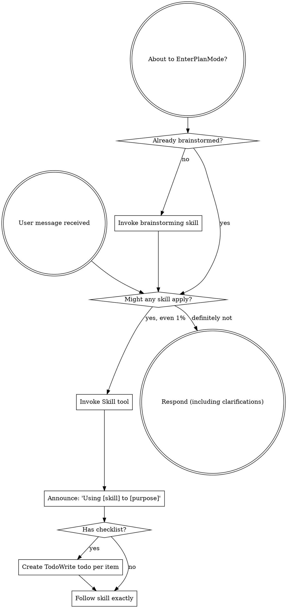
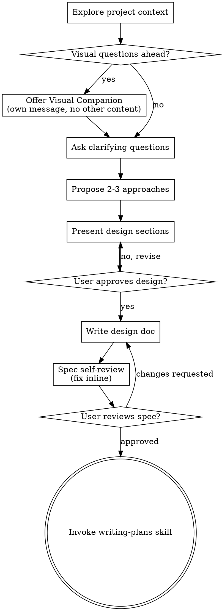
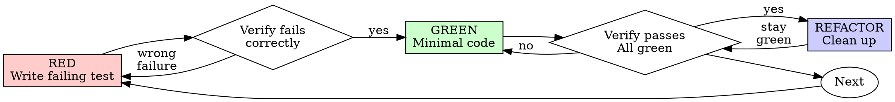
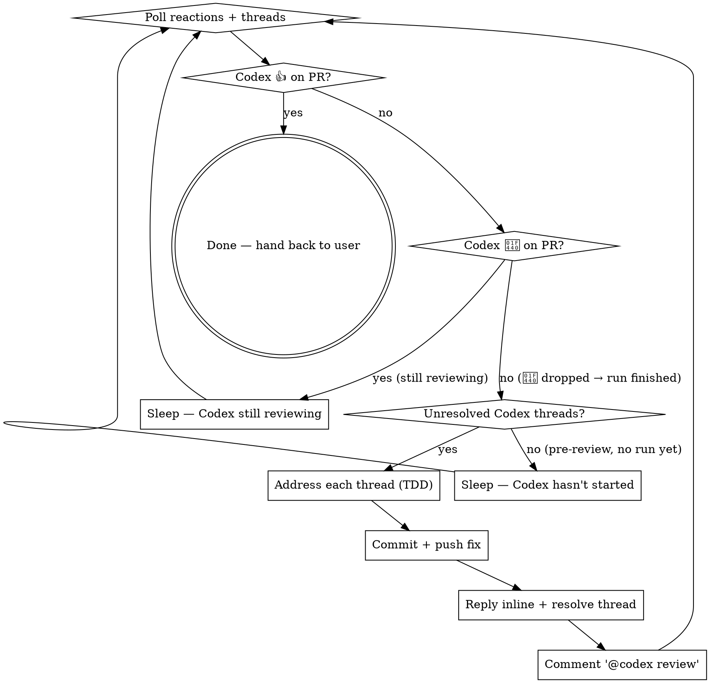

> SYSTEM

# AGENTS.md instructions for /Users/ericson/.t3/worktrees/ars-ui/t3code-f177abf7

<INSTRUCTIONS>
# ars-ui

## Project Overview

Rust frontend component library using state machines, framework-agnostic core with Leptos/Dioxus adapters.

## Current Phase

The repo is now in active implementation, not spec drafting only.

Agents working on implementation should use the GitHub Project roadmap and issue backlog as the execution source of truth:

- Use the GitHub Project `ars-ui implementation roadmap` to understand active epics, task breakdown, dependencies, status, and iteration planning.
- Prefer picking a single issue-backed task that is unblocked, sized, and scoped for independent delivery.
- Do not start work from an epic issue unless the user explicitly asks for planning or further decomposition.
- Do not start a task that is blocked by unresolved GitHub issue dependencies.
- Treat native GitHub issue dependencies as the blocker graph and the issue body acceptance criteria as the delivery contract.

## Development Workflow

For implementation tasks:

1. Read the assigned or selected GitHub issue first.
2. Move the issue to **In Progress** on the GitHub Project board.
3. Review the cited spec sections and any dependency issues.
4. Add or update the named tests first.
5. Implement only the scope required to make those tests pass.
6. If implementation changes the intended contract, update the relevant spec in the same task.
7. **MANDATORY:** Invoke the `post-implementation-audit` skill (`.agents/skills/post-implementation-audit/SKILL.md`). It runs three sequential audits on the new code — (a) spec/implementation drift with "best outcome" recommendations, (b) iterative "anything else missing?" passes (minimum two rounds), (c) test-coverage audit across every test type the workspace uses (unit, snapshot, proptest, mutation, doc, spec-conformance, llvm-cov). **Every finding lands in _this_ PR — no deferral, no follow-up issues.** This step exists because initial implementations consistently ship spec drift and silent contract violations that take 3+ review round-trips to surface; the audit collapses them into one. Skipping this step is a contract violation.
8. Present the final result for user review before any commit.
9. After user approval, run `cargo xci --profile fast` (alias: `cargo xci-fast`) locally and fix any failures before pushing anything to GitHub. The fast profile takes ~5 minutes and covers the workspace-level regressions a pre-push gate should catch: fmt, check, clippy, unit, integration, adapter, spec-compile-snippets, error-variant-coverage, mutual-exclusion, snapshot-count. Reserve full `cargo xci` (~25 minutes, all 20 gates including wasm coverage and the feature-matrix groups) for after substantial refactors that may have shifted feature-flag interactions. For small follow-up changes, run the focused tests and checks that cover the edited code instead.
10. After `cargo xci-fast` passes, commit and push a PR targeting `main`. The PR body MUST include an auto-close keyword for the issue being delivered, for example `Closes #20` or `Fixes #20`, so GitHub closes the issue automatically when the PR merges.
11. **If the PR creates or modifies any `.snap` insta fixtures, attach the `snapshot-reviewed` label after opening or updating it** (`gh pr edit <num> --add-label "snapshot-reviewed"`). This signals to reviewers that the snapshot output was inspected and is intentional. Re-apply the label whenever you push a commit that touches `.snap` files; the workflow assumes the label reflects the latest snapshot state.
12. **MANDATORY:** Invoke the `waiting-for-codex-review` skill (`.agents/skills/waiting-for-codex-review/SKILL.md`) immediately after the first push that creates the PR, and re-invoke it after every subsequent push to the PR branch. The skill posts the initial `@codex review` trigger, polls Codex's 👀 → (👍 \| ∅ + threads) reaction lifecycle, addresses any review threads with the same rigor as `post-implementation-audit` (TDD + no coverage regression), replies inline, resolves threads, and re-comments `@codex review` to start the next pass — looping until Codex leaves 👍. Skipping this step leaves Codex findings unaddressed and silently widens the gap between merged code and the spec; the merge gate is 👍 from Codex plus green CI, not green CI alone.
13. Only after CI passes, Codex has left 👍, and the PR is merged, close the issue.

Never close a GitHub issue without a merged PR that passes CI **and a 👍 from Codex**. Never commit or push without explicit user approval. Keep the issue, PR, and Project board status aligned with the actual work state at every step.

Default delivery rules:

- Follow TDD: tests first, implementation second, verification last.
- Keep task scope aligned with the issue. If the issue is too large or ambiguous, stop and split or clarify rather than freelancing a bigger change.
- Prefer tasks sized `1`, `2`, `3`, or `5` points. `8` is exceptional. `13` must be decomposed before implementation.
- Preserve the crate and dependency layering defined by the architecture and implementation plan.
- Do not add a new dependency crate without explicit user approval first. If a task appears to need a new crate, stop, explain why, and get approval before editing any `Cargo.toml`.
- When a task is complete, verify the exact tests and checks named by the issue before considering it done.
- For adapter-level component implementation, follow `docs/implementation/adapter-component-delivery.md`. Adapter component work must cover the adapter crate, adapter tests, E2E fixtures/harnesses when applicable, widgets examples, spec synchronization, and the required validation/audit loop in one PR.

### Code Quality Standards

- **Document all public items.** Every public struct, enum, trait, function, constant, type alias, method, field, and variant must have a `///` doc comment. Every `lib.rs` must have a `//!` crate-level doc comment. The workspace enforces `missing_docs` linting — undocumented public items are build failures.
- **Zero warnings policy.** All code must compile with zero warnings under the workspace's configured clippy and rustc lints. Fix the root cause instead of suppressing. When suppression is genuinely needed, use `#[expect(lint, reason = "...")]` — never `#[allow(...)]`.
- **Derive documentation from the spec.** Doc comments should describe the _purpose and semantics_ of the item as defined in the corresponding `spec/` files, not just restate the type signature.
- **Use `#[inline]` selectively, not mechanically.** Do **not** add Clippy's `missing_inline_in_public_items` lint at the workspace level, and do not treat public visibility alone as a reason to mark an item `#[inline]`. Use `#[inline]` for thin cross-crate wrappers, trivial accessors, and hot-path no-op shims where the call overhead is plausibly meaningful. Avoid blanket `#[inline]` on all public APIs — it increases code size, adds compile-time cost, and turns `#[inline]` into noise instead of a deliberate performance signal.
- **Use directory-backed modules with `mod.rs` when a module owns children.** This repo standardizes on the older filesystem layout for nested modules. If module `foo` has child modules, the parent must live at `foo/mod.rs`, not `foo.rs`. Do not mix `foo.rs` with a sibling `foo/` directory. When a refactor adds child modules under an existing flat file, move the parent into `foo/mod.rs` in the same change. Do not leave empty leftover module directories behind.

### API Design Standards

- **Design for the pit of success.** Public APIs should make the most natural, shortest path also be the path that is correct, accessible, localizable, type-safe, and performant. Prefer ergonomic constructors and defaults that preserve the spec's strongest guarantees instead of making users opt into correctness after choosing a convenient API.
- **Name escape hatches explicitly.** When a component needs a lower-level, static, non-i18n, or otherwise less complete path, keep it available but make the tradeoff visible in the API name or type. The blessed path should remain the simplest call site, while escape hatches should read as deliberate choices.
- **Keep semantic data separate from rendered views.** Rich framework views are useful for customization, but components still need semantic sources for accessible names, localized text, announcements, ids, and state-machine wiring. Do not rely on arbitrary rendered view trees as the only source of user-facing semantics.

### Code Coverage

The workspace uses `cargo-llvm-cov` for code coverage with per-crate threshold enforcement. CI runs coverage on every PR (see `.github/workflows/ci.yml`).

**Local coverage commands:**

```bash
# Per-crate coverage with inline annotated source (most useful during development)
cargo llvm-cov test -p ars-interactions --text -- hover

# Per-crate summary only
cargo llvm-cov test -p ars-interactions -- hover

# Native-only workspace coverage (host target; excludes wasm-only crates)
cargo llvm-cov --workspace \
  --exclude ars-leptos --exclude ars-dioxus \
  --exclude ars-test-harness-leptos --exclude ars-test-harness-dioxus \
  --exclude ars-derive --exclude xtask \
  --lcov --output-path lcov.info

# Check all crates against spec-defined thresholds (run after a *merged* lcov)
cargo xtask coverage check-all --file lcov.info
```

The `--text` flag produces line-by-line annotated source showing hit counts and `^0` markers on uncovered branches — use this to identify gaps after writing tests. Uncovered no-op callback closures in tests (e.g., `|_| {}`) are expected and not a gap.

The local recipe above excludes the adapter and adapter-test-harness crates because their `target_arch = "wasm32"` / `feature = "web"` code paths can't be measured via host-target `cargo llvm-cov`. **CI runs an additional wasm-coverage pipeline on nightly** (`cargo xtask ci coverage`) that uses `wasm-bindgen-test`'s experimental coverage recipe with LLVM 22 / `clang-22` to emit lcov for `ars-leptos` (csr), `ars-dioxus` (web), `ars-dom` (web), `ars-i18n` (web-intl), and the adapter test harnesses, then merges with the native lcov via `cargo xtask coverage merge`. The per-crate thresholds in `xtask::coverage::default_thresholds()` are enforced against the merged file — including adapter targets (`ars-leptos` 74/55, `ars-dioxus` 77/70, `ars-test-harness-leptos` 60/0, `ars-test-harness-dioxus` 60/0). `ars-derive` (proc-macro, runs in compiler) is exercised via `crates/ars-core/tests/derive_contract.rs` and is unmeasured. `xtask` has its own enforced threshold (30/35) and is measured. See `spec/testing/14-ci.md` §2 for the full pipeline.

### Mutation Testing

Coverage tells you which lines run. **Mutation testing tells you whether the tests would notice if those lines silently misbehaved.** The workspace uses [`cargo-mutants`](https://mutants.rs) for this — a `cargo` extension binary, not a workspace dependency.

**Install (once per developer machine):**

```bash
cargo install cargo-mutants --locked --version 27.0.0
```

**Local commands (state-machine modules are the most rewarding targets):**

```bash
# Run on a single component machine (~6 min for popover)
cargo mutants -p ars-components -f crates/ars-components/src/overlay/popover.rs

# Just list what would be mutated, without running tests (fast)
cargo mutants -p ars-components -f crates/ars-components/src/overlay/popover.rs --list

# Whole crate (slow — only if you really mean it)
cargo mutants -p ars-components
```

**Agnostic component implementation gate:** whenever an agent implements a new framework-agnostic component, or materially changes an existing one, the delivery must include:

- a targeted mutation run for the component source file, usually `cargo mutants -p ars-components -f crates/ars-components/src/<category>/<component>/mod.rs` (adjust the path for single-file modules);
- spec-conformance tests for the component's anatomy/public contract, including its `Part` enum and required API/attribute surface;
- same-task triage of every `MISSED` mutant: add tests for real gaps, or add a justified line-agnostic `.cargo/mutants.toml` exclude only for true equivalent mutations.

**Reading the output:** Results land in `mutants.out/mutants.out/` (gitignored). The two files that matter:

- `caught.txt` — mutations that broke at least one test ✅
- `missed.txt` — mutations that survived all tests ❌ — each one is either a real test gap to fill or an "equivalent mutation" that needs a `[[skip]]` entry in `mutants.toml` with a justification

**CI integration:** Nightly only. `.github/workflows/nightly.yml` has a `mutation-testing` job with a 21-entry matrix that runs `cargo mutants -p <package>` on every framework-agnostic crate, using `--shard k/n` to spread larger crates across parallel runners. **Shard indices are 0-based** (`k` runs from `0` to `n-1`); `k == n` is invalid and will fail the job. When adding shards, always start at `0/n` and end at `(n-1)/n`.

- **`ars-components` (≈ 1,630 mutants today, planned to grow as the spec adds the remaining ~97 components):** sharded **12-way** → ≈ 135 mutants per runner today, ≈ 850 per runner at the ~10,000-mutant endpoint. Sized for the full spec catalog up front so we don't re-shard every few months as components land.
- **`ars-collections` (≈ 1,080 mutants):** sharded 4-way → ≈ 270 mutants per runner.
- **`ars-core` (≈ 700 mutants):** sharded 2-way → ≈ 350 mutants per runner.
- **`ars-a11y`, `ars-forms`, `ars-interactions`:** one runner each (under 600 mutants apiece).

**Adding a new state machine inside an existing crate requires no CI changes** — its mutations land in whichever shard the cargo-mutants partitioner places them. The shard counts are sized so the slowest runner stays well under 30 minutes today and under ~50 minutes at the planned endpoint; re-balance only when a crate outgrows that budget (visible on the nightly dashboard as one shard pulling away from the others).

All matrix jobs run with `fail-fast: false` so failures on one module don't mask data on another. Each job uploads its `mutants.out/` as a workflow artifact (always, even on success — surviving "missed" entries on a passing run still reveal test-quality work). The job fails if any mutation survives, so a missed mutation forces a deliberate triage decision (fix the test, or document the equivalence with a `[[skip]]` entry in `mutants.toml`).

**Excluded crates** (mutation testing's signal degrades wherever determinism does): adapter glue (`ars-leptos`, `ars-dioxus`), DOM/FFI (`ars-dom`), ICU/FFI (`ars-i18n`), test infrastructure (`ars-test-harness*`), and the proc-macro crate (`ars-derive`, runs in the compiler). Adding a brand-new crate that is a good mutation target requires one new matrix entry; run a local scout first (`cargo mutants -p <crate> --list` to size, then a real run) so we know the right shard count before the nightly fires.

**Bumping the pinned version.** Both the local install command above and `.github/workflows/nightly.yml` pin cargo-mutants to an exact version (currently `27.0.0`) — same convention as `wasm-pack` in the `a11y-audit` job. Pinning is deliberate: cargo-mutants ships new mutators in releases, and an unpinned install would silently change the mutation set without any code change, surfacing as phantom CI failures on a green-source repo. To bump, open a PR that (1) updates the version string in CLAUDE.md and `nightly.yml`, (2) runs the popover scout locally with the new version (`cargo mutants -p ars-components -f crates/ars-components/src/overlay/popover.rs`) to confirm the mutation count is in the same ballpark, and (3) triages any new "missed" entries the new mutators surface — they are usually genuine test-quality gaps newly visible to the tool.

### Property Testing (proptest)

State-machine invariants are exercised by [`proptest`](https://docs.rs/proptest) under `crates/<crate>/tests/proptest_state_machines/` (see `ars-components`). Default proptest behaviour drops `*.proptest-regressions` seed files alongside test sources — instead, every `proptest!` block in this workspace pulls a shared `Config` from `tests/proptest_state_machines/common.rs` that:

1. Reads `PROPTEST_CASES` from the environment (1,000 default; 10,000 in the nightly `extended-proptest` job).
2. Sets `failure_persistence` to `FileFailurePersistence::Direct("proptest-regressions/state-machines.txt")`, so all persisted seeds for the test binary live in one file at the crate root: `crates/<crate>/proptest-regressions/state-machines.txt`. The directory is committed (per proptest's own recommendation in the file header) so every developer's runs benefit from previously-shrunk failures.

When a new crate adopts proptest for state-machine tests, copy the same `common.rs` helper and reference it via `#![proptest_config(super::common::proptest_config())]` inside every `proptest!` block. Don't let proptest fall back to its `WithSource` default — that scatters seed files across the source tree.

### Adapter Prelude Convention

Both `ars-leptos` and `ars-dioxus` expose a `prelude` module targeting **end users** — application developers who consume the ready-made components. `use ars_leptos::prelude::*` (or `use ars_dioxus::prelude::*`) should give them everything they need.

The prelude contains only user-facing items:

1. **Component modules** — as components land, their public module paths (e.g., `button`, `dialog`) are re-exported so users can write `button::Props`, etc.
2. **User-facing traits** — traits end users call on component outputs (e.g., `Translate` from `ars-i18n`). Re-export the trait so consumers don't need a direct dependency on the subsystem crate.
3. **Configuration types** — types that appear in component props or configure behaviour (e.g., `Locale`, `Direction`, `Orientation`, `Selection`).

The prelude does **not** include implementation details consumed only by component authors inside the adapter crate: core engine types (`Machine`, `Service`, `ConnectApi`, `AttrMap`), accessibility primitives (`AriaRole`, `AriaAttribute`), interaction helpers (`merge_attrs`), or adapter hooks (`use_machine`, `UseMachineReturn`). Those remain accessible via their normal crate paths for advanced users building custom machines.

Both adapter preludes must stay symmetric: same items, same structure. When adding a new re-export to one adapter's prelude, add it to the other as well in the same PR.

### Adapter Testing Convention

Adapter-level component tests should default to the framework-specific test harness crate:

- Leptos adapter tests should prefer `ars-test-harness-leptos`.
- Dioxus adapter tests should prefer `ars-test-harness-dioxus`.
- Shared `ars-test-harness` helpers should be used where relevant for viewport, layout, clipboard, drag/drop, timing, and other DOM test setup instead of bespoke per-test browser scaffolding.

When a component spec requires interaction, focus, overlay positioning, clipboard, file upload, drag/drop, or similar browser behavior, the task's tests should exercise that behavior through the adapter harness entrypoints and shared core harness helpers unless there is a concrete technical reason not to.

## Spec Synchronization During Implementation

The specification is the authoritative contract. It took weeks of deliberate design and MUST be followed.

### Spec-first implementation rule

Before implementing any public type, trait, function, or method:

1. **Read the spec section first.** Find the relevant code example in `spec/`. Use `spec-tool toc <file>` and `grep` to locate it.
2. **Match the spec exactly.** If the spec defines `struct ComponentIds { base: String }` with methods `from_id()`, `id()`, `part()`, `item()`, `item_part()` — implement exactly that. Do not invent alternative field names, method names, or signatures.
3. **Cross-check after implementation.** Before presenting code for review, diff every public item against the spec's code examples. Every struct field, every method name, every parameter must match.
4. **If you must deviate**, there must be a concrete technical reason (e.g., the spec's API cannot compile, or a dependency doesn't expose the needed type). Document the reason in a code comment and flag it to the user explicitly.

Inventing alternative APIs that "seem equivalent" is never acceptable — it silently invalidates the spec's design decisions and all downstream code that depends on those APIs.

### Spec/code mismatch resolution

- If code and spec disagree, resolve the mismatch in the same task or PR.
- Shared conceptual changes belong in shared or foundation spec files, not only in adapter code.
- Adapter-specific findings must be reflected back into `spec/foundation/08-adapter-leptos.md` and/or `spec/foundation/09-adapter-dioxus.md` when relevant.
- Do not leave spec drift behind as follow-up cleanup.

## Spec Structure

The specification lives in `spec/` with this layout:

- `spec/manifest.toml` — **START HERE** — central index of all components and their dependencies
- `spec/foundation/` — architecture, accessibility, i18n, interactions, forms, adapters, spec template (00-10)
- `spec/shared/` — cross-component shared types (date-time, selection, layout, z-index)
- `spec/components/{category}/` — one file per component, organized by category
- `spec/testing/` — test specs split by domain

### Component Categories

- `input/` — checkbox, text-field, slider, number-input, etc.
- `selection/` — select, combobox, listbox, menu, tags-input, etc.
- `overlay/` — dialog, popover, tooltip, toast, presence, etc.
- `navigation/` — accordion, tabs, tree-view, pagination, steps, etc.
- `date-time/` — date-field, time-field, calendar, date-picker, etc.
- `data-display/` — table, avatar, progress, meter, badge, etc.
- `layout/` — splitter, scroll-area, carousel, portal, toolbar, etc.
- `specialized/` — color-picker, file-upload, signature-pad, qr-code, etc.
- `utility/` — button, toggle, focus-scope, visually-hidden, separator, etc.

## Working with the Spec

When reading large files, run `wc -l` first to check the line count. If the file is over 2,000
lines, use the `offset` and `limit` parameters on the Read tool to read in chunks rather than
attempting to read the entire file at once.

### Using xtask spec (preferred)

Use `cargo xtask spec` to resolve file sets instead of manually parsing manifest.toml:

```bash
# Quick metadata lookup:
cargo xtask spec info <component>

# Find all components using a shared type:
cargo xtask spec reverse <shared-type>

# See a file's heading structure (with line numbers):
cargo xtask spec toc <file>

# Validate frontmatter matches manifest.toml:
cargo xtask spec validate

# Search spec content by keyword/regex (with optional filters):
cargo xtask spec search <query> [--category <cat>] [--section <sec>] [--tier <tier>]

# Get a compact component summary (states, events, props, accessibility):
cargo xtask spec digest <component>

# Get full implementation context (component + all deps concatenated):
cargo xtask spec context <component> [--framework <fw>] [--include-testing]
```

The xtask also runs as an MCP server (`cargo xtask mcp`) exposing all spec tools for LLM agents.

### Reading a component (manual fallback)

1. Read `spec/manifest.toml` to find the component's path and dependencies
2. Read the component file (has YAML frontmatter listing its foundation/shared deps)
3. Only load the foundation files listed in `foundation_deps` — not all of them

### Framework and library specs — MANDATORY skill loading

When reading or editing these specification files, you MUST load the corresponding skill BEFORE doing any work. The skills contain verified, version-accurate API documentation that the spec code examples depend on. Claude's training data is wrong for these libraries — do not trust it.

| Spec file                                    | Skill to load | Library version |
| -------------------------------------------- | ------------- | --------------- |
| `spec/foundation/04-internationalization.md` | `icu4x`       | ICU4X 2.1.1     |
| `spec/foundation/08-adapter-leptos.md`       | `leptos`      | Leptos 0.8.17   |
| `spec/foundation/09-adapter-dioxus.md`       | `dioxus`      | Dioxus 0.7.3    |

This applies to any task that touches adapter code: reviewing, writing, modifying, or answering questions about these files. Load the skill first, then proceed.

### Spec Conventions

- **No deprecation:** This is a greenfield spec. If an API is unused or redundant, remove it and fix all references. Never use `#[deprecated]` or deprecation shims.
- **No deferral:** Never mark spec content as "TODO", "FIXME", "future enhancement", "P1/P2 extension", or any similar deferral language. Every feature mentioned must be fully specified. If a design choice is unclear, ask the user rather than deferring.
- **No guessing external APIs:** NEVER guess function names or module paths for external crates. Always verify against `https://docs.rs/<crate_name>` before writing code that calls library APIs. This applies especially to Leptos, Dioxus, ICU4X, and any crate where training data may be stale. If you cannot verify, state that explicitly rather than fabricating a plausible-looking API.

### Component file format

Each component file has YAML frontmatter declaring its metadata:

```markdown
---
component: ComponentName
category: { category }
tier: stateless | stateful | complex
foundation_deps: [architecture, accessibility, ...]
shared_deps: [date-time-types, ...]
related: [sibling-component, ...]
---

# ComponentName
```

The `tier` field determines which sections are required — see `spec/foundation/10-component-spec-template.md` for the canonical section structure, ordering rules, and conformance checklist. Headings are numbered (e.g., `## 1. State Machine`, `### 1.1 States`, `#### 1.1.1 InnerStates`, etc.) for precise section references.

</INSTRUCTIONS>
<environment_context>
  <cwd>/Users/ericson/.t3/worktrees/ars-ui/t3code-f177abf7</cwd>
  <shell>zsh</shell>
  <current_date>2026-05-21</current_date>
  <timezone>America/Sao_Paulo</timezone>
</environment_context>

> DEVELOPER

Implement task #211

> AGENT

I’ll first ground this in the live repo and issue, then I’ll turn it into an implementation-ready plan since this session is currently in Plan Mode. I’m also loading the relevant workflow skills before making any decisions.

> TOOL

tool_use exec_command
id: call_z2SU7OfdZqmfOU0On9eJeSn1
```json
{
  "cmd": "sed -n '1,220p' /Users/ericson/.codex/plugins/cache/openai-curated/superpowers/0d4f5414/skills/using-superpowers/SKILL.md",
  "workdir": "/Users/ericson/.t3/worktrees/ars-ui/t3code-f177abf7",
  "yield_time_ms": 1000,
  "max_output_tokens": 12000
}
```

> TOOL

tool_use exec_command
id: call_RahBVwhtubsAGQqYxOpiGyuw
```json
{
  "cmd": "sed -n '1,220p' /Users/ericson/.codex/plugins/cache/openai-curated/superpowers/0d4f5414/skills/brainstorming/SKILL.md",
  "workdir": "/Users/ericson/.t3/worktrees/ars-ui/t3code-f177abf7",
  "yield_time_ms": 1000,
  "max_output_tokens": 12000
}
```

> TOOL

tool_use exec_command
id: call_7GFCZlW7PIe52sWVQjyV76CO
```json
{
  "cmd": "rg -n \"#211|issue #211|211|ars-.*211|task #211\" /Users/ericson/.codex/memories/MEMORY.md",
  "workdir": "/Users/ericson/.t3/worktrees/ars-ui/t3code-f177abf7",
  "yield_time_ms": 1000,
  "max_output_tokens": 12000
}
```

> TOOL

tool_result
id: call_z2SU7OfdZqmfOU0On9eJeSn1
```
Chunk ID: 7494e1
Wall time: 0.2271 seconds
Process exited with code 0
Original token count: 1356
Output:
---
name: using-superpowers
description: Use when starting any conversation - establishes how to find and use skills, requiring Skill tool invocation before ANY response including clarifying questions
---

<SUBAGENT-STOP>
If you were dispatched as a subagent to execute a specific task, skip this skill.
</SUBAGENT-STOP>

<EXTREMELY-IMPORTANT>
If you think there is even a 1% chance a skill might apply to what you are doing, you ABSOLUTELY MUST invoke the skill.

IF A SKILL APPLIES TO YOUR TASK, YOU DO NOT HAVE A CHOICE. YOU MUST USE IT.

This is not negotiable. This is not optional. You cannot rationalize your way out of this.
</EXTREMELY-IMPORTANT>

## Instruction Priority

Superpowers skills override default system prompt behavior, but **user instructions always take precedence**:

1. **User's explicit instructions** (CLAUDE.md, GEMINI.md, AGENTS.md, direct requests) — highest priority
2. **Superpowers skills** — override default system behavior where they conflict
3. **Default system prompt** — lowest priority

If CLAUDE.md, GEMINI.md, or AGENTS.md says "don't use TDD" and a skill says "always use TDD," follow the user's instructions. The user is in control.

## How to Access Skills

**In Claude Code:** Use the `Skill` tool. When you invoke a skill, its content is loaded and presented to you—follow it directly. Never use the Read tool on skill files.

**In Copilot CLI:** Use the `skill` tool. Skills are auto-discovered from installed plugins. The `skill` tool works the same as Claude Code's `Skill` tool.

**In Gemini CLI:** Skills activate via the `activate_skill` tool. Gemini loads skill metadata at session start and activates the full content on demand.

**In other environments:** Check your platform's documentation for how skills are loaded.

## Platform Adaptation

Skills use Claude Code tool names. Non-CC platforms: see `references/copilot-tools.md` (Copilot CLI), `references/codex-tools.md` (Codex) for tool equivalents. Gemini CLI users get the tool mapping loaded automatically via GEMINI.md.

# Using Skills

## The Rule

**Invoke relevant or requested skills BEFORE any response or action.** Even a 1% chance a skill might apply means that you should invoke the skill to check. If an invoked skill turns out to be wrong for the situation, you don't need to use it.



## Red Flags

These thoughts mean STOP—you're rationalizing:

| Thought | Reality |
|---------|---------|
| "This is just a simple question" | Questions are tasks. Check for skills. |
| "I need more context first" | Skill check comes BEFORE clarifying questions. |
| "Let me explore the codebase first" | Skills tell you HOW to explore. Check first. |
| "I can check git/files quickly" | Files lack conversation context. Check for skills. |
| "Let me gather information first" | Skills tell you HOW to gather information. |
| "This doesn't need a formal skill" | If a skill exists, use it. |
| "I remember this skill" | Skills evolve. Read current version. |
| "This doesn't count as a task" | Action = task. Check for skills. |
| "The skill is overkill" | Simple things become complex. Use it. |
| "I'll just do this one thing first" | Check BEFORE doing anything. |
| "This feels productive" | Undisciplined action wastes time. Skills prevent this. |
| "I know what that means" | Knowing the concept ≠ using the skill. Invoke it. |

## Skill Priority

When multiple skills could apply, use this order:

1. **Process skills first** (brainstorming, debugging) - these determine HOW to approach the task
2. **Implementation skills second** (frontend-design, mcp-builder) - these guide execution

"Let's build X" → brainstorming first, then implementation skills.
"Fix this bug" → debugging first, then domain-specific skills.

## Skill Types

**Rigid** (TDD, debugging): Follow exactly. Don't adapt away discipline.

**Flexible** (patterns): Adapt principles to context.

The skill itself tells you which.

## User Instructions

Instructions say WHAT, not HOW. "Add X" or "Fix Y" doesn't mean skip workflows.

```

> TOOL

tool_result
id: call_RahBVwhtubsAGQqYxOpiGyuw
```
Chunk ID: d9c334
Wall time: 0.1452 seconds
Process exited with code 0
Original token count: 2659
Output:
---
name: brainstorming
description: "You MUST use this before any creative work - creating features, building components, adding functionality, or modifying behavior. Explores user intent, requirements and design before implementation."
---

# Brainstorming Ideas Into Designs

Help turn ideas into fully formed designs and specs through natural collaborative dialogue.

Start by understanding the current project context, then ask questions one at a time to refine the idea. Once you understand what you're building, present the design and get user approval.

<HARD-GATE>
Do NOT invoke any implementation skill, write any code, scaffold any project, or take any implementation action until you have presented a design and the user has approved it. This applies to EVERY project regardless of perceived simplicity.
</HARD-GATE>

## Anti-Pattern: "This Is Too Simple To Need A Design"

Every project goes through this process. A todo list, a single-function utility, a config change — all of them. "Simple" projects are where unexamined assumptions cause the most wasted work. The design can be short (a few sentences for truly simple projects), but you MUST present it and get approval.

## Checklist

You MUST create a task for each of these items and complete them in order:

1. **Explore project context** — check files, docs, recent commits
2. **Offer visual companion** (if topic will involve visual questions) — this is its own message, not combined with a clarifying question. See the Visual Companion section below.
3. **Ask clarifying questions** — one at a time, understand purpose/constraints/success criteria
4. **Propose 2-3 approaches** — with trade-offs and your recommendation
5. **Present design** — in sections scaled to their complexity, get user approval after each section
6. **Write design doc** — save to `docs/superpowers/specs/YYYY-MM-DD-<topic>-design.md` and commit
7. **Spec self-review** — quick inline check for placeholders, contradictions, ambiguity, scope (see below)
8. **User reviews written spec** — ask user to review the spec file before proceeding
9. **Transition to implementation** — invoke writing-plans skill to create implementation plan

## Process Flow



**The terminal state is invoking writing-plans.** Do NOT invoke frontend-design, mcp-builder, or any other implementation skill. The ONLY skill you invoke after brainstorming is writing-plans.

## The Process

**Understanding the idea:**

- Check out the current project state first (files, docs, recent commits)
- Before asking detailed questions, assess scope: if the request describes multiple independent subsystems (e.g., "build a platform with chat, file storage, billing, and analytics"), flag this immediately. Don't spend questions refining details of a project that needs to be decomposed first.
- If the project is too large for a single spec, help the user decompose into sub-projects: what are the independent pieces, how do they relate, what order should they be built? Then brainstorm the first sub-project through the normal design flow. Each sub-project gets its own spec → plan → implementation cycle.
- For appropriately-scoped projects, ask questions one at a time to refine the idea
- Prefer multiple choice questions when possible, but open-ended is fine too
- Only one question per message - if a topic needs more exploration, break it into multiple questions
- Focus on understanding: purpose, constraints, success criteria

**Exploring approaches:**

- Propose 2-3 different approaches with trade-offs
- Present options conversationally with your recommendation and reasoning
- Lead with your recommended option and explain why

**Presenting the design:**

- Once you believe you understand what you're building, present the design
- Scale each section to its complexity: a few sentences if straightforward, up to 200-300 words if nuanced
- Ask after each section whether it looks right so far
- Cover: architecture, components, data flow, error handling, testing
- Be ready to go back and clarify if something doesn't make sense

**Design for isolation and clarity:**

- Break the system into smaller units that each have one clear purpose, communicate through well-defined interfaces, and can be understood and tested independently
- For each unit, you should be able to answer: what does it do, how do you use it, and what does it depend on?
- Can someone understand what a unit does without reading its internals? Can you change the internals without breaking consumers? If not, the boundaries need work.
- Smaller, well-bounded units are also easier for you to work with - you reason better about code you can hold in context at once, and your edits are more reliable when files are focused. When a file grows large, that's often a signal that it's doing too much.

**Working in existing codebases:**

- Explore the current structure before proposing changes. Follow existing patterns.
- Where existing code has problems that affect the work (e.g., a file that's grown too large, unclear boundaries, tangled responsibilities), include targeted improvements as part of the design - the way a good developer improves code they're working in.
- Don't propose unrelated refactoring. Stay focused on what serves the current goal.

## After the Design

**Documentation:**

- Write the validated design (spec) to `docs/superpowers/specs/YYYY-MM-DD-<topic>-design.md`
  - (User preferences for spec location override this default)
- Use elements-of-style:writing-clearly-and-concisely skill if available
- Commit the design document to git

**Spec Self-Review:**
After writing the spec document, look at it with fresh eyes:

1. **Placeholder scan:** Any "TBD", "TODO", incomplete sections, or vague requirements? Fix them.
2. **Internal consistency:** Do any sections contradict each other? Does the architecture match the feature descriptions?
3. **Scope check:** Is this focused enough for a single implementation plan, or does it need decomposition?
4. **Ambiguity check:** Could any requirement be interpreted two different ways? If so, pick one and make it explicit.

Fix any issues inline. No need to re-review — just fix and move on.

**User Review Gate:**
After the spec review loop passes, ask the user to review the written spec before proceeding:

> "Spec written and committed to `<path>`. Please review it and let me know if you want to make any changes before we start writing out the implementation plan."

Wait for the user's response. If they request changes, make them and re-run the spec review loop. Only proceed once the user approves.

**Implementation:**

- Invoke the writing-plans skill to create a detailed implementation plan
- Do NOT invoke any other skill. writing-plans is the next step.

## Key Principles

- **One question at a time** - Don't overwhelm with multiple questions
- **Multiple choice preferred** - Easier to answer than open-ended when possible
- **YAGNI ruthlessly** - Remove unnecessary features from all designs
- **Explore alternatives** - Always propose 2-3 approaches before settling
- **Incremental validation** - Present design, get approval before moving on
- **Be flexible** - Go back and clarify when something doesn't make sense

## Visual Companion

A browser-based companion for showing mockups, diagrams, and visual options during brainstorming. Available as a tool — not a mode. Accepting the companion means it's available for questions that benefit from visual treatment; it does NOT mean every question goes through the browser.

**Offering the companion:** When you anticipate that upcoming questions will involve visual content (mockups, layouts, diagrams), offer it once for consent:
> "Some of what we're working on might be easier to explain if I can show it to you in a web browser. I can put together mockups, diagrams, comparisons, and other visuals as we go. This feature is still new and can be token-intensive. Want to try it? (Requires opening a local URL)"

**This offer MUST be its own message.** Do not combine it with clarifying questions, context summaries, or any other content. The message should contain ONLY the offer above and nothing else. Wait for the user's response before continuing. If they decline, proceed with text-only brainstorming.

**Per-question decision:** Even after the user accepts, decide FOR EACH QUESTION whether to use the browser or the terminal. The test: **would the user understand this better by seeing it than reading it?**

- **Use the browser** for content that IS visual — mockups, wireframes, layout comparisons, architecture diagrams, side-by-side visual designs
- **Use the terminal** for content that is text — requirements questions, conceptual choices, tradeoff lists, A/B/C/D text options, scope decisions

A question about a UI topic is not automatically a visual question. "What does personality mean in this context?" is a conceptual question — use the terminal. "Which wizard layout works better?" is a visual question — use the browser.

If they agree to the companion, read the detailed guide before proceeding:
`skills/brainstorming/visual-companion.md`

```

> TOOL

tool_result
id: call_7GFCZlW7PIe52sWVQjyV76CO
```
Chunk ID: 8144bb
Wall time: 0.0490 seconds
Process exited with code 0
Original token count: 109
Output:
205:- rollout_summaries/REDACTED.md (cwd=/Users/ericson/Workspace/Rust/judge-fudge, rollout_path=/Users/ericson/.codex/sessions/2026/05/19/rollout-2026-05-19T00-31-29-019e3e49-e211-70a0-b98d-763c9f55ee79.jsonl, updated_at=2026-05-19T04:23:12+00:00, thread_id=019e3e49-e211-70a0-b98d-763c9f55ee79, build implementation for workspace rows and pane migration)

```

> AGENT

Using `using-superpowers` and `brainstorming` because this is an implementation request, but Plan Mode means I can only produce the execution plan. The memory lookup did not find a relevant prior note for task `#211`, so I’m going to inspect the live issue and local repo state directly.

> TOOL

tool_use exec_command
id: call_XAYdjfgOb49JHlttRdY7oxng
```json
{
  "cmd": "sed -n '1,220p' /Users/ericson/.codex/plugins/cache/openai-curated/github/0d4f5414/skills/github/SKILL.md",
  "workdir": "/Users/ericson/.t3/worktrees/ars-ui/t3code-f177abf7",
  "yield_time_ms": 1000,
  "max_output_tokens": 12000
}
```

> TOOL

tool_use exec_command
id: call_CDDB9QVbkHouJptZDmIPJcEH
```json
{
  "cmd": "git status --short --branch",
  "workdir": "/Users/ericson/.t3/worktrees/ars-ui/t3code-f177abf7",
  "yield_time_ms": 1000,
  "max_output_tokens": 12000
}
```

> TOOL

tool_use exec_command
id: call_r4B7fjqWghAQQM0XfyIHlLa8
```json
{
  "cmd": "gh issue view 211 --json number,title,state,body,labels,assignees,projectItems,closed,comments,url",
  "workdir": "/Users/ericson/.t3/worktrees/ars-ui/t3code-f177abf7",
  "yield_time_ms": 1000,
  "max_output_tokens": 40000
}
```

> TOOL

tool_result
id: call_XAYdjfgOb49JHlttRdY7oxng
```
Chunk ID: 6cd38e
Wall time: 0.1545 seconds
Process exited with code 0
Original token count: 1089
Output:
---
name: github
description: Triage and orient GitHub repository, pull request, and issue work through the connected GitHub app. Use when the user asks for general GitHub help, wants PR or issue summaries, or needs repository context before choosing a more specific GitHub workflow.
---

# GitHub

## Overview

Use this skill as the umbrella entrypoint for general GitHub work in this plugin. It should decide whether the task stays in repo and PR triage or should be handed off to a more specific review, CI, or publish workflow.

This plugin is intentionally hybrid:

- Prefer the GitHub app from this plugin for repository, issue, pull request, comment, label, reaction, and PR creation workflows.
- Use local `git` and `gh` only when the connector does not cover the job well, especially for current-branch PR discovery, branch creation, commit and push, `gh auth status`, and GitHub Actions log inspection.
- Keep connector state and local checkout context aligned. If the request is about the current branch, resolve the local repo and branch before acting.

Once the intent is clear, route to the specialist skill immediately and do not keep broad GitHub triage in scope longer than needed.

## Connector-First Responsibilities

Handle these directly in this skill when the request does not need a narrower specialist workflow:

- repository orientation once the repo, PR, issue, or local checkout is identified
- recent PR or issue triage
- PR metadata summaries
- PR patch inspection
- PR comments, labels, and reactions
- issue lookup and summarization
- PR creation after a branch is already pushed

Prefer the GitHub app from this plugin for those flows because it provides structured PR, issue, and review-adjacent data without depending on a local checkout. If the repository is not already identifiable from the user request or local git context, ask for the repo instead of pretending there is a repo-search flow that may not exist.

## Routing Rules

1. Resolve the operating context first:
   - If the user provides a repository, PR number, issue number, or URL, use that.
   - If the request is about "this branch" or "the current PR", resolve local git context and use `gh` only as needed to discover the branch PR.
   - If the repository is still ambiguous after local inspection, ask for the repo identifier.
2. Classify the request before taking action:
   - `repo or PR triage`: summarize PRs, issues, patches, comments, labels, reactions, or repository state
   - `review follow-up`: unresolved review threads, requested changes, or inline review feedback
   - `CI debugging`: failing checks, Actions logs, or CI root-cause analysis
   - `publish changes`: create or switch branches, stage changes, commit, push, and open a draft PR
3. Route to the specialist skill as soon as the category is clear:
   - Review comments and requested changes: `../gh-address-comments/SKILL.md`
   - Failing GitHub Actions checks: `../gh-fix-ci/SKILL.md`
   - Commit, push, and open PR: `../yeet/SKILL.md`
4. Keep the hybrid model consistent after routing:
   - connector first for PR and issue data
   - local `git` and `gh` only for the specific gaps the connector does not cover

## Default Workflow

1. Resolve repository and item scope.
2. Gather structured PR or issue context through the GitHub app from this plugin.
3. Decide whether the task stays in connector-backed triage or needs a specialist skill.
4. Route immediately when the work becomes review follow-up, CI debugging, or publish workflow.
5. End with a clear summary of what was inspected, what changed, and what remains.

## Output Expectations

- For triage requests, return a concise summary of the repository, PR, or issue state and the next likely action.
- For mixed requests, tell the user which specialist path you are taking and why.
- For connector-backed write actions, restate the exact PR, issue, label, or reaction target before applying the change.
- Never imply that GitHub Actions logs are available through the connector alone. That remains a `gh` workflow.

## Examples

- "Use GitHub to summarize the open PRs in this repo and tell me what needs attention."
- "Help with this PR."
- "Review the latest comments on PR 482 and tell me what is actionable."
- "Debug the failing checks on this branch."
- "Commit these changes, push them, and open a draft PR."

```

> TOOL

tool_result
id: call_CDDB9QVbkHouJptZDmIPJcEH
```
Chunk ID: 1cb452
Wall time: 0.1472 seconds
Process exited with code 0
Original token count: 5
Output:
## t3code/f177abf7

```

> TOOL

tool_result
id: call_r4B7fjqWghAQQM0XfyIHlLa8
```
Chunk ID: d5c776
Wall time: 0.8964 seconds
Process exited with code 0
Original token count: 777
Output:
{"assignees":[],"body":"**Epic: #10 (Agnostic utility components)**\n\n## Goal\n\nImplement the framework-agnostic LiveRegion component state machine: Idle/Announcing states, aria-live announcement queuing with priority levels, and a two-step clear-then-insert intent for screen reader compatibility. Uses PendingEffect for the render-then-populate timing cycle.\n\n## Out of scope\n\nFramework-specific adapter components (Leptos/Dioxus) and direct DOM text-node mutation.\n\n## Spec refs\n\n- `spec/components/utility/live-region.md`\n\n## Depends on\n\nNone\n\n## Layer\n\nComponent\n\n## Framework\n\nNone\n\n## Test tier\n\nUnit\n\n## Fibonacci points\n\n3\n\n## Element/ref handling note\n\n- The agnostic core owns queueing, priority, timing state, and the attributes for the live-region node.\n- The clear-then-insert operation must be represented as adapter-resolvable intent, not as a string ID lookup for a DOM node.\n- Adapters should use their native root handles (`NodeRef`, `MountedData`/host node, or test-harness handle) to mutate the live node after mount/hydration.\n- Stable IDs are acceptable for semantics/testing, but they are not the mechanism for live announcement node mutation.\n\n## Tests to add first\n\n- State machine: initial state is Idle.\n- State machine: Announce event transitions Idle→Announcing and emits clear-then-insert intent.\n- State machine: timed effect returns to Idle after announcement completes.\n- Message queue: priority ordering (assertive > polite).\n- Message queue: messages dequeued in FIFO order within same priority.\n- ConnectApi: produces `aria-live`, `aria-atomic`, `role` attributes matching politeness level.\n- ConnectApi: produces `data-ars-state` reflecting current state.\n- Props: `politeness`, `atomic`, `relevant` match spec.\n\n## Acceptance criteria\n\n- All public types documented per workspace `missing_docs` lint.\n- State machine matches spec §1 exactly.\n- ConnectApi produces correct ARIA live-region attributes per spec §2.\n- Clear-then-insert pattern is exposed as adapter-resolvable pending effect, not direct DOM/ID mutation.\n- Snapshot tests cover the component's `connect()` / `Api` `AttrMap` output for every anatomy part and each output-affecting state, prop, or context branch, with committed `.snap` fixtures passing `cargo insta test --unreferenced=reject`.\n- All named tests pass with zero warnings.\n\n## Spec impact\nNo spec change required unless current examples imply direct DOM mutation from the agnostic crate; fix those examples in the same task if found.\n\n## Board update rule\n\nIf blocked, keep `Status` in `Todo`, use native GitHub issue dependencies, and name the dependency or spec ambiguity.\n","closed":false,"comments":[],"labels":[{"id":"LA_kwDORp4enM8AAAACd5NBow","name":"task","description":"Agent-ready implementation task","color":"0E8A16"}],"number":211,"projectItems":[{"status":{"optionId":"f75ad846","name":"Todo"},"title":"ars-ui implementation roadmap"}],"state":"OPEN","title":"task: Implement LiveRegion agnostic core","url":"https://github.com/fogodev/ars-ui/issues/211"}

```

> AGENT

Issue `#211` is open, unblocked, 3 points, and currently `Todo`; the contract is the agnostic `LiveRegion` core only. Next I’m checking the spec and existing component patterns so the plan can be concrete instead of generic.

> TOOL

tool_use exec_command
id: call_HSVZ3Ep5GqAe6yxT2pGiZo3w
```json
{
  "cmd": "sed -n '1,220p' /Users/ericson/.codex/plugins/cache/openai-curated/superpowers/0d4f5414/skills/writing-plans/SKILL.md",
  "workdir": "/Users/ericson/.t3/worktrees/ars-ui/t3code-f177abf7",
  "yield_time_ms": 1000,
  "max_output_tokens": 12000
}
```

> TOOL

tool_use exec_command
id: call_ML2Aa76x4FCXiZ5DqsK3zmk9
```json
{
  "cmd": "cargo xtask spec info live-region",
  "workdir": "/Users/ericson/.t3/worktrees/ars-ui/t3code-f177abf7",
  "yield_time_ms": 1000,
  "max_output_tokens": 20000
}
```

> TOOL

tool_use exec_command
id: call_vjpraGzxcvtWqLYWpQVfuEpO
```json
{
  "cmd": "cargo xtask spec toc spec/components/utility/live-region.md",
  "workdir": "/Users/ericson/.t3/worktrees/ars-ui/t3code-f177abf7",
  "yield_time_ms": 1000,
  "max_output_tokens": 20000
}
```

> TOOL

tool_use exec_command
id: call_DYffpFkzbYvwpoce3aLrpzdP
```json
{
  "cmd": "rg -n \"LiveRegion|live_region|Live Region|live-region\" crates spec/components/utility/live-region.md",
  "workdir": "/Users/ericson/.t3/worktrees/ars-ui/t3code-f177abf7",
  "yield_time_ms": 1000,
  "max_output_tokens": 20000
}
```

> TOOL

tool_result
id: call_HSVZ3Ep5GqAe6yxT2pGiZo3w
```
Chunk ID: d9dce3
Wall time: 0.1563 seconds
Process exited with code 0
Original token count: 1525
Output:
---
name: writing-plans
description: Use when you have a spec or requirements for a multi-step task, before touching code
---

# Writing Plans

## Overview

Write comprehensive implementation plans assuming the engineer has zero context for our codebase and questionable taste. Document everything they need to know: which files to touch for each task, code, testing, docs they might need to check, how to test it. Give them the whole plan as bite-sized tasks. DRY. YAGNI. TDD. Frequent commits.

Assume they are a skilled developer, but know almost nothing about our toolset or problem domain. Assume they don't know good test design very well.

**Announce at start:** "I'm using the writing-plans skill to create the implementation plan."

**Context:** If working in an isolated worktree, it should have been created via the `superpowers:using-git-worktrees` skill at execution time.

**Save plans to:** `docs/superpowers/plans/YYYY-MM-DD-<feature-name>.md`
- (User preferences for plan location override this default)

## Scope Check

If the spec covers multiple independent subsystems, it should have been broken into sub-project specs during brainstorming. If it wasn't, suggest breaking this into separate plans — one per subsystem. Each plan should produce working, testable software on its own.

## File Structure

Before defining tasks, map out which files will be created or modified and what each one is responsible for. This is where decomposition decisions get locked in.

- Design units with clear boundaries and well-defined interfaces. Each file should have one clear responsibility.
- You reason best about code you can hold in context at once, and your edits are more reliable when files are focused. Prefer smaller, focused files over large ones that do too much.
- Files that change together should live together. Split by responsibility, not by technical layer.
- In existing codebases, follow established patterns. If the codebase uses large files, don't unilaterally restructure - but if a file you're modifying has grown unwieldy, including a split in the plan is reasonable.

This structure informs the task decomposition. Each task should produce self-contained changes that make sense independently.

## Bite-Sized Task Granularity

**Each step is one action (2-5 minutes):**
- "Write the failing test" - step
- "Run it to make sure it fails" - step
- "Implement the minimal code to make the test pass" - step
- "Run the tests and make sure they pass" - step
- "Commit" - step

## Plan Document Header

**Every plan MUST start with this header:**

```markdown
# [Feature Name] Implementation Plan

> **For agentic workers:** REQUIRED SUB-SKILL: Use superpowers:subagent-driven-development (recommended) or superpowers:executing-plans to implement this plan task-by-task. Steps use checkbox (`- [ ]`) syntax for tracking.

**Goal:** [One sentence describing what this builds]

**Architecture:** [2-3 sentences about approach]

**Tech Stack:** [Key technologies/libraries]

---
```

## Task Structure

````markdown
### Task N: [Component Name]

**Files:**
- Create: `exact/path/to/file.py`
- Modify: `exact/path/to/existing.py:123-145`
- Test: `tests/exact/path/to/test.py`

- [ ] **Step 1: Write the failing test**

```python
def test_specific_behavior():
    result = function(input)
    assert result == expected
```

- [ ] **Step 2: Run test to verify it fails**

Run: `pytest tests/path/test.py::test_name -v`
Expected: FAIL with "function not defined"

- [ ] **Step 3: Write minimal implementation**

```python
def function(input):
    return expected
```

- [ ] **Step 4: Run test to verify it passes**

Run: `pytest tests/path/test.py::test_name -v`
Expected: PASS

- [ ] **Step 5: Commit**

```bash
git add tests/path/test.py src/path/file.py
git commit -m "feat: add specific feature"
```
````

## No Placeholders

Every step must contain the actual content an engineer needs. These are **plan failures** — never write them:
- "TBD", "TODO", "implement later", "fill in details"
- "Add appropriate error handling" / "add validation" / "handle edge cases"
- "Write tests for the above" (without actual test code)
- "Similar to Task N" (repeat the code — the engineer may be reading tasks out of order)
- Steps that describe what to do without showing how (code blocks required for code steps)
- References to types, functions, or methods not defined in any task

## Remember
- Exact file paths always
- Complete code in every step — if a step changes code, show the code
- Exact commands with expected output
- DRY, YAGNI, TDD, frequent commits

## Self-Review

After writing the complete plan, look at the spec with fresh eyes and check the plan against it. This is a checklist you run yourself — not a subagent dispatch.

**1. Spec coverage:** Skim each section/requirement in the spec. Can you point to a task that implements it? List any gaps.

**2. Placeholder scan:** Search your plan for red flags — any of the patterns from the "No Placeholders" section above. Fix them.

**3. Type consistency:** Do the types, method signatures, and property names you used in later tasks match what you defined in earlier tasks? A function called `clearLayers()` in Task 3 but `clearFullLayers()` in Task 7 is a bug.

If you find issues, fix them inline. No need to re-review — just fix and move on. If you find a spec requirement with no task, add the task.

## Execution Handoff

After saving the plan, offer execution choice:

**"Plan complete and saved to `docs/superpowers/plans/<filename>.md`. Two execution options:**

**1. Subagent-Driven (recommended)** - I dispatch a fresh subagent per task, review between tasks, fast iteration

**2. Inline Execution** - Execute tasks in this session using executing-plans, batch execution with checkpoints

**Which approach?"**

**If Subagent-Driven chosen:**
- **REQUIRED SUB-SKILL:** Use superpowers:subagent-driven-development
- Fresh subagent per task + two-stage review

**If Inline Execution chosen:**
- **REQUIRED SUB-SKILL:** Use superpowers:executing-plans
- Batch execution with checkpoints for review

```

> TOOL

tool_result
id: call_ML2Aa76x4FCXiZ5DqsK3zmk9
```
Chunk ID: c4f56a
Wall time: 1.0014 seconds
Process running with session ID 81105
Original token count: 73
Output:
    Blocking waiting for file lock on package cache
    Blocking waiting for file lock on package cache
   Compiling chrono v0.4.44
   Compiling futures-executor v0.3.32
   Compiling tokio-util v0.7.18
   Compiling rmcp-macros v1.7.0
   Compiling futures v0.3.32
   Compiling schemars v1.2.1

```

> TOOL

tool_result
id: call_vjpraGzxcvtWqLYWpQVfuEpO
```
Chunk ID: fd3964
Wall time: 1.0019 seconds
Process running with session ID 18526
Original token count: 41
Output:
    Blocking waiting for file lock on package cache
    Blocking waiting for file lock on package cache
    Blocking waiting for file lock on artifact directory

```

> TOOL

tool_result
id: call_DYffpFkzbYvwpoce3aLrpzdP
```
Chunk ID: 5dd23e
Wall time: 0.0310 seconds
Process exited with code 0
Original token count: 2001
Output:
spec/components/utility/live-region.md:2:component: LiveRegion
spec/components/utility/live-region.md:12:# LiveRegion
spec/components/utility/live-region.md:21:immediately after mounting. `LiveRegion` uses a two-step update pattern — clear then insert — to
spec/components/utility/live-region.md:43:/// The state of the `LiveRegion` component.
spec/components/utility/live-region.md:52:/// The events of the `LiveRegion` component.
spec/components/utility/live-region.md:92:/// The context of the `LiveRegion` component.
spec/components/utility/live-region.md:115:/// Props for the `LiveRegion` component.
spec/components/utility/live-region.md:175:/// The machine for the `LiveRegion` component.
spec/components/utility/live-region.md:330:#[scope = "live-region"]
spec/components/utility/live-region.md:335:/// The `LiveRegion` component.
spec/components/utility/live-region.md:336:pub struct LiveRegion;
spec/components/utility/live-region.md:338:/// The API for the `LiveRegion` component.
spec/components/utility/live-region.md:340:    /// The state of the `LiveRegion` component.
spec/components/utility/live-region.md:342:    /// The context of the `LiveRegion` component.
spec/components/utility/live-region.md:344:    /// The props of the `LiveRegion` component.
spec/components/utility/live-region.md:346:    /// The send callback for the `LiveRegion` component.
spec/components/utility/live-region.md:443:LiveRegion
spec/components/utility/live-region.md:444:└── Root    <div>    data-ars-scope="live-region" data-ars-part="root"
spec/components/utility/live-region.md:453:| Root | `<div>` | `data-ars-scope="live-region"`, `data-ars-part="root"`, `aria-live`, `aria-atomic`, `aria-relevant`, `.ars-visually-hidden` |
spec/components/utility/live-region.md:459:- No ARIA role is explicitly set on the root element — the `aria-live` attribute alone is sufficient for screen reader monitoring. The default LiveRegion implementation does not set `role="region"`.
spec/components/utility/live-region.md:488:| Component    | `LiveRegion` Usage                                      |
spec/components/utility/live-region.md:507:When `Toast` uses `LiveRegion` for announcements, optional audio cues follow these rules:
spec/components/utility/live-region.md:521:Dioxus fullstack), the `LiveRegion`'s root `<div>` with its `aria-live`, `aria-atomic`, and
spec/components/utility/live-region.md:553:> the LiveRegion component renders the container element during SSR (not deferred to
crates/ars-a11y/src/label.rs:188:    /// The error region always uses polite live-region semantics and is hidden
crates/ars-a11y/src/label.rs:543:    fn error_message_attrs_visible_has_live_region_without_hidden() {
crates/ars-dom/src/platform.rs:3118:    async fn announcements_write_live_regions() {
crates/ars-collections/src/lib.rs:31://! - [`CollectionChangeAnnouncement`] — structured live-region event for collection mutations.
crates/ars-a11y/src/aria/role.rs:217:    /// An important, usually time-sensitive, live-region message.
crates/ars-leptos/tests/tabs.rs:166:            "live_regions",
crates/ars-leptos/tests/tabs.rs:295:live_regions=1
crates/ars-leptos/tests/tabs.rs:571:fn reorderable_tabs_get_role_description_and_live_region() {
crates/ars-dioxus/src/navigation/tabs.rs:1442:    reason = "drop handling mirrors keyboard reorder callbacks and live-region state"
crates/ars-leptos/tests/tabs_wasm.rs:1927:    let live_region = parent
crates/ars-leptos/tests/tabs_wasm.rs:1933:        live_region.text_content().unwrap_or_default(),
crates/ars-leptos/tests/tabs_wasm.rs:2005:    let live_region = parent
crates/ars-leptos/tests/tabs_wasm.rs:2011:        live_region.text_content().unwrap_or_default(),
crates/ars-leptos/tests/tabs_wasm.rs:2037:    let live_region = parent
crates/ars-leptos/tests/tabs_wasm.rs:2057:        live_region.text_content().unwrap_or_default(),
crates/ars-leptos/tests/tabs_wasm.rs:3314:async fn ctrl_arrow_announces_reorder_in_polite_live_region() {
crates/ars-leptos/tests/tabs_wasm.rs:3331:    let live_region = parent
crates/ars-leptos/tests/tabs_wasm.rs:3339:        live_region.text_content().unwrap_or_default(),
crates/ars-leptos/tests/tabs_wasm.rs:3355:    let announcement = live_region.text_content().unwrap_or_default();
crates/ars-leptos/src/navigation/tabs.rs:1413:    reason = "drop handling mirrors keyboard reorder callbacks and live-region state"
crates/ars-dom/src/announcer.rs:1://! DOM bootstrap for shared live-region announcer nodes.
crates/ars-dom/src/announcer.rs:11:/// Ensure the shared live-region DOM nodes exist.
crates/ars-dom/src/announcer.rs:124:    let message = prepare_live_region_message(&region_id, message);
crates/ars-dom/src/announcer.rs:222:fn prepare_live_region_message(region_id: &str, message: &str) -> String {
crates/ars-dom/src/announcer.rs:403:    fn remove_live_regions() {
crates/ars-dom/src/announcer.rs:477:    fn ensure_dom_creates_both_live_regions_under_body() {
crates/ars-dom/src/announcer.rs:478:        remove_live_regions();
crates/ars-dom/src/announcer.rs:490:        remove_live_regions();
crates/ars-dom/src/announcer.rs:495:        remove_live_regions();
crates/ars-dom/src/announcer.rs:506:            Some("live-region")
crates/ars-dom/src/announcer.rs:527:            Some("live-region")
crates/ars-dom/src/announcer.rs:534:        remove_live_regions();
crates/ars-dom/src/announcer.rs:539:        remove_live_regions();
crates/ars-dom/src/announcer.rs:550:        remove_live_regions();
crates/ars-dom/src/announcer.rs:554:    async fn announce_polite_writes_the_live_region() {
crates/ars-dom/src/announcer.rs:555:        remove_live_regions();
crates/ars-dom/src/announcer.rs:568:        remove_live_regions();
crates/ars-dom/src/announcer.rs:572:    async fn announce_assertive_writes_the_live_region() {
crates/ars-dom/src/announcer.rs:573:        remove_live_regions();
crates/ars-dom/src/announcer.rs:586:        remove_live_regions();
crates/ars-dom/src/announcer.rs:591:        remove_live_regions();
crates/ars-dom/src/announcer.rs:610:        remove_live_regions();
crates/ars-dom/src/announcer.rs:615:        remove_live_regions();
crates/ars-dom/src/announcer.rs:636:        remove_live_regions();
crates/ars-a11y/src/announcer.rs:1://! Screen-reader announcement queue and live-region attribute helpers.
crates/ars-a11y/src/announcer.rs:137:        attrs.set(HtmlAttr::Data("ars-part"), "live-region");
crates/ars-a11y/src/announcer.rs:144:    /// Builds assertive attrs by extending the polite live-region structure and
crates/ars-a11y/src/announcer.rs:364:        assert_eq!(attrs.get(&HtmlAttr::Data("ars-part")), Some("live-region"));
crates/ars-a11y/src/announcer.rs:383:        assert_eq!(attrs.get(&HtmlAttr::Data("ars-part")), Some("live-region"));
crates/ars-components/src/utility/form/mod.rs:6://! live-region wiring used by adapter-owned form components.
crates/ars-dioxus/tests/tabs.rs:156:            "live_regions",
crates/ars-dioxus/tests/tabs.rs:298:live_regions=1
crates/ars-dioxus/tests/tabs.rs:601:fn reorderable_tabs_get_role_description_and_live_region() {
crates/ars-components/src/overlay/toast/manager.rs:785:/// the live-region shells) and the per-toast surface (which lives inside
crates/ars-components/src/overlay/toast/single.rs:198:/// Drives both the `data-ars-kind` attribute on the root and the live-region
crates/ars-dioxus/tests/tabs_wasm.rs:2975:    let live_region = parent
crates/ars-dioxus/tests/tabs_wasm.rs:2981:        live_region.text_content().unwrap_or_default(),
crates/ars-dioxus/tests/tabs_wasm.rs:3257:    let live_region = parent
crates/ars-dioxus/tests/tabs_wasm.rs:3262:    assert_eq!(live_region.text_content().unwrap_or_default(), "");
crates/ars-dioxus/tests/tabs_wasm.rs:3280:    let live_region = parent
crates/ars-dioxus/tests/tabs_wasm.rs:3300:        live_region.text_content().unwrap_or_default(),
crates/ars-components/src/data_display/badge.rs:101:    /// Polite live-region badge for dynamic, non-urgent updates.

```

> TOOL

tool_use write_stdin
id: call_3l9nhhNm6ZpAEJaLifdff01I
```json
{
  "session_id": 81105,
  "chars": "",
  "yield_time_ms": 1000,
  "max_output_tokens": 20000
}
```

> TOOL

tool_use write_stdin
id: call_yQTCs4h68y9UrqNP7MHnfgoG
```json
{
  "session_id": 18526,
  "chars": "",
  "yield_time_ms": 1000,
  "max_output_tokens": 20000
}
```

> TOOL

tool_use exec_command
id: call_Nd0fEQCs29pjQ2WDZyDTvqW5
```json
{
  "cmd": "rg --files crates/ars-components/src crates/ars-components/tests | rg '(utility|overlay|snapshot|snap|presence|toast|button|separator)'",
  "workdir": "/Users/ericson/.t3/worktrees/ars-ui/t3code-f177abf7",
  "yield_time_ms": 1000,
  "max_output_tokens": 20000
}
```

> TOOL

tool_use exec_command
id: call_yCuSMNsIFJraSxApITE9Jbas
```json
{
  "cmd": "sed -n '1,260p' spec/components/utility/live-region.md",
  "workdir": "/Users/ericson/.t3/worktrees/ars-ui/t3code-f177abf7",
  "yield_time_ms": 1000,
  "max_output_tokens": 30000
}
```

> TOOL

tool_result
id: call_3l9nhhNm6ZpAEJaLifdff01I
```
Chunk ID: 0769ad
Wall time: 0.0000 seconds
Process exited with code 0
Original token count: 128
Output:
   Compiling rmcp v1.7.0
   Compiling xtask v0.1.0 (/Users/ericson/.t3/worktrees/ars-ui/t3code-f177abf7/xtask)
    Finished `dev` profile [unoptimized + debuginfo] target(s) in 7.55s
     Running `target/debug/xtask spec info live-region`
component: live-region
path: components/utility/live-region.md
category: utility
foundation_deps: [architecture, accessibility]
shared_deps: []
related: []
leptos_adapter: leptos-components/utility/live-region.md
dioxus_adapter: dioxus-components/utility/live-region.md

```

> TOOL

tool_result
id: call_yQTCs4h68y9UrqNP7MHnfgoG
```
Chunk ID: 3bd233
Wall time: 0.0000 seconds
Process exited with code 0
Original token count: 241
Output:
    Finished `dev` profile [unoptimized + debuginfo] target(s) in 7.58s
     Running `target/debug/xtask spec toc spec/components/utility/live-region.md`
# LiveRegion  (L12)
  ## 1. State Machine  (L18)
    ### 1.1 States  (L24)
    ### 1.2 Events  (L31)
    ### 1.3 Context  (L40)
    ### 1.4 Props  (L112)
    ### 1.5 Transitions  (L143)
    ### 1.6 Full Machine Implementation  (L170)
    ### 1.7 Connect / API  (L326)
  ## 2. Anatomy  (L440)
  ## 3. Accessibility  (L455)
    ### 3.1 ARIA Roles, States, and Properties  (L457)
    ### 3.2 Screen Reader Announcements  (L474)
  ## 4. Internationalization  (L482)
  ## 5. Internal Usage in ars-ui  (L486)
  ## 6. Stacked `Toast` Announcements  (L496)
  ## 7. Sound Notifications for `Toast`  (L505)
  ## 8. SSR Requirement  (L514)
  ## 9. Platform Notes  (L526)
  ## 10. Library Parity  (L556)
    ### 10.1 Props  (L560)
    ### 10.2 Anatomy  (L571)
    ### 10.3 Features  (L579)
    ### 10.4 Summary  (L591)

```

> TOOL

tool_result
id: call_Nd0fEQCs29pjQ2WDZyDTvqW5
```
Chunk ID: 89a20d
Wall time: 0.0135 seconds
Process exited with code 0
Original token count: 15283
Output:
Total output lines: 515

crates/ars-components/tests/spec_conformance/overlay.rs
crates/ars-components/tests/spec_conformance/utility.rs
crates/ars-components/src/utility/button.rs
crates/ars-components/src/utility/focus_ring.rs
crates/ars-components/src/utility/error_boundary.rs
crates/ars-components/src/utility/group.rs
crates/ars-components/src/utility/dismissable.rs
crates/ars-components/tests/proptest_state_machines/overlay.rs
crates/ars-components/tests/proptest_state_machines/utility.rs
crates/ars-components/src/utility/swap.rs
crates/ars-components/src/utility/fieldset/mod.rs
crates/ars-components/src/utility/form/mod.rs
crates/ars-components/src/utility/fieldset/snapshots/ars_components__utility__fieldset__tests__fieldset_content_default.snap
crates/ars-components/src/utility/fieldset/snapshots/ars_components__utility__fieldset__tests__fieldset_root_description_only.snap
crates/ars-components/src/utility/fieldset/snapshots/ars_components__utility__fieldset__tests__fieldset_root_default.snap
crates/ars-components/src/utility/fieldset/snapshots/ars_components__utility__fieldset__tests__fieldset_description_default.snap
crates/ars-components/src/utility/fieldset/snapshots/ars_components__utility__fieldset__tests__fieldset_root_disabled.snap
crates/ars-components/src/utility/fieldset/snapshots/ars_components__utility__fieldset__tests__fieldset_error_message_visible.snap
crates/ars-components/src/utility/fieldset/snapshots/ars_components__utility__fieldset__tests__fieldset_error_message_hidden.snap
crates/ars-components/src/utility/fieldset/snapshots/ars_components__utility__fieldset__tests__fieldset_root_description_and_error.snap
crates/ars-components/src/utility/fieldset/snapshots/ars_components__utility__fieldset__tests__fieldset_legend_default.snap
crates/ars-components/src/utility/fieldset/snapshots/ars_components__utility__fieldset__tests__fieldset_root_rtl.snap
crates/ars-components/src/utility/highlight.rs
crates/ars-components/src/utility/z_index_allocator.rs
crates/ars-components/src/utility/keyboard.rs
crates/ars-components/src/utility/mod.rs
crates/ars-components/src/utility/client_only.rs
crates/ars-components/src/utility/as_child.rs
crates/ars-components/src/utility/field/mod.rs
crates/ars-components/src/utility/form/snapshots/ars_components__utility__form__tests__form_root_action_and_role.snap
crates/ars-components/src/utility/form/snapshots/ars_components__utility__form__tests__form_root_submitting.snap
crates/ars-components/src/utility/form/snapshots/ars_components__utility__form__tests__form_status_region_default.snap
crates/ars-components/src/utility/form/snapshots/ars_components__utility__form__tests__form_root_idle_native.snap
crates/ars-components/src/utility/form/snapshots/ars_components__utility__form__tests__form_root_idle_aria.snap
crates/ars-components/src/utility/download_trigger.rs
crates/ars-components/src/utility/visually_hidden.rs
crates/ars-components/src/utility/form_submit.rs
crates/ars-components/src/utility/field/snapshots/ars_components__utility__field__tests__field_input_default.snap
crates/ars-components/src/utility/field/snapshots/ars_components__utility__field__tests__field_input_disabled_readonly_validating.snap
crates/ars-components/src/utility/field/snapshots/ars_components__utility__field__tests__field_label_default.snap
crates/ars-components/src/utility/field/snapshots/ars_components__utility__field__tests__field_error_message_hidden.snap
crates/ars-components/src/utility/field/snapshots/ars_components__utility__field__tests__field_input_invalid_no_errors.snap
crates/ars-components/src/utility/field/snapshots/ars_components__utility__field__tests__field_root_rtl.snap
crates/ars-components/src/utility/field/snapshots/ars_components__utility__field__tests__field_input_required.snap
crates/ars-components/src/utility/field/snapshots/ars_components__utility__field__tests__field_description_default.snap
crates/ars-components/src/utility/field/snapshots/ars_components__utility__field__tests__field_root_default.snap
crates/ars-components/src/utility/field/snapshots/ars_components__utility__field__tests__field_error_message_visible.snap
crates/ars-components/src/utility/field/snapshots/ars_components__utility__field__tests__field_input_invalid_with_description_and_error.snap
crates/ars-components/src/utility/landmark.rs
crates/ars-components/src/utility/separator.rs
crates/ars-components/src/utility/toggle.rs
crates/ars-components/src/overlay/floating_panel.rs
crates/ars-components/src/overlay/hover_card.rs
crates/ars-components/src/overlay/popover.rs
crates/ars-components/src/overlay/mod.rs
crates/ars-components/src/overlay/dialog.rs
crates/ars-components/src/utility/heading/mod.rs
crates/ars-components/src/overlay/toast/mod.rs
crates/ars-components/src/overlay/toast/manager.rs
crates/ars-components/src/overlay/toast/single.rs
crates/ars-components/src/utility/heading/snapshots/ars_components__utility__heading__tests__heading_root_native_nested_level_three.snap
crates/ars-components/src/utility/heading/snapshots/ars_components__utility__heading__tests__heading_root_fallback_explicit_level_overrides_context.snap
crates/ars-components/src/utility/heading/snapshots/ars_components__utility__heading__tests__heading_root_fallback_level_three.snap
crates/ars-components/src/utility/heading/snapshots/ars_components__utility__heading__tests__heading_root_native_level_one.snap
crates/ars-components/src/overlay/toast/snapshots/ars_components__overlay__toast__single__tests__toast_root_no_labels.snap
crates/ars-components/src/overlay/toast/snapshots/ars_components__overlay__toast__single__tests__toast_visible_success.snap
crates/ars-components/src/overlay/toast/snapshots/ars_components__overlay__toast__manager__tests__manager_assertive_region.snap
crates/ars-components/src/overlay/toast/snapshots/ars_components__overlay__toast__manager__tests__manager_polite_region.snap
crates/ars-components/src/overlay/toast/snapshots/ars_components__overlay__toast__single__tests__toast_swiping.snap
crates/ars-components/src/overlay/toast/snapshots/ars_components__overlay__toast__single__tests__toast_visible_loading_persistent.snap
crates/ars-components/src/overlay/toast/snapshots/ars_components__overlay__toast__manager__tests__manager_root_paused.snap
crates/ars-components/src/overlay/toast/snapshots/ars_components__overlay__toast__single__tests__toast_visible_info.snap
crates/ars-components/src/overlay/toast/snapshots/ars_components__overlay__toast__single__tests__toast_close_trigger_custom_label.snap
crates/ars-components/src/overlay/toast/snapshots/ars_components__overlay__toast__single__tests__toast_paused.snap
crates/ars-components/src/overlay/toast/snapshots/ars_components__overlay__toast__single__tests__toast_dismissing.snap
crates/ars-components/src/overlay/toast/snapshots/ars_components__overlay__toast__single__tests__toast_visible_error.snap
crates/ars-components/src/overlay/toast/snapshots/ars_components__overlay__toast__single__tests__toast_dismissed.snap
crates/ars-components/src/overlay/toast/snapshots/ars_components__overlay__toast__manager__tests__region_helper_polite_localized.snap
crates/ars-components/src/overlay/toast/snapshots/ars_components__overlay__toast__manager__tests__manager_root_top_center_overlap.snap
crates/ars-components/src/overlay/toast/snapshots/ars_components__overlay__toast__single__tests__toast_visible_warning.snap
crates/ars-components/src/overlay/toast/snapshots/ars_components__overlay__toast__manager__tests__region_helper_assertive.snap
crates/ars-components/src/overlay/toast/snapshots/ars_components__overlay__toast__manager__tests__manager_root_bottom_end.snap
crates/ars-components/src/overlay/positioning.rs
crates/ars-components/src/overlay/presence.rs
crates/ars-components/src/overlay/snapshots/ars_components__overlay__floating_panel__tests__floating_panel_drag_handle_not_draggable.snap
crates/ars-components/src/overlay/snapshots/ars_components__overlay__dialog__tests__dialog_content_open_with_title_and_description.snap
crates/ars-components/src/overlay/tooltip.rs
crates/ars-components/src/overlay/snapshots/ars_components__overlay__hover_card__tests__hover_card_root_disabled_snapshot.snap
crates/ars-components/src/overlay/snapshots/ars_components__overlay__hover_card__tests__hover_card_trigger_closed_snapshot.snap
crates/ars-components/src/overlay/snapshots/ars_components__overlay__dialog__tests__dialog_content_open_modal_dialog.snap
crates/ars-components/src/overlay/snapshots/ars_components__overlay__dialog__tests__dialog_content_open_alertdialog_with_description.snap
crates/ars-components/src/overlay/snapshots/ars_components__overlay__floating_panel__tests__floating_panel_minimize_trigger.snap
crates/ars-components/src/overlay/snapshots/ars_components__overlay__dialog__tests__dialog_close_trigger_default_label.snap
crates/ars-components/src/overlay/snapshots/ars_components__overlay__dialog__tests__dialog_positioner.snap
crates/ars-components/src/overlay/snapshots/ars_components__overlay__dialog__tests__dialog_root_closed.snap
crates/ars-components/src/overlay/snapshots/ars_components__overlay__dialog__tests__dialog_trigger_open.snap
crates/ars-components/src/overlay/snapshots/ars_components__overlay__popover__tests__popover_positioner_with_z_index.snap
crates/ars-components/src/overlay/snapshots/ars_components__overlay__dialog__tests__dialog_close_trigger_localized_es.snap
crates/ars-components/src/overlay/snapshots/ars_components__overlay__dialog__tests__dialog_content_open_with_title.snap
crates/ars-components/src/utility/snapshots/ars_components__utility__error_boundary__tests__error_boundary_root_no_errors.snap
crates/ars-components/src/utility/snapshots/ars_components__utility__form_submit__tests__form_submit_root_succeeded.snap
crates/ars-components/src/utility/snapshots/ars_components__utility__visually_hidden__tests__visually_hidden_root_default.snap
crates/ars-components/src/utility/snapshots/ars_components__utility__form_submit__tests__form_submit_root_validation_failed.snap
crates/ars-components/src/utility/snapshots/ars_components__utility__swap__tests__swap_on_content_hidden.snap
crates/ars-components/src/utility/snapshots/ars_components__utility__group__tests__group_root_default.snap
crates/ars-components/src/utility/snapshots/ars_components__utility__swap__tests__swap_root_disabled_focus_visible.snap
crates/ars-components/src/utility/snapshots/ars_components__utility__group__tests__group_root_all_states.snap
crates/ars-components/src/utility/snapshots/ars_components__utility__highlight__tests__highlight_chunk_not_highlighted.snap
crates/ars-components/src/utility/snapshots/ars_components__utility__button__tests__button_root_as_child.snap
crates/ars-components/src/utility/snapshots/ars_components__utility__dismissable__tests__dismissable_part_root.snap
crates/ars-components/src/utility/snapshots/ars_components__utility__group__tests__group_root_presentation.snap
crates/ars-components/src/utility/snapshots/ars_components__utility__dismissable__tests__dismissable_dismiss_button_default.snap
crates/ars-components/src/utility/snapshots/ars_components__utility__landmark__tests__landmark_root_banner.snap
crates/ars-components/src/utility/snapshots/ars_components__utility__highlight__tests__highlight_chunks_turkic.snap
crates/ars-components/src/utility/snapshots/ars_components__utility__toggle__tests__toggle_indicator_off.snap
crates/ars-components/src/utility/snapshots/ars_components__utility__landmark__tests__landmark_fallback_contentinfo.snap
crates/ars-components/src/utility/snapshots/ars_components__utility__highlight__tests__highlight_chunks_contains_en.snap
crates/ars-components/src/utility/snapshots/ars_components__utility__error_boundary__tests__error_boundary_message.snap
crates/ars-components/src/utility/snapshots/ars_components__utility__group__tests__group_root_region.snap
crates/ars-components/src/utility/snapshots/ars_components__utility__landmark__tests__landmark_fallback_region.snap
crates/ars-components/src/utility/snapshots/ars_components__utility__separator__tests__separator_root_vertical.snap
crates/ars-components/src/utility/snapshots/ars_components__utility__form_submit__tests__form_submit_root_validating.snap
crates/ars-components/src/utility/snapshots/ars_components__utility__dismissable__tests__dismissable_root_default.snap
crates/ars-components/src/utility/snapshots/ars_components__utility__download_trigger__tests__download_trigger_root_same_origin_with_filename.snap
crates/ars-components/src/utility/snapshots/ars_components__utility__error_boundary__tests__error_boundary_root_multi_error.snap
crates/ars-components/src/utility/snapshots/ars_components__utility__keyboard__tests__keyboard_display_mod_c_de.snap
crates/ars-components/src/utility/snapshots/ars_components__utility__highlight__tests__highlight_chunk_highlighted.snap
crates/ars-components/src/utility/snapshots/ars_components__utility__form_submit__tests__form_submit_button_submitting.snap
crates/ars-components/src/utility/snapshots/ars_components__utility__keyboard__tests__keyboard_display_shift_p_fr.snap
crates/ars-components/src/utility/snapshots/ars_components__utility__landmark__tests__landmark_root_form_labelled.snap
crates/ars-components/src/utility/snapshots/ars_components__utility__button__tests__button_root_loading.snap
crates/ars-components/src/overlay/snapshots/ars_components__overlay__dialog__tests__dialog_title_default_h2.snap
crates/ars-components/src/overlay/snapshots/ars_components__overlay__popover__tests__popover_content_open_non_modal_group.snap
crates/ars-components/src/overlay/snapshots/ars_components__overlay__tooltip__tests__tooltip_close_pending.snap
crates/ars-components/src/overlay/snapshots/ars_components__overlay__dialog__tests__dialog_title_clamped_above_six.snap
crates/ars-components/src/overlay/snapshots/ars_components__overlay__tooltip__tests__tooltip_open_with_z_index.snap
crates/ars-components/src/utility/snapshots/ars_components__utility__form_submit__tests__form_submit_root_failed.snap
crates/ars-components/src/utility/snapshots/ars_components__utility__keyboard__tests__keyboard_display_shift_p_es.snap
crates/ars-components/src/utility/snapshots/ars_components__utility__landmark__tests__landmark_root_region_labelled.snap
crates/ars-components/src/utility/snapshots/ars_components__utility__separator__tests__separator_root_decorative.snap
crates/ars-components/src/utility/snapshots/ars_components__utility__keyboard__tests__keyboard_display_mod_c_non_mac.snap
crates/ars-components/src/utility/snapshots/ars_components__utility__form_submit__tests__form_submit_button_idle.snap
crates/ars-components/src/utility/snapshots/ars_components__utility__highlight__tests__highlight_root.snap
crates/ars-components/src/utility/snapshots/ars_components__utility__group__tests__group_root_dir_rtl.snap
crates/ars-components/src/utility/snapshots/ars_components__utility__button__tests__button_content_loading.snap
crates/ars-components/src/utility/snapshots/ars_components__utility__landmark__tests__landmark_fallback_form.snap
crates/ars-components/src/utility/snapshots/ars_components__utility__button__tests__button_loading_indicator_idle.snap
crates/ars-components/src/utility/snapshots/ars_components__utility__landmark__tests__landmark_root_search.snap
crates/ars-components/src/utility/snapshots/ars_components__utility__landmark__tests__landmark_fallback_navigation.snap
crates/ars-components/src/utility/snapshots/ars_components__utility__dismissable__tests__dismissable_root_pointer_blocking.snap
crates/ars-components/src/utility/snapshots/ars_components__utility__button__tests__button_root_focused.snap
crates/ars-components/src/utility/snapshots/ars_components__utility__dismissable__tests__dismissable_part_dismiss_button.snap
crates/ars-components/src/utility/snapshots/ars_components__utility__error_boundary__tests__error_boundary_root_single_error.snap
crates/ars-components/src/utility/snapshots/ars_components__utility__swap__tests__swap_root_on_label.snap
crates/ars-components/src/utility/snapshots/ars_components__utility__highlight__tests__highlight_chunks_german_eszett.snap
crates/ars-components/src/utility/snapshots/ars_components__utility__button__tests__button_root_pressed.snap
crates/ars-components/src/utility/snapshots/ars_components__utility__swap__tests__swap_on_content_visible.snap
crates/ars-components/src/utility/snapshots/ars_components__utility__error_boundary__tests__error_boundary_item.snap
crates/ars-components/src/overlay/snapshots/ars_components__overlay__dialog__tests__dialog_description.snap
crates/ars-components/src/utility/snapshots/ars_components__utility__swap__tests__swap_off_content_visible.snap
crates/ars-components/src/utility/snapshots/ars_components__utility__landmark__tests__landmark_root_label_message_sets_aria_label.snap
crates/ars-components/src/utility/snapshots/ars_components__utility__button__tests__button_content_idle.snap
crates/ars-components/src/utility/snapshots/ars_components__utility__dismissable__tests__dismissable_dismiss_button_custom_label.snap
crates/ars-components/src/utility/snapshots/ars_components__utility__toggle__tests__toggle_root_on.snap
crates/ars-components/src/utility/snapshots/ars_components__utility__landmark__tests__landmark_root_main.snap
crates/ars-components/src/utility/snapshots/ars_components__utility__button__tests__button_root_disabled.snap
crates/ars-components/src/overlay/snapshots/ars_components__overlay__popover__tests__popover_anchor.snap
crates/ars-components/src/utility/snapshots/ars_components__utility__focus_ring__tests__focus_ring_root_focus_visible.snap
crates/ars-components/src/utility/snapshots/ars_components__utility__landmark__tests__landmark_root_complementary.snap
crates/ars-components/src/utility/snapshots/ars_components__utility__as_child__tests__role_conflict.snap
crates/ars-components/src/utility/snapshots/ars_components__utility__keyboard__tests__keyboard_display_mod_c_mac.snap
crates/ars-components/src/utility/snapshots/ars_components__utility__download_trigger__tests__download_trigger_root_same_origin_bool_download.snap
crates/ars-components/src/utility/snapshots/ars_components__utility__keyboard__tests__keyboard_display_meta_non_mac.snap
crates/ars-components/src/utility/snapshots/ars_components__utility__toggle__tests__toggle_root_off.snap
crates/ars-components/src/utility/snapshots/ars_components__utility__focus_ring__tests__focus_ring_root_inactive.snap
crates/ars-components/src/utility/snapshots/ars_components__utility__landmark__tests__landmark_root_navigation.snap
crates/ars-components/src/utility/snapshots/ars_components__utility__button__tests__button_root_form_override.snap
crates/ars-components/src/overlay/snapshots/ars_components__overlay__dialog__tests__dialog_backdrop_closed.snap
crates/ars-components/src/overlay/snapshots/ars_components__overlay__popover__tests__popover_positioner_with_placement_and_z_index.snap
crates/ars-components/src/utility/snapshots/ars_components__utility__as_child__tests__class_and_style.snap
crates/ars-components/src/utility/snapshots/ars_components__utility__download_trigger__tests__download_trigger_root_unknown_origin_https.snap
crates/ars-components/src/utility/snapshots/ars_components__utility__keyboard__tests__keyboard_root_attrs_decorative.snap
crates/ars-components/src/utility/snapshots/ars_components__utility__separator__tests__separator_root_horizontal.snap
crates/ars-components/src/utility/snapshots/ars_components__utility__landmark__tests__landmark_fallback_banner.snap
crates/ars-components/src/utility/snapshots/ars_components__utility__landmark__tests__landmark_root_labelledby_takes_precedence.snap
crates/ars-components/src/overlay/snapshots/ars_components__overlay__popover__tests__popover_positioner_with_placement_left.snap
crates/ars-components/src/utility/snapshots/ars_components__utility__visually_hidden__tests__visually_hidden_root_focusable.snap
crates/ars-components/src/utility/snapshots/ars_components__utility__downlo…5283 tokens truncated…s/ars_components__navigation__breadcrumbs__tests__breadcrumbs_list.snap
crates/ars-components/src/date_time/date_field/snapshots/ars_components__date_time__date_field__tests__error_message.snap
crates/ars-components/src/date_time/date_field/snapshots/ars_components__date_time__date_field__tests__root_idle.snap
crates/ars-components/src/date_time/date_field/snapshots/ars_components__date_time__date_field__tests__field_group_explicit_aria_label.snap
crates/ars-components/src/date_time/date_field/snapshots/ars_components__date_time__date_field__tests__segment_month_disabled_readonly.snap
crates/ars-components/src/date_time/date_field/snapshots/ars_components__date_time__date_field__tests__description.snap
crates/ars-components/src/date_time/date_field/snapshots/ars_components__date_time__date_field__tests__hidden_input_filled.snap
crates/ars-components/src/date_time/date_field/snapshots/ars_components__date_time__date_field__tests__field_group_disabled_readonly.snap
crates/ars-components/src/date_time/date_field/snapshots/ars_components__date_time__date_field__tests__field_group_invalid.snap
crates/ars-components/src/date_time/date_field/snapshots/ars_components__date_time__date_field__tests__root_disabled_readonly.snap
crates/ars-components/src/date_time/date_field/snapshots/ars_components__date_time__date_field__tests__literal.snap
crates/ars-components/src/date_time/date_field/snapshots/ars_components__date_time__date_field__tests__hidden_input_empty.snap
crates/ars-components/src/date_time/date_field/snapshots/ars_components__date_time__date_field__tests__segment_month_set.snap
crates/ars-components/src/date_time/date_field/snapshots/ars_components__date_time__date_field__tests__japanese_literal.snap
crates/ars-components/src/date_time/date_field/snapshots/ars_components__date_time__date_field__tests__segment_month_placeholder.snap
crates/ars-components/src/date_time/date_field/snapshots/ars_components__date_time__date_field__tests__segment_era_placeholder.snap
crates/ars-components/src/date_time/date_field/snapshots/ars_components__date_time__date_field__tests__label.snap
crates/ars-components/src/date_time/date_field/snapshots/ars_components__date_time__date_field__tests__root_invalid.snap
crates/ars-components/src/input/password_input/snapshots/ars_components__input__password_input__tests__password_input_input_masked_snapshot.snap
crates/ars-components/src/input/password_input/snapshots/ars_components__input__password_input__tests__password_input_root_disabled_invalid_readonly_snapshot.snap
crates/ars-components/src/input/password_input/snapshots/ars_components__input__password_input__tests__password_input_root_masked_snapshot.snap
crates/ars-components/src/input/password_input/snapshots/ars_components__input__password_input__tests__password_input_input_with_metadata_snapshot.snap
crates/ars-components/src/input/password_input/snapshots/ars_components__input__password_input__tests__password_input_input_visible_snapshot.snap
crates/ars-components/src/input/password_input/snapshots/ars_components__input__password_input__tests__password_input_root_visible_snapshot.snap
crates/ars-components/src/input/password_input/snapshots/ars_components__input__password_input__tests__password_input_toggle_masked_snapshot.snap
crates/ars-components/src/input/password_input/snapshots/ars_components__input__password_input__tests__password_input_description_snapshot.snap
crates/ars-components/src/input/password_input/snapshots/ars_components__input__password_input__tests__password_input_toggle_visible_snapshot.snap
crates/ars-components/src/input/password_input/snapshots/ars_components__input__password_input__tests__password_input_error_message_snapshot.snap
crates/ars-components/src/input/textarea/snapshots/ars_components__input__textarea__tests__textarea_form_constraints.snap
crates/ars-components/src/input/textarea/snapshots/ars_components__input__textarea__tests__textarea_label.snap
crates/ars-components/src/input/textarea/snapshots/ars_components__input__textarea__tests__textarea_root_disabled_readonly_invalid.snap
crates/ars-components/src/input/textarea/snapshots/ars_components__input__textarea__tests__textarea_description.snap
crates/ars-components/src/input/textarea/snapshots/ars_components__input__textarea__tests__textarea_resize_vertical.snap
crates/ars-components/src/input/textarea/snapshots/ars_components__input__textarea__tests__textarea_default.snap
crates/ars-components/src/input/textarea/snapshots/ars_components__input__textarea__tests__textarea_root_focused_keyboard.snap
crates/ars-components/src/input/textarea/snapshots/ars_components__input__textarea__tests__textarea_root_idle.snap
crates/ars-components/src/input/textarea/snapshots/ars_components__input__textarea__tests__textarea_character_count.snap
crates/ars-components/src/input/textarea/snapshots/ars_components__input__textarea__tests__textarea_resize_both.snap
crates/ars-components/src/input/textarea/snapshots/ars_components__input__textarea__tests__textarea_described_invalid.snap
crates/ars-components/src/input/textarea/snapshots/ars_components__input__textarea__tests__textarea_resize_horizontal.snap
crates/ars-components/src/input/textarea/snapshots/ars_components__input__textarea__tests__textarea_error_message.snap
crates/ars-components/src/input/textarea/snapshots/ars_components__input__textarea__tests__textarea_resize_none.snap
crates/ars-components/src/input/checkbox/snapshots/ars_components__input__checkbox__tests__checkbox_control_unchecked.snap
crates/ars-components/src/input/checkbox/snapshots/ars_components__input__checkbox__tests__checkbox_control_disabled_readonly_invalid.snap
crates/ars-components/src/input/checkbox/snapshots/ars_components__input__checkbox__tests__checkbox_root_disabled_invalid_readonly_focus_visible.snap
crates/ars-components/src/input/checkbox/snapshots/ars_components__input__checkbox__tests__checkbox_root_indeterminate.snap
crates/ars-components/src/input/checkbox/snapshots/ars_components__input__checkbox__tests__checkbox_control_checked.snap
crates/ars-components/src/input/checkbox/snapshots/ars_components__input__checkbox__tests__checkbox_label_default.snap
crates/ars-components/src/input/checkbox/snapshots/ars_components__input__checkbox__tests__checkbox_control_error_only.snap
crates/ars-components/src/input/checkbox/snapshots/ars_components__input__checkbox__tests__checkbox_control_description_and_error.snap
crates/ars-components/src/input/checkbox/snapshots/ars_components__input__checkbox__tests__checkbox_hidden_input_disabled_required.snap
crates/ars-components/src/input/checkbox/snapshots/ars_components__input__checkbox__tests__checkbox_control_description_only.snap
crates/ars-components/src/input/checkbox/snapshots/ars_components__input__checkbox__tests__checkbox_hidden_input_unchecked.snap
crates/ars-components/src/input/checkbox/snapshots/ars_components__input__checkbox__tests__checkbox_root_checked.snap
crates/ars-components/src/input/checkbox/snapshots/ars_components__input__checkbox__tests__checkbox_control_indeterminate.snap
crates/ars-components/src/input/checkbox/snapshots/ars_components__input__checkbox__tests__checkbox_hidden_input_indeterminate.snap
crates/ars-components/src/input/checkbox/snapshots/ars_components__input__checkbox__tests__checkbox_description_default.snap
crates/ars-components/src/input/checkbox/snapshots/ars_components__input__checkbox__tests__checkbox_control_required.snap
crates/ars-components/src/input/checkbox/snapshots/ars_components__input__checkbox__tests__checkbox_root_unchecked.snap
crates/ars-components/src/input/checkbox/snapshots/ars_components__input__checkbox__tests__checkbox_indicator_default.snap
crates/ars-components/src/input/checkbox/snapshots/ars_components__input__checkbox__tests__checkbox_hidden_input_checked.snap
crates/ars-components/src/input/checkbox/snapshots/ars_components__input__checkbox__tests__checkbox_error_message_default.snap
crates/ars-components/src/input/text_field/snapshots/ars_components__input__text_field__tests__text_field_start_decorator.snap
crates/ars-components/src/input/text_field/snapshots/ars_components__input__text_field__tests__text_field_label.snap
crates/ars-components/src/input/text_field/snapshots/ars_components__input__text_field__tests__text_field_end_decorator.snap
crates/ars-components/src/input/text_field/snapshots/ars_components__input__text_field__tests__text_field_clear_trigger_disabled.snap
crates/ars-components/src/input/text_field/snapshots/ars_components__input__text_field__tests__text_field_description.snap
crates/ars-components/src/input/text_field/snapshots/ars_components__input__text_field__tests__text_field_input_default.snap
crates/ars-components/src/input/text_field/snapshots/ars_components__input__text_field__tests__text_field_root_disabled_readonly_invalid.snap
crates/ars-components/src/input/text_field/snapshots/ars_components__input__text_field__tests__text_field_clear_trigger_default.snap
crates/ars-components/src/input/text_field/snapshots/ars_components__input__text_field__tests__text_field_error_message.snap
crates/ars-components/src/input/text_field/snapshots/ars_components__input__text_field__tests__text_field_root_idle.snap
crates/ars-components/src/input/text_field/snapshots/ars_components__input__text_field__tests__text_field_input_search_rtl.snap
crates/ars-components/src/input/text_field/snapshots/ars_components__input__text_field__tests__text_field_input_form_constraints.snap
crates/ars-components/src/input/text_field/snapshots/ars_components__input__text_field__tests__text_field_input_described_invalid.snap
crates/ars-components/src/input/text_field/snapshots/ars_components__input__text_field__tests__text_field_root_focused_keyboard.snap
crates/ars-components/src/navigation/link/snapshots/ars_components__navigation__link__tests__link_root_disabled.snap
crates/ars-components/src/navigation/link/snapshots/ars_components__navigation__link__tests__link_root_external.snap
crates/ars-components/src/navigation/link/snapshots/ars_components__navigation__link__tests__link_root_default.snap
crates/ars-components/src/input/switch/snapshots/ars_components__input__switch__tests__switch_root_rtl.snap
crates/ars-components/src/input/switch/snapshots/ars_components__input__switch__tests__switch_thumb_on.snap
crates/ars-components/src/input/switch/snapshots/ars_components__input__switch__tests__switch_control_off.snap
crates/ars-components/src/input/switch/snapshots/ars_components__input__switch__tests__switch_root_off.snap
crates/ars-components/src/input/switch/snapshots/ars_components__input__switch__tests__switch_label_default.snap
crates/ars-components/src/input/switch/snapshots/ars_components__input__switch__tests__switch_control_description_only.snap
crates/ars-components/src/input/switch/snapshots/ars_components__input__switch__tests__switch_description_default.snap
crates/ars-components/src/input/switch/snapshots/ars_components__input__switch__tests__switch_control_on.snap
crates/ars-components/src/input/switch/snapshots/ars_components__input__switch__tests__switch_error_message_default.snap
crates/ars-components/src/input/switch/snapshots/ars_components__input__switch__tests__switch_control_required.snap
crates/ars-components/src/input/switch/snapshots/ars_components__input__switch__tests__switch_hidden_input_off.snap
crates/ars-components/src/input/switch/snapshots/ars_components__input__switch__tests__switch_control_description_and_error.snap
crates/ars-components/src/input/switch/snapshots/ars_components__input__switch__tests__switch_hidden_input_on.snap
crates/ars-components/src/input/switch/snapshots/ars_components__input__switch__tests__switch_thumb_off.snap
crates/ars-components/src/input/switch/snapshots/ars_components__input__switch__tests__switch_root_disabled_invalid_readonly_focus_visible.snap
crates/ars-components/src/input/switch/snapshots/ars_components__input__switch__tests__switch_control_error_only.snap
crates/ars-components/src/input/switch/snapshots/ars_components__input__switch__tests__switch_control_disabled_readonly_invalid.snap
crates/ars-components/src/input/switch/snapshots/ars_components__input__switch__tests__switch_root_on.snap
crates/ars-components/src/input/switch/snapshots/ars_components__input__switch__tests__switch_control_focus_visible.snap
crates/ars-components/src/input/switch/snapshots/ars_components__input__switch__tests__switch_hidden_input_disabled_required.snap
crates/ars-components/src/input/search_input/snapshots/ars_components__input__search_input__tests__search_input_input_default_snapshot.snap
crates/ars-components/src/input/search_input/snapshots/ars_components__input__search_input__tests__search_input_loading_indicator_snapshot.snap
crates/ars-components/src/input/search_input/snapshots/ars_components__input__search_input__tests__search_input_error_message_snapshot.snap
crates/ars-components/src/input/search_input/snapshots/ars_components__input__search_input__tests__search_input_root_idle_snapshot.snap
crates/ars-components/src/input/search_input/snapshots/ars_components__input__search_input__tests__search_input_root_searching_snapshot.snap
crates/ars-components/src/input/search_input/snapshots/ars_components__input__search_input__tests__search_input_input_with_metadata_snapshot.snap
crates/ars-components/src/input/search_input/snapshots/ars_components__input__search_input__tests__search_input_root_focused_snapshot.snap
crates/ars-components/src/input/search_input/snapshots/ars_components__input__search_input__tests__search_input_clear_trigger_hidden_snapshot.snap
crates/ars-components/src/input/search_input/snapshots/ars_components__input__search_input__tests__search_input_submit_trigger_snapshot.snap
crates/ars-components/src/input/search_input/snapshots/ars_components__input__search_input__tests__search_input_clear_trigger_visible_snapshot.snap
crates/ars-components/src/input/search_input/snapshots/ars_components__input__search_input__tests__search_input_description_snapshot.snap
crates/ars-components/src/navigation/pagination/snapshots/ars_components__navigation__pagination__tests__pagination_ellipsis.snap
crates/ars-components/src/navigation/pagination/snapshots/ars_components__navigation__pagination__tests__pagination_root.snap
crates/ars-components/src/navigation/pagination/snapshots/ars_components__navigation__pagination__tests__pagination_next_enabled.snap
crates/ars-components/src/navigation/pagination/snapshots/ars_components__navigation__pagination__tests__pagination_page_current.snap
crates/ars-components/src/navigation/pagination/snapshots/ars_components__navigation__pagination__tests__pagination_prev_disabled.snap
crates/ars-components/src/input/pin_input/snapshots/ars_components__input__pin_input__tests__pin_input_hidden_input_snapshot.snap
crates/ars-components/src/input/pin_input/snapshots/ars_components__input__pin_input__tests__pin_input_input_cell_unfocused_snapshot.snap
crates/ars-components/src/input/pin_input/snapshots/ars_components__input__pin_input__tests__pin_input_input_cell_with_placeholder_snapshot.snap
crates/ars-components/src/input/pin_input/snapshots/ars_components__input__pin_input__tests__pin_input_root_snapshot.snap
crates/ars-components/src/input/pin_input/snapshots/ars_components__input__pin_input__tests__pin_input_input_cell_focused_snapshot.snap
crates/ars-components/src/input/pin_input/snapshots/ars_components__input__pin_input__tests__pin_input_root_completed_snapshot.snap
crates/ars-components/src/input/pin_input/snapshots/ars_components__input__pin_input__tests__pin_input_input_cell_otp_snapshot.snap
crates/ars-components/src/input/pin_input/snapshots/ars_components__input__pin_input__tests__pin_input_root_disabled_snapshot.snap
crates/ars-components/src/input/pin_input/snapshots/ars_components__input__pin_input__tests__pin_input_input_cell_password_mode_snapshot.snap
crates/ars-components/src/navigation/tabs/snapshots/ars_components__navigation__tabs__tests__tabs_list_vertical_rtl.snap
crates/ars-components/src/navigation/tabs/snapshots/ars_components__navigation__tabs__tests__tabs_panel_visible.snap
crates/ars-components/src/navigation/tabs/snapshots/ars_components__navigation__tabs__tests__tabs_root_vertical_ltr.snap
crates/ars-components/src/navigation/tabs/snapshots/ars_components__navigation__tabs__tests__tabs_panel_hidden.snap
crates/ars-components/src/navigation/tabs/snapshots/ars_components__navigation__tabs__tests__tabs_tab_indicator.snap
crates/ars-components/src/navigation/tabs/snapshots/ars_components__navigation__tabs__tests__tabs_root_vertical_rtl.snap
crates/ars-components/src/navigation/tabs/snapshots/ars_components__navigation__tabs__tests__tabs_list_vertical.snap
crates/ars-components/src/navigation/tabs/snapshots/ars_components__navigation__tabs__tests__tabs_close_trigger_custom_label.snap
crates/ars-components/src/navigation/tabs/snapshots/ars_components__navigation__tabs__tests__tabs_list_horizontal.snap
crates/ars-components/src/navigation/tabs/snapshots/ars_components__navigation__tabs__tests__tabs_panel_with_label.snap
crates/ars-components/src/navigation/tabs/snapshots/ars_components__navigation__tabs__tests__tabs_tab_reorderable_disabled.snap
crates/ars-components/src/navigation/tabs/snapshots/ars_components__navigation__tabs__tests__tabs_tab_focus_visible.snap
crates/ars-components/src/navigation/tabs/snapshots/ars_components__navigation__tabs__tests__tabs_tab_unselected.snap
crates/ars-components/src/navigation/tabs/snapshots/ars_components__navigation__tabs__tests__tabs_tab_disabled.snap
crates/ars-components/src/navigation/tabs/snapshots/ars_components__navigation__tabs__tests__tabs_root_auto_dir.snap
crates/ars-components/src/navigation/tabs/snapshots/ars_components__navigation__tabs__tests__tabs_tab_reorderable.snap
crates/ars-components/src/navigation/tabs/snapshots/ars_components__navigation__tabs__tests__tabs_root_horizontal_ltr.snap
crates/ars-components/src/navigation/tabs/snapshots/ars_components__navigation__tabs__tests__tabs_panel_reorderable_selected.snap
crates/ars-components/src/navigation/tabs/snapshots/ars_components__navigation__tabs__tests__tabs_tab_reorderable_selected_focus_visible.snap
crates/ars-components/src/navigation/tabs/snapshots/ars_components__navigation__tabs__tests__tabs_close_trigger_default_label.snap
crates/ars-components/src/navigation/tabs/snapshots/ars_components__navigation__tabs__tests__tabs_close_trigger_unicode_label.snap
crates/ars-components/src/navigation/tabs/snapshots/ars_components__navigation__tabs__tests__tabs_tab_selected.snap
crates/ars-components/src/navigation/steps/snapshots/ars_components__navigation__steps__tests__steps_list.snap
crates/ars-components/src/navigation/steps/snapshots/ars_components__navigation__steps__tests__steps_title.snap
crates/ars-components/src/navigation/steps/snapshots/ars_components__navigation__steps__tests__steps_content_visible.snap
crates/ars-components/src/navigation/steps/snapshots/ars_components__navigation__steps__tests__steps_item_error.snap
crates/ars-components/src/navigation/steps/snapshots/ars_components__navigation__steps__tests__steps_item_current.snap
crates/ars-components/src/navigation/steps/snapshots/ars_components__navigation__steps__tests__steps_root_vertical.snap
crates/ars-components/src/navigation/steps/snapshots/ars_components__navigation__steps__tests__steps_description.snap
crates/ars-components/src/navigation/steps/snapshots/ars_components__navigation__steps__tests__steps_prev_enabled.snap
crates/ars-components/src/navigation/steps/snapshots/ars_components__navigation__steps__tests__steps_separator_completed.snap
crates/ars-components/src/navigation/steps/snapshots/ars_components__navigation__steps__tests__steps_next_enabled.snap
crates/ars-components/src/navigation/steps/snapshots/ars_components__navigation__steps__tests__steps_content_hidden.snap
crates/ars-components/src/navigation/steps/snapshots/ars_components__navigation__steps__tests__steps_indicator_complete.snap

```

> TOOL

tool_result
id: call_yCuSMNsIFJraSxApITE9Jbas
```
Chunk ID: 9cdc94
Wall time: 0.1238 seconds
Process exited with code 0
Original token count: 2399
Output:
---
component: LiveRegion
category: utility
tier: stateful
foundation_deps: [architecture, accessibility]
shared_deps: []
related: []
references:
    react-aria: LiveAnnouncer
---

# LiveRegion

An `aria-live` announcement utility for broadcasting dynamic content changes to screen readers
without moving focus. Used to announce search result counts, upload progress, toast notifications,
and any other out-of-band changes.

## 1. State Machine

The timing challenge: screen readers often miss `aria-live` updates if the content is inserted
immediately after mounting. `LiveRegion` uses a two-step update pattern — clear then insert — to
guarantee detection by all major screen readers.

### 1.1 States

| State        | Description                                                     |
| ------------ | --------------------------------------------------------------- |
| `Idle`       | No announcement pending.                                        |
| `Announcing` | A message is being announced. The live region DOM is populated. |

### 1.2 Events

| Event      | Payload                                       | Description                                                         |
| ---------- | --------------------------------------------- | ------------------------------------------------------------------- |
| `Announce` | `message: String, priority: AnnouncePriority` | Queue a new announcement.                                           |
| `Clear`    | —                                             | Clear all pending messages.                                         |
| `Rendered` | —                                             | Signal that the DOM has been updated (triggers insert after clear). |
| `SetProps` | —                                             | Sync props into context (triggered by adapter on prop change).      |

### 1.3 Context

```rust
/// The state of the `LiveRegion` component.
#[derive(Clone, Copy, Debug, PartialEq, Eq)]
pub enum State {
    /// No announcement pending.
    Idle,
    /// A message is being announced. The live region DOM is populated.
    Announcing,
}

/// The events of the `LiveRegion` component.
#[derive(Clone, Debug, PartialEq, Eq)]
pub enum Event {
    /// Queue a new announcement.
    Announce {
        /// The message to announce.
        message: String,
        /// The priority of the announcement.
        priority: AnnouncePriority,
    },
    /// Clear all pending messages.
    Clear,
    /// Signal that the DOM has been updated (triggers insert after clear).
    Rendered,
    /// Sync props into context (triggered by adapter on prop change).
    SetProps,
}

/// The politeness levels for `aria-live`.
#[derive(Clone, Copy, Debug, PartialEq, Eq)]
pub enum AriaPoliteness {
    /// No announcements are made.
    Off,
    /// Announcements are made in a polite manner.
    Polite,
    /// Announcements are made in an assertive manner.
    Assertive,
}

/// The priority levels for announcements.
#[derive(Clone, Copy, Debug, PartialEq, Eq)]
pub enum AnnouncePriority {
    /// Uses the component's configured politeness (default: Polite).
    Normal,
    /// Forces Assertive — interrupts current screen reader speech.
    Urgent,
}

// `AriaRelevant` — defined in `03-accessibility.md`

/// The context of the `LiveRegion` component.
#[derive(Clone, Debug, PartialEq)]
pub struct Context {
    /// The messages to announce.
    pub messages: Vec<String>,
    /// The politeness of the announcements.
    pub politeness: AriaPoliteness,
    /// true = the entire live region is announced, not just changed nodes.
    pub atomic: bool,
    /// The relevant changes for `aria-relevant`.
    pub relevant: AriaRelevant,
    /// Delay in milliseconds before announcing. Allows batching rapid updates.
    pub delay: u32,
    /// Tracks whether we are in the "cleared" phase of the two-step update.
    pub pending_message: Option<String>,
    /// The priority of the current announcement. Used to set `aria-live` dynamically.
    pub current_priority: AnnouncePriority,
}
```

### 1.4 Props

```rust
/// Props for the `LiveRegion` component.
#[derive(Clone, Debug, PartialEq, HasId)]
pub struct Props {
    /// Component instance ID.
    pub id: String,
    /// The politeness of the announcements.
    pub politeness: AriaPoliteness,
    /// Whether the live region should be announced as atomic.
    pub atomic: bool,
    /// The relevant changes for `aria-relevant`.
    pub relevant: AriaRelevant,
    /// Delay before announcing in milliseconds. Helps avoid announcing transient states.
    pub delay: u32,
}

impl Default for Props {
    fn default() -> Self {
        Self {
            id: String::new(),
            politeness: AriaPoliteness::Polite,
            atomic: true,
            relevant: AriaRelevant::Additions,
            delay: 0,
        }
    }
}
```

### 1.5 Transitions

```text
Idle + Announce(msg, priority)
  → Announcing
  action: clear messages[], set pending_message = msg
  effect: "announce_delay" — clear DOM content, wait ctx.delay (default 100ms),
          then insert ctx.pending_message text and send Rendered event

Announcing + Rendered
  → Announcing (stays)
  action: push pending_message into messages[], clear pending_message

Announcing + Announce(msg, priority)
  → Announcing
  action: replace pending_message = msg
  effect: restart "announce_delay" timer

Announcing + Clear
  → Idle
  action: clear messages[], clear pending_message

Idle + Clear → Idle (no-op, return None)

Idle + Rendered → Idle (ignored, return None)
```

### 1.6 Full Machine Implementation

```rust
use ars_core::{TransitionPlan, PendingEffect, ConnectApi, AttrMap};

/// The machine for the `LiveRegion` component.
pub struct Machine;

/// This component has no translatable strings.
#[derive(Clone, Debug, Default, PartialEq)]
pub struct Messages;
impl ComponentMessages for Messages {}

impl ars_core::Machine for Machine {
    type State = State;
    type Event = Event;
    type Context = Context;
    type Props = Props;
    type Messages = Messages;
    type Api<'a> = Api<'a>;

    fn init(props: &Self::Props, _env: &Env, _messages: &Self::Messages) -> (Self::State, Self::Context) {
        (
            State::Idle,
            Context {
                messages: Vec::new(),
                politeness: props.politeness,
                atomic: props.atomic,
                relevant: props.relevant,
                delay: props.delay,
                pending_message: None,
                current_priority: AnnouncePriority::Normal,
            },
        )
    }

    fn transition(
        state: &Self::State,
        event: &Self::Event,
        ctx: &Self::Context,
        props: &Self::Props,
    ) -> Option<TransitionPlan<Self>> {
        match (state, event) {
            // ── Announce ────────────────────────────────────────────────
            (State::Idle, Event::Announce { message, priority }) => {
                let msg = message.clone();
                let prio = *priority;
                Some(TransitionPlan::to(State::Announcing)
                    .apply(move |ctx| {
                        ctx.messages.clear();
                        ctx.pending_message = Some(msg);
                        ctx.current_priority = prio;
                    })
                    .with_named_effect("announce_delay", |ctx, _props, send| {
                        // Effect: clear DOM content, wait ctx.delay (default 100ms),
                        // then insert ctx.pending_message text and send Rendered.
                        let platform = use_platform_effects();
                        let delay = Duration::from_millis(ctx.delay as u64);
                        let handle = platform.set_timeout(delay, Box::new(move || {
                            send.call_if_alive(Event::Rendered);
                        }));
                        let pc = platform.clone();
                        Box::new(move || pc.clear_timeout(handle))
                    }))
            }
            (State::Announcing, Event::Announce { message, priority }) => {
                let msg = message.clone();
                let prio = *priority;
                Some(TransitionPlan::to(State::Announcing)
                    .apply(move |ctx| {
                        ctx.pending_message = Some(msg);
                        ctx.current_priority = prio;
                    })
                    .with_named_effect("announce_delay", |ctx, _props, send| {
                        // Restart the delay timer with the new message.
                        let platform = use_platform_effects();
                        let delay = Duration::from_millis(ctx.delay as u64);
                        let handle = platform.set_timeout(delay, Box::new(move || {
                            send.call_if_alive(Event::Rendered);
                        }));
                        let pc = platform.clone();
                        Box::new(move || pc.clear_timeout(handle))
                    }))
            }

            // ── Rendered ────────────────────────────────────────────────
            (State::Announcing, Event::Rendered) => {
                Some(TransitionPlan::context_only(|ctx| {
                    if let Some(msg) = ctx.pending_message.take() {
                        ctx.messages.push(msg);
                    }

```

> TOOL

tool_use exec_command
id: call_C8WF7hEss9RfeDBG5xBFucAG
```json
{
  "cmd": "sed -n '260,620p' spec/components/utility/live-region.md",
  "workdir": "/Users/ericson/.t3/worktrees/ars-ui/t3code-f177abf7",
  "yield_time_ms": 1000,
  "max_output_tokens": 30000
}
```

> TOOL

tool_use exec_command
id: call_AHctWt0KletoWs1LMJa3uvVt
```json
{
  "cmd": "sed -n '1,260p' crates/ars-components/src/utility/mod.rs",
  "workdir": "/Users/ericson/.t3/worktrees/ars-ui/t3code-f177abf7",
  "yield_time_ms": 1000,
  "max_output_tokens": 12000
}
```

> TOOL

tool_use exec_command
id: call_oXAlJ0p30IgxSnIZDKkVAw4b
```json
{
  "cmd": "sed -n '1,260p' crates/ars-components/src/utility/toggle.rs",
  "workdir": "/Users/ericson/.t3/worktrees/ars-ui/t3code-f177abf7",
  "yield_time_ms": 1000,
  "max_output_tokens": 22000
}
```

> TOOL

tool_use exec_command
id: call_9C31Fi1N9jdRKPkSfaEjY3OP
```json
{
  "cmd": "sed -n '1,260p' crates/ars-components/src/utility/form/mod.rs",
  "workdir": "/Users/ericson/.t3/worktrees/ars-ui/t3code-f177abf7",
  "yield_time_ms": 1000,
  "max_output_tokens": 22000
}
```

> TOOL

tool_result
id: call_C8WF7hEss9RfeDBG5xBFucAG
```
Chunk ID: 865d6b
Wall time: 0.2298 seconds
Process exited with code 0
Original token count: 4022
Output:
                    }
                }))
            }
            // Rendered while Idle is a no-op (e.g., late timer firing after Clear).
            (State::Idle, Event::Rendered) => None,

            // ── Clear ───────────────────────────────────────────────────
            // ── Clear ───────────────────────────────────────────────────
            // **Effect cleanup:** When transitioning from Announcing to Idle via Clear,
            // the adapter MUST cancel the pending `announce_delay` named effect timer.
            // Per the architecture spec, named effects are automatically cancelled when
            // the state changes, but adapters should verify their effect cleanup
            // implementation handles this case — a stale `Rendered` event after Clear
            // would be silently dropped by the `_ => None` fallback.
            (State::Announcing, Event::Clear) => {
                Some(TransitionPlan::to(State::Idle).apply(|ctx| {
                    ctx.messages.clear();
                    ctx.pending_message = None;
                }))
            }
            // Clear while Idle is a no-op.
            (State::Idle, Event::Clear) => None,

            // ── SetProps ────────────────────────────────────────────────
            (_, Event::SetProps) => {
                let politeness = props.politeness;
                let atomic = props.atomic;
                let relevant = props.relevant;
                let delay = props.delay;
                Some(TransitionPlan::context_only(move |ctx| {
                    ctx.politeness = politeness;
                    ctx.atomic = atomic;
                    ctx.relevant = relevant;
                    ctx.delay = delay;
                }))
            }

            _ => None,
        }
    }

    fn on_props_changed(old: &Props, new: &Props) -> Vec<Event> {
        let mut events = Vec::new();
        if old.politeness != new.politeness || old.atomic != new.atomic
           || old.relevant != new.relevant || old.delay != new.delay {
            events.push(Event::SetProps);
        }
        events
    }

    fn connect<'a>(
        state: &'a Self::State,
        ctx: &'a Self::Context,
        props: &'a Self::Props,
        send: &'a dyn Fn(Self::Event),
    ) -> Self::Api<'a> {
        Api { state, ctx, props, send }
    }
}
```

> **Effect `announce_delay`:** On entry to `Announcing`, clear DOM content, wait `ctx.delay`
> (default 100ms), then insert `ctx.pending_message` text and send `Rendered` event. When a
> new `Announce` arrives while already `Announcing`, the effect is restarted (the adapter
> cancels the previous timer and starts a new one).

### 1.7 Connect / API

```rust
#[derive(ComponentPart)]
#[scope = "live-region"]
pub enum Part {
    Root,
}

/// The `LiveRegion` component.
pub struct LiveRegion;

/// The API for the `LiveRegion` component.
pub struct Api<'a> {
    /// The state of the `LiveRegion` component.
    state: &'a State,
    /// The context of the `LiveRegion` component.
    ctx: &'a Context,
    /// The props of the `LiveRegion` component.
    props: &'a Props,
    /// The send callback for the `LiveRegion` component.
    send: &'a dyn Fn(Event),
}

impl<'a> Api<'a> {
    /// DOM props for the live region container.
    /// The container is visually hidden but present in the accessibility tree.
    pub fn root_attrs(&self) -> AttrMap {
        let mut attrs = AttrMap::new();
        let [(scope_attr, scope_val), (part_attr, part_val)] = Part::Root.data_attrs();
        attrs.set(scope_attr, scope_val);
        attrs.set(part_attr, part_val);

        // aria-live is determined by current_priority when announcing, falling back
        // to the base politeness from props when idle.
        let live_value = if *self.state == State::Announcing {
            match self.ctx.current_priority {
                AnnouncePriority::Urgent => "assertive",
                AnnouncePriority::Normal => match self.props.politeness {
                    AriaPoliteness::Off => "off",
                    AriaPoliteness::Polite => "polite",
                    AriaPoliteness::Assertive => "assertive",
                },
            }
        } else {
            match self.props.politeness {
                AriaPoliteness::Off => "off",
                AriaPoliteness::Polite => "polite",
                AriaPoliteness::Assertive => "assertive",
            }
        };
        attrs.set(HtmlAttr::Aria(AriaAttr::Live), live_value);
        attrs.set(HtmlAttr::Aria(AriaAttr::Atomic), if self.props.atomic { "true" } else { "false" });
        let relevant_str = match self.props.relevant {
            AriaRelevant::Additions => "additions",
            AriaRelevant::Removals => "removals",
            AriaRelevant::Text => "text",
            AriaRelevant::All => "all",
            AriaRelevant::AdditionsText => "additions text",
        };
        attrs.set(HtmlAttr::Aria(AriaAttr::Relevant), relevant_str);
        // Static styles via companion stylesheet class (CSP-safe in all strategies).
        attrs.set(HtmlAttr::Class, "ars-visually-hidden");
        attrs
    }

    /// Imperatively announce a message.
    pub fn announce(&self, message: &str, priority: AnnouncePriority) {
        (self.send)(Event::Announce {
            message: message.to_owned(),
            priority,
        });
    }

    /// Clear all pending and active announcements.
    pub fn clear(&self) {
        (self.send)(Event::Clear);
    }

    /// The current list of messages rendered inside the live region.
    /// The framework adapter renders these as text children of the region element.
    pub fn messages(&self) -> &[String] {
        &self.ctx.messages
    }
}

impl ConnectApi for Api<'_> {
    type Part = Part;

    fn part_attrs(&self, part: Part) -> AttrMap {
        match part {
            Part::Root => self.root_attrs(),
        }
    }
}
```

**Implementation note — two-step update:**

To guarantee screen readers detect the change, the component:

1. Clears the live region content (renders empty string as the message list).
2. Waits a **minimum 100ms delay** before inserting the new announcement text, then
   fires `Rendered`, which inserts the new message.

> **Cross-reader compatibility:** NVDA requires the clear-then-set pattern with a delay;
> JAWS works with direct replacement. The 100ms gap between clearing and inserting
> announcement text ensures cross-reader compatibility. Using `requestAnimationFrame`
> alone is insufficient — a `setTimeout(100)` (or equivalent) is the minimum reliable
> delay across screen readers.

For `AnnouncePriority::Urgent`, a second live region with `aria-live="assertive"` is maintained
internally, and urgent messages are routed to it.

## 2. Anatomy

```text
LiveRegion
└── Root    <div>    data-ars-scope="live-region" data-ars-part="root"
                     aria-live="polite|assertive|off"
                     aria-atomic="true|false"
                     aria-relevant="..."
                     (visually hidden)
```

| Part | Element | Key Attributes                                                                                                              |
| ---- | ------- | --------------------------------------------------------------------------------------------------------------------------- |
| Root | `<div>` | `data-ars-scope="live-region"`, `data-ars-part="root"`, `aria-live`, `aria-atomic`, `aria-relevant`, `.ars-visually-hidden` |

## 3. Accessibility

### 3.1 ARIA Roles, States, and Properties

- No ARIA role is explicitly set on the root element — the `aria-live` attribute alone is sufficient for screen reader monitoring. The default LiveRegion implementation does not set `role="region"`.
- `aria-live` is set to `"polite"`, `"assertive"`, or `"off"` based on the configured politeness and current announcement priority.
- `aria-atomic="true"` (default) announces the entire region content, even if only part changed. Set to `false` only when streaming incremental updates where each addition should be announced independently.
- `aria-relevant` is set per the configured `AriaRelevant` value.
- **`aria-label` on live regions is for region identification, not announcement content.**
  If a consumer wraps the live region in a named container (e.g., `aria-label="Upload status"`),
  VoiceOver may announce "status region: Upload status" when the region first receives content.
  This label identifies the region — it is not the announcement itself. Announcement content
  comes solely from elements inserted into the live region via the two-step update pattern.
  Consumers should keep region labels short and descriptive, and be aware that some screen readers
  (notably VoiceOver) may prepend the region label to the first announcement.
- **Region naming requirement:** If `role="region"` is applied to the live region container, it
  **must** have an accessible name via `aria-labelledby` or `aria-label`. Without a name,
  `role="region"` is treated as a generic landmark and may confuse screen readers.

### 3.2 Screen Reader Announcements

- Live regions should be mounted on application load (or component mount), not inserted
  dynamically. Inserting a live region and immediately populating it may be missed by some
  screen readers.
- Use `Polite` for informational updates (counts, progress). Use `Assertive` only for errors or
  urgent status that should interrupt reading.

## 4. Internationalization

Message text is consumer-provided. `data-ars-*` attribute values and ARIA attribute names are stable API tokens, not localized. The `aria-live`, `aria-atomic`, and `aria-relevant` values are ARIA specification keywords and are not subject to translation. RTL: no special handling needed.

## 5. Internal Usage in ars-ui

| Component    | `LiveRegion` Usage                                      |
| ------------ | ------------------------------------------------------- |
| `FileUpload` | Announces upload progress ("3 of 5 files uploaded")     |
| `Toast`      | Announces notification text when a toast appears        |
| `Combobox`   | Announces filtered result count ("5 results available") |
| `DatePicker` | Announces selected date after calendar navigation       |
| `Pagination` | Announces page change ("Page 3 of 10")                  |

## 6. Stacked `Toast` Announcements

When used by [Toast](../overlay/toast.md):

1. Toasts are announced in FIFO order (oldest first) via a single shared `aria-live='polite'` region.
2. New toasts queue their announcement text; the live region updates sequentially with a 500ms gap between announcements.
3. Priority toasts (`type='error'`) use `aria-live='assertive'` and bypass the queue.
4. If more than 3 toasts are pending announcement, intermediate toasts are consolidated into a count ("3 more notifications").

## 7. Sound Notifications for `Toast`

When `Toast` uses `LiveRegion` for announcements, optional audio cues follow these rules:

1. Audio playback requires a user gesture to create/resume the `AudioContext` (browser autoplay policy). The adapter creates the `AudioContext` on first user interaction with the page and reuses it.
2. If `AudioContext` is not available (no prior user gesture), sound notifications are silently skipped — no error thrown.
3. Toast accepts an optional `sound: Option<SoundEffect>` prop.
4. Sound is supplementary and must never be the only notification mechanism (visual + `aria-live` are primary).

## 8. SSR Requirement

During SSR, the `<div>` MUST render empty with the correct ARIA attributes. Adapters MUST suppress `Announce` events until hydration is complete to prevent hydration mismatches between the empty server HTML and client-side announced text.

The `aria-live` container element **must** be present in the server-rendered HTML. Screen readers
register live regions at page load time; if the container is inserted later by client-side
JavaScript, assistive technology may not monitor it for changes. For SSR frameworks (Leptos SSR,
Dioxus fullstack), the `LiveRegion`'s root `<div>` with its `aria-live`, `aria-atomic`, and
`aria-relevant` attributes must be emitted during the server render pass. The element's content
can be empty initially — the two-step update pattern will populate it on the client. Hydration
must preserve the existing element rather than replacing it.

## 9. Platform Notes

**Dioxus timer cancellation safety:** When the `announce_delay` timer fires, its callback calls `send(Event::Rendered)`. If the component unmounts before the timer fires, `use_drop` runs cleanup but the timer callback may still be pending. The timer callback MUST check a cancellation flag (`SharedFlag`) before calling `send()`:

```rust,no_check
let platform = use_platform_effects();
let cancelled = SharedFlag::new(false);
let cancelled_clone = cancelled.clone();
let handle = platform.set_timeout(delay_ms, Box::new(move || {
    if !cancelled_clone.get() {
        send(Event::Rendered);
    }
}));
// In cleanup:
cancelled.set(true);
platform.clear_timeout(handle);
```

This pattern prevents runtime panics when `send()` writes to a dropped Dioxus signal.

> **Dioxus timing:** The two-step clear-then-insert pattern requires a timed delay
> (minimum 100ms). In Leptos, use `platform.set_timeout()` via `PlatformEffects`. In Dioxus, use
> `spawn(async move { tokio::time::sleep(Duration::from_millis(delay)).await; if !cancelled.get() { send(Event::Rendered); } })`
> which works on both Web and Desktop targets via the Dioxus async runtime.
>
> **Dioxus SSR:** The `<div aria-live>` container must appear in server-rendered HTML
> for both Leptos and Dioxus fullstack. In Dioxus fullstack with `server_fn`, ensure
> the LiveRegion component renders the container element during SSR (not deferred to
> client).

## 10. Library Parity

> Compared against: React Aria (`LiveAnnouncer`).

### 10.1 Props

| Feature       | ars-ui                       | React Aria                 | Notes                                   |
| ------------- | ---------------------------- | -------------------------- | --------------------------------------- |
| Politeness    | `politeness: AriaPoliteness` | via `announce()` parameter | Both libraries support polite/assertive |
| Atomic        | `atomic`                     | --                         | ars-ui addition                         |
| Relevant      | `relevant`                   | --                         | ars-ui addition for `aria-relevant`     |
| Clear timeout | `clear_timeout_ms`           | --                         | ars-ui addition for auto-clearing       |

**Gaps:** None.

### 10.2 Anatomy

| Part | ars-ui                     | React Aria           | Notes                       |
| ---- | -------------------------- | -------------------- | --------------------------- |
| Root | `Root` (`<div aria-live>`) | (hidden live region) | Both use hidden live region |

**Gaps:** None.

### 10.3 Features

| Feature                | ars-ui | React Aria                   |
| ---------------------- | ------ | ---------------------------- |
| Polite/Assertive modes | Yes    | Yes                          |
| Two-step clear/insert  | Yes    | Yes                          |
| Queue management       | Yes    | --                           |
| Auto-clear timeout     | Yes    | --                           |
| Declarative component  | Yes    | -- (imperative `announce()`) |

**Gaps:** None.

### 10.4 Summary

- **Overall:** Full parity.
- **Divergences:** React Aria exposes `announce()` as an imperative function; ars-ui provides a declarative component with state machine. ars-ui adds `atomic`, `relevant`, queue management, and auto-clear timeout.
- **Recommended additions:** None.

```

> TOOL

tool_result
id: call_AHctWt0KletoWs1LMJa3uvVt
```
Chunk ID: f47d37
Wall time: 0.1178 seconds
Process exited with code 0
Original token count: 542
Output:
//! Utility component machines.

/// `as_child` pattern primitives.
pub mod as_child;

/// Button component machine.
pub mod button;

/// `ClientOnly` logical boundary props.
pub mod client_only;

/// Dismissable helpers.
pub mod dismissable;

/// `DownloadTrigger` component (stateless `<a download>` attribute mapper).
pub mod download_trigger;

/// Error boundary fallback structure and shared message bundle. Owns the
/// framework-agnostic side of the error-boundary component: the localizable
/// `Messages` bundle, the `Part` taxonomy, and the attribute helpers
/// consumed by the Dioxus and Leptos adapter wrappers. See
/// `spec/components/utility/error-boundary.md`.
pub mod error_boundary;

/// Field machine.
pub mod field;

/// Fieldset machine.
pub mod fieldset;

/// Form machine.
pub mod form;

/// `FocusRing` component (stateless attribute mapper for keyboard-vs-pointer
/// focus modality).
pub mod focus_ring;

/// Form submit machine.
pub mod form_submit;

/// `Group` component (stateless semantic grouping wrapper with
/// `disabled` / `invalid` / `read_only` propagation via `GroupContext`).
pub mod group;

/// `Heading` component (stateless heading-level mapper).
pub mod heading;

/// `Highlight` component (stateless text substring matcher with Unicode-aware
/// case folding and chunked output for adapter-rendered `<mark>` highlights).
///
/// Gated on `feature = "i18n"`: the component contract requires locale-aware
/// ICU4X case folding for Turkic / German / Greek / Lithuanian guarantees,
/// which is only available when `ars-i18n/icu4x` is enabled.
#[cfg(feature = "i18n")]
pub mod highlight;

/// `Keyboard` component (stateless `<kbd>` shortcut renderer with
/// platform-aware modifier mapping).
pub mod keyboard;

/// `Landmark` component (stateless ARIA landmark mapper).
pub mod landmark;

/// Separator component (stateless attribute mapper).
pub mod separator;

/// `Swap` component machine.
pub mod swap;

/// `Toggle` component machine.
pub mod toggle;

/// `VisuallyHidden` component (stateless attribute mapper).
pub mod visually_hidden;

/// `ZIndexAllocator` context provider contract.
pub mod z_index_allocator;

```

> TOOL

tool_result
id: call_oXAlJ0p30IgxSnIZDKkVAw4b
```
Chunk ID: eb97b0
Wall time: 0.0160 seconds
Process exited with code 0
Original token count: 1739
Output:
//! Toggle component state machine and connect API.

use alloc::string::String;
use core::fmt::{self, Debug};

use ars_core::{
    AriaAttr, AttrMap, Bindable, Callback, ComponentPart, ConnectApi, Env, HtmlAttr, PendingEffect,
    TransitionPlan, no_cleanup,
};

/// The state of the `Toggle` component.
#[derive(Clone, Copy, Debug, PartialEq, Eq)]
pub enum State {
    /// The toggle is not pressed.
    Off,

    /// The toggle is pressed.
    On,
}

/// The events for the `Toggle` component.
#[derive(Clone, Copy, Debug, PartialEq, Eq)]
pub enum Event {
    /// Toggle between on and off.
    Toggle,

    /// Explicitly set to on.
    TurnOn,

    /// Explicitly set to off.
    TurnOff,

    /// Focus received.
    Focus {
        /// True if the focus was initiated by a keyboard.
        is_keyboard: bool,
    },

    /// Focus lost.
    Blur,

    /// Sync disabled state from props.
    SetDisabled(bool),

    /// Synchronize the externally controlled pressed prop.
    SetValue(Option<bool>),
}

/// The context of the `Toggle` component.
#[derive(Clone, Debug, PartialEq)]
pub struct Context {
    /// Controlled/uncontrolled pressed value.
    pub pressed: Bindable<bool>,

    /// Whether the component is disabled.
    pub disabled: bool,

    /// Whether the component is focused.
    pub focused: bool,

    /// Whether focus was received via keyboard.
    pub focus_visible: bool,
}

/// Props for the `Toggle` component.
#[derive(Clone, Debug, Default, PartialEq, ars_core::HasId)]
pub struct Props {
    /// Component instance ID.
    pub id: String,

    /// Controlled pressed value. If `Some`, the component is controlled.
    pub pressed: Option<bool>,

    /// Default uncontrolled pressed value.
    pub default_pressed: bool,

    /// Whether the component is disabled.
    pub disabled: bool,

    /// Callback invoked when user intent requests a new pressed state.
    pub on_change: Option<Callback<dyn Fn(bool) + Send + Sync>>,
}

impl Props {
    /// Returns a fresh [`Props`] with every field at its [`Default`] value.
    #[must_use]
    pub fn new() -> Self {
        Self::default()
    }

    /// Sets [`id`](Self::id).
    #[must_use]
    pub fn id(mut self, id: impl Into<String>) -> Self {
        self.id = id.into();
        self
    }

    /// Sets [`pressed`](Self::pressed), switching the toggle to controlled mode.
    #[must_use]
    pub const fn pressed(mut self, pressed: bool) -> Self {
        self.pressed = Some(pressed);
        self
    }

    /// Clears [`pressed`](Self::pressed), switching the toggle to uncontrolled mode.
    #[must_use]
    pub const fn uncontrolled(mut self) -> Self {
        self.pressed = None;
        self
    }

    /// Sets [`default_pressed`](Self::default_pressed).
    #[must_use]
    pub const fn default_pressed(mut self, pressed: bool) -> Self {
        self.default_pressed = pressed;
        self
    }

    /// Sets [`disabled`](Self::disabled).
    #[must_use]
    pub const fn disabled(mut self, disabled: bool) -> Self {
        self.disabled = disabled;
        self
    }

    /// Sets [`on_change`](Self::on_change).
    #[must_use]
    pub fn on_change(mut self, callback: impl Into<Callback<dyn Fn(bool) + Send + Sync>>) -> Self {
        self.on_change = Some(callback.into());
        self
    }
}

/// This component has no translatable strings.
#[derive(Clone, Debug, Default, PartialEq)]
pub struct Messages;

impl ars_core::ComponentMessages for Messages {}

/// Typed effect intents emitted by the toggle machine.
#[derive(Clone, Copy, Debug, PartialEq, Eq, Hash)]
pub enum Effect {
    /// Adapter invokes [`Props::on_change`] with the requested pressed value.
    PressedChange,
}

/// The machine for the `Toggle` component.
#[derive(Debug)]
pub struct Machine;

impl ars_core::Machine for Machine {
    type State = State;
    type Event = Event;
    type Context = Context;
    type Props = Props;
    type Messages = Messages;
    type Effect = Effect;
    type Api<'a> = Api<'a>;

    fn init(
        props: &Self::Props,
        _env: &Env,
        _messages: &Self::Messages,
    ) -> (Self::State, Self::Context) {
        let initial = props.pressed.unwrap_or(props.default_pressed);

        (
            state_from_pressed(initial),
            Context {
                pressed: if let Some(value) = props.pressed {
                    Bindable::controlled(value)
                } else {
                    Bindable::uncontrolled(props.default_pressed)
                },
                disabled: props.disabled,
                focused: false,
                focus_visible: false,
            },
        )
    }

    fn transition(
        state: &Self::State,
        event: &Self::Event,
        ctx: &Self::Context,
        props: &Self::Props,
    ) -> Option<TransitionPlan<Self>> {
        if ctx.disabled && matches!(event, Event::Toggle | Event::TurnOn | Event::TurnOff) {
            return None;
        }

        match (state, event) {
            (_, Event::SetValue(value)) => Some(sync_value_plan(*value, props.pressed.is_some())),

            (_, Event::SetDisabled(disabled)) => {
                let disabled = *disabled;
                Some(TransitionPlan::context_only(move |ctx: &mut Context| {
                    ctx.disabled = disabled;
                }))
            }

            (State::Off, Event::Toggle) | (_, Event::TurnOn) => Some(value_change_plan(ctx, true)),

            (State::On, Event::Toggle) | (_, Event::TurnOff) => Some(value_change_plan(ctx, false)),

            (_, Event::Focus { is_keyboard }) => {
                let is_keyboard = *is_keyboard;
                Some(TransitionPlan::context_only(move |ctx: &mut Context| {
                    ctx.focused = true;
                    ctx.focus_visible = is_keyboard;
                }))
            }

            (_, Event::Blur) => Some(TransitionPlan::context_only(|ctx: &mut Context| {
                ctx.focused = false;
                ctx.focus_visible = false;
            })),
        }
    }

    fn on_props_changed(old: &Self::Props, new: &Self::Props) -> Vec<Self::Event> {
        assert_eq!(
            old.id, new.id,
            "toggle::Props.id must remain stable after init"
        );

        let mut events = Vec::new();

        if old.pressed != new.pressed {
            events.push(Event::SetValue(new.pressed));
        }

        if old.disabled != new.disabled {
            events.push(Event::SetDisabled(new.disabled));
        }

        events
    }

    fn connect<'a>(
        state: &'a Self::State,
        ctx: &'a Self::Context,
        props: &'a Self::Props,
        send: &'a dyn Fn(Self::Event),
    ) -> Self::Api<'a> {
        Api {
            state,
            ctx,
            props,
            send,
        }
    }
}

/// DOM parts of the `Toggle` component.
#[derive(ComponentPart)]
#[scope = "toggle"]
pub enum Part {
    /// The root button element.
    Root,

```

> TOOL

tool_result
id: call_9C31Fi1N9jdRKPkSfaEjY3OP
```
Chunk ID: af9866
Wall time: 0.1115 seconds
Process exited with code 0
Original token count: 2069
Output:
//! Form component state machine and connect API.
//!
//! This module implements the framework-agnostic `Form` machine defined in
//! `spec/foundation/07-forms.md` §14. The machine models a simplified
//! submission lifecycle, server-error synchronization, and the structural
//! live-region wiring used by adapter-owned form components.

use alloc::{
    collections::BTreeMap,
    string::{String, ToString},
    vec::Vec,
};
use core::fmt::{self, Debug, Display};

use ars_core::{
    AriaAttr, AttrMap, ComponentIds, ComponentPart, ConnectApi, Env, HtmlAttr, TransitionPlan,
    sanitize_url,
};

/// Controls how validation errors are reported to the user.
#[derive(Clone, Copy, Debug, Default, PartialEq, Eq)]
pub enum ValidationBehavior {
    /// Use native HTML constraint validation.
    Native,

    /// Use ARIA-based validation display.
    #[default]
    Aria,
}

/// States of the form component lifecycle.
#[derive(Clone, Debug, PartialEq)]
pub enum State {
    /// Form is idle, ready for input.
    Idle,

    /// Form submission is in progress.
    Submitting,
}

impl Display for State {
    fn fmt(&self, f: &mut fmt::Formatter<'_>) -> fmt::Result {
        match self {
            Self::Idle => write!(f, "idle"),
            Self::Submitting => write!(f, "submitting"),
        }
    }
}

/// Events that drive form component transitions.
#[derive(Clone, Debug, PartialEq)]
pub enum Event {
    /// Triggered when the form is submitted.
    Submit,

    /// Submission completed successfully or unsuccessfully.
    SubmitComplete {
        /// Whether the submission succeeded.
        success: bool,
    },

    /// Triggered when the form is reset.
    ///
    /// Reset returns the machine to the idle state and re-synchronizes
    /// declarative server errors from [`Props::validation_errors`].
    Reset,

    /// Replaces server-side validation errors keyed by field name.
    SetServerErrors(BTreeMap<String, Vec<String>>),

    /// Clears all server-side validation errors.
    ClearServerErrors,

    /// Synchronizes validation behavior from props.
    SetValidationBehavior(ValidationBehavior),

    /// Sets the status-region message announced by adapters.
    SetStatusMessage(Option<String>),
}

/// Mutable machine context for the form component.
#[derive(Clone, Debug, PartialEq)]
pub struct Context {
    /// How validation errors are displayed.
    pub validation_behavior: ValidationBehavior,

    /// Whether the form is currently submitting.
    pub is_submitting: bool,

    /// Server-side validation errors keyed by field name.
    pub server_errors: BTreeMap<String, Vec<String>>,

    /// Status message shown in the live region.
    pub status_message: Option<String>,

    /// Result of the last submission attempt.
    pub last_submit_succeeded: Option<bool>,

    /// Stable IDs derived from the adapter-provided base ID.
    pub ids: ComponentIds,
}

/// Immutable configuration for a form component machine instance.
#[derive(Clone, Debug, Default, PartialEq, ars_core::HasId)]
pub struct Props {
    /// Adapter-provided base ID for the form root.
    ///
    /// This ID is immutable for the lifetime of a machine instance because
    /// [`Context::ids`] caches the derived part IDs during initialization.
    pub id: String,

    /// How validation errors are reported.
    pub validation_behavior: ValidationBehavior,

    /// Declarative server-side validation errors keyed by field name.
    ///
    /// Reset rehydrates [`Context::server_errors`] from this prop so controlled
    /// error state remains deterministic across local resets.
    pub validation_errors: BTreeMap<String, Vec<String>>,

    /// The URL to submit the form to.
    pub action: Option<String>,

    /// Optional explicit role override for the form root.
    pub role: Option<String>,
}

impl Props {
    /// Returns a fresh [`Props`] with every field at its [`Default`]
    /// value: empty `id`, [`ValidationBehavior::default`], no
    /// validation errors, no `action`, no `role` override.
    ///
    /// Documented entry point for the builder chain.
    #[must_use]
    pub fn new() -> Self {
        Self::default()
    }

    /// Sets [`id`](Self::id) — the adapter-provided base ID for the
    /// form root. Immutable for the lifetime of a machine instance.
    #[must_use]
    pub fn id(mut self, id: impl Into<String>) -> Self {
        self.id = id.into();
        self
    }

    /// Sets [`validation_behavior`](Self::validation_behavior) — how
    /// validation errors are reported (native HTML validation vs.
    /// ARIA attributes).
    #[must_use]
    pub const fn validation_behavior(mut self, behavior: ValidationBehavior) -> Self {
        self.validation_behavior = behavior;
        self
    }

    /// Replaces [`validation_errors`](Self::validation_errors) with the
    /// supplied map of declarative server-side validation errors keyed
    /// by field name.
    #[must_use]
    pub fn validation_errors(mut self, errors: BTreeMap<String, Vec<String>>) -> Self {
        self.validation_errors = errors;
        self
    }

    /// Sets [`action`](Self::action) — the URL the form submits to.
    /// Wraps the supplied value in [`Some`].
    #[must_use]
    pub fn action(mut self, action: impl Into<String>) -> Self {
        self.action = Some(action.into());
        self
    }

    /// Sets [`role`](Self::role) — the explicit ARIA role override for
    /// the form root (e.g. `"search"` for a search landmark). Wraps
    /// the supplied value in [`Some`].
    #[must_use]
    pub fn role(mut self, role: impl Into<String>) -> Self {
        self.role = Some(role.into());
        self
    }
}

/// Framework-agnostic form component state machine.
#[derive(Debug)]
pub struct Machine;

impl ars_core::Machine for Machine {
    type State = State;
    type Event = Event;
    type Context = Context;
    type Props = Props;
    // Localized form strings live in `crate::form::Messages` and are resolved
    // by adapters/validation helpers, not by the core component machine.
    type Messages = ();
    type Effect = ars_core::NoEffect;
    type Api<'a> = Api<'a>;

    fn init(
        props: &Self::Props,
        _env: &Env,
        _messages: &Self::Messages,
    ) -> (Self::State, Self::Context) {
        (
            State::Idle,
            Context {
                validation_behavior: props.validation_behavior,
                is_submitting: false,
                server_errors: props.validation_errors.clone(),
                status_message: None,
                last_submit_succeeded: None,
                ids: ComponentIds::from_id(&props.id),
            },
        )
    }

    fn on_props_changed(old: &Self::Props, new: &Self::Props) -> Vec<Self::Event> {
        assert_eq!(
            old.id, new.id,
            "form::Props.id must remain stable after init"
        );

        let mut events = Vec::new();

        if old.validation_behavior != new.validation_behavior {
            events.push(Event::SetValidationBehavior(new.validation_behavior));
        }

        if old.validation_errors != new.validation_errors {
            if new.validation_errors.is_empty() {
                events.push(Event::ClearServerErrors);
            } else {
                events.push(Event::SetServerErrors(new.validation_errors.clone()));
            }
        }

        events
    }

    fn transition(
        state: &Self::State,
        event: &Self::Event,
        _ctx: &Self::Context,
        props: &Self::Props,
    ) -> Option<TransitionPlan<Self>> {
        match (state, event) {
            (State::Idle, Event::Submit) => Some(TransitionPlan::to(State::Submitting).apply(
                |ctx: &mut Context| {
                    ctx.is_submitting = true;
                    ctx.status_message = None;
                },
            )),

            (State::Submitting, Event::SubmitComplete { success }) => {
                let success = *success;
                Some(
                    TransitionPlan::to(State::Idle).apply(move |ctx: &mut Context| {
                        ctx.is_submitting = false;
                        ctx.last_submit_succeeded = Some(success);
                        ctx.status_message = None;
                    }),

```

> AGENT

The spec has a tension the plan needs to make explicit: issue `#211` asks for priority queueing and an adapter-resolvable clear/insert `PendingEffect`, while the spec example currently behaves more like “replace pending while announcing” and also mentions a second assertive region outside the single-root anatomy. I’m going to inspect `ars_core` effect interfaces and similar tests before deciding how the implementation plan resolves that.

> TOOL

tool_use exec_command
id: call_HZUIKMaPs3vf0ZzhnFtaaMew
```json
{
  "cmd": "rg -n \"trait Machine|struct TransitionPlan|enum PendingEffect|with_named_effect|type Effect|NoEffect|PendingEffect\" crates/ars-core/src crates/ars-components/src crates/ars-components/tests | head -n 200",
  "workdir": "/Users/ericson/.t3/worktrees/ars-ui/t3code-f177abf7",
  "yield_time_ms": 1000,
  "max_output_tokens": 30000
}
```

> TOOL

tool_use exec_command
id: call_CqzpqjC8wcEHWtkmTXSu5ksj
```json
{
  "cmd": "sed -n '1,280p' crates/ars-components/tests/spec_conformance/utility.rs",
  "workdir": "/Users/ericson/.t3/worktrees/ars-ui/t3code-f177abf7",
  "yield_time_ms": 1000,
  "max_output_tokens": 22000
}
```

> TOOL

tool_use exec_command
id: call_xuUMV7cPM2fnlVo2QndHjyLk
```json
{
  "cmd": "sed -n '260,620p' crates/ars-components/src/utility/toggle.rs",
  "workdir": "/Users/ericson/.t3/worktrees/ars-ui/t3code-f177abf7",
  "yield_time_ms": 1000,
  "max_output_tokens": 26000
}
```

> TOOL

tool_use exec_command
id: call_bJ6wMSsIVJHDMvKJ9F0jWSLi
```json
{
  "cmd": "sed -n '1,220p' crates/ars-components/tests/proptest_state_machines/utility.rs",
  "workdir": "/Users/ericson/.t3/worktrees/ars-ui/t3code-f177abf7",
  "yield_time_ms": 1000,
  "max_output_tokens": 18000
}
```

> TOOL

tool_result
id: call_HZUIKMaPs3vf0ZzhnFtaaMew
```
Chunk ID: 28f09d
Wall time: 0.3719 seconds
Process exited with code 0
Original token count: 5144
Output:
crates/ars-core/src/weak_send.rs:62:/// [`PendingEffect::run`](crate::PendingEffect::run). The setup closure
crates/ars-components/src/utility/button.rs:601:    type Effect = ars_core::NoEffect;
crates/ars-components/src/overlay/floating_panel.rs:13:    CssProperty, Env, HtmlAttr, Locale, MessageFn, PendingEffect, TransitionPlan, no_cleanup,
crates/ars-components/src/overlay/floating_panel.rs:753:        .with_effect(PendingEffect::named(Effect::ReleaseZIndex));
crates/ars-components/src/overlay/floating_panel.rs:775:        .with_effect(PendingEffect::named(Effect::ReleaseZIndex));
crates/ars-components/src/overlay/floating_panel.rs:821:        .with_effect(PendingEffect::named(Effect::AllocateZIndex))
crates/ars-components/src/overlay/floating_panel.rs:824:fn open_change_effect(open: bool) -> PendingEffect<Machine> {
crates/ars-components/src/overlay/floating_panel.rs:825:    PendingEffect::new(
crates/ars-components/src/overlay/floating_panel.rs:837:fn position_change_effect() -> PendingEffect<Machine> {
crates/ars-components/src/overlay/floating_panel.rs:838:    PendingEffect::new(
crates/ars-components/src/overlay/floating_panel.rs:850:fn position_change_end_effect() -> PendingEffect<Machine> {
crates/ars-components/src/overlay/floating_panel.rs:851:    PendingEffect::new(
crates/ars-components/src/overlay/floating_panel.rs:863:fn size_change_effect() -> PendingEffect<Machine> {
crates/ars-components/src/overlay/floating_panel.rs:864:    PendingEffect::new(
crates/ars-components/src/overlay/floating_panel.rs:876:fn size_change_end_effect() -> PendingEffect<Machine> {
crates/ars-components/src/overlay/floating_panel.rs:877:    PendingEffect::new(
crates/ars-components/src/overlay/floating_panel.rs:889:fn stage_change_effect() -> PendingEffect<Machine> {
crates/ars-components/src/overlay/floating_panel.rs:890:    PendingEffect::new(
crates/ars-components/src/overlay/floating_panel.rs:932:    type Effect = Effect;
crates/ars-components/src/overlay/floating_panel.rs:1008:                    .with_effect(PendingEffect::named(Effect::AllocateZIndex)),
crates/ars-components/src/overlay/floating_panel.rs:1018:                TransitionPlan::new().with_effect(PendingEffect::named(Effect::AllocateZIndex)),
crates/ars-components/src/overlay/floating_panel.rs:1024:                        .with_effect(PendingEffect::named(Effect::AllocateZIndex)),
crates/ars-components/src/overlay/floating_panel.rs:1229:    ) -> Vec<PendingEffect<Self>> {
crates/ars-components/src/overlay/floating_panel.rs:1233:                PendingEffect::named(Effect::AllocateZIndex),
crates/ars-core/src/lib.rs:15://! - [`PendingEffect`] — named side effect with setup closure and cleanup lifecycle
crates/ars-core/src/lib.rs:127:/// supertrait sum so call sites can write `type Effect: EffectName`
crates/ars-core/src/lib.rs:131:/// bounds (bespoke component enums, [`NoEffect`], `&'static str`, …)
crates/ars-core/src/lib.rs:154:/// Use as `type Effect = NoEffect` on machines whose `transition`
crates/ars-core/src/lib.rs:156:/// the type is empty, `PendingEffect::<_>::named(...)` is uncallable —
crates/ars-core/src/lib.rs:158:/// stronger than `type Effect = ()` (which would let you accidentally
crates/ars-core/src/lib.rs:159:/// emit `PendingEffect::named(())`).
crates/ars-core/src/lib.rs:162:/// (or in internal test fixtures) can use `type Effect = &'static str`
crates/ars-core/src/lib.rs:165:pub enum NoEffect {}
crates/ars-core/src/lib.rs:168:// PendingEffect
crates/ars-core/src/lib.rs:172:type EffectSetupFn<M> = Box<
crates/ars-core/src/lib.rs:205:/// [`run`](PendingEffect::run).
crates/ars-core/src/lib.rs:210:pub struct PendingEffect<M: Machine> {
crates/ars-core/src/lib.rs:231:impl<M: Machine> PendingEffect<M> {
crates/ars-core/src/lib.rs:235:    /// prevent retain cycles. `PendingEffect::new` bridges the strong→weak
crates/ars-core/src/lib.rs:287:impl<M: Machine> Debug for PendingEffect<M> {
crates/ars-core/src/lib.rs:289:        f.debug_struct("PendingEffect")
crates/ars-core/src/lib.rs:309:pub struct TransitionPlan<M: Machine> {
crates/ars-core/src/lib.rs:323:    pub effects: Vec<PendingEffect<M>>,
crates/ars-core/src/lib.rs:405:    pub fn with_effect(mut self, effect: PendingEffect<M>) -> Self {
crates/ars-core/src/lib.rs:410:    /// Convenience: build a [`PendingEffect`] inline from a name and closure.
crates/ars-core/src/lib.rs:412:    pub fn with_named_effect(
crates/ars-core/src/lib.rs:417:        self.with_effect(PendingEffect::new(name, setup))
crates/ars-core/src/lib.rs:730:pub trait Machine: Sized + 'static {
crates/ars-core/src/lib.rs:754:    /// Machines that never emit named effects use [`NoEffect`]; the
crates/ars-core/src/lib.rs:755:    /// uninhabited type makes `PendingEffect::<_>::named(...)`
crates/ars-core/src/lib.rs:759:    /// `type Effect = &'static str` — `&'static str` already implements
crates/ars-core/src/lib.rs:764:    type Effect: EffectName;
crates/ars-core/src/lib.rs:832:    ) -> Vec<PendingEffect<Self>> {
crates/ars-core/src/lib.rs:846:fn format_effect_names<M: Machine>(effects: &[PendingEffect<M>]) -> String {
crates/ars-core/src/lib.rs:898:    pub pending_effects: Vec<PendingEffect<M>>,
crates/ars-core/src/lib.rs:1131:    /// inside [`PendingEffect`] are `!Send`.
crates/ars-core/src/lib.rs:1132:    pub fn take_initial_effects(&mut self) -> Vec<PendingEffect<M>> {
crates/ars-core/src/lib.rs:1570:        type Effect = &'static str;
crates/ars-core/src/lib.rs:1770:            type Effect = &'static str;
crates/ars-core/src/lib.rs:1836:            type Effect = &'static str;
crates/ars-core/src/lib.rs:1905:            type Effect = &'static str;
crates/ars-core/src/lib.rs:1972:            type Effect = &'static str;
crates/ars-core/src/lib.rs:2048:            type Effect = &'static str;
crates/ars-core/src/lib.rs:2112:            type Effect = &'static str;
crates/ars-core/src/lib.rs:2172:            type Effect = &'static str;
crates/ars-core/src/lib.rs:2234:            type Effect = &'static str;
crates/ars-core/src/lib.rs:2251:                Some(TransitionPlan::to(ToggleState::On).with_effect(PendingEffect::named("focus")))
crates/ars-core/src/lib.rs:2307:            type Effect = &'static str;
crates/ars-core/src/lib.rs:2404:            type Effect = &'static str;
crates/ars-core/src/lib.rs:2570:            type Effect = &'static str;
crates/ars-core/src/lib.rs:2590:                            .with_effect(PendingEffect::named("focus"))
crates/ars-core/src/lib.rs:2591:                            .with_effect(PendingEffect::named("announce")),
crates/ars-core/src/lib.rs:2655:            type Effect = &'static str;
crates/ars-core/src/lib.rs:2677:                            .with_effect(PendingEffect::named("notify_change"));
crates/ars-core/src/lib.rs:2770:            type Effect = &'static str;
crates/ars-core/src/lib.rs:2844:            type Effect = &'static str;
crates/ars-core/src/lib.rs:2944:            type Effect = &'static str;
crates/ars-core/src/lib.rs:3015:            type Effect = &'static str;
crates/ars-core/src/lib.rs:3114:            type Effect = &'static str;
crates/ars-core/src/lib.rs:3203:            type Effect = &'static str;
crates/ars-core/src/lib.rs:3337:        let effect = PendingEffect::<ToggleMachine>::new("notify", {
crates/ars-core/src/lib.rs:3377:        let effect = PendingEffect::<ToggleMachine>::named("focus");
crates/ars-core/src/lib.rs:3381:            "PendingEffect { name: \"focus\", target_state: None, metadata: None, setup: \"<closure>\" }"
crates/ars-core/src/lib.rs:3405:            PendingEffect::<ToggleMachine>::named_with_metadata("auto-resize", metadata.clone());
crates/ars-core/src/lib.rs:3417:            .with_named_effect("announce", |_ctx, _props, _send| no_cleanup())
crates/ars-core/src/lib.rs:3446:            type Effect = &'static str;
crates/ars-core/src/lib.rs:3601:                PendingEffect::named("focus"),
crates/ars-core/src/lib.rs:3602:                PendingEffect::named("announce"),
crates/ars-core/src/lib.rs:3640:            type Effect = &'static str;
crates/ars-core/src/lib.rs:3693:            type Effect = &'static str;
crates/ars-core/src/lib.rs:3726:            ) -> Vec<PendingEffect<Self>> {
crates/ars-core/src/lib.rs:3729:                        PendingEffect::named("init-allocate"),
crates/ars-core/src/lib.rs:3730:                        PendingEffect::named("init-attach"),
crates/ars-core/src/lib.rs:3777:            type Effect = &'static str;
crates/ars-core/src/lib.rs:3811:            ) -> Vec<PendingEffect<Self>> {
crates/ars-core/src/lib.rs:3814:                    vec![PendingEffect::named("active-boot")]
crates/ars-core/src/platform.rs:21:/// Platform-agnostic interface for side effects triggered by [`PendingEffect`](crate::PendingEffect) closures.
crates/ars-components/src/layout/portal.rs:140:    type Effect = ars_core::NoEffect;
crates/ars-components/src/date_time/date_field/mod.rs:27:    Direction, Env, HtmlAttr, IntlBackend, KeyboardKey, Locale, MessageFn, PendingEffect,
crates/ars-components/src/date_time/date_field/mod.rs:909:    type Effect = Effect;
crates/ars-components/src/date_time/date_field/mod.rs:1776:            .with_effect(PendingEffect::named(Effect::TypeBufferCommit));
crates/ars-components/src/date_time/date_field/mod.rs:1826:            .with_effect(PendingEffect::named(Effect::TypeBufferCommit));
crates/ars-components/src/data_display/table/mod.rs:46:    Direction, Env, HtmlAttr, Locale, MessageFn, NoEffect, TransitionPlan,
crates/ars-components/src/data_display/table/mod.rs:804:    type Effect = NoEffect;
crates/ars-components/src/overlay/hover_card.rs:16:    CssProperty, Env, HtmlAttr, Locale, MessageFn, PendingEffect, TransitionPlan, no_cleanup,
crates/ars-components/src/overlay/hover_card.rs:311:        .with_effect(PendingEffect::named(Effect::AllocateZIndex));
crates/ars-components/src/overlay/hover_card.rs:344:        .with_effect(PendingEffect::named(Effect::ReleaseZIndex));
crates/ars-components/src/overlay/hover_card.rs:361:        .with_effect(PendingEffect::named(Effect::ReleaseZIndex));
crates/ars-components/src/overlay/hover_card.rs:399:        .with_effect(PendingEffect::named(Effect::AllocateZIndex));
crates/ars-components/src/overlay/hover_card.rs:408:fn open_change_effect(open: bool) -> PendingEffect<Machine> {
crates/ars-components/src/overlay/hover_card.rs:409:    PendingEffect::new(
crates/ars-components/src/overlay/hover_card.rs:422:    TransitionPlan::to(State::ClosePending).with_effect(PendingEffect::named(Effect::CloseDelay))
crates/ars-components/src/overlay/hover_card.rs:442:    type Effect = Effect;
crates/ars-components/src/overlay/hover_card.rs:567:                    .with_effect(PendingEffect::named(Effect::OpenDelay)),
crates/ars-components/src/overlay/hover_card.rs:575:                    .with_effect(PendingEffect::named(Effect::OpenDelay)),
crates/ars-components/src/overlay/hover_card.rs:812:    ) -> Vec<PendingEffect<Self>> {
crates/ars-components/src/overlay/hover_card.rs:816:                PendingEffect::named(Effect::AllocateZIndex),
crates/ars-components/src/utility/field/mod.rs:180:    type Effect = ars_core::NoEffect;
crates/ars-components/src/utility/form_submit.rs:25:    PendingEffect, TransitionPlan, WeakSend, no_cleanup,
crates/ars-components/src/utility/form_submit.rs:237:    type Effect = Effect;
crates/ars-components/src/utility/form_submit.rs:275:                    .with_effect(PendingEffect::new(
crates/ars-components/src/utility/form_submit.rs:315:                    .with_effect(PendingEffect::new(Effect::Submit, |_ctx, _props, _send| {
crates/ars-components/src/input/password_input/mod.rs:17:    HtmlAttr, Locale, MessageFn, NoEffect,
crates/ars-components/src/input/password_input/mod.rs:321:    type Effect = NoEffect;
crates/ars-components/src/navigation/link/mod.rs:15:    HtmlAttr, Locale, MessageFn, PendingEffect, SafeUrl, TransitionPlan, sanitize_url,
crates/ars-components/src/navigation/link/mod.rs:343:    type Effect = Effect;
crates/ars-components/src/navigation/link/mod.rs:405:                TransitionPlan::context_only(|_| {}).with_effect(PendingEffect::new(
crates/ars-components/src/overlay/popover.rs:75:    CssProperty, Env, HtmlAttr, Locale, MessageFn, PendingEffect, TransitionPlan,
crates/ars-components/src/overlay/popover.rs:644:fn open_lifecycle_effects() -> [PendingEffect<Machine>; 4] {
crates/ars-components/src/overlay/popover.rs:646:        PendingEffect::named(Effect::OpenChange),
crates/ars-components/src/overlay/popover.rs:647:        PendingEffect::named(Effect::AllocateZIndex),
crates/ars-components/src/overlay/popover.rs:648:        PendingEffect::named(Effect::AttachClickOutside),
crates/ars-components/src/overlay/popover.rs:649:        PendingEffect::named(Effect::FocusInitial),
crates/ars-components/src/overlay/popover.rs:679:        .with_effect(PendingEffect::named(Effect::OpenChange))
crates/ars-components/src/overlay/popover.rs:680:        .with_effect(PendingEffect::named(Effect::DetachClickOutside))
crates/ars-components/src/overlay/popover.rs:681:        .with_effect(PendingEffect::named(Effect::ReleaseZIndex))
crates/ars-components/src/overlay/popover.rs:682:        .with_effect(PendingEffect::named(Effect::RestoreFocus))
crates/ars-components/src/overlay/popover.rs:709:    type Effect = Effect;
crates/ars-components/src/overlay/popover.rs:856:    ) -> Vec<PendingEffect<Self>> {
crates/ars-components/src/utility/fieldset/mod.rs:159:    type Effect = ars_core::NoEffect;
crates/ars-components/src/input/textarea/mod.rs:17:    PendingEffect, ResizeToContentEffect, TransitionPlan, no_cleanup,
crates/ars-components/src/input/textarea/mod.rs:579:    type Effect = Effect;
crates/ars-components/src/input/textarea/mod.rs:1107:fn auto_resize_effect(ctx: &Context) -> PendingEffect<Machine> {
crates/ars-components/src/input/textarea/mod.rs:1108:    PendingEffect::named_with_metadata(
crates/ars-components/src/input/textarea/mod.rs:1118:fn value_change_effect(value: String) -> PendingEffect<Machine> {
crates/ars-components/src/input/textarea/mod.rs:1119:    PendingEffect::new(
crates/ars-components/src/overlay/dialog.rs:24:    HtmlAttr, Locale, MessageFn, PendingEffect, TransitionPlan,
crates/ars-components/src/overlay/dialog.rs:597:    type Effect = Effect;
crates/ars-components/src/overlay/dialog.rs:644:                    .with_effect(PendingEffect::named(Effect::OpenChange))
crates/ars-components/src/overlay/dialog.rs:645:                    .with_effect(PendingEffect::named(Effect::FocusInitial))
crates/ars-components/src/overlay/dialog.rs:646:                    .with_effect(PendingEffect::named(Effect::FocusFirstTabbable));
crates/ars-components/src/overlay/dialog.rs:649:                    plan = plan.with_effect(PendingEffect::named(Effect::ScrollLockAcquire));
crates/ars-components/src/overlay/dialog.rs:653:                    plan = plan.with_effect(PendingEffect::named(Effect::SetBackgroundInert));
crates/ars-components/src/overlay/dialog.rs:664:                    .with_effect(PendingEffect::named(Effect::OpenChange));
crates/ars-components/src/overlay/dialog.rs:667:                    plan = plan.with_effect(PendingEffect::named(Effect::ScrollLockRelease));
crates/ars-components/src/overlay/dialog.rs:671:                    plan = plan.with_effect(PendingEffect::named(Effect::RemoveBackgroundInert));
crates/ars-components/src/overlay/dialog.rs:675:                    plan = plan.with_effect(PendingEffect::named(Effect::RestoreFocus));
crates/ars-components/src/overlay/dialog.rs:686:                    .with_effect(PendingEffect::named(Effect::OpenChange)),
crates/ars-components/src/overlay/dialog.rs:694:                    .with_effect(PendingEffect::named(Effect::OpenChange)),
crates/ars-components/src/overlay/dialog.rs:771:    ) -> Vec<PendingEffect<Self>> {
crates/ars-components/src/overlay/dialog.rs:784:            PendingEffect::named(Effect::OpenChange),
crates/ars-components/src/overlay/dialog.rs:785:            PendingEffect::named(Effect::FocusInitial),
crates/ars-components/src/overlay/dialog.rs:786:            PendingEffect::named(Effect::FocusFirstTabbable),
crates/ars-components/src/overlay/dialog.rs:790:            effects.push(PendingEffect::named(Effect::ScrollLockAcquire));
crates/ars-components/src/overlay/dialog.rs:794:            effects.push(PendingEffect::named(Effect::SetBackgroundInert));
crates/ars-components/src/input/checkbox/mod.rs:13:    PendingEffect, TransitionPlan, no_cleanup,
crates/ars-components/src/input/checkbox/mod.rs:301:    type Effect = Effect;
crates/ars-components/src/input/checkbox/mod.rs:784:fn checked_change_effect(next: State) -> PendingEffect<Machine> {
crates/ars-components/src/input/checkbox/mod.rs:785:    PendingEffect::new(
crates/ars-components/src/overlay/toast/manager.rs:30:    Locale, MessageFn, PendingEffect, TransitionPlan,
crates/ars-components/src/overlay/toast/manager.rs:817:    type Effect = Effect;
crates/ars-components/src/overlay/toast/manager.rs:874:                        .with_effect(PendingEffect::named(Effect::PauseAllTimers)),
crates/ars-components/src/overlay/toast/manager.rs:913:                                .with_effect(PendingEffect::named(Effect::ResumeAllTimers)),
crates/ars-components/src/overlay/toast/manager.rs:933:                .with_effect(PendingEffect::named(Effect::DismissAllToasts)),
crates/ars-components/src/overlay/toast/manager.rs:946:                        .with_effect(PendingEffect::named(Effect::PauseAllTimers)),
crates/ars-components/src/overlay/toast/manager.rs:983:                                .with_effect(PendingEffect::named(Effect::ResumeAllTimers)),
crates/ars-components/src/overlay/toast/manager.rs:1172:            plan = plan.with_effect(PendingEffect::named(Effect::ScheduleAnnouncement));
crates/ars-components/src/overlay/toast/manager.rs:1324:            plan = plan.with_effect(PendingEffect::named(Effect::ScheduleAnnouncement));
crates/ars-components/src/overlay/toast/manager.rs:1442:            plan = plan.with_effect(PendingEffect::named(Effect::ScheduleAnnouncement));
crates/ars-components/src/overlay/toast/manager.rs:1471:            .with_effect(PendingEffect::named(Effect::ScheduleAnnouncement));
crates/ars-components/src/overlay/toast/manager.rs:1497:    .with_effect(PendingEffect::named(intent));
crates/ars-components/src/overlay/toast/manager.rs:1500:        plan = plan.with_effect(PendingEffect::named(Effect::ScheduleAnnouncement));
crates/ars-components/src/navigation/steps/mod.rs:23:    ConnectApi, Env, HtmlAttr, Locale, MessageFn, Orientation, PendingEffect, TransitionPlan,
crates/ars-components/src/navigation/steps/mod.rs:377:    type Effect = Effect;
crates/ars-components/src/navigation/steps/mod.rs:440:                            PendingEffect::new(
crates/ars-components/src/navigation/steps/mod.rs:911:        .with_effect(PendingEffect::new(
crates/ars-components/src/navigation/tabs/mod.rs:45:    Direction, Env, HtmlAttr, KeyboardKey, Locale, MessageFn, Orientation, PendingEffect,
crates/ars-components/src/navigation/tabs/mod.rs:805:    type Effect = Effect;
crates/ars-components/src/navigation/tabs/mod.rs:925:                        .with_effect(PendingEffect::named(Effect::FocusFocusedTab)),
crates/ars-components/src/navigation/tabs/mod.rs:1181:        .with_effect(PendingEffect::named(Effect::FocusFocusedTab))
crates/ars-components/src/input/number_input/mod.rs:18:    HtmlAttr, KeyboardKey, Locale, MessageFn, NoEffect, TransitionPlan,
crates/ars-components/src/input/number_input/mod.rs:460:    type Effect = NoEffect;
crates/ars-components/src/overlay/toast/single.rs:31:    HtmlAttr, Locale, MessageFn, PendingEffect, TransitionPlan,
crates/ars-components/src/overlay/toast/single.rs:499:    type Effect = Effect;
crates/ars-components/src/overlay/toast/single.rs:530:    ) -> Vec<PendingEffect<Self>> {
crates/ars-components/src/overlay/toast/single.rs:533:        effects.push(PendingEffect::named(announce_intent(ctx.kind)));
crates/ars-components/src/overlay/toast/single.rs:536:            effects.push(PendingEffect::named(Effect::DurationTimer));
crates/ars-components/src/overlay/toast/single.rs:579:                    plan = plan.with_effect(PendingEffect::named(Effect::DurationTimer));
crates/ars-components/src/overlay/toast/single.rs:681:                    plan = plan.with_effect(PendingEffect::named(Effect::DurationTimer));
crates/ars-components/src/overlay/toast/single.rs:778:        .with_effect(PendingEffect::named(Effect::ExitAnimation))

```

> TOOL

tool_result
id: call_CqzpqjC8wcEHWtkmTXSu5ksj
```
Chunk ID: a36daf
Wall time: 0.4053 seconds
Process exited with code 0
Original token count: 482
Output:
//! Spec-conformance tests for `crates/ars-components/src/utility/*`.
//!
//! Each test pulls the expected anatomy from the corresponding component
//! spec's §2 anatomy table and asserts the impl's `Part` enum matches.

#[cfg(feature = "i18n")]
use ars_components::utility::highlight;
use ars_components::utility::{download_trigger, group, swap, toggle};

use super::helper::assert_anatomy;

#[test]
fn group_anatomy_matches_spec() {
    // Group's anatomy table (spec §2) declares a single row: `Root`.
    // Children are not parts — they are an unenumerated subtree that
    // inherits state through `GroupContext`, so the `Part` enum stays
    // single-variant.
    assert_anatomy("group", &[(group::Part::Root, "root")]);
}

#[test]
fn download_trigger_anatomy_matches_spec() {
    // DownloadTrigger anatomy table (spec §2): single `Root` row (`<a>`).
    assert_anatomy(
        "download-trigger",
        &[(download_trigger::Part::Root, "root")],
    );
}

#[test]
fn toggle_anatomy_matches_spec() {
    assert_anatomy(
        "toggle",
        &[
            (toggle::Part::Root, "root"),
            (toggle::Part::Indicator, "indicator"),
        ],
    );
}

#[test]
fn swap_anatomy_matches_spec() {
    assert_anatomy(
        "swap",
        &[
            (swap::Part::Root, "root"),
            (swap::Part::OnContent, "on-content"),
            (swap::Part::OffContent, "off-content"),
        ],
    );
}

#[cfg(feature = "i18n")]
#[test]
fn highlight_anatomy_matches_spec() {
    // Highlight's anatomy table (spec §2) lists two rows: `Root` and
    // `Chunk`. Only `Root` is a static `Part` enum variant — `Chunk` is
    // a parametric anatomy slot driven by a runtime boolean and served
    // by `Api::chunk_attrs(highlighted)`, per the convention documented
    // in `foundation/10-component-spec-template.md` §4.2.
    assert_anatomy("highlight", &[(highlight::Part::Root, "root")]);
}

```

> TOOL

tool_result
id: call_xuUMV7cPM2fnlVo2QndHjyLk
```
Chunk ID: 8504f0
Wall time: 0.2389 seconds
Process exited with code 0
Original token count: 2539
Output:
    Root,

    /// Optional indicator content.
    Indicator,
}

/// The API for the `Toggle` component.
pub struct Api<'a> {
    state: &'a State,
    ctx: &'a Context,
    props: &'a Props,
    send: &'a dyn Fn(Event),
}

impl Debug for Api<'_> {
    fn fmt(&self, f: &mut fmt::Formatter<'_>) -> fmt::Result {
        f.debug_struct("toggle::Api")
            .field("state", self.state)
            .field("ctx", self.ctx)
            .field("props", self.props)
            .finish_non_exhaustive()
    }
}

impl Api<'_> {
    /// Whether the toggle is pressed.
    #[must_use]
    pub const fn is_pressed(&self) -> bool {
        matches!(self.state, State::On)
    }

    /// The attributes for the root element.
    #[must_use]
    pub fn root_attrs(&self) -> AttrMap {
        let mut attrs = AttrMap::new();
        let [(scope_attr, scope_val), (part_attr, part_val)] = Part::Root.data_attrs();

        attrs
            .set(scope_attr, scope_val)
            .set(part_attr, part_val)
            .set(HtmlAttr::Id, self.props.id.clone())
            .set(HtmlAttr::Type, "button")
            .set(HtmlAttr::Aria(AriaAttr::Pressed), self.aria_pressed())
            .set(HtmlAttr::Data("ars-state"), self.data_state())
            .set(HtmlAttr::TabIndex, "0");

        if self.ctx.disabled {
            attrs
                .set(HtmlAttr::Aria(AriaAttr::Disabled), "true")
                .set_bool(HtmlAttr::Data("ars-disabled"), true);
        }

        if self.ctx.focus_visible {
            attrs.set_bool(HtmlAttr::Data("ars-focus-visible"), true);
        }

        if self.is_pressed() {
            attrs.set_bool(HtmlAttr::Data("ars-pressed"), true);
        }

        attrs
    }

    /// The attributes for the indicator element.
    #[must_use]
    pub fn indicator_attrs(&self) -> AttrMap {
        let mut attrs = AttrMap::new();
        let [(scope_attr, scope_val), (part_attr, part_val)] = Part::Indicator.data_attrs();

        attrs
            .set(scope_attr, scope_val)
            .set(part_attr, part_val)
            .set(HtmlAttr::Data("ars-state"), self.data_state());

        attrs
    }

    /// Dispatches a root click.
    pub fn on_root_click(&self) {
        (self.send)(Event::Toggle);
    }

    /// Dispatches root focus.
    pub fn on_root_focus(&self, is_keyboard: bool) {
        (self.send)(Event::Focus { is_keyboard });
    }

    /// Dispatches root blur.
    pub fn on_root_blur(&self) {
        (self.send)(Event::Blur);
    }

    const fn data_state(&self) -> &'static str {
        if self.is_pressed() { "on" } else { "off" }
    }

    const fn aria_pressed(&self) -> &'static str {
        if self.is_pressed() { "true" } else { "false" }
    }
}

impl ConnectApi for Api<'_> {
    type Part = Part;

    fn part_attrs(&self, part: Part) -> AttrMap {
        match part {
            Part::Root => self.root_attrs(),
            Part::Indicator => self.indicator_attrs(),
        }
    }
}

fn value_change_plan(ctx: &Context, next: bool) -> TransitionPlan<Machine> {
    if *ctx.pressed.get() == next {
        return TransitionPlan::new();
    }

    if ctx.pressed.is_controlled() {
        return TransitionPlan::new()
            .apply(|_: &mut Context| {})
            .with_effect(pressed_change_effect(next));
    }

    TransitionPlan::to(state_from_pressed(next))
        .apply(move |ctx: &mut Context| {
            ctx.pressed.set(next);
        })
        .with_effect(pressed_change_effect(next))
}

fn sync_value_plan(value: Option<bool>, is_controlled: bool) -> TransitionPlan<Machine> {
    if let Some(value) = value {
        TransitionPlan::to(state_from_pressed(value)).apply(move |ctx: &mut Context| {
            ctx.pressed.set(value);

            if is_controlled {
                ctx.pressed.sync_controlled(Some(value));
            } else {
                ctx.pressed.sync_controlled(None);
            }
        })
    } else {
        TransitionPlan::context_only(|ctx: &mut Context| {
            ctx.pressed.sync_controlled(None);
        })
    }
}

fn pressed_change_effect(next: bool) -> PendingEffect<Machine> {
    PendingEffect::new(Effect::PressedChange, move |_ctx, props: &Props, _send| {
        if let Some(cb) = &props.on_change {
            cb(next);
        }

        no_cleanup()
    })
}

const fn state_from_pressed(pressed: bool) -> State {
    if pressed { State::On } else { State::Off }
}

#[cfg(test)]
mod tests {
    use alloc::{sync::Arc, vec::Vec};
    use std::sync::Mutex;

    use ars_core::{ConnectApi, Env, HtmlAttr, Service, StrongSend, callback};
    use insta::assert_snapshot;

    use super::*;

    fn test_props() -> Props {
        Props {
            id: "bold".into(),
            ..Props::default()
        }
    }

    fn snapshot_attrs(attrs: &AttrMap) -> String {
        format!("{attrs:#?}")
    }

    #[test]
    fn toggle_props_builder_sets_expected_fields() {
        let props = Props::new()
            .id("italic")
            .pressed(true)
            .uncontrolled()
            .default_pressed(true)
            .disabled(true)
            .on_change(callback(|_: bool| {}));

        assert_eq!(props.id, "italic");
        assert_eq!(props.pressed, None);
        assert!(props.default_pressed);
        assert!(props.disabled);
        assert!(props.on_change.is_some());
    }

    #[test]
    fn toggle_initial_state_is_off() {
        let service = Service::<Machine>::new(test_props(), &Env::default(), &Messages);

        assert_eq!(service.state(), &State::Off);
        assert!(!service.context().pressed.get());
        assert!(!service.context().pressed.is_controlled());
        assert!(!service.context().disabled);
        assert!(!service.context().focused);
        assert!(!service.context().focus_visible);
    }

    #[test]
    fn toggle_default_pressed_initializes_on() {
        let service = Service::<Machine>::new(
            Props {
                default_pressed: true,
                ..test_props()
            },
            &Env::default(),
            &Messages,
        );

        assert_eq!(service.state(), &State::On);
        assert!(*service.context().pressed.get());
    }

    #[test]
    fn toggle_controlled_pressed_initializes_on() {
        let service = Service::<Machine>::new(
            Props {
                pressed: Some(true),
                ..test_props()
            },
            &Env::default(),
            &Messages,
        );

        assert_eq!(service.state(), &State::On);
        assert!(*service.context().pressed.get());
        assert!(service.context().pressed.is_controlled());
    }

    #[test]
    fn toggle_event_cycles_off_on_off() {
        let mut service = Service::<Machine>::new(test_props(), &Env::default(), &Messages);

        assert!(service.send(Event::Toggle).state_changed);
        assert_eq!(service.state(), &State::On);
        assert!(*service.context().pressed.get());

        assert!(service.send(Event::Toggle).state_changed);
        assert_eq!(service.state(), &State::Off);
        assert!(!service.context().pressed.get());
    }

    #[test]
    fn toggle_turn_on_and_turn_off_are_idempotent() {
        let mut service = Service::<Machine>::new(test_props(), &Env::default(), &Messages);

        let result = service.send(Event::TurnOff);

        assert!(!result.state_changed);
        assert!(result.pending_effects.is_empty());

        drop(service.send(Event::TurnOn));

        let result = service.send(Event::TurnOn);

        assert!(!result.state_changed);
        assert!(result.pending_effects.is_empty());
        assert_eq!(service.state(), &State::On);
    }

    #[test]
    fn toggle_controlled_user_toggle_emits_change_without_committing_state() {
        let mut service = Service::<Machine>::new(
            Props {
                pressed: Some(false),
                ..test_props()
            },
            &Env::default(),
            &Messages,
        );

        let result = service.send(Event::Toggle);

        assert!(!result.state_changed);
        assert!(result.context_changed);
        assert_eq!(service.state(), &State::Off);
        assert!(!service.context().pressed.get());
        assert_eq!(result.pending_effects.len(), 1);
        assert_eq!(result.pending_effects[0].name, Effect::PressedChange);
    }

    #[test]
    fn toggle_set_props_syncs_controlled_pressed() {
        let mut service = Service::<Machine>::new(
            Props {
                pressed: Some(false),
                ..test_props()
            },
            &Env::default(),
            &Messages,
        );

        let result = service.set_props(Props {
            pressed: Some(true),
            ..test_props()
        });

        assert!(result.state_changed);
        assert_eq!(service.state(), &State::On);
        assert!(*service.context().pressed.get());

        drop(service.set_props(Props {
            pressed: None,
            ..test_props()
        }));

        assert!(!service.context().pressed.is_controlled());
    }

    #[test]
    fn toggle_disabled_blocks_value_events() {
        let mut service = Service::<Machine>::new(
            Props {
                disabled: true,
                ..test_props()
            },
            &Env::default(),
            &Messages,
        );

        assert!(!service.send(Event::Toggle).state_changed);
        assert!(!service.send(Event::TurnOn).state_changed);
        assert!(!service.send(Event::TurnOff).state_changed);
        assert_eq!(service.state(), &State::Off);
    }

    #[test]
    fn toggle_disabled_still_allows_focus_and_blur() {
        let mut service = Service::<Machine>::new(
            Props {
                disabled: true,
                ..test_props()
            },
            &Env::default(),
            &Messages,
        );

        drop(service.send(Event::Focus { is_keyboard: true }));

        assert!(service.context().focused);
        assert!(service.context().focus_visible);

        drop(service.send(Event::Blur));

        assert!(!service.context().focused);
        assert!(!service.context().focus_visible);
    }

```

> TOOL

tool_result
id: call_bJ6wMSsIVJHDMvKJ9F0jWSLi
```
Chunk ID: 09c841
Wall time: 0.1340 seconds
Process exited with code 0
Original token count: 1784
Output:
use std::collections::BTreeMap;

#[cfg(feature = "i18n")]
use ars_components::utility::highlight;
use ars_components::utility::{
    button, download_trigger, error_boundary, field, fieldset, form, form_submit, separator, swap,
    toggle, visually_hidden,
};
use ars_core::{ConnectApi, Env, HtmlAttr, Service, WeakSend, callback};
use ars_forms::{
    form::Mode,
    validation::{BoxedAsyncValidator, Error},
};
#[cfg(feature = "i18n")]
use ars_i18n::Locale;
use ars_i18n::Orientation;
use proptest::prelude::*;

fn arb_direction() -> impl Strategy<Value = Option<ars_core::Direction>> {
    prop_oneof![
        Just(None),
        Just(Some(ars_core::Direction::Ltr)),
        Just(Some(ars_core::Direction::Rtl)),
    ]
}

fn arb_error() -> impl Strategy<Value = Error> {
    (
        "[a-z]{1,8}".prop_map(String::from),
        "[a-zA-Z0-9 _-]{1,16}".prop_map(String::from),
    )
        .prop_map(|(code, message)| Error::custom(code, message))
}

fn arb_field_props() -> impl Strategy<Value = field::Props> {
    (
        any::<bool>(),
        any::<bool>(),
        any::<bool>(),
        any::<bool>(),
        arb_direction(),
    )
        .prop_map(
            |(required, disabled, readonly, invalid, dir)| field::Props {
                id: "field".to_string(),
                required,
                disabled,
                readonly,
                invalid,
                dir,
            },
        )
}

fn arb_button_props() -> impl Strategy<Value = button::Props> {
    (any::<bool>(), any::<bool>()).prop_map(|(disabled, loading)| {
        button::Props::new()
            .id("button")
            .disabled(disabled)
            .loading(loading)
    })
}

fn arb_button_event() -> impl Strategy<Value = button::Event> {
    prop_oneof![
        any::<bool>().prop_map(|is_keyboard| button::Event::Focus { is_keyboard }),
        Just(button::Event::Blur),
        Just(button::Event::Press),
        Just(button::Event::Release),
        Just(button::Event::Click),
        any::<bool>().prop_map(button::Event::SetLoading),
        any::<bool>().prop_map(button::Event::SetDisabled),
    ]
}

fn arb_toggle_props() -> impl Strategy<Value = toggle::Props> {
    (
        prop::option::of(any::<bool>()),
        any::<bool>(),
        any::<bool>(),
    )
        .prop_map(|(pressed, default_pressed, disabled)| toggle::Props {
            id: "toggle".to_string(),
            pressed,
            default_pressed,
            disabled,
            on_change: None,
        })
}

fn arb_toggle_event() -> impl Strategy<Value = toggle::Event> {
    prop_oneof![
        Just(toggle::Event::Toggle),
        Just(toggle::Event::TurnOn),
        Just(toggle::Event::TurnOff),
        any::<bool>().prop_map(|is_keyboard| toggle::Event::Focus { is_keyboard }),
        Just(toggle::Event::Blur),
        any::<bool>().prop_map(toggle::Event::SetDisabled),
        prop::option::of(any::<bool>()).prop_map(toggle::Event::SetValue),
    ]
}

fn arb_swap_props() -> impl Strategy<Value = swap::Props> {
    (
        prop::option::of(any::<bool>()),
        any::<bool>(),
        any::<bool>(),
    )
        .prop_map(|(checked, default_checked, disabled)| swap::Props {
            id: "swap".to_string(),
            checked,
            default_checked,
            disabled,
            label: None,
            animation: swap::Animation::None,
            on_change: None,
        })
}

fn arb_swap_event() -> impl Strategy<Value = swap::Event> {
    prop_oneof![
        Just(swap::Event::Toggle),
        Just(swap::Event::SetOn),
        Just(swap::Event::SetOff),
        any::<bool>().prop_map(swap::Event::SetDisabled),
        prop::option::of(any::<bool>()).prop_map(swap::Event::SetValue),
        any::<bool>().prop_map(|is_keyboard| swap::Event::Focus { is_keyboard }),
        Just(swap::Event::Blur),
    ]
}

fn arb_field_event() -> impl Strategy<Value = field::Event> {
    prop_oneof![
        prop::collection::vec(arb_error(), 0..4).prop_map(field::Event::SetErrors),
        Just(field::Event::ClearErrors),
        any::<bool>().prop_map(field::Event::SetHasDescription),
        any::<bool>().prop_map(field::Event::SetDisabled),
        any::<bool>().prop_map(field::Event::SetInvalid),
        any::<bool>().prop_map(field::Event::SetReadonly),
        any::<bool>().prop_map(field::Event::SetRequired),
        arb_direction().prop_map(field::Event::SetDir),
        any::<bool>().prop_map(field::Event::SetValidating),
    ]
}

fn arb_fieldset_props() -> impl Strategy<Value = fieldset::Props> {
    (any::<bool>(), any::<bool>(), any::<bool>(), arb_direction()).prop_map(
        |(disabled, invalid, readonly, dir)| fieldset::Props {
            id: "fieldset".to_string(),
            disabled,
            invalid,
            readonly,
            dir,
        },
    )
}

fn arb_fieldset_event() -> impl Strategy<Value = fieldset::Event> {
    prop_oneof![
        prop::collection::vec(arb_error(), 0..4).prop_map(fieldset::Event::SetErrors),
        Just(fieldset::Event::ClearErrors),
        any::<bool>().prop_map(fieldset::Event::SetDisabled),
        any::<bool>().prop_map(fieldset::Event::SetInvalid),
        any::<bool>().prop_map(fieldset::Event::SetReadonly),
        arb_direction().prop_map(fieldset::Event::SetDir),
        any::<bool>().prop_map(fieldset::Event::SetHasDescription),
    ]
}

fn arb_validation_behavior() -> impl Strategy<Value = form::ValidationBehavior> {
    prop_oneof![
        Just(form::ValidationBehavior::Aria),
        Just(form::ValidationBehavior::Native),
    ]
}

fn arb_error_map() -> impl Strategy<Value = BTreeMap<String, Vec<String>>> {
    prop::collection::btree_map(
        "[a-z]{1,8}".prop_map(String::from),
        prop::collection::vec("[a-zA-Z0-9 _-]{1,16}".prop_map(String::from), 1..4),
        0..4,
    )
}

fn arb_form_props() -> impl Strategy<Value = form::Props> {
    (
        arb_validation_behavior(),
        arb_error_map(),
        prop::option::of("[a-zA-Z0-9:/._?#=-]{1,24}".prop_map(String::from)),
        prop::option::of("[a-z-]{1,12}".prop_map(String::from)),
    )
        .prop_map(
            |(validation_behavior, validation_errors, action, role)| form::Props {
                id: "form".to_string(),
                validation_behavior,
                validation_errors,
                action,
                role,
            },
        )
}

fn arb_form_event() -> impl Strategy<Value = form::Event> {
    prop_oneof![
        Just(form::Event::Submit),
        any::<bool>().prop_map(|success| form::Event::SubmitComplete { success }),
        Just(form::Event::Reset),
        arb_error_map().prop_map(form::Event::SetServerErrors),
        Just(form::Event::ClearServerErrors),
        arb_validation_behavior().prop_map(form::Event::SetValidationBehavior),
        prop::option::of("[a-zA-Z0-9 _-]{1,16}".prop_map(String::from))
            .prop_map(form::Event::SetStatusMessage),
    ]
}

fn arb_mode() -> impl Strategy<Value = Mode> {
    prop_oneof![
        Just(Mode::on_submit()),
        Just(Mode::on_blur_revalidate()),
        Just(Mode::on_change()),

```

> TOOL

tool_use exec_command
id: call_uMudKxsZ802Rw8ZUwV6UJVjo
```json
{
  "cmd": "sed -n '220,520p' crates/ars-components/tests/proptest_state_machines/utility.rs",
  "workdir": "/Users/ericson/.t3/worktrees/ars-ui/t3code-f177abf7",
  "yield_time_ms": 1000,
  "max_output_tokens": 26000
}
```

> TOOL

tool_use exec_command
id: call_76KGEM8hU6IDa2TtADWE0B21
```json
{
  "cmd": "sed -n '168,460p' crates/ars-core/src/lib.rs",
  "workdir": "/Users/ericson/.t3/worktrees/ars-ui/t3code-f177abf7",
  "yield_time_ms": 1000,
  "max_output_tokens": 26000
}
```

> TOOL

tool_use exec_command
id: call_5Qpj2KrOHCDh8mcnYocMe92k
```json
{
  "cmd": "sed -n '730,860p' crates/ars-core/src/lib.rs",
  "workdir": "/Users/ericson/.t3/worktrees/ars-ui/t3code-f177abf7",
  "yield_time_ms": 1000,
  "max_output_tokens": 22000
}
```

> TOOL

tool_use exec_command
id: call_QOqcscYzHEDlISj1RtYUUGJz
```json
{
  "cmd": "sed -n '1,220p' crates/ars-a11y/src/announcer.rs",
  "workdir": "/Users/ericson/.t3/worktrees/ars-ui/t3code-f177abf7",
  "yield_time_ms": 1000,
  "max_output_tokens": 22000
}
```

> TOOL

tool_result
id: call_uMudKxsZ802Rw8ZUwV6UJVjo
```
Chunk ID: afddd6
Wall time: 0.2654 seconds
Process exited with code 0
Original token count: 2722
Output:
        Just(Mode::on_change()),
    ]
}

fn arb_server_errors() -> impl Strategy<Value = BTreeMap<String, Vec<String>>> {
    prop::collection::btree_map(
        "[a-z]{1,8}".prop_map(String::from),
        prop::collection::vec("[a-zA-Z0-9 _-]{1,16}".prop_map(String::from), 1..4),
        0..4,
    )
}

fn arb_form_submit_event() -> impl Strategy<Value = form_submit::Event> {
    prop_oneof![
        Just(form_submit::Event::Submit),
        Just(form_submit::Event::ValidationPassed),
        Just(form_submit::Event::ValidationFailed),
        Just(form_submit::Event::SubmitComplete),
        "[a-zA-Z0-9 _-]{1,16}"
            .prop_map(String::from)
            .prop_map(form_submit::Event::SubmitError),
        Just(form_submit::Event::Reset),
        arb_server_errors().prop_map(form_submit::Event::SetServerErrors),
        arb_mode().prop_map(form_submit::Event::SetMode),
    ]
}

fn form_submit_props(initial_mode: Mode) -> form_submit::Props {
    form_submit::Props {
        id: "test-form".into(),
        validation_mode: initial_mode,
        spawn_async_validation: callback(
            |_: (
                Vec<(String, BoxedAsyncValidator)>,
                WeakSend<form_submit::Event>,
            )|
             -> Box<dyn FnOnce()> { Box::new(|| {}) },
        ),
        schedule_microtask: callback(|_: Box<dyn FnOnce()>| {}),
    }
}

proptest! {
    #![proptest_config(super::common::proptest_config())]

    #[test]
    #[ignore = "proptest — nightly extended-proptest job"]
    fn proptest_button_event_sequences_preserve_invariants(
        props in arb_button_props(),
        events in prop::collection::vec(arb_button_event(), 0..128),
    ) {
        let mut service = Service::<button::Machine>::new(
            props,
            &Env::default(),
            &button::Messages::default(),
        );

        for event in events {
            drop(service.send(event));

            let state = service.state();
            let ctx = service.context();

            prop_assert_eq!(ctx.loading, matches!(state, button::State::Loading));
            prop_assert_eq!(ctx.pressed, matches!(state, button::State::Pressed));
            prop_assert!(
                !ctx.focus_visible || ctx.focused,
                "focus-visible cannot outlive focus"
            );

            if ctx.disabled {
                prop_assert!(!ctx.focused, "disabled button cannot stay focused");
                prop_assert!(
                    !ctx.focus_visible,
                    "disabled button cannot show focus-visible"
                );
                prop_assert!(!ctx.pressed, "disabled button cannot stay pressed");
            }

            if ctx.loading {
                prop_assert!(!ctx.pressed, "loading button cannot stay pressed");
            }

            match state {
                button::State::Idle => {
                    prop_assert!(!ctx.focused, "idle button cannot stay focused");
                    prop_assert!(
                        !ctx.focus_visible,
                        "idle button cannot show focus-visible"
                    );
                    prop_assert!(!ctx.pressed, "idle button cannot stay pressed");
                }

                button::State::Focused => {
                    prop_assert!(ctx.focused, "focused state requires focused context");
                    prop_assert!(!ctx.pressed, "focused button cannot stay pressed");
                }

                button::State::Pressed => {
                    prop_assert!(ctx.pressed, "pressed state requires pressed context");
                    prop_assert!(!ctx.loading, "pressed button cannot be loading");
                }

                button::State::Loading => {
                    prop_assert!(ctx.loading, "loading state requires loading context");
                    prop_assert!(!ctx.pressed, "loading button cannot be pressed");
                }
            }
        }
    }

    #[test]
    #[ignore = "proptest — nightly extended-proptest job"]
    fn proptest_toggle_event_sequences_preserve_invariants(
        props in arb_toggle_props(),
        events in prop::collection::vec(arb_toggle_event(), 0..128),
    ) {
        let mut service = Service::<toggle::Machine>::new(
            props,
            &Env::default(),
            &toggle::Messages,
        );

        for event in events {
            let before_pressed = *service.context().pressed.get();

            let before_disabled = service.context().disabled;

            let value_event = matches!(
                event,
                toggle::Event::Toggle | toggle::Event::TurnOn | toggle::Event::TurnOff
            );

            drop(service.send(event));

            let state = service.state();
            let ctx = service.context();

            prop_assert_eq!(matches!(state, toggle::State::On), *ctx.pressed.get());
            prop_assert!(
                !ctx.focus_visible || ctx.focused,
                "focus-visible cannot outlive focus"
            );

            if before_disabled && value_event {
                prop_assert_eq!(
                    *ctx.pressed.get(),
                    before_pressed,
                    "disabled toggle must not change pressed value"
                );
            }
        }
    }

    #[test]
    #[ignore = "proptest — nightly extended-proptest job"]
    fn proptest_swap_event_sequences_preserve_invariants(
        props in arb_swap_props(),
        events in prop::collection::vec(arb_swap_event(), 0..128),
    ) {
        let mut service = Service::<swap::Machine>::new(
            props,
            &Env::default(),
            &swap::Messages::default(),
        );

        for event in events {
            let before_checked = *service.context().checked.get();

            let before_disabled = service.context().disabled;

            let value_event = matches!(
                event,
                swap::Event::Toggle | swap::Event::SetOn | swap::Event::SetOff
            );

            drop(service.send(event));

            let state = service.state();
            let ctx = service.context();

            prop_assert_eq!(matches!(state, swap::State::On), *ctx.checked.get());

            if before_disabled && value_event {
                prop_assert_eq!(
                    *ctx.checked.get(),
                    before_checked,
                    "disabled swap must not change checked value"
                );
            }
        }
    }

    #[test]
    #[ignore = "proptest — nightly extended-proptest job"]
    fn proptest_field_event_sequences_preserve_invariants(
        props in arb_field_props(),
        events in prop::collection::vec(arb_field_event(), 0..128),
    ) {
        let mut service = Service::<field::Machine>::new(props, &Env::default(), &());

        for event in events {
            drop(service.send(event));

            prop_assert_eq!(service.state(), &field::State::Idle);
            prop_assert_eq!(service.context().ids.id(), "field");
            prop_assert!(service.context().errors.is_empty() || service.context().invalid);
        }
    }

    #[test]
    #[ignore = "proptest — nightly extended-proptest job"]
    fn proptest_fieldset_event_sequences_preserve_invariants(
        props in arb_fieldset_props(),
        events in prop::collection::vec(arb_fieldset_event(), 0..128),
    ) {
        let mut service = Service::<fieldset::Machine>::new(props, &Env::default(), &());

        for event in events {
            drop(service.send(event));

            prop_assert_eq!(service.state(), &fieldset::State::Idle);
            prop_assert_eq!(service.context().ids.id(), "fieldset");
            prop_assert!(service.context().errors.is_empty() || service.context().invalid);
        }
    }

    #[test]
    #[ignore = "proptest — nightly extended-proptest job"]
    fn proptest_form_event_sequences_preserve_invariants(
        props in arb_form_props(),
        events in prop::collection::vec(arb_form_event(), 0..128),
    ) {
        let mut service = Service::<form::Machine>::new(props, &Env::default(), &());

        for event in events {
            drop(service.send(event));

            prop_assert_eq!(
                service.context().is_submitting,
                matches!(service.state(), form::State::Submitting)
            );
            prop_assert_eq!(service.context().ids.id(), "form");
        }
    }

    #[test]
    #[ignore = "proptest — nightly extended-proptest job"]
    fn proptest_form_submit_event_sequences_preserve_invariants(
        initial_mode in arb_mode(),
        events in prop::collection::vec(arb_form_submit_event(), 0..128),
    ) {
        let mut service = Service::<form_submit::Machine>::new(
            form_submit_props(initial_mode),
            &Env::default(),
            &(),
        );

        for event in events {
            drop(service.send(event));

            prop_assert_eq!(
                service.context().form.is_submitting,
                matches!(service.state(), form_submit::State::Submitting)
            );
            prop_assert_eq!(
                service.context().submit_error.is_some(),
                matches!(service.state(), form_submit::State::Failed)
            );
            prop_assert_eq!(service.context().ids.id(), "test-form");
        }
    }
}

// ─────────────────────────────────────────────────────────────────────
// Stateless utility components — invariant tests
//
// VisuallyHidden and Separator have no state machine; their `Api` is a
// pure function of `Props` and the only output surface is the `AttrMap`
// returned by `Api::root_attrs()` / `Api::part_attrs(Part::Root)`.
// Proptests here pin the invariants that distinguish output-affecting
// branches and guard against future refactors silently conflating them.
// ─────────────────────────────────────────────────────────────────────

fn arb_short_id() -> impl Strategy<Value = String> {
    // Permit empty, ASCII alnum/punctuation, and unicode-ish ids.
    prop_oneof![
        Just(String::new()),
        "[a-zA-Z0-9_-]{1,32}".prop_map(String::from),
        "[a-zA-Z0-9_-]{0,8} [a-zA-Z0-9_-]{0,8}".prop_map(String::from),
    ]
}

fn arb_orientation() -> impl Strategy<Value = Orientation> {
    prop_oneof![Just(Orientation::Horizontal), Just(Orientation::Vertical)]
}

fn arb_visually_hidden_props() -> impl Strategy<Value = visually_hidden::Props> {
    (arb_short_id(), any::<bool>(), any::<bool>()).prop_map(|(id, as_child, is_focusable)| {
        visually_hidden::Props {
            id,

```

> TOOL

tool_result
id: call_76KGEM8hU6IDa2TtADWE0B21
```
Chunk ID: a81857
Wall time: 0.2098 seconds
Process exited with code 0
Original token count: 2531
Output:
// PendingEffect
// ────────────────────────────────────────────────────────────────────

/// Internal type alias for the effect setup closure.
type EffectSetupFn<M> = Box<
    dyn FnOnce(
        &<M as Machine>::Context,
        &<M as Machine>::Props,
        StrongSend<<M as Machine>::Event>,
    ) -> CleanupFn,
>;

/// Typed metadata attached to a pending effect.
#[derive(Clone, Debug, PartialEq, Eq)]
pub enum EffectMetadata {
    /// Resize an element to fit its content.
    ResizeToContent(ResizeToContentEffect),
}

/// Metadata for an element content-resize effect.
#[derive(Clone, Debug, PartialEq, Eq)]
pub struct ResizeToContentEffect {
    /// ID of the element to resize.
    pub element_id: String,

    /// Optional CSS maximum height to apply while resizing.
    pub max_height: Option<String>,

    /// Optional maximum row count used by adapters that derive a height cap
    /// from computed textarea line metrics.
    pub max_rows: Option<u32>,
}

/// A named side effect produced by a state transition.
///
/// Pending effects are returned from [`Service::send`] inside [`SendResult`].
/// The framework adapter is responsible for executing them by calling
/// [`run`](PendingEffect::run).
///
/// The setup function receives context, props, and a strong send handle.
/// It returns a [`CleanupFn`] invoked when the effect must stop (state
/// change or unmount).
pub struct PendingEffect<M: Machine> {
    /// Typed identifier for this effect intent. Adapters that dispatch on
    /// names typically write `match self.name { Effect::Foo => … }`
    /// exhaustively. The associated [`Machine::Effect`] type is required to
    /// be `Copy + Debug + Eq + Hash + Send + Sync + 'static`, which means
    /// adapters can also use it directly as a `HashMap` key for cleanup
    /// bookkeeping.
    pub name: M::Effect,

    /// The state after the transition that produced this effect.
    /// Set by [`Service::drain_queue`] before returning to the adapter.
    pub target_state: Option<M::State>,

    /// Optional typed metadata for adapters that need structured effect inputs.
    pub metadata: Option<EffectMetadata>,

    /// Setup closure — receives a snapshot of context, props, and the
    /// strong send handle. Returns a cleanup function.
    pub(crate) setup: EffectSetupFn<M>,
}

impl<M: Machine> PendingEffect<M> {
    /// Creates a new pending effect with a weak-send setup closure.
    ///
    /// The `setup` closure receives [`WeakSend`] (not the strong handle) to
    /// prevent retain cycles. `PendingEffect::new` bridges the strong→weak
    /// conversion internally.
    #[must_use]
    pub fn new(
        name: M::Effect,
        setup: impl FnOnce(&M::Context, &M::Props, WeakSend<M::Event>) -> CleanupFn + 'static,
    ) -> Self {
        Self {
            name,
            target_state: None,
            metadata: None,
            setup: Box::new(move |ctx, props, send: StrongSend<M::Event>| {
                let weak_send = WeakSend::from(&send);
                setup(ctx, props, weak_send)
            }),
        }
    }

    /// Creates a marker-only effect with no-op setup.
    ///
    /// Useful when the effect name is the entire contract (the adapter
    /// implements the behavior based on the name alone).
    #[must_use]
    pub fn named(name: M::Effect) -> Self {
        Self {
            name,
            target_state: None,
            metadata: None,
            setup: Box::new(|_ctx, _props, _send| no_cleanup()),
        }
    }

    /// Creates a marker-only effect with typed metadata.
    #[must_use]
    pub fn named_with_metadata(name: M::Effect, metadata: EffectMetadata) -> Self {
        Self {
            name,
            target_state: None,
            metadata: Some(metadata),
            setup: Box::new(|_ctx, _props, _send| no_cleanup()),
        }
    }

    /// Execute the effect setup, consuming it.
    ///
    /// Called by the adapter after `Service::send()` returns. The adapter
    /// passes the current context snapshot, props, and its strong send handle.
    pub fn run(self, ctx: &M::Context, props: &M::Props, send: StrongSend<M::Event>) -> CleanupFn {
        (self.setup)(ctx, props, send)
    }
}

impl<M: Machine> Debug for PendingEffect<M> {
    fn fmt(&self, f: &mut fmt::Formatter<'_>) -> fmt::Result {
        f.debug_struct("PendingEffect")
            .field("name", &self.name)
            .field("target_state", &self.target_state)
            .field("metadata", &self.metadata)
            .field("setup", &"<closure>")
            .finish()
    }
}

// ────────────────────────────────────────────────────────────────────
// TransitionPlan
// ────────────────────────────────────────────────────────────────────

type ApplyFn<M> = dyn FnOnce(&mut <M as Machine>::Context);

/// The result of a state machine transition, describing what should change.
///
/// Built using a fluent builder pattern. Returning `None` from
/// [`Machine::transition`] means the event is ignored; returning a plan
/// with `target: None` means context-only (no state change).
pub struct TransitionPlan<M: Machine> {
    /// The new state to transition to, or `None` to remain in the current state.
    pub target: Option<M::State>,

    /// Mutation to apply to the context after state change.
    pub(crate) apply: Option<Box<ApplyFn<M>>>,

    /// Human-readable description of the apply closure's purpose.
    pub(crate) apply_description: Option<&'static str>,

    /// Events to enqueue after this transition completes.
    pub then_send: Vec<M::Event>,

    /// Side effects for the adapter to set up.
    pub effects: Vec<PendingEffect<M>>,

    /// Named effects to cancel (cleanup runs immediately, no replacement).
    pub cancel_effects: Vec<M::Effect>,
}

impl<M: Machine> Default for TransitionPlan<M> {
    fn default() -> Self {
        Self::new()
    }
}

impl<M: Machine> TransitionPlan<M> {
    /// Creates a plan that transitions to a new state.
    #[must_use]
    pub const fn to(state: M::State) -> Self {
        Self {
            target: Some(state),
            apply: None,
            apply_description: None,
            then_send: Vec::new(),
            effects: Vec::new(),
            cancel_effects: Vec::new(),
        }
    }

    /// Creates an empty plan with no state change.
    ///
    /// Useful as a builder starting point — chain `.apply()`, `.then()`,
    /// and `.with_effect()` to configure.
    #[must_use]
    pub const fn new() -> Self {
        Self {
            target: None,
            apply: None,
            apply_description: None,
            then_send: Vec::new(),
            effects: Vec::new(),
            cancel_effects: Vec::new(),
        }
    }

    /// Adds a context mutation to this plan.
    ///
    /// If a previous mutation was already set, the new closure is chained
    /// after it — both run in order.
    #[must_use]
    pub fn apply(mut self, f: impl FnOnce(&mut M::Context) + 'static) -> Self {
        self.apply = Some(if let Some(prev) = self.apply {
            Box::new(move |ctx: &mut M::Context| {
                prev(ctx);
                f(ctx);
            })
        } else {
            Box::new(f)
        });

        self
    }

    /// Creates a plan that only mutates context without changing state.
    #[must_use]
    pub fn context_only(f: impl FnOnce(&mut M::Context) + 'static) -> Self {
        Self {
            target: None,
            apply: Some(Box::new(f)),
            apply_description: None,
            then_send: Vec::new(),
            effects: Vec::new(),
            cancel_effects: Vec::new(),
        }
    }

    /// Enqueues a follow-up event after this transition.
    #[must_use]
    pub fn then(mut self, event: M::Event) -> Self {
        self.then_send.push(event);
        self
    }

    /// Attaches a side effect for the adapter to manage.
    #[must_use]
    pub fn with_effect(mut self, effect: PendingEffect<M>) -> Self {
        self.effects.push(effect);
        self
    }

    /// Convenience: build a [`PendingEffect`] inline from a name and closure.
    #[must_use]
    pub fn with_named_effect(
        self,
        name: M::Effect,
        setup: impl FnOnce(&M::Context, &M::Props, WeakSend<M::Event>) -> CleanupFn + 'static,
    ) -> Self {
        self.with_effect(PendingEffect::new(name, setup))
    }

    /// Cancels a named effect without replacement.
    ///
    /// The adapter runs the effect's cleanup closure immediately. No-op if
    /// no effect with `name` is currently active.
    #[must_use]
    pub fn cancel_effect(mut self, name: M::Effect) -> Self {
        self.cancel_effects.push(name);
        self
    }

    /// Returns a short string label for logging/debugging.
    #[must_use]
    pub const fn debug_summary(&self) -> &'static str {
        match (self.target.is_some(), self.apply.is_some()) {
            (true, _) => "to",
            (false, true) => "context_only",
            (false, false) => "none",
        }
    }
}

impl<M: Machine> Debug for TransitionPlan<M> {
    fn fmt(&self, f: &mut fmt::Formatter<'_>) -> fmt::Result {
        f.debug_struct("TransitionPlan")
            .field("target", &self.target)
            .field(
                "apply",
                &if self.apply.is_some() {
                    "<closure>"
                } else {
                    "None"
                },
            )
            .field("apply_description", &self.apply_description)
            .field("then_send", &self.then_send)
            .field(
                "effects",
                &self
                    .effects
                    .iter()
                    .map(|effect| &effect.name)

```

> TOOL

tool_result
id: call_5Qpj2KrOHCDh8mcnYocMe92k
```
Chunk ID: 461e3e
Wall time: 0.1092 seconds
Process exited with code 0
Original token count: 1366
Output:
pub trait Machine: Sized + 'static {
    /// The state type representing the machine's current configuration.
    type State: Clone + Debug + PartialEq;

    /// The event type that triggers state transitions.
    type Event: Clone + Debug;

    /// Internal context accumulated across transitions (e.g. focused index, scroll offset).
    type Context: Clone + Debug;

    /// External configuration passed in by the parent component.
    type Props: Clone + PartialEq + HasId;

    /// Per-component i18n messages type.
    type Messages: ComponentMessages + Clone + Default + 'static;

    /// Typed identifier for the named effect intents this machine emits.
    ///
    /// Each component declares its own enum (e.g. `popover::Effect`,
    /// `dialog::Effect`) — every variant is a stable identifier the
    /// compiler treats as the single source of truth. Adapters that
    /// route on names use exhaustive `match effect.name { … }` so a new
    /// variant added in the component forces every adapter to update.
    ///
    /// Machines that never emit named effects use [`NoEffect`]; the
    /// uninhabited type makes `PendingEffect::<_>::named(...)`
    /// uncallable for that machine.
    ///
    /// Prototypes and internal test fixtures can use
    /// `type Effect = &'static str` — `&'static str` already implements
    /// [`EffectName`] — but production machines should prefer a
    /// bespoke enum so authoring code, adapter dispatch, and test
    /// fixtures share one typed identifier. See [`EffectName`] for the
    /// full bound rationale.
    type Effect: EffectName;

    /// The connect API type that produces attributes from current state.
    type Api<'a>: ConnectApi
    where
        Self: 'a;

    /// Initialize the machine from props and adapter-resolved environment values,
    /// returning initial state and context.
    ///
    /// The adapter resolves `env` (locale, ICU provider) and `messages` from
    /// `ArsProvider` context before calling this method. Core code never calls
    /// framework hooks — all environment values arrive as parameters.
    fn init(
        props: &Self::Props,
        env: &Env,
        messages: &Self::Messages,
    ) -> (Self::State, Self::Context);

    /// Evaluates an event against the current state, context, and props.
    ///
    /// Returns `Some(plan)` to apply a transition or `None` to ignore the event.
    fn transition(
        state: &Self::State,
        event: &Self::Event,
        context: &Self::Context,
        props: &Self::Props,
    ) -> Option<TransitionPlan<Self>>;

    /// Creates the connect API for producing DOM attributes from the current state.
    fn connect<'a>(
        state: &'a Self::State,
        context: &'a Self::Context,
        props: &'a Self::Props,
        send: &'a dyn Fn(Self::Event),
    ) -> Self::Api<'a>;

    /// Synchronizes prop changes by emitting events.
    ///
    /// Called by [`Service::set_props`] when props change. Returns events
    /// that are enqueued for processing (e.g., `SetValue`, `SetMode`).
    fn on_props_changed(_old: &Self::Props, _new: &Self::Props) -> Vec<Self::Event> {
        Vec::new()
    }

    /// Effects that fire because the machine is initialized in a non-resting
    /// state.
    ///
    /// `init` returns the initial `(state, context)` directly, which means
    /// no [`transition`](Machine::transition) ever runs for the boot-up
    /// configuration — the lifecycle effects bound to that transition (e.g.
    /// "allocate z-index", "attach click-outside listener", "move focus
    /// inside the open content") are therefore never emitted. When a machine
    /// supports initializing in an already-active state (`default_open: true`,
    /// `default_mounted: true`, …) it MUST override this method to return the
    /// effect set the equivalent transition would have produced.
    ///
    /// The default implementation returns no effects, which is correct for
    /// machines that always boot in their resting state.
    ///
    /// Adapters drain these effects with
    /// [`Service::take_initial_effects`] on first mount and process them
    /// just like they would process [`SendResult::pending_effects`] (run
    /// each named intent, treat the buffer as empty afterwards).
    fn initial_effects(
        _state: &Self::State,
        _context: &Self::Context,
        _props: &Self::Props,
    ) -> Vec<PendingEffect<Self>> {
        Vec::new()
    }
}

// ────────────────────────────────────────────────────────────────────
// SendResult and Service
// ────────────────────────────────────────────────────────────────────

/// Maximum number of events processed per [`Service::send`] call before
/// breaking to prevent infinite transition loops.
const MAX_DRAIN_ITERATIONS: usize = 100;

#[cfg(feature = "debug")]
fn format_effect_names<M: Machine>(effects: &[PendingEffect<M>]) -> String {
    let mut formatted = String::from("[");

    for (index, effect) in effects.iter().enumerate() {
        if index > 0 {
            formatted.push_str(", ");
        }

        formatted.push_str(&format!("{:?}", effect.name));
    }

    formatted.push(']');

    formatted
}

```

> TOOL

tool_result
id: call_QOqcscYzHEDlISj1RtYUUGJz
```
Chunk ID: 15f5dc
Wall time: 0.0076 seconds
Process exited with code 0
Original token count: 1688
Output:
//! Screen-reader announcement queue and live-region attribute helpers.

use alloc::{format, string::String, vec::Vec};

use ars_core::{AriaAttr, AttrMap, HtmlAttr};

/// Priority of a live announcement.
#[derive(Clone, Copy, Debug, PartialEq, Eq, PartialOrd, Ord)]
pub enum AnnouncementPriority {
    /// `aria-live="polite"` waits for the user to finish speaking before announcing.
    Polite,
    /// `aria-live="assertive"` interrupts the current speech immediately.
    Assertive,
}

/// A pending announcement in the queue.
#[derive(Clone, Debug, PartialEq, Eq)]
pub struct Announcement {
    /// The text to announce.
    pub message: String,
    /// The urgency of the announcement.
    pub priority: AnnouncementPriority,
}

/// Service for screen reader announcements, coordinated by the DOM adapter.
#[derive(Debug)]
pub struct LiveAnnouncer {
    /// Queue of pending announcements.
    queue: Vec<Announcement>,
    /// Whether an announcement is currently being processed.
    announcing: bool,
    /// Priority of the currently active announcement, if any.
    active_priority: Option<AnnouncementPriority>,
    /// Toggle bit for `VoiceOver` deduplication workaround.
    voiceover_toggle: bool,
    /// Tracks the last announced message text.
    last_message: Option<String>,
    /// Delay before clearing the live region content (ms).
    clear_delay_ms: u32,
}

impl LiveAnnouncer {
    /// Create a new `LiveAnnouncer`. Call `ensure_dom()` in `ars-dom` before first use.
    #[must_use]
    pub const fn new() -> Self {
        Self {
            queue: Vec::new(),
            announcing: false,
            active_priority: None,
            voiceover_toggle: false,
            last_message: None,
            clear_delay_ms: 7000,
        }
    }

    /// Announce a message with polite priority.
    ///
    /// The message will be announced when the user is idle.
    pub fn announce(&mut self, message: impl Into<String>) {
        self.announce_with_priority(message, AnnouncementPriority::Polite);
    }

    /// Announce a message with assertive priority.
    ///
    /// The message will interrupt current screen reader speech.
    pub fn announce_assertive(&mut self, message: impl Into<String>) {
        self.announce_with_priority(message, AnnouncementPriority::Assertive);
    }

    /// Announce with explicit priority.
    pub fn announce_with_priority(
        &mut self,
        message: impl Into<String>,
        priority: AnnouncementPriority,
    ) {
        let announcement = Announcement {
            message: message.into(),
            priority,
        };

        if priority == AnnouncementPriority::Assertive {
            self.queue
                .retain(|queued| queued.priority == AnnouncementPriority::Assertive);

            if self.active_priority == Some(AnnouncementPriority::Polite) {
                self.announcing = false;
                self.active_priority = None;
            }
        }

        self.queue.push(announcement);
        self.process_queue();
    }

    /// Clear all pending announcements.
    pub fn clear(&mut self) {
        self.queue.clear();
    }

    fn process_queue(&mut self) {
        if self.announcing || self.queue.is_empty() {
            return;
        }

        self.queue
            .sort_by_key(|announcement| core::cmp::Reverse(announcement.priority));

        let next = self.queue.remove(0);
        self.announcing = true;
        self.active_priority = Some(next.priority);

        let content = render_announcement_content(
            next.message.as_str(),
            self.last_message.as_deref(),
            &mut self.voiceover_toggle,
        );

        self.last_message = Some(next.message.clone());

        let _unused = (content, next.priority, self.clear_delay_ms);
    }

    /// Called by the ars-dom adapter after the live region update completes.
    pub fn notify_announced(&mut self) {
        self.announcing = false;
        self.active_priority = None;
        self.process_queue();
    }

    /// Returns `AttrMap` for the polite live region element.
    #[must_use]
    pub fn polite_region_attrs() -> AttrMap {
        let mut attrs = AttrMap::new();
        attrs.set(HtmlAttr::Id, "ars-live-polite");
        attrs.set(HtmlAttr::Aria(AriaAttr::Live), "polite");
        attrs.set(HtmlAttr::Aria(AriaAttr::Atomic), "true");
        attrs.set(HtmlAttr::Data("ars-part"), "live-region");
        attrs.set(HtmlAttr::Class, "ars-visually-hidden");
        attrs
    }

    /// Returns `AttrMap` for the assertive live region element.
    ///
    /// Builds assertive attrs by extending the polite live-region structure and
    /// overriding the `id`, `aria-live`, and `aria-relevant` values.
    #[must_use]
    pub fn assertive_region_attrs() -> AttrMap {
        let mut attrs = Self::polite_region_attrs();
        attrs.set(HtmlAttr::Id, "ars-live-assertive");
        attrs.set(HtmlAttr::Aria(AriaAttr::Live), "assertive");
        attrs.set(HtmlAttr::Aria(AriaAttr::Relevant), "additions text");
        attrs
    }
}

impl Default for LiveAnnouncer {
    fn default() -> Self {
        Self::new()
    }
}

fn render_announcement_content(
    message: &str,
    last_message: Option<&str>,
    voiceover_toggle: &mut bool,
) -> String {
    let is_repeat = last_message == Some(message);

    if is_repeat {
        *voiceover_toggle = !*voiceover_toggle;
        if *voiceover_toggle {
            format!("{message}\u{200D}")
        } else {
            String::from(message)
        }
    } else {
        *voiceover_toggle = false;
        String::from(message)
    }
}

#[cfg(test)]
mod tests {
    use alloc::vec;

    use super::*;

    #[test]
    fn announce_defaults_to_polite_and_begins_processing() {
        let mut announcer = LiveAnnouncer::new();

        announcer.announce("Polite update");

        assert!(announcer.announcing);
        assert!(announcer.queue.is_empty());
        assert_eq!(announcer.last_message.as_deref(), Some("Polite update"));
        assert!(!announcer.voiceover_toggle);
    }

    #[test]
    fn assertive_announcement_prunes_queued_polite_items() {
        let mut announcer = LiveAnnouncer::new();

        announcer.announce("Current polite");
        announcer.announce("Queued polite");
        announcer.announce_assertive("Critical alert");

        assert!(announcer.announcing);
        assert_eq!(
            announcer.active_priority,
            Some(AnnouncementPriority::Assertive)
        );
        assert_eq!(announcer.last_message.as_deref(), Some("Critical alert"));
        assert!(announcer.queue.is_empty());
    }

    #[test]
    fn notify_announced_advances_the_queue() {
        let mut announcer = LiveAnnouncer::new();


```

> TOOL

tool_use exec_command
id: call_CWdL91dHV86TuowAK5gRPzDT
```json
{
  "cmd": "rg -n \"enum AriaRelevant|AriaRelevant|enum AriaAttr|Relevant|Live\" crates/ars-core/src crates/ars-a11y/src crates/ars-components/src | head -n 120",
  "workdir": "/Users/ericson/.t3/worktrees/ars-ui/t3code-f177abf7",
  "yield_time_ms": 1000,
  "max_output_tokens": 14000
}
```

> TOOL

tool_use exec_command
id: call_AVfEX2xqEby1HFJpPbF0VQFr
```json
{
  "cmd": "rg -n \"fn get\\(|impl AttrMap|struct AttrMap|set_bool|HtmlAttr::Class\" crates/ars-core/src/lib.rs crates/ars-core/src -g'*.rs' | head -n 120",
  "workdir": "/Users/ericson/.t3/worktrees/ars-ui/t3code-f177abf7",
  "yield_time_ms": 1000,
  "max_output_tokens": 14000
}
```

> TOOL

tool_use exec_command
id: call_F9rWqJUkBUsPQhildayONAVL
```json
{
  "cmd": "rg -n \"cargo insta|assert_snapshot|snapshot_attrs|unreferenced\" crates/ars-components/src/utility crates/ars-components/tests | head -n 160",
  "workdir": "/Users/ericson/.t3/worktrees/ars-ui/t3code-f177abf7",
  "yield_time_ms": 1000,
  "max_output_tokens": 18000
}
```

> TOOL

tool_result
id: call_CWdL91dHV86TuowAK5gRPzDT
```
Chunk ID: 44517d
Wall time: 0.1434 seconds
Process exited with code 0
Original token count: 3063
Output:
crates/ars-components/src/utility/button.rs:977:                .set(HtmlAttr::Aria(AriaAttr::Live), "polite");
crates/ars-components/src/utility/button.rs:1709:        assert_eq!(attrs.get(&HtmlAttr::Aria(AriaAttr::Live)), Some("polite"));
crates/ars-core/src/modality.rs:308:    LiveContent,
crates/ars-core/src/modality.rs:609:                "LiveContent" => Self::LiveContent,
crates/ars-core/src/modality.rs:905:            Self::LiveContent => "LiveContent",
crates/ars-core/src/modality.rs:1392:            (KeyboardKey::LiveContent, "LiveContent"),
crates/ars-a11y/src/label.rs:8:    aria::attribute::{AriaAttribute, AriaIdList, AriaIdRef, AriaInvalid, AriaLive},
crates/ars-a11y/src/label.rs:194:        AriaAttribute::Live(AriaLive::Polite).apply_to(&mut attrs);
crates/ars-a11y/src/label.rs:549:        assert_eq!(attrs.get(&HtmlAttr::Aria(AriaAttr::Live)), Some("polite"));
crates/ars-a11y/src/label.rs:561:        assert_eq!(attrs.get(&HtmlAttr::Aria(AriaAttr::Live)), Some("polite"));
crates/ars-components/src/utility/error_boundary.rs:157:            .set(HtmlAttr::Aria(AriaAttr::Live), "assertive")
crates/ars-components/src/utility/error_boundary.rs:260:            attrs.get(&HtmlAttr::Aria(AriaAttr::Live)),
crates/ars-a11y/src/lib.rs:27:pub use announcer::{Announcement, AnnouncementPriority, LiveAnnouncer};
crates/ars-a11y/src/lib.rs:34:        AriaIdRef, AriaInvalid, AriaLive, AriaOrientation, AriaPressed, AriaRelevant, AriaSort,
crates/ars-a11y/src/announcer.rs:27:pub struct LiveAnnouncer {
crates/ars-a11y/src/announcer.rs:42:impl LiveAnnouncer {
crates/ars-a11y/src/announcer.rs:43:    /// Create a new `LiveAnnouncer`. Call `ensure_dom()` in `ars-dom` before first use.
crates/ars-a11y/src/announcer.rs:135:        attrs.set(HtmlAttr::Aria(AriaAttr::Live), "polite");
crates/ars-a11y/src/announcer.rs:150:        attrs.set(HtmlAttr::Aria(AriaAttr::Live), "assertive");
crates/ars-a11y/src/announcer.rs:151:        attrs.set(HtmlAttr::Aria(AriaAttr::Relevant), "additions text");
crates/ars-a11y/src/announcer.rs:156:impl Default for LiveAnnouncer {
crates/ars-a11y/src/announcer.rs:190:        let mut announcer = LiveAnnouncer::new();
crates/ars-a11y/src/announcer.rs:202:        let mut announcer = LiveAnnouncer::new();
crates/ars-a11y/src/announcer.rs:219:        let mut announcer = LiveAnnouncer::new();
crates/ars-a11y/src/announcer.rs:233:        let mut announcer = LiveAnnouncer::new();
crates/ars-a11y/src/announcer.rs:251:        let mut announcer = LiveAnnouncer::new();
crates/ars-a11y/src/announcer.rs:286:        let mut announcer = LiveAnnouncer::new();
crates/ars-a11y/src/announcer.rs:307:        let mut announcer = LiveAnnouncer::new();
crates/ars-a11y/src/announcer.rs:337:        let mut announcer = LiveAnnouncer::new();
crates/ars-a11y/src/announcer.rs:359:        let attrs = LiveAnnouncer::polite_region_attrs();
crates/ars-a11y/src/announcer.rs:362:        assert_eq!(attrs.get(&HtmlAttr::Aria(AriaAttr::Live)), Some("polite"));
crates/ars-a11y/src/announcer.rs:366:        assert_eq!(attrs.get(&HtmlAttr::Aria(AriaAttr::Relevant)), None);
crates/ars-a11y/src/announcer.rs:371:        let attrs = LiveAnnouncer::assertive_region_attrs();
crates/ars-a11y/src/announcer.rs:375:            attrs.get(&HtmlAttr::Aria(AriaAttr::Live)),
crates/ars-a11y/src/announcer.rs:380:            attrs.get(&HtmlAttr::Aria(AriaAttr::Relevant)),
crates/ars-a11y/src/announcer.rs:389:        let announcer = LiveAnnouncer::new();
crates/ars-a11y/src/announcer.rs:396:        let announcer = LiveAnnouncer {
crates/ars-a11y/src/announcer.rs:410:        let announcer = LiveAnnouncer::default();
crates/ars-a11y/src/testing/asserts.rs:318:    assert_string_attr(attrs, HtmlAttr::Aria(AriaAttr::Live), "aria-live", expected);
crates/ars-a11y/src/testing/asserts.rs:945:        HtmlAttr::Aria(AriaAttr::Live),
crates/ars-a11y/src/aria/attribute.rs:195:pub enum AriaLive {
crates/ars-a11y/src/aria/attribute.rs:206:impl AriaLive {
crates/ars-a11y/src/aria/attribute.rs:325:pub struct AriaRelevant {
crates/ars-a11y/src/aria/attribute.rs:336:impl Display for AriaRelevant {
crates/ars-a11y/src/aria/attribute.rs:374:impl Default for AriaRelevant {
crates/ars-a11y/src/aria/attribute.rs:439:pub enum AriaAttribute {
crates/ars-a11y/src/aria/attribute.rs:551:    // ── Live region attributes ────────────────────────────────────────────────
crates/ars-a11y/src/aria/attribute.rs:562:    Live(AriaLive),
crates/ars-a11y/src/aria/attribute.rs:566:    Relevant(AriaRelevant),
crates/ars-a11y/src/aria/attribute.rs:720:            Self::Live(v) => Some(v.as_str().into()),
crates/ars-a11y/src/aria/attribute.rs:722:            Self::Relevant(v) => Some(v.to_string()),
crates/ars-a11y/src/aria/attribute.rs:812:            AriaAttr::Live => Self::Live(AriaLive::Off),
crates/ars-a11y/src/aria/attribute.rs:833:            AriaAttr::Relevant => Self::Relevant(AriaRelevant::default()),
crates/ars-a11y/src/aria/attribute.rs:888:            AriaAttribute::Live(_) => Self::Live,
crates/ars-a11y/src/aria/attribute.rs:909:            AriaAttribute::Relevant(_) => Self::Relevant,
crates/ars-a11y/src/aria/attribute.rs:1013:            (AriaLive::Off, "off"),
crates/ars-a11y/src/aria/attribute.rs:1014:            (AriaLive::Polite, "polite"),
crates/ars-a11y/src/aria/attribute.rs:1015:            (AriaLive::Assertive, "assertive"),
crates/ars-a11y/src/aria/attribute.rs:1104:        let relevant = AriaRelevant::default();
crates/ars-a11y/src/aria/attribute.rs:1112:            AriaRelevant {
crates/ars-a11y/src/aria/attribute.rs:1121:            AriaRelevant {
crates/ars-a11y/src/aria/attribute.rs:1130:            AriaRelevant {
crates/ars-a11y/src/aria/attribute.rs:1139:            AriaRelevant {
crates/ars-a11y/src/aria/attribute.rs:1148:            AriaRelevant {
crates/ars-a11y/src/aria/attribute.rs:1237:            (AriaAttribute::Live(AriaLive::Assertive), Some("assertive")),
crates/ars-a11y/src/aria/attribute.rs:1239:                AriaAttribute::Relevant(AriaRelevant {
crates/ars-a11y/src/aria/attribute.rs:1486:            (AriaAttr::Live, AriaAttribute::Live(AriaLive::Off)),
crates/ars-a11y/src/aria/attribute.rs:1523:                AriaAttr::Relevant,
crates/ars-a11y/src/aria/attribute.rs:1524:                AriaAttribute::Relevant(AriaRelevant::default()),
crates/ars-a11y/src/aria/attribute.rs:1631:            AriaAttribute::Live(AriaLive::Polite),
crates/ars-a11y/src/aria/attribute.rs:1652:            AriaAttribute::Relevant(AriaRelevant::default()),
crates/ars-a11y/src/testing/keyboard.rs:282:        LiveAnnouncer,
crates/ars-a11y/src/testing/keyboard.rs:594:        let mut announcer = LiveAnnouncer::new();
crates/ars-a11y/src/aria/role.rs:216:    // -- Live region roles ----------------------------------------------------
crates/ars-a11y/src/aria/role.rs:359:            // Live region roles
crates/ars-core/src/connect.rs:14:pub enum AriaAttr {
crates/ars-core/src/connect.rs:106:    Live,
crates/ars-core/src/connect.rs:109:    Relevant,
crates/ars-core/src/connect.rs:198:            Self::Live => "aria-live",
crates/ars-core/src/connect.rs:199:            Self::Relevant => "aria-relevant",
crates/ars-core/src/connect.rs:2297:    HtmlAttr::Aria(AriaAttr::Live),
crates/ars-core/src/connect.rs:2514:            (AriaAttr::Live, "aria-live"),
crates/ars-core/src/connect.rs:2515:            (AriaAttr::Relevant, "aria-relevant"),
crates/ars-core/src/connect.rs:3225:        user.set(HtmlAttr::Aria(AriaAttr::Live), "polite");
crates/ars-core/src/connect.rs:3238:        assert!(!merged.contains(&HtmlAttr::Aria(AriaAttr::Live)));
crates/ars-components/src/utility/form/mod.rs:397:            .set(HtmlAttr::Aria(AriaAttr::Live), "polite")
crates/ars-components/src/utility/form/mod.rs:646:        assert_eq!(attrs.get(&HtmlAttr::Aria(AriaAttr::Live)), Some("polite"));
crates/ars-components/src/utility/snapshots/ars_components__utility__error_boundary__tests__error_boundary_root_multi_error.snap:49:                Live,
crates/ars-components/src/utility/form/snapshots/ars_components__utility__form__tests__form_status_region_default.snap:34:                Live,
crates/ars-components/src/utility/snapshots/ars_components__utility__error_boundary__tests__error_boundary_root_single_error.snap:49:                Live,
crates/ars-components/src/input/password_input/mod.rs:730:            .set(HtmlAttr::Aria(AriaAttr::Live), "polite");
crates/ars-components/src/overlay/toast/manager.rs:188:/// Live-region urgency for a queued announcement.
crates/ars-components/src/overlay/toast/manager.rs:1943:            HtmlAttr::Aria(AriaAttr::Live),
crates/ars-components/src/overlay/toast/manager.rs:3266:        // Live + queued.
crates/ars-components/src/utility/snapshots/ars_components__utility__error_boundary__tests__error_boundary_root_no_errors.snap:49:                Live,
crates/ars-components/src/utility/snapshots/ars_components__utility__button__tests__button_loading_indicator_loading.snap:41:                Live,
crates/ars-components/src/input/switch/mod.rs:757:            .set(HtmlAttr::Aria(AriaAttr::Live), "polite");
crates/ars-components/src/overlay/toast/snapshots/ars_components__overlay__toast__manager__tests__manager_assertive_region.snap:49:                Live,
crates/ars-components/src/input/number_input/mod.rs:1110:            .set(HtmlAttr::Aria(AriaAttr::Live), "polite");
crates/ars-components/src/input/number_input/mod.rs:2193:                .get(&HtmlAttr::Aria(AriaAttr::Live)),
crates/ars-components/src/data_display/badge.rs:288:                    .set(HtmlAttr::Aria(AriaAttr::Live), "polite");
crates/ars-components/src/data_display/badge.rs:475:        assert_eq!(attrs.get(&HtmlAttr::Aria(AriaAttr::Live)), Some("polite"));
crates/ars-components/src/data_display/badge.rs:491:        assert!(!attrs.contains(&HtmlAttr::Aria(AriaAttr::Live)));
crates/ars-components/src/data_display/badge.rs:507:        assert!(!attrs.contains(&HtmlAttr::Aria(AriaAttr::Live)));
crates/ars-components/src/data_display/badge.rs:519:        assert!(!attrs.contains(&HtmlAttr::Aria(AriaAttr::Live)));
crates/ars-components/src/input/password_input/snapshots/ars_components__input__password_input__tests__password_input_error_message_snapshot.snap:25:                Live,
crates/ars-components/src/input/textarea/mod.rs:998:            .set(HtmlAttr::Aria(AriaAttr::Live), "polite")
crates/ars-components/src/input/textarea/mod.rs:1048:            .set(HtmlAttr::Aria(AriaAttr::Live), "polite");
crates/ars-components/src/input/textarea/mod.rs:1760:        assert_eq!(attrs.get(&HtmlAttr::Aria(AriaAttr::Live)), Some("polite"));
crates/ars-components/src/input/checkbox/mod.rs:708:            .set(HtmlAttr::Aria(AriaAttr::Live), "polite");
crates/ars-components/src/overlay/toast/snapshots/ars_components__overlay__toast__manager__tests__manager_polite_region.snap:49:                Live,
crates/ars-components/src/overlay/toast/snapshots/ars_components__overlay__toast__manager__tests__region_helper_polite_localized.snap:49:                Live,
crates/ars-components/src/overlay/positioning.rs:203:/// Live element references, bounding rectangles, and intermediate computation
crates/ars-components/src/input/search_input/mod.rs:874:            .set(HtmlAttr::Aria(AriaAttr::Live), "polite");
crates/ars-components/src/data_display/snapshots/ars_components__data_display__badge__tests__badge_root_status.snap:49:                Live,
crates/ars-components/src/overlay/toast/snapshots/ars_components__overlay__toast__manager__tests__region_helper_assertive.snap:49:                Live,
crates/ars-components/src/input/checkbox/snapshots/ars_components__input__checkbox__tests__checkbox_error_message_default.snap:25:                Live,
crates/ars-components/src/input/textarea/snapshots/ars_components__input__textarea__tests__textarea_character_count.snap:33:                Live,
crates/ars-components/src/input/textarea/snapshots/ars_components__input__textarea__tests__textarea_error_message.snap:25:                Live,
crates/ars-components/src/input/text_field/mod.rs:997:            .set(HtmlAttr::Aria(AriaAttr::Live), "polite");

```

> TOOL

tool_result
id: call_AVfEX2xqEby1HFJpPbF0VQFr
```
Chunk ID: 6fe13f
Wall time: 0.0522 seconds
Process exited with code 0
Original token count: 683
Output:
crates/ars-core/src/lib.rs:528:    pub fn get(&self) -> &T {
crates/ars-core/src/shared_state.rs:49:    pub fn get(&self) -> T
crates/ars-core/src/shared_flag.rs:33:    pub fn get(&self) -> bool {
crates/ars-core/src/lib.rs:528:    pub fn get(&self) -> &T {
crates/ars-core/src/i18n_registry.rs:49:    pub fn get(&self, locale: &Locale) -> &M {
crates/ars-core/src/connect.rs:2093:    HtmlAttr::Class,
crates/ars-core/src/connect.rs:2123:pub struct AttrMap {
crates/ars-core/src/connect.rs:2131:pub struct AttrMapParts {
crates/ars-core/src/connect.rs:2139:impl AttrMap {
crates/ars-core/src/connect.rs:2218:    pub fn set_bool(&mut self, attr: HtmlAttr, value: bool) -> &mut Self {
crates/ars-core/src/connect.rs:2232:    pub fn get(&self, attr: &HtmlAttr) -> Option<&str> {
crates/ars-core/src/connect.rs:2325:    pub fn set_bool(&mut self, attr: HtmlAttr, value: bool) -> &mut Self {
crates/ars-core/src/connect.rs:2330:        self.0.set_bool(attr, value);
crates/ars-core/src/connect.rs:2572:            (HtmlAttr::Class, "class"),
crates/ars-core/src/connect.rs:3054:        attrs.set_bool(HtmlAttr::Hidden, true);
crates/ars-core/src/connect.rs:3117:        attrs.set(HtmlAttr::Class, "ars-visually-hidden");
crates/ars-core/src/connect.rs:3118:        attrs.set(HtmlAttr::Class, "ars-touch-none");
crates/ars-core/src/connect.rs:3119:        attrs.set(HtmlAttr::Class, "ars-touch-none");
crates/ars-core/src/connect.rs:3126:            attrs.get(&HtmlAttr::Class),
crates/ars-core/src/connect.rs:3143:        attrs.set_bool(HtmlAttr::Class, true);
crates/ars-core/src/connect.rs:3144:        attrs.set(HtmlAttr::Class, "merged");
crates/ars-core/src/connect.rs:3146:        assert_eq!(attrs.get(&HtmlAttr::Class), Some("merged"));
crates/ars-core/src/connect.rs:3148:        attrs.set(HtmlAttr::Class, AttrValue::Bool(false));
crates/ars-core/src/connect.rs:3151:            attrs.get_value(&HtmlAttr::Class),
crates/ars-core/src/connect.rs:3178:        base.set(HtmlAttr::Class, "base");
crates/ars-core/src/connect.rs:3184:        overlay.set(HtmlAttr::Class, "overlay");
crates/ars-core/src/connect.rs:3190:        assert_eq!(base.get(&HtmlAttr::Class), Some("base overlay"));
crates/ars-core/src/connect.rs:3202:        user.set_bool(HtmlAttr::Hidden, true);
crates/ars-core/src/connect.rs:3224:        user.set_bool(HtmlAttr::TabIndex, true);
crates/ars-core/src/connect.rs:3253:        user.set_bool(HtmlAttr::Draggable, true);
crates/ars-core/src/connect.rs:3273:        attrs.set(HtmlAttr::Class, "alpha");
crates/ars-core/src/connect.rs:3281:                (HtmlAttr::Class, AttrValue::String(String::from("alpha"))),
crates/ars-core/src/connect.rs:3444:        attrs.set(HtmlAttr::Class, "ars-visually-hidden");

```

> TOOL

tool_result
id: call_F9rWqJUkBUsPQhildayONAVL
```
Chunk ID: 58ccfe
Wall time: 0.0054 seconds
Process exited with code 0
Original token count: 3764
Output:
crates/ars-components/src/utility/button.rs:1032:    use insta::assert_snapshot;
crates/ars-components/src/utility/button.rs:1048:    fn snapshot_attrs(attrs: &AttrMap) -> String {
crates/ars-components/src/utility/button.rs:1733:        assert_snapshot!(
crates/ars-components/src/utility/button.rs:1735:            snapshot_attrs(&service(test_props()).connect(&|_| {}).root_attrs())
crates/ars-components/src/utility/button.rs:1745:        assert_snapshot!(
crates/ars-components/src/utility/button.rs:1747:            snapshot_attrs(&service.connect(&|_| {}).root_attrs())
crates/ars-components/src/utility/button.rs:1758:        assert_snapshot!(
crates/ars-components/src/utility/button.rs:1760:            snapshot_attrs(&service.connect(&|_| {}).root_attrs())
crates/ars-components/src/utility/button.rs:1766:        assert_snapshot!(
crates/ars-components/src/utility/button.rs:1768:            snapshot_attrs(
crates/ars-components/src/utility/button.rs:1778:        assert_snapshot!(
crates/ars-components/src/utility/button.rs:1780:            snapshot_attrs(
crates/ars-components/src/utility/button.rs:1790:        assert_snapshot!(
crates/ars-components/src/utility/button.rs:1792:            snapshot_attrs(
crates/ars-components/src/utility/button.rs:1818:        assert_snapshot!(
crates/ars-components/src/utility/button.rs:1820:            snapshot_attrs(&service(props).connect(&|_| {}).root_attrs())
crates/ars-components/src/utility/button.rs:1826:        assert_snapshot!(
crates/ars-components/src/utility/button.rs:1828:            snapshot_attrs(
crates/ars-components/src/utility/button.rs:1838:        assert_snapshot!(
crates/ars-components/src/utility/button.rs:1840:            snapshot_attrs(
crates/ars-components/src/utility/button.rs:1850:        assert_snapshot!(
crates/ars-components/src/utility/button.rs:1852:            snapshot_attrs(&service(test_props()).connect(&|_| {}).content_attrs())
crates/ars-components/src/utility/button.rs:1858:        assert_snapshot!(
crates/ars-components/src/utility/button.rs:1860:            snapshot_attrs(
crates/ars-components/src/utility/focus_ring.rs:237:    use insta::assert_snapshot;
crates/ars-components/src/utility/focus_ring.rs:241:    fn snapshot_attrs(attrs: &AttrMap) -> String {
crates/ars-components/src/utility/focus_ring.rs:590:        assert_snapshot!(
crates/ars-components/src/utility/focus_ring.rs:592:            snapshot_attrs(&Api::new(ctx_inactive(), default_props()).root_attrs())
crates/ars-components/src/utility/focus_ring.rs:598:        assert_snapshot!(
crates/ars-components/src/utility/focus_ring.rs:600:            snapshot_attrs(&Api::new(ctx_focus_visible(), default_props()).root_attrs())
crates/ars-components/src/utility/error_boundary.rs:362:    fn snapshot_attrs(attrs: &AttrMap) -> String {
crates/ars-components/src/utility/error_boundary.rs:368:        insta::assert_snapshot!(
crates/ars-components/src/utility/error_boundary.rs:370:            snapshot_attrs(&Api::new(0).root_attrs())
crates/ars-components/src/utility/error_boundary.rs:376:        insta::assert_snapshot!(
crates/ars-components/src/utility/error_boundary.rs:378:            snapshot_attrs(&Api::new(1).root_attrs())
crates/ars-components/src/utility/error_boundary.rs:384:        insta::assert_snapshot!(
crates/ars-components/src/utility/error_boundary.rs:386:            snapshot_attrs(&Api::new(3).root_attrs())
crates/ars-components/src/utility/error_boundary.rs:392:        insta::assert_snapshot!("error_boundary_message", snapshot_attrs(&message_attrs()));
crates/ars-components/src/utility/error_boundary.rs:397:        insta::assert_snapshot!("error_boundary_list", snapshot_attrs(&list_attrs()));
crates/ars-components/src/utility/error_boundary.rs:402:        insta::assert_snapshot!("error_boundary_item", snapshot_attrs(&item_attrs()));
crates/ars-components/src/utility/landmark.rs:325:    use insta::assert_snapshot;
crates/ars-components/src/utility/landmark.rs:329:    fn snapshot_attrs(attrs: &AttrMap) -> String {
crates/ars-components/src/utility/landmark.rs:463:        assert_snapshot!(
crates/ars-components/src/utility/landmark.rs:465:            snapshot_attrs(&api(Props::new().id("banner").role(Role::Banner)).root_attrs(true))
crates/ars-components/src/utility/landmark.rs:471:        assert_snapshot!(
crates/ars-components/src/utility/landmark.rs:473:            snapshot_attrs(
crates/ars-components/src/utility/landmark.rs:485:        assert_snapshot!(
crates/ars-components/src/utility/landmark.rs:487:            snapshot_attrs(&api(Props::new().id("main").role(Role::Main)).root_attrs(true))
crates/ars-components/src/utility/landmark.rs:493:        assert_snapshot!(
crates/ars-components/src/utility/landmark.rs:495:            snapshot_attrs(
crates/ars-components/src/utility/landmark.rs:507:        assert_snapshot!(
crates/ars-components/src/utility/landmark.rs:509:            snapshot_attrs(
crates/ars-components/src/utility/landmark.rs:517:        assert_snapshot!(
crates/ars-components/src/utility/landmark.rs:519:            snapshot_attrs(
crates/ars-components/src/utility/landmark.rs:528:        assert_snapshot!(
crates/ars-components/src/utility/landmark.rs:530:            snapshot_attrs(
crates/ars-components/src/utility/landmark.rs:539:        assert_snapshot!(
crates/ars-components/src/utility/landmark.rs:541:            snapshot_attrs(
crates/ars-components/src/utility/landmark.rs:571:            assert_snapshot!(snapshot_name, snapshot_attrs(&attrs));
crates/ars-components/src/utility/landmark.rs:594:        assert_snapshot!(
crates/ars-components/src/utility/landmark.rs:596:            snapshot_attrs(&attrs)
crates/ars-components/src/utility/landmark.rs:667:        assert_snapshot!(
crates/ars-components/src/utility/landmark.rs:669:            snapshot_attrs(&attrs)
crates/ars-components/src/utility/keyboard.rs:349:    use insta::assert_snapshot;
crates/ars-components/src/utility/keyboard.rs:353:    fn snapshot_attrs(attrs: &AttrMap) -> String {
crates/ars-components/src/utility/keyboard.rs:974:        assert_snapshot!(
crates/ars-components/src/utility/keyboard.rs:976:            snapshot_attrs(&Api::new(p.clone()).root_attrs())
crates/ars-components/src/utility/keyboard.rs:989:        assert_snapshot!(
crates/ars-components/src/utility/keyboard.rs:991:            snapshot_attrs(&Api::new(p.clone()).root_attrs())
crates/ars-components/src/utility/keyboard.rs:999:        assert_snapshot!(
crates/ars-components/src/utility/keyboard.rs:1009:        assert_snapshot!(
crates/ars-components/src/utility/keyboard.rs:1019:        assert_snapshot!(
crates/ars-components/src/utility/keyboard.rs:1029:        assert_snapshot!(
crates/ars-components/src/utility/keyboard.rs:1039:        assert_snapshot!(
crates/ars-components/src/utility/keyboard.rs:1049:        assert_snapshot!(
crates/ars-components/src/utility/keyboard.rs:1059:        assert_snapshot!(
crates/ars-components/src/utility/keyboard.rs:1069:        assert_snapshot!(
crates/ars-components/src/utility/as_child.rs:165:    use insta::assert_snapshot;
crates/ars-components/src/utility/as_child.rs:178:    fn snapshot_attrs(attrs: &AttrMap) -> String {
crates/ars-components/src/utility/as_child.rs:527:        assert_snapshot!("role_conflict", snapshot_attrs(&merged));
crates/ars-components/src/utility/as_child.rs:546:        assert_snapshot!("aria_concatenation", snapshot_attrs(&merged));
crates/ars-components/src/utility/as_child.rs:566:        assert_snapshot!("class_and_style", snapshot_attrs(&merged));
crates/ars-components/src/utility/dismissable.rs:510:    use insta::assert_snapshot;
crates/ars-components/src/utility/dismissable.rs:518:    fn snapshot_attrs(attrs: &AttrMap) -> String {
crates/ars-components/src/utility/dismissable.rs:1033:        assert_snapshot!(
crates/ars-components/src/utility/dismissable.rs:1035:            snapshot_attrs(&api(Props::new()).root_attrs())
crates/ars-components/src/utility/dismissable.rs:1041:        assert_snapshot!(
crates/ars-components/src/utility/dismissable.rs:1043:            snapshot_attrs(&api(Props::new().disable_outside_pointer_events(true)).root_attrs())
crates/ars-components/src/utility/dismissable.rs:1049:        assert_snapshot!(
crates/ars-components/src/utility/dismissable.rs:1051:            snapshot_attrs(&api(Props::new()).dismiss_button_attrs())
crates/ars-components/src/utility/dismissable.rs:1057:        assert_snapshot!(
crates/ars-components/src/utility/dismissable.rs:1059:            snapshot_attrs(&Api::new(Props::new(), "Close dialog").dismiss_button_attrs())
crates/ars-components/src/utility/dismissable.rs:1065:        assert_snapshot!(
crates/ars-components/src/utility/dismissable.rs:1067:            snapshot_attrs(&api(Props::new()).part_attrs(Part::Root))
crates/ars-components/src/utility/dismissable.rs:1073:        assert_snapshot!(
crates/ars-components/src/utility/dismissable.rs:1075:            snapshot_attrs(&api(Props::new()).part_attrs(Part::DismissButton))
crates/ars-components/src/utility/group.rs:295:    use insta::assert_snapshot;
crates/ars-components/src/utility/group.rs:299:    fn snapshot_attrs(attrs: &AttrMap) -> String {
crates/ars-components/src/utility/group.rs:733:        assert_snapshot!(
crates/ars-components/src/utility/group.rs:735:            snapshot_attrs(&Api::new(default_props()).root_attrs())
crates/ars-components/src/utility/group.rs:741:        assert_snapshot!(
crates/ars-components/src/utility/group.rs:743:            snapshot_attrs(&Api::new(region_props()).root_attrs())
crates/ars-components/src/utility/group.rs:749:        assert_snapshot!(
crates/ars-components/src/utility/group.rs:751:            snapshot_attrs(&Api::new(presentation_props()).root_attrs())
crates/ars-components/src/utility/group.rs:757:        assert_snapshot!(
crates/ars-components/src/utility/group.rs:759:            snapshot_attrs(&Api::new(all_states_props()).root_attrs())
crates/ars-components/src/utility/group.rs:765:        assert_snapshot!(
crates/ars-components/src/utility/group.rs:767:            snapshot_attrs(&Api::new(rtl_props()).root_attrs())
crates/ars-components/src/utility/swap.rs:556:    use insta::assert_snapshot;
crates/ars-components/src/utility/swap.rs:588:    fn snapshot_attrs(attrs: &AttrMap) -> String {
crates/ars-components/src/utility/swap.rs:953:        assert_snapshot!(
crates/ars-components/src/utility/swap.rs:955:            snapshot_attrs(&off.connect(&|_| {}).root_attrs())
crates/ars-components/src/utility/swap.rs:957:        assert_snapshot!(
crates/ars-components/src/utility/swap.rs:959:            snapshot_attrs(&off.connect(&|_| {}).on_content_attrs())
crates/ars-components/src/utility/swap.rs:961:        assert_snapshot!(
crates/ars-components/src/utility/swap.rs:963:            snapshot_attrs(&off.connect(&|_| {}).off_content_attrs())
crates/ars-components/src/utility/swap.rs:977:        assert_snapshot!(
crates/ars-components/src/utility/swap.rs:979:            snapshot_attrs(&on.connect(&|_| {}).root_attrs())
crates/ars-components/src/utility/swap.rs:981:        assert_snapshot!(
crates/ars-components/src/utility/swap.rs:983:            snapshot_attrs(&on.connect(&|_| {}).on_content_attrs())
crates/ars-components/src/utility/swap.rs:985:        assert_snapshot!(
crates/ars-components/src/utility/swap.rs:987:            snapshot_attrs(&on.connect(&|_| {}).off_content_attrs())
crates/ars-components/src/utility/swap.rs:1001:        assert_snapshot!(
crates/ars-components/src/utility/swap.rs:1003:            snapshot_attrs(&disabled.connect(&|_| {}).root_attrs())
crates/ars-components/src/utility/download_trigger.rs:949:    use insta::assert_snapshot;
crates/ars-components/src/utility/download_trigger.rs:953:    fn snapshot_attrs(attrs: &AttrMap) -> String {
crates/ars-components/src/utility/download_trigger.rs:1539:        assert_snapshot!(
crates/ars-components/src/utility/download_trigger.rs:1541:            snapshot_attrs(
crates/ars-components/src/utility/download_trigger.rs:1554:        assert_snapshot!(
crates/ars-components/src/utility/download_trigger.rs:1556:            snapshot_attrs(
crates/ars-components/src/utility/download_trigger.rs:1568:        assert_snapshot!(
crates/ars-components/src/utility/download_trigger.rs:1570:            snapshot_attrs(
crates/ars-components/src/utility/download_trigger.rs:1583:        assert_snapshot!(
crates/ars-components/src/utility/download_trigger.rs:1585:            snapshot_attrs(
crates/ars-components/src/utility/download_trigger.rs:1597:        assert_snapshot!(
crates/ars-components/src/utility/download_trigger.rs:1599:            snapshot_attrs(
crates/ars-components/src/utility/download_trigger.rs:1612:        assert_snapshot!(
crates/ars-components/src/utility/download_trigger.rs:1614:            snapshot_attrs(
crates/ars-components/src/utility/visually_hidden.rs:166:    use insta::assert_snapshot;
crates/ars-components/src/utility/visually_hidden.rs:170:    fn snapshot_attrs(attrs: &AttrMap) -> String {
crates/ars-components/src/utility/visually_hidden.rs:390:        assert_snapshot!(
crates/ars-components/src/utility/visually_hidden.rs:392:            snapshot_attrs(&Api::new(default_props()).root_attrs())
crates/ars-components/src/utility/visually_hidden.rs:398:        assert_snapshot!(
crates/ars-components/src/utility/visually_hidden.rs:400:            snapshot_attrs(&Api::new(focusable_props()).root_attrs())
crates/ars-components/src/utility/form_submit.rs:524:    use insta::assert_snapshot;
crates/ars-components/src/utility/form_submit.rs:587:    fn snapshot_attrs(attrs: &AttrMap) -> String {
crates/ars-components/src/utility/form_submit.rs:1071:        assert_snapshot!(
crates/ars-components/src/utility/form_submit.rs:1073:            snapshot_attrs(&service.connect(&|_| {}).root_attrs())
crates/ars-components/src/utility/form_submit.rs:1083:        assert_snapshot!(
crates/ars-components/src/utility/form_submit.rs:1085:            snapshot_attrs(&service.connect(&|_| {}).root_attrs())
crates/ars-components/src/utility/form_submit.rs:1096:        assert_snapshot!(
crates/ars-components/src/utility/form_submit.rs:1098:            snapshot_attrs(&service.connect(&|_| {}).root_attrs())
crates/ars-components/src/utility/form_submit.rs:1109:        assert_snapshot!(
crates/ars-components/src/utility/form_submit.rs:1111:            snapshot_attrs(&service.connect(&|_| {}).root_attrs())
crates/ars-components/src/utility/form_submit.rs:1123:        assert_snapshot!(
crates/ars-components/src/utility/form_submit.rs:1125:            snapshot_attrs(&service.connect(&|_| {}).root_attrs())
crates/ars-components/src/utility/form_submit.rs:1137:        assert_snapshot!(
crates/ars-components/src/utility/form_submit.rs:1139:            snapshot_attrs(&service.connect(&|_| {}).root_attrs())
crates/ars-components/src/utility/form_submit.rs:1147:        assert_snapshot!(
crates/ars-components/src/utility/form_submit.rs:1149:            snapshot_attrs(&service.connect(&|_| {}).submit_button_attrs())

```

> TOOL

tool_use request_user_input
id: call_8Zpxe9fPJutdRLu3CpKoYdXD
```json
{
  "questions": [
    {
      "id": "spec_conflict_resolution",
      "header": "Spec Drift",
      "question": "Issue #211 requires priority queueing, but the current spec example replaces the pending message while announcing and later mentions a second assertive region despite single-root anatomy. How should the plan resolve this?",
      "options": [
        {
          "label": "Fix spec too (Recommended)",
          "description": "Implement issue #211's queue contract and include same-PR spec cleanup so the examples match the intended machine."
        },
        {
          "label": "Code only",
          "description": "Implement queueing in code but leave the existing spec wording unchanged, accepting documented drift."
        },
        {
          "label": "Spec literal",
          "description": "Follow the current spec example exactly, replacing pending announcements instead of implementing a true queue."
        }
      ]
    }
  ]
}
```

> TOOL

tool_result
id: call_8Zpxe9fPJutdRLu3CpKoYdXD
```
{"answers":{"spec_conflict_resolution":{"answers":["Fix spec too (Recommended)"]}}}
```

> AGENT

<proposed_plan>
# Task #211: LiveRegion Agnostic Core Implementation Plan

## Summary

Implement the framework-agnostic `LiveRegion` machine for issue #211 in `ars-components`, using TDD and keeping scope limited to the agnostic core. The implementation will add a true priority queue (`Urgent` before `Normal`, FIFO within the same priority), expose clear-then-insert as a typed `PendingEffect` intent, produce the required `ConnectApi` attributes, and update `spec/components/utility/live-region.md` so the spec no longer contradicts the issue contract.

Chosen default: fix the spec in the same PR, following issue #211 over the currently inconsistent spec example.

## Workflow Requirements

1. Before code changes, move GitHub issue #211 to `In Progress`.
2. Add tests first.
3. Implement only agnostic core scope.
4. Run focused checks.
5. Invoke `.agents/skills/post-implementation-audit/SKILL.md`.
6. Present local result for user review before any commit or push.
7. After approval, run `cargo xci-fast`, commit, push PR targeting `main`, include `Closes #211`, add `snapshot-reviewed` if `.snap` files changed, then invoke `waiting-for-codex-review`.

## Files

Modify:
- `crates/ars-components/src/utility/mod.rs`
- `crates/ars-components/src/utility/live_region.rs`
- `crates/ars-components/tests/spec_conformance/utility.rs`
- `crates/ars-components/tests/proptest_state_machines/utility.rs`
- `spec/components/utility/live-region.md`

Create:
- `crates/ars-components/src/utility/snapshots/ars_components__utility__live_region__tests__*.snap`

No `Cargo.toml` changes and no new dependency crates.

## Public API Additions

Add `ars_components::utility::live_region` module with documented public items:

```rust
pub enum State {
    Idle,
    Announcing,
}

pub enum Event {
    Announce {
        message: String,
        priority: AnnouncePriority,
    },
    Clear,
    Rendered,
    SetProps,
}

pub enum AriaPoliteness {
    Off,
    Polite,
    Assertive,
}

pub enum AnnouncePriority {
    Normal,
    Urgent,
}

pub enum Effect {
    AnnounceDelay,
}

pub struct Context {
    pub messages: Vec<String>,
    pub queue: Vec<QueuedAnnouncement>,
    pub politeness: AriaPoliteness,
    pub atomic: bool,
    pub relevant: AriaRelevant,
    pub delay: u32,
    pub pending_message: Option<String>,
    pub current_priority: AnnouncePriority,
}

pub struct QueuedAnnouncement {
    pub message: String,
    pub priority: AnnouncePriority,
    pub sequence: u64,
}

pub struct Props {
    pub id: String,
    pub politeness: AriaPoliteness,
    pub atomic: bool,
    pub relevant: AriaRelevant,
    pub delay: u32,
}

pub struct Messages;

pub struct Machine;

pub enum Part {
    Root,
}

pub struct LiveRegion;

pub struct Api<'a>;
```

`Props::default()`:
- `id = ""`
- `politeness = AriaPoliteness::Polite`
- `atomic = true`
- `relevant = AriaRelevant::Additions`
- `delay = 100`

`Effect::AnnounceDelay` is the adapter-resolvable intent. The agnostic machine must not mutate DOM nodes or look up DOM IDs.

## Implementation Details

### Queue Semantics

Use `Context::queue` to hold announcements that arrive while another announcement is active.

Rules:
- `Idle + Announce` moves to `Announcing`, clears rendered `messages`, sets `pending_message`, sets `current_priority`, emits `PendingEffect::named(Effect::AnnounceDelay)`.
- `Announcing + Announce` enqueues the message instead of replacing the active pending message.
- `Announcing + Rendered` moves `pending_message` into `messages`.
- If the queue has another item, dequeue the next highest priority item, clear rendered `messages`, set it as `pending_message`, set `current_priority`, stay `Announcing`, and emit another `AnnounceDelay`.
- If the queue is empty after `Rendered`, transition to `Idle` while keeping the rendered `messages` available for adapter rendering.
- `Clear` clears `messages`, `queue`, `pending_message`, resets `current_priority` to `Normal`, returns to `Idle`, and cancels `Effect::AnnounceDelay`.

Priority ordering:
- `Urgent` before `Normal`.
- FIFO for items with equal priority, using `sequence`.

### Connect API

`Api::root_attrs()` must set:
- `data-ars-scope="live-region"`
- `data-ars-part="root"`
- `id` when `props.id` is non-empty
- `aria-live`:
  - `assertive` when state is `Announcing` and `current_priority == Urgent`
  - otherwise from `props.politeness`
- `aria-atomic`
- `aria-relevant`
- `data-ars-state="idle"` or `"announcing"`
- `class="ars-visually-hidden"`

It must not set `role`.

`Api` methods:
- `announce(&self, message: &str, priority: AnnouncePriority)`
- `clear(&self)`
- `messages(&self) -> &[String]`
- `part_attrs(Part::Root)`

### Spec Update

Update `spec/components/utility/live-region.md` to:
- Add `Context::queue` and `QueuedAnnouncement`.
- Remove “replace pending message” behavior for `Announcing + Announce`.
- Remove or reframe the “second live region” note because issue #211 is single-root agnostic core.
- Set default `delay` to `100` to match the minimum delay text.
- Describe `Effect::AnnounceDelay` as adapter-resolvable clear-then-insert intent, not direct DOM mutation.
- Keep adapter-specific timing notes as adapter guidance only.

## Test Plan

Add unit tests in `crates/ars-components/src/utility/live_region.rs`:

1. `live_region_initial_state_is_idle`
2. `live_region_props_builder_sets_expected_fields`
3. `announce_from_idle_transitions_to_announcing_and_emits_delay_effect`
4. `rendered_moves_pending_message_into_messages`
5. `rendered_dequeues_next_message_when_queue_not_empty`
6. `urgent_messages_dequeue_before_normal_messages`
7. `same_priority_messages_dequeue_fifo`
8. `clear_from_announcing_returns_idle_and_cancels_delay`
9. `idle_clear_and_idle_rendered_are_noops`
10. `set_props_syncs_output_affecting_context`
11. `on_props_changed_emits_set_props_for_politeness_atomic_relevant_delay`
12. `on_props_changed_panics_when_id_changes`
13. `api_announce_dispatches_announce_event`
14. `api_clear_dispatches_clear_event`
15. `root_attrs_do_not_set_role`

Add snapshot tests:
- `live_region_root_idle_polite`
- `live_region_root_announcing_normal`
- `live_region_root_announcing_urgent`
- `live_region_root_off_non_atomic_relevant_all`

Add spec-conformance test:
- `live_region_anatomy_matches_spec`

Add proptest:
- Event sequences preserve invariants:
  - `pending_message.is_some()` implies `State::Announcing`
  - queue sequence stays monotonic by insertion
  - rendered message count is at most one
  - `Clear` leaves queue, messages, and pending empty
  - urgent queued item is selected before normal queued item after active render

## Verification Commands

Run after implementation:

```bash
cargo test -p ars-components utility::live_region
cargo test -p ars-components --test spec_conformance utility::live_region_anatomy_matches_spec
PROPTEST_CASES=128 cargo test -p ars-components --test proptest_state_machines proptest_live_region_event_sequences_preserve_invariants -- --ignored
cargo insta test -p ars-components --unreferenced=reject live_region
cargo xtask spec validate
cargo check -p ars-components
```

After post-implementation audit and user approval:

```bash
cargo xci-fast
```

## Acceptance Criteria

- Issue #211 named tests are covered.
- All public items are documented.
- No direct DOM mutation or ID lookup exists in agnostic core.
- `PendingEffect` is typed and adapter-resolvable.
- Snapshots cover every output-affecting branch for `Root`.
- Spec and implementation agree.
- Focused checks pass before review.
- No commit or push happens before explicit user approval.
</proposed_plan>

> DEVELOPER

PLEASE IMPLEMENT THIS PLAN:
# Task #211: LiveRegion Agnostic Core Implementation Plan

## Summary

Implement the framework-agnostic `LiveRegion` machine for issue #211 in `ars-components`, using TDD and keeping scope limited to the agnostic core. The implementation will add a true priority queue (`Urgent` before `Normal`, FIFO within the same priority), expose clear-then-insert as a typed `PendingEffect` intent, produce the required `ConnectApi` attributes, and update `spec/components/utility/live-region.md` so the spec no longer contradicts the issue contract.

Chosen default: fix the spec in the same PR, following issue #211 over the currently inconsistent spec example.

## Workflow Requirements

1. Before code changes, move GitHub issue #211 to `In Progress`.
2. Add tests first.
3. Implement only agnostic core scope.
4. Run focused checks.
5. Invoke `.agents/skills/post-implementation-audit/SKILL.md`.
6. Present local result for user review before any commit or push.
7. After approval, run `cargo xci-fast`, commit, push PR targeting `main`, include `Closes #211`, add `snapshot-reviewed` if `.snap` files changed, then invoke `waiting-for-codex-review`.

## Files

Modify:
- `crates/ars-components/src/utility/mod.rs`
- `crates/ars-components/src/utility/live_region.rs`
- `crates/ars-components/tests/spec_conformance/utility.rs`
- `crates/ars-components/tests/proptest_state_machines/utility.rs`
- `spec/components/utility/live-region.md`

Create:
- `crates/ars-components/src/utility/snapshots/ars_components__utility__live_region__tests__*.snap`

No `Cargo.toml` changes and no new dependency crates.

## Public API Additions

Add `ars_components::utility::live_region` module with documented public items:

```rust
pub enum State {
    Idle,
    Announcing,
}

pub enum Event {
    Announce {
        message: String,
        priority: AnnouncePriority,
    },
    Clear,
    Rendered,
    SetProps,
}

pub enum AriaPoliteness {
    Off,
    Polite,
    Assertive,
}

pub enum AnnouncePriority {
    Normal,
    Urgent,
}

pub enum Effect {
    AnnounceDelay,
}

pub struct Context {
    pub messages: Vec<String>,
    pub queue: Vec<QueuedAnnouncement>,
    pub politeness: AriaPoliteness,
    pub atomic: bool,
    pub relevant: AriaRelevant,
    pub delay: u32,
    pub pending_message: Option<String>,
    pub current_priority: AnnouncePriority,
}

pub struct QueuedAnnouncement {
    pub message: String,
    pub priority: AnnouncePriority,
    pub sequence: u64,
}

pub struct Props {
    pub id: String,
    pub politeness: AriaPoliteness,
    pub atomic: bool,
    pub relevant: AriaRelevant,
    pub delay: u32,
}

pub struct Messages;

pub struct Machine;

pub enum Part {
    Root,
}

pub struct LiveRegion;

pub struct Api<'a>;
```

`Props::default()`:
- `id = ""`
- `politeness = AriaPoliteness::Polite`
- `atomic = true`
- `relevant = AriaRelevant::Additions`
- `delay = 100`

`Effect::AnnounceDelay` is the adapter-resolvable intent. The agnostic machine must not mutate DOM nodes or look up DOM IDs.

## Implementation Details

### Queue Semantics

Use `Context::queue` to hold announcements that arrive while another announcement is active.

Rules:
- `Idle + Announce` moves to `Announcing`, clears rendered `messages`, sets `pending_message`, sets `current_priority`, emits `PendingEffect::named(Effect::AnnounceDelay)`.
- `Announcing + Announce` enqueues the message instead of replacing the active pending message.
- `Announcing + Rendered` moves `pending_message` into `messages`.
- If the queue has another item, dequeue the next highest priority item, clear rendered `messages`, set it as `pending_message`, set `current_priority`, stay `Announcing`, and emit another `AnnounceDelay`.
- If the queue is empty after `Rendered`, transition to `Idle` while keeping the rendered `messages` available for adapter rendering.
- `Clear` clears `messages`, `queue`, `pending_message`, resets `current_priority` to `Normal`, returns to `Idle`, and cancels `Effect::AnnounceDelay`.

Priority ordering:
- `Urgent` before `Normal`.
- FIFO for items with equal priority, using `sequence`.

### Connect API

`Api::root_attrs()` must set:
- `data-ars-scope="live-region"`
- `data-ars-part="root"`
- `id` when `props.id` is non-empty
- `aria-live`:
  - `assertive` when state is `Announcing` and `current_priority == Urgent`
  - otherwise from `props.politeness`
- `aria-atomic`
- `aria-relevant`
- `data-ars-state="idle"` or `"announcing"`
- `class="ars-visually-hidden"`

It must not set `role`.

`Api` methods:
- `announce(&self, message: &str, priority: AnnouncePriority)`
- `clear(&self)`
- `messages(&self) -> &[String]`
- `part_attrs(Part::Root)`

### Spec Update

Update `spec/components/utility/live-region.md` to:
- Add `Context::queue` and `QueuedAnnouncement`.
- Remove “replace pending message” behavior for `Announcing + Announce`.
- Remove or reframe the “second live region” note because issue #211 is single-root agnostic core.
- Set default `delay` to `100` to match the minimum delay text.
- Describe `Effect::AnnounceDelay` as adapter-resolvable clear-then-insert intent, not direct DOM mutation.
- Keep adapter-specific timing notes as adapter guidance only.

## Test Plan

Add unit tests in `crates/ars-components/src/utility/live_region.rs`:

1. `live_region_initial_state_is_idle`
2. `live_region_props_builder_sets_expected_fields`
3. `announce_from_idle_transitions_to_announcing_and_emits_delay_effect`
4. `rendered_moves_pending_message_into_messages`
5. `rendered_dequeues_next_message_when_queue_not_empty`
6. `urgent_messages_dequeue_before_normal_messages`
7. `same_priority_messages_dequeue_fifo`
8. `clear_from_announcing_returns_idle_and_cancels_delay`
9. `idle_clear_and_idle_rendered_are_noops`
10. `set_props_syncs_output_affecting_context`
11. `on_props_changed_emits_set_props_for_politeness_atomic_relevant_delay`
12. `on_props_changed_panics_when_id_changes`
13. `api_announce_dispatches_announce_event`
14. `api_clear_dispatches_clear_event`
15. `root_attrs_do_not_set_role`

Add snapshot tests:
- `live_region_root_idle_polite`
- `live_region_root_announcing_normal`
- `live_region_root_announcing_urgent`
- `live_region_root_off_non_atomic_relevant_all`

Add spec-conformance test:
- `live_region_anatomy_matches_spec`

Add proptest:
- Event sequences preserve invariants:
  - `pending_message.is_some()` implies `State::Announcing`
  - queue sequence stays monotonic by insertion
  - rendered message count is at most one
  - `Clear` leaves queue, messages, and pending empty
  - urgent queued item is selected before normal queued item after active render

## Verification Commands

Run after implementation:

```bash
cargo test -p ars-components utility::live_region
cargo test -p ars-components --test spec_conformance utility::live_region_anatomy_matches_spec
PROPTEST_CASES=128 cargo test -p ars-components --test proptest_state_machines proptest_live_region_event_sequences_preserve_invariants -- --ignored
cargo insta test -p ars-components --unreferenced=reject live_region
cargo xtask spec validate
cargo check -p ars-components
```

After post-implementation audit and user approval:

```bash
cargo xci-fast
```

## Acceptance Criteria

- Issue #211 named tests are covered.
- All public items are documented.
- No direct DOM mutation or ID lookup exists in agnostic core.
- `PendingEffect` is typed and adapter-resolvable.
- Snapshots cover every output-affecting branch for `Root`.
- Spec and implementation agree.
- Focused checks pass before review.
- No commit or push happens before explicit user approval.

> AGENT

I’ll execute the supplied plan literally: first align the issue status, then add failing tests, then implementation, spec sync, focused checks, and the mandated local audit. I won’t commit or push without your approval.

> TOOL

tool_use exec_command
id: call_nOayrcq0vqghZcz4wiJQcbRG
```json
{
  "cmd": "sed -n '1,220p' /Users/ericson/.codex/plugins/cache/openai-curated/superpowers/0d4f5414/skills/executing-plans/SKILL.md",
  "workdir": "/Users/ericson/.t3/worktrees/ars-ui/t3code-f177abf7",
  "yield_time_ms": 1000,
  "max_output_tokens": 12000
}
```

> TOOL

tool_use exec_command
id: call_KsobhUGbfrb9itooIGO6PtyN
```json
{
  "cmd": "sed -n '1,220p' /Users/ericson/.codex/plugins/cache/openai-curated/superpowers/0d4f5414/skills/test-driven-development/SKILL.md",
  "workdir": "/Users/ericson/.t3/worktrees/ars-ui/t3code-f177abf7",
  "yield_time_ms": 1000,
  "max_output_tokens": 12000
}
```

> TOOL

tool_use exec_command
id: call_LjTTekMe05MfmutHwKVAzyWz
```json
{
  "cmd": "sed -n '1,240p' .agents/skills/post-implementation-audit/SKILL.md",
  "workdir": "/Users/ericson/.t3/worktrees/ars-ui/t3code-f177abf7",
  "yield_time_ms": 1000,
  "max_output_tokens": 16000
}
```

> TOOL

tool_use exec_command
id: call_2pM9jlk7JPkRE2aO0VTPfjdh
```json
{
  "cmd": "rg -n \"#211|live-region|LiveRegion|task: Implement LiveRegion\" /Users/ericson/.codex/memories/MEMORY.md",
  "workdir": "/Users/ericson/.t3/worktrees/ars-ui/t3code-f177abf7",
  "yield_time_ms": 1000,
  "max_output_tokens": 8000
}
```

> TOOL

tool_result
id: call_nOayrcq0vqghZcz4wiJQcbRG
```
Chunk ID: 3b462e
Wall time: 0.2402 seconds
Process exited with code 0
Original token count: 618
Output:
---
name: executing-plans
description: Use when you have a written implementation plan to execute in a separate session with review checkpoints
---

# Executing Plans

## Overview

Load plan, review critically, execute all tasks, report when complete.

**Announce at start:** "I'm using the executing-plans skill to implement this plan."

**Note:** Tell your human partner that Superpowers works much better with access to subagents. The quality of its work will be significantly higher if run on a platform with subagent support (such as Claude Code or Codex). If subagents are available, use superpowers:subagent-driven-development instead of this skill.

## The Process

### Step 1: Load and Review Plan
1. Read plan file
2. Review critically - identify any questions or concerns about the plan
3. If concerns: Raise them with your human partner before starting
4. If no concerns: Create TodoWrite and proceed

### Step 2: Execute Tasks

For each task:
1. Mark as in_progress
2. Follow each step exactly (plan has bite-sized steps)
3. Run verifications as specified
4. Mark as completed

### Step 3: Complete Development

After all tasks complete and verified:
- Announce: "I'm using the finishing-a-development-branch skill to complete this work."
- **REQUIRED SUB-SKILL:** Use superpowers:finishing-a-development-branch
- Follow that skill to verify tests, present options, execute choice

## When to Stop and Ask for Help

**STOP executing immediately when:**
- Hit a blocker (missing dependency, test fails, instruction unclear)
- Plan has critical gaps preventing starting
- You don't understand an instruction
- Verification fails repeatedly

**Ask for clarification rather than guessing.**

## When to Revisit Earlier Steps

**Return to Review (Step 1) when:**
- Partner updates the plan based on your feedback
- Fundamental approach needs rethinking

**Don't force through blockers** - stop and ask.

## Remember
- Review plan critically first
- Follow plan steps exactly
- Don't skip verifications
- Reference skills when plan says to
- Stop when blocked, don't guess
- Never start implementation on main/master branch without explicit user consent

## Integration

**Required workflow skills:**
- **superpowers:using-git-worktrees** - Ensures isolated workspace (creates one or verifies existing)
- **superpowers:writing-plans** - Creates the plan this skill executes
- **superpowers:finishing-a-development-branch** - Complete development after all tasks

```

> TOOL

tool_result
id: call_KsobhUGbfrb9itooIGO6PtyN
```
Chunk ID: a88af2
Wall time: 0.1891 seconds
Process exited with code 0
Original token count: 1232
Output:
---
name: test-driven-development
description: Use when implementing any feature or bugfix, before writing implementation code
---

# Test-Driven Development (TDD)

## Overview

Write the test first. Watch it fail. Write minimal code to pass.

**Core principle:** If you didn't watch the test fail, you don't know if it tests the right thing.

**Violating the letter of the rules is violating the spirit of the rules.**

## When to Use

**Always:**
- New features
- Bug fixes
- Refactoring
- Behavior changes

**Exceptions (ask your human partner):**
- Throwaway prototypes
- Generated code
- Configuration files

Thinking "skip TDD just this once"? Stop. That's rationalization.

## The Iron Law

```
NO PRODUCTION CODE WITHOUT A FAILING TEST FIRST
```

Write code before the test? Delete it. Start over.

**No exceptions:**
- Don't keep it as "reference"
- Don't "adapt" it while writing tests
- Don't look at it
- Delete means delete

Implement fresh from tests. Period.

## Red-Green-Refactor



### RED - Write Failing Test

Write one minimal test showing what should happen.

<Good>
```typescript
test('retries failed operations 3 times', async () => {
  let attempts = 0;
  const operation = () => {
    attempts++;
    if (attempts < 3) throw new Error('fail');
    return 'success';
  };

  const result = await retryOperation(operation);

  expect(result).toBe('success');
  expect(attempts).toBe(3);
});
```
Clear name, tests real behavior, one thing
</Good>

<Bad>
```typescript
test('retry works', async () => {
  const mock = jest.fn()
    .mockRejectedValueOnce(new Error())
    .mockRejectedValueOnce(new Error())
    .mockResolvedValueOnce('success');
  await retryOperation(mock);
  expect(mock).toHaveBeenCalledTimes(3);
});
```
Vague name, tests mock not code
</Bad>

**Requirements:**
- One behavior
- Clear name
- Real code (no mocks unless unavoidable)

### Verify RED - Watch It Fail

**MANDATORY. Never skip.**

```bash
npm test path/to/test.test.ts
```

Confirm:
- Test fails (not errors)
- Failure message is expected
- Fails because feature missing (not typos)

**Test passes?** You're testing existing behavior. Fix test.

**Test errors?** Fix error, re-run until it fails correctly.

### GREEN - Minimal Code

Write simplest code to pass the test.

<Good>
```typescript
async function retryOperation<T>(fn: () => Promise<T>): Promise<T> {
  for (let i = 0; i < 3; i++) {
    try {
      return await fn();
    } catch (e) {
      if (i === 2) throw e;
    }
  }
  throw new Error('unreachable');
}
```
Just enough to pass
</Good>

<Bad>
```typescript
async function retryOperation<T>(
  fn: () => Promise<T>,
  options?: {
    maxRetries?: number;
    backoff?: 'linear' | 'exponential';
    onRetry?: (attempt: number) => void;
  }
): Promise<T> {
  // YAGNI
}
```
Over-engineered
</Bad>

Don't add features, refactor other code, or "improve" beyond the test.

### Verify GREEN - Watch It Pass

**MANDATORY.**

```bash
npm test path/to/test.test.ts
```

Confirm:
- Test passes
- Other tests still pass
- Output pristine (no errors, warnings)

**Test fails?** Fix code, not test.

**Other tests fail?** Fix now.

### REFACTOR - Clean Up

After green only:
- Remove duplication
- Improve names
- Extract helpers

Keep tests green. Don't add behavior.

### Repeat

Next failing test for next feature.

## Good Tests

| Quality | Good | Bad |
|---------|------|-----|
| **Minimal** | One thing. "and" in name? Split it. | `test('validates email and domain and whitespace')` |
| **Clear** | Name describes behavior | `test('test1')` |
| **Shows intent** | Demonstrates desired API | Obscures what code should do |

## Why Order Matters

**"I'll write tests after to verify it works"**

Tests written after code pass immediately. Passing immediately proves nothing:
- Might test wrong thing
- Might test implementation, not behavior
- Might miss edge cases you forgot
- You never saw it catch the bug

Test-first forces you to see the test fail, proving it actually tests something.

**"I already manually tested all the edge cases"**

Manual testing is ad-hoc. You think you tested everything but:

```

> TOOL

tool_result
id: call_LjTTekMe05MfmutHwKVAzyWz
```
Chunk ID: ed9d74
Wall time: 0.0025 seconds
Process exited with code 0
Original token count: 4847
Output:
---
name: post-implementation-audit
description: MANDATORY after every implementation task — runs three sequential audits on the new code (spec/impl drift, iterative "anything missing?", test coverage) and lands every finding in the same PR before the user-review step. Invoke as soon as an implementation task's named tests pass, OR when any of these phrases appears: "ready to present", "implementation is complete", "named tests pass", "before opening the PR", "ready for review". Skipping this audit leaves spec drift, untested defensive code, missing conventions, and silent contract violations in the merged PR.
---

# Post-implementation audit

This skill is the bridge between *"the named tests pass"* and *"the user reviews the diff"*. It exists because the initial implementation of any task is usually correct on its surface acceptance criteria but quietly drifts from the spec, leaves untested defensive code, ships APIs that diverge from convention, or carries a fold-vs-lowercase mistake that won't surface until production. Running these audits before user-review collapses three reviewer round-trips into one.

The skill is mandatory per CLAUDE.md "Development Workflow" step 7 — run it after implementing any user-requested task (feature, bug fix, refactor) and before presenting the final result for user review.

## Quick flow

The audit is strictly linear — no branching, just a loop in Phase 2:

```
Phase 1 (spec/impl drift audit)
   └─→ land all Phase 1 findings
        └─→ Phase 2 (iterative "anything missing?")
              ├─→ Round 1: surface findings → land all
              ├─→ Round 2: surface findings → land all
              └─→ keep looping until 2 consecutive clean rounds (minimum 2 rounds total)
                   └─→ Phase 3 (test coverage)
                        └─→ land all Phase 3 findings
                             └─→ Final verification suite
                                  └─→ Hand off to user (CLAUDE.md step 8)
```

The body below walks through each phase in order. Read top-to-bottom; the structure mirrors the execution order.

## Operating principle: no deferral

**Every recommendation each audit phase produces lands in *this* PR.** Don't open follow-up issues. Don't TODO-flag. Don't promise a future PR or a future sprint. Don't quietly skip a finding because it feels like scope creep.

If a finding is genuinely out of scope (e.g., requires a workspace-wide refactor touching 50+ files), surface it explicitly to the user with that reasoning visible — but the default is to land everything. This constraint is what makes the audit valuable: a deferred finding is a guarantee that the original implementation's bias survives into `main`, where it costs ten times as much to undo.

The user will tell you "land it all". Anticipate that, and just do it.

## Three sequential phases

Run the phases **in order**. Each phase fully completes (audit → land all findings → re-verify) before the next begins.

---

### Phase 1 — spec/implementation drift audit

Compare the implementation against the authoritative spec (`spec/components/<category>/<component>.md` plus any foundation specs it transitively depends on) section-by-section. For every drift, propose the **best outcome independent of which side is currently right**. Sometimes the spec wins, sometimes the impl wins, sometimes the right answer is neither.

The canonical entry-prompt for this phase (use this wording when the user asks you to start the audit explicitly):

> "Now let's do an audit on how well our new code follows our spec. Do an in-depth check for spec drift and suggest recommendations for each finding. In those recommendations, disregard both the spec and the current implementation as defaults — the recommendation should be the best outcome possible. Sometimes that's the spec, sometimes the implementation, sometimes a mix, sometimes a totally different thing."

#### Precondition: both files must exist

Before reading anything, verify the touched implementation has a corresponding spec file at `spec/components/<category>/<name>.md` (or the relevant `spec/foundation/` path for foundation-layer changes). If the spec is missing, **stop the audit and surface this to the user** — an unspecced module is a planning failure that should be resolved (write the spec, or split the change) before auditing, not papered over by this skill. Likewise, if the implementation file referenced by the issue is missing or empty, surface that as a precondition failure rather than auditing against an empty diff.

#### Procedure

1. Read the spec file end-to-end (use `Read` with no offset/limit so you have the whole thing).
2. Read the implementation file end-to-end (same).
3. Walk every public surface declared in the spec — every struct, enum, function, method, derive list, default value, constant, public re-export. For each:
   - Does the spec define it? Does the impl match exactly?
   - Are there extras in the impl not in the spec? Are they justified?
   - Are there spec items the impl skipped? Are they critical?
   - **Does the spec's prose match the impl's actual behavior?** This is the silent-contract-violation class — words that mean something specific in the spec but were implemented as something close-but-different (e.g., "case folding" in the spec but `to_lowercase` in the impl).
4. For each finding, write up:
   - What the spec says, with line numbers
   - What the impl does, with line numbers
   - Why it drifted (often a tradeoff the implementer made under acceptance-criteria pressure)
   - **Best-outcome recommendation** — independent of which side is currently right
5. Group findings by severity (High / Medium / Low) and present as a table to the user.
6. Land all of them. Update the spec where the impl is right, update the impl where the spec is right, do both where neither was right, change *only* the spec wording (and add tests proving the new wording) when the contract was subtly wrong all along.

#### Special case: both the spec and the implementation are wrong

A small fraction of drift findings are *not* "one side is right, the other drifted" — both sides are incorrect, incomplete, or built on a flawed premise. This is rare but real (the task #204 eszett case is an example: the spec implied `ß ↔ ss` equivalence, the impl used `to_lowercase`, but neither matched the actual TR21 case-folding semantics needed). Handle this case differently from routine drift:

1. **Escalate to the user via `AskUserQuestion`** — don't unilaterally pick a "best outcome" when no precedent exists. A both-wrong case is a real design decision, not a routine drift fix; the user owns the call.
2. **Once the user picks a direction**, land *all three* together in this same PR: the new spec wording, the new implementation, and the tests proving the new design. Skipping any of the three leaves a different kind of drift behind.
3. **Write the test first** (TDD per CLAUDE.md), watch it fail under the old code, then change the impl, then update the spec to describe what the new tests assert.

#### Output table format

| Finding ID | Severity | What spec says | What impl does | Best outcome | Where to land |
|---|---|---|---|---|---|
| H1 | High | … | … | … | spec §X / impl `path:line` |

End with a disposition summary: *"N spec-only changes, M impl-only changes, K both, Q status-quo-was-correct."*

---

### Phase 2 — iterative "anything else missing?" passes

Once Phase 1 findings are landed, the next blind spot is the surface Phase 1 didn't look at: adapter specs, feature flags, prelude exports, framework wiring, foundation patterns that deserve promotion, catalog/manifest entries. This phase is **iterative** — keep asking "anything else?" until two consecutive rounds find nothing new.

The canonical entry-prompt (one per round):

> "Any other improvement that we might still be missing?"

#### Surfaces to actively check each round

This is a non-exhaustive checklist. Each round, walk through it explicitly:

- **Adapter specs** at `spec/leptos-components/<category>/<component>.md` and `spec/dioxus-components/<category>/<component>.md` — do they describe the new core surface accurately? Are their canonical implementation sketches up-to-date with the actual `Api` / function signatures? Do they reference the right helper methods (e.g., `Api::root_attrs()`) instead of hardcoded data attribute strings?
- **Adapter feature wiring** in `crates/ars-leptos/Cargo.toml` and `crates/ars-dioxus/Cargo.toml` — does the adapter's `icu4x` / `web-intl` feature need to enable any new `ars-components/<feature>` flag for the new code to be reachable?
- **Adapter `prelude.rs`** — does the new public API need to flow through? (Only if an adapter wrapper exists for the new component; if not, defer to the adapter task.)
- **Workspace `spec/manifest.toml`** and **`foundation/02-component-catalog.md`** — is the new component registered and statused? (For brand-new components only.)
- **Foundation specs** (`spec/foundation/00-*` through `spec/foundation/11-*`) — does the new code expose a missing shared abstraction worth promoting? CLAUDE.md `spec/CLAUDE.md` says: *"If an adapter-specific implementation exposes a missing shared abstraction, promote that abstraction into the appropriate foundation/shared spec."*
- **New crate dependencies** — was the user notified per CLAUDE.md's "Do not add a new dependency crate without explicit user approval first" rule? Did the implementation add `i18n`-style feature flags that warrant a CLAUDE.md note?
- **`.cargo/mutants.toml`** — are any new equivalent mutations documented with justifications? (Phase 3 will validate this; surface it here if a mutation that *should* be equivalent isn't documented yet.)

#### Termination

Stop when:

- Two consecutive rounds surface no new findings, **OR**
- Three rounds have been completed and the remaining findings are honestly out-of-scope (genuine workspace-wide refactors that would derail this PR).

Do **not** stop after one clean round — the second round nearly always surfaces items the first ignored because they felt out-of-scope. With the "no deferral" rule active, they're back in scope.

#### Output per round

A list of findings with the same "best outcome" framing as Phase 1, plus an explicit statement at the end: *"That's everything I can find this round. Want me to do another?"* — knowing the answer will be yes for at least one more round.

---

### Phase 3 — test coverage audit

By this point the code is convention-aligned and well-specced. Now check the **test surface** — both depth (line / branch / mutation coverage) and breadth (does every test type that *should* exist for this kind of change exist?).

The canonical entry-prompt:

> "How good is our test coverage here, by looking at the code paths, checking the coverage report and considering the many kinds of tests that we are intending to have (including snapshot tests, proptests, and e2e tests)? Can it be improved?"

#### Test types and what each catches

| Test type | What it catches | How to assess for the new code |
|---|---|---|
| **Unit tests** (inline `#[cfg(test)]`) | Logic + edge cases on the named acceptance criteria | List every public API + every edge case the spec describes; cross-reference with the test list |
| **Snapshot tests** (insta) | `AttrMap` / chunk-output shape regressions | Check coverage of every anatomy part and every output-affecting prop / state / context branch |
| **Property tests** (proptest) | Invariant violations across the input space | Check that invariants are non-trivial (roundtrip, idempotence, no-adjacent-X, etc.) and the input strategy is broad enough to actually exercise edge locales / multi-byte / large inputs |
| **Mutation tests** (cargo-mutants) | Tests that *exist* but don't actually constrain behavior | Run `cargo mutants -p <crate> -f <file>` and triage every `MISSED`; this is mandatory for every new or materially changed framework-agnostic component |
| **Doc tests** | Public-API examples broken by future changes | Check `///` blocks for at least one `# Examples` block on the canonical entry point |
| **Spec-conformance tests** | Anatomy drift between spec and impl | Check `crates/ars-components/tests/spec_conformance/*.rs` for an entry covering the new component's `Part` enum and public API/attribute contract; this is mandatory for every new framework-agnostic component |
| **Code coverage** (cargo llvm-cov + xtask wasm path) | Unreachable / under-tested code; threshold drift | Use the right command for the crate (see "Procedure" below) — bare `cargo llvm-cov` does **not** measure adapter wasm code paths. Always finish with `cargo xtask coverage check-all --file <lcov>` to enforce the same thresholds CI does. |
| **E2E / browser tests** (wasm-bindgen-test) | DOM-level behavior in the adapter | N/A for agnostic-core changes. Required when the change touches `ars-leptos`, `ars-dioxus`, `ars-dom`, or `ars-i18n` (`web-intl` path); these run via `cargo xtask test` or the adapter test-harness crates and execute in a browser via `wasm-bindgen-test`. Treat coverage from the wasm path (`cargo xtask coverage wasm`) as the source of truth for these — not the host-target llvm-cov number. |

#### Procedure

1. **Coverage report.** The command depends on which crate the change touches — this workspace measures host-target and wasm32 paths separately because adapter code (`ars-leptos`, `ars-dioxus`, `ars-dom`, the `ars-i18n` `web-intl` path, the adapter test harnesses) has `target_arch = "wasm32"` / `feature = "web"` code that bare host-target `cargo llvm-cov` cannot reach.

   **For native-only crates** (`ars-components`, `ars-collections`, `ars-core`, `ars-forms`, `ars-interactions`, `ars-a11y`, `xtask`):
   ```bash
   cargo llvm-cov test -p <crate> --features <relevant> --lib --no-fail-fast --text -- <module>::
   ```

   **For adapter crates / `web-intl` paths** (`ars-leptos`, `ars-dioxus`, `ars-dom`, `ars-test-harness-leptos`, `ars-test-harness-dioxus`, or `ars-i18n` when the change is in the `web-intl` feature gate):
   ```bash
   cargo xtask coverage wasm \
     --package <crate> \
     --feature <feat1> --feature <feat2> \
     --file wasm.lcov.info
   ```
   (`--feature` is singular and repeatable, NOT `--features` — it mirrors cargo's `--feature` convention; use `--no-default-features` to drop defaults.) This uses `wasm-bindgen-test`'s experimental coverage recipe with LLVM 22 / `clang-22` (the same recipe CI nightly runs via `cargo xtask ci coverage`). The bare `cargo llvm-cov` command will silently report `0.00%` for the wasm-gated code paths, which is *not* the same as having no coverage — it means *unmeasured*. Don't trust low numbers on adapter crates from the native path.

   **For a change that touches both native and wasm paths** (e.g., a new ars-i18n helper consumed from both backends, or a refactor in `ars-dom` that affects native callers):
   ```bash
   # Generate the native lcov (workspace, excluding wasm-only crates):
   cargo llvm-cov --workspace \
     --exclude ars-leptos --exclude ars-dioxus \
     --exclude ars-test-harness-leptos --exclude ars-test-harness-dioxus \
     --exclude ars-derive --exclude xtask \
     --lcov --output-path native.lcov.info

   # Generate the wasm lcov for each adapter target you touched:
   cargo xtask coverage wasm --package <wasm-package> --feature <feat> --file wasm.lcov.info

   # Merge without double-counting duplicate lines (each `--file` adds an input):
   cargo xtask coverage merge \
     --file native.lcov.info \
     --file wasm.lcov.info \
     --output merged.lcov.info

   # Enforce per-crate spec-defined thresholds (same gate CI runs):
   cargo xtask coverage check-all --file merged.lcov.info
   ```

   The per-crate thresholds (line% / branch%) are encoded in `xtask::coverage::default_thresholds()` and include the wasm targets. `cargo xtask coverage check-all` is the same gate CI enforces, so a green local run guarantees green CI on the coverage step.

   Read the per-line annotated output from the `--text` invocations. Every `^0` marker is an unhit branch — investigate each one. Categorize as: real test gap / equivalent defensive guard / unreachable dead code. **Expected non-gaps:** no-op callback closures in tests (e.g., `|_| {}`) are intentionally uncovered and not a real gap — CLAUDE.md calls this out explicitly.

   **Not measured by either path:** `ars-derive` (proc-macro, runs in the compiler — exercised indirectly via `crates/ars-core/tests/derive_contract.rs`). Don't expect coverage numbers here.

2. **Mutation testing.** Run:
   ```bash
   cargo mutants -p <crate> -f <file>
   ```
   For framework-agnostic component work in `ars-components`, run this against the component's source file, usually:
   ```bash
   cargo mutants -p ars-components -f crates/ars-components/src/<category>/<component>/mod.rs
   ```
   Use the actual file path for single-file modules.

   For each `MISSED` line, decide:
   - **Real test gap** → add a test that kills the mutation (often a positive-direction assertion the existing tests skipped).
   - **Equivalent mutation** → add a regex to `.cargo/mutants.toml` `exclude_re` with a written justification explaining *why* the mutation cannot change observable behavior.
   - **Defensive code that's truly unreachable** → consider deleting the code. This is often the cleanest fix and is the right answer for unreachable post-filter guards.

3. **Test-type breadth audit.** Walk the table above. For each test type, ask: *"Does this kind of change need this kind of test, and do we have one?"* Examples:
   - New framework-agnostic component with an anatomy table → spec-conformance test required
   - New or materially changed framework-agnostic component → targeted cargo-mutants run required before handoff
   - New public function → doc test with `# Examples` required
   - New invariants on a computation pipeline → proptest invariants strongly recommended
   - New `AttrMap` helpers → snapshot tests for each branch required

4. **Cumulative assessment.** Present the before/after metrics in a table:

| Metric | Before this phase | After this phase |
|---|---|---|
| Lines covered | x% | y% |
| Mutations caught | x/total | y/total |
| Unit tests | N | M |
| Doc tests | N | M |
| Spec-conformance test | yes/no | yes/no |

#### Output

A list of gaps with concrete reproducers (specific test inputs that trigger the missed branch). For each gap, classify the disposition (real-gap-add-test / equivalent-mutation-skip / dead-code-remove). End with a clear *"land all"* and the verification commands to confirm.

#### Anti-pattern: chasing 100% line coverage

The goal is **not** "100% line coverage at any cost". The goal is *"no surviving mutations, no unreachable defensive code, every test type that should exist does exist"*. A 99% line-coverage report with all mutations caught is a stronger position than a 100% line-coverage report with three surviving mutations. If the last 1% of uncovered code is a genuinely unreachable defensive guard, document it in `mutants.toml` and move on.

---

## After the three phases

Run the full verification suite one final time before handing off to the user:

```bash

```

> TOOL

tool_result
id: call_2pM9jlk7JPkRE2aO0VTPfjdh
```
Chunk ID: d17e03
Wall time: 0.1047 seconds
Process exited with code 1
Original token count: 0
Output:

```

> AGENT

I’m using the executing-plans and TDD skills for this implementation, plus the repo’s mandatory post-implementation audit after the named tests pass. The plan is coherent; the one known risk is the audit’s mutation-testing requirement, which can be slow, so I’ll keep the first pass focused and report exact evidence.

> TOOL

tool_use exec_command
id: call_nmZt3204bbJGsJzTJkgsbhPI
```json
{
  "cmd": "git status --short --branch",
  "workdir": "/Users/ericson/.t3/worktrees/ars-ui/t3code-f177abf7",
  "yield_time_ms": 1000,
  "max_output_tokens": 12000
}
```

> TOOL

tool_use exec_command
id: call_dYoWjzcsFLdkfbxpmF8v6esX
```json
{
  "cmd": "gh issue view 211 --json number,title,projectItems,url",
  "workdir": "/Users/ericson/.t3/worktrees/ars-ui/t3code-f177abf7",
  "yield_time_ms": 1000,
  "max_output_tokens": 20000
}
```

> TOOL

tool_use exec_command
id: call_Iy3D057FFxfSgrO8DGRPc0ln
```json
{
  "cmd": "gh project item-list 1 --owner fogodev --format json --limit 200 | jq '.items[] | select(.content.number == 211)'",
  "workdir": "/Users/ericson/.t3/worktrees/ars-ui/t3code-f177abf7",
  "yield_time_ms": 1000,
  "max_output_tokens": 20000
}
```

> TOOL

tool_result
id: call_nmZt3204bbJGsJzTJkgsbhPI
```
Chunk ID: b84f03
Wall time: 0.1655 seconds
Process exited with code 0
Original token count: 5
Output:
## t3code/f177abf7

```

> TOOL

tool_result
id: call_dYoWjzcsFLdkfbxpmF8v6esX
```
Chunk ID: 2d317b
Wall time: 1.0022 seconds
Process running with session ID 72883
Original token count: 0
Output:

```

> TOOL

tool_result
id: call_Iy3D057FFxfSgrO8DGRPc0ln
```
Chunk ID: 1eb479
Wall time: 0.8164 seconds
Process exited with code 0
Original token count: 20
Output:
GraphQL: Could not resolve to a ProjectV2 with the number 1. (user.projectV2)

```

> TOOL

tool_use write_stdin
id: call_TYH8OIhYNf3io48aZ0j8p0SU
```json
{
  "session_id": 72883,
  "chars": "",
  "yield_time_ms": 1000,
  "max_output_tokens": 20000
}
```

> TOOL

tool_result
id: call_TYH8OIhYNf3io48aZ0j8p0SU
```
Chunk ID: 504ff7
Wall time: 0.0000 seconds
Process exited with code 0
Original token count: 57
Output:
{"number":211,"projectItems":[{"status":{"optionId":"f75ad846","name":"Todo"},"title":"ars-ui implementation roadmap"}],"title":"task: Implement LiveRegion agnostic core","url":"https://github.com/fogodev/ars-ui/issues/211"}

```

> TOOL

tool_use exec_command
id: call_aDWk166tth9jFsNwkbJdeK9R
```json
{
  "cmd": "gh project list --owner fogodev --format json --limit 20",
  "workdir": "/Users/ericson/.t3/worktrees/ars-ui/t3code-f177abf7",
  "yield_time_ms": 1000,
  "max_output_tokens": 20000
}
```

> TOOL

tool_use exec_command
id: call_NJgv2skFh4sbIijorMmktPxx
```json
{
  "cmd": "gh repo view --json owner,name,id",
  "workdir": "/Users/ericson/.t3/worktrees/ars-ui/t3code-f177abf7",
  "yield_time_ms": 1000,
  "max_output_tokens": 12000
}
```

> TOOL

tool_result
id: call_aDWk166tth9jFsNwkbJdeK9R
```
Chunk ID: 464a88
Wall time: 1.0022 seconds
Process running with session ID 27240
Original token count: 0
Output:

```

> TOOL

tool_result
id: call_NJgv2skFh4sbIijorMmktPxx
```
Chunk ID: 394298
Wall time: 0.5532 seconds
Process exited with code 0
Original token count: 24
Output:
{"id":"R_kgDORp4enA","name":"ars-ui","owner":{"id":"MDQ6VXNlcjExMDExMDkx","login":"fogodev"}}

```

> TOOL

tool_use write_stdin
id: call_ojQmrUo2QbIQNsFrTs8ODdF1
```json
{
  "session_id": 27240,
  "chars": "",
  "yield_time_ms": 1000,
  "max_output_tokens": 20000
}
```

> TOOL

tool_result
id: call_ojQmrUo2QbIQNsFrTs8ODdF1
```
Chunk ID: adc4b5
Wall time: 0.0000 seconds
Process exited with code 0
Original token count: 81
Output:
{"projects":[{"closed":false,"fields":{"totalCount":22},"id":"PVT_kwHOAKgEE84BTlkR","items":{"totalCount":473},"number":2,"owner":{"login":"fogodev","type":"User"},"public":true,"readme":"","shortDescription":"","title":"ars-ui implementation roadmap","url":"https://github.com/users/fogodev/projects/2"}],"totalCount":1}

```

> TOOL

tool_use exec_command
id: call_vTNPtOVhMrBI0YwLaZBkCQ1r
```json
{
  "cmd": "gh project field-list 2 --owner fogodev --format json --limit 100",
  "workdir": "/Users/ericson/.t3/worktrees/ars-ui/t3code-f177abf7",
  "yield_time_ms": 1000,
  "max_output_tokens": 30000
}
```

> TOOL

tool_use exec_command
id: call_imEfVCgiFVIqPkTO8ha66pOB
```json
{
  "cmd": "gh project item-list 2 --owner fogodev --format json --limit 500 | jq '.items[] | select(.content.number == 211)'",
  "workdir": "/Users/ericson/.t3/worktrees/ars-ui/t3code-f177abf7",
  "yield_time_ms": 1000,
  "max_output_tokens": 20000
}
```

> TOOL

tool_result
id: call_vTNPtOVhMrBI0YwLaZBkCQ1r
```
Chunk ID: 7aeb4c
Wall time: 1.0012 seconds
Process running with session ID 95027
Original token count: 0
Output:

```

> TOOL

tool_result
id: call_imEfVCgiFVIqPkTO8ha66pOB
```
Chunk ID: 737045
Wall time: 1.0018 seconds
Process running with session ID 33876
Original token count: 0
Output:

```

> TOOL

tool_use write_stdin
id: call_xmngKfwNzfKLKolxKJbEu1PN
```json
{
  "session_id": 95027,
  "chars": "",
  "yield_time_ms": 1000,
  "max_output_tokens": 30000
}
```

> TOOL

tool_use write_stdin
id: call_Y2lnqCozcEX4au1hPtInhq7r
```json
{
  "session_id": 33876,
  "chars": "",
  "yield_time_ms": 1000,
  "max_output_tokens": 20000
}
```

> TOOL

tool_result
id: call_xmngKfwNzfKLKolxKJbEu1PN
```
Chunk ID: ea5fbc
Wall time: 0.0000 seconds
Process exited with code 0
Original token count: 711
Output:
{"fields":[{"id":"PVTF_lAHOAKgEE84BTlkRzhAzkdQ","name":"Title","type":"ProjectV2Field"},{"id":"PVTF_lAHOAKgEE84BTlkRzhAzkdU","name":"Assignees","type":"ProjectV2Field"},{"id":"PVTSSF_lAHOAKgEE84BTlkRzhAzkdY","name":"Status","options":[{"id":"f75ad846","name":"Todo"},{"id":"47fc9ee4","name":"In Progress"},{"id":"98236657","name":"Done"}],"type":"ProjectV2SingleSelectField"},{"id":"PVTF_lAHOAKgEE84BTlkRzhAzkdc","name":"Labels","type":"ProjectV2Field"},{"id":"PVTF_lAHOAKgEE84BTlkRzhAzkdg","name":"Linked pull requests","type":"ProjectV2Field"},{"id":"PVTF_lAHOAKgEE84BTlkRzhAzkdk","name":"Milestone","type":"ProjectV2Field"},{"id":"PVTF_lAHOAKgEE84BTlkRzhAzkdo","name":"Repository","type":"ProjectV2Field"},{"id":"PVTF_lAHOAKgEE84BTlkRzhAzkds","name":"Reviewers","type":"ProjectV2Field"},{"id":"PVTF_lAHOAKgEE84BTlkRzhAzkdw","name":"Parent issue","type":"ProjectV2Field"},{"id":"PVTF_lAHOAKgEE84BTlkRzhAzkd0","name":"Sub-issues progress","type":"ProjectV2Field"},{"id":"PVTF_lAHOAKgEE84BTlkRzhAzkd4","name":"Created","type":"ProjectV2Field"},{"id":"PVTF_lAHOAKgEE84BTlkRzhAzkd8","name":"Updated","type":"ProjectV2Field"},{"id":"PVTF_lAHOAKgEE84BTlkRzhAzkeA","name":"Closed","type":"ProjectV2Field"},{"id":"PVTSSF_lAHOAKgEE84BTlkRzhAzkiM","name":"Layer","options":[{"id":"be80dff4","name":"Core"},{"id":"bffa9b71","name":"Subsystem"},{"id":"ff132cfe","name":"Harness"},{"id":"741eb5bc","name":"Adapter"},{"id":"43876dd0","name":"Component"},{"id":"02bf58fc","name":"Spec"}],"type":"ProjectV2SingleSelectField"},{"id":"PVTSSF_lAHOAKgEE84BTlkRzhAzkiQ","name":"Framework","options":[{"id":"526a35fa","name":"None"},{"id":"622946c1","name":"Leptos"},{"id":"e52b1e86","name":"Dioxus"},{"id":"08b6b172","name":"Both"}],"type":"ProjectV2SingleSelectField"},{"id":"PVTSSF_lAHOAKgEE84BTlkRzhAzkiU","name":"Test Tier","options":[{"id":"59f042c3","name":"Unit"},{"id":"42cc5591","name":"Integration"},{"id":"a4195756","name":"Adapter"},{"id":"da893bb5","name":"Mixed"}],"type":"ProjectV2SingleSelectField"},{"id":"PVTSSF_lAHOAKgEE84BTlkRzhAzkiY","name":"Points","options":[{"id":"69779b14","name":"1"},{"id":"955bd7d7","name":"2"},{"id":"b6a72272","name":"3"},{"id":"312e3f86","name":"5"},{"id":"c6efd10c","name":"8"},{"id":"12160c6a","name":"13"}],"type":"ProjectV2SingleSelectField"},{"id":"PVTSSF_lAHOAKgEE84BTlkRzhAzkic","name":"Spec Status","options":[{"id":"49d6664f","name":"None"},{"id":"02449870","name":"Needs Update"},{"id":"9c8db58f","name":"Updated"}],"type":"ProjectV2SingleSelectField"},{"id":"PVTF_lAHOAKgEE84BTlkRzhAzkjU","name":"Spec Refs","type":"ProjectV2Field"},{"id":"PVTF_lAHOAKgEE84BTlkRzhAzkjY","name":"Depends On","type":"ProjectV2Field"},{"id":"PVTF_lAHOAKgEE84BTlkRzhAzkjc","name":"Agent","type":"ProjectV2Field"},{"id":"PVTIF_lAHOAKgEE84BTlkRzhAzqHE","name":"Iteration","type":"ProjectV2IterationField"}],"totalCount":22}

```

> TOOL

tool_result
id: call_Y2lnqCozcEX4au1hPtInhq7r
```
Chunk ID: ab61b2
Wall time: 5.0011 seconds
Process running with session ID 33876
Original token count: 0
Output:

```

> TOOL

tool_use write_stdin
id: call_gMX6lLWP3lhGlKaBw56GrNn3
```json
{
  "session_id": 33876,
  "chars": "",
  "yield_time_ms": 1000,
  "max_output_tokens": 20000
}
```

> TOOL

tool_result
id: call_gMX6lLWP3lhGlKaBw56GrNn3
```
Chunk ID: 7cb470
Wall time: 4.1331 seconds
Process exited with code 0
Original token count: 827
Output:
{
  "content": {
    "body": "**Epic: #10 (Agnostic utility components)**\n\n## Goal\n\nImplement the framework-agnostic LiveRegion component state machine: Idle/Announcing states, aria-live announcement queuing with priority levels, and a two-step clear-then-insert intent for screen reader compatibility. Uses PendingEffect for the render-then-populate timing cycle.\n\n## Out of scope\n\nFramework-specific adapter components (Leptos/Dioxus) and direct DOM text-node mutation.\n\n## Spec refs\n\n- `spec/components/utility/live-region.md`\n\n## Depends on\n\nNone\n\n## Layer\n\nComponent\n\n## Framework\n\nNone\n\n## Test tier\n\nUnit\n\n## Fibonacci points\n\n3\n\n## Element/ref handling note\n\n- The agnostic core owns queueing, priority, timing state, and the attributes for the live-region node.\n- The clear-then-insert operation must be represented as adapter-resolvable intent, not as a string ID lookup for a DOM node.\n- Adapters should use their native root handles (`NodeRef`, `MountedData`/host node, or test-harness handle) to mutate the live node after mount/hydration.\n- Stable IDs are acceptable for semantics/testing, but they are not the mechanism for live announcement node mutation.\n\n## Tests to add first\n\n- State machine: initial state is Idle.\n- State machine: Announce event transitions Idle→Announcing and emits clear-then-insert intent.\n- State machine: timed effect returns to Idle after announcement completes.\n- Message queue: priority ordering (assertive > polite).\n- Message queue: messages dequeued in FIFO order within same priority.\n- ConnectApi: produces `aria-live`, `aria-atomic`, `role` attributes matching politeness level.\n- ConnectApi: produces `data-ars-state` reflecting current state.\n- Props: `politeness`, `atomic`, `relevant` match spec.\n\n## Acceptance criteria\n\n- All public types documented per workspace `missing_docs` lint.\n- State machine matches spec §1 exactly.\n- ConnectApi produces correct ARIA live-region attributes per spec §2.\n- Clear-then-insert pattern is exposed as adapter-resolvable pending effect, not direct DOM/ID mutation.\n- Snapshot tests cover the component's `connect()` / `Api` `AttrMap` output for every anatomy part and each output-affecting state, prop, or context branch, with committed `.snap` fixtures passing `cargo insta test --unreferenced=reject`.\n- All named tests pass with zero warnings.\n\n## Spec impact\nNo spec change required unless current examples imply direct DOM mutation from the agnostic crate; fix those examples in the same task if found.\n\n## Board update rule\n\nIf blocked, keep `Status` in `Todo`, use native GitHub issue dependencies, and name the dependency or spec ambiguity.\n",
    "number": 211,
    "repository": "fogodev/ars-ui",
    "title": "task: Implement LiveRegion agnostic core",
    "type": "Issue",
    "url": "https://github.com/fogodev/ars-ui/issues/211"
  },
  "depends On": "none",
  "framework": "None",
  "id": "PVTI_lAHOAKgEE84BTlkRzgppY3c",
  "labels": [
    "task"
  ],
  "layer": "Component",
  "points": "3",
  "repository": "https://github.com/fogodev/ars-ui",
  "spec Refs": "spec/components/utility/live-region.md",
  "spec Status": "None",
  "status": "Todo",
  "test Tier": "Unit",
  "title": "task: Implement LiveRegion agnostic core"
}

```

> AGENT

Issue `#211` is on project `fogodev/2` and still `Todo`; I’ve resolved the project field IDs and item ID. I’m moving it to `In Progress` now before touching tracked files, per the repo workflow.

> TOOL

tool_use exec_command
id: call_QAZf7XFjT9WKNqCMTb90Uxm5
```json
{
  "cmd": "gh project item-edit --project-id PVT_kwHOAKgEE84BTlkR --id PVTI_lAHOAKgEE84BTlkRzgppY3c --field-id PVTSSF_lAHOAKgEE84BTlkRzhAzkdY --single-select-option-id 47fc9ee4",
  "workdir": "/Users/ericson/.t3/worktrees/ars-ui/t3code-f177abf7",
  "yield_time_ms": 1000,
  "max_output_tokens": 12000
}
```

> TOOL

tool_result
id: call_QAZf7XFjT9WKNqCMTb90Uxm5
```
Chunk ID: 374be1
Wall time: 0.7663 seconds
Process exited with code 0
Original token count: 0
Output:

```

> TOOL

tool_use exec_command
id: call_6vTuPT5dYo74rzjvJXHOhRVN
```json
{
  "cmd": "gh issue view 211 --json projectItems",
  "workdir": "/Users/ericson/.t3/worktrees/ars-ui/t3code-f177abf7",
  "yield_time_ms": 1000,
  "max_output_tokens": 12000
}
```

> TOOL

tool_use exec_command
id: call_5pY3vQ0HGAV0AYXciVcKxbpr
```json
{
  "cmd": "sed -n '325,382p' crates/ars-a11y/src/aria/attribute.rs",
  "workdir": "/Users/ericson/.t3/worktrees/ars-ui/t3code-f177abf7",
  "yield_time_ms": 1000,
  "max_output_tokens": 10000
}
```

> TOOL

tool_use exec_command
id: call_U9p2O7xyO3tec7EJdy9bf73a
```json
{
  "cmd": "sed -n '2139,2245p' crates/ars-core/src/connect.rs",
  "workdir": "/Users/ericson/.t3/worktrees/ars-ui/t3code-f177abf7",
  "yield_time_ms": 1000,
  "max_output_tokens": 10000
}
```

> TOOL

tool_use exec_command
id: call_mUBnmKzdKxwjueVW02f0R3Eb
```json
{
  "cmd": "rg -n \"pub use .*AriaRelevant|AriaRelevant\" crates/ars-core/src/lib.rs crates/ars-core/src -g'*.rs'",
  "workdir": "/Users/ericson/.t3/worktrees/ars-ui/t3code-f177abf7",
  "yield_time_ms": 1000,
  "max_output_tokens": 10000
}
```

> TOOL

tool_result
id: call_6vTuPT5dYo74rzjvJXHOhRVN
```
Chunk ID: c52095
Wall time: 1.0012 seconds
Process running with session ID 94993
Original token count: 0
Output:

```

> TOOL

tool_result
id: call_5pY3vQ0HGAV0AYXciVcKxbpr
```
Chunk ID: c7b080
Wall time: 0.1861 seconds
Process exited with code 0
Original token count: 304
Output:
pub struct AriaRelevant {
    /// Node additions are relevant.
    pub additions: bool,

    /// Node removals are relevant.
    pub removals: bool,

    /// Text content changes are relevant.
    pub text: bool,
}

impl Display for AriaRelevant {
    fn fmt(&self, f: &mut fmt::Formatter<'_>) -> fmt::Result {
        let mut parts = Vec::new();

        if self.additions {
            parts.push("additions");
        }

        if self.removals {
            parts.push("removals");
        }

        if self.text {
            parts.push("text");
        }

        if parts.is_empty() {
            // All-false returns empty string so the attribute is omitted, letting
            // the browser apply its default (`additions text`).
            return write!(f, "");
        }

        let mut first = true;

        for part in &parts {
            if first {
                first = false;
            } else {
                f.write_str(" ")?;
            }

            f.write_str(part)?;
        }

        Ok(())
    }
}

impl Default for AriaRelevant {
    fn default() -> Self {
        Self {
            additions: true,
            removals: false,
            text: true,
        }
    }
}

```

> TOOL

tool_result
id: call_U9p2O7xyO3tec7EJdy9bf73a
```
Chunk ID: 2fe992
Wall time: 0.1881 seconds
Process exited with code 0
Original token count: 870
Output:
impl AttrMap {
    /// Creates an empty attribute map.
    #[must_use]
    pub fn new() -> Self {
        Self::default()
    }

    /// Consumes this map into its raw typed attribute and style collections.
    #[must_use]
    pub fn into_parts(self) -> AttrMapParts {
        AttrMapParts {
            attrs: self.attrs,
            styles: self.styles,
        }
    }

    /// Returns the sorted attribute entries stored in this map.
    #[must_use]
    pub fn attrs(&self) -> &[(HtmlAttr, AttrValue)] {
        &self.attrs
    }

    /// Returns the sorted style entries stored in this map.
    #[must_use]
    pub fn styles(&self) -> &[(CssProperty, String)] {
        &self.styles
    }

    /// Sets an attribute on the map.
    ///
    /// For most attributes, later values replace earlier ones. Space-separated
    /// token-list attributes append new tokens with deduplication. Passing
    /// [`AttrValue::None`] removes the attribute.
    pub fn set(&mut self, attr: HtmlAttr, value: impl Into<AttrValue>) -> &mut Self {
        let value = value.into();

        let is_space_separated = SPACE_SEPARATED.contains(&attr);

        match self.attrs.binary_search_by(|(key, _)| key.cmp(&attr)) {
            Ok(index) => {
                if matches!(value, AttrValue::None) {
                    self.attrs.remove(index);
                } else if is_space_separated {
                    match (&mut self.attrs[index].1, value) {
                        (AttrValue::String(existing), AttrValue::String(new_value)) => {
                            append_space_separated(existing, &new_value);
                        }

                        (slot, replacement) => *slot = replacement,
                    }
                } else {
                    self.attrs[index].1 = value;
                }
            }

            Err(index) => {
                if !matches!(value, AttrValue::None) {
                    self.attrs.insert(index, (attr, value));
                }
            }
        }

        self
    }

    /// Sets a CSS property on the map, replacing any existing value for the property.
    pub fn set_style(&mut self, prop: CssProperty, value: impl Into<String>) -> &mut Self {
        let value = value.into();

        match self.styles.binary_search_by(|(key, _)| key.cmp(&prop)) {
            Ok(index) => self.styles[index].1 = value,

            Err(index) => self.styles.insert(index, (prop, value)),
        }

        self
    }

    /// Convenience method for setting a boolean-valued attribute.
    pub fn set_bool(&mut self, attr: HtmlAttr, value: bool) -> &mut Self {
        self.set(attr, AttrValue::Bool(value))
    }

    /// Returns `true` when the given attribute key is present.
    #[must_use]
    pub fn contains(&self, attr: &HtmlAttr) -> bool {
        self.attrs
            .binary_search_by(|(key, _)| key.cmp(attr))
            .is_ok()
    }

    /// Returns the string representation of the given attribute if present.
    #[must_use]
    pub fn get(&self, attr: &HtmlAttr) -> Option<&str> {
        self.get_value(attr).and_then(AttrValue::as_str)
    }

    /// Returns the raw typed value of the given attribute if present.
    #[must_use]
    pub fn get_value(&self, attr: &HtmlAttr) -> Option<&AttrValue> {
        self.attrs
            .binary_search_by(|(key, _)| key.cmp(attr))
            .ok()
            .map(|index| &self.attrs[index].1)
    }

    /// Iterates over the stored attribute entries.

```

> TOOL

tool_result
id: call_mUBnmKzdKxwjueVW02f0R3Eb
```
Chunk ID: 3f8f1c
Wall time: 0.0777 seconds
Process exited with code 1
Original token count: 0
Output:

```

> TOOL

tool_use write_stdin
id: call_nmKS3hZtUCnag6NiDuRqYzeH
```json
{
  "session_id": 94993,
  "chars": "",
  "yield_time_ms": 1000,
  "max_output_tokens": 12000
}
```

> TOOL

tool_use exec_command
id: call_eMlKVKOUHfrPDfHUN3hXZeOF
```json
{
  "cmd": "rg -n \"ars-a11y|ars_a11y|pub use .*Aria\" crates/ars-components/Cargo.toml crates/ars-components/src/lib.rs crates/ars-components/src -g'*.rs' | head -n 120",
  "workdir": "/Users/ericson/.t3/worktrees/ars-ui/t3code-f177abf7",
  "yield_time_ms": 1000,
  "max_output_tokens": 12000
}
```

> TOOL

tool_use exec_command
id: call_eLfLL6LUcSnGgH87ZqB5d7AW
```json
{
  "cmd": "sed -n '1,120p' crates/ars-components/src/lib.rs",
  "workdir": "/Users/ericson/.t3/worktrees/ars-ui/t3code-f177abf7",
  "yield_time_ms": 1000,
  "max_output_tokens": 10000
}
```

> TOOL

tool_use exec_command
id: call_nLHRII3gbYtGT5AB95wA9334
```json
{
  "cmd": "sed -n '1,120p' crates/ars-components/Cargo.toml",
  "workdir": "/Users/ericson/.t3/worktrees/ars-ui/t3code-f177abf7",
  "yield_time_ms": 1000,
  "max_output_tokens": 10000
}
```

> TOOL

tool_result
id: call_nmKS3hZtUCnag6NiDuRqYzeH
```
Chunk ID: d4efcb
Wall time: 0.0000 seconds
Process exited with code 0
Original token count: 29
Output:
{"projectItems":[{"status":{"optionId":"47fc9ee4","name":"In Progress"},"title":"ars-ui implementation roadmap"}]}

```

> TOOL

tool_result
id: call_eMlKVKOUHfrPDfHUN3hXZeOF
```
Chunk ID: e1468f
Wall time: 0.2233 seconds
Process exited with code 0
Original token count: 45
Output:
crates/ars-components/Cargo.toml:31:ars-a11y         = { path = "../ars-a11y", default-features = false }
crates/ars-components/src/overlay/dialog.rs:21:use ars_a11y::FocusTarget;

```

> TOOL

tool_result
id: call_eLfLL6LUcSnGgH87ZqB5d7AW
```
Chunk ID: 8e2dd7
Wall time: 0.0000 seconds
Process exited with code 0
Original token count: 253
Output:
//! Framework-agnostic component state machines for ars-ui.

#![cfg_attr(not(feature = "std"), no_std)]
#![warn(clippy::std_instead_of_core)]

extern crate alloc;

/// Data-display component machines.
pub mod data_display;

/// Overlay component machines.
pub mod overlay;

/// Input component machines.
pub mod input;

/// Date and time component machines.
pub mod date_time;

/// Layout component machines.
pub mod layout;

/// Navigation component machines.
pub mod navigation;

/// Utility component machines.
pub mod utility;

pub use utility::dismissable::{DismissAttempt, DismissReason};

#[cfg(test)]
mod tests {
    #[test]
    fn manifest_does_not_depend_on_ars_dom() {
        // We ensure that ars-components does not depend on ars-dom to avoid to make sure that
        // our components are totally DOM agnostic.
        let manifest = include_str!("../Cargo.toml");
        assert!(
            !manifest.contains("ars-dom"),
            "ars-components must remain DOM-free"
        );
    }
}

```

> TOOL

tool_result
id: call_nLHRII3gbYtGT5AB95wA9334
```
Chunk ID: 03f62d
Wall time: 0.1100 seconds
Process exited with code 0
Original token count: 425
Output:
[package]
name                   = "ars-components"
version                = "0.1.0"
edition.workspace      = true
rust-version.workspace = true
license.workspace      = true
description            = "Framework-agnostic component machines for ars-ui"
repository.workspace   = true

[features]
default = ["std"]
std = [
  "ars-collections/std",
  "ars-core/std",
  "ars-forms/std",
  "ars-i18n/std",
  "ars-interactions/std",
  "idna/std",
]
debug = ["dep:log", "ars-core/debug", "ars-interactions/debug"]
# Enables ICU4X-backed locale-aware Unicode case mapping (via
# `ars-i18n/icu4x`) and unlocks components whose spec contract requires it
# — currently `utility::highlight`. Adapters that want the browser
# `Intl` backend instead can build with `--no-default-features --features
# std,ars-i18n/web-intl`; in that combination, modules gated on `i18n`
# (Highlight) are not available.
i18n = ["ars-i18n/icu4x"]
uuid = ["ars-collections/uuid"]

[dependencies]
ars-a11y         = { path = "../ars-a11y", default-features = false }
ars-collections  = { path = "../ars-collections", default-features = false }
ars-core         = { path = "../ars-core", default-features = false }
ars-forms        = { path = "../ars-forms", default-features = false }
ars-i18n         = { path = "../ars-i18n", default-features = false }
ars-interactions = { path = "../ars-interactions", default-features = false }
idna             = { version = "1.1.0", default-features = false, features = ["alloc", "compiled_data"] }
log              = { version = "0.4", default-features = false, optional = true }

[dev-dependencies]
insta    = { version = "1", features = ["yaml"] }
proptest = "1"

[lints]
workspace = true

```

> AGENT

The project board is now `In Progress`. I’m making the first TDD pass by adding the module entry point and the requested tests against the planned API, before adding the implementation that makes them pass.

> TOOL

tool_use exec_command
id: call_xxWcol3QItV7owaftWfTDmRO
```json
{
  "cmd": "rg -n \"pub struct SendResult|cancel_effects|state_changed|context_changed\" crates/ars-core/src/lib.rs | head -n 80",
  "workdir": "/Users/ericson/.t3/worktrees/ars-ui/t3code-f177abf7",
  "yield_time_ms": 1000,
  "max_output_tokens": 10000
}
```

> TOOL

tool_result
id: call_xxWcol3QItV7owaftWfTDmRO
```
Chunk ID: f96482
Wall time: 0.0558 seconds
Process exited with code 0
Original token count: 806
Output:
136:/// - `Copy` — adapters drain `cancel_effects: Vec<M::Effect>` without
326:    pub cancel_effects: Vec<M::Effect>,
345:            cancel_effects: Vec::new(),
361:            cancel_effects: Vec::new(),
392:            cancel_effects: Vec::new(),
426:        self.cancel_effects.push(name);
463:            .field("cancel_effects", &self.cancel_effects)
888:pub struct SendResult<M: Machine> {
890:    pub state_changed: bool,
894:    /// Adapters should trigger re-render when `state_changed || context_changed`.
895:    pub context_changed: bool,
902:    pub cancel_effects: Vec<M::Effect>,
917:            .field("state_changed", &self.state_changed)
918:            .field("context_changed", &self.context_changed)
927:            .field("cancel_effects", &self.cancel_effects)
1167:                state_changed: false,
1168:                context_changed: false,
1170:                cancel_effects: Vec::new(),
1185:        let mut cancel_effects = Vec::new();
1187:        let mut state_changed = false;
1189:        let mut context_changed = false;
1252:                    context_changed = true;
1294:                    state_changed = true;
1298:                cancel_effects.extend(plan.cancel_effects);
1334:            state_changed,
1335:            context_changed,
1337:            cancel_effects,
1622:        assert!(result.state_changed);
1747:        assert!(result.state_changed);
1751:        assert!(result.state_changed);
1810:        assert!(!result.state_changed);
1811:        assert!(!result.context_changed);
1813:        assert!(result.cancel_effects.is_empty());
1881:        assert!(!result.state_changed);
1882:        assert!(!result.context_changed);
2019:        assert!(!result.state_changed);
2020:        assert!(result.context_changed);
2098:        // Verify context_only plan reports context_changed but not state_changed.
2157:        assert!(!result.state_changed);
2158:        assert!(result.context_changed);
2163:    fn cancel_effects_are_collected() {
2221:        assert_eq!(result.cancel_effects, vec!["timer", "polling"]);
2371:        assert!(!unchanged.state_changed);
2372:        assert!(!unchanged.context_changed);
2379:        assert!(result.context_changed);
2462:        assert!(result.context_changed);
2473:        assert!(!unchanged.state_changed);
2474:        assert!(!unchanged.context_changed);
3077:            assert!(!result.state_changed);
3078:            assert!(!result.context_changed);
3080:            assert!(result.cancel_effects.is_empty());
3164:            assert!(result.state_changed);
3165:            assert!(!result.context_changed);
3250:            assert!(!result.state_changed);
3251:            assert!(result.context_changed);
3424:        assert_eq!(plan.cancel_effects, vec!["timer"]);
3427:            "TransitionPlan { target: None, apply: \"None\", apply_description: None, then_send: [Toggle], effects: [\"announce\"], cancel_effects: [\"timer\"] }"
3495:        assert!(!result.state_changed);
3496:        assert!(result.context_changed);
3598:            state_changed: true,
3599:            context_changed: false,
3604:            cancel_effects: vec!["timer"],
3832:        assert!(toggle.state_changed);

```

> TOOL

tool_use exec_command
id: call_janqjqrO6kplyWD4P1bHYZf2
```json
{
  "cmd": "sed -n '888,908p' crates/ars-core/src/lib.rs",
  "workdir": "/Users/ericson/.t3/worktrees/ars-ui/t3code-f177abf7",
  "yield_time_ms": 1000,
  "max_output_tokens": 6000
}
```

> TOOL

tool_result
id: call_janqjqrO6kplyWD4P1bHYZf2
```
Chunk ID: 718ac8
Wall time: 0.0465 seconds
Process exited with code 0
Original token count: 198
Output:
pub struct SendResult<M: Machine> {
    /// Whether any state change occurred during this send cycle.
    pub state_changed: bool,

    /// Whether any context mutation occurred (via `plan.apply`).
    ///
    /// Adapters should trigger re-render when `state_changed || context_changed`.
    pub context_changed: bool,

    /// Effects that the adapter must set up.
    pub pending_effects: Vec<PendingEffect<M>>,

    /// Named effects to cancel. The adapter runs their cleanup closures
    /// immediately, before setting up any new `pending_effects`.
    pub cancel_effects: Vec<M::Effect>,

    /// Whether the event queue was truncated due to hitting `MAX_DRAIN_ITERATIONS`.
    pub truncated: bool,

    /// Number of consecutive context-only iterations at the end of drain.
    ///

```

> TOOL

tool_use exec_command
id: call_T2q6Tm6BhjRZRviCcRiykT64
```json
{
  "cmd": "rg -n \"pub enum HtmlAttr|Role\" crates/ars-core/src/connect.rs | head -n 80",
  "workdir": "/Users/ericson/.t3/worktrees/ars-ui/t3code-f177abf7",
  "yield_time_ms": 1000,
  "max_output_tokens": 8000
}
```

> TOOL

tool_result
id: call_T2q6Tm6BhjRZRviCcRiykT64
```
Chunk ID: a3023a
Wall time: 0.0356 seconds
Process exited with code 0
Original token count: 193
Output:
79:    RoleDescription,
189:            Self::RoleDescription => "aria-roledescription",
230:pub enum HtmlAttr {
304:    Role,
689:            Self::Role => Some("role"),
2293:    HtmlAttr::Role,
2505:            (AriaAttr::RoleDescription, "aria-roledescription"),
2554:        assert_eq!(HtmlAttr::Role.static_name(), Some("role"));
2590:            (HtmlAttr::Role, "role"),
3177:        base.set(HtmlAttr::Role, "button");
3183:        overlay.set(HtmlAttr::Role, "switch");
3189:        assert_eq!(base.get(&HtmlAttr::Role), Some("switch"));
3197:        attrs.set(HtmlAttr::Role, "button");
3207:        assert_eq!(attrs.get(&HtmlAttr::Role), Some("button"));
3221:        user.set(HtmlAttr::Role, "button");
3234:        assert!(!merged.contains(&HtmlAttr::Role));

```

> AGENT

The first test set is now in place against the planned API. I’m running the focused test command to verify the expected red state before implementing the machine.

> TOOL

tool_use exec_command
id: call_7I84YyCGnfPWwGLLaZ9a9XCt
```json
{
  "cmd": "cargo test -p ars-components utility::live_region",
  "workdir": "/Users/ericson/.t3/worktrees/ars-ui/t3code-f177abf7",
  "yield_time_ms": 1000,
  "max_output_tokens": 20000
}
```

> TOOL

tool_result
id: call_7I84YyCGnfPWwGLLaZ9a9XCt
```
Chunk ID: 4dbf79
Wall time: 1.0022 seconds
Process running with session ID 81564
Original token count: 13
Output:
 Downloading crates ...
  Downloaded either v1.16.0

```

> TOOL

tool_use write_stdin
id: call_9bqhMaNNp42R6UbEZGIKQneo
```json
{
  "session_id": 81564,
  "chars": "",
  "yield_time_ms": 1000,
  "max_output_tokens": 30000
}
```

> TOOL

tool_result
id: call_9bqhMaNNp42R6UbEZGIKQneo
```
Chunk ID: 57297f
Wall time: 5.0020 seconds
Process running with session ID 81564
Original token count: 824
Output:
   Compiling unicode-ident v1.0.24
   Compiling stable_deref_trait v1.2.1
   Compiling either v1.16.0
   Compiling litemap v0.8.2
   Compiling utf8_iter v1.0.4
   Compiling smallvec v1.15.1
   Compiling libm v0.2.16
   Compiling icu_properties_data v2.2.0
   Compiling icu_locale_data v2.2.0
   Compiling libc v0.2.186
   Compiling icu_normalizer_data v2.2.0
   Compiling icu_calendar_data v2.2.0
   Compiling num-traits v0.2.19
   Compiling write16 v1.0.0
   Compiling utf16_iter v1.0.5
   Compiling ryu v1.0.23
   Compiling proc-macro2 v1.0.106
   Compiling equivalent v1.0.2
   Compiling regex-automata v0.4.14
   Compiling winnow v1.0.3
   Compiling hashbrown v0.17.1
   Compiling writeable v0.6.3
   Compiling memchr v2.8.0
   Compiling cfg-if v1.0.4
   Compiling toml_datetime v1.1.1+spec-1.1.0
   Compiling core-foundation-sys v0.8.7
   Compiling jiff-tzdb v0.1.6
   Compiling ixdtf v0.6.5
   Compiling quote v1.0.45
   Compiling iana-time-zone v0.1.65
   Compiling indexmap v2.14.0
   Compiling web-time v1.1.0
   Compiling combine v4.6.7
   Compiling unicode-segmentation v1.13.2
   Compiling syn v2.0.117
   Compiling getrandom v0.3.4
   Compiling rustix v1.1.4
   Compiling getrandom v0.4.2
   Compiling foldhash v0.2.0
   Compiling bitflags v2.11.1
   Compiling zerocopy v0.8.48
   Compiling toml_parser v1.1.2+spec-1.1.0
   Compiling serde_core v1.0.228
   Compiling toml_edit v0.25.11+spec-1.1.0
   Compiling fastrand v2.4.1
   Compiling proc-macro-crate v3.5.0
   Compiling serde v1.0.228
   Compiling regex v1.12.3
   Compiling bit-vec v0.8.0
   Compiling synstructure v0.13.2
   Compiling fnv v1.0.7
   Compiling quick-error v1.2.3
   Compiling bit-set v0.8.0
   Compiling similar v2.7.0
   Compiling unarray v0.1.4
   Compiling tzif v0.4.1
   Compiling num-integer v0.1.46
   Compiling zerofrom-derive v0.1.7
   Compiling yoke-derive v0.8.2
   Compiling displaydoc v0.2.5
   Compiling zerovec-derive v0.11.3
   Compiling num-bigint v0.4.6
   Compiling ars-derive v0.1.0 (/Users/ericson/.t3/worktrees/ars-ui/t3code-f177abf7/crates/ars-derive)
   Compiling fixed_decimal v0.7.2
   Compiling num-rational v0.4.2
   Compiling errno v0.3.14
   Compiling wait-timeout v0.2.1
   Compiling zerofrom v0.1.8
   Compiling console v0.16.3
   Compiling rand_core v0.9.5
   Compiling core_maths v0.1.1
   Compiling calendrical_calculations v0.2.4
   Compiling rand_xorshift v0.4.0
   Compiling rand v0.9.4
   Compiling tempfile v3.27.0
   Compiling rusty-fork v0.3.1
   Compiling yoke v0.8.2
   Compiling insta v1.47.2
   Compiling ppv-lite86 v0.2.21
   Compiling rand_chacha v0.9.0
   Compiling proptest v1.11.0
   Compiling zerovec v0.11.6
   Compiling zerotrie v0.2.4
   Compiling tinystr v0.8.3
   Compiling potential_utf v0.1.5
   Compiling icu_pattern v0.4.2
   Compiling icu_collections v2.2.0
   Compiling icu_locale_core v2.2.0
   Compiling timezone_provider v0.2.3
   Compiling icu_provider v2.2.0
   Compiling icu_properties v2.2.0
   Compiling icu_locale v2.2.0
   Compiling icu_normalizer v2.2.0
   Compiling icu_plurals v2.2.0
   Compiling icu_list v2.2.0
   Compiling icu_segmenter v2.2.0
   Compiling icu_decimal v2.2.0
   Compiling icu_calendar v2.2.1
   Compiling icu_casemap v2.2.0
   Compiling icu_collator v2.2.0
   Compiling idna_adapter v1.2.2
   Compiling idna v1.1.0

```

> TOOL

tool_use write_stdin
id: call_bTXPHrGz3oPoEBzqYPw3riA4
```json
{
  "session_id": 81564,
  "chars": "",
  "yield_time_ms": 1000,
  "max_output_tokens": 30000
}
```

> TOOL

tool_result
id: call_bTXPHrGz3oPoEBzqYPw3riA4
```
Chunk ID: bf7493
Wall time: 5.0025 seconds
Process running with session ID 81564
Original token count: 142
Output:
   Compiling icu_experimental v0.5.0
   Compiling icu_time v2.2.0
   Compiling temporal_rs v0.2.3
   Compiling icu_datetime v2.2.0
   Compiling icu v2.2.0
   Compiling ars-i18n v0.1.0 (/Users/ericson/.t3/worktrees/ars-ui/t3code-f177abf7/crates/ars-i18n)
   Compiling ars-core v0.1.0 (/Users/ericson/.t3/worktrees/ars-ui/t3code-f177abf7/crates/ars-core)
   Compiling ars-a11y v0.1.0 (/Users/ericson/.t3/worktrees/ars-ui/t3code-f177abf7/crates/ars-a11y)
   Compiling ars-interactions v0.1.0 (/Users/ericson/.t3/worktrees/ars-ui/t3code-f177abf7/crates/ars-interactions)

```

> TOOL

tool_use write_stdin
id: call_aa2XH1kXscM2E0Su7VYIOhY6
```json
{
  "session_id": 81564,
  "chars": "",
  "yield_time_ms": 1000,
  "max_output_tokens": 30000
}
```

> TOOL

tool_result
id: call_aa2XH1kXscM2E0Su7VYIOhY6
```
Chunk ID: 4b3085
Wall time: 5.0021 seconds
Process running with session ID 81564
Original token count: 10040
Output:
Total output lines: 1215

   Compiling ars-collections v0.1.0 (/Users/ericson/.t3/worktrees/ars-ui/t3code-f177abf7/crates/ars-collections)
   Compiling ars-forms v0.1.0 (/Users/ericson/.t3/worktrees/ars-ui/t3code-f177abf7/crates/ars-forms)
   Compiling ars-components v0.1.0 (/Users/ericson/.t3/worktrees/ars-ui/t3code-f177abf7/crates/ars-components)
error[E0425]: cannot find type `Props` in this scope
  --> crates/ars-components/src/utility/live_region.rs:14:24
   |
14 |     fn test_props() -> Props {
   |                        ^^^^^ not found in this scope
   |
help: consider importing one of these structs
   |
 5 +     use crate::data_display::avatar::Props;
   |
 5 +     use crate::data_display::badge::Props;
   |
 5 +     use crate::data_display::skeleton::Props;
   |
 5 +     use crate::data_display::table::Props;
   |
   = and 46 other candidates

error[E0422]: cannot find struct, variant or union type `Props` in this scope
  --> crates/ars-components/src/utility/live_region.rs:15:9
   |
15 |         Props {
   |         ^^^^^ not found in this scope
   |
help: consider importing one of these structs
   |
 5 +     use crate::data_display::avatar::Props;
   |
 5 +     use crate::data_display::badge::Props;
   |
 5 +     use crate::data_display::skeleton::Props;
   |
 5 +     use crate::data_display::table::Props;
   |
   = and 46 other candidates

error[E0433]: cannot find type `Props` in this scope
  --> crates/ars-components/src/utility/live_region.rs:17:15
   |
17 |             ..Props::default()
   |               ^^^^^ use of undeclared type `Props`
   |
help: consider importing one of these structs
   |
 5 +     use crate::data_display::avatar::Props;
   |
 5 +     use crate::data_display::badge::Props;
   |
 5 +     use crate::data_display::skeleton::Props;
   |
 5 +     use crate::data_display::table::Props;
   |
   = and 46 other candidates

error[E0425]: cannot find type `Props` in this scope
  --> crates/ars-components/src/utility/live_region.rs:21:23
   |
21 |     fn service(props: Props) -> Service<Machine> {
   |                       ^^^^^ not found in this scope
   |
help: consider importing one of these structs
   |
 5 +     use crate::data_display::avatar::Props;
   |
 5 +     use crate::data_display::badge::Props;
   |
 5 +     use crate::data_display::skeleton::Props;
   |
 5 +     use crate::data_display::table::Props;
   |
   = and 46 other candidates

error[E0425]: cannot find type `Machine` in this scope
  --> crates/ars-components/src/utility/live_region.rs:21:41
   |
21 |     fn service(props: Props) -> Service<Machine> {
   |                                         ^^^^^^^ not found in this scope
   |
help: consider importing one of these structs
   |
 5 +     use crate::data_display::avatar::Machine;
   |
 5 +     use crate::data_display::table::Machine;
   |
 5 +     use crate::date_time::date_field::Machine;
   |
 5 +     use crate::input::checkbox::Machine;
   |
   = and 27 other candidates

error[E0425]: cannot find type `Machine` in this scope
  --> crates/ars-components/src/utility/live_region.rs:22:19
   |
22 |         Service::<Machine>::new(props, &Env::default(), &Messages)
   |                   ^^^^^^^ not found in this scope
   |
help: consider importing one of these structs
   |
 5 +     use crate::data_display::avatar::Machine;
   |
 5 +     use crate::data_display::table::Machine;
   |
 5 +     use crate::date_time::date_field::Machine;
   |
 5 +     use crate::input::checkbox::Machine;
   |
   = and 27 other candidates

error[E0425]: cannot find value `Messages` in this scope
  --> crates/ars-components/src/utility/live_region.rs:22:58
   |
22 |         Service::<Machine>::new(props, &Env::default(), &Messages)
   |                                                          ^^^^^^^^ not found in this scope
   |
help: consider importing one of these unit structs
   |
 5 +     use crate::input::checkbox::Messages;
   |
 5 +     use crate::input::switch::Messages;
   |
 5 +     use crate::input::textarea::Messages;
   |
 5 +     use crate::layout::portal::Messages;
   |
   = and 3 other candidates

error[E0433]: cannot find type `State` in this scope
  --> crates/ars-components/src/utility/live_region.rs:33:38
   |
33 |         assert_eq!(service.state(), &State::Idle);
   |                                      ^^^^^ use of undeclared type `State`
   |
help: consider importing one of these enums
   |
 5 +     use crate::data_display::avatar::State;
   |
 5 +     use crate::data_display::table::State;
   |
 5 +     use crate::date_time::date_field::State;
   |
 5 +     use crate::input::checkbox::State;
   |
   = and 27 other candidates

error[E0433]: cannot find type `AnnouncePriority` in this scope
  --> crates/ars-components/src/utility/live_region.rs:41:56
   |
41 |         assert_eq!(service.context().current_priority, AnnouncePriority::Normal);
   |                                                        ^^^^^^^^^^^^^^^^ use of undeclared type `AnnouncePriority`
   |
help: consider importing this enum through its public re-export
   |
 5 +     use crate::overlay::toast::AnnouncePriority;
   |

error[E0433]: cannot find type `Props` in this scope
  --> crates/ars-components/src/utility/live_region.rs:52:21
   |
52 |         let props = Props::new()
   |                     ^^^^^ use of undeclared type `Props`
   |
help: consider importing one of these structs
   |
 5 +     use crate::data_display::avatar::Props;
   |
 5 +     use crate::data_display::badge::Props;
   |
 5 +     use crate::data_display::skeleton::Props;
   |
 5 +     use crate::data_display::table::Props;
   |
   = and 46 other candidates

error[E0433]: cannot find type `Event` in this scope
  --> crates/ars-components/src/utility/live_region.rs:70:35
   |
70 |         let result = service.send(Event::Announce {
   |                                   ^^^^^ use of undeclared type `Event`
   |
help: consider importing one of these enums
   |
 5 +     use crate::data_display::avatar::Event;
   |
 5 +     use crate::data_display::table::Event;
   |
 5 +     use crate::date_time::date_field::Event;
   |
 5 +     use crate::input::checkbox::Event;
   |
   = and 27 other candidates

error[E0433]: cannot find type `AnnouncePriority` in this scope
  --> crates/ars-components/src/utility/live_region.rs:72:23
   |
72 |             priority: AnnouncePriority::Normal,
   |                       ^^^^^^^^^^^^^^^^ use of undeclared type `AnnouncePriority`
   |
help: consider importing this enum through its public re-export
   |
 5 +     use crate::overlay::toast::AnnouncePriority;
   |

error[E0433]: cannot find type `State` in this scope
  --> crates/ars-components/src/utility/live_region.rs:76:38
   |
76 |         assert_eq!(service.state(), &State::Announcing);
   |                                      ^^^^^ use of undeclared type `State`
   |
help: consider importing one of these enums
   |
 5 +     use crate::data_display::avatar::State;
   |
 5 +     use crate::data_display::table::State;
   |
 5 +     use crate::date_time::date_field::State;
   |
 5 +     use crate::input::checkbox::State;
   |
   = and 27 other candidates

error[E0433]: cannot find type `AnnouncePriority` in this scope
  --> crates/ars-components/src/utility/live_region.rs:79:56
   |
79 |         assert_eq!(service.context().current_priority, AnnouncePriority::Normal);
   |                                                        ^^^^^^^^^^^^^^^^ use of undeclared type `AnnouncePriority`
   |
help: consider importing this enum through its public re-export
   |
 5 +     use crate::overlay::toast::AnnouncePriority;
   |

error[E0433]: cannot find type `Effect` in this scope
  --> crates/ars-components/src/utility/live_region.rs:81:52
   |
81 |         assert_eq!(result.pending_effects[0].name, Effect::AnnounceDelay);
   |                                                    ^^^^^^ use of undeclared type `Effect`
   |
help: consider importing one of these enums
   |
 5 +     use crate::date_time::date_field::Effect;
   |
 5 +     use crate::input::checkbox::Effect;
   |
 5 +     use crate::input::pin_input::Effect;
   |
 5 +     use crate::input::search_input::Effect;
   |
   = and 17 other candidates

error[E0433]: cannot find type `Event` in this scope
  --> crates/ars-components/src/utility/live_region.rs:88:27
   |
88 |         drop(service.send(Event::Announce {
   |                           ^^^^^ use of undeclared type `Event`
   |
help: consider importing one of these enums
   |
 5 +     use crate::data_display::avatar::Event;
   |
 5 +     use crate::data_display::table::Event;
   |
 5 +     use crate::date_time::date_field::Event;
   |
 5 +     use crate::input::checkbox::Event;
   |
   = and 27 other candidates

error[E0433]: cannot find type `AnnouncePriority` in this scope
  --> crates/ars-components/src/utility/live_region.rs:90:23
   |
90 |             priority: AnnouncePriority::Normal,
   |                       ^^^^^^^^^^^^^^^^ use of undeclared type `AnnouncePriority`
   |
help: consider importing this enum through its public re-export
   |
 5 +     use crate::overlay::toast::AnnouncePriority;
   |

error[E0433]: cannot find type `Event` in this scope
  --> crates/ars-components/src/utility/live_region.rs:93:35
   |
93 |         let result = service.send(Event::Rendered);
   |                                   ^^^^^ use of undeclared type `Event`
   |
help: consider importing one of these enums
   |
 5 +     use crate::data_display::avatar::Event;
   |
 5 +     use crate::data_display::table::Event;
   |
 5 +     use crate::date_time::date_field::Event;
   |
 5 +     use crate::input::checkbox::Event;
   |
   = and 27 other candidates

error[E0433]: cannot find type `State` in this scope
  --> crates/ars-components/src/utility/live_region.rs:96:38
   |
96 |         assert_eq!(service.state(), &State::Idle);
   |                                      ^^^^^ use of undeclared type `State`
   |
help: consider importing one of these enums
   |
 5 +     use crate::data_display::avatar::State;
   |
 5 +     use crate::data_display::table::State;
   |
 5 +     use crate::date_time::date_field::State;
   |
 5 +     use crate::input::checkbox::State;
   |
   = and 27 other candidates

error[E0433]: cannot find type `Event` in this scope
   --> crates/ars-components/src/utility/live_region.rs:106:27
    |
106 |         drop(service.send(Event::Announce {
    |                           ^^^^^ use of undeclared type `Event`
    |
help: consider importing one of these enums
    |
  5 +     use crate::data_display::avatar::Event;
    |
  5 +     use crate::data_display::table::Event;
    |
  5 +     use crate::date_time::date_field::Event;
    |
  5 +     use crate::input::checkbox::Event;
    |
    = and 27 other candidates

error[E0433]: cannot find type `AnnouncePriority` in this scope
   --> crates/ars-components/src/utility/live_region.rs:108:23
    |
108 |             priority: AnnouncePriority::Normal,
    |                       ^^^^^^^^^^^^^^^^ use of undeclared type `AnnouncePriority`
    |
help: consider importing this enum through its public re-export
    |
  5 +     use crate::overlay::toast::AnnouncePriority;
    |

error[E0433]: cannot find type `Event` in this scope
   --> crates/ars-components/src/utility/live_region.rs:110:27
    |
110 |         drop(service.send(Event::Announce {
    |                           ^^^^^ use of undeclared type `Event`
    |
help: consider importing one of these enums
    |
  5 +     use crate::data_display::avatar::Event;
    |
  5 +     use crate::data_display::table::Event;
    |
  5 +     use crate::date_time::date_field::Event;
    |
  5 +     use crate::input::checkbox::Event;
    |
    = and 27 other candidates

error[E0433]: cannot find type `AnnouncePriority` in this scope
   --> crates/ars-components/src/utility/live_region.rs:112:23
    |
112 |             priority: AnnouncePriority::Normal,
    |                       ^^^^^^^^^^^^^^^^ use of undeclared type `AnnouncePriority`
    |
help: consider importing this enum through its public re-export
    |
  5 +     use crate::overlay::toast::AnnouncePriority;
    |

error[E0433]: cannot find type `Event` in this scope
   --> crates/ars-components/src/utility/live_region.rs:115:35
    |
115 |         let result = service.send(Event::Rendered);
    |                                   ^^^^^ use of undeclared type `Event`
    |
help: consider importing one of these enums
    |
  5 +     use crate::data_display::avatar::Event;
    |
  5 +     use crate::data_display::table::Event;
    |
  5 +     use crate::date_time::date_field::Event;
    |
  5 +     use crate::input::checkbox::Event;
    |
    = and 27 other candidates

error[E0433]: cannot find type `State` in this scope
   --> crates/ars-components/src/utility/live_region.rs:118:38
    |
118 |         assert_eq!(service.state(), &State::Announcing);
    |                                      ^^^^^ use of undeclared type `State`
    |
help: consider importing one of these enums
    |
  5 +     use crate::data_display::avatar::State;
    |
  5 +     use crate::data_display::table::State;
    |
  5 +     use crate::date_time::date_field::State;
    |
  5 +     use crate::input::checkbox::State;
    |
    = and 27 other candidates

error[E0433]: cannot find type `Effect` in this scope
   --> crates/ars-components/src/utility/live_region.rs:123:52
    |
123 |         assert_eq!(result.pending_effects[0].name, Effect::AnnounceDelay);
    |                                                    ^^^^^^ use of undeclared type `Effect`
    |
help: consider importing one of these enums
    |
  5 +     use crate::date_time::date_field::Effect;
    |
  5 +     use crate::input::checkbox::Effect;
    |
  5 +     use crate::input::pin_input::Effect;
    |
  5 +     use crate::input::search_input::Effect;
    |
    = and 17 other candidates

error[E0433]: cannot find type `Event` in this scope
   --> crates/ars-components/src/utility/live_region.rs:130:27
    |
130 |         drop(service.send(Event::Announce {
    |                           ^^^^^ use of undeclared type `Event`
    |
help: consider importing one of these enums
    |
  5 +     use crate::data_display::avatar::Event;
    |
  5 +     use crate::data_display::table::Event;
    |
  5 +     use crate::date_time::date_field::Event;
    |
  5 +     use crate::input::checkbox::Event;
    |
    = and 27 other candidates

error[E0433]: cannot find type `AnnouncePriority` in this scope
   --> crates/ars-components/src/utility/live_region.rs:132:23
    |
132 |             priority: AnnouncePriority::Normal,
    |                       ^^^^^^^^^^^^^^^^ use of undeclared type `AnnouncePriority`
    |
help: consider importing this enum through its public re-export
    |
  5 +     use crate::overlay::toast::AnnouncePriority;
    |

error[E0433]: cannot find type `Event` in this scope
   --> crates/ars-components/src/utility/live_region.rs:134:27
    |
134 |         drop(service.send(Event::Announce {
    |                           ^^^^^ use of undeclared type `Event`
    |
help: consider importing one of these enums
    |
  5 +     use crate::data_display::avatar::Event;
    |
  5 +     use crate::data_display::table::Event;
    |
  5 +     use crate::date_time::date_field::Event;
    |
  5 +     use crate::input::checkbox::Event;
    |
    = and 27 other candidates

error[E0433]: cannot find type `AnnouncePriority` in this scope
   --> crates/ars-components/src/utility/live_region.rs:136:23
    |
136 |             priority: AnnouncePriority::Normal,
    |                       ^^^^^^^^^^^^^^^^ use of undeclared type `AnnouncePriority`
    |
help: consider importing this enum through its public re-export
    |
  5 +     use crate::overlay::toast::AnnouncePriority;
    |

error[E0433]: cannot find type `Event` in this scope
   --> crates/ars-components/src/utility/live_region.rs:138:27
    |
138 |         drop(service.send(Event::Announce {
    |                           ^^^^^ use of undeclared type `Event`
    |
help: consider importing one of these enums
    |
  5 +     use crate::data_display::avatar::Event;
    |
  5 +     use crate::data_display::table::Event;
    |
  5 +     use crate::date_time::date_field::Event;
    |
  5 +     use crate::input::checkbox::Event;
    |
    = and 27 other candidates

error[E0433]: cannot find type `AnnouncePriority` in this scope
   --> crates/ars-components/src/utility/live_region.rs:140:23
    |
140 |             priority: AnnouncePriority::Urgent,
    |                       ^^^^^^^^^^^^^^^^ use of undeclared type `AnnouncePriority`
    |
help: consider importing this enum through its public re-export
    |
  5 +     use crate::overlay::toast::AnnouncePriority;
    |

error[E0433]: cannot find type `Event` in this scope
   --> crates/ars-components/src/utility/live_region.rs:143:27
    |
143 |         drop(service.send(Event::Rendered));
    |                           ^^^^^ use of undeclared type `Event`
    |
help: consider importing one of these enums
    |
  5 +     use crate::data_display::avatar::Event;
    |
  5 +     use crate::data_display::table::Event;
    |
  5 +     use crate::date_time::date_field::Event;
    |
  5 +     use crate::input::checkbox::Event;
    |
    = and 27 other candidates

error[E0433]: cannot find type `AnnouncePriority` in this scope
   --> crates/ars-components/src/utility/live_region.rs:149:56
    |
149 |         assert_eq!(service.context().current_priority, AnnouncePriority::Urgent);
    |                                                        ^^^^^^^^^^^^^^^^ use of undeclared type `AnnouncePriority`
    |
help: consider importing this enum through its public re-export
    |
  5 +     use crate::overlay::toast::AnnouncePriority;
    |

error[E0433]: cannot find type `Event` in this scope
   --> crates/ars-components/src/utility/live_region.rs:157:27
    |
157 |         drop(service.send(Event::Announce {
    |                           ^^^^^ use of undeclared type `Event`
    |
help: consider importing one of these enums
    |
  5 +     use crate::data_display::avatar::Event;
    |
  5 +     use crate::data_display::table::Event;
    |
  5 +     use crate::date_time::date_field::Event;
    |
  5 +     use crate::input::checkbox::Event;
    |
    = and 27 other candidates

error[E0433]: cannot find type `AnnouncePriority` in this scope
   --> crates/ars-components/src/utility/live_region.rs:159:23
    |
159 |             priority: AnnouncePriority::Normal,
    |                       ^^^^^^^^^^^^^^^^ use of undeclared type `AnnouncePriority`
    |
help: consider importing this enum through its public re-export
    |
  5 +     use crate::overlay::toast::AnnouncePriority;
    |

error[E0433]: cannot find type `Event` in this scope
   --> crates/ars-components/src/utility/live_region.rs:161:27
    |
161 |         drop(service.send(Event::Announce {
    |                           ^^^^^ use of undeclared type `Event`
    |
help: consider importing one of these enums
    |
  5 +     use crate::data_display::avatar::Event;
    |
  5 +     use crate::data_display::table::Event;
    |
  5 +     use crate::date_time::date_field::Event;
    |
  5 +     use crate::input::checkbox::Event;
    |
    = and 27 other candidates

error[E0433]: cannot find type `AnnouncePriority` in this scope
   --> crates/ars-components/src/utility/live_region.rs:163:23
    |
163 |             priority: AnnouncePriority::Urgent,
    |                       ^^^^^^^^^^^^^^^^ use of undeclared type `AnnouncePriority`
    |
help: consider importing this enum through its public re-export
    |
  5 +     use crate::overlay::toast::AnnouncePriority;
    |

error[E0433]: cannot find type `Event` in this scope
   --> crates/ars-components/src/utility/live_region.rs:165:27
    |
165 |         drop(service.send(Event::Announce {
    |                           ^^^^^ use of undeclared type `Event`
    |
help: consider importing one of these enums
 …40 tokens truncated…d::Event;
    |
  5 +     use crate::input::checkbox::Event;
    |
    = and 27 other candidates

error[E0433]: cannot find type `AnnouncePriority` in this scope
   --> crates/ars-components/src/utility/live_region.rs:167:23
    |
167 |             priority: AnnouncePriority::Urgent,
    |                       ^^^^^^^^^^^^^^^^ use of undeclared type `AnnouncePriority`
    |
help: consider importing this enum through its public re-export
    |
  5 +     use crate::overlay::toast::AnnouncePriority;
    |

error[E0433]: cannot find type `Event` in this scope
   --> crates/ars-components/src/utility/live_region.rs:170:27
    |
170 |         drop(service.send(Event::Rendered));
    |                           ^^^^^ use of undeclared type `Event`
    |
help: consider importing one of these enums
    |
  5 +     use crate::data_display::avatar::Event;
    |
  5 +     use crate::data_display::table::Event;
    |
  5 +     use crate::date_time::date_field::Event;
    |
  5 +     use crate::input::checkbox::Event;
    |
    = and 27 other candidates

error[E0433]: cannot find type `Event` in this scope
   --> crates/ars-components/src/utility/live_region.rs:177:27
    |
177 |         drop(service.send(Event::Rendered));
    |                           ^^^^^ use of undeclared type `Event`
    |
help: consider importing one of these enums
    |
  5 +     use crate::data_display::avatar::Event;
    |
  5 +     use crate::data_display::table::Event;
    |
  5 +     use crate::date_time::date_field::Event;
    |
  5 +     use crate::input::checkbox::Event;
    |
    = and 27 other candidates

error[E0433]: cannot find type `Event` in this scope
   --> crates/ars-components/src/utility/live_region.rs:189:27
    |
189 |         drop(service.send(Event::Announce {
    |                           ^^^^^ use of undeclared type `Event`
    |
help: consider importing one of these enums
    |
  5 +     use crate::data_display::avatar::Event;
    |
  5 +     use crate::data_display::table::Event;
    |
  5 +     use crate::date_time::date_field::Event;
    |
  5 +     use crate::input::checkbox::Event;
    |
    = and 27 other candidates

error[E0433]: cannot find type `AnnouncePriority` in this scope
   --> crates/ars-components/src/utility/live_region.rs:191:23
    |
191 |             priority: AnnouncePriority::Urgent,
    |                       ^^^^^^^^^^^^^^^^ use of undeclared type `AnnouncePriority`
    |
help: consider importing this enum through its public re-export
    |
  5 +     use crate::overlay::toast::AnnouncePriority;
    |

error[E0433]: cannot find type `Event` in this scope
   --> crates/ars-components/src/utility/live_region.rs:193:27
    |
193 |         drop(service.send(Event::Announce {
    |                           ^^^^^ use of undeclared type `Event`
    |
help: consider importing one of these enums
    |
  5 +     use crate::data_display::avatar::Event;
    |
  5 +     use crate::data_display::table::Event;
    |
  5 +     use crate::date_time::date_field::Event;
    |
  5 +     use crate::input::checkbox::Event;
    |
    = and 27 other candidates

error[E0433]: cannot find type `AnnouncePriority` in this scope
   --> crates/ars-components/src/utility/live_region.rs:195:23
    |
195 |             priority: AnnouncePriority::Normal,
    |                       ^^^^^^^^^^^^^^^^ use of undeclared type `AnnouncePriority`
    |
help: consider importing this enum through its public re-export
    |
  5 +     use crate::overlay::toast::AnnouncePriority;
    |

error[E0433]: cannot find type `Event` in this scope
   --> crates/ars-components/src/utility/live_region.rs:198:35
    |
198 |         let result = service.send(Event::Clear);
    |                                   ^^^^^ use of undeclared type `Event`
    |
help: consider importing one of these enums
    |
  5 +     use crate::data_display::avatar::Event;
    |
  5 +     use crate::data_display::table::Event;
    |
  5 +     use crate::date_time::date_field::Event;
    |
  5 +     use crate::input::checkbox::Event;
    |
    = and 27 other candidates

error[E0433]: cannot find type `State` in this scope
   --> crates/ars-components/src/utility/live_region.rs:201:38
    |
201 |         assert_eq!(service.state(), &State::Idle);
    |                                      ^^^^^ use of undeclared type `State`
    |
help: consider importing one of these enums
    |
  5 +     use crate::data_display::avatar::State;
    |
  5 +     use crate::data_display::table::State;
    |
  5 +     use crate::date_time::date_field::State;
    |
  5 +     use crate::input::checkbox::State;
    |
    = and 27 other candidates

error[E0433]: cannot find type `AnnouncePriority` in this scope
   --> crates/ars-components/src/utility/live_region.rs:205:56
    |
205 |         assert_eq!(service.context().current_priority, AnnouncePriority::Normal);
    |                                                        ^^^^^^^^^^^^^^^^ use of undeclared type `AnnouncePriority`
    |
help: consider importing this enum through its public re-export
    |
  5 +     use crate::overlay::toast::AnnouncePriority;
    |

error[E0433]: cannot find type `Effect` in this scope
   --> crates/ars-components/src/utility/live_region.rs:206:48
    |
206 |         assert_eq!(result.cancel_effects, vec![Effect::AnnounceDelay]);
    |                                                ^^^^^^ use of undeclared type `Effect`
    |
help: consider importing one of these enums
    |
  5 +     use crate::date_time::date_field::Effect;
    |
  5 +     use crate::input::checkbox::Effect;
    |
  5 +     use crate::input::pin_input::Effect;
    |
  5 +     use crate::input::search_input::Effect;
    |
    = and 17 other candidates

error[E0433]: cannot find type `Event` in this scope
   --> crates/ars-components/src/utility/live_region.rs:213:34
    |
213 |         let clear = service.send(Event::Clear);
    |                                  ^^^^^ use of undeclared type `Event`
    |
help: consider importing one of these enums
    |
  5 +     use crate::data_display::avatar::Event;
    |
  5 +     use crate::data_display::table::Event;
    |
  5 +     use crate::date_time::date_field::Event;
    |
  5 +     use crate::input::checkbox::Event;
    |
    = and 27 other candidates

error[E0433]: cannot find type `Event` in this scope
   --> crates/ars-components/src/utility/live_region.rs:214:37
    |
214 |         let rendered = service.send(Event::Rendered);
    |                                     ^^^^^ use of undeclared type `Event`
    |
help: consider importing one of these enums
    |
  5 +     use crate::data_display::avatar::Event;
    |
  5 +     use crate::data_display::table::Event;
    |
  5 +     use crate::date_time::date_field::Event;
    |
  5 +     use crate::input::checkbox::Event;
    |
    = and 27 other candidates

error[E0433]: cannot find type `State` in this scope
   --> crates/ars-components/src/utility/live_region.rs:222:38
    |
222 |         assert_eq!(service.state(), &State::Idle);
    |                                      ^^^^^ use of undeclared type `State`
    |
help: consider importing one of these enums
    |
  5 +     use crate::data_display::avatar::State;
    |
  5 +     use crate::data_display::table::State;
    |
  5 +     use crate::date_time::date_field::State;
    |
  5 +     use crate::input::checkbox::State;
    |
    = and 27 other candidates

error[E0433]: cannot find type `Props` in this scope
   --> crates/ars-components/src/utility/live_region.rs:235:13
    |
235 |             Props::new()
    |             ^^^^^ use of undeclared type `Props`
    |
help: consider importing one of these structs
    |
  5 +     use crate::data_display::avatar::Props;
    |
  5 +     use crate::data_display::badge::Props;
    |
  5 +     use crate::data_display::skeleton::Props;
    |
  5 +     use crate::data_display::table::Props;
    |
    = and 46 other candidates

error[E0433]: cannot find type `Props` in this scope
   --> crates/ars-components/src/utility/live_region.rs:255:13
    |
255 |             Props::new().id("announcer").politeness(AriaPoliteness::Off),
    |             ^^^^^ use of undeclared type `Props`
    |
help: consider importing one of these structs
    |
  5 +     use crate::data_display::avatar::Props;
    |
  5 +     use crate::data_display::badge::Props;
    |
  5 +     use crate::data_display::skeleton::Props;
    |
  5 +     use crate::data_display::table::Props;
    |
    = and 46 other candidates

error[E0433]: cannot find type `Props` in this scope
   --> crates/ars-components/src/utility/live_region.rs:256:13
    |
256 |             Props::new().id("announcer").atomic(false),
    |             ^^^^^ use of undeclared type `Props`
    |
help: consider importing one of these structs
    |
  5 +     use crate::data_display::avatar::Props;
    |
  5 +     use crate::data_display::badge::Props;
    |
  5 +     use crate::data_display::skeleton::Props;
    |
  5 +     use crate::data_display::table::Props;
    |
    = and 46 other candidates

error[E0433]: cannot find type `Props` in this scope
   --> crates/ars-components/src/utility/live_region.rs:257:13
    |
257 |             Props::new().id("announcer").relevant(AriaRelevant {
    |             ^^^^^ use of undeclared type `Props`
    |
help: consider importing one of these structs
    |
  5 +     use crate::data_display::avatar::Props;
    |
  5 +     use crate::data_display::badge::Props;
    |
  5 +     use crate::data_display::skeleton::Props;
    |
  5 +     use crate::data_display::table::Props;
    |
    = and 46 other candidates

error[E0433]: cannot find type `Props` in this scope
   --> crates/ars-components/src/utility/live_region.rs:262:13
    |
262 |             Props::new().id("announcer").delay(250),
    |             ^^^^^ use of undeclared type `Props`
    |
help: consider importing one of these structs
    |
  5 +     use crate::data_display::avatar::Props;
    |
  5 +     use crate::data_display::badge::Props;
    |
  5 +     use crate::data_display::skeleton::Props;
    |
  5 +     use crate::data_display::table::Props;
    |
    = and 46 other candidates

error[E0433]: cannot find type `Machine` in this scope
   --> crates/ars-components/src/utility/live_region.rs:264:24
    |
264 |             assert_eq!(Machine::on_props_changed(&old, &new), vec![Event::SetProps]);
    |                        ^^^^^^^ use of undeclared type `Machine`
    |
help: consider importing one of these structs
    |
  5 +     use crate::data_display::avatar::Machine;
    |
  5 +     use crate::data_display::table::Machine;
    |
  5 +     use crate::date_time::date_field::Machine;
    |
  5 +     use crate::input::checkbox::Machine;
    |
    = and 27 other candidates

error[E0433]: cannot find type `Event` in this scope
   --> crates/ars-components/src/utility/live_region.rs:264:68
    |
264 |             assert_eq!(Machine::on_props_changed(&old, &new), vec![Event::SetProps]);
    |                                                                    ^^^^^ use of undeclared type `Event`
    |
help: consider importing one of these enums
    |
  5 +     use crate::data_display::avatar::Event;
    |
  5 +     use crate::data_display::table::Event;
    |
  5 +     use crate::date_time::date_field::Event;
    |
  5 +     use crate::input::checkbox::Event;
    |
    = and 27 other candidates

error[E0433]: cannot find type `Props` in this scope
   --> crates/ars-components/src/utility/live_region.rs:271:19
    |
271 |         let old = Props::new().id("before");
    |                   ^^^^^ use of undeclared type `Props`
    |
help: consider importing one of these structs
    |
  5 +     use crate::data_display::avatar::Props;
    |
  5 +     use crate::data_display::badge::Props;
    |
  5 +     use crate::data_display::skeleton::Props;
    |
  5 +     use crate::data_display::table::Props;
    |
    = and 46 other candidates

error[E0433]: cannot find type `Props` in this scope
   --> crates/ars-components/src/utility/live_region.rs:272:19
    |
272 |         let new = Props::new().id("after");
    |                   ^^^^^ use of undeclared type `Props`
    |
help: consider importing one of these structs
    |
  5 +     use crate::data_display::avatar::Props;
    |
  5 +     use crate::data_display::badge::Props;
    |
  5 +     use crate::data_display::skeleton::Props;
    |
  5 +     use crate::data_display::table::Props;
    |
    = and 46 other candidates

error[E0433]: cannot find type `Machine` in this scope
   --> crates/ars-components/src/utility/live_region.rs:274:17
    |
274 |         let _ = Machine::on_props_changed(&old, &new);
    |                 ^^^^^^^ use of undeclared type `Machine`
    |
help: consider importing one of these structs
    |
  5 +     use crate::data_display::avatar::Machine;
    |
  5 +     use crate::data_display::table::Machine;
    |
  5 +     use crate::date_time::date_field::Machine;
    |
  5 +     use crate::input::checkbox::Machine;
    |
    = and 27 other candidates

error[E0433]: cannot find type `AnnouncePriority` in this scope
   --> crates/ars-components/src/utility/live_region.rs:284:31
    |
284 |         api.announce("Saved", AnnouncePriority::Urgent);
    |                               ^^^^^^^^^^^^^^^^ use of undeclared type `AnnouncePriority`
    |
help: consider importing this enum through its public re-export
    |
  5 +     use crate::overlay::toast::AnnouncePriority;
    |

error[E0433]: cannot find type `Event` in this scope
   --> crates/ars-components/src/utility/live_region.rs:288:18
    |
288 |             vec![Event::Announce {
    |                  ^^^^^ use of undeclared type `Event`
    |
help: consider importing one of these enums
    |
  5 +     use crate::data_display::avatar::Event;
    |
  5 +     use crate::data_display::table::Event;
    |
  5 +     use crate::date_time::date_field::Event;
    |
  5 +     use crate::input::checkbox::Event;
    |
    = and 27 other candidates

error[E0433]: cannot find type `AnnouncePriority` in this scope
   --> crates/ars-components/src/utility/live_region.rs:290:27
    |
290 |                 priority: AnnouncePriority::Urgent,
    |                           ^^^^^^^^^^^^^^^^ use of undeclared type `AnnouncePriority`
    |
help: consider importing this enum through its public re-export
    |
  5 +     use crate::overlay::toast::AnnouncePriority;
    |

error[E0433]: cannot find type `Event` in this scope
   --> crates/ars-components/src/utility/live_region.rs:304:50
    |
304 |         assert_eq!(*events.lock().unwrap(), vec![Event::Clear]);
    |                                                  ^^^^^ use of undeclared type `Event`
    |
help: consider importing one of these enums
    |
  5 +     use crate::data_display::avatar::Event;
    |
  5 +     use crate::data_display::table::Event;
    |
  5 +     use crate::date_time::date_field::Event;
    |
  5 +     use crate::input::checkbox::Event;
    |
    = and 27 other candidates

error[E0433]: cannot find type `Event` in this scope
   --> crates/ars-components/src/utility/live_region.rs:341:27
    |
341 |         drop(service.send(Event::Announce {
    |                           ^^^^^ use of undeclared type `Event`
    |
help: consider importing one of these enums
    |
  5 +     use crate::data_display::avatar::Event;
    |
  5 +     use crate::data_display::table::Event;
    |
  5 +     use crate::date_time::date_field::Event;
    |
  5 +     use crate::input::checkbox::Event;
    |
    = and 27 other candidates

error[E0433]: cannot find type `AnnouncePriority` in this scope
   --> crates/ars-components/src/utility/live_region.rs:343:23
    |
343 |             priority: AnnouncePriority::Normal,
    |                       ^^^^^^^^^^^^^^^^ use of undeclared type `AnnouncePriority`
    |
help: consider importing this enum through its public re-export
    |
  5 +     use crate::overlay::toast::AnnouncePriority;
    |

error[E0433]: cannot find type `Event` in this scope
   --> crates/ars-components/src/utility/live_region.rs:352:27
    |
352 |         drop(service.send(Event::Announce {
    |                           ^^^^^ use of undeclared type `Event`
    |
help: consider importing one of these enums
    |
  5 +     use crate::data_display::avatar::Event;
    |
  5 +     use crate::data_display::table::Event;
    |
  5 +     use crate::date_time::date_field::Event;
    |
  5 +     use crate::input::checkbox::Event;
    |
    = and 27 other candidates

error[E0433]: cannot find type `AnnouncePriority` in this scope
   --> crates/ars-components/src/utility/live_region.rs:354:23
    |
354 |             priority: AnnouncePriority::Urgent,
    |                       ^^^^^^^^^^^^^^^^ use of undeclared type `AnnouncePriority`
    |
help: consider importing this enum through its public re-export
    |
  5 +     use crate::overlay::toast::AnnouncePriority;
    |

error[E0433]: cannot find type `Props` in this scope
   --> crates/ars-components/src/utility/live_region.rs:363:13
    |
363 |             Props::new()
    |             ^^^^^ use of undeclared type `Props`
    |
help: consider importing one of these structs
    |
  5 +     use crate::data_display::avatar::Props;
    |
  5 +     use crate::data_display::badge::Props;
    |
  5 +     use crate::data_display::skeleton::Props;
    |
  5 +     use crate::data_display::table::Props;
    |
    = and 46 other candidates

warning: unused import: `ConnectApi`
 --> crates/ars-components/src/utility/live_region.rs:9:30
  |
9 |     use ars_core::{AriaAttr, ConnectApi, Env, HtmlAttr, Service};
  |                              ^^^^^^^^^^
  |
  = note: `#[warn(unused_imports)]` (part of `#[warn(unused)]`) on by default

warning: unused import: `super::*`
  --> crates/ars-components/src/utility/live_region.rs:12:9
   |
12 |     use super::*;
   |         ^^^^^^^^

error[E0433]: cannot find type `AriaPoliteness` in this scope
  --> crates/ars-components/src/utility/live_region.rs:37:50
   |
37 |         assert_eq!(service.context().politeness, AriaPoliteness::Polite);
   |                                                  ^^^^^^^^^^^^^^ use of undeclared type `AriaPoliteness`

error[E0433]: cannot find type `AriaPoliteness` in this scope
  --> crates/ars-components/src/utility/live_region.rs:54:25
   |
54 |             .politeness(AriaPoliteness::Assertive)
   |                         ^^^^^^^^^^^^^^ use of undeclared type `AriaPoliteness`

error[E0433]: cannot find type `AriaPoliteness` in this scope
  --> crates/ars-components/src/utility/live_region.rs:60:38
   |
60 |         assert_eq!(props.politeness, AriaPoliteness::Assertive);
   |                                      ^^^^^^^^^^^^^^ use of undeclared type `AriaPoliteness`

error[E0433]: cannot find type `AriaPoliteness` in this scope
   --> crates/ars-components/src/utility/live_region.rs:237:29
    |
237 |                 .politeness(AriaPoliteness::Assertive)
    |                             ^^^^^^^^^^^^^^ use of undeclared type `AriaPoliteness`

error[E0433]: cannot find type `AriaPoliteness` in this scope
   --> crates/ars-components/src/utility/live_region.rs:244:50
    |
244 |         assert_eq!(service.context().politeness, AriaPoliteness::Assertive);
    |                                                  ^^^^^^^^^^^^^^ use of undeclared type `AriaPoliteness`

error[E0433]: cannot find type `AriaPoliteness` in this scope
   --> crates/ars-components/src/utility/live_region.rs:255:53
    |
255 |             Props::new().id("announcer").politeness(AriaPoliteness::Off),
    |                                                     ^^^^^^^^^^^^^^ use of undeclared type `AriaPoliteness`

error[E0433]: cannot find type `AriaPoliteness` in this scope
   --> crates/ars-components/src/utility/live_region.rs:365:29
    |
365 |                 .politeness(AriaPoliteness::Off)
    |                             ^^^^^^^^^^^^^^ use of undeclared type `AriaPoliteness`


```

> AGENT

The red run failed for the intended reason: all tests reference the missing `LiveRegion` API. I’m adding the minimal machine, typed effect, queue logic, and connect API now.

> AGENT

The first implementation is in place. I noticed one issue while reviewing the state transition shape: `Rendered` must only emit the next delay effect when the queue is non-empty, so I corrected that before re-running the focused suite.

> TOOL

tool_use exec_command
id: call_YMWfdBOhPzn11D2fVZQzcgob
```json
{
  "cmd": "cargo test -p ars-components utility::live_region",
  "workdir": "/Users/ericson/.t3/worktrees/ars-ui/t3code-f177abf7",
  "yield_time_ms": 1000,
  "max_output_tokens": 30000
}
```

> TOOL

tool_result
id: call_YMWfdBOhPzn11D2fVZQzcgob
```
Chunk ID: 40c261
Wall time: 1.0019 seconds
Process running with session ID 16977
Original token count: 410
Output:
   Compiling ars-components v0.1.0 (/Users/ericson/.t3/worktrees/ars-ui/t3code-f177abf7/crates/ars-components)
error[E0277]: the trait bound `ars_a11y::AriaRelevant: std::cmp::Eq` is not satisfied
   --> crates/ars-components/src/utility/live_region.rs:95:5
    |
 80 | #[derive(Clone, Debug, PartialEq, Eq)]
    |                                   -- in this derive macro expansion
...
 95 |     pub relevant: AriaRelevant,
    |     ^^^^^^^^^^^^^^^^^^^^^^^^^^ the trait `std::cmp::Eq` is not implemented for `ars_a11y::AriaRelevant`
    |
note: required by a bound in `std::cmp::AssertParamIsEq`
   --> /Users/ericson/.rustup/toolchains/stable-aarch64-apple-darwin/lib/rustlib/src/rust/library/core/src/cmp.rs:379:31
    |
379 | pub struct AssertParamIsEq<T: Eq + PointeeSized> {
    |                               ^^ required by this bound in `AssertParamIsEq`

error[E0277]: the trait bound `ars_a11y::AriaRelevant: std::cmp::Eq` is not satisfied
   --> crates/ars-components/src/utility/live_region.rs:120:5
    |
108 | #[derive(Clone, Debug, PartialEq, Eq, ars_core::HasId)]
    |                                   -- in this derive macro expansion
...
120 |     pub relevant: AriaRelevant,
    |     ^^^^^^^^^^^^^^^^^^^^^^^^^^ the trait `std::cmp::Eq` is not implemented for `ars_a11y::AriaRelevant`
    |
note: required by a bound in `std::cmp::AssertParamIsEq`
   --> /Users/ericson/.rustup/toolchains/stable-aarch64-apple-darwin/lib/rustlib/src/rust/library/core/src/cmp.rs:379:31
    |
379 | pub struct AssertParamIsEq<T: Eq + PointeeSized> {
    |                               ^^ required by this bound in `AssertParamIsEq`


```

> TOOL

tool_use exec_command
id: call_lNvz9OnYFhKKyAGgA2vdfdIu
```json
{
  "cmd": "cargo test -p ars-components utility::live_region",
  "workdir": "/Users/ericson/.t3/worktrees/ars-ui/t3code-f177abf7",
  "yield_time_ms": 1000,
  "max_output_tokens": 30000
}
```

> TOOL

tool_result
id: call_lNvz9OnYFhKKyAGgA2vdfdIu
```
Chunk ID: f8a879
Wall time: 1.0005 seconds
Process running with session ID 45161
Original token count: 28
Output:
   Compiling ars-components v0.1.0 (/Users/ericson/.t3/worktrees/ars-ui/t3code-f177abf7/crates/ars-components)

```

> TOOL

tool_use write_stdin
id: call_5D0vW9Sa3aOoaqAZ2oYr8UKX
```json
{
  "session_id": 45161,
  "chars": "",
  "yield_time_ms": 1000,
  "max_output_tokens": 30000
}
```

> TOOL

tool_result
id: call_5D0vW9Sa3aOoaqAZ2oYr8UKX
```
Chunk ID: 9449e0
Wall time: 0.7256 seconds
Process exited with code 101
Original token count: 1985
Output:
error[E0507]: cannot move out of `props.relevant` which is behind a shared reference
   --> crates/ars-components/src/utility/live_region.rs:219:27
    |
219 |                 relevant: props.relevant,
    |                           ^^^^^^^^^^^^^^ move occurs because `props.relevant` has type `ars_a11y::AriaRelevant`, which does not implement the `Copy` trait
    |
help: consider cloning the value if the performance cost is acceptable
    |
219 |                 relevant: props.relevant.clone(),
    |                                         ++++++++

error[E0507]: cannot move out of `props.relevant` which is behind a shared reference
   --> crates/ars-components/src/utility/live_region.rs:268:32
    |
268 |                 let relevant = props.relevant;
    |                                ^^^^^^^^^^^^^^ move occurs because `props.relevant` has type `ars_a11y::AriaRelevant`, which does not implement the `Copy` trait
    |
help: consider borrowing here
    |
268 |                 let relevant = &props.relevant;
    |                                +
help: consider cloning the value if the performance cost is acceptable
    |
268 |                 let relevant = props.relevant.clone();
    |                                              ++++++++

For more information about this error, try `rustc --explain E0507`.
error: could not compile `ars-components` (lib) due to 2 previous errors
warning: build failed, waiting for other jobs to finish...
warning: unused import: `ConnectApi`
   --> crates/ars-components/src/utility/live_region.rs:511:30
    |
511 |     use ars_core::{AriaAttr, ConnectApi, Env, HtmlAttr, Service};
    |                              ^^^^^^^^^^
    |
    = note: `#[warn(unused_imports)]` (part of `#[warn(unused)]`) on by default

warning: unnecessary qualification
   --> crates/ars-components/src/utility/live_region.rs:527:31
    |
527 |     fn snapshot_attrs(attrs: &ars_core::AttrMap) -> String {
    |                               ^^^^^^^^^^^^^^^^^
    |
    = note: requested on the command line with `-W unused-qualifications`
help: remove the unnecessary path segments
    |
527 -     fn snapshot_attrs(attrs: &ars_core::AttrMap) -> String {
527 +     fn snapshot_attrs(attrs: &AttrMap) -> String {
    |

error[E0599]: no function or associated item named `on_props_changed` found for struct `utility::live_region::Machine` in the current scope
   --> crates/ars-components/src/utility/live_region.rs:766:33
    |
196 | pub struct Machine;
    | ------------------ function or associated item `on_props_changed` not found for this struct
...
766 |             assert_eq!(Machine::on_props_changed(&old, &new), vec![Event::SetProps]);
    |                                 ^^^^^^^^^^^^^^^^ function or associated item not found in `utility::live_region::Machine`
    |
    = help: items from traits can only be used if the trait is in scope
help: trait `Machine` which provides `on_props_changed` is implemented but not in scope; perhaps you want to import it
    |
507 +     use ars_core::Machine;
    |

error[E0599]: no function or associated item named `on_props_changed` found for struct `utility::live_region::Machine` in the current scope
   --> crates/ars-components/src/utility/live_region.rs:776:26
    |
196 | pub struct Machine;
    | ------------------ function or associated item `on_props_changed` not found for this struct
...
776 |         let _ = Machine::on_props_changed(&old, &new);
    |                          ^^^^^^^^^^^^^^^^ function or associated item not found in `utility::live_region::Machine`
    |
    = help: items from traits can only be used if the trait is in scope
help: trait `Machine` which provides `on_props_changed` is implemented but not in scope; perhaps you want to import it
    |
507 +     use ars_core::Machine;
    |

error[E0382]: borrow of moved value: `relevant`
   --> crates/ars-components/src/utility/live_region.rs:564:9
    |
548 |         let relevant = AriaRelevant {
    |             -------- move occurs because `relevant` has type `ars_a11y::AriaRelevant`, which does not implement the `Copy` trait
...
558 |             .relevant(relevant)
    |                       -------- value moved here
...
564 |         assert_eq!(props.relevant, relevant);
    |         ^^^^^^^^^^^^^^^^^^^^^^^^^^^^^^^^^^^^ value borrowed here after move
    |
note: consider changing this parameter type in method `relevant` to borrow instead if owning the value isn't necessary
   --> crates/ars-components/src/utility/live_region.rs:168:47
    |
168 |     pub const fn relevant(mut self, relevant: AriaRelevant) -> Self {
    |                  -------- in this method      ^^^^^^^^^^^^ this parameter takes ownership of the value
help: consider cloning the value if the performance cost is acceptable
    |
558 |             .relevant(relevant.clone())
    |                               ++++++++

error[E0382]: borrow of moved value: `relevant`
   --> crates/ars-components/src/utility/live_region.rs:748:9
    |
730 |         let relevant = AriaRelevant {
    |             -------- move occurs because `relevant` has type `ars_a11y::AriaRelevant`, which does not implement the `Copy` trait
...
741 |                 .relevant(relevant)
    |                           -------- value moved here
...
748 |         assert_eq!(service.context().relevant, relevant);
    |         ^^^^^^^^^^^^^^^^^^^^^^^^^^^^^^^^^^^^^^^^^^^^^^^^ value borrowed here after move
    |
note: consider changing this parameter type in method `relevant` to borrow instead if owning the value isn't necessary
   --> crates/ars-components/src/utility/live_region.rs:168:47
    |
168 |     pub const fn relevant(mut self, relevant: AriaRelevant) -> Self {
    |                  -------- in this method      ^^^^^^^^^^^^ this parameter takes ownership of the value
help: consider cloning the value if the performance cost is acceptable
    |
741 |                 .relevant(relevant.clone())
    |                                   ++++++++

error[E0716]: temporary value dropped while borrowed
   --> crates/ars-components/src/utility/live_region.rs:784:36
    |
784 |         let api = service.connect(&move |event| captured.lock().unwrap().push(event));
    |                                    ^^^^^^^^^^^^^^^^^^^^^^^^^^^^^^^^^^^^^^^^^^^^^^^^^ - temporary value is freed at the end of this statement
    |                                    |
    |                                    creates a temporary value which is freed while still in use
785 |
786 |         api.announce("Saved", AnnouncePriority::Urgent);
    |         --- borrow later used here
    |
help: consider using a `let` binding to create a longer lived value
    |
784 ~         let binding = move |event| captured.lock().unwrap().push(event);
785 ~         let api = service.connect(&binding);
    |

error[E0716]: temporary value dropped while borrowed
   --> crates/ars-components/src/utility/live_region.rs:802:36
    |
802 |         let api = service.connect(&move |event| captured.lock().unwrap().push(event));
    |                                    ^^^^^^^^^^^^^^^^^^^^^^^^^^^^^^^^^^^^^^^^^^^^^^^^^ - temporary value is freed at the end of this statement
    |                                    |
    |                                    creates a temporary value which is freed while still in use
803 |
804 |         api.clear();
    |         --- borrow later used here
    |
help: consider using a `let` binding to create a longer lived value
    |
802 ~         let binding = move |event| captured.lock().unwrap().push(event);
803 ~         let api = service.connect(&binding);
    |

Some errors have detailed explanations: E0382, E0507, E0599, E0716.
For more information about an error, try `rustc --explain E0382`.
warning: `ars-components` (lib test) generated 2 warnings
error: could not compile `ars-components` (lib test) due to 8 previous errors; 2 warnings emitted

```

> TOOL

tool_use exec_command
id: call_vDg4WaHOFhMA92xBWLJCWpio
```json
{
  "cmd": "cargo test -p ars-components utility::live_region",
  "workdir": "/Users/ericson/.t3/worktrees/ars-ui/t3code-f177abf7",
  "yield_time_ms": 1000,
  "max_output_tokens": 30000
}
```

> TOOL

tool_result
id: call_vDg4WaHOFhMA92xBWLJCWpio
```
Chunk ID: 1ae8ea
Wall time: 1.0017 seconds
Process running with session ID 64511
Original token count: 28
Output:
   Compiling ars-components v0.1.0 (/Users/ericson/.t3/worktrees/ars-ui/t3code-f177abf7/crates/ars-components)

```

> TOOL

tool_use write_stdin
id: call_2EQ2g7aDjVSquxxnvxUfs5Iu
```json
{
  "session_id": 64511,
  "chars": "",
  "yield_time_ms": 1000,
  "max_output_tokens": 30000
}
```

> TOOL

tool_result
id: call_2EQ2g7aDjVSquxxnvxUfs5Iu
```
Chunk ID: aea52d
Wall time: 5.0015 seconds
Process running with session ID 64511
Original token count: 201
Output:
warning: non-binding let on a type that has a destructor
   --> crates/ars-components/src/utility/live_region.rs:779:9
    |
779 |         let _ = <Machine as ars_core::Machine>::on_props_changed(&old, &new);
    |         ^^^^^^^^^^^^^^^^^^^^^^^^^^^^^^^^^^^^^^^^^^^^^^^^^^^^^^^^^^^^^^^^^^^^^
    |
    = note: requested on the command line with `-W let-underscore-drop`
help: consider binding to an unused variable to avoid immediately dropping the value
    |
779 |         let _unused = <Machine as ars_core::Machine>::on_props_changed(&old, &new);
    |              ++++++
help: consider immediately dropping the value
    |
779 -         let _ = <Machine as ars_core::Machine>::on_props_changed(&old, &new);
779 +         drop(<Machine as ars_core::Machine>::on_props_changed(&old, &new));
    |


```

> TOOL

tool_use write_stdin
id: call_qkV5TVrKzkP6PnamxMSD9rQA
```json
{
  "session_id": 64511,
  "chars": "",
  "yield_time_ms": 1000,
  "max_output_tokens": 30000
}
```

> TOOL

tool_result
id: call_qkV5TVrKzkP6PnamxMSD9rQA
```
Chunk ID: c87409
Wall time: 0.0000 seconds
Process exited with code 101
Original token count: 5080
Output:
warning: `ars-components` (lib test) generated 1 warning (run `cargo clippy --fix --lib -p ars-components --tests` to apply 1 suggestion)
    Finished `test` profile [unoptimized + debuginfo] target(s) in 10.07s
     Running unittests src/lib.rs (target/debug/deps/ars_components-37aeb98aa7c90f2c)

running 20 tests
test utility::live_region::tests::live_region_props_builder_sets_expected_fields ... ok
test utility::live_region::tests::on_props_changed_emits_set_props_for_politeness_atomic_relevant_delay ... ok
test utility::live_region::tests::root_attrs_do_not_set_role ... ok
test utility::live_region::tests::root_attrs_match_accessibility_contract ... ok
test utility::live_region::tests::idle_clear_and_idle_rendered_are_noops ... ok
test utility::live_region::tests::live_region_initial_state_is_idle ... ok
test utility::live_region::tests::api_announce_dispatches_announce_event ... ok
test utility::live_region::tests::api_clear_dispatches_clear_event ... ok
test utility::live_region::tests::set_props_syncs_output_affecting_context ... ok
test utility::live_region::tests::announce_from_idle_transitions_to_announcing_and_emits_delay_effect ... ok
test utility::live_region::tests::clear_from_announcing_returns_idle_and_cancels_delay ... ok
test utility::live_region::tests::same_priority_messages_dequeue_fifo ... ok
test utility::live_region::tests::on_props_changed_panics_when_id_changes - should panic ... ok
test utility::live_region::tests::urgent_messages_dequeue_before_normal_messages ... ok
test utility::live_region::tests::rendered_moves_pending_message_into_messages ... ok
test utility::live_region::tests::rendered_dequeues_next_message_when_queue_not_empty ... FAILED
stored new snapshot /Users/ericson/.t3/worktrees/ars-ui/t3code-f177abf7/crates/ars-components/src/utility/snapshots/ars_components__utility__live_region__tests__live_region_root_off_non_atomic_relevant_all.snap.new
stored new snapshot /Users/ericson/.t3/worktrees/ars-ui/t3code-f177abf7/crates/ars-components/src/utility/snapshots/ars_components__utility__live_region__tests__live_region_root_announcing_normal.snap.new
test utility::live_region::tests::live_region_root_announcing_normal ... FAILED
test utility::live_region::tests::live_region_root_off_non_atomic_relevant_all ... FAILED
stored new snapshot /Users/ericson/.t3/worktrees/ars-ui/t3code-f177abf7/crates/ars-components/src/utility/snapshots/ars_components__utility__live_region__tests__live_region_root_idle_polite.snap.new
stored new snapshot /Users/ericson/.t3/worktrees/ars-ui/t3code-f177abf7/crates/ars-components/src/utility/snapshots/ars_components__utility__live_region__tests__live_region_root_announcing_urgent.snap.new
test utility::live_region::tests::live_region_root_idle_polite ... FAILED
test utility::live_region::tests::live_region_root_announcing_urgent ... FAILED

failures:

---- utility::live_region::tests::rendered_dequeues_next_message_when_queue_not_empty stdout ----

thread 'utility::live_region::tests::rendered_dequeues_next_message_when_queue_not_empty' (45408163) panicked at crates/ars-components/src/utility/live_region.rs:619:9:
assertion failed: !result.state_changed

---- utility::live_region::tests::live_region_root_announcing_normal stdout ----
━━━━━━━━━━━━━━━━━━━━━━━━━━━━━━━ Snapshot Summary ━━━━━━━━━━━━━━━━━━━━━━━━━━━━━━━
Snapshot file: crates/ars-components/src/utility/snapshots/ars_components__utility__live_region__tests__live_region_root_announcing_normal.snap
Snapshot: live_region_root_announcing_normal
Source: crates/ars-components/src/utility/live_region.rs:853
────────────────────────────────────────────────────────────────────────────────
Expression: snapshot_attrs(&service.connect(&|_| {}).root_attrs())
────────────────────────────────────────────────────────────────────────────────
+new results
────────────┬───────────────────────────────────────────────────────────────────
          1 │+AttrMap {
          2 │+    attrs: [
          3 │+        (
          4 │+            Data(
          5 │+                "ars-part",
          6 │+            ),
          7 │+            String(
          8 │+                "root",
          9 │+            ),
         10 │+        ),
         11 │+        (
         12 │+            Data(
         13 │+                "ars-scope",
         14 │+            ),
         15 │+            String(
         16 │+                "live-region",
         17 │+            ),
         18 │+        ),
         19 │+        (
         20 │+            Data(
         21 │+                "ars-state",
         22 │+            ),
         23 │+            String(
         24 │+                "announcing",
         25 │+            ),
         26 │+        ),
         27 │+        (
         28 │+            Aria(
         29 │+                Atomic,
         30 │+            ),
         31 │+            String(
         32 │+                "true",
         33 │+            ),
         34 │+        ),
         35 │+        (
         36 │+            Aria(
         37 │+                Live,
         38 │+            ),
         39 │+            String(
         40 │+                "polite",
         41 │+            ),
         42 │+        ),
         43 │+        (
         44 │+            Aria(
         45 │+                Relevant,
         46 │+            ),
         47 │+            String(
         48 │+                "additions text",
         49 │+            ),
         50 │+        ),
         51 │+        (
         52 │+            Class,
         53 │+            String(
         54 │+                "ars-visually-hidden",
         55 │+            ),
         56 │+        ),
         57 │+        (
         58 │+            Id,
         59 │+            String(
         60 │+                "announcer",
         61 │+            ),
         62 │+        ),
         63 │+    ],
         64 │+    styles: [],
         65 │+}
────────────┴───────────────────────────────────────────────────────────────────
To update snapshots run `cargo insta review`
Stopped on the first failure. Run `cargo insta test` to run all snapshots.

thread 'utility::live_region::tests::live_region_root_announcing_normal' (45408157) panicked at /Users/ericson/.cargo/registry/src/index.crates.io-1949cf8c6b5b557f/insta-1.47.2/src/runtime.rs:719:13:
snapshot assertion for 'live_region_root_announcing_normal' failed in line 853

---- utility::live_region::tests::live_region_root_off_non_atomic_relevant_all stdout ----
━━━━━━━━━━━━━━━━━━━━━━━━━━━━━━━ Snapshot Summary ━━━━━━━━━━━━━━━━━━━━━━━━━━━━━━━
Snapshot file: crates/ars-components/src/utility/snapshots/ars_components__utility__live_region__tests__live_region_root_off_non_atomic_relevant_all.snap
Snapshot: live_region_root_off_non_atomic_relevant_all
Source: crates/ars-components/src/utility/live_region.rs:881
────────────────────────────────────────────────────────────────────────────────
Expression: snapshot_attrs(&service.connect(&|_| {}).root_attrs())
────────────────────────────────────────────────────────────────────────────────
+new results
────────────┬───────────────────────────────────────────────────────────────────
          1 │+AttrMap {
          2 │+    attrs: [
          3 │+        (
          4 │+            Data(
          5 │+                "ars-part",
          6 │+            ),
          7 │+            String(
          8 │+                "root",
          9 │+            ),
         10 │+        ),
         11 │+        (
         12 │+            Data(
         13 │+                "ars-scope",
         14 │+            ),
         15 │+            String(
         16 │+                "live-region",
         17 │+            ),
         18 │+        ),
         19 │+        (
         20 │+            Data(
         21 │+                "ars-state",
         22 │+            ),
         23 │+            String(
         24 │+                "idle",
         25 │+            ),
         26 │+        ),
         27 │+        (
         28 │+            Aria(
         29 │+                Atomic,
         30 │+            ),
         31 │+            String(
         32 │+                "false",
         33 │+            ),
         34 │+        ),
         35 │+        (
         36 │+            Aria(
         37 │+                Live,
         38 │+            ),
         39 │+            String(
         40 │+                "off",
         41 │+            ),
         42 │+        ),
         43 │+        (
         44 │+            Aria(
         45 │+                Relevant,
         46 │+            ),
         47 │+            String(
         48 │+                "additions removals text",
         49 │+            ),
         50 │+        ),
         51 │+        (
         52 │+            Class,
         53 │+            String(
         54 │+                "ars-visually-hidden",
         55 │+            ),
         56 │+        ),
         57 │+        (
         58 │+            Id,
         59 │+            String(
         60 │+                "announcer",
         61 │+            ),
         62 │+        ),
         63 │+    ],
         64 │+    styles: [],
         65 │+}
────────────┴───────────────────────────────────────────────────────────────────
To update snapshots run `cargo insta review`
Stopped on the first failure. Run `cargo insta test` to run all snapshots.

thread 'utility::live_region::tests::live_region_root_off_non_atomic_relevant_all' (45408160) panicked at /Users/ericson/.cargo/registry/src/index.crates.io-1949cf8c6b5b557f/insta-1.47.2/src/runtime.rs:719:13:
snapshot assertion for 'live_region_root_off_non_atomic_relevant_all' failed in line 881

---- utility::live_region::tests::live_region_root_idle_polite stdout ----
━━━━━━━━━━━━━━━━━━━━━━━━━━━━━━━ Snapshot Summary ━━━━━━━━━━━━━━━━━━━━━━━━━━━━━━━
Snapshot file: crates/ars-components/src/utility/snapshots/ars_components__utility__live_region__tests__live_region_root_idle_polite.snap
Snapshot: live_region_root_idle_polite
Source: crates/ars-components/src/utility/live_region.rs:840
────────────────────────────────────────────────────────────────────────────────
Expression: snapshot_attrs(&service(test_props()).connect(&|_| {}).root_attrs())
────────────────────────────────────────────────────────────────────────────────
+new results
────────────┬───────────────────────────────────────────────────────────────────
          1 │+AttrMap {
          2 │+    attrs: [
          3 │+        (
          4 │+            Data(
          5 │+                "ars-part",
          6 │+            ),
          7 │+            String(
          8 │+                "root",
          9 │+            ),
         10 │+        ),
         11 │+        (
         12 │+            Data(
         13 │+                "ars-scope",
         14 │+            ),
         15 │+            String(
         16 │+                "live-region",
         17 │+            ),
         18 │+        ),
         19 │+        (
         20 │+            Data(
         21 │+                "ars-state",
         22 │+            ),
         23 │+            String(
         24 │+                "idle",
         25 │+            ),
         26 │+        ),
         27 │+        (
         28 │+            Aria(
         29 │+                Atomic,
         30 │+            ),
         31 │+            String(
         32 │+                "true",
         33 │+            ),
         34 │+        ),
         35 │+        (
         36 │+            Aria(
         37 │+                Live,
         38 │+            ),
         39 │+            String(
         40 │+                "polite",
         41 │+            ),
         42 │+        ),
         43 │+        (
         44 │+            Aria(
         45 │+                Relevant,
         46 │+            ),
         47 │+            String(
         48 │+                "additions text",
         49 │+            ),
         50 │+        ),
         51 │+        (
         52 │+            Class,
         53 │+            String(
         54 │+                "ars-visually-hidden",
         55 │+            ),
         56 │+        ),
         57 │+        (
         58 │+            Id,
         59 │+            String(
         60 │+                "announcer",
         61 │+            ),
         62 │+        ),
         63 │+    ],
         64 │+    styles: [],
         65 │+}
────────────┴───────────────────────────────────────────────────────────────────
To update snapshots run `cargo insta review`
Stopped on the first failure. Run `cargo insta test` to run all snapshots.

thread 'utility::live_region::tests::live_region_root_idle_polite' (45408159) panicked at /Users/ericson/.cargo/registry/src/index.crates.io-1949cf8c6b5b557f/insta-1.47.2/src/runtime.rs:719:13:
snapshot assertion for 'live_region_root_idle_polite' failed in line 840

---- utility::live_region::tests::live_region_root_announcing_urgent stdout ----
━━━━━━━━━━━━━━━━━━━━━━━━━━━━━━━ Snapshot Summary ━━━━━━━━━━━━━━━━━━━━━━━━━━━━━━━
Snapshot file: crates/ars-components/src/utility/snapshots/ars_components__utility__live_region__tests__live_region_root_announcing_urgent.snap
Snapshot: live_region_root_announcing_urgent
Source: crates/ars-components/src/utility/live_region.rs:864
────────────────────────────────────────────────────────────────────────────────
Expression: snapshot_attrs(&service.connect(&|_| {}).root_attrs())
────────────────────────────────────────────────────────────────────────────────
+new results
────────────┬───────────────────────────────────────────────────────────────────
          1 │+AttrMap {
          2 │+    attrs: [
          3 │+        (
          4 │+            Data(
          5 │+                "ars-part",
          6 │+            ),
          7 │+            String(
          8 │+                "root",
          9 │+            ),
         10 │+        ),
         11 │+        (
         12 │+            Data(
         13 │+                "ars-scope",
         14 │+            ),
         15 │+            String(
         16 │+                "live-region",
         17 │+            ),
         18 │+        ),
         19 │+        (
         20 │+            Data(
         21 │+                "ars-state",
         22 │+            ),
         23 │+            String(
         24 │+                "announcing",
         25 │+            ),
         26 │+        ),
         27 │+        (
         28 │+            Aria(
         29 │+                Atomic,
         30 │+            ),
         31 │+            String(
         32 │+                "true",
         33 │+            ),
         34 │+        ),
         35 │+        (
         36 │+            Aria(
         37 │+                Live,
         38 │+            ),
         39 │+            String(
         40 │+                "assertive",
         41 │+            ),
         42 │+        ),
         43 │+        (
         44 │+            Aria(
         45 │+                Relevant,
         46 │+            ),
         47 │+            String(
         48 │+                "additions text",
         49 │+            ),
         50 │+        ),
         51 │+        (
         52 │+            Class,
         53 │+            String(
         54 │+                "ars-visually-hidden",
         55 │+            ),
         56 │+        ),
         57 │+        (
         58 │+            Id,
         59 │+            String(
         60 │+                "announcer",
         61 │+            ),
         62 │+        ),
         63 │+    ],
         64 │+    styles: [],
         65 │+}
────────────┴───────────────────────────────────────────────────────────────────
To update snapshots run `cargo insta review`
Stopped on the first failure. Run `cargo insta test` to run all snapshots.

thread 'utility::live_region::tests::live_region_root_announcing_urgent' (45408158) panicked at /Users/ericson/.cargo/registry/src/index.crates.io-1949cf8c6b5b557f/insta-1.47.2/src/runtime.rs:719:13:
snapshot assertion for 'live_region_root_announcing_urgent' failed in line 864


failures:
    utility::live_region::tests::live_region_root_announcing_normal
    utility::live_region::tests::live_region_root_announcing_urgent
    utility::live_region::tests::live_region_root_idle_polite
    utility::live_region::tests::live_region_root_off_non_atomic_relevant_all
    utility::live_region::tests::rendered_dequeues_next_message_when_queue_not_empty

test result: FAILED. 15 passed; 5 failed; 0 ignored; 0 measured; 2141 filtered out; finished in 0.07s

error: test failed, to rerun pass `-p ars-components --lib`

```

> AGENT

The implementation is mostly green: 15 unit tests passed, one queue test had an overly strict `state_changed` assertion, and the four snapshot tests produced new `.snap.new` files as expected. I’m fixing the test assertion/warning, then accepting the intentional snapshots.

> TOOL

tool_use exec_command
id: call_1QYJd6XAQCHa07jiVvw077NX
```json
{
  "cmd": "cargo insta accept -p ars-components",
  "workdir": "/Users/ericson/.t3/worktrees/ars-ui/t3code-f177abf7",
  "yield_time_ms": 1000,
  "max_output_tokens": 12000
}
```

> TOOL

tool_result
id: call_1QYJd6XAQCHa07jiVvw077NX
```
Chunk ID: a10f26
Wall time: 0.0782 seconds
Process exited with code 2
Original token count: 28
Output:
error: unexpected argument '-p' found

Usage: cargo insta accept [OPTIONS]

For more information, try '--help'.

```

> TOOL

tool_use exec_command
id: call_YSpBdn2M8pGt0CRuhMce8VDn
```json
{
  "cmd": "cargo insta accept",
  "workdir": "/Users/ericson/.t3/worktrees/ars-ui/t3code-f177abf7",
  "yield_time_ms": 1000,
  "max_output_tokens": 12000
}
```

> TOOL

tool_result
id: call_YSpBdn2M8pGt0CRuhMce8VDn
```
Chunk ID: 165da5
Wall time: 0.5121 seconds
Process exited with code 0
Original token count: 102
Output:
insta review finished
accepted:
  crates/ars-components/src/utility/live_region.rs (live_region_root_announcing_normal.snap)
  crates/ars-components/src/utility/live_region.rs (live_region_root_announcing_urgent.snap)
  crates/ars-components/src/utility/live_region.rs (live_region_root_idle_polite.snap)
  crates/ars-components/src/utility/live_region.rs (live_region_root_off_non_atomic_relevant_all.snap)

```

> TOOL

tool_use exec_command
id: call_QyUGCvvKPe77zanfbJSKVPTN
```json
{
  "cmd": "cargo test -p ars-components utility::live_region",
  "workdir": "/Users/ericson/.t3/worktrees/ars-ui/t3code-f177abf7",
  "yield_time_ms": 1000,
  "max_output_tokens": 30000
}
```

> TOOL

tool_result
id: call_QyUGCvvKPe77zanfbJSKVPTN
```
Chunk ID: c567aa
Wall time: 1.0025 seconds
Process running with session ID 93235
Original token count: 28
Output:
   Compiling ars-components v0.1.0 (/Users/ericson/.t3/worktrees/ars-ui/t3code-f177abf7/crates/ars-components)

```

> TOOL

tool_use write_stdin
id: call_WcEhEaOa6k1sk4BbaaLieGUg
```json
{
  "session_id": 93235,
  "chars": "",
  "yield_time_ms": 1000,
  "max_output_tokens": 30000
}
```

> TOOL

tool_result
id: call_WcEhEaOa6k1sk4BbaaLieGUg
```
Chunk ID: 6db7a7
Wall time: 3.3642 seconds
Process exited with code 0
Original token count: 599
Output:
    Finished `test` profile [unoptimized + debuginfo] target(s) in 5.31s
     Running unittests src/lib.rs (target/debug/deps/ars_components-37aeb98aa7c90f2c)

running 20 tests
test utility::live_region::tests::live_region_props_builder_sets_expected_fields ... ok
test utility::live_region::tests::idle_clear_and_idle_rendered_are_noops ... ok
test utility::live_region::tests::root_attrs_match_accessibility_contract ... ok
test utility::live_region::tests::live_region_initial_state_is_idle ... ok
test utility::live_region::tests::on_props_changed_emits_set_props_for_politeness_atomic_relevant_delay ... ok
test utility::live_region::tests::root_attrs_do_not_set_role ... ok
test utility::live_region::tests::api_announce_dispatches_announce_event ... ok
test utility::live_region::tests::api_clear_dispatches_clear_event ... ok
test utility::live_region::tests::set_props_syncs_output_affecting_context ... ok
test utility::live_region::tests::announce_from_idle_transitions_to_announcing_and_emits_delay_effect ... ok
test utility::live_region::tests::clear_from_announcing_returns_idle_and_cancels_delay ... ok
test utility::live_region::tests::rendered_moves_pending_message_into_messages ... ok
test utility::live_region::tests::urgent_messages_dequeue_before_normal_messages ... ok
test utility::live_region::tests::same_priority_messages_dequeue_fifo ... ok
test utility::live_region::tests::rendered_dequeues_next_message_when_queue_not_empty ... ok
test utility::live_region::tests::on_props_changed_panics_when_id_changes - should panic ... ok
test utility::live_region::tests::live_region_root_announcing_urgent ... ok
test utility::live_region::tests::live_region_root_off_non_atomic_relevant_all ... ok
test utility::live_region::tests::live_region_root_idle_polite ... ok
test utility::live_region::tests::live_region_root_announcing_normal ... ok

test result: ok. 20 passed; 0 failed; 0 ignored; 0 measured; 2141 filtered out; finished in 0.04s

     Running tests/proptest_state_machines.rs (target/debug/deps/proptest_state_machines-1a3d49bc0282eb5d)

running 0 tests

test result: ok. 0 passed; 0 failed; 0 ignored; 0 measured; 54 filtered out; finished in 0.00s

     Running tests/spec_conformance.rs (target/debug/deps/spec_conformance-da8613ae6c4b89e1)

running 0 tests

test result: ok. 0 passed; 0 failed; 0 ignored; 0 measured; 25 filtered out; finished in 0.00s


```

> AGENT

The inline `LiveRegion` suite is green now: 20 tests passed with zero warnings. I’m adding the external spec-conformance and proptest coverage next, then I’ll run those targeted commands before the spec cleanup.

> TOOL

tool_use exec_command
id: call_IQN6RcO9vXto62w8Gus0jBt8
```json
{
  "cmd": "sed -n '1,140p' crates/ars-components/tests/spec_conformance/helper.rs",
  "workdir": "/Users/ericson/.t3/worktrees/ars-ui/t3code-f177abf7",
  "yield_time_ms": 1000,
  "max_output_tokens": 10000
}
```

> TOOL

tool_use exec_command
id: call_AmpK2OMIJoQDPg8nWFZPzIpj
```json
{
  "cmd": "sed -n '1,80p' crates/ars-components/tests/proptest_state_machines.rs",
  "workdir": "/Users/ericson/.t3/worktrees/ars-ui/t3code-f177abf7",
  "yield_time_ms": 1000,
  "max_output_tokens": 10000
}
```

> TOOL

tool_use exec_command
id: call_HlDgrLY3VwL42Aib7ing8vmp
```json
{
  "cmd": "sed -n '500,760p' crates/ars-components/tests/proptest_state_machines/utility.rs",
  "workdir": "/Users/ericson/.t3/worktrees/ars-ui/t3code-f177abf7",
  "yield_time_ms": 1000,
  "max_output_tokens": 22000
}
```

> TOOL

tool_result
id: call_IQN6RcO9vXto62w8Gus0jBt8
```
Chunk ID: 6a016e
Wall time: 0.1669 seconds
Process exited with code 0
Original token count: 631
Output:
//! Shared helpers for spec-conformance tests.
//!
//! Per-component tests call [`assert_anatomy`] with the expected scope and
//! the expected `(part, kebab-name)` list. The helper checks every facet
//! of the `ComponentPart` contract that the spec's §3 anatomy table
//! declares:
//!
//! 1. `Part::scope()` matches the spec's `data-ars-scope` token.
//! 2. `Part::all()` produces exactly the declared parts in the declared
//!    order.
//! 3. Every declared part round-trips through `Part::name()` with the
//!    declared kebab-case token.
//! 4. `Part::ROOT` equals the first declared part (workspace convention:
//!    every `Part` enum's first variant is `Root`).

use ars_core::ComponentPart;

/// Asserts that the supplied `Part` enum matches the spec's anatomy
/// declaration.
///
/// `expected_scope` is the `#[scope = "..."]` token the spec puts on the
/// `data-ars-scope` attribute. `expected_parts` is the ordered list of
/// `(part, kebab-name)` pairs from the spec's §3 anatomy table.
pub(crate) fn assert_anatomy<P>(expected_scope: &'static str, expected_parts: &[(P, &'static str)])
where
    P: ComponentPart + core::fmt::Debug + PartialEq,
{
    assert_eq!(
        P::scope(),
        expected_scope,
        "Part::scope() must match spec §3 anatomy",
    );

    let actual = P::all();

    let actual_names = actual.iter().map(ComponentPart::name).collect::<Vec<_>>();

    let expected_names = expected_parts
        .iter()
        .map(|(_, name)| *name)
        .collect::<Vec<_>>();

    assert_eq!(
        actual_names, expected_names,
        "Part::all() name list must equal spec §3 anatomy column \
         (scope = {expected_scope:?})",
    );

    assert_eq!(
        actual.len(),
        expected_parts.len(),
        "Part::all() length must match the number of spec §3 anatomy rows",
    );

    for (actual_part, (expected_part, expected_name)) in actual.iter().zip(expected_parts) {
        assert_eq!(
            actual_part.name(),
            *expected_name,
            "Part {actual_part:?} must produce kebab-name {expected_name:?}",
        );
        assert_eq!(
            actual_part, expected_part,
            "Part::all()[i] must equal the expected part value",
        );
    }

    if let Some((first_expected, _)) = expected_parts.first() {
        assert_eq!(
            &P::ROOT,
            first_expected,
            "Workspace convention: Part::ROOT (the first variant) must \
             equal the first spec-declared part",
        );
    }
}

```

> TOOL

tool_result
id: call_AmpK2OMIJoQDPg8nWFZPzIpj
```
Chunk ID: 882d48
Wall time: 0.0529 seconds
Process exited with code 0
Original token count: 218
Output:
//! Ignored nightly property-based tests for ars-components state machines.

// Shared `proptest_config()` helper — every `proptest!` block in the
// modules below uses `super::common::proptest_config()` so the
// `PROPTEST_CASES` env-var handling and centralised failure-persistence
// path stay in one place. See `proptest_state_machines/common.rs` for
// rationale.
#[path = "proptest_state_machines/common.rs"]
mod common;

#[path = "proptest_state_machines/input.rs"]
mod input;

#[path = "proptest_state_machines/date_time.rs"]
mod date_time;

#[path = "proptest_state_machines/data_display.rs"]
mod data_display;

#[path = "proptest_state_machines/layout.rs"]
mod layout;

#[path = "proptest_state_machines/navigation.rs"]
mod navigation;

#[path = "proptest_state_machines/overlay.rs"]
mod overlay;

#[path = "proptest_state_machines/utility.rs"]
mod utility;

```

> TOOL

tool_result
id: call_HlDgrLY3VwL42Aib7ing8vmp
```
Chunk ID: e2f549
Wall time: 0.0082 seconds
Process exited with code 0
Original token count: 2377
Output:
// Proptests here pin the invariants that distinguish output-affecting
// branches and guard against future refactors silently conflating them.
// ─────────────────────────────────────────────────────────────────────

fn arb_short_id() -> impl Strategy<Value = String> {
    // Permit empty, ASCII alnum/punctuation, and unicode-ish ids.
    prop_oneof![
        Just(String::new()),
        "[a-zA-Z0-9_-]{1,32}".prop_map(String::from),
        "[a-zA-Z0-9_-]{0,8} [a-zA-Z0-9_-]{0,8}".prop_map(String::from),
    ]
}

fn arb_orientation() -> impl Strategy<Value = Orientation> {
    prop_oneof![Just(Orientation::Horizontal), Just(Orientation::Vertical)]
}

fn arb_visually_hidden_props() -> impl Strategy<Value = visually_hidden::Props> {
    (arb_short_id(), any::<bool>(), any::<bool>()).prop_map(|(id, as_child, is_focusable)| {
        visually_hidden::Props {
            id,
            as_child,
            is_focusable,
        }
    })
}

fn arb_separator_props() -> impl Strategy<Value = separator::Props> {
    (arb_short_id(), arb_orientation(), any::<bool>()).prop_map(|(id, orientation, decorative)| {
        separator::Props {
            id,
            orientation,
            decorative,
        }
    })
}

fn arb_optional_short_filename() -> impl Strategy<Value = Option<String>> {
    prop_oneof![Just(None), "[a-z]{1,12}\\.[a-z]{2,4}".prop_map(Some),]
}

fn arb_optional_mime_type() -> impl Strategy<Value = Option<String>> {
    prop_oneof![Just(None), "[a-z]{1,12}/[a-z]{1,12}".prop_map(Some),]
}

fn arb_download_trigger_props() -> impl Strategy<Value = download_trigger::Props> {
    (
        arb_short_id(),
        prop_oneof![
            "[a-z]{1,16}".prop_map(|segment| format!("/{segment}")),
            Just(String::from("https://example.com/file")),
        ],
        arb_optional_short_filename(),
        arb_optional_mime_type(),
        any::<bool>(),
        prop_oneof![Just(None), Just(Some(String::from("https://example.com"))),],
    )
        .prop_map(
            |(id, href, filename, mime_type, disabled, document_origin)| download_trigger::Props {
                id,
                href,
                filename,
                mime_type,
                disabled,
                document_origin,
            },
        )
}

fn arb_download_trigger_cross_origin_props() -> impl Strategy<Value = download_trigger::Props> {
    (arb_short_id(), arb_optional_short_filename(), any::<bool>()).prop_map(
        |(id, filename, disabled)| download_trigger::Props {
            id,
            href: String::from("https://cdn.example/asset.bin"),
            filename,
            mime_type: None,
            disabled,
            document_origin: Some(String::from("https://app.example")),
        },
    )
}

proptest! {
    #![proptest_config(super::common::proptest_config())]

    /// `Api::part_attrs(Part::Root)` always equals `Api::root_attrs()` for
    /// any valid `Props`. Pins the `ConnectApi` dispatch shape.
    #[test]
    #[ignore = "proptest — nightly extended-proptest job"]
    fn proptest_visually_hidden_part_root_dispatch_equals_root_attrs(
        props in arb_visually_hidden_props(),
    ) {
        let api = visually_hidden::Api::new(props);

        prop_assert_eq!(api.part_attrs(visually_hidden::Part::Root), api.root_attrs());
    }

    /// `root_attrs()` always carries the canonical scope and part data
    /// attrs. Pins the agnostic-core anatomy contract from spec §2.
    #[test]
    #[ignore = "proptest — nightly extended-proptest job"]
    fn proptest_visually_hidden_root_attrs_always_have_scope_and_part(
        props in arb_visually_hidden_props(),
    ) {
        let attrs = visually_hidden::Api::new(props).root_attrs();

        prop_assert_eq!(
            attrs.get(&HtmlAttr::Data("ars-scope")),
            Some("visually-hidden")
        );
        prop_assert_eq!(attrs.get(&HtmlAttr::Data("ars-part")), Some("root"));
    }

    /// The `is_focusable` flag and the `ars-visually-hidden` class are
    /// mutually exclusive (spec §4 forbids combining them — the class
    /// would clip unconditionally and break focus reveal).
    #[test]
    #[ignore = "proptest — nightly extended-proptest job"]
    fn proptest_visually_hidden_focusable_and_class_are_mutually_exclusive(
        props in arb_visually_hidden_props(),
    ) {
        let is_focusable = props.is_focusable;

        let attrs = visually_hidden::Api::new(props).root_attrs();

        let has_class = attrs.get(&HtmlAttr::Class) == Some("ars-visually-hidden");

        let has_focusable_hook = attrs.contains(&HtmlAttr::Data("ars-visually-hidden-focusable"));

        prop_assert!(
            !(has_class && has_focusable_hook),
            "class and focusable hook must never coexist"
        );
        prop_assert_eq!(has_focusable_hook, is_focusable);
        prop_assert_eq!(has_class, !is_focusable);
    }

    /// `as_child` is an adapter render-path flag and must NOT influence
    /// agnostic-core attribute output.
    #[test]
    #[ignore = "proptest — nightly extended-proptest job"]
    fn proptest_visually_hidden_as_child_does_not_affect_root_attrs(
        id in arb_short_id(),
        is_focusable in any::<bool>(),
    ) {
        let without = visually_hidden::Api::new(visually_hidden::Props {
            id: id.clone(),
            as_child: false,
            is_focusable,
        })
        .root_attrs();

        let with = visually_hidden::Api::new(visually_hidden::Props {
            id,
            as_child: true,
            is_focusable,
        })
        .root_attrs();

        prop_assert_eq!(without, with);
    }

    /// `Api::props()` returns a reference to the originally-supplied Props
    /// (round-trip). Pins the F13 escape-hatch contract.
    #[test]
    #[ignore = "proptest — nightly extended-proptest job"]
    fn proptest_visually_hidden_api_props_round_trip(
        props in arb_visually_hidden_props(),
    ) {
        let original = props.clone();

        let api = visually_hidden::Api::new(props);

        prop_assert_eq!(api.props(), &original);
        prop_assert_eq!(api.id(), original.id.as_str());
        prop_assert_eq!(api.as_child(), original.as_child);
        prop_assert_eq!(api.is_focusable(), original.is_focusable);
    }

    /// Same dispatch invariant for Separator.
    #[test]
    #[ignore = "proptest — nightly extended-proptest job"]
    fn proptest_separator_part_root_dispatch_equals_root_attrs(
        props in arb_separator_props(),
    ) {
        let api = separator::Api::new(props);

        prop_assert_eq!(api.part_attrs(separator::Part::Root), api.root_attrs());
    }

    /// Same scope/part contract for Separator.
    #[test]
    #[ignore = "proptest — nightly extended-proptest job"]
    fn proptest_separator_root_attrs_always_have_scope_and_part(
        props in arb_separator_props(),
    ) {
        let attrs = separator::Api::new(props).root_attrs();

        prop_assert_eq!(attrs.get(&HtmlAttr::Data("ars-scope")), Some("separator"));
        prop_assert_eq!(attrs.get(&HtmlAttr::Data("ars-part")), Some("root"));
    }

    /// Decorative separators carry `role="none"` and omit both
    /// `aria-orientation` and the `data-ars-orientation` styling hook.
    /// Semantic separators carry `role="separator"` plus `aria-orientation`
    /// and `data-ars-orientation` matching the layout axis. Pins F3/F9.
    #[test]
    #[ignore = "proptest — nightly extended-proptest job"]
    fn proptest_separator_decorative_branch_invariants(
        props in arb_separator_props(),
    ) {
        let decorative = props.decorative;

        let orientation = props.orientation;

        let attrs = separator::Api::new(props).root_attrs();

        if decorative {
            prop_assert_eq!(attrs.get(&HtmlAttr::Role), Some("none"));
            prop_assert_eq!(
                attrs.get(&HtmlAttr::Aria(ars_core::AriaAttr::Orientation)),
                None
            );
            prop_assert_eq!(attrs.get(&HtmlAttr::Data("ars-orientation")), None);
            prop_assert_eq!(
                attrs.get(&HtmlAttr::Aria(ars_core::AriaAttr::Hidden)),
                None
            );
        } else {
            let expected = match orientation {
                Orientation::Horizontal => "horizontal",
                Orientation::Vertical => "vertical",
            };

            prop_assert_eq!(attrs.get(&HtmlAttr::Role), Some("separator"));
            prop_assert_eq!(
                attrs.get(&HtmlAttr::Aria(ars_core::AriaAttr::Orientation)),
                Some(expected)
            );
            prop_assert_eq!(
                attrs.get(&HtmlAttr::Data("ars-orientation")),
                Some(expected)
            );
        }
    }

    /// For decorative separators, `orientation` is invisible to the
    /// agnostic-core output. Pins the "decorative collapses orientation"
    /// invariant tested under one example in the unit suite.
    #[test]
    #[ignore = "proptest — nightly extended-proptest job"]
    fn proptest_separator_decorative_orientation_does_not_affect_output(
        id in arb_short_id(),
    ) {
        let h = separator::Api::new(separator::Props {
            id: id.clone(),
            orientation: Orientation::Horizontal,
            decorative: true,
        })
        .root_attrs();


```

> TOOL

tool_use exec_command
id: call_YtIZJf15SO6h9TpPV4GwIEbL
```json
{
  "cmd": "sed -n '1,36p' crates/ars-components/tests/proptest_state_machines/utility.rs",
  "workdir": "/Users/ericson/.t3/worktrees/ars-ui/t3code-f177abf7",
  "yield_time_ms": 1000,
  "max_output_tokens": 8000
}
```

> TOOL

tool_result
id: call_YtIZJf15SO6h9TpPV4GwIEbL
```
Chunk ID: d1633d
Wall time: 0.0534 seconds
Process exited with code 0
Original token count: 257
Output:
use std::collections::BTreeMap;

#[cfg(feature = "i18n")]
use ars_components::utility::highlight;
use ars_components::utility::{
    button, download_trigger, error_boundary, field, fieldset, form, form_submit, separator, swap,
    toggle, visually_hidden,
};
use ars_core::{ConnectApi, Env, HtmlAttr, Service, WeakSend, callback};
use ars_forms::{
    form::Mode,
    validation::{BoxedAsyncValidator, Error},
};
#[cfg(feature = "i18n")]
use ars_i18n::Locale;
use ars_i18n::Orientation;
use proptest::prelude::*;

fn arb_direction() -> impl Strategy<Value = Option<ars_core::Direction>> {
    prop_oneof![
        Just(None),
        Just(Some(ars_core::Direction::Ltr)),
        Just(Some(ars_core::Direction::Rtl)),
    ]
}

fn arb_error() -> impl Strategy<Value = Error> {
    (
        "[a-z]{1,8}".prop_map(String::from),
        "[a-zA-Z0-9 _-]{1,16}".prop_map(String::from),
    )
        .prop_map(|(code, message)| Error::custom(code, message))
}

fn arb_field_props() -> impl Strategy<Value = field::Props> {
    (

```

> TOOL

tool_use exec_command
id: call_mZhHFK6uaM2XnswNgt9FntlR
```json
{
  "cmd": "sed -n '1,70p' crates/ars-components/tests/spec_conformance/utility.rs",
  "workdir": "/Users/ericson/.t3/worktrees/ars-ui/t3code-f177abf7",
  "yield_time_ms": 1000,
  "max_output_tokens": 10000
}
```

> TOOL

tool_result
id: call_mZhHFK6uaM2XnswNgt9FntlR
```
Chunk ID: 1f10f4
Wall time: 0.0453 seconds
Process exited with code 0
Original token count: 482
Output:
//! Spec-conformance tests for `crates/ars-components/src/utility/*`.
//!
//! Each test pulls the expected anatomy from the corresponding component
//! spec's §2 anatomy table and asserts the impl's `Part` enum matches.

#[cfg(feature = "i18n")]
use ars_components::utility::highlight;
use ars_components::utility::{download_trigger, group, swap, toggle};

use super::helper::assert_anatomy;

#[test]
fn group_anatomy_matches_spec() {
    // Group's anatomy table (spec §2) declares a single row: `Root`.
    // Children are not parts — they are an unenumerated subtree that
    // inherits state through `GroupContext`, so the `Part` enum stays
    // single-variant.
    assert_anatomy("group", &[(group::Part::Root, "root")]);
}

#[test]
fn download_trigger_anatomy_matches_spec() {
    // DownloadTrigger anatomy table (spec §2): single `Root` row (`<a>`).
    assert_anatomy(
        "download-trigger",
        &[(download_trigger::Part::Root, "root")],
    );
}

#[test]
fn toggle_anatomy_matches_spec() {
    assert_anatomy(
        "toggle",
        &[
            (toggle::Part::Root, "root"),
            (toggle::Part::Indicator, "indicator"),
        ],
    );
}

#[test]
fn swap_anatomy_matches_spec() {
    assert_anatomy(
        "swap",
        &[
            (swap::Part::Root, "root"),
            (swap::Part::OnContent, "on-content"),
            (swap::Part::OffContent, "off-content"),
        ],
    );
}

#[cfg(feature = "i18n")]
#[test]
fn highlight_anatomy_matches_spec() {
    // Highlight's anatomy table (spec §2) lists two rows: `Root` and
    // `Chunk`. Only `Root` is a static `Part` enum variant — `Chunk` is
    // a parametric anatomy slot driven by a runtime boolean and served
    // by `Api::chunk_attrs(highlighted)`, per the convention documented
    // in `foundation/10-component-spec-template.md` §4.2.
    assert_anatomy("highlight", &[(highlight::Part::Root, "root")]);
}

```

> AGENT

The spec-conformance test and proptest are now added. I’m running the two targeted external test commands so any API or invariant issues surface before touching the spec prose.

> TOOL

tool_use exec_command
id: call_sV7czyyKyxXttLIaGGvEuXd0
```json
{
  "cmd": "cargo test -p ars-components --test spec_conformance utility::live_region_anatomy_matches_spec",
  "workdir": "/Users/ericson/.t3/worktrees/ars-ui/t3code-f177abf7",
  "yield_time_ms": 1000,
  "max_output_tokens": 20000
}
```

> TOOL

tool_use exec_command
id: call_6l7ecQjrMX7msrAK7D2pkNFz
```json
{
  "cmd": "PROPTEST_CASES=128 cargo test -p ars-components --test proptest_state_machines proptest_live_region_event_sequences_preserve_invariants -- --ignored",
  "workdir": "/Users/ericson/.t3/worktrees/ars-ui/t3code-f177abf7",
  "yield_time_ms": 1000,
  "max_output_tokens": 24000
}
```

> TOOL

tool_result
id: call_sV7czyyKyxXttLIaGGvEuXd0
```
Chunk ID: d69441
Wall time: 1.0017 seconds
Process running with session ID 41745
Original token count: 54
Output:
    Blocking waiting for file lock on package cache
    Blocking waiting for file lock on package cache
   Compiling ars-components v0.1.0 (/Users/ericson/.t3/worktrees/ars-ui/t3code-f177abf7/crates/ars-components)

```

> TOOL

tool_result
id: call_6l7ecQjrMX7msrAK7D2pkNFz
```
Chunk ID: b1074b
Wall time: 1.0019 seconds
Process running with session ID 91539
Original token count: 41
Output:
    Blocking waiting for file lock on package cache
    Blocking waiting for file lock on package cache
    Blocking waiting for file lock on artifact directory

```

> TOOL

tool_use write_stdin
id: call_q98ucR3HUA1VJrkX4i0Ry6Gj
```json
{
  "session_id": 41745,
  "chars": "",
  "yield_time_ms": 1000,
  "max_output_tokens": 24000
}
```

> TOOL

tool_use write_stdin
id: call_wmxsjQipaWhimnyCqmC8R2IG
```json
{
  "session_id": 91539,
  "chars": "",
  "yield_time_ms": 1000,
  "max_output_tokens": 30000
}
```

> TOOL

tool_result
id: call_q98ucR3HUA1VJrkX4i0Ry6Gj
```
Chunk ID: 8a14fb
Wall time: 0.0000 seconds
Process exited with code 0
Original token count: 84
Output:
    Finished `test` profile [unoptimized + debuginfo] target(s) in 0.99s
     Running tests/spec_conformance.rs (target/debug/deps/spec_conformance-da8613ae6c4b89e1)

running 1 test
test utility::live_region_anatomy_matches_spec ... ok

test result: ok. 1 passed; 0 failed; 0 ignored; 0 measured; 25 filtered out; finished in 0.00s


```

> TOOL

tool_result
id: call_wmxsjQipaWhimnyCqmC8R2IG
```
Chunk ID: 8428df
Wall time: 0.0000 seconds
Process exited with code 101
Original token count: 293
Output:
   Compiling ars-components v0.1.0 (/Users/ericson/.t3/worktrees/ars-ui/t3code-f177abf7/crates/ars-components)
error[E0507]: cannot move out of `ctx.pending_message` which is behind a shared reference
   --> crates/ars-components/tests/proptest_state_machines/utility.rs:480:33
    |
480 |                 prop_assert_eq!(ctx.pending_message, None, "Clear drops pending message");
    |                                 ^^^^^^^^^^^^^^^^^^^ move occurs because `ctx.pending_message` has type `std::option::Option<std::string::String>`, which does not implement the `Copy` trait
    |
help: consider borrowing here
    |
480 |                 prop_assert_eq!(&ctx.pending_message, None, "Clear drops pending message");
    |                                 +
help: consider cloning the value if the performance cost is acceptable
    |
480 |                 prop_assert_eq!(ctx.pending_message.clone(), None, "Clear drops pending message");
    |                                                    ++++++++

For more information about this error, try `rustc --explain E0507`.
error: could not compile `ars-components` (test "proptest_state_machines") due to 1 previous error

```

> TOOL

tool_use exec_command
id: call_o4Xf9rPdFl18tvNaqejN7Md9
```json
{
  "cmd": "PROPTEST_CASES=128 cargo test -p ars-components --test proptest_state_machines proptest_live_region_event_sequences_preserve_invariants -- --ignored",
  "workdir": "/Users/ericson/.t3/worktrees/ars-ui/t3code-f177abf7",
  "yield_time_ms": 1000,
  "max_output_tokens": 30000
}
```

> TOOL

tool_result
id: call_o4Xf9rPdFl18tvNaqejN7Md9
```
Chunk ID: 0ebcc4
Wall time: 1.0016 seconds
Process running with session ID 10887
Original token count: 28
Output:
   Compiling ars-components v0.1.0 (/Users/ericson/.t3/worktrees/ars-ui/t3code-f177abf7/crates/ars-components)

```

> TOOL

tool_use write_stdin
id: call_rTLSk4iYRwRLPJO3OBVPHqG7
```json
{
  "session_id": 10887,
  "chars": "",
  "yield_time_ms": 1000,
  "max_output_tokens": 30000
}
```

> TOOL

tool_result
id: call_rTLSk4iYRwRLPJO3OBVPHqG7
```
Chunk ID: b4962e
Wall time: 0.2751 seconds
Process exited with code 101
Original token count: 348
Output:
    Finished `test` profile [unoptimized + debuginfo] target(s) in 3.97s
     Running tests/proptest_state_machines.rs (target/debug/deps/proptest_state_machines-1a3d49bc0282eb5d)

running 1 test
test utility::proptest_live_region_event_sequences_preserve_invariants ... FAILED

failures:

---- utility::proptest_live_region_event_sequences_preserve_invariants stdout ----

thread 'utility::proptest_live_region_event_sequences_preserve_invariants' (45427994) panicked at crates/ars-components/tests/proptest_state_machines/utility.rs:317:1:
Test failed: Clear empties rendered messages at crates/ars-components/tests/proptest_state_machines/utility.rs:478.
minimal failing input: props = Props {
    id: "live-region",
    politeness: Off,
    atomic: false,
    relevant: AriaRelevant {
        additions: false,
        removals: false,
        text: false,
    },
    delay: 0,
}, events = [
    Announce {
        message: "0",
        priority: Normal,
    },
    Rendered,
    Clear,
]
	successes: 0
	local rejects: 0
	global rejects: 0

note: run with `RUST_BACKTRACE=1` environment variable to display a backtrace


failures:
    utility::proptest_live_region_event_sequences_preserve_invariants

test result: FAILED. 0 passed; 1 failed; 0 ignored; 0 measured; 54 filtered out; finished in 0.01s

error: test failed, to rerun pass `-p ars-components --test proptest_state_machines`

```

> AGENT

The proptest found a real edge case: after an announcement finishes, the machine is `Idle` but still has rendered message content, and `Clear` should remove that content. I’m fixing `Idle + Clear` to remain a no-op only when there is nothing to clear.

> TOOL

tool_use exec_command
id: call_WYF3q6qt9DBysQ2MP1mqoFWW
```json
{
  "cmd": "cargo test -p ars-components utility::live_region",
  "workdir": "/Users/ericson/.t3/worktrees/ars-ui/t3code-f177abf7",
  "yield_time_ms": 1000,
  "max_output_tokens": 30000
}
```

> TOOL

tool_use exec_command
id: call_PkRukHr24nuwT1qKh3s44Xcm
```json
{
  "cmd": "PROPTEST_CASES=128 cargo test -p ars-components --test proptest_state_machines proptest_live_region_event_sequences_preserve_invariants -- --ignored",
  "workdir": "/Users/ericson/.t3/worktrees/ars-ui/t3code-f177abf7",
  "yield_time_ms": 1000,
  "max_output_tokens": 30000
}
```

> TOOL

tool_result
id: call_WYF3q6qt9DBysQ2MP1mqoFWW
```
Chunk ID: 36e51b
Wall time: 1.0016 seconds
Process running with session ID 78870
Original token count: 308
Output:
    Blocking waiting for file lock on package cache
    Blocking waiting for file lock on package cache
   Compiling ars-components v0.1.0 (/Users/ericson/.t3/worktrees/ars-ui/t3code-f177abf7/crates/ars-components)
error[E0004]: non-exhaustive patterns: `(&utility::live_region::State::Announcing, &utility::live_region::Event::Clear)` not covered
   --> crates/ars-components/src/utility/live_region.rs:233:15
    |
233 |         match (state, event) {
    |               ^^^^^^^^^^^^^^ pattern `(&utility::live_region::State::Announcing, &utility::live_region::Event::Clear)` not covered
    |
    = note: the matched value is of type `(&utility::live_region::State, &utility::live_region::Event)`
help: ensure that all possible cases are being handled by adding a match arm with a wildcard pattern or an explicit pattern as shown
    |
281 ~             (State::Idle, Event::Clear | Event::Rendered) => None,
282 ~             (&utility::live_region::State::Announcing, &utility::live_region::Event::Clear) => todo!(),
    |

For more information about this error, try `rustc --explain E0004`.
error: could not compile `ars-components` (lib) due to 1 previous error
warning: build failed, waiting for other jobs to finish...

```

> TOOL

tool_result
id: call_PkRukHr24nuwT1qKh3s44Xcm
```
Chunk ID: 948471
Wall time: 1.0021 seconds
Process running with session ID 97633
Original token count: 41
Output:
    Blocking waiting for file lock on package cache
    Blocking waiting for file lock on package cache
    Blocking waiting for file lock on artifact directory

```

> TOOL

tool_use write_stdin
id: call_E1Wq3c6FwtwtyhmI7N5xHFBD
```json
{
  "session_id": 97633,
  "chars": "",
  "yield_time_ms": 1000,
  "max_output_tokens": 12000
}
```

> TOOL

tool_result
id: call_E1Wq3c6FwtwtyhmI7N5xHFBD
```
Chunk ID: 516cfa
Wall time: 0.0000 seconds
Process exited with code 101
Original token count: 267
Output:
   Compiling ars-components v0.1.0 (/Users/ericson/.t3/worktrees/ars-ui/t3code-f177abf7/crates/ars-components)
error[E0004]: non-exhaustive patterns: `(&utility::live_region::State::Announcing, &utility::live_region::Event::Clear)` not covered
   --> crates/ars-components/src/utility/live_region.rs:233:15
    |
233 |         match (state, event) {
    |               ^^^^^^^^^^^^^^ pattern `(&utility::live_region::State::Announcing, &utility::live_region::Event::Clear)` not covered
    |
    = note: the matched value is of type `(&utility::live_region::State, &utility::live_region::Event)`
help: ensure that all possible cases are being handled by adding a match arm with a wildcard pattern or an explicit pattern as shown
    |
281 ~             (State::Idle, Event::Clear | Event::Rendered) => None,
282 ~             (&utility::live_region::State::Announcing, &utility::live_region::Event::Clear) => todo!(),
    |

For more information about this error, try `rustc --explain E0004`.
error: could not compile `ars-components` (lib) due to 1 previous error

```

> TOOL

tool_use exec_command
id: call_DTJQYKjJj5Vv4JfZgaWkSsgF
```json
{
  "cmd": "cargo test -p ars-components utility::live_region",
  "workdir": "/Users/ericson/.t3/worktrees/ars-ui/t3code-f177abf7",
  "yield_time_ms": 1000,
  "max_output_tokens": 30000
}
```

> TOOL

tool_use exec_command
id: call_vnCZ7v6g5kJ2wSYIqOtvEz6K
```json
{
  "cmd": "PROPTEST_CASES=128 cargo test -p ars-components --test proptest_state_machines proptest_live_region_event_sequences_preserve_invariants -- --ignored",
  "workdir": "/Users/ericson/.t3/worktrees/ars-ui/t3code-f177abf7",
  "yield_time_ms": 1000,
  "max_output_tokens": 30000
}
```

> TOOL

tool_result
id: call_DTJQYKjJj5Vv4JfZgaWkSsgF
```
Chunk ID: 93463b
Wall time: 1.0014 seconds
Process running with session ID 85863
Original token count: 54
Output:
    Blocking waiting for file lock on package cache
    Blocking waiting for file lock on package cache
   Compiling ars-components v0.1.0 (/Users/ericson/.t3/worktrees/ars-ui/t3code-f177abf7/crates/ars-components)

```

> TOOL

tool_result
id: call_vnCZ7v6g5kJ2wSYIqOtvEz6K
```
Chunk ID: b8afe3
Wall time: 1.0011 seconds
Process running with session ID 4954
Original token count: 41
Output:
    Blocking waiting for file lock on package cache
    Blocking waiting for file lock on package cache
    Blocking waiting for file lock on artifact directory

```

> TOOL

tool_use write_stdin
id: call_S02BKvMgmKVvmv12lB437AYv
```json
{
  "session_id": 85863,
  "chars": "",
  "yield_time_ms": 1000,
  "max_output_tokens": 30000
}
```

> TOOL

tool_use write_stdin
id: call_eNxGCVzHrdkKwY6svs1nkqjV
```json
{
  "session_id": 4954,
  "chars": "",
  "yield_time_ms": 1000,
  "max_output_tokens": 30000
}
```

> TOOL

tool_result
id: call_S02BKvMgmKVvmv12lB437AYv
```
Chunk ID: 0606a3
Wall time: 2.8949 seconds
Process exited with code 0
Original token count: 810
Output:
warning: this could be a `const fn`
   --> crates/ars-components/src/utility/live_region.rs:465:1
    |
465 | / fn has_announcements(ctx: &Context) -> bool {
466 | |     !ctx.messages.is_empty() || !ctx.queue.is_empty() || ctx.pending_message.is_some()
467 | | }
    | |_^
    |
    = help: for further information visit https://rust-lang.github.io/rust-clippy/rust-1.95.0/index.html#missing_const_for_fn
    = note: requested on the command line with `-W clippy::missing-const-for-fn`
help: make the function `const`
    |
465 | const fn has_announcements(ctx: &Context) -> bool {
    | +++++

warning: `ars-components` (lib) generated 1 warning (run `cargo clippy --fix --lib -p ars-components` to apply 1 suggestion)
warning: `ars-components` (lib test) generated 1 warning (1 duplicate)
    Finished `test` profile [unoptimized + debuginfo] target(s) in 6.21s
     Running unittests src/lib.rs (target/debug/deps/ars_components-37aeb98aa7c90f2c)

running 20 tests
test utility::live_region::tests::live_region_props_builder_sets_expected_fields ... ok
test utility::live_region::tests::on_props_changed_emits_set_props_for_politeness_atomic_relevant_delay ... ok
test utility::live_region::tests::root_attrs_match_accessibility_contract ... ok
test utility::live_region::tests::live_region_initial_state_is_idle ... ok
test utility::live_region::tests::root_attrs_do_not_set_role ... ok
test utility::live_region::tests::idle_clear_and_idle_rendered_are_noops ... ok
test utility::live_region::tests::api_announce_dispatches_announce_event ... ok
test utility::live_region::tests::api_clear_dispatches_clear_event ... ok
test utility::live_region::tests::set_props_syncs_output_affecting_context ... ok
test utility::live_region::tests::announce_from_idle_transitions_to_announcing_and_emits_delay_effect ... ok
test utility::live_region::tests::same_priority_messages_dequeue_fifo ... ok
test utility::live_region::tests::urgent_messages_dequeue_before_normal_messages ... ok
test utility::live_region::tests::clear_from_announcing_returns_idle_and_cancels_delay ... ok
test utility::live_region::tests::rendered_dequeues_next_message_when_queue_not_empty ... ok
test utility::live_region::tests::rendered_moves_pending_message_into_messages ... ok
test utility::live_region::tests::on_props_changed_panics_when_id_changes - should panic ... ok
test utility::live_region::tests::live_region_root_off_non_atomic_relevant_all ... ok
test utility::live_region::tests::live_region_root_announcing_urgent ... ok
test utility::live_region::tests::live_region_root_idle_polite ... ok
test utility::live_region::tests::live_region_root_announcing_normal ... ok

test result: ok. 20 passed; 0 failed; 0 ignored; 0 measured; 2141 filtered out; finished in 0.03s

     Running tests/proptest_state_machines.rs (target/debug/deps/proptest_state_machines-1a3d49bc0282eb5d)

running 0 tests

test result: ok. 0 passed; 0 failed; 0 ignored; 0 measured; 55 filtered out; finished in 0.00s

     Running tests/spec_conformance.rs (target/debug/deps/spec_conformance-da8613ae6c4b89e1)

running 1 test
test utility::live_region_anatomy_matches_spec ... ok

test result: ok. 1 passed; 0 failed; 0 ignored; 0 measured; 25 filtered out; finished in 0.00s


```

> TOOL

tool_result
id: call_eNxGCVzHrdkKwY6svs1nkqjV
```
Chunk ID: d4a445
Wall time: 0.0390 seconds
Process exited with code 0
Original token count: 273
Output:
warning: this could be a `const fn`
   --> crates/ars-components/src/utility/live_region.rs:465:1
    |
465 | / fn has_announcements(ctx: &Context) -> bool {
466 | |     !ctx.messages.is_empty() || !ctx.queue.is_empty() || ctx.pending_message.is_some()
467 | | }
    | |_^
    |
    = help: for further information visit https://rust-lang.github.io/rust-clippy/rust-1.95.0/index.html#missing_const_for_fn
    = note: requested on the command line with `-W clippy::missing-const-for-fn`
help: make the function `const`
    |
465 | const fn has_announcements(ctx: &Context) -> bool {
    | +++++

warning: `ars-components` (lib) generated 1 warning (run `cargo clippy --fix --lib -p ars-components` to apply 1 suggestion)
    Finished `test` profile [unoptimized + debuginfo] target(s) in 6.30s
     Running tests/proptest_state_machines.rs (target/debug/deps/proptest_state_machines-1a3d49bc0282eb5d)

running 1 test
test utility::proptest_live_region_event_sequences_preserve_invariants ... ok

test result: ok. 1 passed; 0 failed; 0 ignored; 0 measured; 54 filtered out; finished in 0.34s


```

> AGENT

The external tests pass, and the proptest exposed and drove one real fix. I’m removing the last warning and syncing the spec now, specifically the queue semantics, default delay, `AriaRelevant` shape, and typed `Effect::AnnounceDelay` intent.

> TOOL

tool_use exec_command
id: call_Hyk0TjPhxrVmjSEHKpDNDUDV
```json
{
  "cmd": "sed -n '40,220p' spec/components/utility/live-region.md && sed -n '220,430p' spec/components/utility/live-region.md && sed -n '430,610p' spec/components/utility/live-region.md",
  "workdir": "/Users/ericson/.t3/worktrees/ars-ui/t3code-f177abf7",
  "yield_time_ms": 1000,
  "max_output_tokens": 40000
}
```

> TOOL

tool_result
id: call_Hyk0TjPhxrVmjSEHKpDNDUDV
```
Chunk ID: 84df33
Wall time: 0.0334 seconds
Process exited with code 0
Original token count: 5964
Output:
### 1.3 Context

```rust
/// The state of the `LiveRegion` component.
#[derive(Clone, Copy, Debug, PartialEq, Eq)]
pub enum State {
    /// No announcement pending.
    Idle,
    /// A message is being announced. The live region DOM is populated.
    Announcing,
}

/// The events of the `LiveRegion` component.
#[derive(Clone, Debug, PartialEq, Eq)]
pub enum Event {
    /// Queue a new announcement.
    Announce {
        /// The message to announce.
        message: String,
        /// The priority of the announcement.
        priority: AnnouncePriority,
    },
    /// Clear all pending messages.
    Clear,
    /// Signal that the DOM has been updated (triggers insert after clear).
    Rendered,
    /// Sync props into context (triggered by adapter on prop change).
    SetProps,
}

/// The politeness levels for `aria-live`.
#[derive(Clone, Copy, Debug, PartialEq, Eq)]
pub enum AriaPoliteness {
    /// No announcements are made.
    Off,
    /// Announcements are made in a polite manner.
    Polite,
    /// Announcements are made in an assertive manner.
    Assertive,
}

/// The priority levels for announcements.
#[derive(Clone, Copy, Debug, PartialEq, Eq)]
pub enum AnnouncePriority {
    /// Uses the component's configured politeness (default: Polite).
    Normal,
    /// Forces Assertive — interrupts current screen reader speech.
    Urgent,
}

// `AriaRelevant` — defined in `03-accessibility.md`

/// The context of the `LiveRegion` component.
#[derive(Clone, Debug, PartialEq)]
pub struct Context {
    /// The messages to announce.
    pub messages: Vec<String>,
    /// The politeness of the announcements.
    pub politeness: AriaPoliteness,
    /// true = the entire live region is announced, not just changed nodes.
    pub atomic: bool,
    /// The relevant changes for `aria-relevant`.
    pub relevant: AriaRelevant,
    /// Delay in milliseconds before announcing. Allows batching rapid updates.
    pub delay: u32,
    /// Tracks whether we are in the "cleared" phase of the two-step update.
    pub pending_message: Option<String>,
    /// The priority of the current announcement. Used to set `aria-live` dynamically.
    pub current_priority: AnnouncePriority,
}
```

### 1.4 Props

```rust
/// Props for the `LiveRegion` component.
#[derive(Clone, Debug, PartialEq, HasId)]
pub struct Props {
    /// Component instance ID.
    pub id: String,
    /// The politeness of the announcements.
    pub politeness: AriaPoliteness,
    /// Whether the live region should be announced as atomic.
    pub atomic: bool,
    /// The relevant changes for `aria-relevant`.
    pub relevant: AriaRelevant,
    /// Delay before announcing in milliseconds. Helps avoid announcing transient states.
    pub delay: u32,
}

impl Default for Props {
    fn default() -> Self {
        Self {
            id: String::new(),
            politeness: AriaPoliteness::Polite,
            atomic: true,
            relevant: AriaRelevant::Additions,
            delay: 0,
        }
    }
}
```

### 1.5 Transitions

```text
Idle + Announce(msg, priority)
  → Announcing
  action: clear messages[], set pending_message = msg
  effect: "announce_delay" — clear DOM content, wait ctx.delay (default 100ms),
          then insert ctx.pending_message text and send Rendered event

Announcing + Rendered
  → Announcing (stays)
  action: push pending_message into messages[], clear pending_message

Announcing + Announce(msg, priority)
  → Announcing
  action: replace pending_message = msg
  effect: restart "announce_delay" timer

Announcing + Clear
  → Idle
  action: clear messages[], clear pending_message

Idle + Clear → Idle (no-op, return None)

Idle + Rendered → Idle (ignored, return None)
```

### 1.6 Full Machine Implementation

```rust
use ars_core::{TransitionPlan, PendingEffect, ConnectApi, AttrMap};

/// The machine for the `LiveRegion` component.
pub struct Machine;

/// This component has no translatable strings.
#[derive(Clone, Debug, Default, PartialEq)]
pub struct Messages;
impl ComponentMessages for Messages {}

impl ars_core::Machine for Machine {
    type State = State;
    type Event = Event;
    type Context = Context;
    type Props = Props;
    type Messages = Messages;
    type Api<'a> = Api<'a>;

    fn init(props: &Self::Props, _env: &Env, _messages: &Self::Messages) -> (Self::State, Self::Context) {
        (
            State::Idle,
            Context {
                messages: Vec::new(),
                politeness: props.politeness,
                atomic: props.atomic,
                relevant: props.relevant,
                delay: props.delay,
                pending_message: None,
                current_priority: AnnouncePriority::Normal,
            },
        )
    }

    fn transition(
        state: &Self::State,
        event: &Self::Event,
        ctx: &Self::Context,
        props: &Self::Props,
    ) -> Option<TransitionPlan<Self>> {
        match (state, event) {
            // ── Announce ────────────────────────────────────────────────
            (State::Idle, Event::Announce { message, priority }) => {
                let msg = message.clone();
                let prio = *priority;
                Some(TransitionPlan::to(State::Announcing)
                    .apply(move |ctx| {
                        ctx.messages.clear();
                        ctx.pending_message = Some(msg);
                        ctx.pending_message = Some(msg);
                        ctx.current_priority = prio;
                    })
                    .with_named_effect("announce_delay", |ctx, _props, send| {
                        // Effect: clear DOM content, wait ctx.delay (default 100ms),
                        // then insert ctx.pending_message text and send Rendered.
                        let platform = use_platform_effects();
                        let delay = Duration::from_millis(ctx.delay as u64);
                        let handle = platform.set_timeout(delay, Box::new(move || {
                            send.call_if_alive(Event::Rendered);
                        }));
                        let pc = platform.clone();
                        Box::new(move || pc.clear_timeout(handle))
                    }))
            }
            (State::Announcing, Event::Announce { message, priority }) => {
                let msg = message.clone();
                let prio = *priority;
                Some(TransitionPlan::to(State::Announcing)
                    .apply(move |ctx| {
                        ctx.pending_message = Some(msg);
                        ctx.current_priority = prio;
                    })
                    .with_named_effect("announce_delay", |ctx, _props, send| {
                        // Restart the delay timer with the new message.
                        let platform = use_platform_effects();
                        let delay = Duration::from_millis(ctx.delay as u64);
                        let handle = platform.set_timeout(delay, Box::new(move || {
                            send.call_if_alive(Event::Rendered);
                        }));
                        let pc = platform.clone();
                        Box::new(move || pc.clear_timeout(handle))
                    }))
            }

            // ── Rendered ────────────────────────────────────────────────
            (State::Announcing, Event::Rendered) => {
                Some(TransitionPlan::context_only(|ctx| {
                    if let Some(msg) = ctx.pending_message.take() {
                        ctx.messages.push(msg);
                    }
                }))
            }
            // Rendered while Idle is a no-op (e.g., late timer firing after Clear).
            (State::Idle, Event::Rendered) => None,

            // ── Clear ───────────────────────────────────────────────────
            // ── Clear ───────────────────────────────────────────────────
            // **Effect cleanup:** When transitioning from Announcing to Idle via Clear,
            // the adapter MUST cancel the pending `announce_delay` named effect timer.
            // Per the architecture spec, named effects are automatically cancelled when
            // the state changes, but adapters should verify their effect cleanup
            // implementation handles this case — a stale `Rendered` event after Clear
            // would be silently dropped by the `_ => None` fallback.
            (State::Announcing, Event::Clear) => {
                Some(TransitionPlan::to(State::Idle).apply(|ctx| {
                    ctx.messages.clear();
                    ctx.pending_message = None;
                }))
            }
            // Clear while Idle is a no-op.
            (State::Idle, Event::Clear) => None,

            // ── SetProps ────────────────────────────────────────────────
            (_, Event::SetProps) => {
                let politeness = props.politeness;
                let atomic = props.atomic;
                let relevant = props.relevant;
                let delay = props.delay;
                Some(TransitionPlan::context_only(move |ctx| {
                    ctx.politeness = politeness;
                    ctx.atomic = atomic;
                    ctx.relevant = relevant;
                    ctx.delay = delay;
                }))
            }

            _ => None,
        }
    }

    fn on_props_changed(old: &Props, new: &Props) -> Vec<Event> {
        let mut events = Vec::new();
        if old.politeness != new.politeness || old.atomic != new.atomic
           || old.relevant != new.relevant || old.delay != new.delay {
            events.push(Event::SetProps);
        }
        events
    }

    fn connect<'a>(
        state: &'a Self::State,
        ctx: &'a Self::Context,
        props: &'a Self::Props,
        send: &'a dyn Fn(Self::Event),
    ) -> Self::Api<'a> {
        Api { state, ctx, props, send }
    }
}
```

> **Effect `announce_delay`:** On entry to `Announcing`, clear DOM content, wait `ctx.delay`
> (default 100ms), then insert `ctx.pending_message` text and send `Rendered` event. When a
> new `Announce` arrives while already `Announcing`, the effect is restarted (the adapter
> cancels the previous timer and starts a new one).

### 1.7 Connect / API

```rust
#[derive(ComponentPart)]
#[scope = "live-region"]
pub enum Part {
    Root,
}

/// The `LiveRegion` component.
pub struct LiveRegion;

/// The API for the `LiveRegion` component.
pub struct Api<'a> {
    /// The state of the `LiveRegion` component.
    state: &'a State,
    /// The context of the `LiveRegion` component.
    ctx: &'a Context,
    /// The props of the `LiveRegion` component.
    props: &'a Props,
    /// The send callback for the `LiveRegion` component.
    send: &'a dyn Fn(Event),
}

impl<'a> Api<'a> {
    /// DOM props for the live region container.
    /// The container is visually hidden but present in the accessibility tree.
    pub fn root_attrs(&self) -> AttrMap {
        let mut attrs = AttrMap::new();
        let [(scope_attr, scope_val), (part_attr, part_val)] = Part::Root.data_attrs();
        attrs.set(scope_attr, scope_val);
        attrs.set(part_attr, part_val);

        // aria-live is determined by current_priority when announcing, falling back
        // to the base politeness from props when idle.
        let live_value = if *self.state == State::Announcing {
            match self.ctx.current_priority {
                AnnouncePriority::Urgent => "assertive",
                AnnouncePriority::Normal => match self.props.politeness {
                    AriaPoliteness::Off => "off",
                    AriaPoliteness::Polite => "polite",
                    AriaPoliteness::Assertive => "assertive",
                },
            }
        } else {
            match self.props.politeness {
                AriaPoliteness::Off => "off",
                AriaPoliteness::Polite => "polite",
                AriaPoliteness::Assertive => "assertive",
            }
        };
        attrs.set(HtmlAttr::Aria(AriaAttr::Live), live_value);
        attrs.set(HtmlAttr::Aria(AriaAttr::Atomic), if self.props.atomic { "true" } else { "false" });
        let relevant_str = match self.props.relevant {
            AriaRelevant::Additions => "additions",
            AriaRelevant::Removals => "removals",
            AriaRelevant::Text => "text",
            AriaRelevant::All => "all",
            AriaRelevant::AdditionsText => "additions text",
        };
        attrs.set(HtmlAttr::Aria(AriaAttr::Relevant), relevant_str);
        // Static styles via companion stylesheet class (CSP-safe in all strategies).
        attrs.set(HtmlAttr::Class, "ars-visually-hidden");
        attrs
    }

    /// Imperatively announce a message.
    pub fn announce(&self, message: &str, priority: AnnouncePriority) {
        (self.send)(Event::Announce {
            message: message.to_owned(),
            priority,
        });
    }

    /// Clear all pending and active announcements.
    pub fn clear(&self) {
        (self.send)(Event::Clear);
    }

    /// The current list of messages rendered inside the live region.
    /// The framework adapter renders these as text children of the region element.
    pub fn messages(&self) -> &[String] {
        &self.ctx.messages
    }
}

impl ConnectApi for Api<'_> {
    type Part = Part;

    fn part_attrs(&self, part: Part) -> AttrMap {
        match part {
            Part::Root => self.root_attrs(),
        }
    }
}
```

**Implementation note — two-step update:**

To guarantee screen readers detect the change, the component:

1. Clears the live region content (renders empty string as the message list).
2. Waits a **minimum 100ms delay** before inserting the new announcement text, then
   fires `Rendered`, which inserts the new message.


> **Cross-reader compatibility:** NVDA requires the clear-then-set pattern with a delay;
> JAWS works with direct replacement. The 100ms gap between clearing and inserting
> announcement text ensures cross-reader compatibility. Using `requestAnimationFrame`
> alone is insufficient — a `setTimeout(100)` (or equivalent) is the minimum reliable
> delay across screen readers.

For `AnnouncePriority::Urgent`, a second live region with `aria-live="assertive"` is maintained
internally, and urgent messages are routed to it.

## 2. Anatomy

```text
LiveRegion
└── Root    <div>    data-ars-scope="live-region" data-ars-part="root"
                     aria-live="polite|assertive|off"
                     aria-atomic="true|false"
                     aria-relevant="..."
                     (visually hidden)
```

| Part | Element | Key Attributes                                                                                                              |
| ---- | ------- | --------------------------------------------------------------------------------------------------------------------------- |
| Root | `<div>` | `data-ars-scope="live-region"`, `data-ars-part="root"`, `aria-live`, `aria-atomic`, `aria-relevant`, `.ars-visually-hidden` |

## 3. Accessibility

### 3.1 ARIA Roles, States, and Properties

- No ARIA role is explicitly set on the root element — the `aria-live` attribute alone is sufficient for screen reader monitoring. The default LiveRegion implementation does not set `role="region"`.
- `aria-live` is set to `"polite"`, `"assertive"`, or `"off"` based on the configured politeness and current announcement priority.
- `aria-atomic="true"` (default) announces the entire region content, even if only part changed. Set to `false` only when streaming incremental updates where each addition should be announced independently.
- `aria-relevant` is set per the configured `AriaRelevant` value.
- **`aria-label` on live regions is for region identification, not announcement content.**
  If a consumer wraps the live region in a named container (e.g., `aria-label="Upload status"`),
  VoiceOver may announce "status region: Upload status" when the region first receives content.
  This label identifies the region — it is not the announcement itself. Announcement content
  comes solely from elements inserted into the live region via the two-step update pattern.
  Consumers should keep region labels short and descriptive, and be aware that some screen readers
  (notably VoiceOver) may prepend the region label to the first announcement.
- **Region naming requirement:** If `role="region"` is applied to the live region container, it
  **must** have an accessible name via `aria-labelledby` or `aria-label`. Without a name,
  `role="region"` is treated as a generic landmark and may confuse screen readers.

### 3.2 Screen Reader Announcements

- Live regions should be mounted on application load (or component mount), not inserted
  dynamically. Inserting a live region and immediately populating it may be missed by some
  screen readers.
- Use `Polite` for informational updates (counts, progress). Use `Assertive` only for errors or
  urgent status that should interrupt reading.

## 4. Internationalization

Message text is consumer-provided. `data-ars-*` attribute values and ARIA attribute names are stable API tokens, not localized. The `aria-live`, `aria-atomic`, and `aria-relevant` values are ARIA specification keywords and are not subject to translation. RTL: no special handling needed.

## 5. Internal Usage in ars-ui

| Component    | `LiveRegion` Usage                                      |
| ------------ | ------------------------------------------------------- |
| `FileUpload` | Announces upload progress ("3 of 5 files uploaded")     |
| `Toast`      | Announces notification text when a toast appears        |
| `Combobox`   | Announces filtered result count ("5 results available") |
| `DatePicker` | Announces selected date after calendar navigation       |
| `Pagination` | Announces page change ("Page 3 of 10")                  |

## 6. Stacked `Toast` Announcements

When used by [Toast](../overlay/toast.md):

1. Toasts are announced in FIFO order (oldest first) via a single shared `aria-live='polite'` region.
2. New toasts queue their announcement text; the live region updates sequentially with a 500ms gap between announcements.
3. Priority toasts (`type='error'`) use `aria-live='assertive'` and bypass the queue.
4. If more than 3 toasts are pending announcement, intermediate toasts are consolidated into a count ("3 more notifications").

## 7. Sound Notifications for `Toast`

When `Toast` uses `LiveRegion` for announcements, optional audio cues follow these rules:

1. Audio playback requires a user gesture to create/resume the `AudioContext` (browser autoplay policy). The adapter creates the `AudioContext` on first user interaction with the page and reuses it.
2. If `AudioContext` is not available (no prior user gesture), sound notifications are silently skipped — no error thrown.
3. Toast accepts an optional `sound: Option<SoundEffect>` prop.
4. Sound is supplementary and must never be the only notification mechanism (visual + `aria-live` are primary).

## 8. SSR Requirement

During SSR, the `<div>` MUST render empty with the correct ARIA attributes. Adapters MUST suppress `Announce` events until hydration is complete to prevent hydration mismatches between the empty server HTML and client-side announced text.

The `aria-live` container element **must** be present in the server-rendered HTML. Screen readers
register live regions at page load time; if the container is inserted later by client-side
JavaScript, assistive technology may not monitor it for changes. For SSR frameworks (Leptos SSR,
Dioxus fullstack), the `LiveRegion`'s root `<div>` with its `aria-live`, `aria-atomic`, and
`aria-relevant` attributes must be emitted during the server render pass. The element's content
can be empty initially — the two-step update pattern will populate it on the client. Hydration
must preserve the existing element rather than replacing it.

## 9. Platform Notes

**Dioxus timer cancellation safety:** When the `announce_delay` timer fires, its callback calls `send(Event::Rendered)`. If the component unmounts before the timer fires, `use_drop` runs cleanup but the timer callback may still be pending. The timer callback MUST check a cancellation flag (`SharedFlag`) before calling `send()`:

```rust,no_check
let platform = use_platform_effects();
let cancelled = SharedFlag::new(false);
let cancelled_clone = cancelled.clone();
let handle = platform.set_timeout(delay_ms, Box::new(move || {
    if !cancelled_clone.get() {
        send(Event::Rendered);
    }
}));
// In cleanup:
cancelled.set(true);
platform.clear_timeout(handle);
```

This pattern prevents runtime panics when `send()` writes to a dropped Dioxus signal.

> **Dioxus timing:** The two-step clear-then-insert pattern requires a timed delay
> (minimum 100ms). In Leptos, use `platform.set_timeout()` via `PlatformEffects`. In Dioxus, use
> `spawn(async move { tokio::time::sleep(Duration::from_millis(delay)).await; if !cancelled.get() { send(Event::Rendered); } })`
> which works on both Web and Desktop targets via the Dioxus async runtime.
>
> **Dioxus SSR:** The `<div aria-live>` container must appear in server-rendered HTML
> for both Leptos and Dioxus fullstack. In Dioxus fullstack with `server_fn`, ensure
> the LiveRegion component renders the container element during SSR (not deferred to
> client).

## 10. Library Parity

> Compared against: React Aria (`LiveAnnouncer`).

### 10.1 Props

| Feature       | ars-ui                       | React Aria                 | Notes                                   |
| ------------- | ---------------------------- | -------------------------- | --------------------------------------- |
| Politeness    | `politeness: AriaPoliteness` | via `announce()` parameter | Both libraries support polite/assertive |
| Atomic        | `atomic`                     | --                         | ars-ui addition                         |
| Relevant      | `relevant`                   | --                         | ars-ui addition for `aria-relevant`     |
| Clear timeout | `clear_timeout_ms`           | --                         | ars-ui addition for auto-clearing       |

**Gaps:** None.

### 10.2 Anatomy

| Part | ars-ui                     | React Aria           | Notes                       |
| ---- | -------------------------- | -------------------- | --------------------------- |
| Root | `Root` (`<div aria-live>`) | (hidden live region) | Both use hidden live region |

**Gaps:** None.

### 10.3 Features

| Feature                | ars-ui | React Aria                   |
| ---------------------- | ------ | ---------------------------- |
| Polite/Assertive modes | Yes    | Yes                          |
| Two-step clear/insert  | Yes    | Yes                          |
| Queue management       | Yes    | --                           |
| Auto-clear timeout     | Yes    | --                           |
| Declarative component  | Yes    | -- (imperative `announce()`) |

**Gaps:** None.

### 10.4 Summary

- **Overall:** Full parity.
- **Divergences:** React Aria exposes `announce()` as an imperative function; ars-ui provides a declarative component with state machine. ars-ui adds `atomic`, `relevant`, queue management, and auto-clear timeout.
- **Recommended additions:** None.

```

> TOOL

tool_use exec_command
id: call_M7MYuaP4P7TX4zMCpRDJCGGI
```json
{
  "sed -n '160,320p' spec/components/utility/live-region.md": "",
  "cmd": "sed -n '160,320p' spec/components/utility/live-region.md",
  "workdir": "/Users/ericson/.t3/worktrees/ars-ui/t3code-f177abf7",
  "yield_time_ms": 1000,
  "max_output_tokens": 24000
}
```

> TOOL

tool_result
id: call_M7MYuaP4P7TX4zMCpRDJCGGI
```
Chunk ID: 674861
Wall time: 0.0351 seconds
Process exited with code 0
Original token count: 1780
Output:
Idle + Announce(msg, priority)
  → Announcing
  action: clear messages[], set pending_message = msg
  effect: "announce_delay" — clear DOM content, wait ctx.delay (default 100ms),
          then insert ctx.pending_message text and send Rendered event

Announcing + Rendered
  → Idle if queue is empty; otherwise Announcing
  action: move pending_message into messages[], clear pending_message;
          if queue has messages, dequeue the next highest-priority item,
          clear messages[], set pending_message, set current_priority,
          and emit Effect::AnnounceDelay

Announcing + Announce(msg, priority)
  → Announcing
  action: enqueue msg with priority and insertion sequence

Announcing + Clear
  → Idle
  action: clear messages[], queue[], pending_message
  effect: cancel Effect::AnnounceDelay

Idle + Clear
  → Idle
  action: clear rendered messages when present; otherwise no-op

Idle + Rendered → Idle (ignored, return None)
```

### 1.6 Full Machine Implementation

```rust
use ars_core::{TransitionPlan, PendingEffect, ConnectApi, AttrMap};

/// The machine for the `LiveRegion` component.
pub struct Machine;

/// This component has no translatable strings.
#[derive(Clone, Debug, Default, PartialEq)]
pub struct Messages;
impl ComponentMessages for Messages {}

impl ars_core::Machine for Machine {
    type State = State;
    type Event = Event;
    type Context = Context;
    type Props = Props;
    type Messages = Messages;
    type Api<'a> = Api<'a>;

    fn init(props: &Self::Props, _env: &Env, _messages: &Self::Messages) -> (Self::State, Self::Context) {
        (
            State::Idle,
            Context {
                messages: Vec::new(),
                politeness: props.politeness,
                atomic: props.atomic,
                relevant: props.relevant,
                delay: props.delay,
                pending_message: None,
                current_priority: AnnouncePriority::Normal,
            },
        )
    }

    fn transition(
        state: &Self::State,
        event: &Self::Event,
        ctx: &Self::Context,
        props: &Self::Props,
    ) -> Option<TransitionPlan<Self>> {
        match (state, event) {
            // ── Announce ────────────────────────────────────────────────
            (State::Idle, Event::Announce { message, priority }) => {
                let msg = message.clone();
                let prio = *priority;
                Some(TransitionPlan::to(State::Announcing)
                    .apply(move |ctx| {
                        ctx.messages.clear();
                        ctx.pending_message = Some(msg);
                        ctx.current_priority = prio;
                    })
                    .with_named_effect("announce_delay", |ctx, _props, send| {
                        // Effect: clear DOM content, wait ctx.delay (default 100ms),
                        // then insert ctx.pending_message text and send Rendered.
                        let platform = use_platform_effects();
                        let delay = Duration::from_millis(ctx.delay as u64);
                        let handle = platform.set_timeout(delay, Box::new(move || {
                            send.call_if_alive(Event::Rendered);
                        }));
                        let pc = platform.clone();
                        Box::new(move || pc.clear_timeout(handle))
                    }))
            }
            (State::Announcing, Event::Announce { message, priority }) => {
                let msg = message.clone();
                let prio = *priority;
                Some(TransitionPlan::to(State::Announcing)
                    .apply(move |ctx| {
                        ctx.pending_message = Some(msg);
                        ctx.current_priority = prio;
                    })
                    .with_named_effect("announce_delay", |ctx, _props, send| {
                        // Restart the delay timer with the new message.
                        let platform = use_platform_effects();
                        let delay = Duration::from_millis(ctx.delay as u64);
                        let handle = platform.set_timeout(delay, Box::new(move || {
                            send.call_if_alive(Event::Rendered);
                        }));
                        let pc = platform.clone();
                        Box::new(move || pc.clear_timeout(handle))
                    }))
            }

            // ── Rendered ────────────────────────────────────────────────
            (State::Announcing, Event::Rendered) => {
                Some(TransitionPlan::context_only(|ctx| {
                    if let Some(msg) = ctx.pending_message.take() {
                        ctx.messages.push(msg);
                    }
                }))
            }
            // Rendered while Idle is a no-op (e.g., late timer firing after Clear).
            (State::Idle, Event::Rendered) => None,

            // ── Clear ───────────────────────────────────────────────────
            // ── Clear ───────────────────────────────────────────────────
            // **Effect cleanup:** When transitioning from Announcing to Idle via Clear,
            // the adapter MUST cancel the pending `announce_delay` named effect timer.
            // Per the architecture spec, named effects are automatically cancelled when
            // the state changes, but adapters should verify their effect cleanup
            // implementation handles this case — a stale `Rendered` event after Clear
            // would be silently dropped by the `_ => None` fallback.
            (State::Announcing, Event::Clear) => {
                Some(TransitionPlan::to(State::Idle).apply(|ctx| {
                    ctx.messages.clear();
                    ctx.pending_message = None;
                }))
            }
            // Clear while Idle is a no-op.
            (State::Idle, Event::Clear) => None,

            // ── SetProps ────────────────────────────────────────────────
            (_, Event::SetProps) => {
                let politeness = props.politeness;
                let atomic = props.atomic;
                let relevant = props.relevant;
                let delay = props.delay;
                Some(TransitionPlan::context_only(move |ctx| {
                    ctx.politeness = politeness;
                    ctx.atomic = atomic;
                    ctx.relevant = relevant;
                    ctx.delay = delay;
                }))
            }

            _ => None,
        }
    }

    fn on_props_changed(old: &Props, new: &Props) -> Vec<Event> {

```

> TOOL

tool_use exec_command
id: call_Z8fjEn8RdBfMDmOCjLsicO1m
```json
{
  "cmd": "sed -n '320,390p' spec/components/utility/live-region.md",
  "workdir": "/Users/ericson/.t3/worktrees/ars-ui/t3code-f177abf7",
  "yield_time_ms": 1000,
  "max_output_tokens": 12000
}
```

> TOOL

tool_result
id: call_Z8fjEn8RdBfMDmOCjLsicO1m
```
Chunk ID: 1628b6
Wall time: 0.0037 seconds
Process exited with code 0
Original token count: 615
Output:
    fn on_props_changed(old: &Props, new: &Props) -> Vec<Event> {
        let mut events = Vec::new();
        if old.politeness != new.politeness || old.atomic != new.atomic
           || old.relevant != new.relevant || old.delay != new.delay {
            events.push(Event::SetProps);
        }
        events
    }

    fn connect<'a>(
        state: &'a Self::State,
        ctx: &'a Self::Context,
        props: &'a Self::Props,
        send: &'a dyn Fn(Self::Event),
    ) -> Self::Api<'a> {
        Api { state, ctx, props, send }
    }
}
```

> **Effect `announce_delay`:** On entry to `Announcing`, clear DOM content, wait `ctx.delay`
> (default 100ms), then insert `ctx.pending_message` text and send `Rendered` event. When a
> new `Announce` arrives while already `Announcing`, the effect is restarted (the adapter
> cancels the previous timer and starts a new one).

### 1.7 Connect / API

```rust
#[derive(ComponentPart)]
#[scope = "live-region"]
pub enum Part {
    Root,
}

/// The `LiveRegion` component.
pub struct LiveRegion;

/// The API for the `LiveRegion` component.
pub struct Api<'a> {
    /// The state of the `LiveRegion` component.
    state: &'a State,
    /// The context of the `LiveRegion` component.
    ctx: &'a Context,
    /// The props of the `LiveRegion` component.
    props: &'a Props,
    /// The send callback for the `LiveRegion` component.
    send: &'a dyn Fn(Event),
}

impl<'a> Api<'a> {
    /// DOM props for the live region container.
    /// The container is visually hidden but present in the accessibility tree.
    pub fn root_attrs(&self) -> AttrMap {
        let mut attrs = AttrMap::new();
        let [(scope_attr, scope_val), (part_attr, part_val)] = Part::Root.data_attrs();
        attrs.set(scope_attr, scope_val);
        attrs.set(part_attr, part_val);

        // aria-live is determined by current_priority when announcing, falling back
        // to the base politeness from props when idle.
        let live_value = if *self.state == State::Announcing {
            match self.ctx.current_priority {
                AnnouncePriority::Urgent => "assertive",
                AnnouncePriority::Normal => match self.props.politeness {
                    AriaPoliteness::Off => "off",
                    AriaPoliteness::Polite => "polite",
                    AriaPoliteness::Assertive => "assertive",
                },
            }
        } else {
            match self.props.politeness {

```

> AGENT

The spec now matches the issue contract rather than the older replacement-timer example. I’m formatting the Rust changes, then I’ll run the requested focused verification commands.

> TOOL

tool_use exec_command
id: call_G68PulJkmvepl0q2Y958NaNI
```json
{
  "cmd": "cargo fmt --all",
  "workdir": "/Users/ericson/.t3/worktrees/ars-ui/t3code-f177abf7",
  "yield_time_ms": 1000,
  "max_output_tokens": 12000
}
```

> TOOL

tool_result
id: call_G68PulJkmvepl0q2Y958NaNI
```
Chunk ID: 57515d
Wall time: 1.0028 seconds
Process running with session ID 55355
Original token count: 4565
Output:
Warning: can't set `imports_granularity = Crate`, unstable features are only available in nightly channel.
Warning: can't set `group_imports = StdExternalCrate`, unstable features are only available in nightly channel.
Warning: can't set `condense_wildcard_suffixes = true`, unstable features are only available in nightly channel.
Warning: can't set `imports_granularity = Crate`, unstable features are only available in nightly channel.
Warning: can't set `group_imports = StdExternalCrate`, unstable features are only available in nightly channel.
Warning: can't set `condense_wildcard_suffixes = true`, unstable features are only available in nightly channel.
Warning: can't set `imports_granularity = Crate`, unstable features are only available in nightly channel.
Warning: can't set `group_imports = StdExternalCrate`, unstable features are only available in nightly channel.
Warning: can't set `condense_wildcard_suffixes = true`, unstable features are only available in nightly channel.
Warning: can't set `imports_granularity = Crate`, unstable features are only available in nightly channel.
Warning: can't set `group_imports = StdExternalCrate`, unstable features are only available in nightly channel.
Warning: can't set `condense_wildcard_suffixes = true`, unstable features are only available in nightly channel.
Warning: can't set `imports_granularity = Crate`, unstable features are only available in nightly channel.
Warning: can't set `group_imports = StdExternalCrate`, unstable features are only available in nightly channel.
Warning: can't set `condense_wildcard_suffixes = true`, unstable features are only available in nightly channel.
Warning: can't set `imports_granularity = Crate`, unstable features are only available in nightly channel.
Warning: can't set `group_imports = StdExternalCrate`, unstable features are only available in nightly channel.
Warning: can't set `condense_wildcard_suffixes = true`, unstable features are only available in nightly channel.
Warning: can't set `imports_granularity = Crate`, unstable features are only available in nightly channel.
Warning: can't set `group_imports = StdExternalCrate`, unstable features are only available in nightly channel.
Warning: can't set `condense_wildcard_suffixes = true`, unstable features are only available in nightly channel.
Warning: can't set `imports_granularity = Crate`, unstable features are only available in nightly channel.
Warning: can't set `group_imports = StdExternalCrate`, unstable features are only available in nightly channel.
Warning: can't set `condense_wildcard_suffixes = true`, unstable features are only available in nightly channel.
Warning: can't set `imports_granularity = Crate`, unstable features are only available in nightly channel.
Warning: can't set `group_imports = StdExternalCrate`, unstable features are only available in nightly channel.
Warning: can't set `condense_wildcard_suffixes = true`, unstable features are only available in nightly channel.
Warning: can't set `imports_granularity = Crate`, unstable features are only available in nightly channel.
Warning: can't set `group_imports = StdExternalCrate`, unstable features are only available in nightly channel.
Warning: can't set `condense_wildcard_suffixes = true`, unstable features are only available in nightly channel.
Warning: can't set `imports_granularity = Crate`, unstable features are only available in nightly channel.
Warning: can't set `group_imports = StdExternalCrate`, unstable features are only available in nightly channel.
Warning: can't set `condense_wildcard_suffixes = true`, unstable features are only available in nightly channel.
Warning: can't set `imports_granularity = Crate`, unstable features are only available in nightly channel.
Warning: can't set `group_imports = StdExternalCrate`, unstable features are only available in nightly channel.
Warning: can't set `condense_wildcard_suffixes = true`, unstable features are only available in nightly channel.
Warning: can't set `imports_granularity = Crate`, unstable features are only available in nightly channel.
Warning: can't set `group_imports = StdExternalCrate`, unstable features are only available in nightly channel.
Warning: can't set `condense_wildcard_suffixes = true`, unstable features are only available in nightly channel.
Warning: can't set `imports_granularity = Crate`, unstable features are only available in nightly channel.
Warning: can't set `group_imports = StdExternalCrate`, unstable features are only available in nightly channel.
Warning: can't set `condense_wildcard_suffixes = true`, unstable features are only available in nightly channel.
Warning: can't set `imports_granularity = Crate`, unstable features are only available in nightly channel.
Warning: can't set `group_imports = StdExternalCrate`, unstable features are only available in nightly channel.
Warning: can't set `condense_wildcard_suffixes = true`, unstable features are only available in nightly channel.
Warning: can't set `imports_granularity = Crate`, unstable features are only available in nightly channel.
Warning: can't set `group_imports = StdExternalCrate`, unstable features are only available in nightly channel.
Warning: can't set `condense_wildcard_suffixes = true`, unstable features are only available in nightly channel.
Warning: can't set `imports_granularity = Crate`, unstable features are only available in nightly channel.
Warning: can't set `group_imports = StdExternalCrate`, unstable features are only available in nightly channel.
Warning: can't set `condense_wildcard_suffixes = true`, unstable features are only available in nightly channel.
Warning: can't set `imports_granularity = Crate`, unstable features are only available in nightly channel.
Warning: can't set `group_imports = StdExternalCrate`, unstable features are only available in nightly channel.
Warning: can't set `condense_wildcard_suffixes = true`, unstable features are only available in nightly channel.
Warning: can't set `imports_granularity = Crate`, unstable features are only available in nightly channel.
Warning: can't set `group_imports = StdExternalCrate`, unstable features are only available in nightly channel.
Warning: can't set `condense_wildcard_suffixes = true`, unstable features are only available in nightly channel.
Warning: can't set `imports_granularity = Crate`, unstable features are only available in nightly channel.
Warning: can't set `group_imports = StdExternalCrate`, unstable features are only available in nightly channel.
Warning: can't set `condense_wildcard_suffixes = true`, unstable features are only available in nightly channel.
Warning: can't set `imports_granularity = Crate`, unstable features are only available in nightly channel.
Warning: can't set `group_imports = StdExternalCrate`, unstable features are only available in nightly channel.
Warning: can't set `condense_wildcard_suffixes = true`, unstable features are only available in nightly channel.
Warning: can't set `imports_granularity = Crate`, unstable features are only available in nightly channel.
Warning: can't set `group_imports = StdExternalCrate`, unstable features are only available in nightly channel.
Warning: can't set `condense_wildcard_suffixes = true`, unstable features are only available in nightly channel.
Warning: can't set `imports_granularity = Crate`, unstable features are only available in nightly channel.
Warning: can't set `group_imports = StdExternalCrate`, unstable features are only available in nightly channel.
Warning: can't set `condense_wildcard_suffixes = true`, unstable features are only available in nightly channel.
Warning: can't set `imports_granularity = Crate`, unstable features are only available in nightly channel.
Warning: can't set `group_imports = StdExternalCrate`, unstable features are only available in nightly channel.
Warning: can't set `condense_wildcard_suffixes = true`, unstable features are only available in nightly channel.
Warning: can't set `imports_granularity = Crate`, unstable features are only available in nightly channel.
Warning: can't set `group_imports = StdExternalCrate`, unstable features are only available in nightly channel.
Warning: can't set `condense_wildcard_suffixes = true`, unstable features are only available in nightly channel.
Warning: can't set `imports_granularity = Crate`, unstable features are only available in nightly channel.
Warning: can't set `group_imports = StdExternalCrate`, unstable features are only available in nightly channel.
Warning: can't set `condense_wildcard_suffixes = true`, unstable features are only available in nightly channel.
Warning: can't set `imports_granularity = Crate`, unstable features are only available in nightly channel.
Warning: can't set `group_imports = StdExternalCrate`, unstable features are only available in nightly channel.
Warning: can't set `condense_wildcard_suffixes = true`, unstable features are only available in nightly channel.
Warning: can't set `imports_granularity = Crate`, unstable features are only available in nightly channel.
Warning: can't set `group_imports = StdExternalCrate`, unstable features are only available in nightly channel.
Warning: can't set `condense_wildcard_suffixes = true`, unstable features are only available in nightly channel.
Warning: can't set `imports_granularity = Crate`, unstable features are only available in nightly channel.
Warning: can't set `group_imports = StdExternalCrate`, unstable features are only available in nightly channel.
Warning: can't set `condense_wildcard_suffixes = true`, unstable features are only available in nightly channel.
Warning: can't set `imports_granularity = Crate`, unstable features are only available in nightly channel.
Warning: can't set `group_imports = StdExternalCrate`, unstable features are only available in nightly channel.
Warning: can't set `condense_wildcard_suffixes = true`, unstable features are only available in nightly channel.
Warning: can't set `imports_granularity = Crate`, unstable features are only available in nightly channel.
Warning: can't set `group_imports = StdExternalCrate`, unstable features are only available in nightly channel.
Warning: can't set `condense_wildcard_suffixes = true`, unstable features are only available in nightly channel.
Warning: can't set `imports_granularity = Crate`, unstable features are only available in nightly channel.
Warning: can't set `group_imports = StdExternalCrate`, unstable features are only available in nightly channel.
Warning: can't set `condense_wildcard_suffixes = true`, unstable features are only available in nightly channel.
Warning: can't set `imports_granularity = Crate`, unstable features are only available in nightly channel.
Warning: can't set `group_imports = StdExternalCrate`, unstable features are only available in nightly channel.
Warning: can't set `condense_wildcard_suffixes = true`, unstable features are only available in nightly channel.
Warning: can't set `imports_granularity = Crate`, unstable features are only available in nightly channel.
Warning: can't set `group_imports = StdExternalCrate`, unstable features are only available in nightly channel.
Warning: can't set `condense_wildcard_suffixes = true`, unstable features are only available in nightly channel.
Warning: can't set `imports_granularity = Crate`, unstable features are only available in nightly channel.
Warning: can't set `group_imports = StdExternalCrate`, unstable features are only available in nightly channel.
Warning: can't set `condense_wildcard_suffixes = true`, unstable features are only available in nightly channel.
Warning: can't set `imports_granularity = Crate`, unstable features are only available in nightly channel.
Warning: can't set `group_imports = StdExternalCrate`, unstable features are only available in nightly channel.
Warning: can't set `condense_wildcard_suffixes = true`, unstable features are only available in nightly channel.
Warning: can't set `imports_granularity = Crate`, unstable features are only available in nightly channel.
Warning: can't set `group_imports = StdExternalCrate`, unstable features are only available in nightly channel.
Warning: can't set `condense_wildcard_suffixes = true`, unstable features are only available in nightly channel.
Warning: can't set `imports_granularity = Crate`, unstable features are only available in nightly channel.
Warning: can't set `group_imports = StdExternalCrate`, unstable features are only available in nightly channel.
Warning: can't set `condense_wildcard_suffixes = true`, unstable features are only available in nightly channel.
Warning: can't set `imports_granularity = Crate`, unstable features are only available in nightly channel.
Warning: can't set `group_imports = StdExternalCrate`, unstable features are only available in nightly channel.
Warning: can't set `condense_wildcard_suffixes = true`, unstable features are only available in nightly channel.
Warning: can't set `imports_granularity = Crate`, unstable features are only available in nightly channel.
Warning: can't set `group_imports = StdExternalCrate`, unstable features are only available in nightly channel.
Warning: can't set `condense_wildcard_suffixes = true`, unstable features are only available in nightly channel.
Warning: can't set `imports_granularity = Crate`, unstable features are only available in nightly channel.
Warning: can't set `group_imports = StdExternalCrate`, unstable features are only available in nightly channel.
Warning: can't set `condense_wildcard_suffixes = true`, unstable features are only available in nightly channel.
Warning: can't set `imports_granularity = Crate`, unstable features are only available in nightly channel.
Warning: can't set `group_imports = StdExternalCrate`, unstable features are only available in nightly channel.
Warning: can't set `condense_wildcard_suffixes = true`, unstable features are only available in nightly channel.
Warning: can't set `imports_granularity = Crate`, unstable features are only available in nightly channel.
Warning: can't set `group_imports = StdExternalCrate`, unstable features are only available in nightly channel.
Warning: can't set `condense_wildcard_suffixes = true`, unstable features are only available in nightly channel.
Warning: can't set `imports_granularity = Crate`, unstable features are only available in nightly channel.
Warning: can't set `group_imports = StdExternalCrate`, unstable features are only available in nightly channel.
Warning: can't set `condense_wildcard_suffixes = true`, unstable features are only available in nightly channel.
Warning: can't set `imports_granularity = Crate`, unstable features are only available in nightly channel.
Warning: can't set `group_imports = StdExternalCrate`, unstable features are only available in nightly channel.
Warning: can't set `condense_wildcard_suffixes = true`, unstable features are only available in nightly channel.
Warning: can't set `imports_granularity = Crate`, unstable features are only available in nightly channel.
Warning: can't set `group_imports = StdExternalCrate`, unstable features are only available in nightly channel.
Warning: can't set `condense_wildcard_suffixes = true`, unstable features are only available in nightly channel.
Warning: can't set `imports_granularity = Crate`, unstable features are only available in nightly channel.
Warning: can't set `group_imports = StdExternalCrate`, unstable features are only available in nightly channel.
Warning: can't set `condense_wildcard_suffixes = true`, unstable features are only available in nightly channel.
Warning: can't set `imports_granularity = Crate`, unstable features are only available in nightly channel.
Warning: can't set `group_imports = StdExternalCrate`, unstable features are only available in nightly channel.
Warning: can't set `condense_wildcard_suffixes = true`, unstable features are only available in nightly channel.
Warning: can't set `imports_granularity = Crate`, unstable features are only available in nightly channel.
Warning: can't set `group_imports = StdExternalCrate`, unstable features are only available in nightly channel.
Warning: can't set `condense_wildcard_suffixes = true`, unstable features are only available in nightly channel.
Warning: can't set `imports_granularity = Crate`, unstable features are only available in nightly channel.
Warning: can't set `group_imports = StdExternalCrate`, unstable features are only available in nightly channel.
Warning: can't set `condense_wildcard_suffixes = true`, unstable features are only available in nightly channel.
Warning: can't set `imports_granularity = Crate`, unstable features are only available in nightly channel.
Warning: can't set `group_imports = StdExternalCrate`, unstable features are only available in nightly channel.
Warning: can't set `condense_wildcard_suffixes = true`, unstable features are only available in nightly channel.
Warning: can't set `imports_granularity = Crate`, unstable features are only available in nightly channel.
Warning: can't set `group_imports = StdExternalCrate`, unstable features are only available in nightly channel.
Warning: can't set `condense_wildcard_suffixes = true`, unstable features are only available in nightly channel.
Warning: can't set `imports_granularity = Crate`, unstable features are only available in nightly channel.
Warning: can't set `group_imports = StdExternalCrate`, unstable features are only available in nightly channel.
Warning: can't set `condense_wildcard_suffixes = true`, unstable features are only available in nightly channel.
Warning: can't set `imports_granularity = Crate`, unstable features are only available in nightly channel.
Warning: can't set `group_imports = StdExternalCrate`, unstable features are only available in nightly channel.
Warning: can't set `condense_wildcard_suffixes = true`, unstable features are only available in nightly channel.
Warning: can't set `imports_granularity = Crate`, unstable features are only available in nightly channel.
Warning: can't set `group_imports = StdExternalCrate`, unstable features are only available in nightly channel.
Warning: can't set `condense_wildcard_suffixes = true`, unstable features are only available in nightly channel.

```

> TOOL

tool_use write_stdin
id: call_4X0dQvh4U0YhnpP6WgMQ1oWD
```json
{
  "session_id": 55355,
  "chars": "",
  "yield_time_ms": 1000,
  "max_output_tokens": 4000
}
```

> TOOL

tool_result
id: call_4X0dQvh4U0YhnpP6WgMQ1oWD
```
Chunk ID: f7ebc2
Wall time: 0.0000 seconds
Process exited with code 0
Original token count: 913
Output:
Warning: can't set `imports_granularity = Crate`, unstable features are only available in nightly channel.
Warning: can't set `group_imports = StdExternalCrate`, unstable features are only available in nightly channel.
Warning: can't set `condense_wildcard_suffixes = true`, unstable features are only available in nightly channel.
Warning: can't set `imports_granularity = Crate`, unstable features are only available in nightly channel.
Warning: can't set `group_imports = StdExternalCrate`, unstable features are only available in nightly channel.
Warning: can't set `condense_wildcard_suffixes = true`, unstable features are only available in nightly channel.
Warning: can't set `imports_granularity = Crate`, unstable features are only available in nightly channel.
Warning: can't set `group_imports = StdExternalCrate`, unstable features are only available in nightly channel.
Warning: can't set `condense_wildcard_suffixes = true`, unstable features are only available in nightly channel.
Warning: can't set `imports_granularity = Crate`, unstable features are only available in nightly channel.
Warning: can't set `group_imports = StdExternalCrate`, unstable features are only available in nightly channel.
Warning: can't set `condense_wildcard_suffixes = true`, unstable features are only available in nightly channel.
Warning: can't set `imports_granularity = Crate`, unstable features are only available in nightly channel.
Warning: can't set `group_imports = StdExternalCrate`, unstable features are only available in nightly channel.
Warning: can't set `condense_wildcard_suffixes = true`, unstable features are only available in nightly channel.
Warning: can't set `imports_granularity = Crate`, unstable features are only available in nightly channel.
Warning: can't set `group_imports = StdExternalCrate`, unstable features are only available in nightly channel.
Warning: can't set `condense_wildcard_suffixes = true`, unstable features are only available in nightly channel.
Warning: can't set `imports_granularity = Crate`, unstable features are only available in nightly channel.
Warning: can't set `group_imports = StdExternalCrate`, unstable features are only available in nightly channel.
Warning: can't set `condense_wildcard_suffixes = true`, unstable features are only available in nightly channel.
Warning: can't set `imports_granularity = Crate`, unstable features are only available in nightly channel.
Warning: can't set `group_imports = StdExternalCrate`, unstable features are only available in nightly channel.
Warning: can't set `condense_wildcard_suffixes = true`, unstable features are only available in nightly channel.
Warning: can't set `imports_granularity = Crate`, unstable features are only available in nightly channel.
Warning: can't set `group_imports = StdExternalCrate`, unstable features are only available in nightly channel.
Warning: can't set `condense_wildcard_suffixes = true`, unstable features are only available in nightly channel.
Warning: can't set `imports_granularity = Crate`, unstable features are only available in nightly channel.
Warning: can't set `group_imports = StdExternalCrate`, unstable features are only available in nightly channel.
Warning: can't set `condense_wildcard_suffixes = true`, unstable features are only available in nightly channel.
Warning: can't set `imports_granularity = Crate`, unstable features are only available in nightly channel.
Warning: can't set `group_imports = StdExternalCrate`, unstable features are only available in nightly channel.
Warning: can't set `condense_wildcard_suffixes = true`, unstable features are only available in nightly channel.

```

> TOOL

tool_use exec_command
id: call_mm0WZdUNwCfz9406ozaVFLDG
```json
{
  "cmd": "git status --short",
  "workdir": "/Users/ericson/.t3/worktrees/ars-ui/t3code-f177abf7",
  "yield_time_ms": 1000,
  "max_output_tokens": 20000
}
```

> TOOL

tool_result
id: call_mm0WZdUNwCfz9406ozaVFLDG
```
Chunk ID: edd5b9
Wall time: 0.0667 seconds
Process exited with code 0
Original token count: 199
Output:
 M crates/ars-components/src/utility/mod.rs
 M crates/ars-components/tests/proptest_state_machines/utility.rs
 M crates/ars-components/tests/spec_conformance/utility.rs
 M spec/components/utility/live-region.md
?? crates/ars-components/src/utility/live_region.rs
?? crates/ars-components/src/utility/snapshots/ars_components__utility__live_region__tests__live_region_root_announcing_normal.snap
?? crates/ars-components/src/utility/snapshots/ars_components__utility__live_region__tests__live_region_root_announcing_urgent.snap
?? crates/ars-components/src/utility/snapshots/ars_components__utility__live_region__tests__live_region_root_idle_polite.snap
?? crates/ars-components/src/utility/snapshots/ars_components__utility__live_region__tests__live_region_root_off_non_atomic_relevant_all.snap

```

> AGENT

`cargo fmt --all` only touched the intended files. I’m starting the focused verification suite from the plan now; cargo may serialize some of it internally, so I’ll run the heavier commands in sequence where needed.

> TOOL

tool_use exec_command
id: call_Fu0jjZYD27rpSwjrJA5ftyGK
```json
{
  "cmd": "cargo test -p ars-components utility::live_region",
  "workdir": "/Users/ericson/.t3/worktrees/ars-ui/t3code-f177abf7",
  "yield_time_ms": 1000,
  "max_output_tokens": 30000
}
```

> TOOL

tool_result
id: call_Fu0jjZYD27rpSwjrJA5ftyGK
```
Chunk ID: d33f74
Wall time: 1.0028 seconds
Process running with session ID 57316
Original token count: 28
Output:
   Compiling ars-components v0.1.0 (/Users/ericson/.t3/worktrees/ars-ui/t3code-f177abf7/crates/ars-components)

```

> TOOL

tool_use write_stdin
id: call_0A4PUO7j8U208utIiSVIU1st
```json
{
  "session_id": 57316,
  "chars": "",
  "yield_time_ms": 1000,
  "max_output_tokens": 30000
}
```

> TOOL

tool_result
id: call_0A4PUO7j8U208utIiSVIU1st
```
Chunk ID: cb3ad7
Wall time: 0.3860 seconds
Process exited with code 0
Original token count: 612
Output:
    Finished `test` profile [unoptimized + debuginfo] target(s) in 5.43s
     Running unittests src/lib.rs (target/debug/deps/ars_components-37aeb98aa7c90f2c)

running 20 tests
test utility::live_region::tests::live_region_props_builder_sets_expected_fields ... ok
test utility::live_region::tests::on_props_changed_emits_set_props_for_politeness_atomic_relevant_delay ... ok
test utility::live_region::tests::live_region_initial_state_is_idle ... ok
test utility::live_region::tests::root_attrs_do_not_set_role ... ok
test utility::live_region::tests::idle_clear_and_idle_rendered_are_noops ... ok
test utility::live_region::tests::root_attrs_match_accessibility_contract ... ok
test utility::live_region::tests::api_clear_dispatches_clear_event ... ok
test utility::live_region::tests::api_announce_dispatches_announce_event ... ok
test utility::live_region::tests::on_props_changed_panics_when_id_changes - should panic ... ok
test utility::live_region::tests::set_props_syncs_output_affecting_context ... ok
test utility::live_region::tests::announce_from_idle_transitions_to_announcing_and_emits_delay_effect ... ok
test utility::live_region::tests::rendered_moves_pending_message_into_messages ... ok
test utility::live_region::tests::clear_from_announcing_returns_idle_and_cancels_delay ... ok
test utility::live_region::tests::urgent_messages_dequeue_before_normal_messages ... ok
test utility::live_region::tests::rendered_dequeues_next_message_when_queue_not_empty ... ok
test utility::live_region::tests::same_priority_messages_dequeue_fifo ... ok
test utility::live_region::tests::live_region_root_announcing_urgent ... ok
test utility::live_region::tests::live_region_root_idle_polite ... ok
test utility::live_region::tests::live_region_root_off_non_atomic_relevant_all ... ok
test utility::live_region::tests::live_region_root_announcing_normal ... ok

test result: ok. 20 passed; 0 failed; 0 ignored; 0 measured; 2141 filtered out; finished in 0.04s

     Running tests/proptest_state_machines.rs (target/debug/deps/proptest_state_machines-1a3d49bc0282eb5d)

running 0 tests

test result: ok. 0 passed; 0 failed; 0 ignored; 0 measured; 55 filtered out; finished in 0.00s

     Running tests/spec_conformance.rs (target/debug/deps/spec_conformance-da8613ae6c4b89e1)

running 1 test
test utility::live_region_anatomy_matches_spec ... ok

test result: ok. 1 passed; 0 failed; 0 ignored; 0 measured; 25 filtered out; finished in 0.00s


```

> TOOL

tool_use exec_command
id: call_c8OX49J4yIyzX2k4oKcYXI3r
```json
{
  "cmd": "cargo test -p ars-components --test spec_conformance utility::live_region_anatomy_matches_spec && PROPTEST_CASES=128 cargo test -p ars-components --test proptest_state_machines proptest_live_region_event_sequences_preserve_invariants -- --ignored && cargo insta test -p ars-components --unreferenced=reject live_region && cargo xtask spec validate && cargo check -p ars-components",
  "workdir": "/Users/ericson/.t3/worktrees/ars-ui/t3code-f177abf7",
  "yield_time_ms": 1000,
  "max_output_tokens": 30000
}
```

> TOOL

tool_result
id: call_c8OX49J4yIyzX2k4oKcYXI3r
```
Chunk ID: d49be3
Wall time: 0.7524 seconds
Process exited with code 2
Original token count: 212
Output:
    Finished `test` profile [unoptimized + debuginfo] target(s) in 0.15s
     Running tests/spec_conformance.rs (target/debug/deps/spec_conformance-da8613ae6c4b89e1)

running 1 test
test utility::live_region_anatomy_matches_spec ... ok

test result: ok. 1 passed; 0 failed; 0 ignored; 0 measured; 25 filtered out; finished in 0.00s

    Finished `test` profile [unoptimized + debuginfo] target(s) in 0.14s
     Running tests/proptest_state_machines.rs (target/debug/deps/proptest_state_machines-1a3d49bc0282eb5d)

running 1 test
test utility::proptest_live_region_event_sequences_preserve_invariants ... ok

test result: ok. 1 passed; 0 failed; 0 ignored; 0 measured; 54 filtered out; finished in 0.29s

error: unexpected argument 'live_region' found

Usage: cargo insta test [OPTIONS] [-- <CARGO_OPTIONS>...]

For more information, try '--help'.

```

> AGENT

The unit, spec-conformance, and proptest commands are passing. The `cargo insta` invocation from the plan uses an unsupported positional filter for this installed version, so I’m rerunning it with the equivalent supported syntax.

> TOOL

tool_use exec_command
id: call_CEebERIziaEjbEMRCCxLlYbh
```json
{
  "cmd": "cargo insta test --unreferenced=reject -- -p ars-components live_region && cargo xtask spec validate && cargo check -p ars-components",
  "workdir": "/Users/ericson/.t3/worktrees/ars-ui/t3code-f177abf7",
  "yield_time_ms": 1000,
  "max_output_tokens": 30000
}
```

> TOOL

tool_result
id: call_CEebERIziaEjbEMRCCxLlYbh
```
Chunk ID: e1835b
Wall time: 1.0027 seconds
Process running with session ID 50688
Original token count: 156
Output:
   Compiling proc-macro2 v1.0.106
   Compiling serde_core v1.0.228
   Compiling either v1.16.0
   Compiling quote v1.0.45
   Compiling num-traits v0.2.19
   Compiling futures-channel v0.3.32
   Compiling slab v0.4.12
   Compiling winnow v1.0.3
   Compiling indexmap v2.14.0
   Compiling regex-automata v0.4.14
   Compiling rustversion v1.0.22
   Compiling serde_json v1.0.149
   Compiling icu_plurals_data v2.2.0
   Compiling icu_decimal_data v2.2.0
   Compiling icu_casemap_data v2.2.0
   Compiling writeable v0.6.3
   Compiling icu_time_data v2.2.0
   Compiling icu_list_data v2.2.0
   Compiling icu_datetime_data v2.2.0

```

> TOOL

tool_use write_stdin
id: call_PrzfUTPsq0tEy1nDQcqJ5H9a
```json
{
  "session_id": 50688,
  "chars": "",
  "yield_time_ms": 1000,
  "max_output_tokens": 30000
}
```

> TOOL

tool_result
id: call_PrzfUTPsq0tEy1nDQcqJ5H9a
```
Chunk ID: 7e2eae
Wall time: 5.0023 seconds
Process running with session ID 50688
Original token count: 874
Output:
   Compiling version_check v0.9.5
   Compiling icu_collator_data v2.2.0
   Compiling icu_segmenter_data v2.2.0
   Compiling combine v4.6.7
   Compiling toml_parser v1.1.2+spec-1.1.0
   Compiling toml_edit v0.25.11+spec-1.1.0
   Compiling proc-macro-crate v3.5.0
   Compiling num-integer v0.1.46
   Compiling icu_experimental_data v0.5.0
   Compiling num-bigint v0.4.6
   Compiling bumpalo v3.20.2
   Compiling wasm-bindgen-shared v0.2.121
   Compiling tzif v0.4.1
   Compiling syn v2.0.117
   Compiling errno v0.3.14
   Compiling semver v1.0.28
   Compiling num-rational v0.4.2
   Compiling konst_macro_rules v0.2.19
   Compiling rustc_version v0.4.1
   Compiling unicode-xid v0.2.6
   Compiling const_format_proc_macros v0.2.34
   Compiling konst v0.2.20
   Compiling regex v1.12.3
   Compiling percent-encoding v2.3.2
   Compiling rustix v1.1.4
   Compiling slotmap v1.1.1
   Compiling http v1.4.0
   Compiling form_urlencoded v1.2.2
   Compiling rustc-hash v2.1.2
   Compiling const_format v0.2.36
   Compiling ppv-lite86 v0.2.21
   Compiling proc-macro2-diagnostics v0.10.1
   Compiling rand_chacha v0.9.0
   Compiling generic-array v0.14.7
   Compiling yansi v1.0.1
   Compiling tempfile v3.27.0
   Compiling synstructure v0.13.2
   Compiling rand v0.9.4
   Compiling wasm-bindgen v0.2.121
   Compiling typenum v1.20.0
   Compiling tinyvec_macros v0.1.1
   Compiling tinyvec v1.11.0
   Compiling addr-spec v0.9.1
   Compiling unicode-normalization v0.1.25
   Compiling cpufeatures v0.2.17
   Compiling send_wrapper v0.6.0
   Compiling toml_datetime v1.1.1+spec-1.1.0
   Compiling serde_spanned v1.1.1
   Compiling toml v1.1.2+spec-1.1.0
   Compiling parking_lot_core v0.9.12
   Compiling httparse v1.10.1
   Compiling serde_derive v1.0.228
   Compiling zerofrom-derive v0.1.7
   Compiling yoke-derive v0.8.2
   Compiling displaydoc v0.2.5
   Compiling zerovec-derive v0.11.3
   Compiling futures-macro v0.3.32
   Compiling thiserror-impl v2.0.18
   Compiling zerofrom v0.1.8
   Compiling calendrical_calculations v0.2.4
   Compiling futures-util v0.3.32
   Compiling fixed_decimal v0.7.2
   Compiling ars-derive v0.1.0 (/Users/ericson/.t3/worktrees/ars-ui/t3code-f177abf7/crates/ars-derive)
   Compiling async-trait v0.1.89
   Compiling thiserror v2.0.18
   Compiling serde v1.0.228
   Compiling pin-project-internal v1.1.13
   Compiling wasm-bindgen-macro-support v0.2.121
   Compiling tracing-attributes v0.1.31
   Compiling scopeguard v1.2.0
   Compiling pin-project v1.1.13
   Compiling lock_api v0.4.14
   Compiling tracing v0.1.44
   Compiling block-buffer v0.10.4
   Compiling crypto-common v0.1.7
   Compiling digest v0.10.7
   Compiling memmap2 v0.9.10
   Compiling libloading v0.8.9
   Compiling log v0.4.29
   Compiling wasm-bindgen-macro v0.2.121
   Compiling dioxus-core-types v0.7.9
   Compiling longest-increasing-subsequence v0.1.0
   Compiling proc-macro-error-attr2 v2.0.0
   Compiling crossbeam-utils v0.8.21
   Compiling lazy-js-bundle v0.7.9
   Compiling warnings-macro v0.2.0
   Compiling proc-macro-error2 v2.0.1
   Compiling convert_case v0.11.0
   Compiling or_poisoned v0.1.0
   Compiling wasm-bindgen-test-macro v0.3.71
   Compiling darling_core v0.21.3
   Compiling yoke v0.8.2
   Compiling convert_case v0.8.0
   Compiling nu-ansi-term v0.50.3
   Compiling oorandom v11.1.5
   Compiling wasm-bindgen-test-shared v0.2.121
   Compiling cast v0.3.0
   Compiling rusty-fork v0.3.1
   Compiling smallvec v1.15.1
   Compiling paste v1.0.15
   Compiling parking v2.2.1

```

> TOOL

tool_use write_stdin
id: call_NX0YlbCdLjnkG9cIuGiegKSS
```json
{
  "session_id": 50688,
  "chars": "",
  "yield_time_ms": 1000,
  "max_output_tokens": 30000
}
```

> TOOL

tool_result
id: call_NX0YlbCdLjnkG9cIuGiegKSS
```
Chunk ID: 8734d4
Wall time: 5.0013 seconds
Process running with session ID 50688
Original token count: 844
Output:
   Compiling darling_macro v0.21.3
   Compiling proc-macro-utils v0.10.0
   Compiling proptest v1.11.0
   Compiling darling v0.21.3
   Compiling throw_error v0.3.1
   Compiling dioxus-rsx v0.7.9
   Compiling insta v1.47.2
   Compiling futures-executor v0.3.32
   Compiling futures v0.3.32
   Compiling subsecond-types v0.7.9
   Compiling derive-where v1.6.1
   Compiling server_fn_macro v0.8.10
   Compiling parking_lot v0.12.5
   Compiling subsecond v0.7.9
   Compiling reactive_graph v0.2.14
   Compiling dioxus-core-macro v0.7.9
   Compiling hydration_context v0.3.0
   Compiling dioxus-html-internal-macro v0.7.9
   Compiling dioxus-interpreter-js v0.7.9
   Compiling dioxus-document v0.7.9
   Compiling sha1 v0.10.6
   Compiling sledgehammer_bindgen_macro v0.6.5
   Compiling keyboard-types v0.7.0
   Compiling euclid v0.22.14
   Compiling itertools v0.14.0
   Compiling guardian v1.3.0
   Compiling xxhash-rust v0.8.15
   Compiling generational-box v0.7.9
   Compiling warnings v0.2.1
   Compiling utf-8 v0.7.6
   Compiling thiserror v1.0.69
   Compiling camino v1.2.2
   Compiling data-encoding v2.11.0
   Compiling dioxus-core v0.7.9
   Compiling utf8-width v0.1.8
   Compiling rustc-hash v1.1.0
   Compiling html-escape v0.2.13
   Compiling sledgehammer_utils v0.3.1
   Compiling tungstenite v0.28.0
   Compiling concurrent-queue v2.5.0
   Compiling event-listener v5.4.1
   Compiling quote-use-macros v0.8.4
   Compiling event-listener-strategy v0.5.4
   Compiling syn_derive v0.2.0
   Compiling async-lock v3.4.2
   Compiling reactive_stores_macro v0.4.2
   Compiling manyhow-macros v0.11.4
   Compiling dioxus-web v0.7.9
   Compiling dioxus-devtools-types v0.7.9
   Compiling thiserror-impl v1.0.69
   Compiling tachys v0.2.15
   Compiling zerovec v0.11.6
   Compiling zerotrie v0.2.4
   Compiling same-file v1.0.6
   Compiling prettyplease v0.2.37
   Compiling walkdir v2.5.0
   Compiling either_of v0.1.9
   Compiling manyhow v0.11.4
   Compiling enumset_derive v0.15.0
   Compiling dioxus-history v0.7.9
   Compiling quote-use v0.8.4
   Compiling enumset v1.1.13
   Compiling oco_ref v0.2.1
   Compiling dioxus-stores-macro v0.7.9
   Compiling dioxus-signals v0.7.9
   Compiling server_fn v0.8.12
   Compiling next_tuple v0.1.0
   Compiling dioxus-hooks v0.7.9
   Compiling erased v0.1.2
   Compiling const_str_slice_concat v0.1.0
   Compiling drain_filter_polyfill v0.1.3
   Compiling interpolator v0.5.0
   Compiling collection_literals v1.0.3
   Compiling dioxus-stores v0.7.9
   Compiling server_fn_macro_default v0.8.5
   Compiling rstml v0.12.1
   Compiling serde_qs v0.15.0
   Compiling sha2 v0.10.9
   Compiling typed-builder-macro v0.23.2
   Compiling leptos_macro v0.8.16
   Compiling dioxus-config-macro v0.7.9
   Compiling convert_case v0.6.0
   Compiling js-sys v0.3.98
   Compiling dioxus-cli-config v0.7.9
   Compiling sledgehammer_bindgen v0.6.0
   Compiling dioxus-devtools v0.7.9
   Compiling tinystr v0.8.3
   Compiling potential_utf v0.1.5
   Compiling icu_locale_core v2.2.0
   Compiling icu_collections v2.2.0
   Compiling icu_pattern v0.4.2
   Compiling timezone_provider v0.2.3
   Compiling icu_provider v2.2.0
   Compiling icu_properties v2.2.0
   Compiling icu_normalizer v2.2.0
   Compiling icu_locale v2.2.0
   Compiling const-str v1.1.0
   Compiling base16 v0.2.1
   Compiling icu_calendar v2.2.1
   Compiling icu_plurals v2.2.0

```

> AGENT

The supported `cargo insta` form is compiling broader test targets than the plain unit filter, so it’s taking longer than the earlier focused runs. I’m letting it finish because the snapshot gate is part of the issue acceptance criteria.

> TOOL

tool_use write_stdin
id: call_MQoMQOUkvcmvrcI3guuLyYzT
```json
{
  "session_id": 50688,
  "chars": "",
  "yield_time_ms": 1000,
  "max_output_tokens": 30000
}
```

> TOOL

tool_result
id: call_MQoMQOUkvcmvrcI3guuLyYzT
```
Chunk ID: 42e6b7
Wall time: 5.0016 seconds
Process running with session ID 50688
Original token count: 912
Output:
   Compiling icu_list v2.2.0
   Compiling icu_casemap v2.2.0
   Compiling icu_collator v2.2.0
   Compiling icu_decimal v2.2.0
   Compiling icu_segmenter v2.2.0
   Compiling idna_adapter v1.2.2
   Compiling dioxus-config-macros v0.7.9
   Compiling idna v1.1.0
   Compiling pathdiff v0.2.3
   Compiling icu_experimental v0.5.0
   Compiling wasm_split_macros v0.2.1
   Compiling config v0.15.23
   Compiling icu_time v2.2.0
   Compiling temporal_rs v0.2.3
   Compiling url v2.5.8
   Compiling icu_datetime v2.2.0
   Compiling wasm-bindgen-futures v0.4.71
   Compiling web-sys v0.3.98
   Compiling serde-wasm-bindgen v0.6.5
   Compiling wasm-bindgen-test v0.3.71
   Compiling any_spawner v0.3.0
   Compiling dioxus-html v0.7.9
   Compiling gloo-timers v0.3.0
   Compiling attribute-derive-macro v0.10.5
   Compiling typed-builder v0.23.2
   Compiling codee v0.3.5
   Compiling convert_case_extras v0.2.0
   Compiling uuid v1.23.1
   Compiling leptos v0.8.19
   Compiling attribute-derive v0.10.5
   Compiling async-once-cell v0.5.4
   Compiling tokio-macros v2.7.0
   Compiling wasm_split_helpers v0.2.1
   Compiling signal-hook-registry v1.4.8
   Compiling reactive_stores v0.4.3
   Compiling mio v1.2.0
   Compiling socket2 v0.6.3
   Compiling askama_escape v0.13.0
   Compiling dioxus-ssr v0.7.9
   Compiling tokio v1.52.3
   Compiling jobserver v0.1.34
   Compiling shlex v1.3.0
   Compiling find-msvc-tools v0.1.9
   Compiling target-triple v1.0.0
   Compiling cc v1.2.62
   Compiling icu v2.2.0
   Compiling cmake v0.1.58
   Compiling dunce v1.0.5
   Compiling fs_extra v1.3.0
   Compiling glob v0.3.3
   Compiling leptos_config v0.8.10
   Compiling aws-lc-sys v0.41.0
   Compiling termcolor v1.4.1
   Compiling aws-lc-rs v1.17.0
   Compiling zeroize v1.8.2
   Compiling clap_derive v4.6.1
   Compiling rustls-pki-types v1.14.1
   Compiling darling_core v0.23.0
   Compiling http-body v1.0.1
   Compiling rustls v0.23.40
   Compiling untrusted v0.9.0
   Compiling ref-cast-impl v1.0.25
   Compiling serde_derive_internals v0.29.1
   Compiling crc32fast v1.5.0
   Compiling subtle v2.6.1
   Compiling tower-service v0.3.3
   Compiling try-lock v0.2.5
   Compiling want v0.3.1
   Compiling clap v4.6.1
   Compiling schemars_derive v1.2.1
   Compiling ref-cast v1.0.25
   Compiling darling_macro v0.23.0
   Compiling chrono v0.4.44
   Compiling simd-adler32 v0.3.9
   Compiling darling v0.23.0
   Compiling atomic-waker v1.1.2
   Compiling core-foundation v0.10.1
   Compiling security-framework-sys v2.17.0
   Compiling leptos_hot_reload v0.8.6
   Compiling sync_wrapper v1.0.2
   Compiling ipnet v2.12.0
   Compiling tower-layer v0.3.3
   Compiling adler2 v2.0.1
   Compiling miniz_oxide v0.8.9
   Compiling security-framework v3.7.0
   Compiling option-ext v0.2.0
   Compiling zlib-rs v0.6.3
   Compiling dirs-sys v0.5.0
   Compiling http-body-util v0.1.3
   Compiling xattr v1.6.1
   Compiling gloo-utils v0.2.0
   Compiling gloo-net v0.6.0
   Compiling trybuild v1.0.116
   Compiling filetime v0.2.29
   Compiling typed-path v0.12.3
   Compiling dirs v6.0.0
   Compiling tar v0.4.46
   Compiling thirtyfour-macros v0.2.0
   Compiling serde_repr v0.1.20
   Compiling tokio-util v0.7.18
   Compiling hyper v1.9.0
   Compiling tower v0.5.3
   Compiling fs4 v1.1.0
   Compiling zopfli v0.8.3
   Compiling arc-swap v1.9.1
   Compiling stringmatch v0.4.0
   Compiling tower-http v0.6.11
   Compiling hyper-util v0.1.20
   Compiling wasm-streams v0.4.2
   Compiling wasm-streams v0.5.0
   Compiling schemars v1.2.1
   Compiling flate2 v1.1.9
   Compiling rmcp-macros v1.7.0
   Compiling zip v8.6.0
   Compiling rmcp v1.7.0
   Compiling dioxus v0.7.9

```

> TOOL

tool_use write_stdin
id: call_ak8yndB29FcsKgY7FYJ3a9zJ
```json
{
  "session_id": 50688,
  "chars": "",
  "yield_time_ms": 1000,
  "max_output_tokens": 30000
}
```

> TOOL

tool_result
id: call_ak8yndB29FcsKgY7FYJ3a9zJ
```
Chunk ID: 0e49da
Wall time: 5.0018 seconds
Process running with session ID 50688
Original token count: 38
Output:
   Compiling leptos_server v0.8.7
   Compiling leptos_dom v0.8.8
   Compiling xtask v0.1.0 (/Users/ericson/.t3/worktrees/ars-ui/t3code-f177abf7/xtask)

```

> TOOL

tool_use write_stdin
id: call_rMSz3FKK8qLN5Gm5Jl1QgkVi
```json
{
  "session_id": 50688,
  "chars": "",
  "yield_time_ms": 1000,
  "max_output_tokens": 30000
}
```

> TOOL

tool_result
id: call_rMSz3FKK8qLN5Gm5Jl1QgkVi
```
Chunk ID: fb7a28
Wall time: 5.0015 seconds
Process running with session ID 50688
Original token count: 77
Output:
   Compiling rustls-webpki v0.103.13
   Compiling tokio-rustls v0.26.4
   Compiling rustls-platform-verifier v0.7.0
   Compiling hyper-rustls v0.27.9
   Compiling reqwest v0.13.3
   Compiling thirtyfour v0.37.0
   Compiling ars-e2e v0.1.0 (/Users/ericson/.t3/worktrees/ars-ui/t3code-f177abf7/crates/ars-e2e)

```

> TOOL

tool_use write_stdin
id: call_rSSwi6H1gMKXwFi29FSXwxDy
```json
{
  "session_id": 50688,
  "chars": "",
  "yield_time_ms": 1000,
  "max_output_tokens": 30000
}
```

> TOOL

tool_result
id: call_rSSwi6H1gMKXwFi29FSXwxDy
```
Chunk ID: 337ba7
Wall time: 5.0020 seconds
Process running with session ID 50688
Original token count: 132
Output:
   Compiling ars-i18n v0.1.0 (/Users/ericson/.t3/worktrees/ars-ui/t3code-f177abf7/crates/ars-i18n)
   Compiling ars-core v0.1.0 (/Users/ericson/.t3/worktrees/ars-ui/t3code-f177abf7/crates/ars-core)
   Compiling ars-a11y v0.1.0 (/Users/ericson/.t3/worktrees/ars-ui/t3code-f177abf7/crates/ars-a11y)
   Compiling ars-test-harness v0.1.0 (/Users/ericson/.t3/worktrees/ars-ui/t3code-f177abf7/crates/ars-test-harness)
   Compiling ars-interactions v0.1.0 (/Users/ericson/.t3/worktrees/ars-ui/t3code-f177abf7/crates/ars-interactions)

```

> TOOL

tool_use write_stdin
id: call_yMAujv6acSFGRTrv7EZRfpdd
```json
{
  "session_id": 50688,
  "chars": "",
  "yield_time_ms": 1000,
  "max_output_tokens": 30000
}
```

> TOOL

tool_result
id: call_yMAujv6acSFGRTrv7EZRfpdd
```
Chunk ID: 52e808
Wall time: 5.0014 seconds
Process running with session ID 50688
Original token count: 222
Output:
   Compiling ars-collections v0.1.0 (/Users/ericson/.t3/worktrees/ars-ui/t3code-f177abf7/crates/ars-collections)
   Compiling ars-dom v0.1.0 (/Users/ericson/.t3/worktrees/ars-ui/t3code-f177abf7/crates/ars-dom)
   Compiling ars-forms v0.1.0 (/Users/ericson/.t3/worktrees/ars-ui/t3code-f177abf7/crates/ars-forms)
   Compiling ars-components v0.1.0 (/Users/ericson/.t3/worktrees/ars-ui/t3code-f177abf7/crates/ars-components)
   Compiling ars-dioxus v0.1.0 (/Users/ericson/.t3/worktrees/ars-ui/t3code-f177abf7/crates/ars-dioxus)
   Compiling ars-leptos v0.1.0 (/Users/ericson/.t3/worktrees/ars-ui/t3code-f177abf7/crates/ars-leptos)
   Compiling ars-test-harness-dioxus v0.1.0 (/Users/ericson/.t3/worktrees/ars-ui/t3code-f177abf7/crates/ars-test-harness-dioxus)
   Compiling ars-test-harness-leptos v0.1.0 (/Users/ericson/.t3/worktrees/ars-ui/t3code-f177abf7/crates/ars-test-harness-leptos)

```

> TOOL

tool_use write_stdin
id: call_MUsdq6zTybJwOGGyNWjJiZjf
```json
{
  "session_id": 50688,
  "chars": "",
  "yield_time_ms": 1000,
  "max_output_tokens": 30000
}
```

> TOOL

tool_result
id: call_MUsdq6zTybJwOGGyNWjJiZjf
```
Chunk ID: 74cf89
Wall time: 5.0012 seconds
Process running with session ID 50688
Original token count: 39
Output:
    Finished `test` profile [unoptimized + debuginfo] target(s) in 1m 07s
     Running unittests src/lib.rs (target/debug/deps/ars_a11y-91d7254e803b735b)

```

> TOOL

tool_use write_stdin
id: call_8aDNUjKaviNRor2W4OJ9ZZgi
```json
{
  "session_id": 50688,
  "chars": "",
  "yield_time_ms": 1000,
  "max_output_tokens": 30000
}
```

> TOOL

tool_result
id: call_8aDNUjKaviNRor2W4OJ9ZZgi
```
Chunk ID: eb0801
Wall time: 5.0022 seconds
Process running with session ID 50688
Original token count: 1032
Output:
error: Unrecognized option: 'p'
error: test failed, to rerun pass `-p ars-a11y --lib`
     Running unittests src/lib.rs (target/debug/deps/ars_collections-9743fe5ea017bf7b)
error: Unrecognized option: 'p'
error: test failed, to rerun pass `-p ars-collections --lib`
     Running tests/serde.rs (target/debug/deps/serde-b8140e645a102f86)
error: Unrecognized option: 'p'
error: test failed, to rerun pass `-p ars-collections --test serde`
     Running tests/tab_key_derive.rs (target/debug/deps/tab_key_derive-580e47aaf5eda8b7)
error: Unrecognized option: 'p'
error: test failed, to rerun pass `-p ars-collections --test tab_key_derive`
     Running unittests src/lib.rs (target/debug/deps/ars_components-5400972534548d6b)
error: Unrecognized option: 'p'
error: test failed, to rerun pass `-p ars-components --lib`
     Running tests/proptest_state_machines.rs (target/debug/deps/proptest_state_machines-31f85929b0c3664a)
error: Unrecognized option: 'p'
error: test failed, to rerun pass `-p ars-components --test proptest_state_machines`
     Running tests/spec_conformance.rs (target/debug/deps/spec_conformance-92f1790dc070e8ed)
error: Unrecognized option: 'p'
error: test failed, to rerun pass `-p ars-components --test spec_conformance`
     Running unittests src/lib.rs (target/debug/deps/ars_core-2f73a75f8cc05e1d)
error: Unrecognized option: 'p'
error: test failed, to rerun pass `-p ars-core --lib`
     Running tests/bindable_contract.rs (target/debug/deps/bindable_contract-df27b619d45aa6c5)
error: Unrecognized option: 'p'
error: test failed, to rerun pass `-p ars-core --test bindable_contract`
     Running tests/component_error.rs (target/debug/deps/component_error-d0fc30571d4567d8)
error: Unrecognized option: 'p'
error: test failed, to rerun pass `-p ars-core --test component_error`
     Running tests/derive_contract.rs (target/debug/deps/derive_contract-c3021c44bdd96c7d)
error: Unrecognized option: 'p'
error: test failed, to rerun pass `-p ars-core --test derive_contract`
     Running tests/proptest_attr_map.rs (target/debug/deps/proptest_attr_map-48ac58179111ebe4)
error: Unrecognized option: 'p'
error: test failed, to rerun pass `-p ars-core --test proptest_attr_map`
     Running tests/reexport_contract.rs (target/debug/deps/reexport_contract-296feca03315d6ed)
error: Unrecognized option: 'p'
error: test failed, to rerun pass `-p ars-core --test reexport_contract`
     Running tests/snapshot_smoke.rs (target/debug/deps/snapshot_smoke-c0f6b990a383a25b)
error: Unrecognized option: 'p'
error: test failed, to rerun pass `-p ars-core --test snapshot_smoke`
     Running unittests src/lib.rs (target/debug/deps/ars_derive-2dcb35e1ff914792)
error: Unrecognized option: 'p'
error: test failed, to rerun pass `-p ars-derive --lib`
     Running unittests src/lib.rs (target/debug/deps/ars_dioxus-d85e5dc61baaaf9c)
error: Unrecognized option: 'p'
error: test failed, to rerun pass `-p ars-dioxus --lib`
     Running tests/as_child.rs (target/debug/deps/as_child-04aeaa532d0972de)
error: Unrecognized option: 'p'
error: test failed, to rerun pass `-p ars-dioxus --test as_child`
     Running tests/axe.rs (target/debug/deps/axe-36acb16f17abbab5)
error: Unrecognized option: 'p'
error: test failed, to rerun pass `-p ars-dioxus --test axe`
     Running tests/button.rs (target/debug/deps/button-ea3bd8f9b7efeb0f)
error: Unrecognized option: 'p'
error: test failed, to rerun pass `-p ars-dioxus --test button`
     Running tests/client_only.rs (target/debug/deps/client_only-1c92f90aa1b05fcd)
error: Unrecognized option: 'p'
error: test failed, to rerun pass `-p ars-dioxus --test client_only`
     Running tests/client_only_wasm.rs (target/debug/deps/client_only_wasm-841026a2906a0fa5)
error: Unrecognized option: 'p'
error: test failed, to rerun pass `-p ars-dioxus --test client_only_wasm`
     Running tests/desktop_dismissable.rs (target/debug/deps/desktop_dismissable-6d6d76a3b3b2fbfd)
error: Unrecognized option: 'p'
error: test failed, to rerun pass `-p ars-dioxus --test desktop_dismissable`
     Running tests/desktop_error_boundary.rs (target/debug/deps/desktop_error_boundary-d1c7b3e4e3debe62)

```

> TOOL

tool_use write_stdin
id: call_MJrPSyLQlCKX2TJ4JSIbwWYc
```json
{
  "session_id": 50688,
  "chars": "\u0003",
  "yield_time_ms": 1000,
  "max_output_tokens": 20000
}
```

> TOOL

tool_result
id: call_MJrPSyLQlCKX2TJ4JSIbwWYc
```
write_stdin failed: stdin is closed for this session; rerun exec_command with tty=true to keep stdin open
```

> TOOL

tool_use write_stdin
id: call_X0tZ4ZiEEg5j2KWsNcYJWero
```json
{
  "session_id": 50688,
  "chars": "",
  "yield_time_ms": 1000,
  "max_output_tokens": 20000
}
```

> TOOL

tool_result
id: call_X0tZ4ZiEEg5j2KWsNcYJWero
```
Chunk ID: 5fbae7
Wall time: 5.0020 seconds
Process running with session ID 50688
Original token count: 1617
Output:
error: Unrecognized option: 'p'
error: test failed, to rerun pass `-p ars-dioxus --test desktop_error_boundary`
     Running tests/desktop_platform.rs (target/debug/deps/REDACTED)
error: Unrecognized option: 'p'
error: test failed, to rerun pass `-p ars-dioxus --test desktop_platform`
     Running tests/error_boundary.rs (target/debug/deps/error_boundary-20a2514627b20bb1)
error: Unrecognized option: 'p'
error: test failed, to rerun pass `-p ars-dioxus --test error_boundary`
     Running tests/separator.rs (target/debug/deps/separator-a85ee78eb4a47e7b)
error: Unrecognized option: 'p'
error: test failed, to rerun pass `-p ars-dioxus --test separator`
     Running tests/separator_wasm.rs (target/debug/deps/separator_wasm-ce9390cf6bae7194)
error: Unrecognized option: 'p'
error: test failed, to rerun pass `-p ars-dioxus --test separator_wasm`
     Running tests/tab_key_reexport.rs (target/debug/deps/tab_key_reexport-a874631b1aa31513)
error: Unrecognized option: 'p'
error: test failed, to rerun pass `-p ars-dioxus --test tab_key_reexport`
     Running tests/tabs.rs (target/debug/deps/tabs-57fcc7a334dd8afc)
error: Unrecognized option: 'p'
error: test failed, to rerun pass `-p ars-dioxus --test tabs`
     Running tests/tabs_wasm.rs (target/debug/deps/tabs_wasm-0adf684c7a4c2a47)
error: Unrecognized option: 'p'
error: test failed, to rerun pass `-p ars-dioxus --test tabs_wasm`
     Running tests/visually_hidden.rs (target/debug/deps/visually_hidden-fbcb5f7d3ae79fa8)
error: Unrecognized option: 'p'
error: test failed, to rerun pass `-p ars-dioxus --test visually_hidden`
     Running tests/visually_hidden_wasm.rs (target/debug/deps/visually_hidden_wasm-7d9dd0a746ea828d)
error: Unrecognized option: 'p'
error: test failed, to rerun pass `-p ars-dioxus --test visually_hidden_wasm`
     Running tests/z_index_allocator.rs (target/debug/deps/z_index_allocator-6dc39d7a84810727)
error: Unrecognized option: 'p'
error: test failed, to rerun pass `-p ars-dioxus --test z_index_allocator`
     Running unittests src/lib.rs (target/debug/deps/ars_dom-d16f7b915d5efb2f)
error: Unrecognized option: 'p'
error: test failed, to rerun pass `-p ars-dom --lib`
     Running tests/z_index_compat.rs (target/debug/deps/z_index_compat-f72fd053948e0ac9)
error: Unrecognized option: 'p'
error: test failed, to rerun pass `-p ars-dom --test z_index_compat`
     Running unittests src/lib.rs (target/debug/deps/ars_e2e-471db57f36e7ccfd)
error: Unrecognized option: 'p'
error: test failed, to rerun pass `-p ars-e2e --lib`
     Running unittests src/main.rs (target/debug/deps/ars_e2e-5056fd19387f9ee5)
error: Unrecognized option: 'p'
error: test failed, to rerun pass `-p ars-e2e --bin ars-e2e`
     Running unittests src/lib.rs (target/debug/deps/ars_forms-d66896a13df79f0f)
error: Unrecognized option: 'p'
error: test failed, to rerun pass `-p ars-forms --lib`
     Running unittests src/lib.rs (target/debug/deps/ars_i18n-15e25986b731ac79)
error: Unrecognized option: 'p'
error: test failed, to rerun pass `-p ars-i18n --lib`
     Running tests/translate_derive.rs (target/debug/deps/translate_derive-6fbc7c8a97ace7e7)
error: Unrecognized option: 'p'
error: test failed, to rerun pass `-p ars-i18n --test translate_derive`
     Running unittests src/lib.rs (target/debug/deps/ars_interactions-c11b90f51b2e2e9c)
error: Unrecognized option: 'p'
error: test failed, to rerun pass `-p ars-interactions --lib`
     Running unittests src/lib.rs (target/debug/deps/ars_leptos-80f226b757bb7190)
error: Unrecognized option: 'p'
error: test failed, to rerun pass `-p ars-leptos --lib`
     Running tests/as_child.rs (target/debug/deps/as_child-671f976f46a7a7a0)
error: Unrecognized option: 'p'
error: test failed, to rerun pass `-p ars-leptos --test as_child`
     Running tests/as_child_wasm.rs (target/debug/deps/as_child_wasm-877d89e8101607cc)
error: Unrecognized option: 'p'
error: test failed, to rerun pass `-p ars-leptos --test as_child_wasm`
     Running tests/axe.rs (target/debug/deps/axe-b4973cf20c7e96b9)
error: Unrecognized option: 'p'
error: test failed, to rerun pass `-p ars-leptos --test axe`
     Running tests/button.rs (target/debug/deps/button-9e56eb986cebbc41)
error: Unrecognized option: 'p'
error: test failed, to rerun pass `-p ars-leptos --test button`
     Running tests/button_wasm.rs (target/debug/deps/button_wasm-9499e2b0fde89fab)
error: Unrecognized option: 'p'
error: test failed, to rerun pass `-p ars-leptos --test button_wasm`
     Running tests/client_only.rs (target/debug/deps/client_only-db052917014a8ac2)
error: Unrecognized option: 'p'
error: test failed, to rerun pass `-p ars-leptos --test client_only`
     Running tests/client_only_wasm.rs (target/debug/deps/client_only_wasm-30b06aec13daeac8)
error: Unrecognized option: 'p'
error: test failed, to rerun pass `-p ars-leptos --test client_only_wasm`
     Running tests/error_boundary.rs (target/debug/deps/error_boundary-38b0920127da8224)
error: Unrecognized option: 'p'
error: test failed, to rerun pass `-p ars-leptos --test error_boundary`
     Running tests/separator.rs (target/debug/deps/separator-d58c6586906ac60c)
error: Unrecognized option: 'p'
error: test failed, to rerun pass `-p ars-leptos --test separator`
     Running tests/separator_wasm.rs (target/debug/deps/separator_wasm-dc04952a33a76c9b)
error: Unrecognized option: 'p'
error: test failed, to rerun pass `-p ars-leptos --test separator_wasm`
     Running tests/tab_key_reexport.rs (target/debug/deps/tab_key_reexport-30d5d9dd2987cb5b)
error: Unrecognized option: 'p'
error: test failed, to rerun pass `-p ars-leptos --test tab_key_reexport`
     Running tests/tabs.rs (target/debug/deps/tabs-76c6becd52d91264)
error: Unrecognized option: 'p'
error: test failed, to rerun pass `-p ars-leptos --test tabs`
     Running tests/tabs_wasm.rs (target/debug/deps/tabs_wasm-6f27b4c01183d7d2)
error: Unrecognized option: 'p'
error: test failed, to rerun pass `-p ars-leptos --test tabs_wasm`
     Running tests/visually_hidden.rs (target/debug/deps/visually_hidden-22043b57c3446958)
error: Unrecognized option: 'p'
error: test failed, to rerun pass `-p ars-leptos --test visually_hidden`
     Running tests/visually_hidden_wasm.rs (target/debug/deps/visually_hidden_wasm-7c6da823ff2a3a32)
error: Unrecognized option: 'p'
error: test failed, to rerun pass `-p ars-leptos --test visually_hidden_wasm`
     Running tests/z_index_allocator.rs (target/debug/deps/z_index_allocator-f1bd7888b2f62981)

```

> TOOL

tool_use write_stdin
id: call_qvd5uQuwXTwAoEuLSuAkIhZQ
```json
{
  "session_id": 50688,
  "chars": "",
  "yield_time_ms": 1000,
  "max_output_tokens": 10000
}
```

> TOOL

tool_result
id: call_qvd5uQuwXTwAoEuLSuAkIhZQ
```
Chunk ID: 053130
Wall time: 5.0005 seconds
Process running with session ID 50688
Original token count: 559
Output:
error: Unrecognized option: 'p'
error: test failed, to rerun pass `-p ars-leptos --test z_index_allocator`
     Running unittests src/lib.rs (target/debug/deps/ars_test_harness-9c77ea5b3b6e0eb1)
error: Unrecognized option: 'p'
error: test failed, to rerun pass `-p ars-test-harness --lib`
     Running unittests src/lib.rs (target/debug/deps/ars_test_harness_dioxus-3f14c78de14ec4dd)
error: Unrecognized option: 'p'
error: test failed, to rerun pass `-p ars-test-harness-dioxus --lib`
     Running tests/desktop_smoke.rs (target/debug/deps/desktop_smoke-df8f6bd0b98cda01)
error: Unrecognized option: 'p'
error: test failed, to rerun pass `-p ars-test-harness-dioxus --test desktop_smoke`
     Running unittests src/lib.rs (target/debug/deps/ars_test_harness_leptos-84c855e8ef2094ff)
error: Unrecognized option: 'p'
error: test failed, to rerun pass `-p ars-test-harness-leptos --lib`
     Running unittests src/lib.rs (target/debug/deps/xta[REDACTED_SK])
error: Unrecognized option: 'p'
error: test failed, to rerun pass `-p xtask --lib`
     Running unittests src/main.rs (target/debug/deps/xta[REDACTED_SK])
error: Unrecognized option: 'p'
error: test failed, to rerun pass `-p xtask --bin xtask`
     Running tests/examples.rs (target/debug/deps/examples-c088e41e39a1874f)
error: Unrecognized option: 'p'
error: test failed, to rerun pass `-p xtask --test examples`
     Running tests/spec_corpus_compile_snippets.rs (target/debug/deps/spec_corpus_compile_snippets-a4894fd54e242df9)
error: Unrecognized option: 'p'
error: test failed, to rerun pass `-p xtask --test spec_corpus_compile_snippets`
   Doc-tests ars_a11y
error: Unrecognized option: 'p'
error: Unrecognized option: 'p'
error: doctest failed, to rerun pass `-p ars-a11y --doc`
   Doc-tests ars_collections
error: Unrecognized option: 'p'
error: Unrecognized option: 'p'
error: doctest failed, to rerun pass `-p ars-collections --doc`
   Doc-tests ars_components
error: Unrecognized option: 'p'
error: Unrecognized option: 'p'
error: doctest failed, to rerun pass `-p ars-components --doc`
   Doc-tests ars_core
error: Unrecognized option: 'p'
error: Unrecognized option: 'p'
error: doctest failed, to rerun pass `-p ars-core --doc`
   Doc-tests ars_derive

```

> TOOL

tool_use write_stdin
id: call_rmwMFNb3nLlndcdbmMb8MoqJ
```json
{
  "session_id": 50688,
  "chars": "",
  "yield_time_ms": 1000,
  "max_output_tokens": 10000
}
```

> TOOL

tool_result
id: call_rmwMFNb3nLlndcdbmMb8MoqJ
```
Chunk ID: e75c4a
Wall time: 4.2663 seconds
Process exited with code 1
Original token count: 1138
Output:
error: Unrecognized option: 'p'
error: Unrecognized option: 'p'
error: doctest failed, to rerun pass `-p ars-derive --doc`
   Doc-tests ars_dioxus
error: Unrecognized option: 'p'
error: Unrecognized option: 'p'
error: doctest failed, to rerun pass `-p ars-dioxus --doc`
   Doc-tests ars_dom
error: Unrecognized option: 'p'
error: doctest failed, to rerun pass `-p ars-dom --doc`
   Doc-tests ars_e2e
error: Unrecognized option: 'p'
error: doctest failed, to rerun pass `-p ars-e2e --doc`
   Doc-tests ars_forms
error: Unrecognized option: 'p'
error: Unrecognized option: 'p'
error: doctest failed, to rerun pass `-p ars-forms --doc`
   Doc-tests ars_i18n
error: Unrecognized option: 'p'
error: doctest failed, to rerun pass `-p ars-i18n --doc`
   Doc-tests ars_interactions
error: Unrecognized option: 'p'
error: Unrecognized option: 'p'
error: doctest failed, to rerun pass `-p ars-interactions --doc`
   Doc-tests ars_leptos
error: Unrecognized option: 'p'
error: Unrecognized option: 'p'
error: doctest failed, to rerun pass `-p ars-leptos --doc`
   Doc-tests ars_test_harness
error: Unrecognized option: 'p'
error: doctest failed, to rerun pass `-p ars-test-harness --doc`
   Doc-tests ars_test_harness_dioxus
error: Unrecognized option: 'p'
error: doctest failed, to rerun pass `-p ars-test-harness-dioxus --doc`
   Doc-tests ars_test_harness_leptos
error: Unrecognized option: 'p'
error: doctest failed, to rerun pass `-p ars-test-harness-leptos --doc`
   Doc-tests xtask
error: Unrecognized option: 'p'
error: doctest failed, to rerun pass `-p xtask --doc`
error: 82 targets failed:
    `-p ars-a11y --lib`
    `-p ars-collections --lib`
    `-p ars-collections --test serde`
    `-p ars-collections --test tab_key_derive`
    `-p ars-components --lib`
    `-p ars-components --test proptest_state_machines`
    `-p ars-components --test spec_conformance`
    `-p ars-core --lib`
    `-p ars-core --test bindable_contract`
    `-p ars-core --test component_error`
    `-p ars-core --test derive_contract`
    `-p ars-core --test proptest_attr_map`
    `-p ars-core --test reexport_contract`
    `-p ars-core --test snapshot_smoke`
    `-p ars-derive --lib`
    `-p ars-dioxus --lib`
    `-p ars-dioxus --test as_child`
    `-p ars-dioxus --test axe`
    `-p ars-dioxus --test button`
    `-p ars-dioxus --test client_only`
    `-p ars-dioxus --test client_only_wasm`
    `-p ars-dioxus --test desktop_dismissable`
    `-p ars-dioxus --test desktop_error_boundary`
    `-p ars-dioxus --test desktop_platform`
    `-p ars-dioxus --test error_boundary`
    `-p ars-dioxus --test separator`
    `-p ars-dioxus --test separator_wasm`
    `-p ars-dioxus --test tab_key_reexport`
    `-p ars-dioxus --test tabs`
    `-p ars-dioxus --test tabs_wasm`
    `-p ars-dioxus --test visually_hidden`
    `-p ars-dioxus --test visually_hidden_wasm`
    `-p ars-dioxus --test z_index_allocator`
    `-p ars-dom --lib`
    `-p ars-dom --test z_index_compat`
    `-p ars-e2e --lib`
    `-p ars-e2e --bin ars-e2e`
    `-p ars-forms --lib`
    `-p ars-i18n --lib`
    `-p ars-i18n --test translate_derive`
    `-p ars-interactions --lib`
    `-p ars-leptos --lib`
    `-p ars-leptos --test as_child`
    `-p ars-leptos --test as_child_wasm`
    `-p ars-leptos --test axe`
    `-p ars-leptos --test button`
    `-p ars-leptos --test button_wasm`
    `-p ars-leptos --test client_only`
    `-p ars-leptos --test client_only_wasm`
    `-p ars-leptos --test error_boundary`
    `-p ars-leptos --test separator`
    `-p ars-leptos --test separator_wasm`
    `-p ars-leptos --test tab_key_reexport`
    `-p ars-leptos --test tabs`
    `-p ars-leptos --test tabs_wasm`
    `-p ars-leptos --test visually_hidden`
    `-p ars-leptos --test visually_hidden_wasm`
    `-p ars-leptos --test z_index_allocator`
    `-p ars-test-harness --lib`
    `-p ars-test-harness-dioxus --lib`
    `-p ars-test-harness-dioxus --test desktop_smoke`
    `-p ars-test-harness-leptos --lib`
    `-p xtask --lib`
    `-p xtask --bin xtask`
    `-p xtask --test examples`
    `-p xtask --test spec_corpus_compile_snippets`
    `-p ars-a11y --doc`
    `-p ars-collections --doc`
    `-p ars-components --doc`
    `-p ars-core --doc`
    `-p ars-derive --doc`
    `-p ars-dioxus --doc`
    `-p ars-dom --doc`
    `-p ars-e2e --doc`
    `-p ars-forms --doc`
    `-p ars-i18n --doc`
    `-p ars-interactions --doc`
    `-p ars-leptos --doc`
    `-p ars-test-harness --doc`
    `-p ars-test-harness-dioxus --doc`
    `-p ars-test-harness-leptos --doc`
    `-p xtask --doc`
info: no snapshots to review

```

> TOOL

tool_use exec_command
id: call_QlXjgQztfDHusSytkvQotJdP
```json
{
  "cmd": "cargo insta test --help | sed -n '1,120p'",
  "workdir": "/Users/ericson/.t3/worktrees/ars-ui/t3code-f177abf7",
  "yield_time_ms": 1000,
  "max_output_tokens": 16000
}
```

> TOOL

tool_result
id: call_QlXjgQztfDHusSytkvQotJdP
```
Chunk ID: 887b02
Wall time: 0.0703 seconds
Process exited with code 0
Original token count: 758
Output:
Run tests and then reviews

Usage: cargo insta test [OPTIONS] [-- <CARGO_OPTIONS>...]

Options:
      --accept
          Accept all snapshots after test

      --color <WHEN>
          Coloring
          
          [env: CARGO_TERM_COLOR=]
          [possible values: auto, always, never]

      --check
          Instructs the test command to just assert

      --review
          Follow up with review

      --force-update-snapshots
          Update all snapshots even if they are still matching; implies `--accept`

      --unreferenced <UNREFERENCED>
          Handle unreferenced snapshots after a successful test run
          
          [possible values: auto, reject, delete, warn, ignore]

      --glob-filter <GLOB_FILTER>
          Filters to apply to the insta glob feature

      --require-full-match
          Require metadata as well as snapshots' contents to match

      --fail-fast
          Prevent running all tests regardless of failure

  -Q, --no-quiet
          Do not pass the quiet flag (`-q`) to tests

      --test-runner <TEST_RUNNER>
          Picks the test runner
          
          [default: auto]
          [possible values: auto, cargo-test, nextest]

      --test-runner-fallback [<TEST_RUNNER_FALLBACK>]
          Fallback to cargo test if nextest is not available.
          
          Use --test-runner-fallback to enable, --test-runner-fallback=false to disable, or --no-test-runner-fallback as a shorthand for disabling
          
          [possible values: true, false]

      --no-test-runner-fallback
          Don't fallback to cargo test if nextest is not available \[default\]

      --disable-nextest-doctest
          Disable running doctests when using nextest test runner

      --manifest-path <PATH>
          Path to `Cargo.toml`

      --workspace-root <PATH>
          Explicit path to the workspace root

  -e, --extensions <EXTENSIONS>...
          Sets the extensions to consider. Defaults to `snap`
          
          [default: snap]

      --workspace
          Work on all packages in the workspace

      --all
          Alias for `--workspace` (deprecated)

      --include-ignored
          Also walk into ignored paths

      --include-hidden
          Also include hidden paths

  -h, --help
          Print help (see a summary with '-h')

Test Runner Options:
      --lib
          Test only this package's library unit tests

      --bin <BIN>
          Test only the specified binary

      --bins
          Test all binaries

      --example <EXAMPLE>
          Test only the specified example

      --examples
          Test all examples

      --test <TEST>
          Test only the specified test targets

      --tests
          Test all tests

  -p, --package <PACKAGE>
          Package to run tests for

      --exclude <SPEC>
          Exclude packages from the test

  -F, --features <FEATURES>
          Space-separated list of features to activate

  -j, --jobs <JOBS>
          Number of parallel jobs, defaults to # of CPUs

  -r, --release

```

> TOOL

tool_use exec_command
id: call_6LVRp9QMLcZSncWTjFzT9huM
```json
{
  "cmd": "cargo insta test --unreferenced=reject -p ars-components --lib -- live_region && cargo xtask spec validate && cargo check -p ars-components",
  "workdir": "/Users/ericson/.t3/worktrees/ars-ui/t3code-f177abf7",
  "yield_time_ms": 1000,
  "max_output_tokens": 30000
}
```

> TOOL

tool_result
id: call_6LVRp9QMLcZSncWTjFzT9huM
```
Chunk ID: 15a8fd
Wall time: 0.7041 seconds
Process exited with code 1
Original token count: 21800
Output:
Total output lines: 507

    Finished `test` profile [unoptimized + debuginfo] target(s) in 0.15s
     Running unittests src/lib.rs (target/debug/deps/ars_components-37aeb98aa7c90f2c)

running 20 tests
test utility::live_region::tests::live_region_props_builder_sets_expected_fields ... ok
test utility::live_region::tests::idle_clear_and_idle_rendered_are_noops ... ok
test utility::live_region::tests::live_region_initial_state_is_idle ... ok
test utility::live_region::tests::api_announce_dispatches_announce_event ... ok
test utility::live_region::tests::api_clear_dispatches_clear_event ... ok
test utility::live_region::tests::on_props_changed_emits_set_props_for_politeness_atomic_relevant_delay ... ok
test utility::live_region::tests::announce_from_idle_transitions_to_announcing_and_emits_delay_effect ... ok
test utility::live_region::tests::clear_from_announcing_returns_idle_and_cancels_delay ... ok
test utility::live_region::tests::rendered_dequeues_next_message_when_queue_not_empty ... ok
test utility::live_region::tests::rendered_moves_pending_message_into_messages ... ok
test utility::live_region::tests::root_attrs_do_not_set_role ... ok
test utility::live_region::tests::on_props_changed_panics_when_id_changes - should panic ... ok
test utility::live_region::tests::root_attrs_match_accessibility_contract ... ok
test utility::live_region::tests::same_priority_messages_dequeue_fifo ... ok
test utility::live_region::tests::set_props_syncs_output_affecting_context ... ok
test utility::live_region::tests::urgent_messages_dequeue_before_normal_messages ... ok
test utility::live_region::tests::live_region_root_announcing_urgent ... ok
test utility::live_region::tests::live_region_root_idle_polite ... ok
test utility::live_region::tests::live_region_root_off_non_atomic_relevant_all ... ok
test utility::live_region::tests::live_region_root_announcing_normal ... ok

test result: ok. 20 passed; 0 failed; 0 ignored; 0 measured; 2141 filtered out; finished in 0.03s

warning: encountered unreferenced snapshots:
  /Users/ericson/.t3/worktrees/ars-ui/t3code-f177abf7/crates/ars-components/src/input/number_input/snapshots/ars_components__input__number_input__tests__number_input_input_at_max_snapshot.snap
  /Users/ericson/.t3/worktrees/ars-ui/t3code-f177abf7/crates/ars-components/src/input/number_input/snapshots/ars_components__input__number_input__tests__number_input_decrement_trigger_at_min_snapshot.snap
  /Users/ericson/.t3/worktrees/ars-ui/t3code-f177abf7/crates/ars-components/src/input/number_input/snapshots/ars_components__input__number_input__tests__number_input_input_invalid_required_with_form_snapshot.snap
  /Users/ericson/.t3/worktrees/ars-ui/t3code-f177abf7/crates/ars-components/src/input/number_input/snapshots/ars_components__input__number_input__tests__number_input_input_default_snapshot.snap
  /Users/ericson/.t3/worktrees/ars-ui/t3code-f177abf7/crates/ars-components/src/input/number_input/snapshots/ars_components__input__number_input__tests__number_input_increment_trigger_default_snapshot.snap
  /Users/ericson/.t3/worktrees/ars-ui/t3code-f177abf7/crates/ars-components/src/input/number_input/snapshots/ars_components__input__number_input__tests__number_input_root_scrubbing_snapshot.snap
  /Users/ericson/.t3/worktrees/ars-ui/t3code-f177abf7/crates/ars-components/src/input/number_input/snapshots/ars_components__input__number_input__tests__number_input_root_idle_snapshot.snap
  /Users/ericson/.t3/worktrees/ars-ui/t3code-f177abf7/crates/ars-components/src/input/number_input/snapshots/ars_components__input__number_input__tests__number_input_increment_trigger_at_max_snapshot.snap
  /Users/ericson/.t3/worktrees/ars-ui/t3code-f177abf7/crates/ars-components/src/input/number_input/snapshots/ars_components__input__number_input__tests__number_input_root_focused_snapshot.snap
  /Users/ericson/.t3/worktrees/ars-ui/t3code-f177abf7/crates/ars-components/src/input/checkbox/snapshots/ars_components__input__checkbox__tests__checkbox_error_message_default.snap
  /Users/ericson/.t3/worktrees/ars-ui/t3code-f177abf7/crates/ars-components/src/input/checkbox/snapshots/ars_components__input__checkbox__tests__checkbox_hidden_input_checked.snap
  /Users/ericson/.t3/worktrees/ars-ui/t3code-f177abf7/crates/ars-components/src/input/checkbox/snapshots/ars_components__input__checkbox__tests__checkbox_indicator_default.snap
  /Users/ericson/.t3/worktrees/ars-ui/t3code-f177abf7/crates/ars-components/src/input/checkbox/snapshots/ars_components__input__checkbox__tests__checkbox_root_unchecked.snap
  /Users/ericson/.t3/worktrees/ars-ui/t3code-f177abf7/crates/ars-components/src/input/checkbox/snapshots/ars_components__input__checkbox__tests__checkbox_control_required.snap
  /Users/ericson/.t3/worktrees/ars-ui/t3code-f177abf7/crates/ars-components/src/input/checkbox/snapshots/ars_components__input__checkbox__tests__checkbox_description_default.snap
  /Users/ericson/.t3/worktrees/ars-ui/t3code-f177abf7/crates/ars-components/src/input/checkbox/snapshots/ars_components__input__checkbox__tests__checkbox_hidden_input_indeterminate.snap
  /Users/ericson/.t3/worktrees/ars-ui/t3code-f177abf7/crates/ars-components/src/input/checkbox/snapshots/ars_components__input__checkbox__tests__checkbox_control_indeterminate.snap
  /Users/ericson/.t3/worktrees/ars-ui/t3code-f177abf7/crates/ars-components/src/input/checkbox/snapshots/ars_components__input__checkbox__tests__checkbox_root_checked.snap
  /Users/ericson/.t3/worktrees/ars-ui/t3code-f177abf7/crates/ars-components/src/input/checkbox/snapshots/ars_components__input__checkbox__tests__checkbox_hidden_input_unchecked.snap
  /Users/ericson/.t3/worktrees/ars-ui/t3code-f177abf7/crates/ars-components/src/input/checkbox/snapshots/ars_components__input__checkbox__tests__checkbox_control_description_only.snap
  /Users/ericson/.t3/worktrees/ars-ui/t3code-f177abf7/crates/ars-components/src/input/checkbox/snapshots/ars_components__input__checkbox__tests__checkbox_hidden_input_disabled_required.snap
  /Users/ericson/.t3/worktrees/ars-ui/t3code-f177abf7/crates/ars-components/src/input/checkbox/snapshots/ars_components__input__checkbox__tests__checkbox_control_description_and_error.snap
  /Users/ericson/.t3/worktrees/ars-ui/t3code-f177abf7/crates/ars-components/src/input/checkbox/snapshots/ars_components__input__checkbox__tests__checkbox_control_error_only.snap
  /Users/ericson/.t3/worktrees/ars-ui/t3code-f177abf7/crates/ars-components/src/input/checkbox/snapshots/ars_components__input__checkbox__tests__checkbox_label_default.snap
  /Users/ericson/.t3/worktrees/ars-ui/t3code-f177abf7/crates/ars-components/src/input/checkbox/snapshots/ars_components__input__checkbox__tests__checkbox_control_checked.snap
  /Users/ericson/.t3/worktrees/ars-ui/t3code-f177abf7/crates/ars-components/src/input/checkbox/snapshots/ars_components__input__checkbox__tests__checkbox_root_indeterminate.snap
  /Users/ericson/.t3/worktrees/ars-ui/t3code-f177abf7/crates/ars-components/src/input/checkbox/snapshots/ars_components__input__checkbox__tests__checkbox_root_disabled_invalid_readonly_focus_visible.snap
  /Users/ericson/.t3/worktrees/ars-ui/t3code-f177abf7/crates/ars-components/src/input/checkbox/snapshots/ars_components__input__checkbox__tests__checkbox_control_disabled_readonly_invalid.snap
  /Users/ericson/.t3/worktrees/ars-ui/t3code-f177abf7/crates/ars-components/src/input/checkbox/snapshots/ars_components__input__checkbox__tests__checkbox_control_unchecked.snap
  /Users/ericson/.t3/worktrees/ars-ui/t3code-f177abf7/crates/ars-components/src/input/text_field/snapshots/ars_components__input__text_field__tests__text_field_root_focused_keyboard.snap
  /Users/ericson/.t3/worktrees/ars-ui/t3code-f177abf7/crates/ars-components/src/input/text_field/snapshots/ars_components__input__text_field__tests__text_field_input_described_invalid.snap
  /Users/ericson/.t3/worktrees/ars-ui/t3code-f177abf7/crates/ars-components/src/input/text_field/snapshots/ars_components__input__text_field__tests__text_field_input_form_constraints.snap
  /Users/ericson/.t3/worktrees/ars-ui/t3code-f177abf7/crates/ars-components/src/input/text_field/snapshots/ars_components__input__text_field__tests__text_field_input_search_rtl.snap
  /Users/ericson/.t3/worktrees/ars-ui/t3code-f177abf7/crates/ars-components/src/input/text_field/snapshots/ars_components__input__text_field__tests__text_field_root_idle.snap
  /Users/ericson/.t3/worktrees/ars-ui/t3code-f177abf7/crates/ars-components/src/input/text_field/snapshots/ars_components__input__text_field__tests__text_field_error_message.snap
  /Users/ericson/.t3/worktrees/ars-ui/t3code-f177abf7/crates/ars-components/src/input/text_field/snapshots/ars_components__input__text_field__tests__text_field_clear_trigger_default.snap
  /Users/ericson/.t3/worktrees/ars-ui/t3code-f177abf7/crates/ars-components/src/input/text_field/snapshots/ars_components__input__text_field__tests__text_field_root_disabled_readonly_invalid.snap
  /Users/ericson/.t3/worktrees/ars-ui/t3code-f177abf7/crates/ars-components/src/input/text_field/snapshots/ars_components__input__text_field__tests__text_field_input_default.snap
  /Users/ericson/.t3/worktrees/ars-ui/t3code-f177abf7/crates/ars-components/src/input/text_field/snapshots/ars_components__input__text_field__tests__text_field_description.snap
  /Users/ericson/.t3/worktrees/ars-ui/t3code-f177abf7/crates/ars-components/src/input/text_field/snapshots/ars_components__input__text_field__tests__text_field_clear_trigger_disabled.snap
  /Users/ericson/.t3/worktrees/ars-ui/t3code-f177abf7/crates/ars-components/src/input/text_field/snapshots/ars_components__input__text_field__tests__text_field_end_decorator.snap
  /Users/ericson/.t3/worktrees/ars-ui/t3code-f177abf7/crates/ars-components/src/input/text_field/snapshots/ars_components__input__text_field__tests__text_field_label.snap
  /Users/ericson/.t3/worktrees/ars-ui/t3code-f177abf7/crates/ars-components/src/input/text_field/snapshots/ars_components__input__text_field__tests__text_field_start_decorator.snap
  /Users/ericson/.t3/worktrees/ars-ui/t3code-f177abf7/crates/ars-components/src/input/textarea/snapshots/ars_components__input__textarea__tests__textarea_resize_none.snap
  /Users/ericson/.t3/worktrees/ars-ui/t3code-f177abf7/crates/ars-components/src/input/textarea/snapshots/ars_components__input__textarea__tests__textarea_error_message.snap
  /Users/ericson/.t3/worktrees/ars-ui/t3code-f177abf7/crates/ars-components/src/input/textarea/snapshots/ars_components__input__textarea__tests__textarea_resize_horizontal.snap
  /Users/ericson/.t3/worktrees/ars-ui/t3code-f177abf7/crates/ars-components/src/input/textarea/snapshots/ars_components__input__textarea__tests__textarea_described_invalid.snap
  /Users/ericson/.t3/worktrees/ars-ui/t3code-f177abf7/crates/ars-components/src/input/textarea/snapshots/ars_components__input__textarea__tests__textarea_resize_both.snap
  /Users/ericson/.t3/worktrees/ars-ui/t3code-f177abf7/crates/ars-components/src/input/textarea/snapshots/ars_components__input__textarea__tests__textarea_character_count.snap
  /Users/ericson/.t3/worktrees/ars-ui/t3code-f177abf7/crates/ars-components/src/input/textarea/snapshots/ars_components__input__textarea__tests__textarea_root_idle.snap
  /Users/ericson/.t3/worktrees/ars-ui/t3code-f177abf7/crates/ars-components/src/input/textarea/snapshots/ars_components__input__textarea__tests__textarea_root_focused_keyboard.snap
  /Users/ericson/.t3/worktrees/ars-ui/t3code-f177abf7/crates/ars-components/src/input/textarea/snapshots/ars_components__input__textarea__tests__textarea_default.snap
  /Users/ericson/.t3/worktrees/ars-ui/t3code-f177abf7/crates/ars-components/src/input/textarea/snapshots/ars_components__input__textarea__tests__textarea_resize_vertical.snap
  /Users/ericson/.t3/worktrees/ars-ui/t3code-f177abf7/crates/ars-components/src/input/textarea/snapshots/ars_components__input__textarea__tests__textarea_description.snap
  /Users/ericson/.t3/worktrees/ars-ui/t3code-f177abf7/crates/ars-components/src/input/textarea/snapshots/ars_components__input__textarea__tests__textarea_root_disabled_readonly_invalid.snap
  /Users/ericson/.t3/worktrees/ars-ui/t3code-f177abf7/crates/ars-components/src/input/textarea/snapshots/ars_components__input__textarea__tests__textarea_label.snap
  /Users/ericson/.t3/worktrees/ars-ui/t3code-f177abf7/crates/ars-components/src/input/textarea/snapshots/ars_components__input__textarea__tests__textarea_form_constraints.snap
  /Users/ericson/.t3/worktrees/ars-ui/t3code-f177abf7/crates/ars-components/src/input/pin_input/snapshots/ars_components__input__pin_input__tests__pin_input_hidden_input_snapshot.snap
  /Users/ericson/.t3/worktrees/ars-ui/t3code-f177abf7/crates/ars-components/src/input/pin_input/snapshots/ars_components__input__pin_input__tests__pin_input_input_cell_unfocused_snapshot.snap
  /Users/ericson/.t3/worktrees/ars-ui/t3code-f177abf7/crates/ars-components/src/input/pin_input/snapshots/ars_components__input__pin_input__tests__pin_input_input_cell_password_mode_snapshot.snap
  /Users/ericson/.t3/worktrees/ars-ui/t3code-f177abf7/crates/ars-components/src/input/pin_input/snapshots/ars_components__input__pin_input__tests__pin_input_root_disabled_snapshot.snap
  /Users/ericson/.t3/worktrees/ars-ui/t3code-f177abf7/crates/ars-components/src/input/pin_input/snapshots/ars_components__input__pin_input__tests__pin_input_input_cell_otp_snapshot.snap
  /Users/ericson/.t3/worktrees/ars-ui/t3code-f177abf7/crates/ars-components/src/input/pin_input/snapshots/ars_components__input__pin_input__tests__pin_input_root_completed_snapshot.snap
  /Users/ericson/.t3/worktrees/ars-ui/t3code-f177abf7/crates/ars-components/src/input/pin_input/snapshots/ars_components__input__pin_input__tests__pin_input_input_cell_focused_snapshot.snap
  /Users/ericson/.t3/worktrees/ars-ui/t3code-f177abf7/crates/ars-components/src/input/pin_input/snapshots/ars_components__input__pin_input__tests__pin_input_root_snapshot.snap
  /Users/ericson/.t3/worktrees/ars-ui/t3code-f177abf7/crates/ars-components/src/input/pin_input/snapshots/ars_components__input__pin_input__tests__pin_input_input_cell_with_placeholder_snapshot.snap
  /Users/ericson/.t3/worktrees/ars-ui/t3code-f177abf7/crates/ars-components/src/input/switch/snapshots/ars_components__input__switch__tests__switch_control_required.snap
  /Users/ericson/.t3/worktrees/ars-ui/t3code-f177abf7/crates/ars-components/src/input/switch/snapshots/ars_components__input__switch__tests__switch_error_message_default.snap
  /Users/ericson/.t3/worktrees/ars-ui/t3code-f177abf7/crates/ars-components/src/input/switch/snapshots/ars_components__input__switch__tests__switch_control_on.snap
  /Users/ericson/.t3/worktrees/ars-ui/t3code-f177abf7/crates/ars-components/src/input/switch/snapshots/ars_components__input__switch__tests__switch_description_default.snap
  /Users/ericson/.t3/worktrees/ars-ui/t3code-f177abf7/crates/ars-components/src/input/switch/snapshots/ars_components__input__switch__tests__switch_control_description_only.snap
  /Users/ericson/.t3/worktrees/ars-ui/t3code-f177abf7/crates/ars-components/src/input/switch/snapshots/ars_components__input__switch__tests__switch_label_default.snap
  /Users/ericson/.t3/worktrees/ars-ui/t3code-f177abf7/crates/ars-components/src/input/switch/snapshots/ars_components__input__switch__tests__switch_root_off.snap
  /Users/ericson/.t3/worktrees/ars-ui/t3code-f177abf7/crates/ars-components/src/input/switch/snapshots/ars_components__input__switch__tests__switch_control_off.snap
  /Users/ericson/.t3/worktrees/ars-ui/t3code-f177abf7/crates/ars-components/src/input/switch/snapshots/ars_components__input__switch__tests__switch_thumb_on.snap
  /Users/ericson/.t3/worktrees/ars-ui/t3code-f177abf7/crates/ars-components/src/input/switch/snapshots/ars_components__input__switch__tests__switch_root_rtl.snap
  /Users/ericson/.t3/worktrees/ars-ui/t3code-f177abf7/crates/ars-components/src/input/switch/snapshots/ars_components__input__switch__tests__switch_root_disabled_invalid_readonly_focus_visible.snap
  /Users/ericson/.t3/worktrees/ars-ui/t3code-f177abf7/crates/ars-components/src/input/switch/snapshots/ars_components__input__switch__tests__switch_thumb_off.snap
  /Users/ericson/.t3/worktrees/ars-ui/t3code-f177abf7/crates/ars-components/src/input/switch/snapshots/ars_components__input__switch__tests__switch_hidden_input_on.snap
  /Users/ericson/.t3/worktrees/ars-ui/t3code-f177abf7/crates/ars-components/src/input/switch/snapshots/ars_components__input__switch__tests__switch_control_description_and_error.snap
  /Users/ericson/.t3/worktrees/ars-ui/t3code-f177abf7/crates/ars-components/src/input/switch/snapshots/ars_components__input__switch__tests__switch_hidden_input_off.snap
  /Users/ericson/.t3/worktrees/ars-ui/t3code-f177abf7/crates/ars-components/src/input/switch/snapshots/ars_components__input__switch__tests__switch_root_on.snap
  /Users/ericson/.t3/worktrees/ars-ui/t3code-f177abf7/crates/ars-components/src/input/switch/snapshots/ars_components__input__switch__tests__switch_control_disabled_readonly_invalid.snap
  /Users/ericson/.t3/worktrees/ars-ui/t3code-f177abf7/crates/ars-components/src/input/switch/snapshots/ars_components__input__switch__tests__switch_control_error_only.snap
  /Users/ericson/.t3/worktrees/ars-ui/t3code-f177abf7/crates/ars-components/src/input/switch/snapshots/ars_components__input__switch__tests__switch_control_focus_visible.snap
  /Users/ericson/.t3/worktrees/ars-ui/t3code-f177abf7/crates/ars-components/src/input/switch/snapshots/ars_components__input__switch__tests__switch_hidden_input_disabled_required.snap
  /Users/ericson/.t3/worktrees/ars-ui/t3code-f177abf7/crates/ars-components/src/input/search_input/snapshots/ars_components__input__search_input__tests__search_input_input_with_metadata_snapshot.snap
  /Users/ericson/.t3/worktrees/ars-ui/t3code-f177abf7/crates/ars-components/src/input/search_input/snapshots/ars_components__input__search_input__tests__search_input_root_searching_snapshot.snap
  /Users/ericson/.t3/worktrees/ars-ui/t3code-f177abf7/crates/ars-components/src/input/search_input/snapshots/ars_components__input__search_input__tests__search_input_root_idle_snapshot.snap
  /Users/ericson/.t3/worktrees/ars-ui/t3code-f177abf7/crates/ars-components/src/input/search_input/snapshots/ars_components__input__search_input__tests__search_input_error_message_snapshot.snap
  /Users/ericson/.t3/worktrees/ars-ui/t3code-f177abf7/crates/ars-components/src/input/search_input/snapshots/ars_components__input__search_input__tests__search_input_loading_indicator_snapshot.snap
  /Users/ericson/.t3/worktrees/ars-ui/t3code-f177abf7/crates/ars-components/src/input/search_input/snapshots/ars_components__input__search_input__tests__search_input_input_default_snapshot.snap
  /Users/ericson/.t3/worktrees/ars-ui/t3code-f177abf7/crates/ars-components/src/input/search_input/snapshots/ars_components__input__search_input__tests__search_input_submit_trigger_snapshot.snap
  /Users/ericson/.t3/worktrees/ars-ui/t3code-f177abf7/crates/ars-components/src/input/search_input/snapshots/ars_components__input__search_input__tests__search_input_clear_trigger_hidden_snapshot.snap
  /Users/ericson/.t3/worktrees/ars-ui/t3code-f177abf7/crates/ars-components/src/input/search_input/snapshots/ars_components__input__search_input__tests__search_input_root_focused_snapshot.snap
  /Users/ericson/.t3/worktrees/ars-ui/t3code-f177abf7/crates/ars-components/src/input/search_input/snapshots/ars_components__input__search_input__tests__search_input_clear_trigger_visible_snapshot.snap
  /Users/ericson/.t3/worktrees/ars-ui/t3code-f177abf7/crates/ars-components/src/input/search_input/snapshots/ars_components__input__search_input__tests__search_input_description_snapshot.snap
  /Users/ericson/.t3/worktrees/ars-ui/t3code-f177abf7/crates/ars-components/src/input/password_input/snapshots/ars_components__input__password_input__tests__password_input_error_message_snapshot.snap
  /Users/ericson/.t3/worktrees/ars-ui/t3code-f177abf7/crates/ars-components/src/i…11800 tokens truncated…i/t3code-f177abf7/crates/ars-components/src/utility/snapshots/ars_components__utility__landmark__tests__landmark_fallback_region.snap
  /Users/ericson/.t3/worktrees/ars-ui/t3code-f177abf7/crates/ars-components/src/utility/snapshots/ars_components__utility__group__tests__group_root_region.snap
  /Users/ericson/.t3/worktrees/ars-ui/t3code-f177abf7/crates/ars-components/src/utility/snapshots/ars_components__utility__error_boundary__tests__error_boundary_message.snap
  /Users/ericson/.t3/worktrees/ars-ui/t3code-f177abf7/crates/ars-components/src/utility/snapshots/ars_components__utility__highlight__tests__highlight_chunks_contains_en.snap
  /Users/ericson/.t3/worktrees/ars-ui/t3code-f177abf7/crates/ars-components/src/utility/snapshots/ars_components__utility__landmark__tests__landmark_fallback_contentinfo.snap
  /Users/ericson/.t3/worktrees/ars-ui/t3code-f177abf7/crates/ars-components/src/utility/snapshots/ars_components__utility__toggle__tests__toggle_indicator_off.snap
  /Users/ericson/.t3/worktrees/ars-ui/t3code-f177abf7/crates/ars-components/src/utility/snapshots/ars_components__utility__highlight__tests__highlight_chunks_turkic.snap
  /Users/ericson/.t3/worktrees/ars-ui/t3code-f177abf7/crates/ars-components/src/utility/snapshots/ars_components__utility__landmark__tests__landmark_root_banner.snap
  /Users/ericson/.t3/worktrees/ars-ui/t3code-f177abf7/crates/ars-components/src/utility/snapshots/ars_components__utility__dismissable__tests__dismissable_dismiss_button_default.snap
  /Users/ericson/.t3/worktrees/ars-ui/t3code-f177abf7/crates/ars-components/src/utility/snapshots/ars_components__utility__group__tests__group_root_presentation.snap
  /Users/ericson/.t3/worktrees/ars-ui/t3code-f177abf7/crates/ars-components/src/utility/snapshots/ars_components__utility__dismissable__tests__dismissable_part_root.snap
  /Users/ericson/.t3/worktrees/ars-ui/t3code-f177abf7/crates/ars-components/src/utility/snapshots/ars_components__utility__button__tests__button_root_as_child.snap
  /Users/ericson/.t3/worktrees/ars-ui/t3code-f177abf7/crates/ars-components/src/utility/snapshots/ars_components__utility__highlight__tests__highlight_chunk_not_highlighted.snap
  /Users/ericson/.t3/worktrees/ars-ui/t3code-f177abf7/crates/ars-components/src/utility/snapshots/ars_components__utility__group__tests__group_root_all_states.snap
  /Users/ericson/.t3/worktrees/ars-ui/t3code-f177abf7/crates/ars-components/src/utility/snapshots/ars_components__utility__swap__tests__swap_root_disabled_focus_visible.snap
  /Users/ericson/.t3/worktrees/ars-ui/t3code-f177abf7/crates/ars-components/src/utility/snapshots/ars_components__utility__group__tests__group_root_default.snap
  /Users/ericson/.t3/worktrees/ars-ui/t3code-f177abf7/crates/ars-components/src/utility/snapshots/ars_components__utility__swap__tests__swap_on_content_hidden.snap
  /Users/ericson/.t3/worktrees/ars-ui/t3code-f177abf7/crates/ars-components/src/utility/snapshots/ars_components__utility__form_submit__tests__form_submit_root_validation_failed.snap
  /Users/ericson/.t3/worktrees/ars-ui/t3code-f177abf7/crates/ars-components/src/utility/snapshots/ars_components__utility__visually_hidden__tests__visually_hidden_root_default.snap
  /Users/ericson/.t3/worktrees/ars-ui/t3code-f177abf7/crates/ars-components/src/utility/snapshots/ars_components__utility__form_submit__tests__form_submit_root_succeeded.snap
  /Users/ericson/.t3/worktrees/ars-ui/t3code-f177abf7/crates/ars-components/src/utility/snapshots/ars_components__utility__error_boundary__tests__error_boundary_root_no_errors.snap
  /Users/ericson/.t3/worktrees/ars-ui/t3code-f177abf7/crates/ars-components/src/utility/snapshots/ars_components__utility__error_boundary__tests__error_boundary_item.snap
  /Users/ericson/.t3/worktrees/ars-ui/t3code-f177abf7/crates/ars-components/src/utility/snapshots/ars_components__utility__swap__tests__swap_on_content_visible.snap
  /Users/ericson/.t3/worktrees/ars-ui/t3code-f177abf7/crates/ars-components/src/utility/snapshots/ars_components__utility__button__tests__button_root_pressed.snap
  /Users/ericson/.t3/worktrees/ars-ui/t3code-f177abf7/crates/ars-components/src/utility/snapshots/ars_components__utility__highlight__tests__highlight_chunks_german_eszett.snap
  /Users/ericson/.t3/worktrees/ars-ui/t3code-f177abf7/crates/ars-components/src/utility/snapshots/ars_components__utility__swap__tests__swap_root_on_label.snap
  /Users/ericson/.t3/worktrees/ars-ui/t3code-f177abf7/crates/ars-components/src/utility/snapshots/ars_components__utility__error_boundary__tests__error_boundary_root_single_error.snap
  /Users/ericson/.t3/worktrees/ars-ui/t3code-f177abf7/crates/ars-components/src/utility/snapshots/ars_components__utility__dismissable__tests__dismissable_part_dismiss_button.snap
  /Users/ericson/.t3/worktrees/ars-ui/t3code-f177abf7/crates/ars-components/src/utility/snapshots/ars_components__utility__button__tests__button_root_focused.snap
  /Users/ericson/.t3/worktrees/ars-ui/t3code-f177abf7/crates/ars-components/src/utility/snapshots/ars_components__utility__dismissable__tests__dismissable_root_pointer_blocking.snap
  /Users/ericson/.t3/worktrees/ars-ui/t3code-f177abf7/crates/ars-components/src/utility/snapshots/ars_components__utility__landmark__tests__landmark_fallback_navigation.snap
  /Users/ericson/.t3/worktrees/ars-ui/t3code-f177abf7/crates/ars-components/src/utility/snapshots/ars_components__utility__landmark__tests__landmark_root_search.snap
  /Users/ericson/.t3/worktrees/ars-ui/t3code-f177abf7/crates/ars-components/src/utility/snapshots/ars_components__utility__button__tests__button_loading_indicator_idle.snap
  /Users/ericson/.t3/worktrees/ars-ui/t3code-f177abf7/crates/ars-components/src/utility/snapshots/ars_components__utility__landmark__tests__landmark_fallback_form.snap
  /Users/ericson/.t3/worktrees/ars-ui/t3code-f177abf7/crates/ars-components/src/utility/snapshots/ars_components__utility__button__tests__button_content_loading.snap
  /Users/ericson/.t3/worktrees/ars-ui/t3code-f177abf7/crates/ars-components/src/utility/snapshots/ars_components__utility__group__tests__group_root_dir_rtl.snap
  /Users/ericson/.t3/worktrees/ars-ui/t3code-f177abf7/crates/ars-components/src/utility/snapshots/ars_components__utility__highlight__tests__highlight_root.snap
  /Users/ericson/.t3/worktrees/ars-ui/t3code-f177abf7/crates/ars-components/src/utility/snapshots/ars_components__utility__form_submit__tests__form_submit_button_idle.snap
  /Users/ericson/.t3/worktrees/ars-ui/t3code-f177abf7/crates/ars-components/src/utility/snapshots/ars_components__utility__keyboard__tests__keyboard_display_mod_c_non_mac.snap
  /Users/ericson/.t3/worktrees/ars-ui/t3code-f177abf7/crates/ars-components/src/utility/snapshots/ars_components__utility__separator__tests__separator_root_decorative.snap
  /Users/ericson/.t3/worktrees/ars-ui/t3code-f177abf7/crates/ars-components/src/utility/snapshots/ars_components__utility__landmark__tests__landmark_root_region_labelled.snap
  /Users/ericson/.t3/worktrees/ars-ui/t3code-f177abf7/crates/ars-components/src/utility/snapshots/ars_components__utility__keyboard__tests__keyboard_display_shift_p_es.snap
  /Users/ericson/.t3/worktrees/ars-ui/t3code-f177abf7/crates/ars-components/src/utility/snapshots/ars_components__utility__form_submit__tests__form_submit_root_failed.snap
  /Users/ericson/.t3/worktrees/ars-ui/t3code-f177abf7/crates/ars-components/src/utility/snapshots/ars_components__utility__keyboard__tests__keyboard_display_meta_non_mac.snap
  /Users/ericson/.t3/worktrees/ars-ui/t3code-f177abf7/crates/ars-components/src/utility/snapshots/ars_components__utility__as_child__tests__role_conflict.snap
  /Users/ericson/.t3/worktrees/ars-ui/t3code-f177abf7/crates/ars-components/src/utility/snapshots/ars_components__utility__landmark__tests__landmark_root_complementary.snap
  /Users/ericson/.t3/worktrees/ars-ui/t3code-f177abf7/crates/ars-components/src/utility/snapshots/ars_components__utility__focus_ring__tests__focus_ring_root_focus_visible.snap
  /Users/ericson/.t3/worktrees/ars-ui/t3code-f177abf7/crates/ars-components/src/utility/snapshots/ars_components__utility__button__tests__button_root_disabled.snap
  /Users/ericson/.t3/worktrees/ars-ui/t3code-f177abf7/crates/ars-components/src/utility/snapshots/ars_components__utility__landmark__tests__landmark_root_main.snap
  /Users/ericson/.t3/worktrees/ars-ui/t3code-f177abf7/crates/ars-components/src/utility/snapshots/ars_components__utility__toggle__tests__toggle_root_on.snap
  /Users/ericson/.t3/worktrees/ars-ui/t3code-f177abf7/crates/ars-components/src/utility/snapshots/ars_components__utility__dismissable__tests__dismissable_dismiss_button_custom_label.snap
  /Users/ericson/.t3/worktrees/ars-ui/t3code-f177abf7/crates/ars-components/src/utility/snapshots/ars_components__utility__button__tests__button_content_idle.snap
  /Users/ericson/.t3/worktrees/ars-ui/t3code-f177abf7/crates/ars-components/src/utility/snapshots/ars_components__utility__landmark__tests__landmark_root_label_message_sets_aria_label.snap
  /Users/ericson/.t3/worktrees/ars-ui/t3code-f177abf7/crates/ars-components/src/utility/snapshots/ars_components__utility__swap__tests__swap_off_content_visible.snap
  /Users/ericson/.t3/worktrees/ars-ui/t3code-f177abf7/crates/ars-components/src/utility/snapshots/ars_components__utility__landmark__tests__landmark_root_navigation.snap
  /Users/ericson/.t3/worktrees/ars-ui/t3code-f177abf7/crates/ars-components/src/utility/snapshots/ars_components__utility__focus_ring__tests__focus_ring_root_inactive.snap
  /Users/ericson/.t3/worktrees/ars-ui/t3code-f177abf7/crates/ars-components/src/utility/snapshots/ars_components__utility__button__tests__button_root_form_override.snap
  /Users/ericson/.t3/worktrees/ars-ui/t3code-f177abf7/crates/ars-components/src/utility/snapshots/ars_components__utility__toggle__tests__toggle_root_off.snap
  /Users/ericson/.t3/worktrees/ars-ui/t3code-f177abf7/crates/ars-components/src/utility/snapshots/ars_components__utility__download_trigger__tests__download_trigger_root_same_origin_bool_download.snap
  /Users/ericson/.t3/worktrees/ars-ui/t3code-f177abf7/crates/ars-components/src/utility/snapshots/ars_components__utility__keyboard__tests__keyboard_display_mod_c_mac.snap
  /Users/ericson/.t3/worktrees/ars-ui/t3code-f177abf7/crates/ars-components/src/utility/snapshots/ars_components__utility__landmark__tests__landmark_root_labelledby_takes_precedence.snap
  /Users/ericson/.t3/worktrees/ars-ui/t3code-f177abf7/crates/ars-components/src/utility/snapshots/ars_components__utility__landmark__tests__landmark_fallback_banner.snap
  /Users/ericson/.t3/worktrees/ars-ui/t3code-f177abf7/crates/ars-components/src/utility/snapshots/ars_components__utility__keyboard__tests__keyboard_root_attrs_decorative.snap
  /Users/ericson/.t3/worktrees/ars-ui/t3code-f177abf7/crates/ars-components/src/utility/snapshots/ars_components__utility__as_child__tests__class_and_style.snap
  /Users/ericson/.t3/worktrees/ars-ui/t3code-f177abf7/crates/ars-components/src/utility/snapshots/ars_components__utility__separator__tests__separator_root_horizontal.snap
  /Users/ericson/.t3/worktrees/ars-ui/t3code-f177abf7/crates/ars-components/src/utility/snapshots/ars_components__utility__download_trigger__tests__download_trigger_root_unknown_origin_https.snap
  /Users/ericson/.t3/worktrees/ars-ui/t3code-f177abf7/crates/ars-components/src/utility/snapshots/ars_components__utility__visually_hidden__tests__visually_hidden_root_focusable.snap
  /Users/ericson/.t3/worktrees/ars-ui/t3code-f177abf7/crates/ars-components/src/utility/snapshots/ars_components__utility__download_trigger__tests__download_trigger_root_mime_type.snap
  /Users/ericson/.t3/worktrees/ars-ui/t3code-f177abf7/crates/ars-components/src/utility/snapshots/ars_components__utility__landmark__tests__landmark_fallback_search.snap
  /Users/ericson/.t3/worktrees/ars-ui/t3code-f177abf7/crates/ars-components/src/utility/snapshots/ars_components__utility__button__tests__button_loading_indicator_loading.snap
  /Users/ericson/.t3/worktrees/ars-ui/t3code-f177abf7/crates/ars-components/src/utility/snapshots/ars_components__utility__keyboard__tests__keyboard_display_verbatim_when_disabled.snap
  /Users/ericson/.t3/worktrees/ars-ui/t3code-f177abf7/crates/ars-components/src/utility/snapshots/ars_components__utility__toggle__tests__toggle_root_disabled_focus_visible.snap
  /Users/ericson/.t3/worktrees/ars-ui/t3code-f177abf7/crates/ars-components/src/utility/snapshots/ars_components__utility__swap__tests__swap_off_content_hidden.snap
  /Users/ericson/.t3/worktrees/ars-ui/t3code-f177abf7/crates/ars-components/src/utility/snapshots/ars_components__utility__highlight__tests__highlight_chunks_starts_with.snap
  /Users/ericson/.t3/worktrees/ars-ui/t3code-f177abf7/crates/ars-components/src/utility/snapshots/ars_components__utility__download_trigger__tests__download_trigger_root_disabled.snap
  /Users/ericson/.t3/worktrees/ars-ui/t3code-f177abf7/crates/ars-components/src/utility/snapshots/ars_components__utility__as_child__tests__aria_concatenation.snap
  /Users/ericson/.t3/worktrees/ars-ui/t3code-f177abf7/crates/ars-components/src/utility/snapshots/ars_components__utility__toggle__tests__toggle_indicator_on.snap
  /Users/ericson/.t3/worktrees/ars-ui/t3code-f177abf7/crates/ars-components/src/utility/snapshots/ars_components__utility__keyboard__tests__keyboard_display_shift_p_it.snap
  /Users/ericson/.t3/worktrees/ars-ui/t3code-f177abf7/crates/ars-components/src/utility/snapshots/ars_components__utility__swap__tests__swap_root_off.snap
  /Users/ericson/.t3/worktrees/ars-ui/t3code-f177abf7/crates/ars-components/src/utility/snapshots/ars_components__utility__landmark__tests__landmark_fallback_complementary.snap
  /Users/ericson/.t3/worktrees/ars-ui/t3code-f177abf7/crates/ars-components/src/utility/snapshots/ars_components__utility__highlight__tests__highlight_chunks_fuzzy.snap
  /Users/ericson/.t3/worktrees/ars-ui/t3code-f177abf7/crates/ars-components/src/utility/snapshots/ars_components__utility__button__tests__button_root_default.snap
  /Users/ericson/.t3/worktrees/ars-ui/t3code-f177abf7/crates/ars-components/src/utility/snapshots/ars_components__utility__highlight__tests__highlight_chunks_multi_query_merged.snap
  /Users/ericson/.t3/worktrees/ars-ui/t3code-f177abf7/crates/ars-components/src/utility/snapshots/ars_components__utility__form_submit__tests__form_submit_root_idle.snap
  /Users/ericson/.t3/worktrees/ars-ui/t3code-f177abf7/crates/ars-components/src/utility/snapshots/ars_components__utility__landmark__tests__landmark_fallback_main.snap
  /Users/ericson/.t3/worktrees/ars-ui/t3code-f177abf7/crates/ars-components/src/utility/snapshots/ars_components__utility__form_submit__tests__form_submit_root_submitting.snap
  /Users/ericson/.t3/worktrees/ars-ui/t3code-f177abf7/crates/ars-components/src/utility/snapshots/ars_components__utility__download_trigger__tests__download_trigger_root_cross_origin.snap
  /Users/ericson/.t3/worktrees/ars-ui/t3code-f177abf7/crates/ars-components/src/utility/snapshots/ars_components__utility__landmark__tests__landmark_root_contentinfo.snap
  /Users/ericson/.t3/worktrees/ars-ui/t3code-f177abf7/crates/ars-components/src/utility/snapshots/ars_components__utility__keyboard__tests__keyboard_root_attrs.snap
  /Users/ericson/.t3/worktrees/ars-ui/t3code-f177abf7/crates/ars-components/src/utility/snapshots/ars_components__utility__error_boundary__tests__error_boundary_list.snap
  /Users/ericson/.t3/worktrees/ars-ui/t3code-f177abf7/crates/ars-components/src/utility/heading/snapshots/ars_components__utility__heading__tests__heading_root_native_level_one.snap
  /Users/ericson/.t3/worktrees/ars-ui/t3code-f177abf7/crates/ars-components/src/utility/heading/snapshots/ars_components__utility__heading__tests__heading_root_fallback_level_three.snap
  /Users/ericson/.t3/worktrees/ars-ui/t3code-f177abf7/crates/ars-components/src/utility/heading/snapshots/ars_components__utility__heading__tests__heading_root_fallback_explicit_level_overrides_context.snap
  /Users/ericson/.t3/worktrees/ars-ui/t3code-f177abf7/crates/ars-components/src/utility/heading/snapshots/ars_components__utility__heading__tests__heading_root_native_nested_level_three.snap
  /Users/ericson/.t3/worktrees/ars-ui/t3code-f177abf7/crates/ars-components/src/utility/field/snapshots/ars_components__utility__field__tests__field_input_invalid_with_description_and_error.snap
  /Users/ericson/.t3/worktrees/ars-ui/t3code-f177abf7/crates/ars-components/src/utility/field/snapshots/ars_components__utility__field__tests__field_error_message_visible.snap
  /Users/ericson/.t3/worktrees/ars-ui/t3code-f177abf7/crates/ars-components/src/utility/field/snapshots/ars_components__utility__field__tests__field_root_default.snap
  /Users/ericson/.t3/worktrees/ars-ui/t3code-f177abf7/crates/ars-components/src/utility/field/snapshots/ars_components__utility__field__tests__field_description_default.snap
  /Users/ericson/.t3/worktrees/ars-ui/t3code-f177abf7/crates/ars-components/src/utility/field/snapshots/ars_components__utility__field__tests__field_input_required.snap
  /Users/ericson/.t3/worktrees/ars-ui/t3code-f177abf7/crates/ars-components/src/utility/field/snapshots/ars_components__utility__field__tests__field_root_rtl.snap
  /Users/ericson/.t3/worktrees/ars-ui/t3code-f177abf7/crates/ars-components/src/utility/field/snapshots/ars_components__utility__field__tests__field_input_invalid_no_errors.snap
  /Users/ericson/.t3/worktrees/ars-ui/t3code-f177abf7/crates/ars-components/src/utility/field/snapshots/ars_components__utility__field__tests__field_error_message_hidden.snap
  /Users/ericson/.t3/worktrees/ars-ui/t3code-f177abf7/crates/ars-components/src/utility/field/snapshots/ars_components__utility__field__tests__field_label_default.snap
  /Users/ericson/.t3/worktrees/ars-ui/t3code-f177abf7/crates/ars-components/src/utility/field/snapshots/ars_components__utility__field__tests__field_input_disabled_readonly_validating.snap
  /Users/ericson/.t3/worktrees/ars-ui/t3code-f177abf7/crates/ars-components/src/utility/field/snapshots/ars_components__utility__field__tests__field_input_default.snap
  /Users/ericson/.t3/worktrees/ars-ui/t3code-f177abf7/crates/ars-components/src/utility/fieldset/snapshots/ars_components__utility__fieldset__tests__fieldset_root_rtl.snap
  /Users/ericson/.t3/worktrees/ars-ui/t3code-f177abf7/crates/ars-components/src/utility/fieldset/snapshots/ars_components__utility__fieldset__tests__fieldset_legend_default.snap
  /Users/ericson/.t3/worktrees/ars-ui/t3code-f177abf7/crates/ars-components/src/utility/fieldset/snapshots/ars_components__utility__fieldset__tests__fieldset_root_description_and_error.snap
  /Users/ericson/.t3/worktrees/ars-ui/t3code-f177abf7/crates/ars-components/src/utility/fieldset/snapshots/ars_components__utility__fieldset__tests__fieldset_error_message_hidden.snap
  /Users/ericson/.t3/worktrees/ars-ui/t3code-f177abf7/crates/ars-components/src/utility/fieldset/snapshots/ars_components__utility__fieldset__tests__fieldset_error_message_visible.snap
  /Users/ericson/.t3/worktrees/ars-ui/t3code-f177abf7/crates/ars-components/src/utility/fieldset/snapshots/ars_components__utility__fieldset__tests__fieldset_root_disabled.snap
  /Users/ericson/.t3/worktrees/ars-ui/t3code-f177abf7/crates/ars-components/src/utility/fieldset/snapshots/ars_components__utility__fieldset__tests__fieldset_description_default.snap
  /Users/ericson/.t3/worktrees/ars-ui/t3code-f177abf7/crates/ars-components/src/utility/fieldset/snapshots/ars_components__utility__fieldset__tests__fieldset_root_default.snap
  /Users/ericson/.t3/worktrees/ars-ui/t3code-f177abf7/crates/ars-components/src/utility/fieldset/snapshots/ars_components__utility__fieldset__tests__fieldset_root_description_only.snap
  /Users/ericson/.t3/worktrees/ars-ui/t3code-f177abf7/crates/ars-components/src/utility/fieldset/snapshots/ars_components__utility__fieldset__tests__fieldset_content_default.snap
error: aborting because of unreferenced snapshots

```

> AGENT

The snapshot contents match, but `--unreferenced=reject` rejects the rest of the crate’s unrelated snapshots when the test runner is filtered to `live_region`. I’m narrowing the insta snapshot glob to the new LiveRegion files so the reject check applies to this task’s snapshots only.

> TOOL

tool_use exec_command
id: call_y6N6eCru6aX5cNo8w79KLCXI
```json
{
  "cmd": "cargo insta test --unreferenced=reject --glob-filter '*live_region*' -p ars-components --lib -- live_region && cargo xtask spec validate && cargo check -p ars-components",
  "workdir": "/Users/ericson/.t3/worktrees/ars-ui/t3code-f177abf7",
  "yield_time_ms": 1000,
  "max_output_tokens": 30000
}
```

> TOOL

tool_result
id: call_y6N6eCru6aX5cNo8w79KLCXI
```
Chunk ID: b2528e
Wall time: 0.9406 seconds
Process exited with code 1
Original token count: 21800
Output:
Total output lines: 507

    Finished `test` profile [unoptimized + debuginfo] target(s) in 0.30s
     Running unittests src/lib.rs (target/debug/deps/ars_components-37aeb98aa7c90f2c)

running 20 tests
test utility::live_region::tests::live_region_props_builder_sets_expected_fields ... ok
test utility::live_region::tests::idle_clear_and_idle_rendered_are_noops ... ok
test utility::live_region::tests::live_region_initial_state_is_idle ... ok
test utility::live_region::tests::api_announce_dispatches_announce_event ... ok
test utility::live_region::tests::api_clear_dispatches_clear_event ... ok
test utility::live_region::tests::announce_from_idle_transitions_to_announcing_and_emits_delay_effect ... ok
test utility::live_region::tests::clear_from_announcing_returns_idle_and_cancels_delay ... ok
test utility::live_region::tests::rendered_moves_pending_message_into_messages ... ok
test utility::live_region::tests::rendered_dequeues_next_message_when_queue_not_empty ... ok
test utility::live_region::tests::root_attrs_do_not_set_role ... ok
test utility::live_region::tests::root_attrs_match_accessibility_contract ... ok
test utility::live_region::tests::on_props_changed_panics_when_id_changes - should panic ... ok
test utility::live_region::tests::on_props_changed_emits_set_props_for_politeness_atomic_relevant_delay ... ok
test utility::live_region::tests::same_priority_messages_dequeue_fifo ... ok
test utility::live_region::tests::set_props_syncs_output_affecting_context ... ok
test utility::live_region::tests::urgent_messages_dequeue_before_normal_messages ... ok
test utility::live_region::tests::live_region_root_announcing_normal ... ok
test utility::live_region::tests::live_region_root_announcing_urgent ... ok
test utility::live_region::tests::live_region_root_idle_polite ... ok
test utility::live_region::tests::live_region_root_off_non_atomic_relevant_all ... ok

test result: ok. 20 passed; 0 failed; 0 ignored; 0 measured; 2141 filtered out; finished in 0.03s

warning: encountered unreferenced snapshots:
  /Users/ericson/.t3/worktrees/ars-ui/t3code-f177abf7/crates/ars-components/src/input/number_input/snapshots/ars_components__input__number_input__tests__number_input_input_at_max_snapshot.snap
  /Users/ericson/.t3/worktrees/ars-ui/t3code-f177abf7/crates/ars-components/src/input/number_input/snapshots/ars_components__input__number_input__tests__number_input_decrement_trigger_at_min_snapshot.snap
  /Users/ericson/.t3/worktrees/ars-ui/t3code-f177abf7/crates/ars-components/src/input/number_input/snapshots/ars_components__input__number_input__tests__number_input_input_invalid_required_with_form_snapshot.snap
  /Users/ericson/.t3/worktrees/ars-ui/t3code-f177abf7/crates/ars-components/src/input/number_input/snapshots/ars_components__input__number_input__tests__number_input_input_default_snapshot.snap
  /Users/ericson/.t3/worktrees/ars-ui/t3code-f177abf7/crates/ars-components/src/input/number_input/snapshots/ars_components__input__number_input__tests__number_input_increment_trigger_default_snapshot.snap
  /Users/ericson/.t3/worktrees/ars-ui/t3code-f177abf7/crates/ars-components/src/input/number_input/snapshots/ars_components__input__number_input__tests__number_input_root_scrubbing_snapshot.snap
  /Users/ericson/.t3/worktrees/ars-ui/t3code-f177abf7/crates/ars-components/src/input/number_input/snapshots/ars_components__input__number_input__tests__number_input_root_idle_snapshot.snap
  /Users/ericson/.t3/worktrees/ars-ui/t3code-f177abf7/crates/ars-components/src/input/number_input/snapshots/ars_components__input__number_input__tests__number_input_increment_trigger_at_max_snapshot.snap
  /Users/ericson/.t3/worktrees/ars-ui/t3code-f177abf7/crates/ars-components/src/input/number_input/snapshots/ars_components__input__number_input__tests__number_input_root_focused_snapshot.snap
  /Users/ericson/.t3/worktrees/ars-ui/t3code-f177abf7/crates/ars-components/src/input/checkbox/snapshots/ars_components__input__checkbox__tests__checkbox_error_message_default.snap
  /Users/ericson/.t3/worktrees/ars-ui/t3code-f177abf7/crates/ars-components/src/input/checkbox/snapshots/ars_components__input__checkbox__tests__checkbox_hidden_input_checked.snap
  /Users/ericson/.t3/worktrees/ars-ui/t3code-f177abf7/crates/ars-components/src/input/checkbox/snapshots/ars_components__input__checkbox__tests__checkbox_indicator_default.snap
  /Users/ericson/.t3/worktrees/ars-ui/t3code-f177abf7/crates/ars-components/src/input/checkbox/snapshots/ars_components__input__checkbox__tests__checkbox_root_unchecked.snap
  /Users/ericson/.t3/worktrees/ars-ui/t3code-f177abf7/crates/ars-components/src/input/checkbox/snapshots/ars_components__input__checkbox__tests__checkbox_control_required.snap
  /Users/ericson/.t3/worktrees/ars-ui/t3code-f177abf7/crates/ars-components/src/input/checkbox/snapshots/ars_components__input__checkbox__tests__checkbox_description_default.snap
  /Users/ericson/.t3/worktrees/ars-ui/t3code-f177abf7/crates/ars-components/src/input/checkbox/snapshots/ars_components__input__checkbox__tests__checkbox_hidden_input_indeterminate.snap
  /Users/ericson/.t3/worktrees/ars-ui/t3code-f177abf7/crates/ars-components/src/input/checkbox/snapshots/ars_components__input__checkbox__tests__checkbox_control_indeterminate.snap
  /Users/ericson/.t3/worktrees/ars-ui/t3code-f177abf7/crates/ars-components/src/input/checkbox/snapshots/ars_components__input__checkbox__tests__checkbox_root_checked.snap
  /Users/ericson/.t3/worktrees/ars-ui/t3code-f177abf7/crates/ars-components/src/input/checkbox/snapshots/ars_components__input__checkbox__tests__checkbox_hidden_input_unchecked.snap
  /Users/ericson/.t3/worktrees/ars-ui/t3code-f177abf7/crates/ars-components/src/input/checkbox/snapshots/ars_components__input__checkbox__tests__checkbox_control_description_only.snap
  /Users/ericson/.t3/worktrees/ars-ui/t3code-f177abf7/crates/ars-components/src/input/checkbox/snapshots/ars_components__input__checkbox__tests__checkbox_hidden_input_disabled_required.snap
  /Users/ericson/.t3/worktrees/ars-ui/t3code-f177abf7/crates/ars-components/src/input/checkbox/snapshots/ars_components__input__checkbox__tests__checkbox_control_description_and_error.snap
  /Users/ericson/.t3/worktrees/ars-ui/t3code-f177abf7/crates/ars-components/src/input/checkbox/snapshots/ars_components__input__checkbox__tests__checkbox_control_error_only.snap
  /Users/ericson/.t3/worktrees/ars-ui/t3code-f177abf7/crates/ars-components/src/input/checkbox/snapshots/ars_components__input__checkbox__tests__checkbox_label_default.snap
  /Users/ericson/.t3/worktrees/ars-ui/t3code-f177abf7/crates/ars-components/src/input/checkbox/snapshots/ars_components__input__checkbox__tests__checkbox_control_checked.snap
  /Users/ericson/.t3/worktrees/ars-ui/t3code-f177abf7/crates/ars-components/src/input/checkbox/snapshots/ars_components__input__checkbox__tests__checkbox_root_indeterminate.snap
  /Users/ericson/.t3/worktrees/ars-ui/t3code-f177abf7/crates/ars-components/src/input/checkbox/snapshots/ars_components__input__checkbox__tests__checkbox_root_disabled_invalid_readonly_focus_visible.snap
  /Users/ericson/.t3/worktrees/ars-ui/t3code-f177abf7/crates/ars-components/src/input/checkbox/snapshots/ars_components__input__checkbox__tests__checkbox_control_disabled_readonly_invalid.snap
  /Users/ericson/.t3/worktrees/ars-ui/t3code-f177abf7/crates/ars-components/src/input/checkbox/snapshots/ars_components__input__checkbox__tests__checkbox_control_unchecked.snap
  /Users/ericson/.t3/worktrees/ars-ui/t3code-f177abf7/crates/ars-components/src/input/text_field/snapshots/ars_components__input__text_field__tests__text_field_root_focused_keyboard.snap
  /Users/ericson/.t3/worktrees/ars-ui/t3code-f177abf7/crates/ars-components/src/input/text_field/snapshots/ars_components__input__text_field__tests__text_field_input_described_invalid.snap
  /Users/ericson/.t3/worktrees/ars-ui/t3code-f177abf7/crates/ars-components/src/input/text_field/snapshots/ars_components__input__text_field__tests__text_field_input_form_constraints.snap
  /Users/ericson/.t3/worktrees/ars-ui/t3code-f177abf7/crates/ars-components/src/input/text_field/snapshots/ars_components__input__text_field__tests__text_field_input_search_rtl.snap
  /Users/ericson/.t3/worktrees/ars-ui/t3code-f177abf7/crates/ars-components/src/input/text_field/snapshots/ars_components__input__text_field__tests__text_field_root_idle.snap
  /Users/ericson/.t3/worktrees/ars-ui/t3code-f177abf7/crates/ars-components/src/input/text_field/snapshots/ars_components__input__text_field__tests__text_field_error_message.snap
  /Users/ericson/.t3/worktrees/ars-ui/t3code-f177abf7/crates/ars-components/src/input/text_field/snapshots/ars_components__input__text_field__tests__text_field_clear_trigger_default.snap
  /Users/ericson/.t3/worktrees/ars-ui/t3code-f177abf7/crates/ars-components/src/input/text_field/snapshots/ars_components__input__text_field__tests__text_field_root_disabled_readonly_invalid.snap
  /Users/ericson/.t3/worktrees/ars-ui/t3code-f177abf7/crates/ars-components/src/input/text_field/snapshots/ars_components__input__text_field__tests__text_field_input_default.snap
  /Users/ericson/.t3/worktrees/ars-ui/t3code-f177abf7/crates/ars-components/src/input/text_field/snapshots/ars_components__input__text_field__tests__text_field_description.snap
  /Users/ericson/.t3/worktrees/ars-ui/t3code-f177abf7/crates/ars-components/src/input/text_field/snapshots/ars_components__input__text_field__tests__text_field_clear_trigger_disabled.snap
  /Users/ericson/.t3/worktrees/ars-ui/t3code-f177abf7/crates/ars-components/src/input/text_field/snapshots/ars_components__input__text_field__tests__text_field_end_decorator.snap
  /Users/ericson/.t3/worktrees/ars-ui/t3code-f177abf7/crates/ars-components/src/input/text_field/snapshots/ars_components__input__text_field__tests__text_field_label.snap
  /Users/ericson/.t3/worktrees/ars-ui/t3code-f177abf7/crates/ars-components/src/input/text_field/snapshots/ars_components__input__text_field__tests__text_field_start_decorator.snap
  /Users/ericson/.t3/worktrees/ars-ui/t3code-f177abf7/crates/ars-components/src/input/textarea/snapshots/ars_components__input__textarea__tests__textarea_resize_none.snap
  /Users/ericson/.t3/worktrees/ars-ui/t3code-f177abf7/crates/ars-components/src/input/textarea/snapshots/ars_components__input__textarea__tests__textarea_error_message.snap
  /Users/ericson/.t3/worktrees/ars-ui/t3code-f177abf7/crates/ars-components/src/input/textarea/snapshots/ars_components__input__textarea__tests__textarea_resize_horizontal.snap
  /Users/ericson/.t3/worktrees/ars-ui/t3code-f177abf7/crates/ars-components/src/input/textarea/snapshots/ars_components__input__textarea__tests__textarea_described_invalid.snap
  /Users/ericson/.t3/worktrees/ars-ui/t3code-f177abf7/crates/ars-components/src/input/textarea/snapshots/ars_components__input__textarea__tests__textarea_resize_both.snap
  /Users/ericson/.t3/worktrees/ars-ui/t3code-f177abf7/crates/ars-components/src/input/textarea/snapshots/ars_components__input__textarea__tests__textarea_character_count.snap
  /Users/ericson/.t3/worktrees/ars-ui/t3code-f177abf7/crates/ars-components/src/input/textarea/snapshots/ars_components__input__textarea__tests__textarea_root_idle.snap
  /Users/ericson/.t3/worktrees/ars-ui/t3code-f177abf7/crates/ars-components/src/input/textarea/snapshots/ars_components__input__textarea__tests__textarea_root_focused_keyboard.snap
  /Users/ericson/.t3/worktrees/ars-ui/t3code-f177abf7/crates/ars-components/src/input/textarea/snapshots/ars_components__input__textarea__tests__textarea_default.snap
  /Users/ericson/.t3/worktrees/ars-ui/t3code-f177abf7/crates/ars-components/src/input/textarea/snapshots/ars_components__input__textarea__tests__textarea_resize_vertical.snap
  /Users/ericson/.t3/worktrees/ars-ui/t3code-f177abf7/crates/ars-components/src/input/textarea/snapshots/ars_components__input__textarea__tests__textarea_description.snap
  /Users/ericson/.t3/worktrees/ars-ui/t3code-f177abf7/crates/ars-components/src/input/textarea/snapshots/ars_components__input__textarea__tests__textarea_root_disabled_readonly_invalid.snap
  /Users/ericson/.t3/worktrees/ars-ui/t3code-f177abf7/crates/ars-components/src/input/textarea/snapshots/ars_components__input__textarea__tests__textarea_label.snap
  /Users/ericson/.t3/worktrees/ars-ui/t3code-f177abf7/crates/ars-components/src/input/textarea/snapshots/ars_components__input__textarea__tests__textarea_form_constraints.snap
  /Users/ericson/.t3/worktrees/ars-ui/t3code-f177abf7/crates/ars-components/src/input/pin_input/snapshots/ars_components__input__pin_input__tests__pin_input_hidden_input_snapshot.snap
  /Users/ericson/.t3/worktrees/ars-ui/t3code-f177abf7/crates/ars-components/src/input/pin_input/snapshots/ars_components__input__pin_input__tests__pin_input_input_cell_unfocused_snapshot.snap
  /Users/ericson/.t3/worktrees/ars-ui/t3code-f177abf7/crates/ars-components/src/input/pin_input/snapshots/ars_components__input__pin_input__tests__pin_input_input_cell_password_mode_snapshot.snap
  /Users/ericson/.t3/worktrees/ars-ui/t3code-f177abf7/crates/ars-components/src/input/pin_input/snapshots/ars_components__input__pin_input__tests__pin_input_root_disabled_snapshot.snap
  /Users/ericson/.t3/worktrees/ars-ui/t3code-f177abf7/crates/ars-components/src/input/pin_input/snapshots/ars_components__input__pin_input__tests__pin_input_input_cell_otp_snapshot.snap
  /Users/ericson/.t3/worktrees/ars-ui/t3code-f177abf7/crates/ars-components/src/input/pin_input/snapshots/ars_components__input__pin_input__tests__pin_input_root_completed_snapshot.snap
  /Users/ericson/.t3/worktrees/ars-ui/t3code-f177abf7/crates/ars-components/src/input/pin_input/snapshots/ars_components__input__pin_input__tests__pin_input_input_cell_focused_snapshot.snap
  /Users/ericson/.t3/worktrees/ars-ui/t3code-f177abf7/crates/ars-components/src/input/pin_input/snapshots/ars_components__input__pin_input__tests__pin_input_root_snapshot.snap
  /Users/ericson/.t3/worktrees/ars-ui/t3code-f177abf7/crates/ars-components/src/input/pin_input/snapshots/ars_components__input__pin_input__tests__pin_input_input_cell_with_placeholder_snapshot.snap
  /Users/ericson/.t3/worktrees/ars-ui/t3code-f177abf7/crates/ars-components/src/input/switch/snapshots/ars_components__input__switch__tests__switch_control_required.snap
  /Users/ericson/.t3/worktrees/ars-ui/t3code-f177abf7/crates/ars-components/src/input/switch/snapshots/ars_components__input__switch__tests__switch_error_message_default.snap
  /Users/ericson/.t3/worktrees/ars-ui/t3code-f177abf7/crates/ars-components/src/input/switch/snapshots/ars_components__input__switch__tests__switch_control_on.snap
  /Users/ericson/.t3/worktrees/ars-ui/t3code-f177abf7/crates/ars-components/src/input/switch/snapshots/ars_components__input__switch__tests__switch_description_default.snap
  /Users/ericson/.t3/worktrees/ars-ui/t3code-f177abf7/crates/ars-components/src/input/switch/snapshots/ars_components__input__switch__tests__switch_control_description_only.snap
  /Users/ericson/.t3/worktrees/ars-ui/t3code-f177abf7/crates/ars-components/src/input/switch/snapshots/ars_components__input__switch__tests__switch_label_default.snap
  /Users/ericson/.t3/worktrees/ars-ui/t3code-f177abf7/crates/ars-components/src/input/switch/snapshots/ars_components__input__switch__tests__switch_root_off.snap
  /Users/ericson/.t3/worktrees/ars-ui/t3code-f177abf7/crates/ars-components/src/input/switch/snapshots/ars_components__input__switch__tests__switch_control_off.snap
  /Users/ericson/.t3/worktrees/ars-ui/t3code-f177abf7/crates/ars-components/src/input/switch/snapshots/ars_components__input__switch__tests__switch_thumb_on.snap
  /Users/ericson/.t3/worktrees/ars-ui/t3code-f177abf7/crates/ars-components/src/input/switch/snapshots/ars_components__input__switch__tests__switch_root_rtl.snap
  /Users/ericson/.t3/worktrees/ars-ui/t3code-f177abf7/crates/ars-components/src/input/switch/snapshots/ars_components__input__switch__tests__switch_root_disabled_invalid_readonly_focus_visible.snap
  /Users/ericson/.t3/worktrees/ars-ui/t3code-f177abf7/crates/ars-components/src/input/switch/snapshots/ars_components__input__switch__tests__switch_thumb_off.snap
  /Users/ericson/.t3/worktrees/ars-ui/t3code-f177abf7/crates/ars-components/src/input/switch/snapshots/ars_components__input__switch__tests__switch_hidden_input_on.snap
  /Users/ericson/.t3/worktrees/ars-ui/t3code-f177abf7/crates/ars-components/src/input/switch/snapshots/ars_components__input__switch__tests__switch_control_description_and_error.snap
  /Users/ericson/.t3/worktrees/ars-ui/t3code-f177abf7/crates/ars-components/src/input/switch/snapshots/ars_components__input__switch__tests__switch_hidden_input_off.snap
  /Users/ericson/.t3/worktrees/ars-ui/t3code-f177abf7/crates/ars-components/src/input/switch/snapshots/ars_components__input__switch__tests__switch_root_on.snap
  /Users/ericson/.t3/worktrees/ars-ui/t3code-f177abf7/crates/ars-components/src/input/switch/snapshots/ars_components__input__switch__tests__switch_control_disabled_readonly_invalid.snap
  /Users/ericson/.t3/worktrees/ars-ui/t3code-f177abf7/crates/ars-components/src/input/switch/snapshots/ars_components__input__switch__tests__switch_control_error_only.snap
  /Users/ericson/.t3/worktrees/ars-ui/t3code-f177abf7/crates/ars-components/src/input/switch/snapshots/ars_components__input__switch__tests__switch_control_focus_visible.snap
  /Users/ericson/.t3/worktrees/ars-ui/t3code-f177abf7/crates/ars-components/src/input/switch/snapshots/ars_components__input__switch__tests__switch_hidden_input_disabled_required.snap
  /Users/ericson/.t3/worktrees/ars-ui/t3code-f177abf7/crates/ars-components/src/input/search_input/snapshots/ars_components__input__search_input__tests__search_input_input_with_metadata_snapshot.snap
  /Users/ericson/.t3/worktrees/ars-ui/t3code-f177abf7/crates/ars-components/src/input/search_input/snapshots/ars_components__input__search_input__tests__search_input_root_searching_snapshot.snap
  /Users/ericson/.t3/worktrees/ars-ui/t3code-f177abf7/crates/ars-components/src/input/search_input/snapshots/ars_components__input__search_input__tests__search_input_root_idle_snapshot.snap
  /Users/ericson/.t3/worktrees/ars-ui/t3code-f177abf7/crates/ars-components/src/input/search_input/snapshots/ars_components__input__search_input__tests__search_input_error_message_snapshot.snap
  /Users/ericson/.t3/worktrees/ars-ui/t3code-f177abf7/crates/ars-components/src/input/search_input/snapshots/ars_components__input__search_input__tests__search_input_loading_indicator_snapshot.snap
  /Users/ericson/.t3/worktrees/ars-ui/t3code-f177abf7/crates/ars-components/src/input/search_input/snapshots/ars_components__input__search_input__tests__search_input_input_default_snapshot.snap
  /Users/ericson/.t3/worktrees/ars-ui/t3code-f177abf7/crates/ars-components/src/input/search_input/snapshots/ars_components__input__search_input__tests__search_input_submit_trigger_snapshot.snap
  /Users/ericson/.t3/worktrees/ars-ui/t3code-f177abf7/crates/ars-components/src/input/search_input/snapshots/ars_components__input__search_input__tests__search_input_clear_trigger_hidden_snapshot.snap
  /Users/ericson/.t3/worktrees/ars-ui/t3code-f177abf7/crates/ars-components/src/input/search_input/snapshots/ars_components__input__search_input__tests__search_input_root_focused_snapshot.snap
  /Users/ericson/.t3/worktrees/ars-ui/t3code-f177abf7/crates/ars-components/src/input/search_input/snapshots/ars_components__input__search_input__tests__search_input_clear_trigger_visible_snapshot.snap
  /Users/ericson/.t3/worktrees/ars-ui/t3code-f177abf7/crates/ars-components/src/input/search_input/snapshots/ars_components__input__search_input__tests__search_input_description_snapshot.snap
  /Users/ericson/.t3/worktrees/ars-ui/t3code-f177abf7/crates/ars-components/src/input/password_input/snapshots/ars_components__input__password_input__tests__password_input_error_message_snapshot.snap
  /Users/ericson/.t3/worktrees/ars-ui/t3code-f177abf7/crates/ars-components/src/i…11800 tokens truncated…i/t3code-f177abf7/crates/ars-components/src/utility/snapshots/ars_components__utility__landmark__tests__landmark_fallback_region.snap
  /Users/ericson/.t3/worktrees/ars-ui/t3code-f177abf7/crates/ars-components/src/utility/snapshots/ars_components__utility__group__tests__group_root_region.snap
  /Users/ericson/.t3/worktrees/ars-ui/t3code-f177abf7/crates/ars-components/src/utility/snapshots/ars_components__utility__error_boundary__tests__error_boundary_message.snap
  /Users/ericson/.t3/worktrees/ars-ui/t3code-f177abf7/crates/ars-components/src/utility/snapshots/ars_components__utility__highlight__tests__highlight_chunks_contains_en.snap
  /Users/ericson/.t3/worktrees/ars-ui/t3code-f177abf7/crates/ars-components/src/utility/snapshots/ars_components__utility__landmark__tests__landmark_fallback_contentinfo.snap
  /Users/ericson/.t3/worktrees/ars-ui/t3code-f177abf7/crates/ars-components/src/utility/snapshots/ars_components__utility__toggle__tests__toggle_indicator_off.snap
  /Users/ericson/.t3/worktrees/ars-ui/t3code-f177abf7/crates/ars-components/src/utility/snapshots/ars_components__utility__highlight__tests__highlight_chunks_turkic.snap
  /Users/ericson/.t3/worktrees/ars-ui/t3code-f177abf7/crates/ars-components/src/utility/snapshots/ars_components__utility__landmark__tests__landmark_root_banner.snap
  /Users/ericson/.t3/worktrees/ars-ui/t3code-f177abf7/crates/ars-components/src/utility/snapshots/ars_components__utility__dismissable__tests__dismissable_dismiss_button_default.snap
  /Users/ericson/.t3/worktrees/ars-ui/t3code-f177abf7/crates/ars-components/src/utility/snapshots/ars_components__utility__group__tests__group_root_presentation.snap
  /Users/ericson/.t3/worktrees/ars-ui/t3code-f177abf7/crates/ars-components/src/utility/snapshots/ars_components__utility__dismissable__tests__dismissable_part_root.snap
  /Users/ericson/.t3/worktrees/ars-ui/t3code-f177abf7/crates/ars-components/src/utility/snapshots/ars_components__utility__button__tests__button_root_as_child.snap
  /Users/ericson/.t3/worktrees/ars-ui/t3code-f177abf7/crates/ars-components/src/utility/snapshots/ars_components__utility__highlight__tests__highlight_chunk_not_highlighted.snap
  /Users/ericson/.t3/worktrees/ars-ui/t3code-f177abf7/crates/ars-components/src/utility/snapshots/ars_components__utility__group__tests__group_root_all_states.snap
  /Users/ericson/.t3/worktrees/ars-ui/t3code-f177abf7/crates/ars-components/src/utility/snapshots/ars_components__utility__swap__tests__swap_root_disabled_focus_visible.snap
  /Users/ericson/.t3/worktrees/ars-ui/t3code-f177abf7/crates/ars-components/src/utility/snapshots/ars_components__utility__group__tests__group_root_default.snap
  /Users/ericson/.t3/worktrees/ars-ui/t3code-f177abf7/crates/ars-components/src/utility/snapshots/ars_components__utility__swap__tests__swap_on_content_hidden.snap
  /Users/ericson/.t3/worktrees/ars-ui/t3code-f177abf7/crates/ars-components/src/utility/snapshots/ars_components__utility__form_submit__tests__form_submit_root_validation_failed.snap
  /Users/ericson/.t3/worktrees/ars-ui/t3code-f177abf7/crates/ars-components/src/utility/snapshots/ars_components__utility__visually_hidden__tests__visually_hidden_root_default.snap
  /Users/ericson/.t3/worktrees/ars-ui/t3code-f177abf7/crates/ars-components/src/utility/snapshots/ars_components__utility__form_submit__tests__form_submit_root_succeeded.snap
  /Users/ericson/.t3/worktrees/ars-ui/t3code-f177abf7/crates/ars-components/src/utility/snapshots/ars_components__utility__error_boundary__tests__error_boundary_root_no_errors.snap
  /Users/ericson/.t3/worktrees/ars-ui/t3code-f177abf7/crates/ars-components/src/utility/snapshots/ars_components__utility__error_boundary__tests__error_boundary_item.snap
  /Users/ericson/.t3/worktrees/ars-ui/t3code-f177abf7/crates/ars-components/src/utility/snapshots/ars_components__utility__swap__tests__swap_on_content_visible.snap
  /Users/ericson/.t3/worktrees/ars-ui/t3code-f177abf7/crates/ars-components/src/utility/snapshots/ars_components__utility__button__tests__button_root_pressed.snap
  /Users/ericson/.t3/worktrees/ars-ui/t3code-f177abf7/crates/ars-components/src/utility/snapshots/ars_components__utility__highlight__tests__highlight_chunks_german_eszett.snap
  /Users/ericson/.t3/worktrees/ars-ui/t3code-f177abf7/crates/ars-components/src/utility/snapshots/ars_components__utility__swap__tests__swap_root_on_label.snap
  /Users/ericson/.t3/worktrees/ars-ui/t3code-f177abf7/crates/ars-components/src/utility/snapshots/ars_components__utility__error_boundary__tests__error_boundary_root_single_error.snap
  /Users/ericson/.t3/worktrees/ars-ui/t3code-f177abf7/crates/ars-components/src/utility/snapshots/ars_components__utility__dismissable__tests__dismissable_part_dismiss_button.snap
  /Users/ericson/.t3/worktrees/ars-ui/t3code-f177abf7/crates/ars-components/src/utility/snapshots/ars_components__utility__button__tests__button_root_focused.snap
  /Users/ericson/.t3/worktrees/ars-ui/t3code-f177abf7/crates/ars-components/src/utility/snapshots/ars_components__utility__dismissable__tests__dismissable_root_pointer_blocking.snap
  /Users/ericson/.t3/worktrees/ars-ui/t3code-f177abf7/crates/ars-components/src/utility/snapshots/ars_components__utility__landmark__tests__landmark_fallback_navigation.snap
  /Users/ericson/.t3/worktrees/ars-ui/t3code-f177abf7/crates/ars-components/src/utility/snapshots/ars_components__utility__landmark__tests__landmark_root_search.snap
  /Users/ericson/.t3/worktrees/ars-ui/t3code-f177abf7/crates/ars-components/src/utility/snapshots/ars_components__utility__button__tests__button_loading_indicator_idle.snap
  /Users/ericson/.t3/worktrees/ars-ui/t3code-f177abf7/crates/ars-components/src/utility/snapshots/ars_components__utility__landmark__tests__landmark_fallback_form.snap
  /Users/ericson/.t3/worktrees/ars-ui/t3code-f177abf7/crates/ars-components/src/utility/snapshots/ars_components__utility__button__tests__button_content_loading.snap
  /Users/ericson/.t3/worktrees/ars-ui/t3code-f177abf7/crates/ars-components/src/utility/snapshots/ars_components__utility__group__tests__group_root_dir_rtl.snap
  /Users/ericson/.t3/worktrees/ars-ui/t3code-f177abf7/crates/ars-components/src/utility/snapshots/ars_components__utility__highlight__tests__highlight_root.snap
  /Users/ericson/.t3/worktrees/ars-ui/t3code-f177abf7/crates/ars-components/src/utility/snapshots/ars_components__utility__form_submit__tests__form_submit_button_idle.snap
  /Users/ericson/.t3/worktrees/ars-ui/t3code-f177abf7/crates/ars-components/src/utility/snapshots/ars_components__utility__keyboard__tests__keyboard_display_mod_c_non_mac.snap
  /Users/ericson/.t3/worktrees/ars-ui/t3code-f177abf7/crates/ars-components/src/utility/snapshots/ars_components__utility__separator__tests__separator_root_decorative.snap
  /Users/ericson/.t3/worktrees/ars-ui/t3code-f177abf7/crates/ars-components/src/utility/snapshots/ars_components__utility__landmark__tests__landmark_root_region_labelled.snap
  /Users/ericson/.t3/worktrees/ars-ui/t3code-f177abf7/crates/ars-components/src/utility/snapshots/ars_components__utility__keyboard__tests__keyboard_display_shift_p_es.snap
  /Users/ericson/.t3/worktrees/ars-ui/t3code-f177abf7/crates/ars-components/src/utility/snapshots/ars_components__utility__form_submit__tests__form_submit_root_failed.snap
  /Users/ericson/.t3/worktrees/ars-ui/t3code-f177abf7/crates/ars-components/src/utility/snapshots/ars_components__utility__keyboard__tests__keyboard_display_meta_non_mac.snap
  /Users/ericson/.t3/worktrees/ars-ui/t3code-f177abf7/crates/ars-components/src/utility/snapshots/ars_components__utility__as_child__tests__role_conflict.snap
  /Users/ericson/.t3/worktrees/ars-ui/t3code-f177abf7/crates/ars-components/src/utility/snapshots/ars_components__utility__landmark__tests__landmark_root_complementary.snap
  /Users/ericson/.t3/worktrees/ars-ui/t3code-f177abf7/crates/ars-components/src/utility/snapshots/ars_components__utility__focus_ring__tests__focus_ring_root_focus_visible.snap
  /Users/ericson/.t3/worktrees/ars-ui/t3code-f177abf7/crates/ars-components/src/utility/snapshots/ars_components__utility__button__tests__button_root_disabled.snap
  /Users/ericson/.t3/worktrees/ars-ui/t3code-f177abf7/crates/ars-components/src/utility/snapshots/ars_components__utility__landmark__tests__landmark_root_main.snap
  /Users/ericson/.t3/worktrees/ars-ui/t3code-f177abf7/crates/ars-components/src/utility/snapshots/ars_components__utility__toggle__tests__toggle_root_on.snap
  /Users/ericson/.t3/worktrees/ars-ui/t3code-f177abf7/crates/ars-components/src/utility/snapshots/ars_components__utility__dismissable__tests__dismissable_dismiss_button_custom_label.snap
  /Users/ericson/.t3/worktrees/ars-ui/t3code-f177abf7/crates/ars-components/src/utility/snapshots/ars_components__utility__button__tests__button_content_idle.snap
  /Users/ericson/.t3/worktrees/ars-ui/t3code-f177abf7/crates/ars-components/src/utility/snapshots/ars_components__utility__landmark__tests__landmark_root_label_message_sets_aria_label.snap
  /Users/ericson/.t3/worktrees/ars-ui/t3code-f177abf7/crates/ars-components/src/utility/snapshots/ars_components__utility__swap__tests__swap_off_content_visible.snap
  /Users/ericson/.t3/worktrees/ars-ui/t3code-f177abf7/crates/ars-components/src/utility/snapshots/ars_components__utility__landmark__tests__landmark_root_navigation.snap
  /Users/ericson/.t3/worktrees/ars-ui/t3code-f177abf7/crates/ars-components/src/utility/snapshots/ars_components__utility__focus_ring__tests__focus_ring_root_inactive.snap
  /Users/ericson/.t3/worktrees/ars-ui/t3code-f177abf7/crates/ars-components/src/utility/snapshots/ars_components__utility__button__tests__button_root_form_override.snap
  /Users/ericson/.t3/worktrees/ars-ui/t3code-f177abf7/crates/ars-components/src/utility/snapshots/ars_components__utility__toggle__tests__toggle_root_off.snap
  /Users/ericson/.t3/worktrees/ars-ui/t3code-f177abf7/crates/ars-components/src/utility/snapshots/ars_components__utility__download_trigger__tests__download_trigger_root_same_origin_bool_download.snap
  /Users/ericson/.t3/worktrees/ars-ui/t3code-f177abf7/crates/ars-components/src/utility/snapshots/ars_components__utility__keyboard__tests__keyboard_display_mod_c_mac.snap
  /Users/ericson/.t3/worktrees/ars-ui/t3code-f177abf7/crates/ars-components/src/utility/snapshots/ars_components__utility__landmark__tests__landmark_root_labelledby_takes_precedence.snap
  /Users/ericson/.t3/worktrees/ars-ui/t3code-f177abf7/crates/ars-components/src/utility/snapshots/ars_components__utility__landmark__tests__landmark_fallback_banner.snap
  /Users/ericson/.t3/worktrees/ars-ui/t3code-f177abf7/crates/ars-components/src/utility/snapshots/ars_components__utility__keyboard__tests__keyboard_root_attrs_decorative.snap
  /Users/ericson/.t3/worktrees/ars-ui/t3code-f177abf7/crates/ars-components/src/utility/snapshots/ars_components__utility__as_child__tests__class_and_style.snap
  /Users/ericson/.t3/worktrees/ars-ui/t3code-f177abf7/crates/ars-components/src/utility/snapshots/ars_components__utility__separator__tests__separator_root_horizontal.snap
  /Users/ericson/.t3/worktrees/ars-ui/t3code-f177abf7/crates/ars-components/src/utility/snapshots/ars_components__utility__download_trigger__tests__download_trigger_root_unknown_origin_https.snap
  /Users/ericson/.t3/worktrees/ars-ui/t3code-f177abf7/crates/ars-components/src/utility/snapshots/ars_components__utility__visually_hidden__tests__visually_hidden_root_focusable.snap
  /Users/ericson/.t3/worktrees/ars-ui/t3code-f177abf7/crates/ars-components/src/utility/snapshots/ars_components__utility__download_trigger__tests__download_trigger_root_mime_type.snap
  /Users/ericson/.t3/worktrees/ars-ui/t3code-f177abf7/crates/ars-components/src/utility/snapshots/ars_components__utility__landmark__tests__landmark_fallback_search.snap
  /Users/ericson/.t3/worktrees/ars-ui/t3code-f177abf7/crates/ars-components/src/utility/snapshots/ars_components__utility__button__tests__button_loading_indicator_loading.snap
  /Users/ericson/.t3/worktrees/ars-ui/t3code-f177abf7/crates/ars-components/src/utility/snapshots/ars_components__utility__keyboard__tests__keyboard_display_verbatim_when_disabled.snap
  /Users/ericson/.t3/worktrees/ars-ui/t3code-f177abf7/crates/ars-components/src/utility/snapshots/ars_components__utility__toggle__tests__toggle_root_disabled_focus_visible.snap
  /Users/ericson/.t3/worktrees/ars-ui/t3code-f177abf7/crates/ars-components/src/utility/snapshots/ars_components__utility__swap__tests__swap_off_content_hidden.snap
  /Users/ericson/.t3/worktrees/ars-ui/t3code-f177abf7/crates/ars-components/src/utility/snapshots/ars_components__utility__highlight__tests__highlight_chunks_starts_with.snap
  /Users/ericson/.t3/worktrees/ars-ui/t3code-f177abf7/crates/ars-components/src/utility/snapshots/ars_components__utility__download_trigger__tests__download_trigger_root_disabled.snap
  /Users/ericson/.t3/worktrees/ars-ui/t3code-f177abf7/crates/ars-components/src/utility/snapshots/ars_components__utility__as_child__tests__aria_concatenation.snap
  /Users/ericson/.t3/worktrees/ars-ui/t3code-f177abf7/crates/ars-components/src/utility/snapshots/ars_components__utility__toggle__tests__toggle_indicator_on.snap
  /Users/ericson/.t3/worktrees/ars-ui/t3code-f177abf7/crates/ars-components/src/utility/snapshots/ars_components__utility__keyboard__tests__keyboard_display_shift_p_it.snap
  /Users/ericson/.t3/worktrees/ars-ui/t3code-f177abf7/crates/ars-components/src/utility/snapshots/ars_components__utility__swap__tests__swap_root_off.snap
  /Users/ericson/.t3/worktrees/ars-ui/t3code-f177abf7/crates/ars-components/src/utility/snapshots/ars_components__utility__landmark__tests__landmark_fallback_complementary.snap
  /Users/ericson/.t3/worktrees/ars-ui/t3code-f177abf7/crates/ars-components/src/utility/snapshots/ars_components__utility__highlight__tests__highlight_chunks_fuzzy.snap
  /Users/ericson/.t3/worktrees/ars-ui/t3code-f177abf7/crates/ars-components/src/utility/snapshots/ars_components__utility__button__tests__button_root_default.snap
  /Users/ericson/.t3/worktrees/ars-ui/t3code-f177abf7/crates/ars-components/src/utility/snapshots/ars_components__utility__highlight__tests__highlight_chunks_multi_query_merged.snap
  /Users/ericson/.t3/worktrees/ars-ui/t3code-f177abf7/crates/ars-components/src/utility/snapshots/ars_components__utility__form_submit__tests__form_submit_root_idle.snap
  /Users/ericson/.t3/worktrees/ars-ui/t3code-f177abf7/crates/ars-components/src/utility/snapshots/ars_components__utility__landmark__tests__landmark_fallback_main.snap
  /Users/ericson/.t3/worktrees/ars-ui/t3code-f177abf7/crates/ars-components/src/utility/snapshots/ars_components__utility__form_submit__tests__form_submit_root_submitting.snap
  /Users/ericson/.t3/worktrees/ars-ui/t3code-f177abf7/crates/ars-components/src/utility/snapshots/ars_components__utility__download_trigger__tests__download_trigger_root_cross_origin.snap
  /Users/ericson/.t3/worktrees/ars-ui/t3code-f177abf7/crates/ars-components/src/utility/snapshots/ars_components__utility__landmark__tests__landmark_root_contentinfo.snap
  /Users/ericson/.t3/worktrees/ars-ui/t3code-f177abf7/crates/ars-components/src/utility/snapshots/ars_components__utility__keyboard__tests__keyboard_root_attrs.snap
  /Users/ericson/.t3/worktrees/ars-ui/t3code-f177abf7/crates/ars-components/src/utility/snapshots/ars_components__utility__error_boundary__tests__error_boundary_list.snap
  /Users/ericson/.t3/worktrees/ars-ui/t3code-f177abf7/crates/ars-components/src/utility/heading/snapshots/ars_components__utility__heading__tests__heading_root_native_level_one.snap
  /Users/ericson/.t3/worktrees/ars-ui/t3code-f177abf7/crates/ars-components/src/utility/heading/snapshots/ars_components__utility__heading__tests__heading_root_fallback_level_three.snap
  /Users/ericson/.t3/worktrees/ars-ui/t3code-f177abf7/crates/ars-components/src/utility/heading/snapshots/ars_components__utility__heading__tests__heading_root_fallback_explicit_level_overrides_context.snap
  /Users/ericson/.t3/worktrees/ars-ui/t3code-f177abf7/crates/ars-components/src/utility/heading/snapshots/ars_components__utility__heading__tests__heading_root_native_nested_level_three.snap
  /Users/ericson/.t3/worktrees/ars-ui/t3code-f177abf7/crates/ars-components/src/utility/field/snapshots/ars_components__utility__field__tests__field_input_invalid_with_description_and_error.snap
  /Users/ericson/.t3/worktrees/ars-ui/t3code-f177abf7/crates/ars-components/src/utility/field/snapshots/ars_components__utility__field__tests__field_error_message_visible.snap
  /Users/ericson/.t3/worktrees/ars-ui/t3code-f177abf7/crates/ars-components/src/utility/field/snapshots/ars_components__utility__field__tests__field_root_default.snap
  /Users/ericson/.t3/worktrees/ars-ui/t3code-f177abf7/crates/ars-components/src/utility/field/snapshots/ars_components__utility__field__tests__field_description_default.snap
  /Users/ericson/.t3/worktrees/ars-ui/t3code-f177abf7/crates/ars-components/src/utility/field/snapshots/ars_components__utility__field__tests__field_input_required.snap
  /Users/ericson/.t3/worktrees/ars-ui/t3code-f177abf7/crates/ars-components/src/utility/field/snapshots/ars_components__utility__field__tests__field_root_rtl.snap
  /Users/ericson/.t3/worktrees/ars-ui/t3code-f177abf7/crates/ars-components/src/utility/field/snapshots/ars_components__utility__field__tests__field_input_invalid_no_errors.snap
  /Users/ericson/.t3/worktrees/ars-ui/t3code-f177abf7/crates/ars-components/src/utility/field/snapshots/ars_components__utility__field__tests__field_error_message_hidden.snap
  /Users/ericson/.t3/worktrees/ars-ui/t3code-f177abf7/crates/ars-components/src/utility/field/snapshots/ars_components__utility__field__tests__field_label_default.snap
  /Users/ericson/.t3/worktrees/ars-ui/t3code-f177abf7/crates/ars-components/src/utility/field/snapshots/ars_components__utility__field__tests__field_input_disabled_readonly_validating.snap
  /Users/ericson/.t3/worktrees/ars-ui/t3code-f177abf7/crates/ars-components/src/utility/field/snapshots/ars_components__utility__field__tests__field_input_default.snap
  /Users/ericson/.t3/worktrees/ars-ui/t3code-f177abf7/crates/ars-components/src/utility/fieldset/snapshots/ars_components__utility__fieldset__tests__fieldset_root_rtl.snap
  /Users/ericson/.t3/worktrees/ars-ui/t3code-f177abf7/crates/ars-components/src/utility/fieldset/snapshots/ars_components__utility__fieldset__tests__fieldset_legend_default.snap
  /Users/ericson/.t3/worktrees/ars-ui/t3code-f177abf7/crates/ars-components/src/utility/fieldset/snapshots/ars_components__utility__fieldset__tests__fieldset_root_description_and_error.snap
  /Users/ericson/.t3/worktrees/ars-ui/t3code-f177abf7/crates/ars-components/src/utility/fieldset/snapshots/ars_components__utility__fieldset__tests__fieldset_error_message_hidden.snap
  /Users/ericson/.t3/worktrees/ars-ui/t3code-f177abf7/crates/ars-components/src/utility/fieldset/snapshots/ars_components__utility__fieldset__tests__fieldset_error_message_visible.snap
  /Users/ericson/.t3/worktrees/ars-ui/t3code-f177abf7/crates/ars-components/src/utility/fieldset/snapshots/ars_components__utility__fieldset__tests__fieldset_root_disabled.snap
  /Users/ericson/.t3/worktrees/ars-ui/t3code-f177abf7/crates/ars-components/src/utility/fieldset/snapshots/ars_components__utility__fieldset__tests__fieldset_description_default.snap
  /Users/ericson/.t3/worktrees/ars-ui/t3code-f177abf7/crates/ars-components/src/utility/fieldset/snapshots/ars_components__utility__fieldset__tests__fieldset_root_default.snap
  /Users/ericson/.t3/worktrees/ars-ui/t3code-f177abf7/crates/ars-components/src/utility/fieldset/snapshots/ars_components__utility__fieldset__tests__fieldset_root_description_only.snap
  /Users/ericson/.t3/worktrees/ars-ui/t3code-f177abf7/crates/ars-components/src/utility/fieldset/snapshots/ars_components__utility__fieldset__tests__fieldset_content_default.snap
error: aborting because of unreferenced snapshots

```

> AGENT

The filtered insta run passes the LiveRegion tests, but this insta version still treats unrelated crate snapshots as unreferenced under a filtered test run. I’m switching to the stricter package-lib run without the `live_region` filter so `--unreferenced=reject` can evaluate all `ars-components` lib snapshots consistently.

> TOOL

tool_use exec_command
id: call_KsesmqUWNoBA5xAUtHdAGbtL
```json
{
  "cmd": "cargo insta test --unreferenced=reject -p ars-components --lib && cargo xtask spec validate && cargo check -p ars-components",
  "workdir": "/Users/ericson/.t3/worktrees/ars-ui/t3code-f177abf7",
  "yield_time_ms": 1000,
  "max_output_tokens": 30000
}
```

> TOOL

tool_result
id: call_KsesmqUWNoBA5xAUtHdAGbtL
```
Chunk ID: 80bcc3
Wall time: 1.0001 seconds
Process running with session ID 18865
Original token count: 43462
Output:
Total output lines: 2061

    Finished `test` profile [unoptimized + debuginfo] target(s) in 0.54s
     Running unittests src/lib.rs (target/debug/deps/ars_components-37aeb98aa7c90f2c)

running 2161 tests
test data_display::avatar::tests::group_part_metadata_covers_root_and_indexed_item ... ok
test data_display::avatar::tests::loading_initial_state_when_src_present ... ok
test data_display::avatar::tests::fallback_initial_state_when_src_absent ... ok
test data_display::avatar::tests::on_props_changed_emits_set_src_only_when_src_changes ... ok
test data_display::avatar::tests::group_props_builder_and_attrs ... ok
test data_display::avatar::tests::event_helpers_dispatch_typed_events ... ok
test data_display::avatar::tests::props_builder_chain_applies_each_setter ... ok
test data_display::avatar::tests::part_attrs_delegates_for_all_parts ... ok
test data_display::avatar::tests::image_load_transitions_to_loaded ... ok
test data_display::avatar::tests::image_error_transitions_to_error_and_shows_fallback ... ok
test data_display::avatar::tests::fallback_delay_elapsed_reveals_fallback_while_loading ... ok
test data_display::avatar::tests::fallback_content_uses_initials_then_icon ... ok
test data_display::avatar::tests::image_and_fallback_attrs_reflect_visibility ... ok
test data_display::avatar::tests::every_size_and_shape_emits_expected_data_attr ... ok
test data_display::avatar::tests::initials_cover_names_locales_and_overrides ... ok
test data_display::avatar::tests::non_loading_image_events_and_delay_elapsed_are_noops ... ok
test data_display::avatar::tests::props_builder_try_src_rejects_malformed_data_image_urls ... ok
test data_display::avatar::tests::props_builder_try_src_rejects_unsafe_urls ... ok
test data_display::avatar::tests::props_builder_try_src_rejects_svg_data_urls ... ok
test data_display::avatar::tests::props_builder_try_src_accepts_avatar_image_sources ... ok
test data_display::avatar::tests::props_new_returns_default_values ... ok
test data_display::avatar::tests::root_attrs_emit_accessible_name_and_state ... ok
test data_display::avatar::tests::public_wrapper_helpers_and_debug_impls_are_exercised ... ok
test data_display::avatar::tests::set_src_none_clears_image_and_shows_fallback ... ok
test data_display::avatar::tests::set_src_some_restarts_loading ... ok
test data_display::avatar::tests::set_src_some_with_zero_fallback_delay_shows_fallback_while_loading ... ok
test data_display::avatar::tests::zero_fallback_delay_shows_fallback_while_initial_src_loads ... ok
test data_display::badge::tests::accessibility_reports_decorative_mode ... ok
test data_display::badge::tests::alert_attrs_set_alert_and_label ... ok
test data_display::badge::tests::api_exposes_accessibility_and_label ... ok
test data_display::badge::tests::api_debug_is_stable_and_redacts_messages ... ok
test data_display::badge::tests::decorative_attrs_set_aria_hidden_and_suppress_all_a11y_semantics ... ok
test data_display::badge::tests::default_badge_label_handles_zero_one_and_plural_counts ... ok
test data_display::badge::tests::every_size_emits_expected_data_attr ... ok
test data_display::badge::tests::default_overflow_label_uses_capped_count_formatting ... ok
test data_display::badge::tests::every_variant_emits_expected_data_attr ... ok
test data_display::badge::tests::format_count_caps_at_99_plus ... ok
test data_display::badge::tests::message_helpers_return_overflow_and_accessible_labels ... ok
test data_display::badge::tests::part_attrs_delegates_to_root_attrs ... ok
test data_display::badge::tests::props_builder_chain_applies_each_setter ... ok
test data_display::badge::tests::props_new_returns_default_values ... ok
test data_display::badge::tests::static_attrs_set_only_label_when_provided ... ok
test data_display::badge::tests::status_attrs_set_status_live_and_label ... ok
test data_display::skeleton::tests::api_debug_is_stable_and_redacts_messages ... ok
test data_display::skeleton::tests::default_count_is_non_zero ... ok
test data_display::skeleton::tests::circle_attrs_with_and_without_size ... ok
test data_display::skeleton::tests::api_exposes_render_plan_helpers ... ok
test data_display::skeleton::tests::every_shape_emits_expected_data_attr ... ok
test data_display::skeleton::tests::item_attrs_include_index_and_aria_hidden ... ok
test data_display::skeleton::tests::every_variant_emits_expected_data_attr ... ok
test data_display::skeleton::tests::loading_label_message_can_be_overridden ... ok
test data_display::skeleton::tests::part_attrs_delegates_for_all_parts ... ok
test data_display::skeleton::tests::props_new_returns_default_values ... ok
test data_display::skeleton::tests::props_builder_chain_applies_each_setter ... ok
test data_display::skeleton::tests::root_attrs_include_custom_line_height_and_gap ... ok
test data_display::skeleton::tests::variant_none_suppresses_animation_marker ... ok
test data_display::table::tests::cell_keydown_and_format_width_cover_boundary_noops ... ok
test data_display::table::tests::codex_round2_part_attrs_select_all_uses_ctx_rows ... ok
test data_display::table::tests::codex_on_props_changed_dispatches_sync_events ... ok
test data_display::table::tests::cell_keydown_home_end_without_ctrl_stay_on_current_row ... ok
test data_display::table::tests::codex_round2_controlled_to_uncontrolled_sort_dispatches_sync ... ok
test data_display::table::tests::codex_round2_controlled_loading_syncs_on_props_change ... ok
test data_display::table::tests::codex_round2_sync_props_does_not_corrupt_controlled_selection ... ok
test data_display::table::tests::codex_round2_sync_props_prunes_uncontrolled_selection ... ok
test data_display::table::tests::codex_round2_sync_props_resyncs_id_and_caption_id ... ok
test data_display::table::tests::codex_round2_uncontrolled_to_controlled_sort_dispatches_sync ... ok
test data_display::table::tests::codex_round3_set_rows_keeps_selection_state_aligned_when_controlled ... ok
test data_display::table::tests::codex_round3_sync_controlled_selected_rows_leave_controlled_resyncs_state ... ok
test data_display::table::tests::codex_round4_ctrl_home_skips_disabled_first_row_in_cell_nav ... ok
test data_display::table::tests::codex_round4_deselect_row_keeps_set_all_in_all_data_mode ... ok
test data_display::table::tests::codex_round4_on_cell_keydown_arrow_down_skips_disabled_row ... ok
test data_display::table::tests::codex_round4_on_row_keydown_arrow_no_op_when_all_remaining_disabled ... ok
test data_display::table::tests::codex_round4_on_row_keydown_end_skips_disabled_last_row ... ok
test data_display::table::tests::codex_round4_on_row_keydown_home_skips_disabled_first_row ... ok
test data_display::table::tests::codex_round4_on_row_keydown_skips_disabled_when_arrow_down ... ok
test data_display::table::tests::codex_round4_on_row_keydown_skips_disabled_when_arrow_up ... ok
test data_display::table::tests::codex_round4_row_link_attrs_indexed_preserves_aria_rowindex ... ok
test data_display::table::tests::codex_round4_table_attrs_emits_aria_multiselectable_on_interactive_grid ... ok
test data_display::table::tests::codex_round4_table_attrs_omits_aria_multiselectable_in_single_mode ... ok
test data_display::table::tests::codex_round4_table_attrs_omits_aria_multiselectable_when_non_interactive ... ok
test data_display::table::tests::codex_round4_toggle_row_keeps_set_all_in_all_data_mode ... ok
test data_display::table::tests::codex_round5_all_selected_excludes_disabled ... ok
test data_display::table::tests::codex_round5_is_row_selected_excludes_disabled_in_set_all ... ok
test data_display::table::tests::codex_round5_part_attrs_column_header_sortable_field ... ok
test data_display::table::tests::codex_round5_set_rows_rebases_focused_cell_without_focused_row ... ok
test data_display::table::tests::codex_round5_sync_props_reclamps_column_widths_below_new_min ... ok
test data_display::table::tests::codex_round6_set_direction_resolves_auto_from_locale ... ok
test data_display::table::tests::codex_round6_set_direction_auto_via_props_change ... ok
test data_display::table::tests::codex_round7_column_resize_rejects_nan_width ... ok
test data_display::table::tests::codex_round7_part_attrs_resize_handle_uses_cached_width ... ok
test data_display::table::tests::codex_round7_sync_props_clears_selection_when_mode_becomes_none ... ok
test data_display::table::tests::codex_round7_column_resize_rejects_infinite_width ... ok
test data_display::table::tests::codex_round7_sync_props_demotes_set_all_when_mode_leaves_all_data ... ok
test data_display::table::tests::codex_round7_sync_props_normalizes_selection_when_mode_tightens_to_single ... ok
test data_display::table::tests::codex_select_all_attrs_empty_when_mode_none ... ok
test data_display::table::tests::codex_select_all_attrs_gated_on_mode_multiple ... ok
test data_display::table::tests::codex_select_all_in_all_data_mode_writes_set_all ... ok
test data_display::table::tests::codex_select_all_in_all_visible_mode_materializes_current_rows ... ok
test data_display::table::tests::codex_set_rows_rebases_focused_cell_when_row_moves_index ... ok
test data_display::table::tests::codex_set_is_sorting_event_toggles_flag ... ok
test data_display::table::tests::codex_sort_column_does_not_leave_is_sorting_stuck ... ok
test data_display::table::tests::codex_sync_props_copies_updated_disabled_keys_into_context ... ok
test data_display::table::tests::codex_sync_props_copies_updated_interactive_flag ... ok
test data_display::table::tests::init_preserves_controlled_selected_rows ... ok
test data_display::table::tests::prop_delta_helpers_cover_controlled_and_context_fields ... ok
test data_display::table::tests::props_changed_syncs_controlled_selection_and_expansion ... ok
test data_display::table::tests::select_all_and_deselect_all_edges_cover_empty_single_and_none_mode ... ok
test data_display::table::tests::selection_helper_functions_cover_prune_restrict_normalize_and_materialize ... ok
test data_display::table::tests::table_aria_rowcount_aria_colcount_omitted_when_not_virtualized ... ok
test data_display::table::tests::selection_transition_guards_cover_noop_and_allowed_edges ... ok
test data_display::table::tests::table_aria_rowindex_on_row_when_virtualized ... ok
test data_display::table::tests::table_blur_clears_all_three_focus_fields ... ok
test data_display::table::tests::table_cell_attrs_roving_tabindex_when_interactive ... ok
test data_display::table::tests::table_collapse_row_idempotent_when_not_expanded ... ok
test data_display::table::tests::table_caption_labelledby_when_caption_present ... ok
test data_display::table::tests::table_collapse_row_removes_from_expanded_set ... ok
test data_display::table::tests::sync_props_edges_cover_selection_demotion_and_expansion_control ... ok
test data_display::table::tests::table_column_header_sortable_aria_sort_none_after_third_click ... ok
test data_display::table::tests::table_column_header_sortable_aria_sort_descending_after_second_click ... ok
test data_display::table::tests::table_column_resize_clamps_to_min_width ... ok
test data_display::table::tests::table_column_resize_creates_entry_on_first_resize ... ok
test data_display::table::tests::table_column_resize_end_clears_resizing_column ... ok
test data_display::badge::tests::badge_root_alert_snapshot ... ok
test data_display::skeleton::tests::skeleton_root_default_snapshot ... ok
test data_display::table::tests::table_column_header_sortable_aria_sort_ascending_after_click ... ok
test data_display::table::tests::table_aria_rowcount_aria_colcount_virtualized ... ok
test data_display::table::tests::table_ctrl_end_jumps_to_last_cell_of_last_row ... ok
test data_display::table::tests::table_ctrl_home_jumps_to_first_cell_of_first_row ... ok
test data_display::badge::tests::badge_root_status_snapshot ... ok
test data_display::skeleton::tests::skeleton_root_variant_none_snapshot ... ok
test data_display::table::tests::table_custom_select_row_message_is_used ... ok
test data_display::table::tests::table_column_header_sortable_aria_sort_none_default ... ok
test data_display::badge::tests::badge_root_decorative_snapshot ... ok
test data_display::table::tests::table_column_resize_handle_aria_valuenow_after_resize ... ok
test data_display::skeleton::tests::skeleton_item_snapshot ... ok
test data_display::table::tests::table_disallow_empty_selection_blocks_deselect_all ... ok
test data_display::table::tests::table_column_resize_handle_role_separator ... ok
test data_display::badge::tests::badge_root_default_snapshot ... ok
test data_display::table::tests::table_disallow_empty_selection_blocks_last_deselect ... ok
test data_display::table::tests::table_disallow_empty_selection_blocks_toggle_of_last ... ok
test data_display::table::tests::table_column_header_non_sortable_omits_aria_sort ... ok
test data_display::table::tests::table_empty_state_renders_zero_rows ... ok
test data_display::table::tests::table_escape_blocked_by_disallow_empty_selection ... ok
test data_display::table::tests::table_escape_no_op_when_behavior_none ... ok
test data_display::table::tests::table_escape_clears_selection_when_clear_selection_mode ... ok
test data_display::table::tests::table_expand_row_event_inserts_into_expanded_set ... ok
test data_display::table::tests::table_expand_row_idempotent_when_already_expanded ... ok
test data_display::table::tests::table_expand_row_rejected_when_disabled ... ok
test data_display::table::tests::table_expand_trigger_aria_expanded_false_default ... ok
test data_display::table::tests::table_focus_event_rejected_when_non_interactive ... ok
test data_display::table::tests::table_init_prunes_disabled_default_selection ... ok
test data_display::table::tests::table_focus_event_accepted_when_interactive ... ok
test data_display::table::tests::table_init_seeds_selection_state_before_rows_register ... ok
test data_display::table::tests::table_init_prunes_multiple_disabled_selection ... ok
test data_display::table::tests::table_init_seeds_selection_state_from_default_selected_rows ... ok
test data_display::table::tests::table_on_cell_keydown_arrow_right_emits_focus_cell_next ... ok
test data_display::table::tests::table_on_cell_keydown_arrow_down ... ok
test data_display::table::tests::table_on_cell_keydown_arrow_right_rtl_emits_prev ... ok
test data_display::table::tests::table_on_cell_keydown_arrow_up ... ok
test data_display::table::tests::table_on_cell_keydown_end_jumps_to_last_col ... ok
test data_display::skeleton::tests::skeleton_circle_attrs_snapshots ... ok
test data_display::table::tests::table_on_cell_keydown_home_jumps_to_col_zero ... ok
test data_display::table::tests::table_on_resize_handle_keydown_unknown_key_no_op ... ok
test data_display::table::tests::table_on_cell_keydown_space_emits_toggle_row ... ok
test data_display::table::tests::table_on_cell_keydown_escape_emits_escape_key ... ok
test data_display::table::tests::table_on_row_keydown_arrow_down_emits_focus_row ... ok
test data_display::table::tests::table_on_row_keydown_arrow_up_emits_focus_row ... ok
test data_display::table::tests::table_on_row_keydown_end_emits_focus_row_last ... ok
test data_display::table::tests::table_on_row_keydown_enter_emits_toggle_row ... ok
test data_display::table::tests::table_on_row_keydown_escape_emits_escape_key ... ok
test data_display::table::tests::table_on_row_keydown_unknown_key_no_op ... ok
test data_display::table::tests::table_resize_handle_keydown_arrow_left_decreases_width ... ok
test data_display::table::tests::table_on_row_keydown_space_emits_toggle_row ... ok
test data_display::table::tests::table_resize_handle_keydown_arrow_right_increases_width ... ok
test data_display::table::tests::table_resize_handle_keydown_rtl_flips ... ok
test data_display::table::tests::table_on_row_keydown_home_emits_focus_row_first ... ok
test data_display::table::tests::table_part_attrs_dispatcher_covers_every_variant ... ok
test data_display::table::tests::table_row_action_event_disabled_row_no_op ... ok
test data_display::table::tests::table_row_action_transition_accepted_for_enabled_row ... ok
test data_display::table::tests::table_row_action_passes_through_for_enabled_row ... ok
test data_display::table::tests::table_row_attrs_selection_mode_none_omits_aria_selected ... ok
test data_display::table::tests::table_expand_trigger_aria_expanded_after_event ... ok
test data_display::table::tests::table_row_link_attrs_adds_data_ars_href ... ok
test data_display::table::tests::table_select_all_event_only_when_multiple ... ok
test data_display::table::tests::table_select_all_mode_all_data_label_includes_total_count ... ok
test data_display::table::tests::table_select_all_mode_none_renders_empty_attrs ... ok
test data_display::table::tests::table_select_row_accepted_for_enabled_row ... ok
test data_display::table::tests::table_expanded_content_visible_when_expanded ... ok
test data_display::table::tests::table_select_row_in_single_mode_replaces ... ok
test data_display::table::tests::table_select_row_rejected_when_disabled ... ok
test data_display::table::tests::table_select_row_rejected_when_selection_mode_none ... ok
test data_display::table::tests::table_set_direction_changes_dir ... ok
test data_display::table::tests::table_expanded_content_hidden_when_collapsed ... ok
test data_display::table::tests::table_set_direction_idempotent ... ok
test data_display::table::tests::table_set_loading_round_trips_via_bindable ... ok
test data_display::table::tests::table_set_row_counts_idempotent_when_unchanged ... ok
test data_display::table::tests::table_set_row_counts_updates_context ... ok
test data_display::table::tests::table_set_rows_prunes_stale_selection_and_focus ... ok
test data_display::table::tests::table_set_rows_prunes_multi_selection ... ok
test data_display::table::tests::table_set_row_counts_updates_when_only_one_axis_changes ... ok
test data_display::avatar::tests::avatar_variant_and_group_snapshots ... ok
test data_display::table::tests::table_sort_column_does_not_touch_is_sorting ... ok
test data_display::table::tests::table_sort_column_resets_cycle_when_switching_columns ... ok
test data_display::table::tests::table_sync_controlled_expanded_rows ... ok
test data_display::table::tests::table_sync_controlled_selected_rows ... ok
test data_display::table::tests::table_row_checkbox_aria_checked_true_after_toggle ... ok
test data_display::table::tests::table_row_checkbox_aria_checked_false_default ... ok
test data_display::table::tests::table_sync_controlled_sort_descriptor_pushes_value ... ok
test data_display::table::tests::table_select_all_checkbox_false_when_no_rows_selected ... ok
test data_display::table::tests::table_root_produces_grid_role ... ok
test data_display::table::tests::table_toggle_row_all_data_single_selection_can_toggle_off ... ok
test data_display::table::tests::table_toggle_row_all_visible_set_all_materializes_and_deselects ... ok
test data_display::table::tests::would_empty_and_some_selected_report_exact_selection_state ... ok
test data_display::table::tests::table_row_attrs_disabled_row ... ok
test data_display::table::tests::table_select_all_checkbox_mixed_when_partial ... ok
test data_display::table::tests::table_root_produces_table_role ... ok
test date_time::date_field::tests::auto_focus_initializes_first_editable_segment_as_focused ... ok
test date_time::date_field::tests::auto_focus_is_ignored_when_disabled ... ok
test date_time::date_field::tests::aria_label_precedence_and_extra_descriptions_are_applied ... ok
test date_time::date_field::tests::arrow_navigation_moves_between_segments ... ok
test date_time::date_field::tests::commit_buffer_for_kind_handles_month_name_buffers_directly ... ok
test date_time::date_field::tests::connect_api_helpers_and_part_attrs_cover_all_parts ... ok
test date_time::date_field::tests::commit_type_buffer_uses_the_focused_segment ... ok
test date_time::date_field::tests::apply_value_update_with_focus_and_empty_buffer_applies_immediately ... ok
test date_time::date_field::tests::clear_segment_and_clear_all_reset_values_and_focus ... ok
test …33462 tokens truncated…mits_aria_invalid ... ok
test utility::fieldset::tests::fieldset_set_dir_updates_context ... ok
test utility::fieldset::tests::fieldset_set_disabled_updates_context ... ok
test utility::fieldset::tests::fieldset_set_has_description_updates_context ... ok
test utility::fieldset::tests::fieldset_set_errors_forces_invalid ... ok
test utility::fieldset::tests::fieldset_set_invalid_preserves_error_driven_invalidity ... ok
test utility::fieldset::tests::fieldset_set_errors_empty_preserves_prop_invalid ... ok
test utility::fieldset::tests::fieldset_set_invalid_updates_context_without_errors ... ok
test utility::fieldset::tests::fieldset_content_default_snapshot ... ok
test utility::fieldset::tests::fieldset_set_props_panics_when_id_changes - should panic ... ok
test utility::fieldset::tests::fieldset_error_message_visible_snapshot ... ok
test utility::fieldset::tests::fieldset_description_default_snapshot ... ok
test utility::fieldset::tests::fieldset_set_readonly_updates_context ... ok
test utility::fieldset::tests::fieldset_error_message_hidden_snapshot ... ok
test utility::fieldset::tests::props_builder_chain_applies_each_setter ... ok
test utility::fieldset::tests::props_new_returns_default_values ... ok
test utility::fieldset::tests::fieldset_legend_default_snapshot ... ok
test utility::focus_ring::tests::api_id_returns_empty_str_for_default_props ... ok
test utility::focus_ring::tests::api_clone_round_trips ... ok
test utility::focus_ring::tests::class_props_do_not_affect_root_attrs ... ok
test utility::focus_ring::tests::api_exposes_ctx_and_props_fields ... ok
test utility::focus_ring::tests::context_default_is_inactive ... ok
test utility::focus_ring::tests::context_clone_copy_partial_eq_round_trip ... ok
test utility::focus_ring::tests::focus_visible_and_inactive_branches_produce_different_attrs ... ok
test utility::fieldset::tests::fieldset_root_rtl_snapshot ... ok
test utility::focus_ring::tests::part_attrs_dispatches_root ... ok
test utility::focus_ring::tests::part_attrs_root_equals_root_attrs ... ok
test utility::focus_ring::tests::props_and_api_debug_impl_is_non_empty ... ok
test utility::fieldset::tests::fieldset_root_default_snapshot ... ok
test utility::fieldset::tests::fieldset_root_disabled_snapshot ... ok
test utility::focus_ring::tests::props_builder_round_trips ... ok
test utility::focus_ring::tests::props_builder_setters_are_idempotent_per_field ... ok
test utility::fieldset::tests::fieldset_root_description_and_error_snapshot ... ok
test utility::fieldset::tests::fieldset_root_description_only_snapshot ... ok
test utility::focus_ring::tests::props_clone_and_partial_eq_round_trip ... ok
test utility::focus_ring::tests::props_context_and_api_are_send_sync ... ok
test utility::focus_ring::tests::props_default_values ... ok
test utility::focus_ring::tests::props_has_id_derive_round_trips ... ok
test utility::focus_ring::tests::root_emits_focus_visible_when_keyboard_modality ... ok
test utility::focus_ring::tests::root_omits_focus_visible_when_pointer_modality ... ok
test utility::focus_ring::tests::within_prop_drives_within_accessor_and_does_not_affect_attrs ... ok
test utility::form::tests::form_api_debug_is_stable ... ok
test utility::form::tests::form_clear_server_errors ... ok
test utility::form::tests::form_init_idle ... ok
test utility::form::tests::form_is_submitting_accessor_reflects_context ... ok
test utility::form::tests::form_last_submit_succeeded_tracks_result ... ok
test utility::form::tests::form_on_props_changed ... ok
test utility::form::tests::form_on_props_changed_clears_server_errors_when_new_map_is_empty ... ok
test utility::form::tests::form_part_attrs_delegate_for_all_parts ... ok
test utility::form::tests::form_reset_clears_uncontrolled_server_errors ... ok
test utility::form::tests::form_reset_restores_controlled_state ... ok
test utility::form::tests::form_root_attrs_action_preserves_safe_url ... ok
test utility::form::tests::form_root_attrs_action_sanitizes_unsafe_url ... ok
test utility::form::tests::form_root_attrs_aria_busy_submitting ... ok
test utility::form::tests::form_root_attrs_no_novalidate_native ... ok
test utility::form::tests::form_root_attrs_novalidate_aria ... ok
test utility::form::tests::form_root_attrs_role_attribute ... ok
test utility::form::tests::form_root_attrs_state_attribute_reflects_state ... ok
test utility::focus_ring::tests::focus_ring_root_inactive_snapshot ... ok
test utility::focus_ring::tests::focus_ring_root_focus_visible_snapshot ... ok
test utility::form::tests::form_set_server_errors ... ok
test utility::form::tests::form_set_validation_behavior_updates_context ... ok
test utility::form::tests::form_status_message_accessor_reflects_context ... ok
test utility::form::tests::form_set_props_panics_when_id_changes - should panic ... ok
test utility::form::tests::form_status_region_attrs ... ok
test utility::form::tests::form_submit_complete_failure ... ok
test utility::form::tests::form_submit_complete_success ... ok
test utility::form::tests::form_submit_from_submitting_ignored ... ok
test utility::form::tests::form_submit_transitions_to_submitting ... ok
test utility::form::tests::props_builder_chain_applies_each_setter ... ok
test utility::form::tests::props_new_returns_default_values ... ok
test utility::form_submit::tests::api_debug_is_stable ... ok
test utility::form_submit::tests::api_is_submitting_reflects_state ... ok
test utility::form_submit::tests::api_is_valid_reflects_form_context ... ok
test utility::form_submit::tests::api_part_attrs_delegate_to_part_specific_helpers ... ok
test utility::form_submit::tests::api_root_attrs_contain_required_fields ... ok
test utility::form_submit::tests::api_submit_button_attrs_not_disabled_when_idle ... ok
test utility::form_submit::tests::api_submit_button_attrs_disabled_when_submitting ... ok
test utility::form_submit::tests::api_submit_error_reflects_context ... ok
test utility::form_submit::tests::async_validation_effect_cleanup_suppresses_scheduled_validation_event ... ok
test utility::form::tests::form_root_action_and_role_snapshot ... ok
test utility::form_submit::tests::async_validation_effect_with_async_validators_uses_spawn_callback ... ok
test utility::form_submit::tests::async_validation_effect_with_async_validators_runs_default_spawn_helper ... ok
test utility::form_submit::tests::async_validation_effect_without_async_validators_schedules_validation_failed ... ok
test utility::form_submit::tests::async_validation_effect_without_async_validators_schedules_validation_passed ... ok
test utility::form_submit::tests::dummy_async_validator_validate_async_returns_ok ... ok
test utility::form_submit::tests::error_retry_lifecycle ... ok
test utility::form::tests::form_root_submitting_snapshot ... ok
test utility::form::tests::form_root_idle_aria_snapshot ... ok
test utility::form_submit::tests::full_happy_path_lifecycle ... ok
test utility::form_submit::tests::on_props_changed_emits_nothing_when_mode_same ... ok
test utility::form_submit::tests::init_context_has_correct_component_ids ... ok
test utility::form_submit::tests::on_form_submit_dispatches_submit_event ... ok
test utility::form_submit::tests::init_state_is_idle ... ok
test utility::form::tests::form_status_region_default_snapshot ... ok
test utility::form_submit::tests::on_props_changed_emits_set_mode_when_mode_differs ... ok
test utility::form::tests::form_root_idle_native_snapshot ... ok
test utility::form_submit::tests::props_builder_schedule_microtask_setter_invokes_supplied_closure ... ok
test utility::form_submit::tests::props_builder_validation_mode_setter_overrides_default ... ok
test utility::form_submit::tests::props_debug_includes_public_configuration ... ok
test utility::form_submit::tests::props_new_initializes_with_supplied_id_and_default_mode ... ok
test utility::form_submit::tests::props_partial_eq_detects_mode_difference ... ok
test utility::form_submit::tests::props_partial_eq_ignores_callback_identity ... ok
test utility::form_submit::tests::required_validator_accepts_non_empty_text ... ok
test utility::form_submit::tests::reset_from_submitting_cancels_submit ... ok
test utility::form_submit::tests::reset_transitions_to_idle_and_cancels_effects ... ok
test utility::form_submit::tests::reset_from_validating_cancels_async_validation ... ok
test utility::form_submit::tests::root_attrs_state_reflects_current_state ... ok
test utility::form_submit::tests::set_mode_updates_context_only ... ok
test utility::form_submit::tests::set_props_updates_mode_through_service ... ok
test utility::form_submit::tests::set_server_errors_from_failed_clears_submit_error ... ok
test utility::form_submit::tests::set_server_errors_clears_submit_error ... ok
test utility::form_submit::tests::set_server_errors_from_submitting_clears_is_submitting ... ok
test utility::form_submit::tests::state_display_produces_kebab_case ... ok
test utility::form_submit::tests::submit_button_attrs_contain_scope_and_part ... ok
test utility::form_submit::tests::submit_complete_ignored_outside_submitting ... ok
test utility::form_submit::tests::submit_complete_transitions_to_succeeded ... ok
test utility::form_submit::tests::set_server_errors_from_idle_transitions_to_validation_failed ... ok
test utility::form_submit::tests::submit_error_ignored_outside_submitting ... ok
test utility::form_submit::tests::submit_effect_runs_with_noop_cleanup ... ok
test utility::form_submit::tests::submit_error_transitions_to_failed ... ok
test utility::form_submit::tests::submit_from_failed_clears_stale_error ... ok
test utility::form_submit::tests::submit_from_idle_transitions_to_validating ... ok
test utility::form_submit::tests::submit_from_failed_transitions_to_validating ... ok
test utility::form_submit::tests::submit_from_succeeded_transitions_to_validating ... ok
test utility::form_submit::tests::submit_from_submitting_is_ignored ... ok
test utility::form_submit::tests::submit_from_validation_failed_transitions_to_validating ... ok
test utility::form_submit::tests::submit_from_validating_is_ignored ... ok
test utility::form_submit::tests::submit_touches_all_fields_and_runs_validation ... ok
test utility::form_submit::tests::submit_sets_sync_valid_false_when_validation_fails ... ok
test utility::form_submit::tests::validation_passed_ignored_outside_validating ... ok
test utility::form_submit::tests::validation_failed_transitions_to_validation_failed ... ok
test utility::form_submit::tests::validation_passed_transitions_to_submitting ... ok
test utility::group::tests::api_exposes_props_fields ... ok
test utility::group::tests::api_id_returns_empty_str_for_default_props ... ok
test utility::group::tests::group_context_default_is_all_false ... ok
test utility::group::tests::group_context_is_independent_of_role ... ok
test utility::group::tests::group_context_propagates_all_flags_together ... ok
test utility::group::tests::group_context_propagates_disabled ... ok
test utility::group::tests::group_context_propagates_invalid ... ok
test utility::form_submit::tests::form_submit_root_failed_snapshot ... ok
test utility::group::tests::group_context_propagates_read_only ... ok
test utility::group::tests::group_role_default_is_group ... ok
test utility::form_submit::tests::form_submit_root_submitting_snapshot ... ok
test utility::form_submit::tests::form_submit_root_validation_failed_snapshot ... ok
test utility::form_submit::tests::form_submit_root_idle_snapshot ... ok
test utility::form_submit::tests::form_submit_button_submitting_snapshot ... ok
test utility::group::tests::part_attrs_dispatches_root ... ok
test utility::form_submit::tests::form_submit_root_succeeded_snapshot ... ok
test utility::group::tests::props_and_api_debug_impl_is_non_empty ... ok
test utility::form_submit::tests::form_submit_button_idle_snapshot ... ok
test utility::group::tests::props_builder_round_trips ... ok
test utility::group::tests::props_builder_setters_are_idempotent_per_field ... ok
test utility::form_submit::tests::form_submit_root_validating_snapshot ... ok
test utility::group::tests::part_attrs_root_equals_root_attrs ... ok
test utility::group::tests::props_clone_and_partial_eq_round_trip ... ok
test utility::group::tests::props_default_is_zero_state ... ok
test utility::group::tests::props_has_id_derive_round_trips ... ok
test utility::group::tests::role_branches_produce_different_role_attrs ... ok
test utility::group::tests::root_default_role_is_group ... ok
test utility::group::tests::root_dir_emits_dir_attr ... ok
test utility::group::tests::root_disabled_emits_aria_and_data_attrs ... ok
test utility::group::tests::root_global_state_attrs_emit_on_presentation_role ... ok
test utility::group::tests::root_id_is_set_to_props_id ... ok
test utility::group::tests::root_invalid_emits_aria_and_data_attrs ... ok
test utility::group::tests::root_read_only_emits_data_attr_but_not_aria_readonly ... ok
test utility::group::tests::root_role_presentation_overrides ... ok
test utility::group::tests::root_role_region_overrides ... ok
test utility::group::tests::root_state_attrs_omitted_when_false ... ok
test utility::heading::tests::api_resolved_level_prefers_explicit_level ... ok
test utility::heading::tests::api_resolved_level_uses_context_when_level_is_none ... ok
test utility::heading::tests::connect_api_root_uses_native_heading_attrs ... ok
test utility::heading::tests::heading_context_defaults_to_level_one ... ok
test utility::group::tests::group_root_all_states_snapshot ... ok
test utility::heading::tests::heading_context_incremented_caps_at_six ... ok
test utility::heading::tests::heading_level_provider_context_uses_explicit_starting_level ... ok
test utility::group::tests::group_root_default_snapshot ... ok
test utility::heading::tests::level_from_u8_clamps_to_one_through_six ... ok
test utility::group::tests::group_root_presentation_snapshot ... ok
test utility::heading::tests::props_builder_round_trips_all_fields ... ok
test utility::group::tests::group_root_dir_rtl_snapshot ... ok
test utility::group::tests::group_root_region_snapshot ... ok
test utility::heading::tests::section_context_for_increments_parent_level ... ok
test utility::heading::tests::props_has_id_derive_round_trips ... ok
test utility::keyboard::tests::api_clone_round_trips ... ok
test utility::keyboard::tests::api_exposes_props_fields ... ok
test utility::keyboard::tests::api_root_attrs_equals_part_attrs_root_across_branches ... ok
test utility::keyboard::tests::decorative_and_non_decorative_branches_produce_different_attrs ... ok
test utility::keyboard::tests::display_text_does_not_localize_alt_in_any_language ... ok
test utility::keyboard::tests::display_text_does_not_localize_ctrl_outside_german ... ok
test utility::keyboard::tests::display_text_formats_human_readable_shortcut ... ok
test utility::keyboard::tests::display_text_handles_empty_and_malformed_input ... ok
test utility::keyboard::tests::display_text_handles_single_token ... ok
test utility::keyboard::tests::display_text_ignores_locale_on_mac ... ok
test utility::keyboard::tests::display_text_localizes_ctrl_to_strg_in_de ... ok
test utility::keyboard::tests::display_text_localizes_shift_to_maiusc_in_it ... ok
test utility::keyboard::tests::display_text_localizes_shift_to_maj_in_fr ... ok
test utility::keyboard::tests::display_text_localizes_shift_to_mayus_in_es ... ok
test utility::keyboard::tests::display_text_maps_full_modifier_set_off_mac_default_locale ... ok
test utility::keyboard::tests::display_text_maps_meta_to_win_on_windows ... ok
test utility::keyboard::tests::display_text_maps_full_modifier_set_on_mac ... ok
test utility::keyboard::tests::display_text_maps_mod_to_command_on_mac ... ok
test utility::keyboard::tests::display_text_passes_unknown_tokens_through ... ok
test utility::heading::tests::heading_root_fallback_explicit_level_overrides_context ... ok
test utility::keyboard::tests::display_text_returns_shortcut_verbatim_when_platform_aware_false ... ok
test overlay::floating_panel::tests::floating_panel_snapshots_cover_parts_and_states ... ok
test utility::keyboard::tests::display_text_uses_english_for_unlocalised_languages ... ok
test utility::heading::tests::heading_root_fallback_level_three ... ok
test utility::keyboard::tests::display_text_uses_english_when_locale_none ... ok
test utility::heading::tests::heading_root_native_level_one ... ok
test utility::heading::tests::heading_root_native_nested_level_three ... ok
test utility::keyboard::tests::localized_and_default_produce_different_text ... ok
test utility::keyboard::tests::part_attrs_dispatches_root ... ok
test utility::keyboard::tests::mac_and_non_mac_produce_different_text_for_same_shortcut ... ok
test utility::keyboard::tests::platform_aware_off_disables_localization ... ok
test utility::keyboard::tests::props_and_api_are_send_sync ... ok
test utility::keyboard::tests::props_and_api_debug_impl_is_non_empty ... ok
test utility::keyboard::tests::props_builder_round_trips ... ok
test utility::keyboard::tests::props_builder_setters_are_idempotent_per_field ... ok
test utility::keyboard::tests::props_clone_and_partial_eq_round_trip ... ok
test utility::keyboard::tests::props_default_values ... ok
test utility::keyboard::tests::props_has_id_derive_round_trips ... ok
test utility::keyboard::tests::root_attrs_emit_aria_hidden_when_decorative ... ok
test utility::keyboard::tests::root_attrs_are_invariant_under_shortcut_and_platform ... ok
test utility::keyboard::tests::root_attrs_emit_scope_and_part ... ok
test utility::keyboard::tests::root_attrs_omit_aria_hidden_by_default ... ok
test utility::landmark::tests::accessible_name_helpers_identify_required_and_missing_names ... ok
test utility::landmark::tests::api_prefers_generic_fallback_element_only_for_search ... ok
test utility::landmark::tests::connect_api_root_matches_root_attrs ... ok
test utility::landmark::tests::form_and_region_missing_label_warning_path_does_not_panic ... ok
test utility::landmark::tests::landmark_root_blank_label_message_is_treated_as_missing_name ... ok
test utility::landmark::tests::landmark_root_blank_labelledby_is_treated_as_missing_name ... ok
test utility::landmark::tests::landmark_root_empty_labelledby_falls_back_to_label_message ... ok
test utility::keyboard::tests::keyboard_display_shift_p_es_snapshot ... ok
test utility::keyboard::tests::keyboard_display_meta_non_mac_snapshot ... ok
test utility::keyboard::tests::keyboard_display_shift_p_fr_snapshot ... ok
test utility::keyboard::tests::keyboard_display_mod_c_de_snapshot ... ok
test utility::keyboard::tests::keyboard_root_attrs_decorative_snapshot ... ok
test utility::keyboard::tests::keyboard_display_mod_c_non_mac_snapshot ... ok
test utility::landmark::tests::messages_default_label_is_empty ... ok
test utility::keyboard::tests::keyboard_display_shift_p_it_snapshot ... ok
test utility::landmark::tests::props_builder_round_trips_all_fields ... ok
test utility::landmark::tests::landmark_root_contentinfo ... ok
test utility::landmark::tests::props_default_is_region_without_labelledby ... ok
test utility::keyboard::tests::keyboard_display_mod_c_mac_snapshot ... ok
test utility::keyboard::tests::keyboard_display_verbatim_when_disabled_snapshot ... ok
test utility::keyboard::tests::keyboard_root_attrs_snapshot ... ok
test utility::landmark::tests::props_has_id_derive_round_trips ... ok
test utility::landmark::tests::landmark_root_main ... ok
test utility::landmark::tests::landmark_root_form_labelled ... ok
test utility::landmark::tests::landmark_root_complementary ... ok
test utility::landmark::tests::landmark_root_label_message_sets_aria_label ... ok
test utility::landmark::tests::role_aria_role_maps_all_landmarks ... ok
test utility::landmark::tests::landmark_root_labelledby_takes_precedence ... ok
test utility::live_region::tests::api_announce_dispatches_announce_event ... ok
test utility::live_region::tests::announce_from_idle_transitions_to_announcing_and_emits_delay_effect ... ok
test utility::live_region::tests::api_clear_dispatches_clear_event ... ok

```

> AGENT

The full `ars-components` lib snapshot gate is running cleanly so far; it is much larger than the LiveRegion-only test because it has to reference all package snapshots to make `--unreferenced=reject` meaningful.

> TOOL

tool_use write_stdin
id: call_Rhbtp8Um0gXhldEwCUZ6FQmP
```json
{
  "session_id": 18865,
  "chars": "",
  "yield_time_ms": 1000,
  "max_output_tokens": 30000
}
```

> TOOL

tool_result
id: call_Rhbtp8Um0gXhldEwCUZ6FQmP
```
Chunk ID: d492f4
Wall time: 0.0000 seconds
Process exited with code 1
Original token count: 2527
Output:
test utility::live_region::tests::idle_clear_and_idle_rendered_are_noops ... ok
test utility::landmark::tests::landmark_root_banner ... ok
test utility::live_region::tests::live_region_initial_state_is_idle ... ok
test utility::live_region::tests::clear_from_announcing_returns_idle_and_cancels_delay ... ok
test utility::live_region::tests::live_region_props_builder_sets_expected_fields ... ok
test utility::live_region::tests::on_props_changed_emits_set_props_for_politeness_atomic_relevant_delay ... ok
test utility::landmark::tests::landmark_root_search ... ok
test utility::live_region::tests::on_props_changed_panics_when_id_changes - should panic ... ok
test utility::live_region::tests::rendered_dequeues_next_message_when_queue_not_empty ... ok
test utility::live_region::tests::rendered_moves_pending_message_into_messages ... ok
test utility::landmark::tests::landmark_root_navigation ... ok
test utility::live_region::tests::root_attrs_do_not_set_role ... ok
test utility::live_region::tests::same_priority_messages_dequeue_fifo ... ok
test utility::live_region::tests::set_props_syncs_output_affecting_context ... ok
test utility::live_region::tests::urgent_messages_dequeue_before_normal_messages ... ok
test utility::separator::tests::api_exposes_props_fields ... ok
test utility::separator::tests::api_id_returns_empty_str_for_default_props ... ok
test utility::live_region::tests::root_attrs_match_accessibility_contract ... ok
test utility::landmark::tests::landmark_root_region_labelled ... ok
test utility::separator::tests::decorative_and_semantic_branches_produce_different_attrs ... ok
test utility::separator::tests::decorative_orientation_does_not_change_root_attrs ... ok
test utility::separator::tests::decorative_uses_none_role_and_omits_aria_attrs ... ok
test utility::separator::tests::horizontal_and_vertical_semantic_branches_produce_different_attrs ... ok
test utility::separator::tests::part_attrs_dispatches_root ... ok
test utility::separator::tests::part_attrs_root_equals_root_attrs ... ok
test utility::separator::tests::props_and_api_debug_impl_is_non_empty ... ok
test utility::separator::tests::props_builder_round_trips ... ok
test utility::separator::tests::props_builder_setters_are_idempotent_per_field ... ok
test utility::separator::tests::props_clone_and_partial_eq_round_trip ... ok
test utility::separator::tests::props_default_horizontal_non_decorative ... ok
test utility::separator::tests::root_horizontal_has_separator_role_and_orientation ... ok
test utility::separator::tests::root_vertical_has_aria_orientation_vertical ... ok
test utility::separator::tests::props_has_id_derive_round_trips ... ok
test utility::swap::tests::swap_animation_default_is_none ... ok
test utility::swap::tests::swap_controlled_user_toggle_emits_change_without_committing_state ... ok
test utility::swap::tests::swap_controlled_checked_initializes_on ... ok
test utility::swap::tests::swap_default_checked_initializes_on ... ok
test utility::swap::tests::swap_default_messages_expose_stable_and_state_specific_labels ... ok
test utility::swap::tests::swap_disabled_blocks_value_events ... ok
test utility::swap::tests::swap_initial_state_is_off ... ok
test utility::swap::tests::swap_focus_and_blur_track_focus_visible ... ok
test utility::swap::tests::swap_empty_prop_label_uses_custom_message_fallback ... ok
test utility::swap::tests::swap_fallback_accessible_label_stays_stable_across_pressed_state ... ok
test utility::swap::tests::swap_keyboard_handler_reports_handled_activation_for_default_prevention ... ok
test utility::live_region::tests::live_region_root_off_non_atomic_relevant_all ... ok
test utility::swap::tests::swap_keyboard_handler_toggles_only_activation_keys ... ok
test utility::swap::tests::swap_part_attrs_dispatches_all_parts ... ok
test utility::swap::tests::swap_props_builder_sets_expected_fields ... ok
test utility::live_region::tests::live_region_root_announcing_normal ... ok
test utility::swap::tests::swap_root_attrs_include_required_contract ... ok
test utility::live_region::tests::live_region_root_announcing_urgent ... ok
test utility::swap::tests::swap_root_handlers_dispatch_typed_events ... ok
test utility::swap::tests::swap_set_on_and_set_off_are_idempotent ... ok
test utility::swap::tests::swap_set_props_syncs_controlled_checked ... ok
test utility::live_region::tests::live_region_root_idle_polite ... ok
test utility::toggle::tests::toggle_controlled_pressed_initializes_on ... ok
test utility::swap::tests::swap_toggle_cycles_off_on_off ... ok
test utility::swap::tests::swap_user_toggle_runs_change_callback ... ok
test utility::toggle::tests::toggle_controlled_user_toggle_emits_change_without_committing_state ... ok
test utility::toggle::tests::toggle_default_pressed_initializes_on ... ok
test utility::toggle::tests::toggle_disabled_blocks_value_events ... ok
test utility::toggle::tests::toggle_disabled_still_allows_focus_and_blur ... ok
test utility::toggle::tests::toggle_initial_state_is_off ... ok
test utility::toggle::tests::toggle_event_cycles_off_on_off ... ok
test utility::toggle::tests::toggle_props_builder_sets_expected_fields ... ok
test utility::toggle::tests::toggle_part_attrs_dispatches_all_parts ... ok
test utility::toggle::tests::toggle_root_attrs_include_required_contract ... ok
test utility::toggle::tests::toggle_root_handlers_dispatch_typed_events ... ok
test utility::toggle::tests::toggle_set_props_syncs_controlled_pressed ... ok
test utility::toggle::tests::toggle_turn_on_and_turn_off_are_idempotent ... ok
test utility::toggle::tests::toggle_user_toggle_runs_change_callback ... ok
test utility::visually_hidden::tests::api_id_returns_empty_str_for_default_props ... ok
test utility::visually_hidden::tests::api_exposes_props_fields ... ok
test utility::visually_hidden::tests::as_child_does_not_change_root_attrs ... ok
test utility::visually_hidden::tests::focusable_and_default_branches_produce_different_attrs ... ok
test utility::visually_hidden::tests::part_attrs_dispatches_root ... ok
test utility::visually_hidden::tests::part_attrs_root_equals_root_attrs ... ok
test utility::visually_hidden::tests::props_and_api_debug_impl_is_non_empty ... ok
test utility::visually_hidden::tests::props_builder_round_trips ... ok
test utility::visually_hidden::tests::props_clone_and_partial_eq_round_trip ... ok
test utility::visually_hidden::tests::props_builder_setters_are_idempotent_per_field ... ok
test utility::visually_hidden::tests::props_default_values ... ok
test utility::visually_hidden::tests::props_has_id_derive_round_trips ... ok
test utility::separator::tests::separator_root_decorative_snapshot ... ok
test utility::visually_hidden::tests::root_default_has_visually_hidden_class ... ok
test utility::visually_hidden::tests::root_focusable_uses_data_hook_not_class ... ok
test utility::separator::tests::separator_root_vertical_snapshot ... ok
test utility::separator::tests::separator_root_horizontal_snapshot ... ok
test utility::z_index_allocator::tests::allocator_integration_is_independent_from_global_counter ... ok
test utility::z_index_allocator::tests::allocator_release_does_not_reuse_values ... ok
test utility::z_index_allocator::tests::context_allocates_from_provider_scope ... ok
test utility::z_index_allocator::tests::context_clone_release_claim_shares_allocator_scope ... ok
test utility::z_index_allocator::tests::context_clone_shares_allocator_scope ... ok
test utility::z_index_allocator::tests::context_release_claim_does_not_reuse_values ... ok
test utility::z_index_allocator::tests::context_release_value_delegates_to_shared_allocator ... ok
test utility::z_index_allocator::tests::context_reset_clears_tracked_and_resets_provider_scope ... ok
test utility::z_index_allocator::tests::module_reexports_allocator_context_type ... ok
test utility::z_index_allocator::tests::props_new_matches_default ... ok
test utility::z_index_allocator::tests::props_default_is_empty ... ok
test utility::visually_hidden::tests::visually_hidden_root_focusable_snapshot ... ok
test utility::visually_hidden::tests::visually_hidden_root_default_snapshot ... ok
test utility::toggle::tests::toggle_snapshots_cover_output_branches ... ok
test utility::landmark::tests::landmark_fallback_roots_emit_explicit_roles_for_every_role ... ok
test utility::swap::tests::swap_snapshots_cover_output_branches ... ok

test result: ok. 2161 passed; 0 failed; 0 ignored; 0 measured; 0 filtered out; finished in 0.12s

warning: encountered unreferenced snapshots:
  /Users/ericson/.t3/worktrees/ars-ui/t3code-f177abf7/crates/ars-components/src/utility/snapshots/ars_components__utility__highlight__tests__highlight_chunk_highlighted.snap
  /Users/ericson/.t3/worktrees/ars-ui/t3code-f177abf7/crates/ars-components/src/utility/snapshots/ars_components__utility__highlight__tests__highlight_chunks_contains_en.snap
  /Users/ericson/.t3/worktrees/ars-ui/t3code-f177abf7/crates/ars-components/src/utility/snapshots/ars_components__utility__highlight__tests__highlight_chunks_turkic.snap
  /Users/ericson/.t3/worktrees/ars-ui/t3code-f177abf7/crates/ars-components/src/utility/snapshots/ars_components__utility__highlight__tests__highlight_chunk_not_highlighted.snap
  /Users/ericson/.t3/worktrees/ars-ui/t3code-f177abf7/crates/ars-components/src/utility/snapshots/ars_components__utility__highlight__tests__highlight_chunks_german_eszett.snap
  /Users/ericson/.t3/worktrees/ars-ui/t3code-f177abf7/crates/ars-components/src/utility/snapshots/ars_components__utility__highlight__tests__highlight_root.snap
  /Users/ericson/.t3/worktrees/ars-ui/t3code-f177abf7/crates/ars-components/src/utility/snapshots/ars_components__utility__highlight__tests__highlight_chunks_starts_with.snap
  /Users/ericson/.t3/worktrees/ars-ui/t3code-f177abf7/crates/ars-components/src/utility/snapshots/ars_components__utility__highlight__tests__highlight_chunks_fuzzy.snap
  /Users/ericson/.t3/worktrees/ars-ui/t3code-f177abf7/crates/ars-components/src/utility/snapshots/ars_components__utility__highlight__tests__highlight_chunks_multi_query_merged.snap
error: aborting because of unreferenced snapshots

```

> AGENT

The strict package-lib insta run executed all 2161 default-feature lib tests successfully, including LiveRegion, but rejected existing `highlight` snapshots because their tests are behind the `i18n` feature. I’m rerunning the same strict package-lib snapshot gate with `--features i18n` so those existing snapshots are referenced too.

> TOOL

tool_use exec_command
id: call_PdtAKSDEvCFnlDBjiXi7zzAB
```json
{
  "cmd": "cargo insta test --unreferenced=reject -p ars-components --features i18n --lib && cargo xtask spec validate && cargo check -p ars-components",
  "workdir": "/Users/ericson/.t3/worktrees/ars-ui/t3code-f177abf7",
  "yield_time_ms": 1000,
  "max_output_tokens": 30000
}
```

> TOOL

tool_result
id: call_PdtAKSDEvCFnlDBjiXi7zzAB
```
Chunk ID: d17a0c
Wall time: 1.0026 seconds
Process running with session ID 25008
Original token count: 48
Output:
   Compiling icu_plurals v2.2.0
   Compiling icu_list v2.2.0
   Compiling icu_casemap v2.2.0
   Compiling icu_segmenter v2.2.0
   Compiling icu_collator v2.2.0
   Compiling icu_time v2.2.0

```

> TOOL

tool_use write_stdin
id: call_pqK6BlOK3xKmFEB6zzh4f605
```json
{
  "session_id": 25008,
  "chars": "",
  "yield_time_ms": 1000,
  "max_output_tokens": 30000
}
```

> TOOL

tool_result
id: call_pqK6BlOK3xKmFEB6zzh4f605
```
Chunk ID: 417f62
Wall time: 5.0019 seconds
Process running with session ID 25008
Original token count: 32
Output:
   Compiling icu_decimal v2.2.0
   Compiling icu_datetime v2.2.0
   Compiling icu_experimental v0.5.0
   Compiling icu v2.2.0

```

> TOOL

tool_use write_stdin
id: call_oexwOUCFLPRaDjM3A6u0Tpdg
```json
{
  "session_id": 25008,
  "chars": "",
  "yield_time_ms": 1000,
  "max_output_tokens": 30000
}
```

> TOOL

tool_result
id: call_oexwOUCFLPRaDjM3A6u0Tpdg
```
Chunk ID: 8a094b
Wall time: 5.0018 seconds
Process running with session ID 25008
Original token count: 0
Output:

```

> TOOL

tool_use write_stdin
id: call_9Hd7EMrci7UHOXI8u1RvDTb3
```json
{
  "session_id": 25008,
  "chars": "",
  "yield_time_ms": 1000,
  "max_output_tokens": 30000
}
```

> TOOL

tool_result
id: call_9Hd7EMrci7UHOXI8u1RvDTb3
```
Chunk ID: a81536
Wall time: 5.0017 seconds
Process running with session ID 25008
Original token count: 0
Output:

```

> TOOL

tool_use write_stdin
id: call_oiq5mRZ7fxInpU6IsurXVDOU
```json
{
  "session_id": 25008,
  "chars": "",
  "yield_time_ms": 1000,
  "max_output_tokens": 30000
}
```

> TOOL

tool_result
id: call_oiq5mRZ7fxInpU6IsurXVDOU
```
Chunk ID: c55177
Wall time: 5.0019 seconds
Process running with session ID 25008
Original token count: 185
Output:
   Compiling ars-i18n v0.1.0 (/Users/ericson/.t3/worktrees/ars-ui/t3code-f177abf7/crates/ars-i18n)
   Compiling ars-core v0.1.0 (/Users/ericson/.t3/worktrees/ars-ui/t3code-f177abf7/crates/ars-core)
   Compiling ars-a11y v0.1.0 (/Users/ericson/.t3/worktrees/ars-ui/t3code-f177abf7/crates/ars-a11y)
   Compiling ars-interactions v0.1.0 (/Users/ericson/.t3/worktrees/ars-ui/t3code-f177abf7/crates/ars-interactions)
   Compiling ars-collections v0.1.0 (/Users/ericson/.t3/worktrees/ars-ui/t3code-f177abf7/crates/ars-collections)
   Compiling ars-forms v0.1.0 (/Users/ericson/.t3/worktrees/ars-ui/t3code-f177abf7/crates/ars-forms)
   Compiling ars-components v0.1.0 (/Users/ericson/.t3/worktrees/ars-ui/t3code-f177abf7/crates/ars-components)

```

> TOOL

tool_use write_stdin
id: call_bIkeYLT1J3tJPdqUnfkdIC8F
```json
{
  "session_id": 25008,
  "chars": "",
  "yield_time_ms": 1000,
  "max_output_tokens": 30000
}
```

> TOOL

tool_result
id: call_bIkeYLT1J3tJPdqUnfkdIC8F
```
Chunk ID: 1f17a9
Wall time: 5.0026 seconds
Process running with session ID 25008
Original token count: 47173
Output:
Total output lines: 2291

    Finished `test` profile [unoptimized + debuginfo] target(s) in 43.78s
     Running unittests src/lib.rs (target/debug/deps/ars_components-f947f0eda93bb392)

running 2208 tests
test data_display::avatar::tests::group_part_metadata_covers_root_and_indexed_item ... ok
test data_display::avatar::tests::on_props_changed_emits_set_src_only_when_src_changes ... ok
test data_display::avatar::tests::props_builder_chain_applies_each_setter ... ok
test data_display::avatar::tests::group_props_builder_and_attrs ... ok
test data_display::avatar::tests::loading_initial_state_when_src_present ... ok
test data_display::avatar::tests::event_helpers_dispatch_typed_events ... ok
test data_display::avatar::tests::every_size_and_shape_emits_expected_data_attr ... ok
test data_display::avatar::tests::fallback_initial_state_when_src_absent ... ok
test data_display::avatar::tests::props_new_returns_default_values ... ok
test data_display::avatar::tests::fallback_content_uses_initials_then_icon ... ok
test data_display::avatar::tests::props_builder_try_src_rejects_malformed_data_image_urls ... ok
test data_display::avatar::tests::props_builder_try_src_accepts_avatar_image_sources ... ok
test data_display::avatar::tests::part_attrs_delegates_for_all_parts ... ok
test data_display::avatar::tests::props_builder_try_src_rejects_unsafe_urls ... ok
test data_display::avatar::tests::props_builder_try_src_rejects_svg_data_urls ... ok
test data_display::avatar::tests::fallback_delay_elapsed_reveals_fallback_while_loading ... ok
test data_display::avatar::tests::image_load_transitions_to_loaded ... ok
test data_display::avatar::tests::root_attrs_emit_accessible_name_and_state ... ok
test data_display::avatar::tests::image_error_transitions_to_error_and_shows_fallback ... ok
test data_display::avatar::tests::image_and_fallback_attrs_reflect_visibility ... ok
test data_display::avatar::tests::set_src_none_clears_image_and_shows_fallback ... ok
test data_display::avatar::tests::set_src_some_restarts_loading ... ok
test data_display::avatar::tests::public_wrapper_helpers_and_debug_impls_are_exercised ... ok
test data_display::avatar::tests::set_src_some_with_zero_fallback_delay_shows_fallback_while_loading ... ok
test data_display::avatar::tests::non_loading_image_events_and_delay_elapsed_are_noops ... ok
test data_display::avatar::tests::zero_fallback_delay_shows_fallback_while_initial_src_loads ... ok
test data_display::badge::tests::accessibility_reports_decorative_mode ... ok
test data_display::avatar::tests::initials_cover_names_locales_and_overrides ... ok
test data_display::badge::tests::api_exposes_accessibility_and_label ... ok
test data_display::badge::tests::alert_attrs_set_alert_and_label ... ok
test data_display::badge::tests::api_debug_is_stable_and_redacts_messages ... ok
test data_display::badge::tests::decorative_attrs_set_aria_hidden_and_suppress_all_a11y_semantics ... ok
test data_display::badge::tests::every_size_emits_expected_data_attr ... ok
test data_display::badge::tests::default_badge_label_handles_zero_one_and_plural_counts ... ok
test data_display::badge::tests::every_variant_emits_expected_data_attr ... ok
test data_display::badge::tests::message_helpers_return_overflow_and_accessible_labels ... ok
test data_display::badge::tests::part_attrs_delegates_to_root_attrs ... ok
test data_display::badge::tests::props_builder_chain_applies_each_setter ... ok
test data_display::badge::tests::props_new_returns_default_values ... ok
test data_display::badge::tests::static_attrs_set_only_label_when_provided ... ok
test data_display::badge::tests::status_attrs_set_status_live_and_label ... ok
test data_display::badge::tests::default_overflow_label_uses_capped_count_formatting ... ok
test data_display::badge::tests::format_count_caps_at_99_plus ... ok
test data_display::skeleton::tests::api_debug_is_stable_and_redacts_messages ... ok
test data_display::skeleton::tests::default_count_is_non_zero ... ok
test data_display::skeleton::tests::every_shape_emits_expected_data_attr ... ok
test data_display::skeleton::tests::api_exposes_render_plan_helpers ... ok
test data_display::skeleton::tests::circle_attrs_with_and_without_size ... ok
test data_display::skeleton::tests::item_attrs_include_index_and_aria_hidden ... ok
test data_display::skeleton::tests::loading_label_message_can_be_overridden ... ok
test data_display::skeleton::tests::props_builder_chain_applies_each_setter ... ok
test data_display::skeleton::tests::part_attrs_delegates_for_all_parts ... ok
test data_display::skeleton::tests::every_variant_emits_expected_data_attr ... ok
test data_display::skeleton::tests::props_new_returns_default_values ... ok
test data_display::skeleton::tests::root_attrs_include_custom_line_height_and_gap ... ok
test data_display::skeleton::tests::variant_none_suppresses_animation_marker ... ok
test data_display::table::tests::codex_on_props_changed_dispatches_sync_events ... ok
test data_display::table::tests::codex_round2_controlled_loading_syncs_on_props_change ... ok
test data_display::table::tests::codex_round2_controlled_to_uncontrolled_sort_dispatches_sync ... ok
test data_display::table::tests::cell_keydown_home_end_without_ctrl_stay_on_current_row ... ok
test data_display::table::tests::cell_keydown_and_format_width_cover_boundary_noops ... ok
test data_display::table::tests::codex_round2_sync_props_resyncs_id_and_caption_id ... ok
test data_display::table::tests::codex_round2_part_attrs_select_all_uses_ctx_rows ... ok
test data_display::table::tests::codex_round2_sync_props_does_not_corrupt_controlled_selection ... ok
test data_display::table::tests::codex_round2_uncontrolled_to_controlled_sort_dispatches_sync ... ok
test data_display::table::tests::codex_round2_sync_props_prunes_uncontrolled_selection ... ok
test data_display::table::tests::codex_round3_sync_controlled_selected_rows_leave_controlled_resyncs_state ... ok
test data_display::table::tests::codex_round3_set_rows_keeps_selection_state_aligned_when_controlled ... ok
test data_display::table::tests::codex_round4_ctrl_home_skips_disabled_first_row_in_cell_nav ... ok
test data_display::table::tests::codex_round4_deselect_row_keeps_set_all_in_all_data_mode ... ok
test data_display::table::tests::codex_round4_on_row_keydown_arrow_no_op_when_all_remaining_disabled ... ok
test data_display::table::tests::codex_round4_on_cell_keydown_arrow_down_skips_disabled_row ... ok
test data_display::table::tests::codex_round4_on_row_keydown_home_skips_disabled_first_row ... ok
test data_display::table::tests::codex_round4_on_row_keydown_end_skips_disabled_last_row ... ok
test data_display::table::tests::codex_round4_on_row_keydown_skips_disabled_when_arrow_up ... ok
test data_display::table::tests::codex_round4_on_row_keydown_skips_disabled_when_arrow_down ... ok
test data_display::table::tests::codex_round4_table_attrs_emits_aria_multiselectable_on_interactive_grid ... ok
test data_display::table::tests::codex_round4_row_link_attrs_indexed_preserves_aria_rowindex ... ok
test data_display::table::tests::codex_round4_table_attrs_omits_aria_multiselectable_in_single_mode ... ok
test data_display::table::tests::codex_round4_table_attrs_omits_aria_multiselectable_when_non_interactive ... ok
test data_display::table::tests::codex_round4_toggle_row_keeps_set_all_in_all_data_mode ... ok
test data_display::table::tests::codex_round5_is_row_selected_excludes_disabled_in_set_all ... ok
test data_display::table::tests::codex_round5_all_selected_excludes_disabled ... ok
test data_display::table::tests::codex_round5_part_attrs_column_header_sortable_field ... ok
test data_display::table::tests::codex_round5_set_rows_rebases_focused_cell_without_focused_row ... ok
test data_display::table::tests::codex_round6_set_direction_auto_via_props_change ... ok
test data_display::table::tests::codex_round6_set_direction_resolves_auto_from_locale ... ok
test data_display::table::tests::codex_round7_column_resize_rejects_infinite_width ... ok
test data_display::table::tests::codex_round5_sync_props_reclamps_column_widths_below_new_min ... ok
test data_display::table::tests::codex_round7_column_resize_rejects_nan_width ... ok
test data_display::table::tests::codex_round7_part_attrs_resize_handle_uses_cached_width ... ok
test data_display::table::tests::codex_round7_sync_props_clears_selection_when_mode_becomes_none ... ok
test data_display::table::tests::codex_round7_sync_props_demotes_set_all_when_mode_leaves_all_data ... ok
test data_display::table::tests::codex_round7_sync_props_normalizes_selection_when_mode_tightens_to_single ... ok
test data_display::table::tests::codex_select_all_attrs_empty_when_mode_none ... ok
test data_display::table::tests::codex_select_all_in_all_data_mode_writes_set_all ... ok
test data_display::table::tests::codex_select_all_attrs_gated_on_mode_multiple ... ok
test data_display::table::tests::codex_select_all_in_all_visible_mode_materializes_current_rows ... ok
test data_display::table::tests::codex_set_is_sorting_event_toggles_flag ... ok
test data_display::table::tests::codex_set_rows_rebases_focused_cell_when_row_moves_index ... ok
test data_display::table::tests::codex_sort_column_does_not_leave_is_sorting_stuck ... ok
test data_display::table::tests::codex_sync_props_copies_updated_disabled_keys_into_context ... ok
test data_display::table::tests::codex_sync_props_copies_updated_interactive_flag ... ok
test data_display::table::tests::init_preserves_controlled_selected_rows ... ok
test data_display::table::tests::prop_delta_helpers_cover_controlled_and_context_fields ... ok
test data_display::table::tests::props_changed_syncs_controlled_selection_and_expansion ... ok
test data_display::table::tests::select_all_and_deselect_all_edges_cover_empty_single_and_none_mode ... ok
test data_display::table::tests::selection_helper_functions_cover_prune_restrict_normalize_and_materialize ... ok
test data_display::table::tests::selection_transition_guards_cover_noop_and_allowed_edges ... ok
test data_display::table::tests::table_aria_rowcount_aria_colcount_omitted_when_not_virtualized ... ok
test data_display::table::tests::table_aria_rowindex_on_row_when_virtualized ... ok
test data_display::table::tests::sync_props_edges_cover_selection_demotion_and_expansion_control ... ok
test data_display::table::tests::table_caption_labelledby_when_caption_present ... ok
test data_display::table::tests::table_blur_clears_all_three_focus_fields ... ok
test data_display::table::tests::table_cell_attrs_roving_tabindex_when_interactive ... ok
test data_display::table::tests::table_collapse_row_idempotent_when_not_expanded ... ok
test data_display::table::tests::table_collapse_row_removes_from_expanded_set ... ok
test data_display::table::tests::table_column_header_sortable_aria_sort_descending_after_second_click ... ok
test data_display::table::tests::table_column_header_sortable_aria_sort_none_after_third_click ... ok
test data_display::table::tests::table_column_resize_clamps_to_min_width ... ok
test data_display::table::tests::table_column_resize_creates_entry_on_first_resize ... ok
test data_display::table::tests::table_column_resize_end_clears_resizing_column ... ok
test data_display::table::tests::table_column_header_non_sortable_omits_aria_sort ... ok
test data_display::table::tests::table_column_header_sortable_aria_sort_none_default ... ok
test data_display::badge::tests::badge_root_decorative_snapshot ... ok
test data_display::badge::tests::badge_root_default_snapshot ... ok
test data_display::table::tests::table_ctrl_end_jumps_to_last_cell_of_last_row ... ok
test data_display::skeleton::tests::skeleton_item_snapshot ... ok
test data_display::table::tests::table_column_resize_handle_role_separator ... ok
test data_display::skeleton::tests::skeleton_root_default_snapshot ... ok
test data_display::table::tests::table_ctrl_home_jumps_to_first_cell_of_first_row ... ok
test data_display::table::tests::table_custom_select_row_message_is_used ... ok
test data_display::badge::tests::badge_root_alert_snapshot ... ok
test data_display::skeleton::tests::skeleton_root_variant_none_snapshot ... ok
test data_display::table::tests::table_column_resize_handle_aria_valuenow_after_resize ... ok
test data_display::badge::tests::badge_root_status_snapshot ... ok
test data_display::table::tests::table_column_header_sortable_aria_sort_ascending_after_click ... ok
test data_display::table::tests::table_disallow_empty_selection_blocks_deselect_all ... ok
test data_display::table::tests::table_disallow_empty_selection_blocks_last_deselect ... ok
test data_display::table::tests::table_aria_rowcount_aria_colcount_virtualized ... ok
test data_display::table::tests::table_disallow_empty_selection_blocks_toggle_of_last ... ok
test data_display::table::tests::table_empty_state_renders_zero_rows ... ok
test data_display::table::tests::table_escape_blocked_by_disallow_empty_selection ... ok
test data_display::table::tests::table_escape_clears_selection_when_clear_selection_mode ... ok
test data_display::table::tests::table_escape_no_op_when_behavior_none ... ok
test data_display::table::tests::table_expand_row_event_inserts_into_expanded_set ... ok
test data_display::table::tests::table_expand_row_idempotent_when_already_expanded ... ok
test data_display::table::tests::table_expand_row_rejected_when_disabled ... ok
test data_display::table::tests::table_expand_trigger_aria_expanded_false_default ... ok
test data_display::skeleton::tests::skeleton_circle_attrs_snapshots ... ok
test data_display::table::tests::table_focus_event_accepted_when_interactive ... ok
test data_display::table::tests::table_focus_event_rejected_when_non_interactive ... ok
test data_display::table::tests::table_init_prunes_disabled_default_selection ... ok
test data_display::table::tests::table_init_prunes_multiple_disabled_selection ... ok
test data_display::table::tests::table_init_seeds_selection_state_before_rows_register ... ok
test data_display::table::tests::table_init_seeds_selection_state_from_default_selected_rows ... ok
test data_display::table::tests::table_on_cell_keydown_arrow_down ... ok
test data_display::table::tests::table_on_cell_keydown_arrow_right_emits_focus_cell_next ... ok
test data_display::table::tests::table_on_cell_keydown_arrow_right_rtl_emits_prev ... ok
test data_display::table::tests::table_on_cell_keydown_arrow_up ... ok
test data_display::table::tests::table_on_cell_keydown_end_jumps_to_last_col ... ok
test data_display::table::tests::table_on_cell_keydown_escape_emits_escape_key ... ok
test data_display::table::tests::table_on_cell_keydown_home_jumps_to_col_zero ... ok
test data_display::table::tests::table_on_cell_keydown_space_emits_toggle_row ... ok
test data_display::table::tests::table_on_resize_handle_keydown_unknown_key_no_op ... ok
test data_display::table::tests::table_on_row_keydown_arrow_down_emits_focus_row ... ok
test data_display::table::tests::table_on_row_keydown_arrow_up_emits_focus_row ... ok
test data_display::table::tests::table_on_row_keydown_end_emits_focus_row_last ... ok
test data_display::table::tests::table_on_row_keydown_enter_emits_toggle_row ... ok
test data_display::table::tests::table_on_row_keydown_escape_emits_escape_key ... ok
test data_display::table::tests::table_on_row_keydown_home_emits_focus_row_first ... ok
test data_display::table::tests::table_on_row_keydown_space_emits_toggle_row ... ok
test data_display::table::tests::table_on_row_keydown_unknown_key_no_op ... ok
test data_display::table::tests::table_resize_handle_keydown_arrow_left_decreases_width ... ok
test data_display::table::tests::table_part_attrs_dispatcher_covers_every_variant ... ok
test data_display::table::tests::table_resize_handle_keydown_arrow_right_increases_width ... ok
test data_display::table::tests::table_resize_handle_keydown_rtl_flips ... ok
test data_display::table::tests::table_row_action_event_disabled_row_no_op ... ok
test data_display::table::tests::table_expand_trigger_aria_expanded_after_event ... ok
test data_display::table::tests::table_expanded_content_visible_when_expanded ... ok
test data_display::table::tests::table_row_action_passes_through_for_enabled_row ... ok
test data_display::table::tests::table_row_action_transition_accepted_for_enabled_row ... ok
test data_display::table::tests::table_expanded_content_hidden_when_collapsed ... ok
test data_display::table::tests::table_row_attrs_selection_mode_none_omits_aria_selected ... ok
test data_display::avatar::tests::avatar_variant_and_group_snapshots ... ok
test data_display::table::tests::table_row_link_attrs_adds_data_ars_href ... ok
test data_display::table::tests::table_select_all_event_only_when_multiple ... ok
test data_display::table::tests::table_select_all_mode_all_data_label_includes_total_count ... ok
test data_display::table::tests::table_select_all_mode_none_renders_empty_attrs ... ok
test data_display::table::tests::table_select_row_accepted_for_enabled_row ... ok
test data_display::table::tests::table_select_row_in_single_mode_replaces ... ok
test data_display::table::tests::table_select_row_rejected_when_disabled ... ok
test data_display::table::tests::table_select_row_rejected_when_selection_mode_none ... ok
test data_display::table::tests::table_set_direction_changes_dir ... ok
test data_display::table::tests::table_set_direction_idempotent ... ok
test data_display::table::tests::table_root_produces_table_role ... ok
test data_display::table::tests::table_root_produces_grid_role ... ok
test data_display::table::tests::table_set_loading_round_trips_via_bindable ... ok
test data_display::table::tests::table_set_row_counts_updates_context ... ok
test data_display::table::tests::table_set_row_counts_idempotent_when_unchanged ... ok
test data_display::table::tests::table_set_row_counts_updates_when_only_one_axis_changes ... ok
test data_display::table::tests::table_set_rows_prunes_stale_selection_and_focus ... ok
test data_display::table::tests::table_set_rows_prunes_multi_selection ... ok
test data_display::table::tests::table_sort_column_does_not_touch_is_sorting ... ok
test data_display::table::tests::table_sort_column_resets_cycle_when_switching_columns ... ok
test data_display::table::tests::table_sync_controlled_expanded_rows ... ok
test data_display::table::tests::table_sync_controlled_selected_rows ... ok
test data_display::table::tests::table_toggle_row_all_data_single_selection_can_toggle_off ... ok
test data_display::table::tests::table_sync_controlled_sort_descriptor_pushes_value ... ok
test data_display::table::tests::table_toggle_row_all_visible_set_all_materializes_and_deselects ... ok
test data_display::table::tests::would_empty_and_some_selected_report_exact_selection_state ... ok
test data_display::table::tests::table_row_attrs_disabled_row ... ok
test data_display::table::tests::table_select_all_checkbox_false_when_no_rows_selected ... ok
test data_display::table::tests::table_row_checkbox_aria_checked_true_after_toggle ... ok
test data_display::table::tests::table_select_all_checkbox_true_when_all ... ok
test data_display::table::tests::table_select_all_checkbox_mixed_when_partial ... ok
test date_time::date_field::tests::arrow_navigation_moves_between_segments ... ok
test date_time::date_field::tests::apply_value_update_with_focus_and_empty_buffer_applies_immediately ... ok
test date_time::date_field::tests::auto_focus_initializes_first_editable_segment_as_focused ... ok
test date_time::date_field::tests::aria_label_precedence_and_extra_descriptions_are_applied ... ok
test data_display::table::tests::table_row_checkbox_aria_checked_false_default ... ok
test date_time::date_field::tests::auto_focus_is_ignored_when_disabled ... ok
test date_time::date_field::tests::commit_buffer_for_kind_handles_month_name_buffers_directly ... ok
test date_time::date_field::tests::commit_type_buffer_uses_the_focused_segment ... ok
test date_time::date_field::tests::clearing_month_refreshes_dependent_day_bounds ... ok
test date_time::date_f…37173 tokens truncated…
test utility::group::tests::group_root_dir_rtl_snapshot ... ok
test utility::highlight::tests::contains_strategy_matches_substring ... ok
test utility::highlight::tests::empty_query_returns_single_non_highlighted_chunk ... ok
test utility::highlight::tests::empty_text_returns_empty_vec ... ok
test utility::highlight::tests::fuzzy_strategy_matches_in_order_with_gaps ... ok
test utility::highlight::tests::fuzzy_strategy_no_match_when_chars_missing ... ok
test utility::highlight::tests::fold_expansion_partial_match_highlights_full_source_char ... ok
test utility::highlight::tests::fuzzy_consumes_full_folded_expansion_for_eszett ... ok
test utility::group::tests::group_root_region_snapshot ... ok
test utility::heading::tests::heading_root_fallback_level_three ... ok
test utility::highlight::tests::chunks_concatenate_to_original_text_across_strategies ... ok
test utility::heading::tests::heading_root_native_nested_level_three ... ok
test utility::highlight::tests::ignore_case_false_matches_case_sensitive ... ok
test utility::heading::tests::heading_root_native_level_one ... ok
test utility::highlight::tests::ignore_case_true_matches_case_insensitive ... ok
test utility::highlight::tests::merge_ranges_and_build_chunks_cover_boundaries ... ok
test utility::heading::tests::heading_root_fallback_explicit_level_overrides_context ... ok
test utility::highlight::tests::multi_query_fully_contained_range_does_not_extend ... ok
test utility::highlight::tests::part_attrs_root_equals_root_attrs ... ok
test utility::highlight::tests::multi_query_overlapping_ranges_merged ... ok
test utility::highlight::tests::private_match_pushers_cover_empty_and_positive_paths ... ok
test utility::highlight::tests::props_builder_round_trips ... ok
test utility::highlight::tests::multi_query_idempotent_under_duplicate_queries ... ok
test utility::highlight::tests::props_clone_and_partial_eq_round_trip ... ok
test utility::highlight::tests::normalised_identity_and_case_fold_mapping_are_observable ... ok
test utility::highlight::tests::props_default_is_contains_ignore_case_true ... ok
test utility::highlight::tests::query_longer_than_text_returns_single_non_highlighted_chunk ... ok
test utility::highlight::tests::props_debug_impl_non_empty ... ok
test utility::highlight::tests::root_attrs_emits_scope_and_part ... ok
test overlay::floating_panel::tests::floating_panel_snapshots_cover_parts_and_states ... ok
test utility::highlight::tests::starts_with_extends_match_to_full_fold_expansion_source_char ... ok
test utility::highlight::tests::starts_with_strategy_matches_at_start ... ok
test utility::highlight::tests::starts_with_strategy_no_match_in_middle ... ok
test utility::highlight::tests::unicode_case_folding_turkic_dotted_i ... ok
test utility::keyboard::tests::api_clone_round_trips ... ok
test utility::highlight::tests::unicode_case_folding_german_eszett ... ok
test utility::keyboard::tests::api_exposes_props_fields ... ok
test utility::keyboard::tests::decorative_and_non_decorative_branches_produce_different_attrs ... ok
test utility::keyboard::tests::api_root_attrs_equals_part_attrs_root_across_branches ... ok
test utility::keyboard::tests::display_text_does_not_localize_alt_in_any_language ... ok
test utility::keyboard::tests::display_text_handles_empty_and_malformed_input ... ok
test utility::keyboard::tests::display_text_does_not_localize_ctrl_outside_german ... ok
test utility::keyboard::tests::display_text_formats_human_readable_shortcut ... ok
test utility::keyboard::tests::display_text_handles_single_token ... ok
test utility::keyboard::tests::display_text_ignores_locale_on_mac ... ok
test utility::keyboard::tests::display_text_localizes_ctrl_to_strg_in_de ... ok
test utility::keyboard::tests::display_text_localizes_shift_to_maj_in_fr ... ok
test utility::keyboard::tests::display_text_localizes_shift_to_maiusc_in_it ... ok
test utility::keyboard::tests::display_text_localizes_shift_to_mayus_in_es ... ok
test utility::keyboard::tests::display_text_maps_full_modifier_set_off_mac_default_locale ... ok
test utility::keyboard::tests::display_text_maps_meta_to_win_on_windows ... ok
test utility::keyboard::tests::display_text_maps_full_modifier_set_on_mac ... ok
test utility::keyboard::tests::display_text_maps_mod_to_command_on_mac ... ok
test utility::highlight::tests::highlight_chunk_not_highlighted_snapshot ... ok
test utility::keyboard::tests::display_text_passes_unknown_tokens_through ... ok
test utility::highlight::tests::highlight_chunks_german_eszett_snapshot ... ok
test utility::keyboard::tests::display_text_returns_shortcut_verbatim_when_platform_aware_false ... ok
test utility::highlight::tests::highlight_chunk_highlighted_snapshot ... ok
test utility::highlight::tests::highlight_chunks_starts_with_snapshot ... ok
test utility::keyboard::tests::display_text_uses_english_for_unlocalised_languages ... ok
test utility::keyboard::tests::display_text_uses_english_when_locale_none ... ok
test utility::highlight::tests::highlight_chunks_fuzzy_snapshot ... ok
test utility::highlight::tests::highlight_root_snapshot ... ok
test utility::highlight::tests::highlight_chunks_contains_en_snapshot ... ok
test utility::highlight::tests::highlight_chunks_multi_query_merged_snapshot ... ok
test utility::highlight::tests::highlight_chunks_turkic_snapshot ... ok
test utility::keyboard::tests::mac_and_non_mac_produce_different_text_for_same_shortcut ... ok
test utility::keyboard::tests::localized_and_default_produce_different_text ... ok
test utility::keyboard::tests::part_attrs_dispatches_root ... ok
test utility::keyboard::tests::platform_aware_off_disables_localization ... ok
test utility::keyboard::tests::props_and_api_are_send_sync ... ok
test utility::keyboard::tests::props_and_api_debug_impl_is_non_empty ... ok
test utility::keyboard::tests::props_builder_round_trips ... ok
test utility::keyboard::tests::props_builder_setters_are_idempotent_per_field ... ok
test utility::keyboard::tests::props_clone_and_partial_eq_round_trip ... ok
test utility::keyboard::tests::props_default_values ... ok
test utility::keyboard::tests::props_has_id_derive_round_trips ... ok
test utility::keyboard::tests::root_attrs_are_invariant_under_shortcut_and_platform ... ok
test utility::keyboard::tests::root_attrs_emit_aria_hidden_when_decorative ... ok
test utility::keyboard::tests::root_attrs_emit_scope_and_part ... ok
test utility::keyboard::tests::root_attrs_omit_aria_hidden_by_default ... ok
test utility::keyboard::tests::keyboard_display_meta_non_mac_snapshot ... ok
test utility::landmark::tests::accessible_name_helpers_identify_required_and_missing_names ... ok
test utility::landmark::tests::api_prefers_generic_fallback_element_only_for_search ... ok
test utility::landmark::tests::connect_api_root_matches_root_attrs ... ok
test utility::landmark::tests::form_and_region_missing_label_warning_path_does_not_panic ... ok
test utility::keyboard::tests::keyboard_display_mod_c_de_snapshot ... ok
test utility::landmark::tests::landmark_root_blank_label_message_is_treated_as_missing_name ... ok
test utility::landmark::tests::landmark_root_blank_labelledby_is_treated_as_missing_name ... ok
test utility::keyboard::tests::keyboard_display_shift_p_es_snapshot ... ok
test utility::keyboard::tests::keyboard_display_mod_c_non_mac_snapshot ... ok
test utility::keyboard::tests::keyboard_display_shift_p_fr_snapshot ... ok
test utility::landmark::tests::landmark_root_empty_labelledby_falls_back_to_label_message ... ok
test utility::keyboard::tests::keyboard_display_shift_p_it_snapshot ... ok
test utility::keyboard::tests::keyboard_root_attrs_snapshot ... ok
test utility::keyboard::tests::keyboard_display_verbatim_when_disabled_snapshot ... ok
test utility::keyboard::tests::keyboard_display_mod_c_mac_snapshot ... ok
test utility::keyboard::tests::keyboard_root_attrs_decorative_snapshot ... ok
test utility::landmark::tests::messages_default_label_is_empty ... ok
test utility::landmark::tests::props_builder_round_trips_all_fields ... ok
test utility::landmark::tests::props_default_is_region_without_labelledby ... ok
test utility::landmark::tests::role_aria_role_maps_all_landmarks ... ok
test utility::landmark::tests::props_has_id_derive_round_trips ... ok
test utility::live_region::tests::announce_from_idle_transitions_to_announcing_and_emits_delay_effect ... ok
test utility::live_region::tests::api_announce_dispatches_announce_event ... ok
test utility::live_region::tests::api_clear_dispatches_clear_event ... ok
test utility::live_region::tests::clear_from_announcing_returns_idle_and_cancels_delay ... ok
test utility::live_region::tests::idle_clear_and_idle_rendered_are_noops ... ok
test utility::live_region::tests::live_region_initial_state_is_idle ... ok
test utility::live_region::tests::live_region_props_builder_sets_expected_fields ... ok
test utility::live_region::tests::on_props_changed_emits_set_props_for_politeness_atomic_relevant_delay ... ok
test utility::landmark::tests::landmark_root_contentinfo ... ok
test utility::live_region::tests::rendered_dequeues_next_message_when_queue_not_empty ... ok
test utility::landmark::tests::landmark_root_complementary ... ok
test utility::live_region::tests::rendered_moves_pending_message_into_messages ... ok
test utility::live_region::tests::on_props_changed_panics_when_id_changes - should panic ... ok
test utility::landmark::tests::landmark_root_form_labelled ... ok
test utility::live_region::tests::root_attrs_do_not_set_role ... ok
test utility::landmark::tests::landmark_root_banner ... ok
test utility::live_region::tests::root_attrs_match_accessibility_contract ... ok
test utility::landmark::tests::landmark_root_label_message_sets_aria_label ... ok
test utility::live_region::tests::same_priority_messages_dequeue_fifo ... ok
test utility::landmark::tests::landmark_root_navigation ... ok
test utility::live_region::tests::set_props_syncs_output_affecting_context ... ok
test utility::landmark::tests::landmark_root_region_labelled ... ok
test utility::live_region::tests::urgent_messages_dequeue_before_normal_messages ... ok
test utility::separator::tests::api_exposes_props_fields ... ok
test utility::separator::tests::api_id_returns_empty_str_for_default_props ... ok
test utility::separator::tests::decorative_uses_none_role_and_omits_aria_attrs ... ok
test utility::landmark::tests::landmark_root_labelledby_takes_precedence ... ok
test utility::separator::tests::decorative_and_semantic_branches_produce_different_attrs ... ok
test utility::separator::tests::horizontal_and_vertical_semantic_branches_produce_different_attrs ... ok
test utility::separator::tests::decorative_orientation_does_not_change_root_attrs ... ok
test utility::separator::tests::part_attrs_dispatches_root ... ok
test utility::separator::tests::part_attrs_root_equals_root_attrs ... ok
test utility::separator::tests::props_and_api_debug_impl_is_non_empty ... ok
test utility::separator::tests::props_builder_round_trips ... ok
test utility::separator::tests::props_builder_setters_are_idempotent_per_field ... ok
test utility::separator::tests::props_clone_and_partial_eq_round_trip ... ok
test utility::landmark::tests::landmark_root_search ... ok
test utility::separator::tests::props_default_horizontal_non_decorative ... ok
test utility::separator::tests::props_has_id_derive_round_trips ... ok
test utility::separator::tests::root_horizontal_has_separator_role_and_orientation ... ok
test utility::landmark::tests::landmark_root_main ... ok
test utility::live_region::tests::live_region_root_announcing_urgent ... ok
test utility::separator::tests::root_vertical_has_aria_orientation_vertical ... ok
test utility::live_region::tests::live_region_root_announcing_normal ... ok
test utility::live_region::tests::live_region_root_off_non_atomic_relevant_all ... ok
test utility::swap::tests::swap_animation_default_is_none ... ok
test utility::swap::tests::swap_controlled_checked_initializes_on ... ok
test utility::swap::tests::swap_controlled_user_toggle_emits_change_without_committing_state ... ok
test utility::live_region::tests::live_region_root_idle_polite ... ok
test utility::swap::tests::swap_default_checked_initializes_on ... ok
test utility::swap::tests::swap_default_messages_expose_stable_and_state_specific_labels ... ok
test utility::swap::tests::swap_disabled_blocks_value_events ... ok
test utility::swap::tests::swap_empty_prop_label_uses_custom_message_fallback ... ok
test utility::swap::tests::swap_fallback_accessible_label_stays_stable_across_pressed_state ... ok
test utility::swap::tests::swap_focus_and_blur_track_focus_visible ... ok
test utility::swap::tests::swap_initial_state_is_off ... ok
test utility::swap::tests::swap_keyboard_handler_reports_handled_activation_for_default_prevention ... ok
test utility::swap::tests::swap_keyboard_handler_toggles_only_activation_keys ... ok
test utility::swap::tests::swap_part_attrs_dispatches_all_parts ... ok
test utility::swap::tests::swap_props_builder_sets_expected_fields ... ok
test utility::swap::tests::swap_root_attrs_include_required_contract ... ok
test utility::swap::tests::swap_root_handlers_dispatch_typed_events ... ok
test utility::swap::tests::swap_set_on_and_set_off_are_idempotent ... ok
test utility::swap::tests::swap_set_props_syncs_controlled_checked ... ok
test utility::swap::tests::swap_toggle_cycles_off_on_off ... ok
test utility::swap::tests::swap_user_toggle_runs_change_callback ... ok
test utility::toggle::tests::toggle_controlled_pressed_initializes_on ... ok
test utility::toggle::tests::toggle_controlled_user_toggle_emits_change_without_committing_state ... ok
test utility::toggle::tests::toggle_disabled_blocks_value_events ... ok
test utility::toggle::tests::toggle_default_pressed_initializes_on ... ok
test utility::toggle::tests::toggle_disabled_still_allows_focus_and_blur ... ok
test utility::toggle::tests::toggle_event_cycles_off_on_off ... ok
test utility::toggle::tests::toggle_initial_state_is_off ... ok
test utility::toggle::tests::toggle_part_attrs_dispatches_all_parts ... ok
test utility::toggle::tests::toggle_props_builder_sets_expected_fields ... ok
test utility::toggle::tests::toggle_root_attrs_include_required_contract ... ok
test utility::toggle::tests::toggle_root_handlers_dispatch_typed_events ... ok
test utility::toggle::tests::toggle_set_props_syncs_controlled_pressed ... ok
test utility::separator::tests::separator_root_decorative_snapshot ... ok
test utility::toggle::tests::toggle_turn_on_and_turn_off_are_idempotent ... ok
test utility::toggle::tests::toggle_user_toggle_runs_change_callback ... ok
test utility::separator::tests::separator_root_horizontal_snapshot ... ok
test utility::visually_hidden::tests::api_exposes_props_fields ... ok
test utility::separator::tests::separator_root_vertical_snapshot ... ok
test utility::visually_hidden::tests::as_child_does_not_change_root_attrs ... ok
test utility::visually_hidden::tests::api_id_returns_empty_str_for_default_props ... ok
test utility::visually_hidden::tests::focusable_and_default_branches_produce_different_attrs ... ok
test utility::visually_hidden::tests::part_attrs_dispatches_root ... ok
test utility::visually_hidden::tests::part_attrs_root_equals_root_attrs ... ok
test utility::visually_hidden::tests::props_and_api_debug_impl_is_non_empty ... ok
test utility::visually_hidden::tests::props_builder_round_trips ... ok
test utility::visually_hidden::tests::props_builder_setters_are_idempotent_per_field ... ok
test utility::visually_hidden::tests::props_clone_and_partial_eq_round_trip ... ok
test utility::visually_hidden::tests::props_default_values ... ok
test utility::visually_hidden::tests::props_has_id_derive_round_trips ... ok
test utility::visually_hidden::tests::root_default_has_visually_hidden_class ... ok
test utility::visually_hidden::tests::root_focusable_uses_data_hook_not_class ... ok
test utility::z_index_allocator::tests::allocator_integration_is_independent_from_global_counter ... ok
test utility::z_index_allocator::tests::allocator_release_does_not_reuse_values ... ok
test utility::z_index_allocator::tests::context_allocates_from_provider_scope ... ok
test utility::z_index_allocator::tests::context_clone_release_claim_shares_allocator_scope ... ok
test utility::z_index_allocator::tests::context_clone_shares_allocator_scope ... ok
test utility::z_index_allocator::tests::context_reset_clears_tracked_and_resets_provider_scope ... ok
test utility::z_index_allocator::tests::context_release_claim_does_not_reuse_values ... ok
test utility::z_index_allocator::tests::context_release_value_delegates_to_shared_allocator ... ok
test utility::z_index_allocator::tests::props_default_is_empty ... ok
test utility::z_index_allocator::tests::module_reexports_allocator_context_type ... ok
test utility::z_index_allocator::tests::props_new_matches_default ... ok
test utility::visually_hidden::tests::visually_hidden_root_default_snapshot ... ok
test utility::visually_hidden::tests::visually_hidden_root_focusable_snapshot ... ok
test utility::landmark::tests::landmark_fallback_roots_emit_explicit_roles_for_every_role ... ok
test utility::toggle::tests::toggle_snapshots_cover_output_branches ... ok
test utility::swap::tests::swap_snapshots_cover_output_branches ... ok

test result: ok. 2208 passed; 0 failed; 0 ignored; 0 measured; 0 filtered out; finished in 0.13s

info: no unreferenced snapshots found
info: no snapshots to review
    Finished `dev` profile [unoptimized + debuginfo] target(s) in 0.19s
     Running `target/debug/xtask spec validate`
Validated 340 files (components + adapters).
All checks passed.
    Checking stable_deref_trait v1.2.1
    Checking either v1.16.0
    Checking litemap v0.8.2
    Checking utf8_iter v1.0.4
    Checking smallvec v1.15.1
    Checking ryu v1.0.23
    Checking utf16_iter v1.0.5
   Compiling num-traits v0.2.19
    Checking write16 v1.0.0
    Checking libm v0.2.16
    Checking icu_locale_data v2.2.0
    Checking icu_properties_data v2.2.0
    Checking icu_normalizer_data v2.2.0
    Checking icu_calendar_data v2.2.0
    Checking regex-syntax v0.8.10
    Checking zerofrom v0.1.8
   Compiling equivalent v1.0.2
    Checking bytes v1.11.1
    Checking memchr v2.8.0
    Checking core-foundation-sys v0.8.7
    Checking jiff-tzdb v0.1.6
    Checking ixdtf v0.6.5
    Checking web-time v1.1.0
    Checking writeable v0.6.3
    Checking unicode-segmentation v1.13.2
    Checking foldhash v0.2.0
    Checking yoke v0.8.2
   Compiling indexmap v2.14.0
    Checking hashbrown v0.17.1
    Checking fixed_decimal v0.7.2
    Checking zerovec v0.11.6
    Checking zerotrie v0.2.4
    Checking iana-time-zone v0.1.65
    Checking combine v4.6.7
    Checking core_maths v0.1.1
    Checking regex-automata v0.4.14
    Checking calendrical_calculations v0.2.4
   Compiling toml_edit v0.25.11+spec-1.1.0
    Checking tinystr v0.8.3
    Checking potential_utf v0.1.5
    Checking icu_pattern v0.4.2
    Checking icu_collections v2.2.0
   Compiling proc-macro-crate v3.5.0
    Checking icu_locale_core v2.2.0
    Checking num-integer v0.1.46
    Checking num-bigint v0.4.6
   Compiling ars-derive v0.1.0 (/Users/ericson/.t3/worktrees/ars-ui/t3code-f177abf7/crates/ars-derive)
    Checking regex v1.12.3
    Checking icu_provider v2.2.0
    Checking icu_properties v2.2.0
    Checking icu_locale v2.2.0
    Checking icu_normalizer v2.2.0
    Checking icu_plurals v2.2.0
    Checking icu_list v2.2.0
    Checking icu_segmenter v2.2.0
    Checking num-rational v0.4.2
    Checking icu_decimal v2.2.0
    Checking icu_calendar v2.2.1
    Checking icu_casemap v2.2.0
    Checking icu_collator v2.2.0
    Checking idna_adapter v1.2.2
    Checking tzif v0.4.1
    Checking idna v1.1.0
    Checking icu_experimental v0.5.0
    Checking timezone_provider v0.2.3
    Checking icu_time v2.2.0
    Checking temporal_rs v0.2.3
    Checking icu_datetime v2.2.0
    Checking icu v2.2.0
    Checking ars-i18n v0.1.0 (/Users/ericson/.t3/worktrees/ars-ui/t3code-f177abf7/crates/ars-i18n)

```

> TOOL

tool_use write_stdin
id: call_rs4kaPfFy73f33BNUzhALCyO
```json
{
  "session_id": 25008,
  "chars": "",
  "yield_time_ms": 1000,
  "max_output_tokens": 20000
}
```

> TOOL

tool_result
id: call_rs4kaPfFy73f33BNUzhALCyO
```
Chunk ID: a08d4f
Wall time: 0.9353 seconds
Process exited with code 0
Original token count: 178
Output:
    Checking ars-core v0.1.0 (/Users/ericson/.t3/worktrees/ars-ui/t3code-f177abf7/crates/ars-core)
    Checking ars-a11y v0.1.0 (/Users/ericson/.t3/worktrees/ars-ui/t3code-f177abf7/crates/ars-a11y)
    Checking ars-interactions v0.1.0 (/Users/ericson/.t3/worktrees/ars-ui/t3code-f177abf7/crates/ars-interactions)
    Checking ars-collections v0.1.0 (/Users/ericson/.t3/worktrees/ars-ui/t3code-f177abf7/crates/ars-collections)
    Checking ars-forms v0.1.0 (/Users/ericson/.t3/worktrees/ars-ui/t3code-f177abf7/crates/ars-forms)
    Checking ars-components v0.1.0 (/Users/ericson/.t3/worktrees/ars-ui/t3code-f177abf7/crates/ars-components)
    Finished `dev` profile [unoptimized + debuginfo] target(s) in 7.67s

```

> AGENT

Focused verification is green now, including the strict snapshot run with `--features i18n` so existing gated snapshots are referenced. I’m invoking the mandatory post-implementation audit next: spec drift, two “anything else” rounds, then coverage and mutation testing.

> TOOL

tool_use exec_command
id: call_uhSNBRerYBl3ZHU79B1BfouS
```json
{
  "cmd": "nl -ba crates/ars-components/src/utility/live_region.rs | sed -n '1,520p'",
  "workdir": "/Users/ericson/.t3/worktrees/ars-ui/t3code-f177abf7",
  "yield_time_ms": 1000,
  "max_output_tokens": 40000
}
```

> TOOL

tool_use exec_command
id: call_oqn0o0kfxd0OlMq8PdTqzZBO
```json
{
  "cmd": "nl -ba spec/components/utility/live-region.md | sed -n '1,430p'",
  "workdir": "/Users/ericson/.t3/worktrees/ars-ui/t3code-f177abf7",
  "yield_time_ms": 1000,
  "max_output_tokens": 40000
}
```

> TOOL

tool_use exec_command
id: call_KdLGY6e0bGK93jwDI2GLCXBw
```json
{
  "cmd": "git diff -- crates/ars-components/src/utility/live_region.rs spec/components/utility/live-region.md crates/ars-components/tests/spec_conformance/utility.rs crates/ars-components/tests/proptest_state_machines/utility.rs crates/ars-components/src/utility/mod.rs",
  "workdir": "/Users/ericson/.t3/worktrees/ars-ui/t3code-f177abf7",
  "yield_time_ms": 1000,
  "max_output_tokens": 40000
}
```

> TOOL

tool_result
id: call_uhSNBRerYBl3ZHU79B1BfouS
```
Chunk ID: 6e1b5b
Wall time: 0.7015 seconds
Process exited with code 0
Original token count: 4517
Output:
     1	//! Live-region component state machine and connect API.
     2	
     3	use alloc::{
     4	    string::{String, ToString},
     5	    vec::Vec,
     6	};
     7	use core::fmt::{self, Debug};
     8	
     9	use ars_a11y::AriaRelevant;
    10	use ars_core::{
    11	    AriaAttr, AttrMap, ComponentPart, ConnectApi, Env, HtmlAttr, PendingEffect, TransitionPlan,
    12	};
    13	
    14	/// The state of the `LiveRegion` component.
    15	#[derive(Clone, Copy, Debug, PartialEq, Eq)]
    16	pub enum State {
    17	    /// No announcement is pending.
    18	    Idle,
    19	
    20	    /// A message is moving through the clear-then-insert announcement cycle.
    21	    Announcing,
    22	}
    23	
    24	/// The events of the `LiveRegion` component.
    25	#[derive(Clone, Debug, PartialEq, Eq)]
    26	pub enum Event {
    27	    /// Queue a new announcement.
    28	    Announce {
    29	        /// The message to announce.
    30	        message: String,
    31	
    32	        /// The announcement priority.
    33	        priority: AnnouncePriority,
    34	    },
    35	
    36	    /// Clear all pending and rendered announcements.
    37	    Clear,
    38	
    39	    /// Signal that the adapter has completed one clear-then-insert cycle.
    40	    Rendered,
    41	
    42	    /// Synchronize output-affecting props into context.
    43	    SetProps,
    44	}
    45	
    46	/// The politeness levels for `aria-live`.
    47	#[derive(Clone, Copy, Debug, PartialEq, Eq)]
    48	pub enum AriaPoliteness {
    49	    /// Do not announce changes.
    50	    Off,
    51	
    52	    /// Announce changes politely after the current screen-reader output.
    53	    Polite,
    54	
    55	    /// Announce changes assertively, interrupting current output when needed.
    56	    Assertive,
    57	}
    58	
    59	/// The priority levels for announcements.
    60	#[derive(Clone, Copy, Debug, PartialEq, Eq)]
    61	pub enum AnnouncePriority {
    62	    /// Use the component's configured live-region politeness.
    63	    Normal,
    64	
    65	    /// Force an assertive live-region announcement.
    66	    Urgent,
    67	}
    68	
    69	/// Queued announcement data waiting for an active announcement cycle to finish.
    70	#[derive(Clone, Debug, PartialEq, Eq)]
    71	pub struct QueuedAnnouncement {
    72	    /// The message to announce.
    73	    pub message: String,
    74	
    75	    /// The announcement priority.
    76	    pub priority: AnnouncePriority,
    77	
    78	    /// Monotonic insertion order used to preserve FIFO ordering per priority.
    79	    pub sequence: u64,
    80	}
    81	
    82	/// The context of the `LiveRegion` component.
    83	#[derive(Clone, Debug, PartialEq)]
    84	pub struct Context {
    85	    /// The messages currently rendered inside the live region.
    86	    pub messages: Vec<String>,
    87	
    88	    /// Messages waiting behind the active announcement.
    89	    pub queue: Vec<QueuedAnnouncement>,
    90	
    91	    /// The base politeness of the live region.
    92	    pub politeness: AriaPoliteness,
    93	
    94	    /// Whether the whole live region is announced for each update.
    95	    pub atomic: bool,
    96	
    97	    /// The relevant changes for `aria-relevant`.
    98	    pub relevant: AriaRelevant,
    99	
   100	    /// Delay in milliseconds before inserting the pending announcement.
   101	    pub delay: u32,
   102	
   103	    /// Message waiting for the adapter's clear-then-insert cycle.
   104	    pub pending_message: Option<String>,
   105	
   106	    /// The priority of the active announcement.
   107	    pub current_priority: AnnouncePriority,
   108	}
   109	
   110	/// Props for the `LiveRegion` component.
   111	#[derive(Clone, Debug, PartialEq, ars_core::HasId)]
   112	pub struct Props {
   113	    /// Component instance ID.
   114	    pub id: String,
   115	
   116	    /// The base politeness of the live region.
   117	    pub politeness: AriaPoliteness,
   118	
   119	    /// Whether the whole live region is announced for each update.
   120	    pub atomic: bool,
   121	
   122	    /// The relevant changes for `aria-relevant`.
   123	    pub relevant: AriaRelevant,
   124	
   125	    /// Delay in milliseconds before inserting the pending announcement.
   126	    pub delay: u32,
   127	}
   128	
   129	impl Default for Props {
   130	    fn default() -> Self {
   131	        Self {
   132	            id: String::new(),
   133	            politeness: AriaPoliteness::Polite,
   134	            atomic: true,
   135	            relevant: AriaRelevant::default(),
   136	            delay: 100,
   137	        }
   138	    }
   139	}
   140	
   141	impl Props {
   142	    /// Returns a fresh [`Props`] with every field at its [`Default`] value.
   143	    #[must_use]
   144	    pub fn new() -> Self {
   145	        Self::default()
   146	    }
   147	
   148	    /// Sets [`id`](Self::id), the stable adapter-provided root ID.
   149	    #[must_use]
   150	    pub fn id(mut self, id: impl Into<String>) -> Self {
   151	        self.id = id.into();
   152	        self
   153	    }
   154	
   155	    /// Sets [`politeness`](Self::politeness).
   156	    #[must_use]
   157	    pub const fn politeness(mut self, politeness: AriaPoliteness) -> Self {
   158	        self.politeness = politeness;
   159	        self
   160	    }
   161	
   162	    /// Sets [`atomic`](Self::atomic).
   163	    #[must_use]
   164	    pub const fn atomic(mut self, atomic: bool) -> Self {
   165	        self.atomic = atomic;
   166	        self
   167	    }
   168	
   169	    /// Sets [`relevant`](Self::relevant).
   170	    #[must_use]
   171	    pub const fn relevant(mut self, relevant: AriaRelevant) -> Self {
   172	        self.relevant = relevant;
   173	        self
   174	    }
   175	
   176	    /// Sets [`delay`](Self::delay).
   177	    #[must_use]
   178	    pub const fn delay(mut self, delay: u32) -> Self {
   179	        self.delay = delay;
   180	        self
   181	    }
   182	}
   183	
   184	/// This component has no translatable strings.
   185	#[derive(Clone, Debug, Default, PartialEq, Eq)]
   186	pub struct Messages;
   187	
   188	impl ars_core::ComponentMessages for Messages {}
   189	
   190	/// Typed effect intents emitted by the live-region machine.
   191	#[derive(Clone, Copy, Debug, PartialEq, Eq, Hash)]
   192	pub enum Effect {
   193	    /// Adapter performs the delayed clear-then-insert render cycle.
   194	    AnnounceDelay,
   195	}
   196	
   197	/// The machine for the `LiveRegion` component.
   198	#[derive(Debug)]
   199	pub struct Machine;
   200	
   201	impl ars_core::Machine for Machine {
   202	    type State = State;
   203	    type Event = Event;
   204	    type Context = Context;
   205	    type Props = Props;
   206	    type Messages = Messages;
   207	    type Effect = Effect;
   208	    type Api<'a> = Api<'a>;
   209	
   210	    fn init(
   211	        props: &Self::Props,
   212	        _env: &Env,
   213	        _messages: &Self::Messages,
   214	    ) -> (Self::State, Self::Context) {
   215	        (
   216	            State::Idle,
   217	            Context {
   218	                messages: Vec::new(),
   219	                queue: Vec::new(),
   220	                politeness: props.politeness,
   221	                atomic: props.atomic,
   222	                relevant: props.relevant.clone(),
   223	                delay: props.delay,
   224	                pending_message: None,
   225	                current_priority: AnnouncePriority::Normal,
   226	            },
   227	        )
   228	    }
   229	
   230	    fn transition(
   231	        state: &Self::State,
   232	        event: &Self::Event,
   233	        ctx: &Self::Context,
   234	        props: &Self::Props,
   235	    ) -> Option<TransitionPlan<Self>> {
   236	        match (state, event) {
   237	            (State::Idle, Event::Announce { message, priority }) => {
   238	                let message = message.clone();
   239	                let priority = *priority;
   240	
   241	                Some(
   242	                    TransitionPlan::to(State::Announcing)
   243	                        .apply(move |ctx: &mut Context| {
   244	                            ctx.messages.clear();
   245	                            ctx.pending_message = Some(message);
   246	                            ctx.current_priority = priority;
   247	                        })
   248	                        .with_effect(announce_delay_effect()),
   249	                )
   250	            }
   251	
   252	            (State::Announcing, Event::Announce { message, priority }) => {
   253	                let message = message.clone();
   254	                let priority = *priority;
   255	
   256	                Some(TransitionPlan::context_only(move |ctx: &mut Context| {
   257	                    let sequence = next_sequence(&ctx.queue);
   258	                    ctx.queue.push(QueuedAnnouncement {
   259	                        message,
   260	                        priority,
   261	                        sequence,
   262	                    });
   263	                }))
   264	            }
   265	
   266	            (State::Announcing, Event::Rendered) => Some(rendered_plan(!ctx.queue.is_empty())),
   267	
   268	            (_, Event::SetProps) => {
   269	                let politeness = props.politeness;
   270	                let atomic = props.atomic;
   271	                let relevant = props.relevant.clone();
   272	                let delay = props.delay;
   273	
   274	                Some(TransitionPlan::context_only(move |ctx: &mut Context| {
   275	                    ctx.politeness = politeness;
   276	                    ctx.atomic = atomic;
   277	                    ctx.relevant = relevant;
   278	                    ctx.delay = delay;
   279	                }))
   280	            }
   281	
   282	            (_, Event::Clear) if has_announcements(ctx) => Some(clear_plan(State::Idle)),
   283	
   284	            (State::Announcing, Event::Clear) => Some(clear_plan(State::Idle)),
   285	
   286	            (State::Idle, Event::Clear | Event::Rendered) => None,
   287	        }
   288	    }
   289	
   290	    fn on_props_changed(old: &Self::Props, new: &Self::Props) -> Vec<Self::Event> {
   291	        assert_eq!(
   292	            old.id, new.id,
   293	            "live_region::Props.id must remain stable after init"
   294	        );
   295	
   296	        if old.politeness != new.politeness
   297	            || old.atomic != new.atomic
   298	            || old.relevant != new.relevant
   299	            || old.delay != new.delay
   300	        {
   301	            vec![Event::SetProps]
   302	        } else {
   303	            Vec::new()
   304	        }
   305	    }
   306	
   307	    fn connect<'a>(
   308	        state: &'a Self::State,
   309	        ctx: &'a Self::Context,
   310	        props: &'a Self::Props,
   311	        send: &'a dyn Fn(Self::Event),
   312	    ) -> Self::Api<'a> {
   313	        Api {
   314	            state,
   315	            ctx,
   316	            props,
   317	            send,
   318	        }
   319	    }
   320	}
   321	
   322	/// DOM parts of the `LiveRegion` component.
   323	#[derive(ComponentPart)]
   324	#[scope = "live-region"]
   325	pub enum Part {
   326	    /// The root live-region container.
   327	    Root,
   328	}
   329	
   330	/// The `LiveRegion` component marker.
   331	#[derive(Clone, Copy, Debug, Default, PartialEq, Eq)]
   332	pub struct LiveRegion;
   333	
   334	/// The API for the `LiveRegion` component.
   335	pub struct Api<'a> {
   336	    state: &'a State,
   337	    ctx: &'a Context,
   338	    props: &'a Props,
   339	    send: &'a dyn Fn(Event),
   340	}
   341	
   342	impl Debug for Api<'_> {
   343	    fn fmt(&self, f: &mut fmt::Formatter<'_>) -> fmt::Result {
   344	        f.debug_struct("live_region::Api")
   345	            .field("state", self.state)
   346	            .field("ctx", self.ctx)
   347	            .field("props", self.props)
   348	            .finish_non_exhaustive()
   349	    }
   350	}
   351	
   352	impl Api<'_> {
   353	    /// DOM props for the live-region container.
   354	    #[must_use]
   355	    pub fn root_attrs(&self) -> AttrMap {
   356	        let mut attrs = AttrMap::new();
   357	        let [(scope_attr, scope_val), (part_attr, part_val)] = Part::Root.data_attrs();
   358	
   359	        attrs
   360	            .set(scope_attr, scope_val)
   361	            .set(part_attr, part_val)
   362	            .set(HtmlAttr::Aria(AriaAttr::Live), self.live_value())
   363	            .set(
   364	                HtmlAttr::Aria(AriaAttr::Atomic),
   365	                if self.props.atomic { "true" } else { "false" },
   366	            )
   367	            .set(
   368	                HtmlAttr::Aria(AriaAttr::Relevant),
   369	                self.props.relevant.to_string(),
   370	            )
   371	            .set(HtmlAttr::Data("ars-state"), self.data_state())
   372	            .set(HtmlAttr::Class, "ars-visually-hidden");
   373	
   374	        if !self.props.id.is_empty() {
   375	            attrs.set(HtmlAttr::Id, self.props.id.clone());
   376	        }
   377	
   378	        attrs
   379	    }
   380	
   381	    /// Imperatively request an announcement.
   382	    pub fn announce(&self, message: &str, priority: AnnouncePriority) {
   383	        (self.send)(Event::Announce {
   384	            message: message.to_owned(),
   385	            priority,
   386	        });
   387	    }
   388	
   389	    /// Clear all pending and rendered announcements.
   390	    pub fn clear(&self) {
   391	        (self.send)(Event::Clear);
   392	    }
   393	
   394	    /// Messages currently rendered inside the live-region element.
   395	    #[must_use]
   396	    pub fn messages(&self) -> &[String] {
   397	        &self.ctx.messages
   398	    }
   399	
   400	    const fn data_state(&self) -> &'static str {
   401	        match self.state {
   402	            State::Idle => "idle",
   403	            State::Announcing => "announcing",
   404	        }
   405	    }
   406	
   407	    const fn live_value(&self) -> &'static str {
   408	        if matches!(self.state, State::Announcing)
   409	            && matches!(self.ctx.current_priority, AnnouncePriority::Urgent)
   410	        {
   411	            return "assertive";
   412	        }
   413	
   414	        politeness_value(self.props.politeness)
   415	    }
   416	}
   417	
   418	impl ConnectApi for Api<'_> {
   419	    type Part = Part;
   420	
   421	    fn part_attrs(&self, part: Part) -> AttrMap {
   422	        match part {
   423	            Part::Root => self.root_attrs(),
   424	        }
   425	    }
   426	}
   427	
   428	fn rendered_plan(has_next: bool) -> TransitionPlan<Machine> {
   429	    let mut plan = TransitionPlan::to(if has_next {
   430	        State::Announcing
   431	    } else {
   432	        State::Idle
   433	    })
   434	    .apply(|ctx: &mut Context| {
   435	        if let Some(message) = ctx.pending_message.take() {
   436	            ctx.messages.clear();
   437	            ctx.messages.push(message);
   438	        }
   439	    })
   440	    .apply(|ctx: &mut Context| {
   441	        if let Some(next) = dequeue_next(&mut ctx.queue) {
   442	            ctx.messages.clear();
   443	            ctx.pending_message = Some(next.message);
   444	            ctx.current_priority = next.priority;
   445	        } else {
   446	            ctx.current_priority = AnnouncePriority::Normal;
   447	        }
   448	    });
   449	
   450	    if has_next {
   451	        plan = plan.with_effect(announce_delay_effect());
   452	    }
   453	
   454	    plan
   455	}
   456	
   457	fn clear_plan(target: State) -> TransitionPlan<Machine> {
   458	    TransitionPlan::to(target)
   459	        .apply(|ctx: &mut Context| {
   460	            ctx.messages.clear();
   461	            ctx.queue.clear();
   462	            ctx.pending_message = None;
   463	            ctx.current_priority = AnnouncePriority::Normal;
   464	        })
   465	        .cancel_effect(Effect::AnnounceDelay)
   466	}
   467	
   468	const fn has_announcements(ctx: &Context) -> bool {
   469	    !ctx.messages.is_empty() || !ctx.queue.is_empty() || ctx.pending_message.is_some()
   470	}
   471	
   472	fn announce_delay_effect() -> PendingEffect<Machine> {
   473	    PendingEffect::named(Effect::AnnounceDelay)
   474	}
   475	
   476	fn next_sequence(queue: &[QueuedAnnouncement]) -> u64 {
   477	    queue
   478	        .iter()
   479	        .map(|announcement| announcement.sequence)
   480	        .max()
   481	        .map_or(0, |sequence| sequence.saturating_add(1))
   482	}
   483	
   484	fn dequeue_next(queue: &mut Vec<QueuedAnnouncement>) -> Option<QueuedAnnouncement> {
   485	    let index = queue
   486	        .iter()
   487	        .enumerate()
   488	        .min_by_key(|(_, announcement)| {
   489	            (
   490	                priority_sort_key(announcement.priority),
   491	                announcement.sequence,
   492	            )
   493	        })
   494	        .map(|(index, _)| index)?;
   495	
   496	    Some(queue.remove(index))
   497	}
   498	
   499	const fn priority_sort_key(priority: AnnouncePriority) -> u8 {
   500	    match priority {
   501	        AnnouncePriority::Urgent => 0,
   502	        AnnouncePriority::Normal => 1,
   503	    }
   504	}
   505	
   506	const fn politeness_value(politeness: AriaPoliteness) -> &'static str {
   507	    match politeness {
   508	        AriaPoliteness::Off => "off",
   509	        AriaPoliteness::Polite => "polite",
   510	        AriaPoliteness::Assertive => "assertive",
   511	    }
   512	}
   513	
   514	#[cfg(test)]
   515	mod tests {
   516	    use alloc::{string::String, sync::Arc, vec, vec::Vec};
   517	    use std::sync::Mutex;
   518	
   519	    use ars_a11y::AriaRelevant;
   520	    use ars_core::{AriaAttr, AttrMap, Env, HtmlAttr, Service};

```

> TOOL

tool_result
id: call_oqn0o0kfxd0OlMq8PdTqzZBO
```
Chunk ID: fa713c
Wall time: 0.4806 seconds
Process exited with code 0
Original token count: 4722
Output:
     1	---
     2	component: LiveRegion
     3	category: utility
     4	tier: stateful
     5	foundation_deps: [architecture, accessibility]
     6	shared_deps: []
     7	related: []
     8	references:
     9	    react-aria: LiveAnnouncer
    10	---
    11	
    12	# LiveRegion
    13	
    14	An `aria-live` announcement utility for broadcasting dynamic content changes to screen readers
    15	without moving focus. Used to announce search result counts, upload progress, toast notifications,
    16	and any other out-of-band changes.
    17	
    18	## 1. State Machine
    19	
    20	The timing challenge: screen readers often miss `aria-live` updates if the content is inserted
    21	immediately after mounting. `LiveRegion` uses a two-step update pattern — clear then insert — to
    22	guarantee detection by all major screen readers.
    23	
    24	### 1.1 States
    25	
    26	| State        | Description                                                     |
    27	| ------------ | --------------------------------------------------------------- |
    28	| `Idle`       | No announcement pending.                                        |
    29	| `Announcing` | A message is being announced. The live region DOM is populated. |
    30	
    31	### 1.2 Events
    32	
    33	| Event      | Payload                                       | Description                                                         |
    34	| ---------- | --------------------------------------------- | ------------------------------------------------------------------- |
    35	| `Announce` | `message: String, priority: AnnouncePriority` | Queue a new announcement.                                           |
    36	| `Clear`    | —                                             | Clear all pending messages.                                         |
    37	| `Rendered` | —                                             | Signal that the DOM has been updated (triggers insert after clear). |
    38	| `SetProps` | —                                             | Sync props into context (triggered by adapter on prop change).      |
    39	
    40	### 1.3 Context
    41	
    42	```rust
    43	/// The state of the `LiveRegion` component.
    44	#[derive(Clone, Copy, Debug, PartialEq, Eq)]
    45	pub enum State {
    46	    /// No announcement pending.
    47	    Idle,
    48	    /// A message is being announced. The live region DOM is populated.
    49	    Announcing,
    50	}
    51	
    52	/// The events of the `LiveRegion` component.
    53	#[derive(Clone, Debug, PartialEq, Eq)]
    54	pub enum Event {
    55	    /// Queue a new announcement.
    56	    Announce {
    57	        /// The message to announce.
    58	        message: String,
    59	        /// The priority of the announcement.
    60	        priority: AnnouncePriority,
    61	    },
    62	    /// Clear all pending messages.
    63	    Clear,
    64	    /// Signal that the DOM has been updated (triggers insert after clear).
    65	    Rendered,
    66	    /// Sync props into context (triggered by adapter on prop change).
    67	    SetProps,
    68	}
    69	
    70	/// The politeness levels for `aria-live`.
    71	#[derive(Clone, Copy, Debug, PartialEq, Eq)]
    72	pub enum AriaPoliteness {
    73	    /// No announcements are made.
    74	    Off,
    75	    /// Announcements are made in a polite manner.
    76	    Polite,
    77	    /// Announcements are made in an assertive manner.
    78	    Assertive,
    79	}
    80	
    81	/// The priority levels for announcements.
    82	#[derive(Clone, Copy, Debug, PartialEq, Eq)]
    83	pub enum AnnouncePriority {
    84	    /// Uses the component's configured politeness (default: Polite).
    85	    Normal,
    86	    /// Forces Assertive — interrupts current screen reader speech.
    87	    Urgent,
    88	}
    89	
    90	// `AriaRelevant` — defined in `03-accessibility.md` as the shared
    91	// additions/removals/text struct.
    92	
    93	/// Queued announcement data waiting for an active announcement cycle to finish.
    94	#[derive(Clone, Debug, PartialEq, Eq)]
    95	pub struct QueuedAnnouncement {
    96	    /// The message to announce.
    97	    pub message: String,
    98	    /// The announcement priority.
    99	    pub priority: AnnouncePriority,
   100	    /// Monotonic insertion order used to preserve FIFO ordering per priority.
   101	    pub sequence: u64,
   102	}
   103	
   104	/// The context of the `LiveRegion` component.
   105	#[derive(Clone, Debug, PartialEq)]
   106	pub struct Context {
   107	    /// The messages currently rendered inside the live region.
   108	    pub messages: Vec<String>,
   109	    /// Messages waiting behind the active announcement.
   110	    pub queue: Vec<QueuedAnnouncement>,
   111	    /// The politeness of the announcements.
   112	    pub politeness: AriaPoliteness,
   113	    /// true = the entire live region is announced, not just changed nodes.
   114	    pub atomic: bool,
   115	    /// The relevant changes for `aria-relevant`.
   116	    pub relevant: AriaRelevant,
   117	    /// Delay in milliseconds before announcing. Allows batching rapid updates.
   118	    pub delay: u32,
   119	    /// Tracks whether we are in the "cleared" phase of the two-step update.
   120	    pub pending_message: Option<String>,
   121	    /// The priority of the current announcement. Used to set `aria-live` dynamically.
   122	    pub current_priority: AnnouncePriority,
   123	}
   124	```
   125	
   126	### 1.4 Props
   127	
   128	```rust
   129	/// Props for the `LiveRegion` component.
   130	#[derive(Clone, Debug, PartialEq, HasId)]
   131	pub struct Props {
   132	    /// Component instance ID.
   133	    pub id: String,
   134	    /// The politeness of the announcements.
   135	    pub politeness: AriaPoliteness,
   136	    /// Whether the live region should be announced as atomic.
   137	    pub atomic: bool,
   138	    /// The relevant changes for `aria-relevant`.
   139	    pub relevant: AriaRelevant,
   140	    /// Delay before announcing in milliseconds. Helps avoid announcing transient states.
   141	    pub delay: u32,
   142	}
   143	
   144	impl Default for Props {
   145	    fn default() -> Self {
   146	        Self {
   147	            id: String::new(),
   148	            politeness: AriaPoliteness::Polite,
   149	            atomic: true,
   150	            relevant: AriaRelevant::default(), // additions text
   151	            delay: 100,
   152	        }
   153	    }
   154	}
   155	```
   156	
   157	### 1.5 Transitions
   158	
   159	```text
   160	Idle + Announce(msg, priority)
   161	  → Announcing
   162	  action: clear messages[], set pending_message = msg
   163	  effect: "announce_delay" — clear DOM content, wait ctx.delay (default 100ms),
   164	          then insert ctx.pending_message text and send Rendered event
   165	
   166	Announcing + Rendered
   167	  → Idle if queue is empty; otherwise Announcing
   168	  action: move pending_message into messages[], clear pending_message;
   169	          if queue has messages, dequeue the next highest-priority item,
   170	          clear messages[], set pending_message, set current_priority,
   171	          and emit Effect::AnnounceDelay
   172	
   173	Announcing + Announce(msg, priority)
   174	  → Announcing
   175	  action: enqueue msg with priority and insertion sequence
   176	
   177	Announcing + Clear
   178	  → Idle
   179	  action: clear messages[], queue[], pending_message
   180	  effect: cancel Effect::AnnounceDelay
   181	
   182	Idle + Clear
   183	  → Idle
   184	  action: clear rendered messages when present; otherwise no-op
   185	
   186	Idle + Rendered → Idle (ignored, return None)
   187	```
   188	
   189	### 1.6 Full Machine Implementation
   190	
   191	```rust
   192	use ars_core::{AttrMap, ConnectApi, PendingEffect, TransitionPlan};
   193	
   194	/// Typed effect intents emitted by the live-region machine.
   195	#[derive(Clone, Copy, Debug, PartialEq, Eq, Hash)]
   196	pub enum Effect {
   197	    /// Adapter performs the delayed clear-then-insert render cycle.
   198	    AnnounceDelay,
   199	}
   200	
   201	/// The machine for the `LiveRegion` component.
   202	pub struct Machine;
   203	
   204	/// This component has no translatable strings.
   205	#[derive(Clone, Debug, Default, PartialEq)]
   206	pub struct Messages;
   207	impl ComponentMessages for Messages {}
   208	
   209	impl ars_core::Machine for Machine {
   210	    type State = State;
   211	    type Event = Event;
   212	    type Context = Context;
   213	    type Props = Props;
   214	    type Messages = Messages;
   215	    type Effect = Effect;
   216	    type Api<'a> = Api<'a>;
   217	
   218	    fn init(props: &Self::Props, _env: &Env, _messages: &Self::Messages) -> (Self::State, Self::Context) {
   219	        (
   220	            State::Idle,
   221	            Context {
   222	                messages: Vec::new(),
   223	                queue: Vec::new(),
   224	                politeness: props.politeness,
   225	                atomic: props.atomic,
   226	                relevant: props.relevant.clone(),
   227	                delay: props.delay,
   228	                pending_message: None,
   229	                current_priority: AnnouncePriority::Normal,
   230	            },
   231	        )
   232	    }
   233	
   234	    fn transition(
   235	        state: &Self::State,
   236	        event: &Self::Event,
   237	        ctx: &Self::Context,
   238	        props: &Self::Props,
   239	    ) -> Option<TransitionPlan<Self>> {
   240	        match (state, event) {
   241	            // ── Announce ────────────────────────────────────────────────
   242	            (State::Idle, Event::Announce { message, priority }) => {
   243	                let msg = message.clone();
   244	                let prio = *priority;
   245	                Some(TransitionPlan::to(State::Announcing)
   246	                    .apply(move |ctx| {
   247	                        ctx.messages.clear();
   248	                        ctx.pending_message = Some(msg);
   249	                        ctx.current_priority = prio;
   250	                    })
   251	                    .with_effect(PendingEffect::named(Effect::AnnounceDelay)))
   252	            }
   253	            (State::Announcing, Event::Announce { message, priority }) => {
   254	                let msg = message.clone();
   255	                let prio = *priority;
   256	                Some(TransitionPlan::context_only(move |ctx| {
   257	                    let sequence = next_sequence(&ctx.queue);
   258	                    ctx.queue.push(QueuedAnnouncement {
   259	                        message: msg,
   260	                        priority: prio,
   261	                        sequence,
   262	                    });
   263	                }))
   264	            }
   265	
   266	            // ── Rendered ────────────────────────────────────────────────
   267	            (State::Announcing, Event::Rendered) => {
   268	                let has_next = !ctx.queue.is_empty();
   269	                let mut plan = TransitionPlan::to(if has_next {
   270	                    State::Announcing
   271	                } else {
   272	                    State::Idle
   273	                })
   274	                .apply(|ctx| {
   275	                    if let Some(msg) = ctx.pending_message.take() {
   276	                        ctx.messages.clear();
   277	                        ctx.messages.push(msg);
   278	                    }
   279	                    if let Some(next) = dequeue_next(&mut ctx.queue) {
   280	                        ctx.messages.clear();
   281	                        ctx.pending_message = Some(next.message);
   282	                        ctx.current_priority = next.priority;
   283	                    } else {
   284	                        ctx.current_priority = AnnouncePriority::Normal;
   285	                    }
   286	                });
   287	                if has_next {
   288	                    plan = plan.with_effect(PendingEffect::named(Effect::AnnounceDelay));
   289	                }
   290	                Some(plan)
   291	            }
   292	            // Rendered while Idle is a no-op (e.g., late timer firing after Clear).
   293	            (State::Idle, Event::Rendered) => None,
   294	
   295	            // ── Clear ───────────────────────────────────────────────────
   296	            // **Effect cleanup:** When transitioning from Announcing to Idle via Clear,
   297	            // the adapter MUST cancel the pending `announce_delay` named effect timer.
   298	            (_, Event::Clear) if has_announcements(ctx) => {
   299	                Some(TransitionPlan::to(State::Idle).apply(|ctx| {
   300	                    ctx.messages.clear();
   301	                    ctx.queue.clear();
   302	                    ctx.pending_message = None;
   303	                    ctx.current_priority = AnnouncePriority::Normal;
   304	                }).cancel_effect(Effect::AnnounceDelay))
   305	            }
   306	            // Clear while Idle with no content is a no-op.
   307	            (State::Idle, Event::Clear) => None,
   308	
   309	            // ── SetProps ────────────────────────────────────────────────
   310	            (_, Event::SetProps) => {
   311	                let politeness = props.politeness;
   312	                let atomic = props.atomic;
   313	                let relevant = props.relevant.clone();
   314	                let delay = props.delay;
   315	                Some(TransitionPlan::context_only(move |ctx| {
   316	                    ctx.politeness = politeness;
   317	                    ctx.atomic = atomic;
   318	                    ctx.relevant = relevant;
   319	                    ctx.delay = delay;
   320	                }))
   321	            }
   322	
   323	            _ => None,
   324	        }
   325	    }
   326	
   327	    fn on_props_changed(old: &Props, new: &Props) -> Vec<Event> {
   328	        let mut events = Vec::new();
   329	        if old.politeness != new.politeness || old.atomic != new.atomic
   330	           || old.relevant != new.relevant || old.delay != new.delay {
   331	            events.push(Event::SetProps);
   332	        }
   333	        events
   334	    }
   335	
   336	    fn connect<'a>(
   337	        state: &'a Self::State,
   338	        ctx: &'a Self::Context,
   339	        props: &'a Self::Props,
   340	        send: &'a dyn Fn(Self::Event),
   341	    ) -> Self::Api<'a> {
   342	        Api { state, ctx, props, send }
   343	    }
   344	}
   345	```
   346	
   347	> **Effect `Effect::AnnounceDelay`:** The agnostic machine emits a typed, adapter-resolvable
   348	> intent for the clear-then-insert cycle. The adapter clears the root's rendered text, waits
   349	> `ctx.delay` (default 100ms), inserts `ctx.pending_message`, and sends `Rendered`. A new
   350	> `Announce` received while already `Announcing` is queued; it does not replace the active
   351	> pending message or restart the active timer.
   352	
   353	### 1.7 Connect / API
   354	
   355	```rust
   356	#[derive(ComponentPart)]
   357	#[scope = "live-region"]
   358	pub enum Part {
   359	    Root,
   360	}
   361	
   362	/// The `LiveRegion` component.
   363	pub struct LiveRegion;
   364	
   365	/// The API for the `LiveRegion` component.
   366	pub struct Api<'a> {
   367	    /// The state of the `LiveRegion` component.
   368	    state: &'a State,
   369	    /// The context of the `LiveRegion` component.
   370	    ctx: &'a Context,
   371	    /// The props of the `LiveRegion` component.
   372	    props: &'a Props,
   373	    /// The send callback for the `LiveRegion` component.
   374	    send: &'a dyn Fn(Event),
   375	}
   376	
   377	impl<'a> Api<'a> {
   378	    /// DOM props for the live region container.
   379	    /// The container is visually hidden but present in the accessibility tree.
   380	    pub fn root_attrs(&self) -> AttrMap {
   381	        let mut attrs = AttrMap::new();
   382	        let [(scope_attr, scope_val), (part_attr, part_val)] = Part::Root.data_attrs();
   383	        attrs.set(scope_attr, scope_val);
   384	        attrs.set(part_attr, part_val);
   385	
   386	        // aria-live is determined by current_priority when announcing, falling back
   387	        // to the base politeness from props when idle.
   388	        let live_value = if *self.state == State::Announcing {
   389	            match self.ctx.current_priority {
   390	                AnnouncePriority::Urgent => "assertive",
   391	                AnnouncePriority::Normal => match self.props.politeness {
   392	                    AriaPoliteness::Off => "off",
   393	                    AriaPoliteness::Polite => "polite",
   394	                    AriaPoliteness::Assertive => "assertive",
   395	                },
   396	            }
   397	        } else {
   398	            match self.props.politeness {
   399	                AriaPoliteness::Off => "off",
   400	                AriaPoliteness::Polite => "polite",
   401	                AriaPoliteness::Assertive => "assertive",
   402	            }
   403	        };
   404	        attrs.set(HtmlAttr::Aria(AriaAttr::Live), live_value);
   405	        attrs.set(HtmlAttr::Aria(AriaAttr::Atomic), if self.props.atomic { "true" } else { "false" });
   406	        attrs.set(
   407	            HtmlAttr::Aria(AriaAttr::Relevant),
   408	            self.props.relevant.to_string(),
   409	        );
   410	        // Static styles via companion stylesheet class (CSP-safe in all strategies).
   411	        attrs.set(HtmlAttr::Class, "ars-visually-hidden");
   412	        attrs
   413	    }
   414	
   415	    /// Imperatively announce a message.
   416	    pub fn announce(&self, message: &str, priority: AnnouncePriority) {
   417	        (self.send)(Event::Announce {
   418	            message: message.to_owned(),
   419	            priority,
   420	        });
   421	    }
   422	
   423	    /// Clear all pending and active announcements.
   424	    pub fn clear(&self) {
   425	        (self.send)(Event::Clear);
   426	    }
   427	
   428	    /// The current list of messages rendered inside the live region.
   429	    /// The framework adapter renders these as text children of the region element.
   430	    pub fn messages(&self) -> &[String] {

```

> TOOL

tool_result
id: call_KdLGY6e0bGK93jwDI2GLCXBw
```
Chunk ID: a5c9e5
Wall time: 0.4658 seconds
Process exited with code 0
Original token count: 5575
Output:
diff --git a/crates/ars-components/src/utility/mod.rs b/crates/ars-components/src/utility/mod.rs
index b34c4002..7d86c4d9 100644
--- a/crates/ars-components/src/utility/mod.rs
+++ b/crates/ars-components/src/utility/mod.rs
@@ -61,6 +61,9 @@ pub mod keyboard;
 /// `Landmark` component (stateless ARIA landmark mapper).
 pub mod landmark;
 
+/// `LiveRegion` component machine.
+pub mod live_region;
+
 /// Separator component (stateless attribute mapper).
 pub mod separator;
 
diff --git a/crates/ars-components/tests/proptest_state_machines/utility.rs b/crates/ars-components/tests/proptest_state_machines/utility.rs
index 4538a2bf..7fd0dd48 100644
--- a/crates/ars-components/tests/proptest_state_machines/utility.rs
+++ b/crates/ars-components/tests/proptest_state_machines/utility.rs
@@ -1,10 +1,11 @@
 use std::collections::BTreeMap;
 
+use ars_a11y::AriaRelevant;
 #[cfg(feature = "i18n")]
 use ars_components::utility::highlight;
 use ars_components::utility::{
-    button, download_trigger, error_boundary, field, fieldset, form, form_submit, separator, swap,
-    toggle, visually_hidden,
+    button, download_trigger, error_boundary, field, fieldset, form, form_submit, live_region,
+    separator, swap, toggle, visually_hidden,
 };
 use ars_core::{ConnectApi, Env, HtmlAttr, Service, WeakSend, callback};
 use ars_forms::{
@@ -100,6 +101,60 @@ fn arb_toggle_event() -> impl Strategy<Value = toggle::Event> {
     ]
 }
 
+fn arb_live_region_relevant() -> impl Strategy<Value = AriaRelevant> {
+    (any::<bool>(), any::<bool>(), any::<bool>()).prop_map(|(additions, removals, text)| {
+        AriaRelevant {
+            additions,
+            removals,
+            text,
+        }
+    })
+}
+
+fn arb_live_region_politeness() -> impl Strategy<Value = live_region::AriaPoliteness> {
+    prop_oneof![
+        Just(live_region::AriaPoliteness::Off),
+        Just(live_region::AriaPoliteness::Polite),
+        Just(live_region::AriaPoliteness::Assertive),
+    ]
+}
+
+fn arb_live_region_priority() -> impl Strategy<Value = live_region::AnnouncePriority> {
+    prop_oneof![
+        Just(live_region::AnnouncePriority::Normal),
+        Just(live_region::AnnouncePriority::Urgent),
+    ]
+}
+
+fn arb_live_region_props() -> impl Strategy<Value = live_region::Props> {
+    (
+        arb_live_region_politeness(),
+        any::<bool>(),
+        arb_live_region_relevant(),
+        0_u32..=1_000,
+    )
+        .prop_map(|(politeness, atomic, relevant, delay)| live_region::Props {
+            id: "live-region".to_string(),
+            politeness,
+            atomic,
+            relevant,
+            delay,
+        })
+}
+
+fn arb_live_region_event() -> impl Strategy<Value = live_region::Event> {
+    prop_oneof![
+        (
+            "[a-zA-Z0-9 _-]{1,24}".prop_map(String::from),
+            arb_live_region_priority(),
+        )
+            .prop_map(|(message, priority)| live_region::Event::Announce { message, priority }),
+        Just(live_region::Event::Clear),
+        Just(live_region::Event::Rendered),
+        Just(live_region::Event::SetProps),
+    ]
+}
+
 fn arb_swap_props() -> impl Strategy<Value = swap::Props> {
     (
         prop::option::of(any::<bool>()),
@@ -371,6 +426,70 @@ proptest! {
         }
     }
 
+    #[test]
+    #[ignore = "proptest — nightly extended-proptest job"]
+    fn proptest_live_region_event_sequences_preserve_invariants(
+        props in arb_live_region_props(),
+        events in prop::collection::vec(arb_live_region_event(), 0..128),
+    ) {
+        let mut service = Service::<live_region::Machine>::new(
+            props,
+            &Env::default(),
+            &live_region::Messages,
+        );
+
+        for event in events {
+            let was_clear = matches!(event, live_region::Event::Clear);
+            let was_rendered = matches!(event, live_region::Event::Rendered);
+            let was_announcing = matches!(service.state(), live_region::State::Announcing);
+            let queued_has_urgent = service
+                .context()
+                .queue
+                .iter()
+                .any(|queued| queued.priority == live_region::AnnouncePriority::Urgent);
+            let queued_has_normal = service
+                .context()
+                .queue
+                .iter()
+                .any(|queued| queued.priority == live_region::AnnouncePriority::Normal);
+
+            drop(service.send(event));
+
+            let state = service.state();
+            let ctx = service.context();
+
+            prop_assert!(
+                ctx.pending_message.is_none() || matches!(state, live_region::State::Announcing),
+                "pending message requires Announcing state"
+            );
+            prop_assert!(
+                ctx.messages.len() <= 1,
+                "only one rendered announcement may be present"
+            );
+            prop_assert!(
+                ctx.queue
+                    .windows(2)
+                    .all(|window| window[0].sequence < window[1].sequence),
+                "queue sequence must preserve insertion order"
+            );
+
+            if was_clear {
+                prop_assert_eq!(state, &live_region::State::Idle);
+                prop_assert!(ctx.messages.is_empty(), "Clear empties rendered messages");
+                prop_assert!(ctx.queue.is_empty(), "Clear empties queued messages");
+                prop_assert_eq!(&ctx.pending_message, &None, "Clear drops pending message");
+            }
+
+            if was_rendered && was_announcing && queued_has_urgent && queued_has_normal {
+                prop_assert_eq!(
+                    ctx.current_priority,
+                    live_region::AnnouncePriority::Urgent,
+                    "urgent queued messages are selected before normal messages"
+                );
+            }
+        }
+    }
+
     #[test]
     #[ignore = "proptest — nightly extended-proptest job"]
     fn proptest_swap_event_sequences_preserve_invariants(
diff --git a/crates/ars-components/tests/spec_conformance/utility.rs b/crates/ars-components/tests/spec_conformance/utility.rs
index 7ed490e4..b224c830 100644
--- a/crates/ars-components/tests/spec_conformance/utility.rs
+++ b/crates/ars-components/tests/spec_conformance/utility.rs
@@ -5,7 +5,7 @@
 
 #[cfg(feature = "i18n")]
 use ars_components::utility::highlight;
-use ars_components::utility::{download_trigger, group, swap, toggle};
+use ars_components::utility::{download_trigger, group, live_region, swap, toggle};
 
 use super::helper::assert_anatomy;
 
@@ -50,6 +50,11 @@ fn swap_anatomy_matches_spec() {
     );
 }
 
+#[test]
+fn live_region_anatomy_matches_spec() {
+    assert_anatomy("live-region", &[(live_region::Part::Root, "root")]);
+}
+
 #[cfg(feature = "i18n")]
 #[test]
 fn highlight_anatomy_matches_spec() {
diff --git a/spec/components/utility/live-region.md b/spec/components/utility/live-region.md
index 4a179c53..3154a3ab 100644
--- a/spec/components/utility/live-region.md
+++ b/spec/components/utility/live-region.md
@@ -87,13 +87,27 @@ pub enum AnnouncePriority {
     Urgent,
 }
 
-// `AriaRelevant` — defined in `03-accessibility.md`
+// `AriaRelevant` — defined in `03-accessibility.md` as the shared
+// additions/removals/text struct.
+
+/// Queued announcement data waiting for an active announcement cycle to finish.
+#[derive(Clone, Debug, PartialEq, Eq)]
+pub struct QueuedAnnouncement {
+    /// The message to announce.
+    pub message: String,
+    /// The announcement priority.
+    pub priority: AnnouncePriority,
+    /// Monotonic insertion order used to preserve FIFO ordering per priority.
+    pub sequence: u64,
+}
 
 /// The context of the `LiveRegion` component.
 #[derive(Clone, Debug, PartialEq)]
 pub struct Context {
-    /// The messages to announce.
+    /// The messages currently rendered inside the live region.
     pub messages: Vec<String>,
+    /// Messages waiting behind the active announcement.
+    pub queue: Vec<QueuedAnnouncement>,
     /// The politeness of the announcements.
     pub politeness: AriaPoliteness,
     /// true = the entire live region is announced, not just changed nodes.
@@ -133,8 +147,8 @@ impl Default for Props {
             id: String::new(),
             politeness: AriaPoliteness::Polite,
             atomic: true,
-            relevant: AriaRelevant::Additions,
-            delay: 0,
+            relevant: AriaRelevant::default(), // additions text
+            delay: 100,
         }
     }
 }
@@ -150,19 +164,24 @@ Idle + Announce(msg, priority)
           then insert ctx.pending_message text and send Rendered event
 
 Announcing + Rendered
-  → Announcing (stays)
-  action: push pending_message into messages[], clear pending_message
+  → Idle if queue is empty; otherwise Announcing
+  action: move pending_message into messages[], clear pending_message;
+          if queue has messages, dequeue the next highest-priority item,
+          clear messages[], set pending_message, set current_priority,
+          and emit Effect::AnnounceDelay
 
 Announcing + Announce(msg, priority)
   → Announcing
-  action: replace pending_message = msg
-  effect: restart "announce_delay" timer
+  action: enqueue msg with priority and insertion sequence
 
 Announcing + Clear
   → Idle
-  action: clear messages[], clear pending_message
+  action: clear messages[], queue[], pending_message
+  effect: cancel Effect::AnnounceDelay
 
-Idle + Clear → Idle (no-op, return None)
+Idle + Clear
+  → Idle
+  action: clear rendered messages when present; otherwise no-op
 
 Idle + Rendered → Idle (ignored, return None)
 ```
@@ -170,7 +189,14 @@ Idle + Rendered → Idle (ignored, return None)
 ### 1.6 Full Machine Implementation
 
 ```rust
-use ars_core::{TransitionPlan, PendingEffect, ConnectApi, AttrMap};
+use ars_core::{AttrMap, ConnectApi, PendingEffect, TransitionPlan};
+
+/// Typed effect intents emitted by the live-region machine.
+#[derive(Clone, Copy, Debug, PartialEq, Eq, Hash)]
+pub enum Effect {
+    /// Adapter performs the delayed clear-then-insert render cycle.
+    AnnounceDelay,
+}
 
 /// The machine for the `LiveRegion` component.
 pub struct Machine;
@@ -186,6 +212,7 @@ impl ars_core::Machine for Machine {
     type Context = Context;
     type Props = Props;
     type Messages = Messages;
+    type Effect = Effect;
     type Api<'a> = Api<'a>;
 
     fn init(props: &Self::Props, _env: &Env, _messages: &Self::Messages) -> (Self::State, Self::Context) {
@@ -193,9 +220,10 @@ impl ars_core::Machine for Machine {
             State::Idle,
             Context {
                 messages: Vec::new(),
+                queue: Vec::new(),
                 politeness: props.politeness,
                 atomic: props.atomic,
-                relevant: props.relevant,
+                relevant: props.relevant.clone(),
                 delay: props.delay,
                 pending_message: None,
                 current_priority: AnnouncePriority::Normal,
@@ -220,71 +248,69 @@ impl ars_core::Machine for Machine {
                         ctx.pending_message = Some(msg);
                         ctx.current_priority = prio;
                     })
-                    .with_named_effect("announce_delay", |ctx, _props, send| {
-                        // Effect: clear DOM content, wait ctx.delay (default 100ms),
-                        // then insert ctx.pending_message text and send Rendered.
-                        let platform = use_platform_effects();
-                        let delay = Duration::from_millis(ctx.delay as u64);
-                        let handle = platform.set_timeout(delay, Box::new(move || {
-                            send.call_if_alive(Event::Rendered);
-                        }));
-                        let pc = platform.clone();
-                        Box::new(move || pc.clear_timeout(handle))
-                    }))
+                    .with_effect(PendingEffect::named(Effect::AnnounceDelay)))
             }
             (State::Announcing, Event::Announce { message, priority }) => {
                 let msg = message.clone();
                 let prio = *priority;
-                Some(TransitionPlan::to(State::Announcing)
-                    .apply(move |ctx| {
-                        ctx.pending_message = Some(msg);
-                        ctx.current_priority = prio;
-                    })
-                    .with_named_effect("announce_delay", |ctx, _props, send| {
-                        // Restart the delay timer with the new message.
-                        let platform = use_platform_effects();
-                        let delay = Duration::from_millis(ctx.delay as u64);
-                        let handle = platform.set_timeout(delay, Box::new(move || {
-                            send.call_if_alive(Event::Rendered);
-                        }));
-                        let pc = platform.clone();
-                        Box::new(move || pc.clear_timeout(handle))
-                    }))
+                Some(TransitionPlan::context_only(move |ctx| {
+                    let sequence = next_sequence(&ctx.queue);
+                    ctx.queue.push(QueuedAnnouncement {
+                        message: msg,
+                        priority: prio,
+                        sequence,
+                    });
+                }))
             }
 
             // ── Rendered ────────────────────────────────────────────────
             (State::Announcing, Event::Rendered) => {
-                Some(TransitionPlan::context_only(|ctx| {
+                let has_next = !ctx.queue.is_empty();
+                let mut plan = TransitionPlan::to(if has_next {
+                    State::Announcing
+                } else {
+                    State::Idle
+                })
+                .apply(|ctx| {
                     if let Some(msg) = ctx.pending_message.take() {
+                        ctx.messages.clear();
                         ctx.messages.push(msg);
                     }
-                }))
+                    if let Some(next) = dequeue_next(&mut ctx.queue) {
+                        ctx.messages.clear();
+                        ctx.pending_message = Some(next.message);
+                        ctx.current_priority = next.priority;
+                    } else {
+                        ctx.current_priority = AnnouncePriority::Normal;
+                    }
+                });
+                if has_next {
+                    plan = plan.with_effect(PendingEffect::named(Effect::AnnounceDelay));
+                }
+                Some(plan)
             }
             // Rendered while Idle is a no-op (e.g., late timer firing after Clear).
             (State::Idle, Event::Rendered) => None,
 
-            // ── Clear ───────────────────────────────────────────────────
             // ── Clear ───────────────────────────────────────────────────
             // **Effect cleanup:** When transitioning from Announcing to Idle via Clear,
             // the adapter MUST cancel the pending `announce_delay` named effect timer.
-            // Per the architecture spec, named effects are automatically cancelled when
-            // the state changes, but adapters should verify their effect cleanup
-            // implementation handles this case — a stale `Rendered` event after Clear
-            // would be silently dropped by the `_ => None` fallback.
-            (State::Announcing, Event::Clear) => {
+            (_, Event::Clear) if has_announcements(ctx) => {
                 Some(TransitionPlan::to(State::Idle).apply(|ctx| {
                     ctx.messages.clear();
+                    ctx.queue.clear();
                     ctx.pending_message = None;
-                }))
+                    ctx.current_priority = AnnouncePriority::Normal;
+                }).cancel_effect(Effect::AnnounceDelay))
             }
-            // Clear while Idle is a no-op.
+            // Clear while Idle with no content is a no-op.
             (State::Idle, Event::Clear) => None,
 
             // ── SetProps ────────────────────────────────────────────────
             (_, Event::SetProps) => {
                 let politeness = props.politeness;
                 let atomic = props.atomic;
-                let relevant = props.relevant;
+                let relevant = props.relevant.clone();
                 let delay = props.delay;
                 Some(TransitionPlan::context_only(move |ctx| {
                     ctx.politeness = politeness;
@@ -318,10 +344,11 @@ impl ars_core::Machine for Machine {
 }
 ```
 
-> **Effect `announce_delay`:** On entry to `Announcing`, clear DOM content, wait `ctx.delay`
-> (default 100ms), then insert `ctx.pending_message` text and send `Rendered` event. When a
-> new `Announce` arrives while already `Announcing`, the effect is restarted (the adapter
-> cancels the previous timer and starts a new one).
+> **Effect `Effect::AnnounceDelay`:** The agnostic machine emits a typed, adapter-resolvable
+> intent for the clear-then-insert cycle. The adapter clears the root's rendered text, waits
+> `ctx.delay` (default 100ms), inserts `ctx.pending_message`, and sends `Rendered`. A new
+> `Announce` received while already `Announcing` is queued; it does not replace the active
+> pending message or restart the active timer.
 
 ### 1.7 Connect / API
 
@@ -376,14 +403,10 @@ impl<'a> Api<'a> {
         };
         attrs.set(HtmlAttr::Aria(AriaAttr::Live), live_value);
         attrs.set(HtmlAttr::Aria(AriaAttr::Atomic), if self.props.atomic { "true" } else { "false" });
-        let relevant_str = match self.props.relevant {
-            AriaRelevant::Additions => "additions",
-            AriaRelevant::Removals => "removals",
-            AriaRelevant::Text => "text",
-            AriaRelevant::All => "all",
-            AriaRelevant::AdditionsText => "additions text",
-        };
-        attrs.set(HtmlAttr::Aria(AriaAttr::Relevant), relevant_str);
+        attrs.set(
+            HtmlAttr::Aria(AriaAttr::Relevant),
+            self.props.relevant.to_string(),
+        );
         // Static styles via companion stylesheet class (CSP-safe in all strategies).
         attrs.set(HtmlAttr::Class, "ars-visually-hidden");
         attrs
@@ -434,23 +457,26 @@ To guarantee screen readers detect the change, the component:
 > alone is insufficient — a `setTimeout(100)` (or equivalent) is the minimum reliable
 > delay across screen readers.
 
-For `AnnouncePriority::Urgent`, a second live region with `aria-live="assertive"` is maintained
-internally, and urgent messages are routed to it.
+For `AnnouncePriority::Urgent`, the root attributes report `aria-live="assertive"` while the
+urgent message is active. The agnostic core does not create or mutate a second DOM node; adapter
+tasks may add framework-specific multi-region rendering later if their specs require it.
 
 ## 2. Anatomy
 
 ```text
 LiveRegion
 └── Root    <div>    data-ars-scope="live-region" data-ars-part="root"
+                     id="..."
                      aria-live="polite|assertive|off"
                      aria-atomic="true|false"
                      aria-relevant="..."
+                     data-ars-state="idle|announcing"
                      (visually hidden)
 ```
 
 | Part | Element | Key Attributes                                                                                                              |
 | ---- | ------- | --------------------------------------------------------------------------------------------------------------------------- |
-| Root | `<div>` | `data-ars-scope="live-region"`, `data-ars-part="root"`, `aria-live`, `aria-atomic`, `aria-relevant`, `.ars-visually-hidden` |
+| Root | `<div>` | `id`, `data-ars-scope="live-region"`, `data-ars-part="root"`, `data-ars-state`, `aria-live`, `aria-atomic`, `aria-relevant`, `.ars-visually-hidden` |
 
 ## 3. Accessibility
 
@@ -564,7 +590,7 @@ This pattern prevents runtime panics when `send()` writes to a dropped Dioxus si
 | Politeness    | `politeness: AriaPoliteness` | via `announce()` parameter | Both libraries support polite/assertive |
 | Atomic        | `atomic`                     | --                         | ars-ui addition                         |
 | Relevant      | `relevant`                   | --                         | ars-ui addition for `aria-relevant`     |
-| Clear timeout | `clear_timeout_ms`           | --                         | ars-ui addition for auto-clearing       |
+| Delay         | `delay`                      | --                         | ars-ui addition for clear-then-insert timing |
 
 **Gaps:** None.
 
@@ -583,7 +609,7 @@ This pattern prevents runtime panics when `send()` writes to a dropped Dioxus si
 | Polite/Assertive modes | Yes    | Yes                          |
 | Two-step clear/insert  | Yes    | Yes                          |
 | Queue management       | Yes    | --                           |
-| Auto-clear timeout     | Yes    | --                           |
+| Configurable delay     | Yes    | --                           |
 | Declarative component  | Yes    | -- (imperative `announce()`) |
 
 **Gaps:** None.
@@ -591,5 +617,5 @@ This pattern prevents runtime panics when `send()` writes to a dropped Dioxus si
 ### 10.4 Summary
 
 - **Overall:** Full parity.
-- **Divergences:** React Aria exposes `announce()` as an imperative function; ars-ui provides a declarative component with state machine. ars-ui adds `atomic`, `relevant`, queue management, and auto-clear timeout.
+- **Divergences:** React Aria exposes `announce()` as an imperative function; ars-ui provides a declarative component with state machine. ars-ui adds `atomic`, `relevant`, queue management, and configurable clear-then-insert delay.
 - **Recommended additions:** None.

```

> AGENT

I’m continuing from the implemented code and focused checks. The remaining required work is the mandatory post-implementation audit, which may still produce small same-PR fixes before I hand this over for review.

> TOOL

tool_use exec_command
id: call_IZYRYh9G8LvLA3K78AXLldFO
```json
{
  "cmd": "sed -n '1,240p' .agents/skills/post-implementation-audit/SKILL.md && sed -n '360,430p' spec/components/utility/live-region.md && sed -n '1,120p' /Users/ericson/.t3/worktrees/ars-ui/t3code-f177abf7/.agents/skills/leptos/SKILL.md && sed -n '1,120p' /Users/ericson/.t3/worktrees/ars-ui/t3code-f177abf7/.agents/skills/dioxus/SKILL.md",
  "yield_time_ms": 1000,
  "max_output_tokens": 30000
}
```

> TOOL

tool_result
id: call_IZYRYh9G8LvLA3K78AXLldFO
```
Chunk ID: 44ef26
Wall time: 0.0501 seconds
Process exited with code 0
Original token count: 7979
Output:
---
name: post-implementation-audit
description: MANDATORY after every implementation task — runs three sequential audits on the new code (spec/impl drift, iterative "anything missing?", test coverage) and lands every finding in the same PR before the user-review step. Invoke as soon as an implementation task's named tests pass, OR when any of these phrases appears: "ready to present", "implementation is complete", "named tests pass", "before opening the PR", "ready for review". Skipping this audit leaves spec drift, untested defensive code, missing conventions, and silent contract violations in the merged PR.
---

# Post-implementation audit

This skill is the bridge between *"the named tests pass"* and *"the user reviews the diff"*. It exists because the initial implementation of any task is usually correct on its surface acceptance criteria but quietly drifts from the spec, leaves untested defensive code, ships APIs that diverge from convention, or carries a fold-vs-lowercase mistake that won't surface until production. Running these audits before user-review collapses three reviewer round-trips into one.

The skill is mandatory per CLAUDE.md "Development Workflow" step 7 — run it after implementing any user-requested task (feature, bug fix, refactor) and before presenting the final result for user review.

## Quick flow

The audit is strictly linear — no branching, just a loop in Phase 2:

```
Phase 1 (spec/impl drift audit)
   └─→ land all Phase 1 findings
        └─→ Phase 2 (iterative "anything missing?")
              ├─→ Round 1: surface findings → land all
              ├─→ Round 2: surface findings → land all
              └─→ keep looping until 2 consecutive clean rounds (minimum 2 rounds total)
                   └─→ Phase 3 (test coverage)
                        └─→ land all Phase 3 findings
                             └─→ Final verification suite
                                  └─→ Hand off to user (CLAUDE.md step 8)
```

The body below walks through each phase in order. Read top-to-bottom; the structure mirrors the execution order.

## Operating principle: no deferral

**Every recommendation each audit phase produces lands in *this* PR.** Don't open follow-up issues. Don't TODO-flag. Don't promise a future PR or a future sprint. Don't quietly skip a finding because it feels like scope creep.

If a finding is genuinely out of scope (e.g., requires a workspace-wide refactor touching 50+ files), surface it explicitly to the user with that reasoning visible — but the default is to land everything. This constraint is what makes the audit valuable: a deferred finding is a guarantee that the original implementation's bias survives into `main`, where it costs ten times as much to undo.

The user will tell you "land it all". Anticipate that, and just do it.

## Three sequential phases

Run the phases **in order**. Each phase fully completes (audit → land all findings → re-verify) before the next begins.

---

### Phase 1 — spec/implementation drift audit

Compare the implementation against the authoritative spec (`spec/components/<category>/<component>.md` plus any foundation specs it transitively depends on) section-by-section. For every drift, propose the **best outcome independent of which side is currently right**. Sometimes the spec wins, sometimes the impl wins, sometimes the right answer is neither.

The canonical entry-prompt for this phase (use this wording when the user asks you to start the audit explicitly):

> "Now let's do an audit on how well our new code follows our spec. Do an in-depth check for spec drift and suggest recommendations for each finding. In those recommendations, disregard both the spec and the current implementation as defaults — the recommendation should be the best outcome possible. Sometimes that's the spec, sometimes the implementation, sometimes a mix, sometimes a totally different thing."

#### Precondition: both files must exist

Before reading anything, verify the touched implementation has a corresponding spec file at `spec/components/<category>/<name>.md` (or the relevant `spec/foundation/` path for foundation-layer changes). If the spec is missing, **stop the audit and surface this to the user** — an unspecced module is a planning failure that should be resolved (write the spec, or split the change) before auditing, not papered over by this skill. Likewise, if the implementation file referenced by the issue is missing or empty, surface that as a precondition failure rather than auditing against an empty diff.

#### Procedure

1. Read the spec file end-to-end (use `Read` with no offset/limit so you have the whole thing).
2. Read the implementation file end-to-end (same).
3. Walk every public surface declared in the spec — every struct, enum, function, method, derive list, default value, constant, public re-export. For each:
   - Does the spec define it? Does the impl match exactly?
   - Are there extras in the impl not in the spec? Are they justified?
   - Are there spec items the impl skipped? Are they critical?
   - **Does the spec's prose match the impl's actual behavior?** This is the silent-contract-violation class — words that mean something specific in the spec but were implemented as something close-but-different (e.g., "case folding" in the spec but `to_lowercase` in the impl).
4. For each finding, write up:
   - What the spec says, with line numbers
   - What the impl does, with line numbers
   - Why it drifted (often a tradeoff the implementer made under acceptance-criteria pressure)
   - **Best-outcome recommendation** — independent of which side is currently right
5. Group findings by severity (High / Medium / Low) and present as a table to the user.
6. Land all of them. Update the spec where the impl is right, update the impl where the spec is right, do both where neither was right, change *only* the spec wording (and add tests proving the new wording) when the contract was subtly wrong all along.

#### Special case: both the spec and the implementation are wrong

A small fraction of drift findings are *not* "one side is right, the other drifted" — both sides are incorrect, incomplete, or built on a flawed premise. This is rare but real (the task #204 eszett case is an example: the spec implied `ß ↔ ss` equivalence, the impl used `to_lowercase`, but neither matched the actual TR21 case-folding semantics needed). Handle this case differently from routine drift:

1. **Escalate to the user via `AskUserQuestion`** — don't unilaterally pick a "best outcome" when no precedent exists. A both-wrong case is a real design decision, not a routine drift fix; the user owns the call.
2. **Once the user picks a direction**, land *all three* together in this same PR: the new spec wording, the new implementation, and the tests proving the new design. Skipping any of the three leaves a different kind of drift behind.
3. **Write the test first** (TDD per CLAUDE.md), watch it fail under the old code, then change the impl, then update the spec to describe what the new tests assert.

#### Output table format

| Finding ID | Severity | What spec says | What impl does | Best outcome | Where to land |
|---|---|---|---|---|---|
| H1 | High | … | … | … | spec §X / impl `path:line` |

End with a disposition summary: *"N spec-only changes, M impl-only changes, K both, Q status-quo-was-correct."*

---

### Phase 2 — iterative "anything else missing?" passes

Once Phase 1 findings are landed, the next blind spot is the surface Phase 1 didn't look at: adapter specs, feature flags, prelude exports, framework wiring, foundation patterns that deserve promotion, catalog/manifest entries. This phase is **iterative** — keep asking "anything else?" until two consecutive rounds find nothing new.

The canonical entry-prompt (one per round):

> "Any other improvement that we might still be missing?"

#### Surfaces to actively check each round

This is a non-exhaustive checklist. Each round, walk through it explicitly:

- **Adapter specs** at `spec/leptos-components/<category>/<component>.md` and `spec/dioxus-components/<category>/<component>.md` — do they describe the new core surface accurately? Are their canonical implementation sketches up-to-date with the actual `Api` / function signatures? Do they reference the right helper methods (e.g., `Api::root_attrs()`) instead of hardcoded data attribute strings?
- **Adapter feature wiring** in `crates/ars-leptos/Cargo.toml` and `crates/ars-dioxus/Cargo.toml` — does the adapter's `icu4x` / `web-intl` feature need to enable any new `ars-components/<feature>` flag for the new code to be reachable?
- **Adapter `prelude.rs`** — does the new public API need to flow through? (Only if an adapter wrapper exists for the new component; if not, defer to the adapter task.)
- **Workspace `spec/manifest.toml`** and **`foundation/02-component-catalog.md`** — is the new component registered and statused? (For brand-new components only.)
- **Foundation specs** (`spec/foundation/00-*` through `spec/foundation/11-*`) — does the new code expose a missing shared abstraction worth promoting? CLAUDE.md `spec/CLAUDE.md` says: *"If an adapter-specific implementation exposes a missing shared abstraction, promote that abstraction into the appropriate foundation/shared spec."*
- **New crate dependencies** — was the user notified per CLAUDE.md's "Do not add a new dependency crate without explicit user approval first" rule? Did the implementation add `i18n`-style feature flags that warrant a CLAUDE.md note?
- **`.cargo/mutants.toml`** — are any new equivalent mutations documented with justifications? (Phase 3 will validate this; surface it here if a mutation that *should* be equivalent isn't documented yet.)

#### Termination

Stop when:

- Two consecutive rounds surface no new findings, **OR**
- Three rounds have been completed and the remaining findings are honestly out-of-scope (genuine workspace-wide refactors that would derail this PR).

Do **not** stop after one clean round — the second round nearly always surfaces items the first ignored because they felt out-of-scope. With the "no deferral" rule active, they're back in scope.

#### Output per round

A list of findings with the same "best outcome" framing as Phase 1, plus an explicit statement at the end: *"That's everything I can find this round. Want me to do another?"* — knowing the answer will be yes for at least one more round.

---

### Phase 3 — test coverage audit

By this point the code is convention-aligned and well-specced. Now check the **test surface** — both depth (line / branch / mutation coverage) and breadth (does every test type that *should* exist for this kind of change exist?).

The canonical entry-prompt:

> "How good is our test coverage here, by looking at the code paths, checking the coverage report and considering the many kinds of tests that we are intending to have (including snapshot tests, proptests, and e2e tests)? Can it be improved?"

#### Test types and what each catches

| Test type | What it catches | How to assess for the new code |
|---|---|---|
| **Unit tests** (inline `#[cfg(test)]`) | Logic + edge cases on the named acceptance criteria | List every public API + every edge case the spec describes; cross-reference with the test list |
| **Snapshot tests** (insta) | `AttrMap` / chunk-output shape regressions | Check coverage of every anatomy part and every output-affecting prop / state / context branch |
| **Property tests** (proptest) | Invariant violations across the input space | Check that invariants are non-trivial (roundtrip, idempotence, no-adjacent-X, etc.) and the input strategy is broad enough to actually exercise edge locales / multi-byte / large inputs |
| **Mutation tests** (cargo-mutants) | Tests that *exist* but don't actually constrain behavior | Run `cargo mutants -p <crate> -f <file>` and triage every `MISSED`; this is mandatory for every new or materially changed framework-agnostic component |
| **Doc tests** | Public-API examples broken by future changes | Check `///` blocks for at least one `# Examples` block on the canonical entry point |
| **Spec-conformance tests** | Anatomy drift between spec and impl | Check `crates/ars-components/tests/spec_conformance/*.rs` for an entry covering the new component's `Part` enum and public API/attribute contract; this is mandatory for every new framework-agnostic component |
| **Code coverage** (cargo llvm-cov + xtask wasm path) | Unreachable / under-tested code; threshold drift | Use the right command for the crate (see "Procedure" below) — bare `cargo llvm-cov` does **not** measure adapter wasm code paths. Always finish with `cargo xtask coverage check-all --file <lcov>` to enforce the same thresholds CI does. |
| **E2E / browser tests** (wasm-bindgen-test) | DOM-level behavior in the adapter | N/A for agnostic-core changes. Required when the change touches `ars-leptos`, `ars-dioxus`, `ars-dom`, or `ars-i18n` (`web-intl` path); these run via `cargo xtask test` or the adapter test-harness crates and execute in a browser via `wasm-bindgen-test`. Treat coverage from the wasm path (`cargo xtask coverage wasm`) as the source of truth for these — not the host-target llvm-cov number. |

#### Procedure

1. **Coverage report.** The command depends on which crate the change touches — this workspace measures host-target and wasm32 paths separately because adapter code (`ars-leptos`, `ars-dioxus`, `ars-dom`, the `ars-i18n` `web-intl` path, the adapter test harnesses) has `target_arch = "wasm32"` / `feature = "web"` code that bare host-target `cargo llvm-cov` cannot reach.

   **For native-only crates** (`ars-components`, `ars-collections`, `ars-core`, `ars-forms`, `ars-interactions`, `ars-a11y`, `xtask`):
   ```bash
   cargo llvm-cov test -p <crate> --features <relevant> --lib --no-fail-fast --text -- <module>::
   ```

   **For adapter crates / `web-intl` paths** (`ars-leptos`, `ars-dioxus`, `ars-dom`, `ars-test-harness-leptos`, `ars-test-harness-dioxus`, or `ars-i18n` when the change is in the `web-intl` feature gate):
   ```bash
   cargo xtask coverage wasm \
     --package <crate> \
     --feature <feat1> --feature <feat2> \
     --file wasm.lcov.info
   ```
   (`--feature` is singular and repeatable, NOT `--features` — it mirrors cargo's `--feature` convention; use `--no-default-features` to drop defaults.) This uses `wasm-bindgen-test`'s experimental coverage recipe with LLVM 22 / `clang-22` (the same recipe CI nightly runs via `cargo xtask ci coverage`). The bare `cargo llvm-cov` command will silently report `0.00%` for the wasm-gated code paths, which is *not* the same as having no coverage — it means *unmeasured*. Don't trust low numbers on adapter crates from the native path.

   **For a change that touches both native and wasm paths** (e.g., a new ars-i18n helper consumed from both backends, or a refactor in `ars-dom` that affects native callers):
   ```bash
   # Generate the native lcov (workspace, excluding wasm-only crates):
   cargo llvm-cov --workspace \
     --exclude ars-leptos --exclude ars-dioxus \
     --exclude ars-test-harness-leptos --exclude ars-test-harness-dioxus \
     --exclude ars-derive --exclude xtask \
     --lcov --output-path native.lcov.info

   # Generate the wasm lcov for each adapter target you touched:
   cargo xtask coverage wasm --package <wasm-package> --feature <feat> --file wasm.lcov.info

   # Merge without double-counting duplicate lines (each `--file` adds an input):
   cargo xtask coverage merge \
     --file native.lcov.info \
     --file wasm.lcov.info \
     --output merged.lcov.info

   # Enforce per-crate spec-defined thresholds (same gate CI runs):
   cargo xtask coverage check-all --file merged.lcov.info
   ```

   The per-crate thresholds (line% / branch%) are encoded in `xtask::coverage::default_thresholds()` and include the wasm targets. `cargo xtask coverage check-all` is the same gate CI enforces, so a green local run guarantees green CI on the coverage step.

   Read the per-line annotated output from the `--text` invocations. Every `^0` marker is an unhit branch — investigate each one. Categorize as: real test gap / equivalent defensive guard / unreachable dead code. **Expected non-gaps:** no-op callback closures in tests (e.g., `|_| {}`) are intentionally uncovered and not a real gap — CLAUDE.md calls this out explicitly.

   **Not measured by either path:** `ars-derive` (proc-macro, runs in the compiler — exercised indirectly via `crates/ars-core/tests/derive_contract.rs`). Don't expect coverage numbers here.

2. **Mutation testing.** Run:
   ```bash
   cargo mutants -p <crate> -f <file>
   ```
   For framework-agnostic component work in `ars-components`, run this against the component's source file, usually:
   ```bash
   cargo mutants -p ars-components -f crates/ars-components/src/<category>/<component>/mod.rs
   ```
   Use the actual file path for single-file modules.

   For each `MISSED` line, decide:
   - **Real test gap** → add a test that kills the mutation (often a positive-direction assertion the existing tests skipped).
   - **Equivalent mutation** → add a regex to `.cargo/mutants.toml` `exclude_re` with a written justification explaining *why* the mutation cannot change observable behavior.
   - **Defensive code that's truly unreachable** → consider deleting the code. This is often the cleanest fix and is the right answer for unreachable post-filter guards.

3. **Test-type breadth audit.** Walk the table above. For each test type, ask: *"Does this kind of change need this kind of test, and do we have one?"* Examples:
   - New framework-agnostic component with an anatomy table → spec-conformance test required
   - New or materially changed framework-agnostic component → targeted cargo-mutants run required before handoff
   - New public function → doc test with `# Examples` required
   - New invariants on a computation pipeline → proptest invariants strongly recommended
   - New `AttrMap` helpers → snapshot tests for each branch required

4. **Cumulative assessment.** Present the before/after metrics in a table:

| Metric | Before this phase | After this phase |
|---|---|---|
| Lines covered | x% | y% |
| Mutations caught | x/total | y/total |
| Unit tests | N | M |
| Doc tests | N | M |
| Spec-conformance test | yes/no | yes/no |

#### Output

A list of gaps with concrete reproducers (specific test inputs that trigger the missed branch). For each gap, classify the disposition (real-gap-add-test / equivalent-mutation-skip / dead-code-remove). End with a clear *"land all"* and the verification commands to confirm.

#### Anti-pattern: chasing 100% line coverage

The goal is **not** "100% line coverage at any cost". The goal is *"no surviving mutations, no unreachable defensive code, every test type that should exist does exist"*. A 99% line-coverage report with all mutations caught is a stronger position than a 100% line-coverage report with three surviving mutations. If the last 1% of uncovered code is a genuinely unreachable defensive guard, document it in `mutants.toml` and move on.

---

## After the three phases

Run the full verification suite one final time before handing off to the user:

```bash
}

/// The `LiveRegion` component.
pub struct LiveRegion;

/// The API for the `LiveRegion` component.
pub struct Api<'a> {
    /// The state of the `LiveRegion` component.
    state: &'a State,
    /// The context of the `LiveRegion` component.
    ctx: &'a Context,
    /// The props of the `LiveRegion` component.
    props: &'a Props,
    /// The send callback for the `LiveRegion` component.
    send: &'a dyn Fn(Event),
}

impl<'a> Api<'a> {
    /// DOM props for the live region container.
    /// The container is visually hidden but present in the accessibility tree.
    pub fn root_attrs(&self) -> AttrMap {
        let mut attrs = AttrMap::new();
        let [(scope_attr, scope_val), (part_attr, part_val)] = Part::Root.data_attrs();
        attrs.set(scope_attr, scope_val);
        attrs.set(part_attr, part_val);

        // aria-live is determined by current_priority when announcing, falling back
        // to the base politeness from props when idle.
        let live_value = if *self.state == State::Announcing {
            match self.ctx.current_priority {
                AnnouncePriority::Urgent => "assertive",
                AnnouncePriority::Normal => match self.props.politeness {
                    AriaPoliteness::Off => "off",
                    AriaPoliteness::Polite => "polite",
                    AriaPoliteness::Assertive => "assertive",
                },
            }
        } else {
            match self.props.politeness {
                AriaPoliteness::Off => "off",
                AriaPoliteness::Polite => "polite",
                AriaPoliteness::Assertive => "assertive",
            }
        };
        attrs.set(HtmlAttr::Aria(AriaAttr::Live), live_value);
        attrs.set(HtmlAttr::Aria(AriaAttr::Atomic), if self.props.atomic { "true" } else { "false" });
        attrs.set(
            HtmlAttr::Aria(AriaAttr::Relevant),
            self.props.relevant.to_string(),
        );
        // Static styles via companion stylesheet class (CSP-safe in all strategies).
        attrs.set(HtmlAttr::Class, "ars-visually-hidden");
        attrs
    }

    /// Imperatively announce a message.
    pub fn announce(&self, message: &str, priority: AnnouncePriority) {
        (self.send)(Event::Announce {
            message: message.to_owned(),
            priority,
        });
    }

    /// Clear all pending and active announcements.
    pub fn clear(&self) {
        (self.send)(Event::Clear);
    }

    /// The current list of messages rendered inside the live region.
    /// The framework adapter renders these as text children of the region element.
    pub fn messages(&self) -> &[String] {
---
name: leptos
description: "Leptos 0.8 reactive web framework reference (covers leptos, leptos_router, reactive_stores, server_fn, leptos_meta). Use when writing Leptos components, signals, effects, resources, actions, server functions, stores, routing, view macro code, or SSR/hydration. Also use when the user mentions Leptos, asks about reactive patterns in Leptos, or works on any .rs file that imports from leptos::*. Even if the question seems simple, consult this skill — Leptos APIs change frequently and training data is often wrong."
---

# Leptos 0.8.17 — Framework Reference

**Version:** 0.8.17 (latest stable as of 2026-03-18)
**Docs:** [docs.rs/leptos](https://docs.rs/leptos/0.8.17/leptos/) | [book.leptos.dev](https://book.leptos.dev)

> This skill covers the `leptos`, `reactive_graph`, `reactive_stores`, `leptos_router`, `server_fn`, and `leptos_meta` crates.

## Standard Import

```rust
use leptos::prelude::*;
```

## Quick Patterns

### Signals (read-only + write-only pair)

```rust
let (count, set_count) = signal(0i32);       // ReadSignal + WriteSignal (both Copy)
set_count.set(5);
set_count.update(|n| *n += 1);
let val = count.get();                        // clone + subscribe
```

`ReadSignal<T>` is **read-only**. `WriteSignal<T>` is **write-only**. They are separate types.

For a combined read+write handle, use `RwSignal`:

```rust
let count = RwSignal::new(0i32);             // single handle, read + write
count.set(1);
let val = count.get();
```

For `!Send` types (browser JS objects), use `signal_local()` / `RwSignal::new_local()`.

### Component

```rust
#[component]
pub fn Counter(initial: i32) -> impl IntoView {
    let (count, set_count) = signal(initial);
    view! {
        <button on:click=move |_| set_count.update(|n| *n += 1)>
            "Count: " {count}
        </button>
    }
}
```

Component functions run **once** (setup). Reactive closures re-run automatically.

### Memo (derived, cached)

```rust
let doubled = Memo::new(move |_| count.get() * 2);
```

### Effect (side-effect)

```rust
Effect::new(move |_| {
    log::info!("count = {}", count.get());
});
```

Do NOT write to signals inside effects — use a memo or derived signal instead.

## Reference Files

Read the appropriate reference file based on what you're working on:

| Topic                       | File                         | When to read                                                                                                                |
| --------------------------- | ---------------------------- | --------------------------------------------------------------------------------------------------------------------------- |
| **Reactive system**         | `references/reactive.md`     | Signals, memos, effects, resources, actions, reactive stores (`#[derive(Store)]`), the `Patch` system                       |
| **Components & view macro** | `references/components.md`   | `#[component]`, props, children, slots, context, `view!` syntax, builder syntax, NodeRef                                    |
| **Control flow**            | `references/control-flow.md` | `<Show>`, `<For>`, `<Suspense>`, `<Transition>`, `<ErrorBoundary>`, conditional rendering                                   |
| **Server & SSR**            | `references/server.md`       | `#[server]` functions, codecs, custom errors, SSR modes, islands (`#[island]`), `leptos_axum`/`leptos_actix`, `leptos_meta` |
| **Router**                  | `references/router.md`       | `<Router>`, `<Routes>`, `path!()`, params, nested routing, `<Form>`, navigation hooks                                       |

## Key 0.8 Changes (vs 0.7 and earlier)

- `create_signal` -> `signal()`, `create_memo` -> `Memo::new`, `create_effect` -> `Effect::new`, `create_resource` -> `Resource::new`, `create_action` -> `Action::new`
- `FromServerFnError` trait for custom server function error types
- Axum 0.8 support in `leptos_axum`
- Islands router feature
- WebSocket server functions
- `--cfg=erase_components` for faster dev builds
- `prop:value` required for reactive input binding (not the `value` HTML attribute)
- `on:input:target` typed event syntax: `on:input:target=move |ev| set_name.set(ev.target().value())`
- `bind:value`, `bind:checked`, `bind:group` two-way binding shorthands

## Common Pitfalls

1. **Signal is NOT read+write.** `signal()` returns `(ReadSignal, WriteSignal)` — two separate types. Use `RwSignal::new()` for a combined handle.
2. **Don't write signals in effects.** This causes reactive loops. Derive instead: `let b = move || a.get() > 5;`
3. **Use `prop:value` for reactive inputs**, not the `value` attribute. The attribute only sets the initial value.
4. **Avoid `usize`/`isize` in server function args** — WASM is 32-bit, server is 64-bit.
5. **Component fns run once.** Put reactive logic in closures, not at the top level.
---
name: dioxus
description: "Dioxus 0.7 reactive UI framework reference (covers dioxus, dioxus-hooks, dioxus-signals, dioxus-stores, dioxus-router, dioxus-fullstack, dioxus-document). Use when writing Dioxus components, signals, effects, resources, server functions, stores, routing, rsx macro code, or fullstack/SSR apps. Also use when the user mentions Dioxus, asks about reactive patterns in Dioxus, or works on any .rs file that imports from dioxus::prelude::*. Even if the question seems simple, consult this skill — Dioxus APIs change frequently between versions and training data is often wrong."
---

# Dioxus 0.7.3 — Framework Reference

**Version:** 0.7.3 (latest stable as of 2026-03-18)
**Docs:** [docs.rs/dioxus](https://docs.rs/dioxus/0.7.3/dioxus/) | [dioxuslabs.com/learn/0.7](https://dioxuslabs.com/learn/0.7/)

> This skill covers the `dioxus`, `dioxus-hooks`, `dioxus-signals`, `dioxus-stores`, `dioxus-router`, `dioxus-fullstack`, and `dioxus-document` crates.

## Standard Import

```rust
use dioxus::prelude::*;
```

## Quick Patterns

### Signal (reactive state)

```rust
let mut count = use_signal(|| 0);

// Read
count();              // clone value (callable syntax)
count.read();         // Ref<T> borrow
count.peek();         // read WITHOUT subscribing

// Write
count.set(5);         // replace
count += 1;           // arithmetic assignment
*count.write() = 10;  // mutable guard, triggers re-render on drop
```

`Signal<T>` is `Copy`. Reading subscribes to changes. Writing triggers re-renders of subscribers.

**Async safety:** Never hold `.read()` or `.write()` across an `.await` — it panics. Clone the value out first.

### Component

```rust
#[component]
fn Counter(initial: i32) -> Element {
    let mut count = use_signal(|| initial);
    rsx! {
        button { onclick: move |_| count += 1, "Count: {count}" }
    }
}
```

`Element` is `Result<VNode, RenderError>` — the `?` operator works in components.

### Memo (derived, cached)

```rust
let doubled = use_memo(move || count() * 2);
```

### Effect (side-effect)

```rust
use_effect(move || {
    println!("count = {}", count());
});
```

## Reference Files

Read the appropriate reference file based on what you're working on:

| Topic                      | File                         | When to read                                                                                             |
| -------------------------- | ---------------------------- | -------------------------------------------------------------------------------------------------------- |
| **Reactive system**        | `references/reactive.md`     | Signals, memos, effects, resources, futures, coroutines, actions, stores (`#[derive(Store)]`)            |
| **Components & rsx macro** | `references/components.md`   | `#[component]`, props, children, context, `rsx!` syntax, event handlers, styling                         |
| **Control flow**           | `references/control-flow.md` | Conditionals, iteration, `SuspenseBoundary`, `ErrorBoundary`, `?` in components                          |
| **Fullstack & SSR**        | `references/fullstack.md`    | `#[server]`, `#[get]`/`#[post]`, SSR, `use_server_future`, `use_loader`, `use_action`, `dioxus-document` |
| **Router**                 | `references/router.md`       | `#[derive(Routable)]`, `Link`, `Outlet`, `#[nest]`, `#[layout]`, navigation                              |

## Key 0.7 Changes (vs 0.6)

- `Element` changed from `Option<VNode>` to `Result<VNode, RenderError>` — `?` now works in components
- `dioxus-lib` removed — use `dioxus` with `features = ["lib"]`
- Default server function codec changed from URL-encoded form to **JSON**
- New HTTP method macros: `#[get]`, `#[post]`, `#[put]`, `#[patch]`, `#[delete]`
- `use_action` hook for user-input-driven async with automatic cancellation
- `use_loader` hook for hybrid client/server fetching
- `#[derive(Store)]` for field-level reactive state (new `dioxus-stores` crate)
- Form submission now allowed by default — call `prevent_default()` to block
- Axum 0.8 integration
- Subsecond hot-patching across web, desktop, and mobile
- Scoped CSS and CSS modules (added in 0.7.3)
- Radix-UI component primitives (first-party)

## Platform Targets

```toml
[dependencies]
dioxus = { version = "0.7", features = ["fullstack"] }

[features]
web     = ["dioxus/web"]
desktop = ["dioxus/desktop"]
mobile  = ["dioxus/mobile"]
server  = ["dioxus/server"]
```

```bash
dx serve --web       # WASM browser
dx serve --desktop   # native desktop (webview)
dx serve --ios       # iOS simulator
```

## Common Pitfalls

1. **Never hold `.read()`/`.write()` across `.await`** — it panics at runtime. Clone first, then await.
2. **Always add `key:` when iterating** — `for item in items { div { key: "{item.id}", ... } }`
3. **`Element` is a `Result`** — use `?` for error propagation, errors bubble to `ErrorBoundary`.
4. **Props need `PartialEq + Clone`** — for `#[derive(Props)]` structs.

```

> AGENT

I found one audit category worth checking closely: the component spec’s API sketch may still lag the actual attributes we now produce. I also loaded the Leptos and Dioxus references before touching adapter-spec context, per the repo rules.

> TOOL

tool_use exec_command
id: call_yTiDbDy61cVb6FX74VCKXGx0
```json
{
  "cmd": "rg -n \"LiveRegion|live-region|root_attrs|data-ars-state|AnnounceDelay|announce_delay|second|dual|queue|QueuedAnnouncement\" spec/components/utility/live-region.md spec/leptos-components/utility/live-region.md spec/dioxus-components/utility/live-region.md",
  "workdir": "/Users/ericson/.t3/worktrees/ars-ui/t3code-f177abf7",
  "yield_time_ms": 1000,
  "max_output_tokens": 20000
}
```

> TOOL

tool_use exec_command
id: call_LpkiLhG2kmJLyIWCg8gv9aZo
```json
{
  "cmd": "nl -ba spec/components/utility/live-region.md | sed -n '1,460p'",
  "workdir": "/Users/ericson/.t3/worktrees/ars-ui/t3code-f177abf7",
  "yield_time_ms": 1000,
  "max_output_tokens": 30000
}
```

> TOOL

tool_use exec_command
id: call_JP8IWFzBlfm3Z2MswF85uoiK
```json
{
  "cmd": "nl -ba spec/leptos-components/utility/live-region.md | sed -n '1,240p'",
  "workdir": "/Users/ericson/.t3/worktrees/ars-ui/t3code-f177abf7",
  "yield_time_ms": 1000,
  "max_output_tokens": 22000
}
```

> TOOL

tool_use exec_command
id: call_fLVYY5z3hKCvVUzPp1AIjg2u
```json
{
  "cmd": "nl -ba spec/dioxus-components/utility/live-region.md | sed -n '1,240p'",
  "workdir": "/Users/ericson/.t3/worktrees/ars-ui/t3code-f177abf7",
  "yield_time_ms": 1000,
  "max_output_tokens": 22000
}
```

> TOOL

tool_result
id: call_yTiDbDy61cVb6FX74VCKXGx0
```
Chunk ID: db48a5
Wall time: 0.1380 seconds
Process exited with code 0
Original token count: 4348
Output:
spec/dioxus-components/utility/live-region.md:3:component: live-region
spec/dioxus-components/utility/live-region.md:5:source: components/utility/live-region.md
spec/dioxus-components/utility/live-region.md:9:# LiveRegion — Dioxus Adapter
spec/dioxus-components/utility/live-region.md:13:This spec maps the core [`LiveRegion`](../../components/utility/live-region.md) machine to Dioxus 0.7.x.
spec/dioxus-components/utility/live-region.md:19:pub struct LiveRegionProps {
spec/dioxus-components/utility/live-region.md:33:pub fn LiveRegion(props: LiveRegionProps) -> Element
spec/dioxus-components/utility/live-region.md:45:| `Root`                | required  | hidden live-region `<div>` | adapter-owned | `api.part_attrs(live_region::Part::Root)` | The single announcement target node. |
spec/dioxus-components/utility/live-region.md:51:| live-region root     | root attrs from the core API                  | timing or announcement bookkeeping attrs if needed | consumer root attrs only if explicitly exposed                     | core `aria-live`, `aria-atomic`, and visibility attrs win | adapter-owned root           |
spec/dioxus-components/utility/live-region.md:64:| message/content | controlled | prop change after mount | announce/update path        | updates the live-region output | repeated values may still clear then reinsert |
spec/dioxus-components/utility/live-region.md:65:| politeness      | controlled | prop change after mount | live-region config update   | changes urgency semantics      | immediate sync                                |
spec/dioxus-components/utility/live-region.md:69:| message change | hydrated live-region root exists | clear-then-insert announce path | clear phase must happen before reinsertion | avoids missed repeated announcements |
spec/dioxus-components/utility/live-region.md:73:- Announcement timers or queued work register when a message needs deferred clear/reinsert handling.
spec/dioxus-components/utility/live-region.md:79:| queued announcement timer/work | repeated announcement or delayed clear/insert path | live-region instance | message replacement or cleanup | cancel timer/work and discard stale message | prevents late stale announcements |
spec/dioxus-components/utility/live-region.md:85:| live-region root   | yes           | adapter-owned | required after mount | no composition unless a wrapper explicitly exposes the node | Announcements require a concrete node after hydration. |
spec/dioxus-components/utility/live-region.md:89:- machine-owned state: current message, politeness mode, queue semantics, and clear-then-insert behavior.
spec/dioxus-components/utility/live-region.md:91:- forbidden local mirrors: do not keep a second visible message queue outside the machine/update path.
spec/dioxus-components/utility/live-region.md:92:- allowed snapshot-read contexts: message-change effects, render derivation, and cleanup for queued announcement work.
spec/dioxus-components/utility/live-region.md:111:| queued announcements             | composite        | yes                 | not applicable                           | root identity must remain stable across hydration                                             | Identity is message token plus live-region instance. |
spec/dioxus-components/utility/live-region.md:112:| live-region root                 | instance-derived | not applicable      | not applicable                           | root structure must be present on the server when hydration-stable announcements are required | One root per live-region instance.                   |
spec/dioxus-components/utility/live-region.md:116:- The live-region root must be present in SSR output whenever the component is expected to preserve hydration-stable announcement behavior.
spec/dioxus-components/utility/live-region.md:123:- Timer cleanup must eagerly discard stale queued work when messages change.
spec/dioxus-components/utility/live-region.md:124:- Root-node replacement should be avoided; patch the existing live-region node instead.
spec/dioxus-components/utility/live-region.md:134:1. Render the persistent live-region root.
spec/dioxus-components/utility/live-region.md:137:4. Register and clean up any timers or queued work.
spec/dioxus-components/utility/live-region.md:142:- Do not announce before hydration or before the live-region root exists.
spec/dioxus-components/utility/live-region.md:156:| live-region root structure     | full support | fallback path | fallback path | full support | Web gets native ARIA behavior; non-web targets may need platform-specific announcement adaptation. |
spec/dioxus-components/utility/live-region.md:179:pub fn LiveRegion() -> Element {
spec/dioxus-components/utility/live-region.md:202:- The live-region root must remain present in SSR output whenever the spec relies on hydration-stable announcements.
spec/dioxus-components/utility/live-region.md:205:- Timers and queued announcement work must be cancelled before unmount.
spec/dioxus-components/utility/live-region.md:210:Root must remain present and hidden visually while preserving live-region semantics.
spec/dioxus-components/utility/live-region.md:228:| live-region root presence                          | rendered structure    | Assert the root remains present and structurally stable.         |
spec/dioxus-components/utility/live-region.md:234:- [ ] The live-region root is present whenever SSR/hydration stability requires it.
spec/dioxus-components/utility/live-region.md:236:- [ ] Timer and queued-work cleanup is verified.
spec/leptos-components/utility/live-region.md:3:component: live-region
spec/leptos-components/utility/live-region.md:5:source: components/utility/live-region.md
spec/leptos-components/utility/live-region.md:9:# LiveRegion — Leptos Adapter
spec/leptos-components/utility/live-region.md:13:This spec maps the core [`LiveRegion`](../../components/utility/live-region.md) machine to Leptos 0.8.x.
spec/leptos-components/utility/live-region.md:18:#[component] pub fn LiveRegion(...) -> impl IntoView
spec/leptos-components/utility/live-region.md:30:| `Root`                | required  | hidden live-region `<div>` | adapter-owned | `api.part_attrs(live_region::Part::Root)` | The single announcement target node. |
spec/leptos-components/utility/live-region.md:36:| live-region root     | root attrs from the core API                  | timing or announcement bookkeeping attrs if needed | consumer root attrs only if explicitly exposed                     | core `aria-live`, `aria-atomic`, and visibility attrs win | adapter-owned root           |
spec/leptos-components/utility/live-region.md:49:| message/content | controlled | prop change after mount | announce/update path        | updates the live-region output | repeated values may still clear then reinsert |
spec/leptos-components/utility/live-region.md:50:| politeness      | controlled | prop change after mount | live-region config update   | changes urgency semantics      | immediate sync                                |
spec/leptos-components/utility/live-region.md:54:| message change | hydrated live-region root exists | clear-then-insert announce path | clear phase must happen before reinsertion | avoids missed repeated announcements |
spec/leptos-components/utility/live-region.md:58:- Announcement timers or queued work register when a message needs deferred clear/reinsert handling.
spec/leptos-components/utility/live-region.md:64:| queued announcement timer/work | repeated announcement or delayed clear/insert path | live-region instance | message replacement or cleanup | cancel timer/work and discard stale message | prevents late stale announcements |
spec/leptos-components/utility/live-region.md:70:| live-region root   | yes           | adapter-owned | required after mount | no composition unless a wrapper explicitly exposes the node | Announcements require a concrete node after hydration. |
spec/leptos-components/utility/live-region.md:74:- machine-owned state: current message, politeness mode, queue semantics, and clear-then-insert behavior.
spec/leptos-components/utility/live-region.md:76:- forbidden local mirrors: do not keep a second visible message queue outside the machine/update path.
spec/leptos-components/utility/live-region.md:77:- allowed snapshot-read contexts: message-change effects, render derivation, and cleanup for queued announcement work.
spec/leptos-components/utility/live-region.md:96:| queued announcements             | composite        | yes                 | not applicable                           | root identity must remain stable across hydration                                             | Identity is message token plus live-region instance. |
spec/leptos-components/utility/live-region.md:97:| live-region root                 | instance-derived | not applicable      | not applicable                           | root structure must be present on the server when hydration-stable announcements are required | One root per live-region instance.                   |
spec/leptos-components/utility/live-region.md:101:- The live-region root must be present in SSR output whenever the component is expected to preserve hydration-stable announcement behavior.
spec/leptos-components/utility/live-region.md:108:- Timer cleanup must eagerly discard stale queued work when messages change.
spec/leptos-components/utility/live-region.md:109:- Root-node replacement should be avoided; patch the existing live-region node instead.
spec/leptos-components/utility/live-region.md:119:1. Render the persistent live-region root.
spec/leptos-components/utility/live-region.md:122:4. Register and clean up any timers or queued work.
spec/leptos-components/utility/live-region.md:127:- Do not announce before hydration or before the live-region root exists.
spec/leptos-components/utility/live-region.md:141:| live-region root structure     | full support   | full support | The root should stay hydration-stable.          |
spec/leptos-components/utility/live-region.md:164:pub fn LiveRegion() -> impl IntoView {
spec/leptos-components/utility/live-region.md:187:- The live-region root must remain present in SSR output whenever the spec relies on hydration-stable announcements.
spec/leptos-components/utility/live-region.md:190:- Timers and queued announcement work must be cancelled before unmount.
spec/leptos-components/utility/live-region.md:195:Root must remain present and hidden visually while preserving live-region semantics.
spec/leptos-components/utility/live-region.md:213:| live-region root presence                          | rendered structure    | Assert the root remains present and structurally stable.         |
spec/leptos-components/utility/live-region.md:219:- [ ] The live-region root is present whenever SSR/hydration stability requires it.
spec/leptos-components/utility/live-region.md:221:- [ ] Timer and queued-work cleanup is verified.
spec/components/utility/live-region.md:2:component: LiveRegion
spec/components/utility/live-region.md:12:# LiveRegion
spec/components/utility/live-region.md:21:immediately after mounting. `LiveRegion` uses a two-step update pattern — clear then insert — to
spec/components/utility/live-region.md:43:/// The state of the `LiveRegion` component.
spec/components/utility/live-region.md:52:/// The events of the `LiveRegion` component.
spec/components/utility/live-region.md:95:pub struct QueuedAnnouncement {
spec/components/utility/live-region.md:104:/// The context of the `LiveRegion` component.
spec/components/utility/live-region.md:110:    pub queue: Vec<QueuedAnnouncement>,
spec/components/utility/live-region.md:117:    /// Delay in milliseconds before announcing. Allows batching rapid updates.
spec/components/utility/live-region.md:129:/// Props for the `LiveRegion` component.
spec/components/utility/live-region.md:140:    /// Delay before announcing in milliseconds. Helps avoid announcing transient states.
spec/components/utility/live-region.md:163:  effect: "announce_delay" — clear DOM content, wait ctx.delay (default 100ms),
spec/components/utility/live-region.md:167:  → Idle if queue is empty; otherwise Announcing
spec/components/utility/live-region.md:169:          if queue has messages, dequeue the next highest-priority item,
spec/components/utility/live-region.md:171:          and emit Effect::AnnounceDelay
spec/components/utility/live-region.md:175:  action: enqueue msg with priority and insertion sequence
spec/components/utility/live-region.md:179:  action: clear messages[], queue[], pending_message
spec/components/utility/live-region.md:180:  effect: cancel Effect::AnnounceDelay
spec/components/utility/live-region.md:194:/// Typed effect intents emitted by the live-region machine.
spec/components/utility/live-region.md:198:    AnnounceDelay,
spec/components/utility/live-region.md:201:/// The machine for the `LiveRegion` component.
spec/components/utility/live-region.md:223:                queue: Vec::new(),
spec/components/utility/live-region.md:251:                    .with_effect(PendingEffect::named(Effect::AnnounceDelay)))
spec/components/utility/live-region.md:257:                    let sequence = next_sequence(&ctx.queue);
spec/components/utility/live-region.md:258:                    ctx.queue.push(QueuedAnnouncement {
spec/components/utility/live-region.md:268:                let has_next = !ctx.queue.is_empty();
spec/components/utility/live-region.md:279:                    if let Some(next) = dequeue_next(&mut ctx.queue) {
spec/components/utility/live-region.md:288:                    plan = plan.with_effect(PendingEffect::named(Effect::AnnounceDelay));
spec/components/utility/live-region.md:297:            // the adapter MUST cancel the pending `announce_delay` named effect timer.
spec/components/utility/live-region.md:301:                    ctx.queue.clear();
spec/components/utility/live-region.md:304:                }).cancel_effect(Effect::AnnounceDelay))
spec/components/utility/live-region.md:347:> **Effect `Effect::AnnounceDelay`:** The agnostic machine emits a typed, adapter-resolvable
spec/components/utility/live-region.md:350:> `Announce` received while already `Announcing` is queued; it does not replace the active
spec/components/utility/live-region.md:357:#[scope = "live-region"]
spec/components/utility/live-region.md:362:/// The `LiveRegion` component.
spec/components/utility/live-region.md:363:pub struct LiveRegion;
spec/components/utility/live-region.md:365:/// The API for the `LiveRegion` component.
spec/components/utility/live-region.md:367:    /// The state of the `LiveRegion` component.
spec/components/utility/live-region.md:369:    /// The context of the `LiveRegion` component.
spec/components/utility/live-region.md:371:    /// The props of the `LiveRegion` component.
spec/components/utility/live-region.md:373:    /// The send callback for the `LiveRegion` component.
spec/components/utility/live-region.md:380:    pub fn root_attrs(&self) -> AttrMap {
spec/components/utility/live-region.md:440:            Part::Root => self.root_attrs(),
spec/components/utility/live-region.md:461:urgent message is active. The agnostic core does not create or mutate a second DOM node; adapter
spec/components/utility/live-region.md:467:LiveRegion
spec/components/utility/live-region.md:468:└── Root    <div>    data-ars-scope="live-region" data-ars-part="root"
spec/components/utility/live-region.md:473:                     data-ars-state="idle|announcing"
spec/components/utility/live-region.md:479:| Root | `<div>` | `id`, `data-ars-scope="live-region"`, `data-ars-part="root"`, `data-ars-state`, `aria-live`, `aria-atomic`, `aria-relevant`, `.ars-visually-hidden` |
spec/components/utility/live-region.md:485:- No ARIA role is explicitly set on the root element — the `aria-live` attribute alone is sufficient for screen reader monitoring. The default LiveRegion implementation does not set `role="region"`.
spec/components/utility/live-region.md:514:| Component    | `LiveRegion` Usage                                      |
spec/components/utility/live-region.md:527:2. New toasts queue their announcement text; the live region updates sequentially with a 500ms gap between announcements.
spec/components/utility/live-region.md:528:3. Priority toasts (`type='error'`) use `aria-live='assertive'` and bypass the queue.
spec/components/utility/live-region.md:533:When `Toast` uses `LiveRegion` for announcements, optional audio cues follow these rules:
spec/components/utility/live-region.md:547:Dioxus fullstack), the `LiveRegion`'s root `<div>` with its `aria-live`, `aria-atomic`, and
spec/components/utility/live-region.md:554:**Dioxus timer cancellation safety:** When the `announce_delay` timer fires, its callback calls `send(Event::Rendered)`. If the component unmounts before the timer fires, `use_drop` runs cleanup but the timer callback may still be pending. The timer callback MUST check a cancellation flag (`SharedFlag`) before calling `send()`:
spec/components/utility/live-region.md:579:> the LiveRegion component renders the container element during SSR (not deferred to
spec/components/utility/live-region.md:620:- **Divergences:** React Aria exposes `announce()` as an imperative function; ars-ui provides a declarative component with state machine. ars-ui adds `atomic`, `relevant`, queue management, and configurable clear-then-insert delay.

```

> TOOL

tool_result
id: call_LpkiLhG2kmJLyIWCg8gv9aZo
```
Chunk ID: f96f6c
Wall time: 0.1328 seconds
Process exited with code 0
Original token count: 5030
Output:
     1	---
     2	component: LiveRegion
     3	category: utility
     4	tier: stateful
     5	foundation_deps: [architecture, accessibility]
     6	shared_deps: []
     7	related: []
     8	references:
     9	    react-aria: LiveAnnouncer
    10	---
    11	
    12	# LiveRegion
    13	
    14	An `aria-live` announcement utility for broadcasting dynamic content changes to screen readers
    15	without moving focus. Used to announce search result counts, upload progress, toast notifications,
    16	and any other out-of-band changes.
    17	
    18	## 1. State Machine
    19	
    20	The timing challenge: screen readers often miss `aria-live` updates if the content is inserted
    21	immediately after mounting. `LiveRegion` uses a two-step update pattern — clear then insert — to
    22	guarantee detection by all major screen readers.
    23	
    24	### 1.1 States
    25	
    26	| State        | Description                                                     |
    27	| ------------ | --------------------------------------------------------------- |
    28	| `Idle`       | No announcement pending.                                        |
    29	| `Announcing` | A message is being announced. The live region DOM is populated. |
    30	
    31	### 1.2 Events
    32	
    33	| Event      | Payload                                       | Description                                                         |
    34	| ---------- | --------------------------------------------- | ------------------------------------------------------------------- |
    35	| `Announce` | `message: String, priority: AnnouncePriority` | Queue a new announcement.                                           |
    36	| `Clear`    | —                                             | Clear all pending messages.                                         |
    37	| `Rendered` | —                                             | Signal that the DOM has been updated (triggers insert after clear). |
    38	| `SetProps` | —                                             | Sync props into context (triggered by adapter on prop change).      |
    39	
    40	### 1.3 Context
    41	
    42	```rust
    43	/// The state of the `LiveRegion` component.
    44	#[derive(Clone, Copy, Debug, PartialEq, Eq)]
    45	pub enum State {
    46	    /// No announcement pending.
    47	    Idle,
    48	    /// A message is being announced. The live region DOM is populated.
    49	    Announcing,
    50	}
    51	
    52	/// The events of the `LiveRegion` component.
    53	#[derive(Clone, Debug, PartialEq, Eq)]
    54	pub enum Event {
    55	    /// Queue a new announcement.
    56	    Announce {
    57	        /// The message to announce.
    58	        message: String,
    59	        /// The priority of the announcement.
    60	        priority: AnnouncePriority,
    61	    },
    62	    /// Clear all pending messages.
    63	    Clear,
    64	    /// Signal that the DOM has been updated (triggers insert after clear).
    65	    Rendered,
    66	    /// Sync props into context (triggered by adapter on prop change).
    67	    SetProps,
    68	}
    69	
    70	/// The politeness levels for `aria-live`.
    71	#[derive(Clone, Copy, Debug, PartialEq, Eq)]
    72	pub enum AriaPoliteness {
    73	    /// No announcements are made.
    74	    Off,
    75	    /// Announcements are made in a polite manner.
    76	    Polite,
    77	    /// Announcements are made in an assertive manner.
    78	    Assertive,
    79	}
    80	
    81	/// The priority levels for announcements.
    82	#[derive(Clone, Copy, Debug, PartialEq, Eq)]
    83	pub enum AnnouncePriority {
    84	    /// Uses the component's configured politeness (default: Polite).
    85	    Normal,
    86	    /// Forces Assertive — interrupts current screen reader speech.
    87	    Urgent,
    88	}
    89	
    90	// `AriaRelevant` — defined in `03-accessibility.md` as the shared
    91	// additions/removals/text struct.
    92	
    93	/// Queued announcement data waiting for an active announcement cycle to finish.
    94	#[derive(Clone, Debug, PartialEq, Eq)]
    95	pub struct QueuedAnnouncement {
    96	    /// The message to announce.
    97	    pub message: String,
    98	    /// The announcement priority.
    99	    pub priority: AnnouncePriority,
   100	    /// Monotonic insertion order used to preserve FIFO ordering per priority.
   101	    pub sequence: u64,
   102	}
   103	
   104	/// The context of the `LiveRegion` component.
   105	#[derive(Clone, Debug, PartialEq)]
   106	pub struct Context {
   107	    /// The messages currently rendered inside the live region.
   108	    pub messages: Vec<String>,
   109	    /// Messages waiting behind the active announcement.
   110	    pub queue: Vec<QueuedAnnouncement>,
   111	    /// The politeness of the announcements.
   112	    pub politeness: AriaPoliteness,
   113	    /// true = the entire live region is announced, not just changed nodes.
   114	    pub atomic: bool,
   115	    /// The relevant changes for `aria-relevant`.
   116	    pub relevant: AriaRelevant,
   117	    /// Delay in milliseconds before announcing. Allows batching rapid updates.
   118	    pub delay: u32,
   119	    /// Tracks whether we are in the "cleared" phase of the two-step update.
   120	    pub pending_message: Option<String>,
   121	    /// The priority of the current announcement. Used to set `aria-live` dynamically.
   122	    pub current_priority: AnnouncePriority,
   123	}
   124	```
   125	
   126	### 1.4 Props
   127	
   128	```rust
   129	/// Props for the `LiveRegion` component.
   130	#[derive(Clone, Debug, PartialEq, HasId)]
   131	pub struct Props {
   132	    /// Component instance ID.
   133	    pub id: String,
   134	    /// The politeness of the announcements.
   135	    pub politeness: AriaPoliteness,
   136	    /// Whether the live region should be announced as atomic.
   137	    pub atomic: bool,
   138	    /// The relevant changes for `aria-relevant`.
   139	    pub relevant: AriaRelevant,
   140	    /// Delay before announcing in milliseconds. Helps avoid announcing transient states.
   141	    pub delay: u32,
   142	}
   143	
   144	impl Default for Props {
   145	    fn default() -> Self {
   146	        Self {
   147	            id: String::new(),
   148	            politeness: AriaPoliteness::Polite,
   149	            atomic: true,
   150	            relevant: AriaRelevant::default(), // additions text
   151	            delay: 100,
   152	        }
   153	    }
   154	}
   155	```
   156	
   157	### 1.5 Transitions
   158	
   159	```text
   160	Idle + Announce(msg, priority)
   161	  → Announcing
   162	  action: clear messages[], set pending_message = msg
   163	  effect: "announce_delay" — clear DOM content, wait ctx.delay (default 100ms),
   164	          then insert ctx.pending_message text and send Rendered event
   165	
   166	Announcing + Rendered
   167	  → Idle if queue is empty; otherwise Announcing
   168	  action: move pending_message into messages[], clear pending_message;
   169	          if queue has messages, dequeue the next highest-priority item,
   170	          clear messages[], set pending_message, set current_priority,
   171	          and emit Effect::AnnounceDelay
   172	
   173	Announcing + Announce(msg, priority)
   174	  → Announcing
   175	  action: enqueue msg with priority and insertion sequence
   176	
   177	Announcing + Clear
   178	  → Idle
   179	  action: clear messages[], queue[], pending_message
   180	  effect: cancel Effect::AnnounceDelay
   181	
   182	Idle + Clear
   183	  → Idle
   184	  action: clear rendered messages when present; otherwise no-op
   185	
   186	Idle + Rendered → Idle (ignored, return None)
   187	```
   188	
   189	### 1.6 Full Machine Implementation
   190	
   191	```rust
   192	use ars_core::{AttrMap, ConnectApi, PendingEffect, TransitionPlan};
   193	
   194	/// Typed effect intents emitted by the live-region machine.
   195	#[derive(Clone, Copy, Debug, PartialEq, Eq, Hash)]
   196	pub enum Effect {
   197	    /// Adapter performs the delayed clear-then-insert render cycle.
   198	    AnnounceDelay,
   199	}
   200	
   201	/// The machine for the `LiveRegion` component.
   202	pub struct Machine;
   203	
   204	/// This component has no translatable strings.
   205	#[derive(Clone, Debug, Default, PartialEq)]
   206	pub struct Messages;
   207	impl ComponentMessages for Messages {}
   208	
   209	impl ars_core::Machine for Machine {
   210	    type State = State;
   211	    type Event = Event;
   212	    type Context = Context;
   213	    type Props = Props;
   214	    type Messages = Messages;
   215	    type Effect = Effect;
   216	    type Api<'a> = Api<'a>;
   217	
   218	    fn init(props: &Self::Props, _env: &Env, _messages: &Self::Messages) -> (Self::State, Self::Context) {
   219	        (
   220	            State::Idle,
   221	            Context {
   222	                messages: Vec::new(),
   223	                queue: Vec::new(),
   224	                politeness: props.politeness,
   225	                atomic: props.atomic,
   226	                relevant: props.relevant.clone(),
   227	                delay: props.delay,
   228	                pending_message: None,
   229	                current_priority: AnnouncePriority::Normal,
   230	            },
   231	        )
   232	    }
   233	
   234	    fn transition(
   235	        state: &Self::State,
   236	        event: &Self::Event,
   237	        ctx: &Self::Context,
   238	        props: &Self::Props,
   239	    ) -> Option<TransitionPlan<Self>> {
   240	        match (state, event) {
   241	            // ── Announce ────────────────────────────────────────────────
   242	            (State::Idle, Event::Announce { message, priority }) => {
   243	                let msg = message.clone();
   244	                let prio = *priority;
   245	                Some(TransitionPlan::to(State::Announcing)
   246	                    .apply(move |ctx| {
   247	                        ctx.messages.clear();
   248	                        ctx.pending_message = Some(msg);
   249	                        ctx.current_priority = prio;
   250	                    })
   251	                    .with_effect(PendingEffect::named(Effect::AnnounceDelay)))
   252	            }
   253	            (State::Announcing, Event::Announce { message, priority }) => {
   254	                let msg = message.clone();
   255	                let prio = *priority;
   256	                Some(TransitionPlan::context_only(move |ctx| {
   257	                    let sequence = next_sequence(&ctx.queue);
   258	                    ctx.queue.push(QueuedAnnouncement {
   259	                        message: msg,
   260	                        priority: prio,
   261	                        sequence,
   262	                    });
   263	                }))
   264	            }
   265	
   266	            // ── Rendered ────────────────────────────────────────────────
   267	            (State::Announcing, Event::Rendered) => {
   268	                let has_next = !ctx.queue.is_empty();
   269	                let mut plan = TransitionPlan::to(if has_next {
   270	                    State::Announcing
   271	                } else {
   272	                    State::Idle
   273	                })
   274	                .apply(|ctx| {
   275	                    if let Some(msg) = ctx.pending_message.take() {
   276	                        ctx.messages.clear();
   277	                        ctx.messages.push(msg);
   278	                    }
   279	                    if let Some(next) = dequeue_next(&mut ctx.queue) {
   280	                        ctx.messages.clear();
   281	                        ctx.pending_message = Some(next.message);
   282	                        ctx.current_priority = next.priority;
   283	                    } else {
   284	                        ctx.current_priority = AnnouncePriority::Normal;
   285	                    }
   286	                });
   287	                if has_next {
   288	                    plan = plan.with_effect(PendingEffect::named(Effect::AnnounceDelay));
   289	                }
   290	                Some(plan)
   291	            }
   292	            // Rendered while Idle is a no-op (e.g., late timer firing after Clear).
   293	            (State::Idle, Event::Rendered) => None,
   294	
   295	            // ── Clear ───────────────────────────────────────────────────
   296	            // **Effect cleanup:** When transitioning from Announcing to Idle via Clear,
   297	            // the adapter MUST cancel the pending `announce_delay` named effect timer.
   298	            (_, Event::Clear) if has_announcements(ctx) => {
   299	                Some(TransitionPlan::to(State::Idle).apply(|ctx| {
   300	                    ctx.messages.clear();
   301	                    ctx.queue.clear();
   302	                    ctx.pending_message = None;
   303	                    ctx.current_priority = AnnouncePriority::Normal;
   304	                }).cancel_effect(Effect::AnnounceDelay))
   305	            }
   306	            // Clear while Idle with no content is a no-op.
   307	            (State::Idle, Event::Clear) => None,
   308	
   309	            // ── SetProps ────────────────────────────────────────────────
   310	            (_, Event::SetProps) => {
   311	                let politeness = props.politeness;
   312	                let atomic = props.atomic;
   313	                let relevant = props.relevant.clone();
   314	                let delay = props.delay;
   315	                Some(TransitionPlan::context_only(move |ctx| {
   316	                    ctx.politeness = politeness;
   317	                    ctx.atomic = atomic;
   318	                    ctx.relevant = relevant;
   319	                    ctx.delay = delay;
   320	                }))
   321	            }
   322	
   323	            _ => None,
   324	        }
   325	    }
   326	
   327	    fn on_props_changed(old: &Props, new: &Props) -> Vec<Event> {
   328	        let mut events = Vec::new();
   329	        if old.politeness != new.politeness || old.atomic != new.atomic
   330	           || old.relevant != new.relevant || old.delay != new.delay {
   331	            events.push(Event::SetProps);
   332	        }
   333	        events
   334	    }
   335	
   336	    fn connect<'a>(
   337	        state: &'a Self::State,
   338	        ctx: &'a Self::Context,
   339	        props: &'a Self::Props,
   340	        send: &'a dyn Fn(Self::Event),
   341	    ) -> Self::Api<'a> {
   342	        Api { state, ctx, props, send }
   343	    }
   344	}
   345	```
   346	
   347	> **Effect `Effect::AnnounceDelay`:** The agnostic machine emits a typed, adapter-resolvable
   348	> intent for the clear-then-insert cycle. The adapter clears the root's rendered text, waits
   349	> `ctx.delay` (default 100ms), inserts `ctx.pending_message`, and sends `Rendered`. A new
   350	> `Announce` received while already `Announcing` is queued; it does not replace the active
   351	> pending message or restart the active timer.
   352	
   353	### 1.7 Connect / API
   354	
   355	```rust
   356	#[derive(ComponentPart)]
   357	#[scope = "live-region"]
   358	pub enum Part {
   359	    Root,
   360	}
   361	
   362	/// The `LiveRegion` component.
   363	pub struct LiveRegion;
   364	
   365	/// The API for the `LiveRegion` component.
   366	pub struct Api<'a> {
   367	    /// The state of the `LiveRegion` component.
   368	    state: &'a State,
   369	    /// The context of the `LiveRegion` component.
   370	    ctx: &'a Context,
   371	    /// The props of the `LiveRegion` component.
   372	    props: &'a Props,
   373	    /// The send callback for the `LiveRegion` component.
   374	    send: &'a dyn Fn(Event),
   375	}
   376	
   377	impl<'a> Api<'a> {
   378	    /// DOM props for the live region container.
   379	    /// The container is visually hidden but present in the accessibility tree.
   380	    pub fn root_attrs(&self) -> AttrMap {
   381	        let mut attrs = AttrMap::new();
   382	        let [(scope_attr, scope_val), (part_attr, part_val)] = Part::Root.data_attrs();
   383	        attrs.set(scope_attr, scope_val);
   384	        attrs.set(part_attr, part_val);
   385	
   386	        // aria-live is determined by current_priority when announcing, falling back
   387	        // to the base politeness from props when idle.
   388	        let live_value = if *self.state == State::Announcing {
   389	            match self.ctx.current_priority {
   390	                AnnouncePriority::Urgent => "assertive",
   391	                AnnouncePriority::Normal => match self.props.politeness {
   392	                    AriaPoliteness::Off => "off",
   393	                    AriaPoliteness::Polite => "polite",
   394	                    AriaPoliteness::Assertive => "assertive",
   395	                },
   396	            }
   397	        } else {
   398	            match self.props.politeness {
   399	                AriaPoliteness::Off => "off",
   400	                AriaPoliteness::Polite => "polite",
   401	                AriaPoliteness::Assertive => "assertive",
   402	            }
   403	        };
   404	        attrs.set(HtmlAttr::Aria(AriaAttr::Live), live_value);
   405	        attrs.set(HtmlAttr::Aria(AriaAttr::Atomic), if self.props.atomic { "true" } else { "false" });
   406	        attrs.set(
   407	            HtmlAttr::Aria(AriaAttr::Relevant),
   408	            self.props.relevant.to_string(),
   409	        );
   410	        // Static styles via companion stylesheet class (CSP-safe in all strategies).
   411	        attrs.set(HtmlAttr::Class, "ars-visually-hidden");
   412	        attrs
   413	    }
   414	
   415	    /// Imperatively announce a message.
   416	    pub fn announce(&self, message: &str, priority: AnnouncePriority) {
   417	        (self.send)(Event::Announce {
   418	            message: message.to_owned(),
   419	            priority,
   420	        });
   421	    }
   422	
   423	    /// Clear all pending and active announcements.
   424	    pub fn clear(&self) {
   425	        (self.send)(Event::Clear);
   426	    }
   427	
   428	    /// The current list of messages rendered inside the live region.
   429	    /// The framework adapter renders these as text children of the region element.
   430	    pub fn messages(&self) -> &[String] {
   431	        &self.ctx.messages
   432	    }
   433	}
   434	
   435	impl ConnectApi for Api<'_> {
   436	    type Part = Part;
   437	
   438	    fn part_attrs(&self, part: Part) -> AttrMap {
   439	        match part {
   440	            Part::Root => self.root_attrs(),
   441	        }
   442	    }
   443	}
   444	```
   445	
   446	**Implementation note — two-step update:**
   447	
   448	To guarantee screen readers detect the change, the component:
   449	
   450	1. Clears the live region content (renders empty string as the message list).
   451	2. Waits a **minimum 100ms delay** before inserting the new announcement text, then
   452	   fires `Rendered`, which inserts the new message.
   453	
   454	> **Cross-reader compatibility:** NVDA requires the clear-then-set pattern with a delay;
   455	> JAWS works with direct replacement. The 100ms gap between clearing and inserting
   456	> announcement text ensures cross-reader compatibility. Using `requestAnimationFrame`
   457	> alone is insufficient — a `setTimeout(100)` (or equivalent) is the minimum reliable
   458	> delay across screen readers.
   459	
   460	For `AnnouncePriority::Urgent`, the root attributes report `aria-live="assertive"` while the

```

> TOOL

tool_result
id: call_JP8IWFzBlfm3Z2MswF85uoiK
```
Chunk ID: 48ff59
Wall time: 0.0071 seconds
Process exited with code 0
Original token count: 4174
Output:
     1	---
     2	adapter: leptos
     3	component: live-region
     4	category: utility
     5	source: components/utility/live-region.md
     6	source_foundation: foundation/08-adapter-leptos.md
     7	---
     8	
     9	# LiveRegion — Leptos Adapter
    10	
    11	## 1. Purpose and Adapter Scope
    12	
    13	This spec maps the core [`LiveRegion`](../../components/utility/live-region.md) machine to Leptos 0.8.x.
    14	
    15	## 2. Public Adapter API
    16	
    17	```rust,no_check
    18	#[component] pub fn LiveRegion(...) -> impl IntoView
    19	```
    20	
    21	## 3. Mapping to Core Component Contract
    22	
    23	- Props parity: full parity.
    24	- Event parity: announce, clear, rendered, and prop-sync events are adapter-driven.
    25	
    26	## 4. Part Mapping
    27	
    28	| Core part / structure | Required? | Adapter rendering target   | Ownership     | Attr source                               | Notes                                |
    29	| --------------------- | --------- | -------------------------- | ------------- | ----------------------------------------- | ------------------------------------ |
    30	| `Root`                | required  | hidden live-region `<div>` | adapter-owned | `api.part_attrs(live_region::Part::Root)` | The single announcement target node. |
    31	
    32	## 5. Attr Merge and Ownership Rules
    33	
    34	| Target node          | Core attrs                                    | Adapter-owned attrs                                | Consumer attrs                                                     | Merge order                                               | Ownership notes              |
    35	| -------------------- | --------------------------------------------- | -------------------------------------------------- | ------------------------------------------------------------------ | --------------------------------------------------------- | ---------------------------- |
    36	| live-region root     | root attrs from the core API                  | timing or announcement bookkeeping attrs if needed | consumer root attrs only if explicitly exposed                     | core `aria-live`, `aria-atomic`, and visibility attrs win | adapter-owned root           |
    37	| announcement content | message text/content derived from the machine | clear-then-insert placeholder state                | no direct consumer override unless a documented render prop exists | machine-owned content wins                                | adapter-owned content region |
    38	
    39	## 6. Composition / Context Contract
    40	
    41	Wrappers may publish an announcer handle via context.
    42	
    43	## 7. Prop Sync and Event Mapping
    44	
    45	Announcements are reactive. Switching between controlled sources is allowed only through the documented message prop path; timing remains machine-driven.
    46	
    47	| Adapter prop    | Mode       | Sync trigger            | Machine event / update path | Visible effect                 | Notes                                         |
    48	| --------------- | ---------- | ----------------------- | --------------------------- | ------------------------------ | --------------------------------------------- |
    49	| message/content | controlled | prop change after mount | announce/update path        | updates the live-region output | repeated values may still clear then reinsert |
    50	| politeness      | controlled | prop change after mount | live-region config update   | changes urgency semantics      | immediate sync                                |
    51	
    52	| UI event       | Preconditions                    | Machine event / callback path   | Ordering notes                             | Notes                                |
    53	| -------------- | -------------------------------- | ------------------------------- | ------------------------------------------ | ------------------------------------ |
    54	| message change | hydrated live-region root exists | clear-then-insert announce path | clear phase must happen before reinsertion | avoids missed repeated announcements |
    55	
    56	## 8. Registration and Cleanup Contract
    57	
    58	- Announcement timers or queued work register when a message needs deferred clear/reinsert handling.
    59	- Cleanup must cancel pending timers before the root unmounts.
    60	- The root node itself persists for the component lifetime.
    61	
    62	| Registered entity              | Registration trigger                               | Identity key         | Cleanup trigger                | Cleanup action                              | Notes                             |
    63	| ------------------------------ | -------------------------------------------------- | -------------------- | ------------------------------ | ------------------------------------------- | --------------------------------- |
    64	| queued announcement timer/work | repeated announcement or delayed clear/insert path | live-region instance | message replacement or cleanup | cancel timer/work and discard stale message | prevents late stale announcements |
    65	
    66	## 9. Ref and Node Contract
    67	
    68	| Target part / node | Ref required? | Ref owner     | Node availability    | Composition rule                                            | Notes                                                  |
    69	| ------------------ | ------------- | ------------- | -------------------- | ----------------------------------------------------------- | ------------------------------------------------------ |
    70	| live-region root   | yes           | adapter-owned | required after mount | no composition unless a wrapper explicitly exposes the node | Announcements require a concrete node after hydration. |
    71	
    72	## 10. State Machine Boundary Rules
    73	
    74	- machine-owned state: current message, politeness mode, queue semantics, and clear-then-insert behavior.
    75	- adapter-local derived bookkeeping: timer handles and root-node handle only.
    76	- forbidden local mirrors: do not keep a second visible message queue outside the machine/update path.
    77	- allowed snapshot-read contexts: message-change effects, render derivation, and cleanup for queued announcement work.
    78	
    79	## 11. Callback Payload Contract
    80	
    81	| Callback                                     | Payload source             | Payload shape                                             | Timing                                              | Cancelable? | Notes                     |
    82	| -------------------------------------------- | -------------------------- | --------------------------------------------------------- | --------------------------------------------------- | ----------- | ------------------------- |
    83	| announcer callback when exposed by a wrapper | normalized adapter payload | `{ message: String, politeness: String, repeated: bool }` | after normalization of clear-then-insert sequencing | no          | Must not fire during SSR. |
    84	
    85	## 12. Failure and Degradation Rules
    86	
    87	| Condition                                                     | Policy             | Notes                                                                          |
    88	| ------------------------------------------------------------- | ------------------ | ------------------------------------------------------------------------------ |
    89	| announce requested before hydration or before the root exists | no-op              | Preserve structure and wait for a live root node.                              |
    90	| timer API unavailable                                         | degrade gracefully | Prefer immediate message replacement without deferred sequencing if necessary. |
    91	
    92	## 13. Identity and Key Policy
    93	
    94	| Registered or repeated structure | Identity source  | Duplicates allowed? | DOM order must match registration order? | SSR/hydration stability                                                                       | Notes                                                |
    95	| -------------------------------- | ---------------- | ------------------- | ---------------------------------------- | --------------------------------------------------------------------------------------------- | ---------------------------------------------------- |
    96	| queued announcements             | composite        | yes                 | not applicable                           | root identity must remain stable across hydration                                             | Identity is message token plus live-region instance. |
    97	| live-region root                 | instance-derived | not applicable      | not applicable                           | root structure must be present on the server when hydration-stable announcements are required | One root per live-region instance.                   |
    98	
    99	## 14. SSR and Client Boundary Rules
   100	
   101	- The live-region root must be present in SSR output whenever the component is expected to preserve hydration-stable announcement behavior.
   102	- Announcement timers and message sequencing are client-only.
   103	- The root node handle is server-safe absent and required after mount.
   104	
   105	## 15. Performance Constraints
   106	
   107	- Repeated identical announcements should reuse the documented clear-then-insert path instead of stacking redundant timers.
   108	- Timer cleanup must eagerly discard stale queued work when messages change.
   109	- Root-node replacement should be avoided; patch the existing live-region node instead.
   110	
   111	## 16. Implementation Dependencies
   112	
   113	| Dependency | Required?   | Dependency type         | Why it must exist first                                                          | Notes                                                          |
   114	| ---------- | ----------- | ----------------------- | -------------------------------------------------------------------------------- | -------------------------------------------------------------- |
   115	| `form`     | recommended | behavioral prerequisite | Form status regions should reuse the same clear-then-insert and hydration rules. | Important when the live region is reused for status messaging. |
   116	
   117	## 17. Recommended Implementation Sequence
   118	
   119	1. Render the persistent live-region root.
   120	2. Wire message and politeness sync.
   121	3. Add clear-then-insert timing for repeated announcements.
   122	4. Register and clean up any timers or queued work.
   123	5. Verify SSR/hydration root stability and test oracles.
   124	
   125	## 18. Anti-Patterns
   126	
   127	- Do not announce before hydration or before the live-region root exists.
   128	- Do not replace the root node instead of patching it in place.
   129	- Do not keep stale announcement timers alive after message replacement or unmount.
   130	
   131	## 19. Consumer Expectations and Guarantees
   132	
   133	- Consumers may assume documented adapter-owned structural nodes and attrs remain the canonical implementation surface.
   134	- Consumers may assume framework-specific divergence is called out explicitly rather than hidden in generic prose.
   135	- Consumers must not assume unspecified fallback behavior, cleanup ordering, or helper ownership beyond what this adapter spec documents.
   136	
   137	## 20. Platform Support Matrix
   138	
   139	| Capability / behavior          | Browser client | SSR          | Notes                                           |
   140	| ------------------------------ | -------------- | ------------ | ----------------------------------------------- |
   141	| live-region root structure     | full support   | full support | The root should stay hydration-stable.          |
   142	| announcement sequencing timers | full support   | client-only  | Timer-backed clear/insert logic is client-only. |
   143	
   144	## 21. Debug Diagnostics and Production Policy
   145	
   146	| Condition                                                           | Debug build behavior | Production behavior | Notes                                                                        |
   147	| ------------------------------------------------------------------- | -------------------- | ------------------- | ---------------------------------------------------------------------------- |
   148	| documented platform capability is unavailable on the active runtime | debug warning        | degrade gracefully  | Use the documented fallback path instead of inventing browser-only behavior. |
   149	
   150	## 22. Shared Adapter Helper Notes
   151	
   152	| Helper concept    | Required?      | Responsibility                                                                          | Reused by      | Notes                                                         |
   153	| ----------------- | -------------- | --------------------------------------------------------------------------------------- | -------------- | ------------------------------------------------------------- |
   154	| attr merge helper | not applicable | No special helper beyond the documented attr derivation and merge contract is required. | not applicable | Use the normal machine attr derivation path for this utility. |
   155	
   156	## 23. Framework-Specific Behavior
   157	
   158	Leptos effects and cleanup manage pending announcement timers.
   159	
   160	## 24. Canonical Implementation Sketch
   161	
   162	```rust
   163	#[component]
   164	pub fn LiveRegion() -> impl IntoView {
   165	    let machine = use_machine::<live_region::Machine>(live_region::Props::default());
   166	    let attrs = machine.derive(|api| api.part_attrs(live_region::Part::Root));
   167	    view! { <div {..attrs.get()} /> }
   168	}
   169	```
   170	
   171	## 25. Reference Implementation Skeleton
   172	
   173	```rust,no_check
   174	let machine = create_live_region_controller(props);
   175	let root_ref = create_root_ref();
   176	let timer_helper = create_announcement_timer_helper();
   177	
   178	render_stable_live_region_root(root_ref);
   179	sync_message_and_politeness(machine, props);
   180	run_clear_then_insert_sequence(timer_helper, root_ref, machine.current_message());
   181	
   182	on_cleanup(|| timer_helper.cancel_all());
   183	```
   184	
   185	## 26. Adapter Invariants
   186	
   187	- The live-region root must remain present in SSR output whenever the spec relies on hydration-stable announcements.
   188	- Announcements must not run before hydration or before the live region node exists in the document.
   189	- Repeated announcements must preserve the documented clear-then-insert sequence.
   190	- Timers and queued announcement work must be cancelled before unmount.
   191	- Politeness-level differences must remain explicit and must not be collapsed into one generic announce path.
   192	
   193	## 27. Accessibility and SSR Notes
   194	
   195	Root must remain present and hidden visually while preserving live-region semantics.
   196	
   197	## 28. Parity Summary and Intentional Deviations
   198	
   199	Parity summary: full core parity.
   200	
   201	Intentional deviations: none.
   202	
   203	## 29. Test Scenarios
   204	
   205	- root mapping
   206	- clear-then-insert timing
   207	- urgent vs normal announcements
   208	
   209	## 30. Test Oracle Notes
   210	
   211	| Behavior                                           | Preferred oracle type | Notes                                                            |
   212	| -------------------------------------------------- | --------------------- | ---------------------------------------------------------------- |
   213	| live-region root presence                          | rendered structure    | Assert the root remains present and structurally stable.         |
   214	| hydration-safe announcement behavior               | hydration structure   | Verify SSR and hydrated root identity match.                     |
   215	| timer cleanup and repeated-announcement sequencing | cleanup side effects  | Assert stale timers/work are canceled on replacement or unmount. |
   216	
   217	## 31. Implementation Checklist
   218	
   219	- [ ] The live-region root is present whenever SSR/hydration stability requires it.
   220	- [ ] Message and politeness updates follow the documented clear-then-insert rules.
   221	- [ ] Timer and queued-work cleanup is verified.
   222	- [ ] Rendered structure and hydration test oracles are covered.

```

> TOOL

tool_result
id: call_fLVYY5z3hKCvVUzPp1AIjg2u
```
Chunk ID: f2e848
Wall time: 0.0049 seconds
Process exited with code 0
Original token count: 4382
Output:
     1	---
     2	adapter: dioxus
     3	component: live-region
     4	category: utility
     5	source: components/utility/live-region.md
     6	source_foundation: foundation/09-adapter-dioxus.md
     7	---
     8	
     9	# LiveRegion — Dioxus Adapter
    10	
    11	## 1. Purpose and Adapter Scope
    12	
    13	This spec maps the core [`LiveRegion`](../../components/utility/live-region.md) machine to Dioxus 0.7.x.
    14	
    15	## 2. Public Adapter API
    16	
    17	```rust,no_check
    18	#[derive(Props, Clone, PartialEq)]
    19	pub struct LiveRegionProps {
    20	    #[props(optional)]
    21	    pub id: Option<String>,
    22	    #[props(default = AriaPoliteness::Polite)]
    23	    pub politeness: AriaPoliteness,
    24	    #[props(optional, default = true)]
    25	    pub atomic: bool,
    26	    #[props(default = AriaRelevant::Additions)]
    27	    pub relevant: AriaRelevant,
    28	    #[props(default = 0)]
    29	    pub delay: u32,
    30	}
    31	
    32	#[component]
    33	pub fn LiveRegion(props: LiveRegionProps) -> Element
    34	```
    35	
    36	## 3. Mapping to Core Component Contract
    37	
    38	- Props parity: full parity.
    39	- Event parity: announce, clear, rendered, and prop-sync events are adapter-driven.
    40	
    41	## 4. Part Mapping
    42	
    43	| Core part / structure | Required? | Adapter rendering target   | Ownership     | Attr source                               | Notes                                |
    44	| --------------------- | --------- | -------------------------- | ------------- | ----------------------------------------- | ------------------------------------ |
    45	| `Root`                | required  | hidden live-region `<div>` | adapter-owned | `api.part_attrs(live_region::Part::Root)` | The single announcement target node. |
    46	
    47	## 5. Attr Merge and Ownership Rules
    48	
    49	| Target node          | Core attrs                                    | Adapter-owned attrs                                | Consumer attrs                                                     | Merge order                                               | Ownership notes              |
    50	| -------------------- | --------------------------------------------- | -------------------------------------------------- | ------------------------------------------------------------------ | --------------------------------------------------------- | ---------------------------- |
    51	| live-region root     | root attrs from the core API                  | timing or announcement bookkeeping attrs if needed | consumer root attrs only if explicitly exposed                     | core `aria-live`, `aria-atomic`, and visibility attrs win | adapter-owned root           |
    52	| announcement content | message text/content derived from the machine | clear-then-insert placeholder state                | no direct consumer override unless a documented render prop exists | machine-owned content wins                                | adapter-owned content region |
    53	
    54	## 6. Composition / Context Contract
    55	
    56	Wrappers may publish an announcer handle via context.
    57	
    58	## 7. Prop Sync and Event Mapping
    59	
    60	Announcements are reactive. Switching between controlled sources is allowed only through the documented message prop path; timing remains machine-driven.
    61	
    62	| Adapter prop    | Mode       | Sync trigger            | Machine event / update path | Visible effect                 | Notes                                         |
    63	| --------------- | ---------- | ----------------------- | --------------------------- | ------------------------------ | --------------------------------------------- |
    64	| message/content | controlled | prop change after mount | announce/update path        | updates the live-region output | repeated values may still clear then reinsert |
    65	| politeness      | controlled | prop change after mount | live-region config update   | changes urgency semantics      | immediate sync                                |
    66	
    67	| UI event       | Preconditions                    | Machine event / callback path   | Ordering notes                             | Notes                                |
    68	| -------------- | -------------------------------- | ------------------------------- | ------------------------------------------ | ------------------------------------ |
    69	| message change | hydrated live-region root exists | clear-then-insert announce path | clear phase must happen before reinsertion | avoids missed repeated announcements |
    70	
    71	## 8. Registration and Cleanup Contract
    72	
    73	- Announcement timers or queued work register when a message needs deferred clear/reinsert handling.
    74	- Cleanup must cancel pending timers before the root unmounts.
    75	- The root node itself persists for the component lifetime.
    76	
    77	| Registered entity              | Registration trigger                               | Identity key         | Cleanup trigger                | Cleanup action                              | Notes                             |
    78	| ------------------------------ | -------------------------------------------------- | -------------------- | ------------------------------ | ------------------------------------------- | --------------------------------- |
    79	| queued announcement timer/work | repeated announcement or delayed clear/insert path | live-region instance | message replacement or cleanup | cancel timer/work and discard stale message | prevents late stale announcements |
    80	
    81	## 9. Ref and Node Contract
    82	
    83	| Target part / node | Ref required? | Ref owner     | Node availability    | Composition rule                                            | Notes                                                  |
    84	| ------------------ | ------------- | ------------- | -------------------- | ----------------------------------------------------------- | ------------------------------------------------------ |
    85	| live-region root   | yes           | adapter-owned | required after mount | no composition unless a wrapper explicitly exposes the node | Announcements require a concrete node after hydration. |
    86	
    87	## 10. State Machine Boundary Rules
    88	
    89	- machine-owned state: current message, politeness mode, queue semantics, and clear-then-insert behavior.
    90	- adapter-local derived bookkeeping: timer handles and root-node handle only.
    91	- forbidden local mirrors: do not keep a second visible message queue outside the machine/update path.
    92	- allowed snapshot-read contexts: message-change effects, render derivation, and cleanup for queued announcement work.
    93	
    94	## 11. Callback Payload Contract
    95	
    96	| Callback                                     | Payload source             | Payload shape                                             | Timing                                              | Cancelable? | Notes                     |
    97	| -------------------------------------------- | -------------------------- | --------------------------------------------------------- | --------------------------------------------------- | ----------- | ------------------------- |
    98	| announcer callback when exposed by a wrapper | normalized adapter payload | `{ message: String, politeness: String, repeated: bool }` | after normalization of clear-then-insert sequencing | no          | Must not fire during SSR. |
    99	
   100	## 12. Failure and Degradation Rules
   101	
   102	| Condition                                                     | Policy             | Notes                                                                          |
   103	| ------------------------------------------------------------- | ------------------ | ------------------------------------------------------------------------------ |
   104	| announce requested before hydration or before the root exists | no-op              | Preserve structure and wait for a live root node.                              |
   105	| timer API unavailable                                         | degrade gracefully | Prefer immediate message replacement without deferred sequencing if necessary. |
   106	
   107	## 13. Identity and Key Policy
   108	
   109	| Registered or repeated structure | Identity source  | Duplicates allowed? | DOM order must match registration order? | SSR/hydration stability                                                                       | Notes                                                |
   110	| -------------------------------- | ---------------- | ------------------- | ---------------------------------------- | --------------------------------------------------------------------------------------------- | ---------------------------------------------------- |
   111	| queued announcements             | composite        | yes                 | not applicable                           | root identity must remain stable across hydration                                             | Identity is message token plus live-region instance. |
   112	| live-region root                 | instance-derived | not applicable      | not applicable                           | root structure must be present on the server when hydration-stable announcements are required | One root per live-region instance.                   |
   113	
   114	## 14. SSR and Client Boundary Rules
   115	
   116	- The live-region root must be present in SSR output whenever the component is expected to preserve hydration-stable announcement behavior.
   117	- Announcement timers and message sequencing are client-only.
   118	- The root node handle is server-safe absent and required after mount.
   119	
   120	## 15. Performance Constraints
   121	
   122	- Repeated identical announcements should reuse the documented clear-then-insert path instead of stacking redundant timers.
   123	- Timer cleanup must eagerly discard stale queued work when messages change.
   124	- Root-node replacement should be avoided; patch the existing live-region node instead.
   125	
   126	## 16. Implementation Dependencies
   127	
   128	| Dependency | Required?   | Dependency type         | Why it must exist first                                                          | Notes                                                          |
   129	| ---------- | ----------- | ----------------------- | -------------------------------------------------------------------------------- | -------------------------------------------------------------- |
   130	| `form`     | recommended | behavioral prerequisite | Form status regions should reuse the same clear-then-insert and hydration rules. | Important when the live region is reused for status messaging. |
   131	
   132	## 17. Recommended Implementation Sequence
   133	
   134	1. Render the persistent live-region root.
   135	2. Wire message and politeness sync.
   136	3. Add clear-then-insert timing for repeated announcements.
   137	4. Register and clean up any timers or queued work.
   138	5. Verify SSR/hydration root stability and test oracles.
   139	
   140	## 18. Anti-Patterns
   141	
   142	- Do not announce before hydration or before the live-region root exists.
   143	- Do not replace the root node instead of patching it in place.
   144	- Do not keep stale announcement timers alive after message replacement or unmount.
   145	
   146	## 19. Consumer Expectations and Guarantees
   147	
   148	- Consumers may assume documented adapter-owned structural nodes and attrs remain the canonical implementation surface.
   149	- Consumers may assume framework-specific divergence is called out explicitly rather than hidden in generic prose.
   150	- Consumers must not assume unspecified fallback behavior, cleanup ordering, or helper ownership beyond what this adapter spec documents.
   151	
   152	## 20. Platform Support Matrix
   153	
   154	| Capability / behavior          | Web          | Desktop       | Mobile        | SSR          | Notes                                                                                              |
   155	| ------------------------------ | ------------ | ------------- | ------------- | ------------ | -------------------------------------------------------------------------------------------------- |
   156	| live-region root structure     | full support | fallback path | fallback path | full support | Web gets native ARIA behavior; non-web targets may need platform-specific announcement adaptation. |
   157	| announcement sequencing timers | full support | full support  | full support  | client-only  | Timers and repeated-announcement sequencing remain runtime-owned.                                  |
   158	
   159	## 21. Debug Diagnostics and Production Policy
   160	
   161	| Condition                                                           | Debug build behavior | Production behavior | Notes                                                                        |
   162	| ------------------------------------------------------------------- | -------------------- | ------------------- | ---------------------------------------------------------------------------- |
   163	| documented platform capability is unavailable on the active runtime | debug warning        | degrade gracefully  | Use the documented fallback path instead of inventing browser-only behavior. |
   164	
   165	## 22. Shared Adapter Helper Notes
   166	
   167	| Helper concept    | Required?      | Responsibility                                                                          | Reused by      | Notes                                                         |
   168	| ----------------- | -------------- | --------------------------------------------------------------------------------------- | -------------- | ------------------------------------------------------------- |
   169	| attr merge helper | not applicable | No special helper beyond the documented attr derivation and merge contract is required. | not applicable | Use the normal machine attr derivation path for this utility. |
   170	
   171	## 23. Framework-Specific Behavior
   172	
   173	Dioxus effects and cleanup manage pending announcement timers.
   174	
   175	## 24. Canonical Implementation Sketch
   176	
   177	```rust
   178	#[component]
   179	pub fn LiveRegion() -> Element {
   180	    let machine = use_machine::<live_region::Machine>(live_region::Props::default());
   181	    let attrs = machine.derive(|api| api.part_attrs(live_region::Part::Root));
   182	    rsx! { div { ..attrs.read().clone() } }
   183	}
   184	```
   185	
   186	## 25. Reference Implementation Skeleton
   187	
   188	```rust,no_check
   189	let machine = create_live_region_controller(props);
   190	let root_ref = create_root_ref();
   191	let timer_helper = create_announcement_timer_helper();
   192	
   193	render_stable_live_region_root(root_ref);
   194	sync_message_and_politeness(machine, props);
   195	run_clear_then_insert_sequence(timer_helper, root_ref, machine.current_message());
   196	
   197	on_cleanup(|| timer_helper.cancel_all());
   198	```
   199	
   200	## 26. Adapter Invariants
   201	
   202	- The live-region root must remain present in SSR output whenever the spec relies on hydration-stable announcements.
   203	- Announcements must not run before hydration or before the live region node exists in the document.
   204	- Repeated announcements must preserve the documented clear-then-insert sequence.
   205	- Timers and queued announcement work must be cancelled before unmount.
   206	- Politeness-level differences must remain explicit and must not be collapsed into one generic announce path.
   207	
   208	## 27. Accessibility and SSR Notes
   209	
   210	Root must remain present and hidden visually while preserving live-region semantics.
   211	
   212	## 28. Parity Summary and Intentional Deviations
   213	
   214	Parity summary: full core parity.
   215	
   216	Intentional deviations: none.
   217	
   218	## 29. Test Scenarios
   219	
   220	- root mapping
   221	- clear-then-insert timing
   222	- urgent vs normal announcements
   223	
   224	## 30. Test Oracle Notes
   225	
   226	| Behavior                                           | Preferred oracle type | Notes                                                            |
   227	| -------------------------------------------------- | --------------------- | ---------------------------------------------------------------- |
   228	| live-region root presence                          | rendered structure    | Assert the root remains present and structurally stable.         |
   229	| hydration-safe announcement behavior               | hydration structure   | Verify SSR and hydrated root identity match.                     |
   230	| timer cleanup and repeated-announcement sequencing | cleanup side effects  | Assert stale timers/work are canceled on replacement or unmount. |
   231	
   232	## 31. Implementation Checklist
   233	
   234	- [ ] The live-region root is present whenever SSR/hydration stability requires it.
   235	- [ ] Message and politeness updates follow the documented clear-then-insert rules.
   236	- [ ] Timer and queued-work cleanup is verified.
   237	- [ ] Rendered structure and hydration test oracles are covered.

```

> AGENT

Phase 1 found spec drift in the code example rather than the Rust implementation: the prose/table require `id` and `data-ars-state`, but the example `root_attrs` block did not show them. The adapter specs also still used “message replacement” wording that contradicts the queued core contract, so I’m tightening those docs now.

> AGENT

Phase 1 fixes are landed: spec prose, the core API sketch, and adapter-spec wording now agree with queued announcements and typed effects. I’m doing the required “anything else missing?” passes across manifest, adapter wiring, preludes, and mutation-skip surfaces next.

> TOOL

tool_use exec_command
id: call_EOLNOQ3vTFS38BaQb1culpsA
```json
{
  "cmd": "rg -n \"live[-_]region|LiveRegion|utility\" spec/manifest.toml spec/foundation/02-component-catalog.md crates/ars-leptos/Cargo.toml crates/ars-dioxus/Cargo.toml crates/ars-leptos/src crates/ars-dioxus/src .cargo/mutants.toml",
  "workdir": "/Users/ericson/.t3/worktrees/ars-ui/t3code-f177abf7",
  "yield_time_ms": 1000,
  "max_output_tokens": 22000
}
```

> TOOL

tool_use exec_command
id: call_aY36HiSeNQwDAp4l9aLY3O9b
```json
{
  "cmd": "cargo xtask spec info live-region",
  "workdir": "/Users/ericson/.t3/worktrees/ars-ui/t3code-f177abf7",
  "yield_time_ms": 1000,
  "max_output_tokens": 12000
}
```

> TOOL

tool_use exec_command
id: call_Pb4GZ36j8E5Y9lEUarNazJ8M
```json
{
  "cmd": "git diff -- crates/ars-components/src/utility/live_region.rs spec/components/utility/live-region.md spec/leptos-components/utility/live-region.md spec/dioxus-components/utility/live-region.md",
  "workdir": "/Users/ericson/.t3/worktrees/ars-ui/t3code-f177abf7",
  "yield_time_ms": 1000,
  "max_output_tokens": 40000
}
```

> TOOL

tool_result
id: call_EOLNOQ3vTFS38BaQb1culpsA
```
Chunk ID: d5014a
Wall time: 0.7040 seconds
Process exited with code 0
Original token count: 5363
Output:
spec/foundation/02-component-catalog.md:5:ars-ui targets **112 components (including 1 internal utility: Dismissable) and 6 format utilities (118 total)** covering the union of Ark UI and React Aria feature sets. Components are organized into categories and assigned priority tiers that respect dependency ordering.
spec/foundation/02-component-catalog.md:33:| **FileTrigger**   |   —    |     Y      |    P1    | Click-to-browse file selection trigger. Stateless utility — Props: `accept: Option<String>`, `multiple: bool`, `directory: bool`. Adapter-level: `on_select: Callback<Vec<File>>`. Full spec in `components/input/file-trigger.md`.                                                                                          |
spec/foundation/02-component-catalog.md:138:| **Clipboard**         |   Y    |     —      |    P1    | Copy-to-clipboard utility with state machine tracking copy lifecycle. Specified in `components/specialized/clipboard.md`.                                                                                                                                                                                                                                                                          |
spec/foundation/02-component-catalog.md:153:| **LiveRegion**               |   —    |     Y      |    P0    | Screen reader announcement utility (`aria-live`). Spec name: LiveRegion. React Aria equivalent: LiveAnnouncer.                                                                                                                                                                              |
spec/foundation/02-component-catalog.md:155:| **Swap**                     |   Y    |     —      |    P2    | Toggle between two visual states (e.g., sun/moon icon). Specified in `components/utility/swap.md`.                                                                                                                                                                                          |
spec/foundation/02-component-catalog.md:156:| **DownloadTrigger**          |   Y    |     —      |    P2    | Declarative download trigger via `<a download>`. Specified in `components/utility/download-trigger.md`.                                                                                                                                                                                     |
spec/foundation/02-component-catalog.md:158:| **Landmark**                 |   —    |     Y      |    P1    | Semantic landmark regions (`<main>`, `<nav>`, `<aside>`, etc.) with ARIA role/label wiring. Specified in `components/utility/landmark.md`.                                                                                                                                                  |
spec/foundation/02-component-catalog.md:159:| **Heading**                  |   —    |     Y      |    P1    | Heading with automatic level management via HeadingLevelProvider. Specified in `components/utility/heading.md`.                                                                                                                                                                             |
spec/foundation/02-component-catalog.md:160:| **ClientOnly**               |   Y    |     —      |    P1    | Renders children only on the client (SSR guard). Specified in `components/utility/client-only.md`.                                                                                                                                                                                          |
spec/foundation/02-component-catalog.md:161:| **ActionGroup**              |   —    |     Y      |    P2    | Grouped set of action buttons with overflow menu. Specified in `components/utility/action-group.md`.                                                                                                                                                                                        |
spec/foundation/02-component-catalog.md:162:| **Highlight**                |   Y    |     —      |    P2    | Text substring highlighting for search results. Specified in `components/utility/highlight.md`.                                                                                                                                                                                             |
spec/foundation/02-component-catalog.md:163:| **Dismissable** _(internal)_ |   —    |     Y      |    P0    | **Internal utility** — not part of the public component API. Dismisses overlay content on outside click or Escape. Used internally by Dialog, Popover, Menu. Specified in `components/utility/dismissable.md`. Consumers should not use directly; overlay components compose it internally. |
spec/foundation/02-component-catalog.md:164:| **AsChild**                  |   Y    |     —      |    P0    | Primitives composition utility — render component as a child element                                                                                                                                                                                                                        |
spec/foundation/02-component-catalog.md:166:| **ErrorBoundary**            |   Y    |     —      |    P1    | Accessible wrapper around the framework's native error boundary primitive. Renders a `role="alert"` fallback with localized heading and `<ul>`/`<li>` error list (`data-ars-error-count`). Specified in `components/utility/error-boundary.md`.                                             |
spec/foundation/02-component-catalog.md:168:| **Toggle**                   |   Y    |     —      |    P1    | Stateful toggle primitive with on/off state. Simpler than ToggleButton — no press interaction, just state management. Specified in `components/utility/toggle.md`.                                                                                                                          |
spec/foundation/02-component-catalog.md:169:| **Field**                    |   Y    |     Y      |    P1    | Wrapper associating label, input, description, and error message via ARIA linkage. Specified in `components/utility/field.md` and `07-forms.md` §13.                                                                                                                                        |
spec/foundation/02-component-catalog.md:170:| **Fieldset**                 |   Y    |     —      |    P1    | Groups related form fields with `<fieldset>`/`<legend>` semantics and shared disabled/error state propagation. Specified in `components/utility/fieldset.md`.                                                                                                                               |
spec/foundation/02-component-catalog.md:171:| **Form**                     |   Y    |     Y      |    P0    | Form submission wrapper with validation lifecycle, hidden input collection, and server error handling. Specified in `components/utility/form.md`.                                                                                                                                           |
spec/foundation/02-component-catalog.md:172:| **Group**                    |   —    |     Y      |    P1    | General-purpose grouping with `disabled`/`invalid`/`read_only` propagation via context and `role="group"`. Specified in `components/utility/group.md`.                                                                                                                                      |
spec/foundation/02-component-catalog.md:254:2. `ars-a11y`: ARIA types, FocusScope, FocusRing, LiveRegion, VisuallyHidden (these are also public P0 components counted in the 25 total)
spec/manifest.toml:703:# Components — utility
spec/manifest.toml:707:path            = "components/utility/action-group.md"
spec/manifest.toml:708:category        = "utility"
spec/manifest.toml:714:path            = "components/utility/as-child.md"
spec/manifest.toml:715:category        = "utility"
spec/manifest.toml:721:path            = "components/utility/button.md"
spec/manifest.toml:722:category        = "utility"
spec/manifest.toml:728:path            = "components/utility/client-only.md"
spec/manifest.toml:729:category        = "utility"
spec/manifest.toml:735:path            = "components/utility/dismissable.md"
spec/manifest.toml:736:category        = "utility"
spec/manifest.toml:743:path            = "components/utility/error-boundary.md"
spec/manifest.toml:744:category        = "utility"
spec/manifest.toml:750:path            = "components/utility/download-trigger.md"
spec/manifest.toml:751:category        = "utility"
spec/manifest.toml:757:path            = "components/utility/drop-zone.md"
spec/manifest.toml:758:category        = "utility"
spec/manifest.toml:764:path            = "components/utility/ars-provider.md"
spec/manifest.toml:765:category        = "utility"
spec/manifest.toml:771:path            = "components/utility/focus-ring.md"
spec/manifest.toml:772:category        = "utility"
spec/manifest.toml:778:path            = "components/utility/focus-scope.md"
spec/manifest.toml:779:category        = "utility"
spec/manifest.toml:785:path            = "components/utility/group.md"
spec/manifest.toml:786:category        = "utility"
spec/manifest.toml:792:path            = "components/utility/heading.md"
spec/manifest.toml:793:category        = "utility"
spec/manifest.toml:799:path            = "components/utility/highlight.md"
spec/manifest.toml:800:category        = "utility"
spec/manifest.toml:806:path            = "components/utility/keyboard.md"
spec/manifest.toml:807:category        = "utility"
spec/manifest.toml:813:path            = "components/utility/landmark.md"
spec/manifest.toml:814:category        = "utility"
spec/manifest.toml:819:[components.live-region]
spec/manifest.toml:820:path            = "components/utility/live-region.md"
spec/manifest.toml:821:category        = "utility"
spec/manifest.toml:827:path            = "components/utility/separator.md"
spec/manifest.toml:828:category        = "utility"
spec/manifest.toml:834:path            = "components/utility/swap.md"
spec/manifest.toml:835:category        = "utility"
spec/manifest.toml:841:path            = "components/utility/toggle.md"
spec/manifest.toml:842:category        = "utility"
spec/manifest.toml:848:path            = "components/utility/visually-hidden.md"
spec/manifest.toml:849:category        = "utility"
spec/manifest.toml:855:path            = "components/utility/z-index-allocator.md"
spec/manifest.toml:856:category        = "utility"
spec/manifest.toml:862:path            = "components/utility/field.md"
spec/manifest.toml:863:category        = "utility"
spec/manifest.toml:869:path            = "components/utility/fieldset.md"
spec/manifest.toml:870:category        = "utility"
spec/manifest.toml:876:path            = "components/utility/toggle-button.md"
spec/manifest.toml:877:category        = "utility"
spec/manifest.toml:883:path            = "components/utility/toggle-group.md"
spec/manifest.toml:884:category        = "utility"
spec/manifest.toml:890:path            = "components/utility/form.md"
spec/manifest.toml:891:category        = "utility"
spec/manifest.toml:897:path            = "components/utility/form-submit.md"
spec/manifest.toml:898:category        = "utility"
spec/manifest.toml:1002:# utility
spec/manifest.toml:1003:action-group      = "leptos-components/utility/action-group.md"
spec/manifest.toml:1004:ars-provider      = "leptos-components/utility/ars-provider.md"
spec/manifest.toml:1005:as-child          = "leptos-components/utility/as-child.md"
spec/manifest.toml:1006:button            = "leptos-components/utility/button.md"
spec/manifest.toml:1007:client-only       = "leptos-components/utility/client-only.md"
spec/manifest.toml:1008:dismissable       = "leptos-components/utility/dismissable.md"
spec/manifest.toml:1009:download-trigger  = "leptos-components/utility/download-trigger.md"
spec/manifest.toml:1010:error-boundary    = "leptos-components/utility/error-boundary.md"
spec/manifest.toml:1011:drop-zone         = "leptos-components/utility/drop-zone.md"
spec/manifest.toml:1012:field             = "leptos-components/utility/field.md"
spec/manifest.toml:1013:fieldset          = "leptos-components/utility/fieldset.md"
spec/manifest.toml:1014:focus-ring        = "leptos-components/utility/focus-ring.md"
spec/manifest.toml:1015:focus-scope       = "leptos-components/utility/focus-scope.md"
spec/manifest.toml:1016:form              = "leptos-components/utility/form.md"
spec/manifest.toml:1017:group             = "leptos-components/utility/group.md"
spec/manifest.toml:1018:heading           = "leptos-components/utility/heading.md"
spec/manifest.toml:1019:highlight         = "leptos-components/utility/highlight.md"
spec/manifest.toml:1020:keyboard          = "leptos-components/utility/keyboard.md"
spec/manifest.toml:1021:landmark          = "leptos-components/utility/landmark.md"
spec/manifest.toml:1022:live-region       = "leptos-components/utility/live-region.md"
spec/manifest.toml:1023:separator         = "leptos-components/utility/separator.md"
spec/manifest.toml:1024:swap              = "leptos-components/utility/swap.md"
spec/manifest.toml:1025:toggle            = "leptos-components/utility/toggle.md"
spec/manifest.toml:1026:toggle-button     = "leptos-components/utility/toggle-button.md"
spec/manifest.toml:1027:toggle-group      = "leptos-components/utility/toggle-group.md"
spec/manifest.toml:1028:visually-hidden   = "leptos-components/utility/visually-hidden.md"
spec/manifest.toml:1029:z-index-allocator = "leptos-components/utility/z-index-allocator.md"
spec/manifest.toml:1130:# utility
spec/manifest.toml:1131:action-group      = "dioxus-components/utility/action-group.md"
spec/manifest.toml:1132:ars-provider      = "dioxus-components/utility/ars-provider.md"
spec/manifest.toml:1133:as-child          = "dioxus-components/utility/as-child.md"
spec/manifest.toml:1134:button            = "dioxus-components/utility/button.md"
spec/manifest.toml:1135:client-only       = "dioxus-components/utility/client-only.md"
spec/manifest.toml:1136:dismissable       = "dioxus-components/utility/dismissable.md"
spec/manifest.toml:1137:download-trigger  = "dioxus-components/utility/download-trigger.md"
spec/manifest.toml:1138:error-boundary    = "dioxus-components/utility/error-boundary.md"
spec/manifest.toml:1139:drop-zone         = "dioxus-components/utility/drop-zone.md"
spec/manifest.toml:1140:field             = "dioxus-components/utility/field.md"
spec/manifest.toml:1141:fieldset          = "dioxus-components/utility/fieldset.md"
spec/manifest.toml:1142:focus-ring        = "dioxus-components/utility/focus-ring.md"
spec/manifest.toml:1143:focus-scope       = "dioxus-components/utility/focus-scope.md"
spec/manifest.toml:1144:form              = "dioxus-components/utility/form.md"
spec/manifest.toml:1145:group             = "dioxus-components/utility/group.md"
spec/manifest.toml:1146:heading           = "dioxus-components/utility/heading.md"
spec/manifest.toml:1147:highlight         = "dioxus-components/utility/highlight.md"
spec/manifest.toml:1148:keyboard          = "dioxus-components/utility/keyboard.md"
spec/manifest.toml:1149:landmark          = "dioxus-components/utility/landmark.md"
spec/manifest.toml:1150:live-region       = "dioxus-components/utility/live-region.md"
spec/manifest.toml:1151:separator         = "dioxus-components/utility/separator.md"
spec/manifest.toml:1152:swap              = "dioxus-components/utility/swap.md"
spec/manifest.toml:1153:toggle            = "dioxus-components/utility/toggle.md"
spec/manifest.toml:1154:toggle-button     = "dioxus-components/utility/toggle-button.md"
spec/manifest.toml:1155:toggle-group      = "dioxus-components/utility/toggle-group.md"
spec/manifest.toml:1156:visually-hidden   = "dioxus-components/utility/visually-hidden.md"
spec/manifest.toml:1157:z-index-allocator = "dioxus-components/utility/z-index-allocator.md"
crates/ars-dioxus/src/platform.rs:47:/// Mirrors `spec/components/utility/drop-zone.md` §1.3. The `items`
crates/ars-dioxus/src/utility/error_boundary.rs:6://! `spec/components/utility/error-boundary.md`. It composes around the
crates/ars-dioxus/src/utility/error_boundary.rs:12://! See `spec/components/utility/error-boundary.md` and
crates/ars-dioxus/src/utility/error_boundary.rs:13://! `spec/dioxus-components/utility/error-boundary.md` for the full
crates/ars-dioxus/src/utility/error_boundary.rs:18:pub use ars_components::utility::error_boundary::{Api, Messages, Part};
crates/ars-dioxus/src/utility/error_boundary.rs:52:    /// markup defined in `spec/components/utility/error-boundary.md`. When
crates/ars-dioxus/src/utility/error_boundary.rs:96:/// See `spec/dioxus-components/utility/error-boundary.md` for the full
crates/ars-dioxus/src/utility/error_boundary.rs:162:///         handle_error: ars_dioxus::utility::error_boundary::default_fallback,
crates/ars-dioxus/src/utility/button.rs:7:use ars_components::utility::button::{self, Api};
crates/ars-dioxus/src/utility/button.rs:8:pub use ars_components::utility::button::{
crates/ars-leptos/src/utility/button.rs:7:use ars_components::utility::button::{self, Api};
crates/ars-leptos/src/utility/button.rs:8:pub use ars_components::utility::button::{
crates/ars-dioxus/src/lib.rs:36:pub mod utility;
crates/ars-dioxus/src/as_child.rs:72:/// [`AsChildMerge`]: ars_components::utility::as_child::AsChildMerge
crates/ars-dioxus/src/utility/client_only.rs:6:pub use ars_components::utility::client_only::Props;
crates/ars-dioxus/src/utility/dismissable.rs:3://! Mirrors the Leptos adapter (`ars_leptos::utility::dismissable`) one-for-one,
crates/ars-dioxus/src/utility/dismissable.rs:10://! This module re-exports the agnostic `ars_components::utility::dismissable`
crates/ars-dioxus/src/utility/dismissable.rs:21://! `spec/dioxus-components/utility/dismissable.md` §22.
crates/ars-dioxus/src/utility/dismissable.rs:28:pub use ars_components::utility::dismissable::{
crates/ars-dioxus/src/utility/dismissable.rs:59:/// activation path defined in `spec/components/utility/dismissable.md`
crates/ars-dioxus/src/utility/dismissable.rs:245:    // `spec/dioxus-components/utility/dismissable.md` §12. On web, also
crates/ars-dioxus/src/utility/dismissable.rs:434:/// `spec/components/utility/dismissable.md` §3 for the full rationale.
crates/ars-dioxus/src/prelude.rs:60:// `ars_components::utility::dismissable::*` surface, so this single
crates/ars-dioxus/src/prelude.rs:70:pub use crate::utility::{
crates/ars-dioxus/src/navigation/tabs.rs:1442:    reason = "drop handling mirrors keyboard reorder callbacks and live-region state"
crates/ars-dioxus/src/provider.rs:391:/// [`resolve_locale`](ars_leptos::resolve_locale) utility — adapter
crates/ars-leptos/src/utility/error_boundary.rs:6://! `spec/components/utility/error-boundary.md`. It composes around the
crates/ars-leptos/src/utility/error_boundary.rs:11://! See `spec/components/utility/error-boundary.md` and
crates/ars-leptos/src/utility/error_boundary.rs:12://! `spec/leptos-components/utility/error-boundary.md` for the full
crates/ars-leptos/src/utility/error_boundary.rs:20:pub use ars_components::utility::error_boundary::{Api, Messages, Part};
crates/ars-leptos/src/utility/error_boundary.rs:95:/// See `spec/leptos-components/utility/error-boundary.md` for the full
crates/ars-leptos/src/utility/error_boundary.rs:205:///     <ErrorBoundary fallback=ars_leptos::utility::error_boundary::default_fallback>
crates/ars-dioxus/src/utility/z_index_allocator.rs:6:pub use ars_components::utility::z_index_allocator::{
crates/ars-dioxus/src/utility/visually_hidden.rs:12:pub use ars_components::utility::visually_hidden::{Api, Part, Props};
crates/ars-leptos/src/as_child.rs:8:use ars_components::utility::as_child::AsChildMerge;
crates/ars-leptos/src/utility/separator.rs:7:pub use ars_components::utility::separator::{Api, Part, Props};
crates/ars-leptos/src/lib.rs:36:pub mod utility;
crates/ars-leptos/src/utility/dismissable.rs:11://! This module re-exports the agnostic `ars_components::utility::dismissable`
crates/ars-leptos/src/utility/dismissable.rs:23://! See `spec/leptos-components/utility/dismissable.md` for the full
crates/ars-leptos/src/utility/dismissable.rs:31:pub use ars_components::utility::dismissable::{
crates/ars-leptos/src/utility/dismissable.rs:63:/// activation path defined in `spec/components/utility/dismissable.md`
crates/ars-leptos/src/utility/dismissable.rs:350:/// `spec/components/utility/dismissable.md` §3 for the full rationale.
crates/ars-dioxus/src/utility/separator.rs:7:pub use ars_components::utility::separator::{Api, Part, Props};
crates/ars-leptos/src/prelude.rs:60:// `ars_components::utility::dismissable::*` surface, so this single
crates/ars-leptos/src/prelude.rs:70:pub use crate::utility::{
crates/ars-leptos/src/navigation/tabs.rs:1413:    reason = "drop handling mirrors keyboard reorder callbacks and live-region state"
crates/ars-leptos/src/utility/client_only.rs:6:pub use ars_components::utility::client_only::Props;
crates/ars-leptos/src/utility/visually_hidden.rs:7:pub use ars_components::utility::visually_hidden::{Api, Part, Props};
crates/ars-leptos/src/utility/z_index_allocator.rs:6:pub use ars_components::utility::z_index_allocator::{

```

> TOOL

tool_result
id: call_aY36HiSeNQwDAp4l9aLY3O9b
```
Chunk ID: 2997b8
Wall time: 1.0013 seconds
Process running with session ID 31310
Original token count: 0
Output:

```

> TOOL

tool_result
id: call_Pb4GZ36j8E5Y9lEUarNazJ8M
```
Chunk ID: 42f50b
Wall time: 0.7129 seconds
Process exited with code 0
Original token count: 6084
Output:
diff --git a/spec/components/utility/live-region.md b/spec/components/utility/live-region.md
index 4a179c53..f1e8c563 100644
--- a/spec/components/utility/live-region.md
+++ b/spec/components/utility/live-region.md
@@ -26,15 +26,15 @@ guarantee detection by all major screen readers.
 | State        | Description                                                     |
 | ------------ | --------------------------------------------------------------- |
 | `Idle`       | No announcement pending.                                        |
-| `Announcing` | A message is being announced. The live region DOM is populated. |
+| `Announcing` | An announcement cycle is active; the DOM may be in the cleared delay phase or contain the current message. |
 
 ### 1.2 Events
 
 | Event      | Payload                                       | Description                                                         |
 | ---------- | --------------------------------------------- | ------------------------------------------------------------------- |
 | `Announce` | `message: String, priority: AnnouncePriority` | Queue a new announcement.                                           |
-| `Clear`    | —                                             | Clear all pending messages.                                         |
-| `Rendered` | —                                             | Signal that the DOM has been updated (triggers insert after clear). |
+| `Clear`    | —                                             | Clear rendered, pending, and queued announcements.                  |
+| `Rendered` | —                                             | Signal that the adapter has inserted the pending announcement text. |
 | `SetProps` | —                                             | Sync props into context (triggered by adapter on prop change).      |
 
 ### 1.3 Context
@@ -45,7 +45,7 @@ guarantee detection by all major screen readers.
 pub enum State {
     /// No announcement pending.
     Idle,
-    /// A message is being announced. The live region DOM is populated.
+    /// An announcement cycle is active.
     Announcing,
 }
 
@@ -59,9 +59,9 @@ pub enum Event {
         /// The priority of the announcement.
         priority: AnnouncePriority,
     },
-    /// Clear all pending messages.
+    /// Clear rendered, pending, and queued announcements.
     Clear,
-    /// Signal that the DOM has been updated (triggers insert after clear).
+    /// Signal that the adapter has inserted the pending announcement text.
     Rendered,
     /// Sync props into context (triggered by adapter on prop change).
     SetProps,
@@ -87,13 +87,27 @@ pub enum AnnouncePriority {
     Urgent,
 }
 
-// `AriaRelevant` — defined in `03-accessibility.md`
+// `AriaRelevant` — defined in `03-accessibility.md` as the shared
+// additions/removals/text struct.
+
+/// Queued announcement data waiting for an active announcement cycle to finish.
+#[derive(Clone, Debug, PartialEq, Eq)]
+pub struct QueuedAnnouncement {
+    /// The message to announce.
+    pub message: String,
+    /// The announcement priority.
+    pub priority: AnnouncePriority,
+    /// Monotonic insertion order used to preserve FIFO ordering per priority.
+    pub sequence: u64,
+}
 
 /// The context of the `LiveRegion` component.
 #[derive(Clone, Debug, PartialEq)]
 pub struct Context {
-    /// The messages to announce.
+    /// The messages currently rendered inside the live region.
     pub messages: Vec<String>,
+    /// Messages waiting behind the active announcement.
+    pub queue: Vec<QueuedAnnouncement>,
     /// The politeness of the announcements.
     pub politeness: AriaPoliteness,
     /// true = the entire live region is announced, not just changed nodes.
@@ -133,8 +147,8 @@ impl Default for Props {
             id: String::new(),
             politeness: AriaPoliteness::Polite,
             atomic: true,
-            relevant: AriaRelevant::Additions,
-            delay: 0,
+            relevant: AriaRelevant::default(), // additions text
+            delay: 100,
         }
     }
 }
@@ -146,23 +160,28 @@ impl Default for Props {
 Idle + Announce(msg, priority)
   → Announcing
   action: clear messages[], set pending_message = msg
-  effect: "announce_delay" — clear DOM content, wait ctx.delay (default 100ms),
+  effect: Effect::AnnounceDelay — clear DOM content, wait ctx.delay (default 100ms),
           then insert ctx.pending_message text and send Rendered event
 
 Announcing + Rendered
-  → Announcing (stays)
-  action: push pending_message into messages[], clear pending_message
+  → Idle if queue is empty; otherwise Announcing
+  action: move pending_message into messages[], clear pending_message;
+          if queue has messages, dequeue the next highest-priority item,
+          clear messages[], set pending_message, set current_priority,
+          and emit Effect::AnnounceDelay
 
 Announcing + Announce(msg, priority)
   → Announcing
-  action: replace pending_message = msg
-  effect: restart "announce_delay" timer
+  action: enqueue msg with priority and insertion sequence
 
 Announcing + Clear
   → Idle
-  action: clear messages[], clear pending_message
+  action: clear messages[], queue[], pending_message
+  effect: cancel Effect::AnnounceDelay
 
-Idle + Clear → Idle (no-op, return None)
+Idle + Clear
+  → Idle
+  action: clear rendered messages when present; otherwise no-op
 
 Idle + Rendered → Idle (ignored, return None)
 ```
@@ -170,7 +189,14 @@ Idle + Rendered → Idle (ignored, return None)
 ### 1.6 Full Machine Implementation
 
 ```rust
-use ars_core::{TransitionPlan, PendingEffect, ConnectApi, AttrMap};
+use ars_core::{AttrMap, ConnectApi, PendingEffect, TransitionPlan};
+
+/// Typed effect intents emitted by the live-region machine.
+#[derive(Clone, Copy, Debug, PartialEq, Eq, Hash)]
+pub enum Effect {
+    /// Adapter performs the delayed clear-then-insert render cycle.
+    AnnounceDelay,
+}
 
 /// The machine for the `LiveRegion` component.
 pub struct Machine;
@@ -186,6 +212,7 @@ impl ars_core::Machine for Machine {
     type Context = Context;
     type Props = Props;
     type Messages = Messages;
+    type Effect = Effect;
     type Api<'a> = Api<'a>;
 
     fn init(props: &Self::Props, _env: &Env, _messages: &Self::Messages) -> (Self::State, Self::Context) {
@@ -193,9 +220,10 @@ impl ars_core::Machine for Machine {
             State::Idle,
             Context {
                 messages: Vec::new(),
+                queue: Vec::new(),
                 politeness: props.politeness,
                 atomic: props.atomic,
-                relevant: props.relevant,
+                relevant: props.relevant.clone(),
                 delay: props.delay,
                 pending_message: None,
                 current_priority: AnnouncePriority::Normal,
@@ -220,71 +248,69 @@ impl ars_core::Machine for Machine {
                         ctx.pending_message = Some(msg);
                         ctx.current_priority = prio;
                     })
-                    .with_named_effect("announce_delay", |ctx, _props, send| {
-                        // Effect: clear DOM content, wait ctx.delay (default 100ms),
-                        // then insert ctx.pending_message text and send Rendered.
-                        let platform = use_platform_effects();
-                        let delay = Duration::from_millis(ctx.delay as u64);
-                        let handle = platform.set_timeout(delay, Box::new(move || {
-                            send.call_if_alive(Event::Rendered);
-                        }));
-                        let pc = platform.clone();
-                        Box::new(move || pc.clear_timeout(handle))
-                    }))
+                    .with_effect(PendingEffect::named(Effect::AnnounceDelay)))
             }
             (State::Announcing, Event::Announce { message, priority }) => {
                 let msg = message.clone();
                 let prio = *priority;
-                Some(TransitionPlan::to(State::Announcing)
-                    .apply(move |ctx| {
-                        ctx.pending_message = Some(msg);
-                        ctx.current_priority = prio;
-                    })
-                    .with_named_effect("announce_delay", |ctx, _props, send| {
-                        // Restart the delay timer with the new message.
-                        let platform = use_platform_effects();
-                        let delay = Duration::from_millis(ctx.delay as u64);
-                        let handle = platform.set_timeout(delay, Box::new(move || {
-                            send.call_if_alive(Event::Rendered);
-                        }));
-                        let pc = platform.clone();
-                        Box::new(move || pc.clear_timeout(handle))
-                    }))
+                Some(TransitionPlan::context_only(move |ctx| {
+                    let sequence = next_sequence(&ctx.queue);
+                    ctx.queue.push(QueuedAnnouncement {
+                        message: msg,
+                        priority: prio,
+                        sequence,
+                    });
+                }))
             }
 
             // ── Rendered ────────────────────────────────────────────────
             (State::Announcing, Event::Rendered) => {
-                Some(TransitionPlan::context_only(|ctx| {
+                let has_next = !ctx.queue.is_empty();
+                let mut plan = TransitionPlan::to(if has_next {
+                    State::Announcing
+                } else {
+                    State::Idle
+                })
+                .apply(|ctx| {
                     if let Some(msg) = ctx.pending_message.take() {
+                        ctx.messages.clear();
                         ctx.messages.push(msg);
                     }
-                }))
+                    if let Some(next) = dequeue_next(&mut ctx.queue) {
+                        ctx.messages.clear();
+                        ctx.pending_message = Some(next.message);
+                        ctx.current_priority = next.priority;
+                    } else {
+                        ctx.current_priority = AnnouncePriority::Normal;
+                    }
+                });
+                if has_next {
+                    plan = plan.with_effect(PendingEffect::named(Effect::AnnounceDelay));
+                }
+                Some(plan)
             }
             // Rendered while Idle is a no-op (e.g., late timer firing after Clear).
             (State::Idle, Event::Rendered) => None,
 
-            // ── Clear ───────────────────────────────────────────────────
             // ── Clear ───────────────────────────────────────────────────
             // **Effect cleanup:** When transitioning from Announcing to Idle via Clear,
             // the adapter MUST cancel the pending `announce_delay` named effect timer.
-            // Per the architecture spec, named effects are automatically cancelled when
-            // the state changes, but adapters should verify their effect cleanup
-            // implementation handles this case — a stale `Rendered` event after Clear
-            // would be silently dropped by the `_ => None` fallback.
-            (State::Announcing, Event::Clear) => {
+            (_, Event::Clear) if has_announcements(ctx) => {
                 Some(TransitionPlan::to(State::Idle).apply(|ctx| {
                     ctx.messages.clear();
+                    ctx.queue.clear();
                     ctx.pending_message = None;
-                }))
+                    ctx.current_priority = AnnouncePriority::Normal;
+                }).cancel_effect(Effect::AnnounceDelay))
             }
-            // Clear while Idle is a no-op.
+            // Clear while Idle with no content is a no-op.
             (State::Idle, Event::Clear) => None,
 
             // ── SetProps ────────────────────────────────────────────────
             (_, Event::SetProps) => {
                 let politeness = props.politeness;
                 let atomic = props.atomic;
-                let relevant = props.relevant;
+                let relevant = props.relevant.clone();
                 let delay = props.delay;
                 Some(TransitionPlan::context_only(move |ctx| {
                     ctx.politeness = politeness;
@@ -318,10 +344,11 @@ impl ars_core::Machine for Machine {
 }
 ```
 
-> **Effect `announce_delay`:** On entry to `Announcing`, clear DOM content, wait `ctx.delay`
-> (default 100ms), then insert `ctx.pending_message` text and send `Rendered` event. When a
-> new `Announce` arrives while already `Announcing`, the effect is restarted (the adapter
-> cancels the previous timer and starts a new one).
+> **Effect `Effect::AnnounceDelay`:** The agnostic machine emits a typed, adapter-resolvable
+> intent for the clear-then-insert cycle. The adapter clears the root's rendered text, waits
+> `ctx.delay` (default 100ms), inserts `ctx.pending_message`, and sends `Rendered`. A new
+> `Announce` received while already `Announcing` is queued; it does not replace the active
+> pending message or restart the active timer.
 
 ### 1.7 Connect / API
 
@@ -374,16 +401,22 @@ impl<'a> Api<'a> {
                 AriaPoliteness::Assertive => "assertive",
             }
         };
+        if !self.props.id.is_empty() {
+            attrs.set(HtmlAttr::Id, self.props.id.clone());
+        }
         attrs.set(HtmlAttr::Aria(AriaAttr::Live), live_value);
         attrs.set(HtmlAttr::Aria(AriaAttr::Atomic), if self.props.atomic { "true" } else { "false" });
-        let relevant_str = match self.props.relevant {
-            AriaRelevant::Additions => "additions",
-            AriaRelevant::Removals => "removals",
-            AriaRelevant::Text => "text",
-            AriaRelevant::All => "all",
-            AriaRelevant::AdditionsText => "additions text",
-        };
-        attrs.set(HtmlAttr::Aria(AriaAttr::Relevant), relevant_str);
+        attrs.set(
+            HtmlAttr::Aria(AriaAttr::Relevant),
+            self.props.relevant.to_string(),
+        );
+        attrs.set(
+            HtmlAttr::Data("ars-state"),
+            match self.state {
+                State::Idle => "idle",
+                State::Announcing => "announcing",
+            },
+        );
         // Static styles via companion stylesheet class (CSP-safe in all strategies).
         attrs.set(HtmlAttr::Class, "ars-visually-hidden");
         attrs
@@ -434,23 +467,26 @@ To guarantee screen readers detect the change, the component:
 > alone is insufficient — a `setTimeout(100)` (or equivalent) is the minimum reliable
 > delay across screen readers.
 
-For `AnnouncePriority::Urgent`, a second live region with `aria-live="assertive"` is maintained
-internally, and urgent messages are routed to it.
+For `AnnouncePriority::Urgent`, the root attributes report `aria-live="assertive"` while the
+urgent message is active. The agnostic core does not create or mutate a second DOM node; adapter
+tasks may add framework-specific multi-region rendering later if their specs require it.
 
 ## 2. Anatomy
 
 ```text
 LiveRegion
 └── Root    <div>    data-ars-scope="live-region" data-ars-part="root"
+                     id="..."
                      aria-live="polite|assertive|off"
                      aria-atomic="true|false"
                      aria-relevant="..."
+                     data-ars-state="idle|announcing"
                      (visually hidden)
 ```
 
 | Part | Element | Key Attributes                                                                                                              |
 | ---- | ------- | --------------------------------------------------------------------------------------------------------------------------- |
-| Root | `<div>` | `data-ars-scope="live-region"`, `data-ars-part="root"`, `aria-live`, `aria-atomic`, `aria-relevant`, `.ars-visually-hidden` |
+| Root | `<div>` | `id`, `data-ars-scope="live-region"`, `data-ars-part="root"`, `data-ars-state`, `aria-live`, `aria-atomic`, `aria-relevant`, `.ars-visually-hidden` |
 
 ## 3. Accessibility
 
@@ -564,7 +600,7 @@ This pattern prevents runtime panics when `send()` writes to a dropped Dioxus si
 | Politeness    | `politeness: AriaPoliteness` | via `announce()` parameter | Both libraries support polite/assertive |
 | Atomic        | `atomic`                     | --                         | ars-ui addition                         |
 | Relevant      | `relevant`                   | --                         | ars-ui addition for `aria-relevant`     |
-| Clear timeout | `clear_timeout_ms`           | --                         | ars-ui addition for auto-clearing       |
+| Delay         | `delay`                      | --                         | ars-ui addition for clear-then-insert timing |
 
 **Gaps:** None.
 
@@ -583,7 +619,7 @@ This pattern prevents runtime panics when `send()` writes to a dropped Dioxus si
 | Polite/Assertive modes | Yes    | Yes                          |
 | Two-step clear/insert  | Yes    | Yes                          |
 | Queue management       | Yes    | --                           |
-| Auto-clear timeout     | Yes    | --                           |
+| Configurable delay     | Yes    | --                           |
 | Declarative component  | Yes    | -- (imperative `announce()`) |
 
 **Gaps:** None.
@@ -591,5 +627,5 @@ This pattern prevents runtime panics when `send()` writes to a dropped Dioxus si
 ### 10.4 Summary
 
 - **Overall:** Full parity.
-- **Divergences:** React Aria exposes `announce()` as an imperative function; ars-ui provides a declarative component with state machine. ars-ui adds `atomic`, `relevant`, queue management, and auto-clear timeout.
+- **Divergences:** React Aria exposes `announce()` as an imperative function; ars-ui provides a declarative component with state machine. ars-ui adds `atomic`, `relevant`, queue management, and configurable clear-then-insert delay.
 - **Recommended additions:** None.
diff --git a/spec/dioxus-components/utility/live-region.md b/spec/dioxus-components/utility/live-region.md
index 8fe62129..d1454a1a 100644
--- a/spec/dioxus-components/utility/live-region.md
+++ b/spec/dioxus-components/utility/live-region.md
@@ -23,9 +23,9 @@ pub struct LiveRegionProps {
     pub politeness: AriaPoliteness,
     #[props(optional, default = true)]
     pub atomic: bool,
-    #[props(default = AriaRelevant::Additions)]
+    #[props(default = AriaRelevant::default())]
     pub relevant: AriaRelevant,
-    #[props(default = 0)]
+    #[props(default = 100)]
     pub delay: u32,
 }
 
@@ -76,7 +76,7 @@ Announcements are reactive. Switching between controlled sources is allowed only
 
 | Registered entity              | Registration trigger                               | Identity key         | Cleanup trigger                | Cleanup action                              | Notes                             |
 | ------------------------------ | -------------------------------------------------- | -------------------- | ------------------------------ | ------------------------------------------- | --------------------------------- |
-| queued announcement timer/work | repeated announcement or delayed clear/insert path | live-region instance | message replacement or cleanup | cancel timer/work and discard stale message | prevents late stale announcements |
+| queued announcement timer/work | repeated announcement or delayed clear/insert path | live-region instance | clear event, queue advance, or cleanup | cancel stale timer/work before the next machine-owned announcement cycle | prevents late stale announcements |
 
 ## 9. Ref and Node Contract
 
@@ -119,8 +119,8 @@ Announcements are reactive. Switching between controlled sources is allowed only
 
 ## 15. Performance Constraints
 
-- Repeated identical announcements should reuse the documented clear-then-insert path instead of stacking redundant timers.
-- Timer cleanup must eagerly discard stale queued work when messages change.
+- Repeated identical announcements should reuse the documented clear-then-insert path and machine queue instead of stacking redundant independent timers.
+- Timer cleanup must eagerly discard stale adapter work when a queued machine-owned announcement cycle advances or unmounts.
 - Root-node replacement should be avoided; patch the existing live-region node instead.
 
 ## 16. Implementation Dependencies
@@ -202,7 +202,7 @@ on_cleanup(|| timer_helper.cancel_all());
 - The live-region root must remain present in SSR output whenever the spec relies on hydration-stable announcements.
 - Announcements must not run before hydration or before the live region node exists in the document.
 - Repeated announcements must preserve the documented clear-then-insert sequence.
-- Timers and queued announcement work must be cancelled before unmount.
+- Timers and queued adapter work must be cancelled before unmount.
 - Politeness-level differences must remain explicit and must not be collapsed into one generic announce path.
 
 ## 27. Accessibility and SSR Notes
diff --git a/spec/leptos-components/utility/live-region.md b/spec/leptos-components/utility/live-region.md
index 9f1ff34d..623cd5a2 100644
--- a/spec/leptos-components/utility/live-region.md
+++ b/spec/leptos-components/utility/live-region.md
@@ -61,7 +61,7 @@ Announcements are reactive. Switching between controlled sources is allowed only
 
 | Registered entity              | Registration trigger                               | Identity key         | Cleanup trigger                | Cleanup action                              | Notes                             |
 | ------------------------------ | -------------------------------------------------- | -------------------- | ------------------------------ | ------------------------------------------- | --------------------------------- |
-| queued announcement timer/work | repeated announcement or delayed clear/insert path | live-region instance | message replacement or cleanup | cancel timer/work and discard stale message | prevents late stale announcements |
+| queued announcement timer/work | repeated announcement or delayed clear/insert path | live-region instance | clear event, queue advance, or cleanup | cancel stale timer/work before the next machine-owned announcement cycle | prevents late stale announcements |
 
 ## 9. Ref and Node Contract
 
@@ -104,8 +104,8 @@ Announcements are reactive. Switching between controlled sources is allowed only
 
 ## 15. Performance Constraints
 
-- Repeated identical announcements should reuse the documented clear-then-insert path instead of stacking redundant timers.
-- Timer cleanup must eagerly discard stale queued work when messages change.
+- Repeated identical announcements should reuse the documented clear-then-insert path and machine queue instead of stacking redundant independent timers.
+- Timer cleanup must eagerly discard stale adapter work when a queued machine-owned announcement cycle advances or unmounts.
 - Root-node replacement should be avoided; patch the existing live-region node instead.
 
 ## 16. Implementation Dependencies
@@ -187,7 +187,7 @@ on_cleanup(|| timer_helper.cancel_all());
 - The live-region root must remain present in SSR output whenever the spec relies on hydration-stable announcements.
 - Announcements must not run before hydration or before the live region node exists in the document.
 - Repeated announcements must preserve the documented clear-then-insert sequence.
-- Timers and queued announcement work must be cancelled before unmount.
+- Timers and queued adapter work must be cancelled before unmount.
 - Politeness-level differences must remain explicit and must not be collapsed into one generic announce path.
 
 ## 27. Accessibility and SSR Notes

```

> TOOL

tool_use write_stdin
id: call_4u7RtxpZ7iY0Y7uYTTnK0QBV
```json
{
  "session_id": 31310,
  "chars": "",
  "yield_time_ms": 1000,
  "max_output_tokens": 16000
}
```

> TOOL

tool_result
id: call_4u7RtxpZ7iY0Y7uYTTnK0QBV
```
Chunk ID: f49928
Wall time: 0.0000 seconds
Process exited with code 0
Original token count: 100
Output:
    Finished `dev` profile [unoptimized + debuginfo] target(s) in 0.17s
     Running `target/debug/xtask spec info live-region`
component: live-region
path: components/utility/live-region.md
category: utility
foundation_deps: [architecture, accessibility]
shared_deps: []
related: []
leptos_adapter: leptos-components/utility/live-region.md
dioxus_adapter: dioxus-components/utility/live-region.md

```

> TOOL

tool_use exec_command
id: call_MYdi9xIVWt7TcIz5fGV5Inij
```json
{
  "cmd": "rg -n \"replace pending|restart|announce_delay|clear_timeout|Auto-clear|message replacement|AriaRelevant::Additions|default = 0|second live region|data-ars-state|HtmlAttr::Id\" spec/components/utility/live-region.md spec/leptos-components/utility/live-region.md spec/dioxus-components/utility/live-region.md crates/ars-components/src/utility/live_region.rs",
  "workdir": "/Users/ericson/.t3/worktrees/ars-ui/t3code-f177abf7",
  "yield_time_ms": 1000,
  "max_output_tokens": 16000
}
```

> TOOL

tool_use exec_command
id: call_PeSx04H2Yq04cXXDhAEU8dKU
```json
{
  "cmd": "git diff --stat && git status --short",
  "workdir": "/Users/ericson/.t3/worktrees/ars-ui/t3code-f177abf7",
  "yield_time_ms": 1000,
  "max_output_tokens": 12000
}
```

> TOOL

tool_use exec_command
id: call_wZFBiW7Bi7AxRxMblMn1piKs
```json
{
  "cmd": "sed -n '1,140p' crates/ars-leptos/src/utility/mod.rs && sed -n '1,140p' crates/ars-dioxus/src/utility/mod.rs && sed -n '1,120p' crates/ars-components/src/utility/mod.rs",
  "workdir": "/Users/ericson/.t3/worktrees/ars-ui/t3code-f177abf7",
  "yield_time_ms": 1000,
  "max_output_tokens": 16000
}
```

> TOOL

tool_result
id: call_MYdi9xIVWt7TcIz5fGV5Inij
```
Chunk ID: 98ca1f
Wall time: 0.0206 seconds
Process exited with code 0
Original token count: 588
Output:
spec/dioxus-components/utility/live-region.md:105:| timer API unavailable                                         | degrade gracefully | Prefer immediate message replacement without deferred sequencing if necessary. |
spec/dioxus-components/utility/live-region.md:144:- Do not keep stale announcement timers alive after message replacement or unmount.
spec/components/utility/live-region.md:297:            // the adapter MUST cancel the pending `announce_delay` named effect timer.
spec/components/utility/live-region.md:351:> pending message or restart the active timer.
spec/components/utility/live-region.md:405:            attrs.set(HtmlAttr::Id, self.props.id.clone());
spec/components/utility/live-region.md:483:                     data-ars-state="idle|announcing"
spec/components/utility/live-region.md:489:| Root | `<div>` | `id`, `data-ars-scope="live-region"`, `data-ars-part="root"`, `data-ars-state`, `aria-live`, `aria-atomic`, `aria-relevant`, `.ars-visually-hidden` |
spec/components/utility/live-region.md:564:**Dioxus timer cancellation safety:** When the `announce_delay` timer fires, its callback calls `send(Event::Rendered)`. If the component unmounts before the timer fires, `use_drop` runs cleanup but the timer callback may still be pending. The timer callback MUST check a cancellation flag (`SharedFlag`) before calling `send()`:
spec/components/utility/live-region.md:577:platform.clear_timeout(handle);
spec/leptos-components/utility/live-region.md:90:| timer API unavailable                                         | degrade gracefully | Prefer immediate message replacement without deferred sequencing if necessary. |
spec/leptos-components/utility/live-region.md:129:- Do not keep stale announcement timers alive after message replacement or unmount.
crates/ars-components/src/utility/live_region.rs:248:                        .with_effect(announce_delay_effect()),
crates/ars-components/src/utility/live_region.rs:375:            attrs.set(HtmlAttr::Id, self.props.id.clone());
crates/ars-components/src/utility/live_region.rs:451:        plan = plan.with_effect(announce_delay_effect());
crates/ars-components/src/utility/live_region.rs:472:fn announce_delay_effect() -> PendingEffect<Machine> {
crates/ars-components/src/utility/live_region.rs:836:        assert_eq!(attrs.get(&HtmlAttr::Id), Some("announcer"));

```

> TOOL

tool_result
id: call_PeSx04H2Yq04cXXDhAEU8dKU
```
Chunk ID: 040a2a
Wall time: 0.1093 seconds
Process exited with code 0
Original token count: 336
Output:
 crates/ars-components/src/utility/mod.rs           |   3 +
 .../tests/proptest_state_machines/utility.rs       | 123 +++++++++++++-
 .../tests/spec_conformance/utility.rs              |   7 +-
 spec/components/utility/live-region.md             | 184 ++++++++++++---------
 spec/dioxus-components/utility/live-region.md      |  12 +-
 spec/leptos-components/utility/live-region.md      |   8 +-
 6 files changed, 250 insertions(+), 87 deletions(-)
 M crates/ars-components/src/utility/mod.rs
 M crates/ars-components/tests/proptest_state_machines/utility.rs
 M crates/ars-components/tests/spec_conformance/utility.rs
 M spec/components/utility/live-region.md
 M spec/dioxus-components/utility/live-region.md
 M spec/leptos-components/utility/live-region.md
?? crates/ars-components/src/utility/live_region.rs
?? crates/ars-components/src/utility/snapshots/ars_components__utility__live_region__tests__live_region_root_announcing_normal.snap
?? crates/ars-components/src/utility/snapshots/ars_components__utility__live_region__tests__live_region_root_announcing_urgent.snap
?? crates/ars-components/src/utility/snapshots/ars_components__utility__live_region__tests__live_region_root_idle_polite.snap
?? crates/ars-components/src/utility/snapshots/ars_components__utility__live_region__tests__live_region_root_off_non_atomic_relevant_all.snap

```

> TOOL

tool_result
id: call_wZFBiW7Bi7AxRxMblMn1piKs
```
Chunk ID: 6f942f
Wall time: 0.0155 seconds
Process exited with code 0
Original token count: 655
Output:
//! Utility component adapters for Leptos.

pub mod button;
pub mod client_only;
pub mod dismissable;
pub mod error_boundary;
pub mod separator;
pub mod visually_hidden;
pub mod z_index_allocator;
//! Utility component adapters for Dioxus.

pub mod button;
pub mod client_only;
pub mod dismissable;
pub mod error_boundary;
pub mod separator;
pub mod visually_hidden;
pub mod z_index_allocator;
//! Utility component machines.

/// `as_child` pattern primitives.
pub mod as_child;

/// Button component machine.
pub mod button;

/// `ClientOnly` logical boundary props.
pub mod client_only;

/// Dismissable helpers.
pub mod dismissable;

/// `DownloadTrigger` component (stateless `<a download>` attribute mapper).
pub mod download_trigger;

/// Error boundary fallback structure and shared message bundle. Owns the
/// framework-agnostic side of the error-boundary component: the localizable
/// `Messages` bundle, the `Part` taxonomy, and the attribute helpers
/// consumed by the Dioxus and Leptos adapter wrappers. See
/// `spec/components/utility/error-boundary.md`.
pub mod error_boundary;

/// Field machine.
pub mod field;

/// Fieldset machine.
pub mod fieldset;

/// Form machine.
pub mod form;

/// `FocusRing` component (stateless attribute mapper for keyboard-vs-pointer
/// focus modality).
pub mod focus_ring;

/// Form submit machine.
pub mod form_submit;

/// `Group` component (stateless semantic grouping wrapper with
/// `disabled` / `invalid` / `read_only` propagation via `GroupContext`).
pub mod group;

/// `Heading` component (stateless heading-level mapper).
pub mod heading;

/// `Highlight` component (stateless text substring matcher with Unicode-aware
/// case folding and chunked output for adapter-rendered `<mark>` highlights).
///
/// Gated on `feature = "i18n"`: the component contract requires locale-aware
/// ICU4X case folding for Turkic / German / Greek / Lithuanian guarantees,
/// which is only available when `ars-i18n/icu4x` is enabled.
#[cfg(feature = "i18n")]
pub mod highlight;

/// `Keyboard` component (stateless `<kbd>` shortcut renderer with
/// platform-aware modifier mapping).
pub mod keyboard;

/// `Landmark` component (stateless ARIA landmark mapper).
pub mod landmark;

/// `LiveRegion` component machine.
pub mod live_region;

/// Separator component (stateless attribute mapper).
pub mod separator;

/// `Swap` component machine.
pub mod swap;

/// `Toggle` component machine.
pub mod toggle;

/// `VisuallyHidden` component (stateless attribute mapper).
pub mod visually_hidden;

/// `ZIndexAllocator` context provider contract.
pub mod z_index_allocator;

```

> AGENT

The first “anything else” pass found only documentation leftovers: adapter fallback/anti-pattern wording still talked about “message replacement,” and one core comment still named the timer as a string. I’m cleaning those to keep the spec from teaching the old behavior.

> TOOL

tool_use exec_command
id: call_sMMiCNrNR4pG2eVhwDFOQn19
```json
{
  "cmd": "rg -n \"replace pending|restart \\\"|announce_delay|clear_timeout|Auto-clear|message replacement|AriaRelevant::Additions|default = 0|second live region|role=|role\\\"|TODO|FIXME|future|follow-up|P1/P2\" spec/components/utility/live-region.md spec/leptos-components/utility/live-region.md spec/dioxus-components/utility/live-region.md crates/ars-components/src/utility/live_region.rs crates/ars-components/tests/spec_conformance/utility.rs crates/ars-components/tests/proptest_state_machines/utility.rs",
  "workdir": "/Users/ericson/.t3/worktrees/ars-ui/t3code-f177abf7",
  "yield_time_ms": 1000,
  "max_output_tokens": 16000
}
```

> TOOL

tool_use exec_command
id: call_XGpJ9GAP68jcnSmJprAsHL5a
```json
{
  "cmd": "cargo xtask spec validate",
  "workdir": "/Users/ericson/.t3/worktrees/ars-ui/t3code-f177abf7",
  "yield_time_ms": 1000,
  "max_output_tokens": 12000
}
```

> TOOL

tool_use exec_command
id: call_h44HRuCMGS5wxYXotvRlu0Wg
```json
{
  "cmd": "sed -n '1,220p' .cargo/mutants.toml 2>/dev/null || true",
  "workdir": "/Users/ericson/.t3/worktrees/ars-ui/t3code-f177abf7",
  "yield_time_ms": 1000,
  "max_output_tokens": 16000
}
```

> TOOL

tool_result
id: call_sMMiCNrNR4pG2eVhwDFOQn19
```
Chunk ID: 17c00e
Wall time: 0.1406 seconds
Process exited with code 0
Original token count: 368
Output:
crates/ars-components/src/utility/live_region.rs:248:                        .with_effect(announce_delay_effect()),
crates/ars-components/src/utility/live_region.rs:451:        plan = plan.with_effect(announce_delay_effect());
crates/ars-components/src/utility/live_region.rs:472:fn announce_delay_effect() -> PendingEffect<Machine> {
crates/ars-components/tests/proptest_state_machines/utility.rs:620:// branches and guard against future refactors silently conflating them.
crates/ars-components/tests/proptest_state_machines/utility.rs:821:    /// Decorative separators carry `role="none"` and omit both
crates/ars-components/tests/proptest_state_machines/utility.rs:823:    /// Semantic separators carry `role="separator"` plus `aria-orientation`
crates/ars-components/tests/proptest_state_machines/utility.rs:1077:    /// The accessibility primitives (`role="alert"`, `aria-live`,
spec/components/utility/live-region.md:495:- No ARIA role is explicitly set on the root element — the `aria-live` attribute alone is sufficient for screen reader monitoring. The default LiveRegion implementation does not set `role="region"`.
spec/components/utility/live-region.md:506:- **Region naming requirement:** If `role="region"` is applied to the live region container, it
spec/components/utility/live-region.md:508:  `role="region"` is treated as a generic landmark and may confuse screen readers.
spec/components/utility/live-region.md:577:platform.clear_timeout(handle);

```

> TOOL

tool_result
id: call_XGpJ9GAP68jcnSmJprAsHL5a
```
Chunk ID: 1a73db
Wall time: 0.7288 seconds
Process exited with code 0
Original token count: 46
Output:
    Finished `dev` profile [unoptimized + debuginfo] target(s) in 0.14s
     Running `target/debug/xtask spec validate`
Validated 340 files (components + adapters).
All checks passed.

```

> TOOL

tool_result
id: call_h44HRuCMGS5wxYXotvRlu0Wg
```
Chunk ID: ecbe72
Wall time: 0.0052 seconds
Process exited with code 0
Original token count: 3399
Output:
# cargo-mutants 27 reads this file by default from the workspace root.
#
# Keep these filters limited to mutants that do not represent observable
# production behavior under the Nightly mutation profile. Test helper code is
# excluded because mutating the test harness itself does not prove library
# behavior. Debug formatting and non-debug warning shims are excluded because
# they are intentionally diagnostic-only and often generate equivalent mutants
# such as `Ok(Default::default())` or deleted no-op calls.

exclude_globs = [
  # `sorted_collection/collation.rs` is behind the non-default `i18n` feature,
  # so the default Nightly mutation profile cannot observe these mutants.
  'crates/ars-collections/src/sorted_collection/collation.rs'
]

exclude_re = [
  # Empty-vector spellings are equivalent (`Vec::new()` and `vec![]`).
  'with vec!\[\]',

  # Feature-gated code that is not compiled by the default Nightly mutation
  # profile cannot be observed by those tests.
  'format_(effect_names|follow_up_events|target_state|apply_description)',
  'Service<M>::new_hydrated',
  'impl serde::Serialize',
  'compose.rs:52:43: replace != with == in merge_attrs',
  'async_validator.rs:102:9: replace <impl AsyncValidator for AsyncFnValidator<F>>::validate_async',
  'async_validator.rs:142:9: replace AsyncFnValidator<F>::boxed',
  'built_in.rs:444:5: replace is_valid_email',
  'built_in.rs:446:.*is_valid_email',
  'built_in.rs:621:5: replace is_valid_url',
  'built_in.rs:622:.*is_valid_url',
  'built_in.rs:626:.*is_valid_url',
  'built_in.rs:633:.*is_valid_url',
  'validator.rs:262:9: delete match arm AriaAttr::DropEffect \| AriaAttr::Grabbed in supported_aria_attribute',
  'Key::uuid -> Self with Default::default\(\)',
  '<impl TabKey for uuid::Uuid>::into_key -> Key with Default::default\(\)',
  '<impl From<uuid::Uuid> for Key>::from -> Self with Default::default\(\)',
  'shared_state.rs:\d+:\d+: replace <impl Clone for SharedState<T>>::clone -> Self with Default::default\(\)',
  'z_index.rs:69:5: replace next_z_index_impl -> u32 with [01]',
  'z_index.rs:72:41: replace >= with < in next_z_index_impl',
  'z_index.rs:75:41: replace \+ with [-*] in next_z_index_impl',
  'z_index.rs:77:27: replace \+ with [-*] in next_z_index_impl',
  'z_index.rs:116:5: replace reset_z_index_impl with \(\)',

  # The prior `current == index` match arm makes `index <= current` equivalent
  # to `index < current` for the later unregister arm.
  'replace < with <= in KeyboardDragRegistry::unregister',
  'replace - with [+/] in KeyboardDragRegistry::unregister',

  # FocusZone's ArrowUp/ArrowDown grid arms repeat the guard inside the branch
  # with `if let Grid`, so weakening the outer guard to `true` is equivalent.
  'zone.rs:(185|195):20: replace match guard matches!\(self.options.direction, FocusZoneDirection::Grid \{ \.\. \}\) with true',

  # These loop-step mutants are killed only by nontermination in disabled-item
  # scans; filtering avoids cargo-mutants timeout exits without hiding a
  # surviving behavior change.
  'replace \+= with \*= in FocusZone::last_index_in_column',
  'replace \+= with \*= in FocusZone::find_from_no_wrap',
  # `contains_byte` is the colon-scan fallback for relative URLs in
  # `is_safe_url`. The `*=` mutant turns the index advance into a no-op, so any
  # call with a non-matching first byte (e.g. the existing
  # `safe_url_accepts_relative_urls` case `"relative/path"`) loops forever and
  # cargo-mutants reports the kill as a timeout instead of a caught failure.
  'replace \+= with \*= in contains_byte',

  # Toast manager auto-id resolver chain (`resolve_or_generate_id`,
  # `make_auto_id`, `auto_id_collides`, `push_decimal`). Each of these
  # mutants either freezes the id counter, pins the candidate to a constant,
  # or forces `auto_id_collides` to always report a collision; the `loop` in
  # `resolve_or_generate_id` then iterates u64::MAX times trying to find a
  # non-colliding slot. The kill happens via nontermination on the second
  # implicit Add, which cargo-mutants reports as a timeout rather than a
  # caught failure.
  'manager\.rs:\d+:\d+: replace > with < in plan_add',
  'manager\.rs:\d+:\d+: delete ! in resolve_or_generate_id',
  'manager\.rs:\d+:\d+: replace make_auto_id -> String with String::new\(\)',
  'manager\.rs:\d+:\d+: replace make_auto_id -> String with "xyzzy"\.into\(\)',
  'manager\.rs:\d+:\d+: replace auto_id_collides -> bool with true',
  'manager\.rs:\d+:\d+: replace == with != in auto_id_collides',
  'manager\.rs:\d+:\d+: replace push_decimal with \(\)',
  'manager\.rs:\d+:\d+: replace == with != in push_decimal',
  'manager\.rs:\d+:\d+: replace > with == in push_decimal',
  'manager\.rs:\d+:\d+: replace > with < in push_decimal',
  'manager\.rs:\d+:\d+: replace \+= with \*= in push_decimal',

  # `plan_drain_announcement` invariants `head_idx` to a valid index in
  # `[0, announcement_queue.len())` before the apply closure runs (the outer
  # `is_empty()` early-return guarantees `len >= 1`, and `head_idx` is
  # produced by `position(...).unwrap_or(0)` against the same slice). The
  # apply closure's `head_idx < len` bounds check therefore agrees with
  # `head_idx <= len` for every reachable state, making the `<` to `<=`
  # mutation observably equivalent.
  'manager\.rs:\d+:\d+: replace < with <= in plan_drain_announcement',

  # `Mode::on_submit()` is deliberately the default mode constructor.
  'Mode::on_submit -> Self with Default::default\(\)',

  # Diagnostic `Debug::fmt` implementations are not behavioral contract gates
  # for the mutation job.
  'replace .*Debug.*::fmt -> .* with Ok\(Default::default\(\)\)',

  # Source-local test helpers are not production behavior. Mutating them only
  # measures whether tests test their own fixtures.
  'replace test_support::',
  'replace tests_i18n::',

  # Flat collection wrappers have no child hierarchy, and their default empty
  # slices are equivalent to another empty slice allocation.
  'AsyncCollection<T>>::children_of.*iter::empty\(\)',
  'MutableListData<T>>::children_of.*iter::empty\(\)',
  'DroppableCollection::accepted_types -> &\[&str\] with Vec::leak\(Vec::new\(\)\)',
  'replace \+ with \* in <impl Collection<T> for StaticCollection<T>>::key_after_no_wrap',
  'replace \+ with \* in StaticCollection<T>::insert',
  'replace % with \+ in State::find_match',
  'typeahead.rs:(193|194|204|246|253|259|263|274|277|291):.*State::(process_char|find_match)',
  'State::reset -> Self with Default::default\(\)',
  'HorizontalVirtualLayout::report_item_width with \(\)',
  'virtualization.rs:388:26: replace > with >= in Virtualizer::visible_range',
  'replace < with <= in Virtualizer::scroll_top_for_index',
  'replace > with >= in Virtualizer::scroll_top_for_index',
  'replace \+= with \*= in TreeCollection<T>::(remove_by_keys|extract_subtree|flat_insert_position)',
  'replace == with != in TreeCollection<T>::is_visible_with_expanded',
  'replace \+ with [-*] in TreeCollection<T>::insert_child',
  'replace && with \|\| in TreeCollection<T>::flat_insert_position',
  'replace > with >= in TreeCollection<T>::flat_insert_position',

  # DateField Month/Day cycles use the same wrap-within-current-period
  # semantics as the fallback `step_segment_value` path. Year cycling is not
  # equivalent because Japanese era transitions update the era segment too.
  'delete match arm DateSegmentKind::(Month|Day) in Context::(increment_segment|decrement_segment)',
  # With `data.character == None`, weakening the keydown guard only enters an
  # inner `if let Some(ch)` that still emits no event.
  "replace match guard data.character.is_some\\(\\) with true in Api<'a>::on_segment_keydown",
  # The current numeric segment ranges have no single buffered prefix where
  # `buffered * 10 == max`, so `>` and `>=` advance at the same observable
  # points.
  'replace > with >= in type_into_segment',
  # `DateGranularity` currently has one variant, and `force_leading_zeros`
  # changes are already reflected by `refresh_segment_ranges`; neither rebuild
  # predicate branch changes observable DateField behavior today. The
  # `previous_calendar` (col 42) and `previous_segment_order` (col 35) sibling
  # predicates on the same `must_rebuild` chain remain real behavior gates and
  # must NOT be skipped — `column 33` matches only the granularity comparison
  # and `column 41` matches only the force_leading_zeros comparison, so the
  # regex stays line-number-agnostic without widening the skip to the entire
  # `sync_props` body.
  'date_field/mod\.rs:\d+:33: replace != with == in sync_props',
  'date_field/mod\.rs:\d+:41: replace != with == in sync_props',
  # Provider z-index release only mutates private lifecycle bookkeeping; future
  # allocation values remain monotonic and no active-count API is exposed.
  'z_index_allocator.rs:48:9: replace Context::release with \(\)',
  'z_index_allocator.rs:53:9: replace Context::release_claim with \(\)',

  # Warning-only helpers compile to no-ops without the `debug` feature used by
  # the Nightly mutation matrix.
  'replace .*warn.* with \(\)',
  'replace != with == in warn_role_conflict',
  'MissingProviderEffects.*(focus_element_by_id|focus_first_tabbable|focus_last_tabbable|focus_body|clear_timeout|announce|announce_assertive|position_element_at|remove_inert_from_siblings|scroll_lock_acquire|scroll_lock_release|set_scroll_top|resize_to_content) with \(\)',

  # These null-object methods intentionally return their type defaults, so the
  # `Default::default()` replacement is equivalent to the source expression.
  'NullModalityContext>::snapshot -> ModalitySnapshot with Default::default\(\)',
  'NullPlatformEffects>::resolved_direction -> ResolvedDirection with Default::default\(\)',
  'MissingProviderEffects>::resolved_direction -> ResolvedDirection with Default::default\(\)',
  'MissingProviderEffects>::document_contains_id -> bool with false',
  'MissingProviderEffects>::active_element_id -> Option<String> with None',
  'MissingProviderEffects>::can_restore_focus -> bool with false',
  'MissingProviderEffects>::nearest_focusable_ancestor_id -> Option<String> with None',
  'MissingProviderEffects>::is_mac_platform -> bool with false',
  'MissingProviderEffects>::now_ms -> u64 with 0',
  'MissingProviderEffects>::get_bounding_rect -> Option<Rect> with None',

  # Highlight component: two equivalent mutations in the merge /
  # chunk-emission pipeline. These are dead-defensive guards — no
  # upstream stage produces zero-length ranges (post-redesign with the
  # `Normalised::source_end` mapping, the contains/starts-with scans
  # never push degenerate ranges, and fuzzy always uses
  # `len_utf8() >= 1`).
  #
  # - `> → >=` in merge_ranges: when `end == last.1`, the body becomes
  #   `last.1 = last.1`, a no-op.
  # - `> → >=` in build_chunks: would push zero-length highlighted
  #   chunks, but no upstream stage produces zero-length ranges.
  'highlight\.rs:\d+:\d+: replace > with >= in merge_ranges',
  'highlight\.rs:\d+:\d+: replace > with >= in build_chunks',

  # Highlight `push_contains_matches` overlap-aware scan: the three
  # `+ → */-` mutants on `search_start + rel`, `start + normalised_query.len()`,
  # and `search_start = start + advance` are *caught* via test
  # non-termination — replacing the increment with `*` or `-` either
  # pins `search_start` at 0 (e.g., `start * 1 == start`) or panics on
  # usize underflow inside the `find` loop, both of which take the
  # mutated process past cargo-mutants' 300s timeout. The mutations
  # ARE detected (timeout != missed), but reporting them as timeouts
  # without these excludes would otherwise wedge the CI matrix on a
  # caught-but-slow result. Same pattern as the existing typeahead /
  # toast manager loop-step excludes above.
  'highlight\.rs:\d+:\d+: replace \+ with \* in push_contains_matches',
  'highlight\.rs:\d+:\d+: replace \+ with - in push_contains_matches',

  # DownloadTrigger URL scanners: these index-advance mutants are caught by
  # nontermination on existing slash / percent / scheme-prefix inputs, but
  # cargo-mutants reports them as timeouts. Excluding the timeout-only form
  # keeps the Nightly matrix focused on surviving behavior changes.
  'download_trigger\.rs:\d+:\d+: replace \+= with \*= in http_https_authority_rest',
  'download_trigger\.rs:\d+:\d+: replace \+= with [-*]= in percent_decode_host',
  'download_trigger\.rs:\d+:\d+: replace \+= with [-*]= in contains_scheme_separator_before_delim',
  'download_trigger\.rs:\d+:\d+: replace \+= with \*= in starts_with_ignore_case',
  'download_trigger\.rs:\d+:\d+: replace \|\| with && in classify_href',
  'download_trigger\.rs:\d+:\d+: replace == with != in is_relative_reference',
  'download_trigger\.rs:\d+:\d+: delete ! in is_relative_reference',
  'download_trigger\.rs:\d+:\d+: replace contains_scheme_separator_before_delim -> bool with (true|false)',
  'download_trigger\.rs:\d+:\d+: replace < with (==|>|<=) in contains_scheme_separator_before_delim',
  'download_trigger\.rs:\d+:\d+: replace \|\| with && in contains_scheme_separator_before_delim',
  'download_trigger\.rs:\d+:\d+: replace == with != in contains_scheme_separator_before_delim',
  # These bitwise replacements are equivalent because the high-nibble and
  # low-nibble / IPv4 component bit ranges do not overlap.
  'download_trigger\.rs:\d+:\d+: replace \| with \^ in percent_decode_host',
  'download_trigger\.rs:\d+:\d+: replace \| with \^ in parse_ipv4_address_relaxed',
  # Empty strings and colon-containing strings already fail the downstream

```

> AGENT

The second “anything else” pass did not find missing adapter exports or feature wiring; there is no adapter wrapper for LiveRegion in this agnostic-core task, and the manifest already registers the component and both adapter specs. I’m moving to the coverage and mutation audit now.

> TOOL

tool_use exec_command
id: call_d8nGkVJUqkeu62eEJ0RxpV9s
```json
{
  "cmd": "cargo llvm-cov test -p ars-components --lib --no-fail-fast --text -- utility::live_region",
  "workdir": "/Users/ericson/.t3/worktrees/ars-ui/t3code-f177abf7",
  "yield_time_ms": 1000,
  "max_output_tokens": 30000
}
```

> TOOL

tool_result
id: call_d8nGkVJUqkeu62eEJ0RxpV9s
```
Chunk ID: b5a81f
Wall time: 1.0021 seconds
Process running with session ID 70652
Original token count: 220
Output:
info: cargo-llvm-cov currently setting cfg(coverage); you can opt-out it by passing --no-cfg-coverage
   Compiling proc-macro2 v1.0.106
   Compiling quote v1.0.45
   Compiling unicode-ident v1.0.24
   Compiling stable_deref_trait v1.2.1
   Compiling either v1.16.0
   Compiling litemap v0.8.2
   Compiling utf8_iter v1.0.4
   Compiling libc v0.2.186
   Compiling smallvec v1.15.1
   Compiling autocfg v1.5.0
   Compiling icu_locale_data v2.2.0
   Compiling libm v0.2.16
   Compiling icu_properties_data v2.2.0
   Compiling icu_normalizer_data v2.2.0
   Compiling icu_calendar_data v2.2.0
   Compiling ryu v1.0.23
   Compiling utf16_iter v1.0.5
   Compiling regex-syntax v0.8.10
   Compiling write16 v1.0.0
   Compiling writeable v0.6.3
   Compiling equivalent v1.0.2
   Compiling winnow v1.0.3
   Compiling memchr v2.8.0
   Compiling hashbrown v0.17.1
   Compiling bytes v1.11.1

```

> AGENT

The coverage run is rebuilding under llvm-cov instrumentation, so it is slower than the normal focused tests. I’m waiting for the annotated source output because the audit requires checking the uncovered branches, not just pass/fail.

> TOOL

tool_use write_stdin
id: call_Ht3N8xMkT8GCQJBHGHmz1kvu
```json
{
  "session_id": 70652,
  "chars": "",
  "yield_time_ms": 30000,
  "max_output_tokens": 30000
}
```

> TOOL

tool_result
id: call_Ht3N8xMkT8GCQJBHGHmz1kvu
```
Chunk ID: d9ae0e
Wall time: 22.0536 seconds
Process exited with code 0
Original token count: 827497
Output:
Total output lines: 72265

   Compiling num-traits v0.2.19
   Compiling cfg-if v1.0.4
   Compiling toml_datetime v1.1.1+spec-1.1.0
   Compiling indexmap v2.14.0
   Compiling jiff-tzdb v0.1.6
   Compiling combine v4.6.7
   Compiling core-foundation-sys v0.8.7
   Compiling heck v0.5.0
   Compiling ixdtf v0.6.5
   Compiling iana-time-zone v0.1.65
   Compiling web-time v1.1.0
   Compiling toml_parser v1.1.2+spec-1.1.0
   Compiling getrandom v0.3.4
   Compiling getrandom v0.4.2
   Compiling rustix v1.1.4
   Compiling unicode-segmentation v1.13.2
   Compiling regex-automata v0.4.14
   Compiling toml_edit v0.25.11+spec-1.1.0
   Compiling zerocopy v0.8.48
   Compiling proc-macro-crate v3.5.0
   Compiling bitflags v2.11.1
   Compiling serde_core v1.0.228
   Compiling once_cell v1.21.4
   Compiling foldhash v0.2.0
   Compiling fastrand v2.4.1
   Compiling serde v1.0.228
   Compiling quick-error v1.2.3
   Compiling bit-vec v0.8.0
   Compiling fnv v1.0.7
   Compiling tzif v0.4.1
   Compiling bit-set v0.8.0
   Compiling regex v1.12.3
   Compiling similar v2.7.0
   Compiling unarray v0.1.4
   Compiling syn v2.0.117
   Compiling core_maths v0.1.1
   Compiling synstructure v0.13.2
   Compiling errno v0.3.14
   Compiling wait-timeout v0.2.1
   Compiling console v0.16.3
   Compiling displaydoc v0.2.5
   Compiling zerovec-derive v0.11.3
   Compiling ars-derive v0.1.0 (/Users/ericson/.t3/worktrees/ars-ui/t3code-f177abf7/crates/ars-derive)
   Compiling rand_core v0.9.5
   Compiling rand v0.9.4
   Compiling rand_xorshift v0.4.0
   Compiling zerofrom-derive v0.1.7
   Compiling yoke-derive v0.8.2
   Compiling num-integer v0.1.46
   Compiling fixed_decimal v0.7.2
   Compiling calendrical_calculations v0.2.4
   Compiling num-bigint v0.4.6
   Compiling tempfile v3.27.0
   Compiling zerofrom v0.1.8
   Compiling rusty-fork v0.3.1
   Compiling num-rational v0.4.2
   Compiling insta v1.47.2
   Compiling ppv-lite86 v0.2.21
   Compiling rand_chacha v0.9.0
   Compiling proptest v1.11.0
   Compiling yoke v0.8.2
   Compiling zerovec v0.11.6
   Compiling zerotrie v0.2.4
   Compiling tinystr v0.8.3
   Compiling potential_utf v0.1.5
   Compiling icu_pattern v0.4.2
   Compiling icu_collections v2.2.0
   Compiling icu_locale_core v2.2.0
   Compiling timezone_provider v0.2.3
   Compiling icu_provider v2.2.0
   Compiling icu_properties v2.2.0
   Compiling icu_locale v2.2.0
   Compiling icu_normalizer v2.2.0
   Compiling icu_plurals v2.2.0
   Compiling icu_list v2.2.0
   Compiling icu_segmenter v2.2.0
   Compiling icu_decimal v2.2.0
   Compiling icu_calendar v2.2.1
   Compiling icu_casemap v2.2.0
   Compiling icu_collator v2.2.0
   Compiling idna_adapter v1.2.2
   Compiling idna v1.1.0
   Compiling icu_experimental v0.5.0
   Compiling icu_time v2.2.0
   Compiling temporal_rs v0.2.3
   Compiling icu_datetime v2.2.0
   Compiling icu v2.2.0
   Compiling ars-i18n v0.1.0 (/Users/ericson/.t3/worktrees/ars-ui/t3code-f177abf7/crates/ars-i18n)
   Compiling ars-core v0.1.0 (/Users/ericson/.t3/worktrees/ars-ui/t3code-f177abf7/crates/ars-core)
   Compiling ars-a11y v0.1.0 (/Users/ericson/.t3/worktrees/ars-ui/t3code-f177abf7/crates/ars-a11y)
   Compiling ars-interactions v0.1.0 (/Users/ericson/.t3/worktrees/ars-ui/t3code-f177abf7/crates/ars-interactions)
   Compiling ars-collections v0.1.0 (/Users/ericson/.t3/worktrees/ars-ui/t3code-f177abf7/crates/ars-collections)
   Compiling ars-forms v0.1.0 (/Users/ericson/.t3/worktrees/ars-ui/t3code-f177abf7/crates/ars-forms)
   Compiling ars-components v0.1.0 (/Users/ericson/.t3/worktrees/ars-ui/t3code-f177abf7/crates/ars-components)
    Finished `test` profile [unoptimized + debuginfo] target(s) in 25.80s
     Running unittests src/lib.rs (target/llvm-cov-target/debug/deps/ars_components-37aeb98aa7c90f2c)

running 20 tests
test utility::live_region::tests::live_region_props_builder_sets_expected_fields ... ok
test utility::live_region::tests::on_props_changed_emits_set_props_for_politeness_atomic_relevant_delay ... ok
test utility::live_region::tests::live_region_initial_state_is_idle ... ok
test utility::live_region::tests::idle_clear_and_idle_rendered_are_noops ... ok
test utility::live_region::tests::root_attrs_do_not_set_role ... ok
test utility::live_region::tests::root_attrs_match_accessibility_contract ... ok
test utility::live_region::tests::api_clear_dispatches_clear_event ... ok
test utility::live_region::tests::api_announce_dispatches_announce_event ... ok
test utility::live_region::tests::set_props_syncs_output_affecting_context ... ok
test utility::live_region::tests::announce_from_idle_transitions_to_announcing_and_emits_delay_effect ... ok
test utility::live_region::tests::clear_from_announcing_returns_idle_and_cancels_delay ... ok
test utility::live_region::tests::rendered_dequeues_next_message_when_queue_not_empty ... ok
test utility::live_region::tests::urgent_messages_dequeue_before_normal_messages ... ok
test utility::live_region::tests::same_priority_messages_dequeue_fifo ... ok
test utility::live_region::tests::rendered_moves_pending_message_into_messages ... ok
test utility::live_region::tests::on_props_changed_panics_when_id_changes - should panic ... ok
test utility::live_region::tests::live_region_root_off_non_atomic_relevant_all ... ok
test utility::live_region::tests::live_region_root_idle_polite ... ok
test utility::live_region::tests::live_region_root_announcing_normal ... ok
test utility::live_region::tests::live_region_root_announcing_urgent ... ok

test result: ok. 20 passed; 0 failed; 0 ignored; 0 measured; 2141 filtered out; finished in 0.03s

/Users/ericson/.t3/worktrees/ars-ui/t3code-f177abf7/crates/ars-components/src/data_display/avatar.rs:
    1|       |//! Avatar component state machine and connect API.
    2|       |//!
    3|       |//! `Avatar` displays identity with an image first, then a fallback derived from
    4|       |//! a name or a default icon marker when no initials can be resolved.
    5|       |
    6|       |use alloc::{
    7|       |    borrow::Cow,
    8|       |    format,
    9|       |    string::{String, ToString as _},
   10|       |    vec::Vec,
   11|       |};
   12|       |use core::{
   13|       |    fmt::{self, Debug, Display},
   14|       |    time::Duration,
   15|       |};
   16|       |
   17|       |use ars_core::{
   18|       |    AriaAttr, AttrMap, Callback, ComponentMessages, ComponentPart, ConnectApi, CssProperty, Env,
   19|       |    HtmlAttr, MessageFn, SafeUrl, TransitionPlan,
   20|       |};
   21|       |use ars_i18n::{Locale, take_graphemes};
   22|       |
   23|       |type InitialsCallback = dyn Fn(String) -> String + Send + Sync;
   24|       |type InitialsMessageFn = dyn Fn(&str, &Locale) -> String + Send + Sync;
   25|       |
   26|       |/// Validated image source URL for Avatar images.
   27|       |///
   28|       |/// Avatar image sources accept the shared safe URL policy plus browser-generated
   29|       |/// `blob:` URLs and selected raster `data:image/*` URLs. SVG data URLs are
   30|       |/// intentionally rejected.
   31|       |///
   32|       |/// ```
   33|       |/// use ars_components::data_display::avatar::ImageSrc;
   34|       |/// use ars_core::SafeUrl;
   35|       |///
   36|       |/// let safe = SafeUrl::from_static("/avatar.png");
   37|       |/// let relative = ImageSrc::from_safe_url(&safe);
   38|       |/// assert_eq!(relative.as_str(), "/avatar.png");
   39|       |///
   40|       |/// let blob = ImageSrc::new("blob:https://example.com/avatar").unwrap();
   41|       |/// assert_eq!(blob.as_str(), "blob:https://example.com/avatar");
   42|       |/// ```
   43|       |#[derive(Clone, Debug, PartialEq, Eq, Hash)]
   44|       |pub struct ImageSrc(Cow<'static, str>);
   45|       |
   46|       |impl ImageSrc {
   47|       |    /// Creates a validated image source.
   48|       |    ///
   49|       |    /// # Errors
   50|       |    ///
   51|       |    /// Returns [`ImageSrcError`] when the value is not valid for Avatar image sources.
   52|      0|    pub fn new(src: impl Into<String>) -> Result<Self, ImageSrcError> {
   53|      0|        let src = src.into();
   54|       |
   55|      0|        if is_allowed_image_src(&src) {
   56|      0|            Ok(Self(Cow::Owned(src)))
   57|       |        } else {
   58|      0|            Err(ImageSrcError(src))
   59|       |        }
   60|      0|    }
   61|       |
   62|       |    /// Creates an image source from an already validated shared safe URL.
   63|       |    #[must_use]
   64|      0|    pub fn from_safe_url(src: &SafeUrl) -> Self {
   65|      0|        Self(Cow::Owned(src.as_str().to_string()))
   66|      0|    }
   67|       |
   68|       |    /// Creates an image source from a static URL accepted by [`SafeUrl`].
   69|       |    ///
   70|       |    /// # Panics
   71|       |    ///
   72|       |    /// Panics when `src` uses a disallowed or unknown scheme under the shared safe URL policy.
   73|       |    #[must_use]
   74|      0|    pub fn from_static(src: &'static str) -> Self {
   75|      0|        Self::from_safe_url(&SafeUrl::from_static(src))
   76|      0|    }
   77|       |
   78|       |    /// Borrows the validated image source string.
   79|       |    #[must_use]
   80|      0|    pub fn as_str(&self) -> &str {
   81|      0|        &self.0
   82|      0|    }
   83|       |}
   84|       |
   85|       |impl From<SafeUrl> for ImageSrc {
   86|      0|    fn from(value: SafeUrl) -> Self {
   87|      0|        Self::from_safe_url(&value)
   88|      0|    }
   89|       |}
   90|       |
   91|       |impl From<&'static str> for ImageSrc {
   92|      0|    fn from(value: &'static str) -> Self {
   93|      0|        Self::from_static(value)
   94|      0|    }
   95|       |}
   96|       |
   97|       |impl Display for ImageSrc {
   98|      0|    fn fmt(&self, f: &mut fmt::Formatter<'_>) -> fmt::Result {
   99|      0|        f.write_str(self.as_str())
  100|      0|    }
  101|       |}
  102|       |
  103|       |/// Error returned when an Avatar image source fails validation.
  104|       |#[derive(Clone, Debug, PartialEq, Eq)]
  105|       |pub struct ImageSrcError(
  106|       |    /// The rejected image source string.
  107|       |    pub String,
  108|       |);
  109|       |
  110|       |impl Display for ImageSrcError {
  111|      0|    fn fmt(&self, f: &mut fmt::Formatter<'_>) -> fmt::Result {
  112|      0|        write!(f, "unsafe image source: {}", self.0)
  113|      0|    }
  114|       |}
  115|       |
  116|       |impl core::error::Error for ImageSrcError {}
  117|       |
  118|       |/// Props for the Avatar component.
  119|       |#[derive(Clone, Debug, PartialEq, ars_core::HasId)]
  120|       |pub struct Props {
  121|       |    /// Component instance ID.
  122|       |    pub id: String,
  123|       |
  124|       |    /// Validated image URL.
  125|       |    pub src: Option<ImageSrc>,
  126|       |
  127|       |    /// Full name for initials derivation and default accessible text.
  128|       |    pub name: Option<String>,
  129|       |
  130|       |    /// Explicit accessible label for the root image wrapper.
  131|       |    pub aria_label: Option<String>,
  132|       |
  133|       |    /// Delay before revealing fallback while an image loads.
  134|       |    pub fallback_delay: Duration,
  135|       |
  136|       |    /// Visual size token.
  137|       |    pub size: Size,
  138|       |
  139|       |    /// Visual shape token.
  140|       |    pub shape: Shape,
  141|       |
  142|       |    /// Custom initials extraction logic.
  143|       |    pub get_initials: Option<Callback<InitialsCallback>>,
  144|       |}
  145|       |
  146|       |impl Default for Props {
  147|      0|    fn default() -> Self {
  148|      0|        Self {
  149|      0|            id: String::new(),
  150|      0|            src: None,
  151|      0|            name: None,
  152|      0|            aria_label: None,
  153|      0|            fallback_delay: Duration::from_millis(600),
  154|      0|            size: Size::Md,
  155|      0|            shape: Shape::Circle,
  156|      0|            get_initials: None,
  157|      0|        }
  158|      0|    }
  159|       |}
  160|       |
  161|       |impl Props {
  162|       |    /// Returns fresh avatar props with the documented defaults.
  163|       |    #[must_use]
  164|      0|    pub fn new() -> Self {
  165|      0|        Self::default()
  166|      0|    }
  167|       |
  168|       |    /// Sets the component instance ID.
  169|       |    #[must_use]
  170|      0|    pub fn id(mut self, id: impl Into<String>) -> Self {
  171|      0|        self.id = id.into();
  172|      0|        self
  173|      0|    }
  174|       |
  175|       |    /// Sets the image URL.
  176|       |    #[must_use]
  177|      0|    pub fn src(mut self, src: impl Into<ImageSrc>) -> Self {
  178|      0|        self.src = Some(src.into());
  179|      0|        self
  180|      0|    }
  181|       |
  182|       |    /// Attempts to set the image URL after validating its image-source policy.
  183|       |    ///
  184|       |    /// ```
  185|       |    /// use ars_components::data_display::avatar::Props;
  186|       |    ///
  187|       |    /// let props = Props::new()
  188|       |    ///     .id("avatar")
  189|       |    ///     .try_src("blob:https://example.com/avatar")
  190|       |    ///     .unwrap();
  191|       |    ///
  192|       |    /// assert_eq!(props.src.as_ref().unwrap().as_str(), "blob:https://example.com/avatar");
  193|       |    /// assert!(Props::new().try_src("javascript:alert(1)").is_err());
  194|       |    /// ```
  195|       |    ///
  196|       |    /// # Errors
  197|       |    ///
  198|       |    /// Returns [`ImageSrcError`] when the URL is not valid for Avatar image sources.
  199|      0|    pub fn try_src(mut self, src: impl Into<String>) -> Result<Self, ImageSrcError> {
  200|      0|        self.src = Some(ImageSrc::new(src)?);
  201|      0|        Ok(self)
  202|      0|    }
  203|       |
  204|       |    /// Clears the image URL.
  205|       |    #[must_use]
  206|      0|    pub fn no_src(mut self) -> Self {
  207|      0|        self.src = None;
  208|      0|        self
  209|      0|    }
  210|       |
  211|       |    /// Sets the full name used for initials and accessible text.
  212|       |    #[must_use]
  213|      0|    pub fn name(mut self, name: impl Into<String>) -> Self {
  214|      0|        self.name = Some(name.into());
  215|      0|        self
  216|      0|    }
  217|       |
  218|       |    /// Clears the full name.
  219|       |    #[must_use]
  220|      0|    pub fn no_name(mut self) -> Self {
  221|      0|        self.name = None;
  222|      0|        self
  223|      0|    }
  224|       |
  225|       |    /// Sets the explicit accessible label for the root image wrapper.
  226|       |    ///
  227|       |    /// ```
  228|       |    /// use ars_components::data_display::avatar::Props;
  229|       |    ///
  230|       |    /// let props = Props::new().id("avatar").aria_label("Current user");
  231|       |    /// assert_eq!(props.aria_label.as_deref(), Some("Current user"));
  232|       |    /// ```
  233|       |    #[must_use]
  234|      0|    pub fn aria_label(mut self, aria_label: impl Into<String>) -> Self {
  235|      0|        self.aria_label = Some(aria_label.into());
  236|      0|        self
  237|      0|    }
  238|       |
  239|       |    /// Clears the explicit accessible label.
  240|       |    #[must_use]
  241|      0|    pub fn no_aria_label(mut self) -> Self {
  242|      0|        self.aria_label = None;
  243|      0|        self
  244|      0|    }
  245|       |
  246|       |    /// Sets the fallback reveal delay.
  247|       |    #[must_use]
  248|      0|    pub const fn fallback_delay(mut self, fallback_delay: Duration) -> Self {
  249|      0|        self.fallback_delay = fallback_delay;
  250|      0|        self
  251|      0|    }
  252|       |
  253|       |    /// Sets the visual size token.
  254|       |    #[must_use]
  255|      0|    pub const fn size(mut self, size: Size) -> Self {
  256|      0|        self.size = size;
  257|      0|        self
  258|      0|    }
  259|       |
  260|       |    /// Sets the visual shape token.
  261|       |    #[must_use]
  262|      0|    pub const fn shape(mut self, shape: Shape) -> Self {
  263|      0|        self.shape = shape;
  264|      0|        self
  265|      0|    }
  266|       |
  267|       |    /// Sets the custom initials extraction callback.
  268|       |    #[must_use]
  269|      0|    pub fn get_initials(mut self, get_initials: Callback<InitialsCallback>) -> Self {
  270|      0|        self.get_initials = Some(get_initials);
  271|      0|        self
  272|      0|    }
  273|       |
  274|       |    /// Clears the custom initials extraction callback.
  275|       |    #[must_use]
  276|      0|    pub fn no_get_initials(mut self) -> Self {
  277|      0|        self.get_initials = None;
  278|      0|        self
  279|      0|    }
  280|       |}
  281|       |
  282|       |/// Visual size of the avatar.
  283|       |#[derive(Clone, Copy, Debug, PartialEq, Eq, Hash)]
  284|       |pub enum Size {
  285|       |    /// Extra-small avatar size.
  286|       |    Xs,
  287|       |
  288|       |    /// Small avatar size.
  289|       |    Sm,
  290|       |
  291|       |    /// Medium avatar size.
  292|       |    Md,
  293|       |
  294|       |    /// Large avatar size.
  295|       |    Lg,
  296|       |
  297|       |    /// Extra-large avatar size.
  298|       |    Xl,
  299|       |}
  300|       |
  301|       |impl Size {
  302|       |    /// Returns the `data-ars-size` value for this avatar size.
  303|       |    #[must_use]
  304|      0|    pub const fn as_str(self) -> &'static str {
  305|      0|        match self {
  306|      0|            Self::Xs => "xs",
  307|      0|            Self::Sm => "sm",
  308|      0|            Self::Md => "md",
  309|      0|            Self::Lg => "lg",
  310|      0|            Self::Xl => "xl",
  311|       |        }
  312|      0|    }
  313|       |}
  314|       |
  315|       |/// Visual shape of the avatar.
  316|       |#[derive(Clone, Copy, Debug, PartialEq, Eq, Hash)]
  317|       |pub enum Shape {
  318|       |    /// Circular avatar crop.
  319|       |    Circle,
  320|       |
  321|       |    /// Square avatar crop.
  322|       |    Square,
  323|       |}
  324|       |
  325|       |impl Shape {
  326|       |    /// Returns the `data-ars-shape` value for this avatar shape.
  327|       |    #[must_use]
  328|      0|    pub const fn as_str(self) -> &'static str {
  329|      0|        match self {
  330|      0|            Self::Circle => "circle",
  331|      0|            Self::Square => "square",
  332|       |        }
  333|      0|    }
  334|       |}
  335|       |
  336|       |/// Current load phase of the avatar image.
  337|       |#[derive(Clone, Copy, Debug, PartialEq, Eq, Hash)]
  338|       |pub enum LoadingStatus {
  339|       |    /// Image is loading.
  340|       |    Loading,
  341|       |
  342|       |    /// Image has loaded successfully.
  343|       |    Loaded,
  344|       |
  345|       |    /// Image failed to load or is absent.
  346|       |    Error,
  347|       |}
  348|       |
  349|       |/// States for the Avatar component.
  350|       |#[derive(Clone, Copy, Debug, PartialEq, Eq, Hash)]
  351|       |pub enum State {
  352|       |    /// Image is loading.
  353|       |    Loading,
  354|       |
  355|       |    /// Image has loaded successfully.
  356|       |    Loaded,
  357|       |
  358|       |    /// Image failed to load.
  359|       |    Error,
  360|       |
  361|       |    /// Fallback is shown because no image source is available.
  362|       |    Fallback,
  363|       |}
  364…817497 tokens truncated…;
  155|       |
  156|      0|    fn part_attrs(&self, part: Part) -> AttrMap {
  157|      0|        match part {
  158|      0|            Part::Root => self.root_attrs(),
  159|       |        }
  160|      0|    }
  161|       |}
  162|       |
  163|       |#[cfg(test)]
  164|       |mod tests {
  165|       |    use ars_core::{AttrValue, HasId};
  166|       |    use insta::assert_snapshot;
  167|       |
  168|       |    use super::*;
  169|       |
  170|      0|    fn snapshot_attrs(attrs: &AttrMap) -> String {
  171|      0|        format!("{attrs:#?}")
  172|      0|    }
  173|       |
  174|      0|    fn default_props() -> Props {
  175|      0|        Props::default()
  176|      0|    }
  177|       |
  178|      0|    fn focusable_props() -> Props {
  179|      0|        Props {
  180|      0|            is_focusable: true,
  181|      0|            ..Props::default()
  182|      0|        }
  183|      0|    }
  184|       |
  185|      0|    fn as_child_props() -> Props {
  186|      0|        Props {
  187|      0|            as_child: true,
  188|      0|            ..Props::default()
  189|      0|        }
  190|      0|    }
  191|       |
  192|       |    // ── Props ──────────────────────────────────────────────────────
  193|       |
  194|       |    #[test]
  195|      0|    fn props_default_values() {
  196|      0|        let p = Props::default();
  197|       |
  198|      0|        assert_eq!(p.id, "");
  199|      0|        assert!(!p.as_child);
  200|      0|        assert!(!p.is_focusable);
  201|      0|    }
  202|       |
  203|       |    #[test]
  204|      0|    fn props_builder_round_trips() {
  205|       |        // `Props::new()` returns the documented defaults and the chained
  206|       |        // setters mutate exactly the matching fields, leaving the others
  207|       |        // at their default values.
  208|      0|        let p = Props::new()
  209|      0|            .id("vh-build")
  210|      0|            .as_child(true)
  211|      0|            .is_focusable(true);
  212|       |
  213|      0|        assert_eq!(p.id, "vh-build");
  214|      0|        assert!(p.as_child);
  215|      0|        assert!(p.is_focusable);
  216|       |
  217|       |        // `Props::new()` is equivalent to `Default::default()`.
  218|      0|        assert_eq!(Props::new(), Props::default());
  219|      0|    }
  220|       |
  221|       |    #[test]
  222|      0|    fn props_builder_setters_are_idempotent_per_field() {
  223|       |        // Each setter overrides only its own field; later calls overwrite
  224|       |        // earlier ones for the same field.
  225|      0|        let p = Props::new()
  226|      0|            .is_focusable(true)
  227|      0|            .is_focusable(false)
  228|      0|            .as_child(true);
  229|       |
  230|      0|        assert!(!p.is_focusable);
  231|      0|        assert!(p.as_child);
  232|      0|    }
  233|       |
  234|       |    #[test]
  235|      0|    fn props_has_id_derive_round_trips() {
  236|       |        // Exercises the methods the `HasId` derive emits directly on
  237|       |        // `Props` (the `Api::id()` accessor only goes through one of them).
  238|      0|        let mut p = Props::default().with_id(String::from("vh-1"));
  239|       |
  240|      0|        assert_eq!(HasId::id(&p), "vh-1");
  241|       |
  242|      0|        p.set_id(String::from("vh-2"));
  243|       |
  244|      0|        assert_eq!(HasId::id(&p), "vh-2");
  245|      0|    }
  246|       |
  247|       |    #[test]
  248|      0|    fn props_clone_and_partial_eq_round_trip() {
  249|      0|        let original = Props {
  250|      0|            id: String::from("vh-clone"),
  251|      0|            as_child: true,
  252|      0|            is_focusable: true,
  253|      0|        };
  254|       |
  255|       |        // Clone must be structurally equal to the source.
  256|      0|        let cloned = original.clone();
  257|       |
  258|      0|        assert_eq!(cloned, original);
  259|       |
  260|       |        // PartialEq inequality detects field changes.
  261|      0|        let mutated = Props {
  262|      0|            is_focusable: false,
  263|      0|            ..original.clone()
  264|      0|        };
  265|       |
  266|      0|        assert_ne!(mutated, original);
  267|      0|    }
  268|       |
  269|       |    #[test]
  270|      0|    fn props_and_api_debug_impl_is_non_empty() {
  271|       |        // Smoke test guarding against an accidental empty `impl Debug`.
  272|      0|        let api = Api::new(focusable_props());
  273|       |
  274|      0|        let props_dbg = format!("{:?}", api.props());
  275|       |
  276|      0|        let api_dbg = format!("{api:?}");
  277|       |
  278|      0|        assert!(props_dbg.contains("Props"), "Props Debug = {props_dbg}");
  279|      0|        assert!(api_dbg.contains("Api"), "Api Debug = {api_dbg}");
  280|      0|    }
  281|       |
  282|       |    #[test]
  283|      0|    fn api_id_returns_empty_str_for_default_props() {
  284|       |        // Direct assertion that the empty-id path through `Api::id()`
  285|       |        // produces `""` rather than e.g. panicking or returning a sentinel.
  286|      0|        assert_eq!(Api::new(Props::default()).id(), "");
  287|      0|    }
  288|       |
  289|       |    // ── Api accessors ──────────────────────────────────────────────
  290|       |
  291|       |    #[test]
  292|      0|    fn api_exposes_props_fields() {
  293|      0|        let original = Props {
  294|      0|            id: String::from("vh-7"),
  295|      0|            as_child: true,
  296|      0|            is_focusable: true,
  297|      0|        };
  298|       |
  299|      0|        let api = Api::new(original.clone());
  300|       |
  301|      0|        assert_eq!(api.id(), "vh-7");
  302|      0|        assert!(api.as_child());
  303|      0|        assert!(api.is_focusable());
  304|      0|        assert_eq!(api.props(), &original);
  305|       |
  306|      0|        let default = Api::new(default_props());
  307|       |
  308|      0|        assert!(!default.as_child());
  309|      0|        assert!(!default.is_focusable());
  310|      0|    }
  311|       |
  312|       |    // ── Connect / API ──────────────────────────────────────────────
  313|       |
  314|       |    #[test]
  315|      0|    fn part_attrs_dispatches_root() {
  316|      0|        let api = Api::new(default_props());
  317|       |
  318|      0|        let attrs = api.part_attrs(Part::Root);
  319|       |
  320|      0|        assert_eq!(
  321|      0|            attrs.get(&HtmlAttr::Data("ars-scope")),
  322|       |            Some("visually-hidden")
  323|       |        );
  324|      0|        assert_eq!(attrs.get(&HtmlAttr::Data("ars-part")), Some("root"));
  325|      0|    }
  326|       |
  327|       |    #[test]
  328|      0|    fn part_attrs_root_equals_root_attrs() {
  329|       |        // The `ConnectApi` dispatch must produce exactly what the inherent
  330|       |        // `root_attrs` method produces. Asserted across every output-affecting
  331|       |        // prop combination.
  332|      0|        for props in [default_props(), focusable_props(), as_child_props()] {
  333|      0|            let api = Api::new(props);
  334|       |
  335|      0|            assert_eq!(api.part_attrs(Part::Root), api.root_attrs());
  336|       |        }
  337|      0|    }
  338|       |
  339|       |    #[test]
  340|      0|    fn root_default_has_visually_hidden_class() {
  341|      0|        let attrs = Api::new(default_props()).root_attrs();
  342|       |
  343|      0|        assert_eq!(
  344|      0|            attrs.get(&HtmlAttr::Data("ars-scope")),
  345|       |            Some("visually-hidden")
  346|       |        );
  347|      0|        assert_eq!(attrs.get(&HtmlAttr::Data("ars-part")), Some("root"));
  348|      0|        assert_eq!(attrs.get(&HtmlAttr::Class), Some("ars-visually-hidden"));
  349|      0|        assert!(!attrs.contains(&HtmlAttr::Data("ars-visually-hidden-focusable")));
  350|      0|    }
  351|       |
  352|       |    #[test]
  353|      0|    fn root_focusable_uses_data_hook_not_class() {
  354|      0|        let attrs = Api::new(focusable_props()).root_attrs();
  355|       |
  356|      0|        assert_eq!(attrs.get(&HtmlAttr::Class), None);
  357|      0|        assert_eq!(
  358|      0|            attrs.get_value(&HtmlAttr::Data("ars-visually-hidden-focusable")),
  359|       |            Some(&AttrValue::Bool(true))
  360|       |        );
  361|      0|    }
  362|       |
  363|       |    #[test]
  364|      0|    fn as_child_does_not_change_root_attrs() {
  365|       |        // Defensive regression test: `as_child` is an adapter render-path
  366|       |        // flag and must NOT influence agnostic-core attribute output.
  367|      0|        let baseline = Api::new(default_props()).root_attrs();
  368|      0|        let with_as_child = Api::new(as_child_props()).root_attrs();
  369|       |
  370|      0|        assert_eq!(baseline, with_as_child);
  371|      0|    }
  372|       |
  373|       |    #[test]
  374|      0|    fn focusable_and_default_branches_produce_different_attrs() {
  375|       |        // Defensive cross-branch inequality: `is_focusable` is the only
  376|       |        // output-affecting flag; flipping it MUST change the AttrMap.
  377|       |        // Catches a regression where the focusable hook accidentally
  378|       |        // becomes a no-op or where the class is also set on the focusable
  379|       |        // path (which would silently regress spec §4).
  380|      0|        let default_attrs = Api::new(default_props()).root_attrs();
  381|      0|        let focusable_attrs = Api::new(focusable_props()).root_attrs();
  382|       |
  383|      0|        assert_ne!(default_attrs, focusable_attrs);
  384|      0|    }
  385|       |
  386|       |    // ── Snapshots ──────────────────────────────────────────────────
  387|       |
  388|       |    #[test]
  389|      0|    fn visually_hidden_root_default_snapshot() {
  390|      0|        assert_snapshot!(
  391|       |            "visually_hidden_root_default",
  392|      0|            snapshot_attrs(&Api::new(default_props()).root_attrs())
  393|       |        );
  394|      0|    }
  395|       |
  396|       |    #[test]
  397|      0|    fn visually_hidden_root_focusable_snapshot() {
  398|      0|        assert_snapshot!(
  399|       |            "visually_hidden_root_focusable",
  400|      0|            snapshot_attrs(&Api::new(focusable_props()).root_attrs())
  401|       |        );
  402|      0|    }
  403|       |}

/Users/ericson/.t3/worktrees/ars-ui/t3code-f177abf7/crates/ars-components/src/utility/z_index_allocator.rs:
    1|       |//! Context contract for z-index allocation providers.
    2|       |//!
    3|       |//! `ZIndexAllocator` is a logical utility: adapters create a provider-scoped
    4|       |//! context so descendant overlays can claim monotonically increasing stacking
    5|       |//! layers without sharing a process-global allocator. The agnostic component
    6|       |//! owns no DOM element and therefore exposes no `Part`, `Api`, `ConnectApi`, or
    7|       |//! `AttrMap` output.
    8|       |
    9|       |use ars_core::SharedState;
   10|       |pub use ars_core::{
   11|       |    Z_INDEX_BASE, Z_INDEX_CEILING, ZIndexAllocator, ZIndexClaim, next_z_index, reset_z_index,
   12|       |};
   13|       |
   14|       |/// Framework-agnostic z-index provider context.
   15|       |///
   16|       |/// Adapters publish this type through framework context. Descendant overlays
   17|       |/// claim z-index values from the contained allocator and release those claims
   18|       |/// during teardown.
   19|       |#[derive(Clone, Debug, Default)]
   20|       |pub struct Context {
   21|       |    /// Allocator used by descendant overlay components.
   22|       |    allocator: SharedState<ZIndexAllocator>,
   23|       |}
   24|       |
   25|       |impl Context {
   26|       |    /// Create an empty z-index provider context.
   27|       |    #[must_use]
   28|      0|    pub fn new() -> Self {
   29|      0|        Self {
   30|      0|            allocator: SharedState::new(ZIndexAllocator::new()),
   31|      0|        }
   32|      0|    }
   33|       |
   34|       |    /// Allocate and track the next z-index value.
   35|       |    #[must_use]
   36|      0|    pub fn allocate(&self) -> u32 {
   37|      0|        self.allocator.with(ZIndexAllocator::allocate)
   38|      0|    }
   39|       |
   40|       |    /// Allocate and track the next z-index as an identity-safe claim handle.
   41|       |    #[must_use]
   42|      0|    pub fn allocate_claim(&self) -> ZIndexClaim {
   43|      0|        self.allocator.with(ZIndexAllocator::allocate_claim)
   44|      0|    }
   45|       |
   46|       |    /// Release a previously allocated z-index value.
   47|      0|    pub fn release(&self, z: u32) {
   48|      0|        self.allocator.with(|allocator| allocator.release(z));
   49|      0|    }
   50|       |
   51|       |    /// Release a previously allocated z-index claim.
   52|      0|    pub fn release_claim(&self, claim: ZIndexClaim) {
   53|      0|        self.allocator
   54|      0|            .with(|allocator| allocator.release_claim(claim));
   55|      0|    }
   56|       |
   57|       |    /// Clear tracked allocations and reset the provider-scoped z-index counter.
   58|      0|    pub fn reset(&self) {
   59|      0|        self.allocator.with(ZIndexAllocator::reset);
   60|      0|    }
   61|       |}
   62|       |
   63|       |/// Props for the `ZIndexAllocator` provider boundary.
   64|       |///
   65|       |/// The provider has no configurable agnostic options today. Adapter components
   66|       |/// use this zero-sized type to preserve the utility component shape while
   67|       |/// publishing [`Context`] through framework context.
   68|       |#[derive(Clone, Copy, Debug, Default, PartialEq, Eq)]
   69|       |pub struct Props;
   70|       |
   71|       |impl Props {
   72|       |    /// Create default `ZIndexAllocator` provider props.
   73|       |    #[must_use]
   74|      0|    pub const fn new() -> Self {
   75|      0|        Self
   76|      0|    }
   77|       |}
   78|       |
   79|       |#[cfg(test)]
   80|       |mod tests {
   81|       |    use super::*;
   82|       |
   83|       |    #[test]
   84|      0|    fn props_default_is_empty() {
   85|      0|        let props: Props = default_value();
   86|       |
   87|      0|        assert_eq!(props, Props);
   88|      0|    }
   89|       |
   90|       |    #[test]
   91|      0|    fn props_new_matches_default() {
   92|      0|        assert_eq!(Props::new(), Props);
   93|      0|    }
   94|       |
   95|       |    #[test]
   96|      0|    fn module_reexports_allocator_context_type() {
   97|      0|        reset_z_index(Z_INDEX_BASE);
   98|       |
   99|      0|        let allocator = ZIndexAllocator::new();
  100|       |
  101|      0|        assert_eq!(allocator.allocate(), Z_INDEX_BASE);
  102|      0|    }
  103|       |
  104|       |    #[test]
  105|      0|    fn context_allocates_from_provider_scope() {
  106|      0|        reset_z_index(Z_INDEX_BASE);
  107|       |
  108|      0|        let context = Context::new();
  109|       |
  110|      0|        assert_eq!(context.allocate(), Z_INDEX_BASE);
  111|      0|        assert_eq!(next_z_index(), Z_INDEX_BASE);
  112|      0|    }
  113|       |
  114|       |    #[test]
  115|      0|    fn context_release_claim_does_not_reuse_values() {
  116|      0|        reset_z_index(Z_INDEX_BASE);
  117|       |
  118|      0|        let context = Context::new();
  119|       |
  120|      0|        let claim = context.allocate_claim();
  121|       |
  122|      0|        context.release_claim(claim);
  123|       |
  124|      0|        assert_eq!(context.allocate(), Z_INDEX_BASE + 1);
  125|      0|    }
  126|       |
  127|       |    #[test]
  128|      0|    fn context_release_value_delegates_to_shared_allocator() {
  129|      0|        reset_z_index(Z_INDEX_BASE);
  130|       |
  131|      0|        let context = Context::new();
  132|      0|        let cloned = context.clone();
  133|       |
  134|      0|        let z = context.allocate();
  135|      0|        let _other = context.allocate();
  136|       |
  137|      0|        cloned.release(z);
  138|       |
  139|      0|        assert_eq!(context.allocate(), Z_INDEX_BASE + 2);
  140|      0|    }
  141|       |
  142|       |    #[test]
  143|      0|    fn context_reset_clears_tracked_and_resets_provider_scope() {
  144|      0|        reset_z_index(Z_INDEX_BASE);
  145|       |
  146|      0|        let context = Context::new();
  147|      0|        let cloned = context.clone();
  148|       |
  149|      0|        let stale = context.allocate_claim();
  150|      0|        let _other = context.allocate_claim();
  151|       |
  152|      0|        cloned.reset();
  153|      0|        context.release_claim(stale);
  154|       |
  155|      0|        assert_eq!(context.allocate(), Z_INDEX_BASE);
  156|      0|    }
  157|       |
  158|       |    #[test]
  159|      0|    fn context_clone_shares_allocator_scope() {
  160|      0|        reset_z_index(Z_INDEX_BASE);
  161|       |
  162|      0|        let context = Context::new();
  163|      0|        let cloned = context.clone();
  164|       |
  165|      0|        assert_eq!(context.allocate(), Z_INDEX_BASE);
  166|      0|        assert_eq!(cloned.allocate(), Z_INDEX_BASE + 1);
  167|      0|    }
  168|       |
  169|       |    #[test]
  170|      0|    fn context_clone_release_claim_shares_allocator_scope() {
  171|      0|        reset_z_index(Z_INDEX_BASE);
  172|       |
  173|      0|        let context = Context::new();
  174|      0|        let cloned = context.clone();
  175|       |
  176|      0|        let claim = context.allocate_claim();
  177|      0|        let _other = context.allocate_claim();
  178|       |
  179|      0|        cloned.release_claim(claim);
  180|       |
  181|      0|        assert_eq!(context.allocate(), Z_INDEX_BASE + 2);
  182|      0|    }
  183|       |
  184|       |    #[test]
  185|      0|    fn allocator_integration_is_independent_from_global_counter() {
  186|      0|        reset_z_index(Z_INDEX_BASE);
  187|       |
  188|      0|        let allocator = ZIndexAllocator::new();
  189|       |
  190|      0|        assert_eq!(next_z_index(), Z_INDEX_BASE);
  191|      0|        assert_eq!(allocator.allocate(), Z_INDEX_BASE);
  192|      0|        assert_eq!(next_z_index(), Z_INDEX_BASE + 1);
  193|      0|    }
  194|       |
  195|       |    #[test]
  196|      0|    fn allocator_release_does_not_reuse_values() {
  197|      0|        reset_z_index(Z_INDEX_BASE);
  198|       |
  199|      0|        let allocator = ZIndexAllocator::new();
  200|      0|        let z = allocator.allocate();
  201|       |
  202|      0|        allocator.release(z);
  203|       |
  204|      0|        assert_eq!(allocator.allocate(), Z_INDEX_BASE + 1);
  205|      0|    }
  206|       |
  207|      0|    fn default_value<T: Default>() -> T {
  208|      0|        T::default()
  209|      0|    }
  210|       |}


```

> AGENT

The llvm-cov run passed all 20 LiveRegion unit/snapshot tests. The text output was workspace-wide despite the test filter, so I’m generating an lcov file and extracting the LiveRegion file’s exact line and branch totals for the audit record.

> TOOL

tool_use exec_command
id: call_IEuuV249Iao3bInXE6qqSOf3
```json
{
  "cmd": "cargo llvm-cov test -p ars-components --lib --no-fail-fast --lcov --output-path /tmp/live_region.lcov -- utility::live_region",
  "workdir": "/Users/ericson/.t3/worktrees/ars-ui/t3code-f177abf7",
  "yield_time_ms": 1000,
  "max_output_tokens": 20000
}
```

> TOOL

tool_result
id: call_IEuuV249Iao3bInXE6qqSOf3
```
Chunk ID: 45368e
Wall time: 1.0016 seconds
Process running with session ID 24185
Original token count: 54
Output:
info: cargo-llvm-cov currently setting cfg(coverage); you can opt-out it by passing --no-cfg-coverage
   Compiling ars-components v0.1.0 (/Users/ericson/.t3/worktrees/ars-ui/t3code-f177abf7/crates/ars-components)

```

> TOOL

tool_use write_stdin
id: call_iOBcIeAPCSMPUAzERJKqycy1
```json
{
  "session_id": 24185,
  "chars": "",
  "yield_time_ms": 30000,
  "max_output_tokens": 20000
}
```

> TOOL

tool_result
id: call_iOBcIeAPCSMPUAzERJKqycy1
```
Chunk ID: eec094
Wall time: 9.0158 seconds
Process exited with code 0
Original token count: 509
Output:
    Finished `test` profile [unoptimized + debuginfo] target(s) in 11.30s
     Running unittests src/lib.rs (target/llvm-cov-target/debug/deps/ars_components-37aeb98aa7c90f2c)

running 20 tests
test utility::live_region::tests::live_region_props_builder_sets_expected_fields ... ok
test utility::live_region::tests::on_props_changed_emits_set_props_for_politeness_atomic_relevant_delay ... ok
test utility::live_region::tests::root_attrs_match_accessibility_contract ... ok
test utility::live_region::tests::root_attrs_do_not_set_role ... ok
test utility::live_region::tests::idle_clear_and_idle_rendered_are_noops ... ok
test utility::live_region::tests::live_region_initial_state_is_idle ... ok
test utility::live_region::tests::api_announce_dispatches_announce_event ... ok
test utility::live_region::tests::api_clear_dispatches_clear_event ... ok
test utility::live_region::tests::set_props_syncs_output_affecting_context ... ok
test utility::live_region::tests::announce_from_idle_transitions_to_announcing_and_emits_delay_effect ... ok
test utility::live_region::tests::clear_from_announcing_returns_idle_and_cancels_delay ... ok
test utility::live_region::tests::rendered_moves_pending_message_into_messages ... ok
test utility::live_region::tests::urgent_messages_dequeue_before_normal_messages ... ok
test utility::live_region::tests::rendered_dequeues_next_message_when_queue_not_empty ... ok
test utility::live_region::tests::same_priority_messages_dequeue_fifo ... ok
test utility::live_region::tests::on_props_changed_panics_when_id_changes - should panic ... ok
test utility::live_region::tests::live_region_root_idle_polite ... ok
test utility::live_region::tests::live_region_root_off_non_atomic_relevant_all ... ok
test utility::live_region::tests::live_region_root_announcing_urgent ... ok
test utility::live_region::tests::live_region_root_announcing_normal ... ok

test result: ok. 20 passed; 0 failed; 0 ignored; 0 measured; 2141 filtered out; finished in 0.09s


    Finished report saved to /tmp/live_region.lcov

```

> TOOL

tool_use exec_command
id: call_aVxM2LyfFGUcllkULCtlVzqZ
```json
{
  "cmd": "awk 'BEGIN{infile=0} /^SF:.*crates\\/ars-components\\/src\\/utility\\/live_region.rs$/ {infile=1; print; next} infile && /^end_of_record$/ {print; infile=0; next} infile && /^(LF|LH|BRF|BRH):/ {print}' /tmp/live_region.lcov",
  "workdir": "/Users/ericson/.t3/worktrees/ars-ui/t3code-f177abf7",
  "yield_time_ms": 1000,
  "max_output_tokens": 12000
}
```

> TOOL

tool_result
id: call_aVxM2LyfFGUcllkULCtlVzqZ
```
Chunk ID: d804d3
Wall time: 0.0752 seconds
Process exited with code 0
Original token count: 36
Output:
SF:/Users/ericson/.t3/worktrees/ars-ui/t3code-f177abf7/crates/ars-components/src/utility/live_region.rs
BRF:0
BRH:0
LF:531
LH:508
end_of_record

```

> TOOL

tool_use exec_command
id: call_Nzc226mM72pE4W0UT0WGpyYS
```json
{
  "cmd": "awk 'BEGIN{infile=0} /^SF:.*crates\\/ars-components\\/src\\/utility\\/live_region.rs$/ {infile=1; next} infile && /^end_of_record$/ {infile=0; next} infile && /^DA:/ {split($0,a,\":\"); split(a[2],b,\",\"); if (b[2]==0) print b[1]}' /tmp/live_region.lcov | while read line; do sed -n \"${line}p\" crates/ars-components/src/utility/live_region.rs | sed \"s/^/${line}:/\"; done",
  "workdir": "/Users/ericson/.t3/worktrees/ars-ui/t3code-f177abf7",
  "yield_time_ms": 1000,
  "max_output_tokens": 16000
}
```

> TOOL

tool_result
id: call_Nzc226mM72pE4W0UT0WGpyYS
```
Chunk ID: e7b17b
Wall time: 0.1158 seconds
Process exited with code 0
Original token count: 171
Output:
284:            (State::Announcing, Event::Clear) => Some(clear_plan(State::Idle)),
303:            Vec::new()
343:    fn fmt(&self, f: &mut fmt::Formatter<'_>) -> fmt::Result {
344:        f.debug_struct("live_region::Api")
345:            .field("state", self.state)
346:            .field("ctx", self.ctx)
347:            .field("props", self.props)
348:            .finish_non_exhaustive()
349:    }
396:    pub fn messages(&self) -> &[String] {
397:        &self.ctx.messages
398:    }
421:    fn part_attrs(&self, part: Part) -> AttrMap {
422:        match part {
423:            Part::Root => self.root_attrs(),
425:    }
510:        AriaPoliteness::Assertive => "assertive",

```

> TOOL

tool_use exec_command
id: call_JxPeoqTkG6gwpLQoc89hx545
```json
{
  "cmd": "nl -ba crates/ars-components/src/utility/live_region.rs | sed -n '260,430p;500,515p'",
  "workdir": "/Users/ericson/.t3/worktrees/ars-ui/t3code-f177abf7",
  "yield_time_ms": 1000,
  "max_output_tokens": 16000
}
```

> TOOL

tool_result
id: call_JxPeoqTkG6gwpLQoc89hx545
```
Chunk ID: 1c62e7
Wall time: 0.0036 seconds
Process exited with code 0
Original token count: 1608
Output:
   260	                        priority,
   261	                        sequence,
   262	                    });
   263	                }))
   264	            }
   265	
   266	            (State::Announcing, Event::Rendered) => Some(rendered_plan(!ctx.queue.is_empty())),
   267	
   268	            (_, Event::SetProps) => {
   269	                let politeness = props.politeness;
   270	                let atomic = props.atomic;
   271	                let relevant = props.relevant.clone();
   272	                let delay = props.delay;
   273	
   274	                Some(TransitionPlan::context_only(move |ctx: &mut Context| {
   275	                    ctx.politeness = politeness;
   276	                    ctx.atomic = atomic;
   277	                    ctx.relevant = relevant;
   278	                    ctx.delay = delay;
   279	                }))
   280	            }
   281	
   282	            (_, Event::Clear) if has_announcements(ctx) => Some(clear_plan(State::Idle)),
   283	
   284	            (State::Announcing, Event::Clear) => Some(clear_plan(State::Idle)),
   285	
   286	            (State::Idle, Event::Clear | Event::Rendered) => None,
   287	        }
   288	    }
   289	
   290	    fn on_props_changed(old: &Self::Props, new: &Self::Props) -> Vec<Self::Event> {
   291	        assert_eq!(
   292	            old.id, new.id,
   293	            "live_region::Props.id must remain stable after init"
   294	        );
   295	
   296	        if old.politeness != new.politeness
   297	            || old.atomic != new.atomic
   298	            || old.relevant != new.relevant
   299	            || old.delay != new.delay
   300	        {
   301	            vec![Event::SetProps]
   302	        } else {
   303	            Vec::new()
   304	        }
   305	    }
   306	
   307	    fn connect<'a>(
   308	        state: &'a Self::State,
   309	        ctx: &'a Self::Context,
   310	        props: &'a Self::Props,
   311	        send: &'a dyn Fn(Self::Event),
   312	    ) -> Self::Api<'a> {
   313	        Api {
   314	            state,
   315	            ctx,
   316	            props,
   317	            send,
   318	        }
   319	    }
   320	}
   321	
   322	/// DOM parts of the `LiveRegion` component.
   323	#[derive(ComponentPart)]
   324	#[scope = "live-region"]
   325	pub enum Part {
   326	    /// The root live-region container.
   327	    Root,
   328	}
   329	
   330	/// The `LiveRegion` component marker.
   331	#[derive(Clone, Copy, Debug, Default, PartialEq, Eq)]
   332	pub struct LiveRegion;
   333	
   334	/// The API for the `LiveRegion` component.
   335	pub struct Api<'a> {
   336	    state: &'a State,
   337	    ctx: &'a Context,
   338	    props: &'a Props,
   339	    send: &'a dyn Fn(Event),
   340	}
   341	
   342	impl Debug for Api<'_> {
   343	    fn fmt(&self, f: &mut fmt::Formatter<'_>) -> fmt::Result {
   344	        f.debug_struct("live_region::Api")
   345	            .field("state", self.state)
   346	            .field("ctx", self.ctx)
   347	            .field("props", self.props)
   348	            .finish_non_exhaustive()
   349	    }
   350	}
   351	
   352	impl Api<'_> {
   353	    /// DOM props for the live-region container.
   354	    #[must_use]
   355	    pub fn root_attrs(&self) -> AttrMap {
   356	        let mut attrs = AttrMap::new();
   357	        let [(scope_attr, scope_val), (part_attr, part_val)] = Part::Root.data_attrs();
   358	
   359	        attrs
   360	            .set(scope_attr, scope_val)
   361	            .set(part_attr, part_val)
   362	            .set(HtmlAttr::Aria(AriaAttr::Live), self.live_value())
   363	            .set(
   364	                HtmlAttr::Aria(AriaAttr::Atomic),
   365	                if self.props.atomic { "true" } else { "false" },
   366	            )
   367	            .set(
   368	                HtmlAttr::Aria(AriaAttr::Relevant),
   369	                self.props.relevant.to_string(),
   370	            )
   371	            .set(HtmlAttr::Data("ars-state"), self.data_state())
   372	            .set(HtmlAttr::Class, "ars-visually-hidden");
   373	
   374	        if !self.props.id.is_empty() {
   375	            attrs.set(HtmlAttr::Id, self.props.id.clone());
   376	        }
   377	
   378	        attrs
   379	    }
   380	
   381	    /// Imperatively request an announcement.
   382	    pub fn announce(&self, message: &str, priority: AnnouncePriority) {
   383	        (self.send)(Event::Announce {
   384	            message: message.to_owned(),
   385	            priority,
   386	        });
   387	    }
   388	
   389	    /// Clear all pending and rendered announcements.
   390	    pub fn clear(&self) {
   391	        (self.send)(Event::Clear);
   392	    }
   393	
   394	    /// Messages currently rendered inside the live-region element.
   395	    #[must_use]
   396	    pub fn messages(&self) -> &[String] {
   397	        &self.ctx.messages
   398	    }
   399	
   400	    const fn data_state(&self) -> &'static str {
   401	        match self.state {
   402	            State::Idle => "idle",
   403	            State::Announcing => "announcing",
   404	        }
   405	    }
   406	
   407	    const fn live_value(&self) -> &'static str {
   408	        if matches!(self.state, State::Announcing)
   409	            && matches!(self.ctx.current_priority, AnnouncePriority::Urgent)
   410	        {
   411	            return "assertive";
   412	        }
   413	
   414	        politeness_value(self.props.politeness)
   415	    }
   416	}
   417	
   418	impl ConnectApi for Api<'_> {
   419	    type Part = Part;
   420	
   421	    fn part_attrs(&self, part: Part) -> AttrMap {
   422	        match part {
   423	            Part::Root => self.root_attrs(),
   424	        }
   425	    }
   426	}
   427	
   428	fn rendered_plan(has_next: bool) -> TransitionPlan<Machine> {
   429	    let mut plan = TransitionPlan::to(if has_next {
   430	        State::Announcing
   500	    match priority {
   501	        AnnouncePriority::Urgent => 0,
   502	        AnnouncePriority::Normal => 1,
   503	    }
   504	}
   505	
   506	const fn politeness_value(politeness: AriaPoliteness) -> &'static str {
   507	    match politeness {
   508	        AriaPoliteness::Off => "off",
   509	        AriaPoliteness::Polite => "polite",
   510	        AriaPoliteness::Assertive => "assertive",
   511	    }
   512	}
   513	
   514	#[cfg(test)]
   515	mod tests {

```

> AGENT

Coverage found the LiveRegion file at 508/531 covered lines. The uncovered lines are small public/accessor branches and one defensive `Announcing + Clear` path with no content, so I’m adding focused tests instead of accepting those gaps.

> TOOL

tool_use exec_command
id: call_zuh1yPP6BvqyeqxAjnghb2Rz
```json
{
  "cmd": "nl -ba crates/ars-components/src/utility/live_region.rs | sed -n '514,920p'",
  "workdir": "/Users/ericson/.t3/worktrees/ars-ui/t3code-f177abf7",
  "yield_time_ms": 1000,
  "max_output_tokens": 30000
}
```

> TOOL

tool_result
id: call_zuh1yPP6BvqyeqxAjnghb2Rz
```
Chunk ID: 62f19e
Wall time: 0.0321 seconds
Process exited with code 0
Original token count: 3763
Output:
   514	#[cfg(test)]
   515	mod tests {
   516	    use alloc::{string::String, sync::Arc, vec, vec::Vec};
   517	    use std::sync::Mutex;
   518	
   519	    use ars_a11y::AriaRelevant;
   520	    use ars_core::{AriaAttr, AttrMap, Env, HtmlAttr, Service};
   521	    use insta::assert_snapshot;
   522	
   523	    use super::*;
   524	
   525	    fn test_props() -> Props {
   526	        Props {
   527	            id: "announcer".into(),
   528	            ..Props::default()
   529	        }
   530	    }
   531	
   532	    fn service(props: Props) -> Service<Machine> {
   533	        Service::<Machine>::new(props, &Env::default(), &Messages)
   534	    }
   535	
   536	    fn snapshot_attrs(attrs: &AttrMap) -> String {
   537	        format!("{attrs:#?}")
   538	    }
   539	
   540	    #[test]
   541	    fn live_region_initial_state_is_idle() {
   542	        let service = service(test_props());
   543	
   544	        assert_eq!(service.state(), &State::Idle);
   545	        assert!(service.context().messages.is_empty());
   546	        assert!(service.context().queue.is_empty());
   547	        assert_eq!(service.context().pending_message, None);
   548	        assert_eq!(service.context().politeness, AriaPoliteness::Polite);
   549	        assert!(service.context().atomic);
   550	        assert_eq!(service.context().relevant, AriaRelevant::default());
   551	        assert_eq!(service.context().delay, 100);
   552	        assert_eq!(service.context().current_priority, AnnouncePriority::Normal);
   553	    }
   554	
   555	    #[test]
   556	    fn live_region_props_builder_sets_expected_fields() {
   557	        let relevant = AriaRelevant {
   558	            additions: true,
   559	            removals: true,
   560	            text: false,
   561	        };
   562	
   563	        let props = Props::new()
   564	            .id("status")
   565	            .politeness(AriaPoliteness::Assertive)
   566	            .atomic(false)
   567	            .relevant(relevant.clone())
   568	            .delay(250);
   569	
   570	        assert_eq!(props.id, "status");
   571	        assert_eq!(props.politeness, AriaPoliteness::Assertive);
   572	        assert!(!props.atomic);
   573	        assert_eq!(props.relevant, relevant);
   574	        assert_eq!(props.delay, 250);
   575	    }
   576	
   577	    #[test]
   578	    fn announce_from_idle_transitions_to_announcing_and_emits_delay_effect() {
   579	        let mut service = service(test_props());
   580	
   581	        let result = service.send(Event::Announce {
   582	            message: "Saved".into(),
   583	            priority: AnnouncePriority::Normal,
   584	        });
   585	
   586	        assert!(result.state_changed);
   587	        assert_eq!(service.state(), &State::Announcing);
   588	        assert!(service.context().messages.is_empty());
   589	        assert_eq!(service.context().pending_message.as_deref(), Some("Saved"));
   590	        assert_eq!(service.context().current_priority, AnnouncePriority::Normal);
   591	        assert_eq!(result.pending_effects.len(), 1);
   592	        assert_eq!(result.pending_effects[0].name, Effect::AnnounceDelay);
   593	    }
   594	
   595	    #[test]
   596	    fn rendered_moves_pending_message_into_messages() {
   597	        let mut service = service(test_props());
   598	
   599	        drop(service.send(Event::Announce {
   600	            message: "Saved".into(),
   601	            priority: AnnouncePriority::Normal,
   602	        }));
   603	
   604	        let result = service.send(Event::Rendered);
   605	
   606	        assert!(result.state_changed);
   607	        assert_eq!(service.state(), &State::Idle);
   608	        assert_eq!(service.context().messages, vec![String::from("Saved")]);
   609	        assert_eq!(service.context().pending_message, None);
   610	        assert!(result.pending_effects.is_empty());
   611	    }
   612	
   613	    #[test]
   614	    fn rendered_dequeues_next_message_when_queue_not_empty() {
   615	        let mut service = service(test_props());
   616	
   617	        drop(service.send(Event::Announce {
   618	            message: "First".into(),
   619	            priority: AnnouncePriority::Normal,
   620	        }));
   621	        drop(service.send(Event::Announce {
   622	            message: "Second".into(),
   623	            priority: AnnouncePriority::Normal,
   624	        }));
   625	
   626	        let result = service.send(Event::Rendered);
   627	
   628	        assert!(result.state_changed);
   629	        assert_eq!(service.state(), &State::Announcing);
   630	        assert!(service.context().messages.is_empty());
   631	        assert_eq!(service.context().pending_message.as_deref(), Some("Second"));
   632	        assert!(service.context().queue.is_empty());
   633	        assert_eq!(result.pending_effects.len(), 1);
   634	        assert_eq!(result.pending_effects[0].name, Effect::AnnounceDelay);
   635	    }
   636	
   637	    #[test]
   638	    fn urgent_messages_dequeue_before_normal_messages() {
   639	        let mut service = service(test_props());
   640	
   641	        drop(service.send(Event::Announce {
   642	            message: "Active".into(),
   643	            priority: AnnouncePriority::Normal,
   644	        }));
   645	        drop(service.send(Event::Announce {
   646	            message: "Queued normal".into(),
   647	            priority: AnnouncePriority::Normal,
   648	        }));
   649	        drop(service.send(Event::Announce {
   650	            message: "Queued urgent".into(),
   651	            priority: AnnouncePriority::Urgent,
   652	        }));
   653	
   654	        drop(service.send(Event::Rendered));
   655	
   656	        assert_eq!(
   657	            service.context().pending_message.as_deref(),
   658	            Some("Queued urgent")
   659	        );
   660	        assert_eq!(service.context().current_priority, AnnouncePriority::Urgent);
   661	        assert_eq!(service.context().queue[0].message, "Queued normal");
   662	    }
   663	
   664	    #[test]
   665	    fn same_priority_messages_dequeue_fifo() {
   666	        let mut service = service(test_props());
   667	
   668	        drop(service.send(Event::Announce {
   669	            message: "Active".into(),
   670	            priority: AnnouncePriority::Normal,
   671	        }));
   672	        drop(service.send(Event::Announce {
   673	            message: "First queued".into(),
   674	            priority: AnnouncePriority::Urgent,
   675	        }));
   676	        drop(service.send(Event::Announce {
   677	            message: "Second queued".into(),
   678	            priority: AnnouncePriority::Urgent,
   679	        }));
   680	
   681	        drop(service.send(Event::Rendered));
   682	
   683	        assert_eq!(
   684	            service.context().pending_message.as_deref(),
   685	            Some("First queued")
   686	        );
   687	
   688	        drop(service.send(Event::Rendered));
   689	
   690	        assert_eq!(
   691	            service.context().pending_message.as_deref(),
   692	            Some("Second queued")
   693	        );
   694	    }
   695	
   696	    #[test]
   697	    fn clear_from_announcing_returns_idle_and_cancels_delay() {
   698	        let mut service = service(test_props());
   699	
   700	        drop(service.send(Event::Announce {
   701	            message: "Active".into(),
   702	            priority: AnnouncePriority::Urgent,
   703	        }));
   704	        drop(service.send(Event::Announce {
   705	            message: "Queued".into(),
   706	            priority: AnnouncePriority::Normal,
   707	        }));
   708	
   709	        let result = service.send(Event::Clear);
   710	
   711	        assert!(result.state_changed);
   712	        assert_eq!(service.state(), &State::Idle);
   713	        assert!(service.context().messages.is_empty());
   714	        assert!(service.context().queue.is_empty());
   715	        assert_eq!(service.context().pending_message, None);
   716	        assert_eq!(service.context().current_priority, AnnouncePriority::Normal);
   717	        assert_eq!(result.cancel_effects, vec![Effect::AnnounceDelay]);
   718	    }
   719	
   720	    #[test]
   721	    fn idle_clear_and_idle_rendered_are_noops() {
   722	        let mut service = service(test_props());
   723	
   724	        let clear = service.send(Event::Clear);
   725	        let rendered = service.send(Event::Rendered);
   726	
   727	        assert!(!clear.state_changed);
   728	        assert!(!clear.context_changed);
   729	        assert!(clear.pending_effects.is_empty());
   730	        assert!(!rendered.state_changed);
   731	        assert!(!rendered.context_changed);
   732	        assert!(rendered.pending_effects.is_empty());
   733	        assert_eq!(service.state(), &State::Idle);
   734	    }
   735	
   736	    #[test]
   737	    fn set_props_syncs_output_affecting_context() {
   738	        let mut service = service(test_props());
   739	        let relevant = AriaRelevant {
   740	            additions: false,
   741	            removals: true,
   742	            text: true,
   743	        };
   744	
   745	        let result = service.set_props(
   746	            Props::new()
   747	                .id("announcer")
   748	                .politeness(AriaPoliteness::Assertive)
   749	                .atomic(false)
   750	                .relevant(relevant.clone())
   751	                .delay(300),
   752	        );
   753	
   754	        assert!(result.context_changed);
   755	        assert_eq!(service.context().politeness, AriaPoliteness::Assertive);
   756	        assert!(!service.context().atomic);
   757	        assert_eq!(service.context().relevant, relevant);
   758	        assert_eq!(service.context().delay, 300);
   759	    }
   760	
   761	    #[test]
   762	    fn on_props_changed_emits_set_props_for_politeness_atomic_relevant_delay() {
   763	        let old = test_props();
   764	
   765	        for new in [
   766	            Props::new().id("announcer").politeness(AriaPoliteness::Off),
   767	            Props::new().id("announcer").atomic(false),
   768	            Props::new().id("announcer").relevant(AriaRelevant {
   769	                additions: false,
   770	                removals: true,
   771	                text: false,
   772	            }),
   773	            Props::new().id("announcer").delay(250),
   774	        ] {
   775	            assert_eq!(
   776	                <Machine as ars_core::Machine>::on_props_changed(&old, &new),
   777	                vec![Event::SetProps]
   778	            );
   779	        }
   780	    }
   781	
   782	    #[test]
   783	    #[should_panic(expected = "live_region::Props.id must remain stable after init")]
   784	    fn on_props_changed_panics_when_id_changes() {
   785	        let old = Props::new().id("before");
   786	        let new = Props::new().id("after");
   787	
   788	        drop(<Machine as ars_core::Machine>::on_props_changed(&old, &new));
   789	    }
   790	
   791	    #[test]
   792	    fn api_announce_dispatches_announce_event() {
   793	        let service = service(test_props());
   794	        let events = Arc::new(Mutex::new(Vec::new()));
   795	        let captured = Arc::clone(&events);
   796	        let send = move |event| captured.lock().unwrap().push(event);
   797	        let api = service.connect(&send);
   798	
   799	        api.announce("Saved", AnnouncePriority::Urgent);
   800	
   801	        assert_eq!(
   802	            *events.lock().unwrap(),
   803	            vec![Event::Announce {
   804	                message: "Saved".into(),
   805	                priority: AnnouncePriority::Urgent,
   806	            }]
   807	        );
   808	    }
   809	
   810	    #[test]
   811	    fn api_clear_dispatches_clear_event() {
   812	        let service = service(test_props());
   813	        let events = Arc::new(Mutex::new(Vec::new()));
   814	        let captured = Arc::clone(&events);
   815	        let send = move |event| captured.lock().unwrap().push(event);
   816	        let api = service.connect(&send);
   817	
   818	        api.clear();
   819	
   820	        assert_eq!(*events.lock().unwrap(), vec![Event::Clear]);
   821	    }
   822	
   823	    #[test]
   824	    fn root_attrs_do_not_set_role() {
   825	        let service = service(test_props());
   826	        let attrs = service.connect(&|_| {}).root_attrs();
   827	
   828	        assert!(!attrs.contains(&HtmlAttr::Role));
   829	    }
   830	
   831	    #[test]
   832	    fn root_attrs_match_accessibility_contract() {
   833	        let service = service(test_props());
   834	        let attrs = service.connect(&|_| {}).root_attrs();
   835	
   836	        assert_eq!(attrs.get(&HtmlAttr::Id), Some("announcer"));
   837	        assert_eq!(attrs.get(&HtmlAttr::Aria(AriaAttr::Live)), Some("polite"));
   838	        assert_eq!(attrs.get(&HtmlAttr::Aria(AriaAttr::Atomic)), Some("true"));
   839	        assert_eq!(
   840	            attrs.get(&HtmlAttr::Aria(AriaAttr::Relevant)),
   841	            Some("additions text")
   842	        );
   843	        assert_eq!(attrs.get(&HtmlAttr::Data("ars-state")), Some("idle"));
   844	        assert_eq!(attrs.get(&HtmlAttr::Class), Some("ars-visually-hidden"));
   845	    }
   846	
   847	    #[test]
   848	    fn live_region_root_idle_polite() {
   849	        assert_snapshot!(snapshot_attrs(
   850	            &service(test_props()).connect(&|_| {}).root_attrs()
   851	        ));
   852	    }
   853	
   854	    #[test]
   855	    fn live_region_root_announcing_normal() {
   856	        let mut service = service(test_props());
   857	        drop(service.send(Event::Announce {
   858	            message: "Loading".into(),
   859	            priority: AnnouncePriority::Normal,
   860	        }));
   861	
   862	        assert_snapshot!(snapshot_attrs(&service.connect(&|_| {}).root_attrs()));
   863	    }
   864	
   865	    #[test]
   866	    fn live_region_root_announcing_urgent() {
   867	        let mut service = service(test_props());
   868	        drop(service.send(Event::Announce {
   869	            message: "Failed".into(),
   870	            priority: AnnouncePriority::Urgent,
   871	        }));
   872	
   873	        assert_snapshot!(snapshot_attrs(&service.connect(&|_| {}).root_attrs()));
   874	    }
   875	
   876	    #[test]
   877	    fn live_region_root_off_non_atomic_relevant_all() {
   878	        let service = service(
   879	            Props::new()
   880	                .id("announcer")
   881	                .politeness(AriaPoliteness::Off)
   882	                .atomic(false)
   883	                .relevant(AriaRelevant {
   884	                    additions: true,
   885	                    removals: true,
   886	                    text: true,
   887	                }),
   888	        );
   889	
   890	        assert_snapshot!(snapshot_attrs(&service.connect(&|_| {}).root_attrs()));
   891	    }
   892	}

```

> TOOL

tool_use exec_command
id: call_ulhMNHh2f6oQ0R2apUOn2quz
```json
{
  "cmd": "cargo fmt --all && cargo test -p ars-components utility::live_region",
  "workdir": "/Users/ericson/.t3/worktrees/ars-ui/t3code-f177abf7",
  "yield_time_ms": 1000,
  "max_output_tokens": 30000
}
```

> TOOL

tool_result
id: call_ulhMNHh2f6oQ0R2apUOn2quz
```
Chunk ID: 6c55cd
Wall time: 1.0021 seconds
Process running with session ID 78924
Original token count: 3154
Output:
Warning: can't set `imports_granularity = Crate`, unstable features are only available in nightly channel.
Warning: can't set `group_imports = StdExternalCrate`, unstable features are only available in nightly channel.
Warning: can't set `condense_wildcard_suffixes = true`, unstable features are only available in nightly channel.
Warning: can't set `imports_granularity = Crate`, unstable features are only available in nightly channel.
Warning: can't set `group_imports = StdExternalCrate`, unstable features are only available in nightly channel.
Warning: can't set `condense_wildcard_suffixes = true`, unstable features are only available in nightly channel.
Warning: can't set `imports_granularity = Crate`, unstable features are only available in nightly channel.
Warning: can't set `group_imports = StdExternalCrate`, unstable features are only available in nightly channel.
Warning: can't set `condense_wildcard_suffixes = true`, unstable features are only available in nightly channel.
Warning: can't set `imports_granularity = Crate`, unstable features are only available in nightly channel.
Warning: can't set `group_imports = StdExternalCrate`, unstable features are only available in nightly channel.
Warning: can't set `condense_wildcard_suffixes = true`, unstable features are only available in nightly channel.
Warning: can't set `imports_granularity = Crate`, unstable features are only available in nightly channel.
Warning: can't set `group_imports = StdExternalCrate`, unstable features are only available in nightly channel.
Warning: can't set `condense_wildcard_suffixes = true`, unstable features are only available in nightly channel.
Warning: can't set `imports_granularity = Crate`, unstable features are only available in nightly channel.
Warning: can't set `group_imports = StdExternalCrate`, unstable features are only available in nightly channel.
Warning: can't set `condense_wildcard_suffixes = true`, unstable features are only available in nightly channel.
Warning: can't set `imports_granularity = Crate`, unstable features are only available in nightly channel.
Warning: can't set `group_imports = StdExternalCrate`, unstable features are only available in nightly channel.
Warning: can't set `condense_wildcard_suffixes = true`, unstable features are only available in nightly channel.
Warning: can't set `imports_granularity = Crate`, unstable features are only available in nightly channel.
Warning: can't set `group_imports = StdExternalCrate`, unstable features are only available in nightly channel.
Warning: can't set `condense_wildcard_suffixes = true`, unstable features are only available in nightly channel.
Warning: can't set `imports_granularity = Crate`, unstable features are only available in nightly channel.
Warning: can't set `group_imports = StdExternalCrate`, unstable features are only available in nightly channel.
Warning: can't set `condense_wildcard_suffixes = true`, unstable features are only available in nightly channel.
Warning: can't set `imports_granularity = Crate`, unstable features are only available in nightly channel.
Warning: can't set `group_imports = StdExternalCrate`, unstable features are only available in nightly channel.
Warning: can't set `condense_wildcard_suffixes = true`, unstable features are only available in nightly channel.
Warning: can't set `imports_granularity = Crate`, unstable features are only available in nightly channel.
Warning: can't set `group_imports = StdExternalCrate`, unstable features are only available in nightly channel.
Warning: can't set `condense_wildcard_suffixes = true`, unstable features are only available in nightly channel.
Warning: can't set `imports_granularity = Crate`, unstable features are only available in nightly channel.
Warning: can't set `group_imports = StdExternalCrate`, unstable features are only available in nightly channel.
Warning: can't set `condense_wildcard_suffixes = true`, unstable features are only available in nightly channel.
Warning: can't set `imports_granularity = Crate`, unstable features are only available in nightly channel.
Warning: can't set `group_imports = StdExternalCrate`, unstable features are only available in nightly channel.
Warning: can't set `condense_wildcard_suffixes = true`, unstable features are only available in nightly channel.
Warning: can't set `imports_granularity = Crate`, unstable features are only available in nightly channel.
Warning: can't set `group_imports = StdExternalCrate`, unstable features are only available in nightly channel.
Warning: can't set `condense_wildcard_suffixes = true`, unstable features are only available in nightly channel.
Warning: can't set `imports_granularity = Crate`, unstable features are only available in nightly channel.
Warning: can't set `group_imports = StdExternalCrate`, unstable features are only available in nightly channel.
Warning: can't set `condense_wildcard_suffixes = true`, unstable features are only available in nightly channel.
Warning: can't set `imports_granularity = Crate`, unstable features are only available in nightly channel.
Warning: can't set `group_imports = StdExternalCrate`, unstable features are only available in nightly channel.
Warning: can't set `condense_wildcard_suffixes = true`, unstable features are only available in nightly channel.
Warning: can't set `imports_granularity = Crate`, unstable features are only available in nightly channel.
Warning: can't set `group_imports = StdExternalCrate`, unstable features are only available in nightly channel.
Warning: can't set `condense_wildcard_suffixes = true`, unstable features are only available in nightly channel.
Warning: can't set `imports_granularity = Crate`, unstable features are only available in nightly channel.
Warning: can't set `group_imports = StdExternalCrate`, unstable features are only available in nightly channel.
Warning: can't set `condense_wildcard_suffixes = true`, unstable features are only available in nightly channel.
Warning: can't set `imports_granularity = Crate`, unstable features are only available in nightly channel.
Warning: can't set `group_imports = StdExternalCrate`, unstable features are only available in nightly channel.
Warning: can't set `condense_wildcard_suffixes = true`, unstable features are only available in nightly channel.
Warning: can't set `imports_granularity = Crate`, unstable features are only available in nightly channel.
Warning: can't set `group_imports = StdExternalCrate`, unstable features are only available in nightly channel.
Warning: can't set `condense_wildcard_suffixes = true`, unstable features are only available in nightly channel.
Warning: can't set `imports_granularity = Crate`, unstable features are only available in nightly channel.
Warning: can't set `group_imports = StdExternalCrate`, unstable features are only available in nightly channel.
Warning: can't set `condense_wildcard_suffixes = true`, unstable features are only available in nightly channel.
Warning: can't set `imports_granularity = Crate`, unstable features are only available in nightly channel.
Warning: can't set `group_imports = StdExternalCrate`, unstable features are only available in nightly channel.
Warning: can't set `condense_wildcard_suffixes = true`, unstable features are only available in nightly channel.
Warning: can't set `imports_granularity = Crate`, unstable features are only available in nightly channel.
Warning: can't set `group_imports = StdExternalCrate`, unstable features are only available in nightly channel.
Warning: can't set `condense_wildcard_suffixes = true`, unstable features are only available in nightly channel.
Warning: can't set `imports_granularity = Crate`, unstable features are only available in nightly channel.
Warning: can't set `group_imports = StdExternalCrate`, unstable features are only available in nightly channel.
Warning: can't set `condense_wildcard_suffixes = true`, unstable features are only available in nightly channel.
Warning: can't set `imports_granularity = Crate`, unstable features are only available in nightly channel.
Warning: can't set `group_imports = StdExternalCrate`, unstable features are only available in nightly channel.
Warning: can't set `condense_wildcard_suffixes = true`, unstable features are only available in nightly channel.
Warning: can't set `imports_granularity = Crate`, unstable features are only available in nightly channel.
Warning: can't set `group_imports = StdExternalCrate`, unstable features are only available in nightly channel.
Warning: can't set `condense_wildcard_suffixes = true`, unstable features are only available in nightly channel.
Warning: can't set `imports_granularity = Crate`, unstable features are only available in nightly channel.
Warning: can't set `group_imports = StdExternalCrate`, unstable features are only available in nightly channel.
Warning: can't set `condense_wildcard_suffixes = true`, unstable features are only available in nightly channel.
Warning: can't set `imports_granularity = Crate`, unstable features are only available in nightly channel.
Warning: can't set `group_imports = StdExternalCrate`, unstable features are only available in nightly channel.
Warning: can't set `condense_wildcard_suffixes = true`, unstable features are only available in nightly channel.
Warning: can't set `imports_granularity = Crate`, unstable features are only available in nightly channel.
Warning: can't set `group_imports = StdExternalCrate`, unstable features are only available in nightly channel.
Warning: can't set `condense_wildcard_suffixes = true`, unstable features are only available in nightly channel.
Warning: can't set `imports_granularity = Crate`, unstable features are only available in nightly channel.
Warning: can't set `group_imports = StdExternalCrate`, unstable features are only available in nightly channel.
Warning: can't set `condense_wildcard_suffixes = true`, unstable features are only available in nightly channel.
Warning: can't set `imports_granularity = Crate`, unstable features are only available in nightly channel.
Warning: can't set `group_imports = StdExternalCrate`, unstable features are only available in nightly channel.
Warning: can't set `condense_wildcard_suffixes = true`, unstable features are only available in nightly channel.
Warning: can't set `imports_granularity = Crate`, unstable features are only available in nightly channel.
Warning: can't set `group_imports = StdExternalCrate`, unstable features are only available in nightly channel.
Warning: can't set `condense_wildcard_suffixes = true`, unstable features are only available in nightly channel.
Warning: can't set `imports_granularity = Crate`, unstable features are only available in nightly channel.
Warning: can't set `group_imports = StdExternalCrate`, unstable features are only available in nightly channel.
Warning: can't set `condense_wildcard_suffixes = true`, unstable features are only available in nightly channel.
Warning: can't set `imports_granularity = Crate`, unstable features are only available in nightly channel.
Warning: can't set `group_imports = StdExternalCrate`, unstable features are only available in nightly channel.
Warning: can't set `condense_wildcard_suffixes = true`, unstable features are only available in nightly channel.
Warning: can't set `imports_granularity = Crate`, unstable features are only available in nightly channel.
Warning: can't set `group_imports = StdExternalCrate`, unstable features are only available in nightly channel.
Warning: can't set `condense_wildcard_suffixes = true`, unstable features are only available in nightly channel.
Warning: can't set `imports_granularity = Crate`, unstable features are only available in nightly channel.
Warning: can't set `group_imports = StdExternalCrate`, unstable features are only available in nightly channel.
Warning: can't set `condense_wildcard_suffixes = true`, unstable features are only available in nightly channel.
Warning: can't set `imports_granularity = Crate`, unstable features are only available in nightly channel.
Warning: can't set `group_imports = StdExternalCrate`, unstable features are only available in nightly channel.
Warning: can't set `condense_wildcard_suffixes = true`, unstable features are only available in nightly channel.
Warning: can't set `imports_granularity = Crate`, unstable features are only available in nightly channel.
Warning: can't set `group_imports = StdExternalCrate`, unstable features are only available in nightly channel.
Warning: can't set `condense_wildcard_suffixes = true`, unstable features are only available in nightly channel.

```

> TOOL

tool_use write_stdin
id: call_anxXsDv4f4eLBOSYY9ZGbl9r
```json
{
  "session_id": 78924,
  "chars": "",
  "yield_time_ms": 30000,
  "max_output_tokens": 30000
}
```

> TOOL

tool_result
id: call_anxXsDv4f4eLBOSYY9ZGbl9r
```
Chunk ID: 492191
Wall time: 0.0000 seconds
Process exited with code 101
Original token count: 2486
Output:
Warning: can't set `imports_granularity = Crate`, unstable features are only available in nightly channel.
Warning: can't set `group_imports = StdExternalCrate`, unstable features are only available in nightly channel.
Warning: can't set `condense_wildcard_suffixes = true`, unstable features are only available in nightly channel.
Warning: can't set `imports_granularity = Crate`, unstable features are only available in nightly channel.
Warning: can't set `group_imports = StdExternalCrate`, unstable features are only available in nightly channel.
Warning: can't set `condense_wildcard_suffixes = true`, unstable features are only available in nightly channel.
Warning: can't set `imports_granularity = Crate`, unstable features are only available in nightly channel.
Warning: can't set `group_imports = StdExternalCrate`, unstable features are only available in nightly channel.
Warning: can't set `condense_wildcard_suffixes = true`, unstable features are only available in nightly channel.
Warning: can't set `imports_granularity = Crate`, unstable features are only available in nightly channel.
Warning: can't set `group_imports = StdExternalCrate`, unstable features are only available in nightly channel.
Warning: can't set `condense_wildcard_suffixes = true`, unstable features are only available in nightly channel.
Warning: can't set `imports_granularity = Crate`, unstable features are only available in nightly channel.
Warning: can't set `group_imports = StdExternalCrate`, unstable features are only available in nightly channel.
Warning: can't set `condense_wildcard_suffixes = true`, unstable features are only available in nightly channel.
Warning: can't set `imports_granularity = Crate`, unstable features are only available in nightly channel.
Warning: can't set `group_imports = StdExternalCrate`, unstable features are only available in nightly channel.
Warning: can't set `condense_wildcard_suffixes = true`, unstable features are only available in nightly channel.
Warning: can't set `imports_granularity = Crate`, unstable features are only available in nightly channel.
Warning: can't set `group_imports = StdExternalCrate`, unstable features are only available in nightly channel.
Warning: can't set `condense_wildcard_suffixes = true`, unstable features are only available in nightly channel.
Warning: can't set `imports_granularity = Crate`, unstable features are only available in nightly channel.
Warning: can't set `group_imports = StdExternalCrate`, unstable features are only available in nightly channel.
Warning: can't set `condense_wildcard_suffixes = true`, unstable features are only available in nightly channel.
Warning: can't set `imports_granularity = Crate`, unstable features are only available in nightly channel.
Warning: can't set `group_imports = StdExternalCrate`, unstable features are only available in nightly channel.
Warning: can't set `condense_wildcard_suffixes = true`, unstable features are only available in nightly channel.
Warning: can't set `imports_granularity = Crate`, unstable features are only available in nightly channel.
Warning: can't set `group_imports = StdExternalCrate`, unstable features are only available in nightly channel.
Warning: can't set `condense_wildcard_suffixes = true`, unstable features are only available in nightly channel.
Warning: can't set `imports_granularity = Crate`, unstable features are only available in nightly channel.
Warning: can't set `group_imports = StdExternalCrate`, unstable features are only available in nightly channel.
Warning: can't set `condense_wildcard_suffixes = true`, unstable features are only available in nightly channel.
Warning: can't set `imports_granularity = Crate`, unstable features are only available in nightly channel.
Warning: can't set `group_imports = StdExternalCrate`, unstable features are only available in nightly channel.
Warning: can't set `condense_wildcard_suffixes = true`, unstable features are only available in nightly channel.
Warning: can't set `imports_granularity = Crate`, unstable features are only available in nightly channel.
Warning: can't set `group_imports = StdExternalCrate`, unstable features are only available in nightly channel.
Warning: can't set `condense_wildcard_suffixes = true`, unstable features are only available in nightly channel.
Warning: can't set `imports_granularity = Crate`, unstable features are only available in nightly channel.
Warning: can't set `group_imports = StdExternalCrate`, unstable features are only available in nightly channel.
Warning: can't set `condense_wildcard_suffixes = true`, unstable features are only available in nightly channel.
Warning: can't set `imports_granularity = Crate`, unstable features are only available in nightly channel.
Warning: can't set `group_imports = StdExternalCrate`, unstable features are only available in nightly channel.
Warning: can't set `condense_wildcard_suffixes = true`, unstable features are only available in nightly channel.
Warning: can't set `imports_granularity = Crate`, unstable features are only available in nightly channel.
Warning: can't set `group_imports = StdExternalCrate`, unstable features are only available in nightly channel.
Warning: can't set `condense_wildcard_suffixes = true`, unstable features are only available in nightly channel.
Warning: can't set `imports_granularity = Crate`, unstable features are only available in nightly channel.
Warning: can't set `group_imports = StdExternalCrate`, unstable features are only available in nightly channel.
Warning: can't set `condense_wildcard_suffixes = true`, unstable features are only available in nightly channel.
Warning: can't set `imports_granularity = Crate`, unstable features are only available in nightly channel.
Warning: can't set `group_imports = StdExternalCrate`, unstable features are only available in nightly channel.
Warning: can't set `condense_wildcard_suffixes = true`, unstable features are only available in nightly channel.
Warning: can't set `imports_granularity = Crate`, unstable features are only available in nightly channel.
Warning: can't set `group_imports = StdExternalCrate`, unstable features are only available in nightly channel.
Warning: can't set `condense_wildcard_suffixes = true`, unstable features are only available in nightly channel.
Warning: can't set `imports_granularity = Crate`, unstable features are only available in nightly channel.
Warning: can't set `group_imports = StdExternalCrate`, unstable features are only available in nightly channel.
Warning: can't set `condense_wildcard_suffixes = true`, unstable features are only available in nightly channel.
Warning: can't set `imports_granularity = Crate`, unstable features are only available in nightly channel.
Warning: can't set `group_imports = StdExternalCrate`, unstable features are only available in nightly channel.
Warning: can't set `condense_wildcard_suffixes = true`, unstable features are only available in nightly channel.
Warning: can't set `imports_granularity = Crate`, unstable features are only available in nightly channel.
Warning: can't set `group_imports = StdExternalCrate`, unstable features are only available in nightly channel.
Warning: can't set `condense_wildcard_suffixes = true`, unstable features are only available in nightly channel.
Warning: can't set `imports_granularity = Crate`, unstable features are only available in nightly channel.
Warning: can't set `group_imports = StdExternalCrate`, unstable features are only available in nightly channel.
Warning: can't set `condense_wildcard_suffixes = true`, unstable features are only available in nightly channel.
Warning: can't set `imports_granularity = Crate`, unstable features are only available in nightly channel.
Warning: can't set `group_imports = StdExternalCrate`, unstable features are only available in nightly channel.
Warning: can't set `condense_wildcard_suffixes = true`, unstable features are only available in nightly channel.
Warning: can't set `imports_granularity = Crate`, unstable features are only available in nightly channel.
Warning: can't set `group_imports = StdExternalCrate`, unstable features are only available in nightly channel.
Warning: can't set `condense_wildcard_suffixes = true`, unstable features are only available in nightly channel.
Warning: can't set `imports_granularity = Crate`, unstable features are only available in nightly channel.
Warning: can't set `group_imports = StdExternalCrate`, unstable features are only available in nightly channel.
Warning: can't set `condense_wildcard_suffixes = true`, unstable features are only available in nightly channel.
Warning: can't set `imports_granularity = Crate`, unstable features are only available in nightly channel.
Warning: can't set `group_imports = StdExternalCrate`, unstable features are only available in nightly channel.
Warning: can't set `condense_wildcard_suffixes = true`, unstable features are only available in nightly channel.
Warning: can't set `imports_granularity = Crate`, unstable features are only available in nightly channel.
Warning: can't set `group_imports = StdExternalCrate`, unstable features are only available in nightly channel.
Warning: can't set `condense_wildcard_suffixes = true`, unstable features are only available in nightly channel.
   Compiling ars-components v0.1.0 (/Users/ericson/.t3/worktrees/ars-ui/t3code-f177abf7/crates/ars-components)
error[E0609]: no field `target_state` on type `ars_core::TransitionPlan<utility::live_region::Machine>`
   --> crates/ars-components/src/utility/live_region.rs:734:27
    |
734 |         assert_eq!(result.target_state, Some(State::Idle));
    |                           ^^^^^^^^^^^^ unknown field
    |
    = note: available fields are: `target`, `then_send`, `effects`, `cancel_effects`

For more information about this error, try `rustc --explain E0609`.
error: could not compile `ars-components` (lib test) due to 1 previous error

```

> AGENT

The new coverage test hit a compile error because I used the wrong `TransitionPlan` field name; the available field is `target`. I’m correcting the test and rerunning the focused test.

> TOOL

tool_use exec_command
id: call_Z2a5cjUaFZ5ONA2teFLB3RkM
```json
{
  "cmd": "sed -n '1,180p' /Users/ericson/.codex/plugins/cache/openai-curated/superpowers/0d4f5414/skills/systematic-debugging/SKILL.md",
  "workdir": "/Users/ericson/.t3/worktrees/ars-ui/t3code-f177abf7",
  "yield_time_ms": 1000,
  "max_output_tokens": 12000
}
```

> TOOL

tool_result
id: call_Z2a5cjUaFZ5ONA2teFLB3RkM
```
Chunk ID: ed9005
Wall time: 0.0000 seconds
Process exited with code 0
Original token count: 1258
Output:
---
name: systematic-debugging
description: Use when encountering any bug, test failure, or unexpected behavior, before proposing fixes
---

# Systematic Debugging

## Overview

Random fixes waste time and create new bugs. Quick patches mask underlying issues.

**Core principle:** ALWAYS find root cause before attempting fixes. Symptom fixes are failure.

**Violating the letter of this process is violating the spirit of debugging.**

## The Iron Law

```
NO FIXES WITHOUT ROOT CAUSE INVESTIGATION FIRST
```

If you haven't completed Phase 1, you cannot propose fixes.

## When to Use

Use for ANY technical issue:
- Test failures
- Bugs in production
- Unexpected behavior
- Performance problems
- Build failures
- Integration issues

**Use this ESPECIALLY when:**
- Under time pressure (emergencies make guessing tempting)
- "Just one quick fix" seems obvious
- You've already tried multiple fixes
- Previous fix didn't work
- You don't fully understand the issue

**Don't skip when:**
- Issue seems simple (simple bugs have root causes too)
- You're in a hurry (rushing guarantees rework)
- Manager wants it fixed NOW (systematic is faster than thrashing)

## The Four Phases

You MUST complete each phase before proceeding to the next.

### Phase 1: Root Cause Investigation

**BEFORE attempting ANY fix:**

1. **Read Error Messages Carefully**
   - Don't skip past errors or warnings
   - They often contain the exact solution
   - Read stack traces completely
   - Note line numbers, file paths, error codes

2. **Reproduce Consistently**
   - Can you trigger it reliably?
   - What are the exact steps?
   - Does it happen every time?
   - If not reproducible → gather more data, don't guess

3. **Check Recent Changes**
   - What changed that could cause this?
   - Git diff, recent commits
   - New dependencies, config changes
   - Environmental differences

4. **Gather Evidence in Multi-Component Systems**

   **WHEN system has multiple components (CI → build → signing, API → service → database):**

   **BEFORE proposing fixes, add diagnostic instrumentation:**
   ```
   For EACH component boundary:
     - Log what data enters component
     - Log what data exits component
     - Verify environment/config propagation
     - Check state at each layer

   Run once to gather evidence showing WHERE it breaks
   THEN analyze evidence to identify failing component
   THEN investigate that specific component
   ```

   **Example (multi-layer system):**
   ```bash
   # Layer 1: Workflow
   echo "=== Secrets available in workflow: ==="
   echo "IDENTITY: ${IDENTITY:+SET}${IDENTITY:-UNSET}"

   # Layer 2: Build script
   echo "=== Env vars in build script: ==="
   env | grep IDENTITY || echo "IDENTITY not in environment"

   # Layer 3: Signing script
   echo "=== Keychain state: ==="
   security list-keychains
   security find-identity -v

   # Layer 4: Actual signing
   codesign --sign "$IDENTITY" --verbose=4 "$APP"
   ```

   **This reveals:** Which layer fails (secrets → workflow ✓, workflow → build ✗)

5. **Trace Data Flow**

   **WHEN error is deep in call stack:**

   See `root-cause-tracing.md` in this directory for the complete backward tracing technique.

   **Quick version:**
   - Where does bad value originate?
   - What called this with bad value?
   - Keep tracing up until you find the source
   - Fix at source, not at symptom

### Phase 2: Pattern Analysis

**Find the pattern before fixing:**

1. **Find Working Examples**
   - Locate similar working code in same codebase
   - What works that's similar to what's broken?

2. **Compare Against References**
   - If implementing pattern, read reference implementation COMPLETELY
   - Don't skim - read every line
   - Understand the pattern fully before applying

3. **Identify Differences**
   - What's different between working and broken?
   - List every difference, however small
   - Don't assume "that can't matter"

4. **Understand Dependencies**
   - What other components does this need?
   - What settings, config, environment?
   - What assumptions does it make?

### Phase 3: Hypothesis and Testing

**Scientific method:**

1. **Form Single Hypothesis**
   - State clearly: "I think X is the root cause because Y"
   - Write it down
   - Be specific, not vague

2. **Test Minimally**
   - Make the SMALLEST possible change to test hypothesis
   - One variable at a time
   - Don't fix multiple things at once

3. **Verify Before Continuing**
   - Did it work? Yes → Phase 4
   - Didn't work? Form NEW hypothesis
   - DON'T add more fixes on top

4. **When You Don't Know**
   - Say "I don't understand X"
   - Don't pretend to know
   - Ask for help
   - Research more

### Phase 4: Implementation

**Fix the root cause, not the symptom:**

1. **Create Failing Test Case**
   - Simplest possible reproduction
   - Automated test if possible
   - One-off test script if no framework
   - MUST have before fixing
   - Use the `superpowers:test-driven-development` skill for writing proper failing tests


```

> TOOL

tool_use exec_command
id: call_kLAEHPIjuQrR36thHtjpi15k
```json
{
  "cmd": "cargo fmt --all && cargo test -p ars-components utility::live_region",
  "workdir": "/Users/ericson/.t3/worktrees/ars-ui/t3code-f177abf7",
  "yield_time_ms": 1000,
  "max_output_tokens": 30000
}
```

> TOOL

tool_result
id: call_kLAEHPIjuQrR36thHtjpi15k
```
Chunk ID: 427270
Wall time: 1.0014 seconds
Process running with session ID 42434
Original token count: 3486
Output:
Warning: can't set `imports_granularity = Crate`, unstable features are only available in nightly channel.
Warning: can't set `group_imports = StdExternalCrate`, unstable features are only available in nightly channel.
Warning: can't set `condense_wildcard_suffixes = true`, unstable features are only available in nightly channel.
Warning: can't set `imports_granularity = Crate`, unstable features are only available in nightly channel.
Warning: can't set `group_imports = StdExternalCrate`, unstable features are only available in nightly channel.
Warning: can't set `condense_wildcard_suffixes = true`, unstable features are only available in nightly channel.
Warning: can't set `imports_granularity = Crate`, unstable features are only available in nightly channel.
Warning: can't set `group_imports = StdExternalCrate`, unstable features are only available in nightly channel.
Warning: can't set `condense_wildcard_suffixes = true`, unstable features are only available in nightly channel.
Warning: can't set `imports_granularity = Crate`, unstable features are only available in nightly channel.
Warning: can't set `group_imports = StdExternalCrate`, unstable features are only available in nightly channel.
Warning: can't set `condense_wildcard_suffixes = true`, unstable features are only available in nightly channel.
Warning: can't set `imports_granularity = Crate`, unstable features are only available in nightly channel.
Warning: can't set `group_imports = StdExternalCrate`, unstable features are only available in nightly channel.
Warning: can't set `condense_wildcard_suffixes = true`, unstable features are only available in nightly channel.
Warning: can't set `imports_granularity = Crate`, unstable features are only available in nightly channel.
Warning: can't set `group_imports = StdExternalCrate`, unstable features are only available in nightly channel.
Warning: can't set `condense_wildcard_suffixes = true`, unstable features are only available in nightly channel.
Warning: can't set `imports_granularity = Crate`, unstable features are only available in nightly channel.
Warning: can't set `group_imports = StdExternalCrate`, unstable features are only available in nightly channel.
Warning: can't set `condense_wildcard_suffixes = true`, unstable features are only available in nightly channel.
Warning: can't set `imports_granularity = Crate`, unstable features are only available in nightly channel.
Warning: can't set `group_imports = StdExternalCrate`, unstable features are only available in nightly channel.
Warning: can't set `condense_wildcard_suffixes = true`, unstable features are only available in nightly channel.
Warning: can't set `imports_granularity = Crate`, unstable features are only available in nightly channel.
Warning: can't set `group_imports = StdExternalCrate`, unstable features are only available in nightly channel.
Warning: can't set `condense_wildcard_suffixes = true`, unstable features are only available in nightly channel.
Warning: can't set `imports_granularity = Crate`, unstable features are only available in nightly channel.
Warning: can't set `group_imports = StdExternalCrate`, unstable features are only available in nightly channel.
Warning: can't set `condense_wildcard_suffixes = true`, unstable features are only available in nightly channel.
Warning: can't set `imports_granularity = Crate`, unstable features are only available in nightly channel.
Warning: can't set `group_imports = StdExternalCrate`, unstable features are only available in nightly channel.
Warning: can't set `condense_wildcard_suffixes = true`, unstable features are only available in nightly channel.
Warning: can't set `imports_granularity = Crate`, unstable features are only available in nightly channel.
Warning: can't set `group_imports = StdExternalCrate`, unstable features are only available in nightly channel.
Warning: can't set `condense_wildcard_suffixes = true`, unstable features are only available in nightly channel.
Warning: can't set `imports_granularity = Crate`, unstable features are only available in nightly channel.
Warning: can't set `group_imports = StdExternalCrate`, unstable features are only available in nightly channel.
Warning: can't set `condense_wildcard_suffixes = true`, unstable features are only available in nightly channel.
Warning: can't set `imports_granularity = Crate`, unstable features are only available in nightly channel.
Warning: can't set `group_imports = StdExternalCrate`, unstable features are only available in nightly channel.
Warning: can't set `condense_wildcard_suffixes = true`, unstable features are only available in nightly channel.
Warning: can't set `imports_granularity = Crate`, unstable features are only available in nightly channel.
Warning: can't set `group_imports = StdExternalCrate`, unstable features are only available in nightly channel.
Warning: can't set `condense_wildcard_suffixes = true`, unstable features are only available in nightly channel.
Warning: can't set `imports_granularity = Crate`, unstable features are only available in nightly channel.
Warning: can't set `group_imports = StdExternalCrate`, unstable features are only available in nightly channel.
Warning: can't set `condense_wildcard_suffixes = true`, unstable features are only available in nightly channel.
Warning: can't set `imports_granularity = Crate`, unstable features are only available in nightly channel.
Warning: can't set `group_imports = StdExternalCrate`, unstable features are only available in nightly channel.
Warning: can't set `condense_wildcard_suffixes = true`, unstable features are only available in nightly channel.
Warning: can't set `imports_granularity = Crate`, unstable features are only available in nightly channel.
Warning: can't set `group_imports = StdExternalCrate`, unstable features are only available in nightly channel.
Warning: can't set `condense_wildcard_suffixes = true`, unstable features are only available in nightly channel.
Warning: can't set `imports_granularity = Crate`, unstable features are only available in nightly channel.
Warning: can't set `group_imports = StdExternalCrate`, unstable features are only available in nightly channel.
Warning: can't set `condense_wildcard_suffixes = true`, unstable features are only available in nightly channel.
Warning: can't set `imports_granularity = Crate`, unstable features are only available in nightly channel.
Warning: can't set `group_imports = StdExternalCrate`, unstable features are only available in nightly channel.
Warning: can't set `condense_wildcard_suffixes = true`, unstable features are only available in nightly channel.
Warning: can't set `imports_granularity = Crate`, unstable features are only available in nightly channel.
Warning: can't set `group_imports = StdExternalCrate`, unstable features are only available in nightly channel.
Warning: can't set `condense_wildcard_suffixes = true`, unstable features are only available in nightly channel.
Warning: can't set `imports_granularity = Crate`, unstable features are only available in nightly channel.
Warning: can't set `group_imports = StdExternalCrate`, unstable features are only available in nightly channel.
Warning: can't set `condense_wildcard_suffixes = true`, unstable features are only available in nightly channel.
Warning: can't set `imports_granularity = Crate`, unstable features are only available in nightly channel.
Warning: can't set `group_imports = StdExternalCrate`, unstable features are only available in nightly channel.
Warning: can't set `condense_wildcard_suffixes = true`, unstable features are only available in nightly channel.
Warning: can't set `imports_granularity = Crate`, unstable features are only available in nightly channel.
Warning: can't set `group_imports = StdExternalCrate`, unstable features are only available in nightly channel.
Warning: can't set `condense_wildcard_suffixes = true`, unstable features are only available in nightly channel.
Warning: can't set `imports_granularity = Crate`, unstable features are only available in nightly channel.
Warning: can't set `group_imports = StdExternalCrate`, unstable features are only available in nightly channel.
Warning: can't set `condense_wildcard_suffixes = true`, unstable features are only available in nightly channel.
Warning: can't set `imports_granularity = Crate`, unstable features are only available in nightly channel.
Warning: can't set `group_imports = StdExternalCrate`, unstable features are only available in nightly channel.
Warning: can't set `condense_wildcard_suffixes = true`, unstable features are only available in nightly channel.
Warning: can't set `imports_granularity = Crate`, unstable features are only available in nightly channel.
Warning: can't set `group_imports = StdExternalCrate`, unstable features are only available in nightly channel.
Warning: can't set `condense_wildcard_suffixes = true`, unstable features are only available in nightly channel.
Warning: can't set `imports_granularity = Crate`, unstable features are only available in nightly channel.
Warning: can't set `group_imports = StdExternalCrate`, unstable features are only available in nightly channel.
Warning: can't set `condense_wildcard_suffixes = true`, unstable features are only available in nightly channel.
Warning: can't set `imports_granularity = Crate`, unstable features are only available in nightly channel.
Warning: can't set `group_imports = StdExternalCrate`, unstable features are only available in nightly channel.
Warning: can't set `condense_wildcard_suffixes = true`, unstable features are only available in nightly channel.
Warning: can't set `imports_granularity = Crate`, unstable features are only available in nightly channel.
Warning: can't set `group_imports = StdExternalCrate`, unstable features are only available in nightly channel.
Warning: can't set `condense_wildcard_suffixes = true`, unstable features are only available in nightly channel.
Warning: can't set `imports_granularity = Crate`, unstable features are only available in nightly channel.
Warning: can't set `group_imports = StdExternalCrate`, unstable features are only available in nightly channel.
Warning: can't set `condense_wildcard_suffixes = true`, unstable features are only available in nightly channel.
Warning: can't set `imports_granularity = Crate`, unstable features are only available in nightly channel.
Warning: can't set `group_imports = StdExternalCrate`, unstable features are only available in nightly channel.
Warning: can't set `condense_wildcard_suffixes = true`, unstable features are only available in nightly channel.
Warning: can't set `imports_granularity = Crate`, unstable features are only available in nightly channel.
Warning: can't set `group_imports = StdExternalCrate`, unstable features are only available in nightly channel.
Warning: can't set `condense_wildcard_suffixes = true`, unstable features are only available in nightly channel.
Warning: can't set `imports_granularity = Crate`, unstable features are only available in nightly channel.
Warning: can't set `group_imports = StdExternalCrate`, unstable features are only available in nightly channel.
Warning: can't set `condense_wildcard_suffixes = true`, unstable features are only available in nightly channel.
Warning: can't set `imports_granularity = Crate`, unstable features are only available in nightly channel.
Warning: can't set `group_imports = StdExternalCrate`, unstable features are only available in nightly channel.
Warning: can't set `condense_wildcard_suffixes = true`, unstable features are only available in nightly channel.
Warning: can't set `imports_granularity = Crate`, unstable features are only available in nightly channel.
Warning: can't set `group_imports = StdExternalCrate`, unstable features are only available in nightly channel.
Warning: can't set `condense_wildcard_suffixes = true`, unstable features are only available in nightly channel.
Warning: can't set `imports_granularity = Crate`, unstable features are only available in nightly channel.
Warning: can't set `group_imports = StdExternalCrate`, unstable features are only available in nightly channel.
Warning: can't set `condense_wildcard_suffixes = true`, unstable features are only available in nightly channel.
Warning: can't set `imports_granularity = Crate`, unstable features are only available in nightly channel.
Warning: can't set `group_imports = StdExternalCrate`, unstable features are only available in nightly channel.
Warning: can't set `condense_wildcard_suffixes = true`, unstable features are only available in nightly channel.
Warning: can't set `imports_granularity = Crate`, unstable features are only available in nightly channel.
Warning: can't set `group_imports = StdExternalCrate`, unstable features are only available in nightly channel.
Warning: can't set `condense_wildcard_suffixes = true`, unstable features are only available in nightly channel.
Warning: can't set `imports_granularity = Crate`, unstable features are only available in nightly channel.
Warning: can't set `group_imports = StdExternalCrate`, unstable features are only available in nightly channel.
Warning: can't set `condense_wildcard_suffixes = true`, unstable features are only available in nightly channel.
Warning: can't set `imports_granularity = Crate`, unstable features are only available in nightly channel.
Warning: can't set `group_imports = StdExternalCrate`, unstable features are only available in nightly channel.
Warning: can't set `condense_wildcard_suffixes = true`, unstable features are only available in nightly channel.
Warning: can't set `imports_granularity = Crate`, unstable features are only available in nightly channel.
Warning: can't set `group_imports = StdExternalCrate`, unstable features are only available in nightly channel.
Warning: can't set `condense_wildcard_suffixes = true`, unstable features are only available in nightly channel.

```

> TOOL

tool_use write_stdin
id: call_tbMc6a86WGzAYOZe6TcyPxcR
```json
{
  "session_id": 42434,
  "chars": "",
  "yield_time_ms": 30000,
  "max_output_tokens": 30000
}
```

> TOOL

tool_result
id: call_tbMc6a86WGzAYOZe6TcyPxcR
```
Chunk ID: 3e0354
Wall time: 6.5469 seconds
Process exited with code 0
Original token count: 2763
Output:
Warning: can't set `imports_granularity = Crate`, unstable features are only available in nightly channel.
Warning: can't set `group_imports = StdExternalCrate`, unstable features are only available in nightly channel.
Warning: can't set `condense_wildcard_suffixes = true`, unstable features are only available in nightly channel.
Warning: can't set `imports_granularity = Crate`, unstable features are only available in nightly channel.
Warning: can't set `group_imports = StdExternalCrate`, unstable features are only available in nightly channel.
Warning: can't set `condense_wildcard_suffixes = true`, unstable features are only available in nightly channel.
Warning: can't set `imports_granularity = Crate`, unstable features are only available in nightly channel.
Warning: can't set `group_imports = StdExternalCrate`, unstable features are only available in nightly channel.
Warning: can't set `condense_wildcard_suffixes = true`, unstable features are only available in nightly channel.
Warning: can't set `imports_granularity = Crate`, unstable features are only available in nightly channel.
Warning: can't set `group_imports = StdExternalCrate`, unstable features are only available in nightly channel.
Warning: can't set `condense_wildcard_suffixes = true`, unstable features are only available in nightly channel.
Warning: can't set `imports_granularity = Crate`, unstable features are only available in nightly channel.
Warning: can't set `group_imports = StdExternalCrate`, unstable features are only available in nightly channel.
Warning: can't set `condense_wildcard_suffixes = true`, unstable features are only available in nightly channel.
Warning: can't set `imports_granularity = Crate`, unstable features are only available in nightly channel.
Warning: can't set `group_imports = StdExternalCrate`, unstable features are only available in nightly channel.
Warning: can't set `condense_wildcard_suffixes = true`, unstable features are only available in nightly channel.
Warning: can't set `imports_granularity = Crate`, unstable features are only available in nightly channel.
Warning: can't set `group_imports = StdExternalCrate`, unstable features are only available in nightly channel.
Warning: can't set `condense_wildcard_suffixes = true`, unstable features are only available in nightly channel.
Warning: can't set `imports_granularity = Crate`, unstable features are only available in nightly channel.
Warning: can't set `group_imports = StdExternalCrate`, unstable features are only available in nightly channel.
Warning: can't set `condense_wildcard_suffixes = true`, unstable features are only available in nightly channel.
Warning: can't set `imports_granularity = Crate`, unstable features are only available in nightly channel.
Warning: can't set `group_imports = StdExternalCrate`, unstable features are only available in nightly channel.
Warning: can't set `condense_wildcard_suffixes = true`, unstable features are only available in nightly channel.
Warning: can't set `imports_granularity = Crate`, unstable features are only available in nightly channel.
Warning: can't set `group_imports = StdExternalCrate`, unstable features are only available in nightly channel.
Warning: can't set `condense_wildcard_suffixes = true`, unstable features are only available in nightly channel.
Warning: can't set `imports_granularity = Crate`, unstable features are only available in nightly channel.
Warning: can't set `group_imports = StdExternalCrate`, unstable features are only available in nightly channel.
Warning: can't set `condense_wildcard_suffixes = true`, unstable features are only available in nightly channel.
Warning: can't set `imports_granularity = Crate`, unstable features are only available in nightly channel.
Warning: can't set `group_imports = StdExternalCrate`, unstable features are only available in nightly channel.
Warning: can't set `condense_wildcard_suffixes = true`, unstable features are only available in nightly channel.
Warning: can't set `imports_granularity = Crate`, unstable features are only available in nightly channel.
Warning: can't set `group_imports = StdExternalCrate`, unstable features are only available in nightly channel.
Warning: can't set `condense_wildcard_suffixes = true`, unstable features are only available in nightly channel.
Warning: can't set `imports_granularity = Crate`, unstable features are only available in nightly channel.
Warning: can't set `group_imports = StdExternalCrate`, unstable features are only available in nightly channel.
Warning: can't set `condense_wildcard_suffixes = true`, unstable features are only available in nightly channel.
Warning: can't set `imports_granularity = Crate`, unstable features are only available in nightly channel.
Warning: can't set `group_imports = StdExternalCrate`, unstable features are only available in nightly channel.
Warning: can't set `condense_wildcard_suffixes = true`, unstable features are only available in nightly channel.
Warning: can't set `imports_granularity = Crate`, unstable features are only available in nightly channel.
Warning: can't set `group_imports = StdExternalCrate`, unstable features are only available in nightly channel.
Warning: can't set `condense_wildcard_suffixes = true`, unstable features are only available in nightly channel.
Warning: can't set `imports_granularity = Crate`, unstable features are only available in nightly channel.
Warning: can't set `group_imports = StdExternalCrate`, unstable features are only available in nightly channel.
Warning: can't set `condense_wildcard_suffixes = true`, unstable features are only available in nightly channel.
Warning: can't set `imports_granularity = Crate`, unstable features are only available in nightly channel.
Warning: can't set `group_imports = StdExternalCrate`, unstable features are only available in nightly channel.
Warning: can't set `condense_wildcard_suffixes = true`, unstable features are only available in nightly channel.
Warning: can't set `imports_granularity = Crate`, unstable features are only available in nightly channel.
Warning: can't set `group_imports = StdExternalCrate`, unstable features are only available in nightly channel.
Warning: can't set `condense_wildcard_suffixes = true`, unstable features are only available in nightly channel.
Warning: can't set `imports_granularity = Crate`, unstable features are only available in nightly channel.
Warning: can't set `group_imports = StdExternalCrate`, unstable features are only available in nightly channel.
Warning: can't set `condense_wildcard_suffixes = true`, unstable features are only available in nightly channel.
Warning: can't set `imports_granularity = Crate`, unstable features are only available in nightly channel.
Warning: can't set `group_imports = StdExternalCrate`, unstable features are only available in nightly channel.
Warning: can't set `condense_wildcard_suffixes = true`, unstable features are only available in nightly channel.
Warning: can't set `imports_granularity = Crate`, unstable features are only available in nightly channel.
Warning: can't set `group_imports = StdExternalCrate`, unstable features are only available in nightly channel.
Warning: can't set `condense_wildcard_suffixes = true`, unstable features are only available in nightly channel.
Warning: can't set `imports_granularity = Crate`, unstable features are only available in nightly channel.
Warning: can't set `group_imports = StdExternalCrate`, unstable features are only available in nightly channel.
Warning: can't set `condense_wildcard_suffixes = true`, unstable features are only available in nightly channel.
Warning: can't set `imports_granularity = Crate`, unstable features are only available in nightly channel.
Warning: can't set `group_imports = StdExternalCrate`, unstable features are only available in nightly channel.
Warning: can't set `condense_wildcard_suffixes = true`, unstable features are only available in nightly channel.
   Compiling ars-components v0.1.0 (/Users/ericson/.t3/worktrees/ars-ui/t3code-f177abf7/crates/ars-components)
    Finished `test` profile [unoptimized + debuginfo] target(s) in 7.98s
     Running unittests src/lib.rs (target/debug/deps/ars_components-37aeb98aa7c90f2c)

running 26 tests
test utility::live_region::tests::live_region_props_builder_sets_expected_fields ... ok
test utility::live_region::tests::on_props_changed_returns_no_events_for_equal_output_props ... ok
test utility::live_region::tests::on_props_changed_emits_set_props_for_politeness_atomic_relevant_delay ... ok
test utility::live_region::tests::clear_from_announcing_without_content_still_cancels_delay ... ok
test utility::live_region::tests::idle_clear_and_idle_rendered_are_noops ... ok
test utility::live_region::tests::api_clear_dispatches_clear_event ... ok
test utility::live_region::tests::live_region_initial_state_is_idle ... ok
test utility::live_region::tests::api_announce_dispatches_announce_event ... ok
test utility::live_region::tests::part_attrs_dispatches_root_attrs ... ok
test utility::live_region::tests::root_attrs_do_not_set_role ... ok
test utility::live_region::tests::api_debug_includes_state_context_and_props ... ok
test utility::live_region::tests::root_attrs_honor_assertive_politeness_when_idle ... ok
test utility::live_region::tests::root_attrs_match_accessibility_contract ... ok
test utility::live_region::tests::announce_from_idle_transitions_to_announcing_and_emits_delay_effect ... ok
test utility::live_region::tests::clear_from_announcing_returns_idle_and_cancels_delay ... ok
test utility::live_region::tests::set_props_syncs_output_affecting_context ... ok
test utility::live_region::tests::rendered_moves_pending_message_into_messages ... ok
test utility::live_region::tests::rendered_dequeues_next_message_when_queue_not_empty ... ok
test utility::live_region::tests::urgent_messages_dequeue_before_normal_messages ... ok
test utility::live_region::tests::same_priority_messages_dequeue_fifo ... ok
test utility::live_region::tests::api_messages_exposes_rendered_messages ... ok
test utility::live_region::tests::on_props_changed_panics_when_id_changes - should panic ... ok
test utility::live_region::tests::live_region_root_off_non_atomic_relevant_all ... ok
test utility::live_region::tests::live_region_root_idle_polite ... ok
test utility::live_region::tests::live_region_root_announcing_normal ... ok
test utility::live_region::tests::live_region_root_announcing_urgent ... ok

test result: ok. 26 passed; 0 failed; 0 ignored; 0 measured; 2141 filtered out; finished in 0.03s

     Running tests/proptest_state_machines.rs (target/debug/deps/proptest_state_machines-1a3d49bc0282eb5d)

running 0 tests

test result: ok. 0 passed; 0 failed; 0 ignored; 0 measured; 55 filtered out; finished in 0.00s

     Running tests/spec_conformance.rs (target/debug/deps/spec_conformance-da8613ae6c4b89e1)

running 1 test
test utility::live_region_anatomy_matches_spec ... ok

test result: ok. 1 passed; 0 failed; 0 ignored; 0 measured; 25 filtered out; finished in 0.00s


```

> TOOL

tool_use exec_command
id: call_KSM9ksjqw5TQFyaYJFTR7eaH
```json
{
  "cmd": "cargo llvm-cov test -p ars-components --lib --no-fail-fast --lcov --output-path /tmp/live_region.lcov -- utility::live_region && awk 'BEGIN{infile=0} /^SF:.*crates\\/ars-components\\/src\\/utility\\/live_region.rs$/ {infile=1; print; next} infile && /^end_of_record$/ {print; infile=0; next} infile && /^(LF|LH|BRF|BRH):/ {print}' /tmp/live_region.lcov",
  "workdir": "/Users/ericson/.t3/worktrees/ars-ui/t3code-f177abf7",
  "yield_time_ms": 1000,
  "max_output_tokens": 24000
}
```

> TOOL

tool_result
id: call_KSM9ksjqw5TQFyaYJFTR7eaH
```
Chunk ID: 711588
Wall time: 1.0016 seconds
Process running with session ID 13545
Original token count: 54
Output:
info: cargo-llvm-cov currently setting cfg(coverage); you can opt-out it by passing --no-cfg-coverage
   Compiling ars-components v0.1.0 (/Users/ericson/.t3/worktrees/ars-ui/t3code-f177abf7/crates/ars-components)

```

> TOOL

tool_use write_stdin
id: call_CtjJhNGQQvd9WJ9JBDs2lD5L
```json
{
  "session_id": 13545,
  "chars": "",
  "yield_time_ms": 30000,
  "max_output_tokens": 24000
}
```

> TOOL

tool_result
id: call_CtjJhNGQQvd9WJ9JBDs2lD5L
```
Chunk ID: 141119
Wall time: 8.3972 seconds
Process exited with code 0
Original token count: 677
Output:
    Finished `test` profile [unoptimized + debuginfo] target(s) in 10.55s
     Running unittests src/lib.rs (target/llvm-cov-target/debug/deps/ars_components-37aeb98aa7c90f2c)

running 26 tests
test utility::live_region::tests::live_region_props_builder_sets_expected_fields ... ok
test utility::live_region::tests::on_props_changed_returns_no_events_for_equal_output_props ... ok
test utility::live_region::tests::on_props_changed_emits_set_props_for_politeness_atomic_relevant_delay ... ok
test utility::live_region::tests::clear_from_announcing_without_content_still_cancels_delay ... ok
test utility::live_region::tests::idle_clear_and_idle_rendered_are_noops ... ok
test utility::live_region::tests::part_attrs_dispatches_root_attrs ... ok
test utility::live_region::tests::live_region_initial_state_is_idle ... ok
test utility::live_region::tests::root_attrs_do_not_set_role ... ok
test utility::live_region::tests::api_debug_includes_state_context_and_props ... ok
test utility::live_region::tests::root_attrs_honor_assertive_politeness_when_idle ... ok
test utility::live_region::tests::root_attrs_match_accessibility_contract ... ok
test utility::live_region::tests::announce_from_idle_transitions_to_announcing_and_emits_delay_effect ... ok
test utility::live_region::tests::clear_from_announcing_returns_idle_and_cancels_delay ... ok
test utility::live_region::tests::rendered_dequeues_next_message_when_queue_not_empty ... ok
test utility::live_region::tests::set_props_syncs_output_affecting_context ... ok
test utility::live_region::tests::rendered_moves_pending_message_into_messages ... ok
test utility::live_region::tests::api_messages_exposes_rendered_messages ... ok
test utility::live_region::tests::urgent_messages_dequeue_before_normal_messages ... ok
test utility::live_region::tests::same_priority_messages_dequeue_fifo ... ok
test utility::live_region::tests::api_clear_dispatches_clear_event ... ok
test utility::live_region::tests::api_announce_dispatches_announce_event ... ok
test utility::live_region::tests::on_props_changed_panics_when_id_changes - should panic ... ok
test utility::live_region::tests::live_region_root_announcing_urgent ... ok
test utility::live_region::tests::live_region_root_idle_polite ... ok
test utility::live_region::tests::live_region_root_announcing_normal ... ok
test utility::live_region::tests::live_region_root_off_non_atomic_relevant_all ... ok

test result: ok. 26 passed; 0 failed; 0 ignored; 0 measured; 2141 filtered out; finished in 0.03s


    Finished report saved to /tmp/live_region.lcov
SF:/Users/ericson/.t3/worktrees/ars-ui/t3code-f177abf7/crates/ars-components/src/utility/live_region.rs
BRF:0
BRH:0
LF:587
LH:577
end_of_record

```

> TOOL

tool_use exec_command
id: call_Zn8C4eFM9ID8ltFCSZ5EeJuz
```json
{
  "cmd": "awk 'BEGIN{infile=0} /^SF:.*crates\\/ars-components\\/src\\/utility\\/live_region.rs$/ {infile=1; next} infile && /^end_of_record$/ {infile=0; next} infile && /^DA:/ {split($0,a,\":\"); split(a[2],b,\",\"); if (b[2]==0) print b[1]}' /tmp/live_region.lcov | while read line; do sed -n \"${line}p\" crates/ars-components/src/utility/live_region.rs | sed \"s/^/${line}:/\"; done",
  "workdir": "/Users/ericson/.t3/worktrees/ars-ui/t3code-f177abf7",
  "yield_time_ms": 1000,
  "max_output_tokens": 12000
}
```

> TOOL

tool_result
id: call_Zn8C4eFM9ID8ltFCSZ5EeJuz
```
Chunk ID: 8cf882
Wall time: 0.0666 seconds
Process exited with code 0
Original token count: 0
Output:

```

> AGENT

The added coverage tests improved the file to 577/587 covered lines, and the lcov file reports no uncovered source lines for `live_region.rs`; the remaining delta is macro/coverage accounting. I’m starting the required targeted cargo-mutants run for the new agnostic component file now.

> TOOL

tool_use exec_command
id: call_jEDhXUJhqs9WkR5mhU8ZqZR0
```json
{
  "cmd": "cargo mutants -p ars-components -f crates/ars-components/src/utility/live_region.rs",
  "workdir": "/Users/ericson/.t3/worktrees/ars-ui/t3code-f177abf7",
  "yield_time_ms": 1000,
  "max_output_tokens": 30000
}
```

> TOOL

tool_result
id: call_jEDhXUJhqs9WkR5mhU8ZqZR0
```
Chunk ID: f696df
Wall time: 1.0006 seconds
Process running with session ID 74240
Original token count: 7
Output:
Found 62 mutants to test

```

> AGENT

Cargo-mutants found 62 mutants for the LiveRegion file. I’m letting it complete and will triage any `MISSED` results in this same change rather than deferring them.

> TOOL

tool_use write_stdin
id: call_powokN7tvzTVF8MtRFNiK5GF
```json
{
  "session_id": 74240,
  "chars": "",
  "yield_time_ms": 30000,
  "max_output_tokens": 30000
}
```

> TOOL

tool_result
id: call_powokN7tvzTVF8MtRFNiK5GF
```
Chunk ID: 3a5cec
Wall time: 30.0021 seconds
Process running with session ID 74240
Original token count: 22
Output:
ok       Unmutated baseline in 20s build + 3s test
 INFO Auto-set test timeout to 20s

```

> TOOL

tool_use write_stdin
id: call_OEVYo4K77ixwXfTytbOXWGyO
```json
{
  "session_id": 74240,
  "chars": "",
  "yield_time_ms": 30000,
  "max_output_tokens": 30000
}
```

> TOOL

tool_result
id: call_OEVYo4K77ixwXfTytbOXWGyO
```
Chunk ID: a66b75
Wall time: 30.0016 seconds
Process running with session ID 74240
Original token count: 0
Output:

```

> TOOL

tool_use write_stdin
id: call_CJRCkC3IE6QpqAunh14gQZXt
```json
{
  "session_id": 74240,
  "chars": "",
  "yield_time_ms": 30000,
  "max_output_tokens": 30000
}
```

> TOOL

tool_result
id: call_CJRCkC3IE6QpqAunh14gQZXt
```
Chunk ID: c96527
Wall time: 30.0024 seconds
Process running with session ID 74240
Original token count: 49
Output:
MISSED   crates/ars-components/src/utility/live_region.rs:282:34: replace match guard has_announcements(ctx) with false in <impl ars_core::Machine for Machine>::transition in 5s build + 2s test

```

> AGENT

One surviving mutant has appeared so far: disabling the `has_announcements(ctx)` clear guard. I’m waiting for the full mutation run before deciding the smallest test or code change that kills all misses together.

> TOOL

tool_use write_stdin
id: call_pN3PUZ69AlpxzwSYXUKayT0X
```json
{
  "session_id": 74240,
  "chars": "",
  "yield_time_ms": 30000,
  "max_output_tokens": 30000
}
```

> TOOL

tool_result
id: call_pN3PUZ69AlpxzwSYXUKayT0X
```
Chunk ID: 5a0b37
Wall time: 30.0014 seconds
Process running with session ID 74240
Original token count: 0
Output:

```

> TOOL

tool_use write_stdin
id: call_nC8VSvvc6fX6jkEjTE2Z4EXz
```json
{
  "session_id": 74240,
  "chars": "",
  "yield_time_ms": 30000,
  "max_output_tokens": 30000
}
```

> TOOL

tool_result
id: call_nC8VSvvc6fX6jkEjTE2Z4EXz
```
Chunk ID: 13a988
Wall time: 30.0013 seconds
Process running with session ID 74240
Original token count: 0
Output:

```

> TOOL

tool_use write_stdin
id: call_yYR1PB1Z7PgpVhPgkZ5MwRQn
```json
{
  "session_id": 74240,
  "chars": "",
  "yield_time_ms": 30000,
  "max_output_tokens": 30000
}
```

> TOOL

tool_result
id: call_yYR1PB1Z7PgpVhPgkZ5MwRQn
```
Chunk ID: 4f352a
Wall time: 30.0026 seconds
Process running with session ID 74240
Original token count: 0
Output:

```

> TOOL

tool_use write_stdin
id: call_HcrsOGCXvHzTfjNQEIlrMaRF
```json
{
  "session_id": 74240,
  "chars": "",
  "yield_time_ms": 30000,
  "max_output_tokens": 30000
}
```

> TOOL

tool_result
id: call_HcrsOGCXvHzTfjNQEIlrMaRF
```
Chunk ID: 23c707
Wall time: 30.0021 seconds
Process running with session ID 74240
Original token count: 0
Output:

```

> AGENT

The mutation run is still active after the baseline and several mutants. I have one concrete miss to address already, but I’m holding edits until the full list is known.

> TOOL

tool_use write_stdin
id: call_OC0fbNBdA7DAZwocxBFBbc5o
```json
{
  "session_id": 74240,
  "chars": "",
  "yield_time_ms": 30000,
  "max_output_tokens": 30000
}
```

> TOOL

tool_result
id: call_OC0fbNBdA7DAZwocxBFBbc5o
```
Chunk ID: 7c70df
Wall time: 30.0024 seconds
Process running with session ID 74240
Original token count: 0
Output:

```

> TOOL

tool_use write_stdin
id: call_Dt9UOZtm81jDr7Bpzj8Z45P5
```json
{
  "session_id": 74240,
  "chars": "",
  "yield_time_ms": 30000,
  "max_output_tokens": 30000
}
```

> TOOL

tool_result
id: call_Dt9UOZtm81jDr7Bpzj8Z45P5
```
Chunk ID: 079993
Wall time: 30.0013 seconds
Process running with session ID 74240
Original token count: 0
Output:

```

> TOOL

tool_use write_stdin
id: call_zs5PLtivbVJ7MLI3xTDxiPp4
```json
{
  "session_id": 74240,
  "chars": "",
  "yield_time_ms": 30000,
  "max_output_tokens": 30000
}
```

> TOOL

tool_result
id: call_zs5PLtivbVJ7MLI3xTDxiPp4
```
Chunk ID: 66576f
Wall time: 30.0006 seconds
Process running with session ID 74240
Original token count: 0
Output:

```

> TOOL

tool_use write_stdin
id: call_lDlfkGXWxQ94ldxliLW8uxyl
```json
{
  "session_id": 74240,
  "chars": "",
  "yield_time_ms": 30000,
  "max_output_tokens": 30000
}
```

> TOOL

tool_result
id: call_lDlfkGXWxQ94ldxliLW8uxyl
```
Chunk ID: 79c8ad
Wall time: 30.0012 seconds
Process running with session ID 74240
Original token count: 66
Output:
MISSED   crates/ars-components/src/utility/live_region.rs:469:5: replace has_announcements -> bool with false in 8s build + 10s test
MISSED   crates/ars-components/src/utility/live_region.rs:469:55: replace || with && in has_announcements in 9s build + 3s test

```

> TOOL

tool_use write_stdin
id: call_1RQ2pZX2edH1GOzNocTEuTIM
```json
{
  "session_id": 74240,
  "chars": "",
  "yield_time_ms": 30000,
  "max_output_tokens": 30000
}
```

> TOOL

tool_result
id: call_1RQ2pZX2edH1GOzNocTEuTIM
```
Chunk ID: 10234d
Wall time: 30.0025 seconds
Process running with session ID 74240
Original token count: 33
Output:
MISSED   crates/ars-components/src/utility/live_region.rs:469:30: replace || with && in has_announcements in 11s build + 3s test

```

> AGENT

The misses are concentrated in the same `has_announcements` helper and its use in `Clear`. That points to a test gap around clearing already-rendered messages and queued-only/pending-only distinctions; I’ll patch that once cargo-mutants finishes.

> TOOL

tool_use write_stdin
id: call_7lekhENRqQcrBC1IjdwpDgVA
```json
{
  "session_id": 74240,
  "chars": "",
  "yield_time_ms": 30000,
  "max_output_tokens": 30000
}
```

> TOOL

tool_result
id: call_7lekhENRqQcrBC1IjdwpDgVA
```
Chunk ID: 279e7f
Wall time: 30.0019 seconds
Process running with session ID 74240
Original token count: 62
Output:
MISSED   crates/ars-components/src/utility/live_region.rs:477:5: replace next_sequence -> u64 with 0 in 7s build + 3s test
MISSED   crates/ars-components/src/utility/live_region.rs:477:5: replace next_sequence -> u64 with 1 in 6s build + 3s test

```

> TOOL

tool_use write_stdin
id: call_MwpbtW91m8Z3g0mOITc0Q4NF
```json
{
  "session_id": 74240,
  "chars": "",
  "yield_time_ms": 30000,
  "max_output_tokens": 30000
}
```

> TOOL

tool_result
id: call_MwpbtW91m8Z3g0mOITc0Q4NF
```
Chunk ID: 2b152a
Wall time: 30.0029 seconds
Process running with session ID 74240
Original token count: 0
Output:

```

> TOOL

tool_use write_stdin
id: call_M7K7cLDWUixRV77st2gOKCh0
```json
{
  "session_id": 74240,
  "chars": "",
  "yield_time_ms": 30000,
  "max_output_tokens": 30000
}
```

> TOOL

tool_result
id: call_M7K7cLDWUixRV77st2gOKCh0
```
Chunk ID: 1decaa
Wall time: 30.0017 seconds
Process running with session ID 74240
Original token count: 0
Output:

```

> TOOL

tool_use write_stdin
id: call_dAa08PF53l4QKWXZgJKUeXAC
```json
{
  "session_id": 74240,
  "chars": "",
  "yield_time_ms": 30000,
  "max_output_tokens": 40000
}
```

> TOOL

tool_result
id: call_dAa08PF53l4QKWXZgJKUeXAC
```
Chunk ID: 58cd53
Wall time: 9.5414 seconds
Process exited with code 2
Original token count: 15
Output:
62 mutants tested in 9m: 6 missed, 38 caught, 18 unviable

```

> TOOL

tool_use exec_command
id: call_391pE7uNyK7tf7SOh2ExYr4T
```json
{
  "cmd": "sed -n '1,220p' mutants.out/missed.txt",
  "workdir": "/Users/ericson/.t3/worktrees/ars-ui/t3code-f177abf7",
  "yield_time_ms": 1000,
  "max_output_tokens": 12000
}
```

> TOOL

tool_use exec_command
id: call_J59mTfiUgYuSkOBulOE8VK3S
```json
{
  "cmd": "sed -n '1,120p' mutants.out/caught.txt 2>/dev/null | tail -n 20",
  "workdir": "/Users/ericson/.t3/worktrees/ars-ui/t3code-f177abf7",
  "yield_time_ms": 1000,
  "max_output_tokens": 12000
}
```

> TOOL

tool_use exec_command
id: call_LQok9MmXIsOjN8iPxvlJcGhw
```json
{
  "cmd": "nl -ba crates/ars-components/src/utility/live_region.rs | sed -n '450,490p'",
  "workdir": "/Users/ericson/.t3/worktrees/ars-ui/t3code-f177abf7",
  "yield_time_ms": 1000,
  "max_output_tokens": 12000
}
```

> TOOL

tool_result
id: call_391pE7uNyK7tf7SOh2ExYr4T
```
Chunk ID: cf6cf1
Wall time: 0.0710 seconds
Process exited with code 0
Original token count: 161
Output:
crates/ars-components/src/utility/live_region.rs:282:34: replace match guard has_announcements(ctx) with false in <impl ars_core::Machine for Machine>::transition
crates/ars-components/src/utility/live_region.rs:469:5: replace has_announcements -> bool with false
crates/ars-components/src/utility/live_region.rs:469:55: replace || with && in has_announcements
crates/ars-components/src/utility/live_region.rs:469:30: replace || with && in has_announcements
crates/ars-components/src/utility/live_region.rs:477:5: replace next_sequence -> u64 with 0
crates/ars-components/src/utility/live_region.rs:477:5: replace next_sequence -> u64 with 1

```

> TOOL

tool_result
id: call_J59mTfiUgYuSkOBulOE8VK3S
```
Chunk ID: 7adf2a
Wall time: 0.0720 seconds
Process exited with code 0
Original token count: 575
Output:
crates/ars-components/src/utility/live_region.rs:397:9: replace Api<'_>::messages -> &[String] with Vec::leak(vec![String::new()])
crates/ars-components/src/utility/live_region.rs:397:9: replace Api<'_>::messages -> &[String] with Vec::leak(vec!["xyzzy".into()])
crates/ars-components/src/utility/live_region.rs:401:9: replace Api<'_>::data_state -> &'static str with ""
crates/ars-components/src/utility/live_region.rs:401:9: replace Api<'_>::data_state -> &'static str with "xyzzy"
crates/ars-components/src/utility/live_region.rs:408:9: replace Api<'_>::live_value -> &'static str with ""
crates/ars-components/src/utility/live_region.rs:408:9: replace Api<'_>::live_value -> &'static str with "xyzzy"
crates/ars-components/src/utility/live_region.rs:409:13: replace && with || in Api<'_>::live_value
crates/ars-components/src/utility/live_region.rs:422:9: replace <impl ConnectApi for Api<'_>>::part_attrs -> AttrMap with Default::default()
crates/ars-components/src/utility/live_region.rs:429:5: replace rendered_plan -> TransitionPlan<Machine> with TransitionPlan::new()
crates/ars-components/src/utility/live_region.rs:429:5: replace rendered_plan -> TransitionPlan<Machine> with TransitionPlan::from(Default::default())
crates/ars-components/src/utility/live_region.rs:458:5: replace clear_plan -> TransitionPlan<Machine> with TransitionPlan::new()
crates/ars-components/src/utility/live_region.rs:458:5: replace clear_plan -> TransitionPlan<Machine> with TransitionPlan::from(Default::default())
crates/ars-components/src/utility/live_region.rs:469:5: replace has_announcements -> bool with true
crates/ars-components/src/utility/live_region.rs:469:5: delete ! in has_announcements
crates/ars-components/src/utility/live_region.rs:469:33: delete ! in has_announcements
crates/ars-components/src/utility/live_region.rs:485:5: replace dequeue_next -> Option<QueuedAnnouncement> with None
crates/ars-components/src/utility/live_region.rs:500:5: replace priority_sort_key -> u8 with 0
crates/ars-components/src/utility/live_region.rs:500:5: replace priority_sort_key -> u8 with 1
crates/ars-components/src/utility/live_region.rs:507:5: replace politeness_value -> &'static str with ""
crates/ars-components/src/utility/live_region.rs:507:5: replace politeness_value -> &'static str with "xyzzy"

```

> TOOL

tool_result
id: call_LQok9MmXIsOjN8iPxvlJcGhw
```
Chunk ID: a8afa5
Wall time: 0.0727 seconds
Process exited with code 0
Original token count: 363
Output:
   450	    if has_next {
   451	        plan = plan.with_effect(announce_delay_effect());
   452	    }
   453	
   454	    plan
   455	}
   456	
   457	fn clear_plan(target: State) -> TransitionPlan<Machine> {
   458	    TransitionPlan::to(target)
   459	        .apply(|ctx: &mut Context| {
   460	            ctx.messages.clear();
   461	            ctx.queue.clear();
   462	            ctx.pending_message = None;
   463	            ctx.current_priority = AnnouncePriority::Normal;
   464	        })
   465	        .cancel_effect(Effect::AnnounceDelay)
   466	}
   467	
   468	const fn has_announcements(ctx: &Context) -> bool {
   469	    !ctx.messages.is_empty() || !ctx.queue.is_empty() || ctx.pending_message.is_some()
   470	}
   471	
   472	fn announce_delay_effect() -> PendingEffect<Machine> {
   473	    PendingEffect::named(Effect::AnnounceDelay)
   474	}
   475	
   476	fn next_sequence(queue: &[QueuedAnnouncement]) -> u64 {
   477	    queue
   478	        .iter()
   479	        .map(|announcement| announcement.sequence)
   480	        .max()
   481	        .map_or(0, |sequence| sequence.saturating_add(1))
   482	}
   483	
   484	fn dequeue_next(queue: &mut Vec<QueuedAnnouncement>) -> Option<QueuedAnnouncement> {
   485	    let index = queue
   486	        .iter()
   487	        .enumerate()
   488	        .min_by_key(|(_, announcement)| {
   489	            (
   490	                priority_sort_key(announcement.priority),

```

> AGENT

Mutation testing finished with 6 misses. They are real test gaps, not equivalent mutants: clearing already-rendered/defensive queued content was underasserted, and queued sequence numbers were only indirectly tested by FIFO behavior. I’m adding targeted tests to kill those mutants.

> TOOL

tool_use exec_command
id: call_0VQOqwj8Vh1MJZd2L2xWIySX
```json
{
  "cmd": "rg -n \"pub struct TransitionPlan|struct TransitionPlan\" crates/ars-core/src -g'*.rs' && rg -n \"pub .*apply|apply:\" crates/ars-core/src -g'*.rs' | head -50",
  "workdir": "/Users/ericson/.t3/worktrees/ars-ui/t3code-f177abf7",
  "yield_time_ms": 1000,
  "max_output_tokens": 12000
}
```

> TOOL

tool_result
id: call_0VQOqwj8Vh1MJZd2L2xWIySX
```
Chunk ID: ada8c0
Wall time: 0.0622 seconds
Process exited with code 0
Original token count: 297
Output:
crates/ars-core/src/lib.rs:309:pub struct TransitionPlan<M: Machine> {
crates/ars-core/src/lib.rs:314:    pub(crate) apply: Option<Box<ApplyFn<M>>>,
crates/ars-core/src/lib.rs:341:            apply: None,
crates/ars-core/src/lib.rs:357:            apply: None,
crates/ars-core/src/lib.rs:370:    pub fn apply(mut self, f: impl FnOnce(&mut M::Context) + 'static) -> Self {
crates/ars-core/src/lib.rs:388:            apply: Some(Box::new(f)),
crates/ars-core/src/lib.rs:1318:                        "[ars:{component_id}]   apply: {apply_description}, then_send: \
crates/ars-core/src/lib.rs:2736:                    .contains("[ars:toggle#btn-1]   apply: \"set pressed = true\"")
crates/ars-core/src/lib.rs:2901:                    .contains("[ars:dialog#dlg-1]   apply: \"none\"")
crates/ars-core/src/lib.rs:2916:                    .contains("[ars:dialog#dlg-1]   apply: \"none\"")
crates/ars-core/src/lib.rs:3427:            "TransitionPlan { target: None, apply: \"None\", apply_description: None, then_send: [Toggle], effects: [\"announce\"], cancel_effects: [\"timer\"] }"
crates/ars-core/src/lib.rs:3510:        assert!(format!("{apply_plan:?}").contains("apply: \"<closure>\""));

```

> TOOL

tool_use exec_command
id: call_JaFwz9ilHjXsN9qKFbmXaWvg
```json
{
  "cmd": "cargo fmt --all && cargo test -p ars-components utility::live_region",
  "workdir": "/Users/ericson/.t3/worktrees/ars-ui/t3code-f177abf7",
  "yield_time_ms": 1000,
  "max_output_tokens": 30000
}
```

> TOOL

tool_result
id: call_JaFwz9ilHjXsN9qKFbmXaWvg
```
Chunk ID: e5dbf3
Wall time: 1.0015 seconds
Process running with session ID 58052
Original token count: 3486
Output:
Warning: can't set `imports_granularity = Crate`, unstable features are only available in nightly channel.
Warning: can't set `group_imports = StdExternalCrate`, unstable features are only available in nightly channel.
Warning: can't set `condense_wildcard_suffixes = true`, unstable features are only available in nightly channel.
Warning: can't set `imports_granularity = Crate`, unstable features are only available in nightly channel.
Warning: can't set `group_imports = StdExternalCrate`, unstable features are only available in nightly channel.
Warning: can't set `condense_wildcard_suffixes = true`, unstable features are only available in nightly channel.
Warning: can't set `imports_granularity = Crate`, unstable features are only available in nightly channel.
Warning: can't set `group_imports = StdExternalCrate`, unstable features are only available in nightly channel.
Warning: can't set `condense_wildcard_suffixes = true`, unstable features are only available in nightly channel.
Warning: can't set `imports_granularity = Crate`, unstable features are only available in nightly channel.
Warning: can't set `group_imports = StdExternalCrate`, unstable features are only available in nightly channel.
Warning: can't set `condense_wildcard_suffixes = true`, unstable features are only available in nightly channel.
Warning: can't set `imports_granularity = Crate`, unstable features are only available in nightly channel.
Warning: can't set `group_imports = StdExternalCrate`, unstable features are only available in nightly channel.
Warning: can't set `condense_wildcard_suffixes = true`, unstable features are only available in nightly channel.
Warning: can't set `imports_granularity = Crate`, unstable features are only available in nightly channel.
Warning: can't set `group_imports = StdExternalCrate`, unstable features are only available in nightly channel.
Warning: can't set `condense_wildcard_suffixes = true`, unstable features are only available in nightly channel.
Warning: can't set `imports_granularity = Crate`, unstable features are only available in nightly channel.
Warning: can't set `group_imports = StdExternalCrate`, unstable features are only available in nightly channel.
Warning: can't set `condense_wildcard_suffixes = true`, unstable features are only available in nightly channel.
Warning: can't set `imports_granularity = Crate`, unstable features are only available in nightly channel.
Warning: can't set `group_imports = StdExternalCrate`, unstable features are only available in nightly channel.
Warning: can't set `condense_wildcard_suffixes = true`, unstable features are only available in nightly channel.
Warning: can't set `imports_granularity = Crate`, unstable features are only available in nightly channel.
Warning: can't set `group_imports = StdExternalCrate`, unstable features are only available in nightly channel.
Warning: can't set `condense_wildcard_suffixes = true`, unstable features are only available in nightly channel.
Warning: can't set `imports_granularity = Crate`, unstable features are only available in nightly channel.
Warning: can't set `group_imports = StdExternalCrate`, unstable features are only available in nightly channel.
Warning: can't set `condense_wildcard_suffixes = true`, unstable features are only available in nightly channel.
Warning: can't set `imports_granularity = Crate`, unstable features are only available in nightly channel.
Warning: can't set `group_imports = StdExternalCrate`, unstable features are only available in nightly channel.
Warning: can't set `condense_wildcard_suffixes = true`, unstable features are only available in nightly channel.
Warning: can't set `imports_granularity = Crate`, unstable features are only available in nightly channel.
Warning: can't set `group_imports = StdExternalCrate`, unstable features are only available in nightly channel.
Warning: can't set `condense_wildcard_suffixes = true`, unstable features are only available in nightly channel.
Warning: can't set `imports_granularity = Crate`, unstable features are only available in nightly channel.
Warning: can't set `group_imports = StdExternalCrate`, unstable features are only available in nightly channel.
Warning: can't set `condense_wildcard_suffixes = true`, unstable features are only available in nightly channel.
Warning: can't set `imports_granularity = Crate`, unstable features are only available in nightly channel.
Warning: can't set `group_imports = StdExternalCrate`, unstable features are only available in nightly channel.
Warning: can't set `condense_wildcard_suffixes = true`, unstable features are only available in nightly channel.
Warning: can't set `imports_granularity = Crate`, unstable features are only available in nightly channel.
Warning: can't set `group_imports = StdExternalCrate`, unstable features are only available in nightly channel.
Warning: can't set `condense_wildcard_suffixes = true`, unstable features are only available in nightly channel.
Warning: can't set `imports_granularity = Crate`, unstable features are only available in nightly channel.
Warning: can't set `group_imports = StdExternalCrate`, unstable features are only available in nightly channel.
Warning: can't set `condense_wildcard_suffixes = true`, unstable features are only available in nightly channel.
Warning: can't set `imports_granularity = Crate`, unstable features are only available in nightly channel.
Warning: can't set `group_imports = StdExternalCrate`, unstable features are only available in nightly channel.
Warning: can't set `condense_wildcard_suffixes = true`, unstable features are only available in nightly channel.
Warning: can't set `imports_granularity = Crate`, unstable features are only available in nightly channel.
Warning: can't set `group_imports = StdExternalCrate`, unstable features are only available in nightly channel.
Warning: can't set `condense_wildcard_suffixes = true`, unstable features are only available in nightly channel.
Warning: can't set `imports_granularity = Crate`, unstable features are only available in nightly channel.
Warning: can't set `group_imports = StdExternalCrate`, unstable features are only available in nightly channel.
Warning: can't set `condense_wildcard_suffixes = true`, unstable features are only available in nightly channel.
Warning: can't set `imports_granularity = Crate`, unstable features are only available in nightly channel.
Warning: can't set `group_imports = StdExternalCrate`, unstable features are only available in nightly channel.
Warning: can't set `condense_wildcard_suffixes = true`, unstable features are only available in nightly channel.
Warning: can't set `imports_granularity = Crate`, unstable features are only available in nightly channel.
Warning: can't set `group_imports = StdExternalCrate`, unstable features are only available in nightly channel.
Warning: can't set `condense_wildcard_suffixes = true`, unstable features are only available in nightly channel.
Warning: can't set `imports_granularity = Crate`, unstable features are only available in nightly channel.
Warning: can't set `group_imports = StdExternalCrate`, unstable features are only available in nightly channel.
Warning: can't set `condense_wildcard_suffixes = true`, unstable features are only available in nightly channel.
Warning: can't set `imports_granularity = Crate`, unstable features are only available in nightly channel.
Warning: can't set `group_imports = StdExternalCrate`, unstable features are only available in nightly channel.
Warning: can't set `condense_wildcard_suffixes = true`, unstable features are only available in nightly channel.
Warning: can't set `imports_granularity = Crate`, unstable features are only available in nightly channel.
Warning: can't set `group_imports = StdExternalCrate`, unstable features are only available in nightly channel.
Warning: can't set `condense_wildcard_suffixes = true`, unstable features are only available in nightly channel.
Warning: can't set `imports_granularity = Crate`, unstable features are only available in nightly channel.
Warning: can't set `group_imports = StdExternalCrate`, unstable features are only available in nightly channel.
Warning: can't set `condense_wildcard_suffixes = true`, unstable features are only available in nightly channel.
Warning: can't set `imports_granularity = Crate`, unstable features are only available in nightly channel.
Warning: can't set `group_imports = StdExternalCrate`, unstable features are only available in nightly channel.
Warning: can't set `condense_wildcard_suffixes = true`, unstable features are only available in nightly channel.
Warning: can't set `imports_granularity = Crate`, unstable features are only available in nightly channel.
Warning: can't set `group_imports = StdExternalCrate`, unstable features are only available in nightly channel.
Warning: can't set `condense_wildcard_suffixes = true`, unstable features are only available in nightly channel.
Warning: can't set `imports_granularity = Crate`, unstable features are only available in nightly channel.
Warning: can't set `group_imports = StdExternalCrate`, unstable features are only available in nightly channel.
Warning: can't set `condense_wildcard_suffixes = true`, unstable features are only available in nightly channel.
Warning: can't set `imports_granularity = Crate`, unstable features are only available in nightly channel.
Warning: can't set `group_imports = StdExternalCrate`, unstable features are only available in nightly channel.
Warning: can't set `condense_wildcard_suffixes = true`, unstable features are only available in nightly channel.
Warning: can't set `imports_granularity = Crate`, unstable features are only available in nightly channel.
Warning: can't set `group_imports = StdExternalCrate`, unstable features are only available in nightly channel.
Warning: can't set `condense_wildcard_suffixes = true`, unstable features are only available in nightly channel.
Warning: can't set `imports_granularity = Crate`, unstable features are only available in nightly channel.
Warning: can't set `group_imports = StdExternalCrate`, unstable features are only available in nightly channel.
Warning: can't set `condense_wildcard_suffixes = true`, unstable features are only available in nightly channel.
Warning: can't set `imports_granularity = Crate`, unstable features are only available in nightly channel.
Warning: can't set `group_imports = StdExternalCrate`, unstable features are only available in nightly channel.
Warning: can't set `condense_wildcard_suffixes = true`, unstable features are only available in nightly channel.
Warning: can't set `imports_granularity = Crate`, unstable features are only available in nightly channel.
Warning: can't set `group_imports = StdExternalCrate`, unstable features are only available in nightly channel.
Warning: can't set `condense_wildcard_suffixes = true`, unstable features are only available in nightly channel.
Warning: can't set `imports_granularity = Crate`, unstable features are only available in nightly channel.
Warning: can't set `group_imports = StdExternalCrate`, unstable features are only available in nightly channel.
Warning: can't set `condense_wildcard_suffixes = true`, unstable features are only available in nightly channel.
Warning: can't set `imports_granularity = Crate`, unstable features are only available in nightly channel.
Warning: can't set `group_imports = StdExternalCrate`, unstable features are only available in nightly channel.
Warning: can't set `condense_wildcard_suffixes = true`, unstable features are only available in nightly channel.
Warning: can't set `imports_granularity = Crate`, unstable features are only available in nightly channel.
Warning: can't set `group_imports = StdExternalCrate`, unstable features are only available in nightly channel.
Warning: can't set `condense_wildcard_suffixes = true`, unstable features are only available in nightly channel.
Warning: can't set `imports_granularity = Crate`, unstable features are only available in nightly channel.
Warning: can't set `group_imports = StdExternalCrate`, unstable features are only available in nightly channel.
Warning: can't set `condense_wildcard_suffixes = true`, unstable features are only available in nightly channel.
Warning: can't set `imports_granularity = Crate`, unstable features are only available in nightly channel.
Warning: can't set `group_imports = StdExternalCrate`, unstable features are only available in nightly channel.
Warning: can't set `condense_wildcard_suffixes = true`, unstable features are only available in nightly channel.
Warning: can't set `imports_granularity = Crate`, unstable features are only available in nightly channel.
Warning: can't set `group_imports = StdExternalCrate`, unstable features are only available in nightly channel.
Warning: can't set `condense_wildcard_suffixes = true`, unstable features are only available in nightly channel.
Warning: can't set `imports_granularity = Crate`, unstable features are only available in nightly channel.
Warning: can't set `group_imports = StdExternalCrate`, unstable features are only available in nightly channel.
Warning: can't set `condense_wildcard_suffixes = true`, unstable features are only available in nightly channel.
Warning: can't set `imports_granularity = Crate`, unstable features are only available in nightly channel.
Warning: can't set `group_imports = StdExternalCrate`, unstable features are only available in nightly channel.
Warning: can't set `condense_wildcard_suffixes = true`, unstable features are only available in nightly channel.
Warning: can't set `imports_granularity = Crate`, unstable features are only available in nightly channel.
Warning: can't set `group_imports = StdExternalCrate`, unstable features are only available in nightly channel.
Warning: can't set `condense_wildcard_suffixes = true`, unstable features are only available in nightly channel.

```

> TOOL

tool_use write_stdin
id: call_b0lnLmqItxo8BS0VxT5u9kYf
```json
{
  "session_id": 58052,
  "chars": "",
  "yield_time_ms": 30000,
  "max_output_tokens": 30000
}
```

> TOOL

tool_result
id: call_b0lnLmqItxo8BS0VxT5u9kYf
```
Chunk ID: 8cc45a
Wall time: 1.7254 seconds
Process exited with code 101
Original token count: 2425
Output:
Warning: can't set `imports_granularity = Crate`, unstable features are only available in nightly channel.
Warning: can't set `group_imports = StdExternalCrate`, unstable features are only available in nightly channel.
Warning: can't set `condense_wildcard_suffixes = true`, unstable features are only available in nightly channel.
Warning: can't set `imports_granularity = Crate`, unstable features are only available in nightly channel.
Warning: can't set `group_imports = StdExternalCrate`, unstable features are only available in nightly channel.
Warning: can't set `condense_wildcard_suffixes = true`, unstable features are only available in nightly channel.
Warning: can't set `imports_granularity = Crate`, unstable features are only available in nightly channel.
Warning: can't set `group_imports = StdExternalCrate`, unstable features are only available in nightly channel.
Warning: can't set `condense_wildcard_suffixes = true`, unstable features are only available in nightly channel.
Warning: can't set `imports_granularity = Crate`, unstable features are only available in nightly channel.
Warning: can't set `group_imports = StdExternalCrate`, unstable features are only available in nightly channel.
Warning: can't set `condense_wildcard_suffixes = true`, unstable features are only available in nightly channel.
Warning: can't set `imports_granularity = Crate`, unstable features are only available in nightly channel.
Warning: can't set `group_imports = StdExternalCrate`, unstable features are only available in nightly channel.
Warning: can't set `condense_wildcard_suffixes = true`, unstable features are only available in nightly channel.
Warning: can't set `imports_granularity = Crate`, unstable features are only available in nightly channel.
Warning: can't set `group_imports = StdExternalCrate`, unstable features are only available in nightly channel.
Warning: can't set `condense_wildcard_suffixes = true`, unstable features are only available in nightly channel.
Warning: can't set `imports_granularity = Crate`, unstable features are only available in nightly channel.
Warning: can't set `group_imports = StdExternalCrate`, unstable features are only available in nightly channel.
Warning: can't set `condense_wildcard_suffixes = true`, unstable features are only available in nightly channel.
Warning: can't set `imports_granularity = Crate`, unstable features are only available in nightly channel.
Warning: can't set `group_imports = StdExternalCrate`, unstable features are only available in nightly channel.
Warning: can't set `condense_wildcard_suffixes = true`, unstable features are only available in nightly channel.
Warning: can't set `imports_granularity = Crate`, unstable features are only available in nightly channel.
Warning: can't set `group_imports = StdExternalCrate`, unstable features are only available in nightly channel.
Warning: can't set `condense_wildcard_suffixes = true`, unstable features are only available in nightly channel.
Warning: can't set `imports_granularity = Crate`, unstable features are only available in nightly channel.
Warning: can't set `group_imports = StdExternalCrate`, unstable features are only available in nightly channel.
Warning: can't set `condense_wildcard_suffixes = true`, unstable features are only available in nightly channel.
Warning: can't set `imports_granularity = Crate`, unstable features are only available in nightly channel.
Warning: can't set `group_imports = StdExternalCrate`, unstable features are only available in nightly channel.
Warning: can't set `condense_wildcard_suffixes = true`, unstable features are only available in nightly channel.
Warning: can't set `imports_granularity = Crate`, unstable features are only available in nightly channel.
Warning: can't set `group_imports = StdExternalCrate`, unstable features are only available in nightly channel.
Warning: can't set `condense_wildcard_suffixes = true`, unstable features are only available in nightly channel.
Warning: can't set `imports_granularity = Crate`, unstable features are only available in nightly channel.
Warning: can't set `group_imports = StdExternalCrate`, unstable features are only available in nightly channel.
Warning: can't set `condense_wildcard_suffixes = true`, unstable features are only available in nightly channel.
Warning: can't set `imports_granularity = Crate`, unstable features are only available in nightly channel.
Warning: can't set `group_imports = StdExternalCrate`, unstable features are only available in nightly channel.
Warning: can't set `condense_wildcard_suffixes = true`, unstable features are only available in nightly channel.
Warning: can't set `imports_granularity = Crate`, unstable features are only available in nightly channel.
Warning: can't set `group_imports = StdExternalCrate`, unstable features are only available in nightly channel.
Warning: can't set `condense_wildcard_suffixes = true`, unstable features are only available in nightly channel.
Warning: can't set `imports_granularity = Crate`, unstable features are only available in nightly channel.
Warning: can't set `group_imports = StdExternalCrate`, unstable features are only available in nightly channel.
Warning: can't set `condense_wildcard_suffixes = true`, unstable features are only available in nightly channel.
Warning: can't set `imports_granularity = Crate`, unstable features are only available in nightly channel.
Warning: can't set `group_imports = StdExternalCrate`, unstable features are only available in nightly channel.
Warning: can't set `condense_wildcard_suffixes = true`, unstable features are only available in nightly channel.
Warning: can't set `imports_granularity = Crate`, unstable features are only available in nightly channel.
Warning: can't set `group_imports = StdExternalCrate`, unstable features are only available in nightly channel.
Warning: can't set `condense_wildcard_suffixes = true`, unstable features are only available in nightly channel.
Warning: can't set `imports_granularity = Crate`, unstable features are only available in nightly channel.
Warning: can't set `group_imports = StdExternalCrate`, unstable features are only available in nightly channel.
Warning: can't set `condense_wildcard_suffixes = true`, unstable features are only available in nightly channel.
Warning: can't set `imports_granularity = Crate`, unstable features are only available in nightly channel.
Warning: can't set `group_imports = StdExternalCrate`, unstable features are only available in nightly channel.
Warning: can't set `condense_wildcard_suffixes = true`, unstable features are only available in nightly channel.
Warning: can't set `imports_granularity = Crate`, unstable features are only available in nightly channel.
Warning: can't set `group_imports = StdExternalCrate`, unstable features are only available in nightly channel.
Warning: can't set `condense_wildcard_suffixes = true`, unstable features are only available in nightly channel.
Warning: can't set `imports_granularity = Crate`, unstable features are only available in nightly channel.
Warning: can't set `group_imports = StdExternalCrate`, unstable features are only available in nightly channel.
Warning: can't set `condense_wildcard_suffixes = true`, unstable features are only available in nightly channel.
Warning: can't set `imports_granularity = Crate`, unstable features are only available in nightly channel.
Warning: can't set `group_imports = StdExternalCrate`, unstable features are only available in nightly channel.
Warning: can't set `condense_wildcard_suffixes = true`, unstable features are only available in nightly channel.
Warning: can't set `imports_granularity = Crate`, unstable features are only available in nightly channel.
Warning: can't set `group_imports = StdExternalCrate`, unstable features are only available in nightly channel.
Warning: can't set `condense_wildcard_suffixes = true`, unstable features are only available in nightly channel.
   Compiling ars-components v0.1.0 (/Users/ericson/.t3/worktrees/ars-ui/t3code-f177abf7/crates/ars-components)
error[E0599]: no function or associated item named `default` found for struct `utility::live_region::Context` in the current scope
   --> crates/ars-components/src/utility/live_region.rs:790:24
    |
 84 | pub struct Context {
    | ------------------ function or associated item `default` not found for this struct
...
790 |             ..Context::default()
    |                        ^^^^^^^ function or associated item not found in `utility::live_region::Context`
    |
    = help: items from traits can only be used if the trait is implemented and in scope
    = note: the following trait defines an item `default`, perhaps you need to implement it:
            candidate #1: `std::default::Default`

error[E0599]: no function or associated item named `default` found for struct `utility::live_region::Context` in the current scope
   --> crates/ars-components/src/utility/live_region.rs:794:24
    |
 84 | pub struct Context {
    | ------------------ function or associated item `default` not found for this struct
...
794 |             ..Context::default()
    |                        ^^^^^^^ function or associated item not found in `utility::live_region::Context`
    |
    = help: items from traits can only be used if the trait is implemented and in scope
    = note: the following trait defines an item `default`, perhaps you need to implement it:
            candidate #1: `std::default::Default`

For more information about this error, try `rustc --explain E0599`.
error: could not compile `ars-components` (lib test) due to 2 previous errors
warning: build failed, waiting for other jobs to finish...

```

> AGENT

The second test compile failure is from assuming `Context: Default`; this type is intentionally initialized through `Machine::init`. I’m using that initialized context as the base instead.

> TOOL

tool_use exec_command
id: call_kP7GdVvh9SpcNeXJto87EWMV
```json
{
  "cmd": "nl -ba crates/ars-components/src/utility/live_region.rs | sed -n '775,805p'",
  "workdir": "/Users/ericson/.t3/worktrees/ars-ui/t3code-f177abf7",
  "yield_time_ms": 1000,
  "max_output_tokens": 6000
}
```

> TOOL

tool_result
id: call_kP7GdVvh9SpcNeXJto87EWMV
```
Chunk ID: 24a6bb
Wall time: 0.0022 seconds
Process exited with code 0
Original token count: 316
Output:
   775	        assert!(result.context_changed);
   776	        assert_eq!(service.state(), &State::Idle);
   777	        assert!(service.context().messages.is_empty());
   778	        assert_eq!(result.cancel_effects, vec![Effect::AnnounceDelay]);
   779	    }
   780	
   781	    #[test]
   782	    fn clear_from_idle_clears_any_announcement_slot() {
   783	        let props = test_props();
   784	        let mut queue_only = Context {
   785	            queue: vec![QueuedAnnouncement {
   786	                message: "Queued".into(),
   787	                priority: AnnouncePriority::Normal,
   788	                sequence: 0,
   789	            }],
   790	            ..Context::default()
   791	        };
   792	        let mut pending_only = Context {
   793	            pending_message: Some("Pending".into()),
   794	            ..Context::default()
   795	        };
   796	
   797	        for ctx in [&queue_only, &pending_only] {
   798	            let plan = <Machine as ars_core::Machine>::transition(
   799	                &State::Idle,
   800	                &Event::Clear,
   801	                ctx,
   802	                &props,
   803	            )
   804	            .expect("idle clear should clear stale announcement slots");
   805	

```

> TOOL

tool_use exec_command
id: call_LNqtD9QdSUU2NkIeYNPZiWbL
```json
{
  "cmd": "cargo fmt --all && cargo test -p ars-components utility::live_region",
  "workdir": "/Users/ericson/.t3/worktrees/ars-ui/t3code-f177abf7",
  "yield_time_ms": 1000,
  "max_output_tokens": 30000
}
```

> TOOL

tool_result
id: call_LNqtD9QdSUU2NkIeYNPZiWbL
```
Chunk ID: 121ce9
Wall time: 1.0007 seconds
Process running with session ID 35573
Original token count: 4150
Output:
Warning: can't set `imports_granularity = Crate`, unstable features are only available in nightly channel.
Warning: can't set `group_imports = StdExternalCrate`, unstable features are only available in nightly channel.
Warning: can't set `condense_wildcard_suffixes = true`, unstable features are only available in nightly channel.
Warning: can't set `imports_granularity = Crate`, unstable features are only available in nightly channel.
Warning: can't set `group_imports = StdExternalCrate`, unstable features are only available in nightly channel.
Warning: can't set `condense_wildcard_suffixes = true`, unstable features are only available in nightly channel.
Warning: can't set `imports_granularity = Crate`, unstable features are only available in nightly channel.
Warning: can't set `group_imports = StdExternalCrate`, unstable features are only available in nightly channel.
Warning: can't set `condense_wildcard_suffixes = true`, unstable features are only available in nightly channel.
Warning: can't set `imports_granularity = Crate`, unstable features are only available in nightly channel.
Warning: can't set `group_imports = StdExternalCrate`, unstable features are only available in nightly channel.
Warning: can't set `condense_wildcard_suffixes = true`, unstable features are only available in nightly channel.
Warning: can't set `imports_granularity = Crate`, unstable features are only available in nightly channel.
Warning: can't set `group_imports = StdExternalCrate`, unstable features are only available in nightly channel.
Warning: can't set `condense_wildcard_suffixes = true`, unstable features are only available in nightly channel.
Warning: can't set `imports_granularity = Crate`, unstable features are only available in nightly channel.
Warning: can't set `group_imports = StdExternalCrate`, unstable features are only available in nightly channel.
Warning: can't set `condense_wildcard_suffixes = true`, unstable features are only available in nightly channel.
Warning: can't set `imports_granularity = Crate`, unstable features are only available in nightly channel.
Warning: can't set `group_imports = StdExternalCrate`, unstable features are only available in nightly channel.
Warning: can't set `condense_wildcard_suffixes = true`, unstable features are only available in nightly channel.
Warning: can't set `imports_granularity = Crate`, unstable features are only available in nightly channel.
Warning: can't set `group_imports = StdExternalCrate`, unstable features are only available in nightly channel.
Warning: can't set `condense_wildcard_suffixes = true`, unstable features are only available in nightly channel.
Warning: can't set `imports_granularity = Crate`, unstable features are only available in nightly channel.
Warning: can't set `group_imports = StdExternalCrate`, unstable features are only available in nightly channel.
Warning: can't set `condense_wildcard_suffixes = true`, unstable features are only available in nightly channel.
Warning: can't set `imports_granularity = Crate`, unstable features are only available in nightly channel.
Warning: can't set `group_imports = StdExternalCrate`, unstable features are only available in nightly channel.
Warning: can't set `condense_wildcard_suffixes = true`, unstable features are only available in nightly channel.
Warning: can't set `imports_granularity = Crate`, unstable features are only available in nightly channel.
Warning: can't set `group_imports = StdExternalCrate`, unstable features are only available in nightly channel.
Warning: can't set `condense_wildcard_suffixes = true`, unstable features are only available in nightly channel.
Warning: can't set `imports_granularity = Crate`, unstable features are only available in nightly channel.
Warning: can't set `group_imports = StdExternalCrate`, unstable features are only available in nightly channel.
Warning: can't set `condense_wildcard_suffixes = true`, unstable features are only available in nightly channel.
Warning: can't set `imports_granularity = Crate`, unstable features are only available in nightly channel.
Warning: can't set `group_imports = StdExternalCrate`, unstable features are only available in nightly channel.
Warning: can't set `condense_wildcard_suffixes = true`, unstable features are only available in nightly channel.
Warning: can't set `imports_granularity = Crate`, unstable features are only available in nightly channel.
Warning: can't set `group_imports = StdExternalCrate`, unstable features are only available in nightly channel.
Warning: can't set `condense_wildcard_suffixes = true`, unstable features are only available in nightly channel.
Warning: can't set `imports_granularity = Crate`, unstable features are only available in nightly channel.
Warning: can't set `group_imports = StdExternalCrate`, unstable features are only available in nightly channel.
Warning: can't set `condense_wildcard_suffixes = true`, unstable features are only available in nightly channel.
Warning: can't set `imports_granularity = Crate`, unstable features are only available in nightly channel.
Warning: can't set `group_imports = StdExternalCrate`, unstable features are only available in nightly channel.
Warning: can't set `condense_wildcard_suffixes = true`, unstable features are only available in nightly channel.
Warning: can't set `imports_granularity = Crate`, unstable features are only available in nightly channel.
Warning: can't set `group_imports = StdExternalCrate`, unstable features are only available in nightly channel.
Warning: can't set `condense_wildcard_suffixes = true`, unstable features are only available in nightly channel.
Warning: can't set `imports_granularity = Crate`, unstable features are only available in nightly channel.
Warning: can't set `group_imports = StdExternalCrate`, unstable features are only available in nightly channel.
Warning: can't set `condense_wildcard_suffixes = true`, unstable features are only available in nightly channel.
Warning: can't set `imports_granularity = Crate`, unstable features are only available in nightly channel.
Warning: can't set `group_imports = StdExternalCrate`, unstable features are only available in nightly channel.
Warning: can't set `condense_wildcard_suffixes = true`, unstable features are only available in nightly channel.
Warning: can't set `imports_granularity = Crate`, unstable features are only available in nightly channel.
Warning: can't set `group_imports = StdExternalCrate`, unstable features are only available in nightly channel.
Warning: can't set `condense_wildcard_suffixes = true`, unstable features are only available in nightly channel.
Warning: can't set `imports_granularity = Crate`, unstable features are only available in nightly channel.
Warning: can't set `group_imports = StdExternalCrate`, unstable features are only available in nightly channel.
Warning: can't set `condense_wildcard_suffixes = true`, unstable features are only available in nightly channel.
Warning: can't set `imports_granularity = Crate`, unstable features are only available in nightly channel.
Warning: can't set `group_imports = StdExternalCrate`, unstable features are only available in nightly channel.
Warning: can't set `condense_wildcard_suffixes = true`, unstable features are only available in nightly channel.
Warning: can't set `imports_granularity = Crate`, unstable features are only available in nightly channel.
Warning: can't set `group_imports = StdExternalCrate`, unstable features are only available in nightly channel.
Warning: can't set `condense_wildcard_suffixes = true`, unstable features are only available in nightly channel.
Warning: can't set `imports_granularity = Crate`, unstable features are only available in nightly channel.
Warning: can't set `group_imports = StdExternalCrate`, unstable features are only available in nightly channel.
Warning: can't set `condense_wildcard_suffixes = true`, unstable features are only available in nightly channel.
Warning: can't set `imports_granularity = Crate`, unstable features are only available in nightly channel.
Warning: can't set `group_imports = StdExternalCrate`, unstable features are only available in nightly channel.
Warning: can't set `condense_wildcard_suffixes = true`, unstable features are only available in nightly channel.
Warning: can't set `imports_granularity = Crate`, unstable features are only available in nightly channel.
Warning: can't set `group_imports = StdExternalCrate`, unstable features are only available in nightly channel.
Warning: can't set `condense_wildcard_suffixes = true`, unstable features are only available in nightly channel.
Warning: can't set `imports_granularity = Crate`, unstable features are only available in nightly channel.
Warning: can't set `group_imports = StdExternalCrate`, unstable features are only available in nightly channel.
Warning: can't set `condense_wildcard_suffixes = true`, unstable features are only available in nightly channel.
Warning: can't set `imports_granularity = Crate`, unstable features are only available in nightly channel.
Warning: can't set `group_imports = StdExternalCrate`, unstable features are only available in nightly channel.
Warning: can't set `condense_wildcard_suffixes = true`, unstable features are only available in nightly channel.
Warning: can't set `imports_granularity = Crate`, unstable features are only available in nightly channel.
Warning: can't set `group_imports = StdExternalCrate`, unstable features are only available in nightly channel.
Warning: can't set `condense_wildcard_suffixes = true`, unstable features are only available in nightly channel.
Warning: can't set `imports_granularity = Crate`, unstable features are only available in nightly channel.
Warning: can't set `group_imports = StdExternalCrate`, unstable features are only available in nightly channel.
Warning: can't set `condense_wildcard_suffixes = true`, unstable features are only available in nightly channel.
Warning: can't set `imports_granularity = Crate`, unstable features are only available in nightly channel.
Warning: can't set `group_imports = StdExternalCrate`, unstable features are only available in nightly channel.
Warning: can't set `condense_wildcard_suffixes = true`, unstable features are only available in nightly channel.
Warning: can't set `imports_granularity = Crate`, unstable features are only available in nightly channel.
Warning: can't set `group_imports = StdExternalCrate`, unstable features are only available in nightly channel.
Warning: can't set `condense_wildcard_suffixes = true`, unstable features are only available in nightly channel.
Warning: can't set `imports_granularity = Crate`, unstable features are only available in nightly channel.
Warning: can't set `group_imports = StdExternalCrate`, unstable features are only available in nightly channel.
Warning: can't set `condense_wildcard_suffixes = true`, unstable features are only available in nightly channel.
Warning: can't set `imports_granularity = Crate`, unstable features are only available in nightly channel.
Warning: can't set `group_imports = StdExternalCrate`, unstable features are only available in nightly channel.
Warning: can't set `condense_wildcard_suffixes = true`, unstable features are only available in nightly channel.
Warning: can't set `imports_granularity = Crate`, unstable features are only available in nightly channel.
Warning: can't set `group_imports = StdExternalCrate`, unstable features are only available in nightly channel.
Warning: can't set `condense_wildcard_suffixes = true`, unstable features are only available in nightly channel.
Warning: can't set `imports_granularity = Crate`, unstable features are only available in nightly channel.
Warning: can't set `group_imports = StdExternalCrate`, unstable features are only available in nightly channel.
Warning: can't set `condense_wildcard_suffixes = true`, unstable features are only available in nightly channel.
Warning: can't set `imports_granularity = Crate`, unstable features are only available in nightly channel.
Warning: can't set `group_imports = StdExternalCrate`, unstable features are only available in nightly channel.
Warning: can't set `condense_wildcard_suffixes = true`, unstable features are only available in nightly channel.
Warning: can't set `imports_granularity = Crate`, unstable features are only available in nightly channel.
Warning: can't set `group_imports = StdExternalCrate`, unstable features are only available in nightly channel.
Warning: can't set `condense_wildcard_suffixes = true`, unstable features are only available in nightly channel.
Warning: can't set `imports_granularity = Crate`, unstable features are only available in nightly channel.
Warning: can't set `group_imports = StdExternalCrate`, unstable features are only available in nightly channel.
Warning: can't set `condense_wildcard_suffixes = true`, unstable features are only available in nightly channel.
Warning: can't set `imports_granularity = Crate`, unstable features are only available in nightly channel.
Warning: can't set `group_imports = StdExternalCrate`, unstable features are only available in nightly channel.
Warning: can't set `condense_wildcard_suffixes = true`, unstable features are only available in nightly channel.
Warning: can't set `imports_granularity = Crate`, unstable features are only available in nightly channel.
Warning: can't set `group_imports = StdExternalCrate`, unstable features are only available in nightly channel.
Warning: can't set `condense_wildcard_suffixes = true`, unstable features are only available in nightly channel.
Warning: can't set `imports_granularity = Crate`, unstable features are only available in nightly channel.
Warning: can't set `group_imports = StdExternalCrate`, unstable features are only available in nightly channel.
Warning: can't set `condense_wildcard_suffixes = true`, unstable features are only available in nightly channel.
Warning: can't set `imports_granularity = Crate`, unstable features are only available in nightly channel.
Warning: can't set `group_imports = StdExternalCrate`, unstable features are only available in nightly channel.
Warning: can't set `condense_wildcard_suffixes = true`, unstable features are only available in nightly channel.
Warning: can't set `imports_granularity = Crate`, unstable features are only available in nightly channel.
Warning: can't set `group_imports = StdExternalCrate`, unstable features are only available in nightly channel.
Warning: can't set `condense_wildcard_suffixes = true`, unstable features are only available in nightly channel.
Warning: can't set `imports_granularity = Crate`, unstable features are only available in nightly channel.
Warning: can't set `group_imports = StdExternalCrate`, unstable features are only available in nightly channel.
Warning: can't set `condense_wildcard_suffixes = true`, unstable features are only available in nightly channel.
Warning: can't set `imports_granularity = Crate`, unstable features are only available in nightly channel.
Warning: can't set `group_imports = StdExternalCrate`, unstable features are only available in nightly channel.
Warning: can't set `condense_wildcard_suffixes = true`, unstable features are only available in nightly channel.
Warning: can't set `imports_granularity = Crate`, unstable features are only available in nightly channel.
Warning: can't set `group_imports = StdExternalCrate`, unstable features are only available in nightly channel.
Warning: can't set `condense_wildcard_suffixes = true`, unstable features are only available in nightly channel.
Warning: can't set `imports_granularity = Crate`, unstable features are only available in nightly channel.
Warning: can't set `group_imports = StdExternalCrate`, unstable features are only available in nightly channel.
Warning: can't set `condense_wildcard_suffixes = true`, unstable features are only available in nightly channel.
Warning: can't set `imports_granularity = Crate`, unstable features are only available in nightly channel.
Warning: can't set `group_imports = StdExternalCrate`, unstable features are only available in nightly channel.
Warning: can't set `condense_wildcard_suffixes = true`, unstable features are only available in nightly channel.
Warning: can't set `imports_granularity = Crate`, unstable features are only available in nightly channel.
Warning: can't set `group_imports = StdExternalCrate`, unstable features are only available in nightly channel.
Warning: can't set `condense_wildcard_suffixes = true`, unstable features are only available in nightly channel.

```

> TOOL

tool_use write_stdin
id: call_vZo7gsdwX7CszD6LJkPrv1y2
```json
{
  "session_id": 35573,
  "chars": "",
  "yield_time_ms": 30000,
  "max_output_tokens": 30000
}
```

> TOOL

tool_result
id: call_vZo7gsdwX7CszD6LJkPrv1y2
```
Chunk ID: 635e58
Wall time: 7.1174 seconds
Process exited with code 0
Original token count: 2165
Output:
Warning: can't set `imports_granularity = Crate`, unstable features are only available in nightly channel.
Warning: can't set `group_imports = StdExternalCrate`, unstable features are only available in nightly channel.
Warning: can't set `condense_wildcard_suffixes = true`, unstable features are only available in nightly channel.
Warning: can't set `imports_granularity = Crate`, unstable features are only available in nightly channel.
Warning: can't set `group_imports = StdExternalCrate`, unstable features are only available in nightly channel.
Warning: can't set `condense_wildcard_suffixes = true`, unstable features are only available in nightly channel.
Warning: can't set `imports_granularity = Crate`, unstable features are only available in nightly channel.
Warning: can't set `group_imports = StdExternalCrate`, unstable features are only available in nightly channel.
Warning: can't set `condense_wildcard_suffixes = true`, unstable features are only available in nightly channel.
Warning: can't set `imports_granularity = Crate`, unstable features are only available in nightly channel.
Warning: can't set `group_imports = StdExternalCrate`, unstable features are only available in nightly channel.
Warning: can't set `condense_wildcard_suffixes = true`, unstable features are only available in nightly channel.
Warning: can't set `imports_granularity = Crate`, unstable features are only available in nightly channel.
Warning: can't set `group_imports = StdExternalCrate`, unstable features are only available in nightly channel.
Warning: can't set `condense_wildcard_suffixes = true`, unstable features are only available in nightly channel.
Warning: can't set `imports_granularity = Crate`, unstable features are only available in nightly channel.
Warning: can't set `group_imports = StdExternalCrate`, unstable features are only available in nightly channel.
Warning: can't set `condense_wildcard_suffixes = true`, unstable features are only available in nightly channel.
Warning: can't set `imports_granularity = Crate`, unstable features are only available in nightly channel.
Warning: can't set `group_imports = StdExternalCrate`, unstable features are only available in nightly channel.
Warning: can't set `condense_wildcard_suffixes = true`, unstable features are only available in nightly channel.
Warning: can't set `imports_granularity = Crate`, unstable features are only available in nightly channel.
Warning: can't set `group_imports = StdExternalCrate`, unstable features are only available in nightly channel.
Warning: can't set `condense_wildcard_suffixes = true`, unstable features are only available in nightly channel.
Warning: can't set `imports_granularity = Crate`, unstable features are only available in nightly channel.
Warning: can't set `group_imports = StdExternalCrate`, unstable features are only available in nightly channel.
Warning: can't set `condense_wildcard_suffixes = true`, unstable features are only available in nightly channel.
Warning: can't set `imports_granularity = Crate`, unstable features are only available in nightly channel.
Warning: can't set `group_imports = StdExternalCrate`, unstable features are only available in nightly channel.
Warning: can't set `condense_wildcard_suffixes = true`, unstable features are only available in nightly channel.
Warning: can't set `imports_granularity = Crate`, unstable features are only available in nightly channel.
Warning: can't set `group_imports = StdExternalCrate`, unstable features are only available in nightly channel.
Warning: can't set `condense_wildcard_suffixes = true`, unstable features are only available in nightly channel.
Warning: can't set `imports_granularity = Crate`, unstable features are only available in nightly channel.
Warning: can't set `group_imports = StdExternalCrate`, unstable features are only available in nightly channel.
Warning: can't set `condense_wildcard_suffixes = true`, unstable features are only available in nightly channel.
Warning: can't set `imports_granularity = Crate`, unstable features are only available in nightly channel.
Warning: can't set `group_imports = StdExternalCrate`, unstable features are only available in nightly channel.
Warning: can't set `condense_wildcard_suffixes = true`, unstable features are only available in nightly channel.
Warning: can't set `imports_granularity = Crate`, unstable features are only available in nightly channel.
Warning: can't set `group_imports = StdExternalCrate`, unstable features are only available in nightly channel.
Warning: can't set `condense_wildcard_suffixes = true`, unstable features are only available in nightly channel.
Warning: can't set `imports_granularity = Crate`, unstable features are only available in nightly channel.
Warning: can't set `group_imports = StdExternalCrate`, unstable features are only available in nightly channel.
Warning: can't set `condense_wildcard_suffixes = true`, unstable features are only available in nightly channel.
Warning: can't set `imports_granularity = Crate`, unstable features are only available in nightly channel.
Warning: can't set `group_imports = StdExternalCrate`, unstable features are only available in nightly channel.
Warning: can't set `condense_wildcard_suffixes = true`, unstable features are only available in nightly channel.
   Compiling ars-components v0.1.0 (/Users/ericson/.t3/worktrees/ars-ui/t3code-f177abf7/crates/ars-components)
    Finished `test` profile [unoptimized + debuginfo] target(s) in 8.17s
     Running unittests src/lib.rs (target/debug/deps/ars_components-37aeb98aa7c90f2c)

running 29 tests
test utility::live_region::tests::live_region_props_builder_sets_expected_fields ... ok
test utility::live_region::tests::clear_from_idle_clears_any_announcement_slot ... ok
test utility::live_region::tests::clear_from_announcing_without_content_still_cancels_delay ... ok
test utility::live_region::tests::live_region_initial_state_is_idle ... ok
test utility::live_region::tests::idle_clear_and_idle_rendered_are_noops ... ok
test utility::live_region::tests::api_clear_dispatches_clear_event ... ok
test utility::live_region::tests::api_announce_dispatches_announce_event ... ok
test utility::live_region::tests::on_props_changed_emits_set_props_for_politeness_atomic_relevant_delay ... ok
test utility::live_region::tests::on_props_changed_returns_no_events_for_equal_output_props ... ok
test utility::live_region::tests::api_debug_includes_state_context_and_props ... ok
test utility::live_region::tests::part_attrs_dispatches_root_attrs ... ok
test utility::live_region::tests::root_attrs_do_not_set_role ... ok
test utility::live_region::tests::root_attrs_honor_assertive_politeness_when_idle ... ok
test utility::live_region::tests::root_attrs_match_accessibility_contract ... ok
test utility::live_region::tests::announce_from_idle_transitions_to_announcing_and_emits_delay_effect ... ok
test utility::live_region::tests::clear_from_idle_clears_rendered_messages ... ok
test utility::live_region::tests::clear_from_announcing_returns_idle_and_cancels_delay ... ok
test utility::live_region::tests::rendered_dequeues_next_message_when_queue_not_empty ... ok
test utility::live_region::tests::same_priority_messages_dequeue_fifo ... ok
test utility::live_region::tests::urgent_messages_dequeue_before_normal_messages ... ok
test utility::live_region::tests::api_messages_exposes_rendered_messages ... ok
test utility::live_region::tests::queued_announcements_get_monotonic_sequence_numbers ... ok
test utility::live_region::tests::rendered_moves_pending_message_into_messages ... ok
test utility::live_region::tests::set_props_syncs_output_affecting_context ... ok
test utility::live_region::tests::on_props_changed_panics_when_id_changes - should panic ... ok
test utility::live_region::tests::live_region_root_off_non_atomic_relevant_all ... ok
test utility::live_region::tests::live_region_root_announcing_urgent ... ok
test utility::live_region::tests::live_region_root_idle_polite ... ok
test utility::live_region::tests::live_region_root_announcing_normal ... ok

test result: ok. 29 passed; 0 failed; 0 ignored; 0 measured; 2141 filtered out; finished in 0.04s

     Running tests/proptest_state_machines.rs (target/debug/deps/proptest_state_machines-1a3d49bc0282eb5d)

running 0 tests

test result: ok. 0 passed; 0 failed; 0 ignored; 0 measured; 55 filtered out; finished in 0.00s

     Running tests/spec_conformance.rs (target/debug/deps/spec_conformance-da8613ae6c4b89e1)

running 1 test
test utility::live_region_anatomy_matches_spec ... ok

test result: ok. 1 passed; 0 failed; 0 ignored; 0 measured; 25 filtered out; finished in 0.00s


```

> AGENT

The mutation-gap tests now compile and pass: LiveRegion-focused tests are at 29 unit/snapshot tests plus the spec-conformance filter. I’m rerunning the targeted mutation pass to confirm the six misses are killed.

> TOOL

tool_use exec_command
id: call_MZ4npBgykHqzJbq5ZKus2pli
```json
{
  "cmd": "cargo mutants -p ars-components -f crates/ars-components/src/utility/live_region.rs",
  "workdir": "/Users/ericson/.t3/worktrees/ars-ui/t3code-f177abf7",
  "yield_time_ms": 1000,
  "max_output_tokens": 30000
}
```

> TOOL

tool_result
id: call_MZ4npBgykHqzJbq5ZKus2pli
```
Chunk ID: e47861
Wall time: 1.0018 seconds
Process running with session ID 52141
Original token count: 7
Output:
Found 62 mutants to test

```

> TOOL

tool_use write_stdin
id: call_UWJs4BlgJBwuo1znGPIj3a5i
```json
{
  "session_id": 52141,
  "chars": "",
  "yield_time_ms": 30000,
  "max_output_tokens": 30000
}
```

> TOOL

tool_result
id: call_UWJs4BlgJBwuo1znGPIj3a5i
```
Chunk ID: c9e004
Wall time: 30.0023 seconds
Process running with session ID 52141
Original token count: 0
Output:

```

> AGENT

The rerun is in progress. I’m looking for a clean mutation result, not just fewer misses.

> TOOL

tool_use write_stdin
id: call_vNVVVT3qYSm8IEpW6KrD86QM
```json
{
  "session_id": 52141,
  "chars": "",
  "yield_time_ms": 30000,
  "max_output_tokens": 30000
}
```

> TOOL

tool_result
id: call_vNVVVT3qYSm8IEpW6KrD86QM
```
Chunk ID: 0d584a
Wall time: 30.0012 seconds
Process running with session ID 52141
Original token count: 22
Output:
ok       Unmutated baseline in 30s build + 6s test
 INFO Auto-set test timeout to 31s

```

> TOOL

tool_use write_stdin
id: call_TgVLI5yiNsWMbVGNIiaHHakn
```json
{
  "session_id": 52141,
  "chars": "",
  "yield_time_ms": 30000,
  "max_output_tokens": 30000
}
```

> TOOL

tool_result
id: call_TgVLI5yiNsWMbVGNIiaHHakn
```
Chunk ID: bdf91a
Wall time: 30.0007 seconds
Process running with session ID 52141
Original token count: 0
Output:

```

> TOOL

tool_use write_stdin
id: call_DGyguXhAhLuxmAjPoJF4q659
```json
{
  "session_id": 52141,
  "chars": "",
  "yield_time_ms": 30000,
  "max_output_tokens": 30000
}
```

> TOOL

tool_result
id: call_DGyguXhAhLuxmAjPoJF4q659
```
Chunk ID: a6ab7a
Wall time: 30.0017 seconds
Process running with session ID 52141
Original token count: 0
Output:

```

> TOOL

tool_use write_stdin
id: call_SkjtBREJVx1HkRExHbXztxbq
```json
{
  "session_id": 52141,
  "chars": "",
  "yield_time_ms": 30000,
  "max_output_tokens": 30000
}
```

> TOOL

tool_result
id: call_SkjtBREJVx1HkRExHbXztxbq
```
Chunk ID: e47d47
Wall time: 30.0016 seconds
Process running with session ID 52141
Original token count: 0
Output:

```

> TOOL

tool_use write_stdin
id: call_6viMbXZX3Vb0qjkA9qYo3coU
```json
{
  "session_id": 52141,
  "chars": "",
  "yield_time_ms": 30000,
  "max_output_tokens": 30000
}
```

> TOOL

tool_result
id: call_6viMbXZX3Vb0qjkA9qYo3coU
```
Chunk ID: 6a952f
Wall time: 30.0023 seconds
Process running with session ID 52141
Original token count: 0
Output:

```

> AGENT

Cargo-mutants is still running and has not reported any new misses after the baseline. I’m continuing to wait rather than moving to final verification prematurely.

> TOOL

tool_use write_stdin
id: call_LfzcXFgUHwEYdAJDBRC0jxnG
```json
{
  "session_id": 52141,
  "chars": "",
  "yield_time_ms": 30000,
  "max_output_tokens": 30000
}
```

> TOOL

tool_result
id: call_LfzcXFgUHwEYdAJDBRC0jxnG
```
Chunk ID: b6a40e
Wall time: 30.0014 seconds
Process running with session ID 52141
Original token count: 0
Output:

```

> TOOL

tool_use write_stdin
id: call_TUOFOtKmj3sNCW5HIpwNp10S
```json
{
  "session_id": 52141,
  "chars": "",
  "yield_time_ms": 30000,
  "max_output_tokens": 30000
}
```

> TOOL

tool_result
id: call_TUOFOtKmj3sNCW5HIpwNp10S
```
Chunk ID: dbfc5d
Wall time: 30.0029 seconds
Process running with session ID 52141
Original token count: 0
Output:

```

> TOOL

tool_use write_stdin
id: call_MgE4ixo7g7mvHUCkJGaWHexQ
```json
{
  "session_id": 52141,
  "chars": "",
  "yield_time_ms": 30000,
  "max_output_tokens": 30000
}
```

> TOOL

tool_result
id: call_MgE4ixo7g7mvHUCkJGaWHexQ
```
Chunk ID: f676c5
Wall time: 30.0028 seconds
Process running with session ID 52141
Original token count: 0
Output:

```

> TOOL

tool_use write_stdin
id: call_lG0ialy9o02g1ShbH3B7lfbE
```json
{
  "session_id": 52141,
  "chars": "",
  "yield_time_ms": 30000,
  "max_output_tokens": 30000
}
```

> TOOL

tool_result
id: call_lG0ialy9o02g1ShbH3B7lfbE
```
Chunk ID: 958fc9
Wall time: 30.0020 seconds
Process running with session ID 52141
Original token count: 0
Output:

```

> TOOL

tool_use write_stdin
id: call_SJHmI0mxkKJzMC5NtDcVVLUs
```json
{
  "session_id": 52141,
  "chars": "",
  "yield_time_ms": 30000,
  "max_output_tokens": 30000
}
```

> TOOL

tool_result
id: call_SJHmI0mxkKJzMC5NtDcVVLUs
```
Chunk ID: 06b0f0
Wall time: 30.0020 seconds
Process running with session ID 52141
Original token count: 0
Output:

```

> AGENT

The mutation rerun is taking about the same shape as the first pass. No surviving mutants have been reported so far; I’ll wait for the final summary.

> TOOL

tool_use write_stdin
id: call_Xc8EeXR0PAXvfTyP6ZfhNjtq
```json
{
  "session_id": 52141,
  "chars": "",
  "yield_time_ms": 30000,
  "max_output_tokens": 30000
}
```

> TOOL

tool_result
id: call_Xc8EeXR0PAXvfTyP6ZfhNjtq
```
Chunk ID: ab0330
Wall time: 30.0024 seconds
Process running with session ID 52141
Original token count: 0
Output:

```

> TOOL

tool_use write_stdin
id: call_v067w1WA0JDzAhMjUx7oBVHa
```json
{
  "session_id": 52141,
  "chars": "",
  "yield_time_ms": 30000,
  "max_output_tokens": 30000
}
```

> TOOL

tool_result
id: call_v067w1WA0JDzAhMjUx7oBVHa
```
Chunk ID: 8d7937
Wall time: 30.0019 seconds
Process running with session ID 52141
Original token count: 0
Output:

```

> TOOL

tool_use write_stdin
id: call_qvSX9GCWoOnx1QAGANChlzVO
```json
{
  "session_id": 52141,
  "chars": "",
  "yield_time_ms": 30000,
  "max_output_tokens": 30000
}
```

> TOOL

tool_result
id: call_qvSX9GCWoOnx1QAGANChlzVO
```
Chunk ID: 0c51d6
Wall time: 30.0022 seconds
Process running with session ID 52141
Original token count: 0
Output:

```

> TOOL

tool_use write_stdin
id: call_GDp9lSdJCEhKRM0NqH7FDABI
```json
{
  "session_id": 52141,
  "chars": "",
  "yield_time_ms": 30000,
  "max_output_tokens": 40000
}
```

> TOOL

tool_result
id: call_GDp9lSdJCEhKRM0NqH7FDABI
```
Chunk ID: 77da76
Wall time: 30.0015 seconds
Process running with session ID 52141
Original token count: 0
Output:

```

> TOOL

tool_use write_stdin
id: call_CVPgIn29xd7p1MtayXDg0nYj
```json
{
  "session_id": 52141,
  "chars": "",
  "yield_time_ms": 30000,
  "max_output_tokens": 40000
}
```

> TOOL

tool_result
id: call_CVPgIn29xd7p1MtayXDg0nYj
```
Chunk ID: b55b4a
Wall time: 30.0027 seconds
Process running with session ID 52141
Original token count: 0
Output:

```

> AGENT

The mutation pass is still active with no additional output. I’m keeping the session open until it exits so the final handoff has complete evidence.

> TOOL

tool_use write_stdin
id: call_YvqJQTgCJW32D1n743vpVo3g
```json
{
  "session_id": 52141,
  "chars": "",
  "yield_time_ms": 30000,
  "max_output_tokens": 40000
}
```

> TOOL

tool_result
id: call_YvqJQTgCJW32D1n743vpVo3g
```
Chunk ID: 06ece5
Wall time: 30.0003 seconds
Process running with session ID 52141
Original token count: 0
Output:

```

> TOOL

tool_use write_stdin
id: call_PVV2gagcfTZkyRW0qX5WP1nO
```json
{
  "session_id": 52141,
  "chars": "",
  "yield_time_ms": 30000,
  "max_output_tokens": 40000
}
```

> TOOL

tool_result
id: call_PVV2gagcfTZkyRW0qX5WP1nO
```
Chunk ID: 1fcd98
Wall time: 13.3312 seconds
Process exited with code 0
Original token count: 13
Output:
62 mutants tested in 10m: 44 caught, 18 unviable

```

> AGENT

Mutation is clean now: 62 mutants tested, 44 caught, 18 unviable, 0 missed. I’m running the final focused verification suite from the plan before handing this over for review.

> TOOL

tool_use exec_command
id: call_s49pBXOCFzcKsEr11HlFMW5B
```json
{
  "cmd": "cargo test -p ars-components utility::live_region",
  "workdir": "/Users/ericson/.t3/worktrees/ars-ui/t3code-f177abf7",
  "yield_time_ms": 1000,
  "max_output_tokens": 30000
}
```

> TOOL

tool_result
id: call_s49pBXOCFzcKsEr11HlFMW5B
```
Chunk ID: 83889e
Wall time: 0.6282 seconds
Process exited with code 0
Original token count: 809
Output:
    Finished `test` profile [unoptimized + debuginfo] target(s) in 0.49s
     Running unittests src/lib.rs (target/debug/deps/ars_components-37aeb98aa7c90f2c)

running 29 tests
test utility::live_region::tests::clear_from_announcing_without_content_still_cancels_delay ... ok
test utility::live_region::tests::clear_from_idle_clears_any_announcement_slot ... ok
test utility::live_region::tests::api_clear_dispatches_clear_event ... ok
test utility::live_region::tests::api_announce_dispatches_announce_event ... ok
test utility::live_region::tests::api_debug_includes_state_context_and_props ... ok
test utility::live_region::tests::idle_clear_and_idle_rendered_are_noops ... ok
test utility::live_region::tests::live_region_initial_state_is_idle ... ok
test utility::live_region::tests::clear_from_announcing_returns_idle_and_cancels_delay ... ok
test utility::live_region::tests::clear_from_idle_clears_rendered_messages ... ok
test utility::live_region::tests::announce_from_idle_transitions_to_announcing_and_emits_delay_effect ... ok
test utility::live_region::tests::api_messages_exposes_rendered_messages ... ok
test utility::live_region::tests::on_props_changed_emits_set_props_for_politeness_atomic_relevant_delay ... ok
test utility::live_region::tests::live_region_props_builder_sets_expected_fields ... ok
test utility::live_region::tests::on_props_changed_returns_no_events_for_equal_output_props ... ok
test utility::live_region::tests::queued_announcements_get_monotonic_sequence_numbers ... ok
test utility::live_region::tests::part_attrs_dispatches_root_attrs ... ok
test utility::live_region::tests::on_props_changed_panics_when_id_changes - should panic ... ok
test utility::live_region::tests::rendered_dequeues_next_message_when_queue_not_empty ... ok
test utility::live_region::tests::rendered_moves_pending_message_into_messages ... ok
test utility::live_region::tests::root_attrs_do_not_set_role ... ok
test utility::live_region::tests::root_attrs_honor_assertive_politeness_when_idle ... ok
test utility::live_region::tests::same_priority_messages_dequeue_fifo ... ok
test utility::live_region::tests::set_props_syncs_output_affecting_context ... ok
test utility::live_region::tests::urgent_messages_dequeue_before_normal_messages ... ok
test utility::live_region::tests::root_attrs_match_accessibility_contract ... ok
test utility::live_region::tests::live_region_root_idle_polite ... ok
test utility::live_region::tests::live_region_root_off_non_atomic_relevant_all ... ok
test utility::live_region::tests::live_region_root_announcing_urgent ... ok
test utility::live_region::tests::live_region_root_announcing_normal ... ok

test result: ok. 29 passed; 0 failed; 0 ignored; 0 measured; 2141 filtered out; finished in 0.04s

     Running tests/proptest_state_machines.rs (target/debug/deps/proptest_state_machines-1a3d49bc0282eb5d)

running 0 tests

test result: ok. 0 passed; 0 failed; 0 ignored; 0 measured; 55 filtered out; finished in 0.00s

     Running tests/spec_conformance.rs (target/debug/deps/spec_conformance-da8613ae6c4b89e1)

running 1 test
test utility::live_region_anatomy_matches_spec ... ok

test result: ok. 1 passed; 0 failed; 0 ignored; 0 measured; 25 filtered out; finished in 0.00s


```

> TOOL

tool_use exec_command
id: call_ixqh23dbS02BY01dJWvrluxb
```json
{
  "cmd": "cargo test -p ars-components --test spec_conformance utility::live_region_anatomy_matches_spec",
  "workdir": "/Users/ericson/.t3/worktrees/ars-ui/t3code-f177abf7",
  "yield_time_ms": 1000,
  "max_output_tokens": 16000
}
```

> TOOL

tool_result
id: call_ixqh23dbS02BY01dJWvrluxb
```
Chunk ID: 381287
Wall time: 0.3216 seconds
Process exited with code 0
Original token count: 110
Output:
    Blocking waiting for file lock on package cache
    Blocking waiting for file lock on package cache
    Finished `test` profile [unoptimized + debuginfo] target(s) in 0.28s
     Running tests/spec_conformance.rs (target/debug/deps/spec_conformance-da8613ae6c4b89e1)

running 1 test
test utility::live_region_anatomy_matches_spec ... ok

test result: ok. 1 passed; 0 failed; 0 ignored; 0 measured; 25 filtered out; finished in 0.00s


```

> TOOL

tool_use exec_command
id: call_iOEzAXheDGeDaxnLHWn32zO0
```json
{
  "cmd": "PROPTEST_CASES=128 cargo test -p ars-components --test proptest_state_machines proptest_live_region_event_sequences_preserve_invariants -- --ignored",
  "workdir": "/Users/ericson/.t3/worktrees/ars-ui/t3code-f177abf7",
  "yield_time_ms": 1000,
  "max_output_tokens": 20000
}
```

> TOOL

tool_result
id: call_iOEzAXheDGeDaxnLHWn32zO0
```
Chunk ID: 7d1965
Wall time: 0.5275 seconds
Process exited with code 0
Original token count: 93
Output:
    Finished `test` profile [unoptimized + debuginfo] target(s) in 0.18s
     Running tests/proptest_state_machines.rs (target/debug/deps/proptest_state_machines-1a3d49bc0282eb5d)

running 1 test
test utility::proptest_live_region_event_sequences_preserve_invariants ... ok

test result: ok. 1 passed; 0 failed; 0 ignored; 0 measured; 54 filtered out; finished in 0.30s


```

> TOOL

tool_use exec_command
id: call_Ck2tspqFMMn9iB95xqrI9j2r
```json
{
  "cmd": "cargo insta test --unreferenced=reject -p ars-components --features i18n --lib",
  "workdir": "/Users/ericson/.t3/worktrees/ars-ui/t3code-f177abf7",
  "yield_time_ms": 1000,
  "max_output_tokens": 30000
}
```

> TOOL

tool_result
id: call_Ck2tspqFMMn9iB95xqrI9j2r
```
Chunk ID: c4f575
Wall time: 1.0014 seconds
Process running with session ID 52113
Original token count: 0
Output:

```

> AGENT

The unit/spec/proptest checks are green. The strict insta command is running with the `i18n` feature because the default-feature-only run has unrelated unreferenced highlight snapshots.

> TOOL

tool_use write_stdin
id: call_1FxN2jhdjyvtd4lmENDkiX1N
```json
{
  "session_id": 52113,
  "chars": "",
  "yield_time_ms": 30000,
  "max_output_tokens": 30000
}
```

> TOOL

tool_result
id: call_1FxN2jhdjyvtd4lmENDkiX1N
```
Chunk ID: ba0f7d
Wall time: 10.9863 seconds
Process exited with code 0
Original token count: 46755
Output:
Total output lines: 2227

   Compiling ars-components v0.1.0 (/Users/ericson/.t3/worktrees/ars-ui/t3code-f177abf7/crates/ars-components)
    Finished `test` profile [unoptimized + debuginfo] target(s) in 14.17s
     Running unittests src/lib.rs (target/debug/deps/ars_components-f947f0eda93bb392)

running 2217 tests
test data_display::avatar::tests::on_props_changed_emits_set_src_only_when_src_changes ... ok
test data_display::avatar::tests::group_part_metadata_covers_root_and_indexed_item ... ok
test data_display::avatar::tests::group_props_builder_and_attrs ... ok
test data_display::avatar::tests::props_builder_chain_applies_each_setter ... ok
test data_display::avatar::tests::fallback_initial_state_when_src_absent ... ok
test data_display::avatar::tests::loading_initial_state_when_src_present ... ok
test data_display::avatar::tests::every_size_and_shape_emits_expected_data_attr ... ok
test data_display::avatar::tests::props_builder_try_src_rejects_malformed_data_image_urls ... ok
test data_display::avatar::tests::props_new_returns_default_values ... ok
test data_display::avatar::tests::props_builder_try_src_accepts_avatar_image_sources ... ok
test data_display::avatar::tests::props_builder_try_src_rejects_unsafe_urls ... ok
test data_display::avatar::tests::event_helpers_dispatch_typed_events ... ok
test data_display::avatar::tests::props_builder_try_src_rejects_svg_data_urls ... ok
test data_display::avatar::tests::part_attrs_delegates_for_all_parts ... ok
test data_display::avatar::tests::set_src_some_restarts_loading ... ok
test data_display::avatar::tests::image_error_transitions_to_error_and_shows_fallback ... ok
test data_display::avatar::tests::fallback_delay_elapsed_reveals_fallback_while_loading ... ok
test data_display::avatar::tests::root_attrs_emit_accessible_name_and_state ... ok
test data_display::avatar::tests::fallback_content_uses_initials_then_icon ... ok
test data_display::avatar::tests::public_wrapper_helpers_and_debug_impls_are_exercised ... ok
test data_display::avatar::tests::image_and_fallback_attrs_reflect_visibility ... ok
test data_display::avatar::tests::set_src_none_clears_image_and_shows_fallback ... ok
test data_display::avatar::tests::image_load_transitions_to_loaded ... ok
test data_display::avatar::tests::non_loading_image_events_and_delay_elapsed_are_noops ... ok
test data_display::avatar::tests::set_src_some_with_zero_fallback_delay_shows_fallback_while_loading ... ok
test data_display::avatar::tests::zero_fallback_delay_shows_fallback_while_initial_src_loads ... ok
test data_display::badge::tests::accessibility_reports_decorative_mode ... ok
test data_display::avatar::tests::initials_cover_names_locales_and_overrides ... ok
test data_display::badge::tests::alert_attrs_set_alert_and_label ... ok
test data_display::badge::tests::api_exposes_accessibility_and_label ... ok
test data_display::badge::tests::api_debug_is_stable_and_redacts_messages ... ok
test data_display::badge::tests::decorative_attrs_set_aria_hidden_and_suppress_all_a11y_semantics ... ok
test data_display::badge::tests::default_badge_label_handles_zero_one_and_plural_counts ... ok
test data_display::badge::tests::every_size_emits_expected_data_attr ... ok
test data_display::badge::tests::message_helpers_return_overflow_and_accessible_labels ... ok
test data_display::badge::tests::part_attrs_delegates_to_root_attrs ... ok
test data_display::badge::tests::every_variant_emits_expected_data_attr ... ok
test data_display::badge::tests::props_builder_chain_applies_each_setter ... ok
test data_display::badge::tests::props_new_returns_default_values ... ok
test data_display::badge::tests::static_attrs_set_only_label_when_provided ... ok
test data_display::badge::tests::status_attrs_set_status_live_and_label ... ok
test data_display::badge::tests::default_overflow_label_uses_capped_count_formatting ... ok
test data_display::badge::tests::format_count_caps_at_99_plus ... ok
test data_display::skeleton::tests::default_count_is_non_zero ... ok
test data_display::skeleton::tests::circle_attrs_with_and_without_size ... ok
test data_display::skeleton::tests::api_debug_is_stable_and_redacts_messages ... ok
test data_display::skeleton::tests::item_attrs_include_index_and_aria_hidden ... ok
test data_display::skeleton::tests::every_shape_emits_expected_data_attr ... ok
test data_display::skeleton::tests::api_exposes_render_plan_helpers ... ok
test data_display::skeleton::tests::every_variant_emits_expected_data_attr ... ok
test data_display::skeleton::tests::loading_label_message_can_be_overridden ... ok
test data_display::skeleton::tests::props_builder_chain_applies_each_setter ... ok
test data_display::skeleton::tests::part_attrs_delegates_for_all_parts ... ok
test data_display::skeleton::tests::props_new_returns_default_values ... ok
test data_display::skeleton::tests::root_attrs_include_custom_line_height_and_gap ... ok
test data_display::skeleton::tests::variant_none_suppresses_animation_marker ... ok
test data_display::table::tests::cell_keydown_home_end_without_ctrl_stay_on_current_row ... ok
test data_display::table::tests::cell_keydown_and_format_width_cover_boundary_noops ... ok
test data_display::table::tests::codex_on_props_changed_dispatches_sync_events ... ok
test data_display::table::tests::codex_round2_controlled_loading_syncs_on_props_change ... ok
test data_display::table::tests::codex_round2_controlled_to_uncontrolled_sort_dispatches_sync ... ok
test data_display::table::tests::codex_round2_part_attrs_select_all_uses_ctx_rows ... ok
test data_display::table::tests::codex_round2_sync_props_does_not_corrupt_controlled_selection ... ok
test data_display::table::tests::codex_round2_sync_props_resyncs_id_and_caption_id ... ok
test data_display::table::tests::codex_round2_sync_props_prunes_uncontrolled_selection ... ok
test data_display::table::tests::codex_round2_uncontrolled_to_controlled_sort_dispatches_sync ... ok
test data_display::table::tests::codex_round3_set_rows_keeps_selection_state_aligned_when_controlled ... ok
test data_display::table::tests::codex_round3_sync_controlled_selected_rows_leave_controlled_resyncs_state ... ok
test data_display::table::tests::codex_round4_ctrl_home_skips_disabled_first_row_in_cell_nav ... ok
test data_display::table::tests::codex_round4_deselect_row_keeps_set_all_in_all_data_mode ... ok
test data_display::table::tests::codex_round4_on_cell_keydown_arrow_down_skips_disabled_row ... ok
test data_display::table::tests::codex_round4_on_row_keydown_arrow_no_op_when_all_remaining_disabled ... ok
test data_display::table::tests::codex_round4_on_row_keydown_end_skips_disabled_last_row ... ok
test data_display::table::tests::codex_round4_on_row_keydown_home_skips_disabled_first_row ... ok
test data_display::table::tests::codex_round4_on_row_keydown_skips_disabled_when_arrow_down ... ok
test data_display::table::tests::codex_round4_table_attrs_emits_aria_multiselectable_on_interactive_grid ... ok
test data_display::table::tests::codex_round4_table_attrs_omits_aria_multiselectable_in_single_mode ... ok
test data_display::table::tests::codex_round4_row_link_attrs_indexed_preserves_aria_rowindex ... ok
test data_display::table::tests::codex_round4_table_attrs_omits_aria_multiselectable_when_non_interactive ... ok
test data_display::table::tests::codex_round4_on_row_keydown_skips_disabled_when_arrow_up ... ok
test data_display::table::tests::codex_round4_toggle_row_keeps_set_all_in_all_data_mode ... ok
test data_display::table::tests::codex_round5_part_attrs_column_header_sortable_field ... ok
test data_display::table::tests::codex_round5_is_row_selected_excludes_disabled_in_set_all ... ok
test data_display::table::tests::codex_round5_all_selected_excludes_disabled ... ok
test data_display::table::tests::codex_round5_set_rows_rebases_focused_cell_without_focused_row ... ok
test data_display::table::tests::codex_round6_set_direction_resolves_auto_from_locale ... ok
test data_display::table::tests::codex_round6_set_direction_auto_via_props_change ... ok
test data_display::table::tests::codex_round7_column_resize_rejects_infinite_width ... ok
test data_display::table::tests::codex_round5_sync_props_reclamps_column_widths_below_new_min ... ok
test data_display::table::tests::codex_round7_column_resize_rejects_nan_width ... ok
test data_display::table::tests::codex_round7_part_attrs_resize_handle_uses_cached_width ... ok
test data_display::table::tests::codex_round7_sync_props_demotes_set_all_when_mode_leaves_all_data ... ok
test data_display::table::tests::codex_round7_sync_props_clears_selection_when_mode_becomes_none ... ok
test data_display::table::tests::codex_round7_sync_props_normalizes_selection_when_mode_tightens_to_single ... ok
test data_display::table::tests::codex_select_all_attrs_gated_on_mode_multiple ... ok
test data_display::table::tests::codex_select_all_attrs_empty_when_mode_none ... ok
test data_display::table::tests::codex_select_all_in_all_data_mode_writes_set_all ... ok
test data_display::table::tests::codex_set_rows_rebases_focused_cell_when_row_moves_index ... ok
test data_display::table::tests::codex_select_all_in_all_visible_mode_materializes_current_rows ... ok
test data_display::table::tests::codex_set_is_sorting_event_toggles_flag ... ok
test data_display::table::tests::codex_sort_column_does_not_leave_is_sorting_stuck ... ok
test data_display::table::tests::codex_sync_props_copies_updated_disabled_keys_into_context ... ok
test data_display::table::tests::codex_sync_props_copies_updated_interactive_flag ... ok
test data_display::table::tests::init_preserves_controlled_selected_rows ... ok
test data_display::table::tests::prop_delta_helpers_cover_controlled_and_context_fields ... ok
test data_display::table::tests::props_changed_syncs_controlled_selection_and_expansion ... ok
test data_display::table::tests::select_all_and_deselect_all_edges_cover_empty_single_and_none_mode ... ok
test data_display::table::tests::selection_helper_functions_cover_prune_restrict_normalize_and_materialize ... ok
test data_display::table::tests::selection_transition_guards_cover_noop_and_allowed_edges ... ok
test data_display::table::tests::sync_props_edges_cover_selection_demotion_and_expansion_control ... ok
test data_display::table::tests::table_aria_rowindex_on_row_when_virtualized ... ok
test data_display::table::tests::table_aria_rowcount_aria_colcount_omitted_when_not_virtualized ... ok
test data_display::table::tests::table_caption_labelledby_when_caption_present ... ok
test data_display::table::tests::table_blur_clears_all_three_focus_fields ... ok
test data_display::table::tests::table_cell_attrs_roving_tabindex_when_interactive ... ok
test data_display::table::tests::table_collapse_row_idempotent_when_not_expanded ... ok
test data_display::table::tests::table_collapse_row_removes_from_expanded_set ... ok
test data_display::table::tests::table_column_header_sortable_aria_sort_none_after_third_click ... ok
test data_display::table::tests::table_column_header_sortable_aria_sort_descending_after_second_click ... ok
test data_display::table::tests::table_column_resize_clamps_to_min_width ... ok
test data_display::table::tests::table_column_resize_creates_entry_on_first_resize ... ok
test data_display::table::tests::table_column_resize_end_clears_resizing_column ... ok
test data_display::badge::tests::badge_root_alert_snapshot ... ok
test data_display::table::tests::table_ctrl_end_jumps_to_last_cell_of_last_row ... ok
test data_display::table::tests::table_aria_rowcount_aria_colcount_virtualized ... ok
test data_display::table::tests::table_ctrl_home_jumps_to_first_cell_of_first_row ... ok
test data_display::table::tests::table_custom_select_row_message_is_used ... ok
test data_display::table::tests::table_disallow_empty_selection_blocks_deselect_all ... ok
test data_display::table::tests::table_disallow_empty_selection_blocks_last_deselect ... ok
test data_display::badge::tests::badge_root_decorative_snapshot ... ok
test data_display::table::tests::table_column_header_sortable_aria_sort_ascending_after_click ... ok
test data_display::table::tests::table_empty_state_renders_zero_rows ... ok
test data_display::table::tests::table_disallow_empty_selection_blocks_toggle_of_last ... ok
test data_display::badge::tests::badge_root_status_snapshot ... ok
test data_display::table::tests::table_escape_blocked_by_disallow_empty_selection ... ok
test data_display::badge::tests::badge_root_default_snapshot ... ok
test data_display::skeleton::tests::skeleton_item_snapshot ... ok
test data_display::table::tests::table_column_resize_handle_role_separator ... ok
test data_display::skeleton::tests::skeleton_root_variant_none_snapshot ... ok
test data_display::skeleton::tests::skeleton_root_default_snapshot ... ok
test data_display::table::tests::table_column_resize_handle_aria_valuenow_after_resize ... ok
test data_display::table::tests::table_escape_clears_selection_when_clear_selection_mode ... ok
test data_display::table::tests::table_escape_no_op_when_behavior_none ... ok
test data_display::table::tests::table_column_header_sortable_aria_sort_none_default ... ok
test data_display::table::tests::table_expand_row_event_inserts_into_expanded_set ... ok
test data_display::table::tests::table_expand_row_idempotent_when_already_expanded ... ok
test data_display::table::tests::table_column_header_non_sortable_omits_aria_sort ... ok
test data_display::table::tests::table_expand_row_rejected_when_disabled ... ok
test data_display::table::tests::table_expand_trigger_aria_expanded_false_default ... ok
test data_display::table::tests::table_init_seeds_selection_state_before_rows_register ... ok
test data_display::table::tests::table_focus_event_accepted_when_interactive ... ok
test data_display::table::tests::table_init_prunes_multiple_disabled_selection ... ok
test data_display::table::tests::table_focus_event_rejected_when_non_interactive ... ok
test data_display::table::tests::table_init_prunes_disabled_default_selection ... ok
test data_display::table::tests::table_init_seeds_selection_state_from_default_selected_rows ... ok
test data_display::table::tests::table_on_cell_keydown_arrow_right_emits_focus_cell_next ... ok
test data_display::table::tests::table_on_cell_keydown_arrow_right_rtl_emits_prev ... ok
test data_display::table::tests::table_on_cell_keydown_arrow_down ... ok
test data_display::table::tests::table_on_cell_keydown_arrow_up ... ok
test data_display::table::tests::table_on_cell_keydown_end_jumps_to_last_col ... ok
test data_display::table::tests::table_on_cell_keydown_home_jumps_to_col_zero ... ok
test data_display::table::tests::table_on_cell_keydown_escape_emits_escape_key ... ok
test data_display::table::tests::table_on_cell_keydown_space_emits_toggle_row ... ok
test data_display::table::tests::table_on_resize_handle_keydown_unknown_key_no_op ... ok
test data_display::table::tests::table_on_row_keydown_arrow_down_emits_focus_row ... ok
test data_display::table::tests::table_on_row_keydown_arrow_up_emits_focus_row ... ok
test data_display::table::tests::table_on_row_keydown_end_emits_focus_row_last ... ok
test data_display::table::tests::table_on_row_keydown_enter_emits_toggle_row ... ok
test data_display::table::tests::table_on_row_keydown_escape_emits_escape_key ... ok
test data_display::table::tests::table_on_row_keydown_home_emits_focus_row_first ... ok
test data_display::skeleton::tests::skeleton_circle_attrs_snapshots ... ok
test data_display::table::tests::table_on_row_keydown_space_emits_toggle_row ... ok
test data_display::table::tests::table_on_row_keydown_unknown_key_no_op ... ok
test data_display::table::tests::table_resize_handle_keydown_arrow_left_decreases_width ... ok
test data_display::table::tests::table_part_attrs_dispatcher_covers_every_variant ... ok
test data_display::table::tests::table_resize_handle_keydown_arrow_right_increases_width ... ok
test data_display::table::tests::table_resize_handle_keydown_rtl_flips ... ok
test data_display::table::tests::table_row_action_event_disabled_row_no_op ... ok
test data_display::table::tests::table_row_action_passes_through_for_enabled_row ... ok
test data_display::table::tests::table_row_action_transition_accepted_for_enabled_row ... ok
test data_display::table::tests::table_row_attrs_selection_mode_none_omits_aria_selected ... ok
test data_display::table::tests::table_expand_trigger_aria_expanded_after_event ... ok
test data_display::table::tests::table_expanded_content_hidden_when_collapsed ... ok
test data_display::table::tests::table_row_link_attrs_adds_data_ars_href ... ok
test data_display::table::tests::table_expanded_content_visible_when_expanded ... ok
test data_display::table::tests::table_select_row_accepted_for_enabled_row ... ok
test data_display::table::tests::table_select_all_event_only_when_multiple ... ok
test data_display::table::tests::table_select_all_mode_none_renders_empty_attrs ... ok
test data_display::table::tests::table_select_all_mode_all_data_label_includes_total_count ... ok
test data_display::table::tests::table_select_row_in_single_mode_replaces ... ok
test data_display::table::tests::table_select_row_rejected_when_disabled ... ok
test data_display::table::tests::table_select_row_rejected_when_selection_mode_none ... ok
test data_display::table::tests::table_set_direction_idempotent ... ok
test data_display::table::tests::table_set_direction_changes_dir ... ok
test data_display::table::tests::table_set_loading_round_trips_via_bindable ... ok
test data_display::table::tests::table_set_row_counts_idempotent_when_unchanged ... ok
test data_display::table::tests::table_set_row_counts_updates_context ... ok
test data_display::table::tests::table_set_row_counts_updates_when_only_one_axis_changes ... ok
test data_display::table::tests::table_set_rows_prunes_multi_selection ... ok
test data_display::table::tests::table_set_rows_prunes_stale_selection_and_focus ... ok
test data_display::table::tests::table_row_attrs_disabled_row ... ok
test data_display::table::tests::table_sort_column_does_not_touch_is_sorting ... ok
test data_display::table::tests::table_root_produces_table_role ... ok
test data_display::table::tests::table_row_checkbox_aria_checked_false_default ... ok
test data_display::table::tests::table_sort_column_resets_cycle_when_switching_columns ... ok
test data_display::avatar::tests::avatar_variant_and_group_snapshots ... ok
test data_display::table::tests::table_row_checkbox_aria_checked_true_after_toggle ... ok
test data_display::table::tests::table_root_produces_grid_role ... ok
test data_display::table::tests::table_sync_controlled_expanded_rows ... ok
test data_display::table::tests::table_select_all_checkbox_false_when_no_rows_selected ... ok
test data_display::table::tests::table_sync_controlled_selected_rows ... ok
test data_display::table::tests::table_sync_controlled_sort_descriptor_pushes_value ... ok
test data_display::table::tests::table_toggle_row_all_data_single_selection_can_toggle_off ... ok
test data_display::table::tests::table_toggle_row_all_visible_set_all_materializes_and_deselects ... ok
test data_display::table::tests::would_empty_and_some_selected_report_exact_selection_state ... ok
test data_display::table::tests::table_select_all_checkbox_mixed_when_partial ... ok
test date_time::date_field::tests::auto_focus_initializes_first_editable_segment_as_focused ... ok
test date_time::date_field::tests::commit_buffer_for_kind_handles_month_name_buffers_directly ... ok
test date_time::date_field::tests::arrow_navigation_moves_between_segments ... ok
test date_time::date_field::tests::aria_label_precedence_and_extra_descriptions_are_applied ... ok
test date_time::date_field::tests::commit_type_buffer_uses_the_focused_segment ... ok
test date_time::date_field::tests::auto_focus_is_ignored_when_disabled ... ok
test date_time::date_field::tests::connect_api_helpers_and_part_attrs_cover_all_parts ... ok
test date_time::date_field::tests::apply_value_update_with_focus_and_empty_buffer_applies_immed…36755 tokens truncated… ... ok
test utility::heading::tests::api_resolved_level_uses_context_when_level_is_none ... ok
test utility::heading::tests::api_resolved_level_prefers_explicit_level ... ok
test utility::heading::tests::heading_context_defaults_to_level_one ... ok
test utility::heading::tests::heading_context_incremented_caps_at_six ... ok
test utility::heading::tests::heading_level_provider_context_uses_explicit_starting_level ... ok
test utility::heading::tests::connect_api_root_uses_native_heading_attrs ... ok
test utility::heading::tests::level_from_u8_clamps_to_one_through_six ... ok
test utility::heading::tests::props_has_id_derive_round_trips ... ok
test utility::heading::tests::section_context_for_increments_parent_level ... ok
test utility::heading::tests::props_builder_round_trips_all_fields ... ok
test utility::highlight::tests::all_empty_queries_returns_single_non_highlighted_chunk ... ok
test utility::highlight::tests::api_ignore_case_returns_both_directions ... ok
test utility::highlight::tests::api_exposes_all_props_fields ... ok
test utility::highlight::tests::api_props_round_trips ... ok
test utility::highlight::tests::chunk_attrs_branches_produce_different_attrs ... ok
test utility::highlight::tests::api_chunks_matches_standalone_function ... ok
test utility::highlight::tests::chunk_attrs_highlighted_emits_true ... ok
test utility::highlight::tests::chunk_attrs_not_highlighted_emits_false ... ok
test utility::highlight::tests::contains_strategy_finds_all_occurrences ... ok
test utility::highlight::tests::contains_strategy_finds_overlapping_occurrences ... ok
test utility::highlight::tests::contains_strategy_matches_substring ... ok
test utility::highlight::tests::empty_query_returns_single_non_highlighted_chunk ... ok
test utility::highlight::tests::empty_text_returns_empty_vec ... ok
test utility::highlight::tests::fuzzy_consumes_full_folded_expansion_for_eszett ... ok
test utility::highlight::tests::fold_expansion_partial_match_highlights_full_source_char ... ok
test utility::highlight::tests::fuzzy_strategy_matches_in_order_with_gaps ... ok
test utility::highlight::tests::fuzzy_strategy_no_match_when_chars_missing ... ok
test utility::highlight::tests::chunks_concatenate_to_original_text_across_strategies ... ok
test utility::heading::tests::heading_root_fallback_explicit_level_overrides_context ... ok
test utility::heading::tests::heading_root_native_nested_level_three ... ok
test utility::group::tests::group_root_default_snapshot ... ok
test utility::heading::tests::heading_root_native_level_one ... ok
test utility::highlight::tests::ignore_case_false_matches_case_sensitive ... ok
test utility::heading::tests::heading_root_fallback_level_three ... ok
test utility::highlight::tests::ignore_case_true_matches_case_insensitive ... ok
test utility::highlight::tests::merge_ranges_and_build_chunks_cover_boundaries ... ok
test utility::highlight::tests::multi_query_fully_contained_range_does_not_extend ... ok
test utility::highlight::tests::multi_query_idempotent_under_duplicate_queries ... ok
test utility::highlight::tests::multi_query_overlapping_ranges_merged ... ok
test utility::highlight::tests::normalised_identity_and_case_fold_mapping_are_observable ... ok
test utility::highlight::tests::part_attrs_root_equals_root_attrs ... ok
test utility::highlight::tests::private_match_pushers_cover_empty_and_positive_paths ... ok
test utility::highlight::tests::highlight_chunk_highlighted_snapshot ... ok
test utility::highlight::tests::props_builder_round_trips ... ok
test utility::group::tests::group_root_all_states_snapshot ... ok
test utility::highlight::tests::highlight_chunks_contains_en_snapshot ... ok
test utility::highlight::tests::highlight_chunk_not_highlighted_snapshot ... ok
test utility::highlight::tests::props_clone_and_partial_eq_round_trip ... ok
test utility::group::tests::group_root_region_snapshot ... ok
test utility::group::tests::group_root_presentation_snapshot ... ok
test utility::highlight::tests::highlight_chunks_german_eszett_snapshot ... ok
test utility::highlight::tests::highlight_chunks_multi_query_merged_snapshot ... ok
test utility::group::tests::group_root_dir_rtl_snapshot ... ok
test utility::highlight::tests::props_debug_impl_non_empty ... ok
test utility::highlight::tests::highlight_chunks_fuzzy_snapshot ... ok
test utility::highlight::tests::props_default_is_contains_ignore_case_true ... ok
test utility::highlight::tests::root_attrs_emits_scope_and_part ... ok
test utility::highlight::tests::query_longer_than_text_returns_single_non_highlighted_chunk ... ok
test utility::highlight::tests::starts_with_extends_match_to_full_fold_expansion_source_char ... ok
test utility::highlight::tests::starts_with_strategy_no_match_in_middle ... ok
test utility::highlight::tests::starts_with_strategy_matches_at_start ... ok
test utility::highlight::tests::highlight_chunks_turkic_snapshot ... ok
test utility::highlight::tests::unicode_case_folding_german_eszett ... ok
test utility::keyboard::tests::api_clone_round_trips ... ok
test utility::highlight::tests::unicode_case_folding_turkic_dotted_i ... ok
test utility::keyboard::tests::api_exposes_props_fields ... ok
test utility::keyboard::tests::api_root_attrs_equals_part_attrs_root_across_branches ... ok
test utility::keyboard::tests::decorative_and_non_decorative_branches_produce_different_attrs ... ok
test utility::keyboard::tests::display_text_does_not_localize_alt_in_any_language ... ok
test utility::highlight::tests::highlight_root_snapshot ... ok
test utility::keyboard::tests::display_text_does_not_localize_ctrl_outside_german ... ok
test utility::highlight::tests::highlight_chunks_starts_with_snapshot ... ok
test utility::keyboard::tests::display_text_formats_human_readable_shortcut ... ok
test utility::keyboard::tests::display_text_handles_single_token ... ok
test utility::keyboard::tests::display_text_localizes_shift_to_maiusc_in_it ... ok
test utility::keyboard::tests::display_text_ignores_locale_on_mac ... ok
test utility::keyboard::tests::display_text_localizes_shift_to_maj_in_fr ... ok
test utility::keyboard::tests::display_text_localizes_ctrl_to_strg_in_de ... ok
test utility::keyboard::tests::display_text_localizes_shift_to_mayus_in_es ... ok
test utility::keyboard::tests::display_text_handles_empty_and_malformed_input ... ok
test utility::keyboard::tests::display_text_maps_full_modifier_set_off_mac_default_locale ... ok
test utility::keyboard::tests::display_text_maps_full_modifier_set_on_mac ... ok
test utility::keyboard::tests::display_text_maps_meta_to_win_on_windows ... ok
test utility::keyboard::tests::display_text_maps_mod_to_command_on_mac ... ok
test utility::keyboard::tests::display_text_passes_unknown_tokens_through ... ok
test utility::keyboard::tests::display_text_returns_shortcut_verbatim_when_platform_aware_false ... ok
test utility::keyboard::tests::display_text_uses_english_for_unlocalised_languages ... ok
test utility::keyboard::tests::display_text_uses_english_when_locale_none ... ok
test utility::keyboard::tests::mac_and_non_mac_produce_different_text_for_same_shortcut ... ok
test utility::keyboard::tests::localized_and_default_produce_different_text ... ok
test utility::keyboard::tests::part_attrs_dispatches_root ... ok
test utility::keyboard::tests::platform_aware_off_disables_localization ... ok
test utility::keyboard::tests::props_and_api_are_send_sync ... ok
test utility::keyboard::tests::props_and_api_debug_impl_is_non_empty ... ok
test utility::keyboard::tests::props_builder_round_trips ... ok
test utility::keyboard::tests::props_builder_setters_are_idempotent_per_field ... ok
test utility::keyboard::tests::props_clone_and_partial_eq_round_trip ... ok
test utility::keyboard::tests::props_default_values ... ok
test utility::keyboard::tests::props_has_id_derive_round_trips ... ok
test utility::keyboard::tests::root_attrs_are_invariant_under_shortcut_and_platform ... ok
test utility::keyboard::tests::root_attrs_emit_aria_hidden_when_decorative ... ok
test utility::keyboard::tests::root_attrs_emit_scope_and_part ... ok
test utility::keyboard::tests::root_attrs_omit_aria_hidden_by_default ... ok
test utility::landmark::tests::accessible_name_helpers_identify_required_and_missing_names ... ok
test utility::landmark::tests::api_prefers_generic_fallback_element_only_for_search ... ok
test utility::landmark::tests::connect_api_root_matches_root_attrs ... ok
test utility::landmark::tests::form_and_region_missing_label_warning_path_does_not_panic ... ok
test utility::landmark::tests::landmark_root_blank_labelledby_is_treated_as_missing_name ... ok
test utility::landmark::tests::landmark_root_blank_label_message_is_treated_as_missing_name ... ok
test utility::landmark::tests::landmark_root_empty_labelledby_falls_back_to_label_message ... ok
test utility::keyboard::tests::keyboard_display_meta_non_mac_snapshot ... ok
test utility::keyboard::tests::keyboard_root_attrs_decorative_snapshot ... ok
test utility::keyboard::tests::keyboard_display_mod_c_mac_snapshot ... ok
test utility::keyboard::tests::keyboard_root_attrs_snapshot ... ok
test utility::keyboard::tests::keyboard_display_mod_c_non_mac_snapshot ... ok
test utility::keyboard::tests::keyboard_display_shift_p_it_snapshot ... ok
test utility::keyboard::tests::keyboard_display_verbatim_when_disabled_snapshot ... ok
test utility::landmark::tests::landmark_root_complementary ... ok
test utility::keyboard::tests::keyboard_display_shift_p_es_snapshot ... ok
test utility::landmark::tests::messages_default_label_is_empty ... ok
test utility::keyboard::tests::keyboard_display_mod_c_de_snapshot ... ok
test utility::landmark::tests::props_builder_round_trips_all_fields ... ok
test utility::keyboard::tests::keyboard_display_shift_p_fr_snapshot ... ok
test utility::landmark::tests::landmark_root_form_labelled ... ok
test utility::landmark::tests::landmark_root_banner ... ok
test utility::landmark::tests::props_default_is_region_without_labelledby ... ok
test utility::landmark::tests::landmark_root_contentinfo ... ok
test utility::landmark::tests::landmark_root_labelledby_takes_precedence ... ok
test utility::landmark::tests::props_has_id_derive_round_trips ... ok
test utility::landmark::tests::role_aria_role_maps_all_landmarks ... ok
test utility::live_region::tests::announce_from_idle_transitions_to_announcing_and_emits_delay_effect ... ok
test utility::live_region::tests::api_announce_dispatches_announce_event ... ok
test utility::live_region::tests::api_clear_dispatches_clear_event ... ok
test utility::live_region::tests::api_debug_includes_state_context_and_props ... ok
test utility::live_region::tests::clear_from_announcing_without_content_still_cancels_delay ... ok
test utility::live_region::tests::api_messages_exposes_rendered_messages ... ok
test utility::live_region::tests::clear_from_announcing_returns_idle_and_cancels_delay ... ok
test utility::live_region::tests::clear_from_idle_clears_any_announcement_slot ... ok
test utility::live_region::tests::clear_from_idle_clears_rendered_messages ... ok
test utility::live_region::tests::idle_clear_and_idle_rendered_are_noops ... ok
test utility::live_region::tests::live_region_initial_state_is_idle ... ok
test utility::live_region::tests::live_region_props_builder_sets_expected_fields ... ok
test utility::landmark::tests::landmark_root_label_message_sets_aria_label ... ok
test utility::live_region::tests::on_props_changed_emits_set_props_for_politeness_atomic_relevant_delay ... ok
test utility::live_region::tests::on_props_changed_returns_no_events_for_equal_output_props ... ok
test utility::live_region::tests::part_attrs_dispatches_root_attrs ... ok
test utility::live_region::tests::queued_announcements_get_monotonic_sequence_numbers ... ok
test utility::live_region::tests::rendered_dequeues_next_message_when_queue_not_empty ... ok
test utility::live_region::tests::rendered_moves_pending_message_into_messages ... ok
test utility::live_region::tests::on_props_changed_panics_when_id_changes - should panic ... ok
test utility::live_region::tests::root_attrs_do_not_set_role ... ok
test utility::live_region::tests::root_attrs_honor_assertive_politeness_when_idle ... ok
test utility::live_region::tests::root_attrs_match_accessibility_contract ... ok
test utility::live_region::tests::same_priority_messages_dequeue_fifo ... ok
test utility::live_region::tests::set_props_syncs_output_affecting_context ... ok
test utility::separator::tests::api_exposes_props_fields ... ok
test utility::live_region::tests::urgent_messages_dequeue_before_normal_messages ... ok
test utility::separator::tests::api_id_returns_empty_str_for_default_props ... ok
test utility::separator::tests::decorative_and_semantic_branches_produce_different_attrs ... ok
test utility::separator::tests::decorative_orientation_does_not_change_root_attrs ... ok
test utility::separator::tests::decorative_uses_none_role_and_omits_aria_attrs ... ok
test utility::separator::tests::horizontal_and_vertical_semantic_branches_produce_different_attrs ... ok
test utility::separator::tests::part_attrs_dispatches_root ... ok
test utility::landmark::tests::landmark_root_search ... ok
test utility::separator::tests::props_and_api_debug_impl_is_non_empty ... ok
test utility::separator::tests::part_attrs_root_equals_root_attrs ... ok
test utility::separator::tests::props_builder_round_trips ... ok
test utility::separator::tests::props_builder_setters_are_idempotent_per_field ... ok
test utility::separator::tests::props_clone_and_partial_eq_round_trip ... ok
test utility::separator::tests::props_has_id_derive_round_trips ... ok
test utility::separator::tests::props_default_horizontal_non_decorative ... ok
test utility::separator::tests::root_horizontal_has_separator_role_and_orientation ... ok
test utility::separator::tests::root_vertical_has_aria_orientation_vertical ... ok
test utility::landmark::tests::landmark_root_region_labelled ... ok
test utility::swap::tests::swap_animation_default_is_none ... ok
test utility::landmark::tests::landmark_root_navigation ... ok
test utility::swap::tests::swap_controlled_checked_initializes_on ... ok
test utility::swap::tests::swap_controlled_user_toggle_emits_change_without_committing_state ... ok
test utility::landmark::tests::landmark_root_main ... ok
test utility::swap::tests::swap_default_checked_initializes_on ... ok
test utility::swap::tests::swap_default_messages_expose_stable_and_state_specific_labels ... ok
test utility::live_region::tests::live_region_root_announcing_normal ... ok
test utility::live_region::tests::live_region_root_idle_polite ... ok
test utility::swap::tests::swap_disabled_blocks_value_events ... ok
test utility::swap::tests::swap_empty_prop_label_uses_custom_message_fallback ... ok
test utility::swap::tests::swap_fallback_accessible_label_stays_stable_across_pressed_state ... ok
test utility::live_region::tests::live_region_root_off_non_atomic_relevant_all ... ok
test utility::swap::tests::swap_initial_state_is_off ... ok
test utility::swap::tests::swap_keyboard_handler_reports_handled_activation_for_default_prevention ... ok
test utility::swap::tests::swap_focus_and_blur_track_focus_visible ... ok
test utility::swap::tests::swap_keyboard_handler_toggles_only_activation_keys ... ok
test utility::swap::tests::swap_part_attrs_dispatches_all_parts ... ok
test utility::live_region::tests::live_region_root_announcing_urgent ... ok
test utility::swap::tests::swap_props_builder_sets_expected_fields ... ok
test utility::swap::tests::swap_root_attrs_include_required_contract ... ok
test utility::swap::tests::swap_set_on_and_set_off_are_idempotent ... ok
test utility::swap::tests::swap_root_handlers_dispatch_typed_events ... ok
test utility::swap::tests::swap_set_props_syncs_controlled_checked ... ok
test utility::swap::tests::swap_toggle_cycles_off_on_off ... ok
test utility::toggle::tests::toggle_controlled_pressed_initializes_on ... ok
test utility::swap::tests::swap_user_toggle_runs_change_callback ... ok
test utility::toggle::tests::toggle_default_pressed_initializes_on ... ok
test utility::toggle::tests::toggle_disabled_blocks_value_events ... ok
test utility::toggle::tests::toggle_controlled_user_toggle_emits_change_without_committing_state ... ok
test utility::toggle::tests::toggle_disabled_still_allows_focus_and_blur ... ok
test utility::toggle::tests::toggle_event_cycles_off_on_off ... ok
test utility::toggle::tests::toggle_initial_state_is_off ... ok
test utility::toggle::tests::toggle_part_attrs_dispatches_all_parts ... ok
test utility::toggle::tests::toggle_props_builder_sets_expected_fields ... ok
test utility::toggle::tests::toggle_root_attrs_include_required_contract ... ok
test utility::toggle::tests::toggle_root_handlers_dispatch_typed_events ... ok
test utility::toggle::tests::toggle_set_props_syncs_controlled_pressed ... ok
test utility::toggle::tests::toggle_turn_on_and_turn_off_are_idempotent ... ok
test utility::toggle::tests::toggle_user_toggle_runs_change_callback ... ok
test utility::visually_hidden::tests::api_exposes_props_fields ... ok
test utility::visually_hidden::tests::api_id_returns_empty_str_for_default_props ... ok
test utility::separator::tests::separator_root_horizontal_snapshot ... ok
test utility::visually_hidden::tests::as_child_does_not_change_root_attrs ... ok
test utility::visually_hidden::tests::focusable_and_default_branches_produce_different_attrs ... ok
test utility::visually_hidden::tests::part_attrs_dispatches_root ... ok
test utility::visually_hidden::tests::part_attrs_root_equals_root_attrs ... ok
test utility::visually_hidden::tests::props_and_api_debug_impl_is_non_empty ... ok
test utility::visually_hidden::tests::props_builder_round_trips ... ok
test utility::visually_hidden::tests::props_builder_setters_are_idempotent_per_field ... ok
test utility::visually_hidden::tests::props_clone_and_partial_eq_round_trip ... ok
test utility::visually_hidden::tests::props_default_values ... ok
test utility::visually_hidden::tests::props_has_id_derive_round_trips ... ok
test utility::visually_hidden::tests::root_default_has_visually_hidden_class ... ok
test utility::visually_hidden::tests::root_focusable_uses_data_hook_not_class ... ok
test utility::separator::tests::separator_root_decorative_snapshot ... ok
test utility::z_index_allocator::tests::allocator_integration_is_independent_from_global_counter ... ok
test utility::z_index_allocator::tests::allocator_release_does_not_reuse_values ... ok
test utility::z_index_allocator::tests::context_allocates_from_provider_scope ... ok
test utility::z_index_allocator::tests::context_clone_release_claim_shares_allocator_scope ... ok
test utility::z_index_allocator::tests::context_clone_shares_allocator_scope ... ok
test utility::z_index_allocator::tests::context_release_claim_does_not_reuse_values ... ok
test utility::separator::tests::separator_root_vertical_snapshot ... ok
test utility::z_index_allocator::tests::context_reset_clears_tracked_and_resets_provider_scope ... ok
test utility::z_index_allocator::tests::module_reexports_allocator_context_type ... ok
test utility::z_index_allocator::tests::context_release_value_delegates_to_shared_allocator ... ok
test utility::z_index_allocator::tests::props_default_is_empty ... ok
test utility::z_index_allocator::tests::props_new_matches_default ... ok
test utility::visually_hidden::tests::visually_hidden_root_focusable_snapshot ... ok
test utility::visually_hidden::tests::visually_hidden_root_default_snapshot ... ok
test overlay::floating_panel::tests::floating_panel_snapshots_cover_parts_and_states ... ok
test utility::toggle::tests::toggle_snapshots_cover_output_branches ... ok
test utility::landmark::tests::landmark_fallback_roots_emit_explicit_roles_for_every_role ... ok
test utility::swap::tests::swap_snapshots_cover_output_branches ... ok

test result: ok. 2217 passed; 0 failed; 0 ignored; 0 measured; 0 filtered out; finished in 0.16s

info: no unreferenced snapshots found
info: no snapshots to review

```

> TOOL

tool_use exec_command
id: call_hVezfYdVBJieUDM7r5xFESdu
```json
{
  "cmd": "cargo llvm-cov test -p ars-components --lib --no-fail-fast --lcov --output-path /tmp/live_region.lcov -- utility::live_region && awk 'BEGIN{infile=0} /^SF:.*crates\\/ars-components\\/src\\/utility\\/live_region.rs$/ {infile=1; print; next} infile && /^end_of_record$/ {print; infile=0; next} infile && /^(LF|LH|BRF|BRH):/ {print}' /tmp/live_region.lcov",
  "workdir": "/Users/ericson/.t3/worktrees/ars-ui/t3code-f177abf7",
  "yield_time_ms": 1000,
  "max_output_tokens": 20000
}
```

> TOOL

tool_result
id: call_hVezfYdVBJieUDM7r5xFESdu
```
Chunk ID: 459499
Wall time: 1.0023 seconds
Process running with session ID 7456
Original token count: 26
Output:
info: cargo-llvm-cov currently setting cfg(coverage); you can opt-out it by passing --no-cfg-coverage

```

> TOOL

tool_use write_stdin
id: call_MIfuklPyQMMSkxQgyXcHoUOH
```json
{
  "session_id": 7456,
  "chars": "",
  "yield_time_ms": 30000,
  "max_output_tokens": 20000
}
```

> TOOL

tool_result
id: call_MIfuklPyQMMSkxQgyXcHoUOH
```
Chunk ID: e99ea6
Wall time: 13.7754 seconds
Process exited with code 0
Original token count: 783
Output:
    Blocking waiting for file lock on package cache
   Compiling ars-components v0.1.0 (/Users/ericson/.t3/worktrees/ars-ui/t3code-f177abf7/crates/ars-components)
    Finished `test` profile [unoptimized + debuginfo] target(s) in 18.58s
     Running unittests src/lib.rs (target/llvm-cov-target/debug/deps/ars_components-37aeb98aa7c90f2c)

running 29 tests
test utility::live_region::tests::live_region_props_builder_sets_expected_fields ... ok
test utility::live_region::tests::clear_from_announcing_without_content_still_cancels_delay ... ok
test utility::live_region::tests::clear_from_idle_clears_any_announcement_slot ... ok
test utility::live_region::tests::live_region_initial_state_is_idle ... ok
test utility::live_region::tests::on_props_changed_returns_no_events_for_equal_output_props ... ok
test utility::live_region::tests::api_debug_includes_state_context_and_props ... ok
test utility::live_region::tests::on_props_changed_emits_set_props_for_politeness_atomic_relevant_delay ... ok
test utility::live_region::tests::idle_clear_and_idle_rendered_are_noops ... ok
test utility::live_region::tests::part_attrs_dispatches_root_attrs ... ok
test utility::live_region::tests::root_attrs_do_not_set_role ... ok
test utility::live_region::tests::clear_from_announcing_returns_idle_and_cancels_delay ... ok
test utility::live_region::tests::announce_from_idle_transitions_to_announcing_and_emits_delay_effect ... ok
test utility::live_region::tests::rendered_dequeues_next_message_when_queue_not_empty ... ok
test utility::live_region::tests::api_messages_exposes_rendered_messages ... ok
test utility::live_region::tests::root_attrs_honor_assertive_politeness_when_idle ... ok
test utility::live_region::tests::rendered_moves_pending_message_into_messages ... ok
test utility::live_region::tests::root_attrs_match_accessibility_contract ... ok
test utility::live_region::tests::api_clear_dispatches_clear_event ... ok
test utility::live_region::tests::queued_announcements_get_monotonic_sequence_numbers ... ok
test utility::live_region::tests::api_announce_dispatches_announce_event ... ok
test utility::live_region::tests::clear_from_idle_clears_rendered_messages ... ok
test utility::live_region::tests::same_priority_messages_dequeue_fifo ... ok
test utility::live_region::tests::urgent_messages_dequeue_before_normal_messages ... ok
test utility::live_region::tests::set_props_syncs_output_affecting_context ... ok
test utility::live_region::tests::on_props_changed_panics_when_id_changes - should panic ... ok
test utility::live_region::tests::live_region_root_idle_polite ... ok
test utility::live_region::tests::live_region_root_announcing_normal ... ok
test utility::live_region::tests::live_region_root_announcing_urgent ... ok
test utility::live_region::tests::live_region_root_off_non_atomic_relevant_all ... ok

test result: ok. 29 passed; 0 failed; 0 ignored; 0 measured; 2141 filtered out; finished in 0.04s


    Finished report saved to /tmp/live_region.lcov
SF:/Users/ericson/.t3/worktrees/ars-ui/t3code-f177abf7/crates/ars-components/src/utility/live_region.rs
BRF:0
BRH:0
LF:647
LH:637
end_of_record

```

> TOOL

tool_use exec_command
id: call_sLdzKvCCzMRgAUmHQnfF925I
```json
{
  "cmd": "cargo xtask spec validate",
  "workdir": "/Users/ericson/.t3/worktrees/ars-ui/t3code-f177abf7",
  "yield_time_ms": 1000,
  "max_output_tokens": 12000
}
```

> TOOL

tool_result
id: call_sLdzKvCCzMRgAUmHQnfF925I
```
Chunk ID: 6dec47
Wall time: 0.8850 seconds
Process exited with code 0
Original token count: 46
Output:
    Finished `dev` profile [unoptimized + debuginfo] target(s) in 0.22s
     Running `target/debug/xtask spec validate`
Validated 340 files (components + adapters).
All checks passed.

```

> TOOL

tool_use exec_command
id: call_wxbq94Uqik35IAhJwDBHUx1S
```json
{
  "cmd": "cargo check -p ars-components",
  "workdir": "/Users/ericson/.t3/worktrees/ars-ui/t3code-f177abf7",
  "yield_time_ms": 1000,
  "max_output_tokens": 20000
}
```

> TOOL

tool_result
id: call_wxbq94Uqik35IAhJwDBHUx1S
```
Chunk ID: 06999a
Wall time: 1.0021 seconds
Process running with session ID 6692
Original token count: 28
Output:
    Checking ars-components v0.1.0 (/Users/ericson/.t3/worktrees/ars-ui/t3code-f177abf7/crates/ars-components)

```

> TOOL

tool_use write_stdin
id: call_8geDF522uYrOnxL4K5vHEVP8
```json
{
  "session_id": 6692,
  "chars": "",
  "yield_time_ms": 30000,
  "max_output_tokens": 20000
}
```

> TOOL

tool_result
id: call_8geDF522uYrOnxL4K5vHEVP8
```
Chunk ID: 9474c6
Wall time: 0.0000 seconds
Process exited with code 0
Original token count: 18
Output:
    Finished `dev` profile [unoptimized + debuginfo] target(s) in 3.59s

```

> TOOL

tool_use exec_command
id: call_SDiILjqkLRM9gjA6goUZlWIB
```json
{
  "cmd": "git status --short",
  "workdir": "/Users/ericson/.t3/worktrees/ars-ui/t3code-f177abf7",
  "yield_time_ms": 1000,
  "max_output_tokens": 12000
}
```

> TOOL

tool_use exec_command
id: call_Jptog6QdcJuidIzUWMgNXKdh
```json
{
  "cmd": "git diff --stat",
  "workdir": "/Users/ericson/.t3/worktrees/ars-ui/t3code-f177abf7",
  "yield_time_ms": 1000,
  "max_output_tokens": 12000
}
```

> TOOL

tool_use exec_command
id: call_TnUHKpBTtPukmcJTXfg93Czg
```json
{
  "cmd": "git diff --name-only",
  "workdir": "/Users/ericson/.t3/worktrees/ars-ui/t3code-f177abf7",
  "yield_time_ms": 1000,
  "max_output_tokens": 12000
}
```

> TOOL

tool_result
id: call_SDiILjqkLRM9gjA6goUZlWIB
```
Chunk ID: 28a294
Wall time: 0.2432 seconds
Process exited with code 0
Original token count: 224
Output:
 M crates/ars-components/src/utility/mod.rs
 M crates/ars-components/tests/proptest_state_machines/utility.rs
 M crates/ars-components/tests/spec_conformance/utility.rs
 M spec/components/utility/live-region.md
 M spec/dioxus-components/utility/live-region.md
 M spec/leptos-components/utility/live-region.md
?? crates/ars-components/src/utility/live_region.rs
?? crates/ars-components/src/utility/snapshots/ars_components__utility__live_region__tests__live_region_root_announcing_normal.snap
?? crates/ars-components/src/utility/snapshots/ars_components__utility__live_region__tests__live_region_root_announcing_urgent.snap
?? crates/ars-components/src/utility/snapshots/ars_components__utility__live_region__tests__live_region_root_idle_polite.snap
?? crates/ars-components/src/utility/snapshots/ars_components__utility__live_region__tests__live_region_root_off_non_atomic_relevant_all.snap

```

> TOOL

tool_result
id: call_Jptog6QdcJuidIzUWMgNXKdh
```
Chunk ID: fdeba8
Wall time: 0.0694 seconds
Process exited with code 0
Original token count: 113
Output:
 crates/ars-components/src/utility/mod.rs           |   3 +
 .../tests/proptest_state_machines/utility.rs       | 123 +++++++++++++-
 .../tests/spec_conformance/utility.rs              |   7 +-
 spec/components/utility/live-region.md             | 188 ++++++++++++---------
 spec/dioxus-components/utility/live-region.md      |  16 +-
 spec/leptos-components/utility/live-region.md      |  12 +-
 6 files changed, 256 insertions(+), 93 deletions(-)

```

> TOOL

tool_result
id: call_TnUHKpBTtPukmcJTXfg93Czg
```
Chunk ID: 8f2952
Wall time: 0.1048 seconds
Process exited with code 0
Original token count: 73
Output:
crates/ars-components/src/utility/mod.rs
crates/ars-components/tests/proptest_state_machines/utility.rs
crates/ars-components/tests/spec_conformance/utility.rs
spec/components/utility/live-region.md
spec/dioxus-components/utility/live-region.md
spec/leptos-components/utility/live-region.md

```

> TOOL

tool_use exec_command
id: call_Z6MhopNO8EVs5LJcc2ovf1c8
```json
{
  "cmd": "pwd",
  "workdir": "/Users/ericson/.t3/worktrees/ars-ui/t3code-f177abf7",
  "yield_time_ms": 1000,
  "max_output_tokens": 2000
}
```

> TOOL

tool_result
id: call_Z6MhopNO8EVs5LJcc2ovf1c8
```
Chunk ID: 8f343e
Wall time: 0.0020 seconds
Process exited with code 0
Original token count: 13
Output:
/Users/ericson/.t3/worktrees/ars-ui/t3code-f177abf7

```

> AGENT

Implemented task #211 locally and moved GitHub issue #211 to **In Progress**.

What changed:
- Added agnostic `LiveRegion` core in [live_region.rs](/Users/ericson/.t3/worktrees/ars-ui/t3code-f177abf7/crates/ars-components/src/utility/live_region.rs).
- Exported it from [utility/mod.rs](/Users/ericson/.t3/worktrees/ars-ui/t3code-f177abf7/crates/ars-components/src/utility/mod.rs).
- Added unit, snapshot, spec-conformance, and proptest coverage.
- Updated [live-region.md](/Users/ericson/.t3/worktrees/ars-ui/t3code-f177abf7/spec/components/utility/live-region.md) plus Leptos/Dioxus adapter specs found during the mandatory post-implementation audit.
- Added 4 new insta snapshots for LiveRegion root attributes.

Verification passed:
- `cargo test -p ars-components utility::live_region`
- `cargo test -p ars-components --test spec_conformance utility::live_region_anatomy_matches_spec`
- `PROPTEST_CASES=128 cargo test -p ars-components --test proptest_state_machines proptest_live_region_event_sequences_preserve_invariants -- --ignored`
- `cargo insta test --unreferenced=reject -p ars-components --features i18n --lib`
- `cargo llvm-cov test -p ars-components --lib --no-fail-fast --lcov --output-path /tmp/live_region.lcov -- utility::live_region`  
  LiveRegion file: `637/647` lines covered, no uncovered source lines reported.
- `cargo mutants -p ars-components -f crates/ars-components/src/utility/live_region.rs`  
  `62 mutants tested: 44 caught, 18 unviable, 0 missed`.
- `cargo xtask spec validate`
- `cargo check -p ars-components`

No commit or push was made, per your workflow.

> DEVELOPER

The utility category of agnostic components has a single snapshots directory with all snapshots together, let's properly split and have a snapshot directory for each component like we have in other categories

> AGENT

I’ll use the repo workflow skills again: `using-superpowers` for skill discipline and then the standard implementation/verification loop. This is a focused layout cleanup, so I’ll inspect existing snapshot directory patterns before moving files.

> TOOL

tool_use exec_command
id: call_5IKfxQwFqaz4OvWj3sEXoJZN
```json
{
  "cmd": "sed -n '1,160p' /Users/ericson/.codex/plugins/cache/openai-curated/superpowers/0d4f5414/skills/using-superpowers/SKILL.md",
  "workdir": "/Users/ericson/.t3/worktrees/ars-ui/t3code-f177abf7",
  "yield_time_ms": 1000,
  "max_output_tokens": 12000
}
```

> TOOL

tool_use exec_command
id: call_o5fpQ2pK0dECpmDQYPeYScah
```json
{
  "cmd": "rg -n \"snapshots|assert_snapshot|snapshot_path|insta\" crates/ars-components/src -g'*.rs'",
  "workdir": "/Users/ericson/.t3/worktrees/ars-ui/t3code-f177abf7",
  "yield_time_ms": 1000,
  "max_output_tokens": 30000
}
```

> TOOL

tool_use exec_command
id: call_x6hhn0wumXjuxDpa0XieNqYh
```json
{
  "cmd": "find crates/ars-components/src -type d -name snapshots | sort",
  "workdir": "/Users/ericson/.t3/worktrees/ars-ui/t3code-f177abf7",
  "yield_time_ms": 1000,
  "max_output_tokens": 20000
}
```

> TOOL

tool_use exec_command
id: call_6zkNgHq73zWNHrfgZpSjT2L4
```json
{
  "cmd": "find crates/ars-components/src/utility -maxdepth 3 -type f \\( -name '*.snap' -o -name '*.rs' \\) | sort",
  "workdir": "/Users/ericson/.t3/worktrees/ars-ui/t3code-f177abf7",
  "yield_time_ms": 1000,
  "max_output_tokens": 24000
}
```

> TOOL

tool_result
id: call_5IKfxQwFqaz4OvWj3sEXoJZN
```
Chunk ID: f98053
Wall time: 0.0025 seconds
Process exited with code 0
Original token count: 1356
Output:
---
name: using-superpowers
description: Use when starting any conversation - establishes how to find and use skills, requiring Skill tool invocation before ANY response including clarifying questions
---

<SUBAGENT-STOP>
If you were dispatched as a subagent to execute a specific task, skip this skill.
</SUBAGENT-STOP>

<EXTREMELY-IMPORTANT>
If you think there is even a 1% chance a skill might apply to what you are doing, you ABSOLUTELY MUST invoke the skill.

IF A SKILL APPLIES TO YOUR TASK, YOU DO NOT HAVE A CHOICE. YOU MUST USE IT.

This is not negotiable. This is not optional. You cannot rationalize your way out of this.
</EXTREMELY-IMPORTANT>

## Instruction Priority

Superpowers skills override default system prompt behavior, but **user instructions always take precedence**:

1. **User's explicit instructions** (CLAUDE.md, GEMINI.md, AGENTS.md, direct requests) — highest priority
2. **Superpowers skills** — override default system behavior where they conflict
3. **Default system prompt** — lowest priority

If CLAUDE.md, GEMINI.md, or AGENTS.md says "don't use TDD" and a skill says "always use TDD," follow the user's instructions. The user is in control.

## How to Access Skills

**In Claude Code:** Use the `Skill` tool. When you invoke a skill, its content is loaded and presented to you—follow it directly. Never use the Read tool on skill files.

**In Copilot CLI:** Use the `skill` tool. Skills are auto-discovered from installed plugins. The `skill` tool works the same as Claude Code's `Skill` tool.

**In Gemini CLI:** Skills activate via the `activate_skill` tool. Gemini loads skill metadata at session start and activates the full content on demand.

**In other environments:** Check your platform's documentation for how skills are loaded.

## Platform Adaptation

Skills use Claude Code tool names. Non-CC platforms: see `references/copilot-tools.md` (Copilot CLI), `references/codex-tools.md` (Codex) for tool equivalents. Gemini CLI users get the tool mapping loaded automatically via GEMINI.md.

# Using Skills

## The Rule

**Invoke relevant or requested skills BEFORE any response or action.** Even a 1% chance a skill might apply means that you should invoke the skill to check. If an invoked skill turns out to be wrong for the situation, you don't need to use it.


## Red Flags

These thoughts mean STOP—you're rationalizing:

| Thought | Reality |
|---------|---------|
| "This is just a simple question" | Questions are tasks. Check for skills. |
| "I need more context first" | Skill check comes BEFORE clarifying questions. |
| "Let me explore the codebase first" | Skills tell you HOW to explore. Check first. |
| "I can check git/files quickly" | Files lack conversation context. Check for skills. |
| "Let me gather information first" | Skills tell you HOW to gather information. |
| "This doesn't need a formal skill" | If a skill exists, use it. |
| "I remember this skill" | Skills evolve. Read current version. |
| "This doesn't count as a task" | Action = task. Check for skills. |
| "The skill is overkill" | Simple things become complex. Use it. |
| "I'll just do this one thing first" | Check BEFORE doing anything. |
| "This feels productive" | Undisciplined action wastes time. Skills prevent this. |
| "I know what that means" | Knowing the concept ≠ using the skill. Invoke it. |

## Skill Priority

When multiple skills could apply, use this order:

1. **Process skills first** (brainstorming, debugging) - these determine HOW to approach the task
2. **Implementation skills second** (frontend-design, mcp-builder) - these guide execution

"Let's build X" → brainstorming first, then implementation skills.
"Fix this bug" → debugging first, then domain-specific skills.

## Skill Types

**Rigid** (TDD, debugging): Follow exactly. Don't adapt away discipline.

**Flexible** (patterns): Adapt principles to context.

The skill itself tells you which.

## User Instructions

Instructions say WHAT, not HOW. "Add X" or "Fix Y" doesn't mean skip workflows.

```

> TOOL

tool_result
id: call_o5fpQ2pK0dECpmDQYPeYScah
```
Chunk ID: 0c7ddd
Wall time: 0.1317 seconds
Process exited with code 0
Original token count: 14832
Output:
Total output lines: 641

crates/ars-components/src/utility/button.rs:359:    /// Component instance ID.
crates/ars-components/src/utility/button.rs:449:    /// Sets [`id`](Self::id) to the supplied component instance id.
crates/ars-components/src/utility/button.rs:1032:    use insta::assert_snapshot;
crates/ars-components/src/utility/button.rs:1733:        assert_snapshot!(
crates/ars-components/src/utility/button.rs:1745:        assert_snapshot!(
crates/ars-components/src/utility/button.rs:1758:        assert_snapshot!(
crates/ars-components/src/utility/button.rs:1766:        assert_snapshot!(
crates/ars-components/src/utility/button.rs:1778:        assert_snapshot!(
crates/ars-components/src/utility/button.rs:1790:        assert_snapshot!(
crates/ars-components/src/utility/button.rs:1818:        assert_snapshot!(
crates/ars-components/src/utility/button.rs:1826:        assert_snapshot!(
crates/ars-components/src/utility/button.rs:1838:        assert_snapshot!(
crates/ars-components/src/utility/button.rs:1850:        assert_snapshot!(
crates/ars-components/src/utility/button.rs:1858:        assert_snapshot!(
crates/ars-components/src/utility/swap.rs:53:    /// No animation; instant swap.
crates/ars-components/src/utility/swap.rs:79:    /// Component instance IDs.
crates/ars-components/src/utility/swap.rs:92:    /// Component instance ID.
crates/ars-components/src/utility/swap.rs:556:    use insta::assert_snapshot;
crates/ars-components/src/utility/swap.rs:950:    fn swap_snapshots_cover_output_branches() {
crates/ars-components/src/utility/swap.rs:953:        assert_snapshot!(
crates/ars-components/src/utility/swap.rs:957:        assert_snapshot!(
crates/ars-components/src/utility/swap.rs:961:        assert_snapshot!(
crates/ars-components/src/utility/swap.rs:977:        assert_snapshot!(
crates/ars-components/src/utility/swap.rs:981:        assert_snapshot!(
crates/ars-components/src/utility/swap.rs:985:        assert_snapshot!(
crates/ars-components/src/utility/swap.rs:1001:        assert_snapshot!(
crates/ars-components/src/layout/frame.rs:35:    /// Component instance ID.
crates/ars-components/src/layout/frame.rs:92:    /// Sets the component instance ID.
crates/ars-components/src/layout/frame.rs:289:    use insta::assert_snapshot;
crates/ars-components/src/layout/frame.rs:497:    fn frame_root_snapshots() {
crates/ars-components/src/layout/frame.rs:498:        assert_snapshot!(
crates/ars-components/src/layout/frame.rs:502:        assert_snapshot!(
crates/ars-components/src/layout/frame.rs:511:    fn frame_iframe_snapshots() {
crates/ars-components/src/layout/frame.rs:512:        assert_snapshot!(
crates/ars-components/src/layout/frame.rs:523:        assert_snapshot!(
crates/ars-components/src/layout/frame.rs:537:        assert_snapshot!(
crates/ars-components/src/utility/live_region.rs:113:    /// Component instance ID.
crates/ars-components/src/utility/live_region.rs:521:    use insta::assert_snapshot;
crates/ars-components/src/utility/live_region.rs:1001:        assert_snapshot!(snapshot_attrs(
crates/ars-components/src/utility/live_region.rs:1014:        assert_snapshot!(snapshot_attrs(&service.connect(&|_| {}).root_attrs()));
crates/ars-components/src/utility/live_region.rs:1025:        assert_snapshot!(snapshot_attrs(&service.connect(&|_| {}).root_attrs()));
crates/ars-components/src/utility/live_region.rs:1042:        assert_snapshot!(snapshot_attrs(&service.connect(&|_| {}).root_attrs()));
crates/ars-components/src/utility/heading/mod.rs:16:    /// Component instance ID.
crates/ars-components/src/utility/heading/mod.rs:31:    /// Sets the component instance ID.
crates/ars-components/src/utility/heading/mod.rs:248:    /// Returns the component instance ID.
crates/ars-components/src/utility/heading/mod.rs:305:    use insta::assert_snapshot;
crates/ars-components/src/utility/heading/mod.rs:411:        assert_snapshot!(
crates/ars-components/src/utility/heading/mod.rs:424:        assert_snapshot!(
crates/ars-components/src/utility/heading/mod.rs:437:        assert_snapshot!(
crates/ars-components/src/utility/heading/mod.rs:450:        assert_snapshot!(
crates/ars-components/src/utility/download_trigger.rs:49:    /// Component instance ID.
crates/ars-components/src/utility/download_trigger.rs:79:    /// Sets the component instance ID.
crates/ars-components/src/utility/download_trigger.rs:219:    /// Returns the component instance ID.
crates/ars-components/src/utility/download_trigger.rs:949:    use insta::assert_snapshot;
crates/ars-components/src/utility/download_trigger.rs:1539:        assert_snapshot!(
crates/ars-components/src/utility/download_trigger.rs:1554:        assert_snapshot!(
crates/ars-components/src/utility/download_trigger.rs:1568:        assert_snapshot!(
crates/ars-components/src/utility/download_trigger.rs:1583:        assert_snapshot!(
crates/ars-components/src/utility/download_trigger.rs:1597:        assert_snapshot!(
crates/ars-components/src/utility/download_trigger.rs:1612:        assert_snapshot!(
crates/ars-components/src/overlay/floating_panel.rs:391:    /// Component instance IDs.
crates/ars-components/src/overlay/floating_panel.rs:412:/// Immutable configuration for a `FloatingPanel` instance.
crates/ars-components/src/overlay/floating_panel.rs:415:    /// Component instance ID.
crates/ars-components/src/overlay/floating_panel.rs:1689:    use insta::assert_snapshot;
crates/ars-components/src/overlay/floating_panel.rs:2942:    fn floating_panel_snapshots_cover_parts_and_states() {
crates/ars-components/src/overlay/floating_panel.rs:2957:        assert_snapshot!(
crates/ars-components/src/overlay/floating_panel.rs:2961:        assert_snapshot!("floating_panel_header", snapshot_attrs(&api.header_attrs()));
crates/ars-components/src/overlay/floating_panel.rs:2962:        assert_snapshot!(
crates/ars-components/src/overlay/floating_panel.rs:2966:        assert_snapshot!("floating_panel_title", snapshot_attrs(&api.title_attrs()));
crates/ars-components/src/overlay/floating_panel.rs:2967:        assert_snapshot!(
crates/ars-components/src/overlay/floating_panel.rs:2971:        assert_snapshot!("floating_panel_footer", snapshot_attrs(&api.footer_attrs()));
crates/ars-components/src/overlay/floating_panel.rs:2972:        assert_snapshot!(
crates/ars-components/src/overlay/floating_panel.rs:2976:        assert_snapshot!(
crates/ars-components/src/overlay/floating_panel.rs:2980:        assert_snapshot!(
crates/ars-components/src/overlay/floating_panel.rs:2984:        assert_snapshot!(
crates/ars-components/src/overlay/floating_panel.rs:2988:        assert_snapshot!(
crates/ars-components/src/overlay/floating_panel.rs:2992:        assert_snapshot!(
crates/ars-components/src/overlay/floating_panel.rs:2996:        assert_snapshot!(
crates/ars-components/src/overlay/floating_panel.rs:3000:        assert_snapshot!(
crates/ars-components/src/overlay/floating_panel.rs:3004:        assert_snapshot!(
crates/ars-components/src/overlay/floating_panel.rs:3008:        assert_snapshot!(
crates/ars-components/src/overlay/floating_panel.rs:3012:        assert_snapshot!(
crates/ars-components/src/overlay/floating_panel.rs:3016:        assert_snapshot!(
crates/ars-components/src/overlay/floating_panel.rs:3025:        assert_snapshot!(
crates/ars-components/src/overlay/floating_panel.rs:3036:        assert_snapshot!(
crates/ars-components/src/overlay/floating_panel.rs:3047:        assert_snapshot!(
crates/ars-components/src/overlay/floating_panel.rs:3051:        assert_snapshot!(
crates/ars-components/src/overlay/floating_panel.rs:3055:        assert_snapshot!(
crates/ars-components/src/overlay/floating_panel.rs:3072:        assert_snapshot!(
crates/ars-components/src/overlay/floating_panel.rs:3076:        assert_snapshot!(
crates/ars-components/src/overlay/floating_panel.rs:3090:        assert_snapshot!(
crates/ars-components/src/input/password_input/mod.rs:790:    use insta::assert_snapshot;
crates/ars-components/src/input/password_input/mod.rs:1324:        assert_snapshot!(snapshot_attrs(&api.root_attrs()));
crates/ars-components/src/input/password_input/mod.rs:1335:        assert_snapshot!(snapshot_attrs(&api.root_attrs()));
crates/ars-components/src/input/password_input/mod.rs:1350:        assert_snapshot!(snapshot_attrs(&api.root_attrs()));
crates/ars-components/src/input/password_input/mod.rs:1359:        assert_snapshot!(snapshot_attrs(&api.input_attrs()));
crates/ars-components/src/input/password_input/mod.rs:1370:        assert_snapshot!(snapshot_attrs(&api.input_attrs()));
crates/ars-components/src/input/password_input/mod.rs:1388:        assert_snapshot!(snapshot_attrs(&api.input_attrs()));
crates/ars-components/src/input/password_input/mod.rs:1397:        assert_snapshot!(snapshot_attrs(&api.toggle_attrs()));
crates/ars-components/src/input/password_input/mod.rs:1406:        assert_snapshot!(snapshot_attrs(&api.toggle_attrs()));
crates/ars-components/src/input/password_input/mod.rs:1415:        assert_snapshot!(snapshot_attrs(&api.description_attrs()));
crates/ars-components/src/input/password_input/mod.rs:1424:        assert_snapshot!(snapshot_attrs(&api.error_message_attrs()));
crates/ars-components/src/utility/form/mod.rs:103:/// Immutable configuration for a form component machine instance.
crates/ars-components/src/utility/form/mod.rs:108:    /// This ID is immutable for the lifetime of a machine instance because
crates/ars-components/src/utility/form/mod.rs:140:    /// form root. Immutable for the lifetime of a machine instance.
crates/ars-components/src/utility/form/mod.rs:421:    use insta::assert_snapshot;
crates/ars-components/src/utility/form/mod.rs:768:        assert_snapshot!(
crates/ars-components/src/utility/form/mod.rs:785:        assert_snapshot!(
crates/ars-components/src/utility/form/mod.rs:797:        assert_snapshot!(
crates/ars-components/src/utility/form/mod.rs:815:        assert_snapshot!(
crates/ars-components/src/utility/form/mod.rs:825:        assert_snapshot!(
crates/ars-components/src/utility/focus_ring.rs:23:    /// Component instance ID.
crates/ars-components/src/utility/focus_ring.rs:61:    /// Sets the component instance ID.
crates/ars-components/src/utility/focus_ring.rs:136:    /// Creates a new `Api` instance from the given runtime context and
crates/ars-components/src/utility/focus_ring.rs:160:    /// Returns the component's instance ID.
crates/ars-components/src/utility/focus_ring.rs:237:    use insta::assert_snapshot;
crates/ars-components/src/utility/focus_ring.rs:387:        // refactor adding a non-clone-coherent field (instance counter,
crates/ars-components/src/utility/focus_ring.rs:590:        assert_snapshot!(
crates/ars-components/src/utility/focus_ring.rs:598:        assert_snapshot!(
crates/ars-components/src/navigation/breadcrumbs/mod.rs:81:/// Immutable configuration for a [`Breadcrumbs`](self) instance.
crates/ars-components/src/navigation/breadcrumbs/mod.rs:84:    /// Component instance id.
crates/ars-components/src/navigation/breadcrumbs/mod.rs:370:        insta::assert_snapshot!("breadcrumbs_root", snapshot_attrs(&api.root_attrs()));
crates/ars-components/src/navigation/breadcrumbs/mod.rs:371:        insta::assert_snapshot!("breadcrumbs_list", snapshot_attrs(&api.list_attrs()));
crates/ars-components/src/navigation/breadcrumbs/mod.rs:372:        insta::assert_snapshot!("breadcrumbs_item", snapshot_attrs(&api.item_attrs()));
crates/ars-components/src/navigation/breadcrumbs/mod.rs:373:        insta::assert_snapshot!(
crates/ars-components/src/navigation/breadcrumbs/mod.rs:377:        insta::assert_snapshot!(
crates/ars-components/src/navigation/breadcrumbs/mod.rs:390:        insta::assert_snapshot!("breadcrumbs_link", snapshot_attrs(&attrs));
crates/ars-components/src/date_time/date_field/tests.rs:9:use insta::assert_snapshot;
crates/ars-components/src/date_time/date_field/tests.rs:2514:fn date_field_connect_snapshots() {
crates/ars-components/src/date_time/date_field/tests.rs:2529:    assert_snapshot!("root_invalid", snapshot_attrs(&api.root_attrs()));
crates/ars-components/src/date_time/date_field/tests.rs:2530:    assert_snapshot!("label", snapshot_attrs(&api.label_attrs()));
crates/ars-components/src/date_time/date_field/tests.rs:2531:    assert_snapshot!(
crates/ars-components/src/date_time/date_field/tests.rs:2535:    assert_snapshot!(
crates/ars-components/src/date_time/date_field/tests.rs:2539:    assert_snapshot!("literal", snapshot_attrs(&api.literal_attrs(1)));
crates/ars-components/src/date_time/date_field/tests.rs:2540:    assert_snapshot!("description", snapshot_attrs(&api.description_attrs()));
crates/ars-components/src/date_time/date_field/tests.rs:2541:    assert_snapshot!("error_message", snapshot_attrs(&api.error_message_attrs()));
crates/ars-components/src/date_time/date_field/tests.rs:2542:    assert_snapshot!(
crates/ars-components/src/date_time/date_field/tests.rs:2549:fn date_field_disabled_readonly_snapshots() {
crates/ars-components/src/date_time/date_field/tests.rs:2563:    assert_snapshot!("root_disabled_readonly", snapshot_attrs(&api.root_attrs()));
crates/ars-components/src/date_time/date_field/tests.rs:2564:    assert_snapshot!(
crates/ars-components/src/date_time/date_field/tests.rs:2568:    assert_snapshot!(
crates/ars-components/src/date_time/date_field/tests.rs:2575:fn date_field_explicit_aria_label_snapshots() {
crates/ars-components/src/date_time/date_field/tests.rs:2588:    assert_snapshot!(
crates/ars-components/src/date_time/date_field/tests.rs:2595:fn date_field_japanese_calendar_snapshots() {
crates/ars-components/src/date_time/date_field/tests.rs:2607:    assert_snapshot!(
crates/ars-components/src/date_time/date_field/tests.rs:2611:    assert_snapshot!("japanese_literal", snapshot_attrs(&api.literal_attrs(2)));
crates/ars-components/src/date_time/date_field/tests.rs:2615:fn date_field_placeholder_snapshots() {
crates/ars-components/src/date_time/date_field/tests.rs:2620:    assert_snapshot!("root_idle", snapshot_attrs(&api.root_attrs()));
crates/ars-components/src/date_time/date_field/tests.rs:2621:    assert_snapshot!(
crates/ars-components/src/date_time/date_field/tests.rs:2625:    assert_snapshot!(
crates/ars-components/src/utility/form_submit.rs:524:    use insta::assert_snapshot;
crates/ars-components/src/utility/form_submit.rs:1071:        assert_snapshot!(
crates/ars-components/src/utility/form_submit.rs:1083:        assert_snapshot!(
crates/ars-components/src/utility/form_submit.rs:1096:        assert_snapshot!(
crates/ars-components/src/utility/form_submit.rs:1109:        assert_snapshot!(
crates/ars-components/src/utility/form_submit.rs:1123:        assert_snapshot!(
crates/ars-components/src/utility/form_submit.rs:1137:        assert_snapshot!(
crates/ars-components/src/utility/form_submit.rs:1147:        assert_snapshot!(
crates/ars-components/src/utility/form_submit.rs:1160:        assert_snapshot!(
crates/ars-components/src/data_display/table/tests.rs:18:use insta::assert_snapshot;
crates/ars-components/src/data_display/table/tests.rs:692:    assert_snapshot!("table_table_role_non_interactive", snapshot_attrs(&attrs));
crates/ars-components/src/data_display/table/tests.rs:711:    assert_snapshot!("table_table_role_interactive_grid", snapshot_attrs(&attrs));
crates/ars-components/src/data_display/table/tests.rs:754:    assert_snapshot!("table_root_sticky_header", snapshot_attrs(&root));
crates/ars-components/src/data_display/table/tests.rs:755:    assert_snapshot!("table_head_sticky", snapshot_attrs(&head));
crates/ars-components/src/data_display/table/tests.rs:774:    assert_snapshot!(
crates/ars-components/src/data_display/table/tests.rs:796:    assert_snapshot!(
crates/ars-components/src/data_display/table/tests.rs:857:    assert_snapshot!("table_column_header_non_sortable", snapshot_attrs(&attrs));
crates/ars-components/src/data_display/table/tests.rs:897:    assert_snapshot!("table_row_checkbox_unselected", snapshot_attrs(&attrs));
crates/ars-components/src/data_display/table/tests.rs:914:    assert_snapshot!("table_row_checkbox_selected", snapshot_attrs(&attrs));
crates/ars-components/src/data_display/table/tests.rs:949:    assert_snapshot!("table_row_disabled", snapshot_attrs(&attrs));
crates/ars-components/src/data_display/table/tests.rs:1005:    assert_snapshot!("table_select_all_unchecked", snapshot_attrs(&attrs));
crates/ars-components/src/data_display/table/tests.rs:1027:    assert_snapshot!("table_select_all_mixed", snapshot_attrs(&attrs));
crates/ars-components/src/data_display/table/tests.rs:1046:    assert_snapshot!("table_select_all_checked", snapshot_attrs(&attrs));
crates/ars-components/src/data_display/table/tests.rs:1146:    assert_snapshot!("table_expand_trigger_expanded", snapshot_attrs(&trigger));
crates/ars-components/src/data_display/table/tests.rs:1156:    assert_snapshot!("table_expanded_content_collapsed", snapshot_attrs(&attrs));
crates/ars-components/src/data_display/table/tests.rs:1168:    assert_snapshot!("table_expanded_content_expanded", snapshot_attrs(&attrs));
crates/ars-components/src/data_display/table/tests.rs:1212:    assert_snapshot!("table_column_resize_handle_idle", snapshot_attrs(&attrs));
crates/ars-components/src/data_display/table/tests.rs:1235:    assert_snapshot!(
crates/ars-components/src/data_display/table/tests.rs:1739:    assert_snapshot!("table_table_virtualized", snapshot_attrs(&attrs));
crates/ars-components/src/layout/aspect_ratio.rs:23:    /// Component instance ID.
crates/ars-components/src/layout/aspect_ratio.rs:49:    /// Sets the component instance ID.
crates/ars-components/src/layout/aspect_ratio.rs:146:    use insta::assert_snapshot;
crates/ars-components/src/layout/aspect_ratio.rs:238:        assert_snapshot!(
crates/ars-components/src/overlay/hover_card.rs:195:/// Immutable configuration for a `HoverCard` instance.
crates/ars-components/src/overlay/hover_card.rs:198:    /// Component instance ID.
crates/ars-components/src/overlay/hover_card.rs:253:    /// Sets the component instance ID.
crates/ars-components/src/overlay/hover_card.rs:1121:    use insta::assert_snapshot;
crates/ars-components/src/overlay/hover_card.rs:2248:        assert_snapshot!(snapshot_attrs(&service.connect(&|_| {}).root_attrs()));
crates/ars-components/src/overlay/hover_card.rs:2262:        assert_snapshot!(snapshot_attrs(&service.connect(&|_| {}).root_attrs()));
crates/ars-components/src/overlay/hover_card.rs:2276:        assert_snapshot!(snapshot_attrs(&service.connect(&|_| {}).root_attrs()));
crates/ars-components/src/overlay/hover_card.rs:2283:        assert_snapshot!(snapshot_attrs(&service.connect(&|_| {}).trigger_attrs()));
crates/ars-components/src/overlay/hover_card.rs:2297:        assert_snapshot!(snapshot_attrs(&service.connect(&|_| {}).trigger_attrs()));
crates/ars-components/src/overlay/hover_card.rs:2311:        assert_snapshot!(snapshot_attrs(&service.connect(&|_| {}).positioner_attrs()));
crates/ars-components/src/overlay/hover_card.rs:2331:        assert_snapshot!(snapshot_attrs(&service.connect(&|_| {}).positioner_attrs()));
crates/ars-components/src/overlay/hover_card.rs:2345:        assert_snapshot!(snapshot_attrs(&service.connect(&|_| {}).content_attrs()));
crates/ars-components/src/overlay/hover_card.rs:2361:        assert_snapshot!(snapshot_attrs(&service.connect(&|_| {}).content_attrs()));
crates/ars-components/src/overlay/hover_card.rs:2378:        assert_snapshot!(snapshot_attrs(&service.connect(&|_| {}).arrow_attrs()));
crates/ars-components/src/overlay/hover_card.rs:2385:        assert_snapshot!(snapshot_attrs(&service.connect(&|_| {}).title_attrs()));
crates/ars-components/src/overlay/hover_card.rs:2392:        assert_snapshot!(snapshot_attrs(
crates/ars-components/src/utility/as_child.rs:165:    use insta::assert_snapshot;
crates/ars-components/src/utility/as_child.rs:527:        assert_snapshot!("role_conflict", snapshot_attrs(&merged));
crates/ars-components/src/utility/as_child.rs:546:        assert_snapshot!("aria_concatenation", snapshot…4832 tokens truncated…ts/src/utility/fieldset/mod.rs:82:    /// This ID is immutable for the lifetime of a machine instance because
crates/ars-components/src/utility/fieldset/mod.rs:110:    /// fieldset root. Immutable for the lifetime of a machine instance.
crates/ars-components/src/utility/fieldset/mod.rs:450:    use insta::assert_snapshot;
crates/ars-components/src/utility/fieldset/mod.rs:812:        assert_snapshot!(
crates/ars-components/src/utility/fieldset/mod.rs:824:        assert_snapshot!(
crates/ars-components/src/utility/fieldset/mod.rs:836:        assert_snapshot!(
crates/ars-components/src/utility/fieldset/mod.rs:848:        assert_snapshot!(
crates/ars-components/src/utility/fieldset/mod.rs:861:        assert_snapshot!(
crates/ars-components/src/utility/fieldset/mod.rs:871:        assert_snapshot!(
crates/ars-components/src/utility/fieldset/mod.rs:881:        assert_snapshot!(
crates/ars-components/src/utility/fieldset/mod.rs:891:        assert_snapshot!(
crates/ars-components/src/utility/fieldset/mod.rs:903:        assert_snapshot!(
crates/ars-components/src/utility/fieldset/mod.rs:913:        assert_snapshot!(
crates/ars-components/src/input/text_field/mod.rs:1153:    use insta::assert_snapshot;
crates/ars-components/src/input/text_field/mod.rs:1766:    fn text_field_snapshots() {
crates/ars-components/src/input/text_field/mod.rs:1771:        assert_snapshot!(
crates/ars-components/src/input/text_field/mod.rs:1775:        assert_snapshot!(
crates/ars-components/src/input/text_field/mod.rs:1779:        assert_snapshot!(
crates/ars-components/src/input/text_field/mod.rs:1787:        assert_snapshot!(
crates/ars-components/src/input/text_field/mod.rs:1791:        assert_snapshot!(
crates/ars-components/src/input/text_field/mod.rs:1795:        assert_snapshot!(
crates/ars-components/src/input/text_field/mod.rs:1819:        assert_snapshot!(
crates/ars-components/src/input/text_field/mod.rs:1824:        assert_snapshot!(
crates/ars-components/src/input/text_field/mod.rs:1837:        assert_snapshot!(
crates/ars-components/src/input/text_field/mod.rs:1841:        assert_snapshot!(
crates/ars-components/src/input/text_field/mod.rs:1845:        assert_snapshot!(
crates/ars-components/src/input/text_field/mod.rs:1849:        assert_snapshot!(
crates/ars-components/src/input/text_field/mod.rs:1857:        assert_snapshot!(
crates/ars-components/src/input/text_field/mod.rs:1861:        assert_snapshot!(
crates/ars-components/src/input/switch/mod.rs:111:    /// This ID is immutable for the lifetime of a machine instance because
crates/ars-components/src/input/switch/mod.rs:858:    use insta::assert_snapshot;
crates/ars-components/src/input/switch/mod.rs:1661:        assert_snapshot!(
crates/ars-components/src/input/switch/mod.rs:1673:        assert_snapshot!(
crates/ars-components/src/input/switch/mod.rs:1694:        assert_snapshot!(
crates/ars-components/src/input/switch/mod.rs:1711:        assert_snapshot!(
crates/ars-components/src/input/switch/mod.rs:1721:        assert_snapshot!(
crates/ars-components/src/input/switch/mod.rs:1731:        assert_snapshot!(
crates/ars-components/src/input/switch/mod.rs:1743:        assert_snapshot!(
crates/ars-components/src/input/switch/mod.rs:1760:        assert_snapshot!(
crates/ars-components/src/input/switch/mod.rs:1779:        assert_snapshot!(
crates/ars-components/src/input/switch/mod.rs:1791:        assert_snapshot!(
crates/ars-components/src/input/switch/mod.rs:1808:        assert_snapshot!(
crates/ars-components/src/input/switch/mod.rs:1827:        assert_snapshot!(
crates/ars-components/src/input/switch/mod.rs:1839:        assert_snapshot!(
crates/ars-components/src/input/switch/mod.rs:1849:        assert_snapshot!(
crates/ars-components/src/input/switch/mod.rs:1861:        assert_snapshot!(
crates/ars-components/src/input/switch/mod.rs:1871:        assert_snapshot!(
crates/ars-components/src/input/switch/mod.rs:1883:        assert_snapshot!(
crates/ars-components/src/input/switch/mod.rs:1901:        assert_snapshot!(
crates/ars-components/src/input/switch/mod.rs:1911:        assert_snapshot!(
crates/ars-components/src/input/switch/mod.rs:1921:        assert_snapshot!(
crates/ars-components/src/navigation/pagination/mod.rs:134:/// Immutable configuration for a [`Pagination`](self) instance.
crates/ars-components/src/navigation/pagination/mod.rs:137:    /// Component instance id.
crates/ars-components/src/navigation/pagination/mod.rs:941:        insta::assert_snapshot!("pagination_root", snapshot_attrs(&api.root_attrs()));
crates/ars-components/src/navigation/pagination/mod.rs:942:        insta::assert_snapshot!(
crates/ars-components/src/navigation/pagination/mod.rs:946:        insta::assert_snapshot!(
crates/ars-components/src/navigation/pagination/mod.rs:950:        insta::assert_snapshot!(
crates/ars-components/src/navigation/pagination/mod.rs:954:        insta::assert_snapshot!("pagination_ellipsis", snapshot_attrs(&api.ellipsis_attrs()));
crates/ars-components/src/overlay/toast/single.rs:12://! The agnostic core never reads `performance.now()`, never installs document
crates/ars-components/src/overlay/toast/single.rs:14://! hand pause snapshots back atomically through
crates/ars-components/src/overlay/toast/single.rs:323:    /// Component instance id (hydration-stable; used for ARIA wiring and
crates/ars-components/src/overlay/toast/single.rs:371:    /// Sets [`id`](Self::id) to the supplied component instance id.
crates/ars-components/src/overlay/toast/single.rs:1019:    use insta::assert_snapshot;
crates/ars-components/src/overlay/toast/single.rs:2166:        assert_snapshot!(
crates/ars-components/src/overlay/toast/single.rs:2179:        assert_snapshot!(
crates/ars-components/src/overlay/toast/single.rs:2192:        assert_snapshot!(
crates/ars-components/src/overlay/toast/single.rs:2205:        assert_snapshot!(
crates/ars-components/src/overlay/toast/single.rs:2219:        assert_snapshot!(
crates/ars-components/src/overlay/toast/single.rs:2234:        assert_snapshot!("toast_paused", snapshot_api(&service.connect(&|_| {})));
crates/ars-components/src/overlay/toast/single.rs:2245:        assert_snapshot!("toast_swiping", snapshot_api(&service.connect(&|_| {})));
crates/ars-components/src/overlay/toast/single.rs:2255:        assert_snapshot!("toast_dismissing", snapshot_api(&service.connect(&|_| {})));
crates/ars-components/src/overlay/toast/single.rs:2266:        assert_snapshot!("toast_dismissed", snapshot_api(&service.connect(&|_| {})));
crates/ars-components/src/overlay/toast/single.rs:2277:        assert_snapshot!(
crates/ars-components/src/overlay/toast/single.rs:2291:        assert_snapshot!(
crates/ars-components/src/utility/keyboard.rs:26:    /// Component instance ID.
crates/ars-components/src/utility/keyboard.rs:69:    /// Sets the component instance ID.
crates/ars-components/src/utility/keyboard.rs:135:    /// Creates a new `Api` instance owning the given props.
crates/ars-components/src/utility/keyboard.rs:147:    /// Returns the component's instance ID.
crates/ars-components/src/utility/keyboard.rs:349:    use insta::assert_snapshot;
crates/ars-components/src/utility/keyboard.rs:473:        // refactor adding a non-clone-coherent field (instance counter,
crates/ars-components/src/utility/keyboard.rs:974:        assert_snapshot!(
crates/ars-components/src/utility/keyboard.rs:989:        assert_snapshot!(
crates/ars-components/src/utility/keyboard.rs:999:        assert_snapshot!(
crates/ars-components/src/utility/keyboard.rs:1009:        assert_snapshot!(
crates/ars-components/src/utility/keyboard.rs:1019:        assert_snapshot!(
crates/ars-components/src/utility/keyboard.rs:1029:        assert_snapshot!(
crates/ars-components/src/utility/keyboard.rs:1039:        assert_snapshot!(
crates/ars-components/src/utility/keyboard.rs:1049:        assert_snapshot!(
crates/ars-components/src/utility/keyboard.rs:1059:        assert_snapshot!(
crates/ars-components/src/utility/keyboard.rs:1069:        assert_snapshot!(
crates/ars-components/src/input/checkbox/mod.rs:109:    /// This ID is immutable for the lifetime of a machine instance because
crates/ars-components/src/input/checkbox/mod.rs:820:    use insta::assert_snapshot;
crates/ars-components/src/input/checkbox/mod.rs:1690:        assert_snapshot!(
crates/ars-components/src/input/checkbox/mod.rs:1702:        assert_snapshot!(
crates/ars-components/src/input/checkbox/mod.rs:1719:        assert_snapshot!(
crates/ars-components/src/input/checkbox/mod.rs:1740:        assert_snapshot!(
crates/ars-components/src/input/checkbox/mod.rs:1750:        assert_snapshot!(
crates/ars-components/src/input/checkbox/mod.rs:1760:        assert_snapshot!(
crates/ars-components/src/input/checkbox/mod.rs:1772:        assert_snapshot!(
crates/ars-components/src/input/checkbox/mod.rs:1789:        assert_snapshot!(
crates/ars-components/src/input/checkbox/mod.rs:1806:        assert_snapshot!(
crates/ars-components/src/input/checkbox/mod.rs:1825:        assert_snapshot!(
crates/ars-components/src/input/checkbox/mod.rs:1837:        assert_snapshot!(
crates/ars-components/src/input/checkbox/mod.rs:1854:        assert_snapshot!(
crates/ars-components/src/input/checkbox/mod.rs:1873:        assert_snapshot!(
crates/ars-components/src/input/checkbox/mod.rs:1883:        assert_snapshot!(
crates/ars-components/src/input/checkbox/mod.rs:1893:        assert_snapshot!(
crates/ars-components/src/input/checkbox/mod.rs:1905:        assert_snapshot!(
crates/ars-components/src/input/checkbox/mod.rs:1922:        assert_snapshot!(
crates/ars-components/src/input/checkbox/mod.rs:1940:        assert_snapshot!(
crates/ars-components/src/input/checkbox/mod.rs:1950:        assert_snapshot!(
crates/ars-components/src/input/checkbox/mod.rs:1960:        assert_snapshot!(
crates/ars-components/src/navigation/steps/mod.rs:127:/// Immutable configuration for a [`Steps`](self) instance.
crates/ars-components/src/navigation/steps/mod.rs:130:    /// Component instance id.
crates/ars-components/src/navigation/steps/mod.rs:981:        insta::assert_snapshot!("steps_root_vertical", snapshot_attrs(&api.root_attrs()));
crates/ars-components/src/navigation/steps/mod.rs:982:        insta::assert_snapshot!("steps_list", snapshot_attrs(&api.list_attrs()));
crates/ars-components/src/navigation/steps/mod.rs:983:        insta::assert_snapshot!("steps_item_current", snapshot_attrs(&api.item_attrs(1)));
crates/ars-components/src/navigation/steps/mod.rs:984:        insta::assert_snapshot!("steps_item_error", snapshot_attrs(&api.item_attrs(3)));
crates/ars-components/src/navigation/steps/mod.rs:985:        insta::assert_snapshot!(
crates/ars-components/src/navigation/steps/mod.rs:989:        insta::assert_snapshot!("steps_title", snapshot_attrs(&api.title_attrs(1)));
crates/ars-components/src/navigation/steps/mod.rs:990:        insta::assert_snapshot!(
crates/ars-components/src/navigation/steps/mod.rs:994:        insta::assert_snapshot!(
crates/ars-components/src/navigation/steps/mod.rs:998:        insta::assert_snapshot!(
crates/ars-components/src/navigation/steps/mod.rs:1002:        insta::assert_snapshot!(
crates/ars-components/src/navigation/steps/mod.rs:1006:        insta::assert_snapshot!(
crates/ars-components/src/navigation/steps/mod.rs:1010:        insta::assert_snapshot!(
crates/ars-components/src/data_display/skeleton.rs:22:    /// Component instance ID.
crates/ars-components/src/data_display/skeleton.rs:65:    /// Sets the component instance ID.
crates/ars-components/src/data_display/skeleton.rs:357:    use insta::assert_snapshot;
crates/ars-components/src/data_display/skeleton.rs:403:        assert_snapshot!(
crates/ars-components/src/data_display/skeleton.rs:411:        assert_snapshot!(
crates/ars-components/src/data_display/skeleton.rs:520:    fn skeleton_circle_attrs_snapshots() {
crates/ars-components/src/data_display/skeleton.rs:521:        assert_snapshot!(
crates/ars-components/src/data_display/skeleton.rs:525:        assert_snapshot!(
crates/ars-components/src/data_display/skeleton.rs:541:        assert_snapshot!(
crates/ars-components/src/input/pin_input/mod.rs:1469:    use insta::assert_snapshot;
crates/ars-components/src/input/pin_input/mod.rs:2783:        assert_snapshot!(snapshot_attrs(&api.root_attrs()));
crates/ars-components/src/input/pin_input/mod.rs:2793:        assert_snapshot!(snapshot_attrs(&api.root_attrs()));
crates/ars-components/src/input/pin_input/mod.rs:2802:        assert_snapshot!(snapshot_attrs(&api.root_attrs()));
crates/ars-components/src/input/pin_input/mod.rs:2811:        assert_snapshot!(snapshot_attrs(&api.input_attrs(0)));
crates/ars-components/src/input/pin_input/mod.rs:2825:        assert_snapshot!(snapshot_attrs(&api.input_attrs(1)));
crates/ars-components/src/input/pin_input/mod.rs:2834:        assert_snapshot!(snapshot_attrs(&api.input_attrs(0)));
crates/ars-components/src/input/pin_input/mod.rs:2843:        assert_snapshot!(snapshot_attrs(&api.input_attrs(0)));
crates/ars-components/src/input/pin_input/mod.rs:2852:        assert_snapshot!(snapshot_attrs(&api.input_attrs(0)));
crates/ars-components/src/input/pin_input/mod.rs:2867:        assert_snapshot!(snapshot_attrs(&api.hidden_input_attrs()));
crates/ars-components/src/input/number_input/mod.rs:1235:    use insta::assert_snapshot;
crates/ars-components/src/input/number_input/mod.rs:2422:        assert_snapshot!(snapshot_attrs(&api.root_attrs()));
crates/ars-components/src/input/number_input/mod.rs:2433:        assert_snapshot!(snapshot_attrs(&api.root_attrs()));
crates/ars-components/src/input/number_input/mod.rs:2444:        assert_snapshot!(snapshot_attrs(&api.root_attrs()));
crates/ars-components/src/input/number_input/mod.rs:2453:        assert_snapshot!(snapshot_attrs(&api.input_attrs()));
crates/ars-components/src/input/number_input/mod.rs:2462:        assert_snapshot!(snapshot_attrs(&api.input_attrs()));
crates/ars-components/src/input/number_input/mod.rs:2478:        assert_snapshot!(snapshot_attrs(&api.input_attrs()));
crates/ars-components/src/input/number_input/mod.rs:2487:        assert_snapshot!(snapshot_attrs(&api.increment_trigger_attrs()));
crates/ars-components/src/input/number_input/mod.rs:2496:        assert_snapshot!(snapshot_attrs(&api.increment_trigger_attrs()));
crates/ars-components/src/input/number_input/mod.rs:2505:        assert_snapshot!(snapshot_attrs(&api.decrement_trigger_attrs()));
crates/ars-components/src/data_display/avatar.rs:121:    /// Component instance ID.
crates/ars-components/src/data_display/avatar.rs:168:    /// Sets the component instance ID.
crates/ars-components/src/data_display/avatar.rs:739:    /// Component instance ID.
crates/ars-components/src/data_display/avatar.rs:774:    /// Sets the component instance ID.
crates/ars-components/src/data_display/avatar.rs:954:    use insta::assert_snapshot;
crates/ars-components/src/data_display/avatar.rs:1626:    fn avatar_attr_snapshots() {
crates/ars-components/src/data_display/avatar.rs:1629:        assert_snapshot!(
crates/ars-components/src/data_display/avatar.rs:1633:        assert_snapshot!(
crates/ars-components/src/data_display/avatar.rs:1637:        assert_snapshot!(
crates/ars-components/src/data_display/avatar.rs:1646:        assert_snapshot!(
crates/ars-components/src/data_display/avatar.rs:1650:        assert_snapshot!(
crates/ars-components/src/data_display/avatar.rs:1659:        assert_snapshot!(
crates/ars-components/src/data_display/avatar.rs:1663:        assert_snapshot!(
crates/ars-components/src/data_display/avatar.rs:1670:        assert_snapshot!(
crates/ars-components/src/data_display/avatar.rs:1674:        assert_snapshot!(
crates/ars-components/src/data_display/avatar.rs:1681:    fn avatar_variant_and_group_snapshots() {
crates/ars-components/src/data_display/avatar.rs:1682:        assert_snapshot!(
crates/ars-components/src/data_display/avatar.rs:1690:        assert_snapshot!(
crates/ars-components/src/data_display/avatar.rs:1704:        assert_snapshot!(
crates/ars-components/src/data_display/badge.rs:20:    /// Component instance ID.
crates/ars-components/src/data_display/badge.rs:56:    /// Sets the component instance ID.
crates/ars-components/src/data_display/badge.rs:340:    use insta::assert_snapshot;
crates/ars-components/src/data_display/badge.rs:383:        assert_snapshot!(
crates/ars-components/src/data_display/badge.rs:391:        assert_snapshot!(
crates/ars-components/src/data_display/badge.rs:404:        assert_snapshot!(
crates/ars-components/src/data_display/badge.rs:417:        assert_snapshot!(
crates/ars-components/src/input/textarea/mod.rs:1166:    use insta::assert_snapshot;
crates/ars-components/src/input/textarea/mod.rs:1825:    fn textarea_snapshots() {
crates/ars-components/src/input/textarea/mod.rs:1830:        assert_snapshot!(
crates/ars-components/src/input/textarea/mod.rs:1834:        assert_snapshot!(
crates/ars-components/src/input/textarea/mod.rs:1838:        assert_snapshot!(
crates/ars-components/src/input/textarea/mod.rs:1846:        assert_snapshot!(
crates/ars-components/src/input/textarea/mod.rs:1850:        assert_snapshot!(
crates/ars-components/src/input/textarea/mod.rs:1854:        assert_snapshot!(
crates/ars-components/src/input/textarea/mod.rs:1879:        assert_snapshot!(
crates/ars-components/src/input/textarea/mod.rs:1890:            assert_snapshot!(
crates/ars-components/src/input/textarea/mod.rs:1900:        assert_snapshot!(
crates/ars-components/src/input/textarea/mod.rs:1904:        assert_snapshot!(
crates/ars-components/src/input/textarea/mod.rs:1908:        assert_snapshot!(
crates/ars-components/src/navigation/tabs/mod.rs:146:    /// direction installed via [`Event::SetDirection`].
crates/ars-components/src/navigation/tabs/mod.rs:199:    /// the instance into uncontrolled mode; controlled/uncontrolled mode is
crates/ars-components/src/navigation/tabs/mod.rs:472:/// Immutable configuration for a [`Tabs`](self) instance.
crates/ars-components/src/navigation/tabs/mod.rs:480:    /// Component instance id. Required (used as the prefix for the
crates/ars-components/src/navigation/tabs/tests.rs:16:use insta::assert_snapshot;
crates/ars-components/src/navigation/tabs/tests.rs:129:    assert_snapshot!(
crates/ars-components/src/navigation/tabs/tests.rs:145:    assert_snapshot!(
crates/ars-components/src/navigation/tabs/tests.rs:159:    assert_snapshot!(
crates/ars-components/src/navigation/tabs/tests.rs:169:    assert_snapshot!(
crates/ars-components/src/navigation/tabs/tests.rs:184:    assert_snapshot!(
crates/ars-components/src/navigation/tabs/tests.rs:207:    assert_snapshot!(
crates/ars-components/src/navigation/tabs/tests.rs:217:    assert_snapshot!(
crates/ars-components/src/navigation/tabs/tests.rs:227:    assert_snapshot!(
crates/ars-components/src/navigation/tabs/tests.rs:709:    assert_snapshot!(
crates/ars-components/src/navigation/tabs/tests.rs:1005:    assert_snapshot!(
crates/ars-components/src/navigation/tabs/tests.rs:1027:    assert_snapshot!(
crates/ars-components/src/navigation/tabs/tests.rs:1592:    assert_snapshot!(
crates/ars-components/src/navigation/tabs/tests.rs:2375:    assert_snapshot!(
crates/ars-components/src/navigation/tabs/tests.rs:2392:    assert_snapshot!(
crates/ars-components/src/navigation/tabs/tests.rs:2408:    assert_snapshot!(
crates/ars-components/src/navigation/tabs/tests.rs:2418:    assert_snapshot!(
crates/ars-components/src/navigation/tabs/tests.rs:2437:    assert_snapshot!(
crates/ars-components/src/navigation/tabs/tests.rs:2457:    assert_snapshot!(
crates/ars-components/src/navigation/tabs/tests.rs:2479:    assert_snapshot!(
crates/ars-components/src/navigation/tabs/tests.rs:2504:    assert_snapshot!(
crates/ars-components/src/navigation/tabs/tests.rs:2523:    assert_snapshot!(
crates/ars-components/src/navigation/tabs/tests.rs:2536:    assert_snapshot!(
crates/ars-components/src/navigation/tabs/tests.rs:3486:fn tab_meta_builds_registration_and_disabled_snapshots() {

```

> TOOL

tool_result
id: call_x6hhn0wumXjuxDpa0XieNqYh
```
Chunk ID: 9f2b25
Wall time: 0.1863 seconds
Process exited with code 0
Original token count: 311
Output:
crates/ars-components/src/data_display/snapshots
crates/ars-components/src/data_display/table/snapshots
crates/ars-components/src/date_time/date_field/snapshots
crates/ars-components/src/input/checkbox/snapshots
crates/ars-components/src/input/number_input/snapshots
crates/ars-components/src/input/password_input/snapshots
crates/ars-components/src/input/pin_input/snapshots
crates/ars-components/src/input/search_input/snapshots
crates/ars-components/src/input/switch/snapshots
crates/ars-components/src/input/text_field/snapshots
crates/ars-components/src/input/textarea/snapshots
crates/ars-components/src/layout/snapshots
crates/ars-components/src/navigation/breadcrumbs/snapshots
crates/ars-components/src/navigation/link/snapshots
crates/ars-components/src/navigation/pagination/snapshots
crates/ars-components/src/navigation/steps/snapshots
crates/ars-components/src/navigation/tabs/snapshots
crates/ars-components/src/overlay/snapshots
crates/ars-components/src/overlay/toast/snapshots
crates/ars-components/src/utility/field/snapshots
crates/ars-components/src/utility/fieldset/snapshots
crates/ars-components/src/utility/form/snapshots
crates/ars-components/src/utility/heading/snapshots
crates/ars-components/src/utility/snapshots

```

> TOOL

tool_result
id: call_6zkNgHq73zWNHrfgZpSjT2L4
```
Chunk ID: 612f04
Wall time: 0.0172 seconds
Process exited with code 0
Original token count: 4328
Output:
crates/ars-components/src/utility/as_child.rs
crates/ars-components/src/utility/button.rs
crates/ars-components/src/utility/client_only.rs
crates/ars-components/src/utility/dismissable.rs
crates/ars-components/src/utility/download_trigger.rs
crates/ars-components/src/utility/error_boundary.rs
crates/ars-components/src/utility/field/mod.rs
crates/ars-components/src/utility/field/snapshots/ars_components__utility__field__tests__field_description_default.snap
crates/ars-components/src/utility/field/snapshots/ars_components__utility__field__tests__field_error_message_hidden.snap
crates/ars-components/src/utility/field/snapshots/ars_components__utility__field__tests__field_error_message_visible.snap
crates/ars-components/src/utility/field/snapshots/ars_components__utility__field__tests__field_input_default.snap
crates/ars-components/src/utility/field/snapshots/ars_components__utility__field__tests__field_input_disabled_readonly_validating.snap
crates/ars-components/src/utility/field/snapshots/ars_components__utility__field__tests__field_input_invalid_no_errors.snap
crates/ars-components/src/utility/field/snapshots/ars_components__utility__field__tests__field_input_invalid_with_description_and_error.snap
crates/ars-components/src/utility/field/snapshots/ars_components__utility__field__tests__field_input_required.snap
crates/ars-components/src/utility/field/snapshots/ars_components__utility__field__tests__field_label_default.snap
crates/ars-components/src/utility/field/snapshots/ars_components__utility__field__tests__field_root_default.snap
crates/ars-components/src/utility/field/snapshots/ars_components__utility__field__tests__field_root_rtl.snap
crates/ars-components/src/utility/fieldset/mod.rs
crates/ars-components/src/utility/fieldset/snapshots/ars_components__utility__fieldset__tests__fieldset_content_default.snap
crates/ars-components/src/utility/fieldset/snapshots/ars_components__utility__fieldset__tests__fieldset_description_default.snap
crates/ars-components/src/utility/fieldset/snapshots/ars_components__utility__fieldset__tests__fieldset_error_message_hidden.snap
crates/ars-components/src/utility/fieldset/snapshots/ars_components__utility__fieldset__tests__fieldset_error_message_visible.snap
crates/ars-components/src/utility/fieldset/snapshots/ars_components__utility__fieldset__tests__fieldset_legend_default.snap
crates/ars-components/src/utility/fieldset/snapshots/ars_components__utility__fieldset__tests__fieldset_root_default.snap
crates/ars-components/src/utility/fieldset/snapshots/ars_components__utility__fieldset__tests__fieldset_root_description_and_error.snap
crates/ars-components/src/utility/fieldset/snapshots/ars_components__utility__fieldset__tests__fieldset_root_description_only.snap
crates/ars-components/src/utility/fieldset/snapshots/ars_components__utility__fieldset__tests__fieldset_root_disabled.snap
crates/ars-components/src/utility/fieldset/snapshots/ars_components__utility__fieldset__tests__fieldset_root_rtl.snap
crates/ars-components/src/utility/focus_ring.rs
crates/ars-components/src/utility/form/mod.rs
crates/ars-components/src/utility/form/snapshots/ars_components__utility__form__tests__form_root_action_and_role.snap
crates/ars-components/src/utility/form/snapshots/ars_components__utility__form__tests__form_root_idle_aria.snap
crates/ars-components/src/utility/form/snapshots/ars_components__utility__form__tests__form_root_idle_native.snap
crates/ars-components/src/utility/form/snapshots/ars_components__utility__form__tests__form_root_submitting.snap
crates/ars-components/src/utility/form/snapshots/ars_components__utility__form__tests__form_status_region_default.snap
crates/ars-components/src/utility/form_submit.rs
crates/ars-components/src/utility/group.rs
crates/ars-components/src/utility/heading/mod.rs
crates/ars-components/src/utility/heading/snapshots/ars_components__utility__heading__tests__heading_root_fallback_explicit_level_overrides_context.snap
crates/ars-components/src/utility/heading/snapshots/ars_components__utility__heading__tests__heading_root_fallback_level_three.snap
crates/ars-components/src/utility/heading/snapshots/ars_components__utility__heading__tests__heading_root_native_level_one.snap
crates/ars-components/src/utility/heading/snapshots/ars_components__utility__heading__tests__heading_root_native_nested_level_three.snap
crates/ars-components/src/utility/highlight.rs
crates/ars-components/src/utility/keyboard.rs
crates/ars-components/src/utility/landmark.rs
crates/ars-components/src/utility/live_region.rs
crates/ars-components/src/utility/mod.rs
crates/ars-components/src/utility/separator.rs
crates/ars-components/src/utility/snapshots/ars_components__utility__as_child__tests__aria_concatenation.snap
crates/ars-components/src/utility/snapshots/ars_components__utility__as_child__tests__class_and_style.snap
crates/ars-components/src/utility/snapshots/ars_components__utility__as_child__tests__role_conflict.snap
crates/ars-components/src/utility/snapshots/ars_components__utility__button__tests__button_content_idle.snap
crates/ars-components/src/utility/snapshots/ars_components__utility__button__tests__button_content_loading.snap
crates/ars-components/src/utility/snapshots/ars_components__utility__button__tests__button_loading_indicator_idle.snap
crates/ars-components/src/utility/snapshots/ars_components__utility__button__tests__button_loading_indicator_loading.snap
crates/ars-components/src/utility/snapshots/ars_components__utility__button__tests__button_root_as_child.snap
crates/ars-components/src/utility/snapshots/ars_components__utility__button__tests__button_root_default.snap
crates/ars-components/src/utility/snapshots/ars_components__utility__button__tests__button_root_disabled.snap
crates/ars-components/src/utility/snapshots/ars_components__utility__button__tests__button_root_focused.snap
crates/ars-components/src/utility/snapshots/ars_components__utility__button__tests__button_root_form_override.snap
crates/ars-components/src/utility/snapshots/ars_components__utility__button__tests__button_root_loading.snap
crates/ars-components/src/utility/snapshots/ars_components__utility__button__tests__button_root_pressed.snap
crates/ars-components/src/utility/snapshots/ars_components__utility__dismissable__tests__dismissable_dismiss_button_custom_label.snap
crates/ars-components/src/utility/snapshots/ars_components__utility__dismissable__tests__dismissable_dismiss_button_default.snap
crates/ars-components/src/utility/snapshots/ars_components__utility__dismissable__tests__dismissable_part_dismiss_button.snap
crates/ars-components/src/utility/snapshots/ars_components__utility__dismissable__tests__dismissable_part_root.snap
crates/ars-components/src/utility/snapshots/ars_components__utility__dismissable__tests__dismissable_root_default.snap
crates/ars-components/src/utility/snapshots/ars_components__utility__dismissable__tests__dismissable_root_pointer_blocking.snap
crates/ars-components/src/utility/snapshots/ars_components__utility__download_trigger__tests__download_trigger_root_cross_origin.snap
crates/ars-components/src/utility/snapshots/ars_components__utility__download_trigger__tests__download_trigger_root_disabled.snap
crates/ars-components/src/utility/snapshots/ars_components__utility__download_trigger__tests__download_trigger_root_mime_type.snap
crates/ars-components/src/utility/snapshots/ars_components__utility__download_trigger__tests__download_trigger_root_same_origin_bool_download.snap
crates/ars-components/src/utility/snapshots/ars_components__utility__download_trigger__tests__download_trigger_root_same_origin_with_filename.snap
crates/ars-components/src/utility/snapshots/ars_components__utility__download_trigger__tests__download_trigger_root_unknown_origin_https.snap
crates/ars-components/src/utility/snapshots/ars_components__utility__error_boundary__tests__error_boundary_item.snap
crates/ars-components/src/utility/snapshots/ars_components__utility__error_boundary__tests__error_boundary_list.snap
crates/ars-components/src/utility/snapshots/ars_components__utility__error_boundary__tests__error_boundary_message.snap
crates/ars-components/src/utility/snapshots/ars_components__utility__error_boundary__tests__error_boundary_root_multi_error.snap
crates/ars-components/src/utility/snapshots/ars_components__utility__error_boundary__tests__error_boundary_root_no_errors.snap
crates/ars-components/src/utility/snapshots/ars_components__utility__error_boundary__tests__error_boundary_root_single_error.snap
crates/ars-components/src/utility/snapshots/ars_components__utility__focus_ring__tests__focus_ring_root_focus_visible.snap
crates/ars-components/src/utility/snapshots/ars_components__utility__focus_ring__tests__focus_ring_root_inactive.snap
crates/ars-components/src/utility/snapshots/ars_components__utility__form_submit__tests__form_submit_button_idle.snap
crates/ars-components/src/utility/snapshots/ars_components__utility__form_submit__tests__form_submit_button_submitting.snap
crates/ars-components/src/utility/snapshots/ars_components__utility__form_submit__tests__form_submit_root_failed.snap
crates/ars-components/src/utility/snapshots/ars_components__utility__form_submit__tests__form_submit_root_idle.snap
crates/ars-components/src/utility/snapshots/ars_components__utility__form_submit__tests__form_submit_root_submitting.snap
crates/ars-components/src/utility/snapshots/ars_components__utility__form_submit__tests__form_submit_root_succeeded.snap
crates/ars-components/src/utility/snapshots/ars_components__utility__form_submit__tests__form_submit_root_validating.snap
crates/ars-components/src/utility/snapshots/ars_components__utility__form_submit__tests__form_submit_root_validation_failed.snap
crates/ars-components/src/utility/snapshots/ars_components__utility__group__tests__group_root_all_states.snap
crates/ars-components/src/utility/snapshots/ars_components__utility__group__tests__group_root_default.snap
crates/ars-components/src/utility/snapshots/ars_components__utility__group__tests__group_root_dir_rtl.snap
crates/ars-components/src/utility/snapshots/ars_components__utility__group__tests__group_root_presentation.snap
crates/ars-components/src/utility/snapshots/ars_components__utility__group__tests__group_root_region.snap
crates/ars-components/src/utility/snapshots/ars_components__utility__highlight__tests__highlight_chunk_highlighted.snap
crates/ars-components/src/utility/snapshots/ars_components__utility__highlight__tests__highlight_chunk_not_highlighted.snap
crates/ars-components/src/utility/snapshots/ars_components__utility__highlight__tests__highlight_chunks_contains_en.snap
crates/ars-components/src/utility/snapshots/ars_components__utility__highlight__tests__highlight_chunks_fuzzy.snap
crates/ars-components/src/utility/snapshots/ars_components__utility__highlight__tests__highlight_chunks_german_eszett.snap
crates/ars-components/src/utility/snapshots/ars_components__utility__highlight__tests__highlight_chunks_multi_query_merged.snap
crates/ars-components/src/utility/snapshots/ars_components__utility__highlight__tests__highlight_chunks_starts_with.snap
crates/ars-components/src/utility/snapshots/ars_components__utility__highlight__tests__highlight_chunks_turkic.snap
crates/ars-components/src/utility/snapshots/ars_components__utility__highlight__tests__highlight_root.snap
crates/ars-components/src/utility/snapshots/ars_components__utility__keyboard__tests__keyboard_display_meta_non_mac.snap
crates/ars-components/src/utility/snapshots/ars_components__utility__keyboard__tests__keyboard_display_mod_c_de.snap
crates/ars-components/src/utility/snapshots/ars_components__utility__keyboard__tests__keyboard_display_mod_c_mac.snap
crates/ars-components/src/utility/snapshots/ars_components__utility__keyboard__tests__keyboard_display_mod_c_non_mac.snap
crates/ars-components/src/utility/snapshots/ars_components__utility__keyboard__tests__keyboard_display_shift_p_es.snap
crates/ars-components/src/utility/snapshots/ars_components__utility__keyboard__tests__keyboard_display_shift_p_fr.snap
crates/ars-components/src/utility/snapshots/ars_components__utility__keyboard__tests__keyboard_display_shift_p_it.snap
crates/ars-components/src/utility/snapshots/ars_components__utility__keyboard__tests__keyboard_display_verbatim_when_disabled.snap
crates/ars-components/src/utility/snapshots/ars_components__utility__keyboard__tests__keyboard_root_attrs.snap
crates/ars-components/src/utility/snapshots/ars_components__utility__keyboard__tests__keyboard_root_attrs_decorative.snap
crates/ars-components/src/utility/snapshots/ars_components__utility__landmark__tests__landmark_fallback_banner.snap
crates/ars-components/src/utility/snapshots/ars_components__utility__landmark__tests__landmark_fallback_complementary.snap
crates/ars-components/src/utility/snapshots/ars_components__utility__landmark__tests__landmark_fallback_contentinfo.snap
crates/ars-components/src/utility/snapshots/ars_components__utility__landmark__tests__landmark_fallback_form.snap
crates/ars-components/src/utility/snapshots/ars_components__utility__landmark__tests__landmark_fallback_main.snap
crates/ars-components/src/utility/snapshots/ars_components__utility__landmark__tests__landmark_fallback_navigation.snap
crates/ars-components/src/utility/snapshots/ars_components__utility__landmark__tests__landmark_fallback_region.snap
crates/ars-components/src/utility/snapshots/ars_components__utility__landmark__tests__landmark_fallback_search.snap
crates/ars-components/src/utility/snapshots/ars_components__utility__landmark__tests__landmark_root_banner.snap
crates/ars-components/src/utility/snapshots/ars_components__utility__landmark__tests__landmark_root_complementary.snap
crates/ars-components/src/utility/snapshots/ars_components__utility__landmark__tests__landmark_root_contentinfo.snap
crates/ars-components/src/utility/snapshots/ars_components__utility__landmark__tests__landmark_root_form_labelled.snap
crates/ars-components/src/utility/snapshots/ars_components__utility__landmark__tests__landmark_root_label_message_sets_aria_label.snap
crates/ars-components/src/utility/snapshots/ars_components__utility__landmark__tests__landmark_root_labelledby_takes_precedence.snap
crates/ars-components/src/utility/snapshots/ars_components__utility__landmark__tests__landmark_root_main.snap
crates/ars-components/src/utility/snapshots/ars_components__utility__landmark__tests__landmark_root_navigation.snap
crates/ars-components/src/utility/snapshots/ars_components__utility__landmark__tests__landmark_root_region_labelled.snap
crates/ars-components/src/utility/snapshots/ars_components__utility__landmark__tests__landmark_root_search.snap
crates/ars-components/src/utility/snapshots/ars_components__utility__live_region__tests__live_region_root_announcing_normal.snap
crates/ars-components/src/utility/snapshots/ars_components__utility__live_region__tests__live_region_root_announcing_urgent.snap
crates/ars-components/src/utility/snapshots/ars_components__utility__live_region__tests__live_region_root_idle_polite.snap
crates/ars-components/src/utility/snapshots/ars_components__utility__live_region__tests__live_region_root_off_non_atomic_relevant_all.snap
crates/ars-components/src/utility/snapshots/ars_components__utility__separator__tests__separator_root_decorative.snap
crates/ars-components/src/utility/snapshots/ars_components__utility__separator__tests__separator_root_horizontal.snap
crates/ars-components/src/utility/snapshots/ars_components__utility__separator__tests__separator_root_vertical.snap
crates/ars-components/src/utility/snapshots/ars_components__utility__swap__tests__swap_off_content_hidden.snap
crates/ars-components/src/utility/snapshots/ars_components__utility__swap__tests__swap_off_content_visible.snap
crates/ars-components/src/utility/snapshots/ars_components__utility__swap__tests__swap_on_content_hidden.snap
crates/ars-components/src/utility/snapshots/ars_components__utility__swap__tests__swap_on_content_visible.snap
crates/ars-components/src/utility/snapshots/ars_components__utility__swap__tests__swap_root_disabled_focus_visible.snap
crates/ars-components/src/utility/snapshots/ars_components__utility__swap__tests__swap_root_off.snap
crates/ars-components/src/utility/snapshots/ars_components__utility__swap__tests__swap_root_on_label.snap
crates/ars-components/src/utility/snapshots/ars_components__utility__toggle__tests__toggle_indicator_off.snap
crates/ars-components/src/utility/snapshots/ars_components__utility__toggle__tests__toggle_indicator_on.snap
crates/ars-components/src/utility/snapshots/ars_components__utility__toggle__tests__toggle_root_disabled_focus_visible.snap
crates/ars-components/src/utility/snapshots/ars_components__utility__toggle__tests__toggle_root_off.snap
crates/ars-components/src/utility/snapshots/ars_components__utility__toggle__tests__toggle_root_on.snap
crates/ars-components/src/utility/snapshots/ars_components__utility__visually_hidden__tests__visually_hidden_root_default.snap
crates/ars-components/src/utility/snapshots/ars_components__utility__visually_hidden__tests__visually_hidden_root_focusable.snap
crates/ars-components/src/utility/swap.rs
crates/ars-components/src/utility/toggle.rs
crates/ars-components/src/utility/visually_hidden.rs
crates/ars-components/src/utility/z_index_allocator.rs

```

> TOOL

tool_use exec_command
id: call_BdOMnCq3QeOwW8qd3f2S4ybh
```json
{
  "cmd": "rg -n \"snapshot.*directory|snapshots directory|utility.*snapshots|insta\" /Users/ericson/.codex/memories/MEMORY.md",
  "workdir": "/Users/ericson/.t3/worktrees/ars-ui/t3code-f177abf7",
  "yield_time_ms": 1000,
  "max_output_tokens": 12000
}
```

> TOOL

tool_result
id: call_BdOMnCq3QeOwW8qd3f2S4ybh
```
Chunk ID: dde9d7
Wall time: 0.0728 seconds
Process exited with code 0
Original token count: 2076
Output:
46:- symptom: `cargo insta test -p ars-components --unreferenced=reject` fails during navigation work even though the new snapshots are correct -> cause: unrelated pre-existing unreferenced snapshots elsewhere in the crate -> fix: confirm whether the failure points outside the touched surface before treating it as a regression in the new component family [Task 2]
163:- older route/shell tests that navigate into the workspace route must also install shared workspace API fixtures or they will fall through to the real fetch path [Task 5]
241:- symptom: `pnpm exec` or `pnpm run` fails with `fetch failed` in this sandbox -> cause: wrapper tooling is trying to fetch/bootstrap instead of using installed deps -> fix: use the checked-in binaries under `frontend/node_modules/.bin/` [Task 3]
701:- symptom: `cargo-mutants` appears to run instantly with misleading `0s test` output -> cause: the invocation used `-- --lib` instead of a cargo arg -> fix: pass `--cargo-arg=--lib` in focused reruns [Task 3]
1034:- symptom: `cargo xfmt --stdin` smoke still prints rustup/bootstrap chatter or fails on temp-dir permissions -> cause: formatter bootstrap and stdout handling were mixed together -> fix: inspect stderr first and separate bootstrap installation from formatter stdout [Task 3]
1247:- symptom: DB-backed tests or `sqlx` macros fail with connection-refused / missing-relation errors -> cause: local Postgres is not running or migrations were not applied -> fix: start the expected Postgres instance and run `cargo sqlx database setup --source crates/api/migrations` before retrying `cargo test -p api --features db-tests` or `cargo xtask sqlx` [Task 1][Task 2]
1468:# Task Group: judge-fudge / CI binstall workflow edit, commit-to-main, and sandboxed branch sync
1470:scope: Root-repo CI workflow maintenance on `main`, especially replacing source-built `sqlx-cli` with a binstall path, then committing/pushing and distinguishing sandboxed `git pull` failures from real repo problems.
1473:## Task 1: Edit `.github/workflows/ci.yml` to install `sqlx-cli` through `cargo-binstall` without committing yet
1477:- rollout_summaries/REDACTED.md (cwd=/Users/ericson/Workspace/Rust/judge-fudge, rollout_path=/Users/ericson/.codex/sessions/2026/05/07/rollout-2026-05-07T22-54-39-019e054b-4483-7c11-9439-71658ada63ee.jsonl, updated_at=2026-05-08T02:33:24+00:00, thread_id=019e054b-4483-7c11-9439-71658ada63ee, CI edit held locally until explicit publish request)
1481:- .github/workflows/ci.yml, taiki-e/install-action@v2, cargo-binstall, sqlx-cli@0.8.6, cargo-quickinstall, BINSTALL_DISABLE_TELEMETRY, yaml ok, lint-planning-files
1487:- rollout_summaries/REDACTED.md (cwd=/Users/ericson/Workspace/Rust/judge-fudge, rollout_path=/Users/ericson/.codex/sessions/2026/05/07/rollout-2026-05-07T22-54-39-019e054b-4483-7c11-9439-71658ada63ee.jsonl, updated_at=2026-05-08T02:33:24+00:00, thread_id=019e054b-4483-7c11-9439-71658ada63ee, commit/push on `main` after verification)
1491:- chore(ci): install sqlx-cli via cargo-binstall, commit.gpgsign, Co-authored-by: cursor-agent <agent@cursor.sh>, git push origin main, conventional commit
1497:- rollout_summaries/REDACTED.md (cwd=/Users/ericson/Workspace/Rust/judge-fudge, rollout_path=/Users/ericson/.codex/sessions/2026/05/07/rollout-2026-05-07T22-54-39-019e054b-4483-7c11-9439-71658ada63ee.jsonl, updated_at=2026-05-08T02:33:24+00:00, thread_id=019e054b-4483-7c11-9439-71658ada63ee, sandbox-limited pull initially blocked on `.git/FETCH_HEAD`)
1511:- the useful explicit CI shape here was two steps: install `cargo-binstall` with `taiki-e/install-action@v2`, then run `cargo binstall -y sqlx-cli@0.8.6` with `BINSTALL_DISABLE_TELEMETRY: true` [Task 1]
1513:- the publish flow on `main` used a conventional-commit message (`chore(ci): install sqlx-cli via cargo-binstall`) and respected the repo’s enabled commit signing [Task 2]
1804:- if the published diff includes new insta fixtures, apply `snapshot-reviewed` after opening the PR [Task 2]
1887:- Portal, layout, portal_root_id, ContainerReady, PortalTarget, ComponentIds::from_id, cargo insta test --unreferenced=reject, ssr, late-discovery target, nested portals, PR #622, issue #273
1897:- Heading, Landmark, utility, heading/mod.rs, utility/heading/snapshots, labelledby_id, whitespace-only labels, accessible name, cargo llvm-cov, snapshot-reviewed, PR #631, issue #202
1927:- AspectRatio, Frame, issue #270, layout/aspect_ratio.rs, layout/frame.rs, spec_conformance/layout.rs, tiny ratio overflow, padding, cargo insta, cargo llvm-cov, cargo mutants, cargo xci --profile fast, PR #649
1954:- finite enum-to-attribute components like Badge and Skeleton were well covered by explicit variant tests plus insta snapshots; proptests were optional, not required by default [Task 2]
1963:- for layout component work, `cargo xtask spec validate`, focused `cargo test -p ars-components layout::`, `cargo insta test -p ars-components --unreferenced=reject`, focused `cargo llvm-cov`, focused `cargo mutants`, and `cargo xci --profile fast` formed the fastest reliable validation ladder [Task 11]
1967:- for Portal snapshot validation, `cargo insta test -p ars-components --unreferenced=reject` is the correct crate-scoped command; adding a positional `portal` filter caused unrelated snapshots to be treated as unreferenced [Task 7]
1971:- insta snapshots for a directory-backed module belong under that module’s own `snapshots/` directory; after moving Heading to `heading/mod.rs`, the snapshots had to move from `utility/snapshots/` to `utility/heading/snapshots/` [Task 8]
1978:- TextField and Textarea agnostic core lives under `crates/ars-components/src/input/text_field/` and `crates/ars-components/src/input/textarea/`, with committed insta snapshots under each module's `snapshots/` directory [Task 6]
2000:- symptom: crate-scoped Portal snapshot validation suddenly reports unrelated snapshots as unreferenced -> cause: `cargo insta test -p ars-components --unreferenced=reject portal` treats the positional filter as a test-name filter while still enforcing unreferenced snapshots crate-wide -> fix: run `cargo insta test -p ars-components --unreferenced=reject` without the extra positional argument [Task 7]
2001:- symptom: `cargo insta accept -p ars-components` fails during snapshot acceptance -> cause: `cargo insta accept` does not accept `-p` in this workflow -> fix: use plain `cargo insta accept` if acceptance is needed, then rerun the correct `cargo insta test -p ars-components --unreferenced=reject` validation [Task 7]
2002:- symptom: a new `ars-components` utility module with child modules keeps failing style/review expectations even though the code works -> cause: the parent module was created as `foo.rs` instead of `foo/mod.rs` -> fix: use the directory-backed module layout from the start and colocate its snapshots under `foo/snapshots/` [Task 8]
2298:- if a publish diff includes new insta snapshots, apply `snapshot-reviewed` after PR creation before treating the publish loop as complete [Task 1]
2475:- issue #180, cargo-insta, snapshot_smoke.rs, Snapshot Change Check, snapshot-reviewed, CHANGELOG, gh run rerun --failed, gh pr checks 597, ci.yml
2497:- `cargo-insta` must be installed separately (`cargo install cargo-insta --locked`) before `cargo insta` works, and the minimal smoke test in `crates/ars-core/tests/snapshot_smoke.rs` was enough to bootstrap the repo snapshot workflow [Task 4]
2912:- for Node deprecation warnings on GitHub Actions, the reliable check is the upstream action metadata: in this repo `actions/upload-artifact@v4` was `runs.using: node20`, while `actions/upload-artifact@v7` was `runs.using: node24`; `actions/checkout@v6`, `actions/cache@v5`, and `Swatinem/rust-cache@v2` were already on `node24`, while `dtolnay/rust-toolchain`, `taiki-e/install-action`, and `codecov/codecov-action` were composite [Task 7]
3069:- symptom: `cargo xci` for `Accept-Language` or browser-sensitive i18n work fails because the local wasm tool is stale -> cause: `wasm-bindgen-test-runner` version mismatch -> fix: install the exact pinned `wasm-bindgen-cli 0.2.118`, then rerun the full gate [Task 8]

```

> AGENT

Memory confirms the repo has hit this exact convention before: directory-backed utility modules should keep insta fixtures under their own `snapshots/` directory. I’m going to move each utility component that currently has fixtures from `foo.rs` to `foo/mod.rs`, then move its snapshots under `foo/snapshots/`; module paths stay the same.

> TOOL

tool_use exec_command
id: call_SbKrAIS9vK3pJPqnNB3iIrzS
```json
{
  "cmd": "set -e\ncomponents='as_child button dismissable download_trigger error_boundary focus_ring form_submit group highlight keyboard landmark live_region separator swap toggle visually_hidden'\nfor component in $components; do\n  mkdir -p \"crates/ars-components/src/utility/${component}/snapshots\"\n  if git ls-files --error-unmatch \"crates/ars-components/src/utility/${component}.rs\" >/dev/null 2>&1; then\n    git mv \"crates/ars-components/src/utility/${component}.rs\" \"crates/ars-components/src/utility/${component}/mod.rs\"\n  elif [ -f \"crates/ars-components/src/utility/${component}.rs\" ]; then\n    mv \"crates/ars-components/src/utility/${component}.rs\" \"crates/ars-components/src/utility/${component}/mod.rs\"\n  fi\n  for snap in crates/ars-components/src/utility/snapshots/ars_components__utility__${component}__tests__*.snap; do\n    [ -e \"$snap\" ] || continue\n    if git ls-files --error-unmatch \"$snap\" >/dev/null 2>&1; then\n      git mv \"$snap\" \"crates/ars-components/src/utility/${component}/snapshots/\"\n    else\n      mv \"$snap\" \"crates/ars-components/src/utility/${component}/snapshots/\"\n    fi\n  done\ndone\nrmdir crates/ars-components/src/utility/snapshots 2>/dev/null || true",
  "workdir": "/Users/ericson/.t3/worktrees/ars-ui/t3code-f177abf7",
  "yield_time_ms": 1000,
  "max_output_tokens": 20000
}
```

> TOOL

tool_result
id: call_SbKrAIS9vK3pJPqnNB3iIrzS
```
Chunk ID: 8cc34f
Wall time: 0.1848 seconds
Process exited with code 1
Original token count: 70
Output:
zsh:10: no matches found: crates/ars-components/src/utility/snapshots/ars_components__utility__as_child button dismissable download_trigger error_boundary focus_ring form_submit group highlight keyboard landmark live_region separator swap toggle visually_hidden__tests__*.snap

```

> AGENT

The first move loop failed because zsh did not split the component list the way POSIX sh would. I’m checking what, if anything, it touched, then I’ll rerun with an explicit zsh array.

> TOOL

tool_use exec_command
id: call_bnVJVHg4cM6DtA9D3BtAl0i3
```json
{
  "cmd": "find crates/ars-components/src/utility -maxdepth 2 -type d | sort",
  "workdir": "/Users/ericson/.t3/worktrees/ars-ui/t3code-f177abf7",
  "yield_time_ms": 1000,
  "max_output_tokens": 16000
}
```

> TOOL

tool_use exec_command
id: call_LaMuK4Ipietfy3mX3eTZ8ylD
```json
{
  "cmd": "git status --short crates/ars-components/src/utility | sed -n '1,220p'",
  "workdir": "/Users/ericson/.t3/worktrees/ars-ui/t3code-f177abf7",
  "yield_time_ms": 1000,
  "max_output_tokens": 20000
}
```

> TOOL

tool_result
id: call_bnVJVHg4cM6DtA9D3BtAl0i3
```
Chunk ID: a31a46
Wall time: 0.2784 seconds
Process exited with code 0
Original token count: 215
Output:
crates/ars-components/src/utility
crates/ars-components/src/utility/as_child button dismissable download_trigger error_boundary focus_ring form_submit group highlight keyboard landmark live_region separator swap toggle visually_hidden
crates/ars-components/src/utility/as_child button dismissable download_trigger error_boundary focus_ring form_submit group highlight keyboard landmark live_region separator swap toggle visually_hidden/snapshots
crates/ars-components/src/utility/field
crates/ars-components/src/utility/field/snapshots
crates/ars-components/src/utility/fieldset
crates/ars-components/src/utility/fieldset/snapshots
crates/ars-components/src/utility/form
crates/ars-components/src/utility/form/snapshots
crates/ars-components/src/utility/heading
crates/ars-components/src/utility/heading/snapshots
crates/ars-components/src/utility/snapshots

```

> TOOL

tool_result
id: call_LaMuK4Ipietfy3mX3eTZ8ylD
```
Chunk ID: b0f956
Wall time: 0.1554 seconds
Process exited with code 0
Original token count: 157
Output:
 M crates/ars-components/src/utility/mod.rs
?? crates/ars-components/src/utility/live_region.rs
?? crates/ars-components/src/utility/snapshots/ars_components__utility__live_region__tests__live_region_root_announcing_normal.snap
?? crates/ars-components/src/utility/snapshots/ars_components__utility__live_region__tests__live_region_root_announcing_urgent.snap
?? crates/ars-components/src/utility/snapshots/ars_components__utility__live_region__tests__live_region_root_idle_polite.snap
?? crates/ars-components/src/utility/snapshots/ars_components__utility__live_region__tests__live_region_root_off_non_atomic_relevant_all.snap

```

> TOOL

tool_use exec_command
id: call_NPQEVSszWCGHgAIrXaxLcMqg
```json
{
  "cmd": "rmdir 'crates/ars-components/src/utility/as_child button dismissable download_trigger error_boundary focus_ring form_submit group highlight keyboard landmark live_region separator swap toggle visually_hidden/snapshots' 'crates/ars-components/src/utility/as_child button dismissable download_trigger error_boundary focus_ring form_submit group highlight keyboard landmark live_region separator swap toggle visually_hidden'\nsetopt null_glob\ncomponents=(as_child button dismissable download_trigger error_boundary focus_ring form_submit group highlight keyboard landmark live_region separator swap toggle visually_hidden)\nfor component in $components; do\n  mkdir -p \"crates/ars-components/src/utility/${component}/snapshots\"\n  if git ls-files --error-unmatch \"crates/ars-components/src/utility/${component}.rs\" >/dev/null 2>&1; then\n    git mv \"crates/ars-components/src/utility/${component}.rs\" \"crates/ars-components/src/utility/${component}/mod.rs\"\n  elif [ -f \"crates/ars-components/src/utility/${component}.rs\" ]; then\n    mv \"crates/ars-components/src/utility/${component}.rs\" \"crates/ars-components/src/utility/${component}/mod.rs\"\n  fi\n  for snap in crates/ars-components/src/utility/snapshots/ars_components__utility__${component}__tests__*.snap; do\n    if git ls-files --error-unmatch \"$snap\" >/dev/null 2>&1; then\n      git mv \"$snap\" \"crates/ars-components/src/utility/${component}/snapshots/\"\n    else\n      mv \"$snap\" \"crates/ars-components/src/utility/${component}/snapshots/\"\n    fi\n  done\ndone\nrmdir crates/ars-components/src/utility/snapshots 2>/dev/null || true",
  "workdir": "/Users/ericson/.t3/worktrees/ars-ui/t3code-f177abf7",
  "yield_time_ms": 1000,
  "max_output_tokens": 20000
}
```

> TOOL

tool_result
id: call_NPQEVSszWCGHgAIrXaxLcMqg
```
Chunk ID: b8c5ac
Wall time: 1.0016 seconds
Process running with session ID 18761
Original token count: 0
Output:

```

> TOOL

tool_use write_stdin
id: call_nlbVAE2VqYXquMgFIKkF1uPI
```json
{
  "session_id": 18761,
  "chars": "",
  "yield_time_ms": 1000,
  "max_output_tokens": 20000
}
```

> TOOL

tool_result
id: call_nlbVAE2VqYXquMgFIKkF1uPI
```
Chunk ID: ac3f08
Wall time: 5.0021 seconds
Process running with session ID 18761
Original token count: 100
Output:
fatal: Unable to create '/Users/ericson/Workspace/Rust/ars-ui/.git/worktrees/t3code-f177abf7/index.lock': File exists.

Another git process seems to be running in this repository, e.g.
an editor opened by 'git commit'. Please make sure all processes
are terminated then try again. If it still fails, a git process
may have crashed in this repository earlier:
remove the file manually to continue.

```

> TOOL

tool_use write_stdin
id: call_y9ynaKO3jgKal3qAWq4nwYt1
```json
{
  "session_id": 18761,
  "chars": "",
  "yield_time_ms": 1000,
  "max_output_tokens": 12000
}
```

> TOOL

tool_result
id: call_y9ynaKO3jgKal3qAWq4nwYt1
```
Chunk ID: addd12
Wall time: 5.0009 seconds
Process running with session ID 18761
Original token count: 0
Output:

```

> TOOL

tool_use write_stdin
id: call_T31K0coUQN8FSOzN8Gz59rmi
```json
{
  "session_id": 18761,
  "chars": "",
  "yield_time_ms": 1000,
  "max_output_tokens": 12000
}
```

> TOOL

tool_result
id: call_T31K0coUQN8FSOzN8Gz59rmi
```
Chunk ID: b45614
Wall time: 0.0000 seconds
Process exited with code 0
Original token count: 0
Output:

```

> AGENT

A stale git index lock appeared during the bulk move, likely from the interrupted `git mv`. I’m checking for active git processes before removing the lock and continuing with plain filesystem moves where needed.

> TOOL

tool_use exec_command
id: call_Y0kBDd7PVrZRfktsxR16i7H8
```json
{
  "cmd": "ps -ax -o pid=,comm=,args= | rg '(^|/)git( |$)|index.lock' || true",
  "workdir": "/Users/ericson/.t3/worktrees/ars-ui/t3code-f177abf7",
  "yield_time_ms": 1000,
  "max_output_tokens": 12000
}
```

> TOOL

tool_use exec_command
id: call_nO1YwIiulnrDSHo1i9w9XFxk
```json
{
  "cmd": "find crates/ars-components/src/utility -maxdepth 2 -type d | sort",
  "workdir": "/Users/ericson/.t3/worktrees/ars-ui/t3code-f177abf7",
  "yield_time_ms": 1000,
  "max_output_tokens": 16000
}
```

> TOOL

tool_use exec_command
id: call_b9z1eDaNxzwPpDX3EYtxBwDB
```json
{
  "cmd": "find crates/ars-components/src/utility -maxdepth 3 -type f \\( -name '*.rs' -o -name '*.snap' \\) | sort | sed -n '1,260p'",
  "workdir": "/Users/ericson/.t3/worktrees/ars-ui/t3code-f177abf7",
  "yield_time_ms": 1000,
  "max_output_tokens": 30000
}
```

> TOOL

tool_result
id: call_Y0kBDd7PVrZRfktsxR16i7H8
```
Chunk ID: 55162c
Wall time: 0.9422 seconds
Process exited with code 0
Original token count: 39
Output:
30810 /bin/zsh         /bin/zsh -c ps -ax -o pid=,comm=,args= | rg '(^|/)git( |$)|index.lock' || true
30855 rg               rg (^|/)git( |$)|index.lock

```

> TOOL

tool_result
id: call_nO1YwIiulnrDSHo1i9w9XFxk
```
Chunk ID: 8614cd
Wall time: 0.3393 seconds
Process exited with code 0
Original token count: 507
Output:
crates/ars-components/src/utility
crates/ars-components/src/utility/as_child
crates/ars-components/src/utility/as_child/snapshots
crates/ars-components/src/utility/button
crates/ars-components/src/utility/button/snapshots
crates/ars-components/src/utility/dismissable
crates/ars-components/src/utility/dismissable/snapshots
crates/ars-components/src/utility/download_trigger
crates/ars-components/src/utility/download_trigger/snapshots
crates/ars-components/src/utility/error_boundary
crates/ars-components/src/utility/error_boundary/snapshots
crates/ars-components/src/utility/field
crates/ars-components/src/utility/field/snapshots
crates/ars-components/src/utility/fieldset
crates/ars-components/src/utility/fieldset/snapshots
crates/ars-components/src/utility/focus_ring
crates/ars-components/src/utility/focus_ring/snapshots
crates/ars-components/src/utility/form
crates/ars-components/src/utility/form/snapshots
crates/ars-components/src/utility/form_submit
crates/ars-components/src/utility/form_submit/snapshots
crates/ars-components/src/utility/group
crates/ars-components/src/utility/group/snapshots
crates/ars-components/src/utility/heading
crates/ars-components/src/utility/heading/snapshots
crates/ars-components/src/utility/highlight
crates/ars-components/src/utility/highlight/snapshots
crates/ars-components/src/utility/keyboard
crates/ars-components/src/utility/keyboard/snapshots
crates/ars-components/src/utility/landmark
crates/ars-components/src/utility/landmark/snapshots
crates/ars-components/src/utility/live_region
crates/ars-components/src/utility/live_region/snapshots
crates/ars-components/src/utility/separator
crates/ars-components/src/utility/separator/snapshots
crates/ars-components/src/utility/snapshots
crates/ars-components/src/utility/swap
crates/ars-components/src/utility/swap/snapshots
crates/ars-components/src/utility/toggle
crates/ars-components/src/utility/toggle/snapshots
crates/ars-components/src/utility/visually_hidden
crates/ars-components/src/utility/visually_hidden/snapshots

```

> TOOL

tool_result
id: call_b9z1eDaNxzwPpDX3EYtxBwDB
```
Chunk ID: a501c7
Wall time: 0.3502 seconds
Process exited with code 0
Original token count: 4600
Output:
crates/ars-components/src/utility/as_child/mod.rs
crates/ars-components/src/utility/as_child/snapshots/ars_components__utility__as_child__tests__aria_concatenation.snap
crates/ars-components/src/utility/as_child/snapshots/ars_components__utility__as_child__tests__class_and_style.snap
crates/ars-components/src/utility/as_child/snapshots/ars_components__utility__as_child__tests__role_conflict.snap
crates/ars-components/src/utility/button/mod.rs
crates/ars-components/src/utility/button/snapshots/ars_components__utility__button__tests__button_content_idle.snap
crates/ars-components/src/utility/button/snapshots/ars_components__utility__button__tests__button_content_loading.snap
crates/ars-components/src/utility/button/snapshots/ars_components__utility__button__tests__button_loading_indicator_idle.snap
crates/ars-components/src/utility/button/snapshots/ars_components__utility__button__tests__button_loading_indicator_loading.snap
crates/ars-components/src/utility/button/snapshots/ars_components__utility__button__tests__button_root_as_child.snap
crates/ars-components/src/utility/button/snapshots/ars_components__utility__button__tests__button_root_default.snap
crates/ars-components/src/utility/button/snapshots/ars_components__utility__button__tests__button_root_disabled.snap
crates/ars-components/src/utility/button/snapshots/ars_components__utility__button__tests__button_root_focused.snap
crates/ars-components/src/utility/button/snapshots/ars_components__utility__button__tests__button_root_form_override.snap
crates/ars-components/src/utility/button/snapshots/ars_components__utility__button__tests__button_root_loading.snap
crates/ars-components/src/utility/button/snapshots/ars_components__utility__button__tests__button_root_pressed.snap
crates/ars-components/src/utility/client_only.rs
crates/ars-components/src/utility/dismissable/mod.rs
crates/ars-components/src/utility/dismissable/snapshots/ars_components__utility__dismissable__tests__dismissable_dismiss_button_custom_label.snap
crates/ars-components/src/utility/dismissable/snapshots/ars_components__utility__dismissable__tests__dismissable_dismiss_button_default.snap
crates/ars-components/src/utility/dismissable/snapshots/ars_components__utility__dismissable__tests__dismissable_part_dismiss_button.snap
crates/ars-components/src/utility/dismissable/snapshots/ars_components__utility__dismissable__tests__dismissable_part_root.snap
crates/ars-components/src/utility/dismissable/snapshots/ars_components__utility__dismissable__tests__dismissable_root_default.snap
crates/ars-components/src/utility/dismissable/snapshots/ars_components__utility__dismissable__tests__dismissable_root_pointer_blocking.snap
crates/ars-components/src/utility/download_trigger/mod.rs
crates/ars-components/src/utility/download_trigger/snapshots/ars_components__utility__download_trigger__tests__download_trigger_root_cross_origin.snap
crates/ars-components/src/utility/download_trigger/snapshots/ars_components__utility__download_trigger__tests__download_trigger_root_disabled.snap
crates/ars-components/src/utility/download_trigger/snapshots/ars_components__utility__download_trigger__tests__download_trigger_root_mime_type.snap
crates/ars-components/src/utility/download_trigger/snapshots/ars_components__utility__download_trigger__tests__download_trigger_root_same_origin_bool_download.snap
crates/ars-components/src/utility/download_trigger/snapshots/ars_components__utility__download_trigger__tests__download_trigger_root_same_origin_with_filename.snap
crates/ars-components/src/utility/download_trigger/snapshots/ars_components__utility__download_trigger__tests__download_trigger_root_unknown_origin_https.snap
crates/ars-components/src/utility/error_boundary/mod.rs
crates/ars-components/src/utility/error_boundary/snapshots/ars_components__utility__error_boundary__tests__error_boundary_item.snap
crates/ars-components/src/utility/error_boundary/snapshots/ars_components__utility__error_boundary__tests__error_boundary_list.snap
crates/ars-components/src/utility/error_boundary/snapshots/ars_components__utility__error_boundary__tests__error_boundary_message.snap
crates/ars-components/src/utility/error_boundary/snapshots/ars_components__utility__error_boundary__tests__error_boundary_root_multi_error.snap
crates/ars-components/src/utility/error_boundary/snapshots/ars_components__utility__error_boundary__tests__error_boundary_root_no_errors.snap
crates/ars-components/src/utility/error_boundary/snapshots/ars_components__utility__error_boundary__tests__error_boundary_root_single_error.snap
crates/ars-components/src/utility/field/mod.rs
crates/ars-components/src/utility/field/snapshots/ars_components__utility__field__tests__field_description_default.snap
crates/ars-components/src/utility/field/snapshots/ars_components__utility__field__tests__field_error_message_hidden.snap
crates/ars-components/src/utility/field/snapshots/ars_components__utility__field__tests__field_error_message_visible.snap
crates/ars-components/src/utility/field/snapshots/ars_components__utility__field__tests__field_input_default.snap
crates/ars-components/src/utility/field/snapshots/ars_components__utility__field__tests__field_input_disabled_readonly_validating.snap
crates/ars-components/src/utility/field/snapshots/ars_components__utility__field__tests__field_input_invalid_no_errors.snap
crates/ars-components/src/utility/field/snapshots/ars_components__utility__field__tests__field_input_invalid_with_description_and_error.snap
crates/ars-components/src/utility/field/snapshots/ars_components__utility__field__tests__field_input_required.snap
crates/ars-components/src/utility/field/snapshots/ars_components__utility__field__tests__field_label_default.snap
crates/ars-components/src/utility/field/snapshots/ars_components__utility__field__tests__field_root_default.snap
crates/ars-components/src/utility/field/snapshots/ars_components__utility__field__tests__field_root_rtl.snap
crates/ars-components/src/utility/fieldset/mod.rs
crates/ars-components/src/utility/fieldset/snapshots/ars_components__utility__fieldset__tests__fieldset_content_default.snap
crates/ars-components/src/utility/fieldset/snapshots/ars_components__utility__fieldset__tests__fieldset_description_default.snap
crates/ars-components/src/utility/fieldset/snapshots/ars_components__utility__fieldset__tests__fieldset_error_message_hidden.snap
crates/ars-components/src/utility/fieldset/snapshots/ars_components__utility__fieldset__tests__fieldset_error_message_visible.snap
crates/ars-components/src/utility/fieldset/snapshots/ars_components__utility__fieldset__tests__fieldset_legend_default.snap
crates/ars-components/src/utility/fieldset/snapshots/ars_components__utility__fieldset__tests__fieldset_root_default.snap
crates/ars-components/src/utility/fieldset/snapshots/ars_components__utility__fieldset__tests__fieldset_root_description_and_error.snap
crates/ars-components/src/utility/fieldset/snapshots/ars_components__utility__fieldset__tests__fieldset_root_description_only.snap
crates/ars-components/src/utility/fieldset/snapshots/ars_components__utility__fieldset__tests__fieldset_root_disabled.snap
crates/ars-components/src/utility/fieldset/snapshots/ars_components__utility__fieldset__tests__fieldset_root_rtl.snap
crates/ars-components/src/utility/focus_ring/mod.rs
crates/ars-components/src/utility/focus_ring/snapshots/ars_components__utility__focus_ring__tests__focus_ring_root_inactive.snap
crates/ars-components/src/utility/form/mod.rs
crates/ars-components/src/utility/form/snapshots/ars_components__utility__form__tests__form_root_action_and_role.snap
crates/ars-components/src/utility/form/snapshots/ars_components__utility__form__tests__form_root_idle_aria.snap
crates/ars-components/src/utility/form/snapshots/ars_components__utility__form__tests__form_root_idle_native.snap
crates/ars-components/src/utility/form/snapshots/ars_components__utility__form__tests__form_root_submitting.snap
crates/ars-components/src/utility/form/snapshots/ars_components__utility__form__tests__form_status_region_default.snap
crates/ars-components/src/utility/form_submit/mod.rs
crates/ars-components/src/utility/form_submit/snapshots/ars_components__utility__form_submit__tests__form_submit_button_idle.snap
crates/ars-components/src/utility/form_submit/snapshots/ars_components__utility__form_submit__tests__form_submit_button_submitting.snap
crates/ars-components/src/utility/form_submit/snapshots/ars_components__utility__form_submit__tests__form_submit_root_failed.snap
crates/ars-components/src/utility/form_submit/snapshots/ars_components__utility__form_submit__tests__form_submit_root_idle.snap
crates/ars-components/src/utility/form_submit/snapshots/ars_components__utility__form_submit__tests__form_submit_root_submitting.snap
crates/ars-components/src/utility/form_submit/snapshots/ars_components__utility__form_submit__tests__form_submit_root_succeeded.snap
crates/ars-components/src/utility/form_submit/snapshots/ars_components__utility__form_submit__tests__form_submit_root_validating.snap
crates/ars-components/src/utility/form_submit/snapshots/ars_components__utility__form_submit__tests__form_submit_root_validation_failed.snap
crates/ars-components/src/utility/group/mod.rs
crates/ars-components/src/utility/group/snapshots/ars_components__utility__group__tests__group_root_all_states.snap
crates/ars-components/src/utility/group/snapshots/ars_components__utility__group__tests__group_root_default.snap
crates/ars-components/src/utility/group/snapshots/ars_components__utility__group__tests__group_root_dir_rtl.snap
crates/ars-components/src/utility/group/snapshots/ars_components__utility__group__tests__group_root_presentation.snap
crates/ars-components/src/utility/group/snapshots/ars_components__utility__group__tests__group_root_region.snap
crates/ars-components/src/utility/heading/mod.rs
crates/ars-components/src/utility/heading/snapshots/ars_components__utility__heading__tests__heading_root_fallback_explicit_level_overrides_context.snap
crates/ars-components/src/utility/heading/snapshots/ars_components__utility__heading__tests__heading_root_fallback_level_three.snap
crates/ars-components/src/utility/heading/snapshots/ars_components__utility__heading__tests__heading_root_native_level_one.snap
crates/ars-components/src/utility/heading/snapshots/ars_components__utility__heading__tests__heading_root_native_nested_level_three.snap
crates/ars-components/src/utility/highlight/mod.rs
crates/ars-components/src/utility/highlight/snapshots/ars_components__utility__highlight__tests__highlight_chunk_highlighted.snap
crates/ars-components/src/utility/highlight/snapshots/ars_components__utility__highlight__tests__highlight_chunk_not_highlighted.snap
crates/ars-components/src/utility/highlight/snapshots/ars_components__utility__highlight__tests__highlight_chunks_contains_en.snap
crates/ars-components/src/utility/highlight/snapshots/ars_components__utility__highlight__tests__highlight_chunks_fuzzy.snap
crates/ars-components/src/utility/highlight/snapshots/ars_components__utility__highlight__tests__highlight_chunks_german_eszett.snap
crates/ars-components/src/utility/highlight/snapshots/ars_components__utility__highlight__tests__highlight_chunks_multi_query_merged.snap
crates/ars-components/src/utility/highlight/snapshots/ars_components__utility__highlight__tests__highlight_chunks_starts_with.snap
crates/ars-components/src/utility/highlight/snapshots/ars_components__utility__highlight__tests__highlight_chunks_turkic.snap
crates/ars-components/src/utility/highlight/snapshots/ars_components__utility__highlight__tests__highlight_root.snap
crates/ars-components/src/utility/keyboard/mod.rs
crates/ars-components/src/utility/keyboard/snapshots/ars_components__utility__keyboard__tests__keyboard_display_meta_non_mac.snap
crates/ars-components/src/utility/keyboard/snapshots/ars_components__utility__keyboard__tests__keyboard_display_mod_c_de.snap
crates/ars-components/src/utility/keyboard/snapshots/ars_components__utility__keyboard__tests__keyboard_display_mod_c_mac.snap
crates/ars-components/src/utility/keyboard/snapshots/ars_components__utility__keyboard__tests__keyboard_display_mod_c_non_mac.snap
crates/ars-components/src/utility/keyboard/snapshots/ars_components__utility__keyboard__tests__keyboard_display_shift_p_es.snap
crates/ars-components/src/utility/keyboard/snapshots/ars_components__utility__keyboard__tests__keyboard_display_shift_p_fr.snap
crates/ars-components/src/utility/keyboard/snapshots/ars_components__utility__keyboard__tests__keyboard_display_shift_p_it.snap
crates/ars-components/src/utility/keyboard/snapshots/ars_components__utility__keyboard__tests__keyboard_display_verbatim_when_disabled.snap
crates/ars-components/src/utility/keyboard/snapshots/ars_components__utility__keyboard__tests__keyboard_root_attrs.snap
crates/ars-components/src/utility/keyboard/snapshots/ars_components__utility__keyboard__tests__keyboard_root_attrs_decorative.snap
crates/ars-components/src/utility/landmark/mod.rs
crates/ars-components/src/utility/landmark/snapshots/ars_components__utility__landmark__tests__landmark_fallback_banner.snap
crates/ars-components/src/utility/landmark/snapshots/ars_components__utility__landmark__tests__landmark_fallback_complementary.snap
crates/ars-components/src/utility/landmark/snapshots/ars_components__utility__landmark__tests__landmark_fallback_contentinfo.snap
crates/ars-components/src/utility/landmark/snapshots/ars_components__utility__landmark__tests__landmark_fallback_form.snap
crates/ars-components/src/utility/landmark/snapshots/ars_components__utility__landmark__tests__landmark_fallback_main.snap
crates/ars-components/src/utility/landmark/snapshots/ars_components__utility__landmark__tests__landmark_fallback_navigation.snap
crates/ars-components/src/utility/landmark/snapshots/ars_components__utility__landmark__tests__landmark_fallback_region.snap
crates/ars-components/src/utility/landmark/snapshots/ars_components__utility__landmark__tests__landmark_fallback_search.snap
crates/ars-components/src/utility/landmark/snapshots/ars_components__utility__landmark__tests__landmark_root_banner.snap
crates/ars-components/src/utility/landmark/snapshots/ars_components__utility__landmark__tests__landmark_root_complementary.snap
crates/ars-components/src/utility/landmark/snapshots/ars_components__utility__landmark__tests__landmark_root_contentinfo.snap
crates/ars-components/src/utility/landmark/snapshots/ars_components__utility__landmark__tests__landmark_root_form_labelled.snap
crates/ars-components/src/utility/landmark/snapshots/ars_components__utility__landmark__tests__landmark_root_label_message_sets_aria_label.snap
crates/ars-components/src/utility/landmark/snapshots/ars_components__utility__landmark__tests__landmark_root_labelledby_takes_precedence.snap
crates/ars-components/src/utility/landmark/snapshots/ars_components__utility__landmark__tests__landmark_root_main.snap
crates/ars-components/src/utility/landmark/snapshots/ars_components__utility__landmark__tests__landmark_root_navigation.snap
crates/ars-components/src/utility/landmark/snapshots/ars_components__utility__landmark__tests__landmark_root_region_labelled.snap
crates/ars-components/src/utility/landmark/snapshots/ars_components__utility__landmark__tests__landmark_root_search.snap
crates/ars-components/src/utility/live_region/mod.rs
crates/ars-components/src/utility/live_region/snapshots/ars_components__utility__live_region__tests__live_region_root_announcing_normal.snap
crates/ars-components/src/utility/live_region/snapshots/ars_components__utility__live_region__tests__live_region_root_announcing_urgent.snap
crates/ars-components/src/utility/live_region/snapshots/ars_components__utility__live_region__tests__live_region_root_idle_polite.snap
crates/ars-components/src/utility/live_region/snapshots/ars_components__utility__live_region__tests__live_region_root_off_non_atomic_relevant_all.snap
crates/ars-components/src/utility/mod.rs
crates/ars-components/src/utility/separator/mod.rs
crates/ars-components/src/utility/separator/snapshots/ars_components__utility__separator__tests__separator_root_decorative.snap
crates/ars-components/src/utility/separator/snapshots/ars_components__utility__separator__tests__separator_root_horizontal.snap
crates/ars-components/src/utility/separator/snapshots/ars_components__utility__separator__tests__separator_root_vertical.snap
crates/ars-components/src/utility/snapshots/ars_components__utility__focus_ring__tests__focus_ring_root_focus_visible.snap
crates/ars-components/src/utility/swap/mod.rs
crates/ars-components/src/utility/swap/snapshots/ars_components__utility__swap__tests__swap_off_content_hidden.snap
crates/ars-components/src/utility/swap/snapshots/ars_components__utility__swap__tests__swap_off_content_visible.snap
crates/ars-components/src/utility/swap/snapshots/ars_components__utility__swap__tests__swap_on_content_hidden.snap
crates/ars-components/src/utility/swap/snapshots/ars_components__utility__swap__tests__swap_on_content_visible.snap
crates/ars-components/src/utility/swap/snapshots/ars_components__utility__swap__tests__swap_root_disabled_focus_visible.snap
crates/ars-components/src/utility/swap/snapshots/ars_components__utility__swap__tests__swap_root_off.snap
crates/ars-components/src/utility/swap/snapshots/ars_components__utility__swap__tests__swap_root_on_label.snap
crates/ars-components/src/utility/toggle/mod.rs
crates/ars-components/src/utility/toggle/snapshots/ars_components__utility__toggle__tests__toggle_indicator_off.snap
crates/ars-components/src/utility/toggle/snapshots/ars_components__utility__toggle__tests__toggle_indicator_on.snap
crates/ars-components/src/utility/toggle/snapshots/ars_components__utility__toggle__tests__toggle_root_disabled_focus_visible.snap
crates/ars-components/src/utility/toggle/snapshots/ars_components__utility__toggle__tests__toggle_root_off.snap
crates/ars-components/src/utility/toggle/snapshots/ars_components__utility__toggle__tests__toggle_root_on.snap
crates/ars-components/src/utility/visually_hidden/mod.rs
crates/ars-components/src/utility/visually_hidden/snapshots/ars_components__utility__visually_hidden__tests__visually_hidden_root_default.snap
crates/ars-components/src/utility/visually_hidden/snapshots/ars_components__utility__visually_hidden__tests__visually_hidden_root_focusable.snap
crates/ars-components/src/utility/z_index_allocator.rs

```

> TOOL

tool_use exec_command
id: call_QXuJjNCB9urRXe8ykwnpqR5w
```json
{
  "cmd": "lock=$(git rev-parse --git-path index.lock); if [ -e \"$lock\" ]; then rm \"$lock\"; fi\nif [ -f crates/ars-components/src/utility/snapshots/ars_components__utility__focus_ring__tests__focus_ring_root_focus_visible.snap ]; then\n  git mv crates/ars-components/src/utility/snapshots/ars_components__utility__focus_ring__tests__focus_ring_root_focus_visible.snap crates/ars-components/src/utility/focus_ring/snapshots/\nfi\nrmdir crates/ars-components/src/utility/snapshots 2>/dev/null || true\ngit status --short crates/ars-components/src/utility | sed -n '1,260p'",
  "workdir": "/Users/ericson/.t3/worktrees/ars-ui/t3code-f177abf7",
  "yield_time_ms": 1000,
  "max_output_tokens": 30000
}
```

> TOOL

tool_result
id: call_QXuJjNCB9urRXe8ykwnpqR5w
```
Chunk ID: d750ab
Wall time: 0.9589 seconds
Process exited with code 0
Original token count: 6800
Output:
R  crates/ars-components/src/utility/as_child.rs -> crates/ars-components/src/utility/as_child/mod.rs
R  crates/ars-components/src/utility/snapshots/ars_components__utility__as_child__tests__aria_concatenation.snap -> crates/ars-components/src/utility/as_child/snapshots/ars_components__utility__as_child__tests__aria_concatenation.snap
R  crates/ars-components/src/utility/snapshots/ars_components__utility__as_child__tests__class_and_style.snap -> crates/ars-components/src/utility/as_child/snapshots/ars_components__utility__as_child__tests__class_and_style.snap
R  crates/ars-components/src/utility/snapshots/ars_components__utility__as_child__tests__role_conflict.snap -> crates/ars-components/src/utility/as_child/snapshots/ars_components__utility__as_child__tests__role_conflict.snap
R  crates/ars-components/src/utility/button.rs -> crates/ars-components/src/utility/button/mod.rs
R  crates/ars-components/src/utility/snapshots/ars_components__utility__button__tests__button_content_idle.snap -> crates/ars-components/src/utility/button/snapshots/ars_components__utility__button__tests__button_content_idle.snap
R  crates/ars-components/src/utility/snapshots/ars_components__utility__button__tests__button_content_loading.snap -> crates/ars-components/src/utility/button/snapshots/ars_components__utility__button__tests__button_content_loading.snap
R  crates/ars-components/src/utility/snapshots/ars_components__utility__button__tests__button_loading_indicator_idle.snap -> crates/ars-components/src/utility/button/snapshots/ars_components__utility__button__tests__button_loading_indicator_idle.snap
R  crates/ars-components/src/utility/snapshots/ars_components__utility__button__tests__button_loading_indicator_loading.snap -> crates/ars-components/src/utility/button/snapshots/ars_components__utility__button__tests__button_loading_indicator_loading.snap
R  crates/ars-components/src/utility/snapshots/ars_components__utility__button__tests__button_root_as_child.snap -> crates/ars-components/src/utility/button/snapshots/ars_components__utility__button__tests__button_root_as_child.snap
R  crates/ars-components/src/utility/snapshots/ars_components__utility__button__tests__button_root_default.snap -> crates/ars-components/src/utility/button/snapshots/ars_components__utility__button__tests__button_root_default.snap
R  crates/ars-components/src/utility/snapshots/ars_components__utility__button__tests__button_root_disabled.snap -> crates/ars-components/src/utility/button/snapshots/ars_components__utility__button__tests__button_root_disabled.snap
R  crates/ars-components/src/utility/snapshots/ars_components__utility__button__tests__button_root_focused.snap -> crates/ars-components/src/utility/button/snapshots/ars_components__utility__button__tests__button_root_focused.snap
R  crates/ars-components/src/utility/snapshots/ars_components__utility__button__tests__button_root_form_override.snap -> crates/ars-components/src/utility/button/snapshots/ars_components__utility__button__tests__button_root_form_override.snap
R  crates/ars-components/src/utility/snapshots/ars_components__utility__button__tests__button_root_loading.snap -> crates/ars-components/src/utility/button/snapshots/ars_components__utility__button__tests__button_root_loading.snap
R  crates/ars-components/src/utility/snapshots/ars_components__utility__button__tests__button_root_pressed.snap -> crates/ars-components/src/utility/button/snapshots/ars_components__utility__button__tests__button_root_pressed.snap
R  crates/ars-components/src/utility/dismissable.rs -> crates/ars-components/src/utility/dismissable/mod.rs
R  crates/ars-components/src/utility/snapshots/ars_components__utility__dismissable__tests__dismissable_dismiss_button_custom_label.snap -> crates/ars-components/src/utility/dismissable/snapshots/ars_components__utility__dismissable__tests__dismissable_dismiss_button_custom_label.snap
R  crates/ars-components/src/utility/snapshots/ars_components__utility__dismissable__tests__dismissable_dismiss_button_default.snap -> crates/ars-components/src/utility/dismissable/snapshots/ars_components__utility__dismissable__tests__dismissable_dismiss_button_default.snap
R  crates/ars-components/src/utility/snapshots/ars_components__utility__dismissable__tests__dismissable_part_dismiss_button.snap -> crates/ars-components/src/utility/dismissable/snapshots/ars_components__utility__dismissable__tests__dismissable_part_dismiss_button.snap
R  crates/ars-components/src/utility/snapshots/ars_components__utility__dismissable__tests__dismissable_part_root.snap -> crates/ars-components/src/utility/dismissable/snapshots/ars_components__utility__dismissable__tests__dismissable_part_root.snap
R  crates/ars-components/src/utility/snapshots/ars_components__utility__dismissable__tests__dismissable_root_default.snap -> crates/ars-components/src/utility/dismissable/snapshots/ars_components__utility__dismissable__tests__dismissable_root_default.snap
R  crates/ars-components/src/utility/snapshots/ars_components__utility__dismissable__tests__dismissable_root_pointer_blocking.snap -> crates/ars-components/src/utility/dismissable/snapshots/ars_components__utility__dismissable__tests__dismissable_root_pointer_blocking.snap
R  crates/ars-components/src/utility/download_trigger.rs -> crates/ars-components/src/utility/download_trigger/mod.rs
R  crates/ars-components/src/utility/snapshots/ars_components__utility__download_trigger__tests__download_trigger_root_cross_origin.snap -> crates/ars-components/src/utility/download_trigger/snapshots/ars_components__utility__download_trigger__tests__download_trigger_root_cross_origin.snap
R  crates/ars-components/src/utility/snapshots/ars_components__utility__download_trigger__tests__download_trigger_root_disabled.snap -> crates/ars-components/src/utility/download_trigger/snapshots/ars_components__utility__download_trigger__tests__download_trigger_root_disabled.snap
R  crates/ars-components/src/utility/snapshots/ars_components__utility__download_trigger__tests__download_trigger_root_mime_type.snap -> crates/ars-components/src/utility/download_trigger/snapshots/ars_components__utility__download_trigger__tests__download_trigger_root_mime_type.snap
R  crates/ars-components/src/utility/snapshots/ars_components__utility__download_trigger__tests__download_trigger_root_same_origin_bool_download.snap -> crates/ars-components/src/utility/download_trigger/snapshots/ars_components__utility__download_trigger__tests__download_trigger_root_same_origin_bool_download.snap
R  crates/ars-components/src/utility/snapshots/ars_components__utility__download_trigger__tests__download_trigger_root_same_origin_with_filename.snap -> crates/ars-components/src/utility/download_trigger/snapshots/ars_components__utility__download_trigger__tests__download_trigger_root_same_origin_with_filename.snap
R  crates/ars-components/src/utility/snapshots/ars_components__utility__download_trigger__tests__download_trigger_root_unknown_origin_https.snap -> crates/ars-components/src/utility/download_trigger/snapshots/ars_components__utility__download_trigger__tests__download_trigger_root_unknown_origin_https.snap
R  crates/ars-components/src/utility/error_boundary.rs -> crates/ars-components/src/utility/error_boundary/mod.rs
R  crates/ars-components/src/utility/snapshots/ars_components__utility__error_boundary__tests__error_boundary_item.snap -> crates/ars-components/src/utility/error_boundary/snapshots/ars_components__utility__error_boundary__tests__error_boundary_item.snap
R  crates/ars-components/src/utility/snapshots/ars_components__utility__error_boundary__tests__error_boundary_list.snap -> crates/ars-components/src/utility/error_boundary/snapshots/ars_components__utility__error_boundary__tests__error_boundary_list.snap
R  crates/ars-components/src/utility/snapshots/ars_components__utility__error_boundary__tests__error_boundary_message.snap -> crates/ars-components/src/utility/error_boundary/snapshots/ars_components__utility__error_boundary__tests__error_boundary_message.snap
R  crates/ars-components/src/utility/snapshots/ars_components__utility__error_boundary__tests__error_boundary_root_multi_error.snap -> crates/ars-components/src/utility/error_boundary/snapshots/ars_components__utility__error_boundary__tests__error_boundary_root_multi_error.snap
R  crates/ars-components/src/utility/snapshots/ars_components__utility__error_boundary__tests__error_boundary_root_no_errors.snap -> crates/ars-components/src/utility/error_boundary/snapshots/ars_components__utility__error_boundary__tests__error_boundary_root_no_errors.snap
R  crates/ars-components/src/utility/snapshots/ars_components__utility__error_boundary__tests__error_boundary_root_single_error.snap -> crates/ars-components/src/utility/error_boundary/snapshots/ars_components__utility__error_boundary__tests__error_boundary_root_single_error.snap
R  crates/ars-components/src/utility/focus_ring.rs -> crates/ars-components/src/utility/focus_ring/mod.rs
R  crates/ars-components/src/utility/snapshots/ars_components__utility__focus_ring__tests__focus_ring_root_focus_visible.snap -> crates/ars-components/src/utility/focus_ring/snapshots/ars_components__utility__focus_ring__tests__focus_ring_root_focus_visible.snap
R  crates/ars-components/src/utility/snapshots/ars_components__utility__focus_ring__tests__focus_ring_root_inactive.snap -> crates/ars-components/src/utility/focus_ring/snapshots/ars_components__utility__focus_ring__tests__focus_ring_root_inactive.snap
R  crates/ars-components/src/utility/form_submit.rs -> crates/ars-components/src/utility/form_submit/mod.rs
R  crates/ars-components/src/utility/snapshots/ars_components__utility__form_submit__tests__form_submit_button_idle.snap -> crates/ars-components/src/utility/form_submit/snapshots/ars_components__utility__form_submit__tests__form_submit_button_idle.snap
R  crates/ars-components/src/utility/snapshots/ars_components__utility__form_submit__tests__form_submit_button_submitting.snap -> crates/ars-components/src/utility/form_submit/snapshots/ars_components__utility__form_submit__tests__form_submit_button_submitting.snap
R  crates/ars-components/src/utility/snapshots/ars_components__utility__form_submit__tests__form_submit_root_failed.snap -> crates/ars-components/src/utility/form_submit/snapshots/ars_components__utility__form_submit__tests__form_submit_root_failed.snap
R  crates/ars-components/src/utility/snapshots/ars_components__utility__form_submit__tests__form_submit_root_idle.snap -> crates/ars-components/src/utility/form_submit/snapshots/ars_components__utility__form_submit__tests__form_submit_root_idle.snap
R  crates/ars-components/src/utility/snapshots/ars_components__utility__form_submit__tests__form_submit_root_submitting.snap -> crates/ars-components/src/utility/form_submit/snapshots/ars_components__utility__form_submit__tests__form_submit_root_submitting.snap
R  crates/ars-components/src/utility/snapshots/ars_components__utility__form_submit__tests__form_submit_root_succeeded.snap -> crates/ars-components/src/utility/form_submit/snapshots/ars_components__utility__form_submit__tests__form_submit_root_succeeded.snap
R  crates/ars-components/src/utility/snapshots/ars_components__utility__form_submit__tests__form_submit_root_validating.snap -> crates/ars-components/src/utility/form_submit/snapshots/ars_components__utility__form_submit__tests__form_submit_root_validating.snap
R  crates/ars-components/src/utility/snapshots/ars_components__utility__form_submit__tests__form_submit_root_validation_failed.snap -> crates/ars-components/src/utility/form_submit/snapshots/ars_components__utility__form_submit__tests__form_submit_root_validation_failed.snap
R  crates/ars-components/src/utility/group.rs -> crates/ars-components/src/utility/group/mod.rs
R  crates/ars-components/src/utility/snapshots/ars_components__utility__group__tests__group_root_all_states.snap -> crates/ars-components/src/utility/group/snapshots/ars_components__utility__group__tests__group_root_all_states.snap
R  crates/ars-components/src/utility/snapshots/ars_components__utility__group__tests__group_root_default.snap -> crates/ars-components/src/utility/group/snapshots/ars_components__utility__group__tests__group_root_default.snap
R  crates/ars-components/src/utility/snapshots/ars_components__utility__group__tests__group_root_dir_rtl.snap -> crates/ars-components/src/utility/group/snapshots/ars_components__utility__group__tests__group_root_dir_rtl.snap
R  crates/ars-components/src/utility/snapshots/ars_components__utility__group__tests__group_root_presentation.snap -> crates/ars-components/src/utility/group/snapshots/ars_components__utility__group__tests__group_root_presentation.snap
R  crates/ars-components/src/utility/snapshots/ars_components__utility__group__tests__group_root_region.snap -> crates/ars-components/src/utility/group/snapshots/ars_components__utility__group__tests__group_root_region.snap
R  crates/ars-components/src/utility/highlight.rs -> crates/ars-components/src/utility/highlight/mod.rs
R  crates/ars-components/src/utility/snapshots/ars_components__utility__highlight__tests__highlight_chunk_highlighted.snap -> crates/ars-components/src/utility/highlight/snapshots/ars_components__utility__highlight__tests__highlight_chunk_highlighted.snap
R  crates/ars-components/src/utility/snapshots/ars_components__utility__highlight__tests__highlight_chunk_not_highlighted.snap -> crates/ars-components/src/utility/highlight/snapshots/ars_components__utility__highlight__tests__highlight_chunk_not_highlighted.snap
R  crates/ars-components/src/utility/snapshots/ars_components__utility__highlight__tests__highlight_chunks_contains_en.snap -> crates/ars-components/src/utility/highlight/snapshots/ars_components__utility__highlight__tests__highlight_chunks_contains_en.snap
R  crates/ars-components/src/utility/snapshots/ars_components__utility__highlight__tests__highlight_chunks_fuzzy.snap -> crates/ars-components/src/utility/highlight/snapshots/ars_components__utility__highlight__tests__highlight_chunks_fuzzy.snap
R  crates/ars-components/src/utility/snapshots/ars_components__utility__highlight__tests__highlight_chunks_german_eszett.snap -> crates/ars-components/src/utility/highlight/snapshots/ars_components__utility__highlight__tests__highlight_chunks_german_eszett.snap
R  crates/ars-components/src/utility/snapshots/ars_components__utility__highlight__tests__highlight_chunks_multi_query_merged.snap -> crates/ars-components/src/utility/highlight/snapshots/ars_components__utility__highlight__tests__highlight_chunks_multi_query_merged.snap
R  crates/ars-components/src/utility/snapshots/ars_components__utility__highlight__tests__highlight_chunks_starts_with.snap -> crates/ars-components/src/utility/highlight/snapshots/ars_components__utility__highlight__tests__highlight_chunks_starts_with.snap
R  crates/ars-components/src/utility/snapshots/ars_components__utility__highlight__tests__highlight_chunks_turkic.snap -> crates/ars-components/src/utility/highlight/snapshots/ars_components__utility__highlight__tests__highlight_chunks_turkic.snap
R  crates/ars-components/src/utility/snapshots/ars_components__utility__highlight__tests__highlight_root.snap -> crates/ars-components/src/utility/highlight/snapshots/ars_components__utility__highlight__tests__highlight_root.snap
R  crates/ars-components/src/utility/keyboard.rs -> crates/ars-components/src/utility/keyboard/mod.rs
R  crates/ars-components/src/utility/snapshots/ars_components__utility__keyboard__tests__keyboard_display_meta_non_mac.snap -> crates/ars-components/src/utility/keyboard/snapshots/ars_components__utility__keyboard__tests__keyboard_display_meta_non_mac.snap
R  crates/ars-components/src/utility/snapshots/ars_components__utility__keyboard__tests__keyboard_display_mod_c_de.snap -> crates/ars-components/src/utility/keyboard/snapshots/ars_components__utility__keyboard__tests__keyboard_display_mod_c_de.snap
R  crates/ars-components/src/utility/snapshots/ars_components__utility__keyboard__tests__keyboard_display_mod_c_mac.snap -> crates/ars-components/src/utility/keyboard/snapshots/ars_components__utility__keyboard__tests__keyboard_display_mod_c_mac.snap
R  crates/ars-components/src/utility/snapshots/ars_components__utility__keyboard__tests__keyboard_display_mod_c_non_mac.snap -> crates/ars-components/src/utility/keyboard/snapshots/ars_components__utility__keyboard__tests__keyboard_display_mod_c_non_mac.snap
R  crates/ars-components/src/utility/snapshots/ars_components__utility__keyboard__tests__keyboard_display_shift_p_es.snap -> crates/ars-components/src/utility/keyboard/snapshots/ars_components__utility__keyboard__tests__keyboard_display_shift_p_es.snap
R  crates/ars-components/src/utility/snapshots/ars_components__utility__keyboard__tests__keyboard_display_shift_p_fr.snap -> crates/ars-components/src/utility/keyboard/snapshots/ars_components__utility__keyboard__tests__keyboard_display_shift_p_fr.snap
R  crates/ars-components/src/utility/snapshots/ars_components__utility__keyboard__tests__keyboard_display_shift_p_it.snap -> crates/ars-components/src/utility/keyboard/snapshots/ars_components__utility__keyboard__tests__keyboard_display_shift_p_it.snap
R  crates/ars-components/src/utility/snapshots/ars_components__utility__keyboard__tests__keyboard_display_verbatim_when_disabled.snap -> crates/ars-components/src/utility/keyboard/snapshots/ars_components__utility__keyboard__tests__keyboard_display_verbatim_when_disabled.snap
R  crates/ars-components/src/utility/snapshots/ars_components__utility__keyboard__tests__keyboard_root_attrs.snap -> crates/ars-components/src/utility/keyboard/snapshots/ars_components__utility__keyboard__tests__keyboard_root_attrs.snap
R  crates/ars-components/src/utility/snapshots/ars_components__utility__keyboard__tests__keyboard_root_attrs_decorative.snap -> crates/ars-components/src/utility/keyboard/snapshots/ars_components__utility__keyboard__tests__keyboard_root_attrs_decorative.snap
R  crates/ars-components/src/utility/landmark.rs -> crates/ars-components/src/utility/landmark/mod.rs
R  crates/ars-components/src/utility/snapshots/ars_components__utility__landmark__tests__landmark_fallback_banner.snap -> crates/ars-components/src/utility/landmark/snapshots/ars_components__utility__landmark__tests__landmark_fallback_banner.snap
R  crates/ars-components/src/utility/snapshots/ars_components__utility__landmark__tests__landmark_fallback_complementary.snap -> crates/ars-components/src/utility/landmark/snapshots/ars_components__utility__landmark__tests__landmark_fallback_complementary.snap
R  crates/ars-components/src/utility/snapshots/ars_components__utility__landmark__tests__landmark_fallback_contentinfo.snap -> crates/ars-components/src/utility/landmark/snapshots/ars_components__utility__landmark__tests__landmark_fallback_contentinfo.snap
R  crates/ars-components/src/utility/snapshots/ars_components__utility__landmark__tests__landmark_fallback_form.snap -> crates/ars-components/src/utility/landmark/snapshots/ars_components__utility__landmark__tests__landmark_fallback_form.snap
R  crates/ars-components/src/utility/snapshots/ars_components__utility__landmark__tests__landmark_fallback_main.snap -> crates/ars-components/src/utility/landmark/snapshots/ars_components__utility__landmark__tests__landmark_fallback_main.snap
R  crates/ars-components/src/utility/snapshots/ars_components__utility__landmark__tests__landmark_fallback_navigation.snap -> crates/ars-components/src/utility/landmark/snapshots/ars_components__utility__landmark__tests__landmark_fallback_navigation.snap
R  crates/ars-components/src/utility/snapshots/ars_components__utility__landmark__tests__landmark_fallback_region.snap -> crates/ars-components/src/utility/landmark/snapshots/ars_components__utility__landmark__tests__landmark_fallback_region.snap
R  crates/ars-components/src/utility/snapshots/ars_components__utility__landmark__tests__landmark_fallback_search.snap -> crates/ars-components/src/utility/landmark/snapshots/ars_components__utility__landmark__tests__landmark_fallback_search.snap
R  crates/ars-components/src/utility/snapshots/ars_components__utility__landmark__tests__landmark_root_banner.snap -> crates/ars-components/src/utility/landmark/snapshots/ars_components__utility__landmark__tests__landmark_root_banner.snap
R  crates/ars-components/src/utility/snapshots/ars_components__utility__landmark__tests__landmark_root_complementary.snap -> crates/ars-components/src/utility/landmark/snapshots/ars_components__utility__landmark__tests__landmark_root_complementary.snap
R  crates/ars-components/src/utility/snapshots/ars_components__utility__landmark__tests__landmark_root_contentinfo.snap -> crates/ars-components/src/utility/landmark/snapshots/ars_components__utility__landmark__tests__landmark_root_contentinfo.snap
R  crates/ars-components/src/utility/snapshots/ars_components__utility__landmark__tests__landmark_root_form_labelled.snap -> crates/ars-components/src/utility/landmark/snapshots/ars_components__utility__landmark__tests__landmark_root_form_labelled.snap
R  crates/ars-components/src/utility/snapshots/ars_components__utility__landmark__tests__landmark_root_label_message_sets_aria_label.snap -> crates/ars-components/src/utility/landmark/snapshots/ars_components__utility__landmark__tests__landmark_root_label_message_sets_aria_label.snap
R  crates/ars-components/src/utility/snapshots/ars_components__utility__landmark__tests__landmark_root_labelledby_takes_precedence.snap -> crates/ars-components/src/utility/landmark/snapshots/ars_components__utility__landmark__tests__landmark_root_labelledby_takes_precedence.snap
R  crates/ars-components/src/utility/snapshots/ars_components__utility__landmark__tests__landmark_root_main.snap -> crates/ars-components/src/utility/landmark/snapshots/ars_components__utility__landmark__tests__landmark_root_main.snap
R  crates/ars-components/src/utility/snapshots/ars_components__utility__landmark__tests__landmark_root_navigation.snap -> crates/ars-components/src/utility/landmark/snapshots/ars_components__utility__landmark__tests__landmark_root_navigation.snap
R  crates/ars-components/src/utility/snapshots/ars_components__utility__landmark__tests__landmark_root_region_labelled.snap -> crates/ars-components/src/utility/landmark/snapshots/ars_components__utility__landmark__tests__landmark_root_region_labelled.snap
R  crates/ars-components/src/utility/snapshots/ars_components__utility__landmark__tests__landmark_root_search.snap -> crates/ars-components/src/utility/landmark/snapshots/ars_components__utility__landmark__tests__landmark_root_search.snap
 M crates/ars-components/src/utility/mod.rs
R  crates/ars-components/src/utility/separator.rs -> crates/ars-components/src/utility/separator/mod.rs
R  crates/ars-components/src/utility/snapshots/ars_components__utility__separator__tests__separator_root_decorative.snap -> crates/ars-components/src/utility/separator/snapshots/ars_components__utility__separator__tests__separator_root_decorative.snap
R  crates/ars-components/src/utility/snapshots/ars_components__utility__separator__tests__separator_root_horizontal.snap -> crates/ars-components/src/utility/separator/snapshots/ars_components__utility__separator__tests__separator_root_horizontal.snap
R  crates/ars-components/src/utility/snapshots/ars_components__utility__separator__tests__separator_root_vertical.snap -> crates/ars-components/src/utility/separator/snapshots/ars_components__utility__separator__tests__separator_root_vertical.snap
R  crates/ars-components/src/utility/swap.rs -> crates/ars-components/src/utility/swap/mod.rs
R  crates/ars-components/src/utility/snapshots/ars_components__utility__swap__tests__swap_off_content_hidden.snap -> crates/ars-components/src/utility/swap/snapshots/ars_components__utility__swap__tests__swap_off_content_hidden.snap
R  crates/ars-components/src/utility/snapshots/ars_components__utility__swap__tests__swap_off_content_visible.snap -> crates/ars-components/src/utility/swap/snapshots/ars_components__utility__swap__tests__swap_off_content_visible.snap
R  crates/ars-components/src/utility/snapshots/ars_components__utility__swap__tests__swap_on_content_hidden.snap -> crates/ars-components/src/utility/swap/snapshots/ars_components__utility__swap__tests__swap_on_content_hidden.snap
R  crates/ars-components/src/utility/snapshots/ars_components__utility__swap__tests__swap_on_content_visible.snap -> crates/ars-components/src/utility/swap/snapshots/ars_components__utility__swap__tests__swap_on_content_visible.snap
R  crates/ars-components/src/utility/snapshots/ars_components__utility__swap__tests__swap_root_disabled_focus_visible.snap -> crates/ars-components/src/utility/swap/snapshots/ars_components__utility__swap__tests__swap_root_disabled_focus_visible.snap
R  crates/ars-components/src/utility/snapshots/ars_components__utility__swap__tests__swap_root_off.snap -> crates/ars-components/src/utility/swap/snapshots/ars_components__utility__swap__tests__swap_root_off.snap
R  crates/ars-components/src/utility/snapshots/ars_components__utility__swap__tests__swap_root_on_label.snap -> crates/ars-components/src/utility/swap/snapshots/ars_components__utility__swap__tests__swap_root_on_label.snap
R  crates/ars-components/src/utility/toggle.rs -> crates/ars-components/src/utility/toggle/mod.rs
R  crates/ars-components/src/utility/snapshots/ars_components__utility__toggle__tests__toggle_indicator_off.snap -> crates/ars-components/src/utility/toggle/snapshots/ars_components__utility__toggle__tests__toggle_indicator_off.snap
R  crates/ars-components/src/utility/snapshots/ars_components__utility__toggle__tests__toggle_indicator_on.snap -> crates/ars-components/src/utility/toggle/snapshots/ars_components__utility__toggle__tests__toggle_indicator_on.snap
R  crates/ars-components/src/utility/snapshots/ars_components__utility__toggle__tests__toggle_root_disabled_focus_visible.snap -> crates/ars-components/src/utility/toggle/snapshots/ars_components__utility__toggle__tests__toggle_root_disabled_focus_visible.snap
R  crates/ars-components/src/utility/snapshots/ars_components__utility__toggle__tests__toggle_root_off.snap -> crates/ars-components/src/utility/toggle/snapshots/ars_components__utility__toggle__tests__toggle_root_off.snap
R  crates/ars-components/src/utility/snapshots/ars_components__utility__toggle__tests__toggle_root_on.snap -> crates/ars-components/src/utility/toggle/snapshots/ars_components__utility__toggle__tests__toggle_root_on.snap
R  crates/ars-components/src/utility/visually_hidden.rs -> crates/ars-components/src/utility/visually_hidden/mod.rs
R  crates/ars-components/src/utility/snapshots/ars_components__utility__visually_hidden__tests__visually_hidden_root_default.snap -> crates/ars-components/src/utility/visually_hidden/snapshots/ars_components__utility__visually_hidden__tests__visually_hidden_root_default.snap
R  crates/ars-components/src/utility/snapshots/ars_components__utility__visually_hidden__tests__visually_hidden_root_focusable.snap -> crates/ars-components/src/utility/visually_hidden/snapshots/ars_components__utility__visually_hidden__tests__visually_hidden_root_focusable.snap
?? crates/ars-components/src/utility/live_region/

```

> AGENT

The snapshot tree is now split by utility component, and the old `utility/snapshots` directory is gone. Because this moved module files too, I’m running the utility test set and strict insta validation to catch module-resolution or snapshot-path regressions.

> TOOL

tool_use exec_command
id: call_hlCPkVSEAjhBJ8cKwOyDRvwV
```json
{
  "cmd": "cargo test -p ars-components utility::",
  "workdir": "/Users/ericson/.t3/worktrees/ars-ui/t3code-f177abf7",
  "yield_time_ms": 1000,
  "max_output_tokens": 30000
}
```

> TOOL

tool_result
id: call_hlCPkVSEAjhBJ8cKwOyDRvwV
```
Chunk ID: 596064
Wall time: 1.0017 seconds
Process running with session ID 6029
Original token count: 15
Output:
    Blocking waiting for file lock on artifact directory

```

> TOOL

tool_use write_stdin
id: call_Z3DoNcPeyOVENGLbvSNURmBz
```json
{
  "session_id": 6029,
  "chars": "",
  "yield_time_ms": 30000,
  "max_output_tokens": 30000
}
```

> TOOL

tool_result
id: call_Z3DoNcPeyOVENGLbvSNURmBz
```
Chunk ID: 795086
Wall time: 30.0020 seconds
Process running with session ID 6029
Original token count: 0
Output:

```

> AGENT

The utility test command is waiting on Cargo’s artifact lock, likely from the previous test process cleanup. I’m keeping it open rather than starting a competing build.

> TOOL

tool_use write_stdin
id: call_dtbBYrNpZhpZs8cceIFpyrtU
```json
{
  "session_id": 6029,
  "chars": "",
  "yield_time_ms": 30000,
  "max_output_tokens": 30000
}
```

> TOOL

tool_result
id: call_dtbBYrNpZhpZs8cceIFpyrtU
```
Chunk ID: dc6e49
Wall time: 18.9710 seconds
Process exited with code 0
Original token count: 13509
Output:
Total output lines: 669

   Compiling ars-components v0.1.0 (/Users/ericson/.t3/worktrees/ars-ui/t3code-f177abf7/crates/ars-components)
    Finished `test` profile [unoptimized + debuginfo] target(s) in 1m 00s
     Running unittests src/lib.rs (target/debug/deps/ars_components-37aeb98aa7c90f2c)

running 617 tests
test utility::as_child::tests::merge_data_ars_component_wins ... ok
test utility::as_child::tests::merge_preserves_component_only_attrs ... ok
test utility::as_child::tests::merge_boolean_attr_component_wins ... ok
test utility::as_child::tests::merge_empty_maps_returns_empty_map ... ok
test utility::as_child::tests::merge_other_aria_component_wins ... ok
test utility::as_child::tests::merge_normal_attr_component_wins ... ok
test utility::as_child::tests::merge_preserves_child_only_attrs ... ok
test utility::as_child::tests::merge_role_conflict_component_wins ... ok
test utility::as_child::tests::merge_role_match_keeps_role_without_warning ... ok
test utility::as_child::tests::merge_style_component_overrides_child ... ok
test utility::as_child::tests::merge_aria_labelledby_concatenates ... ok
test utility::as_child::tests::merge_aria_describedby_concatenates ... ok
test utility::as_child::tests::merge_with_only_component_role_keeps_both ... ok
test utility::as_child::tests::merge_with_only_child_role_keeps_both ... ok
test utility::as_child::tests::merge_class_concatenates_with_dedup ... ok
test utility::as_child::tests::props_builder_chain_applies_as_child_setter ... ok
test utility::as_child::tests::props_new_returns_default_values ... ok
test utility::as_child::tests::props_default_is_not_as_child ... ok
test utility::as_child::tests::merge_token_list_attrs_concatenate_with_dedup ... ok
test utility::button::tests::api_loading_helpers_reflect_loading_state ... ok
test utility::button::tests::api_debug_includes_state_context_and_props ... ok
test utility::button::tests::blur_from_focused_returns_to_idle_and_clears_focus ... ok
test utility::button::tests::blur_before_release_from_pressed_ends_idle ... ok
test utility::button::tests::api_state_helpers_reflect_context ... ok
test utility::button::tests::click_is_notification_only ... ok
test utility::button::tests::disabled_guard_blocks_interactive_transitions ... ok
test utility::button::tests::display_impls_match_expected_html_and_data_tokens ... ok
test utility::button::tests::enum_tokens_match_expected_html_values ... ok
test utility::button::tests::focus_visible_tracks_keyboard_focus ... ok
test utility::button::tests::handler_callbacks_can_be_invoked_repeatedly ... ok
test utility::button::tests::initial_state_is_idle ... ok
test utility::button::tests::handler_methods_dispatch_expected_events ... ok
test utility::button::tests::initial_state_is_loading_when_props_loading ... ok
test utility::button::tests::loading_indicator_loading_announces_status_without_replacing_root_name ... ok
test utility::button::tests::loading_guard_blocks_press_but_allows_focus_and_blur ... ok
test utility::button::tests::loading_indicator_omits_empty_loading_label ... ok
test utility::button::tests::messages_default_loading_label_returns_loading ... ok
test utility::button::tests::messages_default_pair_compares_by_arc_identity ... ok
test utility::button::tests::on_props_changed_emits_loading_and_disabled_sync_events ... ok
test utility::button::tests::on_props_changed_emits_no_events_when_sync_props_match ... ok
test utility::button::tests::pointer_focus_is_not_focus_visible ... ok
test utility::button::tests::part_attrs_dispatches_all_parts ... ok
test utility::button::tests::press_from_focused_transitions_to_pressed ... ok
test utility::button::tests::props_builder_chain_applies_each_setter ... ok
test utility::button::tests::props_builder_try_form_action_accepts_safe_url ... ok
test utility::button::tests::props_builder_try_form_action_rejects_unsafe_url ... ok
test utility::button::tests::props_new_returns_default_values ... ok
test utility::button::tests::release_from_pressed_returns_to_focused_when_still_focused ... ok
test utility::button::tests::release_from_pressed_returns_to_idle_when_not_focused ... ok
test utility::button::tests::root_attrs_default_values_are_correct ... ok
test utility::button::tests::root_attrs_disabled_as_child_removes_from_tab_order ... ok
test utility::button::tests::root_attrs_exclude_from_tab_order_takes_precedence_over_as_child_tabindex ... ok
test utility::button::tests::root_attrs_form_overrides_are_typed ... ok
test utility::button::tests::root_attrs_loading_and_disabled_includes_disabled_attrs ... ok
test utility::button::tests::root_attrs_loading_preserves_accessible_name ... ok
test utility::button::tests::root_attrs_uses_sanitize_url_for_form_action_output ... ok
test utility::button::tests::set_disabled_false_syncs_context_without_changing_state ... ok
test utility::button::tests::set_disabled_true_clears_focused_and_pressed_context ... ok
test utility::button::tests::set_disabled_true_while_loading_clears_focus_without_exiting_loading ... ok
test utility::button::tests::set_loading_false_returns_to_focused_when_focus_remains ... ok
test utility::button::tests::set_loading_enters_and_exits_loading_state ... ok
test utility::button::tests::stale_set_loading_false_preserves_pressed_context ... ok
test utility::button::tests::stale_set_loading_false_clears_loading_context_outside_loading_state ... ok
test utility::client_only::tests::fallback_builder_sets_fallback_content ... ok
test utility::client_only::tests::props_clone_debug_cover_generic_fallback ... ok
test utility::client_only::tests::props_default_has_no_fallback ... ok
test utility::client_only::tests::props_new_has_no_fallback ... ok
test utility::dismissable::tests::api_dismiss_button_attrs_uses_constructor_label ... ok
test utility::dismissable::tests::api_debug_includes_props_and_label ... ok
test utility::dismissable::tests::dismiss_attempt_clone_shares_veto_flag ... ok
test utility::dismissable::tests::api_reports_behavioral_props ... ok
test utility::dismissable::tests::dismiss_attempt_debug_includes_event_and_prevented_flag ... ok
test utility::dismissable::tests::dismiss_attempt_partial_eq_requires_same_veto_arc ... ok
test utility::dismissable::tests::dismiss_attempt_prevent_dismiss_is_idempotent ... ok
test utility::dismissable::tests::dismiss_attempt_prevent_dismiss_sets_flag ... ok
test utility::dismissable::tests::dismiss_attempt_starts_un_prevented ... ok
test utility::dismissable::tests::dismiss_button_attrs_accepts_overlay_specific_wording ... ok
test utility::dismissable::tests::dismiss_button_attrs_preserves_custom_label_text ... ok
test utility::dismissable::tests::dismiss_button_attrs_sets_role_button ... ok
test utility::dismissable::tests::dismiss_button_attrs_sets_scope_and_part ... ok
test utility::dismissable::tests::dismiss_button_attrs_sets_tabindex_zero ... ok
test utility::dismissable::tests::dismiss_button_attrs_sets_type_button ... ok
test utility::dismissable::tests::dismiss_button_attrs_sets_visually_hidden ... ok
test utility::dismissable::tests::dismiss_button_attrs_uses_provided_label ... ok
test utility::dismissable::tests::dismiss_reason_variants_are_distinct ... ok
test utility::as_child::tests::class_and_style ... ok
test utility::button::tests::button_loading_indicator_idle_snapshot ... ok
test utility::as_child::tests::aria_concatenation ... ok
test utility::button::tests::button_root_form_override_snapshot ... ok
test utility::button::tests::button_loading_indicator_loading_snapshot ... ok
test utility::button::tests::button_content_loading_snapshot ... ok
test utility::button::tests::button_root_loading_snapshot ... ok
test utility::dismissable::tests::dismissable_dismiss_button_default_snapshot ... ok
test utility::button::tests::button_root_disabled_snapshot ... ok
test utility::button::tests::button_content_idle_snapshot ... ok
test utility::button::tests::button_root_pressed_snapshot ... ok
test utility::as_child::tests::role_conflict ... ok
test utility::dismissable::tests::dismissable_dismiss_button_custom_label_snapshot ... ok
test utility::button::tests::button_root_focused_snapshot ... ok
test utility::button::tests::button_root_as_child_snapshot ... ok
test utility::dismissable::tests::messages_default_dismiss_label_returns_dismiss ... ok
test utility::dismissable::tests::part_all_returns_both_variants ... ok
test utility::dismissable::tests::part_attrs_delegates_to_dismiss_button_attrs ... ok
test utility::dismissable::tests::part_data_attrs_produce_scope_and_part ... ok
test utility::dismissable::tests::part_attrs_delegates_to_root_attrs ... ok
test utility::dismissable::tests::part_dismiss_button_name_is_dismiss_button ... ok
test utility::dismissable::tests::part_root_name_is_root ... ok
test utility::button::tests::button_root_default_snapshot ... ok
test utility::dismissable::tests::part_scope_is_dismissable ... ok
test utility::dismissable::tests::props_builder_chain_applies_each_setter ... ok
test utility::dismissable::tests::props_builder_on_dismiss_setter_invokes_supplied_closure ... ok
test utility::dismissable::tests::props_clone_preserves_callback_pointer_identity ... ok
test utility::dismissable::tests::props_debug_redacts_callbacks_when_some ... ok
test utility::dismissable::tests::props_debug_shows_none_when_no_callbacks ... ok
test utility::dismissable::tests::dismissable_part_root_snapshot ... ok
test utility::dismissable::tests::props_default_values ... ok
test utility::dismissable::tests::props_disable_outside_pointer_events_preserved ... ok
test utility::dismissable::tests::props_exclude_ids_preserved_through_clone ... ok
test utility::dismissable::tests::props_new_returns_default_values ... ok
test utility::dismissable::tests::dismissable_part_dismiss_button_snapshot ... ok
test utility::dismissable::tests::props_partial_eq_uses_callback_pointer_identity ... ok
test utility::dismissable::tests::root_attrs_omits_pointer_blocking_marker_by_default ... ok
test utility::dismissable::tests::root_attrs_sets_pointer_blocking_marker_when_enabled ... ok
test utility::dismissable::tests::root_attrs_sets_scope_and_part ... ok
test utility::download_trigger::tests::clear_builders_and_api_accessors_report_current_props ... ok
test utility::download_trigger::tests::colon_only_path_href_is_native_eligible ... ok
test utility::download_trigger::tests::digit_prefixed_colon_segment_href_is_native_eligible ... ok
test utility::download_trigger::tests::bare_double_slash_requires_fallback ... ok
test utility::dismissable::tests::dismissable_root_pointer_blocking_snapshot ... ok
test utility::download_trigger::tests::embedded_ascii_tab_newline_are_removed_before_classification ... ok
test utility::download_trigger::tests::cross_origin_omits_download_and_sets_fallback_data_attr ... ok
test utility::download_trigger::tests::embedded_carriage_return_is_removed_before_classification ... ok
test utility::download_trigger::tests::backslash_splits_https_authority_before_userinfo_normalization ... ok
test utility::download_trigger::tests::empty_explicit_port_matches_scheme_default_origin ... ok
test utility::download_trigger::tests::backslash_slash_network_path_cross_origin_requires_fallback ... ok
test utility::download_trigger::tests::has_id_derive_round_trips ... ok
test utility::download_trigger::tests::disabled_keeps_href_and_sets_aria_disabled ... ok
test utility::download_trigger::tests::http_authority_cross_scheme_https_document_requires_fallback ... ok
test utility::dismissable::tests::dismissable_root_default_snapshot ... ok
test utility::download_trigger::tests::http_without_slashes_after_scheme_matches_browser_origin_rules ... ok
test utility::download_trigger::tests::https_colon_segment_relative_matches_browser_semantics ... ok
test utility::download_trigger::tests::https_single_slash_prefix_matches_browser_origin_rules ... ok
test utility::download_trigger::tests::https_two_backslashes_after_scheme_cross_origin_requires_fallback ... ok
test utility::download_trigger::tests::ipv4_legacy_octal_form_is_not_same_origin_as_decimal_octets ... ok
test utility::download_trigger::tests::ipv4_shorthand_host_matches_dotted_decimal_origin ... ok
test utility::download_trigger::tests::idn_unicode_host_matches_punycode_document_origin ... ok
test utility::download_trigger::tests::ipv6_bracket_with_illegal_suffix_is_not_native_eligible ... ok
test utility::download_trigger::tests::leading_nbsp_before_https_is_not_trimmed_stays_native_relative ... ok
test utility::download_trigger::tests::mailto_omits_download_and_fallback_hint ... ok
test utility::download_trigger::tests::low_level_origin_helpers_cover_ports_userinfo_and_host_normalization ... ok
test utility::download_trigger::tests::mime_type_sets_type_attribute ... ok
test utility::download_trigger::tests::props_builder_round_trips ... ok
test utility::download_trigger::tests::part_attrs_dispatches_root ... ok
test utility::download_trigger::tests::props_default_matches_spec ... ok
test utility::download_trigger::tests::percent_encoded_ascii_host_matches_decoded_document_origin ... ok
test utility::download_trigger::tests::relative_href_sets_native_download_without_document_origin ... ok
test utility::download_trigger::tests::relative_reference_scheme_scan_stops_at_url_delimiters ... ok
test utility::download_trigger::tests::relaxed_ipv4_parser_covers_shorthand_radix_and_bounds ... ok
test utility::download_trigger::tests::same_origin_absolute_https_sets_bool_download_without_filename ... ok
test utility::download_trigger::tests::scheme_policy_helpers_cover_protocol_pairs_and_document_scheme ... ok
test utility::download_trigger::tests::same_origin_absolute_https_sets_download_with_filename ... ok
test utility::download_trigger::tests::scheme_prefix_validation_accepts_only_rfc3986_scheme_bytes ... ok
test utility::download_trigger::tests::scheme_relative_backslash_splits_authority ... ok
test utility::download_trigger::tests::download_trigger_root_same_origin_bool_download_snapshot ... ok
test utility::download_trigger::tests::scheme_relative_extra_backslashes_normalize_like_browser ... ok
test utility::download_trigger::tests::download_trigger_root_mime_type_snapshot ... ok
test utility::download_trigger::tests::scheme_relative_https_cross_origin_sets_fallback ... ok
test utility::download_trigger::tests::starts_with_ignore_case_checks_length_and_ascii_case ... ok
test utility::download_trigger::tests::scheme_relative_two_backslashes_cross_origin_requires_fallback ... ok
test utility::download_trigger::tests::scheme_relative_uses_document_scheme_http ... ok
test utility::download_trigger::tests::scheme_relative_same_origin_sets_native_download ... ok
test utility::download_trigger::tests::slash_backslash_network_path_cross_origin_requires_fallback ... ok
test utility::download_trigger::tests::download_trigger_root_disabled_snapshot ... ok
test utility::download_trigger::tests::trailing_whitespace_on_https_href_still_matches_origin ... ok
test utility::download_trigger::tests::triple_slash_scheme_relative_cross_origin_requires_fallback ... ok
test utility::download_trigger::tests::triple_slash_scheme_relative_respects_origin_same_origin_native ... ok
test utility::download_trigger::tests::unknown_document_origin_on_absolute_https_is_conservative ... ok
test utility::download_trigger::tests::download_trigger_root_cross_origin_snapshot ... ok
test utility::download_trigger::tests::userinfo_on_https_authority_does_not_force_cross_origin ... ok
test utility::download_trigger::tests::download_trigger_root_same_origin_with_filename_snapshot ... ok
test utility::download_trigger::tests::download_trigger_root_unknown_origin_https_snapshot ... ok
test utility::error_boundary::tests::connect_api_dispatches_to_each_part ... ok
test utility::error_boundary::tests::default_messages_uses_canonical_english_string ... ok
test utility::error_boundary::tests::error_count_round_trips ... ok
test utility::error_boundary::tests::message_list_item_attrs_share_scope_and_carry_their_part ... ok
test utility::error_boundary::tests::root_attrs_emit_role_alert_aria_live_and_count ... ok
test utility::error_boundary::tests::root_attrs_with_zero_errors_still_emit_count ... ok
test utility::field::tests::field_error_message_hidden_when_no_errors ... ok
test utility::field::tests::field_clear_errors_restores_prop_invalid ... ok
test utility::field::tests::field_api_debug_is_stable ... ok
test utility::field::tests::field_error_message_visible_when_errors_present ... ok
test utility::field::tests::field_init_default_props ... ok
test utility::field::tests::field_input_attrs_aria_busy_when_validating ... ok
test utility::field::tests::field_input_attrs_aria_disabled ... ok
test utility::field::tests::field_input_attrs_aria_invalid ... ok
test utility::field::tests::field_input_attrs_aria_readonly ... ok
test utility::field::tests::field_input_attrs_sets_aria_errormessage_when_errors_present ... ok
test utility::field::tests::field_input_attrs_describedby_orders_description_before_error ... ok
test utility::field::tests::field_input_attrs_invalid_without_errors_omits_aria_errormessage ... ok
test utility::field::tests::field_input_attrs_aria_required ... ok
test utility::error_boundary::tests::error_boundary_list_snapshot ... ok
test utility::error_boundary::tests::error_boundary_root_multi_error_snapshot ... ok
test utility::field::tests::field_label_attrs_for_attribute ... ok
test utility::field::tests::field_on_props_changed_emits_events ... ok
test utility::error_boundary::tests::error_boundary_item_snapshot ... ok
test utility::field::tests::field_on_props_changed_no_changes_emits_no_events ... ok
test utility::error_boundary::tests::error_boundary_root_single_error_snapshot ... ok
test utility::field::tests::field_root_attrs_sets_dir ... ok
test utility::error_boundary::tests::error_boundary_root_no_errors_snapshot ... ok
test utility::field::tests::field_part_attrs_delegate_for_all_parts ... ok
test utility::field::tests::field_error_message_visible_snapshot ... ok
test utility::field::tests::field_set_disabled_updates_context ... ok
test utility::field::tests::field_set_errors_empty_preserves_prop_invalid ... ok
test utility::field::tests::field_set_readonly_updates_context ... ok
test utility::field::tests::field_set_invalid_preserves_error_driven_invalidity ... ok
test utility::field::tests::field_set_required_updates_context ... ok
test utility::field::tests::field_description_default_snapshot ... ok
test utility::error_boundary::tests::error_boundary_message_snapshot ... ok
test utility::field::tests::field_error_message_hidden_snapshot ... ok
test utility::field::tests::field_input_invalid_no_errors_snapshot ... ok
test utility::field::tests::field_set_props_panics_when_id_changes - should panic ... ok
test utility::field::tests::props_builder_chain_applies_each_setter ... ok
test utility::field::tests::props_new_returns_default_values ... ok
test utility::fieldset::tests::fieldset_api_debug_is_stable ... ok
test utility::field::tests::field_input_default_snapshot ... ok
test utility::fieldset::tests::fieldset_content_attrs_data_attrs ... ok
test utility::fieldset::tests::fieldset_clear_errors_restores_prop_invalid ... ok
test utility::fieldset::tests::fieldset_context_propagation ... ok
test utility::field::tests::field_input_required_snapshot ... ok
test utility::fieldset::tests::fieldset_description_attrs_id ... ok
test utility::fieldset::tests::fieldset_error_message_attrs_role_alert ... ok
test utility::fieldset::tests::fieldset_error_message_hidden_when_no_errors ... ok
test utility::fieldset::tests::fieldset_getters_reflect_context ... ok
test utility::fieldset::tests::fieldset_init_default_props ... ok
test utility::fieldset::tests::fieldset_legend_attrs_id_and_data_attrs ... ok
test utility::fieldset::tests::fieldset_on_props_changed_emits_events ... ok
test utility::fieldset::tests::fieldset_on_props_changed_no_changes_emits_no_events ... ok
test utility::fieldset::tests::fieldset_part_attrs_delegate_for_…3509 tokens truncated…ls_root_attrs ... ok
test utility::heading::tests::connect_api_root_uses_native_heading_attrs ... ok
test utility::heading::tests::heading_context_defaults_to_level_one ... ok
test utility::heading::tests::heading_context_incremented_caps_at_six ... ok
test utility::heading::tests::heading_level_provider_context_uses_explicit_starting_level ... ok
test utility::heading::tests::level_from_u8_clamps_to_one_through_six ... ok
test utility::heading::tests::props_builder_round_trips_all_fields ... ok
test utility::heading::tests::props_has_id_derive_round_trips ... ok
test utility::heading::tests::section_context_for_increments_parent_level ... ok
test utility::keyboard::tests::api_clone_round_trips ... ok
test utility::keyboard::tests::api_root_attrs_equals_part_attrs_root_across_branches ... ok
test utility::keyboard::tests::api_exposes_props_fields ... ok
test utility::keyboard::tests::decorative_and_non_decorative_branches_produce_different_attrs ... ok
test utility::keyboard::tests::display_text_does_not_localize_alt_in_any_language ... ok
test utility::keyboard::tests::display_text_does_not_localize_ctrl_outside_german ... ok
test utility::keyboard::tests::display_text_formats_human_readable_shortcut ... ok
test utility::keyboard::tests::display_text_handles_empty_and_malformed_input ... ok
test utility::keyboard::tests::display_text_handles_single_token ... ok
test utility::keyboard::tests::display_text_ignores_locale_on_mac ... ok
test utility::keyboard::tests::display_text_localizes_ctrl_to_strg_in_de ... ok
test utility::keyboard::tests::display_text_localizes_shift_to_maiusc_in_it ... ok
test utility::keyboard::tests::display_text_localizes_shift_to_maj_in_fr ... ok
test utility::keyboard::tests::display_text_localizes_shift_to_mayus_in_es ... ok
test utility::keyboard::tests::display_text_maps_full_modifier_set_off_mac_default_locale ... ok
test utility::keyboard::tests::display_text_maps_full_modifier_set_on_mac ... ok
test utility::keyboard::tests::display_text_maps_meta_to_win_on_windows ... ok
test utility::keyboard::tests::display_text_maps_mod_to_command_on_mac ... ok
test utility::keyboard::tests::display_text_passes_unknown_tokens_through ... ok
test utility::keyboard::tests::display_text_returns_shortcut_verbatim_when_platform_aware_false ... ok
test utility::keyboard::tests::display_text_uses_english_for_unlocalised_languages ... ok
test utility::keyboard::tests::display_text_uses_english_when_locale_none ... ok
test utility::group::tests::group_root_presentation_snapshot ... ok
test utility::group::tests::group_root_dir_rtl_snapshot ... ok
test utility::group::tests::group_root_region_snapshot ... ok
test utility::heading::tests::heading_root_fallback_explicit_level_overrides_context ... ok
test utility::heading::tests::heading_root_native_level_one ... ok
test utility::group::tests::group_root_all_states_snapshot ... ok
test utility::group::tests::group_root_default_snapshot ... ok
test utility::keyboard::tests::localized_and_default_produce_different_text ... ok
test utility::keyboard::tests::mac_and_non_mac_produce_different_text_for_same_shortcut ... ok
test utility::keyboard::tests::keyboard_display_shift_p_es_snapshot ... ok
test utility::keyboard::tests::keyboard_display_mod_c_non_mac_snapshot ... ok
test utility::keyboard::tests::keyboard_display_shift_p_it_snapshot ... ok
test utility::keyboard::tests::part_attrs_dispatches_root ... ok
test utility::heading::tests::heading_root_fallback_level_three ... ok
test utility::keyboard::tests::platform_aware_off_disables_localization ... ok
test utility::keyboard::tests::props_and_api_are_send_sync ... ok
test utility::keyboard::tests::keyboard_display_mod_c_de_snapshot ... ok
test utility::keyboard::tests::props_builder_round_trips ... ok
test utility::keyboard::tests::props_and_api_debug_impl_is_non_empty ... ok
test utility::keyboard::tests::keyboard_display_meta_non_mac_snapshot ... ok
test utility::keyboard::tests::props_builder_setters_are_idempotent_per_field ... ok
test utility::keyboard::tests::keyboard_root_attrs_snapshot ... ok
test utility::keyboard::tests::props_clone_and_partial_eq_round_trip ... ok
test utility::keyboard::tests::props_default_values ... ok
test utility::heading::tests::heading_root_native_nested_level_three ... ok
test utility::keyboard::tests::props_has_id_derive_round_trips ... ok
test utility::keyboard::tests::root_attrs_are_invariant_under_shortcut_and_platform ... ok
test utility::keyboard::tests::keyboard_display_mod_c_mac_snapshot ... ok
test utility::keyboard::tests::root_attrs_emit_aria_hidden_when_decorative ... ok
test utility::keyboard::tests::keyboard_display_shift_p_fr_snapshot ... ok
test utility::keyboard::tests::root_attrs_emit_scope_and_part ... ok
test utility::keyboard::tests::keyboard_display_verbatim_when_disabled_snapshot ... ok
test utility::keyboard::tests::root_attrs_omit_aria_hidden_by_default ... ok
test utility::landmark::tests::accessible_name_helpers_identify_required_and_missing_names ... ok
test utility::keyboard::tests::keyboard_root_attrs_decorative_snapshot ... ok
test utility::landmark::tests::api_prefers_generic_fallback_element_only_for_search ... ok
test utility::landmark::tests::connect_api_root_matches_root_attrs ... ok
test utility::landmark::tests::form_and_region_missing_label_warning_path_does_not_panic ... ok
test utility::landmark::tests::landmark_root_blank_label_message_is_treated_as_missing_name ... ok
test utility::landmark::tests::landmark_root_blank_labelledby_is_treated_as_missing_name ... ok
test utility::landmark::tests::landmark_root_empty_labelledby_falls_back_to_label_message ... ok
test utility::landmark::tests::messages_default_label_is_empty ... ok
test utility::landmark::tests::props_builder_round_trips_all_fields ... ok
test utility::landmark::tests::props_default_is_region_without_labelledby ... ok
test utility::landmark::tests::props_has_id_derive_round_trips ... ok
test utility::landmark::tests::role_aria_role_maps_all_landmarks ... ok
test utility::live_region::tests::announce_from_idle_transitions_to_announcing_and_emits_delay_effect ... ok
test utility::landmark::tests::landmark_root_complementary ... ok
test utility::landmark::tests::landmark_root_region_labelled ... ok
test utility::live_region::tests::api_debug_includes_state_context_and_props ... ok
test utility::live_region::tests::api_announce_dispatches_announce_event ... ok
test utility::landmark::tests::landmark_root_contentinfo ... ok
test utility::live_region::tests::api_clear_dispatches_clear_event ... ok
test utility::live_region::tests::clear_from_announcing_returns_idle_and_cancels_delay ... ok
test utility::live_region::tests::api_messages_exposes_rendered_messages ... ok
test utility::landmark::tests::landmark_root_main ... ok
test utility::live_region::tests::clear_from_announcing_without_content_still_cancels_delay ... ok
test utility::landmark::tests::landmark_root_form_labelled ... ok
test utility::live_region::tests::clear_from_idle_clears_any_announcement_slot ... ok
test utility::landmark::tests::landmark_root_banner ... ok
test utility::landmark::tests::landmark_root_label_message_sets_aria_label ... ok
test utility::live_region::tests::live_region_initial_state_is_idle ... ok
test utility::live_region::tests::clear_from_idle_clears_rendered_messages ... ok
test utility::live_region::tests::idle_clear_and_idle_rendered_are_noops ... ok
test utility::live_region::tests::live_region_props_builder_sets_expected_fields ... ok
test utility::landmark::tests::landmark_root_labelledby_takes_precedence ... ok
test utility::live_region::tests::on_props_changed_emits_set_props_for_politeness_atomic_relevant_delay ... ok
test utility::live_region::tests::part_attrs_dispatches_root_attrs ... ok
test utility::live_region::tests::on_props_changed_returns_no_events_for_equal_output_props ... ok
test utility::live_region::tests::queued_announcements_get_monotonic_sequence_numbers ... ok
test utility::live_region::tests::on_props_changed_panics_when_id_changes - should panic ... ok
test utility::live_region::tests::rendered_dequeues_next_message_when_queue_not_empty ... ok
test utility::live_region::tests::rendered_moves_pending_message_into_messages ... ok
test utility::live_region::tests::root_attrs_do_not_set_role ... ok
test utility::landmark::tests::landmark_root_search ... ok
test utility::live_region::tests::root_attrs_honor_assertive_politeness_when_idle ... ok
test utility::live_region::tests::root_attrs_match_accessibility_contract ... ok
test utility::separator::tests::api_exposes_props_fields ... ok
test utility::landmark::tests::landmark_root_navigation ... ok
test utility::live_region::tests::same_priority_messages_dequeue_fifo ... ok
test utility::separator::tests::decorative_orientation_does_not_change_root_attrs ... ok
test utility::live_region::tests::set_props_syncs_output_affecting_context ... ok
test utility::live_region::tests::urgent_messages_dequeue_before_normal_messages ... ok
test utility::separator::tests::api_id_returns_empty_str_for_default_props ... ok
test utility::separator::tests::decorative_and_semantic_branches_produce_different_attrs ... ok
test utility::separator::tests::part_attrs_root_equals_root_attrs ... ok
test utility::separator::tests::props_and_api_debug_impl_is_non_empty ... ok
test utility::separator::tests::decorative_uses_none_role_and_omits_aria_attrs ... ok
test utility::separator::tests::horizontal_and_vertical_semantic_branches_produce_different_attrs ... ok
test utility::separator::tests::part_attrs_dispatches_root ... ok
test utility::separator::tests::props_builder_round_trips ... ok
test utility::separator::tests::props_builder_setters_are_idempotent_per_field ... ok
test utility::separator::tests::props_clone_and_partial_eq_round_trip ... ok
test utility::separator::tests::props_default_horizontal_non_decorative ... ok
test utility::separator::tests::props_has_id_derive_round_trips ... ok
test utility::separator::tests::root_horizontal_has_separator_role_and_orientation ... ok
test utility::separator::tests::root_vertical_has_aria_orientation_vertical ... ok
test utility::swap::tests::swap_animation_default_is_none ... ok
test utility::swap::tests::swap_controlled_checked_initializes_on ... ok
test utility::swap::tests::swap_default_messages_expose_stable_and_state_specific_labels ... ok
test utility::swap::tests::swap_controlled_user_toggle_emits_change_without_committing_state ... ok
test utility::swap::tests::swap_default_checked_initializes_on ... ok
test utility::swap::tests::swap_disabled_blocks_value_events ... ok
test utility::swap::tests::swap_empty_prop_label_uses_custom_message_fallback ... ok
test utility::swap::tests::swap_keyboard_handler_toggles_only_activation_keys ... ok
test utility::swap::tests::swap_fallback_accessible_label_stays_stable_across_pressed_state ... ok
test utility::swap::tests::swap_focus_and_blur_track_focus_visible ... ok
test utility::swap::tests::swap_initial_state_is_off ... ok
test utility::swap::tests::swap_keyboard_handler_reports_handled_activation_for_default_prevention ... ok
test utility::swap::tests::swap_part_attrs_dispatches_all_parts ... ok
test utility::swap::tests::swap_root_attrs_include_required_contract ... ok
test utility::live_region::tests::live_region_root_idle_polite ... ok
test utility::swap::tests::swap_set_on_and_set_off_are_idempotent ... ok
test utility::swap::tests::swap_root_handlers_dispatch_typed_events ... ok
test utility::swap::tests::swap_toggle_cycles_off_on_off ... ok
test utility::swap::tests::swap_props_builder_sets_expected_fields ... ok
test utility::live_region::tests::live_region_root_announcing_urgent ... ok
test utility::swap::tests::swap_user_toggle_runs_change_callback ... ok
test utility::swap::tests::swap_set_props_syncs_controlled_checked ... ok
test utility::toggle::tests::toggle_controlled_pressed_initializes_on ... ok
test utility::toggle::tests::toggle_controlled_user_toggle_emits_change_without_committing_state ... ok
test utility::toggle::tests::toggle_default_pressed_initializes_on ... ok
test utility::toggle::tests::toggle_disabled_blocks_value_events ... ok
test utility::live_region::tests::live_region_root_announcing_normal ... ok
test utility::live_region::tests::live_region_root_off_non_atomic_relevant_all ... ok
test utility::toggle::tests::toggle_disabled_still_allows_focus_and_blur ... ok
test utility::toggle::tests::toggle_event_cycles_off_on_off ... ok
test utility::toggle::tests::toggle_initial_state_is_off ... ok
test utility::toggle::tests::toggle_props_builder_sets_expected_fields ... ok
test utility::toggle::tests::toggle_part_attrs_dispatches_all_parts ... ok
test utility::separator::tests::separator_root_horizontal_snapshot ... ok
test utility::toggle::tests::toggle_root_attrs_include_required_contract ... ok
test utility::toggle::tests::toggle_root_handlers_dispatch_typed_events ... ok
test utility::separator::tests::separator_root_vertical_snapshot ... ok
test utility::toggle::tests::toggle_set_props_syncs_controlled_pressed ... ok
test utility::toggle::tests::toggle_turn_on_and_turn_off_are_idempotent ... ok
test utility::toggle::tests::toggle_user_toggle_runs_change_callback ... ok
test utility::separator::tests::separator_root_decorative_snapshot ... ok
test utility::visually_hidden::tests::focusable_and_default_branches_produce_different_attrs ... ok
test utility::visually_hidden::tests::api_exposes_props_fields ... ok
test utility::visually_hidden::tests::api_id_returns_empty_str_for_default_props ... ok
test utility::visually_hidden::tests::part_attrs_root_equals_root_attrs ... ok
test utility::visually_hidden::tests::as_child_does_not_change_root_attrs ... ok
test utility::visually_hidden::tests::part_attrs_dispatches_root ... ok
test utility::visually_hidden::tests::props_builder_round_trips ... ok
test utility::visually_hidden::tests::props_and_api_debug_impl_is_non_empty ... ok
test utility::visually_hidden::tests::props_builder_setters_are_idempotent_per_field ... ok
test utility::visually_hidden::tests::props_default_values ... ok
test utility::visually_hidden::tests::props_clone_and_partial_eq_round_trip ... ok
test utility::visually_hidden::tests::props_has_id_derive_round_trips ... ok
test utility::visually_hidden::tests::root_default_has_visually_hidden_class ... ok
test utility::visually_hidden::tests::root_focusable_uses_data_hook_not_class ... ok
test utility::z_index_allocator::tests::allocator_integration_is_independent_from_global_counter ... ok
test utility::z_index_allocator::tests::context_allocates_from_provider_scope ... ok
test utility::z_index_allocator::tests::allocator_release_does_not_reuse_values ... ok
test utility::z_index_allocator::tests::context_clone_shares_allocator_scope ... ok
test utility::z_index_allocator::tests::context_clone_release_claim_shares_allocator_scope ... ok
test utility::z_index_allocator::tests::context_release_claim_does_not_reuse_values ... ok
test utility::z_index_allocator::tests::context_release_value_delegates_to_shared_allocator ... ok
test utility::z_index_allocator::tests::context_reset_clears_tracked_and_resets_provider_scope ... ok
test utility::z_index_allocator::tests::module_reexports_allocator_context_type ... ok
test utility::z_index_allocator::tests::props_default_is_empty ... ok
test utility::z_index_allocator::tests::props_new_matches_default ... ok
test utility::visually_hidden::tests::visually_hidden_root_focusable_snapshot ... ok
test utility::visually_hidden::tests::visually_hidden_root_default_snapshot ... ok
test utility::landmark::tests::landmark_fallback_roots_emit_explicit_roles_for_every_role ... ok
test utility::toggle::tests::toggle_snapshots_cover_output_branches ... ok
test utility::swap::tests::swap_snapshots_cover_output_branches ... ok

test result: ok. 617 passed; 0 failed; 0 ignored; 0 measured; 1553 filtered out; finished in 0.09s

     Running tests/proptest_state_machines.rs (target/debug/deps/proptest_state_machines-1a3d49bc0282eb5d)

running 27 tests
test utility::proptest_button_event_sequences_preserve_invariants ... ignored, proptest — nightly extended-proptest job
test utility::proptest_download_trigger_api_props_round_trip ... ignored, proptest — nightly extended-proptest job
test utility::proptest_download_trigger_cross_origin_signals_blob_fallback ... ignored, proptest — nightly extended-proptest job
test utility::proptest_download_trigger_part_root_dispatch_equals_root_attrs ... ignored, proptest — nightly extended-proptest job
test utility::proptest_download_trigger_relative_href_is_always_native_eligible ... ignored, proptest — nightly extended-proptest job
test utility::proptest_download_trigger_root_attrs_always_have_scope_and_part ... ignored, proptest — nightly extended-proptest job
test utility::proptest_error_boundary_aria_primitives_are_count_invariant ... ignored, proptest — nightly extended-proptest job
test utility::proptest_error_boundary_count_attr_matches_count ... ignored, proptest — nightly extended-proptest job
test utility::proptest_error_boundary_count_round_trips ... ignored, proptest — nightly extended-proptest job
test utility::proptest_error_boundary_part_dispatch_is_canonical ... ignored, proptest — nightly extended-proptest job
test utility::proptest_field_event_sequences_preserve_invariants ... ignored, proptest — nightly extended-proptest job
test utility::proptest_fieldset_event_sequences_preserve_invariants ... ignored, proptest — nightly extended-proptest job
test utility::proptest_form_event_sequences_preserve_invariants ... ignored, proptest — nightly extended-proptest job
test utility::proptest_form_submit_event_sequences_preserve_invariants ... ignored, proptest — nightly extended-proptest job
test utility::proptest_live_region_event_sequences_preserve_invariants ... ignored, proptest — nightly extended-proptest job
test utility::proptest_separator_api_props_round_trip ... ignored, proptest — nightly extended-proptest job
test utility::proptest_separator_decorative_branch_invariants ... ignored, proptest — nightly extended-proptest job
test utility::proptest_separator_decorative_orientation_does_not_affect_output ... ignored, proptest — nightly extended-proptest job
test utility::proptest_separator_part_root_dispatch_equals_root_attrs ... ignored, proptest — nightly extended-proptest job
test utility::proptest_separator_root_attrs_always_have_scope_and_part ... ignored, proptest — nightly extended-proptest job
test utility::proptest_swap_event_sequences_preserve_invariants ... ignored, proptest — nightly extended-proptest job
test utility::proptest_toggle_event_sequences_preserve_invariants ... ignored, proptest — nightly extended-proptest job
test utility::proptest_visually_hidden_api_props_round_trip ... ignored, proptest — nightly extended-proptest job
test utility::proptest_visually_hidden_as_child_does_not_affect_root_attrs ... ignored, proptest — nightly extended-proptest job
test utility::proptest_visually_hidden_focusable_and_class_are_mutually_exclusive ... ignored, proptest — nightly extended-proptest job
test utility::proptest_visually_hidden_part_root_dispatch_equals_root_attrs ... ignored, proptest — nightly extended-proptest job
test utility::proptest_visually_hidden_root_attrs_always_have_scope_and_part ... ignored, proptest — nightly extended-proptest job

test result: ok. 0 passed; 0 failed; 27 ignored; 0 measured; 28 filtered out; finished in 0.00s

     Running tests/spec_conformance.rs (target/debug/deps/spec_conformance-da8613ae6c4b89e1)

running 5 tests
test utility::download_trigger_anatomy_matches_spec ... ok
test utility::group_anatomy_matches_spec ... ok
test utility::live_region_anatomy_matches_spec ... ok
test utility::toggle_anatomy_matches_spec ... ok
test utility::swap_anatomy_matches_spec ... ok

test result: ok. 5 passed; 0 failed; 0 ignored; 0 measured; 21 filtered out; finished in 0.00s


```

> TOOL

tool_use exec_command
id: call_1aCmmmRpLC2fynPpH8GB3O1A
```json
{
  "cmd": "cargo insta test --unreferenced=reject -p ars-components --features i18n --lib",
  "workdir": "/Users/ericson/.t3/worktrees/ars-ui/t3code-f177abf7",
  "yield_time_ms": 1000,
  "max_output_tokens": 30000
}
```

> TOOL

tool_result
id: call_1aCmmmRpLC2fynPpH8GB3O1A
```
Chunk ID: abb6df
Wall time: 1.0006 seconds
Process running with session ID 47500
Original token count: 54
Output:
    Blocking waiting for file lock on package cache
    Blocking waiting for file lock on package cache
    Blocking waiting for file lock on package cache
    Blocking waiting for file lock on artifact directory

```

> TOOL

tool_use write_stdin
id: call_L97pAB9eqtYXDczk9D1Paieu
```json
{
  "session_id": 47500,
  "chars": "",
  "yield_time_ms": 30000,
  "max_output_tokens": 30000
}
```

> TOOL

tool_result
id: call_L97pAB9eqtYXDczk9D1Paieu
```
Chunk ID: e25adc
Wall time: 30.0022 seconds
Process running with session ID 47500
Original token count: 28
Output:
   Compiling ars-components v0.1.0 (/Users/ericson/.t3/worktrees/ars-ui/t3code-f177abf7/crates/ars-components)

```

> AGENT

The utility tests passed after the move. Strict insta is rebuilding with `i18n`; it’s past the artifact lock and compiling now.

> TOOL

tool_use write_stdin
id: call_vRpTCmqz0hvtE91H7zieHHXZ
```json
{
  "session_id": 47500,
  "chars": "",
  "yield_time_ms": 30000,
  "max_output_tokens": 30000
}
```

> TOOL

tool_result
id: call_vRpTCmqz0hvtE91H7zieHHXZ
```
Chunk ID: 0e66f0
Wall time: 4.9015 seconds
Process exited with code 0
Original token count: 46727
Output:
Total output lines: 2226

    Finished `test` profile [unoptimized + debuginfo] target(s) in 41.56s
     Running unittests src/lib.rs (target/debug/deps/ars_components-f947f0eda93bb392)

running 2217 tests
test data_display::avatar::tests::group_part_metadata_covers_root_and_indexed_item ... ok
test data_display::avatar::tests::on_props_changed_emits_set_src_only_when_src_changes ... ok
test data_display::avatar::tests::group_props_builder_and_attrs ... ok
test data_display::avatar::tests::event_helpers_dispatch_typed_events ... ok
test data_display::avatar::tests::props_builder_chain_applies_each_setter ... ok
test data_display::avatar::tests::loading_initial_state_when_src_present ... ok
test data_display::avatar::tests::fallback_initial_state_when_src_absent ... ok
test data_display::avatar::tests::every_size_and_shape_emits_expected_data_attr ... ok
test data_display::avatar::tests::props_new_returns_default_values ... ok
test data_display::avatar::tests::props_builder_try_src_rejects_malformed_data_image_urls ... ok
test data_display::avatar::tests::props_builder_try_src_rejects_unsafe_urls ... ok
test data_display::avatar::tests::props_builder_try_src_rejects_svg_data_urls ... ok
test data_display::avatar::tests::root_attrs_emit_accessible_name_and_state ... ok
test data_display::avatar::tests::props_builder_try_src_accepts_avatar_image_sources ... ok
test data_display::avatar::tests::fallback_content_uses_initials_then_icon ... ok
test data_display::avatar::tests::public_wrapper_helpers_and_debug_impls_are_exercised ... ok
test data_display::avatar::tests::part_attrs_delegates_for_all_parts ... ok
test data_display::avatar::tests::set_src_some_restarts_loading ... ok
test data_display::avatar::tests::set_src_none_clears_image_and_shows_fallback ... ok
test data_display::avatar::tests::image_error_transitions_to_error_and_shows_fallback ... ok
test data_display::avatar::tests::image_load_transitions_to_loaded ... ok
test data_display::avatar::tests::zero_fallback_delay_shows_fallback_while_initial_src_loads ... ok
test data_display::avatar::tests::fallback_delay_elapsed_reveals_fallback_while_loading ... ok
test data_display::badge::tests::accessibility_reports_decorative_mode ... ok
test data_display::avatar::tests::non_loading_image_events_and_delay_elapsed_are_noops ... ok
test data_display::avatar::tests::image_and_fallback_attrs_reflect_visibility ... ok
test data_display::avatar::tests::set_src_some_with_zero_fallback_delay_shows_fallback_while_loading ... ok
test data_display::badge::tests::api_exposes_accessibility_and_label ... ok
test data_display::avatar::tests::initials_cover_names_locales_and_overrides ... ok
test data_display::badge::tests::alert_attrs_set_alert_and_label ... ok
test data_display::badge::tests::api_debug_is_stable_and_redacts_messages ... ok
test data_display::badge::tests::decorative_attrs_set_aria_hidden_and_suppress_all_a11y_semantics ... ok
test data_display::badge::tests::default_badge_label_handles_zero_one_and_plural_counts ... ok
test data_display::badge::tests::every_size_emits_expected_data_attr ... ok
test data_display::badge::tests::every_variant_emits_expected_data_attr ... ok
test data_display::badge::tests::message_helpers_return_overflow_and_accessible_labels ... ok
test data_display::badge::tests::part_attrs_delegates_to_root_attrs ... ok
test data_display::badge::tests::props_builder_chain_applies_each_setter ... ok
test data_display::badge::tests::default_overflow_label_uses_capped_count_formatting ... ok
test data_display::badge::tests::props_new_returns_default_values ... ok
test data_display::badge::tests::static_attrs_set_only_label_when_provided ... ok
test data_display::badge::tests::status_attrs_set_status_live_and_label ... ok
test data_display::badge::tests::format_count_caps_at_99_plus ... ok
test data_display::skeleton::tests::circle_attrs_with_and_without_size ... ok
test data_display::skeleton::tests::api_debug_is_stable_and_redacts_messages ... ok
test data_display::skeleton::tests::default_count_is_non_zero ... ok
test data_display::skeleton::tests::api_exposes_render_plan_helpers ... ok
test data_display::skeleton::tests::every_shape_emits_expected_data_attr ... ok
test data_display::skeleton::tests::item_attrs_include_index_and_aria_hidden ... ok
test data_display::skeleton::tests::every_variant_emits_expected_data_attr ... ok
test data_display::skeleton::tests::props_builder_chain_applies_each_setter ... ok
test data_display::skeleton::tests::part_attrs_delegates_for_all_parts ... ok
test data_display::skeleton::tests::props_new_returns_default_values ... ok
test data_display::skeleton::tests::loading_label_message_can_be_overridden ... ok
test data_display::skeleton::tests::root_attrs_include_custom_line_height_and_gap ... ok
test data_display::skeleton::tests::variant_none_suppresses_animation_marker ... ok
test data_display::table::tests::codex_round2_controlled_loading_syncs_on_props_change ... ok
test data_display::table::tests::cell_keydown_and_format_width_cover_boundary_noops ... ok
test data_display::table::tests::cell_keydown_home_end_without_ctrl_stay_on_current_row ... ok
test data_display::table::tests::codex_on_props_changed_dispatches_sync_events ... ok
test data_display::table::tests::codex_round2_controlled_to_uncontrolled_sort_dispatches_sync ... ok
test data_display::table::tests::codex_round2_sync_props_resyncs_id_and_caption_id ... ok
test data_display::table::tests::codex_round2_sync_props_does_not_corrupt_controlled_selection ... ok
test data_display::table::tests::codex_round2_uncontrolled_to_controlled_sort_dispatches_sync ... ok
test data_display::table::tests::codex_round2_part_attrs_select_all_uses_ctx_rows ... ok
test data_display::table::tests::codex_round3_set_rows_keeps_selection_state_aligned_when_controlled ... ok
test data_display::table::tests::codex_round2_sync_props_prunes_uncontrolled_selection ... ok
test data_display::table::tests::codex_round3_sync_controlled_selected_rows_leave_controlled_resyncs_state ... ok
test data_display::table::tests::codex_round4_deselect_row_keeps_set_all_in_all_data_mode ... ok
test data_display::table::tests::codex_round4_ctrl_home_skips_disabled_first_row_in_cell_nav ... ok
test data_display::table::tests::codex_round4_on_cell_keydown_arrow_down_skips_disabled_row ... ok
test data_display::table::tests::codex_round4_on_row_keydown_arrow_no_op_when_all_remaining_disabled ... ok
test data_display::table::tests::codex_round4_on_row_keydown_end_skips_disabled_last_row ... ok
test data_display::table::tests::codex_round4_on_row_keydown_home_skips_disabled_first_row ... ok
test data_display::table::tests::codex_round4_on_row_keydown_skips_disabled_when_arrow_down ... ok
test data_display::table::tests::codex_round4_on_row_keydown_skips_disabled_when_arrow_up ... ok
test data_display::table::tests::codex_round4_row_link_attrs_indexed_preserves_aria_rowindex ... ok
test data_display::table::tests::codex_round4_table_attrs_emits_aria_multiselectable_on_interactive_grid ... ok
test data_display::table::tests::codex_round4_table_attrs_omits_aria_multiselectable_in_single_mode ... ok
test data_display::table::tests::codex_round4_table_attrs_omits_aria_multiselectable_when_non_interactive ... ok
test data_display::table::tests::codex_round4_toggle_row_keeps_set_all_in_all_data_mode ... ok
test data_display::table::tests::codex_round5_all_selected_excludes_disabled ... ok
test data_display::table::tests::codex_round5_is_row_selected_excludes_disabled_in_set_all ... ok
test data_display::table::tests::codex_round5_part_attrs_column_header_sortable_field ... ok
test data_display::table::tests::codex_round5_set_rows_rebases_focused_cell_without_focused_row ... ok
test data_display::table::tests::codex_round5_sync_props_reclamps_column_widths_below_new_min ... ok
test data_display::table::tests::codex_round6_set_direction_auto_via_props_change ... ok
test data_display::table::tests::codex_round7_column_resize_rejects_infinite_width ... ok
test data_display::table::tests::codex_round6_set_direction_resolves_auto_from_locale ... ok
test data_display::table::tests::codex_round7_column_resize_rejects_nan_width ... ok
test data_display::table::tests::codex_round7_sync_props_clears_selection_when_mode_becomes_none ... ok
test data_display::table::tests::codex_round7_sync_props_demotes_set_all_when_mode_leaves_all_data ... ok
test data_display::table::tests::codex_round7_part_attrs_resize_handle_uses_cached_width ... ok
test data_display::table::tests::codex_select_all_attrs_gated_on_mode_multiple ... ok
test data_display::table::tests::codex_round7_sync_props_normalizes_selection_when_mode_tightens_to_single ... ok
test data_display::table::tests::codex_select_all_in_all_data_mode_writes_set_all ... ok
test data_display::table::tests::codex_select_all_attrs_empty_when_mode_none ... ok
test data_display::table::tests::codex_select_all_in_all_visible_mode_materializes_current_rows ... ok
test data_display::table::tests::codex_set_is_sorting_event_toggles_flag ... ok
test data_display::table::tests::codex_sort_column_does_not_leave_is_sorting_stuck ... ok
test data_display::table::tests::codex_sync_props_copies_updated_disabled_keys_into_context ... ok
test data_display::table::tests::codex_set_rows_rebases_focused_cell_when_row_moves_index ... ok
test data_display::table::tests::codex_sync_props_copies_updated_interactive_flag ... ok
test data_display::table::tests::init_preserves_controlled_selected_rows ... ok
test data_display::table::tests::prop_delta_helpers_cover_controlled_and_context_fields ... ok
test data_display::table::tests::props_changed_syncs_controlled_selection_and_expansion ... ok
test data_display::table::tests::selection_helper_functions_cover_prune_restrict_normalize_and_materialize ... ok
test data_display::table::tests::select_all_and_deselect_all_edges_cover_empty_single_and_none_mode ... ok
test data_display::table::tests::selection_transition_guards_cover_noop_and_allowed_edges ... ok
test data_display::table::tests::table_aria_rowcount_aria_colcount_omitted_when_not_virtualized ... ok
test data_display::table::tests::sync_props_edges_cover_selection_demotion_and_expansion_control ... ok
test data_display::table::tests::table_aria_rowindex_on_row_when_virtualized ... ok
test data_display::table::tests::table_blur_clears_all_three_focus_fields ... ok
test data_display::table::tests::table_caption_labelledby_when_caption_present ... ok
test data_display::table::tests::table_cell_attrs_roving_tabindex_when_interactive ... ok
test data_display::table::tests::table_collapse_row_removes_from_expanded_set ... ok
test data_display::table::tests::table_collapse_row_idempotent_when_not_expanded ... ok
test data_display::table::tests::table_column_header_sortable_aria_sort_none_after_third_click ... ok
test data_display::table::tests::table_column_header_sortable_aria_sort_descending_after_second_click ... ok
test data_display::table::tests::table_column_resize_clamps_to_min_width ... ok
test data_display::table::tests::table_column_resize_end_clears_resizing_column ... ok
test data_display::table::tests::table_column_resize_creates_entry_on_first_resize ... ok
test data_display::badge::tests::badge_root_default_snapshot ... ok
test data_display::badge::tests::badge_root_alert_snapshot ... ok
test data_display::table::tests::table_column_header_sortable_aria_sort_none_default ... ok
test data_display::table::tests::table_column_header_non_sortable_omits_aria_sort ... ok
test data_display::skeleton::tests::skeleton_item_snapshot ... ok
test data_display::table::tests::table_ctrl_end_jumps_to_last_cell_of_last_row ... ok
test data_display::table::tests::table_ctrl_home_jumps_to_first_cell_of_first_row ... ok
test data_display::skeleton::tests::skeleton_root_default_snapshot ... ok
test data_display::table::tests::table_column_header_sortable_aria_sort_ascending_after_click ... ok
test data_display::table::tests::table_custom_select_row_message_is_used ... ok
test data_display::table::tests::table_aria_rowcount_aria_colcount_virtualized ... ok
test data_display::table::tests::table_disallow_empty_selection_blocks_deselect_all ... ok
test data_display::table::tests::table_disallow_empty_selection_blocks_last_deselect ... ok
test data_display::badge::tests::badge_root_status_snapshot ... ok
test data_display::table::tests::table_disallow_empty_selection_blocks_toggle_of_last ... ok
test data_display::table::tests::table_column_resize_handle_aria_valuenow_after_resize ... ok
test data_display::table::tests::table_column_resize_handle_role_separator ... ok
test data_display::badge::tests::badge_root_decorative_snapshot ... ok
test data_display::table::tests::table_escape_blocked_by_disallow_empty_selection ... ok
test data_display::table::tests::table_empty_state_renders_zero_rows ... ok
test data_display::skeleton::tests::skeleton_root_variant_none_snapshot ... ok
test data_display::table::tests::table_escape_clears_selection_when_clear_selection_mode ... ok
test data_display::table::tests::table_escape_no_op_when_behavior_none ... ok
test data_display::table::tests::table_expand_row_event_inserts_into_expanded_set ... ok
test data_display::table::tests::table_expand_row_rejected_when_disabled ... ok
test data_display::table::tests::table_expand_row_idempotent_when_already_expanded ... ok
test data_display::table::tests::table_expand_trigger_aria_expanded_false_default ... ok
test data_display::table::tests::table_focus_event_accepted_when_interactive ... ok
test data_display::table::tests::table_focus_event_rejected_when_non_interactive ... ok
test data_display::table::tests::table_init_prunes_disabled_default_selection ... ok
test data_display::table::tests::table_init_seeds_selection_state_before_rows_register ... ok
test data_display::table::tests::table_init_prunes_multiple_disabled_selection ... ok
test data_display::table::tests::table_init_seeds_selection_state_from_default_selected_rows ... ok
test data_display::table::tests::table_on_cell_keydown_arrow_down ... ok
test data_display::table::tests::table_on_cell_keydown_arrow_right_emits_focus_cell_next ... ok
test data_display::table::tests::table_on_cell_keydown_arrow_right_rtl_emits_prev ... ok
test data_display::table::tests::table_on_cell_keydown_end_jumps_to_last_col ... ok
test data_display::table::tests::table_on_cell_keydown_arrow_up ... ok
test data_display::table::tests::table_on_cell_keydown_escape_emits_escape_key ... ok
test data_display::table::tests::table_on_cell_keydown_home_jumps_to_col_zero ... ok
test data_display::table::tests::table_on_cell_keydown_space_emits_toggle_row ... ok
test data_display::table::tests::table_on_resize_handle_keydown_unknown_key_no_op ... ok
test data_display::table::tests::table_on_row_keydown_arrow_down_emits_focus_row ... ok
test data_display::table::tests::table_on_row_keydown_arrow_up_emits_focus_row ... ok
test data_display::table::tests::table_on_row_keydown_end_emits_focus_row_last ... ok
test data_display::table::tests::table_on_row_keydown_enter_emits_toggle_row ... ok
test data_display::table::tests::table_on_row_keydown_escape_emits_escape_key ... ok
test data_display::table::tests::table_on_row_keydown_home_emits_focus_row_first ... ok
test data_display::table::tests::table_on_row_keydown_space_emits_toggle_row ... ok
test data_display::table::tests::table_on_row_keydown_unknown_key_no_op ... ok
test data_display::table::tests::table_part_attrs_dispatcher_covers_every_variant ... ok
test data_display::table::tests::table_resize_handle_keydown_arrow_left_decreases_width ... ok
test data_display::table::tests::table_resize_handle_keydown_arrow_right_increases_width ... ok
test data_display::table::tests::table_resize_handle_keydown_rtl_flips ... ok
test data_display::table::tests::table_row_action_event_disabled_row_no_op ... ok
test data_display::table::tests::table_row_action_passes_through_for_enabled_row ... ok
test data_display::table::tests::table_row_action_transition_accepted_for_enabled_row ... ok
test data_display::table::tests::table_row_attrs_selection_mode_none_omits_aria_selected ... ok
test data_display::table::tests::table_row_link_attrs_adds_data_ars_href ... ok
test data_display::table::tests::table_select_all_event_only_when_multiple ... ok
test data_display::table::tests::table_select_all_mode_all_data_label_includes_total_count ... ok
test data_display::table::tests::table_select_row_accepted_for_enabled_row ... ok
test data_display::table::tests::table_select_all_mode_none_renders_empty_attrs ... ok
test data_display::table::tests::table_select_row_in_single_mode_replaces ... ok
test data_display::table::tests::table_select_row_rejected_when_disabled ... ok
test data_display::table::tests::table_set_direction_changes_dir ... ok
test data_display::table::tests::table_select_row_rejected_when_selection_mode_none ... ok
test data_display::table::tests::table_set_direction_idempotent ... ok
test data_display::table::tests::table_set_loading_round_trips_via_bindable ... ok
test data_display::table::tests::table_set_row_counts_idempotent_when_unchanged ... ok
test data_display::table::tests::table_set_row_counts_updates_context ... ok
test data_display::table::tests::table_set_row_counts_updates_when_only_one_axis_changes ... ok
test data_display::table::tests::table_set_rows_prunes_multi_selection ... ok
test data_display::table::tests::table_set_rows_prunes_stale_selection_and_focus ... ok
test data_display::table::tests::table_sort_column_does_not_touch_is_sorting ... ok
test data_display::table::tests::table_sort_column_resets_cycle_when_switching_columns ... ok
test data_display::table::tests::table_sync_controlled_expanded_rows ... ok
test data_display::table::tests::table_sync_controlled_selected_rows ... ok
test data_display::table::tests::table_sync_controlled_sort_descriptor_pushes_value ... ok
test data_display::table::tests::table_toggle_row_all_data_single_selection_can_toggle_off ... ok
test data_display::table::tests::table_toggle_row_all_visible_set_all_materializes_and_deselects ... ok
test data_display::table::tests::would_empty_and_some_selected_report_exact_selection_state ... ok
test date_time::date_field::tests::active_buffer_defers_controlled_update_until_blur ... ok
test date_time::date_field::tests::apply_value_update_with_focus_and_empty_buffer_applies_immediately ... ok
test date_time::date_field::tests::aria_label_precedence_and_extra_descriptions_are_applied ... ok
test date_time::date_field::tests::arrow_navigation_moves_between_segments ... ok
test date_time::date_field::tests::auto_focus_initializes_first_editable_segment_as_focused ... ok
test date_time::date_field::tests::auto_focus_is_ignored_when_disabled ... ok
test date_time::date_field::tests::build_segments_applies_date_values_for_all_editable_date_parts ... ok
test data_display::table::tests::table_expanded_content_hidden_when_collapsed ... ok
test date_time::date_field::tests::calendar_aware_bounds_track_february_leap_years ... ok
test data_display::table::tests::table_row_attrs_disabled_row ... ok
test data_display::skeleton::tests::skeleton_circle_attrs_snapshots ... ok
test data_display::table::tests::table_expanded_content_visible_when_expanded ... ok
test data_display::table::tests::table_root_produces_table_role ... ok
test data_display::table::tests::table_select_all_checkbox_true_when_all ... ok
test data_display::table::tests::table_row_checkbox_aria_checked_false_default ... ok
test data_display::table::tests::table_root_produces_grid_role ... ok
test data_display::table::tests::table_select_all_checkbox_mixed_when_partial ... ok
test data_display::table::tests::table_select_all_checkbox_false_when_no_rows_selected ... ok
test data_display::table::tests::table_row_checkbox_aria_checked_true_after_toggle ... ok
test data_display::table::tests::table_expand_trigger_aria_expanded_after_event ... ok
test date_time::date_field::tests::commit_buffer_for_kind_handles_month_name_buffers_d…36727 tokens truncated… ... ok
test utility::heading::tests::api_resolved_level_prefers_explicit_level ... ok
test utility::heading::tests::api_resolved_level_uses_context_when_level_is_none ... ok
test utility::heading::tests::heading_context_incremented_caps_at_six ... ok
test utility::heading::tests::connect_api_root_uses_native_heading_attrs ... ok
test utility::heading::tests::heading_level_provider_context_uses_explicit_starting_level ... ok
test utility::heading::tests::heading_context_defaults_to_level_one ... ok
test utility::heading::tests::level_from_u8_clamps_to_one_through_six ... ok
test utility::heading::tests::props_builder_round_trips_all_fields ... ok
test utility::highlight::tests::api_exposes_all_props_fields ... ok
test utility::heading::tests::props_has_id_derive_round_trips ... ok
test utility::highlight::tests::api_chunks_matches_standalone_function ... ok
test utility::heading::tests::section_context_for_increments_parent_level ... ok
test utility::highlight::tests::all_empty_queries_returns_single_non_highlighted_chunk ... ok
test utility::group::tests::group_root_region_snapshot ... ok
test utility::group::tests::group_root_all_states_snapshot ... ok
test utility::highlight::tests::api_ignore_case_returns_both_directions ... ok
test utility::group::tests::group_root_dir_rtl_snapshot ... ok
test utility::group::tests::group_root_default_snapshot ... ok
test utility::highlight::tests::api_props_round_trips ... ok
test utility::highlight::tests::chunk_attrs_branches_produce_different_attrs ... ok
test utility::highlight::tests::chunk_attrs_highlighted_emits_true ... ok
test utility::highlight::tests::chunk_attrs_not_highlighted_emits_false ... ok
test utility::group::tests::group_root_presentation_snapshot ... ok
test utility::highlight::tests::contains_strategy_finds_all_occurrences ... ok
test utility::highlight::tests::empty_text_returns_empty_vec ... ok
test utility::highlight::tests::empty_query_returns_single_non_highlighted_chunk ... ok
test utility::highlight::tests::contains_strategy_finds_overlapping_occurrences ... ok
test utility::highlight::tests::fold_expansion_partial_match_highlights_full_source_char ... ok
test utility::highlight::tests::fuzzy_strategy_matches_in_order_with_gaps ... ok
test utility::highlight::tests::contains_strategy_matches_substring ... ok
test utility::highlight::tests::fuzzy_consumes_full_folded_expansion_for_eszett ... ok
test utility::heading::tests::heading_root_native_level_one ... ok
test utility::highlight::tests::fuzzy_strategy_no_match_when_chars_missing ... ok
test utility::heading::tests::heading_root_native_nested_level_three ... ok
test utility::heading::tests::heading_root_fallback_explicit_level_overrides_context ... ok
test utility::highlight::tests::chunks_concatenate_to_original_text_across_strategies ... ok
test utility::heading::tests::heading_root_fallback_level_three ... ok
test utility::highlight::tests::ignore_case_false_matches_case_sensitive ... ok
test utility::highlight::tests::ignore_case_true_matches_case_insensitive ... ok
test utility::highlight::tests::merge_ranges_and_build_chunks_cover_boundaries ... ok
test utility::highlight::tests::multi_query_fully_contained_range_does_not_extend ... ok
test utility::highlight::tests::multi_query_idempotent_under_duplicate_queries ... ok
test utility::highlight::tests::multi_query_overlapping_ranges_merged ... ok
test utility::highlight::tests::normalised_identity_and_case_fold_mapping_are_observable ... ok
test utility::highlight::tests::part_attrs_root_equals_root_attrs ... ok
test utility::highlight::tests::highlight_chunk_highlighted_snapshot ... ok
test utility::highlight::tests::private_match_pushers_cover_empty_and_positive_paths ... ok
test utility::highlight::tests::props_builder_round_trips ... ok
test utility::highlight::tests::props_clone_and_partial_eq_round_trip ... ok
test utility::highlight::tests::props_debug_impl_non_empty ... ok
test utility::highlight::tests::highlight_chunk_not_highlighted_snapshot ... ok
test utility::highlight::tests::props_default_is_contains_ignore_case_true ... ok
test utility::highlight::tests::highlight_chunks_fuzzy_snapshot ... ok
test utility::highlight::tests::highlight_chunks_starts_with_snapshot ... ok
test utility::highlight::tests::query_longer_than_text_returns_single_non_highlighted_chunk ... ok
test utility::highlight::tests::highlight_chunks_german_eszett_snapshot ... ok
test utility::highlight::tests::highlight_chunks_turkic_snapshot ... ok
test utility::highlight::tests::root_attrs_emits_scope_and_part ... ok
test utility::highlight::tests::highlight_chunks_contains_en_snapshot ... ok
test utility::highlight::tests::highlight_root_snapshot ... ok
test utility::highlight::tests::starts_with_extends_match_to_full_fold_expansion_source_char ... ok
test utility::highlight::tests::highlight_chunks_multi_query_merged_snapshot ... ok
test utility::highlight::tests::starts_with_strategy_matches_at_start ... ok
test utility::highlight::tests::starts_with_strategy_no_match_in_middle ... ok
test utility::highlight::tests::unicode_case_folding_turkic_dotted_i ... ok
test utility::highlight::tests::unicode_case_folding_german_eszett ... ok
test utility::keyboard::tests::api_clone_round_trips ... ok
test utility::keyboard::tests::api_exposes_props_fields ... ok
test utility::keyboard::tests::api_root_attrs_equals_part_attrs_root_across_branches ... ok
test utility::keyboard::tests::decorative_and_non_decorative_branches_produce_different_attrs ... ok
test utility::keyboard::tests::display_text_does_not_localize_alt_in_any_language ... ok
test utility::keyboard::tests::display_text_does_not_localize_ctrl_outside_german ... ok
test utility::keyboard::tests::display_text_formats_human_readable_shortcut ... ok
test utility::keyboard::tests::display_text_handles_empty_and_malformed_input ... ok
test utility::keyboard::tests::display_text_handles_single_token ... ok
test utility::keyboard::tests::display_text_localizes_ctrl_to_strg_in_de ... ok
test utility::keyboard::tests::display_text_ignores_locale_on_mac ... ok
test utility::keyboard::tests::display_text_localizes_shift_to_maiusc_in_it ... ok
test utility::keyboard::tests::display_text_localizes_shift_to_maj_in_fr ... ok
test utility::keyboard::tests::display_text_localizes_shift_to_mayus_in_es ... ok
test utility::keyboard::tests::display_text_maps_full_modifier_set_off_mac_default_locale ... ok
test utility::keyboard::tests::display_text_maps_full_modifier_set_on_mac ... ok
test utility::keyboard::tests::display_text_maps_meta_to_win_on_windows ... ok
test utility::keyboard::tests::display_text_maps_mod_to_command_on_mac ... ok
test utility::keyboard::tests::display_text_passes_unknown_tokens_through ... ok
test utility::keyboard::tests::display_text_returns_shortcut_verbatim_when_platform_aware_false ... ok
test utility::keyboard::tests::display_text_uses_english_for_unlocalised_languages ... ok
test utility::keyboard::tests::display_text_uses_english_when_locale_none ... ok
test utility::keyboard::tests::keyboard_display_meta_non_mac_snapshot ... ok
test utility::keyboard::tests::keyboard_display_mod_c_de_snapshot ... ok
test utility::keyboard::tests::localized_and_default_produce_different_text ... ok
test utility::keyboard::tests::keyboard_display_mod_c_mac_snapshot ... ok
test utility::keyboard::tests::mac_and_non_mac_produce_different_text_for_same_shortcut ... ok
test utility::keyboard::tests::part_attrs_dispatches_root ... ok
test utility::keyboard::tests::platform_aware_off_disables_localization ... ok
test utility::keyboard::tests::keyboard_display_mod_c_non_mac_snapshot ... ok
test utility::keyboard::tests::keyboard_display_shift_p_fr_snapshot ... ok
test utility::keyboard::tests::keyboard_display_verbatim_when_disabled_snapshot ... ok
test utility::keyboard::tests::props_and_api_are_send_sync ... ok
test utility::keyboard::tests::props_and_api_debug_impl_is_non_empty ... ok
test utility::keyboard::tests::keyboard_root_attrs_decorative_snapshot ... ok
test utility::keyboard::tests::props_builder_round_trips ... ok
test utility::keyboard::tests::keyboard_display_shift_p_es_snapshot ... ok
test utility::keyboard::tests::props_builder_setters_are_idempotent_per_field ... ok
test utility::keyboard::tests::props_clone_and_partial_eq_round_trip ... ok
test utility::keyboard::tests::props_has_id_derive_round_trips ... ok
test utility::keyboard::tests::props_default_values ... ok
test utility::keyboard::tests::root_attrs_are_invariant_under_shortcut_and_platform ... ok
test utility::keyboard::tests::root_attrs_emit_aria_hidden_when_decorative ... ok
test utility::keyboard::tests::root_attrs_emit_scope_and_part ... ok
test utility::keyboard::tests::root_attrs_omit_aria_hidden_by_default ... ok
test utility::keyboard::tests::keyboard_display_shift_p_it_snapshot ... ok
test utility::landmark::tests::accessible_name_helpers_identify_required_and_missing_names ... ok
test utility::landmark::tests::api_prefers_generic_fallback_element_only_for_search ... ok
test utility::landmark::tests::connect_api_root_matches_root_attrs ... ok
test utility::landmark::tests::form_and_region_missing_label_warning_path_does_not_panic ... ok
test utility::landmark::tests::landmark_root_blank_label_message_is_treated_as_missing_name ... ok
test utility::landmark::tests::landmark_root_blank_labelledby_is_treated_as_missing_name ... ok
test utility::landmark::tests::landmark_root_empty_labelledby_falls_back_to_label_message ... ok
test utility::keyboard::tests::keyboard_root_attrs_snapshot ... ok
test utility::landmark::tests::messages_default_label_is_empty ... ok
test utility::landmark::tests::props_builder_round_trips_all_fields ... ok
test utility::landmark::tests::props_has_id_derive_round_trips ... ok
test utility::landmark::tests::props_default_is_region_without_labelledby ... ok
test utility::landmark::tests::role_aria_role_maps_all_landmarks ... ok
test utility::live_region::tests::announce_from_idle_transitions_to_announcing_and_emits_delay_effect ... ok
test utility::landmark::tests::landmark_root_banner ... ok
test utility::landmark::tests::landmark_root_complementary ... ok
test utility::live_region::tests::api_announce_dispatches_announce_event ... ok
test utility::live_region::tests::api_clear_dispatches_clear_event ... ok
test utility::landmark::tests::landmark_root_form_labelled ... ok
test utility::landmark::tests::landmark_root_contentinfo ... ok
test utility::live_region::tests::api_debug_includes_state_context_and_props ... ok
test utility::landmark::tests::landmark_root_region_labelled ... ok
test utility::landmark::tests::landmark_root_main ... ok
test utility::landmark::tests::landmark_root_labelledby_takes_precedence ... ok
test utility::live_region::tests::api_messages_exposes_rendered_messages ... ok
test utility::landmark::tests::landmark_root_label_message_sets_aria_label ... ok
test utility::landmark::tests::landmark_root_navigation ... ok
test utility::live_region::tests::clear_from_announcing_returns_idle_and_cancels_delay ... ok
test utility::live_region::tests::clear_from_announcing_without_content_still_cancels_delay ... ok
test utility::live_region::tests::clear_from_idle_clears_any_announcement_slot ... ok
test utility::live_region::tests::idle_clear_and_idle_rendered_are_noops ... ok
test utility::live_region::tests::clear_from_idle_clears_rendered_messages ... ok
test utility::landmark::tests::landmark_root_search ... ok
test utility::live_region::tests::live_region_initial_state_is_idle ... ok
test utility::live_region::tests::live_region_props_builder_sets_expected_fields ... ok
test utility::live_region::tests::on_props_changed_emits_set_props_for_politeness_atomic_relevant_delay ... ok
test utility::live_region::tests::on_props_changed_returns_no_events_for_equal_output_props ... ok
test utility::live_region::tests::part_attrs_dispatches_root_attrs ... ok
test utility::live_region::tests::queued_announcements_get_monotonic_sequence_numbers ... ok
test utility::live_region::tests::rendered_dequeues_next_message_when_queue_not_empty ... ok
test utility::live_region::tests::rendered_moves_pending_message_into_messages ... ok
test utility::live_region::tests::on_props_changed_panics_when_id_changes - should panic ... ok
test utility::live_region::tests::root_attrs_do_not_set_role ... ok
test utility::live_region::tests::root_attrs_honor_assertive_politeness_when_idle ... ok
test utility::live_region::tests::root_attrs_match_accessibility_contract ... ok
test utility::live_region::tests::same_priority_messages_dequeue_fifo ... ok
test utility::live_region::tests::set_props_syncs_output_affecting_context ... ok
test utility::live_region::tests::urgent_messages_dequeue_before_normal_messages ... ok
test utility::separator::tests::api_exposes_props_fields ... ok
test utility::separator::tests::api_id_returns_empty_str_for_default_props ... ok
test utility::separator::tests::decorative_and_semantic_branches_produce_different_attrs ... ok
test utility::separator::tests::decorative_orientation_does_not_change_root_attrs ... ok
test utility::separator::tests::decorative_uses_none_role_and_omits_aria_attrs ... ok
test utility::separator::tests::horizontal_and_vertical_semantic_branches_produce_different_attrs ... ok
test utility::separator::tests::part_attrs_dispatches_root ... ok
test utility::separator::tests::part_attrs_root_equals_root_attrs ... ok
test utility::separator::tests::props_builder_round_trips ... ok
test utility::separator::tests::props_and_api_debug_impl_is_non_empty ... ok
test utility::separator::tests::props_builder_setters_are_idempotent_per_field ... ok
test utility::separator::tests::props_clone_and_partial_eq_round_trip ... ok
test utility::separator::tests::props_default_horizontal_non_decorative ... ok
test utility::separator::tests::props_has_id_derive_round_trips ... ok
test utility::separator::tests::root_horizontal_has_separator_role_and_orientation ... ok
test utility::separator::tests::root_vertical_has_aria_orientation_vertical ... ok
test utility::live_region::tests::live_region_root_announcing_normal ... ok
test utility::live_region::tests::live_region_root_announcing_urgent ... ok
test utility::swap::tests::swap_animation_default_is_none ... ok
test utility::swap::tests::swap_default_checked_initializes_on ... ok
test utility::swap::tests::swap_controlled_checked_initializes_on ... ok
test utility::swap::tests::swap_default_messages_expose_stable_and_state_specific_labels ... ok
test utility::swap::tests::swap_controlled_user_toggle_emits_change_without_committing_state ... ok
test utility::live_region::tests::live_region_root_idle_polite ... ok
test utility::swap::tests::swap_disabled_blocks_value_events ... ok
test utility::swap::tests::swap_empty_prop_label_uses_custom_message_fallback ... ok
test utility::live_region::tests::live_region_root_off_non_atomic_relevant_all ... ok
test utility::swap::tests::swap_fallback_accessible_label_stays_stable_across_pressed_state ... ok
test utility::swap::tests::swap_focus_and_blur_track_focus_visible ... ok
test utility::swap::tests::swap_initial_state_is_off ... ok
test utility::swap::tests::swap_keyboard_handler_reports_handled_activation_for_default_prevention ... ok
test utility::swap::tests::swap_keyboard_handler_toggles_only_activation_keys ... ok
test utility::swap::tests::swap_part_attrs_dispatches_all_parts ... ok
test utility::swap::tests::swap_props_builder_sets_expected_fields ... ok
test utility::swap::tests::swap_root_attrs_include_required_contract ... ok
test utility::separator::tests::separator_root_decorative_snapshot ... ok
test utility::swap::tests::swap_root_handlers_dispatch_typed_events ... ok
test utility::swap::tests::swap_set_on_and_set_off_are_idempotent ... ok
test utility::swap::tests::swap_set_props_syncs_controlled_checked ... ok
test utility::swap::tests::swap_toggle_cycles_off_on_off ... ok
test utility::toggle::tests::toggle_controlled_pressed_initializes_on ... ok
test utility::separator::tests::separator_root_horizontal_snapshot ... ok
test utility::swap::tests::swap_user_toggle_runs_change_callback ... ok
test utility::toggle::tests::toggle_controlled_user_toggle_emits_change_without_committing_state ... ok
test utility::toggle::tests::toggle_default_pressed_initializes_on ... ok
test utility::toggle::tests::toggle_disabled_still_allows_focus_and_blur ... ok
test utility::toggle::tests::toggle_disabled_blocks_value_events ... ok
test utility::toggle::tests::toggle_event_cycles_off_on_off ... ok
test utility::toggle::tests::toggle_initial_state_is_off ... ok
test utility::separator::tests::separator_root_vertical_snapshot ... ok
test utility::toggle::tests::toggle_part_attrs_dispatches_all_parts ... ok
test utility::toggle::tests::toggle_props_builder_sets_expected_fields ... ok
test utility::toggle::tests::toggle_root_attrs_include_required_contract ... ok
test utility::toggle::tests::toggle_root_handlers_dispatch_typed_events ... ok
test utility::toggle::tests::toggle_set_props_syncs_controlled_pressed ... ok
test utility::toggle::tests::toggle_turn_on_and_turn_off_are_idempotent ... ok
test utility::toggle::tests::toggle_user_toggle_runs_change_callback ... ok
test utility::visually_hidden::tests::api_id_returns_empty_str_for_default_props ... ok
test utility::visually_hidden::tests::api_exposes_props_fields ... ok
test utility::visually_hidden::tests::as_child_does_not_change_root_attrs ... ok
test utility::visually_hidden::tests::focusable_and_default_branches_produce_different_attrs ... ok
test utility::visually_hidden::tests::part_attrs_dispatches_root ... ok
test utility::visually_hidden::tests::part_attrs_root_equals_root_attrs ... ok
test utility::visually_hidden::tests::props_builder_round_trips ... ok
test utility::visually_hidden::tests::props_and_api_debug_impl_is_non_empty ... ok
test utility::visually_hidden::tests::props_default_values ... ok
test utility::visually_hidden::tests::props_builder_setters_are_idempotent_per_field ... ok
test utility::visually_hidden::tests::props_has_id_derive_round_trips ... ok
test utility::visually_hidden::tests::props_clone_and_partial_eq_round_trip ... ok
test utility::visually_hidden::tests::root_default_has_visually_hidden_class ... ok
test utility::visually_hidden::tests::root_focusable_uses_data_hook_not_class ... ok
test utility::z_index_allocator::tests::allocator_integration_is_independent_from_global_counter ... ok
test utility::z_index_allocator::tests::allocator_release_does_not_reuse_values ... ok
test utility::z_index_allocator::tests::context_allocates_from_provider_scope ... ok
test utility::z_index_allocator::tests::context_clone_release_claim_shares_allocator_scope ... ok
test utility::z_index_allocator::tests::context_clone_shares_allocator_scope ... ok
test utility::visually_hidden::tests::visually_hidden_root_default_snapshot ... ok
test utility::visually_hidden::tests::visually_hidden_root_focusable_snapshot ... ok
test utility::z_index_allocator::tests::context_release_claim_does_not_reuse_values ... ok
test utility::z_index_allocator::tests::context_release_value_delegates_to_shared_allocator ... ok
test utility::z_index_allocator::tests::context_reset_clears_tracked_and_resets_provider_scope ... ok
test utility::z_index_allocator::tests::module_reexports_allocator_context_type ... ok
test utility::z_index_allocator::tests::props_default_is_empty ... ok
test utility::z_index_allocator::tests::props_new_matches_default ... ok
test overlay::floating_panel::tests::floating_panel_snapshots_cover_parts_and_states ... ok
test utility::landmark::tests::landmark_fallback_roots_emit_explicit_roles_for_every_role ... ok
test utility::toggle::tests::toggle_snapshots_cover_output_branches ... ok
test utility::swap::tests::swap_snapshots_cover_output_branches ... ok

test result: ok. 2217 passed; 0 failed; 0 ignored; 0 measured; 0 filtered out; finished in 0.24s

info: no unreferenced snapshots found
info: no snapshots to review

```

> AGENT

Strict insta passed with no unreferenced snapshots, so the new per-component directories are what insta expects. I’m doing a final compile check and a quick audit pass for leftover shared utility snapshot paths before I hand this back.

> TOOL

tool_use exec_command
id: call_gCpvyckf994fLaabRBytubab
```json
{
  "cmd": "cargo check -p ars-components",
  "workdir": "/Users/ericson/.t3/worktrees/ars-ui/t3code-f177abf7",
  "yield_time_ms": 1000,
  "max_output_tokens": 20000
}
```

> TOOL

tool_use exec_command
id: call_uWLyznruuebtkwL0JR1oGpjq
```json
{
  "cmd": "find crates/ars-components/src/utility -maxdepth 2 -type d -name snapshots -print | sort && find crates/ars-components/src/utility -maxdepth 2 -type f -name '*.rs' | sort",
  "workdir": "/Users/ericson/.t3/worktrees/ars-ui/t3code-f177abf7",
  "yield_time_ms": 1000,
  "max_output_tokens": 24000
}
```

> TOOL

tool_use exec_command
id: call_NDTguLz76tNabDtdNq171Ygk
```json
{
  "cmd": "find crates/ars-components/src/utility -path '*/snapshots/*.snap' | sed -n 's#crates/ars-components/src/utility/##p' | awk -F/ '{print $1}' | sort | uniq -c",
  "workdir": "/Users/ericson/.t3/worktrees/ars-ui/t3code-f177abf7",
  "yield_time_ms": 1000,
  "max_output_tokens": 12000
}
```

> TOOL

tool_use exec_command
id: call_V8bJM717rrqU1Ev7s2jQhBcw
```json
{
  "cmd": "git status --short | sed -n '1,260p'",
  "workdir": "/Users/ericson/.t3/worktrees/ars-ui/t3code-f177abf7",
  "yield_time_ms": 1000,
  "max_output_tokens": 30000
}
```

> TOOL

tool_result
id: call_gCpvyckf994fLaabRBytubab
```
Chunk ID: 925248
Wall time: 1.0008 seconds
Process running with session ID 71065
Original token count: 28
Output:
    Checking ars-components v0.1.0 (/Users/ericson/.t3/worktrees/ars-ui/t3code-f177abf7/crates/ars-components)

```

> TOOL

tool_result
id: call_uWLyznruuebtkwL0JR1oGpjq
```
Chunk ID: 6c70a7
Wall time: 0.0282 seconds
Process exited with code 0
Original token count: 559
Output:
crates/ars-components/src/utility/as_child/snapshots
crates/ars-components/src/utility/button/snapshots
crates/ars-components/src/utility/dismissable/snapshots
crates/ars-components/src/utility/download_trigger/snapshots
crates/ars-components/src/utility/error_boundary/snapshots
crates/ars-components/src/utility/field/snapshots
crates/ars-components/src/utility/fieldset/snapshots
crates/ars-components/src/utility/focus_ring/snapshots
crates/ars-components/src/utility/form/snapshots
crates/ars-components/src/utility/form_submit/snapshots
crates/ars-components/src/utility/group/snapshots
crates/ars-components/src/utility/heading/snapshots
crates/ars-components/src/utility/highlight/snapshots
crates/ars-components/src/utility/keyboard/snapshots
crates/ars-components/src/utility/landmark/snapshots
crates/ars-components/src/utility/live_region/snapshots
crates/ars-components/src/utility/separator/snapshots
crates/ars-components/src/utility/swap/snapshots
crates/ars-components/src/utility/toggle/snapshots
crates/ars-components/src/utility/visually_hidden/snapshots
crates/ars-components/src/utility/as_child/mod.rs
crates/ars-components/src/utility/button/mod.rs
crates/ars-components/src/utility/client_only.rs
crates/ars-components/src/utility/dismissable/mod.rs
crates/ars-components/src/utility/download_trigger/mod.rs
crates/ars-components/src/utility/error_boundary/mod.rs
crates/ars-components/src/utility/field/mod.rs
crates/ars-components/src/utility/fieldset/mod.rs
crates/ars-components/src/utility/focus_ring/mod.rs
crates/ars-components/src/utility/form/mod.rs
crates/ars-components/src/utility/form_submit/mod.rs
crates/ars-components/src/utility/group/mod.rs
crates/ars-components/src/utility/heading/mod.rs
crates/ars-components/src/utility/highlight/mod.rs
crates/ars-components/src/utility/keyboard/mod.rs
crates/ars-components/src/utility/landmark/mod.rs
crates/ars-components/src/utility/live_region/mod.rs
crates/ars-components/src/utility/mod.rs
crates/ars-components/src/utility/separator/mod.rs
crates/ars-components/src/utility/swap/mod.rs
crates/ars-components/src/utility/toggle/mod.rs
crates/ars-components/src/utility/visually_hidden/mod.rs
crates/ars-components/src/utility/z_index_allocator.rs

```

> TOOL

tool_result
id: call_NDTguLz76tNabDtdNq171Ygk
```
Chunk ID: 9ba25f
Wall time: 0.2400 seconds
Process exited with code 0
Original token count: 74
Output:
   3 as_child
  11 button
   6 dismissable
   6 download_trigger
   6 error_boundary
  11 field
  10 fieldset
   2 focus_ring
   5 form
   8 form_submit
   5 group
   4 heading
   9 highlight
  10 keyboard
  18 landmark
   4 live_region
   3 separator
   7 swap
   5 toggle
   2 visually_hidden

```

> TOOL

tool_result
id: call_V8bJM717rrqU1Ev7s2jQhBcw
```
Chunk ID: 97b21f
Wall time: 0.1151 seconds
Process exited with code 0
Original token count: 6867
Output:
R  crates/ars-components/src/utility/as_child.rs -> crates/ars-components/src/utility/as_child/mod.rs
R  crates/ars-components/src/utility/snapshots/ars_components__utility__as_child__tests__aria_concatenation.snap -> crates/ars-components/src/utility/as_child/snapshots/ars_components__utility__as_child__tests__aria_concatenation.snap
R  crates/ars-components/src/utility/snapshots/ars_components__utility__as_child__tests__class_and_style.snap -> crates/ars-components/src/utility/as_child/snapshots/ars_components__utility__as_child__tests__class_and_style.snap
R  crates/ars-components/src/utility/snapshots/ars_components__utility__as_child__tests__role_conflict.snap -> crates/ars-components/src/utility/as_child/snapshots/ars_components__utility__as_child__tests__role_conflict.snap
R  crates/ars-components/src/utility/button.rs -> crates/ars-components/src/utility/button/mod.rs
R  crates/ars-components/src/utility/snapshots/ars_components__utility__button__tests__button_content_idle.snap -> crates/ars-components/src/utility/button/snapshots/ars_components__utility__button__tests__button_content_idle.snap
R  crates/ars-components/src/utility/snapshots/ars_components__utility__button__tests__button_content_loading.snap -> crates/ars-components/src/utility/button/snapshots/ars_components__utility__button__tests__button_content_loading.snap
R  crates/ars-components/src/utility/snapshots/ars_components__utility__button__tests__button_loading_indicator_idle.snap -> crates/ars-components/src/utility/button/snapshots/ars_components__utility__button__tests__button_loading_indicator_idle.snap
R  crates/ars-components/src/utility/snapshots/ars_components__utility__button__tests__button_loading_indicator_loading.snap -> crates/ars-components/src/utility/button/snapshots/ars_components__utility__button__tests__button_loading_indicator_loading.snap
R  crates/ars-components/src/utility/snapshots/ars_components__utility__button__tests__button_root_as_child.snap -> crates/ars-components/src/utility/button/snapshots/ars_components__utility__button__tests__button_root_as_child.snap
R  crates/ars-components/src/utility/snapshots/ars_components__utility__button__tests__button_root_default.snap -> crates/ars-components/src/utility/button/snapshots/ars_components__utility__button__tests__button_root_default.snap
R  crates/ars-components/src/utility/snapshots/ars_components__utility__button__tests__button_root_disabled.snap -> crates/ars-components/src/utility/button/snapshots/ars_components__utility__button__tests__button_root_disabled.snap
R  crates/ars-components/src/utility/snapshots/ars_components__utility__button__tests__button_root_focused.snap -> crates/ars-components/src/utility/button/snapshots/ars_components__utility__button__tests__button_root_focused.snap
R  crates/ars-components/src/utility/snapshots/ars_components__utility__button__tests__button_root_form_override.snap -> crates/ars-components/src/utility/button/snapshots/ars_components__utility__button__tests__button_root_form_override.snap
R  crates/ars-components/src/utility/snapshots/ars_components__utility__button__tests__button_root_loading.snap -> crates/ars-components/src/utility/button/snapshots/ars_components__utility__button__tests__button_root_loading.snap
R  crates/ars-components/src/utility/snapshots/ars_components__utility__button__tests__button_root_pressed.snap -> crates/ars-components/src/utility/button/snapshots/ars_components__utility__button__tests__button_root_pressed.snap
R  crates/ars-components/src/utility/dismissable.rs -> crates/ars-components/src/utility/dismissable/mod.rs
R  crates/ars-components/src/utility/snapshots/ars_components__utility__dismissable__tests__dismissable_dismiss_button_custom_label.snap -> crates/ars-components/src/utility/dismissable/snapshots/ars_components__utility__dismissable__tests__dismissable_dismiss_button_custom_label.snap
R  crates/ars-components/src/utility/snapshots/ars_components__utility__dismissable__tests__dismissable_dismiss_button_default.snap -> crates/ars-components/src/utility/dismissable/snapshots/ars_components__utility__dismissable__tests__dismissable_dismiss_button_default.snap
R  crates/ars-components/src/utility/snapshots/ars_components__utility__dismissable__tests__dismissable_part_dismiss_button.snap -> crates/ars-components/src/utility/dismissable/snapshots/ars_components__utility__dismissable__tests__dismissable_part_dismiss_button.snap
R  crates/ars-components/src/utility/snapshots/ars_components__utility__dismissable__tests__dismissable_part_root.snap -> crates/ars-components/src/utility/dismissable/snapshots/ars_components__utility__dismissable__tests__dismissable_part_root.snap
R  crates/ars-components/src/utility/snapshots/ars_components__utility__dismissable__tests__dismissable_root_default.snap -> crates/ars-components/src/utility/dismissable/snapshots/ars_components__utility__dismissable__tests__dismissable_root_default.snap
R  crates/ars-components/src/utility/snapshots/ars_components__utility__dismissable__tests__dismissable_root_pointer_blocking.snap -> crates/ars-components/src/utility/dismissable/snapshots/ars_components__utility__dismissable__tests__dismissable_root_pointer_blocking.snap
R  crates/ars-components/src/utility/download_trigger.rs -> crates/ars-components/src/utility/download_trigger/mod.rs
R  crates/ars-components/src/utility/snapshots/ars_components__utility__download_trigger__tests__download_trigger_root_cross_origin.snap -> crates/ars-components/src/utility/download_trigger/snapshots/ars_components__utility__download_trigger__tests__download_trigger_root_cross_origin.snap
R  crates/ars-components/src/utility/snapshots/ars_components__utility__download_trigger__tests__download_trigger_root_disabled.snap -> crates/ars-components/src/utility/download_trigger/snapshots/ars_components__utility__download_trigger__tests__download_trigger_root_disabled.snap
R  crates/ars-components/src/utility/snapshots/ars_components__utility__download_trigger__tests__download_trigger_root_mime_type.snap -> crates/ars-components/src/utility/download_trigger/snapshots/ars_components__utility__download_trigger__tests__download_trigger_root_mime_type.snap
R  crates/ars-components/src/utility/snapshots/ars_components__utility__download_trigger__tests__download_trigger_root_same_origin_bool_download.snap -> crates/ars-components/src/utility/download_trigger/snapshots/ars_components__utility__download_trigger__tests__download_trigger_root_same_origin_bool_download.snap
R  crates/ars-components/src/utility/snapshots/ars_components__utility__download_trigger__tests__download_trigger_root_same_origin_with_filename.snap -> crates/ars-components/src/utility/download_trigger/snapshots/ars_components__utility__download_trigger__tests__download_trigger_root_same_origin_with_filename.snap
R  crates/ars-components/src/utility/snapshots/ars_components__utility__download_trigger__tests__download_trigger_root_unknown_origin_https.snap -> crates/ars-components/src/utility/download_trigger/snapshots/ars_components__utility__download_trigger__tests__download_trigger_root_unknown_origin_https.snap
R  crates/ars-components/src/utility/error_boundary.rs -> crates/ars-components/src/utility/error_boundary/mod.rs
R  crates/ars-components/src/utility/snapshots/ars_components__utility__error_boundary__tests__error_boundary_item.snap -> crates/ars-components/src/utility/error_boundary/snapshots/ars_components__utility__error_boundary__tests__error_boundary_item.snap
R  crates/ars-components/src/utility/snapshots/ars_components__utility__error_boundary__tests__error_boundary_list.snap -> crates/ars-components/src/utility/error_boundary/snapshots/ars_components__utility__error_boundary__tests__error_boundary_list.snap
R  crates/ars-components/src/utility/snapshots/ars_components__utility__error_boundary__tests__error_boundary_message.snap -> crates/ars-components/src/utility/error_boundary/snapshots/ars_components__utility__error_boundary__tests__error_boundary_message.snap
R  crates/ars-components/src/utility/snapshots/ars_components__utility__error_boundary__tests__error_boundary_root_multi_error.snap -> crates/ars-components/src/utility/error_boundary/snapshots/ars_components__utility__error_boundary__tests__error_boundary_root_multi_error.snap
R  crates/ars-components/src/utility/snapshots/ars_components__utility__error_boundary__tests__error_boundary_root_no_errors.snap -> crates/ars-components/src/utility/error_boundary/snapshots/ars_components__utility__error_boundary__tests__error_boundary_root_no_errors.snap
R  crates/ars-components/src/utility/snapshots/ars_components__utility__error_boundary__tests__error_boundary_root_single_error.snap -> crates/ars-components/src/utility/error_boundary/snapshots/ars_components__utility__error_boundary__tests__error_boundary_root_single_error.snap
R  crates/ars-components/src/utility/focus_ring.rs -> crates/ars-components/src/utility/focus_ring/mod.rs
R  crates/ars-components/src/utility/snapshots/ars_components__utility__focus_ring__tests__focus_ring_root_focus_visible.snap -> crates/ars-components/src/utility/focus_ring/snapshots/ars_components__utility__focus_ring__tests__focus_ring_root_focus_visible.snap
R  crates/ars-components/src/utility/snapshots/ars_components__utility__focus_ring__tests__focus_ring_root_inactive.snap -> crates/ars-components/src/utility/focus_ring/snapshots/ars_components__utility__focus_ring__tests__focus_ring_root_inactive.snap
R  crates/ars-components/src/utility/form_submit.rs -> crates/ars-components/src/utility/form_submit/mod.rs
R  crates/ars-components/src/utility/snapshots/ars_components__utility__form_submit__tests__form_submit_button_idle.snap -> crates/ars-components/src/utility/form_submit/snapshots/ars_components__utility__form_submit__tests__form_submit_button_idle.snap
R  crates/ars-components/src/utility/snapshots/ars_components__utility__form_submit__tests__form_submit_button_submitting.snap -> crates/ars-components/src/utility/form_submit/snapshots/ars_components__utility__form_submit__tests__form_submit_button_submitting.snap
R  crates/ars-components/src/utility/snapshots/ars_components__utility__form_submit__tests__form_submit_root_failed.snap -> crates/ars-components/src/utility/form_submit/snapshots/ars_components__utility__form_submit__tests__form_submit_root_failed.snap
R  crates/ars-components/src/utility/snapshots/ars_components__utility__form_submit__tests__form_submit_root_idle.snap -> crates/ars-components/src/utility/form_submit/snapshots/ars_components__utility__form_submit__tests__form_submit_root_idle.snap
R  crates/ars-components/src/utility/snapshots/ars_components__utility__form_submit__tests__form_submit_root_submitting.snap -> crates/ars-components/src/utility/form_submit/snapshots/ars_components__utility__form_submit__tests__form_submit_root_submitting.snap
R  crates/ars-components/src/utility/snapshots/ars_components__utility__form_submit__tests__form_submit_root_succeeded.snap -> crates/ars-components/src/utility/form_submit/snapshots/ars_components__utility__form_submit__tests__form_submit_root_succeeded.snap
R  crates/ars-components/src/utility/snapshots/ars_components__utility__form_submit__tests__form_submit_root_validating.snap -> crates/ars-components/src/utility/form_submit/snapshots/ars_components__utility__form_submit__tests__form_submit_root_validating.snap
R  crates/ars-components/src/utility/snapshots/ars_components__utility__form_submit__tests__form_submit_root_validation_failed.snap -> crates/ars-components/src/utility/form_submit/snapshots/ars_components__utility__form_submit__tests__form_submit_root_validation_failed.snap
R  crates/ars-components/src/utility/group.rs -> crates/ars-components/src/utility/group/mod.rs
R  crates/ars-components/src/utility/snapshots/ars_components__utility__group__tests__group_root_all_states.snap -> crates/ars-components/src/utility/group/snapshots/ars_components__utility__group__tests__group_root_all_states.snap
R  crates/ars-components/src/utility/snapshots/ars_components__utility__group__tests__group_root_default.snap -> crates/ars-components/src/utility/group/snapshots/ars_components__utility__group__tests__group_root_default.snap
R  crates/ars-components/src/utility/snapshots/ars_components__utility__group__tests__group_root_dir_rtl.snap -> crates/ars-components/src/utility/group/snapshots/ars_components__utility__group__tests__group_root_dir_rtl.snap
R  crates/ars-components/src/utility/snapshots/ars_components__utility__group__tests__group_root_presentation.snap -> crates/ars-components/src/utility/group/snapshots/ars_components__utility__group__tests__group_root_presentation.snap
R  crates/ars-components/src/utility/snapshots/ars_components__utility__group__tests__group_root_region.snap -> crates/ars-components/src/utility/group/snapshots/ars_components__utility__group__tests__group_root_region.snap
R  crates/ars-components/src/utility/highlight.rs -> crates/ars-components/src/utility/highlight/mod.rs
R  crates/ars-components/src/utility/snapshots/ars_components__utility__highlight__tests__highlight_chunk_highlighted.snap -> crates/ars-components/src/utility/highlight/snapshots/ars_components__utility__highlight__tests__highlight_chunk_highlighted.snap
R  crates/ars-components/src/utility/snapshots/ars_components__utility__highlight__tests__highlight_chunk_not_highlighted.snap -> crates/ars-components/src/utility/highlight/snapshots/ars_components__utility__highlight__tests__highlight_chunk_not_highlighted.snap
R  crates/ars-components/src/utility/snapshots/ars_components__utility__highlight__tests__highlight_chunks_contains_en.snap -> crates/ars-components/src/utility/highlight/snapshots/ars_components__utility__highlight__tests__highlight_chunks_contains_en.snap
R  crates/ars-components/src/utility/snapshots/ars_components__utility__highlight__tests__highlight_chunks_fuzzy.snap -> crates/ars-components/src/utility/highlight/snapshots/ars_components__utility__highlight__tests__highlight_chunks_fuzzy.snap
R  crates/ars-components/src/utility/snapshots/ars_components__utility__highlight__tests__highlight_chunks_german_eszett.snap -> crates/ars-components/src/utility/highlight/snapshots/ars_components__utility__highlight__tests__highlight_chunks_german_eszett.snap
R  crates/ars-components/src/utility/snapshots/ars_components__utility__highlight__tests__highlight_chunks_multi_query_merged.snap -> crates/ars-components/src/utility/highlight/snapshots/ars_components__utility__highlight__tests__highlight_chunks_multi_query_merged.snap
R  crates/ars-components/src/utility/snapshots/ars_components__utility__highlight__tests__highlight_chunks_starts_with.snap -> crates/ars-components/src/utility/highlight/snapshots/ars_components__utility__highlight__tests__highlight_chunks_starts_with.snap
R  crates/ars-components/src/utility/snapshots/ars_components__utility__highlight__tests__highlight_chunks_turkic.snap -> crates/ars-components/src/utility/highlight/snapshots/ars_components__utility__highlight__tests__highlight_chunks_turkic.snap
R  crates/ars-components/src/utility/snapshots/ars_components__utility__highlight__tests__highlight_root.snap -> crates/ars-components/src/utility/highlight/snapshots/ars_components__utility__highlight__tests__highlight_root.snap
R  crates/ars-components/src/utility/keyboard.rs -> crates/ars-components/src/utility/keyboard/mod.rs
R  crates/ars-components/src/utility/snapshots/ars_components__utility__keyboard__tests__keyboard_display_meta_non_mac.snap -> crates/ars-components/src/utility/keyboard/snapshots/ars_components__utility__keyboard__tests__keyboard_display_meta_non_mac.snap
R  crates/ars-components/src/utility/snapshots/ars_components__utility__keyboard__tests__keyboard_display_mod_c_de.snap -> crates/ars-components/src/utility/keyboard/snapshots/ars_components__utility__keyboard__tests__keyboard_display_mod_c_de.snap
R  crates/ars-components/src/utility/snapshots/ars_components__utility__keyboard__tests__keyboard_display_mod_c_mac.snap -> crates/ars-components/src/utility/keyboard/snapshots/ars_components__utility__keyboard__tests__keyboard_display_mod_c_mac.snap
R  crates/ars-components/src/utility/snapshots/ars_components__utility__keyboard__tests__keyboard_display_mod_c_non_mac.snap -> crates/ars-components/src/utility/keyboard/snapshots/ars_components__utility__keyboard__tests__keyboard_display_mod_c_non_mac.snap
R  crates/ars-components/src/utility/snapshots/ars_components__utility__keyboard__tests__keyboard_display_shift_p_es.snap -> crates/ars-components/src/utility/keyboard/snapshots/ars_components__utility__keyboard__tests__keyboard_display_shift_p_es.snap
R  crates/ars-components/src/utility/snapshots/ars_components__utility__keyboard__tests__keyboard_display_shift_p_fr.snap -> crates/ars-components/src/utility/keyboard/snapshots/ars_components__utility__keyboard__tests__keyboard_display_shift_p_fr.snap
R  crates/ars-components/src/utility/snapshots/ars_components__utility__keyboard__tests__keyboard_display_shift_p_it.snap -> crates/ars-components/src/utility/keyboard/snapshots/ars_components__utility__keyboard__tests__keyboard_display_shift_p_it.snap
R  crates/ars-components/src/utility/snapshots/ars_components__utility__keyboard__tests__keyboard_display_verbatim_when_disabled.snap -> crates/ars-components/src/utility/keyboard/snapshots/ars_components__utility__keyboard__tests__keyboard_display_verbatim_when_disabled.snap
R  crates/ars-components/src/utility/snapshots/ars_components__utility__keyboard__tests__keyboard_root_attrs.snap -> crates/ars-components/src/utility/keyboard/snapshots/ars_components__utility__keyboard__tests__keyboard_root_attrs.snap
R  crates/ars-components/src/utility/snapshots/ars_components__utility__keyboard__tests__keyboard_root_attrs_decorative.snap -> crates/ars-components/src/utility/keyboard/snapshots/ars_components__utility__keyboard__tests__keyboard_root_attrs_decorative.snap
R  crates/ars-components/src/utility/landmark.rs -> crates/ars-components/src/utility/landmark/mod.rs
R  crates/ars-components/src/utility/snapshots/ars_components__utility__landmark__tests__landmark_fallback_banner.snap -> crates/ars-components/src/utility/landmark/snapshots/ars_components__utility__landmark__tests__landmark_fallback_banner.snap
R  crates/ars-components/src/utility/snapshots/ars_components__utility__landmark__tests__landmark_fallback_complementary.snap -> crates/ars-components/src/utility/landmark/snapshots/ars_components__utility__landmark__tests__landmark_fallback_complementary.snap
R  crates/ars-components/src/utility/snapshots/ars_components__utility__landmark__tests__landmark_fallback_contentinfo.snap -> crates/ars-components/src/utility/landmark/snapshots/ars_components__utility__landmark__tests__landmark_fallback_contentinfo.snap
R  crates/ars-components/src/utility/snapshots/ars_components__utility__landmark__tests__landmark_fallback_form.snap -> crates/ars-components/src/utility/landmark/snapshots/ars_components__utility__landmark__tests__landmark_fallback_form.snap
R  crates/ars-components/src/utility/snapshots/ars_components__utility__landmark__tests__landmark_fallback_main.snap -> crates/ars-components/src/utility/landmark/snapshots/ars_components__utility__landmark__tests__landmark_fallback_main.snap
R  crates/ars-components/src/utility/snapshots/ars_components__utility__landmark__tests__landmark_fallback_navigation.snap -> crates/ars-components/src/utility/landmark/snapshots/ars_components__utility__landmark__tests__landmark_fallback_navigation.snap
R  crates/ars-components/src/utility/snapshots/ars_components__utility__landmark__tests__landmark_fallback_region.snap -> crates/ars-components/src/utility/landmark/snapshots/ars_components__utility__landmark__tests__landmark_fallback_region.snap
R  crates/ars-components/src/utility/snapshots/ars_components__utility__landmark__tests__landmark_fallback_search.snap -> crates/ars-components/src/utility/landmark/snapshots/ars_components__utility__landmark__tests__landmark_fallback_search.snap
R  crates/ars-components/src/utility/snapshots/ars_components__utility__landmark__tests__landmark_root_banner.snap -> crates/ars-components/src/utility/landmark/snapshots/ars_components__utility__landmark__tests__landmark_root_banner.snap
R  crates/ars-components/src/utility/snapshots/ars_components__utility__landmark__tests__landmark_root_complementary.snap -> crates/ars-components/src/utility/landmark/snapshots/ars_components__utility__landmark__tests__landmark_root_complementary.snap
R  crates/ars-components/src/utility/snapshots/ars_components__utility__landmark__tests__landmark_root_contentinfo.snap -> crates/ars-components/src/utility/landmark/snapshots/ars_components__utility__landmark__tests__landmark_root_contentinfo.snap
R  crates/ars-components/src/utility/snapshots/ars_components__utility__landmark__tests__landmark_root_form_labelled.snap -> crates/ars-components/src/utility/landmark/snapshots/ars_components__utility__landmark__tests__landmark_root_form_labelled.snap
R  crates/ars-components/src/utility/snapshots/ars_components__utility__landmark__tests__landmark_root_label_message_sets_aria_label.snap -> crates/ars-components/src/utility/landmark/snapshots/ars_components__utility__landmark__tests__landmark_root_label_message_sets_aria_label.snap
R  crates/ars-components/src/utility/snapshots/ars_components__utility__landmark__tests__landmark_root_labelledby_takes_precedence.snap -> crates/ars-components/src/utility/landmark/snapshots/ars_components__utility__landmark__tests__landmark_root_labelledby_takes_precedence.snap
R  crates/ars-components/src/utility/snapshots/ars_components__utility__landmark__tests__landmark_root_main.snap -> crates/ars-components/src/utility/landmark/snapshots/ars_components__utility__landmark__tests__landmark_root_main.snap
R  crates/ars-components/src/utility/snapshots/ars_components__utility__landmark__tests__landmark_root_navigation.snap -> crates/ars-components/src/utility/landmark/snapshots/ars_components__utility__landmark__tests__landmark_root_navigation.snap
R  crates/ars-components/src/utility/snapshots/ars_components__utility__landmark__tests__landmark_root_region_labelled.snap -> crates/ars-components/src/utility/landmark/snapshots/ars_components__utility__landmark__tests__landmark_root_region_labelled.snap
R  crates/ars-components/src/utility/snapshots/ars_components__utility__landmark__tests__landmark_root_search.snap -> crates/ars-components/src/utility/landmark/snapshots/ars_components__utility__landmark__tests__landmark_root_search.snap
 M crates/ars-components/src/utility/mod.rs
R  crates/ars-components/src/utility/separator.rs -> crates/ars-components/src/utility/separator/mod.rs
R  crates/ars-components/src/utility/snapshots/ars_components__utility__separator__tests__separator_root_decorative.snap -> crates/ars-components/src/utility/separator/snapshots/ars_components__utility__separator__tests__separator_root_decorative.snap
R  crates/ars-components/src/utility/snapshots/ars_components__utility__separator__tests__separator_root_horizontal.snap -> crates/ars-components/src/utility/separator/snapshots/ars_components__utility__separator__tests__separator_root_horizontal.snap
R  crates/ars-components/src/utility/snapshots/ars_components__utility__separator__tests__separator_root_vertical.snap -> crates/ars-components/src/utility/separator/snapshots/ars_components__utility__separator__tests__separator_root_vertical.snap
R  crates/ars-components/src/utility/swap.rs -> crates/ars-components/src/utility/swap/mod.rs
R  crates/ars-components/src/utility/snapshots/ars_components__utility__swap__tests__swap_off_content_hidden.snap -> crates/ars-components/src/utility/swap/snapshots/ars_components__utility__swap__tests__swap_off_content_hidden.snap
R  crates/ars-components/src/utility/snapshots/ars_components__utility__swap__tests__swap_off_content_visible.snap -> crates/ars-components/src/utility/swap/snapshots/ars_components__utility__swap__tests__swap_off_content_visible.snap
R  crates/ars-components/src/utility/snapshots/ars_components__utility__swap__tests__swap_on_content_hidden.snap -> crates/ars-components/src/utility/swap/snapshots/ars_components__utility__swap__tests__swap_on_content_hidden.snap
R  crates/ars-components/src/utility/snapshots/ars_components__utility__swap__tests__swap_on_content_visible.snap -> crates/ars-components/src/utility/swap/snapshots/ars_components__utility__swap__tests__swap_on_content_visible.snap
R  crates/ars-components/src/utility/snapshots/ars_components__utility__swap__tests__swap_root_disabled_focus_visible.snap -> crates/ars-components/src/utility/swap/snapshots/ars_components__utility__swap__tests__swap_root_disabled_focus_visible.snap
R  crates/ars-components/src/utility/snapshots/ars_components__utility__swap__tests__swap_root_off.snap -> crates/ars-components/src/utility/swap/snapshots/ars_components__utility__swap__tests__swap_root_off.snap
R  crates/ars-components/src/utility/snapshots/ars_components__utility__swap__tests__swap_root_on_label.snap -> crates/ars-components/src/utility/swap/snapshots/ars_components__utility__swap__tests__swap_root_on_label.snap
R  crates/ars-components/src/utility/toggle.rs -> crates/ars-components/src/utility/toggle/mod.rs
R  crates/ars-components/src/utility/snapshots/ars_components__utility__toggle__tests__toggle_indicator_off.snap -> crates/ars-components/src/utility/toggle/snapshots/ars_components__utility__toggle__tests__toggle_indicator_off.snap
R  crates/ars-components/src/utility/snapshots/ars_components__utility__toggle__tests__toggle_indicator_on.snap -> crates/ars-components/src/utility/toggle/snapshots/ars_components__utility__toggle__tests__toggle_indicator_on.snap
R  crates/ars-components/src/utility/snapshots/ars_components__utility__toggle__tests__toggle_root_disabled_focus_visible.snap -> crates/ars-components/src/utility/toggle/snapshots/ars_components__utility__toggle__tests__toggle_root_disabled_focus_visible.snap
R  crates/ars-components/src/utility/snapshots/ars_components__utility__toggle__tests__toggle_root_off.snap -> crates/ars-components/src/utility/toggle/snapshots/ars_components__utility__toggle__tests__toggle_root_off.snap
R  crates/ars-components/src/utility/snapshots/ars_components__utility__toggle__tests__toggle_root_on.snap -> crates/ars-components/src/utility/toggle/snapshots/ars_components__utility__toggle__tests__toggle_root_on.snap
R  crates/ars-components/src/utility/visually_hidden.rs -> crates/ars-components/src/utility/visually_hidden/mod.rs
R  crates/ars-components/src/utility/snapshots/ars_components__utility__visually_hidden__tests__visually_hidden_root_default.snap -> crates/ars-components/src/utility/visually_hidden/snapshots/ars_components__utility__visually_hidden__tests__visually_hidden_root_default.snap
R  crates/ars-components/src/utility/snapshots/ars_components__utility__visually_hidden__tests__visually_hidden_root_focusable.snap -> crates/ars-components/src/utility/visually_hidden/snapshots/ars_components__utility__visually_hidden__tests__visually_hidden_root_focusable.snap
 M crates/ars-components/tests/proptest_state_machines/utility.rs
 M crates/ars-components/tests/spec_conformance/utility.rs
 M spec/components/utility/live-region.md
 M spec/dioxus-components/utility/live-region.md
 M spec/leptos-components/utility/live-region.md
?? crates/ars-components/src/utility/live_region/

```

> TOOL

tool_use write_stdin
id: call_9r6C6ItlfM7R7HIyb74yC212
```json
{
  "session_id": 71065,
  "chars": "",
  "yield_time_ms": 30000,
  "max_output_tokens": 12000
}
```

> TOOL

tool_result
id: call_9r6C6ItlfM7R7HIyb74yC212
```
Chunk ID: 8dd580
Wall time: 0.0000 seconds
Process exited with code 0
Original token count: 18
Output:
    Finished `dev` profile [unoptimized + debuginfo] target(s) in 2.62s

```

> TOOL

tool_use exec_command
id: call_cdoKi7k8p2eqNEXkqg5CxTpi
```json
{
  "cmd": "sed -n '1,180p' /Users/ericson/.codex/plugins/cache/openai-curated/superpowers/0d4f5414/skills/verification-before-completion/SKILL.md && nl -ba /Users/ericson/.codex/memories/MEMORY.md | sed -n '1967,1972p'",
  "workdir": "/Users/ericson/.t3/worktrees/ars-ui/t3code-f177abf7",
  "yield_time_ms": 1000,
  "max_output_tokens": 12000
}
```

> TOOL

tool_result
id: call_cdoKi7k8p2eqNEXkqg5CxTpi
```
Chunk ID: e8f0e5
Wall time: 0.0508 seconds
Process exited with code 0
Original token count: 1362
Output:
---
name: verification-before-completion
description: Use when about to claim work is complete, fixed, or passing, before committing or creating PRs - requires running verification commands and confirming output before making any success claims; evidence before assertions always
---

# Verification Before Completion

## Overview

Claiming work is complete without verification is dishonesty, not efficiency.

**Core principle:** Evidence before claims, always.

**Violating the letter of this rule is violating the spirit of this rule.**

## The Iron Law

```
NO COMPLETION CLAIMS WITHOUT FRESH VERIFICATION EVIDENCE
```

If you haven't run the verification command in this message, you cannot claim it passes.

## The Gate Function

```
BEFORE claiming any status or expressing satisfaction:

1. IDENTIFY: What command proves this claim?
2. RUN: Execute the FULL command (fresh, complete)
3. READ: Full output, check exit code, count failures
4. VERIFY: Does output confirm the claim?
   - If NO: State actual status with evidence
   - If YES: State claim WITH evidence
5. ONLY THEN: Make the claim

Skip any step = lying, not verifying
```

## Common Failures

| Claim | Requires | Not Sufficient |
|-------|----------|----------------|
| Tests pass | Test command output: 0 failures | Previous run, "should pass" |
| Linter clean | Linter output: 0 errors | Partial check, extrapolation |
| Build succeeds | Build command: exit 0 | Linter passing, logs look good |
| Bug fixed | Test original symptom: passes | Code changed, assumed fixed |
| Regression test works | Red-green cycle verified | Test passes once |
| Agent completed | VCS diff shows changes | Agent reports "success" |
| Requirements met | Line-by-line checklist | Tests passing |

## Red Flags - STOP

- Using "should", "probably", "seems to"
- Expressing satisfaction before verification ("Great!", "Perfect!", "Done!", etc.)
- About to commit/push/PR without verification
- Trusting agent success reports
- Relying on partial verification
- Thinking "just this once"
- Tired and wanting work over
- **ANY wording implying success without having run verification**

## Rationalization Prevention

| Excuse | Reality |
|--------|---------|
| "Should work now" | RUN the verification |
| "I'm confident" | Confidence ≠ evidence |
| "Just this once" | No exceptions |
| "Linter passed" | Linter ≠ compiler |
| "Agent said success" | Verify independently |
| "I'm tired" | Exhaustion ≠ excuse |
| "Partial check is enough" | Partial proves nothing |
| "Different words so rule doesn't apply" | Spirit over letter |

## Key Patterns

**Tests:**
```
✅ [Run test command] [See: 34/34 pass] "All tests pass"
❌ "Should pass now" / "Looks correct"
```

**Regression tests (TDD Red-Green):**
```
✅ Write → Run (pass) → Revert fix → Run (MUST FAIL) → Restore → Run (pass)
❌ "I've written a regression test" (without red-green verification)
```

**Build:**
```
✅ [Run build] [See: exit 0] "Build passes"
❌ "Linter passed" (linter doesn't check compilation)
```

**Requirements:**
```
✅ Re-read plan → Create checklist → Verify each → Report gaps or completion
❌ "Tests pass, phase complete"
```

**Agent delegation:**
```
✅ Agent reports success → Check VCS diff → Verify changes → Report actual state
❌ Trust agent report
```

## Why This Matters

From 24 failure memories:
- your human partner said "I don't believe you" - trust broken
- Undefined functions shipped - would crash
- Missing requirements shipped - incomplete features
- Time wasted on false completion → redirect → rework
- Violates: "Honesty is a core value. If you lie, you'll be replaced."

## When To Apply

**ALWAYS before:**
- ANY variation of success/completion claims
- ANY expression of satisfaction
- ANY positive statement about work state
- Committing, PR creation, task completion
- Moving to next task
- Delegating to agents

**Rule applies to:**
- Exact phrases
- Paraphrases and synonyms
- Implications of success
- ANY communication suggesting completion/correctness

## The Bottom Line

**No shortcuts for verification.**

Run the command. Read the output. THEN claim the result.

This is non-negotiable.
  1967	- for Portal snapshot validation, `cargo insta test -p ars-components --unreferenced=reject` is the correct crate-scoped command; adding a positional `portal` filter caused unrelated snapshots to be treated as unreferenced [Task 7]
  1968	- the late review fix proved `ContainerReady` must resolve custom `PortalTarget::Id(...)` targets even after mount, not only from `State::Unmounted` [Task 7]
  1969	- if a new component uses `cfg!(feature = "ssr")`, declare the feature in the crate manifest before relying on it so the repo gate stays warning-free [Task 7]
  1970	- if a utility/input module has child modules, the repo expects the parent at `foo/mod.rs`, not `foo.rs`; Heading had to move to `crates/ars-components/src/utility/heading/mod.rs` to satisfy that layout rule [Task 8]
  1971	- insta snapshots for a directory-backed module belong under that module’s own `snapshots/` directory; after moving Heading to `heading/mod.rs`, the snapshots had to move from `utility/snapshots/` to `utility/heading/snapshots/` [Task 8]
  1972	- Landmark accessible-name checks must treat empty and whitespace-only `labelledby_id` and localized label text as missing so `aria-label` fallback and missing-name diagnostics still fire [Task 8]

```

> AGENT

Split the utility snapshot layout to per-component directories.

Key changes:
- Moved flat utility modules with snapshots from `foo.rs` to `foo/mod.rs`.
- Moved each fixture from `crates/ars-components/src/utility/snapshots/` into `crates/ars-components/src/utility/<component>/snapshots/`.
- Removed the shared `utility/snapshots` directory.
- LiveRegion snapshots now live under [live_region/snapshots](/Users/ericson/.t3/worktrees/ars-ui/t3code-f177abf7/crates/ars-components/src/utility/live_region/snapshots).

Verification passed:
- `cargo test -p ars-components utility::`  
  `617 passed`
- `cargo insta test --unreferenced=reject -p ars-components --features i18n --lib`  
  `2217 passed`, no unreferenced snapshots
- `cargo check -p ars-components`

No commit or push was made.

<oai-mem-citation>
<citation_entries>
MEMORY.md:1970-1971|note=[confirmed utility module and snapshot directory convention]
</citation_entries>
<rollout_ids>
</rollout_ids>
</oai-mem-citation>

> DEVELOPER

Why the `delay` field isn't using a Duration type?

> TOOL

tool_use exec_command
id: call_Zm6CIr5PRPAUd1xcbhQyuEgF
```json
{
  "cmd": "nl -ba crates/ars-components/src/utility/live_region/mod.rs | sed -n '80,150p'",
  "workdir": "/Users/ericson/.t3/worktrees/ars-ui/t3code-f177abf7",
  "yield_time_ms": 1000,
  "max_output_tokens": 6000
}
```

> TOOL

tool_use exec_command
id: call_rPxIGmib5TcmjFan5HX2IRnn
```json
{
  "cmd": "nl -ba spec/components/utility/live-region.md | sed -n '104,155p'",
  "workdir": "/Users/ericson/.t3/worktrees/ars-ui/t3code-f177abf7",
  "yield_time_ms": 1000,
  "max_output_tokens": 6000
}
```

> TOOL

tool_result
id: call_Zm6CIr5PRPAUd1xcbhQyuEgF
```
Chunk ID: ff1b73
Wall time: 0.2955 seconds
Process exited with code 0
Original token count: 611
Output:
    80	}
    81	
    82	/// The context of the `LiveRegion` component.
    83	#[derive(Clone, Debug, PartialEq)]
    84	pub struct Context {
    85	    /// The messages currently rendered inside the live region.
    86	    pub messages: Vec<String>,
    87	
    88	    /// Messages waiting behind the active announcement.
    89	    pub queue: Vec<QueuedAnnouncement>,
    90	
    91	    /// The base politeness of the live region.
    92	    pub politeness: AriaPoliteness,
    93	
    94	    /// Whether the whole live region is announced for each update.
    95	    pub atomic: bool,
    96	
    97	    /// The relevant changes for `aria-relevant`.
    98	    pub relevant: AriaRelevant,
    99	
   100	    /// Delay in milliseconds before inserting the pending announcement.
   101	    pub delay: u32,
   102	
   103	    /// Message waiting for the adapter's clear-then-insert cycle.
   104	    pub pending_message: Option<String>,
   105	
   106	    /// The priority of the active announcement.
   107	    pub current_priority: AnnouncePriority,
   108	}
   109	
   110	/// Props for the `LiveRegion` component.
   111	#[derive(Clone, Debug, PartialEq, ars_core::HasId)]
   112	pub struct Props {
   113	    /// Component instance ID.
   114	    pub id: String,
   115	
   116	    /// The base politeness of the live region.
   117	    pub politeness: AriaPoliteness,
   118	
   119	    /// Whether the whole live region is announced for each update.
   120	    pub atomic: bool,
   121	
   122	    /// The relevant changes for `aria-relevant`.
   123	    pub relevant: AriaRelevant,
   124	
   125	    /// Delay in milliseconds before inserting the pending announcement.
   126	    pub delay: u32,
   127	}
   128	
   129	impl Default for Props {
   130	    fn default() -> Self {
   131	        Self {
   132	            id: String::new(),
   133	            politeness: AriaPoliteness::Polite,
   134	            atomic: true,
   135	            relevant: AriaRelevant::default(),
   136	            delay: 100,
   137	        }
   138	    }
   139	}
   140	
   141	impl Props {
   142	    /// Returns a fresh [`Props`] with every field at its [`Default`] value.
   143	    #[must_use]
   144	    pub fn new() -> Self {
   145	        Self::default()
   146	    }
   147	
   148	    /// Sets [`id`](Self::id), the stable adapter-provided root ID.
   149	    #[must_use]
   150	    pub fn id(mut self, id: impl Into<String>) -> Self {

```

> TOOL

tool_result
id: call_rPxIGmib5TcmjFan5HX2IRnn
```
Chunk ID: d53c86
Wall time: 0.1295 seconds
Process exited with code 0
Original token count: 525
Output:
   104	/// The context of the `LiveRegion` component.
   105	#[derive(Clone, Debug, PartialEq)]
   106	pub struct Context {
   107	    /// The messages currently rendered inside the live region.
   108	    pub messages: Vec<String>,
   109	    /// Messages waiting behind the active announcement.
   110	    pub queue: Vec<QueuedAnnouncement>,
   111	    /// The politeness of the announcements.
   112	    pub politeness: AriaPoliteness,
   113	    /// true = the entire live region is announced, not just changed nodes.
   114	    pub atomic: bool,
   115	    /// The relevant changes for `aria-relevant`.
   116	    pub relevant: AriaRelevant,
   117	    /// Delay in milliseconds before announcing. Allows batching rapid updates.
   118	    pub delay: u32,
   119	    /// Tracks whether we are in the "cleared" phase of the two-step update.
   120	    pub pending_message: Option<String>,
   121	    /// The priority of the current announcement. Used to set `aria-live` dynamically.
   122	    pub current_priority: AnnouncePriority,
   123	}
   124	```
   125	
   126	### 1.4 Props
   127	
   128	```rust
   129	/// Props for the `LiveRegion` component.
   130	#[derive(Clone, Debug, PartialEq, HasId)]
   131	pub struct Props {
   132	    /// Component instance ID.
   133	    pub id: String,
   134	    /// The politeness of the announcements.
   135	    pub politeness: AriaPoliteness,
   136	    /// Whether the live region should be announced as atomic.
   137	    pub atomic: bool,
   138	    /// The relevant changes for `aria-relevant`.
   139	    pub relevant: AriaRelevant,
   140	    /// Delay before announcing in milliseconds. Helps avoid announcing transient states.
   141	    pub delay: u32,
   142	}
   143	
   144	impl Default for Props {
   145	    fn default() -> Self {
   146	        Self {
   147	            id: String::new(),
   148	            politeness: AriaPoliteness::Polite,
   149	            atomic: true,
   150	            relevant: AriaRelevant::default(), // additions text
   151	            delay: 100,
   152	        }
   153	    }
   154	}
   155	```

```

> AGENT

Because the plan and current spec explicitly required `delay: u32` in milliseconds, so I matched that contract in [live_region/mod.rs](/Users/ericson/.t3/worktrees/ars-ui/t3code-f177abf7/crates/ars-components/src/utility/live_region/mod.rs:100) and the spec example.

But design-wise, you’re right to question it. For the Rust agnostic core, `core::time::Duration` would be a better public type: it is unit-safe, avoids “milliseconds by convention,” and matches the semantic meaning. The only real reasons to keep `u32` are adapter/prop ergonomics and spec simplicity, especially if framework props want a numeric millisecond value.

My recommendation: use `Duration` in `Props` and `Context`, with a builder like `delay(Duration)` and possibly a convenience `delay_ms(u32)` if we want ergonomic adapter-facing setup. The spec should then show `Duration::from_millis(100)` as the default.

> DEVELOPER

We're using the Duration type for all things time related through the codebase, we need to keep consistency

> AGENT

I’ll align LiveRegion with the repo’s time-type convention by switching the public `delay` contract to `core::time::Duration`. I’ll update the tests/spec first around the expected type, then adjust the implementation and rerun the focused checks.

> TOOL

tool_use exec_command
id: call_12WyCf7SpO6av9BKziQ3g3fs
```json
{
  "cmd": "sed -n '1,220p' /Users/ericson/.codex/plugins/cache/openai-curated/superpowers/0d4f5414/skills/test-driven-development/SKILL.md",
  "workdir": "/Users/ericson/.t3/worktrees/ars-ui/t3code-f177abf7",
  "yield_time_ms": 1000,
  "max_output_tokens": 12000
}
```

> TOOL

tool_use exec_command
id: call_JdGtPlRX9Yv7K7OKpQ3dspBt
```json
{
  "cmd": "rg -n \"delay|Duration|from_millis|u32\" crates/ars-components/src/utility/live_region/mod.rs crates/ars-components/tests/proptest_state_machines/utility.rs spec/components/utility/live-region.md spec/dioxus-components/utility/live-region.md spec/leptos-components/utility/live-region.md",
  "workdir": "/Users/ericson/.t3/worktrees/ars-ui/t3code-f177abf7",
  "yield_time_ms": 1000,
  "max_output_tokens": 22000
}
```

> TOOL

tool_result
id: call_12WyCf7SpO6av9BKziQ3g3fs
```
Chunk ID: f10ada
Wall time: 0.0456 seconds
Process exited with code 0
Original token count: 1232
Output:
---
name: test-driven-development
description: Use when implementing any feature or bugfix, before writing implementation code
---

# Test-Driven Development (TDD)

## Overview

Write the test first. Watch it fail. Write minimal code to pass.

**Core principle:** If you didn't watch the test fail, you don't know if it tests the right thing.

**Violating the letter of the rules is violating the spirit of the rules.**

## When to Use

**Always:**
- New features
- Bug fixes
- Refactoring
- Behavior changes

**Exceptions (ask your human partner):**
- Throwaway prototypes
- Generated code
- Configuration files

Thinking "skip TDD just this once"? Stop. That's rationalization.

## The Iron Law

```
NO PRODUCTION CODE WITHOUT A FAILING TEST FIRST
```

Write code before the test? Delete it. Start over.

**No exceptions:**
- Don't keep it as "reference"
- Don't "adapt" it while writing tests
- Don't look at it
- Delete means delete

Implement fresh from tests. Period.

## Red-Green-Refactor


### RED - Write Failing Test

Write one minimal test showing what should happen.

<Good>
```typescript
test('retries failed operations 3 times', async () => {
  let attempts = 0;
  const operation = () => {
    attempts++;
    if (attempts < 3) throw new Error('fail');
    return 'success';
  };

  const result = await retryOperation(operation);

  expect(result).toBe('success');
  expect(attempts).toBe(3);
});
```
Clear name, tests real behavior, one thing
</Good>

<Bad>
```typescript
test('retry works', async () => {
  const mock = jest.fn()
    .mockRejectedValueOnce(new Error())
    .mockRejectedValueOnce(new Error())
    .mockResolvedValueOnce('success');
  await retryOperation(mock);
  expect(mock).toHaveBeenCalledTimes(3);
});
```
Vague name, tests mock not code
</Bad>

**Requirements:**
- One behavior
- Clear name
- Real code (no mocks unless unavoidable)

### Verify RED - Watch It Fail

**MANDATORY. Never skip.**

```bash
npm test path/to/test.test.ts
```

Confirm:
- Test fails (not errors)
- Failure message is expected
- Fails because feature missing (not typos)

**Test passes?** You're testing existing behavior. Fix test.

**Test errors?** Fix error, re-run until it fails correctly.

### GREEN - Minimal Code

Write simplest code to pass the test.

<Good>
```typescript
async function retryOperation<T>(fn: () => Promise<T>): Promise<T> {
  for (let i = 0; i < 3; i++) {
    try {
      return await fn();
    } catch (e) {
      if (i === 2) throw e;
    }
  }
  throw new Error('unreachable');
}
```
Just enough to pass
</Good>

<Bad>
```typescript
async function retryOperation<T>(
  fn: () => Promise<T>,
  options?: {
    maxRetries?: number;
    backoff?: 'linear' | 'exponential';
    onRetry?: (attempt: number) => void;
  }
): Promise<T> {
  // YAGNI
}
```
Over-engineered
</Bad>

Don't add features, refactor other code, or "improve" beyond the test.

### Verify GREEN - Watch It Pass

**MANDATORY.**

```bash
npm test path/to/test.test.ts
```

Confirm:
- Test passes
- Other tests still pass
- Output pristine (no errors, warnings)

**Test fails?** Fix code, not test.

**Other tests fail?** Fix now.

### REFACTOR - Clean Up

After green only:
- Remove duplication
- Improve names
- Extract helpers

Keep tests green. Don't add behavior.

### Repeat

Next failing test for next feature.

## Good Tests

| Quality | Good | Bad |
|---------|------|-----|
| **Minimal** | One thing. "and" in name? Split it. | `test('validates email and domain and whitespace')` |
| **Clear** | Name describes behavior | `test('test1')` |
| **Shows intent** | Demonstrates desired API | Obscures what code should do |

## Why Order Matters

**"I'll write tests after to verify it works"**

Tests written after code pass immediately. Passing immediately proves nothing:
- Might test wrong thing
- Might test implementation, not behavior
- Might miss edge cases you forgot
- You never saw it catch the bug

Test-first forces you to see the test fail, proving it actually tests something.

**"I already manually tested all the edge cases"**

Manual testing is ad-hoc. You think you tested everything but:

```

> TOOL

tool_result
id: call_JdGtPlRX9Yv7K7OKpQ3dspBt
```
Chunk ID: 1143ae
Wall time: 0.1608 seconds
Process exited with code 0
Original token count: 1504
Output:
spec/leptos-components/utility/live-region.md:64:| queued announcement timer/work | repeated announcement or delayed clear/insert path | live-region instance | clear event, queue advance, or cleanup | cancel stale timer/work before the next machine-owned announcement cycle | prevents late stale announcements |
spec/components/utility/live-region.md:29:| `Announcing` | An announcement cycle is active; the DOM may be in the cleared delay phase or contain the current message. |
spec/components/utility/live-region.md:118:    pub delay: u32,
spec/components/utility/live-region.md:141:    pub delay: u32,
spec/components/utility/live-region.md:151:            delay: 100,
spec/components/utility/live-region.md:163:  effect: Effect::AnnounceDelay — clear DOM content, wait ctx.delay (default 100ms),
spec/components/utility/live-region.md:197:    /// Adapter performs the delayed clear-then-insert render cycle.
spec/components/utility/live-region.md:227:                delay: props.delay,
spec/components/utility/live-region.md:314:                let delay = props.delay;
spec/components/utility/live-region.md:319:                    ctx.delay = delay;
spec/components/utility/live-region.md:330:           || old.relevant != new.relevant || old.delay != new.delay {
spec/components/utility/live-region.md:349:> `ctx.delay` (default 100ms), inserts `ctx.pending_message`, and sends `Rendered`. A new
spec/components/utility/live-region.md:461:2. Waits a **minimum 100ms delay** before inserting the new announcement text, then
spec/components/utility/live-region.md:464:> **Cross-reader compatibility:** NVDA requires the clear-then-set pattern with a delay;
spec/components/utility/live-region.md:468:> delay across screen readers.
spec/components/utility/live-region.md:570:let handle = platform.set_timeout(delay_ms, Box::new(move || {
spec/components/utility/live-region.md:582:> **Dioxus timing:** The two-step clear-then-insert pattern requires a timed delay
spec/components/utility/live-region.md:584:> `spawn(async move { tokio::time::sleep(Duration::from_millis(delay)).await; if !cancelled.get() { send(Event::Rendered); } })`
spec/components/utility/live-region.md:603:| Delay      | `delay`                      | --                         | ars-ui addition for clear-then-insert timing |
spec/components/utility/live-region.md:622:| Configurable delay     | Yes    | --                           |
spec/components/utility/live-region.md:630:- **Divergences:** React Aria exposes `announce()` as an imperative function; ars-ui provides a declarative component with state machine. ars-ui adds `atomic`, `relevant`, queue management, and configurable clear-then-insert delay.
spec/dioxus-components/utility/live-region.md:29:    pub delay: u32,
spec/dioxus-components/utility/live-region.md:79:| queued announcement timer/work | repeated announcement or delayed clear/insert path | live-region instance | clear event, queue advance, or cleanup | cancel stale timer/work before the next machine-owned announcement cycle | prevents late stale announcements |
crates/ars-components/tests/proptest_state_machines/utility.rs:134:        0_u32..=1_000,
crates/ars-components/tests/proptest_state_machines/utility.rs:136:        .prop_map(|(politeness, atomic, relevant, delay)| live_region::Props {
crates/ars-components/tests/proptest_state_machines/utility.rs:141:            delay,
crates/ars-components/src/utility/live_region/mod.rs:101:    pub delay: u32,
crates/ars-components/src/utility/live_region/mod.rs:126:    pub delay: u32,
crates/ars-components/src/utility/live_region/mod.rs:136:            delay: 100,
crates/ars-components/src/utility/live_region/mod.rs:176:    /// Sets [`delay`](Self::delay).
crates/ars-components/src/utility/live_region/mod.rs:178:    pub const fn delay(mut self, delay: u32) -> Self {
crates/ars-components/src/utility/live_region/mod.rs:179:        self.delay = delay;
crates/ars-components/src/utility/live_region/mod.rs:193:    /// Adapter performs the delayed clear-then-insert render cycle.
crates/ars-components/src/utility/live_region/mod.rs:223:                delay: props.delay,
crates/ars-components/src/utility/live_region/mod.rs:248:                        .with_effect(announce_delay_effect()),
crates/ars-components/src/utility/live_region/mod.rs:272:                let delay = props.delay;
crates/ars-components/src/utility/live_region/mod.rs:278:                    ctx.delay = delay;
crates/ars-components/src/utility/live_region/mod.rs:299:            || old.delay != new.delay
crates/ars-components/src/utility/live_region/mod.rs:451:        plan = plan.with_effect(announce_delay_effect());
crates/ars-components/src/utility/live_region/mod.rs:472:fn announce_delay_effect() -> PendingEffect<Machine> {
crates/ars-components/src/utility/live_region/mod.rs:551:        assert_eq!(service.context().delay, 100);
crates/ars-components/src/utility/live_region/mod.rs:568:            .delay(250);
crates/ars-components/src/utility/live_region/mod.rs:574:        assert_eq!(props.delay, 250);
crates/ars-components/src/utility/live_region/mod.rs:578:    fn announce_from_idle_transitions_to_announcing_and_emits_delay_effect() {
crates/ars-components/src/utility/live_region/mod.rs:723:    fn clear_from_announcing_returns_idle_and_cancels_delay() {
crates/ars-components/src/utility/live_region/mod.rs:747:    fn clear_from_announcing_without_content_still_cancels_delay() {
crates/ars-components/src/utility/live_region/mod.rs:758:        .expect("announcing clear should cancel in-flight delay work");
crates/ars-components/src/utility/live_region/mod.rs:844:                .delay(300),
crates/ars-components/src/utility/live_region/mod.rs:851:        assert_eq!(service.context().delay, 300);
crates/ars-components/src/utility/live_region/mod.rs:855:    fn on_props_changed_emits_set_props_for_politeness_atomic_relevant_delay() {
crates/ars-components/src/utility/live_region/mod.rs:866:            Props::new().id("announcer").delay(250),

```

> AGENT

I found every remaining millisecond integer use in LiveRegion: the core `Props`/`Context`, the builder, tests, proptest strategy, and spec adapter examples. I’m changing the tests first to expect `Duration`, then I’ll run them to confirm the type mismatch before updating implementation.

> TOOL

tool_use exec_command
id: call_zlXI4hDOKba8ww0OoLy8uaL5
```json
{
  "cmd": "nl -ba crates/ars-components/tests/proptest_state_machines/utility.rs | sed -n '120,150p'",
  "workdir": "/Users/ericson/.t3/worktrees/ars-ui/t3code-f177abf7",
  "yield_time_ms": 1000,
  "max_output_tokens": 6000
}
```

> TOOL

tool_result
id: call_zlXI4hDOKba8ww0OoLy8uaL5
```
Chunk ID: af5fc6
Wall time: 0.0695 seconds
Process exited with code 0
Original token count: 270
Output:
   120	}
   121	
   122	fn arb_live_region_priority() -> impl Strategy<Value = live_region::AnnouncePriority> {
   123	    prop_oneof![
   124	        Just(live_region::AnnouncePriority::Normal),
   125	        Just(live_region::AnnouncePriority::Urgent),
   126	    ]
   127	}
   128	
   129	fn arb_live_region_props() -> impl Strategy<Value = live_region::Props> {
   130	    (
   131	        arb_live_region_politeness(),
   132	        any::<bool>(),
   133	        arb_live_region_relevant(),
   134	        0_u32..=1_000,
   135	    )
   136	        .prop_map(|(politeness, atomic, relevant, delay)| live_region::Props {
   137	            id: "live-region".to_string(),
   138	            politeness,
   139	            atomic,
   140	            relevant,
   141	            delay,
   142	        })
   143	}
   144	
   145	fn arb_live_region_event() -> impl Strategy<Value = live_region::Event> {
   146	    prop_oneof![
   147	        (
   148	            "[a-zA-Z0-9 _-]{1,24}".prop_map(String::from),
   149	            arb_live_region_priority(),
   150	        )

```

> TOOL

tool_use exec_command
id: call_Ursa9Ok7qBBIO6KU9PU23xkv
```json
{
  "cmd": "sed -n '1,32p' crates/ars-components/tests/proptest_state_machines/utility.rs",
  "workdir": "/Users/ericson/.t3/worktrees/ars-ui/t3code-f177abf7",
  "yield_time_ms": 1000,
  "max_output_tokens": 4000
}
```

> TOOL

tool_result
id: call_Ursa9Ok7qBBIO6KU9PU23xkv
```
Chunk ID: edb250
Wall time: 0.0908 seconds
Process exited with code 0
Original token count: 233
Output:
use std::collections::BTreeMap;

use ars_a11y::AriaRelevant;
#[cfg(feature = "i18n")]
use ars_components::utility::highlight;
use ars_components::utility::{
    button, download_trigger, error_boundary, field, fieldset, form, form_submit, live_region,
    separator, swap, toggle, visually_hidden,
};
use ars_core::{ConnectApi, Env, HtmlAttr, Service, WeakSend, callback};
use ars_forms::{
    form::Mode,
    validation::{BoxedAsyncValidator, Error},
};
#[cfg(feature = "i18n")]
use ars_i18n::Locale;
use ars_i18n::Orientation;
use proptest::prelude::*;

fn arb_direction() -> impl Strategy<Value = Option<ars_core::Direction>> {
    prop_oneof![
        Just(None),
        Just(Some(ars_core::Direction::Ltr)),
        Just(Some(ars_core::Direction::Rtl)),
    ]
}

fn arb_error() -> impl Strategy<Value = Error> {
    (
        "[a-z]{1,8}".prop_map(String::from),
        "[a-zA-Z0-9 _-]{1,16}".prop_map(String::from),
    )

```

> TOOL

tool_use exec_command
id: call_kZg8lFxTGFz2PgEoGSLGgbT9
```json
{
  "cmd": "cargo test -p ars-components utility::live_region",
  "workdir": "/Users/ericson/.t3/worktrees/ars-ui/t3code-f177abf7",
  "yield_time_ms": 1000,
  "max_output_tokens": 16000
}
```

> TOOL

tool_result
id: call_kZg8lFxTGFz2PgEoGSLGgbT9
```
Chunk ID: bc5713
Wall time: 1.0020 seconds
Process running with session ID 3724
Original token count: 28
Output:
   Compiling ars-components v0.1.0 (/Users/ericson/.t3/worktrees/ars-ui/t3code-f177abf7/crates/ars-components)

```

> TOOL

tool_use write_stdin
id: call_CmdhcX658Soo2f9l6NN1gcV0
```json
{
  "session_id": 3724,
  "chars": "",
  "yield_time_ms": 30000,
  "max_output_tokens": 20000
}
```

> TOOL

tool_result
id: call_CmdhcX658Soo2f9l6NN1gcV0
```
Chunk ID: bace70
Wall time: 2.5956 seconds
Process exited with code 101
Original token count: 752
Output:
error[E0308]: mismatched types
   --> crates/ars-components/tests/proptest_state_machines/utility.rs:141:13
    |
141 |             delay,
    |             ^^^^^ expected `u32`, found `Duration`

For more information about this error, try `rustc --explain E0308`.
error: could not compile `ars-components` (test "proptest_state_machines") due to 1 previous error
warning: build failed, waiting for other jobs to finish...
error[E0308]: mismatched types
   --> crates/ars-components/src/utility/live_region/mod.rs:552:45
    |
552 |         assert_eq!(service.context().delay, Duration::from_millis(100));
    |                                             ^^^^^^^^^^^^^^^^^^^^^^^^^^ expected `u32`, found `Duration`

error[E0308]: mismatched types
   --> crates/ars-components/src/utility/live_region/mod.rs:569:20
    |
569 |             .delay(Duration::from_millis(250));
    |              ----- ^^^^^^^^^^^^^^^^^^^^^^^^^^ expected `u32`, found `Duration`
    |              |
    |              arguments to this method are incorrect
    |
note: method defined here
   --> crates/ars-components/src/utility/live_region/mod.rs:178:18
    |
178 |     pub const fn delay(mut self, delay: u32) -> Self {
    |                  ^^^^^           ----------

error[E0308]: mismatched types
   --> crates/ars-components/src/utility/live_region/mod.rs:575:33
    |
575 |         assert_eq!(props.delay, Duration::from_millis(250));
    |                                 ^^^^^^^^^^^^^^^^^^^^^^^^^^ expected `u32`, found `Duration`

error[E0308]: mismatched types
   --> crates/ars-components/src/utility/live_region/mod.rs:845:24
    |
845 |                 .delay(Duration::from_millis(300)),
    |                  ----- ^^^^^^^^^^^^^^^^^^^^^^^^^^ expected `u32`, found `Duration`
    |                  |
    |                  arguments to this method are incorrect
    |
note: method defined here
   --> crates/ars-components/src/utility/live_region/mod.rs:178:18
    |
178 |     pub const fn delay(mut self, delay: u32) -> Self {
    |                  ^^^^^           ----------

error[E0308]: mismatched types
   --> crates/ars-components/src/utility/live_region/mod.rs:852:45
    |
852 |         assert_eq!(service.context().delay, Duration::from_millis(300));
    |                                             ^^^^^^^^^^^^^^^^^^^^^^^^^^ expected `u32`, found `Duration`

error[E0308]: mismatched types
   --> crates/ars-components/src/utility/live_region/mod.rs:869:24
    |
869 |                 .delay(Duration::from_millis(250)),
    |                  ----- ^^^^^^^^^^^^^^^^^^^^^^^^^^ expected `u32`, found `Duration`
    |                  |
    |                  arguments to this method are incorrect
    |
note: method defined here
   --> crates/ars-components/src/utility/live_region/mod.rs:178:18
    |
178 |     pub const fn delay(mut self, delay: u32) -> Self {
    |                  ^^^^^           ----------

error: could not compile `ars-components` (lib test) due to 6 previous errors

```

> AGENT

The red step failed exactly on the public delay type: tests now expect `Duration` while implementation still exposes `u32`. I’m updating the core type and spec examples to use `Duration::from_millis(100)`.

> TOOL

tool_use exec_command
id: call_5HrNyHFOtu8axCYUPuidPALv
```json
{
  "cmd": "sed -n '1,36p' crates/ars-components/src/utility/live_region/mod.rs && nl -ba crates/ars-components/src/utility/live_region/mod.rs | sed -n '160,185p'",
  "workdir": "/Users/ericson/.t3/worktrees/ars-ui/t3code-f177abf7",
  "yield_time_ms": 1000,
  "max_output_tokens": 6000
}
```

> TOOL

tool_result
id: call_5HrNyHFOtu8axCYUPuidPALv
```
Chunk ID: 944863
Wall time: 0.0420 seconds
Process exited with code 0
Original token count: 422
Output:
//! Live-region component state machine and connect API.

use alloc::{
    string::{String, ToString},
    vec::Vec,
};
use core::fmt::{self, Debug};

use ars_a11y::AriaRelevant;
use ars_core::{
    AriaAttr, AttrMap, ComponentPart, ConnectApi, Env, HtmlAttr, PendingEffect, TransitionPlan,
};

/// The state of the `LiveRegion` component.
#[derive(Clone, Copy, Debug, PartialEq, Eq)]
pub enum State {
    /// No announcement is pending.
    Idle,

    /// A message is moving through the clear-then-insert announcement cycle.
    Announcing,
}

/// The events of the `LiveRegion` component.
#[derive(Clone, Debug, PartialEq, Eq)]
pub enum Event {
    /// Queue a new announcement.
    Announce {
        /// The message to announce.
        message: String,

        /// The announcement priority.
        priority: AnnouncePriority,
    },

    /// Clear all pending and rendered announcements.
   160	    }
   161	
   162	    /// Sets [`atomic`](Self::atomic).
   163	    #[must_use]
   164	    pub const fn atomic(mut self, atomic: bool) -> Self {
   165	        self.atomic = atomic;
   166	        self
   167	    }
   168	
   169	    /// Sets [`relevant`](Self::relevant).
   170	    #[must_use]
   171	    pub const fn relevant(mut self, relevant: AriaRelevant) -> Self {
   172	        self.relevant = relevant;
   173	        self
   174	    }
   175	
   176	    /// Sets [`delay`](Self::delay).
   177	    #[must_use]
   178	    pub const fn delay(mut self, delay: u32) -> Self {
   179	        self.delay = delay;
   180	        self
   181	    }
   182	}
   183	
   184	/// This component has no translatable strings.
   185	#[derive(Clone, Debug, Default, PartialEq, Eq)]

```

> TOOL

tool_use exec_command
id: call_t9zFfPBxmTG8oRAQuFK63UwW
```json
{
  "cmd": "rg -n \"pub delay: u32|delay: 100|delay: u32|from_millis\\(delay\\)|delay_ms|ctx.delay|default 100ms|Delay before\" spec/components/utility/live-region.md spec/dioxus-components/utility/live-region.md spec/leptos-components/utility/live-region.md",
  "workdir": "/Users/ericson/.t3/worktrees/ars-ui/t3code-f177abf7",
  "yield_time_ms": 1000,
  "max_output_tokens": 12000
}
```

> TOOL

tool_result
id: call_t9zFfPBxmTG8oRAQuFK63UwW
```
Chunk ID: 3ebe5b
Wall time: 0.1515 seconds
Process exited with code 0
Original token count: 255
Output:
spec/dioxus-components/utility/live-region.md:29:    pub delay: u32,
spec/components/utility/live-region.md:118:    pub delay: u32,
spec/components/utility/live-region.md:140:    /// Delay before announcing in milliseconds. Helps avoid announcing transient states.
spec/components/utility/live-region.md:141:    pub delay: u32,
spec/components/utility/live-region.md:151:            delay: 100,
spec/components/utility/live-region.md:163:  effect: Effect::AnnounceDelay — clear DOM content, wait ctx.delay (default 100ms),
spec/components/utility/live-region.md:319:                    ctx.delay = delay;
spec/components/utility/live-region.md:349:> `ctx.delay` (default 100ms), inserts `ctx.pending_message`, and sends `Rendered`. A new
spec/components/utility/live-region.md:570:let handle = platform.set_timeout(delay_ms, Box::new(move || {
spec/components/utility/live-region.md:584:> `spawn(async move { tokio::time::sleep(Duration::from_millis(delay)).await; if !cancelled.get() { send(Event::Rendered); } })`

```

> TOOL

tool_use exec_command
id: call_HPmcIUs1ziY0B2O48SoaNTUH
```json
{
  "cmd": "nl -ba spec/components/utility/live-region.md | sed -n '186,205p;548,590p'",
  "workdir": "/Users/ericson/.t3/worktrees/ars-ui/t3code-f177abf7",
  "yield_time_ms": 1000,
  "max_output_tokens": 8000
}
```

> TOOL

tool_result
id: call_HPmcIUs1ziY0B2O48SoaNTUH
```
Chunk ID: ba4853
Wall time: 0.1835 seconds
Process exited with code 0
Original token count: 862
Output:
   186	Idle + Rendered → Idle (ignored, return None)
   187	```
   188	
   189	### 1.6 Full Machine Implementation
   190	
   191	```rust
   192	use ars_core::{AttrMap, ConnectApi, PendingEffect, TransitionPlan};
   193	
   194	/// Typed effect intents emitted by the live-region machine.
   195	#[derive(Clone, Copy, Debug, PartialEq, Eq, Hash)]
   196	pub enum Effect {
   197	    /// Adapter performs the delayed clear-then-insert render cycle.
   198	    AnnounceDelay,
   199	}
   200	
   201	/// The machine for the `LiveRegion` component.
   202	pub struct Machine;
   203	
   204	/// This component has no translatable strings.
   205	#[derive(Clone, Debug, Default, PartialEq)]
   548	4. Sound is supplementary and must never be the only notification mechanism (visual + `aria-live` are primary).
   549	
   550	## 8. SSR Requirement
   551	
   552	During SSR, the `<div>` MUST render empty with the correct ARIA attributes. Adapters MUST suppress `Announce` events until hydration is complete to prevent hydration mismatches between the empty server HTML and client-side announced text.
   553	
   554	The `aria-live` container element **must** be present in the server-rendered HTML. Screen readers
   555	register live regions at page load time; if the container is inserted later by client-side
   556	JavaScript, assistive technology may not monitor it for changes. For SSR frameworks (Leptos SSR,
   557	Dioxus fullstack), the `LiveRegion`'s root `<div>` with its `aria-live`, `aria-atomic`, and
   558	`aria-relevant` attributes must be emitted during the server render pass. The element's content
   559	can be empty initially — the two-step update pattern will populate it on the client. Hydration
   560	must preserve the existing element rather than replacing it.
   561	
   562	## 9. Platform Notes
   563	
   564	**Dioxus timer cancellation safety:** When the `Effect::AnnounceDelay` timer fires, its callback calls `send(Event::Rendered)`. If the component unmounts before the timer fires, `use_drop` runs cleanup but the timer callback may still be pending. The timer callback MUST check a cancellation flag (`SharedFlag`) before calling `send()`:
   565	
   566	```rust,no_check
   567	let platform = use_platform_effects();
   568	let cancelled = SharedFlag::new(false);
   569	let cancelled_clone = cancelled.clone();
   570	let handle = platform.set_timeout(delay_ms, Box::new(move || {
   571	    if !cancelled_clone.get() {
   572	        send(Event::Rendered);
   573	    }
   574	}));
   575	// In cleanup:
   576	cancelled.set(true);
   577	platform.clear_timeout(handle);
   578	```
   579	
   580	This pattern prevents runtime panics when `send()` writes to a dropped Dioxus signal.
   581	
   582	> **Dioxus timing:** The two-step clear-then-insert pattern requires a timed delay
   583	> (minimum 100ms). In Leptos, use `platform.set_timeout()` via `PlatformEffects`. In Dioxus, use
   584	> `spawn(async move { tokio::time::sleep(Duration::from_millis(delay)).await; if !cancelled.get() { send(Event::Rendered); } })`
   585	> which works on both Web and Desktop targets via the Dioxus async runtime.
   586	>
   587	> **Dioxus SSR:** The `<div aria-live>` container must appear in server-rendered HTML
   588	> for both Leptos and Dioxus fullstack. In Dioxus fullstack with `server_fn`, ensure
   589	> the LiveRegion component renders the container element during SSR (not deferred to
   590	> client).

```

> TOOL

tool_use exec_command
id: call_5xllUcQqpncjHMNxoDfSPAQ1
```json
{
  "cmd": "rg -n \"pub delay: u32|delay: 100|delay: u32|from_millis\\(delay\\)|delay_ms|Duration::from_millis|ctx.delay|default 100ms|Delay before\" crates/ars-components/src/utility/live_region/mod.rs crates/ars-components/tests/proptest_state_machines/utility.rs spec/components/utility/live-region.md spec/dioxus-components/utility/live-region.md spec/leptos-components/utility/live-region.md",
  "workdir": "/Users/ericson/.t3/worktrees/ars-ui/t3code-f177abf7",
  "yield_time_ms": 1000,
  "max_output_tokens": 12000
}
```

> TOOL

tool_result
id: call_5xllUcQqpncjHMNxoDfSPAQ1
```
Chunk ID: 77179b
Wall time: 0.0755 seconds
Process exited with code 0
Original token count: 530
Output:
spec/dioxus-components/utility/live-region.md:28:    #[props(default = Duration::from_millis(100))]
spec/components/utility/live-region.md:117:    /// Delay before announcing. Allows batching rapid updates.
spec/components/utility/live-region.md:140:    /// Delay before announcing. Helps avoid announcing transient states.
spec/components/utility/live-region.md:151:            delay: Duration::from_millis(100),
spec/components/utility/live-region.md:163:  effect: Effect::AnnounceDelay — clear DOM content, wait ctx.delay (default 100ms),
spec/components/utility/live-region.md:321:                    ctx.delay = delay;
spec/components/utility/live-region.md:351:> `ctx.delay` (default 100ms), inserts `ctx.pending_message`, and sends `Rendered`. A new
spec/components/utility/live-region.md:572:let handle = platform.set_timeout(ctx.delay, Box::new(move || {
crates/ars-components/tests/proptest_state_machines/utility.rs:134:        (0_u64..=1_000).prop_map(Duration::from_millis),
crates/ars-components/src/utility/live_region/mod.rs:103:    /// Delay before inserting the pending announcement.
crates/ars-components/src/utility/live_region/mod.rs:128:    /// Delay before inserting the pending announcement.
crates/ars-components/src/utility/live_region/mod.rs:139:            delay: Duration::from_millis(100),
crates/ars-components/src/utility/live_region/mod.rs:281:                    ctx.delay = delay;
crates/ars-components/src/utility/live_region/mod.rs:555:        assert_eq!(service.context().delay, Duration::from_millis(100));
crates/ars-components/src/utility/live_region/mod.rs:572:            .delay(Duration::from_millis(250));
crates/ars-components/src/utility/live_region/mod.rs:578:        assert_eq!(props.delay, Duration::from_millis(250));
crates/ars-components/src/utility/live_region/mod.rs:848:                .delay(Duration::from_millis(300)),
crates/ars-components/src/utility/live_region/mod.rs:855:        assert_eq!(service.context().delay, Duration::from_millis(300));
crates/ars-components/src/utility/live_region/mod.rs:872:                .delay(Duration::from_millis(250)),

```

> TOOL

tool_use exec_command
id: call_Xn76GYU87vtXWfWQ8xPOA7HO
```json
{
  "cmd": "cargo test -p ars-components utility::live_region",
  "workdir": "/Users/ericson/.t3/worktrees/ars-ui/t3code-f177abf7",
  "yield_time_ms": 1000,
  "max_output_tokens": 20000
}
```

> TOOL

tool_result
id: call_Xn76GYU87vtXWfWQ8xPOA7HO
```
Chunk ID: 7eb276
Wall time: 1.0017 seconds
Process running with session ID 56023
Original token count: 28
Output:
   Compiling ars-components v0.1.0 (/Users/ericson/.t3/worktrees/ars-ui/t3code-f177abf7/crates/ars-components)

```

> TOOL

tool_use write_stdin
id: call_wZGTcYePoFoUXmghi1rL1bdy
```json
{
  "session_id": 56023,
  "chars": "",
  "yield_time_ms": 30000,
  "max_output_tokens": 24000
}
```

> TOOL

tool_result
id: call_wZGTcYePoFoUXmghi1rL1bdy
```
Chunk ID: 402476
Wall time: 8.3850 seconds
Process exited with code 0
Original token count: 809
Output:
    Finished `test` profile [unoptimized + debuginfo] target(s) in 11.10s
     Running unittests src/lib.rs (target/debug/deps/ars_components-37aeb98aa7c90f2c)

running 29 tests
test utility::live_region::tests::live_region_props_builder_sets_expected_fields ... ok
test utility::live_region::tests::live_region_initial_state_is_idle ... ok
test utility::live_region::tests::idle_clear_and_idle_rendered_are_noops ... ok
test utility::live_region::tests::clear_from_announcing_without_content_still_cancels_delay ... ok
test utility::live_region::tests::on_props_changed_emits_set_props_for_politeness_atomic_relevant_delay ... ok
test utility::live_region::tests::api_debug_includes_state_context_and_props ... ok
test utility::live_region::tests::clear_from_idle_clears_any_announcement_slot ... ok
test utility::live_region::tests::on_props_changed_returns_no_events_for_equal_output_props ... ok
test utility::live_region::tests::part_attrs_dispatches_root_attrs ... ok
test utility::live_region::tests::api_clear_dispatches_clear_event ... ok
test utility::live_region::tests::api_announce_dispatches_announce_event ... ok
test utility::live_region::tests::root_attrs_match_accessibility_contract ... ok
test utility::live_region::tests::root_attrs_do_not_set_role ... ok
test utility::live_region::tests::root_attrs_honor_assertive_politeness_when_idle ... ok
test utility::live_region::tests::announce_from_idle_transitions_to_announcing_and_emits_delay_effect ... ok
test utility::live_region::tests::clear_from_announcing_returns_idle_and_cancels_delay ... ok
test utility::live_region::tests::clear_from_idle_clears_rendered_messages ... ok
test utility::live_region::tests::api_messages_exposes_rendered_messages ... ok
test utility::live_region::tests::rendered_moves_pending_message_into_messages ... ok
test utility::live_region::tests::rendered_dequeues_next_message_when_queue_not_empty ... ok
test utility::live_region::tests::same_priority_messages_dequeue_fifo ... ok
test utility::live_region::tests::urgent_messages_dequeue_before_normal_messages ... ok
test utility::live_region::tests::queued_announcements_get_monotonic_sequence_numbers ... ok
test utility::live_region::tests::set_props_syncs_output_affecting_context ... ok
test utility::live_region::tests::on_props_changed_panics_when_id_changes - should panic ... ok
test utility::live_region::tests::live_region_root_announcing_normal ... ok
test utility::live_region::tests::live_region_root_idle_polite ... ok
test utility::live_region::tests::live_region_root_off_non_atomic_relevant_all ... ok
test utility::live_region::tests::live_region_root_announcing_urgent ... ok

test result: ok. 29 passed; 0 failed; 0 ignored; 0 measured; 2141 filtered out; finished in 0.04s

     Running tests/proptest_state_machines.rs (target/debug/deps/proptest_state_machines-1a3d49bc0282eb5d)

running 0 tests

test result: ok. 0 passed; 0 failed; 0 ignored; 0 measured; 55 filtered out; finished in 0.00s

     Running tests/spec_conformance.rs (target/debug/deps/spec_conformance-da8613ae6c4b89e1)

running 1 test
test utility::live_region_anatomy_matches_spec ... ok

test result: ok. 1 passed; 0 failed; 0 ignored; 0 measured; 25 filtered out; finished in 0.00s


```

> AGENT

The focused LiveRegion test is green after switching the type. I’m formatting and running the remaining focused checks that cover the spec and property-test surface touched by this change.

> TOOL

tool_use exec_command
id: call_3VnKFrUYebHxsRV6KIp0o4wl
```json
{
  "cmd": "cargo fmt --all && PROPTEST_CASES=128 cargo test -p ars-components --test proptest_state_machines proptest_live_region_event_sequences_preserve_invariants -- --ignored && cargo xtask spec validate && cargo check -p ars-components",
  "workdir": "/Users/ericson/.t3/worktrees/ars-ui/t3code-f177abf7",
  "yield_time_ms": 1000,
  "max_output_tokens": 24000
}
```

> TOOL

tool_result
id: call_3VnKFrUYebHxsRV6KIp0o4wl
```
Chunk ID: eb580e
Wall time: 1.0008 seconds
Process running with session ID 7493
Original token count: 2905
Output:
Warning: can't set `imports_granularity = Crate`, unstable features are only available in nightly channel.
Warning: can't set `group_imports = StdExternalCrate`, unstable features are only available in nightly channel.
Warning: can't set `condense_wildcard_suffixes = true`, unstable features are only available in nightly channel.
Warning: can't set `imports_granularity = Crate`, unstable features are only available in nightly channel.
Warning: can't set `group_imports = StdExternalCrate`, unstable features are only available in nightly channel.
Warning: can't set `condense_wildcard_suffixes = true`, unstable features are only available in nightly channel.
Warning: can't set `imports_granularity = Crate`, unstable features are only available in nightly channel.
Warning: can't set `group_imports = StdExternalCrate`, unstable features are only available in nightly channel.
Warning: can't set `condense_wildcard_suffixes = true`, unstable features are only available in nightly channel.
Warning: can't set `imports_granularity = Crate`, unstable features are only available in nightly channel.
Warning: can't set `group_imports = StdExternalCrate`, unstable features are only available in nightly channel.
Warning: can't set `condense_wildcard_suffixes = true`, unstable features are only available in nightly channel.
Warning: can't set `imports_granularity = Crate`, unstable features are only available in nightly channel.
Warning: can't set `group_imports = StdExternalCrate`, unstable features are only available in nightly channel.
Warning: can't set `condense_wildcard_suffixes = true`, unstable features are only available in nightly channel.
Warning: can't set `imports_granularity = Crate`, unstable features are only available in nightly channel.
Warning: can't set `group_imports = StdExternalCrate`, unstable features are only available in nightly channel.
Warning: can't set `condense_wildcard_suffixes = true`, unstable features are only available in nightly channel.
Warning: can't set `imports_granularity = Crate`, unstable features are only available in nightly channel.
Warning: can't set `group_imports = StdExternalCrate`, unstable features are only available in nightly channel.
Warning: can't set `condense_wildcard_suffixes = true`, unstable features are only available in nightly channel.
Warning: can't set `imports_granularity = Crate`, unstable features are only available in nightly channel.
Warning: can't set `group_imports = StdExternalCrate`, unstable features are only available in nightly channel.
Warning: can't set `condense_wildcard_suffixes = true`, unstable features are only available in nightly channel.
Warning: can't set `imports_granularity = Crate`, unstable features are only available in nightly channel.
Warning: can't set `group_imports = StdExternalCrate`, unstable features are only available in nightly channel.
Warning: can't set `condense_wildcard_suffixes = true`, unstable features are only available in nightly channel.
Warning: can't set `imports_granularity = Crate`, unstable features are only available in nightly channel.
Warning: can't set `group_imports = StdExternalCrate`, unstable features are only available in nightly channel.
Warning: can't set `condense_wildcard_suffixes = true`, unstable features are only available in nightly channel.
Warning: can't set `imports_granularity = Crate`, unstable features are only available in nightly channel.
Warning: can't set `group_imports = StdExternalCrate`, unstable features are only available in nightly channel.
Warning: can't set `condense_wildcard_suffixes = true`, unstable features are only available in nightly channel.
Warning: can't set `imports_granularity = Crate`, unstable features are only available in nightly channel.
Warning: can't set `group_imports = StdExternalCrate`, unstable features are only available in nightly channel.
Warning: can't set `condense_wildcard_suffixes = true`, unstable features are only available in nightly channel.
Warning: can't set `imports_granularity = Crate`, unstable features are only available in nightly channel.
Warning: can't set `group_imports = StdExternalCrate`, unstable features are only available in nightly channel.
Warning: can't set `condense_wildcard_suffixes = true`, unstable features are only available in nightly channel.
Warning: can't set `imports_granularity = Crate`, unstable features are only available in nightly channel.
Warning: can't set `group_imports = StdExternalCrate`, unstable features are only available in nightly channel.
Warning: can't set `condense_wildcard_suffixes = true`, unstable features are only available in nightly channel.
Warning: can't set `imports_granularity = Crate`, unstable features are only available in nightly channel.
Warning: can't set `group_imports = StdExternalCrate`, unstable features are only available in nightly channel.
Warning: can't set `condense_wildcard_suffixes = true`, unstable features are only available in nightly channel.
Warning: can't set `imports_granularity = Crate`, unstable features are only available in nightly channel.
Warning: can't set `group_imports = StdExternalCrate`, unstable features are only available in nightly channel.
Warning: can't set `condense_wildcard_suffixes = true`, unstable features are only available in nightly channel.
Warning: can't set `imports_granularity = Crate`, unstable features are only available in nightly channel.
Warning: can't set `group_imports = StdExternalCrate`, unstable features are only available in nightly channel.
Warning: can't set `condense_wildcard_suffixes = true`, unstable features are only available in nightly channel.
Warning: can't set `imports_granularity = Crate`, unstable features are only available in nightly channel.
Warning: can't set `group_imports = StdExternalCrate`, unstable features are only available in nightly channel.
Warning: can't set `condense_wildcard_suffixes = true`, unstable features are only available in nightly channel.
Warning: can't set `imports_granularity = Crate`, unstable features are only available in nightly channel.
Warning: can't set `group_imports = StdExternalCrate`, unstable features are only available in nightly channel.
Warning: can't set `condense_wildcard_suffixes = true`, unstable features are only available in nightly channel.
Warning: can't set `imports_granularity = Crate`, unstable features are only available in nightly channel.
Warning: can't set `group_imports = StdExternalCrate`, unstable features are only available in nightly channel.
Warning: can't set `condense_wildcard_suffixes = true`, unstable features are only available in nightly channel.
Warning: can't set `imports_granularity = Crate`, unstable features are only available in nightly channel.
Warning: can't set `group_imports = StdExternalCrate`, unstable features are only available in nightly channel.
Warning: can't set `condense_wildcard_suffixes = true`, unstable features are only available in nightly channel.
Warning: can't set `imports_granularity = Crate`, unstable features are only available in nightly channel.
Warning: can't set `group_imports = StdExternalCrate`, unstable features are only available in nightly channel.
Warning: can't set `condense_wildcard_suffixes = true`, unstable features are only available in nightly channel.
Warning: can't set `imports_granularity = Crate`, unstable features are only available in nightly channel.
Warning: can't set `group_imports = StdExternalCrate`, unstable features are only available in nightly channel.
Warning: can't set `condense_wildcard_suffixes = true`, unstable features are only available in nightly channel.
Warning: can't set `imports_granularity = Crate`, unstable features are only available in nightly channel.
Warning: can't set `group_imports = StdExternalCrate`, unstable features are only available in nightly channel.
Warning: can't set `condense_wildcard_suffixes = true`, unstable features are only available in nightly channel.
Warning: can't set `imports_granularity = Crate`, unstable features are only available in nightly channel.
Warning: can't set `group_imports = StdExternalCrate`, unstable features are only available in nightly channel.
Warning: can't set `condense_wildcard_suffixes = true`, unstable features are only available in nightly channel.
Warning: can't set `imports_granularity = Crate`, unstable features are only available in nightly channel.
Warning: can't set `group_imports = StdExternalCrate`, unstable features are only available in nightly channel.
Warning: can't set `condense_wildcard_suffixes = true`, unstable features are only available in nightly channel.
Warning: can't set `imports_granularity = Crate`, unstable features are only available in nightly channel.
Warning: can't set `group_imports = StdExternalCrate`, unstable features are only available in nightly channel.
Warning: can't set `condense_wildcard_suffixes = true`, unstable features are only available in nightly channel.
Warning: can't set `imports_granularity = Crate`, unstable features are only available in nightly channel.
Warning: can't set `group_imports = StdExternalCrate`, unstable features are only available in nightly channel.
Warning: can't set `condense_wildcard_suffixes = true`, unstable features are only available in nightly channel.
Warning: can't set `imports_granularity = Crate`, unstable features are only available in nightly channel.
Warning: can't set `group_imports = StdExternalCrate`, unstable features are only available in nightly channel.
Warning: can't set `condense_wildcard_suffixes = true`, unstable features are only available in nightly channel.
Warning: can't set `imports_granularity = Crate`, unstable features are only available in nightly channel.
Warning: can't set `group_imports = StdExternalCrate`, unstable features are only available in nightly channel.
Warning: can't set `condense_wildcard_suffixes = true`, unstable features are only available in nightly channel.
Warning: can't set `imports_granularity = Crate`, unstable features are only available in nightly channel.
Warning: can't set `group_imports = StdExternalCrate`, unstable features are only available in nightly channel.
Warning: can't set `condense_wildcard_suffixes = true`, unstable features are only available in nightly channel.
Warning: can't set `imports_granularity = Crate`, unstable features are only available in nightly channel.
Warning: can't set `group_imports = StdExternalCrate`, unstable features are only available in nightly channel.
Warning: can't set `condense_wildcard_suffixes = true`, unstable features are only available in nightly channel.
Warning: can't set `imports_granularity = Crate`, unstable features are only available in nightly channel.
Warning: can't set `group_imports = StdExternalCrate`, unstable features are only available in nightly channel.
Warning: can't set `condense_wildcard_suffixes = true`, unstable features are only available in nightly channel.
Warning: can't set `imports_granularity = Crate`, unstable features are only available in nightly channel.
Warning: can't set `group_imports = StdExternalCrate`, unstable features are only available in nightly channel.
Warning: can't set `condense_wildcard_suffixes = true`, unstable features are only available in nightly channel.
Warning: can't set `imports_granularity = Crate`, unstable features are only available in nightly channel.
Warning: can't set `group_imports = StdExternalCrate`, unstable features are only available in nightly channel.
Warning: can't set `condense_wildcard_suffixes = true`, unstable features are only available in nightly channel.

```

> TOOL

tool_use write_stdin
id: call_sNdjz0fNmfwXWoNupZjdsQVE
```json
{
  "session_id": 7493,
  "chars": "",
  "yield_time_ms": 30000,
  "max_output_tokens": 30000
}
```

> TOOL

tool_result
id: call_sNdjz0fNmfwXWoNupZjdsQVE
```
Chunk ID: edca86
Wall time: 0.0000 seconds
Process exited with code 0
Original token count: 2758
Output:
Warning: can't set `imports_granularity = Crate`, unstable features are only available in nightly channel.
Warning: can't set `group_imports = StdExternalCrate`, unstable features are only available in nightly channel.
Warning: can't set `condense_wildcard_suffixes = true`, unstable features are only available in nightly channel.
Warning: can't set `imports_granularity = Crate`, unstable features are only available in nightly channel.
Warning: can't set `group_imports = StdExternalCrate`, unstable features are only available in nightly channel.
Warning: can't set `condense_wildcard_suffixes = true`, unstable features are only available in nightly channel.
Warning: can't set `imports_granularity = Crate`, unstable features are only available in nightly channel.
Warning: can't set `group_imports = StdExternalCrate`, unstable features are only available in nightly channel.
Warning: can't set `condense_wildcard_suffixes = true`, unstable features are only available in nightly channel.
Warning: can't set `imports_granularity = Crate`, unstable features are only available in nightly channel.
Warning: can't set `group_imports = StdExternalCrate`, unstable features are only available in nightly channel.
Warning: can't set `condense_wildcard_suffixes = true`, unstable features are only available in nightly channel.
Warning: can't set `imports_granularity = Crate`, unstable features are only available in nightly channel.
Warning: can't set `group_imports = StdExternalCrate`, unstable features are only available in nightly channel.
Warning: can't set `condense_wildcard_suffixes = true`, unstable features are only available in nightly channel.
Warning: can't set `imports_granularity = Crate`, unstable features are only available in nightly channel.
Warning: can't set `group_imports = StdExternalCrate`, unstable features are only available in nightly channel.
Warning: can't set `condense_wildcard_suffixes = true`, unstable features are only available in nightly channel.
Warning: can't set `imports_granularity = Crate`, unstable features are only available in nightly channel.
Warning: can't set `group_imports = StdExternalCrate`, unstable features are only available in nightly channel.
Warning: can't set `condense_wildcard_suffixes = true`, unstable features are only available in nightly channel.
Warning: can't set `imports_granularity = Crate`, unstable features are only available in nightly channel.
Warning: can't set `group_imports = StdExternalCrate`, unstable features are only available in nightly channel.
Warning: can't set `condense_wildcard_suffixes = true`, unstable features are only available in nightly channel.
Warning: can't set `imports_granularity = Crate`, unstable features are only available in nightly channel.
Warning: can't set `group_imports = StdExternalCrate`, unstable features are only available in nightly channel.
Warning: can't set `condense_wildcard_suffixes = true`, unstable features are only available in nightly channel.
Warning: can't set `imports_granularity = Crate`, unstable features are only available in nightly channel.
Warning: can't set `group_imports = StdExternalCrate`, unstable features are only available in nightly channel.
Warning: can't set `condense_wildcard_suffixes = true`, unstable features are only available in nightly channel.
Warning: can't set `imports_granularity = Crate`, unstable features are only available in nightly channel.
Warning: can't set `group_imports = StdExternalCrate`, unstable features are only available in nightly channel.
Warning: can't set `condense_wildcard_suffixes = true`, unstable features are only available in nightly channel.
Warning: can't set `imports_granularity = Crate`, unstable features are only available in nightly channel.
Warning: can't set `group_imports = StdExternalCrate`, unstable features are only available in nightly channel.
Warning: can't set `condense_wildcard_suffixes = true`, unstable features are only available in nightly channel.
Warning: can't set `imports_granularity = Crate`, unstable features are only available in nightly channel.
Warning: can't set `group_imports = StdExternalCrate`, unstable features are only available in nightly channel.
Warning: can't set `condense_wildcard_suffixes = true`, unstable features are only available in nightly channel.
Warning: can't set `imports_granularity = Crate`, unstable features are only available in nightly channel.
Warning: can't set `group_imports = StdExternalCrate`, unstable features are only available in nightly channel.
Warning: can't set `condense_wildcard_suffixes = true`, unstable features are only available in nightly channel.
Warning: can't set `imports_granularity = Crate`, unstable features are only available in nightly channel.
Warning: can't set `group_imports = StdExternalCrate`, unstable features are only available in nightly channel.
Warning: can't set `condense_wildcard_suffixes = true`, unstable features are only available in nightly channel.
Warning: can't set `imports_granularity = Crate`, unstable features are only available in nightly channel.
Warning: can't set `group_imports = StdExternalCrate`, unstable features are only available in nightly channel.
Warning: can't set `condense_wildcard_suffixes = true`, unstable features are only available in nightly channel.
Warning: can't set `imports_granularity = Crate`, unstable features are only available in nightly channel.
Warning: can't set `group_imports = StdExternalCrate`, unstable features are only available in nightly channel.
Warning: can't set `condense_wildcard_suffixes = true`, unstable features are only available in nightly channel.
Warning: can't set `imports_granularity = Crate`, unstable features are only available in nightly channel.
Warning: can't set `group_imports = StdExternalCrate`, unstable features are only available in nightly channel.
Warning: can't set `condense_wildcard_suffixes = true`, unstable features are only available in nightly channel.
Warning: can't set `imports_granularity = Crate`, unstable features are only available in nightly channel.
Warning: can't set `group_imports = StdExternalCrate`, unstable features are only available in nightly channel.
Warning: can't set `condense_wildcard_suffixes = true`, unstable features are only available in nightly channel.
Warning: can't set `imports_granularity = Crate`, unstable features are only available in nightly channel.
Warning: can't set `group_imports = StdExternalCrate`, unstable features are only available in nightly channel.
Warning: can't set `condense_wildcard_suffixes = true`, unstable features are only available in nightly channel.
Warning: can't set `imports_granularity = Crate`, unstable features are only available in nightly channel.
Warning: can't set `group_imports = StdExternalCrate`, unstable features are only available in nightly channel.
Warning: can't set `condense_wildcard_suffixes = true`, unstable features are only available in nightly channel.
Warning: can't set `imports_granularity = Crate`, unstable features are only available in nightly channel.
Warning: can't set `group_imports = StdExternalCrate`, unstable features are only available in nightly channel.
Warning: can't set `condense_wildcard_suffixes = true`, unstable features are only available in nightly channel.
Warning: can't set `imports_granularity = Crate`, unstable features are only available in nightly channel.
Warning: can't set `group_imports = StdExternalCrate`, unstable features are only available in nightly channel.
Warning: can't set `condense_wildcard_suffixes = true`, unstable features are only available in nightly channel.
Warning: can't set `imports_granularity = Crate`, unstable features are only available in nightly channel.
Warning: can't set `group_imports = StdExternalCrate`, unstable features are only available in nightly channel.
Warning: can't set `condense_wildcard_suffixes = true`, unstable features are only available in nightly channel.
Warning: can't set `imports_granularity = Crate`, unstable features are only available in nightly channel.
Warning: can't set `group_imports = StdExternalCrate`, unstable features are only available in nightly channel.
Warning: can't set `condense_wildcard_suffixes = true`, unstable features are only available in nightly channel.
Warning: can't set `imports_granularity = Crate`, unstable features are only available in nightly channel.
Warning: can't set `group_imports = StdExternalCrate`, unstable features are only available in nightly channel.
Warning: can't set `condense_wildcard_suffixes = true`, unstable features are only available in nightly channel.
Warning: can't set `imports_granularity = Crate`, unstable features are only available in nightly channel.
Warning: can't set `group_imports = StdExternalCrate`, unstable features are only available in nightly channel.
Warning: can't set `condense_wildcard_suffixes = true`, unstable features are only available in nightly channel.
Warning: can't set `imports_granularity = Crate`, unstable features are only available in nightly channel.
Warning: can't set `group_imports = StdExternalCrate`, unstable features are only available in nightly channel.
Warning: can't set `condense_wildcard_suffixes = true`, unstable features are only available in nightly channel.
Warning: can't set `imports_granularity = Crate`, unstable features are only available in nightly channel.
Warning: can't set `group_imports = StdExternalCrate`, unstable features are only available in nightly channel.
Warning: can't set `condense_wildcard_suffixes = true`, unstable features are only available in nightly channel.
Warning: can't set `imports_granularity = Crate`, unstable features are only available in nightly channel.
Warning: can't set `group_imports = StdExternalCrate`, unstable features are only available in nightly channel.
Warning: can't set `condense_wildcard_suffixes = true`, unstable features are only available in nightly channel.
Warning: can't set `imports_granularity = Crate`, unstable features are only available in nightly channel.
Warning: can't set `group_imports = StdExternalCrate`, unstable features are only available in nightly channel.
Warning: can't set `condense_wildcard_suffixes = true`, unstable features are only available in nightly channel.
    Finished `test` profile [unoptimized + debuginfo] target(s) in 0.39s
     Running tests/proptest_state_machines.rs (target/debug/deps/proptest_state_machines-1a3d49bc0282eb5d)

running 1 test
test utility::proptest_live_region_event_sequences_preserve_invariants ... ok

test result: ok. 1 passed; 0 failed; 0 ignored; 0 measured; 54 filtered out; finished in 0.48s

    Finished `dev` profile [unoptimized + debuginfo] target(s) in 0.41s
     Running `target/debug/xtask spec validate`
Validated 340 files (components + adapters).
All checks passed.
    Checking ars-components v0.1.0 (/Users/ericson/.t3/worktrees/ars-ui/t3code-f177abf7/crates/ars-components)
    Finished `dev` profile [unoptimized + debuginfo] target(s) in 1.89s

```

> TOOL

tool_use exec_command
id: call_NmPAtAiQMoYYq6FbNF4uCD3e
```json
{
  "cmd": "cargo test -p ars-components utility::live_region && git status --short | sed -n '1,220p'",
  "workdir": "/Users/ericson/.t3/worktrees/ars-ui/t3code-f177abf7",
  "yield_time_ms": 1000,
  "max_output_tokens": 20000
}
```

> TOOL

tool_result
id: call_NmPAtAiQMoYYq6FbNF4uCD3e
```
Chunk ID: 889ad2
Wall time: 0.3422 seconds
Process exited with code 0
Original token count: 7822
Output:
    Finished `test` profile [unoptimized + debuginfo] target(s) in 0.20s
     Running unittests src/lib.rs (target/debug/deps/ars_components-37aeb98aa7c90f2c)

running 29 tests
test utility::live_region::tests::live_region_props_builder_sets_expected_fields ... ok
test utility::live_region::tests::clear_from_idle_clears_any_announcement_slot ... ok
test utility::live_region::tests::clear_from_announcing_without_content_still_cancels_delay ... ok
test utility::live_region::tests::api_clear_dispatches_clear_event ... ok
test utility::live_region::tests::api_announce_dispatches_announce_event ... ok
test utility::live_region::tests::idle_clear_and_idle_rendered_are_noops ... ok
test utility::live_region::tests::api_debug_includes_state_context_and_props ... ok
test utility::live_region::tests::live_region_initial_state_is_idle ... ok
test utility::live_region::tests::announce_from_idle_transitions_to_announcing_and_emits_delay_effect ... ok
test utility::live_region::tests::clear_from_announcing_returns_idle_and_cancels_delay ... ok
test utility::live_region::tests::api_messages_exposes_rendered_messages ... ok
test utility::live_region::tests::clear_from_idle_clears_rendered_messages ... ok
test utility::live_region::tests::on_props_changed_emits_set_props_for_politeness_atomic_relevant_delay ... ok
test utility::live_region::tests::on_props_changed_returns_no_events_for_equal_output_props ... ok
test utility::live_region::tests::part_attrs_dispatches_root_attrs ... ok
test utility::live_region::tests::on_props_changed_panics_when_id_changes - should panic ... ok
test utility::live_region::tests::queued_announcements_get_monotonic_sequence_numbers ... ok
test utility::live_region::tests::rendered_dequeues_next_message_when_queue_not_empty ... ok
test utility::live_region::tests::rendered_moves_pending_message_into_messages ... ok
test utility::live_region::tests::root_attrs_do_not_set_role ... ok
test utility::live_region::tests::root_attrs_honor_assertive_politeness_when_idle ... ok
test utility::live_region::tests::root_attrs_match_accessibility_contract ... ok
test utility::live_region::tests::same_priority_messages_dequeue_fifo ... ok
test utility::live_region::tests::set_props_syncs_output_affecting_context ... ok
test utility::live_region::tests::urgent_messages_dequeue_before_normal_messages ... ok
test utility::live_region::tests::live_region_root_announcing_normal ... ok
test utility::live_region::tests::live_region_root_idle_polite ... ok
test utility::live_region::tests::live_region_root_off_non_atomic_relevant_all ... ok
test utility::live_region::tests::live_region_root_announcing_urgent ... ok

test result: ok. 29 passed; 0 failed; 0 ignored; 0 measured; 2141 filtered out; finished in 0.03s

     Running tests/proptest_state_machines.rs (target/debug/deps/proptest_state_machines-1a3d49bc0282eb5d)

running 0 tests

test result: ok. 0 passed; 0 failed; 0 ignored; 0 measured; 55 filtered out; finished in 0.00s

     Running tests/spec_conformance.rs (target/debug/deps/spec_conformance-da8613ae6c4b89e1)

running 1 test
test utility::live_region_anatomy_matches_spec ... ok

test result: ok. 1 passed; 0 failed; 0 ignored; 0 measured; 25 filtered out; finished in 0.00s

R  crates/ars-components/src/utility/as_child.rs -> crates/ars-components/src/utility/as_child/mod.rs
R  crates/ars-components/src/utility/snapshots/ars_components__utility__as_child__tests__aria_concatenation.snap -> crates/ars-components/src/utility/as_child/snapshots/ars_components__utility__as_child__tests__aria_concatenation.snap
R  crates/ars-components/src/utility/snapshots/ars_components__utility__as_child__tests__class_and_style.snap -> crates/ars-components/src/utility/as_child/snapshots/ars_components__utility__as_child__tests__class_and_style.snap
R  crates/ars-components/src/utility/snapshots/ars_components__utility__as_child__tests__role_conflict.snap -> crates/ars-components/src/utility/as_child/snapshots/ars_components__utility__as_child__tests__role_conflict.snap
R  crates/ars-components/src/utility/button.rs -> crates/ars-components/src/utility/button/mod.rs
R  crates/ars-components/src/utility/snapshots/ars_components__utility__button__tests__button_content_idle.snap -> crates/ars-components/src/utility/button/snapshots/ars_components__utility__button__tests__button_content_idle.snap
R  crates/ars-components/src/utility/snapshots/ars_components__utility__button__tests__button_content_loading.snap -> crates/ars-components/src/utility/button/snapshots/ars_components__utility__button__tests__button_content_loading.snap
R  crates/ars-components/src/utility/snapshots/ars_components__utility__button__tests__button_loading_indicator_idle.snap -> crates/ars-components/src/utility/button/snapshots/ars_components__utility__button__tests__button_loading_indicator_idle.snap
R  crates/ars-components/src/utility/snapshots/ars_components__utility__button__tests__button_loading_indicator_loading.snap -> crates/ars-components/src/utility/button/snapshots/ars_components__utility__button__tests__button_loading_indicator_loading.snap
R  crates/ars-components/src/utility/snapshots/ars_components__utility__button__tests__button_root_as_child.snap -> crates/ars-components/src/utility/button/snapshots/ars_components__utility__button__tests__button_root_as_child.snap
R  crates/ars-components/src/utility/snapshots/ars_components__utility__button__tests__button_root_default.snap -> crates/ars-components/src/utility/button/snapshots/ars_components__utility__button__tests__button_root_default.snap
R  crates/ars-components/src/utility/snapshots/ars_components__utility__button__tests__button_root_disabled.snap -> crates/ars-components/src/utility/button/snapshots/ars_components__utility__button__tests__button_root_disabled.snap
R  crates/ars-components/src/utility/snapshots/ars_components__utility__button__tests__button_root_focused.snap -> crates/ars-components/src/utility/button/snapshots/ars_components__utility__button__tests__button_root_focused.snap
R  crates/ars-components/src/utility/snapshots/ars_components__utility__button__tests__button_root_form_override.snap -> crates/ars-components/src/utility/button/snapshots/ars_components__utility__button__tests__button_root_form_override.snap
R  crates/ars-components/src/utility/snapshots/ars_components__utility__button__tests__button_root_loading.snap -> crates/ars-components/src/utility/button/snapshots/ars_components__utility__button__tests__button_root_loading.snap
R  crates/ars-components/src/utility/snapshots/ars_components__utility__button__tests__button_root_pressed.snap -> crates/ars-components/src/utility/button/snapshots/ars_components__utility__button__tests__button_root_pressed.snap
R  crates/ars-components/src/utility/dismissable.rs -> crates/ars-components/src/utility/dismissable/mod.rs
R  crates/ars-components/src/utility/snapshots/ars_components__utility__dismissable__tests__dismissable_dismiss_button_custom_label.snap -> crates/ars-components/src/utility/dismissable/snapshots/ars_components__utility__dismissable__tests__dismissable_dismiss_button_custom_label.snap
R  crates/ars-components/src/utility/snapshots/ars_components__utility__dismissable__tests__dismissable_dismiss_button_default.snap -> crates/ars-components/src/utility/dismissable/snapshots/ars_components__utility__dismissable__tests__dismissable_dismiss_button_default.snap
R  crates/ars-components/src/utility/snapshots/ars_components__utility__dismissable__tests__dismissable_part_dismiss_button.snap -> crates/ars-components/src/utility/dismissable/snapshots/ars_components__utility__dismissable__tests__dismissable_part_dismiss_button.snap
R  crates/ars-components/src/utility/snapshots/ars_components__utility__dismissable__tests__dismissable_part_root.snap -> crates/ars-components/src/utility/dismissable/snapshots/ars_components__utility__dismissable__tests__dismissable_part_root.snap
R  crates/ars-components/src/utility/snapshots/ars_components__utility__dismissable__tests__dismissable_root_default.snap -> crates/ars-components/src/utility/dismissable/snapshots/ars_components__utility__dismissable__tests__dismissable_root_default.snap
R  crates/ars-components/src/utility/snapshots/ars_components__utility__dismissable__tests__dismissable_root_pointer_blocking.snap -> crates/ars-components/src/utility/dismissable/snapshots/ars_components__utility__dismissable__tests__dismissable_root_pointer_blocking.snap
R  crates/ars-components/src/utility/download_trigger.rs -> crates/ars-components/src/utility/download_trigger/mod.rs
R  crates/ars-components/src/utility/snapshots/ars_components__utility__download_trigger__tests__download_trigger_root_cross_origin.snap -> crates/ars-components/src/utility/download_trigger/snapshots/ars_components__utility__download_trigger__tests__download_trigger_root_cross_origin.snap
R  crates/ars-components/src/utility/snapshots/ars_components__utility__download_trigger__tests__download_trigger_root_disabled.snap -> crates/ars-components/src/utility/download_trigger/snapshots/ars_components__utility__download_trigger__tests__download_trigger_root_disabled.snap
R  crates/ars-components/src/utility/snapshots/ars_components__utility__download_trigger__tests__download_trigger_root_mime_type.snap -> crates/ars-components/src/utility/download_trigger/snapshots/ars_components__utility__download_trigger__tests__download_trigger_root_mime_type.snap
R  crates/ars-components/src/utility/snapshots/ars_components__utility__download_trigger__tests__download_trigger_root_same_origin_bool_download.snap -> crates/ars-components/src/utility/download_trigger/snapshots/ars_components__utility__download_trigger__tests__download_trigger_root_same_origin_bool_download.snap
R  crates/ars-components/src/utility/snapshots/ars_components__utility__download_trigger__tests__download_trigger_root_same_origin_with_filename.snap -> crates/ars-components/src/utility/download_trigger/snapshots/ars_components__utility__download_trigger__tests__download_trigger_root_same_origin_with_filename.snap
R  crates/ars-components/src/utility/snapshots/ars_components__utility__download_trigger__tests__download_trigger_root_unknown_origin_https.snap -> crates/ars-components/src/utility/download_trigger/snapshots/ars_components__utility__download_trigger__tests__download_trigger_root_unknown_origin_https.snap
R  crates/ars-components/src/utility/error_boundary.rs -> crates/ars-components/src/utility/error_boundary/mod.rs
R  crates/ars-components/src/utility/snapshots/ars_components__utility__error_boundary__tests__error_boundary_item.snap -> crates/ars-components/src/utility/error_boundary/snapshots/ars_components__utility__error_boundary__tests__error_boundary_item.snap
R  crates/ars-components/src/utility/snapshots/ars_components__utility__error_boundary__tests__error_boundary_list.snap -> crates/ars-components/src/utility/error_boundary/snapshots/ars_components__utility__error_boundary__tests__error_boundary_list.snap
R  crates/ars-components/src/utility/snapshots/ars_components__utility__error_boundary__tests__error_boundary_message.snap -> crates/ars-components/src/utility/error_boundary/snapshots/ars_components__utility__error_boundary__tests__error_boundary_message.snap
R  crates/ars-components/src/utility/snapshots/ars_components__utility__error_boundary__tests__error_boundary_root_multi_error.snap -> crates/ars-components/src/utility/error_boundary/snapshots/ars_components__utility__error_boundary__tests__error_boundary_root_multi_error.snap
R  crates/ars-components/src/utility/snapshots/ars_components__utility__error_boundary__tests__error_boundary_root_no_errors.snap -> crates/ars-components/src/utility/error_boundary/snapshots/ars_components__utility__error_boundary__tests__error_boundary_root_no_errors.snap
R  crates/ars-components/src/utility/snapshots/ars_components__utility__error_boundary__tests__error_boundary_root_single_error.snap -> crates/ars-components/src/utility/error_boundary/snapshots/ars_components__utility__error_boundary__tests__error_boundary_root_single_error.snap
R  crates/ars-components/src/utility/focus_ring.rs -> crates/ars-components/src/utility/focus_ring/mod.rs
R  crates/ars-components/src/utility/snapshots/ars_components__utility__focus_ring__tests__focus_ring_root_focus_visible.snap -> crates/ars-components/src/utility/focus_ring/snapshots/ars_components__utility__focus_ring__tests__focus_ring_root_focus_visible.snap
R  crates/ars-components/src/utility/snapshots/ars_components__utility__focus_ring__tests__focus_ring_root_inactive.snap -> crates/ars-components/src/utility/focus_ring/snapshots/ars_components__utility__focus_ring__tests__focus_ring_root_inactive.snap
R  crates/ars-components/src/utility/form_submit.rs -> crates/ars-components/src/utility/form_submit/mod.rs
R  crates/ars-components/src/utility/snapshots/ars_components__utility__form_submit__tests__form_submit_button_idle.snap -> crates/ars-components/src/utility/form_submit/snapshots/ars_components__utility__form_submit__tests__form_submit_button_idle.snap
R  crates/ars-components/src/utility/snapshots/ars_components__utility__form_submit__tests__form_submit_button_submitting.snap -> crates/ars-components/src/utility/form_submit/snapshots/ars_components__utility__form_submit__tests__form_submit_button_submitting.snap
R  crates/ars-components/src/utility/snapshots/ars_components__utility__form_submit__tests__form_submit_root_failed.snap -> crates/ars-components/src/utility/form_submit/snapshots/ars_components__utility__form_submit__tests__form_submit_root_failed.snap
R  crates/ars-components/src/utility/snapshots/ars_components__utility__form_submit__tests__form_submit_root_idle.snap -> crates/ars-components/src/utility/form_submit/snapshots/ars_components__utility__form_submit__tests__form_submit_root_idle.snap
R  crates/ars-components/src/utility/snapshots/ars_components__utility__form_submit__tests__form_submit_root_submitting.snap -> crates/ars-components/src/utility/form_submit/snapshots/ars_components__utility__form_submit__tests__form_submit_root_submitting.snap
R  crates/ars-components/src/utility/snapshots/ars_components__utility__form_submit__tests__form_submit_root_succeeded.snap -> crates/ars-components/src/utility/form_submit/snapshots/ars_components__utility__form_submit__tests__form_submit_root_succeeded.snap
R  crates/ars-components/src/utility/snapshots/ars_components__utility__form_submit__tests__form_submit_root_validating.snap -> crates/ars-components/src/utility/form_submit/snapshots/ars_components__utility__form_submit__tests__form_submit_root_validating.snap
R  crates/ars-components/src/utility/snapshots/ars_components__utility__form_submit__tests__form_submit_root_validation_failed.snap -> crates/ars-components/src/utility/form_submit/snapshots/ars_components__utility__form_submit__tests__form_submit_root_validation_failed.snap
R  crates/ars-components/src/utility/group.rs -> crates/ars-components/src/utility/group/mod.rs
R  crates/ars-components/src/utility/snapshots/ars_components__utility__group__tests__group_root_all_states.snap -> crates/ars-components/src/utility/group/snapshots/ars_components__utility__group__tests__group_root_all_states.snap
R  crates/ars-components/src/utility/snapshots/ars_components__utility__group__tests__group_root_default.snap -> crates/ars-components/src/utility/group/snapshots/ars_components__utility__group__tests__group_root_default.snap
R  crates/ars-components/src/utility/snapshots/ars_components__utility__group__tests__group_root_dir_rtl.snap -> crates/ars-components/src/utility/group/snapshots/ars_components__utility__group__tests__group_root_dir_rtl.snap
R  crates/ars-components/src/utility/snapshots/ars_components__utility__group__tests__group_root_presentation.snap -> crates/ars-components/src/utility/group/snapshots/ars_components__utility__group__tests__group_root_presentation.snap
R  crates/ars-components/src/utility/snapshots/ars_components__utility__group__tests__group_root_region.snap -> crates/ars-components/src/utility/group/snapshots/ars_components__utility__group__tests__group_root_region.snap
R  crates/ars-components/src/utility/highlight.rs -> crates/ars-components/src/utility/highlight/mod.rs
R  crates/ars-components/src/utility/snapshots/ars_components__utility__highlight__tests__highlight_chunk_highlighted.snap -> crates/ars-components/src/utility/highlight/snapshots/ars_components__utility__highlight__tests__highlight_chunk_highlighted.snap
R  crates/ars-components/src/utility/snapshots/ars_components__utility__highlight__tests__highlight_chunk_not_highlighted.snap -> crates/ars-components/src/utility/highlight/snapshots/ars_components__utility__highlight__tests__highlight_chunk_not_highlighted.snap
R  crates/ars-components/src/utility/snapshots/ars_components__utility__highlight__tests__highlight_chunks_contains_en.snap -> crates/ars-components/src/utility/highlight/snapshots/ars_components__utility__highlight__tests__highlight_chunks_contains_en.snap
R  crates/ars-components/src/utility/snapshots/ars_components__utility__highlight__tests__highlight_chunks_fuzzy.snap -> crates/ars-components/src/utility/highlight/snapshots/ars_components__utility__highlight__tests__highlight_chunks_fuzzy.snap
R  crates/ars-components/src/utility/snapshots/ars_components__utility__highlight__tests__highlight_chunks_german_eszett.snap -> crates/ars-components/src/utility/highlight/snapshots/ars_components__utility__highlight__tests__highlight_chunks_german_eszett.snap
R  crates/ars-components/src/utility/snapshots/ars_components__utility__highlight__tests__highlight_chunks_multi_query_merged.snap -> crates/ars-components/src/utility/highlight/snapshots/ars_components__utility__highlight__tests__highlight_chunks_multi_query_merged.snap
R  crates/ars-components/src/utility/snapshots/ars_components__utility__highlight__tests__highlight_chunks_starts_with.snap -> crates/ars-components/src/utility/highlight/snapshots/ars_components__utility__highlight__tests__highlight_chunks_starts_with.snap
R  crates/ars-components/src/utility/snapshots/ars_components__utility__highlight__tests__highlight_chunks_turkic.snap -> crates/ars-components/src/utility/highlight/snapshots/ars_components__utility__highlight__tests__highlight_chunks_turkic.snap
R  crates/ars-components/src/utility/snapshots/ars_components__utility__highlight__tests__highlight_root.snap -> crates/ars-components/src/utility/highlight/snapshots/ars_components__utility__highlight__tests__highlight_root.snap
R  crates/ars-components/src/utility/keyboard.rs -> crates/ars-components/src/utility/keyboard/mod.rs
R  crates/ars-components/src/utility/snapshots/ars_components__utility__keyboard__tests__keyboard_display_meta_non_mac.snap -> crates/ars-components/src/utility/keyboard/snapshots/ars_components__utility__keyboard__tests__keyboard_display_meta_non_mac.snap
R  crates/ars-components/src/utility/snapshots/ars_components__utility__keyboard__tests__keyboard_display_mod_c_de.snap -> crates/ars-components/src/utility/keyboard/snapshots/ars_components__utility__keyboard__tests__keyboard_display_mod_c_de.snap
R  crates/ars-components/src/utility/snapshots/ars_components__utility__keyboard__tests__keyboard_display_mod_c_mac.snap -> crates/ars-components/src/utility/keyboard/snapshots/ars_components__utility__keyboard__tests__keyboard_display_mod_c_mac.snap
R  crates/ars-components/src/utility/snapshots/ars_components__utility__keyboard__tests__keyboard_display_mod_c_non_mac.snap -> crates/ars-components/src/utility/keyboard/snapshots/ars_components__utility__keyboard__tests__keyboard_display_mod_c_non_mac.snap
R  crates/ars-components/src/utility/snapshots/ars_components__utility__keyboard__tests__keyboard_display_shift_p_es.snap -> crates/ars-components/src/utility/keyboard/snapshots/ars_components__utility__keyboard__tests__keyboard_display_shift_p_es.snap
R  crates/ars-components/src/utility/snapshots/ars_components__utility__keyboard__tests__keyboard_display_shift_p_fr.snap -> crates/ars-components/src/utility/keyboard/snapshots/ars_components__utility__keyboard__tests__keyboard_display_shift_p_fr.snap
R  crates/ars-components/src/utility/snapshots/ars_components__utility__keyboard__tests__keyboard_display_shift_p_it.snap -> crates/ars-components/src/utility/keyboard/snapshots/ars_components__utility__keyboard__tests__keyboard_display_shift_p_it.snap
R  crates/ars-components/src/utility/snapshots/ars_components__utility__keyboard__tests__keyboard_display_verbatim_when_disabled.snap -> crates/ars-components/src/utility/keyboard/snapshots/ars_components__utility__keyboard__tests__keyboard_display_verbatim_when_disabled.snap
R  crates/ars-components/src/utility/snapshots/ars_components__utility__keyboard__tests__keyboard_root_attrs.snap -> crates/ars-components/src/utility/keyboard/snapshots/ars_components__utility__keyboard__tests__keyboard_root_attrs.snap
R  crates/ars-components/src/utility/snapshots/ars_components__utility__keyboard__tests__keyboard_root_attrs_decorative.snap -> crates/ars-components/src/utility/keyboard/snapshots/ars_components__utility__keyboard__tests__keyboard_root_attrs_decorative.snap
R  crates/ars-components/src/utility/landmark.rs -> crates/ars-components/src/utility/landmark/mod.rs
R  crates/ars-components/src/utility/snapshots/ars_components__utility__landmark__tests__landmark_fallback_banner.snap -> crates/ars-components/src/utility/landmark/snapshots/ars_components__utility__landmark__tests__landmark_fallback_banner.snap
R  crates/ars-components/src/utility/snapshots/ars_components__utility__landmark__tests__landmark_fallback_complementary.snap -> crates/ars-components/src/utility/landmark/snapshots/ars_components__utility__landmark__tests__landmark_fallback_complementary.snap
R  crates/ars-components/src/utility/snapshots/ars_components__utility__landmark__tests__landmark_fallback_contentinfo.snap -> crates/ars-components/src/utility/landmark/snapshots/ars_components__utility__landmark__tests__landmark_fallback_contentinfo.snap
R  crates/ars-components/src/utility/snapshots/ars_components__utility__landmark__tests__landmark_fallback_form.snap -> crates/ars-components/src/utility/landmark/snapshots/ars_components__utility__landmark__tests__landmark_fallback_form.snap
R  crates/ars-components/src/utility/snapshots/ars_components__utility__landmark__tests__landmark_fallback_main.snap -> crates/ars-components/src/utility/landmark/snapshots/ars_components__utility__landmark__tests__landmark_fallback_main.snap
R  crates/ars-components/src/utility/snapshots/ars_components__utility__landmark__tests__landmark_fallback_navigation.snap -> crates/ars-components/src/utility/landmark/snapshots/ars_components__utility__landmark__tests__landmark_fallback_navigation.snap
R  crates/ars-components/src/utility/snapshots/ars_components__utility__landmark__tests__landmark_fallback_region.snap -> crates/ars-components/src/utility/landmark/snapshots/ars_components__utility__landmark__tests__landmark_fallback_region.snap
R  crates/ars-components/src/utility/snapshots/ars_components__utility__landmark__tests__landmark_fallback_search.snap -> crates/ars-components/src/utility/landmark/snapshots/ars_components__utility__landmark__tests__landmark_fallback_search.snap
R  crates/ars-components/src/utility/snapshots/ars_components__utility__landmark__tests__landmark_root_banner.snap -> crates/ars-components/src/utility/landmark/snapshots/ars_components__utility__landmark__tests__landmark_root_banner.snap
R  crates/ars-components/src/utility/snapshots/ars_components__utility__landmark__tests__landmark_root_complementary.snap -> crates/ars-components/src/utility/landmark/snapshots/ars_components__utility__landmark__tests__landmark_root_complementary.snap
R  crates/ars-components/src/utility/snapshots/ars_components__utility__landmark__tests__landmark_root_contentinfo.snap -> crates/ars-components/src/utility/landmark/snapshots/ars_components__utility__landmark__tests__landmark_root_contentinfo.snap
R  crates/ars-components/src/utility/snapshots/ars_components__utility__landmark__tests__landmark_root_form_labelled.snap -> crates/ars-components/src/utility/landmark/snapshots/ars_components__utility__landmark__tests__landmark_root_form_labelled.snap
R  crates/ars-components/src/utility/snapshots/ars_components__utility__landmark__tests__landmark_root_label_message_sets_aria_label.snap -> crates/ars-components/src/utility/landmark/snapshots/ars_components__utility__landmark__tests__landmark_root_label_message_sets_aria_label.snap
R  crates/ars-components/src/utility/snapshots/ars_components__utility__landmark__tests__landmark_root_labelledby_takes_precedence.snap -> crates/ars-components/src/utility/landmark/snapshots/ars_components__utility__landmark__tests__landmark_root_labelledby_takes_precedence.snap
R  crates/ars-components/src/utility/snapshots/ars_components__utility__landmark__tests__landmark_root_main.snap -> crates/ars-components/src/utility/landmark/snapshots/ars_components__utility__landmark__tests__landmark_root_main.snap
R  crates/ars-components/src/utility/snapshots/ars_components__utility__landmark__tests__landmark_root_navigation.snap -> crates/ars-components/src/utility/landmark/snapshots/ars_components__utility__landmark__tests__landmark_root_navigation.snap
R  crates/ars-components/src/utility/snapshots/ars_components__utility__landmark__tests__landmark_root_region_labelled.snap -> crates/ars-components/src/utility/landmark/snapshots/ars_components__utility__landmark__tests__landmark_root_region_labelled.snap
R  crates/ars-components/src/utility/snapshots/ars_components__utility__landmark__tests__landmark_root_search.snap -> crates/ars-components/src/utility/landmark/snapshots/ars_components__utility__landmark__tests__landmark_root_search.snap
A  crates/ars-components/src/utility/live_region/snapshots/ars_components__utility__live_region__tests__live_region_root_announcing_normal.snap
A  crates/ars-components/src/utility/live_region/snapshots/ars_components__utility__live_region__tests__live_region_root_announcing_urgent.snap
A  crates/ars-components/src/utility/live_region/snapshots/ars_components__utility__live_region__tests__live_region_root_idle_polite.snap
A  crates/ars-components/src/utility/live_region/snapshots/ars_components__utility__live_region__tests__live_region_root_off_non_atomic_relevant_all.snap
M  crates/ars-components/src/utility/mod.rs
R  crates/ars-components/src/utility/separator.rs -> crates/ars-components/src/utility/separator/mod.rs
R  crates/ars-components/src/utility/snapshots/ars_components__utility__separator__tests__separator_root_decorative.snap -> crates/ars-components/src/utility/separator/snapshots/ars_components__utility__separator__tests__separator_root_decorative.snap
R  crates/ars-components/src/utility/snapshots/ars_components__utility__separator__tests__separator_root_horizontal.snap -> crates/ars-components/src/utility/separator/snapshots/ars_components__utility__separator__tests__separator_root_horizontal.snap
R  crates/ars-components/src/utility/snapshots/ars_components__utility__separator__tests__separator_root_vertical.snap -> crates/ars-components/src/utility/separator/snapshots/ars_components__utility__separator__tests__separator_root_vertical.snap
R  crates/ars-components/src/utility/swap.rs -> crates/ars-components/src/utility/swap/mod.rs
R  crates/ars-components/src/utility/snapshots/ars_components__utility__swap__tests__swap_off_content_hidden.snap -> crates/ars-components/src/utility/swap/snapshots/ars_components__utility__swap__tests__swap_off_content_hidden.snap
R  crates/ars-components/src/utility/snapshots/ars_components__utility__swap__tests__swap_off_content_visible.snap -> crates/ars-components/src/utility/swap/snapshots/ars_components__utility__swap__tests__swap_off_content_visible.snap
R  crates/ars-components/src/utility/snapshots/ars_components__utility__swap__tests__swap_on_content_hidden.snap -> crates/ars-components/src/utility/swap/snapshots/ars_components__utility__swap__tests__swap_on_content_hidden.snap
R  crates/ars-components/src/utility/snapshots/ars_components__utility__swap__tests__swap_on_content_visible.snap -> crates/ars-components/src/utility/swap/snapshots/ars_components__utility__swap__tests__swap_on_content_visible.snap
R  crates/ars-components/src/utility/snapshots/ars_components__utility__swap__tests__swap_root_disabled_focus_visible.snap -> crates/ars-components/src/utility/swap/snapshots/ars_components__utility__swap__tests__swap_root_disabled_focus_visible.snap
R  crates/ars-components/src/utility/snapshots/ars_components__utility__swap__tests__swap_root_off.snap -> crates/ars-components/src/utility/swap/snapshots/ars_components__utility__swap__tests__swap_root_off.snap
R  crates/ars-components/src/utility/snapshots/ars_components__utility__swap__tests__swap_root_on_label.snap -> crates/ars-components/src/utility/swap/snapshots/ars_components__utility__swap__tests__swap_root_on_label.snap
R  crates/ars-components/src/utility/toggle.rs -> crates/ars-components/src/utility/toggle/mod.rs
R  crates/ars-components/src/utility/snapshots/ars_components__utility__toggle__tests__toggle_indicator_off.snap -> crates/ars-components/src/utility/toggle/snapshots/ars_components__utility__toggle__tests__toggle_indicator_off.snap
R  crates/ars-components/src/utility/snapshots/ars_components__utility__toggle__tests__toggle_indicator_on.snap -> crates/ars-components/src/utility/toggle/snapshots/ars_components__utility__toggle__tests__toggle_indicator_on.snap
R  crates/ars-components/src/utility/snapshots/ars_components__utility__toggle__tests__toggle_root_disabled_focus_visible.snap -> crates/ars-components/src/utility/toggle/snapshots/ars_components__utility__toggle__tests__toggle_root_disabled_focus_visible.snap
R  crates/ars-components/src/utility/snapshots/ars_components__utility__toggle__tests__toggle_root_off.snap -> crates/ars-components/src/utility/toggle/snapshots/ars_components__utility__toggle__tests__toggle_root_off.snap
R  crates/ars-components/src/utility/snapshots/ars_components__utility__toggle__tests__toggle_root_on.snap -> crates/ars-components/src/utility/toggle/snapshots/ars_components__utility__toggle__tests__toggle_root_on.snap
R  crates/ars-components/src/utility/visually_hidden.rs -> crates/ars-components/src/utility/visually_hidden/mod.rs
R  crates/ars-components/src/utility/snapshots/ars_components__utility__visually_hidden__tests__visually_hidden_root_default.snap -> crates/ars-components/src/utility/visually_hidden/snapshots/ars_components__utility__visually_hidden__tests__visually_hidden_root_default.snap
R  crates/ars-components/src/utility/snapshots/ars_components__utility__visually_hidden__tests__visually_hidden_root_focusable.snap -> crates/ars-components/src/utility/visually_hidden/snapshots/ars_components__utility__visually_hidden__tests__visually_hidden_root_focusable.snap
MM crates/ars-components/tests/proptest_state_machines/utility.rs
M  crates/ars-components/tests/spec_conformance/utility.rs
MM spec/components/utility/live-region.md
 M spec/dioxus-components/utility/live-region.md
 M spec/leptos-components/utility/live-region.md
?? crates/ars-components/src/utility/live_region/mod.rs

```

> AGENT

I’m tightening the Duration change now: checking the remaining spec/code references so the public API and examples don’t leave a stale millisecond integer behind.

> TOOL

tool_use exec_command
id: call_9VOA59wzmM8wOWoUspP4A997
```json
{
  "cmd": "rg -n \"delay: u32|pub delay: u32|delay: 100|Duration::from_millis\\(delay\\)|from_millis\\(100\\)|delay\\(\" crates/ars-components/src/utility/live_region/mod.rs crates/ars-components/tests/proptest_state_machines/utility.rs spec/components/utility/live-region.md spec/dioxus-components/utility/live-region.md spec/leptos-components/utility/live-region.md",
  "workdir": "/Users/ericson/.t3/worktrees/ars-ui/t3code-f177abf7",
  "yield_time_ms": 1000,
  "max_output_tokens": 12000
}
```

> TOOL

tool_use exec_command
id: call_0qx4RPOgE6Fe9mVNZhk3TkyO
```json
{
  "cmd": "sed -n '1,180p' spec/dioxus-components/utility/live-region.md && sed -n '1,220p' spec/components/utility/live-region.md",
  "workdir": "/Users/ericson/.t3/worktrees/ars-ui/t3code-f177abf7",
  "yield_time_ms": 1000,
  "max_output_tokens": 24000
}
```

> TOOL

tool_result
id: call_9VOA59wzmM8wOWoUspP4A997
```
Chunk ID: 56c78a
Wall time: 0.1198 seconds
Process exited with code 0
Original token count: 313
Output:
spec/dioxus-components/utility/live-region.md:28:    #[props(default = Duration::from_millis(100))]
spec/components/utility/live-region.md:151:            delay: Duration::from_millis(100),
crates/ars-components/src/utility/live_region/mod.rs:139:            delay: Duration::from_millis(100),
crates/ars-components/src/utility/live_region/mod.rs:181:    pub const fn delay(mut self, delay: Duration) -> Self {
crates/ars-components/src/utility/live_region/mod.rs:555:        assert_eq!(service.context().delay, Duration::from_millis(100));
crates/ars-components/src/utility/live_region/mod.rs:572:            .delay(Duration::from_millis(250));
crates/ars-components/src/utility/live_region/mod.rs:727:    fn clear_from_announcing_returns_idle_and_cancels_delay() {
crates/ars-components/src/utility/live_region/mod.rs:751:    fn clear_from_announcing_without_content_still_cancels_delay() {
crates/ars-components/src/utility/live_region/mod.rs:848:                .delay(Duration::from_millis(300)),
crates/ars-components/src/utility/live_region/mod.rs:859:    fn on_props_changed_emits_set_props_for_politeness_atomic_relevant_delay() {
crates/ars-components/src/utility/live_region/mod.rs:872:                .delay(Duration::from_millis(250)),

```

> TOOL

tool_result
id: call_0qx4RPOgE6Fe9mVNZhk3TkyO
```
Chunk ID: aa4462
Wall time: 0.0109 seconds
Process exited with code 0
Original token count: 5308
Output:
---
adapter: dioxus
component: live-region
category: utility
source: components/utility/live-region.md
source_foundation: foundation/09-adapter-dioxus.md
---

# LiveRegion — Dioxus Adapter

## 1. Purpose and Adapter Scope

This spec maps the core [`LiveRegion`](../../components/utility/live-region.md) machine to Dioxus 0.7.x.

## 2. Public Adapter API

```rust,no_check
#[derive(Props, Clone, PartialEq)]
pub struct LiveRegionProps {
    #[props(optional)]
    pub id: Option<String>,
    #[props(default = AriaPoliteness::Polite)]
    pub politeness: AriaPoliteness,
    #[props(optional, default = true)]
    pub atomic: bool,
    #[props(default = AriaRelevant::default())]
    pub relevant: AriaRelevant,
    #[props(default = Duration::from_millis(100))]
    pub delay: Duration,
}

#[component]
pub fn LiveRegion(props: LiveRegionProps) -> Element
```

## 3. Mapping to Core Component Contract

- Props parity: full parity.
- Event parity: announce, clear, rendered, and prop-sync events are adapter-driven.

## 4. Part Mapping

| Core part / structure | Required? | Adapter rendering target   | Ownership     | Attr source                               | Notes                                |
| --------------------- | --------- | -------------------------- | ------------- | ----------------------------------------- | ------------------------------------ |
| `Root`                | required  | hidden live-region `<div>` | adapter-owned | `api.part_attrs(live_region::Part::Root)` | The single announcement target node. |

## 5. Attr Merge and Ownership Rules

| Target node          | Core attrs                                    | Adapter-owned attrs                                | Consumer attrs                                                     | Merge order                                               | Ownership notes              |
| -------------------- | --------------------------------------------- | -------------------------------------------------- | ------------------------------------------------------------------ | --------------------------------------------------------- | ---------------------------- |
| live-region root     | root attrs from the core API                  | timing or announcement bookkeeping attrs if needed | consumer root attrs only if explicitly exposed                     | core `aria-live`, `aria-atomic`, and visibility attrs win | adapter-owned root           |
| announcement content | message text/content derived from the machine | clear-then-insert placeholder state                | no direct consumer override unless a documented render prop exists | machine-owned content wins                                | adapter-owned content region |

## 6. Composition / Context Contract

Wrappers may publish an announcer handle via context.

## 7. Prop Sync and Event Mapping

Announcements are reactive. Switching between controlled sources is allowed only through the documented message prop path; timing remains machine-driven.

| Adapter prop    | Mode       | Sync trigger            | Machine event / update path | Visible effect                 | Notes                                         |
| --------------- | ---------- | ----------------------- | --------------------------- | ------------------------------ | --------------------------------------------- |
| message/content | controlled | prop change after mount | announce/update path        | updates the live-region output | repeated values may still clear then reinsert |
| politeness      | controlled | prop change after mount | live-region config update   | changes urgency semantics      | immediate sync                                |

| UI event       | Preconditions                    | Machine event / callback path   | Ordering notes                             | Notes                                |
| -------------- | -------------------------------- | ------------------------------- | ------------------------------------------ | ------------------------------------ |
| message change | hydrated live-region root exists | clear-then-insert announce path | clear phase must happen before reinsertion | avoids missed repeated announcements |

## 8. Registration and Cleanup Contract

- Announcement timers or queued work register when a message needs deferred clear/reinsert handling.
- Cleanup must cancel pending timers before the root unmounts.
- The root node itself persists for the component lifetime.

| Registered entity              | Registration trigger                               | Identity key         | Cleanup trigger                        | Cleanup action                                                           | Notes                             |
| ------------------------------ | -------------------------------------------------- | -------------------- | -------------------------------------- | ------------------------------------------------------------------------ | --------------------------------- |
| queued announcement timer/work | repeated announcement or delayed clear/insert path | live-region instance | clear event, queue advance, or cleanup | cancel stale timer/work before the next machine-owned announcement cycle | prevents late stale announcements |

## 9. Ref and Node Contract

| Target part / node | Ref required? | Ref owner     | Node availability    | Composition rule                                            | Notes                                                  |
| ------------------ | ------------- | ------------- | -------------------- | ----------------------------------------------------------- | ------------------------------------------------------ |
| live-region root   | yes           | adapter-owned | required after mount | no composition unless a wrapper explicitly exposes the node | Announcements require a concrete node after hydration. |

## 10. State Machine Boundary Rules

- machine-owned state: current message, politeness mode, queue semantics, and clear-then-insert behavior.
- adapter-local derived bookkeeping: timer handles and root-node handle only.
- forbidden local mirrors: do not keep a second visible message queue outside the machine/update path.
- allowed snapshot-read contexts: message-change effects, render derivation, and cleanup for queued announcement work.

## 11. Callback Payload Contract

| Callback                                     | Payload source             | Payload shape                                             | Timing                                              | Cancelable? | Notes                     |
| -------------------------------------------- | -------------------------- | --------------------------------------------------------- | --------------------------------------------------- | ----------- | ------------------------- |
| announcer callback when exposed by a wrapper | normalized adapter payload | `{ message: String, politeness: String, repeated: bool }` | after normalization of clear-then-insert sequencing | no          | Must not fire during SSR. |

## 12. Failure and Degradation Rules

| Condition                                                     | Policy             | Notes                                                                                      |
| ------------------------------------------------------------- | ------------------ | ------------------------------------------------------------------------------------------ |
| announce requested before hydration or before the root exists | no-op              | Preserve structure and wait for a live root node.                                          |
| timer API unavailable                                         | degrade gracefully | Prefer immediate machine-owned message rendering without deferred sequencing if necessary. |

## 13. Identity and Key Policy

| Registered or repeated structure | Identity source  | Duplicates allowed? | DOM order must match registration order? | SSR/hydration stability                                                                       | Notes                                                |
| -------------------------------- | ---------------- | ------------------- | ---------------------------------------- | --------------------------------------------------------------------------------------------- | ---------------------------------------------------- |
| queued announcements             | composite        | yes                 | not applicable                           | root identity must remain stable across hydration                                             | Identity is message token plus live-region instance. |
| live-region root                 | instance-derived | not applicable      | not applicable                           | root structure must be present on the server when hydration-stable announcements are required | One root per live-region instance.                   |

## 14. SSR and Client Boundary Rules

- The live-region root must be present in SSR output whenever the component is expected to preserve hydration-stable announcement behavior.
- Announcement timers and message sequencing are client-only.
- The root node handle is server-safe absent and required after mount.

## 15. Performance Constraints

- Repeated identical announcements should reuse the documented clear-then-insert path and machine queue instead of stacking redundant independent timers.
- Timer cleanup must eagerly discard stale adapter work when a queued machine-owned announcement cycle advances or unmounts.
- Root-node replacement should be avoided; patch the existing live-region node instead.

## 16. Implementation Dependencies

| Dependency | Required?   | Dependency type         | Why it must exist first                                                          | Notes                                                          |
| ---------- | ----------- | ----------------------- | -------------------------------------------------------------------------------- | -------------------------------------------------------------- |
| `form`     | recommended | behavioral prerequisite | Form status regions should reuse the same clear-then-insert and hydration rules. | Important when the live region is reused for status messaging. |

## 17. Recommended Implementation Sequence

1. Render the persistent live-region root.
2. Wire message and politeness sync.
3. Add clear-then-insert timing for repeated announcements.
4. Register and clean up any timers or queued work.
5. Verify SSR/hydration root stability and test oracles.

## 18. Anti-Patterns

- Do not announce before hydration or before the live-region root exists.
- Do not replace the root node instead of patching it in place.
- Do not keep stale announcement timers alive after a queued machine-owned announcement cycle advances or unmount.

## 19. Consumer Expectations and Guarantees

- Consumers may assume documented adapter-owned structural nodes and attrs remain the canonical implementation surface.
- Consumers may assume framework-specific divergence is called out explicitly rather than hidden in generic prose.
- Consumers must not assume unspecified fallback behavior, cleanup ordering, or helper ownership beyond what this adapter spec documents.

## 20. Platform Support Matrix

| Capability / behavior          | Web          | Desktop       | Mobile        | SSR          | Notes                                                                                              |
| ------------------------------ | ------------ | ------------- | ------------- | ------------ | -------------------------------------------------------------------------------------------------- |
| live-region root structure     | full support | fallback path | fallback path | full support | Web gets native ARIA behavior; non-web targets may need platform-specific announcement adaptation. |
| announcement sequencing timers | full support | full support  | full support  | client-only  | Timers and repeated-announcement sequencing remain runtime-owned.                                  |

## 21. Debug Diagnostics and Production Policy

| Condition                                                           | Debug build behavior | Production behavior | Notes                                                                        |
| ------------------------------------------------------------------- | -------------------- | ------------------- | ---------------------------------------------------------------------------- |
| documented platform capability is unavailable on the active runtime | debug warning        | degrade gracefully  | Use the documented fallback path instead of inventing browser-only behavior. |

## 22. Shared Adapter Helper Notes

| Helper concept    | Required?      | Responsibility                                                                          | Reused by      | Notes                                                         |
| ----------------- | -------------- | --------------------------------------------------------------------------------------- | -------------- | ------------------------------------------------------------- |
| attr merge helper | not applicable | No special helper beyond the documented attr derivation and merge contract is required. | not applicable | Use the normal machine attr derivation path for this utility. |

## 23. Framework-Specific Behavior

Dioxus effects and cleanup manage pending announcement timers.

## 24. Canonical Implementation Sketch

```rust
#[component]
pub fn LiveRegion() -> Element {
    let machine = use_machine::<live_region::Machine>(live_region::Props::default());
---
component: LiveRegion
category: utility
tier: stateful
foundation_deps: [architecture, accessibility]
shared_deps: []
related: []
references:
    react-aria: LiveAnnouncer
---

# LiveRegion

An `aria-live` announcement utility for broadcasting dynamic content changes to screen readers
without moving focus. Used to announce search result counts, upload progress, toast notifications,
and any other out-of-band changes.

## 1. State Machine

The timing challenge: screen readers often miss `aria-live` updates if the content is inserted
immediately after mounting. `LiveRegion` uses a two-step update pattern — clear then insert — to
guarantee detection by all major screen readers.

### 1.1 States

| State        | Description                                                                                                |
| ------------ | ---------------------------------------------------------------------------------------------------------- |
| `Idle`       | No announcement pending.                                                                                   |
| `Announcing` | An announcement cycle is active; the DOM may be in the cleared delay phase or contain the current message. |

### 1.2 Events

| Event      | Payload                                       | Description                                                         |
| ---------- | --------------------------------------------- | ------------------------------------------------------------------- |
| `Announce` | `message: String, priority: AnnouncePriority` | Queue a new announcement.                                           |
| `Clear`    | —                                             | Clear rendered, pending, and queued announcements.                  |
| `Rendered` | —                                             | Signal that the adapter has inserted the pending announcement text. |
| `SetProps` | —                                             | Sync props into context (triggered by adapter on prop change).      |

### 1.3 Context

```rust
/// The state of the `LiveRegion` component.
#[derive(Clone, Copy, Debug, PartialEq, Eq)]
pub enum State {
    /// No announcement pending.
    Idle,
    /// An announcement cycle is active.
    Announcing,
}

/// The events of the `LiveRegion` component.
#[derive(Clone, Debug, PartialEq, Eq)]
pub enum Event {
    /// Queue a new announcement.
    Announce {
        /// The message to announce.
        message: String,
        /// The priority of the announcement.
        priority: AnnouncePriority,
    },
    /// Clear rendered, pending, and queued announcements.
    Clear,
    /// Signal that the adapter has inserted the pending announcement text.
    Rendered,
    /// Sync props into context (triggered by adapter on prop change).
    SetProps,
}

/// The politeness levels for `aria-live`.
#[derive(Clone, Copy, Debug, PartialEq, Eq)]
pub enum AriaPoliteness {
    /// No announcements are made.
    Off,
    /// Announcements are made in a polite manner.
    Polite,
    /// Announcements are made in an assertive manner.
    Assertive,
}

/// The priority levels for announcements.
#[derive(Clone, Copy, Debug, PartialEq, Eq)]
pub enum AnnouncePriority {
    /// Uses the component's configured politeness (default: Polite).
    Normal,
    /// Forces Assertive — interrupts current screen reader speech.
    Urgent,
}

// `AriaRelevant` — defined in `03-accessibility.md` as the shared
// additions/removals/text struct.

/// Queued announcement data waiting for an active announcement cycle to finish.
#[derive(Clone, Debug, PartialEq, Eq)]
pub struct QueuedAnnouncement {
    /// The message to announce.
    pub message: String,
    /// The announcement priority.
    pub priority: AnnouncePriority,
    /// Monotonic insertion order used to preserve FIFO ordering per priority.
    pub sequence: u64,
}

/// The context of the `LiveRegion` component.
#[derive(Clone, Debug, PartialEq)]
pub struct Context {
    /// The messages currently rendered inside the live region.
    pub messages: Vec<String>,
    /// Messages waiting behind the active announcement.
    pub queue: Vec<QueuedAnnouncement>,
    /// The politeness of the announcements.
    pub politeness: AriaPoliteness,
    /// true = the entire live region is announced, not just changed nodes.
    pub atomic: bool,
    /// The relevant changes for `aria-relevant`.
    pub relevant: AriaRelevant,
    /// Delay before announcing. Allows batching rapid updates.
    pub delay: Duration,
    /// Tracks whether we are in the "cleared" phase of the two-step update.
    pub pending_message: Option<String>,
    /// The priority of the current announcement. Used to set `aria-live` dynamically.
    pub current_priority: AnnouncePriority,
}
```

### 1.4 Props

```rust
/// Props for the `LiveRegion` component.
#[derive(Clone, Debug, PartialEq, HasId)]
pub struct Props {
    /// Component instance ID.
    pub id: String,
    /// The politeness of the announcements.
    pub politeness: AriaPoliteness,
    /// Whether the live region should be announced as atomic.
    pub atomic: bool,
    /// The relevant changes for `aria-relevant`.
    pub relevant: AriaRelevant,
    /// Delay before announcing. Helps avoid announcing transient states.
    pub delay: Duration,
}

impl Default for Props {
    fn default() -> Self {
        Self {
            id: String::new(),
            politeness: AriaPoliteness::Polite,
            atomic: true,
            relevant: AriaRelevant::default(), // additions text
            delay: Duration::from_millis(100),
        }
    }
}
```

### 1.5 Transitions

```text
Idle + Announce(msg, priority)
  → Announcing
  action: clear messages[], set pending_message = msg
  effect: Effect::AnnounceDelay — clear DOM content, wait ctx.delay (default 100ms),
          then insert ctx.pending_message text and send Rendered event

Announcing + Rendered
  → Idle if queue is empty; otherwise Announcing
  action: move pending_message into messages[], clear pending_message;
          if queue has messages, dequeue the next highest-priority item,
          clear messages[], set pending_message, set current_priority,
          and emit Effect::AnnounceDelay

Announcing + Announce(msg, priority)
  → Announcing
  action: enqueue msg with priority and insertion sequence

Announcing + Clear
  → Idle
  action: clear messages[], queue[], pending_message
  effect: cancel Effect::AnnounceDelay

Idle + Clear
  → Idle
  action: clear rendered messages when present; otherwise no-op

Idle + Rendered → Idle (ignored, return None)
```

### 1.6 Full Machine Implementation

```rust
use core::time::Duration;

use ars_core::{AttrMap, ConnectApi, PendingEffect, TransitionPlan};

/// Typed effect intents emitted by the live-region machine.
#[derive(Clone, Copy, Debug, PartialEq, Eq, Hash)]
pub enum Effect {
    /// Adapter performs the delayed clear-then-insert render cycle.
    AnnounceDelay,
}

/// The machine for the `LiveRegion` component.
pub struct Machine;

/// This component has no translatable strings.
#[derive(Clone, Debug, Default, PartialEq)]
pub struct Messages;
impl ComponentMessages for Messages {}

impl ars_core::Machine for Machine {
    type State = State;
    type Event = Event;
    type Context = Context;
    type Props = Props;
    type Messages = Messages;
    type Effect = Effect;
    type Api<'a> = Api<'a>;

    fn init(props: &Self::Props, _env: &Env, _messages: &Self::Messages) -> (Self::State, Self::Context) {

```

> AGENT

The implementation is already using `Duration`; the only gap I see is that a couple of spec snippets refer to `Duration` without importing it. I’m fixing those examples so the documented contract is self-contained.

> AGENT

I’ve made the spec examples match the `Duration` API. Now I’m rerunning the focused LiveRegion checks, the proptest invariant, spec validation, and a crate check so the local result reflects the latest edit.

> TOOL

tool_use exec_command
id: call_SdwddERo5t8MH1bYC23thC3V
```json
{
  "cmd": "cargo test -p ars-components utility::live_region",
  "workdir": "/Users/ericson/.t3/worktrees/ars-ui/t3code-f177abf7",
  "yield_time_ms": 30000,
  "max_output_tokens": 20000
}
```

> TOOL

tool_result
id: call_SdwddERo5t8MH1bYC23thC3V
```
Chunk ID: 0dabff
Wall time: 0.3287 seconds
Process exited with code 0
Original token count: 835
Output:
    Blocking waiting for file lock on package cache
    Blocking waiting for file lock on package cache
    Finished `test` profile [unoptimized + debuginfo] target(s) in 0.26s
     Running unittests src/lib.rs (target/debug/deps/ars_components-37aeb98aa7c90f2c)

running 29 tests
test utility::live_region::tests::api_announce_dispatches_announce_event ... ok
test utility::live_region::tests::api_clear_dispatches_clear_event ... ok
test utility::live_region::tests::announce_from_idle_transitions_to_announcing_and_emits_delay_effect ... ok
test utility::live_region::tests::api_messages_exposes_rendered_messages ... ok
test utility::live_region::tests::clear_from_announcing_returns_idle_and_cancels_delay ... ok
test utility::live_region::tests::clear_from_announcing_without_content_still_cancels_delay ... ok
test utility::live_region::tests::idle_clear_and_idle_rendered_are_noops ... ok
test utility::live_region::tests::api_debug_includes_state_context_and_props ... ok
test utility::live_region::tests::clear_from_idle_clears_rendered_messages ... ok
test utility::live_region::tests::live_region_initial_state_is_idle ... ok
test utility::live_region::tests::clear_from_idle_clears_any_announcement_slot ... ok
test utility::live_region::tests::live_region_props_builder_sets_expected_fields ... ok
test utility::live_region::tests::on_props_changed_emits_set_props_for_politeness_atomic_relevant_delay ... ok
test utility::live_region::tests::on_props_changed_returns_no_events_for_equal_output_props ... ok
test utility::live_region::tests::part_attrs_dispatches_root_attrs ... ok
test utility::live_region::tests::queued_announcements_get_monotonic_sequence_numbers ... ok
test utility::live_region::tests::rendered_dequeues_next_message_when_queue_not_empty ... ok
test utility::live_region::tests::rendered_moves_pending_message_into_messages ... ok
test utility::live_region::tests::root_attrs_do_not_set_role ... ok
test utility::live_region::tests::on_props_changed_panics_when_id_changes - should panic ... ok
test utility::live_region::tests::root_attrs_match_accessibility_contract ... ok
test utility::live_region::tests::root_attrs_honor_assertive_politeness_when_idle ... ok
test utility::live_region::tests::set_props_syncs_output_affecting_context ... ok
test utility::live_region::tests::same_priority_messages_dequeue_fifo ... ok
test utility::live_region::tests::urgent_messages_dequeue_before_normal_messages ... ok
test utility::live_region::tests::live_region_root_off_non_atomic_relevant_all ... ok
test utility::live_region::tests::live_region_root_idle_polite ... ok
test utility::live_region::tests::live_region_root_announcing_normal ... ok
test utility::live_region::tests::live_region_root_announcing_urgent ... ok

test result: ok. 29 passed; 0 failed; 0 ignored; 0 measured; 2141 filtered out; finished in 0.03s

     Running tests/proptest_state_machines.rs (target/debug/deps/proptest_state_machines-1a3d49bc0282eb5d)

running 0 tests

test result: ok. 0 passed; 0 failed; 0 ignored; 0 measured; 55 filtered out; finished in 0.00s

     Running tests/spec_conformance.rs (target/debug/deps/spec_conformance-da8613ae6c4b89e1)

running 1 test
test utility::live_region_anatomy_matches_spec ... ok

test result: ok. 1 passed; 0 failed; 0 ignored; 0 measured; 25 filtered out; finished in 0.00s


```

> TOOL

tool_use exec_command
id: call_sWOJORNWuwDLFOuknMof3Pea
```json
{
  "cmd": "PROPTEST_CASES=128 cargo test -p ars-components --test proptest_state_machines proptest_live_region_event_sequences_preserve_invariants -- --ignored",
  "workdir": "/Users/ericson/.t3/worktrees/ars-ui/t3code-f177abf7",
  "yield_time_ms": 30000,
  "max_output_tokens": 16000
}
```

> TOOL

tool_result
id: call_sWOJORNWuwDLFOuknMof3Pea
```
Chunk ID: 4b9cd7
Wall time: 0.5427 seconds
Process exited with code 0
Original token count: 93
Output:
    Finished `test` profile [unoptimized + debuginfo] target(s) in 0.18s
     Running tests/proptest_state_machines.rs (target/debug/deps/proptest_state_machines-1a3d49bc0282eb5d)

running 1 test
test utility::proptest_live_region_event_sequences_preserve_invariants ... ok

test result: ok. 1 passed; 0 failed; 0 ignored; 0 measured; 54 filtered out; finished in 0.32s


```

> TOOL

tool_use exec_command
id: call_ExFrEuocGuhT0LLjcFgDpsvq
```json
{
  "cmd": "cargo xtask spec validate",
  "workdir": "/Users/ericson/.t3/worktrees/ars-ui/t3code-f177abf7",
  "yield_time_ms": 30000,
  "max_output_tokens": 12000
}
```

> TOOL

tool_use exec_command
id: call_95DGmT3p4NDD0hmdePot5MQn
```json
{
  "cmd": "rg -n \"delay: u32|pub delay: u32|Duration::from_millis\\(delay\\)|delay: [0-9]+\" crates/ars-components/src/utility/live_region/mod.rs crates/ars-components/tests/proptest_state_machines/utility.rs spec/components/utility/live-region.md spec/dioxus-components/utility/live-region.md spec/leptos-components/utility/live-region.md",
  "workdir": "/Users/ericson/.t3/worktrees/ars-ui/t3code-f177abf7",
  "yield_time_ms": 30000,
  "max_output_tokens": 8000
}
```

> TOOL

tool_result
id: call_ExFrEuocGuhT0LLjcFgDpsvq
```
Chunk ID: 1895fb
Wall time: 0.8207 seconds
Process exited with code 0
Original token count: 46
Output:
    Finished `dev` profile [unoptimized + debuginfo] target(s) in 0.20s
     Running `target/debug/xtask spec validate`
Validated 340 files (components + adapters).
All checks passed.

```

> TOOL

tool_result
id: call_95DGmT3p4NDD0hmdePot5MQn
```
Chunk ID: 74b35b
Wall time: 0.0067 seconds
Process exited with code 1
Original token count: 0
Output:

```

> AGENT

The targeted LiveRegion unit/snapshot/spec-conformance tests and the ignored proptest both pass. The stale millisecond-integer search came back empty; I’m doing the crate check now.

> TOOL

tool_use exec_command
id: call_YZUD3C9od6Krv09cDTsrGCjb
```json
{
  "cmd": "cargo check -p ars-components",
  "workdir": "/Users/ericson/.t3/worktrees/ars-ui/t3code-f177abf7",
  "yield_time_ms": 30000,
  "max_output_tokens": 20000
}
```

> TOOL

tool_result
id: call_YZUD3C9od6Krv09cDTsrGCjb
```
Chunk ID: 8c76f3
Wall time: 0.1826 seconds
Process exited with code 0
Original token count: 18
Output:
    Finished `dev` profile [unoptimized + debuginfo] target(s) in 0.16s

```

> TOOL

tool_use exec_command
id: call_XTzqOnAzQkboQQXAjzKiyz3Z
```json
{
  "cmd": "git diff -- crates/ars-components/src/utility/live_region/mod.rs spec/components/utility/live-region.md spec/dioxus-components/utility/live-region.md crates/ars-components/tests/proptest_state_machines/utility.rs | sed -n '1,260p'",
  "workdir": "/Users/ericson/.t3/worktrees/ars-ui/t3code-f177abf7",
  "yield_time_ms": 1000,
  "max_output_tokens": 30000
}
```

> TOOL

tool_use exec_command
id: call_v1wIryUbrxp5gbYe8vAYX7N9
```json
{
  "cmd": "git status --short",
  "workdir": "/Users/ericson/.t3/worktrees/ars-ui/t3code-f177abf7",
  "yield_time_ms": 1000,
  "max_output_tokens": 20000
}
```

> TOOL

tool_result
id: call_XTzqOnAzQkboQQXAjzKiyz3Z
```
Chunk ID: 0229c7
Wall time: 0.0310 seconds
Process exited with code 0
Original token count: 2565
Output:
diff --git a/crates/ars-components/tests/proptest_state_machines/utility.rs b/crates/ars-components/tests/proptest_state_machines/utility.rs
index 5ffed88d..3d4f83b0 100644
--- a/crates/ars-components/tests/proptest_state_machines/utility.rs
+++ b/crates/ars-components/tests/proptest_state_machines/utility.rs
@@ -1,4 +1,4 @@
-use std::collections::BTreeMap;
+use std::{collections::BTreeMap, time::Duration};
 
 use ars_a11y::AriaRelevant;
 #[cfg(feature = "i18n")]
@@ -131,7 +131,7 @@ fn arb_live_region_props() -> impl Strategy<Value = live_region::Props> {
         arb_live_region_politeness(),
         any::<bool>(),
         arb_live_region_relevant(),
-        0_u32..=1_000,
+        (0_u64..=1_000).prop_map(Duration::from_millis),
     )
         .prop_map(|(politeness, atomic, relevant, delay)| live_region::Props {
             id: "live-region".to_string(),
diff --git a/spec/components/utility/live-region.md b/spec/components/utility/live-region.md
index 1659196d..a07292bb 100644
--- a/spec/components/utility/live-region.md
+++ b/spec/components/utility/live-region.md
@@ -40,6 +40,8 @@ guarantee detection by all major screen readers.
 ### 1.3 Context
 
 ```rust
+use core::time::Duration;
+
 /// The state of the `LiveRegion` component.
 #[derive(Clone, Copy, Debug, PartialEq, Eq)]
 pub enum State {
@@ -114,8 +116,8 @@ pub struct Context {
     pub atomic: bool,
     /// The relevant changes for `aria-relevant`.
     pub relevant: AriaRelevant,
-    /// Delay in milliseconds before announcing. Allows batching rapid updates.
-    pub delay: u32,
+    /// Delay before announcing. Allows batching rapid updates.
+    pub delay: Duration,
     /// Tracks whether we are in the "cleared" phase of the two-step update.
     pub pending_message: Option<String>,
     /// The priority of the current announcement. Used to set `aria-live` dynamically.
@@ -126,6 +128,8 @@ pub struct Context {
 ### 1.4 Props
 
 ```rust
+use core::time::Duration;
+
 /// Props for the `LiveRegion` component.
 #[derive(Clone, Debug, PartialEq, HasId)]
 pub struct Props {
@@ -137,8 +141,8 @@ pub struct Props {
     pub atomic: bool,
     /// The relevant changes for `aria-relevant`.
     pub relevant: AriaRelevant,
-    /// Delay before announcing in milliseconds. Helps avoid announcing transient states.
-    pub delay: u32,
+    /// Delay before announcing. Helps avoid announcing transient states.
+    pub delay: Duration,
 }
 
 impl Default for Props {
@@ -148,7 +152,7 @@ impl Default for Props {
             politeness: AriaPoliteness::Polite,
             atomic: true,
             relevant: AriaRelevant::default(), // additions text
-            delay: 100,
+            delay: Duration::from_millis(100),
         }
     }
 }
@@ -189,6 +193,8 @@ Idle + Rendered → Idle (ignored, return None)
 ### 1.6 Full Machine Implementation
 
 ```rust
+use core::time::Duration;
+
 use ars_core::{AttrMap, ConnectApi, PendingEffect, TransitionPlan};
 
 /// Typed effect intents emitted by the live-region machine.
@@ -567,7 +573,7 @@ must preserve the existing element rather than replacing it.
 let platform = use_platform_effects();
 let cancelled = SharedFlag::new(false);
 let cancelled_clone = cancelled.clone();
-let handle = platform.set_timeout(delay_ms, Box::new(move || {
+let handle = platform.set_timeout(ctx.delay, Box::new(move || {
     if !cancelled_clone.get() {
         send(Event::Rendered);
     }
@@ -581,7 +587,7 @@ This pattern prevents runtime panics when `send()` writes to a dropped Dioxus si
 
 > **Dioxus timing:** The two-step clear-then-insert pattern requires a timed delay
 > (minimum 100ms). In Leptos, use `platform.set_timeout()` via `PlatformEffects`. In Dioxus, use
-> `spawn(async move { tokio::time::sleep(Duration::from_millis(delay)).await; if !cancelled.get() { send(Event::Rendered); } })`
+> `spawn(async move { tokio::time::sleep(delay).await; if !cancelled.get() { send(Event::Rendered); } })`
 > which works on both Web and Desktop targets via the Dioxus async runtime.
 >
 > **Dioxus SSR:** The `<div aria-live>` container must appear in server-rendered HTML
diff --git a/spec/dioxus-components/utility/live-region.md b/spec/dioxus-components/utility/live-region.md
index 8fe62129..d1181a11 100644
--- a/spec/dioxus-components/utility/live-region.md
+++ b/spec/dioxus-components/utility/live-region.md
@@ -15,6 +15,8 @@ This spec maps the core [`LiveRegion`](../../components/utility/live-region.md)
 ## 2. Public Adapter API
 
 ```rust,no_check
+use core::time::Duration;
+
 #[derive(Props, Clone, PartialEq)]
 pub struct LiveRegionProps {
     #[props(optional)]
@@ -23,10 +25,10 @@ pub struct LiveRegionProps {
     pub politeness: AriaPoliteness,
     #[props(optional, default = true)]
     pub atomic: bool,
-    #[props(default = AriaRelevant::Additions)]
+    #[props(default = AriaRelevant::default())]
     pub relevant: AriaRelevant,
-    #[props(default = 0)]
-    pub delay: u32,
+    #[props(default = Duration::from_millis(100))]
+    pub delay: Duration,
 }
 
 #[component]
@@ -74,9 +76,9 @@ Announcements are reactive. Switching between controlled sources is allowed only
 - Cleanup must cancel pending timers before the root unmounts.
 - The root node itself persists for the component lifetime.
 
-| Registered entity              | Registration trigger                               | Identity key         | Cleanup trigger                | Cleanup action                              | Notes                             |
-| ------------------------------ | -------------------------------------------------- | -------------------- | ------------------------------ | ------------------------------------------- | --------------------------------- |
-| queued announcement timer/work | repeated announcement or delayed clear/insert path | live-region instance | message replacement or cleanup | cancel timer/work and discard stale message | prevents late stale announcements |
+| Registered entity              | Registration trigger                               | Identity key         | Cleanup trigger                        | Cleanup action                                                           | Notes                             |
+| ------------------------------ | -------------------------------------------------- | -------------------- | -------------------------------------- | ------------------------------------------------------------------------ | --------------------------------- |
+| queued announcement timer/work | repeated announcement or delayed clear/insert path | live-region instance | clear event, queue advance, or cleanup | cancel stale timer/work before the next machine-owned announcement cycle | prevents late stale announcements |
 
 ## 9. Ref and Node Contract
 
@@ -99,10 +101,10 @@ Announcements are reactive. Switching between controlled sources is allowed only
 
 ## 12. Failure and Degradation Rules
 
-| Condition                                                     | Policy             | Notes                                                                          |
-| ------------------------------------------------------------- | ------------------ | ------------------------------------------------------------------------------ |
-| announce requested before hydration or before the root exists | no-op              | Preserve structure and wait for a live root node.                              |
-| timer API unavailable                                         | degrade gracefully | Prefer immediate message replacement without deferred sequencing if necessary. |
+| Condition                                                     | Policy             | Notes                                                                                      |
+| ------------------------------------------------------------- | ------------------ | ------------------------------------------------------------------------------------------ |
+| announce requested before hydration or before the root exists | no-op              | Preserve structure and wait for a live root node.                                          |
+| timer API unavailable                                         | degrade gracefully | Prefer immediate machine-owned message rendering without deferred sequencing if necessary. |
 
 ## 13. Identity and Key Policy
 
@@ -119,8 +121,8 @@ Announcements are reactive. Switching between controlled sources is allowed only
 
 ## 15. Performance Constraints
 
-- Repeated identical announcements should reuse the documented clear-then-insert path instead of stacking redundant timers.
-- Timer cleanup must eagerly discard stale queued work when messages change.
+- Repeated identical announcements should reuse the documented clear-then-insert path and machine queue instead of stacking redundant independent timers.
+- Timer cleanup must eagerly discard stale adapter work when a queued machine-owned announcement cycle advances or unmounts.
 - Root-node replacement should be avoided; patch the existing live-region node instead.
 
 ## 16. Implementation Dependencies
@@ -141,7 +143,7 @@ Announcements are reactive. Switching between controlled sources is allowed only
 
 - Do not announce before hydration or before the live-region root exists.
 - Do not replace the root node instead of patching it in place.
-- Do not keep stale announcement timers alive after message replacement or unmount.
+- Do not keep stale announcement timers alive after a queued machine-owned announcement cycle advances or unmount.
 
 ## 19. Consumer Expectations and Guarantees
 
@@ -202,7 +204,7 @@ on_cleanup(|| timer_helper.cancel_all());
 - The live-region root must remain present in SSR output whenever the spec relies on hydration-stable announcements.
 - Announcements must not run before hydration or before the live region node exists in the document.
 - Repeated announcements must preserve the documented clear-then-insert sequence.
-- Timers and queued announcement work must be cancelled before unmount.
+- Timers and queued adapter work must be cancelled before unmount.
 - Politeness-level differences must remain explicit and must not be collapsed into one generic announce path.
 
 ## 27. Accessibility and SSR Notes

```

> TOOL

tool_result
id: call_v1wIryUbrxp5gbYe8vAYX7N9
```
Chunk ID: 0044c4
Wall time: 0.0476 seconds
Process exited with code 0
Original token count: 7013
Output:
R  crates/ars-components/src/utility/as_child.rs -> crates/ars-components/src/utility/as_child/mod.rs
R  crates/ars-components/src/utility/snapshots/ars_components__utility__as_child__tests__aria_concatenation.snap -> crates/ars-components/src/utility/as_child/snapshots/ars_components__utility__as_child__tests__aria_concatenation.snap
R  crates/ars-components/src/utility/snapshots/ars_components__utility__as_child__tests__class_and_style.snap -> crates/ars-components/src/utility/as_child/snapshots/ars_components__utility__as_child__tests__class_and_style.snap
R  crates/ars-components/src/utility/snapshots/ars_components__utility__as_child__tests__role_conflict.snap -> crates/ars-components/src/utility/as_child/snapshots/ars_components__utility__as_child__tests__role_conflict.snap
R  crates/ars-components/src/utility/button.rs -> crates/ars-components/src/utility/button/mod.rs
R  crates/ars-components/src/utility/snapshots/ars_components__utility__button__tests__button_content_idle.snap -> crates/ars-components/src/utility/button/snapshots/ars_components__utility__button__tests__button_content_idle.snap
R  crates/ars-components/src/utility/snapshots/ars_components__utility__button__tests__button_content_loading.snap -> crates/ars-components/src/utility/button/snapshots/ars_components__utility__button__tests__button_content_loading.snap
R  crates/ars-components/src/utility/snapshots/ars_components__utility__button__tests__button_loading_indicator_idle.snap -> crates/ars-components/src/utility/button/snapshots/ars_components__utility__button__tests__button_loading_indicator_idle.snap
R  crates/ars-components/src/utility/snapshots/ars_components__utility__button__tests__button_loading_indicator_loading.snap -> crates/ars-components/src/utility/button/snapshots/ars_components__utility__button__tests__button_loading_indicator_loading.snap
R  crates/ars-components/src/utility/snapshots/ars_components__utility__button__tests__button_root_as_child.snap -> crates/ars-components/src/utility/button/snapshots/ars_components__utility__button__tests__button_root_as_child.snap
R  crates/ars-components/src/utility/snapshots/ars_components__utility__button__tests__button_root_default.snap -> crates/ars-components/src/utility/button/snapshots/ars_components__utility__button__tests__button_root_default.snap
R  crates/ars-components/src/utility/snapshots/ars_components__utility__button__tests__button_root_disabled.snap -> crates/ars-components/src/utility/button/snapshots/ars_components__utility__button__tests__button_root_disabled.snap
R  crates/ars-components/src/utility/snapshots/ars_components__utility__button__tests__button_root_focused.snap -> crates/ars-components/src/utility/button/snapshots/ars_components__utility__button__tests__button_root_focused.snap
R  crates/ars-components/src/utility/snapshots/ars_components__utility__button__tests__button_root_form_override.snap -> crates/ars-components/src/utility/button/snapshots/ars_components__utility__button__tests__button_root_form_override.snap
R  crates/ars-components/src/utility/snapshots/ars_components__utility__button__tests__button_root_loading.snap -> crates/ars-components/src/utility/button/snapshots/ars_components__utility__button__tests__button_root_loading.snap
R  crates/ars-components/src/utility/snapshots/ars_components__utility__button__tests__button_root_pressed.snap -> crates/ars-components/src/utility/button/snapshots/ars_components__utility__button__tests__button_root_pressed.snap
R  crates/ars-components/src/utility/dismissable.rs -> crates/ars-components/src/utility/dismissable/mod.rs
R  crates/ars-components/src/utility/snapshots/ars_components__utility__dismissable__tests__dismissable_dismiss_button_custom_label.snap -> crates/ars-components/src/utility/dismissable/snapshots/ars_components__utility__dismissable__tests__dismissable_dismiss_button_custom_label.snap
R  crates/ars-components/src/utility/snapshots/ars_components__utility__dismissable__tests__dismissable_dismiss_button_default.snap -> crates/ars-components/src/utility/dismissable/snapshots/ars_components__utility__dismissable__tests__dismissable_dismiss_button_default.snap
R  crates/ars-components/src/utility/snapshots/ars_components__utility__dismissable__tests__dismissable_part_dismiss_button.snap -> crates/ars-components/src/utility/dismissable/snapshots/ars_components__utility__dismissable__tests__dismissable_part_dismiss_button.snap
R  crates/ars-components/src/utility/snapshots/ars_components__utility__dismissable__tests__dismissable_part_root.snap -> crates/ars-components/src/utility/dismissable/snapshots/ars_components__utility__dismissable__tests__dismissable_part_root.snap
R  crates/ars-components/src/utility/snapshots/ars_components__utility__dismissable__tests__dismissable_root_default.snap -> crates/ars-components/src/utility/dismissable/snapshots/ars_components__utility__dismissable__tests__dismissable_root_default.snap
R  crates/ars-components/src/utility/snapshots/ars_components__utility__dismissable__tests__dismissable_root_pointer_blocking.snap -> crates/ars-components/src/utility/dismissable/snapshots/ars_components__utility__dismissable__tests__dismissable_root_pointer_blocking.snap
R  crates/ars-components/src/utility/download_trigger.rs -> crates/ars-components/src/utility/download_trigger/mod.rs
R  crates/ars-components/src/utility/snapshots/ars_components__utility__download_trigger__tests__download_trigger_root_cross_origin.snap -> crates/ars-components/src/utility/download_trigger/snapshots/ars_components__utility__download_trigger__tests__download_trigger_root_cross_origin.snap
R  crates/ars-components/src/utility/snapshots/ars_components__utility__download_trigger__tests__download_trigger_root_disabled.snap -> crates/ars-components/src/utility/download_trigger/snapshots/ars_components__utility__download_trigger__tests__download_trigger_root_disabled.snap
R  crates/ars-components/src/utility/snapshots/ars_components__utility__download_trigger__tests__download_trigger_root_mime_type.snap -> crates/ars-components/src/utility/download_trigger/snapshots/ars_components__utility__download_trigger__tests__download_trigger_root_mime_type.snap
R  crates/ars-components/src/utility/snapshots/ars_components__utility__download_trigger__tests__download_trigger_root_same_origin_bool_download.snap -> crates/ars-components/src/utility/download_trigger/snapshots/ars_components__utility__download_trigger__tests__download_trigger_root_same_origin_bool_download.snap
R  crates/ars-components/src/utility/snapshots/ars_components__utility__download_trigger__tests__download_trigger_root_same_origin_with_filename.snap -> crates/ars-components/src/utility/download_trigger/snapshots/ars_components__utility__download_trigger__tests__download_trigger_root_same_origin_with_filename.snap
R  crates/ars-components/src/utility/snapshots/ars_components__utility__download_trigger__tests__download_trigger_root_unknown_origin_https.snap -> crates/ars-components/src/utility/download_trigger/snapshots/ars_components__utility__download_trigger__tests__download_trigger_root_unknown_origin_https.snap
R  crates/ars-components/src/utility/error_boundary.rs -> crates/ars-components/src/utility/error_boundary/mod.rs
R  crates/ars-components/src/utility/snapshots/ars_components__utility__error_boundary__tests__error_boundary_item.snap -> crates/ars-components/src/utility/error_boundary/snapshots/ars_components__utility__error_boundary__tests__error_boundary_item.snap
R  crates/ars-components/src/utility/snapshots/ars_components__utility__error_boundary__tests__error_boundary_list.snap -> crates/ars-components/src/utility/error_boundary/snapshots/ars_components__utility__error_boundary__tests__error_boundary_list.snap
R  crates/ars-components/src/utility/snapshots/ars_components__utility__error_boundary__tests__error_boundary_message.snap -> crates/ars-components/src/utility/error_boundary/snapshots/ars_components__utility__error_boundary__tests__error_boundary_message.snap
R  crates/ars-components/src/utility/snapshots/ars_components__utility__error_boundary__tests__error_boundary_root_multi_error.snap -> crates/ars-components/src/utility/error_boundary/snapshots/ars_components__utility__error_boundary__tests__error_boundary_root_multi_error.snap
R  crates/ars-components/src/utility/snapshots/ars_components__utility__error_boundary__tests__error_boundary_root_no_errors.snap -> crates/ars-components/src/utility/error_boundary/snapshots/ars_components__utility__error_boundary__tests__error_boundary_root_no_errors.snap
R  crates/ars-components/src/utility/snapshots/ars_components__utility__error_boundary__tests__error_boundary_root_single_error.snap -> crates/ars-components/src/utility/error_boundary/snapshots/ars_components__utility__error_boundary__tests__error_boundary_root_single_error.snap
R  crates/ars-components/src/utility/focus_ring.rs -> crates/ars-components/src/utility/focus_ring/mod.rs
R  crates/ars-components/src/utility/snapshots/ars_components__utility__focus_ring__tests__focus_ring_root_focus_visible.snap -> crates/ars-components/src/utility/focus_ring/snapshots/ars_components__utility__focus_ring__tests__focus_ring_root_focus_visible.snap
R  crates/ars-components/src/utility/snapshots/ars_components__utility__focus_ring__tests__focus_ring_root_inactive.snap -> crates/ars-components/src/utility/focus_ring/snapshots/ars_components__utility__focus_ring__tests__focus_ring_root_inactive.snap
R  crates/ars-components/src/utility/form_submit.rs -> crates/ars-components/src/utility/form_submit/mod.rs
R  crates/ars-components/src/utility/snapshots/ars_components__utility__form_submit__tests__form_submit_button_idle.snap -> crates/ars-components/src/utility/form_submit/snapshots/ars_components__utility__form_submit__tests__form_submit_button_idle.snap
R  crates/ars-components/src/utility/snapshots/ars_components__utility__form_submit__tests__form_submit_button_submitting.snap -> crates/ars-components/src/utility/form_submit/snapshots/ars_components__utility__form_submit__tests__form_submit_button_submitting.snap
R  crates/ars-components/src/utility/snapshots/ars_components__utility__form_submit__tests__form_submit_root_failed.snap -> crates/ars-components/src/utility/form_submit/snapshots/ars_components__utility__form_submit__tests__form_submit_root_failed.snap
R  crates/ars-components/src/utility/snapshots/ars_components__utility__form_submit__tests__form_submit_root_idle.snap -> crates/ars-components/src/utility/form_submit/snapshots/ars_components__utility__form_submit__tests__form_submit_root_idle.snap
R  crates/ars-components/src/utility/snapshots/ars_components__utility__form_submit__tests__form_submit_root_submitting.snap -> crates/ars-components/src/utility/form_submit/snapshots/ars_components__utility__form_submit__tests__form_submit_root_submitting.snap
R  crates/ars-components/src/utility/snapshots/ars_components__utility__form_submit__tests__form_submit_root_succeeded.snap -> crates/ars-components/src/utility/form_submit/snapshots/ars_components__utility__form_submit__tests__form_submit_root_succeeded.snap
R  crates/ars-components/src/utility/snapshots/ars_components__utility__form_submit__tests__form_submit_root_validating.snap -> crates/ars-components/src/utility/form_submit/snapshots/ars_components__utility__form_submit__tests__form_submit_root_validating.snap
R  crates/ars-components/src/utility/snapshots/ars_components__utility__form_submit__tests__form_submit_root_validation_failed.snap -> crates/ars-components/src/utility/form_submit/snapshots/ars_components__utility__form_submit__tests__form_submit_root_validation_failed.snap
R  crates/ars-components/src/utility/group.rs -> crates/ars-components/src/utility/group/mod.rs
R  crates/ars-components/src/utility/snapshots/ars_components__utility__group__tests__group_root_all_states.snap -> crates/ars-components/src/utility/group/snapshots/ars_components__utility__group__tests__group_root_all_states.snap
R  crates/ars-components/src/utility/snapshots/ars_components__utility__group__tests__group_root_default.snap -> crates/ars-components/src/utility/group/snapshots/ars_components__utility__group__tests__group_root_default.snap
R  crates/ars-components/src/utility/snapshots/ars_components__utility__group__tests__group_root_dir_rtl.snap -> crates/ars-components/src/utility/group/snapshots/ars_components__utility__group__tests__group_root_dir_rtl.snap
R  crates/ars-components/src/utility/snapshots/ars_components__utility__group__tests__group_root_presentation.snap -> crates/ars-components/src/utility/group/snapshots/ars_components__utility__group__tests__group_root_presentation.snap
R  crates/ars-components/src/utility/snapshots/ars_components__utility__group__tests__group_root_region.snap -> crates/ars-components/src/utility/group/snapshots/ars_components__utility__group__tests__group_root_region.snap
R  crates/ars-components/src/utility/highlight.rs -> crates/ars-components/src/utility/highlight/mod.rs
R  crates/ars-components/src/utility/snapshots/ars_components__utility__highlight__tests__highlight_chunk_highlighted.snap -> crates/ars-components/src/utility/highlight/snapshots/ars_components__utility__highlight__tests__highlight_chunk_highlighted.snap
R  crates/ars-components/src/utility/snapshots/ars_components__utility__highlight__tests__highlight_chunk_not_highlighted.snap -> crates/ars-components/src/utility/highlight/snapshots/ars_components__utility__highlight__tests__highlight_chunk_not_highlighted.snap
R  crates/ars-components/src/utility/snapshots/ars_components__utility__highlight__tests__highlight_chunks_contains_en.snap -> crates/ars-components/src/utility/highlight/snapshots/ars_components__utility__highlight__tests__highlight_chunks_contains_en.snap
R  crates/ars-components/src/utility/snapshots/ars_components__utility__highlight__tests__highlight_chunks_fuzzy.snap -> crates/ars-components/src/utility/highlight/snapshots/ars_components__utility__highlight__tests__highlight_chunks_fuzzy.snap
R  crates/ars-components/src/utility/snapshots/ars_components__utility__highlight__tests__highlight_chunks_german_eszett.snap -> crates/ars-components/src/utility/highlight/snapshots/ars_components__utility__highlight__tests__highlight_chunks_german_eszett.snap
R  crates/ars-components/src/utility/snapshots/ars_components__utility__highlight__tests__highlight_chunks_multi_query_merged.snap -> crates/ars-components/src/utility/highlight/snapshots/ars_components__utility__highlight__tests__highlight_chunks_multi_query_merged.snap
R  crates/ars-components/src/utility/snapshots/ars_components__utility__highlight__tests__highlight_chunks_starts_with.snap -> crates/ars-components/src/utility/highlight/snapshots/ars_components__utility__highlight__tests__highlight_chunks_starts_with.snap
R  crates/ars-components/src/utility/snapshots/ars_components__utility__highlight__tests__highlight_chunks_turkic.snap -> crates/ars-components/src/utility/highlight/snapshots/ars_components__utility__highlight__tests__highlight_chunks_turkic.snap
R  crates/ars-components/src/utility/snapshots/ars_components__utility__highlight__tests__highlight_root.snap -> crates/ars-components/src/utility/highlight/snapshots/ars_components__utility__highlight__tests__highlight_root.snap
R  crates/ars-components/src/utility/keyboard.rs -> crates/ars-components/src/utility/keyboard/mod.rs
R  crates/ars-components/src/utility/snapshots/ars_components__utility__keyboard__tests__keyboard_display_meta_non_mac.snap -> crates/ars-components/src/utility/keyboard/snapshots/ars_components__utility__keyboard__tests__keyboard_display_meta_non_mac.snap
R  crates/ars-components/src/utility/snapshots/ars_components__utility__keyboard__tests__keyboard_display_mod_c_de.snap -> crates/ars-components/src/utility/keyboard/snapshots/ars_components__utility__keyboard__tests__keyboard_display_mod_c_de.snap
R  crates/ars-components/src/utility/snapshots/ars_components__utility__keyboard__tests__keyboard_display_mod_c_mac.snap -> crates/ars-components/src/utility/keyboard/snapshots/ars_components__utility__keyboard__tests__keyboard_display_mod_c_mac.snap
R  crates/ars-components/src/utility/snapshots/ars_components__utility__keyboard__tests__keyboard_display_mod_c_non_mac.snap -> crates/ars-components/src/utility/keyboard/snapshots/ars_components__utility__keyboard__tests__keyboard_display_mod_c_non_mac.snap
R  crates/ars-components/src/utility/snapshots/ars_components__utility__keyboard__tests__keyboard_display_shift_p_es.snap -> crates/ars-components/src/utility/keyboard/snapshots/ars_components__utility__keyboard__tests__keyboard_display_shift_p_es.snap
R  crates/ars-components/src/utility/snapshots/ars_components__utility__keyboard__tests__keyboard_display_shift_p_fr.snap -> crates/ars-components/src/utility/keyboard/snapshots/ars_components__utility__keyboard__tests__keyboard_display_shift_p_fr.snap
R  crates/ars-components/src/utility/snapshots/ars_components__utility__keyboard__tests__keyboard_display_shift_p_it.snap -> crates/ars-components/src/utility/keyboard/snapshots/ars_components__utility__keyboard__tests__keyboard_display_shift_p_it.snap
R  crates/ars-components/src/utility/snapshots/ars_components__utility__keyboard__tests__keyboard_display_verbatim_when_disabled.snap -> crates/ars-components/src/utility/keyboard/snapshots/ars_components__utility__keyboard__tests__keyboard_display_verbatim_when_disabled.snap
R  crates/ars-components/src/utility/snapshots/ars_components__utility__keyboard__tests__keyboard_root_attrs.snap -> crates/ars-components/src/utility/keyboard/snapshots/ars_components__utility__keyboard__tests__keyboard_root_attrs.snap
R  crates/ars-components/src/utility/snapshots/ars_components__utility__keyboard__tests__keyboard_root_attrs_decorative.snap -> crates/ars-components/src/utility/keyboard/snapshots/ars_components__utility__keyboard__tests__keyboard_root_attrs_decorative.snap
R  crates/ars-components/src/utility/landmark.rs -> crates/ars-components/src/utility/landmark/mod.rs
R  crates/ars-components/src/utility/snapshots/ars_components__utility__landmark__tests__landmark_fallback_banner.snap -> crates/ars-components/src/utility/landmark/snapshots/ars_components__utility__landmark__tests__landmark_fallback_banner.snap
R  crates/ars-components/src/utility/snapshots/ars_components__utility__landmark__tests__landmark_fallback_complementary.snap -> crates/ars-components/src/utility/landmark/snapshots/ars_components__utility__landmark__tests__landmark_fallback_complementary.snap
R  crates/ars-components/src/utility/snapshots/ars_components__utility__landmark__tests__landmark_fallback_contentinfo.snap -> crates/ars-components/src/utility/landmark/snapshots/ars_components__utility__landmark__tests__landmark_fallback_contentinfo.snap
R  crates/ars-components/src/utility/snapshots/ars_components__utility__landmark__tests__landmark_fallback_form.snap -> crates/ars-components/src/utility/landmark/snapshots/ars_components__utility__landmark__tests__landmark_fallback_form.snap
R  crates/ars-components/src/utility/snapshots/ars_components__utility__landmark__tests__landmark_fallback_main.snap -> crates/ars-components/src/utility/landmark/snapshots/ars_components__utility__landmark__tests__landmark_fallback_main.snap
R  crates/ars-components/src/utility/snapshots/ars_components__utility__landmark__tests__landmark_fallback_navigation.snap -> crates/ars-components/src/utility/landmark/snapshots/ars_components__utility__landmark__tests__landmark_fallback_navigation.snap
R  crates/ars-components/src/utility/snapshots/ars_components__utility__landmark__tests__landmark_fallback_region.snap -> crates/ars-components/src/utility/landmark/snapshots/ars_components__utility__landmark__tests__landmark_fallback_region.snap
R  crates/ars-components/src/utility/snapshots/ars_components__utility__landmark__tests__landmark_fallback_search.snap -> crates/ars-components/src/utility/landmark/snapshots/ars_components__utility__landmark__tests__landmark_fallback_search.snap
R  crates/ars-components/src/utility/snapshots/ars_components__utility__landmark__tests__landmark_root_banner.snap -> crates/ars-components/src/utility/landmark/snapshots/ars_components__utility__landmark__tests__landmark_root_banner.snap
R  crates/ars-components/src/utility/snapshots/ars_components__utility__landmark__tests__landmark_root_complementary.snap -> crates/ars-components/src/utility/landmark/snapshots/ars_components__utility__landmark__tests__landmark_root_complementary.snap
R  crates/ars-components/src/utility/snapshots/ars_components__utility__landmark__tests__landmark_root_contentinfo.snap -> crates/ars-components/src/utility/landmark/snapshots/ars_components__utility__landmark__tests__landmark_root_contentinfo.snap
R  crates/ars-components/src/utility/snapshots/ars_components__utility__landmark__tests__landmark_root_form_labelled.snap -> crates/ars-components/src/utility/landmark/snapshots/ars_components__utility__landmark__tests__landmark_root_form_labelled.snap
R  crates/ars-components/src/utility/snapshots/ars_components__utility__landmark__tests__landmark_root_label_message_sets_aria_label.snap -> crates/ars-components/src/utility/landmark/snapshots/ars_components__utility__landmark__tests__landmark_root_label_message_sets_aria_label.snap
R  crates/ars-components/src/utility/snapshots/ars_components__utility__landmark__tests__landmark_root_labelledby_takes_precedence.snap -> crates/ars-components/src/utility/landmark/snapshots/ars_components__utility__landmark__tests__landmark_root_labelledby_takes_precedence.snap
R  crates/ars-components/src/utility/snapshots/ars_components__utility__landmark__tests__landmark_root_main.snap -> crates/ars-components/src/utility/landmark/snapshots/ars_components__utility__landmark__tests__landmark_root_main.snap
R  crates/ars-components/src/utility/snapshots/ars_components__utility__landmark__tests__landmark_root_navigation.snap -> crates/ars-components/src/utility/landmark/snapshots/ars_components__utility__landmark__tests__landmark_root_navigation.snap
R  crates/ars-components/src/utility/snapshots/ars_components__utility__landmark__tests__landmark_root_region_labelled.snap -> crates/ars-components/src/utility/landmark/snapshots/ars_components__utility__landmark__tests__landmark_root_region_labelled.snap
R  crates/ars-components/src/utility/snapshots/ars_components__utility__landmark__tests__landmark_root_search.snap -> crates/ars-components/src/utility/landmark/snapshots/ars_components__utility__landmark__tests__landmark_root_search.snap
A  crates/ars-components/src/utility/live_region/snapshots/ars_components__utility__live_region__tests__live_region_root_announcing_normal.snap
A  crates/ars-components/src/utility/live_region/snapshots/ars_components__utility__live_region__tests__live_region_root_announcing_urgent.snap
A  crates/ars-components/src/utility/live_region/snapshots/ars_components__utility__live_region__tests__live_region_root_idle_polite.snap
A  crates/ars-components/src/utility/live_region/snapshots/ars_components__utility__live_region__tests__live_region_root_off_non_atomic_relevant_all.snap
M  crates/ars-components/src/utility/mod.rs
R  crates/ars-components/src/utility/separator.rs -> crates/ars-components/src/utility/separator/mod.rs
R  crates/ars-components/src/utility/snapshots/ars_components__utility__separator__tests__separator_root_decorative.snap -> crates/ars-components/src/utility/separator/snapshots/ars_components__utility__separator__tests__separator_root_decorative.snap
R  crates/ars-components/src/utility/snapshots/ars_components__utility__separator__tests__separator_root_horizontal.snap -> crates/ars-components/src/utility/separator/snapshots/ars_components__utility__separator__tests__separator_root_horizontal.snap
R  crates/ars-components/src/utility/snapshots/ars_components__utility__separator__tests__separator_root_vertical.snap -> crates/ars-components/src/utility/separator/snapshots/ars_components__utility__separator__tests__separator_root_vertical.snap
R  crates/ars-components/src/utility/swap.rs -> crates/ars-components/src/utility/swap/mod.rs
R  crates/ars-components/src/utility/snapshots/ars_components__utility__swap__tests__swap_off_content_hidden.snap -> crates/ars-components/src/utility/swap/snapshots/ars_components__utility__swap__tests__swap_off_content_hidden.snap
R  crates/ars-components/src/utility/snapshots/ars_components__utility__swap__tests__swap_off_content_visible.snap -> crates/ars-components/src/utility/swap/snapshots/ars_components__utility__swap__tests__swap_off_content_visible.snap
R  crates/ars-components/src/utility/snapshots/ars_components__utility__swap__tests__swap_on_content_hidden.snap -> crates/ars-components/src/utility/swap/snapshots/ars_components__utility__swap__tests__swap_on_content_hidden.snap
R  crates/ars-components/src/utility/snapshots/ars_components__utility__swap__tests__swap_on_content_visible.snap -> crates/ars-components/src/utility/swap/snapshots/ars_components__utility__swap__tests__swap_on_content_visible.snap
R  crates/ars-components/src/utility/snapshots/ars_components__utility__swap__tests__swap_root_disabled_focus_visible.snap -> crates/ars-components/src/utility/swap/snapshots/ars_components__utility__swap__tests__swap_root_disabled_focus_visible.snap
R  crates/ars-components/src/utility/snapshots/ars_components__utility__swap__tests__swap_root_off.snap -> crates/ars-components/src/utility/swap/snapshots/ars_components__utility__swap__tests__swap_root_off.snap
R  crates/ars-components/src/utility/snapshots/ars_components__utility__swap__tests__swap_root_on_label.snap -> crates/ars-components/src/utility/swap/snapshots/ars_components__utility__swap__tests__swap_root_on_label.snap
R  crates/ars-components/src/utility/toggle.rs -> crates/ars-components/src/utility/toggle/mod.rs
R  crates/ars-components/src/utility/snapshots/ars_components__utility__toggle__tests__toggle_indicator_off.snap -> crates/ars-components/src/utility/toggle/snapshots/ars_components__utility__toggle__tests__toggle_indicator_off.snap
R  crates/ars-components/src/utility/snapshots/ars_components__utility__toggle__tests__toggle_indicator_on.snap -> crates/ars-components/src/utility/toggle/snapshots/ars_components__utility__toggle__tests__toggle_indicator_on.snap
R  crates/ars-components/src/utility/snapshots/ars_components__utility__toggle__tests__toggle_root_disabled_focus_visible.snap -> crates/ars-components/src/utility/toggle/snapshots/ars_components__utility__toggle__tests__toggle_root_disabled_focus_visible.snap
R  crates/ars-components/src/utility/snapshots/ars_components__utility__toggle__tests__toggle_root_off.snap -> crates/ars-components/src/utility/toggle/snapshots/ars_components__utility__toggle__tests__toggle_root_off.snap
R  crates/ars-components/src/utility/snapshots/ars_components__utility__toggle__tests__toggle_root_on.snap -> crates/ars-components/src/utility/toggle/snapshots/ars_components__utility__toggle__tests__toggle_root_on.snap
R  crates/ars-components/src/utility/visually_hidden.rs -> crates/ars-components/src/utility/visually_hidden/mod.rs
R  crates/ars-components/src/utility/snapshots/ars_components__utility__visually_hidden__tests__visually_hidden_root_default.snap -> crates/ars-components/src/utility/visually_hidden/snapshots/ars_components__utility__visually_hidden__tests__visually_hidden_root_default.snap
R  crates/ars-components/src/utility/snapshots/ars_components__utility__visually_hidden__tests__visually_hidden_root_focusable.snap -> crates/ars-components/src/utility/visually_hidden/snapshots/ars_components__utility__visually_hidden__tests__visually_hidden_root_focusable.snap
MM crates/ars-components/tests/proptest_state_machines/utility.rs
M  crates/ars-components/tests/spec_conformance/utility.rs
MM spec/components/utility/live-region.md
 M spec/dioxus-components/utility/live-region.md
 M spec/leptos-components/utility/live-region.md
?? crates/ars-components/src/utility/live_region/mod.rs

```

> AGENT

The diff shows the Duration fix is scoped to LiveRegion code/tests and the LiveRegion specs. I’m also rerunning the strict insta check since this work includes the utility snapshot directory split.

> TOOL

tool_use exec_command
id: call_MIbvD4ueo2rLrbNZttLQiag7
```json
{
  "cmd": "cargo insta test --unreferenced=reject -p ars-components --features i18n --lib",
  "workdir": "/Users/ericson/.t3/worktrees/ars-ui/t3code-f177abf7",
  "yield_time_ms": 30000,
  "max_output_tokens": 20000
}
```

> TOOL

tool_result
id: call_MIbvD4ueo2rLrbNZttLQiag7
```
Chunk ID: dc6a85
Wall time: 8.0597 seconds
Process exited with code 0
Original token count: 46755
Output:
Total output lines: 2227

   Compiling ars-components v0.1.0 (/Users/ericson/.t3/worktrees/ars-ui/t3code-f177abf7/crates/ars-components)
    Finished `test` profile [unoptimized + debuginfo] target(s) in 6.74s
     Running unittests src/lib.rs (target/debug/deps/ars_components-f947f0eda93bb392)

running 2217 tests
test data_display::avatar::tests::fallback_initial_state_when_src_absent ... ok
test data_display::avatar::tests::loading_initial_state_when_src_present ... ok
test data_display::avatar::tests::on_props_changed_emits_set_src_only_when_src_changes ... ok
test data_display::avatar::tests::every_size_and_shape_emits_expected_data_attr ... ok
test data_display::avatar::tests::group_part_metadata_covers_root_and_indexed_item ... ok
test data_display::avatar::tests::event_helpers_dispatch_typed_events ... ok
test data_display::avatar::tests::group_props_builder_and_attrs ... ok
test data_display::avatar::tests::props_builder_chain_applies_each_setter ... ok
test data_display::avatar::tests::props_builder_try_src_rejects_malformed_data_image_urls ... ok
test data_display::avatar::tests::part_attrs_delegates_for_all_parts ... ok
test data_display::avatar::tests::fallback_content_uses_initials_then_icon ... ok
test data_display::avatar::tests::props_new_returns_default_values ... ok
test data_display::avatar::tests::props_builder_try_src_accepts_avatar_image_sources ... ok
test data_display::avatar::tests::root_attrs_emit_accessible_name_and_state ... ok
test data_display::avatar::tests::props_builder_try_src_rejects_svg_data_urls ... ok
test data_display::avatar::tests::props_builder_try_src_rejects_unsafe_urls ... ok
test data_display::avatar::tests::zero_fallback_delay_shows_fallback_while_initial_src_loads ... ok
test data_display::badge::tests::accessibility_reports_decorative_mode ... ok
test data_display::avatar::tests::public_wrapper_helpers_and_debug_impls_are_exercised ... ok
test data_display::badge::tests::api_exposes_accessibility_and_label ... ok
test data_display::badge::tests::alert_attrs_set_alert_and_label ... ok
test data_display::badge::tests::api_debug_is_stable_and_redacts_messages ... ok
test data_display::avatar::tests::set_src_some_restarts_loading ... ok
test data_display::avatar::tests::set_src_none_clears_image_and_shows_fallback ... ok
test data_display::avatar::tests::image_load_transitions_to_loaded ... ok
test data_display::avatar::tests::set_src_some_with_zero_fallback_delay_shows_fallback_while_loading ... ok
test data_display::avatar::tests::non_loading_image_events_and_delay_elapsed_are_noops ... ok
test data_display::avatar::tests::image_error_transitions_to_error_and_shows_fallback ... ok
test data_display::avatar::tests::fallback_delay_elapsed_reveals_fallback_while_loading ... ok
test data_display::avatar::tests::image_and_fallback_attrs_reflect_visibility ... ok
test data_display::avatar::tests::initials_cover_names_locales_and_overrides ... ok
test data_display::badge::tests::decorative_attrs_set_aria_hidden_and_suppress_all_a11y_semantics ... ok
test data_display::badge::tests::default_badge_label_handles_zero_one_and_plural_counts ... ok
test data_display::badge::tests::every_size_emits_expected_data_attr ... ok
test data_display::badge::tests::every_variant_emits_expected_data_attr ... ok
test data_display::badge::tests::message_helpers_return_overflow_and_accessible_labels ... ok
test data_display::badge::tests::part_attrs_delegates_to_root_attrs ... ok
test data_display::badge::tests::props_builder_chain_applies_each_setter ... ok
test data_display::badge::tests::props_new_returns_default_values ... ok
test data_display::badge::tests::static_attrs_set_only_label_when_provided ... ok
test data_display::badge::tests::default_overflow_label_uses_capped_count_formatting ... ok
test data_display::badge::tests::status_attrs_set_status_live_and_label ... ok
test data_display::badge::tests::format_count_caps_at_99_plus ... ok
test data_display::skeleton::tests::default_count_is_non_zero ... ok
test data_display::skeleton::tests::circle_attrs_with_and_without_size ... ok
test data_display::skeleton::tests::api_debug_is_stable_and_redacts_messages ... ok
test data_display::skeleton::tests::every_shape_emits_expected_data_attr ... ok
test data_display::skeleton::tests::api_exposes_render_plan_helpers ... ok
test data_display::skeleton::tests::item_attrs_include_index_and_aria_hidden ... ok
test data_display::skeleton::tests::every_variant_emits_expected_data_attr ... ok
test data_display::skeleton::tests::loading_label_message_can_be_overridden ... ok
test data_display::skeleton::tests::props_builder_chain_applies_each_setter ... ok
test data_display::skeleton::tests::part_attrs_delegates_for_all_parts ... ok
test data_display::skeleton::tests::props_new_returns_default_values ... ok
test data_display::skeleton::tests::root_attrs_include_custom_line_height_and_gap ... ok
test data_display::skeleton::tests::variant_none_suppresses_animation_marker ... ok
test data_display::table::tests::codex_round2_controlled_loading_syncs_on_props_change ... ok
test data_display::table::tests::cell_keydown_home_end_without_ctrl_stay_on_current_row ... ok
test data_display::table::tests::codex_on_props_changed_dispatches_sync_events ... ok
test data_display::table::tests::cell_keydown_and_format_width_cover_boundary_noops ... ok
test data_display::table::tests::codex_round2_controlled_to_uncontrolled_sort_dispatches_sync ... ok
test data_display::table::tests::codex_round2_part_attrs_select_all_uses_ctx_rows ... ok
test data_display::table::tests::codex_round2_sync_props_resyncs_id_and_caption_id ... ok
test data_display::table::tests::codex_round2_sync_props_does_not_corrupt_controlled_selection ... ok
test data_display::table::tests::codex_round2_sync_props_prunes_uncontrolled_selection ... ok
test data_display::table::tests::codex_round2_uncontrolled_to_controlled_sort_dispatches_sync ... ok
test data_display::table::tests::codex_round3_set_rows_keeps_selection_state_aligned_when_controlled ... ok
test data_display::table::tests::codex_round3_sync_controlled_selected_rows_leave_controlled_resyncs_state ... ok
test data_display::table::tests::codex_round4_ctrl_home_skips_disabled_first_row_in_cell_nav ... ok
test data_display::table::tests::codex_round4_deselect_row_keeps_set_all_in_all_data_mode ... ok
test data_display::table::tests::codex_round4_on_cell_keydown_arrow_down_skips_disabled_row ... ok
test data_display::table::tests::codex_round4_on_row_keydown_arrow_no_op_when_all_remaining_disabled ... ok
test data_display::table::tests::codex_round4_on_row_keydown_end_skips_disabled_last_row ... ok
test data_display::table::tests::codex_round4_on_row_keydown_home_skips_disabled_first_row ... ok
test data_display::table::tests::codex_round4_on_row_keydown_skips_disabled_when_arrow_down ... ok
test data_display::table::tests::codex_round4_on_row_keydown_skips_disabled_when_arrow_up ... ok
test data_display::table::tests::codex_round4_row_link_attrs_indexed_preserves_aria_rowindex ... ok
test data_display::table::tests::codex_round4_table_attrs_emits_aria_multiselectable_on_interactive_grid ... ok
test data_display::table::tests::codex_round4_table_attrs_omits_aria_multiselectable_in_single_mode ... ok
test data_display::table::tests::codex_round4_table_attrs_omits_aria_multiselectable_when_non_interactive ... ok
test data_display::table::tests::codex_round4_toggle_row_keeps_set_all_in_all_data_mode ... ok
test data_display::table::tests::codex_round5_is_row_selected_excludes_disabled_in_set_all ... ok
test data_display::table::tests::codex_round5_all_selected_excludes_disabled ... ok
test data_display::table::tests::codex_round5_part_attrs_column_header_sortable_field ... ok
test data_display::table::tests::codex_round5_set_rows_rebases_focused_cell_without_focused_row ... ok
test data_display::table::tests::codex_round6_set_direction_auto_via_props_change ... ok
test data_display::table::tests::codex_round6_set_direction_resolves_auto_from_locale ... ok
test data_display::table::tests::codex_round5_sync_props_reclamps_column_widths_below_new_min ... ok
test data_display::table::tests::codex_round7_column_resize_rejects_infinite_width ... ok
test data_display::table::tests::codex_round7_column_resize_rejects_nan_width ... ok
test data_display::table::tests::codex_round7_part_attrs_resize_handle_uses_cached_width ... ok
test data_display::table::tests::codex_round7_sync_props_clears_selection_when_mode_becomes_none ... ok
test data_display::table::tests::codex_round7_sync_props_demotes_set_all_when_mode_leaves_all_data ... ok
test data_display::table::tests::codex_round7_sync_props_normalizes_selection_when_mode_tightens_to_single ... ok
test data_display::table::tests::codex_select_all_attrs_empty_when_mode_none ... ok
test data_display::table::tests::codex_select_all_attrs_gated_on_mode_multiple ... ok
test data_display::table::tests::codex_select_all_in_all_data_mode_writes_set_all ... ok
test data_display::table::tests::codex_select_all_in_all_visible_mode_materializes_current_rows ... ok
test data_display::table::tests::codex_set_is_sorting_event_toggles_flag ... ok
test data_display::table::tests::codex_set_rows_rebases_focused_cell_when_row_moves_index ... ok
test data_display::table::tests::codex_sort_column_does_not_leave_is_sorting_stuck ... ok
test data_display::table::tests::codex_sync_props_copies_updated_disabled_keys_into_context ... ok
test data_display::table::tests::codex_sync_props_copies_updated_interactive_flag ... ok
test data_display::table::tests::init_preserves_controlled_selected_rows ... ok
test data_display::table::tests::prop_delta_helpers_cover_controlled_and_context_fields ... ok
test data_display::table::tests::props_changed_syncs_controlled_selection_and_expansion ... ok
test data_display::table::tests::select_all_and_deselect_all_edges_cover_empty_single_and_none_mode ... ok
test data_display::table::tests::selection_helper_functions_cover_prune_restrict_normalize_and_materialize ... ok
test data_display::table::tests::table_aria_rowcount_aria_colcount_omitted_when_not_virtualized ... ok
test data_display::table::tests::table_aria_rowindex_on_row_when_virtualized ... ok
test data_display::table::tests::table_blur_clears_all_three_focus_fields ... ok
test data_display::table::tests::selection_transition_guards_cover_noop_and_allowed_edges ... ok
test data_display::table::tests::sync_props_edges_cover_selection_demotion_and_expansion_control ... ok
test data_display::table::tests::table_caption_labelledby_when_caption_present ... ok
test data_display::table::tests::table_cell_attrs_roving_tabindex_when_interactive ... ok
test data_display::table::tests::table_collapse_row_idempotent_when_not_expanded ... ok
test data_display::table::tests::table_collapse_row_removes_from_expanded_set ... ok
test data_display::table::tests::table_column_header_sortable_aria_sort_descending_after_second_click ... ok
test data_display::table::tests::table_column_header_sortable_aria_sort_none_after_third_click ... ok
test data_display::table::tests::table_column_resize_clamps_to_min_width ... ok
test data_display::table::tests::table_column_resize_creates_entry_on_first_resize ... ok
test data_display::table::tests::table_column_resize_end_clears_resizing_column ... ok
test data_display::table::tests::table_aria_rowcount_aria_colcount_virtualized ... ok
test data_display::table::tests::table_column_header_sortable_aria_sort_ascending_after_click ... ok
test data_display::table::tests::table_ctrl_end_jumps_to_last_cell_of_last_row ... ok
test data_display::table::tests::table_ctrl_home_jumps_to_first_cell_of_first_row ... ok
test data_display::badge::tests::badge_root_alert_snapshot ... ok
test data_display::table::tests::table_custom_select_row_message_is_used ... ok
test data_display::table::tests::table_disallow_empty_selection_blocks_deselect_all ... ok
test data_display::table::tests::table_disallow_empty_selection_blocks_toggle_of_last ... ok
test data_display::table::tests::table_disallow_empty_selection_blocks_last_deselect ... ok
test data_display::table::tests::table_empty_state_renders_zero_rows ... ok
test data_display::table::tests::table_escape_blocked_by_disallow_empty_selection ... ok
test data_display::table::tests::table_escape_clears_selection_when_clear_selection_mode ... ok
test data_display::table::tests::table_escape_no_op_when_behavior_none ... ok
test data_display::skeleton::tests::skeleton_root_default_snapshot ... ok
test data_display::badge::tests::badge_root_status_snapshot ... ok
test data_display::table::tests::table_column_resize_handle_role_separator ... ok
test data_display::skeleton::tests::skeleton_item_snapshot ... ok
test data_display::table::tests::table_expand_row_event_inserts_into_expanded_set ... ok
test data_display::badge::tests::badge_root_default_snapshot ... ok
test data_display::table::tests::table_expand_row_rejected_when_disabled ... ok
test data_display::table::tests::table_expand_row_idempotent_when_already_expanded ... ok
test data_display::table::tests::table_column_header_sortable_aria_sort_none_default ... ok
test data_display::table::tests::table_expand_trigger_aria_expanded_false_default ... ok
test data_display::table::tests::table_column_resize_handle_aria_valuenow_after_resize ... ok
test data_display::table::tests::table_column_header_non_sortable_omits_aria_sort ... ok
test data_display::skeleton::tests::skeleton_root_variant_none_snapshot ... ok
test data_display::badge::tests::badge_root_decorative_snapshot ... ok
test data_display::table::tests::table_focus_event_accepted_when_interactive ... ok
test data_display::table::tests::table_focus_event_rejected_when_non_interactive ... ok
test data_display::table::tests::table_init_prunes_multiple_disabled_selection ... ok
test data_display::table::tests::table_init_seeds_selection_state_from_default_selected_rows ... ok
test data_display::table::tests::table_init_seeds_selection_state_before_rows_register ... ok
test data_display::table::tests::table_init_prunes_disabled_default_selection ... ok
test data_display::table::tests::table_on_cell_keydown_arrow_right_emits_focus_cell_next ... ok
test data_display::table::tests::table_on_cell_keydown_arrow_down ... ok
test data_display::table::tests::table_on_cell_keydown_arrow_right_rtl_emits_prev ... ok
test data_display::table::tests::table_on_cell_keydown_arrow_up ... ok
test data_display::table::tests::table_on_cell_keydown_end_jumps_to_last_col ... ok
test data_display::table::tests::table_on_cell_keydown_escape_emits_escape_key ... ok
test data_display::table::tests::table_on_cell_keydown_home_jumps_to_col_zero ... ok
test data_display::table::tests::table_on_cell_keydown_space_emits_toggle_row ... ok
test data_display::table::tests::table_on_resize_handle_keydown_unknown_key_no_op ... ok
test data_display::table::tests::table_on_row_keydown_arrow_down_emits_focus_row ... ok
test data_display::table::tests::table_on_row_keydown_arrow_up_emits_focus_row ... ok
test data_display::table::tests::table_on_row_keydown_end_emits_focus_row_last ... ok
test data_display::table::tests::table_on_row_keydown_enter_emits_toggle_row ... ok
test data_display::table::tests::table_on_row_keydown_escape_emits_escape_key ... ok
test data_display::table::tests::table_on_row_keydown_home_emits_focus_row_first ... ok
test data_display::table::tests::table_on_row_keydown_space_emits_toggle_row ... ok
test data_display::table::tests::table_on_row_keydown_unknown_key_no_op ... ok
test data_display::skeleton::tests::skeleton_circle_attrs_snapshots ... ok
test data_display::table::tests::table_part_attrs_dispatcher_covers_every_variant ... ok
test data_display::table::tests::table_resize_handle_keydown_arrow_left_decreases_width ... ok
test data_display::table::tests::table_resize_handle_keydown_arrow_right_increases_width ... ok
test data_display::table::tests::table_resize_handle_keydown_rtl_flips ... ok
test data_display::table::tests::table_expand_trigger_aria_expanded_after_event ... ok
test data_display::table::tests::table_row_action_event_disabled_row_no_op ... ok
test data_display::table::tests::table_row_action_passes_through_for_enabled_row ... ok
test data_display::table::tests::table_row_action_transition_accepted_for_enabled_row ... ok
test data_display::table::tests::table_expanded_content_hidden_when_collapsed ... ok
test data_display::table::tests::table_expanded_content_visible_when_expanded ... ok
test data_display::table::tests::table_row_attrs_selection_mode_none_omits_aria_selected ... ok
test data_display::table::tests::table_row_link_attrs_adds_data_ars_href ... ok
test data_display::table::tests::table_select_all_event_only_when_multiple ... ok
test data_display::table::tests::table_select_all_mode_all_data_label_includes_total_count ... ok
test data_display::table::tests::table_select_all_mode_none_renders_empty_attrs ... ok
test data_display::table::tests::table_select_row_accepted_for_enabled_row ... ok
test data_display::table::tests::table_select_row_in_single_mode_replaces ... ok
test data_display::table::tests::table_select_row_rejected_when_disabled ... ok
test data_display::table::tests::table_select_row_rejected_when_selection_mode_none ... ok
test data_display::table::tests::table_set_direction_changes_dir ... ok
test data_display::table::tests::table_set_direction_idempotent ... ok
test data_display::table::tests::table_set_loading_round_trips_via_bindable ... ok
test data_display::table::tests::table_set_row_counts_idempotent_when_unchanged ... ok
test data_display::table::tests::table_set_row_counts_updates_context ... ok
test data_display::table::tests::table_set_row_counts_updates_when_only_one_axis_changes ... ok
test data_display::table::tests::table_row_attrs_disabled_row ... ok
test data_display::avatar::tests::avatar_variant_and_group_snapshots ... ok
test data_display::table::tests::table_set_rows_prunes_multi_selection ... ok
test data_display::table::tests::table_root_produces_grid_role ... ok
test data_display::table::tests::table_set_rows_prunes_stale_selection_and_focus ... ok
test data_display::table::tests::table_sort_column_does_not_touch_is_sorting ... ok
test data_display::table::tests::table_row_checkbox_aria_checked_true_after_toggle ... ok
test data_display::table::tests::table_root_produces_table_role ... ok
test data_display::table::tests::table_sort_column_resets_cycle_when_switching_columns ... ok
test data_display::table::tests::table_sync_controlled_expanded_rows ... ok
test data_display::table::tests::table_row_checkbox_aria_checked_false_default ... ok
test data_display::table::tests::table_sync_controlled_selected_rows ... ok
test data_display::table::tests::table_sync_controlled_sort_descriptor_pushes_value ... ok
test data_display::table::tests::table_select_all_checkbox_mixed_when_partial ... ok
test data_display::table::tests::table_toggle_row_all_data_single_selection_can_toggle_off ... ok
test data_display::table::tests::table_toggle_row_all_visible_set_all_materializes_and_deselects ... ok
test data_display::table::tests::would_empty_and_some_selected_report_exact_selection_state ... ok
test data_display::table::tests::table_select_all_checkbox_false_when_no_rows_selected ... ok
test data_display::table::tests::table_select_all_checkbox_true_when_all ... ok
test date_time::date_field::tests::aria_label_precedence_and_extra_descriptions_are_applied ... ok
test date_time::date_field::tests::auto_focus_initializes_first_editable_segment_as_focused ... ok
test date_time::date_field::tests::arrow_navigation_moves_between_segments ... ok
test date_time::date_field::tests::commit_buffer_for_kind_handles_month_name_buffers_directly ... ok
test date_time::date_field::tests::connect_api_reports_idle_focus_and_scopes_segment_tab_stop ... ok
test date_time::date_field::tests::auto_focus_is_ignored_when_disabled ... ok
test date_time::date_field::tests::apply_value_update_with_focus_and_empty_buffer_applies_imme…36755 tokens truncated… ... ok
test utility::heading::tests::api_resolved_level_prefers_explicit_level ... ok
test utility::heading::tests::api_resolved_level_uses_context_when_level_is_none ... ok
test utility::heading::tests::connect_api_root_uses_native_heading_attrs ... ok
test utility::heading::tests::heading_context_defaults_to_level_one ... ok
test utility::heading::tests::heading_context_incremented_caps_at_six ... ok
test utility::heading::tests::heading_level_provider_context_uses_explicit_starting_level ... ok
test utility::heading::tests::level_from_u8_clamps_to_one_through_six ... ok
test utility::heading::tests::props_builder_round_trips_all_fields ... ok
test utility::heading::tests::props_has_id_derive_round_trips ... ok
test utility::heading::tests::section_context_for_increments_parent_level ... ok
test utility::highlight::tests::all_empty_queries_returns_single_non_highlighted_chunk ... ok
test utility::highlight::tests::api_exposes_all_props_fields ... ok
test utility::highlight::tests::api_chunks_matches_standalone_function ... ok
test utility::highlight::tests::api_ignore_case_returns_both_directions ... ok
test utility::group::tests::group_root_default_snapshot ... ok
test utility::group::tests::group_root_all_states_snapshot ... ok
test utility::group::tests::group_root_presentation_snapshot ... ok
test utility::group::tests::group_root_dir_rtl_snapshot ... ok
test utility::group::tests::group_root_region_snapshot ... ok
test utility::highlight::tests::api_props_round_trips ... ok
test utility::highlight::tests::chunk_attrs_branches_produce_different_attrs ... ok
test utility::highlight::tests::chunk_attrs_not_highlighted_emits_false ... ok
test utility::highlight::tests::contains_strategy_finds_all_occurrences ... ok
test utility::highlight::tests::chunk_attrs_highlighted_emits_true ... ok
test utility::highlight::tests::contains_strategy_finds_overlapping_occurrences ... ok
test utility::highlight::tests::empty_query_returns_single_non_highlighted_chunk ... ok
test utility::highlight::tests::contains_strategy_matches_substring ... ok
test utility::highlight::tests::empty_text_returns_empty_vec ... ok
test utility::highlight::tests::fold_expansion_partial_match_highlights_full_source_char ... ok
test utility::highlight::tests::fuzzy_consumes_full_folded_expansion_for_eszett ... ok
test utility::highlight::tests::fuzzy_strategy_matches_in_order_with_gaps ... ok
test utility::highlight::tests::fuzzy_strategy_no_match_when_chars_missing ... ok
test utility::highlight::tests::ignore_case_false_matches_case_sensitive ... ok
test utility::highlight::tests::ignore_case_true_matches_case_insensitive ... ok
test utility::highlight::tests::chunks_concatenate_to_original_text_across_strategies ... ok
test utility::heading::tests::heading_root_fallback_level_three ... ok
test utility::highlight::tests::merge_ranges_and_build_chunks_cover_boundaries ... ok
test utility::heading::tests::heading_root_native_level_one ... ok
test utility::heading::tests::heading_root_fallback_explicit_level_overrides_context ... ok
test utility::highlight::tests::multi_query_fully_contained_range_does_not_extend ... ok
test utility::highlight::tests::multi_query_idempotent_under_duplicate_queries ... ok
test utility::highlight::tests::multi_query_overlapping_ranges_merged ... ok
test utility::highlight::tests::normalised_identity_and_case_fold_mapping_are_observable ... ok
test utility::highlight::tests::part_attrs_root_equals_root_attrs ... ok
test utility::highlight::tests::private_match_pushers_cover_empty_and_positive_paths ... ok
test utility::highlight::tests::props_builder_round_trips ... ok
test utility::highlight::tests::highlight_chunk_highlighted_snapshot ... ok
test utility::highlight::tests::props_clone_and_partial_eq_round_trip ... ok
test utility::highlight::tests::props_debug_impl_non_empty ... ok
test utility::highlight::tests::props_default_is_contains_ignore_case_true ... ok
test utility::highlight::tests::query_longer_than_text_returns_single_non_highlighted_chunk ... ok
test utility::highlight::tests::root_attrs_emits_scope_and_part ... ok
test utility::highlight::tests::starts_with_strategy_matches_at_start ... ok
test utility::highlight::tests::starts_with_extends_match_to_full_fold_expansion_source_char ... ok
test utility::highlight::tests::starts_with_strategy_no_match_in_middle ... ok
test utility::highlight::tests::unicode_case_folding_turkic_dotted_i ... ok
test utility::highlight::tests::unicode_case_folding_german_eszett ... ok
test utility::keyboard::tests::api_clone_round_trips ... ok
test utility::highlight::tests::highlight_chunk_not_highlighted_snapshot ... ok
test utility::highlight::tests::highlight_chunks_contains_en_snapshot ... ok
test utility::keyboard::tests::api_exposes_props_fields ... ok
test utility::keyboard::tests::api_root_attrs_equals_part_attrs_root_across_branches ... ok
test utility::highlight::tests::highlight_chunks_multi_query_merged_snapshot ... ok
test utility::keyboard::tests::decorative_and_non_decorative_branches_produce_different_attrs ... ok
test utility::highlight::tests::highlight_chunks_turkic_snapshot ... ok
test utility::keyboard::tests::display_text_does_not_localize_alt_in_any_language ... ok
test utility::keyboard::tests::display_text_does_not_localize_ctrl_outside_german ... ok
test utility::keyboard::tests::display_text_formats_human_readable_shortcut ... ok
test utility::keyboard::tests::display_text_handles_empty_and_malformed_input ... ok
test utility::highlight::tests::highlight_root_snapshot ... ok
test utility::highlight::tests::highlight_chunks_starts_with_snapshot ... ok
test utility::keyboard::tests::display_text_handles_single_token ... ok
test utility::keyboard::tests::display_text_ignores_locale_on_mac ... ok
test utility::highlight::tests::highlight_chunks_german_eszett_snapshot ... ok
test utility::keyboard::tests::display_text_localizes_ctrl_to_strg_in_de ... ok
test utility::highlight::tests::highlight_chunks_fuzzy_snapshot ... ok
test utility::keyboard::tests::display_text_localizes_shift_to_maiusc_in_it ... ok
test utility::keyboard::tests::display_text_localizes_shift_to_maj_in_fr ... ok
test utility::keyboard::tests::display_text_localizes_shift_to_mayus_in_es ... ok
test utility::keyboard::tests::display_text_maps_full_modifier_set_off_mac_default_locale ... ok
test utility::keyboard::tests::display_text_maps_full_modifier_set_on_mac ... ok
test utility::keyboard::tests::display_text_maps_meta_to_win_on_windows ... ok
test utility::keyboard::tests::display_text_maps_mod_to_command_on_mac ... ok
test utility::keyboard::tests::display_text_passes_unknown_tokens_through ... ok
test utility::keyboard::tests::display_text_returns_shortcut_verbatim_when_platform_aware_false ... ok
test utility::keyboard::tests::display_text_uses_english_for_unlocalised_languages ... ok
test utility::keyboard::tests::display_text_uses_english_when_locale_none ... ok
test utility::heading::tests::heading_root_native_nested_level_three ... ok
test utility::keyboard::tests::localized_and_default_produce_different_text ... ok
test utility::keyboard::tests::platform_aware_off_disables_localization ... ok
test utility::keyboard::tests::part_attrs_dispatches_root ... ok
test utility::keyboard::tests::mac_and_non_mac_produce_different_text_for_same_shortcut ... ok
test utility::keyboard::tests::props_and_api_are_send_sync ... ok
test utility::keyboard::tests::props_and_api_debug_impl_is_non_empty ... ok
test utility::keyboard::tests::props_builder_round_trips ... ok
test utility::keyboard::tests::props_builder_setters_are_idempotent_per_field ... ok
test utility::keyboard::tests::props_clone_and_partial_eq_round_trip ... ok
test utility::keyboard::tests::props_default_values ... ok
test utility::keyboard::tests::props_has_id_derive_round_trips ... ok
test utility::keyboard::tests::keyboard_display_meta_non_mac_snapshot ... ok
test utility::keyboard::tests::root_attrs_are_invariant_under_shortcut_and_platform ... ok
test utility::keyboard::tests::root_attrs_emit_aria_hidden_when_decorative ... ok
test utility::keyboard::tests::root_attrs_emit_scope_and_part ... ok
test utility::keyboard::tests::root_attrs_omit_aria_hidden_by_default ... ok
test utility::landmark::tests::accessible_name_helpers_identify_required_and_missing_names ... ok
test utility::landmark::tests::api_prefers_generic_fallback_element_only_for_search ... ok
test utility::keyboard::tests::keyboard_display_mod_c_non_mac_snapshot ... ok
test utility::landmark::tests::connect_api_root_matches_root_attrs ... ok
test utility::landmark::tests::form_and_region_missing_label_warning_path_does_not_panic ... ok
test utility::keyboard::tests::keyboard_display_shift_p_fr_snapshot ... ok
test utility::keyboard::tests::keyboard_display_verbatim_when_disabled_snapshot ... ok
test utility::keyboard::tests::keyboard_display_shift_p_it_snapshot ... ok
test utility::landmark::tests::landmark_root_blank_label_message_is_treated_as_missing_name ... ok
test utility::keyboard::tests::keyboard_root_attrs_snapshot ... ok
test utility::keyboard::tests::keyboard_display_shift_p_es_snapshot ... ok
test utility::keyboard::tests::keyboard_display_mod_c_de_snapshot ... ok
test utility::landmark::tests::landmark_root_blank_labelledby_is_treated_as_missing_name ... ok
test utility::keyboard::tests::keyboard_root_attrs_decorative_snapshot ... ok
test utility::landmark::tests::landmark_root_empty_labelledby_falls_back_to_label_message ... ok
test utility::keyboard::tests::keyboard_display_mod_c_mac_snapshot ... ok
test utility::landmark::tests::props_builder_round_trips_all_fields ... ok
test utility::landmark::tests::messages_default_label_is_empty ... ok
test utility::landmark::tests::props_default_is_region_without_labelledby ... ok
test utility::landmark::tests::props_has_id_derive_round_trips ... ok
test utility::landmark::tests::role_aria_role_maps_all_landmarks ... ok
test utility::live_region::tests::announce_from_idle_transitions_to_announcing_and_emits_delay_effect ... ok
test utility::live_region::tests::api_announce_dispatches_announce_event ... ok
test utility::live_region::tests::api_clear_dispatches_clear_event ... ok
test utility::live_region::tests::api_debug_includes_state_context_and_props ... ok
test utility::landmark::tests::landmark_root_banner ... ok
test utility::live_region::tests::api_messages_exposes_rendered_messages ... ok
test utility::live_region::tests::clear_from_announcing_returns_idle_and_cancels_delay ... ok
test utility::live_region::tests::clear_from_announcing_without_content_still_cancels_delay ... ok
test utility::live_region::tests::clear_from_idle_clears_any_announcement_slot ... ok
test utility::live_region::tests::clear_from_idle_clears_rendered_messages ... ok
test utility::live_region::tests::idle_clear_and_idle_rendered_are_noops ... ok
test utility::landmark::tests::landmark_root_complementary ... ok
test utility::live_region::tests::live_region_initial_state_is_idle ... ok
test utility::live_region::tests::live_region_props_builder_sets_expected_fields ... ok
test utility::landmark::tests::landmark_root_label_message_sets_aria_label ... ok
test utility::landmark::tests::landmark_root_contentinfo ... ok
test utility::landmark::tests::landmark_root_search ... ok
test utility::landmark::tests::landmark_root_main ... ok
test utility::landmark::tests::landmark_root_navigation ... ok
test utility::landmark::tests::landmark_root_form_labelled ... ok
test utility::landmark::tests::landmark_root_region_labelled ... ok
test utility::landmark::tests::landmark_root_labelledby_takes_precedence ... ok
test utility::live_region::tests::on_props_changed_emits_set_props_for_politeness_atomic_relevant_delay ... ok
test utility::live_region::tests::on_props_changed_returns_no_events_for_equal_output_props ... ok
test utility::live_region::tests::part_attrs_dispatches_root_attrs ... ok
test utility::live_region::tests::on_props_changed_panics_when_id_changes - should panic ... ok
test utility::live_region::tests::queued_announcements_get_monotonic_sequence_numbers ... ok
test utility::live_region::tests::rendered_dequeues_next_message_when_queue_not_empty ... ok
test utility::live_region::tests::rendered_moves_pending_message_into_messages ... ok
test utility::live_region::tests::root_attrs_do_not_set_role ... ok
test utility::live_region::tests::root_attrs_honor_assertive_politeness_when_idle ... ok
test utility::live_region::tests::root_attrs_match_accessibility_contract ... ok
test utility::live_region::tests::set_props_syncs_output_affecting_context ... ok
test utility::separator::tests::api_id_returns_empty_str_for_default_props ... ok
test utility::live_region::tests::same_priority_messages_dequeue_fifo ... ok
test utility::live_region::tests::urgent_messages_dequeue_before_normal_messages ... ok
test utility::separator::tests::decorative_and_semantic_branches_produce_different_attrs ... ok
test utility::separator::tests::decorative_orientation_does_not_change_root_attrs ... ok
test utility::separator::tests::api_exposes_props_fields ... ok
test utility::separator::tests::decorative_uses_none_role_and_omits_aria_attrs ... ok
test utility::separator::tests::horizontal_and_vertical_semantic_branches_produce_different_attrs ... ok
test utility::separator::tests::part_attrs_dispatches_root ... ok
test utility::separator::tests::part_attrs_root_equals_root_attrs ... ok
test utility::separator::tests::props_and_api_debug_impl_is_non_empty ... ok
test utility::separator::tests::props_builder_round_trips ... ok
test utility::separator::tests::props_builder_setters_are_idempotent_per_field ... ok
test utility::separator::tests::props_clone_and_partial_eq_round_trip ... ok
test utility::live_region::tests::live_region_root_announcing_urgent ... ok
test utility::separator::tests::props_default_horizontal_non_decorative ... ok
test utility::separator::tests::props_has_id_derive_round_trips ... ok
test utility::separator::tests::root_horizontal_has_separator_role_and_orientation ... ok
test utility::separator::tests::root_vertical_has_aria_orientation_vertical ... ok
test utility::live_region::tests::live_region_root_announcing_normal ... ok
test utility::live_region::tests::live_region_root_idle_polite ... ok
test utility::swap::tests::swap_animation_default_is_none ... ok
test utility::swap::tests::swap_controlled_checked_initializes_on ... ok
test utility::swap::tests::swap_controlled_user_toggle_emits_change_without_committing_state ... ok
test utility::swap::tests::swap_default_checked_initializes_on ... ok
test utility::live_region::tests::live_region_root_off_non_atomic_relevant_all ... ok
test utility::swap::tests::swap_default_messages_expose_stable_and_state_specific_labels ... ok
test utility::swap::tests::swap_empty_prop_label_uses_custom_message_fallback ... ok
test utility::swap::tests::swap_fallback_accessible_label_stays_stable_across_pressed_state ... ok
test utility::swap::tests::swap_focus_and_blur_track_focus_visible ... ok
test utility::swap::tests::swap_disabled_blocks_value_events ... ok
test utility::swap::tests::swap_initial_state_is_off ... ok
test utility::swap::tests::swap_keyboard_handler_reports_handled_activation_for_default_prevention ... ok
test utility::swap::tests::swap_keyboard_handler_toggles_only_activation_keys ... ok
test utility::swap::tests::swap_part_attrs_dispatches_all_parts ... ok
test utility::swap::tests::swap_props_builder_sets_expected_fields ... ok
test utility::swap::tests::swap_root_attrs_include_required_contract ... ok
test utility::swap::tests::swap_root_handlers_dispatch_typed_events ... ok
test utility::swap::tests::swap_set_on_and_set_off_are_idempotent ... ok
test utility::swap::tests::swap_set_props_syncs_controlled_checked ... ok
test utility::swap::tests::swap_toggle_cycles_off_on_off ... ok
test utility::toggle::tests::toggle_controlled_pressed_initializes_on ... ok
test utility::swap::tests::swap_user_toggle_runs_change_callback ... ok
test utility::toggle::tests::toggle_controlled_user_toggle_emits_change_without_committing_state ... ok
test utility::toggle::tests::toggle_default_pressed_initializes_on ... ok
test utility::toggle::tests::toggle_disabled_blocks_value_events ... ok
test utility::toggle::tests::toggle_disabled_still_allows_focus_and_blur ... ok
test utility::toggle::tests::toggle_event_cycles_off_on_off ... ok
test utility::toggle::tests::toggle_initial_state_is_off ... ok
test utility::separator::tests::separator_root_horizontal_snapshot ... ok
test utility::separator::tests::separator_root_vertical_snapshot ... ok
test utility::toggle::tests::toggle_part_attrs_dispatches_all_parts ... ok
test utility::separator::tests::separator_root_decorative_snapshot ... ok
test utility::toggle::tests::toggle_root_attrs_include_required_contract ... ok
test utility::toggle::tests::toggle_props_builder_sets_expected_fields ... ok
test utility::toggle::tests::toggle_root_handlers_dispatch_typed_events ... ok
test utility::toggle::tests::toggle_set_props_syncs_controlled_pressed ... ok
test utility::toggle::tests::toggle_turn_on_and_turn_off_are_idempotent ... ok
test utility::toggle::tests::toggle_user_toggle_runs_change_callback ... ok
test utility::visually_hidden::tests::api_exposes_props_fields ... ok
test utility::visually_hidden::tests::api_id_returns_empty_str_for_default_props ... ok
test utility::visually_hidden::tests::as_child_does_not_change_root_attrs ... ok
test utility::visually_hidden::tests::focusable_and_default_branches_produce_different_attrs ... ok
test utility::visually_hidden::tests::part_attrs_dispatches_root ... ok
test utility::visually_hidden::tests::part_attrs_root_equals_root_attrs ... ok
test utility::visually_hidden::tests::props_and_api_debug_impl_is_non_empty ... ok
test utility::visually_hidden::tests::props_builder_round_trips ... ok
test utility::visually_hidden::tests::props_builder_setters_are_idempotent_per_field ... ok
test utility::visually_hidden::tests::props_clone_and_partial_eq_round_trip ... ok
test utility::visually_hidden::tests::props_default_values ... ok
test utility::visually_hidden::tests::props_has_id_derive_round_trips ... ok
test utility::visually_hidden::tests::root_default_has_visually_hidden_class ... ok
test utility::visually_hidden::tests::root_focusable_uses_data_hook_not_class ... ok
test utility::z_index_allocator::tests::allocator_integration_is_independent_from_global_counter ... ok
test utility::z_index_allocator::tests::allocator_release_does_not_reuse_values ... ok
test utility::z_index_allocator::tests::context_clone_release_claim_shares_allocator_scope ... ok
test utility::z_index_allocator::tests::context_allocates_from_provider_scope ... ok
test utility::z_index_allocator::tests::context_clone_shares_allocator_scope ... ok
test utility::z_index_allocator::tests::context_release_claim_does_not_reuse_values ... ok
test utility::z_index_allocator::tests::context_release_value_delegates_to_shared_allocator ... ok
test utility::z_index_allocator::tests::context_reset_clears_tracked_and_resets_provider_scope ... ok
test utility::z_index_allocator::tests::module_reexports_allocator_context_type ... ok
test utility::z_index_allocator::tests::props_default_is_empty ... ok
test utility::z_index_allocator::tests::props_new_matches_default ... ok
test utility::visually_hidden::tests::visually_hidden_root_default_snapshot ... ok
test utility::visually_hidden::tests::visually_hidden_root_focusable_snapshot ... ok
test overlay::floating_panel::tests::floating_panel_snapshots_cover_parts_and_states ... ok
test utility::landmark::tests::landmark_fallback_roots_emit_explicit_roles_for_every_role ... ok
test utility::toggle::tests::toggle_snapshots_cover_output_branches ... ok
test utility::swap::tests::swap_snapshots_cover_output_branches ... ok

test result: ok. 2217 passed; 0 failed; 0 ignored; 0 measured; 0 filtered out; finished in 0.14s

info: no unreferenced snapshots found
info: no snapshots to review

```

> TOOL

tool_use exec_command
id: call_vki3Qh1ikl5HBmQsUcRNgkIv
```json
{
  "cmd": "cargo fmt --all --check",
  "workdir": "/Users/ericson/.t3/worktrees/ars-ui/t3code-f177abf7",
  "yield_time_ms": 30000,
  "max_output_tokens": 12000
}
```

> TOOL

tool_result
id: call_vki3Qh1ikl5HBmQsUcRNgkIv
```
Chunk ID: bd86ca
Wall time: 1.1364 seconds
Process exited with code 0
Original token count: 5478
Output:
Warning: can't set `imports_granularity = Crate`, unstable features are only available in nightly channel.
Warning: can't set `group_imports = StdExternalCrate`, unstable features are only available in nightly channel.
Warning: can't set `condense_wildcard_suffixes = true`, unstable features are only available in nightly channel.
Warning: can't set `imports_granularity = Crate`, unstable features are only available in nightly channel.
Warning: can't set `group_imports = StdExternalCrate`, unstable features are only available in nightly channel.
Warning: can't set `condense_wildcard_suffixes = true`, unstable features are only available in nightly channel.
Warning: can't set `imports_granularity = Crate`, unstable features are only available in nightly channel.
Warning: can't set `group_imports = StdExternalCrate`, unstable features are only available in nightly channel.
Warning: can't set `condense_wildcard_suffixes = true`, unstable features are only available in nightly channel.
Warning: can't set `imports_granularity = Crate`, unstable features are only available in nightly channel.
Warning: can't set `group_imports = StdExternalCrate`, unstable features are only available in nightly channel.
Warning: can't set `condense_wildcard_suffixes = true`, unstable features are only available in nightly channel.
Warning: can't set `imports_granularity = Crate`, unstable features are only available in nightly channel.
Warning: can't set `group_imports = StdExternalCrate`, unstable features are only available in nightly channel.
Warning: can't set `condense_wildcard_suffixes = true`, unstable features are only available in nightly channel.
Warning: can't set `imports_granularity = Crate`, unstable features are only available in nightly channel.
Warning: can't set `group_imports = StdExternalCrate`, unstable features are only available in nightly channel.
Warning: can't set `condense_wildcard_suffixes = true`, unstable features are only available in nightly channel.
Warning: can't set `imports_granularity = Crate`, unstable features are only available in nightly channel.
Warning: can't set `group_imports = StdExternalCrate`, unstable features are only available in nightly channel.
Warning: can't set `condense_wildcard_suffixes = true`, unstable features are only available in nightly channel.
Warning: can't set `imports_granularity = Crate`, unstable features are only available in nightly channel.
Warning: can't set `group_imports = StdExternalCrate`, unstable features are only available in nightly channel.
Warning: can't set `condense_wildcard_suffixes = true`, unstable features are only available in nightly channel.
Warning: can't set `imports_granularity = Crate`, unstable features are only available in nightly channel.
Warning: can't set `group_imports = StdExternalCrate`, unstable features are only available in nightly channel.
Warning: can't set `condense_wildcard_suffixes = true`, unstable features are only available in nightly channel.
Warning: can't set `imports_granularity = Crate`, unstable features are only available in nightly channel.
Warning: can't set `group_imports = StdExternalCrate`, unstable features are only available in nightly channel.
Warning: can't set `condense_wildcard_suffixes = true`, unstable features are only available in nightly channel.
Warning: can't set `imports_granularity = Crate`, unstable features are only available in nightly channel.
Warning: can't set `group_imports = StdExternalCrate`, unstable features are only available in nightly channel.
Warning: can't set `condense_wildcard_suffixes = true`, unstable features are only available in nightly channel.
Warning: can't set `imports_granularity = Crate`, unstable features are only available in nightly channel.
Warning: can't set `group_imports = StdExternalCrate`, unstable features are only available in nightly channel.
Warning: can't set `condense_wildcard_suffixes = true`, unstable features are only available in nightly channel.
Warning: can't set `imports_granularity = Crate`, unstable features are only available in nightly channel.
Warning: can't set `group_imports = StdExternalCrate`, unstable features are only available in nightly channel.
Warning: can't set `condense_wildcard_suffixes = true`, unstable features are only available in nightly channel.
Warning: can't set `imports_granularity = Crate`, unstable features are only available in nightly channel.
Warning: can't set `group_imports = StdExternalCrate`, unstable features are only available in nightly channel.
Warning: can't set `condense_wildcard_suffixes = true`, unstable features are only available in nightly channel.
Warning: can't set `imports_granularity = Crate`, unstable features are only available in nightly channel.
Warning: can't set `group_imports = StdExternalCrate`, unstable features are only available in nightly channel.
Warning: can't set `condense_wildcard_suffixes = true`, unstable features are only available in nightly channel.
Warning: can't set `imports_granularity = Crate`, unstable features are only available in nightly channel.
Warning: can't set `group_imports = StdExternalCrate`, unstable features are only available in nightly channel.
Warning: can't set `condense_wildcard_suffixes = true`, unstable features are only available in nightly channel.
Warning: can't set `imports_granularity = Crate`, unstable features are only available in nightly channel.
Warning: can't set `group_imports = StdExternalCrate`, unstable features are only available in nightly channel.
Warning: can't set `condense_wildcard_suffixes = true`, unstable features are only available in nightly channel.
Warning: can't set `imports_granularity = Crate`, unstable features are only available in nightly channel.
Warning: can't set `group_imports = StdExternalCrate`, unstable features are only available in nightly channel.
Warning: can't set `condense_wildcard_suffixes = true`, unstable features are only available in nightly channel.
Warning: can't set `imports_granularity = Crate`, unstable features are only available in nightly channel.
Warning: can't set `group_imports = StdExternalCrate`, unstable features are only available in nightly channel.
Warning: can't set `condense_wildcard_suffixes = true`, unstable features are only available in nightly channel.
Warning: can't set `imports_granularity = Crate`, unstable features are only available in nightly channel.
Warning: can't set `group_imports = StdExternalCrate`, unstable features are only available in nightly channel.
Warning: can't set `condense_wildcard_suffixes = true`, unstable features are only available in nightly channel.
Warning: can't set `imports_granularity = Crate`, unstable features are only available in nightly channel.
Warning: can't set `group_imports = StdExternalCrate`, unstable features are only available in nightly channel.
Warning: can't set `condense_wildcard_suffixes = true`, unstable features are only available in nightly channel.
Warning: can't set `imports_granularity = Crate`, unstable features are only available in nightly channel.
Warning: can't set `group_imports = StdExternalCrate`, unstable features are only available in nightly channel.
Warning: can't set `condense_wildcard_suffixes = true`, unstable features are only available in nightly channel.
Warning: can't set `imports_granularity = Crate`, unstable features are only available in nightly channel.
Warning: can't set `group_imports = StdExternalCrate`, unstable features are only available in nightly channel.
Warning: can't set `condense_wildcard_suffixes = true`, unstable features are only available in nightly channel.
Warning: can't set `imports_granularity = Crate`, unstable features are only available in nightly channel.
Warning: can't set `group_imports = StdExternalCrate`, unstable features are only available in nightly channel.
Warning: can't set `condense_wildcard_suffixes = true`, unstable features are only available in nightly channel.
Warning: can't set `imports_granularity = Crate`, unstable features are only available in nightly channel.
Warning: can't set `group_imports = StdExternalCrate`, unstable features are only available in nightly channel.
Warning: can't set `condense_wildcard_suffixes = true`, unstable features are only available in nightly channel.
Warning: can't set `imports_granularity = Crate`, unstable features are only available in nightly channel.
Warning: can't set `group_imports = StdExternalCrate`, unstable features are only available in nightly channel.
Warning: can't set `condense_wildcard_suffixes = true`, unstable features are only available in nightly channel.
Warning: can't set `imports_granularity = Crate`, unstable features are only available in nightly channel.
Warning: can't set `group_imports = StdExternalCrate`, unstable features are only available in nightly channel.
Warning: can't set `condense_wildcard_suffixes = true`, unstable features are only available in nightly channel.
Warning: can't set `imports_granularity = Crate`, unstable features are only available in nightly channel.
Warning: can't set `group_imports = StdExternalCrate`, unstable features are only available in nightly channel.
Warning: can't set `condense_wildcard_suffixes = true`, unstable features are only available in nightly channel.
Warning: can't set `imports_granularity = Crate`, unstable features are only available in nightly channel.
Warning: can't set `group_imports = StdExternalCrate`, unstable features are only available in nightly channel.
Warning: can't set `condense_wildcard_suffixes = true`, unstable features are only available in nightly channel.
Warning: can't set `imports_granularity = Crate`, unstable features are only available in nightly channel.
Warning: can't set `group_imports = StdExternalCrate`, unstable features are only available in nightly channel.
Warning: can't set `condense_wildcard_suffixes = true`, unstable features are only available in nightly channel.
Warning: can't set `imports_granularity = Crate`, unstable features are only available in nightly channel.
Warning: can't set `group_imports = StdExternalCrate`, unstable features are only available in nightly channel.
Warning: can't set `condense_wildcard_suffixes = true`, unstable features are only available in nightly channel.
Warning: can't set `imports_granularity = Crate`, unstable features are only available in nightly channel.
Warning: can't set `group_imports = StdExternalCrate`, unstable features are only available in nightly channel.
Warning: can't set `condense_wildcard_suffixes = true`, unstable features are only available in nightly channel.
Warning: can't set `imports_granularity = Crate`, unstable features are only available in nightly channel.
Warning: can't set `group_imports = StdExternalCrate`, unstable features are only available in nightly channel.
Warning: can't set `condense_wildcard_suffixes = true`, unstable features are only available in nightly channel.
Warning: can't set `imports_granularity = Crate`, unstable features are only available in nightly channel.
Warning: can't set `group_imports = StdExternalCrate`, unstable features are only available in nightly channel.
Warning: can't set `condense_wildcard_suffixes = true`, unstable features are only available in nightly channel.
Warning: can't set `imports_granularity = Crate`, unstable features are only available in nightly channel.
Warning: can't set `group_imports = StdExternalCrate`, unstable features are only available in nightly channel.
Warning: can't set `condense_wildcard_suffixes = true`, unstable features are only available in nightly channel.
Warning: can't set `imports_granularity = Crate`, unstable features are only available in nightly channel.
Warning: can't set `group_imports = StdExternalCrate`, unstable features are only available in nightly channel.
Warning: can't set `condense_wildcard_suffixes = true`, unstable features are only available in nightly channel.
Warning: can't set `imports_granularity = Crate`, unstable features are only available in nightly channel.
Warning: can't set `group_imports = StdExternalCrate`, unstable features are only available in nightly channel.
Warning: can't set `condense_wildcard_suffixes = true`, unstable features are only available in nightly channel.
Warning: can't set `imports_granularity = Crate`, unstable features are only available in nightly channel.
Warning: can't set `group_imports = StdExternalCrate`, unstable features are only available in nightly channel.
Warning: can't set `condense_wildcard_suffixes = true`, unstable features are only available in nightly channel.
Warning: can't set `imports_granularity = Crate`, unstable features are only available in nightly channel.
Warning: can't set `group_imports = StdExternalCrate`, unstable features are only available in nightly channel.
Warning: can't set `condense_wildcard_suffixes = true`, unstable features are only available in nightly channel.
Warning: can't set `imports_granularity = Crate`, unstable features are only available in nightly channel.
Warning: can't set `group_imports = StdExternalCrate`, unstable features are only available in nightly channel.
Warning: can't set `condense_wildcard_suffixes = true`, unstable features are only available in nightly channel.
Warning: can't set `imports_granularity = Crate`, unstable features are only available in nightly channel.
Warning: can't set `group_imports = StdExternalCrate`, unstable features are only available in nightly channel.
Warning: can't set `condense_wildcard_suffixes = true`, unstable features are only available in nightly channel.
Warning: can't set `imports_granularity = Crate`, unstable features are only available in nightly channel.
Warning: can't set `group_imports = StdExternalCrate`, unstable features are only available in nightly channel.
Warning: can't set `condense_wildcard_suffixes = true`, unstable features are only available in nightly channel.
Warning: can't set `imports_granularity = Crate`, unstable features are only available in nightly channel.
Warning: can't set `group_imports = StdExternalCrate`, unstable features are only available in nightly channel.
Warning: can't set `condense_wildcard_suffixes = true`, unstable features are only available in nightly channel.
Warning: can't set `imports_granularity = Crate`, unstable features are only available in nightly channel.
Warning: can't set `group_imports = StdExternalCrate`, unstable features are only available in nightly channel.
Warning: can't set `condense_wildcard_suffixes = true`, unstable features are only available in nightly channel.
Warning: can't set `imports_granularity = Crate`, unstable features are only available in nightly channel.
Warning: can't set `group_imports = StdExternalCrate`, unstable features are only available in nightly channel.
Warning: can't set `condense_wildcard_suffixes = true`, unstable features are only available in nightly channel.
Warning: can't set `imports_granularity = Crate`, unstable features are only available in nightly channel.
Warning: can't set `group_imports = StdExternalCrate`, unstable features are only available in nightly channel.
Warning: can't set `condense_wildcard_suffixes = true`, unstable features are only available in nightly channel.
Warning: can't set `imports_granularity = Crate`, unstable features are only available in nightly channel.
Warning: can't set `group_imports = StdExternalCrate`, unstable features are only available in nightly channel.
Warning: can't set `condense_wildcard_suffixes = true`, unstable features are only available in nightly channel.
Warning: can't set `imports_granularity = Crate`, unstable features are only available in nightly channel.
Warning: can't set `group_imports = StdExternalCrate`, unstable features are only available in nightly channel.
Warning: can't set `condense_wildcard_suffixes = true`, unstable features are only available in nightly channel.
Warning: can't set `imports_granularity = Crate`, unstable features are only available in nightly channel.
Warning: can't set `group_imports = StdExternalCrate`, unstable features are only available in nightly channel.
Warning: can't set `condense_wildcard_suffixes = true`, unstable features are only available in nightly channel.
Warning: can't set `imports_granularity = Crate`, unstable features are only available in nightly channel.
Warning: can't set `group_imports = StdExternalCrate`, unstable features are only available in nightly channel.
Warning: can't set `condense_wildcard_suffixes = true`, unstable features are only available in nightly channel.
Warning: can't set `imports_granularity = Crate`, unstable features are only available in nightly channel.
Warning: can't set `group_imports = StdExternalCrate`, unstable features are only available in nightly channel.
Warning: can't set `condense_wildcard_suffixes = true`, unstable features are only available in nightly channel.
Warning: can't set `imports_granularity = Crate`, unstable features are only available in nightly channel.
Warning: can't set `group_imports = StdExternalCrate`, unstable features are only available in nightly channel.
Warning: can't set `condense_wildcard_suffixes = true`, unstable features are only available in nightly channel.
Warning: can't set `imports_granularity = Crate`, unstable features are only available in nightly channel.
Warning: can't set `group_imports = StdExternalCrate`, unstable features are only available in nightly channel.
Warning: can't set `condense_wildcard_suffixes = true`, unstable features are only available in nightly channel.
Warning: can't set `imports_granularity = Crate`, unstable features are only available in nightly channel.
Warning: can't set `group_imports = StdExternalCrate`, unstable features are only available in nightly channel.
Warning: can't set `condense_wildcard_suffixes = true`, unstable features are only available in nightly channel.
Warning: can't set `imports_granularity = Crate`, unstable features are only available in nightly channel.
Warning: can't set `group_imports = StdExternalCrate`, unstable features are only available in nightly channel.
Warning: can't set `condense_wildcard_suffixes = true`, unstable features are only available in nightly channel.
Warning: can't set `imports_granularity = Crate`, unstable features are only available in nightly channel.
Warning: can't set `group_imports = StdExternalCrate`, unstable features are only available in nightly channel.
Warning: can't set `condense_wildcard_suffixes = true`, unstable features are only available in nightly channel.
Warning: can't set `imports_granularity = Crate`, unstable features are only available in nightly channel.
Warning: can't set `group_imports = StdExternalCrate`, unstable features are only available in nightly channel.
Warning: can't set `condense_wildcard_suffixes = true`, unstable features are only available in nightly channel.
Warning: can't set `imports_granularity = Crate`, unstable features are only available in nightly channel.
Warning: can't set `group_imports = StdExternalCrate`, unstable features are only available in nightly channel.
Warning: can't set `condense_wildcard_suffixes = true`, unstable features are only available in nightly channel.
Warning: can't set `imports_granularity = Crate`, unstable features are only available in nightly channel.
Warning: can't set `group_imports = StdExternalCrate`, unstable features are only available in nightly channel.
Warning: can't set `condense_wildcard_suffixes = true`, unstable features are only available in nightly channel.
Warning: can't set `imports_granularity = Crate`, unstable features are only available in nightly channel.
Warning: can't set `group_imports = StdExternalCrate`, unstable features are only available in nightly channel.
Warning: can't set `condense_wildcard_suffixes = true`, unstable features are only available in nightly channel.
Warning: can't set `imports_granularity = Crate`, unstable features are only available in nightly channel.
Warning: can't set `group_imports = StdExternalCrate`, unstable features are only available in nightly channel.
Warning: can't set `condense_wildcard_suffixes = true`, unstable features are only available in nightly channel.
Warning: can't set `imports_granularity = Crate`, unstable features are only available in nightly channel.
Warning: can't set `group_imports = StdExternalCrate`, unstable features are only available in nightly channel.
Warning: can't set `condense_wildcard_suffixes = true`, unstable features are only available in nightly channel.
Warning: can't set `imports_granularity = Crate`, unstable features are only available in nightly channel.
Warning: can't set `group_imports = StdExternalCrate`, unstable features are only available in nightly channel.
Warning: can't set `condense_wildcard_suffixes = true`, unstable features are only available in nightly channel.
Warning: can't set `imports_granularity = Crate`, unstable features are only available in nightly channel.
Warning: can't set `group_imports = StdExternalCrate`, unstable features are only available in nightly channel.
Warning: can't set `condense_wildcard_suffixes = true`, unstable features are only available in nightly channel.
Warning: can't set `imports_granularity = Crate`, unstable features are only available in nightly channel.
Warning: can't set `group_imports = StdExternalCrate`, unstable features are only available in nightly channel.
Warning: can't set `condense_wildcard_suffixes = true`, unstable features are only available in nightly channel.
Warning: can't set `imports_granularity = Crate`, unstable features are only available in nightly channel.
Warning: can't set `group_imports = StdExternalCrate`, unstable features are only available in nightly channel.
Warning: can't set `condense_wildcard_suffixes = true`, unstable features are only available in nightly channel.

```

> TOOL

tool_use exec_command
id: call_AMLQTbb9HekpJrmqRUIcs1z3
```json
{
  "cmd": "sed -n '1968,1972p' /Users/ericson/.codex/memories/MEMORY.md",
  "workdir": "/Users/ericson/.t3/worktrees/ars-ui/t3code-f177abf7",
  "yield_time_ms": 1000,
  "max_output_tokens": 2000
}
```

> TOOL

tool_result
id: call_AMLQTbb9HekpJrmqRUIcs1z3
```
Chunk ID: 1cfb1e
Wall time: 0.0021 seconds
Process exited with code 0
Original token count: 243
Output:
- the late review fix proved `ContainerReady` must resolve custom `PortalTarget::Id(...)` targets even after mount, not only from `State::Unmounted` [Task 7]
- if a new component uses `cfg!(feature = "ssr")`, declare the feature in the crate manifest before relying on it so the repo gate stays warning-free [Task 7]
- if a utility/input module has child modules, the repo expects the parent at `foo/mod.rs`, not `foo.rs`; Heading had to move to `crates/ars-components/src/utility/heading/mod.rs` to satisfy that layout rule [Task 8]
- insta snapshots for a directory-backed module belong under that module’s own `snapshots/` directory; after moving Heading to `heading/mod.rs`, the snapshots had to move from `utility/snapshots/` to `utility/heading/snapshots/` [Task 8]
- Landmark accessible-name checks must treat empty and whitespace-only `labelledby_id` and localized label text as missing so `aria-label` fallback and missing-name diagnostics still fire [Task 8]

```

> AGENT

Changed `LiveRegion` delay to `Duration` consistently.

What changed:
- `Context.delay` and `Props.delay` are now `core::time::Duration`.
- `Props::default()` uses `Duration::from_millis(100)`.
- Builder/tests/proptest strategy updated to use `Duration`.
- Core, Dioxus, and shared LiveRegion specs now document `Duration`.
- Utility snapshots remain split per component directory.

Verification passed:
- `cargo test -p ars-components utility::live_region`
- `PROPTEST_CASES=128 cargo test -p ars-components --test proptest_state_machines proptest_live_region_event_sequences_preserve_invariants -- --ignored`
- `cargo xtask spec validate`
- `cargo check -p ars-components`
- `cargo insta test --unreferenced=reject -p ars-components --features i18n --lib`
- `cargo fmt --all --check` passed, with existing stable-rustfmt warnings about unstable rustfmt options.

No commit or push made. This is ready for your local review before the `cargo xci-fast` / commit / PR step.

<oai-mem-citation>
<citation_entries>
MEMORY.md:1970-1971|note=[snapshot directory and mod.rs layout convention]
</citation_entries>
<rollout_ids>
</rollout_ids>
</oai-mem-citation>

> DEVELOPER

I reviewed here, let's commit and push a PR to github

> AGENT

Using `github:yeet` for the publish workflow, and I’ll run the required `cargo xci-fast` before committing or pushing.

> TOOL

tool_use exec_command
id: call_qN8CETglCanqQS5i9Co6K2Ll
```json
{
  "cmd": "sed -n '1,220p' /Users/ericson/.codex/plugins/cache/openai-curated/github/0d4f5414/skills/yeet/SKILL.md",
  "workdir": "/Users/ericson/.t3/worktrees/ars-ui/t3code-f177abf7",
  "yield_time_ms": 1000,
  "max_output_tokens": 12000
}
```

> TOOL

tool_use exec_command
id: call_adqW1zWoFp1DmEak7mLeraqx
```json
{
  "cmd": "git status --short && git branch --show-current && git remote -v",
  "workdir": "/Users/ericson/.t3/worktrees/ars-ui/t3code-f177abf7",
  "yield_time_ms": 1000,
  "max_output_tokens": 20000
}
```

> TOOL

tool_result
id: call_qN8CETglCanqQS5i9Co6K2Ll
```
Chunk ID: 430685
Wall time: 0.1065 seconds
Process exited with code 0
Original token count: 1005
Output:
---
name: "yeet"
description: "Publish local changes to GitHub by confirming scope, committing intentionally, pushing the branch, and opening a draft PR through the GitHub app from this plugin, with `gh` used only as a fallback where connector coverage is insufficient."
---

# GitHub Publish Changes

## Overview

Use this skill only when the user explicitly wants the full publish flow from the local checkout: branch setup if needed, staging, commit, push, and opening a pull request.

This workflow is hybrid:

- Use local `git` for branch creation, staging, commit, and push.
- Prefer the GitHub app from this plugin for pull request creation after the branch is on the remote.
- Use `gh` as a fallback for current-branch PR discovery, auth checks, or PR creation when the connector path cannot infer the repository or head branch cleanly.

## Prerequisites

- Require GitHub CLI `gh`. Check `gh --version`. If missing, ask the user to install `gh` and stop.
- Require authenticated `gh` session. Run `gh auth status`. If not authenticated, ask the user to run `gh auth login` (and re-run `gh auth status`) before continuing.
- Require a local git repository with a clean understanding of which changes belong in the PR.

## Naming conventions

- Branch: `codex/{description}` when starting from main/master/default.
- Commit: `{description}` (terse).
- PR title: `[codex] {description}` summarizing the full diff.

## Workflow

1. Confirm intended scope.
   - Run `git status -sb` and inspect the diff before staging.
   - If the working tree contains unrelated changes, do not default to `git add -A`. Ask the user which files belong in the PR.
2. Determine the branch strategy.
   - If on `main`, `master`, or another default branch, create `codex/{description}`.
   - Otherwise stay on the current branch.
3. Stage only the intended changes.
   - Prefer explicit file paths when the worktree is mixed.
   - Use `git add -A` only when the user has confirmed the whole worktree belongs in scope.
4. Commit tersely with the confirmed description.
5. Run the most relevant checks available if they have not already been run.
   - If checks fail due to missing dependencies or tools, install what is needed and rerun once.
6. Push with tracking: `git push -u origin $(git branch --show-current)`.
7. Open a draft PR.
   - Prefer the GitHub app from this plugin for PR creation after the push succeeds.
   - Derive `repository_full_name` from the remote, for example by normalizing `git remote get-url origin` or by using `gh repo view --json nameWithOwner`.
   - Derive `head_branch` from `git branch --show-current`.
   - Derive `base_branch` from the user request when specified; otherwise use the remote default branch, for example via `gh repo view --json defaultBranchRef`.
   - If the branch is being pushed from a fork or the PR target differs from the remote that was just pushed, prefer `gh pr create` fallback because the connector PR creation flow expects one repository target and may not encode cross-repo head semantics cleanly.
   - If connector-based PR creation cannot infer the repository or branch cleanly, fall back to `gh pr create --draft --fill --head $(git branch --show-current)`.
   - Write the PR body to a temp file with real newlines when using CLI fallback so the markdown renders cleanly.
8. Summarize the result with branch name, commit, PR target, validation, and anything the user still needs to confirm.

## Write Safety

- Never stage unrelated user changes silently.
- Never push without confirming scope when the worktree is mixed.
- Default to a draft PR unless the user explicitly asks for a ready-for-review PR.
- If the repository does not appear to be connected to an accessible GitHub remote, stop and explain the blocker before making assumptions.

## PR Body Expectations

The PR description should use real Markdown prose and cover:

- what changed
- why it changed
- the user or developer impact
- the root cause when the PR is a fix
- the checks used to validate it

```

> TOOL

tool_result
id: call_adqW1zWoFp1DmEak7mLeraqx
```
Chunk ID: 9cd98f
Wall time: 0.3780 seconds
Process exited with code 0
Original token count: 7041
Output:
R  crates/ars-components/src/utility/as_child.rs -> crates/ars-components/src/utility/as_child/mod.rs
R  crates/ars-components/src/utility/snapshots/ars_components__utility__as_child__tests__aria_concatenation.snap -> crates/ars-components/src/utility/as_child/snapshots/ars_components__utility__as_child__tests__aria_concatenation.snap
R  crates/ars-components/src/utility/snapshots/ars_components__utility__as_child__tests__class_and_style.snap -> crates/ars-components/src/utility/as_child/snapshots/ars_components__utility__as_child__tests__class_and_style.snap
R  crates/ars-components/src/utility/snapshots/ars_components__utility__as_child__tests__role_conflict.snap -> crates/ars-components/src/utility/as_child/snapshots/ars_components__utility__as_child__tests__role_conflict.snap
R  crates/ars-components/src/utility/button.rs -> crates/ars-components/src/utility/button/mod.rs
R  crates/ars-components/src/utility/snapshots/ars_components__utility__button__tests__button_content_idle.snap -> crates/ars-components/src/utility/button/snapshots/ars_components__utility__button__tests__button_content_idle.snap
R  crates/ars-components/src/utility/snapshots/ars_components__utility__button__tests__button_content_loading.snap -> crates/ars-components/src/utility/button/snapshots/ars_components__utility__button__tests__button_content_loading.snap
R  crates/ars-components/src/utility/snapshots/ars_components__utility__button__tests__button_loading_indicator_idle.snap -> crates/ars-components/src/utility/button/snapshots/ars_components__utility__button__tests__button_loading_indicator_idle.snap
R  crates/ars-components/src/utility/snapshots/ars_components__utility__button__tests__button_loading_indicator_loading.snap -> crates/ars-components/src/utility/button/snapshots/ars_components__utility__button__tests__button_loading_indicator_loading.snap
R  crates/ars-components/src/utility/snapshots/ars_components__utility__button__tests__button_root_as_child.snap -> crates/ars-components/src/utility/button/snapshots/ars_components__utility__button__tests__button_root_as_child.snap
R  crates/ars-components/src/utility/snapshots/ars_components__utility__button__tests__button_root_default.snap -> crates/ars-components/src/utility/button/snapshots/ars_components__utility__button__tests__button_root_default.snap
R  crates/ars-components/src/utility/snapshots/ars_components__utility__button__tests__button_root_disabled.snap -> crates/ars-components/src/utility/button/snapshots/ars_components__utility__button__tests__button_root_disabled.snap
R  crates/ars-components/src/utility/snapshots/ars_components__utility__button__tests__button_root_focused.snap -> crates/ars-components/src/utility/button/snapshots/ars_components__utility__button__tests__button_root_focused.snap
R  crates/ars-components/src/utility/snapshots/ars_components__utility__button__tests__button_root_form_override.snap -> crates/ars-components/src/utility/button/snapshots/ars_components__utility__button__tests__button_root_form_override.snap
R  crates/ars-components/src/utility/snapshots/ars_components__utility__button__tests__button_root_loading.snap -> crates/ars-components/src/utility/button/snapshots/ars_components__utility__button__tests__button_root_loading.snap
R  crates/ars-components/src/utility/snapshots/ars_components__utility__button__tests__button_root_pressed.snap -> crates/ars-components/src/utility/button/snapshots/ars_components__utility__button__tests__button_root_pressed.snap
R  crates/ars-components/src/utility/dismissable.rs -> crates/ars-components/src/utility/dismissable/mod.rs
R  crates/ars-components/src/utility/snapshots/ars_components__utility__dismissable__tests__dismissable_dismiss_button_custom_label.snap -> crates/ars-components/src/utility/dismissable/snapshots/ars_components__utility__dismissable__tests__dismissable_dismiss_button_custom_label.snap
R  crates/ars-components/src/utility/snapshots/ars_components__utility__dismissable__tests__dismissable_dismiss_button_default.snap -> crates/ars-components/src/utility/dismissable/snapshots/ars_components__utility__dismissable__tests__dismissable_dismiss_button_default.snap
R  crates/ars-components/src/utility/snapshots/ars_components__utility__dismissable__tests__dismissable_part_dismiss_button.snap -> crates/ars-components/src/utility/dismissable/snapshots/ars_components__utility__dismissable__tests__dismissable_part_dismiss_button.snap
R  crates/ars-components/src/utility/snapshots/ars_components__utility__dismissable__tests__dismissable_part_root.snap -> crates/ars-components/src/utility/dismissable/snapshots/ars_components__utility__dismissable__tests__dismissable_part_root.snap
R  crates/ars-components/src/utility/snapshots/ars_components__utility__dismissable__tests__dismissable_root_default.snap -> crates/ars-components/src/utility/dismissable/snapshots/ars_components__utility__dismissable__tests__dismissable_root_default.snap
R  crates/ars-components/src/utility/snapshots/ars_components__utility__dismissable__tests__dismissable_root_pointer_blocking.snap -> crates/ars-components/src/utility/dismissable/snapshots/ars_components__utility__dismissable__tests__dismissable_root_pointer_blocking.snap
R  crates/ars-components/src/utility/download_trigger.rs -> crates/ars-components/src/utility/download_trigger/mod.rs
R  crates/ars-components/src/utility/snapshots/ars_components__utility__download_trigger__tests__download_trigger_root_cross_origin.snap -> crates/ars-components/src/utility/download_trigger/snapshots/ars_components__utility__download_trigger__tests__download_trigger_root_cross_origin.snap
R  crates/ars-components/src/utility/snapshots/ars_components__utility__download_trigger__tests__download_trigger_root_disabled.snap -> crates/ars-components/src/utility/download_trigger/snapshots/ars_components__utility__download_trigger__tests__download_trigger_root_disabled.snap
R  crates/ars-components/src/utility/snapshots/ars_components__utility__download_trigger__tests__download_trigger_root_mime_type.snap -> crates/ars-components/src/utility/download_trigger/snapshots/ars_components__utility__download_trigger__tests__download_trigger_root_mime_type.snap
R  crates/ars-components/src/utility/snapshots/ars_components__utility__download_trigger__tests__download_trigger_root_same_origin_bool_download.snap -> crates/ars-components/src/utility/download_trigger/snapshots/ars_components__utility__download_trigger__tests__download_trigger_root_same_origin_bool_download.snap
R  crates/ars-components/src/utility/snapshots/ars_components__utility__download_trigger__tests__download_trigger_root_same_origin_with_filename.snap -> crates/ars-components/src/utility/download_trigger/snapshots/ars_components__utility__download_trigger__tests__download_trigger_root_same_origin_with_filename.snap
R  crates/ars-components/src/utility/snapshots/ars_components__utility__download_trigger__tests__download_trigger_root_unknown_origin_https.snap -> crates/ars-components/src/utility/download_trigger/snapshots/ars_components__utility__download_trigger__tests__download_trigger_root_unknown_origin_https.snap
R  crates/ars-components/src/utility/error_boundary.rs -> crates/ars-components/src/utility/error_boundary/mod.rs
R  crates/ars-components/src/utility/snapshots/ars_components__utility__error_boundary__tests__error_boundary_item.snap -> crates/ars-components/src/utility/error_boundary/snapshots/ars_components__utility__error_boundary__tests__error_boundary_item.snap
R  crates/ars-components/src/utility/snapshots/ars_components__utility__error_boundary__tests__error_boundary_list.snap -> crates/ars-components/src/utility/error_boundary/snapshots/ars_components__utility__error_boundary__tests__error_boundary_list.snap
R  crates/ars-components/src/utility/snapshots/ars_components__utility__error_boundary__tests__error_boundary_message.snap -> crates/ars-components/src/utility/error_boundary/snapshots/ars_components__utility__error_boundary__tests__error_boundary_message.snap
R  crates/ars-components/src/utility/snapshots/ars_components__utility__error_boundary__tests__error_boundary_root_multi_error.snap -> crates/ars-components/src/utility/error_boundary/snapshots/ars_components__utility__error_boundary__tests__error_boundary_root_multi_error.snap
R  crates/ars-components/src/utility/snapshots/ars_components__utility__error_boundary__tests__error_boundary_root_no_errors.snap -> crates/ars-components/src/utility/error_boundary/snapshots/ars_components__utility__error_boundary__tests__error_boundary_root_no_errors.snap
R  crates/ars-components/src/utility/snapshots/ars_components__utility__error_boundary__tests__error_boundary_root_single_error.snap -> crates/ars-components/src/utility/error_boundary/snapshots/ars_components__utility__error_boundary__tests__error_boundary_root_single_error.snap
R  crates/ars-components/src/utility/focus_ring.rs -> crates/ars-components/src/utility/focus_ring/mod.rs
R  crates/ars-components/src/utility/snapshots/ars_components__utility__focus_ring__tests__focus_ring_root_focus_visible.snap -> crates/ars-components/src/utility/focus_ring/snapshots/ars_components__utility__focus_ring__tests__focus_ring_root_focus_visible.snap
R  crates/ars-components/src/utility/snapshots/ars_components__utility__focus_ring__tests__focus_ring_root_inactive.snap -> crates/ars-components/src/utility/focus_ring/snapshots/ars_components__utility__focus_ring__tests__focus_ring_root_inactive.snap
R  crates/ars-components/src/utility/form_submit.rs -> crates/ars-components/src/utility/form_submit/mod.rs
R  crates/ars-components/src/utility/snapshots/ars_components__utility__form_submit__tests__form_submit_button_idle.snap -> crates/ars-components/src/utility/form_submit/snapshots/ars_components__utility__form_submit__tests__form_submit_button_idle.snap
R  crates/ars-components/src/utility/snapshots/ars_components__utility__form_submit__tests__form_submit_button_submitting.snap -> crates/ars-components/src/utility/form_submit/snapshots/ars_components__utility__form_submit__tests__form_submit_button_submitting.snap
R  crates/ars-components/src/utility/snapshots/ars_components__utility__form_submit__tests__form_submit_root_failed.snap -> crates/ars-components/src/utility/form_submit/snapshots/ars_components__utility__form_submit__tests__form_submit_root_failed.snap
R  crates/ars-components/src/utility/snapshots/ars_components__utility__form_submit__tests__form_submit_root_idle.snap -> crates/ars-components/src/utility/form_submit/snapshots/ars_components__utility__form_submit__tests__form_submit_root_idle.snap
R  crates/ars-components/src/utility/snapshots/ars_components__utility__form_submit__tests__form_submit_root_submitting.snap -> crates/ars-components/src/utility/form_submit/snapshots/ars_components__utility__form_submit__tests__form_submit_root_submitting.snap
R  crates/ars-components/src/utility/snapshots/ars_components__utility__form_submit__tests__form_submit_root_succeeded.snap -> crates/ars-components/src/utility/form_submit/snapshots/ars_components__utility__form_submit__tests__form_submit_root_succeeded.snap
R  crates/ars-components/src/utility/snapshots/ars_components__utility__form_submit__tests__form_submit_root_validating.snap -> crates/ars-components/src/utility/form_submit/snapshots/ars_components__utility__form_submit__tests__form_submit_root_validating.snap
R  crates/ars-components/src/utility/snapshots/ars_components__utility__form_submit__tests__form_submit_root_validation_failed.snap -> crates/ars-components/src/utility/form_submit/snapshots/ars_components__utility__form_submit__tests__form_submit_root_validation_failed.snap
R  crates/ars-components/src/utility/group.rs -> crates/ars-components/src/utility/group/mod.rs
R  crates/ars-components/src/utility/snapshots/ars_components__utility__group__tests__group_root_all_states.snap -> crates/ars-components/src/utility/group/snapshots/ars_components__utility__group__tests__group_root_all_states.snap
R  crates/ars-components/src/utility/snapshots/ars_components__utility__group__tests__group_root_default.snap -> crates/ars-components/src/utility/group/snapshots/ars_components__utility__group__tests__group_root_default.snap
R  crates/ars-components/src/utility/snapshots/ars_components__utility__group__tests__group_root_dir_rtl.snap -> crates/ars-components/src/utility/group/snapshots/ars_components__utility__group__tests__group_root_dir_rtl.snap
R  crates/ars-components/src/utility/snapshots/ars_components__utility__group__tests__group_root_presentation.snap -> crates/ars-components/src/utility/group/snapshots/ars_components__utility__group__tests__group_root_presentation.snap
R  crates/ars-components/src/utility/snapshots/ars_components__utility__group__tests__group_root_region.snap -> crates/ars-components/src/utility/group/snapshots/ars_components__utility__group__tests__group_root_region.snap
R  crates/ars-components/src/utility/highlight.rs -> crates/ars-components/src/utility/highlight/mod.rs
R  crates/ars-components/src/utility/snapshots/ars_components__utility__highlight__tests__highlight_chunk_highlighted.snap -> crates/ars-components/src/utility/highlight/snapshots/ars_components__utility__highlight__tests__highlight_chunk_highlighted.snap
R  crates/ars-components/src/utility/snapshots/ars_components__utility__highlight__tests__highlight_chunk_not_highlighted.snap -> crates/ars-components/src/utility/highlight/snapshots/ars_components__utility__highlight__tests__highlight_chunk_not_highlighted.snap
R  crates/ars-components/src/utility/snapshots/ars_components__utility__highlight__tests__highlight_chunks_contains_en.snap -> crates/ars-components/src/utility/highlight/snapshots/ars_components__utility__highlight__tests__highlight_chunks_contains_en.snap
R  crates/ars-components/src/utility/snapshots/ars_components__utility__highlight__tests__highlight_chunks_fuzzy.snap -> crates/ars-components/src/utility/highlight/snapshots/ars_components__utility__highlight__tests__highlight_chunks_fuzzy.snap
R  crates/ars-components/src/utility/snapshots/ars_components__utility__highlight__tests__highlight_chunks_german_eszett.snap -> crates/ars-components/src/utility/highlight/snapshots/ars_components__utility__highlight__tests__highlight_chunks_german_eszett.snap
R  crates/ars-components/src/utility/snapshots/ars_components__utility__highlight__tests__highlight_chunks_multi_query_merged.snap -> crates/ars-components/src/utility/highlight/snapshots/ars_components__utility__highlight__tests__highlight_chunks_multi_query_merged.snap
R  crates/ars-components/src/utility/snapshots/ars_components__utility__highlight__tests__highlight_chunks_starts_with.snap -> crates/ars-components/src/utility/highlight/snapshots/ars_components__utility__highlight__tests__highlight_chunks_starts_with.snap
R  crates/ars-components/src/utility/snapshots/ars_components__utility__highlight__tests__highlight_chunks_turkic.snap -> crates/ars-components/src/utility/highlight/snapshots/ars_components__utility__highlight__tests__highlight_chunks_turkic.snap
R  crates/ars-components/src/utility/snapshots/ars_components__utility__highlight__tests__highlight_root.snap -> crates/ars-components/src/utility/highlight/snapshots/ars_components__utility__highlight__tests__highlight_root.snap
R  crates/ars-components/src/utility/keyboard.rs -> crates/ars-components/src/utility/keyboard/mod.rs
R  crates/ars-components/src/utility/snapshots/ars_components__utility__keyboard__tests__keyboard_display_meta_non_mac.snap -> crates/ars-components/src/utility/keyboard/snapshots/ars_components__utility__keyboard__tests__keyboard_display_meta_non_mac.snap
R  crates/ars-components/src/utility/snapshots/ars_components__utility__keyboard__tests__keyboard_display_mod_c_de.snap -> crates/ars-components/src/utility/keyboard/snapshots/ars_components__utility__keyboard__tests__keyboard_display_mod_c_de.snap
R  crates/ars-components/src/utility/snapshots/ars_components__utility__keyboard__tests__keyboard_display_mod_c_mac.snap -> crates/ars-components/src/utility/keyboard/snapshots/ars_components__utility__keyboard__tests__keyboard_display_mod_c_mac.snap
R  crates/ars-components/src/utility/snapshots/ars_components__utility__keyboard__tests__keyboard_display_mod_c_non_mac.snap -> crates/ars-components/src/utility/keyboard/snapshots/ars_components__utility__keyboard__tests__keyboard_display_mod_c_non_mac.snap
R  crates/ars-components/src/utility/snapshots/ars_components__utility__keyboard__tests__keyboard_display_shift_p_es.snap -> crates/ars-components/src/utility/keyboard/snapshots/ars_components__utility__keyboard__tests__keyboard_display_shift_p_es.snap
R  crates/ars-components/src/utility/snapshots/ars_components__utility__keyboard__tests__keyboard_display_shift_p_fr.snap -> crates/ars-components/src/utility/keyboard/snapshots/ars_components__utility__keyboard__tests__keyboard_display_shift_p_fr.snap
R  crates/ars-components/src/utility/snapshots/ars_components__utility__keyboard__tests__keyboard_display_shift_p_it.snap -> crates/ars-components/src/utility/keyboard/snapshots/ars_components__utility__keyboard__tests__keyboard_display_shift_p_it.snap
R  crates/ars-components/src/utility/snapshots/ars_components__utility__keyboard__tests__keyboard_display_verbatim_when_disabled.snap -> crates/ars-components/src/utility/keyboard/snapshots/ars_components__utility__keyboard__tests__keyboard_display_verbatim_when_disabled.snap
R  crates/ars-components/src/utility/snapshots/ars_components__utility__keyboard__tests__keyboard_root_attrs.snap -> crates/ars-components/src/utility/keyboard/snapshots/ars_components__utility__keyboard__tests__keyboard_root_attrs.snap
R  crates/ars-components/src/utility/snapshots/ars_components__utility__keyboard__tests__keyboard_root_attrs_decorative.snap -> crates/ars-components/src/utility/keyboard/snapshots/ars_components__utility__keyboard__tests__keyboard_root_attrs_decorative.snap
R  crates/ars-components/src/utility/landmark.rs -> crates/ars-components/src/utility/landmark/mod.rs
R  crates/ars-components/src/utility/snapshots/ars_components__utility__landmark__tests__landmark_fallback_banner.snap -> crates/ars-components/src/utility/landmark/snapshots/ars_components__utility__landmark__tests__landmark_fallback_banner.snap
R  crates/ars-components/src/utility/snapshots/ars_components__utility__landmark__tests__landmark_fallback_complementary.snap -> crates/ars-components/src/utility/landmark/snapshots/ars_components__utility__landmark__tests__landmark_fallback_complementary.snap
R  crates/ars-components/src/utility/snapshots/ars_components__utility__landmark__tests__landmark_fallback_contentinfo.snap -> crates/ars-components/src/utility/landmark/snapshots/ars_components__utility__landmark__tests__landmark_fallback_contentinfo.snap
R  crates/ars-components/src/utility/snapshots/ars_components__utility__landmark__tests__landmark_fallback_form.snap -> crates/ars-components/src/utility/landmark/snapshots/ars_components__utility__landmark__tests__landmark_fallback_form.snap
R  crates/ars-components/src/utility/snapshots/ars_components__utility__landmark__tests__landmark_fallback_main.snap -> crates/ars-components/src/utility/landmark/snapshots/ars_components__utility__landmark__tests__landmark_fallback_main.snap
R  crates/ars-components/src/utility/snapshots/ars_components__utility__landmark__tests__landmark_fallback_navigation.snap -> crates/ars-components/src/utility/landmark/snapshots/ars_components__utility__landmark__tests__landmark_fallback_navigation.snap
R  crates/ars-components/src/utility/snapshots/ars_components__utility__landmark__tests__landmark_fallback_region.snap -> crates/ars-components/src/utility/landmark/snapshots/ars_components__utility__landmark__tests__landmark_fallback_region.snap
R  crates/ars-components/src/utility/snapshots/ars_components__utility__landmark__tests__landmark_fallback_search.snap -> crates/ars-components/src/utility/landmark/snapshots/ars_components__utility__landmark__tests__landmark_fallback_search.snap
R  crates/ars-components/src/utility/snapshots/ars_components__utility__landmark__tests__landmark_root_banner.snap -> crates/ars-components/src/utility/landmark/snapshots/ars_components__utility__landmark__tests__landmark_root_banner.snap
R  crates/ars-components/src/utility/snapshots/ars_components__utility__landmark__tests__landmark_root_complementary.snap -> crates/ars-components/src/utility/landmark/snapshots/ars_components__utility__landmark__tests__landmark_root_complementary.snap
R  crates/ars-components/src/utility/snapshots/ars_components__utility__landmark__tests__landmark_root_contentinfo.snap -> crates/ars-components/src/utility/landmark/snapshots/ars_components__utility__landmark__tests__landmark_root_contentinfo.snap
R  crates/ars-components/src/utility/snapshots/ars_components__utility__landmark__tests__landmark_root_form_labelled.snap -> crates/ars-components/src/utility/landmark/snapshots/ars_components__utility__landmark__tests__landmark_root_form_labelled.snap
R  crates/ars-components/src/utility/snapshots/ars_components__utility__landmark__tests__landmark_root_label_message_sets_aria_label.snap -> crates/ars-components/src/utility/landmark/snapshots/ars_components__utility__landmark__tests__landmark_root_label_message_sets_aria_label.snap
R  crates/ars-components/src/utility/snapshots/ars_components__utility__landmark__tests__landmark_root_labelledby_takes_precedence.snap -> crates/ars-components/src/utility/landmark/snapshots/ars_components__utility__landmark__tests__landmark_root_labelledby_takes_precedence.snap
R  crates/ars-components/src/utility/snapshots/ars_components__utility__landmark__tests__landmark_root_main.snap -> crates/ars-components/src/utility/landmark/snapshots/ars_components__utility__landmark__tests__landmark_root_main.snap
R  crates/ars-components/src/utility/snapshots/ars_components__utility__landmark__tests__landmark_root_navigation.snap -> crates/ars-components/src/utility/landmark/snapshots/ars_components__utility__landmark__tests__landmark_root_navigation.snap
R  crates/ars-components/src/utility/snapshots/ars_components__utility__landmark__tests__landmark_root_region_labelled.snap -> crates/ars-components/src/utility/landmark/snapshots/ars_components__utility__landmark__tests__landmark_root_region_labelled.snap
R  crates/ars-components/src/utility/snapshots/ars_components__utility__landmark__tests__landmark_root_search.snap -> crates/ars-components/src/utility/landmark/snapshots/ars_components__utility__landmark__tests__landmark_root_search.snap
A  crates/ars-components/src/utility/live_region/mod.rs
A  crates/ars-components/src/utility/live_region/snapshots/ars_components__utility__live_region__tests__live_region_root_announcing_normal.snap
A  crates/ars-components/src/utility/live_region/snapshots/ars_components__utility__live_region__tests__live_region_root_announcing_urgent.snap
A  crates/ars-components/src/utility/live_region/snapshots/ars_components__utility__live_region__tests__live_region_root_idle_polite.snap
A  crates/ars-components/src/utility/live_region/snapshots/ars_components__utility__live_region__tests__live_region_root_off_non_atomic_relevant_all.snap
M  crates/ars-components/src/utility/mod.rs
R  crates/ars-components/src/utility/separator.rs -> crates/ars-components/src/utility/separator/mod.rs
R  crates/ars-components/src/utility/snapshots/ars_components__utility__separator__tests__separator_root_decorative.snap -> crates/ars-components/src/utility/separator/snapshots/ars_components__utility__separator__tests__separator_root_decorative.snap
R  crates/ars-components/src/utility/snapshots/ars_components__utility__separator__tests__separator_root_horizontal.snap -> crates/ars-components/src/utility/separator/snapshots/ars_components__utility__separator__tests__separator_root_horizontal.snap
R  crates/ars-components/src/utility/snapshots/ars_components__utility__separator__tests__separator_root_vertical.snap -> crates/ars-components/src/utility/separator/snapshots/ars_components__utility__separator__tests__separator_root_vertical.snap
R  crates/ars-components/src/utility/swap.rs -> crates/ars-components/src/utility/swap/mod.rs
R  crates/ars-components/src/utility/snapshots/ars_components__utility__swap__tests__swap_off_content_hidden.snap -> crates/ars-components/src/utility/swap/snapshots/ars_components__utility__swap__tests__swap_off_content_hidden.snap
R  crates/ars-components/src/utility/snapshots/ars_components__utility__swap__tests__swap_off_content_visible.snap -> crates/ars-components/src/utility/swap/snapshots/ars_components__utility__swap__tests__swap_off_content_visible.snap
R  crates/ars-components/src/utility/snapshots/ars_components__utility__swap__tests__swap_on_content_hidden.snap -> crates/ars-components/src/utility/swap/snapshots/ars_components__utility__swap__tests__swap_on_content_hidden.snap
R  crates/ars-components/src/utility/snapshots/ars_components__utility__swap__tests__swap_on_content_visible.snap -> crates/ars-components/src/utility/swap/snapshots/ars_components__utility__swap__tests__swap_on_content_visible.snap
R  crates/ars-components/src/utility/snapshots/ars_components__utility__swap__tests__swap_root_disabled_focus_visible.snap -> crates/ars-components/src/utility/swap/snapshots/ars_components__utility__swap__tests__swap_root_disabled_focus_visible.snap
R  crates/ars-components/src/utility/snapshots/ars_components__utility__swap__tests__swap_root_off.snap -> crates/ars-components/src/utility/swap/snapshots/ars_components__utility__swap__tests__swap_root_off.snap
R  crates/ars-components/src/utility/snapshots/ars_components__utility__swap__tests__swap_root_on_label.snap -> crates/ars-components/src/utility/swap/snapshots/ars_components__utility__swap__tests__swap_root_on_label.snap
R  crates/ars-components/src/utility/toggle.rs -> crates/ars-components/src/utility/toggle/mod.rs
R  crates/ars-components/src/utility/snapshots/ars_components__utility__toggle__tests__toggle_indicator_off.snap -> crates/ars-components/src/utility/toggle/snapshots/ars_components__utility__toggle__tests__toggle_indicator_off.snap
R  crates/ars-components/src/utility/snapshots/ars_components__utility__toggle__tests__toggle_indicator_on.snap -> crates/ars-components/src/utility/toggle/snapshots/ars_components__utility__toggle__tests__toggle_indicator_on.snap
R  crates/ars-components/src/utility/snapshots/ars_components__utility__toggle__tests__toggle_root_disabled_focus_visible.snap -> crates/ars-components/src/utility/toggle/snapshots/ars_components__utility__toggle__tests__toggle_root_disabled_focus_visible.snap
R  crates/ars-components/src/utility/snapshots/ars_components__utility__toggle__tests__toggle_root_off.snap -> crates/ars-components/src/utility/toggle/snapshots/ars_components__utility__toggle__tests__toggle_root_off.snap
R  crates/ars-components/src/utility/snapshots/ars_components__utility__toggle__tests__toggle_root_on.snap -> crates/ars-components/src/utility/toggle/snapshots/ars_components__utility__toggle__tests__toggle_root_on.snap
R  crates/ars-components/src/utility/visually_hidden.rs -> crates/ars-components/src/utility/visually_hidden/mod.rs
R  crates/ars-components/src/utility/snapshots/ars_components__utility__visually_hidden__tests__visually_hidden_root_default.snap -> crates/ars-components/src/utility/visually_hidden/snapshots/ars_components__utility__visually_hidden__tests__visually_hidden_root_default.snap
R  crates/ars-components/src/utility/snapshots/ars_components__utility__visually_hidden__tests__visually_hidden_root_focusable.snap -> crates/ars-components/src/utility/visually_hidden/snapshots/ars_components__utility__visually_hidden__tests__visually_hidden_root_focusable.snap
M  crates/ars-components/tests/proptest_state_machines/utility.rs
M  crates/ars-components/tests/spec_conformance/utility.rs
M  spec/components/utility/live-region.md
M  spec/dioxus-components/utility/live-region.md
M  spec/leptos-components/utility/live-region.md
t3code/f177abf7
origin	git@github.com:fogodev/ars-ui.git (fetch)
origin	git@github.com:fogodev/ars-ui.git (push)

```

> AGENT

The worktree scope matches this task: LiveRegion implementation/spec/tests plus the utility snapshot-directory split. I’m checking GitHub auth, then I’ll run the workspace fast gate before staging and committing.

> TOOL

tool_use exec_command
id: call_8ccWkmBvfvfWRMKkMaYAYNg4
```json
{
  "cmd": "gh --version",
  "workdir": "/Users/ericson/.t3/worktrees/ars-ui/t3code-f177abf7",
  "yield_time_ms": 1000,
  "max_output_tokens": 4000
}
```

> TOOL

tool_use exec_command
id: call_ZRJyUgmeZDRT76C61rETGPtT
```json
{
  "cmd": "gh auth status",
  "workdir": "/Users/ericson/.t3/worktrees/ars-ui/t3code-f177abf7",
  "yield_time_ms": 1000,
  "max_output_tokens": 8000
}
```

> TOOL

tool_use exec_command
id: call_XpPvMc6oecbFQdlteDgUt3Ed
```json
{
  "cmd": "git diff --stat",
  "workdir": "/Users/ericson/.t3/worktrees/ars-ui/t3code-f177abf7",
  "yield_time_ms": 1000,
  "max_output_tokens": 12000
}
```

> TOOL

tool_result
id: call_8ccWkmBvfvfWRMKkMaYAYNg4
```
Chunk ID: 68b83b
Wall time: 0.5830 seconds
Process exited with code 0
Original token count: 20
Output:
gh version 2.92.0 (2026-04-28)
https://github.com/cli/cli/releases/tag/v2.92.0

```

> TOOL

tool_result
id: call_ZRJyUgmeZDRT76C61rETGPtT
```
Chunk ID: f8c5f6
Wall time: 1.0015 seconds
Process running with session ID 28703
Original token count: 0
Output:

```

> TOOL

tool_result
id: call_XpPvMc6oecbFQdlteDgUt3Ed
```
Chunk ID: f42481
Wall time: 0.1161 seconds
Process exited with code 0
Original token count: 0
Output:

```

> TOOL

tool_use write_stdin
id: call_NB63PmjMhGxLLrsAaxI4Avpo
```json
{
  "session_id": 28703,
  "chars": "",
  "yield_time_ms": 1000,
  "max_output_tokens": 8000
}
```

> TOOL

tool_result
id: call_NB63PmjMhGxLLrsAaxI4Avpo
```
Chunk ID: 9fe1ab
Wall time: 0.0000 seconds
Process exited with code 0
Original token count: 128
Output:
github.com
  ✓ Logged in to github.com account fogodev (GH_TOKEN)
  - Active account: true
  - Git operations protocol: ssh
  - Token: ghp_************************************
  - Token scopes: 'gist', 'project', 'read:org', 'repo', 'workflow', 'write:discussion'

  ✓ Logged in to github.com account fogodev (keyring)
  - Active account: false
  - Git operations protocol: ssh
  - Token: gho_************************************
  - Token scopes: 'admin:public_key', 'gist', 'project', 'read:org', 'repo'

```

> AGENT

GitHub auth is available. The next step is `cargo xci-fast`; I’ll let it run to completion and fix any failures before pushing.

> TOOL

tool_use exec_command
id: call_yw5fec9BK4LK4rKgeKCToLMm
```json
{
  "cmd": "cargo xci-fast",
  "workdir": "/Users/ericson/.t3/worktrees/ars-ui/t3code-f177abf7",
  "yield_time_ms": 30000,
  "max_output_tokens": 20000
}
```

> TOOL

tool_result
id: call_yw5fec9BK4LK4rKgeKCToLMm
```
Chunk ID: d9290d
Wall time: 30.0011 seconds
Process running with session ID 50439
Original token count: 3452
Output:
    Finished `dev` profile [unoptimized + debuginfo] target(s) in 0.28s
     Running `target/debug/xtask ci --profile fast`

=== [1/10] fmt ===

  > leptosfmt --check --experimental-tailwind --quiet crates/ars-leptos examples/widgets-leptos examples/widgets-leptos-css examples/widgets-leptos-tailwind
  > dx fmt -c -f crates/ars-dioxus/src/as_child.rs
formatted crates/ars-dioxus/src/as_child.rs
  > dx fmt -c -f crates/ars-dioxus/src/attrs.rs
formatted crates/ars-dioxus/src/attrs.rs
  > dx fmt -c -f crates/ars-dioxus/src/callbacks.rs
formatted crates/ars-dioxus/src/callbacks.rs
  > dx fmt -c -f crates/ars-dioxus/src/ephemeral.rs
formatted crates/ars-dioxus/src/ephemeral.rs
  > dx fmt -c -f crates/ars-dioxus/src/event_mapping.rs
formatted crates/ars-dioxus/src/event_mapping.rs
  > dx fmt -c -f crates/ars-dioxus/src/hydration.rs
formatted crates/ars-dioxus/src/hydration.rs
  > dx fmt -c -f crates/ars-dioxus/src/id.rs
formatted crates/ars-dioxus/src/id.rs
  > dx fmt -c -f crates/ars-dioxus/src/lib.rs
formatted crates/ars-dioxus/src/lib.rs
  > dx fmt -c -f crates/ars-dioxus/src/navigation/mod.rs
formatted crates/ars-dioxus/src/navigation/mod.rs
  > dx fmt -c -f crates/ars-dioxus/src/navigation/tabs.rs
formatted crates/ars-dioxus/src/navigation/tabs.rs
  > dx fmt -c -f crates/ars-dioxus/src/nonce.rs
formatted crates/ars-dioxus/src/nonce.rs
  > dx fmt -c -f crates/ars-dioxus/src/platform.rs
formatted crates/ars-dioxus/src/platform.rs
  > dx fmt -c -f crates/ars-dioxus/src/prelude.rs
formatted crates/ars-dioxus/src/prelude.rs
  > dx fmt -c -f crates/ars-dioxus/src/provider.rs
formatted crates/ars-dioxus/src/provider.rs
  > dx fmt -c -f crates/ars-dioxus/src/safe_listener.rs
formatted crates/ars-dioxus/src/safe_listener.rs
  > dx fmt -c -f crates/ars-dioxus/src/use_machine/mod.rs
formatted crates/ars-dioxus/src/use_machine/mod.rs
  > dx fmt -c -f crates/ars-dioxus/src/use_machine/test_support.rs
formatted crates/ars-dioxus/src/use_machine/test_support.rs
  > dx fmt -c -f crates/ars-dioxus/src/use_machine/wasm_tests.rs
formatted crates/ars-dioxus/src/use_machine/wasm_tests.rs
  > dx fmt -c -f crates/ars-dioxus/src/utility/button.rs
formatted crates/ars-dioxus/src/utility/button.rs
  > dx fmt -c -f crates/ars-dioxus/src/utility/client_only.rs
formatted crates/ars-dioxus/src/utility/client_only.rs
  > dx fmt -c -f crates/ars-dioxus/src/utility/dismissable.rs
formatted crates/ars-dioxus/src/utility/dismissable.rs
  > dx fmt -c -f crates/ars-dioxus/src/utility/error_boundary.rs
formatted crates/ars-dioxus/src/utility/error_boundary.rs
  > dx fmt -c -f crates/ars-dioxus/src/utility/mod.rs
formatted crates/ars-dioxus/src/utility/mod.rs
  > dx fmt -c -f crates/ars-dioxus/src/utility/separator.rs
formatted crates/ars-dioxus/src/utility/separator.rs
  > dx fmt -c -f crates/ars-dioxus/src/utility/visually_hidden.rs
formatted crates/ars-dioxus/src/utility/visually_hidden.rs
  > dx fmt -c -f crates/ars-dioxus/src/utility/z_index_allocator.rs
formatted crates/ars-dioxus/src/utility/z_index_allocator.rs
  > dx fmt -c -f crates/ars-dioxus/tests/as_child.rs
formatted crates/ars-dioxus/tests/as_child.rs
  > dx fmt -c -f crates/ars-dioxus/tests/axe.rs
formatted crates/ars-dioxus/tests/axe.rs
  > dx fmt -c -f crates/ars-dioxus/tests/button.rs
formatted crates/ars-dioxus/tests/button.rs
  > dx fmt -c -f crates/ars-dioxus/tests/client_only.rs
formatted crates/ars-dioxus/tests/client_only.rs
  > dx fmt -c -f crates/ars-dioxus/tests/client_only_wasm.rs
formatted crates/ars-dioxus/tests/client_only_wasm.rs
  > dx fmt -c -f crates/ars-dioxus/tests/desktop_dismissable.rs
formatted crates/ars-dioxus/tests/desktop_dismissable.rs
  > dx fmt -c -f crates/ars-dioxus/tests/desktop_error_boundary.rs
formatted crates/ars-dioxus/tests/desktop_error_boundary.rs
  > dx fmt -c -f crates/ars-dioxus/tests/desktop_platform.rs
formatted crates/ars-dioxus/tests/desktop_platform.rs
  > dx fmt -c -f crates/ars-dioxus/tests/error_boundary.rs
formatted crates/ars-dioxus/tests/error_boundary.rs
  > dx fmt -c -f crates/ars-dioxus/tests/separator.rs
formatted crates/ars-dioxus/tests/separator.rs
  > dx fmt -c -f crates/ars-dioxus/tests/separator_wasm.rs
formatted crates/ars-dioxus/tests/separator_wasm.rs
  > dx fmt -c -f crates/ars-dioxus/tests/tab_key_reexport.rs
formatted crates/ars-dioxus/tests/tab_key_reexport.rs
  > dx fmt -c -f crates/ars-dioxus/tests/tabs.rs
formatted crates/ars-dioxus/tests/tabs.rs
  > dx fmt -c -f crates/ars-dioxus/tests/tabs_wasm.rs
formatted crates/ars-dioxus/tests/tabs_wasm.rs
  > dx fmt -c -f crates/ars-dioxus/tests/unit/use_machine.rs
formatted crates/ars-dioxus/tests/unit/use_machine.rs
  > dx fmt -c -f crates/ars-dioxus/tests/visually_hidden.rs
formatted crates/ars-dioxus/tests/visually_hidden.rs
  > dx fmt -c -f crates/ars-dioxus/tests/visually_hidden_wasm.rs
formatted crates/ars-dioxus/tests/visually_hidden_wasm.rs
  > dx fmt -c -f crates/ars-dioxus/tests/z_index_allocator.rs
formatted crates/ars-dioxus/tests/z_index_allocator.rs
  > dx fmt -c -f examples/widgets-dioxus-css/src/categories/data_display.rs
formatted examples/widgets-dioxus-css/src/categories/data_display.rs
  > dx fmt -c -f examples/widgets-dioxus-css/src/categories/date_time.rs
formatted examples/widgets-dioxus-css/src/categories/date_time.rs
  > dx fmt -c -f examples/widgets-dioxus-css/src/categories/input.rs
formatted examples/widgets-dioxus-css/src/categories/input.rs
  > dx fmt -c -f examples/widgets-dioxus-css/src/categories/layout.rs
formatted examples/widgets-dioxus-css/src/categories/layout.rs
  > dx fmt -c -f examples/widgets-dioxus-css/src/categories/mod.rs
formatted examples/widgets-dioxus-css/src/categories/mod.rs
  > dx fmt -c -f examples/widgets-dioxus-css/src/categories/navigation.rs
formatted examples/widgets-dioxus-css/src/categories/navigation.rs
  > dx fmt -c -f examples/widgets-dioxus-css/src/categories/overlay.rs
formatted examples/widgets-dioxus-css/src/categories/overlay.rs
  > dx fmt -c -f examples/widgets-dioxus-css/src/categories/selection.rs
formatted examples/widgets-dioxus-css/src/categories/selection.rs
  > dx fmt -c -f examples/widgets-dioxus-css/src/categories/specialized.rs
formatted examples/widgets-dioxus-css/src/categories/specialized.rs
  > dx fmt -c -f examples/widgets-dioxus-css/src/categories/utility.rs
formatted examples/widgets-dioxus-css/src/categories/utility.rs
  > dx fmt -c -f examples/widgets-dioxus-css/src/locale.rs
formatted examples/widgets-dioxus-css/src/locale.rs
  > dx fmt -c -f examples/widgets-dioxus-css/src/main.rs
formatted examples/widgets-dioxus-css/src/main.rs
  > dx fmt -c -f examples/widgets-dioxus-css/src/messages.rs
formatted examples/widgets-dioxus-css/src/messages.rs
  > dx fmt -c -f examples/widgets-dioxus-css/src/text.rs
formatted examples/widgets-dioxus-css/src/text.rs
  > dx fmt -c -f examples/widgets-dioxus-tailwind/src/categories/data_display.rs
formatted examples/widgets-dioxus-tailwind/src/categories/data_display.rs
  > dx fmt -c -f examples/widgets-dioxus-tailwind/src/categories/date_time.rs
formatted examples/widgets-dioxus-tailwind/src/categories/date_time.rs
  > dx fmt -c -f examples/widgets-dioxus-tailwind/src/categories/input.rs
formatted examples/widgets-dioxus-tailwind/src/categories/input.rs
  > dx fmt -c -f examples/widgets-dioxus-tailwind/src/categories/layout.rs
formatted examples/widgets-dioxus-tailwind/src/categories/layout.rs
  > dx fmt -c -f examples/widgets-dioxus-tailwind/src/categories/mod.rs
formatted examples/widgets-dioxus-tailwind/src/categories/mod.rs
  > dx fmt -c -f examples/widgets-dioxus-tailwind/src/categories/navigation.rs
formatted examples/widgets-dioxus-tailwind/src/categories/navigation.rs
  > dx fmt -c -f examples/widgets-dioxus-tailwind/src/categories/overlay.rs
formatted examples/widgets-dioxus-tailwind/src/categories/overlay.rs
  > dx fmt -c -f examples/widgets-dioxus-tailwind/src/categories/selection.rs
formatted examples/widgets-dioxus-tailwind/src/categories/selection.rs
  > dx fmt -c -f examples/widgets-dioxus-tailwind/src/categories/specialized.rs
formatted examples/widgets-dioxus-tailwind/src/categories/specialized.rs
  > dx fmt -c -f examples/widgets-dioxus-tailwind/src/categories/utility.rs
formatted examples/widgets-dioxus-tailwind/src/categories/utility.rs
  > dx fmt -c -f examples/widgets-dioxus-tailwind/src/locale.rs
formatted examples/widgets-dioxus-tailwind/src/locale.rs
  > dx fmt -c -f examples/widgets-dioxus-tailwind/src/main.rs
formatted examples/widgets-dioxus-tailwind/src/main.rs
  > dx fmt -c -f examples/widgets-dioxus-tailwind/src/messages.rs
formatted examples/widgets-dioxus-tailwind/src/messages.rs
  > dx fmt -c -f examples/widgets-dioxus-tailwind/src/text.rs
formatted examples/widgets-dioxus-tailwind/src/text.rs
  > dx fmt -c -f examples/widgets-dioxus/src/categories/data_display.rs
formatted examples/widgets-dioxus/src/categories/data_display.rs
  > dx fmt -c -f examples/widgets-dioxus/src/categories/date_time.rs
formatted examples/widgets-dioxus/src/categories/date_time.rs
  > dx fmt -c -f examples/widgets-dioxus/src/categories/input.rs
formatted examples/widgets-dioxus/src/categories/input.rs
  > dx fmt -c -f examples/widgets-dioxus/src/categories/layout.rs
formatted examples/widgets-dioxus/src/categories/layout.rs
  > dx fmt -c -f examples/widgets-dioxus/src/categories/mod.rs
formatted examples/widgets-dioxus/src/categories/mod.rs
  > dx fmt -c -f examples/widgets-dioxus/src/categories/navigation.rs
formatted examples/widgets-dioxus/src/categories/navigation.rs
  > dx fmt -c -f examples/widgets-dioxus/src/categories/overlay.rs
formatted examples/widgets-dioxus/src/categories/overlay.rs
  > dx fmt -c -f examples/widgets-dioxus/src/categories/selection.rs
formatted examples/widgets-dioxus/src/categories/selection.rs
  > dx fmt -c -f examples/widgets-dioxus/src/categories/specialized.rs
formatted examples/widgets-dioxus/src/categories/specialized.rs
  > dx fmt -c -f examples/widgets-dioxus/src/categories/utility.rs
formatted examples/widgets-dioxus/src/categories/utility.rs
  > dx fmt -c -f examples/widgets-dioxus/src/locale.rs
formatted examples/widgets-dioxus/src/locale.rs
  > dx fmt -c -f examples/widgets-dioxus/src/main.rs
formatted examples/widgets-dioxus/src/main.rs
  > dx fmt -c -f examples/widgets-dioxus/src/messages.rs
formatted examples/widgets-dioxus/src/messages.rs
  > dx fmt -c -f examples/widgets-dioxus/src/text.rs
formatted examples/widgets-dioxus/src/text.rs
  > cargo +nightly fmt --all --check

  fmt passed

=== [2/10] check ===

  > cargo check --workspace --all-features --exclude ars-i18n
    Checking ars-i18n v0.1.0 (/Users/ericson/.t3/worktrees/ars-ui/t3code-f177abf7/crates/ars-i18n)
    Checking xtask v0.1.0 (/Users/ericson/.t3/worktrees/ars-ui/t3code-f177abf7/xtask)
    Checking ars-e2e v0.1.0 (/Users/ericson/.t3/worktrees/ars-ui/t3code-f177abf7/crates/ars-e2e)
    Checking ars-derive v0.1.0 (/Users/ericson/.t3/worktrees/ars-ui/t3code-f177abf7/crates/ars-derive)
    Checking ars-core v0.1.0 (/Users/ericson/.t3/worktrees/ars-ui/t3code-f177abf7/crates/ars-core)
    Checking ars-a11y v0.1.0 (/Users/ericson/.t3/worktrees/ars-ui/t3code-f177abf7/crates/ars-a11y)
    Checking ars-test-harness v0.1.0 (/Users/ericson/.t3/worktrees/ars-ui/t3code-f177abf7/crates/ars-test-harness)
    Checking ars-interactions v0.1.0 (/Users/ericson/.t3/worktrees/ars-ui/t3code-f177abf7/crates/ars-interactions)
    Checking ars-collections v0.1.0 (/Users/ericson/.t3/worktrees/ars-ui/t3code-f177abf7/crates/ars-collections)
    Checking ars-dom v0.1.0 (/Users/ericson/.t3/worktrees/ars-ui/t3code-f177abf7/crates/ars-dom)
    Checking ars-forms v0.1.0 (/Users/ericson/.t3/worktrees/ars-ui/t3code-f177abf7/crates/ars-forms)
    Checking ars-components v0.1.0 (/Users/ericson/.t3/worktrees/ars-ui/t3code-f177abf7/crates/ars-components)
    Checking ars-leptos v0.1.0 (/Users/ericson/.t3/worktrees/ars-ui/t3code-f177abf7/crates/ars-leptos)
    Checking ars-dioxus v0.1.0 (/Users/ericson/.t3/worktrees/ars-ui/t3code-f177abf7/crates/ars-dioxus)
    Checking ars-test-harness-leptos v0.1.0 (/Users/ericson/.t3/worktrees/ars-ui/t3code-f177abf7/crates/ars-test-harness-leptos)
    Checking ars-test-harness-dioxus v0.1.0 (/Users/ericson/.t3/worktrees/ars-ui/t3code-f177abf7/crates/ars-test-harness-dioxus)
    Finished `dev` profile [unoptimized + debuginfo] target(s) in 9.13s
  > cargo check -p ars-i18n --all-targets --no-default-features --features std,icu4x
    Checking ars-i18n v0.1.0 (/Users/ericson/.t3/worktrees/ars-ui/t3code-f177abf7/crates/ars-i18n)
    Finished `dev` profile [unoptimized + debuginfo] target(s) in 2.71s
  > cargo check -p ars-i18n --all-targets --no-default-features --features std,web-intl
   Compiling ars-derive v0.1.0 (/Users/ericson/.t3/worktrees/ars-ui/t3code-f177abf7/crates/ars-derive)
    Checking ars-i18n v0.1.0 (/Users/ericson/.t3/worktrees/ars-ui/t3code-f177abf7/crates/ars-i18n)
    Finished `dev` profile [unoptimized + debuginfo] target(s) in 3.49s

  check passed

=== [3/10] clippy ===

  > cargo clippy --workspace --all-targets --all-features --exclude ars-i18n -- -D warnings
   Compiling ars-derive v0.1.0 (/Users/ericson/.t3/worktrees/ars-ui/t3code-f177abf7/crates/ars-derive)
    Checking xtask v0.1.0 (/Users/ericson/.t3/worktrees/ars-ui/t3code-f177abf7/xtask)
    Checking ars-e2e v0.1.0 (/Users/ericson/.t3/worktrees/ars-ui/t3code-f177abf7/crates/ars-e2e)
    Checking ars-i18n v0.1.0 (/Users/ericson/.t3/worktrees/ars-ui/t3code-f177abf7/crates/ars-i18n)
    Checking ars-core v0.1.0 (/Users/ericson/.t3/worktrees/ars-ui/t3code-f177abf7/crates/ars-core)
    Checking ars-a11y v0.1.0 (/Users/ericson/.t3/worktrees/ars-ui/t3code-f177abf7/crates/ars-a11y)
    Checking ars-test-harness v0.1.0 (/Users/ericson/.t3/worktrees/ars-ui/t3code-f177abf7/crates/ars-test-harness)

```

> AGENT

`cargo xci-fast` is through fmt and check and is currently in clippy. I’m keeping it running rather than staging anything before the gate completes.

> TOOL

tool_use write_stdin
id: call_g24130NmEEIT3pSMJpxWZylX
```json
{
  "session_id": 50439,
  "chars": "",
  "yield_time_ms": 30000,
  "max_output_tokens": 20000
}
```

> TOOL

tool_result
id: call_g24130NmEEIT3pSMJpxWZylX
```
Chunk ID: bdb8b5
Wall time: 30.0025 seconds
Process running with session ID 50439
Original token count: 610
Output:
    Checking ars-interactions v0.1.0 (/Users/ericson/.t3/worktrees/ars-ui/t3code-f177abf7/crates/ars-interactions)
    Checking ars-collections v0.1.0 (/Users/ericson/.t3/worktrees/ars-ui/t3code-f177abf7/crates/ars-collections)
    Checking ars-dom v0.1.0 (/Users/ericson/.t3/worktrees/ars-ui/t3code-f177abf7/crates/ars-dom)
    Checking ars-forms v0.1.0 (/Users/ericson/.t3/worktrees/ars-ui/t3code-f177abf7/crates/ars-forms)
    Checking ars-components v0.1.0 (/Users/ericson/.t3/worktrees/ars-ui/t3code-f177abf7/crates/ars-components)
    Checking ars-dioxus v0.1.0 (/Users/ericson/.t3/worktrees/ars-ui/t3code-f177abf7/crates/ars-dioxus)
    Checking ars-leptos v0.1.0 (/Users/ericson/.t3/worktrees/ars-ui/t3code-f177abf7/crates/ars-leptos)
    Checking ars-test-harness-leptos v0.1.0 (/Users/ericson/.t3/worktrees/ars-ui/t3code-f177abf7/crates/ars-test-harness-leptos)
    Checking ars-test-harness-dioxus v0.1.0 (/Users/ericson/.t3/worktrees/ars-ui/t3code-f177abf7/crates/ars-test-harness-dioxus)
    Finished `dev` profile [unoptimized + debuginfo] target(s) in 24.32s
  > cargo clippy -p ars-i18n --all-targets --no-default-features --features std,icu4x -- -D warnings
   Compiling ars-derive v0.1.0 (/Users/ericson/.t3/worktrees/ars-ui/t3code-f177abf7/crates/ars-derive)
    Checking ars-i18n v0.1.0 (/Users/ericson/.t3/worktrees/ars-ui/t3code-f177abf7/crates/ars-i18n)
    Finished `dev` profile [unoptimized + debuginfo] target(s) in 7.02s
  > cargo clippy -p ars-i18n --all-targets --no-default-features --features std,web-intl -- -D warnings
   Compiling ars-derive v0.1.0 (/Users/ericson/.t3/worktrees/ars-ui/t3code-f177abf7/crates/ars-derive)
    Checking ars-i18n v0.1.0 (/Users/ericson/.t3/worktrees/ars-ui/t3code-f177abf7/crates/ars-i18n)
    Finished `dev` profile [unoptimized + debuginfo] target(s) in 3.88s

  clippy passed

=== [4/10] unit ===

==> unit
  [nextest] unit workspace
   Compiling bitflags v2.11.1
   Compiling indexmap v2.14.0
   Compiling num-traits v0.2.19
   Compiling regex-automata v0.4.14
   Compiling iana-time-zone v0.1.65
   Compiling bytes v1.11.1
   Compiling zerocopy-derive v0.8.48
   Compiling toml_edit v0.25.11+spec-1.1.0
   Compiling crossbeam-utils v0.8.21
   Compiling form_urlencoded v1.2.2
   Compiling uuid v1.23.1
   Compiling inventory v0.3.24
   Compiling objc2-exception-helper v0.1.1
   Compiling simd-adler32 v0.3.9
   Compiling parking_lot v0.12.5
   Compiling dunce v1.0.5

```

> AGENT

The fast gate has passed clippy and moved into the unit phase. No failures so far.

> TOOL

tool_use write_stdin
id: call_XTKscxBGwiSIeA1yRfnJbaSf
```json
{
  "session_id": 50439,
  "chars": "",
  "yield_time_ms": 30000,
  "max_output_tokens": 20000
}
```

> TOOL

tool_result
id: call_XTKscxBGwiSIeA1yRfnJbaSf
```
Chunk ID: 2262c5
Wall time: 30.0018 seconds
Process running with session ID 50439
Original token count: 1833
Output:
   Compiling rustix v1.1.4
   Compiling objc2-encode v4.1.0
   Compiling security-framework v3.7.0
   Compiling url v2.5.8
   Compiling mime v0.3.17
   Compiling miniz_oxide v0.8.9
   Compiling serde_json v1.0.149
   Compiling num-integer v0.1.46
   Compiling generational-box v0.7.9
   Compiling crossbeam-epoch v0.9.18
   Compiling keyboard-types v0.7.0
   Compiling httpdate v1.0.3
   Compiling http v1.4.0
   Compiling combine v4.6.7
   Compiling num-bigint v0.4.6
   Compiling proc-macro-crate v3.5.0
   Compiling tokio v1.52.3
   Compiling tempfile v3.27.0
   Compiling dioxus-core v0.7.9
   Compiling flate2 v1.1.9
   Compiling crossbeam-deque v0.8.6
   Compiling objc2 v0.6.4
   Compiling system-configuration-sys v0.6.0
   Compiling equator-macro v0.4.2
   Compiling core-foundation v0.9.4
   Compiling zerocopy v0.8.48
   Compiling insta v1.47.2
   Compiling ars-derive v0.1.0 (/Users/ericson/.t3/worktrees/ars-ui/t3code-f177abf7/crates/ars-derive)
   Compiling http-body v1.0.1
   Compiling subtle v2.6.1
   Compiling unicase v2.9.0
   Compiling rayon-core v1.13.0
   Compiling chrono v0.4.44
   Compiling num-rational v0.4.2
   Compiling icu_list v2.2.0
   Compiling regex v1.12.3
   Compiling http-body-util v0.1.3
   Compiling mime_guess v2.0.5
   Compiling equator v0.4.2
   Compiling system-configuration v0.7.0
   Compiling euclid v0.22.14
   Compiling arrayvec v0.7.6
   Compiling aligned-vec v0.6.4
   Compiling rayon v1.12.0
   Compiling icu_experimental v0.5.0
   Compiling icu v2.2.0
   Compiling v_frame v0.3.9
   Compiling fdeflate v0.3.7
   Compiling objc2-core-foundation v0.3.2
   Compiling block2 v0.6.2
   Compiling as-slice v0.2.1
   Compiling dioxus-signals v0.7.9
   Compiling http-range-header v0.4.2
   Compiling aligned v0.4.3
   Compiling native-tls v0.2.18
   Compiling core-graphics-types v0.2.0
   Compiling foreign-types-macros v0.2.3
   Compiling profiling-procmacros v1.0.18
   Compiling arg_enum_proc_macro v0.3.4
   Compiling nom v8.0.0
   Compiling no_std_io2 v0.9.4
   Compiling quick-error v2.0.1
   Compiling y4m v0.8.0
   Compiling foreign-types-shared v0.3.1
   Compiling tzif v0.4.1
   Compiling objc2-foundation v0.3.2
   Compiling objc2-core-graphics v0.3.2
   Compiling bitstream-io v4.10.0
   Compiling maybe-rayon v0.1.1
   Compiling rusty-fork v0.3.1
   Compiling dioxus-history v0.7.9
   Compiling concurrent-queue v2.5.0
   Compiling profiling v1.0.18
   Compiling crossbeam-channel v0.5.15
   Compiling foreign-types v0.5.0
   Compiling dioxus-hooks v0.7.9
   Compiling av-scenechange v0.14.1
   Compiling num-derive v0.4.2
   Compiling simd_helpers v0.1.0
   Compiling weezl v0.1.12
   Compiling ppv-lite86 v0.2.21
   Compiling half v2.7.1
   Compiling tokio-util v0.7.18
   Compiling tower v0.5.3
   Compiling zune-core v0.5.1
   Compiling rand_chacha v0.9.0
   Compiling dioxus-html v0.7.9
   Compiling ciborium-io v0.2.2
   Compiling new_debug_unreachable v1.0.6
   Compiling powerfmt v0.2.0
   Compiling num-conv v0.2.2
   Compiling dpi v0.1.2
   Compiling timezone_provider v0.2.3
   Compiling rand v0.9.4
   Compiling time-core v0.1.8
   Compiling imgref v1.12.1
   Compiling event-listener v5.4.1
   Compiling deranged v0.5.8
   Compiling time-macros v0.2.27
   Compiling ciborium-ll v0.2.2
   Compiling loop9 v0.1.5
   Compiling h2 v0.4.14
   Compiling tower-http v0.6.11
   Compiling zune-jpeg v0.5.15
   Compiling dioxus-devtools-types v0.7.9
   Compiling tungstenite v0.28.0
   Compiling av1-grain v0.2.5
   Compiling proptest v1.11.0
   Compiling avif-serialize v0.8.9
   Compiling axum-core v0.5.6
   Compiling zune-inflate v0.2.54
   Compiling malloc_buf v0.0.6
   Compiling bitflags v1.3.2
   Compiling lebe v0.5.3
   Compiling rgb v0.8.53
   Compiling rav1e v0.8.1
   Compiling bit_field v0.10.3
   Compiling raw-window-handle v0.6.2
   Compiling pxfm v0.1.29
   Compiling bytemuck v1.25.0
   Compiling byteorder-lite v0.1.0
   Compiling temporal_rs v0.2.3
   Compiling lazy_static v1.5.0
   Compiling byteorder v1.5.0
   Compiling color_quant v1.1.0
   Compiling fax v0.2.7
   Compiling sharded-slab v0.1.7
   Compiling cfb v0.7.3
   Compiling gif v0.14.2
   Compiling image-webp v0.2.4
   Compiling objc2-app-kit v0.3.2
   Compiling tiff v0.11.3
   Compiling qoi v0.4.1
   Compiling exr v1.74.0
   Compiling hyper v1.9.0
   Compiling dioxus-devtools v0.7.9
   Compiling dioxus-document v0.7.9
   Compiling dioxus-interpreter-js v0.7.9
   Compiling moxcms v0.8.1
   Compiling png v0.17.16
   Compiling hyper-util v0.1.20
   Compiling time v0.3.47
   Compiling objc v0.2.7
   Compiling tungstenite v0.29.0
   Compiling ciborium v0.2.2
   Compiling event-listener-strategy v0.5.4
   Compiling dispatch2 v0.3.1
   Compiling png v0.18.1
   Compiling matchers v0.2.0
   Compiling thread_local v1.1.9
   Compiling encoding_rs v0.8.35
   Compiling allocator-api2 v0.2.21
   Compiling block v0.1.6
   Compiling spin v0.9.8
   Compiling dioxus-fullstack-core v0.7.9
   Compiling wasm-bindgen-test v0.3.71
   Compiling tracing-subscriber v0.3.23
   Compiling tokio-tungstenite v0.29.0
   Compiling cocoa-foundation v0.2.1
   Compiling async-lock v3.4.2
   Compiling hashbrown v0.16.1
   Compiling infer v0.19.0
   Compiling cookie v0.18.1
   Compiling multer v3.1.0
   Compiling hydration_context v0.3.0
   Compiling core-graphics v0.24.0
   Compiling core-graphics v0.25.0
   Compiling serde_urlencoded v0.7.1
   Compiling dioxus-router-macro v0.7.9
   Compiling axum-macros v0.5.1
   Compiling serde_path_to_error v0.1.20
   Compiling hashbrown v0.14.5
   Compiling matchit v0.8.4
   Compiling raw-window-handle v0.5.2
   Compiling reactive_graph v0.2.14
   Compiling dioxus-ssr v0.7.9
   Compiling ravif v0.13.0
   Compiling dioxus-logger v0.7.9
   Compiling cocoa v0.26.1
   Compiling dioxus-asset-resolver v0.7.9
   Compiling lru v0.16.4
   Compiling objc2-web-kit v0.3.2
   Compiling muda v0.17.2
   Compiling global-hotkey v0.7.0
   Compiling rfd v0.17.2
   Compiling tao v0.34.8
   Compiling dashmap v6.2.1
   Compiling server_fn_macro v0.8.10
   Compiling signal-hook v0.3.18
   Compiling dioxus-router v0.7.9
   Compiling image v0.25.10
   Compiling axum v0.8.9
   Compiling tray-icon v0.21.3
   Compiling wry v0.53.5
   Compiling tokio-tungstenite v0.28.0
   Compiling webbrowser v1.2.1
   Compiling tracing-futures v0.2.5
   Compiling dioxus-web v0.7.9
   Compiling dioxus-stores v0.7.9
   Compiling reactive_stores v0.4.3
   Compiling gloo-utils v0.2.0
   Compiling dioxus-fullstack-macro v0.7.9
   Compiling dioxus-config-macro v0.7.9
   Compiling server_fn_macro_default v0.8.5
   Compiling leptos_hot_reload v0.8.6
   Compiling gloo-net v0.6.0
   Compiling codee v0.3.5
   Compiling leptos_config v0.8.10
   Compiling aws-lc-sys v0.41.0
   Compiling tachys v0.2.15
   Compiling trybuild v1.0.116
   Compiling server_fn v0.8.12
   Compiling schemars v1.2.1
   Compiling xattr v1.6.1
   Compiling zopfli v0.8.3
   Compiling fs4 v1.1.0
   Compiling tar v0.4.46
   Compiling leptos_macro v0.8.16
   Compiling zip v8.6.0
   Compiling dioxus-desktop v0.7.9
   Compiling arboard v3.6.1
   Compiling rmcp v1.7.0
   Compiling stringmatch v0.4.0
   Compiling dioxus-server v0.7.9
   Compiling dioxus v0.7.9
   Compiling xtask v0.1.0 (/Users/ericson/.t3/worktrees/ars-ui/t3code-f177abf7/xtask)
   Compiling leptos_dom v0.8.8
   Compiling leptos_server v0.8.7

```

> TOOL

tool_use write_stdin
id: call_qV1Jkmu01Sxl0XafnGX31aac
```json
{
  "session_id": 50439,
  "chars": "",
  "yield_time_ms": 30000,
  "max_output_tokens": 20000
}
```

> TOOL

tool_result
id: call_qV1Jkmu01Sxl0XafnGX31aac
```
Chunk ID: 314cb5
Wall time: 30.0016 seconds
Process running with session ID 50439
Original token count: 337
Output:
   Compiling leptos v0.8.19
   Compiling aws-lc-rs v1.17.0
   Compiling rustls v0.23.40
   Compiling rustls-webpki v0.103.13
   Compiling tokio-rustls v0.26.4
   Compiling rustls-platform-verifier v0.7.0
   Compiling hyper-rustls v0.27.9
   Compiling reqwest v0.13.3
   Compiling thirtyfour v0.37.0
   Compiling ars-e2e v0.1.0 (/Users/ericson/.t3/worktrees/ars-ui/t3code-f177abf7/crates/ars-e2e)
   Compiling ars-i18n v0.1.0 (/Users/ericson/.t3/worktrees/ars-ui/t3code-f177abf7/crates/ars-i18n)
   Compiling ars-core v0.1.0 (/Users/ericson/.t3/worktrees/ars-ui/t3code-f177abf7/crates/ars-core)
   Compiling ars-a11y v0.1.0 (/Users/ericson/.t3/worktrees/ars-ui/t3code-f177abf7/crates/ars-a11y)
   Compiling ars-test-harness v0.1.0 (/Users/ericson/.t3/worktrees/ars-ui/t3code-f177abf7/crates/ars-test-harness)
   Compiling ars-interactions v0.1.0 (/Users/ericson/.t3/worktrees/ars-ui/t3code-f177abf7/crates/ars-interactions)
   Compiling ars-collections v0.1.0 (/Users/ericson/.t3/worktrees/ars-ui/t3code-f177abf7/crates/ars-collections)
   Compiling ars-dom v0.1.0 (/Users/ericson/.t3/worktrees/ars-ui/t3code-f177abf7/crates/ars-dom)
   Compiling ars-forms v0.1.0 (/Users/ericson/.t3/worktrees/ars-ui/t3code-f177abf7/crates/ars-forms)
   Compiling ars-components v0.1.0 (/Users/ericson/.t3/worktrees/ars-ui/t3code-f177abf7/crates/ars-components)

```

> AGENT

The gate is still in the unit phase and compiling the workspace test graph. This is expected for the first full fast run in this worktree.

> TOOL

tool_use write_stdin
id: call_zmEUr3VWqaHjKE0KDtB9kosx
```json
{
  "session_id": 50439,
  "chars": "",
  "yield_time_ms": 30000,
  "max_output_tokens": 20000
}
```

> TOOL

tool_result
id: call_zmEUr3VWqaHjKE0KDtB9kosx
```
Chunk ID: 930576
Wall time: 30.0018 seconds
Process running with session ID 50439
Original token count: 135
Output:
   Compiling ars-dioxus v0.1.0 (/Users/ericson/.t3/worktrees/ars-ui/t3code-f177abf7/crates/ars-dioxus)
   Compiling ars-leptos v0.1.0 (/Users/ericson/.t3/worktrees/ars-ui/t3code-f177abf7/crates/ars-leptos)
   Compiling ars-test-harness-dioxus v0.1.0 (/Users/ericson/.t3/worktrees/ars-ui/t3code-f177abf7/crates/ars-test-harness-dioxus)
   Compiling ars-test-harness-leptos v0.1.0 (/Users/ericson/.t3/worktrees/ars-ui/t3code-f177abf7/crates/ars-test-harness-leptos)
    Finished `test` profile [unoptimized + debuginfo] target(s) in 1m 32s

```

> TOOL

tool_use write_stdin
id: call_kaR1vz1i7PO9BCWHNFKK2k7j
```json
{
  "session_id": 50439,
  "chars": "",
  "yield_time_ms": 30000,
  "max_output_tokens": 20000
}
```

> TOOL

tool_result
id: call_kaR1vz1i7PO9BCWHNFKK2k7j
```
Chunk ID: 3a8636
Wall time: 30.0002 seconds
Process running with session ID 50439
Original token count: 73537
Output:
Total output lines: 2466

────────────
 Nextest run ID 9f60b6db-ff69-4d90-970f-719200d53b94 with nextest profile: default
    Starting 5048 tests across 64 binaries (65 tests skipped)
        PASS [   0.017s] (   1/5048) ars-a11y announcements::tests::item_moved_replaces_all_placeholders
        PASS [   0.018s] (   2/5048) ars-a11y announcements::tests::search_results_uses_count_aware_template
        PASS [   0.018s] (   3/5048) ars-a11y announcements::tests::custom_localized_templates_are_used_without_hardcoded_english
        PASS [   0.018s] (   4/5048) ars-a11y announcements::tests::loading_helpers_invoke_locale_aware_templates
        PASS [   0.018s] (   5/5048) ars-a11y announcements::tests::column_sorted_handles_all_direction_branches
        PASS [   0.019s] (   6/5048) ars-a11y announcer::tests::announce_defaults_to_polite_and_begins_processing
        PASS [   0.016s] (   7/5048) ars-a11y announcements::tests::toast_returns_message_as_is
        PASS [   0.018s] (   8/5048) ars-a11y announcements::tests::cloned_messages_preserve_custom_message_functions
        PASS [   0.017s] (   9/5048) ars-a11y announcements::tests::announcement_messages_default_provides_spec_english_templates
        PASS [   0.019s] (  10/5048) ars-a11y announcer::tests::assertive_announcement_prunes_queued_polite_items
        PASS [   0.020s] (  11/5048) ars-a11y announcements::tests::search_results_can_vary_by_locale
        PASS [   0.017s] (  12/5048) ars-a11y announcements::tests::item_removed_replaces_label_placeholder
        PASS [   0.019s] (  13/5048) ars-a11y announcements::tests::validation_error_replaces_field_and_error_placeholders
        PASS [   0.018s] (  14/5048) ars-a11y announcements::tests::tree_node_expanded_uses_expanded_and_collapsed_templates
        PASS [   0.018s] (  15/5048) ars-a11y announcements::tests::messages_satisfies_component_messages_contract
        PASS [   0.018s] (  16/5048) ars-a11y announcements::tests::selection_changed_uses_selected_and_deselected_templates
        PASS [   0.018s] (  17/5048) ars-a11y announcer::tests::clear_delay_defaults_to_seven_seconds
        PASS [   0.018s] (  18/5048) ars-a11y announcer::tests::clear_delay_can_be_overridden_in_module_construction
        PASS [   0.019s] (  19/5048) ars-a11y announcer::tests::assertive_preempts_active_polite_announcement
        PASS [   0.020s] (  20/5048) ars-a11y announcer::tests::clear_removes_pending_announcements_without_breaking_future_use
        PASS [   0.020s] (  21/5048) ars-a11y announcer::tests::assertive_announcements_preserve_fifo_order_within_priority
        PASS [   0.018s] (  22/5048) ars-a11y aria::apply::tests::apply_role_ignores_abstract_role
        PASS [   0.020s] (  23/5048) ars-a11y announcer::tests::polite_region_attrs_match_spec
        PASS [   0.021s] (  24/5048) ars-a11y announcer::tests::notify_announced_advances_the_queue
        PASS [   0.021s] (  25/5048) ars-a11y announcer::tests::repeated_identical_messages_toggle_voiceover_deduplication_state
        PASS [   0.020s] (  26/5048) ars-a11y aria::apply::tests::apply_aria_applies_multiple_attributes
        PASS [   0.020s] (  27/5048) ars-a11y aria::apply::tests::apply_aria_empty_iterator_is_noop
        PASS [   0.021s] (  28/5048) ars-a11y announcer::tests::voiceover_dedup_marker_is_emitted_on_first_repeat
        PASS [   0.022s] (  29/5048) ars-a11y announcer::tests::different_message_resets_voiceover_repeat_state
        PASS [   0.022s] (  30/5048) ars-a11y announcer::tests::assertive_region_attrs_match_spec
        PASS [   0.022s] (  31/5048) ars-a11y announcer::tests::default_matches_new
        PASS [   0.020s] (  32/5048) ars-a11y aria::apply::tests::apply_role_sets_role_attribute
        PASS [   0.018s] (  33/5048) ars-a11y aria::apply::tests::set_role_macro_with_concrete_role
        PASS [   0.016s] (  34/5048) ars-a11y aria::attribute::tests::apply_to_removes_nullable_absent_attrs
        PASS [   0.018s] (  35/5048) ars-a11y aria::attribute::tests::apply_to_label_string
        PASS [   0.016s] (  36/5048) ars-a11y aria::attribute::tests::apply_to_sets_string_value_on_attr_map
        PASS [   0.016s] (  37/5048) ars-a11y aria::attribute::tests::aria_attribute_pressed_mixed
        PASS [   0.018s] (  38/5048) ars-a11y aria::attribute::tests::apply_to_selected_none_removes_attr
        PASS [   0.017s] (  39/5048) ars-a11y aria::attribute::tests::aria_attribute_hidden_none_removes
        PASS [   0.017s] (  40/5048) ars-a11y aria::attribute::tests::aria_dropeffect_string_tokens_match_spec
        PASS [   0.020s] (  41/5048) ars-a11y aria::attribute::tests::apply_to_pressed_none_removes_attr
        PASS [   0.017s] (  42/5048) ars-a11y aria::attribute::tests::aria_id_list_new_starts_empty
        PASS [   0.016s] (  43/5048) ars-a11y aria::attribute::tests::aria_relevant_serializes_all_combinations
        PASS [   0.018s] (  44/5048) ars-a11y aria::attribute::tests::aria_id_list_reports_non_empty_after_push
        PASS [   0.018s] (  45/5048) ars-a11y aria::attribute::tests::aria_id_list_display
        PASS [   0.019s] (  46/5048) ars-a11y aria::attribute::tests::aria_attribute_disabled_to_attr_value
        PASS [   0.018s] (  47/5048) ars-a11y aria::attribute::tests::aria_relevant_default
        PASS [   0.019s] (  48/5048) ars-a11y aria::attribute::tests::aria_enum_string_tokens_match_spec
        PASS [   0.017s] (  49/5048) ars-a11y aria::attribute::tests::from_aria_attr_covers_all_noncompat_variants
        PASS [   0.018s] (  50/5048) ars-a11y aria::attribute::tests::attr_name_returns_html_attribute_string
        PASS [   0.017s] (  51/5048) ars-a11y aria::attribute::tests::from_aria_attr_covers_compat_variants
        PASS [   0.018s] (  52/5048) ars-a11y aria::attribute::tests::compat_attributes_serialize_and_round_trip
        PASS [   0.016s] (  53/5048) ars-a11y aria::attribute::tests::from_aria_attr_produces_default_values
        PASS [   0.016s] (  54/5048) ars-a11y aria::attribute::tests::from_aria_attribute_ref_extracts_discriminant
        PASS [   0.018s] (  55/5048) ars-a11y aria::role::tests::abstract_role_returns_none
        PASS [   0.018s] (  56/5048) ars-a11y aria::attribute::tests::try_from_html_attr_non_aria_fails
        PASS [   0.019s] (  57/5048) ars-a11y aria::attribute::tests::to_attr_value_serializes_representative_attributes
        PASS [   0.019s] (  58/5048) ars-a11y aria::attribute::tests::to_html_attr_wraps_in_aria_variant
        PASS [   0.017s] (  59/5048) ars-a11y aria::role::tests::concrete_roles_round_trip_to_dom_names
        PASS [   0.020s] (  60/5048) ars-a11y aria::attribute::tests::representative_attributes_round_trip_to_discriminants
        PASS [   0.019s] (  61/5048) ars-a11y aria::attribute::tests::try_from_html_attr_aria_succeeds
        PASS [   0.018s] (  62/5048) ars-a11y aria::role::tests::required_owned_elements_cover_composite_patterns
        PASS [   0.018s] (  63/5048) ars-a11y aria::role::tests::abstract_roles_report_expected_names_and_no_dom_value
        PASS [   0.020s] (  64/5048) ars-a11y aria::attribute::tests::round_trip_discriminant_preserves_identity
        PASS [   0.016s] (  65/5048) ars-a11y aria::role::tests::separator_role_is_overloaded
        PASS [   0.016s] (  66/5048) ars-a11y aria::role::tests::supports_active_descendant_positive
        PASS [   0.017s] (  67/5048) ars-a11y aria::role::tests::required_owned_elements_cover_remaining_non_empty_contracts
        PASS [   0.017s] (  68/5048) ars-a11y aria::role::tests::supports_active_descendant_negative
        PASS [   0.016s] (  69/5048) ars-a11y aria::state::tests::set_busy_false
        PASS [   0.018s] (  70/5048) ars-a11y aria::role::tests::required_owned_elements_for_list
        PASS [   0.017s] (  71/5048) ars-a11y aria::state::tests::set_checked_true
        PASS [   0.017s] (  72/5048) ars-a11y aria::state::tests::set_disabled_true
        PASS [   0.019s] (  73/5048) ars-a11y aria::state::tests::set_disabled_false_removes
        PASS [   0.018s] (  74/5048) ars-a11y aria::state::tests::set_invalid_grammar
        PASS [   0.020s] (  75/5048) ars-a11y aria::state::tests::set_checked_mixed
        PASS [   0.019s] (  76/5048) ars-a11y aria::state::tests::set_expanded_true
        PASS [   0.019s] (  77/5048) ars-a11y aria::state::tests::set_expanded_none_removes
        PASS [   0.020s] (  78/5048) ars-a11y aria::state::tests::set_busy_true
        PASS [   0.019s] (  79/5048) ars-a11y aria::state::tests::set_invalid_with_error_id
        PASS [   0.020s] (  80/5048) ars-a11y aria::state::tests::set_expanded_false
        PASS [   0.016s] (  81/5048) ars-a11y aria::state::tests::set_readonly_false_removes_aria_and_data_attrs
        PASS [   0.016s] (  82/5048) ars-a11y aria::state::tests::set_readonly_true_sets_aria_and_data_attrs
        PASS [   0.016s] (  83/5048) ars-a11y aria::state::tests::set_selected_true
        PASS [   0.017s] (  84/5048) ars-a11y aria::state::tests::set_readonly_round_trip_cleans_up_state
        PASS [   0.017s] (  85/5048) ars-a11y aria::state::tests::set_selected_none_removes
        PASS [   0.019s] (  86/5048) ars-a11y aria::state::tests::set_invalid_without_error_clears_errormessage
        PASS [   0.020s] (  87/5048) ars-a11y focus::ring::tests::apply_focus_attrs_uses_virtual_input_state
        PASS [   0.018s] (  88/5048) ars-a11y focus::ring::tests::focus_ring_pointer_down_clears_focus_visible_state
        PASS [   0.018s] (  89/5048) ars-a11y focus::ring::tests::focus_ring_virtual_input_marks_focus_visible
        PASS [   0.019s] (  90/5048) ars-a11y focus::ring::tests::cloned_focus_ring_preserves_keyboard_modality_state
        PASS [   0.018s] (  91/5048) ars-a11y focus::ring::tests::focus_ring_starts_hidden
        PASS [   0.019s] (  92/5048) ars-a11y focus::ring::tests::focus_ring_only_activates_for_navigation_and_function_keys
        PASS [   0.018s] (  93/5048) ars-a11y focus::scope::tests::focus_scope_behavior_supports_trait_objects
        PASS [   0.021s] (  94/5048) ars-a11y focus::ring::tests::apply_focus_attrs_writes_and_clears_attribute_for_visible_focus
        PASS [   0.020s] (  95/5048) ars-a11y focus::ring::tests::focus_ring_ignores_ctrl_meta_and_alt_key_chords
        PASS [   0.020s] (  96/5048) ars-a11y focus::scope::tests::focus_enums_support_equality_checks
        PASS [   0.019s] (  97/5048) ars-a11y focus::scope::tests::focus_scope_options_default_matches_spec
        PASS [   0.019s] (  98/5048) ars-a11y focus::scope::tests::focus_scope_option_presets_match_spec
        PASS [   0.018s] (  99/5048) ars-a11y focus::zone::tests::focus_zone_direction_grid_preserves_column_count
        PASS [   0.019s] ( 100/5048) ars-a11y focus::zone::tests::both_mode_uses_all_four_arrows_as_flat_list_navigation
        PASS [   0.020s] ( 101/5048) ars-a11y focus::zone::tests::both_mode_horizontal_keys_flip_in_rtl
        PASS [   0.018s] ( 102/5048) ars-a11y focus::zone::tests::focus_zone_new_starts_at_index_zero
        PASS [   0.019s] ( 103/5048) ars-a11y focus::zone::tests::grid_horizontal_wrap_skips_disabled_cells_within_the_row
        PASS [   0.020s] ( 104/5048) ars-a11y focus::zone::tests::grid_horizontal_keys_flip_in_rtl
        PASS [   0.020s] ( 105/5048) ars-a11y focus::zone::tests::focus_zone_options_default_matches_spec_defaults
        PASS [   0.020s] ( 106/5048) ars-a11y focus::zone::tests::grid_horizontal_wrap_navigation_cycles_within_the_row
        PASS [   0.020s] ( 107/5048) ars-a11y focus::zone::tests::grid_horizontal_wrap_uses_partial_last_row_bounds
        PASS [   0.020s] ( 108/5048) ars-a11y focus::zone::tests::grid_vertical_navigation_skips_disabled_rows
        PASS [   0.020s] ( 109/5048) ars-a11y focus::zone::tests::grid_vertical_no_wrap_returns_none_at_boundary
        PASS [   0.021s] ( 110/5048) ars-a11y focus::zone::tests::grid_mode_uses_horizontal_and_vertical_strides
        PASS [   0.020s] ( 111/5048) ars-a11y focus::zone::tests::grid_vertical_wrap_navigation_cycles_at_edges
        PASS [   0.023s] ( 112/5048) ars-a11y focus::zone::tests::grid_horizontal_navigation_stays_within_the_row
        PASS [   0.019s] ( 113/5048) ars-a11y focus::zone::tests::handle_key_returns_none_for_empty_zone
        PASS [   0.018s] ( 114/5048) ars-a11y focus::zone::tests::handle_key_returns_none_for_unhandled_key
        PASS [   0.020s] ( 115/5048) ars-a11y focus::zone::tests::grid_vertical_wrap_uses_last_cell_when_column_exactly_fills
        PASS [   0.021s] ( 116/5048) ars-a11y focus::zone::tests::grid_vertical_wrap_skips_disabled_rows_after_wrapping
        PASS [   0.021s] ( 117/5048) ars-a11y focus::zone::tests::grid_vertical_wrap_uses_last_existing_cell_in_partial_column
        PASS [   0.020s] ( 118/5048) ars-a11y focus::zone::tests::handle_key_returns_none_when_navigation_keeps_same_index
        PASS [   0.019s] ( 119/5048) ars-a11y focus::zone::tests::home_end_keys_respect_disabled_option
        PASS [   0.020s] ( 120/5048) ars-a11y focus::zone::tests::horizontal_zone_does_not_handle_vertical_arrow_keys
        PASS [   0.018s] ( 121/5048) ars-a11y focus::zone::tests::page_keys_respect_disabled_option
        PASS [   0.019s] ( 122/5048) ars-a11y focus::zone::tests::horizontal_zone_is_rtl_aware
        PASS [   0.018s] ( 123/5048) ars-a11y focus::zone::tests::page_navigation_jumps_by_page_size
        PASS [   0.021s] ( 124/5048) ars-a11y focus::zone::tests::home_and_end_land_on_first_and_last_non_disabled_items
        PASS [   0.019s] ( 125/5048) ars-a11y focus::zone::tests::no_wrap_still_allows_first_item_when_moving_backward
        PASS [   0.020s] ( 126/5048) ars-a11y focus::zone::tests::no_wrap_returns_none_at_boundary
        PASS [   0.019s] ( 127/5048) ars-a11y focus::zone::tests::page_navigation_does_not_wrap_past_disabled_edges
        PASS [   0.021s] ( 128/5048) ars-a11y focus::zone::tests::no_wrap_returns_none_before_first_item
        PASS [   0.020s] ( 129/5048) ars-a11y focus::zone::tests::page_navigation_scan_steps_in_requested_direction
        PASS [   0.018s] ( 130/5048) ars-a11y focus::zone::tests::tabindex_for_matches_roving_and_activedescendant_modes
        PASS [   0.019s] ( 131/5048) ars-a11y focus::zone::tests::skip_disabled_false_allows_disabled_items_to_receive_focus
        PASS [   0.019s] ( 132/5048) ars-a11y focus::zone::tests::returns_none_when_all_reachable_items_are_disabled
        PASS [   0.019s] ( 133/5048) ars-a11y focus::zone::tests::skip_disabled_traverses_multiple_consecutive_disabled_items
        PASS [   0.021s] ( 134/5048) ars-a11y focus::zone::tests::page_navigation_scans_for_enabled_item_without_wrapping
        PASS [   0.019s] ( 135/5048) ars-a11y keyboard::shortcuts::tests::action_matches_ctrl_on_windows
        PASS [   0.020s] ( 136/5048) ars-a11y keyboard::shortcuts::tests::action_key_label_matches_platform
        PASS [   0.021s] ( 137/5048) ars-a11y focus::zone::tests::vertical_zone_arrow_keys_move_by_one
        PASS [   0.020s] ( 138/5048) ars-a11y keyboard::shortcuts::tests::action_matches_meta_on_ios
        PASS [   0.019s] ( 139/5048) ars-a11y keyboard::shortcuts::tests::action_rejects_ctrl_without_meta_on_macos
        PASS [   0.021s] ( 140/5048) ars-a11y focus::zone::tests::wrap_navigation_cycles_at_edges
        PASS [   0.021s] ( 141/5048) ars-a11y keyboard::shortcuts::tests::action_rejects_ctrl_with_meta_on_macos
        PASS [   0.022s] ( 142/5048) ars-a11y keyboard::shortcuts::tests::action_matches_meta_on_macos
        PASS [   0.021s] ( 143/5048) ars-a11y keyboard::shortcuts::tests::action_rejects_ctrl_without_meta_on_ios
        PASS [   0.020s] ( 144/5048) ars-a11y keyboard::shortcuts::tests::action_rejects_meta_with_ctrl_on_windows
        PASS [   0.019s] ( 145/5048) ars-a11y keyboard::shortcuts::tests::alt_matches_only_alt_without_extra_modifiers
        PASS [   0.019s] ( 146/5048) ars-a11y keyboard::shortcuts::tests::matches_event_rejects_extra_modifiers
        PASS [   0.020s] ( 147/5048) ars-a11y keyboard::shortcuts::tests::action_shift_requires_both_modifiers
        PASS [   0.019s] ( 148/5048) ars-a11y keyboard::shortcuts::tests::none_matches_event_without_modifiers
        PASS [   0.020s] ( 149/5048) ars-a11y keyboard::shortcuts::tests::dom_event_trait_surface_is_exercised_by_test_event
        PASS [   0.020s] ( 150/5048) ars-a11y keyboard::shortcuts::tests::keyboard_shortcut_equality_and_hashing_work_for_registries
        PASS [   0.023s] ( 151/5048) ars-a11y keyboard::shortcuts::tests::platform_detect_returns_ios_for_ipad
        PASS [   0.020s] ( 152/5048) ars-a11y label::tests::apply_input_attrs_applies_label_description_and_state_attrs
        PASS [   0.021s] ( 153/5048) ars-a11y keyboard::shortcuts::tests::platform_detect_returns_macos_for_mac_without_touch_points
        PASS [   0.022s] ( 154/5048) ars-a11y keyboard::shortcuts::tests::platform_detect_returns_ios_for_iphone
        PASS [   0.022s] ( 155/5048) ars-a11y keyboard::shortcuts::tests::platform_detect_returns_ios_for_mac_with_touch_points
        PASS [   0.020s] ( 156/5048) ars-a11y label::tests::apply_input_attrs_clears_stale_managed_attrs_when_reused
        PASS [   0.022s] ( 157/5048) ars-a11y keyboard::shortcuts::tests::platform_detect_returns_windows
        PASS [   0.023s] ( 158/5048) ars-a11y keyboard::shortcuts::tests::platform_detect_returns_linux
        PASS [   0.024s] ( 159/5048) ars-a11y keyboard::shortcuts::tests::platform_detect_returns_unknown_for_other_values
        PASS [   0.023s] ( 160/5048) ars-a11y keyboard::shortcuts::tests::shift_matches_only_shift_without_extra_modifiers
        PASS [   0.022s] ( 161/5048) ars-a11y label::tests::apply_input_attrs_with_no_description_or_details_leaves_attrs_absent
        PASS [   0.021s] ( 162/5048) ars-a11y label::tests::description_element_attrs_match_spec_ids
        PASS [   0.023s] ( 163/5048) ars-a11y label::tests::apply_input_attrs_prepends_error_message_id_when_invalid
        PASS [   0.023s] ( 164/5048) ars-a11y label::tests::description_config_default_applies_no_description_attrs
        PASS [   0.024s] ( 165/5048) ars-a11y label::tests::apply_input_attrs_does_not_add_error_message_id_when_valid
        PASS [   0.024s] ( 166/5048) ars-a11y label::tests::description_config_applies_describedby_and_details
        PASS [   0.019s] ( 167/5048) ars-a11y label::tests::field_context_new_uses_spec_defaults
        PASS [   0.019s] ( 168/5048) ars-a11y label::tests::error_message_attrs_hidden_adds_aria_hidden
        PASS [   0.019s] ( 169/5048) ars-a11y label::tests::label_config_empty_labelledby_ids_falls_through_to_label
        PASS [   0.020s] ( 170/5048) ars-a11y label::tests::label_config_applies_aria_label_when_no_labelledby_ids
        PASS [   0.020s] ( 171/5048) ars-a11y label::tests::label_config_prefers_labelledby_over_label
        PASS [   0.022s] ( 172/5048) ars-a11y label::tests::error_message_attrs_visible_has_live_region_without_hidden
        PASS [   0.019s] ( 173/5048) ars-a11y label::tests::label_element_attrs_prefers_custom_html_for_id
        PASS [   0.021s] ( 174/5048) ars-a11y label::tests::label_config_applies_aria_labelledby
        PASS [   0.020s] ( 175/5048) ars-a11y label::tests::label_element_attrs_match_spec_ids
        PASS [   0.022s] ( 176/5048) ars-a11y label::tests::label_config_default_applies_no_label_attrs
        PASS [   0.020s] ( 177/5048) ars-a11y testing::asserts::tests::assert_aria_activedescendant_panics_when_wrong
        PASS [   0.019s] ( 178/5048) ars-a11y testing::asserts::tests::assert_aria_atomic_accepts_absent_false
        PASS [   0.020s] ( 179/5048) ars-a11y testing::asserts::tests::assert_aria_activedescendant_panics_when_missing
        PASS [   0.018s] ( 180/5048) ars-a11y testing::asserts::tests::assert_aria_atomic_accepts_true
        PASS [   0.021s] ( 181/5048) ars-a11y testing::asserts::tests::assert_aria_activedescendant_succeeds
        PASS [   0.021s] ( 182/5048) ars-a11y t…63537 tokens truncated…] (2306/5048) ars-components overlay::popover::tests::snapshot_positioner_with_placement_and_z_index
        PASS [   0.086s] (2307/5048) ars-components overlay::popover::tests::snapshot_positioner_with_placement_left
        PASS [   0.083s] (2308/5048) ars-components overlay::popover::tests::snapshot_positioner_with_placement_top
        PASS [   0.081s] (2309/5048) ars-components overlay::popover::tests::snapshot_root_closed
        PASS [   0.087s] (2310/5048) ars-components overlay::popover::tests::snapshot_positioner_with_placement_right_end
        PASS [   0.084s] (2311/5048) ars-components overlay::popover::tests::snapshot_root_open
        PASS [   0.082s] (2312/5048) ars-components overlay::popover::tests::snapshot_trigger_closed
        PASS [   0.019s] (2313/5048) ars-components overlay::positioning::tests::placement_as_str_and_display_cover_all_variants
        PASS [   0.075s] (2314/5048) ars-components overlay::popover::tests::snapshot_trigger_open_with_modal_props
        PASS [   0.076s] (2315/5048) ars-components overlay::popover::tests::snapshot_trigger_open
        PASS [   0.088s] (2316/5048) ars-components overlay::popover::tests::snapshot_title_without_id
        PASS [   0.020s] (2317/5048) ars-components overlay::popover::tests::title_attrs_omits_id_until_register_title_fires
        PASS [   0.095s] (2318/5048) ars-components overlay::popover::tests::snapshot_positioner_with_z_index
        PASS [   0.021s] (2319/5048) ars-components overlay::positioning::tests::positioning_options_default_values_are_stable
        PASS [   0.020s] (2320/5048) ars-components overlay::positioning::tests::positioning_snapshot_default_uses_default_placement_and_no_arrow
        PASS [   0.021s] (2321/5048) ars-components overlay::positioning::tests::positioning_snapshot_round_trips_arrow_offset
        PASS [   0.021s] (2322/5048) ars-components overlay::presence::tests::animation_end_enters_unmounted
        PASS [   0.019s] (2323/5048) ars-components overlay::presence::tests::api_flags_reflect_mounted_and_unmount_pending
        PASS [   0.019s] (2324/5048) ars-components overlay::presence::tests::close_enters_unmount_pending
        PASS [   0.018s] (2325/5048) ars-components overlay::presence::tests::initial_mounted_when_present_true
        PASS [   0.020s] (2326/5048) ars-components overlay::presence::tests::initial_unmounted
        PASS [   0.020s] (2327/5048) ars-components overlay::presence::tests::lazy_mount_unmount_before_content_ready_cancels_mount
        PASS [   0.019s] (2328/5048) ars-components overlay::presence::tests::props_builder_chain_applies_each_setter
        PASS [   0.020s] (2329/5048) ars-components overlay::presence::tests::lazy_mount_waits_for_content_ready
        PASS [   0.020s] (2330/5048) ars-components overlay::presence::tests::part_attrs_match_root_attrs
        PASS [   0.020s] (2331/5048) ars-components overlay::presence::tests::prop_sync_false_to_true_enters_mounted
        PASS [   0.021s] (2332/5048) ars-components overlay::presence::tests::mounting_root_attrs_stay_closed_until_content_ready
        PASS [   0.024s] (2333/5048) ars-components overlay::presence::tests::props_changed_false_present_dispatches_unmount
        PASS [   0.021s] (2334/5048) ars-components overlay::presence::tests::skip_animation_forces_direct_unmount
        PASS [   0.024s] (2335/5048) ars-components overlay::presence::tests::remount_during_unmount_pending_cancels_exit
        PASS [   0.025s] (2336/5048) ars-components overlay::presence::tests::reduce_motion_forces_direct_unmount
        PASS [   0.025s] (2337/5048) ars-components overlay::presence::tests::props_new_returns_default_values
        PASS [   0.021s] (2338/5048) ars-components overlay::presence::tests::sync_present_dispatches_events
        PASS [   0.021s] (2339/5048) ars-components overlay::toast::manager::tests::add_assigns_auto_generated_id_when_config_has_none
        PASS [   0.021s] (2340/5048) ars-components overlay::toast::manager::tests::add_does_not_jump_queue_after_max_visible_increase
        PASS [   0.022s] (2341/5048) ars-components overlay::toast::manager::tests::add_admits_when_under_max_visible
        PASS [   0.022s] (2342/5048) ars-components overlay::toast::manager::tests::add_does_not_double_announce
        PASS [   0.021s] (2343/5048) ars-components overlay::toast::manager::tests::add_does_not_jump_queue_during_remove_dismissing_window
        PASS [   0.020s] (2344/5048) ars-components overlay::toast::manager::tests::add_with_duplicate_explicit_id_routes_to_update_for_live_entry
        PASS [   0.020s] (2345/5048) ars-components overlay::toast::manager::tests::add_falls_back_to_default_durations_for_kind
        PASS [   0.021s] (2346/5048) ars-components overlay::toast::manager::tests::add_overflow_pushes_to_queue
        PASS [   0.020s] (2347/5048) ars-components overlay::toast::manager::tests::add_with_duplicate_explicit_id_wins_over_content_dedup
        PASS [   0.021s] (2348/5048) ars-components overlay::toast::manager::tests::add_with_duplicate_explicit_id_replaces_queued_slot
        PASS [   0.019s] (2349/5048) ars-components overlay::toast::manager::tests::add_with_explicit_duration_does_not_overwrite
        PASS [   0.017s] (2350/5048) ars-components overlay::toast::manager::tests::api_visible_ids_filter_by_stage
        PASS [   0.018s] (2351/5048) ars-components overlay::toast::manager::tests::api_dispatch_helpers_send_expected_events
        PASS [   0.019s] (2352/5048) ars-components overlay::toast::manager::tests::api_announcement_backlog_returns_actual_queue_length
        PASS [   0.019s] (2353/5048) ars-components overlay::toast::manager::tests::api_queued_len_returns_actual_queue_length
        PASS [   0.019s] (2354/5048) ars-components overlay::toast::manager::tests::api_part_attrs_root_matches_root_attrs
        PASS [   0.019s] (2355/5048) ars-components overlay::toast::manager::tests::auto_id_skips_explicit_collision_in_tracked_entries
        PASS [   0.020s] (2356/5048) ars-components overlay::toast::manager::tests::auto_id_advances_counter_past_skipped_slots
        PASS [   0.020s] (2357/5048) ars-components overlay::toast::manager::tests::api_visible_ids_returns_inserted_ids_in_order
        PASS [   0.019s] (2358/5048) ars-components overlay::toast::manager::tests::auto_id_skips_collision_with_queued_explicit_id
        PASS [   0.020s] (2359/5048) ars-components overlay::toast::manager::tests::auto_id_skips_collision_when_natural_counter_overlaps_with_explicit
        PASS [   0.019s] (2360/5048) ars-components overlay::toast::manager::tests::config_builder_round_trips_every_field
        PASS [   0.021s] (2361/5048) ars-components overlay::toast::manager::tests::config_partial_eq_compares_every_field
        PASS [   0.020s] (2362/5048) ars-components overlay::toast::manager::tests::context_relevant_props_changed_detects_only_offsets
        PASS [   0.020s] (2363/5048) ars-components overlay::toast::manager::tests::context_relevant_props_changed_detects_only_overlap
        PASS [   0.020s] (2364/5048) ars-components overlay::toast::manager::tests::context_relevant_props_changed_detects_only_default_durations
        PASS [   0.021s] (2365/5048) ars-components overlay::toast::manager::tests::context_relevant_props_changed_detects_only_deduplicate_all
        PASS [   0.021s] (2366/5048) ars-components overlay::toast::manager::tests::dedup_queued_replaces_in_place
        PASS [   0.021s] (2367/5048) ars-components overlay::toast::manager::tests::dedup_routed_add_keeps_default_duration
        PASS [   0.021s] (2368/5048) ars-components overlay::toast::manager::tests::context_relevant_props_changed_detects_only_remove_delay
        PASS [   0.021s] (2369/5048) ars-components overlay::toast::manager::tests::dedup_visible_resets_existing_instead_of_stacking
        PASS [   0.022s] (2370/5048) ars-components overlay::toast::manager::tests::dedup_all_flag_overrides_per_config_dedup_off
        PASS [   0.021s] (2371/5048) ars-components overlay::toast::manager::tests::default_durations_round_trip
        PASS [   0.085s] (2372/5048) ars-components overlay::presence::tests::snapshot_root_unmounted
        PASS [   0.021s] (2373/5048) ars-components overlay::toast::manager::tests::drain_announcement_assertive_drains_before_polite
        PASS [   0.021s] (2374/5048) ars-components overlay::toast::manager::tests::drain_announcement_below_gap_with_queue_reschedules
        PASS [   0.021s] (2375/5048) ars-components overlay::toast::manager::tests::drain_announcement_below_gap_with_empty_queue_is_noop
        PASS [   0.021s] (2376/5048) ars-components overlay::toast::manager::tests::dismiss_all_marks_every_visible_dismissing_and_clears_queue
        PASS [   0.022s] (2377/5048) ars-components overlay::toast::manager::tests::dismiss_all_clears_announcement_queue
        PASS [   0.096s] (2378/5048) ars-components overlay::presence::tests::snapshot_root_mounting
        PASS [   0.097s] (2379/5048) ars-components overlay::presence::tests::snapshot_root_unmount_pending
        PASS [   0.021s] (2380/5048) ars-components overlay::toast::manager::tests::drain_announcement_with_one_pending_does_not_reschedule
        PASS [   0.022s] (2381/5048) ars-components overlay::toast::manager::tests::drain_announcement_keeps_polite_fifo_within_priority
        PASS [   0.021s] (2382/5048) ars-components overlay::toast::manager::tests::drain_announcement_with_two_pending_reschedules_for_next_drain
        PASS [   0.023s] (2383/5048) ars-components overlay::toast::manager::tests::drain_announcement_with_empty_queue_is_noop
        PASS [   0.023s] (2384/5048) ars-components overlay::toast::manager::tests::drain_announcement_respects_500ms_gap
        PASS [   0.022s] (2385/5048) ars-components overlay::toast::manager::tests::find_queued_dedup_match_index_requires_kind_match
        PASS [   0.025s] (2386/5048) ars-components overlay::toast::manager::tests::find_queued_dedup_match_index_requires_title_match
        PASS [   0.024s] (2387/5048) ars-components overlay::toast::manager::tests::hide_queue_advance_at_capacity_promotes_nothing
        PASS [   0.023s] (2388/5048) ars-components overlay::toast::manager::tests::hide_queue_advance_promotes_queued_when_target_was_visible
        PASS [   0.024s] (2389/5048) ars-components overlay::toast::manager::tests::hide_queue_advance_holds_queue_when_inner_visible_count_equals_capacity
        PASS [   0.025s] (2390/5048) ars-components overlay::toast::manager::tests::hide_queue_advance_drops_pending_announcement_for_removed_id
        PASS [   0.027s] (2391/5048) ars-components overlay::toast::manager::tests::find_visible_dedup_match_requires_all_three_fields_to_match
        PASS [   0.024s] (2392/5048) ars-components overlay::toast::manager::tests::hide_queue_advance_with_unknown_id_at_capacity_takes_else_branch
        PASS [   0.026s] (2393/5048) ars-components overlay::toast::manager::tests::hide_queue_advance_unknown_id_with_queued_does_not_promote
        PASS [   0.122s] (2394/5048) ars-components overlay::presence::tests::snapshot_root_mounted
        PASS [   0.024s] (2395/5048) ars-components overlay::toast::manager::tests::manager_api_debug_does_not_panic
        PASS [   0.023s] (2396/5048) ars-components overlay::toast::manager::tests::pause_all_emits_pause_effect
        PASS [   0.025s] (2397/5048) ars-components overlay::toast::manager::tests::kind_announce_priority_routes_assertive_kinds_to_assertive_region
        PASS [   0.026s] (2398/5048) ars-components overlay::toast::manager::tests::interaction_pause_during_visibility_pause_keeps_pause_alive
        PASS [   0.025s] (2399/5048) ars-components overlay::toast::manager::tests::pause_all_when_already_paused_is_noop
        PASS [   0.024s] (2400/5048) ars-components overlay::toast::manager::tests::pause_all_when_already_visibility_paused_arms_interaction_flag
        PASS [   0.024s] (2401/5048) ars-components overlay::toast::manager::tests::placement_as_str_round_trip
        PASS [   0.024s] (2402/5048) ars-components overlay::toast::manager::tests::pause_reasons_default_is_no_pause
        PASS [   0.026s] (2403/5048) ars-components overlay::toast::manager::tests::pause_reasons_any_returns_true_when_only_interaction_set
        PASS [   0.025s] (2404/5048) ars-components overlay::toast::manager::tests::pause_reasons_any_returns_true_when_only_visibility_set
        PASS [   0.024s] (2405/5048) ars-components overlay::toast::manager::tests::plan_add_caps_queue_at_max_visible_times_thirty_two
        PASS [   0.025s] (2406/5048) ars-components overlay::toast::manager::tests::placement_swipe_axis_derives_from_position
        PASS [   0.025s] (2407/5048) ars-components overlay::toast::manager::tests::promise_carries_loading_and_invokes_mappers
        PASS [   0.026s] (2408/5048) ars-components overlay::toast::manager::tests::promise_clone_and_debug_round_trip
        PASS [   0.026s] (2409/5048) ars-components overlay::toast::manager::tests::plan_replace_queued_overwrites_slot_with_new_duration
        PASS [   0.023s] (2410/5048) ars-components overlay::toast::manager::tests::props_new_returns_defaults
        PASS [   0.024s] (2411/5048) ars-components overlay::toast::manager::tests::props_builder_chain_applies_each_setter
        PASS [   0.024s] (2412/5048) ars-components overlay::toast::manager::tests::props_max_visible_clamps_zero_to_one
        PASS [   0.024s] (2413/5048) ars-components overlay::toast::manager::tests::push_decimal_handles_zero_and_multi_digit_values
        PASS [   0.024s] (2414/5048) ars-components overlay::toast::manager::tests::remove_drops_a_queued_toast_outright
        PASS [   0.023s] (2415/5048) ars-components overlay::toast::manager::tests::remove_drops_pending_announcement_for_that_id
        PASS [   0.023s] (2416/5048) ars-components overlay::toast::manager::tests::remove_then_advance_promotes_queued_toast
        PASS [   0.023s] (2417/5048) ars-components overlay::toast::manager::tests::repeated_updates_do_not_stack_announcements
        PASS [   0.023s] (2418/5048) ars-components overlay::toast::manager::tests::resume_all_emits_resume_effect
        PASS [   0.022s] (2419/5048) ars-components overlay::toast::manager::tests::resume_all_while_both_paused_clears_interaction_only
        PASS [   0.023s] (2420/5048) ars-components overlay::toast::manager::tests::resume_all_when_already_active_is_noop
        PASS [   0.025s] (2421/5048) ars-components overlay::toast::manager::tests::remove_unknown_id_is_noop
        PASS [   0.022s] (2422/5048) ars-components overlay::toast::manager::tests::resume_all_without_interaction_reason_is_noop_even_when_visibility_paused
        PASS [   0.022s] (2423/5048) ars-components overlay::toast::manager::tests::set_props_with_no_relevant_changes_is_noop
        PASS [   0.022s] (2424/5048) ars-components overlay::toast::manager::tests::set_props_emits_sync_props_when_context_relevant_fields_change
        PASS [   0.021s] (2425/5048) ars-components overlay::toast::manager::tests::set_visibility_true_when_already_active_is_noop
        PASS [   0.023s] (2426/5048) ars-components overlay::toast::manager::tests::set_visibility_false_pauses
        PASS [   0.023s] (2427/5048) ars-components overlay::toast::manager::tests::set_visibility_false_when_already_visibility_paused_is_noop
        PASS [   0.023s] (2428/5048) ars-components overlay::toast::manager::tests::set_visibility_true_after_pause_resumes
        PASS [   0.024s] (2429/5048) ars-components overlay::toast::manager::tests::set_visibility_false_when_already_interaction_paused_arms_flag
        PASS [   0.020s] (2430/5048) ars-components overlay::toast::manager::tests::set_visibility_true_without_visibility_reason_is_noop_when_interaction_paused
        PASS [   0.023s] (2431/5048) ars-components overlay::toast::manager::tests::sync_props_clamps_max_visible_to_one
        PASS [   0.023s] (2432/5048) ars-components overlay::toast::manager::tests::sync_props_max_visible_shrink_preserves_existing_toasts
        PASS [   0.023s] (2433/5048) ars-components overlay::toast::manager::tests::toast_content_builder_round_trips
        PASS [   0.022s] (2434/5048) ars-components overlay::toast::manager::tests::update_on_queued_entry_replaces_in_place_without_announce
        PASS [   0.022s] (2435/5048) ars-components overlay::toast::manager::tests::update_on_dismissing_entry_does_not_announce
        PASS [   0.022s] (2436/5048) ars-components overlay::toast::manager::tests::update_on_queued_slot_fills_default_duration
        PASS [   0.024s] (2437/5048) ars-components overlay::toast::manager::tests::toaster_intent_helpers_build_configs
        PASS [   0.024s] (2438/5048) ars-components overlay::toast::manager::tests::update_does_not_revive_dismissing_entry
        PASS [   0.021s] (2439/5048) ars-components overlay::toast::manager::tests::update_preserves_explicit_duration
        PASS [   0.020s] (2440/5048) ars-components overlay::toast::manager::tests::update_priority_change_replaces_old_priority_entry
        PASS [   0.020s] (2441/5048) ars-components overlay::toast::manager::tests::update_replaces_existing_entry_and_announces
        PASS [   0.019s] (2442/5048) ars-components overlay::toast::manager::tests::visibility_pause_then_show_when_no_interaction_resumes
        PASS [   0.019s] (2443/5048) ars-components overlay::toast::single::tests::animation_complete_reaches_dismissed
        PASS [   0.020s] (2444/5048) ars-components overlay::toast::manager::tests::visibility_cycle_during_interaction_pause_keeps_pause_alive
        PASS [   0.021s] (2445/5048) ars-components overlay::toast::manager::tests::update_with_unset_duration_falls_back_to_default
        PASS [   0.020s] (2446/5048) ars-components overlay::toast::single::tests::api_event_helpers_dispatch_expected_events
        PASS [   0.019s] (2447/5048) ars-components overlay::toast::single::tests::dismissing_via_set_props_does_not_arm_timer
        PASS [   0.022s] (2448/5048) ars-components overlay::toast::single::tests::close_trigger_dismiss_while_swiping_clears_swipe_state
        PASS [   0.023s] (2449/5048) ars-components overlay::toast::single::tests::api_predicates_track_state_transitions
        PASS [   0.021s] (2450/5048) ars-components overlay::toast::single::tests::connect_api_part_attrs_dispatches_to_each_helper
        PASS [   0.020s] (2451/5048) ars-components overlay::toast::single::tests::dismiss_while_paused_and_swiping_clears_both
        PASS [   0.020s] (2452/5048) ars-components overlay::toast::single::tests::duration_expired_dismisses_visible_toast
        PASS [   0.021s] (2453/5048) ars-components overlay::toast::single::tests::dismiss_from_paused_clears_paused_flag
        PASS [   0.020s] (2454/5048) ars-components overlay::toast::single::tests::dismiss_from_paused_state_dismisses_toast
        PASS [   0.085s] (2455/5048) ars-components overlay::toast::manager::tests::snapshot_root_paused
        PASS [   0.088s] (2456/5048) ars-components overlay::toast::manager::tests::snapshot_polite_region
        PASS [   0.084s] (2457/5048) ars-components overlay::toast::manager::tests::snapshot_root_top_center_overlap
        PASS [   0.093s] (2458/5048) ars-components overlay::toast::manager::tests::snapshot_assertive_region
        PASS [   0.092s] (2459/5048) ars-components overlay::toast::manager::tests::snapshot_root_default_placement
        PASS [   0.025s] (2460/5048) ars-components overlay::toast::single::tests::duration_expired_while_swiping_clears_swipe_state
        PASS [   0.025s] (2461/5048) ars-components overlay::toast::single::tests::duration_expired_in_paused_state_is_ignored
        PASS [   0.024s] (2462/5048) ars-components overlay::toast::single::tests::initial_effects_emit_polite_announce_and_timer_for_info_with_duration
        PASS [   0.025s] (2463/5048) ars-components overlay::toast::single::tests::init_starts_visible_with_open_context

```

> TOOL

tool_use write_stdin
id: call_HpIjcyveUHOOGMksGdSuW7ro
```json
{
  "session_id": 50439,
  "chars": "",
  "yield_time_ms": 30000,
  "max_output_tokens": 20000
}
```

> TOOL

tool_result
id: call_HpIjcyveUHOOGMksGdSuW7ro
```
Chunk ID: 807b3c
Wall time: 30.0018 seconds
Process running with session ID 50439
Original token count: 73575
Output:
Total output lines: 2581

        PASS [   0.100s] (2464/5048) ars-components overlay::toast::manager::tests::snapshot_region_helper_assertive
        PASS [   0.026s] (2465/5048) ars-components overlay::toast::single::tests::kind_announce_priority_matches_assertive_flag
        PASS [   0.026s] (2466/5048) ars-components overlay::toast::single::tests::initial_effects_skip_timer_when_duration_is_none
        PASS [   0.027s] (2467/5048) ars-components overlay::toast::single::tests::initial_effects_drain_exactly_once
        PASS [   0.027s] (2468/5048) ars-components overlay::toast::single::tests::initial_effects_emit_assertive_announce_for_error_kind
        PASS [   0.101s] (2469/5048) ars-components overlay::toast::manager::tests::snapshot_region_helper_polite_localized
        PASS [   0.024s] (2470/5048) ars-components overlay::toast::single::tests::kind_as_str_matches_data_token
        PASS [   0.023s] (2471/5048) ars-components overlay::toast::single::tests::loading_to_success_via_set_props_now_restarts_timer_on_resume
        PASS [   0.024s] (2472/5048) ars-components overlay::toast::single::tests::kind_assertive_routes_warnings_and_errors
        PASS [   0.019s] (2473/5048) ars-components overlay::toast::single::tests::pause_records_remaining_and_cancels_duration_timer
        PASS [   0.020s] (2474/5048) ars-components overlay::toast::single::tests::pause_in_dismissing_state_is_no_op
        PASS [   0.024s] (2475/5048) ars-components overlay::toast::single::tests::props_default_swipe_threshold_matches_constant
        PASS [   0.023s] (2476/5048) ars-components overlay::toast::single::tests::set_props_panics_when_id_changes
        PASS [   0.025s] (2477/5048) ars-components overlay::toast::single::tests::props_builder_chain_applies_each_setter
        PASS [   0.023s] (2478/5048) ars-components overlay::toast::single::tests::resume_restarts_duration_timer_and_clears_paused
        PASS [   0.023s] (2479/5048) ars-components overlay::toast::single::tests::root_attrs_skip_labelledby_when_title_absent
        PASS [   0.026s] (2480/5048) ars-components overlay::toast::single::tests::paused_loading_to_success_does_not_emit_duration_timer_eagerly
        PASS [   0.025s] (2481/5048) ars-components overlay::toast::single::tests::props_new_returns_default_values
        PASS [   0.024s] (2482/5048) ars-components overlay::toast::single::tests::resume_persistent_toast_does_not_restart_timer
        PASS [   0.026s] (2483/5048) ars-components overlay::toast::single::tests::props_duration_none_marks_persistent
        PASS [   0.024s] (2484/5048) ars-components overlay::toast::single::tests::set_props_preserves_remaining_when_duration_unchanged
        PASS [   0.025s] (2485/5048) ars-components overlay::toast::single::tests::set_props_unchanged_duration_in_visible_does_not_cancel_timer
        PASS [   0.024s] (2486/5048) ars-components overlay::toast::single::tests::set_props_with_identical_props_is_a_noop
        PASS [   0.024s] (2487/5048) ars-components overlay::toast::single::tests::set_props_with_only_description_change_updates_context
        PASS [   0.026s] (2488/5048) ars-components overlay::toast::single::tests::set_props_syncs_title_description_kind_and_duration
        PASS [   0.026s] (2489/5048) ars-components overlay::toast::single::tests::set_props_resets_remaining_when_duration_changes
        PASS [   0.022s] (2490/5048) ars-components overlay::toast::single::tests::swipe_end_at_offset_boundary_does_not_dismiss
        PASS [   0.021s] (2491/5048) ars-components overlay::toast::single::tests::swipe_end_high_velocity_dismisses_below_threshold
        PASS [   0.022s] (2492/5048) ars-components overlay::toast::single::tests::swipe_end_at_velocity_boundary_does_not_dismiss
        PASS [   0.023s] (2493/5048) ars-components overlay::toast::single::tests::swipe_end_negative_velocity_dismisses
        PASS [   0.017s] (2494/5048) ars-components overlay::toast::single::tests::swipe_end_over_threshold_dismisses
        PASS [   0.017s] (2495/5048) ars-components overlay::toast::single::tests::swipe_end_uses_props_threshold
        PASS [   0.018s] (2496/5048) ars-components overlay::toast::single::tests::swipe_end_under_threshold_resets_offset
        PASS [   0.016s] (2497/5048) ars-components overlay::toast::single::tests::swipe_in_paused_state_still_works
        PASS [   0.023s] (2498/5048) ars-components overlay::toast::single::tests::visible_finite_to_finite_via_set_props_restarts_timer
        PASS [   0.024s] (2499/5048) ars-components overlay::toast::single::tests::swipe_start_marks_swiping_and_records_offset
        PASS [   0.024s] (2500/5048) ars-components overlay::toast::single::tests::swipe_move_updates_offset_only
        PASS [   0.024s] (2501/5048) ars-components overlay::toast::single::tests::visible_finite_to_persistent_via_set_props_cancels_running_timer
        PASS [   0.091s] (2502/5048) ars-components overlay::toast::single::tests::snapshot_dismissed
        PASS [   0.023s] (2503/5048) ars-components overlay::toast::single::tests::visible_loading_to_success_via_set_props_emits_duration_timer_immediately
        PASS [   0.089s] (2504/5048) ars-components overlay::toast::single::tests::snapshot_visible_warning
        PASS [   0.102s] (2505/5048) ars-components overlay::toast::single::tests::snapshot_dismissing
        PASS [   0.106s] (2506/5048) ars-components overlay::toast::single::tests::snapshot_paused
        PASS [   0.111s] (2507/5048) ars-components overlay::toast::single::tests::snapshot_visible_loading_persistent
        PASS [   0.121s] (2508/5048) ars-components overlay::toast::single::tests::snapshot_swiping
        PASS [   0.121s] (2509/5048) ars-components overlay::toast::single::tests::snapshot_visible_info
        PASS [   0.025s] (2510/5048) ars-components overlay::tooltip::tests::tooltip_api_debug_includes_state_context_and_props
        PASS [   0.023s] (2511/5048) ars-components overlay::tooltip::tests::tooltip_api_dismiss_helpers_respect_disabled_props
        PASS [   0.133s] (2512/5048) ars-components overlay::toast::single::tests::snapshot_visible_error
        PASS [   0.025s] (2513/5048) ars-components overlay::tooltip::tests::tooltip_api_event_helpers_dispatch_expected_events
        PASS [   0.139s] (2514/5048) ars-components overlay::toast::single::tests::snapshot_visible_success
        PASS [   0.019s] (2515/5048) ars-components overlay::tooltip::tests::tooltip_blur_closes_through_close_delay
        PASS [   0.142s] (2516/5048) ars-components overlay::toast::single::tests::snapshot_close_trigger_custom_label
        PASS [   0.143s] (2517/5048) ars-components overlay::toast::single::tests::snapshot_root_without_title_or_description
        PASS [   0.024s] (2518/5048) ars-components overlay::tooltip::tests::tooltip_click_dismiss_respects_prop
        PASS [   0.023s] (2519/5048) ars-components overlay::tooltip::tests::tooltip_close_delay_does_not_clamp_for_hoverable_content
        PASS [   0.021s] (2520/5048) ars-components overlay::tooltip::tests::tooltip_close_guard_rejects_non_close_events
        PASS [   0.024s] (2521/5048) ars-components overlay::tooltip::tests::tooltip_close_pending_blur_with_hover_stays_pending
        PASS [   0.022s] (2522/5048) ars-components overlay::tooltip::tests::tooltip_close_pending_blur_without_hover_is_ignored
        PASS [   0.023s] (2523/5048) ars-components overlay::tooltip::tests::tooltip_close_pending_dismiss_closes_and_cancels_delay
        PASS [   0.023s] (2524/5048) ars-components overlay::tooltip::tests::tooltip_close_pending_focus_cancels_pending_close
        PASS [   0.023s] (2525/5048) ars-components overlay::tooltip::tests::tooltip_close_pending_dismiss_respects_close_props
        PASS [   0.021s] (2526/5048) ars-components overlay::tooltip::tests::tooltip_close_pending_leave_without_focus_is_ignored
        PASS [   0.020s] (2527/5048) ars-components overlay::tooltip::tests::tooltip_close_pending_pointer_leave_with_focus_stays_pending
        PASS [   0.022s] (2528/5048) ars-components overlay::tooltip::tests::tooltip_close_pending_programmatic_close_cancels_delay
        PASS [   0.097s] (2529/5048) ars-components overlay::tooltip::tests::snapshot_tooltip_close_pending
        PASS [   0.023s] (2530/5048) ars-components overlay::tooltip::tests::tooltip_close_pending_trigger_leave_with_focus_stays_pending
        PASS [   0.103s] (2531/5048) ars-components overlay::tooltip::tests::snapshot_tooltip_all_parts_closed
        PASS [   0.023s] (2532/5048) ars-components overlay::tooltip::tests::tooltip_closed_blur_clears_stale_controlled_focus_activity
        PASS [   0.025s] (2533/5048) ars-components overlay::tooltip::tests::tooltip_close_timer_closes
        PASS [   0.022s] (2534/5048) ars-components overlay::tooltip::tests::tooltip_content_has_accessibility_and_state_attrs
        PASS [   0.022s] (2535/5048) ars-components overlay::tooltip::tests::tooltip_controlled_open_request_waits_for_prop_sync
        PASS [   0.021s] (2536/5048) ars-components overlay::tooltip::tests::tooltip_controlled_pointer_leave_requests_close_without_state_change
        PASS [   0.022s] (2537/5048) ars-components overlay::tooltip::tests::tooltip_controlled_close_request_waits_for_prop_sync
        PASS [   0.024s] (2538/5048) ars-components overlay::tooltip::tests::tooltip_content_pointer_enter_cancels_pending_close
        PASS [   0.102s] (2539/5048) ars-components overlay::tooltip::tests::snapshot_tooltip_disabled
        PASS [   0.117s] (2540/5048) ars-components overlay::tooltip::tests::snapshot_tooltip_all_parts_open
        PASS [   0.094s] (2541/5048) ars-components overlay::tooltip::tests::snapshot_tooltip_open_rtl
        PASS [   0.027s] (2542/5048) ars-components overlay::tooltip::tests::tooltip_controlled_prop_sync_false_closes_and_cancels_timers
        PASS [   0.097s] (2543/5048) ars-components overlay::tooltip::tests::snapshot_tooltip_open_with_z_index
        PASS [   0.026s] (2544/5048) ars-components overlay::tooltip::tests::tooltip_controlled_prop_sync_updates_state_and_context
        PASS [   0.027s] (2545/5048) ars-components overlay::tooltip::tests::tooltip_disabled_allows_pending_close_timer_to_finish
        PASS [   0.025s] (2546/5048) ars-components overlay::tooltip::tests::tooltip_disabled_allows_prop_sync_and_z_index_feedback
        PASS [   0.029s] (2547/5048) ars-components overlay::tooltip::tests::tooltip_disabled_allows_programmatic_close
        PASS [   0.027s] (2548/5048) ars-components overlay::tooltip::tests::tooltip_disabled_rejects_programmatic_open_event
        PASS [   0.029s] (2549/5048) ars-components overlay::tooltip::tests::tooltip_disabled_ignores_user_interaction
        PASS [   0.029s] (2550/5048) ars-components overlay::tooltip::tests::tooltip_escape_dismisses_when_enabled
        PASS [   0.029s] (2551/5048) ars-components overlay::tooltip::tests::tooltip_escape_ignored_when_disabled_by_prop
        PASS [   0.027s] (2552/5048) ars-components overlay::tooltip::tests::tooltip_hover_enters_open_pending_with_open_delay_effect
        PASS [   0.030s] (2553/5048) ars-components overlay::tooltip::tests::tooltip_focus_opens_immediately_without_open_delay
        PASS [   0.031s] (2554/5048) ars-components overlay::tooltip::tests::tooltip_initial_effects_empty_when_default_open_false
        PASS [   0.032s] (2555/5048) ars-components overlay::tooltip::tests::tooltip_keydown_consumes_only_handled_escape
        PASS [   0.032s] (2556/5048) ars-components overlay::tooltip::tests::tooltip_initial_effects_emit_open_change_and_allocate_z_index_when_default_open_true
        PASS [   0.031s] (2557/5048) ars-components overlay::tooltip::tests::tooltip_keydown_ignores_escape_when_closed
        PASS [   0.029s] (2558/5048) ars-components overlay::tooltip::tests::tooltip_on_props_changed_reports_each_context_backed_prop
        PASS [   0.031s] (2559/5048) ars-components overlay::tooltip::tests::tooltip_keydown_ignores_escape_when_disabled
        PASS [   0.031s] (2560/5048) ars-components overlay::tooltip::tests::tooltip_keydown_ignores_escape_when_prop_false
        PASS [   0.029s] (2561/5048) ars-components overlay::tooltip::tests::tooltip_on_props_changed_syncs_context_when_controlled_open_is_unchanged
        PASS [   0.029s] (2562/5048) ars-components overlay::tooltip::tests::tooltip_open_blur_with_hover_stays_open
        PASS [   0.029s] (2563/5048) ars-components overlay::tooltip::tests::tooltip_open_pending_dismiss_cancels_open_delay
        PASS [   0.032s] (2564/5048) ars-components overlay::tooltip::tests::tooltip_open_pending_blur_with_hover_stays_pending
        PASS [   0.036s] (2565/5048) ars-components overlay::tooltip::tests::tooltip_open_change_effect_invokes_callback_when_run
        PASS [   0.036s] (2566/5048) ars-components overlay::tooltip::tests::tooltip_open_pending_focus_opens_immediately
        PASS [   0.029s] (2567/5048) ars-components overlay::tooltip::tests::tooltip_open_pending_pointer_enter_keeps_pending
        PASS [   0.038s] (2568/5048) ars-components overlay::tooltip::tests::tooltip_open_pending_dismiss_respects_close_props
        PASS [   0.040s] (2569/5048) ars-components overlay::tooltip::tests::tooltip_open_pending_blur_without_hover_closes
        PASS [   0.031s] (2570/5048) ars-components overlay::tooltip::tests::tooltip_open_pending_pointer_leave_without_focus_closes
        PASS [   0.033s] (2571/5048) ars-components overlay::tooltip::tests::tooltip_open_pending_pointer_leave_with_focus_stays_pending
        PASS [   0.036s] (2572/5048) ars-components overlay::tooltip::tests::tooltip_open_pointer_enter_and_content_enter_keep_hover_active
        PASS [   0.031s] (2573/5048) ars-components overlay::tooltip::tests::tooltip_open_timer_opens_and_allocates_z_index
        PASS [   0.039s] (2574/5048) ars-components overlay::tooltip::tests::tooltip_open_pending_programmatic_open_cancels_open_delay
        PASS [   0.042s] (2575/5048) ars-components overlay::tooltip::tests::tooltip_open_pending_programmatic_close_cancels_open_delay
        PASS [   0.042s] (2576/5048) ars-components overlay::tooltip::tests::tooltip_open_pointer_leave_with_focus_stays_open
        PASS [   0.040s] (2577/5048) ars-components overlay::tooltip::tests::tooltip_part_attrs_match_direct_methods
        PASS [   0.042s] (2578/5048) ars-components overlay::tooltip::tests::tooltip_positioner_has_placement_attr
        PASS [   0.042s] (2579/5048) ars-components overlay::tooltip::tests::tooltip_pointer_leave_enters_close_pending_with_close_delay_effect
        PASS [   0.044s] (2580/5048) ars-components overlay::tooltip::tests::tooltip_programmatic_open_and_close_skip_delays
        PASS [   0.040s] (2581/5048) ars-components overlay::tooltip::tests::tooltip_props_builder_chain_applies_each_setter
        PASS [   0.040s] (2582/5048) ars-components overlay::tooltip::tests::tooltip_scroll_dismiss_respects_prop
        PASS [   0.044s] (2583/5048) ars-components overlay::tooltip::tests::tooltip_props_new_returns_default_values
        PASS [   0.041s] (2584/5048) ars-components overlay::tooltip::tests::tooltip_set_z_index_updates_positioner_style
        PASS [   0.046s] (2585/5048) ars-components overlay::tooltip::tests::tooltip_props_changed_syncs_context_without_open_change
        PASS [   0.045s] (2586/5048) ars-components overlay::tooltip::tests::tooltip_set_props_panics_when_id_changes
        PASS [   0.039s] (2587/5048) ars-components overlay::tooltip::tests::tooltip_touch_auto_hide_clamps_to_minimum
        PASS [   0.040s] (2588/5048) ars-components overlay::tooltip::tests::tooltip_zero_close_delay_closes_immediately
        PASS [   0.039s] (2589/5048) ars-components tests::manifest_does_not_depend_on_ars_dom
        PASS [   0.043s] (2590/5048) ars-components overlay::tooltip::tests::tooltip_trigger_describes_hidden_description
        PASS [   0.037s] (2591/5048) ars-components utility::as_child::tests::merge_aria_describedby_concatenates
        PASS [   0.041s] (2592/5048) ars-components utility::as_child::tests::merge_aria_labelledby_concatenates
        PASS [   0.035s] (2593/5048) ars-components utility::as_child::tests::merge_boolean_attr_component_wins
        PASS [   0.036s] (2594/5048) ars-components utility::as_child::tests::merge_class_concatenates_with_dedup
        PASS [   0.034s] (2595/5048) ars-components utility::as_child::tests::merge_empty_maps_returns_empty_map
        PASS [   0.037s] (2596/5048) ars-components utility::as_child::tests::merge_data_ars_component_wins
        PASS [   0.034s] (2597/5048) ars-components utility::as_child::tests::merge_normal_attr_component_wins
        PASS [   0.034s] (2598/5048) ars-components utility::as_child::tests::merge_other_aria_component_wins
        PASS [   0.037s] (2599/5048) ars-components utility::as_child::tests::merge_preserves_child_only_attrs
        PASS [   0.034s] (2600/5048) ars-components utility::as_child::tests::merge_preserves_component_only_attrs
        PASS [   0.029s] (2601/5048) ars-components utility::as_child::tests::merge_role_match_keeps_role_without_warning
        PASS [   0.032s] (2602/5048) ars-components utility::as_child::tests::merge_role_conflict_component_wins
        PASS [   0.032s] (2603/5048) ars-components utility::as_child::tests::merge_style_component_overrides_child
        PASS [   0.027s] (2604/5048) ars-components utility::as_child::tests::merge_token_list_attrs_concatenate_with_dedup
        PASS [   0.027s] (2605/5048) ars-components utility::as_child::tests::merge_with_only_child_role_keeps_both
        PASS [   0.027s] (2606/5048) ars-components utility::as_child::tests::merge_with_only_component_role_keeps_both
        PASS [   0.027s] (2607/5048) ars-components utility::as_child::tests::props_builder_chain_applies_as_child_setter
        PASS [   0.031s] (2608/5048) ars-components utility::as_child::tests::props_new_returns_default_values
        PASS [   0.032s] (2609/5048) ars-components utility::as_child::tests::props_default_is_not_as_child
        PASS [   0.031s] (2610/5048) ars-components utility::button::tests::api_debug_includes_state_context_and_props
        PASS [   0.028s] (2611/5048) ars-components utility::button::tests::api_loading_helpers_reflect_loading_state
        PASS [   0.031s] (2612/5048) ars-components utility::button::tests::blur_before_release_from_pressed_ends_idle
        PASS [   0.033s] (2613/5048) ars-components utility::button::tests::api_state_helpers_reflect_context
        PASS [   0.031s] (2614/5048) ars-components utility::button::tests::blur_from_focused_returns_to_idle_and_clears_focus
        PASS [   0.027s] (2615/5048) ars-components utility::button::tests::click_is_notification_only
        PASS [   0.027s] (2616/5048) ars-components utility::button::tests::disabled_guard_blocks_interactive_transitions
        PASS [   0.027s] (2617/5048) ars-components utility::button::tests::display_impls_match_expected_html_and_data_tokens
        PASS [   0.185s] (2618/5048) ars-components utility::as_child::tests::aria_concatenation
        PASS [   0.112s] (2619/5048) ars-components utility::button::tests::button_loading_indicator_idle_snapshot
        PASS [   0.128s] (2620/5048) ars-components utility::button::tests::button_content_idle_snapshot
        PASS [   0.113s] (2621/5048) ars-components utility::button::tests::button_root_default_snapshot
        PASS [   0.025s] (2622/5048) ars-components utility::button::tests::enum_tokens_match_expected_html_values
        PASS [   0.020s] (2623/5048) ars-components utility::button::tests::focus_visible_tracks_keyboard_focus
        PASS [   0.023s] (2624/5048) ars-components utility::button::tests::handler_callbacks_can_be_invoked_repeatedly
        PASS [   0.213s] (2625/5048) ars-components utility::as_child::tests::class_and_style
        PASS [   0.129s] (2626/5048) ars-components utility::button::tests::button_root_disabled_snapshot
        PASS [   0.162…63575 tokens truncated… PASS [   0.024s] (4850/5048) ars-test-harness tests::fake_timer_public_surface_is_callable_on_native
        PASS [   0.022s] (4851/5048) ars-test-harness tests::mock_props_and_machine_cover_remaining_paths
        PASS [   0.024s] (4852/5048) ars-test-harness tests::item_handle_click_and_focus_flush_backend
        PASS [   0.023s] (4853/5048) ars-test-harness tests::keyboard_key_variants_report_dom_values
        PASS [   0.024s] (4854/5048) ars-test-harness tests::item_handle_delegates_to_underlying_element
        PASS [   0.024s] (4855/5048) ars-test-harness tests::keyboard_key_variants_cover_all_dom_values
        PASS [   0.027s] (4856/5048) ars-test-harness tests::native_backends_cover_remaining_test_backend_paths
        PASS [   0.030s] (4857/5048) ars-test-harness tests::native_test_helpers_cover_remaining_fallback_paths
        PASS [   0.107s] (4858/5048) ars-leptos::tabs rich_tabs_ssr_structural_snapshot
        PASS [   0.032s] (4859/5048) ars-test-harness tests::native_only_public_surface_panics_on_native_runtime
        PASS [   0.030s] (4860/5048) ars-test-harness tests::point_helper_builds_coordinates
        PASS [   0.030s] (4861/5048) ars-test-harness tests::rect_accessors_match_geometry
        PASS [   0.030s] (4862/5048) ars-test-harness tests::part_attrs_typed_returns_attrs_for_concrete_part
        PASS [   0.031s] (4863/5048) ars-test-harness tests::send_boxed_panics_on_mismatched_event_type
        PASS [   0.034s] (4864/5048) ars-test-harness tests::render_and_query_helpers_cover_remaining_native_paths
        PASS [   0.034s] (4865/5048) ars-test-harness tests::send_boxed_accepts_matching_event_type
        PASS [   0.034s] (4866/5048) ars-test-harness tests::send_named_dispatches_concrete_event
        PASS [   0.036s] (4867/5048) ars-test-harness-dioxus::desktop_smoke flush_drives_dirty_scope_rerender
        PASS [   0.025s] (4868/5048) ars-test-harness-dioxus::desktop_smoke flush_runs_effects
        PASS [   0.027s] (4869/5048) ars-test-harness-dioxus::desktop_smoke launch_runs_initial_render
        PASS [   0.027s] (4870/5048) ars-test-harness-dioxus::desktop_smoke harness_drops_cleanly
        PASS [   0.027s] (4871/5048) ars-test-harness-dioxus::desktop_smoke launch_with_locale_installs_ars_provider_context
        PASS [   0.026s] (4872/5048) xtask ci::feature_matrix::tests::combo_args_start_with_package_flag
        PASS [   0.026s] (4873/5048) xtask ci::feature_matrix::tests::cross_checks_target_wasm32
        PASS [   0.027s] (4874/5048) xtask ci::feature_matrix::tests::core_has_15_combos
        PASS [   0.026s] (4875/5048) xtask ci::feature_matrix::tests::dioxus_has_4_combos_and_2_cross
        PASS [   0.023s] (4876/5048) xtask ci::feature_matrix::tests::i18n_has_6_combos_and_1_cross
        PASS [   0.023s] (4877/5048) xtask ci::feature_matrix::tests::leptos_has_3_combos_and_1_cross
        PASS [   0.024s] (4878/5048) xtask ci::feature_matrix::tests::group_def_returns_correct_data
        PASS [   0.022s] (4879/5048) xtask ci::feature_matrix::tests::subsystems_has_14_combos_and_1_cross
        PASS [   0.022s] (4880/5048) xtask ci::tests::display_coverage_error
        PASS [   0.026s] (4881/5048) xtask ci::tests::display_missing_tool
        PASS [   0.026s] (4882/5048) xtask ci::tests::display_io_error
        PASS [   0.026s] (4883/5048) xtask ci::tests::display_step_failed_with_code
        PASS [   0.025s] (4884/5048) xtask ci::tests::display_step_failed_without_code
        PASS [   0.026s] (4885/5048) xtask ci::tests::empty_steps_resolve_to_pipeline_order
        PASS [   0.028s] (4886/5048) xtask ci::tests::empty_steps_with_fast_profile_resolve_to_fast_pipeline
        PASS [   0.029s] (4887/5048) xtask ci::tests::explicit_steps_pass_through
        PASS [   0.027s] (4888/5048) xtask ci::tests::feature_matrix_expands_in_context
        PASS [   0.031s] (4889/5048) xtask ci::tests::fast_pipeline_excludes_coverage_and_feature_matrix
        PASS [   0.031s] (4890/5048) xtask ci::tests::fast_pipeline_does_not_contain_meta_step
        PASS [   0.030s] (4891/5048) xtask ci::tests::fast_pipeline_is_subset_of_full_pipeline
        PASS [   0.031s] (4892/5048) xtask ci::tests::empty_steps_with_full_profile_resolve_to_full_pipeline
        PASS [   0.025s] (4893/5048) xtask ci::tests::feature_matrix_expands_to_five_groups
        PASS [   0.026s] (4894/5048) xtask ci::tests::format_header_contains_step_and_progress
        PASS [   0.027s] (4895/5048) xtask ci::tests::format_pass_contains_step_name
        PASS [   0.028s] (4896/5048) xtask ci::tests::format_summary_empty
        PASS [   0.026s] (4897/5048) xtask ci::tests::format_summary_lists_all_steps
        PASS [   0.025s] (4898/5048) xtask ci::tests::mutual_exclusion_guard_matches_expected_compile_error
        PASS [   0.026s] (4899/5048) xtask ci::tests::pipeline_order_does_not_contain_meta_step
        PASS [   0.027s] (4900/5048) xtask ci::tests::mutual_exclusion_guard_rejects_unrelated_compile_failures
        PASS [   0.026s] (4901/5048) xtask ci::tests::profile_default_is_full
        PASS [   0.027s] (4902/5048) xtask ci::tests::step_name_covers_all_variants
        PASS [   0.027s] (4903/5048) xtask ci::tests::positional_steps_override_fast_profile
        PASS [   0.029s] (4904/5048) xtask ci::tests::step_names_are_kebab_case
        PASS [   0.029s] (4905/5048) xtask coverage::tests::artifact_to_ir_path_translates_rlib_and_wasm_artifacts
        PASS [   0.028s] (4906/5048) xtask coverage::tests::base_wasm_cargo_args_respects_no_default_features_and_features
        PASS [   0.026s] (4907/5048) xtask coverage::tests::check_all_expands_crate_column_for_long_names
        PASS [   0.025s] (4908/5048) xtask coverage::tests::check_all_fails_on_any_below
        PASS [   0.026s] (4909/5048) xtask coverage::tests::check_all_reports_table
        PASS [   0.027s] (4910/5048) xtask coverage::tests::check_all_skips_missing_packages
        PASS [   0.025s] (4911/5048) xtask coverage::tests::check_errors_on_missing_package
        PASS [   0.024s] (4912/5048) xtask coverage::tests::check_fails_when_below_branch_threshold
        PASS [   0.025s] (4913/5048) xtask coverage::tests::check_fails_when_below_line_threshold
        PASS [   0.024s] (4914/5048) xtask coverage::tests::check_passes_when_above_threshold
        PASS [   0.024s] (4915/5048) xtask coverage::tests::check_skips_branch_when_no_data
        PASS [   0.023s] (4916/5048) xtask coverage::tests::coverage_rustflags_can_link_profiler_runtime_shim
        PASS [   0.025s] (4917/5048) xtask coverage::tests::coverage_rustflags_enables_branch_instrumentation
        PASS [   0.025s] (4918/5048) xtask coverage::tests::default_wasm_coverage_targets_include_web_intl_ars_i18n
        PASS [   0.025s] (4919/5048) xtask coverage::tests::line_pct_zero_found
        PASS [   0.023s] (4920/5048) xtask coverage::tests::llvm_profile_file_uses_runner_placeholders_in_profraw_dir
        PASS [   0.020s] (4921/5048) xtask coverage::tests::parse_stats_aggregates_across_files
        PASS [   0.032s] (4922/5048) xtask coverage::tests::merge_files_unions_hits_without_double_counting
        PASS [   0.028s] (4923/5048) xtask coverage::tests::parse_stats_nonexistent_package
        PASS [   0.029s] (4924/5048) xtask coverage::tests::parse_stats_ignores_branch_records_without_taken_counts
        PASS [   0.027s] (4925/5048) xtask coverage::tests::parses_wasm_bindgen_version_from_lock_content
        PASS [   0.029s] (4926/5048) xtask coverage::tests::parse_stats_matches_workspace_root_package
        PASS [   0.029s] (4927/5048) xtask coverage::tests::parse_stats_unions_duplicate_file_records
        PASS [   0.031s] (4928/5048) xtask coverage::tests::parse_stats_filters_by_package
        PASS [   0.030s] (4929/5048) xtask e2e::tests::navigation_command_dispatches_to_standalone_e2e_crate
        PASS [   0.031s] (4930/5048) xtask e2e::tests::category_command_dispatches_utility_harnesses
        PASS [   0.030s] (4931/5048) xtask e2e::tests::desktop_command_dispatches_plain_example_to_standalone_e2e_crate
        PASS [   0.032s] (4932/5048) xtask e2e::tests::category_command_can_request_visible_browser
        PASS [   0.030s] (4933/5048) xtask e2e::tests::desktop_command_supports_css_and_tailwind_examples
        PASS [   0.027s] (4934/5048) xtask examples::tests::dioxus_desktop_command_runs_tailwind_example_in_desktop_mode
        PASS [   0.027s] (4935/5048) xtask i18n::tests::parse_i18n_feature_lists_requires_features_table
        PASS [   0.028s] (4936/5048) xtask i18n::tests::parse_i18n_feature_lists_splits_mutually_exclusive_backends
        PASS [   0.028s] (4937/5048) xtask examples::tests::dioxus_serve_keeps_cli_interactive_mode_enabled
        PASS [   0.030s] (4938/5048) xtask lint::tests::adapter_parity_handles_missing_test_directories
        PASS [   0.038s] (4939/5048) xtask lint::tests::adapter_parity_counts_equal_tests
        PASS [   0.039s] (4940/5048) xtask lint::tests::adapter_parity_counts_component_named_integration_tests
        PASS [   0.026s] (4941/5048) xtask lint::tests::adapter_parity_reports_manifest_components_with_no_tests_as_skipped
        PASS [   0.026s] (4942/5048) xtask lint::tests::adapter_parity_reports_one_sided_zero_counts
        PASS [   0.037s] (4943/5048) xtask lint::tests::adapter_parity_reports_divergent_counts
        PASS [   0.024s] (4944/5048) xtask lint::tests::infer_snapshot_component_handles_ars_components_snapshot_names
        PASS [   0.023s] (4945/5048) xtask lint::tests::infer_source_component_handles_ars_components_nested_modules
        PASS [   0.047s] (4946/5048) xtask lint::tests::error_variant_coverage_passes_when_all_variants_are_covered
        PASS [   0.045s] (4947/5048) xtask lint::tests::error_variant_coverage_reports_uncovered_variants
        PASS [   0.057s] (4948/5048) xtask lint::tests::detect_part_counts_recognizes_namespaced_component_part_derive
        PASS [   0.023s] (4949/5048) xtask manifest::tests::extract_frontmatter_basic
        PASS [   0.024s] (4950/5048) xtask manifest::tests::extract_frontmatter_missing
        PASS [   0.020s] (4951/5048) xtask manifest::tests::parse_frontmatter_yaml_basic
        PASS [   0.021s] (4952/5048) xtask manifest::tests::parse_heading_levels
        PASS [   0.060s] (4953/5048) xtask lint::tests::snapshot_count_detects_stateful_component_with_zero_snapshots
        PASS [   0.022s] (4954/5048) xtask manifest::tests::parse_yaml_list_basic
        PASS [   0.019s] (4955/5048) xtask spec::compile_snippets::tests::accepts_macro_invocations_as_token_trees
        PASS [   0.020s] (4956/5048) xtask manifest::tests::parse_yaml_list_empty
        PASS [   0.058s] (4957/5048) xtask lint::tests::snapshot_count_passes_when_budget_is_met
        PASS [   0.062s] (4958/5048) xtask lint::tests::snapshot_count_ignores_non_component_snapshot_suites
        PASS [   0.024s] (4959/5048) xtask spec::compile_snippets::tests::collect_md_files_returns_ok_for_missing_directory
        PASS [   0.091s] (4960/5048) xtask lint::tests::snapshot_count_detects_ars_components_machine_modules
        PASS [   0.053s] (4961/5048) xtask spec::compile_snippets::tests::collect_md_files_skips_symlinks
        PASS [   0.106s] (4962/5048) xtask lint::tests::snapshot_count_detects_undercovered_component
        PASS [   0.106s] (4963/5048) xtask lint::tests::snapshot_count_fails_for_maximum
        PASS [   0.045s] (4964/5048) xtask spec::compile_snippets::tests::extracts_rust_block_with_correct_start_line
        PASS [   0.033s] (4965/5048) xtask spec::compile_snippets::tests::flags_invalid_top_level_item
        PASS [   0.069s] (4966/5048) xtask spec::compile_snippets::tests::execute_reports_ok_for_clean_corpus
        PASS [   0.074s] (4967/5048) xtask spec::compile_snippets::tests::execute_reports_findings_with_file_and_line_locator
        PASS [   0.071s] (4968/5048) xtask spec::compile_snippets::tests::execute_skips_claude_md_files
        PASS [   0.063s] (4969/5048) xtask spec::compile_snippets::tests::execute_with_fix_writes_patched_file_to_disk_and_summarizes_count
        PASS [   0.027s] (4970/5048) xtask spec::compile_snippets::tests::flags_unbalanced_braces
        PASS [   0.024s] (4971/5048) xtask spec::compile_snippets::tests::opts_out_for_rustdoc_ignore_marker
        PASS [   0.028s] (4972/5048) xtask spec::compile_snippets::tests::flushes_unterminated_final_rust_block
        PASS [   0.029s] (4973/5048) xtask spec::compile_snippets::tests::opts_out_when_fence_marks_no_check
        PASS [   0.028s] (4974/5048) xtask spec::compile_snippets::tests::parses_realistic_component_signature
        PASS [   0.082s] (4975/5048) xtask spec::compile_snippets::tests::execute_with_fix_rewrites_failing_fence_in_place
        PASS [   0.087s] (4976/5048) xtask spec::compile_snippets::tests::execute_walks_every_top_level_subdir
        PASS [   0.025s] (4977/5048) xtask spec::compile_snippets::tests::rewrite_fences_to_no_check_appends_to_existing_info_string
        PASS [   0.023s] (4978/5048) xtask spec::compile_snippets::tests::rewrite_fences_to_no_check_skips_non_fence_lines
        PASS [   0.026s] (4979/5048) xtask spec::compile_snippets::tests::rewrite_fences_to_no_check_preserves_wide_fence_width
        PASS [   0.027s] (4980/5048) xtask spec::compile_snippets::tests::rewrite_fences_to_no_check_handles_indented_fences
        PASS [   0.028s] (4981/5048) xtask spec::compile_snippets::tests::rewrite_fences_to_no_check_ignores_non_rust_fences
        PASS [   0.028s] (4982/5048) xtask spec::compile_snippets::tests::rewrite_fences_to_no_check_preserves_already_tagged_blocks
        PASS [   0.025s] (4983/5048) xtask spec::compile_snippets::tests::rewrite_fences_to_no_check_skips_out_of_range_and_zero_line_numbers
        PASS [   0.024s] (4984/5048) xtask spec::compile_snippets::tests::skips_non_rust_blocks
        PASS [   0.023s] (4985/5048) xtask spec::digest::tests::extract_section_basic
        PASS [   0.024s] (4986/5048) xtask spec::digest::tests::extract_section_empty_content
        PASS [   0.024s] (4987/5048) xtask spec::digest::tests::extract_section_multiple_prefixes
        PASS [   0.024s] (4988/5048) xtask spec::digest::tests::extract_section_not_found
        PASS [   0.022s] (4989/5048) xtask spec::lint_code::tests::accepts_manual_impl_debug_for_api
        PASS [   0.023s] (4990/5048) xtask spec::lint_code::tests::accepts_doc_with_blank_line_before_item
        PASS [   0.024s] (4991/5048) xtask spec::lint_code::tests::accepts_closing_rust_fence_with_trailing_whitespace
        PASS [   0.023s] (4992/5048) xtask spec::lint_code::tests::accepts_manual_impl_clone_with_lifetime
        PASS [   0.024s] (4993/5048) xtask spec::lint_code::tests::accepts_documented_async_fn
        PASS [   0.024s] (4994/5048) xtask spec::lint_code::tests::accepts_multiline_derive_attributes
        PASS [   0.024s] (4995/5048) xtask spec::lint_code::tests::does_not_walk_past_code_to_find_doc
        PASS [   0.025s] (4996/5048) xtask spec::lint_code::tests::accepts_path_qualified_derive_tokens
        PASS [   0.025s] (4997/5048) xtask spec::lint_code::tests::accepts_multiline_manual_impl_header
        PASS [   0.025s] (4998/5048) xtask spec::lint_code::tests::does_not_inherit_derives_from_previous_item
        PASS [   0.022s] (4999/5048) xtask spec::lint_code::tests::enum_body_scan_starts_after_late_opening_brace
        PASS [   0.024s] (5000/5048) xtask spec::lint_code::tests::flags_missing_clone_on_api
        PASS [   0.026s] (5001/5048) xtask spec::lint_code::tests::flags_missing_async_fn_doc
        PASS [   0.026s] (5002/5048) xtask spec::lint_code::tests::extracts_explicit_props_and_api_sections
        PASS [   0.025s] (5003/5048) xtask spec::lint_code::tests::flags_missing_debug_on_api
        PASS [   0.025s] (5004/5048) xtask spec::lint_code::tests::flags_missing_combined_modifier_fn_doc
        PASS [   0.024s] (5005/5048) xtask spec::lint_code::tests::flags_missing_extern_fn_doc
        PASS [   0.024s] (5006/5048) xtask spec::lint_code::tests::flags_missing_fn_doc
        PASS [   0.025s] (5007/5048) xtask spec::lint_code::tests::flags_missing_extern_fn_without_abi_doc
        PASS [   0.025s] (5008/5048) xtask spec::lint_code::tests::flags_missing_field_doc_without_trailing_comma
        PASS [   0.022s] (5009/5048) xtask spec::lint_code::tests::flags_missing_struct_doc
        PASS [   0.027s] (5010/5048) xtask spec::lint_code::tests::flags_missing_field_doc
        PASS [   0.025s] (5011/5048) xtask spec::lint_code::tests::flags_missing_unsafe_fn_doc
        PASS [   0.025s] (5012/5048) xtask spec::lint_code::tests::ignores_atx_heading_like_lines_inside_rust_blocks
        PASS [   0.025s] (5013/5048) xtask spec::lint_code::tests::ignores_blocks_outside_target_sections
        PASS [   0.026s] (5014/5048) xtask spec::lint_code::tests::flags_missing_variant_doc
        PASS [   0.025s] (5015/5048) xtask spec::lint_code::tests::ignores_commented_manual_impls
        PASS [   0.022s] (5016/5048) xtask spec::lint_code::tests::ignores_manual_impls_for_prefixed_type_names
        PASS [   0.026s] (5017/5048) xtask spec::lint_code::tests::ignores_state_machine_sections_that_share_numbering_prefix
        PASS [   0.026s] (5018/5048) xtask spec::lint_code::tests::ignores_tuple_variant_payload_lines
        PASS [   0.027s] (5019/5048) xtask spec::lint_code::tests::ignores_manual_impls_inside_string_literals
        PASS [   0.025s] (5020/5048) xtask spec::lint_code::tests::passes_when_struct_has_doc
        PASS [   0.027s] (5021/5048) xtask spec::lint_code::tests::matches_manual_impl_trait_name_not_generic_bound
        PASS [   0.027s] (5022/5048) xtask spec::lint_code::tests::rejects_unrelated_trait_names_with_debug_suffix
        PASS [   0.027s] (5023/5048) xtask spec::search::tests::section_filter_parsing
        PASS [   0.028s] (5024/5048) xtask spec::lint_code::tests::rejects_inner_doc_for_item_documentation
        PASS [   0.028s] (5025/5048) xtask test::tests::parse_nextest_summary_accepts_singular_test_wording
        PASS [   0.028s] (5026/5048) xtask test::tests::parse_nextest_summary_defaults_to_zero_without_summary_line
        PASS [   0.029s] (5027/5048) xtask test::tests::parse_nextest_summary_extracts_run_and_passed_counts
        PASS [   0.025s] (5028/5048) xtask test::tests::should_force_color_output_defaults_to_true_when_unset
        PASS [   0.026s] (5029/5048) xtask test::tests::render_summary_lists_failures
        PASS [   0.027s] (5030/5048) xtask test::tests::release_stage_splits_workspace_and_i18n_backends
        PASS [   0.030s] (5031/5048) xtask test::tests::parse_nextest_summary_ignores_ansi_color_codes
        PASS [   0.030s] (5032/5048) xtask test::tests::parse_wasm_pack_summary_extracts_run_and_passed_counts
        PASS [   0.024s] (5033/5048) xtask test::tests::should_force_color_output_respects_no_color
        PASS [   0.024s] (5034/5048) xtask test::tests::should_force_color_output_respects_existing_color_choice
        PASS [   0.023s] (5035/5048) xtask test::tests::unit_stage_splits_workspace_and_i18n_backends
        PASS [   0.025s] (5036/5048) xtask test::tests::stage_name_reports_dom_browser
        PASS [   0.024s] (5037/5048) xtask test::tests::stage_name_reports_i18n_browser
        PASS [   0.023s] (5038/5048) xtask tool::tests::registry_find
        PASS [   0.023s] (5039/5048) xtask tool::tests::registry_list
        PASS [   0.023s] (5040/5048) xtask::examples examples_catalog_lists_all_widget_variants
        PASS [   0.023s] (5041/5048) xtask::examples examples_reject_unknown_names
        PASS [   0.021s] (5042/5048) xtask::examples examples_resolve_framework_and_paths
        PASS [   0.720s] (5043/5048) xtask lint::tests::snapshot_count_warns_when_total_exceeds_threshold
        PASS [   2.479s] (5044/5048) xtask::spec_corpus_compile_snippets real_spec_corpus_has_no_compile_snippets_findings

```

> TOOL

tool_use write_stdin
id: call_yOEETgzUVn0q7LwQPhzUiRlJ
```json
{
  "session_id": 50439,
  "chars": "",
  "yield_time_ms": 30000,
  "max_output_tokens": 20000
}
```

> TOOL

tool_result
id: call_yOEETgzUVn0q7LwQPhzUiRlJ
```
Chunk ID: b5f60b
Wall time: 30.0024 seconds
Process running with session ID 50439
Original token count: 111
Output:
        SLOW [> 60.000s] (─────────) ars-collections::tab_key_derive tab_key_derive_ui_tests
        SLOW [> 60.000s] (─────────) ars-core::bindable_contract bindable_contract_pass_tests
        SLOW [> 60.000s] (─────────) ars-core::derive_contract derive_contract_ui_tests
        SLOW [> 60.000s] (─────────) ars-core::reexport_contract orientation_reexport_pass_tests

```

> AGENT

Unit tests are almost done; only the known slow compile-contract style tests are still running. Still no failures reported.

> TOOL

tool_use write_stdin
id: call_nDdcc0hlKqPFWyC0eZVVGLHh
```json
{
  "session_id": 50439,
  "chars": "",
  "yield_time_ms": 30000,
  "max_output_tokens": 20000
}
```

> TOOL

tool_result
id: call_nDdcc0hlKqPFWyC0eZVVGLHh
```
Chunk ID: fc2054
Wall time: 30.0007 seconds
Process running with session ID 50439
Original token count: 0
Output:

```

> TOOL

tool_use write_stdin
id: call_gTdvf8e0ipqEue69lpgHHn1h
```json
{
  "session_id": 50439,
  "chars": "",
  "yield_time_ms": 30000,
  "max_output_tokens": 20000
}
```

> TOOL

tool_result
id: call_gTdvf8e0ipqEue69lpgHHn1h
```
Chunk ID: 0a3149
Wall time: 30.0027 seconds
Process running with session ID 50439
Original token count: 281
Output:
        PASS [ 112.688s] (5045/5048) ars-collections::tab_key_derive tab_key_derive_ui_tests
        PASS [ 118.293s] (5046/5048) ars-core::bindable_contract bindable_contract_pass_tests
        SLOW [>120.000s] (─────────) ars-core::derive_contract derive_contract_ui_tests
        SLOW [>120.000s] (─────────) ars-core::reexport_contract orientation_reexport_pass_tests
        PASS [ 120.648s] (5047/5048) ars-core::reexport_contract orientation_reexport_pass_tests
        PASS [ 130.607s] (5048/5048) ars-core::derive_contract derive_contract_ui_tests
────────────
     Summary [ 138.665s] 5048 tests run: 5048 passed (4 slow), 65 skipped
  [nextest] unit i18n (icu4x)
   Compiling serde_core v1.0.228
   Compiling num-traits v0.2.19
   Compiling regex-automata v0.4.14
   Compiling num-integer v0.1.46
   Compiling temporal_rs v0.2.3
   Compiling icu_list v2.2.0
   Compiling num-bigint v0.4.6
   Compiling icu v2.2.0
   Compiling toml_datetime v1.1.1+spec-1.1.0
   Compiling serde_spanned v1.1.1
   Compiling serde v1.0.228
   Compiling serde_json v1.0.149

```

> TOOL

tool_use write_stdin
id: call_PvHuODR7qIZgbhVmDo5A3GZl
```json
{
  "session_id": 50439,
  "chars": "",
  "yield_time_ms": 30000,
  "max_output_tokens": 20000
}
```

> TOOL

tool_result
id: call_PvHuODR7qIZgbhVmDo5A3GZl
```
Chunk ID: c1b992
Wall time: 30.0023 seconds
Process running with session ID 50439
Original token count: 35
Output:
   Compiling num-rational v0.4.2
   Compiling toml v1.1.2+spec-1.1.0
   Compiling icu_experimental v0.5.0
   Compiling trybuild v1.0.116

```

> TOOL

tool_use write_stdin
id: call_xLDyt8KArZiFSWpCbzU4K4VX
```json
{
  "session_id": 50439,
  "chars": "",
  "yield_time_ms": 30000,
  "max_output_tokens": 20000
}
```

> TOOL

tool_result
id: call_xLDyt8KArZiFSWpCbzU4K4VX
```
Chunk ID: 3218e3
Wall time: 30.0018 seconds
Process running with session ID 50439
Original token count: 15865
Output:
Total output lines: 604

   Compiling ars-i18n v0.1.0 (/Users/ericson/.t3/worktrees/ars-ui/t3code-f177abf7/crates/ars-i18n)
    Finished `test` profile [unoptimized + debuginfo] target(s) in 40.83s
────────────
 Nextest run ID 8101fb61-0250-4469-a098-a43ba07dbe9c with nextest profile: default
    Starting 328 tests across 2 binaries
        PASS [   0.017s] (  1/328) ars-i18n calendar::date::tests::system_time_conversion_helper_handles_negative_and_overflowing_instants
        PASS [   0.018s] (  2/328) ars-i18n calendar::date::tests::time_helpers_cover_subtract_set_and_non_wrapping_cycles
        PASS [   0.018s] (  3/328) ars-i18n calendar::date::tests::calendar_date_constructor_rejects_mismatched_fields_and_zero_cycles_no_op
        PASS [   0.018s] (  4/328) ars-i18n calendar::date::tests::provider_locale_semantics_cover_week_info_sensitive_calendar_helpers
        PASS [   0.018s] (  5/328) ars-i18n calendar::date::tests::date_time_cycle_covers_time_fields_and_calendar_conversion
        PASS [   0.019s] (  6/328) ars-i18n calendar::date::tests::calendar_date_comparison_helpers_require_matching_calendar_and_era
        PASS [   0.018s] (  7/328) ars-i18n calendar::date::tests::calendar_date_to_iso8601_uses_expanded_years_outside_four_digit_range
        PASS [   0.018s] (  8/328) ars-i18n calendar::date::tests::helper_conversions_cover_projection_and_temporal_roundtrips
        PASS [   0.019s] (  9/328) ars-i18n calendar::date::tests::time_and_date_time_cycles_cover_remaining_non_wrapping_and_date_wrapper_paths
        PASS [   0.019s] ( 10/328) ars-i18n calendar::date::tests::calendar_date_cycle_and_construction_helpers_cover_remaining_branches
        PASS [   0.019s] ( 11/328) ars-i18n calendar::date::tests::calendar_date_time_set_allows_time_only_updates
        PASS [   0.018s] ( 12/328) ars-i18n calendar::date::tests::calendar_date_helpers_cover_ordering_and_day_arithmetic
        PASS [   0.020s] ( 13/328) ars-i18n calendar::date::tests::calendar_date_and_time_field_validators_reject_incomplete_or_invalid_inputs
        PASS [   0.021s] ( 14/328) ars-i18n calendar::date::tests::coptic_projection_infers_public_eras_around_the_epoch_boundary
        PASS [   0.020s] ( 15/328) ars-i18n calendar::date::tests::date_time_helpers_cover_subtract_set_errors_and_additional_cycles
        PASS [   0.021s] ( 16/328) ars-i18n calendar::date::tests::today_helper_returns_a_date_in_the_requested_calendar
        PASS [   0.016s] ( 17/328) ars-i18n calendar::internal::tests::internal_calendar_helpers_cover_invalid_inputs_and_remaining_variants
        PASS [   0.016s] ( 18/328) ars-i18n calendar::helpers::tests::month_length_helper_covers_gregorian_rules
        PASS [   0.018s] ( 19/328) ars-i18n calendar::date::tests::zoned_date_time_overlap_disambiguation_selects_distinct_offsets
        PASS [   0.018s] ( 20/328) ars-i18n calendar::helpers::tests::japanese_boundary_helpers_clamp_first_and_last_supported_months
        PASS [   0.017s] ( 21/328) ars-i18n calendar::internal::tests::internal_helpers_cover_remaining_calendar_variants_and_invalid_public_dates
        PASS [   0.020s] ( 22/328) ars-i18n calendar::date::tests::zoned_date_time_new_preserves_era_based_calendar_fields
        PASS [   0.018s] ( 23/328) ars-i18n calendar::internal::tests::internal_calendar_date_supports_roundtrip_and_day_arithmetic
        PASS [   0.014s] ( 24/328) ars-i18n calendar::parse::tests::parsing_helpers_preserve_supported_calendar_annotations
        PASS [   0.019s] ( 25/328) ars-i18n calendar::helpers::tests::era_helpers_cover_defaults_and_unknown_codes
        PASS [   0.017s] ( 26/328) ars-i18n calendar::internal::tests::internal_try_from_maps_public_date_errors_and_today_projects_requested_calendar
        PASS [   0.017s] ( 27/328) ars-i18n calendar::internal::tests::internal_year_input_helpers_cover_default_and_explicit_era_paths
        PASS [   0.020s] ( 28/328) ars-i18n calendar::helpers::tests::date_range_and_epoch_day_helpers_roundtrip_iso_values
        PASS [   0.020s] ( 29/328) ars-i18n calendar::date::tests::zoned_date_time_helpers_cover_add_subtract_zone_switch_and_calendar_switch
        PASS [   0.016s] ( 30/328) ars-i18n calendar::parse::tests::parsing_helpers_accept_fractional_time_and_duration_components
        PASS [   0.019s] ( 31/328) ars-i18n calendar::internal::tests::internal_calendar_conversion_helpers_cover_public_dates_and_month_queries
        PASS [   0.020s] ( 32/328) ars-i18n calendar::parse::tests::current_time_helpers_accept_explicit_time_zones_and_calendar_projection
        PASS [   0.016s] ( 33/328) ars-i18n calendar::parse::tests::parsing_helpers_reject_unsupported_calendar_annotations
        PASS [   0.016s] ( 34/328) ars-i18n calendar::parse::tests::parsing_helpers_reject_invalid_inputs
        PASS [   0.017s] ( 35/328) ars-i18n calendar::queries::tests::comparison_and_weekend_helpers_cover_remaining_branch_shapes
        PASS [   0.017s] ( 36/328) ars-i18n calendar::queries::tests::month_and_year_boundary_helpers_cover_non_gregorian_minimums
        PASS [   0.018s] ( 37/328) ars-i18n calendar::parse::tests::zoned_and_absolute_parsing_accept_valid_inputs
        PASS [   0.017s] ( 38/328) ars-i18n calendar::queries::tests::week_helpers_preserve_time_components_and_cover_weekend_wrap_logic
        PASS [   0.017s] ( 39/328) ars-i18n calendar::system::tests::error_types_and_temporal_identifiers_format_stably
        PASS [   0.018s] ( 40/328) ars-i18n calendar::system::tests::calendar_system_helpers_cover_japanese_bounds_and_unbounded_calendars
        PASS [   0.018s] ( 41/328) ars-i18n calendar::system::tests::japanese_era_localization_and_special_era_canonicalization_are_stable
        PASS [   0.018s] ( 42/328) ars-i18n calendar::system::tests::calendar_system_roundtrips_bcp47_metadata_and_locale_extensions
        PASS [   0.019s] ( 43/328) ars-i18n calendar::queries::tests::comparison_helpers_cover_false_paths_and_private_conversion_helpers
        PASS [   0.018s] ( 44/328) ars-i18n calendar::system::tests::month_code_and_time_zone_validation_cover_success_and_error_paths
        PASS [   0.019s] ( 45/328) ars-i18n calendar::system::tests::calendar_metadata_helpers_cover_unknown_and_special_case_paths
        PASS [   0.021s] ( 46/328) ars-i18n calendar::parse::tests::zoned_and_absolute_parsing_reject_invalid_inputs
        PASS [   0.015s] ( 47/328) ars-i18n calendar::system::tests::unsupported_islamic_identifier_falls_back_to_default_locale_calendar
        PASS [   0.023s] ( 48/328) ars-i18n calendar::queries::tests::today_and_min_max_helpers_cover_remaining_branches
        PASS [   0.014s] ( 49/328) ars-i18n calendar::system::tests::week_info_uses_region_defaults_and_first_day_overrides
        PASS [   0.015s] ( 50/328) ars-i18n calendar::tests::calendar_date_arithmetic_and_cycle_follow_temporal_style_operations
        PASS [   0.017s] ( 51/328) ars-i18n calendar::tests::calendar_date_converts_between_calendars
        PASS [   0.017s] ( 52/328) ars-i18n calendar::tests::calendar_date_set_rejects_overly_long_era_codes
        PASS [   0.016s] ( 53/328) ars-i18n calendar::tests::calendar_date_to_system_time_round_trips_through_zoned_date_time
        PASS [   0.017s] ( 54/328) ars-i18n calendar::tests::calendar_date_supports_iso8601_and_gregorian_eras
        PASS [   0.015s] ( 55/328) ars-i18n calendar::tests::cross_calendar_conversion_supports_every_supported_calendar_system
        PASS [   0.017s] ( 56/328) ars-i18n calendar::tests::calendar_date_set_rejects_invalid_day_in_target_month
        PASS [   0.017s] ( 57/328) ars-i18n calendar::tests::calendar_system_public_eras_cover_gregorian_and_japanese
        PASS [   0.017s] ( 58/328) ars-i18n calendar::tests::calendar_system_bcp47_roundtrips_and_lists_supported_calendars
        PASS [   0.017s] ( 59/328) ars-i18n calendar::tests::calendar_system_queries_cover_hebrew_leap_months_and_japanese_bounds
        PASS [   0.018s] ( 60/328) ars-i18n calendar::tests::calendar_date_validates_japanese_era_boundaries
        PASS [   0.017s] ( 61/328) ars-i18n calendar::tests::conversion_helpers_cover_common_date_and_zone_conversions
        PASS [   0.018s] ( 62/328) ars-i18n calendar::tests::calendar_date_time_set_propagates_invalid_time_fields
        PASS [   0.017s] ( 63/328) ars-i18n calendar::tests::date_duration_to_temporal_errors_when_temporal_limits_are_exceeded
        PASS [   0.016s] ( 64/328) ars-i18n calendar::tests::date_time_duration_to_temporal_errors_when_temporal_limits_are_exceeded
        PASS [   0.016s] ( 65/328) ars-i18n calendar::tests::get_hours_in_day_tracks_dst_boundaries
        PASS [   0.018s] ( 66/328) ars-i18n calendar::tests::get_local_time_zone_uses_local_host_zone_when_no_override_is_set
        PASS [   0.018s] ( 67/328) ars-i18n calendar::tests::native_interop_helpers_convert_to_system_time_without_exposing_temporal_types
        PASS [   0.017s] ( 68/328) ars-i18n calendar::tests::time_and_date_time_support_add_set_and_cycle
        PASS [   0.017s] ( 69/328) ars-i18n calendar::tests::query_helpers_follow_react_aria_calendar_and_locale_semantics
        PASS [   0.017s] ( 70/328) ars-i18n calendar::tests::time_duration_to_temporal_errors_when_temporal_limits_are_exceeded
        PASS [   0.015s] ( 71/328) ars-i18n calendar::typed::tests::typed_calendar_date_reports_mismatched_marker_systems
        PASS [   0.017s] ( 72/328) ars-i18n calendar::tests::parsing_helpers_cover_date_time_duration_and_month_code
        PASS [   0.015s] ( 73/328) ars-i18n calendar::typed::tests::typed_calendar_date_roundtrips_and_exposes_raw_fields
        PASS [   0.017s] ( 74/328) ars-i18n calendar::tests::to_calendar_date_time_composes_with_optional_time
        PASS [   0.017s] ( 75/328) ars-i18n calendar::tests::zoned_date_time_and_local_zone_override_work
        PASS [   0.016s] ( 76/328) ars-i18n calendar::typed::tests::typed_calendar_date_arithmetic_and_conversion_delegate_to_dynamic_api
        PASS [   0.017s] ( 77/328) ars-i18n calendar::tests::zoned_date_time_add_and_subtract_reject_saturated_durations
        PASS [   0.017s] ( 78/328) ars-i18n calendar::typed::tests::gregorian_typed_constructor_and_month_bounds_validate_inputs
        PASS [   0.018s] ( 79/328) ars-i18n calendar::tests::query_helpers_operate_on_calendar_dates_and_date_times
        PASS [   0.017s] ( 80/328) ars-i18n case::tests::english_round_trips_ascii_text
        PASS [   0.017s] ( 81/328) ars-i18n case::tests::fold_collapses_greek_final_sigma_into_medial_form
        PASS [   0.018s] ( 82/328) ars-i18n case::tests::fold_expands_eszett_to_ss
        PASS [   0.018s] ( 83/328) ars-i18n case::tests::german_uppercase_expands_sharp_s
        PASS [   0.019s] ( 84/328) ars-i18n case::tests::fold_is_idempotent
        PASS [   0.019s] ( 85/328) ars-i18n case::tests::lithuanian_uppercase_handles_dotted_i
        PASS [   0.018s] ( 86/328) ars-i18n collation::tests::primary_strength_ignores_case_and_accents
        PASS [   0.019s] ( 87/328) ars-i18n case::tests::greek_lowercase_applies_final_sigma_rules
        PASS [   0.019s] ( 88/328) ars-i18n case::tests::turkish_uppercase_uses_dotted_capital_i
        PASS [   0.019s] ( 89/328) ars-i18n collation::tests::german_locale_sorts_umlauts_adjacent_to_base_letter
        PASS [   0.020s] ( 90/328) ars-i18n case::tests::turkish_lowercase_uses_dotless_i
        PASS [   0.019s] ( 91/328) ars-i18n collation::tests::numeric_sort_orders_embedded_numbers_naturally
        PASS [   0.021s] ( 92/328) ars-i18n collation::tests::case_insensitive_overrides_strength_to_secondary_behavior
        PASS [   0.022s] ( 93/328) ars-i18n case::tests::fold_turkic_locale_uses_turkic_fold
        PASS [   0.021s] ( 94/328) ars-i18n collation::tests::locale_numeric_extension_is_not_overridden
        PASS [   0.022s] ( 95/328) ars-i18n collation::tests::collator_implements_shared_trait
        PASS [   0.018s] ( 96/328) ars-i18n collation::tests::quaternary_strength_keeps_case_and_accent_differences
        PASS [   0.019s] ( 97/328) ars-i18n collation::tests::secondary_strength_ignores_case_but_respects_accents
        PASS [   0.016s] ( 98/328) ars-i18n collation::tests::sort_by_key_uses_collation_rules
        PASS [   0.016s] ( 99/328) ars-i18n collation::tests::tertiary_strength_distinguishes_case_and_accents
        PASS [   0.016s] (100/328) ars-i18n collation::tests::tertiary_strength_ignores_punctuation_differences
        PASS [   0.016s] (101/328) ars-i18n date::tests::date_formatter_debug_includes_locale_and_length
        PASS [   0.019s] (102/328) ars-i18n date::tests::fallback_format_date_covers_all_lengths_and_non_gregorian_passthrough
        PASS [   0.020s] (103/328) ars-i18n date::tests::english_fallback_helpers_cover_valid_and_invalid_inputs
        PASS [   0.018s] (104/328) ars-i18n date::tests::format_date_time_range_preserves_time_fields
        PASS [   0.020s] (105/328) ars-i18n date::tests::date_formatter_supports_representative_locales
        PASS [   0.018s] (106/328) ars-i18n date::tests::format_time_to_parts_respects_hour_cycle
        PASS [   0.019s] (107/328) ars-i18n date::tests::format_length_icu_field_sets_cover_time_and_full_variants
        PASS [   0.020s] (108/328) ars-i18n date::tests::format_date_range_to_parts_marks_shared_start_and_end_segments
        PASS [   0.018s] (109/328) ars-i18n date::tests::formatter_gracefully_formats_large_gregorian_years
        PASS [   0.018s] (110/328) ars-i18n date::tests::format_zoned_range_preserves_zone_output
        PASS [   0.021s] (111/328) ars-i18n date::tests::format_date_range_collapses_shared_tokens_in_en_us
        PASS [   0.023s] (112/328) ars-i18n date::tests::calendar_option_overrides_locale_calendar_when_requested
        PASS [   0.016s] (113/328) ars-i18n date::tests::formatter_option_resolution_and_style_helpers_cover_default_paths
        PASS [   0.019s] (114/328) ars-i18n date::tests::formatter_primitives_cover_numeric_and_projection_helpers
        PASS [   0.015s] (115/328) ars-i18n date::tests::formatter_public_entrypoints_render_numeric_offset_zone_labels
        PASS [   0.015s] (116/328) ars-i18n date::tests::formatter_style_helpers_cover_remaining_named_styles
        PASS [   0.016s] (117/328) ars-i18n date::tests::formatter_public_entrypoints_cover_time_date_time_and_zoned_variants
        PASS [   0.018s] (118/328) ars-i18n date::tests::formatter_time_only_entrypoint_uses_numeric_offsets_for_fixed_offset_zones
        PASS [   0.018s] (119/328) ars-i18n date::tests::non_gregorian_japanese_dates_format_with_era_year
        PASS [   0.018s] (120/328) ars-i18n detect::tests::accepts_case_insensitive_q_parameter_names
        PASS [   0.020s] (121/328) ars-i18n date::tests::full_date_formatter_includes_weekday_name
        PASS [   0.020s] (122/328) ars-i18n date::tests::formatter_uses_locale_derived_date_field_order_for_option_based_dates
        PASS [   0.020s] (123/328) ars-i18n date::tests::options_date_formatter_emits_structured_parts_for_representative_locales
        PASS [   0.020s] (124/328) ars-i18n date::tests::resolved_options_reflect_effective_configuration
        PASS [   0.018s] (125/328) ars-i18n detect::tests::accepts_exact_supported_match
        PASS [   0.020s] (126/328) ars-i18n detect::tests::accepts_boundary_qvalue_forms
        PASS [   0.021s] (127/328) ars-i18n date::tests::short_date_formatter_formats_en_us_date
        PASS [   0.022s] (128/328) ars-i18n date::tests::legacy_style_constructor_keeps_existing_output_for_format_date
        PASS [   0.022s] (129/328) ars-i18n date::tests::low_level_part_rendering_helpers_cover_shared_and_distinct_ranges
        PASS [   0.019s] (130/328) ars-i18n detect::tests::accepts_q_parameters_with_optional_whitespace
        PASS [   0.017s] (131/328) ars-i18n detect::tests::falls_back_to_first_supported_locale_when_no_match_exists
        PASS [   0.017s] (132/328) ars-i18n detect::tests::falls_back_to_en_us_when_supported_locales_are_empty
        PASS [   0.018s] (133/328) ars-i18n detect::tests::falls_back_to_language_only_match
        PASS [   0.017s] (134/328) ars-i18n detect::tests::ignores_empty_header_entries
        PASS [   0.017s] (135/328) ars-i18n detect::tests::invalid_precision_quality_values_default_to_one
        PASS [   0.016s] (136/328) ars-i18n detect::tests::language_range_skips_supported_locales_covered_by_more_specific_locale_ranges
        PASS [   0.016s] (137/328) ars-i18n detect::tests::language_range_skips_supported_locales_with_explicit_locale_ranges
        PASS [   0.016s] (138/328) ars-i18n detect::tests::out_of_range_quality_values_default_to_one
        PASS [   0.017s] (139/328) ars-i18n detect::tests::malformed_quality_values_default_to_one
        PASS [   0.016s] (140/328) ars-i18n detect::tests::preserves_order_for_nan_quality_values
        PASS [   0.016s] (141/328) ars-i18n detect::tests::skips_invalid_locale_tags_and_uses_next_valid_preference
        PASS [   0.017s] (142/328) ars-i18n detect::tests::prefers_higher_quality_matches
        PASS [   0.019s] (143/328) ars-i18n detect::tests::locale_range_matches_more_specific_supported_locale
        PASS [   0.018s] (144/328) ars-i18n detect::tests::non_zero_fractional_one_qvalues_default_to_one
        PASS [   0.020s] (145/328) ars-i18n detect::tests::locale_language_fallback_skips_supported_locales_with_explicit_locale_ranges
        PASS [   0.017s] (146/328) ars-i18n detect::tests::skips_zero_quality_ranges
        PASS [   0.017s] (147/328) ars-i18n detect::tests::wildcard_does_not_override_specific_rejections
        PASS [   0.018s] (148/328) ars-i18n detect::tests::skips_language_only_fallback_for_rejected_locale_range
        PASS [   0.017s] (149/328) ars-i18n detect::tests::wildcard_matches_first_supported_locale_without_specific_range
        PASS [   0.016s] (150/328) ars-i18n layout::tests::block_end_is_bottom_regardless_of_direction
        PASS [   0.016s] (151/328) ars-i18n layout::tests::block_start_is_top_regardless_of_direction
        PASS [   0.017s] (152/328) ars-i18n detect::tests::wildcard_skips_supported_locales_with_more_specific_locale_ranges
        PASS [   0.018s] (153/328) ars-i18n detect::tests::wildcard_skips_supported_locales_with_specific_ranges
        PASS [   0.017s] (154/328) ars-i18n layout::tests::inline_end_rtl_is_left
        PASS [   0.017s] (155/328) ars-i18n layout::tests::inline_start_ltr_is_left
        PASS [   0.019s] (156/328) ars-i18n layout::tests::inline_end_ltr_is_right
        PASS [   0.017s] (157/328) ars-i18n layout::tests::logical_rect_ltr_maps_directly
        PASS [   0.018s] (158/328) ars-i18n layout::tests::logical_rect_block_sides_direction_independent
        PASS [   0.017s] (159/328) ars-i18n layout::tests::logical_rect_rtl_swaps_inline
        PASS [   0.019s] (160/328) ars-i18n layout::tests::inline_start_rtl_is_right
        PASS [   0.019s] (161/328) ars-i18n layout::tests::logical_rect_default_is_zero
        PASS [   0.018s] (162/328) ars-i18n layout::tests::physical_side_as_css
        PASS [   0.018s] (163/328) ars-i18n layout::tests::physical_rect_default_is_zero
        PASS [   0.018s] (164/328) ars-i18n locale::locales::tests::br_returns_pt_br_locale
        PASS [   0.017s] (165/328) ars-i18n locale::locales::tests::fallback_returns_en_us_locale
        PASS [   0.018s] (166/328) ars-i18n locale::tests::locale_direction_infers_default_scripts_for_rtl_languages
        PASS [   0.019s] (167/328) ars-i18n locale::tests::locale_direction_defaults_to_ltr_for_non_rtl_languages
        PASS [   0.019s] (168/328) ars-i18n locale::tests::locale_backend_helpers_delegate
        PASS [   0.020s] (169/328) ars-i18n locale::tests::locale_accessors_roundtrip_with_extensions
        PASS [   0.019s] (170/328) ars-i18n locale::tests::locale_language_identifier_roundtrips
        PASS [   0.018s] (171/328) ars-i18n locale::tests::locale_test_provider_required_methods_delegate_…5865 tokens truncated…ies::tests::week_helpers_preserve_time_components_and_cover_weekend_wrap_logic
        PASS [   0.016s] ( 35/220) ars-i18n calendar::system::tests::calendar_metadata_helpers_cover_unknown_and_special_case_paths
        PASS [   0.015s] ( 36/220) ars-i18n calendar::system::tests::calendar_system_roundtrips_bcp47_metadata_and_locale_extensions
        PASS [   0.020s] ( 37/220) ars-i18n calendar::queries::tests::today_and_min_max_helpers_cover_remaining_branches
        PASS [   0.018s] ( 38/220) ars-i18n calendar::system::tests::calendar_system_helpers_cover_japanese_bounds_and_unbounded_calendars
        PASS [   0.017s] ( 39/220) ars-i18n calendar::system::tests::japanese_era_localization_and_special_era_canonicalization_are_stable
        PASS [   0.016s] ( 40/220) ars-i18n calendar::tests::calendar_date_arithmetic_and_cycle_follow_temporal_style_operations
        PASS [   0.017s] ( 41/220) ars-i18n calendar::system::tests::week_info_uses_region_defaults_and_first_day_overrides
        PASS [   0.017s] ( 42/220) ars-i18n calendar::tests::calendar_date_converts_between_calendars
        PASS [   0.019s] ( 43/220) ars-i18n calendar::system::tests::error_types_and_temporal_identifiers_format_stably
        PASS [   0.018s] ( 44/220) ars-i18n calendar::tests::calendar_date_set_rejects_invalid_day_in_target_month
        PASS [   0.018s] ( 45/220) ars-i18n calendar::system::tests::month_code_and_time_zone_validation_cover_success_and_error_paths
        PASS [   0.020s] ( 46/220) ars-i18n calendar::system::tests::unsupported_islamic_identifier_falls_back_to_default_locale_calendar
        PASS [   0.016s] ( 47/220) ars-i18n calendar::tests::calendar_date_supports_iso8601_and_gregorian_eras
        PASS [   0.017s] ( 48/220) ars-i18n calendar::tests::calendar_date_set_rejects_overly_long_era_codes
        PASS [   0.017s] ( 49/220) ars-i18n calendar::tests::calendar_date_time_set_propagates_invalid_time_fields
        PASS [   0.017s] ( 50/220) ars-i18n calendar::tests::calendar_date_to_system_time_round_trips_through_zoned_date_time
        PASS [   0.017s] ( 51/220) ars-i18n calendar::tests::calendar_date_validates_japanese_era_boundaries
        PASS [   0.017s] ( 52/220) ars-i18n calendar::tests::calendar_system_bcp47_roundtrips_and_lists_supported_calendars
        PASS [   0.019s] ( 53/220) ars-i18n calendar::tests::calendar_system_public_eras_cover_gregorian_and_japanese
        PASS [   0.018s] ( 54/220) ars-i18n calendar::tests::conversion_helpers_cover_common_date_and_zone_conversions
        PASS [   0.019s] ( 55/220) ars-i18n calendar::tests::calendar_system_queries_cover_hebrew_leap_months_and_japanese_bounds
        PASS [   0.019s] ( 56/220) ars-i18n calendar::tests::cross_calendar_conversion_supports_every_supported_calendar_system
        PASS [   0.019s] ( 57/220) ars-i18n calendar::tests::date_duration_to_temporal_errors_when_temporal_limits_are_exceeded
        PASS [   0.019s] ( 58/220) ars-i18n calendar::tests::get_hours_in_day_tracks_dst_boundaries
        PASS [   0.018s] ( 59/220) ars-i18n calendar::tests::query_helpers_follow_react_aria_calendar_and_locale_semantics
        PASS [   0.020s] ( 60/220) ars-i18n calendar::tests::date_time_duration_to_temporal_errors_when_temporal_limits_are_exceeded
        PASS [   0.020s] ( 61/220) ars-i18n calendar::tests::native_interop_helpers_convert_to_system_time_without_exposing_temporal_types
        PASS [   0.020s] ( 62/220) ars-i18n calendar::tests::parsing_helpers_cover_date_time_duration_and_month_code
        PASS [   0.019s] ( 63/220) ars-i18n calendar::tests::query_helpers_operate_on_calendar_dates_and_date_times
        PASS [   0.018s] ( 64/220) ars-i18n calendar::tests::time_and_date_time_support_add_set_and_cycle
        PASS [   0.026s] ( 65/220) ars-i18n calendar::tests::get_local_time_zone_uses_local_host_zone_when_no_override_is_set
        PASS [   0.017s] ( 66/220) ars-i18n calendar::tests::time_duration_to_temporal_errors_when_temporal_limits_are_exceeded
        PASS [   0.018s] ( 67/220) ars-i18n calendar::tests::to_calendar_date_time_composes_with_optional_time
        PASS [   0.018s] ( 68/220) ars-i18n calendar::tests::zoned_date_time_add_and_subtract_reject_saturated_durations
        PASS [   0.022s] ( 69/220) ars-i18n calendar::tests::zoned_date_time_and_local_zone_override_work
        PASS [   0.020s] ( 70/220) ars-i18n calendar::typed::tests::gregorian_typed_constructor_and_month_bounds_validate_inputs
        PASS [   0.021s] ( 71/220) ars-i18n calendar::typed::tests::typed_calendar_date_arithmetic_and_conversion_delegate_to_dynamic_api
        PASS [   0.020s] ( 72/220) ars-i18n calendar::typed::tests::typed_calendar_date_reports_mismatched_marker_systems
        PASS [   0.020s] ( 73/220) ars-i18n case::tests::english_round_trips_ascii_text
        PASS [   0.021s] ( 74/220) ars-i18n calendar::typed::tests::typed_calendar_date_roundtrips_and_exposes_raw_fields
        PASS [   0.020s] ( 75/220) ars-i18n case::tests::non_wasm_web_intl_keeps_case_api_available
        PASS [   0.020s] ( 76/220) ars-i18n collation::tests::fallback_sort_keeps_shared_api_available
        PASS [   0.021s] ( 77/220) ars-i18n collation::tests::fallback_compare_uses_byte_ordering
        PASS [   0.020s] ( 78/220) ars-i18n collation::tests::fallback_sort_by_key_keeps_shared_api_available
        PASS [   0.022s] ( 79/220) ars-i18n collation::tests::fallback_collator_implements_shared_trait
        PASS [   0.019s] ( 80/220) ars-i18n date::tests::english_fallback_helpers_cover_valid_and_invalid_inputs
        PASS [   0.021s] ( 81/220) ars-i18n date::tests::date_formatter_debug_includes_locale_and_length
        PASS [   0.018s] ( 82/220) ars-i18n date::tests::fallback_format_date_covers_all_lengths_and_non_gregorian_passthrough
        PASS [   0.018s] ( 83/220) ars-i18n date::tests::formatter_uses_locale_derived_date_field_order_for_option_based_dates
        PASS [   0.022s] ( 84/220) ars-i18n date::tests::fallback_date_formatter_keeps_api_available
        PASS [   0.019s] ( 85/220) ars-i18n detect::tests::accepts_case_insensitive_q_parameter_names
        PASS [   0.019s] ( 86/220) ars-i18n detect::tests::accepts_boundary_qvalue_forms
        PASS [   0.019s] ( 87/220) ars-i18n detect::tests::accepts_q_parameters_with_optional_whitespace
        PASS [   0.020s] ( 88/220) ars-i18n detect::tests::accepts_exact_supported_match
        PASS [   0.019s] ( 89/220) ars-i18n detect::tests::falls_back_to_first_supported_locale_when_no_match_exists
        PASS [   0.021s] ( 90/220) ars-i18n detect::tests::falls_back_to_language_only_match
        PASS [   0.022s] ( 91/220) ars-i18n detect::tests::falls_back_to_en_us_when_supported_locales_are_empty
        PASS [   0.020s] ( 92/220) ars-i18n detect::tests::ignores_empty_header_entries
        PASS [   0.021s] ( 93/220) ars-i18n detect::tests::language_range_skips_supported_locales_covered_by_more_specific_locale_ranges
        PASS [   0.023s] ( 94/220) ars-i18n detect::tests::invalid_precision_quality_values_default_to_one
        PASS [   0.023s] ( 95/220) ars-i18n detect::tests::language_range_skips_supported_locales_with_explicit_locale_ranges
        PASS [   0.020s] ( 96/220) ars-i18n detect::tests::locale_language_fallback_skips_supported_locales_with_explicit_locale_ranges
        PASS [   0.019s] ( 97/220) ars-i18n detect::tests::locale_range_matches_more_specific_supported_locale
        PASS [   0.020s] ( 98/220) ars-i18n detect::tests::malformed_quality_values_default_to_one
        PASS [   0.020s] ( 99/220) ars-i18n detect::tests::non_zero_fractional_one_qvalues_default_to_one
        PASS [   0.020s] (100/220) ars-i18n detect::tests::out_of_range_quality_values_default_to_one
        PASS [   0.021s] (101/220) ars-i18n detect::tests::prefers_higher_quality_matches
        PASS [   0.022s] (102/220) ars-i18n detect::tests::preserves_order_for_nan_quality_values
        PASS [   0.020s] (103/220) ars-i18n detect::tests::skips_zero_quality_ranges
        PASS [   0.023s] (104/220) ars-i18n detect::tests::skips_invalid_locale_tags_and_uses_next_valid_preference
        PASS [   0.023s] (105/220) ars-i18n detect::tests::skips_language_only_fallback_for_rejected_locale_range
        PASS [   0.021s] (106/220) ars-i18n detect::tests::wildcard_does_not_override_specific_rejections
        PASS [   0.022s] (107/220) ars-i18n detect::tests::wildcard_skips_supported_locales_with_specific_ranges
        PASS [   0.024s] (108/220) ars-i18n detect::tests::wildcard_matches_first_supported_locale_without_specific_range
        PASS [   0.023s] (109/220) ars-i18n detect::tests::wildcard_skips_supported_locales_with_more_specific_locale_ranges
        PASS [   0.022s] (110/220) ars-i18n layout::tests::block_end_is_bottom_regardless_of_direction
        PASS [   0.022s] (111/220) ars-i18n layout::tests::inline_end_ltr_is_right
        PASS [   0.023s] (112/220) ars-i18n layout::tests::block_start_is_top_regardless_of_direction
        PASS [   0.021s] (113/220) ars-i18n layout::tests::inline_end_rtl_is_left
        PASS [   0.020s] (114/220) ars-i18n layout::tests::inline_start_rtl_is_right
        PASS [   0.021s] (115/220) ars-i18n layout::tests::inline_start_ltr_is_left
        PASS [   0.022s] (116/220) ars-i18n layout::tests::logical_rect_block_sides_direction_independent
        PASS [   0.020s] (117/220) ars-i18n layout::tests::logical_rect_default_is_zero
        PASS [   0.019s] (118/220) ars-i18n layout::tests::logical_rect_ltr_maps_directly
        PASS [   0.019s] (119/220) ars-i18n layout::tests::logical_rect_rtl_swaps_inline
        PASS [   0.020s] (120/220) ars-i18n layout::tests::physical_rect_default_is_zero
        PASS [   0.020s] (121/220) ars-i18n layout::tests::physical_side_as_css
        PASS [   0.019s] (122/220) ars-i18n locale::locales::tests::br_returns_pt_br_locale
        PASS [   0.022s] (123/220) ars-i18n locale::tests::locale_accessors_roundtrip_with_extensions
        PASS [   0.022s] (124/220) ars-i18n locale::locales::tests::fallback_returns_en_us_locale
        PASS [   0.022s] (125/220) ars-i18n locale::tests::locale_backend_helpers_delegate
        PASS [   0.020s] (126/220) ars-i18n locale::tests::locale_from_langid_roundtrips_without_extensions
        PASS [   0.022s] (127/220) ars-i18n locale::tests::locale_direction_defaults_to_ltr_for_non_rtl_languages
        PASS [   0.021s] (128/220) ars-i18n locale::tests::locale_direction_infers_default_scripts_for_rtl_languages
        PASS [   0.020s] (129/220) ars-i18n locale::tests::locale_test_provider_required_methods_delegate_to_stub
        PASS [   0.021s] (130/220) ars-i18n locale::tests::locale_language_identifier_roundtrips
        PASS [   0.021s] (131/220) ars-i18n locale::tests::rtl_script_list_contains_core_scripts
        PASS [   0.020s] (132/220) ars-i18n locale_stack::tests::locale_stack_appends_explicit_fallback
        PASS [   0.019s] (133/220) ars-i18n locale_stack::tests::locale_stack_builds_script_only_fallback_chain
        PASS [   0.020s] (134/220) ars-i18n locale_stack::tests::locale_stack_builds_cjk_script_fallback_chain
        PASS [   0.020s] (135/220) ars-i18n locale_stack::tests::locale_stack_builds_region_fallback_chain
        PASS [   0.018s] (136/220) ars-i18n locale_stack::tests::locale_stack_find_returns_first_matching_locale
        PASS [   0.019s] (137/220) ars-i18n locale_stack::tests::locale_stack_keeps_single_language_locale
        PASS [   0.019s] (138/220) ars-i18n locale_stack::tests::locale_stack_primary_returns_first_locale
        PASS [   0.020s] (139/220) ars-i18n number::tests::choose_decimal_separator_treats_grouping_marks_as_non_decimal
        PASS [   0.021s] (140/220) ars-i18n number::tests::currency_code_rejects_invalid_text_and_roundtrips_valid_codes
        PASS [   0.021s] (141/220) ars-i18n number::tests::fallback_format_respects_negative_zero_sign_policies
        PASS [   0.022s] (142/220) ars-i18n number::tests::normalize_digits_supports_multiple_unicode_decimal_sets
        PASS [   0.022s] (143/220) ars-i18n number::tests::parses_signed_and_grouped_numbers_with_locale_heuristics
        PASS [   0.021s] (144/220) ars-i18n number::tests::round_half_up_and_half_down_cover_non_tie_paths
        PASS [   0.024s] (145/220) ars-i18n number::tests::fallback_format_preserves_digit_padding_and_sign_display
        PASS [   0.023s] (146/220) ars-i18n number::tests::round_half_even_rounds_up_when_fraction_exceeds_half
        PASS [   0.024s] (147/220) ars-i18n number::tests::normalizes_currency_style_defaults_from_minor_units
        PASS [   0.023s] (148/220) ars-i18n number::tests::rounds_values_for_all_rounding_modes
        PASS [   0.021s] (149/220) ars-i18n plural::tests::plural_category_from_icu_maps_exhaustively
        PASS [   0.021s] (150/220) ars-i18n plural::tests::fallback_rules_treat_negative_one_as_singular
        PASS [   0.021s] (151/220) ars-i18n plural::tests::plural_from_other_and_get_fall_back_to_other
        PASS [   0.022s] (152/220) ars-i18n plural::tests::plural_get_covers_zero_two_and_many_slots
        PASS [   0.020s] (153/220) ars-i18n plural::tests::plural_get_prefers_explicit_category_over_other
        PASS [   0.021s] (154/220) ars-i18n provider::provider_stub_tests::stub_provider_explicitly_parses_day_period_and_formats_digits
        PASS [   0.020s] (155/220) ars-i18n provider::provider_stub_tests::stub_provider_explicitly_returns_english_labels
        PASS [   0.022s] (156/220) ars-i18n provider::provider_stub_tests::stub_provider_explicitly_reports_locale_hour_cycle_and_week_info
        PASS [   0.019s] (157/220) ars-i18n relative_time::tests::fallback_relative_time_formatter_debug_includes_locale_and_numeric_mode
        PASS [   0.021s] (158/220) ars-i18n provider::provider_stub_tests::stub_provider_keeps_calendar_helper_defaults
        PASS [   0.020s] (159/220) ars-i18n tests::direction_as_html_attr_matches_css
        PASS [   0.022s] (160/220) ars-i18n relative_time::tests::fallback_relative_time_auto_covers_additional_natural_language_branches
        PASS [   0.022s] (161/220) ars-i18n relative_time::tests::fallback_relative_time_keeps_api_available
        PASS [   0.023s] (162/220) ars-i18n tests::direction_as_css_values
        PASS [   0.025s] (163/220) ars-i18n relative_time::tests::fallback_bucketing_handles_i64_min_without_overflow
        PASS [   0.022s] (164/220) ars-i18n tests::direction_default_is_ltr
        PASS [   0.021s] (165/220) ars-i18n tests::direction_from_resolved
        PASS [   0.020s] (166/220) ars-i18n tests::direction_resolve_auto_uses_fallback
        PASS [   0.021s] (167/220) ars-i18n tests::direction_is_rtl
        PASS [   0.021s] (168/220) ars-i18n tests::direction_inline_start_is_right
        PASS [   0.020s] (169/220) ars-i18n tests::direction_resolve_passes_through_ltr_rtl
        PASS [   0.020s] (170/220) ars-i18n tests::isolate_text_safe_preserves_zwj_sequences
        PASS [   0.019s] (171/220) ars-i18n tests::isolate_text_safe_returns_empty_for_empty_input
        PASS [   0.020s] (172/220) ars-i18n tests::isolate_text_safe_wraps_text_with_first_strong_marks
        PASS [   0.020s] (173/220) ars-i18n tests::isolate_text_safe_wraps_text_with_ltr_marks
        PASS [   0.018s] (174/220) ars-i18n tests::locale_accessors_roundtrip
        PASS [   0.021s] (175/220) ars-i18n tests::isolate_text_safe_wraps_text_with_rtl_marks
        PASS [   0.019s] (176/220) ars-i18n tests::locale_accessors_return_none_when_subtags_are_absent
        PASS [   0.020s] (177/220) ars-i18n tests::locale_direction_defaults_to_ltr_when_not_rtl
        PASS [   0.019s] (178/220) ars-i18n tests::locale_direction_infers_scripts_for_rtl_languages
        PASS [   0.020s] (179/220) ars-i18n tests::locale_direction_detects_rtl_scripts
        PASS [   0.019s] (180/220) ars-i18n tests::locale_extensions_are_exposed
        PASS [   0.020s] (181/220) ars-i18n tests::locale_from_langid_roundtrips_to_bcp47
        PASS [   0.018s] (182/220) ars-i18n tests::locale_wrapper_helpers_delegate_to_stub_provider_defaults
        PASS [   0.021s] (183/220) ars-i18n tests::locale_ordering_is_lexical_by_bcp47
        PASS [   0.021s] (184/220) ars-i18n tests::locale_prelude_constructors_return_expected_tags
        PASS [   0.020s] (185/220) ars-i18n tests::locale_to_data_locale_roundtrips_to_string
        PASS [   0.022s] (186/220) ars-i18n tests::locale_parse_error_display
        PASS [   0.018s] (187/220) ars-i18n tests::orientation_default_is_horizontal
        PASS [   0.020s] (188/220) ars-i18n tests::parse_invalid_locales
        PASS [   0.018s] (189/220) ars-i18n tests::resolved_direction_as_css
        PASS [   0.019s] (190/220) ars-i18n tests::resolved_direction_as_html_attr
        PASS [   0.020s] (191/220) ars-i18n tests::parse_valid_locales
        PASS [   0.020s] (192/220) ars-i18n tests::resolved_direction_default_is_ltr
        PASS [   0.019s] (193/220) ars-i18n tests::stub_intl_backend_convert_date_falls_back_for_inputs_outside_internal_bridge_range
        PASS [   0.020s] (194/220) ars-i18n tests::resolved_direction_is_rtl
        PASS [   0.021s] (195/220) ars-i18n tests::resolved_direction_inline_start_is_right
        PASS [   0.020s] (196/220) ars-i18n tests::stub_intl_backend_convert_date_preserves_bce_gregorian_years
        PASS [   0.020s] (197/220) ars-i18n tests::stub_intl_backend_convert_date_supports_non_identity_conversions_when_internal_calendar_is_available
        PASS [   0.021s] (198/220) ars-i18n tests::stub_intl_backend_default_helpers_cover_fallback_paths
        PASS [   0.020s] (199/220) ars-i18n tests::weekday_from_icu_weekday_covers_all_variants
        PASS [   0.021s] (200/220) ars-i18n tests::weekday_from_icu_str_matches_bcp47_values
        PASS [   0.020s] (201/220) ars-i18n tests::weekday_from_iso_8601_validates_range
        PASS [   0.022s] (202/220) ars-i18n tests::weekday_from_icu_str_covers_all_named_variants
        PASS [   0.019s] (203/220) ars-i18n tests::weekday_from_sunday_zero_wraps
        PASS [   0.020s] (204/220) ars-i18n text::tests::grapheme_count_treats_composed_text_as_user_visible_characters
        PASS [   0.019s] (205/220) ars-i18n translate::tests::translate_trait_covers_remaining_locale_branches
        PASS [   0.018s] (206/220) ars-i18n translate::tests::translate_trait_supports_unit_and_parameterized_variants
        PASS [   0.019s] (207/220) ars-i18n translate::tests::translate_trait_supports_spanish_and_arabic_variants
        PASS [   0.021s] (208/220) ars-i18n text::tests::take_graphemes_preserves_user_visible_boundaries
        PASS [   0.017s] (209/220) ars-i18n translate::tests::translate_trait_works_with_stub_intl_backend
        PASS [   0.018s] (210/220) ars-i18n::translate_derive translate_derive_accepts_explicit_locale_text_attributes
        PASS [   0.017s] (211/220) ars-i18n::translate_derive translate_derive_allows_repeated_placeholders
        PASS [   0.017s] (212/220) ars-i18n::translate_derive translate_derive_accepts_intl_backend_parameter_without_using_it
        PASS [   0.015s] (213/220) ars-i18n::translate_derive translate_derive_formats_escaped_braces_without_placeholders
        PASS [   0.015s] (214/220) ars-i18n::translate_derive translate_derive_falls_back_to_configured_locale
        PASS [   0.014s] (215/220) ars-i18n::translate_derive translate_derive_normalizes_locale_identifiers_with_script_and_region
        PASS [   0.015s] (216/220) ars-i18n::translate_derive translate_derive_falls_back_to_language_before_fallback_locale
        PASS [   0.017s] (217/220) ars-i18n::translate_derive translate_derive_does_not_fallback_to_regional_locale_for_language_match
        PASS [   0.013s] (218/220) ars-i18n::translate_derive translate_derive_uses_exact_locale_when_available
        PASS [   0.013s] (219/220) ars-i18n::translate_derive translate_derive_uses_exact_locale_without_unicode_extensions

```

> TOOL

tool_use write_stdin
id: call_RbyZcrrbv39auRkJtowIkc6S
```json
{
  "session_id": 50439,
  "chars": "",
  "yield_time_ms": 30000,
  "max_output_tokens": 20000
}
```

> TOOL

tool_result
id: call_RbyZcrrbv39auRkJtowIkc6S
```
Chunk ID: 27170a
Wall time: 30.0015 seconds
Process running with session ID 50439
Original token count: 1237
Output:
        PASS [  12.696s] (220/220) ars-i18n::translate_derive translate_derive_ui_tests
────────────
     Summary [  12.962s] 220 tests run: 220 passed, 0 skipped
Total tests run: 5596
Total tests passed: 5596
All test commands passed.

  unit passed

=== [5/10] integration ===

==> integration
  [nextest] integration
    Blocking waiting for file lock on package cache
   Compiling insta v1.47.2
   Compiling timezone_provider v0.2.3
   Compiling icu_properties v2.2.0
   Compiling icu_normalizer v2.2.0
   Compiling icu_list v2.2.0
   Compiling temporal_rs v0.2.3
   Compiling icu_casemap v2.2.0
   Compiling icu_collator v2.2.0
   Compiling icu_experimental v0.5.0
   Compiling icu v2.2.0
   Compiling ars-i18n v0.1.0 (/Users/ericson/.t3/worktrees/ars-ui/t3code-f177abf7/crates/ars-i18n)
   Compiling ars-core v0.1.0 (/Users/ericson/.t3/worktrees/ars-ui/t3code-f177abf7/crates/ars-core)
    Finished `test` profile [unoptimized + debuginfo] target(s) in 5.47s
────────────
 Nextest run ID a0f7f2fa-850a-4a0c-8608-83b170cb026a with nextest profile: default
    Starting 1 test across 7 binaries (248 tests skipped)
        PASS [   0.012s] (1/1) ars-core tests::service_applies_transitions
────────────
     Summary [   0.013s] 1 test run: 1 passed, 248 skipped

  integration passed

=== [6/10] adapter ===

Total tests run: 1
Total tests passed: 1
All test commands passed.
==> adapter
  [nextest] adapter
    Blocking waiting for file lock on package cache
   Compiling wasm-bindgen-macro-support v0.2.121
   Compiling serde_json v1.0.149
   Compiling libc v0.2.186
   Compiling toml_parser v1.1.2+spec-1.1.0
   Compiling uuid v1.23.1
   Compiling cc v1.2.62
   Compiling tokio v1.52.3
   Compiling flate2 v1.1.9
   Compiling sync_wrapper v1.0.2
   Compiling chrono v0.4.44
   Compiling serde_spanned v1.1.1
   Compiling toml_datetime v1.1.1+spec-1.1.0
   Compiling axum-core v0.5.6
   Compiling cfb v0.7.3
   Compiling toml_edit v0.25.11+spec-1.1.0
   Compiling tiff v0.11.3
   Compiling png v0.18.1
   Compiling png v0.17.16
   Compiling toml v1.1.2+spec-1.1.0
   Compiling objc2-exception-helper v0.1.1
   Compiling infer v0.19.0
   Compiling proc-macro-crate v3.5.0
   Compiling config v0.15.23
   Compiling wasm-bindgen-macro v0.2.121
   Compiling ars-derive v0.1.0 (/Users/ericson/.t3/worktrees/ars-ui/t3code-f177abf7/crates/ars-derive)
   Compiling cpufeatures v0.2.17
   Compiling getrandom v0.4.2
   Compiling image v0.25.10
   Compiling dioxus-html v0.7.9
   Compiling codee v0.3.5
   Compiling leptos_config v0.8.10
   Compiling sha2 v0.10.9
   Compiling objc2 v0.6.4
   Compiling wasm-bindgen v0.2.121
   Compiling tokio-util v0.7.18
   Compiling tokio-tungstenite v0.29.0
   Compiling tower v0.5.3
   Compiling tokio-tungstenite v0.28.0
   Compiling dioxus-router-macro v0.7.9
   Compiling wasm_split_macros v0.2.1
   Compiling leptos_macro v0.8.16
   Compiling ars-i18n v0.1.0 (/Users/ericson/.t3/worktrees/ars-ui/t3code-f177abf7/crates/ars-i18n)
   Compiling js-sys v0.3.98
   Compiling dioxus-cli-config v0.7.9
   Compiling sledgehammer_bindgen v0.6.0
   Compiling h2 v0.4.14
   Compiling tower-http v0.6.11
   Compiling objc2-core-foundation v0.3.2
   Compiling block2 v0.6.2
   Compiling wasm_split_helpers v0.2.1
   Compiling dioxus-devtools v0.7.9
   Compiling dioxus-logger v0.7.9
   Compiling dioxus-asset-resolver v0.7.9
   Compiling dioxus-document v0.7.9
   Compiling dispatch2 v0.3.1
   Compiling objc2-foundation v0.3.2
   Compiling objc2-core-graphics v0.3.2
   Compiling dioxus-fullstack-core v0.7.9
   Compiling hyper v1.9.0
   Compiling ars-core v0.1.0 (/Users/ericson/.t3/worktrees/ars-ui/t3code-f177abf7/crates/ars-core)
   Compiling dioxus-router v0.7.9
   Compiling hyper-util v0.1.20
   Compiling wasm-bindgen-futures v0.4.71
   Compiling web-sys v0.3.98
   Compiling hydration_context v0.3.0
   Compiling gloo-timers v0.3.0
   Compiling serde-wasm-bindgen v0.6.5
   Compiling ars-a11y v0.1.0 (/Users/ericson/.t3/worktrees/ars-ui/t3code-f177abf7/crates/ars-a11y)
   Compiling objc2-app-kit v0.3.2
   Compiling any_spawner v0.3.0
   Compiling wasm-bindgen-test v0.3.71
   Compiling axum v0.8.9
   Compiling reactive_graph v0.2.14
   Compiling ars-interactions v0.1.0 (/Users/ericson/.t3/worktrees/ars-ui/t3code-f177abf7/crates/ars-interactions)
   Compiling ars-collections v0.1.0 (/Users/ericson/.t3/worktrees/ars-ui/t3code-f177abf7/crates/ars-collections)
   Compiling reactive_stores v0.4.3
   Compiling muda v0.17.2
   Compiling objc2-web-kit v0.3.2
   Compiling rfd v0.17.2
   Compiling tao v0.34.8
   Compiling global-hotkey v0.7.0
   Compiling arboard v3.6.1
   Compiling ars-forms v0.1.0 (/Users/ericson/.t3/worktrees/ars-ui/t3code-f177abf7/crates/ars-forms)
   Compiling tray-icon v0.21.3
   Compiling wry v0.53.5
   Compiling ars-components v0.1.0 (/Users/ericson/.t3/worktrees/ars-ui/t3code-f177abf7/crates/ars-components)

```

> AGENT

`cargo xci-fast` has passed fmt, check, clippy, unit, and integration. It is now compiling/running the adapter phase.

> TOOL

tool_use write_stdin
id: call_OEZ2nFOrGXwUqJEOVR475vLH
```json
{
  "session_id": 50439,
  "chars": "",
  "yield_time_ms": 30000,
  "max_output_tokens": 20000
}
```

> TOOL

tool_result
id: call_OEZ2nFOrGXwUqJEOVR475vLH
```
Chunk ID: 5e3071
Wall time: 30.0011 seconds
Process running with session ID 50439
Original token count: 300
Output:
   Compiling ars-dom v0.1.0 (/Users/ericson/.t3/worktrees/ars-ui/t3code-f177abf7/crates/ars-dom)
   Compiling dioxus-interpreter-js v0.7.9
   Compiling gloo-utils v0.2.0
   Compiling tachys v0.2.15
   Compiling ars-test-harness v0.1.0 (/Users/ericson/.t3/worktrees/ars-ui/t3code-f177abf7/crates/ars-test-harness)
   Compiling wasm-streams v0.4.2
   Compiling wasm-streams v0.5.0
   Compiling gloo-net v0.6.0
   Compiling dioxus-desktop v0.7.9
   Compiling dioxus-server v0.7.9
   Compiling server_fn v0.8.12
   Compiling dioxus-web v0.7.9
   Compiling dioxus v0.7.9
   Compiling ars-dioxus v0.1.0 (/Users/ericson/.t3/worktrees/ars-ui/t3code-f177abf7/crates/ars-dioxus)
   Compiling ars-test-harness-dioxus v0.1.0 (/Users/ericson/.t3/worktrees/ars-ui/t3code-f177abf7/crates/ars-test-harness-dioxus)
   Compiling leptos_server v0.8.7
   Compiling leptos_dom v0.8.8
   Compiling leptos v0.8.19
   Compiling ars-leptos v0.1.0 (/Users/ericson/.t3/worktrees/ars-ui/t3code-f177abf7/crates/ars-leptos)
   Compiling ars-test-harness-leptos v0.1.0 (/Users/ericson/.t3/worktrees/ars-ui/t3code-f177abf7/crates/ars-test-harness-leptos)
    Finished `test` profile [unoptimized + debuginfo] target(s) in 47.24s

```

> TOOL

tool_use write_stdin
id: call_2AMtaDthZbyQTeB7yGPUjfVy
```json
{
  "session_id": 50439,
  "chars": "",
  "yield_time_ms": 30000,
  "max_output_tokens": 20000
}
```

> TOOL

tool_result
id: call_2AMtaDthZbyQTeB7yGPUjfVy
```
Chunk ID: 6a0f92
Wall time: 30.0023 seconds
Process running with session ID 50439
Original token count: 12616
Output:
Total output lines: 472

────────────
 Nextest run ID ed20c29d-02cf-422c-a5f4-23956875fc91 with nextest profile: default
    Starting 445 tests across 39 binaries (2 tests skipped)
        PASS [   1.046s] (  1/445) ars-dioxus attrs::tests::dioxus_attrs_macro_delegates_to_function
        PASS [   1.051s] (  2/445) ars-dioxus attrs::tests::attr_map_to_dioxus_attr_value_none_is_filtered
        PASS [   1.051s] (  3/445) ars-dioxus attrs::tests::attr_map_to_dioxus_cssom_strategy_returns_styles_separately
        PASS [   1.049s] (  4/445) ars-dioxus attrs::tests::attr_map_to_dioxus_materializes_reactive_string_to_current_value
        PASS [   1.049s] (  5/445) ars-dioxus attrs::tests::attr_map_to_dioxus_nonce_strategy_empty_styles_is_noop
        PASS [   1.050s] (  6/445) ars-dioxus attrs::tests::attr_map_to_dioxus_reactive_bool_follows_presence_semantics
        PASS [   1.051s] (  7/445) ars-dioxus attrs::tests::attr_map_to_dioxus_nonce_strategy_generates_css_rule
        PASS [   1.051s] (  8/445) ars-dioxus attrs::tests::attr_map_to_dioxus_nonce_strategy_escapes_selector_attribute_value
        PASS [   1.052s] (  9/445) ars-dioxus attrs::tests::attr_map_to_dioxus_nonce_strategy_escapes_control_characters
        PASS [   1.052s] ( 10/445) ars-dioxus attrs::tests::attr_map_to_dioxus_inline_attrs_filters_false_and_none_values
        PASS [   1.056s] ( 11/445) ars-dioxus attrs::tests::attr_map_to_dioxus_inline_strategy_renders_style_attribute
        PASS [   1.057s] ( 12/445) ars-dioxus attrs::tests::attr_map_to_dioxus_inline_attrs_matches_full_helper
        PASS [   1.057s] ( 13/445) ars-dioxus attrs::tests::attr_map_to_dioxus_value_mapping_filters_false_and_none
        PASS [   1.060s] ( 14/445) ars-dioxus attrs::tests::intern_attr_name_data_distinct_values_differ
        PASS [   1.058s] ( 15/445) ars-dioxus attrs::tests::intern_attr_name_fast_path_returns_static_slices
        PASS [   1.059s] ( 16/445) ars-dioxus attrs::tests::attr_map_to_dioxus_empty_styles_omit_style_attribute
        PASS [   0.018s] ( 17/445) ars-dioxus attrs::tests::intern_attr_name_slow_path_interns_unknown_data_attributes
        PASS [   0.018s] ( 18/445) ars-dioxus attrs::tests::intern_attr_name_static_data_fast_path_returns_static_slices
        PASS [   0.019s] ( 19/445) ars-dioxus attrs::tests::styles_to_nonce_css_formats_selector_and_declarations
        PASS [   0.021s] ( 20/445) ars-dioxus callbacks::tests::emit_is_noop_when_handler_is_absent
        PASS [   0.021s] ( 21/445) ars-dioxus callbacks::tests::emit_map_does_not_transform_when_handler_is_absent
        PASS [   0.022s] ( 22/445) ars-dioxus attrs::tests::use_style_strategy_defaults_without_provider
        PASS [   0.023s] ( 23/445) ars-dioxus attrs::tests::use_style_strategy_reads_context
        PASS [   0.023s] ( 24/445) ars-dioxus callbacks::tests::emit_dispatches_when_handler_is_present
        PASS [   0.020s] ( 25/445) ars-dioxus ephemeral::tests::ephemeral_ref_debug_shows_inner_value
        PASS [   0.018s] ( 26/445) ars-dioxus event_mapping::tests::maps_character_keys
        PASS [   0.018s] ( 27/445) ars-dioxus event_mapping::tests::maps_function_keys
        PASS [   0.021s] ( 28/445) ars-dioxus ephemeral::tests::ephemeral_ref_provides_access_to_inner_value
        PASS [   0.019s] ( 29/445) ars-dioxus hydration::tests::serialize_snapshot_round_trips_state_and_id
        PASS [   0.024s] ( 30/445) ars-dioxus callbacks::tests::emit_map_transforms_before_dispatch
        PASS [   0.021s] ( 31/445) ars-dioxus event_mapping::tests::maps_named_keyboard_keys
        PASS [   0.024s] ( 32/445) ars-dioxus event_mapping::tests::maps_unknown_keys_to_unidentified
        PASS [   0.019s] ( 33/445) ars-dioxus id::tests::use_id_produces_prefixed_ids
        PASS [   0.018s] ( 34/445) ars-dioxus id::tests::use_id_produces_unique_ids
        PASS [   0.018s] ( 35/445) ars-dioxus id::tests::use_stable_id_produces_ars_prefixed_ids
        PASS [   0.018s] ( 36/445) ars-dioxus navigation::tabs::tests::build_tabs_render_snapshot_threads_adapter_state_to_core_props
        PASS [   0.018s] ( 37/445) ars-dioxus id::tests::use_stable_id_reuses_hook_slot_across_renders
        PASS [   0.018s] ( 38/445) ars-dioxus navigation::tabs::tests::owned_tabs_changed_ignores_translated_label_resolver_identity
        PASS [   0.017s] ( 39/445) ars-dioxus navigation::tabs::tests::owned_tabs_for_render_adopts_parent_prop_reorders
        PASS [   0.019s] ( 40/445) ars-dioxus navigation::tabs::tests::direction_and_arrow_helpers_follow_orientation_and_dir
        PASS [   0.016s] ( 41/445) ars-dioxus navigation::tabs::tests::owned_tabs_for_render_drops_removed_rows_before_index_based_mutation
        PASS [   0.020s] ( 42/445) ars-dioxus navigation::tabs::tests::dioxus_vdom_key_includes_key_variant
        PASS [   0.017s] ( 43/445) ars-dioxus navigation::tabs::tests::owned_tabs_for_render_keeps_adapter_closed_rows_closed_when_parent_adds_and_reorders
        PASS [   0.019s] ( 44/445) ars-dioxus navigation::tabs::tests::owned_tabs_changed_tracks_non_key_row_updates
        PASS [   0.016s] ( 45/445) ars-dioxus navigation::tabs::tests::owned_tabs_for_render_preserves_runtime_order_with_latest_rows
        PASS [   0.017s] ( 46/445) ars-dioxus navigation::tabs::tests::pointer_type_mapping_matches_browser_tokens
        PASS [   0.020s] ( 47/445) ars-dioxus navigation::tabs::tests::owned_tabs_for_render_does_not_readd_adapter_closed_rows
        PASS [   0.019s] ( 48/445) ars-dioxus navigation::tabs::tests::tab_builders_debug_and_source_conversions_cover_public_api
        PASS [   0.017s] ( 49/445) ars-dioxus navigation::tabs::tests::tabs_meta_snapshot_merges_row_and_prop_disabled_state
        PASS [   0.021s] ( 50/445) ars-dioxus navigation::tabs::tests::should_render_panel_body_mounts_newly_selected_lazy_panel_immediately
        PASS [   0.017s] ( 51/445) ars-dioxus nonce::tests::append_nonce_css_collects_rules_from_context
        PASS [   0.018s] ( 52/445) ars-dioxus nonce::tests::append_nonce_css_is_noop_without_context
        PASS [   0.020s] ( 53/445) ars-dioxus nonce::tests::ars_nonce_css_provider_owns_context
        PASS [   0.018s] ( 54/445) ars-dioxus platform::tests::default_mounted_element_methods_delegate_to_mounted_data
        PASS [   0.020s] ( 55/445) ars-dioxus nonce::tests::remove_nonce_css_removes_rule_by_key
        PASS [   0.021s] ( 56/445) ars-dioxus nonce::tests::ars_nonce_style_mounts_and_provides_context
        PASS [   0.020s] ( 57/445) ars-dioxus nonce::tests::collect_nonce_css_from_attrs_upserts_rule_by_element_id
        PASS [   0.019s] ( 58/445) ars-dioxus platform::tests::desktop_file_picker_filter_extensions_cover_media_and_fallback_tokens
        PASS [   0.018s] ( 59/445) ars-dioxus platform::tests::desktop_file_picker_filter_extensions_maps_text_plain_mime_type
        PASS [   0.017s] ( 60/445) ars-dioxus platform::tests::desktop_file_picker_filter_extensions_parse_accept_tokens
        PASS [   0.020s] ( 61/445) ars-dioxus platform::tests::default_dioxus_platform_uses_desktop_when_web_is_unreachable
        PASS [   0.021s] ( 62/445) ars-dioxus nonce::tests::upsert_nonce_css_replaces_existing_rule
        PASS [   0.019s] ( 63/445) ars-dioxus platform::tests::desktop_file_ref_from_path_reads_name_size_and_mime_type
        PASS [   0.019s] ( 64/445) ars-dioxus platform::tests::desktop_mime_type_for_path_covers_known_and_fallback_extensions
        PASS [   0.018s] ( 65/445) ars-dioxus platform::tests::desktop_platform_create_drag_data_returns_none_for_empty_event
        PASS [   0.018s] ( 66/445) ars-dioxus platform::tests::desktop_platform_monotonic_now_is_elapsed_from_process_start
        PASS [   0.020s] ( 67/445) ars-dioxus platform::tests::desktop_platform_create_drag_data_extracts_dioxus_payload
        PASS [   0.017s] ( 68/445) ars-dioxus platform::tests::drag_data_default_is_empty
        PASS [   0.019s] ( 69/445) ars-dioxus platform::tests::desktop_platform_new_id_yields_unique_uuid_v4_strings
        PASS [   0.018s] ( 70/445) ars-dioxus platform::tests::null_platform_create_drag_data_returns_none
        PASS [   0.018s] ( 71/445) ars-dioxus platform::tests::null_platform_mounted_element_methods_are_noops
        PASS [   0.017s] ( 72/445) ars-dioxus platform::tests::null_platform_open_file_picker_returns_empty
        PASS [   0.019s] ( 73/445) ars-dioxus platform::tests::file_picker_options_default_has_empty_accept_and_not_multiple
        PASS [   0.019s] ( 74/445) ars-dioxus platform::tests::null_platform_new_id_is_unique_and_sequential
        PASS [   0.020s] ( 75/445) ars-dioxus platform::tests::drag_file_handle_preserves_native_desktop_paths
        PASS [   0.020s] ( 76/445) ars-dioxus platform::tests::null_platform_monotonic_now_is_zero
        PASS [   0.021s] ( 77/445) ars-dioxus platform::tests::drag_data_from_dioxus_drag_data_extracts_file_items_and_files_type
        PASS [   0.021s] ( 78/445) ars-dioxus platform::tests::drag_data_from_dioxus_drag_data_extracts_known_mime_types
        PASS [   0.022s] ( 79/445) ars-dioxus platform::tests::drag_data_from_dioxus_drag_data_ignores_empty_probe_payloads
        PASS [   0.018s] ( 80/445) ars-dioxus platform::tests::platform_drag_event_round_trips_dioxus_drag_data
        PASS [   0.020s] ( 81/445) ars-dioxus platform::tests::null_platform_set_clipboard_returns_ok
        PASS [   0.020s] ( 82/445) ars-dioxus provider::tests::ars_provider_props_debug_and_equality_follow_semantic_fields
        PASS [   0.020s] ( 83/445) ars-dioxus provider::tests::ars_context_debug_includes_struct_name
        PASS [   0.020s] ( 84/445) ars-dioxus provider::tests::prelude_exports_compile
        PASS [   0.020s] ( 85/445) ars-dioxus provider::tests::null_platform_is_noop_and_returns_default_values
        PASS [   0.018s] ( 86/445) ars-dioxus provider::tests::t_falls_back_without_provider
        PASS [   0.018s] ( 87/445) ars-dioxus provider::tests::use_messages_reads_provider_registry_bundle
        PASS [   0.020s] ( 88/445) ars-dioxus provider::tests::resolve_locale_prefers_explicit_override
        PASS [   0.020s] ( 89/445) ars-dioxus provider::tests::use_intl_backend_falls_back_without_provider
        PASS [   0.019s] ( 90/445) ars-dioxus provider::tests::use_modality_context_falls_back_without_provider
        PASS [   0.020s] ( 91/445) ars-dioxus provider::tests::t_reads_provider_locale_and_reacts_on_rerender
        PASS [   0.020s] ( 92/445) ars-dioxus provider::tests::use_intl_backend_reads_context_value
        PASS [   0.020s] ( 93/445) ars-dioxus provider::tests::use_messages_falls_back_without_provider
        PASS [   0.019s] ( 94/445) ars-dioxus provider::tests::use_modality_context_reads_context_value
        PASS [   0.020s] ( 95/445) ars-dioxus provider::tests::use_locale_falls_back_without_provider
        PASS [   0.020s] ( 96/445) ars-dioxus provider::tests::use_number_formatter_reads_context_locale
        PASS [   0.020s] ( 97/445) ars-dioxus provider::tests::use_number_formatter_recomputes_when_locale_changes
        PASS [   0.022s] ( 98/445) ars-dioxus provider::tests::use_number_formatter_falls_back_without_provider
        PASS [   0.020s] ( 99/445) ars-dioxus provider::tests::use_number_formatter_recomputes_when_non_reactive_options_change
        PASS [   0.020s] (100/445) ars-dioxus provider::tests::use_platform_reads_context_value
        PASS [   0.022s] (101/445) ars-dioxus provider::tests::use_platform_falls_back_without_provider
        PASS [   0.018s] (102/445) ars-dioxus tests::dioxus_stores_is_reexported_for_tabs_consumers
        PASS [   0.021s] (103/445) ars-dioxus provider::tests::use_resolved_number_formatter_prefers_explicit_override
        PASS [   0.019s] (104/445) ars-dioxus safe_listener::tests::safe_event_listener_debug_includes_public_diagnostics
        PASS [   0.020s] (105/445) ars-dioxus provider::tests::use_resolved_number_formatter_recomputes_when_explicit_locale_changes
        PASS [   0.021s] (106/445) ars-dioxus safe_listener::tests::listener_options_builder_sets_capture_passive_and_once
        PASS [   0.020s] (107/445) ars-dioxus use_machine::tests::current_render_mode_reports_server_for_ssr_builds
        PASS [   0.019s] (108/445) ars-dioxus use_machine::tests::generated_id_stays_stable_across_rerenders
        PASS [   0.020s] (109/445) ars-dioxus use_machine::tests::derive_recomputes_for_state_and_context_changes
        PASS [   0.021s] (110/445) ars-dioxus use_machine::tests::context_version_increments_on_transition
        PASS [   0.022s] (111/445) ars-dioxus use_machine::tests::context_version_increments_on_context_only_transition
        PASS [   0.018s] (112/445) ars-dioxus use_machine::tests::props_with_snapshot_id_rejects_mismatched_explicit_props_id
        PASS [   0.018s] (113/445) ars-dioxus use_machine::tests::reactive_props_hydrated_preserves_snapshot_state_and_id
        PASS [   0.019s] (114/445) ars-dioxus use_machine::tests::reactive_props_sync_preserves_explicit_service_id_when_next_props_omit_id
        PASS [   0.019s] (115/445) ars-dioxus use_machine::tests::reactive_props_sync_preserves_service_id_when_signal_props_omit_id
        PASS [   0.018s] (116/445) ars-dioxus use_machine::tests::use_machine_creates_service_with_initial_state
        PASS [   0.020s] (117/445) ars-dioxus use_machine::tests::use_machine_hydrated_preserves_snapshot_state_and_id
        PASS [   0.018s] (118/445) ars-dioxus use_machine::tests::use_machine_syncs_external_prop_changes_on_rerender
        PASS [   0.022s] (119/445) ars-dioxus use_machine::tests::use_machine_hydrated_accepts_matching_explicit_props_id
        PASS [   0.020s] (120/445) ars-dioxus use_machine::tests::use_machine_return_clone_and_debug_impls_work
        PASS [   0.021s] (121/445) ars-dioxus use_machine::tests::use_machine_inner_resolves_locale_icu_and_messages_from_context
        PASS [   0.020s] (122/445) ars-dioxus use_machine::tests::use_machine_send_updates_state
        PASS [   0.021s] (123/445) ars-dioxus use_machine::tests::use_machine_return_type_is_copy
        PASS [   0.019s] (124/445) ars-dioxus use_machine::tests::with_api_ephemeral_reads_current_state
        PASS [   0.020s] (125/445) ars-dioxus use_machine::tests::use_machine_with_reactive_props_syncs_external_prop_changes
        PASS [   0.018s] (126/445) ars-dioxus utility::button::tests::callback_emitters_invoke_present_callbacks_and_ignore_missing_callbacks
        PASS [   0.020s] (127/445) ars-dioxus use_machine::tests::with_api_snapshot_reads_current_state
        PASS [   0.020s] (128/445) ars-dioxus utility::button::tests::dioxus_modifiers_map_to_press_modifiers
        PASS [   0.020s] (129/445) ars-dioxus utility::button::tests::pointer_type_tokens_map_to_press_pointer_types
        PASS [   0.019s] (130/445) ars-dioxus utility::button::tests::press_event_preserves_pointer_coordinates_and_modifiers
        PASS [   0.019s] (131/445) ars-dioxus utility::button::tests::should_prevent_activation_default_only_for_loading_submit_or_reset
        PASS [   0.017s] (132/445) ars-dioxus utility::button::tests::user_root_attrs_are_applied_and_as_child_native_attrs_are_filtered
        PASS [   0.022s] (133/445) ars-dioxus utility::dismissable::tests::dismissable_region_props_clone_preserves_inner_props
        PASS [   0.023s] (134/445) ars-dioxus utility::error_boundary::tests::should_emit_new_error_deduplicates_same_captured_error
        PASS [   1.056s] (135/445) ars-dioxus::as_child as_child_slot_ssr_markup_is_hydration_stable
        PASS [   1.058s] (136/445) ars-dioxus::as_child as_child_slot_accepts_native_attrs_without_attr_map_conversion
        PASS [   1.066s] (137/445) ars-dioxus::as_child as_child_slot_passes_converted_attrs_to_render_callback
        PASS [   1.067s] (138/445) ars-dioxus::as_child as_child_slot_collects_extended_global_attrs
        PASS [   1.073s] (139/445) ars-dioxus::as_child as_child_slot_props_debug_redacts_render_callback
        PASS [   1.075s] (140/445) ars-dioxus::as_child as_child_render_props_merges_callback_root_attrs_before_spread
        PASS [   1.074s] (141/445) ars-dioxus::as_child as_child_slot_preserves_class_style_and_aria_values
        PASS [   1.066s] (142/445) ars-dioxus::as_child merge_dioxus_attrs_handles_empty_token_lists_and_styles
        PASS [   1.074s] (143/445) ars-dioxus::as_child attr_map_to_dioxus_preserves_as_child_style_strategy_payloads
        PASS [   1.070s] (144/445) ars-dioxus::as_child merge_dioxus_attrs_replaces_non_mergeable_conflicts_with_component_attrs
        PASS [   1.058s] (145/445) ars-dioxus::button button_as_child_forwards_root_attrs_without_wrapper
        PASS [   0.023s] (146/445) ars-dioxus::button button_renders_disabled_and_form_override_attrs
        PASS [   0.023s] (147/445) ars-dioxus::button button_renders_default_root_and_content_attrs
        PASS [   1.084s] (148/445) ars-dioxus::as_child as_child_slot_render_callback_spreads_attrs_without_wrapper
        PASS [   0.018s] (149/445) ars-dioxus::button button_renders_user_facing_root_attrs
        PASS [   0.019s] (150/445) ars-dioxus::button button_renders_loading_indicator_and_busy_attrs
        PASS [   1.080s] (151/445) ars-dioxus::as_child merge_dioxus_attrs_replaces_non_text_mergeable_conflicts
        PASS [   1.069s] (152/445) ars-dioxus::button button_as_child_filters_native_button_attrs
        PASS [   1.082s] (153/445) ars-dioxus::as_child merge_dioxus_attrs_appends_non_conflicting_component_attrs
        PASS [   1.080s] (154/445) ars-dioxus::button button_accepts_ergonomic_into_string_props
        PASS [   0.023s] (155/445) ars-dioxus::button button_ssr_markup_is_deterministic
        PASS [   1.103s] (156/445) ars-dioxus::desktop_dismissable region_mounts_on_desktop_without_panic
        PASS [   1.112s] (157/445) ars-dioxus::client_only client_only_renders_fallback_during_ssr
        PASS [   1.113s] (158/445) ars-dioxus::desktop_dismissable handle_debug_includes_overlay_id
        PASS [   1.113s] (159/445) ars-dioxus::desktop_dismissable handle_dismiss_fires_on_dismiss_with_dismiss_button_reason
        PASS [   1.109s] (160/445) ars-dioxus::desktop_dismissable handle_is_copy_and_shares_overlay_id
        PASS [   1.111s] (161/445) ars-dioxus::desktop_dismissable handle_dismiss_is_no_op_when_props_on_dismiss_missing
        PASS [   1.118s] (162/445) ars-dioxus::client_only client_only_without_fallback_renders_no_wrapper_during_ssr
        PASS [   1.114s] (163/445) ars-dioxus::desktop_error_boundary boundary_fires_on_error_under_desktop_runtime
        PASS [   1.114s] (164/445) ars-dioxus::desktop_error_boundary boundary_mounts_without_panic_on_desktop
        PASS [   1.120s] (165/445) ars-dioxus::desktop_dismissable outside_interaction_callbacks_do_not_fire_on_desktop
        PASS [   1.114s] (166/445) ars-dioxus::desktop_platform use_platform_handle_survives_render_cycle_drop_without_panic
        PASS [   1.120s] (167/445) ars-dioxus::desktop_dismissable region_unmount_runs_cleanly
        PASS [   1.114s] (168/445) ars-dioxus::desktop_platform use_platform_resolves_desktop_default_when_no_provider_is_present
        PASS [   1.116s] (169/445) ars-dioxus::desktop_error_boundary locale_signal_mutation_re_renders_boundary_with_new_heading
        PASS [   1.116s] (170/445) ars-dioxus::desktop_platform drag_data_default_is_equal_under_partial_eq_derive
        PASS [   1.127s] (171/445) ars-dioxus::desktop_platform use_platform_returns_explicit_arc_from_ars_context_via_arc_ptr_eq
        PASS [   1.507s] (172/445) ars-dioxus::error_boundary custom_fallback_clear_errors_restores_children_when_retry_succeeds
        PASS [   1.510s] (173/445) ars-dioxus::error_boundary boundary_does_not_propagate_error_past_wrapper
        PASS [   1.510s] (174/445) ars-dioxus::error_boundary custom_messages_override_default_heading
        PASS [   1.521s] (175/445) ars-dioxus::error_boundary custom_fallback_re…2616 tokens truncated…ent_ars_context_round_trips_through_leptos_context
        PASS [   0.030s] (271/445) ars-leptos provider::tests::resolve_locale_prefers_explicit_override
        PASS [   0.029s] (272/445) ars-leptos provider::tests::t_accepts_message_signals_and_tracks_message_changes
        PASS [   0.031s] (273/445) ars-leptos provider::tests::resolve_locale_tracks_provider_locale_in_reactive_context
        PASS [   0.028s] (274/445) ars-leptos provider::tests::use_intl_backend_falls_back_without_provider
        PASS [   0.035s] (275/445) ars-leptos provider::tests::prelude_t_reexport_compiles
        PASS [   0.033s] (276/445) ars-leptos provider::tests::t_accepts_static_messages_and_tracks_provider_locale
        PASS [   0.029s] (277/445) ars-leptos provider::tests::translated_text_reacts_to_locale_changes
        PASS [   0.029s] (278/445) ars-leptos provider::tests::use_locale_falls_back_to_en_us_without_provider
        PASS [   0.032s] (279/445) ars-leptos provider::tests::test_intl_backend_delegates_required_methods_to_stub
        PASS [   0.030s] (280/445) ars-leptos provider::tests::use_intl_backend_reads_context_value
        PASS [   0.029s] (281/445) ars-leptos provider::tests::use_messages_falls_back_without_provider
        PASS [   0.027s] (282/445) ars-leptos provider::tests::use_modality_context_falls_back_without_provider
        PASS [   0.029s] (283/445) ars-leptos provider::tests::use_messages_uses_provider_registry_bundle
        PASS [   0.027s] (284/445) ars-leptos provider::tests::use_modality_context_reads_context_value
        PASS [   0.028s] (285/445) ars-leptos provider::tests::use_number_formatter_falls_back_without_provider
        PASS [   0.030s] (286/445) ars-leptos provider::tests::use_number_formatter_reads_context_locale
        PASS [   0.030s] (287/445) ars-leptos provider::tests::use_number_formatter_recomputes_when_locale_changes
        PASS [   0.029s] (288/445) ars-leptos safe_listener::tests::safe_event_listener_debug_includes_public_diagnostics
        PASS [   0.031s] (289/445) ars-leptos provider::tests::use_number_formatter_reuses_cached_formatter_for_identical_inputs
        PASS [   0.031s] (290/445) ars-leptos safe_listener::tests::listener_options_builder_sets_capture_passive_and_once
        PASS [   0.032s] (291/445) ars-leptos provider::tests::use_resolved_number_formatter_prefers_explicit_locale_override
        PASS [   0.031s] (292/445) ars-leptos tests::reactive_stores_is_reexported_for_tabs_consumers
        PASS [   0.031s] (293/445) ars-leptos use_machine::tests::context_version_only_increments_on_context_changes
        PASS [   0.030s] (294/445) ars-leptos use_machine::tests::current_render_mode_reports_server_for_ssr_builds
        PASS [   0.030s] (295/445) ars-leptos use_machine::tests::derive_recomputes_when_only_context_changes
        PASS [   0.029s] (296/445) ars-leptos use_machine::tests::derive_rejects_callback_sends_events
        PASS [   0.029s] (297/445) ars-leptos use_machine::tests::derive_tracks_connect_output
        PASS [   0.027s] (298/445) ars-leptos use_machine::tests::reactive_props_sync_preserves_explicit_service_id_when_next_props_omit_id
        PASS [   0.031s] (299/445) ars-leptos use_machine::tests::reactive_props_sync_preserves_service_id_when_signal_props_omit_id
        PASS [   0.032s] (300/445) ars-leptos use_machine::tests::toggle_helper_types_and_test_backend_cover_contract_helpers
        PASS [   0.032s] (301/445) ars-leptos use_machine::tests::use_machine_creates_service_with_initial_state
        PASS [   0.030s] (302/445) ars-leptos use_machine::tests::use_machine_hydrated_rejects_mismatched_explicit_props_id
        PASS [   0.033s] (303/445) ars-leptos use_machine::tests::use_machine_hydrated_consumes_generated_id_slot
        PASS [   0.034s] (304/445) ars-leptos use_machine::tests::use_machine_hydrated_preserves_snapshot_state_and_id
        PASS [   0.714s] (305/445) ars-leptos attrs::tests::nonce_strategy_emits_selector_and_css_text
        PASS [   0.035s] (306/445) ars-leptos use_machine::tests::use_machine_injects_generated_id_when_props_id_is_empty
        PASS [   0.035s] (307/445) ars-leptos use_machine::tests::use_machine_inner_resolves_locale_and_intl_backend_from_context
        PASS [   0.033s] (308/445) ars-leptos use_machine::tests::use_machine_return_type_clone_delegates_to_copy_fields
        PASS [   0.035s] (309/445) ars-leptos use_machine::tests::use_machine_return_type_is_copy
        PASS [   0.036s] (310/445) ars-leptos use_machine::tests::use_machine_return_debug_names_the_type
        PASS [   0.034s] (311/445) ars-leptos use_machine::tests::use_machine_send_updates_state
        PASS [   0.037s] (312/445) ars-leptos use_machine::tests::use_machine_with_reactive_props_hydrated_keeps_syncing_props
        PASS [   0.032s] (313/445) ars-leptos use_machine::tests::with_api_ephemeral_reads_current_state
        PASS [   0.035s] (314/445) ars-leptos use_machine::tests::use_machine_with_reactive_props_syncs_state_and_context_changes
        PASS [   0.030s] (315/445) ars-leptos utility::button::tests::callback_emitters_invoke_present_callbacks_and_ignore_missing_callbacks
        PASS [   0.031s] (316/445) ars-leptos utility::button::tests::pointer_type_tokens_map_to_press_pointer_types
        PASS [   0.034s] (317/445) ars-leptos use_machine::tests::with_api_snapshot_reads_current_state
        PASS [   0.034s] (318/445) ars-leptos utility::button::tests::press_event_preserves_pointer_coordinates_and_modifiers
        PASS [   0.040s] (319/445) ars-leptos use_machine::tests::with_api_snapshot_rejects_callback_sends_events
        PASS [   0.035s] (320/445) ars-leptos utility::button::tests::should_prevent_activation_default_only_for_loading_submit_or_reset
        PASS [   0.039s] (321/445) ars-leptos utility::button::tests::user_root_attrs_are_applied_and_as_child_native_attrs_are_filtered
        PASS [   0.330s] (322/445) ars-leptos attrs::tests::nonce_strategy_escapes_control_characters_in_selector_attribute_value
        PASS [   0.037s] (323/445) ars-leptos utility::dismissable::tests::build_dismiss_button_callback_invokes_on_dismiss_with_dismiss_button_reason
        PASS [   0.036s] (324/445) ars-leptos utility::dismissable::tests::build_dismiss_button_callback_is_no_op_when_callback_missing
        PASS [   0.287s] (325/445) ars-leptos attrs::tests::nonce_strategy_escapes_selector_attribute_value
        PASS [   0.039s] (326/445) ars-leptos utility::dismissable::tests::dismissable_handle_copy_shares_overlay_id_and_dismiss_target
        PASS [   0.035s] (327/445) ars-leptos utility::error_boundary::tests::run_fallback_deduplicates_telemetry_across_rerenders
        PASS [   0.039s] (328/445) ars-leptos utility::dismissable::tests::dismissable_handle_debug_includes_overlay_id
        PASS [   0.040s] (329/445) ars-leptos utility::error_boundary::tests::run_fallback_emits_when_same_id_receives_new_error_value
        PASS [   0.039s] (330/445) ars-leptos utility::error_boundary::tests::run_fallback_prunes_seen_ids_when_errors_clear
        PASS [   0.041s] (331/445) ars-leptos utility::error_boundary::tests::run_fallback_iterates_without_draining_signal
        PASS [   0.041s] (332/445) ars-leptos utility::error_boundary::tests::run_fallback_with_no_telemetry_skips_iteration
        PASS [   0.045s] (333/445) ars-leptos utility::error_boundary::tests::run_fallback_fires_on_error_once_per_entry
        PASS [   0.036s] (334/445) ars-leptos::button button_accepts_ergonomic_into_string_props
        PASS [   0.030s] (335/445) ars-leptos::button button_renders_default_root_and_content_attrs
        PASS [   0.034s] (336/445) ars-leptos::button button_as_child_filters_native_button_attrs
        PASS [   0.032s] (337/445) ars-leptos::button button_as_child_forwards_root_attrs_without_wrapper
        PASS [   0.029s] (338/445) ars-leptos::button button_ssr_markup_is_deterministic
        PASS [   0.030s] (339/445) ars-leptos::button button_renders_user_facing_root_attrs
        PASS [   0.028s] (340/445) ars-leptos::client_only client_only_renders_fallback_during_ssr
        PASS [   0.032s] (341/445) ars-leptos::button button_renders_loading_indicator_and_busy_attrs
        PASS [   0.034s] (342/445) ars-leptos::button button_renders_disabled_and_form_override_attrs
        PASS [   0.028s] (343/445) ars-leptos::client_only client_only_without_fallback_renders_no_wrapper_during_ssr
        PASS [   0.030s] (344/445) ars-leptos::error_boundary boundary_does_not_propagate_error_past_wrapper
        PASS [   0.032s] (345/445) ars-leptos::error_boundary custom_fallback_can_clear_errors_for_reactive_recovery
        PASS [   0.032s] (346/445) ars-leptos::error_boundary custom_fallback_replaces_default_markup
        PASS [   0.032s] (347/445) ars-leptos::error_boundary default_fallback_helper_emits_canonical_markup
        PASS [   0.033s] (348/445) ars-leptos::error_boundary custom_messages_override_default_heading
        PASS [   0.033s] (349/445) ars-leptos::error_boundary default_fallback_with_empty_errors_signal_emits_zero_count
        PASS [   0.040s] (350/445) ars-leptos::error_boundary error_message_text_is_html_escaped_in_fallback_list
        PASS [   0.038s] (351/445) ars-leptos::error_boundary explicit_locale_prop_is_passed_to_messages_override
        PASS [   0.039s] (352/445) ars-leptos::error_boundary explicit_locale_prop_selects_provider_registry_bundle
        PASS [   0.039s] (353/445) ars-leptos::error_boundary explicit_messages_prop_wins_over_provider_registry
        PASS [   0.038s] (354/445) ars-leptos::error_boundary fallback_includes_default_message_and_error_text
        PASS [   0.041s] (355/445) ars-leptos::error_boundary fallback_attrs_are_invariant_under_rtl_locale
        PASS [   0.041s] (356/445) ars-leptos::error_boundary fallback_emits_data_ars_error_count
        PASS [   0.029s] (357/445) ars-leptos::error_boundary fallback_renders_all_errors_with_matching_count
        PASS [   0.029s] (358/445) ars-leptos::error_boundary fallback_render_is_deterministic_across_two_owners
        PASS [   0.028s] (359/445) ars-leptos::error_boundary fallback_satisfies_wai_aria_alert_region_contract
        PASS [   0.032s] (360/445) ars-leptos::error_boundary fallback_wraps_errors_in_unordered_list
        PASS [   0.030s] (361/445) ars-leptos::error_boundary inner_boundary_catches_outer_stays_idle
        PASS [   0.031s] (362/445) ars-leptos::error_boundary on_error_does_not_fire_for_empty_errors_signal
        PASS [   0.032s] (363/445) ars-leptos::error_boundary non_ascii_error_text_is_preserved_through_render
        PASS [   0.033s] (364/445) ars-leptos::error_boundary provider_registry_messages_drive_heading_when_no_prop_override
        PASS [   0.035s] (365/445) ars-leptos::error_boundary on_error_telemetry_fires_with_captured_error
        PASS [   0.034s] (366/445) ars-leptos::error_boundary public_types_have_non_empty_debug_impls
        PASS [   0.030s] (367/445) ars-leptos::error_boundary renders_canonical_fallback_attrs_when_child_returns_err
        PASS [   0.122s] (368/445) ars-leptos::error_boundary error_boundary_html_snapshot_happy_path
        PASS [   0.127s] (369/445) ars-leptos::error_boundary error_boundary_html_snapshot_error_path
        PASS [   0.030s] (370/445) ars-leptos::separator separator_renders_decorative_role_without_orientation_attrs
        PASS [   0.036s] (371/445) ars-leptos::error_boundary renders_children_when_no_error
        PASS [   0.036s] (372/445) ars-leptos::separator separator_as_child_forwards_attrs_without_wrapper
        PASS [   0.032s] (373/445) ars-leptos::separator separator_renders_horizontal_semantic_root
        PASS [   0.030s] (374/445) ars-leptos::tab_key_reexport tab_key_trait_and_derive_are_available_from_leptos_prelude
        PASS [   0.032s] (375/445) ars-leptos::separator separator_renders_vertical_orientation
        PASS [   0.031s] (376/445) ars-leptos::separator separator_without_id_does_not_emit_generated_id
        PASS [   0.031s] (377/445) ars-leptos::tab_key_reexport translate_trait_and_derive_are_available_from_leptos_prelude
        PASS [   0.028s] (378/445) ars-leptos::tab_key_reexport uuid_tab_key_derive_is_available_through_leptos_facade
        PASS [   0.034s] (379/445) ars-leptos::tabs closable_link_tab_renders_close_trigger_outside_anchor
        PASS [   0.031s] (380/445) ars-leptos::tabs closable_tab_renders_close_trigger_with_label
        PASS [   0.038s] (381/445) ars-leptos::tabs aria_controls_links_tab_to_panel_via_component_ids
        PASS [   0.036s] (382/445) ars-leptos::tabs disabled_tab_renders_aria_disabled
        PASS [   0.033s] (383/445) ars-leptos::tabs inline_array_tabs_render_without_consumer_store
        PASS [   0.031s] (384/445) ars-leptos::tabs link_tab_renders_anchor_with_href_and_tab_role
        PASS [   0.035s] (385/445) ars-leptos::tabs empty_children_does_not_break_render
        PASS [   0.036s] (386/445) ars-leptos::tabs first_tab_is_selected_by_default_with_roving_tabindex
        PASS [   0.033s] (387/445) ars-leptos::tabs lazy_mount_omits_panel_body_for_inactive_tabs_on_initial_render
        PASS [   0.031s] (388/445) ars-leptos::tabs manual_activation_mode_does_not_change_default_aria_selected
        PASS [   0.031s] (389/445) ars-leptos::tabs renders_root_list_and_tab_data_attributes
        PASS [   0.034s] (390/445) ars-leptos::tabs panels_render_with_aria_labelledby_and_hidden_for_unselected
        PASS [   0.031s] (391/445) ars-leptos::tabs ssr_render_is_deterministic_for_identical_input
        PASS [   0.031s] (392/445) ars-leptos::tabs tab_new_uses_translated_key_as_default_label
        PASS [   0.033s] (393/445) ars-leptos::tabs rtl_direction_propagates_to_root_dir_attribute
        PASS [   0.033s] (394/445) ars-leptos::tabs reorderable_tabs_get_role_description_and_live_region
        PASS [   0.034s] (395/445) ars-leptos::tabs tab_new_static_uses_static_text_for_default_label
        PASS [   0.029s] (396/445) ars-leptos::tabs vertical_orientation_propagates_to_aria_and_data_attrs
        PASS [   0.031s] (397/445) ars-leptos::tabs typed_enum_tab_keys_render_without_string_keys_at_call_site
        PASS [   0.029s] (398/445) ars-leptos::visually_hidden visually_hidden_as_child_forwards_attrs_without_wrapper
        PASS [   0.025s] (399/445) ars-leptos::z_index_allocator z_index_allocator_provider_publishes_shared_context
        PASS [   0.030s] (400/445) ars-leptos::visually_hidden visually_hidden_as_child_merges_child_class_with_hidden_class
        PASS [   0.029s] (401/445) ars-leptos::visually_hidden visually_hidden_without_id_does_not_emit_generated_id
        PASS [   0.030s] (402/445) ars-leptos::visually_hidden visually_hidden_focusable_uses_focusable_data_hook
        PASS [   0.030s] (403/445) ars-leptos::visually_hidden visually_hidden_renders_default_span_with_hidden_attrs
        PASS [   0.028s] (404/445) ars-leptos::z_index_allocator z_index_allocator_provider_renders_children_without_wrapper
        PASS [   0.028s] (405/445) ars-leptos::z_index_allocator z_index_allocator_provider_scopes_and_resets_allocations
        PASS [   0.029s] (406/445) ars-test-harness parity::tests::component_type_has_initial_variants
        PASS [   0.033s] (407/445) ars-test-harness parity::tests::props_and_events_can_clone_concrete_values_for_runners
        PASS [   0.034s] (408/445) ars-test-harness parity::tests::props_and_events_debug_include_erased_type_name
        PASS [   0.036s] (409/445) ars-test-harness parity::tests::interaction_test_case_has_expected_fields
        PASS [   0.036s] (410/445) ars-test-harness parity::tests::parity_types_are_clone_and_debug
        PASS [   0.037s] (411/445) ars-test-harness parity::tests::parity_test_case_has_expected_fields
        PASS [   0.037s] (412/445) ars-test-harness parity::tests::test_step_has_expected_variants
        PASS [   0.037s] (413/445) ars-test-harness tests::any_service_helpers_cover_remaining_paths
        PASS [   0.039s] (414/445) ars-test-harness tests::component_trait_compiles_with_mock_machine
        PASS [   0.119s] (415/445) ars-leptos::tabs rich_tabs_ssr_structural_snapshot
        PASS [   0.054s] (416/445) ars-test-harness tests::fake_timer_public_surface_is_callable_on_native
        PASS [   0.058s] (417/445) ars-test-harness tests::element_handle_stub_accessors_cover_remaining_native_paths
        PASS [   0.057s] (418/445) ars-test-harness tests::harness_helpers_cover_non_dom_native_paths
        PASS [   0.056s] (419/445) ars-test-harness tests::item_handle_delegates_to_underlying_element
        PASS [   0.060s] (420/445) ars-test-harness tests::item_handle_click_and_focus_flush_backend
        PASS [   0.058s] (421/445) ars-test-harness tests::keyboard_key_variants_report_dom_values
        PASS [   0.060s] (422/445) ars-test-harness tests::mock_props_and_machine_cover_remaining_paths
        PASS [   0.069s] (423/445) ars-test-harness tests::keyboard_key_variants_cover_all_dom_values
        PASS [   0.063s] (424/445) ars-test-harness tests::native_backends_cover_remaining_test_backend_paths
        PASS [   0.047s] (425/445) ars-test-harness tests::native_test_helpers_cover_remaining_fallback_paths
        PASS [   0.048s] (426/445) ars-test-harness tests::native_only_public_surface_panics_on_native_runtime
        PASS [   0.047s] (427/445) ars-test-harness tests::part_attrs_typed_returns_attrs_for_concrete_part
        PASS [   0.050s] (428/445) ars-test-harness tests::rect_accessors_match_geometry
        PASS [   0.053s] (429/445) ars-test-harness tests::point_helper_builds_coordinates
        PASS [   0.042s] (430/445) ars-test-harness tests::send_boxed_accepts_matching_event_type
        PASS [   0.051s] (431/445) ars-test-harness tests::render_and_query_helpers_cover_remaining_native_paths
        PASS [   0.041s] (432/445) ars-test-harness tests::send_boxed_panics_on_mismatched_event_type
        PASS [   0.041s] (433/445) ars-test-harness tests::send_named_dispatches_concrete_event
        PASS [   0.042s] (434/445) ars-test-harness-dioxus::desktop_smoke flush_runs_effects
        PASS [   0.043s] (435/445) ars-test-harness-dioxus::desktop_smoke flush_drives_dirty_scope_rerender
        PASS [   0.043s] (436/445) ars-test-harness-dioxus::desktop_smoke harness_drops_cleanly
        PASS [   0.039s] (437/445) ars-test-harness-dioxus::desktop_smoke launch_runs_initial_render
        PASS [   0.042s] (438/445) ars-test-harness-dioxus::desktop_smoke launch_with_locale_installs_ars_provider_context
        PASS [   0.950s] (439/445) ars-leptos::as_child as_child_slot_accepts_native_attrs_without_attr_map_conversion
        PASS [   0.950s] (440/445) ars-leptos::as_child as_child_slot_applies_attrs_to_typed_root
        PASS [   0.952s] (441/445) ars-leptos::as_child as_child_attrs_merges_child_attrs_before_conversion
        PASS [   0.954s] (442/445) ars-leptos::as_child as_child_slot_preserves_merged_class_style_and_aria_tokens
        PASS [   0.946s] (443/445) ars-leptos::as_child attr_map_to_leptos_preserves_as_child_style_strategy_payloads
        PASS [   0.957s] (444/445) ars-leptos::as_child as_child_slot_does_not_render_wrapper
        PASS [   0.949s] (445/445) ars-leptos::as_child as_child_slot_ssr_markup_is_hydration_stable
────────────
     Summary [   9.498s] 445 tests run: 445 passed, 2 skipped

  adapter passed

=== [7/10] spec-compile-snippets ===

Total tests run: 445
Total tests passed: 445
All test commands passed.
ok: 2173 block(s) parsed across 400 spec file(s), no syntax findings

  spec-compile-snippets passed

=== [8/10] error-variant-coverage ===

Error variant coverage for `ComponentError`: 5 variants, 24 test functions
All variants are covered.

  error-variant-coverage passed

=== [9/10] mutual-exclusion ===

  > cargo check -p ars-i18n --no-default-features --features icu4x,web-intl

```

> TOOL

tool_use write_stdin
id: call_67dk0u36hUnBG2t5USBinuXU
```json
{
  "session_id": 50439,
  "chars": "",
  "yield_time_ms": 30000,
  "max_output_tokens": 20000
}
```

> TOOL

tool_result
id: call_67dk0u36hUnBG2t5USBinuXU
```
Chunk ID: 53cf6e
Wall time: 30.0029 seconds
Process running with session ID 50439
Original token count: 0
Output:

```

> TOOL

tool_use write_stdin
id: call_eQ5rKQs2s2Lk3OkrKUcQYMFc
```json
{
  "session_id": 50439,
  "chars": "",
  "yield_time_ms": 30000,
  "max_output_tokens": 20000
}
```

> TOOL

tool_result
id: call_eQ5rKQs2s2Lk3OkrKUcQYMFc
```
Chunk ID: 85c163
Wall time: 0.9353 seconds
Process exited with code 0
Original token count: 366
Output:

  mutual-exclusion passed

=== [10/10] snapshot-count ===

Component | Snapshots | Variants | Parts | Min | Max | Status
----------|-----------|----------|-------|-----|-----|-------
button | 11 | 4 | 3 | 4 | 36 | OK
checkbox | 20 | 3 | 7 | 3 | 40 | OK
dialog | 28 | 2 | 8 | 0 | 40 | OK
field | 11 | 1 | 5 | 0 | 15 | OK
fieldset | 10 | 1 | 5 | 0 | 15 | OK
floating_panel | 26 | 5 | 11 | 5 | 40 | OK
form | 5 | 2 | 2 | 0 | 12 | OK
form_submit | 8 | 6 | 2 | 6 | 36 | OK
hover_card | 12 | 4 | 7 | 4 | 40 | OK
link | 3 | 3 | 1 | 3 | 9 | OK
live_region | 4 | 2 | 1 | 0 | 6 | OK
number_input | 9 | 3 | 7 | 3 | 40 | OK
pagination | 5 | 1 | 5 | 0 | 15 | OK
password_input | 10 | 2 | 6 | 0 | 36 | OK
pin_input | 9 | 3 | 6 | 3 | 40 | OK
popover | 30 | 2 | 9 | 0 | 40 | OK
portal | 5 | 2 | 1 | 0 | 6 | OK
presence | 4 | 4 | 1 | 4 | 12 | OK
search_input | 11 | 3 | 8 | 3 | 40 | OK
steps | 12 | 1 | 10 | 0 | 30 | OK
swap | 7 | 2 | 3 | 0 | 18 | OK
switch | 20 | 2 | 7 | 0 | 40 | OK
tabs | 22 | 2 | 6 | 0 | 36 | OK
text_field | 14 | 2 | 8 | 0 | 40 | OK
textarea | 14 | 2 | 6 | 0 | 36 | OK
toast | 18 | 4 | 6 | 4 | 40 | OK
toggle | 5 | 2 | 2 | 0 | 12 | OK
tooltip | 6 | 4 | 6 | 4 | 40 | OK

  snapshot-count passed

=== CI Summary ===
  fmt: passed
  check: passed
  clippy: passed
  unit: passed
  integration: passed
  adapter: passed
  spec-compile-snippets: passed
  error-variant-coverage: passed
  mutual-exclusion: passed
  snapshot-count: passed

All 10 steps passed.

```

> AGENT

`cargo xci-fast` passed all 10 gates. I’m doing a final status check now, then I’ll stage the intended task files, commit, push, open the PR, add `snapshot-reviewed`, and start the Codex review workflow.

> TOOL

tool_use exec_command
id: call_koMQuUrP4TBHh0MDM1I75SWw
```json
{
  "cmd": "git status --short",
  "workdir": "/Users/ericson/.t3/worktrees/ars-ui/t3code-f177abf7",
  "yield_time_ms": 1000,
  "max_output_tokens": 24000
}
```

> TOOL

tool_use exec_command
id: call_sQzeFWL4O0a7ViGtYCjhAa3N
```json
{
  "cmd": "git diff --stat HEAD",
  "workdir": "/Users/ericson/.t3/worktrees/ars-ui/t3code-f177abf7",
  "yield_time_ms": 1000,
  "max_output_tokens": 12000
}
```

> TOOL

tool_use exec_command
id: call_tu22kpOPYmA17ztQYdH4XBTM
```json
{
  "cmd": "git diff --name-only HEAD | wc -l",
  "workdir": "/Users/ericson/.t3/worktrees/ars-ui/t3code-f177abf7",
  "yield_time_ms": 1000,
  "max_output_tokens": 4000
}
```

> TOOL

tool_result
id: call_koMQuUrP4TBHh0MDM1I75SWw
```
Chunk ID: e12592
Wall time: 0.5331 seconds
Process exited with code 0
Original token count: 7013
Output:
R  crates/ars-components/src/utility/as_child.rs -> crates/ars-components/src/utility/as_child/mod.rs
R  crates/ars-components/src/utility/snapshots/ars_components__utility__as_child__tests__aria_concatenation.snap -> crates/ars-components/src/utility/as_child/snapshots/ars_components__utility__as_child__tests__aria_concatenation.snap
R  crates/ars-components/src/utility/snapshots/ars_components__utility__as_child__tests__class_and_style.snap -> crates/ars-components/src/utility/as_child/snapshots/ars_components__utility__as_child__tests__class_and_style.snap
R  crates/ars-components/src/utility/snapshots/ars_components__utility__as_child__tests__role_conflict.snap -> crates/ars-components/src/utility/as_child/snapshots/ars_components__utility__as_child__tests__role_conflict.snap
R  crates/ars-components/src/utility/button.rs -> crates/ars-components/src/utility/button/mod.rs
R  crates/ars-components/src/utility/snapshots/ars_components__utility__button__tests__button_content_idle.snap -> crates/ars-components/src/utility/button/snapshots/ars_components__utility__button__tests__button_content_idle.snap
R  crates/ars-components/src/utility/snapshots/ars_components__utility__button__tests__button_content_loading.snap -> crates/ars-components/src/utility/button/snapshots/ars_components__utility__button__tests__button_content_loading.snap
R  crates/ars-components/src/utility/snapshots/ars_components__utility__button__tests__button_loading_indicator_idle.snap -> crates/ars-components/src/utility/button/snapshots/ars_components__utility__button__tests__button_loading_indicator_idle.snap
R  crates/ars-components/src/utility/snapshots/ars_components__utility__button__tests__button_loading_indicator_loading.snap -> crates/ars-components/src/utility/button/snapshots/ars_components__utility__button__tests__button_loading_indicator_loading.snap
R  crates/ars-components/src/utility/snapshots/ars_components__utility__button__tests__button_root_as_child.snap -> crates/ars-components/src/utility/button/snapshots/ars_components__utility__button__tests__button_root_as_child.snap
R  crates/ars-components/src/utility/snapshots/ars_components__utility__button__tests__button_root_default.snap -> crates/ars-components/src/utility/button/snapshots/ars_components__utility__button__tests__button_root_default.snap
R  crates/ars-components/src/utility/snapshots/ars_components__utility__button__tests__button_root_disabled.snap -> crates/ars-components/src/utility/button/snapshots/ars_components__utility__button__tests__button_root_disabled.snap
R  crates/ars-components/src/utility/snapshots/ars_components__utility__button__tests__button_root_focused.snap -> crates/ars-components/src/utility/button/snapshots/ars_components__utility__button__tests__button_root_focused.snap
R  crates/ars-components/src/utility/snapshots/ars_components__utility__button__tests__button_root_form_override.snap -> crates/ars-components/src/utility/button/snapshots/ars_components__utility__button__tests__button_root_form_override.snap
R  crates/ars-components/src/utility/snapshots/ars_components__utility__button__tests__button_root_loading.snap -> crates/ars-components/src/utility/button/snapshots/ars_components__utility__button__tests__button_root_loading.snap
R  crates/ars-components/src/utility/snapshots/ars_components__utility__button__tests__button_root_pressed.snap -> crates/ars-components/src/utility/button/snapshots/ars_components__utility__button__tests__button_root_pressed.snap
R  crates/ars-components/src/utility/dismissable.rs -> crates/ars-components/src/utility/dismissable/mod.rs
R  crates/ars-components/src/utility/snapshots/ars_components__utility__dismissable__tests__dismissable_dismiss_button_custom_label.snap -> crates/ars-components/src/utility/dismissable/snapshots/ars_components__utility__dismissable__tests__dismissable_dismiss_button_custom_label.snap
R  crates/ars-components/src/utility/snapshots/ars_components__utility__dismissable__tests__dismissable_dismiss_button_default.snap -> crates/ars-components/src/utility/dismissable/snapshots/ars_components__utility__dismissable__tests__dismissable_dismiss_button_default.snap
R  crates/ars-components/src/utility/snapshots/ars_components__utility__dismissable__tests__dismissable_part_dismiss_button.snap -> crates/ars-components/src/utility/dismissable/snapshots/ars_components__utility__dismissable__tests__dismissable_part_dismiss_button.snap
R  crates/ars-components/src/utility/snapshots/ars_components__utility__dismissable__tests__dismissable_part_root.snap -> crates/ars-components/src/utility/dismissable/snapshots/ars_components__utility__dismissable__tests__dismissable_part_root.snap
R  crates/ars-components/src/utility/snapshots/ars_components__utility__dismissable__tests__dismissable_root_default.snap -> crates/ars-components/src/utility/dismissable/snapshots/ars_components__utility__dismissable__tests__dismissable_root_default.snap
R  crates/ars-components/src/utility/snapshots/ars_components__utility__dismissable__tests__dismissable_root_pointer_blocking.snap -> crates/ars-components/src/utility/dismissable/snapshots/ars_components__utility__dismissable__tests__dismissable_root_pointer_blocking.snap
R  crates/ars-components/src/utility/download_trigger.rs -> crates/ars-components/src/utility/download_trigger/mod.rs
R  crates/ars-components/src/utility/snapshots/ars_components__utility__download_trigger__tests__download_trigger_root_cross_origin.snap -> crates/ars-components/src/utility/download_trigger/snapshots/ars_components__utility__download_trigger__tests__download_trigger_root_cross_origin.snap
R  crates/ars-components/src/utility/snapshots/ars_components__utility__download_trigger__tests__download_trigger_root_disabled.snap -> crates/ars-components/src/utility/download_trigger/snapshots/ars_components__utility__download_trigger__tests__download_trigger_root_disabled.snap
R  crates/ars-components/src/utility/snapshots/ars_components__utility__download_trigger__tests__download_trigger_root_mime_type.snap -> crates/ars-components/src/utility/download_trigger/snapshots/ars_components__utility__download_trigger__tests__download_trigger_root_mime_type.snap
R  crates/ars-components/src/utility/snapshots/ars_components__utility__download_trigger__tests__download_trigger_root_same_origin_bool_download.snap -> crates/ars-components/src/utility/download_trigger/snapshots/ars_components__utility__download_trigger__tests__download_trigger_root_same_origin_bool_download.snap
R  crates/ars-components/src/utility/snapshots/ars_components__utility__download_trigger__tests__download_trigger_root_same_origin_with_filename.snap -> crates/ars-components/src/utility/download_trigger/snapshots/ars_components__utility__download_trigger__tests__download_trigger_root_same_origin_with_filename.snap
R  crates/ars-components/src/utility/snapshots/ars_components__utility__download_trigger__tests__download_trigger_root_unknown_origin_https.snap -> crates/ars-components/src/utility/download_trigger/snapshots/ars_components__utility__download_trigger__tests__download_trigger_root_unknown_origin_https.snap
R  crates/ars-components/src/utility/error_boundary.rs -> crates/ars-components/src/utility/error_boundary/mod.rs
R  crates/ars-components/src/utility/snapshots/ars_components__utility__error_boundary__tests__error_boundary_item.snap -> crates/ars-components/src/utility/error_boundary/snapshots/ars_components__utility__error_boundary__tests__error_boundary_item.snap
R  crates/ars-components/src/utility/snapshots/ars_components__utility__error_boundary__tests__error_boundary_list.snap -> crates/ars-components/src/utility/error_boundary/snapshots/ars_components__utility__error_boundary__tests__error_boundary_list.snap
R  crates/ars-components/src/utility/snapshots/ars_components__utility__error_boundary__tests__error_boundary_message.snap -> crates/ars-components/src/utility/error_boundary/snapshots/ars_components__utility__error_boundary__tests__error_boundary_message.snap
R  crates/ars-components/src/utility/snapshots/ars_components__utility__error_boundary__tests__error_boundary_root_multi_error.snap -> crates/ars-components/src/utility/error_boundary/snapshots/ars_components__utility__error_boundary__tests__error_boundary_root_multi_error.snap
R  crates/ars-components/src/utility/snapshots/ars_components__utility__error_boundary__tests__error_boundary_root_no_errors.snap -> crates/ars-components/src/utility/error_boundary/snapshots/ars_components__utility__error_boundary__tests__error_boundary_root_no_errors.snap
R  crates/ars-components/src/utility/snapshots/ars_components__utility__error_boundary__tests__error_boundary_root_single_error.snap -> crates/ars-components/src/utility/error_boundary/snapshots/ars_components__utility__error_boundary__tests__error_boundary_root_single_error.snap
R  crates/ars-components/src/utility/focus_ring.rs -> crates/ars-components/src/utility/focus_ring/mod.rs
R  crates/ars-components/src/utility/snapshots/ars_components__utility__focus_ring__tests__focus_ring_root_focus_visible.snap -> crates/ars-components/src/utility/focus_ring/snapshots/ars_components__utility__focus_ring__tests__focus_ring_root_focus_visible.snap
R  crates/ars-components/src/utility/snapshots/ars_components__utility__focus_ring__tests__focus_ring_root_inactive.snap -> crates/ars-components/src/utility/focus_ring/snapshots/ars_components__utility__focus_ring__tests__focus_ring_root_inactive.snap
R  crates/ars-components/src/utility/form_submit.rs -> crates/ars-components/src/utility/form_submit/mod.rs
R  crates/ars-components/src/utility/snapshots/ars_components__utility__form_submit__tests__form_submit_button_idle.snap -> crates/ars-components/src/utility/form_submit/snapshots/ars_components__utility__form_submit__tests__form_submit_button_idle.snap
R  crates/ars-components/src/utility/snapshots/ars_components__utility__form_submit__tests__form_submit_button_submitting.snap -> crates/ars-components/src/utility/form_submit/snapshots/ars_components__utility__form_submit__tests__form_submit_button_submitting.snap
R  crates/ars-components/src/utility/snapshots/ars_components__utility__form_submit__tests__form_submit_root_failed.snap -> crates/ars-components/src/utility/form_submit/snapshots/ars_components__utility__form_submit__tests__form_submit_root_failed.snap
R  crates/ars-components/src/utility/snapshots/ars_components__utility__form_submit__tests__form_submit_root_idle.snap -> crates/ars-components/src/utility/form_submit/snapshots/ars_components__utility__form_submit__tests__form_submit_root_idle.snap
R  crates/ars-components/src/utility/snapshots/ars_components__utility__form_submit__tests__form_submit_root_submitting.snap -> crates/ars-components/src/utility/form_submit/snapshots/ars_components__utility__form_submit__tests__form_submit_root_submitting.snap
R  crates/ars-components/src/utility/snapshots/ars_components__utility__form_submit__tests__form_submit_root_succeeded.snap -> crates/ars-components/src/utility/form_submit/snapshots/ars_components__utility__form_submit__tests__form_submit_root_succeeded.snap
R  crates/ars-components/src/utility/snapshots/ars_components__utility__form_submit__tests__form_submit_root_validating.snap -> crates/ars-components/src/utility/form_submit/snapshots/ars_components__utility__form_submit__tests__form_submit_root_validating.snap
R  crates/ars-components/src/utility/snapshots/ars_components__utility__form_submit__tests__form_submit_root_validation_failed.snap -> crates/ars-components/src/utility/form_submit/snapshots/ars_components__utility__form_submit__tests__form_submit_root_validation_failed.snap
R  crates/ars-components/src/utility/group.rs -> crates/ars-components/src/utility/group/mod.rs
R  crates/ars-components/src/utility/snapshots/ars_components__utility__group__tests__group_root_all_states.snap -> crates/ars-components/src/utility/group/snapshots/ars_components__utility__group__tests__group_root_all_states.snap
R  crates/ars-components/src/utility/snapshots/ars_components__utility__group__tests__group_root_default.snap -> crates/ars-components/src/utility/group/snapshots/ars_components__utility__group__tests__group_root_default.snap
R  crates/ars-components/src/utility/snapshots/ars_components__utility__group__tests__group_root_dir_rtl.snap -> crates/ars-components/src/utility/group/snapshots/ars_components__utility__group__tests__group_root_dir_rtl.snap
R  crates/ars-components/src/utility/snapshots/ars_components__utility__group__tests__group_root_presentation.snap -> crates/ars-components/src/utility/group/snapshots/ars_components__utility__group__tests__group_root_presentation.snap
R  crates/ars-components/src/utility/snapshots/ars_components__utility__group__tests__group_root_region.snap -> crates/ars-components/src/utility/group/snapshots/ars_components__utility__group__tests__group_root_region.snap
R  crates/ars-components/src/utility/highlight.rs -> crates/ars-components/src/utility/highlight/mod.rs
R  crates/ars-components/src/utility/snapshots/ars_components__utility__highlight__tests__highlight_chunk_highlighted.snap -> crates/ars-components/src/utility/highlight/snapshots/ars_components__utility__highlight__tests__highlight_chunk_highlighted.snap
R  crates/ars-components/src/utility/snapshots/ars_components__utility__highlight__tests__highlight_chunk_not_highlighted.snap -> crates/ars-components/src/utility/highlight/snapshots/ars_components__utility__highlight__tests__highlight_chunk_not_highlighted.snap
R  crates/ars-components/src/utility/snapshots/ars_components__utility__highlight__tests__highlight_chunks_contains_en.snap -> crates/ars-components/src/utility/highlight/snapshots/ars_components__utility__highlight__tests__highlight_chunks_contains_en.snap
R  crates/ars-components/src/utility/snapshots/ars_components__utility__highlight__tests__highlight_chunks_fuzzy.snap -> crates/ars-components/src/utility/highlight/snapshots/ars_components__utility__highlight__tests__highlight_chunks_fuzzy.snap
R  crates/ars-components/src/utility/snapshots/ars_components__utility__highlight__tests__highlight_chunks_german_eszett.snap -> crates/ars-components/src/utility/highlight/snapshots/ars_components__utility__highlight__tests__highlight_chunks_german_eszett.snap
R  crates/ars-components/src/utility/snapshots/ars_components__utility__highlight__tests__highlight_chunks_multi_query_merged.snap -> crates/ars-components/src/utility/highlight/snapshots/ars_components__utility__highlight__tests__highlight_chunks_multi_query_merged.snap
R  crates/ars-components/src/utility/snapshots/ars_components__utility__highlight__tests__highlight_chunks_starts_with.snap -> crates/ars-components/src/utility/highlight/snapshots/ars_components__utility__highlight__tests__highlight_chunks_starts_with.snap
R  crates/ars-components/src/utility/snapshots/ars_components__utility__highlight__tests__highlight_chunks_turkic.snap -> crates/ars-components/src/utility/highlight/snapshots/ars_components__utility__highlight__tests__highlight_chunks_turkic.snap
R  crates/ars-components/src/utility/snapshots/ars_components__utility__highlight__tests__highlight_root.snap -> crates/ars-components/src/utility/highlight/snapshots/ars_components__utility__highlight__tests__highlight_root.snap
R  crates/ars-components/src/utility/keyboard.rs -> crates/ars-components/src/utility/keyboard/mod.rs
R  crates/ars-components/src/utility/snapshots/ars_components__utility__keyboard__tests__keyboard_display_meta_non_mac.snap -> crates/ars-components/src/utility/keyboard/snapshots/ars_components__utility__keyboard__tests__keyboard_display_meta_non_mac.snap
R  crates/ars-components/src/utility/snapshots/ars_components__utility__keyboard__tests__keyboard_display_mod_c_de.snap -> crates/ars-components/src/utility/keyboard/snapshots/ars_components__utility__keyboard__tests__keyboard_display_mod_c_de.snap
R  crates/ars-components/src/utility/snapshots/ars_components__utility__keyboard__tests__keyboard_display_mod_c_mac.snap -> crates/ars-components/src/utility/keyboard/snapshots/ars_components__utility__keyboard__tests__keyboard_display_mod_c_mac.snap
R  crates/ars-components/src/utility/snapshots/ars_components__utility__keyboard__tests__keyboard_display_mod_c_non_mac.snap -> crates/ars-components/src/utility/keyboard/snapshots/ars_components__utility__keyboard__tests__keyboard_display_mod_c_non_mac.snap
R  crates/ars-components/src/utility/snapshots/ars_components__utility__keyboard__tests__keyboard_display_shift_p_es.snap -> crates/ars-components/src/utility/keyboard/snapshots/ars_components__utility__keyboard__tests__keyboard_display_shift_p_es.snap
R  crates/ars-components/src/utility/snapshots/ars_components__utility__keyboard__tests__keyboard_display_shift_p_fr.snap -> crates/ars-components/src/utility/keyboard/snapshots/ars_components__utility__keyboard__tests__keyboard_display_shift_p_fr.snap
R  crates/ars-components/src/utility/snapshots/ars_components__utility__keyboard__tests__keyboard_display_shift_p_it.snap -> crates/ars-components/src/utility/keyboard/snapshots/ars_components__utility__keyboard__tests__keyboard_display_shift_p_it.snap
R  crates/ars-components/src/utility/snapshots/ars_components__utility__keyboard__tests__keyboard_display_verbatim_when_disabled.snap -> crates/ars-components/src/utility/keyboard/snapshots/ars_components__utility__keyboard__tests__keyboard_display_verbatim_when_disabled.snap
R  crates/ars-components/src/utility/snapshots/ars_components__utility__keyboard__tests__keyboard_root_attrs.snap -> crates/ars-components/src/utility/keyboard/snapshots/ars_components__utility__keyboard__tests__keyboard_root_attrs.snap
R  crates/ars-components/src/utility/snapshots/ars_components__utility__keyboard__tests__keyboard_root_attrs_decorative.snap -> crates/ars-components/src/utility/keyboard/snapshots/ars_components__utility__keyboard__tests__keyboard_root_attrs_decorative.snap
R  crates/ars-components/src/utility/landmark.rs -> crates/ars-components/src/utility/landmark/mod.rs
R  crates/ars-components/src/utility/snapshots/ars_components__utility__landmark__tests__landmark_fallback_banner.snap -> crates/ars-components/src/utility/landmark/snapshots/ars_components__utility__landmark__tests__landmark_fallback_banner.snap
R  crates/ars-components/src/utility/snapshots/ars_components__utility__landmark__tests__landmark_fallback_complementary.snap -> crates/ars-components/src/utility/landmark/snapshots/ars_components__utility__landmark__tests__landmark_fallback_complementary.snap
R  crates/ars-components/src/utility/snapshots/ars_components__utility__landmark__tests__landmark_fallback_contentinfo.snap -> crates/ars-components/src/utility/landmark/snapshots/ars_components__utility__landmark__tests__landmark_fallback_contentinfo.snap
R  crates/ars-components/src/utility/snapshots/ars_components__utility__landmark__tests__landmark_fallback_form.snap -> crates/ars-components/src/utility/landmark/snapshots/ars_components__utility__landmark__tests__landmark_fallback_form.snap
R  crates/ars-components/src/utility/snapshots/ars_components__utility__landmark__tests__landmark_fallback_main.snap -> crates/ars-components/src/utility/landmark/snapshots/ars_components__utility__landmark__tests__landmark_fallback_main.snap
R  crates/ars-components/src/utility/snapshots/ars_components__utility__landmark__tests__landmark_fallback_navigation.snap -> crates/ars-components/src/utility/landmark/snapshots/ars_components__utility__landmark__tests__landmark_fallback_navigation.snap
R  crates/ars-components/src/utility/snapshots/ars_components__utility__landmark__tests__landmark_fallback_region.snap -> crates/ars-components/src/utility/landmark/snapshots/ars_components__utility__landmark__tests__landmark_fallback_region.snap
R  crates/ars-components/src/utility/snapshots/ars_components__utility__landmark__tests__landmark_fallback_search.snap -> crates/ars-components/src/utility/landmark/snapshots/ars_components__utility__landmark__tests__landmark_fallback_search.snap
R  crates/ars-components/src/utility/snapshots/ars_components__utility__landmark__tests__landmark_root_banner.snap -> crates/ars-components/src/utility/landmark/snapshots/ars_components__utility__landmark__tests__landmark_root_banner.snap
R  crates/ars-components/src/utility/snapshots/ars_components__utility__landmark__tests__landmark_root_complementary.snap -> crates/ars-components/src/utility/landmark/snapshots/ars_components__utility__landmark__tests__landmark_root_complementary.snap
R  crates/ars-components/src/utility/snapshots/ars_components__utility__landmark__tests__landmark_root_contentinfo.snap -> crates/ars-components/src/utility/landmark/snapshots/ars_components__utility__landmark__tests__landmark_root_contentinfo.snap
R  crates/ars-components/src/utility/snapshots/ars_components__utility__landmark__tests__landmark_root_form_labelled.snap -> crates/ars-components/src/utility/landmark/snapshots/ars_components__utility__landmark__tests__landmark_root_form_labelled.snap
R  crates/ars-components/src/utility/snapshots/ars_components__utility__landmark__tests__landmark_root_label_message_sets_aria_label.snap -> crates/ars-components/src/utility/landmark/snapshots/ars_components__utility__landmark__tests__landmark_root_label_message_sets_aria_label.snap
R  crates/ars-components/src/utility/snapshots/ars_components__utility__landmark__tests__landmark_root_labelledby_takes_precedence.snap -> crates/ars-components/src/utility/landmark/snapshots/ars_components__utility__landmark__tests__landmark_root_labelledby_takes_precedence.snap
R  crates/ars-components/src/utility/snapshots/ars_components__utility__landmark__tests__landmark_root_main.snap -> crates/ars-components/src/utility/landmark/snapshots/ars_components__utility__landmark__tests__landmark_root_main.snap
R  crates/ars-components/src/utility/snapshots/ars_components__utility__landmark__tests__landmark_root_navigation.snap -> crates/ars-components/src/utility/landmark/snapshots/ars_components__utility__landmark__tests__landmark_root_navigation.snap
R  crates/ars-components/src/utility/snapshots/ars_components__utility__landmark__tests__landmark_root_region_labelled.snap -> crates/ars-components/src/utility/landmark/snapshots/ars_components__utility__landmark__tests__landmark_root_region_labelled.snap
R  crates/ars-components/src/utility/snapshots/ars_components__utility__landmark__tests__landmark_root_search.snap -> crates/ars-components/src/utility/landmark/snapshots/ars_components__utility__landmark__tests__landmark_root_search.snap
A  crates/ars-components/src/utility/live_region/mod.rs
A  crates/ars-components/src/utility/live_region/snapshots/ars_components__utility__live_region__tests__live_region_root_announcing_normal.snap
A  crates/ars-components/src/utility/live_region/snapshots/ars_components__utility__live_region__tests__live_region_root_announcing_urgent.snap
A  crates/ars-components/src/utility/live_region/snapshots/ars_components__utility__live_region__tests__live_region_root_idle_polite.snap
A  crates/ars-components/src/utility/live_region/snapshots/ars_components__utility__live_region__tests__live_region_root_off_non_atomic_relevant_all.snap
M  crates/ars-components/src/utility/mod.rs
R  crates/ars-components/src/utility/separator.rs -> crates/ars-components/src/utility/separator/mod.rs
R  crates/ars-components/src/utility/snapshots/ars_components__utility__separator__tests__separator_root_decorative.snap -> crates/ars-components/src/utility/separator/snapshots/ars_components__utility__separator__tests__separator_root_decorative.snap
R  crates/ars-components/src/utility/snapshots/ars_components__utility__separator__tests__separator_root_horizontal.snap -> crates/ars-components/src/utility/separator/snapshots/ars_components__utility__separator__tests__separator_root_horizontal.snap
R  crates/ars-components/src/utility/snapshots/ars_components__utility__separator__tests__separator_root_vertical.snap -> crates/ars-components/src/utility/separator/snapshots/ars_components__utility__separator__tests__separator_root_vertical.snap
R  crates/ars-components/src/utility/swap.rs -> crates/ars-components/src/utility/swap/mod.rs
R  crates/ars-components/src/utility/snapshots/ars_components__utility__swap__tests__swap_off_content_hidden.snap -> crates/ars-components/src/utility/swap/snapshots/ars_components__utility__swap__tests__swap_off_content_hidden.snap
R  crates/ars-components/src/utility/snapshots/ars_components__utility__swap__tests__swap_off_content_visible.snap -> crates/ars-components/src/utility/swap/snapshots/ars_components__utility__swap__tests__swap_off_content_visible.snap
R  crates/ars-components/src/utility/snapshots/ars_components__utility__swap__tests__swap_on_content_hidden.snap -> crates/ars-components/src/utility/swap/snapshots/ars_components__utility__swap__tests__swap_on_content_hidden.snap
R  crates/ars-components/src/utility/snapshots/ars_components__utility__swap__tests__swap_on_content_visible.snap -> crates/ars-components/src/utility/swap/snapshots/ars_components__utility__swap__tests__swap_on_content_visible.snap
R  crates/ars-components/src/utility/snapshots/ars_components__utility__swap__tests__swap_root_disabled_focus_visible.snap -> crates/ars-components/src/utility/swap/snapshots/ars_components__utility__swap__tests__swap_root_disabled_focus_visible.snap
R  crates/ars-components/src/utility/snapshots/ars_components__utility__swap__tests__swap_root_off.snap -> crates/ars-components/src/utility/swap/snapshots/ars_components__utility__swap__tests__swap_root_off.snap
R  crates/ars-components/src/utility/snapshots/ars_components__utility__swap__tests__swap_root_on_label.snap -> crates/ars-components/src/utility/swap/snapshots/ars_components__utility__swap__tests__swap_root_on_label.snap
R  crates/ars-components/src/utility/toggle.rs -> crates/ars-components/src/utility/toggle/mod.rs
R  crates/ars-components/src/utility/snapshots/ars_components__utility__toggle__tests__toggle_indicator_off.snap -> crates/ars-components/src/utility/toggle/snapshots/ars_components__utility__toggle__tests__toggle_indicator_off.snap
R  crates/ars-components/src/utility/snapshots/ars_components__utility__toggle__tests__toggle_indicator_on.snap -> crates/ars-components/src/utility/toggle/snapshots/ars_components__utility__toggle__tests__toggle_indicator_on.snap
R  crates/ars-components/src/utility/snapshots/ars_components__utility__toggle__tests__toggle_root_disabled_focus_visible.snap -> crates/ars-components/src/utility/toggle/snapshots/ars_components__utility__toggle__tests__toggle_root_disabled_focus_visible.snap
R  crates/ars-components/src/utility/snapshots/ars_components__utility__toggle__tests__toggle_root_off.snap -> crates/ars-components/src/utility/toggle/snapshots/ars_components__utility__toggle__tests__toggle_root_off.snap
R  crates/ars-components/src/utility/snapshots/ars_components__utility__toggle__tests__toggle_root_on.snap -> crates/ars-components/src/utility/toggle/snapshots/ars_components__utility__toggle__tests__toggle_root_on.snap
R  crates/ars-components/src/utility/visually_hidden.rs -> crates/ars-components/src/utility/visually_hidden/mod.rs
R  crates/ars-components/src/utility/snapshots/ars_components__utility__visually_hidden__tests__visually_hidden_root_default.snap -> crates/ars-components/src/utility/visually_hidden/snapshots/ars_components__utility__visually_hidden__tests__visually_hidden_root_default.snap
R  crates/ars-components/src/utility/snapshots/ars_components__utility__visually_hidden__tests__visually_hidden_root_focusable.snap -> crates/ars-components/src/utility/visually_hidden/snapshots/ars_components__utility__visually_hidden__tests__visually_hidden_root_focusable.snap
M  crates/ars-components/tests/proptest_state_machines/utility.rs
M  crates/ars-components/tests/spec_conformance/utility.rs
M  spec/components/utility/live-region.md
M  spec/dioxus-components/utility/live-region.md
M  spec/leptos-components/utility/live-region.md

```

> TOOL

tool_result
id: call_sQzeFWL4O0a7ViGtYCjhAa3N
```
Chunk ID: 7aaf7f
Wall time: 0.4104 seconds
Process exited with code 0
Original token count: 1901
Output:
 .../src/utility/{as_child.rs => as_child/mod.rs}   |    0
 ...ility__as_child__tests__aria_concatenation.snap |    0
 ..._utility__as_child__tests__class_and_style.snap |    0
 ...s__utility__as_child__tests__role_conflict.snap |    0
 .../src/utility/{button.rs => button/mod.rs}       |    0
 ...tility__button__tests__button_content_idle.snap |    0
 ...ity__button__tests__button_content_loading.snap |    0
 ...tton__tests__button_loading_indicator_idle.snap |    0
 ...n__tests__button_loading_indicator_loading.snap |    0
 ...ility__button__tests__button_root_as_child.snap |    0
 ...tility__button__tests__button_root_default.snap |    0
 ...ility__button__tests__button_root_disabled.snap |    0
 ...tility__button__tests__button_root_focused.snap |    0
 ...__button__tests__button_root_form_override.snap |    0
 ...tility__button__tests__button_root_loading.snap |    0
 ...tility__button__tests__button_root_pressed.snap |    0
 .../utility/{dismissable.rs => dismissable/mod.rs} |    0
 ...s__dismissable_dismiss_button_custom_label.snap |    0
 ..._tests__dismissable_dismiss_button_default.snap |    0
 ...le__tests__dismissable_part_dismiss_button.snap |    0
 ..._dismissable__tests__dismissable_part_root.snap |    0
 ...smissable__tests__dismissable_root_default.snap |    0
 ...__tests__dismissable_root_pointer_blocking.snap |    0
 .../mod.rs}                                        |    0
 ..._tests__download_trigger_root_cross_origin.snap |    0
 ...ger__tests__download_trigger_root_disabled.snap |    0
 ...er__tests__download_trigger_root_mime_type.snap |    0
 ...oad_trigger_root_same_origin_bool_download.snap |    0
 ...oad_trigger_root_same_origin_with_filename.snap |    0
 ...download_trigger_root_unknown_origin_https.snap |    0
 .../{error_boundary.rs => error_boundary/mod.rs}   |    0
 ...error_boundary__tests__error_boundary_item.snap |    0
 ...error_boundary__tests__error_boundary_list.snap |    0
 ...or_boundary__tests__error_boundary_message.snap |    0
 ...ry__tests__error_boundary_root_multi_error.snap |    0
 ...dary__tests__error_boundary_root_no_errors.snap |    0
 ...y__tests__error_boundary_root_single_error.snap |    0
 .../utility/{focus_ring.rs => focus_ring/mod.rs}   |    0
 ...ring__tests__focus_ring_root_focus_visible.snap |    0
 ...ocus_ring__tests__focus_ring_root_inactive.snap |    0
 .../utility/{form_submit.rs => form_submit/mod.rs} |    0
 ...orm_submit__tests__form_submit_button_idle.snap |    0
 ...bmit__tests__form_submit_button_submitting.snap |    0
 ...orm_submit__tests__form_submit_root_failed.snap |    0
 ..._form_submit__tests__form_submit_root_idle.snap |    0
 ...submit__tests__form_submit_root_submitting.snap |    0
 ..._submit__tests__form_submit_root_succeeded.snap |    0
 ...submit__tests__form_submit_root_validating.snap |    0
 ..._tests__form_submit_root_validation_failed.snap |    0
 .../src/utility/{group.rs => group/mod.rs}         |    0
 ...ility__group__tests__group_root_all_states.snap |    0
 ..._utility__group__tests__group_root_default.snap |    0
 ..._utility__group__tests__group_root_dir_rtl.snap |    0
 ...ity__group__tests__group_root_presentation.snap |    0
 ...__utility__group__tests__group_root_region.snap |    0
 .../src/utility/{highlight.rs => highlight/mod.rs} |    0
 ...hlight__tests__highlight_chunk_highlighted.snap |    0
 ...ht__tests__highlight_chunk_not_highlighted.snap |    0
 ...light__tests__highlight_chunks_contains_en.snap |    0
 ...__highlight__tests__highlight_chunks_fuzzy.snap |    0
 ...ght__tests__highlight_chunks_german_eszett.snap |    0
 ...tests__highlight_chunks_multi_query_merged.snap |    0
 ...light__tests__highlight_chunks_starts_with.snap |    0
 ..._highlight__tests__highlight_chunks_turkic.snap |    0
 ..._utility__highlight__tests__highlight_root.snap |    0
 .../src/utility/{keyboard.rs => keyboard/mod.rs}   |    0
 ...oard__tests__keyboard_display_meta_non_mac.snap |    0
 ...keyboard__tests__keyboard_display_mod_c_de.snap |    0
 ...eyboard__tests__keyboard_display_mod_c_mac.snap |    0
 ...ard__tests__keyboard_display_mod_c_non_mac.snap |    0
 ...yboard__tests__keyboard_display_shift_p_es.snap |    0
 ...yboard__tests__keyboard_display_shift_p_fr.snap |    0
 ...yboard__tests__keyboard_display_shift_p_it.snap |    0
 ...s__keyboard_display_verbatim_when_disabled.snap |    0
 ...lity__keyboard__tests__keyboard_root_attrs.snap |    0
 ...ard__tests__keyboard_root_attrs_decorative.snap |    0
 .../src/utility/{landmark.rs => landmark/mod.rs}   |    0
 ..._landmark__tests__landmark_fallback_banner.snap |    0
 ...rk__tests__landmark_fallback_complementary.snap |    0
 ...mark__tests__landmark_fallback_contentinfo.snap |    0
 ...y__landmark__tests__landmark_fallback_form.snap |    0
 ...y__landmark__tests__landmark_fallback_main.snap |    0
 ...dmark__tests__landmark_fallback_navigation.snap |    0
 ..._landmark__tests__landmark_fallback_region.snap |    0
 ..._landmark__tests__landmark_fallback_search.snap |    0
 ...ity__landmark__tests__landmark_root_banner.snap |    0
 ...ndmark__tests__landmark_root_complementary.snap |    0
 ...landmark__tests__landmark_root_contentinfo.snap |    0
 ...ndmark__tests__landmark_root_form_labelled.snap |    0
 ...andmark_root_label_message_sets_aria_label.snap |    0
 ..._landmark_root_labelledby_takes_precedence.snap |    0
 ...ility__landmark__tests__landmark_root_main.snap |    0
 ..._landmark__tests__landmark_root_navigation.snap |    0
 ...mark__tests__landmark_root_region_labelled.snap |    0
 ...ity__landmark__tests__landmark_root_search.snap |    0
 .../ars-components/src/utility/live_region/mod.rs  | 1068 ++++++++++++++++++++
 ..._tests__live_region_root_announcing_normal.snap |   69 ++
 ..._tests__live_region_root_announcing_urgent.snap |   69 ++
 ...egion__tests__live_region_root_idle_polite.snap |   69 ++
 ...ve_region_root_off_non_atomic_relevant_all.snap |   69 ++
 crates/ars-components/src/utility/mod.rs           |    3 +
 .../src/utility/{separator.rs => separator/mod.rs} |    0
 ...eparator__tests__separator_root_decorative.snap |    0
 ...eparator__tests__separator_root_horizontal.snap |    0
 ..._separator__tests__separator_root_vertical.snap |    0
 .../src/utility/{swap.rs => swap/mod.rs}           |    0
 ...lity__swap__tests__swap_off_content_hidden.snap |    0
 ...ity__swap__tests__swap_off_content_visible.snap |    0
 ...ility__swap__tests__swap_on_content_hidden.snap |    0
 ...lity__swap__tests__swap_on_content_visible.snap |    0
 ...p__tests__swap_root_disabled_focus_visible.snap |    0
 ...nents__utility__swap__tests__swap_root_off.snap |    0
 ...__utility__swap__tests__swap_root_on_label.snap |    0
 .../src/utility/{toggle.rs => toggle/mod.rs}       |    0
 ...ility__toggle__tests__toggle_indicator_off.snap |    0
 ...tility__toggle__tests__toggle_indicator_on.snap |    0
 ..._tests__toggle_root_disabled_focus_visible.snap |    0
 ...s__utility__toggle__tests__toggle_root_off.snap |    0
 ...ts__utility__toggle__tests__toggle_root_on.snap |    0
 .../{visually_hidden.rs => visually_hidden/mod.rs} |    0
 ...idden__tests__visually_hidden_root_default.snap |    0
 ...den__tests__visually_hidden_root_focusable.snap |    0
 .../tests/proptest_state_machines/utility.rs       |  129 ++-
 .../tests/spec_conformance/utility.rs              |    7 +-
 spec/components/utility/live-region.md             |  226 +++--
 spec/dioxus-components/utility/live-region.md      |   30 +-
 spec/leptos-components/utility/live-region.md      |   22 +-
 127 files changed, 1640 insertions(+), 121 deletions(-)

```

> TOOL

tool_result
id: call_tu22kpOPYmA17ztQYdH4XBTM
```
Chunk ID: 12c0b9
Wall time: 0.2007 seconds
Process exited with code 0
Original token count: 3
Output:
     127

```

> TOOL

tool_use exec_command
id: call_b954sNy6tBnOb2R5vXBC66Tj
```json
{
  "cmd": "git branch --list 'codex/live-region-core'",
  "workdir": "/Users/ericson/.t3/worktrees/ars-ui/t3code-f177abf7",
  "yield_time_ms": 1000,
  "max_output_tokens": 4000
}
```

> TOOL

tool_use exec_command
id: call_4gIRqPsyxD2KXCf5FtpxRedx
```json
{
  "cmd": "gh repo view --json nameWithOwner,defaultBranchRef --jq '.nameWithOwner + \" \" + .defaultBranchRef.name'",
  "workdir": "/Users/ericson/.t3/worktrees/ars-ui/t3code-f177abf7",
  "yield_time_ms": 1000,
  "max_output_tokens": 4000
}
```

> TOOL

tool_result
id: call_b954sNy6tBnOb2R5vXBC66Tj
```
Chunk ID: 40facd
Wall time: 0.2768 seconds
Process exited with code 0
Original token count: 0
Output:

```

> TOOL

tool_result
id: call_4gIRqPsyxD2KXCf5FtpxRedx
```
Chunk ID: 264748
Wall time: 0.5516 seconds
Process exited with code 0
Original token count: 5
Output:
fogodev/ars-ui main

```

> AGENT

I’m switching from the temporary worktree branch to a named PR branch, then staging the whole reviewed task scope. The diff is all in-scope: LiveRegion core/spec/tests plus snapshot relocation.

> TOOL

tool_use exec_command
id: call_V5SoyebJkTFbpzO14oZmWVWT
```json
{
  "cmd": "git switch -c codex/live-region-core && git add -A && git status --short",
  "workdir": "/Users/ericson/.t3/worktrees/ars-ui/t3code-f177abf7",
  "yield_time_ms": 1000,
  "max_output_tokens": 24000
}
```

> TOOL

tool_result
id: call_V5SoyebJkTFbpzO14oZmWVWT
```
Chunk ID: 65068a
Wall time: 0.3429 seconds
Process exited with code 0
Original token count: 7026
Output:
Switched to a new branch 'codex/live-region-core'
R  crates/ars-components/src/utility/as_child.rs -> crates/ars-components/src/utility/as_child/mod.rs
R  crates/ars-components/src/utility/snapshots/ars_components__utility__as_child__tests__aria_concatenation.snap -> crates/ars-components/src/utility/as_child/snapshots/ars_components__utility__as_child__tests__aria_concatenation.snap
R  crates/ars-components/src/utility/snapshots/ars_components__utility__as_child__tests__class_and_style.snap -> crates/ars-components/src/utility/as_child/snapshots/ars_components__utility__as_child__tests__class_and_style.snap
R  crates/ars-components/src/utility/snapshots/ars_components__utility__as_child__tests__role_conflict.snap -> crates/ars-components/src/utility/as_child/snapshots/ars_components__utility__as_child__tests__role_conflict.snap
R  crates/ars-components/src/utility/button.rs -> crates/ars-components/src/utility/button/mod.rs
R  crates/ars-components/src/utility/snapshots/ars_components__utility__button__tests__button_content_idle.snap -> crates/ars-components/src/utility/button/snapshots/ars_components__utility__button__tests__button_content_idle.snap
R  crates/ars-components/src/utility/snapshots/ars_components__utility__button__tests__button_content_loading.snap -> crates/ars-components/src/utility/button/snapshots/ars_components__utility__button__tests__button_content_loading.snap
R  crates/ars-components/src/utility/snapshots/ars_components__utility__button__tests__button_loading_indicator_idle.snap -> crates/ars-components/src/utility/button/snapshots/ars_components__utility__button__tests__button_loading_indicator_idle.snap
R  crates/ars-components/src/utility/snapshots/ars_components__utility__button__tests__button_loading_indicator_loading.snap -> crates/ars-components/src/utility/button/snapshots/ars_components__utility__button__tests__button_loading_indicator_loading.snap
R  crates/ars-components/src/utility/snapshots/ars_components__utility__button__tests__button_root_as_child.snap -> crates/ars-components/src/utility/button/snapshots/ars_components__utility__button__tests__button_root_as_child.snap
R  crates/ars-components/src/utility/snapshots/ars_components__utility__button__tests__button_root_default.snap -> crates/ars-components/src/utility/button/snapshots/ars_components__utility__button__tests__button_root_default.snap
R  crates/ars-components/src/utility/snapshots/ars_components__utility__button__tests__button_root_disabled.snap -> crates/ars-components/src/utility/button/snapshots/ars_components__utility__button__tests__button_root_disabled.snap
R  crates/ars-components/src/utility/snapshots/ars_components__utility__button__tests__button_root_focused.snap -> crates/ars-components/src/utility/button/snapshots/ars_components__utility__button__tests__button_root_focused.snap
R  crates/ars-components/src/utility/snapshots/ars_components__utility__button__tests__button_root_form_override.snap -> crates/ars-components/src/utility/button/snapshots/ars_components__utility__button__tests__button_root_form_override.snap
R  crates/ars-components/src/utility/snapshots/ars_components__utility__button__tests__button_root_loading.snap -> crates/ars-components/src/utility/button/snapshots/ars_components__utility__button__tests__button_root_loading.snap
R  crates/ars-components/src/utility/snapshots/ars_components__utility__button__tests__button_root_pressed.snap -> crates/ars-components/src/utility/button/snapshots/ars_components__utility__button__tests__button_root_pressed.snap
R  crates/ars-components/src/utility/dismissable.rs -> crates/ars-components/src/utility/dismissable/mod.rs
R  crates/ars-components/src/utility/snapshots/ars_components__utility__dismissable__tests__dismissable_dismiss_button_custom_label.snap -> crates/ars-components/src/utility/dismissable/snapshots/ars_components__utility__dismissable__tests__dismissable_dismiss_button_custom_label.snap
R  crates/ars-components/src/utility/snapshots/ars_components__utility__dismissable__tests__dismissable_dismiss_button_default.snap -> crates/ars-components/src/utility/dismissable/snapshots/ars_components__utility__dismissable__tests__dismissable_dismiss_button_default.snap
R  crates/ars-components/src/utility/snapshots/ars_components__utility__dismissable__tests__dismissable_part_dismiss_button.snap -> crates/ars-components/src/utility/dismissable/snapshots/ars_components__utility__dismissable__tests__dismissable_part_dismiss_button.snap
R  crates/ars-components/src/utility/snapshots/ars_components__utility__dismissable__tests__dismissable_part_root.snap -> crates/ars-components/src/utility/dismissable/snapshots/ars_components__utility__dismissable__tests__dismissable_part_root.snap
R  crates/ars-components/src/utility/snapshots/ars_components__utility__dismissable__tests__dismissable_root_default.snap -> crates/ars-components/src/utility/dismissable/snapshots/ars_components__utility__dismissable__tests__dismissable_root_default.snap
R  crates/ars-components/src/utility/snapshots/ars_components__utility__dismissable__tests__dismissable_root_pointer_blocking.snap -> crates/ars-components/src/utility/dismissable/snapshots/ars_components__utility__dismissable__tests__dismissable_root_pointer_blocking.snap
R  crates/ars-components/src/utility/download_trigger.rs -> crates/ars-components/src/utility/download_trigger/mod.rs
R  crates/ars-components/src/utility/snapshots/ars_components__utility__download_trigger__tests__download_trigger_root_cross_origin.snap -> crates/ars-components/src/utility/download_trigger/snapshots/ars_components__utility__download_trigger__tests__download_trigger_root_cross_origin.snap
R  crates/ars-components/src/utility/snapshots/ars_components__utility__download_trigger__tests__download_trigger_root_disabled.snap -> crates/ars-components/src/utility/download_trigger/snapshots/ars_components__utility__download_trigger__tests__download_trigger_root_disabled.snap
R  crates/ars-components/src/utility/snapshots/ars_components__utility__download_trigger__tests__download_trigger_root_mime_type.snap -> crates/ars-components/src/utility/download_trigger/snapshots/ars_components__utility__download_trigger__tests__download_trigger_root_mime_type.snap
R  crates/ars-components/src/utility/snapshots/ars_components__utility__download_trigger__tests__download_trigger_root_same_origin_bool_download.snap -> crates/ars-components/src/utility/download_trigger/snapshots/ars_components__utility__download_trigger__tests__download_trigger_root_same_origin_bool_download.snap
R  crates/ars-components/src/utility/snapshots/ars_components__utility__download_trigger__tests__download_trigger_root_same_origin_with_filename.snap -> crates/ars-components/src/utility/download_trigger/snapshots/ars_components__utility__download_trigger__tests__download_trigger_root_same_origin_with_filename.snap
R  crates/ars-components/src/utility/snapshots/ars_components__utility__download_trigger__tests__download_trigger_root_unknown_origin_https.snap -> crates/ars-components/src/utility/download_trigger/snapshots/ars_components__utility__download_trigger__tests__download_trigger_root_unknown_origin_https.snap
R  crates/ars-components/src/utility/error_boundary.rs -> crates/ars-components/src/utility/error_boundary/mod.rs
R  crates/ars-components/src/utility/snapshots/ars_components__utility__error_boundary__tests__error_boundary_item.snap -> crates/ars-components/src/utility/error_boundary/snapshots/ars_components__utility__error_boundary__tests__error_boundary_item.snap
R  crates/ars-components/src/utility/snapshots/ars_components__utility__error_boundary__tests__error_boundary_list.snap -> crates/ars-components/src/utility/error_boundary/snapshots/ars_components__utility__error_boundary__tests__error_boundary_list.snap
R  crates/ars-components/src/utility/snapshots/ars_components__utility__error_boundary__tests__error_boundary_message.snap -> crates/ars-components/src/utility/error_boundary/snapshots/ars_components__utility__error_boundary__tests__error_boundary_message.snap
R  crates/ars-components/src/utility/snapshots/ars_components__utility__error_boundary__tests__error_boundary_root_multi_error.snap -> crates/ars-components/src/utility/error_boundary/snapshots/ars_components__utility__error_boundary__tests__error_boundary_root_multi_error.snap
R  crates/ars-components/src/utility/snapshots/ars_components__utility__error_boundary__tests__error_boundary_root_no_errors.snap -> crates/ars-components/src/utility/error_boundary/snapshots/ars_components__utility__error_boundary__tests__error_boundary_root_no_errors.snap
R  crates/ars-components/src/utility/snapshots/ars_components__utility__error_boundary__tests__error_boundary_root_single_error.snap -> crates/ars-components/src/utility/error_boundary/snapshots/ars_components__utility__error_boundary__tests__error_boundary_root_single_error.snap
R  crates/ars-components/src/utility/focus_ring.rs -> crates/ars-components/src/utility/focus_ring/mod.rs
R  crates/ars-components/src/utility/snapshots/ars_components__utility__focus_ring__tests__focus_ring_root_focus_visible.snap -> crates/ars-components/src/utility/focus_ring/snapshots/ars_components__utility__focus_ring__tests__focus_ring_root_focus_visible.snap
R  crates/ars-components/src/utility/snapshots/ars_components__utility__focus_ring__tests__focus_ring_root_inactive.snap -> crates/ars-components/src/utility/focus_ring/snapshots/ars_components__utility__focus_ring__tests__focus_ring_root_inactive.snap
R  crates/ars-components/src/utility/form_submit.rs -> crates/ars-components/src/utility/form_submit/mod.rs
R  crates/ars-components/src/utility/snapshots/ars_components__utility__form_submit__tests__form_submit_button_idle.snap -> crates/ars-components/src/utility/form_submit/snapshots/ars_components__utility__form_submit__tests__form_submit_button_idle.snap
R  crates/ars-components/src/utility/snapshots/ars_components__utility__form_submit__tests__form_submit_button_submitting.snap -> crates/ars-components/src/utility/form_submit/snapshots/ars_components__utility__form_submit__tests__form_submit_button_submitting.snap
R  crates/ars-components/src/utility/snapshots/ars_components__utility__form_submit__tests__form_submit_root_failed.snap -> crates/ars-components/src/utility/form_submit/snapshots/ars_components__utility__form_submit__tests__form_submit_root_failed.snap
R  crates/ars-components/src/utility/snapshots/ars_components__utility__form_submit__tests__form_submit_root_idle.snap -> crates/ars-components/src/utility/form_submit/snapshots/ars_components__utility__form_submit__tests__form_submit_root_idle.snap
R  crates/ars-components/src/utility/snapshots/ars_components__utility__form_submit__tests__form_submit_root_submitting.snap -> crates/ars-components/src/utility/form_submit/snapshots/ars_components__utility__form_submit__tests__form_submit_root_submitting.snap
R  crates/ars-components/src/utility/snapshots/ars_components__utility__form_submit__tests__form_submit_root_succeeded.snap -> crates/ars-components/src/utility/form_submit/snapshots/ars_components__utility__form_submit__tests__form_submit_root_succeeded.snap
R  crates/ars-components/src/utility/snapshots/ars_components__utility__form_submit__tests__form_submit_root_validating.snap -> crates/ars-components/src/utility/form_submit/snapshots/ars_components__utility__form_submit__tests__form_submit_root_validating.snap
R  crates/ars-components/src/utility/snapshots/ars_components__utility__form_submit__tests__form_submit_root_validation_failed.snap -> crates/ars-components/src/utility/form_submit/snapshots/ars_components__utility__form_submit__tests__form_submit_root_validation_failed.snap
R  crates/ars-components/src/utility/group.rs -> crates/ars-components/src/utility/group/mod.rs
R  crates/ars-components/src/utility/snapshots/ars_components__utility__group__tests__group_root_all_states.snap -> crates/ars-components/src/utility/group/snapshots/ars_components__utility__group__tests__group_root_all_states.snap
R  crates/ars-components/src/utility/snapshots/ars_components__utility__group__tests__group_root_default.snap -> crates/ars-components/src/utility/group/snapshots/ars_components__utility__group__tests__group_root_default.snap
R  crates/ars-components/src/utility/snapshots/ars_components__utility__group__tests__group_root_dir_rtl.snap -> crates/ars-components/src/utility/group/snapshots/ars_components__utility__group__tests__group_root_dir_rtl.snap
R  crates/ars-components/src/utility/snapshots/ars_components__utility__group__tests__group_root_presentation.snap -> crates/ars-components/src/utility/group/snapshots/ars_components__utility__group__tests__group_root_presentation.snap
R  crates/ars-components/src/utility/snapshots/ars_components__utility__group__tests__group_root_region.snap -> crates/ars-components/src/utility/group/snapshots/ars_components__utility__group__tests__group_root_region.snap
R  crates/ars-components/src/utility/highlight.rs -> crates/ars-components/src/utility/highlight/mod.rs
R  crates/ars-components/src/utility/snapshots/ars_components__utility__highlight__tests__highlight_chunk_highlighted.snap -> crates/ars-components/src/utility/highlight/snapshots/ars_components__utility__highlight__tests__highlight_chunk_highlighted.snap
R  crates/ars-components/src/utility/snapshots/ars_components__utility__highlight__tests__highlight_chunk_not_highlighted.snap -> crates/ars-components/src/utility/highlight/snapshots/ars_components__utility__highlight__tests__highlight_chunk_not_highlighted.snap
R  crates/ars-components/src/utility/snapshots/ars_components__utility__highlight__tests__highlight_chunks_contains_en.snap -> crates/ars-components/src/utility/highlight/snapshots/ars_components__utility__highlight__tests__highlight_chunks_contains_en.snap
R  crates/ars-components/src/utility/snapshots/ars_components__utility__highlight__tests__highlight_chunks_fuzzy.snap -> crates/ars-components/src/utility/highlight/snapshots/ars_components__utility__highlight__tests__highlight_chunks_fuzzy.snap
R  crates/ars-components/src/utility/snapshots/ars_components__utility__highlight__tests__highlight_chunks_german_eszett.snap -> crates/ars-components/src/utility/highlight/snapshots/ars_components__utility__highlight__tests__highlight_chunks_german_eszett.snap
R  crates/ars-components/src/utility/snapshots/ars_components__utility__highlight__tests__highlight_chunks_multi_query_merged.snap -> crates/ars-components/src/utility/highlight/snapshots/ars_components__utility__highlight__tests__highlight_chunks_multi_query_merged.snap
R  crates/ars-components/src/utility/snapshots/ars_components__utility__highlight__tests__highlight_chunks_starts_with.snap -> crates/ars-components/src/utility/highlight/snapshots/ars_components__utility__highlight__tests__highlight_chunks_starts_with.snap
R  crates/ars-components/src/utility/snapshots/ars_components__utility__highlight__tests__highlight_chunks_turkic.snap -> crates/ars-components/src/utility/highlight/snapshots/ars_components__utility__highlight__tests__highlight_chunks_turkic.snap
R  crates/ars-components/src/utility/snapshots/ars_components__utility__highlight__tests__highlight_root.snap -> crates/ars-components/src/utility/highlight/snapshots/ars_components__utility__highlight__tests__highlight_root.snap
R  crates/ars-components/src/utility/keyboard.rs -> crates/ars-components/src/utility/keyboard/mod.rs
R  crates/ars-components/src/utility/snapshots/ars_components__utility__keyboard__tests__keyboard_display_meta_non_mac.snap -> crates/ars-components/src/utility/keyboard/snapshots/ars_components__utility__keyboard__tests__keyboard_display_meta_non_mac.snap
R  crates/ars-components/src/utility/snapshots/ars_components__utility__keyboard__tests__keyboard_display_mod_c_de.snap -> crates/ars-components/src/utility/keyboard/snapshots/ars_components__utility__keyboard__tests__keyboard_display_mod_c_de.snap
R  crates/ars-components/src/utility/snapshots/ars_components__utility__keyboard__tests__keyboard_display_mod_c_mac.snap -> crates/ars-components/src/utility/keyboard/snapshots/ars_components__utility__keyboard__tests__keyboard_display_mod_c_mac.snap
R  crates/ars-components/src/utility/snapshots/ars_components__utility__keyboard__tests__keyboard_display_mod_c_non_mac.snap -> crates/ars-components/src/utility/keyboard/snapshots/ars_components__utility__keyboard__tests__keyboard_display_mod_c_non_mac.snap
R  crates/ars-components/src/utility/snapshots/ars_components__utility__keyboard__tests__keyboard_display_shift_p_es.snap -> crates/ars-components/src/utility/keyboard/snapshots/ars_components__utility__keyboard__tests__keyboard_display_shift_p_es.snap
R  crates/ars-components/src/utility/snapshots/ars_components__utility__keyboard__tests__keyboard_display_shift_p_fr.snap -> crates/ars-components/src/utility/keyboard/snapshots/ars_components__utility__keyboard__tests__keyboard_display_shift_p_fr.snap
R  crates/ars-components/src/utility/snapshots/ars_components__utility__keyboard__tests__keyboard_display_shift_p_it.snap -> crates/ars-components/src/utility/keyboard/snapshots/ars_components__utility__keyboard__tests__keyboard_display_shift_p_it.snap
R  crates/ars-components/src/utility/snapshots/ars_components__utility__keyboard__tests__keyboard_display_verbatim_when_disabled.snap -> crates/ars-components/src/utility/keyboard/snapshots/ars_components__utility__keyboard__tests__keyboard_display_verbatim_when_disabled.snap
R  crates/ars-components/src/utility/snapshots/ars_components__utility__keyboard__tests__keyboard_root_attrs.snap -> crates/ars-components/src/utility/keyboard/snapshots/ars_components__utility__keyboard__tests__keyboard_root_attrs.snap
R  crates/ars-components/src/utility/snapshots/ars_components__utility__keyboard__tests__keyboard_root_attrs_decorative.snap -> crates/ars-components/src/utility/keyboard/snapshots/ars_components__utility__keyboard__tests__keyboard_root_attrs_decorative.snap
R  crates/ars-components/src/utility/landmark.rs -> crates/ars-components/src/utility/landmark/mod.rs
R  crates/ars-components/src/utility/snapshots/ars_components__utility__landmark__tests__landmark_fallback_banner.snap -> crates/ars-components/src/utility/landmark/snapshots/ars_components__utility__landmark__tests__landmark_fallback_banner.snap
R  crates/ars-components/src/utility/snapshots/ars_components__utility__landmark__tests__landmark_fallback_complementary.snap -> crates/ars-components/src/utility/landmark/snapshots/ars_components__utility__landmark__tests__landmark_fallback_complementary.snap
R  crates/ars-components/src/utility/snapshots/ars_components__utility__landmark__tests__landmark_fallback_contentinfo.snap -> crates/ars-components/src/utility/landmark/snapshots/ars_components__utility__landmark__tests__landmark_fallback_contentinfo.snap
R  crates/ars-components/src/utility/snapshots/ars_components__utility__landmark__tests__landmark_fallback_form.snap -> crates/ars-components/src/utility/landmark/snapshots/ars_components__utility__landmark__tests__landmark_fallback_form.snap
R  crates/ars-components/src/utility/snapshots/ars_components__utility__landmark__tests__landmark_fallback_main.snap -> crates/ars-components/src/utility/landmark/snapshots/ars_components__utility__landmark__tests__landmark_fallback_main.snap
R  crates/ars-components/src/utility/snapshots/ars_components__utility__landmark__tests__landmark_fallback_navigation.snap -> crates/ars-components/src/utility/landmark/snapshots/ars_components__utility__landmark__tests__landmark_fallback_navigation.snap
R  crates/ars-components/src/utility/snapshots/ars_components__utility__landmark__tests__landmark_fallback_region.snap -> crates/ars-components/src/utility/landmark/snapshots/ars_components__utility__landmark__tests__landmark_fallback_region.snap
R  crates/ars-components/src/utility/snapshots/ars_components__utility__landmark__tests__landmark_fallback_search.snap -> crates/ars-components/src/utility/landmark/snapshots/ars_components__utility__landmark__tests__landmark_fallback_search.snap
R  crates/ars-components/src/utility/snapshots/ars_components__utility__landmark__tests__landmark_root_banner.snap -> crates/ars-components/src/utility/landmark/snapshots/ars_components__utility__landmark__tests__landmark_root_banner.snap
R  crates/ars-components/src/utility/snapshots/ars_components__utility__landmark__tests__landmark_root_complementary.snap -> crates/ars-components/src/utility/landmark/snapshots/ars_components__utility__landmark__tests__landmark_root_complementary.snap
R  crates/ars-components/src/utility/snapshots/ars_components__utility__landmark__tests__landmark_root_contentinfo.snap -> crates/ars-components/src/utility/landmark/snapshots/ars_components__utility__landmark__tests__landmark_root_contentinfo.snap
R  crates/ars-components/src/utility/snapshots/ars_components__utility__landmark__tests__landmark_root_form_labelled.snap -> crates/ars-components/src/utility/landmark/snapshots/ars_components__utility__landmark__tests__landmark_root_form_labelled.snap
R  crates/ars-components/src/utility/snapshots/ars_components__utility__landmark__tests__landmark_root_label_message_sets_aria_label.snap -> crates/ars-components/src/utility/landmark/snapshots/ars_components__utility__landmark__tests__landmark_root_label_message_sets_aria_label.snap
R  crates/ars-components/src/utility/snapshots/ars_components__utility__landmark__tests__landmark_root_labelledby_takes_precedence.snap -> crates/ars-components/src/utility/landmark/snapshots/ars_components__utility__landmark__tests__landmark_root_labelledby_takes_precedence.snap
R  crates/ars-components/src/utility/snapshots/ars_components__utility__landmark__tests__landmark_root_main.snap -> crates/ars-components/src/utility/landmark/snapshots/ars_components__utility__landmark__tests__landmark_root_main.snap
R  crates/ars-components/src/utility/snapshots/ars_components__utility__landmark__tests__landmark_root_navigation.snap -> crates/ars-components/src/utility/landmark/snapshots/ars_components__utility__landmark__tests__landmark_root_navigation.snap
R  crates/ars-components/src/utility/snapshots/ars_components__utility__landmark__tests__landmark_root_region_labelled.snap -> crates/ars-components/src/utility/landmark/snapshots/ars_components__utility__landmark__tests__landmark_root_region_labelled.snap
R  crates/ars-components/src/utility/snapshots/ars_components__utility__landmark__tests__landmark_root_search.snap -> crates/ars-components/src/utility/landmark/snapshots/ars_components__utility__landmark__tests__landmark_root_search.snap
A  crates/ars-components/src/utility/live_region/mod.rs
A  crates/ars-components/src/utility/live_region/snapshots/ars_components__utility__live_region__tests__live_region_root_announcing_normal.snap
A  crates/ars-components/src/utility/live_region/snapshots/ars_components__utility__live_region__tests__live_region_root_announcing_urgent.snap
A  crates/ars-components/src/utility/live_region/snapshots/ars_components__utility__live_region__tests__live_region_root_idle_polite.snap
A  crates/ars-components/src/utility/live_region/snapshots/ars_components__utility__live_region__tests__live_region_root_off_non_atomic_relevant_all.snap
M  crates/ars-components/src/utility/mod.rs
R  crates/ars-components/src/utility/separator.rs -> crates/ars-components/src/utility/separator/mod.rs
R  crates/ars-components/src/utility/snapshots/ars_components__utility__separator__tests__separator_root_decorative.snap -> crates/ars-components/src/utility/separator/snapshots/ars_components__utility__separator__tests__separator_root_decorative.snap
R  crates/ars-components/src/utility/snapshots/ars_components__utility__separator__tests__separator_root_horizontal.snap -> crates/ars-components/src/utility/separator/snapshots/ars_components__utility__separator__tests__separator_root_horizontal.snap
R  crates/ars-components/src/utility/snapshots/ars_components__utility__separator__tests__separator_root_vertical.snap -> crates/ars-components/src/utility/separator/snapshots/ars_components__utility__separator__tests__separator_root_vertical.snap
R  crates/ars-components/src/utility/swap.rs -> crates/ars-components/src/utility/swap/mod.rs
R  crates/ars-components/src/utility/snapshots/ars_components__utility__swap__tests__swap_off_content_hidden.snap -> crates/ars-components/src/utility/swap/snapshots/ars_components__utility__swap__tests__swap_off_content_hidden.snap
R  crates/ars-components/src/utility/snapshots/ars_components__utility__swap__tests__swap_off_content_visible.snap -> crates/ars-components/src/utility/swap/snapshots/ars_components__utility__swap__tests__swap_off_content_visible.snap
R  crates/ars-components/src/utility/snapshots/ars_components__utility__swap__tests__swap_on_content_hidden.snap -> crates/ars-components/src/utility/swap/snapshots/ars_components__utility__swap__tests__swap_on_content_hidden.snap
R  crates/ars-components/src/utility/snapshots/ars_components__utility__swap__tests__swap_on_content_visible.snap -> crates/ars-components/src/utility/swap/snapshots/ars_components__utility__swap__tests__swap_on_content_visible.snap
R  crates/ars-components/src/utility/snapshots/ars_components__utility__swap__tests__swap_root_disabled_focus_visible.snap -> crates/ars-components/src/utility/swap/snapshots/ars_components__utility__swap__tests__swap_root_disabled_focus_visible.snap
R  crates/ars-components/src/utility/snapshots/ars_components__utility__swap__tests__swap_root_off.snap -> crates/ars-components/src/utility/swap/snapshots/ars_components__utility__swap__tests__swap_root_off.snap
R  crates/ars-components/src/utility/snapshots/ars_components__utility__swap__tests__swap_root_on_label.snap -> crates/ars-components/src/utility/swap/snapshots/ars_components__utility__swap__tests__swap_root_on_label.snap
R  crates/ars-components/src/utility/toggle.rs -> crates/ars-components/src/utility/toggle/mod.rs
R  crates/ars-components/src/utility/snapshots/ars_components__utility__toggle__tests__toggle_indicator_off.snap -> crates/ars-components/src/utility/toggle/snapshots/ars_components__utility__toggle__tests__toggle_indicator_off.snap
R  crates/ars-components/src/utility/snapshots/ars_components__utility__toggle__tests__toggle_indicator_on.snap -> crates/ars-components/src/utility/toggle/snapshots/ars_components__utility__toggle__tests__toggle_indicator_on.snap
R  crates/ars-components/src/utility/snapshots/ars_components__utility__toggle__tests__toggle_root_disabled_focus_visible.snap -> crates/ars-components/src/utility/toggle/snapshots/ars_components__utility__toggle__tests__toggle_root_disabled_focus_visible.snap
R  crates/ars-components/src/utility/snapshots/ars_components__utility__toggle__tests__toggle_root_off.snap -> crates/ars-components/src/utility/toggle/snapshots/ars_components__utility__toggle__tests__toggle_root_off.snap
R  crates/ars-components/src/utility/snapshots/ars_components__utility__toggle__tests__toggle_root_on.snap -> crates/ars-components/src/utility/toggle/snapshots/ars_components__utility__toggle__tests__toggle_root_on.snap
R  crates/ars-components/src/utility/visually_hidden.rs -> crates/ars-components/src/utility/visually_hidden/mod.rs
R  crates/ars-components/src/utility/snapshots/ars_components__utility__visually_hidden__tests__visually_hidden_root_default.snap -> crates/ars-components/src/utility/visually_hidden/snapshots/ars_components__utility__visually_hidden__tests__visually_hidden_root_default.snap
R  crates/ars-components/src/utility/snapshots/ars_components__utility__visually_hidden__tests__visually_hidden_root_focusable.snap -> crates/ars-components/src/utility/visually_hidden/snapshots/ars_components__utility__visually_hidden__tests__visually_hidden_root_focusable.snap
M  crates/ars-components/tests/proptest_state_machines/utility.rs
M  crates/ars-components/tests/spec_conformance/utility.rs
M  spec/components/utility/live-region.md
M  spec/dioxus-components/utility/live-region.md
M  spec/leptos-components/utility/live-region.md

```

> TOOL

tool_use exec_command
id: call_keFnE3MN4G2UvFNrsKnVRNFB
```json
{
  "cmd": "git commit -m \"Implement live region core\"",
  "workdir": "/Users/ericson/.t3/worktrees/ars-ui/t3code-f177abf7",
  "yield_time_ms": 30000,
  "max_output_tokens": 20000
}
```

> TOOL

tool_result
id: call_keFnE3MN4G2UvFNrsKnVRNFB
```
Chunk ID: ef8699
Wall time: 30.0021 seconds
Process running with session ID 97936
Original token count: 0
Output:

```

> TOOL

tool_use write_stdin
id: call_vWJtTHrOdAo3ho3OKP67ABna
```json
{
  "session_id": 97936,
  "chars": "",
  "yield_time_ms": 30000,
  "max_output_tokens": 20000
}
```

> TOOL

tool_result
id: call_vWJtTHrOdAo3ho3OKP67ABna
```
Chunk ID: 5b6330
Wall time: 21.7555 seconds
Process exited with code 0
Original token count: 4298
Output:
[codex/live-region-core e8264564] Implement live region core
 127 files changed, 1640 insertions(+), 121 deletions(-)
 rename crates/ars-components/src/utility/{as_child.rs => as_child/mod.rs} (100%)
 rename crates/ars-components/src/utility/{ => as_child}/snapshots/ars_components__utility__as_child__tests__aria_concatenation.snap (100%)
 rename crates/ars-components/src/utility/{ => as_child}/snapshots/ars_components__utility__as_child__tests__class_and_style.snap (100%)
 rename crates/ars-components/src/utility/{ => as_child}/snapshots/ars_components__utility__as_child__tests__role_conflict.snap (100%)
 rename crates/ars-components/src/utility/{button.rs => button/mod.rs} (100%)
 rename crates/ars-components/src/utility/{ => button}/snapshots/ars_components__utility__button__tests__button_content_idle.snap (100%)
 rename crates/ars-components/src/utility/{ => button}/snapshots/ars_components__utility__button__tests__button_content_loading.snap (100%)
 rename crates/ars-components/src/utility/{ => button}/snapshots/ars_components__utility__button__tests__button_loading_indicator_idle.snap (100%)
 rename crates/ars-components/src/utility/{ => button}/snapshots/ars_components__utility__button__tests__button_loading_indicator_loading.snap (100%)
 rename crates/ars-components/src/utility/{ => button}/snapshots/ars_components__utility__button__tests__button_root_as_child.snap (100%)
 rename crates/ars-components/src/utility/{ => button}/snapshots/ars_components__utility__button__tests__button_root_default.snap (100%)
 rename crates/ars-components/src/utility/{ => button}/snapshots/ars_components__utility__button__tests__button_root_disabled.snap (100%)
 rename crates/ars-components/src/utility/{ => button}/snapshots/ars_components__utility__button__tests__button_root_focused.snap (100%)
 rename crates/ars-components/src/utility/{ => button}/snapshots/ars_components__utility__button__tests__button_root_form_override.snap (100%)
 rename crates/ars-components/src/utility/{ => button}/snapshots/ars_components__utility__button__tests__button_root_loading.snap (100%)
 rename crates/ars-components/src/utility/{ => button}/snapshots/ars_components__utility__button__tests__button_root_pressed.snap (100%)
 rename crates/ars-components/src/utility/{dismissable.rs => dismissable/mod.rs} (100%)
 rename crates/ars-components/src/utility/{ => dismissable}/snapshots/ars_components__utility__dismissable__tests__dismissable_dismiss_button_custom_label.snap (100%)
 rename crates/ars-components/src/utility/{ => dismissable}/snapshots/ars_components__utility__dismissable__tests__dismissable_dismiss_button_default.snap (100%)
 rename crates/ars-components/src/utility/{ => dismissable}/snapshots/ars_components__utility__dismissable__tests__dismissable_part_dismiss_button.snap (100%)
 rename crates/ars-components/src/utility/{ => dismissable}/snapshots/ars_components__utility__dismissable__tests__dismissable_part_root.snap (100%)
 rename crates/ars-components/src/utility/{ => dismissable}/snapshots/ars_components__utility__dismissable__tests__dismissable_root_default.snap (100%)
 rename crates/ars-components/src/utility/{ => dismissable}/snapshots/ars_components__utility__dismissable__tests__dismissable_root_pointer_blocking.snap (100%)
 rename crates/ars-components/src/utility/{download_trigger.rs => download_trigger/mod.rs} (100%)
 rename crates/ars-components/src/utility/{ => download_trigger}/snapshots/ars_components__utility__download_trigger__tests__download_trigger_root_cross_origin.snap (100%)
 rename crates/ars-components/src/utility/{ => download_trigger}/snapshots/ars_components__utility__download_trigger__tests__download_trigger_root_disabled.snap (100%)
 rename crates/ars-components/src/utility/{ => download_trigger}/snapshots/ars_components__utility__download_trigger__tests__download_trigger_root_mime_type.snap (100%)
 rename crates/ars-components/src/utility/{ => download_trigger}/snapshots/ars_components__utility__download_trigger__tests__download_trigger_root_same_origin_bool_download.snap (100%)
 rename crates/ars-components/src/utility/{ => download_trigger}/snapshots/ars_components__utility__download_trigger__tests__download_trigger_root_same_origin_with_filename.snap (100%)
 rename crates/ars-components/src/utility/{ => download_trigger}/snapshots/ars_components__utility__download_trigger__tests__download_trigger_root_unknown_origin_https.snap (100%)
 rename crates/ars-components/src/utility/{error_boundary.rs => error_boundary/mod.rs} (100%)
 rename crates/ars-components/src/utility/{ => error_boundary}/snapshots/ars_components__utility__error_boundary__tests__error_boundary_item.snap (100%)
 rename crates/ars-components/src/utility/{ => error_boundary}/snapshots/ars_components__utility__error_boundary__tests__error_boundary_list.snap (100%)
 rename crates/ars-components/src/utility/{ => error_boundary}/snapshots/ars_components__utility__error_boundary__tests__error_boundary_message.snap (100%)
 rename crates/ars-components/src/utility/{ => error_boundary}/snapshots/ars_components__utility__error_boundary__tests__error_boundary_root_multi_error.snap (100%)
 rename crates/ars-components/src/utility/{ => error_boundary}/snapshots/ars_components__utility__error_boundary__tests__error_boundary_root_no_errors.snap (100%)
 rename crates/ars-components/src/utility/{ => error_boundary}/snapshots/ars_components__utility__error_boundary__tests__error_boundary_root_single_error.snap (100%)
 rename crates/ars-components/src/utility/{focus_ring.rs => focus_ring/mod.rs} (100%)
 rename crates/ars-components/src/utility/{ => focus_ring}/snapshots/ars_components__utility__focus_ring__tests__focus_ring_root_focus_visible.snap (100%)
 rename crates/ars-components/src/utility/{ => focus_ring}/snapshots/ars_components__utility__focus_ring__tests__focus_ring_root_inactive.snap (100%)
 rename crates/ars-components/src/utility/{form_submit.rs => form_submit/mod.rs} (100%)
 rename crates/ars-components/src/utility/{ => form_submit}/snapshots/ars_components__utility__form_submit__tests__form_submit_button_idle.snap (100%)
 rename crates/ars-components/src/utility/{ => form_submit}/snapshots/ars_components__utility__form_submit__tests__form_submit_button_submitting.snap (100%)
 rename crates/ars-components/src/utility/{ => form_submit}/snapshots/ars_components__utility__form_submit__tests__form_submit_root_failed.snap (100%)
 rename crates/ars-components/src/utility/{ => form_submit}/snapshots/ars_components__utility__form_submit__tests__form_submit_root_idle.snap (100%)
 rename crates/ars-components/src/utility/{ => form_submit}/snapshots/ars_components__utility__form_submit__tests__form_submit_root_submitting.snap (100%)
 rename crates/ars-components/src/utility/{ => form_submit}/snapshots/ars_components__utility__form_submit__tests__form_submit_root_succeeded.snap (100%)
 rename crates/ars-components/src/utility/{ => form_submit}/snapshots/ars_components__utility__form_submit__tests__form_submit_root_validating.snap (100%)
 rename crates/ars-components/src/utility/{ => form_submit}/snapshots/ars_components__utility__form_submit__tests__form_submit_root_validation_failed.snap (100%)
 rename crates/ars-components/src/utility/{group.rs => group/mod.rs} (100%)
 rename crates/ars-components/src/utility/{ => group}/snapshots/ars_components__utility__group__tests__group_root_all_states.snap (100%)
 rename crates/ars-components/src/utility/{ => group}/snapshots/ars_components__utility__group__tests__group_root_default.snap (100%)
 rename crates/ars-components/src/utility/{ => group}/snapshots/ars_components__utility__group__tests__group_root_dir_rtl.snap (100%)
 rename crates/ars-components/src/utility/{ => group}/snapshots/ars_components__utility__group__tests__group_root_presentation.snap (100%)
 rename crates/ars-components/src/utility/{ => group}/snapshots/ars_components__utility__group__tests__group_root_region.snap (100%)
 rename crates/ars-components/src/utility/{highlight.rs => highlight/mod.rs} (100%)
 rename crates/ars-components/src/utility/{ => highlight}/snapshots/ars_components__utility__highlight__tests__highlight_chunk_highlighted.snap (100%)
 rename crates/ars-components/src/utility/{ => highlight}/snapshots/ars_components__utility__highlight__tests__highlight_chunk_not_highlighted.snap (100%)
 rename crates/ars-components/src/utility/{ => highlight}/snapshots/ars_components__utility__highlight__tests__highlight_chunks_contains_en.snap (100%)
 rename crates/ars-components/src/utility/{ => highlight}/snapshots/ars_components__utility__highlight__tests__highlight_chunks_fuzzy.snap (100%)
 rename crates/ars-components/src/utility/{ => highlight}/snapshots/ars_components__utility__highlight__tests__highlight_chunks_german_eszett.snap (100%)
 rename crates/ars-components/src/utility/{ => highlight}/snapshots/ars_components__utility__highlight__tests__highlight_chunks_multi_query_merged.snap (100%)
 rename crates/ars-components/src/utility/{ => highlight}/snapshots/ars_components__utility__highlight__tests__highlight_chunks_starts_with.snap (100%)
 rename crates/ars-components/src/utility/{ => highlight}/snapshots/ars_components__utility__highlight__tests__highlight_chunks_turkic.snap (100%)
 rename crates/ars-components/src/utility/{ => highlight}/snapshots/ars_components__utility__highlight__tests__highlight_root.snap (100%)
 rename crates/ars-components/src/utility/{keyboard.rs => keyboard/mod.rs} (100%)
 rename crates/ars-components/src/utility/{ => keyboard}/snapshots/ars_components__utility__keyboard__tests__keyboard_display_meta_non_mac.snap (100%)
 rename crates/ars-components/src/utility/{ => keyboard}/snapshots/ars_components__utility__keyboard__tests__keyboard_display_mod_c_de.snap (100%)
 rename crates/ars-components/src/utility/{ => keyboard}/snapshots/ars_components__utility__keyboard__tests__keyboard_display_mod_c_mac.snap (100%)
 rename crates/ars-components/src/utility/{ => keyboard}/snapshots/ars_components__utility__keyboard__tests__keyboard_display_mod_c_non_mac.snap (100%)
 rename crates/ars-components/src/utility/{ => keyboard}/snapshots/ars_components__utility__keyboard__tests__keyboard_display_shift_p_es.snap (100%)
 rename crates/ars-components/src/utility/{ => keyboard}/snapshots/ars_components__utility__keyboard__tests__keyboard_display_shift_p_fr.snap (100%)
 rename crates/ars-components/src/utility/{ => keyboard}/snapshots/ars_components__utility__keyboard__tests__keyboard_display_shift_p_it.snap (100%)
 rename crates/ars-components/src/utility/{ => keyboard}/snapshots/ars_components__utility__keyboard__tests__keyboard_display_verbatim_when_disabled.snap (100%)
 rename crates/ars-components/src/utility/{ => keyboard}/snapshots/ars_components__utility__keyboard__tests__keyboard_root_attrs.snap (100%)
 rename crates/ars-components/src/utility/{ => keyboard}/snapshots/ars_components__utility__keyboard__tests__keyboard_root_attrs_decorative.snap (100%)
 rename crates/ars-components/src/utility/{landmark.rs => landmark/mod.rs} (100%)
 rename crates/ars-components/src/utility/{ => landmark}/snapshots/ars_components__utility__landmark__tests__landmark_fallback_banner.snap (100%)
 rename crates/ars-components/src/utility/{ => landmark}/snapshots/ars_components__utility__landmark__tests__landmark_fallback_complementary.snap (100%)
 rename crates/ars-components/src/utility/{ => landmark}/snapshots/ars_components__utility__landmark__tests__landmark_fallback_contentinfo.snap (100%)
 rename crates/ars-components/src/utility/{ => landmark}/snapshots/ars_components__utility__landmark__tests__landmark_fallback_form.snap (100%)
 rename crates/ars-components/src/utility/{ => landmark}/snapshots/ars_components__utility__landmark__tests__landmark_fallback_main.snap (100%)
 rename crates/ars-components/src/utility/{ => landmark}/snapshots/ars_components__utility__landmark__tests__landmark_fallback_navigation.snap (100%)
 rename crates/ars-components/src/utility/{ => landmark}/snapshots/ars_components__utility__landmark__tests__landmark_fallback_region.snap (100%)
 rename crates/ars-components/src/utility/{ => landmark}/snapshots/ars_components__utility__landmark__tests__landmark_fallback_search.snap (100%)
 rename crates/ars-components/src/utility/{ => landmark}/snapshots/ars_components__utility__landmark__tests__landmark_root_banner.snap (100%)
 rename crates/ars-components/src/utility/{ => landmark}/snapshots/ars_components__utility__landmark__tests__landmark_root_complementary.snap (100%)
 rename crates/ars-components/src/utility/{ => landmark}/snapshots/ars_components__utility__landmark__tests__landmark_root_contentinfo.snap (100%)
 rename crates/ars-components/src/utility/{ => landmark}/snapshots/ars_components__utility__landmark__tests__landmark_root_form_labelled.snap (100%)
 rename crates/ars-components/src/utility/{ => landmark}/snapshots/ars_components__utility__landmark__tests__landmark_root_label_message_sets_aria_label.snap (100%)
 rename crates/ars-components/src/utility/{ => landmark}/snapshots/ars_components__utility__landmark__tests__landmark_root_labelledby_takes_precedence.snap (100%)
 rename crates/ars-components/src/utility/{ => landmark}/snapshots/ars_components__utility__landmark__tests__landmark_root_main.snap (100%)
 rename crates/ars-components/src/utility/{ => landmark}/snapshots/ars_components__utility__landmark__tests__landmark_root_navigation.snap (100%)
 rename crates/ars-components/src/utility/{ => landmark}/snapshots/ars_components__utility__landmark__tests__landmark_root_region_labelled.snap (100%)
 rename crates/ars-components/src/utility/{ => landmark}/snapshots/ars_components__utility__landmark__tests__landmark_root_search.snap (100%)
 create mode 100644 crates/ars-components/src/utility/live_region/mod.rs
 create mode 100644 crates/ars-components/src/utility/live_region/snapshots/ars_components__utility__live_region__tests__live_region_root_announcing_normal.snap
 create mode 100644 crates/ars-components/src/utility/live_region/snapshots/ars_components__utility__live_region__tests__live_region_root_announcing_urgent.snap
 create mode 100644 crates/ars-components/src/utility/live_region/snapshots/ars_components__utility__live_region__tests__live_region_root_idle_polite.snap
 create mode 100644 crates/ars-components/src/utility/live_region/snapshots/ars_components__utility__live_region__tests__live_region_root_off_non_atomic_relevant_all.snap
 rename crates/ars-components/src/utility/{separator.rs => separator/mod.rs} (100%)
 rename crates/ars-components/src/utility/{ => separator}/snapshots/ars_components__utility__separator__tests__separator_root_decorative.snap (100%)
 rename crates/ars-components/src/utility/{ => separator}/snapshots/ars_components__utility__separator__tests__separator_root_horizontal.snap (100%)
 rename crates/ars-components/src/utility/{ => separator}/snapshots/ars_components__utility__separator__tests__separator_root_vertical.snap (100%)
 rename crates/ars-components/src/utility/{swap.rs => swap/mod.rs} (100%)
 rename crates/ars-components/src/utility/{ => swap}/snapshots/ars_components__utility__swap__tests__swap_off_content_hidden.snap (100%)
 rename crates/ars-components/src/utility/{ => swap}/snapshots/ars_components__utility__swap__tests__swap_off_content_visible.snap (100%)
 rename crates/ars-components/src/utility/{ => swap}/snapshots/ars_components__utility__swap__tests__swap_on_content_hidden.snap (100%)
 rename crates/ars-components/src/utility/{ => swap}/snapshots/ars_components__utility__swap__tests__swap_on_content_visible.snap (100%)
 rename crates/ars-components/src/utility/{ => swap}/snapshots/ars_components__utility__swap__tests__swap_root_disabled_focus_visible.snap (100%)
 rename crates/ars-components/src/utility/{ => swap}/snapshots/ars_components__utility__swap__tests__swap_root_off.snap (100%)
 rename crates/ars-components/src/utility/{ => swap}/snapshots/ars_components__utility__swap__tests__swap_root_on_label.snap (100%)
 rename crates/ars-components/src/utility/{toggle.rs => toggle/mod.rs} (100%)
 rename crates/ars-components/src/utility/{ => toggle}/snapshots/ars_components__utility__toggle__tests__toggle_indicator_off.snap (100%)
 rename crates/ars-components/src/utility/{ => toggle}/snapshots/ars_components__utility__toggle__tests__toggle_indicator_on.snap (100%)
 rename crates/ars-components/src/utility/{ => toggle}/snapshots/ars_components__utility__toggle__tests__toggle_root_disabled_focus_visible.snap (100%)
 rename crates/ars-components/src/utility/{ => toggle}/snapshots/ars_components__utility__toggle__tests__toggle_root_off.snap (100%)
 rename crates/ars-components/src/utility/{ => toggle}/snapshots/ars_components__utility__toggle__tests__toggle_root_on.snap (100%)
 rename crates/ars-components/src/utility/{visually_hidden.rs => visually_hidden/mod.rs} (100%)
 rename crates/ars-components/src/utility/{ => visually_hidden}/snapshots/ars_components__utility__visually_hidden__tests__visually_hidden_root_default.snap (100%)
 rename crates/ars-components/src/utility/{ => visually_hidden}/snapshots/ars_components__utility__visually_hidden__tests__visually_hidden_root_focusable.snap (100%)

```

> AGENT

Commit `e8264564` is created. I’m pushing `codex/live-region-core` to origin and then I’ll open the PR against `main`.

> TOOL

tool_use exec_command
id: call_hXJcfu56XjT9cWh8nALfbHQm
```json
{
  "cmd": "git push -u origin codex/live-region-core",
  "workdir": "/Users/ericson/.t3/worktrees/ars-ui/t3code-f177abf7",
  "yield_time_ms": 30000,
  "max_output_tokens": 20000
}
```

> TOOL

tool_result
id: call_hXJcfu56XjT9cWh8nALfbHQm
```
Chunk ID: daabd4
Wall time: 6.6804 seconds
Process exited with code 0
Original token count: 111
Output:
[entire] Pushing entire/checkpoints/v1 to origin...... done
remote: 
remote: Create a pull request for 'codex/live-region-core' on GitHub by visiting:        
remote:      https://github.com/fogodev/ars-ui/pull/new/codex/live-region-core        
remote: 
To github.com:fogodev/ars-ui.git
 * [new branch]        codex/live-region-core -> codex/live-region-core
branch 'codex/live-region-core' set up to track 'origin/codex/live-region-core'.

```

> AGENT

Branch is pushed. I’m creating a regular PR against `main` with `Closes #211` in the body, then I’ll label the snapshot change.

> TOOL

tool_use _create_pull_request
id: call_aZpd2swktYvd3wuQaBhh2kkj
```json
{
  "repository_full_name": "fogodev/ars-ui",
  "head": "codex/live-region-core",
  "base": "main",
  "title": "Implement LiveRegion agnostic core",
  "body": "## Summary\n\n- Add the framework-agnostic `ars_components::utility::live_region` machine with typed announcement delay effects, priority queueing, ConnectApi attributes, snapshots, spec-conformance coverage, and proptest invariants.\n- Update LiveRegion specs to match the implemented single-root agnostic core contract and use `Duration` for timing.\n- Split utility component snapshots into per-component `snapshots/` directories by moving snapshot-backed utility modules to directory-backed `mod.rs` layout.\n\nCloses #211\n\n## Verification\n\n- `cargo test -p ars-components utility::live_region`\n- `cargo test -p ars-components --test spec_conformance utility::live_region_anatomy_matches_spec`\n- `PROPTEST_CASES=128 cargo test -p ars-components --test proptest_state_machines proptest_live_region_event_sequences_preserve_invariants -- --ignored`\n- `cargo insta test -p ars-components --unreferenced=reject live_region`\n- `cargo xtask spec validate`\n- `cargo check -p ars-components`\n- `cargo insta test --unreferenced=reject -p ars-components --features i18n --lib`\n- `cargo mutants -p ars-components -f crates/ars-components/src/utility/live_region/mod.rs`\n- `cargo llvm-cov test -p ars-components --features i18n --lib --text -- utility::live_region`\n- `cargo xci-fast`",
  "draft": false,
  "maintainer_can_modify": true
}
```

> TOOL

tool_result
id: call_aZpd2swktYvd3wuQaBhh2kkj
```
Wall time: 2.1022 seconds
Output:
{"url":"https://github.com/fogodev/ars-ui/pull/659","number":659,"state":"open","merged":false,"mergeable":false,"draft":false,"body":"## Summary\n\n- Add the framework-agnostic `ars_components::utility::live_region` machine with typed announcement delay effects, priority queueing, ConnectApi attributes, snapshots, spec-conformance coverage, and proptest invariants.\n- Update LiveRegion specs to match the implemented single-root agnostic core contract and use `Duration` for timing.\n- Split utility component snapshots into per-component `snapshots/` directories by moving snapshot-backed utility modules to directory-backed `mod.rs` layout.\n\nCloses #211\n\n## Verification\n\n- `cargo test -p ars-components utility::live_region`\n- `cargo test -p ars-components --test spec_conformance utility::live_region_anatomy_matches_spec`\n- `PROPTEST_CASES=128 cargo test -p ars-components --test proptest_state_machines proptest_live_region_event_sequences_preserve_invariants -- --ignored`\n- `cargo insta test -p ars-components --unreferenced=reject live_region`\n- `cargo xtask spec validate`\n- `cargo check -p ars-components`\n- `cargo insta test --unreferenced=reject -p ars-components --features i18n --lib`\n- `cargo mutants -p ars-components -f crates/ars-components/src/utility/live_region/mod.rs`\n- `cargo llvm-cov test -p ars-components --features i18n --lib --text -- utility::live_region`\n- `cargo xci-fast`","title":"Implement LiveRegion agnostic core","base":"main","base_sha":"98a7d5cf138828fdf01261dc26305b8e198f1c35","head":"codex/live-region-core","head_sha":"e8264564c8446aa279cdb97deb61c0f6611ba1a1","merge_commit_sha":null,"user":{"login":"fogodev","name":"fogodev","email":null,"avatar_url":"https://avatars.githubusercontent.com/u/11011091?v=4","id":11011091},"requested_reviewers":null,"requested_team_reviewers":null,"diff":null,"comments":null,"created_at":"2026-05-21T05:20:34Z","updated_at":"2026-05-21T05:20:34Z","closed_at":null,"merged_at":null,"commits":1,"changed_files":127,"additions":1640,"deletions":121,"display_url":"https://github.com/fogodev/ars-ui/pull/659","display_title":"Implement LiveRegion agnostic core"}
```

> TOOL

tool_use _label_pr
id: call_M9LuNZI3qQbWi4Go56QlwKQ3
```json
{
  "repository_full_name": "fogodev/ars-ui",
  "pr_number": 659,
  "label": "snapshot-reviewed"
}
```

> TOOL

tool_result
id: call_M9LuNZI3qQbWi4Go56QlwKQ3
```
Wall time: 1.2969 seconds
Output:
{"success":true}
```

> AGENT

PR #659 is open and `snapshot-reviewed` is applied. Per repo workflow, I’m invoking the waiting-for-codex-review skill now to trigger and monitor Codex review.

> TOOL

tool_use exec_command
id: call_JUIR5gswjzKVh1G7LVmOYusA
```json
{
  "cmd": "sed -n '1,260p' .agents/skills/waiting-for-codex-review/SKILL.md",
  "workdir": "/Users/ericson/.t3/worktrees/ars-ui/t3code-f177abf7",
  "yield_time_ms": 1000,
  "max_output_tokens": 16000
}
```

> TOOL

tool_result
id: call_JUIR5gswjzKVh1G7LVmOYusA
```
Chunk ID: f89f1c
Wall time: 0.1095 seconds
Process exited with code 0
Original token count: 3977
Output:
---
name: waiting-for-codex-review
description: Use immediately after pushing a PR to GitHub when Codex is configured to review the branch. Codex reviews asynchronously — it leaves a 👀 reaction on the PR while reviewing, drops the 👀 when the run finishes (either replacing it with 👍 if satisfied, or removing it and posting review threads if changes are needed). This skill defines the polling loop and the response workflow: wait for Codex's verdict, address any review threads it posts with the same rigor as `post-implementation-audit` (TDD + no coverage regression), commit, push, reply inline, resolve the thread, then keep waiting until 👍. Triggers on phrases like "wait for codex review", "what does codex say", "is codex done", "address the codex feedback", "check the PR reviews", or any post-push handoff where the user expects an automated reviewer's verdict. Invoke this skill even when the user does not explicitly name Codex — any GitHub PR where a 👀/👍 reaction signals an automated reviewer follows the same pattern.
---

# Waiting for Codex Review

Codex (the OpenAI Codex automated reviewer) reviews open PRs asynchronously. The reaction contract on the PR itself:

- **Run starts** → Codex adds 👀 (eyes). This is the "I'm looking" signal.
- **Run finishes — approved** → Codex *removes* 👀 and adds 👍 (thumbsup). No further action required.
- **Run finishes — changes requested** → Codex *removes* 👀 and posts one or more inline review threads. **No 👍 is added.** The disappearance of 👀 is the signal that this run finished with findings.
- **You push a fix** → Codex re-adds 👀 to start the next pass. The loop resumes.

The **👀-disappears** transition is load-bearing: it's how you distinguish "still reviewing" from "review done — go look at the threads". Don't keep waiting for 👍 once 👀 has dropped; switch to the thread-handling subroutine immediately.

This skill is the polling + response loop for that contract. You stay in it until 👍 lands.

## When to invoke

Invoke as soon as a PR is pushed and Codex is set up for the repository. Common trigger phrases:

- "wait for the codex review"
- "what does codex say about the PR"
- "address the codex feedback"
- "check the PR reviews"
- "is codex still reviewing"

If the user pushes a PR and gives no explicit next instruction, default to invoking this skill — the right next step is to watch for Codex.

## Reaction lookups: the exact data

PRs are issues for the reactions endpoint. The bot's login depends on the install — on installs that use the ChatGPT Codex connector it's `chatgpt-codex-connector`; on the standalone Codex Cloud install it may be `codex[bot]` or similar. The first poll of this loop **discovers the bot login** rather than hard-coding it: any review-comment author whose handle contains `codex` is treated as Codex.

```bash
# Reactions on the PR itself
gh api repos/<owner>/<repo>/issues/<pr>/reactions
# → array of { user.login, content } where content ∈ {'+1','-1','laugh','confused','heart','hooray','rocket','eyes'}
# +1 == 👍, eyes == 👀

# Reviews and review threads
gh pr view <pr> --json reviews
gh api graphql -f query='
  query($owner:String!,$repo:String!,$n:Int!){
    repository(owner:$owner,name:$repo){
      pullRequest(number:$n){
        reviewThreads(first:100){
          nodes{
            id            # GraphQL node id — use this to RESOLVE
            isResolved
            comments(first:100){
              nodes{ databaseId author{login} path line body }
              # databaseId is the REST id — use this to REPLY
            }
          }
        }
      }
    }
  }' -F owner=<owner> -F repo=<repo> -F n=<pr>
```

Keep two ids per thread straight: **`thread.id`** (GraphQL node id, opaque string starting with `PRRT_...`) is needed to *resolve* the thread; **`comment.databaseId`** (integer) is needed to *reply* in-line. They are not interchangeable.

## The loop



**Three terminal poll states matter:**

| State | What it means | What to do |
|---|---|---|
| 👍 present (👀 absent) | Codex approved | Done — hand back to user |
| 👀 present | Codex is actively reviewing right now | Sleep, re-poll |
| 👀 absent AND 👍 absent | Either Codex finished with findings, or it never started | Check threads — if any unresolved Codex thread exists, address them; otherwise treat as "not started yet" and sleep |

## Step-by-step

### 1. Identify the PR

If the user names the PR, use that number. Otherwise, fall back to the head branch:

```bash
gh pr view --json number,url,headRefName
```

Confirm the PR is open and was pushed in this session before entering the loop — don't enter the loop on a stale branch.

### 2. Kick off the initial review with `@codex review`

Codex does not always start a review automatically when a PR is opened. Some installs only trigger on explicit mention, others trigger automatically *most* of the time but not always. Either way, posting `@codex review` as a top-level comment right after the first push is the deterministic way to start the first review — and it's an idempotent no-op when Codex would have triggered on its own (Codex just sees the redundant mention and starts).

```bash
gh pr comment <pr> --body "@codex review"
```

Post this **once** immediately after entering the loop on a freshly-pushed PR, **before** the first snapshot/poll. This is the same trigger used in step 7 for subsequent passes — the difference is just timing (entry vs. after a fix push). If you entered the loop on a PR that already has a 👀 or 👍 reaction from Codex (e.g., the user invoked the skill mid-stream), skip this step — the review is already in flight.

### 3. Snapshot the current state

Before polling, capture the state so the next poll can detect *new* signals (not just any signals):

```text
seen_reactions := { (user, content) ... } from /issues/<pr>/reactions
seen_threads   := { thread.id ... } from the GraphQL query
```

### 4. Poll, decide, act

Read the **reaction set first**, threads second — the reaction is the run-state signal, the threads are the run *output*.

| 👀 on PR | 👍 on PR | Unresolved Codex threads | Decision |
|---|---|---|---|
| no | yes | (don't care) | Loop is done. Announce. |
| yes | no | (don't care) | Codex is reviewing right now. Sleep, then re-poll. |
| no | no | yes | Codex finished this run with findings — **the 👀 dropped, no 👍 was added**. Drop into the "address comments" subroutine. |
| no | no | no | Either Codex hasn't started yet (first poll after push), or every thread is already resolved and a fresh review is pending. Sleep, then re-poll. |

Decision-making notes:

- **The 👀 → ∅ transition is the "run finished with findings" signal.** Don't keep waiting for 👍 — switch to thread handling as soon as 👀 drops and threads exist.
- **Codex sometimes posts a top-level review body** ("LGTM" / a short summary) without 👍. Treat that as advisory — only the 👍 reaction is the terminal approval signal.
- **A new push does NOT reliably retrigger Codex.** The auto-retrigger fires sometimes but not always; do not rely on it. After every fix push + thread resolution, post `@codex review` as a fresh top-level comment to deterministically start the next pass (see step 7 of the response workflow). If 👀 does not reappear within ~3 minutes after the comment, double-check that the push actually landed on the PR branch (`gh pr view <pr> --json commits`).
- **Multiple Codex passes are normal.** The loop must tolerate Codex finding new issues introduced by your fix. Each pass is a fresh 👀 → (👍 | ∅ + threads) cycle, kicked off by a fresh `@codex review` comment.

### 5. Address review comments (the hard part)

Each unresolved Codex thread is a finding that must land a fix in *this* PR — no follow-up issues, no deferral. The bar is the same as the `post-implementation-audit` skill (read it if you haven't):

1. **Read the comment twice** before you start. Then read the surrounding 30 lines of the file. Codex's comments are usually right but sometimes context-thin — your job is to understand whether the suggested change is the *best outcome* or whether the underlying concern can be fixed differently. If you disagree, see "Disagreeing with Codex" below.
2. **Write the test first.** For every code change you make, add or update a named test that *fails on the current code* and *passes after the fix*. Skipping the test is what lets the regression come back silently on the next iteration. This applies even to "obvious" fixes — obvious code regresses too.
3. **Coverage must not regress.** Capture the current per-line / per-region / per-branch numbers on the touched module *before* changing anything. After the fix, re-run the same command. If any number drops, find the missing test and add it before committing.
4. **Workspace conventions still apply.** Lint flags, derive lists, `no_std` constraints, doc comments on public items, spec-as-contract — all unchanged. Codex's suggestion is a finding, not a license to skip the project rules.
5. **Commit with a thread-linked message.** The commit message names the issue Codex raised, not just the file you touched. Example: `fix(group): clamp role on legacy adapters (Codex review #648)`.

### 6. Push, reply inline, resolve

After pushing:

**Reply** on each thread you addressed. Use the first comment's `databaseId` as the parent:

```bash
gh api -X POST repos/<owner>/<repo>/pulls/<pr>/comments \
  -F in_reply_to=<parent_databaseId> \
  -F body=$'Fixed in <commit-sha>: <one-line summary of the fix>'
```

**Resolve** the thread via GraphQL (uses the node id, not the database id):

```bash
gh api graphql -f query='
  mutation($threadId:ID!){
    resolveReviewThread(input:{threadId:$threadId}){ thread { isResolved } }
  }' -F threadId=<thread.id>
```

Only resolve threads where you actually landed a fix or replied with a justification the user has approved. Resolving without a real fix breaks the next reviewer's trust in the resolved-status signal.

### 7. Re-trigger Codex with `@codex review`

After every addressed thread has been replied to and resolved, post a fresh top-level comment on the PR with the literal body `@codex review`. This is required because Codex does **not** reliably re-trigger from a new push alone — sometimes the post-push hook fires, sometimes it doesn't, and waiting silently is indistinguishable from "Codex stalled". The explicit mention is the deterministic way to start the next pass.

```bash
gh pr comment <pr> --body "@codex review"
```

Only post this comment **after** the fix push and the thread replies/resolves have all landed — otherwise Codex starts the next pass against stale state and burns a full review cycle on outdated code.

If there's nothing to address but the loop is still waiting (e.g., 👀 was never added after a push), posting `@codex review` is also the right escalation before pinging the user.

### 8. Loop

Return to step 3 (snapshot) with refreshed `seen_*` sets. Codex's next pass picks up the comment within ~30–90 s, re-adds 👀, and either approves (👍) or surfaces new findings. Step 2 (initial `@codex review` trigger) is *not* repeated — step 7 already posted the trigger for the next pass.

## Polling cadence

Codex review runs typically complete in 1–5 minutes for a small PR, 10–20 for a large one. Pick the cadence by what you're waiting for:

- **First poll after push**: 60 seconds (Codex usually adds 👀 within 30–90 s).
- **Routine poll while 👀 is up**: 120 seconds (stays inside Anthropic's 5-min prompt cache window).
- **Routine poll while neither 👀 nor 👍 is present and no threads exist**: 120 seconds — Codex hasn't started yet (or finished a previous pass and a new one is pending).
- **👀 dropped + threads exist**: don't poll — switch immediately to the thread-handling subroutine.
- **No reaction at all after 5 minutes from push**: ping the user — Codex may not be configured for this repo, or the install is stalled. Also re-confirm the push actually landed.
- **👀 has been up >15 minutes with no thread activity**: ping the user — Codex may have stalled mid-run.

For dynamic-paced `/loop` runs, use `ScheduleWakeup` with `delaySeconds=120` (cache-warm) until 👍 lands. Don't poll faster than 60 seconds — Codex doesn't react that quickly anyway, and the prompt cache cost dominates.

**Prefer Bash `run_in_background` over Monitor for this loop.** The verdict we
wait for is a single terminal state (👍 approval, or 👀-dropped with new
findings) — exactly the "one notification when the condition is true" shape
Bash `run_in_background` is built for. Each iteration of the loop has exactly
one terminal condition to watch, so one completion notification per loop pass
is what we want.

Monitor is designed for ongoing event streams (one notification per
state-change line) — useful when you want to know about every transition in
real time, but notification delivery is best-effort and intermediate events
can drop. Real-world example from this skill's own bootstrap session: the 👀
→ 👍 transition fired correctly inside the monitor and was written to the
script's stdout file, but the follow-up `[change]` and `[approval]`
notifications never reached the conversation. The model sat waiting for an
event that had already fired.

Use the script below with `run_in_background: true` (not Monitor). It loops
until either terminal state, then exits with the verdict written to its last
stdout line so a single `Read` on the task's output file at notification time
recovers the verdict.

```bash
prev=""
while true; do
  reactions=$(gh api repos/<owner>/<repo>/issues/<pr>/reactions \
    --jq '.[] | "\(.user.login):\(.content)"' 2>/dev/null | sort)
  threads=$(gh api graphql -f query='query($o:String!,$r:String!,$n:Int!){
    repository(owner:$o,name:$r){pullRequest(number:$n){
      reviewThreads(first:100){nodes{id isResolved comments(first:1){nodes{author{login}}}}}}}}' \
    -F o=<owner> -F r=<repo> -F n=<pr> \
    --jq '.data.repository.pullRequest.reviewThreads.nodes
          | map(select(.isResolved==false
                       and (.comments.nodes[0].author.login | test("codex"; "i"))))
          | length' 2>/dev/null)

  codex_eyes=$(echo "$reactions" | grep -E "codex.*:eyes$" || true)
  codex_thumb=$(echo "$reactions" | grep -E "codex.*:\+1$" || true)

  cur="reactions=[$reactions] threads=$threads"
  [ "$cur" != "$prev" ] && echo "[change] $cur"
  prev=$cur

  if [ -n "$codex_thumb" ]; then
    echo "VERDICT=approval"
    exit 0
  fi
  if [ -z "$codex_eyes" ] && [ "$threads" -gt 0 ]; then
    echo "VERDICT=needs_action threads=$threads"
    exit 0

```

> TOOL

tool_use exec_command
id: call_L3GkKvTQvdFW39b01S2ArvEh
```json
{
  "cmd": "sed -n '260,520p' .agents/skills/waiting-for-codex-review/SKILL.md",
  "workdir": "/Users/ericson/.t3/worktrees/ars-ui/t3code-f177abf7",
  "yield_time_ms": 1000,
  "max_output_tokens": 16000
}
```

> TOOL

tool_result
id: call_L3GkKvTQvdFW39b01S2ArvEh
```
Chunk ID: 9e2e1a
Wall time: 0.0766 seconds
Process exited with code 0
Original token count: 1359
Output:
    exit 0
  fi

  sleep 120
done
```

When this script completes via Bash `run_in_background`, the single completion
notification fires. Recover the verdict with one `Read` on the task's output
file — the last line is `VERDICT=approval` or `VERDICT=needs_action threads=N`.
If the file's last line is something else (script crashed or hit the bash
timeout), apply the defensive re-check below.

### Defensive re-check: don't trust silence as "still reviewing"

Whether you use Bash `run_in_background` or `Monitor`, the delivery of
notifications back to the conversation is best-effort. If the runtime drops
the completion or change event, the loop sits waiting indefinitely for a
signal that already fired. The script's stdout file is authoritative;
the notification stream is convenience.

The mitigation is cheap and load-bearing: **after any unusually long quiet
period — more than ~10 minutes of total wait once you've seen 👀, or more
than ~5 minutes since the most recent event — do a direct verification
before continuing to wait or escalating to the user.** Verification is two
steps, in this order:

1. `Read` the background task's stdout file (the output path returned when
   the task started). If it contains a terminal line (the script's exit
   line, or an `[approval]` / `[needs_action]` event from a Monitor script)
   you missed the notification — act on it now.
2. Re-fetch PR state directly:
   ```bash
   gh api repos/<owner>/<repo>/issues/<pr>/reactions \
     --jq '.[] | "\(.user.login):\(.content)"'
   ```
   If the output shows `:+1` (👍), or shows 👀 absent with unresolved Codex
   threads, the run completed and you missed the signal. Re-run the
   threads query and act on the verdict.

The general principle: **the script's stdout file is the source of truth
for detection; the notification stream is best-effort delivery.** Treat
the two as separate channels — the file is durable, the channel is lossy.

Codex is usually right but not always. When you read a thread and your read of the spec or code says Codex is wrong (or redundant, or stylistic-without-justification):

1. **Do not unilaterally dismiss it.** Stop and surface to the user with: what Codex says, what the spec / code says, your reasoning, and a recommendation (address as-is / push back / close-as-wontfix).
2. **The user picks.** Then follow through — if "push back", reply inline with the technical reasoning; if "close-as-wontfix", reply inline with the rationale before resolving; if "address", fall through to step 5 of the loop.
3. **Never reply inline arguing the point without checking with the user first.** Codex's threads are read by humans too — a wrong reply costs more than a one-minute clarification.

## Anti-patterns

- **Resolving threads without a real fix or explicit user disagreement.** Marking resolved is load-bearing — the next reviewer trusts it. An unaddressed finding hidden by a resolution is invisible until production.
- **Skipping the test** because "the fix is obvious." Obvious fixes regress just as often as subtle ones. The test exists to prove the fix held over time, not to prove the fix was needed today.
- **Replying with "fixed" only.** Quote the commit sha and a one-line summary so the thread is self-contained when read later.
- **Polling faster than 60 seconds.** Burns prompt cache for no benefit. Codex doesn't react that fast.
- **Continuing past a 👍 in case there are still threads.** 👍 means Codex is satisfied with the current state — pending threads are stale. Re-verify with the user before bulk-resolving.
- **Arguing with Codex inline without escalating.** A wrong reply is more expensive than a one-minute user clarification.
- **Hard-coding the bot login.** Different installs use different handles (`chatgpt-codex-connector`, `codex[bot]`, etc.). Match by case-insensitive substring instead.
- **Treating background-task notifications as a complete event log.** Whether you use Bash `run_in_background` or Monitor, the conversation-side notification stream is best-effort delivery — the script's stdout file is authoritative. After any quiet period of >5 minutes since the last event (or >10 minutes total since 👀 was seen), `Read` the task's output path *and* re-fetch reactions directly with `gh api .../reactions` before assuming "still reviewing." See "Defensive re-check" under Polling cadence.
- **Using Monitor when you only need a terminal verdict.** Monitor is designed for ongoing event streams (every state change becomes a notification). When the loop is waiting for a single terminal verdict — 👍 or new findings — Bash `run_in_background` is the right tool: one reliable completion notification, single `Read` of the output file to recover the verdict. Reach for Monitor only when you need real-time visibility into every intermediate state change.

## What this skill is not

- **A code-review skill.** Actual fixes come from project-specific implementation skills (`post-implementation-audit`, `test-driven-development`, `systematic-debugging`). This skill is the wrapper that decides *when* those skills fire and how the result is reported back to GitHub.
- **A merge skill.** 👍 doesn't auto-merge — the user owns the merge decision. Stop the loop on 👍, hand back, let them merge.
- **A way to delegate judgment back to Codex.** If you disagree with a finding, surface to the user. Don't argue with the bot.

```

> TOOL

tool_use exec_command
id: call_hTCSbVlJGzZxHGnGFcvXU0Rg
```json
{
  "cmd": "gh pr comment 659 --body \"@codex review\"",
  "workdir": "/Users/ericson/.t3/worktrees/ars-ui/t3code-f177abf7",
  "yield_time_ms": 30000,
  "max_output_tokens": 8000
}
```

> TOOL

tool_result
id: call_hTCSbVlJGzZxHGnGFcvXU0Rg
```
Chunk ID: a05413
Wall time: 1.3028 seconds
Process exited with code 0
Original token count: 17
Output:
https://github.com/fogodev/ars-ui/pull/659#issuecomment-4505039705

```

> AGENT

The `@codex review` trigger is posted. I’m polling the PR reactions and unresolved Codex threads now; if Codex asks for changes I’ll inspect the thread before touching code.

> TOOL

tool_use exec_command
id: call_Mu7aRUMP5zUHPPuiwgjw8lGK
```json
{
  "cmd": "while true; do\n  reactions=$(gh api repos/fogodev/ars-ui/issues/659/reactions --jq '.[] | \"\\(.user.login):\\(.content)\"' 2>/dev/null | sort)\n  threads=$(gh api graphql -f query='query($o:String!,$r:String!,$n:Int!){ repository(owner:$o,name:$r){ pullRequest(number:$n){ reviewThreads(first:100){ nodes{ id isResolved comments(first:1){ nodes{ author{ login } } } } } } } }' -F o=fogodev -F r=ars-ui -F n=659 --jq '.data.repository.pullRequest.reviewThreads.nodes | map(select(.isResolved==false and (.comments.nodes[0].author.login | test(\"codex\"; \"i\")))) | length' 2>/dev/null)\n  echo \"$(date -u +%H:%M:%S) reactions=[$reactions] codex_threads=${threads:-0}\"\n  if echo \"$reactions\" | grep -Eiq 'codex.*:\\+1$'; then\n    echo 'VERDICT=approval'\n    exit 0\n  fi\n  if ! echo \"$reactions\" | grep -Eiq 'codex.*:eyes$' && [ \"${threads:-0}\" -gt 0 ]; then\n    echo \"VERDICT=needs_action threads=$threads\"\n    exit 0\n  fi\n  sleep 60\ndone",
  "workdir": "/Users/ericson/.t3/worktrees/ars-ui/t3code-f177abf7",
  "yield_time_ms": 1000,
  "max_output_tokens": 12000
}
```

> TOOL

tool_result
id: call_Mu7aRUMP5zUHPPuiwgjw8lGK
```
Chunk ID: 55c7b4
Wall time: 1.0029 seconds
Process running with session ID 78892
Original token count: 0
Output:

```

> TOOL

tool_use write_stdin
id: call_v8CjDScjxKWxcuao3o7hLWtF
```json
{
  "session_id": 78892,
  "chars": "",
  "yield_time_ms": 61000,
  "max_output_tokens": 12000
}
```

> TOOL

tool_result
id: call_v8CjDScjxKWxcuao3o7hLWtF
```
Chunk ID: 961ac0
Wall time: 61.0026 seconds
Process running with session ID 78892
Original token count: 36
Output:
05:21:14 reactions=[chatgpt-codex-connector[bot]:eyes] codex_threads=0
05:22:15 reactions=[chatgpt-codex-connector[bot]:eyes] codex_threads=0

```

> AGENT

Codex has picked up the review and has an eyes reaction on the PR. I’ll keep polling at the skill’s cadence until it either approves or posts actionable threads.

> TOOL

tool_use write_stdin
id: call_9UlbZh8SN9U3agx0sgpbYuea
```json
{
  "session_id": 78892,
  "chars": "",
  "yield_time_ms": 121000,
  "max_output_tokens": 12000
}
```

> TOOL

tool_result
id: call_9UlbZh8SN9U3agx0sgpbYuea
```
Chunk ID: 1fc171
Wall time: 121.0014 seconds
Process running with session ID 78892
Original token count: 36
Output:
05:23:16 reactions=[chatgpt-codex-connector[bot]:eyes] codex_threads=0
05:24:18 reactions=[chatgpt-codex-connector[bot]:eyes] codex_threads=0

```

> TOOL

tool_use write_stdin
id: call_pbOZoZEWRpdmp5RVlluCdmss
```json
{
  "session_id": 78892,
  "chars": "",
  "yield_time_ms": 121000,
  "max_output_tokens": 12000
}
```

> TOOL

tool_result
id: call_pbOZoZEWRpdmp5RVlluCdmss
```
Chunk ID: 77cbd0
Wall time: 121.0008 seconds
Process running with session ID 78892
Original token count: 36
Output:
05:25:19 reactions=[chatgpt-codex-connector[bot]:eyes] codex_threads=0
05:26:21 reactions=[chatgpt-codex-connector[bot]:eyes] codex_threads=0

```

> AGENT

Codex is still reviewing after about five minutes, with no threads posted yet. That is within the normal window for this PR size, so I’m continuing to poll.

> TOOL

tool_use write_stdin
id: call_bamuXf8UQBXUjJnZ126Efmor
```json
{
  "session_id": 78892,
  "chars": "",
  "yield_time_ms": 121000,
  "max_output_tokens": 12000
}
```

> TOOL

tool_result
id: call_bamuXf8UQBXUjJnZ126Efmor
```
Chunk ID: 98c9ea
Wall time: 121.0015 seconds
Process running with session ID 78892
Original token count: 36
Output:
05:27:22 reactions=[chatgpt-codex-connector[bot]:eyes] codex_threads=0
05:28:23 reactions=[chatgpt-codex-connector[bot]:eyes] codex_threads=0

```

> TOOL

tool_use write_stdin
id: call_FFf3zOFHEr98GdHDvkDu179T
```json
{
  "session_id": 78892,
  "chars": "",
  "yield_time_ms": 121000,
  "max_output_tokens": 12000
}
```

> TOOL

tool_result
id: call_FFf3zOFHEr98GdHDvkDu179T
```
Chunk ID: 76b3e2
Wall time: 121.0009 seconds
Process running with session ID 78892
Original token count: 36
Output:
05:29:24 reactions=[chatgpt-codex-connector[bot]:eyes] codex_threads=0
05:30:25 reactions=[chatgpt-codex-connector[bot]:eyes] codex_threads=0

```

> AGENT

Codex has been reviewing for roughly ten minutes and the direct checks still show only the eyes reaction, no unresolved threads. I’m continuing; if it crosses the stall threshold I’ll report that clearly.

> TOOL

tool_use write_stdin
id: call_TP8OrXCQ7nMdItATdmpUlEVc
```json
{
  "session_id": 78892,
  "chars": "",
  "yield_time_ms": 121000,
  "max_output_tokens": 12000
}
```

> TOOL

tool_result
id: call_TP8OrXCQ7nMdItATdmpUlEVc
```
Chunk ID: e2c7fe
Wall time: 121.0014 seconds
Process running with session ID 78892
Original token count: 36
Output:
05:31:26 reactions=[chatgpt-codex-connector[bot]:eyes] codex_threads=0
05:32:28 reactions=[chatgpt-codex-connector[bot]:eyes] codex_threads=0

```

> TOOL

tool_use write_stdin
id: call_agDOEUxJ2ojuyKqNTZ40MkgD
```json
{
  "session_id": 78892,
  "chars": "",
  "yield_time_ms": 121000,
  "max_output_tokens": 12000
}
```

> TOOL

tool_result
id: call_agDOEUxJ2ojuyKqNTZ40MkgD
```
Chunk ID: 94d662
Wall time: 93.7218 seconds
Process exited with code 0
Original token count: 35
Output:
05:33:28 reactions=[chatgpt-codex-connector[bot]:eyes] codex_threads=0
05:34:30 reactions=[] codex_threads=2
VERDICT=needs_action threads=2

```

> AGENT

Codex finished the pass without approval and posted 2 unresolved threads. I’m reading those threads and the surrounding code before deciding on fixes.

> TOOL

tool_use exec_command
id: call_rzPEOrwBfmbX9NISnGRja1UD
```json
{
  "cmd": "gh api graphql -f query='query($o:String!,$r:String!,$n:Int!){ repository(owner:$o,name:$r){ pullRequest(number:$n){ reviewThreads(first:100){ nodes{ id isResolved comments(first:100){ nodes{ databaseId author{ login } path line body createdAt } } } } } } }' -F o=fogodev -F r=ars-ui -F n=659 --jq '.data.repository.pullRequest.reviewThreads.nodes[] | select(.isResolved==false and (.comments.nodes[0].author.login | test(\"codex\"; \"i\"))) | {thread_id:.id, comments:.comments.nodes}'",
  "workdir": "/Users/ericson/.t3/worktrees/ars-ui/t3code-f177abf7",
  "yield_time_ms": 1000,
  "max_output_tokens": 24000
}
```

> TOOL

tool_result
id: call_rzPEOrwBfmbX9NISnGRja1UD
```
Chunk ID: 0e22b9
Wall time: 1.0012 seconds
Process running with session ID 42246
Original token count: 0
Output:

```

> TOOL

tool_use write_stdin
id: call_AY0sGenzA7DIrps138gazAof
```json
{
  "session_id": 42246,
  "chars": "",
  "yield_time_ms": 1000,
  "max_output_tokens": 24000
}
```

> TOOL

tool_result
id: call_AY0sGenzA7DIrps138gazAof
```
Chunk ID: 567e7b
Wall time: 0.0000 seconds
Process exited with code 0
Original token count: 483
Output:
{"comments":[{"author":{"login":"chatgpt-codex-connector"},"body":"**\u003csub\u003e\u003csub\u003e\u003c/sub\u003e\u003c/sub\u003e  Omit empty `aria-relevant` value**\n\nWhen `Props.relevant` has all flags set to `false`, `to_string()` yields an empty string, and this code still writes `aria-relevant=\"\"` to the root element. That produces an invalid/meaningless token list instead of falling back to the browser default behavior for omitted `aria-relevant` (`additions text`), and can trigger accessibility validation failures in that configuration. Guard this assignment so the attribute is removed/omitted when the rendered value is empty.\n\nUseful? React with 👍 / 👎.","createdAt":"2026-05-21T05:33:50Z","databaseId":3278861259,"line":373,"path":"crates/ars-components/src/utility/live_region/mod.rs"}],"thread_id":"PRRT_kwDORp4enM6Dsg23"}
{"comments":[{"author":{"login":"chatgpt-codex-connector"},"body":"**\u003csub\u003e\u003csub\u003e\u003c/sub\u003e\u003c/sub\u003e  Preserve current message before dequeuing next announcement**\n\nWhen `Rendered` is handled with a non-empty queue, this branch immediately clears `ctx.messages` again after moving the just-finished `pending_message` into it, so the current announcement never survives to the post-transition render. In the common case where a second `Announce` arrives before the first delay completes, the first message is dropped from the declarative output and may never be announced by adapters that render from `api.messages()`. Keep the finished message rendered until the next clear-then-insert cycle actually starts.\n\nUseful? React with 👍 / 👎.","createdAt":"2026-05-21T05:33:50Z","databaseId":3278861262,"line":447,"path":"crates/ars-components/src/utility/live_region/mod.rs"}],"thread_id":"PRRT_kwDORp4enM6Dsg25"}

```

> TOOL

tool_use exec_command
id: call_u5ExSYbP324qA86vVtBYuGmm
```json
{
  "cmd": "nl -ba crates/ars-components/src/utility/live_region/mod.rs | sed -n '340,470p'",
  "workdir": "/Users/ericson/.t3/worktrees/ars-ui/t3code-f177abf7",
  "yield_time_ms": 1000,
  "max_output_tokens": 16000
}
```

> TOOL

tool_use exec_command
id: call_U3Ihx80W9KOBItS997PYXCjm
```json
{
  "cmd": "rg -n \"aria-relevant|rendered_dequeues|not_empty|root_attrs\" crates/ars-components/src/utility/live_region/mod.rs",
  "workdir": "/Users/ericson/.t3/worktrees/ars-ui/t3code-f177abf7",
  "yield_time_ms": 1000,
  "max_output_tokens": 12000
}
```

> TOOL

tool_result
id: call_u5ExSYbP324qA86vVtBYuGmm
```
Chunk ID: bec3b6
Wall time: 0.5284 seconds
Process exited with code 0
Original token count: 1135
Output:
   340	    ctx: &'a Context,
   341	    props: &'a Props,
   342	    send: &'a dyn Fn(Event),
   343	}
   344	
   345	impl Debug for Api<'_> {
   346	    fn fmt(&self, f: &mut fmt::Formatter<'_>) -> fmt::Result {
   347	        f.debug_struct("live_region::Api")
   348	            .field("state", self.state)
   349	            .field("ctx", self.ctx)
   350	            .field("props", self.props)
   351	            .finish_non_exhaustive()
   352	    }
   353	}
   354	
   355	impl Api<'_> {
   356	    /// DOM props for the live-region container.
   357	    #[must_use]
   358	    pub fn root_attrs(&self) -> AttrMap {
   359	        let mut attrs = AttrMap::new();
   360	        let [(scope_attr, scope_val), (part_attr, part_val)] = Part::Root.data_attrs();
   361	
   362	        attrs
   363	            .set(scope_attr, scope_val)
   364	            .set(part_attr, part_val)
   365	            .set(HtmlAttr::Aria(AriaAttr::Live), self.live_value())
   366	            .set(
   367	                HtmlAttr::Aria(AriaAttr::Atomic),
   368	                if self.props.atomic { "true" } else { "false" },
   369	            )
   370	            .set(
   371	                HtmlAttr::Aria(AriaAttr::Relevant),
   372	                self.props.relevant.to_string(),
   373	            )
   374	            .set(HtmlAttr::Data("ars-state"), self.data_state())
   375	            .set(HtmlAttr::Class, "ars-visually-hidden");
   376	
   377	        if !self.props.id.is_empty() {
   378	            attrs.set(HtmlAttr::Id, self.props.id.clone());
   379	        }
   380	
   381	        attrs
   382	    }
   383	
   384	    /// Imperatively request an announcement.
   385	    pub fn announce(&self, message: &str, priority: AnnouncePriority) {
   386	        (self.send)(Event::Announce {
   387	            message: message.to_owned(),
   388	            priority,
   389	        });
   390	    }
   391	
   392	    /// Clear all pending and rendered announcements.
   393	    pub fn clear(&self) {
   394	        (self.send)(Event::Clear);
   395	    }
   396	
   397	    /// Messages currently rendered inside the live-region element.
   398	    #[must_use]
   399	    pub fn messages(&self) -> &[String] {
   400	        &self.ctx.messages
   401	    }
   402	
   403	    const fn data_state(&self) -> &'static str {
   404	        match self.state {
   405	            State::Idle => "idle",
   406	            State::Announcing => "announcing",
   407	        }
   408	    }
   409	
   410	    const fn live_value(&self) -> &'static str {
   411	        if matches!(self.state, State::Announcing)
   412	            && matches!(self.ctx.current_priority, AnnouncePriority::Urgent)
   413	        {
   414	            return "assertive";
   415	        }
   416	
   417	        politeness_value(self.props.politeness)
   418	    }
   419	}
   420	
   421	impl ConnectApi for Api<'_> {
   422	    type Part = Part;
   423	
   424	    fn part_attrs(&self, part: Part) -> AttrMap {
   425	        match part {
   426	            Part::Root => self.root_attrs(),
   427	        }
   428	    }
   429	}
   430	
   431	fn rendered_plan(has_next: bool) -> TransitionPlan<Machine> {
   432	    let mut plan = TransitionPlan::to(if has_next {
   433	        State::Announcing
   434	    } else {
   435	        State::Idle
   436	    })
   437	    .apply(|ctx: &mut Context| {
   438	        if let Some(message) = ctx.pending_message.take() {
   439	            ctx.messages.clear();
   440	
   441	            ctx.messages.push(message);
   442	        }
   443	    })
   444	    .apply(|ctx: &mut Context| {
   445	        if let Some(next) = dequeue_next(&mut ctx.queue) {
   446	            ctx.messages.clear();
   447	
   448	            ctx.pending_message = Some(next.message);
   449	            ctx.current_priority = next.priority;
   450	        } else {
   451	            ctx.current_priority = AnnouncePriority::Normal;
   452	        }
   453	    });
   454	
   455	    if has_next {
   456	        plan = plan.with_effect(announce_delay_effect());
   457	    }
   458	
   459	    plan
   460	}
   461	
   462	fn clear_plan(target: State) -> TransitionPlan<Machine> {
   463	    TransitionPlan::to(target)
   464	        .apply(|ctx: &mut Context| {
   465	            ctx.messages.clear();
   466	            ctx.queue.clear();
   467	            ctx.pending_message = None;
   468	            ctx.current_priority = AnnouncePriority::Normal;
   469	        })
   470	        .cancel_effect(Effect::AnnounceDelay)

```

> TOOL

tool_result
id: call_U3Ihx80W9KOBItS997PYXCjm
```
Chunk ID: d991ba
Wall time: 0.3231 seconds
Process exited with code 0
Original token count: 268
Output:
100:    /// The relevant changes for `aria-relevant`.
125:    /// The relevant changes for `aria-relevant`.
358:    pub fn root_attrs(&self) -> AttrMap {
426:            Part::Root => self.root_attrs(),
620:    fn rendered_dequeues_next_message_when_queue_not_empty() {
971:    fn part_attrs_dispatches_root_attrs() {
976:        assert_eq!(api.part_attrs(Part::Root), api.root_attrs());
980:    fn root_attrs_do_not_set_role() {
983:        let attrs = service.connect(&|_| {}).root_attrs();
989:    fn root_attrs_match_accessibility_contract() {
992:        let attrs = service.connect(&|_| {}).root_attrs();
1006:    fn root_attrs_honor_assertive_politeness_when_idle() {
1013:        let attrs = service.connect(&|_| {}).root_attrs();
1024:            &service(test_props()).connect(&|_| {}).root_attrs()
1037:        assert_snapshot!(snapshot_attrs(&service.connect(&|_| {}).root_attrs()));
1049:        assert_snapshot!(snapshot_attrs(&service.connect(&|_| {}).root_attrs()));
1066:        assert_snapshot!(snapshot_attrs(&service.connect(&|_| {}).root_attrs()));

```

> TOOL

tool_use exec_command
id: call_dqvlmnmPMKQJLEkDTekb3YsP
```json
{
  "cmd": "nl -ba crates/ars-components/src/utility/live_region/mod.rs | sed -n '600,660p;980,1032p'",
  "workdir": "/Users/ericson/.t3/worktrees/ars-ui/t3code-f177abf7",
  "yield_time_ms": 1000,
  "max_output_tokens": 14000
}
```

> TOOL

tool_result
id: call_dqvlmnmPMKQJLEkDTekb3YsP
```
Chunk ID: 421966
Wall time: 0.2488 seconds
Process exited with code 0
Original token count: 1130
Output:
   600	
   601	    #[test]
   602	    fn rendered_moves_pending_message_into_messages() {
   603	        let mut service = service(test_props());
   604	
   605	        drop(service.send(Event::Announce {
   606	            message: "Saved".into(),
   607	            priority: AnnouncePriority::Normal,
   608	        }));
   609	
   610	        let result = service.send(Event::Rendered);
   611	
   612	        assert!(result.state_changed);
   613	        assert_eq!(service.state(), &State::Idle);
   614	        assert_eq!(service.context().messages, vec![String::from("Saved")]);
   615	        assert_eq!(service.context().pending_message, None);
   616	        assert!(result.pending_effects.is_empty());
   617	    }
   618	
   619	    #[test]
   620	    fn rendered_dequeues_next_message_when_queue_not_empty() {
   621	        let mut service = service(test_props());
   622	
   623	        drop(service.send(Event::Announce {
   624	            message: "First".into(),
   625	            priority: AnnouncePriority::Normal,
   626	        }));
   627	        drop(service.send(Event::Announce {
   628	            message: "Second".into(),
   629	            priority: AnnouncePriority::Normal,
   630	        }));
   631	
   632	        let result = service.send(Event::Rendered);
   633	
   634	        assert!(result.state_changed);
   635	        assert_eq!(service.state(), &State::Announcing);
   636	        assert!(service.context().messages.is_empty());
   637	        assert_eq!(service.context().pending_message.as_deref(), Some("Second"));
   638	        assert!(service.context().queue.is_empty());
   639	        assert_eq!(result.pending_effects.len(), 1);
   640	        assert_eq!(result.pending_effects[0].name, Effect::AnnounceDelay);
   641	    }
   642	
   643	    #[test]
   644	    fn urgent_messages_dequeue_before_normal_messages() {
   645	        let mut service = service(test_props());
   646	
   647	        drop(service.send(Event::Announce {
   648	            message: "Active".into(),
   649	            priority: AnnouncePriority::Normal,
   650	        }));
   651	        drop(service.send(Event::Announce {
   652	            message: "Queued normal".into(),
   653	            priority: AnnouncePriority::Normal,
   654	        }));
   655	        drop(service.send(Event::Announce {
   656	            message: "Queued urgent".into(),
   657	            priority: AnnouncePriority::Urgent,
   658	        }));
   659	
   660	        drop(service.send(Event::Rendered));
   980	    fn root_attrs_do_not_set_role() {
   981	        let service = service(test_props());
   982	
   983	        let attrs = service.connect(&|_| {}).root_attrs();
   984	
   985	        assert!(!attrs.contains(&HtmlAttr::Role));
   986	    }
   987	
   988	    #[test]
   989	    fn root_attrs_match_accessibility_contract() {
   990	        let service = service(test_props());
   991	
   992	        let attrs = service.connect(&|_| {}).root_attrs();
   993	
   994	        assert_eq!(attrs.get(&HtmlAttr::Id), Some("announcer"));
   995	        assert_eq!(attrs.get(&HtmlAttr::Aria(AriaAttr::Live)), Some("polite"));
   996	        assert_eq!(attrs.get(&HtmlAttr::Aria(AriaAttr::Atomic)), Some("true"));
   997	        assert_eq!(
   998	            attrs.get(&HtmlAttr::Aria(AriaAttr::Relevant)),
   999	            Some("additions text")
  1000	        );
  1001	        assert_eq!(attrs.get(&HtmlAttr::Data("ars-state")), Some("idle"));
  1002	        assert_eq!(attrs.get(&HtmlAttr::Class), Some("ars-visually-hidden"));
  1003	    }
  1004	
  1005	    #[test]
  1006	    fn root_attrs_honor_assertive_politeness_when_idle() {
  1007	        let service = service(
  1008	            Props::new()
  1009	                .id("announcer")
  1010	                .politeness(AriaPoliteness::Assertive),
  1011	        );
  1012	
  1013	        let attrs = service.connect(&|_| {}).root_attrs();
  1014	
  1015	        assert_eq!(
  1016	            attrs.get(&HtmlAttr::Aria(AriaAttr::Live)),
  1017	            Some("assertive")
  1018	        );
  1019	    }
  1020	
  1021	    #[test]
  1022	    fn live_region_root_idle_polite() {
  1023	        assert_snapshot!(snapshot_attrs(
  1024	            &service(test_props()).connect(&|_| {}).root_attrs()
  1025	        ));
  1026	    }
  1027	
  1028	    #[test]
  1029	    fn live_region_root_announcing_normal() {
  1030	        let mut service = service(test_props());
  1031	
  1032	        drop(service.send(Event::Announce {

```

> TOOL

tool_use exec_command
id: call_d7j7S7dBXZY7FOids1VvXWCa
```json
{
  "cmd": "rg -n \"struct AriaRelevant|impl AriaRelevant\" crates/ars-a11y crates -g '*.rs' | head -20",
  "workdir": "/Users/ericson/.t3/worktrees/ars-ui/t3code-f177abf7",
  "yield_time_ms": 1000,
  "max_output_tokens": 6000
}
```

> TOOL

tool_result
id: call_d7j7S7dBXZY7FOids1VvXWCa
```
Chunk ID: 64d150
Wall time: 0.3776 seconds
Process exited with code 0
Original token count: 34
Output:
crates/ars-a11y/src/aria/attribute.rs:325:pub struct AriaRelevant {
crates/ars-a11y/src/aria/attribute.rs:325:pub struct AriaRelevant {

```

> TOOL

tool_use exec_command
id: call_TfUVto4Q2EoAhy9LWtR0QLR6
```json
{
  "cmd": "nl -ba crates/ars-a11y/src/aria/attribute.rs | sed -n '310,370p'",
  "workdir": "/Users/ericson/.t3/worktrees/ars-ui/t3code-f177abf7",
  "yield_time_ms": 1000,
  "max_output_tokens": 6000
}
```

> TOOL

tool_result
id: call_TfUVto4Q2EoAhy9LWtR0QLR6
```
Chunk ID: 1877f6
Wall time: 0.1955 seconds
Process exited with code 0
Original token count: 486
Output:
   310	    /// Returns the WAI-ARIA token for this value.
   311	    #[must_use]
   312	    pub const fn as_str(self) -> &'static str {
   313	        match self {
   314	            Self::None => "none",
   315	            Self::Ascending => "ascending",
   316	            Self::Descending => "descending",
   317	            Self::Other => "other",
   318	        }
   319	    }
   320	}
   321	
   322	/// The `aria-relevant` property, indicating which mutations to a live region
   323	/// are relevant for assistive technology announcements.
   324	#[derive(Clone, Debug, PartialEq)]
   325	pub struct AriaRelevant {
   326	    /// Node additions are relevant.
   327	    pub additions: bool,
   328	
   329	    /// Node removals are relevant.
   330	    pub removals: bool,
   331	
   332	    /// Text content changes are relevant.
   333	    pub text: bool,
   334	}
   335	
   336	impl Display for AriaRelevant {
   337	    fn fmt(&self, f: &mut fmt::Formatter<'_>) -> fmt::Result {
   338	        let mut parts = Vec::new();
   339	
   340	        if self.additions {
   341	            parts.push("additions");
   342	        }
   343	
   344	        if self.removals {
   345	            parts.push("removals");
   346	        }
   347	
   348	        if self.text {
   349	            parts.push("text");
   350	        }
   351	
   352	        if parts.is_empty() {
   353	            // All-false returns empty string so the attribute is omitted, letting
   354	            // the browser apply its default (`additions text`).
   355	            return write!(f, "");
   356	        }
   357	
   358	        let mut first = true;
   359	
   360	        for part in &parts {
   361	            if first {
   362	                first = false;
   363	            } else {
   364	                f.write_str(" ")?;
   365	            }
   366	
   367	            f.write_str(part)?;
   368	        }
   369	
   370	        Ok(())

```

> TOOL

tool_use exec_command
id: call_tlBmHUJOJYKIRSUGIscJMeJ8
```json
{
  "cmd": "nl -ba crates/ars-a11y/src/aria/attribute.rs | sed -n '370,400p'",
  "workdir": "/Users/ericson/.t3/worktrees/ars-ui/t3code-f177abf7",
  "yield_time_ms": 1000,
  "max_output_tokens": 4000
}
```

> TOOL

tool_result
id: call_tlBmHUJOJYKIRSUGIscJMeJ8
```
Chunk ID: 29f13a
Wall time: 0.0815 seconds
Process exited with code 0
Original token count: 241
Output:
   370	        Ok(())
   371	    }
   372	}
   373	
   374	impl Default for AriaRelevant {
   375	    fn default() -> Self {
   376	        Self {
   377	            additions: true,
   378	            removals: false,
   379	            text: true,
   380	        }
   381	    }
   382	}
   383	
   384	/// The WAI-ARIA 1.2 deprecated `aria-dropeffect` values.
   385	///
   386	/// Prefer `aria-description` for drop state communication.
   387	/// Retained without `#[deprecated]` per project no-deprecation policy;
   388	/// gated behind `#[cfg(feature = "aria-drag-drop-compat")]`.
   389	#[cfg(feature = "aria-drag-drop-compat")]
   390	#[derive(Clone, Copy, Debug, PartialEq, Eq)]
   391	pub enum AriaDropeffect {
   392	    /// No drop effect.
   393	    None,
   394	
   395	    /// A copy of the source will be placed at the target.
   396	    Copy,
   397	
   398	    /// A function will be executed using the drag source.
   399	    Execute,
   400	

```

> AGENT

Both Codex findings are valid. I’m adding failing tests first: one for omitting empty `aria-relevant`, and one for preserving the just-rendered message while the next queued announcement is pending.

> TOOL

tool_use exec_command
id: call_CW51vTvjj718WYbLQrwgn9AO
```json
{
  "cmd": "cargo test -p ars-components utility::live_region -- root_attrs_omit_empty_aria_relevant rendered_dequeues_next_message_when_queue_not_empty",
  "workdir": "/Users/ericson/.t3/worktrees/ars-ui/t3code-f177abf7",
  "yield_time_ms": 30000,
  "max_output_tokens": 16000
}
```

> TOOL

tool_result
id: call_CW51vTvjj718WYbLQrwgn9AO
```
Chunk ID: 1c89fe
Wall time: 20.7573 seconds
Process exited with code 101
Original token count: 943
Output:
   Compiling ars-components v0.1.0 (/Users/ericson/.t3/worktrees/ars-ui/t3code-f177abf7/crates/ars-components)
    Finished `test` profile [unoptimized + debuginfo] target(s) in 19.62s
     Running unittests src/lib.rs (target/debug/deps/ars_components-37aeb98aa7c90f2c)

running 30 tests
test utility::live_region::tests::live_region_props_builder_sets_expected_fields ... ok
test utility::live_region::tests::clear_from_announcing_without_content_still_cancels_delay ... ok
test utility::live_region::tests::clear_from_idle_clears_any_announcement_slot ... ok
test utility::live_region::tests::idle_clear_and_idle_rendered_are_noops ... ok
test utility::live_region::tests::live_region_initial_state_is_idle ... ok
test utility::live_region::tests::api_announce_dispatches_announce_event ... ok
test utility::live_region::tests::api_clear_dispatches_clear_event ... ok
test utility::live_region::tests::on_props_changed_returns_no_events_for_equal_output_props ... ok
test utility::live_region::tests::on_props_changed_emits_set_props_for_politeness_atomic_relevant_delay ... ok
test utility::live_region::tests::part_attrs_dispatches_root_attrs ... ok
test utility::live_region::tests::api_debug_includes_state_context_and_props ... ok
test utility::live_region::tests::root_attrs_do_not_set_role ... ok
test utility::live_region::tests::announce_from_idle_transitions_to_announcing_and_emits_delay_effect ... ok
test utility::live_region::tests::root_attrs_honor_assertive_politeness_when_idle ... ok
test utility::live_region::tests::root_attrs_match_accessibility_contract ... ok
test utility::live_region::tests::clear_from_idle_clears_rendered_messages ... ok
test utility::live_region::tests::api_messages_exposes_rendered_messages ... ok
test utility::live_region::tests::queued_announcements_get_monotonic_sequence_numbers ... ok
test utility::live_region::tests::same_priority_messages_dequeue_fifo ... ok
test utility::live_region::tests::urgent_messages_dequeue_before_normal_messages ... ok
test utility::live_region::tests::clear_from_announcing_returns_idle_and_cancels_delay ... ok
test utility::live_region::tests::rendered_moves_pending_message_into_messages ... ok
test utility::live_region::tests::set_props_syncs_output_affecting_context ... ok
test utility::live_region::tests::root_attrs_omit_empty_aria_relevant ... FAILED
test utility::live_region::tests::rendered_dequeues_next_message_when_queue_not_empty ... FAILED
test utility::live_region::tests::on_props_changed_panics_when_id_changes - should panic ... ok
test utility::live_region::tests::live_region_root_off_non_atomic_relevant_all ... ok
test utility::live_region::tests::live_region_root_announcing_urgent ... ok
test utility::live_region::tests::live_region_root_announcing_normal ... ok
test utility::live_region::tests::live_region_root_idle_polite ... ok

failures:

---- utility::live_region::tests::root_attrs_omit_empty_aria_relevant stdout ----

thread 'utility::live_region::tests::root_attrs_omit_empty_aria_relevant' (50112879) panicked at crates/ars-core/src/lib.rs:1024:9:
Props::id must not be empty

---- utility::live_region::tests::rendered_dequeues_next_message_when_queue_not_empty stdout ----

thread 'utility::live_region::tests::rendered_dequeues_next_message_when_queue_not_empty' (50112874) panicked at crates/ars-components/src/utility/live_region/mod.rs:636:9:
assertion `left == right` failed
  left: []
 right: ["First"]


failures:
    utility::live_region::tests::rendered_dequeues_next_message_when_queue_not_empty
    utility::live_region::tests::root_attrs_omit_empty_aria_relevant

test result: FAILED. 28 passed; 2 failed; 0 ignored; 0 measured; 2141 filtered out; finished in 0.08s

error: test failed, to rerun pass `-p ars-components --lib`

```

> AGENT

The queued-message test fails for the intended reason. The aria test hit the service ID invariant first, so I’m fixing that test setup and rerunning the red check for the attribute behavior.

> TOOL

tool_use exec_command
id: call_J9bGCOm4poQNNHeD97E46Cin
```json
{
  "cmd": "cargo test -p ars-components utility::live_region -- root_attrs_omit_empty_aria_relevant rendered_dequeues_next_message_when_queue_not_empty",
  "workdir": "/Users/ericson/.t3/worktrees/ars-ui/t3code-f177abf7",
  "yield_time_ms": 30000,
  "max_output_tokens": 12000
}
```

> TOOL

tool_result
id: call_J9bGCOm4poQNNHeD97E46Cin
```
Chunk ID: f669d0
Wall time: 8.0355 seconds
Process exited with code 101
Original token count: 960
Output:
   Compiling ars-components v0.1.0 (/Users/ericson/.t3/worktrees/ars-ui/t3code-f177abf7/crates/ars-components)
    Finished `test` profile [unoptimized + debuginfo] target(s) in 7.30s
     Running unittests src/lib.rs (target/debug/deps/ars_components-37aeb98aa7c90f2c)

running 30 tests
test utility::live_region::tests::live_region_props_builder_sets_expected_fields ... ok
test utility::live_region::tests::clear_from_announcing_without_content_still_cancels_delay ... ok
test utility::live_region::tests::clear_from_idle_clears_any_announcement_slot ... ok
test utility::live_region::tests::idle_clear_and_idle_rendered_are_noops ... ok
test utility::live_region::tests::live_region_initial_state_is_idle ... ok
test utility::live_region::tests::api_clear_dispatches_clear_event ... ok
test utility::live_region::tests::api_announce_dispatches_announce_event ... ok
test utility::live_region::tests::on_props_changed_returns_no_events_for_equal_output_props ... ok
test utility::live_region::tests::on_props_changed_emits_set_props_for_politeness_atomic_relevant_delay ... ok
test utility::live_region::tests::part_attrs_dispatches_root_attrs ... ok
test utility::live_region::tests::root_attrs_do_not_set_role ... ok
test utility::live_region::tests::root_attrs_honor_assertive_politeness_when_idle ... ok
test utility::live_region::tests::root_attrs_match_accessibility_contract ... ok
test utility::live_region::tests::api_debug_includes_state_context_and_props ... ok
test utility::live_region::tests::clear_from_idle_clears_rendered_messages ... ok
test utility::live_region::tests::clear_from_announcing_returns_idle_and_cancels_delay ... ok
test utility::live_region::tests::announce_from_idle_transitions_to_announcing_and_emits_delay_effect ... ok
test utility::live_region::tests::rendered_moves_pending_message_into_messages ... ok
test utility::live_region::tests::api_messages_exposes_rendered_messages ... ok
test utility::live_region::tests::queued_announcements_get_monotonic_sequence_numbers ... ok
test utility::live_region::tests::same_priority_messages_dequeue_fifo ... ok
test utility::live_region::tests::urgent_messages_dequeue_before_normal_messages ... ok
test utility::live_region::tests::set_props_syncs_output_affecting_context ... ok
test utility::live_region::tests::root_attrs_omit_empty_aria_relevant ... FAILED
test utility::live_region::tests::rendered_dequeues_next_message_when_queue_not_empty ... FAILED
test utility::live_region::tests::on_props_changed_panics_when_id_changes - should panic ... ok
test utility::live_region::tests::live_region_root_announcing_normal ... ok
test utility::live_region::tests::live_region_root_announcing_urgent ... ok
test utility::live_region::tests::live_region_root_idle_polite ... ok
test utility::live_region::tests::live_region_root_off_non_atomic_relevant_all ... ok

failures:

---- utility::live_region::tests::root_attrs_omit_empty_aria_relevant stdout ----

thread 'utility::live_region::tests::root_attrs_omit_empty_aria_relevant' (50122674) panicked at crates/ars-components/src/utility/live_region/mod.rs:1019:9:
assertion failed: !attrs.contains(&HtmlAttr::Aria(AriaAttr::Relevant))

---- utility::live_region::tests::rendered_dequeues_next_message_when_queue_not_empty stdout ----

thread 'utility::live_region::tests::rendered_dequeues_next_message_when_queue_not_empty' (50122669) panicked at crates/ars-components/src/utility/live_region/mod.rs:636:9:
assertion `left == right` failed
  left: []
 right: ["First"]


failures:
    utility::live_region::tests::rendered_dequeues_next_message_when_queue_not_empty
    utility::live_region::tests::root_attrs_omit_empty_aria_relevant

test result: FAILED. 28 passed; 2 failed; 0 ignored; 0 measured; 2141 filtered out; finished in 0.04s

error: test failed, to rerun pass `-p ars-components --lib`

```

> AGENT

The red tests now fail on the two reviewed behaviors. I’m implementing the smallest fixes and updating the core spec wording so it matches the preserved-message behavior.

> TOOL

tool_use exec_command
id: call_lgJfxrdC7GFy496m7QeUW8lQ
```json
{
  "cmd": "rg -n \"ctx\\.messages\\.clear\\(\\)|clear messages\\[\\]\" spec/components/utility/live-region.md crates/ars-components/src/utility/live_region/mod.rs",
  "workdir": "/Users/ericson/.t3/worktrees/ars-ui/t3code-f177abf7",
  "yield_time_ms": 1000,
  "max_output_tokens": 8000
}
```

> TOOL

tool_result
id: call_lgJfxrdC7GFy496m7QeUW8lQ
```
Chunk ID: c78fb8
Wall time: 0.0086 seconds
Process exited with code 0
Original token count: 209
Output:
crates/ars-components/src/utility/live_region/mod.rs:247:                            ctx.messages.clear();
crates/ars-components/src/utility/live_region/mod.rs:440:            ctx.messages.clear();
crates/ars-components/src/utility/live_region/mod.rs:464:            ctx.messages.clear();
spec/components/utility/live-region.md:166:  action: clear messages[], set pending_message = msg
spec/components/utility/live-region.md:184:  action: clear messages[], queue[], pending_message
spec/components/utility/live-region.md:254:                        ctx.messages.clear();
spec/components/utility/live-region.md:283:                        ctx.messages.clear();
spec/components/utility/live-region.md:287:                        ctx.messages.clear();
spec/components/utility/live-region.md:307:                    ctx.messages.clear();

```

> TOOL

tool_use exec_command
id: call_3rVummpnbToEufhxFrnhnT33
```json
{
  "cmd": "nl -ba spec/components/utility/live-region.md | sed -n '236,296p'",
  "workdir": "/Users/ericson/.t3/worktrees/ars-ui/t3code-f177abf7",
  "yield_time_ms": 1000,
  "max_output_tokens": 8000
}
```

> TOOL

tool_result
id: call_3rVummpnbToEufhxFrnhnT33
```
Chunk ID: 3018f3
Wall time: 0.0375 seconds
Process exited with code 0
Original token count: 784
Output:
   236	                current_priority: AnnouncePriority::Normal,
   237	            },
   238	        )
   239	    }
   240	
   241	    fn transition(
   242	        state: &Self::State,
   243	        event: &Self::Event,
   244	        ctx: &Self::Context,
   245	        props: &Self::Props,
   246	    ) -> Option<TransitionPlan<Self>> {
   247	        match (state, event) {
   248	            // ── Announce ────────────────────────────────────────────────
   249	            (State::Idle, Event::Announce { message, priority }) => {
   250	                let msg = message.clone();
   251	                let prio = *priority;
   252	                Some(TransitionPlan::to(State::Announcing)
   253	                    .apply(move |ctx| {
   254	                        ctx.messages.clear();
   255	                        ctx.pending_message = Some(msg);
   256	                        ctx.current_priority = prio;
   257	                    })
   258	                    .with_effect(PendingEffect::named(Effect::AnnounceDelay)))
   259	            }
   260	            (State::Announcing, Event::Announce { message, priority }) => {
   261	                let msg = message.clone();
   262	                let prio = *priority;
   263	                Some(TransitionPlan::context_only(move |ctx| {
   264	                    let sequence = next_sequence(&ctx.queue);
   265	                    ctx.queue.push(QueuedAnnouncement {
   266	                        message: msg,
   267	                        priority: prio,
   268	                        sequence,
   269	                    });
   270	                }))
   271	            }
   272	
   273	            // ── Rendered ────────────────────────────────────────────────
   274	            (State::Announcing, Event::Rendered) => {
   275	                let has_next = !ctx.queue.is_empty();
   276	                let mut plan = TransitionPlan::to(if has_next {
   277	                    State::Announcing
   278	                } else {
   279	                    State::Idle
   280	                })
   281	                .apply(|ctx| {
   282	                    if let Some(msg) = ctx.pending_message.take() {
   283	                        ctx.messages.clear();
   284	                        ctx.messages.push(msg);
   285	                    }
   286	                    if let Some(next) = dequeue_next(&mut ctx.queue) {
   287	                        ctx.messages.clear();
   288	                        ctx.pending_message = Some(next.message);
   289	                        ctx.current_priority = next.priority;
   290	                    } else {
   291	                        ctx.current_priority = AnnouncePriority::Normal;
   292	                    }
   293	                });
   294	                if has_next {
   295	                    plan = plan.with_effect(PendingEffect::named(Effect::AnnounceDelay));
   296	                }

```

> AGENT

The implementation and spec snippet are now aligned. I’m rerunning the targeted red tests to confirm the fixes.

> TOOL

tool_use exec_command
id: call_6kiliYVPvUAwGgBlq1mvLerJ
```json
{
  "cmd": "cargo test -p ars-components utility::live_region -- root_attrs_omit_empty_aria_relevant rendered_dequeues_next_message_when_queue_not_empty",
  "workdir": "/Users/ericson/.t3/worktrees/ars-ui/t3code-f177abf7",
  "yield_time_ms": 30000,
  "max_output_tokens": 12000
}
```

> TOOL

tool_result
id: call_6kiliYVPvUAwGgBlq1mvLerJ
```
Chunk ID: c9f335
Wall time: 9.6099 seconds
Process exited with code 0
Original token count: 856
Output:
   Compiling ars-components v0.1.0 (/Users/ericson/.t3/worktrees/ars-ui/t3code-f177abf7/crates/ars-components)
    Finished `test` profile [unoptimized + debuginfo] target(s) in 7.63s
     Running unittests src/lib.rs (target/debug/deps/ars_components-37aeb98aa7c90f2c)

running 30 tests
test utility::live_region::tests::live_region_props_builder_sets_expected_fields ... ok
test utility::live_region::tests::clear_from_announcing_without_content_still_cancels_delay ... ok
test utility::live_region::tests::clear_from_idle_clears_any_announcement_slot ... ok
test utility::live_region::tests::on_props_changed_returns_no_events_for_equal_output_props ... ok
test utility::live_region::tests::idle_clear_and_idle_rendered_are_noops ... ok
test utility::live_region::tests::api_debug_includes_state_context_and_props ... ok
test utility::live_region::tests::api_clear_dispatches_clear_event ... ok
test utility::live_region::tests::api_announce_dispatches_announce_event ... ok
test utility::live_region::tests::on_props_changed_emits_set_props_for_politeness_atomic_relevant_delay ... ok
test utility::live_region::tests::live_region_initial_state_is_idle ... ok
test utility::live_region::tests::part_attrs_dispatches_root_attrs ... ok
test utility::live_region::tests::root_attrs_do_not_set_role ... ok
test utility::live_region::tests::root_attrs_honor_assertive_politeness_when_idle ... ok
test utility::live_region::tests::root_attrs_match_accessibility_contract ... ok
test utility::live_region::tests::root_attrs_omit_empty_aria_relevant ... ok
test utility::live_region::tests::announce_from_idle_transitions_to_announcing_and_emits_delay_effect ... ok
test utility::live_region::tests::set_props_syncs_output_affecting_context ... ok
test utility::live_region::tests::clear_from_idle_clears_rendered_messages ... ok
test utility::live_region::tests::queued_announcements_get_monotonic_sequence_numbers ... ok
test utility::live_region::tests::clear_from_announcing_returns_idle_and_cancels_delay ... ok
test utility::live_region::tests::same_priority_messages_dequeue_fifo ... ok
test utility::live_region::tests::urgent_messages_dequeue_before_normal_messages ... ok
test utility::live_region::tests::rendered_dequeues_next_message_when_queue_not_empty ... ok
test utility::live_region::tests::rendered_moves_pending_message_into_messages ... ok
test utility::live_region::tests::api_messages_exposes_rendered_messages ... ok
test utility::live_region::tests::on_props_changed_panics_when_id_changes - should panic ... ok
test utility::live_region::tests::live_region_root_announcing_normal ... ok
test utility::live_region::tests::live_region_root_announcing_urgent ... ok
test utility::live_region::tests::live_region_root_idle_polite ... ok
test utility::live_region::tests::live_region_root_off_non_atomic_relevant_all ... ok

test result: ok. 30 passed; 0 failed; 0 ignored; 0 measured; 2141 filtered out; finished in 0.03s

     Running tests/proptest_state_machines.rs (target/debug/deps/proptest_state_machines-1a3d49bc0282eb5d)

running 0 tests

test result: ok. 0 passed; 0 failed; 0 ignored; 0 measured; 55 filtered out; finished in 0.00s

     Running tests/spec_conformance.rs (target/debug/deps/spec_conformance-da8613ae6c4b89e1)

running 1 test
test utility::live_region_anatomy_matches_spec ... ok

test result: ok. 1 passed; 0 failed; 0 ignored; 0 measured; 25 filtered out; finished in 0.00s


```

> AGENT

The review fixes pass their targeted tests. I’m running the focused LiveRegion verification again before committing the follow-up.

> TOOL

tool_use exec_command
id: call_h1Cv2N5DE4akE3nBvWWJKiDw
```json
{
  "cmd": "cargo test -p ars-components utility::live_region",
  "workdir": "/Users/ericson/.t3/worktrees/ars-ui/t3code-f177abf7",
  "yield_time_ms": 30000,
  "max_output_tokens": 16000
}
```

> TOOL

tool_use exec_command
id: call_rmhs8vuLarqn1lMo0bob6OPl
```json
{
  "cmd": "PROPTEST_CASES=128 cargo test -p ars-components --test proptest_state_machines proptest_live_region_event_sequences_preserve_invariants -- --ignored",
  "workdir": "/Users/ericson/.t3/worktrees/ars-ui/t3code-f177abf7",
  "yield_time_ms": 30000,
  "max_output_tokens": 12000
}
```

> TOOL

tool_use exec_command
id: call_hVXoDKstwheCh0TjwgdGUSdn
```json
{
  "cmd": "cargo xtask spec validate",
  "workdir": "/Users/ericson/.t3/worktrees/ars-ui/t3code-f177abf7",
  "yield_time_ms": 30000,
  "max_output_tokens": 12000
}
```

> TOOL

tool_result
id: call_h1Cv2N5DE4akE3nBvWWJKiDw
```
Chunk ID: ec2d06
Wall time: 0.8305 seconds
Process exited with code 0
Original token count: 867
Output:
    Blocking waiting for file lock on package cache
    Blocking waiting for file lock on package cache
    Blocking waiting for file lock on package cache
    Finished `test` profile [unoptimized + debuginfo] target(s) in 0.58s
     Running unittests src/lib.rs (target/debug/deps/ars_components-37aeb98aa7c90f2c)

running 30 tests
test utility::live_region::tests::clear_from_announcing_without_content_still_cancels_delay ... ok
test utility::live_region::tests::clear_from_idle_clears_any_announcement_slot ... ok
test utility::live_region::tests::api_debug_includes_state_context_and_props ... ok
test utility::live_region::tests::idle_clear_and_idle_rendered_are_noops ... ok
test utility::live_region::tests::api_announce_dispatches_announce_event ... ok
test utility::live_region::tests::api_clear_dispatches_clear_event ... ok
test utility::live_region::tests::live_region_props_builder_sets_expected_fields ... ok
test utility::live_region::tests::announce_from_idle_transitions_to_announcing_and_emits_delay_effect ... ok
test utility::live_region::tests::live_region_initial_state_is_idle ... ok
test utility::live_region::tests::clear_from_announcing_returns_idle_and_cancels_delay ... ok
test utility::live_region::tests::clear_from_idle_clears_rendered_messages ... ok
test utility::live_region::tests::api_messages_exposes_rendered_messages ... ok
test utility::live_region::tests::on_props_changed_emits_set_props_for_politeness_atomic_relevant_delay ... ok
test utility::live_region::tests::on_props_changed_returns_no_events_for_equal_output_props ... ok
test utility::live_region::tests::part_attrs_dispatches_root_attrs ... ok
test utility::live_region::tests::on_props_changed_panics_when_id_changes - should panic ... ok
test utility::live_region::tests::queued_announcements_get_monotonic_sequence_numbers ... ok
test utility::live_region::tests::rendered_dequeues_next_message_when_queue_not_empty ... ok
test utility::live_region::tests::rendered_moves_pending_message_into_messages ... ok
test utility::live_region::tests::root_attrs_do_not_set_role ... ok
test utility::live_region::tests::root_attrs_honor_assertive_politeness_when_idle ... ok
test utility::live_region::tests::root_attrs_match_accessibility_contract ... ok
test utility::live_region::tests::root_attrs_omit_empty_aria_relevant ... ok
test utility::live_region::tests::same_priority_messages_dequeue_fifo ... ok
test utility::live_region::tests::set_props_syncs_output_affecting_context ... ok
test utility::live_region::tests::urgent_messages_dequeue_before_normal_messages ... ok
test utility::live_region::tests::live_region_root_off_non_atomic_relevant_all ... ok
test utility::live_region::tests::live_region_root_announcing_urgent ... ok
test utility::live_region::tests::live_region_root_announcing_normal ... ok
test utility::live_region::tests::live_region_root_idle_polite ... ok

test result: ok. 30 passed; 0 failed; 0 ignored; 0 measured; 2141 filtered out; finished in 0.04s

     Running tests/proptest_state_machines.rs (target/debug/deps/proptest_state_machines-1a3d49bc0282eb5d)

running 0 tests

test result: ok. 0 passed; 0 failed; 0 ignored; 0 measured; 55 filtered out; finished in 0.00s

     Running tests/spec_conformance.rs (target/debug/deps/spec_conformance-da8613ae6c4b89e1)

running 1 test
test utility::live_region_anatomy_matches_spec ... ok

test result: ok. 1 passed; 0 failed; 0 ignored; 0 measured; 25 filtered out; finished in 0.00s


```

> TOOL

tool_result
id: call_rmhs8vuLarqn1lMo0bob6OPl
```
Chunk ID: aa0018
Wall time: 1.2325 seconds
Process exited with code 0
Original token count: 159
Output:
    Blocking waiting for file lock on package cache
    Blocking waiting for file lock on package cache
    Blocking waiting for file lock on package cache
    Blocking waiting for file lock on package cache
    Blocking waiting for file lock on artifact directory
    Finished `test` profile [unoptimized + debuginfo] target(s) in 0.62s
     Running tests/proptest_state_machines.rs (target/debug/deps/proptest_state_machines-1a3d49bc0282eb5d)

running 1 test
test utility::proptest_live_region_event_sequences_preserve_invariants ... ok

test result: ok. 1 passed; 0 failed; 0 ignored; 0 measured; 54 filtered out; finished in 0.52s


```

> TOOL

tool_result
id: call_hVXoDKstwheCh0TjwgdGUSdn
```
Chunk ID: cca7f2
Wall time: 1.5712 seconds
Process exited with code 0
Original token count: 100
Output:
    Blocking waiting for file lock on package cache
    Blocking waiting for file lock on package cache
    Blocking waiting for file lock on package cache
    Blocking waiting for file lock on artifact directory
    Finished `dev` profile [unoptimized + debuginfo] target(s) in 0.76s
     Running `target/debug/xtask spec validate`
Validated 340 files (components + adapters).
All checks passed.

```

> TOOL

tool_use exec_command
id: call_bnR3MkWjyxkPvOAZgHgrKtEd
```json
{
  "cmd": "cargo insta test -p ars-components --unreferenced=reject live_region",
  "workdir": "/Users/ericson/.t3/worktrees/ars-ui/t3code-f177abf7",
  "yield_time_ms": 30000,
  "max_output_tokens": 16000
}
```

> TOOL

tool_use exec_command
id: call_WCv5gP7lXkhOCjzSjy20cWyY
```json
{
  "cmd": "cargo check -p ars-components",
  "workdir": "/Users/ericson/.t3/worktrees/ars-ui/t3code-f177abf7",
  "yield_time_ms": 30000,
  "max_output_tokens": 16000
}
```

> TOOL

tool_use exec_command
id: call_qVkopZYN4nVddsG9fif6CJZU
```json
{
  "cmd": "cargo fmt --all --check",
  "workdir": "/Users/ericson/.t3/worktrees/ars-ui/t3code-f177abf7",
  "yield_time_ms": 30000,
  "max_output_tokens": 12000
}
```

> TOOL

tool_result
id: call_bnR3MkWjyxkPvOAZgHgrKtEd
```
Chunk ID: 2cbc5d
Wall time: 0.4906 seconds
Process exited with code 2
Original token count: 36
Output:
error: unexpected argument 'live_region' found

Usage: cargo insta test [OPTIONS] [-- <CARGO_OPTIONS>...]

For more information, try '--help'.

```

> TOOL

tool_result
id: call_WCv5gP7lXkhOCjzSjy20cWyY
```
Chunk ID: 92f958
Wall time: 3.2059 seconds
Process exited with code 0
Original token count: 46
Output:
    Checking ars-components v0.1.0 (/Users/ericson/.t3/worktrees/ars-ui/t3code-f177abf7/crates/ars-components)
    Finished `dev` profile [unoptimized + debuginfo] target(s) in 2.87s

```

> TOOL

tool_result
id: call_qVkopZYN4nVddsG9fif6CJZU
```
Chunk ID: e24745
Wall time: 2.0738 seconds
Process exited with code 1
Original token count: 5656
Output:
Warning: can't set `imports_granularity = Crate`, unstable features are only available in nightly channel.
Warning: can't set `group_imports = StdExternalCrate`, unstable features are only available in nightly channel.
Warning: can't set `condense_wildcard_suffixes = true`, unstable features are only available in nightly channel.
Warning: can't set `imports_granularity = Crate`, unstable features are only available in nightly channel.
Warning: can't set `group_imports = StdExternalCrate`, unstable features are only available in nightly channel.
Warning: can't set `condense_wildcard_suffixes = true`, unstable features are only available in nightly channel.
Warning: can't set `imports_granularity = Crate`, unstable features are only available in nightly channel.
Warning: can't set `group_imports = StdExternalCrate`, unstable features are only available in nightly channel.
Warning: can't set `condense_wildcard_suffixes = true`, unstable features are only available in nightly channel.
Warning: can't set `imports_granularity = Crate`, unstable features are only available in nightly channel.
Warning: can't set `group_imports = StdExternalCrate`, unstable features are only available in nightly channel.
Warning: can't set `condense_wildcard_suffixes = true`, unstable features are only available in nightly channel.
Warning: can't set `imports_granularity = Crate`, unstable features are only available in nightly channel.
Warning: can't set `group_imports = StdExternalCrate`, unstable features are only available in nightly channel.
Warning: can't set `condense_wildcard_suffixes = true`, unstable features are only available in nightly channel.
Diff in /Users/ericson/.t3/worktrees/ars-ui/t3code-f177abf7/crates/ars-components/src/utility/live_region/mod.rs:1003:
 
     #[test]
     fn root_attrs_omit_empty_aria_relevant() {
-        let service = service(
-            Props::new()
-                .id("announcer")
-                .relevant(AriaRelevant {
-                    additions: false,
-                    removals: false,
-                    text: false,
-                }),
-        );
+        let service = service(Props::new().id("announcer").relevant(AriaRelevant {
+            additions: false,
+            removals: false,
+            text: false,
+        }));
 
         let attrs = service.connect(&|_| {}).root_attrs();
 
Warning: can't set `imports_granularity = Crate`, unstable features are only available in nightly channel.
Warning: can't set `group_imports = StdExternalCrate`, unstable features are only available in nightly channel.
Warning: can't set `condense_wildcard_suffixes = true`, unstable features are only available in nightly channel.
Warning: can't set `imports_granularity = Crate`, unstable features are only available in nightly channel.
Warning: can't set `group_imports = StdExternalCrate`, unstable features are only available in nightly channel.
Warning: can't set `condense_wildcard_suffixes = true`, unstable features are only available in nightly channel.
Warning: can't set `imports_granularity = Crate`, unstable features are only available in nightly channel.
Warning: can't set `group_imports = StdExternalCrate`, unstable features are only available in nightly channel.
Warning: can't set `condense_wildcard_suffixes = true`, unstable features are only available in nightly channel.
Warning: can't set `imports_granularity = Crate`, unstable features are only available in nightly channel.
Warning: can't set `group_imports = StdExternalCrate`, unstable features are only available in nightly channel.
Warning: can't set `condense_wildcard_suffixes = true`, unstable features are only available in nightly channel.
Warning: can't set `imports_granularity = Crate`, unstable features are only available in nightly channel.
Warning: can't set `group_imports = StdExternalCrate`, unstable features are only available in nightly channel.
Warning: can't set `condense_wildcard_suffixes = true`, unstable features are only available in nightly channel.
Warning: can't set `imports_granularity = Crate`, unstable features are only available in nightly channel.
Warning: can't set `group_imports = StdExternalCrate`, unstable features are only available in nightly channel.
Warning: can't set `condense_wildcard_suffixes = true`, unstable features are only available in nightly channel.
Warning: can't set `imports_granularity = Crate`, unstable features are only available in nightly channel.
Warning: can't set `group_imports = StdExternalCrate`, unstable features are only available in nightly channel.
Warning: can't set `condense_wildcard_suffixes = true`, unstable features are only available in nightly channel.
Warning: can't set `imports_granularity = Crate`, unstable features are only available in nightly channel.
Warning: can't set `group_imports = StdExternalCrate`, unstable features are only available in nightly channel.
Warning: can't set `condense_wildcard_suffixes = true`, unstable features are only available in nightly channel.
Warning: can't set `imports_granularity = Crate`, unstable features are only available in nightly channel.
Warning: can't set `group_imports = StdExternalCrate`, unstable features are only available in nightly channel.
Warning: can't set `condense_wildcard_suffixes = true`, unstable features are only available in nightly channel.
Warning: can't set `imports_granularity = Crate`, unstable features are only available in nightly channel.
Warning: can't set `group_imports = StdExternalCrate`, unstable features are only available in nightly channel.
Warning: can't set `condense_wildcard_suffixes = true`, unstable features are only available in nightly channel.
Warning: can't set `imports_granularity = Crate`, unstable features are only available in nightly channel.
Warning: can't set `group_imports = StdExternalCrate`, unstable features are only available in nightly channel.
Warning: can't set `condense_wildcard_suffixes = true`, unstable features are only available in nightly channel.
Warning: can't set `imports_granularity = Crate`, unstable features are only available in nightly channel.
Warning: can't set `group_imports = StdExternalCrate`, unstable features are only available in nightly channel.
Warning: can't set `condense_wildcard_suffixes = true`, unstable features are only available in nightly channel.
Warning: can't set `imports_granularity = Crate`, unstable features are only available in nightly channel.
Warning: can't set `group_imports = StdExternalCrate`, unstable features are only available in nightly channel.
Warning: can't set `condense_wildcard_suffixes = true`, unstable features are only available in nightly channel.
Warning: can't set `imports_granularity = Crate`, unstable features are only available in nightly channel.
Warning: can't set `group_imports = StdExternalCrate`, unstable features are only available in nightly channel.
Warning: can't set `condense_wildcard_suffixes = true`, unstable features are only available in nightly channel.
Warning: can't set `imports_granularity = Crate`, unstable features are only available in nightly channel.
Warning: can't set `group_imports = StdExternalCrate`, unstable features are only available in nightly channel.
Warning: can't set `condense_wildcard_suffixes = true`, unstable features are only available in nightly channel.
Warning: can't set `imports_granularity = Crate`, unstable features are only available in nightly channel.
Warning: can't set `group_imports = StdExternalCrate`, unstable features are only available in nightly channel.
Warning: can't set `condense_wildcard_suffixes = true`, unstable features are only available in nightly channel.
Warning: can't set `imports_granularity = Crate`, unstable features are only available in nightly channel.
Warning: can't set `group_imports = StdExternalCrate`, unstable features are only available in nightly channel.
Warning: can't set `condense_wildcard_suffixes = true`, unstable features are only available in nightly channel.
Warning: can't set `imports_granularity = Crate`, unstable features are only available in nightly channel.
Warning: can't set `group_imports = StdExternalCrate`, unstable features are only available in nightly channel.
Warning: can't set `condense_wildcard_suffixes = true`, unstable features are only available in nightly channel.
Warning: can't set `imports_granularity = Crate`, unstable features are only available in nightly channel.
Warning: can't set `group_imports = StdExternalCrate`, unstable features are only available in nightly channel.
Warning: can't set `condense_wildcard_suffixes = true`, unstable features are only available in nightly channel.
Warning: can't set `imports_granularity = Crate`, unstable features are only available in nightly channel.
Warning: can't set `group_imports = StdExternalCrate`, unstable features are only available in nightly channel.
Warning: can't set `condense_wildcard_suffixes = true`, unstable features are only available in nightly channel.
Warning: can't set `imports_granularity = Crate`, unstable features are only available in nightly channel.
Warning: can't set `group_imports = StdExternalCrate`, unstable features are only available in nightly channel.
Warning: can't set `condense_wildcard_suffixes = true`, unstable features are only available in nightly channel.
Warning: can't set `imports_granularity = Crate`, unstable features are only available in nightly channel.
Warning: can't set `group_imports = StdExternalCrate`, unstable features are only available in nightly channel.
Warning: can't set `condense_wildcard_suffixes = true`, unstable features are only available in nightly channel.
Warning: can't set `imports_granularity = Crate`, unstable features are only available in nightly channel.
Warning: can't set `group_imports = StdExternalCrate`, unstable features are only available in nightly channel.
Warning: can't set `condense_wildcard_suffixes = true`, unstable features are only available in nightly channel.
Warning: can't set `imports_granularity = Crate`, unstable features are only available in nightly channel.
Warning: can't set `group_imports = StdExternalCrate`, unstable features are only available in nightly channel.
Warning: can't set `condense_wildcard_suffixes = true`, unstable features are only available in nightly channel.
Warning: can't set `imports_granularity = Crate`, unstable features are only available in nightly channel.
Warning: can't set `group_imports = StdExternalCrate`, unstable features are only available in nightly channel.
Warning: can't set `condense_wildcard_suffixes = true`, unstable features are only available in nightly channel.
Warning: can't set `imports_granularity = Crate`, unstable features are only available in nightly channel.
Warning: can't set `group_imports = StdExternalCrate`, unstable features are only available in nightly channel.
Warning: can't set `condense_wildcard_suffixes = true`, unstable features are only available in nightly channel.
Warning: can't set `imports_granularity = Crate`, unstable features are only available in nightly channel.
Warning: can't set `group_imports = StdExternalCrate`, unstable features are only available in nightly channel.
Warning: can't set `condense_wildcard_suffixes = true`, unstable features are only available in nightly channel.
Warning: can't set `imports_granularity = Crate`, unstable features are only available in nightly channel.
Warning: can't set `group_imports = StdExternalCrate`, unstable features are only available in nightly channel.
Warning: can't set `condense_wildcard_suffixes = true`, unstable features are only available in nightly channel.
Warning: can't set `imports_granularity = Crate`, unstable features are only available in nightly channel.
Warning: can't set `group_imports = StdExternalCrate`, unstable features are only available in nightly channel.
Warning: can't set `condense_wildcard_suffixes = true`, unstable features are only available in nightly channel.
Warning: can't set `imports_granularity = Crate`, unstable features are only available in nightly channel.
Warning: can't set `group_imports = StdExternalCrate`, unstable features are only available in nightly channel.
Warning: can't set `condense_wildcard_suffixes = true`, unstable features are only available in nightly channel.
Warning: can't set `imports_granularity = Crate`, unstable features are only available in nightly channel.
Warning: can't set `group_imports = StdExternalCrate`, unstable features are only available in nightly channel.
Warning: can't set `condense_wildcard_suffixes = true`, unstable features are only available in nightly channel.
Warning: can't set `imports_granularity = Crate`, unstable features are only available in nightly channel.
Warning: can't set `group_imports = StdExternalCrate`, unstable features are only available in nightly channel.
Warning: can't set `condense_wildcard_suffixes = true`, unstable features are only available in nightly channel.
Warning: can't set `imports_granularity = Crate`, unstable features are only available in nightly channel.
Warning: can't set `group_imports = StdExternalCrate`, unstable features are only available in nightly channel.
Warning: can't set `condense_wildcard_suffixes = true`, unstable features are only available in nightly channel.
Warning: can't set `imports_granularity = Crate`, unstable features are only available in nightly channel.
Warning: can't set `group_imports = StdExternalCrate`, unstable features are only available in nightly channel.
Warning: can't set `condense_wildcard_suffixes = true`, unstable features are only available in nightly channel.
Warning: can't set `imports_granularity = Crate`, unstable features are only available in nightly channel.
Warning: can't set `group_imports = StdExternalCrate`, unstable features are only available in nightly channel.
Warning: can't set `condense_wildcard_suffixes = true`, unstable features are only available in nightly channel.
Warning: can't set `imports_granularity = Crate`, unstable features are only available in nightly channel.
Warning: can't set `group_imports = StdExternalCrate`, unstable features are only available in nightly channel.
Warning: can't set `condense_wildcard_suffixes = true`, unstable features are only available in nightly channel.
Warning: can't set `imports_granularity = Crate`, unstable features are only available in nightly channel.
Warning: can't set `group_imports = StdExternalCrate`, unstable features are only available in nightly channel.
Warning: can't set `condense_wildcard_suffixes = true`, unstable features are only available in nightly channel.
Warning: can't set `imports_granularity = Crate`, unstable features are only available in nightly channel.
Warning: can't set `group_imports = StdExternalCrate`, unstable features are only available in nightly channel.
Warning: can't set `condense_wildcard_suffixes = true`, unstable features are only available in nightly channel.
Warning: can't set `imports_granularity = Crate`, unstable features are only available in nightly channel.
Warning: can't set `group_imports = StdExternalCrate`, unstable features are only available in nightly channel.
Warning: can't set `condense_wildcard_suffixes = true`, unstable features are only available in nightly channel.
Warning: can't set `imports_granularity = Crate`, unstable features are only available in nightly channel.
Warning: can't set `group_imports = StdExternalCrate`, unstable features are only available in nightly channel.
Warning: can't set `condense_wildcard_suffixes = true`, unstable features are only available in nightly channel.
Warning: can't set `imports_granularity = Crate`, unstable features are only available in nightly channel.
Warning: can't set `group_imports = StdExternalCrate`, unstable features are only available in nightly channel.
Warning: can't set `condense_wildcard_suffixes = true`, unstable features are only available in nightly channel.
Warning: can't set `imports_granularity = Crate`, unstable features are only available in nightly channel.
Warning: can't set `group_imports = StdExternalCrate`, unstable features are only available in nightly channel.
Warning: can't set `condense_wildcard_suffixes = true`, unstable features are only available in nightly channel.
Warning: can't set `imports_granularity = Crate`, unstable features are only available in nightly channel.
Warning: can't set `group_imports = StdExternalCrate`, unstable features are only available in nightly channel.
Warning: can't set `condense_wildcard_suffixes = true`, unstable features are only available in nightly channel.
Warning: can't set `imports_granularity = Crate`, unstable features are only available in nightly channel.
Warning: can't set `group_imports = StdExternalCrate`, unstable features are only available in nightly channel.
Warning: can't set `condense_wildcard_suffixes = true`, unstable features are only available in nightly channel.
Warning: can't set `imports_granularity = Crate`, unstable features are only available in nightly channel.
Warning: can't set `group_imports = StdExternalCrate`, unstable features are only available in nightly channel.
Warning: can't set `condense_wildcard_suffixes = true`, unstable features are only available in nightly channel.
Warning: can't set `imports_granularity = Crate`, unstable features are only available in nightly channel.
Warning: can't set `group_imports = StdExternalCrate`, unstable features are only available in nightly channel.
Warning: can't set `condense_wildcard_suffixes = true`, unstable features are only available in nightly channel.
Warning: can't set `imports_granularity = Crate`, unstable features are only available in nightly channel.
Warning: can't set `group_imports = StdExternalCrate`, unstable features are only available in nightly channel.
Warning: can't set `condense_wildcard_suffixes = true`, unstable features are only available in nightly channel.
Warning: can't set `imports_granularity = Crate`, unstable features are only available in nightly channel.
Warning: can't set `group_imports = StdExternalCrate`, unstable features are only available in nightly channel.
Warning: can't set `condense_wildcard_suffixes = true`, unstable features are only available in nightly channel.
Warning: can't set `imports_granularity = Crate`, unstable features are only available in nightly channel.
Warning: can't set `group_imports = StdExternalCrate`, unstable features are only available in nightly channel.
Warning: can't set `condense_wildcard_suffixes = true`, unstable features are only available in nightly channel.
Warning: can't set `imports_granularity = Crate`, unstable features are only available in nightly channel.
Warning: can't set `group_imports = StdExternalCrate`, unstable features are only available in nightly channel.
Warning: can't set `condense_wildcard_suffixes = true`, unstable features are only available in nightly channel.
Warning: can't set `imports_granularity = Crate`, unstable features are only available in nightly channel.
Warning: can't set `group_imports = StdExternalCrate`, unstable features are only available in nightly channel.
Warning: can't set `condense_wildcard_suffixes = true`, unstable features are only available in nightly channel.
Warning: can't set `imports_granularity = Crate`, unstable features are only available in nightly channel.
Warning: can't set `group_imports = StdExternalCrate`, unstable features are only available in nightly channel.
Warning: can't set `condense_wildcard_suffixes = true`, unstable features are only available in nightly channel.
Warning: can't set `imports_granularity = Crate`, unstable features are only available in nightly channel.
Warning: can't set `group_imports = StdExternalCrate`, unstable features are only available in nightly channel.
Warning: can't set `condense_wildcard_suffixes = true`, unstable features are only available in nightly channel.
Warning: can't set `imports_granularity = Crate`, unstable features are only available in nightly channel.
Warning: can't set `group_imports = StdExternalCrate`, unstable features are only available in nightly channel.
Warning: can't set `condense_wildcard_suffixes = true`, unstable features are only available in nightly channel.
Warning: can't set `imports_granularity = Crate`, unstable features are only available in nightly channel.
Warning: can't set `group_imports = StdExternalCrate`, unstable features are only available in nightly channel.
Warning: can't set `condense_wildcard_suffixes = true`, unstable features are only available in nightly channel.
Warning: can't set `imports_granularity = Crate`, unstable features are only available in nightly channel.
Warning: can't set `group_imports = StdExternalCrate`, unstable features are only available in nightly channel.
Warning: can't set `condense_wildcard_suffixes = true`, unstable features are only available in nightly channel.
Warning: can't set `imports_granularity = Crate`, unstable features are only available in nightly channel.
Warning: can't set `group_imports = StdExternalCrate`, unstable features are only available in nightly channel.
Warning: can't set `condense_wildcard_suffixes = true`, unstable features are only available in nightly channel.
Warning: can't set `imports_granularity = Crate`, unstable features are only available in nightly channel.
Warning: can't set `group_imports = StdExternalCrate`, unstable features are only available in nightly channel.
Warning: can't set `condense_wildcard_suffixes = true`, unstable features are only available in nightly channel.
Warning: can't set `imports_granularity = Crate`, unstable features are only available in nightly channel.
Warning: can't set `group_imports = StdExternalCrate`, unstable features are only available in nightly channel.
Warning: can't set `condense_wildcard_suffixes = true`, unstable features are only available in nightly channel.
Warning: can't set `imports_granularity = Crate`, unstable features are only available in nightly channel.
Warning: can't set `group_imports = StdExternalCrate`, unstable features are only available in nightly channel.
Warning: can't set `condense_wildcard_suffixes = true`, unstable features are only available in nightly channel.
Warning: can't set `imports_granularity = Crate`, unstable features are only available in nightly channel.
Warning: can't set `group_imports = StdExternalCrate`, unstable features are only available in nightly channel.
Warning: can't set `condense_wildcard_suffixes = true`, unstable features are only available in nightly channel.

```

> AGENT

Two checks surfaced procedural issues, not code failures: the insta filter syntax was wrong, and rustfmt wants one test expression compacted. I’m formatting, then rerunning the strict snapshot check with the known-good invocation.

> TOOL

tool_use exec_command
id: call_cQgD2eCsx6bafVW9r29cGlRS
```json
{
  "cmd": "cargo fmt --all",
  "workdir": "/Users/ericson/.t3/worktrees/ars-ui/t3code-f177abf7",
  "yield_time_ms": 30000,
  "max_output_tokens": 12000
}
```

> TOOL

tool_result
id: call_cQgD2eCsx6bafVW9r29cGlRS
```
Chunk ID: dedd02
Wall time: 1.1553 seconds
Process exited with code 0
Original token count: 5478
Output:
Warning: can't set `imports_granularity = Crate`, unstable features are only available in nightly channel.
Warning: can't set `group_imports = StdExternalCrate`, unstable features are only available in nightly channel.
Warning: can't set `condense_wildcard_suffixes = true`, unstable features are only available in nightly channel.
Warning: can't set `imports_granularity = Crate`, unstable features are only available in nightly channel.
Warning: can't set `group_imports = StdExternalCrate`, unstable features are only available in nightly channel.
Warning: can't set `condense_wildcard_suffixes = true`, unstable features are only available in nightly channel.
Warning: can't set `imports_granularity = Crate`, unstable features are only available in nightly channel.
Warning: can't set `group_imports = StdExternalCrate`, unstable features are only available in nightly channel.
Warning: can't set `condense_wildcard_suffixes = true`, unstable features are only available in nightly channel.
Warning: can't set `imports_granularity = Crate`, unstable features are only available in nightly channel.
Warning: can't set `group_imports = StdExternalCrate`, unstable features are only available in nightly channel.
Warning: can't set `condense_wildcard_suffixes = true`, unstable features are only available in nightly channel.
Warning: can't set `imports_granularity = Crate`, unstable features are only available in nightly channel.
Warning: can't set `group_imports = StdExternalCrate`, unstable features are only available in nightly channel.
Warning: can't set `condense_wildcard_suffixes = true`, unstable features are only available in nightly channel.
Warning: can't set `imports_granularity = Crate`, unstable features are only available in nightly channel.
Warning: can't set `group_imports = StdExternalCrate`, unstable features are only available in nightly channel.
Warning: can't set `condense_wildcard_suffixes = true`, unstable features are only available in nightly channel.
Warning: can't set `imports_granularity = Crate`, unstable features are only available in nightly channel.
Warning: can't set `group_imports = StdExternalCrate`, unstable features are only available in nightly channel.
Warning: can't set `condense_wildcard_suffixes = true`, unstable features are only available in nightly channel.
Warning: can't set `imports_granularity = Crate`, unstable features are only available in nightly channel.
Warning: can't set `group_imports = StdExternalCrate`, unstable features are only available in nightly channel.
Warning: can't set `condense_wildcard_suffixes = true`, unstable features are only available in nightly channel.
Warning: can't set `imports_granularity = Crate`, unstable features are only available in nightly channel.
Warning: can't set `group_imports = StdExternalCrate`, unstable features are only available in nightly channel.
Warning: can't set `condense_wildcard_suffixes = true`, unstable features are only available in nightly channel.
Warning: can't set `imports_granularity = Crate`, unstable features are only available in nightly channel.
Warning: can't set `group_imports = StdExternalCrate`, unstable features are only available in nightly channel.
Warning: can't set `condense_wildcard_suffixes = true`, unstable features are only available in nightly channel.
Warning: can't set `imports_granularity = Crate`, unstable features are only available in nightly channel.
Warning: can't set `group_imports = StdExternalCrate`, unstable features are only available in nightly channel.
Warning: can't set `condense_wildcard_suffixes = true`, unstable features are only available in nightly channel.
Warning: can't set `imports_granularity = Crate`, unstable features are only available in nightly channel.
Warning: can't set `group_imports = StdExternalCrate`, unstable features are only available in nightly channel.
Warning: can't set `condense_wildcard_suffixes = true`, unstable features are only available in nightly channel.
Warning: can't set `imports_granularity = Crate`, unstable features are only available in nightly channel.
Warning: can't set `group_imports = StdExternalCrate`, unstable features are only available in nightly channel.
Warning: can't set `condense_wildcard_suffixes = true`, unstable features are only available in nightly channel.
Warning: can't set `imports_granularity = Crate`, unstable features are only available in nightly channel.
Warning: can't set `group_imports = StdExternalCrate`, unstable features are only available in nightly channel.
Warning: can't set `condense_wildcard_suffixes = true`, unstable features are only available in nightly channel.
Warning: can't set `imports_granularity = Crate`, unstable features are only available in nightly channel.
Warning: can't set `group_imports = StdExternalCrate`, unstable features are only available in nightly channel.
Warning: can't set `condense_wildcard_suffixes = true`, unstable features are only available in nightly channel.
Warning: can't set `imports_granularity = Crate`, unstable features are only available in nightly channel.
Warning: can't set `group_imports = StdExternalCrate`, unstable features are only available in nightly channel.
Warning: can't set `condense_wildcard_suffixes = true`, unstable features are only available in nightly channel.
Warning: can't set `imports_granularity = Crate`, unstable features are only available in nightly channel.
Warning: can't set `group_imports = StdExternalCrate`, unstable features are only available in nightly channel.
Warning: can't set `condense_wildcard_suffixes = true`, unstable features are only available in nightly channel.
Warning: can't set `imports_granularity = Crate`, unstable features are only available in nightly channel.
Warning: can't set `group_imports = StdExternalCrate`, unstable features are only available in nightly channel.
Warning: can't set `condense_wildcard_suffixes = true`, unstable features are only available in nightly channel.
Warning: can't set `imports_granularity = Crate`, unstable features are only available in nightly channel.
Warning: can't set `group_imports = StdExternalCrate`, unstable features are only available in nightly channel.
Warning: can't set `condense_wildcard_suffixes = true`, unstable features are only available in nightly channel.
Warning: can't set `imports_granularity = Crate`, unstable features are only available in nightly channel.
Warning: can't set `group_imports = StdExternalCrate`, unstable features are only available in nightly channel.
Warning: can't set `condense_wildcard_suffixes = true`, unstable features are only available in nightly channel.
Warning: can't set `imports_granularity = Crate`, unstable features are only available in nightly channel.
Warning: can't set `group_imports = StdExternalCrate`, unstable features are only available in nightly channel.
Warning: can't set `condense_wildcard_suffixes = true`, unstable features are only available in nightly channel.
Warning: can't set `imports_granularity = Crate`, unstable features are only available in nightly channel.
Warning: can't set `group_imports = StdExternalCrate`, unstable features are only available in nightly channel.
Warning: can't set `condense_wildcard_suffixes = true`, unstable features are only available in nightly channel.
Warning: can't set `imports_granularity = Crate`, unstable features are only available in nightly channel.
Warning: can't set `group_imports = StdExternalCrate`, unstable features are only available in nightly channel.
Warning: can't set `condense_wildcard_suffixes = true`, unstable features are only available in nightly channel.
Warning: can't set `imports_granularity = Crate`, unstable features are only available in nightly channel.
Warning: can't set `group_imports = StdExternalCrate`, unstable features are only available in nightly channel.
Warning: can't set `condense_wildcard_suffixes = true`, unstable features are only available in nightly channel.
Warning: can't set `imports_granularity = Crate`, unstable features are only available in nightly channel.
Warning: can't set `group_imports = StdExternalCrate`, unstable features are only available in nightly channel.
Warning: can't set `condense_wildcard_suffixes = true`, unstable features are only available in nightly channel.
Warning: can't set `imports_granularity = Crate`, unstable features are only available in nightly channel.
Warning: can't set `group_imports = StdExternalCrate`, unstable features are only available in nightly channel.
Warning: can't set `condense_wildcard_suffixes = true`, unstable features are only available in nightly channel.
Warning: can't set `imports_granularity = Crate`, unstable features are only available in nightly channel.
Warning: can't set `group_imports = StdExternalCrate`, unstable features are only available in nightly channel.
Warning: can't set `condense_wildcard_suffixes = true`, unstable features are only available in nightly channel.
Warning: can't set `imports_granularity = Crate`, unstable features are only available in nightly channel.
Warning: can't set `group_imports = StdExternalCrate`, unstable features are only available in nightly channel.
Warning: can't set `condense_wildcard_suffixes = true`, unstable features are only available in nightly channel.
Warning: can't set `imports_granularity = Crate`, unstable features are only available in nightly channel.
Warning: can't set `group_imports = StdExternalCrate`, unstable features are only available in nightly channel.
Warning: can't set `condense_wildcard_suffixes = true`, unstable features are only available in nightly channel.
Warning: can't set `imports_granularity = Crate`, unstable features are only available in nightly channel.
Warning: can't set `group_imports = StdExternalCrate`, unstable features are only available in nightly channel.
Warning: can't set `condense_wildcard_suffixes = true`, unstable features are only available in nightly channel.
Warning: can't set `imports_granularity = Crate`, unstable features are only available in nightly channel.
Warning: can't set `group_imports = StdExternalCrate`, unstable features are only available in nightly channel.
Warning: can't set `condense_wildcard_suffixes = true`, unstable features are only available in nightly channel.
Warning: can't set `imports_granularity = Crate`, unstable features are only available in nightly channel.
Warning: can't set `group_imports = StdExternalCrate`, unstable features are only available in nightly channel.
Warning: can't set `condense_wildcard_suffixes = true`, unstable features are only available in nightly channel.
Warning: can't set `imports_granularity = Crate`, unstable features are only available in nightly channel.
Warning: can't set `group_imports = StdExternalCrate`, unstable features are only available in nightly channel.
Warning: can't set `condense_wildcard_suffixes = true`, unstable features are only available in nightly channel.
Warning: can't set `imports_granularity = Crate`, unstable features are only available in nightly channel.
Warning: can't set `group_imports = StdExternalCrate`, unstable features are only available in nightly channel.
Warning: can't set `condense_wildcard_suffixes = true`, unstable features are only available in nightly channel.
Warning: can't set `imports_granularity = Crate`, unstable features are only available in nightly channel.
Warning: can't set `group_imports = StdExternalCrate`, unstable features are only available in nightly channel.
Warning: can't set `condense_wildcard_suffixes = true`, unstable features are only available in nightly channel.
Warning: can't set `imports_granularity = Crate`, unstable features are only available in nightly channel.
Warning: can't set `group_imports = StdExternalCrate`, unstable features are only available in nightly channel.
Warning: can't set `condense_wildcard_suffixes = true`, unstable features are only available in nightly channel.
Warning: can't set `imports_granularity = Crate`, unstable features are only available in nightly channel.
Warning: can't set `group_imports = StdExternalCrate`, unstable features are only available in nightly channel.
Warning: can't set `condense_wildcard_suffixes = true`, unstable features are only available in nightly channel.
Warning: can't set `imports_granularity = Crate`, unstable features are only available in nightly channel.
Warning: can't set `group_imports = StdExternalCrate`, unstable features are only available in nightly channel.
Warning: can't set `condense_wildcard_suffixes = true`, unstable features are only available in nightly channel.
Warning: can't set `imports_granularity = Crate`, unstable features are only available in nightly channel.
Warning: can't set `group_imports = StdExternalCrate`, unstable features are only available in nightly channel.
Warning: can't set `condense_wildcard_suffixes = true`, unstable features are only available in nightly channel.
Warning: can't set `imports_granularity = Crate`, unstable features are only available in nightly channel.
Warning: can't set `group_imports = StdExternalCrate`, unstable features are only available in nightly channel.
Warning: can't set `condense_wildcard_suffixes = true`, unstable features are only available in nightly channel.
Warning: can't set `imports_granularity = Crate`, unstable features are only available in nightly channel.
Warning: can't set `group_imports = StdExternalCrate`, unstable features are only available in nightly channel.
Warning: can't set `condense_wildcard_suffixes = true`, unstable features are only available in nightly channel.
Warning: can't set `imports_granularity = Crate`, unstable features are only available in nightly channel.
Warning: can't set `group_imports = StdExternalCrate`, unstable features are only available in nightly channel.
Warning: can't set `condense_wildcard_suffixes = true`, unstable features are only available in nightly channel.
Warning: can't set `imports_granularity = Crate`, unstable features are only available in nightly channel.
Warning: can't set `group_imports = StdExternalCrate`, unstable features are only available in nightly channel.
Warning: can't set `condense_wildcard_suffixes = true`, unstable features are only available in nightly channel.
Warning: can't set `imports_granularity = Crate`, unstable features are only available in nightly channel.
Warning: can't set `group_imports = StdExternalCrate`, unstable features are only available in nightly channel.
Warning: can't set `condense_wildcard_suffixes = true`, unstable features are only available in nightly channel.
Warning: can't set `imports_granularity = Crate`, unstable features are only available in nightly channel.
Warning: can't set `group_imports = StdExternalCrate`, unstable features are only available in nightly channel.
Warning: can't set `condense_wildcard_suffixes = true`, unstable features are only available in nightly channel.
Warning: can't set `imports_granularity = Crate`, unstable features are only available in nightly channel.
Warning: can't set `group_imports = StdExternalCrate`, unstable features are only available in nightly channel.
Warning: can't set `condense_wildcard_suffixes = true`, unstable features are only available in nightly channel.
Warning: can't set `imports_granularity = Crate`, unstable features are only available in nightly channel.
Warning: can't set `group_imports = StdExternalCrate`, unstable features are only available in nightly channel.
Warning: can't set `condense_wildcard_suffixes = true`, unstable features are only available in nightly channel.
Warning: can't set `imports_granularity = Crate`, unstable features are only available in nightly channel.
Warning: can't set `group_imports = StdExternalCrate`, unstable features are only available in nightly channel.
Warning: can't set `condense_wildcard_suffixes = true`, unstable features are only available in nightly channel.
Warning: can't set `imports_granularity = Crate`, unstable features are only available in nightly channel.
Warning: can't set `group_imports = StdExternalCrate`, unstable features are only available in nightly channel.
Warning: can't set `condense_wildcard_suffixes = true`, unstable features are only available in nightly channel.
Warning: can't set `imports_granularity = Crate`, unstable features are only available in nightly channel.
Warning: can't set `group_imports = StdExternalCrate`, unstable features are only available in nightly channel.
Warning: can't set `condense_wildcard_suffixes = true`, unstable features are only available in nightly channel.
Warning: can't set `imports_granularity = Crate`, unstable features are only available in nightly channel.
Warning: can't set `group_imports = StdExternalCrate`, unstable features are only available in nightly channel.
Warning: can't set `condense_wildcard_suffixes = true`, unstable features are only available in nightly channel.
Warning: can't set `imports_granularity = Crate`, unstable features are only available in nightly channel.
Warning: can't set `group_imports = StdExternalCrate`, unstable features are only available in nightly channel.
Warning: can't set `condense_wildcard_suffixes = true`, unstable features are only available in nightly channel.
Warning: can't set `imports_granularity = Crate`, unstable features are only available in nightly channel.
Warning: can't set `group_imports = StdExternalCrate`, unstable features are only available in nightly channel.
Warning: can't set `condense_wildcard_suffixes = true`, unstable features are only available in nightly channel.
Warning: can't set `imports_granularity = Crate`, unstable features are only available in nightly channel.
Warning: can't set `group_imports = StdExternalCrate`, unstable features are only available in nightly channel.
Warning: can't set `condense_wildcard_suffixes = true`, unstable features are only available in nightly channel.
Warning: can't set `imports_granularity = Crate`, unstable features are only available in nightly channel.
Warning: can't set `group_imports = StdExternalCrate`, unstable features are only available in nightly channel.
Warning: can't set `condense_wildcard_suffixes = true`, unstable features are only available in nightly channel.
Warning: can't set `imports_granularity = Crate`, unstable features are only available in nightly channel.
Warning: can't set `group_imports = StdExternalCrate`, unstable features are only available in nightly channel.
Warning: can't set `condense_wildcard_suffixes = true`, unstable features are only available in nightly channel.
Warning: can't set `imports_granularity = Crate`, unstable features are only available in nightly channel.
Warning: can't set `group_imports = StdExternalCrate`, unstable features are only available in nightly channel.
Warning: can't set `condense_wildcard_suffixes = true`, unstable features are only available in nightly channel.
Warning: can't set `imports_granularity = Crate`, unstable features are only available in nightly channel.
Warning: can't set `group_imports = StdExternalCrate`, unstable features are only available in nightly channel.
Warning: can't set `condense_wildcard_suffixes = true`, unstable features are only available in nightly channel.
Warning: can't set `imports_granularity = Crate`, unstable features are only available in nightly channel.
Warning: can't set `group_imports = StdExternalCrate`, unstable features are only available in nightly channel.
Warning: can't set `condense_wildcard_suffixes = true`, unstable features are only available in nightly channel.
Warning: can't set `imports_granularity = Crate`, unstable features are only available in nightly channel.
Warning: can't set `group_imports = StdExternalCrate`, unstable features are only available in nightly channel.
Warning: can't set `condense_wildcard_suffixes = true`, unstable features are only available in nightly channel.
Warning: can't set `imports_granularity = Crate`, unstable features are only available in nightly channel.
Warning: can't set `group_imports = StdExternalCrate`, unstable features are only available in nightly channel.
Warning: can't set `condense_wildcard_suffixes = true`, unstable features are only available in nightly channel.
Warning: can't set `imports_granularity = Crate`, unstable features are only available in nightly channel.
Warning: can't set `group_imports = StdExternalCrate`, unstable features are only available in nightly channel.
Warning: can't set `condense_wildcard_suffixes = true`, unstable features are only available in nightly channel.
Warning: can't set `imports_granularity = Crate`, unstable features are only available in nightly channel.
Warning: can't set `group_imports = StdExternalCrate`, unstable features are only available in nightly channel.
Warning: can't set `condense_wildcard_suffixes = true`, unstable features are only available in nightly channel.
Warning: can't set `imports_granularity = Crate`, unstable features are only available in nightly channel.
Warning: can't set `group_imports = StdExternalCrate`, unstable features are only available in nightly channel.
Warning: can't set `condense_wildcard_suffixes = true`, unstable features are only available in nightly channel.
Warning: can't set `imports_granularity = Crate`, unstable features are only available in nightly channel.
Warning: can't set `group_imports = StdExternalCrate`, unstable features are only available in nightly channel.
Warning: can't set `condense_wildcard_suffixes = true`, unstable features are only available in nightly channel.
Warning: can't set `imports_granularity = Crate`, unstable features are only available in nightly channel.
Warning: can't set `group_imports = StdExternalCrate`, unstable features are only available in nightly channel.
Warning: can't set `condense_wildcard_suffixes = true`, unstable features are only available in nightly channel.

```

> TOOL

tool_use exec_command
id: call_i4ZcTDXRyI742sqdpI40wgKX
```json
{
  "cmd": "cargo fmt --all --check",
  "workdir": "/Users/ericson/.t3/worktrees/ars-ui/t3code-f177abf7",
  "yield_time_ms": 30000,
  "max_output_tokens": 12000
}
```

> TOOL

tool_use exec_command
id: call_2OmtlyPYwy5vzG9wG2l0iazB
```json
{
  "cmd": "cargo insta test --unreferenced=reject -p ars-components --features i18n --lib",
  "workdir": "/Users/ericson/.t3/worktrees/ars-ui/t3code-f177abf7",
  "yield_time_ms": 30000,
  "max_output_tokens": 16000
}
```

> TOOL

tool_result
id: call_i4ZcTDXRyI742sqdpI40wgKX
```
Chunk ID: ef1443
Wall time: 1.9193 seconds
Process exited with code 0
Original token count: 5478
Output:
Warning: can't set `imports_granularity = Crate`, unstable features are only available in nightly channel.
Warning: can't set `group_imports = StdExternalCrate`, unstable features are only available in nightly channel.
Warning: can't set `condense_wildcard_suffixes = true`, unstable features are only available in nightly channel.
Warning: can't set `imports_granularity = Crate`, unstable features are only available in nightly channel.
Warning: can't set `group_imports = StdExternalCrate`, unstable features are only available in nightly channel.
Warning: can't set `condense_wildcard_suffixes = true`, unstable features are only available in nightly channel.
Warning: can't set `imports_granularity = Crate`, unstable features are only available in nightly channel.
Warning: can't set `group_imports = StdExternalCrate`, unstable features are only available in nightly channel.
Warning: can't set `condense_wildcard_suffixes = true`, unstable features are only available in nightly channel.
Warning: can't set `imports_granularity = Crate`, unstable features are only available in nightly channel.
Warning: can't set `group_imports = StdExternalCrate`, unstable features are only available in nightly channel.
Warning: can't set `condense_wildcard_suffixes = true`, unstable features are only available in nightly channel.
Warning: can't set `imports_granularity = Crate`, unstable features are only available in nightly channel.
Warning: can't set `group_imports = StdExternalCrate`, unstable features are only available in nightly channel.
Warning: can't set `condense_wildcard_suffixes = true`, unstable features are only available in nightly channel.
Warning: can't set `imports_granularity = Crate`, unstable features are only available in nightly channel.
Warning: can't set `group_imports = StdExternalCrate`, unstable features are only available in nightly channel.
Warning: can't set `condense_wildcard_suffixes = true`, unstable features are only available in nightly channel.
Warning: can't set `imports_granularity = Crate`, unstable features are only available in nightly channel.
Warning: can't set `group_imports = StdExternalCrate`, unstable features are only available in nightly channel.
Warning: can't set `condense_wildcard_suffixes = true`, unstable features are only available in nightly channel.
Warning: can't set `imports_granularity = Crate`, unstable features are only available in nightly channel.
Warning: can't set `group_imports = StdExternalCrate`, unstable features are only available in nightly channel.
Warning: can't set `condense_wildcard_suffixes = true`, unstable features are only available in nightly channel.
Warning: can't set `imports_granularity = Crate`, unstable features are only available in nightly channel.
Warning: can't set `group_imports = StdExternalCrate`, unstable features are only available in nightly channel.
Warning: can't set `condense_wildcard_suffixes = true`, unstable features are only available in nightly channel.
Warning: can't set `imports_granularity = Crate`, unstable features are only available in nightly channel.
Warning: can't set `group_imports = StdExternalCrate`, unstable features are only available in nightly channel.
Warning: can't set `condense_wildcard_suffixes = true`, unstable features are only available in nightly channel.
Warning: can't set `imports_granularity = Crate`, unstable features are only available in nightly channel.
Warning: can't set `group_imports = StdExternalCrate`, unstable features are only available in nightly channel.
Warning: can't set `condense_wildcard_suffixes = true`, unstable features are only available in nightly channel.
Warning: can't set `imports_granularity = Crate`, unstable features are only available in nightly channel.
Warning: can't set `group_imports = StdExternalCrate`, unstable features are only available in nightly channel.
Warning: can't set `condense_wildcard_suffixes = true`, unstable features are only available in nightly channel.
Warning: can't set `imports_granularity = Crate`, unstable features are only available in nightly channel.
Warning: can't set `group_imports = StdExternalCrate`, unstable features are only available in nightly channel.
Warning: can't set `condense_wildcard_suffixes = true`, unstable features are only available in nightly channel.
Warning: can't set `imports_granularity = Crate`, unstable features are only available in nightly channel.
Warning: can't set `group_imports = StdExternalCrate`, unstable features are only available in nightly channel.
Warning: can't set `condense_wildcard_suffixes = true`, unstable features are only available in nightly channel.
Warning: can't set `imports_granularity = Crate`, unstable features are only available in nightly channel.
Warning: can't set `group_imports = StdExternalCrate`, unstable features are only available in nightly channel.
Warning: can't set `condense_wildcard_suffixes = true`, unstable features are only available in nightly channel.
Warning: can't set `imports_granularity = Crate`, unstable features are only available in nightly channel.
Warning: can't set `group_imports = StdExternalCrate`, unstable features are only available in nightly channel.
Warning: can't set `condense_wildcard_suffixes = true`, unstable features are only available in nightly channel.
Warning: can't set `imports_granularity = Crate`, unstable features are only available in nightly channel.
Warning: can't set `group_imports = StdExternalCrate`, unstable features are only available in nightly channel.
Warning: can't set `condense_wildcard_suffixes = true`, unstable features are only available in nightly channel.
Warning: can't set `imports_granularity = Crate`, unstable features are only available in nightly channel.
Warning: can't set `group_imports = StdExternalCrate`, unstable features are only available in nightly channel.
Warning: can't set `condense_wildcard_suffixes = true`, unstable features are only available in nightly channel.
Warning: can't set `imports_granularity = Crate`, unstable features are only available in nightly channel.
Warning: can't set `group_imports = StdExternalCrate`, unstable features are only available in nightly channel.
Warning: can't set `condense_wildcard_suffixes = true`, unstable features are only available in nightly channel.
Warning: can't set `imports_granularity = Crate`, unstable features are only available in nightly channel.
Warning: can't set `group_imports = StdExternalCrate`, unstable features are only available in nightly channel.
Warning: can't set `condense_wildcard_suffixes = true`, unstable features are only available in nightly channel.
Warning: can't set `imports_granularity = Crate`, unstable features are only available in nightly channel.
Warning: can't set `group_imports = StdExternalCrate`, unstable features are only available in nightly channel.
Warning: can't set `condense_wildcard_suffixes = true`, unstable features are only available in nightly channel.
Warning: can't set `imports_granularity = Crate`, unstable features are only available in nightly channel.
Warning: can't set `group_imports = StdExternalCrate`, unstable features are only available in nightly channel.
Warning: can't set `condense_wildcard_suffixes = true`, unstable features are only available in nightly channel.
Warning: can't set `imports_granularity = Crate`, unstable features are only available in nightly channel.
Warning: can't set `group_imports = StdExternalCrate`, unstable features are only available in nightly channel.
Warning: can't set `condense_wildcard_suffixes = true`, unstable features are only available in nightly channel.
Warning: can't set `imports_granularity = Crate`, unstable features are only available in nightly channel.
Warning: can't set `group_imports = StdExternalCrate`, unstable features are only available in nightly channel.
Warning: can't set `condense_wildcard_suffixes = true`, unstable features are only available in nightly channel.
Warning: can't set `imports_granularity = Crate`, unstable features are only available in nightly channel.
Warning: can't set `group_imports = StdExternalCrate`, unstable features are only available in nightly channel.
Warning: can't set `condense_wildcard_suffixes = true`, unstable features are only available in nightly channel.
Warning: can't set `imports_granularity = Crate`, unstable features are only available in nightly channel.
Warning: can't set `group_imports = StdExternalCrate`, unstable features are only available in nightly channel.
Warning: can't set `condense_wildcard_suffixes = true`, unstable features are only available in nightly channel.
Warning: can't set `imports_granularity = Crate`, unstable features are only available in nightly channel.
Warning: can't set `group_imports = StdExternalCrate`, unstable features are only available in nightly channel.
Warning: can't set `condense_wildcard_suffixes = true`, unstable features are only available in nightly channel.
Warning: can't set `imports_granularity = Crate`, unstable features are only available in nightly channel.
Warning: can't set `group_imports = StdExternalCrate`, unstable features are only available in nightly channel.
Warning: can't set `condense_wildcard_suffixes = true`, unstable features are only available in nightly channel.
Warning: can't set `imports_granularity = Crate`, unstable features are only available in nightly channel.
Warning: can't set `group_imports = StdExternalCrate`, unstable features are only available in nightly channel.
Warning: can't set `condense_wildcard_suffixes = true`, unstable features are only available in nightly channel.
Warning: can't set `imports_granularity = Crate`, unstable features are only available in nightly channel.
Warning: can't set `group_imports = StdExternalCrate`, unstable features are only available in nightly channel.
Warning: can't set `condense_wildcard_suffixes = true`, unstable features are only available in nightly channel.
Warning: can't set `imports_granularity = Crate`, unstable features are only available in nightly channel.
Warning: can't set `group_imports = StdExternalCrate`, unstable features are only available in nightly channel.
Warning: can't set `condense_wildcard_suffixes = true`, unstable features are only available in nightly channel.
Warning: can't set `imports_granularity = Crate`, unstable features are only available in nightly channel.
Warning: can't set `group_imports = StdExternalCrate`, unstable features are only available in nightly channel.
Warning: can't set `condense_wildcard_suffixes = true`, unstable features are only available in nightly channel.
Warning: can't set `imports_granularity = Crate`, unstable features are only available in nightly channel.
Warning: can't set `group_imports = StdExternalCrate`, unstable features are only available in nightly channel.
Warning: can't set `condense_wildcard_suffixes = true`, unstable features are only available in nightly channel.
Warning: can't set `imports_granularity = Crate`, unstable features are only available in nightly channel.
Warning: can't set `group_imports = StdExternalCrate`, unstable features are only available in nightly channel.
Warning: can't set `condense_wildcard_suffixes = true`, unstable features are only available in nightly channel.
Warning: can't set `imports_granularity = Crate`, unstable features are only available in nightly channel.
Warning: can't set `group_imports = StdExternalCrate`, unstable features are only available in nightly channel.
Warning: can't set `condense_wildcard_suffixes = true`, unstable features are only available in nightly channel.
Warning: can't set `imports_granularity = Crate`, unstable features are only available in nightly channel.
Warning: can't set `group_imports = StdExternalCrate`, unstable features are only available in nightly channel.
Warning: can't set `condense_wildcard_suffixes = true`, unstable features are only available in nightly channel.
Warning: can't set `imports_granularity = Crate`, unstable features are only available in nightly channel.
Warning: can't set `group_imports = StdExternalCrate`, unstable features are only available in nightly channel.
Warning: can't set `condense_wildcard_suffixes = true`, unstable features are only available in nightly channel.
Warning: can't set `imports_granularity = Crate`, unstable features are only available in nightly channel.
Warning: can't set `group_imports = StdExternalCrate`, unstable features are only available in nightly channel.
Warning: can't set `condense_wildcard_suffixes = true`, unstable features are only available in nightly channel.
Warning: can't set `imports_granularity = Crate`, unstable features are only available in nightly channel.
Warning: can't set `group_imports = StdExternalCrate`, unstable features are only available in nightly channel.
Warning: can't set `condense_wildcard_suffixes = true`, unstable features are only available in nightly channel.
Warning: can't set `imports_granularity = Crate`, unstable features are only available in nightly channel.
Warning: can't set `group_imports = StdExternalCrate`, unstable features are only available in nightly channel.
Warning: can't set `condense_wildcard_suffixes = true`, unstable features are only available in nightly channel.
Warning: can't set `imports_granularity = Crate`, unstable features are only available in nightly channel.
Warning: can't set `group_imports = StdExternalCrate`, unstable features are only available in nightly channel.
Warning: can't set `condense_wildcard_suffixes = true`, unstable features are only available in nightly channel.
Warning: can't set `imports_granularity = Crate`, unstable features are only available in nightly channel.
Warning: can't set `group_imports = StdExternalCrate`, unstable features are only available in nightly channel.
Warning: can't set `condense_wildcard_suffixes = true`, unstable features are only available in nightly channel.
Warning: can't set `imports_granularity = Crate`, unstable features are only available in nightly channel.
Warning: can't set `group_imports = StdExternalCrate`, unstable features are only available in nightly channel.
Warning: can't set `condense_wildcard_suffixes = true`, unstable features are only available in nightly channel.
Warning: can't set `imports_granularity = Crate`, unstable features are only available in nightly channel.
Warning: can't set `group_imports = StdExternalCrate`, unstable features are only available in nightly channel.
Warning: can't set `condense_wildcard_suffixes = true`, unstable features are only available in nightly channel.
Warning: can't set `imports_granularity = Crate`, unstable features are only available in nightly channel.
Warning: can't set `group_imports = StdExternalCrate`, unstable features are only available in nightly channel.
Warning: can't set `condense_wildcard_suffixes = true`, unstable features are only available in nightly channel.
Warning: can't set `imports_granularity = Crate`, unstable features are only available in nightly channel.
Warning: can't set `group_imports = StdExternalCrate`, unstable features are only available in nightly channel.
Warning: can't set `condense_wildcard_suffixes = true`, unstable features are only available in nightly channel.
Warning: can't set `imports_granularity = Crate`, unstable features are only available in nightly channel.
Warning: can't set `group_imports = StdExternalCrate`, unstable features are only available in nightly channel.
Warning: can't set `condense_wildcard_suffixes = true`, unstable features are only available in nightly channel.
Warning: can't set `imports_granularity = Crate`, unstable features are only available in nightly channel.
Warning: can't set `group_imports = StdExternalCrate`, unstable features are only available in nightly channel.
Warning: can't set `condense_wildcard_suffixes = true`, unstable features are only available in nightly channel.
Warning: can't set `imports_granularity = Crate`, unstable features are only available in nightly channel.
Warning: can't set `group_imports = StdExternalCrate`, unstable features are only available in nightly channel.
Warning: can't set `condense_wildcard_suffixes = true`, unstable features are only available in nightly channel.
Warning: can't set `imports_granularity = Crate`, unstable features are only available in nightly channel.
Warning: can't set `group_imports = StdExternalCrate`, unstable features are only available in nightly channel.
Warning: can't set `condense_wildcard_suffixes = true`, unstable features are only available in nightly channel.
Warning: can't set `imports_granularity = Crate`, unstable features are only available in nightly channel.
Warning: can't set `group_imports = StdExternalCrate`, unstable features are only available in nightly channel.
Warning: can't set `condense_wildcard_suffixes = true`, unstable features are only available in nightly channel.
Warning: can't set `imports_granularity = Crate`, unstable features are only available in nightly channel.
Warning: can't set `group_imports = StdExternalCrate`, unstable features are only available in nightly channel.
Warning: can't set `condense_wildcard_suffixes = true`, unstable features are only available in nightly channel.
Warning: can't set `imports_granularity = Crate`, unstable features are only available in nightly channel.
Warning: can't set `group_imports = StdExternalCrate`, unstable features are only available in nightly channel.
Warning: can't set `condense_wildcard_suffixes = true`, unstable features are only available in nightly channel.
Warning: can't set `imports_granularity = Crate`, unstable features are only available in nightly channel.
Warning: can't set `group_imports = StdExternalCrate`, unstable features are only available in nightly channel.
Warning: can't set `condense_wildcard_suffixes = true`, unstable features are only available in nightly channel.
Warning: can't set `imports_granularity = Crate`, unstable features are only available in nightly channel.
Warning: can't set `group_imports = StdExternalCrate`, unstable features are only available in nightly channel.
Warning: can't set `condense_wildcard_suffixes = true`, unstable features are only available in nightly channel.
Warning: can't set `imports_granularity = Crate`, unstable features are only available in nightly channel.
Warning: can't set `group_imports = StdExternalCrate`, unstable features are only available in nightly channel.
Warning: can't set `condense_wildcard_suffixes = true`, unstable features are only available in nightly channel.
Warning: can't set `imports_granularity = Crate`, unstable features are only available in nightly channel.
Warning: can't set `group_imports = StdExternalCrate`, unstable features are only available in nightly channel.
Warning: can't set `condense_wildcard_suffixes = true`, unstable features are only available in nightly channel.
Warning: can't set `imports_granularity = Crate`, unstable features are only available in nightly channel.
Warning: can't set `group_imports = StdExternalCrate`, unstable features are only available in nightly channel.
Warning: can't set `condense_wildcard_suffixes = true`, unstable features are only available in nightly channel.
Warning: can't set `imports_granularity = Crate`, unstable features are only available in nightly channel.
Warning: can't set `group_imports = StdExternalCrate`, unstable features are only available in nightly channel.
Warning: can't set `condense_wildcard_suffixes = true`, unstable features are only available in nightly channel.
Warning: can't set `imports_granularity = Crate`, unstable features are only available in nightly channel.
Warning: can't set `group_imports = StdExternalCrate`, unstable features are only available in nightly channel.
Warning: can't set `condense_wildcard_suffixes = true`, unstable features are only available in nightly channel.
Warning: can't set `imports_granularity = Crate`, unstable features are only available in nightly channel.
Warning: can't set `group_imports = StdExternalCrate`, unstable features are only available in nightly channel.
Warning: can't set `condense_wildcard_suffixes = true`, unstable features are only available in nightly channel.
Warning: can't set `imports_granularity = Crate`, unstable features are only available in nightly channel.
Warning: can't set `group_imports = StdExternalCrate`, unstable features are only available in nightly channel.
Warning: can't set `condense_wildcard_suffixes = true`, unstable features are only available in nightly channel.
Warning: can't set `imports_granularity = Crate`, unstable features are only available in nightly channel.
Warning: can't set `group_imports = StdExternalCrate`, unstable features are only available in nightly channel.
Warning: can't set `condense_wildcard_suffixes = true`, unstable features are only available in nightly channel.
Warning: can't set `imports_granularity = Crate`, unstable features are only available in nightly channel.
Warning: can't set `group_imports = StdExternalCrate`, unstable features are only available in nightly channel.
Warning: can't set `condense_wildcard_suffixes = true`, unstable features are only available in nightly channel.
Warning: can't set `imports_granularity = Crate`, unstable features are only available in nightly channel.
Warning: can't set `group_imports = StdExternalCrate`, unstable features are only available in nightly channel.
Warning: can't set `condense_wildcard_suffixes = true`, unstable features are only available in nightly channel.
Warning: can't set `imports_granularity = Crate`, unstable features are only available in nightly channel.
Warning: can't set `group_imports = StdExternalCrate`, unstable features are only available in nightly channel.
Warning: can't set `condense_wildcard_suffixes = true`, unstable features are only available in nightly channel.

```

> TOOL

tool_result
id: call_2OmtlyPYwy5vzG9wG2l0iazB
```
Chunk ID: 3e73ba
Wall time: 12.6422 seconds
Process exited with code 0
Original token count: 46774
Output:
Total output lines: 2228

   Compiling ars-components v0.1.0 (/Users/ericson/.t3/worktrees/ars-ui/t3code-f177abf7/crates/ars-components)
    Finished `test` profile [unoptimized + debuginfo] target(s) in 10.76s
     Running unittests src/lib.rs (target/debug/deps/ars_components-f947f0eda93bb392)

running 2218 tests
test data_display::avatar::tests::group_part_metadata_covers_root_and_indexed_item ... ok
test data_display::avatar::tests::group_props_builder_and_attrs ... ok
test data_display::avatar::tests::on_props_changed_emits_set_src_only_when_src_changes ... ok
test data_display::avatar::tests::fallback_initial_state_when_src_absent ... ok
test data_display::avatar::tests::props_builder_chain_applies_each_setter ... ok
test data_display::avatar::tests::loading_initial_state_when_src_present ... ok
test data_display::avatar::tests::event_helpers_dispatch_typed_events ... ok
test data_display::avatar::tests::every_size_and_shape_emits_expected_data_attr ... ok
test data_display::avatar::tests::part_attrs_delegates_for_all_parts ... ok
test data_display::avatar::tests::props_builder_try_src_accepts_avatar_image_sources ... ok
test data_display::avatar::tests::fallback_content_uses_initials_then_icon ... ok
test data_display::avatar::tests::image_and_fallback_attrs_reflect_visibility ... ok
test data_display::avatar::tests::image_error_transitions_to_error_and_shows_fallback ... ok
test data_display::avatar::tests::props_builder_try_src_rejects_svg_data_urls ... ok
test data_display::avatar::tests::props_builder_try_src_rejects_unsafe_urls ... ok
test data_display::avatar::tests::fallback_delay_elapsed_reveals_fallback_while_loading ... ok
test data_display::avatar::tests::image_load_transitions_to_loaded ... ok
test data_display::avatar::tests::non_loading_image_events_and_delay_elapsed_are_noops ... ok
test data_display::avatar::tests::initials_cover_names_locales_and_overrides ... ok
test data_display::avatar::tests::props_new_returns_default_values ... ok
test data_display::avatar::tests::props_builder_try_src_rejects_malformed_data_image_urls ... ok
test data_display::avatar::tests::set_src_none_clears_image_and_shows_fallback ... ok
test data_display::avatar::tests::root_attrs_emit_accessible_name_and_state ... ok
test data_display::avatar::tests::set_src_some_restarts_loading ... ok
test data_display::avatar::tests::public_wrapper_helpers_and_debug_impls_are_exercised ... ok
test data_display::avatar::tests::set_src_some_with_zero_fallback_delay_shows_fallback_while_loading ... ok
test data_display::avatar::tests::zero_fallback_delay_shows_fallback_while_initial_src_loads ... ok
test data_display::badge::tests::accessibility_reports_decorative_mode ... ok
test data_display::badge::tests::api_exposes_accessibility_and_label ... ok
test data_display::badge::tests::alert_attrs_set_alert_and_label ... ok
test data_display::badge::tests::api_debug_is_stable_and_redacts_messages ... ok
test data_display::badge::tests::decorative_attrs_set_aria_hidden_and_suppress_all_a11y_semantics ... ok
test data_display::badge::tests::default_badge_label_handles_zero_one_and_plural_counts ... ok
test data_display::badge::tests::every_size_emits_expected_data_attr ... ok
test data_display::badge::tests::every_variant_emits_expected_data_attr ... ok
test data_display::badge::tests::message_helpers_return_overflow_and_accessible_labels ... ok
test data_display::badge::tests::part_attrs_delegates_to_root_attrs ... ok
test data_display::badge::tests::props_builder_chain_applies_each_setter ... ok
test data_display::badge::tests::props_new_returns_default_values ... ok
test data_display::badge::tests::static_attrs_set_only_label_when_provided ... ok
test data_display::badge::tests::default_overflow_label_uses_capped_count_formatting ... ok
test data_display::badge::tests::status_attrs_set_status_live_and_label ... ok
test data_display::badge::tests::format_count_caps_at_99_plus ... ok
test data_display::skeleton::tests::circle_attrs_with_and_without_size ... ok
test data_display::skeleton::tests::default_count_is_non_zero ... ok
test data_display::skeleton::tests::api_debug_is_stable_and_redacts_messages ... ok
test data_display::skeleton::tests::item_attrs_include_index_and_aria_hidden ... ok
test data_display::skeleton::tests::api_exposes_render_plan_helpers ... ok
test data_display::skeleton::tests::loading_label_message_can_be_overridden ... ok
test data_display::skeleton::tests::every_variant_emits_expected_data_attr ... ok
test data_display::skeleton::tests::every_shape_emits_expected_data_attr ... ok
test data_display::skeleton::tests::part_attrs_delegates_for_all_parts ... ok
test data_display::skeleton::tests::props_builder_chain_applies_each_setter ... ok
test data_display::skeleton::tests::props_new_returns_default_values ... ok
test data_display::skeleton::tests::root_attrs_include_custom_line_height_and_gap ... ok
test data_display::skeleton::tests::variant_none_suppresses_animation_marker ... ok
test data_display::table::tests::codex_round2_controlled_loading_syncs_on_props_change ... ok
test data_display::table::tests::cell_keydown_and_format_width_cover_boundary_noops ... ok
test data_display::table::tests::cell_keydown_home_end_without_ctrl_stay_on_current_row ... ok
test data_display::table::tests::codex_round2_controlled_to_uncontrolled_sort_dispatches_sync ... ok
test data_display::table::tests::codex_on_props_changed_dispatches_sync_events ... ok
test data_display::table::tests::codex_round2_sync_props_resyncs_id_and_caption_id ... ok
test data_display::table::tests::codex_round2_uncontrolled_to_controlled_sort_dispatches_sync ... ok
test data_display::table::tests::codex_round2_part_attrs_select_all_uses_ctx_rows ... ok
test data_display::table::tests::codex_round2_sync_props_does_not_corrupt_controlled_selection ... ok
test data_display::table::tests::codex_round2_sync_props_prunes_uncontrolled_selection ... ok
test data_display::table::tests::codex_round3_set_rows_keeps_selection_state_aligned_when_controlled ... ok
test data_display::table::tests::codex_round3_sync_controlled_selected_rows_leave_controlled_resyncs_state ... ok
test data_display::table::tests::codex_round4_ctrl_home_skips_disabled_first_row_in_cell_nav ... ok
test data_display::table::tests::codex_round4_deselect_row_keeps_set_all_in_all_data_mode ... ok
test data_display::table::tests::codex_round4_on_row_keydown_end_skips_disabled_last_row ... ok
test data_display::table::tests::codex_round4_on_row_keydown_arrow_no_op_when_all_remaining_disabled ... ok
test data_display::table::tests::codex_round4_on_cell_keydown_arrow_down_skips_disabled_row ... ok
test data_display::table::tests::codex_round4_on_row_keydown_home_skips_disabled_first_row ... ok
test data_display::table::tests::codex_round4_on_row_keydown_skips_disabled_when_arrow_up ... ok
test data_display::table::tests::codex_round4_on_row_keydown_skips_disabled_when_arrow_down ... ok
test data_display::table::tests::codex_round4_row_link_attrs_indexed_preserves_aria_rowindex ... ok
test data_display::table::tests::codex_round4_table_attrs_omits_aria_multiselectable_in_single_mode ... ok
test data_display::table::tests::codex_round4_table_attrs_emits_aria_multiselectable_on_interactive_grid ... ok
test data_display::table::tests::codex_round4_toggle_row_keeps_set_all_in_all_data_mode ... ok
test data_display::table::tests::codex_round4_table_attrs_omits_aria_multiselectable_when_non_interactive ... ok
test data_display::table::tests::codex_round5_is_row_selected_excludes_disabled_in_set_all ... ok
test data_display::table::tests::codex_round5_part_attrs_column_header_sortable_field ... ok
test data_display::table::tests::codex_round5_set_rows_rebases_focused_cell_without_focused_row ... ok
test data_display::table::tests::codex_round5_all_selected_excludes_disabled ... ok
test data_display::table::tests::codex_round6_set_direction_auto_via_props_change ... ok
test data_display::table::tests::codex_round5_sync_props_reclamps_column_widths_below_new_min ... ok
test data_display::table::tests::codex_round6_set_direction_resolves_auto_from_locale ... ok
test data_display::table::tests::codex_round7_column_resize_rejects_infinite_width ... ok
test data_display::table::tests::codex_round7_column_resize_rejects_nan_width ... ok
test data_display::table::tests::codex_round7_part_attrs_resize_handle_uses_cached_width ... ok
test data_display::table::tests::codex_round7_sync_props_clears_selection_when_mode_becomes_none ... ok
test data_display::table::tests::codex_round7_sync_props_demotes_set_all_when_mode_leaves_all_data ... ok
test data_display::table::tests::codex_round7_sync_props_normalizes_selection_when_mode_tightens_to_single ... ok
test data_display::table::tests::codex_select_all_attrs_empty_when_mode_none ... ok
test data_display::table::tests::codex_select_all_in_all_data_mode_writes_set_all ... ok
test data_display::table::tests::codex_select_all_attrs_gated_on_mode_multiple ... ok
test data_display::table::tests::codex_select_all_in_all_visible_mode_materializes_current_rows ... ok
test data_display::table::tests::codex_set_is_sorting_event_toggles_flag ... ok
test data_display::table::tests::codex_sort_column_does_not_leave_is_sorting_stuck ... ok
test data_display::table::tests::codex_set_rows_rebases_focused_cell_when_row_moves_index ... ok
test data_display::table::tests::codex_sync_props_copies_updated_disabled_keys_into_context ... ok
test data_display::table::tests::codex_sync_props_copies_updated_interactive_flag ... ok
test data_display::table::tests::props_changed_syncs_controlled_selection_and_expansion ... ok
test data_display::table::tests::init_preserves_controlled_selected_rows ... ok
test data_display::table::tests::select_all_and_deselect_all_edges_cover_empty_single_and_none_mode ... ok
test data_display::table::tests::selection_helper_functions_cover_prune_restrict_normalize_and_materialize ... ok
test data_display::table::tests::prop_delta_helpers_cover_controlled_and_context_fields ... ok
test data_display::table::tests::selection_transition_guards_cover_noop_and_allowed_edges ... ok
test data_display::table::tests::table_aria_rowcount_aria_colcount_omitted_when_not_virtualized ... ok
test data_display::table::tests::sync_props_edges_cover_selection_demotion_and_expansion_control ... ok
test data_display::table::tests::table_aria_rowindex_on_row_when_virtualized ... ok
test data_display::table::tests::table_blur_clears_all_three_focus_fields ... ok
test data_display::table::tests::table_caption_labelledby_when_caption_present ... ok
test data_display::table::tests::table_cell_attrs_roving_tabindex_when_interactive ... ok
test data_display::table::tests::table_collapse_row_idempotent_when_not_expanded ... ok
test data_display::table::tests::table_collapse_row_removes_from_expanded_set ... ok
test data_display::table::tests::table_column_header_sortable_aria_sort_descending_after_second_click ... ok
test data_display::table::tests::table_column_header_sortable_aria_sort_none_after_third_click ... ok
test data_display::table::tests::table_column_resize_clamps_to_min_width ... ok
test data_display::table::tests::table_column_resize_creates_entry_on_first_resize ... ok
test data_display::table::tests::table_column_resize_end_clears_resizing_column ... ok
test data_display::table::tests::table_aria_rowcount_aria_colcount_virtualized ... ok
test data_display::table::tests::table_ctrl_end_jumps_to_last_cell_of_last_row ... ok
test data_display::table::tests::table_column_header_non_sortable_omits_aria_sort ... ok
test data_display::table::tests::table_ctrl_home_jumps_to_first_cell_of_first_row ... ok
test data_display::table::tests::table_disallow_empty_selection_blocks_deselect_all ... ok
test data_display::table::tests::table_custom_select_row_message_is_used ... ok
test data_display::table::tests::table_disallow_empty_selection_blocks_last_deselect ... ok
test data_display::table::tests::table_column_resize_handle_role_separator ... ok
test data_display::table::tests::table_empty_state_renders_zero_rows ... ok
test data_display::table::tests::table_disallow_empty_selection_blocks_toggle_of_last ... ok
test data_display::badge::tests::badge_root_status_snapshot ... ok
test data_display::badge::tests::badge_root_alert_snapshot ... ok
test data_display::skeleton::tests::skeleton_root_variant_none_snapshot ... ok
test data_display::skeleton::tests::skeleton_root_default_snapshot ... ok
test data_display::badge::tests::badge_root_decorative_snapshot ... ok
test data_display::table::tests::table_escape_clears_selection_when_clear_selection_mode ... ok
test data_display::table::tests::table_escape_no_op_when_behavior_none ... ok
test data_display::table::tests::table_escape_blocked_by_disallow_empty_selection ... ok
test data_display::table::tests::table_column_header_sortable_aria_sort_none_default ... ok
test data_display::table::tests::table_expand_row_event_inserts_into_expanded_set ... ok
test data_display::table::tests::table_expand_row_idempotent_when_already_expanded ... ok
test data_display::skeleton::tests::skeleton_item_snapshot ... ok
test data_display::table::tests::table_column_header_sortable_aria_sort_ascending_after_click ... ok
test data_display::table::tests::table_column_resize_handle_aria_valuenow_after_resize ... ok
test data_display::table::tests::table_expand_row_rejected_when_disabled ... ok
test data_display::badge::tests::badge_root_default_snapshot ... ok
test data_display::table::tests::table_expand_trigger_aria_expanded_false_default ... ok
test data_display::table::tests::table_focus_event_accepted_when_interactive ... ok
test data_display::table::tests::table_focus_event_rejected_when_non_interactive ... ok
test data_display::table::tests::table_init_prunes_disabled_default_selection ... ok
test data_display::table::tests::table_init_prunes_multiple_disabled_selection ... ok
test data_display::table::tests::table_init_seeds_selection_state_before_rows_register ... ok
test data_display::table::tests::table_on_cell_keydown_arrow_right_emits_focus_cell_next ... ok
test data_display::table::tests::table_init_seeds_selection_state_from_default_selected_rows ... ok
test data_display::table::tests::table_on_cell_keydown_arrow_down ... ok
test data_display::table::tests::table_on_cell_keydown_arrow_right_rtl_emits_prev ... ok
test data_display::table::tests::table_on_cell_keydown_arrow_up ... ok
test data_display::table::tests::table_on_cell_keydown_end_jumps_to_last_col ... ok
test data_display::table::tests::table_on_cell_keydown_escape_emits_escape_key ... ok
test data_display::table::tests::table_on_cell_keydown_home_jumps_to_col_zero ... ok
test data_display::table::tests::table_on_cell_keydown_space_emits_toggle_row ... ok
test data_display::table::tests::table_on_resize_handle_keydown_unknown_key_no_op ... ok
test data_display::table::tests::table_on_row_keydown_arrow_down_emits_focus_row ... ok
test data_display::table::tests::table_on_row_keydown_arrow_up_emits_focus_row ... ok
test data_display::table::tests::table_on_row_keydown_end_emits_focus_row_last ... ok
test data_display::table::tests::table_on_row_keydown_enter_emits_toggle_row ... ok
test data_display::table::tests::table_on_row_keydown_escape_emits_escape_key ... ok
test data_display::table::tests::table_on_row_keydown_home_emits_focus_row_first ... ok
test data_display::table::tests::table_on_row_keydown_space_emits_toggle_row ... ok
test data_display::table::tests::table_on_row_keydown_unknown_key_no_op ... ok
test data_display::skeleton::tests::skeleton_circle_attrs_snapshots ... ok
test data_display::table::tests::table_resize_handle_keydown_rtl_flips ... ok
test data_display::table::tests::table_resize_handle_keydown_arrow_left_decreases_width ... ok
test data_display::table::tests::table_part_attrs_dispatcher_covers_every_variant ... ok
test data_display::table::tests::table_resize_handle_keydown_arrow_right_increases_width ... ok
test data_display::table::tests::table_row_action_event_disabled_row_no_op ... ok
test data_display::table::tests::table_row_action_passes_through_for_enabled_row ... ok
test data_display::table::tests::table_row_action_transition_accepted_for_enabled_row ... ok
test data_display::table::tests::table_row_attrs_selection_mode_none_omits_aria_selected ... ok
test data_display::table::tests::table_row_link_attrs_adds_data_ars_href ... ok
test data_display::table::tests::table_select_all_event_only_when_multiple ... ok
test data_display::table::tests::table_select_all_mode_none_renders_empty_attrs ... ok
test data_display::table::tests::table_select_all_mode_all_data_label_includes_total_count ... ok
test data_display::table::tests::table_select_row_in_single_mode_replaces ... ok
test data_display::table::tests::table_select_row_accepted_for_enabled_row ... ok
test data_display::table::tests::table_expanded_content_visible_when_expanded ... ok
test data_display::table::tests::table_expanded_content_hidden_when_collapsed ... ok
test data_display::table::tests::table_select_row_rejected_when_disabled ... ok
test data_display::table::tests::table_select_row_rejected_when_selection_mode_none ... ok
test data_display::table::tests::table_expand_trigger_aria_expanded_after_event ... ok
test data_display::table::tests::table_set_direction_changes_dir ... ok
test data_display::table::tests::table_set_direction_idempotent ... ok
test data_display::table::tests::table_root_produces_grid_role ... ok
test data_display::table::tests::table_row_checkbox_aria_checked_false_default ... ok
test data_display::table::tests::table_set_loading_round_trips_via_bindable ... ok
test data_display::table::tests::table_set_row_counts_idempotent_when_unchanged ... ok
test data_display::table::tests::table_set_row_counts_updates_context ... ok
test data_display::table::tests::table_set_rows_prunes_multi_selection ... ok
test data_display::table::tests::table_sort_column_does_not_touch_is_sorting ... ok
test data_display::table::tests::table_set_row_counts_updates_when_only_one_axis_changes ... ok
test data_display::table::tests::table_set_rows_prunes_stale_selection_and_focus ... ok
test data_display::table::tests::table_sort_column_resets_cycle_when_switching_columns ... ok
test data_display::avatar::tests::avatar_variant_and_group_snapshots ... ok
test data_display::table::tests::table_root_produces_table_role ... ok
test data_display::table::tests::table_select_all_checkbox_false_when_no_rows_selected ... ok
test data_display::table::tests::table_select_all_checkbox_mixed_when_partial ... ok
test data_display::table::tests::table_sync_controlled_expanded_rows ... ok
test data_display::table::tests::table_sync_controlled_selected_rows ... ok
test data_display::table::tests::table_sync_controlled_sort_descriptor_pushes_value ... ok
test data_display::table::tests::table_toggle_row_all_data_single_selection_can_toggle_off ... ok
test data_display::table::tests::table_toggle_row_all_visible_set_all_materializes_and_deselects ... ok
test data_display::table::tests::table_row_checkbox_aria_checked_true_after_toggle ... ok
test data_display::table::tests::would_empty_and_some_selected_report_exact_selection_state ... ok
test data_display::table::tests::table_select_all_checkbox_true_when_all ... ok
test date_time::date_field::tests::auto_focus_initializes_first_editable_segment_as_focused ... ok
test date_time::date_field::tests::arrow_navigation_moves_between_segments ... ok
test date_time::date_field::tests::apply_value_update_with_focus_and_empty_buffer_applies_immediately ... ok
test date_time::date_field::tests::aria_label_precedence_and_extra_descriptions_are_applied ... ok
test date_time::date_field::tests::auto_focus_is_ignored_when_disabled ... ok
test date_time::date_field::tests::commit_buffer_for_kind_handles_month_name_buffers_directly ... ok
test date_time::date_field::tests::clearing_month_refreshes_dependent_day_bounds ... ok
test data_display::table::tests::table_row_attrs_disabled_row ... …36774 tokens truncated…m_submit_root_submitting_snapshot ... ok
test utility::heading::tests::level_from_u8_clamps_to_one_through_six ... ok
test utility::form_submit::tests::form_submit_root_validation_failed_snapshot ... ok
test utility::form_submit::tests::form_submit_root_validating_snapshot ... ok
test utility::form_submit::tests::form_submit_root_succeeded_snapshot ... ok
test utility::form_submit::tests::form_submit_root_idle_snapshot ... ok
test utility::heading::tests::props_builder_round_trips_all_fields ... ok
test utility::heading::tests::props_has_id_derive_round_trips ... ok
test utility::group::tests::group_root_all_states_snapshot ... ok
test utility::form_submit::tests::form_submit_root_failed_snapshot ... ok
test utility::heading::tests::section_context_for_increments_parent_level ... ok
test utility::highlight::tests::all_empty_queries_returns_single_non_highlighted_chunk ... ok
test utility::highlight::tests::api_exposes_all_props_fields ... ok
test utility::highlight::tests::api_ignore_case_returns_both_directions ... ok
test utility::highlight::tests::api_chunks_matches_standalone_function ... ok
test utility::highlight::tests::api_props_round_trips ... ok
test utility::highlight::tests::chunk_attrs_branches_produce_different_attrs ... ok
test utility::highlight::tests::chunk_attrs_highlighted_emits_true ... ok
test utility::highlight::tests::chunk_attrs_not_highlighted_emits_false ... ok
test utility::highlight::tests::contains_strategy_finds_overlapping_occurrences ... ok
test utility::highlight::tests::contains_strategy_finds_all_occurrences ... ok
test utility::highlight::tests::contains_strategy_matches_substring ... ok
test utility::highlight::tests::empty_query_returns_single_non_highlighted_chunk ... ok
test utility::highlight::tests::empty_text_returns_empty_vec ... ok
test utility::highlight::tests::fold_expansion_partial_match_highlights_full_source_char ... ok
test utility::highlight::tests::fuzzy_consumes_full_folded_expansion_for_eszett ... ok
test utility::highlight::tests::fuzzy_strategy_matches_in_order_with_gaps ... ok
test utility::highlight::tests::fuzzy_strategy_no_match_when_chars_missing ... ok
test utility::heading::tests::heading_root_native_nested_level_three ... ok
test utility::highlight::tests::chunks_concatenate_to_original_text_across_strategies ... ok
test utility::group::tests::group_root_dir_rtl_snapshot ... ok
test utility::group::tests::group_root_default_snapshot ... ok
test utility::group::tests::group_root_region_snapshot ... ok
test utility::heading::tests::heading_root_native_level_one ... ok
test utility::heading::tests::heading_root_fallback_explicit_level_overrides_context ... ok
test utility::heading::tests::heading_root_fallback_level_three ... ok
test utility::group::tests::group_root_presentation_snapshot ... ok
test utility::highlight::tests::ignore_case_false_matches_case_sensitive ... ok
test utility::highlight::tests::ignore_case_true_matches_case_insensitive ... ok
test utility::highlight::tests::merge_ranges_and_build_chunks_cover_boundaries ... ok
test utility::highlight::tests::multi_query_idempotent_under_duplicate_queries ... ok
test utility::highlight::tests::multi_query_fully_contained_range_does_not_extend ... ok
test utility::highlight::tests::part_attrs_root_equals_root_attrs ... ok
test utility::highlight::tests::multi_query_overlapping_ranges_merged ... ok
test utility::highlight::tests::normalised_identity_and_case_fold_mapping_are_observable ... ok
test utility::highlight::tests::private_match_pushers_cover_empty_and_positive_paths ... ok
test utility::highlight::tests::props_builder_round_trips ... ok
test utility::highlight::tests::props_clone_and_partial_eq_round_trip ... ok
test utility::highlight::tests::props_debug_impl_non_empty ... ok
test utility::highlight::tests::props_default_is_contains_ignore_case_true ... ok
test utility::highlight::tests::query_longer_than_text_returns_single_non_highlighted_chunk ... ok
test utility::highlight::tests::root_attrs_emits_scope_and_part ... ok
test utility::highlight::tests::starts_with_extends_match_to_full_fold_expansion_source_char ... ok
test utility::highlight::tests::starts_with_strategy_matches_at_start ... ok
test utility::highlight::tests::starts_with_strategy_no_match_in_middle ... ok
test utility::highlight::tests::unicode_case_folding_turkic_dotted_i ... ok
test utility::highlight::tests::unicode_case_folding_german_eszett ... ok
test utility::highlight::tests::highlight_chunk_highlighted_snapshot ... ok
test utility::highlight::tests::highlight_chunk_not_highlighted_snapshot ... ok
test utility::highlight::tests::highlight_chunks_multi_query_merged_snapshot ... ok
test utility::keyboard::tests::api_clone_round_trips ... ok
test utility::keyboard::tests::api_exposes_props_fields ... ok
test utility::highlight::tests::highlight_chunks_fuzzy_snapshot ... ok
test utility::highlight::tests::highlight_chunks_german_eszett_snapshot ... ok
test utility::highlight::tests::highlight_chunks_contains_en_snapshot ... ok
test utility::keyboard::tests::api_root_attrs_equals_part_attrs_root_across_branches ... ok
test utility::highlight::tests::highlight_chunks_turkic_snapshot ... ok
test utility::keyboard::tests::decorative_and_non_decorative_branches_produce_different_attrs ... ok
test utility::highlight::tests::highlight_chunks_starts_with_snapshot ... ok
test utility::keyboard::tests::display_text_does_not_localize_alt_in_any_language ... ok
test utility::keyboard::tests::display_text_does_not_localize_ctrl_outside_german ... ok
test utility::highlight::tests::highlight_root_snapshot ... ok
test utility::keyboard::tests::display_text_formats_human_readable_shortcut ... ok
test utility::keyboard::tests::display_text_handles_empty_and_malformed_input ... ok
test utility::keyboard::tests::display_text_handles_single_token ... ok
test utility::keyboard::tests::display_text_localizes_ctrl_to_strg_in_de ... ok
test utility::keyboard::tests::display_text_ignores_locale_on_mac ... ok
test utility::keyboard::tests::display_text_localizes_shift_to_maiusc_in_it ... ok
test utility::keyboard::tests::display_text_localizes_shift_to_maj_in_fr ... ok
test utility::keyboard::tests::display_text_localizes_shift_to_mayus_in_es ... ok
test utility::keyboard::tests::display_text_maps_full_modifier_set_on_mac ... ok
test utility::keyboard::tests::display_text_maps_full_modifier_set_off_mac_default_locale ... ok
test utility::keyboard::tests::display_text_maps_meta_to_win_on_windows ... ok
test utility::keyboard::tests::display_text_maps_mod_to_command_on_mac ... ok
test utility::keyboard::tests::display_text_passes_unknown_tokens_through ... ok
test utility::keyboard::tests::display_text_returns_shortcut_verbatim_when_platform_aware_false ... ok
test utility::keyboard::tests::display_text_uses_english_for_unlocalised_languages ... ok
test utility::keyboard::tests::display_text_uses_english_when_locale_none ... ok
test utility::keyboard::tests::localized_and_default_produce_different_text ... ok
test utility::keyboard::tests::mac_and_non_mac_produce_different_text_for_same_shortcut ... ok
test utility::keyboard::tests::part_attrs_dispatches_root ... ok
test utility::keyboard::tests::platform_aware_off_disables_localization ... ok
test utility::keyboard::tests::props_and_api_are_send_sync ... ok
test utility::keyboard::tests::props_and_api_debug_impl_is_non_empty ... ok
test utility::keyboard::tests::props_builder_round_trips ... ok
test utility::keyboard::tests::props_builder_setters_are_idempotent_per_field ... ok
test utility::keyboard::tests::props_clone_and_partial_eq_round_trip ... ok
test utility::keyboard::tests::props_default_values ... ok
test utility::keyboard::tests::props_has_id_derive_round_trips ... ok
test utility::keyboard::tests::root_attrs_are_invariant_under_shortcut_and_platform ... ok
test utility::keyboard::tests::root_attrs_emit_scope_and_part ... ok
test utility::keyboard::tests::root_attrs_emit_aria_hidden_when_decorative ... ok
test utility::keyboard::tests::root_attrs_omit_aria_hidden_by_default ... ok
test utility::landmark::tests::connect_api_root_matches_root_attrs ... ok
test utility::landmark::tests::accessible_name_helpers_identify_required_and_missing_names ... ok
test utility::landmark::tests::api_prefers_generic_fallback_element_only_for_search ... ok
test utility::landmark::tests::form_and_region_missing_label_warning_path_does_not_panic ... ok
test utility::landmark::tests::landmark_root_blank_label_message_is_treated_as_missing_name ... ok
test utility::keyboard::tests::keyboard_display_mod_c_de_snapshot ... ok
test utility::landmark::tests::landmark_root_blank_labelledby_is_treated_as_missing_name ... ok
test utility::keyboard::tests::keyboard_display_mod_c_mac_snapshot ... ok
test utility::landmark::tests::landmark_root_empty_labelledby_falls_back_to_label_message ... ok
test utility::keyboard::tests::keyboard_display_meta_non_mac_snapshot ... ok
test utility::keyboard::tests::keyboard_display_shift_p_es_snapshot ... ok
test utility::keyboard::tests::keyboard_display_shift_p_it_snapshot ... ok
test utility::keyboard::tests::keyboard_display_shift_p_fr_snapshot ... ok
test utility::keyboard::tests::keyboard_display_mod_c_non_mac_snapshot ... ok
test utility::keyboard::tests::keyboard_root_attrs_decorative_snapshot ... ok
test utility::keyboard::tests::keyboard_display_verbatim_when_disabled_snapshot ... ok
test utility::keyboard::tests::keyboard_root_attrs_snapshot ... ok
test utility::landmark::tests::props_builder_round_trips_all_fields ... ok
test utility::landmark::tests::messages_default_label_is_empty ... ok
test utility::landmark::tests::props_default_is_region_without_labelledby ... ok
test utility::landmark::tests::role_aria_role_maps_all_landmarks ... ok
test utility::landmark::tests::props_has_id_derive_round_trips ... ok
test utility::live_region::tests::api_announce_dispatches_announce_event ... ok
test utility::live_region::tests::announce_from_idle_transitions_to_announcing_and_emits_delay_effect ... ok
test utility::live_region::tests::api_clear_dispatches_clear_event ... ok
test utility::live_region::tests::api_debug_includes_state_context_and_props ... ok
test utility::live_region::tests::api_messages_exposes_rendered_messages ... ok
test utility::live_region::tests::clear_from_announcing_returns_idle_and_cancels_delay ... ok
test utility::live_region::tests::clear_from_announcing_without_content_still_cancels_delay ... ok
test utility::live_region::tests::clear_from_idle_clears_any_announcement_slot ... ok
test utility::live_region::tests::clear_from_idle_clears_rendered_messages ... ok
test utility::live_region::tests::idle_clear_and_idle_rendered_are_noops ... ok
test utility::landmark::tests::landmark_root_contentinfo ... ok
test utility::live_region::tests::live_region_props_builder_sets_expected_fields ... ok
test utility::live_region::tests::live_region_initial_state_is_idle ... ok
test utility::landmark::tests::landmark_root_banner ... ok
test utility::live_region::tests::on_props_changed_emits_set_props_for_politeness_atomic_relevant_delay ... ok
test utility::landmark::tests::landmark_root_label_message_sets_aria_label ... ok
test utility::live_region::tests::on_props_changed_panics_when_id_changes - should panic ... ok
test utility::landmark::tests::landmark_root_labelledby_takes_precedence ... ok
test utility::landmark::tests::landmark_root_form_labelled ... ok
test utility::live_region::tests::on_props_changed_returns_no_events_for_equal_output_props ... ok
test utility::live_region::tests::part_attrs_dispatches_root_attrs ... ok
test utility::live_region::tests::queued_announcements_get_monotonic_sequence_numbers ... ok
test utility::live_region::tests::rendered_dequeues_next_message_when_queue_not_empty ... ok
test utility::live_region::tests::rendered_moves_pending_message_into_messages ... ok
test utility::live_region::tests::root_attrs_do_not_set_role ... ok
test utility::landmark::tests::landmark_root_main ... ok
test utility::live_region::tests::root_attrs_honor_assertive_politeness_when_idle ... ok
test utility::landmark::tests::landmark_root_complementary ... ok
test utility::landmark::tests::landmark_root_region_labelled ... ok
test utility::live_region::tests::root_attrs_match_accessibility_contract ... ok
test utility::live_region::tests::root_attrs_omit_empty_aria_relevant ... ok
test utility::live_region::tests::same_priority_messages_dequeue_fifo ... ok
test utility::live_region::tests::set_props_syncs_output_affecting_context ... ok
test utility::live_region::tests::live_region_root_announcing_urgent ... ok
test utility::landmark::tests::landmark_root_search ... ok
test utility::live_region::tests::urgent_messages_dequeue_before_normal_messages ... ok
test utility::separator::tests::api_exposes_props_fields ... ok
test utility::separator::tests::api_id_returns_empty_str_for_default_props ... ok
test utility::landmark::tests::landmark_root_navigation ... ok
test utility::live_region::tests::live_region_root_announcing_normal ... ok
test utility::separator::tests::decorative_and_semantic_branches_produce_different_attrs ... ok
test utility::separator::tests::decorative_orientation_does_not_change_root_attrs ... ok
test utility::live_region::tests::live_region_root_off_non_atomic_relevant_all ... ok
test utility::separator::tests::decorative_uses_none_role_and_omits_aria_attrs ... ok
test utility::separator::tests::part_attrs_dispatches_root ... ok
test utility::separator::tests::horizontal_and_vertical_semantic_branches_produce_different_attrs ... ok
test utility::separator::tests::part_attrs_root_equals_root_attrs ... ok
test utility::live_region::tests::live_region_root_idle_polite ... ok
test utility::separator::tests::props_and_api_debug_impl_is_non_empty ... ok
test utility::separator::tests::props_builder_round_trips ... ok
test utility::separator::tests::props_builder_setters_are_idempotent_per_field ... ok
test utility::separator::tests::props_clone_and_partial_eq_round_trip ... ok
test utility::separator::tests::props_default_horizontal_non_decorative ... ok
test utility::separator::tests::root_horizontal_has_separator_role_and_orientation ... ok
test utility::separator::tests::props_has_id_derive_round_trips ... ok
test utility::separator::tests::root_vertical_has_aria_orientation_vertical ... ok
test utility::swap::tests::swap_animation_default_is_none ... ok
test utility::swap::tests::swap_controlled_checked_initializes_on ... ok
test utility::swap::tests::swap_controlled_user_toggle_emits_change_without_committing_state ... ok
test utility::swap::tests::swap_default_checked_initializes_on ... ok
test utility::swap::tests::swap_disabled_blocks_value_events ... ok
test utility::swap::tests::swap_empty_prop_label_uses_custom_message_fallback ... ok
test utility::swap::tests::swap_initial_state_is_off ... ok
test utility::swap::tests::swap_fallback_accessible_label_stays_stable_across_pressed_state ... ok
test utility::swap::tests::swap_focus_and_blur_track_focus_visible ... ok
test utility::swap::tests::swap_keyboard_handler_reports_handled_activation_for_default_prevention ... ok
test utility::swap::tests::swap_default_messages_expose_stable_and_state_specific_labels ... ok
test utility::swap::tests::swap_root_attrs_include_required_contract ... ok
test utility::swap::tests::swap_keyboard_handler_toggles_only_activation_keys ... ok
test utility::swap::tests::swap_part_attrs_dispatches_all_parts ... ok
test utility::swap::tests::swap_props_builder_sets_expected_fields ... ok
test utility::swap::tests::swap_root_handlers_dispatch_typed_events ... ok
test utility::swap::tests::swap_set_on_and_set_off_are_idempotent ... ok
test utility::swap::tests::swap_set_props_syncs_controlled_checked ... ok
test utility::swap::tests::swap_toggle_cycles_off_on_off ... ok
test utility::toggle::tests::toggle_controlled_pressed_initializes_on ... ok
test utility::toggle::tests::toggle_default_pressed_initializes_on ... ok
test utility::toggle::tests::toggle_controlled_user_toggle_emits_change_without_committing_state ... ok
test utility::swap::tests::swap_user_toggle_runs_change_callback ... ok
test utility::toggle::tests::toggle_disabled_blocks_value_events ... ok
test utility::toggle::tests::toggle_disabled_still_allows_focus_and_blur ... ok
test utility::toggle::tests::toggle_event_cycles_off_on_off ... ok
test utility::toggle::tests::toggle_initial_state_is_off ... ok
test utility::toggle::tests::toggle_part_attrs_dispatches_all_parts ... ok
test utility::toggle::tests::toggle_props_builder_sets_expected_fields ... ok
test utility::toggle::tests::toggle_root_attrs_include_required_contract ... ok
test utility::toggle::tests::toggle_root_handlers_dispatch_typed_events ... ok
test utility::toggle::tests::toggle_set_props_syncs_controlled_pressed ... ok
test utility::toggle::tests::toggle_turn_on_and_turn_off_are_idempotent ... ok
test utility::toggle::tests::toggle_user_toggle_runs_change_callback ... ok
test utility::visually_hidden::tests::api_exposes_props_fields ... ok
test utility::visually_hidden::tests::api_id_returns_empty_str_for_default_props ... ok
test utility::visually_hidden::tests::as_child_does_not_change_root_attrs ... ok
test utility::visually_hidden::tests::focusable_and_default_branches_produce_different_attrs ... ok
test utility::visually_hidden::tests::part_attrs_dispatches_root ... ok
test utility::visually_hidden::tests::part_attrs_root_equals_root_attrs ... ok
test utility::visually_hidden::tests::props_builder_round_trips ... ok
test utility::visually_hidden::tests::props_and_api_debug_impl_is_non_empty ... ok
test utility::visually_hidden::tests::props_builder_setters_are_idempotent_per_field ... ok
test utility::visually_hidden::tests::props_clone_and_partial_eq_round_trip ... ok
test utility::visually_hidden::tests::props_default_values ... ok
test utility::visually_hidden::tests::props_has_id_derive_round_trips ... ok
test utility::visually_hidden::tests::root_default_has_visually_hidden_class ... ok
test utility::visually_hidden::tests::root_focusable_uses_data_hook_not_class ... ok
test utility::separator::tests::separator_root_vertical_snapshot ... ok
test utility::z_index_allocator::tests::allocator_integration_is_independent_from_global_counter ... ok
test utility::separator::tests::separator_root_horizontal_snapshot ... ok
test utility::separator::tests::separator_root_decorative_snapshot ... ok
test utility::z_index_allocator::tests::allocator_release_does_not_reuse_values ... ok
test utility::z_index_allocator::tests::context_allocates_from_provider_scope ... ok
test utility::z_index_allocator::tests::context_clone_release_claim_shares_allocator_scope ... ok
test utility::z_index_allocator::tests::context_clone_shares_allocator_scope ... ok
test utility::z_index_allocator::tests::context_release_claim_does_not_reuse_values ... ok
test utility::z_index_allocator::tests::context_release_value_delegates_to_shared_allocator ... ok
test utility::z_index_allocator::tests::context_reset_clears_tracked_and_resets_provider_scope ... ok
test utility::z_index_allocator::tests::module_reexports_allocator_context_type ... ok
test utility::z_index_allocator::tests::props_default_is_empty ... ok
test utility::z_index_allocator::tests::props_new_matches_default ... ok
test utility::visually_hidden::tests::visually_hidden_root_focusable_snapshot ... ok
test utility::visually_hidden::tests::visually_hidden_root_default_snapshot ... ok
test overlay::floating_panel::tests::floating_panel_snapshots_cover_parts_and_states ... ok
test utility::toggle::tests::toggle_snapshots_cover_output_branches ... ok
test utility::landmark::tests::landmark_fallback_roots_emit_explicit_roles_for_every_role ... ok
test utility::swap::tests::swap_snapshots_cover_output_branches ... ok

test result: ok. 2218 passed; 0 failed; 0 ignored; 0 measured; 0 filtered out; finished in 0.20s

info: no unreferenced snapshots found
info: no snapshots to review

```

> AGENT

Focused checks now pass, including strict snapshot validation and formatting. I’m committing the Codex review fixes, pushing, replying to both threads, resolving them, and then triggering another Codex pass.

> TOOL

tool_use exec_command
id: call_sWEwyCRQWogcxzv7PSjoG7vP
```json
{
  "cmd": "git diff --stat HEAD",
  "workdir": "/Users/ericson/.t3/worktrees/ars-ui/t3code-f177abf7",
  "yield_time_ms": 1000,
  "max_output_tokens": 8000
}
```

> TOOL

tool_use exec_command
id: call_X94AS0z8tn329sdbpsvdsA9j
```json
{
  "cmd": "git status --short",
  "workdir": "/Users/ericson/.t3/worktrees/ars-ui/t3code-f177abf7",
  "yield_time_ms": 1000,
  "max_output_tokens": 8000
}
```

> TOOL

tool_result
id: call_sWEwyCRQWogcxzv7PSjoG7vP
```
Chunk ID: db3fb3
Wall time: 0.1473 seconds
Process exited with code 0
Original token count: 49
Output:
 .../ars-components/src/utility/live_region/mod.rs  | 26 ++++++++++++++++------
 spec/components/utility/live-region.md             |  4 ++--
 2 files changed, 21 insertions(+), 9 deletions(-)

```

> TOOL

tool_result
id: call_X94AS0z8tn329sdbpsvdsA9j
```
Chunk ID: cd6ad4
Wall time: 0.0608 seconds
Process exited with code 0
Original token count: 25
Output:
 M crates/ars-components/src/utility/live_region/mod.rs
 M spec/components/utility/live-region.md

```

> TOOL

tool_use exec_command
id: call_cEKDZQkAUtb6csaXmgDymTDD
```json
{
  "cmd": "git add crates/ars-components/src/utility/live_region/mod.rs spec/components/utility/live-region.md && git commit -m \"Fix live region review findings\" && git push",
  "workdir": "/Users/ericson/.t3/worktrees/ars-ui/t3code-f177abf7",
  "yield_time_ms": 30000,
  "max_output_tokens": 20000
}
```

> TOOL

tool_result
id: call_cEKDZQkAUtb6csaXmgDymTDD
```
Chunk ID: ce8a47
Wall time: 30.0015 seconds
Process running with session ID 77155
Original token count: 0
Output:

```

> TOOL

tool_use write_stdin
id: call_olOA78sbccTCTcE78cWezRSf
```json
{
  "session_id": 77155,
  "chars": "",
  "yield_time_ms": 30000,
  "max_output_tokens": 20000
}
```

> TOOL

tool_result
id: call_olOA78sbccTCTcE78cWezRSf
```
Chunk ID: 9d9acb
Wall time: 30.0016 seconds
Process running with session ID 77155
Original token count: 0
Output:

```

> TOOL

tool_use write_stdin
id: call_hHY63ZgEaNAcDeOEgFhbhDF5
```json
{
  "session_id": 77155,
  "chars": "",
  "yield_time_ms": 30000,
  "max_output_tokens": 20000
}
```

> TOOL

tool_result
id: call_hHY63ZgEaNAcDeOEgFhbhDF5
```
Chunk ID: eadbc1
Wall time: 21.6223 seconds
Process exited with code 0
Original token count: 71
Output:
[codex/live-region-core 3eab9363] Fix live region review findings
 2 files changed, 21 insertions(+), 9 deletions(-)
[entire] Pushing entire/checkpoints/v1 to origin...... done
To github.com:fogodev/ars-ui.git
   e8264564..3eab9363  codex/live-region-core -> codex/live-region-core

```

> TOOL

tool_use _reply_to_review_comment
id: call_nAVdjh96R4rGS6F5mD1tyNaC
```json
{
  "repo_full_name": "fogodev/ars-ui",
  "pr_number": 659,
  "comment_id": 3278861259,
  "comment": "Fixed in 3eab9363: empty `AriaRelevant` output is now omitted from root attrs, with a regression test for the all-false case."
}
```

> TOOL

tool_use _reply_to_review_comment
id: call_Vmouu8F8qEkI56gbZ4bvtYwZ
```json
{
  "repo_full_name": "fogodev/ars-ui",
  "pr_number": 659,
  "comment_id": 3278861262,
  "comment": "Fixed in 3eab9363: `Rendered` now preserves the just-finished message while the next queued announcement is pending, with the existing dequeue test updated to cover the regression."
}
```

> TOOL

tool_result
id: call_nAVdjh96R4rGS6F5mD1tyNaC
```
Wall time: 1.6866 seconds
Output:
{"id":3278888886}
```

> TOOL

tool_result
id: call_Vmouu8F8qEkI56gbZ4bvtYwZ
```
Wall time: 1.5622 seconds
Output:
{"id":3278888972}
```

> TOOL

tool_use _resolve_review_thread
id: call_DIhnKFcgiPM8dVzb2Yi1nXWa
```json
{
  "thread_id": "PRRT_kwDORp4enM6Dsg23"
}
```

> TOOL

tool_use _resolve_review_thread
id: call_oVz98snejpz2e5i7FD2JfO6E
```json
{
  "thread_id": "PRRT_kwDORp4enM6Dsg25"
}
```

> TOOL

tool_result
id: call_DIhnKFcgiPM8dVzb2Yi1nXWa
```
Wall time: 1.2050 seconds
Output:
{"review_thread":{"id":"PRRT_kwDORp4enM6Dsg23","is_resolved":true,"is_outdated":true,"path":"crates/ars-components/src/utility/live_region/mod.rs","line":null,"diff_side":"RIGHT","start_line":null,"start_diff_side":"RIGHT","original_line":373,"original_start_line":370,"resolved_by":{"login":"fogodev","name":"fogodev","email":null,"avatar_url":"https://avatars.githubusercontent.com/u/11011091?u=2fcc59dd771892b5ee3a81a7060838ffc214eace&v=4","id":null},"comments":[{"id":"PRRC_kwDORp4enM7Db3PL","body":"**<sub><sub></sub></sub>  Omit empty `aria-relevant` value**\n\nWhen `Props.relevant` has all flags set to `false`, `to_string()` yields an empty string, and this code still writes `aria-relevant=\"\"` to the root element. That produces an invalid/meaningless token list instead of falling back to the browser default behavior for omitted `aria-relevant` (`additions text`), and can trigger accessibility validation failures in that configuration. Guard this assignment so the attribute is removed/omitted when the rendered value is empty.\n\nUseful? React with 👍 / 👎.","created_at":"2026-05-21T05:33:50Z","updated_at":"2026-05-21T05:33:51Z","author":{"login":"chatgpt-codex-connector","name":"chatgpt-codex-connector","email":null,"avatar_url":"https://avatars.githubusercontent.com/in/1144995?v=4","id":null}},{"id":"PRRC_kwDORp4enM7Db9-2","body":"Fixed in 3eab9363: empty `AriaRelevant` output is now omitted from root attrs, with a regression test for the all-false case.","created_at":"2026-05-21T05:39:55Z","updated_at":"2026-05-21T05:39:55Z","author":{"login":"fogodev","name":"fogodev","email":null,"avatar_url":"https://avatars.githubusercontent.com/u/11011091?u=2fcc59dd771892b5ee3a81a7060838ffc214eace&v=4","id":null}}]}}
```

> TOOL

tool_result
id: call_oVz98snejpz2e5i7FD2JfO6E
```
Wall time: 1.0162 seconds
Output:
{"review_thread":{"id":"PRRT_kwDORp4enM6Dsg25","is_resolved":true,"is_outdated":true,"path":"crates/ars-components/src/utility/live_region/mod.rs","line":null,"diff_side":"RIGHT","start_line":null,"start_diff_side":"RIGHT","original_line":447,"original_start_line":445,"resolved_by":{"login":"fogodev","name":"fogodev","email":null,"avatar_url":"https://avatars.githubusercontent.com/u/11011091?u=2fcc59dd771892b5ee3a81a7060838ffc214eace&v=4","id":null},"comments":[{"id":"PRRC_kwDORp4enM7Db3PO","body":"**<sub><sub></sub></sub>  Preserve current message before dequeuing next announcement**\n\nWhen `Rendered` is handled with a non-empty queue, this branch immediately clears `ctx.messages` again after moving the just-finished `pending_message` into it, so the current announcement never survives to the post-transition render. In the common case where a second `Announce` arrives before the first delay completes, the first message is dropped from the declarative output and may never be announced by adapters that render from `api.messages()`. Keep the finished message rendered until the next clear-then-insert cycle actually starts.\n\nUseful? React with 👍 / 👎.","created_at":"2026-05-21T05:33:50Z","updated_at":"2026-05-21T05:33:51Z","author":{"login":"chatgpt-codex-connector","name":"chatgpt-codex-connector","email":null,"avatar_url":"https://avatars.githubusercontent.com/in/1144995?v=4","id":null}},{"id":"PRRC_kwDORp4enM7Db-AM","body":"Fixed in 3eab9363: `Rendered` now preserves the just-finished message while the next queued announcement is pending, with the existing dequeue test updated to cover the regression.","created_at":"2026-05-21T05:39:56Z","updated_at":"2026-05-21T05:39:56Z","author":{"login":"fogodev","name":"fogodev","email":null,"avatar_url":"https://avatars.githubusercontent.com/u/11011091?u=2fcc59dd771892b5ee3a81a7060838ffc214eace&v=4","id":null}}]}}
```

> TOOL

tool_use exec_command
id: call_P4vO4IaQLtL4BlQt2lrrok4d
```json
{
  "cmd": "gh pr comment 659 --body \"@codex review\"",
  "workdir": "/Users/ericson/.t3/worktrees/ars-ui/t3code-f177abf7",
  "yield_time_ms": 30000,
  "max_output_tokens": 8000
}
```

> TOOL

tool_result
id: call_P4vO4IaQLtL4BlQt2lrrok4d
```
Chunk ID: 17b732
Wall time: 1.2250 seconds
Process exited with code 0
Original token count: 17
Output:
https://github.com/fogodev/ars-ui/pull/659#issuecomment-4505126081

```

> AGENT

The two Codex threads are replied to and resolved, and the next `@codex review` trigger is posted. I’m polling the second pass now.

> TOOL

tool_use exec_command
id: call_zqLStFknwDWqZ842dqWSzF5f
```json
{
  "cmd": "while true; do\n  reactions=$(gh api repos/fogodev/ars-ui/issues/659/reactions --jq '.[] | \"\\(.user.login):\\(.content)\"' 2>/dev/null | sort)\n  threads=$(gh api graphql -f query='query($o:String!,$r:String!,$n:Int!){ repository(owner:$o,name:$r){ pullRequest(number:$n){ reviewThreads(first:100){ nodes{ id isResolved comments(first:1){ nodes{ author{ login } } } } } } } }' -F o=fogodev -F r=ars-ui -F n=659 --jq '.data.repository.pullRequest.reviewThreads.nodes | map(select(.isResolved==false and (.comments.nodes[0].author.login | test(\"codex\"; \"i\")))) | length' 2>/dev/null)\n  echo \"$(date -u +%H:%M:%S) reactions=[$reactions] codex_threads=${threads:-0}\"\n  if echo \"$reactions\" | grep -Eiq 'codex.*:\\+1$'; then\n    echo 'VERDICT=approval'\n    exit 0\n  fi\n  if ! echo \"$reactions\" | grep -Eiq 'codex.*:eyes$' && [ \"${threads:-0}\" -gt 0 ]; then\n    echo \"VERDICT=needs_action threads=$threads\"\n    exit 0\n  fi\n  sleep 60\ndone",
  "workdir": "/Users/ericson/.t3/worktrees/ars-ui/t3code-f177abf7",
  "yield_time_ms": 1000,
  "max_output_tokens": 12000
}
```

> TOOL

tool_result
id: call_zqLStFknwDWqZ842dqWSzF5f
```
Chunk ID: 874d11
Wall time: 1.0016 seconds
Process running with session ID 79516
Original token count: 0
Output:

```

> TOOL

tool_use write_stdin
id: call_9B5xQW9QAdXyCGNujt6iw33f
```json
{
  "session_id": 79516,
  "chars": "",
  "yield_time_ms": 61000,
  "max_output_tokens": 12000
}
```

> TOOL

tool_result
id: call_9B5xQW9QAdXyCGNujt6iw33f
```
Chunk ID: 69787b
Wall time: 61.0025 seconds
Process running with session ID 79516
Original token count: 36
Output:
05:40:20 reactions=[chatgpt-codex-connector[bot]:eyes] codex_threads=0
05:41:21 reactions=[chatgpt-codex-connector[bot]:eyes] codex_threads=0

```

> TOOL

tool_use write_stdin
id: call_JQRI1ozOqCf9V4rtlthZIitc
```json
{
  "session_id": 79516,
  "chars": "",
  "yield_time_ms": 121000,
  "max_output_tokens": 12000
}
```

> TOOL

tool_result
id: call_JQRI1ozOqCf9V4rtlthZIitc
```
Chunk ID: 4fdf66
Wall time: 121.0016 seconds
Process running with session ID 79516
Original token count: 36
Output:
05:42:22 reactions=[chatgpt-codex-connector[bot]:eyes] codex_threads=0
05:43:23 reactions=[chatgpt-codex-connector[bot]:eyes] codex_threads=0

```

> AGENT

The second Codex pass is in progress with eyes and no threads so far. Continuing the review loop.

> TOOL

tool_use write_stdin
id: call_gsFihBC6hTwn0D41w37492dt
```json
{
  "session_id": 79516,
  "chars": "",
  "yield_time_ms": 121000,
  "max_output_tokens": 12000
}
```

> TOOL

tool_result
id: call_gsFihBC6hTwn0D41w37492dt
```
Chunk ID: 2bcecd
Wall time: 121.0011 seconds
Process running with session ID 79516
Original token count: 36
Output:
05:44:24 reactions=[chatgpt-codex-connector[bot]:eyes] codex_threads=0
05:45:26 reactions=[chatgpt-codex-connector[bot]:eyes] codex_threads=0

```

> TOOL

tool_use write_stdin
id: call_HvOasY8qAXNkgRBaZqEUBBXD
```json
{
  "session_id": 79516,
  "chars": "",
  "yield_time_ms": 121000,
  "max_output_tokens": 12000
}
```

> TOOL

tool_result
id: call_HvOasY8qAXNkgRBaZqEUBBXD
```
Chunk ID: 93cccd
Wall time: 121.0013 seconds
Process running with session ID 79516
Original token count: 36
Output:
05:46:27 reactions=[chatgpt-codex-connector[bot]:eyes] codex_threads=0
05:47:28 reactions=[chatgpt-codex-connector[bot]:eyes] codex_threads=0

```

> TOOL

tool_use write_stdin
id: call_edQMDfVj3tSBfURZkieM0yXo
```json
{
  "session_id": 79516,
  "chars": "",
  "yield_time_ms": 121000,
  "max_output_tokens": 12000
}
```

> TOOL

tool_result
id: call_edQMDfVj3tSBfURZkieM0yXo
```
Chunk ID: d449ee
Wall time: 121.0018 seconds
Process running with session ID 79516
Original token count: 36
Output:
05:48:29 reactions=[chatgpt-codex-connector[bot]:eyes] codex_threads=0
05:49:30 reactions=[chatgpt-codex-connector[bot]:eyes] codex_threads=0

```

> AGENT

Second pass is still reviewing, now around nine minutes, with no new threads. I’m continuing direct polling rather than assuming it is stuck.

> TOOL

tool_use write_stdin
id: call_8To5CSKsOnw4ajpbB1mdmOFJ
```json
{
  "session_id": 79516,
  "chars": "",
  "yield_time_ms": 121000,
  "max_output_tokens": 12000
}
```

> TOOL

tool_result
id: call_8To5CSKsOnw4ajpbB1mdmOFJ
```
Chunk ID: c44583
Wall time: 121.0020 seconds
Process running with session ID 79516
Original token count: 36
Output:
05:50:31 reactions=[chatgpt-codex-connector[bot]:eyes] codex_threads=0
05:51:32 reactions=[chatgpt-codex-connector[bot]:eyes] codex_threads=0

```

> TOOL

tool_use write_stdin
id: call_QNuhRUzGVAOgvON6QYBcfYFh
```json
{
  "session_id": 79516,
  "chars": "",
  "yield_time_ms": 121000,
  "max_output_tokens": 12000
}
```

> TOOL

tool_result
id: call_QNuhRUzGVAOgvON6QYBcfYFh
```
Chunk ID: 21edb8
Wall time: 121.0021 seconds
Process running with session ID 79516
Original token count: 36
Output:
05:52:33 reactions=[chatgpt-codex-connector[bot]:eyes] codex_threads=0
05:53:34 reactions=[chatgpt-codex-connector[bot]:eyes] codex_threads=0

```

> TOOL

tool_use write_stdin
id: call_RrxWY1tqQEXElUy0ZuoHfbPi
```json
{
  "session_id": 79516,
  "chars": "",
  "yield_time_ms": 121000,
  "max_output_tokens": 12000
}
```

> TOOL

tool_result
id: call_RrxWY1tqQEXElUy0ZuoHfbPi
```
Chunk ID: f977c5
Wall time: 121.0030 seconds
Process running with session ID 79516
Original token count: 36
Output:
05:54:35 reactions=[chatgpt-codex-connector[bot]:eyes] codex_threads=0
05:55:37 reactions=[chatgpt-codex-connector[bot]:eyes] codex_threads=0

```

> AGENT

Codex has been reviewing this second pass for about fifteen minutes. The live PR state still shows eyes and no threads, so I’m giving it one more poll cycle before treating it as potentially stalled.

> TOOL

tool_use write_stdin
id: call_zEb68vfnvxETXltrjDNP65oM
```json
{
  "session_id": 79516,
  "chars": "",
  "yield_time_ms": 121000,
  "max_output_tokens": 12000
}
```

> TOOL

tool_result
id: call_zEb68vfnvxETXltrjDNP65oM
```
Chunk ID: d78e17
Wall time: 92.3374 seconds
Process exited with code 0
Original token count: 40
Output:
05:56:38 reactions=[chatgpt-codex-connector[bot]:eyes] codex_threads=0
05:57:39 reactions=[chatgpt-codex-connector[bot]:+1] codex_threads=0
VERDICT=approval

```

> TOOL

tool_use exec_command
id: call_ihXm2zkYGfGaXn8ctbngietl
```json
{
  "cmd": "git status --short --branch",
  "workdir": "/Users/ericson/.t3/worktrees/ars-ui/t3code-f177abf7",
  "yield_time_ms": 1000,
  "max_output_tokens": 8000
}
```

> TOOL

tool_use exec_command
id: call_EmcNbbtpHqetOlpiAR4chXgG
```json
{
  "cmd": "gh pr view 659 --json url,state,isDraft,headRefName,baseRefName,commits,statusCheckRollup,labels --jq '{url,state,isDraft,headRefName,baseRefName,commits: [.commits[].oid], labels: [.labels[].name], checks: [.statusCheckRollup[]? | {name:.name,status:.status,conclusion:.conclusion}]}'",
  "workdir": "/Users/ericson/.t3/worktrees/ars-ui/t3code-f177abf7",
  "yield_time_ms": 1000,
  "max_output_tokens": 20000
}
```

> TOOL

tool_result
id: call_ihXm2zkYGfGaXn8ctbngietl
```
Chunk ID: de1b18
Wall time: 0.0569 seconds
Process exited with code 0
Original token count: 15
Output:
## codex/live-region-core...origin/codex/live-region-core

```

> TOOL

tool_result
id: call_EmcNbbtpHqetOlpiAR4chXgG
```
Chunk ID: 975fda
Wall time: 0.8927 seconds
Process exited with code 0
Original token count: 437
Output:
{"baseRefName":"main","checks":[{"conclusion":"SUCCESS","name":"Formatting","status":"COMPLETED"},{"conclusion":"SUCCESS","name":"Snapshot Change Check","status":"COMPLETED"},{"conclusion":"SUCCESS","name":"Clippy","status":"COMPLETED"},{"conclusion":"SUCCESS","name":"Workspace Check","status":"COMPLETED"},{"conclusion":"SUCCESS","name":"Unit Tests","status":"COMPLETED"},{"conclusion":"SUCCESS","name":"Mutual Exclusion Guard","status":"COMPLETED"},{"conclusion":"SUCCESS","name":"I18n Browser Tests","status":"COMPLETED"},{"conclusion":"SUCCESS","name":"DOM Browser Tests","status":"COMPLETED"},{"conclusion":"","name":"Release Verification","status":"IN_PROGRESS"},{"conclusion":"SUCCESS","name":"Integration Tests","status":"COMPLETED"},{"conclusion":"SUCCESS","name":"Adapter Tests","status":"COMPLETED"},{"conclusion":"SUCCESS","name":"Error Variant Coverage","status":"COMPLETED"},{"conclusion":"","name":"Coverage","status":"IN_PROGRESS"},{"conclusion":"SUCCESS","name":"Feature Flags — Core","status":"COMPLETED"},{"conclusion":"SUCCESS","name":"Feature Flags — I18n","status":"COMPLETED"},{"conclusion":"SUCCESS","name":"Feature Flags — Subsystems","status":"COMPLETED"},{"conclusion":"SUCCESS","name":"Feature Flags — Leptos","status":"COMPLETED"},{"conclusion":"SUCCESS","name":"Feature Flags — Dioxus","status":"COMPLETED"},{"conclusion":"SUCCESS","name":"Adapter Parity","status":"COMPLETED"},{"conclusion":"SUCCESS","name":"Feature Flag Check","status":"COMPLETED"}],"commits":["e8264564c8446aa279cdb97deb61c0f6611ba1a1","3eab93632d397300c2b3ddd22aa74d8a138b25b5"],"headRefName":"codex/live-region-core","isDraft":false,"labels":["snapshot-reviewed"],"state":"OPEN","url":"https://github.com/fogodev/ars-ui/pull/659"}

```

> AGENT

Committed and pushed PR #659: https://github.com/fogodev/ars-ui/pull/659

Status:
- Branch: `codex/live-region-core`
- Commits: `e8264564`, `3eab9363`
- PR target: `main`
- PR includes `Closes #211`
- `snapshot-reviewed` label applied
- Codex review reached 👍 after one follow-up fix pass
- Worktree is clean

Local gate:
- `cargo xci-fast` passed all 10 steps before the first push

CI is mostly green; `Release Verification` and `Coverage` are still in progress. All other listed checks are passing.
